---
title: Attorney General of British Columbia v. Attorney General of Canada
published-title: Heard
date: 2020-01-16
sidebar: false
---

This transcript was made with automated artificial intelligence models and its accuracy has not been verified. Review the original webcast [here](https://scc-csc.ca/case-dossier/info/webcast-webdiffusion-eng.aspx?cas=['38682']).
---

**Justice Rowe** (00:00:02): Report to the court!

**Justice Wagner** (00:00:27): Bonjour à tous, good morning to all.

::: {.column-margin}
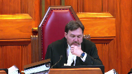
:::

In the case of Attorney General of British Columbia against Attorney General of Canada, for the appellant Attorney General of British Columbia, Sir Joseph J. Harvey QC, Catherine Boyce Parker QC, and Derek Ball.

Pour l'intervenant, l'intervenant Procureur général du Québec, Maître Frédéric Perrault et Maître Jean-François Beaupré.

For the intervener EcoJustice Canada Society, Harry Ruck QC, Keegan Peppersmith.

For the intervener Assembly of First Nations, Julie McGregor and Stuart Wadki.

For the intervener Eltsuk Tribal Council, Lisa C. Fong QC.

For the intervener Council of the Aida Nation, JID 78HL, Gutsley LTL, and Williams Davidson, I'm sorry.

David Patterson, Elizabeth Bullbrook.

For the intervener Little Shuswap Lake Indian Band, Arthur M. Grant, Roderick B. McLennan.

For the intervener the City of Burnaby, Nichelle L. Bradley.

For the intervener City of Vancouver, Susan Horne and Kevin Nakanishi.

For the respondent Attorney General of Canada, Jan Brongers and BJ Ray.

For the intervener Attorney General of Ontario, Josh Hunter and Odd Ranalli.

For the intervener Attorney General of Saskatchewan, Thomas Thompson Irving and Noah Vernikowski.

For the intervener Attorney General of Alberta, Peter A. Gall QC.

And Margaret Unsworth QC, and Andrea L. Zwack.

For the intervener Canadian Energy Pipeline Association, Michael A. Marion, Alan L. Ross, and Brett R. Carlson.

For the intervener Trans Mountain Pipeline, ULC, Maureen Kilran QC, and Olivia Dixon.

For the intervener Enbridge Inc., Maureen Kilran QC, Sean Sutherland, and Robert Rooney QC.

For the intervener Railway Association of Canada, Nicholas R. Hughes, and Kevin Anofsky.

For the intervener Explorers and Producers Association of Canada, Paul Chiswell, Robert Martz, and Brendan Downey.

For the intervener Canadian Fuels Association, Geoffrey G. Copper QC, and Daniel Baima.

For the intervener Suncor Energy Inc., Imperial Oil Ltd., Oski Oil Operations Ltd., Synovus Energy Inc., and Canadian Natural Resources Ltd., Catherine Began Flood, and Laura Condery.

For the intervener Beecher Bay First Nation, Songhees Nation, and Tsuki Nation, Robert James Hussey, and Aria Laskin.

For the intervener Brad Armstrong QC, I'm sorry, for the intervener Canadian Association of Petroleum Producers, Brad Armstrong QC, Kate Bae Bergener, and Tobi Krueger.

We'll take a break and come back.

**Overlapping speakers** (00:04:51): Thank you very much.

**Justice Wagner** (00:04:53): Mr. Arbery.

**Speaker 1** (00:05:06): Chief Justice, my screen's not working.

**Justice Wagner** (00:05:13): Is it working now?

**Speaker 1** (00:05:15): There's apparently only five of you here, and I only have 16 minutes.

**Justice Brown** (00:05:21): So four of us can go.

**Justice Wagner** (00:05:30): Could somebody check that out, please?

It's done?

Doesn't work?

Obviously, it doesn't work. So.

**Overlapping speakers** (00:05:43): Um, I guess...

**Justice Wagner** (00:05:44): I guess I'll have to keep my own time.

I'll let you know.

Just give me a sec. Sure.

**Speaker 1** (00:06:23): So, yeah.

**Overlapping speakers** (00:06:23): I don't see anything.

**Speaker 1** (00:06:24): to know how to do that.

I'll use you old-fashioned way.

So I have that we'll put the clock back to 60.

I have 20 to 10 now.

Is that the time you have?

**Justice Wagner** (00:06:38): You

**Overlapping speakers** (00:06:38): you'll have enough time.

**Justice Wagner** (00:06:39): Have a great day.

**Justice Kasirer** (00:06:40): Oh, thank you.

**Speaker 1** (00:06:45): A bit of housekeeping first.

You will need my factum, including the reply factum.

You will need my condensed book.

You'll need the reasons of the court of appeal, which is in the appellant's record.

**Speaker 1** (00:06:59): and you may need the factum of the Attorney General of Canada.

::: {.column-margin}
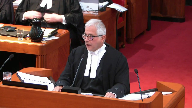
:::

The proposed amendment are found at the back of our factum.

Chief Justice, justices, there are three questions before the court and before I get into the details of each of those questions, I propose to provide by way of an overview or introduction a snapshot of what I say is the reason that each question should be answered in the province's favour.

With the court's permission that will take me ten minutes and then I'm all yours.

The first question asks if the proposed amendment to the EMA is in other words within the competence of the provincial legislature.

We say that it is a law of general application that seeks to protect private property and the lands, waters and wildlife owned by the province from the harm caused by hazardous substances and in particular heavy oil or bitumen.

As such it is clearly a law within the province's exclusive authority.

The fact that at the moment in this province bitumen will be found only in the possession of interprovincial pipelines or railways means only that the law of general application has a disproportionate impact on those undertakings or perhaps an incidental effect on those undertakings or at most that the subject matter of the provincial law has both a provincial and a federal aspect.

We say the correctness of this position can be proven by asking whether this particular law, these proposed amendments, could have been enacted by the province of Alberta where bitumen is found in refineries and in interprovincial pipelines not subject to federal regulation.

And we say that of course Alberta could enact this very law.

The only reason you would hold that British Columbia could not enact this is if you were to hold that the proposed amendment is colourable legislation designed to stop the tmx pipeline or delay or frustrate its operation.

A proposition and indeed a finding a fact that the court of appeal did not accept.

**Justice Rowe** (00:09:52): This is legislation by which B.C. can prohibit the transmission of deleterious substances by means of a federal undertaking, a pipeline or rail.

::: {.column-margin}
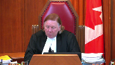
:::

Today it's heavy oil, tomorrow it could be anything.

**Speaker 1** (00:10:15): Right.

**Overlapping speakers** (00:10:17): Eh- eh-

**Speaker 1** (00:10:18): Today it's heavy oil and tomorrow it could be anything and the anything could be a substance that would be carried, that would be found only in British Columbia, may be carried only by an inter-provincial undertaking.

::: {.column-margin}
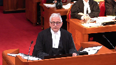
:::

That goes to the point that it's a law of general application.

**Justice Rowe** (00:10:41): It may be that your proposition is a law of general application, but it is a law whose purpose is to regulate what is transmitted through federal works of an intra-provincial nature.

**Speaker 1** (00:10:58): That is the effect of the law in these circumstances.

::: {.column-margin}
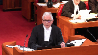
:::

The purpose of the law is to protect the provincial environment by way of conditions designed to prevent the spills, to remediate the spills, to compensate for the spills.

That's the purpose and effect of the law.

**Overlapping speakers** (00:11:21): the law nothing gets into the pipeline without a permit

**Speaker 1** (00:11:24): Correct.

::: {.column-margin}
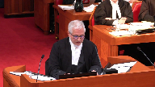
:::

I'm going to come back to that.

To say that the Alberta law would be inter-various of course doesn't mean that it would be applicable to inter-provincial undertakings or operative but that is what the second and third question addresses.

When the court of appeal said at paragraph 101 of the reasons, quote, unless the pipeline is contained entirely within the province, federal jurisdiction is the only way in which it may be regulated, end of quote.

That statement is to revive the enclave doctrine, the discredited enclave theory and puts into question not just the proposed amendment but other provincial environmental laws such as the environmental management act and the environmental assessment act that both Canada and Alberta concede are inter-various and applicable to inter-provincial undertakings.

We say that much of the court of appeals reasons or analysis invoke concepts that were more properly to be considered under the second or third question.

Concepts such as what makes something specifically a federal jurisdiction, concepts such as significantly affecting the management and operation of the undertaking and concepts such as usurping the role of the NEB.

The second question asks whether the proposed amendment is applicable to the inter-provincial undertaking.

Assuming this court continues to accept that the IJI doctrine has application in Canadian constitutional law, it should be given a very narrow scope and held not to apply in this case.

Not only has this doctrine never been applied to render in applicable provincial environmental legislation that applies to inter-provincial undertakings, this court in Canadian western bank said the very opposite.

And it did so by referring to such cases as the Notre Dame, the TNT case and the Canadian pacific case.

There is no doubt that parliament too has the power to enact laws dealing with the environmental aspects of the construction or operation of an inter-provincial undertaking.

But we say such laws are not at the core of parliament's jurisdiction in relation to those undertakings.

And it's not even enough to say that they may be integral to parliament's power as this court recently said.

**Justice Rowe** (00:14:38): If you have a pipeline and you can't put anything through it, it's totally useless.

That frustrates the federal permitting process, does it not?

**Speaker 1** (00:14:50): That is to assume that the application of the proposed amendment allows a hard no to the carriage of the bitumen in the pipelines.

::: {.column-margin}
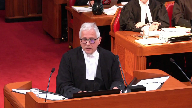
:::

As we will argue, under the inter-jurisdictional immunity doctrine, that the proposed amendments allow the director to say yes, but with conditions.

Now, an important point, and I suppose it's the one that bothered the court the most, was what would happen if the inter-provincial undertaking refused to comply with a condition?

And yes, the legislation has enforcement provisions.

The legislation would allow the regulatory authority to impose a fine, and if need be, to restrain the operation.

But that's the nature of any permitting system.

The Environmental Management Act is a permitting system that has enforcement provisions that if you don't comply with, the undertaking could be shut down.

It's important not to allow the enforcement provisions to determine the constitutionality of the legislation.

What's important is whether the conditions that could be imposed by the director are conditions imposed in good faith, consistent with the purpose of the legislation, which is to protect the environment.

I say don't let the tail, if you will, of the enforcement provisions wag the dog of the substantive provisions.

That would be a mistake.

The intention is that the director will work with the undertakings to impose conditions that complement or supplement other, either federal or provincial laws, in order to protect the environment.

And there should be nothing wrong with the application of the law in those cases.

**Justice Abella** (00:17:04): Mr. Hervey, there was, as I understand it, a National Energy Board proceeding and a number of conditions were eventually imposed.

::: {.column-margin}
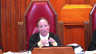
:::

What is the relationship between the conditions that were imposed by the board and the terms of this legislation that the province has implemented?

**Speaker 1** (00:17:25): The national energy board, in fact, the decisions that they made are quite consistent with my position.

::: {.column-margin}

:::

The national energy board did not say that either provincial or municipal laws do not apply to the undertaking.

Quite the contrary.

The national energy board recognized that Burnaby bylaws would apply to the undertaking.

The only reason why the national energy board held in that particular case that the Burnaby bylaw would not apply is because Burnaby had exercised their powers in an unreasonable way and essentially delayed exercising its power.

And in that concept, in that situation, the exercise of that bylaw did impact, impair the core of parliament's power.

**Justice Abella** (00:18:24): So going back to the pith and substance analysis, assuming I know you're an IJI but let's keep it to pith and substance, what has to be shown to determine the constitutionality of this provincial legislation where you have conditions imposed by the national energy board and agreed to by the province if these provisions have the potential to interfere with what has been agreed to or enabled by the board?

::: {.column-margin}
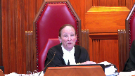
:::

In other words, what role is there for effect of legislation?

You're concentrating I think on the intention and the intention is to protect the environment but what if the effect is to interfere with inter-provincial undertaking?

**Overlapping speakers** (00:19:15): I say that that really doesn't have any role to play in the first question.

**Justice Abella** (00:19:19): in the pith and substance.

So our jurisprudence doesn't put any emphasis at all on impact in pith and substance.

**Speaker 1** (00:19:27): The closest analogy or the closest case that seems to address that might be Rogers Communication.

::: {.column-margin}
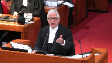
:::

You remember Rogers Communication, the municipality, through apparently a law of general application, issued a ruling that a certain area in the municipality should be reserved for no construction.

But the only purpose of that particular resolution or bylaw, I can't remember what it was, was to prevent Rogers Communication from putting a cell tower in that location.

The municipality had argued that the purpose of that resolution was to protect the health of the safety or whatever of the resident from cell tower forces or what have you.

This court rejected, if you will, that ultimate purpose or perhaps more accurately the motive of the municipality and concluded that the only, the dominant aspect of that law was to deny, it was to determine the location of a cell tower.

The location of a cell tower in radio communications has always been considered exclusively federal.

The court said there was no equivalent provincial aspect in that case.

They didn't accept the sort of ultimate purpose or motive.

They looked to see that in that particular case, the purpose and effect was to prohibit the location of the cell tower.

The reason I raise that, I would say by hypothetically if the province of British Columbia had decided to pass a law to prohibit completely the operation of the TMX pipeline in British Columbia, even if the motive or the ultimate purpose was to protect the environment, you would have no trouble striking down that law because in that particular case, the dominant purpose would clearly be

**Justice Rowe** (00:21:51): Is not that what the government has set out to do?

Is that not what it has said repeatedly?

The whole purpose of this is, is that not enshrined in a written agreement by which the government holds office, and if they fail to adhere to it, they will lose office.

**Speaker 1** (00:22:08): With respect, justice wrote no.

::: {.column-margin}
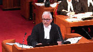
:::

Originally for sure when this government was in opposition it said it would use every tool in the toolbox to stop the pipeline.

When there was the election it entered into an agreement with the Green Party to stop the pipeline.

But when it got into power it received legal advice that it could not stop the pipeline.

And so instead of doing what it might have wanted to do, it took legal advice and drafted these proposed amendments which are designed to exercise provincial jurisdiction over the environment in an appropriate way.

Its purpose though, its purpose has always been to protect the environment.

There's nothing colourable about this legislation.

**Justice Côté** (00:23:12): Mr. Harvey, you are saying that you already had a legislation in B.C. to protect the environment because this proposed legislation, it's just amendments to the existing legislation.

::: {.column-margin}
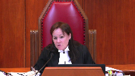
:::

Should we take into account the timing of that after they received the legal advice?

Then they came with those proposed amendments, which are defining – which are targeting EV oil.

**Overlapping speakers** (00:23:38): which are about, sorry.

**Justice Côté** (00:23:39): which are targeting the EV oil transportation.

So the timing, don't you think that it is important in this case?

**Speaker 1** (00:23:48): No, I don't think the timing is important in this case.

::: {.column-margin}
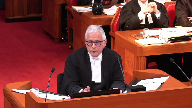
:::

What's important is whether the legislature has used means within its authority to accomplish the goal not of stopping the pipeline but of protecting the environment.

There's the court of appeal properly found that the legislation wasn't colourable and they found it based on all the evidence that was before it.

Alberta has suggested that the purpose of the proposed amendment is to stop the pipeline, to frustrate, to delay.

But there's no evidence to support that.

The pipeline is subjected to 1200 permits throughout its course.

262 have already been issued.

There's never been a suggestion that any of those permits have been exercised in a way to delay or frustrate the pipeline.

**Justice Kasirer** (00:24:47): If you wanted to protect the environment, which you announce in the purpose, why is there an exemption for heavy oil on ships at 22.3?

::: {.column-margin}

:::

And why is it if you read carefully the schedule, there seems to be an exemption in the schedule?

It's not everyone who's covered.

If your concern is for the environment, why exemptions?

Why not just protect everyone from heavy oil, including the marine environment that you announce that you're going to protect and then you back away from?

**Speaker 1** (00:25:18): Right.

::: {.column-margin}
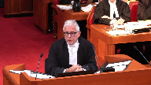
:::

And the Attorney General and the premier both addressed those questions in the press conference that was announced when they were announcing the reference.

And excerpts of that press conference are in the condensed book at tab 7.

I won't ask you to go to it.

I'll just tell you.

With respect to ships, the Attorney General questioned whether the province had constitutional authority to impose this kind of law on ships, rightly or wrongly.

Perhaps wrongly.

But that was one reason.

The other reason is that the provincial government has had no practical experience dealing with ships.

And the concern was that ships were coming and going out of the harbour.

So it was just a policy decision not to apply the proposed amendment to ships.

With respect to the...

**Justice Brown** (00:26:27): experience did it have with respect to railroads?

Heavy oil?

And there might be a reason why it doesn't have much experience, it's because it's not a business.

It has experience.

**Speaker 1** (00:26:38): with both railroads and pipelines with respect to other legislation like the Environmental Management Act legislation dealing with the discharge of waste.

**Overlapping speakers** (00:26:49): of the discharge but not what goes into it, not with respect to its operation.

**Speaker 1** (00:26:52): And I'll just address that point now.

**Justice Kasirer** (00:27:00): You cited the fact that the exemptions allow for pollution that you were saying from the front end is the purpose of the act is to stop it.

::: {.column-margin}
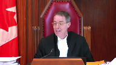
:::

For example, the exemption for existing volumes of heavy oil applies notwithstanding the risk that there are accidental discharge into the environment is exactly the same problem and yet you've given an exemption for it.

And you've given an exemption for ships.

And it looks like you're targeting the pipeline and that this focuses the target.

That's a question, that's not an assertion, but it's, that's, I don't know what they said in the press conference, but what does the act say?

**Speaker 1** (00:27:44): I was about to answer that question until I got that question so I'm going to come back to this question now

::: {.column-margin}
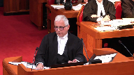
:::

and then I'll go back to that question.

Remind me.

I might forget.

Just because here.

Again, the premier indicated that the reason why the proposed amendment only applies to incremental amounts above that which was being brought into the province in the past was a policy decision.

It was a policy decision for a couple of different reasons and one was that it's very common to grandfather existing practices and not apply retrospective or retrospective legislation to it.

Perhaps more fundamentally the concern was that there were going to be a massive increase in the amount of bitumen that was coming into the province.

A threefold increase of bitumen that was coming into the province.

The oil sands had I think doubled their production of bitumen in the last couple of years.

The concern was with this massive increase in bitumen that increased the risk and increased the severity of the consequences.

It wasn't obviously the province could have passed a law that said that you need a permit if any bitumen is found in the province.

And yes, that may have been a more effective way of protecting the environment.

But the fact that the legislature has chosen not to exercise the full extent of its powers, that just goes to the efficacy of the legislation, not to the constitutionality of it.

It's a policy decision, not one that has any constitutional relevance.

**Justice Brown** (00:29:59): So it seems to me that the Attorney General's concern that the province might not have constitutional authority to legislate in respect of shipping, which seems well founded just from a quick review of Section 91, suggests that protection of the environment really doesn't tell us much about pith and substance.

::: {.column-margin}
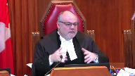
:::

We've said before that broad and vague and sort of general descriptions of pith and substance aren't really helpful.

It needs to be more precise.

And we've also said that the environment itself consists of all sorts of dimensions, some of which fall within federal, some of which fall within provincial.

So I'm wondering if you can try to offer a more precise understanding of the pith and substance than simply protection of the environment, because of course Canada has a legitimate interest in the protection of British Columbia's environment as well.

**Speaker 1** (00:31:06): You're ‑‑ it would be wrong for me to simply say because it's for the protection of the environment it's in pith and substance within provincial jurisdiction.

::: {.column-margin}
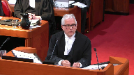
:::

And to the extent I'm saying that I'm using shorthand.

To be more precise, the provincial law is designed to protect the property of British Columbia.

The public property, the public lands, the public waters, the public wildlife, that's owned by British Columbia.

That's their property.

It's designed to protect the private property of people in British Columbia, designed to protect the property of the First Nations in British Columbia.

That's the perspective, that's the provincial aspect of this law, not the environment at large.

Likewise, it's designed to protect the private property of British Columbia, which is owned

**Justice Brown** (00:31:56): nations, under what provincial head of power does that fall?

**Speaker 1** (00:32:04): Well, that raises an interesting question about 9124 and Section 35.

I'm not sure I can sort of help you with that right now.

**Overlapping speakers** (00:32:16): Don't I need help on that if I'm going to be persuaded that you're right?

**Speaker 1** (00:32:19): I don't think you do because there's a lot of land in British Columbia that's clearly within provincial jurisdiction and protect.

::: {.column-margin}

:::

The public lands and the private lands.

I would have thought as well the First Nations lands particularly if it's not just on reserves, but I'm not 100% sure about that.

The other question you asked me that I didn't answer was that you wanted to draw a distinct or you asked whether a distinction might be drawn between a provincial law that's designed to require permits for the discharge of waste, the intentional discharge of waste or the unauthorized discharge of waste into the environment from a law like this which involves the accidental discharge of a pollutant.

No, but the ENA deals with it.

**Justice Rowe** (00:33:16): Well, accidental discharges are covered by the EMA.

If I've got a tank on the hill full of sulfuric acid and it breaks open accidentally, I'm sure the EMA is going to come after me. Right.

So when I open the tap and say, ha ha, watch this run down the hill.

**Speaker 1** (00:33:32): Right.

::: {.column-margin}
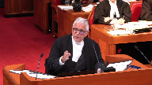
:::

And I say there's no distinction between a provincial law that's designed to regulate the intentional discharge of waste and one from a constitutional point of view, there's no distinction between that and a provincial law designed to prevent or remediate or compensate for the accidental discharge of the thing in the pipe, which when it comes out of the pipe, it's no longer a product designed for a consumer, it's a pollutant.

**Justice Brown** (00:34:12): Do you accept that a law designed to prevent the discharge effectively allows the province to regulate the design and operation of the inter-provincial undertaking?

**Speaker 1** (00:34:25): I think there are clearly limits on the ability of the province even in the attempt to protect the environment to impose any conditions that would go to the construction of the pipeline or would go to the structure of the pipeline.

::: {.column-margin}
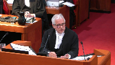
:::

**Justice Brown** (00:34:55): So what would, within those limits, what could the province do under its power to require the implementation and maintenance of appropriate measures to protect a release?

**Speaker 1** (00:35:12): As we say in the factum, there may be more restraints on the director insofar as he might seek conditions that go to prevent a spill.

::: {.column-margin}
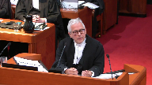
:::

But we say that doesn't mean that the law is unconstitutional.

It just means that in the exercise of his discretion, there may be limits on the conditions.

And that goes to the certain conditions may be inapplicable under the interjurisdictional immunity doctrine or inoperative under the paramilitary doctrine.

But we also say that if you disagree with us, sorry, before I get to that, we can imagine that there will be conditions that are designed to prevent a spill that are within provincial jurisdiction and don't go to altering or requiring any alteration of the structure of the pipeline.

And here's an example.

One of the most common reasons that there are spills of oil from pipelines is third-party accidents.

Someone digging up something, you know, using a machine or whatnot that somehow interferes with the pipeline.

And that's one cause.

And another so let me just stick with that one for a moment.

Laws that might be designed, conditions that might be designed to make sure that the public is made more aware of conduct that might interfere or cause harm to the pipeline, that might be a condition that the director could impose.

And here's another one.

Certainly notwithstanding all the sophisticated equipment that pipelines have about leak detection and computers to determine whether there's a leak, the most frequent, according to the agreed statement of facts, if it's not the most frequent, certainly a common way in which people find out that the pipeline is leaking is because of the smell, the odor.

And it's the public who identifies that before the pipelines.

It may well be that a director could ensure that pipelines have systems in place to communicate with the public so that when the public detects an odor of something coming out of a pipeline, they move quickly.

Because in the past the fact is that the operators moved too slowly long after the public had actually detected the smell.

So there may be conditions that go to prevent a spill that fall short of doing anything to interfere with the operation or structure of the pipeline.

But I have one last point.

**Overlapping speakers** (00:38:39): It's like, oh.

**Speaker 1** (00:38:39): operations.

::: {.column-margin}
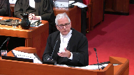
:::

May I get some more water, please?

We say in our factum, if you had trouble with the prevention aspect of the proposed amendment, then that could easily be severed from the proposed amendment.

Because we can't see any possible reason why the proposed amendment provision that deal with remediation and compensation and liability are outside provincial legislation.

The court of appeal said no, it's all one whole and you can't sever one provision from the other.

And they relied on the Bell trilogy for that point.

But in my respectful submission, they erred in their application or understanding of Bell.

In Bell, the court said working conditions are a whole.

You can't sort of divide up working conditions.

But of course in Bell, the court understood that workers' compensation provisions are indeed different than workers' safety provisions and labour provisions.

So likewise here, the prevention provisions could be severed from the remediation and compensation provisions.

This is a reference.

The government is seeking the opinion and advice of this court as to what might be the limits of provincial jurisdiction.

This is not an enacted law.

If this court had concerns with the prevention provisions, you could tell the government that that part of the law may not be appropriate but there's nothing wrong with the other parts of the law.

**Justice Karakatsanis** (00:40:29): I guess I'd like to come back to pith and substance and in particular how the purpose, the stated purpose and the effects work together.

::: {.column-margin}

:::

You have given us a broadly stated it's there to protect the property, the environment because of the property within British Columbia, broadly stated.

What's put against you are a number of things.

One you already have environmental legislation, a broad general application and there's a whole process there.

Two, you've made exemptions for ships, you've made exemptions for the existing heavy oil that opposes the same risk.

**Overlapping speakers** (00:41:11): Right.

**Justice Karakatsanis** (00:41:11): And three, or I guess maybe three, is that the effect of that is to target only this federal undertaking, which presumably is analogous to targeting ships.

::: {.column-margin}

:::

So my question to you is, why do you say you don't really look at what the purpose is, that the effect here you have to ignore the fact that there's just this undertaking and that there may be many more?

Don't we have to look at what is the purpose and what is the effect of this legislation when it is passed?

**Speaker 1** (00:41:43): Well, you have to look at everything. For sure.

::: {.column-margin}
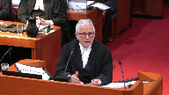
:::

There's no question about the purpose.

The purpose is by on the basis of the legislation itself and consistent with the extrinsic evidence and so far, there's not answers because we don't have a law yet, but what there is, is that is to protect the environment.

It's always been the only concern the premier and the attorney general and the members of the government have had before or after has been the harm of bitumen, not about pipelines.

They're not anti pipelines, they're not anti Alberta, they're not anti oil sands, they're not anti oil sands.

**Justice Karakatsanis** (00:42:27): But I guess, don't we have to ask specifically, what's the purpose of this legislation?

::: {.column-margin}

:::

Yes, the motive, if you to use your language, is to protect the environment, but how?

By targeting, by requiring that no heavy oil be put through the new pipeline, unless.

And then there's this broad, are we entitled to look at the design of the legislation, which has broad discretion, very little in the way of legislative guidance that essentially does set up a situation where you just, it prohibits, it just prohibits the project until and unless something, which we have very little guidance about, happens. Again.

Those, don't you have to look at all of those things.

**Speaker 1** (00:43:14): Yes, you look at everything.

::: {.column-margin}

:::

I started out saying look at the purpose.

I would go next to say look at the legal effects.

Well, the legal effects if this law is applied in good faith as the Court of Appeals said it would be by the director and by the environmental appeal board is to impose conditions designed to protect the environment.

That's the legal effect.

Now, what I think Justice Karygiannis you're talking about is words that might be the practical effect, it might be the impact, it might be the affect, but if you start off with this is a law of general application which it clearly is on its face, then why wouldn't you leave the questions about its impact to the interjurisdiction immunity doctrine or the Paramhansi Doctrine.

**Overlapping speakers** (00:44:10): It, it, it.

**Speaker 1** (00:44:10): As I said, I don't think there's any answer to the, to my point, which is if this law could be passed by Alberta and it's intraveres, how could it be ultraveres in British Columbia?

::: {.column-margin}

:::

Not withstanding today, there's no bitumen, there's being found in British Columbia, but tomorrow there could be a finding in northeast British Columbia near the Alberta oil sands and there's bitumen in British Columbia and there's a refinery in British Columbia and then what, the law that goes from being ultraveres to intraveres.

**Justice Rowe** (00:44:44): But isn't the difference that one is intra-provincial and one is inter-provincial?

**Speaker 1** (00:44:56): I don't understand the question.

**Justice Rowe** (00:44:57): No, I mean, if this was B.C. saying the pipeline, which begins and ends in British Columbia, is to be regulated by the British Columbia government, I don't think anybody would be here.

::: {.column-margin}
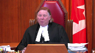
:::

It's the fact that it's inter-provincial, and therefore, within federal competence, that has caused, shall we say, the problem from the B.C. point of view.

So when you say, well, what's the difference if Alberta regulated the transmission through a pipeline within Alberta, if the beginning and the end of the pipeline is within the province of Alberta, well, the beginning and the end of the pipeline is within the province of British Columbia, it's intra-provincial, and therefore, it seems to me, within the competence of the legislature of each of those provinces.

It's when it becomes inter-provincial that federal jurisdiction is engaged.

Isn't that the critical difference?

**Speaker 1** (00:45:57): but there's no mention in the proposed amendments of pipelines or anything.

::: {.column-margin}
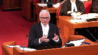
:::

The legislation is designed to prohibit the possession, control or custody of something found in British Columbia.

We don't care how it got there.

The law isn't, let me put it this way.

**Justice Wagner** (00:46:29): Well, there is an exception for both, when it's a tanker, when it's a boat and a ship.

And there's a reason for that.

It's because it's covered by navigation and shipping under 9110 of the Constitution, which is a federal jurisdiction.

**Overlapping speakers** (00:46:44): As I said-

**Justice Wagner** (00:46:44): The argument is the same for the inter-provincial work, it's a federal jurisdiction.

**Speaker 1** (00:46:49): Well, as I said, I know the Attorney General suggested that the province's jurisdiction over ships may be different constitutionally than over interprovincial undertakings.

::: {.column-margin}
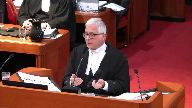
:::

But there's no question that the provincial legislature can apply environmental laws to interprovincial undertakings.

We know that from the case and the TNT case and the CP case, those are laws that were designed to prohibit interprovincial undertakings from carrying, you know, toxic substances.

And so there's nothing about it being an interprovincial undertaking that makes it immune from provincial environmental laws.

And this is a provincial environmental law.

It's a law general application.

And yes, today in these circumstances, the concern was the bitumen that was coming in from the pipelines.

But it's not because it's coming in from the pipelines that the province is concerned.

They don't care how it gets here.

It happens to be coming from the pipeline.

It doesn't make it a law regulating the pipeline.

You know, the court of appeal talked about this law affecting the pipeline in what was the term it used in its ‑‑ that it was regulating something specifically of federal jurisdiction.

Well, there's nothing about bitumen that is specifically of federal jurisdiction.

Bitumen can be found in a local pipeline.

There's nothing about the substance that makes it specifically of federal jurisdiction.

**Speaker 2** (00:48:56): Can I ask you... Well...

**Justice Abella** (00:48:57): While you're on that, what is the difference between what is set out in this legislation and what is set out in the existing legislation, the environmental, I want to make sure I got the name in management act and I'm looking at section 7 to 18.

::: {.column-margin}
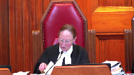
:::

In other words, what is there where there is the permit requirement preventing hazardous waste, all of the things that are now in this, what is the difference between what is mandated there for the protection of the environment and what is in part 2.1.

**Speaker 1** (00:49:37): Well, the main difference is in the Environmental Management Act, it's about waste management.

**Justice Abella** (00:49:43): But it also, section 7 talks about hazardous waste.

I'm sorry?

Section 7 talks about hazardous waste.

**Overlapping speakers** (00:49:52): What are you reading from?

**Justice Abella** (00:49:53): the legislation to which this is an amendment.

Unless I have it wrong.

I'm looking at tab 8 of your condensed book.

The Environmental Management Act.

**Overlapping speakers** (00:50:07): Yes.

**Justice Abella** (00:50:07): So I'm trying to determine what the difference in authorities and the authority given.

**Speaker 1** (00:50:22): Well, the environmental management act generally, as I said, these provisions are dealing with needing permits for waste disposal.

::: {.column-margin}
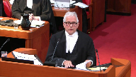
:::

There are other amendments to the environmental management act, division 2.1, which deals with accidental spills and whatnot.

So I'm not sure what you're referring to.

**Justice Abella** (00:50:45): We're trying to determine what is different in this amendment from what is already legislatively mandated in the existing legislation.

**Speaker 1** (00:50:57): Again, I think the answer is twofold.

::: {.column-margin}
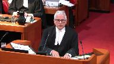
:::

The environmental management act does deal with requiring permission to dispose of waste.

That's one of the main purposes of it.

There's other provisions in the environmental management act called division 2.1 which deals with spill response and remediation.

That's a law that is sort of more general by way of regulation.

**Overlapping speakers** (00:51:34): And would you say it doesn't cover pipelines?

**Speaker 1** (00:51:37): It does cover pipelines, but what this legislation is designed to do is to be much more specific.

**Overlapping speakers** (00:51:44): pipelines.

**Speaker 1** (00:51:45): Well, about bitumen.

::: {.column-margin}
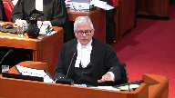
:::

It's much more specific about how to deal with bitumen.

Right now, yes, it's pipelines.

It's not directed only at pipelines.

It's designed the whole idea of this legislation is designed to sort of fine tune and sort of tailor the conditions necessary to protect the environment to this pipeline.

Well, no, not just a pipeline, but now, yes, to the pipelines.

If you go through the agreed statement of facts, the issue of bitumen in itself, the scientific sort of issues around bitumen, it's all very uncertain.

This is legislation designed to deal with new and continuing issues.

You know, a spill might happen.

Under the present law, the pipeline operators are required to provide a lessons learned report.

After that lessons learned report happens, you'll find out where the deficiencies were.

The director can tailor make conditions that will address the possibility of a next spill.

It's designed to just be a more specific way of protecting the environment.

And it may be justice, it may be justice, abella, that some of these conditions may never have to be imposed.

The director may say, you know, I've looked at the conditions that the neb is imposed.

Some of them are contingent, some of them are affirmed, some of them, you know, tmx hasn't really kind of completed or maybe they have.

It may be that there are conditions that won't be necessary.

It may be that some conditions could be duplicative.

It could be redundant.

That doesn't make any of it unconstitutional.

**Justice Abella** (00:53:54): But the question is, as has been put to you, really not overly contentious.

::: {.column-margin}
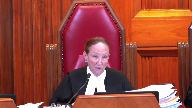
:::

There's no doubt that this is an interprovincial undertaking.

There's no doubt that the province can enact legislation to protect the environment or that it isn't a very important requirement to protect the environment.

The question is whether this legislation can protect the environment in a way that has the effect of interfering with an interprovincial undertaking, potentially through the issuance of, through the discretion of the person looking at the operation of the pipeline.

So I think that's really what we have to deal with.

Not is it important to protect the environment.

Of course.

Can it be done this way in a way that interferes with what is unquestionably a federal undertaking?

**Justice Kasirer** (00:54:49): Can I ask, can I ask the same question with a different, just, you take, you said tailoring, and picking up on Justice Abella's point, Justice Newbery doesn't think this is a provincial law of general application.

::: {.column-margin}

:::

She says so explicitly, and when she, she doesn't use the word tailoring, she uses the word targeting.

But it is targeted, it is not a legislation of general application, I'm at 103, but it is, but it is targeted at one substance in one interprovincial pipeline.

So my question is, perhaps you're going to get to it, there's a whole bunch of people on this side of the room who are going to probably say something like this.

Could you do that?

Could you target an interprovincial pipeline that proposes the carriage of heavy rail?

Could the province do that?

Well, I don't think so.

I don't think so.

I don't think

**Speaker 1** (00:55:45): Well, Professor Hogg says that there is nothing per se wrong about a provincial law that singles out a matter within federal jurisdiction.

::: {.column-margin}
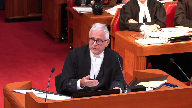
:::

And so I would go as far as saying that if the provincial legislature enacted this law only for interprovincial pipelines, I would have to say that that would be a problem.

Because you would ask the question why would you pass this law for only interprovincial pipelines if intra-provincial pipelines carry the same product and create the same risk.

That kind of law would raise the question of not singling out but discriminating against an interprovincial pipeline.

So that's why it's important to say that this law doesn't do that.

It's a law of general application.

It happens in the circumstance to have a disproportionate and perhaps sole effect on an interprovincial pipeline.

But this court said in Kit Kat law that just because a law only operates or only has an impact on one matter within federal jurisdiction and there would have been Indians or lands reserved for the Indians doesn't make the law unconstitutional.

So it's possible based on what professor hogg says that a law which singles out just an interprovincial pipeline could be as long as the purpose and effect of the law was to protect the environment and not just to stop this particular pipeline.

But I would say that a court would probably have difficulty with that law because they would ask the question why did you because it sounds like it's now discriminating.

The province shouldn't be allowed to discriminate against interprovincial pipelines but it should be allowed to pass laws that have a sole impact on the interprovincial pipeline not because it's an interprovincial pipeline but because of the product that it's carrying and there doesn't happen to be another intra-provincial pipeline carrying that product.

**Justice Rowe** (00:58:17): I understand that's Professor Hogg's position, but wasn't that the position of Mr. Justice Betts and his colleagues in the Bell 1988 cases?

I think they hit it head on, like two trains on the same track going in opposite directions.

**Speaker 1** (00:58:32): Well, this court in Canadian Western banks has, I think, properly, you see, when you read the Bell trilogy, there's, it appears to be language of ultra vires and eventually Justice Betts gets to the language of inter-jurisdictional immunity.

::: {.column-margin}

:::

And then, of course, his analysis or conception of inter-jurisdictional immunity was changed by Canadian Western Bank.

But if you look at Canadian Western Bank, you refer to Bell now only as an inter-jurisdictional immunity case.

And so, again, I think it's really important that we distinguish these three questions.

And I see I'm starting to run out of time so much for my 10-minute introduction.

**Overlapping speakers** (00:59:19): But this is the hard...

**Justice Abella** (00:59:20): Part of it, Mr. Arbe, you're dealing with the heart of what is a serious concern, and that is the way we look at the effect of this legislation, even accepting the purpose, the effect of this legislation, given our jurisprudence in Western Bank, and Kit Cladda's cooperative federalism and the ancillary doctrine, it's not this case.

::: {.column-margin}
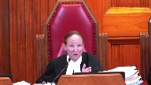
:::

This case is argued as a pith and substance, the Court of Appeal argued it as a pith and substance case, and the impact on valid inter-provincial undertaking, federal undertaking.

That's the heart of it.

**Speaker 1** (00:59:59): Justice Abella, that needs to be addressed under inter-jurisdiction immunity or paramount seat.

**Overlapping speakers** (01:00:05): but it's also addressed in our jurisprudence under pith and substance.

**Speaker 1** (01:00:08): It can be addressed under a pith and substance, but it would be, in my respectful submission, an error, and I say the Court of Appeal erred in saying this law was ultra vires merely because of its effect or impact on the inter-provincial undertaking.

::: {.column-margin}

:::

All that means is that the law has a double aspect.

It means that, yes, the federal parliament also could pass a law on the same subject matter from its perspective of regulating inter-provincial undertakings.

That's what the double aspect doctrine allows.

**Justice Abella** (01:00:47): Double aspect means can they live together.

The argument that you're hearing is can they live together.

**Overlapping speakers** (01:00:54): Yes, yes, they can live together if there's nothing.

**Justice Abella** (01:00:57): effect of blocking a pipeline which is within federal jurisdiction.

Well, that's the argument we have, right?

Well, if you're- It's hard for me to see how this is double-aspect.

**Speaker 1** (01:01:14): The reason why the law has a double aspect, if it has a double aspect, I mean, we could say the law has a single aspect if you just look at the purpose and effect.

::: {.column-margin}

:::

The only reason it has a double aspect is if you look at its impact, and that just simply means that Parliament too could pass a law like this, but not a law of general application, but only a law that deals with the discharge of or the carrying of bitumen in interprovincial pipelines and the environmental impact.

That's why it has a double aspect.

In my representation, it distorts the substance doctrine to take a law which on its face is a law of general application and say because of its impact, it's unconstitutional.

That's where either inter-jurisdiction immunity or paramountcy comes in, and on the face of the legislation, on the face of the legislation and in its impact, it doesn't stop an interprovincial pipeline in its tracks.

You have to look at the conditions.

If the conditions are all about protecting the environment, then that's what determines this pith and substance.

If a condition is exercised in a way which is going to impair the core of the undertaking or Parliament's jurisdiction over it or is inoperative, that's where those two doctrines come in.

**Justice Brown** (01:02:49): We don't look at pith and substance until the statute's in operation and then we see how it's operating and then we decide the pith and substance.

I mean, if that's the case, we shouldn't be answering the first question that the Attorney General of British Columbia asked us to answer.

**Speaker 1** (01:03:03): No, I think you can answer it now based on its understandable and potential effect.

::: {.column-margin}

:::

But that just means it has a separate federal aspect.

I mean, it's not like Rogers communication where there was no provincial aspect, right?

**Justice Martin** (01:03:22): In paragraph 104 you say that we can't take into account the types of conditions that may conceivably be imposed under the new regime, but that can't be the case in a reference when you're assessing piston substance, can it?

::: {.column-margin}
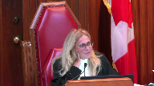
:::

Weren't you just saying that we are allowed to look at the potential scope of the permitting powers to impose conditions and as such that's part of the assessment of what the dominant purpose is or whether or not it impacts or impairs the core?

I mean I don't understand what you're saying on paragraph 104.

**Speaker 1** (01:03:56): I'm not sure I got the question either.

Are you saying that ‑‑ sorry, can I ‑‑ talk about prematurity?

**Justice Martin** (01:04:02): about Coastal First Nations, the Court of Appeal addresses those particular points.

**Overlapping speakers** (01:04:07): Right.

**Justice Martin** (01:04:08): And in your paragraph 104 in the factum before us, you say we can't look at what are conceivable conditions that may arise in the actual permitting process.

::: {.column-margin}

:::

And I guess my question to you is why not?

What else would we be looking at in a pith and substance analysis than the potentiality of the power that's claimed to have some kind of more than an ancillary effect on a federal undertaking?

**Speaker 1** (01:04:43): Well, first of all, I want to make sure that this court understands that it is not our position, which was attributed to us by the Court of Appeal, that it's premature to consider the constitutional validity of the legislation.

That's not my position.

**Overlapping speakers** (01:04:59): I get it.

**Speaker 1** (01:04:59): Definitely these proposed amendments are ripe for consideration with respect to the validity, the applicability and the operability.

::: {.column-margin}
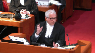
:::

On their face of it, the conditions are valid because if you look at them, they are designed to prevent spills, remediate spills, compensate for spills, those are all matters within provincial jurisdiction.

The legislation on its face is applicable to interprovincial undertakings for the very same reason that the other environmental legislation that this court has referred to in Canadian Western Bank is applicable.

And the NEB accepts that the legislation was applicable.

It may be that a certain condition might go too far, but I say that coastal First Nations was right, it was the course of judicial restraint, it's one consistent with cooperative federalism where you wouldn't assume that the director would be imposing conditions that would impair the operation of the undertaking.

Likewise with respect to the Paramountcy Doctrine, you shouldn't assume that the conditions would be in conflict.

I see my time is almost out

and I want to say something about the Paramountcy Doctrine.

**Overlapping speakers** (01:06:37): I have a layout.

Red light? Uh-oh.

**Justice Wagner** (01:06:40): I will give you five minutes, Mr. Harvey.

Thank you.

**Speaker 1** (01:06:43): The third question, ask if the proposed amendments are an operative by virtue of the paramount of the doctrine.

::: {.column-margin}
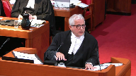
:::

You will hear many submissions from the opposite side as to the comprehensiveness of the federal laws dealing with the approval of a pipeline project and in particular the TMX.

And no doubt much goes into that process and someone might even consider it a comprehensive process.

But we don't say that it is an exhaustive process.

That it's exhaustive of any and all environmental laws that could apply to the project now or into the future.

There's no operational conflict with any federal law.

The common carrier provisions are there but they don't mean that an undertaking can operate without regard to either common law or provincial laws.

One of the things that I think is something I want you to see is in the condensed book is found at tab 18.

This is the explanatory note to the order in council of where the government council authorized the national energy board to issue a certificate of public convenience and at page 191 of the condensed book under the heading environment risk of spills, you will see that the governor council itself said at the bottom of that paragraph that's highlighted, bc also recently implemented regulations under the provincial environmental management act to strengthen provincial oversight and require industry and government to collaborate in response to the spills.

It can't be said that this legislation frustrates the purpose of the federal laws when a, the purpose of the federal laws in so far as they have environmental controls and the purpose of the provincial laws is the same.

It's to protect the environment.

There's nothing about the proposed amendment that frustrates that purpose.

And indeed we have here evidence from the governor and council that provincial legislation dealing with response to spills is it was relied on by the governor and council in deciding whether to issue a certificate.

And if I can just conclude by saying this, some of the interveners have said that they may be frustrated by having to deal with what it considers about another environmental law that creates uncertainty, added costs and perhaps delay.

The Canadian fuels association specifically said it complains that proponents are facing ever increasing challenges in responding to heightened environmental concerns and navigating the process of indigenous consultation and accommodation.

And I say, well, that may be true, but those challenges and those are the challenges that in 2020 need to be faced because their frustration of having to comply with environmental laws pales in significance to the harm and frustration that will be experienced by all those in the province who will have to deal with what can be the devastating spill of heavy oil from the pipeline.

The regulation of these projects necessarily involves federal and provincial cooperation.

And given the effects of the spill on the local environment, there is no reason to exclude the application of provincial laws if they can coexist with federal laws.

This court has said that ample space needs to be made for both levels of government to be able to enact environmental laws from their own perspective.

And this couldn't be any more true today where the environment occupies such an important part of our common existence and future.

I have a lot more to say, chief justice and justice, but I have run out of time.

Thank you very much.

**Justice Wagner** (01:11:23): So Justice Gadala, last question for you.

**Justice Abella** (01:11:25): One question that concerned me in the Alberta factum that I wanted to give you a chance to respond to, and it goes back to whether this is a law of general application.

::: {.column-margin}
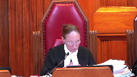
:::

Paragraphs 58 and 81 of Alberta's factum say the only entity to which this permitting regime was anticipated to apply was the project, as it was the only existing enterprise through which significant increases in the volume of heavy oil transported through the province were projected to occur.

And then paragraph 81, BC has filed no evidence that it anticipated either railway operations or trucks to increase their possession of heavy oil, et cetera.

So those are the two paragraphs that they've pointed to that essentially say this is all about the pipeline and nothing else.

This doesn't go to whether or not BC doesn't have the right to protect its environment, et cetera.

It goes to the federalism argument that this has only an effect on a federal undertaking.

**Speaker 1** (01:12:30): Alberta's factum is basically making a colourability argument.

**Overlapping speakers** (01:12:39): That's right.

**Speaker 1** (01:12:39): that the purpose of this law is to frustrate, delay or block this pipeline.

**Justice Abella** (01:12:47): Or effect.

Well, I read effect into it rather than just purpose.

Are they right about that, that the effect of this law is only on this particular federal undertaking?

**Speaker 1** (01:13:01): Well, the effect right now may only be on not just tmx but pipelines and interprovincial pipelines and railways, that's true.

::: {.column-margin}
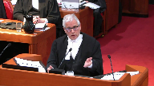
:::

But I read the Alberta factum as saying the purpose, what's really going on here is to frustrate, delay, stop the pipeline.

The court of appeal didn't go that far.

The court of appeal rejected that this legislation was colourable.

And I say this court should do the same.

Thank you very much.

**Justice Wagner** (01:13:28): Thank you very much.

**Justice Wagner** (01:13:32): Thanks for watching!

**Speaker 1** (01:13:37): They do, they claim the purpose is to stop the pipeline.

That's how I read their factum.

**Justice Wagner** (01:13:43): All right, thank you.

The court will take its morning break to allow people to correct the technical issues.

Fifteen minutes.

**Speaker 3** (01:14:22): La Cour, the court!

**Justice Wagner** (01:14:49): Maître Pérou?

**Speaker 4** (01:14:53): Monsieur le juge en chef.

::: {.column-margin}
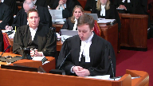
:::

Mesdames et messieurs les juges, la Procureur générale du Québec intervient dans le présent pourvoir afin de soutenir la capacité des provinces canadiennes de protéger les éléments de l'environnement et les populations affectées par les projets de développement sur leur territoire.

Celle-ci est remise en cause depuis quelques années et a encore davantage depuis qu'a été rendue l'opinion de la Cour d'appel dans la présente affaire.

Il a été beaucoup question de la question de validité précédemment, donc je voudrais m'attarder plus précisément aux doctrines de l'exclusivité des compétences et celles de la prépondérance fédérale.

À cet égard, la Procureur générale du Québec estime que l'obligation pour un exploitant d'ouvrage d'entreprise fédérale d'obtenir une autorisation provinciale ne peut constituer en soi et nécessairement une entrave au fin de la doctrine de l'exclusivité des compétences.

Elle soutient également que l'objet d'une loi fédérale ne peut être d'occuper tout le champ ou autrement d'écarter l'application du droit provincial.

Relativement au premier point, compte tenu de la grande variété des régimes provinciaux d'autorisation, la Procureur générale du Québec invite d'abord cette Cour à faire preuve de prudence et de retenue dans son analyse de la doctrine de l'exclusivité des compétences.

**Justice Kasirer** (01:16:04): Vous allez plus loin, Maitéro, dans le mémoire, vous parlez qu'on peut cibler l'entreprise fédéral dans une loi provinciale.

**Speaker 4** (01:16:18): Monsieur le juge Cazirère, sur cette question-là, en fait, c'est plutôt une question ici de validité que d'exclusivité des compétences, mais si vous voulez, encore une fois, je voudrais faire au même commentaire du professeur Hogg que mon collègue.

::: {.column-margin}

:::

À mon sens, ce qui est déterminant aux fins de la doctrine du caractère véritable, c'est bel et bien l'objectif qui est poursuivi plutôt que les moyens ou encore la portée de la loi en question.

C'est certain que ça peut être pertinent.

Il peut y avoir une pertinence, en effet, dans des cas très particuliers, mais de façon très générale, une loi provinciale peut cibler, en effet, un ouvrage ou une entreprise, notamment pour ce qui est des questions de taxation.

Il y a de la jurisprudence, justement, sur cette astuce.

**Justice Kasirer** (01:17:01): cibler de façon à porter atteinte au cœur même de la compétence fédérale?

Est-ce que c'est possible, ce type de ciblage-là, si vous me permettez d'expresser un peu?

**Speaker 4** (01:17:13): Ce que je vous souviens, M. le juge,

::: {.column-margin}
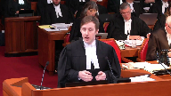
:::

c'est que le fait de cibler en tant que tel ne peut pas causer une entrave.

C'est les obligations concrètes qui vont causer une entrave.

Maintenant, pour ce qui est des obligations concrètes, dans ce cas-ci, on a celles qui sont listées à la proposition.

Puis, à mon sens, les conditions qui sont prévues explicitement, en tout cas celles qui sont les plus explicites, ne causent pas d'entrave.

Éventuellement, il est possible que, dans l'exercice d'un pouvoir discrétionnaire, le décideur provincial pourrait, éventuellement, prendre une condition, prescrire une condition qui, elle, pourrait entraver un élément du cœur d'une compétence fédérale.

Mais je ne crois pas que cette simple possibilité-là pourrait être suffisante, au fin de l'exclusivité des compétences.

Donc, justement, comme je le disais, selon la procureure générale du Québec, le simple fait pour un régime d'autorisation de prévoir un pouvoir discrétionnaire ne serait suffisant.

Pour qu'il soit jugé inapplicable.

Maintenant, je passe tout de suite à la doctrine de l'exclusivité des compétences à celle de la prépondérance.

De l'avis de la procureure générale du Québec, la prétention de certains intervenants que la volonté implicite de conférer à un décideur fédéral le dernier mot à l'égard d'un projet constitue l'objectif des régimes fédéraux en question.

Selon la procureure générale du Québec, l'objectif au fin de la prépondérance fédérale ne peut pas être défini de cette façon.

Il doit être défini selon ce que le Parlement entend accomplir à l'égard de la conduite des justiciables, et non pas d'une façon qui viendrait moduler l'application, l'opération ou encore l'applicabilité du droit provincial.

Donc, cette qualification-là, celle qui est proposée par les intervenants, fait en sorte que l'objectif des lois fédérales en cause excéderait à la compétence du Parlement fédéral, puisqu'elle porterait justement sur l'applicabilité le caractère opérant du droit provincial.

Compte tenu de l'erreur qui est commise dans l'identification de l'objet de la loi fédérale, la procureure générale du Québec estime que la preuve d'un conflit n'a pas été faite dans ce dossier.

Donc, cette conclusion-là, encore une fois, pour ce qui est de la prépondérance fédérale, n'exclut pas éventuellement qu'une condition particulière qui pourrait être imposée par le décideur prescrite viendrait entrer en conflit avec des dispositions concrètes pour un objectif de la législation fédérale.

Mais ce qu'on vous soumet, c'est que ce n'est pas le cas en l'espèce.

Donc, en conclusion, la procureure générale du Québec réitère son invitation à la prudence et à la retenue.

Quant aux questions constitutionnelles que la Cour est appelée à trancher, d'autant plus qu'elle est saisie de deux dossiers dans lesquels la procureure générale du Québec est partie et qui mettent en cause la question, justement, de l'applicabilité et de l'opérabilité des régimes provinciaux d'autorisation. Merci.

**Justice Wagner** (01:20:00): Thank you very much.

**Speaker 2** (01:20:17): Thank you.

**Speaker 5** (01:20:18): Chief Justice, justices, I don't intend to refer to any material.

::: {.column-margin}
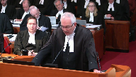
:::

I have my eco justice factum before you but given the time constraints I'm just going to make oral submissions.

I want to begin at the outset by pointing out that we really have two submissions to make.

First, that environmental protection has reached quasi constitutional status and in effect that is the law before this court and I will explain in a moment why that is the case and second that environmental protection is an underlying constitutional principle.

**Justice Rowe** (01:20:55): Where do these underlying constitutional principles come from?

Do we just cook them up?

**Speaker 5** (01:21:00): Though they are actually, that's a good question you posed because, except the cooking up part, it's the environmental protection underpins the whole constitution.

::: {.column-margin}
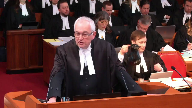
:::

Without a viable environment, we cannot have a constitution, we cannot have a nation based on laws, we cannot have institutions, we cannot have a society in effect, my lord.

**Justice Rowe** (01:21:25): We find the existence of these underlying constitutional principles which are then not amenable to override by the legislatures, and if I understand you correctly, they're mandatory in nature, and if the governments fail to adhere to them sufficiently, we will give them guidance.

::: {.column-margin}
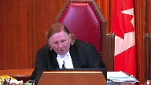
:::

In other words, the courts will govern.

Am I correct in understanding you?

**Speaker 5** (01:21:46): Let me be clear on that.

::: {.column-margin}

:::

What we are saying is we are not asking that the written constitution be dispensed with.

What we are saying is that environmental protection is an underlying constitutional principle that must inform the division of power analysis.

That's what we say.

We're not saying dispense with the written constitution.

Obviously not.

We're not saying dispense with the paramountcy doctrine.

What we are saying is that in the analysis that the court undertakes, it is absolutely critical to interpret environmental protection as having teeth.

The problem in this case, with great respect to the court of appeal below, what the court of appeal did, they gave lip service to the decisions of this court in one sentence.

They said all environmental protection, yes, that's important, but that's not what this appeal is about.

And then they go on for 59 pages after giving lip service to environmental protection, and then they go right into the whole issue.

**Justice Brown** (01:22:44): But this case isn't about whether we protect the environment or not, this case is about what aspects of environmental protection are at stake here and who gets to do the protecting.

**Speaker 5** (01:22:54): Yes, and what we say in response is this, Justice Brown.

We say that in this particular case, there was no real drilling down as to how these particular provisions were going to be implemented, and that they were going to be implemented in a way that was not in accordance with these particular provisions.

**Overlapping speakers** (01:23:09): Drilling down is an unfortunate metaphor, but, okay, I'm sorry, yeah.

**Speaker 5** (01:23:12): That's a very good point.

::: {.column-margin}
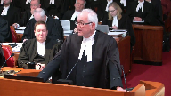
:::

Shouldn't have said that.

But my point is that it's absolutely necessary to spend time considering those particular issues.

And no one did that in the Court of Appeal.

The Court of Appeal never even examined all the multiple safety nets that the province attempted to put in place.

The province wasn't just putting legislation in place to shut down the pipeline.

That wasn't the objective at all.

They wanted to ensure that the environment is protected.

And the reason I'm here is that I say despite all those momentous statements made by this court, going back to old man river where it talked about major challenges of the constitution, it's one of the major challenges of our time, environmental protection.

They talk about the superordinate importance of hydro Quebec.

The court talks about our common future in spray tech.

The court talks about the fundamental value that environmental protection is in the context of the Canadian Pacific versus Ontario case.

But the problem is the court below, as other courts, can sidestep those issues and not look into them in sufficient detail because environmental protection has not been constitutionalized.

And we don't even need to go to the underlying constitutional principles of environmental protection.

**Overlapping speakers** (01:24:26): Is the exemption on shipping in the Act unconstitutional?

No, I'm not saying that at all.

It violates the very principle that you're saying is an unwritten...

**Speaker 5** (01:24:38): No, what I'm saying is this, we're not dispensing, we're not asking the court to dispense with the written constitution at all.

::: {.column-margin}

:::

What we're saying is the actual analysis that's undertaking to inform the division of power analysis has to examine very carefully how important environmental protection is and what this legislation is aimed at.

Look at the multiple safety nets that are being put in place by British Columbia and understand why they did what they did.

We're talking about a toxic substance, a very harmful substance.

We know what has happened when that substance has been spilled in the Marshall spill in Michigan or in the Exxon Valdez.

I was involved in the Stucca spill that came off the Canada bank around.

I was involved in the Exxon spill for the Government of Canada.

I know full well the billions of dollars of damages that result from these spills and the environment can never be reinstated.

**Overlapping speakers** (01:25:30): And so does Canada.

Canada knows that too.

**Speaker 5** (01:25:32): Yes, Canada knows that too, but what I say.

::: {.column-margin}
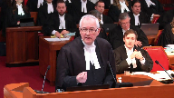
:::

I would ask you to conclude, please.

Can I just respond to that question?

What I say in response is that Canada has not gone far enough.

Yes, Canada has gone part way, but until environmental protection is constitutionalized, that will never happen.

May I just make one additional point about the quasi-constitutional status?

It'll be very short, Chief Justice.

It's this.

If you look at the case, it's very clear in that decision that if a matter reaches a fundamental value in our society, it can constitute a quasi-constitutional concept or status, and then reputation did in that case.

It's not like Canada says.

It has nothing to do with statutes like the official languages act or the Canadian bill of rights.

What I say is that if reputation, which is not linked to any of these statutes, if that can, in fact, become quasi-constitutional, so can environmental protection, because environmental protection, this court has said, is a fundamental value and it is critical to the importance of this country.

Thank you.

**Justice Wagner** (01:26:44): Ms. McGregor.

**Speaker 6** (01:26:55): Good morning, Chief Justice and Justices of the Court.

::: {.column-margin}
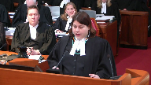
:::

My name is Julie McGregor.

I'm Anishinaabe from Kitigan Zibi, Anishinaabeg First Nation.

And before I start my submissions, I would like to acknowledge that this court is situated on the unceded land of my people, the Algonquin Nation, and I would like to acknowledge all my ancestors and relations in this territory.

The determination of the three questions at issue in this reference will have serious consequences for First Nations lands, environment, and the health of First Nations citizens.

This reference also represents an important opportunity to strengthen the nation to nation relationship between the Crown and First Nations through the doctrine of free, prior, and informed consent in accordance with the UN Declaration on the Rights of Indigenous Peoples.

And my submissions here today will focus on that point.

The AFN submits that the federal provincial jurisdictions as set out in sections 91 and 92 must be interpreted in a way that permits Parliament and provincial and territorial legislatures to exercise the powers granted to them in a responsible manner that deals effectively with problems and in this case environmental concerns that arise while not in any way diminishing or abrogating from First Nations rights to their lands and territories.

The authority of the legislature of British Columbia is subject to the Crown's fiduciary obligations to First Nations as well as constitutionally recognized inherent rights of First Nations to govern their lands.

The proposed legislative amendments at the issue in this reference and any permits issued pursuant to the proposed legislation must therefore be interpreted in a way that respects and upholds the rights and laws of the First Peoples of this land.

The AFN submits that the portions of the proposed legislation which refer to First Nations governments could operate in conjunction with other environmental legislation and in this case the provisions of the Canadian Environmental Protection Act.

However, we believe that the operation of the proposed legislation is subject to the province of British Columbia discharging its obligations to First Nations by ensuring that the rights and interests of First Nations are fully considered and respected.

The AFN submits that the best way to accomplish this is through the application of the UN declaration.

Canadian jurisprudence states that the Crown's assertion of sovereignty absorbed the pre-existing laws and interests of First Nations as rights into common law.

The law provides that those rights must be consistent with the basic principles of common law but clearly there is a discord.

As First Nations rights are sui generis and distinct from the common law they are yet forced to conform into common law.

The nuance of that conformity is governed by powers, rights and obligations at law and it is informed by international law principles.

This court has written extensively on the duty to consult, the Crown's duty to consult.

The duty to consult of course flows from the honour of the Crown and its fiduciary duty to First Nations.

We submit that the international perspective must therefore be used to further those, evolve those principles in order to provide a sound framework for ensuring that the rights of First Nations are guaranteed in any provincial or territorial decisions that may affect their lands and livelihoods.

FPIC ensures that First Nations are part of the decision-making process and that they have the right to give or withhold their consent to certain activities without fear of reprisal, coercion or in a time frame suited to their culture and with the appropriate resources to make informed decisions.

FPIC has three essential elements.

Free implies that the engagement process is free of coercion, intimidation or manipulation.

Prior implies that consent is sought sufficiently in advance of any authorization, commencement of activities and respect is shown for the time requirements of indigenous consultation processes.

Informed implies the full disclosure of information will be provided regardless of all aspects of engagement.

FPIC provides robust protection of rights based on recognition of legal rights of First Nations that First Nations hold.

It explicitly acknowledges the rights of First Nations people may need to be balanced with the rights of others.

This understanding of FPIC at international law is distinguishable from the word veto which implies something that is arbitrary, unilateral or absolute.

It would be unfortunate for this court to adopt the same strict analysis as the British Columbia Court of Appeal which failed to acknowledge the particular rights of First Nations interests and in this case which involved proposed legislation that specifically referenced First Nations governments which involves a project that may have serious impacts on section 35 rights and lands in a hearing in which First Nations appeared before the court and provided submissions on potential direct impacts for the proposed legislation.

It was therefore certainly disappointing that the perspectives of First Nations were ignored in the court's decision.

It was not the first time First Nations have been excluded from important decisions that impact them but this day and age in which we are attempting to reconcile past injustices I would submit a good starting point is not repeating the same mistakes of the past.

I would ask you to conclude please.

Those are my submissions.

Thank you.

**Justice Wagner** (01:32:35): Thank you very much.

**Speaker 7** (01:32:59): Chief Justice and Justices, Helsic Tribal Council is here as an Indigenous government with inherent lawmaking powers over its territories.

::: {.column-margin}

:::

It's also here because Helsic suffered an oil spill.

Helsic supports a robust approach to cooperative federalism to best protect the environment.

Once Indigenous governments like Helsic formalize self-government, they may then protect their own lands and waters through mutually recognized laws.

But until then, protection by both levels of Crown government is a vital step towards reconciliation.

But in this case, we say the court only recognized environmental protection as an exclusively federal matter.

It failed to apply the double aspect doctrine and recognize the provincial aspects of the proposed amendments.

It failed to consider why and to whom environmental protection is of superordinate importance.

The court then did not have that very important context when determining the core of the power over inter-provincial carriage of oil.

Now, I don't wish to be tone deaf to what the court has said about preventative measures and the double aspect doctrine.

If the court continues to have this concern when it's doing its deliberation, then I would ask that you consider Helsic's submissions as if that permit process were carved off, but those conditions were still in place.

So a slightly different mechanism, but still one that protects the environment, which we say is the purpose and effect of the proposed amendments.

With respect to pith and substance, environmental protection is the provincial aspect of the proposed amendments we say in both purpose and in effect.

Environmental protection is central to property, civil rights and local matters because preserving a healthy and sustainable environment in the face of potential and actual spills is of central concern to community life today.

You'll hear more about that from Burnaby.

For Helsic, environmental protection has always been a core value because their identity and culture are premised on their interconnection with the environment.

Helsic is different in that way.

Helsic do not separate their well-being from the well-being of the environment.

Environmental protection is a fundamental value of Gwilas, Helsic laws, and underlie Helsic's rights recognized under Section 35 of the Constitution Act.

Preserving the environment specifically against a threat of oil spills is of central concern to Helsic.

Having experienced the recent Nathan E. Stewart oil spill atop a major harvesting area, Helsic have had to fight for and continue to fight for a proper environmental assessment, remediation, and compensation for their harvesting cultural losses.

So for Helsic, respectfully, it is inescapable that these proposed amendments have a provincial aspect that ought not to be ignored.

**Justice Abella** (01:36:09): Was the relief that you sought and were able to get from under the existing environmental legislation in British Columbia?

I'm sorry, could you please repeat that?

Was the relief you sought and got under the existing environmental legislation?

**Speaker 7** (01:36:27): no relief got, but the relief sought and I'm going to get to that on exclusivity.

On the environmental impact assessment piece, we say that there is a legislative lacuna.

We have this problem where the federal government, and again, here we're dealing with the marine impact assessment piece, we say that there is a legislative lacuna.

We have this problem where the federal

**Overlapping speakers** (01:36:45): We're not dealing with land.

Sorry, this is-

I'm sorry.

Where did you go to the provincial?

**Speaker 7** (01:36:49): We did, and the province said many things, but they did not have the authority to order the oil or the environmental impact assessment, whereas the federal government said many things and did not order the impact assessment.

::: {.column-margin}

:::

And so there is a problem and a gap without a solution.

Now, on exclusivity, I'll just say a few things, and I'm sorry, my clock is no longer working, so I'm not too sure what the time is, but we do say that the Court of Appeal presumed that environmental preventative, remedial and compensatory measures were within the core of the federal power over undertakings.

The Court of Appeal further suggested that its analysis extends to environmental protection against ship source spills and provincial waters into federal power over navigation and shipping, but the court failed to explain why environmental measures are absolutely indispensable and necessary to the interprovincial carriage of oil.

And this is two problems at least.

One, jurisdiction over the carriage of oil doesn't necessarily require exclusive jurisdiction over safeguarding and restoring places and people for strangers to the undertaking.

Prudence and necessity are not the same thing.

Neither is protecting the product from escaping the undertaking the same as protecting the environment from a product that has escaped its undertaking.

Different things, different protections, different focuses.

Second, this court has limited the application of exclusivity to favour cooperative federalism and to avoid legal vacuums.

In the marine context, Heiltsuk's oil spill experience illustrates the current federal vacuum, which I responded to and won't repeat again.

Thank you, and I'll just conclude.

This court has recognized the superordinate importance of environmental protection, given also the profound importance of the environment to indigenous peoples like Heiltsuk and the need for indigenous governments to rely on both levels of government to safeguard their lands and waters until reconciliation is achieved.

Because what's the point of handing over a bunch of land and waters that no longer have resources?

Federal exclusivity over environmental protection should be transparently and compellingly justified, and that was not done by the Court of Appeal.

Thank you.

**Speaker 8** (01:39:38): Chief Justices, Terri Lyne-Williams Davidson, David Patterson and Elizabeth Browbrook appearing for the Council of the Haida Nation.

::: {.column-margin}

:::

The Haida Nation intervenes to highlight an issue of constitutional significance, the Indigenous role in cooperative federalism.

While the province of BC has not framed the appeal to include this issue, Indigenous peoples in the Haida Nation stand to be profoundly affected by the outcome.

Our submissions focus on that impact, drawing upon the experience of the Haida Nation.

Haida Gwaii is recognized as a globally significant area, containing some of the richest marine environments on this planet.

The fact that it remains intact is because the Haida Nation has taken every step possible to do so, challenging both federal and provincial decisions that would have exploited Haida Gwaii beyond recognition.

Over the last 40 years, the Council of the Haida Nation has worked hard to exercise its inherent responsibility to protect and manage human impacts of Haida Gwaii.

This cultural and legal imperative is grounded in our deep connection to the land and sea of Haida Gwaii, fostered throughout millennia.

With this solid grounding, we have made remarkable progress towards reconciliation, before reconciliation was in common parlance in this country.

The Haida Nation has not surrendered title, signed a treaty, nor completed its Aboriginal title lawsuit.

Yet this court's decision in the Haida Nation case in 2004 created space for the exercise of Haida jurisdiction.

The Haida Nation has concluded a number of agreements with Canada and BC for joint management of Haida Gwaii, which are summarized in paragraph nine of our factum.

These agreements collectively cover almost the entire land base, protect over half of the land base, and protect sizable portions of marine spaces.

They acknowledge the Haida assertion of title and the fact that the Haida Nation is acting pursuant to its own legal jurisdiction and authority.

Moreover, Haida laws, stated in the endangered Haida language, are expressly acknowledged as guiding collaborative management of marine spaces, as summarized in paragraph 11 of our factum.

The Haida agreements provide for the exercise of complementary jurisdiction between the Haida Nation, the province of British Columbia, and the government of Canada.

They provide the preliminary architecture for Canadian cooperative federalism.

Missing from both BC's and Canada's submissions is the requirement to provide jurisdictional space for Indigenous peoples to exercise inherent responsibilities to the environment.

Yet at issue in this case is the nature of Canadian federalism.

The powers of governance are not exhausted by the division between federal and provincial jurisdiction under the Constitution Act of 1867.

That act merely divided the powers that prior to its enactment had previously been assigned under imperial legislation.

The right of Indigenous peoples to self-determination is no longer contested in Canada, nor in the world.

Indigenous peoples are part of Canada's constitution, Indigenous rights and title are inherent rights protected under Section 35 and the United Nations Declaration.

Indigenous peoples' role in federalism is an unresolved part of Canada's long history of cultural genocide with Indigenous peoples.

In our view, the Paramount Sea analysis is not helpful to addressing that legacy.

The Haida agreements were made in the context of environmental protection of the land, the sea and the creatures which depend on these.

They are precisely the prioritization placed by Indigenous peoples generally and the Haida in particular that Professor John Burrows has emphasized as vital to reconciliation, not only with Indigenous peoples but reconciliation with the environment.

It simply cannot be that after the Haida Nation's long journey towards reconciliation with both the governments of BC and Canada, that jurisdiction for environmental protection excludes the Haida Nation.

In conclusion, the proposed legislation attempts to protect the environment.

There must be room for Indigenous peoples to protect our citizens and our territories.

For these reasons, we respectfully ask the court to decide this appeal in a manner that does not impinge upon Indigenous role in cooperative federalism and which expressly leaves that issue to be determined in another case with sufficient record.

Thank you.

**Justice Wagner** (01:44:38): Mr. Grant.

**Speaker 9** (01:44:50): Chief Justice and Justices, I'd like to concur with the submissions of my friends for the Halstik and Haida Nations on Indigenous jurisdiction, and I'd like to adopt the submission of my friend in her factor for the Haida Nation in relation to co-operative federalism.

::: {.column-margin}
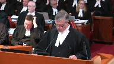
:::

I'd like to explain why Little Shoe Swap, an Indigenous Nation of only 300 members, has sought to participate in these proceedings.

Little Shoe Swap is located in the Terrier Bridge, Columbia, in the Shoe Swap region.

It is part of the Pespesaqqa, or Lakes Division, of the Greater Saqqatmik Nation.

It has intervened in these proceedings because of concerns it had regarding the drafting of the reference questions, and specifically their failure to consider Indigenous jurisdiction or legislative capacity, and that's why they're here.

Much of this case focuses on TMX, and Little Shoe Swap has had direct experience with inter-provincial undertakings, such as TMX in the past.

Little Shoe Swap's members still feel the effects of the Hillsgate slides in 1913 and 1914, over 100 years ago.

These slides resulted in the blockage of the Fraser River, and were precipitated by the work done by another federal undertaking, the CNR.

The slides rendered the upper Adams River run, Saukai Run, extinct.

This Saukai Run was one of the most important salmon runs in the world, and sustained and supported Little Shoe Swap's members, as well as members of many other Indigenous nations.

And today, despite numerous attempts to revive that run, it still does not run anymore.

Because of this experience, and other experiences like this, either as part of the Pespesaqqa, or the Saqqatmik, or on its own, Little Shoe Swaps wants to develop, enact, and enforce its own laws, its future laws, to protect the environment and its traditional lands, to provide stewardship for those lands.

Not just for its members, but for anyone who uses those lands.

And like so many other BC Indigenous nations, these lands have never been ceded.

When Little Shoe Swap first saw the reference questions this matter, the first thing it noticed was any lack of reference to Indigenous jurisdiction, and therefore a glaring omission to consider whether there might be Indigenous laws that might have a role to play in the application of a constitutionality of the proposed regulations.

And indeed, the questions are framed uniquely as to whether it's Canada or the province that has exclusive jurisdiction, or concurrent jurisdiction, as the case may be.

The reference questions ignore, and don't even consider, don't even refer to, possible legislative roles with the many Indigenous nations of British Columbia.

And for Little Shoe Swap, this omission presents a problem.

In this post-undrip society, where the endeavour or principle of reconciliation is supposed to be considered, the existing and future laws of Indigenous nations in relation to their lands ought to be included in the drafting of such reference questions.

That didn't occur here, and now we have to deal with that.

One problem is that in the past, the judicial discussion of exclusivity of jurisdiction of one order from Majesty's government or another has been held up as a shield, or as an argument, as to why Indigenous governments do not have jurisdiction to pass their own laws.

And we make reference to two cases in paragraph 30 of our factum.

I won't refer to them here.

In both those cases, while those arguments were not successful, ultimately, the Indigenous nation had to expend its resources to defend its ability to pass its laws, the Nisga'a in that case.

The drafting of the reference questions in this matter in our submission falls into that same old trap of not even considering the potential law of Indigenous jurisdiction and laws.

So, Little Sousa submits, to avoid any future confusion, it urges this court to express the estate that the reference questions do not deal with the ambit, scope, and nature of any affected Indigenous nations' sovereignty and jurisdiction, or how those Indigenous nations' laws may interface, interact, or affect Her Majesty's laws and sovereignty, however so divided between Canada and the province.

Those questions, as my friend Farhaidah just stated, should be reserved for another day, another case, on a proper record.

And we submit an express reservation of this nature from this court, which serves as a reminder for those drafting those future reference questions, to include at least consideration of Indigenous lawmakers.

Those are my submissions, very much.

**Justice Wagner** (01:49:23): This is Bradley.

**Speaker 22** (01:49:41): Chief Justice, Justices, as a municipality that is the terminus of an interventional pipeline, the City of Burnaby will be directly impacted by the extent to which the constitution allows for the province's unique role in protecting local communities from harm.

::: {.column-margin}

:::

In Canadian Western Bank, this court confirmed the modern conception of federalism that is based on flexibility, rejecting watertight compartments in favour of approach that allows room for both orders of government to act, recognizing that the same acts and activities can be regulated from different perspectives.

As you heard from my friend Mr. Ruck, as this court recognized in Hydro-Québec, maintaining this room for all levels of government to act is particularly important when protecting the environment.

**Justice Rowe** (01:50:30): Does that include the municipalities on an equal footing with the provinces and the government of Canada?

**Speaker 22** (01:50:37): Municipalities would get their jurisdiction from the province, so they wouldn't have the same footing as the federal government and the provinces, but their jurisdiction would come from the province.

::: {.column-margin}
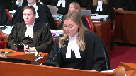
:::

But in supporting overlapping environmental schemes and in Hydro-Québec and in spray tech, this court quoted UN world commission on the environment and development recommendation that local governments should be empowered to exceed but not to lower national norms.

**Justice Rowe** (01:51:09): have contradicted yourself.

You seem to have suggested in just the last sentence that the municipality can put in requirements in addition to and higher than the province or the federal government.

Which is it?

**Speaker 22** (01:51:25): So the municipality does get their jurisdiction from the province and the municipality would be able to under that jurisdiction and pose requirements that would respond to local circumstances and spray tech that allowed the municipality to impose restrictions on the use of pesticides that went further than federal and provincial law and that was seen as example of the principle of subsidiarity.

::: {.column-margin}

:::

For more information visit www.FEMA.gov

**Justice Brown** (01:51:49): Well hold on, if your jurisdiction, your municipalities are a creature of provincial statute, we agree?

**Overlapping speakers** (01:51:54): Agree.

**Justice Brown** (01:51:54): So the province can only delegate powers to municipalities that the province itself has.

**Overlapping speakers** (01:51:59): That's right.

**Justice Brown** (01:52:00): So how can the municipality exercise powers that exceed those of the province?

No, I'm not saying that they could exceed those of the province.

You're suggesting they could impose conditions that the province could not.

**Speaker 22** (01:52:11): I'm suggesting that the municipality could respond to local circumstances and enact laws under the jurisdiction they have from the province.

**Justice Brown** (01:52:21): within the scope of that jurisdiction, so they can't go further than the province allows them to go.

**Speaker 22** (01:52:26): allowed to go under that jurisdiction.

::: {.column-margin}

:::

No, they couldn't go further than that.

And while Mr. Ruck has argued for the protection of an underlying constitutional principle for protection of the environment and we support that, our factum focuses on an important component of the already recognized constitutional principle of federalism.

And as I mentioned, this is the principle of subsidiarity.

This principle has a role to play in connecting provisions to heads of power and in constraining the application of the doctrines of interjurisdictional immunity and paramountcy.

According to this principle, law making and law implementation are often best achieved at a level of government that is not only effective but closest to the citizens affected.

In the assisted human reproduction reference, justice Lebel and Deschamps recognized that the proper operation of Canadian federalism sometimes requires the application of this principle to maintain the balance between the legislative powers of the two levels of government.

And in our submission in an area of jurisdictional overlap like the environment, the principle of subsidiarity supports the ability of the government closer to the citizens affected to enact laws that accommodate and respond to local circumstances.

In considering the relative importance of aspects of a law, subsidiarity underscores the value and importance of the provincial perspective in protecting interest effective and ensuring proper mediation.

As the closer government, the province is best placed to know and respond to population vulnerabilities, environmental sensitivities.

**Justice Rowe** (01:54:06): So the federal government builds nuclear-powered icebreakers.

::: {.column-margin}
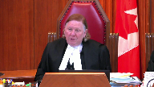
:::

The Russians have them.

They're quite viable.

And they want to dock in Burnaby.

And the Burnaby government can say, no, sorry, you're not going to bring those things in here.

We just don't like them.

And because they're closest to it, they get to regulate those things, even though it's navigation and shipping.

**Speaker 22** (01:54:27): No, we're not saying that they would get to regulate those things, we're saying in terms of the laws at issue here, the province is best placed to understand and know the particular environmental sensitivities and vulnerabilities and respond to those.

::: {.column-margin}

:::

So that can take the form of conditions to further protect the environment.

That's not taking over the federal regulation, that is furthering in our submission and supplementing the federal purpose which is protecting the environment.

**Justice Wagner** (01:54:58): Thank you very much.

Thank you.

**Speaker 11** (01:55:20): Chief justice, justices, I appear on behalf of the City of Vancouver and will be addressing two points in my oral submissions today.

::: {.column-margin}

:::

The first point is with respect to pith and substance and the submission in short will be that the proposed amendments address what are in Vancouver's submissions, very local, practical and legal effects.

And I'll turn to that in a moment.

The second issue will be parents' paramountcy.

Justice writing for the majority in Hydro-Quebec, the case has been referred to by others today, highlighted the all-important duty of both parliament and the provincial legislatures to make full use of their powers to protect the environment and the corresponding burden on the courts to progressively define the extent to which those powers may be used.

The proposed amendments are in Vancouver's submission a necessary step by the province towards satisfying this all-important duty by doing a few things.

First of all, by addressing the spill response, planning and resource needs of local governments to protect their communities and environment from the increased risks associated with heavy oil.

And secondly, by compensating them for doing so.

It's without question that in the event of an oil spill, residents, businesses and other government agencies will be looking to local government to act to protect their communities and minimize harm.

They are in fact obligated to do so by provincial statute.

The quality of response by local government is a critical variable in protecting the environment.

And the extent to which they can successfully do so will depend on the resources and information available to them.

The proposed amendments allow for improved local government planning and response, first by providing for collection of risk assessment data relating to human health and environmental impacts as well as information about measures that are in place to prevent or minimize impacts that are tailored to specific localities in British Columbia.

Second, by providing for funding to build response capacity as required to meet the unique needs of individual local communities.

And finally, in the event of a spill, they would allow for more comprehensive cost recovery by local governments that have incurred response costs and spill related damages than is currently provided.

Justice asked a question about purpose and substance of the legislation being to protect the environment, but how?

And answered that question as the how as being by targeting pipelines.

And in my submission, the how of protecting the environment in British Columbia is by resourcing local governments for response and compensating them when they do respond to a heavy oil spill and providing for better risk assessment information to plan, prepare, and respond to heavy oil spills.

That's the difference to address the question Justice Abella raised.

That's the difference between the proposed amendments and the existing provincial legislation.

All of this in Vancouver's submission demonstrates the very real practical and local effects of the proposed amendments and a characterization of the legislation as first and foremost the protection of British Columbia's environment and compensation in the event of a spill.

Turning to Paramountcy, Vancouver submits the proposed amendments are capable of simultaneous application with any overlapping federal laws.

The progressive interpretation referred to by Justice Laferet in Hydro-Québec and the emergence of environmental protection as a fundamental value in Canadian society means that when it comes to environmental protection, Paramountcy should be applied with even greater restraint.

Provincial legislation should operate in the environmental context unless there is an actual as opposed to a theoretical conflict or very clear statutory language overriding provincial jurisdiction and in Vancouver's submission neither of those exist here.

**Justice Wagner** (02:00:30): Thank you very much.

**Speaker 12** (02:00:50): Thank you Chief Justice, Justices.

::: {.column-margin}
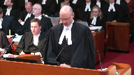
:::

If it pleases the court, I'll begin with an overview of the Attorney General of Canada's position before presenting our detailed submissions.

In the opening paragraph of its judgment that is now under review, the Court of Appeal for British Columbia set out the fundamental question on which the province was seeking its advice.

Essentially that question is, can the B.C. government regulate the Trans Mountain Pipeline in the interests of the environment by requiring it to obtain the province's approval to move increased quantities of heavy oil?

The court advised B.C. that the answer is no, and it was right to do so.

The constitution does not allow a province to decide whether and how particular goods may be transported on an inter-provincial pipeline, even if such decisions are made with the objective of protecting the environment.

Instead, such decisions are to be made by the federal government based on its assessment of the national public interest, an interest which necessarily includes protection of the environment.

The B.C. Court of Appeal put it this way, the Trans Mountain Pipeline expansion is not only a British Columbia project.

The project affects the country as a whole, and falls to be regulated taking into account the interests of the country as a whole.

**Speaker 12** (02:02:17): Design of BC's proposed regime and the practicalities of its effects show that its dominant characteristic is regulation of operations of undertakings that transport oil between provinces.

::: {.column-margin}

:::

Our constitution assigns authority for regulation of such transportation to the federal government and there's good reason for that.

It's been understood since confederation that interprovincial undertakings are a vital factor in securing the viability of Canada as a federal union.

That's why the constitution does not allow for a patchwork of fragmented authority under which individual provinces could exercise local control over operations of national railways and pipelines.

Since the proposed regime would give the province of British Columbia such control, it was entirely appropriate for the court of appeal to warn BC's government that the proposed regime would be unconstitutional and therefore this appeal should be dismissed.

However, if this court finds instead that the regime would be valid, it should then also advise the BC government that the regime would not apply or operate in respect of interprovincial undertakings including Trans Mountain and that's because regardless of a province's motivations the doctrine of interjurisdictional immunity prevents provinces from intrusively regulating national pipelines and railways by controlling whether and how they may move the goods that are entrusted to them.

Also when parliament enacts a regulatory regime within its field of authority as it has for national pipelines and railways, the doctrine of paramountcy will not allow a provincial regime that conflicts with or frustrates the federal regime to operate at the same time.

**Justice Brown** (02:04:09): Should we assign any legal significance, and if so, what significance to that passage in the NEB order that Mr. Harvey referred us to in which the NEB, and I realize you're not the NEB, well, nobody's the NEB now, but I realize you weren't the NEB, that refers to the amendments and seems to acknowledge that they strengthen provincial oversight and seems to acknowledge that they're going to try and work with them.

::: {.column-margin}

:::

I'm paraphrasing, but I think that's a fair paraphrase.

**Speaker 12** (02:04:43): I understand the question, Justice Brown.

::: {.column-margin}

:::

That passage in the order and council that approved trans mountain originally back in 2006 before it was quashed was referencing the British Columbia government which was a different government from the present one, the liberal government of Premier Clark and its intentions at that time to have more robust bill measures as we understand it in regulations that would have been brought in under the environmental management act.

A very different regime from what is proposed now by the current government.

So just to clarify, that is not a reference to the notion that the approval was based in part on the fact that there was perhaps going to be this new heavy oil permitting regime.

That didn't even exist as a concept back in 2016.

**Overlapping speakers** (02:05:41): I mean, do you concede that that might have been constitutional?

**Speaker 12** (02:05:45): That's an example in our submission of cooperative federalism that essentially the federal government was content that part of the reason it felt comfortable with approving the pipeline and that approval of course was given by the governor and council ultimately was because there was a regime in place in British Columbia or one that was intended to be made more robust.

::: {.column-margin}

:::

As we understand it it was of course the environmental management act essay law of general application.

So what we're dealing with now of course is a very different proposal to create a regulatory regime which wouldn't operate cooperatively with the federal regime.

**Overlapping speakers** (02:06:33): the first time.

**Speaker 12** (02:06:33): I think it was an independent assessment of the fact that British Columbia was going to assist in dealing with marine spills should they unfortunately end.

**Justice Karakatsanis** (02:06:47): So that's referring to something other than the application of the EMA and the process and the conditions that were attached under that act?

This is referring to something different?

**Speaker 12** (02:07:02): It is referring to the fact that British Columbia did and does have the Environmental Assessment Act and Environmental Management Act, which, as laws of general application, can, unless they intrude massively into the regulation of federal undertakings, be valid and potentially applied.

::: {.column-margin}

:::

**Justice Karakatsanis** (02:07:25): So the answer to my question is it's not referring to anything different, it's referring to the process that they actually did go under, under the EMA with the conditions that were added.

It was a process, right?

**Speaker 12** (02:07:38): There was a process for the assessment of whether the pipeline should be approved.

And there was an approval with conditions, additional conditions.

And that's not what's at issue.

**Justice Karakatsanis** (02:07:50): here was to that process.

That's right, correct.

**Justice Côté** (02:07:54): Mr. Browner, Mr. Harvey said that unless we find color ability, we have to answer yes to the first question.

What do you have to say on that?

**Speaker 12** (02:08:07): Our position on colorability was set out correctly by the Court of Appeal below.

::: {.column-margin}

:::

We did not say that the proposed legislation was colorable in the pejorative sense of anything being concealed but we did highlight that both the text of the law and the extrinsic evidence in support of it showed that the law was designed primarily to frustrate the construction and operation of the TMX project, notwithstanding the law's stated purpose of simply providing environmental protection.

And we did raise before the court below this court's decision in Morgantoller number three which bared some remarkable similarities to the situation in the case of Barr.

As the court remembers, the issue there was the constitutionality of Nova Scotia legislation whose stated purpose was to prohibit the privatization of certain specified medical services but there was extrinsic evidence, the practicalities, that the legislation was in fact prompted by concerns that Dr. Morgantoller was going to be opening abortion clinics in Nova Scotia.

So the court held that the law was in pith and substance an ultra vires criminal law measure adopted by the province to combat the perceived public harms of abortion clinics.

But the court in Morgantoller stopped short of saying that the legislation was colourable, saying instead really that colourability just restates the rule that constitutional character is not just a matter of form, it's a matter of substance.

And that's what the BC Court of Appeal ultimately agreed with as well and took the same approach, saying we don't find that there was anything pejorative or concealed in what British Columbia was doing but the practicalities of the pith and substance have to be taken into account.

We can't stop the analysis just of the purpose clause which says that the purpose of this law is to protect the environment.

The fact is it singles out an interprovincial undertaking and its effect is to effectively give the province of British Columbia a veto over whether that project can transport increased quantities of heavy oil.

**Justice Côté** (02:10:28): the broad definition of colorability adopted by the Court of Appeal because the Court of Appeal says I would not characterize a proposed amendment as colorable in the sense that anything is being concealed.

**Justice Côté** (02:10:43): But the practicalities cannot be ignored.

**Speaker 12** (02:10:47): Exactly.

::: {.column-margin}

:::

And the practicalities, as the court has heard, are the text of the legislation, which does contain exceptions which do not seem to be consistent with the notion of a law of general applicability.

It only covers heavy oil, a specific type of petroleum, which is defined in a way that it only covers bitumen and diluted bitumen.

There's an exception for those businesses that are currently moving heavy oil in spite of the risks to the environment, and perhaps of most significance is the exception for heavy oil on ships, as Justice Cazir has pointed out.

It's those indicia coupled with the extrinsic evidence showing that heavy oil only is in British Columbia because it's moving on interprovincial undertakings from Alberta and Saskatchewan to be exported overseas and to the United States.

Heavy oil is not a local product in B.C.

It's not produced there.

It's not refined.

It's not consumed.

That's why, taken together, the practicalities show that the pith and substance is the regulation of interprovincial undertakings, which is a federal exclusive head of policy.

**Justice Kasirer** (02:12:03): Let's say you're right and the legislation singles out federal work in undertaking a carriage of heavy oil by a province.

::: {.column-margin}

:::

Can a province do that in a law that doesn't purport to be of general application but purports instead to target an activity that it perceives to be untoward?

Is it possible for a province to do that?

To target inter-provincial undertakings? Yes.

**Speaker 12** (02:12:31): No, it is not possible.

It's part of the core jurisdiction of the federal government with respect to interprovincial undertaking.

**Justice Kasirer** (02:12:42): So it's not possible here.

Is that your point or is it not possible as a general proposition?

**Speaker 12** (02:12:47): No, it's not, the question before the Court of Appeal and now before this Court is whether this particular regime which does, which target an inter-provincial undertaking is constitutional.

::: {.column-margin}

:::

I don't think we can or should hypothesize with respect to if there is a law of clear provincial jurisdiction, a law of general application and as a practical matter there is only one or two businesses that are impacted by it.

Perhaps the extrinsic evidence would be such that that would be valid subject to applicability and operability concerns.

But this is a very exceptional piece of legislation in that it is clear from the extrinsic evidence and the extrinsic evidence that it's targeted.

**Justice Abella** (02:13:30): Did the Morgan-Toller decision, I'm sorry, I can't remember, use the concept targeting?

**Speaker 12** (02:13:40): I don't remember that specific word being used, and again, the court did not go so far as to actually use the word colourable.

The point is...

**Justice Abella** (02:13:52): So your position is we don't have to refer to colorability or targeting as long as we assess what the purpose of the legislation was and the effect.

**Speaker 12** (02:14:04): That's right, exactly, just as Justice Sepinca did in Morgenthaler number three, correct.

**Justice Brown** (02:14:10): Targeting seems to connote intent, though, does it not?

I mean, one doesn't inadvertently target something.

So targeting can't just be about effects, it also has to be about purpose.

**Overlapping speakers** (02:14:20): There has to be a mens rea to it as well.

**Justice Brown** (02:14:23): Well, one doesn't inadvertently target.

Target, target in itself connotes an intent. Right.

Yeah, it's a deliberate thing.

**Speaker 12** (02:14:30): I think the point here is that no one wants to suggest that the motives of British Columbia were anything other than protecting the environment.

::: {.column-margin}

:::

Only some of us might.

Which is a concern of the federal government as well.

But in our submission, the extrinsic evidence shows that the raison d'être for this legislation was concern over the Trans Mountain expansion project and the fact that there will be an increase in heavy oil that's shipped through British Columbia.

So legislation designed to address that narrow concern was proposed.

The province was concerned about its...

But that's the target on your theory.

**Justice Brown** (02:15:09): the inter-provincial undertakings.

Stop to stop the inter-provincial undertakings. Correct.

And you suggest that?

Yes, we did.

And my point is if you suggest that that's its effect, you must also suggest that that's its intent.

**Speaker 12** (02:15:22): Fair enough.

We are uncomfortable with the word colorability because of its pejorative connotations.

**Overlapping speakers** (02:15:30): But my point is targeting isn't a heck of a lot better.

**Speaker 12** (02:15:34): Well, it depends again on the motivations behind that and in any event, in this case, the question before the court below and now before this court is what is the pith and substance?

::: {.column-margin}

:::

Is it protecting the environment writ large?

And the court didn't accept that based on how narrow and selective the legislation is.

The pith and substance is providing the province with the ability to prevent or allow with conditions the movement of heavy oil on inter-provincial undertakings through British Columbia and that is a subject matter that only the federal government can regulate.

**Justice Rowe** (02:16:17): Now, the reference to heavy oil is in column one of the schedule, and then column two defines what heavy oil is, but the regulation making power set out in 22.9 means that other substances could be added at any time.

::: {.column-margin}

:::

Heavy oil, any petroleum product, in other words, shut down the petroleum industry entirely to the extent that it relates to any exports by British Columbia.

This seems to be implicit in the legislation.

Heavy oil today, anything else tomorrow.

I understand your argument about targeting, but my concern, in addition to that, is that it seems to me that this legislation is about taking away the ability of the Government of Canada to effectively approve inter-provincial pipelines that pass through Quebec carrying anything.

Yes, Quebec.

**Speaker 12** (02:17:33): Yes, indeed, and that's the Attorney General of Canada's concern and we believe the British Columbia Court of Appeal's concern.

::: {.column-margin}

:::

One can imagine other examples of a province attempting to regulate inter-provincial undertakings in the name of protecting the environment.

One could perhaps hypothesize of an Alberta law if, let's say, they were concerned about the movement of timber from British Columbia to eastern Canada because of pine beetle infestation and a concern that if you are transporting logs that have that infestation through Alberta, that might cause problems to the Alberta timber industry.

So if Alberta tried to pass a law requiring inter-provincial railways to not move British Columbia timber unless a permit is given first by the Alberta government because they are satisfied that sufficient safety precautions are in place to make sure that the timber can be moved safely, the result logically of a constitutional challenge to that hypothetical Alberta law would be the exact same as what's occurred here.

**Justice Abella** (02:18:50): The people on that side of the room were arguing that you've got environmental concerns that are overridingly significant.

::: {.column-margin}

:::

This side of the room says interprovincial undertakings are under section 91 of the constitution.

The environment is not covered by sections 91 and 92.

Labour relations weren't either but it was settled in the Snyder decision.

There's no Snyder decision for the environment.

How do we then going forward think about the division of powers in something not referred to in section 91 and 92 which has clear overlap?

**Speaker 12** (02:19:35): Well, I think that that's a good segue into the discussion of the double-aspect doctrine.

::: {.column-margin}

:::

And we had understood that that was primarily British Columbia's position before this court, and I think their factum bears that out, even though there wasn't much discussion here, that because the environment is not an enumerated head of power, both governments have the power to legislate with respect to environmental protection.

But still, that legislation has to be grounded in a federal power for the federal government and a provincial power for the provincial government.

And so, as I understood our friend's argument, it was that while the court of appeal below was correct to find that there is a federal aspect to this law, the regulation of inter-provincial undertakings, indeed they could hardly deny that, given that only federal undertakings move heavy oil.

But they also said that it has a provincial aspect as well, environmental protection of the local environment, and therefore, double-aspect doctrine should apply.

So perhaps that's the template that would be used to address these types of questions in the future.

Now, the answer to that, the court below didn't grapple directly with double-aspect, and we in our factum have set out our position, which is that the double-aspect doctrine does not apply for reasons essentially that can be explained by reference to the Bell case, in which the Justice Betts explained the double-aspect can only be invoked where the federal and provincial aspects of the law are of roughly equal importance.

**Overlapping speakers** (02:21:26): and coexist.

Yes, it was.

**Speaker 12** (02:21:28): So, Justice Bell, I think that's perhaps a more user-friendly way of putting it.

::: {.column-margin}

:::

As you said this morning, can the two laws live together?

And a good example of that is the drunk driving prohibitions that, well, this Court many years ago in 1941 in the Egan case discussed, that both the federal government can prohibit a person from operating a motor vehicle as a consequence from drunk driving under the criminal law power, and the provinces can do it as well for road safety reasons under their power to regulate the inter-provincial roads.

So those can coexist.

There's a roughly equal importance between the two.

But in this case, we're essentially in a situation very similar to the Rogers versus Chateauguay case where the government of Quebec actually made that same argument that the City of Chateauguay's notice of reserve that would have prevented Rogers from building that cell tower should be validated under the double aspect doctrine.

And if I can just ask the Court to look at tab three of our condensed book of authorities where we have the extract from Rogers where the Court deals with that.

Paragraph 51.

So the Court says here that the pith and substance of the notice of a reserve, what Chateauguay did, is the choice of the location of radio communication infrastructure.

We cannot see in this an equivalence between the federal aspect, that is the power of radio communication, and the provincial aspects, namely the protection of the health and well-being of residents living nearby and the harmonious development of the municipality's territory.

Now in our case, the pith and substance of the legislation as found by the B.C. Court of Appeal is the placing of conditions on and if necessary prohibiting increased carriage of heavy oil through inter-provincial undertakings.

That's at paragraph 105 of the judgment.

Yet there is no equivalence between the federal aspect of B.C.'s regime, that is regulating inter-provincial undertakings, and the provincial aspect suggested by B.C., protecting the environment surrounding the pipeline from accidental releases of heavy oil and then imposing liability for it.

So for all intents and purposes we're in the same situation as the Court was dealing with in Rogers where the provincial aspect of protecting the health of people living around the cell tower which is still important, but it's not sufficiently equivalent to that broad federal aspect of radio communications, and in this case we say the same thing, that it's not at the same level of significance as the federal power over inter-provincial undertakings.

**Justice Kasirer** (02:24:26): Is the analogy a perfect one?

::: {.column-margin}

:::

It strikes me that the protection of the environment transcends the immediately local community.

It's a national concern that's been embraced by the federal parliament wherever pollution might come to pass.

I'm not sure the analogy is a good one.

You say in your factum that the federal aspect clearly eclipses that strong language.

It strikes me that the environment as a value might, even if it's local, clearly eclipse the federal aspect if we get there, because your primary point is we don't get there.

**Speaker 12** (02:25:06): Well, again, using the template that Rogers provided is that the federal aspect was regulation of radio communications.

::: {.column-margin}

:::

They didn't simply say it was about what is the location of a cell phone tower.

It was broader than that.

It's the ability of a federal business undertaking, not interprovincial, but a federal undertaking, to operate and serve its customers.

And that being a broader concern than simply the notion of environmental protection around that cell tower was viewed as not being equivalent.

This was obviously a legal choice the court made, recognizing that, again, it would be an example of the two laws not being able to live together, one saying yes, the other saying no.

And there's a second reason why, of course, double aspect can't apply.

**Justice Rowe** (02:26:06): some of your friends seem to think that cooperative federalism consists of one government saying yes and the other no which I have always found to be beyond my comprehension.

**Speaker 12** (02:26:18): Our position, as I alluded to earlier, is indeed that cooperative and flexible federalism is something to be encouraged, but it's as a result of negotiation and discussion that two levels of government should work together to cooperate.

::: {.column-margin}

:::

When you have a situation like here where the provincial government didn't come to the federal government and said we would like to be able to regulate heavy, heavy oil on inter-provincial undertakings just as much as you do, instead this was, and I believe it was Alberta that in their factum said it, this was rather hastily put together legislation with very little sort of background papers or discussions of how it had been developed.

There certainly were no public consultations or consultations with the federal government as to how this might work together.

**Justice Rowe** (02:27:15): I mean, cooperative federalism, in my experience, perhaps as sort of an earlier career, is the kind of thing where both levels of government, the federal and provincial, say there is a serious problem here.

::: {.column-margin}

:::

Your citizens are our citizens, right?

The citizens of a province are the citizens of the country, and we're going to take the tools which we have in the federal toolbox, and we'll try to deal with the parts that are within our competence, you take the tools in the provincial toolbox that are within your competence, and we'll use them in a coordinated way for the benefit of the citizens.

And that to me is cooperative federalism as opposed to what we seem to have before us.

**Speaker 12** (02:27:59): as opposed to using a tool in toolbox to stop what the federal tools are trying to accomplish.

::: {.column-margin}

:::

And yes, and that actually encapsulates well the second reason why double aspect doesn't apply.

Justice Betts makes the point in Bell at pages 852 and 853, and Bell is actually at tab two of our condensed book of authorities.

And actually if we just look very quickly at page 853 of tab two, the highlighted portion.

As Justice Betts said, in my opinion the two legislatures have legislated for the same purpose and in the same aspect, yet they do not have concurrent legislative jurisdiction in this case at bar but mutually exclusive jurisdiction.

So the point that Justice Betts is making is that the doctrine only applies where the federal and provincial governments are regulating different aspects of the same activity working together.

Or to put it another way around, it doesn't apply when both governments have legislated for the same purpose and in the same aspect.

**Justice Brown** (02:29:00): Your point is that the province is reaching into the federal toolbox because their toolbox doesn't do the job.

**Speaker 12** (02:29:07): And they don't like, allegedly, the way the federal toolbox is being operated.

::: {.column-margin}

:::

The federal government has given approval for this pipeline expansion project to go ahead based on the federal assessment that there is a robust environmental protection regime that's already in place.

Presumably the province of British Columbia doesn't feel it's sufficiently robust.

They would rather have their own conditions added to it.

And so effectively they're trying to regulate the same subject for the same purpose, environmental protection, but they have different notions of what's required there.

In our submission that means double aspect can't be used to save this legislation.

The other aspect of the British Columbia's argument as to how the legislation could be found valid is their alternative argument, the ancillary powers argument, which is the notion that if this court finds, as the court found below, that the proposed regime is ultra viris the province of British Columbia, it nevertheless can be validated under the ancillary powers doctrine because of its connection with the existing regime.

And we've dealt with that in our factum at paragraphs 101 and following.

Essentially we set out this court at paragraphs 101 and 102 the tests that this court has developed in Kit Katla and Lacombe as well as the assisted human reproduction act reference tests with respect to when ancillary powers can save an ultra viris provincial piece of legislation.

And essentially there are two tests.

Is it significantly intrusive, the rational functional connection test if there's only a slight intrusion, but if it's particularly serious then there needs to be strict necessity for the legislation to be justified.

And we've set out a paragraph 102 that what you look at are three things, the scope of the impugned head of power, the nature of the impugned provision and history of legislative activity to see the significance of the intrusion.

And in terms of the scope of the impugned head of power, we have a proposed provincial law that proposes to intrude into an actually quite narrow head of power, the federal power over interprovincial undertakings and therefore that makes it a very serious intrusion.

The nature of the impugned provision, the court said the intrusion will be less serious if the impugned provision is designed to work together with the legislation enacted by the other level of government.

As we've just discussed, this isn't designed to work with the federal regime.

It's designed to provide a veto to the province.

And finally, history of legislative activity.

If there's a history of legislation in this area, that suggests it won't be unduly intrusive.

This is brand new.

There is no history of BC regulating what can be put on an interprovincial undertaking.

So that means that the question becomes is this legislation strictly necessary for or integral to the existing environmental management act?

In the paragraph 104 of our factum, we explain that the answer is no.

If we look at the existing environmental management act, it's been around since 2003.

And its purpose is essentially to regulate waste discharge, pollution, air quality, contaminated site remediation and environmental emergencies.

It has a permitting system but only in relation to the intentional discharge of unwanted material into the environment.

How do you define?

**Justice Martin** (02:33:09): the purpose of this impugned legislation.

If we're going back to pith and substance, we're told we can look at purpose and effect.

Can you in simple terms tell me what you say the purpose of this legislation is?

**Speaker 12** (02:33:26): Yeah, the purpose is to control the flow of heavy oil through British Columbia in the interest of protecting the environment.

**Overlapping speakers** (02:33:35): It's a fact.

**Speaker 12** (02:33:36): is to simply regulate a single federal undertaking and that's what makes its pith and substance federal in nature.

**Justice Martin** (02:33:44): So the purpose is not, the motive is pure.

The motive is to protect the environment.

The purpose, however, chosen, goes beyond what the authority of the province is. Correct.

And makes it unconstitutional. Correct.

**Speaker 12** (02:34:01): So, again, just to conclude on the ancillary powers point, so the existing legislation, the environmental management act does have a permitting system which regulates the intentional discharge of unwanted material into the environment, but the proposed legislation would set up an entirely different and new kind of permitting system which would regulate the possession and transportation of a good that consumers actually want and which is not intended to be discharged into the environment.

::: {.column-margin}

:::

There's no evidence of the efficacy of the existing system which has functioned for many years is somehow dependent on this proposed new system.

In fact, there is no evidence that it would have any impact whatsoever on the existing system.

So, in our submission, this is not, there isn't a sufficient nexus between the proposed legislation which really could have been proposed as a stand-alone statute.

It was proposed as an amendment to the environmental management act and as we said in our fact and presumably to increase its chances of being found constitutionally valid, but the reality is because it is so different from the existing legislation, it can't be validated under the ancillary powers document.

**Justice Abella** (02:35:10): Can I just ask you how we can say that?

::: {.column-margin}

:::

If you look at section 7 of the EMA which talks about the confinement of hazardous waste but also talks about transports, hazardous waste, hazardous waste management facility, hazardous waste storage and disposal in section 9, transportation of hazardous waste in section 10, it's hard for me to see how you can say it's not related to or integrated with the valid scheme that they have now.

**Overlapping speakers** (02:35:52): It's because...

**Justice Abella** (02:35:53): It's different.

The mechanics are different.

The mechanisms that are used, but it's very related to what's already there.

**Speaker 12** (02:36:05): In our submission, it is a very different product.

::: {.column-margin}

:::

It's heavy oil.

It's not a hazardous waste, I believe, is the words that they use at section 7.

It is not a waste product.

It's not like PCBs that companies need to dispose of because they are harmful to people and they don't serve a purpose.

But heavy oil transported safely within a pipeline or within a rail car is a valuable consumer good that people want.

**Justice Abella** (02:36:41): Let me take you to the definition of waste in the EMA, which includes biomedical waste, hazardous waste, whether or not the type of waste has any commercial value or is capable of being used.

::: {.column-margin}

:::

So I could just come back to how realistically is it fair to say it has no connection to what already exists.

So I could just come back to how realistically is it fair to say it has no connection to

**Speaker 12** (02:37:05): Again, using a common sense definition of waste as something unwanted regardless of how the definition is set out there, the fact is there is no history of the provincial government providing permits with respect to the transportation of goods that are not intended to be released into the environment.

::: {.column-margin}

:::

That's what's new here.

**Justice Abella** (02:37:32): So the difference is that there is now a discretion given to somebody to prevent transportation of something which you say is a useful commodity but others would say is a hazardous waste because of the history of spills in different parts of the country.

**Speaker 12** (02:37:49): And again, if it's spilled, then at that point the Environmental Management Act can and does apply.

::: {.column-margin}

:::

That's accepted.

But whose responsibility is the prevention of spills?

The federal government with respect to goods, all goods, not just heavy oil, but goods transported on it.

**Justice Abella** (02:38:09): provincial government to the extent that it interferes with right to the extent that the way you wouldn't say they have no role to play.

**Speaker 12** (02:38:18): No, it's to the extent that a regime is proposed which would say no goods can move even if under the federal regime they are authorized unless we the provincial government of a particular province are satisfied that our conditions are met.

::: {.column-margin}

:::

**Justice Abella** (02:38:37): had this scheme, but they didn't have a discretionary authority for somebody to regulate the implementation of a scheme.

If they just said don't transport goods that are potentially dangerous, that would be okay.

I don't think that's a good idea.

**Speaker 12** (02:38:52): Because, again, if it's ‑‑ if the goods only move on interprovincial undertakings and at that point the scheme creates an absolute prohibition without the possibility of it being allowed under conditions which our friends rely on to say that perhaps this should be found valid because don't worry, it won't be used practically to stop heavy oil from being put on the pipeline and as the court is aware, our position is that that's not something that can be taken into account.

::: {.column-margin}

:::

This court has evaluated permitting regimes before and if they are outside the jurisdiction of the government that proposes to enact them, the mere fact that they might not be used like in Maloney, the Alberta driving prohibition bankruptcy case is not sufficient to validate it or to not make interjurisdictional immunity and paramount safety of the law.

**Justice Abella** (02:39:50): Do we have to conclude in your analysis that the provincial government had no authority to do anything that prevented environmental harm under its property and civil rights in the province?

**Speaker 12** (02:40:05): No, we certainly would not make such a broad statement.

::: {.column-margin}

:::

The Court of Appeal was asked a very specific question by the government of BC.

They had developed this particular legislative regime and asked the Court of Appeal, is this something we can pass validly under our authority and if so, would it apply to interprovincial undertakings?

So I think the Court can only, as this is not a de novo reference, this is an appeal from a considered decision of the BC Court of Appeal, the unanimous panel, to assess whether the Court was correct in finding that this particular regime, the way it was worded with its exceptions, with the fact that the schedule only covers heavy oil, is this something that a province can validly enact?

And in our submission, the BC Court of Appeal was right to say it isn't.

**Justice Martin** (02:41:00): Can I just ask you something simply, I'm just trying to, I'm way back.

::: {.column-margin}

:::

Everybody's way ahead of me, but I'm just trying to understand this.

When you look at this legislation, can you say, sort of characterize it this way, whether by design or effect.

This legislation enables the province to throw up barriers that will at a minimum, or are likely at a minimum, to delay, obstruct, throw up barriers to the transportation of this heavy oil in the context of a federal inter-provincial undertaking, and possibly go beyond that and effectively prevent this from happening, because when we look at the history of this thing, and the years and years and years and years that have been involved, the prospect of further litigation, because if they do start putting in regulations that the operator says, no, we can't comply with those, or they're improper, etc, then you're into another court case.

And the, you know, the ingenuity of council is, you know, infinite.

And so, we could be here another ten years from now deciding whether or not.

**Overlapping speakers** (02:42:24): mmm

**Justice Martin** (02:42:24): sort of when we see actually when this is fleshed out what these power what they're going to require the province this could just delay this thing I think much longer than it already has been delayed is is that is that enough to say you can't do this

::: {.column-margin}

:::

**Speaker 12** (02:42:44): No, it's not enough, but it's an important policy consideration that the Court of Appeal took into account when it was addressing the Attorney General of British Columbia's prematurity argument, basically.

::: {.column-margin}

:::

And the argument is repeated here.

They ask that the legislation be found valid, that don't take into account the possibility that permits won't be issued or only onerous permits will be issued, because there's a solution to that.

You can do what Trans Mountain had to do when Burnaby was exercising its permitting power in a way that was dilatory.

You can go to the National Energy Board, now the Canadian energy regulator, and ask for a dispensation based on inter-jurisdictional immunity and paramountcy, or you can bring a judicial review application to the B.C. Supreme Court of a director's decision.

But yes, that's not in the public's interest.

So the court looked carefully at the pith and substance of this legislation and decided the reference on the basis that this pith and substance was in fact, this is legislation that's purpose and effect, particularly effect, is to regulate the transport of a particular type of good on inter-provincial undertakings, and that's something that only the federal government can regulate.

**Justice Martin** (02:44:18): I'd like to know whether Canada has a position on the submissions of the four intervener groups representing indigenous groups that ask us to exempt out certain things from the reference question.

**Speaker 12** (02:44:33): Yes, we provided our submissions with respect to the Indigenous group submissions in our reply fact and so I'll just summarize them.

::: {.column-margin}

:::

And of course, first of all, recognize that they're here voluntarily and that's something that should be commended as part of reconciliation, the participation of Indigenous groups in important constitutional cases such as this one.

Now as we note in our reply factum at paragraphs 26 to 28, they have a varied perspective on how the specific constitutional questions should be answered and you'll be hearing later from counsel for three First Nations who believe that, who take the position that the BC Court of Appeal answered the questions correctly.

And also while all have raised in different ways the importance of the court being aware of the fact that its answers to these questions might have an impact on aboriginal rights and title, particularly in relation to self-governance, that the court should be very careful in the way it approaches those questions, in particular because there was not a record developed below with respect to how Indigenous self-government would operate with respect to environmental regulation of heavy oil or indeed any products.

So that question is something that we agree with both Little Shuswap Band and with the Haida is better left for another case in which a record is properly developed so the court can address it.

**Overlapping speakers** (02:46:18): And even better still, an agreement.

**Speaker 12** (02:46:23): Exactly.

Reconciliation, obviously, would be better served by an agreement rather than through litigating.

**Justice Brown** (02:46:32): In that respect, you would presumably adopt the submission of the Council of the Haida Nation, that agreements provide for the exercise of complementary jurisdiction.

**Speaker 12** (02:46:42): Yes, those are laudable examples of reconciliation and cooperation.

::: {.column-margin}

:::

So with the remaining time I have, I am prepared to address the other two questions that were posed to the BC Court of Appeal on inter-jurisdictional immunity and paramountcy.

Of course, this court need not answer them if the reference can be dealt with the same way the BC Court of Appeal did.

Indeed, that's the way the province asked the questions.

They only were looking for an answer to questions two and three if the court found that it was valid.

So I'm happy to answer those questions. Yes.

Well, in that case, unless the court has any further questions for the Attorney General of Canada, that concludes my submissions.

**Justice Côté** (02:47:39): I guess that you are not in agreement with the position put forward by the Attorney General of Ontario about the IJI.

**Speaker 12** (02:47:46): Yes, that's correct.

::: {.column-margin}

:::

Of course, the court hasn't heard their oral submissions yet, but we have addressed them in our reply factum.

It is indeed Canada's position that interjurisdictional immunity does still have an important role to play in constitutional law.

This court ‑‑ the plea that is being made by our friends on behalf of the Attorney General of Ontario is not a new one, and this court has rejected it before in cases like Coppa and most recently in the Degagnier case, I believe,

that the ‑‑

**Overlapping speakers** (02:48:23): Well, but that was last month. Thanks.

**Speaker 12** (02:48:27): So unless the court has had a sea change view about the continuing importance of inter-jurisdictional immunity, no, our position is that the doctrine should remain.

::: {.column-margin}

:::

And if the court does come to the conclusion that this legislation is valid, that the doctrine would apply to immunize Trans Mountain and the railways from this legislation.

And of course, from a practical perspective, the answer to that question is just as important as the one to the first question.

If this law is found valid, it only applies to four businesses, Trans Mountain, Canadian National Railway, Canadian Pacific Railway, and BNSF Railway.

Therefore, if inter-jurisdictional immunity immunizes them, then the law will have no practical effect in any event.

Thank you.

**Justice Wagner** (02:49:19): Thank you very much.

**Speaker 11** (02:49:58): Le Compte Lacour!

**Justice Wagner** (02:50:11): I'm sorry about the book.

**Speaker 19** (02:50:34): Chief Justice, justices, the time has come for this court to finish the work it began 13 years ago in Canadian Western Bank and remove inter-jurisdictional immunity from the federalism analysis.

::: {.column-margin}

:::

As this case demonstrates, a robust application of the pith and substance and paramountcy doctrines provide all the tools that are needed to ensure provincial legislation does not undermine the national interest while continuing to respect the co-equal sovereignty of the provinces.

As this court recently held in Shakotan, IJI is often at odds with the modern reality where effective regulation requires cooperation between federal and provincial levels of government, each acting within their respective spheres of jurisdiction.

And so we say there are three reasons why inter-jurisdictional immunity should no longer form part of the federalism analysis.

**Justice Brown** (02:51:27): Even more recently than Chilcot and Transpore de Gagne, this court acknowledged inter-jurisdictional immunity.

**Speaker 19** (02:51:36): It acknowledged that the continuing existence of it, but no party was asking the court in that case to remove it from the federalism analysis.

**Justice Brown** (02:51:43): So you want to you want us to take something that we've just affirmed and undo that?

**Speaker 19** (02:51:51): What we're saying is that just as that case could have been decided on an analysis of pith and substance and paramountcy, so can this case, so can the other cases.

::: {.column-margin}

:::

Inter-jurisdiction immunity has a number of downsides and those as they were acknowledging anything in Western, we've tried 13 years of a narrower, I would say improved.

**Justice Brown** (02:52:12): And I mean, the Chief Justice and I wrote separately and we acknowledged all those problems and we lost.

**Speaker 19** (02:52:22): It's another case.

::: {.column-margin}

:::

It's been a week as Justice Roe pointed out.

The point being in this case Ontario is directly raising the issue and we're saying that the reasons that both you and the chief justice expressed and this case demonstrates why you don't need it anymore.

This law, the law at issue here, it's colourable or it's not.

We don't take a position on that point but if it is valid provincial legislation it should apply to federal undertakings unless as parliament in fact has in this case there's conflicting federal legislation.

Because inter-jurisdiction immunity is not supported by the text of the constitution.

It is asymmetric and undermines provincial legislative authority and most importantly it creates unnecessary and undesirable legislative vacuums.

When parliament decides that there needs to be a single national standard as it has here by saying pipelines and inter-provincial transportation undertakings shall carry the goods required.

When it feels the need to say that there should be a single national regulator as it has here by saying that the Canadian transportation board and the energy regulator authority shall be the decision makers and consider all the various issues at end, then there's a conflict.

Then there's a reason to house provincial legislative authority.

But when parliament hasn't done any of those things, when it's silent we would submit that provincial legislation that is valid should apply to all undertakings in the province whether provincial or federally regulated.

And just on the first of those points on the textual point, IGI of course is found in the exclusive language in sections 91 and 92.

But as professor writer points out in his article, tab four, that's a much stronger meaning of exclusivity than we usually talk about.

It's the old watertight compartments thou shalt not enter here at all.

As opposed to the modern it doesn't have to really be in pith and substance a matter of provincial concern.

That's a very different analysis.

92 speaks of exclusive powers as well.

And it fails to take into account the fact that section 91 gives parliament a power to make laws within its heads of power, not a power to undermine and to exclude the provincial jurisdiction to make laws under their heads of power by silence.

And I'll just end with saying that immunity sets out, creates these legislative vacuums.

Private companies are immune or claim to be immune on a regular basis.

We set a long list in our factum at paragraph 31 of just a smattering of those cases.

But I'll just put in the words of cn itself in a recent case in its submissions to a federal regulator.

This is at page 15 of the Halton decision at tab six of our condensed book, the last page.

It is cn's view that all aspects of the construction and operation of interprovincial railway, including any terminal, fall within the exclusive powers of the federal government and as such any valid provincial or municipal law that might otherwise apply is not.

They're federal enclaves.

We say they should not be.

The doctrine has no further place and is not needed.

Thank you very much.

Thank you.

**Justice Wagner** (02:55:52): Mr Irvine

**Speaker 18** (02:55:58): Thank you, chief justice.

::: {.column-margin}

:::

Saskatchewan is a landlocked province.

That is our starting point in this case.

We depend on uniform federal regulation of interprovincial transportation to get our goods to market.

And we've given you the quotations from premier attache and John A. McDonald in the confederation debates emphasizing just how important it was at that time for landlocked provinces to be able to get their goods to market.

That was part of the confederation plan.

That's why it's been assigned exclusive jurisdiction in the federal government.

And justice Newbery in the court of appeal accepted that argument.

That's the starting point.

That our scheme of our constitution is that if you're shipping goods across the provincial boundary, then it falls under federal jurisdiction.

And there have been various questions asked from the bench this morning about what is the core.

That's the core.

If goods are being shipped across the boundary, that's what triggers federal jurisdiction both for virates and for interjurisdictional immunity and for the analysis.

We say that that concern about having interprovincial transportation under a uniform regulator runs through all three of the questions that we have to respond to.

I'm not going to try and deal with it.

I've dealt with it in our factum but for reasons for time I'm not going to deal with it.

But we say that that is the key point.

And that is why we say the statute in question is ultra virates to the extent in this case it is regulating goods being brought across the provincial boundary.

It also triggers interjurisdictional immunity because it's trying to add additional provisions to the environmental protection and it is frustrating the purpose of this elaborate federal system.

Now, we're not trying to we're not surrendering all provincial jurisdiction.

I want to make that very clear.

We say that our provincial laws do apply to federally regulated works and undertakings as long as it's not that core area, the construction, the operation, the maintenance of the structure.

That's made very clear in the case over 100 years ago and in the Madden case also from the council both of which were affirmed in construction by justice Betts.

And we also rely heavily on the bell case because we think that justice Betts has laid out the entire framework of why federal jurisdiction applies.

Justice Betts' analysis in that case responds to a question from justice Moldaver where he said if you have to rely on paramount C to resolve all the disputes, if both laws apply and you resolve them by paramount C then you're going to be having endless litigation about hard hats and steel-toed boots.

That was in the context of occupational health and safety.

A modern pipeline that crosses two provinces, several mountains and ends up at the ocean port is a lot more complex than steel-toed boots and a hard hat.

There will be endless litigation about paramount C to try and resolve it.

**Justice Rowe** (02:58:51): it's worse than that.

There won't be an endless litigation, there'll be nothing because the uncertainty will kill the business case.

**Speaker 18** (02:58:59): That is our concern, Justice Roe.

::: {.column-margin}

:::

We also are relying on the Madden case for the argument that our friends are advancing.

We're just adding to the protections.

But in Madden that's exactly what happened.

The province of British Columbia said the federal government hasn't done a good enough job for security for to protect cattle and other livestock for an inter-provincial railroad.

So we'll make additional requirements.

And the Privy Council said that's ultra vires.

You don't have that authority.

It's up to the federal government to decide what safety requirements are needed.

But you can't say, oh, you haven't gone far enough.

We're going to supplement those.

So those are our concerns that British Columbia's argument essentially is trying to make the environment an area of concurrent jurisdiction.

We rely on federal jurisdiction to get our goods to market.

We're also concerned that that would work the other way.

That if the environment becomes an area of concurrent jurisdiction does that mean the federal government gets to regulate matters that are clearly under provincial jurisdiction?

This court in Hydro-Québec, an old man made it very clear the environment isn't an area of concurrent jurisdiction.

It's tied to the individual heads of power.

And since inter-provincial transportation is clearly an exclusive area of federal power to the extent you need to regulate the environment to make those operations safe, it's federal.

We say that with all due respect to our friends from BC, we say their argument is contrary to the position about Canada that double aspect can't be used to create concurrent jurisdiction.

The federal government is the only government which can take into account all the various interests at play.

Economic interests, environmental interests, first nations interests, the different provinces interests, all of those interests.

It's a poly centric decision and only the federal government can deal with all of those interests at once.

And for the general benefit of the whole federation.

To repeat McDonald's phrase.

And the principle of provincial quality also comes into play.

Is Saskatchewan to be in a lesser position simply because of its geographic position in the federation?

Do other provinces have greater authority over Saskatchewan shipments to the harbors simply because of their location?

Do we need permission from BC and Alberta to reach the pacific?

Do we need permission?

**Overlapping speakers** (03:01:10): Not just B.C., Alberta, but Lethbridge and Medicine.

Exactly, then we get into the municipality.

**Speaker 18** (03:01:16): But going the other way, do we need permission from Manitoba and Ontario and Quebec to get our goods to the Atlantic?

That's why it's federal.

And that's why we say that the British Columbia court got it right.

Thank you very much.

Those are the submissions from Saskatchewan.

Thank you.

**Justice Wagner** (03:01:30): Mr. Peter Gaal?

**Speaker 15** (03:01:44): Thank you.

::: {.column-margin}

:::

Chief Justice, justices, on behalf of Alberta, I have basically three points to make about pith and substance.

And the first one is an important point, certainly from the perspective of Alberta.

And that is that we submit that it's not necessary or helpful in this case to define the line between permissible environmental regulation of a pipeline, a provincial pipeline, or the scope of that regulation.

It's not necessary, we say, it's not helpful, because this case in our respectful submission can be decided and should be decided simply on the basis that the dominant characteristic, and I want to emphasize that, because that gets away from purpose intent colorability.

The dominant characteristic of this legislation in our respectful submission is the interference with or the obstruction of the pipeline.

We don't dispute that BC has legitimate environmental concerns with respect to the pipeline.

We actually don't dispute much of what they say about the scope of their provincial jurisdiction.

What we do say is in this case, in this situation, the dominant characteristic is the obstruction, interference with the pipeline.

And in our submission, that's the basis that this case should be decided on.

And when I say not helpful, I say when we look at it, and this is an important factor or circumstances going to the pith and substance analysis, cooperative federalism worked very well here.

Very well right until the end.

In fact, right until after approvals had been given both by the province and the federal government to this process.

It worked very well.

Where it ended was when the new government introduced this legislation.

And as Mr. Brongers pointed out, without any consultation, without any identification of any gaps in the existing environmental regime, without any attempt to negotiate or come back to the federal government and say, you know, we need this or we need that or Ms. Horne's concern on behalf of Vancouver that maybe there needs to be more done with respect to restitution, all of those things I'm sure could have been worked out cooperatively.

But there was no attempt made to do that.

So at the end of a very lengthy process, the applicant submitted formally its application in 2013.

There was a lot of activity in reviewing that application over the succeeding years.

In May of 2016, the NEB announces its tentative approval subject to 157 conditions.

Our province then says, our premier says, well, we'll approve it if five conditions are met.

One was a full environmental review by the province.

Two of them were world class, the implementation of world class marine and land spill prevention, recovery and restitution provisions.

World class.

And then our B.C. Government in 2016, and this goes to Justice Brown's comment about the amendments to the environmental management act, it amends that act.

Adds further spill recovery prevention and restitution provisions.

And then the environmental assessment officer approves the project on behalf of B.C. Subject to 37 more conditions imposed by the province.

And the premier then announces that the five conditions, her five conditions have all been met.

So an environmental assessment certificate is issued.

The governor and council then approves the project from the federal standpoint subject to the 157 conditions.

And then it looks like the project can proceed.

New government comes in and it introduces this legislation.

And I've set out in our factum the circumstances that we say lead conclusively to the conclusion that the dominant characteristic is the obstruction, interference with the pipeline.

I just want to emphasize too, and this goes back to a question I think Madame Justice Cote made about the timing.

The timing is obviously a very important factor in this.

And then the question was asked about the differences.

What's the difference?

Well, I haven't been able to find any difference in this legislation.

All it does is impose a brand new discretionary permitting scheme.

And if you look at it, yes, it's about spill recovery or prevention of spills and dealing with them.

But what it allows an official of the government to do is to demand any information with respect to the project, location of the pipeline, construction materials, anything that might relate to spills, and everything does relate to spills, and then to impose conditions, more conditions without any definition.

Might be you have to reroute the pipeline.

You may have to do this.

You may have to do that.

**Justice Rowe** (03:08:00): Maybe you have to get the consent of all the local communities.

Pardon me?

Maybe you have to get the consent of all the local communities.

**Speaker 15** (03:08:07): Absolutely.

::: {.column-margin}

:::

We don't know.

That's the problem.

We don't know.

So I go and probably should end just on this point, Mr. Justice Moldaver's comment, I would have answered different than Mr. Brongers.

When you describe what's happening here and put it in terms of obstacles in place at this late stage, just delaying the uncertainty, the possibility of further litigation, all of that in combination with the factors that we've identified in our factum lead conclusively in our view to the dominant characteristic is the obstruction of the pipeline.

Thank you.

**Speaker 3** (03:09:10): Chief Justice, Justices, I'm pleased to represent the Canadian Energy Pipeline Association, or SEPA, and I thank the court for the opportunity to make submissions on its behalf.

::: {.column-margin}

:::

SEPA members include the major Canadian transmission pipeline companies and are part of the industry that constructs and operates the federal pipeline undertakings in the national interest.

It's the industry that would be directly and significantly affected by B.C.'s proposed legislation.

I'm going to focus my submissions on the role of the effects on the issue of validity, just the first question, and first I want to make a comment on the purpose.

With respect, the B.C. approach to the question of validity effectively means that as long as the province's stated or ultimate purpose has an aspect of provincial power, it is valid irrespective of the means used or the ultimate effects of the legislation.

However, the ultimate purpose does not always validate the specific means used to attain that purpose.

And that's a quote from Bell Canada.

We saw that in Bell Canada respecting health and safety of workers.

We saw that in the Rogers case with respect to the health and safety concerns relating to communication towers.

And we submit it's equally applicable with respect to the ultimate purpose of protecting the environment or provincial property.

You have to go beyond the purpose and that includes the critical analysis of the effects.

The court can look at the actual or predicted practical effect of the legislation in operation.

That's from the Morgantall case.

There's a reality check in the overall pith and substance analysis.

What is the law actually going to do?

I'm going to focus very briefly on two aspects of the effects.

One is the effect on the federal head of power and the second is the impact on the industry that SEPA is involved with, the pipeline industry.

With respect to the impact on the federal power, Justice Abella raised a question and I submit there is a place for effects, a very important place in the pith and substance analysis both at the characterization and the classification stages of the analysis.

In Canadian Western Bank, and this court has confirmed the dominant tide of the pith and substance analysis, this court confirmed that when problems from effects arise, they can be resolved by the firm application of pith and substance.

And the court said that the scale of the alleged incidental effects may indeed put a law in a different light to move it from one constitutional head of power to another.

Here, the actual and practical effect of the proposed legislation on the federal power does just that.

It provides a potential veto, a duplicative or at a minimum an augmented process to a comprehensive federal process in respect of the environment.

If a regime will create such uncertainty, delay, duplication, it usurps the federal rule.

It's akin to the Rogers case and the location of communication towers and it intrudes on the federal power.

And as I've said, that can be infused in the analysis both characterizing the legislation and classifying it.

With respect to the second impact or the effect is the impact on the industry, the pipeline industry.

The court can look at all of the rights and liabilities of those that are subject to the terms of the proposed legislation.

That's from Morgan Tully.

The consideration of the practical business effects and Justice Roe I think was alluding to this moments ago, the consideration of the practical business effects on the industry was confirmed as a valid consideration in the Alberta banks taxation reference case and in Texata Mines.

In both of those cases, what was important was the practical business realities, the severity of the effects on the viability of the undertaking.

These practical effects on the industry, pipeline industry in our case, should be a very important consideration for the court here.

You've already heard about the veto, the lack of concrete conditions.

There's also the precedential effect of a finding of validity of this legislation.

And several courts have looked at the impractical effect of having a patchwork of regulatory regimes applying to federal undertakings.

The practical and predicted effect, the reality is that the creation of significant regulatory uncertainty inhibits investment and may affect the very viability of the federal undertakings.

Investors, this goes to Justice Roe's point, are reluctant to commit billions of upfront dollars in capital to build projects in the face of unmanageable regulatory risks.

**Justice Wagner** (03:14:25): Thank you.

**Speaker 16** (03:14:39): Chief Justice, Justices, the Trans Mountain Expansion Project is the only federal pipeline that would require a hazardous substance permit under the proposed legislation.

::: {.column-margin}

:::

That is no coincidence.

We've experienced years of opposition and obstruction, including by non-federal levels of government.

There's no need to speculate as to what could happen here.

We have real examples of the mischief that can occur when a local regulator asserts authority over an interprovincial pipeline to which it is opposed.

So orally, we will focus on our division of powers legal battles and how the law has been applied to real facts, real opposition, real obstruction.

I'll highlight two examples, both concern Burnaby and Section 73 of the NEB Act, now Section 313 of the CER Act.

It grants proponents broad powers to do all acts necessary for the construction, maintenance, operation and abandonment of pipelines.

The first dispute was in 2014.

That was during the National Energy Board hearing.

The hearing itself began in about 2013 and ended in 2016.

So it was a lengthy process.

Remember that Burnaby was a full participant in the hearing.

The board requested that Trans Mountain conduct engineering surveys and studies on the preferred pipeline route through the Burnaby Mountain area.

Burnaby sought to stop the studies through enforcement of its bylaws.

The bylaws themselves were not unlawful.

They were aimed at, you know, don't cut down trees in a park, don't trample on vegetation, but they were inconsistent with the survey work that Trans Mountain was required to do.

Burnaby actually stopped Trans Mountain work, gave bylaw and fraction citations, and then they also sought an injunction at the British Columbia Supreme Court unsuccessfully.

Trans Mountain returned to the National Energy Board for relief.

In its ruling number 40, which is in your condensed book at tab one, I won't take you there, but the board required Burnaby to allow Trans Mountain access.

They forbade Burnaby from further obstruction, and they ruled that the specific bylaws were inoperable and inapplicable pursuant to both IJI and Paramountcy.

Burnaby sought and was denied leave to appeal to the Federal Court of Appeal.

They then went to the British Columbia Supreme Court and the British Columbia Court of Appeal on the same issues.

Both courts declined to hear the constitutional issues and instead affirmed ruling 40.

And some excerpts from the BCSC decision are at tab two.

The second conflict occurred in 2017.

So the hearing was over.

You've heard that the project was approved the first time in 2016.

Trans Mountain had committed on the hearing record to cooperate with municipalities and communities during construction, apply for permits, collaborate, that sort of thing.

And any commitment that Trans Mountain made on the hearing record or in any materials that were filed at the NEB became a condition of the project.

So this wasn't a recognition by the NEB that provincial and municipal laws applied.

It was a commitment that Trans Mountain made to cooperate.

Trans Mountain applied to Burnaby for permits.

Permits were not issued.

There was no clarity as to when they might be issued, so back they went to the NEB for relief.

This time BC, which by the way was also a full and active participant in the board's process, and don't forget, as Mr. Gall has reminded you, they'd already approved the project provincially.

They'd issued an environmental assessment certificate in 2017.

This time they intervened in support of Burnaby's position.

As you know, a new government had been elected in 2017.

It was very vocal in its opposition to the project, and having approved it as a province, aligned itself with Burnaby at the National Energy Board.

In this instance, there was no action, no decision, or bylaw infraction, just inaction.

So among other things, Trans Mountain argued, and Mr. Justice Moldaver, this goes to the question you asked this morning.

We argued that the delay affected the timing of a federal project, the when and the where, and the orderly development of that project.

We said that unreasonable or indefinite delays could affect whether the project was carried out at all, and that all of this fell within the core of the federal jurisdiction.

The board agreed, so they found not an operational conflict, but frustration of purpose, and they found impairment under IJI.

That decision is in your condensed book at tab three.

Again, appeals or leave to appeals were launched by Burnaby to both the Federal Court of Appeal and this court as well.

So it's important to note that both Burnaby and BC unsuccessfully argued that the motion was premature at the NAB, that Trans Mountain should wait until Burnaby rejected the permit applications or imposed inappropriate conditions or took steps to enforce its bylaws, the same argument that BC now makes in this reference.

And the NAB rejected this, saying that such would enable a province or a municipality to delay indefinitely, accomplishing indirectly what it could not accomplish directly.

**Overlapping speakers** (03:20:19): Okay.

Your first five minutes is over.

Just conclude.

You're getting into the next five minutes now.

**Speaker 16** (03:20:25): To suggest, as British Columbia does, that issues and conflict should be resolved as they arrive through political negotiation or legal action is absurd.

::: {.column-margin}

:::

Project proponents must file constitutional challenges and alert all of the AGs in Canada when they've done so in response to interference.

This will feed profound regulatory, legal and investment uncertainty, the kind of uncertainty that saw Kinder Morgan sell the project in May 2018.

We need certainty restored.

Enbridge operates interprovincial pipelines across eight provinces, each of which could pass legislation similar to the proposed amendments if the court finds them to be constitutional.

The Enbridge submissions will focus on the practical aspects of the legal analysis, the comprehensive federal life cycle regulation and practice pursuant to Parliament's modern purpose of safe, environmentally responsible and efficient interprovincial transport of natural resources.

There can be no doubt as to this modern purpose.

Speaking about the amendments at the National Energy Board, the Minister of Natural Resources said, and this is at tab one of the condensed book, I'll not take you there, while the economics themselves tell a compelling story, we've been clear that if projects are to proceed, they must be proven safe for Canadians and safe for the environment.

Our objective here is to ensure that we have a world class, in fact elements of world leading pipeline safety system.

It would be built on three pillars, one, prevention, two, preparedness and response, three, liability and compensation.

The precise subject matters that BC is currently seeking to regulate through the proposed amendments.

Nothing has changed under the new CER Act either, which is at tab two of your book, and I'll just read to you section 6a, which confirms that pipelines are constructed, operated and abandoned in a manner that is safe, secure and efficient and that protects people, property and the environment.

The environment is not an afterthought when it comes to these projects.

As a practical matter, the NEB assesses pipeline safety and environmental protection through, among other things, lengthy regulatory hearings in which provinces like British Columbia, municipalities like Vancouver and Burnaby, indigenous groups, individuals, and other interested parties participate and more importantly, they advocate for their position.

They advocate for informational requirements and conditions to protect the public and the environment on each of the issues that British Columbia currently seeks to regulate through the proposed amendments.

The NEB's assessment of Enbridge's line 9b is a very good example.

This is a line between Ontario and Quebec that currently transports heavy oil, among other things, and it was before this court in Chippewa of the Thames.

First if you look at tab 3, there is an excerpt from the NEB hearing, I'll not take you there, but you'll see that the very first subject is spill prevention where the NEB considers, among other things, the project design, leak detection, right of way inspection plans, emergency shutdowns and along the way you'll see that the board considers the submissions of other participants in the hearing, just like the TMX hearing.

When they hear all the evidence, they then determine whether conditions are required.

The conclusion of the board there was with the imposed conditions, the board is of the view that line 9 can continue to be operated safely after the implementation of the project given the above design, construction and operation.

**Justice Abella** (03:24:17): you a constitutional question.

::: {.column-margin}

:::

What is it that you say is the legal effect, the constitutional effect of a decision by a regulator like the NEB in terms of the ability of the province or the federal government to exercise a division of powers authority?

**Overlapping speakers** (03:24:36): So I seem to be.

**Justice Abella** (03:24:37): arguing it was done, that really left no room for anybody else to step in.

**Speaker 16** (03:24:41): It didn't leave much room.

So I think the answer is that the process is very inclusive and when you look at a Trans Mountain for instance, a 2013 to 2016 year or three-year process, where the provinces are there, the municipalities are there, everybody who has an interest is there.

**Justice Abella** (03:24:58): I appreciate all of that.

I'm asking you what the constitutional implications are of that position.

You've had your chance.

You can't do a collateral attack on the board hearing by passing legislation that goes against what the board said. Exactly.

And you can't—

**Speaker 16** (03:25:13): Where do we find that?

::: {.column-margin}

:::

I think it's a simple division of powers analysis that says you are invited to participate in the federal process and advocate for your position, but once that decision is determined by the federal process, you don't get to get through the back door, which you couldn't get through the front door.

You don't get to legislate.

That's the powers.

That's right.

Thank you very much.

**Justice Wagner** (03:25:37): Thank you very much.

**Speaker 17** (03:25:51): Chief Justice and Justices, we're here on behalf of the Railway Association of Canada and here predominantly to address some of the issues that are faced by Canadian National Railway Company, Canadian Pacific Railway Company, and BNSF, which are the three federally regulated railways that are potentially impacted by this proposed law.

::: {.column-margin}

:::

First of all, we're going to focus on inter-jurisdictional immunity.

It is of paramount importance, so to speak, to our client.

Our clients have been recognized as having significant control over their own destiny in relationship to having their operations regulated by federal regulators.

They've had a relationship with these federal regulators for over 100 years.

It is clear from the jurisprudence that the core of the power over regulating federal railways is extensive.

It covers their operations, it covers their management, and it covers all facets, we say, in respect of safety implications of their operations.

It covers all aspects of the amelioration of the risks associated with the carriage of railways across this country carrying goods across this country.

**Justice Rowe** (03:27:12): I think it can be said historically that one of the reasons that colonies came together and formed the Dominion of Canada was to facilitate a broad railway network.

::: {.column-margin}

:::

And that was born in mind when they distributed the authority to the Dominion government, the new creation which made possible that which was probably not practical before.

**Speaker 17** (03:27:34): and I think the converse was also true in that the railway allowed the development and the growth of the country to organically grow as a result of the railway, the presence of the railway.

::: {.column-margin}

:::

So what it comes down to is we now know from 100 years of jurisprudence that there is this significant core and we now know that it shouldn't be impaired.

And now the question is where is that line?

Where does the impairment become significant?

And we've put forward two propositions.

The first of all is that the case law that identified the core also identified that there's a significant distinction to be made between normative prohibitions and preventative legislation.

Right back to the Bon Secours decision.

The province had the jurisdiction to tell the railway company to clean out the ditch, but it didn't have the jurisdiction to tell the railway company how to design the ditch, how to prevent the ditch from flooding.

And then you move forward, you have the Madden case.

The province was held not to have the jurisdiction to require fences to be placed up to prevent animals from being harmed.

And it moves on forward all the way through to the Bell Trilogy and Courtois, and in those cases they expressly said preventative legislation is problematic from a impairment perspective.

And the reason for that is, not are you saying what's prohibited, you're saying how the federal regulators need to go about their business.

You're managing their business to avoid an outcome, and that is offside.

We then say in addition to that issue and that problematic scenario, which we have here, as soon as you end up having a discretionary decision-making structure, now all of a sudden it is not the province making the decision, it is the province through some delegated authority in relation to a particular project saying we don't believe that your arrangements are satisfactory.

We don't accept that this is going to be adequately protective.

Those are issues that are manifestly at the core of the federal power.

And that is where you see the significant impairment.

As soon as you have this discretionary decision-making structure, firstly, you don't even know what the rules are, because they haven't been made yet.

The rules are made when the administrative official in the province makes a decision.

That is an impairment of the federal power over the railways.

In some talk has been mentioned about the existing EMA, the Environmental Management Act.

It contains Section 7, which is the permitting provisions.

Those provisions provide that there's a prohibition on causing a discharge.

The permit provisions are an exception to that.

If you have a permit, then you can discharge.

So what happens here is that you can get charged if you discharge something.

It doesn't have to be intentional or otherwise.

Then what happens is in October of 2000, sorry, I'm running right out of time, 2017, they passed spill response regulations.

Those spill response regulations are, in part, laws of general application.

And those are the ones contained in 91.2 of the EMA.

And then there's regulations under 91.11, which actually are not necessarily completely laws of general application.

And those are being the subject of a dispute in British Columbia.

Thank you very much.

**Justice Wagner** (03:31:21): Thank you very much.

**Speaker 18** (03:31:32): Chief Justice, justices, I'm here on behalf of the Explorers and Producers Association of Canada or EPAC.

::: {.column-margin}

:::

It has 170 members who are junior and midsize oil and gas companies.

I have three points.

The first is the definition of intra-provincial undertakings comes directly from the constitution section 92 sub 10 sub

A says it's an undertaking connecting a province with any other province or provinces.

The number of provinces doesn't make a difference.

The issue came up in coastal first nations in a statement that the B.C. Court of Appeal said was questionable that the proposed project while intra-provincial was not national in scope and of course the number of provinces shouldn't matter.

The definition in the constitution is the only thing you need to look at.

The fact that Trans Mountain originates in Alberta and ends in B.C. should make no difference than if it started in Saskatchewan, Manitoba or Ontario and crossed more provinces.

In Canada there are no lesser provinces, there are no lesser undertakings.

Similarly in coastal first nations the court said in another questionable or troubling statement was that the project disproportionately affected the interest of British Columbians.

We heard that argument from British Columbia but also today from the City of Burnaby that said the project affected them more than others.

The problem with that analysis is it undermines or doesn't consider the economic benefit to not only Alberta but the rest of the country as a whole.

The issue is in so much utilitarian argument as to the benefits of the many outweigh the problems to the few but it's as to who gets to decide the matter, who gets to balance the interest of the whole.

It's why in this country or why this court in the Canadian Western Bank case said that unity in this country was ensured by reserving to parliament powers that were better exercised in relation to the country as a whole.

My second point today is to echo Justice Roe's concerns that my clients share and that is that if a province can effectively limit or veto the federal government's approval of a pipeline then certain provinces won't be able to get their natural resources to market, my clients won't be able to get their products to market as a result of a patchwork of regulation, regulatory uncertainty or the effect of veto that Suncor's counsel was just speaking of.

That has the effect of undermining one of the core purposes of federation that this court recognized in the Canadian egg marketing and Richardson case when it said despite its federal structure, so despite diversity that this country designed to protect, Canada would have a national economy and that's important to protect.

So my third point is on the subsidiary principle that was raised quite a bit in the various factums including from the Attorney General of BC and the City of Burnaby.

On this side of the courtroom the argument was that this was merely an interpretive tool and it can't alter the division of powers set out in section 91 and section 92 and of course that's true.

The Attorney General of BC came back in the reply and said it's more than just an interpretive tool, it's also a foundational aspect of federalism.

Now the organizing principles of federalism and also of democracy don't support the Attorney General of British Columbia and the reason is because federalism and democracy should suggest that the level of government that is democratically accountable to those whose interests are affected should legislate and here only the federal government can make democratically accountable decisions that balance the interests of the whole, of all Canadians.

And so I'll leave you with the quote from the succession reference from this court and that was Canada as a whole is also a democratic community in which citizens construct and achieve goals on a national scale through federal government and my clients just implore you to make sure that's still possible, that Canadians can still democratically construct and achieve goals on a national scale.

**Justice Wagner** (03:36:27): Thank you very much.

**Speaker 19** (03:36:42): May it please the court, I appear for the Canadian Fuels Association, which its members depend upon a coherent regulatory regime for interprovincial pipelines.

::: {.column-margin}

:::

Today I want to address three brief points on federal purpose.

You'll tell from our submissions that paramountcy is not only paramount, it's the only topic we address in our factum.

But the topic of federal purpose in some respects is relevant to other matters, and so my points may be of interest and go beyond the issue of paramountcy.

The first point really is this, and that is my friend's definition of the federal purpose in the NEB Act and the CAR Act is cramped and incorrect, and it is because he focuses only on the federal purpose of protecting the environment.

The federal purpose in those statutes goes beyond that, because the federal purpose includes the consideration of environmental risk in the necessity, design, construction, and operation of the pipeline.

So as soon as it's recognized that the federal purpose goes beyond simply protecting the environment but incorporating that in the assessment of the pipeline as a whole, then you must recognize the conflict between the proposed legislation and the federal legislation.

And with respect to the last question Justice Abela asked, that would be my answer to your question, which is the constitutional significance is if that's the federal purpose, then paramountcy renders the proposed legislation inoperative.

Now the second point is in relation to the topic of cooperative federalism, if I may say in respect of federal purpose, cooperative federalism in the context of federal purpose has to respect those circumstances where decisional authority rests with the federal government.

So ultimately the federal government has to have the constitutional authority to bring a cooperative process to a head and to a conclusion.

And in this context the record shows there's massive amounts of cooperation that have occurred in relation to this pipeline, properly occurred in relation to this pipeline.

For constitutional purposes I say on behalf of my clients that it's fundamental that the federal authority to bring that to a conclusion in a order in council which approves a project is fundamentally important to preserving a coherent regulatory regime for federal undertakings.

So my final point really deals with in respect of this court's jurisprudence, what's the most helpful parallel in assessing federal purpose?

And in that respect I refer you in our fact and we refer to the Lafarge case and there really are two references there which I think

and I commend to you in respect of the interplay of federal purpose in this issue.

That's in my notes you'll see it's paragraph 75 and 83.

And if I may just bring to your recall, that had a very similar context in that you had a federal authority in the Port of Vancouver look at and approve a project on the water in the port for an industrial facility that was then opposed by the neighbourhood.

It went through an entire cooperative process with the city.

The port did not recognize the city's legal authority to prohibit the facility but it recognized the utility of having a cooperative process and then the port approved it and then it was challenged on the basis that the city bylaw applied to that project and prevented it from being constructed.

In this court what the court concluded was that Paramountcy operated to render the bylaw inoperative because the bylaw would have prevented the construction of the facility in the design that was approved by the port.

Now my point about federal purpose is if you go to that court's decision, the court decision here said that the key central point is that permitting the provincial authority as is suggested here to have a discretionary approval would float the federal purpose by depriving the port of its final decisional authority on the development of the port.

That's directly parallel here.

The federal purpose over this pipeline is not simply the protection of the environment.

It's the protection of the environment in the context of all of many diverse interests which the federal government must take into account in assessing and approving an interprovincial pipeline.

You'll see again in 83 that the court found that the application of municipal standards would frustrate the federal purpose.

I say in this case the application of this legislation would frustrate the federal purpose.

**Justice Wagner** (03:42:03): Catherine, Big and Flood.

**Speaker 20** (03:42:16): We appear on behalf of the consortium of exporters that are the largest committed shippers on the TMX pipeline and are depending on it to transport heavy oil produced in Alberta and Saskatchewan through BC to the federal port of Vancouver for export abroad.

::: {.column-margin}

:::

My submissions will focus on two issues.

First, prematurity, and as I understand it, the AGBC's position on prematurity is that it's not premature for this court to give an opinion, but that opinion should be that we need to wait and see until conditions are actually attached by the director under this legislation rather than giving an opinion on the constitutionality of the proposed legislation at this time.

And the second point that I intend to address is the targeting of oil transported from other provinces through the very unique bitumen-focused definition of heavy oil that is in this legislation, and this goes to questions that Justice Kessler had asked earlier about targeting in the legislation.

Further evidence of that targeting is in this very unusual definition that is targeted at extra provincial oil that is found in Alberta and Saskatchewan but not in British Columbia, and the evidence relating to that point is collected in my condensed book.

Turning first to prematurity, the position of the Attorney General of British Columbia and the Coastal First Nation's decision of the British Columbia Supreme Court that inter-jurisdictional immunity and paramountcy apply only to administrative decisions made under a statute and not to the statute itself is clearly wrong.

The Division of Powers under sections 91 and 92 addressed the legislative powers of Parliament and the provincial legislatures.

This court has consistently articulated the tests for IJI and paramountcy in terms of whether the provincial law impairs the core of a federal power or conflicts with federal law.

If the law gives a provincial decision maker discretion to impair the federal core or frustrate the purpose of federal legislation under section 52 of the Constitution Act, the law itself is of no force and effect even before the decision maker exercises that discretion.

We submit that as guardians of the Constitution and the rule of law, it would not be appropriate for the courts to take a wait and see approach to legislation that purports to allow an administrator to close a provincial border to a federal undertaking rather than declaring the obvious unconstitutionality of the provincial overreach.

This court illustrates that there needs to be predictability in relation to who regulates this pipeline.

And this court at paragraph 45 of consolidated frustrate emphasized the need for predictability and consistent interpretation in relation to federal and provincial undertakings because that goes to the balance of federal power and because regulators need to know the scope of their jurisdiction and parties need to know whether they are subject to one or multiple regulators.

And here specifically, we submit that the only regulator that can regulate the oil while it is still in the pipeline, so effectively regulating the conditions of carriage of the oil across a provincial border is the federal government.

And that is distinct from determining if there were a spill in the same way that negligence would apply and compensation could be awarded, that can be statutes that are similar that determine the consequences of a spill that's very different than attaching conditions to transportation into a province, particularly of a good that exists only in other provinces.

And so we submit that the province cannot say yes, but with conditions where those conditions are conditions for the carriage of a product across a provincial border.

The reason that pipelines and other federal transportation undertakings are federal is so that there will be certainty and predictability that goods and people can cross borders.

To have an economic union, companies like my clients and all national companies that have assets and people in multiple locations across the country need to know that they can move them anywhere in Canada and that they will be able to make decisions with certainty that there won't be super added requirements by multiple other jurisdictions later.

We note in particular here that the BC legislation is a prohibition that is subject to discretionary permission.

So if the pipeline were fully constructed and operating on the day the legislation came into effect, it would need to stop transporting oil.

And we submit that that illustrates the unconstitutionality of this legislation.

**Justice Wagner** (03:47:27): Thank you very much.

Thank you.

**Speaker 21** (03:47:37): Chief Justices, I have three submissions to make, but the thrust of my submissions is directed at urging the court to be careful not to throw out the indigenous self-government baby with the pipeline bathwater by adopting an overly restrictive approach to the doctrine of paramountcy, which I say British Columbia is urging you to do.

::: {.column-margin}

:::

The first submission I make is that a balanced approach to paramountcy must be maintained to give effect to the division of powers.

Our division of powers law has in effect struck a bargain.

The court has allowed for, the law allows for broad overlapping jurisdictions.

It's downplayed the role of IJI, of inter-jurisdiction immunity, but has allowed for an enhanced role for the application of paramountcy.

It is through paramountcy that our constitution has protected the principle that even when jurisdictions overlap, the paramount level of government, usually the federal government, has to have a zone of policy and operational independence and cannot be trumped by the other government.

This doctrine, as interpreted since the Manette case, has prioritized federal law over conflicting provincial law, not only when dual compliance is impossible, but also when the provincial law frustrates the purpose of the federal law.

While this court's recent insolvency cases caution that this principle cannot be taken too far, that would undermine the independence of the provinces, moving too far the other direction would have the contrary effect and sterilize the ability of the paramount government to make meaningful policy choices within its assigned paramount legislative jurisdiction.

That's fundamentally what's happened here.

A federal institution empowered by federal law has made a policy choice about this pipeline.

There may be substantive issues and consultation issues which are being dealt with in other courts, but in terms of which government had the power to make that choice, it was the federal government.

At its heart, the division of powers does not give to all governments all that they want in all possible circumstances, but instead recognizes that one level of government must be paramount and should be allowed to make the applicable policy choices when two or more levels of government have legislated.

In order for this approach to work, though, the definition of conflict or the consideration of how the legislative policy of the paramount government should be construed, how the purpose of a provincial act which may intrude upon that is construed cannot be drawn so narrowly that the doctrine will rarely be engaged.

Otherwise, permissive or empowering federal regimes such as this one will always be limited by more mandatory provincial schemes regulating the same space.

British Columbia submissions push this court in form, although they don't say a name, to move back towards the multiple access in the kutchum approach, that is dual compliance, and should be rejected.

**Justice Martin** (03:50:41): Sorry, if the federal government brings in regulations relating to the environment and so on, but let's say there's nothing in there about spills and cleaning them up and so on and doing it quickly and whatever.

::: {.column-margin}

:::

Your position, if I understand it, is in this context, the remedy of a province or someone else would be to judicially review.

Is that right or not? No, no.

**Speaker 21** (03:51:09): The reality is that if the federal government hasn't legislated with respect to a certain matter or certain action, then the doctrine of paramountcy isn't engaged and the province can legislate.

::: {.column-margin}

:::

So the reality is that the Canadian western line of cases and these cases allow for overlapping jurisdictions.

**Justice Martin** (03:51:31): I understand that, but presumably, Parliament has determined what regulatory, what regulations should be put into play to protect the environment.

::: {.column-margin}

:::

They've got some, but they don't have others.

And you say, well, that's a perfect opportunity for the province to come in.

**Speaker 21** (03:51:54): No, I would go back to Mr. Cowper's submissions in this regard.

::: {.column-margin}

:::

You would have to look at the particular regime and say if it's so extensive or was intended or if the purpose of it was to speak comprehensively to the matter.

In this case, and I'm not making submissions on that, is the federal jurisdiction with respect to the legislation with respect to pipelines is comprehensive.

It is meant to cover all these areas.

And so in this case it plays out.

Just two quick thoughts.

One is it's worth noting that this is important to the way self-government works in Canada today.

Under the Indian act a lot of the autonomy that first nations have to govern their reserves flows from the paramountcy of federal legislation and the powers exercised by the bands in that regard.

And secondly, under modern treaty agreements paramountcy is written right into the agreement in fact giving the nation's legislative power paramountcy over both the federal government and provincial governments with respect to core matters.

For that to be compromised by an overly narrow reading of paramountcy would undermine those agreements.

Thank you.

**Justice Wagner** (03:53:03): Let's try them strong.

**Speaker 22** (03:53:09): Thank you Chief Justice, Justices.

::: {.column-margin}

:::

On behalf of the Canadian Association of Petroleum Producers, we have focused on the answer to question two and we do ask this court to consider, no matter how you answer question one, to also provide answers to questions two and three.

Our submissions overlap quite substantially with those of Mr. Hughes and Ms. Flood who you just heard.

One of the key points in our factum is the dividing line, the constitutional dividing line between environmental, provincial environmental jurisdiction and the authorization and regulation of inter-provincial works and undertakings.

We say that line is very clear.

In the Bon Secours case many years ago, 1899, the railway was found liable as Mr. Hughes pointed out where water was released from a ditch onto provincial land.

That liability was founded on provincial jurisdiction, but the court was very careful to say that any attempt by the province of Quebec in that case to regulate the operation of the railway or its structures would be in access of its constitutional powers.

Similarly, in a later case, about 100 years later in Canadian Pacific, Ontario, the issue was smoke which came from a railway operation where they were burning on the right-of-way.

The railway was found liable for that under provincial legislation, but again this court followed Bon Secours and the Ontario Court of Appeal followed Bon Secours in stating that this, the liability for the release of substances into the provincial environment did not provide a foundation for the province to regulate the underlying inter-provincial work and undertaking.

This is analogous to the bell trilogy where this court found that the province could regulate with respect to compensation to workers harmed on the job at a federal undertaking, but that did not authorize or provide jurisdiction to the province to enter into the undertaking and regulate the undertaking itself.

It's analogous to the constitutional dividing line on the environment.

To make this point clear, similar to something Ms. Flood had said, so long as this oil is inside that inter-provincial pipeline, it is in and within exclusive federal jurisdiction.

If there's a mistake made and there's a release, well, there may be liability on the provincial side.

There certainly is extensive liability on the federal side as well for those kind of releases.

But contrary to paragraph 4 in the BC's condensed book, that kind of liability does not provide a ground for provincial jurisdiction over the undertaking.

And in this case, the jurisdiction being asserted is this, there is a prohibition against the possession or control of oil except with provincial permission.

The effect is that the province retains the right to permit or deny the actual operation of the pipeline.

Because you can't operate it without being in possession or control.

Two other points we would like to make.

One, the TNT case which is relied on by BC, that's a case where an inter-provincial trucking company was found liable for transporting PCB waste into the province without a certificate.

The key point there is they were bringing it in to the province for disposal, to deposit it in a waste disposal facility, and that was within provincial jurisdiction.

It was not regulating the undertaking itself.

Final point on Coastal First Nations, we say that this case should not be followed.

In that case, it involved section 8 of the BC Environmental Assessment Act and the question of whether it applied to another pipeline, this is the Enbridge pipeline in northern British Columbia.

Section 8 is in our condensed book at tab 5.

Section 8 of the Environmental Assessment Act in BC says no one shall commence or operate a project without a provincial environmental certificate.

We say it's clear that prohibition against constructing or operating projects simply cannot apply constitutionally to a federal work and undertaking.

The judge in that case went on to address the issue of prematurity and said, well, why don't we wait and see what conditions the province imposes?

We say it doesn't matter what conditions the project imposes.

If the province says you can't build, except with our permission and under these conditions, it doesn't matter what those conditions are.

The province cannot assert that jurisdiction.

Thank you.

**Justice Wagner** (03:58:13): Thank you. Reply.

**Speaker 1** (03:58:32): I have two objectives on this reply.

::: {.column-margin}

:::

The first objective is to continue in my pursuit of winning this appeal.

My second objective is if I'm not going to win the appeal, then I don't want to lose badly.

So I'm going to start with the second for a moment and try to end on the positive.

The only way I say that you can in principle dismiss this appeal is if you accept the submissions of Alberta and some of those who support them.

That in other words, this legislation has as its real purpose and real effect to delay, frustrate or stop the pipeline.

That's a matter of evidence.

If you believe that the evidence supports that, then yes, of course the legislation is ultra viris.

But we say you can't come to that view based on the evidence.

Particularly given that a, the court of appeal, which is sort of the primary fact fighter here, didn't come to that conclusion and the court of appeal found as a fact, as it properly did, that the legislation would be applied in good faith by the directors.

So why would you come to the conclusion that the purpose was this nefarious, insidious one, essentially casting the good faith of the premier and the minister and the government was saying we know we can't legally stop the pipeline.

We know we can try to protect the environment.

**Justice Rowe** (04:00:15): because that's what they said they were going to do.

I believe them.

**Speaker 2** (04:00:22): But Mr. R.

**Justice Martin** (04:00:23): Perfect.

::: {.column-margin}

:::

Why do we have to accept Alberta's characterization of the intention or motivation?

Isn't it enough that the B.C. Court of Appeal has said that this is the management of a federal interprovincial undertaking by a permitting process?

Isn't that enough?

**Speaker 1** (04:00:44): No, it's not enough, Justice Wharton, because that takes the notion of management undertaking far too far.

::: {.column-margin}

:::

Yes, we understand that working conditions and labour laws and the laws that were at issue in Canada, that goes to management and management operation.

But these are laws that affect people external to the undertaking.

Those shouldn't be laws of management operation except that everything would be a law of management operation if it's a law that tells the undertaking it has to do something.

**Justice Martin** (04:01:21): it's a dominant feature.

We're going to the core purpose.

If it's a permitting system that controls how things can move, isn't that somewhat different than an incidental effect?

**Speaker 1** (04:01:37): I'm going to now move to why I should still win this case.

::: {.column-margin}

:::

But just before I do, timing.

The timing is Alberta's fault.

The timing is Alberta's fault because Alberta said if you carry on with your rhetoric province we're going to shut off the supply of gas from Alberta to British Columbia.

The premier said how about we go to the courts and try to sort this out in a way that's consistent with the rule of law.

And I'll draft, I'll have on my legislative council draft legislation to try to demonstrate the extent to which the province can protect its environment.

It moved as quickly as possible but it moved with a gun to its head, Alberta.

**Justice Rowe** (04:02:23): back to this.

The gun isn't there because you got a stay.

You got a stay on the operation of the Alberta legislation.

The gun's gone.

**Speaker 1** (04:02:31): Well, that was just recently.

::: {.column-margin}

:::

That was just recently.

Very recently.

Back to Justice Martin and back to why I say that this proposed legislation should be upheld.

And the premise is that proper concessions made by the Attorney General of Canada in this court and as well Attorney General of Alberta's factum that provincial environmental laws can apply to interprovincial undertakings.

They can see that the Environmental Management Act can apply.

They can see that the Environmental Assessment Act applies.

Canada can see that Coastal First Nation applies.

The NAB accepts that there can be many municipal bylaws that apply and they have permitting provisions.

The EMA has permitting provisions.

Those submissions are entirely consistent with cooperative federalism working in this country and has been working for a long time.

Justice Karygis-Santos, you may have been under a misapprehension when you referred to the OIC where the governor and council talked about provincial spill response legislation.

That is legislation that was enacted by the previous government.

It's referred to as division 2.1 of the EMA which is a bit confusing with the proposed amendment which is called part 2.1.

Division 2.1 is referred to in our factum together with the regulations under them at paragraph 12.

Even though that is a law of general application, it clearly was enacted with the TMX in mind.

It clearly is going to have a significant impact on the TMX.

The only difference with that legislation and the proposed legislation is that doesn't have a permitting system.

The only point of the permitting system was to allow some specificity, some tailor-made sort of rules with respect to the pipeline based on geography, risk, et cetera, et cetera, local governments and whatnot.

There's nothing fundamentally different between division 2.1 and part 2.1.

That's where the ancillary doctrine should come into play.

There's nothing fundamentally different about it.

**Justice Wagner** (04:05:13): I would ask you to conclude, please.

**Speaker 1** (04:05:24): If you ‑‑ I urge you not to accept the submissions of those interveners who want to take you back to the bad old days, watertight compartments and not federalism.

::: {.column-margin}

:::

But if you accept that the ‑‑ that the laws ‑‑ these other environmental laws that the Attorney General of Canada concedes are properly applicable to interprovincial undertakings, then I say that there is nothing in principle different about the proposed amendments recognizing that the director may be impeded in the exercise of his discretion with respect to certain conditions.

But you leave that ‑‑ you leave that until the power is exercised.

You don't assume he's going to act in a way that is improper.

**Justice Martin** (04:06:21): You

**Overlapping speakers** (04:06:21): That's the last question for you.

**Justice Martin** (04:06:22): It goes to this good faith thing.

I mean, the director may in perfect good faith say that you have to doubly coat the pipeline with lead.

Just stay with me, OK?

**Overlapping speakers** (04:06:34): I have a problem with the premise, but go ahead.

**Justice Martin** (04:06:36): No, no, but, but, but in good faith because this could create havoc if there's spills and so on. Right.

::: {.column-margin}

:::

And the operator or whoever said this is going to cost billions of dollars, we, we, we're not going to go ahead, we can't do that. Right.

No, so you got the director out in good faith, the operator saying we're at an impasse here, the director says unless you do that, you don't get a permit.

Now you may say somehow that some court will intervene and say this is not a reasonable director.

But surely it can't just be good faith.

**Speaker 1** (04:07:11): No, I'm going to say this.

::: {.column-margin}

:::

I'm going to say that, you know, a director cannot in good faith based on legal advice make that as a condition.

That would be to so alter the structure of the pipeline that it would clearly be an unconstitutional condition.

**Justice Martin** (04:07:31): Then we get down to the niceties of, well, it's just over the line, under the line, and boy are we into a mess again.

**Speaker 1** (04:07:38): And then my second response to that, my second response to that.

**Overlapping speakers** (04:07:42): And that's response.

**Speaker 1** (04:07:43): The NEB has come up with a process and it's in our material that they will resolve any of these disputes within three to five weeks.

::: {.column-margin}

:::

That kind of delay is an acceptable kind of delay if we want to live in a country in which we believe in cooperative federalism and the importance of the environment.

Thank you very much.

Thank you.

**Justice Wagner** (04:08:03): I would ask all lawyers to remain at our disposal.

**Justice Rowe** (04:08:43): Court la cool.

**Justice Wagner** (04:09:10): Thank you all for your patience.

::: {.column-margin}

:::

We are now ready to release our decision.

We are, and first of all, I'd like to thank all council for their great submissions today, all day.

We are all of the view to dismiss the appeal for the unanimous reasons of the Court of Appeal for British Columbia.

Thank you.