---
title: Ken Chung v. Her Majesty the Queen
published-title: Heard
date: 2020-01-17
sidebar: false
---

This transcript was made with automated artificial intelligence models and its accuracy has not been verified. Review the original webcast [here](https://scc-csc.ca/case-dossier/info/webcast-webdiffusion-eng.aspx?cas=['38739']).
---

**Justice Karakatsanis** (00:00:25): Good morning.

::: {.column-margin}
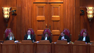
:::

This is Ken Chung and Her Majesty the Queen, Richard Fowler and Eric Pertuski for the appellant and David Leighton for the Queen.

Go ahead, thank you.

**Speaker 1** (00:00:53): Madam Justices, Justices, the facts of this case, like so many criminal cases, are breathtakingly tragic.

::: {.column-margin}
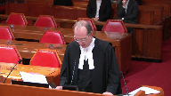
:::

The issue before you today, suffice to say, I think, unlike many cases that you hear, is not particularly complicated, I say with respect.

Did the trial judge in acquitting Mr. Cheung commit an error of law justifying intervention by the Court of Appeal?

I say with respect, the answer is an emphatic no.

The issue is not whether the facts could have been dangerous driving or whether even that they should have been.

The issue is only whether the trial judge did commit an error of law, specifically the error of law found by the Court of Appeal.

**Overlapping speakers** (00:01:51): Or any other arrow. Or any-

**Speaker 1** (00:01:53): Any other error of law? Yes.

::: {.column-margin}
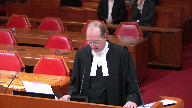
:::

But the Court of Appeal was very specific about the error of law that they say the trial judge committed.

I say with respect, the trial judge applied the principles of law that this court has set down in Roy, made reasonable findings of fact.

In other words, he did exactly what you would expect a provincial court judge to do.

This was not a particularly complex criminal trial with respect.

Evidence was heard over three days.

There was almost no disagreement on the facts.

There were lengthy admissions.

Crown and defence had four days to prepare extensive written submissions.

Several submissions took the better part of a day.

The Crown replied.

The judge asked both parties questions.

It was an engaged hearing.

The trial judge had over three months to consider, analyse and write his judgement and it was a thorough written judgement.

**Justice Rowe** (00:03:02): Yeah, that's all about the fairness of the proceedings.

I think that's not an issue.

What's an issue is the content of the decision.

**Speaker 1** (00:03:11): In the Court of Appeal and in the trial level, in my respectful submission, the decision of the trial judge is unimpeachable.

::: {.column-margin}
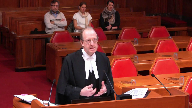
:::

He did not commit the error of law that the Court of Appeal found.

The Court of Appeal found that he had in essence devised some new principle of law that speed could never be enough.

And that somehow, as the Crown says and as a respondent here today, that he had essentially dismissed the ruling in Richards.

He did none of those things.

He made an observation, and he made the same observation that a Supreme Court judge in British Columbia had made in St. Pierre, that generally, generally, speed in dangerous driving cases where there's a conviction is in conjunction with other factors, other circumstances.

That is a reasonable statement of the law.

It's a statement, in essence, the same as what was said in Richards.

**Justice Brown** (00:04:24): And is that what he applied?

Is that a rule that he actually applied?

Because those other circumstances surely have to be viewed from the standpoint of a reasonable person.

That's the test.

That's a test that he cites.

But does he actually apply it?

**Speaker 1** (00:04:44): In my respect for submission at the end of the day he concluded that in applying the test in Roy which he accurately set out, he was not satisfied beyond a reasonable doubt in the circumstances of this case that the momentary excessive speeding amounted to dangerous driving.

::: {.column-margin}
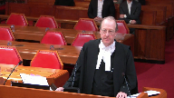
:::

There's no suggestion that he improperly applied the principles of law that have been enunciated in this court.

There's no suggestion.

**Justice Rowe** (00:05:16): But isn't that exactly what was said, that he improperly applied the principles by taking the general statement of the law and beating and distorting it by handcuffing himself in dealing with this excessive speed, this frankly almost maniacal speed in the middle of a city.

::: {.column-margin}
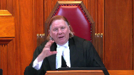
:::

**Speaker 1** (00:05:37): Well with great respect, I don't see how he handcuffed himself by saying generally other factors are in evidence when the speed alone.

You can't say as a principle of law.

**Justice Rowe** (00:05:50): He said generally, but then he applied it in a manner that was effectively categorical.

Guess what he did, is it not?

**Speaker 1** (00:06:02): I don't believe that's what he did.

::: {.column-margin}
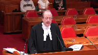
:::

I believe that he analyzed all of the facts that were carefully laid out before him, he carefully listened to the crown, he carefully considered all of the issues that the crown had raised about inattentiveness and at the end of the day he was not satisfied beyond a reasonable doubt.

**Justice Kasirer** (00:06:23): Mr. Fowler, could I take you to paragraph 120, just to follow up on my... Of the reasons for judgment?

::: {.column-margin}
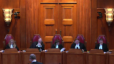
:::

The reasons for judgment.

Sorry, 117 and then 120.

I'm wondering about what meaning you attribute, we've spoken of generally, what meaning you ascribe to critically.

Critically, I find that the excessive speed was momentary, mere seconds in duration.

Well, why is that?

**Speaker 1** (00:06:54): critical?

::: {.column-margin}
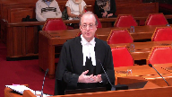
:::

Well, because I think my respectful submission, the test of dangerous driving is becoming aware of the risk and mitigating it.

And it's clear on the evidence that his excessive speed could only have been momentary.

In other words, he reached a speed and then started braking.

**Justice Kasirer** (00:07:14): Right, but if you read the first sentence of Justice Doherty's judgment in Willock, is it not true that excessive speed, even momentary excessive speed, can be the basis for finding a marked departure?

::: {.column-margin}
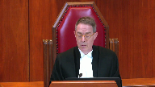
:::

In which case, it's hard to understand why it's critical here, if it's possible to find it as the basis for a marked departure.

Well, because, because it suggests, sorry, I'll just finish my thought and you'll correct me where I'm wrong.

It wouldn't be, it would be critical if momentariness would exclude, would exclude it, right?

If excessive speed was momentary and that meant, well, that's negligence as opposed to criminal conduct, which Justice Doherty says that's often the case. Yes.

Then it would be critical if it was, in all cases, if it was a rule of law.

But it's a matter of, the law actually is, momentary or not, excessive speed can be, can be the basis for a marked departure.

But he never.

**Speaker 1** (00:08:39): But he never makes a statement that it's not.

He makes a statement that he, in his findings of fact, finds that the excessive speed was momentary.

**Justice Kasirer** (00:08:49): Right, you said that already.

I'm asking you, why is it critical here?

**Speaker 1** (00:08:54): Because he has to go on and apply the test of whether or not he's aware of the risk and whether he does anything to mitigate that risk.

::: {.column-margin}
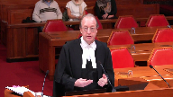
:::

And in my respectful submission, the facts were clear.

Yes, he was driving normally.

He starts accelerating.

He hits this ridiculous speed.

And then he starts braking, all in an extraordinarily short space of time, one block.

So it's critical, in other words, not as a question of law, but to his analysis of whether the test in Roy has been satisfied.

That's how I read the word critical.

He's not making, he's a provincial court judge.

He's not, with greatest of respect, he was not being asked to develop new principles of law by anybody.

He wasn't seeing this case as a case of first impression and being asked to reconsider Richards.

He was applying the law, which was, generally speaking, speed, in these cases, is accompanied with something else.

And that is an accurate, in fact, observation of the law.

Another way of looking at it is this.

If he had said speed as a matter of law can be enough, that would also be an error of law.

Because section 249 requires that you look at all of the circumstances.

So the question of speed always has to be contextual.

It cannot just be a deliminator of the offence in of itself.

There's provincial legislation that says that.

Forty kilometers an hour over is.

**Justice Rowe** (00:10:27): 140 kilometers an hour in the middle of a city approaching an intersection, that's her context.

**Speaker 1** (00:10:34): I don't disagree with that, but the issue here with the greatest of respect is whether he erred in law in his analysis, his conclusion that there was insufficient evidence to satisfy him beyond a reasonable doubt, cannot be appealed.

::: {.column-margin}
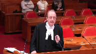
:::

**Justice Karakatsanis** (00:10:53): Can I ask you this?

I appreciate that an unreasonable verdict is not itself a question of law.

**Overlapping speakers** (00:11:01): Yes.

**Justice Karakatsanis** (00:11:02): If though the view is that his application of the test here and his conclusion was unreasonable, can that tell you anything about how he applied the test or whether in fact he did take some of these statements and apply them in a way that was inconsistent with the statements of the law that he has articulated?

::: {.column-margin}
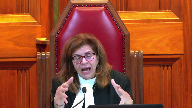
:::

**Overlapping speakers** (00:11:31): I suppose my concern would...

But that's my question.

I suppose my concern would...

**Justice Karakatsanis** (00:11:34): is where you get, is there a path to an error of law there when you see a disconnect between the law as stated and a conclusion which does not seem to follow the application of those principles.

**Speaker 1** (00:11:51): In other words, in a sense, you're inferring back from the result that there must have been an error of law because the result doesn't seem reasonable.

But no, not alone, because the—

**Justice Karakatsanis** (00:12:02): But you do that in a context where there's some ambiguity in the way in which principles are laid out.

::: {.column-margin}
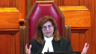
:::

Normally you'd say, well, we look at our reasons generously and we presume a judge knows the law and so on, but when there are enough flags and coupled with an unreasonable result, can we then find a path to an error of law?

**Speaker 1** (00:12:28): In my respect for submission, of course, it's always open to any court of appeal to look for a path to an error of law, but with the greatest respect, just because the result is not one that probably most judges would have arrived at, that does not in of itself establish that there was an error of law.

::: {.column-margin}
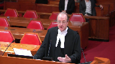
:::

In my respect for submission, I have read these reasons numerous times.

The court of appeal had these reasons and obviously reviewed them numerous times.

Crown counsel in the court below, ironically, had these reasons and they didn't identify the ground of error of law that the court of appeal ultimately concluded that the trial judge had committed.

So if the error of law was so obvious with the greatest of respect, I...

**Overlapping speakers** (00:13:20): of laws, so I'm not sure this is helping.

**Speaker 1** (00:13:22): Right.

::: {.column-margin}
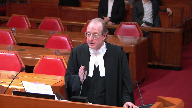
:::

But my point is it's hard to say that a trial judge has committed an error of law if you cannot see it in his reasons.

And in the greatest respect, I cannot see how his statements about Richards, about St. Pierre, about the effect of speed, how that can be seen as an error of law.

He's made an accurate observation that generally in the cases that he was referred to, speed is accompanied most often, or generally, he said, with other factors.

**Justice Brown** (00:13:59): So that would be your submission on the alleged sin of commission.

::: {.column-margin}
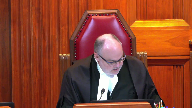
:::

I'm wondering if I could explore with you the possibility of a sin of omission. Right.

In other words, things we don't find in the reasons.

So, the trial judge cites the test correctly at paragraph 112 for the mens rea and dangerous driving.

And I'm wondering if you can describe how he, with reference to the reasonable person, because it is an objective test, how he applies that test in this case.

Because I look at paragraph 114, I look at paragraph 115, and I see a lot about Mr. Chang.

I see in paragraph 113 there's all the risks that he might have foreseen, but of course that's not the question.

**Speaker 1** (00:14:59): No, I appreciate that.

::: {.column-margin}
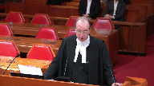
:::

The trial judge had already gone through, by this point, an analysis of the aspects that the Crown had urged upon the court about inattention.

So there was an awful lot of analysis leading to this point.

But the question he was required to address under the mens rea, because that's what he's considering at this point.

And the mens rea is, as it says here, the question is whether the accused's failure to foresee or avoid the risk constitutes a marked departure.

That's the objective standard.

So he was clearly aware of that.

From the requisite standard of care that a reasonable person would observe in the accused's circumstances.

Well, in my respectful submission, you had a pattern of driving that was otherwise normal for some inexplicable reason.

Between 42nd and 41st on Oak Street, he accelerated in this powerful car.

And then, the evidence has to support that he almost instantly started to brake.

So in other words, it was quite open to the trial judge to see that at that point, he had foresaw the risk and took steps to mitigate it.

When you see an object in your path.

I'm sorry, I...

**Justice Rowe** (00:16:14): When you see an object in your path, it would be inconceivable that you'd continue to accelerate.

When you see an object in your path, you begin to decelerate.

That's what, that's my inference as to why I got on the break.

I'm going to hit something.

**Speaker 1** (00:16:30): Well, that's a risk.

He foresaw the risk.

We could say both.

**Overlapping speakers** (00:16:34): If you saw the re-

**Speaker 1** (00:16:34): risk of speeding or he foresaw the risk of a car turning in front of him, absolutely, he foresaw the risk.

**Justice Brown** (00:16:40): But who cares what he foresaw?

The issue is what risk a reasonable person would have foreseen, proceeding as he did.

**Overlapping speakers** (00:16:50): Right.

**Justice Brown** (00:16:50): At that speed to that, I know that intersection.

We're talking about one of the ‑‑

**Overlapping speakers** (00:16:55): the most important intersections in the residential part of Vancouver, it's one of the main arteries in and out of town from the airport.

East-west, north-south.

Absolutely.

There's no doubt about it.

I mean, I'm not trying to minimise the conduct.

**Justice Brown** (00:17:09): suggesting you are, but those are the circumstances within which that objective test has to be applied.

And I'm wondering whether he really does that because it's all about what Mr. Chung saw, what Mr. Chung would have foreseen.

**Speaker 1** (00:17:24): But with the greatest respect, that has to be a significant portion of it because it's his conduct and it's the mens rea in respect of his conduct that's being assessed.

Yes, it's being measured against a reasonable person.

**Justice Brown** (00:17:39): it?

That's the question that I have.

Does he do that?

Or does he not just confine himself to what Mr. Chung saw?

And if not, please show me where he measures that against the reasonable person?

**Speaker 1** (00:17:57): With the greatest respect, I believe it's implicit in the test that he says or the question he has to answer.

::: {.column-margin}
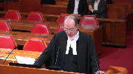
:::

As he says, the question I have to answer is this.

He's aware that it's an objective test.

He's aware that it's a marked departure.

And in my respectful submission, no frequently the appellants come before this court and other courts of appeal and say the trial judge didn't do this, didn't say this, didn't say this.

And courts of appeal consistently say that judges don't have to articulate every step in the chain of reasoning.

And in my respectful submission, the fact that he has accurately set out the test, accurately reviewed all of the circumstances that were put before the court by the crown, that he has considered all of the crown's arguments and responded to them, he was well aware of all of the circumstances.

He didn't misapply any of the evidence.

And in my respectful submission, it's implicit in his conclusion that he was satisfied that the test was not proven beyond a reasonable doubt.

That doesn't mean he misapplied the test.

He was just of the view that the momentariness of the speeding before the breaking was not sufficient to satisfy him beyond a reasonable doubt that this test had been met.

And that is what the trial judge is required to do in my respectful submission.

Apply the test to the facts and to the standard of proof.

And ultimately his conclusion was, as he says at the end, I conclude the momentariness of the accused conduct in excessively speeding.

That was a significant factual point for him in that this acceleration to this ridiculous speed did not continue for anything like a literature.

It was a point in time.

If you look at the evidence, it could only have been a point in time before breaking started.

**Overlapping speakers** (00:19:52): This wasn't the highway between McBride and Prince George.

**Speaker 1** (00:19:55): No, no, no, I appreciate that.

I mean, of course it wasn't.

That's why the Axis Reyes was conceded.

But the issue was whether he became aware of the risk that he created and took steps to abate it, and he did.

**Overlapping speakers** (00:20:08): No, no, no, that's not the issue.

It's not what risks he was aware of.

That's not the issue.

I'll rephrase it. Okay.

Because the problem is that's how the trial judge phrased it.

**Speaker 1** (00:20:18): All right, he was aware of what a reasonable person would have been aware of, that going at this speed was ridiculous.

And he braked.

He could be responsible for braking, of course, but he became aware objectively.

**Justice Brown** (00:20:34): Well, was he in suspended animation when he accelerated?

::: {.column-margin}
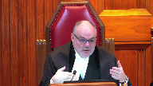
:::

I mean, can we move that analysis back a nanosecond to he might have been aware that accelerating to that speed would be unreasonable in that place, in that time.

Your analysis starts where he's woken up.

My God, I'm going at 140 kilometers an hour.

**Speaker 1** (00:20:56): But all of this, the putting the foot on the accelerator, accelerating, reaching a speed and braking occurs over not a nanosecond but an incredibly short distance.

The evidence was that the acceleration did not start at the speed of 100 km per hour.

**Justice Brown** (00:21:14): to 1 42nd or yeah between 1 42nd and 1 41st yeah isn't part of the momentary

**Justice Martin** (00:21:20): there the very fact that an accident occurred immediately?

::: {.column-margin}
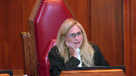
:::

I mean if we're talking about the momentariness, I mean he's breaking because there's a foreseeable car in his way, so it's momentary because the danger is imminent.

**Speaker 1** (00:21:39): Well, that's an inference you could draw, but you could also draw the inference that he was breaking because he was aware of the speed that he'd reached.

::: {.column-margin}
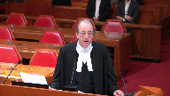
:::

I mean, both of those inferences are available.

And you don't know, nobody knows what speed he would have been if there hadn't been an accident and he might have been doing a hundred or 80 by the time he got to the other side of the intersection and carried on as he had been at 50 kilometres an hour all the way into Vancouver.

I mean, the momentariness has to go to his state of mind, which is exactly how the trial judge considered it, in the conduct of a course of driving.

**Justice Martin** (00:22:11): And maybe momentariness, I guess I'm asking a question.

::: {.column-margin}
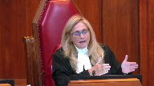
:::

Does momentariness have any different import?

If you do it for a little bit and then you choose yourself to stop speeding at that rate or circumstances present themselves where the accident is so imminent on the triggering of the excessive speed, right?

**Speaker 1** (00:22:39): Yeah.

::: {.column-margin}
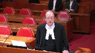
:::

Well, we don't know.

Both inferences are available.

The momentariness includes the acceleration.

We know that.

It started at 40 seconds.

There was not a lengthy period of acceleration.

We know that.

We know the breaking occurred before the intersection, before the intersection, and that at the time of the collision he was doing 119.

So he had already slowed down 20 kilometres an hour.

Both inferences were available to the trial judge that he braked because he saw the car turning, but equally he could have been braking because of the speed that he had reached.

In other words, he, like any reasonable person, would have appreciated the risk.

Appreciating the risk in advance of reaching a certain speed when the conduct takes place over a very short period of time is not necessarily reasonable in my respectful submission.

He mitigated the risk that he had created and that risk existed for a very short period of time.

You cannot and that was significant to the trial judge in his analysis and his application of the standard of proof to the test.

**Justice Kasirer** (00:23:59): Just to follow up on Justice Brown's question, did he answer the two questions in Roy, in the Roy case, that he cites it, in the Roy case, I suppose it's...

**Overlapping speakers** (00:24:13): Sorry, yes.

Paragraph 112.

**Justice Kasirer** (00:24:16): So he, does he answer the two questions?

No, it's cited at 63.

The test decided.

**Speaker 1** (00:24:28): Right, that's the full paragraph that he summarizes as the question.

**Overlapping speakers** (00:24:34): of the-

**Speaker 1** (00:24:34): The first question is whether in light of all the relevant evidence, a reasonable person would have foreseen the risk and taken steps to avoid it if possible.

::: {.column-margin}
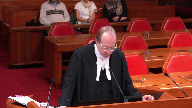
:::

If so, the second question is whether the accused failure to foresee the risk and take steps to avoid it if possible was a marked departure from the standard.

So that's ultimately, I would say this turns on the question of whether his failure to foresee the risk was a marked departure from the standard.

**Overlapping speakers** (00:24:56): I understand.

Departure.

**Speaker 1** (00:25:01): Not explicitly, no.

Not in his reasons, but it was quite clear is that he was absolutely aware of the test.

He repeated it paragraph 36 accurately.

He summarized it accurately later on in his reasons.

**Justice Kasirer** (00:25:19): But I guess if he didn't keep in his mind what the reasonable person would have done in the circumstances, how can he determine whether it's a marked departure or not in the second question?

But with the greatest of respect...

It's quite...

You don't owe me respect.

I was just asking a question.

No, no, no.

**Speaker 1** (00:25:35): I believe that that would simply be a case of reading back from a result you don't like.

::: {.column-margin}
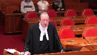
:::

You don't like the result so you say he kind of applied the test correctly because he didn't enunciate every step along the way of what his thinking was.

In my respectful submission, that is not evident on his reasons.

It's not evident in his questioning of council during closing submissions.

We can't divorce his reasons and this court and many other courts have said this.

You've got to look at the trial as a whole.

He was fully aware of what the evidence was.

He said that he watched the video numerous times.

He had written submissions.

He had oral submissions.

There's no suggestion that he had misapplied the law.

It's simply a case of we don't like the result, therefore he must have misapplied the law.

**Justice Karakatsanis** (00:26:29): Nobody's saying it's a question of they don't like the result.

If anything, it's a question of the result seems so unreasonable that it raises the issue.

**Overlapping speakers** (00:26:38): right now.

**Justice Karakatsanis** (00:26:38): No, I-

**Overlapping speakers** (00:26:39): I appreciate that.

**Justice Karakatsanis** (00:26:40): but don't, I don't think it's a fair statement to say well you don't like the result therefore.

Nobody is using or suggesting.

**Speaker 1** (00:26:47): All right, with the greatest respect, I don't think you can go back from saying this is an unreasonable decision.

::: {.column-margin}
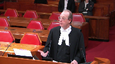
:::

Therefore, there must have been a misapplication of the law.

Because that would fundamentally remove the protection that an accused has from the Crown not being able to appeal an unreasonable acquittal.

If every unreasonable acquittal could simply be turned on its head and stated as the trial judge must have misapplied the law because he arrived at this conclusion, then it's effectively a way of appealing an unreasonable acquittal.

**Justice Karakatsanis** (00:27:30): And nobody would disagree with you that you can't do that as a general rule.

**Overlapping speakers** (00:27:35): Yes.

**Justice Karakatsanis** (00:27:35): The question is, in the context of these reasons, is that available?

And that is the question put to you.

**Speaker 1** (00:27:41): No, in my respectful submission, that would be exactly the case, that this result is one that stands out as being unreasonable, let's say, to many people.

::: {.column-margin}
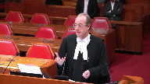
:::

And the court of appeal did exactly what I say you can't do, and that is they went looking for an error of law so that this acquittal could be overturned.

And ultimately they found an error of law that the trial judge didn't commit.

And this court in its questioning of me has identified other issues or other potential errors of law that the court of appeal never raised.

And in my respectful submission, that is essentially what there is about this case that's so difficult is that, yes, the verdict appears to be unreasonable.

But that doesn't necessarily mean that the trial judge got the law wrong.

It just means that in his mind, as he said at the end, the excessive speeding is insufficient to meet the criminal fault component and he must be acquitted.

He did what he was required to do, which was apply the standard of proof to the facts that he saw to an accurate statement of the law, and he arrived at his conclusion.

So in my respectful submission, it would fundamentally deconstruct the protection of the unreasonable acquittal not being available to the Crown as a question of law if one simply were able to infer, essentially infer, because it's not explicit, that he must have committed an error of law to have arrived at this conclusion.

Thank you.

Thank you, Your Honor.

**Justice Karakatsanis** (00:29:42): Thank you, Mr. Fowler.

Yes, Mr. Leighton.

**Speaker 2** (00:30:03): So we've established that I'm taller than Mr. Fowler.

**Overlapping speakers** (00:30:06): You wanted that on the record, did you?

That's a good start for me.

**Speaker 2** (00:30:08): And I see the clock has started running.

::: {.column-margin}
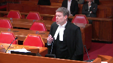
:::

So I want to begin my submissions by emphasizing a couple of facts on the appeal because I believe they're important in seeing why the trial judge made an error.

Of course we know that the appellant accelerated from 50 to 140 within the space of a block, that's about 100 metres.

We know that the speeding was the acceleration was intentional.

We also know the trial judge found it was mere seconds.

So it was momentary but it was seconds.

And I want to comment a little more on that.

Because the evidence, the trial judge didn't actually specifically find how many seconds.

But the uncontested evidence was that this particular vehicle could accelerate from 45 to 65 miles per hour in 2.1 seconds.

That's 72 to 105 kilometres per hour in 2.1 seconds of course.

**Justice Brown** (00:31:12): I would have convicted this man.

I would absolutely have convicted him.

But that's not the question.

It's not justice.

I agree with that.

**Speaker 2** (00:31:24): You

**Overlapping speakers** (00:31:24): episodes.

**Speaker 2** (00:31:24): That's not something the crown is arguing at all here.

The point I want to make is the acceleration here is much more than 72 to 105 kilometres per hour.

So it's more than 2.1 seconds.

That's all I'm saying.

**Overlapping speakers** (00:31:38): Yeah, no, it's ludicrous.

It's more than unreasonable. I get it.

Where's the Arab law?

**Speaker 2** (00:31:44): seconds of speeding.

::: {.column-margin}
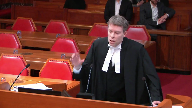
:::

The other fact I just wanted to accentuate is that during all or at least most of this period of grossly excessive speeding, the appellant was aware of two particular vehicles in the intersection.

First he was aware of the Toyota that was at the corner in his lane.

It was waiting for a pedestrian to cross so it could turn right.

It had its blinker on and it was lingering there for, you can see it on the video, four seconds before the collision.

So that vehicle was there, the appellant knew it was there as he was accelerating.

The other vehicle that he knew about as he was accelerating was the red Suzuki that was turning left.

And although the trial judge doesn't mention this evidence in his reasons, it was uncontested that the Suzuki started its turn between three and three and a half seconds prior to the collision.

So we have the appellant accelerating to this excessive speed and during that time he knew about these two vehicles in the intersection and he still didn't brake until he was entering.

**Overlapping speakers** (00:32:59): Mr. Leighton, it's not a good sign when we're looking for the error of law that we're spending all this time on the evidence.

**Speaker 2** (00:33:06): I've done my set up on the evidence, justice, and I'll move on to what the error of law is here.

::: {.column-margin}
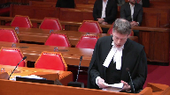
:::

Now, the appellant says that the error of law wasn't, didn't occur because the judge made the comment that generally speeding alone absent other driving deficiencies doesn't constitute dangerous driving and the crown agrees that that on its face at least leaves open the possibility that sometimes excessive speed without other driving deficiencies can meet the mark departure test.

The problem here is that the trial judge went on to adopt another more restrictive principle of law at paragraph 117 of his judgment and that principle was that momentary speeding without other driving deficiencies cannot meet the mark departure test.

So I'd like to take the court to paragraph 117 of the judgment and by this point the trial judge has concluded that there are no other driving deficiencies other than the excessive speeding.

So the question squarely before him is does the excessive speeding here absent other substandard driving amount to a mark departure?

And what does he say about this key issue?

This is what he says.

Critically I find that the excessive speed was momentary, mere seconds in duration.

There can be no doubt that conduct occurring in a two or three second interval can amount to a mark departure from the standard of a reasonable person and demonstrate a wanton or reckless disregard for the life or safety of others.

However, conduct that occurs in such a brief time frame in the course of driving which is otherwise proper in all respects is more suggestive of a civil rather than a criminal and the criminal end of the negligence continuum.

**Justice Karakatsanis** (00:35:27): Are you suggesting that there's something wrong in the quote from Doherty and Willard?

**Speaker 2** (00:35:31): No, what I'm suggesting is in error is adopting that principle of law in a case like this one where the momentary substandard driving conduct is intentional like this case as opposed to a lapse of attention.

::: {.column-margin}
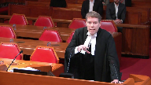
:::

**Justice Karakatsanis** (00:35:51): I'm still looking for the error of law.

It's critically, in this case, the excessive speed was momentary.

**Overlapping speakers** (00:36:00): Yeah.

**Justice Karakatsanis** (00:36:01): So he's describing what the facts are in this case, and then he cites as the law, principle of law.

**Overlapping speakers** (00:36:08): Yes.

**Justice Karakatsanis** (00:36:09): statement that makes it clear that conduct occurring in the two to three second interval can amount to marked departure.

He's obviously aware that it can but often

but sometimes it doesn't.

**Speaker 2** (00:36:24): Well, the next sentence in my submission is important because.

::: {.column-margin}
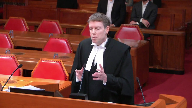
:::

What next sentence?

From Doherty?

Yes, from the Willick case.

This is the problem.

However, conduct that occurs in such a brief time frame in the course of driving which is otherwise proper in all respects is more suggestive of the civil rather than the criminal end of the negligence continuum.

In my submission that paragraph is setting out a principle of law that momentary speeding if the driving is otherwise normal is more suggestive of criminal than it is more suggestive of civil than it is of criminal negligence which necessarily means that it can never meet the test for a marked departure on proof beyond a reasonable doubt.

That I say is an important part, perhaps the key part of the error of law that the trial judge made in this case because we don't have to conjure up factual scenarios as to why momentary speeding where it's deliberate can meet the marked departure test.

This case is the example of that.

And let me ‑‑ and we see that after the judge sets out this principle of law, he then doesn't go on to examine whether the facts in this case are capable of meeting the marked departure test.

He simply goes straight to the conclusion which is that the momentariness of the conduct is insufficient to meet the criminal fault component.

I say he does that because he has adopted that principle from Willick which shouldn't be extended to a situation like this one where the conduct, the driving conduct though momentary is intentional as opposed to a lapse of attention.

Now, I want to say something more then about the Willick case and why the ‑‑

**Justice Karakatsanis** (00:38:28): I just want to be clear on what you're saying the error of law is.

::: {.column-margin}
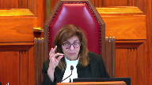
:::

You're saying, quoting Doherty and Willock, and quoting that second sentence, which says that when it's momentary it can be a marked departure, or it often is more suggestive of civil, that quoting that second sentence in this context was the error of law.

**Speaker 2** (00:38:53): I say that is one of the errors of law here and it's a key error of law and he says...

**Overlapping speakers** (00:39:00): And is that because it's wrong?

**Speaker 2** (00:39:01): I believe it's wrong in a case where the momentary driving conduct is intentional, yes.

::: {.column-margin}
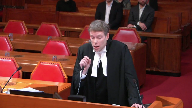
:::

And again, what Mr. Just, the comment here is that the momentary substandard, momentary speed, momentary impugn driving conduct.

**Justice Brown** (00:39:25): What is there in the first sentence in Willick that suggests that he's referring to unintentional conduct?

He calls his words like wanton or reckless.

**Speaker 2** (00:39:37): No.

::: {.column-margin}
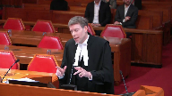
:::

Well, this takes me, I am going to explain that because I'm going to go to the Willick case. Okay.

But I just wanted to make sure I had finished off this point that after making this comment there's no discussion in the reasons for judgment about how the conduct in this case or whether the conduct in this case in all the circumstances could meet the marked departure test.

Do you want to talk about that now or do you want to talk about that later?

I'm going to go to Willick now. Okay.

And then you'll come back to that other point? Yes.

I have a question for you on that too.

I'll take it now. Okay.

Are you sure? Yes.

Yes. Okay.

**Justice Brown** (00:40:22): Okay.

::: {.column-margin}
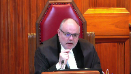
:::

So, I mean, you know that that's a concern for me because you heard me ask your friend about it. Yes.

Sin of omission kind of thing.

So paragraph 119, the trial judge circles back and says there is at least a reasonable doubt that such conduct amounted to a marked departure from the standard of a reasonably prudent driver.

So having stated the test in paragraph 112, he comes back at paragraph 19 and circles back.

Now I accept, I don't see very much analysis at all between 112 and 119 about reasonably prudent drivers, but as your friend points out, we don't require trial judges to sort of show every jaw and tittle of their thinking. Yes.

So I'd like you to address the significance of that sentence in light of my questions to your friends.

**Speaker 2** (00:41:22): Yes.

::: {.column-margin}
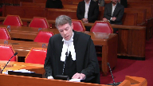
:::

Well, I've two responses to that.

One is that there is no analysis and in particular there is no analysis of certain aspects of the factual matrix which are crucial to addressing what's really an issue in this case.

And that goes to the other errors of law that I address in my factum and I'll come to those in due course.

My other response is that the reason the trial judge is has a reasonable doubt on this point is because he is previously in 117 adopted a proposition of law that momentary speeding absent other driving deficiencies is more suggestive of civil rather than criminal negligence and that necessarily means that you can never establish criminal negligence on proof beyond a reasonable doubt.

**Overlapping speakers** (00:42:20): But the words more suggestive aren't exclusive.

**Speaker 2** (00:42:24): Well, I would suggest that if they're more suggestive, then how can you prove beyond a reasonable doubt that it's criminal negligence, because as a proposition of law, you're saying that when you have momentary excessive speeding, it is more suggestive of civil negligence.

**Justice Rowe** (00:42:41): When I was driving across the prairies a number of years ago I found myself driving at very rapid speed and it was just because there were no indicia right

::: {.column-margin}
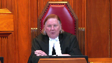
:::

I mean it's all flat there's nothing there you you hardly know when you're going 50 miles an hour or 100 miles an hour I'm afraid I still think in miles an hour

and so that was a lapse of judgment I wasn't paying enough attention it seems to me that's different from saying I'm gonna nail this car and see what this baby is gonna do right in the middle of town that's not a lapse of judgment it seems to me that is a conscious choice to undertake a dangerous act is it not.

**Speaker 1** (00:43:29): Well-

**Speaker 2** (00:43:31): I would use the, and it may be just a question of semantics, but I would use the term momentary lapse of judgement to refer to an intentional decision to speed, a deliberate decision to speed, whereas the scenario that you, Justice Roe, have suggested is I would call a momentary lapse of attention.

::: {.column-margin}
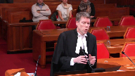
:::

It's what in Beattie this court has talked about as part of the automatic and reflexive nature of driving.

Sometimes we're not totally paying attention, and we make these errors that may be negligence in civil terms but do not, or should not, amount to criminal negligence.

So that's the distinction I would draw in that scenario.

I want to go to Willick because...

**Justice Kasirer** (00:44:22): Just before Willock, where in the judgement is there a factual basis that the acceleration was intentional and deliberate?

Is that an inference you're making?

**Speaker 2** (00:44:33): I would suggest that's the only ‑‑ first of all the trial judge at I believe it's paragraph 90, the trial judge says at paragraph 109 ‑‑ a few points there.

::: {.column-margin}
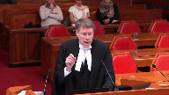
:::

At paragraph 109 the trial judge says that this was a powerful motor vehicle and the appellant ‑‑ the accused would have known that.

Number one.

Number two at paragraph 118 the trial judge says that this was a momentary lapse of judgment and again I would suggest a lapse of judgment is a wrong decision that's made as opposed to a lapse of attention.

And the final point here is that there's nothing in the evidence at all to suggest that this was unintentional, it was not deliberate decision to speed and the trial judge's conclusion that it was a momentary lapse of judgment I suggest is correct.

**Justice Kasirer** (00:45:52): I lost you there because somewhere you draw a distinction between what justice roe was describing when he was rolling through the prairies and what happened here and I'm just looking for it in the judgement.

::: {.column-margin}
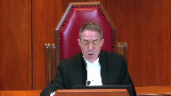
:::

So looking for what you're saying, you absolved justice roe of his conduct a moment ago. Yes.

That's kind of you.

Where is it?

I wouldn't have approved charges.

Where is it in the judgement that it was deliberate that he excelled?

**Overlapping speakers** (00:46:26): I have a strong...

**Justice Kasirer** (00:46:27): You knew that he knew the car was a powerful car, so perhaps I don't know.

**Speaker 2** (00:46:35): I'm saying there were two things in the judgment that are important here.

::: {.column-margin}
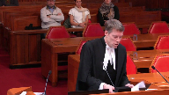
:::

Comment that he knew it was a powerful card, number one, and number two, the comment of paragraph 118 that this was a momentary lapse of judgment.

And I suggest that use of the term judgment is commensurate here with a use of a term intentional or deliberate.

It's not a momentary lapse of attention, it's a momentary lapse of judgment.

The word judgment connotes making a decision to do something.

It was momentary, it was wrong, but it was deliberate.

So that's what I'm focusing on when I say this was an intentional decision to speed.

And then the final point was that on the evidence here, there's absolutely nothing to suggest that it was a lapse of attention.

So I'll go to the Willick case now.

And my point with Willick is that the principle that Justice Doherty sets out at paragraph 31 which is adopted by the trial judge only applies to and should only apply to momentary lapses of attention.

So the idea that substandard driving for 2-3 seconds where the driving is otherwise normal is more suggestive of civil than criminal negligence is a principle that works and is justified where it's a lapse of attention.

It doesn't work, it's not justified where it's a lapse of judgment where it relates to deliberate driving conduct.

In the Willick case, the trial judge found the accused guilty of criminal negligence because he said the trial judge had been jerking the wheel back and forth for 2-3 seconds and that had caused a fatal accident.

However, the evidence was equivocal on this point because the only witness who survived, who saw the accused with his hands on the wheel in cross-examination had to concede that she couldn't say whether he was jerking the wheel back and forth intentionally or if what he was doing was trying to regain control of the vehicle after it had swerved.

And on those facts, the court of appeal and reasons written by Justice Doherty held that there was no reasonable basis to conclude that he was deliberately jerking the wheel back and forth.

So at paragraph 36 of the Willick case, Justice Doherty says in my assessment of the evidence, the most that can be said is that the appellant suddenly lost control of his vehicle and was unable to regain control of the vehicle before it entered the median.

This conclusion certainly suggests a momentary lapse of attention by the appellant but in my view cannot sustain a finding that his driving amounted to criminal negligence or dangerous driving under the criminal code.

So this is a momentary lapse of attention in the case and that's the context in which if the court turns back to the previous page, that's the context in which Justice Doherty at paragraph 31 makes his comment of principle that's then adopted by the trial judge in the case at Barr.

But the problem with adopting that in the case at Barr as I've said is it doesn't extend to deliberate momentary substandard driving and that's a point that Justice Doherty himself expressly makes at paragraph 32 when he says I think the appellant's conduct during the two or three seconds in issue could only reasonably constitute a marked and substantial departure from the conduct expected of a reasonable driver if the appellant deliberately jerked the steering wheel to cause the vehicle to swerve.

So again, that's the distinction.

Momentary lapse of attention justifies applying the principle in paragraph 31, the principle that the trial judge in this case applied but it doesn't work where there's a momentary lapse of judgment as in this case.

That's why the principle was inappropriate in the case at Barr.

And that ultimately is the basis if one looks at the court of appeals reasons, that's the basis I would suggest or an important basis of the court's conclusion.

So if we go to tab four of my condensed book, paragraph 27, the bottom of the page there, by this point the court of appeal has noted that the trial judge found that the only deficiency in driving was the grossly excessive speed and the court says that as a result the sole issue for the trial judge was whether the rapid acceleration and excessive speed that Mr. Chung exhibited in the seconds before the accident constituted a marked departure from the reasonable driver standard.

And then at the bottom of the next page, the court of appeal sets out what it considers the trial judge found as a principle of law.

Namely the judge considered and rejected the idea that excessive speeding for a limited period of time without other dangerous conduct could meet the mens rea requirement for dangerous driving.

His reasoning is set out at paragraphs 103 to 107 and 117 of his judgment.

And then the court reproduces those paragraphs including of course paragraph 117 which I suggest is in error because that principle should not apply where the momentary driving conduct is deliberate and then at the next page, paragraph 32 of the court of appeals judgment it expressly notes that the principle that Dougherty was making in Willick doesn't apply where the momentary substandard driving is deliberate and then quotes the paragraph that I've already referred the court to from the Willick case.

And that's the problem here that was identified by the court of appeal and I suggest the court of appeal was correct in deeming that to be an error.

**Justice Martin** (00:53:12): But couldn't there also be some kind of error to the extent that, I mean, there was almost a singular focus on the momentariness of this rather than the reasonably foreseeable risks of the excessiveness of the speed.

::: {.column-margin}
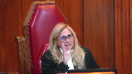
:::

I mean, in St. Pierre we're talking about 80 something in a 50 zone.

Here we're talking three times and then 119 into the intersection.

I mean, can there be, is it an error of law to not do what a reasonable person, an analysis based on what a reasonable person would do assessing the risk at this speed in a relatively short period of time.

**Speaker 2** (00:54:02): Yes, I think that would be an error of law if the trial judge fails to undertake that analysis.

::: {.column-margin}
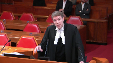
:::

I suggest that he didn't, that he in fact failed to do so because he proceeded from the basis that if the excessive speeding is momentary then there has to be a reasonable doubt that you can never move about departure of the vehicle.

**Justice Martin** (00:54:22): part of that excessive in terms of the risk factor on March mark departure yes

**Speaker 2** (00:54:30): And that's one of the points the court of appeal makes at paragraph 33 which I didn't take the court to but the court of appeal says the problem with the principle of law that the trial judge adopted is that it meant that he didn't take into account where the excessive speed fell on the continuum.

::: {.column-margin}

:::

It could have 80 as in St. Pierre but it could have 140 as in this case.

The final point I wanted to make relates to what I say is an additional error but I suppose in some respects it could be seen as flowing from what I say was the trial judge's general failure to assess whether the marked departure test was met in the circumstances.

But I'm focusing in particular on two pieces of evidence.

This goes to the errors, the other errors that I mentioned in my factum.

The argument here the crown says is that it's an error of law as this court holds in J.M.H. not to consider all of the evidence in determining the ultimate issue of guilt or non-guilt.

And the respondent suggests that that type of error was met here and specifically the respondent submits that it was that kind of error of law arose here because in determining whether the marked departure test was met the trial judge failed to consider the impact of his findings that the appellant had been aware of that lingering Toyota in the intersection and had seen the Suzuki commence its turn.

Now, the trial judge doesn't have to mention every piece of evidence in assessing whether a guilt is proven, doesn't have to mention every one of the party's arguments, but where the trial judgment by failing to mention the impact of important factual elements on the assessment of the ultimate issue where by doing that the judge hasn't addressed a live issue in the case, hasn't grasped the substance of the case, then this court is justified in concluding that that particular piece of evidence or particular fact wasn't considered hence an error of law.

So in this case the findings by the trial judge that the appellant was aware of that Suzuki lingering in the intersection and had seen, sorry, the Toyota lingering in the intersection and had seen the Suzuki commence its turn introduced in essence a gigantic elephant into the ultimate issue room in the form of a highly material question that inexorably and obviously arose from those findings.

And the question was did the appellant's intentional acceleration to three times the speed limit constitute a marked departure given that during all or most of this period of acceleration he was aware of the Toyota lingering at the corner and the left turning Suzuki because a reasonable person aware of those vehicles in the intersection would not have accelerated to 140 kilometres per hour applying the brakes only on entering the intersection.

In fact, the Crown's already formidable case was significantly strengthened once the trial judge had made those findings that the appellant was aware of those two vehicles in the intersection given just how inconceivable it is that a reasonable person sharing that awareness would have accelerated in that fashion.

**Overlapping speakers** (00:58:27): That sounds like a case for an unreasonable.

**Speaker 2** (00:58:29): Well, it is a case for an unreasonable verdict, but obviously the crown can't appeal on that ground.

::: {.column-margin}
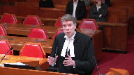
:::

That's why I raise it.

I suggest that in these circumstances, the failure to mention and consider those facts in assessing the ultimate issue is an error of law pursuant to J.M.H.'s description because it's a failure to grasp a live issue, an important matter in the case.

So that's my submission.

I'm not suggesting that it's an unreasonable acquittal, and therefore this court should uphold the decision of the court appeal on that basis.

**Justice Kasirer** (00:59:14): Can I bring you back to paragraph 33 where the Court of Appeal identifies the error of law?

**Overlapping speakers** (00:59:21): Yes.

**Justice Kasirer** (00:59:21): You can show me.

::: {.column-margin}
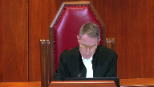
:::

So in my view, the trial judge's conclusion that momentary speeding without more cannot sustain a conviction for dangerous driving was flawed.

So your counsel for the appellant disagrees with the characterization of the judgment.

Court of appeal goes on.

The judge failed to recognize that categorizing conduct simply as speeding, and here's the question, the part I'm stumbling over, fails to consider the degree to which the conduct departs from reasonable standards.

How important is that to the determination of the error of law?

This is the 80 in St. Pierre versus the 140 here.

Sorry, I've just finished my thought.

The court of appeal goes on to be quite categorical, maybe too categorical, I wonder.

While it is true that driving moderately in excess of the speed limit will not necessarily amount to marked departure, I guess that would be a civil fault, from reasonable standards of driving, driving at a grossly excessive speed will, that sounds rather in all cases will, I wonder about that.

In this case, this is the troubling part, in this case I cannot understand how one could possibly describe the accused conduct at driving at almost three times the speed limit into a major urban intersection as anything but a marked departure from the standard expected of a reasonable driver.

That last sentence sounds like this is an unreasonable verdict, that last sentence. Yes.

So before you get to that last sentence, how important is this failure to consider the degree to which the conduct departs from the reasonable standard?

Is that the actual error?

I don't, I.

**Speaker 2** (01:01:27): I don't believe that's ‑‑ if one looks at this judgement as a whole, as one must, the error is, for example, set out at paragraph 43, trial judge found that Mr. Chung did not have a record of men's driving causing death.

::: {.column-margin}
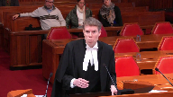
:::

He reached that conclusion only because he considered there to be a principal precluding of finding of men's unless speeding was combined with other dangerous activity or occurred for a prolonged period of time.

That's what the error is.

That's also at paragraph 31 what the court of appeals says the finding was.

The problematic finding is that momentary speeding absent other dangerous driving conduct cannot constitute the mens rea for dangerous driving.

I think that second sentence at paragraph 33 perhaps could have been put a little more precisely.

I don't think that captures really what the court of appeals judgement is about.

That's my response to the first point that you've raised justice.

Responding to the second point that the court of appeal in portions of its judgement seems to be saying that the trial judge's conclusion was unreasonable.

I've got a couple of responses to that.

First of all, the court of appeal makes absolutely clear at paragraphs 41 to 42 of its judgement that even though the judgement ‑‑ even though the trial judge's conclusion appears to be unreasonable that's not why the appeal is being allowed.

It's being allowed because of the error of law.

The fact that the court of appeal also makes comments about the unreasonableness of the verdict doesn't change that.

It's understandable why the court of appeal would have made those comments in this case for two reasons.

First, the fact that the ‑‑ the fact that the result was unreasonable underlines the error in the legal principle that the trial judge adopted because it led to a pervert result.

The other reason why it's legitimate for the court of appeal to talk about the unreasonableness of the verdict is it explains why the court is entering a conviction at the end of the day rather than ordering a new trial.

**Overlapping speakers** (01:04:06): Mr. Leighton, your time is up in concluding sentences.

Thank you, Jeff.

**Speaker 2** (01:04:10): There's no nothing more.

**Speaker 1** (01:04:35): I just want to comment in respect of the point about intention and speeding.

::: {.column-margin}
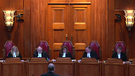
:::

There's nothing in the evidence to suggest that Mr. Chung decided what he was going to try to do with his car any more than he had a lapse of judgment in the sense that he accelerated too much or for too long.

In other words, there's nothing to suggest reaching a particularly obscene speed was intentional.

That's the first point.

**Justice Rowe** (01:05:02): Cars don't go from 50 to 140 unless you absolutely put the accelerator to the floor.

::: {.column-margin}
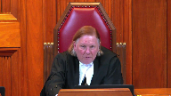
:::

I mean, it doesn't happen, right?

That's the only way even a high-power vehicle can accelerate that fast.

You've got to put her pedal to the metal.

**Speaker 1** (01:05:21): But I don't disagree with that, but the trial judge was bound by the evidence that he heard.

::: {.column-margin}

:::

And there was actually not a lot of evidence about this particular car and other than the comment about that he could go I think from 40 to 60 miles an hour in 2.1 seconds.

But there was no more evidence than that.

It was a powerful car.

The crown didn't call any more evidence about that, didn't call evidence about his experience with this vehicle or anything like that.

In respect of paragraph 117 of the reasons for judgment, where the trial judge quotes from Willock, the word is more suggestive.

Simply illustrates what we all know, which is marked departure represents a point, an imprecise point, an unknowable point on a continuum.

It is not a dichotomous standard.

We cannot say and everybody would know where that line on the continuum is.

So the statement is more suggestive, is simply a recognition of the nature, the elusive nature if you like, of the marked departure standard.

The trial judge didn't fall into any error.

He didn't tie his hands in any way with the greatest of respect.

The trial judge never excluded the possibility that excessive speed alone could be dangerous driving.

He never made that pronouncement, which is sort of ironic because as Mr. Justice Kasirah pointed out in the reasons for judgment of the Court of Appeal, they sort of are implying that paragraph 33, that there is in fact a principle of law that speeding alone is dangerous driving.

**Justice Martin** (01:07:25): But isn't what the court of appeals really saying in paragraph 42, which is that you shouldn't only focus on the time in which speeding occurred.

::: {.column-margin}

:::

You also have to focus on the totality of the circumstances to see if it's a marked departure and the excessiveness of the speed.

So the error of law is looking at only one portion which is time and not totality which would deal with excessive speed and actual risk.

**Speaker 1** (01:07:59): I accept that completely, and if you look at the trial judge's reasons as a whole, he was forced to look at all of the circumstances.

::: {.column-margin}

:::

But the point that he emphasized in finding a doubt, that's the critical point.

Just because he emphasizes that point as being the basis for his lack of sureness, proof beyond a reasonable doubt, doesn't mean that he has forgotten everything else.

It was just for him, in his decision-making process, as to looking whether or not that amorphous line in the sand of marked departure had been met, whether he was satisfied beyond a reasonable doubt, the critical point for him was that this was momentary.

That was the critical point for him.

That's a fact that he relied upon for having a doubt.

That doesn't mean he didn't look at all of the circumstances, with my respectful submission.

The final point I want to make is paragraph 43 of the reasons for judgment in the Court of Appeal.

They say the judge found that Mr. Chung did not have the requisite mens rea for the offensive dangerous driving causing death.

He reached that conclusion only because he considered there to be a principle precluding a finding of mens rea unless speeding was combined with other dangerous activity or occurred for a prolonged period of time.

There is no such principle.

With the greatest respect, the trial judge never said there was.

Those are my submissions in reply.

Thank you.

**Justice Karakatsanis** (01:09:33): Thank you.

The court will take its morning recess.

We would ask council to remain available to us.

**Justice Rowe** (01:10:18): Record. Not cool.

**Justice Karakatsanis** (01:10:42): Well, council, thank you very much for your excellent submissions and for your patience this morning.

The court is going to take this decision under your reserve.

Thank you.