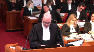

---
title: Attorney General of Quebec, et al. v. 9147-0732 Québec inc.
published-title: Heard
date: 2020-01-22
sidebar: false
---

This transcript was made with automated artificial intelligence models and its accuracy has not been verified. Review the original webcast [here](https://scc-csc.ca/case-dossier/info/webcast-webdiffusion-eng.aspx?cas=['38613']).
---

**Speaker 1** (00:00:01): La Cour, the court!

**Justice Wagner** (00:00:27): Bonjour à tous.

::: {.column-margin}

:::

Dans le dossier, le procureur général du Québec est directeur des poursuites criminelles et pénales contre 91-47-0732, Québec Inc.

Pour la plan de procureur général du Québec, maître Stéphanie Quirion-Quentin, maître Sylvain Leboeuf, maître Julie Da

Silva et maître Anne-Sophie Blanchet-Gravel.

Pour la plan directeur des poursuites criminelles et pénales, maître Laura

Elizabeth Tramp, maître Marie-Pierre Champagne.

Pour l'intervenant directrice des poursuites pénales du Canada, maître François Lacasse, maître Mathieu Stanton.

Pour l'intervenant procureur général de l'Ontario, Courtney Harris, maître Ellen Weiss, et maître Ravi Amarnath.

Pour l'intervenant de l'association des libertés civiles canadiennes, maître Alyssa Tompkins, maître Penelope Simons et maître Albert Brunet.

Pour l'intimé 91-47-0732, Québec Inc., maître Martin Villa et Nicky Galanopoulos.

Pour l'intervenant de l'association des avocats de la défense de Montréal, maître Léon H. Moubayed, maître Sarah Gorgos et maître Guillaume Charlebois.

Pour les intervenants de la Fondation des Constitutions canadiennes, Brandon Kane, Adam Goldenberg et Sébastien Cusot.

Pour l'intervenant de l'association des libertés civiles canadiennes, Gabe Vannert et Jessica Magonot.

Maître Kyrion Kanté.

**Justice Abella** (00:02:30): I'm very used to that.

**Speaker 2** (00:02:41): Monsieur le juge en chef, mesdames, messieurs les juges, Comme constitutionnalistes qui sommes appelés à défendre les dispositions pénales établies par le législateur, nous avons pu constater ces dernières années une recrudescence des recours en vertu de l'article 12 de la Charte canadienne.

::: {.column-margin}

:::

Dernièrement, la popularité de ce type de recours n'est plus limitée au domaine criminel et s'étend aussi en matière réglementaire.

**Overlapping speakers** (00:03:08): une reconnaissance par des personnes humaines ou par des sociétés?

**Speaker 2** (00:03:11): Now, it's a society that is asking you to recognize this benefit.

**Justice Wagner** (00:03:17): Les dernières années, on a vu une recrudescence par des sociétés ou par des personnes humaines.

**Speaker 2** (00:03:20): par des personnes humaines, effectivement.

::: {.column-margin}

:::

Alors, la question qui se pose devant vous aujourd'hui, c'est est-ce que l'article 12 de la Charte canadienne devrait pouvoir bénéficier aux personnes morales?

Et nécessairement, la question incidente, c'est quel est l'objet de la protection de l'article 12 de la Charte?

Considérant que seule cette question a été analysée par la Cour d'appel, nous vous soumettons que c'est la seule à laquelle la Cour devrait répondre aujourd'hui.

**Justice Brown** (00:03:52): Vous parlez de l'objet de l'article 12, mais le texte veut dire quelque chose aussi, oui?

Le texte de la disposition même?

Le texte de l'article 12?

Tout à fait.

Ok, vous allez parler de ça.

**Speaker 2** (00:04:05): J'en parlerai effectivement un petit peu plus tard.

::: {.column-margin}

:::

En fait, vous avez raison, le terme même utilisé dans le cadre de la disposition nous donne des indices quant à la portée de la garantie.

La Cour aujourd'hui bénéficie d'une opportunité de venir clarifier quelle est la portée de cette garantie, quels sont les contours, les balises que l'article 12 doit comporter.

Et donc de clarifier le cadre d'analyse de cette disposition qui a fait couler beaucoup d'encre dernièrement.

Le cadre est déjà bien établi pour savoir si une personne morale peut bénéficier ou non d'une disposition en vertu de la charte.

Elle doit démontrer dans un premier temps qu'elle a un intérêt qui est compris dans la portée de la garantie, d'où l'intérêt de délimiter cette portée, et qui s'accorde avec l'objet de la disposition.

C'est dans l'affaire CIP qu'on établit ce test entre autres.

Notre prétention est à l'effet qu'en raison premièrement des termes qui sont utilisés pour définir la garantie, deuxièmement de son origine historique, troisièmement des dispositions similaires en droit international et quatrièmement du sens des autres droits qui s'y rattachent, l'article 12 de la charte canadienne doit être limité aux personnes physiques ou aux personnes humaines.

Et l'objet de sa protection est en fait de protéger contre les traitements ou les peines qui sont incompatibles avec la dignité humaine.

Si l'on s'attarde dans un premier temps aux termes de la disposition,

**Justice Kasirer** (00:05:39): Avant d'aller plus loin, parce que vous allez, en cours de route, cibler ce que vous voyez comme des erreurs révisables commises par la Cour d'appel, est-ce que je peux vous poser est-ce que la majorité a fait une erreur quant à la méthode à employer ou est-ce qu'elle a adopté la bonne méthode mais qu'elle aboutit à la mauvaise réponse?

::: {.column-margin}

:::

C'est quoi le sens de votre argument?

**Speaker 2** (00:06:05): Ce, effectivement, je reviendrai un peu plus tard sur les erreurs de la Cour d'appel, mais notre prétention est à l'effet que la majorité de la Cour a mal appliqué ce test-là pour déterminer si une personne morale peut bénéficier d'une garantie.

::: {.column-margin}

:::

Certes, la Cour a conclu qu'une entreprise avait intérêt ou avantage à se voir protégée contre une certaine forme de peine qui serait les amendes.

Par contre, nulle part

dans le cadre du jugement on peut comprendre comment cet intérêt est compatible avec l'objet de la disposition, parce que, j'y reviendrai un peu plus tard, mais la Cour semble d'accord avec notre proposition à l'effet que l'article 12 de la Charte vise à protéger contre les peines ou traitements incompatibles avec la dignité humaine.

Donc, oui, en ce sens, il y aurait effectivement une erreur dans le cadre de l'analyse de la Cour d'appel.

**Justice Kasirer** (00:06:54): On peut l'espérer parce que sinon vous êtes mal pris et s'il n'y a pas d'erreur.

::: {.column-margin}

:::

Mais l'erreur ne se situe pas au niveau de la méthode employée, ce n'est pas votre argument.

Que la Cour a bien compris qu'il fallait identifier l'objet de la disposition en question.

Vous parlez de CIP, je note que la juge Bélanger cite CIP au tout début de ses motifs.

**Speaker 2** (00:07:22): Effectivement, elle cite l'arrêt CIP.

::: {.column-margin}

:::

Par contre, l'erreur de la course, c'est dans un deuxième temps au niveau de la méthode.

Bien qu'elle mentionne le bon test, qui est celui de CIP, elle ne fait pas la deuxième étape qui est celle de savoir si l'intérêt qui est compris dans la portée de la garantie s'accorde avec l'objet de la disposition.

**Justice Côté** (00:07:43): de la Cour d'appel

a bien énoncé le test, mais dans l'application du test, elle ne l'a pas suivi.

« Exactement, c'est ce que je veux dire.»

**Justice Wagner** (00:07:53): Je me permets de vous interrompre, je vous laisse aller après par la suite.

::: {.column-margin}

:::

Une question pour pas que je l'oublie.

On comprend que dans le présent dossier, évidemment, on parle d'une peine minimum.

Et je pose la question suivante.

À la mesure où, effectivement, une société, donc personne morale, soit, sur le coup d'une peine vraiment, une amende vraiment, vraiment exagérée, minimum, évidemment, parce que ce n'est pas un minimum, il y a une cour d'appel qui peut toujours rectifier les choses.

Mais donc, dans une situation où c'est une peine minimum, quel est le recours, à part l'article 12, dont pourrait bénéficier une telle corporation, société morale, pour se défendre?

**Speaker 2** (00:08:40): En fait, ce qu'on vous soumet, c'est qu'en vertu de l'article 12, cette personne moral-là n'aura pas de recours pour faire invalider la peine minimale.

Est-ce qu'elle aura d'autres recours en vertu de l'achat?

Je suis pas ici pour répondre à toutes les questions.

**Overlapping speakers** (00:08:53): ces questions-là.

**Speaker 2** (00:08:54): Ce pourrait être des recours politiques ou encore, s'il s'agit du code criminel, il y aura des dispositions qui sont peut-être à sa portée pour bénéficier de programmes de mesures de rechange, par exemple, ou d'autres voies de passage qui lui permettraient d'éviter cette amende-là.

::: {.column-margin}

:::

Mais ce qu'on vous soumet, c'est qu'en vertu de la Charte et de l'article 12, ce n'est pas la porte d'entrée pour la personne morale.

Alors, si on en revient au terme même de la disposition, premièrement, j'attire votre attention sur le sous-titre sous lequel se retrouve l'article 12 de la Charte, le sous-titre qui s'intitule « Cruté ».

Et la disposition se lit comme suit «

Chacun a droit à la protection contre tout traitement ou peine cruelle et inusité ».

Je reprends ici les propos du juge Chamberlain dissident dans l'arrêt de la Cour d'appel, qui mentionne à propos du terme «

Cruelle », et évidemment on peut faire le même parallèle avec «

Cruté », que les définitions usuelles du terme «

Cruelle » utilisent une terminologie en lien avec la souffrance, la torture, l'inhumanité et la barbarie, tous des vocables qui se rattachent aux êtres vivants et qui ne peuvent se rapporter à une personne morale.

En ce qui concerne l'expression «

Cruelle et inusité »

, elle a fait l'objet d'une analyse par cette Cour dans l'arrêt Miller et Coquerel pour la première fois, c'est à l'onglet 1 de notre cahier condensé.

À ce moment-là, c'était l'article 2B de la Déclaration canadienne des droits qui prévoyait la protection contre les peines ou traitements cruels et inusités.

À la page 690 de l'arrêt, le juge en chef énonce que les termes «

Cruelle et inusité » sont des termes qui se complètent et qui, interprétés l'un par l'autre, doivent être considérés comme la formulation concise d'une norme.

Donc, en eux-mêmes, ces deux mots-là, pris ensemble, ont une signification et on doit leur accorder une importance.

Ils sont un premier indice de ce qui pourrait constituer ou non une peine ou un traitement contraire à l'article 12.

À la page 688 du même arrêt, le juge analyse la portée de la garantie.

Et après avoir rappelé que les termes du paragraphe 2B reprennent ceux du Bill of Rights anglais et du huitième amendement de la Constitution américaine, le juge en chef énonce «

On peut encore se demander si la peine infligée est excessive au point d'être contraire à la dignité humaine.

Ce n'est pas une définition très précise, mais je doute que l'on puisse faire mieux.

» Alors ici, on tente de définir ce qui est l'objet de l'article ou la portée de la garantie et on parle d'être excessive au point d'être contraire à la dignité humaine.

Dans son mémoire, notre confrère souligne que les termes anglophones en anglais de cette expression parlent plutôt de « excessive or disproportionate as to outrage standards of decency ».

Il prétend que l'expression n'est pas équivalente dans les deux langues et que dans ces circonstances, la version originale des motifs devrait primer.

Or, nous portons à votre attention que dans l'arrêt Miller, il n'est pas indiqué quelle est la version originale et la version traduite des motifs.

Donc, en ce sens, on ne peut conclure que la version anglaise est celle qui doit primer sur l'autre.

Nous vous soumettons que les deux versions ont valeur officielle et doivent recevoir la même interprétation.

À tout événement, notre position est que l'expression en anglais et en français ont la même signification, comme c'est d'ailleurs repris par nos collègues du directeur des poursuites pénales Canada.

Je vous réfère à cet effet-là à l'onglet 10 de notre cahier condensé, où nous avons reproduit un extrait du site Internet de la Banque de données terminologiques et linguistiques du gouvernement du Canada.

À propos de « decency », on remarque qu'il y a l'expression « to outrage the standards of decency » dans « phrase et ologie », qui est traduit littéralement par « ne pas être compatible avec la dignité humaine, constituer une violation de la dignité humaine, être contraire à la dignité inhérente à la personne humaine, être une insulte à la dignité humaine ».

Donc, dans toutes les traductions qui sont présentes ici, on retrouve une mention.

**Justice Kasirer** (00:13:53): un argument un peu poules et oeufs.

::: {.column-margin}

:::

C'est possible qu'on s'est inspiré de termium de cette banque de données pour la traduction ou vice-versa.

Le point serait, et par ailleurs, je ne sais pas si à l'époque de Miller on avait la pratique d'identifier quelle était la version linguistique originale, comme c'est le cas aujourd'hui des motifs de la cour.

Est-ce que ce n'est pas un argument plus percutant de dire, lisons l'ensemble des motifs du juge Laskin, essayer de comprendre s'il visait autre chose qu'une forme de decency qui déborde la personne humaine, plutôt que d'aller dans le sens des mots et la, je ne sais pas, la valeur première de la version originale par rapport à une traduction.

**Speaker 2** (00:14:49): Effectivement, je suis d'accord avec vous, M. le juge Casirer, et en ce sens, nous sommes d'avis que les deux expressions ont la même signification.

::: {.column-margin}

:::

Par contre, ce qui nous amène à conclure que l'article 12 protège la dignité humaine, inhérente aux personnes humaines, ce n'est pas basé uniquement sur les propos du juge dans l'arrêt Miller.

C'est selon les principes d'interprétation constitutionnelle reconnues et une analyse globale du contexte de l'adoption de cette disposition que nous concluons que l'article 12 vise la dignité humaine.

**Justice Côté** (00:15:26): dans ces motifs, la majorité au paragraphe 116 à 118 et 125 à 128 parlent de situations où certaines dispositions de la charte qui s'appliquent aux personnes morales, ça a été décidé par notre cours, visent essentiellement le respect de la dignité humaine.

::: {.column-margin}

:::

Donc la majorité semble dire, puisque certains droits ont été reconnus à des personnes morales, certains droits prévus à la charte qui visent essentiellement à protéger la dignité humaine, elles semblent dire, bon, quel est le problème d'en faire le même raisonnement pour l'article 12?

Qu'est-ce que vous avez à répondre à ça?

**Speaker 2** (00:16:10): En fait, certains des articles qui sont nommés par la juge Bélanger dans le cadre de ce jugement-là, effectivement, ont fait référence à des valeurs sous-jacentes de ces protections-là qui pourraient avoir un effet sur la dignité humaine.

::: {.column-margin}

:::

Par contre, je ne suis pas certaine qu'on peut prétendre que c'était l'objet même de la protection de ces dispositions-là.

Par exemple, l'article 8, qui protège contre les faux hyperquisitions abusives, vise davantage la protection de la vie privée, ce qui est indiqué dans l'arrêt CIP.

Et il y a d'autres dispositions pour lesquelles ça a été établi clairement que l'objet de la protection était la dignité humaine, pour lesquelles la Cour a décidé que ça ne pouvait s'appliquer aux personnes morales.

Par exemple, l'article 11C de la Charte et l'article 15.

Donc, à notre avis, ces protections-là qui visent plus clairement l'objet même, qui est la protection inhérente de l'intégrité physique et psychologique des êtres humains, comme l'est la garantie à l'article 12, est un meilleur parallèle.

Docteur Monsieur.

Pour terminer sur les termes « cruel » et « inusité », la Cour a également repris l'interprétation qui a été faite dans Miller, à savoir qu'il devait être interprété comme la formulation concise d'une norme dans l'arrêt Smith.

Et à ce moment-là, on faisait référence à l'article 12 de la Charte canadienne.

C'est à l'onglet 2 de notre cahier condensé.

Si l'on s'attarde ensuite au contexte historique et aux dispositions internationales corollaires, on peut commencer, comme on l'a mentionné au départ, en se rappelant que l'article 12 de la Charte canadienne est d'origine de l'article 2B de la Déclaration canadienne des droits, qui lui reprend la formulation du Bill of Rights anglais de 1688.

Par contre, l'adoption de la Déclaration canadienne des droits s'est fait beaucoup plus tard, en 1960, et dans un contexte qui était davantage concomitant au contexte de l'après-guerre, donc dans la foulée de l'adoption d'autres textes internationaux importants qui protègent les droits de l'homme.

Vous avez, par exemple, la Convention de sauvegarde des droits de l'homme et des libertés fondamentales à notre onglet 3.

C'est l'article 3 qui est la disposition corollaire à l'article 12 de la Charte canadienne.

On indique que nul ne peut être soumis à la torture ni à des peines ou traitements inhumains ou dégradants.

Vous avez également, à l'onglet 4, la Déclaration universelle des droits de l'homme, à l'article 5, où on indique que nul ne sera soumis à la torture ni à des peines ou traitements cruels, inhumains ou dégradants.

Comme il a été indiqué par nos confrères du directeur des poursuites pénales Canada dans leur mémoire, cet article est ensuite devenu l'article 7 du pacte international relatif aux droits civils et politiques auxquels le Canada a adhéré.

Les termes qui sont compris dans ces dispositions analogues-là visent également la préservation de l'intégrité physique et psychologique des individus, des êtres humains.

Nulle part dans les termes qui sont indiqués, on retrouve le mot proportionnalité.

Donc, notre conclusion, si on regarde les principes d'interprétation téléologique en les appliquant à l'article 12 de la Charte canadienne, c'est que la protection vise les peines et traitements qui sont incompatibles avec la dignité humaine.

Dans la mesure où une entité corporative est dépourvue de sentiments et dépourvue d'intégrité, de dignité, elle ne peut pas souffrir d'une peine qui serait exagérément disproportionnée comme le ferait une personne physique.

Donc, bien qu'il puisse avoir un certain avantage ou un certain intérêt à se voir reconnaître une protection contre les peines cruels et inusitées, on ne voit pas comment cet intérêt pourrait être compatible avec l'objet de la protection de l'article 12.

La peine qui sera imposée à une entreprise mènera à des conséquences qui sont économiques.

Et en cas de non-paiement, il n'y a pas de possibilité d'emprisonnement, pas de possibilité de travaux compensatoires non plus.

Donc, aucune atteinte possible à sa vie, à sa liberté ou à sa sécurité.

Évidemment, on n'est pas en train de vous plaider que les conséquences économiques ne pourront jamais rencontrer le test élevé de l'article 12 pour des personnes physiques.

Par contre, ce qui importe ici, c'est de se rattacher toujours à l'objet de la disposition qui concerne la dignité humaine.

Et c'est d'ailleurs ce que la Cour a également fait dans l'arrêt Boudreau, qui concernait une suramende compensatoire imposée à des personnes physiques.

Nous avons reproduit l'arrêt à l'onglet 11 de notre cahier.

J'aimerais vous lire le paragraphe 43 de l'arrêt.

**Speaker 2** (00:22:02): Le passage qui est surligné, l'assurément compensatoire a également une incidence importante sur la liberté, la sécurité, l'égalité et la dignité des personnes assujetties à son application.

::: {.column-margin}

:::

Je vous ferai remarquer ici que dans la version anglaise des motifs, dignité est ici traduit par dignité.

Plusieurs autres paragraphes de l'arrêt nous indiquent que c'est l'effet sur la dignité des personnes physiques qui a été considérée ici par la Cour.

Entre autres, au paragraphe 67, on parle d'une amende qui prive à ce point une personne de ses moyens de subsistance est excessive au point de ne pas être compatible avec la dignité humaine.

Au paragraphe 77, dans le bas du paragraphe, on parle d'une suramende qui, même si elle est attribuable à des troubles mentaux ou à une incapacité physique, que les contrevenants s'exposent à devoir se représenter devant le tribunal et que ce rituel continuera de se reproduire indéfiniment, à moins pour effet de recouvrir une dette que d'humilier publiquement les intéressés.

Et finalement, au paragraphe 910, dans la conclusion, on parle d'une peine d'une durée indéterminée qui en découle et qui conduit à une humiliation publique exagérément disproportionnée des contrevenants défavorisés.

Alors, contrairement à ce que prétend l'intimé, nous vous soumettons que ces motifs ne sont pas transposables aux personnes morales qui n'ont pas de dignité et qui ne peuvent être humiliées publiquement par une atteinte en raison du fait qu'elles sont défavorisées, qu'elles ont des troubles mentaux et qu'elles ne peuvent subvenir à leurs besoins de subsistance.

**Speaker 2** (00:24:31): La position de l'intimé est à l'effet que la protection de l'article 12 de la Charter canadienne protège contre les peines qui sont exagérément disproportionnées par leur nature ou par leurs effets.

::: {.column-margin}

:::

Elles se font, entre autres, sur le test développé dans les arénures et suivant, qui consiste à comparer la peine appropriée pour un contrevenant à la peine minimale qui lui est imposée, pour déterminer ce qui constitue une peine d'emprisonnement cruelle et immusité.

Par contre, les enseignements qu'on peut tirer de ces arrêts, on leur limite dans la délimitation de l'objet de l'article 12 de la Charter, parce que ce n'était pas la question à laquelle la Cour devait répondre dans ces arrêts-là.

Selon l'intimé, l'intérêt que sa cliente aurait dans la portée de la garantie est la même chose que l'objet de la protection.

C'est-à-dire qu'elle a intérêt à être protégée contre une amende qui serait exagérément disproportionnée et l'article 12 vise à protéger contre des peines qui sont exagérément disproportionnées.

Donc nécessairement, l'intérêt s'accorde avec l'objet de la garantie.

Donc le test est assez facile à remplir ici, puisqu'il s'agit de la même chose selon elle.

**Justice Kasirer** (00:25:52): Et moi, je vous interrompe à répétition.

::: {.column-margin}

:::

La juge Bélanger ne nie pas que la dignité humaine est au cœur de l'objet de la disposition, mais elle n'y voit pas, elle le dit à 118, on ne saurait ainsi prétendre que la dignité humaine constitue un obstacle insurmontable, empêchant d'étendre la protection qu'offre 12 à une personne morale.

Qu'est-ce que vous dites de son argument de rattacher la protection via la dignité humaine aux personnes qui se postent derrière le paravent de la personnalité morale?

**Speaker 2** (00:26:31): En fait, nous vous soumettons que détirer l'objet de la protection qui est celle contre les peines ou traitements incompatibles avec la dignité humaine aux personnes morales, c'est vraiment d'aller trop loin et de dénaturer complètement la protection constitutionnelle.

::: {.column-margin}

:::

En fait, la juge se fonde, entre autres, sur le principe d'interprétation large et libérale de la Charte pour aller au-delà de l'objectif même de la disposition.

**Justice Côté** (00:27:04): Qu'est-ce que, si vous avez une association de personnes qui se regroupent pour poursuivre un but commun mais qui n'ont pas la personnalité morale, mais c'est une association de personnes, êtes-vous d'avis que cette association pourrait bénéficier de l'article 12 parce qu'ils ne sont pas une personne morale, mais c'est une association qui peut être poursuivie en vertu de la définition du Code Créville?

::: {.column-margin}

:::

**Speaker 2** (00:27:29): En fait, ce qu'on vous soumet aujourd'hui, c'est que dans le cas d'une personne morale qui a une personnalité juridique distincte de ses membres, elles ne peuvent pas bénéficier de l'article 12 de la Charte.

On vous invite à ne pas vous prononcer sur tous les types d'associations qui pourraient survenir, je comprends votre question.

**Justice Côté** (00:27:46): Et je comprends que vous ne puissiez pas non plus vous prononcer là-dessus, donc c'est vraiment limité à la personne morale.

**Speaker 2** (00:27:52): parce qu'elle a une personnalité juridique distincte.

::: {.column-margin}

:::

Et si le contrevenant, c'est la personne morale, qui a un patrimoine distinct de ses membres, qui a une personnalité juridique qui lui est propre, et l'article 12 s'attachant aux effets de la peine sur le contrevenant, c'est seulement cette personne-là qu'on doit regarder dans le cadre de l'analyse de l'article 12.

**Justice Karakatsanis** (00:28:15): We recognize the guilt of a society on the basis of the actions of its employees.

::: {.column-margin}

:::

If we refuse to make the link between the pain and the human beings who would be affected by the end of the war, will there be an unspeakable asymmetry between the pain and the guilt?

Because responsibility and guilt are based on the actions of the employees, and the employees could suffer the consequences of the pain.

**Speaker 2** (00:29:09): Je comprends votre question.

Par contre, bien que la culpabilité découle nécessairement des gestes commis par les gens qui composent la société, la peine, elle, n'est pas octroyée aux gens, aux associés, aux dirigeants.

Elle est attribuée à la société.

**Justice Karakatsanis** (00:29:27): Ça peut toucher la dignité humaine des employés, des gens qui sont associés.

**Speaker 2** (00:29:36): indirectes, effectivement

, ces personnes-là pourront être affectées par les conséquences d'une peine.

Par contre, leur patrimoine personnel est à l'abri et c'est là l'avantage de la constitution de la société.

**Justice Karakatsanis** (00:29:51): Je comprends, mais la culpabilité est aussi sur une base indirecte.

::: {.column-margin}

:::

Il y a une asymmétrie, je pense, entre la peine et la culpabilité indirecte, tous les deux.

**Speaker 2** (00:30:10): En fait, cette asymétrie découle du choix des personnes qui constituent la société de se constituer en entreprise légalement constituée et de se mettre donc à l'abri personnellement.

::: {.column-margin}

:::

Alors, s'il y a une asymétrie, elle est à l'avantage des gens qui se retrouvent derrière cette société-là.

**Justice Rowe** (00:30:35): Madame, il me semble qu'il y a un lien entre les 2 questions, mais on doit garder une distinction entre les 2 questions.

::: {.column-margin}

:::

Pour moi, la première question est quelle est la portée de droits?

Et seulement après ça, le test pour une attente de droits.

Il me semble que la majorité a mélangé les 2 questions.

**Speaker 2** (00:31:11): C'est effectivement notre avis également, M. le juge.

::: {.column-margin}

:::

Ce qu'on prétend, c'est que la position de l'intimé, et par le fait même celle de la Cour d'appel, est à l'effet d'assimiler l'objet de la garantie à l'exagèrement disproportionné, qui est en fait le critère qui a été développé par la Cour pour déterminer ce qui peut constituer une peine cruelle et nullité, mais dans le cadre de peine d'emprisonnement.

On vous soumet aujourd'hui que la question est plus large.

Vous avez à déterminer l'article 12, quelle est la portée de la garantie en matière de peine et de traitement.

Et que le test de l'exagérément disproportionné pourrait, dans certaines situations, ne pas être le test applicable pour toutes les peines ou les traitements qui tomberaient sous le coup de l'article 12.

Alors, la question ici est distincte, comme vous le dites.

Dans un premier temps, quelle est la portée et l'objet de la garantie?

Et deuxièmement, quelle est le test dans certaines situations?

Notre proposition est à l'effet qu'il peut effectivement y avoir des éléments de proportionnalité qui se présentent dans le cadre de peine minimale et en matière d'emprisonnement, par exemple.

Par contre, la dignité humaine ne peut être dissociée complètement de l'exagérément disproportionné.

Et à cet effet, je voudrais faire à l'ombre des deux de notre cahier à la resse Smith, pardon, où les propos du juge McIntyre, qui est dissident pour d'autres motifs, énoncent clairement, à la page 1089, comment ces deux concepts doivent s'amalgamer.

Alors, le juge reprend dans le premier paragraphe les propos qui ont été énoncés par la Cour dans l'arrêt Miller et Coquerel.

Au deuxième paragraphe, il énonce qu'il souscrit à ses paroles en parlant du test de si la peine est infligée est excessive au point de ne pas être compatible à la dignité humaine.

Donc, je souscris également à ses paroles et je dirais en résumé que pour qu'il y ait traitement ou peine cruelle et inusité violant l'article 12 de la Charte, il faut que ces peines ou traitements soient excessifs au point de ne pas être compatibles avec la dignité humaine.

Bien qu'elle ne soit pas précise, cette définition de l'expression «

traitement ou peine cruelle et inusité »

reflète l'objet et l'intention de l'article 12 de la Charte et est conforme aux opinions exprimées sur ce point dans la jurisprudence canadienne.

À mon avis, insister sur les mots « ne pas être compatible avec la dignité humaine » ne revient pas à fixer un seuil trop élevé en matière de violation de l'article 12.

Comme nous l'avons déjà noté, alors que l'interdiction d'infliger des traitements ou peine cruelle et inusité visait à l'origine des peines qui, de par leur nature, étaient fondamentalement cruelles, cette prohibition a été étendue depuis à des peines qui, sans être fondamentalement cruelles, sont disproportionnées à l'infraction commise au point de devenir cruelle et inusité.

Cependant, lorsque des considérations de proportionnalité se présentent dans le cadre d'un examen fondé sur l'article 12 de la Charte, il faut faire preuve d'une grande prudence en appliquant la norme des traitements aux peines cruelles et inusité.

Une peine qui n'est pas en soi excessive et inusité peut le devenir, si elle est excessive ou disproportionnée, mais seulement si elle est excessive au point de ne pas être compatible avec la dignité humaine.

L'intimé prétend également que l'article 12 a pour effet, tout comme les articles 8 à 14, qu'il représente un exemple de principe de justice fondamental et qu'il serait donc la consécration du principe de la protection contre l'exagérément disproportionné.

**Speaker 2** (00:35:52): Si cette prétention est avérée, évidemment qu'on doit interpréter l'article 12 de la Charte de façon corolaire avec l'article 7 qui protégerait également le même principe de justice fondamental.

::: {.column-margin}

:::

Or, on sait que l'article 7 ne protège pas les personnes morales, puisqu'elles ne peuvent pas voir leur vie, liberté ou sécurité atteinte.

Et ça, même si le libellé de l'article commence par chacun.

Dans l'arrêt Irwin Toy, qui est reproduit en extrait à notre onglet 8, une entreprise contestait sous l'article 7 des dispositions prévoyant des amendes pénales à son égard et la Cour a refusé de considérer que la faillite ou la liquidation d'une société faisaient intervenir l'article 7 et que les sociétés étaient protégées contre une sorte de liberté économique.

Alors, tel qu'est indiqué par la Cour dans l'arrêt Motor Vehiculat, à notre onglet 9, il serait absurde ici d'interpréter l'article 12 de la Charte de façon plus étroite que l'article 7, étant donné qu'ils visent tous les deux un principe de justice fondamental qui est le même.

Nous vous soumettons que la position de l'intimé a l'effet que la protection contre les peines exagérément disproportionnées est l'objet de l'article 12 a pour effet de banaliser la disposition, dont la Cour a pourtant maintes fois répété que la barre était haute pour remplir le test.

Si on retient cette prétention, on met complètement de côté le concept de dignité humaine et on se concentre que sur les peines qui pourraient être simplement excessives.

Pourtant, on a répété que le test était que les peines étaient excessives au point de ne pas être compatibles avec la dignité humaine.

On s'écarte aussi des termes cruels et inusités qui sont censés constituer une norme en soi et du soutien de la protection qui part de cruauté.

Tel qu'a été mentionné un peu plus tôt, la Cour d'appel ne semble pas nier que l'article 12 aurait pour objet la protection de la dignité humaine.

C'est au paragraphe 113 de l'arrêt qui est reproduit à notre rond de lait 12.

La Cour indique «

Il est vrai que l'article 12 de la Charte canadienne s'inspire du Bill of Rights anglais de 1688 qui protégeait contre les amendes excessives et l'échâtiment cruel et inusité de la Déclaration canadienne des droits et du pacte international relatif aux droits civils et politiques et que ces textes prévoyaient une protection de droits en lien avec la dignité humaine.

Il est tout aussi vrai que depuis l'adoption de la Charte en 1982, la doctrine et la jurisprudence ont associé la protection contre les traitements aux peines cruelles et inusité au concept de dignité humaine.

**Justice Brown** (00:39:10): Est-ce que vous pouvez nous parler un peu de ce que le juge Bélanger a dit à son paragraphe 122, lorsqu'il a dit qu'une personne morale peut souffrir?

Qu'est-ce que vous dites à ça?

**Speaker 2** (00:39:31): En fait, il faut d'affirmer qu'une personne morale peut souffrir.

::: {.column-margin}

:::

Une personne morale peut souffrir économiquement.

Mais on ne parle pas ici d'une souffrance comme le vit une personne physique, c'est-à-dire qui l'atteint dans ses sentiments, qui lui inflige une atteinte réelle à son intégrité.

Donc, la souffrance économique ici, qui est dissociée de la dignité humaine complètement, ce qu'on vous soumets, ce n'est pas suffisant pour remplir le test de l'article 12.

**Justice Brown** (00:40:06): Est-ce qu'une souffrance comme ça peut être cruelle?

Cruelle, comme dit l'article 12.

**Speaker 2** (00:40:16): Non, la souffrance économique seulement ou la souffrance de la personne morale ou le fait, l'effet d'une amende qui serait trop élevée sur son patrimoine ne peut pas être cruelle.

Ça ne remplit pas la définition du terme cruel, on ne peut pas dire qu'elle souffre de cruauté.

**Justice Brown** (00:40:35): Et ça, c'est la fin de l'analyse, oui.

Pourquoi faut-il parler d'un objet quand le texte est déterminatif?

**Speaker 2** (00:40:49): En fait, le texte nous permet de définir l'objet de l'article 12.

Effectivement, il s'agit d'un bon indice, les mots qui sont utilisés.

**Overlapping speakers** (00:40:58): Le texte peut définir l'objet?

**Speaker 2** (00:41:01): Je vous dis que c'est un indice qui nous permet de définir l'objet.

::: {.column-margin}

:::

Mais selon les principes d'interprétation, le contexte historique et philosophique est également important, le sens des autres objets, le sens des autres dispositions de la charte qui sont liées au même article.

Donc plusieurs éléments peuvent entrer en considération.

Dans ce cas-ci, les mots qui sont utilisés à l'article 12 constituent un bon indice de l'objet de la protection.

**Justice Rowe** (00:41:30): En général, le français est plus précis qu'en anglais, mais les deux langues partagent une imprécision dans le concept de suffering ou souffrance.

::: {.column-margin}

:::

La souffrance économique n'est pas la même chose que la souffrance physique.

Ils sont distincts, ils sont différents.

**Speaker 2** (00:41:55): Exactement.

::: {.column-margin}

:::

Et la souffrance physique et psychologique implique une atteinte à la dignité et découle également d'une potentielle atteinte à la liberté, à la sécurité de la personne, ce que visent également protéger les autres droits corollaires de la Charte.

Par contre, une souffrance économique ou un préjudice économique, ici, ce n'est pas quelque chose que la Cour a accepté de reconnaître comme étant protégé par la Charte canadienne jusqu'à ce jour.

La Cour d'appel et l'intimé se fondent entre autres sur le principe d'interprétation large et libérale.

Par contre, nous vous l'avons soumis dans notre mémoire, on souligne qu'il est important de ne pas aller au-delà de l'objet, d'où l'importance de le circonscrire.

Récemment, la Cour a rappelé ce principe dans l'affaire Poulain, qui est à notre onglet 13, au paragraphe 53.

Comme je l'ai déjà mentionné, un droit garanti par la Charte doit être interprété théologiquement, c'est-à-dire d'une façon qui est justifiée par ses objets.

Cela mérite d'être répété, car, comme l'a fait observer notre Cour, l'interprétation téléologique et l'interprétation libérale peuvent être confondues à tort.

Et ce, malgré la directive qu'a énoncée notre Cour dans l'arrêt Begum, selon laquelle, dans l'application d'une interprétation libérale plutôt que formaliste, il importe de ne pas aller au-delà de l'objet véritable du droit ou de la liberté en question.

Notre Cour a réitéré dans l'arrêt Grant que l'objet du droit doit demeurer la principale préoccupation.

La libéralité de l'interprétation est restreinte par cet objet et elle y est subordonnée.

Il en est ainsi parce qu'une interprétation excessivement libérale d'un droit risquerait de protéger des comportements qui dépassent l'objet, ils ne sont pas dignes d'une protection constitutionnelle.

De plus, dans le cas de la plupart des droits, l'interprétation la plus large possible du droit qui est également l'interprétation la plus libérale ira au-delà de l'objet du droit.

Donc, toute protection constitutionnelle a un début et une fin et c'est l'objet qui en constitue les balises.

Ici, nous vous soumettons qu'on tente d'aller au-delà de l'objet et de dépasser les limites naturelles de l'article 12 de la Charte.

En ce qui concerne les motifs de la Cour à l'effet qu'on devrait considérer l'impact sur les personnes physiques qui se retrouvent derrière les personnes morales, j'ai répondu à une question à cet effet-là un peu plus tôt, nous vous soumettons que c'est de faire fi du principe de la personnalité juridique distincte des sociétés et que ça va à l'encontre des enseignements de cette Cour dans l'affaire Wholesale Travel Group et Brunette qui veut que le voile corporatif est étanche d'un côté comme de l'autre.

**Justice Wagner** (00:45:21): Quand on regarde l'article 12 de la Charte qui prévoit que chacun a droit à la protection contre les traitements aux peines cruelles et unicités, est-ce que la torture serait parmi les traitements effectivement interdits par l'article 12?

::: {.column-margin}

:::

**Speaker 2** (00:45:41): En fait, vous me demandez de me prononcer dans un vide factuel, mais j'imagine que le traitement, effectivement, pourrait constituer quelque chose qui tomberait sous la protection de l'article 12.

**Justice Wagner** (00:45:54): Et est-ce qu'à ce moment-là, on pourrait parler de torture d'une compagnie?

**Speaker 2** (00:46:00): La torture, la définition que j'en conçoit de la torture, c'est une atteinte à sa... physiquement, c'est des sévices physiques qui sont imposés à une personne.

::: {.column-margin}

:::

Donc, non, en ce sens, je ne pense pas qu'une personne morale, une entreprise, peut subir de la torture.

La Cour a également considéré une série de facteurs pour tenter de déterminer la portée de l'article 12 de la Charte.

Et, autant l'intimé que la Cour d'appel, insistent beaucoup sur la question de l'intérêt public.

Donc, il serait dans l'intérêt collectif de reconnaître une protection aux sociétés ou aux personnes morales.

Ils se fondent entre autres sur la RECIP pour faire cet argument et pour incorporer des notions d'intérêt public à leur analyse.

Or, la RECIP analyse l'article 11B de la Charte, qui est le droit d'être jugé dans un délai raisonnable, et il a été reconnu par cette Cour que cet article-là comporte en soi un droit collectif ou social, ce qui n'est pas le cas de l'article 12 de la Charte.

L'article 12 protège le droit individuel de chacun de ne pas être soumis à des traitements ou peines cruelles et inusitées, et ça s'attache à l'effet de la peine sur le contrevenant.

Mais l'intérêt public ou collectif ici n'a pas à être pris en compte.

Au contraire, il pourrait, même dans certaines circonstances, être contraire à celui de l'individu qui se voit imposer un traitement ou une peine.

Donc, les considérations d'intérêt public ne sont pas pertinentes au stade de la détermination de l'objet de l'article 12.

C'est la même chose pour les facteurs de détermination de la peine que la juge considère, entre autres, l'article 718.21d du Code criminel, qui prévoit que l'effet de la peine pourrait avoir un effet sur la viabilité économique de l'organisation et le maintien en poste d'employé.

Et s'appuyant sur ce paragraphe, la juge en tire un argument voulant que, donc, elle aura un intérêt à se voir offrir la protection de l'article 12 contre des peines ou des traitements qui pourraient être exagérément disproportionnés.

Par contre, ce chemin, nous vous soumettons que c'est prendre le problème à l'envers.

La Charte constitue un minimum de protections constitutionnelles qui sont offertes et le législateur est libre ensuite d'aller au-delà des protections qui sont offertes pour prévoir des garanties plus généreuses.

Les facteurs de détermination de la peine n'ont pas de valeur constitutionnelle.

La Cour a refusé, par exemple, en ce qui concerne le principe de proportionnalité, de prétendre qu'ils étaient protégés constitutionnellement.

Donc, on peut déterminer l'objet d'une garantie en se basant sur des facteurs prévus au Code criminel.

On analyse ici qu'est-ce que la Charte a comme portée.

Le Code criminel, en ce sens, n'est pas pertinent.

Bref, le jugement de la Cour d'appel met de côté la protection constitutionnelle de la dignité humaine en matière de peine ou de traitement qui pourrait être cruel, au bénéfice d'une protection plus large de l'intérêt public afin de protéger les intérêts économiques de sociétés légalement constituées.

Et ça, c'est de dénaturer complètement la protection qui est prévue.

Selon les principes d'interprétation reconnus, inévitablement, on doit conclure qu'il y a la protection de la dignité humaine qui est comprise dans la portée de la garantie de l'article 12.

Retenir la position de l'intimé ou de la Cour d'appel risquerait de produire l'un ou l'autre des effets suivants.

D'abord, on peut penser qu'il y aurait une catégorie de contrevenants qui pourraient être à l'abri de toute sanction pénale.

On fait ici référence aux entreprises qui auraient peu de revenus puisqu'il n'y a pas de possibilités d'emprisonnement, de travaux compensatoires ou d'autres formes de peine qui peuvent être infligées à ces contrevenants, à ce type de contrevenants.

**Speaker 2** (00:50:35): Deuxièmement, ça devient incitatif à ne pas d'être largué tous ces revenus, particulièrement pour les entreprises qui œuvrent en milieu réglementé, comme c'est le cas ici.

::: {.column-margin}

:::

Un autre risque qui pourrait survenir, malheureusement, c'est l'affaiblir le régime réglementaire, parce qu'on sait qu'il y a une multitude de règles qui sont prévues en matière réglementaire et pour lesquelles la peine est une amende minimale.

C'est la norme en matière réglementaire.

Il est facile d'imaginer des scédarios hypothétiques raisonnables qui pourraient être soulevés par des contrevenantes afin de faire invalider la peine, et ça même si elle bénéficie elle-même de la capacité de payer l'amende.

**Justice Kasirer** (00:51:31): Tout à l'heure, vous avez dit à mon collègue que vous acceptez sa proposition de la distinction entre la portée de la règle et la notion d'atteinte qui sont deux idées distinctes.

::: {.column-margin}

:::

Alors là, vous parlez de l'atteinte pour expliquer la portée.

Est-ce qu'elles sont vraiment distinctes?

Voyez-vous, vous dites, ah non, on ne peut pas accepter l'argument que l'article 12 s'applique aux personnes morales parce que, regardez ce qui va se passer, si on ouvre la porte, ça va être la catastrophe, toutes les dispositions pénales dans le droit réglementaire.

Alors, vous ne respectez pas ce que vous avez dit tant tôt quant à l'étanchéité entre portée et atteinte.

**Speaker 2** (00:52:21): En fait, effectivement, ce sont deux concepts qui sont différents et nous soumettons que les questions doivent recevoir des réponses différentes quant à l'application de la disposition et quant à son objet.

::: {.column-margin}

:::

Par contre, ici, je reprends la position de l'intimé qui, lui, prétend que les deux sont la même chose.

Et un des effets qui pourrait survenir, c'est d'ailleurs la facilité avec laquelle les scénarios hypothétiques pourront être soulevés parce qu'ils le sont d'ailleurs déjà par la Cour d'appel au paragraphe 133 de l'arrêt à l'onglet 12, tout en indiquant qu'il serait rare qu'une entreprise puisse remplir le test sévère de l'article 12, la Cour d'appel au paragraphe 133 énumère certains scénarios qui, selon elle, pourraient potentiellement être de ceux qui mènent à une déclaration d'inconstitutionnalité.

On parle d'une personne morale qui serait le moteur économique de sa région, obligée de fermer ses portes, licencier ses employés et provoquer leur déménagement affectant le fonds de pension des retraités.

On parle aussi d'une entreprise familiale construite après de longues années de travail qui n'a d'autre alternative que la faillite.

On parle ensuite d'une grande société qui, pour contrer les effets néfastes d'une amende exagérément disproportionnée, n'a d'autre alternative que de refiler l'amende au consommateur d'un bien essentiel.

Ce qu'on constate dans ces trois exemples-là, c'est que ça cible autant une petite entreprise familiale qu'une grande société que celle qui est le moteur économique de sa région.

Donc, bien qu'on vienne dire qu'il serait rare que des scénarios puissent remplir le test élevé de l'article 12, on a ici trois exemples qui reflètent à peu près tous les types d'entreprises qui peuvent se présenter.

Alors, on vient faire bénéficier ici d'une protection au patrimoine des entreprises au détriment de la protection du public, ce que vise à remplir le régime réglementaire.

Alors, malgré la théorie de l'arbre vivant qui est reprise par la Cour, on ne peut élargir une protection constitutionnelle au point de déraciner complètement celle-ci de ses termes, de son origine historique et philosophique et linguistique.

En terminant, nous vous soulignons que nous ne vous avons pas parlé dans notre mémoire ni dans nos représentations orales aujourd'hui de la question de la constitutionnalité de l'article 197.1 de la Loi sur le bâtiment.

Nous considérons qu'il est important d'avoir d'abord un éclairage de la Cour sur la portée de la garantie de l'article 12 avant de pouvoir déterminer si une protection est inconstitutionnelle ou non au regard des personnes morales.

Donc, dans ces circonstances, ça termine.

On vous demande d'accueillir l'appel et de réformer le jugement de la Cour d'avis.

**Justice Wagner** (00:55:49): Merci, maître. La casse.

::: {.column-margin}

:::

Avant que vous commenciez, j'ai constaté, en regardant l'ordre des plaideurs, que M. Vanner n'était peut-être pas placé dans la bonne colonne, alors pour éviter qu'il soit pris par surprise, j'ai demandé de plaider après les intervenants que l'on va entendre. La casse.

**Speaker 3** (00:56:24): Ma plaidoirie portera sur un point précis, dont il a été question plus tôt, l'interprétation des motifs bilingues de la Cour.

::: {.column-margin}

:::

L'intimé plaide que la définition de la disproportion exagérée, à savoir qu'une peine soit excessive au point de ne pas être compatible avec la dignité humaine, serait plus restrictive que la définition en anglais, « so excessive as to outrage standards of decency », qui elle englobrait les personnes morales en plus des personnes physiques.

Selon l'intimé, cette différence résulte d'une erreur de traduction dans la version française.

Vu cette différence, seule la version originale anglaise ferait autorité.

C'est ce que j'appelle la théorie de la prédominance de la version originale.

Vous avez entendu Maître Quirion-Quentin vous suggérer que les deux versions étaient d'égal autorité.

Notre position diffère.

Pour les fins de cet appel, il n'est pas nécessaire pour la Cour de se prononcer sur la règle applicable aux versions potentiellement discordantes des motifs de la Cour.

Deux raisons.

La première, c'est qu'il n'y a pas d'antinomie.

À cet effet, je vais vous référer à l'analyse terminologique qui est contenue dans notre mémoire par rapport aux définitions des termes d'essence, d'essentie et dignité.

Je voudrais simplement ajouter, par contre, que dans l'arrêt Boudreau, les versions originales anglaises des motifs de la Cour emploient l'expression « incompatible with human dignity ».

Plus précisément, je vous réfère au paragraphe 67 des motifs de la juge Martin pour la majorité et au paragraphe 126 de ceux de la juge Côté pour la minorité.

La deuxième raison, c'est qu'il n'est pas approprié pour trancher cette question, de le faire dans ce dossier, parce que les tenances et aboutissants de cette question sont beaucoup plus nuancées et beaucoup plus complexes qu'ils n'apparent à première vue.

Alors, je m'explique sur cette deuxième raison.

La prédominance de la version originale, bien que séduisante à première vue, comporte des difficultés.

Je vous en mentionne deux.

La première difficulté, c'est que la théorie est impossible d'application, en tout cas très difficile d'application, lorsque les jugements sont rendus sans identification de la version originale.

Par exemple, le renvoi relatif à la sécession du Québec.

Autre exemple, au même effet, la jurisprudence de Mme Claire-Lerue Dubé, la juge Claire-Lerue Dubé, durant les années 1990.

Et il en va de même, pour répondre à votre question, M. le juge Cassirer, de tous les jugements rendus par la Cour entre 1970 et 1980.

Alors, cette catégorie est particulièrement pertinente, car les définitions en cause ici sont tirées de l'arrêt Miller, qui a été rendu en 1977.

Donc, la position de l'intimé repose sur l'hypothèse que les motifs du juge en chef Laskin dans Miller ont été rédigés en anglais.

Est-ce que c'est une hypothèse raisonnable?

Sans doute.

Par contre, elle n'est pas vérifiable objectivement à la lecture du recueil des arrêts de la Cour.

Deuxième difficulté, c'est que la théorie ignore le principe de l'égalité réelle des langues officielles au Canada, qui découle des articles 16 et 19 de la Charte, de l'article 20 de la Loi sur les langues officielles et de l'arrêt Bollac, rendu par cette Cour en 1999.

Si, comme le prétend l'intimé, seule la version originale faisait autorité, c'est-à-dire que le lecteur uniligne d'une version traduite se fierait à un document qui est dénué de valeur, j'ose croire que non.

Est-ce qu'il existe d'autres solutions?

Bien oui, celle qui a été proposée par ma collègue ce matin, qui est inspirée de la règle de la législation bilingue élaborée dans l'affaire Daou, c'est-à-dire le critère du sens commun, qui consiste à rechercher le sens commun entre les deux versions.

Cette approche aussi a quelques difficultés.

La première difficulté, c'est que le sens commun repose sur la règle de l'égal autorité des deux versions.

Si la règle est expressément prévue en matière législative, même pour la Charte, il n'y a pas d'équivalent pour la jurisprudence.

Donc, il faudrait une reconnaissance judiciaire pour pallier au silence du législateur.

La deuxième difficulté, c'est que le sens commun pourrait donner lieu à l'adoption d'une version traduite qui n'aurait pas nécessairement été avalisée par le juge rédacteur.

Il ne faut pas oublier que les versions bilingues sont le fait de tous les tribunaux fédéraux, non seulement de cette Cour.

La troisième difficulté, elle découle de l'article 133 de la loi fonctionnelle de 1867, qui confère au juge le droit de rédiger les motifs dans la langue de leur choix pour ce qui est des tribunaux fédéraux et des tribunaux de certaines provinces.

Alors, potentiellement, quel impact pourrait avoir cette disposition?

Donc, en conclusion, c'est pour ces raisons non exhaustives, je l'admets, que je vous invite à ne pas vous prononcer.

Primo, le dossier n'est pas assez étoffé pour en traiter de façon éclairée.

Et puis deuxio, même si vous arriviez à la conclusion qu'il y a une antinomie, la détermination de la portée de l'article 12 ne dépend pas d'une incertitude terminologique des motifs de la Cour.

Elle dépend des autres outils interprétatifs proposés par les partis et les intervenants.

Si vous me permettez, suite à la question qui a été posée par le juge Brown sur la possibilité qu'une personne morale puisse souffrir économiquement, en toute différence, je vous dirais qu'une personne morale ne souffre pas, elle subit les conséquences économiques de la peine.

Mais la souffrance implique le pouvoir de ressentir.

Or, le pouvoir de ressentir, comme je l'ai mentionné dans mon mémoire, c'est le propre de lui-même. Merci.

**Justice Wagner** (01:01:48): Merci.

**Justice Kasirer** (01:01:51): Courtney Harris.

**Speaker 3** (01:01:57): J'aurais dû l'ajouter, M. le juge Cassirer.

Merci de me le souligner.

**Speaker 4** (01:02:21): Chief Justice, the Justices, the Section 12 right is intrinsically human.

::: {.column-margin}

:::

A corporation is not human, and that should end the matter.

But the majority of the court below looked beyond the corporate offender to search for a human who may suffer collateral consequences of a fine imposed on the corporation.

My submissions argue that the Section 12 focus must remain on the offender and not shift to third parties.

When a corporation is being sentenced for an offence, no human is before the court to invoke Section 12.

And the Section 12 analysis should not consider the effect of a sentence on anyone but the corporation itself.

A corporation cannot have its corporate veil and pierce it too.

**Justice Rowe** (01:03:07): Well, how about confiscation of all assets for a minor infraction?

::: {.column-margin}

:::

Would that not be grossly disproportionate?

And I ask the question because I've made the distinction between whether Section 12 applies to corporations versus whether a penalty may be grossly disproportionate.

I can conceive of something which would be grossly disproportionate, but it doesn't matter if corporations cannot avail of the benefit of Section 12.

**Speaker 4** (01:03:40): A grossly disproportionate fine for Section 12 purposes has to be about the standards of decency, shocking the conscience of Canadians.

::: {.column-margin}

:::

The impact on a corporation which is a bundle of property rights is an economic impact.

I don't think that there's any universal agreement like we would have for a human right when we understand what cruelty and unusual punishment is in the human sense.

We don't have that universal understanding when it comes to what is an appropriate sentence for a corporation when it just impacts economic rights.

**Justice Brown** (01:04:10): But your answer goes to whether the test or Section 12 is met or not.

It presupposes that the corporation has Section 12 rights.

I would have thought that the answer is corporations do not fall within the scope of Section 12.

**Speaker 4** (01:04:24): Absolutely.

They do not fall within the scope.

They do not have a life.

They can be dissolved at the will of the humans who operate behind them.

That is the very first position.

I was and the second position, of course, is that they can't experience any cruel and unusual punishment.

**Justice Martin** (01:04:42): Is it fair to say that we have created this concept of gross disproportionality, we've created it as a test against which to measure whether a particular punishment or treatment is cruel or unusual, but it doesn't tell you anything.

::: {.column-margin}

:::

I think that's your point.

It doesn't tell you anything about the purpose and it doesn't tell you whether corporations come within the scope.

So that's just to say that something is grossly disproportionate against a corporation doesn't answer the key question, which I think is what Justice Roe was getting at.

You got to look at what the purpose of it was, what the scope of it is.

**Speaker 4** (01:05:29): Exactly, Justice Moldaver, you cannot unhinge gross disproportionality from the scope of the purpose of section 12.

::: {.column-margin}

:::

It's a uniquely human experience that is at play.

If gross disproportionality is unhinged from an impact that causes physical or psychological suffering, then it is actually separate from what we understand section 12 to be.

**Justice Martin** (01:05:53): I just want to ask you one more thing because your time is limited.

::: {.column-margin}

:::

We hear all about this concern about big fines against corporations could end up harming employees and presumably creditors and so on and so forth.

But the same could be said about someone that's in a private business.

There's not a corporation running a business and it gets sent to jail for five years.

We don't say, oh by the way, that's cruel and unusual because a whole bunch of employees are going to lose their work, your family's going to suffer, creditors may suffer.

It's a totally foreign concept and I don't know if it doesn't apply there to the private entrepreneur, why should it apply to corporations?

**Speaker 4** (01:06:35): Absolutely, Justice Moldavar, in criminal sentencing, judicial release, interim release hearings, we never consider the impact on third parties, whether they be family members or others who would be affected by the absence of the offender, so why would we consider that here?

::: {.column-margin}

:::

Every day, corporations engage in activities that impact worker safety, investor confidence, and the environment, and the same is true in public welfare statutes.

They protect consumers, employees, shareholders, and the public at large from harm that can arise from these activities.

It would be paradoxical, in this case, for corporate wrongdoers to invoke the rights of the very people public welfare statutes are meant to protect to avoid the consequences of the penalty imposed on the corporation for putting these people at risk.

**Justice Martin** (01:07:20): May I ask this question, please?

::: {.column-margin}

:::

In your factum, you make the argument that extending section 12 to corporations contradicts fundamental principles of corporate law.

As I read that section, it explains why corporations are different from humans.

But how is it contradictory to the fundamental protections?

I don't understand that argument you make.

**Speaker 4** (01:07:46): As a corporation, the reason why people incorporate is to hold liability at arm's length.

::: {.column-margin}

:::

So the very people who are behind the corporate veil, and that's the whole principle behind corporate law, is to protect the people in their common enterprise, but to protect the individual humans behind it, or holding companies, whatever it might be, from any liability that occurs to the corporation.

So if you take this situation of occupational health and safety, the business has incorporated.

Something happens within the workplace where a worker is injured.

That could be done at a level of decision making quite far down the corporate ladder.

And it's not that person who's going to wear the charge.

It's actually the corporation that's put before the court.

And so when you look at that, we know it's the corporation that's before, and so the court, and it's that person who invokes section 12, to say, and that's the human rights interest, to then say that no, no, we can, it can be the corporation that can invoke section 12, which is what the majority of the court below says, that actually turns corporate law on its head.

Because everything we've understood for over the last hundred years is that all of those people behind the corporation are protected.

They're not going to go to jail because of what happened in the workplace that day.

**Justice Wagner** (01:09:09): Thank you very much.

**Speaker 5** (01:09:21): Chief Justice, Justices, the Canadian Civil Liberties Association submits that where a corporation seeks to benefit from charter protection, the court must engage in a principled analysis.

::: {.column-margin}

:::

Most of the discussion by this court in analysis in this regard took place almost 30 years ago in Irwin Toei and CIP.

In our factum, we have proposed five principles that we submit should guide the court when it's considering applying the charter to corporations.

And we submit that these principles or factors should be balanced in each particular case based on a specific right at issue and the facts in that case.

I'll attempt to go through each of those five principles in my four minutes and 24 seconds remaining.

First and foremost, human rights are presumptively for humans.

Universal human rights are designed for the attainment of dignity and well-being for human beings, and that's the starting principle.

The second principle flows from the first.

The potential conflict of interest between human rights, human beings, and a corporation supports the need for the limited application of the charter to corporations.

Our third principle is the nature of the right, and here we're relying on the existing analysis that focuses on the interest at issue and the scope, Irwin Toei and CIP.

However, where we defer from this court's reasoning in CIP and the Quebec Court of Appeals reasoning in this case is that only in the most rare and exceptional circumstances should the corporation be able to invoke the rights of those individuals behind the corporate veil.

Human beings decide to incorporate to gain the benefit of the corporate veil, and it's a long-standing principle of corporate law that the corollary of that is that they also have limited abilities to redress the wrongs done to that corporation.

Now, we do submit that there could be very rare exceptions to this.

First, if a government were to target a corporation based on the identities of the shareholders, effectively the government has already pierced it.

The other is not as much an exception as this court remarked in Cosmopolis that where the individual is the one who suffered the injury in that case or in this case where the individual's charter rights have been violated, it's not actually an exception to the rule in Foss and Harbottle, it's actually the individual rights that are at issue.

Earlier, Justice Karakatsanis, you asked about whether this would result in an asymmetry.

I would submit that the current situation is what creates the asymmetry.

The individuals, the officers and directors of a corporation, the shareholders, they're generally shielded from liability.

They can be charged jointly as individuals, but in such a case, they would have a right to invoke charter rights.

In the event that our criminal code had a provision that rendered officers, shareholders, directors liable for the acts of the corporation irrespective of the involvement.

**Justice Karakatsanis** (01:12:25): That wasn't what I was getting at, was that the corporation's criminal liability, it can be established by the acts of the individuals behind it.

::: {.column-margin}

:::

Why not take into account the consequences to the individuals behind it?

So you're looking at crime is established through the individuals.

Penalty is not looked at in light of the individuals.

That's the asymmetry.

**Speaker 5** (01:12:52): I think what I'm saying, though, is that the current situation actually creates an asymmetry and that the acts of the individuals, if the individuals actually committed the acts, they can be charged individually and invoke charter rights.

::: {.column-margin}

:::

In the event an officer, for example, has nothing to do with the wrongful acts, there's no presumption that they're criminally liable.

If that presumption exists, then I would agree that there's an asymmetry, but right now, we actually say it's an asymmetry that those individuals invoke the corporate veil to shield themselves from liability and that then when they're charged criminally would seek to invoke those very rights of those individuals who have chosen to hide behind the corporate veil.

**Justice Martin** (01:13:37): Just before you go to your next one, I want, because I know your time's limited.

::: {.column-margin}

:::

Section 12 talks about cruel and unusual treatment or punishment.

How does the word treatment factor into corporations, if at all?

I mean, we know that treatment vis-a-vis people could be solitary confinement, it could be torture.

How does, how, where do we look to see if treatment, I mean, why would Parliament use that word if it meant to include corporations, if it has no purpose?

**Speaker 5** (01:14:15): Well, our submission with respect to section 12 is that when you look at the purpose of the right, there being no justification for looking behind the corporate veil, that it wouldn't generally make sense to apply it to corporations and given the purpose of the provision we submit has been repeatedly focused on human dignity, that the word treatment is just consistent with that view that it is a human issue that the right is ultimately seeking to protect.

::: {.column-margin}

:::

**Justice Wagner** (01:14:48): Mr. Givhannert.

**Speaker 6** (01:14:56): Chief Justices, the question of whether the human right to be free from cruelty applies to legal persons as it does to natural persons has been considered by international courts and tribunals.

::: {.column-margin}

:::

And the answer has been a resounding no.

It is a human right

and it is not a corporate right.

The Anglo-American right to be free from cruel and unusual treatment or punishment passed into international law after the Second World War and you've heard a little bit of that from the appellants.

Through a variety of instruments, international and regional, it became part of international human rights law.

The language used internationally is a little different than our charter.

It generally talks about a right to be free from torture or cruel, inhuman and degrading treatment or punishment.

That's a semantic difference.

It is not a substantive difference and it's not me telling you that.

It's Lord Bingham of Cornhill for the Privy Council considering this very point in a mandatory minimum sentencing case from Belize in 2002, Crown against Reyes.

And what Lord Bingham said there, he was specifically considering the difference between the Anglo-American formulation found in our section 12 and the international formulation found in our international obligations.

He said there's no daylight between them and what is particularly notable is that he reached that conclusion by relying on the jurisprudence of this court.

He looked to Miller and Cockrell, Chief Justice Laskin saying this is not a test, cruel and unusual treatment is not a test, it's the compendious expression of a norm.

And he looked to Justice Le Maire in Crown against Smith who said that the purpose of section 12 really is about avoiding grossly disproportionate punishments.

So on that basis I say the international provisions are relevant to you because we're talking about the same sort of prohibition.

In my factum I set out what the international courts and tribunals have done with this.

In short, they have insisted that the right to be free from cruelty inheres in human beings only because cruelty is a human experience.

To answer Justice Brown's question earlier whether or not corporations can suffer, corporations have no emotional lives at all.

This notion of cruelty which is built into the text of these provisions, whether in section 12 or internationally, presumes a human body, presumes the possibility of physical or mental.

**Overlapping speakers** (01:17:19): What presumes a sentient being could be a dog.

**Speaker 6** (01:17:23): Quite right.

I don't think dogs were in contemplation of the drafters of the international instruments, but yes sentience is the presumption

**Overlapping speakers** (01:17:30): So do dogs have section 12 rights?

I'm going to leave that for another day, Justice Brown.

But I'm going to suggest the answer.

It's found in the text, which refers to everyone.

**Speaker 6** (01:17:39): You don't need to go any further than the text, and in fact, in the international instruments, what you find in the courts that have considered them, they're actually quite dismissive of the idea that corporations would have access to anti-cruelty rights, because the text is so clear that we're talking about cruelty, which means we're talking about bodies.

::: {.column-margin}

:::

The European jurisprudence is particularly notable, by the way, because the European court of human rights is more friendly.

**Overlapping speakers** (01:18:06): Okay, but the European Court of Human Rights, now you're talking not international law but comparative law, aren't you?

**Speaker 6** (01:18:12): I'm talking about you're right.

::: {.column-margin}

:::

Yes, we're not bound by that.

That's quite true.

But it's nevertheless relevant.

I'm going to come back to that in a moment, by the way, because I say you're not actually bound by any of this at all in one sense that I will come back to.

What's interesting, though, is that regime is very open to corporations advancing human rights claims.

But they draw the line at article 3.

They draw the line at anti-cruelty provisions.

Those have no applications to corporations because corporations don't have bodies.

The same has been said in the inter-American human rights system in a recent advisory opinion.

To come back to your point, Justice Roe, you're quite right that the European provisions are not binding on us, although there are similar provisions in the International Covenant and so on that are.

But I want to be clear.

BCCLA's position here today isn't that you are bound or that Canada is bound by international law not to extend section 12 in the way that the Court of Appeal has done.

This Court has been clear that international human rights law operates as a floor, not a ceiling for charter interpretation.

We presume that our charter protects human rights at least as well as international law, but we are free to exceed international law's requirements, and we routinely do, and so we should.

The point, however, is not that we are breaking international law if we affirm the Court of Appeal.

We could expand section 12 in this way, but if we do so, we will be out of step with international courts and tribunals who have considered what this human right means and have said every time it's about people, it's about bodies, it's not a tool for judicial oversight of economic regulatory decisions made by governments and legislatures.

**Justice Wagner** (01:20:00): Merci.

La Cour va prendre sa pause du matin.

15 minutes.

**Justice Rowe** (01:20:37): La Coole, the Court!

**Justice Wagner** (01:21:01): maître villa

**Speaker 1** (01:21:04): Bonjour Mesdames, M. le juge.

::: {.column-margin}

:::

Bonjour M. le juge Wagner.

La personne morale devrait bénéficier de la protection de l'article 12 de l'achat.

Pour prouver une revendication pour une disposition de l'achat, la personne morale doit prouver qu'elle a un intérêt compris dans la portée de la garantie et que s'accorde avec l'objet de la disposition.

L'article 12 confère une double protection.

Une protection contre les peines cruelles par nature et également les peines et traitements exagérément disproportionnés en raison de leurs effets.

Je vous réfère à l'onglet 1, l'arrêt Smith, juge Lamère, page 1073, 1074, ainsi que la juge Wilson, page 1109.

Une personne morale...

**Overlapping speakers** (01:21:58): Pardon, vous, c'est tout? Pardon?

C'est tout?

**Speaker 1** (01:22:01): Je suis à la page 1073 et 1074, protection contre les peines cruelles par nature et les peines églementées proportionnées par ses effets.

::: {.column-margin}

:::

Si on va dans le mémoire, l'honorable juge Lamère dit ceci«

Il faut également évaluer l'effet de la peine qui est effectivement infligée.

Si cet effet est exigemment proportionné à ce qui aurait été approprié, alors elle viole l'article 12.

L'effet de la peine est souvent le poulie de plusieurs facteurs, mais comprend sa nature et les circonstances dans lesquelles elle est imposée.

» Par la suite, il ajoute « Enfin, je dois ajouter que certaines peines ou certains traitements seraient toujours exigeamment disproportionnés et incompatibles avec la dignité humaine.

» Ensuite, la juge Wilson dit ceci «

Je suis d'accord avec mon collègue pour dire que l'article 12 n'est pas limité aux peines cruelles par nature, mais éleve ici les peines qui sont, pour reprendre ses termes, exigeamment disproportionnées.

Nous, nos prétentions, c'est qu'une personne morale a intérêt à ne pas se faire infliger une peine exigeamment disproportionnée en raison de ses effets.

Au niveau de l'intérêt, je voudrais faire à l'onglet 4, R contre 5.»

**Justice Wagner** (01:23:25): On est dans un processus évidemment d'interprétation.

**Overlapping speakers** (01:23:29): Wait.

**Justice Wagner** (01:23:29): de l'article 12, où vous avez proposé à la Cour d'appel,

::: {.column-margin}

:::

et vous nous proposez une interprétation que, parlant pour moi-même, que je peux considérer comme audacieuse.

Quelle est la place que doit prendre la jurisprudence internationale, le droit international, le droit comparé au droit international, dans cet exercice d'interprétation de l'article 12?

**Speaker 1** (01:23:57): Moi,

ce que je peux vous dire là-dessus, c'est qu'au niveau du droit canadien...

**Overlapping speakers** (01:24:01): Uh...

**Speaker 1** (01:24:02): Il est important, les normes de détermination de la peine, ou ce qu'on considère les normes de la décence, sont importantes pour, à ce moment-là, conférer une protection à la personne morale.

::: {.column-margin}

:::

Alors, les normes de la décence, les principes de détermination de la peine, elles doivent avoir accès à ça pour pouvoir déterminer c'est quoi la peine, juste et proportionnée.

Au niveau du droit international, je ne pense pas que le droit international soit contre le fait qu'une personne morale puisse revendiquer une protection en fonction du droit canadien, parce que qu'est-ce qui sous-tend la protection de l'article 12 de la Charte?

C'est des principes de justice, de proportionnalité de la peine et de confiance du public dans l'équité et la rationalité du système de justice, en fonction de nous.

**Justice Wagner** (01:24:48): On ne retrouve nulle part, d'après ce que je comprends, ailleurs, une interprétation qui ferait en sorte qu'une personne morale puisse invoquer un traitement cruel ou inusité au niveau de son peintre et de sa peau.

**Speaker 1** (01:25:01): Oui, mais ce n'est pas incompatible.

::: {.column-margin}

:::

Je ne crois pas, en raison du test que nous avons, en raison de la protection d'une peine d'exagement disproportionnée par rapport à ses effets, je ne pense pas que le droit international, à ce moment-là, serait indisposé à ce qu'une personne morale puisse être protégée dans ce cadre-là.

Alors, je vous réfère à la rainure paragraphe 33 par rapport à une personne morale.

Alors, il pourrait y avoir une protection par rapport à une personne morale.

Une peine dont les effets dérogent totalement aux déterminations de la peine à la lumière des circonstances est extrêmement disproportionnée.

Dans le fond, nous, ce qu'on prétend, c'est que l'article 12 de la Charte protège chacun contre les peines ou traitements incompatibles les normes de la décence ou, suivant la version anglaise, le standards of decency.

C'est quoi le concept des normes de la décence?

Ça réfère à l'ensemble des valeurs, principes, objectifs et fondements qui ont permis de se construire le concept de peine juste et proportionnée dans le cadre des déterminations de la peine et qui est accepté par notre collectivité.

Je vous réfère à NUR.

Il y a trois objectifs.

Objectif de maintenir une société juste par l'infliction de sanctions justes.

Obtenir compte du principe fondamental de détermination de la peine qui veut que la peine soit proportionnelle en lien avec l'article 78.1.

Et objectif de préserver la confiance du public dans l'équité, de la rationalité et du système de justice.

**Justice Brown** (01:26:31): Est-ce que l'objet de l'article 12 est limité à la façon de cette thèse que vous avez explicité?

**Speaker 1** (01:26:42): Nous, notre point de vue, c'est que l'article 12 protège les personnes morales contre les pénes ou traitements qui sont égagement dispersonnés en raison de leurs essais.

**Justice Brown** (01:26:51): c'est contre la peine cruelle.

Cruelle, ça veut dire quelque chose, oui?

**Overlapping speakers** (01:26:56): Truel, oui,

mais... MAIS TRUEL

**Justice Brown** (01:26:59): Comment est-ce qu'on peut être cruel vers une personne morale?

**Speaker 1** (01:27:06): Ben, moi je dirais que la notion de cruelle, il faut l'évaluer dans un concept plus large, plus contemporain, en lien avec le préjudice qu'elle pourrait subir en lien avec une peine d'exagération disproportionnée.

Je vous référerai.

**Justice Brown** (01:27:20): Ok.

Mais je vous ai posé une question.

Cruelle, ça veut dire quelque chose.

**Overlapping speakers** (01:27:25): C'est quoi à vous?

Cruelle dans un contexte d'une personne morale, ça pourrait être une faillite.

**Justice Brown** (01:27:30): Dans un contexte d'une personne morale, mais ça suppose qu'il y a un contexte important.

::: {.column-margin}

:::

La question est ici, est-ce qu'il y a un contexte dans l'article 12 d'une personne morale?

Est-ce que l'article 12 s'applique à une personne morale?

Et ça dépend sur quelques questions, mais une est, est-ce qu'on peut être cruel?

Est-ce que l'État peut être cruel contre une personne morale?

**Speaker 1** (01:28:05): Le mot « cruel », moi, je pense qu'il faut le développer en tenant en compte la réalité contemporaine de façon plus large pour interpréter la charte.

::: {.column-margin}

:::

Alors, selon moi, il faut interpréter les termes « cruelle innocité » dans un contexte où la peine crée des échecments, des effets exigeamment disproportionnés par rapport à une peine juste et proportionnelle.

C'est dans ce contexte-là, moi, j'interprétais le mot «

cruelle innocité » par des effets qui seraient échecment disproportionnés par rapport à la peine juste et proportionnelle.

C'est dans ce contexte-là que je l'interpréterai de façon plus large.

**Justice Kasirer** (01:28:36): peut-être une autre façon de poser la question de mon collègue c'est que il me semble que vous vous détachez en faisant cette distinction là entre la peine exagérée et le reste vous détachez la la par ses effets la peine disproportionnée de la dignité humaine vous en faites un détachement vous le faites par une espèce de relecture des arrêts de la cour suprême c'est entre autres choses comme vous le dites dans votre mémoire cette apparente erreur de traduction etc mais qu'en est-il du fait que d'abord même la majorité de la cour d'appel reconnaît que la dignité humaine est au coeur de la cruauté dont parle mon collègue

::: {.column-margin}

:::

**Overlapping speakers** (01:29:26): Alors le dé...

**Justice Kasirer** (01:29:27): détachement

que vous proposez n'est pas celui-même que la Cour d'appel.

**Speaker 1** (01:29:32): ne propose pas un détachement.

::: {.column-margin}

:::

On convient que la dignité est une valeur qui sous-tend l'article 12 de la Charte, mais elle ne se limite pas à elle.

Alors, elle vise également des peines qui ne seraient jamais disproportionnées, qui iraient à l'encontre des principes de détermination de la peine dans une situation donnée.

**Justice Kasirer** (01:29:52): un test.

::: {.column-margin}

:::

Excusez-moi parce que je ne vous comprends pas, ce n'est pas parce que je vous mets au défi, mais si vous dites que minimalement la dignité humaine ne serait pas concernée par votre argument, parce que vous dites que je ne décharge pas, si vous dites que la dignité humaine n'est pas concernée parce que mon argument vise les personnes de moral qui n'auraient pas de dignité humaine.

**Speaker 1** (01:30:18): Mon point, c'est que oui, la dignité humaine peut être couverte sur une valeur qui rentre par rapport à l'article 12, mais l'article 12 ne se limite pas uniquement à la dignité humaine.

::: {.column-margin}

:::

Elle englobe des principes, comme je le mentionnais, des principes de justice, de proportionnalité de la peine, d'équité, de la confiance du public dans l'équité et la rationalité du système de justice.

Tout ce que je vous énonce, c'est que je

**Justice Brown** (01:30:46): Est-ce qu'on peut dire la même chose à propos de l'article 7?

Est-ce que Erwin Toy a été correctement décidé?

**Speaker 1** (01:30:57): Mais dans le CIP, le juge Stevenson a répondu qu'il n'est pas nécessaire de prouver une atteinte à la vie, à la liberté et à la sécurité pour pouvoir revendiquer une protection aux articles 8 à 12.

::: {.column-margin}

:::

Alors, selon moi, l'article 12 a un cadre juridique qui est autonome, qui est propre à elle.

Pas nécessairement par rapport à l'article 7, parce qu'on peut la interpréter également par rapport à l'article 8, l'article 12.

Chacun a un droit à la protection contre les perquisitions et les saisies abusives.

On sait que, dans cet octobre, le droit à la vie privée a été reconnu comme étant un droit protégé et que ce droit à la vie-là concerne les personnes physiques.

Mais vous l'avez étendu également aux personnes morales en raison du droit contre les perquisitions et les saisies abusives.

Alors également, dans le CIP, il y a un droit qui a été reconnu

, une protection contre le droit d'être juge dans un délai raisonnable.

Alors, à ce moment-là, ce droit-là, vous l'avez étendu autant aux personnes physiques qu'aux personnes morales parce qu'ils ont utilisé le concept d'intérêt social.

La société veut autant qu'une personne physique, une personne morale puisse être jugée dans un délai raisonnable.

**Justice Côté** (01:32:14): Maître Villane, mais ces instances-là où certains droits prévus à la Charte ont été étendus aux personnes morales, ce n'est pas plutôt dans des situations où il s'agissait plus de droits procéduraux qu'autre chose.

**Speaker 1** (01:32:32): Droit à la protection contre les perquisitions abusives, ça reste que c'est un droit en tant que tel, puis le droit de juger dans un à l'air raisonnable aussi, moi je considère que c'est des droits substantifs, c'est des droits importants parce que si vous invoquez un droit de juger dans un à l'air raisonnable et qu'on ne vous l'a pas respecté, on fait une requête en arrêt des procédures, vous pouvez arrêter une cause, un dossier, faire une requête en arrêt des procédures s'il y a violation par rapport à l'article 11B. C'est des droits, moi je considère que c'est des droits, c'est des principes de justice fondamentale.

::: {.column-margin}

:::

**Justice Côté** (01:33:05): Mais c'est plus des éléments qui vont à, vous me pardonnerez le mot en anglais, au fairness du processus, à l'équité du processus que ce que vous nous plaidez sur l'article 12.

::: {.column-margin}

:::

Vous dites oui, l'article 12, j'utilise vos mots, la dignité humaine est une valeur sous-tendue à l'article 12, mais vous dites on devrait aller plus loin.

Quel est votre support juridique pour nous dire qu'on devrait aller plus loin?

**Speaker 1** (01:33:32): Je viens à ça, je viens de se vous permettre.

::: {.column-margin}

:::

Alors, dans le fond, nous, ce qu'on va vous proposer aujourd'hui, c'est que le critère, c'est les normes de la décence, c'est le standards of decency.

Et dans le fond, comme je le mentionnais, c'est que les normes de la décence, ça réfère à un ensemble de valeurs principes et objectifs, des fondements qui aient circonscrit le principe, le concept juridique d'une peine juste et proportionnée.

Le concept de peine juste et proportionnée, vous l'avez intégré dans Mure

. C'est la première partie.

Alors, vous avez mentionné.

En bref, statuer sur une disposition, prévoyons une peine minimale obligatoire, dont on allègre l'inconstitutionnalité parce qu'elle infligerait une peine cruelle, contrairement à l'article 12 de la Charte commande une analyse en deux étapes.

Premièrement, le tribunal doit déterminer ce que se constituerait une peine proportionnée à l'infraction ou égard aux objectifs et au principe de détermination de la peine établie par le Code.

Deuxièmement, il faut lui décider si la disposition contraint l'infliction d'une peine totalement disproportionnée à la peine juste et proportionnée.

Dans notre mémoire, on a fait allusion à 24 décisions canadiennes où qui appliquent le concept de peine juste et proportionnée à une personne morale.

Alors nécessairement, si on applique le concept de peine juste et proportionnée à l'égard d'une personne morale, j'ai un intérêt, moi, à évoquer l'article 12 et, dans certaines circonstances, à faire la démonstration que la peine est tellement disproportionnée par rapport à ce qui est approprié.

Si, dans votre loi, votre loi contient des paramètres qui sont incompatibles avec les normes de l'adhésance ou qui vont à l'encontre des fondements de même de notre société, il pourrait arriver une situation où on dépasse le cadre des principes de détermination de la peine et le juge, à ce moment-là, il ne peut pas utiliser sa discrétion judiciaire pour pouvoir l'adapter en fonction des circonstances et de la personne devant qui elle est.

Alors j'ai, on a quand même, 24 décisions qui concernent autant le droit criminel qu'en matière statutaire, qui raffaire à une peine au concept de peine juste et proportionnée.

**Justice Wagner** (01:35:46): Est-ce que vous ne pensez pas, M. Villocq, en matière pénale, quand on regarde l'article 187 de la loi sur le bâtiment, que le législateur a déjà tout considéré ça quand il a adopté le texte et prévu des peines en cas d'infraction?

::: {.column-margin}

:::

Parce que dans l'article 187, d'ailleurs, on fait une distinction entre un individu et une société.

La peine est moindre pour un individu que pour une société, donc il y a déjà une réalisation d'une différence là.

Mais la nature même de l'industrie, on parle du bâtiment, mais ça pourrait être le domaine des assurances par exemple, différents domaines, lorsque le législateur prévoit un texte réglementaire et prévoit également une pénalité en cas d'infraction, est-ce que tout le débat de la raisonnabilité, de l'acceptabilité, de la décence d'une personne ne s'est pas créé à ce moment-là lors de la détermination de ces articles-là?

**Speaker 1** (01:36:40): Avec Égard, nous, on a référé au commentaire de la ministre qu'on a cité, qu'on a reproduit dans le mémoire.

::: {.column-margin}

:::

Alors, nous, on prétend que nos prétentions, c'est que la peine révèle une grande disproportion par rapport à la loi R20, qui est une loi également dans le secteur de la construction qui vise le même domaine, régir les activités dans le secteur de la construction.

Écoutez, si vous insérez dans votre peine des principes d'éviction, d'absence de pardon et de peine capitale, et que vous tenez compte dans votre peine que des montants d'argent n'ont pas été perçus et déclarés par le gouvernement et que c'est dans votre… et que vous préparez votre peine en fonction de ces éléments-là, qui vont à l'encontre des objectifs de l'article 1 de la Loi sur le bâtiment, qui parle de assurer la sécurité, la qualité des travaux et la qualification professionnelle, la probité et la solvabilité, si vous avez une différence de 46 000 par rapport à ce qui serait une peine juste et proportionnée, ça ne fonctionne pas.

Parce que, si vous me permettez, M. le juge Wagner, je vais reprendre les débats parlementaires, puis je vais citer les commentaires de la ministre. Oui.

Dans les 24 décisions dont vous parlez. Oui.

**Justice Kasirer** (01:37:56): Est-ce qu'il y a une qui dit que cette peine disproportionnée serait cruelle?

**Overlapping speakers** (01:38:02): Ça, c'est des décisions qui ont été rendues?

Je comprends, mais là...

**Justice Kasirer** (01:38:06): l'idée

::: {.column-margin}

:::

, c'est que vos collègues disent que vous perdez de vue l'objet de l'article 12 avec un argument comme ça.

Vous perdez de vue l'objet qui se rapporte à la cruauté.

C'est un peu comme la question qui vous a été posée tout à l'heure.

Alors, je vous demande, je comprends votre point, il y a des peines qui sont disproportionnées, qui sont peut-être injustes, détachées de l'objet de la loi sur le bâtiment ou autre.

Ça, c'est très possible.

Mais de dire que ce sont des lois inconstitutionnelles, je vous demande, est-ce qu'il y a un juge qui a dit non, ça c'est une loi, une peine imposée à une personne morale qui est cruelle.

**Speaker 1** (01:38:53): Non, parce que pas dans ce cadre-là, M. le juge, parce que dans ces dossiers-là, ils s'agissaient de déterminer la peine appropriée pour les contrevenants.

::: {.column-margin}

:::

Alors, mais quand même, ils doivent à ce moment-là déterminer c'est quoi la peine juste et proportionnée dans ces circonstances-là.

C'est dans ce contexte-là, vous avez raison

, ils n'ont pas mentionné de peine cruelle.

Cependant, on pourrait, comme la juge Bélanger a fait, elle a comme actualisé, elle a comme donné un sens plus large en tenant compte de la réalité sociale et de la réalité contemporaine pour dire « peine cruelle et inusitée, c'est une peine qui peut être exigeamment proportionnée par rapport à ses effets.

» Dans Saltam, il a été mentionné qu'on ne pouvait pas uniquement recourir aux définitions des dictionnaires pour interpréter le mot abusif.

Alors, il fallait se détacher, considérant que la charte doit s'interpréter de façon évolutive.

Alors, il faut lui donner un sens dans le temps.

Je vais juste, si vous me permettez.

Dans Saltam, voici ce qu'on dit.

Il est clair qu'on ne peut pas déterminer le sens du mot abusif au moyen d'un dictionnaire, ou des règles d'interprétation des lois.

L'interprétation d'une constitution est tout à fait différente de l'interprétation d'une loi.

Par contre, une constitution est rédigée en prévision de l'avenir.

Elle vise à fournir un cadre permanent à l'exercice légitime de l'autorité gouvernementale.

Et lorsqu'on y joint une déclaration ou une charte des droits à la protection constante des droits à la liberté individuelle, une fois adoptées, ces dispositions ne peuvent pas être facilement abrogées ou modifiées, ce qui est le cas.

Elle doit par conséquent être susceptible d'évoluer avec le temps, de manière à répondre à des nouvelles réalités sociales, politiques et historiques que souvent ces auteurs n'ont pas envisagées.

Les tribunaux sont les gardiens de la constitution et doivent tenir compte de ces facteurs lorsqu'ils interprètent ces dispositions.

Le professeur Paul Fleur a exprimé cette idée lorsqu'il a averti les tribunaux américains de ne pas interpréter les dispositions de la constitution comme un testament de peur qu'elles ne le deviennent.

Alors, nous, nous, nous, nous, nous, nous, nous, nous, nous, nous, nous, nous, nous, nous, nous, nous, nous, nous, nous, nous, nous, nous, nous, nous, nous, nous, nous, nous, nous, nous, nous, nous, nous, nous, nous, nous, nous, nous, nous, nous, nous, nous, nous, nous, nous, nous, nous, nous, nous, nous, nous, nous, nous, nous, nous, nous, nous, nous, nous, nous, nous, nous, nous, nous, nous, nous, nous, nous, nous, nous, nous, nous, nous, nous, nous, nous, nous, nous, nous, nous, nous, nous, nous, nous, nous, nous, nous, nous, nous, nous, nous, nous, nous, nous, nous, nous, nous

**Overlapping speakers** (01:41:12): – Est-ce que je peux me permettre de vous rappeler que vous me devez une réponse?–

Oui.–

Vous étiez pour me référer au propos de la ministre…–

Oui, la ministre … –

J'apprécierais beaucoup de votre réponse.

**Speaker 1** (01:41:24): Oui, je vais aller au niveau des commentaires.

::: {.column-margin}

:::

Je m'excuse, M. le juge.

Alors, à l'onglet numéro 12, Journal des débats, du mercredi 30 novembre, nous, on prétend que les principes qui ont été intégrés à l'intérieur de l'article 187.1, c'est des principes qui sont incompatibles avec les normes de la décence, qui sont incompatibles avec les principes en matière de détermination de la peine.

Alors, elle dit ceci.

C.E.T. 30, page 2, par déviction, moi je pense, alors tranquillement, c'est C.E.T. page 2, onglet numéro 12, moi je pense que le projet de loi numéro 35 est un projet fondamental pour l'industrie.

Il va permettre d'invincer les criminels dans nos chantiers et les entrepreneurs frauduleux.

Ceux qui fraudent le gouvernement seront sévèrement sanctionnés.

Je pense que mes collègues de l'opposition partagent le même objectif que nous, donc on brate la criminalité dans l'industrie de la construction.

Il n'y a pas de pardon quand ils fraudent le gouvernement. C.E.T.

page

34, on a vu une émission de télévision où une personne louait sa licence pour un montant de 30 000, mais on ne pouvait pas et ça aurait été complètement ridicule d'avoir un montant d'amende qui était inférieur au profit.

Elle parle de peine capitale, C.E.T. 30, page 50.

On va ajouter un D comme étant la peine capitale ou à peu près le 196 points, vous allez marquer un D à côté.

C.E.T. 30, page 57, je pense que lorsqu'on lutte contre le travail au noir, le travail sans licence d'entrepreneur, ceux qui sont des faux entrepreneurs, les pas bons, ceux qui travaillent au noir, qui font des travaux sans aucune autorisation, pour les vrais entrepreneurs frauduleux, ceux qui font toutes des choses sans permis de travail au noir, on prévoit la catégorie D. Alors ça, ces principes-là ne sont pas reconnus en matière de détermination de la peine.

Si vous nous mettez des ingrédients comme ça à travers une loi et que vous ciblez des entrepreneurs qui fraudent, qui travaillent au noir, que vous l'impliquez à une personne qui ne représente pas cette situation-là par rapport aux circonstances, qui pourrait faire un contrat de 200, 300 piastres si vous lui imputez une amende de 46 000, bien ça ne marche pas.

Si par exemple dans une situation on a eu un cas, une personne a reçu 18 chefs d'accusation pour ne pas avoir respecté l'article 187.1 de la loi.

Dans le cadre d'une inspection, on lui a demandé ses factures.

Il a remis 18 factures.

La preuve a révélé que les travaux étaient bien exécutés, le client était content.

Il n'y a pas eu de préjudice en lien avec la qualité et la sécurité du public.

Trois ans après, quatre ans après, on lui met 822 000 piastres d'amende. Pourquoi?

Parce qu'il faut que vous savez qu'ils ont jusqu'à sept ans avant d'instituer une poursuite pénale.

Alors la personne peut avoir régularisé sa situation en obtenant une licence.

Vous arrivez à une amende de 822 000 $.

S'il y a un juge, il implique le test de nœud en fonction des critères.

Il va regarder la nature des travaux, la nature de la loi.

Il va regarder les objectifs de la loi, les objectifs pénaux, s'il y a des solutions de réchance.

Si je la compare avec une autre peine du même ressort, il peut arriver à 10 000 $.

Alors ça, ça voudrait dire que s'il n'y avait pas de protection pour les personnes morales dans un dossier X, ça voudrait dire que la peine juste et proportionnée, ça serait 10 000 $, mais vu qu'elle n'a pas de dignité humaine, ça va être 822 000 $.

Moi, je pense que dans un contexte de même, si ça, si ça, si ça, ça arrive, je pense à beaucoup d'égards que ça va choquer la conscience du public.

La société n'accepterait pas que dans un dossier qui concerne une personne morale, si dans les faits, la peine juste et proportionnée est de 10 000, puis qu'on lui impute une amende de 822 000 $ ou 850 000 $, parce qu'il faut savoir que la loi 820, les amendes, ça évolue dans le temps, c'est indexé.

Alors, juste pour votre information,

**Speaker 7** (01:46:05): Wait.

**Justice Wagner** (01:46:07): C'est peut-être la légalité de l'article 117, qui n'est pas devant nous

::: {.column-margin}

:::

, vous remarquez bien, qui est en jeu.

C'est l'objectif de la loi, l'objectif de cette disposition-là.

Les débats parlementaires que vous avez référé témoignent, c'était bien ou non, ce n'est pas notre question, mais témoignent d'une volonté de l'Assemblée nationale à l'époque de sévir pour une considération qu'ils croyaient être importante, c'est-à-dire le travail au noir ou des compagnies qui ne respectaient pas la législation.

Pour eux, pour l'Assemblée nationale, c'était une priorité, c'était donc l'intention en arrière de la législation.

C'est la législation qu'il faut peut-être que vous attaquiez, mais pas l'article 12, dans le sens où…

**Justice Wagner** (01:46:52): On peut considérer que les amendes représentaient finalement une contrepartie suffisante pour une infraction à l'une ou l'autre de disposition de la loi.

**Speaker 1** (01:47:00): Nous, notre prétention, M. le juge Wagner, c'est que si vous voulez viser les entrepreneurs qui fraudent au gouvernement, puis vous voulez les cibler, il faut avoir ces personnes-là qui sont traduites devant le juge, que le juge puisse l'apprécier.

::: {.column-margin}

:::

C'est pour ça qu'ils ont instauré une peine minimale obligatoire.

Ils l'ont mise à 30 000, parce qu'ils ont considéré que les gens ou les entreprises qui allaient se présenter devant le juge, nécessairement, c'est des gens qui ont exécuté les travaux sans licence, au noir, dans le but de frauder le gouvernement.

C'est pour ça qu'ils ont instauré une peine minimale obligatoire.

Si vous voulez viser ces gens-là, c'est correct, mais enlevez la peine minimale obligatoire pour que, si c'est un juge, il puisse adapter la peine en fonction des circonstances d'une personne morale qui arrive et dit « Écoutez

, je me suis trompé.

Je pensais que c'était de la loi sur la loi R20 qui s'appliquait, puis je me suis trompé de régime.

J'ai fait des travaux pour 500 piastres.

Les travaux ont été bien faits.

Les gens sont contents.

J'ai régularisé la situation, puis je me retrouve avec une amende de 48 000.

» C'est ça notre point, c'est que les principes qui ont été retenus pour concevoir l'amende, c'est-à-dire notamment tenir compte des montants d'argent qui n'ont pas été déclarés et perçus par le gouvernement pour confectionner, élaborer votre peine, en plus de ces objectifs-là qui sont incompatibles avec les normes de détermination de la peine.

Alors, c'est nous, on trouve qu'il peut y avoir des situations où c'était jamais proportionné parce que le juge, il ne peut pas utiliser son pouvoir judiciaire pour adapter la peine en fonction de la personne devant qui elle l'est.

C'est ça la difficulté.

Alors, je conviens, c'est dans des sections exceptionnelles, mais ça pourrait arriver.

Ça, c'est un cas véridique et la difficulté là-dedans avec ces situations-là, vous allez avoir des amendes qui vont évoluer.

On va parler de 822 000, ça va l'augmenter de 15 000 à partir de 2019-2020.

Mais les gens vont toujours faire des petits contrats.

Dans le secteur de la construction, les petits contrats, ça existe.

Alors, je vous ai parlé dans votre mémoire des travaux mineurs dans la loi R20 de l'article 1K1 qui dit que des entrepreneurs autonomes peuvent à ce moment-là exécuter des travaux sans avoir besoin d'un salarié s'ils effectuent des travaux d'entretien de rénovation mineurs.

Alors, les travaux mineurs, ça existe.

Alors, puis nous, avec Égard, on estime que ça ratise beaucoup trop large cette loi-là et qu'un entrepreneur qui va s'annoncer…

Je vais prendre l'article 46 de la Loi sur le bâtiment, si vous le permettez.

L'article 46 se lit comme suit.«

Nul ne peut exercer les fonctions d'entrepreneur de construction, en prendre le titre, ni donner le lien de croire qu'il est entrepreneur de construction s'il est titulaire d'une licence à cette fin.

Si vous publiez une annonce dans un journal, puis vous avez fait une erreur, puis que vous vous annoncez comme entrepreneur parce que vous proposez des travaux d'entretien, de réparation, de rénovation et que vous n'avez pas votre licence, même si vous n'exécutez pas de contrat avec un client, vous êtes à 46 000 et si vous en avez trois, vous êtes à 130 000 et il n'y a pas de contrat qui a été réalisé.

Et également, vous pouvez avoir d'autres situations où la personne peut faire une soumission, il peut avoir une infraction parce que vous avez soumissionné, vous allez avoir une amende à 46 000, parce que le fait que vous avez ensuite exécuté des travaux sans licence, ils vont vous en mettre un autre à 46 000.

Alors, vous allez vous présenter avec des situations, là, 500 piastres puis une amende de 93 000 $.

**Justice Kasirer** (01:51:31): C'est injuste, peut-être, mais est-ce qu'il y a une atteinte à la dignité humaine?

**Speaker 1** (01:51:38): Nous, avec Égard, la dignité humaine comme le soutien de la juge Bélanger, c'est une valeur qui se soutient en douce, mais elle n'est pas nécessaire pour invoquer une protection par rapport à l'article 12 de la Charte.

::: {.column-margin}

:::

Je vous réfère à CIP, le juge Stevenson, qui dit qu'il n'est pas nécessaire de prouver une atteinte à la vie, à la liberté et à la sécurité.

Ces éléments-là réfèrent nécessairement au concept de dignité humaine.

L'article 8, droit à la vie privée, ça a un impact à la dignité humaine.

Ça n'a pas empêché une personne morale quand même de réaventiquer l'article 8.

Alors, je ne pense pas que se limiter à la dignité humaine puisse, à ce moment-là, empêcher une personne morale de prouver que dans une situation particulière, la peine qui lui est infligée est légèrement disproportionnée par rapport à ce qui est approprié.

Je vais vous revenir, si vous me permettez, sur les décisions qui ont été rendues en lien à savoir avec la dignité humaine rapidement.

Dans Smith, en 1987, vous avez traduit le standards of decency par dignité humaine.

Onglet numéro 1.

Whether the punishment prescribed is so excessive as to attrage standards of decency, page 1072, deuxième paragraphe, onglet 1.

Vous l'avez traduit par si la peine infligée est excessive au point de ne pas être incompatible avec la dignité humaine, onglet 1.

Vous référez également au nombre de la décence en citant le juge Borins dans l'affaire Ayrton-Gillard.

La peine prescrite est excessive comparativement à la peine prévue pour d'autres infractions au point de construire une atteinte aux normes de la décence.

Egalement, à l'onglet 1, page 1089, premier paragraphe.

**Justice Kasirer** (01:53:44): Au-delà de, votre collègue a dit, excusez-moi, je vous interromps, mais au-delà de cette decency puis dignité humaine, au-delà de cette question lexicale, purement lexicale, si vous regardez le contexte de chacun de ces décisions-là, le sens des motifs lus dans leur ensemble, c'est l'atteinte à la dignité d'une personne physique qui est en jeu.

::: {.column-margin}

:::

Pensez à Boudreau parce que je suis sûr que dans votre liste, Boudreau est dans votre liste.

C'est toujours, ça se rapporte toujours à qu'est-ce que va subir la personne physique.

Alors, il me semble que vous insistez, on est trop collé sur les mots ici et on perd de vue.

**Speaker 1** (01:54:35): Avec Égard, M. le juge, qu'est-ce que je dirais?

::: {.column-margin}

:::

Dans Luxton, le « standards of decency

» a été traduit par nos normes de la décence.

On n'a pas parlé de dignité humaine dans Luxton.

Il n'a pas été non plus parlé de la dignité humaine dans Martineau.

Il y a également dans l'affaire Goat, c'est le « standards of decency ».

Vous n'avez pas parlé de dignité humaine.

Dans Luxton, vous avez parlé de nos normes de la décence.

**Justice Kasirer** (01:55:10): Je ne nie pas ce que vous dites.

::: {.column-margin}

:::

Ma question c'est que si on dépasse le choix, le texte, le choix des mots et on regarde le contexte de chacune de ces décisions-là, est-ce qu'il n'est pas vrai que l'on qualifie de « decency » ou de « dignité »?

Ce sont des atteintes à des personnes physiques qui attirent l'attention à la cruauté dont parle la Constitution.

**Speaker 1** (01:55:38): Moi, mon point c'est que comme la juge Bélanger l'a statué dans sa décision, une peine peut être cruelle, elle va le contextualiser par sa sévérité, sa dureté, en lien avec les principes de proportionnalité de la peine.

::: {.column-margin}

:::

C'est dans ce contexte-là qu'elle réplique.

Moi, dans le fond, la charte, je pense qu'il faut l'interpréter de façon évolutive à en tenir compte de sa réalité sociale et de sa contemporainité.

La dignité humaine, je suis d'accord avec ça, selon moi, c'est une valeur importante qui est couverte par rapport à l'article 12, mais elle ne se limite pas juste à la dignité humaine.

Parce que vous référez dans vos jugements, à plusieurs reprises, aux normes de détermination de la peine.

Quand vous dites, écoutez, le juge ne peut pas rendre une peine juste et proportionnée, en raison de circonstances bien précises, bien les normes de détermination de la peine qui sont importantes. Pourquoi?

Parce que ça sous-tend des valeurs de justice, de proportionnalité de la peine, de confiance du public dans l'équité et du système de justice.

Avec Égard, on ne pourrait pas avoir une situation par rapport à une personne morale si l'amende minimale obligatoire est de 1 million et que la peine juste et proportionnée serait de 1000 $, qu'on puisse dire à la collectivité, il n'y a pas de protection parce que vous n'avez pas de dignité humaine.

Avec beaucoup d'Égard, je ne pense pas que ça passerait si on suit votre raisonnement, maître.

**Justice Wagner** (01:57:24): Bon

::: {.column-margin}

:::

, si on suit votre raisonnement, pour la compagnie X, votre client peut-être, à ce moment-ci, une amende substantielle pourrait constituer une cruauté ou une peine démesurée ou la torture, peu importe.

Mais pour une autre société, une personne morale, qui a des millions en banque, puis ils sont habitués à faire les affaires, puis ils ont le malheur eux aussi de faire un acte défendu par la loi, bien c'est pas cruel.

Alors que pour la personne humaine, peu importe la personne, quand l'article 12 s'applique, c'est justement parce qu'on ne fait pas de distinction.

C'est la personne humaine.

Alors que pour une société commerciale, une société cooperative, il peut y avoir des nuances.

N'est-ce pas là une indication que ce que vise l'article 12, c'est vraiment une personne humaine?

**Speaker 1** (01:58:12): Avec regard à M. le juge, moi je vous dirais, tout dépend du contexte, parce que c'est pas le fait que vous soyez une personne physique que nécessairement vous pouvez revendiquer l'article 12, parce qu'à ce moment-là, il va falloir que vous soyez capable de démontrer que la peine par rapport à vous n'était jamais disproportionnée par rapport à la peine juste et appropriée.

::: {.column-margin}

:::

Alors, c'est dans ce contexte-là.

Une personne morale, par exemple, qui aurait… qui serait une grosse personne morale qui aurait beaucoup d'argent, puis qui roulerait très bien, alors à ce moment-là, peut-être pour elle, dans sa situation à elle, il serait difficile pour elle de démontrer le caractère ingénieurement disproportionné d'une peine.

Mais il peut l'être autrement pour des petites corporations avec un ou deux travailleurs qui se voient infliger des peines de 500 000 $ alors que la peine juste et proportionnée, si on fait le test de nœud, est de 5000 $.

C'est dans ce contexte-là.

Alors, moi, je pense qu'il faut élargir, il faut élargir, il faut donner un sens plus large au concept de peine, de peine cruelle inusitée.

Alors, c'est dans ce contexte-là, je pense qu'il faut le moderniser et le juge Lamère, il l'a quand même modernisé avec Edgar Dansmith parce qu'il parle de peine exagérément disproportionnée en raison de ses effets, mais également, il a parlé de la possibilité qu'une disposition puisse s'examiner en regard des situations hypothétiques raisonnables.

Alors, si on fait une interprétation restrictive du test de 12, on pourrait opposer qu'un test, l'examen de situation raisonnablement prévisible, bien, ça ne fait pas partie du test de 12, c'est pas dedans.

Mais pourquoi il a fait ça?

C'est pour, à ce moment-là, donner le coup d'envoi pour le futur, pour qu'éventuellement, on puisse s'adapter et conférer une protection par rapport à la charte.

C'est un peu dans ce contexte-là.

M. Smith, alors, vous dites que le juge Lamère a élargi?

Il a élargi, oui.

**Justice Côté** (02:00:25): Et j'imagine que c'est dans ce contexte-là que vous nous citez la juge Wilson, dans le même arrêt Smith.

::: {.column-margin}

:::

Vous citez ça à votre mémoire qui dit « Cependant, je suis d'accord avec mon collègue, le juge Lemaire, pour dire que l'article 12 n'est pas limité aux peines cruelles par nature.

Il vise aussi les peines qui sont, pour reprendre ces termes, exagérément disproportionnées.»

**Speaker 1** (02:00:45): effets.

::: {.column-margin}

:::

Parce que moi, je pense que cet honorable cours doit quand même avoir une vision de qu'est-ce qui peut se passer dans l'avenir, parce que nécessairement, on ne les connaît pas, tous les traitements ou les peines qui peuvent être infligées.

Alors, il peut s'avérer des situations exagérément disproportionnées et si la protection n'est pas conférée, avec Égard, il se peut que la société soit en désaccord par rapport à ça et il dise il aurait dû avoir une protection, il n'y a pas de protection, il doit fermer l'entreprise et licencier ses travailleurs, alors que la peine juste et proportionnée aurait pu être de 1000 $, mais on lui a imposé une peine de 1 million.

Il faut, il faut je pense avoir une vue d'ensemble et il faut être prudent avant de dire non à la protection d'une personne moral.

Vous pourriez peut-être l'encadrer, mais moi, je considère que le test de NUR, c'est un test qui est adéquat, parce que nécessairement, le concept de peine juste et proportionnée est intégré.

On a de la jurisprudence canadienne qui confère que les peines juste et proportionnées s'appliquent.

J'ai nécessairement un intérêt à invoquer l'article 12, il y a à faire une démonstration qu'en raison de ses objectifs pénaux irréguliers, parce qu'à l'avant l'encontre des fondements de même de notre système pénal que dans un dossier particulier, on ne peut pas, on ne permet pas à la corporation de se réhabiliter, à changer sa façon de faire et à ce moment-là, elle doit fermer ses portes.

**Justice Wagner** (02:02:25): Parce qu'on ne doit pas automatiquement faire une corrélation entre le fléau qu'on essaie de corriger par des peines élevées assez sévères et le caractère disproportionné.

::: {.column-margin}

:::

En d'autres mots, moi je présume que l'Assemblée nationale a considéré qu'il y avait un fléau en domaine de la construction qui faisait en sorte que pour inviter les gens à ne pas commettre ces infractions-là, les dissuader, donc l'effet dissuasif de la peine, on devait mettre des pénalités assez élevées. Donc

, est-ce qu'on ne doit pas prendre en considération avant de conclure que c'est des convainquements disproportionnés?

**Speaker 1** (02:03:01): Ils l'ont fait parce qu'avant c'était 197 l'article.

::: {.column-margin}

:::

L'article 197, l'amende était à peu près de 1000 piastres, c'était ça.

Mais quand ils ont mis le point 1, 197.1, ils ont été influencés par rapport à une autre disposition, par rapport à des gens qui louaient leur licence à des tiers.

Ils se sont dit, « Hey, ça n'a pas de bon sens, on ne savait pas ça.

Ils se font 30 000 piastres par année dans les poches, c'est inacceptable.

» Ils ont fait le lien par rapport à leur comportement, puis ils l'ont transposé aux personnes qui exécutent ou font exécuter des travaux au noir.

Mais ce n'est pas

parce que tu effectues des travaux sans licence que nécessairement tu correspondes au profil d'une personne qui travaille au noir.

Alors, c'est ça la difficulté.

Moi, j'en conviens.

Ils peuvent cibler les entrepreneurs fausuleux.

Pas de problème avec ça.

Gardez votre plafond, mais donnez la marge au juge pour qu'il dise, « Hey, écoute, dans ce dossier-là, oui, il a fait une erreur, il a fait des appels, il a été diligent.»

Oui.

Alors, la solution de réchange serait d'enlever la peine minimale obligatoire.

Puis la difficulté, comme je vous le disais tantôt, elle augmente, elle évolue dans le temps.

Dans quelques années, vous allez avoir des amendes de 50 000 $ pour des contrats de 500 piastres, puis la personne va venir dire, « Bien, j'ai fait un travail de 500 piastres, je me suis trompé, j'ai fait un profit de 100 $, puis là, j'ai 50 000 $.

» La difficulté aussi, c'est que s'il y a des amendes cumulatives, comme dans le cas qu'on a les 18 chefs, qu'on est rendu à 850 000 $, 860 000 $, puis que le juge, s'il fait le test d'honneur, il dit, « Moi, j'évalue ça à 10 000 $.

» Et si on dit, « Bien, t'es pas protégé parce que t'as pas de dignité humaine », avec beaucoup d'égards, je ne pense pas que la société accepterait ça. Pourquoi?

Parce que c'est un caractère exagérément disproportionné en raison de ses effets.

Comme la juge Martin le disait dans Boudreau, si on n'est pas capable de pardonner et de faire en sorte qu'une personne morale puisse se réhabiliter et favoriser la réinsertion, bien ça, ça va à l'encontre des principes de détermination de la peine.

Ça va, comme la juge Martin disait, à l'encontre des fondements de même de notre système de justice pénale.

Alors, c'est là-dessus, moi, je pense qu'il faut faire extrêmement attention.

Mais j'en conviens, en matière réglementaire, ça sera du cas pour cas par cas.

Aujourd'hui, on ne remet pas en cause d'autres lois, que ce soit la loi sur les environnements, dans les lois en matière de travail ou les lois en santé et sécurité.

On ne remet pas ça en cause.

On vous présente un dossier en lien avec la loi R20.

Alors, je ne sais pas si vous voulez que je vous parle, parce que moi, j'avais présenté des situations raisonnablement prévisibles parce que le juge Brown m'avait autorisé à soumettre ces questions-là.

Je ne sais pas si vous voulez les entendre.

Il me reste 14 minutes.

Alors, je vais y aller.

Avec regard, nous, on prétend que la peine qui a été infligée à l'intimé dans notre dossier, à 843, que la peine juste et proportionnée serait 843 $ à l'égard de notre cliente. Pourquoi?

Parce que, je vous le dis en partant, on a comparé la disposition de la loi R20 119.1, qui établissait une amende de 834 $.

Le contexte de ma cliente, c'est que…

**Overlapping speakers** (02:07:10): Mais cette preuve-là, elle n'est pas devant nous.

**Speaker 1** (02:07:13): Non,

::: {.column-margin}

:::

mais c'est des éléments que je tire du jugement pour représenter.

Ce qu'elle a dit le jugement, le jugement a dit, il y a eu une confusion administrative, ma cliente faisait de la fabrication d'armoires et de comptoirs de cuisine, elle a reçu par erreur un chèque, une facture qu'elle a déposée dans son compte, elle faisait affaire avec une entreprise liée dans ce dossier-là, qui est un entrepreneur général, qui avait sa licence pour exécuter ou engager des sous-traitants et la preuve révèle que les sous-traitants avaient leur licence pour exécuter les travaux.

Le juge, il concède au paragraphe 33, le juge concède qu'un multiprojet, l'entrepreneur général avec lequel il y est, avait confié l'installation des armoires, comptoirs et des sous-traitants, détenteurs d'une licence.

Fabrication, Michèle Rathier s'occupe de la fabrication et vente des armoires et comptoirs en usine, alors que les installations, Michèle Rathier s'occupe de l'installation des matériaux chez le client, installation qu'elle confie d'ailleurs à des sous-traitants comme dans le présent cas.

Le contexte, il est important.

La qualité des travaux n'est pas en cause, la sécurité non plus.

On a une trame factuelle particulière où il y a des gens impliqués dans l'exéction et de faire exécuter les travaux qui ont une licence et malheureusement, lui, il a perçu l'échec puis les montants qui ont été versés dans son compte, il a été condamné.

Alors, si on fait le test de Nure…

**Overlapping speakers** (02:09:06): W A N K

**Speaker 1** (02:09:07): Nécessairement, il est cool de la preuve que ma cliente, ce n'est pas un entrepreneur fourduleux qui travaille au noir.

::: {.column-margin}

:::

Alors nécessairement, le 30 000 piastres, on ne devrait pas lui appliquer.

Puis, en raison des circonstances d'atténuantes, considérant le contexte où les personnes impliquées avaient leur licence.

**Overlapping speakers** (02:09:25): BYE!

**Speaker 1** (02:09:25): Les objectifs de l'article 1 sont rencontrés.

::: {.column-margin}

:::

La qualité des travaux, la sécurité du public, la probité, la qualification professionnelle et la solvabilité.

Et nécessairement, le juge ne peut pas utiliser son pouvoir discrétionnaire pour pouvoir l'adapter, sa situation à lui, pour une peine que nous on considère qu'une peine de 843 en fonction des circonstances serait appropriée.

Parce que la qualité de la peine est mauvaise.

Vous introduisez dans la peine des principes qui sont incompatibles, d'éviction, d'absence de peine capitale.

En plus, vous considérez dans la peine le montant des personnes qui n'ont pas déclaré des revenus à l'État.

L'État n'a pas perçu ces montants-là.

Vous les considérez.

Alors ça, ça devrait, ça devrait être enlevé.

C'est sûr que le fait de ne pas avoir de licence, ça c'est un objectif pénal valable.

Mais le reste, c'est irrégulier.

Alors là, on lui oppose ça.

C'est complètement injuste.

Il est plus lui au centre du processus pour les fins d'évaluation de la peine.

Autrement dit, quand vous mettez des paramètres incompatibles avec les normes de la décence, avec Égard, moi je vous dis que le jeu, que l'État se place elle-même à l'extérieur du processus.

À l'extérieur du processus.

Quand tes paramètres ingrédients ne sont pas compatibles.

Imaginez-vous…

Je pense qu'il y a personne ici qui conteste le fait que c'est assez sévère.

**Justice Wagner** (02:11:07): Il n'y a personne qui conteste le fait que les peines dans les cas qui nous intéressent sont très très sévères, peut-être dans certains cas injustes, mais la question ici, ce n'est pas vraiment ça.

C'est de savoir si effectivement la personne morale peut invoquer l'article 12.

**Speaker 1** (02:11:23): La personne morale peut invoquer l'article 12.

::: {.column-margin}

:::

Si la peine est légèrement disproportionnée en fonction des circonstances puis on ne lui permet pas de se réhabiliter et de corriger la situation, alors si on ne lui permet pas de se réhabiliter et de corriger la situation et que le remède, c'est la fermeture de l'entreprise, la faillite, bien ça je pense que c'est un remède très important.

C'est sûr qu'il faut le contextualiser, mais vous pouvez avoir une peine légèrement disproportionnée qui va entraîner la faillite d'une entreprise et le licenciement des salariés.

Il ne faut pas perdre de vue que 718.21d, quand ils l'ont inséré dans la loi, ils ont tenu compte de facteurs qui peuvent être appréciés dans le cadre des déterminations de la peine.

Ces facteurs-là, on les contextualise et il faut les prendre en considération.

La société, qu'on parle des normes de l'abaissance, veut que les personnes morales puissent se faire infliger des peines justes et proportionnées puis on doit tenir compte de facteurs importants tels la viabilité économique de l'entreprise et la sauvegarde des emplois des salariés.

C'est ça qu'a fait la juge Bélanger, contrairement au juge dissident, le juge dissident qui est l'honorable juge Chamberlain.

Le juge Chamberlain, lui, il reconnaît que l'article 12 a une portée plus large.

Il le reconnaît dans sa décision.

Il parle même de peine minimale obligatoire.

Il parle de ça, mais il dit étant donné que vous n'avez pas de dignité humaine, je ne vous la donne pas, mais ça, nécessairement, ça ne s'élimine pas à la dignité humaine et il en fait une question d'un enjeu économique.

Et également, nous ce qu'on soumet, on soumet que son approche est indûment restrictive par rapport à l'article 12.

Il faut, il faut permettre à la société et laisser les normes de la décence évoluer et qu'à ce moment-là, que les tribunaux puissent intervenir en disant non, là, vous êtes allés trop loin, ça ne marche pas.

Et quant à la juge de la majorité, elle, qu'est-ce qu'elle fait?

Elle réfère aux normes de détermination de la peine au paragraphe 92 et elle considère qu'elle déclare qu'une peine peut être légèrement disproportionnée par rapport à une personne morale et qu'elle entraîne des conséquences inacceptables.

Alors, elle utilise les normes de la décence ou qu'il ignore complètement le principe de proportionnalité de la peine.

Elle se réfère à 12.

Elle tient compte des valeurs importants qui sont la justice, la proportionnalité de la peine parce qu'elle réfère à Maya Carter, paragraphe 105, puis également elle parle de la confiance du public dans le système de justice au paragraphe 134.

Elle voit également le traité de…

**Justice Wagner** (02:14:32): Ça peut être un exercice un peu boiteux, dans la mesure où...

Est-ce qu'on peut parler de réhabilitation d'une personne morale?

**Speaker 1** (02:14:42): Pourquoi pas, si on l'étend.

::: {.column-margin}

:::

Si, par exemple, elle corrige la situation puis elle obtient sa licence, si vous voulez être une peine qui est raisonnable, ça c'est de la réhabitation, la réinsertion.

Il faut permettre aux personnes morales, s'ils font une erreur, de se reprendre en main.

Dans la loi R20, vous faites une erreur, on vous donne 1000 pièces.

Tu corriges la situation, c'est pas grave, on recommence à zéro.

Mais dans la loi sur le bâtiment, là, tu fais une erreur, 48 000.

Dans quelques années, c'est 50 000.

**Justice Côté** (02:15:13): Si la compagnie qui est condamnée à une amende, à ces niveaux-là, fait faillite, on comprend que la loi sur la faillite ne libère pas du paiement des amendes, mais est-ce que la personne dirigeante derrière la compagnie peut, ou est-ce qu'il y a des restrictions ou est-ce qu'il y a une période d'attente pour que la personne dirigeante derrière la compagnie puisse avoir une nouvelle compagnie puis oeuvrer dans le domaine de la construction?

::: {.column-margin}

:::

Il va être bloqué combien de temps?

**Speaker 1** (02:15:36): Il va être bloqué parce qu'ils ont un pouvoir discrétionnaire, ça fait partie de notre mémoire.

S'il a fait faillite à ce moment-là, puis...

**Overlapping speakers** (02:15:45): c'est la compréhension.

**Speaker 1** (02:15:46): fait faillite puis tu veux t'en partir une autre, puis t'es lié, t'as été impliqué dans la faillite de l'autre entreprise.

**Speaker 1** (02:15:53): du bâtiment

::: {.column-margin}

:::

le pouvoir discrétionnant

pour dire « Hey, non, non, ça ne marche pas.

» Puis des fois, ils disent «

Faut que tu payes ton amende avant de pouvoir partir une autre entreprise.

» Alors, c'est ça le préjudice, parce que c'est contrôlé.

Tu peux ne pas avoir accès à une autre entreprise.

Alors, mais souvent dans les faits, Mme la juge, les gens, là, ils ont créé leur entreprise.

C'est une entreprise familiale.

Ils travaillent dans leur maison.

Ils ont leurs enfants qui travaillent avec eux.

Leur femme travaille.

Elle peut faire de la comptabilité.

Alors, ils veulent la garder, leur entreprise.

Puis leur nom, c'est important.

Ils ne sont pas prêts à abandonner.

Ils ne veulent rien savoir.

Alors, juste terminé, par rapport à la juge Bélanger, par rapport aux termes chacun, elle, qu'est-ce qu'elle fait?

Elle va considérer les normes de la décence et les normes de détermination de la peine.

Et elle conçoit qu'autant les personnes physiques que les personnes morales sont visées par les normes de la décence.

Elle va considérer également les attentes légitimes des citoyens pour donner une interprétation à l'article 12 de la Charte par chacun.

Également, elle va tenir compte des droits conférés aux personnes morales, l'article 8, 11B, 11D. Également, elle va tenir compte qu'il n'est pas nécessaire d'établir une atteinte à la vie, à la liberté ou à la sécurité pour évoquer une garantie juridique 8 à 14.

Il faut également, je vous dirais respectueusement, dans Boudreau, par Grave 43, la dignité est à une incidence à considérer, mais selon nous, elle n'est pas nécessaire, car le test se fait en l'ensemble des effets exagérés du proportionné.

Également, les conséquences financières du proportionné n'empêchent pas l'application de l'article 12.

Je vous réfère à Boudreau, par Grave 65.

L'intérêt social, il faut en tenir compte, parce que dans CIP, vous avez dit, il faut que les personnes morales puissent être traitées équitablement comme les personnes physiques.

Les valeurs d'équité et de justice sont importantes.

Alors, elle prend le concept d'équité et elle va l'intégrer dans l'article 12, parce que dans le fond, l'article 12, là, c'est des valeurs puis des principes importants.

On parle de justice, équité, proportionnalité de la peine et confiance du public dans le système de justice.

La confiance est importante.

Alors, c'est pour ça que je mets en garde que s'il y avait un refus, moi, avec beaucoup d'égard, je pense que ça peut être dangereux pour le futur, parce qu'à ce moment-là, l'État pourrait, à ce moment-là, avoir une marge et il pourrait avoir des situations exagérées du proportionné.

Je finis en disant que l'interprétation évolutive de la Charte à partir de la protection de ses mêmes racines, alors conférer une protection aux personnes morales en fonction de la disproportion exagérée en raison de ses effets, c'est pas incompatible avec nos racines.

C'est complet.

Je vous remercie beaucoup de votre attention.

Merci, monsieur le maître.

**Justice Wagner** (02:19:18): Maitre Moutayet.

**Speaker 8** (02:19:42): Oui, c'est le jugeant-chef.

**Overlapping speakers** (02:19:44): Thank you.

**Speaker 8** (02:19:45): les juges, la position de la ADM se fonde sur deux postulats.

::: {.column-margin}

:::

Premièrement, l'article 12 régit la qualité de la peine.

Deuxième postulat, le droit est cantonné dans la personne morale et pas dans les tiers.

Sur le premier postulat, l'article 12 régit la qualité de la peine.

Il y a un débat important qui a été réglé dans l'arrêt Smith et je pense qu'il peut répondre à la question qui a été posée à plusieurs reprises cet avant-midi sur la définition du mot cruel.

Comment est-ce que le mot inusité, parce que vous le savez bien, c'est cruel et inusité, a été interprété?

Et le débat a été réglé par l'affaire Smith où tant le juge McIntyre dans la dissidence que les juges Lamère et Dixon ont conclu que ce n'était ni disjonctif ni conjonctif, que le test était la formulation concise d'une norme, qu'il fallait interpréter les deux mots, pardon, l'un par l'autre.

Et donc, on ne s'attarde pas à la définition du dictionnaire du mot inusité, on ne s'attarde pas non plus à la définition du dictionnaire du mot cruauté, on regarde la formulation concise d'une norme qui est la cruelle inusité.

Donc, on les interprète l'un par l'autre.

Maintenant, sur l'objet, dans une certaine mesure, tous les droits qui sont protégés par la Charte de l'Histoire relèvent de la dignité humaine.

Et pour répondre à une question que vous avez posée tout à l'heure Madame la juge Côté, par exemple l'article 8, cette Cour en 1998 dans l'arrêt tabac a reconnu que une personne morale a le droit à la vie privée dans des documents commerciaux et pour cette raison, cette Cour a autorisé l'entièrcement de documents qui avaient été saisis.

Donc, on va beaucoup plus loin que de simples droits procédures.

On a reconnu quelque chose qui, a priori, pourrait sembler comme émanant de la dignité humaine, mais étant donné qu'il y a d'autres valeurs qui sont comprises dans l'objet, on a accepté que ça s'applique à des personnes morales.

Et donc, dans notre cas à nous, si on regarde les valeurs, évidemment il y a la dignité humaine et on ne la minimise surtout pas, certes, mais certainement il y a également la question de la proportionnalité des peines.

Donc, les peines qui doivent être limitées à ce qui est nécessaire à un objectif pénal régulier comme la prévention de la criminalité, la prévisibilité des peines, les Canadiens ne s'attendent jamais à l'imposition de peines qui sont inusitées et puis il y a d'autres droits qui sont liés à ça, par exemple l'article 11i, et évidemment la légitimité de l'exercice par l'État de ses attributions en matière criminelle et pénale et ça, ça rejoint l'idée de confiance que Maître Villa a soulevée tout à l'heure.

Et Monsieur le juge en chef, tout à l'heure vous avez posé la question relativement à l'intention de l'Assemblée nationale et évidemment c'est une considération qui est importante, mais nous pensons que c'est une considération qui prend toute sa place dans l'analyse de l'article 1.

Et donc, sur la question générale, est-ce qu'une personne morale peut invoquer la protection de l'article 12?

La réponse pour nous, elle est bien simple, l'article 12 s'inscrit dans un continuum.

L'article 8, sur la vie privée, donc avant même le processus, avant même que les droits procédureux ne soient engagés, ensuite vous avez l'articles 11b et 11d que cette Cour a reconnus aux personnes morales, et ultimement sur la question de la peine.

Et donc le critère consacré, lorsqu'on lit les propos du juge Wilson, lorsqu'on distille la jurisprudence, le critère consacré c'est ce qui est exagérément disproportionné.

Donc quelque chose qui est simplement disproportionné, ça ne rentre pas dans l'article 12, mais lorsque c'est exagérément disproportionné, les valeurs sous-jacentes que je vous ai mentionné tout à l'heure entrent en jeu et c'est là que la Cour peut intervenir.

**Justice Kasirer** (02:23:39): que vous... une peine minimale salée pour une personne morale est peut-être inusité, mais est-ce qu'il est aussi cruel?

::: {.column-margin}

:::

C'est-à-dire, comme vous dites, c'est une norme conjunctive, les deux volets s'interpellent, là je veux bien, mais il me semble que vous faites la plaidoirie pour le caractère inusité de la peine qui, peut-être même injuste, comme le jugeant Schaff a dit tantôt, mais que ça touche aussi à ce volet de cruauté.

Je ne le vois pas dans la mesure où cruauté, on lui donne son sens normal.

**Speaker 8** (02:24:19): Ben en fait, je ne fais pas l'argument selon inusité parce que je dis que si on faisait l'argument selon inusité, ce serait également une erreur parce qu'il y a des peines qui ne sont peut-être pas inusitées qui... voilà.

**Justice Kasirer** (02:24:29): C'est ça mon point, c'est que vous dites que vous les prenez ensemble, mais finalement vous ne parlez qu'au volet d'inusité.

**Speaker 8** (02:24:37): En fait, ce que nous disons, c'est que cruelle et unusité a donné lieu à une norme qui a été constante et c'est du moment où une peine qui est exagérément disproportionnée, ça viole, ça peut violer la dignité humaine comme ça peut violer les autres éléments dont je vous ai mentionnés.

::: {.column-margin}

:::

Et donc, ce qu'on met de l'avant, c'est que cruelle et unusité, c'est une formule qui réfère à la cour interprétée de cette manière.

**Overlapping speakers** (02:25:02): A-

**Speaker 8** (02:25:03): de conclure.

::: {.column-margin}

:::

Oui, bien sûr.

Et donc, finalement, lorsqu'on disait que le droit est cantonné à la personne morale, étant donné que c'est un droit qui est fondé sur le critère de l'exagérément de ses propositions et qui peut engager la dignité humaine, mais qui ne le requiert pas, on peut le cantonner à la personne morale sans regarder les effets sur les tiers directement.

Merci, Madame.

**Justice Wagner** (02:25:22): Mr. Brennan King.

**Speaker 8** (02:25:33): Thank you.

**Speaker 9** (02:25:34): Good morning Chief Justice and Justices.

::: {.column-margin}

:::

On behalf of the Canadian Constitution Foundation, I'd like to begin by returning to this court's decision in CIP.

The court said that whether or not a corporate entity can invoke a charter right will depend upon whether it can establish that it is an interest falling within the scope of the guarantee and one which accords with the purpose of the provision.

So the inquiry is a propulsive one and that's underscored by this court's decision in Poulin which affirms that a charter right must be interpreted in light of the purpose or purposes driving it.

But I submit that it's important to be clear about how the purpose of a charter right is determined.

The court's ability to select the purpose is not unconstrained.

Instead it has to be grounded in the text and context of the right.

Or in the words of Professor Hogg that are quoted in Poulin, in the language in which the right is to be expressed, the implications to be drawn from the context in which the right is found, including other parts of the charter, the pre-charter history of the right and the legislative history of the charter.

And I say that this is critical to the legitimacy of the court's interpretive project.

Because while the Constitution is of course a living tree and the purpose of a charter right can evolve over time, its text and context help establish the natural limits of its growth to complete Lord Sankey's famous metaphor.

If we apply this methodology to a novel case like this, where the issue is whether corporations can invoke a particular charter right that isn't covered by precedent, I say the analysis works as follows.

First, we have to begin with the text of the provision.

In Poulin, this court said that when conducting a proposed analysis of a charter right, the starting point must be the language of the section.

And the text of section 12 in my submission is neutral.

It confers its right on everyone, and this is a term that's used in some charter provisions, like section 2b and section 8, that have been held to apply to corporations.

**Overlapping speakers** (02:27:37): section.

**Speaker 9** (02:27:37): Section 7 it hasn't.

::: {.column-margin}

:::

That's correct.

That was my next point.

And then it's used in other provisions like section 7 that have it.

My point is simply this, section 12 looking at the text is a much more open-ended provision than the word that you find at least in the English version of section 15 of the charter which extends only to individuals.

**Justice Abella** (02:27:56): Which has been held, to extend, only to individuals.

So what is there about section 12 that requires an analysis different from what the court did in section 7, looking at whether it could apply to corporations?

How can cruelty apply to corporations?

**Speaker 9** (02:28:14): Well that's an excellent question.

::: {.column-margin}

:::

So that leads into my next submission, which is that because in my submission section 12 is not determinative, we have to ask about the context of the section and how the word is used within the context of the section.

So the context of certain charter rights make it obvious that corporations have no interest falling within them because it's metaphysically impossible for a legal entity without physical form to assert certain rights.

So section 7 for example, life, liberty and security of the person and urban toy, those aren't things that a corporate form has.

Another example is section 9, the right not to be arbitrarily detained or imprisoned.

That can't be done for a corporation.

But to your point, Justice Abel, I say it's different for section 12 because the context is preventing cruel and unusual punishment.

That's not a interest that is metaphysically impossible for a corporation to assert.

And I say this for a couple of reasons.

First, in Boudreau, this court held that punishment under section 12, putting aside what cruel and unusual means, but simply punishment, includes a sanction for conviction that's imposed in furtherance of the purposes and principles of sentencing, in that case what was essentially a fine, even if it doesn't impact the offender's liberty or security interests.

So under the definition of punishment standing alone, I say a corporation can be punished within the meaning of section 12.

So that leads to the real issue before the court, which is whether the punishment can be cruel and unusual.

And I submit it can for a couple of reasons.

First, textually, section 12, which is a fine, even if it doesn't

**Justice Abella** (02:29:46): Before you get to text, I'm looking as well when you can get to it for a concrete example of what would constitute cruel punishment to a corporation.

::: {.column-margin}

:::

Very well.

I will try to provide you with that.

And let me tell you my reference point.

The beginning of the paragraph where the court concludes in Irwin toy that section 7 doesn't apply, it says red as a whole it appears to us that this section was intended to confer protection on a singularly human level.

So I'm interested in how you carve out a difference for cruelty.

**Speaker 9** (02:30:20): So, um...

**Speaker 9** (02:30:22): I do want to come to that point although I know my time is short.

::: {.column-margin}

:::

I guess I would just say a couple of things very quickly.

Textually I just note that section 12 doesn't refer to punishment that's inhuman unlike in many of the other international treaties that predated the charter.

And I say the drafters of section 12 could have used that language

but they didn't.

And that's meaningful.

One of my friends referred earlier to the decision of the privy council and raise to indicate that the language difference between section 12 and those other provisions that talk about inhumanity didn't matter.

But in raise the actual issue in raise was about the death penalty.

It wasn't about the application of those provisions to a corporation.

Secondly, in terms of to your point, justice, I say that the fundamental organizing principle of section 12 is preventing gross disproportionality.

And there are other concepts that I'm not

**Overlapping speakers** (02:31:13): Is that the same thing as cruelty to you?

**Speaker 9** (02:31:15): So, I suggest that it can be when it relates to punishment and the reason I say that in Bedford under section 7 of the charter, this court held that laws

::: {.column-margin}

:::

and I'm just quoting here are in violation of our basic values when the effect of the law is grossly disproportionate to the state's objective and what I submit is really operative here.

**Overlapping speakers** (02:31:35): So cruelty is synonymous with against basic values then.

**Speaker 9** (02:31:39): No, what I think is going on is that gross disproportionality is about a punishment that's clearly needless.

**Overlapping speakers** (02:31:46): What is cruelty about?

**Speaker 9** (02:31:48): Well, cruelty in my submission is the infliction of a punishment that's gratuitous.

If there is no rationale for it at all, if it's grossly disproportionate, it can't accomplish any rational purpose whatsoever.

**Overlapping speakers** (02:31:58): That's a very novel meaning of cruelty.

I acknowledge that.

If you're getting that far, you've come to the wrong building.

You need a constitutional amendment.

**Speaker 9** (02:32:06): Well, I would simply say that that, in my view, is what the effect of saying something is grossly disproportionate is, because you're saying there's no rationale.

**Justice Brown** (02:32:16): Disproportionality I care about cruelty you're equating it to gross disproportionality I want to know why that's equivalent to cruelty

and you tell me because because there's there's there's no reason to impose the punishment.

**Speaker 9** (02:32:29): To your point, and I know my time has run here, I would simply say that if the infliction of punishment isn't being done in service of a purpose, if it's being done gratuitously, that in my submission is synonymous with the ordinary meaning of the word cruel because there's no reason to do it.

::: {.column-margin}

:::

You're inflicting punishment for no reason.

**Justice Martin** (02:32:49): ask you this very quickly.

::: {.column-margin}

:::

The prison guard who's frustrated beats up the prisoner badly, you know, just really gives him a working over, okay?

Same prison guard, you could say, we'd say that's cruel.

You're being really cruel to this person.

Same prison guard starts punching and kicking a wall.

Do we say he's being cruel to the wall?

No, we don't.

**Overlapping speakers** (02:33:15): But a wall is not a legal person.

**Justice Martin** (02:33:19): inanimate, just like a corporation is.

But the scope of Section 12...

Neither one has feelings.

**Justice Wagner** (02:33:24): All right, final question by just Sadella.

**Justice Abella** (02:33:27): Do you accept that cruelty as it's been defined has a suffering component?

**Speaker 9** (02:33:33): No, I don't.

In my submission, if the purpose of Section 12 is to prevent the subjection of individuals to cruel and unusual suffering, it would have said that.

It speaks of cruel and unusual punishment.

And punishment, sorry, Justice Abel, go ahead.

**Justice Abella** (02:33:48): I'm trying to nail down whether there is any kind of even accepting cruelty applicable to corporations, whether there is any kind other than economic cruelty that could be imposed and if that is the case, how do we get around the fact that we have said economic rights are not protected by the Charter.

::: {.column-margin}

:::

**Speaker 9** (02:34:10): So the way that I would suggest to get around that is to say, section 12 is first and foremost about preventing punishment that is cruel and unusual.

::: {.column-margin}

:::

And we know from Boudreau that punishment doesn't have to affect the liberty or security interests of the offender.

It can be something that's a sanction imposed on conviction and furtherance of the principles of sentencing.

So for that reason, you have to start with that, which may not be something that affects me in a suffering sense, and then ask whether it's cruel and unusual, i.e. disproportionate.

**Justice Wagner** (02:34:37): All right.

Thank you very much.

Replicate.

**Speaker 2** (02:34:48): L'intimé admet que l'article 12 comporte une protection inhérente de la dignité humaine.

::: {.column-margin}

:::

En fait, il prétend que c'est une des valeurs sous-jacentes qui est protégée.

Par contre, étant donné que la proportionnalité est un des critères qui est appliqué lors de la détermination de la peine, selon lui, ce critère devrait être prépondérant et serait l'objet de la protection de l'article 12, ce qui fait en sorte qu'au final, la protection de la dignité humaine pourrait complètement être écartée.

En fait, il vous a entretenu pendant de longues minutes sur les objectifs de l'article 197.1 de la loi, qu'il a qualifié comme donnant comme résultat la qualité d'une peine mauvaise.

À ce moment-là, on ne se rattache plus, selon lui, aux effets de la peine qui est prévue à 197.1, qui produirait des effets inconstitutionnels sur sa cliente.

C'est plutôt la qualité même de la peine, c'est-à-dire les objectifs qui la sous-tendent.

On tente ici de faire le procès de la loi plutôt que de s'attacher à l'effet de la peine sur l'intimé.

Selon lui, les normes de la décence lui permettent d'aller regarder quels étaient l'objectif du législateur et parce qu'ils ne remplissent pas les principes de proportionnalité de la peine, ça fera en sorte que ce serait contraire à l'article 12 de la Charte.

En fait, ce que souhaiterait l'intimé, c'est que l'article 12 puisse conférer une protection afin que les peines puissent s'adapter aux nuances morales de chaque contrevenant.

Or, la Cour a déjà affirmé que ce n'est pas l'objet de la protection de l'article 12, de la protection constitutionnelle.

C'est encore plus vrai en matière réglementaire, en matière de responsabilité stricte.

Comme le juge Chamberlain l'avait fait remarquer lors de l'audition devant la Cour d'appel du Québec, on ne s'interroge pas sur les raisons pour lesquelles quelqu'un qui roule trop vite sur l'autoroute le fait.

C'est-à-dire, est-ce parce qu'il se rend au chevet de son enfant malade ou simplement parce qu'il aime la vitesse?

On n'adaptera pas la peine en vertu de cette infraction-là en fonction de savoir les raisons qui sous-tendent une infraction de responsabilité stricte.

Et en ce sens, la peine ne s'adaptera pas aux nuances morales du contrevenant.

Il s'agit de la prérogative du législateur.

Ça a été annoncé plusieurs fois par cette Cour et répété.

La prérogative d'établir des peines qu'il juge approprier pour certaines catégories d'infraction et l'article 12 ne vise pas à permettre de garantir une proportionnalité parfaite des peines.

Seulement que les peines ne seront pas incompatibles avec la dignité humaine.

**Justice Wagner** (02:37:39): Merci, maître.

Alors, je veux dire au nom de mes collègues, je vous remercie, messieurs avocats, pour leurs arguments.

La Cour va prendre le dossier en délibéré.

La Cour est à journée à demain matin, 9h30. Merci.