---
title: 9354-9186 Québec inc., et al. v. Callidus Capital Corporation, et al.
published-title: Heard
date: 2020-01-23
sidebar: false
---

This transcript was made with automated artificial intelligence models and its accuracy has not been verified. Review the original webcast [here](https://scc-csc.ca/case-dossier/info/webcast-webdiffusion-eng.aspx?cas=['38594']).
---

**Speaker 1** (00:00:02): La cool, the court.

**Justice Wagner** (00:00:27): Bonjour à tous, bonsoir, in the case of 93-54-91-86, Québec Ingotal versus Caleduce Capital Corporation et al.

::: {.column-margin}

:::

And between IMF Bentham Ltd., Bentham IMF Capital Ltd. against Caleduce Capital Corporation et al.

For the appellants, M. Jean-Philippe Groleau, M. Christian Lachance, M. Gabriel Laverie-Lepage, M. Hannah Toledano.

For the appellants, IMF Bentham Ltd., Neil A. Peden.

For the interveners, Insolvency Institute of Canada and Canadian Association of Insolvency and Restructuring Professionals, M. Sylvain Rigaud, M. Arad Motahedi, et Sam Pushmashad.

For the interveners, Ernst and Young Inc., M. Joseph Renaud, M. Dathalie Nouvet.

For the respondents, Caleduce Capital Corporation, M. Geneviève Cloutier, M. Clifton Profitt.

For the respondents, International Game Technology, Deloitte, Luc Carignan, François Vigneault, M. Philippe Millette, Francis Proulx et François Pelletier, M. Jocelyn Perrault, M. Noah Zucur, M. François-Alexandre Toupin.

Please note that there are materials in this file that are subject to a ceiling order pursuant to a direction in the lower court.

**Speaker 1** (00:02:27): Monsieur le juge en chef, mesdames et messieurs les juges, je vais adresser cette cour en français aujourd'hui.

::: {.column-margin}
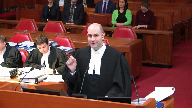
:::

Les appelants vont se diviser les questions.

Pour ma part, je vais adresser trois questions devant vous.

La première, est-ce que Caleduce peut voter sur le plan d'arrangement qu'elle présente?

La deuxième, si Caleduce peut voter sur le plan d'arrangement qu'elle présente, peut-elle le faire dans la même classe que les autres créanciers non garantis?

Et la troisième question, et non absent des réponses aux questions 1 et 2, est-ce qu'une cour supérieure, siégeant en matière de loi sur les arrangements avec les créanciers des compagnies, a la discrétion d'interdire à Caleduce de présenter et de voter sur son plan d'arrangement?

**Justice Wagner** (00:03:13): En d'autres mots, quelle est l'étendue de la discrétion accordée par ce genre de législation-là? Exact.

**Speaker 1** (00:03:19): In an insolvency context, who should decide to settle a claim?

::: {.column-margin}
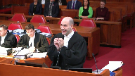
:::

The creditors or the debtor?

With regard to the question raised in this case, it is a false escape, a red-earing, as we would say in English. Why?

Because creditors want to pursue Carlydus, and because creditors, who have a common interest in maximizing their return to the settlement plan, have already rejected Carlydus's plan, according to the statutory requirements.

The rejection has already taken place.

I suggest that if we had to encapsulate the whole debate before you in one question, it would be fairer to ask the following question.

Does the law on arrangements with creditors allow a creditor to make a decisive vote in a second attempt to approve the settlement plan that he himself formulated with the sole purpose of obtaining a quittance?

**Justice Côté** (00:04:34): Si je reformule la question, est-ce qu'un créancier tel que Kalidius a le droit d'avoir un second kick à la canne?

**Speaker 1** (00:04:40): C'est une des questions, et d'ailleurs c'est cité dans les autorités du contrôleur.

::: {.column-margin}
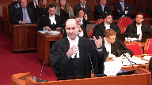
:::

Un des exemples là-dessus est Care Interior, où on n'avait pas permis, dans ce cas-ci c'était une débutrice qui avait déposé son plan d'arrangement et qui n'avait pas réussi à le respecter, de dire « l'intégrité du processus en matière de l'ACC nécessite que les gens puissent se fier au système, à l'intégrité aux décisions qui ont été rendues, et on ne va pas permettre un second kick à Deccan pour reprendre l'expression, c'est exact.»

**Justice Kasirer** (00:05:05): de ne pas tomber dans le panneau, poser la question, c'est y répondre.

::: {.column-margin}

:::

La façon de poser la question, tout comme vous faites le reproche ailleurs, je peux vous donner une réponse que vous trouvez conviviale.

Il y a des vraies questions ici dont la vocation, par exemple du litigation funding agreement.

Il y a plein de questions.

Les questions du litigation funding seront adressées par mon collègue.

Il y a des questions qui débordent la lecture étroite des faits.

**Speaker 1** (00:05:34): Tout ce que je vais vous dire, c'est que sur la conclusion à laquelle on vous demande d'en venir, c'est la même conclusion à laquelle le juge Michaud, le juge coordonaire, en est venu.

**Justice Rowe** (00:05:42): On doit rappeler que ce n'est pas, nous ne sommes pas un cours de première instance.

::: {.column-margin}

:::

Nous sommes un cours d'appel.

Il y a une décision de superviseur de juge Michaux et aussi la décision, l'arrêt de la cour d'appel.

C'est un appel ici.

Où est l'erreur, où sont les erreurs qui ont été faites?

C'est un appel ici.

**Speaker 1** (00:06:12): Au niveau des erreurs, ça doit être la troisième question, mais on peut y aller immédiatement.

::: {.column-margin}
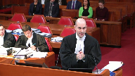
:::

Un des points marquants du jugement du juge Schrager de la Cour d'appel

, c'est qu'il dit qu'il n'accordera pas la déférence qui est généralement donnée à un juge qui supervise un processus en matière de l'ACC, puisque, pour utiliser l'expression du juge Schrager à son paragraphe 59, «

The exercise of a discretion, which is not legally available, is an error in principle, to which difference is not due.

» Mais avec égard à ce qu'on vous plaide, et c'est la troisième question, et si la discrétion existait.

La discrétion existait notamment en vertu des articles 4, 6, 11 et 18.6 de la LACC.

Il faut se rappeler quelle est la requête que le juge Michaud a rejetée.

C'était une requête de Calidus afin de convoquer un assemblée de créanciers.

C'était une requête en vertu de l'article 4 de la LACC.

Or, si vous lisez l'article 4 de la LACC, ça prévoit «

That the court may

order the creditor's meeting ».

La discrétion est à l'article 4 et l'ensemble de la jurisprudence reconnaît que c'est une discrétion qu'on peut l'accorder ou non. Merci.

**Justice Wagner** (00:07:27): dans la loi, partout, dans tous les articles de la loi.

C'est une loi par définition d'insolvabilité qui prévoit donc la discrétion et l'équité.

**Speaker 1** (00:07:36): C'est exact.

::: {.column-margin}
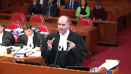
:::

Tout ce que je vais vous dire, c'est que c'est partout dans la loi, c'est ce que cette Cour a dit dans Century Services, flexibilité et autres.

Tout ce que le point que je veux faire relativement à l'article 4, c'est que c'est encore plus clair parce que sur la requête spécifique que le juge Michaud avait, on n'avait même pas besoin de s'en remettre à la discrétion générale que vous avez reconnue dans Century Services et qui était à l'article 11.

On était, la requête même était intitulée en vertu de l'article 4.

Et cette Cour, pour revenir à la discrétion, si on décidait de dire on ne fait pas en vertu de l'article 4, la loi dans son ensemble accorde une certaine discrétion.

Cette Cour, dans Century Services, nous a indiqué comment on doit exercer une telle discrétion.

Les mots utilisés par cette Cour dans Century Services, on nous dit que lorsqu'un juge exerce sa discrétion, on doit regarder that the requirements of appropriateness, good faith and due diligence are the baseline consideration that the court should always bear in mind when exercising CCW authority.

Et pourquoi je vous cite ce paragraphe-là, quand on regarde l'analyse que le juge Michaud a faite, le juge coordonnateur qui était en charge de la supervision du dossier pendant plus de deux ans, 27 mois, a revu 15 rapports de son contrôleur, a rendu une vingtaine d'ordonnances, a revu un paquet d'affidavits, déclarations, serments et témoignages.

Qu'est-ce qu'il fait à ces paragraphe 38 à 48 de ces motifs?

Il fait l'historique du dossier.

Il regarde les comportements de Carlidus du jour 1 où il prenait la position que la compagnie n'était même pas insolvable alors que quelques jours avant, il venait d'envoyer une lettre de mise en défaut en disant je veux exercer mes droits puisque vous êtes insolvable.

C'est la première étape.

Mais tout ce que je veux dire du paragraphe 37 à 48, ils font tout l'historique du dossier.

Et à son paragraphe 48, après avoir fait l'historique du dossier, il se sert du test établi par cette Cour dans Century Services pour dire «Carlidus' behaviour is contrary

to the requirement of appropriateness, good faith and due diligence that are baseline consideration that a court should always

bear in mind when exercising CCAA

authority.

In short, this Court finds that Carlidus intends to use its vote for an improper purpose and that it should not be allowed to do so.

» Donc, il avait la discrétion en vertu de 4 et il l'a même exercée en vertu de l'article 11 qui prévoque qu'une Cour en matière de l'ACC a la discrétion de rendre toutes les ordonnances qu'il juge appropriées.

Et, M. Grosleau, alors vous dites le… Pardon?

La chance.…

**Justice Côté** (00:10:01): La chance, je m'excuse.

::: {.column-margin}
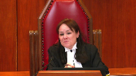
:::

Parce que...

Ok, mettre la chance.

Alors, donc, même si le juge, et si vous dites que le juge avait discrétion pour faire ce qu'il a fait parce qu'il est reconnu dans ce domaine que le juge a une large discrétion, mais je comprends de vos arguments dans votre mémoire que si on en venait à la conclusion que le juge n'avait pas, comme l'a dit la cour d'appel, judicieusement exercé sa discrétion, vous dites que de toute façon, même s'il avait eu le droit de présenter, même s'il avait eu une assemblée de créanciers pour étudier le second plan, vous dites qu'Alidius, un, n'aurait pas eu le droit de vote, et deux, même si Alidius aurait eu le droit de voter, elle aurait dû voter dans une classe séparée, donc le plan n'aurait pas été accepté.

En vérité, je viens de répondre à ma troisième question, qui était la discrétion générale.

Mais si on revient à la question de la discrétion générale, je pense qu'il y a un peu plus de

**Speaker 1** (00:10:49): Je regarde ça, c'était mes deux premières questions. D'accord.

::: {.column-margin}
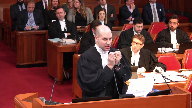
:::

Et en effet, on vous soumet que Caleduce ne peut pas voter en faveur du plan qu'il présente.

À cet égard-là, pour deux raisons.

La première, c'est qu'au fin de la LACC, le paragraphe 22.3 nous indique that a creditor who is related to the company may vote against but not

for a plan of arrangement.

Donc, si tu es relié, tu peux voter contre le plan d'arrangement mais pas en faveur.

La Cour d'appel a correctement conclu que pour regarder si Blueberry et Caleduce sont des parties liées, il faut s'en remettre à l'article 4 de la loi sur la faillite de l'insolvabilité.

L'article 4 prévoit essentiellement que si une entité en contrôle un autre, l'exemple typique compagnie A détient 100 % des actions de compagnie B, ils sont liés.

Par contre, le paragraphe 3C de l'article 4 prévoit également une autre situation où des parties seront liées.

On énonce que des parties seront liées si l'une d'elles, et je vous lis l'article, « has a right under contract, either immediately or in the future, and either absolutely or contingently, to control the voting rights de l'autre entité ».

Et ici, le paragraphe 4C n'a tout simplement pas été considéré par la Cour d'appel lorsqu'elle a appliqué le test de savoir si Caleduce et Blueberry étaient liés.

**Justice Côté** (00:12:13): Mais le premier juge non plus n'a pas fait cet exercice-là pour savoir s'il était lié, parce que la raison pour laquelle il a dit «

vous ne votez pas », c'est parce qu'il a dit « improper purpose ».

Exactement.

**Speaker 1** (00:12:22): Exactement.

::: {.column-margin}
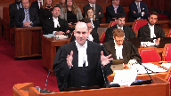
:::

Et pourquoi c'est pertinent ici, c'est parce que c'est reconnu par tous les partis, car le 2, c'est nécessairement son factum, au paragraphe 71, 73 et 82, la Cour d'appel au paragraphe 54 et 55, qu'il y avait un pledge, ou parler en termes civilistes, qu'il y avait une hypothèque mobillaire avec des possessions sur les actions.

Or, pour nous, c'est exactement le genre de contrat qui est visé à 4-3-c puisque tu peux, dans le futur et de façon contingente, avoir toutes les actions.

C'est même reconnu qu'ils ont tenté d'exercer ce droit-là.

De façon intéressante, la Bible en matière de fait et insolvabilité, c'est l'ouvrage écrit par les anciens juges Holden et Morawitz.

Quand ils doivent donner un seul exemple de situation dans laquelle on tombe sur 4-3-c, ils donnent l'exemple du pledge.

Mes confrères, sur cet argument-là, vont tenter de dire que, ah mais, ça n'a pas d'application en principe, ça voudrait dire que tous les banquiers qui prennent des sûretés ne pourront plus voter dans des plans d'arrangement.

Trois raisons pourquoi ça ne fonctionne pas.

Un, on est clairement contraire au libellé de la loi qui utilise les mots « in the future and contingency ».

Deuxièmement, les banquiers rarement prennent une hypothèque sur les actions puisque, par définition, quand une compagnie devient insolvable, les actions n'ont pas vraiment de valeur, ils prennent l'hypothèque sur les actifs.

Et troisième raison, l'article est bien fait, il t'empêche de voter pour, mais il ne t'empêche pas de voter contre.

En d'autres termes, si ce que ce créancier veut faire, c'est protéger ses intérêts sur son chapeau de créancier parce qu'il pense que son rendement va être meilleur dans la faillite, il peut faire le vote puis voter contre.

Mais s'il vote pour, la loi s'inquiète que peut-être que ses intérêts n'ont pas de titre de créancier, mais potentiellement d'actionnaire, s'il peut exercer son « pledge », alors on lui empêche de voter pour.

**Justice Côté** (00:14:06): ici la Cour d'appel a dit oui c'est vrai que la définition de Related Parties c'est ça c'est vrai qu'il y avait un pledge mais il pourra jamais être exécuté parce qu'il y aura jamais d'événement de défaut vu la situation des parties.

Parce qu'il y a une suspension des procédures.

C'est ça qui a causé le problème.

**Speaker 1** (00:14:23): par contre, 1, 4, 3, 6, de façon contingente, le droit doit exister, n'a pas besoin d'avoir été exercé.

::: {.column-margin}
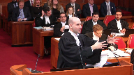
:::

Il faut se rappeler aussi, c'est partout dans les procédures, que Caleduce a tenté à plusieurs occasions de mettre fin à la suspension des procédures. Pourquoi?

Justement parce qu'ils veulent exercer leur recours.

La lettre qu'il avait envoyée quelques jours avant qu'on cherche l'obtention de l'ordonnance initiale, c'est directement lié.

Donc, ça répond à une des questions pourquoi on dit qu'on Caleduce ne devrait pas voter sur le plan.

On a un autre argument à cet égard-là.

On vous suggère que Caleduce ne devrait pas pouvoir voter sur le plan du simple fait qu'il est l'entité qui présente et formule le plan d'arrangement.

Il faut comprendre que jusqu'en 2009, il n'y avait absolument rien dans la loi sur les arrangements avec les créanciers des compagnies, qui empêchait une partie qui avait un intérêt lié à la débitrice de voter en faveur d'un plan.

Le législateur s'est rendu compte qu'il s'acquérait des conflits d'intérêts et qu'il y avait quelque chose qu'on devait corriger.

Donc, ils ont mis en place le paragraphe 22.3, que je vous ai lu un peu plus tôt, que « Creditor who is related to the company may vote against but not for a plan arrangement ».

Quand on regarde le rapport du Sénat qu'on vous a joint dans notre compendium, on dit pourquoi on a mis cet article-là.

On l'a mis pour éviter des abus.

Des abus de qui?«

By related parties or by parties who derive collateral benefits from the decision of the group ».

Et c'est particulièrement le cas ici.

Qu'est-ce que Caleduce veut faire? Caleduce

, ici, ne cherche pas à avoir une maximisation de son retour dans le plan d'arrangement, comme tous les autres créanciers ont généralement comme inquiétude.

Ce qu'il cherche, c'est un « collateral benefit ».

C'est autre chose.

La logique est simple.

Les intérêts ne sont pas les mêmes.

Typiquement, une débitrice veut assurer la survie de son entreprise et les créanciers veulent maximiser leur retour dans le plan d'arrangement.

C'est pour ça que la débitrice et les parties liées à la débitrice ne peuvent pas voter en faveur du plan d'arrangement.

On veut s'assurer de protéger l'intérêt commun des créanciers qui veulent maximiser leur retour.

La suggestion que je vous fais, c'est qu'un créancier qui décide de formuler un plan d'arrangement à la place de la débitrice se trouve exactement dans le même genre de conflit d'intérêts.

On va être pratique et réaliste ici.

Un créancier qui décide de formuler et de présenter un plan d'arrangement à la place d'une débitrice, c'est certainement pas pour s'offrir un paiement lui-même et offrir un paiement aux autres créanciers de la débitrice.

Le créancier qui fait ça a un autre motif en tête, a d'autres choses que simplement maximiser le retour dans le cadre d'un plan d'arrangement aux créanciers.

Mes confrères, représentant Caledis, vont me dire « là, vous pouvez mettre la chance, vous faites un argument élargi de 22-3, 22-3 vise la situation, c'est une débitrice qui dépose un plan d'arrangement ».

Mais où le bas blesse à cet égard, c'est qu'il faut comprendre que le droit pour un créancier de déposer un plan d'arrangement à la place d'une débitrice, c'est nulle part spécifiquement prévu dans la LACC, c'est la jurisprudence qui a reconnu qu'un créancier pouvait quand même déposer un plan d'arrangement à la place de sa débitrice.

Ce que je vous suggère ici en termes usagers, imagé, pardon, c'est essentiellement un argument de « what is good for the goose is good for the gander ».

Si on a décidé dans la loi que quand la débitrice propose son plan d'arrangement, elle vise un intérêt autre, elle, que simplement maximiser le retour à ses créanciers et que elle et les partis liés ne devraient pas voter en faveur, la personne créancier qui formule un plan d'arrangement se trouve exactement dans le même conflit d'intérêts et on doit éviter d'aller diluer le vote des créanciers qui, eux, ont le seul intérêt principal de maximiser le retour.

**Justice Côté** (00:18:02): Alors ici, lorsque le juge coordonnateur a permis le dépôt du premier plan d'arrangement de Caledius, j'imagine que cette question du vote ne s'est pas posée parce que Caledius ne votait pas de toute façon sur le premier plan.

**Speaker 1** (00:18:13): Pour nous, c'est l'un des éléments clés de la distinction du juge Michaud, parce que le juge Michaud, dans un de ses paragraphes, 45 de mémoire, il vous dit clairement qu'il avait accordé la possibilité de voter sur le premier plan avec la compréhension que Caleduce, comme créditeur sécuritaire, ne votera pas.

**Overlapping speakers** (00:18:29): Alors que là, sur le deuxième, il veut voter justement.

Exactement.

Faire en sorte qu'il n'y aura plus de réclamations possibles.

**Speaker 1** (00:18:35): Exactement, et ça c'est tout l'argument que mon collègue Maître Pinel va arriver, de l'ironie de dire que sa réclamation vaut rien quand on est prêt à payer 3 millions.

::: {.column-margin}

:::

Bien évidemment, Caleduce va dire que la réclamation vaut rien pour moi, mais ce n'est pas ça qu'il faut regarder parce qu'ils veulent dire, mais sûreté ne vaut rien.

Si on dit que les sûretés ne vaut rien, il faut regarder c'est quoi les actifs de la débitrice.

Et si de toute évidence il y a un 3 millions qui va rentrer dans le patrimoine de la débitrice, ou 2,8 selon le deuxième plan d'arrangement, il y a définitivement un actif qui vaut quelque chose ici.

Mes confrères, sur mon argument de dire, Caleduce par le simple fait qu'il formule le plan d'arrangement ne devrait pas pouvoir voter en faveur de celui-ci.

Il faut nous dire que la question est réglée.

Regardez la décision Canadian Airlines.

On a permis à Air Canada, qui finançait le plan d'arrangement, de voter dans le plan d'arrangement.

Avec Égard, on ne peut pas lire Canadian Airlines de cette façon-ci. Pourquoi?

Parce que dans Canadian Airlines, c'était la restructuration de Canadian Airlines.

Et c'était Canadian Airlines, i.e.

la débitrice, qui déposait le plan d'arrangement.

Et elle s'était attendue avec Air Canada pour le financer.

Ce n'était pas le plan d'Air Canada, c'était le plan de la débitrice avec le financement d'Air Canada.

Par ailleurs, un autre point que je veux mentionner, tout notre argument là-dessus est basé essentiellement sur 22-3, qui a été mis en place maintenant pour protéger le vote et l'intégrité du vote des créanciers.

22-3 n'existait pas quand Canadian Airlines était rendu.

22-3 a été introduit dans la législation en 2009.

**Justice Kasirer** (00:20:00): Qu'est-ce que vous dites sur ce que le juge Michaud dit sur 22?

**Overlapping speakers** (00:20:05): Thank you.

**Justice Kasirer** (00:20:06): En regard, M. le juge?

::: {.column-margin}

:::

Au paragraphe 55, après avoir dit qu'il s'appuie sur l'objectif impropre, l'objectif impropre, il dit que ce n'est pas nécessaire que je me prononce sur l'autre, mais il dit quand même qu'il se permet un commentaire.

Cependant, la Cour n'aurait pas dû conclure que le législateur voulait éviter à un créditeur de voter sur son propre plan.

Si c'était son intent, il aurait facilement pu drapter la section 22.

**Speaker 1** (00:20:36): C'est le seul point de jugement de Michaud avec lequel on n'est pas d'accord.

On vous plaide spécifiquement de, par la nature, de protéger l'intérêt des créanciers.

Donc le juge Michaud se trompe d'après vous.

Sur ce point-là, il le fait en hôpital par ailleurs.

**Overlapping speakers** (00:20:47): Il le fait en hôpital, mais ça va à l'encontre de la position que vous venez de mettre de l'avant.

**Speaker 1** (00:20:52): Sur ce point-là, on est d'accord sur le fait qu'il y avait Eladis, il peut décider de ne pas faire voter for improper purpose, mais sur l'argument de 22-3, on est en désaccord avec les juges Michérens.

**Overlapping speakers** (00:21:01): Le juge de la Cour d'appel s'est dit en accord avec le juge coordonnateur là-dessus.

**Speaker 1** (00:21:04): En vérité, le juge Schrager, en cours d'appel, n'aborde peu 22 sur cet égard-là.

::: {.column-margin}
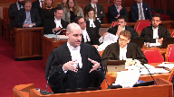
:::

Il apporte 22 beaucoup plus pour la question de la classification des créanciers, qui était une autre question qui restait, qu'on va pouvoir aborder.

Et à cet égard-là, je porte à votre attention que si vous regardez les paragraphes 71 à 76 du jugement du juge Schrager, qui est son analyse sur la question de la classification des créanciers, nulle part dans son jugement il ne regarde les principes applicables.

Et ça, c'est pour nous, c'est important ici parce qu'il y avait une question de principe applicable à regarder qui n'a pas été regardée.

Il n'a pas regardé aucune des autorités citées de part et d'autre aujourd'hui.

Ce qui nous amène à aborder notre question, s'ils peuvent voter, pouvaient-ils le faire dans la même classe des créanciers?

**Justice Rowe** (00:21:53): Mais maître, est-ce que c'est la question fondamentale ou c'est une question subsidiaire?

::: {.column-margin}

:::

Il me semble, écoutez s'il vous plaît, que la décision, l'exercice de discrétion par le juge Michaud, qui est fondamental, qu'il a accueilli ou donné approbation à la litigation financing agreement soumis par Bentham et le tuteur, et il a rejeté la demande d'avoir un vote sur le plan d'arrangement soumis par Calidus.

La question, si Calidus peut voter, c'est subsidiaire.

Ce qui est fondamental, c'est que la décision, l'exercice de discrétion était en faveur de litigation financing agreement, n'est-ce pas?

**Speaker 1** (00:22:50): Faut faire attention ici, il y avait deux requêtes et nous ce qu'on vous parle ici sur la première, il avait la discrétion de refuser de l'accorder et toute son analyse sur la question du litigation funding, et maître Piedine en parlera plus lentement, se base sur le fait qu'il n'y a pas deux options viables ici.

::: {.column-margin}
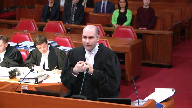
:::

Il y a une seule option viable qui est le litigation funding agreement parce qu'il y a regardé la première option proposée par Caleduce et après avoir utilisé toute la discrétion que la LACC lui donne soit en vertu artistique spécifique ou autre, il dit cette première option-là du plan de Caleduce, ce n'est pas une option vivable, je la rejette.

Donc bien évidemment, quand on apprécie sa discrétion sur la deuxième question, il faut se mettre en contexte qu'il y avait une seule option viable.

Brèvement sur la classe des créanciers pour compléter cet élément-là, il faut savoir que 22-2 est en fait une codification de la jurisprudence canadienne et de l'Angleterre.

La décision qui a mené à toutes les codifications à travers les pays de Comenat sur la classification de créanciers est l'arrêt de la Cour d'appel d'Angleterre dans Sovereign.

Dans Sovereign, la Cour d'appel d'Angleterre nous a dit que si des créanciers, que des créanciers doivent être dans une classe distincte, si leurs droits et intérêts sont différents au point « to make it impossible for them to consult together with a view of their common interest ».

S'ils ne peuvent pas se consulter dans l'objectif commun, ils ne devraient pas être dans la même classe.

On vous suggère que cette interprétation-là doit être plus large.

Mes confrères représentants Caleduce disent qu'une application restrictive doit être appliquée de ça, avec égard, comme M. le juge en chef le signait, ce n'est pas l'interprétation qu'on fait dans la LACC, c'est une interprétation large et libérale.

Caleduce prétend qu'on devrait regarder uniquement est-ce que les créanciers vis-à-vis la débitrice ont les mêmes droits.

S'ils ont les mêmes droits, ils doivent automatiquement être dans la même classe.

Pour nous prendre cet argument-là et ignorer le fait que si dans la même classe de créanciers, ils reçoivent des traitements différents, ceci nécessite des classes différentes. Pourquoi?

Parce que pour utiliser l'expression de Sovereign, they cannot consult together with the view of their common interest s'ils ne reçoivent pas le même traitement.

Et si c'est flagrant, nous avons Caleduce que tout ce qu'ils obtiennent dans le plan, ce n'est pas un paiement, c'est l'acquittance, et les autres créanciers que tout ce qu'ils reçoivent, eux, est le paiement.

On est ici deux parties qui ne peuvent pas se consulter with the view of their common interest.

En vérité, their common interest sont diamétralement opposées parce qu'il y a une partie qui veut recevoir le plus possible en échange de l'acquittance qu'ils donnent et l'autre partie veut donner le moins possible en échange de l'acquittance qu'ils vont chercher.

Donc, on ne peut pas avoir d'intérêt commun sur ce point-là.

Et notre suggestion devant cette Cour, c'est en effet qu'à chaque fois qu'un traitement est différent, on est incapable d'avoir a commonality of interest.

Et je n'ai l'intention que de vous citer qu'une seule décision durant ma plaidoirie.

Irrégulièrement, ce ne sera pas une décision canadienne, ça va être une décision de la Cour suprême de Nouvelle-Zélande. Pourquoi?

Spécifiquement parce que la Cour d'appel de Nouvelle-Zélande, en 2018, c'est très récent, devait spécifiquement se poser la question qui est devant vous aujourd'hui, de dire est-ce qu'il faut retenir l'interprétation de Caleduce, qu'on fait uniquement regarder les intérêts à titre de créanciers vis-à-vis de la littératrice ou il faut regarder d'autres choses?

À la page 128 de notre compendium à l'onglet 11, la Cour suprême de Nouvelle-Zélande, après avoir regardé tout ce qui se fait dans d'autres juridictions de common law au Canada, en Australie, en Angleterre, s'est dit voici ce qui devrait être la question pour la classification des créanciers.

The policy of part 14, 128, paragraph 66.

The policy of part 14 is the approval of a compromise which reflects a fair business

assessment by creditor

should be given effect to.

This is based on the working assumption that such a business

assessment will reflect the common interest of all or those who are to be bound by it.

If all creditors share a common interest in maximizing the return, et c'est là ici la grosse distinction que nous avons fait, ici l'intérêt de Caleduce n'est pas in maximizing the return.

The common interest in maximizing the return of their debts and can be expected to vote accordingly, which is usually the case.

Difference between them, whether in terms of right or interest, will be of no practical moment.

Donc, ce que nous dit la Cour suprême de Nouvelle-Zélande, si tout le monde a le même intérêt, même s'il y a des petites différences, s'ils ont le même intérêt à maximiser leur retour, on peut les mettre dans la même classe.

Par la suite, à son paragraphe 77, qu'est-ce que fait la Cour suprême de Nouvelle-Zélande?

Elle se dit, si cet intérêt-là de maximiser le retour n'est plus le même, est-ce qu'il faut changer la réponse?

Ils vous disent oui.

But where on the other end such common interest as the creditors share is, for some creditors, outweighed by other consideration, et ici je veux suggérer que le « other consideration » c'est, dans ce cas-ci, la quittance que Caleduce cherche à obtenir, the working assumption may well be displaced.

In that situation, the vote of the creditors can no longer be taken to represent the best interests of all members of the class. Where

creditors whose pre-compromised rights and interests are materially the same are treated differently under the proposed compromise, separate classes will almost certainly be required.

**Justice Côté** (00:28:28): de l'Ontario et de l'Ontario et de l'Ontario et de l'Ontario et de l'Ontario et de l'Ontario et de l'Ontario et de l'Ontario et de l'Ontario et de l'Ontario et de l'Ontario et de l'Ontario et de l'Ontario et de l'Ontario et de l'Ontario et de l'Ontario et de l'Ontario et de l'Ontario et de l'Ontario et de l'Ontario et de l'Ontario et de l'Ontario et de l'Ontario et de l'Ontario et de l'Ontario et de l'Ontario et de l'Ontario et de l'Ontario et de l'Ontario et de l'Ontario et de l'Ontario et de l'Ontario et de l'Ontario et de l'Ontario et de l'Ontario et de l'Ontario.

::: {.column-margin}
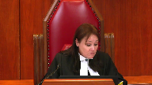
:::

**Speaker 1** (00:29:09): Je vais répondre à une question.

::: {.column-margin}
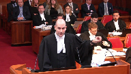
:::

Ça dépend de la quittance.

Et la réponse est la suivante.

Il est vrai,

et on ne peut pas nier, que les quittances en faveur de tiers ont été reconnues possibles depuis l'arrêt de la Cour d'appel de l'Ontario dans Medcaf.

Par contre, il y a plusieurs choses ici pour la quittance qu'il faut regarder.

C'est un des derniers points que je voulais faire, alors merci d'avoir posé la question.

Et un, les quittances en faveur de tiers sont des mesures exceptionnelles en mesure de l'ACC.

Il faut se rappeler d'où vient la première décision qui a accepté l'équivalent.

Il s'agissait du dossier du papier commercial en Ontario.

Le plus gros dossier de CCW que ce pays n'a jamais eu, où ce qui était en jeu n'était plus ni moins que la stabilité du système financier au Canada.

Et la jurisprudence qui a suivi, je vous mentionne notamment la décision qu'Anne West, dans nos autorités, dit que ces quittances-là doivent être des mesures exceptionnelles.

Il ne faut pas qu'ils soient tout le temps accordés.

Il est possible de le faire, mais c'est des mesures exceptionnelles.

Ce qu'on vous plaide ici, on n'est pas dans un de ces cas de mesures exceptionnelles.

On n'est pas dans le dossier du papier commercial.

On n'est pas dans le dossier de la tragédie de MAA à Lac-Mégantic.

On n'est pas dans ce genre de dossier-là.

Deuxième point qui est super important.

Si vous lisez la jurisprudence sur la quittance, le remède CAF, c'est aussi dans Target, c'est aussi dans CanWest, ils vous disent tous que des quittances en faveur de tiers pour être obtenues doivent être « reasonably connected to the restructuring to be achieved ».

En d'autres termes, on va permettre les quittances de tiers si on peut prouver qu'elle est requise pour que la compagnie se restructure, en d'autres mots, demeure en vie.

Et c'est là pour moi que le Borg blesse complètement pour l'argument de Caledis et que même si vous deviez leur donner une raison ici, aujourd'hui, ils vont avoir problème lors de l'audition sur le « fairness hearing » puisque leur quittance ne peut pas être « reasonably connected to the restructuring ».

Eux-mêmes dans leur factum paragraphe 4A et paragraphe 116 reconnaissent qu'il n'y a pas de restructuring ici à accomplir parce que tous les actifs ont déjà été vendus.

Tout ce qui nous reste, c'est une coquille vide avec une réclamation.

Comment peuvent-ils prétendre que leur quittance est « reasonably connected to the restructuring » pour être achevé?

**Justice Côté** (00:31:10): Le fairness hearing c'est l'audition qui aurait lieu si le plan était approuvé parce que même si c'est approuvé par les créanciers, le juge doit quand même la discrétion.

**Speaker 1** (00:31:17): quand je vous disais plus tôt que le juge avait la décrétion en vertu de plusieurs articles, un des articles que je vous ai mentionnés est spécifiquement l'article 6, qu'on appelle le fairness hearing

::: {.column-margin}
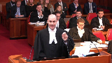
:::

. En d'autres termes, même si les créanciers l'approuvent, le juge demeure à sa décrétion, si ce n'est pas fair et raisonnable, de rejeter le plan d'arrangement. Et

à cet égard, le juge, à cet égard-là, lisez le paragraphe 47 du jugement du juge Michaud.

Il applique le test du fair et raisonnable au plan d'arrangement.

Il dit, regardez ici, ce que Cal-2 se tente de faire pour le plan d'arrangement et la quittance n'est pas fair et raisonnable.

Il vient de dire qu'en vertu de sa décrétion, si ça revient devant lui lors du sanction hearing, lors du fairness hearing, il ne l'accordera pas parce que ce n'est pas fair et raisonnable ce qu'on cherche.

Et aussi, on cherche aussi une quittance pour des fraudes civiles et misconducts qui, en général, sauf cas exceptionnel, n'ont jamais été accordées en matière de quittance.

**Justice Kasirer** (00:32:05): Je peux me tromper mais j'ai l'impression que le juge était pour ce qui est de la lecture de l'intérêt commun, il était secoué par le fait que 92 % des créanciers étaient d'un bord au départ et que ça a choppé sur la règle des deux tiers.

::: {.column-margin}

:::

Je me demande si l'interprétation que vous proposez de ce critère en nous renvoyant à la cour suprême de la Nouvelle-Zélande risque d'avoir un effet négatif sur les procédures de la LAC.

Je m'explique.

Dans la mesure où les catégories sont trop fractionnées, la possibilité d'obtenir le deux tiers qu'exige la loi devient plus compliquée.

Et que si ça devient plus compliqué, l'objectif fondamental de la LAC est compromis.

On veut donner une chance aux coureurs, c'est le principe de notre loi.

La lecture que vous proposez, cette lecture étendue du critère risque paradoxalement de compromettre la loi qui cherche à promouvoir des compromis.

**Speaker 1** (00:33:17): C'est une bonne question, ça me permet de répondre à l'extérieur de mon temps, mais je vais répondre à la question.

::: {.column-margin}
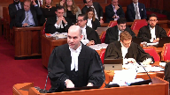
:::

Le critère de la fragmentation des classes, qui par ailleurs n'est pas du tout analysé par le juge Schrager, est en effet un des considérants qu'on doit tenir en compte quand on regarde la question de la classification des créanciers, comme vous l'avez dit, voir s'assurer que des compagnies survivent si elles peuvent survivre.

Et c'est un des critères parmi tant d'autres.

Si vous lisez les urgences, ce n'est pas un des critères absolus.

Est-ce que je vais vous soumettre ici pour faire un lien avec la réponse que j'ai donnée à Mme la juge Côté, le critère de la fragmentation des classes vise à assurer le survie d'une entreprise « as a going concern », une compagnie qu'on va sauver les emplois, comme dans Canadian Airlines, il y avait encore 16 000 employés qui étaient en jeu et qui continuaient.

Donc oui, la fragmentation des classes peut être un critère important, mais dans ce cas-ci, ce critère de la fragmentation des classes ne tient pas, parce que de l'admission même de Caledus, il n'y a plus d'entreprises à sauver.

Il ne reste plus d'employés et autres.

Donc oui, c'est un critère à considérer, mais un parmi tant d'autres, et dans les faits de cette cause-ci, on ne veut pas en tenir compte parce qu'on n'a plus d'entreprises « as a going concern ».

Paragraphe 4a, il dit clairement Caledus « Blueberry

will never re-emerge from the CCAA

».

Donc eux-mêmes admettent que l'argument de la classification des classes ne tient pas.

**Justice Côté** (00:34:28): pour dire que le LFI devrait être un plan d'arrangement et pas du financement intérimaire.

**Speaker 1** (00:34:33): Et ça fait le lien avec ce que maître Pilon va adresser dans quelques instants.

Nous allons entendre maintenant.

**Justice Wagner** (00:34:38): Merci.

**Speaker 2** (00:35:28): Good morning.

::: {.column-margin}

:::

I would submit that there are really two main questions that the court is faced with.

Essentially, those two questions are, was the supervising judge in the CCAA precluded from approving the litigation funding agreement, the LFA, as interim financing under the CCAA?

Precluded either because he did not have the discretion to do so as a matter of law, or having the discretion to do so, that he exercised that discretion in an unreasonable manner.

The second question is, was the supervising judge in the CCAA proceedings required to find that the LFA had to be put to the creditors as a plan for largely the same reasons, whether he is required to as a question of law, or because having the discretion to do so or not, that he exercised his discretion manifestly unreasonably?

Now, to answer those questions, if you have a copy of my condensed book, you'll see at the two-page summary that I have attempted to distill what I think are the main points to 10, which given the time allotted is probably too many.

But I'm going to attempt to get through them all, conscious of what Robert Burns said about the best-laid schemes of mice and men.

I'm going to give it a shot.

What I propose to do is to take the first few minutes to run through these 10 points, and then to turn to them in more detail in whichever order the court thinks most useful.

And I'm happy to get the court's input on that.

So point number one concerns the deference that we submit is due the supervising judge in CCAA proceedings.

If there was any deference at all shown by the court below to the supervising judge, I think it fair to say that it was in rather short supply.

Why is this important?

Well, not only does the court below conclude erroneously in our view that the supervising judge made palpable and overriding errors.

In substituting its own appreciation of the facts, the court below makes its own palpable and overriding errors.

**Justice Rowe** (00:37:47): I think the most fundamental question here is whether the litigation financing plan is a plan of arrangement.

If it's a plan of arrangement, it has to go to the creditors.

If it's not a plan of arrangement, it doesn't have to go to the creditors.

Isn't that the case?

**Speaker 2** (00:38:01): case?

::: {.column-margin}

:::

That is one of the key questions, yes.

Now that raises the issue, must a supervising judge conclude that it is a plan of arrangement?

I don't think anyone disputes the idea that it can be part of a plan of arrangement.

And that's the trap that I believe the court below falls into and my friends on the other side as well.

When we want to cite cases like Ray Metcalf and Mansfield, which involved the breakdown of the asset-backed commercial paper market, and the court enunciated the principle that a plan is very broad.

It can be almost anything under the sun.

That's the same thing in bankruptcy and assault.

**Justice Rowe** (00:38:43): Isn't a plan of arrangement, when creditors compromise, they say, we'll take 50 cents and a dollar and we're all out of here, and they give up rights in return for money now.

::: {.column-margin}

:::

That's the essence of a classic plan of arrangement.

But a litigation financing agreement doesn't mean that the creditors give up rights. Correct.

**Overlapping speakers** (00:39:04): Thank you.

**Justice Rowe** (00:39:05): And I mean, I'm trying to get at the essence of what happened here.

::: {.column-margin}

:::

Didn't the supervising judge treat this as interim financing?

And therefore, he could exercise his discretion to approve it and didn't have to put it to the creditors.

I mean, I'm trying to get to the critical choice points here.

**Speaker 2** (00:39:26): Well, that's absolutely right.

::: {.column-margin}

:::

The Calidus plan is a plan, and the litigation funding agreement is interim financing.

And that's exactly the way the supervising judge saw it.

The litigation funding agreement in itself does not compromise any of the creditor's rights.

It doesn't force them to take anything in exchange for anything.

What the court below does is it says, what turns it into a plan of arrangement is the fact that we are now dealing with the last remaining asset of the debtor.

The court is seen preoccupied by this fact.

But that does not turn interim financing into a plan.

And on that point, we raise the example of sales of assets, for example.

Section 36 of the CCAA, and I'm in tab G of my condensed book.

And the provision is there if you'd like to refer to it, of the CCAA.

Under section 36 of the CCAA, it's undisputed that the court can approve the sale of assets, even if they are the debtor's last remaining assets, meaning that after this sale, there will be no prospect of any further recovery for the creditors.

And if one looks at the criteria under section 36 that are provided by the legislator, the court can certainly consider the interest and the position of the creditors, but it is not obliged to do so.

And it certainly does not have to put it to the creditors for a vote.

So if the legislator thinks it appropriate to give the supervising judge in the CCAA the discretion to decide whether or not the debtor should be permitted to dispose of its last remaining assets, how can the court below in this case conclude that because we are now dealing with the last remaining assets, that it was an error of law for the supervising judge not to put that to a vote?

It's inconsistent with the act.

**Justice Moldaver** (00:41:10): Interim financing and assuming you're under the act, 11, I guess you're under 11.2 sub one, right?

::: {.column-margin}

:::

What do you say?

about whether the supervising judge addressed the the Factors the statutory factors in concluding that this Was appropriate?

**Overlapping speakers** (00:41:33): And if.

**Justice Moldaver** (00:41:33): If he didn't, does it matter when you look at the whole piece?

Those are the two questions.

Well, the answer to that is, I don't think it matters when you look at the whole piece.

**Speaker 2** (00:41:40): think it matters when you look at the whole piece.

::: {.column-margin}
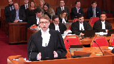
:::

I think it's done implicitly, and I don't think that that was really the problem that the court below, the Quebec Court of Appeal had with the decision either.

When you read the Court of Appeal decision, it wasn't a problem with an appreciation of any of the particular factors, many of which are not particularly relevant in this case, because interim financing can be, for example, to keep the lights on, as the court below said, and to continue operations, in which case many of those factors involve, are we going to stick to the cash flow, how are we spending the money, those really aren't relevant here, because that's not our case.

Now the court below, in appreciating what the supervising judge did, I think it's done implicitly,

**Overlapping speakers** (00:42:20): Was this argued before the supervising judge?

Did somebody go through these factors or no?

**Speaker 2** (00:42:25): The other side did not argue that any of the factors were not met.

It was presented as interim financing and the court made a global appreciation.

**Justice Rowe** (00:42:35): Well, the court also said, the supervising judge also said in paragraph 74, in general third party funding agreements are not illegal and should be approved subject to the following principles and set out common law principles A through E.

::: {.column-margin}

:::

Those are not the same as the factors set out in, I better get the number right, 11.2 sub 4. Correct.

And you may be correct that the number of the factors in 11.2 sub 4 are not particularly relevant in this case, but I'm wondering aloud whether it is a proper exercise of discretion to say I am now having regard to a common law test with respect to the approval of litigation financing agreements and implicitly I'm not turning my mind to 11.2 sub 4 factors which determine, which guide me as to whether I should approve interim financing.

I'm not saying the court of appeal was right.

I think the court of appeal went off in a different direction.

So I understand the point you're making to us, but following up on my brother Moldaver's point, I wonder aloud whether the trial, the supervising judge exercised his discretion having regard to the relevant considerations.

Maybe the outcome was okay.

Maybe it was, but I guess if you exercise discretion, but you look in the wrong direction, maybe you have to go back and do it again.

**Justice Kasirer** (00:44:10): again and I would add to that just go on exactly the same point comparing what Justice Michaud did to the motion judge in crystal X which is the case it's everyone leaning on it seems that it was done differently there

::: {.column-margin}

:::

so just it's all part of the same

**Speaker 2** (00:44:30): Well, I would agree with that.

::: {.column-margin}

:::

However, I think that the, let's call it the worst case scenario, is that the case would have to be sent back down for an explicit appreciation of 11.24 if the court is unsatisfied that that was done in an adequate manner.

However, we would submit that that exercise would lead to the same result, that, in fact, the judge was at least implicitly considering all of those factors if one goes through them.

**Justice Moldaver** (00:44:54): In response to Justice Roe, your answer is it wouldn't be right to look at the common law to the exclusion of, you should be looking at the statutory provisions.

That said, in this case, no substantial wrong.

That's correct.

**Justice Côté** (00:45:07): Because the issue in this case regarding the LFA is more about the qualification.

::: {.column-margin}

:::

Is it a plan of arrangement or interim financing?

I understand that there was no real debate in the courts below about are the factors of 11.2 met or not.

The debate was more is it a plan of arrangement or an interim financing.

**Overlapping speakers** (00:45:30): That is precisely our submission.

**Justice Côté** (00:45:31): When you say it's not a plan of arrangement because there was no compromise of the creditor's right, this LFA is more a process undertaken in order to satisfy the creditor's right.

**Speaker 2** (00:45:42): That is absolutely correct.

::: {.column-margin}
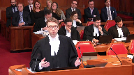
:::

The preoccupation of the court below was that the interim financing was not sufficiently linked to the debtors' operations.

And our submissions that we make in detail in writing in the submissions are that if that was ever a test, the reason that that was a test at the beginning is that interim financing was, at its origin, a creation largely of the court.

It was adopted, imported, if you will, from the United States from Chapter 11 proceedings.

It was very useful.

And that's why we still refer to it as dip financing.

That doesn't appear anywhere in Canadian legislation.

It's called dip financing because it's debtor-in-possession financing from US insolvency cases that was adopted here.

And because it was a judicial creation, it was under the inherent jurisdiction of the court.

And so the court imposed rules on itself.

It said, well, we will allow this borrowing, this super priority financing, on the condition that it is strictly what's necessary to keep the lights on.

We're going to avoid a catastrophe.

And that's where that whole line of factors comes from, the keep the lights on factors.

It's no longer appropriate to refer to those because the legislator has now caught up and has put directly into the act the possibility of interim financing that doesn't mention anything about keeping the lights on.

It's not limited.

And in fact, even in my friend's submissions, there are authorities to the effect that as many as 75% of CCAA restructurings now make some use of interim financing.

**Justice Moldaver** (00:47:05): Really, isn't that the overriding concern and consideration that the supervising judge applied here, both in terms of issue one, the second creditor's meeting, which isn't designed to keep the company going.

::: {.column-margin}

:::

If you let that go through, it's finished.

And, and here, the only way you can be able to bring this action and keep the company going is through this interim financing.

So you take a hard look at the interim financing and see whether it looks reasonable and so on in the circumstances.

And if it is, then that's the only way you're gonna keep the lights on.

You let it go.

I mean, this is not rocket science.

That's correct.

And that's practical thinking.

Yes, that's

**Speaker 2** (00:47:45): That's right, it is common sense, and that is the fundamental consideration as to whether interim financing is appropriate.

**Justice Rowe** (00:47:54): The only asset that the debtor has left is the action against Calidus.

So there's only one way to realize on the value of the asset and that's so.

**Speaker 2** (00:48:04): Oh, correct.

::: {.column-margin}

:::

That's right.

And that illustrates what I think is a, I might not go so far as to call it a misapprehension, but a difference in opinion between the court below and our view and the view of the supervising judge, which is that, and it was a finding of fact, to go back to the findings of fact, the supervising judge found as a matter of fact, and it's not contested by anyone, that Calidus had no interest or expressed no interest in filing a plan until litigation funding was imminent.

If one goes through the facts, I can take you through them if necessary, but when it was first proposed, on the afternoon of the day before the hearing to approve the first litigation funding that didn't involve my client, that was when Calidus first announced its intention to make a proposal to the creditors in order to obtain a release.

And ultimately, that failed for various reasons.

And now we come back with Bentham's litigation funding agreement, and Calidus stands up again and says, well, I want to settle this.

So what does that mean?

That means that until there was money available, I mean, it's already being spent.

The fact that we're here, there's money being spent on trying to pursue the litigation that Blueberry has, there was no value for creditors.

And so it is too simplistic to say, as with respect the court below says, I consider that their rights are being affected because something is being taken away from them.

Well, until the litigation funders showed up, what they had was worth nothing.

And that really is the fundamental question.

Until you put money into this, as my client has, it's not worth anything.

And like all good interim financing, you are essentially borrowing money to make more money.

And that's what this case really is about.

**Justice Côté** (00:49:51): If the litigation agreement is a plan, just apothetical question as the Court of Appeal decided, and this plan is submitted to the creditors, what is your position about Calidus' right to vote?

::: {.column-margin}

:::

And I don't want you to redo the argument of Maitland-Lachance.

And do you think that if Calidus has a right to vote, he will vote in a different class under litigation, under the LFA?

**Speaker 2** (00:50:15): Well, I'll answer that and I won't answer it in exactly the same way that my friend and I have been talking about for a long time.

**Overlapping speakers** (00:50:19): Thank you so much.

**Speaker 2** (00:50:20): did.

::: {.column-margin}

:::

Consider that you have, generally speaking, debtors and creditors in CCAA proceedings.

Well now we have this strange tripartite relationship because of the Calidus plan.

You have Calidus who says, I am going to give you, the creditors, $2.88 million.

And the creditors are then going to give Blueberry a release of $6.3 million of claims.

And then Blueberry is going to give Calidus a release of a litigious claim of over $200 million.

And the difficulty is Calidus wants to pay, some of the creditors want to pay, Blueberry does not.

That is being forced upon Blueberry.

Now is it appropriate to force that on Blueberry or is it not?

That would all depend on what the value of the litigation is.

Because if the litigation is worth more than the $6.3 million of releases that it is obtaining, it is not a very good deal for Blueberry.

The fact that Blueberry is here shows that Blueberry thinks that it is not a good deal.

The fact that my client is here shows that it does not think that it is a very good deal.

The fact that Calidus is here shows that Calidus thinks that it is a very good deal.

So that is not evidence, but it is suggestive of where the parties are on the issues.

Now it is in evidence, however, and it is a matter of public record and it is in our materials, Bentham is a public company.

In effect, it is a public company.

**Justice Rowe** (00:51:48): By putting $2.8 million on the table, Callidus gets released from a $200 million claim.

**Speaker 2** (00:51:56): That's absolutely right, and is that a good deal or isn't it?

::: {.column-margin}
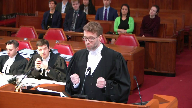
:::

Well, different parties have different opinions.

As I was saying about Bentham, they are a publicly traded company.

They disclose their results, and they generally fund only litigation that they think is meritorious.

Again, that's not evidence.

That's only indicative of their opinion.

But when the supervising judge has to look at the facts, the court below, I think, goes too far in saying that the supervising judge, what the supervising judge was doing, was prejudging the merit of the lawsuit.

And that really wasn't what the supervising judge was doing.

But he was faced with a case where a publicly traded litigation funder has said, we are already expending resources on attempting to bring this to trial.

That has to mean something.

Would the litigation funder do this if it thought that the value of litigation was $2.8 million?

I think the answer to that is reasonably clear. On that?

**Justice Kasirer** (00:52:52): point, what do you make of Justice Schrager's comment at paragraph 90 that he would characterize the LFA as akin to an equity investment?

**Speaker 2** (00:53:05): Well, on that point, I would first agree with the submissions of the creditors group and that's at paragraph 11 of their fact and that those comments are contextual and they are obiter dictum.

::: {.column-margin}

:::

I tend to agree.

But I do think that they are dangerous because it conflates, if you want to call it an investment in the litigation, with an investment in the debtor.

It's one thing to say, oh, it's an equity investment because I'm getting a return on Blueberry's future results.

That's not the same thing as saying I have a pecuniary interest in the outcome of the litigation.

There's real mischief there.

Consider, for example, all of the lawyers who right now, as we speak, are working on their clients' files on a contingency basis, on a contingency fee basis.

Are we now to say that those lawyers have an equity interest in their clients?

I would think that that would raise a host of issues that would be fairly problematic from both a practice standpoint, from a tax standpoint.

It's not taking a contingency fee agreement in the lawsuit is not taking an equity interest in the litigant. True.

In fairness to Justice Schrager, he does explain himself.

**Justice Kasirer** (00:54:13): And he says the contingent nature of the repayment is such that Bentham is investing in the respondents because of the litigation asset and it will benefit by preference over existing creditors upon successful judgment or settlement.

**Speaker 2** (00:54:27): Well, if we're going to say that that's improper, then we are also implicitly overruling the Ontario Court of Appeal in Crystal X, which nobody, including the court below and anyone on the other side, to my knowledge, says is wrongly decided, and in fact, leave to appeal to this court was denied.

::: {.column-margin}
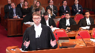
:::

It's the same thing.

I mean, my learned friends are going to stand up in a few minutes and explain all the reasons why they think the callidus doesn't apply, and the Court of Appeal went as far as saying that there's no precedential value whatsoever to the Crystal X case, which we fundamentally disagree with, and I'm happy to explain why.

But to go directly to your point, the same thing happened in Crystal X, because in Crystal X, the litigation funder, they stood to receive interest on their advances, and that interest was secured by a claim, and that interest was going to come before any recovery of the litigants.

**Justice Kasirer** (00:55:19): Only one, I may be mistaken, one root of my memory, one root of recovery in crystal X, whereas there appears to be two roots here is.

**Speaker 2** (00:55:27): is that we would fundamentally disagree with that appreciation, the one route and the two routes.

::: {.column-margin}

:::

As Mr. Justice Roe said, there really is only one route.

Once you're left with only a litigious claim, you're in the litigation alternative.

It's not a litigation alternative.

It is the only route.

And the appearance of the defendant, Calidus, who happens to be a creditor, but the appearance of the defendant, who is attempting to kill the litigation funding agreement just before it can be brought into effect, is the difference.

And that was not present in Crystal X.

That's true.

If the government of Venezuela had showed up and said, I want to make an offer to the creditors, well, then it would be exactly the same case.

That didn't happen in Crystal X.

That's true.

But that doesn't invalidate the reasoning in Crystal X, which is that it is permissible, it is legally permissible, for a court to grant litigation funding that has a super priority, and the use of which will be to pursue litigious claims of the debtor for the benefit of all.

**Justice Côté** (00:56:28): but in Crystal X there was a super priority like here.

**Overlapping speakers** (00:56:32): Mm-hmm.

**Justice Côté** (00:56:32): But the success fee was paid, was coming after the other creditors and as opposed to here where the success fee is part of that.

**Speaker 2** (00:56:44): Well, that is true, the structure was slightly different.

::: {.column-margin}

:::

But one has to remember that in this case, Bentham does not receive any interest on its advances.

So whereas in Crystal X, the lender was getting a return, even if nothing was happening in the litigation, it was accruing interest.

And this was interest that was paid in kind.

It wasn't being paid on an ongoing basis, but it was interest that was accruing with time.

And contrary to the present case, in Crystal X, there were actually a few assets.

There weren't many.

There was some equipment and millions of dollars.

And the creditors were losing their equity in those assets.

Because the super priority financing that was given to the funder that was bearing interest was eating into the value of those assets.

Now if that's permissible, how is what we're trying to do here not permissible?

I don't understand.

So we acknowledge that Crystal X is different, but the principles are the same.

Now to pick up again where I left off, which I think was point number one.

And I have seven minutes left, OK.

I'm going to skip to point number five, I think, in light of the time, which is that the court below makes a fundamental error in its appreciation of what must be considered a plan of arrangement.

I was in the middle of discussing with Mr. Justice Rowe that in insolvency situations, whether it be under the Bankruptcy and Insolvency Act, a proposal, or an arrangement under the CCAA, the proposal or the arrangement is fundamentally a contract.

And it is really limited only by the imagination of the drafters and some baseline considerations.

Anything that can legally be put into a contract can be put into a proposal or a plan of arrangement.

And many of the cases that are cited by all of the parties before you today, like Metcalf and Mansfield, show just how far that can go.

And that's a very good thing, the fact that there is that flexibility in the CCAA to adapt a plan of arrangement or a proposal to the circumstances.

But that doesn't mean that because almost anything can be in a plan, that you then have to find that anything is a plan.

It's just a fundamental logical fallacy to say, well, because a plan can include the process of realizing rights in favor of the creditors, that every time you do that, you are looking at a plan of arrangement.

And that's simply not the case.

And that circles back to what I was saying about the right to sell assets.

If you're selling assets, that is part of, to quote the court below, a process to satisfy creditors' claims.

It's a process to satisfy creditors' claims.

I'm selling assets to generate recovery.

But that is not a plan of arrangement.

And as I've already said, that does not require, as a matter of law, creditor approval.

It requires court approval.

**Justice Rowe** (00:59:54): If you have an asset that is something which will spoil or deteriorate unless it's maintained in a certain manner, it would make sense to go seek interim financing to ensure that it doesn't lose value.

::: {.column-margin}

:::

That's different from a plan of arrangement which would be, you know, taking 50 cents in the dollar.

You get the interim financing, might be half a million dollars, to make sure something doesn't deteriorate whose value is faulty.

**Speaker 2** (01:00:24): absolutely and you can think of other examples as well why you can have interim financing in order to sell assets a sale of assets might require a process that that will involve funds that the debtor does not have it's an appropriate use of interim financing to fund that process which will then generate more money to follow the line of reasoning that is being suggested by the court below which is that every time you're doing that it's a plan you risk limiting the ability of courts to approve interim financing in cases like that which is not in the general interest one has to be very wary of doing something like that and then perhaps if I do if I'm able to I'd like to save perhaps a minute or two at the end for reply but before sitting down I would like to mention the valuation issue this the valuation of the security because going back to this tripartite relationship the court should be aware of how incongruous it is to have a secured creditor who has security over the Caledas lawsuit it happens to be Caledas and it has security over the lawsuit against itself which then asserts that the lawsuit is worth nothing yet wishes to spend two point eight million dollars to settle it which already is incongruous in order to be calm and then value the security at zero in order to become an unsecured creditor to vote as an unsecured creditor and then as an unsecured creditor waive its right to a dividend under the plan so that all of the money will go to the other creditors so it's a secured creditor then it takes off its secured creditor hat and says no I'm an unsecured creditor and then as an unsecured creditor I'm now going to vote in favor of my own settlement offer to Blake to break the logjam and then when it comes time to distribute the money I'm going to take off my unsecured creditor hat and now I'm a released party I'm not getting any money to answer the concern of Mr. Justice Casirere about the classification of creditors and having it trop fractionné

::: {.column-margin}
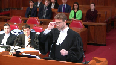
:::

well this is anything but trop fractionné consider the classes that we have we have creditors who are getting a dividend

and I would argue that you could potentially subdivide those because the vast majority of creditors who have voted in favor are employees who have severance claims and they're perfectly valid severance claims

and I think everybody including my client would like to see them get paid but they are getting paid under the Caledas plan 100 cents on the dollar the one creditor who voted the one major creditor who voted against is getting 33 cents on the dollar and stands to lose a million dollars under the Caledas plan now they're voting in the same class one guy is saying well of course I'm voting in favor I'm not even being compromised is that even a compromise of claims I'm getting a hundred cents on the dollar and the other guy in the same class is reading the same plan and says well I'm losing a million dollars and I would rather see the litigation go forward but leaving that aside even if we consider all the creditors together as though we can consider them all in one group then you have a creditor who is renouncing any pecuniary interest in the plan itself and all it wants is the release of litigation how does though how does that creditor vote in the same class as all those other creditors and if this is not a case where we can fraction a or we can split the creditor classes I don't know what would be if this is allowed then we might as well just scrap the idea of classes and say everybody votes in the same class

**Justice Kasirer** (01:03:49): My concern was not so much that this, on the facts here, we might not be in the right case.

::: {.column-margin}

:::

It's what is the governing principle for determining, because this court is going to say something beyond the facts of this case. Yes.

And what's the basis your colleague urged of a very broad reading?

And my concern is, and I think it was Justice Schrager's concern, even if he didn't speak to it in these terms, that splitting up the group into classes means the chance of hitting the two-thirds number is diminished.

And that's potentially a problem.

So if we overstate the broad character of the test, we might do a disservice to the CCAA.

That was my concern.

**Speaker 2** (01:04:34): No, and I agree, and that's a very valid concern.

::: {.column-margin}

:::

Absolutely.

But maybe it's a question for another day, or maybe it's a question for the court to reserve.

Is it even appropriate to have creditors voting in the same class, some of whom will be paid $0.100 and some of whom will be paid $0.33?

You don't necessarily need to decide that to decide this case.

It's certainly open to this court to do so.

It's a very interesting question.

But I think that the real issue is where you have one creditor whose sole interest in the plan is to obtain a release that is clearly and fundamentally distinct from other creditors who have only a dividend in the plan.

**Justice Côté** (01:05:08): In fact, by the, in here, Calidus itself is distinguishing itself in saying, I don't want to receive a dividend.

That's correct.

And that is what I think is the most important part of it, and I think that's the most important part of it.

**Speaker 2** (01:05:18): That is fundamentally incongruous.

**Justice Moldaver** (01:05:18): That is what, that is fundamentally incongruous.

::: {.column-margin}

:::

Can I ask you this, it's probably obvious, maybe it was done here, I don't know.

But in the context of just a straight interim financing request, I take it the creditors would have it open to them to argue.

In this case, it's based on a claim, a litigation.

That either the litigation has no hope of success, it's frivolous, it's just absurd.

And, or, even if there was a slight glimmer of hope, any funds that would be received would be gobbled up, swallowed up by the success fee, and so what are we doing?

Is it open for them to make arguments like that?

**Speaker 2** (01:05:59): I think it's open to them to make the argument. Did they?

Did they?

**Overlapping speakers** (01:06:04): Yes, yes, in fairness I believe that they did.

**Speaker 2** (01:06:06): I guess it's open.

::: {.column-margin}

:::

Well, it's open.

It's absolutely open.

But consider that just getting to the point that we are now, forget about here and the costs involved in coming all the way here.

Just getting to the point where it provoked an offer from Calidus, there was already an investment of funds.

And so I won't repeat.

**Justice Moldaver** (01:06:26): But I think the judge, the supervising judge, didn't comment really one way or the other on the merits, except he didn't sort of discount this out of hand as being just a frivolous act.

**Speaker 2** (01:06:37): That's correct.

And for the reasons that I've already said, I won't repeat them in detail, but there was at least, there were indicia that in fact this was a lawsuit that had at least some appeal to a funder.

Just a real quick question of fact.

Did I, did I, did I, did I, did I, did I, did I, did I, did I, did I, did I, did I, did I, did I, did I, did I, did I, did I, did I, did I, did I, did I, did I, did I, did I, did I, did I, did I, did I, did I, did I, did I, did I, did I, did I, did I, did I, did I, did I, did I, did I, did I, did I, did I, did I, did I, did I, did I, did I, did I, did I, did I, did I, did I, did I, did I, did I, did I, did I, did I, did I, did I, did I, did I, did I, did I, did I, did I, did I, did I, did I, did I, did I, did I, did

**Justice Karakatsanis** (01:06:52): I read somewhere that it would cost about $200,000 to have a meeting of the creditors to vote on the plan.

**Speaker 2** (01:07:00): Well there's all kinds of work that has to be done.

When you have a plan you have to get the monitor to express an

**Overlapping speakers** (01:07:06): Did I read somewhere that it cost about $200,000? Yes.

**Speaker 2** (01:07:10): Yes, and if I can just conclude on that, if the court is of the view, if the court's not going to permit Calidus to vote, then it knows that the plan will fail.

::: {.column-margin}
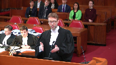
:::

And if it knows that the plan will fail, why would it call a meeting of creditors where there already aren't any assets in the file in order to consider a plan that's going to fail?

And one step further, even if you take for granted that Calidus should vote, but the judge knows that when you get to the fairness stage, the plan's not going to be approved.

The same question arises, why would you go through the motions of having the vote?

Thank you very much.

I've gone over my time, but thank you very much.

**Justice Wagner** (01:07:47): Maitre Rigaud

**Speaker 3** (01:08:20): Good morning.

::: {.column-margin}

:::

We appear on behalf of the interveners, the Insolvency Institute of Canada and the Canadian Association of Insolvency and Restructuring Professionals.

As interveners, by definition, we were not present nor party before the trial judge, nor before the Quebec Court of Appeal.

As such, before you, we wish not to make representation on disputed facts, nor comment on the outcome of this case.

In our joint factum, we address two issues only, and again this morning, we only intend to address these same two issues.

The fundamental issue, we agree, is the approval of the LFA, and on that point, we note that all parties agree with our position that not all LFAs need automatically to be subject to the holding of a meeting of creditors as part of a plan of arrangement.

That's the crucial point we're trying to make on behalf of the interveners to promote a flexible interpretation of the CCAA without creating new rules, adding to the CCAA a new rule created by the court that would hold true for all future cases that could unduly, in our mind, stifle the flexible and remedial nature of the CCAA.

Of course, and I think Peter made the point, a debtor may incorporate the pursuit of litigation claims under different mechanisms or structure, including as part of a plan of arrangement within the context of an LFA.

Also, it does not exclude the possibility that a CCAA supervising judge may instead of authorizing an LFA as part of dip financing or interim financing, may think or decide that given the specific facts of this case, it's more appropriate for that LFA to be or to form part of a plan of arrangement to be submitted to the creditor's vote.

**Justice Côté** (01:11:03): It is that it is a case-by-case analysis and it is governed by the discretion afforded to the supervising judge.

**Speaker 3** (01:11:12): Absolutely, and I think that's where maybe the Court of Appeal with deference goes I think too far by stating or creating what we fear is a universal rule that would bind future supervising judges dealing with similar LFAs.

::: {.column-margin}

:::

Of course, that is dictated as well by the first question and the determination as to whether there are two viable solutions, and that is dictated to a large extent by the right to vote and the classification.

In a case where there's two mutually exclusive solutions and when or where a plan of arrangement is deemed to be viable, I think it would be very difficult for a judge to say, I will approve instead an LFA and I will deprive the creditor of their right to vote on a plan.

But that assumes that there is indeed a viable plan, and the trial judge made that determination that there was no viable plan.

On the issue, and that's the first issue we address in our joint factum, on the issue of classification, what we note and what we're really concerned about is the lack of reference by the Quebec Court of Appeal to the criteria set out or prescribed by sections 22 subsection 2 of the CCAA.

There's no analysis, there's no reference to these factors.

I think that looking at, first, the origin of the unsecured claim of Calidus, which would resolve from its own unilateral decision to value its security at nil for the purpose of voting on its own plan.

I think that's, I'm just paraphrasing criteria at 222A. 222B, I think that the court could have looked at the nature and rank of the security of Calidus in respect of their claim, both outside of its own plan and as part of the plan, I think there's a distinction again, and that's a distinction I think that the legislator certainly intended to be considered.

I would invite you to conclude.

Absolutely.

Finally, I think that all meshes together by looking at what are the interest, the apparent interest of Calidus.

I think Calidus' interest is to minimize whatever it offers to the creditors, whereas the creditors, their interest should be to maximize whatever they receive.

I think that needed to be considered by the court as well.

Thank you very much.

Those were my submissions.

Thank you.

**Justice Wagner** (01:14:42): On va mettre le Réno.

**Speaker 4** (01:14:56): Mr. Chief Justice, Justices of this Court, I represent the intervener Ernst & Young.

::: {.column-margin}
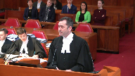
:::

Ernst & Young was appointed as Court Monitor under the CCAA and as such has been involved in this matter since November 12, 2015.

The Monitor supports the position of the appellants on this appeal and believes a Court of Appeal ruling is based on a reinterpretation of certain facts which the first instance judge was in the best position to appreciate.

The case, the ruling also creates a precedent whereby the notion of arrangements is expanded to include the process undertaken to satisfy certain creditor claims.

Before diving into certain matters, I want to mention briefly the costs issue.

The respondent Calidus and its factum seeks costs against Ernst & Young in addition to costs against the appellants.

There's no explanation in the factum as to why that is the case.

There's no precedent submitted by Calidus to justify this request.

It is highly unusual in insolvency matters for a court officer to be charged costs and neither the Superior Court nor the Court of Appeal ordered any costs against the Monitor Ernst & Young.

I want to draw your attention to paragraph 60 of the amended initial order issued by the CCAA Court on November 18, 2015.

It's in the appellants record at volume 2, page 101.

The court declared that no action or proceeding shall be commenced against the Monitor relating to its appointments, its conduct as monitor, or the carrying out of the provisions of any order of this court.

Our view is that this paragraph precludes Calidus from seeking costs against the Monitor at this late juncture.

I want to go back on what we've talked about in terms of the facts and what the first instance judge had in front of him when he made his decision.

You heard Maitre Lachance explain that he had been sitting as a supervising court for 27 months when he made his decision.

He had issued 25 orders, 15 monitors reports had been submitted.

My client was cross-examined on several occasions before the court.

The first instance decision must be read as the apex, a culmination of this process.

It cannot be read in isolation with the CCAA process that started.

Our key is that the first instance judge was himself witness to several of the facts which are mentioned in the judgment about Calidus' behavior.

But there's something else as well in terms of the evidence.

The first instance judge had the benefit of the Monitor's 15th report, and I think it's extremely important for this court to read the report, which you find at tab 5 of our authorities.

In that report, the Monitor included a table at paragraph 52 in which the Monitor compared the litigation funding which took place in Crystal X, in Stratico, and in Marquette to give the court an indication of what was reasonable in terms of pricing for financing of this sort.

The Monitor's report also included at paragraph 48 and as Appendix A, which is a sealed exhibit in the Court of Appeal record in the Superior Court and in this court's record, a waterfall analysis which described the financial impact of the approval of the LFA on the creditors themselves and what would be the threshold of recovery required under the litigation in order for the creditors to get paid.

The first instance judge made his decision with those facts in front of him.

Unfortunately, the Court of Appeal decision does not even refer to the Monitor's report or to the waterfall analysis.

So it's impossible to determine whether or not Justice Schrager, when he wrote his decision, took into consideration what we view as being key factors in determining whether or not the rights of the creditors, to what extent they were affected or if they were affected by the approval of the LFA.

I have one minute left.

I will conclude by saying that this court, in addition to weighing the various legal issues arising from all these different questions, should remember the practical considerations and implications of each of the different decisions that can be taken.

As you heard from Maître La Chance, the plan of arrangement, once it is approved by the creditors, by the vote of the creditors, has to go to court sanction.

Throughout this case, and it's referenced in the Monitor's reports, the debtors have always taken the position that the releases that are found in the Caledas plan are too broad and cannot be approved by the Superior Court at the sanction hearing.

The Monitor's recommendation to the Court on first instance, and you will find that in the 15th report, at the end of the report, we recommended to the judge that if you were to come to the conclusion that Caledas could vote on its own plan, it would be advisable perhaps to rule on the releases before we even submit the plan to the creditors, because as you pointed out, holding a creditors meeting is an expensive exercise.

One of the reasons for this is because there has to be a claims process.

There's a call for claims for creditors to file their claims, they have to be assessed, and then we have to determine as Monitor who can vote on a plan.

So there are very real practical implications.

If Caledas is allowed to vote on its own plan, well, then the question is, obviously the Monitor would submit the plan to the creditors, we would assume the vote would pass because Caledas would carry the vote, but then the plan needs to be sanctioned and we're lining ourselves up for additional litigation.

If Caledas does not vote on its own plan, then the question becomes, what about the LFA, can it be approved by the Court, in which case the decision of first instance stands and the litigation continues, and if and when there are proceeds to distribute, the debtor can file a plan in order for the distribution to take place, but for the duration of that period of time, the debtor remains under CCWA protection and under the Monitor's supervision.

So those are my submissions, and I want to thank you.

**Justice Wagner** (01:21:09): Le cours va prendre sa pause du matin.

::: {.column-margin}
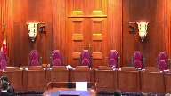
:::

15 minutes.

La cour...

Maitre Pouzie.

**Speaker 5** (01:22:08): Bonjour,

::: {.column-margin}
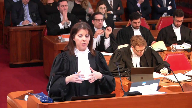
:::

bonjour à tous, good morning.

Je vais m'adresser à la cour en français, but I welcome

questions both in English and in French.

Je vais aborder aujourd'hui la question du droit de vote de Calidus en trois phases, sous l'angle du improper purpose que j'ai traduit librement comme étant le plus inapproprié de l'usage de la loi, la question de la classification et la question du related party, les parties liées.

Mon confrère, Maït Perreault, représentant le groupe de créanciers, va adresser les questions relativement au litigation funding agreement et au droit de vote de la masse des créanciers sur le LFA.

Je pense que la première chose sur laquelle je veux attirer votre attention, c'est de regarder la perspective du dossier.

J'aimerais vous sensibiliser au fait que le moteur de la locomotive ici, ce n'est pas la réclamation de la débitrice ou de son actionnaire qui tente de l'exercer contre Calidus.

Le moteur de la locomotive, c'est la loi sur les arrangements avec les créanciers.

C'est le fait que la débitrice s'est placée volontairement sous la loi et de ce fait, les créanciers, donc Calidus, sont en droit d'exprimer leur intérêt et exercer leur droit de vote.

L'approche des appelantes tend à regarder la réclamation et à analyser les questions par la suite.

Je pense qu'il faut se remettre dans le contexte de la loi sur les arrangements avec les créanciers.

La loi ne restreint pas le droit d'un créancier promoteur d'un plan de voter sur son plan.

Je pense que la loi étant flexible, elle doit être interprétée comme le permettant plutôt que d'une manière restrictive comme l'empêchant.

Le juge, de première instance, semble reconnaître qu'un créancier, ou il l'a reconnu, que le créancier promoteur d'un plan a le droit de voter comme il le semble.

Ou un créancier a le droit de voter comme bon lui semble et dans ce cas-ci, Calidus est le promoteur du plan.

Il a fait référence, et j'ai reproduit les extraits à l'onglet 3 de notre condense book, il a fait référence, donc c'est le paragraphe 32 du juge de première instance, et au soutien de sa conclusion, il fait référence à la jurisprudence de la Cour d'appel du Québec, les décisions de la Cour d'appel dans Bédard et dans Contrex, qui sont des décisions où un créancier vote à l'encontre d'une proposition concordataire qui a pour effet de causer la faillite de l'entreprise.

**Justice Wagner** (01:25:18): Il n'y a personne qui conteste les technicalités qui peuvent se produire en partie de la loi.

::: {.column-margin}

:::

Le problème, c'est que le juge qui a rendu une vingtaine de décisions, qui a reçu une quinzaine de rapports de la personne nommée pour aller administrer, vient à la conclusion dans son jugement que votre client utilise les technicalités de la loi pour se créer un avantage personnel ou spécifique.

Alors, le juge utilise la discrétion pour faire ses décisions, il n'y a personne qui nommée pour aller administrer, vient à la conclusion dans son jugement que votre client utilise la discrétion pour faire ses décisions, il refuse effectivement le vote, il autorise un financement intérimaire, etc.

Qu'est-ce que vous faites, finalement, de cette discrétion qui fait partie de cette loi-là, mais qui fait partie

de toutes les

**Speaker 5** (01:26:03): On ne dit pas que la discrétion existe.

::: {.column-margin}
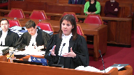
:::

Effectivement, comme vous le notez, c'est partout dans la loi.

Par contre, ce que la Cour d'appel dit, et c'est avec quoi on est d'accord, c'est que la discrétion par le juge à premier instant, ça a été mal exercé dans ce cas-ci.

Le juge a commis des erreurs déterminantes, manifestes et raisonnables dans l'exercice de cette discrétion-là.

Quelles sont ces erreurs?

Premièrement, le juge s'est basé pour exercer sa discrétion et inférer de la conduite de Calidus sur les allégations, sur les procédures, les allégations qu'il avait devant lui.

Sans prendre en considération une procédure très importante lorsqu'il réfère à la conduite qui a été de contester la demande d'ordonnance initiale de la débitrice, il ne fait aucunement référence à la contestation qui avait été déposée par Calidus.

Il infère du fait que Calidus est contesté

, c'est son premier motif au soutien de sa décision, de traiter de la conduite de Calidus et du dépôt du plan d'arrangement comme étant un « improper purpose ».

C'est en se basant sur le fait que Calidus, dès le début de ces procédures-là, avait contesté.

**Justice Côté** (01:27:16): C'est pas son seul motif. Peut

::: {.column-margin}
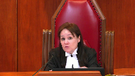
:::

-être que vous allez me dire que je spécule.

S'il y avait eu seulement cet élément-là, peut-être que la discrétion n'aurait pas été exercée de la même façon.

Mais ici, le juge coordonnateur nous donne toute une liste d'éléments qui lui permettent d'exercer sa discrétion dans le sens dans lequel il l'a exercée.

Alors, vous reconnaissez que cette discrétion existe mais vous dites que la cour d'appel était justifiée de dire que la discrétion n'a pas été exercée de façon légale et judicieuse.

Mais quelqu'un peut dire, mais n'est-ce pas, est-ce que la cour d'appel a pas plutôt usurpé le rôle du juge coordonnateur et juste remplacé l'exercice de la discrétion du juge coordonnateur par son propre exercice de discrétion?

**Speaker 5** (01:28:01): Je ne pense pas que l'on peut aller jusqu'à là.

::: {.column-margin}

:::

Je pense qu'effectivement, il y a eu des erreurs qui ont été commises.

Qui sont manifestes et qui sont déraisonnables.

Quelles sont-elles?

Dans un premier instant, comme je l'avais souligné, c'est de ne pas avoir pris en considération.

Si on va rendre un jugement, exercer sa discrétion sur la base d'allégations qui sont faites dans le cadre de procédures sans avoir le bénéfice d'un procès ou d'une enquête éducative, à ce moment-là, on devrait regarder toutes les procédures.

Clairement, il n'y a aucune mention de la contestation de Calidus.

La deuxième chose, comme j'ai dit, la deuxième erreur, c'est ce qui est souligné par la cour d'appel, c'est qu'il y a des inférences qui sont faites sur la conduite de Calidus, au cours des procédures, de ce dossier-là, sans avoir le bénéfice d'avoir une preuve.

Devant ce qui a eu une preuve ou une enquête et une audition devant le juge.

Deuxième erreur.

Troisième erreur, c'est que le juge avait, il y a des ordonnances qui sont incohérentes, le juge avait lui-même de première instance, quelques mois auparavant, traité de ce point-là.

Lors de l'ordonnance sur les frais qui sont liés à l'assemblée des créanciers, où on l'invitait à conclure que Calidus avait une conduite aboussive, de sorte qu'elle devait assumer ces frais-là, et le juge a refusé de le faire, sans avoir, il a reconnu qu'il pourrait avoir une preuve.

Il a refusé de le faire.

Il a reconnu que pour attirer cette conclusion-là, il devait avoir le bénéfice d'une enquête et d'une audition.

Et ce, si les extraits de cette décision-là sont à l'onglet huit de notre condensé.

L'ordonnance se trouve au procès verbal de l'audition du 5 octobre 2017.

Inaudible.

**Justice Wagner** (01:30:05): Ça, ça a évolué dans le temps.

Vous prenez le portrait d'un moment X, le juge, dans son jugement, au paragraphe 48, il conclut.

**Overlapping speakers** (01:30:15): Je vais y aller.

**Justice Wagner** (01:30:15): Il additionne tout ça et vient à la conclusion que c'est ça l'application de la discrétion.

::: {.column-margin}

:::

C'est pour ça qu'on a un juge qui est nommé pour gérer ces dossiers-là.

C'est que ce juge-là, depuis deux ans, regarde l'ensemble du dossier, regarde l'ensemble des procédures, regarde l'ensemble des documents qui sont soumis, regarde comment les parties agissent et utilise sa discrétion en concluant sur certaines choses.

On ne peut pas y aller à la pièce et dire qu'à telle date il y a eu telle chose et telle date autre chose.

Il faut rester dans son ensemble.

C'est la raison pour laquelle la loi, le législateur, donne autant de différence et donne autant de discrétion au juge qui administre.

**Speaker 5** (01:30:50): Je suis parfaitement d'accord avec vous.

::: {.column-margin}
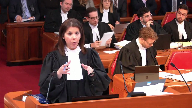
:::

Ce sur quoi je voudrais attirer votre attention, par contre, c'est que, entre la date, le moment où cette photo est prise le 5 octobre, qui est le moment où le juge accorde la requête de Calidus de soumettre le plan, qui est un plan exactement similaire et je vais y revenir, bien commenté au niveau de la contribution, tout ce qui se passe entre le mois d'octobre et lorsqu'on revient devant le juge et à l'audience qui donne lieu au jugement qui est ici devant vous, c'est le dépôt, c'est le fait qu'il y a eu l'Assemblée des créanciers, le plan a été accepté selon la majorité qu'on connaît, ou qui a été en nombre mais qui n'a pas été accepté en valeur, il n'a pas rencontré la majorité requise en valeur, et il y a eu une demande du groupe de créanciers à ce que Calidus considère déposer à nouveau un nouveau plan, et cette fois-ci considère évaluer sa réclamation de manière à voter.

Il n'y a pas eu d'autres éléments, les éléments qui sont traités dans le jugement du juge de première instance sur la conduite de Calidus sont les mêmes qui existaient au moment du jugement du 50.

**Justice Côté** (01:32:06): est-ce que vous faites une différence entre une demande qui est faite à un juge pour déclarer une procédure abusive et conséquemment condamner la partie qui abuse ou frais et l'exercice de la discrétion du juge pas pour déclarer si une procédure est abusive mais pour décider s'il doit ordonner qui est la tenue d'une rencontre des créanciers pour discuter d'un plan il me semble qu'il ya une différence entre les deux

::: {.column-margin}

:::

**Speaker 5** (01:32:34): Il y a effectivement une différence, mais ce qui était soumis aux juges de première instance, le 5 octobre, c'était les agissements de calidus, qu'on qualifiait d'abusifs.

**Overlapping speakers** (01:32:44): au fin d'obtenir une ordonnance

pour condamner au...

**Speaker 5** (01:32:47): beaucoup.

::: {.column-margin}
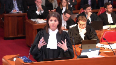
:::

Effectivement.

Mais c'est les mêmes agissements qui, à mon avis, devraient donner lieu à deux choses.

Une audition, une enquête et une audition sur le comportement en question, les agissements en question ou une prise en considération des deux versions, si je peux me permettre comme ça, de toutes les procédures au dossier.

Et c'est là que le bât blesse.

Et c'est ça qui n'a pas été fait dans le cas du jugement qui a été renversé par la Cour d'appel.

Un autre jugement incohérent qui donne lieu à une erreur du juge de première instance.

**Justice Wagner** (01:33:34): Non, mais qui répond à une situation factuelle différente, qui a été rendue dans circonstances différente que les autres jugements.

**Speaker 5** (01:33:42): Une autre décision, c'est celle d'admettre que le premier plan de Calidus, qui est essentiellement identique à celui qui a été renversé par la Cour d'appel, contient les mêmes dispositions concernant l'équivalence.

::: {.column-margin}

:::

Concernant l'exercice du droit de vote de Calidus, c'est l'article 3.3 et 3.5 des deux plans.

Dans un cas, c'est dans notre volume 3 à la page 126 pour le premier plan et à la page 254-255 pour le deuxième plan.

Mais dans les deux cas, la possibilité pour Calidus d'évaluer sa réclamation et de voter la partie non garantie existait.

**Justice Côté** (01:34:32): Ce qui a influencé le premier juge là-dessus, c'est le timing du dépôt du 2e plan, parce qu'il a dit qu'Alidius n'a jamais pensé à ça avant que le LFA arrive et soit présenté pour approbation par le juge.

::: {.column-margin}
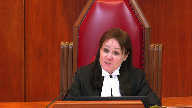
:::

Il dit que c'était la veille, je ne me souviens pas exactement, mais c'était très près du moment aussitôt qu'on a présenté le LFA pour approbation par le juge, il dit qu'Alidius est arrivé avec son plan.

**Speaker 5** (01:34:56): La possibilité de la poursuite correspond à la motivation de Calidius pour faire son plan.

Ce n'est pas nier que ce que Calidius recherche par le plan d'arrangement, c'est une quittance.

Elle tente de régler le litige.

**Justice Côté** (01:35:13): Je suis d'accord, mais tant il y a aussi longtemps que Kalidius pense que le demandeur n'a pas les moyens de poursuivre, Kalidius trouve que son risque n'est pas tellement élevé, mais à partir du moment où Kalidius réalise que le demandeur va avoir les moyens de poursuivre parce qu'il va y avoir du financement, la situation change et je pense que c'est ce que le premier juge a considéré.

::: {.column-margin}
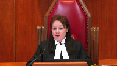
:::

**Speaker 5** (01:35:34): Au niveau de l'opportunité de déposer le plan ou non, je pense que c'est... qu'Alidius avait exprimé une première fois son intention de présenter soit une contestation ou d'autres recours à l'encontre de la requête pour l'approbation du financement intérimaire.

::: {.column-margin}
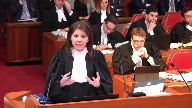
:::

Et lorsque ça s'est concrétisé, elle l'a fait.

Ça avait été annoncé et ça a été fait.

Donc, je vois au niveau du...

Oui, il y a une question de timing.

Oui, l'opportunité de régler ce... de considérer, de régler ce litige-là n'a pas été... n'a pas fait l'objet de considération avant que cette possibilité-là se concrétise.

Mais lorsque ça s'est concrétisé...

Et je ne pense pas qu'on peut tirer des intentions abusives ou de la mauvaise foi du fait que l'opportunité ou la... de cette poursuite-là devienne plus concrète et qu'on...

On peut dire que c'est fait de bien et cohérent. Pardon?

C'est peut-être de mettre incohérent. De...

**Justice Wagner** (01:36:39): de Calidice par rapport aux anciennes positions.

**Speaker 5** (01:36:45): Je ne comprends pas la question.

**Overlapping speakers** (01:36:49): Thank you.

**Speaker 5** (01:36:50): Calidus a toujours souhaité,

::: {.column-margin}
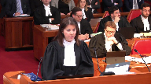
:::

Calidus a toujours considéré que cette réclamation-là n'avait pas de valeur ou de crédit et a décidé lorsque cette situation-là s'est concrétisée de présenter un plan d'arrangement pour la régler tout simplement.

Calidus a toujours considéré qu'il s'agissait d'une réclamation qui avait très peu de valeur.

Ça m'amène à la question de l'évaluation de sa réclamation.

Le fait que Calidus détermine qu'il est opportun d'offrir 2,8 millions de dollars aux créanciers pour régler la réclamation, ça ne fait pas en sorte qu'elle accorde une valeur à cette réclamation-là qui est égale.

Calidus peut très bien considérer que la réclamation ne vaut rien et ensuite offrir un plan d'arrangement pour régler la réclamation.

C'est l'essence même des règlements en matière civile également.

Lorsqu'on offre une offre de règlement, on n'admet pas que la réclamation a une valeur correspondante au montant qu'on offre.

On offre ce montant-là pour la régler.

Au niveau de la classification, je pense que oui, les paragraphes dans le jugement de la cour d'appel sont succincts, mais le juge fait référence à la jurisprudence qui lui a présenté.

La jurisprudence lui a été présentée et lui fait référence, il les cite en note de pas de page.

Je pense qu'au niveau de l'article 22 qui a été incorporé à la loi en 2009, le fait, ça n'a pas rien changé à l'état du droit.

Je pense que lorsqu'on regarde les critères qui sont prévus à l'article 22, ils sont cohérents avec les principes qui étaient utilisés, qui ont été élaborés par la jurisprudence et qui étaient utilisés pour considérer et examiner les questions de classification.

Le premier principe, c'est que la classification, c'est une chose qui est permise avant par la jurisprudence, aujourd'hui par la loi, mais ça n'en fait pas, ça demeure une exception.

Les critères, si on les regarde, qui sont prévus à la loi, c'est des critères toujours dans la relation entre les créanciers et sa relation avec la débitrice.

Les critères, je les ai reproduits à l'article, c'est l'article 22, ils sont à l'onglet 12.

Donc, les critères qui sont mis de l'avant par le législateur, directement liés à cette relation de créanciers et débitaires, les remèdes ne sont pas différents dans le cas qui nous préoccupe aujourd'hui.

**Justice Côté** (01:39:51): Quelle est la communauté d'intérêt entre les créanciers et Canadiens?

**Speaker 5** (01:39:57): Ils sont tous des kalidius comme les autres créanciers, possèdent une réclamation.

**Overlapping speakers** (01:40:02): Je sais, mais Khalidis veut pas recevoir de dividendes.

**Speaker 5** (01:40:04): Et c'est là que, évidemment, on est en désaccord avec la position des applantes.

Ce n'est pas un critère qui est le bénéfice ou l'objectif qui est recherché, ou ce que le créancier retire du plan n'est pas dans les critères à la loi.

**Justice Côté** (01:40:22): Je pense que c'est Maitre-Hugo, si je ne me trompe pas, dans les intervenants, qui nous a plaidé.

::: {.column-margin}
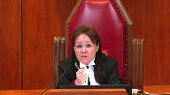
:::

En tout cas, il dit que la communauté des intérêts, ici, Calidus, tente de faire en sorte que les créanciers reçoivent le moins possible parce qu'ils veulent avoir une quittance du litige.

Et puis les créanciers veulent faire en sorte de maximiser leur recouvrement.

Il me semble que c'est opposé, ces deux intérêts-là, non?

**Speaker 5** (01:40:45): Leurs intérêts comme créanciers ne le sont pas.

::: {.column-margin}
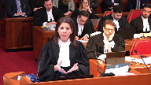
:::

Cet intérêt-là, c'est l'objectif qui est recherché par le plan.

Ce n'est pas un critère de la loi et ce n'est pas un critère dans la jurisprudence non plus.

Calidus a le même intérêt dans sa relation de créanciers, dans ses droits et ses intérêts vis-à-vis la débitrice que les autres créanciers.

**Justice Kasirer** (01:41:07): Oui, mais l'échec du deuxième plan, quelle est la conséquence pour Calidus?

::: {.column-margin}

:::

Elle va devoir se défendre devant les tribunaux.

Tandis que pour les créanciers, l'échec peut potentiellement mener à un bénéfice pour eux, n'est-ce pas, en dépendant du sort du litige.

Alors, comme ma collègue le dit, c'est antinomique.

Les intérêts non seulement ne sont pas communs, mais sont à l'opposé l'un de l'autre.

**Speaker 5** (01:41:40): L'échec d'un plan, si le plan fait échec, Calidus va toujours avoir sa réclamation de 3 millions de dollars contre la débitrice.

De la même façon que les autres, que la masse des créanciers.

**Overlapping speakers** (01:41:53): million de dollars.

**Speaker 5** (01:41:55): Je ne pense pas, et c'est ce que je vous plaide aujourd'hui, que les critères font en sorte qu'on doit aller à une interprétation aussi loin, parce que comme, et mon confrère Maït Pidin l'a souligné, si on regarde ce que les créanciers retirent du plan, on va regarder ceux qui retirent 100 %, la montante totale de leurs réclamations, ceux qui vont recevoir un dividende de 35 % et, dans d'autres cas, ceux qui vont recevoir un dividende de 2 %.

::: {.column-margin}
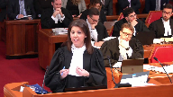
:::

Ça l'amène les tribunaux à faire une analyse qui est plus grande et à fractionner les classes de créanciers de manière plus importante, de sorte que les plans, et vous-même vous l'avez souligné, vont avoir moins de possibilités d'atteindre le ratio qui est prévu à la loi.

**Justice Wagner** (01:42:48): vous votre cliente a une créance similaire et commune à celle de tous les autres créanciers?

Définitif.

**Speaker 5** (01:42:55): C'est la créance de 3 millions de dollars et sa relation avec la débitrice, elle est exactement pareille.

::: {.column-margin}
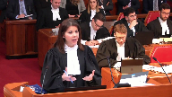
:::

Elle cherche à obtenir quelque chose de plus, qui est la quittance, effectivement, mais ça ne devrait pas la placer dans une classe à part.

Qu'un créancier cherche, et c'est la jurisprudence qu'on vous cite, Air Canada cherchait à mettre en place, à mettre de l'avant, à ce qu'un plan soit approuvé dans lequel il allait mettre la main sur une entreprise.

En quoi c'est différent de d'autres types de plans où le créancier promoteur du plan cherche à obtenir quelque chose de plus, qui est

**Justice Côté** (01:43:35): obtenir une quittance.

Les ajustements d'Air Canada dans la canadienne c'était sur un plan présenté par la canadienne, présenté par la débitrice.

Ici, c'est le plan de Calidius.

Calidius, c'est pas la débitrice.

Effectivement, Calidius c'est le plan.

**Speaker 5** (01:43:49): Ça fait une différence, mais en même temps, est-ce que le fait que Kalidou soit promoteur d'un plan, ça l'empêcherait?

::: {.column-margin}
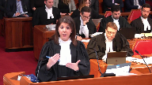
:::

Ça revient à dire que le fait que Kalidou soit promoteur d'un plan, parce qu'il a un objectif en faisant la promotion ou en soumettant ce plan-là, pour automatiquement ne pas voter sur ce plan-là, ou voter dans une classe à part.

**Justice Côté** (01:44:09): pas nécessairement, mais ici c'était un deuxième plan de Calidius.

::: {.column-margin}
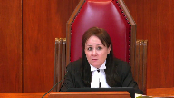
:::

Pour le premier plan, Calidius, son plan, le juge a accepté la production du plan.

Et puis, Calidius n'a pas demandé de voter sur le premier plan.

Calidius avait sa réclamation garantie.

Mais quand elle a vu qu'elle n'avait pas le vote en nombre et en valeur, elle a dit, ah, il faut que je trouve un moyen de pouvoir voter.

**Justice Wagner** (01:44:32): Et c'est là-dessus qu'elle juge le premier instant, où elle se dit, hum, ça sent mauvais.

**Speaker 5** (01:44:37): La preuve qui a été soumise en première instance à la cour d'appel sur ce point-là est distingue de ce que...

**Overlapping speakers** (01:44:46): C'est quoi, là?

**Speaker 5** (01:44:47): En preuve, il y a les lettres qui ont été transmises par le groupe de créanciers à Calidus via les procureurs respectifs.

::: {.column-margin}
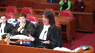
:::

Est-ce que manifestement ce que le groupe de créanciers nous demande, ils sont manifestement déçus par le fait qu'on a un plan qui a été accepté par une vaste majorité de créanciers en nombre mais qui n'a pas rencontré la majorité requise à cause d'un créancier qui avait une plus grande valeur et on demande à Calidus de considérer le dépôt d'un deuxième plan. Merci.

**Justice Abella** (01:45:19): Yes.

The numbers of shareholders who participate, or is it the value of their shares that counts in determining the issue that you're putting to us?

**Overlapping speakers** (01:45:31): Like that's it.

**Justice Abella** (01:45:32): In other words, what's the relevance of saying the vast majority of them?

**Speaker 5** (01:45:36): Well, it's not, it was just to make the point that it's not Caledes that, you know, came forward and said, oh,

::: {.column-margin}
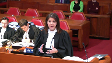
:::

oh, oh, it didn't work the first time so I want to do it again and have a second kick at the can.

It was, it meets the wishes and the request of the group of creditors, the vast majority of which in numbers.

**Justice Abella** (01:46:04): threshold or is it the value, the collective value of the shares?

Because as SMT's position, which Justice Michaud accepted, was that it would cancel their vote.

So what's the legal framework for assessing that conclusion by Justice Michaud?

**Speaker 5** (01:46:22): Well, so the provision in the act that concerned the assessment of the result of the vote is consider both aspects, consider the aspect in number and the aspect in value and in this case the fact that you have one creditors that has an important claim in value, it didn't meet the threshold that is set in section 6 of the act.

::: {.column-margin}
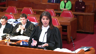
:::

So that was a consideration for justice Michaud to consider that the plan was doomed to fail a second time, whereas the court of appeal on the other end looked at the wish of I think considered the fact that in this case we're in front of a large number of creditors that were in favour of this plan and the only thing that Caledon is doing is submitting his plan a second time and already declaring that they will consider that they want to value their claim which was a provision that was already there but to exercise it this time in line with the other creditors.

**Justice Abella** (01:47:35): What's the relevance of that if we accept Justice Micheaux's conclusion where he went at some length between paragraphs 32 and 38 and 48 into the conclusion that there was an improper purpose in this scheme?

**Speaker 5** (01:47:49): I think it should be taken into consideration.

::: {.column-margin}
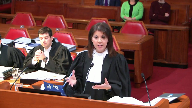
:::

That should be the focus.

What does the plan do?

And it goes in line with my introduction.

What does the plan do?

The plan enhance recovery for the creditors.

That's what the plan does.

Now looking at the conduct and preventing a creditor from voting on a plan it's sponsored for an improper purpose, it is available.

It is possible for the court to use a discretion to do that.

But it has to take into consideration the cases that they're referred to as the clearest case and that's laser work.

The motive work is totally different.

**Justice Karakatsanis** (01:48:33): Mais je pensais que Caledas avait le droit de set-off.

Ça veut dire vraiment que Caledas n'a pas le même intérêt que les créanciers sans sécurité.

**Speaker 5** (01:48:45): Je ne pense pas éventuellement, si on est en contexte de faillite, éventuellement, si la réclamation de la débitrice devient de plus en plus concrète et qu'elle rencontre les critères de la compensation, ça pourrait avoir lieu.

::: {.column-margin}

:::

Mais au moment où on se parle, on fait face à une réclamation qui a été approuvée par la cour à deux reprises.

Alors que la cour était très consciente de la réclamation de la compagnie contre Calidus, et de l'autre côté, une réclamation hautement spéculative qui n'est aucunement concrète et qui n'est aucunement liquide exigeable.

La compensation entre ces deux créances-là n'existe pas aujourd'hui.

**Justice Karakatsanis** (01:49:30): Mais le set-off est vraiment à le même effet d'avoir la sécurité, n'est-ce pas?

**Overlapping speakers** (01:49:40): Thanks.

**Speaker 5** (01:49:40): Absolutely.

::: {.column-margin}
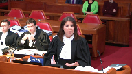
:::

But today, there is no right.

Today, the right to compensation is not relevant.

It doesn't exist.

There is not to claim to be set off such that.

In sovereign, we are

**Overlapping speakers** (01:50:03): I think we were at this stage.

**Speaker 5** (01:50:07): There's a $3 million claim and there's a speculative claim.

::: {.column-margin}

:::

So, at the level of the classification, because of the principles elaborated by the jurisprudence, which are, in our opinion, taken up in Article 22, which do not change the rule of law, Calidius should not be put aside, in a separate class.

So, the objective is to fail the plan.

And it's completely contradictory to the basic principle that was put forward by the jurisprudence in relation to the classification.

The classification should help with the restructuring.

Here, there is no restructuring.

But if there isn't, it should help, at least, to promote the vote and the approval of an arrangement plan.

And here, what we're trying to do is to divide the creditors in the objective of failing the plan.

Because we know that there is a creditor who has an important claim, who has already declared that he would vote against.

So, it's the tyranny of the minority that has an effect.

**Justice Wagner** (01:51:26): plan

::: {.column-margin}

:::

, le plan de Cadillus tombe, les tiges continuent et la réclamation, il y a du succès pour la réclamation.

Il y aura à ce moment-là, comme ma collègue disait, il y aura place au set-off s'il y a lieu.

Parler d'une réclamation spéculative, mais mettons que c'est une réclamation potentielle.

Le premier juge a eu la conclusion qu'il y avait quand même un certain mérite, non pas sur le fond, mais sur les chances potentielles.

Alors donc, il y aura un set-off à ce moment-là.

**Speaker 5** (01:52:01): éventuellement mais est-ce que lorsqu'on regarde la classification pour le fin du vote le tribunal devrait prendre en considération un critère qui est une situation de fait ou une situation de droit qui est inexistante au moment où ce critère-là est pris en considération, ce fait-là est pris en considération les fins du vote.

::: {.column-margin}
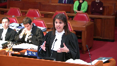
:::

Et c'est ça que je vous souhaite.

**Justice Wagner** (01:52:28): Votre temps, malheureusement, est expiré, mais j'avais une dernière question pour vous cependant.

::: {.column-margin}
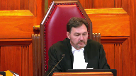
:::

C'est juste, dans l'hypothèse où la Cour ne donnerait pas gain de cause à votre cliente, est-ce que vous avez des représentations à faire sur les conclusions du jugement du juge Michaud, telles qu'elles sont formulées et dont appellent?

**Speaker 5** (01:52:52): Juste un instant, je vais retourner.

**Justice Wagner** (01:53:02): Donc si jamais d'aventure le jugement reprenait effet, est-ce qu'il y a des représentations à faire?

Je me pose la question aux parties adverses également.

**Speaker 5** (01:53:10): Je vais juste les prendre.

::: {.column-margin}
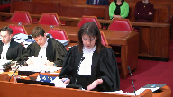
:::

Au niveau, évidemment c'est des conclusions qui ne prévoient pas le droit de vote de Calidus.

Ce n'est pas notre position, mais c'est le droit de vote de Calidus.

Ce serait au fond la reprise des commentaires que j'aurais à vous faire.

Au niveau du litigation funding, je vous dirais que je ne veux pas, je vais utiliser, il y a des reprises, j'aurais des commentaires à faire sur les dispositions relatives de litigation funding, mais je ne veux pas non plus répéter ce que mon collègue Mick Perreault a dit.

Je ne veux pas non plus répéter ce que mon collègue Mick Perreault a dit.

**Overlapping speakers** (01:53:57): That's why the.

**Speaker 5** (01:53:58): de la cour pour,

mais effectivement, il y aura certainement des commentaires au niveau des intimés à formuler sur les conditions. Merci.

**Justice Wagner** (01:54:09): Merci beaucoup.

**Speaker 6** (01:54:45): Monsieur le juge en chef et messieurs les juges, Jocelyne Perreault de l'étude Mécarty-Tétrault pour le groupe de créanciers intimés.

::: {.column-margin}
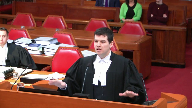
:::

Je vais adresser cette courte en anglais principalement et je serai heureux de répondre à deux questions en anglais ou en français.

Mes prétendants vont se concentrer sur l'issue de la nécessité de l'accusation par les créditeurs de l'arrangement de fonds de litigation dans ces circonstances.

Tout le monde a pleuré jusqu'ici sur l'absence d'un restructurant dans le cas actuel.

C'est un processus qui a commencé en novembre 2015 et qui a provoqué une vente d'assets, une vente de tous les assets, à l'accusateur, qui a été Caleduce.

Le business a continué, depuis la fin de la transaction en 2016.

Ce n'est pas une situation où les detteurs ont un business ou des opérations.

Il n'y a pas d'employés, de suppliers ni de clients.

Les detteurs n'ont plus d'implication dans la communauté de Drummondville où ils ont l'habitude d'opérer.

Il n'y a plus d'implication dans l'industrie du jeu.

Les objectifs remédiaux, comme ceux du CCAA, comme dit par cette Cour de Services Centuries, concernant la nécessité de préserver les entreprises, de préserver les emplois, d'éviter les pertes sociales et économiques liées à la liquidation, ont été accomplis.

Le restructurant a été accompli grâce à la vente d'assets qui a servi à protéger le business, ce qui a maintenant continué.

**Justice Côté** (01:56:39): You said that the restructuring has been completed through the sale of assets, but I see the file as yes, there was a sale of assets, but there was also a retained asset.

**Overlapping speakers** (01:56:52): Correct.

**Justice Côté** (01:56:53): And there was a purpose for retaining that asset, so are you sure that the restructuring is 100% completed?

**Speaker 6** (01:57:01): the restructuring of the business is completed.

::: {.column-margin}

:::

What we're left with is two numbered companies with no employees, no operations, not even an address.

Their address at the Quebec Enterprise Register is the house of the shareholder.

That's empty shells with one remaining asset, the retained claims.

Now these numbered companies with that remaining assets have 140 creditors who are unpaid since 2015.

These creditors include 91 former employees.

You have it at paragraph 51 of the appeal judgment, the breakdown of the creditors that is made by the monitor.

91 former employees who are owed in the aggregate a million dollar ballpark.

That's $10,500 per employee on an individual basis that has been unpaid.

That's $10,500 per employee on an individual basis

**Justice Rowe** (01:57:56): I understand why the former employees are attracted by the offer from Callidus to receive 100 cents in the dollar.

It is very wisely, if I may so even cleverly, structured.

**Speaker 6** (01:58:10): It is an offer that is being made to the creditors, and yes, the employees in the vast majority favoured the initial plan as it was proposed by Caledas.

::: {.column-margin}

:::

And a majority of creditors other than the employees also supported that first plan, and that's a majority in both number and value.

Because everyone speaks about the SMT vote, but the SMT vote is only 36%, 60% in value of creditors favoured the initial plan of Caledas.

And now when I hear my friend saying that the creditors rejected the initial plan such that it means that they support the litigation alternative, that's where the Court of Appeal intervened by saying that the fact that 8% of the creditors representing 40% of the value did not vote in favour of the first plan does not mean that they support the litigation alternative as it is being presented.

**Justice Wagner** (01:59:23): due to its opinion to the first judge.

**Speaker 6** (01:59:27): The first judge did not opine on that.

::: {.column-margin}
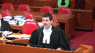
:::

The first judge did not opine on the support of the creditors.

And it's important to note that the first time the debtors came to court in September 2017 to present an initial funding application, and it's at tab 20 of my compendium, the debtors alleged at paragraph 29 and paragraph 109 of their application that they had the support of more than 50% of the creditors in value to go ahead with their litigation alternative.

At tab 20 of the compendium, you have it at paragraph 29, and you have it again at paragraph 109.

The company, so that's the debtors, has received the support and approval of a majority of the creditors in dollars of claims for this application and the proposed course of action.

These were allegations that have never been proven, and as a matter of fact, the result of the first Caledas plan suggests that a majority of creditors in value and a substantial majority of creditors in number did not support the litigation alternative.

Now, this is not to say that they can never support it, and one thing that is important about the creditors forming the creditors group, they're not subject to a support agreement with respect to the Caledas plan.

And this has been made clear at all levels of court that there is no undertaking to vote in favour of a plan filed by Caledas.

The position of the creditors group is that any plan, whether it is the Caledas plan or a plan filed by the debtors or maybe by the litigation funder, should be submitted to the vote of the creditors.

That's the position.

And that's to provide for what the CCAA is meant to do, to lead to an arrangement between the debtors and the creditors, to lead to an arrangement.

And that's the purpose of the CCAA.

Now, because I'm at tab 20,

**Justice Rowe** (02:01:38): It is a plan, really, an arrangement between one of the debtors, Calidus, who has a claim against it, and the other creditor.

::: {.column-margin}

:::

One of the creditors, Calidus, who has a claim against it, and the other creditors.

This is not a solve between the debtor and the creditor.

This is intended to be a solve between one creditor and the other creditors, whereby one, Calidus, cuts off the possibility of being sued very heavily by paying off a portion of the claims of all of the other creditors and 100% of the claims of the small creditors.

**Speaker 6** (02:02:16): This is an arrangement as the courts have consistently recognized that we should have a broad interpretation of what constitutes an arrangement.

::: {.column-margin}

:::

And section 4 of the CCAA refers to a compromise or an arrangement.

An arrangement is more than only a compromise of debts, especially in a case like here where there is a single remaining asset.

And my point is that it is for the creditors, and that's the point of the Court of Appeal on a unanimous decision, that it's for the creditors to decide what's best for them as to how to realize this last remaining asset.

The rights and the interest and the will of the creditors must trump those of the shareholder.

And obviously, the shareholder who's the one behind all of this wants the litigation funding arrangement to go ahead without the creditors intervening and without the creditors even having an opportunity to negotiate what would be best for them as part of this litigation funding arrangement.

They benefit from all of the upside of this risky alternative that is being favored.

There's no certainty of recovery whatsoever for the creditors if it's successful and it turns out to be 200 million.

What do the creditors get, the amount of their claim?

They bear the risk, and they get no upside for this reward.

And that's what Justice Schroeder in the Court of Appeal decision is criticizing.

**Justice Rowe** (02:03:56): I don't think that's accurate because if you're the major creditor, the one who's opposed the plan in the first vote, as opposed to getting 33 cents in the dollar, if this litigation results in quite a large award, they get 100 cents in the dollar.

::: {.column-margin}

:::

That's the upside.

**Speaker 6** (02:04:16): And maybe, maybe the creditors, if this litigation arrangement is presented in the rightful way to a creditors meeting, maybe the creditors will be convinced by this point.

::: {.column-margin}
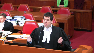
:::

Maybe the litigation funder and the debtors will present the case as being likely of being successful and resulting to a likely recovery that's better than the 35%.

Maybe, but it's for the creditors to decide.

**Justice Côté** (02:04:45): Yeah, but it would be maybe for the creditor to decide if there would be a viable alternative.

::: {.column-margin}

:::

But here, assuming that the first, the supervising judge was right in not permitting Calidus to get a vote on the second plan, then you say that the creditors, they have the right to, they have a word to say about the LFA, but they don't have any other alternative and if they say, ha, we are going to vote against the LFA, when there is no other alternative they will get zero.

So don't you think that it is within the discretion of the first judge to give his approval to the LFA.

The LFA is not there, it is approved by the court.

**Speaker 6** (02:05:27): But here, Madame Justice Côté, you're presuming, because who will vote against the LFA in your question?

**Overlapping speakers** (02:05:36): I'm not, I would like to know your answer.

No, but the point is.

Because I asked the question.

Because it's the.

**Justice Karakatsanis** (02:05:43): answer, who is going to go?

**Speaker 6** (02:05:43): If the LFA is presented to the creditors, it was presented to the creditors the first time in October 2017 and you have it in the summary of the facts by the Court of Appeal because unfortunately the First Instance Court omits to speak about the first plan that was presented by the debtors to the creditors.

::: {.column-margin}

:::

**Overlapping speakers** (02:06:06): But there was no vote on this, the first panel was withdrawn.

**Speaker 6** (02:06:09): was withdrawn, but what it was providing this plan, submitted by the debtors, to double the amount of the payment to the creditors if the litigation was successful.

::: {.column-margin}

:::

The creditors were getting twice the amount of their claim.

Now, the decision, if the first instance decision would stand, it would mean that this opportunity to negotiate with the debtors for the realization of the last remaining asset, which should be that of the creditors in a CCWA, and I submit, if the creditors are unhappy with the way the negotiations are going, there's always the bankruptcy route that can be sought.

**Justice Wagner** (02:06:54): options are on the table.

Negotiations could take place, other avenues also.

**Speaker 6** (02:07:00): but not after the first-instance judgement.

::: {.column-margin}

:::

This removes all possibility of negotiations by granting this return on investment as a priority over the claim of the creditors.

I'll give you this example, Mr. Chief Justice.

This Court decides that the first-instance judgement should be prevailing.

Tomorrow, tomorrow, Calidus goes to Bentham, which is now the negotiator, and makes the same $2.8 million offer.

Bentham gets the money, but what's left to the creditors?

**Justice Rowe** (02:07:41): But you're assuming certain terms of the LFA.

::: {.column-margin}

:::

We don't know those terms.

And this is...

But the supervising judge did know those terms.

And being aware of those terms, he exercised his discretion, having regard to all of the competing interests.

And the Court of Appeal, I put to you, simply said, we would prefer something different, and they substituted their own discretion.

It's as simple as that, it seems to me.

**Speaker 6** (02:08:14): I submit to you, Mr. Justice Rowe, that what the Court of Appeal did rightfully is to say that it is for the creditors to decide.

::: {.column-margin}
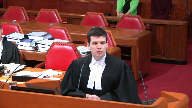
:::

And you're right that if these terms are not disclosed to the creditors, it's difficult to convince the creditors that this is an interesting avenue for them.

It's difficult.

If no offer is made for premium with respect to this risky alternative, it's difficult to convince the creditors.

**Justice Côté** (02:08:44): I understood, Mr. Perrot, that if there is money coming from that litigation, and correct me if I'm wrong, then the deputy intends to use the money to present a plan.

**Overlapping speakers** (02:08:55): Okay, that's it.

**Justice Côté** (02:08:56): It is not like we are going to get the money of that litigation and we'll run away.

Mr. Renaud argued this morning that they are remaining under the supervision of the monitor and if they get some money from that litigation, I understood that they will present a plan.

**Speaker 6** (02:09:12): the two things on this.

::: {.column-margin}

:::

The claim is made and the litigation funding is entered into by the plaintiffs, plural, so that's the shareholder and the debtors.

So the portion that goes to the plaintiffs, the portion that goes to the shareholder is gone.

And we're using the LFA under the CCAA, which involves only the debtors and should certainly not favour a shareholder to sue for the benefit of the shareholder.

So this money will not go in a plan, unfortunately, if the thing stands as the first instant judgment.

Second thing, the plan, the so-called plan, the litigation funder is right and it's factum at paragraph 33 when it says that it's moot.

It's moot.

It's either that there will be enough money to pay the claims, period, or that there's not enough money to pay all of the claims and an offer is made to distribute whatever's remaining after we have forced the creditors under that route where there is an alternative on the table.

This is substantially different from Crystal X because in Crystal X, as you rightfully pointed, there was a pre-filing unsecured creditors charge that was created at the outset to protect the unsecured creditors.

And this pre-filing unsecured charge ensured that the unsecured creditors be paid in full plus 15% annual interest post-filing before the litigation funder could get any return on its investment.

So if at one point in time the government of Venezuela comes in with an offer, the creditors keep their rights to vote on an arrangement or to force a bankruptcy in order to get the litigation proceeds before the investment return can be paid.

Under the current structure, it's the litigation funder that gets the return on investment, which is akin to an equity investment.

It's totally related to the return of the sole assets of the company.

This return needs to be paid in full before there is a dime that is being paid to the creditors who have been unpaid for four years.

So this right to negotiate, and it's referred to in the case law and the decision of Justice Farley and Landorf, and even in this court's decision in Century Services, the CCAA is meant to provide for a structured environment to permit negotiations of an arrangement.

So the first instance judgment does not achieve that purpose.

It removes any possibility of a negotiation versus the proposal by the creditors and by Caledes to submit both plans to the creditors, and both plan sponsors know that they need to convince the creditors more than 50 percent in number and more than two-thirds in value in order to be successful.

And the question was raised earlier as to the Caledes vote on a plan that could be submitted by the debtors or by the litigation funder.

This plan, this other plan that could be provided, does not need to do a single class plan.

It could be a plan providing for the non-compromise of the Caledes claim, and then only the affected creditors will vote on that plan.

So it's possible to convince the creditors that the litigation alternative is the right route for them and is better for them.

But there is, an offer needs to be made, an offer more than simply saying that your rights to negotiate are taken away.

It will be the litigation funder that will decide when the settlement is acceptable or not.

Essentially, you've been waiting for five years, four years, and you continue to wait for the potential benefit of the shareholder, and if we're successful, your claim will be paid, versus the possibility right now, right now under the appeal judgment, this possibility which was removed by the first-instant judgment to do the negotiation.

And if the creditors are unhappy with the negotiation, to seek perhaps another route, namely the bankruptcy route.

Thank you.

**Justice Rowe** (02:13:46): If the Quebec Court of Appeal's decision is upheld, there's a certainty.

Candidates votes with the others.

She's done.

**Speaker 6** (02:13:54): It's over.

It's not that's not a certainty because there is the possibility for the debtors to file their own plan and if the debtors file a plan that is acceptable to the The creditors the required majority

**Justice Rowe** (02:14:10): So, so you think Mr. Duhamel has got several million dollars sitting around so he can bid with Khalidus?

You know he doesn't, right?

You know he doesn't and that's part of the negotiating strategy.

**Speaker 6** (02:14:20): What I know is that Bentham is funding significant sums in that, and that a proposal could be made to provide for a certain recovery.

::: {.column-margin}

:::

What I also know is that if the recovery is uncertain under one alternative and certain on the other, then the uncertain route should offer something in exchange, a premium, a risk premium.

That's what I know, and that's what the CCW should promote.

The structured environment in order to get to an arrangement that will be acceptable to the required majority of creditors.

In Orphan Wells, this court established that the BIA had two purposes.

One, equitable distribution of the debtors' assets.

Two, bankrupts or debtors' financial rehabilitation.

The financial rehabilitation was not present in Orphan Wells because the company would never emerge from its insolvency proceedings.

Same thing here.

We're left with one objective, equitable distribution of the debtors' assets.

The debtors' assets, which are the common pledge of its creditors, and it's for the creditors to decide how do we get to this equitable distribution, is via an arrangement.

This is what the CCWA is meant to do.

The long title of the Companies Creditors Arrangement Act that Justice Gasco referred to in the MECACOM decision rendered in 2009 that we have at the top nine of our compendium, the long title of the act reflects its fundamental purpose, an act to facilitate compromises and arrangements between debtors and its creditors, to facilitate compromises and arrangements.

What is, what the first instance decision does here is not to facilitate compromises or arrangements.

There will be no arrangement.

It's going to become moot.

So it's, the decision is wrong in that respect because it takes away the rights of the creditors to negotiate an arrangement that will be acceptable to them in order to deal with this last remaining asset of the debtor.

Now with respect to the LFA and its structure, this court, I think Mr. Justice Moldaver, raised the fact that the judge did not look at it as an interim financing, and as a matter of fact, section 11.2 is not even cited in the judgment in first instance.

The factors are not being looked at, and it was not looked at, the factors were not looked at at all, and for my friends to say that, well, we need to say that they were looked at it implicitly is, I submit, an extension of what really happened, and if we compare that to what happened in the first instance decision of Crystal X, where the first instance judge goes over all of the criteria of 11.2, this is the way to go when a court is to approve an interim financing.

**Justice Côté** (02:17:36): If we are of the view that the supervising judge should have looked at expressly those factors, what do you think is the remedy?

Should we turn the file to the supervising judge for him to look at this, or can we assess the novel if those factors are present?

**Speaker 6** (02:17:54): Well, I submit to you that it is difficult for this court with only the record that is here to decide on these factors without having had the benefit and this court yesterday rendered a motion about certain supporting creditors who wanted to say that they're supporting the position of the creditors group.

::: {.column-margin}

:::

So these creditors should be heard.

They never got a notice about this application that was being suggested by the litigation funder and the debtors.

They were not on the service list.

The only notice they got was with respect to the first creditors meeting.

And at this creditors meeting, for reasons that are those of the debtors, unfortunately, they could not vote on the litigation funding arrangement.

They only voted on the Caledas plan.

They supported it at 92% in number and 60% in value.

And now it would be done, game over, no more say.

I submit that this would be wrong.

Especially that the way the litigation funding agreement is structured here, contrary to Crystal X, it is a return on investment.

And a return on investment is not, does not fit under 11.2.

The super priority charge that is to be created, that can be created by a CCW judge under 11.2 is with respect to loans being made by interim lenders.

This is what 11.2 refers to.

And the Alberta Court of Appeal in the recent decision of Canada North said that the priming charge should be narrow, precise, and limited to what is necessary.

Here, we're totally expanding this notion by allowing a return on investment, which in all business and legal principles should rank behind creditors.

We're giving them a priority for this return on investment.

**Justice Kasirer** (02:20:02): What about the point, Maitre Perrault, of the monitor that Justice Michaud had the benefit of reading the waterfall analysis, and he took that into account in the exercise of his discretion?

**Overlapping speakers** (02:20:15): Well.

**Justice Kasirer** (02:20:16): And the fact that the 15th report of the monitor is not alluded to on appeal.

::: {.column-margin}

:::

Surely that encourages us to the view that whether 11.2 was considered explicitly or not, the fairness of the arrangement for the creditors was considered by the judge in a way that, just as you say, we perhaps couldn't do.

**Speaker 6** (02:20:38): Well, the table that the Monitor presents in the 15th Monitor's report comparing the Crystal X financing omits to say that the return on investment ranks behind the unsecured creditor's claims, plus 15% interest.

::: {.column-margin}

:::

And I submit that the judge, Justice Michaud, did not have the benefit of that fundamental distinction between the structure of the Crystal X funding and the structure of the funding that we have here.

It's a completely different waterfall, and my friend, Mike Peden, admitted it earlier that it's different.

And it's materially different.

To say that the return on investment will rank ahead of the creditors changes the whole portrait, and this is not something that Justice Michaud had the benefit to pronounce itself on, as opposed to the Court of Appeal, which took that into consideration in the appeal judgment at paragraph 90.

And there was an upside for the creditors on their Crystal X. First of all, there was no alternative, and second of all, they were given a 15% annual interest in addition to their claim that would be paid if the litigation turned out to be successful before the funder gets any return on its investment.

And because of that structure, their rights to seek for a bankruptcy application, if at one point they realize that the claim would be worth more in a bankruptcy for them, then they can do it.

They can go.

They can file for the bankruptcy application, and in a bankruptcy, as we all know, the principles are that the claims do not disappear.

They form part of the estate of the bankruptcy, and it's the trustee who will have the power to realize this claim with the supervision of inspectors.

And if a settlement or a litigation is to be made as part of the bankruptcy, the creditors will determine what's best for them.

And then there will be no question as to whether the shareholder or the litigation funder can decide on behalf of the creditors.

And this is where I submit that the first-instance judgment is wrong, and that's what the Court of Appeal rectified by saying that when a debtor no longer has any operations and has a single remaining asset, it's for the creditors.

The dominion of the creditors, as the Court of Appeal refers to it, is to decide on what and how to realize over this last remaining asset.

**Justice Moldaver** (02:23:21): Just help me out for one second please.

::: {.column-margin}

:::

If right now we're just at a point where Blueberry is seeking the opportunity to pursue the claim, and it's a substantial claim, and it's not, no one suggests that it's a frivolous claim, at least that I can see here.

Maybe you do, but basically the supervisor judge didn't.

So if we left things the way they were now, is there anything to stop colitis, is that your name?

Colitis from sweetening the pot for SMT, and going back and saying, okay, now we wanna have another creditors meeting.

Here's a plan of arrangement that's different from the first one.

We're gonna sort of sweeten the pot here, and we'd like a vote on that.

Not one that we're participating in that makes the thing a foregone conclusion, but that causes SMT to come around to what you want.

Is there anything to stop that?

And that might force the hand of the other side to put in a plan of arrangement that you've been looking for.

And then we have a sort of a, we have a real dog fight, but right now what you're trying to do is get rid of one aspect of the whole thing.

**Speaker 6** (02:24:40): You're very right on the substance, Mr. Justice Moldaver, that this is how it should work in terms of SMT.

::: {.column-margin}

:::

The plan is not doomed to fail even if Caledon does not vote on it.

There's no such thing as doomed to fail.

The courts have consistently said that it will be a negotiations.

Someone cannot say at the outset I will vote against because maybe the plan will be improved and there is an incentive to improve the plan to get the vote.

Now the problem is that there is no such thing as doomed to fail.

**Overlapping speakers** (02:25:09): You might get your 15% premium.

**Speaker 6** (02:25:11): No, but where I want to say that there is a problem with that suggestion under the LFA as structured if it is approved by the First Instance Court is that unfortunately for the creditors in that scenario, the offer by Caleduce in this new Caleduce plan will be litigation proceeds as they are defined under the LFA.

::: {.column-margin}

:::

So the creditors will not get the benefit of this offer.

It's the litigation funder that will get the return on investment before the creditors get access to the funds.

And that's not what it should be.

I think that's to do to put the... Because you've deprived the creditors from having this negotiation, which should be the purpose of this ECWA.

**Overlapping speakers** (02:26:15): What a tight expiry.

**Speaker 6** (02:26:20): Maybe just tabs 21 to 24 of my compendium presented the rest of the building blocks that I alluded to, which I submit were duly taken into consideration by the Court of Appeal to say that this is what the creditors, callidus and the debtors relied upon as to what will be the rules of the game.

::: {.column-margin}

:::

**Speaker 3** (02:26:44): Here's some cool.

**Justice Wagner** (02:26:49): réplique.

**Speaker 7** (02:26:56): Je vais laisser un moment pour expliquer certaines choses qui ont été dites.

::: {.column-margin}

:::

Dans un premier temps, sur la question de la classification des créanciers, M. le juge Casirer, j'ai compris votre préoccupation, je crois que la réponse à votre question quant aux critères se retrouve dans l'arrêt First Pacific Advisors de 2017 de la cour d'appel de New South Wales.

C'est le même critère qui a toujours été appliqué.

Ce n'est pas dès que les intérêts de créanciers sont dissimilaires suite au plan qu'ils doivent voter dans des classes à part.

C'est lorsqu'ils sont si dissimilaires that they cannot consult together meaningfully that they should be set apart.

Dans ce cas-ci, il y a des créanciers qui sont traités différemment en vertu du plan qui ont voté ensemble dans la même classe parce qu'ils visent tous à obtenir le plus grand recouvrement possible.

C'est le cas de M. le juge Casirer.

C'est le cas des créanciers qui vont recevoir 33 cents dans le dollar et des créanciers qui vont recevoir 101 dollars dans le dollar.

Eux, ils sont traités de façon différente, mais la cour conclurait, suivant First Pacific Advisors, et c'est la même jurisprudence qui s'applique en Angleterre, que malgré le fait qu'ils soient traités différemment en vertu du plan, leur traitement différent n'est pas suffisamment différent pour qu'ils votent dans des classes séparées.

Ici, je soumets respectueusement que the interest and their treatment is different.

Et le critère est là, je pense, pour répondre à votre question.

**Justice Kasirer** (02:28:30): Je comprends votre explication et je vous en remercie.

::: {.column-margin}

:::

La question, c'est est-ce qu'il y a comme une espèce de pas présomption, mais attitude défavorable à la fragmentation qui serait conforme aux objectifs de la LAC?

**Speaker 7** (02:28:49): Et là-dessus

::: {.column-margin}

:::

, je vous renverrai au propos de la juge Conrad, la juge de la paix de Conrad, dans San Francisco, qui a dit que même la classification devrait être traitée de façon à prévenir les injustices.

C'est au paragraphe 10 de son jugement, et je pense que ça peut fonctionner des deux côtés.

C'est-à-dire que dans ce cas-ci, on dirait si on ne crée pas de classe distincte pour Caleduce, il va en résulter une injustice, mais d'un autre côté, M. le juge Casirère, il pourrait très bien y avoir une situation où créer des classes séparées résulterait en une injustice parce que ça empêcherait la réorganisation qui serait dans le meilleur intérêt de tout le monde.

Et c'est pour ça qu'on en revient à la sacro-sainte discrétion du premier juge.

Et sur cette question-là, on a beaucoup plaidé l'intérêt des créanciers.

Il faut reconnaître que cette cour-ci, dans Century Services, notamment à son paragraphe 60 et au paragraphe 70, a noté que dans certains cas, les intérêts des actionnaires doivent également être pris en compte.

Or, ici, que s'est-il passé?

Il y a eu un premier plan.

Ce plan-là a été rejeté par les créanciers selon les critères qui sont établis par la loi.

Face à cette situation-là, le juge a regardé la situation, a probablement regardé M. Duhamel, qui est ici et qui prétend avoir tout perdu dans cette affaire-ci, et il a dit...

Il a besoin d'avoir son propre coup à la canne aussi.

Et lui, le premier juge, a donc tenu compte, légitimement, dans le cadre de sa discrétion, des intérêts de l'actionnaire qui est ici et a dit, maintenant que les créanciers ont voté contre le premier plan d'arrangement, je ne permettrai pas à Caleduce, pour des raisons de classification, pour des questions de discrétion, pour des questions qui sont liées à l'étendue de sa quittance, je ne permettrai pas à Caleduce de voter sur son propre plan.

Par temps, il n'y a pas de solution viable, il n'y a pas d'alternative viable, et nous souscrivons entièrement aux représentations de CURP et de IAC sur cette question-là.

Et donc, en tenant compte de l'intérêt des créanciers et de l'actionnaire, je vais autoriser le LFA.

Et là-dessus, je pense que mon collègue, Neil Piedun, va vouloir vous parler, mais c'est faux de dire que la personne qui contrôle le litige, c'est Bentham.

C'est faux de dire que Caleduce pourrait revenir à Bentham avec une offre de 2,8 millions et Bentham mettrait cet argent-là dans sa poche.

C'est l'action des débitrices, c'est elles qui décident ce qu'elles vont faire avec cette action-là, et je n'ai pas besoin de vous dire qu'il ne serait pas dans leur intérêt d'accepter un règlement qui leur apporte zéro.

Et par temps, cette affirmation-là doit être révisée.

Merci beaucoup.

**Speaker 2** (02:31:30): Thank you.

::: {.column-margin}

:::

With the one minute remaining, I would adopt those submissions.

I would also add, Mr. Justice Casirel, that if Maître Rigaud had the opportunity to respond to your question, I'm sure that he would point you to the STELCO case in his materials.

If you look at paragraphs 13 and 14 and 39 and 40, that stands for the principle that, a contrario, they were found to not have to vote in different classes because they had the same general interest, which was namely to extract from STELCO through the plan maximum value in the sense of the consideration possible.

So they had the same interests.

And so that goes directly to your point.

The reason that I have to stand up is because twice, I have to correct my friend's interpretation of CrystalX, which I'm afraid is false.

He said twice that CrystalX ensured that creditors would be paid in full before there is any return on the funder's investment. Not true.

The funder's interest in CrystalX, interest running on its advances, which are secured by all assets, including existing physical assets of CrystalX, is paid before the creditors receive anything.

Now, it's true that the success fee is subordinated.

So it's different from CrystalX.

But it's not contrary to CrystalX. It's entirely consistent with CrystalX.

And my final point is Maître Groleau dealt with Century Services paragraph 60, which is cited in the creditors group's materials and specifically mentions that shareholders have an interest.

But they cite Century Services in support of paragraph 84.

What do they say in paragraph 84?

They plead that the rehabilitation of the business has already been achieved through the satisfaction, through the transaction, which satisfies the remedial objectives of the CCAA.

Well, how was that done?

That was done through a sale of assets to Caledas.

Was that submitted to a vote of the creditors?

All right, thank you very much.

**Justice Wagner** (02:33:15): One last question for you, I ask the question to your colleagues, should this court decide to allow the appeal?

::: {.column-margin}

:::

Do you have any representations to make on the conclusions as drafted by Justice Michaud and the First Judgement?

**Speaker 2** (02:33:35): Well, as in our written materials, we would submit that it is not part of the test to approve litigation funding, that there was no other alternative, for example.

I mean, there are slight modifications that we would make, but

**Overlapping speakers** (02:33:48): I mean, in terms of...

**Speaker 2** (02:33:49): In terms of the findings, no, that the LFAB-approved Zintram financing we would support.

In the orders?

I don't have them in front of me.

I could grab them just to make sure.

**Justice Wagner** (02:34:09): 92 and the following.

**Speaker 2** (02:34:13): That's fine.

::: {.column-margin}

:::

The answer is only with respect to the requirement to provide a completely unredacted version of the litigation funding agreement to creditors.

There's no basis to order that.

And so we disagree.

No, that's the Court of Appeal.

No, I'm sorry.

You're right.

So I'm trying to make sure that there isn't anything.

But no, there is nothing that we would recommend.

**Justice Wagner** (02:34:46): Thank you very much.

::: {.column-margin}

:::

I'll ask the lawyers to stay at ease.

Thank you.

Thank you very much.

I would like to thank Council for their good submissions.

The Court is now in a position to release its decision.

We are all of the view to allow the appeal, reinstate the decision of the Superior Court, rendered by Justice Jean-Francois Michaud on March 16, 2018, with costs in this Court and in the Court of Appeal, reasons to follow.

Thank you.