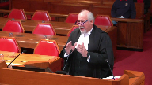

---
title: Deborah Lee Doonanco v. Her Majesty the Queen
published-title: Heard
date: 2020-02-18
sidebar: false
---

This transcript was made with automated artificial intelligence models and its accuracy has not been verified. Review the original webcast [here](https://scc-csc.ca/case-dossier/info/webcast-webdiffusion-eng.aspx?cas=['38577']).
---

**Justice Wagner** (00:00:27): The case of Debra Lee Dunanco against Her Majesty the Queen for the appellant Debra Lee Dunanco, Mr. Brian A. Beresh, QC.

::: {.column-margin}

:::

For the respondent, Her Majesty the Queen, Joanne B. D'Artana and Cheryl A. Sheckler.

Please be advised that there is a publication ban in the lower courts pursuant to section 486.5 of the Criminal Code.

Thank you very much, Mr. Beresh.

**Speaker 1** (00:01:10): Thank you Chief Justice.

::: {.column-margin}

:::

This appeal engages, we suggest, a miscarriage of justice directly from the Crown, sacrificing the interests of fairness and truth-seeking in the interests of a tactical advantage.

A warning given to us by late Justice Sipinka in Stinchcombe.

This conduct struck, we say, at the heart of the appellant's right to a fair trial.

And it created the clear appearance of unfairness at the end of the day.

We say no remedy short of a new trial will bring justice for Ms. Danenko.

Given that the appellant admitted that she caused her husband's death, the only real issue for the jury was what was the justification for that conduct and what was her state of mind.

And the defense, through the admission of agreed statement of facts, tried to narrow that issue at the outset of the trial.

This case was complicated though because of the unusual history that Ms. Danenko had with the deceased.

And it required, in our respectful submission, some clear expert evidence to assist a jury to understand the situation in which Ms. Danenko found herself and the options that were available to her in her mind.

Justice Beilby and dissent in this case captured how the fairness of the appellant's trial had been compromised and how the outcome may have been different had the Crown conduct been on site.

And we say that the Crown's conduct was caused by unfairness contrary to the comments of the majority of the Alberta Court of Appeal.

They were intentional and designed solely to gain a tactical advantage.

**Overlapping speakers** (00:03:41): Well, do we care if they were intentional or not?

**Speaker 1** (00:03:44): I think we do.

I think it raises the bar when we look at all of the problems that followed that.

**Justice Brown** (00:03:50): I mean Khan is clear that it's the effect that matters, not the intention behind withholding disclosure.

**Speaker 1** (00:03:55): I appreciate that, but if we look at it, then we end up with the situation where we have this examination in chief that was offside that clearly had the effect on a jury.

::: {.column-margin}

:::

Because as we indicate in our written material, Dr. Glancy was a very impressive witness, a psychiatrist compared to the psychologist that the defence had called.

And we say that these errors led to this miscarriage, and they were not minor or trivial.

Now, it cannot be realistically suggested that the case against Ms. Dinenko was overwhelming.

In fact, it was curious and there was a lot of doubt as to what had happened in the house on the evening of the death.

Although the Alberta Court of Appeal suggested that Ms. Dinenko's credibility was in real jeopardy, the error caused by that court was to fail to appreciate that in order to assess Ms. Dinenko's credibility, the jury had to accept what Dr. Walker testified to.

That very evidence was undermined by the failure to put to Dr. Walker, in essence, the Crown's theory.

That is, the so-called 14 hallmarks that Dr. Glancy referred to weren't present.

To get her input into that, because as Justice Beilby found in dissent, the jury could have concluded that her failure to mention the 14 hallmarks was either negligence on her part, lack of knowledge of the science, or inability to provide a fair outline.

And that was particularly important because Dr. Walker, in her evidence, went through all of the criteria she used, the tests she used, and each of those had important factors.

So the issue of hallmarks factors was a live issue in her evidence.

**Justice Rowe** (00:06:34): Often times, in expert testimony, one of the considerations is, has the expert utilized what is seen as the recognized methodology, and isn't that really what was in question here?

::: {.column-margin}

:::

**Speaker 1** (00:06:54): Yes.

::: {.column-margin}

:::

And of importance, Mr. Justice Roe, is this.

The prosecution in its approach to this case failed in cross-examination to ever challenge or question Dr. Walker about whether her approach was standard within the industry and failed.

I could find no question asked of her in cross-examination about even her methodology.

**Justice Moldaver** (00:07:32): I want to understand your position.

::: {.column-margin}

:::

I'll set it out as I understand it.

You tell me if I'm wrong.

Your primary position as I understand it is Dr. Glancy shouldn't have been allowed to testify at all because of what had occurred here, the harm, the prejudice was beyond repair, shall we say, in terms of your ability to make full answer in defence, but assuming that you lose on that and that the trial judge's remedial order is made and Dr. Glancy is allowed to testify, the effect of it was to go beyond what the order was and it ended up being at least indirectly an attack on the competence and methodology and ultimate outcome of Dr. Walker's testimony without Dr. Walker having any opportunity to...

**Speaker 1** (00:08:27): Address it said more eloquently than I can that's exactly our position.

::: {.column-margin}

:::

We lost on the rebuttal argument Had to accept that we then tried to have that refined it was refined and you'll note that in my In the the questioning of

dr. Glancy I counted six occasions when I objected to no avail

and then Glancy gives this Dissertation which we say was clearly in violation of the rule and You'll recall at one point during the trial.

I had asked the judge whether or not we should advise dr Glancy of this ruling so he'd be informed as sometimes witnesses of course They won't know what the ruling was there outside the court that was rejected by the court and it continued

And as justice Moldova is more clearly than me said undermined our entire case Following which we say there was no opportunity to Revive this problem or overcome it Had the defense my friend The respondent in her argument suggests well, we should have recalled dr.

Walker Well the problem with that is it would have reopened the situate her to cross-examination The jury would clearly have wondered why she hadn't covered this material initially In fact with hindsight now Reading the transcript some years after the trial.

I'm left with the question of whether or not the jury might have thought That the battered women syndrome is diagnosed differently in Canada than United States Because dr. Glancy the Canadian expert said here are the 14 hallmarks, and she makes no reference to it

So it is my respectful submission That amongst other things this court ought to send a clear message to prosecutors in this country that section 657 sub 3 cannot be breached and Thereafter a request for forgiveness We say that's unacceptable It's not tolerated not condoned

**Justice Côté** (00:11:00): Mr. Beres, what bearing, if any, does the fact that the defence did not provide the summary, let's say in due time, according to the position of the prosecution, so what impact does it have on this case?

**Speaker 1** (00:11:16): It has absolutely no impact.

::: {.column-margin}

:::

And why not?

Because you'll see that the record is confirmed by the prosecutors that they had notice, apart from section 657.3, they had notice as far back as the preliminary inquiry that battered women's syndrome was going to be raised at trial.

There were pretrial conferences.

Proper notice was served.

There was an opening address which frankly I thought was a synopsis.

Trial judge found it wasn't.

Within less than 24 hours we provided the synopsis from Dr. Walker.

And to answer your question, 657.3 does provide a remedy which is an adjournment if the prosecution cannot prepare.

You'll recall the comments of the crown who cross examined Ms. Walker that he was fully prepared to cross examine her fully.

He asked for an adjournment which we did not object to.

He could have asked for a number of days and I suspect the judge would have given that.

So in the end analysis we think it's a red herring.

**Justice Rowe** (00:12:28): I have to tell you that you've done a great many more jury trials than I have, but I've done a few.

::: {.column-margin}

:::

Once the thing gets rolling, there is a great hesitation to slam on the brakes and say everybody come back in a week or two's time.

There's a dynamic about a jury trial, particular to jury trials.

**Speaker 1** (00:12:49): I agree, and from the defence perspective, I hated Germans, but we didn't have to deal with that problem because Crown simply wanted overnight to prepare.

::: {.column-margin}

:::

And then we arrive and we're faced with a very unusual cross-examination of her.

Very few of the questions are challenging in the nature that I would expect of cross-examination.

She's never asked about her standard of practice.

She's never asked about her actual methodology.

And she's never, even indirectly, asked about those 14 hallmarks.

That would not have been hard to do, even if the prosecution decided it was going to hide the report further, the contents of the report could have been used in cross-examination.

So we would have at least avoided this brown and done problem, which my friend in her argument suggests was technical, Mr. Sopko actually at 3007 moves from technical to egregious, but then he suggests it's less egregious, not more egregious.

But as we see from the trial record, no explanation other than I don't like that Mr. Barish didn't provide an expert report from his expert, which never existed, apart from that, the only explanation given is I'm not, you're not giving it to me, I'm not.

**Justice Brown** (00:14:31): giving it to you?

::: {.column-margin}

:::

It's not the report as I understood it in the end.

As I understood because there was that exchange of e-mails, it was the documents underlying Dr. Walker's opinion that they wanted and to which, subject to what the crown tells me, I don't think they had an entitlement to in advance.

That was what the fight seemed to boil down to at least pre-trial.

Well, there's an exchange.

It's in the crown's factum.

So on page 16 of their factum, an e-mail November 4th, please let Mr. bearish know we will be happy to, and this is happy to disclose, once we get the documents Dr. Walker relied on in coming to work.

**Speaker 1** (00:15:27): And at page 2946 in my condensed book under tab 7, 2946, so tab 7, line 14, and this is Mr. Sopko, and my response was sure we'll provide the rebuttal report once we have your rebuttal report. So.

::: {.column-margin}

:::

**Justice Brown** (00:15:55): underlying it it seems if you take the two together.

That's right. Right.

But we now know.

And your submission is you're entitled to neither of those things.

**Speaker 1** (00:16:03): They are entitled to what section 657.3 makes clear, which is a summary.

**Justice Moldaver** (00:16:13): There's a report.

If there's a report, you've got to give the report.

Of course.

Your position is you gave them the summary ultimately.

Of course.

You didn't have to give the backup documentation. No.

**Speaker 1** (00:16:23): And nowhere in the record does the prosecution go back to the court and say, this summary is not enough.

::: {.column-margin}

:::

Secondly, this issue about Dr. Walker's file seemed to persist throughout this trial, and I'm not sure why.

Dr. Walker, as the record reflects, was in court during Ms. Danenko's evidence, during her evidence, obviously.

There was never a request for the documents.

And the trial judge specifically asked Mr. Sopko about this, and he confirmed they never requested it.

They never looked at it.

She had the file right there.

But this argument seemed to persist in some way as a justification for how they were treating the defence.

That's not, I suggest, what a fair trial is all about.

I've lost trials in my career, but nothing hurts to lose one that's done unfairly.

And the answer that the majority in the Alberta Court of Appeal, that, well, her credibility was in such doubt, I assume they're suggesting she would have been convicted anyway, fails to take into account what if Dr. Walker had commented on those.

Because the defence in this case relied upon Dr. Walker's evidence not only to explain why Ms. Danenko may have acted as she did, but also to lend credibility.

Understanding the battered women's syndrome is extremely difficult, but appreciating that she took into account all the factors would certainly enhance what we say was a credibility problem, which we accept for Ms. Danenko.

Why did she hide the gun?

Why did she tell people things that were not true after the event?

This had to be explained.

And as his court said in LaValle, there'll be few cases where battered women's syndrome is raised where expert evidence will not be required.

And in fact, I cannot contemplate of any now, short of some major exception.

**Justice Moldaver** (00:18:51): Unfortunately, this case seemed to have gone off the rails in part, speaking only for myself, because council were not acting in a cooperative manner designed to further the truth and further the evidence that should or should not be called.

::: {.column-margin}

:::

It's okay to criticize the crown, but you never asked, if I understand it, for the judge to order the 14 points that were referred to in the summary to be disclosed.

So it seems to me that what we had here was council sort of working against each other as opposed to working cooperatively to have a trial go as smoothly as possible, albeit under very difficult circumstances.

**Speaker 1** (00:19:39): I'll agree with your comments, Justice Moldaver, to this extent.

::: {.column-margin}

:::

This trial actually ran very smoothly until we got to the defence evidence.

There were major admissions.

Very little in terms of disagreement in terms of the Crown's witnesses.

The issue arose when it became clear that the prosecution was providing to us a synopsis which under section 657, the only conclusion we could draw was there was no report.

**Justice Moldaver** (00:20:18): Did you ask the trial judge before you called Dr. Walker to show her this synopsis and say look there's 14 things, I've asked the crown, could you order the crown to produce those for me because the crown has resisted and we haven't seen a report either if there is such a thing.

::: {.column-margin}

:::

You didn't do it.

**Speaker 1** (00:20:40): We didn't do it, but with respect, if we look at tab three of the condensed material, this is approximately two days after the notice which appears under tab two, our letter to Mr. Niblock, senior crown, second, third last paragraph, request the report or synopsis of report.

::: {.column-margin}

:::

That by my count is 46 days before the jury was in panel.

**Justice Moldaver** (00:21:23): I'm not suggesting that you didn't ask the Crown, but when it came to the crunch at the end you didn't have the details that were referred to in the Crown's synopsis and that's where we have judges.

**Speaker 1** (00:21:38): agreed

::: {.column-margin}

:::

but we did send two emails saying let's have some some detail

but but I would hope that the ministers of justice would protect our interests as opposed to seeing this as some sort of game and that's the problem that that we face.

**Justice Kasirer** (00:22:03): You knew there was a report.

::: {.column-margin}

:::

I did not.

If you read at your tab 4 summary of Dr. Glancy's report, it suggests there's a report.

With respect, it didn't suggest that to me at all.

The title doesn't suggest summary of a report, the existence of a report.

**Speaker 1** (00:22:23): doesn't, because section 657.3 is clear, provide the report, if none, a synopsis.

**Justice Brown** (00:22:34): The impact of the synopsis is, in your submission, determinative of whether there's a report.

If there's a synopsis, there's no report.

**Speaker 1** (00:22:40): Clearly, I can't imagine in the middle of a heated jury trial someone sitting down and preparing this document when they have the actual report.

And there is no reference within the body of it to there being a report.

**Justice Moldaver** (00:22:59): November 3rd, when the crown gave you their summary, they clearly had the full 15-page report and if they're going to be complying with the statute or to the best they can at that point, they had to give you the full report.

**Speaker 1** (00:23:15): Absolutely.

::: {.column-margin}

:::

Why take the time of preparing the synopsis?

Which led us clearly to say there is no report.

Now, which made sense in terms of timing, this was several days after the trial had started.

My assumption was Dr. Glancy was too busy and this is here's where we're getting.

Maybe there will be a report down the road, but here's the synopsis.

And this is never clarified, interestingly enough, until an hour or two after Dr. Walker leaves.

And then we get a second synopsis, which is of course more detailed, but it's really just reporting what Glancy had in the report.

So there can be no doubt that the Crown had substantial notice of what was the live issue or issues at this trial, that Dr. Walker was going to testify.

And after discussing matters with Dr. Glancy, I suspect there could have been two or three results.

One, he might have said, well, I can't tell, I don't have enough information.

And number two, I agree with Dr. Walker.

Number three, I don't agree.

They had to know that before they started cross-examining Dr. Walker.

And they had a clear obligation to put to her their theory, if I can say that, through Dr. Glancy as to what they intended to call.

Because we see that Mr. Niblock indicated before Dr. Glancy testified that he intended to call rebuttal evidence.

This wasn't a decision made after she testified.

It was clearly a decision made before he had testified, before she testified.

So my respectful submission is that to then, in light of all of that, plow into the calling of Dr. Glancy, after six objections by the defence, after, by my count, at least three warnings by the trial judge, that these were to be hypothetical questions asked.

Not about this case, but hypothetically.

The crown plows into the direct calling of all of those 14 home drugs.

And we suggest that the result was an unfair trial and that there was substantial wrong.

This is not a case of harmless wrong.

This was not a case where the evidence was overwhelming.

This jury was left, we suggest, believing, as Madam Justice Bealby points out, assuming Dr. Walker was negligent, didn't know her science, didn't speak to these 14 home drugs.

**Justice Abella** (00:26:49): Can I ask you just because I want to be sure that I understand the position you took at trial.

::: {.column-margin}

:::

You made objections to certain things emerging from Dr. Glansky's report.

Did you at any time ask the trial judge to prevent Dr. Glansky from testifying? Yes.

You did? Yes.

Thank you.

I did that at the outset.

At the outset. Okay.

**Speaker 1** (00:27:11): Okay....outset of the application from the bundle evidence, yes.

::: {.column-margin}

:::

And I hoped I had pointed out clearly why...what the injustice would be.

She ruled against me.

We then revisited the issue and she tried to refine it to this hypothetical.

It was argued this was not a matter that was argued very quickly.

The Crown knew what was at stake.

She said hypothetical only, but yet the Crown and the witness, Dr. Glancy, referred to this case.

**Justice Abella** (00:27:45): limiting instructions that you gave were in response to your position that Dr. Glancy shouldn't be allowed to testify at all.

**Speaker 1** (00:27:55): Her initial response was he's allowed to testify.

::: {.column-margin}

:::

I then raised limiting.

She agreed and that was in direct response to it, followed from it.

Thank you.

It's my respectful submission that in the end this was an unfair trial and the only remedy available should be the granting of a new trial.

Thank you.

**Speaker 2** (00:28:45): Good morning, chief justices.

::: {.column-margin}

:::

Before I begin, I'd like to provide this court with a brief outline of the arguments that I will be making and I'm going to be making them as four points, four main points.

First, I'm going to discuss that the trial judge did give an adequate remedy for the crown's late disclosure of Dr. Glancy's report and for the subsequent Brown and Dunn default.

And I'm going to discuss how the remedy that she gave was actually quite an extreme remedy in terms of being advantageous to the appellant and was in terms of limiting Dr. Glancy's evidence.

My second point will be that I'm going to discuss how the majority of the court of appeal and the dissent found that the remedy given was actually insufficient.

The difference between them was that the dissent found that the crown had breached the remedy.

And that it was the crown's breach of the remedy that was what caused the trial unfairness in this case.

But I'm also going to explain how the dissent's conclusion that the crown breached the remedy was actually premised on a mischaracterization of the remedy.

And when you look at the actual remedy that was imposed by the trial judge, it was clear that it was not actually breached by the crown.

My third point is going to be that the dissent and the appellant are now suggesting that the trial judge was unfair because the appellant was not permitted to give evidence regarding Dr. Glancy's evidence and particularly the missing battered woman's syndrome hallmarks.

But it's important to note that at the trial of this matter, the appellant specifically did not want Dr. Walker recalled and that it was on the basis of it being cost prohibitive and that it would be prejudicial in front of the jury to do so.

And my last point will be that the crown's failure to ask Dr. Glancy to give his evidence in the context of a hypothetical had no actual impact on the result of the trial.

So my first point is that the trial judge did give a remedy.

And the remedy was that it set out in tab three of my condensed book at paragraphs 15 to 18.

I won't read it to you.

But there are essentially four parts to the remedy.

One is that Dr. Glancy was not permitted to criticize or undermine Dr. Walker's opinion or methodology.

Two is that Dr. Glancy was able to discuss his own methodology or his own approach which included the steps he would take to conduct a forensic assessment.

**Justice Moldaver** (00:31:49): for a moment, that first one, it seems to me, and I've read the whole cross-examination and cross-examination, Dr. Glancy's evidence, maybe it wasn't a direct attack on the competence and the methodology used by Dr. Walker.

::: {.column-margin}

:::

When you read this examination, it becomes clear that that is precisely, indirectly, what this doctor is doing, and that would not have been lost on this jury.

Even though there's no, so you disagree with what she said and you disagree with her methodology, it was skillfully done, this cross-examination, but the effect of it, I suggest to you, was precisely what the trial judge thought should not be done.

**Speaker 2** (00:32:48): Thank you.

::: {.column-margin}

:::

The remedy was essentially it had to do with whether or not there was a standard approach that all psychiatrists or all psychologists would follow.

And it was clear that the trial judge did not want Dr. Glancy to talk about that at all.

So is there a standard approach and because Dr. Walker didn't follow that approach, then somehow her approach was flawed.

He could talk about his own approach and she talked about her own approach.

And these are two experts.

And the trial judge clearly wanted two directly competing opinions without either one of them criticizing each other or either one of them saying, well, this is actually how it should be done.

This is the actual standard approach.

And because she didn't do that, then she didn't want to do it.

**Justice Rowe** (00:33:44): But a trial is a test of competing views.

::: {.column-margin}

:::

One of the things which was fundamental here was whether the methodology used by each expert was sound.

If you put somebody in the box and they say, well, based on the fact that the earth is flat, here's my opinion.

And then you put somebody in the box and they say, well, based on the fact that the earth is round, here is my opinion.

And, I mean, the two people are talking past one another and somehow the jury is going to say, I am more persuaded that the person who says the earth is round is more credible than the person who says the earth is flat.

I mean, that was a matter and issue, was it not?

**Speaker 2** (00:34:33): Yes, it was, Justice Roe, but this is exactly what the trial judge allowed.

She allowed to competing contradictory disagreeing opinions.

They're experts.

They have their own methodology.

**Justice Brown** (00:34:48): I think the question is given the failure of the crown to disclose one of them, whether she should have allowed that.

**Speaker 2** (00:34:56): Well, the only remedy that was possible, short of a straight exclusion of Dr. Glancy's evidence, which I would submit is a very extreme remedy.

**Overlapping speakers** (00:35:06): What?

**Speaker 2** (00:35:06): something that, well, because it doesn't advance the truth-seeking function of a criminal trial.

**Justice Brown** (00:35:13): But we can find the truth-seeking function in different ways, and one of them is the Crown's obligation to disclose.

**Overlapping speakers** (00:35:21): Yes.

**Justice Brown** (00:35:22): And if, and so, so, so, so, I mean that's, your answer is not really a complete answer.

**Speaker 2** (00:35:28): Well, and this goes back to Justice Moldeva's question, though, and Justice Cassie Ray's question about, you know, what did Defence Council actually do to request that information?

::: {.column-margin}

:::

Even if they didn't know that there was a report, which I would submit they did because of the summary of Dr. Glancy's report and the fact that the crown had at one point suggested with respect to their expert that they hadn't decided whether or not they were going to call the expert, and we will provide the reports as we are supposed to in time, which discloses.

**Justice Moldaver** (00:36:07): Just a second, with respect, you can't get out from underneath this that simply.

::: {.column-margin}

:::

November the 3rd, you get the summary from the defense.

November the 3rd, the Crown gives a summary to the defense of Dr. Glancy's evidence.

What did you think you were doing at that point?

I presume you thought, not you, but I presume your colleague thought that they were complying with the statutory provision, but they weren't.

Because you had a report from October 25th, long before this.

So what did you think, what did the Crown think it was doing by giving a summary as opposed to the actual report in direct contravention of the provisions of the Criminal Code?

**Speaker 2** (00:36:53): I'm not here to suggest that what the crown did was okay.

::: {.column-margin}

:::

The crown should have disclosed the report on October 25th when they got it from Dr. Glancy.

It's erroneous in terms of some of the factors that might have been going on as to why they did it.

I've set that out in my factum.

That has to do with thinking that a lot of that report was based on inadmissible evidence because Dr. Glancy prepared his report based on things like the statement to the police, Ms. Dunanco's statement to the police.

**Justice Moldaver** (00:37:31): say that you don't give the report if you think it's based on inadmissible evidence.

I would have thought that is something to get worked out ultimately in the evidence that's called the trial.

**Speaker 2** (00:37:42): I definitely agree with that.

And that's why I say that it was wrong that the crown didn't provide that report.

But I'm suggesting to you that it wasn't as deliberate as justice Beilby thought it was only because they weren't sure what the defense was going to be.

**Justice Brown** (00:37:58): Hold on, I mean how much more deliberate can this be?

Please let Mr. Barish know we'll be happy to once we get the documents Dr. Walker relied on in coming to her conclusion.

That's right.

That's pretty darn deliberate.

**Speaker 2** (00:38:12): to me.

::: {.column-margin}

:::

It's deliberate in that it wasn't inadvertent.

We're not saying that we forgot we had the report or we didn't know we had the report.

Certainly it was intentional that way.

I'm suggesting that it was wrong but it was not as deliberate in terms of wanting to gain a tactical advantage the way that justice bill be thought to.

**Justice Karakatsanis** (00:38:34): Okay, you agree it was wrong not to disclose the report, so that brings us to the question about the truth-seeking functions of the trial and whether this was a fair trial.

::: {.column-margin}

:::

You said that it was fine to allow two competing versions, but how was the jury supposed to test the truth-seeking function in assessing the defense expert when the defense expert was not given an opportunity to explain or to comment on or to, in any way, justify the conclusions that she reached in light of the factors, the missing hallmarks?

How can that advance a truth-seeking function for the jury?

And that takes me to my argument about why was this?

**Speaker 2** (00:39:24): examination.

But why was Dr. Walker then not recalled?

That would have been the effective remedy in terms of allowing her to respond.

**Justice Rowe** (00:39:33): Patch up on a patch up.

::: {.column-margin}

:::

Was not the unfairness here that Crown Council failed to say to the defense expert, now you have based your opinion here on a certain methodology, which you've described in the following fashion.

Yes, is that the only methodology?

Are there competing methodologies?

Is it not the case that a competing methodology consists of these 14 factors?

Yes, no, et cetera.

I won't try to rehearse the whole thing.

You put to the witness, you challenge the witness directly on the point where you're going to impugn their credibility.

And you give them an opportunity to answer.

Instead, did not the crown wait in the bushes?

Never put these points to the defense expert and then spring their own expert.

**Speaker 2** (00:40:25): There's a few points in response to that.

::: {.column-margin}

:::

First of all, this court would be essentially saying that what the trial judge imposed as a remedy, which the majority of the Court of Appeal found was adequate, and the dissent did too, although she misunderstood what the remedy was, this court would be saying that that remedy was not adequate.

Because that remedy included being allowed to give evidence of the factors that he considered to be present or absent in relation to any diagnosis he might have considered.

That includes the missing battered woman syndrome hallmarks.

And that was not objected to when Dr. Glancy started giving that evidence.

My friend says, he stands here and says that he objected six times to this evidence going in.

He did not object to the evidence of the battered woman syndrome missing hallmarks going in.

He objected to it being not given as a hypothetical, which I will deal with in a few minutes.

He objected to the doctor being asked whether or not, what is the failure of the consequences of not taking into account malingering?

And that was part of the remedy.

Dr. Glancy was not permitted to criticize.

The other objection that he made was when Dr. Glancy started to talk about a standard in the industry, specifically in relation to the 50-minute standard interview, and the court stopped him there and said, no, that's talking about a standard.

He did not object to the battered woman syndrome missing hallmarks going in.

He knew what that remedy was.

He knew that that included being allowed to give that evidence, and he never objected to that.

**Justice Brown** (00:42:12): I read the transcript, and it seemed to me that in the course of Dr. Glancy's evidence, it was just a constant revisitation and attempt to clarify the terms of the order.

::: {.column-margin}

:::

And, you know, it's hypothetical, but here, let me find a specific example for you.

This really goes to whether the order was...

So, at one point, and this is at page 260, 261 of the record, volume 8, Mr. Sopko, is it acceptable with the court to have the jury hear that he reviewed the evidence of Ms. Dunanco, and based on that evidence, the court, yes.

So, review the evidence of Ms. Dunanco, and then about ten lines down later, Mr. Barish.

Dr. Glancy said that he cannot provide a diagnosis of Ms. Dunanco, so I want to be sure the questions asked don't imply that, but rather, as he says in his report, based on a hypothetical person, the court, yes.

So, we moved from reviewing the evidence of Ms. Dunanco and based on that evidence in ten lines to based on a hypothetical person.

I don't understand what the order, what the trial judge is saying here.

Is it can he review the evidence of Ms. Dunanco and based on that evidence draw conclusions, or is it based on a hypothetical person?

And there was some confusion about that, because. Indeed.

**Speaker 2** (00:43:59): Once the ruling was made with respect to the brown and Dunn boarder, crown counsel asked for clarification and he said can I ask Dr. Glancy to base his opinion based on Ms. Dunanco's evidence and she said yes which would indicate not a hypothetical.

::: {.column-margin}

:::

And then when Dr. Glancy started giving evidence, the crown asked him not in the context of a hypothetical and there was an objection and the court upheld that objection and said yes, crown, you're supposed to give this as a hypothetical.

The crown, for whatever reason I can't explain, continued on asking Dr. Glancy to give his evidence based on the appellant's evidence.

So that was not proper.

**Overlapping speakers** (00:44:47): You're kind of making my point.

**Speaker 2** (00:44:49): Right, but what I'm saying is that you have to think about this remedy and the hypothetical part of it versus the criticizing Dr. Walker's evidence as separate parts of the remedy.

::: {.column-margin}

:::

One is not causal of the other.

So you can't say because this was not given as a hypothetical, it criticizes Dr. Walker's evidence.

These are two separate parts of the remedy.

And again, the crown submits and acknowledges that it was not given as a hypothetical and that was in violation of her remedy.

**Justice Brown** (00:45:21): You say they're separate and unrelated but for the reason that Justice Moldaver gave earlier that it is an implicit criticism of Dr. Walker's report for Dr. Glancy to say what Dr. Glancy said and so one way to kind of make it less of an implicit criticism is to keep it hypothetical.

::: {.column-margin}

:::

**Speaker 2** (00:45:46): No, I disagree.

::: {.column-margin}

:::

I think they are completely unrelated.

If you look at the rationale for why experts have to give their opinions based on hypotheticals, it has nothing to do with the second part of the remedy which is criticizing Dr. Walker's evidence.

The rationale is when you have a dispute in the facts or when the expert doesn't have personal knowledge of the facts upon which his opinion is based, then it's preferable for the court to give it as a hypothetical, but it's not inadmissible.

**Justice Brown** (00:46:17): But that doesn't mean it's not unrelated in this case to whether it criticizes Dr. Walker's report or not.

I'm sure you're right, of course, but anyhow.

**Overlapping speakers** (00:46:26): I just don't.

We're talking.

**Justice Brown** (00:46:27): Looking past each other, I think, and you had four points.

**Speaker 2** (00:46:31): Yes, just going back to your question about implicit criticism, if you're going to say that then I suggest that you are basically saying that the trial judge's remedy that she gave to which this court owes deference because it is a discretionary decision, it was not the proper remedy.

::: {.column-margin}

:::

**Justice Moldaver** (00:46:53): We only owe it deference if we think that it had some hope of surviving and speaking for myself.

::: {.column-margin}

:::

In addition to what Justice Brown just put to you, this goes beyond the Dr. Walker.

This goes beyond other evidence that the defence may have called had it known about these 14 things to rebut them.

And so that's off the table too.

This goes to the heart of full answer defence.

And it just seems to me that we can't, we're looking at it too narrowly if we just say Dr. Walker, Dr. Glancy.

It goes beyond that.

We don't know what evidence the defence would have called or could have called to patch up seven or eight or nine of these 14 matters.

And we will never know.

And we will never know because of the way this case was conducted.

**Speaker 2** (00:47:51): And that is why I go back to, well, then why did Defence Council not ask to recall Dr. Walker?

It was not just...

**Justice Moldaver** (00:47:59): Dr. Walker.

I think maybe you just didn't hear what I said with respect.

There could have been ten other witnesses that the defense wanted to call if it came to that.

**Speaker 2** (00:48:10): But he didn't ask for that.

**Justice Côté** (00:48:11): But Ms. Dapena, on the recalling of Dr. Walker, the trial judge had decided on November 16 that it was not a sufficient answer, in her view, given that it was a jury trial.

**Speaker 2** (00:48:24): Yes.

::: {.column-margin}

:::

And the way that it was argued was it wasn't very thoroughly argued.

First of all, she wasn't asked to recall Dr. Walker.

And the cases say that it's not proper or it would not be a good idea for a trial judge to impose that remedy of recalling when that's not being asked.

And so specifically that was rejected.

And it was the way it was argued, it wasn't argued as a charter argument down below.

And so it was based on submissions, you know, the cost prohibitiveness factor wasn't even thoroughly considered because and she was confused because at one point she said well, cctv probably wouldn't be cost prohibitive

but then she said well, defence counsel said that it would be and that's not what he said.

So her decision on whether or not that was a proper remedy was influenced by the fact that she wasn't asked to do that.

And two, it wasn't properly argued.

And three, she had this idea that it was cost prohibitive when it wasn't even thoroughly canvassed.

**Justice Brown** (00:49:22): More than that.

There was more than that.

Defence counsel said it would make Dr. Walker appear evasive or untruthful and lead the jury to question why she had not, at first instance, addressed the issues Dr. Plants had.

**Speaker 2** (00:49:33): You

**Overlapping speakers** (00:49:33): I'm amazed.

**Speaker 2** (00:49:33): It wasn't just cost.

I can't imagine, I mean you're Skyping and I can't imagine cost would be a serious factor, but this is.

So why wouldn't the instruction to the jury saying the Crown failed to cross examine Dr. Walker about these essentials?

**Justice Karakatsanis** (00:49:49): But I guess, I mean, there's no doubt this trial judge did her very best to, to say this trial and was in a very difficult situation.

::: {.column-margin}

:::

But don't we have to come back to the real question here?

Was this a fair trial?

Was there the opportunity for full answer in defence?

That is the issue that's before us.

I, I just don't see the value in walking down a lot of well, what ifs, they could have asked for this, they could have asked for that.

Was this a fair trial?

That's the question.

**Speaker 2** (00:50:17): That's the question.

::: {.column-margin}

:::

That is a question and just before I move on to answer that, I do want to point out that it is important what defence counsel's position was on this.

Because whether or not we ended up with an unfair trial or not had a lot to do with the way this was argued and he specifically did not want to recall Dr. Walker.

Even though at some point he said this opens the door to Dr. Walker being recalled.

This was in response to, you know, the objection to Dr. Glancy being asked, you know, the failure to consider malingering.

Defence counsel then said, well, this opens the door to recalling Dr. Walker and the crown says, well, I thought that that he said that that was impossible and now he's changing his position.

So and also he had a chance to talk to Dr. Walker about this report.

He told the court that he was going to talk to her about it and he never came back and asked to recall.

And also at the end of this, at the end of this day when you're talking about whether or not this trial was unfair and if you say that this implicitly criticized Dr. Walker's evidence after hearing Dr. Glancy, why didn't defence counsel at that point ask to recall Dr. Walker?

**Justice Karakatsanis** (00:51:36): and I'll see you in the next one.

**Overlapping speakers** (00:51:36): We didn't want to.

**Justice Karakatsanis** (00:51:36): want to recall Dr. Walker for the reasons that my colleague Justice Brown alluded to.

::: {.column-margin}

:::

The trial judge didn't think that was an appropriate remedy.

So whether they asked for it or not, the decision was that it wasn't an appropriate remedy.

You're suggesting it is.

**Justice Moldaver** (00:51:56): It puts Dr. Walker on the defensive when she's recalled as opposed to if she'd done it in chief, she's on the offensive.

::: {.column-margin}

:::

She's going to deal directly with these things now after all the event to not only recall her but recall her over some video from Florida and where she's now on the defensive because she hasn't mentioned these things.

It just changes the whole complexion of the trial.

**Overlapping speakers** (00:52:21): But if you accept that jury's.

**Justice Moldaver** (00:52:23): In fairness to your friend, his position was a secondary position about how we're going to remedy this.

His first position was, you can't remedy this.

**Speaker 2** (00:52:34): Yes, and again, it was partially to do with the way this was argued, because the way that it was argued by my friend is that it was improper case splitting, and that's why we weren't allowed to call rebuttal evidence.

::: {.column-margin}

:::

That was the basis upon which he argued it.

And of course the trial judge was going to say, no, this is not improper case splitting.

The Crown couldn't have anticipated what the defence was going to be, and therefore it had to call it in rebuttal evidence.

So that was the basis upon which he argued that.

It wasn't on the, the Brown and Dunn problem sort of came after that in terms of, you know, what effect this has on the evidence.

But I just want to go, because I'm kind of running out of time here.

**Justice Rowe** (00:53:16): I'm going to make a very quick comment.

::: {.column-margin}

:::

I'm going to come back to what Justice Kara Katsanis said and underline something.

We're not here evaluating whether the tactical moves made by any particular counsel get an A or a B or a C. Maybe he got a C. Maybe he doesn't deserve to get an A.

But I don't care.

The only thing I care about is whether this accused got a fair trial.

**Speaker 2** (00:53:44): And I say that the cues did get a fair trial here.

::: {.column-margin}

:::

If you look at whether or not Dr. Walker was able to give evidence about the missing hallmarks, and that's what we're talking about here.

We're talking about the essentials that Dr. Glancy said were missing or atypical of battered woman syndrome.

Dr. Walker did give some evidence addressing some of those.

And if you look at one of the factors being the brevity of the relationship, the second relationship, Dr. Walker's evidence was that the two relationships were actually just one relationship.

So when she was married and then she divorced and then the second relationship was all one long relationship.

He didn't let her go when she was divorced.

He kept coming to see her.

He kept calling her.

He wouldn't leave her alone.

So in her opinion, the brevity of the second relationship wasn't really a factor because it was one long relationship.

The second factor that Dr. Glancy talked about was not calling the police.

This is one of the things that he said Ms. Dinanco did not do.

Dr. Walker gave a lot of evidence about why women don't call the police.

Some of them think that it takes too long for the police to get there.

Some of them think that the police are not trained.

They don't trust the police.

And in this particular case, the appellant said that she believed that it would have taken too long for the police to get there.

So there were explanations for why the police weren't called in this case.

The other factor that Dr. Glancy talked about is whether or not she had financial control within the relationship.

And again, Dr. Walker gave evidence about this.

She said that there's, you know, this is a cross socioeconomic class kind of phenomenon where even women with money are battered.

So she also said that often the men watch everything that the women do.

So even though the women may have money, they don't have control over it.

**Justice Brown** (00:55:56): So in all these cases, so for example, I mean he testified that calling the police is a present factor in almost 100% of the cases.

::: {.column-margin}

:::

I think that's the specific evidence Dr. Glancy gave.

So what is the jury supposed to do with that other than conclude that the appellant wasn't suffering from battered women's syndrome and given that Dr. Walker had no sort of shot at that point?

What, what, what, what, what, what, what, what, what, what, what, what, what, what, what, what, what, what, what, what, what, what, what, what, what, what, what, what, what, what, what, what, what, what, what, what, what, what, what, what, what, what, what, what, what, what, what, what, what, what, what, what, what, what.

**Speaker 2** (00:56:31): What else is this going to do?

::: {.column-margin}

:::

The appellant explained why she didn't call the police and Dr. Walker backed that up by saying this is not an uncommon reason for why women don't call the police.

They're afraid it will take too long.

You know, the police don't know what to do when they get there.

There's a perfectly good explanation for why she didn't call the police here that the jury had that they could have considered.

The other thing that Dr. Glancy talked about was she didn't have an idealized view of Mr. Phelan as being all powerful.

That was also discussed by Dr. Walker because she said that in the context of dissociation, sometimes what happens is the woman feels that the man is so powerful that even when she shoots him, he may still come after her and that she's not actually killed him after shooting him.

So that's something that the jury had before him.

She also talked about how Ms. Dunanco did actually believe that Mr. Phelan's threats in relation to his connection to the hell's angels was real and that he actually could do something to hurt her that way.

So that's another factor.

The fact that she wasn't subservient or that she was assertive, Dr. Walker testified that the text messages and the journals and the notes indicate that it's a normal part of a domestic violence relationship to have sort of normal conversation.

So the other factor that Dr. Glancy talked about was why didn't she leave?

And this is something that Dr. Walker gave extensive evidence on.

Why do women in these situations not leave?

Well, there's lots of reasons.

They're afraid they're going to get killed.

They love their abuser.

They think that they're going to change.

All kinds of reasons.

And Dr. Glancy finally talked about, you know, why this time?

Why did Ms. Dunanco believe that something was going to happen that was so dangerous this time that she had to actually kill him and whether or not she had a heightened sense of awareness of this?

And Dr. Walker, again, gave reasons for why she didn't call the police.

I see my red light is on.

So I just want to finish off by saying that there were certain hallmarks that Dr. Walker didn't discuss but really couldn't have said anything about.

For example, you know, the fact that there were no children, the fact that there was no severe injuries, the fact that she got a restraining order, the fact that she knew that a previous partner got a restraining order, the fact that she got herself out of the relationship, I don't know what evidence could have been given about that.

But I see that my time is up.

So subject to any questions, those are my submissions.

**Justice Wagner** (00:59:24): Thank you very much.

**Speaker 1** (00:59:33): Thank you, justices, for your patience.

::: {.column-margin}

:::

I will not tax it very much.

I want to reply to four things my friend said.

The first of which betrays the suggestion that somehow this was fair.

At tab 17, we have the evidence of Dr. Glancy at page 3132.

This I think is about my fifth or sixth objection.

At line 12, I thought you had directed this could be done by way of hypothetical so the facts are controlled.

Court, I thought I, Mr. Barris, that was your direction.

Court, I thought that is what you intended to do, Mr. Sopko.

The rules never changed.

Crown wasn't allowed one more player on the ice.

That was the rule.

Immediately it's breached and if I can, while I have your attention to that document, bring your attention to pages 3136 and 3137.

Adding to Justice Moldaver's observation, we actually have a direct attack on the defence case.

Four times he refers to this case as having atypical features.

We see that at lines 39, 40.

We then go on to this amazing observation after hypothetical.

At line 4, if I might quote please, well, that's an antitypical feature, atypical, I'm sorry.

I'm not sure we have a real diagnosis here. Bang.

He drove the heart into Dr. Walker's evidence.

So and then he adds this.

I guess he was talking to the jury.

So I think in that case, I would give this case extra careful consideration when there are atypical features.

He concludes wonderfully at line 10.

Again, says the crown says you're not able to come to some definitive answer correct.

But he's already given the real diagnosis here.

Secondly, with respect, if one looks at Dr. Casey's report, and very quickly you'll find it at tab 9 of my condensed material, he relies ‑‑

the evidence he relies upon is set forth very clearly.

My friend refers at page 3 to Ms. Danenko's warned statement.

Yes, it was ruled inadmissible, but if we looked at the entries on page 3 on to page 4, he refers to facts and allegations of abuse by Ms. Danenko, all of which were put in evidence when she testified.

None of those were missing.

Where are you?

At tab 9, page 3, Dr. ‑‑

**Justice Brown** (01:03:11): I see it now, okay.

**Speaker 1** (01:03:17): The real page number.

::: {.column-margin}

:::

Certified, doesn't matter it was ruled inadmissible.

She testified to that.

There's not one item there that did not come out in her evidence.

My friend is right if we look at the appendix which is, has an A12 at the top.

It's about a five, six page appendix.

He neatly, this is Dr. Glancy neatly, categorizes where he got the evidence.

Of the 13 references to Ms. Danenko, five of them where he refers to her alone, the evidence was in, the evidence was before the court, so for example alternative escape, he has reference to transcript of a warrant statement but it's confirmed by Corrine Danenko.

So there was other evidence at the trial.

My friend is right there were four people who weren't called at the trial but it didn't affect his evidence because he relied upon them only in part.

**Overlapping speakers** (01:04:34): I would ask you to conclude, please.

**Speaker 1** (01:04:36): Thank you.

With respect, we suggest this was not a fair trial.

The prosecution was not searching for the truth.

Thank you.

**Justice Wagner** (01:04:46): Thank you very much, I ask Council to remain at our disposal.

**Justice Kasirer** (01:05:20): La Cour, the court.

**Justice Wagner** (01:05:47): Thank you very much.

The court is ready to release its decisions.

I will ask Justice Moldeber to read the reasons.

Thank you, Chief.

**Justice Moldaver** (01:05:58): Chief Justice, we are all of the view that the appeal must be allowed and a new trial ordered on all counts.

::: {.column-margin}

:::

The Crown's failure to disclose Dr. Glancy's report before Dr. Walker completed her testimony when considered together with the Crown's failure to cross-examine Dr. Walker on the contents of that report interfered with Ms. Dunaco's ability to know the case she had to meet and make full answer and defence.

To that extent, we agree with the reasons of Justice Bilby dissenting in the Court of Appeal.

With respect, however, unlike Justice Bilby, we are not persuaded that the trial judge's remedial ruling was capable of undoing the prejudice caused to Ms. Dunaco by the manner in which the Crown proceeded.

In the circumstances, precluding Dr. Glancy from testifying was, in our view, the only way of preserving Ms. Dunaco's right to a fair trial.

The net effect of Dr. Glancy's evidence was to call into question Dr. Walker's competence and the reliability of her expert testimony by showing that she failed to consider, much less explain, a number of factors that Dr. Glancy found to be atypical of the battered woman syndrome, factors which undermined Dr. Walker's conclusion that Ms. Dunaco was suffering from this syndrome when she killed her domestic partner.

Because Dr. Glancy's report was not disclosed to the defence before Dr. Walker completed her testimony, and because the factors that Dr. Glancy relied upon to characterize Ms. Dunaco's case as atypical were never put to Dr. Walker by the Crown in cross-examination, the defence was not able to respond to Dr. Glancy's critiques.

This rendered Ms. Dunaco's trial unfair, resulting in a miscarriage of justice.

See Criminal Code RSC 1985, Chapter 46, Section 686-1A3.

Accordingly, the appeal is allowed, the convictions are set aside, and a new trial is ordered on all counts.

**Justice Wagner** (01:08:33): Thank you very much, the court is adjourned until tomorrow morning, 9.30.