---
title: Owners, Strata Plan LMS 3905 v. Crystal Square Parking Corporation
published-title: Heard
date: 2020-06-09
sidebar: false
---

This transcript was made with automated artificial intelligence models and its accuracy has not been verified. Review the original webcast [here](https://scc-csc.ca/case-dossier/info/webcast-webdiffusion-eng.aspx?cas=['38741']).
---

**Speaker 1** (00:00:01): the court.

**Justice Wagner** (00:00:02): Bonjour et bienvenue

::: {.column-margin}
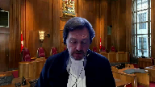
:::

dans notre salle d'audience virtuelle

, la toute première salle d'audience entièrement virtuelle de l'histoire de la Cour suprême du Canada.

En temps normal, nous serions dans la salle d'audience à Ottawa et je présenterais l'affaire et les procureurs.

Mais nous savons tous très bien que ce n'est pas un jour comme les autres, que nous vivons des moments hors du commun.

En conséquence, j'aimerais dire quelques mots à ce sujet.

First, I'd like to thank

the parties and councils who are with us today, and those who will join us later this week.

My colleagues and I are grateful for your collaboration and flexibility.

We have had to make adjustments and learn new technologies, and your patience and resourcefulness has made that work smoother.

The hearing today will be the first in the

Court's history that will happen entirely by videoconference.

Last year, we, at the Court, were very proud to take

our courtroom to Winnipeg.

This week, between judges, counsel, media and public observers, our courtroom will be in dozens of different offices, living rooms and other locations across Canada.

This is not what any of us expected when we set dates for the hearings this week.

But here we are, and so far, so good.

Deuxièmement, n'oublions pas que tout ceci est nouveau.

Aucun d'entre nous n'a jamais fait cela auparavant.

Il y aura des pépins.

Il y aura peut-être même des visites surprises d'enfants ou d'animaux de compagnie.

Ce n'est pas grave.

Il arrive toujours des choses indépendantes de notre volonté, telle la pandémie de COVID-19, qui nous a tous confinés dans nos foyers et qui a rendu malades ou emportés tant de Canadiennes et de Canadiens, peut-être même des personnes parmi vos proches.

Mais nous savons nous adapter et nous savons que rien n'est parfait du premier coup.

Rappelez-vous simplement que la Cour est là pour écouter et évaluer vos arguments, et non pour juger de la qualité de la prise de vue de votre caméra, ou encore de la facilité à utiliser le bouton de mise en sourdine.

Nous saurons tenir cette audience, tout comme nous saurons traverser cette pandémie.

Finally, to those of you watching online as observers through Zoom or on our webcast, I'm glad that you can join us.

We have a strong open court

system in Canada, and I believe it's important for everyone to see their justice system in action.

Except in very limited cases, our hearings are always webcast online, whether we are in the courtroom in Ottawa or not.

You can always tune in on our website live, or watch

archived hearings later.

I encourage you to do so.

Thank you.

And now, let's begin.

In the case of Owner Strata

Plan LMS 3905 against Crystal

Square Parking

Corporation. For

the appellant, Owners

Strata Plan LMS 3905, Mr. Stephen Hamilton.

For the intervener, CHOA

Condominium Home

Owners

Association of BC, Wes McMillan. For

the respondents, Crystal

Square Parking Corporation, Mr. Ken McEwen QC and

Emily Kirkpatrick.

For the

intervener, Urban Development Institute

, Pacific Region

, Andrew Morrison and Mark V. Lewis.

Mr. Hamilton.

**Speaker 1** (00:04:35): Thank you, Chief Justice, Justices.

::: {.column-margin}
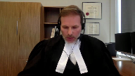
:::

The Court of Appeal fell into error in this case by equating the creation and exercise of property interests with contractual intention.

This error resulted in the incorrect application of legal principles in three ways.

First, finding that the respondent had proved a pre-incorporation contract.

Second, finding that the pre-incorporation transaction negated the rule in Osterberry.

And third, by importing pre-incorporation contract principles into the Stratocorporation governance model.

And I'll first deal with the pre-incorporation test and make my submissions as to why it did not apply on the facts of this case.

To begin with, the ASP, or the Airspace Parcel Easement, was a land instrument.

The developer charged the land interests of the appellant and other landowners with easements, both negative and positive, that according to the easement would run with the land.

And in the agreement, which appears at page 73 of the record, at paragraph 7.8 of the agreement, in that paragraph 17.3, the developer included provisions

**Justice Wagner** (00:06:22): The Court. La Cour.

Thank you, Mr. Hamilton.

I understand that we have resolved the issue, so you can continue.

**Speaker 1** (00:06:46): to go back to my previous point before we disappeared.

::: {.column-margin}
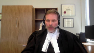
:::

At its inception, the easement was an expression or creation of property rights and not a contractual instrument between the landowners.

And this was apparent because all the lands were owned by the developer and the developer could not contract with itself.

But it could establish easements under the provisions of the property law act of British Columbia did so.

And of course, the future landowners did not yet exist.

At page 95 to 103 of the factum of the appellants factum and I won't repeat them in these submissions.

I run through the various facts that demonstrate that the developer was in fact intending to create a land instrument and not intending to create contractual interests.

And in my submission that alone brought this case outside of the principles established in Hinehouse.

The Hinehouse principles or the pre-incorporation transaction principles are all about looking at the pre-incorporation transaction that's intended to create contractual relations and that was not present in this case, in my submission because the developer was creating a land instrument and property rights.

The flip side of that proposition and of course, the strata corporation didn't enter into the obligations under the easement upon subdivision.

And subsequently as found by the trial judge and settled in the reasons the appellant strata corporation relinquished its use of the parking and stopped paying parking fees.

Pause there to note that the exclusion of the appellant did not impact the other landowners.

The easement itself created a fixed formula whereby the removal of the appellant strata corporation did not change the amounts that were being paid by the other landowners who continued to choose to participate in the parking arrangement.

And in this sense, the trial judge had found that the appellant's decision to relinquish the parking rights under the easement didn't create prejudice to other parties and in fact, insofar as the respondent, the appellant had paid everything it had been required to pay up to the time that it decided to stop using the parking.

And that's found at the appeal record pages 38 to 40, which is paragraph 7.5 sub D of the agreement, which establishes the entirety of the parking fees that are payable by the landowners, which are all based on a proportionate sharing.

So as a matter of property law, the positive covenants in the easement, including the annulment clauses that expressed an intention to bind successors in title, were all unenforceable against the appellant based on the rule in Osterberry.

And I don't see that as being controversial in this case, except for perhaps the respondent's position now that there may exist some conditional grant exception in the law of easements.

**Justice Abella** (00:10:38): Hamilton can I ask you a question please?

Is it your position then that you can never apply the law of pre-incorporation contract where a positive covenant exists?

**Speaker 1** (00:10:54): it's my position that it was central and a requirement for the Court of Appeal to first identify whether or not the developer's intention was to create a contractual relationship or property rights.

::: {.column-margin}
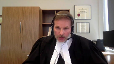
:::

There may be circumstances where the court could find that there is an intention to create a contractual relationship pre-incorporation and that may start to bring us closer to the Hinehouse principles.

**Justice Abella** (00:11:28): And how would that work in this case, Mr. Hamilton?

What would we be able to look at in deciding whether or not Hynos applies to this case or doesn't apply?

What are you taking out of the equation?

**Speaker 1** (00:11:41): Well, I'm taking out of the equation, the the fact that the developer was the singular owner of the lands, and there was nothing to negotiate between itself there.

::: {.column-margin}
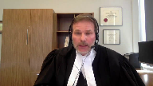
:::

There wasn't this intention to create a contractual relationship, the developer was relying on the principles of property law and easements to bind successors and title and to organize the land interests of the future landowners.

That was the intention of the developers conduct was to organize those property interests using property law principles and not like in Hinehouse, where the court found that there was an independent agreement that had to exist in order for the developer to enjoy the option option to purchase. Yeah.

**Justice Abella** (00:12:37): So this will be the last question on that point, Mr. Hamilton.

So your view is that the determinative conduct is not conduct at all, but the intention of the developer.

Is that, is that your position?

**Speaker 1** (00:12:51): Well it's about first identifying the relationship that the developer was trying to establish at the outset.

::: {.column-margin}
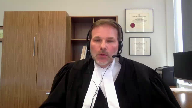
:::

There's no room for Hinehouse if the court finds that the rights that are being established were informed by property law and not contractual because that's the point of Hinehouse and the pre-incorporation transaction cases.

**Justice Côté** (00:13:19): I have a question, Mr. Hamilton.

You're saying that although the ESP agreements have contained many assumption requirements, that the developer did not have the intent of creating some sort of contractual relations?

**Speaker 1** (00:13:37): The, I would say this, the developer, the clause pertaining to the assumption was another positive covenant that attempted, as innurement clauses do, to move the property rights and obligations to successors and title.

::: {.column-margin}

:::

That was the point of it.

And that provision which is contained at paragraph 16.3 of the, of the agreement, which is page 89 of the appeal record.

I point this out with respect to that provision, which in my submission signals that the developer was doing something other than creating contractual relations.

That provision dealing with the assumption agreement, purported to only apply to the strata developments.

The paragraph says that upon the subdivision of the strata plan that the strata corporation shall enter into an assumption agreement with the owners of the other parcels and he forms satisfactory to the other parcels.

But there wasn't a mutual provision that contemplated that the other parcels that were non-strata would do the same.

And, and it seems to me that this innurement provision, this, this additional covenant more likely signaled an understanding that the individual strata lot owners that would soon populate the strata corporation had a, had a stake in the game and that there was a governance model that needed to be fulfilled through the voting requirements of the strata corporation.

It, it, in my submission, it's notable that the developer did not include the same kind of assumption provision for the non-strata landowners, which in my submission more reflects an intention to be satisfied with the enforcement of the property rights contained with the easement instead of the intention like in Hinehouse where there was a separate contractual obligation that needed to be relied on.

**Justice Côté** (00:15:54): I have another question on that given the fact that we are discussing assumption.

::: {.column-margin}
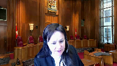
:::

How should we consider the bylaw that the appellant adopted in 2008?

It seems to me that you say your client says a strata corporation must comply with observe and perform all of the terms and obligations of the parking facility.

**Speaker 1** (00:16:19): The bylaw, and I'll address that now, although I'll be commenting on it in my submissions regarding the conduct of the Strato Corporation, which the Court of Appeal needed to find, or did find to establish a contractual relationship.

::: {.column-margin}
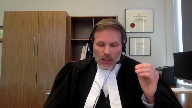
:::

The bylaw that you're referring to was considered at trial by the trial judge, and evidence was given by the Strato Council President, Mr. Rupra, about the meaning of that bylaw.

And the trial judge made a specific finding of fact after hearing that evidence about what the meaning of that bylaw was, and that's found at paragraphs 88 and 89 of the trial decision.

Her Ladyship at that time sets out the 2008 bylaw, and of course, the entirety of the bylaw was put to the trial judge, including all the definitions, and Her Ladyship concluded that it was her view that the bylaw relates to the easement only, which is set out in clauses 7.a sub b of the ASP agreement.

That was a construction that Her Ladyship made of the meaning of the bylaw that was in front of her, and in my submission, there's been nothing put forward by the respondent to demonstrate that that was a palpable and overriding error, and that finding of fact, which was expressed in Her Ladyship's construction of the bylaw, should be respected.

And I'd make this point, and I'll make this point later, Justice, is that other than the bylaw, which in my submission, the trial judge dealt with, the other conduct which the Court of Appeal relies on was conduct entirely consistent with the Appellant Shrata Corporation's exercise of the covenants, both negative and positive, whether or not they were enforceable or not, contained within the property instrument that the developer had registered.

**Justice Kasirer** (00:18:45): Can I ask a question, Mr. Hamilton, about your intention argument in respect of Crystal?

::: {.column-margin}
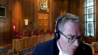
:::

Crystal's liability as a promoter is not at issue here.

I wonder if whatever its intention was when the ASP agreement was arrived at prior to Strata's incorporation, is it not true that Strata and Crystal were free to enter a new contract after incorporation based on the terms of the ASP agreement?

**Speaker 1** (00:19:21): Yes, that is true.

The Stratocorporation could have entered into an express new agreement on whatever terms it chose to, including all of the terms that were reflected in the ASP agreement.

**Justice Kasirer** (00:19:37): So your property instrument argument doesn't preclude the finding that there would be a new contract post incorporation based on the same terms of the ASP.

**Speaker 1** (00:19:51): No, in my submission, Justice, it does.

::: {.column-margin}
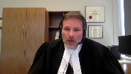
:::

What I'm saying is that the parties could expressly and intentionally enter into a new agreement because that would create contractual rights.

But Hinehouse is premised on the understanding that the initial relationship that existed pre-incorporation was contractual in nature.

And in this case, in my submission, it was not.

The initial relationship that existed, the rights, the bundle of rights that were established by the developer weren't contractual.

And at least according to the developer in the way that the easement was drafted, it didn't need to be because the easements were a charge.

The provisions of the easement provided that they would all run with the land.

And so they captured the successors and title as a matter of property law.

**Justice Karakatsanis** (00:20:51): Just to follow up on the question and your point, is there any reason why the developer wouldn't in fact be intending to do both, create obligations in REM and in personam, so that you've got the covenant, a positive covenant that runs with, whether it runs with the land or not, and then you also have contractual obligations?

::: {.column-margin}
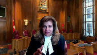
:::

I don't understand why you're saying that the developer needed to have an intention to do one, really, or the other.

**Speaker 1** (00:21:25): And I'm not saying that justice there.

::: {.column-margin}
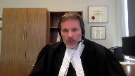
:::

There certainly can be three potential situations.

One which is common where the parties will create a charge on land that's intended to be non-contractual and you see that all the time with rights of way or Section 219 covenants with local governments.

There's no intention to create a contract.

It's an intention to create property rights.

There are other times where, as you point out, the parties do both.

They may have an intention to create property rights and contractual.

And the third possibility, of course, is it's purely contractual.

What I say, though, in the circumstances of this case is that the Court of Appeal didn't ask that question.

And the evidence demonstrated that it could have either been a property case or both.

But the burden was on the respondent in my submission to prove on a balance of probabilities and it failed to discharge that burden because they were equally plausible.

**Justice Karakatsanis** (00:22:40): I guess my point is that there's a route to both by property law and by contract law.

::: {.column-margin}
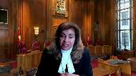
:::

And the Court of Appeal, in this case, found that it was the pre-incorporation contract.

It was the contract that was adopted that was the route to the obligations here.

And even if there's also an issue about whether there was an obligation under property law, why isn't it sufficient if you look at the contract law and you're satisfied on the conduct that it's been adopted?

Or a similar contract, a new contract, on the same terms has been adopted.

**Speaker 1** (00:23:21): Yes, but my submission is twofold.

::: {.column-margin}
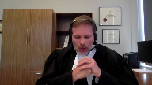
:::

That on the facts and in the context of the case, the easement was purely a land instrument and not contractual.

That is my point.

And if it's not contractual, and it may be that that's not accepted, but if it was not contractual, then the Hinehouse principles don't apply.

If it was both, then they could potentially apply.

And of course, to finish my last point, the burden was on the respondent to establish which one it was, and it was equally likely that it was purely a land instrument.

Now the other part of this, of course, is the Court of Appeals finding that the contractual intention from the appellant was found predominantly from its receipt of benefits and performance of burdens, which I say were all expressed in the easement.

And in my submission, that was an error.

Hinehouse in particular, that decision and all of the cases relied on by the respondent relate to situations where the only explanation of the company's conduct or behavior was the performance of terms contained in a contractual instrument.

Hinehouse was such a case, although it was more akin to a fraud case than anything else, but the only explanation for the receipt of the boat in Hinehouse was an agreement that existed before the incorporation of the company.

There was no other reason that the company should receive the boat, and of course, as a result, the court found that there had to be a payment.

The pre-incorporation transaction line of authorities, and in the fact that my site, Northumberland and other lines of authority, look at the conduct of the party that is behaving in relation to what is said to be a pre-corporation transaction.

And in Northumberland, the court said that the conduct of the board of directors was completely and fully explained by the board of directors, understanding that, or the opinion that they had received or appreciated that the initial transaction was binding on them.

So there couldn't be a new agreement, because they were acting in respect of that transaction.

And there are other lines of authority, so in my factum, in the same way.

**Justice Abella** (00:26:24): What's the status of Northumberland, Mr. Hamilton, in light of the BC Court of Appeals decisions in Hinehouse and Phelps?

It's just not clear to me that that case has survived those two.

**Speaker 1** (00:26:41): Well, in my submission, it has because even Hinehouse and Phelps requires the court to look at to find the intention of the parties, but allows the court to find that intention through that through the conduct that that's that's occurring.

::: {.column-margin}
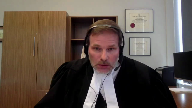
:::

Northumberland in my submissions doesn't doesn't say that's not the case.

It just says that if the conduct is that can be explained, other than the through the acceptance of the contractual instrument that it won't satisfy the finding that there was an intention to be bound.

**Justice Kasirer** (00:27:25): And can we leave?

Oh, pardon me.

**Justice Abella** (00:27:28): Just a quick follow-up and what is there about the conduct in this case, the 10 years of complying with the ASP, APS agreement that takes it out of the the Phelps Hinehouse approach.

**Speaker 1** (00:27:44): Well, in this case, the trial judge made another finding a fact in my submission, which was objectively supported that the conduct of the strata corporation was explained by their behavior to find meaning in the easement and the fact that the positive covenant was binding on them as a matter of property law.

::: {.column-margin}
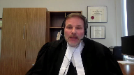
:::

The trial judge makes that finding that the strata corporation understood that the positive covenant was a charge against and it was a charge against the common property and therefore binding on them and not having knowledge of the potential arguments that positive covenants may not run with the land.

It was objectively reasonable in my submission for the trial just to reach that conclusion.

But looked at from a different point of

**Justice Côté** (00:28:48): I have a question.

That belief, the ad they were bound by the agreement, that was not argued from the beginning.

It is something which you argued later, isn't it?

**Speaker 1** (00:29:03): In the initial, I believe you're referring to the pleadings.

**Overlapping speakers** (00:29:08): Yes, I do.

**Speaker 1** (00:29:09): initially the pleadings were framed with respect to the arguments dealing with contract principles and later amended to deal with arguments regarding the enforceability of the positive covenants.

::: {.column-margin}
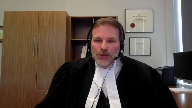
:::

They were alternative pleadings and in my submission there's really no moment with respect to pleadings as those are creatures of lawyers and ultimately how matters are framed prior to trial I perhaps would say more weight could have been given to that if at trial at the commencement of trial it was never argued but the predominant argument at trial was that the positive covenants did not run with the land and all of the various submissions that have been made now in the court of appeal and in this court.

**Overlapping speakers** (00:29:58): Thank you.

**Speaker 1** (00:29:58): Looked at it from a different point of view and in my submission it further supports the idea that the Hinehouse test was not met, although it's difficult not to conflate the cases that are property law driven and Hinehouse, which wasn't a property law driven case, but in my submission they are powerful and if you look at the cases dealing with the exercise of property rights and beginning with the BC Court of Appeals decision in Norton and Faridi, the facts in those cases when you're dealing with easements are really about the parties arguing that the property rights and the positive covenants became binding as a result of the parties acceptance of the benefits and burdens of their participation in the easement and the trial judge in Norton Express reached that conclusion that the conduct of the the conduct of the parties or the party that was trying to resist the positive covenant had bound them to that positive covenant and in the condensed book at page 17 I set out many of the passages from Norton and at beginning at page 18 of that condensed book the trial judge's reasons are set out by the BC Court of Appeal and the trial judge says this, as I have said, the evidence satisfies me that the Faridis were aware of the easement agreement, it was registered of course, and how this water system was to function at the time they purchased lot A.

::: {.column-margin}
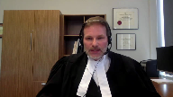
:::

If they did not review the easement agreement they were certainly aware of it and Norton had explained to them what he had done to construct it, how it worked and what little was to be done by the owners of lots B and C to hook into it.

Over the page if I am not right in having reached the above conclusion based on what the Faridis knew at the time of the purchase then their conduct since that date satisfies me that the parties agreed that Norton could hook into the water system in the manner in which she did this is all outlined in my evidence and then the trial judge refers to a number of passages which really are cases dealing with establishing privity of contract through election and at page 20 of the condensed book or paragraph or page 12 of the decision the trial judge relied on Derrickson and Madsen where it was said that the general rule is that a person cannot accept and reject the same instrument and this is the foundation of the law of election on which courts of equity particularly have grounded a variety of decisions and the trial judge then says accordingly I find that the water system is connected and the Court of Appeal underlines this because they are going to disagree with this proposition.

I find that the water system is connected and operating in accordance with the terms of the easement agreement on a common sense interpretation or as agreed to by the parties at the time of the hookup by Norton.

The Court of Appeal then of course looks at the rule in Osterberry and the rule that positive covenants do not run with the land and at paragraph 41 of the decision the court points out that the positive covenants respecting the easements respecting the water were positive in nature and then a paragraph or page 23 page 26 of the condensed book the Court of Appeal says those findings were that the water system was connected and operating as agreed to by the parties at the time of hookup by Norton and the defendants by their conduct acquiesced in that result.

That was however no privity of contract between the plaintiff and defendants and any acquiescence on the part of the defendants could not create a positive obligation on the survey and tenement which would run with the land and those principles are similar to this court's decision in Parkinson and Reed where we had an easement respecting the repair of a staircase and the court concluded and this appears at page 29 of the condensed book where the court looked at the long-standing participation of the parties in the easement and at page 29 of the condensed book which is to the second to last paragraph the Supreme Court of Canada says the third ground was based on a Latin maxim which I won't pronounce it was said that as the appellants predecessor and title and the appellants themselves had enjoyed the privileges contained in the agreements registered they could not refuse to perform the obligations contained in the agreements.

The first four mentioned were not in evidence but for the purpose willing to admit them and then the court goes on assuming that so long as the appellants made use of the last mentioned well as a party while they were bound to it

but they ceased to be under any obligation when they no longer made made use of it

and so even that long-standing relationship between the participants to the easement and Parkinson and Reed didn't result in a contractual obligation but only an obligation that could be relinquished at the election of Parkinson and of course these similar ideas are settled in the factum in Roan versus Stevens and similarly even in the Court of Appeal Ontario Court of Appeals decision in Amberwood where in Amberwood you had you had the you had the respondent paying the actual fees that were required under the positive covenant for several months and the court found that the payment of those fees for those several months also did not establish or overcome the privity of contract provision so looking at it from both perspectives whether you look at it from the property law perspectives which have always rejected the idea that conduct or acquiescence could overcome the privity rule similarly in my submission the behavior of the appellant strata corporation in exercising what appear to be apparent rights under an easement just like in Parkinson and Reed or Faridi could not establish an intention to be bound by an agreement so I submit that the Hinehouse case is a very was very very limited assistance to the Court of Appeal it really was about a fraud case and more importantly the only explanation for the company to take possession of the boat was this pre-incorporation agreement that established that those those rights similarly Philip Phelps which the Court of Appeal relied on heavily with respect to its decision is distinguishable for the very same reason in Phelps there there were two parts to it there was the option to purchase that was registered against the strata lands that had been transferred to the strata corporation the strata corporation tried to say well the option isn't binding because it's pre-incorporation so we're out

but of course the only reason the option was registered was that the strata corporation had received the land and had possession and ownership per title to that land and that title and ownership of that land could only be explained by the contractual arrangements that had been negotiated with the developer prior to the prior to the subdivision there wasn't there wasn't a property right in existence that would have explained why the strata corporation in Phelps would be entitled to keep ownership and possession of the land without paying for it in that sense it was equivalent to Hinehouse in those cases where the court simply not going to stand for a party to receive the benefit of something without accepting the burden and that's not our case here so in other words in in Phelps the the receipt of the lot be lands and this is set out in the fact and could only be explained by the contractual relationship between the parties in in this case the trial judge and I made this point earlier accepted at paragraph 76 and 77 of the decision that the appellant's conduct was explained by the positive covenants contained in the easements and that decisions found at tab one trial judge's decision is found at tab one of the appellant's record and at paragraphs 76 and 77 the trial judge put it this way the plaintiff's members were under the mistaken belief that they were bound by the ASP agreement and for many years they attempted to comply with its terms without seeking any legal advice on this point they had no understanding of whether positive covenants ran with the land that's the trial judge's finding that the the reason the strata corporation is participating in in the positive covenants here in the parking facility is because of the positive covenants that they understood would run with the land

**Justice Brown** (00:40:25): So I have a question then.

::: {.column-margin}
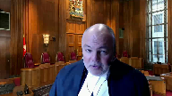
:::

Is conduct ever sufficient to form a contract when the subject matter is land over which there's a positive covenant?

Can conduct ever form the basis of a contract?

Or are we just going to say, well, that's just because of the positive covenant?

**Speaker 1** (00:40:47): Well, no, I would I would I would submit that there can be because if there's conduct that can that is inconsistent with the positive covenant, or the easement that would support the refining of a new agreement.

::: {.column-margin}
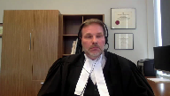
:::

What if the

**Justice Brown** (00:41:05): contract affirms the positive covenant and carries the positive covenant down to success of owners.

::: {.column-margin}
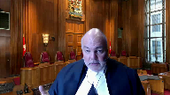
:::

So you're not gonna have conduct in that case.

You're not gonna have conduct that's inconsistent with the positive covenant.

You're gonna have conduct that's consistent with it.

And as I follow your argument, well, that's never enough to demonstrate a contract because well, that's just the positive covenant working.

This is property law, not contract law.

**Speaker 1** (00:41:33): It is ultimately the question of whether or not the parties exercise of those rights, if they are entirely consistent with the exercise of property rights, then yes, there could be no intention to enter into a new agreement because there would be no reason to.

::: {.column-margin}

:::

All of the rights that the Stratocorporation in this case wish to enjoy-.

**Justice Brown** (00:42:00): subsequent owner there's a reason to because the covenant didn't run with the land.

**Speaker 1** (00:42:05): In this case, the strata corporation, of course, doesn't understand that the covenant doesn't run with the land.

::: {.column-margin}
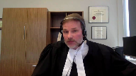
:::

But if other an example of where there may be conduct that would support this is in this case, of course, which I say should be rejected with the Court of Appeal said, Well, look, we do have this indicia of other conduct being the bylaw.

That might be an example.

But in this case, of course, I say the bylaw wasn't indicia because the trial judge had already interpreted that meaning if the trial judge had concluded otherwise, that the strata corporation by its bylaw had jumped in or behaved in a manner that it wasn't required to behave based on the easement, then that may be evidence of an intention to be bound by a new agreement.

**Justice Brown** (00:42:55): Thank you.

**Speaker 1** (00:43:00): So in my submission, the trial judge, and it was open to her ladyship to find that the Strata Corporation was acting on the easement, and I submit they were, and that it was objectively reasonable for her to reach that conclusion to explain what had occurred in this case.

::: {.column-margin}
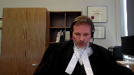
:::

The Court of Appeals reliance on Phelps, and which in my submission demonstrates the failure to draw the distinction between the creation of property rights and contractual intentions, is set out in at tab three of the appellant's record, the Court of Appeals reasons.

At paragraph 40, which is page 42 of the appeal record.

The Court of Appeals says this, in my view, insofar as the law with respect to pre incorporation contracts is concerned, this case cannot be distinguished from Phelps holdings.

And in my submission, that was an error, because the Court of Appeal did not recognize that this case was entirely distinguishable from Phelps, because as I mentioned previously, Phelps had the underlying requirement of the Hinehouse principles that the only explanation, the only explanation for the Stratocorporation's title and possession of the Lot A, Lot B lands was the pre incorporation transaction, which was establishing contractual rights.

That was the only explanation.

And that's not our case, where the explanation here is the exercise of property rights by the Stratocorporation.

I've made my point.

**Justice Abella** (00:45:15): Sorry, can I just ask you a quick question?

::: {.column-margin}
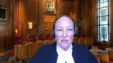
:::

The Court of Appeals set aside in part the finding of the trial judge that the only reason it didn't feel itself bound was because of a mistake and they said the mistake she found was only in their post 2007 conduct, not in the years previous.

What's your position on on that?

Because if you take mistake out of it then its conduct she found I think inferentially otherwise supported the suggestion that they were objectively, manifestly, evincing an intention to comply with the terms of the ASP agreement.

**Speaker 1** (00:46:02): It's apparent from the trial decision that there was very little evidence available to the court about what transpired post-subdivision and when the Stratocourt Council began to function with individual owners.

::: {.column-margin}
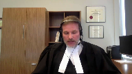
:::

The reason for that is the developer sale of the strata lots was slow.

And so there was very little evidence before the trial judge to reach much of a conclusion about what the parties were doing and attending prior to the time, in particular when Mr. Rupra became a Stratocouncil member.

But that doesn't, in my submission, alter or take away from the appellant's submission that if even prior to 2007, the Stratocorporation was parking in the parking facility, paying parking fees.

All of that is being done in my submission based on the property rights that had been granted to the Stratocorporation.

It seems to me hard for the respondent to argue that it would have been unreasonable for the Stratocorporation or any of the owners post-subdivision to conclude that the easement that charged the common property, that created expressly certain rights and obligations, were not there to be acted on as a matter of law.

And in fact, the respondent at trial, at the Court of Appeal, and in this court, continues to argue that the covenants expressed in the easement are binding.

And so it would be a strange pass that the court would conclude that it wasn't reasonable for the straddle out owners to perhaps reach the same conclusion that those easements were binding.

So whether we look at the time period where post-subdivision, where we had little evidence or no evidence of what was truly going on, and post-2007 where the Council and Mr. Rupra are now governing the Stratocorporation so they can express the thoughts of the ownership, it amounts to the same thing.

All of the conduct is explained by the property rights and not a contractual intention.

So unless there's any further questions regarding the pre-incorporation transaction principles in my submissions that they did not apply on the facts of this case, I'll move into the rule in Osterberry, which in some ways, the principles tend to blend between themselves, or at least the argument seems to blend in a lot of ways because it's so dependent on the benefit and burden analysis.

It is settled law that of course the enforcement of a negative covenant lies in property, and the enforcement of the positive covenant lies in contract.

And I'll put aside for the moment, the idea of the conditional grant.

The question is whether or not the principles in Hinehouse, which purported to allow for the enforcement of a positive covenant against the successor in title should be permitted.

Following, and I make this point in my fact, following the decision in Osterberry, the courts have been jealous to guard against any exceptions that would interfere with the court's conclusion that only negative covenants would be binding on successor in titles.

The courts have rejected in Nerman clauses, covenants that required agreements after the fact, acquiescence or conduct have all been rejected by the case authority and I've cited many of them already in my discussions dealing with Hinehouse.

Similarly, the benefit and burden and conditional grant exceptions have been largely rejected in Canada, although the responded in this case, urges this court to perhaps adopt a variation on the conditional grant exception which was signaled by the Ontario Court of Appeal in Amberwood.

In my submission the Hinehouse test, and that line of authority is grounded heavily in the principles of benefit and burden.

It's the acceptance of the benefits that the court looks to to say that the burdens cannot be ignored.

And as a matter of contract law, there's authority for that, at least in the Hinehouse line of cases.

But the pre incorporation transaction terms turn the enforcement of a positive covenant against a successor in title into really a search for notice, a conduct, and a search for contractual intention and disregards or walks past the property law interests that are established by the agreement, and of course, the land registry system that all of our provinces rely on to inform property rights.

And in my submission, there exists very little daylight on a principal basis between the decision in Roan and Stevens, and the application of the pre incorporation transaction and I set out that argument in the factum.

It can hardly be said where in Roan and Stevens where the parties expressly contracted to bind successors in title, the successors in title took the benefits under the easement for a period of time.

So there's, there's very little difference between those circumstances, and the Hinehouse principles, the only difference being is that Hinehouse was established for corporate bodies in a commercial setting, and its application is really restricted to corporate bodies like BC companies.

**Justice Brown** (00:53:27): Well, well, so you say.

**Overlapping speakers** (00:53:31): Yeah, yeah, so I say just yeah.

**Justice Brown** (00:53:34): You'll come to that point, I know, but that's as to whether the common law of pre-incorporation contracts apply, but you'll get there.

::: {.column-margin}
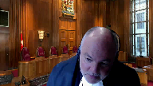
:::

But when you do get there, maybe bear in mind that I'm struggling to understand why in a statutory regime that expressly contemplates the possibility of pre-incorporation contracts, Section 10, for example, why the common law of pre-incorporation contracts shouldn't apply.

It seems to me to follow.

**Overlapping speakers** (00:54:10): I'm sorry, Section 10 of what legislation?

**Justice Brown** (00:54:13): Section 10 of the Strata Property Act, which contemplates, it says that there's no contract or transaction may be entered into by or on behalf of a Strata Corporation with an owner developer.

**Overlapping speakers** (00:54:24): Yes.

**Justice Brown** (00:54:25): person who's not.

::: {.column-margin}
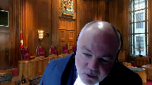
:::

And this is in the period after the first conveyance of the strata property, a strata lot before the first AGM.

Right, so that contemplates that even before the delivery of the first strata property of the first strata lot to a purchaser, you're going to have pre-incorporation contracts being entered into on behalf of the strata corporation.

And I mean, that if that's the case, then why would the common law pre-incorporation contracts not apply?

**Speaker 1** (00:54:55): In my submission, Section 10 does not do that at all.

Section 10, of course, it is true, is treating differently the developer's ability to contract prior to a conveyance of a straddle lot.

**Overlapping speakers** (00:55:11): Right.

**Speaker 1** (00:55:11): Section 10 operates with the existence of the strata corporation.

::: {.column-margin}
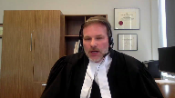
:::

It's not dealing with a contract at all that was entered in prior to the subdivision.

It's dealing with contracts that a developer may intend to enter into on behalf of the strata corporation after it exists.

That's a dramatic difference in my submission.

**Justice Brown** (00:55:36): Isn't there sort of, there seems to me to be a certain unreality to the argument that a developer cannot contract on behalf of strata corporations before incorporation.

::: {.column-margin}
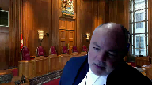
:::

I mean, they're first on the scene.

They're the only entity capable of taking necessary steps like obtaining occupancy permits and negotiating shared facility agreements, that kind of thing.

I'm struggling to understand the resistance to the idea that a developer cannot enter into pre-incorporation contracts on behalf of strata corporations.

It seems sensible.

**Speaker 1** (00:56:18): Well, there's certainly no need for it to occur, and I'll make this point.

**Overlapping speakers** (00:56:27): Yeah, I know.

I'm getting you off your game plan.

I'm sorry.

**Speaker 1** (00:56:30): it invites mischief and the developer has many tools available to it in organizing the interests of the strata corporation and of course once the developer deposits the strata plan it continues to have in many cases or if most cases control of the strata corporation subject to the requirements of the act and the prohibition against contract once an individual owner comes it takes takes a conveyance but the developer if it if it wants to create contracts of the kind that you're describing justice that can all be done post incorporation it can all be done I mean the the development permit of course has nothing to do with the strata that's something for the developer similarly the occupancy permit is a developer driven need and not a strata corporation driven need although it sure would like an occupancy permit the the other things dealing with the governance of the strata corporation like who will cut the grass who will who will who will deal with my elevators who will manage my strata corporation all of those things are dealt with and can be dealt with and should be dealt with after the deposit of the strata plan and the developer can can make that election provided it complies with all of the obligations that are set out that legislation

::: {.column-margin}
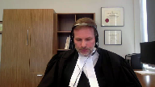
:::

what what what the pre-incorporation transaction

and we're getting we are getting ahead of it

but I want to finish this thought invites the developer to do is to enter into this transaction pre-incorporation hand it off hand it off to the owners who will of course populate the strata corporation and generally behave in the manner that the developer has set up and then by that behavior somehow adopt a pre-incorporation transaction that the developer had arranged previously that's part of the mischief that I'll discuss later

so what is objectionable in my view in my submission with respect to the Hinehouse principles and the rule in Osterberry is that it imports into the equation although I I accept that it's a it's a

it's it's a search for contract

but it's a search for contract in in a way where the courts now looking to all of the things that the court has previously rejected in property law cases like conduct and yearnment clauses acquiescence and and all of those ideas in the strata property setting in my submission the arrangement is even more objectionable because it purports to really bind individual strata lot owners to a charge forevermore and the respondent makes the point

well owners can come and go and elect or not to elect to purchase this property that may have this unfavorable characteristic

but that's the very point and what that has been the objection of the positive covenants is that the court has not wanted land interest to be charged with all manner of interests that would carry on and charge land forevermore against successors and title and with a strata property unlike other cases the strata corporation being merely a vehicle to organize these land interests you do have those constant successors and title that are being that are being their titles are being affected by this unique charge in this case an obligation to pay for operating and capital expenditure for a parking facility finally dealing with the rule in Osterbury I want to deal with the conditional grants and benefit-burden argument Parkinson and Reid in my submission deals with the one issue which the appellant says really makes the conditional grant of no consequence to its obligation if there is one to continue participating in the parking facility

and I referred to this earlier but just to remind the court it appears a tab 10 of the appellants condensed book and page 29 of the condensed book where the Supreme Court of Canada was looking at this the really what was a benefit and burden principle and Parkinson and Reid has been equally referred to on the conditional grant side for this proposition that assuming so long as the appellants made use of the mat last mentioned was a party wall they were bound to keep the stairway in repair they cease to be under any such obligation when they no longer made use of the respondents wall similar point was made in Ronan Stevens where the court said if you want to enjoy enjoy the benefit then pay

but if you want to keep your money relinquish the benefit if that law exists in my submission it's a complete answer for the appellant to say in this case at relinquished relinquished its use of the parking and so whatever conditional grant or benefit and burden principle apply doesn't apply to continue to bind the strata corporation forevermore they paid their freight up to the date they stopped using the parking the quarter the trial judge made that finding and now they're not asking to receive something that they're not paying for and then finally with the remainder of my time which I'll deal with the pre-incorporation transactions and stratus

so in my submission and the the strata property act creates a comprehensive framework to organize the interests of individuals who acquire strata titles as found in our by our Court of Appeal in the Timberline decision which is at page 37 of the condensed book the strata property act as consumer protection legislation it also serves to establish a clear set of rights for the creation the registration and transfer of strata titles and for the delineation of the respective rights and responsibilities of those who develop strata plans and those who purchase them the strata corporation by its nature is not a business corporation and the Court of Appeal in Hamilton versus ball which is at page 7 of the condense condensed book makes this observation about the legal construct known as a strata corporation in BC the the owners of the strata lots are the members of the corporation but it does not have share capital and the members are not shareholders nor do members enjoy limited liability as do shareholders of ordinary companies section 166 sub one of the act although the phrase of the strata corporation may be confusing other provisions of the act confirm that the common property and common assets are held and owned directly not through the medium of the corporation but the by the owners in proportion to their respective unit entitlements so in in this sense that the primary function of the strata corporation is to organize land interests and to create a governance model for the sharing of property rights

**Justice Côté** (01:05:14): Mr Hamilton but I understand that a strata corporation is not a business corporation but does it make a difference here because the strata property act in section 2 and section 38 specifically provides for a strata corporation to enter into contracts.

::: {.column-margin}

:::

**Speaker 1** (01:05:34): Yes and the respondent makes that same argument but in my submission it really is a straw man argument.

The submission.

**Overlapping speakers** (01:05:43): Am I a straw woman?

It's a straw woman.

**Speaker 1** (01:05:46): The Strata Corporation and the appellant in this case does not say that the Strata Corporation cannot enter into a contract, and the Strata Corporation may enter into that contract in a variety of ways.

**Overlapping speakers** (01:06:03): Thank you so much.

**Speaker 1** (01:06:03): But what the appellant says in this case, is that the Hinehouse principles stand on a very different footing.

::: {.column-margin}
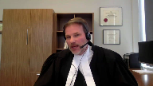
:::

It's they stand on a footing where owners by their conduct are brought into a pre-incorporation transaction and a negotiation of which they are strangers.

**Overlapping speakers** (01:06:27): Okay.

**Speaker 1** (01:06:27): which they are strangers and so I don't say for a moment and it's it's clear on the legislation and the case law that a strata corporation may be found bound by oral agreements or agreements that are found both written orally or in writing but that's a vastly different thing in my submission than the principles in Hinehouse.

::: {.column-margin}
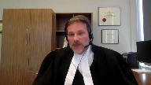
:::

**Overlapping speakers** (01:06:53): Hamilton, unfortunately, your time is up.

So I would ask you maybe to make a final sentence or conclusion.

**Speaker 1** (01:07:01): For whatever reason, I did not get a countdown, Chief Justice, my apologies.

::: {.column-margin}
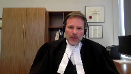
:::

So my final conclusion is this, is the pre-incorporation transaction is inconsistent with the primary objects of the Act.

And if we accept that the primary objects of the Act is consumer protection, creating a clear set of rules so that individual owners understand the rights that they're supposed to be receiving, the pre-incorporation transaction dramatically interferes with those objects.

Thank you.

**Justice Wagner** (01:07:32): Thank you, Mr. Hamilton.

::: {.column-margin}

:::

At this time, we'll, so we'll take our afternoon break and we'll be back in 15 minutes.

Thank you very much.

Mr. McMillan, you will argue your case by audio only because apparently you lost your video connection.

So Mr. McMillan, the floor is yours.

**Speaker 2** (01:08:08): Justices.

::: {.column-margin}

:::

Thank you Chief Justice and Justices.

I would like to touch briefly on two points and the first picks up on the exchange between Mr. Hamilton and the court concerning the interplay of property law and contract law.

And secondly the fundamental difference between pre-incorporation contracts as they apply to regular corporations and strata corporations.

On the first point Justice Abella asked if a pre-incorporation contract could not exist where there's a positive covenant.

And Justice Casir and Justice Brown had questions along that theme

and I hope to provide some assistance.

Charges on land pose a particular problem.

The charge will often include obligations of payment and we know from Heritage Capital and the Land Title Act that such obligations do not run with the land.

That however does not mean that the charge is unenforceable.

Certain rights such as easement rights and other property rights continue to run with the land.

So thus the question becomes when we're dealing with these sorts of pre-incorporation contracts is what is the contract?

What is a strata corporation paying for?

And in such cases the consideration being provided to the strata corporation is a right that the strata corporation already has by way of property rights.

And pre-incorporation contract law ought not to be used to create a contract where none exists.

Pre-incorporation contract law works such that a successor can reject the contract.

That is an accepted part of that law.

The corporation can not accept it.

But that would have no impact on its pre-existing rights.

So a strata corporation could in theory immediately upon formation reject the contract but it would still continue to have any property rights provided through charges on title.

So using compliance with the unenforceable positive obligations to create a contract is as the trial judge said a trick.

A strata corporation ought not to be able to be tricked into a contract and that highlights the fundamental difference between the application of the common law of pre-incorporation contracts to regular corporations and strata corporations.

Insofar as regular corporations are concerned pre-incorporation contract law prevents a corporation tricking its way out of a contract by relying on privity.

In the strata context it operates to trick a strata corporation into a contract and the common law should not operate that way.

One who pays for something that he is already entitled to ought not to by virtue of that unnecessary payment be bound to continue to pay for it.

On the second point the law of pre-incorporation contracts was created to solve a problem.

A party could exploit privity of contract to accept contractual benefits without paying for them or escape contractual obligations altogether.

Party A would contract with party B with the idea that it would bind a corporation to be formed that is C, party C. Pre-incorporation contract law protects the interests of party A from a rogue party B who upon creation of the corporation disavows the contract and that's really what Hinehouse was about.

The corporation wasn't permitted to take a two hundred thousand dollar boat without paying for it.

Mr. Hinehouse, party A, was in need of protection in pre-incorporation contract law provided it.

The strata context is fundamentally different.

The parties with the ability to exploit the situation and the parties in need of protection are not the same.

The BC legislature has made a claim that purchasers, the principles of the corporation, are the ones in need of protection.

In cases of developers self-interested contracts they are in need of protection from both party A and party B, the parties to the pre-incorporation contract.

**Overlapping speakers** (01:11:56): And this is a...

**Speaker 2** (01:11:56): fundamental difference in the interest at stake.

::: {.column-margin}

:::

Pre-incorporation contract law protects a party that purports to contract with the corporation yet to be formed.

Conversely, in the strata contract text, the law protects the principles of the corporation.

The difference is stark in terms of who requires protection from whom.

Privity protects the strata purchasers.

The common law of pre-incorporation contracts for it to apply tears that away.

Now Justice Brown raised a concern about a developer entering into a pre-incorporation contract and the developers role in getting a strata corporation set up.

There may be ways a developer combined a strata corporation to such obligations.

Assignment and assumption agreements is one example and it should utilize those ways.

It should not be able to fall back on pre-incorporation contract law to get around proper compliance with those other methods or to fix its own mistakes in failing to follow through with them.

And none of this is to suggest a strata corporation can take a benefit it would not otherwise be entitled to without paying for it.

The question is whether it can be bound to a contract.

With the consideration flowing to the strata corporation occurs at a moment in time this distinction becomes less relevant.

To apply the facts in hind use, the strata corporation can either keep the boat and pay for it or return it.

But where the consideration is ongoing such as a service contract or easement rights this distinction matters.

And in my submission there's no good reason why a strata corporation should be bound to continue to pay for a service or right.

It doesn't want unless it has expressly bound itself to that contract.

Subjects to questions, those are my submissions.

**Justice Wagner** (01:13:38): Thank you very much, Mr. McMillan.

I will now invite...

**Justice Abella** (01:13:44): Sorry, Chief Justice, if I could ask your indulgence, I have one question, Mr. McMillan.

::: {.column-margin}
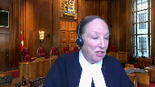
:::

What in your view is the effect of Section 2, which says a strata corporation has the power and capacity of a natural person of full capacity in the Stratas Property Act?

And Section 38, which says a strata corporation has the capacity to enter into contracts in respect of its powers and duties and bylaws.

So what your argument is, it's so different, so don't look at property law, contract law the same way.

What do you make of these two contractual provisions in the act and how does that affect your argument, if at all?

**Speaker 2** (01:14:26): Well, I think that doesn't speak to the property law rights, contract rights.

**Overlapping speakers** (01:14:31): Thank you.

**Speaker 2** (01:14:31): What I think it speaks to is whether the common law of pre-incorporation contracts ought to apply in the strata context, because...

**Overlapping speakers** (01:14:43): As I say, there's a lot of work to be done to make this happen, and I think it's going to be a lot of fun.

I think it's going to be a lot of fun.

**Speaker 2** (01:14:44): the common law of pre-incorporation contracts was created to resolve a particular problem that arises and does not arise in the strata context.

::: {.column-margin}

:::

So it's the fact that a strata can create contracts, you know, I obviously take no issue with that.

But the question is, should the common law of pre-incorporation contracts apply in the strata context or not?

And as I see it, those sections don't do any violence to, you know, or not applying pre-incorporation contract law principles does no violence to those sections.

**Justice Abella** (01:15:20): Thank you.

**Justice Wagner** (01:15:21): Thank you very much.

I will invite Mr. McEwen on behalf of the respondents.

**Speaker 3** (01:15:33): We're just adjusting the camera, Chief Justice.

I've elected to stand as.

**Overlapping speakers** (01:15:40): Very well.

**Speaker 3** (01:15:40): Thank you.

::: {.column-margin}
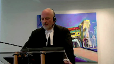
:::

Chief Justices of the Court, I will make my submission with reference, subject to any questions, to my condensed book and my factum, and I intend to organize it with reference to four central points.

First, I will outline the statutory framework and place the contractual issue before the court in that context.

And my essential submission will be that the pre-incorporation contract issues can be set aside in favor of a simple question of whether the Stratocorporation, after its incorporation, adopted the covenants in the airspace parcel agreement.

Now within the statutory structure there are three parts that I will have reference to.

Firstly, the statutory structure, and there are three or four statutes involved, provides for an owner developer to establish a framework for a municipally approved complex development scheme using airspace parcels and an airspace parcel agreement.

And while there is an airspace parcel agreement in this case, and in most cases, the owner developer is the only operating mind in relation to the various airspace parcels, all of which are owned by the owner developer.

Secondly, the statutory structure allows the developer to subdivide one or more airspace parcels by the filing of a strata plan.

That filing creates the Stratocorporation of which the developer is the initial controlling mind and management.

The situation arises where the developer is the operating mind in two capacities, qua developer and in relation to the other airspace parcels, and as the initial mind of a Stratocorporation.

The third aspect of the statutory structure, and this is where I say pre-incorporation contract principles which have been canvassed extensively in the factums or in apt, is the Real Estate Development and Marketing Act and the manner in which individual purchasers are brought to the structure the developer has created.

They do not contract through the airspace parcel agreement.

Instead, there is a statutory disclosure statement that must make disclosure of all material facts concerning not simply the unit but the development, including use, including parking fees expected, all material facts.

There is no suggestion before this court that the developer which preceded my client did not make proper disclosure.

Importantly, those contracts cannot be executed, cannot be completed until after the strata plan is filed and the Stratocorporation is created.

It is that point that the two contractual streams converge, the Stratocorporation created, the structure created, and after proper disclosure the individual unit holders come and populate the Stratocorporation.

The other three points that I will make and organize my submissions I can state somewhat more briefly.

I will answer specifically the issue of the contractual intent of the Stratocorporation.

In my submission, first and foremost, the statute essentially resolves the traditional pre-incorporation contract issue by making the developer the first member of the Stratocorporation.

There can be no serious debate but that the intent, and I will show the court the covenants in the airspace parcel agreement, that the intent of the developer qua airspace parcel owner and developer and the intent of the developer in erecting the structure of the Stratocorporation is one and the same.

Following on that, I will make reference to the objective evidence relied on by the Court of Appeal and I will support before this court the analysis of Justice Wilcock and the Court of Appeal building on Phelps and Hindhouse.

The third point I will briefly refer to is the mistake seemingly argued by the appellant as it has evolved.

Notably, of course, the reliance on Osterbury was via an amendment to the pleading and as noted in the Court of Appeal judgment, there were many years of paying in accordance with the airspace parcel agreement and as one must presume the disclosure to individual unit holders to have been entirely consistent with an understanding of their contractual relations.

In my submission, in addition to being consistent with the contract, it would be most inequitable if in the circumstances of the disclosure and no evidence that the legitimate expectations of the parties was other than to pay for parking for the appellant to escape its obligations.

**Justice Rowe** (01:21:33): Yes, just a very quick point there.

::: {.column-margin}
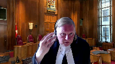
:::

I mean, it's one thing to say, it's going to cost you $800 a month to park here.

That's very clear.

It's another thing to say, here's a very complicated formula.

And it's actually extremely difficult to ascertain how much the obligation is in dollar terms.

That, it seems to me, is sort of a little up the sleeve on the developer's part.

**Speaker 3** (01:22:05): Well, Justice, one might, that being the case, and I won't debate the premise, but that being the case, one might have issues with whether damages should arise, whether there was a misrepresentation in the obligation, but none of it changes in my submission or goes to the issue of the contractual formation through the intent and actions of the parties.

::: {.column-margin}
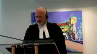
:::

What really happened here is many years on, a particular member of the Strata Council took issue with the terms of the contract.

That is a different thing than whether the contract was properly formed in the initial and many years of ongoing conduct.

And lastly, I will submit briefly that the conditional grant exception to Osterbury ought to be adopted by the court, excepting, of course, it is not presently the law of Canada, and for purpose of my initial summary, I am going to take the court to the provisions.

In effect, the Strata Corporation and its contractual obligation is a partial solution to the Osterbury problem, but I will nevertheless briefly submit that the complexities and problems caused by there not being a conditional grant exception, a benefit burden exception to Osterbury, are in fact otherwise demonstrated by the nature and content of this litigation.

If I can turn in some more detail then to the nature of the statutory framework, and I obviously won't canvas that in detail, but my first point is that to facilitate the creation of complex development structures with which we have all become very familiar, and to do so in compliance with municipal planning and zoning requirements, as well as affecting a commercial ends, a structure has been set up in British Columbia that is embedded in the airspace parcel agreement.

And there are three points essentially to make from it, and the applicable provisions are in the condensed book.

I'll give the references, but I don't plan on turning them all up.

The first piece that is embedded is the ability of an owner to create airspace parcels out of one lot for purposes of creation of a development structure, and that's really what the airspace parcel agreement is, and I'll take the court to that.

The second, and the reference to that is at section 141 of the Land Title Act, which is at the condensed book, page 20.

Second, those provisions also allow further subdivision of an airspace parcel in accordance with the Strata Property Act, and the point that arises in my submission is one way that the creation of a strata must be viewed in this context is as part of creation of the overall development structure.

And thirdly, in a reversal of the common law rule that to have an easement, one must have different parties as the dominant and servient tenements, section 18.5 of the Property Law Act, which is at page 17 of the condensed book, allows an owner, and it's clearly for purpose of creating these schemes, to grant easements as between the air parcels, notwithstanding there is one owner, to create the necessary structure to meet municipal requirements and to fulfill commercial requirements.

All of those are seen in the airspace parcel agreement, and I wish to run briefly through some of it, and one thing I want to pick up on specifically that arose out of my friend, Mr. Hamilton's submission, is that I take some of the

And I will take the court to those as they pertain to the issues before the court is adjourned.

**Justice Rowe** (01:29:23): That was a transaction for value and you can say it was a commercial transaction, of course it was, but it was certainly not an arm's length transaction, was it?

**Speaker 3** (01:29:35): I understand, in fact, that it was not withstanding the similarity in names, Justice.

My client was not associated with the developer.

And lastly,

**Justice Brown** (01:29:51): Presumably, if they were associated with the developer, CRA would have looked at that claim of what was it, a loss of $11 million. Yes.

Right.

**Speaker 3** (01:30:02): I would have thought so, but my understanding on the record is that my client is not associated.

::: {.column-margin}
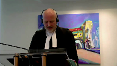
:::

There was simply a purchase of the parking facility based on, in reliance on these arrangements.

If I can take the court with that, if I might, I'll jump ahead.

I don't want to spend too much time, but I think it's instructive to put the document in that.

So this is, if I can put it this way, all developer and the pre-incorporation contract issues that arise with the counterparty, and then on the other side, what's going on is the separate stream of marketing of development units once in accordance with the Real Estate Marketing and Development Act.

Once this is far enough along, deposits can be taken, but none of that can happen and close until subdivision.

And individual unit holders are protected through, and it is consumer protection legislation in part, if not mainly, by having to know everything that's going on in the development, not just their unit, such as the parking fees that the strata they are members of will be required to pay.

If I can take the court with that ahead, please, to page 58 in the condensed book, which is page 37, 58 in the condensed book, 37 in the airspace parcel agreement.

Under 7.5 is the parking and access rights begin.

And as I will show the court, these eventually devolve onto, for the benefit of individual unit holders.

If I can take the court over to the bottom of page 59 of the condensed book, and here is one of two or three provisions I'm going to highlight as to their obvious contractual purport.

And under D at the bottom, in consideration of the ASP 5 owner granting the access and parking rights to the parking facility participants, each parking facility participant, excluding the ASP 6 owner, covenants to pay an annual parking fee.

So that's a start of it.

If I can then take the court to the two provisions that address subdivision specifically.

And the first is on page 63 of the condensed book, page 42 of the airspace parcel agreement.

Under H near the top subdivision by strata plan.

Upon subdivision of any parcel by a strata plan, the strata corporation so created, and that is the nature of the creation.

It's the filing of the plan, a corporation arises, shall be entitled to give all permissions and consents permitted to be given by the owner of the parcel so subdivided.

And then this, and the strata corporation, the strata corporation shall be responsible for payment of the parking fee and allocating and administering the parking rights amongst the strata lot owners within such parcel and the provisions of section 16 three, thereby shall apply.

Now I'll pause and say this, make this submission.

What is going on and is amplified later in part is that the strata corporation itself is covenanting or is going to be asked to covenant to pay the entirety of the parking fee, not withstanding the easement, the negative obligation goes with the land to the users within the strata corporation.

Effectively, this is a at least partial answer to the Osterberry problem.

Owners can come and go and buy and sell.

It is at least anticipated that the strata corporation will be enduring.

In my submission, what the document is doing is creating a contractual obligation that it expects the strata corporation to take on, to try and create stability and certainty in the integrated structure, notwithstanding individual owners may buy and sell.

**Justice Martin** (01:34:49): May I ask a question here, please?

Understanding that argument, what, if anything, are we to make of the fact that the Strata Corporation never, in fact, entered into the contemplated assumption agreement?

**Speaker 3** (01:35:06): I say two things primarily about that, Justice.

::: {.column-margin}
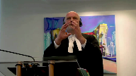
:::

Number one, I say that that would have provided further evidence of an independent contractual obligation that arises through the developer's creation of the Stratocorporation and intent, number one, and number two, by the conduct and carrying it on.

The second thing I say about it is in all the circumstances, and I'll come to this in a bit more detail, there really is no choice, if I can put it that way.

The structure and the disclosure, the intent of the developer, which is on both sides of the transaction, what solves, means that the contract is there.

It would not have been a legitimate choice for someone who purchased a bundle of rights and understood that there were going to be these parking fees to say, well, I'd like this part of my bargain, my contractual bargain, but not that part of my contractual bargain, so I'm going to cause the Stratocorporation to renege.

**Justice Brown** (01:36:09): Mr. McKeown, I was curious about that too.

Is there any indication in the record why the assumption agreement never happened?

**Speaker 3** (01:36:16): No, just a finding that it didn't.

I think the passage of time, I think we suffer from, in this case, a little bit justice.

We don't have justice, we don't have justice,

**Speaker 3** (01:36:26): of the purchase contracts and so forth.

It all starts in 1999 and it carries on for many, many years.

**Justice Brown** (01:36:33): Okay, thank you.

**Justice Rowe** (01:36:34): I can give you a very plausible explanation.

::: {.column-margin}
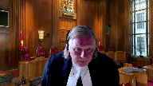
:::

It was an oversight at closing, because this is the sort of thing that would ordinarily take place in the closing.

Somebody just missed one of the things they were supposed to do, and afterwards you say, ah, well, it doesn't matter they didn't sign.

By their conduct, they adopted it.

And that's why we're here today, I think.

**Speaker 3** (01:36:58): I certainly think that's correct, Justice, that's part of it

::: {.column-margin}
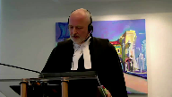
:::

and I guess something else I'd say sort of building on that in the materials.

Professor Ziff notes that in this area of law and he's talking a bit more directly about Osterbury, one of the things one sees is people having various sort of fixes to try and ensure things are tied down.

My primary submission is by virtue of the statutory structure which puts the developer on that side to implement it and then the conduct, this would be a belt and suspender sort of thing if that had got signed as well and that there was really no option but to sign it given the entire scheme had it had it been put down at closing and it would have been the developer that signed it.

If if I could go one more place in the in the airspace parcel agreement and that's to page 80 and I wish to just touch on two clauses on page 80 that's condensed bookmarking page 60 of the airspace parcel agreement and again these are clearly contractual covenants it is the link to so that the strata corporation is used in the way that has been described and it says upon subdivision of any parcel the strata corporation so created by the subdivision shall perform and observe the subdivided lot owners covenants herein at the expense of the strata lot owners so there is an intention on the developer side clearly that there would be contractual rights created the assumption agreement that couldn't be found is in two but it was an intended obligation and three be entitled to give all permissions and covenants permitted to be given by the owners so there is an aggregation and part of it i'm going to submit has to do with possible osterberry problems in the in the stable uh in in the stable strata corporation to carry out positive covenants on behalf of strata strata lot owners

**Overlapping speakers** (01:39:23): I'm sorry, what page were you referring to there?

It's at page 80 of my condensed book, which is page 60 of the Airspace Parcel Agreement itself.

Thank you.

**Speaker 3** (01:39:32): you.

::: {.column-margin}
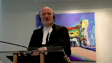
:::

And so this is registered.

It is said that upon the filing and creation of the Stratocorp, these are shells by the Stratocorp.

And again, say it one more time, the Stratocorp for all purposes in that moment is the developer.

And the obligations carry on.

So aside from the evidentiary gap of the assumption agreement, in my respectful submission, unless one said that the developer who is now two parties is also of two minds, the statutory structure just creates the interface that allows the matter to go forward.

**Justice Côté** (01:40:16): Mr. McEwen I have a question. Yes.

How should we see the 2008 by-law?

**Speaker 3** (01:40:25): In my respectful submission, and the submission was made in the Court of Appeal, the Learned trial judge simply erred in its plain construction, and the 2008 bylaw is itself a confirmation of adoption of the terms.

::: {.column-margin}
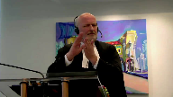
:::

And if I might use that justice to say this, I mean one of the, I'd say, sort of extreme edge of the appellant's submission is they would simply say, well, even if you construe it that way, that was a mistake too, because we just assumed this is a matter of property law.

And it really, in my submission, points up the absurdity of the appellant's position.

It's almost no matter what was done, the answer is going to be, well, we didn't know about the rule in Osterbury and we could have abandoned the legitimate expectations of the parties.

But I do say that there's palpable an overriding error in its construction.

It's plain what it says.

**Justice Côté** (01:41:30): Thank you.

**Justice Kasirer** (01:41:32): Mr. McKeown, can I stop you?

::: {.column-margin}
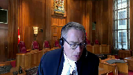
:::

Just to finish on 16.3, you made an allusion to Osterberry, but if we look at the nature of the undertaking of the Strata Corporation there, is this in personam or in rem, this undertaking?

**Speaker 3** (01:41:53): Part of the subdivided lot owner's covenants are also there is a payment obligation that would run and you put this together and I probably should put it that way with the clause we've already been to that says the strata corporation will make the payment of all amounts notwithstanding the easements aren't on common property for example that is a way of making sure that the obligation endures and it's in that sense

::: {.column-margin}

:::

I mean it because that's one of the problems with Osterberg.

The last thing I want to take the court to is on the same page from this and it's a bit of a different point but at 17.3 there is a attempt to say that all covenants shall be covenants the burden of which shall run with each parcel as applicable and bind each parcel as applicable and shall attach thereto and run with each and every part into which the same were subdivided consolidated

but no part of fee in my submission that language is broad enough and does capture positive covenants the fact that the matter is by law that's not enforceable at this stage

but I draw it to the court's intention because if the court is minded to create a conditional grant exemption there is an express intention to kind of take that up and seek to have the positive covenants run with the land on the factual record before the court.

**Justice Brown** (01:43:35): I don't know, I mean, you'll get there, but I mean, you've got a contractual way, according to you, of working around positive covenants rather than some ad hoc, you know, interpretation tool.

::: {.column-margin}
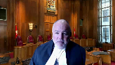
:::

And you've got the UK House of Lords saying in Ronan Stevens that enforcement of a positive covenant is a matter of contract.

You don't need the conditional grant argument, do you?

**Speaker 3** (01:44:02): Well, I say I certainly don't in the current circumstances, Justice, and that's correct.

::: {.column-margin}
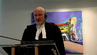
:::

I mean, one way of viewing it may be to say, well, this isn't really the case for it, but I think there's something that strengthens it a bit, perhaps by way of avoiding contractual arguments and litigation like this, if it were simply enforceable, but I will come to that.

I'm not spending a lot of time on it because of the point you make.

Really, this is resolved contractually in my submission to in my client's favor.

I will move along.

I don't need to say too much more.

It is section 10, which Justice Brown also referred to in the earlier sections of the Strata Property Act, which put in the hands of the developer, the Strata Corporation at the outset in which interface.

I do want to pause there and say something briefly about this notion that somehow there's some trickery and particularly in the intervener's factum or something untoward of that, about that.

What we have before the court is a legislatively structured development scheme, statutory scheme, which provides for the developer to have that role at the outset and for a purpose.

The developer has fiduciary duties for so long as the developer is in that role, but it simply doesn't avail in that context to suggest that there is something wrong or that the court should be minded not to give effect to that structure because developers will be developers.

The protection for individual lot owners is found in their contracts and found in their disclosure statements.

It is found in the rights of rescission and the rights of damages given in REDMA.

If there are any misleading statements and those disclosure statements are a matter of some detail and they are filed with the superintendent of real estate.

That is really where the remedies arise and there is no basis to not give effect to the development scheme based on such considerations.

In my respectful submission, it then comes to this.

The legitimate expectations of the developer and to some extent the municipality, although I don't say that the municipality would be terribly concerned with the commercial arrangements respecting parking, but it does form a section 219 on covenant on land respecting an integrated development and parking generally is a consideration.

The legitimate expectations of the developer and the municipality are reflected in the airspace parcel agreement, which is registered on title.

The developer carries that forward to deposit a strata plan.

There's the creation of a strata corp and the intention is left with the developer to be the strata corp and to have the intention to carry the matter forward.

The legitimate expectations of the individuals who become members of the strata corp and my friend is quite correct, it's not via share capital, they're tenants in common and they share through a management strategy.

Management structure is as reflected in the disclosure statements made to them, the airspace parcel agreement, which is available to them and in the contract that arises.

The notion of a mistake because of a lack of understanding of the rule of Osterberry would be to frustrate the legitimate expectations of all parties to this transaction.

There are commercial complaints about the interpretation of one of its provisions, but that is something very different, very different from the expectations going in and whether contracts were formed.

I will move briefly then to, if I might, to the reasons for judgment of the Court of Appeal, which are at the condensed book beginning at page 104 and just to certain paragraphs.

In my submission, Phelps, Hinehouse and the decision of the Court of Appeal in this case are all consistent and are consistent with this case and stand for the proposition that a post incorporation contract will and can arise between the parties and can do so based on the conduct of the parties.

I wish to go, if I might, to page 107 of the condensed book, which is within the decision of the Court of Appeal in this case, quoting from Justice McLaughlin of the Court of Appeal of British Columbia, she then was, wherein Kellner and Baxter is picked up.

And if I might just reference to the court the passages from Kellner and following in the decision of Howard and Patent Ivory that are picked up.

And I certainly don't say that a fraud of any kind is being perpetrated, but I do say that this is instructive as to how the court should approach the equities of the situation.

And so at page 107, within the decision of Justice McLaughlin from Hinehouse, there's reference at paragraph 16 to Patent Ivory.

There is authority for saying that in the eye of this court, it is a fraud to set up the absence of agreement where possession has been given upon the faith of it.

That is a very distinct decision, which so far as I know has never been departed from that the rule of equity that part performance will take a case out of the statute of frauds applies to an incorporated company.

And following in the next paragraph to the same effect, after the winding up, the liquidator took an assignment of all the rest of the property, which you could possibly get an assignment in pursuance to the very same arrangement.

Now he comes to the court and asks the court to say that there never was a contract between the company and Mr. Jordan.

He says, true, I have taken and so forth and remarking on the equities of the situation.

And in my submission, those passages are of assistance in these circumstances.

My fourth and final point.

**Justice Côté** (01:52:40): Before that, Mr. McEwen, I have a question.

You said that a post-incorporation contract can arise, and your position is that one arose here? Yes.

When exactly?

**Speaker 3** (01:52:52): I say it arose as soon as the creation of the Stratocorporation, which was the act of the developer in filing the plan, creating the corporation, all in furtherance of the airspace parcel agreement.

::: {.column-margin}
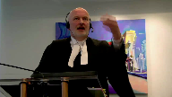
:::

And at that moment, the intent of the Stratocorporation and the person of the developer was to follow through on the contract.

And according to that, the Stratocorporation and the person of the developer were to follow through on the contract.

**Justice Rowe** (01:53:16): But then, according to that, the payments were irrelevant, because the payments came afterwards.

::: {.column-margin}
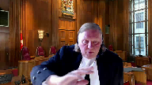
:::

You're saying that all of this was settled as a legal matter, there was an adoption of the contract before anybody started occupying those parking spaces, before anybody started paying the money.

Don't look at that ipso facto, as soon as the Strata Corporation was created.

At that moment, there was an adoption.

So which is it?

**Speaker 3** (01:53:49): Well, I say it is that firstly, Justice Roe, and I say in furtherance of that we have years and years of uninterrupted fulfillment of the obligations that are set out in the Airspace Parcel Agreement and must be taken to have been fully disclosed in the disclosure statement.

::: {.column-margin}
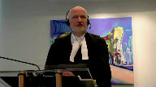
:::

**Justice Wagner** (01:54:09): OK.

**Justice Brown** (01:54:13): Well, if I can just interrupt at this point.

::: {.column-margin}
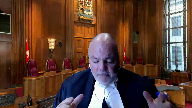
:::

I mean, we don't have the chain of personal covenants that would have made this easy because we don't have an assumption agreement for whatever reason.

But what the Court of Appeal found was that absent that formal arrangement, the agreement is nonetheless enforceable pursuant to common law rules relating to pre-incorporation contracts because it had found that such an agreement had been formed through conduct, which falls after the time that you're talking about. Yes.

If your argument is right, I'm with Justice Rowe on this.

If your argument is right, then conduct's irrelevant and the Court of Appeal was wrong.

And for that matter, the assumption agreement's completely superfluous.

**Speaker 3** (01:55:17): Well, I do say, Justice Brown, that the assumption agreements are perfluous, it would have been helpful further evidence of the adoption of the contract, which was the only legitimate choice.

::: {.column-margin}

:::

But I suppose another prism through to view this is the suggestion is somehow there was a mistake made in all of these payments, because we thought Osterbury might apply.

I'm not sure quite how my friend would frame it, and I don't want to frame it unfairly.

But that cannot avail in the context of the developer having been the Stratocorporation.

All of this is erected, people come on the scene, they start using parking.

So, I think it's important to note that this is not the first time

**Overlapping speakers** (01:55:58): But we don't need any.

**Speaker 3** (01:55:58): say the Court of Appeal was wrong, but it's additional, or it's an additional ground on which contract formation could certainly be found.

**Justice Karakatsanis** (01:56:10): If I've understood your position correctly, you're saying they didn't have to do anything.

**Overlapping speakers** (01:56:15): CUT!

**Justice Karakatsanis** (01:56:15): rose automatically, conduct was not necessary.

**Speaker 3** (01:56:20): Again, I would put it slightly differently.

::: {.column-margin}

:::

I say there can be no plea of mistake when someone can't say all the way through there was a mistake in intention and one runs into the problem of the developer.

So when precisely it arises, I say it arises as early as the Stratocorporation being formed and the developer taking on the role of the Stratocorporation.

Money starts coming in, people start taking, people start complying.

But certainly the years and years...

That's Conduct.

**Overlapping speakers** (01:56:59): but that's different, that's content.

**Justice Brown** (01:57:00): Yeah, so you're saying though, what I understood you to say earlier, sorry, Justice Kerrick is out of space.

**Overlapping speakers** (01:57:07): Don't.

You're saying the same thing.

**Justice Brown** (01:57:09): Yeah, we're saying the same thing.

::: {.column-margin}

:::

You know, I thought it was all about conduct.

I thought it was all about, you know, the members of the Strata Corporation use the parking facility for years and years.

They pay the associated costs for years and years.

They only stopped paying after the dust-up with Imparc in 2012.

And you're saying, no, no, no, no.

The contract binding on the Strata owners was arose, the post-incorporation contract arose while the developers still controlled the Strata Corporation early on.

**Speaker 3** (01:57:38): as the developer can make contracts in that period.

**Justice Côté** (01:57:43): Well, can I just say, oh, sorry.

**Justice Martin** (01:57:45): Yeah, I was just going to say it.

::: {.column-margin}

:::

What you're doing there is completely eluding the distinction between a pre and a post a con corporation because on your theory, the minute the strata plan is operative and the strata corporation comes into existence, it's bound by the contract of the developer.

And that would seem to me to be exactly what we're talking about here is that if that was the case, that would never be an issue.

And shouldn't that be a legislative prescription or provision like in the Business Corporations Act rather than being asked to infer that the reasonable time of a contract is when that plan is put in.

**Justice Côté** (01:58:31): and I wanted to say the same thing that if it is the case if the contract came into existence as soon as the subdivision plan was filed we should not talk about the post incorporation contract because it's not post it's at the same time the plan is filed.

::: {.column-margin}

:::

**Speaker 3** (01:58:51): Well, the plan is filed, the developer becomes the strata corporation for all purposes.

We say under the scheme there is no other legitimate choice but to proceed with the contract given all the legitimate expectations and everything.

All we have from there is evidence of adoption of the contract.

**Justice Karakatsanis** (01:59:12): So you don't need to be right on this point.

**Overlapping speakers** (01:59:15): No.

**Justice Karakatsanis** (01:59:15): Okay. No.

**Justice Côté** (01:59:17): No. Better hope not.

**Speaker 3** (01:59:20): Everything from there until long after this action started or after this action started and an amendment is all evidence of reliance on the contract, on all of the paperwork and conduct that's evidence of adoption of the contract.

::: {.column-margin}

:::

**Justice Brown** (01:59:42): Whereas the Court of Appeal says it's not evidence of reliance on a contract, it's evidence of a contract.

**Speaker 3** (01:59:53): Yes.

**Overlapping speakers** (01:59:54): Yes.

**Speaker 3** (01:59:55): At some point, Justice, at some point the conduct crystallizes as a contract and then it becomes further evidence and it carries on.

::: {.column-margin}

:::

And the Court of Appeal didn't make a point...

So there's two Post Incorporation contracts?

Well, no... There's the earlier...

**Justice Brown** (02:00:18): one when the developer is in charge still, and then there's the crystallization later on.

Anyways, we may be talking about angels dancing on the ground.

**Speaker 3** (02:00:27): Well, I think to some extent we are.

::: {.column-margin}

:::

Whether the court accepts or not the intention of the developer in pushing the scheme forward and presenting it amounts to adoption or whether it crystallizes with the conduct and the adoption by the Stratocourt of the actual activities and furtherance of the contract in my respectful submission leaves me in the same place.

**Justice Karakatsanis** (02:00:50): Because it's not the subjective intention, it's the objective manifestation of that intention.

And I just worry the test you've given us means, well, what was in their mind.

**Speaker 3** (02:01:04): Yes, and unless I take that point, and unless one views the proceeding to file the strata plan in the context of the ASP as an objective manifestation that the developer had the intent to proceed with this structure and put it in place, we don't have further evidence of what the developer did until people come on and they begin to act precisely.

::: {.column-margin}

:::

That's the end of the video.

**Overlapping speakers** (02:01:32): the developer, not the Stratocorp.

The Stratocorp is an open-source, open-source, open-source, open-source, open-source software

**Speaker 3** (02:01:34): Well, again, the developer becomes the Stratocorp in that moment.

::: {.column-margin}

:::

I was going to make a brief submission on the conditional grant principle and brief minded by the point which Justice Brown previously made.

**Justice Brown** (02:02:05): Well, that was just for me.

My colleagues may be quick.

**Overlapping speakers** (02:02:08): Yes.

**Justice Brown** (02:02:08): with anticipation to hear about conditional grants, but. Yeah,

yeah,

yeah, yeah.

**Speaker 3** (02:02:12): I suppose I was just going to say what I was going to say, but I had that point in mind myself, is all I intended.

::: {.column-margin}

:::

Speak for yourself.

The imposition or the agreement, the structuring of the transaction that the Strata Corporation would pay on behalf of users in itself, as I have said, does address, and I want to put that on the table squarely, in part the Osterberry concern.

One can view other structures, and it's not one before the court, but I just want to put this proposition.

One can view simply integrated development schemes, where a subdivision occurs, there are needs for easements and access along the lines using the statutory scheme I've taken the court to between various lots, lots where a Strata Corporation is not involved.

And those circumstances subsist.

One way of dealing with them to some extent is addressed in this circumstance by a Strata Corporation.

But in my submission, it would enhance the security and the predictability of these structures, and would, to some extent, prevent such contractual issues arising, which allude into the property issues as have arisen in this case if the conditional grant were accepted.

And my friend, correctly, one lies in contract, Hinehouse, one lies in property, the conditional grant exception, but it much turns on one who accepts the benefit ought to accept the burden.

**Justice Rowe** (02:04:42): Now, this gives rise, I think, to a different result, does it not?

::: {.column-margin}

:::

Because where you have a situation of benefit burden conditional grant, the person who's received the easement can say, I'm just not going to utilize it, and therefore I'm absolved from the burden.

I forego the use of the easement, and therefore, I'm not going to use it, and therefore, I'm not going to use it.

I'm not going to use it.

**Overlapping speakers** (02:05:11): Not available.

**Justice Rowe** (02:05:11): of the benefit, therefore I'm not going to bear the burden.

Whereas the contractual arrangement, which to urge upon us as your principal submission, is that it doesn't matter whether they ever park there.

They're still obliged contractually to make those payments.

Is that not a difference?

**Speaker 3** (02:05:28): it becomes a potential difference, and I'll come to this with subsequent purchasers, but in the conditional grant, one receives the grant of the right of the easement, the benefit in return for the burden.

::: {.column-margin}

:::

And it is not inconsistent with that, and it is not a matter of property law to say, I can simply stop and take that out of the transaction at any time.

That is, in my respectful submission, the point of it running with the land, is it becomes embedded in the structure.

The fine question, Justice Roe, if I might say, is what happens in a scheme like this when the next purchaser comes along and says, well, I'd rather have this scheme without, as a matter of property law, either the easement or the benefit that comes with it.

And that is, in my respectful submission, I don't know that it's quite dancing on the head of a pin, but it's a legal question to which in these schemes, there's a practical answer, which is that the integration is such that the choice really becomes, do I buy or don't I buy into a scheme with these various cross-easements?

But allowing them to run with the land, the benefit to run with the land, would simplify, in my submission, the law.

It is in accordance with many, many critiques that have been done of Osterbury.

And if I might simply say, and I'll rely on our factum for this, as time is running down, the last consideration of an appellate court of significance in this relation was that looked seriously at allowing the conditional grant was the decision of the Ontario Court of Appeal in Amberwood.

And in Amberwood, Justice Charron gave the majority judgment and felt that perhaps it was a matter for the legislature, joined by Justice Cronk, but also expressing concern that the conditional grant hadn't been fully embedded in the common law in England.

Justice McPherson dissented and felt that it had been embedded and gave the policy reasons that one hears around Osterbury that is outmoded.

It's 19th century law where these kinds of schemes simply didn't exist, that it leads to harsh results, that it has been the subject of modification by various jurisdictions.

Those are summarized in our factum.

And indeed, Justice McPherson said that, yes, there have also been legislative intrusions, but that shouldn't be taken, that the...

**Overlapping speakers** (02:08:47): uh... led

**Speaker 3** (02:08:48): is otherwise blessing the common law rule but rather that it is a rule in need of modification.

::: {.column-margin}

:::

It is a rule of the common law.

It now has been accepted fully in my submission in the English law.

The cases are canvassed in the Factum.

The conditional grant exception as seen in the Davies case is set out of the Factum at paragraph 116 and as a factual matter the language of the grant in this case clearly meets the exception and in my respectful submission it is time for the rule in Osterbury to receive modification by way of the narrower intrusion of the conditional grant and subject to questions those are my submissions.

**Justice Wagner** (02:09:48): Thank you, Mr. McEwen.

We now call Mr. Andrew Morrison.

**Speaker 4** (02:10:03): Thank you.

::: {.column-margin}

:::

Shared facility agreements are widely used in British Columbia.

They are often implemented at the insistence of local government to achieve planning goals.

The terms are typically set during the planning and approval process and well before a strata corporation is formed.

They are desirable.

They set expectations for future occupants.

They ensure that community amenities will endure after the development is completed.

Positive covenants in shared facility agreements are also desirable.

They ensure that shared facilities will be maintained without free riders.

No one is tricked into participating in a shared facility agreement.

They're disclosed in the disclosure regime under the REDMA and they're disclosed in the land title office.

The core question in this appeal in my respectful submission is what steps are necessary to ensure that a chain of covenants is preserved.

In other words, is clear and unequivocal conduct by a successor enough or is writing required?

The Crystal Square development itself is a good example of a desirable development that could not have been built without an enforceable shared facility agreement.

That's not speculative.

It's apparent from the express terms of the ASP agreement.

Recital E of the ASP agreement states that the city has approved the subdivision of the property on the condition of the easements and covenants in the ASP agreement are granted and accepted.

The Crystal Square development is divided into seven airspace parcels.

It houses a community police station, a Chinese community centre and a number of stratas.

The occupants share a host of facilities including elevators and fire suppression and HVAC systems.

It could not have been approved or built without a shared facility agreement and without these shared facilities.

Even the appellant doesn't want to abandon the entirety of the ASP agreement, only the parts that relate to parking.

This appellant would not exist but for the ASP agreement.

It's ironic that it now attempts to avoid the ASP agreement which is the very basis for its existence.

It was not tricked into adopting the ASP agreement.

It wouldn't have existed but for this agreement.

Moreover in a very real sense the consideration the strata received for its assumption of the shared facility agreement was the formation of the strata itself.

This appeal is necessary because of the rule in Osterberry.

The rule in Osterberry is a rule based on privity.

It's also a rule that is outdated because parties are no longer susceptible to being compelled to assume obligations of which they had no notice.

It's in danger of becoming a tool for the unscrupulous to dupe the unwary.

A chain of covenants is typically used to ensure that a successor is bound by a positive covenant.

There doesn't seem to be any dispute that strata corporations may enter into a chain of covenants.

They often do it by entering into a written agreement confirming that they will be bound by a shared facility agreement but the execution of a written agreement ought not to be necessary.

A written agreement after all is just a clear manner of displaying one's intention to be bound by a contract.

If a strata corporation can be bound by a shared facility agreement by executing a written agreement there's no principled reason why it can't be also bound by its conduct.

Ideally this court will develop a framework that will apply to all types of successors not simply strata corporations that weren't incorporated at the time an agreement was made.

In my respectful submission the court's focus should be on the conduct of the successor not on the type of successor or on whether the pre-incorporation contract principles apply.

If a successor with knowledge of a shared facility agreement assumes it by its word or conduct based on an objective determination at or around the time the successor takes title it should be bound by all of the terms of the shared facility agreement positive or negative.

I've set out the benefits of this approach at the bottom of my at the end of my condensed book.

There are several advantages.

This type of approach can be applied to any entity.

It sets an objective standard consistent with contract law principles and avoids subjective intentions and revisionist history.

It's consistent with Osterbury which is focused on privity not formality.

It's also consistent with contract law principles and the pre-corporation contract principles.

Thank you.

**Justice Wagner** (02:15:12): Thank you.

Thank you, Mr. Morrison.

Mr. Hamilton, any reply?

**Speaker 1** (02:15:24): Yes, Chief Justice, I wish to make two brief points.

::: {.column-margin}

:::

First of all, regarding the arguments of both the respondent and the intervener UDI, that somehow this scheme, development scheme created by the developer resulted in the unnecessary choices that it made with respect to the easements and the agreements that the respondent claims were put in place.

It's a similar argument that the respondent and Jameson House made in the Court of Appeal, which appears in the material, where the respondent argued that the rule in Osterberry should be relaxed to reflect the developer's need to achieve a certain kind of development scheme.

And the Court of Appeal in Jameson House, which was heard at the same time as the appeal in Crystal Square, rejected that that argument and made the following point at paragraph 169, saying that the petitioner correctly points out that the surrounding context of the consumer protection provisions in the spa, the respondent could have used the spa separate sections model, but chose not to do so because it did not want the residential strata owners to overwhelm the other owners in a mixed use building.

The respondent made this choice, presumably with legal advice and knowing that positive covenants are not enforceable against successors in title.

The respondent has now encountered difficulties as a result of its approach and asked this court to intervene, not only on its behalf, but in a manner that could disrupt commercial realities in British Columbia more broadly.

The point is this, this developer had other tools available to it that were consistent with the provisions of the Strata Property Act and did not require to engage in arguments of Hinehouse, which I've already made submissions on.

Finally, with respect to REDMA, the respondent is mistaken about REDMA to this extent.

REDMA does not apply to commercial properties, it didn't apply to the commercial properties of the appellant.

In this case, there is no disclosure obligation with respect to commercial properties.

And that explains why the appellant did not apply to the commercial properties.

And that explains why there was not a disclosure statement in this case.

And no disclosure statement in evidence before the trial judge because REDMA just simply did not apply.

Those are my final submissions, Chief Justice.

**Justice Wagner** (02:18:14): Thank you very much, Mr. Hamilton.

::: {.column-margin}

:::

So on behalf of my colleagues, I'd like to thank council for their good submissions.

The court will take the case under advisement and the court is adjourned till tomorrow morning at 9.30.

Thank you very much, have a nice evening.