---
title: Haben Abrham Weldekidan v. Her Majesty the Queen
published-title: Heard
date: 2020-06-12
sidebar: false
---

This transcript was made with automated artificial intelligence models and its accuracy has not been verified. Review the original webcast [here](https://scc-csc.ca/case-dossier/info/webcast-webdiffusion-eng.aspx?cas=['38984']).
---

**Justice Wagner** (00:00:01): the court, la Cour.

::: {.column-margin}

:::

Good morning, everyone.

Welcome to this online hearing, which is taking place by videoconference in accordance with the health and safety measures being taken in light of the ongoing COVID-19 situation.

We would like to acknowledge the unique circumstances under which this hearing was organized, and I would like to thank Council for their patience and collaboration in making this possible.

Despite the virtual nature of this hearing, please note that we will be observing, as appropriate, the usual courtroom practices, rules, etiquette, and manners of proceeding.

So let's start.

In the case of Haban Abraham Veldikiden against Her Majesty the Queen, for the applicant, Mrs. Laura C. Robinson, Evan J. Reutenberg, for the respondent, Her Majesty the Queen, Amy Cutler, and Jennifer Mann.

Mrs. Robinson.

**Speaker 1** (00:01:21): Good morning.

::: {.column-margin}
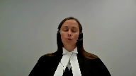
:::

At the outset, I can advise that I will be providing our main address on behalf of the applicant, and with the court's permission, Mr. Reutenberg will provide any reply if necessary.

The applicant seeks leave to appeal to this honorable court.

The central issue at trial and on appeal was the Crown's application to have hearsay statements admitted into evidence.

We say this case raises issues that are of national importance, given the evolution of law as it relates to the admissibility of hearsay evidence and the need to address when new issues arise from the practical application of these general principles.

This is consistent with the modifications that have been made over time by this honorable court to ensure fair trial proceedings.

At its core, the principled exception to the hearsay rule is to ensure the truth-seeking function of the trial court can succeed while maintaining the balance to ensure a fair trial for an accused person.

Cross-examination is a hallmark feature of our trial process.

Its role in assisting a trier of fact to reach a just conclusion cannot be overstated.

It is a delicate balancing that is left to a trial judge in determining when a statement should be put before a trier of fact.

In the applicant's case, we say there are several issues that arise that have not received comment on or guidance on by this honorable court.

This is not simply a fact-specific circumstance, but rather represents key issues that the lower courts are left to grapple with as these applications come before them.

The law must continue to evolve to solidify this process.

This is not a unique case or a unique defense that occurs infrequently.

Rather, recanting witnesses, witnesses with no memory, whether real or feigned, or simply witnesses are unavailable are issues that arise on a routine basis in trial courts across this country.

There is a pressing need to have a clear approach to these matters that equip trial judges to make their decision based on the factual circumstances in front of them.

There should be finality to these matters.

It is in no party's interest to have matters relitigated.

**Justice Abella** (00:03:54): I'm sorry, I didn't mean to interrupt on that point.

::: {.column-margin}
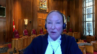
:::

You said it wasn't a unique case and these cases, these kinds of issues come up all the time in our courts.

Is there anything in our jurisprudence that you say has not already addressed these very points and that doesn't turn on the particular facts in this case?

**Speaker 1** (00:04:19): And what we say is that there are a number of issues that require to be addressed further, specifically focusing on procedural reliability.

::: {.column-margin}
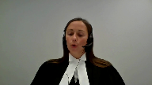
:::

This court in the Queen and Bradshaw in 2017 came back to reevaluate substantive reliability to provide a roadmap to trial judges in determining these applications when procedural liability had not been met, but because of the facts of that case there was no further determination of procedural reliability, which I will get into as part of the issues that we've raised in our leave application.

**Justice Abella** (00:04:55): I'm sorry, Ms. Robinson, didn't Bradshaw deal with that in paragraph 28 with threshold reliability?

**Speaker 1** (00:05:02): is specifically in Bradshaw however the facts of that case did not turn on the issue of an oath as the witness and statements that they were dealing with in Bradshaw was a co-accused or co-charged individual and the statement was not taken under oath.

::: {.column-margin}
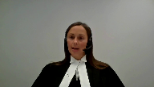
:::

We say that it's a matter at this point in time that should be looked at in relation to what circumstances a trial judge should consider surrounding the oath or whether it's simply the oath is present and that's the first issue that I will get into.

The other issues that we say arise that have not received guidance or comment on by this court is dealing with the appropriate remedy by an appellate court when there's been findings made by a trial judge on the issue and also on the issue of when there are multiple applications before the court what use can be made of one of the statements if deemed admissible on the application for the remaining statements and I'll go back to what I've already started commenting on which is the procedural reliability and in our leave application we've outlined two issues and I'll combine them in my submission and as I've indicated already one of the key questions is how the oath is to be evaluated.

In the Queen and KGB police practices in response to the court's decision in the Queen and KGB police practices have developed in regards to taking statements in that they are often under videotape under oath and with a warning of consequences of providing a false statement.

However the video statement is seldom the whole picture.

Often there are multiple conversations with police.

Their practice has developed of pre-interviews with only the final interview recorded under oath and on video.

The applicant's case demonstrates some key concerns relating to that approach because this was a case where there were multiple conversations between the police and witnesses prior to the oath and the videotaping.

These conversations took place in public areas of the hospital where the witnesses were seeking medical treatment.

There were prior statements that were inconsistent with the videotape statement where the witnesses such as Miracle Tamanin stated he didn't know who shot him.

The videotape statement then comes after the applicant had been arrested and the police had advised Mr. Tamanin that he had been arrested and the chronology of those conversations can be found at our condensed book at pages 11 and 12 and were commented upon by the trial judge.

So when faced with that backdrop is it not unreasonable for a trial judge to question the oath that was taken and the warning of the criminal consequences that was given especially when it lacks the evidentiary basis to assist with determining the witness's state of mind at the time in which the statement was given.

So should a judge not be entitled to assess the circumstances surrounding the oath?

We say this hasn't been fully discussed and leaves open the question is it simply a checkbox on a list of factors to consider or is the trial judge permitted to look beyond the fact that an oath was administered to the circumstances surrounding it.

In the Queen and Cajun- It's me.

**Justice Moldaver** (00:08:29): It's me.

::: {.column-margin}
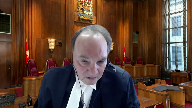
:::

Sorry to interrupt you.

I mean, no one is suggesting that the trial judge, in the process of doing a proper threshold reliability analysis, can't look at the evidence.

Clearly, they can.

The issue is, did they look at it from the perspective of, this is a threshold reliability analysis, as opposed to an ultimate reliability analysis?

And that seems to me to be the big problem that you would be facing here, with a trial judge making definitive findings of fact in the context of the threshold reliability analysis that the Court of Appeal, speaking for myself, quite properly says those were issues that were for the trier of fact, not for the trial judge.

**Speaker 1** (00:09:23): But there's certainly factors that the trial judge was looking at in areas of concern she raised given the backdrop of this matter where our court of appeal decision ultimately seems to find that those are matters that would only go to ultimate reliability and over and wasn't allowed to be considered in threshold reliability and that's the danger in that court's decision for future cases is that certainly excuse me

::: {.column-margin}
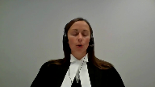
:::

**Justice Moldaver** (00:09:49): me again if for example during the videoing and the the evidence of several of the witnesses was they were so drugged up and so on they didn't know what they were saying or doing I mean surely one might have expected some evidence of that in the videotape me that's why we have the videotaping part and to the extent the videotaping shows no evidence whatsoever other than clear statements cohesive statements statements that are full and and and complete you know isn't that something for the trier of fact then to look at as opposed to the judge on our threshold reliability assessment but what appear

::: {.column-margin}
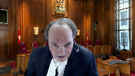
:::

**Speaker 1** (00:10:32): to be here for the trial judge is aware that they were in the hospital having medical records that certainly corroborated the fact they were on certain medications and was concerned with the lack of evidence to know how that might present on a video camera.

::: {.column-margin}
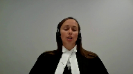
:::

When we think of something like intoxication or by drugs or alcohol, a judge may have an understanding of how that may present on video.

What seemed to be at the core of this judge's decision knowing factually that there was evidence that they were on medication was not understanding how that might display on a video tape, which again limited the ability for the trier of fact to rationally evaluate the evidence and rationally evaluate the impact of the oath.

**Justice Abella** (00:11:19): Can I take you back then to what I was preoccupied with earlier and that your exchange with Justice Moldaver has highlighted.

::: {.column-margin}
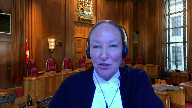
:::

There is a dispute over some of the factual issues.

Where is there dispute in the case law warranting the granting of leave to clear up an area of public importance that we haven't already dealt with?

**Speaker 1** (00:11:41): and on this issue that I'm dealing with at this point in time in terms of procedural reliability I would say that comment from this court in terms of how those factors are evaluated at this initial threshold stage does does require further comment from this court as we see from the application coming out of KGB and how it's evolved these practical issues that have come up require further comment at this point in time from the court.

::: {.column-margin}
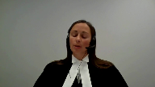
:::

Further from that I'll address the other issues that we say that this court should address.

**Justice Abella** (00:12:14): But you don't want to check, you're the one who's arguing against a checklist factor approach.

And yet that seems to be what you want us to do beyond the statements that have been made in our cases so far.

**Speaker 1** (00:12:26): We take the different view.

::: {.column-margin}
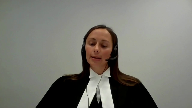
:::

We say that the Manitoba Court of Appeal decision is endorsing essentially a checkbox list when they're critical of a trial judge looking at the circumstances of the oath because we are saying that in the when you're looking at why the oath is important in the initial statement, it is to put it in comparable reliability to the statement that's taken in court under oath.

If a statement in court under oath was a situation where a witness came in intoxicated, we would expect that a trial judge would ask questions and determine whether they're in a position to give an oath and give that testimony at that point in time.

If a witness came in in a hospital bed hooked up to machines, we would expect that a trial judge would want some information about their medical condition before they're prepared to take them under oath.

What we're saying is in a case like this, that's exactly what the trial judge was doing when she was looking at the circumstances of the oath to find were they comparable, was there going to be a manner in which a trier of fact could rationally evaluate the evidence.

The Manitoba Court of Appeal decision seems to be taking it back to there was an oath, we don't look any further until we get to ultimate reliability and that's what we're saying that this court should be addressing.

At this point in time, I will move on to the third ground of appeal that we have or third issue we have we have raised, which is how the appellate court should treat a trial judge's findings regarding whether there's a full opportunity to cross-examine.

It is commonly held that a trial judge is uniquely positioned to hear the evidence and make the determinations based on first-hand observations in a courtroom.

A deferential standard has constantly been endorsed regarding their findings.

There are few cases that discuss what a full opportunity to cross-examine would mean and none that consider the standard of review regarding a trial judge's decision on the point.

As matters unfold in a courtroom, a trial judge is uniquely positioned to make determinations as to the impact of a cross-examination on the issue the court will be asked to decide.

They're left with the decision of can you rationally evaluate the evidence.

Every case will be different.

The scope of cross-examination will vary depending not only whether it's a recanting witness versus a witness with no memory, but also on the nature in which they respond to questions.

As part of an application, the trial judge observes how the witnesses answers questions by both crown and defense.

Once that's done, they've reached a conclusion.

Should that conclusion not be entitled to deference?

We're saying at this point in time that it is a national importance issue for this court to comment upon it.

Just briefly recognizing I only have a minute left, I will turn to the last two issues we have raised.

One dealing with the standard in terms of ordering a new trial.

When we say this is an issue for the court to consider at this stage, especially keeping in mind the limited court resources, the interest in not relitigating matters.

Ultimately, in a case of this nature, once it's a judge alone case and the judge has tipped her hand to the issues of ultimate reliability and found the crown's witnesses not to be reliable, what's the harm in allowing her verdict to stand?

There's a clear path to understand the acquittal and there's no interest in having the matter relitigated and tie up additional court resources.

We're saying this is an issue this court can consider at this point in time and should consider at this point in time.

The last issue which I recognize I don't have time to get to deals with kind of situations where there's multiple applications.

**Justice Wagner** (00:16:26): Thank you very much, Mr. Cutler.

**Speaker 2** (00:16:43): Thank you.

::: {.column-margin}

:::

Good morning.

Before turning to the specific grounds of appeal proposed by the applicant, let me say generally that the Crown submits that while the context of this appeal was the admission of out-of-court statements, the actual decision itself was based largely, if not entirely, on case-specific problems with the trial judge's appreciation of the facts and the evidence.

And what that means for you is that there are really no new principles at issue for you to adjudicate if leave is granted.

And in fact, and I'll get into this in a moment, there's not even any real dispute about the old principles.

The trial judge here unfortunately disregarded important evidence which led her to then go too far in weighing the ultimate reliability of the three statements in question.

The Court of Appeal corrected these errors using well-settled rules, and respectfully, it's not the function of this Court to repeat that process.

Turning to the first proposed ground of appeal, the proposition that the applicant seeks leave to argue is that trial judges should consider all the evidence surrounding the taking of an out-of-court statement, including the circumstances of the oath, so the declarant's state of mind, whether they're intoxicated, their ability to understand English, and so on.

This is already the law.

You said in Kaliwan that trial judges must consider all the evidence in assessing an application to admit an out-of-court statement for its truth, and Provincial Courts of Appeal routinely repeat and follow that instruction.

There is frankly no need for another Supreme Court decision stating this well-settled principle with which, by the way, no one in this case has ever disagreed.

And in fact, we would say that's exactly what the Manitoba Court of Appeal did.

The trial judge's decision was predicated on her assertion that there was no detailed evidence as to the impact of the declarant's pain medication on their state of mind at the time that they gave their statements and swore their oaths.

Justice Futzner in the Court of Appeal observed, you know, that's not true at all.

There was actually lots of evidence of the declarant's state of mind, evidence that wasn't taken into account when the trial judge made her determination.

That included, first and foremost, and I think this was Justice Moldaver's point, the videos themselves, which were high-quality, high-definition videos that allowed the viewer to observe every nuance and every expression on the declarant's faces, the subtleties of their body language, the degree of their eye contact with the police officers, their facility with the language, their engagement in the process, and so on.

And if the panel has not yet had an opportunity to review the videos, we provided them as part of our materials, and we encourage you to take a look at them.

The viewer would be very well placed to evaluate whether the declarants were paying attention to the swearing of the oath or, as one declarant in his recantation claimed at trial, he was simply just trying to get it over with and not really paying attention to anything at all.

And further to that, if, as the trial judge speculated, their pain medication might have affected their ability to appreciate the solemnity of the proceedings, the viewer would have been able to assess that as well, because recall that the claims made by the declarants were not subtle, right?

One declarant, Mr. Timana, claimed that his meds made him so drowsy and so unfocused he couldn't stay awake for more than five minutes at a time before he passed out.

He was completely unaware of what was going on.

Mr. Goytum, a second declarant, claimed at trial that the morphine made him so bombed he didn't know what was going on either.

Again, the viewer of these videos would be very well placed to evaluate those claims and assess their reliability.

But the evidence was further than that.

It also included viva voce evidence from an officer who had dealt with all three declarants at the time they swore their oaths and gave their statements, and specifically testified about their state of mind at that time.

By the way, he described them all as alert and responsive, and in one case, he specifically asked the declarant whether he felt up to giving a statement and was told yes.

So again, there was that evidence that the trier of fact would have to use to evaluate the declarant's state of mind as well.

The trial judge appeared to disregard all that evidence and instead restrict her analysis to what you might call medical evidence, that is, sort of evidence from a doctor, as opposed to what the trial judge should have done, which was consider all the evidence.

But even pursuant to her own terms, she still neglected significant evidence.

Mr. Tamanna's medical records had been entered by consent for their truth and revealed that he had actually been assessed by a neurologist on the very day that he gave his statement.

By the way, he was assessed as alert and oriented and cooperative.

Also worth noting, this was the same day that his discharge sheet said he was to be released from hospital.

So he was physically still in the hospital at the time he gave his statement, but he'd actually been cleared to go home.

That, again, is evidence clearly relevant to the concern raised by the trial judge as to the potential impact of the declarant's pain medication on their ability to appreciate and comply with the oath.

None of that is addressed by her.

On the contrary, she says that there was no evidence.

So the Manitoba Court of Appeal stepped in, corrected that error.

Respectfully, we say that leaves very little for you to do in terms of review.

There is no actual disagreement in principle for you to adjudicate.

Everybody agrees all the evidence needed to be considered.

It's just the trial judge hadn't done so.

So as the Court of Appeal then went on to observe, once you had all of that evidence taken into account, the trier of fact would be well placed to assess the reliability of the oath and of the prior out-of-court statement.

And again, just to run through what was available, an uninterrupted high-definition video of the oath and the statement.

And as Justice Moldaver observed and the Court of Appeal observed, the victims appeared calm, cooperative, alert, and coherent.

They responded mainly to open-ended questions.

They gave significant details of the events, and they were very clear that they were aware of the events.

They gave significant details of the event, including their identification of the applicant as the person who had shot them.

They responded articulately to questions.

They corrected the police when necessary, and they admitted a lack of knowledge where appropriate.

So there was that.

Then there was a witness to their mental state who was available for cross-examination, and there was a substantial amount of independent evidence against which events could be assessed.

That involved forensic evidence as to the location and the nature of the bullets and the shell casings and so on.

And one of the declarants, Mr. Tamanagh, was available for substantive cross-examination on his oath, his statement, and the incident itself.

So in the circumstances, the Court of Appeal simply applied kelowon and said that the decision as to liability should be left to the trier of fact.

That is, respectfully, an uncontroversial, well-settled point.

The parties disagreed, obviously, about its application to the particular facts of this case, but that is not a question of national importance that requires the granting of leave.

The next proposed grant of appeal has to do with deference and the value of cross-examination.

The issue as proposed is whether an appellate court should defer to a trial judge's finding that there is little value to cross-examination.

We say, respectfully, the issue does not arise in this appeal because the trial judge's conclusion was tainted by a fundamental error in principle.

The trial judge essentially took the position that once a declarant claims that he or she cannot remember the substance of the statement, that concludes the analysis and cross-examination can be of no value to the trier of fact as the Manitoba Court of Appeal held, and as the applicant agrees, that's not the case.

You had here a relatively transparent attempt to avoid giving evidence.

One declarant had already said, I have no intention of being a witness at trial.

The other two were observed shaking hands with the applicant's mother outside court shortly before they testified, and when questioned, they simply recited, I don't remember, to every question they were asked, even when that answer didn't follow or made no sense in relation to the question that they'd been asked.

In such circumstances, the applicant concedes that the court should not simply take a claimed inability to remember at face value, and the applicant is right to do that because that would completely undermine Justice Chiba.

**Justice Abella** (00:26:04): It's just a question

but I finish your statement it just it goes to what we should be doing in circumstances where a trial judge finds

**Overlapping speakers** (00:26:13): Mm-hmm.

**Justice Abella** (00:26:13): on facts that are, that support the conclusion that the witness cannot be cross-examined, cannot be tested and cannot be cross-examined.

::: {.column-margin}
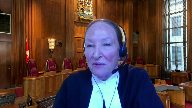
:::

Is it your view that that area of jurisprudence is sufficiently settled that we don't have to explore it further because they seem to be divided in the courts of appeal across the country about how to approach it?

**Speaker 2** (00:26:36): I think that's a fair comment, Justice Abella.

::: {.column-margin}
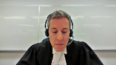
:::

And I think, well, there are two things I would say.

First of all, you would need a clear factual record where the issue was raised in front of the trial judge and preferably litigated in front of the Court of Appeal to have the sort of foundation that would support considered analysis by your court.

In terms of what the right answer is, I tend to come down on the side of Justice Charron's view in Devine that even where a witness says they don't remember, there may still be some value to testing that assertion in front of the trier of fact, because I don't remember is another way of recanting what was said in the original statement, even if genuine.

It still represents a recantation.

**Justice Abella** (00:27:44): But in Devine, Justice Charente was deferring to the conclusion of the trial judge.

Fair enough.

**Speaker 2** (00:27:51): I mean, what I can say, and again, I'm mindful of the time, the issue of deference isn't at issue here because there's an error in principle that's being committed.

::: {.column-margin}
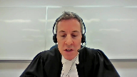
:::

In a case where a trial judge said for, I don't want to say legitimate reasons, but sort of considered the issue, weighed the factors raised in Devine and in the Sharif decision that I provided for you.

In a case where the trial judge concludes having weighed the potential benefits to the trier effect of seeing the claim of memory loss tested in front of the trier effect and still determines that I just don't see it.

There simply is no benefit to it.

For me, even there, at the end of the day, it's a recantation.

Saying you don't remember is another way of changing your evidence from what happened in your sworn videotape statement.

**Justice Moldaver** (00:29:12): If nothing else, this court has said on several times that it could be important for the trier fact to be looking at the demeanor.

**Overlapping speakers** (00:29:21): Exactly.

**Justice Moldaver** (00:29:22): As he or she explains why it is that they can't remember anything or, you know, what, however they're, how they respond in the witness box and so on.

::: {.column-margin}
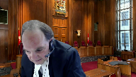
:::

I mean, I distinguish this kind of case where there is at least some evidence, they're there before the trial of fact from cases where you can't get the witness to court at all.

And this court has on a number of occasions said, you can look to it.

It may be helpful in terms of assessing the demeanor and so on and comparing it to the detail, for example, in the original statements and so on and the circumstances under which they were taken.

And it really is just, it seems to me in cases like this, a factor.

It may be a determinative factor if all of the surrounding other evidence or much of it leads away from reliability, but where you have much of it going the other way, leading towards reliability, it surely doesn't sort of win the day for the defense, I wouldn't have thought, on a threshold of reliability.

**Speaker 2** (00:30:31): Yeah, I mean, it's another way of saying it deserves to be tested, right?

::: {.column-margin}
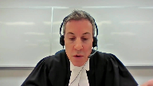
:::

Saying that the trier effect can observe demeanor is another way of saying, well, let the trier effect figure out whether they can remember or not, or whether this is, excuse me, another way of avoiding having to go through the painful exercise of identifying somebody in court who you'd rather not identify.

I'm just going to move very quickly, if the court doesn't mind, to the last two issues.

The first is the Graveline issue.

I have three very brief points on that.

First of all, it's a very fact-dependent determination and it doesn't raise an issue of national importance.

Secondly, it wasn't argued before the court of appeal, so you have nothing to review.

And thirdly, as a matter of common sense, three separate victims had identified the applicant by name as their shooter and had described looking him in the eye right before he pulled the trigger.

Needless to say, how admitting that evidence might have affected the verdict.

As to the last issue, which has to do with mutual corroboration, again, it wasn't raised in the court of appeal, so there's really not much of a foundation for you to look at in terms of assessing that issue.

But what was briefed, and Chief Justice, if I could just finish my sentence, is that the

**Overlapping speakers** (00:31:48): Yes, ma'am.

**Speaker 2** (00:31:48): Thank you.

::: {.column-margin}
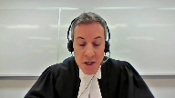
:::

What was briefed were significant additional problems with the trial judge's treatment of substantive reliability, who again, as she had done with procedural reliability, neglected important evidence and relied on speculation that was in some cases directly inconsistent with the evidence.

Again, none of which supports granting leave.

Thank you.

**Justice Wagner** (00:32:09): Thank you very much, Mr. Cutler.

Any reply?

**Speaker 3** (00:32:21): Yes, Chief Justice, if I may.

::: {.column-margin}

:::

Every case is fact specific until the issues rise to this court for a greater determination for clarity, for uniformity across the country, and to make certain that trial courts are being given the appropriate guidance.

Now, Mr. Coddler has argued that the evidence here, the videotaped statements, gave the viewer a well-placed position to make a determination.

And that is something that is open to a trial judge, something the trial judge considered here, and something the trial judge was factoring in against other factors which were of concern to her.

But what should be of import to this court, and what we say is of national importance, is when it comes to threshold reliability, in particular when it comes to the oath, what our Court of Appeal has done, and this is in our condensed book at page seven of our condensed book, we have the excerpt from the Court of Appeal and it's paragraph 57, is our Court of Appeal has in essence pronounced that a trial judge cannot look behind the oath, look behind the oath, because to do so would be treading on ultimate reliability.

That is what they've said in paragraph 57, as previously indicated on several occasions, the trial judge noted that all three victims were taking medications, but that there was no evidence as to the potential effects of the medications on them, and they equate that inquiry with issues going to ultimate reliability of the statement.

No, what the trial judge was attempting to do was say, on the facts of this case, the oath isn't good enough, and that has never been opined upon by this court, it's never been opined upon by another Court of Appeal, and if our Court of Appeal is taking such considerations out of the hands of trial judges, trial judges, there's a difficulty there because it is as if to say, check the box, there's an oath, and that's all you need do, and that's problematic.

My friend takes issue with the I don't remember issue, going towards the usefulness of cross-examination, and Justice Moldaver, you've commented on this as well, but with the greatest of respect, there was evidence here to support the trial judge's concerns that cross-examination would provide any further insight, and she had had these witnesses cross-examined by both Crown and defense already before her on the application to be able to have those concerns highlighted for her.

How is it not open to a trial judge to say, I don't expect any further cross-examination will allow a trier of fact to have further insight?

That's part of the gatekeeping function that's been commented on by this court in a number of the cases from Bradshaw to Keloan back to KGB.

For our Court of Appeal to now say, you can't consider that, for our Court of Appeal to now say, don't look to the rest of the evidence as to whether or not those concerns as to further cross-examination being useful really causes a much confusion, as Justice Abella, you have highlighted, because different courts across the country view that question differently.

Guidance from this court would clarify that, because this issue comes up on a daily basis in trial courts across the country dealing with out of court statements and their admissibility.

And as my colleague has pointed out in her submissions to you, when you get to the question of remedy, and we find ourselves in a situation where court resources are scarce, affected as they have been by COVID, but even before that issue arose, why are we sending matters back for a retrial where the trier of fact, while wearing the hat of gatekeeper, has already indicated, I have problems with this, even if you reach the conclusion that maybe some of the considerations, and we say you shouldn't reach that conclusion, but maybe some of those evidentiary points that she took into consideration bled into ultimate reliability.

Where is the utility in sending it back for a new trial?

That's my comment and reply.

**Justice Wagner** (00:37:09): Thank you very much.

::: {.column-margin}
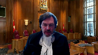
:::

So, the court will now retire.

I will ask the attorneys to remain at our disposal.

Thank you.

The court, La Cour.

Thank you very much.

On behalf of all of my colleagues, I'd like to thank Council for their submissions and their patience.

The court is ready to release its decision.

And as you know, the court never released reasons on application for leave to appeal.

So, the judgment is the following.

The application for leave to appeal is dismissed.

Thank you very much.