---
title: Attorney General of Saskatchewan v. Attorney General of Canada; Attorney General of Ontario v. Attorney General of Canada; Attorney General of British Columbia v. Attorney General of Alberta
published-title: Heard
date: 2020-09-22
sidebar: false
---

This transcript was made with automated artificial intelligence models and its accuracy has not been verified. Review the original webcast [here](https://scc-csc.ca/case-dossier/info/webcast-webdiffusion-eng.aspx?cas=38663]).
---

**Justice Wagner** (00:00:56): Bonjour à tous, good morning to all, or I should say, welcome back, as this is the first time we've sat in our courtroom since the winter, before the pandemic arrived. Il y

::: {.column-margin}
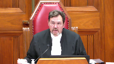
:::

a un an, presque jour pour jour, également au mois de septembre, les juges et le

personnel de la Cour commençaient à arriver à

Winnipeg, pour la toute première audience de notre institution à l'extérieur d'Ottawa.

Cette année, nous sommes de retour à Ottawa pour une autre session spéciale au mois de septembre, mais très différente de celle de l'an dernier.

You'll see that our courtroom looks different today.

My colleagues and I are spread out over two rows.

We have plexiglass between us in places where we can't stay two metres apart.

We have had to limit the number of staff and counsel who can be in the room at the same time.

Anyone who enters or exits the courtroom must wear a mask until they get to their seat.

Hand sanitizers have been provided and the podium will be sanitized between speakers.

Conforme aux recommandations des autorités sanitaires, nous limitons le nombre de personnes qui peuvent prendre place dans cette salle et, pour cette raison, nous ne pourrons malheureusement pas y accueillir de membres du public dans un avenir prévisible.

Toutefois, comme ceux qui nous regardent actuellement le savent, sauf dans de très rares cas, nos audiences sont toujours web diffusés et on peut soit les suivre en direct, soit les regarder en différé ultérieurement.

We are taking these measures to protect the health and safety of everyone in this room, and that of the loved ones we will all return home to.

But we are also ensuring that we continue to deliver justice to the parties before us today, on behalf of all Canadians, as it is our duty to do so.

Voilà en quoi consiste la nouvelle normalité, à tout le moins pour le moment.

Je nous suis capable de traverser cette épreuve et

je suis convaincu que nous y arriverons.

Merci de votre attention et maintenant commençons.

Thank you and let's begin.

In the case of Attorney General of Saskatchewan versus Attorney General of Canada, and between Attorney General of Ontario versus Attorney General of Canada, and Attorney General of British Columbia against Attorney General of Alberta, for the appellant Attorney General of Saskatchewan, P. Mitch McAdam QC, Daron Kuski QC, for the appellant Attorney General of Ontario, Josh Hunter, Patrick Ryan, for the appellant Attorney General of British Columbia, J. Garrett Morley and Jacqueline Day Hughes, for the respondent Attorney General of Canada, Charlene Tullis Langdon and Maître Guy Pratt, for the respondent Attorney General of Alberta, Peter Agal QC and L. Christine N. QC.

Mr. McAdam.

**Speaker 1** (00:04:51): Good morning.

**Overlapping speakers** (00:04:51): Cheap.

**Speaker 1** (00:04:51): Chief Justice and learned justices.

::: {.column-margin}
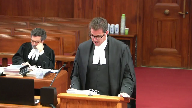
:::

The question to be answered in this reference is whether the greenhouse gas pollution pricing act, the ggppa is ultra virus parliament.

We submit that the answer to that question is yes, the ggppa is ultra virus parliament.

I will speak for 20 minutes and then my colleague Mitch McAdam will speak for 20 minutes.

I propose to address the following topics.

The significance of this reference to the federation.

Secondly, how fighting climate change and upholding the constitution go together.

The pith and substance of the ggppa and then minimum national standards, provincial inability and scale of impact to the extent that time permits.

I'll start with the significance of this reference to the federation.

This is a reference that will shape the federation for a generation.

As guardians of the constitution, it is this court's weighty responsibility to decide what direction the federation will take from here.

With this decision, this court will be deciding not just whether the ggppa is constitutional or not, rather this court will be endorsing what it believes is the correct approach to the division of powers for a generation.

This is so much more significant than just one statute that imposes one policy on the provincial governments.

It is about whether the federal government can issue cooperative federalism and really the division of powers entirely in favour of a role that allows supervisory, coercive and paternalistic federal oversight over provincial powers.

It is about whether the delicate balance that has been maintained over the division of powers for over 150 years and repeatedly endorsed and shaped by this court in that time will be affirmed and supported.

If the ggppa is upheld and the federal government's centralist aspirations are endorsed, then the federation and cooperative federalism will be forever destabilized.

The ggppa is just the tip of the iceberg.

Canada's own evidence is that pricing is only a very small part of reaching the overall targets for ghg reduction in the country.

There's much more to come to achieve the ambitious targets we have all committed to and we are much more likely to succeed if the ggppa and its supervisory approach is struck down.

The attorneys general for Canada and British Columbia will come here to ask this court to modernize the national concern test.

They have used many official sounding phrases that have changed as these references have moved through the courts like common action problem, the global commons and minimum national standards to try to convince the courts that several long-standing constitutional principles and precedents should be ignored or amended in undisciplined and undefined ways.

We submit that there is nothing broken about the national concern doctrine or the division of powers.

On the contrary, it is robust and resilient, stable and predictable and able to respond to the important societal issue of climate change.

The federal government has all of the jurisdiction it needs without taking over provincial jurisdiction or supervising how they exercise it.

The national concern doctrine requires no modernizing or amending.

The attorneys general for Canada and BC request this because they need it to help them succeed in this reference and to constitutionalize the statute that they have presented in the ggppa.

There is no larger principled reason though that the appropriately narrow national concern doctrine should be expanded.

If anything, this court should continue to restrict it particularly as it applies to matters related to the environment as this one does.

Now move on to the next topic which is fighting climate change and upholding the constitution go together very nicely.

Declaring the ggppa to be ultra vires accomplishes both objectives and the opposite is true if the act is upheld.

I'll start first in talking about the constitution then I'll talk about the climate change.

To answer the question of jurisdiction, one need look no further than section 91 of the constitution, tab 6 of our condensed book, 6.0, which grants the federal government legislative authority over all matters not coming within the classes of subjects by this act assigned exclusively to the legislatures of the provinces.

The answer to the question as to whether this matter is assigned exclusively to the legislatures of the provinces is self-evident.

The ggppa itself answers the jurisdictional question conclusively as the act itself is premised on the basis that the provinces have and will continue to have jurisdiction over the very subject matter that is included in the act.

Ghg emissions have been regulated including pricing by the provinces, continue to be regulated by the provinces and the ggppa meets its primary objective if the provinces continue to do so.

What the federal government wants here the constitution cannot give them.

They want a supervisory jurisdiction to ensure that the provinces exercise provincial jurisdiction in accordance with the preferred policy of the federal government.

The ggppa creates supervisory jurisdiction which is unprecedented.

We submit that with respect to the section 91 argument, of course there is scope for something to become something of national concern and rise to the level where it requires one level of regulation.

In other words, it's as if when you look at section 91 and all the classes of subjects by the act assigned exclusively to the legislature of the provinces, it's as if a matter can rise to a level where it isn't a matter assigned to the provinces anymore because it is so unitary, single, distinct, indivisible.

There's a provincial inability to properly regulate it.

So it's as if a matter becomes something that isn't in the scope of the provinces and never was.

It's as if it goes without saying that it needs to be regulated by one party.

**Justice Brown** (00:11:21): Well, if it never was, then how, I mean, that seems to be in tension with the idea that then it became something that was federal.

::: {.column-margin}
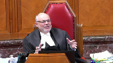
:::

There's a lot of loose language here and I'm trying to understand it.

I understand how something, as you described, can become something of a national concern, but then you say, well, and that means it never was a provincial concern, surely it must have been the one.

**Speaker 1** (00:11:45): Well, this is a matter of provincial jurisdiction, no question about it.

That's the argument that we're making.

It is provincial jurisdiction, it remains provincial jurisdiction, and it does not meet the standard to become something that can be defined as a national concern, which makes it become a matter of exclusive federal jurisdiction.

**Justice Brown** (00:12:00): If Parliament had instead legislated, no backstop, but just simply, here's the price under Part 1, here's the cost under Part 2, no role for provincial legislation, does that make your argument more difficult to advance or easier to address?

::: {.column-margin}
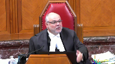
:::

**Speaker 1** (00:12:23): Certainly the supervisory aspect of the jurisdiction is problematic in that it's unprecedented, but that would still be a transfer of jurisdiction from the provinces to the federal government in matters that are exclusively within the provincial domain.

::: {.column-margin}
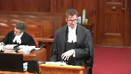
:::

So it'd still be problematic and would still be unconstitutional in our submission should they just set what the actual amount is without saying we're going to supervise the provinces and whether they become listed provinces.

We're just going to set the benchmark and apply it.

It's still the same problem because it's a matter of provincial jurisdiction.

Pricing and regulating GHG emissions is largely a matter of provincial jurisdiction.

**Justice Abella** (00:13:04): Why do you say it's a matter of provincial jurisdiction?

::: {.column-margin}
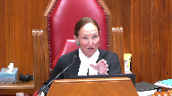
:::

If you characterize the problem a certain way, then I can see that aspects are within provincial jurisdiction.

The question is, though, whether there isn't something about what is at issue here that is so systemic that it is that it comes within the crown test of having been taken on a different character by virtue of the harms.

Where do we put that part of the analysis into your framework that it is provincial?

What is it that you say is provincial?

**Speaker 1** (00:13:47): Right, within the context of the wording of the constitution, these are matters that are regulated by the provinces, have been regulated by the provinces for a very long time, and as I said, continue to be regulated by the provinces even by the terms of the very statute we're talking about.

**Overlapping speakers** (00:14:02): Can continue to be regulated by the provinces?

No, the federal government...

**Speaker 1** (00:14:07): This is really, I'm jumping ahead a bit, but this is really part of the major problem with what has occurred in the Saskatchewan and Ontario Courts of Appeal, whereby what they have done in the context of trying to limit the description of the new national concern matter that will now become an exclusive matter of federal jurisdiction is they have not limited it at all.

::: {.column-margin}
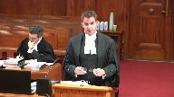
:::

And it's the matter of minimum national standards, which we would submit is something that should be removed entirely from the national concern lexicon because it's dangerous, because minimum national standards do not in any way qualitatively assist in defining the matter.

**Justice Rowe** (00:14:46): Ah, but minimum national standards is the magical elixir whereby one gets around singleness indivisibility and distinctiveness because no province is capable of establishing minimum national standards.

::: {.column-margin}
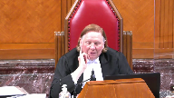
:::

Therefore, by definition, you have provincial inability and in the view of the Attorney General of Canada, SDI is wiped off the map.

**Speaker 1** (00:15:10): I totally agree with you and as I was saying minimum national standards as a phrase is very dangerous and should not be used in national concern matters because as I said it certainly doesn't qualitatively change the matter.

::: {.column-margin}
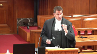
:::

If you say minimum national standards of GHG emissions that is really qualitatively just GHG emissions and unfortunately it doesn't quantitatively change the nature of the matter either.

Minimum national standards of GHG emissions is complete power to make a minimum the minimum possible standard or the maximum possible standard which is complete regulation of the subject that you're talking about.

So minimum national standards should not be included in the lexicon for national concern is our submission for that reason because it's dangerous and it's meaningless.

**Justice Karakatsanis** (00:16:02): You prefer systemic risk over here? Yes.

You prefer systemic risk.

**Overlapping speakers** (00:16:08): in what sense.

**Justice Karakatsanis** (00:16:09): National standards, it's another way of thinking about systemic risks across the nation.

**Overlapping speakers** (00:16:18): Okay.

**Justice Karakatsanis** (00:16:18): Thinking of the Securities Sack Commission. Right.

**Speaker 1** (00:16:21): the pan-Canadian securities, of course, which is a much different scenario than this in terms of the progress that the national securities case took is a similar path perhaps to which this one should take in terms of the securities regularly being proposed in the original act and that being to diffuse, of course, to meet the national concern test and then there was a cooperative resolution secured after that and of course passed the constitutional muster.

::: {.column-margin}
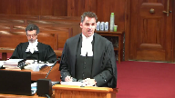
:::

Perhaps I can move on to the notion of national concern and some of the principles and precedents on national concern that we're going to have to deal with.

**Justice Moldaver** (00:16:59): Your question please, as I understand it, all the evidence in this case, all the scientific evidence and the accepted evidence, but correct me if I'm wrong, is that some form of pricing mechanisms are necessary to reduce the amount of greenhouse gas emissions.

::: {.column-margin}
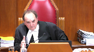
:::

They're not enough in and of themselves, but they're not sufficient to do the job to get things down to an acceptable level, shall we say, but they are integral to the whole concept of reducing greenhouse gas emissions.

Without some form of pricing mechanisms, this ain't going to happen.

Now, that's my understanding of the scientific evidence, and indeed it was the evidence that I think was before the provinces and the federal government when they were talking about all of this and trying to work out some agreement.

So, let me put this to you, there's no question that parliament has set out certain mechanisms, pricing mechanisms in this legislation, two of them to be exact, but have they not also left it to the provinces to impose their own pricing mechanisms if they wish that may well be and probably will be different from the ones chosen by parliament.

All they're really saying is, provinces, we're leaving you with a lot of power, but you're not going to be able to get away with...you're going to have to have some pricing mechanisms and they're going to have to reach a certain standard.

And if they don't reach a certain standard, then this act kicks in.

But it seems to me they've left you guys a whole lot of power, so just...

**Speaker 1** (00:18:53): Help me out.

::: {.column-margin}
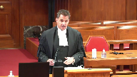
:::

First of all, they left the provinces with only the power that the federal government decides or more particularly the governor and council decides that the provinces should be left with.

In their total discretion they can change the standard to whatever they want any time which could become the maximum possible standard that no province could meet and take over the entire field.

So the provinces do not have a significant amount of jurisdiction remaining in this matter.

It's totally at the discretion of the federal government and in relation to the first point in relation to your question about this acceptance that pricing is necessary as part of the panoply of policies that are put in place to regulate GHG emissions, that is a policy debate that these courts should not be engaging in in relation to the efficacy of the policy.

Federal pricing of GHG emissions is one policy of many.

That's recognized in the body of the Vancouver declaration that everybody agreed to.

It's one policy and to engage in the policy debate is to make the same error that the Saskatchewan court of appeal did in engaging in the policy debate and accepting that pricing has to be part of the range of policies that apply to reduce GHG emissions properly.

You'll note in the decision of the Saskatchewan court of appeal the majority references the fact that they understand it's not a policy debate.

They shouldn't get into that early in the decision and later find as a fact that the pricing is a necessary part of any policy set of policies in relation to GHG emissions and they say it's undisputed.

The reason it's undisputed is because the attorneys general for Saskatchewan and Ontario did not file evidence to dispute it because it's a policy dispute and it wasn't supposed to properly be part of what the court was considering.

**Justice Rowe** (00:20:39): Well, in effect, it's nonsense because in the Second World War you had something called rationing and you had price controls and it achieved the same thing.

There are other means of reducing emissions other than the pricing mechanism.

It may be the most elegant but it's certainly not the only one.

**Speaker 1** (00:20:56): I absolutely agree with you, Mr. Justice.

::: {.column-margin}
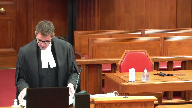
:::

In fact, if you look at the condensed book, section 4.0, the Vancouver declaration, you don't have to go any further than that to find what some other of the policies may be.

On the second page, page 3 of the Vancouver declaration, 4.0 of our condensed book, says recognizing that provinces and territories have been early leaders in the fight against climate change, which of course is true.

**Overlapping speakers** (00:21:23): We don't have the condensed book yet, but we'll have it eventually.

**Speaker 1** (00:21:26): I'll just read the paragraph.

::: {.column-margin}
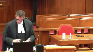
:::

It sets out a range of policies.

They've taken proactive steps such as adopting carbon pricing mechanisms, placing caps on emissions, involvement in international partnerships with other states and regions, closing coal plants, carbon capture and storage projects, renewable energy production.

And it goes on.

There are a litany of policies.

Policy levers can be pulled and pushed.

The question here for this court is who has jurisdiction to make that decision.

**Justice Côté** (00:21:52): Mr. Mecad, in your opening statement, you said that the federal has all the jurisdiction it needs to achieve the result of reducing the gas emissions.

::: {.column-margin}
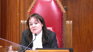
:::

Can you be more precise?

Which head of power, according to you, the federal should have used to achieve the result they want to achieve?

**Speaker 1** (00:22:13): I don't know which one they should use.

::: {.column-margin}
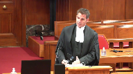
:::

I know that they have a broad range of very significant powers that they could access in terms of regulating this, including most particularly the criminal law power and the taxation power.

Over and above that, they have the ability to attempt a cooperative resolution, which is what was happening through the Vancouver declaration.

There was cooperation.

It had begun when the government, federal government unilaterally imposed the ggppa.

In fact, during a meeting of first ministers out east here where some of the first ministers walked out because the announcement was made that they were unilaterally imposing this at a time when they were on the path towards cooperating to come to a resolution.

**Justice Brown** (00:22:52): I just want to pull you back to something that you said, because I know you don't have a long time, but we're here for a couple of days, and so I just want to clarify this.

::: {.column-margin}
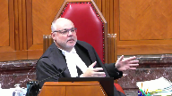
:::

You define the question that we're answering here, is who has the jurisdiction to make this decision, the decision being the way to reduce carbon emissions?

I would have thought that the question is a little narrower than that, because as you've just pointed out, there are ways that the federal government could reduce carbon emissions, and even using a pricing scheme by way of the taxation power, you can see.

So the question isn't whether Parliament can address greenhouse gas emissions, can act to prevent climate change.

The question, it seems to me, is whether the way it has done so in this statute is ultra-virus.

And that's what I'm trying to get at.

**Overlapping speakers** (00:23:46): That is.

**Justice Brown** (00:23:47): Isn't that a more accurate description of the question?

That's fair.

**Speaker 1** (00:23:49): We're talking about the statute, but we're also talking about creating a new, exclusive federal power in the national concern doctrine, and...

::: {.column-margin}
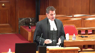
:::

That's the way they've chosen to defend it. Right.

As opposed to choosing cooperative federalism or some of their other very significant federal powers, they've chosen to go straight for it.

**Justice Brown** (00:24:09): Federalism isn't cooperative.

I mean, if you want to work out an arrangement, that's fine.

I mean, federalism just is.

It's federalism, and so whether it's cooperative or uncooperative, I don't really care.

**Speaker 1** (00:24:21): I'll jump to a couple of more important points, I think in relation to...

**Justice Wagner** (00:24:23): talking about cooperative federalism, the fact that the federal legislation is like a backstop, in other words, federal government says to the provinces, well, do what you can, but you have to reach a minimum standard and we'll manage.

::: {.column-margin}
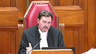
:::

Isn't that cooperative federalism?

**Speaker 1** (00:24:48): I would suggest it's the opposite of cooperative federalism.

::: {.column-margin}
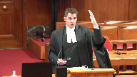
:::

The federal government is only leaving room for the provincial governments to exercise their jurisdiction to the extent that the federal government in its sole discretion decides that they will have that discretion.

As I said, the standard in the statute can rise to the maximum or minimum level.

And another problem in the Saskatchewan court of appeal in the terms of the national concern power, they said it's minimum national standards of price stringency of GHG emissions.

First of all, a national concern power needs to be defined as a matter such as aeronautics, radio communications, marine pollution.

It's not defined as minimum national standards of price stringency of GHG emissions.

**Overlapping speakers** (00:25:29): So, what's the purpose of the legislation?

What's the pill and substance then?

**Speaker 1** (00:25:34): Pith and substance is the regulation of exercising the supervising the provinces, exercising provincial jurisdiction to regulate the provincial sources of GHG emissions.

::: {.column-margin}

:::

We think sources are an important part of the pith and substance because this isn't the regulation of GHG emissions as they exist and move around in the act.

**Justice Brown** (00:25:58): That's a circular definition of pith and substance.

::: {.column-margin}
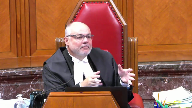
:::

Remember what you're trying to do with pith and substance.

You're identifying pith and substance in order to assign it to an area of jurisdiction.

But within your pith and substance you call it provincial jurisdiction.

How is that helpful?

That's not terribly helpful.

**Speaker 1** (00:26:21): In terms of what the act is doing, it is setting a backstop so that the federal government can supervise and take over the regulation of GHG emissions is really the nub of what the statute is doing.

When I say going back to the point I was making about what the act is doing, it is setting a backstop so that the federal government can supervise and take over the regulation of GHG emissions is really the nub of what the statute is doing.

**Justice Brown** (00:26:36): That's an argument.

That's not pith and substance.

What's it doing?

It's creating pricing incentives to reduce greenhouse gas emissions.

Now, maybe it's a federal takeover, maybe it's not, but...

**Speaker 1** (00:26:54): but my submissions in relation to pith and substance are, there are a litany of different descriptions by all of the parties and the courts involved in pith and some trying to put the particular words around what it is, when really a lot of us are talking about the exact same concepts and trying to fit them into a description.

::: {.column-margin}
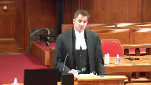
:::

So it has to take into account the backstop nature.

No question about that.

Has to take into account that it is, it's intended to change behaviours in relation to the pricing, in relation to the GHG emission generally, and it does so through a pricing mechanism, which is an economic mechanism.

You have to take into account the large discretion the Governor and Council has been given to expand this act almost in unfettered discretion.

But getting to the power, the national concern power, which still has to be dealt with, in terms of creating, I've dealt with part, the minimum national standards part of the description of the new power, but when you use pricing stringency as part of the description of the matter, you have taken, as I said, the policy, and you've embedded the policy into the Constitution.

And the real problem with that is that what has happened is the Ontario and Saskatchewan Courts of Appeal have given the federal government jurisdiction indirectly where all of the courts and all of the judges who've heard this are unanimous, that you cannot give them the power over GHG emissions directly.

The reason they've got.

**Justice Rowe** (00:28:17): epithin substance has been defined in terms of a modality of regulation.

**Speaker 1** (00:28:22): Yes. Yes.

::: {.column-margin}
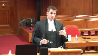
:::

And so they have now secured the power over all of GHG emissions indirectly where they were not able to secure it directly because they can now, the federal government can go and presumably create statutes for minimum national standards of whatever the next policy is of GHG emissions and then the next policy.

So death by a thousand cuts is the words put on it by the Saskatchewan Court of Appeal minority and that's exactly what occurs with a description of the national concern matter at that level and I must step down so that my friend Mr. McAdam can proceed.

Thank you very much.

**Speaker 2** (00:31:01): four things.

::: {.column-margin}
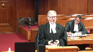
:::

First, the legitimacy of the national concerned branch of the power.

I'd also like to briefly discuss section 92a of the constitution act 1867.

I'd like to say a few words about the federal government's alternative argument that the act can be upheld under its taxing powers.

And finally, I'd like to say a couple of words about the emergency power.

In addition to what my friend has said about the national concerned doctrine of the pog power, I think I want to be a little bolder in my submission this morning.

I agree with the submission of the Alberta court of appeal that the national concerned power is an illegitimate power.

And it always has been.

There is no place for it in our constitution.

Provincial powers cannot magically be turned into federal powers by some vague and amorphous process of evolution.

That is simply contrary to the written words of the constitution, and it's contrary to the principles of federalism and the rule of law.

I would make three points.

First, you have to look at the words of section 91.

Pog powers apply only with respect to matters that don't come within provincial jurisdiction.

As Chief Justice Frazier pointed out, you can't ignore the words.

The words are clear.

Second, you have to look at the

**Justice Wagner** (00:32:29): But you cannot ignore the context either, I guess.

**Overlapping speakers** (00:32:35): No, you can't.

**Justice Wagner** (00:32:36): My question is, when you look at those questions, should we look at also, I'm going to refer to the Living Three.

::: {.column-margin}
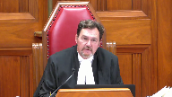
:::

In other words, science has evolved, things that happened or were present in 1867 are different today, and should we take somehow this context into consideration when we interpret the Constitution?

**Speaker 2** (00:33:00): Well, my Lord, I think that when it comes to applying the living tree doctrine, it's a doctrine that I would suggest has to be applied with great care and great caution.

::: {.column-margin}
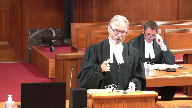
:::

What I would suggest is that if you look at a case like this, this isn't about pruning the tree or recognizing a new branch or a new leaf.

This is about ripping the tree out by the roots and replacing it with a new tree.

And what I would submit is that whether you look at the Crown Zellerbach test of national concern, whether you look at my submission that the national concern doctrine is illegitimate, the key is always federalism and this court's duty to protect the balance of the federation and to respect the powers of both the federal and the provincial government.

And in my submission, no application of the living tree doctrine can justify this case.

It would be ripping the tree out by its roots.

**Justice Moldaver** (00:33:54): That's a very interesting and very kind of interim statement, but it just seems to me that it ignores certain contextual matters, as the Chief Justice said.

::: {.column-margin}
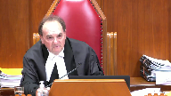
:::

We are into a situation now where everybody, as I understand it, agrees that climate change is a serious threat to life on Earth as we know it.

Some call it an existential threat.

It's doubly so, shall we say, in terms of Canada that is surrounded by water on three sides, and particularly the Arctic, and there's evidence before the court that we are already seeing the effects of it.

Now, whether I agree or not with that, those are accepted facts that are before the court.

I would have thought it's also accepted that Canada has entered into international agreements which will not constitutionalize something that is unconstitutional, but that is a factor to take into account in the whole piece.

Number three, this existential threat did not exist in 1867.

Number four, it seems to me that no matter, no question the provinces have power, and that's why I went to your friend and I said, they can introduce their own pricing mechanisms.

The problem with this is, as I understand it, a systemic one.

If one province decides not to do it, if one province decides to go rogue, this will have an impact potentially on the whole of Canada and other provinces that are trying their best.

And so, and that cannot be guaranteed amongst the provinces.

And that seems to me to be the overriding critical concern here that allows the federal government, with all those context factors that I've mentioned, to come in and say, you know what, this is a matter of national concern.

We're going to leave you provinces a fair amount of power as to what pricing mechanisms you choose to engage in.

But we're telling you now, and we've been told, federal government, that some pricing mechanisms are necessary in order to reduce greenhouse gas emissions to a certain level.

They won't do it totally, but they're necessary.

And we're asking you, we're giving you the opportunity to engage in these pricing mechanisms, and we will look at them.

And if, in fact, we are satisfied that they meet the standards that we feel are necessary in order to deal with a national problem, you're fine.

If they don't, we have a backstop.

And I know that's a very long point, but you started off as, oh, my God, this is going to rip the roots out of federalism.

And I think, with respect, that is a gross overstatement.

**Speaker 2** (00:36:50): My Lord, let me say a number of things in response to your question.

First, no one is here disputing the seriousness of climate change or the need to reduce greenhouse gas emissions.

**Justice Moldaver** (00:37:02): How are the province able to do that?

::: {.column-margin}
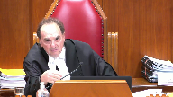
:::

Just, I'm sorry to interrupt.

You tell me how it is that the provinces individually are able to ensure that we will get the kind of reductions that the scientists and many others feel are necessary to curb an existential problem.

**Speaker 2** (00:37:22): My Lord, in response, what I'll tell you is what Saskatchewan is doing.

We have a greenhouse gas management and control.

**Justice Moldaver** (00:37:28): I don't doubt what Saskatchewan has, I'm asking you how we can ensure that all ten provinces and three territories will get together, will unify and will follow through with what is needed to deal with this existential threat.

**Speaker 2** (00:37:46): The way that Saskatchewan has done it and the way all provinces can do it is by exercising their jurisdiction and respecting the boundaries in the constitution.

**Speaker 2** (00:37:56): not opposed to carbon pricing.

::: {.column-margin}
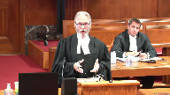
:::

We have carbon pricing that applies to industrial emitters in Saskatchewan.

What Saskatchewan objects to is a carbon price on consumers at the gas pumps.

That's the position that we took in the Court of Appeal and that's the position that we'll take here.

But we can get there in other ways.

We can get there by closing...

**Justice Moldaver** (00:38:16): are they stuck with that or could they come up with another pricing mechanism that would not involve you know this extra cost of gas at the pumps and as long as it sort of met the standards that parliament has set, there's no problem.

::: {.column-margin}
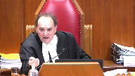
:::

They don't have to do that.

**Justice Brown** (00:38:35): That's the rub, isn't it?

That's the rub, as long as it met the standards that Parliament set.

That's the issue for you.

**Speaker 2** (00:38:42): about the province is having lots of jurisdiction.

::: {.column-margin}
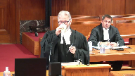
:::

The provinces only have jurisdiction to do more.

We can't do less.

If we've decided to do it in a different way, that's not permitted.

Saskatchewan could reach the goals from the Paris agreement by closing our coal-powered coal-fired power plants.

We've agreed to do that by 2030.

Ontario has already done that and has made great strides in reducing emissions.

There's other ways to do this.

This legislation is an Ottawa knows best.

It's a big brother type of legislation.

We're going to tell you how to do it and we're going to tell you the means to do it, which is not just how to do it, it's the means.

Let me ask you this.

I mean Saskatchewan is doing something.

We haven't gone rogue.

**Justice Karakatsanis** (00:39:32): But what I'm trying to say is what happens if a province does not, or two provinces do not?

What happens to this national risk?

What happens intra-provincially?

**Speaker 2** (00:39:44): Well, my lady, my response is you have to respect the constitution and you have to respect federalism and the principles of the provinces are sovereign and autonomous and are so-

**Justice Karakatsanis** (00:39:55): I do, my question is premised on that, but I think the point that I'm making is yes, there's much that the provinces can do, they can go even further if they wish, but the point here is that can a province act in a way to cover the national risk, the national requirements in an area where we're satisfied it's a matter of national concern, is there not a risk that a province may choose not to ask or may change its mind and withdraw from a cooperative, a voluntary scheme.

::: {.column-margin}
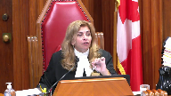
:::

**Speaker 2** (00:40:32): My lady, what I would say is that it's just like securities and it's just like securities regulation.

Provinces have the ability to make their decisions and

**Overlapping speakers** (00:40:43): But let's see with the security.

**Speaker 2** (00:40:45): The response is cooperative federalism.

::: {.column-margin}
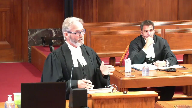
:::

The response is getting agreements and dealing cooperatively with the provinces based on respect for their jurisdiction, not this legislation which is taking over provincial jurisdiction saying do it our way or the highway.

We'll step in and we'll do it the way we want to if you don't agree with our means.

We're saying we treat the problem seriously.

We can get there in different ways.

We have the jurisdiction to get there in different ways.

Let us do that.

If we can agree on a cooperative scheme, absolutely.

That's the foundation of our federation, but not this.

We're going to force you to do it and to do it our way.

**Justice Karakatsanis** (00:41:25): stay with the securities.

::: {.column-margin}
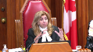
:::

I mean, you raised that, I raised it earlier.

We had the first Securities Act which took over regulation.

And I realize trade and commerce is different, but the fourth and fifth steps of the General Motors test speaks to some of the same issues.

So we have the first Securities Act which basically takes over the regulation entirely.

We have the second Securities Act which deals only with those aspects that are dealing with systemic risk that no individual province can deal with.

Why isn't that a good analogy?

You drew on that analogy, I think, to make a different point.

**Speaker 2** (00:42:08): My lady, what I would say is this case is way more like the first securities reference where the federal government by this legislation is purporting to regulate the day-to-day business of every company in Saskatchewan that emits greenhouse gases.

::: {.column-margin}
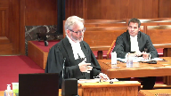
:::

And that's every company because greenhouse gases are ubiquitous.

So this is like the first securities reference where it is the day-to-day regulation.

The other thing I would say about systemic risk, I think it's difficult to take the concept of systemic risk from the securities concept and to apply it here.

But the question I would put it a little bit differently is are there some aspects of climate change reducing greenhouse gases that the federal government could legitimately regulate?

And my response to that is absolutely they can.

They can use their criminal law power.

They can use the spending power.

They have lots of powers to do this.

It has to be something narrow.

**Justice Moldaver** (00:43:02): I realize what a nightmare it would be if they tried to criminalize this.

::: {.column-margin}
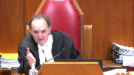
:::

You'd be five years on any given case getting it through the courts before anybody got anything done and run that across all the provinces and all the businesses and so on.

I mean, isn't parliament entitled, perhaps they are entitled to use the criminal law power.

Perhaps they can use the taxing power.

The issue is not whether they can, it seems to me, unless that's your position.

The issue is whether the national concern doctrine applies.

And if they choose as a matter of policy to go under that, and it's found to be constitutional, then the fact that they can do it any number of other ways is with respect, it seems to me irrelevant.

**Speaker 2** (00:43:49): My lord, what I would say would be...

**Justice Brown** (00:43:51): answers the concern about an existential threat.

The issue isn't whether Parliament can act to address an existential threat.

The issue is whether the way in which Parliament has chosen to address it here is constituted.

**Speaker 2** (00:44:04): Yes, and it's the question about the Greenhouse Gas Pollution Pricing Act, and what I would say, my lord, I was going to say at the beginning that I think the national concern test is illegitimate, but I'm going to focus on your question about how do you apply the national concern test in this case.

::: {.column-margin}
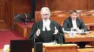
:::

And the Crown-Zellerbach test has two parts.

Is it single, distinct, and indivisible?

Now, there's various different ways to describe that, but it has to be something that you can carve out of provincial jurisdiction that has clear boundaries around it.

My submission is that this legislation does not meet that part of the test, because there's nothing about regulating greenhouse gas emissions that's distinct from what provinces can do.

As Mr. Cuskey mentioned, the act itself recognizes that provinces can legislate, can do exactly what this act does.

**Justice Côté** (00:44:53): Mr. Koski, what about, and this goes to the question asked to you by my colleague, Justice Karakatsanis, I understand that your argument that provinces, they can regulate, they can adopt their own legislation, but what about if one province decides to do nothing because they don't believe, for instance, in climate changes?

::: {.column-margin}
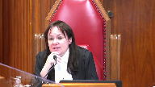
:::

It may happen.

And a province decides to do nothing, and there is evidence that in order to achieve a certain result on a national basis, a collective action is necessary.

What do we do with that if a province, I understand that a province can decide in order to achieve a certain result, to adopt one policy instead of this pricing policy, I understand that, but what about a province governed by somebody who would say, we don't believe in those climate changes, then we are going to do nothing?

**Speaker 2** (00:45:50): that's federalism and that's democracy where the provinces have jurisdiction they can make decisions about how to exercise that jurisdiction and if it's an unpopular decision then they have to go to the polls and face the electorate and the electorate can vote them out at the next election.

**Overlapping speakers** (00:46:07): But just because something's... Are you saying that a national concern does not exist in the Constitution?

**Speaker 2** (00:46:12): Well, I think it is an illegitimate power, but I would like to address...

**Justice Wagner** (00:46:19): So that would be contrary to all our jurisprudence.

So you're asking us today to change our jurisprudence here at the Supreme Court.

**Speaker 2** (00:46:28): Well, the Privy Council did not recognize the national concern doctrine for 50 years and I think that by count Haldane had it right, that he recognized if you have this concept, we have amending formulas in our constitution on how provincial powers could be turned into federal powers.

::: {.column-margin}
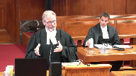
:::

And if an amendment is made, provinces can opt out.

That's what was agreed to in the constitutional negotiations in 1982.

But now the federal government is coming here and saying no, it's just things have changed and things have evolved and things are different than they were in 1982.

So you should recognize the provincial power to regulate businesses, to set prices in local markets is now a matter of federal jurisdiction by this evolutionary process.

I think that's illegitimate.

But if you accept the crown test, single, distinct and indivisible, there's nothing single, distinct and indivisible about this act.

My friends are going to say, well, it's only a certain number of greenhouse gases.

You can't look at the gases.

You have to look at the things that emit those gases.

And that's businesses in the province.

There's nothing distinct about them.

And the other part about the crown test is you have to remember that it's balancing federalism, it's respect for the balance of powers between the federal government and the provincial government and in our submission, this act does not respect the balance of federalism.

**Overlapping speakers** (00:47:56): All right, one last question.

Is the LEC correct?

**Justice Kasirer** (00:47:58): I'd like to get to this question of provincial incapacity.

::: {.column-margin}
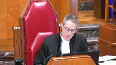
:::

It was raised by two of my colleagues.

And to find out exactly what you mean, it seems to me running through the submissions today and tomorrow, there are two views on this.

One is jurisdictional incapacity, where the provinces lack the jurisdiction to legislate, that can be a matter of national concern.

Another broader, less jurisdictionally based argument, simply saying that because of the failure of one province to act or cooperate could have adverse consequences to the other opens the door.

I wonder where you stand on that.

**Speaker 2** (00:48:45): My Lord, it's Saskatchewan's position that provincial inability in the Crown-Zellerbach test has to be interpreted as a constitutional inability.

::: {.column-margin}
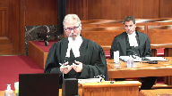
:::

That's consistent with the trade and commerce cases, and in our view, it's consistent with the principles of federalism, and in our view, the principles of federalism are what need to govern this case.

Some of the other parties have suggested it's simply a question of what a province does affecting one of its neighbours, while almost everything the province does affects its neighbours one way or the other.

In our submission, that can't be the test.

It has to be a constitutional inability.

Thank you, sir.

**Justice Wagner** (00:49:44): So we will call Josh Hunter or Patrick Ryan.

**Justice Brown** (00:53:21): Merci.

**Justice Wagner** (00:53:22): Good morning.

::: {.column-margin}
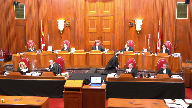
:::

**Speaker 3** (00:54:05): Chief Justice, Justices, Ontario is here to submit that the Greenhouse Gas Pollution Pricing Act Parts 1 and 2 are unconstitutional.

**Justice Rowe** (00:54:16): By the way, I think that's the first time I've heard anyone make a reference to parts one and two.

The difference, it seems to me, is quite important, but it's up to you whether you wish to treat them as different.

**Speaker 3** (00:54:26): Part three is using Parliament's enumerated powers to actually do matters the provinces couldn't do.

::: {.column-margin}
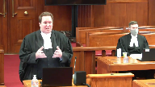
:::

That's something that's valued within Parliament's power.

Parts one and two are an attempt to dictate to the provinces the proper solution to a matter that should be governed by cooperation between the federal government and the provinces, each exercising their own constitutional powers.

You're looking through my friend's condensed books.

It looks like this afternoon and tomorrow you'll be hearing many submissions about how essential carbon pricing is, and too so in that.

First of all, to answer Justice Mulder's point, it is not in the evidence that the science says pricing is the only way to deal with climate change.

What the evidence says, there's comments about policy debates about whether it's the most economically efficient.

But as my friends from Saskatchewan pointed out, there are a wide range of policy tools that can be used to address greenhouse gases, including just to give one example.

**Justice Abella** (00:55:24): Sorry, is there any, just sticking with the evidence for a moment, is there any evidence to the contrary about the scope and systemic and existential threat posed by the consequences of greenhouse gas emissions?

**Speaker 3** (00:55:37): Let me break that down into a couple of different points.

::: {.column-margin}
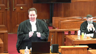
:::

I'll come back to systemic in a minute because that's an important point.

Everyone agrees this is an existential crisis.

This is an important measure.

That's why every single government in Canada is taking action.

Just to show the different policy tools available, Ontario has already reduced its greenhouse gas emissions by 22 per cent just by one non-pricing measure, closing coal-fired plants.

That gets absolutely zero credit under the federal plan because it's not based on pricing, even though it had the biggest single reduction of greenhouse gases by any jurisdiction in this country.

That goes to show there's different tools, but it is a threat.

That's why everyone's facing it.

This is not the first existential threat this country has faced.

It's not the first one where Parliament has tried to claim it needs the tools to battle it through the national concern.

Time and time again, rationing during the war, unemployment during the depression, hoarding after the war and during the depression, and most recently, inflation.

Again and again, these are accidental creds, but the court said we don't need to use national concern.

Now, turning to the systemic point for a second, it's important to remember what the court was talking about in the securities reference and the pan-Canadian securities reference.

The systemic risk that was found to be a valid provincial federal matter as opposed to the day-to-day regulation of securities, those were qualitatively different.

Let me just go into that for a second.

There's normal market risk.

You have the risk in any securities that an individual company might fail, its investors may lose their shirts, they may be out of pocket.

That is cumulative.

Obviously, the more companies do that, the worse it is.

The systemic risk, however, that was being considered isn't just the sum of those parts.

What it was, was a different one.

Say, for example, you have a major bank, say Chase in the United States, it falls.

It's not just its shareholders that are out, but it's the fact that you have all the different market participants who are counterparties with that bank.

It's not a linear addition, it's a geometric sum.

It's actually a different kind of risk.

Because of that different kind of risk to the market itself as opposed to just the market participants, that's why you read the academic articles that were cited by Justice Iacobucci in the first reference and then recited by the court in the second reference.

That is why it's actually different in kind.

It needs constant monitoring throughout the federation of every single thing, and that's actually what the provinces are jurisdictionally incapable of doing.

That's why there was a role.

That's to Justice Roe's question.

There is a role, the provinces can't affect greenhouse gas emissions by CN, by oil platforms in the continental shelf.

There is a role for Parliament in that, but the greenhouse gas emissions that are an issue in this case, they're just an additive sum.

The provinces can collectively deal with the sources of those activities.

**Justice Abella** (00:58:43): effectively choose to deal with those issues.

::: {.column-margin}
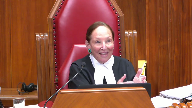
:::

But they don't have plexi class at their borders and the effect of not choosing to engage in strategies that are ultimately helpful to the rest of the country has enormous implications.

So that's why we have a national concern test.

It's not clear to me yet where your argument is about the federal government not having the authority to do what it did here just because there is a possibility that provincial action could help.

**Speaker 3** (00:59:19): the best answer to that is to go to the words of justice in crown Zellerbach itself.

::: {.column-margin}
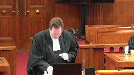
:::

I understand you don't have our condensed books yet

but it is for your reference even better.

So it's at tab 13.

So unfortunately the individual authority, I'll give you the references, it's the pages 432 and 33 of crown Zellerbach.

Unfortunately the condensed book is not separately numbered as condensed books have to be.

But it's the second page of the crown Zellerbach decision which is about 40 pages in.

I'll give you the reference and don't necessarily need to have it in front of you.

This justice ledane dealt with this very question.

Dealing with the so-called and I use that term advisedly provincial inability test which is not a test, he made it very clear it's only one indicia of the first part of the test, is the matter at hand single, distinct and indivisible?

And just again for your reference I'll go into this more in a minute but what we say the matter is is the regulation of activities that create greenhouse gases.

And he looked into that and said he went through the seminal article by professor Gibson and about what that could be and he rejected this exact proposition.

So professor Gibson argued that you needed federal jurisdiction to deal with the possibility of a gap in the provincial ability.

And this is what it says about halfway down page 433 just above the little e. Where it would be possible to deal fully with the problem by cooperative action of two or more legislatures the national dimension concerns only the risk of non-cooperation.

And again this is professor Gibson, this is not justice ledane yet.

And justifies only federal legislation just to this.

So that's the proposition justice DeBell I think you just put to me.

There's a risk of provincial non-cooperation.

There's no doubt that the provinces acting collectively can regulate every activity within their borders except for those subject to exclusive federal jurisdiction under part three.

So they can act collectively.

The risk is well what if they don't.

And justice ledane rejects this proposition as a justification for national concern.

He says this would appear to contemplate a concurrent or overlapping federal jurisdiction which I must observe is in conflict with what was emphasized by justice Betz in the anti-inflation act reference.

That where a matter falls in the national concern doctrine of the peace, order and good government power as distinct from the emergency doctrine.

Parliament has an exclusive jurisdiction of a plenary nature to legislate in relation to that matter including its intra-provincial aspects.

**Justice Abella** (01:02:07): Where does that put the threshold test where you have to first decide whether or not it's a matter that's new or of local implications that has now become something?

**Speaker 3** (01:02:23): So that's the overall test.

::: {.column-margin}
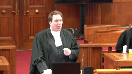
:::

The factors set out by Justice LeDain, really it's the two-part test.

Let's just step back a second and go through exactly what that test is.

There are two parts to deciding whether or not a proposed new matter is suitable for national concern.

The first step is the is it single, distinct and indivisible, using the words of Justice Betts in anti-inflation.

**Justice Abella** (01:02:47): So you accept that it's new or a matter of local concern that has now become wider in the country?

**Speaker 3** (01:02:52): What I'm saying is to determine whether something is new of local concern, you have to go through the Crown-Zellerbach analysis.

::: {.column-margin}
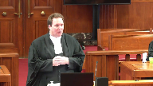
:::

That's what you're asking.

In deciding whether a matter is something single, distinct, and indivisible, you have to decide is it something single, distinct, and indivisible, and secondly you have to decide would recognizing it have a matter of would it be compatible with the division of powers.

**Justice Abella** (01:03:16): Sorry, so what do you do with the second test second step of crowns elder back the national concern doctrine applies to both new matters which did not exist And two matters which although originally so I read that and

**Speaker 3** (01:03:29): dealing with the argument that really it's it's coterminous with the gap so called gap branch of the peace order and the government power so he's rejecting the argument that it has to be something that couldn't even be contemplated in 1867 he's saying no it is possible that something that was recognized in 1867 could change and I would say could change qualitatively not just adding it all up to be something that's suitable for recognition under the national concern but you have to go through the remaining steps there has to be a dividing line it has to be something that is single distinct and indivisible and this case is the exact opposite of distinct and indivisible

::: {.column-margin}
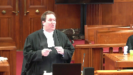
:::

**Justice Rowe** (01:04:06): Well, the contrast that Justice Ladain drew between something which is single, indivisible, and distinct is an aggregation of provincial matters, which is what Justice Betts said this cannot be in anti-inflation.

::: {.column-margin}
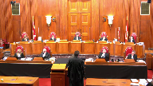
:::

And I understood that while Justice Betts dissented in Crown-Zellerbach, I understood Justice Ladain to adopt the point made by Justice Betts that singleness, distinctiveness, and indivisibility gave something a different character than a basket into which you simply throw a variety of provincial things and put a label on the side called national concern.

**Speaker 3** (01:04:54): So that was very much the thrust of Justice Laferay's dissent in Crown Zellerbach, was pointing that out, and that was then adopted by the entire court in Old Man River.

::: {.column-margin}

:::

But that really goes to the heart of the concern that Justice Betts expressed in the anti-inflation reference.

And in many ways, the arguments that were made about inflation and the arguments that are being made today about greenhouse gases are helpful parallel, I would submit, in that, you know, the comment about provincial inability applies the same way.

If one province, it wanted to get its economy going, it wanted to increase wages, increase prices, that would drive up national inflation and harm another province that was struggling with inflation.

So, for example, if one region of the economy, its economy, was going gangbusters, the other part was stultifying, that's exactly that issue.

That was not a reason to find inflation to be a national concern. And why?

It's because exactly that concern that Justice Betts expressed was that you're putting together too many disparate matters, suitable and effectively regulated by the provinces for decades, into a basket and saying, oh, it's inflation, or, oh, it's greenhouse gases, or,

oh, it's national dimensions of collective action of greenhouse gases.

And I won't spend a lot of time, but I would submit that all those adjectives add nothing.

They don't provide any limit.

A minimum standard, as my friends and I talked about, can be set wherever you please.

You could have set maximum standards of wages and prices and inflation, it would have been the exact same thing.

**Justice Rowe** (01:06:18): But are we talking about minimum standards anyway?

::: {.column-margin}

:::

I mean, when you look at part two, this is segmented by industry.

So industry A, per unit of output, there's a certain amount of, for listed enterprises, there's a certain output where you don't have to pay, up to a certain level, any charge, any excess emission charge.

Above that, you have to pay the charge.

Are you a listed industry?

What is the sort of excess emission charge that is applied?

What is the gobbledygook is amazing.

There's the national production weighted average emissions intensity of activity factor, which means how much you get to put up the smokestack before you start to pay.

For every ton of steel you roll out of Hamilton, or for every barrel of oil you put out of an oil refinery in Montreal.

And then you say, what percentage is applied to that?

Is it 95%?

In which case, 95% of your greenhouse gas emissions are for free, and only 5%, you have to get compliance units or pay these excess emission charges.

But if it's 70%, now you're on the hook for 30%.

And so where's the minimum national standards?

It's an industry by industry by industry standard, which not only differs by industry, but differs by province.

**Speaker 3** (01:07:51): and that's one of the reasons why the minority, Justice Huscoff in Ontario, the majority in Alberta found that those proposed definitions of, you know, going back to the characterization stage for a minute, those were far too narrow.

::: {.column-margin}

:::

It is greenhouse gases, or we submit the activities that produce greenhouse gases that Parliament is seeking to regulate.

And the whole scheme of gas—

**Justice Brown** (01:08:11): How does that help with classification?

::: {.column-margin}

:::

Right, again, pith and substance is all about identifying a matter so that, identifying whether it falls under a certain head of power.

So regulating greenhouse gas emissions, I don't think anyone disputes that Parliament can do that.

The question is how they do it.

So I suppose start broad in terms of the analysis, but I don't think I would stop where Justice Huscroft or where the Alberta Court of Appeal did or where you just did.

**Speaker 3** (01:08:44): So, first of all, I will agree that Parliament does have broad powers to deal with this matter using its enumerated powers.

And to some degree it is on Parliament and the federal government supporting the Act to propose to the class a proper characterization of its own Act.

**Overlapping speakers** (01:08:59): Well, we'll get to that in due course.

**Speaker 3** (01:09:02): But I would submit that it is very broad because the act is very broad.

::: {.column-margin}

:::

And so that's one of the problems with the act is really the act is trying to deal with this, that and the other thing.

Because even on its fate, even to the degree it actually specifies things, as Justice Roe just pointed out, it has very detailed regulation of different sectors.

But all of that is at the feet of the governor and council.

It's a power really to regulate any substance matter or thing at any price the governor and council sees fit to put.

**Justice Brown** (01:09:33): have to regulate in a way that is consistent with the purpose of the statute, obviously.

So let me ask you this.

Is there a difference between the pith and substance of part one relative to part two?

Or are they doing exactly the same thing?

**Speaker 3** (01:09:51): I think there is a slight difference in how it's implemented, but the ultimate goal is the same.

::: {.column-margin}

:::

It is still an attempt to regulate the activities that create greenhouse gases.

And it does so in two different ways.

In part one, it does so by putting a tax on a fuel.

And I have to be careful about saying, well, the regulation will have to be in keeping with the act's purpose.

The act's purpose is quite broad, and the discretion it gives to the governor and council is almost unlimited.

So it's hard to, you know, obviously we'll—

It's not just fuel, it's things.

And fuel is not defined as the things we think of as fuels, it's any substance matter or thing.

**Justice Brown** (01:10:25): Okay, so that's part one.

::: {.column-margin}

:::

What about part two?

Because just based on what Justice Roe is recounting, and I think that's a fair recounting of part two, it's almost, I mean, there's a pricing component to it, obviously, because it's putting a cost on industrial emissions, but there's also an industrial policy component to it, deciding winners and losers.

It even takes into account the problems of competitiveness in some industries that have to compete with companies in jurisdictions that don't regulate to the same degree greenhouse gas emissions, so there's...

Well, I mean, my...

It seems to go beyond price.

**Speaker 3** (01:11:07): The best characterization would be local works and undertakings in a province, but my friends from Canada may object to that characterization because I think that's already in the constitution in section 92.

::: {.column-margin}

:::

That's what it's trying to do.

It's trying to regulate industrial policy, housing policy, municipal policy, how often you drive your car, how many widgets each factory produces, which industries are trade exposed and therefore more important, and take away all those choices that the constitution assigns to the provincial governments and the provincial legislatures.

So it is doing it for the purpose, I agree, of trying to mitigate climate change and reduce greenhouse gas emissions, but it does so in a very invasive measure that gives almost absolute discretion to the governor and council.

What reporting requirements?

What compliance requirements?

As I've said before, you can put a price on anything, so the fact that it's a price doesn't change the intrusiveness of it.

You could just use a little bit more creativity in drafting the regulations.

That's just this act.

That's until 2021 on part one, 2022 on part two, even as recently as this Sunday when Parliament decided, coincidentally, of course, to delist Ontario just before this.

**Overlapping speakers** (01:12:20): hearing.

**Speaker 3** (01:12:20): It made a point of saying, well, in 2022 we're going to look at it and we may change everything again.

::: {.column-margin}

:::

And maybe in reply I'll see what's in the speech from the throne this afternoon about what further measures Parliament's planning to take.

So this act itself is already incredibly broad.

It gives Parliament great discretion, and that's why I think the characterization is it does have to be the regulation of every activity that produces greenhouse gases.

Turning that into the classification stage, that is not a suitable matter to be recognized under the national concern doctor.

It fails both steps of the Crown-Zellerback test.

And however you slice and dice it, like we've had very, I think my friends from Canada have put in a whole chart of all the different characterizations with differing amounts of adjectives attached.

None of them actually limit it.

None of them provide that clear dividing line.

So you look at Crown-Zellerback, there was an actual difference in kind, qualitative difference between marine pollution and freshwater pollution.

Even though freshwater pollution ends up in the ocean.

They didn't say all water pollution is national.

They said marine pollution because it's actually different.

Its sources are different.

Its chemical nature is different than that produced by the local industries in the provinces.

There was a dividing line that could be drawn.

And even that was a split decision.

Of course, Justice Lafferet disagreed that that was a sufficient dividing line.

Here, there is none.

I mean, my friends will actually say that's the whole problem.

They'll say, well, you can't draw a line.

Like, exactly, you can't draw a line.

So where does the federal regulation stop?

It's not a question of what has the federal government, and we've had questions to my friends from Saskatchewan about, well, it's a backstop though.

It's okay.

You can just do the pricing you think that makes sense.

And then the feds will approve.

Well, that makes sense when parliament is conferring authority on the federal governor and council or on federal ministers.

You can do this much and so, and if we think it's not enough, you can go to the federal court and seek judicial review, or you can come to parliament and we'll take those powers away.

That's not how you have relations between co-equal sovereigns.

Parliament is not, the provinces are not the delegate of the federal government.

That ship sailed 120 years ago in the Privy Council.

We are co-equal sovereigns.

She's in for a refit.

**Overlapping speakers** (01:14:40): it.

**Speaker 3** (01:14:41): Thank you.

**Overlapping speakers** (01:14:44): Hopefully we can fire it up.

**Justice Abella** (01:14:45): properly and get it back out to sea.

Mr. Hunter, is there any room in your analysis for the provincial inability test?

**Speaker 3** (01:14:45): properly and get it back out to sea.

::: {.column-margin}

:::

Mr. Hunter, is there any room in your analysis for the provincial inability test?

So when I say the provincial inability test, first of all, I would not characterize it as a test.

I would characterize it as evidence of the first test, single, distinct and indivisible.

And it does have a role.

It has a role when the provinces are jurisdictionally incapable of considering a matter.

It's a matter of how the provinces can collectively or singly regulate a matter.

If they can, then that is not evidence.

Now, I'm not saying that's the sole point.

You can still look at the rest of the test.

But the mere fact that a province may choose to act differently, as my friend said, that's federalism.

That's democracy.

Let's put it specifically in the context of this case.

First of all, I would say it's a complete hypothetical to say that any province doesn't recognize the importance of climate change and taking steps to meet it.

And we actually have in the record in Ontario every single province's plans, which have continued to evolve even the year or so since then.

But at its heart, it is a decision for the provinces to make.

What makes sense for their local polity?

What are those other tools in the toolkits?

Pricing on industrial emissions.

Many provinces have those.

Saskatchewan does.

Ontario does.

Alberta does.

But does a tax on the pumps that has the most impact on individual consumers that is actually lost, any pricing virtue it might have, is actually lost in the day-to-day fluctuation of gas?

I mean, who actually notices when the gas goes up 7 or 11 cents?

It does that every couple of weeks for reasons maybe to the competition tribunal.

But beyond that, who knows?

A small pricing of that, it hurts those who have to drive long distances, who have to heat their homes in the cold Canadian winter.

But in many provinces' view, it's not the best tool.

Other tools may be better suited, ones that the federal government thinks aren't good enough because they're not pricing-based.

**Justice Rowe** (01:16:50): Now, the part one charge looks to be an awful lot like a tax.

::: {.column-margin}

:::

But there may be technical reasons why it isn't a tax.

And if it is a tax, it may have technical problems with respect to section 53.

But it seems to me that if you gave me two draftsmen, one English and one French, in an afternoon, I could fix up part one so it was a tax.

And it would do pretty much the same thing.

So the federal government, it seems to me, has the tool to apply a levy on the consumption of fossil fuels, which is across the board.

I mean, isn't it possible for the federal parliament to put in place a tax on the consumption of fossil fuels?

**Speaker 3** (01:17:36): I don't want to steal too much of my colleague, Mr. Ryan's thunder, because he'll be talking specifically about some of those other constitutional constraints on taxation, but just to give a preview, first of all, one of those is that Parliament has to authorize taxation.

::: {.column-margin}

:::

When asked, the Parliamentary Secretary to the Minister of Finance was asked, well, isn't this a tax?

He's like, no, no, no, no, no, it's a regulatory charge.

I don't think you can come much closer, you don't have to use any magic words, but actually telling Parliament it's not a tax, kind of hard for Parliament to authorize it as a tax after you do that.

Whether they could draft something different, whether they could raise the HST and take the money, we'll get into that a little bit more when we talk about how this really is in some ways a disguise tax and spend program.

My friends will talk about it being revenue neutral.

Well, you know, ultimately, unless you're running deficits, the tax is revenue neutral.

You tax cigarettes

and then you give it, and gas, you give it to municipalities to pave roads.

It's revenue neutral if you look at it from a high enough level.

But yes, can Parliament do a lot with its taxation powers if it gets parliamentary authorization?

Yes, it can.

**Justice Kasirer** (01:18:41): Can I ask, the principle of subsidiarity, you haven't mentioned it.

Does it play into the POG analysis, and if so, where?

**Speaker 3** (01:18:53): So I would submit it really has its focus on the second step of the Crown Zalabak test, which I'll get into in just a minute now, Justice Kessler.

::: {.column-margin}

:::

Even if a matter is single, distinct, and indivisible, and I would submit it certainly is not the case that greenhouse gases are, because they're produced by every provincially regulated local activity, even by municipalities and local governments themselves, even if you meet that test, you still have to deal with the second part of the Crown Zalabak test, which is, would recognizing this matter as a federal matter of national concern, and I point out a permanent matter of national concern, it's not just about this act, I mean the aeronautics reference was about one act, the radio reference was about one act, you need only look at the pile of broadcasting act and aeronautics act regulations today to see where that little seed has grown to.

But even if it is, is that suitable, and that's where concepts like subsidiary and respect for federalism come in, because you're deciding without a constitutional amendment, without the consent of the provincial legislatures, without the right of dissenting provinces to opt in, you now in essence have a new power in the list in section 91.

And so looking at concepts about well if the provinces can already regulate this under their enumerated powers, local works and undertakings, municipalities, contract property and civil rights, local matters, natural resources that was added in 1982, just to add extra clarity, if the provinces and the Alberta court majority goes through in great detail how the provinces in fact can and have regulated these matters by pricing schemes, by non-pricing schemes, closed coal-fired plants, carbon capture, incentive programs, there's a wide variety of tools, would recognizing this now as a new federal exclusive power interfere with all that?

And our submission, giving parliament the power to regulate basically every activity in Canada that affects greenhouse gases, would.

This whole idea, and even more so the way they've done it's even worse because it's not even just they're going to regulate it, they're going to say well provinces you regulate it the way we like it or we'll regulate it.

So that's even more of an interference with the federal provincial design.

The architecture of our constitution, which is that the provinces are not delegates, they are equals and they each have their own spheres and they should work cooperatively within those spheres.

I mean a great example of that is Medicare.

Health care, like the environment, is a diffuse subject that's not expressly provided for in the constitution.

Each level of government has its respective spheres.

They run the hospitals, professional regulation, funding, Canada, through the Canada Health Act sets out broad criteria and uses its spending power and cooperation to enforce those.

And also uses its criminal power to do things like the Food and Drugs Act, you know, which drugs are accepted, which medical technologies are possible.

Just as it does in the environmental segment.

Just to give an example, just a moment ago you had a question about whether parliament would use its criminal power.

Well, the entire, as this court held in Hydro-Québec, the entire Canadian Environmental Protection Act and all the regulations under it are founded in the criminal law power.

Canada can and does, in fact, it's the main tool it uses in the environmental realm as its criminal law power.

So that's where, when there are these cooperative measures, it would harm the federation in our submission to conduct such a massive shift of jurisdiction from one level to the other.

And there was also comment made about, oh, but there's international treaties that have been signed and we need to implement those.

And I would say again, no, that is not a relevant factor for this court to consider for the exact same reasons.

As the Privy Council held in Labour Convention, this court reaffirmed as recently as the Pan-Canadian Securities Reference, that's all well and good on international law.

In domestic law, treaty implementation is up to each level of government.

And it doesn't help to do that indirectly by expanding the scope of national concern.

The federal executive, not even parliament, the federal executive should not be able to change the division of powers by the stroke of a pen on an international treaty.

So whether or not something is a matter of a treaty, it's not.

I'd just like to say one thing briefly about the emergency power that's also been raised.

**Justice Karakatsanis** (01:23:14): Yes.

::: {.column-margin}

:::

Just before you move on there, if I can ask you, I'm just going back to the Crown Zellerbach test.

And I'm looking, you cited to us from what I have as paragraph 34 from Justice Ladain, where he's discussing the provincial inability.

But if I look at what he says immediately before and what he says immediately after, I get something quite different.

Before that paragraph where he's actually saying that non-cooperation, sorry, that the national dimension can't be just the risk of cooperation.

He says before that, in determining whether a matter has attained, this is number four of his principles, in determining whether a matter has attained the required degree of single distinctiveness and indivisibility that clearly distinguishes it from matters of provincial concern, it is relevant to consider what would be the effect on extra-provincial interests of a provincial failure to deal effectively with the control or regulation of the intra-provincial aspects of the matter.

That's not just about whether they can act within their province.

It's about a failure to act affecting outside its borders.

And he says the same thing in the paragraph that follows, the paragraph you cited to us at length, where he says that provincial failure to deal effectively with the intra-provincial aspects of the matter could have an adverse effect on extra-provincial interests.

In that sense, he's not just saying they just can't, if they all got together, have the powers to deal internally in their province in a way that would impact the whole country.

What he's saying there is a failure to act, not just a jurisdictional inability, but a failure to act can have extra-provincial effects.

So I was having difficulty with what you cited us from LaDain on provincial inability, because before and after that passage, it makes clear that he is saying something quite different than what you put to us.

**Speaker 3** (01:25:27): I would submit that he is not saying ‑‑ he is saying something that it is a factor to consider inter provincial effects but the mere fact that a province may choose not to act is not itself.

::: {.column-margin}

:::

The risk of non‑cooperation in the matter of the provinces can collectively deal with.

That's the quote from professor Gibson.

He goes on to quote the part from professor hogg and concludes it's because the interrelatedness of the inter provincial and ex provincial aspects of the matter requires a single or uniform legislative treatment.

The procedural inability test must not, however, go so far as to provide a rationale for the general notion hitherto rejected in the cases there must be a plenary jurisdiction in one order of government or the other to deal with any legislation.

**Overlapping speakers** (01:26:13): I won't

**Speaker 3** (01:26:13): So that's the whole point that just because one province might not do things the way Canada thinks it ought That's not enough to elevate it.

And that's why I suggested this qualitative difference is really important and that comes up. Sorry.

**Justice Karakatsanis** (01:26:26): But whether it's plenary or not, it's a different argument and I would agree that it's not plenary, but that's not dealing with the provincial inability.

Anyway, I've put to you my concern about the quote that you read and the other passages and I would.

**Speaker 3** (01:26:41): I would say that in the context of this legislation that is designed that by its very nature recognizes the provinces do have full capacity because as I think my friends have said before, if it operates properly it will have no effect at all because the provinces are already doing what Parliament wants.

::: {.column-margin}

:::

That kind of concurrent jurisdiction that the provinces should do what should do it

but if they don't do it the way Parliament wants, Parliament steps in.

**Overlapping speakers** (01:27:04): So all it's doing is addressing the risk of non-action.

**Speaker 3** (01:27:07): I would say that the risk of non-action is democracy, and it's also a very hypothetical risk, as every province in fact has acted.

Let's just leave a few minutes for my colleague to speak to section 53 unless there are any questions on that.

**Speaker 4** (01:29:03): If this Court concludes that the Act is intravenous to Parliament under the POG power, there remains the distinct constitutional requirement under Section 53 of the Constitution Act, 1867.

::: {.column-margin}

:::

Given the absence of express parliamentary approval for the Act to raise taxes, which Mr. Hunter alluded to, what this provision requires is that the charges imposed under Parts 1 and Part 2 meet the legal criteria for regulatory charges.

The lawyer's position is that these are not valid regulatory charges because of the lack of a nexus between how the funds they raise are expended and the Act's regulatory purpose.

**Justice Côté** (01:29:39): And your argument, sir, is the same for what I will call the charge on part one and under part two?

**Speaker 4** (01:29:47): In both cases, the revenue is simply remitted back to the geographic jurisdiction they originated from and there's no constraints on how those funds can be expended, so we say that it applies in the same way.

**Justice Rowe** (01:30:03): necessarily sent back to the same jurisdiction, or is it sent either to the province or to persons to be designated in the regulations, pointe fina.

**Speaker 4** (01:30:15): I believe there's a constraint that the persons have to be in the province where the fund was collected.

So it's the geographic area of the province or territory, not the government itself.

But the point is that those are very broad categories.

So the Saskatchewan Court of Appeal erred when it said...

**Justice Rowe** (01:30:31): Not going to take up much of your time, but 188 sub 1 says the Minister of National Revenue must distribute revenues from excess emissions charge payments, that's part 2, and the Minister of National Revenue may distribute the revenues to a, that province, b, persons that are specified in the regulations, or that meet criteria set out in the regulations, or c, a combination of both.

::: {.column-margin}

:::

**Speaker 4** (01:30:59): I stand corrected, which means that the Governor and Council's depression is even broader.

::: {.column-margin}

:::

The current policy is to return the bulk of Part 1 revenues to taxpayers in those jurisdictions.

But what Justice Roe has pointed out here is that even those minimal constraints of returning it to the province, in the case of a province which has opted in, are fundamentally disconnected from the regulatory purpose of the statute.

**Justice Brown** (01:31:24): There's also a parallel provision in Part 1 in Section 165, Sub 2.

**Speaker 4** (01:31:29): That's right, and the Governor-Council, in the status quo, which could change under this broad discretion, has directed that it's the Part 1 revenues that show up as income tax rebates.

::: {.column-margin}

:::

The Ontario Court of Appeal described those rebates as a reward for changing behaviour.

That's fundamentally not how the Act works.

The taxpayer doesn't have to do anything other than be an eligible filer in a participating jurisdiction to receive the rebate.

Even if their emissions go up from year to year, then they receive it.

Similarly, even if the jurisdiction as a whole has its emissions continue to go up, those revenues are returned under that designation.

Canada itself does not say that there is a nexus between how these funds are expended and the regulatory purposes of the Act.

That was simply something that two courts of appeal interpreted as a further restraint.

Canada's position is that because the charge has a behavioural purpose, it can do whatever it wants with the money once it's in federal hands.

That is exactly how taxes work.

They're available for general revenues.

The Ontario Court of Appeal agreed with Ontario that the question of whether Section 53 permits this kind of structure for a non-tax charge is a question that this court declined to address in the Connaught decision.

We say that that day has now come.

Ontario asked this court to make clear that governments may not circumvent important constitutional constraints on taxation by attaching a behavioural purpose to a charge, which raises funds for general purposes.

If that low threshold were sufficient to avoid classification as a tax, any number of such charges could be used by a government to fund its entire operations and to permanently evade the requirement under Section 53 that a tax be authorized by parliament as a tax.

They would be sin taxes that parliament has never properly authorized as taxation.

Instead, given the fundamental democratic importance of Section 53, exceptions to the general rule that mandatory payments to the government constitute taxation should be interpreted narrowly.

In the context of regulatory charges, that means relying on the same basic check that has been applied by this court to date, that the charge not be permitted to raise funds in excess of the costs incurred by the government in operating the regulatory scheme.

My friends from Canada say in their outline of argument that this requirement is incompatible with the function and design of a behavioural modifying charge.

From Ontario's view, we're very puzzled by this statement because Ontario's emission performance scheme satisfies that criteria.

The charge has a behavioural purpose, and there's a separate statutory requirement in the Environmental Protection Act that the funds raised from the charge be used for activities that reduce greenhouse gas emissions.

On Sunday, Canada told Ontario that it considers that scheme to meet the sufficient stringency requirement under the GGPPA.

Clearly, that is an example of a scheme which is meeting the behavioural purpose while at the same time has a strong restraint on how the money is spent.

Further, in the paragraph in West Bank that Canada relies on, paragraph 29, the court cites two other examples of charges that operate in the same way.

One is landfill fees and one is a bottle return deposit.

In both cases, that money wasn't going to general revenue.

It served a behavioural purpose on the consumer, but at the same time it was used to recover the government's regulatory costs, not available for general purposes.

Ultimately, allowing behavioural charges to raise revenue for general funds would render meaningless the fundamental democratic principle in section 53.

Such a broad allowance for non-tax charges would also mean the narrowing of important constitutional and statutory tax immunities, as the interveners Thunderchild First Nation and SaskPower point out in their submissions.

Even if the same statute was redrafted as a tax, there would be important legal differences that flow from that decision, which aren't accounted for in the current act.

**Justice Rowe** (01:35:34): Well, essentially, provincial-owned enterprises wouldn't be subject to taxation, I don't know much else.

**Speaker 4** (01:35:42): So that's right provincial property couldn't can't be taxed under section 125 and there's also statutory tax immunities under the indian act or as applies to diplomats ultimately we have a bunch of secondary consequences in constitutional and statutory law that hinge on that distinction between a charge and a tax and we're asking this court to uphold that fundamental distinction.

::: {.column-margin}

:::

I'd like to acknowledge Otto Renali who's the third member of Ontario's litigation team who's serving today remotely.

**Speaker 5** (01:37:41): Nakul, the corp-

**Speaker 4** (01:37:42): part.

**Justice Wagner** (01:38:18): So morning.

Chief Justice.

**Speaker 6** (01:38:22): Members of the court, the Attorney General of British Columbia appears to defend the constitutionality of the greenhouse gas pollution pricing act.

::: {.column-margin}

:::

We say its pith and substance, its matter, its dominant purpose and effect is establishing minimum national pricing standards to allocate part of Canada's targets for greenhouse gas emissions. Thanks.

**Overlapping speakers** (01:38:53): How many words is that?

**Speaker 6** (01:38:54): That's about 12. No, yes,

::: {.column-margin}

:::

the minimizing national pricing, it's establishing minimum national pricing standards.

That's the dominant effect, legal and practical.

And the dominant purpose is to allocate part of Canada's targets for overall greenhouse gas emissions.

So we say that is the most precise and neutral way to characterize what this act does and why it does it.

And that really should be independent of where, what we do with the classification analysis.

That's, and it really turns on an interpretation of the act that's not really an issue, either between the attorneys general or in the courts below.

We say that you should apply the Crown Zellerback test.

Doesn't need to be narrowed.

It does not need to be eliminated.

It reflects what the confederation bargain was about.

It reflects the fact that provinces are given powers over matters in the province.

And therefore, they are not given power over matters that cannot be characterized as being in any specific province.

And the national concern doctrine is the way that the courts struggled with giving meaning to that in a way that would still defend provincial autonomy.

**Justice Rowe** (01:40:26): Well, I don't know, national concern isn't about extra-provincial effects and it isn't about international effects because those are federal anyway.

::: {.column-margin}

:::

It's about the intra-provincial and so it's about something which would otherwise be within exclusive provincial jurisdiction but by virtue of national concern is in federal jurisdiction.

So it contemplates something which at the time of confederation was simply within provincial jurisdiction but by virtue of changed circumstances has become something which is in federal jurisdiction.

Is that what Ladain said?

**Speaker 6** (01:41:07): I think it would be worth breaking this down for a bit and talking about how we got to where we get it, paragraph 33 of Crown Sellerback.

::: {.column-margin}

:::

Everyone would agree that if a matter geographically doesn't apply in any particular province, on the continental shelf or in the territories, then that matter, if it's defined in that way is federal, and the reason it's federal is because of the same provision of the constitution we're talking about right now, that matters that are not exclusively assigned to provinces are within federal jurisdiction.

The national concern doctrine is about when would we characterize this matter despite the fact that it does apply within provinces, despite the fact that it may apply to acts or emissions that in some other aspect provinces could regulate, potentially even despite the fact it provides for precisely the same legal rule, it is nonetheless a matter, and I'm going to use that word matter over and over again because I think that's the key to this whole case, is the matter, the dominant purpose and effect of the law, is it one that is properly characterized as being in the province?

And I'll give another example of a situation where it isn't.

The bilingualism of the federal government, for example.

**Justice Rowe** (01:42:35): How can a matter be within exclusive provincial competence such that Alberta can regulate it, and then the feds pull the switch and the ordering council is passed, and now, just like that, it's in federal exclusive competence?

::: {.column-margin}

:::

Is that really how national concern operates?

**Speaker 6** (01:42:55): No, the way that we look at it is that matters are exclusively distributed, problems are not.

::: {.column-margin}

:::

And that's, I think if you look at the passage that Mr. Hunter took, you too, at paragraph 34 of Crown Zellerback, that's what Justice LaDain is talking about.

He's saying there are problems like greenhouse gas pollution, like pollution generally.

Problems are not exclusively distributed by our constitutional structure.

**Justice Rowe** (01:43:22): Yeah, but I mean, I come back to it.

::: {.column-margin}

:::

Day one, the regulations which apply are the regulations of the province of Ontario.

Day two, those are overridden by paramountcy, and now federal regulations apply.

Is that what national concern is really about?

Or is it about something which has changed its nature such that it is wholly beyond the reach of the provinces, and now resides in a plenary way?

Plenary is used by Justice Lede federally.

And when I read the case, I see something which is transformed.

This isn't transformed.

This is oversight.

This is, you do what I want, and if you don't do what I want, I'm gonna override you.

And that I don't see in Crown Zellerback.

**Speaker 6** (01:44:12): Okay, well, our submission is that the term matter is significant and the matter is what you get out of your characterization analysis.

::: {.column-margin}

:::

And that has to be different.

The rule doesn't necessarily have to be different.

The acts and emissions that are being regulated don't necessarily have to be different.

Most recently the court pointed that in De Gagne.

You can actually take the ultimate example is multiple access in McCutcheon.

You have exactly the same rule applying to exactly the same conduct.

The province of Ontario enacts it because it has jurisdiction over securities traded in Ontario.

The federal parliament enacts it because it has jurisdiction over corporations that are federally incorporated.

And the reason it has that jurisdiction is the peace order and good government clause.

So double aspect doctrine absolutely can apply to peace order and good government.

In fact, it was originated in the context of the peace order and good government power.

In fact, in the local prohibitions case, it's referred to and once again in the Canadian temperance federation case and that is carried on through all the cases.

So there's no problem with the same acts and emissions being regulated by federal and provincial law and there's no problem with the same concerns motivating provincial and federal legislatures.

The question of division of powers is division of powers of the matter of the act.

And that's what the constitution says.

You have exclusive authority to make laws in relation to matters coming within classes of subjects.

And in this case, not coming within classes of subjects exclusively given to the provinces.

So that's why we think the characterization analysis is crucial.

The way you preserve provincial jurisdiction and provincial autonomy is you define the matter precisely and neutrally when you look at what the parliament has done.

And then you say, is this matter so defined sufficiently distinct and invisible?

And that really means is it narrowly addressing the extra provincial consequences?

We do think that's the case.

That is the test.

That's the functional aspect of what makes it single and divisible.

The difference between an aggregate and a unified matter is does this affect others?

Now if it does, then you still have to ask what is the scale of impact on the division of powers in the federation?

And if the scale of impact on the division of powers in the federation is proportionate, then it should be considered constitutional.

That's the analysis we think you need to take.

That's the analysis that Chief Justice Richards took.

That's the analysis that Associate Chief Justice Hoy took.

And in doing that, they came to a fairly distinctive, limited matter of this act, but one that nonetheless has to be in federal jurisdiction to address the extra provincial consequences of leaving pricing completely to the provinces to do whatever they want.

**Justice Rowe** (01:47:28): use the word proportionate, which may have been used by Associate Chief Justice Hoey et

::: {.column-margin}

:::

al.

That may be a gloss, that may be an addition, that may be a variation.

Proportionality is a lovely thing because it allows judges to do exactly what they want.

And so I suppose I should be in favour of that.

But what Justice Le Dane said was that it is a scale of impact on provincial jurisdiction that is reconcilable with the fundamental distribution of legislative power under the Constitution.

And proportionality is like, do I feel like it's okay?

**Overlapping speakers** (01:48:06): Well-

**Speaker 6** (01:48:06): Well, I'm not going to insist on the word proportionality, I'm just going to say that it is a test in which you look at what is the scale of impact and that in this context must mean the scale of impact on provincial autonomy and jurisdiction and you ask how far has it gone.

::: {.column-margin}

:::

If it's gone too far, then it would be inappropriate.

But then in asking that question, of course you're going to ask about compared to what?

And you're going to ask compared to the extra provincial interests that are at stake if you leave this completely to the unrestricted autonomy of each of the provinces.

So that, whether you call that proportionality or not, that's what scale of impact is.

The word scale has a sense of balance.

**Justice Côté** (01:48:46): Mr. Morley, I have a question for you.

::: {.column-margin}

:::

I think it is you, or the Attorney General of BC, who called the very broad discretion given to the governor in council, I think you called this a constitutional red herring, if I remember properly.

Do I understand you to say that it has no relevancy at all in our analysis of the constitutionality of the act?

**Speaker 6** (01:49:13): I think what we would say is that if the federal parliament has the power to do it, it has the power to delegate it.

::: {.column-margin}

:::

That's true of provincial legislatures as well, going back to Hodge.

That's what we meant by saying it's a red herring.

The discretion here is bounded by the purposes and the provisions of the act.

When you get to the question of characterization, all that the governor and council can do, the most it can possibly do to somebody who emits a greenhouse gas is make them liable to pay money.

There is nothing in this statute that lets them say you have to get a license.

There's nothing that prohibits a particular activity except incidentally in terms of reporting and so forth.

In the thrust of this act, it's about paying money.

The governor and council can't do anything beyond that.

The governor and council can only do that if they come to a conclusion that the provincial measures are not sufficiently stringent.

In doing that, they have to use the same things that any administrative decision maker would do.

They have to be reasonable.

They have to be fair.

That's what we're saying.

**Justice Rowe** (01:50:26): Now, if you pile on enough emissions charges, you make an enterprise non-viable.

::: {.column-margin}

:::

Let's say you've made a policy decision.

The oil sands, it's over.

There will be no more new oil sands projects.

You just build in costs for emissions for that sector, which you define yourself, the federal cabinet, and you define the cap, and you put it at a level that boys can't make money.

And that's known in my book as industrial policy, in addition to limiting greenhouse gas emissions.

But that's the part of part two.

That's the aspect of part two that is fundamentally different from part one.

Part one is everybody pays 20 cents, 30 cents, 40 cents an extra liter.

Part two is the federal cabinet picks winners and losers among heavy emitters.

And that's OK, is it?

**Speaker 6** (01:51:25): Well, we say part two is also a pricing scheme.

::: {.column-margin}

:::

It's a more complex pricing scheme in the following way, that the point at which you pay is calculated on an output-based basis, and that is different by different industries in the backstop.

And I think it's crucial here, too, to say, before the backstop applies to anybody, the governor and council would have had to make a decision that provincial mechanisms were insufficient.

So if the province wants a different way to do output-based pricing, they can do it, as long as they meet the levels of stringency.

As long as they meet the parliaments?

Well, in fact, I'll be conceded, as long as they meet the governor and council's levels of stringency.

But that doesn't change the fact that, in terms of characterization of the act, that's just saying that there's the ability to have minimum standards of pricing.

**Justice Brown** (01:52:18): So just to go back to Justice Roe's point, accepting that part two does include a pricing component, I'm wondering if your pith and substance in addition to capturing that needs to capture the industrial policy component that Justice Roe points to.

**Overlapping speakers** (01:52:36): Well, of course, there's...

**Justice Brown** (01:52:37): I mean, you say, well, it's all just about people paying money, but I wonder if, with respect to maybe you're downplaying that, paying money with what consequences is, in this case, making an entire industry unprofitable, for example.

**Speaker 6** (01:52:53): Well, I think that pricing obviously can make industries unprofitable.

::: {.column-margin}

:::

But let me try and answer your question, Mark, specifically.

I would say that the characterization we've given does describe part two.

And I think it, although there are always going to be, there's no single way that you could come up with one verbal formula that would satisfy everyone, especially if you have this many lawyers in the room.

But it is establishing minimum national standards of pricing.

The thing about the output-based pricing is it's a bit more like we're going to price water in a municipality, but only above a certain amount.

If you use more than a certain amount in a month, then you have to pay.

And the complications in part two are all about what's that threshold.

And that is complicated.

And then other provinces that have created their own schemes have done that their own way.

But it all amounts.

**Justice Rowe** (01:53:51): And part two makes it entirely possible to say we'll continue to have a cement industry in this country, we'll continue to have a forestry industry in this country, and we will not have a petroleum industry in this country.

**Speaker 6** (01:54:06): I don't think that all it can let the government of Canada do is set prices.

::: {.column-margin}

:::

At some point it is possible that setting prices could be colourable.

That is basically what Alberta banks case was saying.

You could set a tax that had been completely upheld by the Privy Council but in that case that government didn't really want any banks in Alberta and they set it in a way that made that impossible.

That could happen.

The Alberta Court of Appeal that was not friendly to the federal government in some of the things it said, nonetheless said we do not think there is any evidence of colourability here.

Their evidence in this case was that in fact this had negligible, at the levels that it has been set so far anyway, negligible effects on the oil and gas industry.

So you are talking about is there a hypothetical situation in which this could be used in a way that would be colourable, sure, but that may be true of all legislation.

**Justice Brown** (01:55:02): I'm not talking about colorability, I'm talking about pith and substance, what it's doing and I'm struggling to, I mean part one, a lot easier.

Part two, I'm frankly struggling on how to characterize what's going on because there's a lot going on.

**Speaker 6** (01:55:18): There is a lot going on, but I think the core of it, the main thrust is it's setting pricing.

::: {.column-margin}

:::

In fact, it's setting minimum standards for pricing.

All of the provinces can create their own Part 2, and as long as it meets those minimum standards, then that's all the Act does.

So that's our submission as to what the best characterization.

The key point, though.

**Justice Moldaver** (01:55:41): I just want to be clear on that.

::: {.column-margin}

:::

So that if the province chose to price various industries like the oil industry, for example, differently than what the federal government has suggested or put into the act, they could do it as long as, as I understand it, across the board they meet the minimum national standard.

Do you have that?

**Overlapping speakers** (01:56:07): That is exactly.

**Justice Moldaver** (01:56:08): correct and in fact so it really does leave in its own way a fair amount of autonomy to the provinces in terms of any pricing schemes they may want to impose and it does not it seems to me suggest that that's the end of the oil industry that's the end of the oil sands it really depends on how the province chooses to structure the various pricing mechanisms across industries in general.

::: {.column-margin}

:::

**Speaker 6** (01:56:35): Exactly, and in fact, Alberta, Ontario and New Brunswick have all submitted their own output-based pricing systems that have been approved by the federal government.

::: {.column-margin}

:::

So what this does is it says there's got to be a minimum standard.

And so that's what we say the characterization is, and then we say, and I wouldn't have thought this would be so controversial, the matter of national concern, or perhaps is not of national concern, that's where the classification analysis comes in, but the matter you're talking about is the same matter you found in the characterization process.

And so if that's right, then the question is what does the Crown-Zellerback test mean?

What is a matter that's single, indivisible, and distinct from matters of provincial concern?

**Justice Brown** (01:57:25): Thank you, Mr. Morley.

When the province is legislating its own scheme that the federal government is backstopping, what section 92, head of power, is it acting on?

**Speaker 6** (01:57:39): Well, it could be acting under different powers.

::: {.column-margin}

:::

From our perspective, the carbon tax is a direct tax in the province.

It's for the purposes part of raising revenue and doing so in a way that it benefits the environment.

Other schemes could be under property and civil rights.

This is the cap and trade system, which effectively creates a tradable right to emit within the jurisdiction.

It could perhaps be in terms of provincial works and undertakings as well.

All of those things are not at issue if that's what you characterize.

You have to look at the provincial statute and you say, well, what's this statute really about?

And if what it's really about can be characterized as fitting within those things, then that's fine.

And there's no problem of double aspect.

There's no problem of blanket aspect.

The province is led by the federal government.

**Justice Brown** (01:58:22): legislating under section 9213 under property and civil rights.

::: {.column-margin}

:::

Is there, should we have an eye to section 94 of the Constitution Act 1867?

So that's the section that said that Parliament of Canada could make provisions for uniform laws governing property and civil rights.

Except in the province of Quebec.

So long as it's kind of a one-time deal, the province has to adopt that legislation.

But if they do that, then everything rests with Parliament after that.

You can't, the province can't amend it, they can't repeal it.

Does that have any role in the analysis here?

**Speaker 6** (01:59:05): I think that well of course as we all know that that mechanism never really got used because it wasn't if the provinces wanted uniformity they would look at what the uniform law conference did or perhaps something like this happened with securities.

**Overlapping speakers** (01:59:18): This is the parliament wants uniformity.

**Speaker 6** (01:59:21): Yeah, but legislatures have to buy into Section 94.

::: {.column-margin}

:::

Now, this is not the Parliament wants uniformity.

That's actually, I think, absolutely critical here.

This is very analogous to the securities situation.

The securities references, there's a big line between the benefits of having the same rules, uniformity in that sense, which are not enough to justify federal action, except through Section 94, perhaps.

And the effects on other capital markets elsewhere, which were enough.

That's really what systemic risk is defined as meaning.

Systemic risk is there's investor protection, and that's important.

No one suggests it's not important.

But that is for the provinces.

There's having an efficient capital market.

And there's arguments that having uniform rules would make it more efficient, because it's easier for to comply with for capital issuers.

That's still in the province.

But when it affects the overall capital markets worldwide across the country, then that's systemic risk.

And that's where the federal government can set minimum rules.

And indeed, it can set minimum rules, because the court recognized in the securities references that provinces also address systemic risk.

They're not precluded from doing that.

But the federal government can set the minimum standards under the trade and commerce power, which involves very similar concepts of provincial inability, because it affects other people, what you do in your province.

And that's not uniformity.

Uniformity is what the first act tried to do.

And this act does not try to establish uniformity.

It gives an option.

You can use the backstop.

But it also gives you an option to do something different.

**Justice Rowe** (02:01:14): If I might suggest, it's not uniformity, but it is conformity.

**Speaker 6** (02:01:19): It's saying you can't let, you can't do whatever you want, absolutely.

So absolutely there is a coercive element to this, but that's what sovereignty is.

So we're not, provinces are not independent states, they are part of a federation.

**Overlapping speakers** (02:01:36): Are they not sovereign within their own jurisdiction?

**Speaker 6** (02:01:40): They are, but of course the question is what is their jurisdiction and that's what we're here about.

::: {.column-margin}

:::

And the question of national concern is sometimes when it affects other people, that there has to be some element that's taken out of your absolute ability to do it yourself.

That's part of the federation bargain because we no longer have the rights of independent states against each other, we're part of a common enterprise.

We have the right to be independent, we have the right to be independent, we have the right to be independent, we have the right to be independent, we have the right to be independent, we have the right to be independent, we have the right to be independent, we have the right to be independent, we have the right to be independent, we have the right to be independent, we have the right to be independent, we have the right to be independent, we have the right

**Justice Moldaver** (02:02:07): Sorry, can you help me with one thing, too, and this is a very quick question.

::: {.column-margin}

:::

I had put to one of your colleagues that the consensus here was that pricing mechanisms are essential.

They won't do the whole job, but they're essential.

And that this was part of all the sort of the material that came before the federal government and was before the provinces, too, when they were still working together.

And then I was told that's not right.

Is that right or wrong?

**Speaker 6** (02:02:37): Well, let me try to break it down a little bit.

::: {.column-margin}

:::

There is a, and it was agreed by the main witness for the Attorney General of Alberta, that most economists think that with some exceptions, the most cost-effective way of reducing greenhouse gas is by pricing them.

That's a consensus.

It is also true that there are many other ways to do it, some of which would be much more expensive.

It is conceptually possible, I suspect, that we could meet 30% reduction using those other means.

We could set up a planned economy, I suppose, and do that.

But it is not, it was Parliament's view that that was not realistic, that realistically, given the realities of Canadian society and economy right now, this was a necessary tool in the toolbox to get to those reductions.

And on that level of analysis, while Parliament has to have a reasoned basis to come to that conclusion, as long as it has done that, then that is sufficient.

The purpose of the mechanism of pricing, and I wanna make it clear as well, there has to be a mechanism that enables the federal government to have a waiver to get to the national targets.

This mechanism, the question for you, I think, is not, is this mechanism economically efficient, but it is, is this mechanism one that leaves in place the fundamental balance of the federation as much as possible?

Is it narrow, is it single, distinct, and indivisible, and what's its scale of impact?

This mechanism of saying pricing rather than saying command and control or regulation or saying no one's allowed to drive on Sundays or whatever it might be, that mechanism has less impact on, we say, on provincial jurisdiction.

**Justice Moldaver** (02:04:38): The two mechanisms that they've chosen have been chosen, if I understand this correctly, on the understanding that if they are followed, we will be able to meet our, you know, sort of the target that we've agreed to internationally.

::: {.column-margin}

:::

Is that basically correct?

**Speaker 6** (02:04:58): Yeah, well, I mean, everyone acknowledges that, at least in terms of where they're pricing right now, that's not going to get us to it by itself.

::: {.column-margin}

:::

So they're going to have to do it.

There's going to have to be other things that we all do.

But yes, Parliament concluded that in the reality of Canada at this time, we need this to get to those members.

**Justice Moldaver** (02:05:16): So I have a follow-up question on that, because some of your friends have said, boy, this is limitless, you know.

::: {.column-margin}

:::

Parliament can now start saying you can only use your toaster from 8 until 9 in the mornings, and parliament can do all these crazy things, you know, just, you know, you can only run your washer and dryer at midnight.

I mean, help me out with that.

How far can parliament go, but still stay within the purpose and confines of this legislation?

**Speaker 6** (02:05:44): Well, under this legislation doesn't let the governor and council do anything about toasters.

This legislation only lets the governor and council do something about prices.

So you can always buy your toaster and more realistically you can buy your SUV, you might have to pay more for it.

That's all this is going to do.

**Justice Wagner** (02:06:01): But it takes also exceptional circumstances to act like the federal government did in this case.

Because it cannot invoke that theory of natural concern for ordinary circumstances.

**Speaker 6** (02:06:15): No, there has to be a demonstrated provincial inability, and the response to the provincial inability has to take into account the scale of impact of that response.

::: {.column-margin}

:::

So there is a test there that is very difficult for the federal government to meet.

These circumstances, however, are circumstances in which we have what my friend said was an existential global crisis.

And we have a measure that doesn't tell anyone what to do, doesn't prohibit anything, but does say that if there are certain consequences of your action, you might have to pay more.

And then it doesn't even do that in any province, as long as that province is able to meet a standard of stringency.

So that is a measure that if they can't do this, then what can they do?

My friend would say, well, they can still address the aeronautics industry, they can still address the federal government.

But the evidence is that the overwhelming, the majority of emissions in Canada, the ones that have been rising, that is in areas of industries, that as industries, qua industries are within provincial jurisdiction.

**Justice Wagner** (02:07:27): Does the double aspect theory applies and how can you reconcile it with Zellerback?

**Speaker 6** (02:07:34): Crown Zellerback says, so there has been a case since Crown Zellerback Ontario hydro and I think that's actually quite important because that was a nuclear power is under the national concern doctrine, Justice Iacobucci and Chief Justice LeMayor both talked about this very passage in Crown Zellerback and they said it does not mean there's not a double aspect.

::: {.column-margin}

:::

They might have disagreed about the way their labour relations in a nuclear power plant was in provincial jurisdiction or not

but they both agreed that there is double aspect and there's nothing about POG as such that changes the general principles of double aspect.

It's not, if plenary was and they both effectively said plenary is confusing people about this, let's stop using that word.

I mean, the word plenary has been used for all types of powers including criminal law power.

No one thinks that that means that there's no double aspect doctrine with criminal law power.

But they basically said let's stop using that word.

What Chief Justice was talking about was the distinction between problems.

There is no doctrine in Canadian law that says that all problems must be given to one level of government or other.

But there is a doctrine that says all matters must be given to one level of government or other.

That's the doctrine of exhaustiveness.

That is in fact part of our constitution.

So there's a distinction between matters which are based on your precise analysis of the statute and problems which are broader.

**Justice Karakatsanis** (02:09:03): Can I ask you this?

::: {.column-margin}

:::

Because when the Chief Justice asked you, well, doesn't it take some exceptional concern, you went straight to singleness, distinctiveness, and indivisibility.

So my question to you is, before you get to that, is there a threshold that it's gotta be a matter of national concern, sufficiently important, sufficiently concerning, that it becomes really important that it be dealt with nationally so that you're not looking at minimum standards for anything nationally.

It has to be minimum standards in relation to a matter that is of national concern.

So I'm just asking you, conceptually, where do you fit that in?

Is there a threshold where you have to say this is national concern, and then you look at the various criteria after that.

**Speaker 6** (02:09:58): My understanding is that the saying whether it's a matter of national concern is the result of the analysis it's not a it's not a prerequisite for the analysis or else it'd be...

**Justice Karakatsanis** (02:10:07): So where do you fit in then this notion that national standards about, I don't know, junior kindergarten might not, you know, satisfy the test even if you could ‑‑ that wasn't a very good example.

::: {.column-margin}

:::

I'm trying to think of another example which might not lead ‑‑ rise to the level that we have here where we have an issue that everyone ‑‑ everyone recognizes is a huge challenge for the future of our planet.

So ‑‑ and our country.

So how do you ‑‑ I mean, where does it come into your test?

**Speaker 6** (02:10:46): I would submit that the issue isn't necessarily how important it is, but how much it's dominated by the extra provincial interests at stake.

::: {.column-margin}

:::

I mean, I don't want to, for instance, the National Capital Commission, I absolutely do not want, as someone from out of here, to suggest that's not extremely important, but it is, the reason it's within federal jurisdiction is because it was, the provinces weren't able to do it.

It was, it was a profoundly serious matter.

And there are obviously education, healthcare, there are obviously profoundly important things that are provincial.

You could even say like ambient air quality, which affects people in a very direct way and people with asthma.

That is very important, but if it's local sources creating local problems, then it is not a matter of national concern because the provinces can address it.

And the key point about provincial inability, the basic difference we have with our friends, is the inability you're talking about is not the inability of the source province.

The inability is of the receiving province.

If we get the most, the inter-provincial cooperatives, I think, is the clearest case on this.

There is, you have the Dryden plant, and it causes damage in Manitoba.

What makes that a personal, within peace, order, and good government, is not that Ontario couldn't have dealt with it, it's that Manitoba couldn't have dealt with it.

And so that's why, and that, I think, answers a lot of what my friends are saying.

It's not just, of course, Manitoba.

The same thing would be true if it was flowing downstream into Minnesota.

The federal government has to have the ability to deal with things where the extra-provincial interests are the most significant, are a significant factor.

And that's, and of course, my friend Mr. McAdam said, while there's always some extra-provincial interests, I submit that's just a slippery slope argument.

Of course, the question is how significant are they to assigning this matter to the federal government.

**Overlapping speakers** (02:12:57): and

**Speaker 6** (02:12:57): Another example that has perhaps been overtaken by the court's criminal law jurisprudence, but we have the cases that say drug trafficking was a matter of national concern, drug treatment is not, is a matter of provincial concern.

::: {.column-margin}

:::

That is not because drug treatment is less important than disrupting drug trafficking.

It's because trafficking is something where it has effects across borders.

And so that's, so I think that's, to my mind, in my submission, that's the crucial distinction.

Is this a matter that is narrowly targeted to dealing with extra-provincial harm.

**Justice Abella** (02:13:41): You mentioned in response to the Chief Justice's question, the role of double aspect.

::: {.column-margin}

:::

There isn't anything on cooperative federalism in Crown Zellerbach.

It was raised by your friends earlier this morning as a defense to national concern essentially.

Do you see any role for the concept of cooperative federalism in the way we analyze national concern?

**Speaker 6** (02:14:09): Well, cooperative federalism, of course, can't mean that you can't do anything unless everyone cooperates.

::: {.column-margin}

:::

Because if it meant that, then we would basically be independent sovereign states.

Cooperative federalism means that the way that cooperative federalism is delivered through the doctrine is by defining the matters precisely.

By not saying that a problem like pollution or the environment or labour relations belongs all to one or the other.

We agree with that.

But we say if you interpret this matter precisely, it's about minimum standards of pricing.

And because there is a global collective action problem, a tragedy of the commons, that is a thing that there needs to be some ability to say to some who wouldn't participate, this is the minimum you need to meet.

**Justice Rowe** (02:15:00): So you see, I always conceived of cooperative federalism as being there's a problem that can't be resolved, that can't be dealt with effectively by either level of government working alone.

::: {.column-margin}

:::

So both levels of government bring together the exercise of their jurisdiction to deal with a common problem.

That's not what's happening here.

This is cooperative federalism or else.

This is do what I want or I will substitute my view as opposed to saying you bring your part to the table, I'll bring my part to the table.

To refer to this as cooperative federalism is really to play with words.

**Speaker 6** (02:15:38): I don't see any distinction with what this court did with the security system.

::: {.column-margin}

:::

It said the federal that each province can go its own way, that we're not going to require provinces to use all the same laws just because that might be easier for capital issuers or even if it was more economically efficient, but it did say that the federal government could set minimum standards to ensure that systemic risk was being addressed.

And fundamental reason, because systemic risk is going to affect other people.

So cooperation is always, you know, like cooperation can't mean everybody has a veto.

Or if it does, then that's not what federalism provides for because federalism says in some cases these matters can be determined centrally.

And that means in cases where some people don't like it.

BC, I just want to take a few moments, I have a short period left to say why BC is taking the position it is.

We recognize the iconic nature of the oil and gas industry from many parts of this country.

Newfoundland, Labrador, Saskatchewan, Alberta.

It's not iconic, it's existential. It is.

But let me talk about an existential, an iconic existential industry that provides jobs and revenues for small towns throughout British Columbia, and it's the forest industry.

And we have sole jurisdiction over that under section 92A.

And we've seen in this century, we saw the pine beetle epidemic, we've seen the highest levels of forest fires in the two seasons that we've ever had.

These have caused the same kinds of harms.

And the question is, is there a forum where British Columbians can go and perhaps be outvoted but also have a chance to be represented where the issues that affect us all, where we are being impacted, and these things were, the record shows, were caused or at least contributed to by climate change.

So it's already happened.

Industries have already been shut down.

People already have lost their homes.

We know it's going to get worse.

We know Canada has never met its targets that it set.

We know it's, we have every reason to think we're not going to meet those targets if cooperation is understood as everyone gets a veto.

And so we say if a narrowly targeted measure to ensure everybody contributes to dealing with a global problem, if that's not a matter of national concern, then nothing is.

Those are my submissions.

**Justice Wagner** (02:18:22): back at 1.15.

::: {.column-margin}

:::

Thank you very much.

Bon appétit. You

You You You

The court You Come back You

**Speaker 5** (02:20:06): Just before I start, chief justice, I see you have some condensed books, but do they appear to have something that looks like tabs?

I've been hoping to look at a couple of them.

**Overlapping speakers** (02:20:19): Well, I've got some tabs here.

**Speaker 5** (02:20:20): Yes, so just just have a test.

::: {.column-margin}

:::

Maybe my time could be stopped for a second just so that I don't waste your time

Well, okay, I'll just start then no, I'll just we'll just see if it works as I go along Chief Justice justices Climate change is threatening our world.

We know that Greenhouse gases a well-defined group of pollutants are undoubted contributors to this Existential threat we know that greenhouse gases Are pollutants without borders?

They're not merely local or private in nature

No border is secure enough to exclude greenhouse gas emissions and their effects from entering any province or any state so the legal question that this These facts present which were unknown in 1867 is this

Does the Canadian Constitution?

Allow Parliament to enact as a matter of national concern legislation which establishes minimum national standards integral to nationwide reductions of greenhouse gases and in this particular piece of legislation which will review using pricing The Attorney General of Canada gives an unequivocal.

Yes to that question First To summarize very succinctly our reasons the GGP PA is tailored legislation crucially providing for an essential tool Minimum national standards of carbon pricing whose efficacy depends upon it being deployed across, Canada something no province can ensure And just since no battle plan survives the first battle lemmium provides a little bit here and answer justice

Maldivers We have a chart tab 6a Which we've prepared which summarizes the unchallenged evidence that pricing Across the country is an essential tool not the only tool, but is an essential tool and the agent mr. Moffat

The associate deputy minister in charge of this was never cross-examined Second main point is this

**Justice Rowe** (02:22:51): By the way, the quotation is no plan of battle survives first encounter with the enemy.

**Speaker 5** (02:22:58): Thank you, Justice Roe.

::: {.column-margin}

:::

I knew we would have an interesting discussion, and I'm sure that's the first observation of several.

Secondly, the GGPA's dominant purpose, when it is properly characterized, not as simply addressed to greenhouse gas regulation at large, but when it is properly characterized, we submit, is a matter of national concern for two critical reasons.

First, it addresses a single distinct and individual matter, namely greenhouse gas emissions, whose extra provincial impacts require a remedy customized to the disease they cause the planet wherever they are, which is everywhere.

**Justice Côté** (02:23:40): I'm sorry to interrupt you, since you are discussing the characterization, am I right to say that the position of the Attorney General of Canada has evolved regarding characterization since its initial position?

**Speaker 5** (02:23:56): Yes, as we said paragraph 61 of our main factum, Justice Cote, we acknowledge that our definition has evolved.

::: {.column-margin}

:::

It's not the first time that positions get refined as they get to this court and we were attentive obviously to the majority judgments of the Ontario Court of Appeal, the Saskatchewan Court of Appeal and to your most recent jurisprudence that characterization of the matter of the law should be as precise as the law allows.

And for that reason, our definition has evolved and we say that the issue in this court today is whether the characterization we are offering of the matter is consistent with this court's jurisprudence.

And I will take a few moments, in a few moments, to actually look at the statute because there's been a lot of discussion.

**Overlapping speakers** (02:24:46): It's a day about high school.

**Speaker 5** (02:24:46): how broad it is.

::: {.column-margin}

:::

When you read the title, the preamble, the sections that confer principle discretion, 166, 2 and 3 and 189, 1 and 2 which require that the government council look at the systems that are in the provinces but based on pricing and meeting the benchmark and otherwise how the backstop operates, it's all about pricing for the purpose as set out specifically in paragraphs 15 and 16 of the preamble to address through a pricing mechanism, a core mechanism as the preamble says, effectively, though not completely, the issues visited upon this planet by climate change.

The second point I'd like to add is that the impact, once again, once you properly and sufficiently narrowly characterize the statute, then the whole issue of the reconcilable scale of impact is essentially resolved in favour of the validity of this legislation because it is not about setting standards for building codes or limiting the number of cars, it's about pricing because that is a mechanism that is universally recognized as the least intrusive, it affects behaviour, it doesn't ban any industry or any activity.

**Justice Brown** (02:26:10): That's an aspect of the test that I found curious, and I'm wondering if I'm misunderstanding it.

::: {.column-margin}

:::

The last aspect of the test, which inquires into the degree of intrusion into provincial jurisdiction, because on the theory advanced by the Attorney General of Canada, and you've just ably advanced it, by precisely characterizing the matter, you're not in provincial jurisdiction at all.

You simply can't be intruding on provincial jurisdiction because you have identified a matter that is singular and indivisible and distinct from provincial jurisdiction.

So, can you square that circle for me?

**Speaker 5** (02:26:56): Well, that is essentially the whole theory of matters of national concern.

They are, if properly identified, beyond provincial powers.

**Justice Brown** (02:27:07): Why did we state in Crown-Zellerbach that last aspect of the test?

Because if you're right, then there should be no intrusion whatsoever into provincial jurisdiction because we're just not there.

**Speaker 5** (02:27:20): Well, because, first of all, we have to check to see if that's the case, because take a case like Crown-Zellerbach.

::: {.column-margin}

:::

Perfect example, Justice Brown.

In Crown-Zellerbach, though the majority found through Justice Levin as they did, what were Justice Laforet's concerns?

They found that the legislation overreached. Why?

Because in that case it banned any dumping, however innocuous the dump matter was.

And as a result, it had an impact on provincial jurisdiction, because it was doing things that had no impact on anybody else.

Similarly in Schneider, in the decision of Chief Justice—

**Justice Brown** (02:28:00): But you're saying that they should have been able to solve that at the first part of the test.

That there's really...

**Speaker 5** (02:28:07): Well, the test is conjoined in three parts, as you know, national concern.

**Overlapping speakers** (02:28:13): All right.

**Speaker 5** (02:28:13): Is there SDI singleness?

**Overlapping speakers** (02:28:16): Right.

**Speaker 5** (02:28:17): Inventiveness in the visibility doesn't trip off the tongue of a French Canadian, though it was invented by a French Canadian, Justice Betts.

::: {.column-margin}

:::

And third, the reconcilable scale of impact.

And all I'm trying to say is when you actually look at the matter in this case, it is a matter which is beyond provincial, and I'm going to have to address your questions, Justice Kucera, in a moment, I will, about what provincial inability means.

But in essence, because the matter is beyond provincial jurisdiction, then when you look at the division of powers, we have to say it has no impact on it, on the division of powers.

But it is not the same.

**Justice Rowe** (02:28:55): standards can only be established by the national government.

That's tautological.

That is making SDI disappear with the wave of a hand.

**Speaker 5** (02:29:04): I disagree, Justice Roe.

::: {.column-margin}

:::

And here's why.

And it goes to a question also that Justice Karygatsanis put.

On the first branch of the test, what qualifies as a matter of national concern?

Is it educational standards and so on where uniformity can only be achieved by the federal parliament?

I say, no, there has to be a significant interprovincial interest.

And when you look at the entirety of the jurisprudence, no one has done that yet, but look at all the Pog jurisprudence, the cases fall on two sides of a divide.

The privy council in Snyder and in the new deal cases in 1937 said look, uniformity of labour legislation might be nice, it's a mere want, but it is not sufficient to qualify as a significant matter of national concern.

When you look at the cases that have, the cases that have, and at tab eight I have an excerpt from the Peter hog, which summarizes and answers both the questions of Justice Karygatsanis and yours.

If you go to tab 12, and if you don't have a number, anyway, there's an excerpt of, I'll give you the pages, from Professor hog's textbook, which deals with matters of national concern at pages 1713 and 1714.

And essentially he takes on your point, Justice Roe.

He says, of course you can't have just uniformity for its own sake because then you wipe out all the division of power.

The diversity that is enshrined in section 92 is wiped out if standards of education, building cones and what have you.

But, he says, there are, however, that's page 1714, cases where uniformity of law throughout the country is not merely desirable, but essential in the sense that the problem is beyond the powers of the provinces to deal with it.

And then he goes through the jurisprudence you know well.

He deals with the aeronautics saying that endangers people's lives.

The pollution it was also deleterious.

Ontario hydro, same thing, the safety of people was involved.

Even Monroe, a case which he calls essentially symbolic importance.

So my submission to you is, and Justice Betts never really challenged these cases when he went over Monroe, for example, if Mr. Morley asked this question, if this is not a matter of national concern, what is?

It's a wide question.

I asked a question in the context of the jurisprudence you have before you.

When you look at Monroe, national capital region, the two pollution cases, interprovincial cooperatives and Crown Zellerback, for example, I say this case, because the law is properly tailored.

It's not taking over all greenhouse gases emissions.

It's taking the one aspect which in the words of Professor Hogg has to be addressed, is essential to carbon pricing.

**Justice Rowe** (02:32:12): left if you apply Part 1 and Part 2 to a province.

**Speaker 5** (02:32:18): Well, with the greatest of respect, Justice Roe, part one and part two are back stopped.

::: {.column-margin}

:::

The legislation provides for the minister to first look outward under section 166.2 and 3 and 189.2.

He has to have, as the sections say, shall have regard to the stringency of pricing in the provincial regimes.

The whole scheme was designed, as you would see from the Vancouver declaration and the pan-Canadian framework that's adopted in December 2016, and the eight principles that are enshrined in there was designed to take into account the provincial schemes of a wide variety that existed, cap and trade in Quebec, hybrid systems, carbon tax.

So when we are mixing, with the greatest of respect, apples and oranges, when we're trying to characterize the law solely based on the back stop, the critical feature of this law is it does two things.

It forces the government council to look at what is extant in the other provinces to see if it meets a basic minimum standard of price stringency.

If they do, they can do it if they want to have a flat rate for emissions on all their industries regardless of their effect, they're golden.

If they don't, then the back stop, which is a complex scheme but it's addressing a hugely complicated issue, will apply, but there's incredible flexibility to allow the provinces to do two fundamental things.

One is adopt the kind of pricing system you prefer for your province, as long as it meets the minimum standards, and all the other regulations you want to do that fall within your provincial boundaries.

Now, part two.

**Justice Rowe** (02:34:03): Part two has what you call minimum national standards, but they're not uniform minimum national standards.

::: {.column-margin}

:::

They're defined by industry.

And so the cement industry gets off light.

The smelting industry in Ontario gets hit hard.

The oil and gas industry in Alberta gets nailed.

The forestry industry in BC gets off the hook.

And those are minimum national standards.

That is a national industrial policy for the future of heavy emitting industries in this country.

And that's what part two is about.

Part one is about jacking up the cost of consuming fossil fuels, which is plain as day.

It's like you put up the tax on cigarettes, and fewer people smoke.

Part two is about winners and losers among people who use a lot of energy, not in electrical form, but in thermal form or kinetic energy, such as running big diesel units, and which ones are going to live and which ones are going to die.

**Speaker 5** (02:35:10): With respect, I disagree.

::: {.column-margin}

:::

Part 2 does not apply in Ontario as we will not soon and Ontario can design a more sensitive if it believes that it can design a system that meets the national standard, minimum standards, a system that is more suited to that's my first response.

The second response...

**Justice Rowe** (02:35:28): What I'll say about Ontario is, as of today, it's not covered.

As of tomorrow, it may be, because that's within federal discretion.

**Speaker 5** (02:35:36): Well, it's not unbounded discretion, sir.

::: {.column-margin}

:::

If you look at the well, you know them by heart as well as I do but if you look at sections 189 and 182, they have to take into account stringency in pricing and that would entail as the benchmark articulates and defines that that everyone is known for three years, it identifies specifically what they have to meet in terms of coverage and price escalating strigency.

But within that, the proof justice wrote or the proof, why I disagree with you it seems to me is this.

Quebec has a system and has had that meets the stringency its own type of system, not a direct but indirect system cap and trade.

BC has its own form, different form.

If they want to have flat tax, they can.

Ontario is going to have its own system.

Alberta has its tier system.

It has the fuel charge but has its tier system.

That shows, Justice Roe, that the federal parliament is not imposing a one size fits all.

The only thing it's doing is what needs to be done imperatively which is to have at least a minimum pricing standard as the least intrusive way of affecting behaviour and the evidence is clear on that.

So it was.

**Justice Brown** (02:36:56): It's not a minimum standard.

::: {.column-margin}

:::

There's 78 benchmarks established in Part 2 across 38, 39 industrial activities, some of which are set, and I'm looking at the regulatory impact analysis statement to the regs.

It says, if these Canadian facilities face costs in their greenhouse gas emissions that their international competitors do not, they may lose market share to facilities with jurisdictions with lower carbon related costs.

So it seems that a purpose of this scheme was not the setting of a standard, but the setting of carbon prices at a level that would maintain the international competitiveness of some, but not all, greenhouse gas emitting industries.

There's winners and losers being picked and repicked at cabinet's discretion, it seems.

**Speaker 5** (02:37:54): But Justice Brown, you are assuming that the backstop at part two is applying across the country. It's not.

If, because the standards.

**Overlapping speakers** (02:38:03): But it can, and it's federal cabinet that decides that.

**Speaker 5** (02:38:08): Well, it decides that pursuant to the discretion that is conferred and is limited by the pricing stringency requirements articulated in the benchmark.

::: {.column-margin}

:::

And there's no unlike greenhouse gas emissions, discretion as a legal concept is not a free-floating thing.

It is tethered to the statute's purpose.

And the statute's purpose could not be more clearly articulated than in its title, in the preamble and the two sections I've referred to which are the pivotal sections on granting discretion.

And therefore, if the governor and council, as we heard this morning, we're not genuinely trying to incite every industry to adopt some pricing regime that would reduce our greenhouse gas emissions, but we're in fact choosing, as you say, winners and losers to shut down an industry, that clearly would be a completely inconsistent with the express explicit purpose of the statute as stated and could clearly be attackable.

But there's no evidence before this court, none whatsoever, that that was the governor and council's or the parliament's intention, nor that that is the immediate effect of this law in any respect.

So in my respectful submission, we need to characterize this law as it is.

And when you actually look at, and no one has done that this morning and my friends, but when you look at the title, as I said, the preamble, the preamble starts very wide, but when you look at paragraphs 15 and 16 of the preamble, which you would find if you had a version of this, you would find exactly what this statute is supposed to do.

And let me read it for the court.

Because here I want to set this in contrast to the allegation that this statute is designed to simply regulate directly and indirectly the entire world of greenhouse gas emissions.

**Justice Côté** (02:40:09): At the time, the statute was drafted, Maître Pratt and the preamble, and the intent, the federal thought that it was to reduce gas emission.

::: {.column-margin}

:::

That was their characterization.

At the time, this was drafted.

The drafting did not change when the federal change its characterization.

**Speaker 5** (02:40:29): Well, no, it didn't, Justice Côté, but as the poet Boileau said, 20 fois sur le métier, remettez votre ouvrage, polissez et repolissez.

::: {.column-margin}

:::

I only can say that we have acknowledged and explained the reasons won in our factum at paragraph 61, and the issue before this court is not whether we were right then, but whether we're right today about more precise characterizations that takes into account the principles in the genetic anti-discrimination and also in the Guyanese transport, and we say it does, because when you actually read the statute, every part of it is focused on minimum standards of pricing and how core pricing is.

If you look at paragraph 10, yours are probably not numbered unless you found it, but we did number them for you.

Unfortunately, the tabs didn't make it.

It says, where has greenhouse gas emissions pricing is a core element of the pan-Canadian framework on clean growth and climate change, so core meaning essential, integral, and then 15 and 16.

Well, sorry, let's start with 14.

Whereas some provinces are developing or have implemented greenhouse gas emissions pricing systems, an acknowledgement that the scheme should take into account what has been happening in the provinces.

So far from imposing a one-size-fits-all, the statute takes that into account.

Whereas the absence, 15, of greenhouse gas emissions pricing in some provinces and a lack of stringency in some provincial greenhouse gas emissions pricing system could contribute to significant deleterious effects on the environment, including its biological diversity on human health and safety and on economic prosperity.

Again, if you look at the chart we've produced at tab 6A, you can see that there's a lot of difference between what we have in terms of greenhouse gas emissions and what we have in terms of greenhouse gas emissions.

And so we're going to look at that

and then we're going to look at what we have in terms of greenhouse gas emissions.

And then we're going to look at what we have in terms of greenhouse gas emissions.

**Overlapping speakers** (02:42:17): And I-

**Speaker 5** (02:42:18): If you review John, if there's one piece of evidence, I would encourage this court to read is John Moffat's affidavit.

::: {.column-margin}

:::

It is crystal clear that what is set out in this paragraph is borne out by the evidence.

Whereas it is necessary to create a federal greenhouse gas emissions pricing scheme to ensure that taking provincial greenhouse gas emissions pricing, now I'm missing the next page, into account greenhouse gas emissions applies broadly in Canada.

Again, the issue there as the evidence bears out is that pricing to work as a mechanism has to apply across the relevant jurisdiction.

Otherwise, there's what's called carbon leakage and the efforts of one province could be undermined by the lack of action of the other.

And that brings me to Justice Kucera's concern, but you have a question, Madam Minister.

**Justice Côté** (02:43:11): the discretion granted in the act and I'm looking at 166.3 and 189.2 where it says that the governor in council shall take into account as the primary factor the stringency of provincial pricing mechanism.

::: {.column-margin}

:::

Because I'm concerned by the broad discretion in the act and when it says oh the governor in council will consider this as a primary factor meaning that other factors may come up in the equation.

Do you think that the discretion is confined enough because yes stringency of provincial pricing mechanism will be the primary factor but not the only one. No

but the.

**Speaker 5** (02:44:02): The answer to your question, do I think it's delineated enough the answer is yes to that question because when you look at the purposes of this act, we've been through it, I won't repeat it.

::: {.column-margin}

:::

No exercise of discretion under this section.

Let's say that instead of looking at prices and stringency or issues of implementation, for example, it may take three months to get in there.

If we applied it too strictly, we're going to give you some leeway.

Let's say that instead of that, the factor was, well, you know, we lost last year's election or we actually would like to enforce building code standards.

Obviously that would not pass mustard, Justice Cote.

So I say that when we, and I was going to come to the issue of discretion because I know it's bothered you, I've got a section in my notes, that's one of the things I'd

**Overlapping speakers** (02:44:44): right there.

**Speaker 5** (02:44:45): anticipate.

I'm going to address it a bit more fully in a few minutes, if I might.

**Overlapping speakers** (02:44:50): Okay.

**Speaker 5** (02:44:50): Thank you.

::: {.column-margin}

:::

I did want to address justice's point on the two competing versions of provincial inability.

Although I'm still in my introduction I didn't make that marginal note.

And the response that you heard this morning is if a province cannot protect itself against another failing to do enough or anything, too bad that's federalism.

They didn't say too bad

but they said quote unquote that's federalism.

In my respectful submission that is clearly wrong for two reasons.

The first is it would make virtually every case decided under this branch wrong.

Because in crown Zellerback the province British Columbia could have solved the problem.

In interprovincial co-op the same thing.

In Monroe if Quebec and Ontario had agreed they could have created a national capital commission.

So it cannot be that if the provinces have jurisdictional immunity and could deal with the problem then there's no problem.

Because on that theory as I say the cases that have found as in crown Zellerback that the extra provincial, the link between the interprovincial and extra provincial matter meant that a province could be completely unable to deal with his neighbours inaction or insufficient action, that's the vulnerability we're talking about.

Another version of variant of jurisdictional ability that is Saskatchewan and a bit Ontarians is well, look at what we've done.

And since we're doing enough then there's no jurisdiction.

Well, that's an even more problematic.

Any constitutional jurisdiction does not vary from day to day on whether a province has done enough that day or might not do or has not the next day.

The constitutional jurisdictional line has to be fixed by the provincial inability and the impacts on a province who because of its territorial limits cannot do anything as in interprovincial cooperative.

And as I say again to justice row, this is not a recipe for imposing uniformity at large.

It's a recipe though that in respect of existential matters that a province, no province can control.

Quebec can have the greatest cap and trade system if the rest of the provinces and territories don't meet the standard then it makes no difference because the emissions that they might reduce can be increased somewhere else.

**Justice Kasirer** (02:47:36): Can I ask, can I ask just to, that was helpful, thank you.

::: {.column-margin}

:::

The, the, to follow up, the, one of the other problems I've been having is the emphasis placed on the provincial inability test, or one of your colleagues said it's not actually a test.

I'm going, and we, we discussed this morning Justice Ladain's comments in Crown Zellerbach.

Would, would you agree with his point when he writes that the provincial inability test is one of the indicia for determining whether a matter has the ca, that character of singleness or indivisibility required to bring it within the national concern doctrine.

It's just one indicia, or indicium.

The, the, the reason I ask is that so much emphasis has been placed on this, that it almost seems like it gobbles up the, the, the reason that it was advanced, which was the Betts reason, the, the, the Justice Betts's reason in, in anti-inflation. And so.

**Speaker 5** (02:48:34): Well, I ‑‑ you know that we have proposed in paragraph 69 if the court is so inclined to modernize the test, that's how we put it, but if you look at the detailed analysis in our factum, we say we pass the Crown Zellerback test as written, including an indicium.

::: {.column-margin}

:::

And I say that ‑‑ in fact, I go more than that.

I would say not only do we pass the Crown Zellerback test as articulated by Justice Ladin for the majority, but this statute meets the concerns of Justice Laforet in Crown Zellerback and of Justice Iacobucci in Quebec hydro. Why?

Because those ‑‑ the laws that they were concerned about there overreached in Crown Zellerback by banning any dumping regardless of the possible effect, pollutant effect, and in Quebec hydro as Justice LaMare wrote with Justice Iacobucci, a toxic substance could be anything even though its import is only local and temporary.

This statute deals with undoubted pollutants, scientifically identifiable, and no one doubts that these have destructive effects.

**Justice Kasirer** (02:49:55): You

**Overlapping speakers** (02:49:55): comparisons, they're good ones.

**Justice Kasirer** (02:49:58): would, if minimal, minimum national standards tells us something about the matter of this statute, would it have changed the result had it been recognized in anti-inflation?

::: {.column-margin}

:::

Because if so, we have a problem.

**Speaker 5** (02:50:19): if it had been minimal national standards in anti-inflation?

::: {.column-margin}

:::

Well, if you look at the statute in anti-inflation, my respectful submission, it's designed to set salaries, profits, everything throughout the industrial world.

And so it depends really what the standard would be.

In this case, we are only dealing not with regulating these industries in terms of when you open and when you shut down.

We're only using a standard of pricing.

So it really would depend, Justice Kasir, exactly what the standard is.

And this is important here. Why?

Because as I say, the standard is focusing on the one tool.

This is foundational to our reasoning.

In anti-inflation, the court said that you needed to have a rational basis to invoke the POG power.

And we say here that on the evidence, we have more than a rational basis, but at least that, because we are able to show that in order to justify, resort to the national concern doctrine and POG, the evidence is uncontradicted that this tool must be deployed in a way that at least ensures minimal standards.

And it only interferes.

Unlike in anti-inflation, it only deals with pricing in a province and every province.

But it doesn't preclude the provinces from having their own scheme.

They're not ousted from that.

They can meet it differently or above.

And all of their other laws, this is a point that Chief Justice Strathey made in his majority judgment in the Ontario Court of Appeal.

There's no law that's been put before you that is put to deal with greenhouse gas emissions in the provinces that is operationally inconsistent.

**Overlapping speakers** (02:52:10): So the margin, if I may just finish my sentence, just this one.

**Speaker 5** (02:52:13): Yeah, just to say, so unlike anti-inflation, which was utterly invasive, if one reads the statute, it's flabbergasting actually what they could do.

::: {.column-margin}

:::

Here we have, we say, identified a tool and narrowly set the line to do the least intrusive thing.

And Crown Zellerback, you know, we talk about minimal standards and say, well, it could be a maximum.

Crown Zellerback talk about a minimal standard.

The federal parliament just banned any substance that they thought dumped any substance.

So that sets a standard.

But this standard is a lot more intrusive than here.

Because we're not banning all pricing systems.

We're not banning any other way to address this.

We're saying, look, the evidence is clear.

We need to address this problem.

And this tool needs to be deployed nationally.

But within that, there is immense room for the province.

Sorry, Justice Roe.

**Justice Rowe** (02:53:07): Not at all, not at all.

::: {.column-margin}

:::

Two quick points.

First is it may simply be an anomaly, but it is a very strange one that in the instance of the emergency branch of peace, order, and good government, you arrive at a situation of concurrency, whereas under national concern, you get exclusivity.

And the second thing is that under emergency, you get something of a temporary duration, and in national concern, you get something of a permanent duration.

So in an emergency, you get a lighter intrusion for a shorter period, and with national concern, you get a significant intrusion on a permanent basis.

I mean, this seems to be the topsy-turvy.

**Speaker 5** (02:53:52): It would be, but I disagree on both descriptions if I might respectfully, Justice Roe, for this reason.

::: {.column-margin}

:::

On the emergency power, if you actually read, as I know you have, by Justice Betts' judgement, he says actually that the entire power sweeps in all provincial powers, sweeps them all in, but for a temporary basis it's tolerable.

So my respectful submission, Justice Betts' anyway understanding of it for the emergency power was not continued to power share necessarily.

And secondly, we say that in this case, double aspect applies.

And we make no claim for inter-traditional immunity and indeed it would be doomed to failure based on your judgement in Canadian western bank in 2007 at around paragraph 34, I think where the court said that essentially it's a dead duck.

From now on we recognize the old cases that might have done that, but beyond that no more.

And in our respectful submission, all we're claiming here is, as I say, a focused power which leaves lots of room for provincial contribution to addressing this problem.

And I note again with some emphasis, as you will detect, that the provinces haven't come here and said, well, we have 16 laws here to address this issue and they're now all inconsistent with the federal statute.

None of them has done that.

And I note also that the system allows absolute maximum flexibility.

It's true.

It has to have some pricing mechanism.

Closing down cold-fired plants, this bakes a contribution, but it's a one-time solution.

It's over after that.

Ontario has its own.

It's like low-lying fruit.

**Justice Côté** (02:55:44): What about the argument made by some people to say if the federal wanted to achieve a certain goal they could have used another enumerated head of power instead of using the National Consumption Branch?

**Speaker 5** (02:55:59): Well, my response to that is I don't understand, with the greatest of respect, how those who are worried about federalism and the balance of powers and intrusion want the federal parliament to use powers that are much more intrusive and a lot less efficient.

::: {.column-margin}

:::

As Justice Muldaver pointed out, if we criminalized any emissions over X amount, imagine how inefficient it would be, because people just try to avoid that, then we need to do this same thing with taxing power in terms of avoidance.

Here, what the system is designed to do, as the evidence shows, is to encourage behaviour, not close down anybody, but make yourself more efficient.

And that way, actually, you can actually encourage innovation.

The more that they comply with this law, the more then they can have profitable activities.

So there is no, this is, as Eko Fiskala said in its factum, and you'll hear from them tomorrow, the evidence is clear, this is the least intrusive, most effective tool.

Not the only one to deploy, that's why others are being deployed.

And it's the least intrusive.

**Justice Moldaver** (02:57:11): One way, in my own naive way, Mr. Pratt, it seems to me that if these other mechanisms were used that people say Parliament could use, it would be more onerous on the provinces.

::: {.column-margin}

:::

It would be like a sledgehammer.

I see this, and maybe I'm dead wrong about this, that Parliament is very concerned about not intruding too much on the provincial spheres, and they have kind of left it open.

They've given the provincial legislatures wide berth to deal with the problem, albeit that there must be some pricing mechanisms that reach the minimal standard, but they can be whatever the province chooses, so long as they put in place some pricing mechanism, and that seems to me to give the province a very wide berth as to how to deal with these problems.

And again, in my own naive way, I think this is Parliament trying to say to the provinces, look, we respect your autonomy.

We respect you, and we're doing this in as limited a way as we can, bearing in mind that you do have autonomy on a lot of these things as a general rule.

So it's a long statement, but if you see what I mean, this is about as respectful as you can get, bearing in mind you need a minimum standard across the country.

**Speaker 5** (02:58:40): It won't surprise you that I don't disagree with the way you put it, Justice Maldonado.

::: {.column-margin}

:::

I did want though to address the issue of discretion a bit more, Justice Cote, if I might.

As I said already, discretion as a matter of administrative law and constitutional law is not a free-floating concept.

No discretion in any statute is self-governing.

So here there are really two types of discretion sections in this statute.

One, there are the pivotal ones that I've talked to you about, 16623 and 189, sub one and sub two, and those are explicitly linked to pricing and stringency through the benchmark.

And that is then defined and understood through the benchmark and you will have seen that there have been a number of administrative instruments defining what the criteria are.

In response to the Alberta Court of Appeal, which has identified a number of sections, so first of all, they identify the issue of the overall governing council's discretion under the two sections I've mentioned.

If one reads those sections, they are not unbounded.

And it cannot be that the attorney of the governing council could seek to use that discretion and leeway to impose a pricing scheme that is not consistent with what the purpose of the statute is.

That does not exist as a matter of our law.

And anyone who could launch a judicial review application and could demonstrate that it is not really there, that the governing council is imposing standards that are not related to the statutory purposes would win.

Whenever it is, they would win.

I didn't think we were going to bring that in.

And then a couple of more specific points which I'm taking from the Alberta Court of Appeal judgment.

At paragraph 227, the court said that the majority in Alberta said that the fuel charge could apply to any substance, material and thing known to mankind, paragraph 227, with the greatest of respect.

That would be if we had pre-floating discretion.

But if anyone could say that you're pricing something that does not create any greenhouse gases or does not contribute in any way and is not integral to nationwide reductions, they would win.

So in my respectful submission, that does not take into account the legislative history, the title of the act, the preamble of the act or the sections 66, 2 and 3 or 189.

**Justice Brown** (03:01:32): If we accept that under the power in that passage, conferred by that passage you just read, the governor and council can regulate things that create greenhouse gas emissions.

::: {.column-margin}

:::

So under that, they could, for example, have national standards on lawn mowers, cows, highway design.

**Overlapping speakers** (03:01:57): Well, I mean, it's still it's a.

**Justice Brown** (03:01:58): It's a very broad discretion.

You have to concede that.

I accept that it can't be things that don't create greenhouse gas.

**Speaker 5** (03:02:09): With respect, they would have to have a rational basis in the evidence as we do for this statute in order to make those claims.

::: {.column-margin}

:::

With the greatest of respect, let's start with the statute the way it's drafted.

And because that is what tethers the exercise of discretion.

And there is no suggestion in that statute that cows or building codes or anything else is the object of this statute.

And if someone said, look, you have now picked this one thing which has no bearing on the purposes as you've articulated it, and as I say, then that's why we have a judicial review mechanism.

But if there's actually a rational basis for saying that pricing this or that does advance and is essential, is integral to nationwide reductions of greenhouse gas emissions, then the Attorney General will have to make that proof.

But that is not the case that's before you.

I appreciate you have to consider the consequence of your ruling.

But in pith and substance characterization is I think you reminded us in the certainly in the I think it's the last reference, when we look at effects, we don't look we look at the immediate legal effects.

We don't look at hypothetical effects.

And the greatest of respect, conjuring up the possibility that we'll regulate toasters or cows is simply not within the realm of this statute.

**Justice Rowe** (03:03:43): a lot of methane.

::: {.column-margin}

:::

So you seem to be saying, which I think is probably not really much in dispute, that the substantive contents of the regulations must be tethered to the purpose and effect of the legislation.

To the pith and substance of the legislation, it cannot be for another purpose.

**Speaker 5** (03:04:07): That's right.

::: {.column-margin}

:::

And just quickly because I see my time running out and I would like to give some time to my friend to address the issue of the regulatory charge, I do want to conclude on discretion then move on to classification if I might.

Another point that is made at paragraph 270 by the Alberta court of appeal is there's no limit to the extent to which the executives can interfere with day-to-day operations.

If you look at the sections of the various activities, you will see I'll just give you one example that's relied on section 171 which talks about covered facilities.

This is a section that allows the governor and council to prescribe or discretion the requisite or the required information to become a covered facility.

And 172 is an optional provision that allows under part two someone to opt in to the system.

Two things.

A, again, here we're in the backstop.

We are not we're assuming that the provinces systems themselves do not conform with the standards.

And two, these sections are actually for the assistance of parties because if you're a covered facility you'll be relieved from paying the fuel charge and you'll only pay on the emissions that apply to you.

So if you look, I won't go through, I don't have time to do the other sections, but the site 197.2, it's an information gathering section.

Surely those sections cannot requalify the statute beyond the bounds that are set out in its explicit terms.

So let me turn now if I might to more specifically to classification.

Though as I said, we have hopefully helpfully tried to say we could perhaps simplify how the test is articulated.

No good deed goes unpunished so I will approach my submissions as if we're under Kronz-Zellerbach old way.

And I want to in that respect mention something that was part of the discussion this morning.

Justice Ladan whether or not he was saying that singleness, distinctiveness and indivisibility is to be assessed on its own without regard to provincial inability.

And I'm not sure whether or not that was part of what you were reading, but at page 434, and that's just about ten lines down, he says, Justice Ladan says, in this sense the provincial inability test is one of the indicia for determining whether a matter has the character of singleness and indivisibility or indivisibility required to bring it within the national concern doctrine.

It is because of the interrelatedness of the interprovincial and extra provincial aspects of the matter that it requires single or uniform legislative treatment.

Let me pause there.

What is the problem that we have here?

Of course the provinces can deal with greenhouse gas emissions and some of them are to a degree.

The one thing they cannot do because of the nature of greenhouse gas emissions is to do anything about the interprovincial impacts of what they do and do not do because every single power in 92 is rooted in the territorial limitation, every one of them.

And so they cannot reach out.

They can have the best efforts.

They cannot reach out to their neighbour and say you've got to have some standard, otherwise what I'm doing is of no moment.

Keep going to this passage.

He says the provincial inability test must not, however, go so far as to provide a rationale for the general notion, hitherto rejected in the cases that there must be a plenary jurisdiction in one order of government or the other to deal with any legislative problem.

I submit that that is really a reference to uniformity for uniformity's sense.

He's referring to really the council cases that said it would be nice to have all the labour laws.

Obviously you need to constrain the applicability to issues that are of genuine national concern and we cannot say in Canada that having uniform labour law or simply common law and no civil code is something that is of national concern because that would completely upset the balance.

**Overlapping speakers** (03:08:54): Whereas uniform regulation of aircraft safety does have to be...

**Speaker 5** (03:08:58): Yes, it does and why.

::: {.column-margin}

:::

As professor hogg explained, it's because safety is at issue.

And again, I ask you to pause and take a bit of a stand back.

It's true there's no mathematical formula that will be.

That's national concern.

There isn't one.

But when you stand back and you look at what has passed the test and what has not, unless we're now saying that all those cases crown Zellerback, Monroe, interprovincial were wrongly decided, how can it be that dealing with climate change through this limited tool and greenhouse gas emissions is not at least as equal national concern as the marine pollution in crown Zellerback or the pollution in interprovincial are?

**Justice Côté** (03:09:50): If the provincial inability analysis is focused on the detrimental inter-provincial impacts that would result from, for instance, the failure of a province to act, isn't it more in line with the provincial incapability analysis under the trade and commerce power?

::: {.column-margin}

:::

And I refer here to the factors listed in General Motors.

And we refer to that in the securities reference, 218.

**Speaker 5** (03:10:23): Yes, you did.

::: {.column-margin}

:::

And I say that I think we say

that at paragraph 96 of our factum.

Particularly the fifth as you know General Motors had five branches, three of which are really of no significant interest here.

But the last one is really provincial inability in the way that we understand it.

Which is that it could cause a detrimental effect in another jurisdiction which that province cannot do.

And effectively what it's trying to deal with in my submission is to say that you can't give any province or more a veto here in matters that could have serious deleterious consequences.

And in the second, in the pan-Canadian securities reference a few years ago, the GM test is deployed to say well, systemic risk, because you had invited the Attorney General in the first securities reference to say well, maybe if you did, if you instead of taking over the whole thing, you focused on systemic risk then that might pass muster and relies heavily on particularly the fifth branch.

So I say actually that in respect of that aspect of it, you have to concede in my submission that if systemic risk in the financial markets qualify as a risk that we cannot allow would befall one or more provinces, if for sure I, the risk we're facing now which is not just financial, it's that actually, but it's much more significant, it's got to be a matter of national concern.

And the parallel between the two cases, pan-Canadian securities in our case is instructive in my respectful submission.

Because in the first securities reference what was the problem?

They took over day-to-day regulation of securities markets without any demonstration that that really was a matter, it might be nice as was said by one of the city councillors, a mere want does not make a matter of national concern.

Because it would be nice but what are the consequences if you don't do that?

And that was exactly the problem in the first securities reference.

It was an opt-in scheme.

And how can you say then it's essential when you don't have any mechanism to ensure that everyone is in.

In the second references, parliament, if I could say this without fear of being sued somewhere, learned its lesson or at least took the teaching from the last few paragraphs of your decision in the first securities reference.

And they focused a scheme that allowed for only dealing with systemic risk and if the provinces did not come to some system, then the federal law would govern.

To make sure that there was a standard.

Our statute gives immense flexibility to the provinces and it's consistent, by the way, with the principle of subsidiarity. Why?

Because it allows immense flexibility to the provinces to do and address the local problems but subsidiarity also presumes that there's efficacy.

And the one thing where the provinces cannot have any efficacy is ensuring a minimum nationwide standard.

That is why this law does in a focused and tailored way only but crucially what needs to be done.

While allowing cooperative federalism, you can't read the record without saying that the federal parliament hasn't tried to incorporate as much of the provinces' systems and cooperate with them as they could.

It's just like in Monroe.

They negotiated for years and tried to get the national capital region and in 1966 this court said, well, this is important and only parliament can do it if you can't agree and we're going to do it.

That is what is happening in this scheme is my respectful submission.

**Justice Karakatsanis** (03:14:13): Mr. Pratt, at some point, I want to ask you about national concern and where it fits into the conceptual framework.

::: {.column-margin}

:::

It's the same question I asked Mr. Morley.

Is national concern a separate step or does it fit into the SDI, as Mr. Morley suggested?

In other words, if the potential impact on other provinces has to be significant enough that it becomes a matter of national care.

**Overlapping speakers** (03:14:46): Where does it-

**Justice Karakatsanis** (03:14:46): Well, thanks.

**Speaker 5** (03:14:47): Actually, we have pleaded this case in our factum as if there are three steps and the first one is national concern.

::: {.column-margin}

:::

And that's what I was trying to address in an awkward way when I took this little detour.

I say that I cannot offer you or this court a formula that we would not be here to argue for years to come over how to word exactly the matter of national concerns.

What I can offer is as I say to look at the cases

and I say there has to be something that is of significance and in the cases that we have seen as they were applied, we saw that health concerns, environmental concerns and even as Professor Hogg would say symbolic concerns of national capital region qualify.

And I say simply that you don't need to and in my submission it would be a mistake but to try to define something with such particularity and precision when you don't need to.

And I say you don't need to because if you look at the precedence, I say we're way over the line of what would qualify as a matter of national concern.

We're not just uniformity as in labour cases.

We are at issue where the effectiveness of our remedies for this sick planet is at issue.

And any effort of a

**Overlapping speakers** (03:16:19): Yeah.

**Speaker 5** (03:16:19): however great they are, of a province to do something can be undermined unless the others at least meet some minimum standard.

::: {.column-margin}

:::

And there's no other way to say this, Justice Gerritsen, is to say that that matter, given what other matters have been considered of national concern, is at least as significant, is the way I would put it, as important.

**Justice Wagner** (03:16:45): I'd like to get your opinion on the applicability of the double aspect theory and to what extent you agree or disagree with the EGFBC.

**Speaker 5** (03:16:56): I agree that it applies.

::: {.column-margin}

:::

When we're not making any other claim, and my respectful submission is I think I may have addressed it would be inconsistent with the modern conception of federalism that it wouldn't.

And it's actually interesting, I appreciate that justice Betts and to a degree justice Ledein, whether he's just reporting what justice Betts did or endorsing it is neither here nor there for the purposes of my comment.

But in the Canadian temperance federation case in 1946, Simon and I

**Overlapping speakers** (03:17:28): I have

**Speaker 5** (03:17:28): actually I'll just give you the reference it's in my book

**Speaker 6** (03:17:38): Yes.

**Speaker 5** (03:17:38): It will be, if you ever get a tab, a tab 16.

::: {.column-margin}

:::

And I appreciate that's before Justice Betts, but I think it's significant because it really returns and justifies the position of this court in Canadian Western Bank.

This is a famous passage which is quoted also by the Ontario Court of Appeal by Chief Justice Strabbe.

He says pages 5 and 6, the true test must be found in the real subject matter of the legislation.

If it is such that it goes beyond local and provincial concern or interest and must from its inherent nature be the concern of the Dominion as a whole, then it will fall within the competence of Parliament.

Then at page 6 he says, and this is the point I want to make, nor is the validity of the legislation when due to its inherent nature affected because there may still be room for enactments by a provincial legislature dealing with an aspect of the same subject insofar as it especially affects the province.

That is double aspect.

And there is, as I say, we're dealing here, the provinces can deal with greenhouse gas emissions within their territory for their own purposes.

The federal Parliament is intervening here to deal with the national dimension of that problem.

And the two can work together as they do.

As they do.

**Justice Abella** (03:19:08): Can I ask you one question?

There was a debate in the Ontario Court of Appeal over the means and purpose of the law.

**Overlapping speakers** (03:19:15): Yes.

**Justice Abella** (03:19:15): Your characterization of paragraph 56 of your factum includes reference to pricing, but in a somewhat different way from Justice Hoyt.

**Overlapping speakers** (03:19:28): Yep.

**Justice Abella** (03:19:28): What's your view about means, purpose?

**Overlapping speakers** (03:19:31): Yes.

**Justice Abella** (03:19:31): all the dichotomy and secondly is there a difference between your characterization and hers with respect to how you use pricing.

**Speaker 5** (03:19:41): Well, on the first point our position is that there's no outright prohibition in the piffin substance analysis to referring to means.

::: {.column-margin}

:::

And as justice points out the minimum standards are means.

So that's our position.

There is as was I think evidence in the genetics anti-discrimination case there's a difference of view and there's a danger that if you focus too much on the means it could distort the purpose.

But there's no outright prohibition firstly.

And secondly, in cases and we have a chart again it would be a lot more fun if you could see what I'm looking at but we have a chart of all POG cases and that you'll find at tab two just for your notes of all at least many of the POG cases and how they have characterized piffin substance versus matter of national concern.

And just to you'll see if you cast your eye whenever, for example, the Monroe case which we've been talked about which you'll find at page five of that chart.

The piffin substance is described in a couple of ways but one of which is the development, conservation and improvement of the national capital region in accordance with a coherent plan in order that the nature and character of the seat of government may be in accordance with its national significance.

**Overlapping speakers** (03:21:07): Thank you very much.

**Speaker 5** (03:21:07): When you have a chance to look at this, you will see that there's no outright prohibition and of course the statute has to justify reference to the means and the way that it's articulated.

::: {.column-margin}

:::

In our submission, we have put the pith and substance at a slightly higher level of generality than Associate Chief Justice Hoye because she specifically refers to pricing.

We have no principle objection to being that precise if the court were so inclined, but all we say is that when we talk about minimum national standards integral to nationwide greenhouse gas emissions, that is incorporating a means in a general sense.

There could be others, maybe in here it's pricing.

The key thing though that restricts the ambit of what Parliament can do is the reference to integral and that goes back to this concept as we explain at paragraph 73 and 74 and 109 of our factum that there has to be a rational basis for Parliament to invoke the doctrine and to show that the tool that you're deploying or at least the category of tool is essential to addressing the issue.

Does that answer your question?

**Justice Rowe** (03:22:28): But it isn't really that's essential, that is seen from their perspective as preferable.

**Overlapping speakers** (03:22:36): I disagree with Justice Roe.

There are various ways to control emissions.

**Justice Rowe** (03:22:42): And they don't all involve price.

So it's a preference as to modalities.

It's not a necessity as to the only conceivable means.

I mean, I suppose you can disagree with me, but I must say I can't conceive of the basis by which you do it except to gain samey.

**Speaker 5** (03:22:58): That I would never do for it's just for that purpose and I in my respectful submission That is not what I'm saying justice role the evidence unchallenged is that of all the tools in the toolbox

::: {.column-margin}

:::

And that's an affidavit that was in all the key proceedings this internationally this is the Of all the tools it could have this is the one you must deploy

And I say this is not just a policy difference your jurisprudence requires That we have a rational basis

So there has to be as you and you repeated that in the two securities references there has to be a factual matrix that underpins the claim for exercise of legislative power and the evidence is just uncontested

No one says it's the only one but everyone says that that is the essential tool that you need and All the Parliament has has an onus, but its onus is simply to show this court that there's a rational basis for that belief We pass that test with flying colours Beyond that because when I when somebody says well we could do it this way we could that that is a policy debate But if the Attorney General of Canada meets the test articulated by this court in the two securities references and that stems from The anti-inflation reference that there's a rational basis for the exercise of a jurisdiction Then that's the end of the matter we have passed that test in my respectful submission, and we can't just say it's just a policy debate

**Justice Martin** (03:24:34): May I ask this question, please? I'm here.

**Overlapping speakers** (03:24:37): Oh, Justice Martin, yes.

**Justice Martin** (03:24:39): I understand that Canada is arguing on the national concern doctrine and the current national concern doctrine and says that you meet the test.

::: {.column-margin}

:::

What do you say to those people who suggest that the national concern doctrine is part of a residual clause and methodologically this court would have to deal first with any of the arguments that have been put before us based on enumerated heads of power rather than going straight to national concern?

How do you help us there?

**Speaker 5** (03:25:12): Well, I say that the jurisprudence shows that that's wrong.

::: {.column-margin}

:::

There are many other claims that could have been made that weren't made and the Attorney General of Canada is advancing one claim based on the peace order and government power and it is not contingent.

There's nothing in the text that suggests that it is contingent upon the Attorney General proving that it couldn't use any other power, firstly.

Secondly, as I said, the other heads of power would be a lot more intrusive of provincial jurisdiction, at least affect their laws.

So I, with the greatest of respect, as is the claim that double aspect doesn't apply, it's an odd claim to hear from the Attorney General who say that you're now violating the principle of federalism when we are actually advancing a position that is consistent with that.

**Justice Rowe** (03:25:58): say that you don't have to have regard to the enumerated powers to rely upon the residual power, but is that not the nature of a residual power, that it applies only if no enumerated power is available?

::: {.column-margin}

:::

Otherwise, it's not a residual power.

It is the equivalent then of an enumerated power.

Residuality means there's nothing else.

And if it's the first thing that comes out of the starting gate, it's not residual.

You're creating effectively a new enumerated power.

**Speaker 5** (03:26:34): I disagree.

::: {.column-margin}

:::

If that were true that would be true of 9216, the provinces which is a power and no one has argued they can only resort to that power if they can't fit it into 9213 or any of the other clauses.

I say with the greatest respect that the POG has never been conditional on a demonstration that the other powers have not been available and that is also true either for POG, for the federal parliament or for the provinces.

**Justice Moldaver** (03:27:07): Is that not really a matter of policy for Parliament to decide what the best way is to attack this problem, consistent with all the concerns about provincial autonomy and so on and so forth?

**Speaker 5** (03:27:18): Yes, indeed it's that, but in order to address Justice Martin's question, I suppose it had been raised and in some scholarly writing it's also been argued that we want to confine the national concern doctrine to such a thin slice that no law would ever fit it.

::: {.column-margin}

:::

And one of the arguments that's deployed is the one that we've been discussing.

So let me conclude because I would like to give some time to my colleague to say this.

I say this with the greatest of respect.

To label the act a Trojan horse is not with respect justified by the legislative facts or the applicable law.

This law's purpose is not to weaken provinces.

Its transparent purpose is to strengthen Canada's response to the deleterious extra-provincial effects of climate change.

And it seeks to do so by putting in place a mechanism generally acknowledged to be essential, albeit not sufficient, to begin the process of healing the sick planet.

So to the question that I started with of whether the constitution allows Parliament to adopt as a matter of national concern a law which establishes minimum national standards integral to reducing nationwide greenhouse gas emissions, the Attorney General of Canada's answers is that it does so allow as it must.

Thank you for your attention.

**Speaker 7** (03:31:03): Good afternoon, Chief Justices.

::: {.column-margin}

:::

In Canada's remaining time, I'm going to address the regulatory charge issue, and Canada's fundamental position on the charges under the act, where they apply, is that they are valid regulatory charges.

I will make three points today.

My first point is that a behaviour-changing charge is properly characterized as a regulatory charge when behaviour modification is its primary purpose.

Second, in establishing the relationship between the charge and the regulatory scheme, this court's jurisprudence does not require that revenue raised by the behaviour-changing charge must be used either to extend the purposes of the act or must be tied to funding the regulatory scheme.

And third, adding this as a requirement in clarifying paragraph 48 of 620 Connaught is not supported or necessitated by the principles of democratic accountability.

Turning to my first point, everyone agrees that this court's decisions in West Bank and 620 Connaught are the key jurisprudence, key guiding principles, and the relevant extracts are in Canada's Cadence book.

The task in both of those cases is identifying for the court is to identify the pith and substance of the levy.

Whether the levy is a tax or a regulatory charge is determined by its primary purpose.

In 620 Connaught, this court explained that the West Bank factors for identifying a regulatory scheme are a useful guide, but reiterated that they are, they not all need to be present and that they are not exhaustive.

Significantly, the court re-emphasized that ultimately it is the primary purpose that is determinative.

Here, there is no question that the primary purpose of the act and where they apply the charges is patently about changing behaviour, not raising revenue for general purposes.

**Justice Abella** (03:33:14): Can I ask you a question that's always kind of interested me about that part of the test?

::: {.column-margin}

:::

Leaving aside the fact that in the preamble there are only two of the 16 paragraphs that even mention behavioural change, it's hard for me to think of a law that doesn't have as an intention behavioural change, behavioural modification and incentivization of certain standards.

So what's the value added of a requirement that you show that this law is unique in that it is behaviour modification driven?

**Speaker 7** (03:33:53): So, here, if you think about the second factor in the West Bank test, it speaks about whether there is that purpose of behavioural change.

::: {.column-margin}

:::

And it's not that every law has behavioural change as one of its social purposes.

This is true about every law.

But is that the primary purpose here of the charge?

And here we're talking about the charges themselves, because we're not talking now about the whole law.

What we're talking about is the charges under the federal backstop, where they apply.

And so, although the pith and substance language is used, it's a different task than characterization for a division of powers analysis.

We're now looking at the charge.

Here, the charge, we know there's overwhelming evidence that it's about behaviour changing.

In fact, we've included at tab 21 of our condensed book, when you do have tabs, I won't have you turn it up, a series of extracts from both the preamble of the act, but from the legislative history, from the debates in Parliament that show that overwhelmingly, this was about behavioural change.

We also have before, at tab 22, the estimated results from carbon pricing throughout Canada, which at the time, when Parliament was considering this act, it was estimated that it would be an 80 to 90 megaton reduction resulting from carbon pricing throughout Canada by 2022.

And this is part of what was before Parliament, and why Parliament had a rational basis.

You also know the whole lead-up, and so there's the entire carbon pricing final mechanisms working group, final report, that shows how effective carbon pricing is at changing behaviour.

Conversely, as Chief Justice Richards noted, this act clearly cannot be characterized, the charges clearly cannot be characterized as being primarily for raising revenue, because the act could achieve its purpose without the federal backstop pricing system applying anywhere.

To your point earlier, Justice Brown, there seems to be a little bit of confusion still between the federal backstop pricing system and the benchmark.

The federal backstop is a system that meets the benchmark criteria, but when Parliament assesses the stringency of provincial systems and looks primarily at that stringency, it's done based on the benchmark criteria, which have been fully communicated to the provinces throughout.

And if you look at tab five, you'll see the output-based pricing regulation that made the initial decision as to where to apply the federal backstop.

Annex I of that sets out the full benchmark and all of the criteria, and then Annex II has a table showing how the provinces met or did not meet the benchmark.

It was only if they didn't meet that benchmark, the way in which Parliament and the government has been abundantly clear as to how it would assess stringency is met where the backstop applies.

So the act could achieve its purpose of establishing minimum national standards integral to reducing nationwide greenhouse gas emissions without raising a penny for the federal revenue, for the federal consolidated revenue fund.

There is...

Well, I... I...

No...

**Justice Brown** (03:37:20): I understand the distinction.

::: {.column-margin}

:::

My point is you have to look at the Act as is, and I'm not going to take judicial notice.

Well, I don't see how it's relevant for me to take judicial notice that some provinces are exempt now from Part 2 because they've developed their own schemes.

The point is, what does the Act do?

And the answer has come back, well the Act doesn't do anything except make people pay a price for the emissions of carbons.

But my point is because of the way the output-based pricing system works, what you are doing in substance via the creation of a pricing scheme is you're regulating industry, and it gives Cabinet the capacity to decide winners and losers, which industries will be viable, which industries won't, because of the pricing scheme that you've imposed.

**Speaker 7** (03:38:20): Well, and I won't spend much time on that, but I will answer your question, Justice Brown, that if you read Mr. Moffat's affidavits, he explains very clearly how those standards were set.

::: {.column-margin}

:::

And it's not about picking winners or losers, it's about addressing the trade exposure, the international trade exposure of emissions-intensive industries.

And the evidence in Alberta showed that it was actually, the way it was established was beneficial for the oil and gas industry.

**Overlapping speakers** (03:38:53): I didn't say anything about Alberta.

**Speaker 7** (03:38:54): No, no, I know, but this idea that the output-based pricing standards are picking winners and losers, if you actually look at the way in which those standards were fixed, the rationale for why they are fixed, and all the extrinsic evidence and the uncontradicted evidence before the court, that is not, in fact, the case as to what's going on here.

::: {.column-margin}

:::

**Justice Rowe** (03:39:16): What you're telling us is that, I mean, part one and part two are very, very different.

::: {.column-margin}

:::

Part one is very fully structured in the legislation.

You just have to plug in a couple of numbers.

It's really simple.

Part two is a shell.

It's a bunch of empowering provisions and I guess a few purposes set up in the preamble.

That's about it.

And what you put in those regs makes it all work.

And if you're telling us, look at the regs that exist now.

Everything is great.

Maybe you're right.

But that's not the point.

It's not a question of what the regs say now.

It's what the legislation authorizes.

And the legislation authorizes the ability to raise up and cast down industries depending on how those various indices are fixed.

And I don't know how you can, I mean, Maître Pratt said, no, no, no, it couldn't be used for that purpose.

That would be ultra vires.

I understand his point.

But for you to tell me it couldn't be used for that purpose, it isn't, those words are not capable of supporting that, I find difficult to accept.

**Speaker 7** (03:40:30): I think we're going to have to agree to disagree on this point because I would like to make a few more points on the regulatory charge jurisprudence and on why democratic principles don't require tying any revenue that is raised to the scheme or the purpose of the legislation.

::: {.column-margin}

:::

First of all, this jurisprudence in West Bank, Justice Goncay repeatedly recognized that fees may be set to defray the cost of a regulatory scheme or, he used the word or, set at a level designed to prescribe, prohibit and lend preference to a behaviour.

In 620 Connaught, Justice Rothstein for a unanimous court repeated this point.

It is true that there are a few cases that explicitly consider whether revenues from behaviour changing charge must be tied to the regulatory purpose or expended in furtherance of the regulatory purpose.

However, the Ontario majority correctly concluded that there is no authority finding the opposite and there is some authority supporting the interpretation that in fact there isn't that limitation when the charge itself is the regulatory mechanism and that is this court's decision in the Johnny Walker case which was upheld by the Privy Council.

It's an example of this court authorizing customs charges for regulatory purpose with no limitation on the expenditure of their revenue generated.

So there is supporting jurisprudence.

As far as the democratic principles go and why it's not necessary to add to the jurisprudence this requirement, there's certainly no question of democratic accountability here.

There was full parliamentary debate supported by extensive evidence but Ontario is wrong in arguing that section 53 applies to regulatory charges rather as the court stated in Westbank, that's why you decide whether they're taxes or regulatory charges.

But the existence of section 53 should not lead this court to categorically say that behaviour changing charges are not okay as a valid means of regulation unless the charges are tied to the revenue.

The international constraints, that is really an allegation of colourability and disguised taxation and institutional constraints protect against that.

I see my time is up so I would just say that there isn't a need because this court, any court could assess charges on a case by case basis to see whether, to assess whether the evidence supports why that particular mechanism was used as the regulatory means as opposed to disguised taxation or colourability which is effectively what Ontario is alleging.

**Justice Wagner** (03:43:34): We will take its afternoon break.

**Overlapping speakers** (03:43:37): in the

**Justice Wagner** (03:43:37): minutes.

::: {.column-margin}

:::

The court is adjourned.

**Speaker 8** (03:45:05): Thank you.

::: {.column-margin}

:::

My Lords, my ladies, I saw being handed out near the end of the previous submissions a green binder.

Is that our compendium?

And I apologize and it's unfortunate that we did not include page numbers because I was intending to refer you to some of the documents in the tabs.

But the most important one probably is right at the beginning, right after the table of contents we include an outline of our oral argument.

And you no doubt haven't had a chance to review that, but you'll see when you review it that what I focus on are what I'll describe as the underpinnings or implications of the proposed approach of Canada and BC to the scope of the national concern doctrine.

But I want to start with a comment made by Mr. Morley today in response to the question of where does the national importance or international importance of a matter fit into the national concern analysis.

And I think he correctly, certainly I agree with it, said, well, it doesn't dictate the analysis.

Whether something that may be important is important comes within the scope of the national concern doctrine is driven or results from, I think is the way he put it, results from the application of the correct legal or constitutional analysis.

And that's really what this case is about.

What is the correct appropriate analysis, constitutional analysis of the scope of the national concern doctrine.

Now, of course, and I don't intend to go through this, it's been dealt with amply fully by Ontario and Saskatchewan today in our factums in the Alberta Court of Appeal majority and concurring decisions why in our view the correct analysis is the straightforward analysis without the modifications that I think it's fair to say that Canada and BC seek to graft onto it.

And just to put it very simply is the correct approach we say based on the text of the constitution and the previous jurisprudence is that the federal government does not have a supervisory power over the exercise of provincial jurisdiction.

And the reason that's being established before we say still holds is that this would fundamentally distort the division of powers.

Now, BC and Ontario provide a very and I'll call it beguiling argument.

It was put this morning very powerfully forcefully by Mr. Justice Muldaver that why and the Chief Justice when he talked about the living tree, what is the big deal about extending the national concern branch of POG to deal with this situation?

Because it's necessary and I'm going to get to that point of necessary because that is the whole underpinning of the argument.

And it wasn't just a question of whether or not it was a question of whether or not the federal government should have the authority to do that.

It was a question

**Overlapping speakers** (03:49:16): You say extending, but maybe it's only applying.

**Speaker 8** (03:49:19): Well, I think it's fair to say that previously it was not contemplated that there would be an overlapping concurrent jurisdiction.

::: {.column-margin}

:::

And that's what we have here.

Now, I'm not saying that that isn't possible within the previous analysis, but I don't think that that ever has been contemplated before.

And I think that this is, call it a modification of sorts and whether it's consistent with the living tree or not, analogy or not, and whether it is an appropriate and effective way to deal not only with this problem, but the scope of the national concern doctrine moving forward, that's what I want to deal with, those last issues.

And I do want to say this point, because from the province's point of view, and this again deals with a point made by Mr. Justice Moldaver, it does make a difference how this is done.

If the federal government is exercising its expressed powers, its enumerated powers, and stays within the boundaries of their expressed powers, then the provinces have to accept that.

And that's a situation where double aspect applies, because both jurisdictions are then dealing with the same subject matter, but for a different purpose.

But this goes further.

And it's that potential extension of the national concern branch that's very troubling for the provinces, certainly Alberta, not just in this case with the ggppa, but in future cases.

So that's why I want to turn to the approach, what I call a beguiling approach, certainly it convinced the Saskatchewan majority and the Ontario majority in concurring opinions.

I want to deal with that and just look at it, analyze it, and see if it stands up to scrutiny.

**Justice Kasirer** (03:51:29): Mr. Galt, at the same time, beguiling as those opinions may be, you'll give us your views on the Alberta majority and whether you embrace it entirely.

**Overlapping speakers** (03:51:41): but I can say it to you. Relation.

**Justice Kasirer** (03:51:43): for example, between section 92 and the National Concern Doctrine.

**Speaker 8** (03:51:51): And I don't want to spend a lot of time on that, other than to say that we support the Alberta decisions.

::: {.column-margin}

:::

And I do want to make this point, because I think both the majority and the concurring opinions do a very learned job of trying to limit or confine the national concern branch in a workable way.

Now, whether you agree with them on its approach to 92-16, whether you agree with Justice Wakeling in adopting the Letterman approach, that for our purposes is not what's significant.

It's their desire, their intent to put a workable limit on the doctrine, which I think they accomplished, which I think they accomplished for the right reasons.

So we do endorse and support that decision.

**Justice Kasirer** (03:52:57): I don't mean to belabour it, but you're not concerned with the...

We have to worry about whether, for example, the relationship between 92-16 and the National Concern Doctrine was rightly spoken to in the...

**Overlapping speakers** (03:53:11): the majority opinion.

**Justice Kasirer** (03:53:13): Certainly, if we say that you were right, we're going to have to, on the appeal.

**Speaker 8** (03:53:18): I must admit, when I read it, I thought, well, I never thought about that before.

::: {.column-margin}

:::

The court had or at least some of the judges had indicated that might be.

But then the more I thought about it, I thought maybe this is sensible.

To what extent could the national concern doctrine and remember the national concern doctrine as previously was conceptualized, you could separate out a matter from provincial jurisdiction.

So what are you separating it out from?

They would say and look at the previous cases, they would say, well, really you were only separating it out of 92.16.

I don't know if that's strictly speaking accurate.

And I don't know that

and I don't think that that really matters in the analysis.

I think the important point is the separation out of provincial jurisdiction of a matter to now be dealt with exclusively by the federal government.

**Justice Brown** (03:54:24): But that's not quite what the Attorney General of British Columbia says.

The Attorney General of British Columbia says there are

**Speaker 8** (03:54:33): Sure.

::: {.column-margin}

:::

That's us.

Oh sorry, British Columbia, no, no, I'm from British Columbia, no, no, sorry, yes, sorry.

Took me a second there.

Yeah, no, no.

You're from Vancouver, yeah.

I'm just so used to being here.

That was the last thing, no, that was the last thing.

**Justice Brown** (03:54:51): British Columbia puts this to you, that matters are exclusively distributed, but problems are not.

::: {.column-margin}

:::

What has to be different is the matter.

The problem need not be, the impugned conduct need not be.

So the same problem can be regulated.

Think of drunk driving, for example.

**Overlapping speakers** (03:55:20): the province regulates it. And

**Justice Brown** (03:55:21): and the federal criminal law right against it and so he says it's it's the matter and the matter is different than that the matter is is

**Overlapping speakers** (03:55:36): It's a minimum national standard.

**Justice Brown** (03:55:39): pricing states.

::: {.column-margin}

:::

So he doesn't do the transforming argument.

He says it's a different matter being legislated, although with respect to the same problem that the provinces are legislating.

**Speaker 8** (03:56:00): I do.

And I think we called it maybe too disrespectfully sort of a sleight of hand.

But again, I don't want to.

And I'm going to go.

Well, it's an argument I'm taking seriously, because...

**Justice Brown** (03:56:12): But because then we have to decide, well, whether this minimal national standard is really a matter, okay, right?

**Speaker 8** (03:56:18): But there's no doubt that what it does in a way that's unlike the securities cases where they thought whether it was true or not that by taking systemic risk and giving the federal government they were taking it out of basic securities regulation.

::: {.column-margin}

:::

I don't think there's any doubt that what is happening here is that the provinces can impose pricing regulations, impose pricing standards or other measures to deal with as you put it the problem.

But what the federal government is doing is saying we're going to supervise the exercise of your jurisdiction through these minimum standards to make sure that you're doing it in accordance with what we believe and I'm going to use this term because they're going to come back to it is the best preferred way of dealing with it.

And so I'm not going to spend time on what's the proper characterization.

I'll take bc and Canada's characterization.

They say the starting point is this narrow description of what we're doing here, what the minimum standards are.

And in this case they're minimum standards pricing standards.

And they say that's the first limitation.

By the way to get back to what I was going to say in response to your question was that you'll notice that maybe that point you could quibble with and you could say there's a difference between the matter and the problem

so it's not really concurrent although I think it is but what you notice that bc is doing is they're adopting new requirements on the national concern test that have never certainly been apparent before.

But let me just talk about the definition.

Let's accept that the act properly defined its pith and substance is the establishment of these minimum pricing standards.

And they say that's a limit.

So first of all the limitation that's built in is how you define it and defining it as narrowly as possible because that leads in to the second and third and fourth parts of the test.

The second one is that these pricing standards and they use these terms interchangeably are essential and necessary.

By the way that's the fundamental underpinning of their whole argument, essential and necessary.

Then they go to the second step.

And the second step is without these minimum pricing standards and again it's goes back to necessity, essentiality.

Without them there will be significant extra provincial effects.

And then they go to the third part.

By the way as both bc and Canada recognize in their test is whatever it's called bc calls it a proportionality test.

But it's a weighing and balancing of necessity against impact on the provinces.

And they say in the third branch because these pricing standards are necessary it really automatically leaves ample room for the provinces.

Why is that?

Because the provinces have to do it to combat or to reduce greenhouse gas emissions since they have to do it in any event.

It's not interfering with what they might otherwise do.

**Justice Abella** (04:00:29): Mr. Gold, doesn't it depend to some extent on how you fill in the last part of that sentence, necessary for what?

::: {.column-margin}

:::

So the characterization of the matter, the existence of or the argument of the existence of extraterritorial effect, just to say minimal standards, period, I accept is very wide.

But when we talk about what it's required for, don't we have to go back to the pith in substance and the definition of what the matter is, against which we are weighing all of these.

**Overlapping speakers** (04:01:10): of these standards.

So necessary in an ideal sense is not what we're talking about.

**Justice Abella** (04:01:17): necessary to the purpose of this act.

**Speaker 8** (04:01:20): Well, the purpose of this act is to reduce greenhouse gas emissions.

::: {.column-margin}

:::

What's significant about this act is it doesn't set a target.

The question was asked today, well, what if the federal government just passed a law, maybe under the criminal law power or whatever, saying you have to reach this target?

And it was a valid exercise of their criminal power.

I think Mr. Justice Maltibert put it, wouldn't that be worse for the provinces?

As would say, certainly Alberta would say, no, it's not worse because you're not extending the national scope, the national concern doctrine in a way that's going to be problematic moving forward.

But this act doesn't set any targets.

What this act does and only does is impose ghg admission standards that must be met.

What must be done to reduce them.

It doesn't say to what level.

It doesn't say and leaves it up to the federal government to determine what those standards are going to be and presumably the federal government might have in mind some sort of target when they do it.

But the act itself does not set targets.

And really that gets to the heart of the dispute.

The provinces are saying this is your preferred method pricing, carbon pricing.

We have other methods.

Other methods that better suit our individual circumstances and needs.

We believe those measures are equally effective.

That's what the provinces are saying.

**Justice Abella** (04:03:05): That's exactly my point.

Equally affected to reduce.

**Overlapping speakers** (04:03:11): greenhouse gas emissions.

**Justice Abella** (04:03:12): But are they equally affected to do it in a way that supports the argument that there has to be a coordinated, concerted, singular effort that deals with the impact of carbon gas emissions?

::: {.column-margin}

:::

Everybody accepts that the provinces can do something.

**Speaker 8** (04:03:34): Okay.

::: {.column-margin}

:::

That would require evidence.

So let's start ‑‑ I agree.

Let's start with the first proposition that these measures are necessary. Okay?

Necessary.

And essential.

They say it again in their outline today.

They're necessary, essential.

Let's go to the second proposition.

That without them, there would be significant extra provincial harms.

So assume for the moment and I'm going to take you to the evidence that was before the Alberta court.

Wasn't before the Ontario and Saskatchewan courts.

And you heard today that Ontario and Saskatchewan, their council felt this is a question of law.

It's not a question of evidence.

And while Alberta agrees with that, they also said, well, we should put in evidence that challenges the factual assertions of the federal government, which is what they did.

And you'll see in that evidence, just on the starting point, that there are many tools.

The working groups, they were part of, you know, this effort to reach agreement.

The working groups came up with 46 methods.

In the evidence, and I'll take you to the it's in tab five, which you don't have tab numbers, but that the evidence of Alberta's affiant said there are a variety of measures.

He quoted from papers from learned scholars in the area.

In fact, one of them, Mark Jackard, you'll see that in the evidence, he says it's a fallacy that carbon pricing is essential.

And interestingly enough, the eco fiscal commission in one of its reports says there are a variety of tools that can be used and really it's a policy decision of governments as to which tool is best for their jurisdictions.

But leave that aside because that's where there's a fundamental dispute on the evidence.

Let's turn to the second part, extra provincial harms.

Now, and this is interesting as well, and even the Saskatchewan majority decision said, well, what's the harm?

Carbon leakage.

Did carbon leakage harm the competitive positions of provinces who might adopt carbon pricing at a certain stringency and other provinces don't, then we're going to have pressures for our businesses to move there.

Saskatchewan majority said, well, the record doesn't really support that.

And again, the evidence that was put in in the Alberta case said that's really not a problem and it can be dealt with through the

I think we used the word in our outline meticulous design of a carbon pricing scheme you can avoid.

**Justice Rowe** (04:06:47): It's hard to move a mind.

Pardon me?

It's hard to move a mind.

**Speaker 8** (04:06:53): But in any event, so that's a matter of evidence.

In fact, both Canada and BC say there has to be evidence to establish the extra-provincial harms.

**Justice Abella** (04:07:09): If there were, if as some of the courts have done, they accepted the evidence of extra provincial harm, in your view, would that trigger the application of the National Concern Act?

**Speaker 8** (04:07:23): No, that just goes to the proportionate balance.

::: {.column-margin}

:::

Again, you can see how everything is tied with necessity.

If you accept that carbon pricing is necessary, really to reduce greenhouse gases you have to have carbon pricing.

If you accept that, then you will accept as easily as the Ontario and Saskatchewan courts did that it's minimal harm.

Why is that?

Because if they have to do it, then imposing it on them doesn't really work any hardship and it leaves them room to do what they want to do.

But here's the problem.

If they don't have to do it, there's other effective ways to reduce greenhouse gas emissions and ways that better suit their individual circumstances and they want to adopt those, then what the federal standards do is effectively crowd out the ability of the provinces to have their own measures.

In other words, it's not a question of adding on to them, adding on to something that's necessary, it's something, it's a matter of from a policy perspective, we don't want to do it that way.

We want to do it this way.

And we in the Alberta evidence and again it's referred to by the Alberta majority, they talk about methane regulations.

And that's just one example.

They think the most effective way of reducing greenhouse gas emissions is focusing on methane as opposed to imposing a carbon tax on consumers.

But now if you say well, you have to have the carbon tax, then they look at their methane regulations and they say we can't impose a double cost.

There's only so much cost that we can impose on our residents and we have to choose the best way from our perspective of reducing greenhouse gases and minimizing that cost.

And that's what the eco fiscal commission in their report say.

These are policy decisions, trade-offs that have to be made by each government, how to get there.

Now, it may be economists may say well, the most efficient way is carbon pricing.

They say that may be, may be, but that's not our way.

Even though it may be more costly from some perspective, it's better for us to do it a different way.

So what we have then is all of the planks of these requirements, yes, we can start off with we define it narrowly to begin with. Okay.

Now the three requirements, necessary, without it, you're going to have extra provincial harms and this is not really impacting the provinces because you have to have it anyway because it's necessary.

If all of those are challenged as they have been in Alberta, and by the way, that was just Alberta was just the tip of the iceberg, really to do the type of job that's required, this proportionality analysis, you would have to look at each, you would have to really go in depth to figure out what's really happening or would happen if the provinces went one road and the federal government thought they should go another road.

That's what's required and that's going to get me to the next part of this because we say on the evidence, these requirements, these three requirements haven't been met.

And that's what the Alberta majority found.

It found, if you recall the decision, there are all these other methods of doing it.

It's not necessary.

Number two, these extra provincial harms of doing it some other way don't exist.

And number three, by crowding out what Alberta wants to do, would want to do, it does significantly impair provincial autonomy.

So on the evidence, we say it's not met.

**Justice Martin** (04:11:57): Can I take you from the evidence to the legal test, though, because you focus on the evidence in your fact and you focus on the legal test that's established or being promoted by Canada and BC.

::: {.column-margin}

:::

But what is Alberta saying about what the actual legal test is?

Is it like Saskatchewan that national concern doctrine is illegitimate?

**Speaker 8** (04:12:20): Not that it exists.

::: {.column-margin}

:::

It's there.

It plays a role.

And in limited circumstances, an important role.

We agree entirely with Ontario, Saskatchewan, maybe a different way than the majority or Chief Justice Wakeling in Alberta, how they got there.

Although, as I said, the more I read particularly the majority, the more convinced I am that they got it right.

And Justice Wakeling, I think that's a very learned approach to it.

But we do agree, as I started off, that you should stick with the tried and true and what I said at the outset is set out in our factum that the National Concern Branch can't be turned into this superpower.

**Justice Martin** (04:13:14): All right.

::: {.column-margin}

:::

But let me stop you there for a second.

I understand your argument there. Okay.

So you're saying that the national concern branch exists, it's to be respected, it's our jurisprudence.

You say it's not met here and that it would become a superpower.

But part of, isn't it, the reasoning in the Alberta courts, it would be it's restricted because of 9216 and it's restricted because the perceived effect of engaging the national concern doctrine is using the words about exclusivity and plenary such that it strangles any coexisting or dual aspect of provincial powers.

So where do you stand?

**Overlapping speakers** (04:13:59): I'm

**Justice Martin** (04:14:00): On 92-16 and where do you stand on this notion of a super power that usurps all provincial power?

**Speaker 8** (04:14:07): I think that what they did with the 9216 is a valuable contribution to our understanding of the scope.

::: {.column-margin}

:::

But remember, they also went and dealt with it in a more traditional crowns Zellerback analysis and came to the same conclusion.

But my point is, and this is the fundamental point of the Alberta majority and concurring decisions is that opening this door, it can't be closed, it can't be closed in the way proposed by BC and Canada.

It can't be closed and it would significantly distort our constitution.

Now I don't want to belabor that because we say that in our factum, they explain it, Ontario and Saskatchewan, but I want to come back to, because I honestly think in coming back to Mr. Justice Muldavers, I said very powerful way of putting it.

I honestly think, and this is the point I want to leave the court with, you have to think, I say this respectfully, you have to think about the implications of that.

You have to think first of all whether those requirements, this proportionality analysis, you know, I think one point, what was it paragraph 37 of Canada's either reply factum, I believe it was,

yeah, it's reply factum in the main appeal here.

They say well, you have to balance whether the federal action is necessary, whether the act relates to a constitutionally distinct matter, that goes to the provincial inability and whether the impact of recognizing this matter has a reconcilable impact.

That's just another way of formulating the balancing test of BC.

The first point I wanted to make was the balancing test hasn't been met here.

You look at the Ontario and Saskatchewan decisions and see, well, I can just point you to the paragraphs that how they gloss over that.

They say it's essential, they say it's going to have extra provincial effects and they say minimal impact.

But that all starts with accepting that it's necessary and essential and there's no real analysis, no attempt to grapple with the evidence, of course.

There wasn't much evidence for the reasons that Saskatchewan said today.

We just thought it was a question of law.

So to really do that analysis properly, you have to really engage with the evidence to see how essential, what's going to be the impact if each province does its own way on extra provincial interests and what's going to be the impact if each province does its own or what's going to be the impact of imposing these pricing standards on the provinces of their ability to do it their own way.

But I want to make what is even a more fundamental point.

And that goes to what this means for a court now in adjudicating division of powers questions.

This is a point that we developed somewhat in our Alberta factum where I asked some questions that would have to be asked and answered by the court.

But it really involves the court and you can imagine how difficult this is on a reference.

It engages the court or requires the court to engage in an intensely evidentiary based, by the way Canada describes its plan as evidence based, so to have to explore that, an evidentiary based analysis, heavily evidentiary, but policy based because really what you're doing, Canada says, well, no, this doesn't involve any policy considerations, but yes, it does because it involves the comparison of other policy measures with pricing measures.

It necessary and it involves at all stages of those three questions, those policy questions.

What's on the provinces?

If imposing this policy measure, what's the impact on the provinces ability to adopt other policy measures?

**Justice Wagner** (04:18:38): or provinces refuse to do anything.

**Speaker 8** (04:18:44): You know, here's my answer to that one.

::: {.column-margin}

:::

If in fact that ever happened, and it hasn't, couldn't Canada, not through an extension of the National Concern Branch of POG, do something, maybe more heavy-handed, as Mr. Justin Moldaver put it, under the criminal law or its taxation power?

In other words, do you have to extend in this way the National Concern Branch in order to prevent that from happening in the event it actually did happen?

And there was no evidence, no evidence, that that had happened to date with respect to any of the provinces.

But I want to make a more, I guess, sort of end on this point, more fundamental point about what this means from an institutional perspective.

First, in terms of the court, whether it is well-suited to engage in that type of evidence, heavily evidence-based policy analysis.

Secondly, whether that can, practically, how can that really be done in a reference?

And I want to pick up on a point that in their outline of argument today that BC made, which really, I think, makes our point.

I made this point in our outline that really this proportionality analysis, the weighing and balancing, turns it into the same type of analysis we have under the charter, section one of the charter.

And so what I ask the court to consider is this.

It's not really a...

**Justice Brown** (04:20:35): point.

That's not really a selling point for the argument because we've been doing that for 35 years then.

**Speaker 8** (04:20:43): Under the charter.

::: {.column-margin}

:::

But here's my point.

Is that an appropriate way to deal with division of powers issues?

Western Canadian bank talked about the need for stability and certainty with that.

Provinces have to be able to plan.

I'm with you.

I don't think proportionality is the right word either.

But it necessarily is a weighing and balancing, whatever the term you call it.

**Justice Brown** (04:21:08): And that's my that's where I was going is no matter what it's a judgment call at the final step of crowns elder back right because you're deciding whether the You're you're looking at the degree of intrusion into political jurisdiction into provincial jurisdiction.

::: {.column-margin}

:::

That's a judgment call

**Speaker 8** (04:21:26): It's a difficult but think about how easy it was in the previous national concern cases.

Taking aeronautics out of provincial jurisdiction, no big deal.

So this brings me to the question of whether or not we should have a national capital commission out of provincial jurisdiction, no big deal.

**Justice Brown** (04:21:40): I've been wanting to hear an answer from you from is why is, as BC puts it, the establishment of minimal national pricing standards to allocate part of Canada's targets for overall greenhouse gas emissions or as the AG Canada put in their factum, the establishment of minimal national pricing standards.

::: {.column-margin}

:::

I can't remember the exact words, but are integral to the.

**Overlapping speakers** (04:22:08): reduction of greenhouse gases.

Integral to that, integral to yes.

**Justice Brown** (04:22:12): So, you're obviously persuaded there's great mischief afoot here.

**Speaker 8** (04:22:19): persuaded that you're right.

I don't call it mischief.

All right.

I think, I think, you know, they came up...

**Overlapping speakers** (04:22:26): Temptation.

Pardon me?

Call it temptation.

Temptation.

**Speaker 8** (04:22:31): That's what I said, but beguiling.

::: {.column-margin}

:::

It looks on the surface to be attractive.

It deals with this problem and meets the concerns supposedly of the provinces about distorting the balance of powers.

Very minimal.

But then when you and this is the whole point I wanted to get across.

When you analyze it, the underpinnings and you see, well, okay, let's look at these requirements and whether they really have been met.

So take me there.

Take me there.

Pardon me.

Take me there. Okay.

Let me just take you to what we have in our ‑‑ let me

just so that you have it.

In our compendium, paragraph 6, carbon pricing, I have a title in the ‑‑ well, I have a title in the outline of argument.

It's paragraph 22, outline of argument.

Paragraph 6, carbon pricing is not necessary essential.

Then I just sort of tried to summarize.

Robert savages, the assistant dm in Alberta, what he says in his affidavits at 5a and 5b that there are a variety of policy options.

And then on page 5 of the outline, I refer to mark jacquard, renowned expert in the field, professor at sfu and I just quoted very briefly from where he started.

While it's frequently stated that carbon pricing itself is essential, this is not true.

Then we have the echo fiscal commission at tab 5c and then that's on page 5 of our ‑‑ and the outline is just after ‑‑ sorry, the outline is just after the index.

This is page 5 of it.

The echo fiscal commission, it says in that 219 thing, while carbon pricing was one way to meet Canada's targets, there were other ways to do that that did not involve any form of carbon pricing.

It goes on to say any of the three approaches, regulation, carbon pricing or subsidies can meet Canada's 2030 ghg target.

And then on the next page, top of page 6, policy makers seeking to implement stringent climate policy must balance tradeoffs.

Sorry, that's ‑‑ do you not have ‑‑

I have no idea.

**Overlapping speakers** (04:25:09): We're yours.

**Speaker 8** (04:25:10): No, no, it's my, sorry, it's my outline of argument.

It's really just after the table of contents.

It's the first thing after the table of contents.

**Overlapping speakers** (04:25:22): Yeah, what confused me is you said page 5 and my...

**Speaker 8** (04:25:25): page 5 of the outline.

Sorry, that's not page 5.

Those are my notes.

**Overlapping speakers** (04:25:30): We're missing pages.

We have two pages.

We're missing pages.

**Speaker 8** (04:25:33): It is two pages.

::: {.column-margin}

:::

If you look at paragraph 6, 6i, I say tabs 5a to 5c.

I was just summarizing what was in those tabs.

And the eco fiscal commission saying that there are trade offs, policy trade offs, it is for governments to make those choices.

**Overlapping speakers** (04:25:55): That's the integral, that's the necessary.

That's the necessary.

Now, what do you say, a minimum national?

**Speaker 8** (04:26:01): standards. Okay.

**Overlapping speakers** (04:26:02): I would ask you to conclude.

**Speaker 8** (04:26:05): Okay. Sorry.

If you look at the rest of paragraph 6 in the outline, I deal in 2 and 3 with the rest of it. Okay.

Thank you very much.

Thank you.

**Justice Wagner** (04:26:21): a nice evening.

So the court is adjourned until tomorrow morning, 9 30.