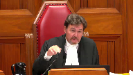
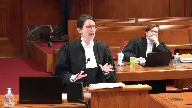
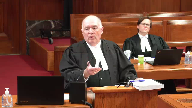

---
title: Conférence des juges de la Cour du Québec, et al. v. Chief Justice, et al.
published-title: Heard
date: 2020-09-24
sidebar: false
---

This transcript was made with automated artificial intelligence models and its accuracy has not been verified. Review the original webcast [here](https://scc-csc.ca/case-dossier/info/webcast-webdiffusion-eng.aspx?cas=['38837']).
---

**Justice Wagner** (00:00:34): Bonjour à tous.

::: {.column-margin}

:::

Dans le dossier «

Conférence des juges de la Cour du Québec » étale contre juge en chef, étale.

Pour l'appelante sur la première question et l'intimé sur la deuxième question, procureur général du Québec, maître Dominique Rousseau, maître Francis Demers.

Pour l'appelant sur la première question et l'intervenant sur la deuxième question, conseil de la magistrature du Québec, maître Marc-André Fabien et maître Vincent Serra-Lagana.

Pour l'appelante sur la première question et l'intervenant sur la deuxième question, Conférence des juges de la Cour du Québec, maître François Grondin, maître Guy G. Pratte. For

the appellant on the first question and intervener on the second question, the Canadian

Association of Provincial Court Judges, maître Audrey

Méran et Jennifer Clink.

Pour les intimés sur la première question et les appelants sur la deuxième question, juge en chef, juge en chef associé et juge en chef adjoint de la Cour supérieure du Québec, maître Sean Griffin et maître William G. Atkinson.

Pour l'intervenant, maître Général du Canada, maître Bernard Letarte. For

intervener

, attorney-general of Ontario

, Danielle U. Faker.

For the

the

intervener

, attorney-general of British Columbia,

Garrett Morley.

For the intervener on the first question, for the Canadian Council of Chief Judges, Pete Jonathan-Faldes, QC.

For the intervener on the first question, Trial Lawyers

Association of British Columbia, Ryan Dalziel.

Pour l'intervenant sur la première question, Association canadienne des juges des Cour supérieures, maître Pierre Bienvenu.

Maître Rousseau.

**Speaker 1** (00:02:40): M. le juge en chef, mesdames, messieurs les juges, bonjour.

::: {.column-margin}

:::

Nous avons déposé hier pour le procureur général du Québec un recueil condensé avec, à l'onglet A, un sommaire de plaidoirie.

La question 1 du renvoi découle d'un recours judiciaire intenté par les intimés en Cour supérieure en 2017.

Dans cette action déclaratoire, les intimés contestent la compétence civile de la Cour du Québec qui est prévue à l'article 35 du Code de procédures civiles, mais en remettant en cause en fait le seuil de moins de 85 000 $.

Le montant a varié au cours des procédures,

mais à un moment donné lors des procédures à la Cour d'appel, les intimés ont demandé de le fixer au montant de 55 000 $.

La Cour d'appel a plutôt opté pour un seuil de 70 000 $.

Le dossier a été constitué sur cette base, à savoir que les intimés n'ont pas contesté une compétence plus précise parmi les compétences de la Cour du Québec de l'article 35 en matière contractuelle et extra contractuelle.

Les intimés estiment le seuil trop élevé.

Paradoxalement, dans leur mémoire en cour d'appel, les intimés disent que l'impact pour les dossiers de la Cour entre ce qu'ils proposent et la réalité est minime.

Alors, c'est pour ça qu'on dit paradoxalement.

Pour sa part, la Cour d'appel, elle, débute son analyse de façon différente.

Elle ne conteste pas l'engagement partagé en tant que tel.

Elle s'attache véritablement à la question de la compétence fondamentale.

La position du procureur général du Québec, je vais la résumer ici en cinq points.

Premièrement, le test historique ne protège que les compétences exclusives des cours de 96.

Ainsi, les compétences non exclusives et les compétences nouvelles peuvent être attribuées sans difficulté, selon le test historique.

Deuxièmement, selon nous, le test historique montre très clairement un engagement partagé en matière contractuelle et extra contractuelle lors de la Confédération.

Troisièmement, oui.

**Justice Wagner** (00:05:32): Bon

::: {.column-margin}

:::

, ma lumière ne fonctionne pas.

Est-ce qu'il y a un parallèle qui peut être fait, ou peut-être que ce n'est pas du tout pertinent, mais on parle évidemment en matière civile contractuelle, extracontractuelle, la juridiction de la Cour du Québec par rapport à celle des cours supérieurs, mais de façon historique, est-ce qu'on peut établir un parallèle ou une pertinence quelconque entre le fait qu'en matière criminelle, par exemple, maintenant la Cour du Québec, division criminelle, mais qui était avant la Cour de la session de la paix, c'était et ça demeure encore, je pense, la Cour de droit commun en matière criminelle.

C'est là où la majorité, tant en termes de variété de dossiers qu'en termes de nombre, où le droit criminel est décidé.

Est-ce qu'il y a un parallèle à faire avec notre dossier, ou peut-être qu'il n'y en a pas?

**Speaker 1** (00:06:20): Bien probablement, monsieur le juge, qu'un parallèle en ce sens que, effectivement, on a permis, la jurisprudence de la Cour a permis que les tribunaux de nomination provinciale puissent exercer une compétence très, très large en matière de droit criminel sans que ça remette en question les principes qui sous-tendent l'article 96.

::: {.column-margin}

:::

Et c'est pour ça, nous, que nous ne voyons pas du tout les choses, évidemment, comme la Cour d'appel lorsqu'elle parle de compétence fondamentale.

Il faut regarder non pas une réalité historique qui peut être pendre de circonstances anodines ou de circonstances importantes.

Il faut regarder plutôt les principes qui sous-tendent 96.

Et c'est la même chose en matière civile.

Donc, effectivement, nous, ce qu'on va vous dire, ce qu'on prétend de toute façon dans notre mémoire et dans notre réplique, c'est qu'ici, il y a à la fois un engagement partagé en 1867 et il n'y a pas de retrait de compétence fondamentale à la Cour supérieure.

**Justice Côté** (00:07:42): Qu'est-ce que c'est pour vous, maître Rousseau, la compétence fondamentale?

Quelle est votre définition de la compétence fondamentale de la Cour supérieure?

Pour dire qu'il n'y a pas de retour.

**Speaker 1** (00:07:51): Oui.

::: {.column-margin}

:::

Alors, définition, Mme la juge, de la compétence fondamentale.

Évidemment, la Cour, même, a souvent dit que c'était très difficile à définir, la compétence fondamentale.

Une définition qu'on retrouve souvent, c'est celle du juge Lamère dans le renvoi de 96.

Ses motifs ont été repris dans AMAD et dans Ontario Criminal Lawyers.

On dit que la compétence fondamentale est très limitée.

Elle ne comprend que les pouvoirs qui ont une importance cruciale, qui sont essentiels à l'existence d'une Cour supérieure, dotés de pouvoirs inhérents et au maintien de son rôle vital au sein de notre système juridique.

Ce qu'on sait, nous, ce qu'on prétend dans notre mémoire, c'est le pouvoir de surveillance et de contrôle de la Cour supérieure fait partie de la compétence fondamentale.

Ça inclut, par exemple, le pouvoir de vérifier, de se prononcer sur la validité des lois, tant fédérales que provinciales.

Ensuite, la compétence générale de droit commun de la Cour supérieure, qui est inhérente.

Elle est codifiée dans le code de procédure civile à l'article 33, mais c'est une compétence inhérente.

Il y aura toujours un tribunal pour un justiciable pour faire valoir un droit.

Ensuite, dans Macmillan, on a parlé aussi pour la compétence fondamentale de la Cour supérieure, la possibilité de contrôler ses procédures et de mettre à exécution ses ordonnances.

Alors, en gros, ce sur quoi on peut s'avancer sur la compétence fondamentale, je dirais que c'est ceci.

Ça ne veut pas dire que tout a été dit, encore, sur la compétence fondamentale.

Mais, selon nous, il n'y a pas de décision de votre Cour qui dit que la compétence en matière civile, trancher des litiges de droits privés, comme dit la Cour d'appel, fait partie de la compétence fondamentale.

**Justice Côté** (00:10:00): Alors, est-ce que vous reconnaissez le rôle de la Cour supérieure dans, et c'est un rôle même qui s'étend à toutes les Cour supérieures au pays, s'il y a un aspect national, le rôle dans l'élaboration du droit?

**Speaker 1** (00:10:15): Oui, nous, ce qu'on dit, Madame la juge, c'est que, en fait, contre les intimés et la Cour d'appel, probablement, nous reprochent de ne pas fixer un seuil limite pour la compétence de la Cour du Québec.

::: {.column-margin}

:::

Mais nous, ce qu'on dit, c'est qu'il y en a une limite, il y en a un plafond ici.

On n'est pas devant la Cour pour vous dire de façon abstraite, théorique, hypothétique, jusqu'où pourrait aller la compétence civile de la Cour du Québec.

Nous sommes ici pour soutenir la validité de la compétence actuelle qui comprend un seuil allant jusqu'à moins de 85 000 dollars.

**Justice Wagner** (00:11:06): perspective mettre ou soit dans une perspective où on doit donner pour éviter que les partis reviennent devant nous, même si on aime bien vous avoir, qu'ils reviennent à chaque quatre ans ou à chaque amendement du code de procédure civile. Peut

::: {.column-margin}

:::

-être que les partis s'attendent à ce qu'on donne des lignes directrices qui vont empêcher justement des litiges additionnels.

Je comprends très bien votre point de vue, parlant pour moi-même pour le moment.

Le problème que j'ai, c'est comment tracer la ligne, effectivement.

Si tout le monde s'entend que la Cour supérieure a une juridiction importante et doit demeurer telle, et si tout le monde s'entendait que de passer de 70 000 à 85 000 $, ça ne met pas en péril le droit prioritaire si vous voulez, ou la compétence prioritaire peut-être de la Cour supérieure dans certains domaines de droit, quand ça va le devenir?

Et comment tracer la ligne?

Et l'approche monétaire pour moi, c'est peut-être un peu réducteur dans la mesure où ça ne prend pas en ligne de considération, en ligne de compte de toute l'histoire, le contexte.

La situation en 1877, ce n'est pas la même qu'en 2020.

Et puis, la Cour du Québec a bien changé à travers les années.

Les besoins des justiciables ont changé également.

L'accès à la justice a été encore plus criant aujourd'hui que l'était à l'époque.

Bref, il y a tout un contexte, un contexte historique qui, je pense, doit être considéré par les tribunaux pour apprécier les limites des juridictions provinciales par rapport à l'article 96.

Alors, pour moi, c'est un défi de pouvoir, pour l'avenir, donner des lignes directrices qui vont peut-être aider les parties à agir en conséquence.

**Speaker 1** (00:12:55): Je comprends, M. le juge, dans le fond, ce qu'on peut dire, outre le fait qu'il y a une compétence ici qui est jusqu'à moins de 85 000 $, c'est qu'on ne peut pas se prononcer sur… À supposer qu'il y a un noyau irréductible de compétences en matière civile pour la Cour supérieure, bien, il va de soi que la première chose à faire

::: {.column-margin}

:::

, c'est de regarder le régime législatif pour voir si la Cour supérieure conserve un rôle en matière civile.

Et, même si elle n'en a pas tenu compte en bout de ligne, la Cour d'appel a noté le rôle quand même de la Cour supérieure en matière civile.

Si je vais trouver l'onglet, où se juge?

Oui, dans notre recueil condensé.

Alors, c'est les paragraphes 90 et 165 de l'avis de la Cour d'appel.

Alors, je pense que je vais prendre directement le voile de la Cour d'appel, si vous le permettez, monsieur le juge, parce que…

Si on va voir au paragraphe 90, la Cour reconnaît qu'en matière civile, toutes les demandes de 85 000 $ et plus sont de la compétence de la Cour supérieure.

Ça, ce que ça veut dire en pratique, c'est que les mêmes sujets, obligations contractuelles, extracontractuelles, qu'on parle de vis cachées, de responsabilités du commettant, etc., sont de la compétence de la Cour supérieure du moment que le seuil est de 85 000 $ ou plus.

Donc, la Cour supérieure est certainement en mesure d'orienter l'application, l'interprétation du droit sur ces matières, sur ces sujets-là.

Et je vous dirais même que comme c'est un montant qui départage la compétence de la Cour supérieure et de la Cour du Québec, on n'est pas dans un retrait de compétences.

On pourrait parler d'une compétence partagée.

Quand on parle des sujets de la matière, la matière en responsabilité extracontractuelle et contractuelle, c'est une compétence partagée de la Cour.

**Justice Wagner** (00:15:51): partagé, mais pas concurrence.

::: {.column-margin}

:::

De l'avoir dans certaines provinces où effectivement et la Cour supérieure et une Cour provinciale vont avoir une juridiction vu le justiciable choisi d'aller soit devant une Cour supérieure ou une Cour provinciale.

Ici, au Québec, c'est exclusif quand même.

La compétence est partagée, mais elle n'est pas concurrente.

**Speaker 1** (00:16:13): C'est ça, exactement, monsieur.

Jusqu'à la limite de 85 000 $.

**Justice Côté** (00:16:18): de la compétence recherchée je la trouve très large si je la regarde

::: {.column-margin}

:::

, eu égard à la façon dont la première question du renvoi a été formulée.

Vous dites c'est une compétence sur des litiges de nature civile fondée sur des obligations contractuelles et extra contractuelles, mais cette qualification-là ne rend pas bien compte de la première question du renvoi ni de son contexte, c'est pas la compétence de la Cour du Québec en matière civile qui fait débat ici parce que je comprends que les intimés ont reconnu une compétence civile à la Cour du Québec jusqu'à concurrence de 55 000 dollars.

Alors ça me semble bien établi à moins que je me trompe, mais ce qui fait débat et c'est la façon dont la première question du renvoi est rédigée, ce sont les seuils pécuniaires.

Je vous dis pas que seuls les seuils pécuniaires doivent être pris en considération, mais il me semble que les intimés ont reconnu une certaine compétence en matière civile à la Cour du Québec.

Au début ils disaient 10 000 piastres, mais après ils ont reconnu 55 000.

**Speaker 1** (00:17:19): Je comprends, Mme la juge, très bien votre question.

::: {.column-margin}

:::

Je vous dirais que la façon dont le problème se pose, c'est que si, puis je vais vous l'expliquer par la suite, si on enlève les éléments de la qualification des intimés qui n'y ont pas leur place, grosso modo, toutes les parties ont la même qualification.

Parce que la contestation des intimés, elle ne porte pas sur un sujet plus précis à l'intérieur de l'article 35.

Ce n'est pas comme s'ils avaient contesté la compétence de la Cour du Québec en matière de vis cachées ou en matière de responsabilité de commettant, etc.

Ils contestent quand on parle du sujet, de la matière, puis la jurisprudence de la Cour est claire.

Pour la qualification, il faut s'intéresser au sujet à la matière.

Donc, c'est pour ça que notre qualification, oui, elle est un peu large, mais elle porte sur le sujet la matière contestée par les intimés.

Et quand on prend les éléments qu'ils mettent dans leur qualification au paragraphe 78 de leur mémoire, on parle d'une compétence générale en matière civile, on parle d'une compétence sur tout le territoire du Québec, on parle d'une compétence exclusive et, enfin, on arrive au seuil.

**Overlapping speakers** (00:18:51): Ce sont des éléments qui ne devraient pas faire partie de la qualification de compétences mais qui devraient plutôt s'appliquer dans la prochaine étape.

**Speaker 1** (00:18:58): Exactement.

::: {.column-margin}

:::

Puis, je comprends de la façon dont les intimés amènent cette qualification-là, qu'ils tentent de faire un lien entre la qualification et la notion de cours miroir pour essayer de démontrer que la compétence de la Cour du Québec ne fonctionne pas.

Mais selon nous, cette approche-là est, je le dis avec respect, totalement erronée.

La Cour du Québec n'est pas une Cour miroir de la Cour supérieure?

C'est ce que je pense, effectivement.

**Justice Côté** (00:19:31): procèdent de la même façon.

Les juges, leur indépendance judiciaire est reconnue.

Ils n'ont pas, à part de la division des petites créances, qui est, elle, une procédure simplifiée, il me semble, à moins que depuis que j'ai quitté, que ça procède de la même façon.

**Speaker 1** (00:19:48): Pour la question de la qualification, Mme la juge, et de l'engagement partagé, la façon dont la Cour fonctionne, ce n'est pas un élément important.

::: {.column-margin}

:::

On s'intéresse au sujet à la matière, les obligations contractuelles et extra-contractuelles.

La Cour du Québec, elle n'a que des compétences statutaires, elle n'est pas protégée constitutionnellement, elle est assujettie au pouvoir de surveillance et de contrôle de la Cour supérieure, elle n'a pas de compétences générales de droit commun.

Alors, vouloir faire ce lien-là entre la qualification et la notion de cours miroir, selon nous, ce n'est pas l'approche qu'a dégagé cette Cour.

Et, toujours sur le problème de la qualification des intimés, c'est que jamais dans le cadre de l'examen historique, il a été question d'exiger une compétence exclusive des tribunaux inférieurs.

C'est plutôt l'inverse.

**Speaker 2** (00:20:56): question. question.

::: {.column-margin}

:::

**Speaker 1** (00:21:31): Je vous dirai deux choses, Madame la juge.

::: {.column-margin}

:::

Premièrement, comme je l'ai mentionné tout à l'heure, selon nous, dans le premier élément de Macmillan, qui est en fait le test historique de 1981, examen historique avec les deux autres volets, ce qui est regardé, c'est le sujet.

Alors, une fois qu'il y a un engagement partagé, on peut attribuer la compétence et il n'y a pas d'exigence que ce soit concurrent.

On peut attribuer.

La question de l'attribution, elle est réglée avec l'engagement partagé.

Le deuxième point dans Macmillan, c'est est-ce qu'on peut retirer quand même la compétence à la Cour supérieure?

C'est ici que je vous dis qu'il n'y a pas de retrait de compétence à la Cour supérieure pour plusieurs raisons.

Une des raisons, c'est que même si effectivement l'article 35 parle de compétence exclusive pour ce qu'il vise, il faut l'interpréter dans l'ensemble du droit et on sait, avec les dispositions législatives applicables, que la Cour supérieure, non seulement a compétence sur les mêmes sujets, 85 000 $ et plus, donc il n'y a pas de retrait.

Elle va entendre les mêmes causes que la Cour du Québec, les mêmes sujets, elle va faire jurisprudence sur ces sujets-là.

**Justice Wagner** (00:23:06): La cour supérieure continue d'avoir une juridiction en droit civil, visque cachée, peu importe.

::: {.column-margin}

:::

Un des arguments que certaines personnes peuvent faire, je ne vous dis pas que j'adhère à ça, mais je l'ai entendu, c'est que de façon pratique, par voie de conséquence, en augmentant les seuils ou le seuil de juridiction de la cour du Québec, surtout en région, une conséquence de ça, c'est que la cour supérieure comme telle, si tantée que ça soit, une diminution des dossiers en droit civil qui peuvent être décidés par la cour supérieure, la cour supérieure risque de disparaître sauf en faisant du droit familial ou de l'insolubilité ou des matières réservées aux cours supérieurs.

Donc de facto, sans que ce soit nécessairement très juridique, mais de facto, il y a comme un retrait finalement ou une disparition ou une diminution de la place principale de la cour supérieure par rapport à la cour du Québec par voie de juridiction, c'est l'argument qu'on a déjà soulevé, je ne sais pas ce que vous en

**Speaker 1** (00:24:07): Je vous dirais, monsieur le juge, plusieurs choses.

::: {.column-margin}

:::

Premièrement, je pense que quand on regarde s'il y a retrait de la compétence fondamentale de la Cour supérieure, il faut regarder la Cour supérieure en tant qu'institution et non pas selon les districts en tant que tels.

Est-ce que la Cour supérieure est à même de remplir un rôle significatif en matière civile?

Ensuite, même si moi non plus je n'ai pas une approche statique en rapport avec l'histoire, je vous dirais quand même que lors de la Confédération, les Cours supérieurs étaient beaucoup dans des chef-lieux très précis pour les causes importantes.

Mais c'est très accessoire ce que je vous dis là.

Il faut prendre la Cour supérieure dans un contexte global de Cour supérieure.

Et aussi, c'est qu'il n'y a aucune preuve qui a été faite de toute façon par les intimés qui tendraient à démontrer que la Cour supérieure est privée d'un rôle dans les matières que vous avez mentionnées.

J'ai des collègues pour les intervenants qui vont parler un peu plus que nous de la question des statistiques, mais on l'a abordé dans notre mémoire pour ce qui est du seuil retenu par la Cour d'appel, 70 000, et le seuil jusqu'à 85 000 du législateur.

On parle de 704 dossiers en 2016-2017.

Alors, quand on parle de compétences fondamentales, c'est difficile à suivre de dire qu'il y a une compétence fondamentale à 70 000 $, 85 000 $ qui est un choix du législateur.

Je pense qu'en matière de politique publique, le législateur a quand même des facteurs à considérer lorsqu'il établit un seuil.

Puis, je peux comprendre l'inquiétude de la Cour d'appel en rapport avec le spectre de plafond illimité, mais je comprends aussi qu'on veut peut-être donner des indications, mais il faut venir compte quand même de notre dossier.

On est ici pour défendre une compétence qui précise au Québec dans un contexte législatif la Cour supérieure à compétences en matière de recours collectif de toutes les mêmes actions que la Cour du Québec au-dessus de 85 000, actions déclaratoires, faillites et j'en parle.

**Justice Wagner** (00:26:53): C'est très bien votre position, maître.

::: {.column-margin}

:::

C'est une position qui est, je vous aurais même dit, qui est intelligente, de présenter le dossier de façon positive.

C'est-à-dire, voici le dossier, puis dites-nous si c'est constitutionnel ou non.

Mais l'éléphant dans la salle, si je peux m'exprimer ainsi, c'est aussi, une fois qu'on aura dit ça, et une fois qu'on aura dit que oui, dans les circonstances, dans une approche historique, contextuelle, il n'y a rien de non constitutionnel dans une juridiction de 80, 85 000 $.

Est-ce que vous n'êtes pas d'accord avec moi que ça ne règle pas nécessairement le problème pour l'avenir?

**Overlapping speakers** (00:27:29): à la mesure où...

**Justice Wagner** (00:27:30): Certains pourront dire, bon ben demain matin, le législataire va dire, ben c'est un million maintenant.

::: {.column-margin}

:::

Et est-ce qu'on dit à ce moment-là, est-ce que ça a un impact sur, effectivement, est-ce que ça fait en sorte, ça, qu'on dise un million, est-ce que ça fait en sorte maintenant que la Cour supérieure est dépouillée de sa juridiction constitutionnelle?

Il va falloir répondre à ça.

**Speaker 1** (00:27:50): Oui, je comprends, monsieur le juge, mais de mon point de vue, une fois qu'on tient compte de notre dossier, de la façon dont c'est au Québec, il n'en reste pas moins que les indications que nous, on voit.

::: {.column-margin}

:::

Bien, il y en a deux.

Comme je dis, il y a regardant le contexte législatif en matière civile dans la province concernée.

Est-ce que ce contexte législatif-là permet à la Cour supérieure de cette province-là d'exercer un rôle significatif, un rôle qui lui permet d'orienter l'interprétation et l'application du droit civil?

**Overlapping speakers** (00:28:33): Oh, what is he doing?

**Speaker 1** (00:28:35): La Cour supérieure n'a pas à trancher tous les dossiers de matières contractuelles et extra-contractuelles pour accomplir son rôle de dire le droit.

**Justice Côté** (00:28:48): Mais à ce moment-là, peut-être qu'on devrait restreindre votre qualification de la compétence.

::: {.column-margin}

:::

Puis la vôtre est large, celle de la Cour supérieure est large.

Mais peut-être en disant la qualification de la compétence devrait être axée sur les réclamations civiles, parce qu'ici on parle de réclamations civiles, d'une valeur monétaire substantielle.

Puis quand je dis « substantielle », là c'est pas pour l'attacher à un chiffre précis, mais c'est pour donner une ordre de grandeur.

Qu'est-ce que vous diriez d'une telle restriction à votre qualification de la compétence? BLEH

**Speaker 1** (00:29:17): Ce que je dirais, Mme la juge, c'est comment on définit la notion de réclamation substantielle.

::: {.column-margin}

:::

Moi, si vous me dites, la notion de réclamation substantielle n'est pas attachée à une activité d'alisation économique, elle est attachée à un examen dans le contexte de la province-là, du rôle de la Cour supérieure en matière civile, bien là, c'est un peu ce qu'on vous dit dans le fond.

C'est que nous, la notion de substantiel, ça a une connotation chiffre.

Mais nous, ce qu'on dit, ce qu'il faut regarder, c'est le critère en fin de compte.

Est-ce que la Cour supérieure, dans le contexte législatif de la province, conserve un rôle significatif qui lui permet d'orienter l'interprétation et l'application du droit civil?

Selon nous, c'est ça la question.

Et selon nous, même avec les paragraphe 90 et 165, que la Cour d'appel reconnaît la compétence civile de la Cour supérieure, elle n'en tient pas compte.

Ça, c'est le contexte législatif.

Est-ce qu'elle a un rôle significatif qui lui permet d'exercer son rôle de Cour supérieure de 96?

**Justice Wagner** (00:30:50): Le micro, c'est juste… Vous avez évité à faire attention, merci.

**Justice Côté** (00:30:54): Et pour déterminer si la Cour supérieure exerce un rôle significatif, quels facteurs faudrait regarder?

Est-ce que vous avez regardé certains des facteurs proposés par le procureur général du Canada?

**Speaker 1** (00:31:09): Oui, nous avons regardé certains des facteurs proposés par le procureur général du Canada.

::: {.column-margin}

:::

Nous ne voyons pas d'exigence de proportionnalité dans ces facteurs-là.

Et là, je ne voudrais pas interpréter erronément la position du procureur général du Canada, mais j'ai cru comprendre qu'il y avait un élément de proportionnalité entre ce qui pouvait se faire en 1867 et ce qui pouvait se faire aujourd'hui.

Nous, pour les mêmes raisons qu'on invoque l'arbre vivant dans l'examen historique, on l'invoque aussi dans la compétence fondamentale et le critère de la proportionnalité, je pense que c'est trop exigeant.

Ensuite, je pense par contre que si les intimes avaient fait une preuve tangible, concrète, que malgré toutes les compétences préservées par le législateur québécois pour la Cour supérieure, dans les faits, elle n'entend pas de cause en matière civile qui lui permet d'interpréter le droit civil, bien là, c'est sûr que ça serait complètement différent que ce l'est actuellement.

Alors, j'en reviens à ce qu'on prétend, nous, qui revient à deux critères, en fin de compte.

Le contexte législatif permet-il à la Cour supérieure de jouer son rôle de Cour supérieure, un rôle significatif, oui, pour orienter l'interprétation de l'application du droit civil?

Deux, une fois qu'on a vu ce contexte législatif-là, est-ce que la personne qui conteste a fait une preuve que la Cour supérieure n'est pas à même, en tant qu'institution, d'avoir des dossiers en matière civile qui lui permettent d'avoir un rôle significatif en matière civile?

Je vais noter seulement quelques points parce qu'avec vos questions, Mesdames, Messieurs les juges, c'est sûr que je suis allée plus directement.

C'est bien à ce que je voulais vous dire.

De toute façon, vous avez notre mémoire et notre réplique.

Simplement, notez que l'affaire Noël, qui est à l'onglet 45 de notre recueil condensé, le paragraphe 65, c'est en matière de contrôle judiciaire, mais c'est quand même un arrêt important de la Cour, qui énonce qu'il est possible de restreindre, d'encadrer la compétence fondamentale de la Cour supérieure.

Dans Noël, c'était le pouvoir de surveillance et de contrôle, mais s'il y a quelque chose qui fait partie de la compétence fondamentale, c'est bien ce pouvoir-là.

Et on dit, en autant qu'on ne le supprime pas, le législateur peut le restreindre, l'encadrer.

**Justice Côté** (00:34:40): justement dans votre mémoire au paragraphe 115 là-dessus, vous dites le fait que la compétence civile de la Cour du Québec en matière d'obligations contractuelles et extra contractuelles soit précisément limitée par un seuil pécuniaire de moins de 85 000 ici empêche au départ de conclure qu'une compétence fondamentale est retirée.

::: {.column-margin}

:::

Est-ce que votre point c'est de dire dès qu'un seuil est fixé, on peut pas dire que la compétence fondamentale est retirée ou évidemment dois-je tenir compte non seulement du fait qu'un seuil est fixé mais du niveau de ce seuil là pour déterminer si la compétence fondamentale est retirée.

**Speaker 1** (00:35:16): Je comprends, Madame la juge, et ça revient un petit peu à mes deux critères que je vous donnais.

::: {.column-margin}

:::

Il y a le contexte législatif qu'il faut regarder pour voir si la Cour supérieure conserve un rôle, mais il y a aussi la pratique.

Si la personne qui conteste vient démontrer à la Cour qu'en raison d'un seuil, par exemple, il n'y en a pas de dossier en matière civile qui permet à la Cour supérieure d'exercer son rôle, bien, effectivement, ça aura un impact.

Mais ici, moi, je tiens compte du fait que le seuil étant à moins 85 000, la preuve étant que ce sont des conséquences minimes, bien, il n'y a pas de retrait de compétences fondamentales.

Un élément, évidemment, que vous connaissez mieux que moi, le renvoi sur la rémunération des juges de 1997, paragraphe 126 et 127, c'est fondamental pour nous cet arrêt-là.

Et s'il y a des reproches qu'on fait à la Cour d'appel de ne pas avoir tenu compte de l'évolution majeure des caractéristiques institutionnelles des cours de nomination provinciale, dans le renvoi de 97 sur la rémunération des juges, la Cour note même, elle-même, que le législateur ne donne pas toujours le choix au parti d'aller à la Cour supérieure ou à une cour de nomination provinciale, et qu'on peut bénéficier d'un rôle accru des cours de nomination provinciale pour la primauté du droit.

Elles peuvent aussi participer à la primauté du droit.

Alors, nous, on pense qu'il faut…

**Justice Wagner** (00:37:12): essentiellement

::: {.column-margin}

:::

je pense que les raisons qui ont motivé les législatures à donner beaucoup plus de pouvoir ou de juridiction au cours du Québec à travers les années, surtout depuis la révolution tranquille des années 60, c'était justement pour permettre l'accès à la justice.

**Overlapping speakers** (00:37:30): Surtout à...

**Justice Wagner** (00:37:30): dans des régions qui étaient peut-être mal desservies par d'autres tribunaux, la Cour spérieure, peut-être, à l'avenir.

**Overlapping speakers** (00:37:37): des juges résidents, par exemple.

**Justice Wagner** (00:37:38): Donc, ça s'inscrit, cette volonté d'accroître les compétences de la Cour du Québec avec des juges bien formés pour justement satisfaire ces besoins d'accès à la justice dans un monde moderne.

**Speaker 1** (00:37:57): Tout à fait, M. le juge.

::: {.column-margin}

:::

Enfin, sur Trial Lawyers, j'en parlerai pas longtemps, c'est dans notre mémoire, pour résumer à l'essentiel, pour nous, il y a une différence majeure entre empêcher l'accès aux tribunaux, ce dont parlent Trial Lawyers, et prévoir que certaines compétences relèvent d'une cour de nomination provinciale en première instance.

On a vraiment dit Trial Lawyers est un arrêt majeur sur la primauté du droit, le rôle de la Cour supérieure, mais la compétence était de fait exercée par la Cour supérieure dans cette affaire-là.

Et ce sur quoi la Cour insiste, c'est qu'on ne peut pas nier, le mot qu'elle utilise, ou priver un justiciable de la possibilité de faire valoir un droit.

Alors, c'est dans ce contexte-là que Trial Lawyers s'inscrit.

On n'est pas du tout ici dans ce contexte-là.

Et selon nous, Trial Lawyers ne nous dit pas qu'une province ne peut confier en première instance une compétence de droit privé à une cour de nomination provinciale.

Sur la question de l'uniformité entre les provinces, notre réplique porte essentiellement là-dessus.

Alors, ce qu'il faut dire, outre le principe du fédéralisme, évidemment, c'est que le test historique et le test de la compétence fondamentale qui ont été élaborés par cette Cour servent précisément à vérifier si les objectifs de 96 sont rencontrés.

Alors, s'il y a toujours un objectif d'uniformité en lien avec le fait que nous avons un système judiciaire unitaire au Canada, il est préservé dans la mesure où on rencontre le test historique et le test de la compétence fondamentale.

C'est ça qui nous sert à voir si les objectifs de 96 sont respectés.

Et dans Trial Lawyers, au paragraphe 29, la Cour dit que la présence judiciaire unifiée sert l'objectif plus général de protéger la compétence fondamentale des Cour supérieures.

Donc, on ne peut pas faire un test à part pour dire est-ce que toutes les provinces ont les mêmes compétences civiles sur exactement le même montant.

Ça ne fonctionne pas comme ça en matière constitutionnelle.

Il faut regarder si on respecte le principe.

On a le même test partout au Canada.

Enfin, pour la question de la procédure avec laquelle la Cour du Québec fonctionne, mise à part la division des petites créances, ça ne change pas.

Quand on applique le test historique puis qu'on applique le test de la compétence fondamentale, ce n'est pas un critère qui intervient.

Ça pourrait être un critère si on vous plaidait le troisième volet du test du renvoi de 81.

Une compétence qui est exclusive peut être permise si elle est exercée dans un nouveau contexte institutionnel.

Mais nous, on n'est pas là.

Ça n'a pas de pertinence, la procédure et la preuve utilisées par la Cour du Québec pour exercer sa compétence, si cette compétence-là peut lui être attribuée selon le test historique et la compétence fondamentale.

Ça serait comme dire, en fin de compte, que plus la Cour de nomination provinciale applique des garanties procédurales en matière de preuve, plus il faut que le seuil soit bas.

Je ne pense pas que c'est ce que nous dit le renvoi sur la rémunération des juges lorsqu'ils nous disent qu'on va accepter un rôle accru des cours de nomination provinciale, mais en exigeant la garantie d'indépendance, pas en vertu de 96, mais en vertu du préambule de la Constitution.

Pour conclure une phrase, le renvoi ne requiert pas d'établir ce qui fait formellement partie de la compétence fondamentale de la Cour supérieure au Québec.

Rien ne démontre qu'il est essentiel au rôle distinctif de la Cour supérieure qu'elle puisse juger en première instance les litiges civils entre 70 000 et 84 999.

**Speaker 4** (00:44:31): Monsieur le juge en chef, Mesdames les juges, Messieurs les juges, bonjour.

::: {.column-margin}

:::

Comme vous avez pu le constater à la lecture du mémoire du Conseil de la magistrature, nous répondons par l'affirmative à la première question du renvoi.

Comme, d'ailleurs, vous avez pu le constater aussi à la lecture de votre mémoire, nous souscrivons aux arguments présentés devant vous ce matin par le procureur général du Québec.

Le Conseil de la magistrature, en raison du mandat qui lui est dévolu, doit quand même garder une certaine distance en regard du cœur du litige qui vous occupe.

Mais, par contre, toujours en raison de son mandat qui est de favoriser l'efficacité et l'uniformité de la justice et de la procédure judiciaire, est très préoccupé par l'accès à la justice.

J'ai été heureux d'entendre certains commentaires tout à l'heure provenant de cette cour.

Quant à cette question de l'accès à la justice, nous avons donc trois points très précis que nous aimerions aborder avec vous ce matin.

Les trois points sont les suivants.

Un premier point qui est celui de la possibilité de l'accroissement de la compétence des cours qui ne relève pas de l'article 96 de l'acte constitutionnel de 1867, permettant aux législatures de pouvoir augmenter donc la compétence de ces tribunaux dits inférieurs à l'époque en date d'aujourd'hui.

Parce que l'exercice auquel la Cour d'appel se livre, c'est un exercice qui est ni plus ni moins qu'une actualisation de la compétence telle qu'elle était en 1867 en date d'aujourd'hui.

C'est une photographie, un cliché qui est reproduit en date d'aujourd'hui.

Nous, ce que nous disons, c'est qu'il faut.

**Overlapping speakers** (00:46:28): Je ne peux pas le faire, mais elle le fait un petit peu quand même.

**Speaker 4** (00:46:31): Tout à fait d'accord, monsieur le juge,

::: {.column-margin}

:::

parce qu'au paragraphe 188 de l'avis de la Cour d'appel, la Cour d'appel énumère un certain nombre de critères qu'elle regarde, mais ultimement, lorsqu'on fait l'analyse, elle examine le plafond des appels de plein droit, qui, quant à moi, est un argument qui ne tient pas la route bien longtemps, parce qu'il suffirait aux législatures de modifier leur code de procédure pour établir le plafond équivalent à la compétence qu'ils souhaitent avoir, et le tour serait joué.

Alors, c'est un argument qui, quant à moi, tient peu la route.

Et le troisième critère qu'elle regarde, et c'est là, à mon avis, où le Bob l'est de façon essentielle dans ce dossier, c'est le fait que la Cour d'appel n'examine pas l'impact, l'effet, parce que lorsqu'on parle de compétence fondamentale de la Cour supérieure, il faut voir quel est l'impact, quel est l'effet de la mesure législative qui est contestée, qui est débattue.

Ici, c'est l'article 35, c'est de faire en sorte que la compétence de la Cour du Québec, à moins de 85 000 $, viole-t-elle ou non cette compétence fondamentale.

Et cet exercice, pour qu'il soit, à mon avis, concluant, il faut examiner l'impact, l'effet.

Je me permettrai de faire une analogie qui, somme toute, est un peu boiteuse, mais c'est quand même une analogie, parce que, monsieur le juge en chef, tout à l'heure, vous aviez à bon droit cette préoccupation de dire, oui, mais quels sont les critères que l'on pourrait mettre en place pour que vous, plaideurs, même si vous aimez bien nous voir, que nous ne revenions pas avec un abonnement devant la Cour pour discuter des compétences des tribunaux qui ne relèvent pas de 86 000 $.

Ce que je dis là-dessus, c'est qu'il est fondamental de regarder l'impact, ce que l'avis de la Cour d'appel ne fait pas.

J'avais trois points que je voulais traiter avec vous, mais abordons tout de suite le troisième.

Le troisième qui est, à mon avis, et je vais finir mon analogie que je souhaitais faire.

L'analogie que je souhaitais faire, c'est lorsque vous avez un débat constitutionnel sur le partage des compétences.

Vous connaissez mieux les critères que moi.

Il s'agit de déterminer le caractère véritable, en substance, de la loi dont la validité constitutionnelle est débattue.

**Overlapping speakers** (00:49:02): On l'a perdu.

**Speaker 4** (00:49:03): un petit peu depuis quelques jours.

::: {.column-margin}

:::

Oui, oui, en effet.

Et ceci dit, le pit and substance, pour pouvoir le déterminer, on regarde l'objet, mais on regarde les effets également de la loi, par preuve extrinsèque et autres.

Ici, la Cour d'appel ne regarde pas l'impact.

Ce que je vous invite à faire, c'est d'examiner quel est l'impact de cet article 35 et de cette compétence à moins de 85 000 qui a été attribuée à la Cour supérieure.

**Justice Côté** (00:49:37): Mme Fabien,

vous dites qu'on doit regarder l'impact de la mesure législative.

On doit regarder l'impact sur la compétence fondamentale de la Cour supérieure, ou l'impact sur quoi?

**Speaker 4** (00:49:48): L'impact sur la compétence de la Cour supérieure, sur quelle est cette nouvelle mesure procédurale qui fait en sorte qu'on hausse une compétence d'un tribunal qui ne relève pas de 1996, quel est son impact sur le tribunal de 1986?

::: {.column-margin}

:::

**Overlapping speakers** (00:50:08): Mais c'est plus qu'une mesure procédurale, ça va chercher.

**Speaker 4** (00:50:10): Oui, quand je dis mesure, Mme la juge, j'entends ici le plafond au C de la compétence de la Cour du Québec à moins de 85 000.

::: {.column-margin}

:::

Si vous me permettez, allons à l'onglet 9 du cahier condensé qui vous a été transmis hier.

De telle sorte que je puisse illustrer mon propos.

La professeure Confucius disait « une image vaut mille mots », ce qui va raccourcir ma plaidoirie si cette image est efficace.

À l'onglet 9.

Vous avez un extrait de l'avis de la Cour d'appel que je me permets de vous lire parce qu'il est important.

Je suis au paragraphe 186.

Le principal argument de la procureure générale du Québec à ce propos consiste à souligner qu'il y a peu de dossiers civils dans la fourchette de 70 000 à 85 000. Il y en a

704.

704 dossiers dont on parle.

Parce que le débat qui nous occupe aujourd'hui, c'est 15 000 $ de compétences, 704 dossiers qui transféreraient d'une cour à une autre.

Et qu'en conséquence, l'effet du dernier amendement sur la compétence de la Cour supérieure est minime.

Or, pareil raisonnement mène fatalement à ce que la Cour supérieure soit graduellement dépouillée d'un volet important de sa mission en matière civile.

Le nombre de dossiers diminuant au fur et à mesure que le seuil pécuniaire augmente, on viendrait ainsi ronger la compétence fondamentale de cette Cour de l'article 96.

Donc de l'avis de la Cour d'appel, il y a au fur et à mesure de l'augmentation des plafonds de la Cour du Québec et des cours qui l'ont précédé, une érosion de la compétence fondamentale de la Cour supérieure.

On va voir dans un instant que, selon nous, cette perspective est inexacte.

La courbe qui suit au paragraphe 186 est une courbe qui est purement abstraite et qui ne regarde pas l'impact, l'effet de la nouvelle disposition qui hausse à moins de 85 000 la compétence de la Cour du Québec.

Lorsque vous regardez cette courbe, c'est une courbe, tout ce qu'elle indique, c'est les hausses au fil des 150 dernières années, des plafonds des cours du Québec et de celles qui l'ont précédé, cours de magistrats, cours provincial et autres.

Alors cette courbe, quant à nous, a peu de signification.

Elle est peu indicative.

Enchaînons avec le paragraphe 187 de l'avis de la Cour d'appel.

Il est vrai que le critère de départage des compétences respectives de la Cour supérieure et de la Cour du Québec est de nature qualitative plutôt que quantitative.

En effet, il n'est pas en soi déterminant de savoir combien de dossiers la Cour supérieure tranche par rapport à la Cour du Québec ou vice versa.

Il s'agit plutôt de s'assurer que la compétence de la Cour du Québec n'empiète pas sur la compétence fondamentale de la Cour supérieure de juger des différences civiles substantielles.

Or, le dernier amendement portant sur la compétence civile de la Cour du Québec à 85 000 ne serait être qualifié de rattrapage.

Il s'agit plutôt de la continuation d'une érosion de plus en plus prononcée de la compétence constitutionnelle de la Cour supérieure du Québec en matière civile.

Mais on fait un lien avec...

**Justice Wagner** (00:53:32): augmentation du montant financier et érosion de la compétence.

::: {.column-margin}

:::

On peut avoir une action sur compte de 800 millions de dollars, c'est beaucoup d'argent, mais au niveau juridique il n'y a pas une avancée dans le droit civil dans ce dossier-là par rapport à une action de 10 000 $ où il y a des droits constitutionnels en jeu.

C'est toujours délicat de faire un lien entre la facture monétaire et l'importance des enjeux juridiques.

**Speaker 4** (00:54:01): Tout à fait d'accord, d'ailleurs, c'est ce que Mme la juge Wilson disait dans Sobeys, où elle disait que le critère, lorsqu'elle parlait du critère du test historique, elle faisait référence à l'élément picuniaire comme étant probablement l'un des éléments qui étaient le moins important à considérer.

::: {.column-margin}

:::

Elle estimait que la territorialité avait une importance sans doute plus grande, la géographie, ou encore la nature des litiges dont on parle.

Si vous tournez à l'onglet 10, vous allez voir une courbe que nous avons produite dans le cadre du dossier devant la Cour d'appel.

Et quant à moi, cette courbe, elle, est illustrative de l'impact et de l'effet que peut avoir la nouvelle compétence de la Cour du Québec à moins de 85.

C'est 40 ans de litiges sous vos yeux qui expriment cette courbe.

Et c'est la volonté du législateur du Québec depuis le début de la Confédération d'avoir fait en sorte qu'il y ait deux cours complémentaires au Québec, l'une relevant de l'article 96, l'autre créée en vertu de l'article 92-14.

Et ces deux cours complémentaires, pourquoi existent-t-ils, et vous avez fait référence, monsieur le chef tout à l'heure, c'est pour assurer l'accessibilité au justiciable à la justice.

C'est le choix que le législateur du Québec a fait.

Tant et aussi longtemps que ce choix n'est pas contraire à l'article 96 et ne vient pas altérer la compétence fondamentale de la Cour supérieure, les plafonds fixés par le législateur du Québec devraient être connus comme conforme à l'article 96.

**Justice Côté** (00:55:48): Mme Fabienne, sur ces courbes-là, dans vos statistiques concernant la Cour supérieure ou le nombre de dossiers ouverts à la Cour supérieure

::: {.column-margin}

:::

, vous avez ajouté

, vous ne comparez pas seulement des dossiers civils à la Cour supérieure versus les dossiers civils à la Cour du Québec.

Vous ajoutez aussi les dossiers en matière familiale et en matière de faillite, mais ce n'est pas visé par l'article 35, alors peut-être qu'on devrait comparer avec des pommes, avec des pommes.

**Speaker 4** (00:56:13): C'est-à-dire, Madame la juge, ce qu'on regarde, c'est quelle est la compétence civile de la Cour supérieure.

::: {.column-margin}

:::

La compétence civile de la Cour supérieure, c'est le droit de la faillite et c'est également les matières de divorce.

N'eût été de la coquetterie importante de la Constitution qui attribue au fédéral le divorce et la faillite, ce sont des dispositions législatives qui, tout comme dans le cas de Napoléon en France, se retrouveraient dans le corpus du droit civil. Ah!

**Justice Wagner** (00:56:43): M. Fabien, juste pour reprendre ce que la juste côté vous dit

::: {.column-margin}

:::

, c'est qu'il faut quand même considérer des pommes avec des pommes, dans le sens où je comprends que la faillite, l'insolvabilité, la famille, ça fait partie de la grande compétence de la Cour supérieure, mais elle est exclusive à la Cour supérieure.

Mais si on parle de compétences partagées, on parle de droits civils, contractuels et extra-contractuels, on ne parle pas de familles, on ne parle pas d'insolvabilité.

Alors, si on regarde le nombre de dossiers ouverts en droits civils comme tels, je pense qu'il faut regarder et se limiter à ça, non?

Si vous me permettez, M. le Président...

Et si on fait ça, ça donne quoi?

**Speaker 4** (00:57:19): Je vois les choses un petit peu différemment, parce qu'on parle ici de la compétence fondamentale de la Cour supérieure.

::: {.column-margin}

:::

Et la compétence fondamentale de la Cour supérieure, ce n'est pas que les litiges en matière civile, contractuelle ou extra-contractuelle, c'est son rôle de gardien de l'État de droit.

**Justice Wagner** (00:57:38): C'est son rôle.

::: {.column-margin}

:::

Ça veut dire que donc on pourrait considérer une situation où, tout en gardant les matières exclusives dont on a parlé, la famille, l'insolvabilité, la Cour supérieure pourrait se départir de sa juridiction monétaire dans les autres domaines de droit, puis ça ne ferait pas de différence.

**Speaker 4** (00:57:58): Mais je pense que, monsieur le juge, à nouveau, il faut regarder la globalité de ce que la Cour supérieure gère en matière civile ou quasi-civil, si vous me permettez cette expression, parce que le domaine de la faillite, à l'instar du domaine du divorce, ce sont des éléments de droit civil, c'est des démembrements de l'article 92-13 de la loi constitutionnelle de 1867.

::: {.column-margin}

:::

Alors, je ne pense pas qu'on puisse en faire abstraction lorsqu'on essaie de déterminer quelle est la part que peut avoir la Cour supérieure dans le grand domaine civil et la Cour du Québec toujours dans ce grand domaine civil.

Et ce que cette courbe illustre, c'est que non seulement il n'a pas une érosion, mais au contraire, il y a une augmentation au fil du temps de la partie qu'occupe la Cour supérieure du Québec dans les litiges civiles qui prévalent au Québec.

**Justice Côté** (00:58:55): Est-ce que dans ces dossiers civils-là, les statistiques des dossiers ouverts en matière civile à la Cour supérieure, les actions collectives sont incluses?

**Overlapping speakers** (00:59:02): We-

**Speaker 4** (00:59:02): C'est la cour du Québec qui a compétences à cet égard, ça, ça a été exclu.

::: {.column-margin}

:::

Mais ce sur quoi j'attire votre attention ici, c'est qu'en 2000, au moment où le législateur québécois va hausser le plafond de la compétence de 30 000 à 70 000, regardez la courbe en 2000-2001.

Vous allez voir que la portion des dossiers de la Cour supérieure est supérieure à celle de la Cour du Québec.

Alors, oui, il y a eu rattrapage.

Non, il n'y a pas érosion.

Il est faux qu'au fur et à mesure du temps et de la hausse des plafonds de la Cour du Québec, qu'il y a une baisse des dossiers, une baisse du pourcentage qu'occupe la Cour supérieure dans le cas de la Cour supérieure.

C'est une baisse du pourcentage qu'occupe la Cour supérieure dans le cadre des litiges civiles au Québec.

**Justice Côté** (00:59:02): Ok.

**Justice Wagner** (01:00:09): à l'effet

::: {.column-margin}

:::

que dans certaines régions du Québec, à l'acceptation des grands centres, la réalité est différente.

Effectivement, des litiges de plus de 85 000 $, à cause de la nature économique des régions, fait en sorte que la course père beaucoup moins de dossiers dans ces eaux-là.

Certains disent qu'en augmentant le montant de juridiction à un certain niveau, ça va faire en sorte que la justice professionnelle va s'améliorer.

Ça va faire en sorte que la justice professionnelle va s'améliorer.

Ça va faire en sorte que la course père n'aura plus l'opportunité de décider des questions de droit civil parce que la juridiction va être exercée simplement par la Cour du Québec.

Est-ce que ce n'est pas un critère qu'on

**Speaker 4** (01:00:53): Deux éléments de réponse à votre question, si vous me permettez, même si mon temps est expiré.

::: {.column-margin}

:::

Premier élément de réponse, je ne pense pas, à l'instar de ma consoeur, que ce soit une question de district judiciaire.

L'important, c'est que la Cour supérieure puisse exprimer le droit, qu'il soit à Montréal ou à Trois-Rivières.

Une fois qu'on a dit ça, M. le juge, rappelons-nous cependant pourquoi il y a eu des hausses de plafond de la compétence de la Cour du Québec sur les 150 dernières années.

Il y a eu une hausse de la compétence de la Cour du Québec pour les 150 dernières années par la volonté du législateur québécois, tout parti politique confondu, pour favoriser l'accès à la justice en raison de l'engorgement principalement des tribunaux supérieurs à Montréal et à Québec.

C'est ça qui a fait en sorte que les législateurs québécois ont favorisé ce principe.

Et vous verrez dans les débats parlementaires, je vous invite à les lire, vous verrez dans les débats parlementaires qu'à plusieurs reprises, les ministres font référence au fait que cela aura pour effet de soulager l'engorgement qui peut prévaloir en course supérieure.

**Justice Côté** (01:02:11): des tests applicables.

Dans votre mémoire, vous dîtes que le test de location résidentielle ne s'applique pas.

Mais vous dîtes qu'il s'applique, on le respecte tout de même, mais vous dîtes qu'il ne s'applique pas.

**Speaker 4** (01:02:21): Si vous me permettez, Madame la juge, je pense que le message que nous voulons transmettre à la Cour, c'est que il faudrait peut-être que ce test soit mieux adapté à une situation comme la nôtre qui est celle d'une cour d'archives, une cour de plus de 300 juges, une cour qui bénéficie de l'indépendance judiciaire.

::: {.column-margin}

:::

Le test qui a été mis en place dans location résidentielle en 1981 par M. Jean-Chef Dickson, c'était surtout et avant tout en regard des tribunaux administratifs.

Ici, la cour dont on parle est une cour qui sort de l'ordinaire par rapport à ce qu'on connaît de la jurisprudence importante que cette cour a rendue en regard de tribunaux administratifs avec des compétences extrêmement nichées.

Pour ces motifs, je vous demanderais de maintenir la compétence de la cour à hauteur de moins de 85 000.

Merci M. le juge Jean-Chef, M. les juges, Mesdames et Messieurs.

**Speaker 5** (01:04:36): Monsieur le jugeant-chef Wagner, Mesdames les juges, Messieurs les juges, bonjour.

::: {.column-margin}

:::

François Grondin de la conférence des juges de la Cour du Québec.

Je suis l'accompagné de Maître Guy Pratte, que vous avez sans doute reconnu.

Et je tiens aussi à souligner la part de Maître Julien Boudreau, qui ne pouvait pas être ici aujourd'hui, dans le président de l'aussier.

Donc, je vais aborder deux points dans le cadre de ma pédagogie.

Dans un premier temps, que l'article 96 prévoit un cadre et n'impose pas un carcan.

Et donc, que la fixation, la constitutionnalisation d'une limite monétaire, d'un seuil monétaire, est inappropriée, contraire à la jurisprudence de cette Cour.

Comme vous l'avez dit, Monsieur le juge Wagner, c'est réducteur.

Et dans un second temps, vous démontrez que l'article 35 du code de procédure civile ne porte pas atteinte à la compétence fondamentale de la Cour supérieure et respecte aussi les objectifs de l'article 96.

Et on pourrait aborder notamment votre préoccupation par rapport aux lignes directrices pour le futur, parce qu'il est évident que ce qui importe, ce n'est pas le seuil comme tel, mais les impacts du seuil.

Et dans ce cas-ci, clairement, on va le voir ensemble, l'article 35 n'enlève rien, ne fait pas de la Cour supérieure autre chose qu'une Cour supérieure, qui est un peu le test pour déterminer si la compétence fondamentale est engagée.

Or, ce n'est pas le cas ici, on n'est pas en train de mutiler la Cour supérieure loin s'en faut, on parle d'environ 700 dossiers.

Tantôt, vous vous demandiez, Monsieur le juge Wagner, si on comparait, en fait, la juge Côté aussi, juridiction 17 versus juridiction 22.

Au lieu d'être 1,5 % des dossiers de la Cour supérieure, ça donne environ 6 % de dossiers de moins.

**Justice Côté** (01:06:11): C'est un argument à double tranchant.

::: {.column-margin}

:::

Vous dîtes que cette augmentation de 70 000 à 85 000 a eu peu d'impact sur la compétence fondamentale de la Cour supérieure.

C'est ce que la preuve révèle dans le dossier.

Mais à ce moment-là, en quoi ça aide l'accès à la justice qui est cesse en dossier de plus qu'il soit à la Cour du Québec au lieu de rester à la Cour supérieure?

Quelqu'un pourrait dire que cet objectif d'accès à la justice qui fait en sorte que la Cour supérieure est un peu plus important parce qu'il y a seulement 705 dossiers, je pense, à Dima Fabien, qui sont couverts par ce moment-là, c'est-à-dire qu'il y a plus d'impact

**Speaker 5** (01:06:48): C'est justement un changement législatif.

::: {.column-margin}

:::

Donc, c'est le législateur qui a usé de sa compétence prévue à 92-14, qui connaît les besoins de ses justiciables.

On peut actualiser des chiffres mathématiques, mais on ne peut pas actualiser des besoins ni une évolution d'une société.

Donc, le législateur est à même, par rapport à sa propriété dans chacune des provinces, en l'espèce, le législateur québécois, de voir quelle est la bonne répartition.

Et comme le disait mon collègue Maït Fabien, dans la mesure où ça ne porte pas atteinte aux objectifs, aux cadres que vise à instaurer l'article 96, aux protections constitutionnelles conférées aux cours supérieurs par l'entremise de l'article 96, il n'y a pas de problème.

Et d'ailleurs, chacune des réformes du législateur québécois a toujours été faite sous l'égide de l'accès, d'améliorer l'accès à la justice.

Souvent, on disait pour désengorger les rôles des cours supérieurs.

Et donc, on doit naturellement présumer que le législateur réagit toujours dans l'intérêt des justiciables et qu'il le fait à la lumière de son bon jugement et dans le respect de ses compétences.

Donc, mais je voulais simplement vous dire avant d'aborder mes deux points directement, je veux porter brièvement certains éléments à votre réflexion qui, à mon avis, devraient être, vous devriez en tenir compte dans le cadre de l'analyse du présent renvoi.

Dans un premier temps, la qualité de la justice rendue devant la Cour de Québec n'est aucunement en cause dans le présent dossier.

Personne ne prétend qu'au-delà du seuil de 70 000 fixés par la Cour d'appel, les juges de la Cour du Québec ne rendraient pas une justice de la même qualité jusqu'à 85 000 qui le font de 0 à 70.

Ça, c'est le premier point.

Deuxièmement, il est important de rappeler qu'en 1997, donc après la plupart des arrêts portant sur l'article 96, les arrêts majeurs dont on parle, MacMillan, Blodell et d'autres, la Cour suprême a reconnu que les juges des cours provinciales, incluant la Cour du Québec, bénéficiaient des mêmes garanties d'indépendance et d'impartialité que les juges de la Cour supérieure.

Et pourquoi l'ont-ils fait?

C'est en raison du rôle crucial accru et des juges joués dans le système judiciaire canadien, notamment par rapport aux questions constitutionnelles, et aussi pour prendre acte des compétences élargies confiées par les législateurs provinciaux à ces cours.

Donc, le juge Lamère, et ça n'a jamais été démenti depuis, prenait acte et a reconnu que la façon de répondre à ce changement, à cette évolution, était justement de reconnaître un tel statut.

Troisième point que je veux rappeler, le système de justice canadien existe d'abord et avant tout pour les justiciables.

Et on parle d'accès à la justice, c'est fort important, et en l'espèce, le présent renvoi ne résulte pas d'une quelconque plainte d'un justiciable qui se serait dit privé de son droit d'exister en justice.

Donc, on est très loin du cas de figure dans l'arrêt Trial Lawyers dont on a discuté plus tôt aujourd'hui, et il faut bien réaliser que l'article 35 ne porte aucune preuve au dossier, en fait, que l'article 35 du code de procédure civile pose, porte, cause quelque préjudice que ce soit au justiciable québécois.

Au contraire, l'article 35 ne prive aucun justiciable de son droit d'exister en justice, contrairement à la règle sur les frais dans l'arrêt Trial Lawyers qui empêchait la personne en question à cause des frais prohibitifs d'avoir «

heard in court ».

Ici, personne n'est privé de son droit d'exister en justice.

Au contraire, le législateur québécois, dans l'exercice de sa compétence, de sa discrétion, a jugé utile pour optimiser l'accès à la justice de, en complémentarité, pour utiliser les termes de mon collègue Maître Fabien, de créer une certaine compétence pour la Cour du Québec, et l'accès à la justice est complété aussi par la Cour supérieure, et donc, il n'y a pas de problème, essentiellement.

Mon premier point.

Donc, je vais passer rapidement parce qu'il y a été des questions dans les questions et réponses, mais, donc, l'article 96 impose un cadre, mais pas un carcan, et on a constitutionnalisé la Cour d'appel, avec égard, c'est poser la mauvaise question, vous le voyez notamment au paragraphe 145 de sa décision, elle s'est demandé au-delà de quel seuil critique y aurait-il un problème pour la compétence fondamentale, alors que la question, dans le fond, qui était posée dans le cas de renvoi, c'était de se demander si l'article 35, du cas de procédure civile, était constitutionnel ou non, donc de faire une analyse multifactorielle et de voir les effets d'une telle mesure.

Donc, c'est pas ce qu'on a fait.

C'est quand même une première qu'une loi est invalidée sur la base du seuil monétaire, et c'est aussi, en vertu de 96, et c'est aussi une première qu'on impose un plafond monétaire constitutionnel.

Ça n'a jamais été fait.

**Justice Côté** (01:11:44): Est-ce que c'est votre principal reproche, le fait, je comprends que vous reprochez d'avoir dit, ça n'est pas constitutionnel et la limite aurait dû être 70 000.

::: {.column-margin}

:::

Est-ce que votre principal point, votre principal reproche, c'est d'avoir constitutionnalisé la limite à 70 000?

Supposons qu'il y avait dit 85 000 n'est pas constitutionnel, mais que la Cour de paix ne s'était pas prononcée sur la limite acceptable, disons.

**Speaker 5** (01:12:11): Écoutez

::: {.column-margin}

:::

, c'est certain que oui, le reproche est d'abord avant tout d'avoir constitutionalisé une limite, parce que c'est contraire non seulement à la loi constitutionnelle de 1867, si vous regardez dans la loi, il n'y a aucun seuil monétaire, on ne l'a pas fixé à l'époque, non plus qu'on a parlé de litiges substantiels.

**Justice Wagner** (01:12:30): On revient un peu à la question que j'ai posée à votre collègue un peu plus tôt.

::: {.column-margin}

:::

C'est en référence à l'éléphant dans la pièce.

Quand la Cour d'appel dit quel est donc aujourd'hui le seuil critique qui limite la compétence fondamentale à la Cour supérieure, on prend la question à l'inverse, mais c'est très pertinent quand même.

Et c'est, parlant pour moi-même, c'est mon défi personnel de justement, pour l'avenir, définir de façon pratique et utile le seuil maximum où on ne porterait pas atteinte à la juridiction d'une Cour supérieure.

**Speaker 5** (01:13:06): Effectivement, quand vous parlez des lignes directrices, je comprends très bien votre préoccupation et on sentait d'ailleurs que la Cour d'appel avait la même préoccupation.

::: {.column-margin}

:::

Possiblement que ça explique qu'ils ont voulu imposer un seuil en passant.

Mais force est d'admettre que la loi n'en prévoit pas.

En 1867, on n'a pas créé de seuil homogène pour les tribunaux dits inférieurs à l'époque.

L'article 129 dit au contraire.

On les conserve dans leur état actuel.

**Justice Wagner** (01:13:31): On ne devrait jamais en créer.

On ne devrait jamais examiner la question ou déterminer quand, après quel montant, ça devient une infraction ou une attaque à l'article 96.

On ne devrait jamais se poser cette question.

**Speaker 5** (01:13:43): pas du tout, pas du tout, il faut se la poser, puis je vous dirais qu'il doit y en avoir un, le seuil, mais la réponse simple, c'est 85 000, c'est pas proche d'être le seuil.

::: {.column-margin}

:::

Mais si on regarde les conséquences du seuil, et je tiens à vous rassurer là-dessus, M. le juge Wagner, parce qu'il faut d'abord reconnaître que dans chaque dossier constitutionnel, quand c'est un partage de compétences, il n'y a jamais de formule mathématique qui va permettre de répondre à la question posée.

Donc, dans ce cas-ci, c'est pas un indice boursier, la question de compétences, puis ça va être un débat d'experts, puis là, quand l'économie va planter, on va baisser, ça va devenir 62 plutôt que 70, ça peut pas être ça.

Et d'ailleurs, on peut pas menoter l'éducateur provincial pour l'avenir non plus, on sait pas ce qui va arriver.

Donc, il a besoin de souplesse, de flexibilité, mais on n'est pas en train de dire qu'il y en a pas de problème.

Au contraire, je pense que le test actuel, lorsqu'il est appliqué avec le test historique dans un premier temps, et lorsque l'ajout qui a été fait dans Macmillan-Blowdell, confirmé par le juge Lamer, lorsqu'on constate qu'il y a un retrait, pour revenir à la question de la juge Martin, d'une compétence exclusive, et là, on doit...

c'est comme un peu la soupape, si vous voulez, qui permet de dire est-ce qu'on a vraiment... est-ce qu'il y a un problème, est-ce qu'on est allé trop loin, est-ce qu'on... Alors, venez-vous...

**Justice Wagner** (01:15:05): Au niveau conceptuel, est-ce qu'il existe un cas de figure où on pourrait dire que c'est une attaque à l'article 96? On peut.

Dans quelles circonstances?

**Speaker 5** (01:15:21): La juge Côté référait aux mémoires du Procureur général du Canada qui énumèrent certains critères dont on peut tenir compte, qui sont indicatifs de l'impact.

**Justice Côté** (01:15:32): l'impact réel sur la compétence fondamentale

puis, évidemment, pour analyser l'impact réel, ils vont dans les statistiques.

**Speaker 5** (01:15:40): Non, et c'est judicieux à notre monnaie.

**Justice Wagner** (01:15:44): Je le laisse juste avec le cas de figure monétaire seulement.

Je comprends le reste, je comprends que l'on doit regarder ça avec d'autres critères, etc., mais est-ce qu'on peut imaginer que simplement sur la base d'une juridiction monétaire on puisse porter la tête à l'article que j'ai fait?

**Speaker 5** (01:16:01): La réponse est oui.

Dans la mesure où l'impact serait-elle.

Par exemple, on parlait tantôt que la Cour supérieure c'est un tribunal de droit commun.

Et si le seuil était si élevé, vous avez parlé d'un million d'intômes sur le juge Wagner, et on ne réalisait que la troupe.

**Overlapping speakers** (01:16:14): That, that, that.

**Speaker 5** (01:16:15): le tribunal de droit commun n'entend pas de cause, là il y aurait un problème.

::: {.column-margin}

:::

Si on réalisait, par exemple, on parlait de l'élaboration, l'interprétation, l'application du droit, le juge Lamare reconnaissait le 96 le protège dans Residential Tenancies.

Si on réalisait, par exemple, que des matières complètes en raison du seuil qui sont soustraits de la course supérieure, donc qui ne sont jamais… Là on pourrait peut-être avec plus de crédibilité prétendre qu'on porte atteinte, indûment, à la compétence fondamentale, cette compétence-là d'élaborer le droit, de participer à l'élaboration du droit, mais dans ce cas-ci, on est très loin de ça.

Quand on regarde tantôt, ma collègue Maître Oussouf faisait l'énumération, très vaste des compétences des cours supérieurs que la Cour du Québec n'a pas, et je reviens à la question de la juge Côté, ce n'est pas avec égard des cours miroirs.

On a simplement à comparer injonctions, actions déclaratoires, les tiges successorales, actions collectives, etc., etc., et tout ce qui est au-dessus de 85 000.

Donc, de dire que l'article 35 viendrait empêcher, viendrait faire de la course supérieure autre chose qu'une course supérieure, viendrait la mutiler pour prendre un terme qui a déjà été utilisé en jurisprudence pour illustrer le test de ce qu'est la compétence fondamentale qui en ferait quelque chose d'autre, qui porterait atteinte à ses fonctions essentielles, qui l'empêcherait de jouer son rôle vital dans le système judiciaire canadien, on n'est pas là.

C'est ce qu'on vous dit, mais c'est le cadre qu'il faudrait suivre et c'est là-dessus la compétence fondamentale qui, comme je vous le dis, M. le juge Wagner, parce qu'il y avait une crainte de la Cour de l'appel qui était bien évidente de dire une fois qu'on a un engagement général partagé avec le test historique, donc il n'y a pas une compétence exclusive, le législateur provincial peut légiférer, est-ce que ça signifie à ce moment-là que les coups des francs sont carte blanche?

Et non, la réponse est non.

La compétence fondamentale est là pour nous informer.

**Overlapping speakers** (01:18:24): That's

**Speaker 5** (01:18:24): assurer qu'on ne va pas trop loin et qu'on ne porte pas justement atteinte à ce qui doit être protégé par 96.

::: {.column-margin}

:::

Mais ce qui doit être protégé par 96, naturellement, ce n'est pas tous les litiges civils et privés.

Ce n'est pas ça qui distingue la Cour supérieure d'un autre tribunal.

Tous les tribunaux entendent des litiges civils ou des litiges à tout le moins en partie.

Donc, il faut vraiment regarder en quoi on viendrait rendre la Cour supérieure incapable d'avoir les pouvoirs nécessaires pour jouer son rôle essentiel dans le système judiciaire canadien et, comme je vous le dis, dans l'espèce.

**Overlapping speakers** (01:19:01): Oh.

**Speaker 5** (01:19:01): On n'est pas proche avec Égard d'un problème.

::: {.column-margin}

:::

Au contraire, je reviens avec la complémentarité, on doit avoir une différence certaine pour le législateur pour, et vous le mentionniez dans une décision récente concernant les juges de paix magistrales, l'importance des réformes de justice pour que le législateur provincial puisse justement répondre aux besoins des justiciables et il est le mieux placé pour les jauger, pour les évaluer, pour les constater et agir en conséquence, donc.

**Justice Wagner** (01:19:37): ici on parle de la Cour du Québec, maintenant c'est une coprovinciale, est-ce que selon vous, ici au Québec, dans la province de Québec je veux dire, est-ce que c'est une situation unique où on peut établir des parallèles avec les autres coprovinciales à travers le pays et est-ce que notre décision serait pertinente également pour les autres juridictions dans les autres provinces?

::: {.column-margin}

:::

**Speaker 5** (01:20:01): Je pense qu'elle devrait l'être, parce que quand on dit que l'article 96 doit être appliqué de la même façon à travers le Canada, ça ne veut pas dire que les cours supérieurs doivent être identiques et les tribunaux inférieurs ou cours de nomination provinciales identiques dans chacune des provinces, pas du tout.

::: {.column-margin}

:::

Ça veut dire par contre que le test doit être appliqué avec, pour apprendre les termes de la juge McLachlin, je pense, le « same historical yardstick ».

Et donc, on doit regarder les quatre colonies au départ et quel était ce qu'il y avait quand on appliquait le test historique, etc., etc.

Mais oui, il faut naturellement tenir compte, la décision va avoir une portée qui va aller outrepasser les limites du Québec.

Mais en même temps, il ne faut pas, comme l'a fait la Cour d'appel, avec Égard, faire le raisonnement inverse de dire que puisque le Québec a la compétence la plus vaste en matière civile, c'est forcément parce qu'il n'aurait pas compris l'interprétation entre 92, 94 et 96, pas du tout.

On n'est pas là pour légiférer par consensus et dire, appelez les autres provinces, on va passer une loi, on va s'entendre jusqu'à 50.

Ce n'est pas comme ça que ça marche.

Chaque législateur provincial applique

, passe ses lois à la lumière de la réalité telle que lui l'aperçoit.

Et c'est une asymétrie fédéraliste qui est prévue dans la loi constitutionnelle du 177 et qui fonctionne très bien.

**Justice Wagner** (01:21:18): Merci beaucoup.

::: {.column-margin}

:::

La Cour va prendre sa pause du matin, 15 minutes..........

Maître Méran.

**Speaker 6** (01:23:23): Thank you, Chief Justice, Justices, the Canadian Association of Provincial Court Judges represents the interests of provincial and territorial courts across the country.

::: {.column-margin}

:::

In my submissions, I will first address the precise meaning and role of national unity in the section 96 analysis.

Second, I'll explain how the Court of Appeal radically departed from this court's understanding of court jurisdiction.

And third, I'll argue that overturning the residential tenancies test to incorporate economic actualization would be inconsistent with the objective of national unity in section 96.

One of the purposes of section 96, as we've talked about this morning, is to provide, as Justice Dixon described it, a strong constitutional base for national unity through a unitary judicial system.

Now, the court has been clear and precise about what national unity entails in the section 96 analysis.

I'd like to ask the court to turn quickly to Sobey Storrs at tab two of our condensed book at the bottom of page 265, where Justice Wilson explains with great precision what national unity really entails in the section 96 analysis.

And it is the principle that section 96 should apply in the same way across the country.

She states that it would indeed be undermined by inconsistent results derived from jurisprudence developed province by province.

And at the next paragraph, she states that consistency at the level of the historical analysis is desirable and that it is best achieved by measuring each section 96 challenge against the same historical yardstick.

The test at this stage should be national, not provincial.

And so national unity means a national yardstick.

It does not mean that all courts in this country need to be the same.

Within the scope of the national yardstick, provinces are free to grant more or less jurisdiction to their provincial courts.

And so the fact that some provinces have chosen particular limits, have chosen particular procedures, the fact that one province's system is slightly different from others, these are factors that are not relevant to the analysis.

The question is whether that yardstick has been crossed.

To find others is to turn the hierarchy of norms on its head.

It is the constitution that defines the validity of provincial legislation, not the other way around.

And this is a basic principle that was recently applied by this court in the Gagnitanspal versus Wurtsila, which for the court's reference, the most relevant passages are at tab three of our condensed book.

And so the presence of a substantial consensus among some province, things that are substantially different, these things are not pertinent to the analysis.

And allowing the legislative choices of some provinces to modify the scope of section 96 would contravene the constitutional amending formula.

In our view, the residential tendencies test and the core jurisdiction test, which have been developed over nearly a century by this court, are carefully calibrated to balance the objectives of national unity on the one hand and federalism on the other hand.

**Justice Martin** (01:26:55): But I want to question you on that.

::: {.column-margin}

:::

The residential tenancies has three questions, two of which, questions two and three, don't really apply in the same way or when we're dealing with court and court and trying to determine whether they're mirror courts or involved in that kind of duplication that was at the heart of some of the section 96 jurisprudence.

So what other indicia would you have us use?

I know you criticize the monetary, but surely the residential tenancies was directed towards administrative tribunals and small powers and not replication of full court structures in a province.

**Speaker 6** (01:27:44): So in fact, the residential tenancies test was originally developed to address courts.

::: {.column-margin}

:::

It later developed to add on the second and third steps of the test with John East and Tomco and so on in order to react to the situation of administrative tribunals and the growth of the administrative state.

But originally it was designed for courts and the first step of the test, only the first, was designed for that.

And so in terms of the question of shadow courts, it has never been the case that the residential tenancies test prohibited all mirroring.

It only prohibits mirroring of the jurisdiction that was within the exclusive jurisdiction of Superior Courts Act Confederation.

And it does that to enable sufficient latitude for the judicial system to evolve over time.

**Justice Rowe** (01:28:36): Now, mirroring, if you take it literally, has both the object and its image.

::: {.column-margin}

:::

There are two.

But what if you displace rather than mirror?

In other words, you say, that jurisdiction is not mirrored in another court.

It is taken from court A, section 96 court, and given to court B, a non-section 96 court.

Isn't that even a more profound departure than a mirror court, which would have concurring jurisdiction?

**Speaker 6** (01:29:15): So I think it's important to be clear about which parts of the test address which problem.

::: {.column-margin}

:::

So the residential tenancies test deals with, as we've discussed, this duplication issue.

And it really prohibits mirroring only the exclusive jurisdiction of the Superior Court.

The taking away issue is addressed by the core jurisdiction test.

And the core jurisdiction test is quite absolute.

It prohibits removing the core jurisdiction, whether it's to transfer it to an administrative tribunal or a court.

**Overlapping speakers** (01:29:49): And how do you define the court jurisdiction?

**Speaker 6** (01:29:52): We define it based on what is essential to maintain the superior court's role in maintaining the rule of law.

::: {.column-margin}

:::

This is the thread that we see throughout the jurisprudence.

It explains the fact that the power of judicial review is within the core, that the power to waive hearing fees for impecunious litigants is in the core, the power to control one's process and declare legislation invalid.

In terms of this morning, we discussed the question of having a role in developing the law.

On that point, we'd say it's important to be careful about not having such a broad court jurisdiction that it would hinder the development of administrative tribunals.

Specialized administrative tribunals decide often very substantial claims and are heavily engaged in developing their specialized areas of law.

Having a test that prohibits that type of transfer to administrative tribunals is a sweeping change in the law.

**Justice Côté** (01:30:53): In order to, in assessing what is the core jurisdiction of a superior court of a province, would you say that you have to take into account what a superior court in another province is doing in terms of the core jurisdiction?

**Speaker 6** (01:31:09): In terms of the core jurisdiction, we really look at what is essential to the nature of the Superior Court and maintaining the rule of law.

::: {.column-margin}

:::

And understanding the historical circumstances in multiple provinces helps us, I think, understand what the Superior Court's, what their role is and what is really critical to them pursuing that role.

But it's not determinative.

It's not a question of importing, for example, the entire historic subject matter jurisdiction of Superior Courts in all the provinces.

And it's not a question of comparing today what type of jurisdiction Superior Courts in other provinces had and then measuring one province's jurisdiction based on what the others are doing right now.

It's really about what are the essential attributes of Superior Courts and what is critical to maintaining their role in the rule of law.

**Justice Moldaver** (01:32:07): Could I just ask you this, to the extent that you inferior courts, we'll call them inferior courts, I don't like that term, but the lower courts want to have exclusive jurisdiction in an area.

::: {.column-margin}

:::

I'm talking about exclusive jurisdiction, not concurrent jurisdiction.

Wouldn't it be fair to say, look, one of the factors you do look at is historically the monetary value, and now we bring it up to date, and we would say that's a factor to look at, and maybe within 10 to 20%, you know, so that we don't get too rigid about the exact amount, because it's very difficult to come to an exact amount, but here the experts talked about 50,000 or 55,000, something like that.

So isn't it fair to kind of look at the monetary limits and bring it up to date based on inflation and so on, but also look at the nature and extent of the impact on the work of the superior court, in other words, combine them, but because otherwise, if the monetary jurisdiction is really quite irrelevant, then why is Quebec just going up in incremental amounts of, you know, to 15,000 as opposed to going to a million?

What's the difference?

It seems to me you have to look historically at kind of what the limits were, bring them up to date, not to be exact, but within maybe 15 to 20%, but also look at what impact that jump, if any, has on the nature and extent of the work that is left for the superior court.

What do you say about that kind of mixed test?

Or exclusive jurisdiction, I'm talking about.

**Speaker 6** (01:34:02): I have a response in two parts.

::: {.column-margin}

:::

First, if we're looking at doing that within the core jurisdiction test, our position is that that would radically expand the meaning of core jurisdiction today, and that would have a very dramatic impact, particularly on administrative tribunals.

It would do what Justice McLachlan feared in the second residential tendencies reference of unduly fettering administrative tribunals, because this becomes something that cannot be removed from any, like, transferred to any other body.

So we have to be aware of that consequence when it's core jurisdiction.

When we're talking about the residential tendencies test, the question of can we take into account pecuniary limits?

And this was discussed this morning in terms of characterization, our view that really the test focuses on subject matter.

Now it's not our position that there is no civil jurisdiction that could, that is protected under the residential tendencies test.

The question is what is the impact of changing the pecuniary limit on the subject matter jurisdiction of the court?

And we mentioned this morning, for example, perhaps there's a disparate impact on regions.

Perhaps regions might experience a situation where because the limit keeps going up, eventually they're not hearing anything anymore.

In our view, if the pecuniary limit starts removing subject matter that was within the exclusive jurisdiction of superior courts in 1867, then there would be an issue under the residential tendencies test.

However, that has not been demonstrated here.

And we know that this test works because in Sobey stores, unjust dismissal was found to be an area that was within the exclusive jurisdiction of the superior court and had to be saved at the second and third step of the test.

What hasn't been done here by the respondents is to identify what are these subject matters that are within the exclusive jurisdiction of the superior court and that need to be protected.

**Justice Karakatsanis** (01:36:09): If I can ask, because you're focusing on the first question under residential tenancies, what can be granted?

::: {.column-margin}

:::

What is the grant of jurisdiction that can be granted to the Cour du Québec?

And that does build in, in the residential tenancies test, protection for administrative tribunals, if it's something judicial that attaches to an administrative regime.

The questions you're being asked relate to the second aspect.

When is it okay to remove something from the Superior Court?

When does the exclusive jurisdiction, which removes something from the Superior Court, become a problem?

And my question to you is, because all the cases have evolved in the context of inherent jurisdiction, and it seems to me that people use the words interchangeably, certainly in this case, inherent and core jurisdiction.

So my question to you is, is there a difference, and do you agree that subject matter can be part of that inquiry under the second, under the second question, when can you remove jurisdiction from the Superior Court?

**Speaker 6** (01:37:23): So we wanted some detail in our factum about this difference between inherent and core jurisdiction.

::: {.column-margin}

:::

They are different concepts.

There are cases like in Cravier where we talk about the power of judicial review that is not identified in other countries, for example, as being part of the inherent jurisdiction of the court.

The inherent jurisdiction of the court being focused mainly on the power to control the court's own process, matters like sanctioning contempt of court.

And so the concepts are different.

**Justice Karakatsanis** (01:37:51): We include residual, we include constitutional validity, we include much more than just procedure in inherent jurisdiction.

**Speaker 6** (01:37:59): Yes, but I think what's common to all those other examples is that they are matters that are critically important to maintaining the Superior Court's role in the rule of law.

::: {.column-margin}

:::

And so declaring legislation invalid, judicial review, these are foundational aspects to maintaining the rule of law, and these are things that we accept.

**Justice Rowe** (01:38:20): are all parts of public law.

::: {.column-margin}

:::

What we're looking at here is how much of the private law competence can be removed from the superior courts before there's a problem.

Could you say that property and civil rights in the province, all of those matters, now they're within provincial court competence, right?

And it doesn't affect public law.

**Speaker 6** (01:38:49): If there was, if in removing all of that pecuniary jurisdiction, you then have removed subject matter jurisdiction, you already have a problem under the residential tenancies test and that would be prohibited.

::: {.column-margin}

:::

So you wouldn't even get to the question of court jurisdiction.

Now in our view, it isn't necessary to protect under the court jurisdiction a broad jurisdiction to resolve disputes in private law or even substantial civil claims because there are all sorts of bodies and administrative tribunals that need to be able to have that kind of jurisdiction as well and it's not exclusive to the superior court to develop the law necessarily.

It's important to keep that area narrow.

Now in the alternative, our view would be that at a minimum, that court would need to be defined in a purposive way based on really looking at the role, the practical involvement of the court and not just a pecuniary limit.

**Justice Abella** (01:39:53): evidence and that is do you have any evidence or any information about what occurs in those jurisdictions where it is not exclusive to the Provincial Court to have a monetary limit?

::: {.column-margin}

:::

What happens to how many in fact choose to go to the Superior Court rather than the Provincial Court?

It's an impact kind of question.

If you don't have it, it was the subject of some discussion earlier this morning, the exclusivity of the jurisdiction and whether it took away from the court jurisdiction of the Superior Court.

**Speaker 6** (01:40:32): So, there is no evidence about in the other provinces, like for the historical test, there is no evidence about economic actualization and all these matters in the other provinces, which is a major issue.

::: {.column-margin}

:::

It makes it difficult to apply a national yardstick.

And there is, I believe, some evidence from the Canadian Council of Chief Judges regarding the amount of litigants that abandoned a portion of their claim in order to stay in a provincial court in the other province.

I wouldn't be able to speak to the specific numbers.

Thank you.

**Justice Wagner** (01:41:11): Mr. Griffin, Mr. Atkinson, I think they will clean up the podium first.

**Speaker 7** (01:41:56): Monsieur le juge en chef, Mesdames, Messieurs les juges, bonjour.

::: {.column-margin}

:::

Alors, je vais vous présenter les arguments ou non des juges en chef de la Cour supérieure du Québec.

Premièrement, je vais vous parler de quatre points.

Le principe constitutionnel en jeu pour la protection des citoyens, relié à la compétence fondamentale de la Cour supérieure.

La nature de la Chambre civile de la Cour du Québec.

Qu'est-ce que c'est que cette institution?

L'absence d'impact du présent renvoi, compte tenu de la structure judiciaire au Canada.

L'absence d'impact du présent renvoi sur cette structure ailleurs au Canada dans son état actuel.

Et sur l'utilisation importante faite par le Parlement du Québec de 92-14 pour donner vie à la Cour du Québec dans d'autres secteurs de façon massive et d'avoir institué un système remarquable par sa amplitude et son importance en matière de justice administrative pour répondre aux besoins modernes de la société.

Mon collègue

Sean Griffin vous présentera ensuite notre position sur l'application du test en trois étapes avec les restrictions et limites que vous avez soulevées et également vous entretiendra sur notre position sur l'analyse contextuelle requise pour déterminer la définition des réclamations substantielles réservées à la Cour supérieure.

M. Jean-Chef a à plusieurs reprises évoqué ce type de réflexion.

Maître Griffin vous fera voir notre position à cet égard.

Premier point que je voudrais rappeler, c'est que la protection constitutionnelle des cours supérieurs n'existe pas au bénéfice des cours supérieurs.

Elle n'existe pas au bénéfice des juges.

Elle existe au bénéfice des citoyens et citoyennes de ce pays.

Alors que la compétence fondamentale de la Cour supérieure du Québec fait l'objet d'une protection constitutionnelle au bénéfice des citoyens, celle de la Chambre civile de la Cour du Québec, et quand j'utilise l'expression chambre civile, c'est au sens dans l'exercice de la compétence prévue à l'article 35, je ne le mentionnerai pas à chaque fois, mais tel que défini.

Ne bénéficie d'aucune semblable protection constitutionnelle et pourrait être abolie, restreinte ou assujettie à des conditions d'exercice au gré du Parlement du Québec.

J'invoquerai l'appui du procureur général de l'Ontario dans son mémoire, paragraphe 17, à l'ongle de la 42 de notre recueil condensé.

Comme le nom l'implique, l'injustice des cours supérieurs n'existe pas au bénéfice des cours supérieurs, mais leur déplacement par un système parallèle des courts et des tribunaux, non subject à la protection constitutionnelle des cours supérieurs et sans la caractéristique constitutionnelle des cours supérieurs.

Certains peuvent croire que cette protection constitutionnelle est théorique ou anachronique.

Les juges de la Cour supérieure ne le croient pas.

L'histoire et l'actualité contemporaine, même dans les pays démocratiques, nous démontrent que le respect de l'indépendance des tribunaux, la primauté du droit et le respect des droits des citoyens sont des principes fragiles.

Le sens et la portée de l'article 96 ont donc, à notre avis, encore toute leur importance

pour les citoyens du pays.

Et parmi l'objet de cette protection constitutionnelle est la compétence fondamentale de la Cour supérieure.

C'est peut-être un développement plus récent que d'autres volets, mais nous soumettons que maintenant, la compétence de trancher des litiges privés fait clairement partie de la compétence de la Cour supérieure et des cours supérieurs.

**Justice Côté** (01:45:49): Mais vous, maître Atkinson, vous dites que la compétence de trancher des litiges privés fait partie de la compétence de la Cour supérieure, mais vous reconnaissez aussi que la Cour du Québec a une compétence dans le domaine pour trancher des litiges privés.

**Speaker 7** (01:46:04): C'est-à-dire qu'à la fin de l'exercice, on essaie de trouver une interprétation qui favorise au maximum les 96 et 92-14.

::: {.column-margin}

:::

Les cours supérieurs de ce pays ont accepté que dans les autres provinces, des litiges civils soient tranchés par des cours de petite créance de nomination provinciale.

Au Québec, il y a un haut type d'animal.

En plus de la Cour des petites créances du Québec, il y a la Chambre civile de la Cour du Québec et à cet égard, effectivement, ils peuvent trancher des litiges civils.

La question est de savoir où commence et où finit la compétence civile protégée de la Cour supérieure. La Red

-

Rail Lawyers le dit clairement, les cours supérieurs ont toujours eu pour trancher au paragraphe 32 la tâche de résoudre des différents opposants des particuliers et de trancher des questions de droit privé.

Les questions de droit privé, là, pour les Canadiens, c'est des citoyens, des citoyennes, des corporations, des coopératives, des organismes qui ont normalement dans une société des litiges, des conflits.

Et nous sommes heureux dans notre société que ces litiges se règlent par la recours au tribunal et d'abord et avant tout à la Cour supérieure.

Considéré dans le contexte institutionnel du système de justice canadien, la résolution de ces différents et les décisions qui en résultent sont des aspects centraux des activités des Cours supérieurs.

Empêcher l'exercice de ces activités attaque le cœur même de la compétence des Cours supérieurs que protège l'article 96.

La Consomme et Trousseau tentent d'interpréter l'article Trial Lawyers à un effet différent, c'est-à-dire ça protège le droit d'accès au tribunal.

Nous soumettons que cet arrêt porte d'abord et avant tout essentiellement sur l'accès à la Cour supérieure.

C'est ce que le paragraphe 32 dit.

Et le paragraphe 29 auquel on a référé sur le point de vue de la Cour supérieure, c'est qu'il s'agit d'un point d'accès

**Overlapping speakers** (01:48:05): Je veux faire clairement...

**Speaker 7** (01:48:06): aussi à la Cour supérieure

::: {.column-margin}

:::

et ensuite réfère clairement aussi à Macmillan-Bloedel.

Dans Macmillan-

Bloedel

, il est à question de Cour supérieure, mais un autre volet que l'exercice des litiges privés.

Mais on parlait de la compétence fondamentale de la Cour supérieure et elle cite à plusieurs reprises dans Trial Lawyers une référence à Macmillan-Bloedel.

Donc, dans la tête du tribunal, dans Trial Lawyers, on référait à la notion de compétence fondamentale et on y incluait clairement, à notre avis, le fait de trancher des litiges de droits privés.

Au paragraphe 33, le dénominateur commun à toutes ces décisions, en plus de Macmillan-Bloedel, crevier le renvoi de 1979 sur la location résidentielle, le dénominateur commun à toutes ces décisions et la possibilité que des lois portent atteinte à la compétence fondamentale des Cours supérieurs en empêchant certaines personnes de faire appel à elle et au pouvoir qu'elles exercent toujours.

Donc, nous soumettons que clairement cet arrêt Trial Lawyers assoie la notion de compétence civile de la Cour supérieure pour trancher des litiges privés.

Scobie contre Clinton-Denning, paragraphe 36, on vous laisse 59, est au même effet.

En même temps, les cours visés à l'article 96 doivent continuer d'exercer le rôle exclusif qui consiste à résoudre les questions judiciaires fondamentales.

On cite le juge Estée dans Family Relations qui fait référence aux difficultés sérieuses et profondes qui surgissent dans la collectivité.

Et c'est ce que je mentionnais tout à l'heure en référend aux disputes légitimes qui existent dans ce pays, comme dans tous les autres pays, mais dont on a le privilège de voir trancher devant la Cour supérieure et nous soumettons que cette compétence fondamentale doit être protégée.

Ailleurs au Canada, on a plutôt opté pour le modèle Cour supérieure, Cour de petite créance, mais ce sont des litiges civiles, mais d'importance moindre.

Le procureur général de la Colombie-Britannique dans son mémoire, à l'onglet 39, paragraphe 1, «

Our legal tradition has always provided for a mix of superior courts of general jurisdiction, which includes original jurisdiction over private civil dispute of substantial value.»

Et la Cour d'appel, au paragraphe 146 dans son avis, dit dans ce contexte d'organisation judiciaire au Canada «

Ce n'est d'ailleurs pas le fruit du hasard si partout au Canada, les Cour supérieures agissent comme tribunaux de droit commun dans les matières civiles, à l'exception de causes qui, en raison d'un montant moindre en litiges, relèvent d'un tribunal de nomination provinciale et sont généralement décidées selon une procédure sommaire.

Il y a un avantage pour le citoyen dans les Cour de petite créance, ça coûte moins cher, en principe c'est plus rapide, la procédure est plus simple, surtout les règles de preuve sont grandement simplifiées et souvent la représentation par d'autres personnes que des avocats sont permises.

Ce principe découle au Québec, particulièrement bien sûr à l'égard de notre Cour supérieure, depuis l'adoption de la loi en 1849 qui a institué et formalisé la Cour supérieure au Québec s'inspirant de la tradition britannique.«

La succès de cette Cour supérieure devra avoir une juridiction civile originale à travers le Canada supérieur, avec le pouvoir et l'autorité de prendre conscience de, écouter, tenter et déterminer dans le premier instant, et dans le cours de la loi, toutes les preuves civiles, causes et matières, etc. » Et cette loi a été adoptée en 1849 par le législateur de l'époque, sachant qu'il existait d'autres types de décideurs, dits de tribunaux inférieurs, limités par des montants d'argent, par des régions ou autre chose.

**Justice Wagner** (01:52:15): Ce qu'il ne savait pas à l'époque, c'est évidemment ce qu'on sait aujourd'hui, par définition, et une très grande complexité de la société, des besoins accrus, des justiciables.

::: {.column-margin}

:::

Et donc, au travers des années, le législateur provincial, puis là je propose ça, je demande vos commentaires, c'est une approche contextuelle que je vous offre.

En d'autres mots, si on se reporte dans le temps, en 1849, en 1867, c'est une chose, mais ne doit-on pas considérer l'évolution.

On aime ça, à la cour, regarder les...

**Overlapping speakers** (01:52:50): Oui, on sait ça.

On a essayé de penser en conséquence.

**Justice Wagner** (01:52:53): Et devoir de constater que le législateur a toujours justifié dans les provinces, pas juste au Québec, l'octroi d'une juridiction, d'un certain pouvoir au cours provincial pour justement favoriser l'accès à la justice dans des endroits des fois où la Cour supérieure n'avait pas nécessairement les ressources judiciaires pour permettre cet accès-là.

::: {.column-margin}

:::

Est-ce que ça, c'est pertinent pour les fins de notre dossier?

**Speaker 7** (01:53:18): Sur le deuxième volet de votre question, sur l'accès, la Chambre civile de la Cour du Québec fonctionne, d'ailleurs la Cour d'appel le confirme au paragraphe 67, confirme comme la Cour supérieure.

::: {.column-margin}

:::

C'est les mêmes palais de justice, mais c'est surtout le même droit, le même code civil.

Et surtout, de façon un élément important, le même code de procédure civile.

Ça n'a aucun rapport avec une cour de petite créance.

Et également la Cour d'appel mentionne que la manière de rédiger les jugements sont les mêmes.

En fait, si un Martien arrive là, il y a de la misère à avoir la distinction entre le fonctionnement de la Cour supérieure et de la Chambre civile de la Cour du Québec.

**Justice Côté** (01:54:01): On nous dit, maître Atkinson, que c'est plus facile apparemment de déposer un litige devant la Cour du Québec que devant la Cour supérieure.

On nous dit que les délais sont moins longs.

Où est la preuve?

Il n'y a pas de preuve dans le dossier de ça.

**Speaker 7** (01:54:13): M. Bourgeois, dont la fille David se trouve à haut paragraphe 67 de notre recueil condensé, mentionne en fait les statistiques sur l'accès.

::: {.column-margin}

:::

La Cour supérieure et la Cour d'appel, la Cour du Québec et la Chambre civile fonctionnent de la même façon, c'est les mêmes délais, c'est pas plus accessible.

Il y a des statistiques sur les normes de juge, mais ça inclut les normes de juge de la Chambre criminelle, de la Chambre pénale à la Cour du Québec.

On ne va pas se fier au nombre de juges.

Et M. Maite-Bourgeois mentionne que la base de données, la même au ministère de la Justice, qu'ont utilisé Mme Giroux pour la Cour du Québec et le conseil de la magistrature, a été utilisée de la même façon.

Et il a été mentionné que des informations sur le nombre d'heures siégées par les juges, les délais d'audition, le nombre de jugements de chaque cour étaient à la disponible des parties.

Les juges de la Cour supérieure trouvaient que c'était pas pertinent, mais pas plus la conférence des juges, pas plus le conseil de la magistrature et pas plus le procureur général du Québec.

Il n'y a aucune preuve dans ce dossier, parce qu'il n'y en a pas dans la vraie vie, doit-on inférer, que la Chambre civile de la Cour du Québec est plus accessible.

Et si vous lisez les journaux des débats, où les ministres parlent bien sûr d'accessibilité à la justice, dans quelques cas, dans le même projet de loi qui changeait le niveau de la Cour du Québec, on augmentait le nombre de juges à la Cour supérieure.

Alors, il n'y a aucun élément précis, déterminant, qui peut parler de meilleur accès à la Chambre civile de la Cour du Québec dans ce dossier.

**Justice Côté** (01:56:06): est-ce qu'il y a une sonde à propos justement ou en relation avec l'accès des montants d'argent investis par le gouvernement du Québec auprès de chaque cour, la Cour du Québec et la Cour supérieure.

**Speaker 7** (01:56:18): Nous n'avons pas fait cette analyse, bien sûr ça pourrait être fait, mais pour nous c'est la question de la compétence fondamentale de la Cour supérieure qui ici est attaquée par le niveau de la compétence de la Chambre civile de la Cour du Québec et que dès lors il y a des litiges qui sont tranchés par une Cour qui ne bénéficie plus de la compétence de la protection constitutionnelle de l'article 96.

::: {.column-margin}

:::

**Justice Wagner** (01:56:43): En suivant ce raisonnement-là, Mme Atkinson, je dois conclure, et vous me direz si j'ai raison, c'est que même à 50 000 $, la disposition serait considérée inconstitutionnelle.

**Speaker 7** (01:56:55): techniquement, on pourrait soutenir deux types d'arguments à cet égard.

::: {.column-margin}

:::

McEvoy, concernant le transfert d'une juridiction criminelle fédérale à la province du Nouveau-Brunswick, qui a même dit que ce transfert était invalide, même s'il y avait eu juridiction concurrent, d'une part.

Et, d'autre part, l'existence des cours de petite créance, où, de facto, les cours supérieurs de ce pays, dans certains cas, administrent les cours de petite créance, acceptent qu'il y ait une partie de la compétence fondamentale protégée qui ne commence pas à zéro.

Et c'est pour cela que...

**Justice Wagner** (01:57:34): Comment on peut accepter de renoncer à une compétence constitutionnelle en partie?

**Speaker 7** (01:57:41): c'est de permettre l'évolution de l'article 96 et de 92-14.

::: {.column-margin}

:::

Vous avez raison de souligner qu'il faut que ces articles-là évoluent au fil des temps.

Et les articles 92-14 ont été utilisés, l'article 92-14 a été utilisé amplement, non seulement dans l'organisation de la Cour du Québec, mais comme je le mentionnais tout à l'heure, par le système du tribunal administratif du Québec, le tribunal administratif du travail, les différentes lois qui font l'objet de recours et d'appels, les huit tribunaux administratifs qui, dans la question 2, faisaient l'objet d'un recours devant cette Cour.

La réponse judiciaire ou de l'organisation judiciaire du gouvernement du Québec, du Parlement du Québec, probablement comme le Parlement des autres provinces, à l'évolution de la société, a été importante et significative.

**Justice Côté** (01:58:38): M. Atkinson, ici, il y a de la preuve, peut-être que ça va être votre collègue qui va en parler, mais il y a de la preuve quand même qu'il y avait un engagement partagé.

Quand on regarde le critère historique.

Mme Griffin va vous en parler pour vous démontrer qu'il n'y a pas d'engagement partagé.

Vous contestez ça.

**Speaker 7** (01:58:54): Alors cependant, l'article 96 aussi doit recevoir une adaptation au monde moderne.

::: {.column-margin}

:::

L'arbre vivant doit pousser droit.

Il ne peut pas pencher seulement en faveur des provinces.

Il faut également, et l'article 96 et l'article 92-14 ont toutes les deux l'occasion ou devraient avoir l'opportunité de bénéficier de l'évolution de la société.

Et ce que nous soumettons, c'est que dans le cadre de l'évolution de la société, on peut peut-être justifier que des montants moindres soient non seulement traités dans le cadre de divisions de petites créances comme dans les 10 provinces, mais puissent également être interprétés jusqu'à un certain montant par un tribunal de type judiciaire qui fonctionne de la même manière que la Cour supérieure.

**Overlapping speakers** (01:59:51): pièce.

C'est l'éléphant dans la pièce.

Où tranche-t-on?

**Speaker 7** (01:59:55): La ligne va vous être détaillée de façon plus appropriée par Matt Griffin, mais nous sommes tout à fait conscients qu'il doit y avoir une alice contextuelle dont l'élément le plus important est peut-être l'évolution des montants d'argent eu égard aux montants objectifs qui existent en 1867, mais également la volonté du législateur de vouloir avoir un modèle de cours judiciaire plutôt qu'un cours de petite créance.

::: {.column-margin}

:::

Ce que j'écarte comme facteur vraiment pertinent, c'est le nombre de dossiers.

**Justice Côté** (02:00:28): Mettre Atkinson, ça ne peut pas être seulement le montant d'argent.

Par exemple, quand je regarde la Cour du Québec, la Chambre fiscale, si je peux l'appeler la Chambre fiscale, ils entendent des dossiers parfois qui impliquent des millions de dollars.

**Speaker 7** (02:00:40): Vous avez tout à fait raison, madame la juge, ce n'est pas, nous ne soutenons pas que le seul critère est le montant monétaire, par contre nous soutenons que c'est un montant fort pertinent dans le cadre d'une analyse plus large.

**Justice Abella** (02:00:54): Ok.

::: {.column-margin}

:::

Having given the constant increase in the professional skills of the Quebec Court, when has it become invalid?

Comment faisons-nous cette détermination?

**Speaker 7** (02:01:13): Nous croyons que dans l'état actuel du dossier, le montant de 85 000 est invalide.

::: {.column-margin}

:::

Nous avons soutenu dans une première étape à la Cour d'appel que le limite devait être 55.

La Cour d'appel a tranché, non pas 70, la Cour d'appel a tranché entre 55 et 70.

Il y a une discrétion que la Cour reconnaît au législateur.

**Justice Wagner** (02:01:37): Vous savez, la question de ma collègue et votre explication démontrent jusqu'à quel point tout ça est un peu nébuleux quand on vient pour résoudre une question de droit sur la base d'un montant.

::: {.column-margin}

:::

Et on regarde un peu comment la Cour d'appel a jugé, on regarde un peu les arguments de part et d'autre.

C'est pas très satisfaisant de conclure de façon juridique sur la base d'une évaluation monétaire.

Quand on veut par exemple indiquer clairement les critères qui nous amènent à conclure que 96 a été attaqué ou non et jusqu'à quel point effectivement on trace la ligne pour l'avenir pour éviter que les parties reviennent devant nous à chaque modification du cadre de procédure civile.

**Speaker 7** (02:02:23): C'est pas facile, d'autant plus que la procureure générale du Québec, jusqu'à ce matin, n'avait pas accepté le principe d'une limite.

::: {.column-margin}

:::

Et dans son mémoire, au paragraphe 108 et 109, il s'agissait de la compétence résiduelle, au sens de c'est ce qui reste une fois que le législateur a attribué des compétences à d'autres organismes.

Au-delà d'une compétence résiduelle de droit commun, on pourrait s'interroger sur la nécessité ou non, en vertu de l'article 96, de préserver un noyau irréductible de compétences à la Cour supérieure en matière de lois privées ou en matière d'obligations contractuelles ou extra-contractuelles.

Dans son mémoire, la conférence des juges, paragraphe 39.

En somme, conformément au paragraphe 92-14, la législature québécoise est en principe habilité à élargir la compétence civile de la Cour du Québec, y compris en rehaussant les seuls piquiniers applicables.

La logique de ces positions, et celle qui a été évoquée à travers certaines questions, est-ce que le législateur québécois pourrait dire que la responsabilité civile des professionnels érigis par le Code des professions appartient maintenant à l'Assemble civile de la Cour du Québec?

Est-ce que la responsabilité civile complète pourrait, tel que vous l'avez indiqué, M. le juge, être transférée à la Cour civile?

**Justice Côté** (02:04:09): Ça pourrait être de dire, quand on pense, par exemple, à élaborer des directives, de suivre un peu ce que le Procureur général du Canada propose dans son factum.

**Speaker 7** (02:04:19): Dans la mesure où il propose d'utiliser le nombre de dossiers, nous ne partageons pas cette analyse.

::: {.column-margin}

:::

Le nombre de dossiers n'est pas pertinent.

Cependant, il faut faire attention, lui utilise un chiffre de 70 000, parlant de la chambre civile, il a raison, mais ça inclut toutes sortes d'autres choses que la compétence en vertu de 35, qui elle est autour de 20 000.

Et dans l'onglet 67, il y a un tableau de trèfle.

**Overlapping speakers** (02:04:43): Le 20 000 dossiers, vous parlez, maître?

Le 20 000 dossiers?

**Speaker 7** (02:04:46): Oui, la compétence civile, au sens de l'article 35, c'est grosso modo, ça varie un peu, 20 000 sur, j'achète le chiffre du Progrès du Canada, il faut l'arrondir, de 70 000 sur la Chambre civile.

::: {.column-margin}

:::

Mais le vrai chiffre, c'est 20 000 sur 465 000.

465 000, c'est le nombre de dossiers à la Cour du Québec au complet.

Alors, ça illustre l'importance que le 92-14 a eu à jouer au Québec pour...

**Overlapping speakers** (02:05:20): et tout, là, la 460.

**Speaker 7** (02:05:22): Le gros, comme ailleurs dans les autres provinces, à cet égard, c'est la Chambre criminelle et la Chambre pénale.

**Overlapping speakers** (02:05:28): Okay.

**Speaker 7** (02:05:29): plus les appels administratifs, plus les petites créances que j'enlève, et plus divers autres tribunales des professions, etc.

::: {.column-margin}

:::

Alors, mais quand on regarde le tout, ce qui veut dire que 92-14 a joué un rôle important dans la création de la Cour du Québec.

Mais le nombre de dossiers, 704 ou 1 200, selon qu'on parle de 70 000 à 85 000 ou de 60 000 à 85 000, c'est dans ces eaux-là.

Ça ne donne aucune indication sur le contenu des dossiers.

Ça ne donne aucune indication sur la portée de ces mouvements de dossiers, sur la capacité ou non de la Cour supérieure d'influencer le droit.

Alors, tout ce que ça nous rassure, c'est que quelle que soit la décision de la Cour ou la décision de la Cour d'appel, ça ne crée pas une anarchie administrative dans les greffes québécois, parce que si on parle de 700 à 1 000 dossiers, ça doit pouvoir se manoeuvrer.

C'est une bonne nouvelle, et pour une fois qu'on peut parler de questions de principe sans être dans une situation de crise, profitons-en.

Alors, ce que nous soumettons, c'est que, effectivement, cependant, l'impact monétaire, c'est une tradition au Canada.

Maître Griffin va vous en parler, les tableaux du professeur Fielson dans son plein, c'est une façon classique.

Et toutes les cours de petites créances au Canada sont limités par un montant monétaire.

Alors, c'est une façon usuelle d'agir, mais je comprends très bien la difficulté de la Cour, de dire à quel moment est-ce que la compétence fondamentale à l'endroit privé de la Cour supérieure est atteinte selon le montant mis en cause.

C'est sûr que plus le montant est élevé, plus le risque est grand, et plus le montant est bas, petites créances, 30 000 à une province, 25 000 à l'autre, ou 15 000 au Québec, on peut vivre avec ça.

Et c'est pour ça que l'impact de la décision concernant la Chambre civile de la Cour du Québec est minime sur le restant de l'administration de la justice au Canada.

Ça n'existe pas.

Les tribunaux provinciaux des autres provinces sont des cours criminels et pénals.

Et même dans certaines provinces, ils ont la Cour des petites créances, la juridiction des petites créances.

Dans d'autres provinces, la Cour supérieure le maintenu et l'administre selon différents modèles.

**Justice Wagner** (02:08:04): D'ailleurs, peut-être que si le pourvoi avait été entrepris bien avant, par exemple, avant la dernière mouture, l'avant-dernière mouture du code de procédure en 2003, peut-être que ça aurait eu un impact, ou peut-être l'avant-dernière-avant-avant-avant-dernière mouture aussi.

**Speaker 7** (02:08:21): Vous allez voir dans le journal des débats, et ce n'est pas pour rien que la Cour d'appel a fait de longues citations du journal des débats de différents ministres qui sont intervenus pour modifier la compétence de la Cour d'appel de temps en autre, et vous allez voir qu'on s'est toujours refusé de faire ça, soit par un renvoi ou même de faire une discussion véritable sur la nature.

::: {.column-margin}

:::

On a dit «

on a les opinions juridiques », mais vous ne les verrez pas.

Barreau proposait quelque chose, mais ce n'est pas grave, on va aller plus loin.

**Overlapping speakers** (02:08:55): on prend un risque.

**Speaker 7** (02:08:55): c'est l'expression risque calculé.

::: {.column-margin}

:::

Et tout ça, on a mentionné qu'effectivement la Cour du magistrat est née en 1869.

Et là, c'est extraordinaire pour les historiens du droit, je vais vous en faire grâce, sauf la manchette, c'est qu'en 1869 et 1953, ça a été une petite guérilla, une guerre de chats et de souris, on a adopté des lois pour augmenter la compétence de la Cour du magistrat, limiter la compétence du circuit, le cours de 1996, il y a eu l'utilisation du pouvoir de désaveu du fédéral, c'est merveilleux pour les historiens, mais peu pertinent pour notre histoire, sauf que la Cour du magistrat, pendant ce temps-là, fait son petit bonhomme de chemin, et en 1953, le législateur a créé le véritable ancêtre de notre Cour, de la Chambre civile, en abrogeant la Cour du circuit, purement et simplement, rendu là, et en adoptant une compétence générale civile au Québec pour la Cour du magistrat, à un montant de 200 $.

**Justice Abella** (02:10:12): Mais de manière concrète,

comment est-ce que la Cour supérieure est-elle présentement incapable d'exercer sa fonction constitutionnelle?

Ce n'est pas clair pour moi.

**Speaker 7** (02:10:30): Bon

::: {.column-margin}

:::

, c'est l'éléphant dans la pièce.

Il est difficile de répondre quelles sont les opportunités de dossiers qui ont été traités par la Chambre civile de la Cour du Québec qui auraient amené un traitement différent à la Cour supérieure.

Nous, ce que nous vous soumettons, c'est qu'il y a une limite.

Nécessairement, il y a une limite qui doit être établie.

Sans ça, on va vider, en fait, théoriquement, les parlements des provinces qui pourraient vider la compétence de la Cour supérieure en matière de litige privée.

Or, l'intention du constituant est de créer une Cour supérieure qui possède une compétence fondamentale à divers égards, qui a évolué au fil des années.

Alors, présentement, nous soutenons que le premier critère objectif, ancré dans l'histoire et les lois, pour faire l'analyse contextuelle permettant d'établir ce départage entre la Cour supérieure et la Chambre civile, c'est l'aspect monétaire.

Maître Griffin va vous expliquer que le 100 $ qui est actualisé n'est pas tiré au hasard.

Il est ancré dans la législation de 1867 où ce montant était le montant clairement de la compétence générale de la Cour supérieure.

Et on peut le prendre comme base.

Alors, il ne s'agit pas de...

**Justice Wagner** (02:12:01): de limiter la société a tellement changé maître Atkinson, je trouve ça personnellement en parlant pour moi-même assez particulier qu'on puisse accorder tant d'importance que ça au montant initial en 1867 le fonctionnement de la société les attentes, les disponibilités, les ressources les mentalités tout a changé depuis 1867 et d'accorder autant d'importance à l'aspect monétaire personnellement là, je me pose la question sur si on devrait vraiment donner tant d'importance que ça.

::: {.column-margin}

:::

**Speaker 7** (02:12:35): nous croyons qu'il devrait y avoir une importance

::: {.column-margin}

:::

. Quant à nous, une grande importance.

Parce que ce montant-là correspond au fondement de notre système d'administration de la justice au Canada.

Et cette évolution auquel vous faites référence, c'est dans le fond, c'est qu'on se pose la question, un litige de 100 $ en 1867, dans la société et l'économie d'aujourd'hui, ça veut dire quoi?

C'est pour ça que les PC étaient pas bons.

C'est pour ça qu'on a nous-mêmes tombé dans le piège, dans notre première réflexion, en croyant que la juridiction était limitée à 10 000 $.

C'était fonction de l'évolution de l'indice des prix à la consommation. Erreur.

Mais l'évolution du produit intérieur brut par habitant, ça, ça veut dire que grosso modo, la valeur économique et sociale de quelque chose qui valait 100 $, un litige de 100 $ en 1867, compte tenu de l'enrichissement du pays, vaut aujourd'hui autour de 55 000 $.

Il peut y avoir d'autres facteurs qui vont dire maintenant qu'on a ça dans la salade, on va diminuer ou augmenter la compétence en question.

L'objectif étant toujours, toujours de préserver une valeur significative à la juridiction de la Cour supérieure en matière de litiges privés.

**Justice Côté** (02:14:04): Mais vous avez encore une juridiction.

::: {.column-margin}

:::

La Cour supérieure a une juridiction exclusive en matière d'actions collectives.

Puis vous allez voir où je viens avec ça.

De plus en plus dans notre société, des gens qui auraient une réclamation à faire valoir ou dont le seuil monétaire est de la juridiction de la Cour du Québec en vertu de l'article 35, décident au lieu d'aller à la Cour du Québec, qu'ils vont se joindre à un groupe et présenter une action collective qui, à mon avis, soulève les mêmes points de droit que si le litige était conduit sur une base individuelle.

Parce que le droit ne change pas parce que c'est une action collective au lieu d'un litige privé.

Alors, la Cour supérieure garde quand même ici une compétence de faire avancer le droit, le droit privé, par exemple, en matière d'actions collectives, même si la réclamation de chaque membre n'est pas de sa juridiction monétaire.

**Speaker 7** (02:14:50): Votre raisonnement quant à la similitude entre la réclamation individuelle et la réclamation d'actions collectives pourrait servir à ceux qui soutiennent qu'il n'y a pas de limite à transférer les actions collectives à la Chambre civile de la Cour du Québec en disant que c'est les mêmes questions qu'une réclamation.

**Overlapping speakers** (02:15:08): et la Cour supérieure perdrait cette compétence.

Et là présentement, la Cour supérieure a cette compétence et cette compétence exclusive.

**Speaker 7** (02:15:15): Oui, mais c'est pour ça qu'il est important de déterminer qu'il y a une compétence civile privée incontournable à la Cour supérieure qui commence par les litiges privées, actions collectives ou non.

::: {.column-margin}

:::

Par la suite, il pourrait y avoir peut-être d'autres litiges, d'autres lois et l'analyse contextuelle de chacune amènera des solutions.

Mais dans le problème qui nous occupe présentement, nous avons un tribunal judiciaire qui opère de la même façon que la Cour supérieure pour trancher des litiges civiles de façon unique au Canada, portant ainsi atteinte à la compétence fondamentale de la Cour supérieure en droit privé.

Cette atteinte fondamentale est-elle sérieuse et devrait-elle être limitée?

Nous soumettons que oui.

Et nous sommes inquiets de la position du mémoire du procureur général et de la conférence des juges qui ne voient pas de limite.

Le discours a été un peu plus nuancé ce matin, mais c'est important comme premier principe, nous vous le soumettons, d'éclaircir pour les citoyens du pays et du Québec que, un, les litiges privées entre citoyens, y incluent privé l'individu contre l'Hydro-Québec et les sociétés d'État, fait partie de la compétence fondamentale de la Cour supérieure.

Premier bloc.

Le deuxième bloc, c'est que compte tenu de l'évolution de la société, il est possible que ça ne parte pas à zéro.

Premier élément du bloc, les cours de petites créances dans toutes les provinces permettent à des cours de petites créances qui ne sont pas de la Cour supérieure de trancher des litiges civils.

Deuxième bloc.

L'analyse contextuelle de la législation au Québec maintenant.

L'absence de justification claire pour justifier le 85 000 dans le journal des débats, et j'insiste, ces journaux de débats ne sont pas cités dans l'arrêt de la Cour d'appel de façon inutile et de façon extensive, c'est pas une note en bas de page.

Je vous laisse juger de la qualité de cette argumentation, de ces argumentations.

Également pertinent, la volonté du législateur québécois de vouloir qu'un tribunal judiciaire tranche des litiges civils plus haut que 15 000 $, et ça fait partie de notre réflexion de l'analyse contextuelle.

Également, au Québec, à ce moment-

ci, compte tenu de l'histoire, le niveau d'appel est pertinent.

Si vous lisez, encore une fois, le journal des débats, le tableau de la Cour. Peut

-être qu'on peut dire oui, mais dans un autre litige ils vont monter le niveau, etc., mais quand on regarde la réalité ici, le niveau d'augmentation du droit d'appel de plein droit, de décision de la Chambre civile de la Cour du Québec à la Cour d'appel, la logique étant que ces litiges-là sont suffisamment importants pour faire l'objet d'un appel de plein droit à la Cour d'appel.

Et quand on regarde l'historique, les faits dans ce dossier, c'est un facteur pertinent pour le moment qui joue en faveur d'abaisser le montant de 85 000 $.

**Speaker 8** (02:19:13): Je...

**Justice Wagner** (02:19:15): Est-ce qu'il fut un temps où il n'y avait pas d'appel de plein droit de jugement de la Cour provinciale?

**Speaker 7** (02:19:24): Oui, mais à un moment donné, on a dit, ça commence à être des moments, des dossiers importants. Peut

::: {.column-margin}

:::

-être qu'un appel sur permission n'est pas suffisant. Peut

-être que l'importance de ces dossiers de 60 000 $ et plus est telle que ça justifie un appel de plein droit.

Je n'en fais pas un facteur qui peut être utilisé dans tous les contextes-là.

Mais dans le contexte de ce dossier, à la lumière de l'histoire législative du Québec, ce montant est pertinent et la Cour d'appel l'a utilisé.

Le nombre de dossiers qui se promèneraient d'une cour à l'autre importe peu, à notre avis.

Alors, on trouve de cette façon le bénéfice de l'arbre vivant au bénéfice de l'article 96 en lui confirmant à nouveau.

Et pour la première fois, dans toute la construction autour de 96, il manque ce bloc-là. Un

, est-ce qu'il y a une limite qui s'impose à notre avis?

Sans ça, on évite la compétence civile de la Cour supérieure.

**Justice Wagner** (02:20:35): qu'elle est cette idée?

::: {.column-margin}

:::

C'est-à-dire qu'on la vide, juste pour être sûr que je comprends, on la vide, c'est-à-dire qu'on évacue des possibilités de la Cour supérieure de se statuer dans certains dossiers, mais on ne la vide pas de sa juridiction.

En d'autres mots, si on montre par exemple, si le législateur montre à 100 000 $ la juridiction exclusive de la Cour du Québec, la Cour supérieure va demeurer encore avec sa juridiction de décider les possibilités.

Pour 100 000 $ les plus, oui.

Pour 100 000 $ les plus.

Donc, elle n'est pas vidée de sa juridiction.

**Speaker 7** (02:21:10): du 85 000 à 100 000, à 125 000, à 150 000.

**Justice Karakatsanis** (02:21:15): Alors, c'est ma question.

::: {.column-margin}

:::

Ce montant, la limite, est-elle la même selon qu'on considère si on peut attribuer une compétence à la cour de Québec et si on peut le retirer de la cour supérieure?

Alors, ça doit être la même ligne pour tous les deux questions d'attribution de compétences à la cour de Québec et de la compétence qu'on retire de la cour supérieure.

**Speaker 7** (02:21:47): La situation législative actuelle au Québec, la compétence de la Chambre civile de la Cour du Québec est exclusive.

::: {.column-margin}

:::

Donc, la Cour supérieure qui, si ce n'était, si au Québec il y avait juste une cour de petite créance et la Cour supérieure, la juridiction entre 15 000 et 85 000, ce serait de la Cour supérieure.

Mais là, le gouvernement l'a enlevé et l'a transféré à la Chambre civile.

**Justice Karakatsanis** (02:22:10): Je comprends, mais est-ce qu'on peut poser deux questions différentes?

::: {.column-margin}

:::

La première question est si c'est possible de donner une compétence à la Cour de Québec jusqu'à ce moment-là?

Et peut-être la réponse à la deuxième question qui est au sujet de garder la compétence fondamentale, la compétence inhérente, c'est une question peut-être différente avec une réponse différente, c'est ça?

**Speaker 7** (02:22:42): On peut s'inspirer de Macmillan-Bloedel qui a fait un peu ce genre d'exercice-là en utilisant le test en trois étapes en disant « oui, on peut transférer, mais en même temps, la majorité a dit que c'est une compétence fondamentale, donc il faut la garder également à la Cour supérieure ».

::: {.column-margin}

:::

Mais actuellement, dans l'état des choses, c'est une juridiction exclusive et je ne crois pas que rendre la juridiction concurrente ou ne pas la retirer à la Cour supérieure tout en l'attribuant à la Cour du Québec est possible compte tenu du niveau.

Parce que, rendu à 85 000, il y a, selon nous, atteinte à la compétence fondamentale.

Et à partir du moment où il y a atteinte à la compétence fondamentale…

**Justice Karakatsanis** (02:23:31): Je comprends votre position mais est-ce que c'est possible d'avoir une réponse différente?

**Speaker 7** (02:23:41): pas

::: {.column-margin}

:::

dans l'état actuel du droit,

si je tiens compte de McEvoy et de MacMillan-Bloedel.

Cependant, le droit évolue et peut-être qu'il pourrait y avoir, mais à notre avis présentement, même si la juridiction de la Cour du Québec, de la Chambre civile de la Cour du Québec, était pas partagée, mais était concurrente avec la Cour du Québec, la Cour supérieure, cela poserait un problème constitutionnel.

Inaudible.

**Speaker 7** (02:24:10): dans l'application de McEvoy, où McEvoy a précisément traité cette question, il a dit le transfert n'est pas possible et il ne serait pas possible même si, malgré le transfert, il y avait juridiction concurrente entre le tribunal fédéral.

::: {.column-margin}

:::

Alors, dans l'application de ces arrêts-là, je vous soumets que non.

Peut-être deux derniers petits points.

Un qui fait appel à votre compétence inhérente concernant le bon fonctionnement de la Cour.

Le litige au nom des juges en chef a été financé, la preuve a été faite, à la Cour d'appel, par les juges de la Cour supérieure.

Et la Cour, sur une base d'équité et de bonne administration de la justice, devrait recommander au procureur général du Québec de rembourser honoraires et frais encourus par les juges sur la base d'avocats qui ont les frais encourus pour soumettre les positions qui vous ont été présentées.

Vous noterez que notre position, nous sommes les seuls à la soutenir.

Nous avons été les seuls à la Cour d'appel également.

En 1965, la Cour d'appel, ça n'a pas été suivi, mais quand même avait fait la même recommandation.

Également, c'est que ça claire l'atmosphère de toute allégation de partialité et d'impartialité.

Il y a également des relations juridiques entre les juges de la Cour supérieure et les juges de la Cour du Québec.

Et si, comme le procureur général du Québec, les autres procureurs généraux et le conseil de la magistrature, qui est composé au moins de moitié du juge de la Cour du Québec et dont les honoraires des avocats sont payés à même les fonds publics, à ce moment-là, il y aurait une certaine équité.

Ceci dit, je n'ai pas d'arrêt, je n'ai pas de jurisprudence, je fais juste appel à la compétence inhérente de cette Cour dans un esprit d'équité et de bonne administration de la justice.

Et mon dernier point, en 50 secondes, à question 2.

Vu l'arrêt Vavilov et vu la modification à la Loi sur les tribunaux judiciaires du Québec au mois du juin dernier, qui est dans notre recueil et dans celui du procureur général du Québec, qui a modifié l'article 83.1 de la Loi sur les tribunaux judiciaires pour préciser que la Cour du Québec, en appel de décision faite par des organismes juridictionnels ou en contestation de décisions administratives, ne devait pas faire preuve de déférence judiciaire sur des questions de droit.

Compte tenu de ces deux faits juridiques qui n'existaient pas au moment où leur envoi a été institué, nous n'insistons pas, enfin, nous demandons à la Cour d'exercer cette discrétion pour ne pas répondre à la question constitutionnelle qui va toujours demeurer sous-jacente, mais j'espère théorique pour les générations à venir.

**Justice Côté** (02:27:17): sous-jacente

et qui, selon vous, n'a pas été réglée par Vabila, c'est euh...

**Speaker 7** (02:27:21): Non.

::: {.column-margin}

:::

Ça a été réglé sur une base de droits administratifs, mais la question constitutionnelle est intéressante, on a beaucoup de plaisir à la préparer, mais je dois vous dire qu'elle est beaucoup moins pertinente, mais n'est plus pertinente à court terme, et comme je le dis, restera dans les annales de l'histoire.

**Justice Côté** (02:27:39): C'est ce à quoi vous faites référence dans la lettre que vous avez transmis au registraire au mois de février.

**Overlapping speakers** (02:27:47): Wait

**Speaker 7** (02:27:47): Thank you.

Inaudible.

**Speaker 9** (02:27:55): Est-ce qu'on a besoin d'aide?

::: {.column-margin}

:::

Monsieur le Président, Monsieur le Président, Monsieur le Président, Monsieur le Président, Monsieur le Président, Monsieur le Président, Monsieur le Président, Monsieur le Président, Monsieur le Président, Monsieur le Président, Monsieur le Président, Monsieur le Président, Monsieur le Président, Monsieur le Président, Monsieur le Président, Monsieur le Président, Monsieur le Président, Monsieur le Président, Monsieur le Président, Monsieur le Président, Monsieur le Président, Monsieur le Président, Monsieur le Président, Monsieur le Président,

**Overlapping speakers** (02:29:47): Uh, uh, uh, uh, uh, uh, uh, uh, uh, uh, uh, uh, uh, uh, uh, uh.

**Speaker 9** (02:29:48): relativement à l'Organisation judiciaire du Canada sont importants parce que ces principes fondamentaux viennent encadrer et donner son sens aux tests en trois étapes.

::: {.column-margin}

:::

Je vais par la suite aborder la question de la compétence contestée et l'origine de cette compétence.

Evidemment, la PGQ a escamoté, mais la compétence qui est exercée aujourd'hui par la Cour du Québec trouve son origine dans l'abolition d'une cour de 1996 en 1953, geste législatif qui est hautement problématique au niveau constitutionnel et c'est important de garder ça en tête lorsqu'on arrive à l'engagement pratique et à la qualification.

Je vais par la suite aborder le test en trois étapes pour terminer avec une explication de la démarche intellectuelle pour l'établissement du seuil.

Donc, les principes constitutionnels relativement à l'Organisation judiciaire sont essentiels dans ce dossier-ci, car ils encadrent le test en trois étapes, sont les suivants.

Comme vous le savez, la Constitution repose sur les mêmes principes constitutionnels que la Constitution britannique, on voit ça au préambule de 1867, de sorte que l'Organisation judiciaire canadienne cherche à refléter dans son organisation l'Organisation judiciaire de la Grande-Bretagne.

Et ça, ça s'est cristallisé.

**Justice Rowe** (02:30:59): Plus précisément, l'Angleterre est galle, parce que le système de cours en Écosse est un peu différent, mais c'est une précision.

**Speaker 9** (02:31:11): C'est vrai, merci.

::: {.column-margin}

:::

D'ailleurs, cette Cour en 1995, dans Macmillan-Blowdell, est venue confirmer que le système judiciaire anglais est le fondement historique de notre système.

Il est explicitement incorporé dans le contexte canadien par le préambule.

Et c'est par le biais de cette confirmation-là qu'il devait dire « d'ailleurs, c'est pourquoi les Cour de 1996 ont un rôle inaliénable protégé, et c'est l'unique Cour de droit commun au Canada ».

Donc, l'inspiration britannique pour notre organisation judiciaire se cristallise essentiellement en deux caractéristiques systémiques.

La dichotomie fondamentale entre les Cour supérieures et les Cour inférieures, et le fait qu'au Canada, l'article 96 maintient pour toujours, à moins d'un amendement, une présence judiciaire unifiée à travers tous les provinces, et ça malgré que l'État est un État fédéral.

Et c'est une des caractéristiques propres du Canada.

C'est un État fédéral, mais le système judiciaire, c'est un système intégré, et 96 assure le maintien de l'intégrité d'une présence judiciaire à travers toutes les provinces.

Et cette intégrité-là se profile et trouve son assise dans le rôle des Cour de 96 de dire et d'énoncer le droit à travers le pays.

Et donc, le débat qui est devant vous est un débat qui trouve son origine dans la Cour du Québec, mais c'est un débat de principe qui est important pour maintenir l'intégrité de la présence judiciaire des Cour de 96 à travers le pays.

Donc, contrairement à ce que M. Fabien vous a dit, ce n'est pas un débat sur 15 000 $ et 700 dossiers.

C'est un débat qui touche au maintien de l'intégrité de la présence judiciaire de la Cour supérieure au Canada qui est la seule Cour de droit commun et c'est la seule Cour qui est protégée par la Constitution. Merci.

**Justice Wagner** (02:33:00): En toute équité pour M. Fabien qui n'est pas ici, mais qui nous entend sûrement, je pense qu'il a ça comme exemple.

Oui tout à fait, tout à fait.

Inaudible.

**Justice Wagner** (02:33:09): Je pense qu'il était très conscient et il a payé des enjeux juridiques fondamentaux dans ce dossier-là.

**Speaker 9** (02:33:16): Tout à fait,

mais ça m'a frappé l'imaginaire lorsqu'il a dit que c'était un dossier de 15 000 $ et de 70 dossiers, alors que pour nous, c'est évidemment un dossier.

Et nous, on serait ici pour les mêmes raisons.

**Overlapping speakers** (02:33:27): aussi dans de l'impact.

**Speaker 9** (02:33:29): Le Constituant 1867 a fait un choix de l'organisation judiciaire qui allait être différente, expressément différente à l'organisation judiciaire américaine, en raison de la présence judiciaire unifiée et en raison du rôle des cours supérieurs de dire le droit tant sur la règle fédérale que la règle provinciale.

::: {.column-margin}

:::

Et la Cour de 1996, la Cour supérieure, contrôle la constitutionnalité de la règle provinciale et de la règle fédérale.

C'est le cœur du système judiciaire canadien et comme le dit le juge Lamère dans la décision Bloddell, c'est le pilier du système judiciaire.

Maître Atkinson vous a adressé la question de la protection constitutionnelle de la Cour de 1996 et le pendant de cette protection-là est l'interdiction de créer des cours miroirs.

Comme c'est la seule cour qui est protégée et c'est la seule cour que le Constituant a donné un rôle très précis de dire le droit, il ne peut pas y avoir d'autres cours qui viendraient usurper de facto ce rôle-là.

Donc, le but du test en trois étapes est de concrétiser ces grands principes-là en s'assurant que lorsqu'une compétence est attribuée à un tribunal inférieur, on s'assure que le tribunal ne fonctionne pas comme une cour de 1996, qu'il ne vient pas de facto ériger un système judiciaire parallèle parce que ce système judiciaire parallèle comme maître Atkinson vous l'a adressé ne serait pas protégé constitutionnellement et le choix du Constituant était de faire de la Cour supérieure le pilier du système judiciaire.

Première section sur les principes fondamentaux qui sont importants lorsqu'on va regarder le test en trois étapes, l'engagement pratique que je vais revenir et la qualification.

Avant d'en arriver là, il y a une trame factuelle particulière à notre dossier qui est essentielle à garder en tête et comme je disais tout à l'heure, c'est escamoté par la PGQ, c'est escamoté par les intervenants qui supportent la PGQ, mais c'est important de le garder en tête parce que c'est un fait juridique qui a mené à une décision de la Cour d'appel unanime en 1965 et qui a mené une décision de la Cour suprême en 1965 également relativement à la Cour du magistrat et la décision de la Cour d'appel n'a jamais été renversée.

La Cour suprême en 1965 est venue dire la Cour d'appel vous êtes allés au-delà de la question, mais vos déterminations sont tout de même valides.

D'ailleurs, la Cour suprême dans Chicoutimi en 1973 s'est référée explicitement aux déterminations de la Cour d'appel, bande 5 décision unanime pour casser une décision d'une Cour inférieure parce qu'elle disait cette compétence là appartient à la Cour du circuit.

Et la raison pour laquelle c'est important de garder en tête ce geste législatif-là de 1953, c'est que la compétence qui est devant vous, qui est une compétence civile générale à l'exclusivité d'une Cour de 1996, n'a jamais été exercée par une Cour inférieure en 1867.

Le seul moment où cette compétence-là a été exercée par une Cour inférieure, c'est en 1953, lorsqu'on a abolie une Cour de 1996, on l'a donnée à la Cour de Maistre.

**Overlapping speakers** (02:36:43): de compétences générales pour la Cour du Québec.

**Speaker 9** (02:36:45): Parce que c'est la compétence de la Cour du magistrant et je l'utilise de manière à dire que contrairement à une compétence précise, par exemple, locataire, droits de consommation, on n'a jamais prétendu que la Cour du Québec avait la même compétence que la Cour supérieure.

::: {.column-margin}

:::

On prétend qu'elle a une compétence générale au sens que ce n'est pas précis.

Contrairement à ce qui se faisait dans les cours inférieurs où c'était des chicanes de matelots, des questions entre propriétés et propriétaires de fermes à l'époque.

On voit les compétences mineures qui...

**Overlapping speakers** (02:37:17): Je me demande la question.

Est-ce que je trouvais votre qualification très large?

**Speaker 9** (02:37:21): Donc

::: {.column-margin}

:::

, c'est important pour vous de garder en tête cette trame factuelle dans la décision de la Cour du magistrat de 1955 de la Cour d'appel, qui n'a jamais été renversée, et dans l'avis de la Cour d'appel, la Cour d'appel se réfère à cette décision-là pour dire « voilà l'histoire des tribunaux québécois qui ont mené à la Cour du Québec et c'est important.

» Maintenant, le test d'attribution, comme vous le savez, notre conclusion à la lumière de l'application du test en trois étapes est si on applique le test en trois étapes stricto sensu, l'article 35 est invalide dans son intégralité.

Ne passe pas le test de la première étape et notre proposition est de sauvegarder partiellement 35 par une approche qui est différente et qui s'approche du cadre analytique qui a été choisi par la Cour d'appel.

Parce que souvenez-vous, la Cour d'appel n'a pas appliqué le test en trois étapes.

Elle a dit « la question me demande de prendre pour acquis que l'attribution est valide et je me concentre sur le seuil.»

Et là, elle a tout de suite tombé dans l'analyse Blodel qui est après le test en trois étapes.

Mais l'APGEQ et les intervenants vous demandent de faire le test en trois étapes et par rigueur intellectuelle et également par staré décisif parce que le test en trois étapes est le test qui existe pour faire l'appréciation de l'attribution d'une compétence, d'une cour supérieure à une cour inférieure.

On fait le test.

Comme vous le savez, dans notre dossier, il n'y a pas de débat.

Il n'y a juste la première étape qui est pertinente, le test historique.

Dans Blodel, le juge Lamare, une formulation intéressante pour capturer l'essence de cette première étape hystéroclite nous dit «

on doit regarder en 1867 pour tenter d'identifier les fonctions historiques essentielles des cours supérieurs.

» Donc, les fonctions historiques essentielles des cours supérieurs en 1867.

Qui faisait quoi?

Le juge McLaughlin, dans Residential Tenancies 1996, dans notre recueil à l'onglet 6, page 138, formule une question que je vous soumets la question qui est la plus pertinente pour nous.

Et c'est dans Residential Tenancies, cette course sous la plume de McLaughlin, que des commentaires méthodologiques sur la première étape historique sont très intéressants.

Un de ces commentaires méthodologiques est le suivant.

Elle dit « au fin de cette qualification de la compétence, il est nécessaire de concentrer l'analyse historique sur le type de différend concerné.»

Et par la suite, elle nous dit « le rôle des cours visés à l'article 96 était et est encore aujourd'hui de juger des différends.

Il n'y a aucun débat que le rôle historique de la cour supérieure et de trancher des différends privés, ça fait partie de son essence depuis 1848. 1848

-1867 aujourd'hui, la cour supérieure et la cour de droit commun, la seule protégée par la constitution.

» Et là, la juge McLaughlin nous dit « la question qu'il faut se poser est celle de savoir s'il y a un aspect de ce rôle dominé, rôle dominé étant le rôle de trancher des différends privés et a été transféré à un tribunal administratif, cela judiciaire dans ce cas-là, c'est la justice administratrice, eux judiciaires.

C'est la même question qu'on doit se poser aujourd'hui.

Est-ce que la fonction historique essentielle des cours supérieurs de trancher des litiges privés, qui est un rôle qui a toujours été dominé par la cour supérieure, est-ce qu'il y a une trop large mesure qui a été aujourd'hui transférée à une cour inférieure?»

**Overlapping speakers** (02:41:13): Là, vous ajoutez des mots trop larges.

**Speaker 9** (02:41:16): C'est-à-dire au niveau du seuil.

::: {.column-margin}

:::

On utilise le seuil pour démarquer et je vais vous expliquer pourquoi le seuil, dans notre analyse contextuelle, le seuil est pertinent en raison du type de tribunal qui est devant vous.

La Cour du Québec est une cour au miroir, c'est-à-dire c'est une cour qui exerce une compétence civile générale comme la Cour du circuit, à l'exclusivité d'une cour de 1996 et le seuil monétaire et l'actualisation monétaire est pertinent en raison de la modalité du tribunal.

Si c'est un tribunal qui était concurrent, si c'est un tribunal qui avait des attributions de compétences plus limitées sur les sujets de droits de la consommation, locataire, locataire, l'analyse sera différente.

Le seuil d'actualisation serait peut-être moins important, il y aurait peut-être d'autres indices sociaux ou judiciaires qui seraient importants.

L'actualisation est particulièrement intéressante dans notre dossier parce que sans seuil, ce tribunal-là devient nécessairement un tribunal parallèle.

Nécessairement.

Et rappelez-vous, ce n'est pas juste une question d'avoir une compétence analogue parfaite.

Dans Residential Tenancies 1981, la Cour a invalidé l'attribution à la Commission du logement du droit d'évincer des locataires.

Il a dit que si on donne le droit d'évincer des locataires à la Commission, on transforme la Commission en Cour de 1996 à partir d'une seule compétence.

Donc, imaginez si le juge avait eu devant nous, comme c'est le cas aujourd'hui, le transfert d'un bloc de compétences à une Cour inférieure.

Pour nous, c'est sans équivoque que la Cour du Québec fonctionne comme une Cour de 1996, d'où la nécessité d'un seuil.

Sans seuil, elle se transforme en Cour de 1996 et devient un système judiciaire parallèle.

**Overlapping speakers** (02:43:13): Do-

**Speaker 9** (02:43:13): C'est donc la raison pour laquelle nous, le facteur monétaire, que dans d'autres circonstances ce serait peut-être moins important et très très pertinent dans ce cas-ci.

**Justice Wagner** (02:43:22): pas toute l'obligation ou la responsabilité de surveillance des tribunaux inférieurs.

**Overlapping speakers** (02:43:26): La confirmation générale prévue, on ne peut pas dire que...

**Justice Wagner** (02:43:29): On ne peut pas dire, je pense, que en enlevant le seuil, ça devient comme une course supérieure au sens de 96.

**Speaker 9** (02:43:39): Mais prenons le scénario, prenons un scénario contrefactuel où on entérine la position de la PGQ comme quoi on peut attribuer une compétence civile à la Cour du Québec sans limite.

::: {.column-margin}

:::

Parce que c'est ça qui se retrouve dans son mémoire.

Si on peut donner une compétence civile sans limite à la Cour du Québec, parce qu'en bout de ligne, la compétence fondamentale de la Cour supérieure, c'est juste le résidu vert.

Le véritable droit de trancher du privé.

**Overlapping speakers** (02:44:06): On peut te donner ça.

**Speaker 9** (02:44:07): plus

le pouvoir de surveillance.

Non, mais ça pourrait, dans un scénario, enlever complètement la compréhension de la compréhension de la compréhension de la compréhension de

**Speaker 9** (02:44:16): de trancher les différents privés à la Cour supérieure.

::: {.column-margin}

:::

Et à partir de ce moment-là, indépendamment de la question de l'exclusivité, on tombe dans ce que la Cour interdit avec le test en trois étapes, c'est-à-dire de transformer une Cour inférieure en Cour de 1996.

Et cette transformation-là vient heurter directement les principes fondamentaux de l'organisation judiciaire.

Rappelez-vous, dichotomie fondamentale, présence judiciaire unifiée, du moment que d'un système parallèle, ça heurte de plein front les principes fondamentaux qui viennent du préambule.

La seule manière de permettre l'établissement d'un système judiciaire parallèle, de permettre à la Cour du Québec d'exercer une compétence civile illimitée

, c'est un amendement 96.

Il n'y a pas d'autre manière.

Le constituant a décidé en 1867 que la Cour de droit commun, la Cour la plus importante, le pilier était la Cour supérieure.

Tous les autres cours sont des cours d'exception.

Tous les autres cours.

**Justice Côté** (02:45:23): Il faut juste que les juges soient nommés par le fédéral.

**Overlapping speakers** (02:45:27): s'il s'agit d'une compétence.

**Justice Côté** (02:45:29): qui était, historiquement, une compétence de la Cour supérieure, une province pourrait dire en vertu de 92-14, c'est moi qui administre la justice, c'est moi qui crée les tribunaux dans la province, je vais leur donner toutes les compétences, ce sera constitutionnel seulement si la compétence ne relève pas d'un juge nommé par la province, mais il faut que le juge soit nommé par le fédéral.

::: {.column-margin}

:::

**Speaker 9** (02:45:49): Exactement.

::: {.column-margin}

:::

Et je vous invite à relire les motifs des cinq juges dans la décision de 1965 de la Cour d'appel.

À chaque fois, c'est ça.

La province, pas de problème, vous pouvez créer une cour de magistrat qui remplace la cour du circuit, mais les juges doivent être nommés par le fédéral parce que sinon, on viole les principes fondamentaux de l'organisation judiciaire.

**Justice Côté** (02:46:12): que cet argument-là, que les juges doivent être nommés par le fédéral et payés par le fédéral, c'est ça que la constitution dit, c'est moins important depuis que l'indépendance judiciaire a été reconnue à la Cour du Québec avec l'arrêt, le renvoi de 1997 ici?

Est-ce que vous répondez à ça?

**Overlapping speakers** (02:46:27): Uh...

**Speaker 9** (02:46:28): Je vous dirais en fait que c'est deux paradigmes constitutionnels complètement différents.

::: {.column-margin}

:::

L'indépendance des juges n'a rien à voir avec 96, sauf si c'est la Cour supérieure.

Si on regarde Beauregard, Beauregard était relativement à l'indépendance des juges de la Cour supérieure, donc toute la section sur la judicature était pertinente.

Pour ce qui est de la reconnaissance de l'indépendance des juges des cours inférieurs, la réflexion a commencé en droit criminel avec la Charte 11D et par la suite, quand ce n'était pas statutairement prévu, la réflexion a été où peut-on trouver les principes fondamentaux pour permettre cette reconnaissance-là.

On est retourné en 1867 en regardant le préambule et on a dit, comme notre système judiciaire est inspiré de la Grande-Bretagne, l'Act of Settlement de 1700 de la Grande-Bretagne qui reconnaît l'indépendance judiciaire est incorporé dans le système judiciaire canadien et nous permet de reconnaître l'indépendance des juges provinciaux.

Ce n'est rien à voir avec 1996.

D'ailleurs, la raison pour laquelle on trouve que c'est important, c'est pour respecter un autre principe constitutionnel fondamentaux au Canada, l'indépendance du législatif, de l'exécutif et du judiciaire.

Donc dire que la reconnaissance de l'indépendance des juges des cours des nominations provinciales a un impact sur 1996, il n'y a aucune jurisprudence qui dit ça.

Ce sont deux paradigmes constitutionnels complètement différents, de sorte que ce n'est pas parce qu'on reconnaît l'indépendance judiciaire des cours de nomination provinciale que soudainement, la protection qui est offerte uniquement à la Cour de droit commun, à la Cour supérieure, n'existe plus.

La Cour suprême n'est pas venue amender indirectement 1996 en reconnaissant l'indépendance des juges de nomination provinciale.

Ce n'est pas comme ça que ça fonctionne, la Constitution canadienne.

Et donc je vous dirais que l'argument est intéressant, mais n'est pas pertinent et ne vient pas du tout écarter la jurisprudence de cette Cour relativement à la portée de 1996.

**Justice Côté** (02:46:28): Vous allez répondre plus tard peut-être.

**Speaker 9** (02:48:35): Donc, le test en trois étapes, test historique, brièvement, la raison pour laquelle nous en sommes venus, nous, à la conclusion qu'une application stricto sensu du test en trois étapes menait nécessairement une déclaration d'invalidité de l'intégralité de 35 passe par la question de la qualification et la question de l'engagement pratique.

::: {.column-margin}

:::

Madame la juge Côté, vous avez posé des questions ce matin sur la question de la qualification.

Vous avez dit, bon, celle du provincial est large et celle des juges également est large.

Et je vais vous expliquer notre démarche intellectuelle du pourquoi nous en sommes arrivés à ce type de qualification-là.

Comme vous le savez, c'est dans Sobeys que ça a été réfléchi la première fois la qualification, puis sous la plume de la juge Wilson en 1989.

Et la juge Wilson nous dit, la finalité de la qualification est d'empêcher l'accroissement des causes inférieures.

En fait, elle nous dit, la première étape de la qualification, c'est qu'on doit garder en tête la finalité du test en trois étapes.

Et la finalité du test en trois étapes, c'est l'interdiction de tribunaux méroirs.

Et elle nous dit, par la suite, on doit être qualifié d'une manière stricte et étroite.

Et pourquoi doit-on être qualifié d'une manière stricte et étroite pour empêcher l'accroissement des causes inférieures?

Mots pour mots, repris dans Bloodell, repris dans Young Offenders par le juge Lamère, repris par Mick Laughlin dans Residential Tenancies.

La qualification doit être stricte et étroite pour empêcher l'accroissement des causes inférieures.

Sobeys, 1989, réflexion additionnelle en 1991 par le juge Lamère dans Young Offenders.

Vous allez vous rappeler dans Young Offenders la décision qui a élaboré pour la première fois toute la notion de compétence nouvelle, qui est un autre élément qui permet l'accroissement des causes inférieures parce qu'on sort du test en trois étapes avec la compétence nouvelle.

Dans Young Offenders, le juge Lamère nous dit, pour bien qualifier, pour bien capturer l'essence de la compétence qui est contestée, on doit faire ressortir la raison d'être, la raison d'être de la compétence.

Donc, stricte et étroite raison d'être.

Dans Bloodell, qui était le loutrage au tribunal à l'extérieur des tribunaux, le juge nous dit, ce type de compétence-là, ce n'est pas une compétence vraiment en droit criminel, c'est une compétence qui est un peu bicephale

, il y a du droit civil, du droit criminel, pour faire ressortir, pour bien capturer l'essence de cette compétence-là, on doit en faire sortir les aspects distinctifs, les aspects qui font en sorte qu'on capture bien l'essence de cette compétence-là.

Donc, nous, à la lumière de l'évolution jurisprudentielle, où il y a différents paramètres conceptuels qui sont utilisés pour bien qualifier la compétence, sachant que la finalité de la qualification est d'empêcher l'accroissement, on regarde l'article 35.

Qu'est-ce que l'article 35 fait?

Il confère à la Cour du Québec une compétence sur tous les différents, donc notre notion de compétence générale contrairement à une compétence diversée, sur tous les différents, à l'exclusivité d'une Cour de 1996.

L'exclusivité d'une Cour de 1996 est nécessairement une caractéristique essentielle de la compétence, sur tout le territoire sous un seuil.

Donc, dans notre qualification, on s'est assuré de capturer l'exclusivité, l'étendue territoriale sur tous les différents sous un seuil.

Et nous croyons que cette qualification-là rencontre exactement ce que la juge Wilson, la juge Lamère et la juge McLaughlin avaient en tête lorsqu'ils ont élaboré et fait évoluer les paramètres conceptuels au niveau de la qualification.

Et donc évidemment, lorsqu'on en arrive avec une qualification stricte comme celle-là, et ça va reprendre ma question de 1953, regardez ça en tête, quand on a cette qualification-là, on se retourne et on regarde en 1867 et on se dit, quel tribunal exerçait une compétence exclusive à une Cour de 1996 sur tout le territoire, sur tous les différents sous un seuil?

**Justice Côté** (02:52:58): qualification, le seuil puis la limite géographique alors que SoBase semble dire qu'on ne doit pas mettre ça à l'étape de la qualification parce que si on met le seuil puis les limites géographiques au stade de la qualification, ça va nécessairement biaiser l'analyse historique.

**Speaker 9** (02:53:12): Mais si on ne le met pas, on vient écarter des caractéristiques qui sont essentielles à la compétence qui est conférée, d'où la difficulté intellectuelle de dire que si on ne le met pas, ce n'est pas vraiment ce qui est conféré, et si on le met, on se retrouve un peu à aller, pas nécessairement à l'encontre, mais à aller plus loin que ce que la juge Wilson disait.

::: {.column-margin}

:::

Mais je vois mal comment d'une rigueur intellectuelle on peut écarter l'exclusivité du cours de 1996, la portée territoriale et tout le différent.

Mais quand on prend cette qualification-là et on retourne en 1867 et on regarde ce qui se faisait, la seule cour qui avait une compétence de ce type-là est la cour du circuit, cour de 1996.

Et là, il y a un rattachement historique, et c'est logique pourquoi on la qualifie comme ça, parce que c'est exactement la cour qui a été abrogée en 1953 et c'est exactement la compétence qui a été donnée à la cour du Québec.

Donc, non seulement ce qu'on se retrouve au niveau de la rigueur intellectuelle de devoir capturer ça, on a un fait historique incontestable que la cour du Québec exerce la compétence de la cour du circuit.

On ne peut pas nier ça, c'est un fait historique, d'ailleurs, duplessé en état fier.

Il est sorti publiquement en disant « enfin, on a une cour provinciale qui est aussi importante que la cour supérieure ».

Donc, avec cette qualification-là, quand on regarde la question de l'engagement pratique, il n'y en avait pas d'engagement pratique au niveau de cette qualification-là.

Et pour répondre à votre question, Mme la juge Côté, l'engagement pratique est un concept qui est élaboré encore par la juge Wilson dans Sobeys et ce qu'elle nous dit c'est « on doit voir si les tâches qui étaient exercées par les cours à l'époque étaient analogues ».

Est-ce que le législateur a voulu donner des tâches aux cours inférieurs comme aux cours supérieurs qui se ressemblaient?

Quand on regarde en 1867, les tâches qui étaient données aux cours inférieurs, ce n'était pas des tâches parallèles, c'était des tâches complémentaires.

Et le concept de complémentarité est important dans l'architecture conceptuelle de ce dossier-ci et des principes fondamentaux constitutionnels parce que c'est logique que les cours inférieurs exercent des compétences complémentaires parce que ça respecte la dichotomie fondamentale des cours inférieurs et cours supérieurs.

Si on donnait des tâches parallèles aux cours inférieurs, on viole les principes de l'organisation judiciaire.

D'où le fait que depuis la naissance de l'État canadien, les cours inférieurs ont toujours agi de manière complémentaire aux cours supérieurs.

C'est ça leur rôle et c'est un rôle très important.

Mais c'est un rôle complémentaire, ce n'est pas un rôle parallèle, ce n'est pas un rôle de remplacement.

Et le rôle de la Cour du Québec est un rôle très important au Québec.

C'est un rôle complémentaire à la Cour supérieure.

Ça ne sera jamais un rôle parallèle, à moins qu'on n'amende 96.

C'est un rôle parallèle jusqu'à 85 000 $.

Oui, il y en a.

**Justice Wagner** (02:56:31): you

Inaudible.

**Justice Wagner** (02:56:32): c'est qu'essentiellement, même à un montant moindre, c'est pas constitutionnel.

**Speaker 9** (02:56:41): Comme vous avez pu le voir dans notre mémoire, ce qu'on vous dit, c'est que lorsqu'on applique le test en trois étapes rigoureusement, stricto sensu, ça amène à l'invalidité de 35.

**Overlapping speakers** (02:56:54): Ce n'est pas ça que vous demandez.

**Speaker 9** (02:56:56): Ce n'est pas ce qu'on demande du tout.

::: {.column-margin}

:::

Evidemment, la cour d'appel le souligne à plusieurs reprises, comme quoi ce n'est pas ce que les juges en recherche demandent.

Mais par regard intellectuel, on devait faire l'exercice parce que c'est un test qui est élaboré par cette cour, on n'avait pas le choix.

Et par le staré des césistes et parce que la PGQ l'a fait.

On devait répondre, et on devait répondre aussi pour une inquiétude ou une préoccupation conceptuelle.

Parce que si effectivement, on en revenait à la conclusion qu'il y avait un engagement partagé, ça veut dire qu'on peut attribuer une compétence civile générale à l'école du Québec sans seuil.

Et c'est ça le système d'alarme.

**Speaker 2** (02:57:33): Mais qu'est-ce que vous allez faire si vous avez le choix de changer la test?

**Speaker 9** (02:57:38): En fait, nous, ce qu'on propose au niveau du paramètre analytique, c'est un peu comme ce que la Cour d'appel a opté, c'est de dire, bon, il y a la formulation d'une certaine question qui est clairement concentrée sur le seuil, ce qui nous dit que c'est un débat de compétences fondamentales.

::: {.column-margin}

:::

Il y a une historique, une évolution de la société, on doit prendre ça en considération.

On doit prendre en considération le rôle très important de la Cour du Québec, la volonté démocratique des Québécois de conférer une compétence civile à une Cour inférieure.

Mais tout ça peut se faire en respectant les principes fondamentaux de la Constitution et en respectant 96.

Et dans le cas de la Cour comme nous, ça se fait par le biais d'un seuil.

**Justice Côté** (02:58:24): Alors, vous dites que c'est un débat de compétences fondamentales, donc on arrive à Macmillan et on dit, est-ce qu'il y a eu un retrait d'une compétence fondamentale?

**Justice Côté** (02:58:31): à la Cour supérieure par l'augmentation d'un seuil de tel montant à tel montant.

**Speaker 9** (02:58:36): Donc, pour vous, il y a deux scénarios, deux cadres analytiques qui pourraient être utilisés.

::: {.column-margin}

:::

Celui du test en trois étapes et je vous soumets, on vous soumets que si c'est l'option que vous choisissez de l'application du test en trois étapes, ça amène inéluctablement à l'invalidité de 35 dans son intégralité, non seulement à raison du test, mais parce que le résultat viendrait contrecarrer le fondement même de la Constitution canadienne.

Donc, ce que la PGQ vous propose est constitutionnellement impossible à moins d'un amendement de 96.

Nous, ce qu'on vous propose, dans un optique d'art vivant, prendre en considération l'historique législative, la volonté des électeurs québécois ou de la majorité québécoise de maintenir une compétence importante à une cour inférieure tout en respectant les principes fondamentaux de la dichotomie fondamentale, la présence judiciaire unifiée à travers le pays, le maintien du rôle de la Cour supérieure de dire et d'énoncer le droit et de maintenir un rôle important d'une Cour inférieure, mais un rôle complémentaire avec un seuil qui va donner une prévisibilité aux législateurs ou du moins qui va forcer le législateur à justifier la raison pour laquelle il augmente la compétence de la Cour inférieure.

Parce que pour le moment, c'est très poétique de dire l'accès à la justice.

Tout le monde est pour l'accès à la justice.

Il n'y a aucune preuve au dossier comme quoi la Cour du Québec permet ou augmente l'accès à la justice.

Il n'y a aucune preuve et évidemment, si la preuve existait, elle serait au dossier.

**Justice Côté** (03:00:26): scénario, je dois nécessairement mettre un seuil.

Pourquoi pas simplement des facteurs qui permettent à une cour, à un moment donné dans le temps, d'estimer si le seuil est concessionnaire ou pas.

**Speaker 9** (03:00:37): Je vais vous expliquer notre démarche intellectuelle pour le seuil, qui, contrairement à ce que prétend certaines parties, n'a absolument rien d'arbitraire.

::: {.column-margin}

:::

Ce seuil-là a été réfléchi au niveau du droit positif de l'époque et au niveau des questions constitutionnelles.

Le seuil de 100 $ trouve premièrement son ancrage dans le droit positif de l'époque, au niveau des quatre provinces.

Quand on regardait à l'époque, les quatre provinces démarquaient déjà les cours inférieurs et des cours supérieurs à l'aide de seuil.

Ontario et Québec, le seuil est à 100 $. Nouvelle

Écosse et Nouveau-

Bruns-

-

Durque, c'est à peu près 80 $.

Donc, il y avait déjà un départage, un respect de la dichotomie fondamentale avec un seuil d'à peu près 100 $.

Donc, notre proposition s'inscrit dans le droit positif de l'époque, mais il y a plus.

**Overlapping speakers** (03:01:27): Puis je reviens toujours à l'écureuil.

**Speaker 9** (03:01:28): d'accueil constitutionnel de 53.

::: {.column-margin}

:::

Ce qui a été transféré en 53 à la Cour de magistrants, c'est l'original jurisdiction de la Cour du circuit.

L'original jurisdiction de la Cour du circuit est une compétence propre à une Cour de 96.

Ce qui aurait dû être fait en 53, c'est qu'il n'y a pas de problème d'abolir la Cour du circuit, mais sa compétence, on la donne à la Cour supérieure.

On regarde les compétences des Cours de 96 dans le giron de 96, mais ce n'est pas ce qui était fait en 53.

On a aboli une Cour de 96, on a pris la compétence et on l'a transféré à une Cour inférieure.

Cette compétence-là d'original jurisdiction, qui est constitutionnellement problématique, commence à 100 $.

Donc, le seuil qu'on vous propose, un ancrage dans le droit positif de 1867, permettrait de remédier à une situation constitutionnellement problématique depuis 53.

Et ce seuil permet également respect de la dichotomie fondamentale, respect du maintien de la pérennité d'une présence judiciaire unifiée à travers le Canada.

Donc, ça, c'est la démarche intellectuelle derrière le seuil qui est loin, loin d'être arbitraire.

L'actualisation.

L'actualisation qui a été utilisée, c'est le PIB nominal.

Le PIB nominal, les experts sont d'accord, ça permet d'apprécier le sens sociétal de la valeur d'une réclamation.

Donc, 100 $ à l'époque, c'était une somme substantielle.

Ça a été qualifié comme ça par Assobise en disant 100 $, en 1867, c'est une somme très substantielle.

Nos experts ont fait une analyse par le PIB nominal et ont dit que le 100 $ de l'époque, pour les gens d'aujourd'hui, ce que ça veut dire dans la vie de tous les jours, dans la richesse collective, c'est à peu près 55 000 $.

Et nous, ce qu'on propose, c'est que c'est un point de départ. 55 000 $

, c'est un point de départ.

Et c'est ce que la Cour d'appel a fait.

Par la suite, il y a des indices additionnels qui se mettent dans un paradigme et qui donnent des paramètres aux législateurs pour, du moins, comme je disais tout à l'heure, justifier les augmentations.

Parce que vous le voyez du journal des débats, l'augmentation qui est faite de la Cour du Québec, c'est complètement arbitraire.

Aucune opinion juridique, aucune analyse constitutionnelle.

On y va en bon français au pif.

Là, il y a des questions du barreau.

Le barreau recommande 50 $, les autres recommandent 30 $, d'autres veulent 20 $.

On va mettre ça là.

Puis, il y a même un passage où un des ministres dit que c'est évident qu'à un moment donné, on va atteindre un seuil.

**Justice Wagner** (03:04:10): C'est en lien également avec la juridiction de la Cour des petites créances.

::: {.column-margin}

:::

En d'autres mots, je ne pense pas, mais j'ai une pointe interrogation au bout de mon propos, je ne pense pas qu'on puisse augmenter la juridiction de la Cour du Québec sans penser qu'en n'augmentant pas la Cour des petites créances, on crée un problème.

En d'autres mots, l'un me semble aller avec l'autre.

Si on augmente la Cour des petites créances à un montant quand même assez substantiel, il faut peut-être considérer l'augmentation de la Cour du Québec dans sa juridiction générale.

**Speaker 9** (03:04:42): Mais pour revenir à ce que Maitre Kattinson vous a dit, le justiciable a une contrepartie importante dans l'optique crence.

C'est rapide, ça coûte pas cher, il n'y a pas d'avocat, les juges interviennent à aider les justiciables à trouver une solution, etc.

**Overlapping speakers** (03:04:58): Prenons un exemple.

**Speaker 9** (03:04:59): normal.

::: {.column-margin}

:::

Réclamation en faute médicale de 83 000 $.

Je suis obligé de l'instituer à la Cour du Québec.

Réclamation de 87 000 $ pour responsabilité médicale.

C'est quoi la différence?

Je vais avoir besoin de des experts.

Je vais avoir un procès où je vais interroger contre interroger.

Il va y avoir des interrogateurs au préalable.

Ça va me coûter cher devant la Cour du Québec et ça va me coûter cher devant la Cour supérieure.

Je vais avoir un procès probablement de la même durée et je vais avoir un jugement qui est identique.

**Overlapping speakers** (03:05:41): Voilà.

**Speaker 9** (03:05:43): Donc

::: {.column-margin}

:::

, quel est le bénéfice pour le justiable d'aller à la Cour du Québec?

C'est la même chose.

Mais au plan conceptuel, ça ne l'est pas du tout.

Parce que, un, je m'adresse à la Cour de droit commun, puis je m'adresse à la Cour que le constituant a décidé comme étant la Cour que l'on protège parce qu'elle a un rôle primordial, c'est le pilier.

Donc, si on veut forcer le justiable à aller ailleurs que le pilier, on a besoin de lui donner une bonne raison.

Puis, il y a une bonne raison quand on veut petite créance.

C'est pas cher, il n'y a pas d'avocat, puis c'est vite.

Pas là, il n'y a aucune contrepartie.

Donc, on a créé un tribunal, qui est un tribunal miroir au sens que ce n'est pas une juridiction sommaire, ce n'est pas sur des sujets précis.

**Overlapping speakers** (03:06:33): bénéfices.

**Justice Wagner** (03:06:38): évoque

::: {.column-margin}

:::

que vous semblez contester parce que vous vous dites il n'y a pas de preuve dans le dossier.

C'est un meilleur accès à la justice.

Dans la mesure où la Cour du Québec, telle que constituée présentement, il y a 300 quelques juges je pense répartis dans tous les districts judiciaires du Québec, avec des juges résidents.

**Speaker 9** (03:06:57): la justice à Montréal, Québec et les grandes villes.

::: {.column-margin}

:::

Je reviens à votre point, et c'est un point qui a été soulevé par la Cour d'appel.

La Cour de droit commun, c'est la cour de tout le monde.

Ce n'est pas juste la cour des gens de Montréal et de Québec.

La réalité économique en région est différente, de sorte qu'il y a probablement beaucoup moins de dossiers, de 85 000 les plus, et ces gens-là n'ont pas l'option de s'adresser à la Cour de droit commun constitutionnellement protégée.

Ils sont obligés d'aller à la Cour du Québec.

Et ça, c'est problématique.

**Overlapping speakers** (03:07:30): qui offre les mêmes garanties d'indépendance judiciaire, qui offre les mêmes garanties de qualité des services à tout le monde.

**Speaker 9** (03:07:37): Mais la Cour du Québec pourrait être abrogée dans son intégralité demain matin.

Pas la Cour supérieure. Jamais.

À moins d'un amant.

**Speaker 9** (03:07:45): constitutionnelle.

::: {.column-margin}

:::

Ce sont des paradigmes de cours complètement différentes avec l'une seule qui est la Cour de droit commun, une seule qui est protégée et une seule qui a le rôle de dire et d'énoncer le droit, et c'est la Cour supérieure.

Et le débat devant vous est où entre.

**Justice Wagner** (03:08:03): l'intérêt du justiciable à ce moment-là.

::: {.column-margin}

:::

Si l'intérêt du justiciable, c'est justement d'avoir accès à un tribunal, que ce soit la Cour supérieure ou la Cour du Québec, dans la mesure où la formation des juges est la même, la qualité est la même, mais qu'il y a plus grande facilité d'aller à la Cour du Québec que d'aller à la Cour du Québec, n'est-ce pas là un décret important?

**Speaker 9** (03:08:22): Je vous dirais, l'intérêt du justiable, au niveau constitutional, c'est-à-dire qu'on ne devrait jamais, aussi banal, aussi minime soit-il, tolérer une violation en 1996, parce que ce n'est pas le rôle des cours inférieurs de dire le droit.

::: {.column-margin}

:::

Et donc, pour le justifiable, dans la vraie vie, comme je faisais mon exemple en responsabilité médicale, c'est la même affaire, sauf dans les principes et dans le paradigme, et dans le respect des institutions et de la Constitution.

Et ça, c'est primordial.

On ne peut pas respecter, aussi minime soit-il, 700 dossiers.

Si les 700 dossiers violent la Constitution, il y en a trop.

S'il y en a un qui viole la Constitution, c'est trop.

Il n'y a pas de violation minime à la Constitution.

Il y a une violation où il n'y en a pas.

C'est pour ça que nous, on est devant vous pour un débat de principes.

Le chiffre de cessez n'a aucune pertinence pour nous.

Et il me reste peu de temps.

Je veux juste revenir sur la notion de réclamation substantielle, qui fait partie de la décision de la Cour d'appel et qui a été qualifiée par plusieurs des intervenants comme étant théorique, qui ne savaient pas dire grand-chose, etc., etc.

Vous avez tous fait du litige.

Il est évident que les réclamations substantielles sont l'assise de la possibilité pour les cours supérieurs de dire et d'énoncer le droit. Pourquoi?

Parce que les parties dans des dossiers où il y a beaucoup d'argent en jeu vont investir du temps, vont investir de l'argent.

Le système judiciaire va investir du temps en donnant des procès de longue durée.

Pendant les procès, il va y avoir des experts, il va y avoir des contre-interrogatoires, il va y avoir des interrogatoires, il va y avoir de la preuve, il va y avoir des avocats sophistiqués.

Tout ça, comme le dit la juge McLaughlin en Trial Lawyers, c'est l'achalandage des cours supérieurs. Pourquoi?

Parce que sans ça, la Cour ne peut pas dire le droit.

**Justice Côté** (03:10:27): subventions substantielles, pas en termes d'argent, mais en termes d'importance des questions de droit.

Sous 85 000 $.

**Speaker 9** (03:10:35): Tout à fait.

::: {.column-margin}

:::

Et ça, la mécanique de l'appel est intéressante.

Parce qu'il y a un appel de plein de planaux à partir de 60 000, parce qu'une présomption qu'à partir de ce montée-là, c'est important.

Mais sur 85 000, il y a l'appel sur permission qui est basé sur l'importance des questions.

Donc, on écarte la question monétaire et on peut aller voir la Cour en disant «

je comprends que je ne rencontre pas le 60 000, mais voici pourquoi vous devriez entendre ça pour énoncer et dire le droit parce que des questions intéressantes ».

Mais le deux planaux, il y a une présomption comme quoi ce dossier-là peut potentiellement être l'assise qui va permettre à la Cour supérieure de dire et dénoncer le droit.

Et c'est les dossiers qui montrent en appel et c'est les dossiers qui viennent ici par la suite.

**Justice Wagner** (03:11:17): Vous avez raison

::: {.column-margin}

:::

, je pense, peut-être en partie, mais vous ne pensez pas également que la question du seuil d'appel, ce n'est pas simplement une question d'importance de dossier, mais c'est dans notre système judiciaire, c'est une modalité qui a toujours été assurée, c'est-à-dire assurée aux justiciables, non seulement d'avoir le droit d'avoir un jugement, une décision, mais également d'avoir le droit de révision de cette décision-là.

Ça fait partie de notre culture, ça fait partie de notre historique judiciaire.

**Overlapping speakers** (03:11:45): Merci.

**Justice Wagner** (03:11:45): C'est le message aux justiciables en même temps, sans égard peut-être, une corrélation sûrement à l'occasion, sans égard nécessairement à l'importance de la question.

**Speaker 9** (03:11:54): Je vais reprendre votre idée.

::: {.column-margin}

:::

C'est intéressant de regarder les petites créances.

Il n'y a pas d'appel.

C'est les derniers ressorts, sauf contrôle judiciaire.

En 1867, et ça revient avec la réflexion qu'on avait pour l'établissement du 100 $, il n'y avait aucune décision qui était appelable en bas de 100 $.

Ce qu'on appelait à l'époque dans le code de procédure civile, c'était les causes appelables, non appelables.

L'appelable commençait à 100.

Ce qui était sous 100 $, c'était ce qu'on appelait le ultimate jurisdiction des cours inférieurs, et ça, c'était la compétence des derniers ressorts.

Elle était non appelable, mais on pouvait en appeler sous le paradigme du contrôle judiciaire.

Donc, le justiciable a quand même un contrôle, même s'il n'est pas appelable au sens d'aller à la cour d'appel, ça peut être contrôlé par la cour supérieure.

Et le paradigme des cours inférieurs à l'époque, c'était ça.

Et ça a été ça pour la Cour du Québec pendant un bout de temps, où les décisions des cours du Québec étaient non appelables, sauf contrôle judiciaire.

**Speaker 3** (03:12:57): and

**Speaker 9** (03:12:59): Il me restait très peu de temps.

Écoute, pour moi, ça fait le tour, à moins que vous avez des questions pour moi.

Merci beaucoup.

**Justice Wagner** (03:13:11): Alors nous allons à journée pour le déjeuner, alors nous allons revenir à 2 heures, à 14 heures.

**Justice Martin** (03:14:20): The court, let go.

**Justice Wagner** (03:14:54): mettre le carton.

**Speaker 10** (03:15:05): Bonjour, M. le juge en chef.

::: {.column-margin}

:::

Mesdames, messieurs les juges, le procureur général du Canada intervient aujourd'hui sur la première question du renvoi pour appuyer la validité de l'article 35 du Code de procédures civiles du Québec.

En un mot, le procureur général du Canada soutient que l'article 35 est valide parce qu'il ne porte pas atteinte de façon importante à la compétence fondamentale de la Cour supérieure.

Les représentations aujourd'hui porteront essentiellement sur la question de la compétence fondamentale, premièrement le contenu de la compétence fondamentale, mais ensuite la question de savoir comment évaluer si une disposition porte atteinte à cette compétence d'une manière contraire à l'article 96 de la Loi constitutionnelle de 1867.

Avant de débuter, toutefois, je souhaite indiquer à la Cour que le procureur général du Canada est d'accord avec le cadre d'analyses qui est proposé par le procureur général du Québec soit d'effectuer une analyse en deux temps.

Premièrement, appliquer le critère historique du renvoi sur la location résidentielle pour ensuite appliquer le critère de la compétence fondamentale développée dans l'affaire Macmillan-Bloodale.

**Overlapping speakers** (03:16:20): Thank you.

**Speaker 10** (03:16:20): Je souhaite aussi indiquer qu'au niveau du critère historique, nous sommes également d'accord avec la position du procureur général du Québec, selon laquelle la compétence visée par l'article 35 ne relevait pas exclusivement de la Cour supérieure du Québec en 1867, parce que les tribunaux inférieurs à cette époque-là possédaient une compétence concurrente appréciable en matière civile.

::: {.column-margin}

:::

Donc, selon nous, le critère historique étant respecté, il faut passer maintenant aux critères de la compétence fondamentale.

À cet égard-là, la question est la suivante.

Y a-t-il, du fait de la disposition contestée, un retrait ou une atteinte indu ou inacceptable à un aspect de la compétence fondamentale de la Cour supérieure?

Et j'utilise cette terminologie-là parce que ce sont les termes que la Cour utilise dans les arrêts Macmillan-Bloedel, Noël ainsi que dans l'affaire Trial Lawyers Association.

Vous retrouverez les extraits pertinents à notre recueil condensé.

Alors, pour répondre à cette question-là, il faut en premier lieu s'interroger sur le contenu de la compétence fondamentale de la Cour supérieure.

Qu'est-ce qui fait partie de ce noyau de compétence constitutionnellement protégé par l'article 96?

Et dans Macmillan-Bloedel, un arrêt fort important sur cette question-là, le juge en chef Lamère parle des pouvoirs qui constituent la marque distinctive d'une Cour supérieure « all marks of superior courts », son caractère essentiel, son attribut essentiel, en fait, des pouvoirs qui, s'il lui était retiré, affaiblirait la Cour et la transformerait en quelque chose d'autre qu'une Cour supérieure.

Et plus précisément, la jurisprudence de la Cour nous indique que la compétence fondamentale comprend deux types de pouvoirs, des pouvoirs de nature procédurale, comme contrôler sa propre procédure, mettre à exécution ses ordonnances, réprimer l'abus de procédure, punir l'outrage, mais aussi qu'elle comprend une compétence substantielle, un noyau de compétence substantif qui est constitutionnellement protégé, sinon les Cour supérieures pourraient devenir des coquilles vides.

Alors, au niveau de la compétence substantielle, il y a le pouvoir de contrôle et de surveillance, des Cour supérieures sur l'administration publique, vous l'avez dit dans Macmillan-Bloedel, dans Crevier, dans Noël, il y a également le pouvoir de contrôler la constitutionnalité des lois en tant que telles, encore une fois, l'affaire Macmillan-Bloedel au paragraphe 36, l'arrêt Law Society of British Columbia de 1982, mais qu'en est-il la compétence en matière civile, notamment en droit des obligations, parce que c'est ça qui est visé essentiellement par l'article 35, eh bien, de l'avis du procureur général du Canada, la compétence en matière civile fait nécessairement partie de la compétence fondamentale d'une Cour supérieure, parce que cette compétence-là constitue une marque distinctive de la Cour supérieure.

Depuis le début de la Confédération, les Cour supérieures ont toujours eu une compétence importante en matière civile, notamment en droit des obligations, et le retrait d'une telle compétence dénaturerait la Cour supérieure, et en ferait quelque chose d'autre qu'une Cour supérieure, pour reprendre les termes du juge en chef Lamère dans l'affaire Macmillan-Bloedel.

En fait, pour nous, on peut difficilement imaginer au Canada une Cour supérieure qui ne possède pas une compétence importante en matière civile.

Donc, l'article 35, qui est en cause ici, touche à un élément de la compétence fondamentale de la Cour supérieure, mais la question, c'est, y porte-t-il atteinte d'une manière qui est inconstitutionnelle, ou contraire à 96?

Et pour nous, la réponse à cette question-là, c'est non, parce que l'atteinte à la compétence fondamentale qui est causée, si on veut, par l'article 35, n'est pas suffisamment importante pour permettre de conclure à une violation de l'article 96.

Ça devient importante quand?

Eh bien, c'est toute la question.

Il faut examiner l'effet concret, évaluer l'impact réel de la disposition sur la capacité de la Cour d'exercer sa compétence en matière civile et de pouvoir développer et orienter le droit dans cette matière-là.

C'est l'effet de la disposition, je pense, sur le plan pratique qu'il faut examiner.

**Overlapping speakers** (03:20:41): Alors les chiffres n'ont pas nécessairement une importance...

Les chiffres, c'est-à-dire... Je parle du seuil financier, du seuil économique...

**Speaker 10** (03:20:52): Effectivement

, pour nous, le seuil n'a pas d'importance à ce niveau-là.

Si on utilisait le seuil, ça serait de figer en 1867.

**Justice Rowe** (03:21:01): Un milliard de dollars, c'est suffisant ou c'est pas pertinent?

**Speaker 10** (03:21:07): Non, mais c'est parce que si on… Effectivement, M. Jus, le seuil est pertinent, mais pour examiner l'effet, alors évidemment, si on avait un seuil à un million de dollars, c'est évident qu'il y aurait très peu de dossiers à la Cour supérieure et là, on pourrait dire, bien, la compétence fondamentale est affectée parce que la Cour supérieure n'a plus rien. Alors…

::: {.column-margin}

:::

**Justice Wagner** (03:21:28): contexte

::: {.column-margin}

:::

, dans ce contexte-là, est-ce que la solution est illusoire à la mesure où c'est quoi le seuil?

Parce que moi, ce que j'ai dit ce matin, notamment, c'est qu'on veut empêcher que, bien qu'on vous aime beaucoup, que vous reveniez nous voir à chaque amendement du Code de procédure civile.

Est-ce qu'il y a moyen ou il n'y a pas moyen peut-être de donner des directives ou des enseignements qui puissent être utiles pour les législatures pour éviter et connaître savoir jusqu'où il peut aller, elle peut aller?

**Speaker 10** (03:21:56): Je suis tout à fait d'accord

::: {.column-margin}

:::

, je ne pense pas que vous ayez besoin de fixer un seuil et de dire, mais vous pouvez fixer des balises, des critères,

et c'est ça qu'on propose un peu dans notre mémoire, d'établir un certain nombre de critères qui permettent d'évaluer dans le concret qu'est-ce qui reste à la Cour supérieure une fois qu'on passe un seuil à un certain niveau.

**Overlapping speakers** (03:22:19): Ces critères-là sont quoi à mettre l'auteur?

**Speaker 10** (03:22:21): Pour nous, ce sont des critères quantitatifs et qualitatifs à la fois.

::: {.column-margin}

:::

Ce n'est pas simplement une évaluation d'un ou de l'autre, c'est une évaluation globale, donc on parle du nombre de dossiers.

C'est important de regarder quel est l'effet de l'attribution de compétences à un certain seuil sur le nombre de dossiers qui est entendu par la Cour supérieure dans l'année.

Il y a aussi une question de proportion, je pense, qui est importante.

Au Québec, il y a toujours eu, tout le moins depuis les 40 dernières années, un équilibre, un certain équilibre entre la juridiction de la Cour provinciale et la juridiction de la Cour supérieure.

Un équilibre qui se situe, si je ne me trompe pas, depuis 40 ans, entre 30 et 40 % des dossiers civils à la Cour supérieure et le reste à la Cour du Québec.

Donc, cette proportion-là, on doit en tenir compte.

On doit en tenir compte parce qu'on ne veut pas un débalancement des pouvoirs d'un côté ni de l'autre.

Il y a aussi la question du retrait d'un élément substantif de compétences.

Si l'article 35 ici ne retire pas à la Cour supérieure sa compétence sur une quelconque matière, c'est important aussi de le voir, ça.

Il n'affecte pas la compétence exclusive que possède la Cour supérieure sur plusieurs matières aussi.

Alors, c'est un autre élément important, ça, je pense, dont il faut tenir compte.

Parce que si on en arrivait un jour qu'à retirer des grands pans de domaines substantifs ou que l'effet d'un seuil serait de retirer des grands pans de droits de matières substantives de la juridiction de la Cour, il pourrait y avoir un problème.

Je pense qu'au bout du compte, la compétence fondamentale de la Cour supérieure garantit à cette Cour-là un certain achalandage et une certaine qualité de dossier en matière civile.

La Cour doit toujours être en mesure de jouer un rôle de premier plan dans l'interprétation et l'évaluation, pardon, l'évolution des règles de droit civil et de common law.

Mais dans la mesure où le législateur provincial préserve cette faculté à la Cour supérieure, les provinces bénéficient de toute la flexibilité nécessaire, à notre avis, pour organiser leurs tribunaux judiciaires de la façon qu'elles l'estiment appropriée pour répondre aux enjeux de notre société, dont notamment celui de l'accès à la justice.

Alors, notre approche, si on veut, vise à équilibrer la protection de la compétence fondamentale des Cour supérieures avec la flexibilité dont doivent bénéficier les législatures provinciales pour organiser leurs tribunaux en fonction des réalités sociales qui évoluent avec le temps.

**Justice Wagner** (03:25:19): Le temps est expiré, mais j'aurais une question pour vous.

**Overlapping speakers** (03:25:22): Wait.

**Justice Wagner** (03:25:22): C'est une question très importante.

Question ou commentaire sur l'arrêt de la Cour d'appel, tel qu'est libéré?

Qu'est-ce qui manque?

**Speaker 10** (03:25:33): Je pense, en tout respect, que le principal problème avec l'arrêt de la Cour d'appel, c'est qu'il ne tient pas compte de l'effet concret de l'article 35 sur la capacité de la Cour supérieure d'exercer sa compétence en matière civile.

::: {.column-margin}

:::

Et on parle aussi d'une notion de litige substantiel qui demeure floue et un peu contradictoire parce que, d'une part, on parle des litiges substantiels comme étant des litiges qui soulèvent des questions de droits importantes, des questions fondamentales en référent à l'opinion du juge esté dans l'affaire de Law Society of British Columbia.

Mais des questions fondamentales de droits peuvent se soulever devant à peu près n'importe quel tribunal au Canada.

Alors, c'est difficile.

Puis, après ça, quand on parle de litiges substantiels, mais qu'on associe ça à un seuil, eh bien là, on vient constitutionnaliser essentiellement un seuil qui existait en 1867, mais comme vous l'avez dit, M. le juge en chef, on parle de deux mondes différents ici et la Cour n'a jamais… la Constitution, premièrement, ne prévoit pas de seuil et la Cour n'a jamais invalidé une disposition législative en fonction d'un seuil monétaire.

**Justice Wagner** (03:26:54): Merci beaucoup. Merci.

I think they will clean the podium first.

**Speaker 11** (03:27:04): Good afternoon, Chief Justices, Justices.

::: {.column-margin}

:::

My submissions are going to be on the first question only.

And I'm going to focus on Ontario's view of what is within the core jurisdiction of superior courts protected by Section 96.

In Ontario's view, the core jurisdiction of superior courts is comprised of those jurisdictions or powers that are essential to the existence of superior courts or are hallmarks of superior courts.

And I think that further light can be shed on what's in the core in two ways.

First, via a principal, sorry, a purposive examination of the broader Section 96 jurisprudence.

And second, via comparison or differentiation with some other adjacent concepts.

And our submission is that the purpose of Section 96 is to protect the compromise made in 1867.

And the core jurisdiction of superior courts should not be conflated or confused with any of their historically exclusive jurisdiction, their general jurisdiction, or their inherent jurisdiction.

So let me move first to the point about the broader Section 96 jurisprudence.

In our view, there are three distinct but complementary strands under the Section 96 jurisprudence that protect different aspects of the Section 96 compromise or prevent it from being frustrated in different ways.

First, we know that Section 96 prohibits shadow courts or mirror courts.

That is, neither provinces may not set up courts that inferior courts or tribunals that do all the things that superior courts historically exclusively did unless they meet the three-part residential tendencies act test.

And that prevents provinces from setting up a system of parallel courts that do everything superior courts do but don't have their constitutional protections.

Second, and this is what I would call the narrow core jurisdiction point identified in McMillan, Section 96 means that superior courts can't be stripped of the powers that make them superior courts, without which they would not be able to act as superior courts.

And that core has not been exhaustively defined, but we know that it does include the ability to enforce the court's own orders, the ability to review the decisions of inferior courts and tribunals, at least on jurisdictional grounds, the ability to review the constitutionality of federal and provincial statutes, and their status as courts of general jurisdiction.

And I'll just note in passing, this list, if you consider this list, I think that there is nothing in this list quite like a subject matter jurisdiction with a particular monetary limit attached.

But finally, to the third point of what we say Section 96 protects or prohibits, Section 96 also means, and this is the point from trial lawyers, that provinces can't close the door to superior courts entirely.

And I say that reflects the basic proposition that if you can't get in the door of the court, it doesn't matter that superior courts historically exclusive jurisdiction and core powers are protected.

So it's yet another way of making sure that the compromise is respected or carried forward.

And to illustrate, the power to appoint judges to superior courts in Section 96 would mean nothing if provinces can set up courts that do exactly the same thing that superior courts exclusively historically did.

It would mean nothing if superior courts are not superior courts anymore, if they're denuded of their essential powers, or if people just can't access superior courts.

I also say that, or the second point I want to make, is that the core jurisdiction of superior courts, protected in the Macmillan sense, shouldn't be conflated with the general jurisdiction of superior courts, their historically exclusive jurisdiction, or their inherent jurisdiction.

So moving first to the general jurisdiction, the Court of Appeal held that the power to resolve disputes between individuals and decides questions of public and private law is within the core jurisdiction.

And it relied for that proposition on this court's decision in the BC Trial Lawyers Association case.

In our view, that conflates a broad description of the role of the historic role of superior courts as a court of general jurisdiction that was made in that case to emphasize the effects of cutting off access with the hearing fees in that case.

It conflates that with the narrower question of, what is the core jurisdiction of superior courts?

And we agree that superior court status as courts of general jurisdiction is part of the core.

And what that means is that superior courts have jurisdiction in the absence of jurisdiction being specifically granted to another court.

And that's different than the situation of inferior courts.

And the fact of it being in the core means that a province could not, for example, provide that absence of specific grant of jurisdiction to superior court, everything would be heard in a provincial court.

But the general jurisdiction of superior courts does not mean that any subject matter jurisdiction exercised by a superior court is protected from removal.

That's what we have the residential tendencies an act analysis for.

Provinces and parliament may assign jurisdiction over these matters to another court, assuming that the grant applies with the residential tendencies act test and doesn't deprive the court of a core power or jurisdiction.

And that wouldn't affect the court status as a court of general jurisdiction.

Second, we say that the core jurisdiction shouldn't be conflated with the historically exclusive jurisdiction of superior courts.

The Court of Appeal also held that the core jurisdiction of superior courts included the ability to adjudicate substantial civil disputes.

And it determined what disputes were substantial by reference to the monetary limits of some inferior courts of confederation.

Even assuming that's the correct characterization of the jurisdiction in question, we believe there's a further issue with the Court of Appeals analysis.

And that's that it equates the core jurisdiction, which we say is a narrow subset, with the broader question of the court's historically exclusive jurisdiction.

And we think that would represent a dramatic change in the law.

The superior court's exclusive historical jurisdiction is the first threshold step of the residential tendencies act analysis.

But the residential tendencies act analysis then goes on to carve out from this historically exclusive jurisdiction the circumstances in which that jurisdiction may be granted to inferior courts or tribunals at steps two and three of the analysis.

If the core jurisdiction is equivalent to their historically exclusive jurisdiction, then these carve outs are erased, at least in cases of exclusive grants of jurisdiction.

**Justice Rowe** (03:34:33): Now, what sits behind all this, which was referred to by Chief Justice Dixon, was the goal of having a unitary court system and not a dual court system.

::: {.column-margin}

:::

At the time of Confederation, the American Civil War was either just winding down or just ended, and the Americans, in the view of the fathers of Confederation, had made a fundamental mistake by setting up a dual court system, one for the states and one for the federal government, and they were insistent that that not occur.

Is that not what is occurring, in fact, in Quebec now, and is that not the problem that we're confronted?

I mean, you've gone through all these tests.

I understand we have to turn our mind to it, but there's a rationale behind this.

Is there one system of courts in this country, or are there two systems of courts with a parallel structure, which is specific to each province, to administer the laws of that province?

**Speaker 11** (03:35:34): Absolutely, Section 96 prevents against the creation of a parallel system of courts.

::: {.column-margin}

:::

Our point is that it does so via the Residential Tenancies Act analysis.

We think that this is a Residential Tenancies Act case, not a question of core jurisdiction, that the question of a maximum monetary amount doesn't really engage that core jurisdiction.

The last point I wanted to make about the-

**Justice Moldaver** (03:36:00): Just before you go on to your last point, do we not take anything historically from the fact that since 1867, even to this day, the so-called lower courts that are dealing with civil matters all have monetary limits that are actually substantially less than what Quebec has put in an article, whatever it is, 35.

::: {.column-margin}

:::

But what do we take from that?

Why has this persisted?

If it isn't some mechanism whereby we kind of have a means, a barrier to ensure that they don't go into the superior court's jurisdictions, I mean, this has lasted till this day.

So what's wrong?

Is there a constitutional convention or is it a constitutional mandate?

What is it?

**Speaker 11** (03:36:58): No, there absolutely is a role for the question of the monetary jurisdiction.

::: {.column-margin}

:::

We're not suggesting that.

What we're saying is that where that is in the analysis is the first step of the Residential Tenancies Act.

So the monetary divide between inferior court jurisdiction and superior court jurisdiction is a factor in whether the jurisdiction was shared or exclusive.

And so jurisdictions up to that limit, before the limit, may be conferred on inferior courts without a Section 96 issue.

Over that limit, if they were exclusive to superior courts, then you have to go through the Residential Tenancies Act.

So there absolutely is a place for that in the analysis.

We're simply saying it's not part of the core because it's not an imminent characteristic of superior courts, what value of claim they heard or what number of claims they heard.

I see I'm out of time.

I had one final point, Chief Justice, to make about the inherent jurisdiction of superior courts, but you will find that in my factum.

**Justice Wagner** (03:38:11): Mr. Morley.

**Speaker 8** (03:38:18): Chief Justice, Justices of the Court, the Attorney General of British Columbia intervenes on the first question, and we say this question has to be looked at in light of the social reality in Canada today.

::: {.column-margin}

:::

And that reality is that we have a very high quality of justice from our superior courts for those who can afford the money and time.

But for, according to the Cromwell Report, between 70 and 90 percent of legal matters that people in Canada have, they cannot bring to an authoritative public disposition.

So we have a, on the one hand we have an excellent system of justice, and on the other hand we have a serious problem of accessing justice.

**Justice Karakatsanis** (03:39:07): So what do we do if the provincial court has the same procedures?

**Speaker 8** (03:39:13): Well, my submission is that the test that you should apply would involve asking two questions, and in both cases, because there's a presumption of regularity in terms of the province acting appropriately in deciding how the administration of justice should best be carried on.

::: {.column-margin}

:::

You first ask if it does, in fact, limit or impair, if the monetary limit impairs the ability of the superior courts to develop the private law that the common law in the rest of Canada, the civil law in Quebec, by choking the flow of cases in which to do that.

And my friends, the Attorney General of Canada has set out criteria by which you can analyze that, and we endorse the approach that they've taken.

We think you also have to then ask the question, which is at least analogous to the third question in the residential tenancies test, which is, is this limit incidental to the goal of providing an accessible forum for disputes whose expanse and timeliness is proportionate to the amount at stake?

I would submit it's not for me to answer the question of whether the Quebec court does or doesn't do that as an intervener from another province, but I submit that where we think the court of appeal did err is it put the first it said that the question of access to justice is external to the constitutional test.

It's a good thing to do, but it's something that is constrained by section 96.

And we say, because section 96 is mutually modified by section 9214, it's part of the test.

And other areas of the test.

So if, so if, so if, so if, so if, so if, so if, so if, so if, so if, so if, so if, so if, so if, so if, so if, so if, so if, so if, so if, so if, so if, so if, so if, so if, so if, so if, so if, so if, so if, so if, so if, so if, so if, so if, so if, so if, so if, so if, so if, so if, so if, so if,

**Justice Rowe** (03:40:54): So if province A stirs the superior court of resources and nourishes the provincial court with resources, moves up the jurisdiction so as to have a big area of jurisdiction in monetary terms for the provincial court, makes it easier to go to the provincial court because they've given them resources, access to justice modifies section 96 essentially as a function of the budgetary process of provinces.

::: {.column-margin}

:::

**Speaker 8** (03:41:33): I would submit that probably the incentives work the other way because of the reality that the federal government pays the salaries of superior court justices, but in any event, if a province acted in the way that you're suggesting, then yes, it would have limited the ability of the superior courts to do their primary function, and it would not be incidental to the actual objective of ensuring proportionate processes for disputes.

::: {.column-margin}

:::

So in that case, it would be unconstitutional.

But the provinces, if we have a problem, we have a problem that can only be addressed through experimentation.

No one has an answer to that fundamental problem of lack of access to justice, which is not just a question of what we would historically thought of as small claims, it's not just a question of the poor, it's now at the point where Canadians of all levels of income and disputes that are quite large from most people's perspective, it is very difficult for someone to get access to an authoritative public resolution of that dispute.

And let me make a point about exclusivity of jurisdiction.

Let me start with a functional point.

Exclusivity plays a role in promoting access to justice.

We normally think of access to justice from the plaintiff or claimant's perspective, but it's just as important to take the defendant's perspective.

If you are faced with a, if your choice is defending a claim in a disproportionate proceeding, you may think it's not worth it, you're better off just accepting what you're being sued for.

So the problem with a disproportionate proceeding is that who wins depends much more on who has the resources to go through that proceeding.

**Justice Wagner** (03:43:24): The problem is, for instance, in the province of Quebec, both the Quebec court and the Superior Court are governed by the same code of civil procedure.

::: {.column-margin}

:::

So your argument is good for access to small-claims court, for instance, and providing enough jurisdiction so that people could go there claiming or defending an additional amount.

But insofar as the cost, at first glance, I don't see a big difference between the Superior Court and the Courts of Quebec.

**Speaker 8** (03:43:58): Again, I'm not the person who should answer that question, but I would say that we're dealing with a constitutional issue here and we need to therefore think about what's the flexibility for the provinces who are all accountable to their own electorates for whether or not they are producing the ability of the public to get access to justice.

::: {.column-margin}

:::

So they all have to have that flexibility.

Perhaps it can be done in a more traditional court format but with some changes with more geographic availability.

Perhaps something quite different has to be attempted.

What the genius of federalism is, is it lets each province attempt what works for them and learn from each other.

So I would not presume to say anything about whether the experiment in Quebec is working, but I would say that since nobody has an answer to this problem and it is a complex one, there needs to be the ability to experiment.

And so that has to be balanced against the preservation of a unitary system of justice for developing a private law.

We don't dispute that.

But in that balance, access to justice is unlike where we think the Court of Appeal made a mistake was in thinking that the access to justice was just constrained by Section 96 rather than constituting the mutual modification between Section 96 and 92.14.

And the other mistake, when they specifically addressed this point about access to justice, they put the onus on the government of Quebec or whoever is defending the jurisdiction of the Court of Quebec.

But because of the principle of regularity, the onus should be on the challenger.

So that it should be up to them to show that this is not advancing interests of justice.

And I would submit on the exclusive jurisdiction point, because we agree with the analysis of the Attorney General of Ontario that this should be addressed.

If we're going to say there's a core jurisdiction, it's simply the general jurisdiction over civil disputes.

We agree a province could not create a tribunal, provincially appointed tribunal, that had jurisdiction all civil disputes unless stated otherwise.

But if we're talking about where is that line, it's best analyzed under residential tendencies.

And that is whether it's exclusive or concurrent.

So we ask the same questions.

It may be that we may have different answers in the sense that exclusive jurisdiction might impair more than concurrent jurisdiction.

But it might not.

That is a matter of the evidence of the reality of the court system there.

And it might, and as I submit, exclusive jurisdiction also promotes access to justice if we understand it as the ability to defend yourself.

The recent slap cases suggest the importance of making sure that defendants aren't faced with a disproportionate process.

So subject to any questions, those are my submissions.

**Speaker 12** (03:48:01): Chief Justice, Justices of the Court, the Canadian Council of Chief Judges intervened in this matter in order to try and assist the court with information and argument relating to the modern provincial court and its role in the provision of civil justice.

::: {.column-margin}

:::

That information is found in the affidavit of Chief Judge Matchett, which was referred to earlier today, and it provides a variety of information concerning the operations of provincial courts in the civil sphere.

The question was asked by Justice Abela to Ms. Mayrand as to what was known or what was in evidence about the distribution of cases between the provincial and superior courts, and on that question I'd refer the court to paragraph 21 to 25 of Chief Judge Matchett's affidavit, which describes the statistics that were available to him concerning the division or allocation of cases.

And I refer to that because it's not in my condensed book.

What it shows is that the proportion of cases in each level of court has remained relatively stable notwithstanding increases in the jurisdiction of the civil jurisdiction of the provincial courts.

There are a number of qualifications to those statistics which are set out in Chief Judge Matchett's affidavit, but I would refer to that.

Ms. Mayrand also made reference to the affidavit, it's paragraphs 31 to 33, which shows the proportion of cases in which claimants are prepared to waive part of their claim in order to be heard by provincial courts.

It's in the sort of range of 2 to 4%, I think, which is not a huge percentage but is not insignificant.

We have set out in our factum the changes that have occurred in the provincial court in the course of the last 50 years or so.

We put before the court the lion and senia article which describes in some significant detail the evolution of provincial courts and the changes that have occurred in them.

They are, as this court knows, fully professional courts, courts of record, enjoy many of the same qualifications as superior courts and many of the same powers and immunities.

Their independence has been constitutionally recognized, and our submission is they do play a significant role in the provision of civil justice and providing access to justice.

They do that for two reasons.

One, because on average their bench strength is considerably higher than that of the superior courts, and second, they tend to be geographically distributed throughout the province more widely than is the case with superior courts.

In that connection on the question before this court of how the jurisdiction of the court of Quebec contributes to civil justice, we say that happens in two ways.

One, by engaging that larger bench, and second, by allocating cases between two levels of court so that you actually have a you have division of responsibility which makes it in our submission more efficient.

The arguments today have shown the key question before the court is whether the removal of some portion of the jurisdiction of superior courts is a problem.

We submit it is not, and we submit that looking in the rearview mirror to try and define the scope of the court jurisdiction of the superior courts is not an appropriate way to proceed.

During the arguments this morning led me to put together a short list of factors that I thought perhaps the court might want to consider in addressing that question.

This is by no means exhaustive, but my list included first of all does the superior court retain a supervisory jurisdiction with respect to the superior courts either by way of appellate jurisdiction or the prerogative writs, does the superior court retain civil jurisdiction to hear matters and does it retain that most important part of the jurisdiction namely being a court where you can go if there is no other court to see that will hear you.

Other factors that may be relevant include is the jurisdiction of the provincial court incremental or a response to pressing demands on the judicial system, does it promote access to justice, is the jurisdiction within the institutional capacity of the non-superior court and whether it's exclusive or concurrent may also be relevant.

**Overlapping speakers** (03:53:29): Thank you very much.

**Speaker 12** (03:53:30): Thank you.

**Justice Wagner** (03:53:35): Mr. D'Aziala?

**Speaker 13** (03:53:42): Chiefs Justices, I appear on behalf of the Trial Lawyers Association of British Columbia.

::: {.column-margin}

:::

I'm going to talk about three things.

First, let me state the obvious.

This is a case about the powers that can be given to an inferior court.

And it matters that we're dealing with a court and not a tribunal.

Because in the time since the residential tenancies test was developed and refined primarily in the context of tribunals, two important things have happened.

The first was pointed out by Justice Cote.

It is the provincial court judge's reference in 1997 when this court recognized the inherent and constitutionally protected independence of provincial courts.

The second important thing is this court's recognition that the separation of powers is, and I quote, an essential feature of our constitution.

And that proposition was embraced very recently in the Miccosucre decision from 2018.

These developments mean that different considerations ought to apply when we're dealing with what can now legitimately be called the judicial branch, as opposed to when we're dealing with adjudicative functions in the executive branch in the government itself, in agencies and tribunals.

These developments mean, and here I come to a point suggested by Justice Martin, that the residential tenancies test for tribunals is not necessarily the test for inferior courts.

And in fact, that differentiation was recognized long ago in 1991 in the Young Offenders Act reference when in Justice Laferay's concurring judgment, which discusses how the Res 10 test was conceived, designed, and developed for tribunals specifically.

And I think this was recognized as well by the Court of Appeal here, which didn't seem to apply the residential tenancies test, and indeed that is a point of criticism from some of the appellants, but I think the Court of Appeal was on to something.

So we propose in our factum a relaxed and potentially evolutionary approach to inferior courts with the caution that such an approach ought not to apply to tribunals.

It's also an approach that can only be so relaxed.

There still ought to be a monetary limit, and here I come now to my second subject, which is the elephant that the Chief Justice saw in the room.

It shouldn't be an approach that lets the legislature increase the limit to a million dollars tomorrow.

It shouldn't be some amorphous or impressionistic test about what's a significant matter.

We say the real lesson to be drawn from the cases is that what matters is a provincial consensus.

That's what mattered at Confederation.

That's what should matter now, and that's a point that I think Justice Moldaver just made very fairly.

Everyone here seems to accept that it's a consensus that can evolve.

The question is how, and to find the limit we say you don't look at income levels and case filing statistics.

The best and most principled metric we have is the work of our legislatures in setting limits for their inferior courts.

That reflects democratic principles.

It maintains national uniformity.

It's consistent with the search for consensus.

It may not be a perfect test, but I think it's the best measure we've got.

I come now to my final subject, which is that even when we're dealing with these independent provincial courts, exclusivity of jurisdiction can still be a problem, and this is a problem distinct from the question of the grant of power that I think just about every justice has touched upon in their questions at some point in this hearing, and Justice Karakatsanis, to answer your question directly, I say there is indeed a difference between what can be granted and what can be taken away, and I'll develop that now, because indeed the fact that Article 35 jurisdiction is exclusive is perhaps the most troubling aspect of the provision, and I come in this regard relatedly to the crucial matter of access to justice, which I pause to note, and I say this respectfully, I say the Attorney General for British Columbia has exactly backwards, and Justice Roe, your question absolutely nailed the problem with their theory in that regard.

Candidly, I endorse your question as my argument.

The trial lawyer's decision in 2014 was a landmark in access to justice that situated the right to go to the superior court at the heart of our justice system, and we take Chief Justice McLaughlin at her word.

The court said that the right to access the superior court for resolution of private disputes, which would of course include contractual and extracontractual that are the subject of Article 35, that was said to be part of the core, the unchangeable, unremovable jurisdiction of that court, and as your questions suggested, Chief Justice, of course it is true that important cases, whether important to the parties or important to the law, can come with small price tags.

So the issue here is not one of practical impact.

The test is not one about, it shouldn't be about vague words, about meaningful rules and preserving the rule of law, not when we're dealing with a categorical removal of cases of this sweep, and Chief Justice, if I may just conclude with this.

My client today, as in 2014, comes to this court to advance the ability of individuals to seek redress before the superior court.

Taking away access to the superior court does not advance access to justice, it does the opposite.

And so today, as we said in 2014, I say to this court, whatever powers you allow to be given to inferior courts, let nothing be taken away from the superior court as a result.

Let no courthouse doors be closed.

Thank you.

**Justice Wagner** (03:59:31): Thank you very much.

**Speaker 14** (03:59:55): L'Association canadienne des juges des cours supérieurs intervient dans ce pourvoir afin de faire valoir que la réponse à apporter à la question soulevée par ce renvoi doit tenir compte de la vocation des cours supérieurs des provinces en tant qu'institution nationale dans l'architecture de notre Constitution.

::: {.column-margin}

:::

Le statut des cours supérieurs en tant qu'institution nationale trouve de solides ancrages dans la jurisprudence de cette cour et le caractère national de l'institution est illustré par le fait que l'article 96 s'applique tout autant au gouvernement fédéral qu'aux législatures des provinces.

Et en ce sens, la protection qui découle de l'article 96 s'apparente davantage à celle qui découle de la Charte ou du préambule de la Loi constitutionnelle de 1867 plutôt qu'à celle qui découle du partage des compétences.

J'ai trois brèves observations à vous livrer dans l'espoir qu'elles contribueront à éclairer le débat.

Les appelants traitent l'article 96 comme s'il en découlait une simple garantie de subsistance des cours supérieurs, une sorte de rempart contre les assauts des provinces, assauts qui devraient par ailleurs être tolérés dans la mesure où le patient n'en meurt pas.

Selon nous, cette approche est incompatible avec le statut et les fonctions essentielles des cours supérieurs décrites par cette Cour dans l'affaire MacLennan-Bloedel comme mettant au cœur du système judiciaire du pays.

Pour que les cours supérieurs puissent jouer pleinement leur rôle dans l'organisation judiciaire du pays, l'article 96 doit protéger non seulement leur existence, mais leur vitalité en tant qu'institution nationale.

C'est pourquoi nous disons qu'il est impératif que la Cour saisisse l'occasion de ce renvoi pour confirmer que l'article 96 protège la pérennité d'une large compétence des cours supérieurs en matière civile et par le fait même que la Cour rejette l'idée défendue par certains des appelants que la compétence fondamentale des cours supérieurs qui est protégée par 96 se limite à la compétence résiduelle des cours supérieurs, à leurs pouvoirs inhérents et à leur pouvoir de surveillance et de contrôle.

Le procureur général du Canada l'exprime bien dans son mémoire, il l'a redit aujourd'hui, accepter l'idée que les compétences rationnées matérielles des cours supérieurs ne jouissent d'aucune protection en vertu de 96, revient à accepter que ces cours puissent devenir des coquilles vides, puissent être privés de la capacité même de s'acquitter de leur responsabilité qui est celle de dire le droit et de ce fait de contribuer à son évolution.

Ma deuxième observation vise à insister sur la différence importante qui existe entre la problématique qui a donné lieu au test en trois étapes et la problématique qui nous réunit aujourd'hui.

Le test en trois étapes a été développé et a surtout prospéré pour veiller à ce que l'article 96 ne soit pas un obstacle à ce que les gouvernements du Canada fédéral ou provinciaux puissent se doter de tribunaux administratifs.

Mais la problématique qui nous réunit aujourd'hui est tout autre.

Elle concerne la revendication par une province du pouvoir de conférer à un tribunal judiciaire dont les juges sont domination provinciale des compétences et des responsabilités qui sont caractéristiques de celles qui sont exercées par les cours supérieurs, de même que la prétention que ce pouvoir n'était sujeti à aucun plafond de l'enjeu monétaire des affaires ainsi conférées.

Cette problématique et le fait que la Chambre civile de la Cour du Québec opère comme le miroir d'une Cour supérieure font que la présente affaire, selon nous, se rapproche davantage des affaires McEvoy ou séminaire de Chicoutimi que des dossiers qui concernent les tribunaux administratifs.

Ma troisième et dernière observation concerne la prétention que l'enjeu monétaire d'un dossier n'est pas garant de son importance.

Certes, M. le juge en chef, on peut imaginer une action sur compte de 800 millions de dollars et il est vrai qu'un dossier dont l'enjeu monétaire est minime peut soulever des questions importantes.

Mais dans les deux cas, c'est l'exception qui confirme la règle.

Pour nous, nier que l'enjeu monétaire d'une affaire en matière civile, soit règle générale, un facteur pertinent pour en déterminer l'importance, c'est nier l'évidence.

Je vous laisse avec la réponse aux reproches que l'on nous fait de vous inviter à considérer ce qui se fait dans les autres provinces pour définir la protection qui découle de l'article 96.

Et je vous dis que c'est le tronc commun qui existe à l'échelle du pays qui définit les cours supérieurs en tant qu'institution nationale et donc qui font leurs forces ou qui témoignent de leur faiblesse en tant qu'institution.

Donc vous devez, et je termine là-dessus, vous interroger sur les conséquences pour la vitalité de cette institution essentielle d'une situation où il y aurait des différences marquées entre les responsabilités des cours supérieurs dans une province par rapport au reste du pays.

**Justice Wagner** (04:06:46): Je vous remercie de votre attention.

Merci, Maitre.

Réplique de la Procureur générale du Québec.

On va faire un petit ménage encore là.

**Speaker 1** (04:07:40): Alors, bonjour, M. le juge en chef, mesdames, messieurs les juges, réplique de dix minutes.

::: {.column-margin}

:::

J'ai beaucoup de petits points à mentionner, alors je vais essayer d'aller rondement parce qu'on veut toujours essayer de répondre le plus possible.

Pour ce qui est de l'argumentation de maître Griffin, d'abord, onglet neuf de notre recueil condensé.

Dès 1938, dans le renvoi sur l'adoption, cette Cour en 1938 a reconnu que l'article 96 n'avait ni pour objet ni pour effet de geler les compétences à ce qu'elles étaient en 1867.

Alors, les lois de 1867 ne servent pas à constitutionnaliser des seuils.

Deuxièmement, le renvoi de la Cour de magistrats, onglets 22 et 23 de notre recueil condensé, arrête de la Cour suprême, évidemment, qui a renversé celui de la Cour d'appel.

Si on met de côté le seuil, évidemment à l'époque, il était beaucoup plus bas qu'aujourd'hui, mais si on met de côté le seuil, la façon dont l'article attribuait la compétence à la Cour de magistrats, c'était dans les mêmes termes généraux, soi-disant, qui sont reprochés par les intimés à l'égard de l'article 35.

Donc, cette soi-disant compétence générale, si on met de côté le seuil, mais le fait qu'elle soit exclusive, qu'elle soit sur le territoire, etc., ça a été validé dans le renvoi sur la Cour de magistrats.

Troisième point important, la qualification dans le renvoi sur la Loi sur les jeunes contrevenants, à notre onglet 21, le juge Lamert prend bien soin de dire qu'on ne peut pas écrire, choisir une qualification qui implique la réponse.

Dans cette affaire-là, la qualification que la partie avait tenté de faire, c'était sur des infractions, des catégories d'infractions en matière criminelle, qui relevaient de la compétence exclusive de la Cour supérieure en 1867.

Comment faire un test alors?

Ce n'est pas possible.

C'est la même chose ici.

Maintenant, pour ce qui est de l'engagement partagé, je n'ai pas le temps d'en parler longtemps, je veux juste dire que ce n'est pas juste le Québec qui doit être considéré, les trois autres colonies également.

Nos onglets 27 à 31 regroupent des passages du rapport Fison des lois pertinentes.

On parle au Bas-Canada, au Canada, Nouveau-Brunswick, de compétences en matière contractuelle et extra contractuelle.

Et on parle, selon les études du professeur Fison, Nouvelle-Écosse, Nouveau-Brunswick, au Canada, les tribunaux de juridiction inférieure ont un rôle beaucoup plus important en matière d'obligation contractuelle et extra contractuelle en termes de fréquentation.

Au Bas-Canada, il y a une moyenne de 20 000 quelques dossiers à la Cour des commissaires, ce qui est quand même très important.

C'est un engagement significatif de la Cour des commissaires en la matière, mais contrairement aux trois autres colonies, l'engagement de la Cour des commissaires n'est pas plus grand que celui des cours de 96.

Matt Griffin a fait un long exposé, questions de principe, beaucoup de questions de principe en jeu, etc., mais en bout de ligne, à la fin de son exposé, on en vient à la situation où il y a une incohérence.

D'une part, ce serait totalement inconstitutionnel, d'autre part, c'est constitutionnel, pour différentes raisons.

Et en bout de ligne, j'ai noté, la question, c'est comment respecter la compétence fondamentale de la Cour supérieure?

On peut nous aussi se poser cette question-là, sauf que nous, la réponse, ce n'est pas en regardant spécifiquement le seuil.

Et je veux absolument revenir à nos paragraphe 109 et 110 de notre mémoire parce qu'on nous fait dire des choses qu'on ne dit pas.

Au paragraphe 109, on dit au-delà de la compétence résiduelle.

Quand on parle de résiduelle, c'est pour employer les termes consacrés, mais c'est la compétence de droit commun de la Cour supérieure qui est constitutionnalisée, qui est inhérente.

C'est fondamental à cette compétence-là.

Il n'y a rien de péjoratif ici.

Donc, au-delà de cette compétence de droit commun, on pourrait s'interroger sur la nécessité ou non, en vertu de 96, de préserver un noyau irréductif de compétence à la Cour supérieure en matière de droit privé, obligation contractuelle et extra-contractuelle.

Nous, ce qu'on dit par le paragraphe 110 avec l'égard pour la Cour d'appel, cette question est théorique ici.

On ne dit pas qu'il n'y aura jamais de plafond.

On dit qu'ici, il y en a un.

Alors, nous, on tient compte de ce qui existe au Québec pour voir, à supposer que la compétence fondamentale de la Cour supérieure contient effectivement la possibilité d'interpréter le droit civil.

Est-ce qu'elle a toujours la possibilité de le faire au Québec?

Et pour nous, la façon dont elle peut se faire

**Justice Wagner** (04:13:41): perspective, maître,

::: {.column-margin}

:::

parce que vous parliez d'abord de la compétence résiduelle, il ne faut pas lui donner un sens que certains de vos collègues ont donné, mais ça dépend de quel angle vous partez parce que si vous partez de l'angle envers celui de quelle il y a une compétence exclusive à la Cour du Québec, bien ce qui reste c'est résiduel.

Alors que d'autres vont partir de la compétence de la Cour supérieure avec une juridiction réservée à la Cour du Québec.

**Overlapping speakers** (04:14:08): C'est évacué

pendant la...

**Speaker 1** (04:14:09): perspective.

::: {.column-margin}

:::

Mais Résiduelle peut dire ça aussi.

Oui, mais en même temps, M. le juge à la chef, j'aimerais répondre à votre question et ça répondrait peut-être aussi à une question d'un autre juge ce matin.

C'est le paragraphe 27 de Macmillan qui est cette fois dans le recueil condensé de mon confrère Maître Letarte, procureur général du Canada.

Il faut faire attention en parlant d'exclusivité parce que comme le juge le dit dans Macmillan, le test historique c'est pour voir si l'attribution est constitutionnelle.

Ça va souvent être exclusif au niveau du test historique si la compétence peut être donnée vu l'engagement partagé.

Il n'y aura pas de problème.

Si ça peut s'arrêter là, on aura besoin d'aller dans le deuxième critère de la compétence fondamentale si précisément c'est une compétence fondamentale et c'est là qu'on va regarder si on peut l'enlever à la Cour supérieure.

Alors nous on dit engagement partagé, ça peut être donné de façon exclusive à la Cour du Québec.

Pour la compétence fondamentale, on dit même qu'il n'y a pas de retrait à cause du seuil de 85 000.

Pour les mêmes sujets, Maître Griffin a donné un exemple en responsabilité médicale.

Tel montant Cour du Québec, tel autre montant Cour supérieure.

Alors c'est partagé sur le sujet, cette compétence-là.

Enfin, oui parce que j'ai deux points que je veux vous mentionner aussi, mais qu'elle veuille faire attention, on parle de transfert en bloc et au paragraphe 114 de notre mémoire, on cite mais qu'elle veuille différence fondamentale entre une simple modification ou restriction d'une compétence et la suppression de cette compétence.

Alors nous, on n'est pas dans la suppression.

Maintenant, pour la question des frais, nous soutenons respectueusement qu'il n'y a aucun motif qui permet de déroger au principe bien établi par cette Cour en matière de frais.

Carter, par exemple, ou le renvoi récent en matière génétique.

Alors, bien que les intimés réclamaient les frais base avocat-client pour leur mémoire en Cour suprême, nous prétendons qu'il n'y a pas de motif permettant de déroger.

Dernier point, en bout de course, on n'a pas le choix d'aborder la question d'une possible mesure transitoire si jamais la Cour rejetait notre appel.

Bon, nous devons aborder cette hypothèse parce que des mesures pourraient être requises afin que les justiciables n'en subissent pas les préjudices.

Au jour de l'avis de la Cour si notre appel était rejeté, l'avis aura évidemment un impact sur les tribunaux inférieurs, alors on réfère à cet égard-là notre requête en sursis.

Notre préoccupation, évidemment, c'est la saine administration de la justice.

Pour les jugements qui seront passés en force de choses jugées, il n'y a pas de problème.

Normalement, ils auront pleine autorité, mais il pourra y avoir beaucoup de choses d'affaires pendant, soit au tout début, la requête introductive d'essence, mettons au montant de 72 000 $ en responsabilité contractuelle a été déposée à la Cour du Québec.

Ça peut être en délibéré, ça peut être en appel à la Cour d'appel.

Alors, on pense, nous, que pour que les justiciables n'aient pas à subir de frais, de délais, de préjudice, en fin de compte, si jamais notre appel était rejeté, les demandes introductives d'essence déposées en Cour du Québec jusqu'à la date de l'avis de la Cour suprême devraient pouvoir se continuer et se terminer complètement jusqu'à passer en force de choses jugées sans être affectées par l'avis de cette Cour.

**Justice Wagner** (04:14:09): perspective.

::: {.column-margin}

:::

Mais Résiduelle peut dire ça aussi.

Oui, mais en même temps, M. le juge à la chef, j'aimerais répondre à votre question et ça répondrait peut-être aussi à une question d'un autre juge ce matin.

C'est le paragraphe 27 de Macmillan qui est cette fois dans le recueil condensé de mon confrère Maître Letarte, procureur général du Canada.

Il faut faire attention en parlant d'exclusivité parce que comme le juge le dit dans Macmillan, le test historique c'est pour voir si l'attribution est constitutionnelle.

Ça va souvent être exclusif au niveau du test historique si la compétence peut être donnée vu l'engagement partagé.

Il n'y aura pas de problème.

Si ça peut s'arrêter là, on aura besoin d'aller dans le deuxième critère de la compétence fondamentale si précisément c'est une compétence fondamentale et c'est là qu'on va regarder si on peut l'enlever à la Cour supérieure.

Alors nous on dit engagement partagé, ça peut être donné de façon exclusive à la Cour du Québec.

Pour la compétence fondamentale, on dit même qu'il n'y a pas de retrait à cause du seuil de 85 000.

Pour les mêmes sujets, Maître Griffin a donné un exemple en responsabilité médicale.

Tel montant Cour du Québec, tel autre montant Cour supérieure.

Alors c'est partagé sur le sujet, cette compétence-là.

Enfin, oui parce que j'ai deux points que je veux vous mentionner aussi, mais qu'elle veuille faire attention, on parle de transfert en bloc et au paragraphe 114 de notre mémoire, on cite mais qu'elle veuille différence fondamentale entre une simple modification ou restriction d'une compétence et la suppression de cette compétence.

Alors nous, on n'est pas dans la suppression.

Maintenant, pour la question des frais, nous soutenons respectueusement qu'il n'y a aucun motif qui permet de déroger au principe bien établi par cette Cour en matière de frais.

Carter, par exemple, ou le renvoi récent en matière génétique.

Alors, bien que les intimés réclamaient les frais base avocat-client pour leur mémoire en Cour suprême, nous prétendons qu'il n'y a pas de motif permettant de déroger.

Dernier point, en bout de course, on n'a pas le choix d'aborder la question d'une possible mesure transitoire si jamais la Cour rejetait notre appel.

Bon, nous devons aborder cette hypothèse parce que des mesures pourraient être requises afin que les justiciables n'en subissent pas les préjudices.

Au jour de l'avis de la Cour si notre appel était rejeté, l'avis aura évidemment un impact sur les tribunaux inférieurs, alors on réfère à cet égard-là notre requête en sursis.

Notre préoccupation, évidemment, c'est la saine administration de la justice.

Pour les jugements qui seront passés en force de choses jugées, il n'y a pas de problème.

Normalement, ils auront pleine autorité, mais il pourra y avoir beaucoup de choses d'affaires pendant, soit au tout début, la requête introductive d'essence, mettons au montant de 72 000 $ en responsabilité contractuelle a été déposée à la Cour du Québec.

Ça peut être en délibéré, ça peut être en appel à la Cour d'appel.

Alors, on pense, nous, que pour que les justiciables n'aient pas à subir de frais, de délais, de préjudice, en fin de compte, si jamais notre appel était rejeté, les demandes introductives d'essence déposées en Cour du Québec jusqu'à la date de l'avis de la Cour suprême devraient pouvoir se continuer et se terminer complètement jusqu'à passer en force de choses jugées sans être affectées par l'avis de cette Cour.

**Speaker 1** (04:18:26): Dans le dossier, tout ce que je peux vous dire, M. le juge en chef, c'est que entre le 70 000 et le 85 000, en 2016-2017, c'était 704 dossiers.

**Speaker 3** (04:18:43): Thank you.

**Speaker 7** (04:19:30): Rebonjour, M. le juge en chef.

::: {.column-margin}

:::

Mesdames, messieurs les juges, j'ai quatre points.

Un, pour compléter la dernière réponse de M. Rousseau, effectivement, le rapport qui apparaît à l'onglet 67 de nos recueils condensés de maître bourgeois, il y a trois tableaux.

Un de ces tableaux-là indique effectivement, et on ne contesta pas, qu'entre 70 000 à 85 000, il y a 704 dossiers.

La Cour d'appel parle de 55 000 à 70 000.

De 55 000 à 85 000, on monte à 1500 au total.

Alors, ce n'est pas énorme, c'est significatif, mais ce n'est pas énorme comme ordre de grandeur.

Étant dans ce document, M. le juge en chef, je me permettrais de souligner l'annexé de cette déclaration qui, palais de justice par palais de justice, indique le nombre de juges dont le bureau principal ou secondaire de la Cour supérieure est le nombre de juges résidents de la Cour du Québec.

Et on voit que la distorsion, il n'y a pas vraiment de distorsion.

Il y a quatre, cinq palais dans un groupe où il n'y a pas de juge.

Il y a quatre, cinq autres palais dans l'autre groupe.

Et il ne faut pas oublier que du côté de la Cour du Québec, ça inclut de façon massive la juridiction en criminel.

De sorte que nous vous soumettons qu'en matière d'accès à la justice, les juges de la Cour supérieure sont, à tout fin pratique, présents sur tout le territoire.

Notre point suivant, c'est un simple commentaire.

Je ne crois pas que le fait que la Cour d'appel ait référé à des montants de 55 000 à 70 000 constitutionnalise ces montants-là.

Ce sont des facteurs à évaluer dans une analyse contextuelle et qui pourront évoluer de toutes sortes de façons selon le contexte de l'époque.

Point suivant, quant à la qualification, je me réfère au propos, bien sûr, de maître Griffin, mais simplement rappeler que ce n'est pas une qualification construite artificiellement.

Elle est fondée sur le texte de la question et le texte de l'article 35.

Ce matin, on m'a posé une question sur notre avis sur la position du procureur général du Canada quant à la façon de répondre à la question de l'évaluation.

Donc, ça a été rappelé à ceux de la plaidoirie de Maitre-Latate, l'effet concret, mais l'effet concret, c'est le nombre de dossiers.

Ça peut être pertinent de regarder le nombre de dossiers, mais ce n'est sûrement pas déterminant, d'autant plus que dans son mémoire, il ne démontre pas en quoi dans ce dossier, si la preuve aurait guidé vers tel ou tel aspect.

Nos représentations demeurent les mêmes que l'analyse contextuelle peut peut-être inclure le nombre de dossiers, mais ça inclut également, pour les raisons que j'ai évoquées ce matin, le niveau d'appel.

Ça inclut l'évolution de la valeur dans une société d'un litige de 100 $ en 1867 devenu aujourd'hui, plus un contexte où, suite à une décision de la Cour suprême, c'est sûr que le législateur aurait à expliquer de façon plus détaillée toute évolution future.

Et pour reprendre les propos de nos collègues de BC Trials

Association de mettre bienvenue et du juge Rowe, effectivement, un des critères à examiner, c'est l'objectif du caractère unifié des cours supérieurs au Canada.

C'est une balise et ça permet un regard sur les structures des autres tribunaux, des tribunaux dans les autres provinces, non pas pour faire pareil, mais ça fait partie de l'analyse.

Et j'attire votre attention sur le paragraphe 150 de l'avis de la Cour d'appel qui fait exactement cet exercice-là en mentionnant l'organisation judiciaire de la province doit donc refléter cette contrainte constitutionnelle, Cour supérieure, tribunal inférieur.

Autrement, il subsisterait une disparité inexpliquée entre les rôles des cours supérieurs à travers le pays et celui de la Cour supérieure du Québec, laquelle ne pourrait être justifiée par la particularité de l'application au Québec du droit civil plutôt que de la common law.

On voit donc que dans l'analyse de la Cour d'appel dans cette affaire, ce volet a été considéré.

Finalement, nous soutenons que l'approche des juges en chef de la Cour supérieure vise à donner son plein sens à l'article 96, vise à protéger la compétence fondamentale en droit privé de la Cour supérieure, mais tout en permettant également au Parlement du Québec de donner un sens à une juridiction, une certaine juridiction civile en vertu de 92-14 de la Constitution.

On pense que dans un cas comme dans l'autre, il s'agit d'une application de l'arbre vivant.

Dans un cas comme dans l'autre, il s'agit d'apporter une interprétation qui respecte l'évolution de la société au Québec.

Nous vous demandons de soit maintenir notre position, mais qui est peut-être plus unidimensionnelle à 55 000 $ que celle de la Cour d'appel, entre 55 000 $ et 70 000 $.

Mais cette analyse répond à une analyse contextuelle dont les balises peuvent évoluer au fil du temps pour permettre le respect des droits constitutionnels des citoyens du Québec et du Canada. Merci.

**Justice Wagner** (04:25:13): Je veux remercier tous les avocats et les avocat.e.s pour leur représentation, au nom de mes collègues, dans ce dossier fort intéressant.

La Cour prend le dossier en délibéré. Merci.