---
title: Her Majesty the Queen v. Pardeep Singh Chouhan; Her Majesty the Queen in Right of Canada v. Chiheb Esseghaier, et al.
published-title: Heard
date: 2020-10-07
sidebar: false
---

This transcript was made with automated artificial intelligence models and its accuracy has not been verified. Review the original webcast [here](https://scc-csc.ca/case-dossier/info/webcast-webdiffusion-eng.aspx?cas=39062).
---

**Speaker 1** (00:00:02): The court, la Coupe.

**Justice Wagner** (00:00:32): Good morning.

::: {.column-margin}
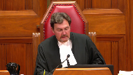
:::

The cases of Her Majesty the Queen against Pardep Singh Shuan and Her Majesty the Queen against Shehab Esagayer et al.

For the appellant, the respondent on cross appeal, Her Majesty the Queen, Andrea Beyasu and Michael Perlin.

For the intervener, Attorney General of Canada, Geoffrey G. Johnston.

For the intervener, Attorney General of Vanitoba, Charles Murray.

For the intervener, Attorney General of British Columbia, Lara Vizoli.

For the intervener, Attorney General of Alberta, Andrew Barge.

For the intervener, Aboriginal Legal Services, Caitlin E. Casper.

For the intervener, Debbie Baptist, Christopher R. Murphy.

For the intervener, David Asper, Center for Constitutional Rights, Kent Roach.

For the respondent, appellant on cross appeal, Pardep Singh Shuan, Dirk Durstein, and Tania Barito.

For the intervener, Advocate Society, Jill R. Presser.

For the intervener, British Columbia Civil Liberties Association, Joshua Sealy Harrington.

For the intervener, Canadian Association of Black Lawyers, Peter Torning.

For the intervener, Canadian Muslim Lawyers Association and Federation of Asian Canadian Lawyers, Nader Hassan.

For the intervener, Criminal Lawyers Association, Ontario, Nathan Gorham.

For the intervener, Defence Council Association of Ottawa, Michael A. Johnston.

For the intervener, South Asian Bar Association of Toronto, Janani Shanmuganathan.

For the intervener, Association Québécoise des Avocats et Avocats de la Défense, M. Guillaume Blanchette.

For the appellant, Her Majesty the Queen, Right of Canada, Kevin Wilson, Amber Pasczak.

For the intervener, Attorney General of Ontario, Michael Perlin.

For the intervener, Attorney General of Alberta, Andrew Barge.

For the respondent, Raed Jaser.

And for the respondent, Chib Esegayer, Megan Savard, Riya Sayani, Erin Dunn, and Sarah Weinberger.

For the intervener, Criminal Lawyers Association, Ontario, Nathan Gorham.

Ms. Bayasu or Perlin.

**Speaker 2** (00:03:44): Good morning, Chief Justice, Justices.

::: {.column-margin}
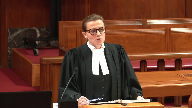
:::

This case deals with a repeal of peremptory challenges in jury selection.

Peremptory challenges were a way for both the accused and the Crown to exclude a certain number of individuals from serving on the jury without having to give any explanation or justification.

As such, peremptory challenges were inherently open to abuse in the sense of misuse on the basis of prejudices and stereotypes to discriminate against entire groups in the community and Aboriginal people in particular.

Last year, Parliament put an end to this practice by repealing peremptory challenges as they were contained in the former Section 634 of the Criminal Code.

There are three issues, main issues, in the appeal this morning.

The first is the constitutionality of the repeal.

The second is its temporal application.

In the absence of transitional provision in the new legislation, it is for the courts to determine when it applies, when it starts applying.

I will address the court on these first two issues, following which my colleague will make submissions on the third and final issue, which is the application of the curative proviso to errors in jury selection.

Turning to constitutionality first, it is my submission that the Court of Appeal for Ontario correctly held that the repeal of peremptory challenges does not infringe either Section 11D or 11F of the Charter.

And the focus, in my submission, has been with this challenge and continues to be on Section 11D of the Charter and, in particular, the guarantee of a fair hearing before an impartial tribunal, an impartial jury in the context of this case.

The central submission in this regard is that the repeal does not infringe the guarantee of impartiality in Section 11D of the Charter.

And that's because, first of all, peremptory challenges do not contribute to impartiality.

Their hallmark or distinguishing feature, by contrast to other procedures in jury selection, is that they can't be used without a justification, hence, for a fair hearing before an impartial

**Justice Rowe** (00:06:13): You mean all of the trials in which peremptory challenges were used before the amendments were unfair?

**Speaker 2** (00:06:22): Justice Roe, that's not my submission.

::: {.column-margin}
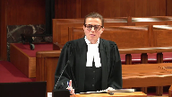
:::

There were certainly, peremptory challenges had a role, and they have been part of our law for a very long time.

And it is not my submission that they were necessarily unfair, but they were capable of producing unfair results in terms of being used for discriminatory purposes.

**Overlapping speakers** (00:06:44): So it was a policy choice, I guess, then, was it?

**Speaker 2** (00:06:47): It was certainly a legislative policy choice by Parliament in the repeal and there was a wealth of evidence before both Houses of Parliament as to both the harms of parameter challenges as well as their benefits.

::: {.column-margin}
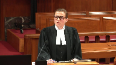
:::

The Defence Bar made submissions in that regard.

My submission is it was for Parliament to determine in this cost-benefit analysis that in the end of the day these challenges were more harmful than helpful.

Subject to constitutional infringement that that was Parliament's decision to make.

**Justice Abella** (00:07:25): Could you tell me, because it will be helpful to me as I listen to the argument over the course of the next 45 minutes or so, what do you say the purpose was of peremptory challenges in the past, given that they could either be discriminatory in impact or furthering the impartiality?

::: {.column-margin}
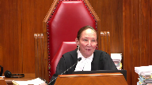
:::

So that's one, before we say that there's no infringement of any constitutional right by getting rid of them, what were they there for, in your view, in the first place?

And the second one is, how would you define impartiality in the context of peremptory challenges being used in a way that either promoted or detracted from impartiality?

**Speaker 2** (00:08:13): So just first of all, in terms of their function, I believe the history of parental challenges speaks to this, that they were first came about as a tool for the accused to balance out the power of the Crown in shaping the jury.

::: {.column-margin}
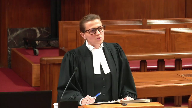
:::

The Crown had at one point a limited send-a-sides, and even as recently as 1992, prior to the score decision in Bain, the Crown had a very large number of send-a-sides.

So, peremptory charge, my submission, had the main function of somewhat leveling the playing field as between the accused and the Crown, whereby each party would have a similar opportunity to perhaps try to shape the composition of the jury in a way that was more sympathetic to that side.

So, that's in my submission, that was their main function.

And in terms of...

**Justice Abella** (00:09:18): change the composition of the jury, you could take the position that it had the effect of creating a less diverse jury or a more diverse jury.

::: {.column-margin}
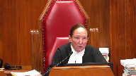
:::

So that ties into the question about what are we, how are we defining impartiality here and the objective of those challenges in determining what the impact is of getting rid of them.

**Speaker 2** (00:09:44): So, in my submission, Justice Obella, they didn't really relate, in their essence, did not relate to impartiality, to an impartial jury.

::: {.column-margin}

:::

These challenges were a way for each party to assert a measure of control in the composition of the jury, but not with a view to necessarily impartiality, something that could be objectively perceived to aid in a more impartial path.

**Justice Wagner** (00:10:12): be to obtain a most favourable jury to one or the other, the Crown or the defence, more than to get impartiality for sure.

So the goal would be different then.

**Justice Brown** (00:10:27): Or conversely, the goal could have been to obtain a partial jury, just partial towards oneself.

That's exactly, Chief Justice.

Yeah, that's, yeah.

**Speaker 2** (00:10:36): And so to the extent that you could sort of see it having to do with anything with impartiality, my submission had to do with this equal distribution between the two parties.

::: {.column-margin}
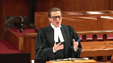
:::

And that was the core of this court's decision in Bain, that it's fine to have these challenges that can be used for partisan considerations, I believe the court said there, so long as there is an equal distribution as between the Crown and the accused.

So the only way in which they related to impartiality, my submission, was in this sort of balanced exercises between the parties.

**Justice Martin** (00:11:16): Is it not fair to say that it's moved off, in a way, from its historical roots, and even moved away, I think, from some of the comments of this court, and Cloutier, and Chirade, and so on.

::: {.column-margin}
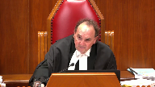
:::

And it's better understood these days, it seems to me, as being potentially problematic, and quite problematic, in terms of being used for discriminatory purposes.

And as the Chief Justice said, not to get an impartial jury, but for both sides.

I don't just say the defense, both sides, to get a jury that is favorable to their position, at least in their own minds, which often involves the kind of stereotypical and discriminatory thinking that we are trying to avoid.

**Speaker 2** (00:12:08): That's precisely my position, Justice Moldaver.

::: {.column-margin}
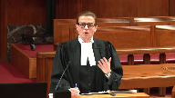
:::

That is the current understanding, both of the, has developed in terms of both being more cognizant of their potential, the potential abuses involved, as well as the sort of contemporary vision of the jury has involved my submission as being one that is, it is about having an impartial and representative jury and those are the core qualities.

And as Justice Moldaver, I believe, you said in the decision in Yumnu, that the jury belongs to the people and to the community and not to the parties.

So my submission, that's also been a sort of an evolution of our understanding of what the jury means in that regard.

**Justice Martin** (00:12:54): The other aspect that was recognized and what the new legislation deals with is, as one of my colleagues said, giving some reason for it, and we know very well, and in fact we were taught as young lawyers, as a defense lawyer, that if someone came into court as a potential juror and his shoes were well shined, you shouldn't pick them because it means they're law and order.

::: {.column-margin}
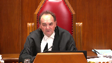
:::

I mean, and this was exposed, Justice Watt did a very good, excellent job in my view, in exposing that the two primary reasons for these things, or how they've been used of recent times, is either for discriminatory purposes, or purely subjective, arbitrary purposes.

The kind of situation that we see in Chewhan, seems to me, when the accused says, oh, the juror looked at me funny or something.

I mean, no nothing to back that up.

And are we going to be ridding ourselves of jurors like that, because of some subjective belief that has no basis in fact or reality to make the accused feel better?

**Speaker 2** (00:14:06): And that's the core of my submission, Justice Moldaver, that the repealed per-underment challenge simply eliminates the former, namely, excluding someone just based on disliking their appearance or essentially for no articulable reason.

::: {.column-margin}
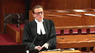
:::

What is preserved in the legislation is the ability to, for the defence, to articulate an objective concern about someone's perceived lack of partiality or maybe suitability to serve on the jury.

And that is so preserved in the legislation and, in fact, there's an added emphasis on the trial judge's discretion to excuse or stand aside jurors, such that objections by the defence can be aired out in court, can be considered by the trial judge, can be resolved and can be resolved through reasons that can be further appealed.

So, in my submission, the current procedure actually provides a powerful protection for the defence interest in dealing with lingering concerns of partiality about jurors, so long as they can be articulated before the court.

**Justice Côté** (00:15:15): Mr. PSU, is there evidence that Parliament considered how abolishing peremptory challenges would affect different racialized groups?

::: {.column-margin}
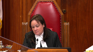
:::

Because we have, as you see, we have a lot of interveners who are racialized groups who are saying those peremptory challenges are essential for us.

**Speaker 2** (00:15:39): Justice Cote, there was certainly the question of representatives, my submission was before Parliament and it started out with a discriminatory impact of these challenges in the sense that making the jury more favorable to a party and thus more or less representative based on the particular party's identity before the court.

::: {.column-margin}
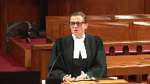
:::

In terms of the defense and intervener submissions that primary challenges were a tool for the accused to make it more representative or enhance diversity, in my submission that from a constitutional standpoint, this court's recent decision precludes a constitutional challenge on that basis.

The court was unanimous in a holding that there is no constitutional right to a trial jury of a particular racial composition or in fact of certain identity groups that would reflect the accused's background.

So as a result, as the Court of Appeal here quite properly held, the fact that the peremptory challenges were used to achieve that which was not something the accused was constitutionally entitled to does not make their abolition unconstitutional.

They're simply a means to an end and the end itself is not a constitutional guarantee.

**Justice Martin** (00:17:07): What this does now is it prevents, for example, and I'll take a defense example.

::: {.column-margin}
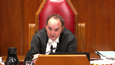
:::

If an indigenous person is a potential juror in a case where the victim is indigenous and the accused is not, it prevents the defense from saying challenge for the kind of discriminatory or stereotypical beliefs that we eschew now.

You have to give a reason.

And I doubt that you will ever see a reason given by either the crown or the defense.

I don't want this person on there because I think he or she will be too sympathetic to the victim because he or she is of the same race.

I mean, let's get real.

And yet that's what's been going on quietly.

**Speaker 2** (00:18:04): So that's, I agree just more, that's certainly the aim in terms of the salutary aspect of this legislative reform, certainly.

**Justice Rowe** (00:18:15): Justice Muldaver gives the big city perspective.

::: {.column-margin}
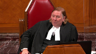
:::

I'm from a smaller place and I found in my experience long, long ago as a trial judge that peremptory challenges were used to weed out what I'd call church ladies who because the accused had been drinking and engaged in sinful activities must be guilty.

Or on the other hand someone whom was sort of seen as a petty criminal and who didn't really want that person on the jury because he was probably going to spring the accused anyway.

But as I said those were more innocent times perhaps.

**Speaker 2** (00:18:50): And Justice Roe, I mean, to the extent that, I mean, let's say the pettit-critimal example, again, it's not a high threshold under the new legislation to articulate some concerns.

::: {.column-margin}
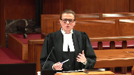
:::

So certainly if there's something that is either known to the parties or obvious from that juror's presence in the courtroom that is problematic, in my estimation, the defence has an ability to articulate that concern.

**Justice Brown** (00:19:15): I mean I guess the difficulty that then a lot of these interveners are going to throw at you is that bias is often unconscious and it may be that the person whose bias doesn't even recognize it which makes it more difficult for the person who isn't that person to recognize it and for the judge to to judge it.

::: {.column-margin}
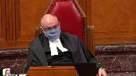
:::

So how do you how do you confront that?

**Speaker 2** (00:19:42): Justice Brown, there is an important distinction between bias and partiality, that the sort of case law, cases like Parkes and this court's decision in Williams speak to that, that really the Canadian law has never been about ascertaining jurors' beliefs and prejudices and personalities and experiences, that jurors are entitled to bring their experiences with them to the courtroom and in fact that that is the genius of the jury system, is to have a diversity of views and experiences.

::: {.column-margin}
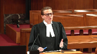
:::

The problem is a kind of bias that is not only present in the jurors' mind, but is also something that he or she is unable to set aside in their deliberations and that's partiality.

And the only means to deal with that in my submission is the challenge for cause process.

As again, the jurisprudence speaks to the centrality of the challenge for cause process in giving the accused a voice in jury selection, in particular for racialized accused, and to raise such concerns.

And it is really, as I believe this court said, imperfect as it is, it's the only means for the accused to try to secure an impartial jury.

So, going back to the question of bias in my submission, bias has never been treated as relevant per se, it is only to the extent to which it translates into partiality.

And for that, in my submission, we have a mechanism in the challenge for cause that's preserved as essential in safeguarding the accused's Section 11d rights.

**Justice Abella** (00:21:27): Do you draw a distinction between what you see as the effect of losing pereptory challenges on a crown and on defense?

::: {.column-margin}
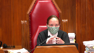
:::

I mean, since we're dealing with language that's very imprecise, what is fair, objectively?

What is impartial?

What do we want a jury to be?

We don't want it necessarily to be representative.

But somebody like Mr. Chewhan says, I need to be able to see myself at least perceived to be reflected in a jury.

How does an accused then, who wants to be judged by a fair and impartial jury, how does he or she affect that if they have to make a case for challenges for cause, and it is only on the basis of the appearance? Gender?

Color?

Is there now a mechanism for an accused to be able to ensure that there is objectively, from his point of view, if there is such a thing, a jury that he feels can fairly judge him or her?

**Speaker 2** (00:22:40): So Justice Zabala, Mr. Chauhan had, obviously there was a challenge for cause process and that that was surely granted a trial in this case, so in fact it is, more or less goes without saying they will be granted for a racialized accused.

::: {.column-margin}
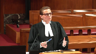
:::

So the challenge for cause is there, beyond that, in terms of the accused's subjective perception as to who should be on his jury, in my submission that is not something that's constitutionally protected.

And not only that, but it is really, it's sort of this subjective measure of comfort that has no demonstrable objective quality to it, in the sense that if we take parameter challenges, if they were exercised on the basis that the accused objectively thought that someone was potentially racially biased, this was purely a subjective notion that the accused had.

There was no evidence to suggest that when they removed that person, that person was actually biased or would have been partial.

So there's no objective relation to impartiality in terms of the effect it has on the jury.

It is simply this kind of subjective perception of a benefit for the accused that it may have been there, but in my submission is not constitutionally guaranteed.

**Justice Abella** (00:24:06): But we know from what goes on in some other countries, in the southern states of some other countries, that there is a difference, that sometimes the perception is legitimately borne by an accused about whether or not it will be a fair jury if it's all one color, for instance.

::: {.column-margin}
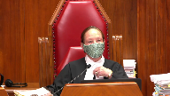
:::

So where is the protection then?

How do we then say there's no benefit, no constitutional benefit to an accused by having something like a peremptory challenge?

**Speaker 2** (00:24:40): Just about, there was, the discourse with Bruness and my submission is quite clear that there's no constitutional right to a particular composition of the jury, whether it's on racial lines or gender lines.

**Justice Abella** (00:24:52): But there is a right to a fair and impartial jury, and if in certain circumstances you think as an accused that in that community this particular composition would be less or more likely, but you can't put your finger on why, because it's the way, the appearance of the jury.

::: {.column-margin}
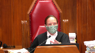
:::

How do you protect that?

**Speaker 2** (00:25:15): There is a certainly it seems to be there is a possibility left open by this legislative reform In terms of the change to the stand-aside provision, which is section 633 Which was amended to expand the tragedy discretion to stand aside jurors in order to maintain Confidence in the administration of justice It is certainly beyond the scope with present case to define what that might mean in practice

::: {.column-margin}
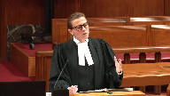
:::

But in my submission it certainly leaves open the possibility in a future case and depending on the particular perhaps there's a sort of a racial undertone to the To the nature to the factual matrix of a case that in an appropriate case There might be room for the defense to make a request To for the trial judge to exercise her stand-aside power To perhaps alter in some form the the the representation and quality of the jury

**Justice Abella** (00:26:22): So did the judge didn't exercise that power?

**Speaker 2** (00:26:26): There was no request to exercise that power on that basis.

::: {.column-margin}
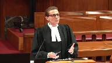
:::

The only request made that was granted was because someone was perceived to have made an offensive gesture, the accused, and that was good enough reason why that person was not on the jury, but that was the only way in which the stand aside discretion was invoked.

**Justice Wagner** (00:26:50): If I'm not mistaken, at one point in time, when an accused, for instance, had reasons to believe that the jury may be biased, there was always a possibility to ask the judge to ask questions to the potential jurors on race, religion, that type of question.

::: {.column-margin}
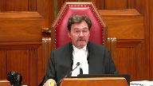
:::

Isn't that one good protection to avoid and to make sure that the jury is impartial?

**Speaker 2** (00:27:19): Chief Justice, yes it is and it continues to be and certainly in a particular case that happens if perhaps some information comes to light or some reason to think that more needs to be found out about a particular person, that that is still part of the trial judge's discretion.

::: {.column-margin}
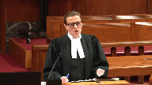
:::

And just perhaps that ties into my final submission here why the legislative reform should be upheld because it puts a premium on the trial judge's discretion to oversee the proceedings and to ensure an impartial jury for the accused.

And trial judges are presumed to exercise their discretion in accordance with the charter.

So in my submission there can be no charter violation from a provision that leaves intact and in fact enhances the trial judge's jurisdiction to protect the charter interests of the accused.

**Justice Martin** (00:28:15): And may I ask you, in terms of the constitutionality, is there anything in the Court of Appeal judgment that you take issue with, or do you adopt it in its entirety on the constitutional point?

**Speaker 2** (00:28:26): we adopted in its entirety on a constitutionality analysis.

::: {.column-margin}
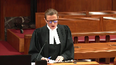
:::

Thank you.

If I may just use one minute to simply enunciate our position on the temporal issue, it is simply that in the absence of a constitutional infringement, the legislative change here is purely procedural.

It's simply a change in procedure, injury selection, and that as such, it should apply immediately to all pending trials, as of September 19, 2019, when the legislation came into effect, that there is no, and that the Court of Appeal failed to identify a substantive right impacted by this change.

In my submission, there is the right to a jury trial, the constitutional guarantee.

But beyond that, there is only an array of procedures which can be changed by Parliament.

So long as what is in place is constitutionally compliant, these procedures can be changed by Parliament.

And when Parliament does so, the changes should take effect immediately.

And subject to the Court's guidance and any further questions, I will turn it over to my colleague.

Thank you.

**Speaker 3** (00:30:38): Thank you.

::: {.column-margin}
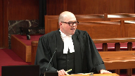
:::

Chief Justice, Justices, if the Court of Appeal was correct that the repeal of peremptory challenges is constitutional but should not have been applied at the Respondent's trial, it follows, well two conclusions follow.

First, the trial judge erred by applying the new regime, but the error did not deprive the Respondent of a procedure that is necessary to ensure an impartial jury.

The remaining procedures ensured impartiality and the trial was otherwise fair.

The trial judge made an error, but it was a good faith error on a novel technical question of law, which led him to use jury selection procedures that will soon apply in all cases.

In my submission, this is just the kind of situation that the procedural curative proviso was designed to cure.

The proviso should be applied in this case and the impartial jury's verdict should be restored.

I have four submissions for you.

First, leave should be granted to invoke the proviso for the first time in this Court because granting leave will not prejudice the Responding Party and granting leave will serve the interests of justice.

Second, the Court should affirm its holding in con that the application of incorrect jury selection procedures can be cured on appeal.

Third, the Court should find that the proviso can apply in this case because the appellant suffered no personal prejudice.

An effect on the jury's composition is not personal prejudice, neither is prejudice to public confidence in the administration of justice, which is separate.

And finally, fourth, the conviction should be restored because the jury was impartial, the trial was fair, and ordering a new trial in these circumstances would undermine public confidence in the administration of justice.

**Justice Karakatsanis** (00:32:44): Can I ask you, when you're dealing with that fourth point about whether there was actually prejudice in this case, can you help me on this?

::: {.column-margin}
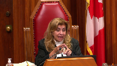
:::

If we've gotten to the proviso, it means that we have concluded that a substantive right was negatively impacted.

So we would have concluded that there was a negative impact on either trial fairness or trial by jury.

If we've concluded that those substantive rights have been negatively impacted, how would we then conclude there's no prejudice?

So those are two different points, but my question here is, if we get to the proviso, we've necessarily concluded there's a negative impact on substantive rights.

So I just want you to make sure you address that when you're discussing that point.

**Speaker 3** (00:33:39): I'm happy to address that now, Justice Kerikatsanis, in my submission, if you conclude that there's a negative effect on trial fairness, that's the type of conclusion which would lead to some constitutional infirmity, but absent constitutional infirmity, our position is that the constitutional right...

::: {.column-margin}
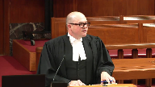
:::

Actually, sorry.

Assuming that...

**Justice Karakatsanis** (00:34:03): that assuming that we have found the changes to be constitutional, if not, we wouldn't be dealing with the proviso anyway.

So assuming we found it to be constitutional, we then have to decide whether it's applied to all cases.

**Overlapping speakers** (00:34:18): Yes.

**Justice Karakatsanis** (00:34:18): Whether it's purely procedural and therefore can be applied across the board or whether it negatively impacts the substantive right.

So we only get to the proviso if we've decided it has to be applied retrospectively.

**Speaker 3** (00:34:34): you.

::: {.column-margin}
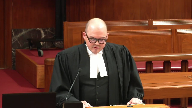
:::

So in my submission, the parties that are advancing an argument that the Court of Appeal was correct on the temporal application rest their submission on an effect on the right to trial by jury.

And in my submission, it hasn't been established that that effect on the right to trial by jury is something that negatively affects trial fairness.

If trial fairness is negatively affected, then the proviso can't apply.

That would be my submission.

I'd like to briefly address the question of leave to raise a new issue in this court, invoke the proviso for the first time on appeal.

The court can consider a new issue on appeal if there's no procedural prejudice and if declining to consider the issue would be contrary to the interests of justice.

And in my submission, there is no prejudice to the responding party in this case.

The type of prejudice that we're concerned about at this point is the lost opportunity to reduce evidence and shape the record in the court below.

And the procedural curative proviso raises a question of pure law.

The Court of Appeal is in no better position than this court to decide the issue.

There's been no suggestion that different evidence would have been adduced to permit analysis of this question in the court below.

And the analysis is based on the trial record, which is set at this point.

And in my submission, it is in the interest of justice for this court to rule on the application of the procedural proviso.

Numerous cases will turn on whether the proviso can apply in the context of this case.

Just in Ontario, if peremptory challenges should have been available, I can tell you that there, by our count, are about 37 cases where peremptory challenges were denied following the trial judge's ruling in this case.

And if peremptory challenges should not have been available, there were 10 convictions and our 10 current jury trials where peremptory challenges have been granted.

So if the trial judges in those cases erred in either granting or denying peremptory challenges, on the current state of the law on the proviso in Ontario, that is a fatal error that's incurable.

So we need, in my submission, clarity on how the law applies in this context.

Thank you.

**Justice Brown** (00:37:17): about the relationship, if any, between the determination that the amendments affected a procedural revision as opposed to a substantive revision and the curative proviso.

::: {.column-margin}
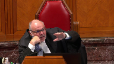
:::

Obviously if it's procedural we don't even get to it, but if it's substantive can we truly say that there's no prejudice?

If you've limited a substantive right, doesn't that seem to short-circuit the prejudice argument?

**Overlapping speakers** (00:37:45): Uh, it's not him.

**Justice Brown** (00:37:46): because the code says no prejudice, there can't be any prejudice.

So if you're limiting it to substantive rights, at least it's hard rhetorically to find your way to say, well, there's no prejudice, if you've limited to substantive right that the person doesn't vote.

**Speaker 3** (00:38:02): So, I suppose it depends on what the content is of the right and if we're talking about something like peremptory challenge or something in the jury selection process that's intended to enhance fairness, I would agree with you that in any case where there's some kind of limitation of something that's intended to enhance fairness or a procedural protection for the accused, there's always in that case some kind of prejudice to public confidence in the administration of justice, some amount.

::: {.column-margin}
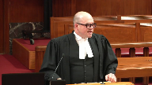
:::

But the proviso is concerned with personal prejudice, the language of the provision permits its application where the court of appeals of the opinion that the appellant suffered no prejudice thereby.

So the question then becomes in my submission whether the loss of whatever the procedural protection is impaired whatever that procedural protection was intended.

**Justice Brown** (00:38:59): You keep calling it a procedural protection, but of course we're only worried about the proviso if it's not a mere procedural protection, if it's an interference or a limitation of a substantive right.

::: {.column-margin}
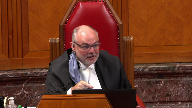
:::

If it's procedural, we don't, you know, you're having your ten minutes, but we won't need to worry about anything you say, I think, because it's an alternative argument.

But if it's substantive, then it's not a mere procedural protection.

We've decided that it's an interference with a substantive right.

So then if it's been limited when it's been invoked, it's been declined, is it then possible to say that there's no prejudice?

But I'm taking you into an alternative world you may not want to go into, but it's a question I have.

**Speaker 3** (00:39:51): I'm happy to go into that, and if the concern, let's say it is a procedure, but it's a procedure that has some substantive content, so the removal of the procedure has affected a substantive right.

::: {.column-margin}
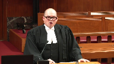
:::

The question is still, ultimately, when you're looking at personal prejudice, whether the loss of that substantive right renders the trial unfair, or whether there's a reasonable possibility that the verdict might have been different.

That comes from CON, that comes from Cloutier, this court's jurisprudence on the error of law, curative proviso in section 686, 1B3.

Those are the types of prejudice that we're concerned about.

So the loss of a statutory right, a substantive right, as you say, Justice Brown, might have the effect of impairing trial fairness, it might have the effect of leaving a reasonable possibility that the verdict might have been different, but it might not.

So the question then becomes, in my submission, when we're looking at jury selection errors in particular, and I rely on this court's decisions in Davey, in Yumnu, and the Ontario Court of Appeals decision in Brown, what we're concerned about in the jury selection process is that the jury is impartial.

So all of the procedures that are applied in that process, whether they have substantive content or merely procedural content, are geared toward ensuring that the accused is tried by an impartial jury.

All of those procedures, irrespective of their procedural or substantive content, are means to an end.

And what the Court of Appeals said in Brown, what Justice Rosenberg said in Brown, was that reducing representativeness of the jury might have a negative effect on the ultimate end, an impartial jury, but it might not.

And what I would urge the court to do is to look at the remaining procedures.

If you're satisfied that challenge for cause, the enhanced stand-aside procedure, will lead to the empanelment of an impartial jury, and if there's no allegations, as there are none in this case that there's actual bias or actual partiality on the part of the jurors that heard the trial, in my submission, that's positive evidence that you can rely on to rebut any presumption of prejudice and conclude that the accused personally was not prejudiced.

**Justice Karakatsanis** (00:42:29): No, go ahead. Go ahead.

**Justice Martin** (00:42:29): No, go ahead. Go ahead.

::: {.column-margin}
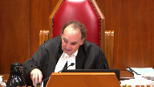
:::

Well, I just wonder, isn't it how you frame the issue?

If the issue is framed as, did he get the jury?

Was it composed differently than what it would otherwise have been?

If that's the question, it's over.

But if that's not the question, if the question is, has the Crown been able to establish, based on the whole picture here, that there was no harm because he got a trial by a fair and impartial jury, we look to that.

If that's the issue, what is it?

That the composition of the jury was different than what it would have been?

That's what the Court of Appeal has effectively said.

You really didn't have a jury trial.

The other way to look at it is, yes, you had a jury trial.

Now the question is, did you suffer some prejudice that rendered the trial unfair?

And or you can show there was some form of impartiality.

That's what it comes down to.

And in fact, if I'm not mistaken, Justice Kara Katsanis and Davey sort of averted to this possibility, but we didn't have to decide it.

Maybe today's the day.

**Speaker 3** (00:43:39): Well, in my submission, that's the issue on prejudice.

That's the core issue on prejudice, is a change to the composition of the jury sufficient to demonstrate prejudice.

**Justice Martin** (00:43:51): That's been the whole history of the Court of Appeal of Ontario in this.

::: {.column-margin}
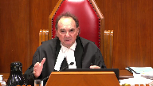
:::

The minute the composition is messed up somehow, no proviso.

And it seems to me, depending on how we look at that, if we look at that unfavourably, that puts a whole different complexion on what the real issue or real question should be.

**Speaker 3** (00:44:10): Yes, in my submission, I would urge you to adopt that interpretation that focuses on the fundamental interest that the jury selection procedures are meant to preserve.

::: {.column-margin}
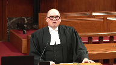
:::

So if you've got in this case, the respondent was tried, if you accept my submission and my colleague's submission, the respondent was tried by an impartial jury.

His argument is that he should have had more of an opportunity to shape the jury, but the jury, that second hypothetical jury would also have been impartial.

And what's being asked for as a remedy in this case is to go back and have a new trial before another impartial jury.

So in my submission, you know, he can't get the original jury that he wanted.

There's no way to sort of unwind the clock and go back to that.

What he got was an impartial jury, and that's what the law is geared to upholding.

And that's consistent in my submission with the way that Parliament has considered effects on the composition of the jury.

There's saving provisions in sections 643, 670, and 671 of the Criminal Code, which have been part of our criminal law since 1892 and 1906.

And those provisions preclude a court of appeal from setting aside a verdict based on certain types of errors in the jury selection process, one of which would be the inclusion on the jury of a completely ineligible juror.

So there's cases from the Court of Appeal and from this court dating back to 1932 where there's a change.

Somebody served on the jury who shouldn't have been there, and the verdict is nonetheless upheld on the basis that Parliament has said that that's not the type of error that we're concerned about.

**Justice Karakatsanis** (00:46:04): So can I ask you then, because if you take this argument to its logical conclusion, what we're seeing is that perhaps the test is a little different when you're looking at the procedural proviso, because although in prejudice is, you know, in a substantive proviso, prejudice has been defined as harmless, such that it does not affect the verdict or an overwhelming case, let's just focus on the what's harmless.

::: {.column-margin}

:::

If you say in a procedural case, it's not the kind of, you don't judge whether there's prejudice or whether it's harmless in the sense that it affects the verdict.

I mean, how would you possibly kind of work your way through and untangle that to demonstrate it affects the verdict?

So this is just another way of making the same point.

It's harmful or prejudice to what?

And if the issue is to a fair trial or to a trial by an impartial and independent jury, then that's what you look at, not, you know, was it harmless such that it affected the verdict in a different way.

So I just am asking you, given the arguments that you've been making, whether it may not require a bit of a tweaking or a bit of an understanding of prejudice in a slightly different way when you're looking at what actually has been harmed.

**Speaker 3** (00:47:28): In my submission, it shouldn't require a modification of the test because the test as it stands right now, it doesn't require 100% certainty that the verdict would have been the same.

::: {.column-margin}
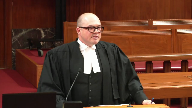
:::

What the test requires is for the crown to rebut any reasonable possibility that the verdict would have been different.

And if we're talking about the argument that we're against would say that the fact that the jury is differently composed means that there's at least a possibility that the verdict would have been different had it been rendered by a different jury.

**Justice Rowe** (00:48:03): I'm not suggesting that the following quotation governs here, but I always keep it in mind because I think it's helpful.

Justice McLaughlin, I can't remember which case, wrote, Everyone is entitled to a fair trial, no one is entitled to a perfect trial.

**Speaker 3** (00:48:22): Yes, and you find similar language in the fine decision.

My point is that when we're talking about a change in composition of the jury and the possibility that they might have arrived at a different verdict, that's a speculative possibility.

It's not a reasonable possibility.

**Justice Martin** (00:48:37): It might be different, it might be different if the accused raised something and the judge said no, that won't cut it, when in fact, and the appellate courts see that as being an error in the exercise of that discretion.

::: {.column-margin}
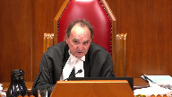
:::

There could be something put up by the accused that is really quite substantial as opposed to, you know, they looked at me funny.

And if the trial judge said no, that's not enough, then that could well go to the impartiality issue and could be fatal.

**Speaker 3** (00:49:16): That's correct.

::: {.column-margin}
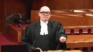
:::

I would agree with that.

I think a good example is parks.

The last paragraph of parks, the court of appeal talks about, you know, the impact in that case was a failure to apply the challenge for cause process.

If something like that happens and you can trace it to partiality or if somebody serves on the jury and there's a concern about the partiality of that individual or indeed in my submission if there's something that happens, the nature of the error suggests some overwhelming prejudice to the due administration of justice that amounts to a miscarriage of justice, that's the kind of situation where the proviso cannot apply.

**Justice Wagner** (00:49:58): Your time is up, but two questions only.

Just Sadala first, and then just Scootie.

**Justice Abella** (00:50:06): Mr. Perlin, first of all, before you were born, I sat on the panel that decided Parks.

::: {.column-margin}
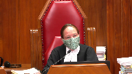
:::

But I had you in mind when we decided it.

The question of whether the nature of the case, Mr. Chewhan's case was entirely circumstantial.

Where does that factor into the prejudice analysis?

**Speaker 3** (00:50:30): So, the fact that the case is circumstantial would factor into the prejudice analysis if we're talking about an overwhelming case, but what we're talking about, we're not submitting here, there's no record before the court to permit us to make a submission that the case was overwhelming.

::: {.column-margin}
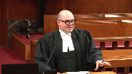
:::

The question then is whether the error is harmless, and the question at that point, as I've submitted, is whether there's a reasonable possibility that the verdict would have been different, and what we have with an impartial jury, assuming we've persuaded you that the jury in this case was impartial, in my submission, you would presume that the impartial jury delivered a reasoned verdict based on the evidence, and that a different jury would have done the same.

**Justice Wagner** (00:51:19): Last question, Mr. Scutti.

**Justice Côté** (00:51:21): Yeah, so my question relates to how fairness should be taken into account in the assessment of prejudice, and I mean the following.

::: {.column-margin}
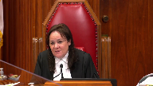
:::

Do you think here the amendments came into effect on September 19, 2019, that very same morning parties in the Xuan case were supposed to proceed to the jury selection?

So do you think it is fair to change the rules when everybody is geared to proceed that morning to select the jury and then the rules suddenly change?

And if it is not fair, how should this be considered in the assessment of prejudice?

**Speaker 3** (00:52:02): Well, I think one way to look at the fairness concern is whether it defeated expectations of the accused person.

::: {.column-margin}
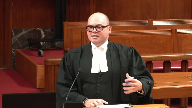
:::

And certainly in the relevant time period in my submission under this court's charter jurisprudence would be the expectations at the time of the offense.

And in my submission, it's highly unlikely that somebody would have an expectation of a particular jury selection procedure at the time of the offense or even at the time of charging.

And to the extent to which a person might feel aggrieved by the fact that a procedure has been changed on the day of the trial, in my submission, that's just not relevant prejudice.

You look back at cases regarding the temporal application of new laws, and very significant changes have been found to be procedural changes, even though they might have a dramatic impact on the trial of the accused.

**Justice Wagner** (00:53:06): Thank you.

Thank you very much.

Mr. Johnston.

**Speaker 4** (00:54:05): Chief Justice, Justices, the Attorney General of Canada submissions will focus on the temporal application issue as it relates to the elimination of peremptory challenges.

In the absence of a transitional provision, this issue is left to be discussed.

**Overlapping speakers** (00:54:19): Why wasn't there a transitional provision?

Why are we in this mess?

**Justice Brown** (00:54:23): right out of my mouth.

Why are we doing this?

**Speaker 4** (00:54:23): right out of my mouth.

Why are we doing this?

I have no answer to that question, but the Crown being indivisible, I'll accept full responsibility for the omission, but I have no explanation why a transitional provision wasn't included.

**Overlapping speakers** (00:54:35): It's almost inexplicable.

Again, I have no explanation for why it was not.

Well, I guess it is inexplicable, you know.

**Speaker 4** (00:54:42): But in the absence of a transitional provision, the issue is left to be determined based on the common law presumptions, the provisions of the interpretation act and this court's decision in Dinley.

::: {.column-margin}
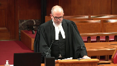
:::

In our submission, Dinley provides the framework for answering this question and under Dinley there are really three questions to be posed.

First, what is the nature of the change?

Second, if the change is a procedural change, does it affect a substantive right?

And if so, the third question is for the purpose of determining the date of prospect of application, when was this right acquired?

Turning to the first question, it's not really disputed that the elimination of peremptory challenges is in essence a procedural change as it alters the procedure governing the conduct of a trial by judge and jury.

As a procedural change, it is presumed to apply retrospectively and that is codified in section 44 of the interpretation act, unless the change is not purely procedural and affects a substantive right, in which case the presumption against retrospective application applies and again that's codified in section 43 of the interpretation act.

This court has commented that the distinction between a purely procedural change and a procedural change that does not affect substantive rights is not always clear and can be elusive, but in Dinley the court identified one indicator as whether the change affects the manner or mode for applying the procedure or affects the content or the very existence of the procedure.

So Justice Doherty in RS framed this question as what's the practical impact of the change in procedure?

And we would say that another indicator is whether a procedural change affects a substantive right is whether the substantive right is itself a protected charter

right and the right to a trial by jury is a protected charter right as well as a statutory right.

**Justice Martin** (00:56:48): And this is all just begging the question, what's the substantive right in this case?

::: {.column-margin}
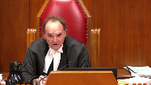
:::

It comes back to the very debate we've been having, Justice Katsanis and I and others, you know, is the right, is the substantive right the right to a fair and impartial trial by a jury?

Or is the substantive right the right to have the jury of your choice in effect because you had some challenges that allowed you to, that could have an impact on the composition of the jury?

**Speaker 4** (00:57:19): It would be our submission that the substantive right is the statutory right to a trial by judge and jury as it existed before September 19, 2019, which included peremptory challenges as an independent means to challenge the composition of the jury.

**Justice Brown** (00:57:35): right to a trial by jury as it existed.

It existed in the charter.

It's guaranteed in section 11.

**Overlapping speakers** (00:57:42): Yes.

**Justice Brown** (00:57:42): No change in that, the change is the means by which that is achieved.

Now why are the means, why do the means give rise to a substantive right?

**Speaker 4** (00:57:56): First, I'd make the submission as this court indicated in Dinley and as the Court of Appeal found in this case that a procedural change can impact a substantive right without limiting a protected charter right.

::: {.column-margin}

:::

The Court of Appeal's reasoning, which we agree with, is that the substantive change is that the statutory right to a trial by judge and jury before September 19th included peremptory challenges as an independent means to challenge the composition of the jury.

Now it does invite a question, and the question is this, can a substantive right exist in relation to a procedure that was working in mischief and that was producing no objective benefit?

And that's not a question that the framework in Dinley answers, but here the change does not just alter the manner of the procedure like the changes to the challenge for cause procedures.

This is not a situation where peremptory challenges have continued to survive in another form.

They've been legislated out of existence, and this court in Dinley indicated that that is a sign that the change has an impact on substantive rights.

**Justice Brown** (00:59:01): But that depends on how you define the change, right?

All that's really changed here is the peremptory bit.

The accused hasn't been deprived of a voice in the formation of the jury.

The accused has just been deprived of the ability to use that voice without a reason.

**Overlapping speakers** (00:59:18): I agree with that, Justice Brown.

**Justice Brown** (00:59:19): But in those terms, it becomes to, it seems to me, certainly less significant whether it's more, less substantive is another matter.

And as the, as my.

Just the peremptory bit that's changed.

**Speaker 4** (00:59:32): As my friend from the Provincial Crown pointed out, and we make this submission in our factum, it is the case that there are increased stand-aside powers now in the hands of the trial judge.

::: {.column-margin}
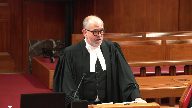
:::

So in a sense, the process for an accused to challenge the composition of a jury has been enhanced.

Thank you very much.

Thank you.

**Justice Wagner** (00:59:52): Thank you.

**Speaker 5** (01:00:03): Mr. Murray.

Good morning, Mr. Chief Justice.

**Speaker 6** (01:00:06): Justices, am I on? I'm on.

**Overlapping speakers** (01:00:08): Yes, you're on.

**Speaker 6** (01:00:08): So I'm going to use my time to address the temporal issue as well and specifically about the peremptory challenge repeal.

::: {.column-margin}
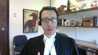
:::

And so you've seen that at least among the attorneys general that are here today, we agree that this is a procedural change, but we obviously don't all agree on what the ultimate effect of that change is.

I'm going to suggest to you that when it comes to considering procedural changes in the criminal context, perhaps there's another way to frame the issues than the current way that's led so many of us down different paths so many different times.

This is at least the third time in recent memory that we have a temporal issue with criminal amendments that leads to wildly inconsistent outcomes across the various jurisdictions.

Procedural changes are supposed to benefit everyone, but that's just not the case when we can't figure out when they apply.

So something just isn't quite working.

I'd just like to ask you to step back for a moment from the law of presumptions and rebuttals and interpretive rules and exceptions and just consider for a moment first, why do we have criminal procedure?

And in my submission, procedures are what make things work.

When procedures work well, the justice system also works well, and it's much more likely to have public confidence.

But when they don't work well, the administration of justice gets itself into a bit of trouble.

Resolving these procedural temporal issues ought to be done in a way that advances the underlying goals of criminal procedure, and those are to have a fair, efficient, and effective criminal justice system.

So procedures ought not to be interpreted in a way that causes more problems than they solve.

The approach to determining a prospective or retrospective application should be holistic and it should be practical, and it should take into account all the circumstances and balance the interests and values and impacts of making the change either prospective or retrospective.

And in my submission, it should ultimately ask, what works best?

Or in other words, the correct legal answer to this question should also be the one that makes the justice system work best and best preserves its integrity.

The choice before the court on this issue today is to either have one system of jury selection going forward or two for some unknown period of time.

And in making that choice, I would just ask you to consider the following points.

First, both the old and new systems are capable of producing impartial juries.

So in terms of effectiveness, the regimes are equal in that regard.

Having both or either won't change the fairness of trials.

Second, if there are two systems, depending on how we make the choice between which system applies, is it going to be the offense date?

Is it going to be the charge date or some other date of vesting?

This dual state of affairs is likely to go on for potentially many years.

Third, having two systems creates opportunities for mistakes to be made in which set of procedures applies.

And these mistakes can be serious.

They may require new trials, we know, and it's definitely going to result in delays that the justice system can't afford.

As long as we have two systems, there's going to be pitfalls in how to apply those systems.

And that, in my submission, is not an efficient procedural situation.

Fourth, having two systems will lead to some practical difficulties.

And one example is in Manitoba, we often select multiple juries from one pool on the same day.

So when you have two systems, it's inevitable that on one given day, you'll have to use both of those on the same jury pool.

Fifth, if there's two systems, some accused and crowns are going to have these peremptory challenges and others aren't.

Now for an accused without peremptory challenges, the process will look different.

But as I've said, it's still going to be fair, and there'll still be opportunities to participate in jury selection.

But to accused and to the public, the likely perception is that a dual process is less fair.

It's more fair when everyone gets the same procedures.

And then finally, there's the impact on the appearance of justice.

As long as we have this old system preserved, prospective jurors will continue to be disallowed to serve because of the color of their skin.

Justice Moldaver, you made the comment that this has been going on quietly.

It's going to continue going on quietly as long as we have this old system in place.

This court's jurisprudence always emphasizes the importance of the public perception of fairness and jury selection.

So how do we explain to the public and to potential jurors why it's fair to allow a procedure to continue that parliament has said is discriminatory and ought to be abolished for that reason?

It simply won't appear fair.

So there's a balance to be struck here.

And if you choose a retrospective application, we certainly have a procedural impact on the accused and on the crown.

But in my submission, it's modest.

**Justice Brown** (01:04:44): So ultimately, we should resolve the procedural versus substantive question by the result.

::: {.column-margin}

:::

Justice Brown, I don't think that the result is the only consideration.

That's all you've been talking about.

I do submit that it should be a consideration and that when we look at how procedures will— How is it relevant to deciding procedural versus substantive?

**Speaker 6** (01:05:08): We want the justice system to work properly, Justice Brown, in my submission, and to do that we have to look at how the procedure works.

**Justice Brown** (01:05:17): to make that determination on the basis of what makes the justice system work poorly.

But if we decide that something is substantive, then obviously you're going to have two systems going forward during a transition.

You're putting the cart before the horse, I think.

**Speaker 6** (01:05:35): In some ways, I think that that's correct, but I suppose that at heart my submission is what kind of rational legal analysis will allow the preservation of a procedure that's been deemed to be discriminatory or that will allow discrimination?

::: {.column-margin}

:::

How can there be a substantive right to that in the end of the day?

So another way of framing it, how can you have a right to something that will allow discrimination to persist?

**Justice Wagner** (01:05:59): Thank you very much.

Your time is up.

Thank you.

Thank you, Justices.

Lara Weasley.

**Speaker 7** (01:06:07): Chief Justice, Justices, today I'm going to attempt to address both the constitutionality and the temporal application.

::: {.column-margin}

:::

Addressing first the constitutionality of peremptory challenges and following up on a comment of Justice Moldaver, peremptory challenges are a vestige of a jury system which bears little if any resemblance to the modern jury.

You can't simply divorce the peremptory challenge from its historical roots and elevate it to a constitutional right.

From their inception, peremptory challenges afforded to a defendant were fixed in number, whereas the Crown was granted essentially an unlimited number of stand asides.

So from a historical perspective, the Crown's ability to impact the composition of the jury significantly outweighed the defendants and that continued until Bain.

And so the near mythic status that is afforded to the peremptory challenge is hard to reconcile with its origins.

The second point I wanted to raise is that racial bias is addressed throughout the submissions of many of the interveners, but racial bias is not the only bias at play.

Gender, socioeconomic status, profession, those are all potential sources of bias.

For example, the notion that a female juror will be more sympathetic to a sexual assault complainant.

That's a form of implicit bias or a stereotype and we're all subject to such biases, but in my submission, our democratic institutions shouldn't constitutionally enshrine them.

And the last point I wanted to make is that the peremptory challenge is a tool of exclusion, not inclusion.

So using it to shape a jury that looks like a defendant, it's not an effective tool for that.

**Overlapping speakers** (01:08:06): Why not? Turning.

Sorry, why not?

**Speaker 7** (01:08:09): because it can only exclude, it doesn't include.

::: {.column-margin}

:::

So in some circumstances, yes, you may be able to see someone down the road that looks like you that you want to get on the jury and maybe you exclude some people to get there.

But it depends on who the people there are because you can only exclude people.

You can't include people by the use of a firm tree challenge.

**Justice Abella** (01:08:35): But that's at least a potential remedy for an accused who wants to be able to ensure some diversity on the jury, isn't it?

The fact that it's difficult to apply because it depends on who's in the pool.

**Speaker 7** (01:08:50): Well, but the crown also has the same peremptory challenges.

So, I mean, as a tool for that purpose, it's not just ineffective, it doesn't achieve its purpose.

**Justice Martin** (01:09:03): Well, particularly when you've got a case with four peremptory challenges, and maybe you could comment on this for me, because it seems to me we're into a situation where there's, I mean, when you're talking about how important this is, somehow we're going to have to say, well, it's not all that important if you're only facing an offence that's punishable by five years imprisonment, but somehow it becomes more important, and really, at the end of the day, it kind of loses all its effect because, and I've been there a number of times when I was in practice, where I used up my peremptories, and I only had ten jurors, and I had nothing left in that basket, and so I was sort of subject to the whim of the crown.

::: {.column-margin}

:::

I mean, how does all this play into this so-called overriding, such an important thing about forming the composition of the jury?

It seems to me the whole thing is a bit of a mugs game when you cut through it.

**Speaker 7** (01:10:02): Well I would agree with that Justice Moldaver and what I would say in response to all of that is that at some point our jury system functions on our belief that jurors will abide by their oath and either that's the system that we abide by or it's not at some point and picking and choosing what people look like or what gender they are or or whether their shoes are shiny as you pointed out earlier doesn't contribute to whether they're impartial or not and whether they will abide by their oath or not.

::: {.column-margin}

:::

So in the 30 seconds that I have left what I will say about temporal application is that that I would ask this court to look more broadly at the framework because it simply does not work in application.

That's demonstrated by the variety of decisions on this issue and the other decisions that I've canvassed in the factum with respect to other amendments and it appears that transitional provisions are moving towards extinction so we all need the help.

**Justice Wagner** (01:11:14): Thank you very much, Mr. Andrew Barge.

**Speaker 8** (01:11:22): Good morning, Chief Justices, Justices, on behalf of the Attorney General for Alberta, I can distill my submissions down to two points.

::: {.column-margin}

:::

First, if peremptory challenges do remain part of our jury selection process, it's inevitable that some parties will use their challenges to continue to discriminate on the basis of race or gender.

And second, allowing that kind of discrimination to continue is unacceptable, because any discrimination in jury selection is unacceptable in Canadian society.

So in my time, I will try to explain why I submit that those two points are accurate.

The overarching concern is confidence in the administration of justice.

And this court is well aware that a significant number of Canadians have less than total confidence in the administration of criminal justice.

This court has written now

**Justice Rowe** (01:12:20): You're asking us to accept that there's some crisis of confidence by the Canadian public at large in the administration of justice.

Is this just something we're supposed to take judicial notice of?

**Speaker 8** (01:12:36): uh well I would say first of all that is what Parliament found.

::: {.column-margin}

:::

It's clear from all these speeches and from the legislative history that Parliament recognized that discrimination has been an ongoing problem and it's caused harm in a number of communities.

And secondly I'd submit that you can take notice of the inquiries, the Yakubuchi Report, the Manitoba Aboriginal Justice Report also confirm the existence of discrimination.

Not in every case, perhaps not in most cases, but in too many cases it has been a problem in our country for many years.

And as to why it's taken so long to address, it's hard to answer that except to say that we're all bound by our traditions and sometimes we don't recognize a problem because the scope of the problem is simply too big so we just accept that this is the way it's always been.

But in my submission this is one of those traditions that when it's examined there are clear problems and clear harms and that's the conclusion that Parliament came to.

So as this Court knows disengagement and alienation in Aboriginal communities is an ongoing problem and on a related note faith of sexual assault victims is an issue because many of them fear that criminal trials may become infected by myths and stereotypes.

And sometimes these issues overlap because Aboriginal women are disproportionately victims of sexual offences.

But it's essential to be able to restore faith in the justice system by showing both Aboriginal people and women that discrimination will not be part of the trial process.

I'll ask you to consider the perspective of a sexual assault victim, a woman who's been assaulted and who naturally seeks some kind of reassurance that discriminatory myths and stereotypes will not play a role in the trial.

How could we provide that assurance when the process for choosing the jury is subject to abuse?

The jurors are the people who will decide the case so it's rather essential that they are picked by a fair process.

But in this example not only is the process one where discrimination is possible, the person who is exercising the challenge is the same person who committed the alleged offense.

So there's every reason why the victim might fear that the person who attacked her will engage in discrimination when exercising challenges.

And it follows that if there is an acquittal there's every reason why the public might conclude that the acquittal resulted from the discriminatory selection process.

Scenarios like this are why Parliament decided to abolish peremptory challenges.

Parliament recognized the history of abuse and discrimination and it recognized that abolition can only strengthen public confidence the administration of justice.

To understand the harms that flow from discriminatory challenges I would encourage the court to consider the American jurisprudence which has grappled extensively with these issues for a number of years and which is included in our factum and in the condensed book.

Ultimately Alberta submits that this court should not define the scope of 11d or f rights in a way that diminishes the section 15 rights of a significant number of Canadians.

Secondly if there is an infringement it's justified by the salutary effects of ending discrimination in jury selection.

And finally in assessing temporal application of the amendments it's important to consider what Parliament actually said what the legislators said in the debates when they were explaining the purpose of the legislation.

Thank you very much.

Thank you.

**Justice Wagner** (01:16:54): Miss Kathleen Casper.

**Speaker 9** (01:17:06): It's clear from the number of parties appearing before you today that the issue of peremptory challenges is a complex one with competing notions of how stereotyping and racial discrimination inform the ideals of fairness, impartiality, and public confidence in the criminal justice process.

::: {.column-margin}

:::

It is the submission of Aboriginal legal services that the history of peremptory challenges demonstrates a marked failure to achieve any of these ideals for Indigenous accused, victims of crime, or members of the community called upon to participate in the jury process.

In 2019, Parliament eliminated peremptory challenges.

Our position is that in doing so, Canada addressed the very same discrimination against Indigenous people that this Honourable Court has recognized for the past 22 years.

Starting with this Court's 1998 decision in R.V. Williams, widespread prejudice against Indigenous people was found to include stereotypes that relate to credibility, worthiness, and criminal propensity.

In Ewart, this Court recognized that discrimination experienced by Indigenous persons extends to all parts of the criminal justice system.

This discrimination has deep roots in the colonial history of Canada and has created numerous barriers to justice for Indigenous people.

In response, reports such as the Manitoba Aboriginal Justice Inquiry authored by Justices Alvin Hamilton and Marie Sinclair and Justice Frank Iacobucci's First Nations representation on Ontario juries examined the criminal justice system and provided meaningful recommendations for change.

The discriminatory use of peremptory challenges was identified by both of these reports as being a significant problem that required redress.

In 1991, the Aboriginal Justice Inquiry found that peremptory challenges were used by both Defence and Crown Council to exclude Indigenous jurors from the panel regardless of whether or not the accused or the victim was Indigenous.

In 2013, the First Nations representation on Ontario juries report stated that even if every change in this report was implemented to the fullest, First Nations jury service could still be significantly undermined through discriminatory use of peremptory challenges.

Bill C-75 eliminated peremptory challenges and made clear that discrimination of any kind has no meaningful role in promoting fairness and impartiality in the criminal justice process.

What galvanized the government into action on this front was the killing of Colton Bouchie, a young Indigenous man in 2018, and the subsequent trial of Gerald Stanley.

The verdict of acquittal rendered by a non-Indigenous jury raised widespread public concern about the practice of excluding Indigenous people from juries.

During a standing Senate committee debate on Bill C-75, Senator Murray Sinclair affirmed, I know of no situation where the use of peremptory challenges has resulted in a balanced jury.

We believe Justice Watt at the Ontario Court of Appeal was correct that peremptory challenges can and often are exercised, not on the basis of facts which have been or can be proven, but rather on the mere belief by a party in the existence of a certain state of mind in the prospective juror.

We can draw only one conclusion from this finding, that the subjective nature of peremptory challenges excludes Indigenous people from serving as jurors and originates from the very same discriminatory stereotypes that have been described by this Court over the last two decades.

**Justice Abella** (01:20:43): Ms. Casper, sorry, if I could just talk to you, what do we do about the fact that there's a recommendation on behalf of the protection of justice rights for Indigenous people to get rid of peremptory challenges?

::: {.column-margin}

:::

But on the other hand, we have our jurisprudence, which talks about not seeking representativeness on a jury.

**Speaker 9** (01:21:06): So I believe that the jurisprudence is clear that we don't, accused don't necessarily deserve a jury that is exactly representative to them

::: {.column-margin}

:::

but I do believe that we are entitled to be able to have the possibility of access to Indigenous people being on our jurors in the first place

and I think the reports show that that's not what's being done and that's not what we're seeing.

**Justice Martin** (01:21:30): But your point, if I understand it, is to the extent there is representativeness on a jury, the new legislation denies either side from interfering with it.

**Speaker 9** (01:21:42): Well, I can, seeing as though the reports have talked about the fact that Indigenous jurors are excluded whether or not the victim of crime is Indigenous or whether or not the accused is Indigenous, I think that, I think we'll see, but the new legislation I am hoping will at least lead to Indigenous jurors being allowed to be picked to sit on the jury trial and that, you know, if they have a challenge for cause, so be it, but if not, then at least they're allowed to be there.

::: {.column-margin}

:::

**Justice Martin** (01:22:11): called to the book and they passed the challenge for cause, you're not going to see someone stand up and say I don't want you on this jury because you're indigenous.

**Speaker 9** (01:22:23): That's exactly my point, and that's why I believe we cannot allow these discriminatory stereotypes about who Indigenous people are and how they will think continue.

Thank you.

**Justice Wagner** (01:22:34): Thank you very much.

The court will take its morning break and we'll be back at 11.20.

Fifteen minutes.

Thank you.

**Speaker 10** (01:22:57): Thank you.

**Justice Martin** (01:22:59): I don't know what I'm trying to do.

**Justice Wagner** (01:24:02): That's it.

Thank you, Mr. Murphy.

**Overlapping speakers** (01:24:14): Yes, sir.

**Speaker 11** (01:24:15): Good morning, Chief Justice, Justices.

::: {.column-margin}

:::

On November 27, 1885, inside of Fort Battleford, scaffolds were erected 20 feet high so the public would have a better view of the execution of eight Indigenous men.

Brought in to witness the hangings were the Indigenous children from the nearby Battleford Industrial School, one of the first residential schools in Canada.

133 years later, on January 29, 2018, just down the road from what is now the national historic site of Fort Battleford, the Crown and the Defence picked the jury in the second-degree murder trial of R.V. Gerald Stanley.

It is common ground on this appeal that the Stanley trial was the impetus behind Parliament's review of the jury selection process.

Justice Moldaver, earlier this morning, indicated that what happened in the Stanley trial is going on quietly.

And what happened in the Stanley trial was that there was a white accused charged with killing an Indigenous young man, and peremptory challenges were used to exclude all of the Indigenous jurors.

It was happening quietly before the Stanley trial.

And I submit that the Stanley trial was the powder keg that ignited the issue that brings me before you today.

At the Stanley trial, prospective jurors were summoned from a jury district that stretched nearly 1,000 kilometres from southwest Saskatchewan up to the border of the Northwest Territories.

The prospective jurors were not volunteers, but rather arrived to perform their civic duty.

They gave up a lot to be there, and they deserved to be treated with respect.

Inside a recreational centre, the court registrar drew juror numbers from a drum.

And in a justice system that had systematically excluded Indigenous persons from participation on juries for most of Canada's history, five visibly Indigenous jurors were chosen.

And as they stepped forward, there was no evidence to suggest that the randomly selected Indigenous jurors could not be impartial.

Indeed, neither the Crown nor the defence brought a challenge for cause application.

The five jurors, therefore, were not given the opportunity to declare whether their ability to judge the evidence in that case without bias, prejudice, or partiality would be affected by the fact that Gerald Stanley was white and Colton Bouchie was Indigenous.

Nevertheless, without any evidence of prejudice, defence counsel challenged each and every one of the five Indigenous jurors.

And I submit that the reasonable observer of that jury selection process would have concluded one thing, that those five prospective jurors were challenged solely because they were Indigenous.

At the time, the criminal code did not prevent this conspicuous practice from occurring.

To the contrary, the code sanctioned and enabled it.

The cross-appellant on this appeal contends that an accused has the constitutional right to peremptorily challenge jurors for any reason.

Ms. Baptiste, the intervener, takes a different view.

She submits that neither the Crown nor the defence should ever, in any circumstances, be permitted to exclude jurors based solely on race, and that dismissing presumptively impartial jurors on racial grounds is an overt example of race-based discrimination that no longer has any place in a Canadian trial.

Sanctioned discrimination erodes public confidence in our justice system, and it exacerbates, in the words of Mr. Justice Watt, the frustration and the humiliation felt by Indigenous jurors who have been prevented from participating solely because of the colour of their skin.

Thank you very much.

**Overlapping speakers** (01:29:40): Thank you very much.

Thank you.

**Speaker 11** (01:29:42): Thank you.

**Justice Wagner** (01:29:46): Mr. Kent Roach.

**Speaker 12** (01:29:49): Good morning Chief Justices.

::: {.column-margin}

:::

Peremptory challenges must be understood in the broader context of jury selection, deputizing the accused to use a limited number of peremptory challenges to ensure representativeness and impartiality is neither reliable or transparent.

It replaces what is the trial judge's job.

If jury arrays or panels are not sufficiently representative and if juror qualifications are discriminatory they should be challenged as such.

If jurors are not impartial they should be challenged for cause.

The guesswork and gut instincts of peremptory challenges cannot ensure the difficult task of ensuring representative or impartial juries.

They will as outlined at paragraphs seven to nine of our factum result in discrimination and here I would direct you to paragraph nine which discusses the lines case in Toronto where a white police officer used peremptory challenges to exclude black jurors.

The ASPR Centre takes the concerns of the opposing interveners seriously.

This case provides the court with an opportunity to signal that the trial judge's new powers of public confidence stand asides can and should be used to address representational issues but in a transparent and appealable manner.

In addition to deal with the challenges of implicit bias and stereotypes the trial judge's new responsibilities under Bill C-75 to decide challenges for cause it may be time to revisit the simple are you a racist question in parks and Williams.

And Justice Abella I can say this because I was counsel on Williams both of those important precedents are showing their age.

**Justice Abella** (01:31:54): Professor Roach, can I just ask you a question?

::: {.column-margin}

:::

Most of the concerns that you've expressed and that we heard from others goes to ensuring that the jury is fair and impartial when there is, in order not to see that somebody who is Indigenous is kept off a jury when there is a non-Indigenous accused.

What's your view of the role of peremptory challenges when the accused is an Indigenous person and seeks to use them to try to protect the ability of a jury that is not all non-Indigenous?

**Speaker 12** (01:32:32): Yes, Justice Abella, our submissions is that it's no answer to say that discrimination in jury selection cannot be addressed because we prefer wrongful acquittals to wrongful convictions.

::: {.column-margin}

:::

If you take an equality perspective, it cuts both ways.

And so it is our submission that the only effective way that Parliament had to eliminate discrimination was to abolish peremptory challenges.

That doesn't mean that the stand-aside power could not be exercised.

It doesn't mean that the court could not, if necessary, revisit the majority's decision in cacoponus.

My last submission...

**Justice Abella** (01:33:13): Sorry, I'm sorry to interrupt you, so you're urging trial judges to be far more aggressive in the way they deal with stand asides.

**Speaker 12** (01:33:22): Yes, and this case provides an opportunity where the trial judge did use stand asides, but I think trial judges are confused about the new public confidence stand asides and they could benefit from guidance from this court.

::: {.column-margin}

:::

And again, this is because jury selection is a holistic process.

You can't just put everything on the peremptory challenge and Bill C-75, to its credit, took a holistic approach.

**Justice Martin** (01:33:48): And in your view, could an accused under the stand asides then come forward and an Indigenous accused and challenge the composition of an all-white jury under the stand asides?

**Speaker 12** (01:34:02): Absolutely.

::: {.column-margin}

:::

I think that that's what Parliament had in mind is if you had a situation as we had in the Stanley case of a 30% Indigenous adult population in the judicial district and you had an all-white jury or what was going to appear to be an all-white jury, the stand aside could be used in order to have some Indigenous representation on the jury.

And I think Parliament is sending you a signal that these are important things for public confidence.

If I can just... I will let you argue this last argument.

Okay, so just very briefly, at paragraphs 10 to 18 of our factum, we suggest that American style bats and challenges will result in a procedural and substantive quagmire of endless litigation.

They would result, if applied to the accused, in more charter challenges.

They would not be effective in stopping discrimination.

Thank you very much.

**Speaker 5** (01:35:09): Thank you.

**Justice Wagner** (01:35:18): Dirk Durstein for Mr. Schoen.

**Speaker 24** (01:35:28): today about the constitutional arguments for the respondent as well as the agreements on the curative proviso.

::: {.column-margin}

:::

My colleague Ms. Barretto will be presenting the arguments concerning prospectivity and retrospectivity.

I will say in general, something which is all well known here, that the jury trial is a central and storied history in the common law.

It's been around for hundreds of years, is said to be the showpiece of common law trials, is protected by an explicit section of the Criminal Code and we say that the the amendments which were brought forward are fail a constitutional analysis both by 11D and 11F.

So I'll take you to 11D to start off with.

The Court of Appeal found that 11D was not violated by the abolition of peremptory challenges for a number of particular reasons.

I will address those points.

Because Mr. Chohan is a racialized Canadian, I will address him from the point of view of a racialized accused from Toronto.

And this will play into my arguments in a real way.

The question about how it is that we balance rights in my submission does not bear on the original analysis about whether or not the rights of Mr. Chohan, a racialized individual from Toronto, were infringed.

The question about whether or not it is good or bad for other people and other walks of life in Canada in my submission does not play on the fact about whether or not Mr. Chohan had those particular rights.

Now it's well accepted across this country that Canada, like many countries, if not all countries, has a problem with racism.

Racism is part of the Canadian body politic.

It is found from coast to coast in all walks of life.

This court recognized those facts in cases from Parks to Williams to Lee, and it is not only an accepted fact, it is an evolving fact.

It is more and more known, I will say to you.

If that's in question, I can substantiate it, but I will take that as a given.

This racism means that the perfect way of bringing forward a representative cross-section of accused of people in Canada would perforce, necessarily, mathematically bring forward a certain number of racist potential jurors.

This was addressed at a certain place as a is there a potential for this.

In my submission, it is a necessary mathematical fact.

If you accept the fact, and different figures have been bandied around in, they said in Parks, the 16 percent number, it doesn't matter.

Let's say more than 10 percent.

If there are more than 10 percent of persons in Canada who hold racist beliefs against persons of colour in downtown Toronto setting, for example, then in my submission, if we had a perfect representative sample of everybody in Canada, we would necessarily have 10 percent of the persons on the array or on the jury panel who would hold those beliefs.

That is not a question, that is a certainty.

So the question is how do you root them out over here, sorry. Indeed.

And the question about how is that, and do peremptories, or over here, sorry.

Yeah, just read my list.

**Overlapping speakers** (01:38:19): Yeah, yeah.

**Justice Brown** (01:38:20): And do peremptories actually achieve the removal of these posited racist jurors?

**Speaker 24** (01:38:32): I mean, that's where the rubber hits the road in a very real way.

::: {.column-margin}

:::

The question I would say is, is that it is a process, and I acknowledge the fact about what people have said, that it is not an absolutely linear process, right, that if you had a process, for example, like a grossly expanded challenge for cause where you could ask them many, many questions about their racism, have those other things, that would more directly speak to those particular things.

But this is the perspective that we have.

And it is an important perspective because in my submission, the other ways that we have even an expanded way to ask other questions do not give the kind of surcease, in my submission, that a peremptory challenge actually gives.

I would say, just to back up for two seconds, that there are various problems because we do not have a perfect system for how it is that we achieve what cross-section of persons that we have actually on jury panels.

Koko Panisse, of course, came to the conclusion that the under-representation of Aboriginals was still constitutional, but did not deny the fundamental fact that it was still not representative, right, that there were still many fewer people on there than there might be.

So on margin, in my submission, there is reason for suspicion that it may very well be that if there is an under-representation of certain groups, and some of the interveners have spoken about this, Aboriginals, newcomers to Canada, and what have you, it is more likely that that figure is elevated on the jury panel than under-represented.

But we say, in a nutshell, that the challenge for cause is not enough.

Usually, in a challenge for cause, what happens is that in the challenge for cause, what we do is that we ask them a question.

We say, in essence, in fancier language, you know, racism is very bad, you have to believe things in the proper way.

Can you give them a fair trial?

And the answer to that is yes or no.

And if we consider the insidious nature of racism, and not only insidious in that it permeates the body politic, not only in that sense, but insidious in its own way that is perceived by the person who does hold such beliefs.

Many, many people, and this was a point which was made in Williams, tab 6, page 1143 of my compendium, if you wanted to go there, this is a point that was actually made.

That racial prejudice and its effects are invasive and elusive as they are corrosive.

And I would say that in my submission, because many people who actually hold beliefs, which are racist beliefs against people, don't see it that way.

Lots of people don't necessarily say, you know, I hate black people.

They will say, but everybody knows that they're more prone to violence.

And you know, I'm not racist, everybody knows that.

That sort of belief system is not easily extracted by asking somebody, are you racist?

Can you give them a fair trial?

**Justice Brown** (01:41:06): But how is it more easily extracted by taking guesses at what people might do based on the cut of their jib or other considerations? Sure.

**Speaker 24** (01:41:17): Well, the perspective that I would give to that is several fold.

::: {.column-margin}

:::

First of all, in my submission, racialized people see the world in a different way than persons of privilege do, right?

That the persons, if you have been raised in a privileged situation, you do not see the world in the same way.

A number of interveners will speak to this much more eloquently and I will leave that to them.

So that's the first thing.

The second thing is in my submission, if you have been the subject of discrimination, you are far better than a person of privilege at deciding whether or not discrimination is happening in a given setting, right?

You will know because this has been your life and they speak to this and the whole question very much like as in Lee, for example, when that the persons in there perceive Canada in a different way.

They perceive their interactions with the police in a different way and so they react in a different way.

So they see it differently.

The fact that they see it differently doesn't mean that it's not objectively true.

It's just the way that they see it, that one's life experience and the way that one looks at things fundamentally alters the way that one sees things.

And that that is not objectively unreasonable and it is relatively likely that that perception will be accurate.

The intervener Debbie Baptiste said, even in her own factum, that if a racialized person perceives prejudice, that person is probably true, that the person is probably correct and that that's exactly what they are seeing.

If you have been the subject of prejudice, you're much more likely to be able to see it.

**Overlapping speakers** (01:42:46): How about the crown?

They get to do it too.

**Speaker 24** (01:42:48): The crown gets to do it, too.

::: {.column-margin}

:::

I mean, you know, the whole question, I mean, it's a longer question, the question about the crown challenges and what have you.

One would think that they would be more susceptible to governmental control rather than, you know, necessarily bring forward abolition type of strategies.

One would imagine that, for example, you could have a law that would say that you're no longer allowed to challenge aboriginal persons for as a challenge in general and you could enunciate that to the crown in general.

But when I'm speaking about this, I'm not speaking necessarily about the balance like in Bain.

What I'm speaking of is the right of an accused person to be able to look at a person and determine whether or not they would be prejudiced against them.

**Justice Martin** (01:43:31): It seems to me that what you're really doing is saying that the present challenge for cause process and or the role of a trial judge in trying to root out racism and so on is perhaps somewhat deficient.

::: {.column-margin}

:::

I don't see where your argument goes though when and even accepting that you're right

and I do too in many respects that someone who has been racialized may be more sort of attuned to sort of seeing signs and so on that support the view.

But if you're right about that, why do we only have four challenges, peremptory challenges, when it's only five years and why don't we have only 12 when it's life?

I mean it makes no sense based on what you're saying we should have peremptory challenges at large throughout the whole case and and we don't have that

and we never had that.

So I don't know where this takes you

but and I'm not trying to be facetious I think really what you're getting at is maybe we need a better challenge for cause process

but I don't see this as sort of saying we need more peremptory challenges which are sort of set in the dark no one knows why really and this new legislation at a minimum makes them transparent lots of I don't know if that's a question or not

**Speaker 24** (01:45:02): aspects of that submission.

::: {.column-margin}

:::

It's often raised this question about, well, if it's so important, then why is it that they're not an unlimited number?

There's an unlimited number of challenges for cause, right, so why aren't there an unlimited number of peremptory challenges?

And the question, like a lot of things, is that, you know, they've gone up and down, right?

I mean, you know, the Crown stand asides and what have you have gone up and down.

It is not, in my submission, a measure of the constitutional deficiency of something, that it is not unlimited, right?

I mean, we say, for example, we provide proper and adequate medical care to Canadians, right?

And if we did not provide proper and adequate medical care, there might be some sort of pursuit about that, given our intrinsic values and what have you.

**Justice Brown** (01:45:39): So what if parliament had reduced it to one, one peremptory across the board?

I mean, how many peremptories, if the constitution requires peremptories, how many peremptories does the constitution require?

**Speaker 24** (01:45:52): Listen, almost any line-drawing exercise can ask that question.

::: {.column-margin}

:::

I say that very respectfully.

Every time that you have some and not all, it's bound up in that whole question.

We say that youths stop at 18, right?

I mean, obviously the difference between somebody who's 18 and the difference between somebody who's 18 in one day or the difference between somebody who's 18 in less than one day is an artificial, ridiculous line, but we have to draw a line somewhere.

**Justice Brown** (01:46:17): The point you're making is that peremptory objections are very important to the accused, especially to a racialized accused in Toronto and let's say in other places because Toronto is not Canada. Indeed.

::: {.column-margin}

:::

Or at least not all of it.

And it's important because they have a unique ability to ferret out racists.

That's, I think, a fair summary of what you say. Yes.

If that's the case, then I'm with Justice Moldaver.

Why have limits?

Why couldn't Parliament reduce it?

Why could Parliament get away with reducing it to three instead of four or two instead of four or one instead of four?

There must be, in other words, the argument that you're making proves more than what you're claiming, which is that there should be no limits on peremptory objections because who knows where the racists are hiding in the panel.

**Speaker 24** (01:47:25): Listen, the question about exactly how many should be given is a question of allocation of resources for a number of things.

::: {.column-margin}

:::

The trial process is not endless.

If you were to allow an unlimited number of peremptory challenges, many cases might not get to trial.

It might be a strategy to say, I will exhaust the entire panel, be gone with the panel.

You can never bring me to trial if I am allowed to challenge an unlimited number of people peremptorily.

We try to achieve a remedial situation, a remedial aspect of things, you know, all the way since Blackstone and the fact that the jury would be, that the accused would be completely discombobulated by the fact of not being able to have challenges.

We achieve a remedial goal.

We say to them, you know, we the state are putting you on trial, but we're going to give you, we're going to give you a chance.

We're going to give you a shot.

We're going to make sure that you feel that this is a comfortable situation and we're going to let you excuse people so that you feel like you're getting a fair trial.

**Justice Martin** (01:48:19): What about racialized victims?

::: {.column-margin}

:::

Your friend makes the point.

Should they be able to sit beside the crown and say, hey, wait a minute, I'm looking at this person.

I'm telling you, this person does not like Indigenous women who have been sexually violated.

Where does this end?

Where do we go?

And that's a serious question, because this is not a game.

Jury trials are not a game, OK?

I got you.

And if you're going to go your way, then someone should be able to say that victims of crime should be able to have the same opportunity.

**Speaker 24** (01:48:56): victims of crime in my submission, bluntly speaking, I'll say it bluntly, do not have 11-D rights.

::: {.column-margin}

:::

The accused has 11-D rights.

The accused has 11-F rights.

It's guaranteed in the Constitution.

The victims of crime do not have those same rights.

They cannot be judged on the same plane in my submission.

And of course, the victim or whoever can, if they want to speak to the Crown ahead of time about various different things, the Crown can decide in their sole discretion which persons that they want to challenge.

There's an equal and equivalent number of challenges on both sides.

The interests of both sides are specifically protected in this.

So in my submission, the question about whether or not racialized people should be allowed to have the guarantee which has been given since the 16th century to persons, to accused persons, and that is more than usually important today.

And, you know, Justice Moldover, you were saying earlier on during the Crown submission that the reality of this is that we have an evolving idea about various different things in relation to the jury.

And in my submission, one of the things that we have an evolving view of is the fact about the racism within Canadian society, that that was the point that was made very much in Lee and that we are gradually coming to a greater appreciation about this.

In its own way, although I criticize its application by virtue of the Charter, but the whole legislation here about the idea that racism permeates various different decisions within the criminal justice system, the whole purported idea about why it is that we are supposed to be having this particular law is, again, another annunciation, a very broad way about the fact that racism pervades the criminal justice system and what can be done about it.

And I think that's a very good point, and I think that's a very good point, and I think that's a very good point.

**Justice Martin** (01:50:35): if there isn't more room for what trial judges can be doing.

::: {.column-margin}

:::

And if you look at Barton, for example, where you say, you know, victims don't have any rights under the charter, the bottom line is this court said that trial judges should be taking steps to educate and at least alert jurors to the whole issue of a racialized victim and how easily one can sort of slip between the cracks and say, oh, she's just a native woman.

And you know, and by the way, she was a sex worker as well.

So you know, I'm not disagreeing so much, Mr. Durstein.

I'm just wondering what the best answer is.

And at the moment, I'm troubled by thinking that it's either perpetuating peremptory challenges or enhancing their use.

**Speaker 24** (01:51:33): I suppose one of the ways that I can say, I don't want to go down this road if my words are not controversial, the whole idea about the fact that racialized persons are better able to see when discrimination is looking them in the face is no different than women, for example, being able to tell whether or not somebody is giving them a fair shot by being in an interview.

::: {.column-margin}

:::

It is a situation, none of the current members of the court, I hope, have suffered this, but many women will go into an interview and see and talk to somebody and will decide that that person is not giving them a fair shot.

Maybe when they come back out, they may decide that one of their co-workers is a creepy guy and looks at them in a really weird way, but if they are asked to go off and speak to their boss and say he is looking at me in a funny way, what do you mean looking at me in a funny way?

I don't like his look.

You are not going to be able to justify or substantiate those particular things by the use of words.

In that context, you may be a highly educated person, but you are not going to be able to come up with those particular things, because impressions are not easily able to be categorized into specific words.

That is very much the case for many of the things which are absolutely true.

If you were to go over to another woman who is also in the office or four other women, they could all say, oh, yeah, everybody knows, that is creepy Joe, but if you are going to go off and speak to somebody else who is the boss over there who is an older white male, they may not very well understand what you are saying.

Did he say something offensive to you?

Well, no, but everybody understands it is true, it is objectively correct, but it cannot easily be put into words.

So it is, we say, for racialized Canadians, it is exactly that way.

**Justice Abella** (01:53:10): Sorry, Mr. Gerstein, does that mean we have to reconsider the way we understand words like impartial, fair, jury of your peers, objective test versus a modified objective test?

::: {.column-margin}

:::

I'm inviting a recalibration of the concepts.

**Speaker 24** (01:53:30): To a certain extent, what I am saying is that the mechanism, the constitutional escape valve, if I could put it in other ways, for many of the concerns that I am sort of putting forward during the course of this has been the peremptory challenge, right?

::: {.column-margin}

:::

I mean, in various other different contexts, we say, well, there is this problem, but it can be solved by a sort of an escape valve, and we say that this particular that the peremptory challenge is an escape valve because of that, because it cannot easily be put forward in other ways.

We say that the judicial composition, we say this very respectfully to the judicial body in Canada, white males still dominate the courts in general.

There is still, I mean, great progress is being made about the whole thing.

**Overlapping speakers** (01:54:12): 45% of judges I think are women now, so it's slipping.

**Speaker 24** (01:54:17): It's slipping and good for us, but the reality still remains.

::: {.column-margin}

:::

Racialized Canadians are still underrepresented in the judiciary.

There have been many things about that.

I'm not saying that white males can't make good judges.

I hope I'm be a good judge, but they don't have the same lived reality as persons who have suffered discrimination as being racialized persons.

It's very difficult for them, therefore, to see that lived reality from the point of view of somebody else.

So when we come to this whole idea, and this is one of the dominant themes that's been brought forward about this, well, if it's such a good idea, you know, if you've got such a good idea that somebody is actually racist, well, then why don't you just justify it to the judge?

And you can say, well, there are these three signs that they have, you know, they held up the KKK sign, they're wearing a green T-shirt and, you know, what have you, and therefore, and the judge can say, well, be glad, that means he's racist and he should be kicked off.

But that's not the way that it works, right?

**Justice Côté** (01:55:10): If it is a trial before a judge alone, you don't have a constitutional right to pick up your judge.

::: {.column-margin}

:::

Let's say that you are before a judge alone and you don't like the face of the judge.

It happens sometimes.

I've been a lawyer for many years.

So you don't have a constitutional right to pick up your judge.

So why should you have a constitutional right to pick up the jurors?

**Speaker 24** (01:55:35): there have, I mean, listen, this is very much the whole question of the benefit of the trial by jury, right?

::: {.column-margin}

:::

Because I agree with you.

And there is an enormous benefit in terms of the trial by jury that has been set down since the 16th century that you are actually able to have a significant view on the composition of your panel.

And that is an enormous benefit to an accused person during the course of these things for exactly the reasons that you put forward, right?

I mean, you know, it is, we maintain this idea that all judges are the same and all juries are the same, but anybody who has ever practiced anywhere knows that that is not the case, right?

Certain jurists, you know, become, are regularly overturned and some make it up to the Supreme Court of Canada.

Some jurists believe very strongly in certain kinds of judicial traditions and others do not.

Reasonably, if I come forward before a given jurist on a given day, I may very well think that my argument is not going to bear much fruit.

On the other hand, I could come before a different jurist in that same building and think that I may very well succeed.

**Justice Wagner** (01:56:32): The right is to have a right to an impartial judge, an impartial jury, not necessarily favorable one, because even if you don't like the face of the judge, you will be impartial.

**Speaker 24** (01:56:43): It's not a question necessarily of the face.

::: {.column-margin}

:::

If I was to pursue that analogy for a moment, all of the justices on this bench are eminent jurists at the pinnacle of legal jurisprudence but many of you think in different ways on different topics.

That's why we have all these different things.

The reality of it is if I was able to say my whole trial is going to be in front of justice X as opposed to justice Y, I could probably justify objectively to a jury of my peers that I would have a better shot at it in front of justice X than justice Y which is why, and I'm not taking away from the impartiality argument, but that's why I say it is of such an enormous benefit to the accused to be able to have a hand in the picking of their particular jurist.

We very much hope that by the time the judges are selected and what have you, they do not have the stain of racism upon them and that's very much our expectation during the courses but the same is not necessarily true of jurors who are coming forward.

**Justice Abella** (01:57:47): What does it mean, jury of your peers?

Who are your peers?

**Speaker 24** (01:57:57): You know, your peers are the persons in Canada who will give you fundamentally a fair trial, right?

::: {.column-margin}

:::

You know, there are lots of different ways of answering that.

You know, back in the day, one of the whole reasons, one of the whole advantages of the jury trial is you weren't going to be judged by the state, you know, and that, you know, we often say that in our opening that, you know, there is no government appointed official who's going to judge you.

There's going to be a jury of your peers.

So it is a way of sort of community control over the process of law.

But of course, that's...

**Justice Abella** (01:58:25): said, sorry, the reason I'm asking you, Mr. Durstein, is because you just said you want to be able to look up, there aren't enough of this kind of person judging as jury or as jurist, so is it because they're not peers, and if they're not, who is, and how do we determine that?

::: {.column-margin}

:::

Which brings me back to my earlier question.

Do we have to reconsider how we have defined the term impartial?

**Speaker 24** (01:58:54): It's not in my submission, you know, the, the rule of impartiality, uh, and what impartial means in my submission does not need to be revisited.

::: {.column-margin}

:::

What may need to be revisited on a lot of cases is many of the things that we've actually brought forward about deeming provisions about impartiality.

There are lots of things, there is a very strong avenue in this, uh, uh, in this litigation in particular where the whole question about deemed impartiality, and there's a very strong deeming of impartiality.

And if I was to answer your question in, uh, in its most forthright way in my submission, Justice Abella, I would say that the deeming, uh, is something that we have to be very careful about and maybe, uh, deserves, uh, a certain reconsideration, not the concept of impartiality.

I accept, um, that it is true that you could have a completely impartial jury that bore no racial similarity to you.

I accept that that is certainly possible.

The question, however, when we do this whole thing about jury of your peers, in a very real way, what we are trying to achieve in a, in collate sort of a way, is we're trying to have a, a reasonable cross-section of, uh, Canadians, right?

So they're not all drawn from one walk of life, they're not all of one gender, and they're not all of one life experience.

And I would say in an ideal world, what we would be trying to do, uh, is that we would be trying to ensure the fact, uh, that there are persons who, especially in the case of racialized, uh, accused, who look like that person as part of that reasonable cross-section.

Not, uh, in terms of ensuring it, because, you know, with percentages and everything, and I appreciate what was said in Coco Panassi about, uh, you know, you can't have a guarantee about those things, but that we ensure a process, uh, that as much as possible tries to achieve a result of having a reasonable representational cross-section, and which for a racialized accused, uh, will hopefully, and, uh, we should strive for that, uh, has some sort of representation on it from people who look and have the same life experience as they.

Should we reconsider juries?

**Overlapping speakers** (02:00:50): period.

**Speaker 24** (02:00:50): No. Juries fundamentally serve an extremely important purpose in our system.

::: {.column-margin}

:::

One of the important things that they serve in the system is their life experience and wisdom, right?

I mean, if you're trying to determine factual things, and then we say this all the time to juries, if you're trying to determine factual matters, you know, one judge looks at it through one lens, 12 judges look at it through 12 lenses, they have 12 different life experiences, they all see different things.

We say that about, you know, if I go to a party with my wife, my wife sees different things than I see that. But why?

Because she's a different person, right?

And she sees different things.

And, you know, maybe I'm smart, maybe she's smart, but we don't see the same things.

And that's the strength of the jury system.

The question, however, is that the jury system is polluted if people are not decided in the right way, right?

Then this delightful experiment that we have of having non-specialists decide on questions of law, then that whole thing falls apart if, you know, the common sense and the decency of ordinary Canadians is being tainted and polluted by people who would not uphold those values.

So that the jury system in my submission is a noble and good system.

It just needs attention to make sure that it is as free as we can make it of things like racial bias.

**Overlapping speakers** (02:02:15): When you're talking.

**Justice Karakatsanis** (02:02:16): about a representative jury and you're talking about impartiality, what about religion?

::: {.column-margin}

:::

What about gender?

What about, I mean, any number of sexuality?

I mean, what, there are any number of ways in which an accused may feel that the jury is not going to be impartial about a particular aspect.

So, how do you deal with those?

Is racism based on race in a different category?

**Speaker 24** (02:02:46): No. I mean, you know, my wife just recently represented a transgendered black sex worker.

::: {.column-margin}

:::

So, you know, and there was a specific questions about that.

And I mean, you know, transgendered persons especially in the sex trade are remarkably discriminated against in virtually all facets.

You know, I mean, if you were to decide a category of persons who are extraordinarily discriminated against, that would be it.

So, yes, you could be discriminated against for any number of reasons.

And yes, absolutely.

And I think to a certain extent, maybe that underlay Justice Moldova's concern about the fact that you can't have, you know, a half of ex-member of society, you know, two-thirds of this, you know, one and a half of those, et cetera, you know, that way lies madness.

But yes, you know, when you're asking about the institution of the jury, I mean, what we need to look to ideally in my submission is sort of like the platonic form of what you want to see on a jury panel, right?

What would the ideal jury be like, right?

The ideal jury would be a cross-section of people.

The ideal jury would have a decent and representative numbers of people who are gay and straight, who are male and female, who are racialized and non-racialized because those people would have the best chance in my submission of arriving at justice in a given case.

So, the question about how it is that we achieve that can be done by a number of mechanisms.

But one of the mechanisms is empowering and giving the dignity to the person in question to be able to assist in that process.

You don't have to tell a transgendered sex worker, you don't have to tell a black person in downtown Toronto or elsewhere the fact that, you know, they've been the subject of discrimination.

They know that perfectly well.

By giving them the dignity of the ability to choose, in my submission, something which is as important as, you know, since Blackstone, in my submission, what you are doing is you are not only achieving a functional result, that is to say that you are actually weeding out racism, the reality of it is that you are also achieving a symbolic result.

You are giving to this person the dignity of having their own tools to fight against that pervasive difficulty which they have had for their entire life and that that's the way in which you achieve a measurable thing.

You know, if you have somebody who is racialized or racialized and gay, for example, you know, they are going to know better than other people about when it is that, you know, people are giving them the eye or doing those other things.

These things are not necessarily the very subtlety, I'm stealing a line from the British Columbia Civil Liberties Association, but the very subtlety of racism and the very subtlety of the indicia of racism within the course of this cannot turn into the way in which that means that we must perforce say that, you know, there is nothing to be done about it.

And the trial judge, in my submission, cannot be a proxy for this for a number of different reasons, for all of the reasons that I've said.

Fundamentally, if you think about the things that you believe in the most, let's say during the course of your relationship, what do you believe in most firmly?

You believe that your wife or your husband loves you, right?

But if you were to go off to some alien

and you say, why do you think they love me?

Well, I just know.

How do you know?

Well, I look into their eyes.

Well, come on, give me an objective indicia.

Well, I don't know, maybe if they donated a kidney that would be objective, but that's not the reason I believe it.

I believe it ever since the first day.

I believe that this person loves me and I'm right, right?

And I'm the best person to determine that, because, you know, I love them and what have you.

But I'm the best person to determine that.

But can I easily put into words I cannot?

And the whole question of putting it over to a trial judge and saying, look, it's, you know, something objectively verifiable.

I can come up with these signs.

You know, racism isn't always like that for all the reasons that I've put forward.

And the other thing I'd like to say that sort of touches on that to a certain extent is this whole question about the language of arbitrariness.

Clearly, the decision whether or not to challenge somebody peremptorily is a subjective decision.

Nobody would say that.

Nobody would say differently.

That does not mean that it is arbitrary.

I make subjective decisions all the time.

I make subjective decisions about who I'm going to share my life with.

I make subjective decisions about who I'm going to sit down beside the bar.

That doesn't mean that they're arbitrary merely because they're subjective.

Persons who are facing, you know, potentially life imprisonment if they're on a homicide trial like Mr. Chohan are anxiously looking at this, trying to decide how it is that they can achieve, you know, a situation where they're going to be judged fairly.

They're going to be doing that to the very best of their ability.

And I appreciate that sometimes, you know, people when given an absolute right like a peremptory challenge will come up with, you know, will make wrong decisions.

And that's the way of the world.

Any process that we have will engage wrong decisions.

I mean, we have courts of appeal because trial courts make wrong decisions.

Wrong decisions are not a reason in my submission to say that a process ought not to obtain.

There are lots of different things, lots of different places where we enter into, go down roads and do things which have a real error rate.

And that's true.

But that does not mean that they are not only salutary but constitutionally required.

In medicine, you know, we decide all the time on things of that nature.

You know, we give something hoping it's going to work out.

Most of the time it doesn't work out.

But it's the best we've got.

In my submission this falls very much within the course of that.

The objective test which is often put forward about the whole question about prejudice, in my submission, it would be objectively correct if you are to look at this through the appropriate vein that in the absence of peremptory challenges, you would have persons who would be on that jury who would hold racist beliefs against the accused.

In my submission, the things that they ought to be taking into account when this mythical person on the Clapham omnibus or on the Yonge Street streetcar that this objective person should be looking at are the presence of racism in Canadian society, its necessary presence on the jury arrays, the overrepresentation of racialized people as accused and imprisoned, the difficulty in extracting proof of subtle and complex beliefs like racist assumptions, and the weakness, in my submission, in the challenge for cause procedure.

The challenge for cause procedure, imagine if you had a trial, in my submission, and the only thing was that the person actually had to stand up in the book and say, okay, you've made an accusation against Mr. X, are you telling the truth?

And the answer is yes.

We would say, well, what kind of a trial is that?

The only thing you're supposed to judge them on is that one answer, yes.

We say, well, that's a fair trial, that's a reasonable trial.

I'm not saying the challenges for cause aren't a useful and important part of the Canadian judicial system for all the reasons enunciated by Justice Doherty in parks, but they're not a panacea.

They are a coarse screen, to put it in other ways, and a finer screen, in my submission, is necessary in order for that to happen.

I also say, and I am well aware of the dicta, perhaps to the contrary, but I urge it upon you that to a certain extent we also owe this to racialized people, that persons, you know, throughout the history of England and later on Canada has been replete with racism and discrimination, everything from the Jews and the Catholics in England to the French in Quebec and Acadia, the blacks and the First Nations, the history of our country and the history of the precursor to the jury system is also a history of discrimination.

And if we are as a society to move forward and beyond this and open up a new chapter, in my submission, one of the things that we should do is that we should emphasize the dignity of allowing persons who have been historically the subject of that discrimination to be able to have the dignity to make their own decision about how it is that some of what the composition of their jury will be to a certain extent.

I want to address to a certain extent what has been brought forward because it's been brought forward sort of a good deal during the course of this thing about the fact that what about the discrimination against First Nations people and where is that to come into this into this equation.

I want to raise a couple of things.

First of all, just the law nerd part of me says that we have to be a little careful about the whole question about proof in these things and evidence in these things and what we are to accept in terms of evidence.

I say very respectfully to my friend for the intervener Debbie Baptiste, almost all of the submissions that he was making during the course of these things were evidence which were not subject to analysis earlier on and we should be very leery of adopting as part of the whole thing.

This is not and cannot be an appeal of the question of Colton Boushey.

The question, the list in this particular case is to decide whether or not Mr. Chauhan's rights have been breached and to embark on an analysis about whether or not other people's rights are better or worse off by this litigation belongs in my submission in section one, not on the question about whether or not the rights have been breached for Mr. Chauhan.

It is tempting to engage in this sort of weighing exercise on the question about whether or not a right has been breached, whether or not section 11 has been breached, but in my submission that temptation ought to be curtailed.

This is not the place to be considering that during the course of it.

I do not say that there is not good reason to believe that First Nations persons in Canada have not had problems with juries.

I am not saying that that is not the case, but that question does not trench the question about whether or not they are constitutionally required for Mr. Chauhan in my submission.

I want to speak about section 11F.

In my submission, the question about 11F, and this relates to an earlier question about the benefit of a trial by jury, I say that there is an enormous benefit of a trial by jury and one of those enormous benefits has historically been the fact that you could pick your actual jurist and that you cannot pick your actual jurist.

I cannot say I do not want to be before Justice Umbridge.

I say instead of that that I want to be, you know, I can excuse this person and that is a huge benefit of a trial by jury.

The Defence Council of Ottawa who are going to be coming up cite a passage from Bryant saying that the jury as an institution must be preserved from open attack or subtle erosion.

I bear that very much in terms of your analysis.

We say the court of appeal below said there is no daylight between 11F and 11D. If you don't find an 11D right there is no corresponding room for anything on 11F.

We say that there is a substantial additional context during the course of this and we say that for two reasons.

First of all, we analogize to the words of Justice Moldover when he spoke about the fact that there is a difference between representativeness in section 11F and in section 11D as the first part of an analysis that there is a fundamental difference between the two of them.

The second arm of that is the court in Turpin which was dealing with the question about whether or not the accused could insist on having a judge-alone trial.

If you are minded to turn it up this is at my compilation at tab 7, page 1313 where in Turpin and they are identifying the question of how benefit of a jury trial should be put forward.

They are saying where a jury trial is in fact from his or her perspective a benefit.

I'm skipping on.

The accused's interest would seem to be better served by construing 11F as conferring a benefit on the accused which can be waived by him if it seems in his best interest to do so.

So in my submission those two factors draw to your attention that 11F in our submission has a different role, a different form of guarantee and we say that the interpretation that ought to guide is through the lens of the accused not necessarily according to a purely objective standard.

It can be a reasonable accused but it is an accused, a person in the shoes of an accused.

**Justice Abella** (02:14:33): Does 11F speak to a different kind of jury trial?

**Speaker 24** (02:14:39): Not a different form of jury trial, a different form of guarantee about through which lens will we analyze whether or not procedures are correct in my submission.

**Overlapping speakers** (02:14:48): And that's based on what language.

**Speaker 24** (02:14:51): It's based on the two pieces, the Justice Muldiver's words when he said there's a different kind of guarantee in 11f than 11d for the purpose of representativeness because representativeness was the hallmark of that decision and the words of the court in Turpin which spoke about the fact that subjective considerations were essential to understanding the benefit of trial by jury in that context and that the subjective perceptions of the accused and the words were the accused's interest would seem to be better served by construing 11f as conferring a benefit on the accused which can be waived if it seems in his best interest to do so.

::: {.column-margin}

:::

So that the best interest of the accused in our submission is the lens through which that should be seen.

**Overlapping speakers** (02:15:38): sub D the same way it's C what we also see sub 11 D the same way

**Speaker 24** (02:15:44): Listen, what was argued throughout the course of this and given more time I would tell you more about it but during the modified objective standard was what was actually raised below so that it would be a reasonable position from the point of view of the accused more like it would be used in self-defence cases rather than the objective person.

::: {.column-margin}

:::

Because the objective person we say who is not racialized will not view the things through the proper lens.

So, you know, it's always a certain extent an objective test because the person has, excuse me, always something less than a completely objective test because the person has to be deemed to know various different things.

In our submission a more subjective objective test would have been appropriate during the course of it

but I emphasize that, you know, that those considerations are most aptly and most clearly found in 11F.

I mean, you know, in a very real way there is no particular contest about the idea that if the question is would a reasonable accused subjectively believe that this was of interest to them that the answer to that would be yes.

The only real question is whether or not the position of the accused or a reasonable person in the position of the accused should win the day on that particular fact.

Justice Dougherty during the colloquy and you have that in the court of appeal below said that if an accused says, you know, about a juror I know that look I've seen a thousand times and then he cannot excuse that juror he may feel that he's not getting a fair trial.

The question is not necessarily whether the accused would think it's a good thing but whether or not 11F constitutionalizes the perspective of a reasonable accused and we say that it does.

I want to speak for a few moments about 686.

If you're considering this area you'll found the law to be constitutional and you'll found it to be perspective.

We say that the Ontario court of appeal in Bain decided that jury selection errors should not be cured and that Justice Gontier agreed with that.

That language was specifically looked at by Justice Arbour and to say that Justice Arbour after having looked at that would have come to a completely different conclusion than Justice Gontier and not said anything and my submission is not founded on the facts and that fundamentally she must have been seen to be at least agreeing with it in part and in my submission the only other thing I would say about that is that the complete denial of any form of challenge when you would have found by this point that the accused would have been entitled to 20 challenges is not a small amount.

We're not dealing with things on the margin here.

We're dealing with something which is an utter failure to take it away.

So I will leave my colleague to have a few words and then I'll sit down.

Thank you.

**Speaker 14** (02:19:09): Chief Justice, justices, good afternoon.

::: {.column-margin}

:::

We join the Attorney General of Canada to support the decision of the Ontario Court of Appeal that abolition of peremptory challenges should apply prospectively.

We first submit that peremptory challenges is a constitutional right for all of the reasons stated by Mr. Durstein.

But even if this court does not disagrees with this submission and says that at first glance the abolition of peremptory challenges are procedural in nature, we say that they affect a substantive right and that is the right to a jury trials.

And we say that we need to look at jury trials as a whole.

We have to look at the new legislation's function and effects on existing rights.

And that is the right of jury trials as it was prior to September 19 of 2019.

**Justice Brown** (02:20:10): So the right to a jury has always been understood as a right to an impartial jury, and therefore a fair trial.

**Overlapping speakers** (02:20:22): Yes.

**Justice Brown** (02:20:22): So, how does it affect the impartiality of a jury to remove a right which could be exercised by the Crown arbitrarily that is without reasons and require them and your client to give a reason?

::: {.column-margin}

:::

How does that in fact actually in substance affect the partiality of a jury?

**Speaker 14** (02:20:49): Sorry.

::: {.column-margin}

:::

It affects it in two ways we submit.

It affects us both by removing the ability for the accused to participate in the selection of the jury.

Because he doesn't have the accused does not have a voice in the selection of the jury.

And for hundreds of years this was the process in which, yes.

**Justice Brown** (02:21:13): That's what I'm wondering.

How does that turn into a substantive right?

Is it just, does it matter that it's been for centuries?

At some point did it just kind of morph into a substantive right?

Do we look at the long-standing quality?

**Speaker 14** (02:21:26): We submit that we have to look at jury trials as a whole and part of what jury trials were is that right to have peremptory challenges and this right was that this is what existed prior to September 19 and this is what an accused was entitled to have which included peremptory challenges and we also say that.

::: {.column-margin}

:::

**Justice Brown** (02:21:52): is substantive.

If we're looking at juries as a whole, it doesn't allow us to distinguish between aspects of the right to a trial by jury that are procedural and aspects that are substantive in nature, unless what your submission is, is you can't touch anything.

They're all substantive.

**Speaker 14** (02:22:11): We submit that the removal of peremptory challenges affects the statutory right in two ways by which of the appearance of fairness to the accused to have a fair trial as well as the composition of the jury trial.

::: {.column-margin}

:::

This is exactly what the court of appeal found that by removing the peremptory challenges you negate the right of the accused to participate in the selection of the jury and to have a right in the composition of the jury.

Given the fact that you negate that right, this is a substantial impact on that statutory right to a jury trial and as a result it cannot apply retrospectively.

When would it be deemed to be possible?

Pardon me.

**Justice Wagner** (02:23:02): when would it be deemed to be procedural, any changes to the jury selection process.

**Overlapping speakers** (02:23:08): If it was...

**Justice Wagner** (02:23:09): It's not always substantive, like you seem to say, when it would be procedural.

**Speaker 14** (02:23:15): if it would be simply if it did not take away any rights of the accused.

::: {.column-margin}

:::

For example, if we look at the challenge for cause provision, the challenge for cause are still in place.

The peremptory challenges, we are completely removing a portion.

We are taking away, we are not changing the procedure of the peremptory challenges and reducing the number of peremptory challenges.

We are taking away that process entirely.

And as a result, we are taking away that right of the accused.

**Justice Wagner** (02:23:55): So the number of peremptory challenges, if you change the number, that would be procedural, but if you remove the whole peremptory challenges, that would be substantial.

**Speaker 14** (02:24:04): Well, if you remove the entirety of the peremptory challenges, the accused no longer has a say in the composition of his jury.

::: {.column-margin}

:::

He no longer has that procedure that has been in place.

And we say that that is a substantial change in his right to a jury trial.

**Justice Martin** (02:24:26): Just very quickly, this is all very interesting and debatable, but your example of the challenge for cause, now we have trial judges doing it as opposed to rotating jurors or static jurors.

::: {.column-margin}

:::

So if I'm an accused, I say you took away my right to have members of the community make this call as opposed to a trial judge who is a white male and doesn't understand this.

So there you go, right away you've got a substantive right there.

So I'm just trying to take up your example and say, along the lines of the Chief Justice, I think if you change any right in this context on your thesis, the accused could stand up and say, uh-uh, you can't do that, that's substantive.

**Speaker 14** (02:25:17): But in our view, it's not simply a change of the procedure, it's a removal entirely of that process.

::: {.column-margin}

:::

And that's also supported by the Attorney General of Canada.

If you take away that entirety, that entire portion of the process in the jury trial, the accused no longer has a say in the jury selection process.

And we say that that affects substantial effect.

It affects a limited effect.

**Justice Martin** (02:25:45): It's been limited, I'll grant you that.

But you still have a right to stand up in front of the judge and say, you know, despite the fact that the challenge for cause is unsuccessful, I want you to stand aside this juror because X, Y and Z.

**Speaker 14** (02:26:01): but it again goes back to saying that it's very difficult to for an accused to go and verbalize all of his feelings and it goes back to Mr. Durstein's example of a woman who is

**Justice Martin** (02:26:15): Better we should let them engage in quiet discriminatory conduct.

**Justice Wagner** (02:26:20): I think we've got your point.

Thank you very much.

We'll go back to Zoom now with Ms. Jill Presser.

**Speaker 18** (02:26:32): Bye-bye.

**Overlapping speakers** (02:26:33): Yes.

**Speaker 18** (02:26:33): Thank you very much.

**Speaker 16** (02:26:35): Good morning or rather good afternoon Chief Justice and Justices.

::: {.column-margin}

:::

It's my pleasure to be here today albeit virtually along with my co-counsel Kate Martel representing the intervener the Advocates Society.

The Advocates Society intervenes today to assist the court in determining whether the repeal of peremptory challenges infringes section 11 f of the charter.

We say that it does.

In my submissions today I'd like to kind of turn to some of the issues that Mr. Durstein was talking about and address some of the issues that were brought up in questioning between Justice Abella and Mr. Durstein focusing on how the elimination of peremptory challenges violates the right to representativeness enshrined in section 11 f of the charter.

And I have two main points in support of our position on that today.

The first is that the right to representativeness is different and broader under section 11 f of the charter than it is under section 11 d in ways that are particularly relevant to considering the constitutionality of the abolition of peremptory challenges.

My second point is that the elimination of peremptory challenges violates the right to representativeness within the meaning of section 11 f. So to the first point that the right to we say the right to representativeness is different and broader under 11 f than it is under 11 d. In Coco Panas this court held that jury representativeness is guaranteed under both section 11 d and section 11 f of the charter.

Coco Panas teaches that under section 11 d we only bump into a constitutional representativeness problem if we bump into an impartiality or independence problem in the sense that there is a reasonable apprehension of bias.

And this is because representativeness enhances impartiality.

But under section 11 f of the charter Coco Panas holds the right to representativeness is broader.

It encompasses the jury's role as an institution in which lay people are asked to contribute to the criminal justice system and provide the crucial link between that system and the larger community.

The jury acts as the bridge between the justice system and the community representing each to the other to enhance the legitimacy of the system and to enhance acceptance of its verdicts.

The jury's representativeness and the legitimacy that flows from it doesn't just come from the fact that jurors may reflect perspectives or be members of particular communities.

Rather the jury's representativeness also stems from its representation of society to the justice system and its representation of the justice system to society.

But this is about...

**Justice Brown** (02:29:38): But this is about excluding people, not including people.

::: {.column-margin}

:::

That was a point that I think council for her majesty said.

This is a process that allows a jury to become less representative, that undermines the argument goes the representativeness of the panel.

It isn't about getting people in, it's about keeping them out.

What do you say to that, Ms. Presser?

**Speaker 16** (02:30:05): So I would say, Justice Brown, that once, I mean, yes, it is a tool that can be used to exclude, but through the process of exclusion, peremptory challenges can be used by defendants to enhance the representativeness of a jury.

::: {.column-margin}

:::

And so it can be used through a process of exclusion with a view to trying to ensure that the jury looks more like the community that it is there to represent.

**Justice Brown** (02:30:38): Well, that depends if that's what they're trying to do, but in fact many accused will probably want to make the jury less representative of the community from which they come.

And the crown may have the same kind of motive too.

**Speaker 16** (02:30:55): Well, Justice Brown, the Advocates Society would say that we're certainly not here to defend discriminatory abuses of peremptory challenges.

::: {.column-margin}

:::

We're not here to say that that's an okay thing to do.

What we're here to say, Justice Brown and justices, is that given that abuse of peremptory challenges is a problem and something we're concerned about it, what's an appropriately constitutional response?

And our position is that the Government of Canada's response here, the wholesale elimination of peremptory challenges, is an overbroad response, one that does violate Charter rights.

We say it violates rights under Section 11 F both to impartiality and to representativeness in the way that we've set out.

All right, thank you very much.

Thank you, Justices.

**Justice Wagner** (02:31:47): Mr. Sealy-Irington.

**Speaker 17** (02:31:58): Good afternoon, Chief Justice, Justices.

::: {.column-margin}

:::

In law, there is a strong presumption of juror impartiality, but in fact, implicit racial bias is widespread in Canadian society.

Indeed, it is the specific type of bias which the Ontario Court of Appeal has repeatedly described as a majority of bias in society.

This seeming contradiction, a biased society producing an unbiased jury, can only be justified if the process for jury selection filters implicit racial bias.

Prem trade challenges were the only measure capable of acting as that filter, but they were abolished.

Ignoring a majority of racial bias on the trial jury, that is, all implicit bias, cannot satisfy the constitutional right to an unbiased jury.

To explain this argument, the BCCLA will discuss three existing measures concerning jury impartiality to illustrate their constitutional inadequacy absent peremptory challenges.

The jury role, judicial standbys, and challenges for cause.

First, the jury role.

The jury role does not address implicit bias on the trial jury.

It serves representativeness.

In contrast, peremptory challenges were a critical safeguard for translating a representative jury role into an unbiased trial jury.

Section 11B guarantees an impartial tribunal, but representation is not synonymous with impartiality, and the jury role is not the final tribunal.

Given these differences, peremptory challenges were a critical filter for implicit bias.

Specifically, peremptory challenges were critical because, as this court noted in Cocopanass, a representative jury role is narrowly interpreted.

Broader measures are thus needed as a counterbalance later in the jury selection process.

Second, challenges for cause.

Challenges for cause do not address implicit bias.

They target explicit bias.

With respect to Justice Moldaver's concern about peremptory challenges, unlike challenges for cause being subjective, the BCCLA has two responses.

First, it is important to qualify that peremptory challenges are often only superficially subjective.

If a Black accused strikes a 12th white juror in the hope of a single racialized juror replacing them, it will often be a stretch to call that exercise subjective.

Nor, indeed, can this be called discriminatory in a substantive sense.

Second, objective assessments can only capture explicit bias.

This is the BCCLA's core submission that demanding objectivity immunizes implicit bias from scrutiny.

Because they target distinct forms of bias, challenges for cause and peremptory challenges play distinct constitutional roles.

Third, judicial standbys.

Judicial standbys cannot address implicit bias on the trial jury.

Standbys are statutorily limited to grounds predicated on reasonable cause.

This statutorily forecloses reliance on standbys for implicit bias.

Once bias can be demonstrated as a reasonable cause for a juror's removal, such bias must by definition be explicit.

Without clear and robust direction from this court, standbys will fail to replace the role of peremptory challenges in addressing implicit bias.

Given the unique role of peremptory challenges in addressing implicit bias, their abolition was unconstitutional.

The BCCLA recognizes that Parliament has a legitimate concern about accused who are members of dominant communities, typically white men, abusing peremptory challenges to make already predominantly white juries even whiter.

But Parliament cannot address this legitimate policy concern by abolishing the sole protection available to marginalize accused against implicit bias on the trial jury.

Myriad options are available such that our juries may be both impartial for the accused and free from discrimination against victims and jurors.

Only those options are minimally impairing of the constitutional rights of the accused.

And unlike in Cocoa Panass, the court here is not being asked to positively impose on state resources, but rather to simply preserve a long-standing protection.

In conclusion, the BCCLA submits that implicit bias compromises the impartiality of trial juries and that absent peremptory challenges there is no safeguard against that implicit bias in the entirety of the jury selection process.

To hold that such a process is constitutional is to leave the right to an impartial tribunal hollow.

The BCCLA urges this court to give meaning to that right and to recognize that in a society plagued by implicit racial bias, ignoring that bias violates the Constitution.

Thank you very much.

**Justice Wagner** (02:37:03): Thank you.

**Speaker 18** (02:37:11): Good afternoon, chief justice, justices.

::: {.column-margin}

:::

Cable intervenes in this appeal to make two arguments.

Firstly, we recognize that peremptory challenges are not an immutable characteristic of a fair trial and that peremptory challenges have been used in a discriminatory fashion.

We argue that the wholesale removal of the peremptory challenge was an error of law primarily because what is left over does not do enough to guarantee a fair trial for a black accused.

Secondly, we argue that the charter guarantees under section 7, 11d and f should be interpreted in a manner which more directly includes the perspective of the black accused.

In other words, the reasonable person doesn't just recognize systemic racism exists in society and in law.

Rather, the reasonable person meaningfully accounts for racism by including in the analysis the unique systemic or background factors that may have played a part in bringing black accused persons before the court.

The legislative scheme in this case and the manner in which those rights have previously been interpreted by this court virtually guarantee that in many trials across this country, black accused will face all white juries.

For example, many provincial jury acts specifically prohibit persons with criminal records from sitting on those juries but given that blacks are overrepresented in the criminal justice system, this is a corresponding effect on the number of blacks that are eligible to sit on juries.

Secondly, these comments have been made earlier but there's no uniform process for the challenge for cause.

There's no large-scale permission to ask probing questions.

The usual in-court procedures do not permit honesty and introspection.

The new section 640 provides little comfort to a black accused given that blacks are underrepresented in the judiciary.

And there's no clear test at law as to when a juror might be excused by a judge under section 640.

Our second argument relates to the analytical tools used to solve the constitutional questions that are before this court.

We submit that in determining impartiality and independence and in determining whether the benefit of a jury trial includes peremptory challenges, this court should tweak the reasonable person test.

The standard is said to be applied in an objective manner.

It's really that the justices invoke their own set of race-based judgments for reasonableness and inferences about human behaviour.

The standard should instead consider the social experience of being black, the suspect's race, the history of colonialism, in defining the contours of the right to trial by a representative and impartial jury.

**Justice Martin** (02:40:06): I don't doubt any of this, but how do you then justify peremptory challenges where there's a black accused?

::: {.column-margin}

:::

And every time a black person is selected randomly from the panel at the back, the crown says, challenge.

Regardless of any challenge for cause or anything, just challenge.

So your client is sitting there, and you've got a crown that is getting rid of the 15 black people who came forward to serve, and just by saying challenge.

How does that help?

**Speaker 18** (02:40:43): Well, there is a process in place that we have to deal with that situation and that's Regina vs. Gale.

And Regina vs. Gale says that

**Justice Martin** (02:40:53): Let's be realistic.

How many times has that ever been used to stop that kind of conduct? Really?

Really?

**Speaker 18** (02:41:02): Well, I haven't seen through the jurisprudence a number, a great number of cases.

::: {.column-margin}

:::

But it is there.

It's there nonetheless.

And so the value of the peremptory challenge, you know, should remain given that we can manage its use in that respect.

It's there.

**Justice Martin** (02:41:26): But if the victim is black, the accused is white, and you see the accused getting rid of all the black potential jurors coming forward, how does that work?

**Speaker 18** (02:41:37): In the management of a peremptory challenge, the court, we would argue, has an overriding right to ensure that the peremptory challenge is exercised in a non-discriminatory fashion.

**Justice Martin** (02:41:52): Now you won't have to worry about that.

**Speaker 18** (02:41:57): The modified objective test, which is what we propose, coming from Regina versus Lee, we take great comfort in paragraph 115 of Regina versus Lee as to the value of that.

::: {.column-margin}

:::

But in grant, this court recognized how the legal standard on which a detention is measured is based upon a reasonable person in like circumstances and that this norm needs to account for those diverse realities.

**Overlapping speakers** (02:42:29): Thank you very much.

**Justice Wagner** (02:42:36): There will be a rotation, five minutes.

::: {.column-margin}

:::

And I will ask the other lawyers to come in.

Are you listening, Mr. Arthan, do you hear me?

I can hear you.

**Speaker 20** (02:45:49): hear you now Chief Justice.

::: {.column-margin}

:::

Thank you, welcome.

Thank you Chief Justice, Justices.

I would like to spend the bulk of my my time today on what is really a Section 1 argument that there was a better way for Parliament to do this and in so doing I'll respond to Justice Moldaver's questions to my colleague just a few minutes ago.

But I would like to begin very briefly with addressing the Chief Justice's question earlier today.

Aren't peremptory challenges really about obtaining the most favorable jury?

With respect, no that's not what peremptory challenges are about.

It's about perceptions of fairness in the eyes of the accused, particularly for the racialized accused.

Let me put it as bluntly as possible.

All over the country there are countless trials where the accused is racialized, all of the non-police witnesses are racialized, the victim is racialized, while all the police witnesses and the judge and the prosecutor are white.

And in cases like that it matters.

It matters in all cases but particularly in cases like that it matters that there be a modicum of diversity on that jury.

And unfortunately because of weak upstream measures that my colleague on behalf of the BCCLA talked about, because of weak upstream measures for ensuring representativeness, the peremptory challenge is one of few tools available to achieve that diversity as problematic as they may be.

Now I'm all for measures taken to ensure that peremptory challenges are not used to discriminate.

But there are better ways of doing this rather than throwing the baby out with the bathwater.

It was certainly open to Parliament and indeed what Parliament should be doing should have been to legislate against the discriminatory use of the peremptory challenge.

And at page nine of the CMLA faculty, we set out what a procedure like that might look like.

It's informed in part on the US experience with the so called Batson challenges but with some important modifications.

And essentially the process provides that where one side in good faith believes that the other side has used their peremptory challenge in a discriminatory way, they can object to the use of the peremptory challenge.

The objecting side will be called upon to explain the basis for its objection and if the judge agrees that there's a good faith basis for the objection, the other side will be called upon to respond.

And if the judge after hearing from both sides believes that the objection is valid, then the judge is empowered to grant a remedy.

**Overlapping speakers** (02:48:51): Sounds like a challenge, sounds like a judge deciding a challenge for cause.

**Speaker 20** (02:48:55): No, except the the the onus is is reversed.

::: {.column-margin}

:::

The the presumption is that you can use the peremptory challenge except for a discriminatory purpose.

So you can use it for a subjective purpose as long as that subjective purpose is not discriminatory.

And so to make initially the prima facie case that the peremptory challenge it has been used improperly, the shoe is on the other foot.

In other words, the other side has to put forward a good faith basis to to say that the peremptory challenge has been used improperly.

So so that is the difference.

**Overlapping speakers** (02:49:30): How has that worked out in the southern states under Batsos?

**Speaker 20** (02:49:33): Well, it's worked out terribly in many states, Justice Brown.

::: {.column-margin}

:::

And I'm not suggesting we adopt the Batson process in its entirety, but I've seen it work effectively as well.

And under the right conditions, it can work.

First, you need a judge who's willing and able to police racism in the courtroom, which is not a given in all of these southern states that are cited in these studies.

Secondly, one of the big problems with the Batson process is it requires a showing of discriminatory intent on the part of the prosecution.

And as we all know from our Section 15 jurisprudence, proving discriminatory intent is difficult to show.

But what I'm suggesting is that in our framework, what we do is it wouldn't necessarily be necessary to show discriminatory intent.

The use of a peremptory challenge that undermines jury representativeness and undermines jury diversity could also be used as a basis for invalidating the challenge.

**Justice Martin** (02:50:37): Mr. Roach, Mr. Roach, Professor Roach says the judge can do this now, at least to some extent, in the stand-aside powers.

**Speaker 20** (02:50:46): you say?

Chief Justice, I see that my time is up, but if I could respond to

**Speaker 5** (02:50:50): Absolutely.

Yes, go ahead. Go ahead.

**Speaker 20** (02:50:56): Justice Mulder, I didn't think the day would come where Professor Roach would be wrong and I would be right, but today is that day.

::: {.column-margin}

:::

We've been begging for years for judges to become more interventionist when it comes to challenges for cause.

Since Parkes was decided many years ago, the defense bar has been lamenting ad nauseam that asking someone, hey, are you a racist, isn't a good way to ferret out racism, particularly when we're dealing with unconscious bias.

**Justice Martin** (02:51:29): So why don't you give this new legislation a chance to play out because judges have been given a lot more responsibility.

Indeed, they are the ones that are now deciding the challenges for cause.

**Speaker 20** (02:51:39): Indeed, Justice Moldaver, we will be certainly trying that, but I can tell you from the experience of decades has shown that stand asides and challenges for cause have not worked.

::: {.column-margin}

:::

But I also want to make one final point in response to that, Justice Moldaver, which is that challenges for cause and peremptory challenges serve very different functions.

One is about rooting out overt racism, overt impartiality that can be detected through the challenge for cause process.

The other is about representativeness and ensuring that the accused is able to see himself or herself in the jury.

And that's not something you can do with a challenge for cause.

It's not going to go anywhere to say we don't think this jury is diverse enough, so stand it aside.

Thank you very much.

**Justice Wagner** (02:52:28): Thank you very much.

**Overlapping speakers** (02:52:29): Thank you.

**Justice Wagner** (02:52:29): Thank you.

::: {.column-margin}

:::

Nathan Gorham, on Zoom, no?

We can go ahead.

**Speaker 5** (02:53:03): We don't hear you.

**Justice Wagner** (02:53:24): Sir, we don't hear you, there's no sound, we can see you but we don't hear you.

::: {.column-margin}

:::

Okay, so maybe you could look at what's wrong and maybe take the measures and we'll go to the next speaker.

All right, thank you.

Mr. Johnston?

Mr. Johnston? Mr.

**Justice Rowe** (02:54:09): Thank you kindly.

**Speaker 20** (02:54:13): In his early years at the bar, G. Arthur Martin would spend 40 minutes of a 45 minute speech on the introduction and the last five minutes on the facts.

::: {.column-margin}

:::

He would trace the history of the jury system to a time before the Norman conquest and he dwelt at length on the sad fate of his client, pacing up and down in a jail cell for years should the jury find against him.

As one of our most preeminent criminal jurists, Justice Martin appreciated acutely the import of history and the difficult plight of the accused therein.

I'm clearly not G. Arthur Martin.

I hardly have five minutes left any longer and we don't have to talk about Ethelred the Unready and his 12 Theans to appreciate that throughout the course of history, the accused has been the overwhelming underdog.

History is replete with examples of kings and governments trying to deprive the people of the benefit of trial by jury.

It's written right in the Declaration of Independence.

It's cited in the English Bill of Rights.

Thankfully, history has also had individuals attempting to safeguard the rights of the individual.

I think about this court's decision in Saumur in Quebec where Justice Ivan Rand talked about the implied Bill of Rights or John Diefenbaker, the great jury lawyer and later Prime Minister who passed the Canadian Bill of Rights.

But both of those were subject to ordinary legislative repeal and neither guaranteed nor safeguarded the right to trial by jury.

So in 1982, when our Constitution entrenched the right to the benefit of trial by jury, that was a meaningful moment.

But what does that term really include, the right to the benefit of trial by jury?

This court has respectfully not deconstructed what that term subsumes or entails.

It is the Defence Council Association of Ottawa's most respectful submission that the essential elements of trial by jury as it existed in 1982 must first be identified before procedures like peremptory challenges or rotating triers can be determined to be constitutional or unconstitutional if removed.

Removing procedural protections and giving those powers to the judiciary appears inconsistent with the promise in section 11F. It's as this court cited Justice Felix Frankfurter in Turpin when it said, wouldn't that be akin to imprisoning a man in his privileges and calling it a constitution?

We know that the Ontario Court of Appeal talked about how the peremptory challenge has not yet attained that status of a constitutional right, although it has the status of a substantive statutory right.

But the Ontario Court of Appeal doesn't make any reference to this court's jurisprudence in Turpin, in Stillman, in Lee.

This court in Turpin confirmed that 11F is designed to protect the rights of that underdog, the accused person, and to put corresponding obligations on the state to protect those interests.

Just last year this court talked about in paragraph 28 in Stillman how this is a right held by the individual and that dimension is of the utmost importance.

By eliminating the means of challenging the actions of the state through the elimination of peremptory challenges and rotating triers, are we taking a counterbalance and throwing an off-kilter?

In referencing this notion of what are the essential features of trial by jury as it existed in 1982, in our factum and in our condensed book of authorities, you'll see a reference to some U.S. Supreme Court jurisprudence, like Patton in the United States, where 12 jurors were found to be an essential element of trial by jury when the term was entrenched in their constitution in 1788 and 1789, respectively.

That was confirmed last year in Ramos in Louisiana.

You can't just make up what a jury is at any one point in time.

We look at the High Court of Australia and its decision in 1993 in Cheadle and the Queen, where again they had reference to what did the term trial by jury mean in Australia in 1900 when that term was entrenched.

I'm just not making this up, though.

Look at the steering committee document that we've included at tab 9 of our condensed book of authorities.

Parliament was acutely aware that this notion of essential features of trial by jury existed.

What did trial by jury mean in 1982?

We all talk about England getting rid of peremptory challenges, but that didn't happen until 1988.

Nowhere in the free world did trial by jury exist without a peremptory challenge in 1982.

This court in Barrow talks about how jury selection is invariably part of the trial and how the scheme which then existed, or at least in 1987, had achieved an equitable equilibrium and that any addition from an outside source would take that off balance.

And here we are with this legislation transferring all the power that the accused, the person to whom this right belongs, is being now given back to the judiciary.

**Justice Wagner** (02:59:33): Thank you very much.

Thank you kindly.

We'll try once again with Mr. Nathan Gorham.

**Speaker 21** (02:59:42): Afternoon Chief Justice.

Can you hear me now?

**Overlapping speakers** (02:59:44): Yes, very well.

Thank you.

Welcome back.

**Speaker 21** (02:59:46): Yes, thank you, Chief Justice and Justices.

I had a perfect segue plan from Mr. Assange's submissions and I blew it with a microphone, so I'm sorry about that.

**Overlapping speakers** (02:59:55): All right.

**Speaker 21** (02:59:55): I would like to pick up where he left off with the question about Mr. Roach's, Professor Roach's suggestion that standbys can or stand asides can fill the gap here.

::: {.column-margin}

:::

And so what I would say to that is we have to recognize two things.

First of all, that lawyers currently regularly rely on objectively verifiable information to make rational decisions and to remove jurors for reasons that promote trial fairness and juror impartiality.

Okay, so that's that's my claim here

and I'll explain why.

First of all, you need to understand or we need to recognize that the peremptory challenge process occurs at the very end of the other screening processes.

And so by that point, Council has gleaned a variety of different information from different sources.

One source of information is the information Council already has in his or her brief and they're aware of based on the Crown's case and their client's evidence.

But then there are other sources of information that come out in the selection process.

That includes the jury sheet, it includes things jurors say during the excusal process, it includes the answers and then including the content and the manner of answering in the challenge for cause process.

And so that body of information that Council has at the end of the selection process permits rational decisions that are based on objectively verifiable information.

Council currently doesn't have to explain why they've done it, but it permits that type of analysis.

I'll give you three examples.

A juror walks in and they deploy a variety of specious explanations to try to be removed from jury process.

Council can look at that and they can infer that the examples or the reasons given by the juror are not true and the juror may have an unwillingness to serve that may be detrimental to an aspect of fair trial rights that we haven't talked much about today, which is the jurors contribution to a true verdict based on evidence in law.

Similarly a juror may say that they have a bias but express that they can set aside that bias.

Therefore the challenge for cause process or the excusing process won't be employed because on a balance of probabilities the juror can judge the case impartially.

But Council can still have lingering concerns about the jurors impartiality.

They can doubt the jurors actual ability to set aside the bias.

So those are examples of how Council uses information to draw rational conclusions.

So I would say that there's not really evidence here of the image that has been conjured up of lawyers wildly excusing or challenging all kinds of jurors in the selection process based on reasons that are entirely arbitrary or not based in rational analysis.

And so that brings me to the question of why do the stand-aside provisions not fill that gap.

So there's four reasons.

First of all Council exercises their decision based on information that they know of from their client.

And so to expose that information at times will require the defendant to choose between challenging a potentially problematic juror or exposing his or her version of the events in the case.

Okay so they have to choose between competing rights if we're going to say is the stand-aside provision sufficient to fill the gap.

I've given an example about that of that in our factum.

A second example here is that the provisions as I've alluded to challenge for cause and excusal process don't permit the exclusion of all jurors who profess a bias.

Jurors will remain at the end of the process who say they have a bias or a strongly held belief but they're not removed based on the current excusing provisions.

And I would presume under any interpretation of the stand-aside provisions the judge would employ the balance of probability standard and jurors who said that they could set the bias aside, notwithstanding how questionable that might be, may still survive to the end of the process.

Preparatory challenges currently fill that gap or they did before the amendment they no longer do.

Thirdly, challenges under the stand-aside provisions cannot be fairly and efficiently litigated when it comes to some things like juror competence.

Okay, so we should recognize that in the current era of complicated trials with dueling experts and so on, competence is not a uniform thing.

Some cases are going to require more sophisticated jurors to fairly sift through the evidence and reach a true decision based on fact and law.

And so if I were of the mindset the trial judge in Esagair was that a highly intelligent juror who we can infer based on his or her employment and education and so on is more competent in a in a very nuanced case, if I were to employ that mindset, if I see my time's running out but if I can just make this last point just to make it clear, if I'm to employ that mindset that there for example in a murder case there are two dueling experts talking about very nuanced and dense evidence, I could approach it thinking okay

I'm gonna look for people who in their past have demonstrated the ability to assimilate and sift through complex information.

Okay, how could I litigate that if the crown didn't agree under the stand-aside process?

Thank you very much.

**Justice Wagner** (03:05:12): Thank you.

Janani Shanmuganathan. Yes.

Good afternoon.

**Speaker 22** (03:05:22): To understand how important a peremptory challenge is to someone who isn't white, you have to understand what it feels like to stand in a courtroom and be the only person there who isn't white.

::: {.column-margin}

:::

As racialized lawyers, we know what that feels like.

And that's why the South Asian Bar Association of Toronto intervenes today and implores this court to recognize the importance of peremptory challenges.

Justice Moldaver, I want to respond to your comment earlier that you remember a time as a defense lawyer when challenges were used because you didn't want people who had shined their shoes because they were law and order.

With respect, you can't cast aside the experiences of racialized accused and racialized lawyers and the importance of peremptory challenges based on silly anecdotes about how lawyers used to use their peremptory challenges back in a time when almost all the lawyers were white and society was insensitive to issues of race.

**Justice Brown** (03:06:30): I think in fairness to Justice Moldaver, the issue is that peremptories were being used based on baseless and arbitrary suppositions about the potential juror and that that's a concern that persists today.

::: {.column-margin}

:::

I don't want to put words into Justice Moldaver's mouth, but I...

**Overlapping speakers** (03:06:54): Go ahead, Mr. Speaker.

**Justice Brown** (03:06:55): That's certainly how I took what he was saying.

Absolutely, and what I want to emphasize is that...

Which isn't silly.

**Speaker 22** (03:07:05): That's no longer the case.

::: {.column-margin}

:::

What I'm trying to emphasize is that the subjective feelings of the accused should matter.

Because the Crown wants you to accept that the trial judges stand aside power as an adequate substitute for peremptory challenges because the accused can still voice his or her concerns.

They recognize that the accused's subjective rights to some extent matter.

But you can't articulate the feelings of why you think someone is biased against you.

It is based on a lifetime of experience of being treated unfairly or being treated with suspicion because of your race.

It's an experience with respect that most white judges have not lived.

That moment when a juror is sworn, where the clerk says, juror, look upon the accused, accused, look upon the juror, and then asks whether you want to use a challenge.

I stand next to my clients who are often black or brown or indigenous, and we look at the juror.

And when the juror doesn't look the accused in the eyes right away or looks away quickly or doesn't look at all or just looks plain hostile, and we get that feeling.

How can we articulate it in words that provide a legal basis for excluding the juror?

That same explanation may convince a judge in one courtroom, but maybe not the courtroom next door.

It may convince the judge with respect to one juror, but maybe not the other.

Similarly, the trial judge's ability to ask the juror questions isn't enough either.

What is a juror going to say in response to a question on whether they are biased or if they are subconsciously biased growing up in a society where systemic racism exists?

What is a jury going to say in a courtroom full of people and say yes to those questions?

And if the juror says no, how does that alleviate the accused concern of the juror's subconscious bias?

As a result of this court's decision in Cacoponus, we know that there's no constitutional right to a certain racial composition of the jury.

I don't get a jury that looks like me.

So it is perfectly acceptable and it is very often the case to have a jury that is all white.

But we say that when a racialized person can use their peremptory challenge to get someone who isn't white on the jury, we say that's a better jury, a more diverse jury, a fairer jury, and not a jury that is just partial to the accused.

There should be no limits then to peremptory challenges?

No, we're not saying that there should be no limits.

**Justice Martin** (03:09:50): But you have to be because otherwise, for example, when you only get four, how are you going to account for all these concerns that you've just raised?

**Speaker 22** (03:10:01): because the question in this case is about the complete abolition of peremptory challenges.

::: {.column-margin}

:::

We're not here to decide whether four is sufficient, six is sufficient, or eight is efficient.

The question here today is, is the abolition of all peremptory challenges, is that constitutional?

**Justice Brown** (03:10:19): And so the abolition of one peremptory, if you had one peremptory challenge, you'd be satisfied.

::: {.column-margin}

:::

I mean, with Justice Moldaver, it follows from your argument that, your argument supporting the constitutionality or the unconstitutionality of the abolition of peremptories, that they must in fact be limitless.

**Speaker 22** (03:10:42): No, what we're trying to say is that when you're trying to decide what the right to a fair trial or a fair and impartial jury should mean that the accused direct participation and ability to have their subjective feelings heard should be considered in that process and it's not a question of you deciding whether one is enough for that direct participation to be satisfied or two or three or four.

::: {.column-margin}

:::

All right, thank you.

I'm sorry your time is up.

Thank you very much.

Thank you.

**Justice Wagner** (03:11:12): Maître Blanchet.

**Speaker 1** (03:11:22): Monsieur le juge en chef, Mesdames et Messieurs les juges, je vais m'adresser à vous en français, représentant l'Association québécoise des avocats et avocates de la Défense du Québec.

::: {.column-margin}

:::

Il est fascinant de voir autant d'intervenants représentant des groupes minoritaires, parfois ayant des opinions divergentes par rapport à la présente cause.

Évidemment, cela démontre la difficulté du présent litige.

L'Alignant 11-D de la Charte garantit à tout accusé le droit d'être jugé par un tribunal indépendant et impartial à l'issue d'un procès équitable.

Bien entendu, l'Alignant 11-D ne garantit pas le procès le plus avantageux pour l'accusé et l'accade en inconscient.

Selon la Cour d'appel de l'Ontario dans le jugement dont appelle, au paragraphe 54, étant de nature arbitraire et subjective, les récusations péremptoires ne sont pas faites pour garantir l'impartialité du jury.

Or, avec grand respect pour la Cour d'appel de l'Ontario, l'accade suggère à cette Cour que cette façon de voir la chose est erronée.

En effet, comme cette Cour l'a mentionné dans l'arrêt des vies rendu en 2012, et vous l'avez au deuxième onglet de notre recueil condensé, le processus de sélection du jury comporte des garanties procédurales visant à assurer l'impartialité du jury.

La capacité de l'accusé d'utiliser ces récusations péremptoires constitue l'une de ces garanties.

De plus, comme l'enseigne l'arrêt Fine de cette Cour, vous le retrouvez au quatrième onglet de notre recueil condensé, la procédure de sélection du jury, dite en salle d'audience, brève aux articles 626 à 644 du Code criminel, porte directement sur la question de l'impartialité.

Les récusations péremptoires faisant partie de cette procédure, il nous apparaît donc erroné de conclure qu'elles ne sont pas faites pour garantir l'impartialité du jury.

La justification de l'existence des récusations péremptoires a aussi été reconnue par cette Cour dans l'arrêt Sherratt, et je vous attire votre attention sur le troisième onglet de notre recueil condensé, où la juge d'Heureux-du-Bé, au nom de cette Cour, mentionne, même s'il se peut que dans certaines circonstances, les récusations péremptoires auxquelles on doit l'accuser est le ministère public.

Et je vous fait fi de certains passages pour arriver au point pertinent.

Bien qu'ils soient utilisés par les partis pour changer jusqu'à un certain point la mesure dans laquelle le jury représente la collectivité, il reste que les récusations péremptoires se justifient par un certain nombre de motifs.

Il est possible, par exemple, que l'accusé ne dispose pas de renseignements suffisants pour accuser pour cause un membre du tableau qui, selon lui, devrait être exclu.

Les récusations péremptoires peuvent également, dans certaines situations, améliorer la représentativité d'un jury, ce qui dépend à la fois de l'accusé et de la nature de la collectivité.

**Justice Wagner** (03:14:23): Est-ce que vous êtes d'accord, maître, que dans certaines circonstances, ce qui a amené effectivement le Parlement à légiférer, c'était qu'on a justement mal utilisé ce mécanisme-là pour s'assurer que le jury ne soit pas bien représentatif?

**Speaker 1** (03:14:36): C'était une préoccupation tout à fait légitime du législateur.

::: {.column-margin}

:::

Évidemment, on ne peut pas faire fi de cet argument-là, on doit le constater.

Maintenant, lorsqu'on regarde les différentes décisions de cette cour, comme il s'agit d'une garantie procédurale qui vise à assurer l'impartialité, l'abolition complète de ces récusations péremptoires va à l'encontre des enseignements de cette cour.

**Overlapping speakers** (03:15:00): On accorde au juge une discrétion et un rôle plus accru.

**Speaker 1** (03:15:04): Il y a un rôle plus accru qui n'a pas évidemment été défini comme tel au niveau de la mise à l'écart par le législateur.

::: {.column-margin}

:::

Effectivement, il y a un rôle qui est accru maintenant au niveau des garanties procédurales.

Est-ce que celles-ci sont suffisantes maintenant, qu'elles ont été modifiées, est-ce qu'elles sont suffisantes pour garantir l'impartialité du jury?

**Overlapping speakers** (03:15:23): à l'usage

en sera, j'imagine.

**Speaker 1** (03:15:26): Effectivement, évidemment, je vais prendre évidemment les propos de mes collègues qui m'ont précédé.

::: {.column-margin}

:::

Lorsqu'un individu a le droit de participer à la constitution du jury, à la sélection du jury qui va le juger, lorsqu'on se place dans la peau d'une personne qui appartient à un groupe minoritaire, quelle impression peut-il avoir que c'est difficile au niveau objectif de valider tout ça?

**Justice Wagner** (03:15:57): Il y a une victime qui considère que l'accusé ou son avocat utilise le mécanisme des péremptoires pour s'assurer qu'il n'y a pas de bonne représentation sur le juriste.

Ça va des deux côtés, là.

**Speaker 1** (03:16:13): Effectivement,

::: {.column-margin}

:::

et je pense que c'est ce que la juge Le Rue du Béu mentionnait dans Sherat, dans un certain moment donné, évidemment, ça peut servir pour... C'est ce qu'on constate pour modifier un certain point de jury.

Par contre, cette Cour a reconnu qu'il s'agissait d'une garantie procédurale pour garantir l'impartialité du jury.

Alors, l'abolition...

**Justice Wagner** (03:16:34): Est-ce que vous pensez qu'il est adéquat pour le Parlement, même, d'évaluer le système des process par jury à la lumière de l'évolution de la société, des mœurs, des attitudes, les expectatives, où on devrait simplement se limiter aux textes ancrés dans le temps?

::: {.column-margin}

:::

**Speaker 1** (03:16:58): Évidemment, je crois que le droit est évolutif, la société est évolutive, donc, évidemment, on doit prendre en compte, je crois, cette perspective-là.

::: {.column-margin}

:::

Maintenant, pas plus long, assez récemment, en 2012, je ne me trompe pas, dans l'arrêt de Davie, cette cour a reconnu l'importance des récusations péremptoires.

Donc, évidemment, il y a une évolution de la société qui a lieu.

Par contre, l'abolition, peu récente comme c'est arrivé avec cette loi, bien qu'on ait modifié au niveau de… on ait donné plus de pouvoir au juge, je crois qu'il n'y a rien qui remplace le… il n'y a rien qui a été mis en place suffisamment… qui est suffisamment important pour remplacer le rôle que jouaient les récusations péremptoires, qui, je le rappelle, étaient une garantie procédurale reconnue par cette cour pour garantir l'impartialité du juge.

**Speaker 5** (03:17:43): Merci beaucoup d'être venu.

**Justice Wagner** (03:17:49): Replica reply, I think they will clean the podium just a few minutes

**Speaker 2** (03:18:28): I have three points in reply.

::: {.column-margin}

:::

I hope it's not too ambitious.

I will try to keep it under five minutes.

The first point relates to my friend's assertion that this court's decision in Kauka Panas has provided some support for the notion that section 11f offers a broader protection than section 11d in this case.

And I say that is not so.

In fact, just as Moldaver's decision speaks quite clearly to the fact that representativeness plays a broader role in 11f only when it comes to the process of assembling the jury roll.

In other words, the out of court part of this process changed the in court selection and my submission does not engage that broader guarantee.

And the other point that emerges from Kauka Panas at this time, I would rely on the decision of Justice Karekatsanis and concurring reasons where Justice Karekatsanis reviews the history of the jury system and concludes at paragraph 158.

I will not take you there given the constraints of time.

But Justice Karekatsanis concludes that the characteristics of the constitutionally protected characteristics of the modern jury are impartiality, independence, competence and representativeness, representativeness meaning selection from a broad cross section of the community without deliberately excluding anyone and then turning to the in court selection process through the guarantee of the availability of the challenge for cause process.

In my submission that is a comprehensive definition of the right to a jury trial that indicates that in this case the repeal of peremptory challenges respects these guarantees as much as it does the guarantee of a fair hearing in section 11d.

My second point concerns the suggestion that there is a need to modify the test for what impartiality is or whose perspective should be taken into account in my submission that is a bit of a misnomer.

There is no sense in which this could be a subjective inquiry.

It's not a question of what any particular individual thinks about the process.

Nor is the question what the accused would prefer to have as again the jurisprudence makes it clear that the charter does not guarantee the most advantageous set of procedures for an accused.

Rather in my submission the jurisprudence already takes into account the racialized perspective of the accused.

This is what seems to be the concern animating the submissions before the court.

As this court held in the decision in Williams through Chief Justice McLaughlin that the right to a fair hearing by an impartial jury is also an anti-discrimination right.

That finds expression in again the challenge for cause process and the availability of that process.

You should not be reflected in entrenching a limited right to pick a favorable jury as the court is being urged to do today.

And my final third point concerns the temporal issue and I would like to respond to the suggestion that the majority decision of this court in Dindley provides support for the notion that removing a procedure makes it a substantive right.

The two major considerations of play in Dindley were that the removal in that case was a removal of a defense and second that there was in doing so there was a charter infringement of 11D of the charter although it was ultimately justified under section 1.

My submission is that neither consideration is present in this case.

There is no substantive right as it's usually understood in criminal law namely having to do with the definition of an offense, the scope of the defense, the nature of the punishment imposed for an offense or a charter right.

We have none of these features as a result of this purely procedural change nor is there a charter infringement.

So as I said, neither consideration that provided the support for decision in Dindley applies here.

As a result, I urge the court to find that absent the constitutional infringement, there is no substantive right engaged by this amendment.

**Justice Wagner** (03:23:05): Justice Brown has a question for you, and probably Justice Roe.

**Justice Brown** (03:23:08): So my question is this, you emphasize the role of the challenge for cause, and we've heard from a lot of interveners, and I'm sure you did too, to the effect that as challenges for cause have operated, and this also would apply to the stand-aside provisions, that doesn't do the job.

::: {.column-margin}

:::

Is there anything that, in Her Majesty's view, this court should be saying about how trial judges conduct those processes, assuming that you carry the day on the constitutionality question?

**Speaker 2** (03:23:41): Justice Brown, this may be something that needs to develop case by case in the trial courts.

::: {.column-margin}

:::

The start was made in this case in terms of how the procedure unfolded, namely that there was a challenge for cause and after the prospective juror gave the answer, they were asked to step outside the court room and the parties had an opportunity to make submissions to the trial judge in relation to that prospective juror.

In my submission, that's a good start for how this may be further developed and what kind of concerns can be raised.

In my submission, it already represents an improvement and enhanced protection of the accused's interest in securing an impartial jury.

**Justice Wagner** (03:24:30): Justice rule.

Inaudible.

**Speaker 2** (03:25:35): That is correct, Justice Roe, and I do not hear any of the party, the other party or any of the interveners to actually be asking this court to overrule its recent decision in Kalkapunas.

::: {.column-margin}

:::

And in my submission, that precludes that argument.

And not only that, that any reconsideration of this issue would have to be done from the beginning of the trial level by calling evidence and establishing a record according to the requirements from Bedford and Carter, these court's decisions, namely to establish there is a change of circumstances of such a magnitude that it fundamentally alters the parameters of the debate with regard to impartiality or representativeness.

And that hasn't happened here, and I have not heard anyone suggesting that to, asking you to overrule Kalkapunas.

All right.

Thank you very much.

Thank you.

**Justice Wagner** (03:26:27): The court will break for lunch.

We'll be back here at 2.15.

Thank you very much.

**Speaker 5** (03:27:48): Thank you.

**Justice Wagner** (03:27:53): Now we have Kevin Wilson.

Mr. Wilson.

**Speaker 5** (03:28:01): We don't hear you.

No, we don't hear you.

**Speaker 18** (03:28:37): Is that better?

Can the court hear me now?

**Overlapping speakers** (03:28:44): Yes, go ahead.

Thank you.

**Speaker 18** (03:28:45): Thank you, Chief Justice, Justices.

::: {.column-margin}

:::

The respondents in this case were convicted by a jury of extremely serious offenses, terrorist conspiracies to commit murder.

They received life sentences.

This was a highly complex trial conducted over the course of a year and a half with a challenging self-represented accused.

The trial judge had to deal with multiple pre-trial, mid-trial, and post-trial motions, often on issues of some delicacy, all of which he handled with great care.

With all due respect to the court below, it isn't in the public interest to have to go back and repeat that entire process with additional complications simply because of an inadvertent, non-prejudicial, technical error about the scope of a trial judge's discretion in the jury selection process, which wasn't even determined to be an error until 20 months after the fact in the Ontario Court of Appeals' later decision in Grant.

I'll be addressing the initial issue of whether the trial judge erred in law in directing static triers, but I'm mindful that the public importance of this issue has been, to say the least, attenuated by Parliament's recent repeal of the provisions for using lay triers.

My colleague, Ms. Paschick, will address the interpretation and application of the procedural proviso.

I have four points to make this afternoon.

Number one, that the respondent, Jasser, applied for static triers, two, that the trial judge properly held that he wouldn't exercise a discretion to exclude only unwarned jurors if he had it, three, the respondent, Esagair, was not entitled to any particular jury selection process, and four, if the jury was improperly constituted for Jasser, it wasn't necessarily improperly constituted for Mr. Esagair.

With respect to my first point, I'll start with a brief overview of the process at the time and how it played out in this case.

Under Section 640 of the Code, as it then was, jurors could be selected by the traditional rotating triers method, essentially the two most recently selected jurors, or by static triers, two persons appointed to the task who don't ultimately form part of the jury.

Static triers were only available if the accused applied for them.

When prospective jurors were challenged for cause under the traditional rotating trier system, the trial judge had a common law discretion to exclude the rest of the unsworn members of the panel during the challenges to guard against tainting.

When the static trier process was enacted in 2008, it included a statutory provision for the exclusion of sworn and unsworn jurors upon an application for static triers.

At the time of this trial, there was sharp judicial disagreement as to whether the common law discretion to exclude only the unsworn members of the panel had survived the enactment of the new provisions, or if the new provisions were a complete code, making the static trier process the only available process for excluding the panel.

Jasser wanted rotating triers, but he wanted the unsworn jurors excluded.

He accepted when pressed on the point by the trial judge, but very much as his alternative position that if the trial judge found he didn't have the common law discretion, then Jasser would apply for static triers with sworn and unsworn jurors excluded.

You can find counsel for Jasser's position on that at tabs two and three of the appellant's condensed book.

The trial judge held that he didn't have that discretion, so he accepted Jasser's in the alternative request for static triers, and the jury was selected by that process.

Twenty months later in grant, the Ontario Court of Appeal held that the discretion still existed.

On appeal in this case, Jasser argued that the jury wasn't properly constituted because of the process that was used and asked for a new trial.

The Court of Appeal agreed and held that what the trial judge did here was like what the trial judges did in the earlier decisions in Radin and Husbands, imposed static triers when the accused didn't apply for them contrary to the mandatory provisions of the code.

This is the foundation of Jasser's argument.

But with respect, the Court of Appeal got that wrong.

Jasser did apply for them.

Did he do it in the alternative? Yes.

Did he do it reluctantly? Yes.

But he did it.

That's what makes this case different in kind from Nur-Radin and Husbands.

Jasser didn't categorically reject static triers the way the accused in those cases did.

He conditionally requested them.

That makes the Court of Appeal's decision in grant the proper comparator.

The accused in grant said, this is at tab seven of our condensed book, if we are stuck with the legislation and the court does not want to exercise discretion to allow rotating triers and the jury out, then we'll take the static triers.

It's hard to see a material distinction between that conditional request for static triers and the conditional request for static triers here.

Yet in grant, the Court of Appeal found that the jury was properly constituted.

And in this case, a different panel of the Court of Appeal found that it wasn't.

On my next point, the trial judge found in the alternative that he wouldn't have exercised the jurisdiction even if he'd known he had it.

Judge's conditional request for static triers crystallized when the judge found he didn't have the discretion.

If this court agrees with the Court of Appeal that the finding in grant 20 months later retroactively un-crystallized it, the trial judge dealt with that possibility.

He held that even if he had it, he wouldn't have exercised it.

Court of Appeal says he got that wrong in that, as they say, it was the product of his legal error that he didn't have that discretion.

But with respect, it was not the product of that error.

Its express premise was that he had that discretion.

On that express premise, we're on all fours with grant where the trial judge appeared to recognize that he had the discretion, but declined to exercise it.

Court of Appeal here distinguishes grant-

May I just interrupt?

Excuse me. Sorry.

**Justice Martin** (03:35:57): Yeah, I'd just like to intervene here and ask a question on that.

::: {.column-margin}

:::

Assuming that the judge in this case had the discretion and was directing his mind to the discretion, is it really, and I mean, I understand that he gave priority to not having or excluding jurors as opposed to whether they were static or rotating, but is this a weighty argument if somebody says even if I had the jurisdiction, I wouldn't have exercised it when we're being asked to say that this is a choice that exists in the accused?

Is there really the discretion to refuse under the common law?

And if so, on what basis would that be that we wouldn't be reviewing the exercise of a discretion where the judge replaces his or her view with the specific request of the accused?

**Speaker 18** (03:37:04): Well, of course, this has to be examined in the context of what happened in this case, that the specific preference that Jassir had and the specific decision that the trial judge made.

::: {.column-margin}

:::

The Crown's position is that this was absolutely a valid exercise of the discretion, and we can say that with some confidence based on the Court of Appeals decision in Noradeen.

Paragraph 66 of that case, which unfortunately isn't in our condensed book, but is cited at paragraph 30 of our factum, the Court of Appeals says, the value of road trading criers may be sacrificed where?

On application by the accused, because you only get static criers when the accused applies.

The trial judge is satisfied, and this is the Court's actual language in Noradeen, that the exclusion of all judge is necessary to preserve the impartiality of the jury.

That's this case exactly.

So that's what made this a valid exercise of the trial judge's jurisdiction.

Now, the Court of Appeal, in this case, distinguished grant on the basis that, and this is a tab 10 of our condensed book, they say the defense failed to provide any reason for using rotating triers, excluding unsworn jurors.

But grant is not that categorical.

And grant, the Court of Appeals said trial judges were entitled to insist on a sufficient reason or reasons for excluding unsworn jurors.

That's a tab 12 of our condensed book.

And the Court of Appeals decision in Husbands also uses the language sufficient reason.

That's a tab 13.

So it isn't the any reason, no reason binary the Court of Appeal treated it as.

It's a discretionary decision about sufficiency on a continuum.

Everyone in this case wanted to preserve juror impartiality.

Although the trial judge didn't put it in the grant husband's language, not least because both those decisions came later.

The generic reasons that Jazzers Council advanced the Jazzers Council advanced for preferring the rotating trial process weren't for the trial judge sufficient reasons to exclude only the unsworn jurors.

That wouldn't have offered enough protection to juror impartiality.

So if he'd known he had the discretion, he wouldn't have exercised it.

And as I've said, that was a valid exercise of his discretion.

Without that discretionary exclusion of the unsworn jurors, Jazzers options were rotating triers with no one out or static triers with everyone in it.

He chose everyone out.

And that gave him what he really wanted, protection of juror impartiality.

Rotating triers were his preferred means to that end, but they weren't his sole categorical choice.

My third point that Esagair wasn't entitled to a particular process.

Esagair categorically rejected any and all reliance on any provisions of the criminal code.

And arguably his clearest articulation to that is a 1015 of our condensed book.

Now, Ms. Dan is right in her factum on Mr. Esagair's behalf, but he was still subject to the code in the sense that he had the benefits of its protections and he couldn't avoid the consequences of his trial.

But what he could do is declined reliance on protections that were only his upon request.

That's what he did.

He didn't challenge for cause.

So no default challenge for cause process applied to him.

Now, Ms. Dan asks in her back

and what if he'd been tried alone?

What if Mr. Jazzers application for severance had succeeded and Esagair was tried alone?

And that's an interesting thought experiment, but that isn't what happened here.

What happened here was Jazzor joined by the Crown brought challenges for cause.

The trial judge, the Crown and Amicus were all satisfied that as a matter of trial fairness, Esagair would get a collateral benefit from those challenges.

That didn't make Esagair a party to those challenges.

With his own default right to rotate in triers, it gave him a functional collateral benefit from a process he himself categorically rejected.

He was entitled to a fair trial and that's what he got.

But having rejected the protections of the code, what he wasn't entitled to was the specific path to a fair trial that he now says he should have received.

And on my final point, the Court of Appeal says, if this is at tab 16 of the condensed book, if the jury was not properly constituted for Jazzor, it cannot be considered to have been properly constituted for Esagair.

And superficially, it makes sense that a jury is either properly constituted or it isn't.

But if there's a technical error in the selection process, that only relates to one accused, then in principle, on appeal, that jury's verdict should be reversible with respect to that accused, but sustainable with respect to any accused the error doesn't relate to.

The court below accepted that the right to rotate in triers is personal to the accused, but they rejected the Crown's argument on this point on the basis that, and this is tab 16 of our condensed book, the improper use of static triers can only create rights in an accused to challenge convictions, not in the Crown to challenge acquittals.

And they rely on Nuruddin for this, and the material paragraphs of Nuruddin are at tab 17 of our condensed book.

But what Nuruddin actually says at paragraph 77, and I'm not going to go into the details of that, but what Nuruddin actually says at paragraph 77 is this, only the party whose interest was adversely affected by the error made in the jury selection process can rely on that error to set aside a verdict returned by the jury.

Well, the Crown isn't claiming to be a party whose interest was adversely affected, and we aren't asking to have the verdict set aside, we're asking for it to be upheld.

Our position isn't that we somehow had rights under section 40, we didn't.

Our position is that on these facts, neither did Esagair.

In the language of Nuruddin, he wasn't a party whose interest was adversely affected.

He emphatically chose to be a bystander.

On the reasoning in Nuruddin, he therefore can't rely on the asserted error to set aside the verdict.

Unless the court has questions, I turn the stage over to my colleague, Ms. Paschal.

**Justice Martin** (03:43:56): I'd just like to ask you one thing, if I can, Mr. Wilson, and it goes back to this whole issue of Justice Code saying, even if I did have the authority, which I found that I don't, but even if I did have the common law authority to exclude the panel on the rotating analysis or the rotating scheme, I wouldn't do it.

::: {.column-margin}

:::

I wouldn't do it because, what, you haven't given me a sufficient reason not to, or I, as the presiding judge, have the overall concern of trying to run this trial, trying to ensure that everybody gets a fair trial and that it doesn't go off the rails, and the only way that I can see doing that here, and it's not foolproof by any means, but it is certainly much better than just getting rid of the panel, is to go with the static triers, and that way we can at least get rid of the jurors who have already been sworn in, and that's a protection.

That serves as the kind of protection that I would want in this trial.

Now, this is a long introduction to saying that exercise of discretion, saying if you don't go, if you want to stay with rotating triers, I'm not going to do it.

It seems funny at one level for me that you wouldn't at least take half a loaf if that half a loaf might help a bit.

Do you see what I'm getting at?

I don't, is there a problem with this exercise of discretion?

It kind of says if I can't have it all, you get nothing, and how does that help ensure that the trial will not go off the rails?

**Speaker 18** (03:45:56): Well, in my submission, let me put it in the terms that JASR does in paragraph 53 of their factum.

::: {.column-margin}

:::

They say it was unreasonable of the trial judge to withhold an effective and necessary remedy as a means of forcing the defendant to pursue a different remedy.

JASR's preferred remedy wasn't either effective or necessary.

It wasn't effective because it only partially protected impartiality, and it wasn't necessary because JASR hadn't provided a sufficient basis for it.

Yes, the trial judge's ruling circumscribed JASR's options, but trial judges' discretionary decisions often circumscribe accused's remaining options.

That doesn't make them unreasonable.

What JASR is essentially arguing before this court is that his right to a fair trial was compromised because he was deprived of the option that offered less protection for trial fairness.

In my submission, this court shouldn't accept that assertion.

**Justice Martin** (03:47:00): I guess, in the context of a case that was rife with concerns about going off the rails and prejudice and so on, I mean, I think if you're going to succeed on this argument, you'd have to establish, and the trial judge made it clear, that this case is like no others.

::: {.column-margin}

:::

Not only has the publicity been enormous and the, you know, sort of the concerns about racial bias and all this, but we've got someone in the box who could kind of go off the rails any minute, you know.

So this was a very special case that really did require the most, the process that would be the best possible way of avoiding it going off the rails.

**Speaker 18** (03:47:51): Yes, I agree with that, and that's what the trial judge did.

::: {.column-margin}

:::

Now, if the trial judge had just said, well, I'm the trial judge and what I say goes, then we might have been in the kind of position that the court was in Nur ad-Din, where the judge just found an inherited jurisdiction that he didn't have.

But that's not this case.

Unless there are further questions, I'll turn it over to Ms. Pashek.

Thank you.

**Speaker 23** (03:48:21): Thank you.

::: {.column-margin}

:::

Good afternoon, Chief Justice, justices.

There are two questions before the court on the issue of the curative proviso, the procedural proviso, as we've called it in our factum.

First, is the error in this case capable of being cured by the proviso?

And second, if it is, should it be?

And we say yes.

The answer is yes to both questions.

This case is one that cries out for the application of the procedural proviso as this court has meant for it to be applied.

The error had no impact on the fairness of the respondent's trial or on the soundness of the verdict in this case.

There was no prejudice to either of the respondents.

They had a fundamentally fair trial before a jury who was selected by a process that ensured their impartiality.

And the risk of rogue triers never materialized in this case.

And moreover, the remedy obtained in the court of appeal by the respondents, an order for a new trial, would not restore to them the process that they say they were deprived of.

Their new fair trial would not involve lay triers, let alone rotating triers.

So we deal with the first question.

Is this error even capable of cure?

Are jury selection errors just outside the ambit of the curative proviso, or do they fall within it?

We say curative provisos are by design in the interests of justice.

They avoid multiple and unnecessary trials arising from unintentional or inadvertent breaches of procedural rules where there's been no meaningful impact on the fairness of the trial.

The procedural proviso has been designed to cure even serious procedural irregularities resulting in a loss of jurisdiction where there's been no prejudice to the accused.

This is not controversial, I think, between any of the parties.

We say this also applies to errors in jury selection.

This court in Caen made it clear that the curative proviso can be relied on if three conditions are met.

First, that the error is a procedural irregularity.

And I don't think that is an issue in this case at all.

Nobody is suggesting it's not an error relating to the process by which the trial was conducted.

Second, is the trial court a court that has jurisdiction to try the class of offences that it tried but for the procedural error?

And we say that it was.

The line of authorities emanating from the Ontario Court of Appeal has taken a narrow approach or superimposed a precondition into what it means to be a trial court with jurisdiction over the class of offences.

But as I will get to in a moment, we say that that tact is wrong and it is rooted in a pre-proviso line of cases that was overly focused on complex jurisdictional questions before errors could be cured.

We say here when trial court is understood as it's defined in the code, a court with the ability and the capability to try the offences but for the error, it's clear the second requirement is met.

And so then the third condition, the one that really is at the heart of this appeal, is whether or not the appellant suffered prejudice.

And we say here the respondents now, neither of them suffered any prejudice.

And what we mean by prejudice, and this was alluded to this morning in the earlier appeal, the court in Kana is defined what prejudice means.

They say it's the same test as the test under 686 sub 1 sub B sub 3, that there be no substantial wrong or miscarriage of justice.

And really, in the context of jury selection errors, we say this needs to be viewed through the lens of the core principles animating the jury trial, whether or not the accused had a fair trial before an impartial jury.

We adopt the position of Ontario on this question of what to do.

**Justice Brown** (03:52:17): What do we do with the difference in language between sub four and sub three?

Sub four talks about no prejudice.

It's quite categorical.

**Speaker 23** (03:52:29): Right, but Justice Arboran Khan said what that means, as with many principles in criminal law, it doesn't mean negating every iota of possible prejudice, but we should take a test that is well known to appellate courts.

::: {.column-margin}

:::

This idea of whether the error was harmless or whether there's no reasonable possibility that it affected, in the case of jury selection errors, the impartiality of the jury.

I think that's what we do with it.

I don't think the language in sub four was meant to create an impossible standard the Crown could never disprove.

**Justice Brown** (03:53:06): Con is that an analysis of prejudice must be undertaken in accordance with the principles set out in 686-1B3.

**Overlapping speakers** (03:53:18): Right.

**Justice Brown** (03:53:18): Right, but that's not the same thing as saying prejudice under Sub-3 is the same thing in prejudice in Sub-4.

::: {.column-margin}

:::

And if there's any ambiguity, I just look at the language that parliament itself chose.

Parliament chose different language.

It must mean something different as to the threshold of prejudice.

Parliament said no prejudice under Sub-4.

**Speaker 23** (03:53:46): Certainly, but I think consistent with many other principles in criminal law, the perfection is never the standard.

::: {.column-margin}

:::

It is not the standard when the Crown is proving a charge beyond a reasonable doubt.

It is not the standard in deciding whether trial has been fair.

This Court has repeatedly said a fair trial is not a perfect trial.

If Justice Arbor's guidance in Kahn means anything, I think that it is the same reasonable approach that's taken in Sub 3.

We look at

**Overlapping speakers** (03:54:16): So we rewrite the statu- so we rewrite the statute?

Is that what Justice Arbor did?

**Speaker 23** (03:54:21): Well, I don't think she's saying we rewrite it, but the way you assess it is that there's no reasonable possibility.

I think there's very...

**Justice Martin** (03:54:31): Isn't it a matter of saying there's no prejudice with it where the air is harmless.

There's no prejudice That's right

**Speaker 23** (03:54:39): That's right and on facts of this case in our particular appeal we say there is no prejudice we don't even get into the question of whether any prejudice should be curable because we say there was no prejudice.

::: {.column-margin}

:::

And so we say any of the other preconditions that have been emerged from these what I call the Ontario line of cases although I appreciate there are Courts of Appeal and other provinces that have adopted it have added what we say are unnecessary complicated and technical layers to what this court has said is a broad curative provision.

**Overlapping speakers** (03:55:09): That hasn't been so much about prejudice as about jurisdiction, it seems to me. Right.

Right.

So we're talking about something different now.

**Speaker 23** (03:55:16): Right and I certainly

::: {.column-margin}

:::

but I think the problem with the Ontario line of cases has been that it has taken this categorical jurisdictional approach to certain errors in jury selection and said they are outside the ambit of the proviso even before you get to the question of prejudice

but they're so serious so fundamental that they cannot be cured and so the comments the Court of Appeal has then made about prejudice in these kinds of cases we say is informed by that approach that the idea is the error is so fundamental it simply can't be saved leads to this conclusion that the prejudice is irreputable and we say that isn't the law that isn't what Kahn says.

We say that Kahn and Cloutier did away with the entire body of cases that predated the enactment of the proviso which took this granular focused approach to the question of jurisdiction in the constitution of a jury and Kahn and Cloutier and Kahn say the amendment made those errors curable and so everything should be assessed through the lens of prejudice and if there is no prejudice the error can be cured.

And we focus instead instead of focusing on how much the accused wanted a particular process and whether or what point in the process the error was made we look at the impact of the error on the fairness of the trial.

And we know this is true of jury selection errors because Justice Arbour in Kahn when she said the proviso was meant to do away with that body of jurisprudence she pointed specifically to jury selection errors just as Justice Goodman had in Cloutier 13 years earlier.

And so we say the test that should be applied in the case at Bar is was there prejudice to be accused and our position is that in this case there's been no prejudice to either.

**Justice Martin** (03:57:07): In some cases though, I just want to get your opinion on this, where it's impossible to know one way or the other whether there's any prejudice because we really don't know what would have occurred if the rotating system had been used as opposed to this one.

::: {.column-margin}

:::

But if in fact you're in a situation where you just simply don't know whether there was prejudice or not, I would have thought that you would look to the process that was used.

It's one that was totally accounted for in the criminal code.

It's not as if judges were making up some new process.

It's one that's been recognized by the code.

It's constitutional.

There's no constitutional breach and there's no common law authority that's being offended.

So you say, that's it, it's over.

This isn't a case where you, how do you know whether there's really prejudice or not?

**Speaker 23** (03:58:09): Well, I think this harkens back to a question you asked earlier this morning, Justice Moldaver, and that is how are we defining prejudice?

::: {.column-margin}

:::

If we're defining it as any possibility there could have been a different composition of the jury had process A instead of process B been used, then that's almost impossible to ascertain.

And if you define prejudice as no impact on how any particular juror would have deliberated and arrived at a verdict, that's again impossible to ascertain.

But if we look at prejudice as to whether or not the accused's right to an impartial jury, a fair trial before an impartial jury, has been affected, then we can look at the facts of the case and see how that was impacted.

And if we look at the facts of this case, we can see that this, as you mentioned, this wasn't a case of a trial judge going rogue.

This was a trial judge first operating on a good faith belief that there was a valid application for static triers.

Mr. Wilson has urged you to find that there was indeed a valid, maybe a reluctant, maybe an alternative, but a valid application for static triers.

But even if you find that that application was decrystallized, as he said, by the subsequent case law, it is indisputable that Justice Code was operating on the belief that he was working within the parameters of the criminal code.

And he heard lengthy, careful submissions from all parties on a disputed issue of law in an attempt to make, to respect the provisions of the code.

And the singular focus of Justice Code was ensuring jury impartiality in the jury selection process in the very particular circumstances of this case.

Now all parties have made reference to the incident that occurred at the beginning of the jury selection process, where Mr. Esagair was given an insufficient time for his noonday prayers, and he was praying in the prisoner's box, and it caused a commotion because the jury panel was there, and there was reaction from some of the jury members.

And while this took place after the trial judge's ruling about the rotating versus static triers, it illustrates the very concern the trial judge had in this case.

He had been case managing this this case for more than a year at that point, and was well aware of the many factors that you alluded to earlier, Justice Moldaver, publicity of racism, the nature of the offenses, and the particular behavior of the unrepresented accused.

And that, I should point out, was an incident that would have occurred whether he had appointed, whether rotating or static triers had been used.

That particular incident would have, would not have, the effect of it would have been the same.

And so we say what happened here, the trial judge's error, resulted in a jury that was impartial and picked by a process that ensured impartiality to a greater extent than what Mr. Jasser had initially proposed.

And so it's ironic to say I was deprived of a, the opportunity to have a less impartial jury.

The triers were carefully vetted, the process is a criminally, criminal code approved process, and it's difficult to see how the jury selection process would have played out differently in any way that affected the impartiality of the jurors selected.

The unsworn jurors were excluded as Mr. Jasser had requested.

There was no priming of any of the jurors for answers and the challenge for cause process as Mr. Jasser had requested.

And importantly, there was no exposure to potentially prejudicial statements from either the accused or other jurors.

And so it's ironic to say that Mr. Jasser had requested that Mr. Jasser be excluded from any of the jurors for any of the prejudicial statements from either the accused or other jurors.

If you go through the record, the challenge for cause took two days, the jury selection process, Mr. Esigar made a number of speeches and none of those happened in the presence of anyone who would go on to become a sworn juror.

And so it's very hard to see how the jury was exposed to those speeches.

One of the benefits the Court of Appeal in this line of cases involving rotating and static triers says is an important benefit of rotating triers is this idea that you avoid the risk of rogue triers, of getting two people in there who just make bad decisions and you're stuck with them, you know, maybe for weeks in a big and complicated case.

But that's a risk and we're here at the appellate stage looking at what we did not materialize in this case.

And the respondent's suggestion to the contrary is a bit of revisionism.

We had two static triers who took their job seriously.

And your attention has been brought to a point in the jury selection process where the Crown asked if he could make submissions to the triers, wondering if they were perhaps excluding too many people.

And the trial judge said, well, perhaps we can instruct them.

And then the Court turned to counsel for Mr. Jasser for his opinion on whether he had any objection to the static triers being reinstructed.

And he said, and we've included this at tab 43 of the compendium, he said that he had no objection and moreover that he hadn't seen anything that had caused him concern to date in how the triers had exercised their function.

And so I don't think it's open to the respondents now to read in concern by Mr. Jasser to the record.

And moreover, I think it's impossible to do a post facto review of subsequent challenges by the trier and say, well, this one was dubious or that one was dubious when we're operating on the basis of the transcript alone, and we only see the written record of their word.

We don't see tone, we don't see body language, we don't see hesitations, things that might not be obvious on the transcript.

What we do see is that there's no objection, certainly not by Mr. Esagayer and not by counsel for Mr. Jasser about how the triers continue to operate.

So our submission is the Court can be confident that Mr. Jasser had no concerns about the impartiality of any of the jurors.

He was armed with peremptory challenges and he did not exhaust them.

If he had lingering concerns, he could have exercised those challenges.

And Mr. Esagayer was content to let the process unfold without his involvement.

So unless this Court says the process of static triers produces less impartial jurors, which I don't think anybody is arguing, then we're left only with this possible deprivation of a subjective sense of alchemy or cohesion from the self-selecting nature of the rotating trier process.

But the same Court that said that this was a benefit to the rotating process has said it's a benefit that should not be overstated.

And I would commend to you the decision of Justice Watt and Chuhan in the Court of Appeal.

And I appreciate this is a decision that is under appeal to this Court today.

But no party to the proceedings in Chuhan has challenged this finding.

There's been very little discussion about the changes to the procedure for challenges for cause.

But in that ruling, Justice Watt says that the self-selecting nature of the lay trier procedure is neither constitutionally mandated, and to call it self-selecting overstates the scheme of lay triers in assessing the truth of the challenge for cause.

He points out static triers would never become jurors and neither would the first pair of rotating triers.

And in both cases, findings of impartiality could be overtaken by peremptory challenges under that same regime.

So in every material respect, we say the jury selection process was fair.

It produced a thoughtful, impartial jury.

The jury didn't convict on one count.

It took its job seriously.

And I think it bears repeating that if an order for a new trial stands, the respondents would not have the benefits that they say they were deprived of.

So we say there's nothing in this trial record that should compel the Court not to exercise its discretion to apply the curative proviso in this case.

The jury judge made a good-faith mistake after a very careful review of competing lines of authority.

His error was inadvertent, and the inadvertent error must be placed in the context of the trial as a whole.

This was a hard-fought trial.

And I think it's important to note that this is a

**Justice Brown** (04:06:12): Can we say that, is it possible to say that Mr. Issagar was content with the process when there's still an outstanding question of his fitness to stand trial?

**Speaker 23** (04:06:24): Well, I would say two things to that.

That grand of appeal is not for this court.

I intentionally at the request.

I recognize that, but yes.

**Justice Brown** (04:06:34): But it's still out there, so can we go imputing all kinds of states of mind to Mr. Esikar?

**Overlapping speakers** (04:06:41): Well, I-

**Speaker 23** (04:06:42): until that's resolved?

::: {.column-margin}

:::

Certainly, I would note that Justice Code noted in the fitness assessment, in one of the early applications for fitness assessment.

Yeah, this is the reasons of application for fitness assessment.

It's in our record at volume one, tab nine.

But Justice Code noted that there was not a scintilla of evidence from the pre-trial and trial record to suggest that Mr. Esigar was unfit to stand trial, nor did anyone ever raise the matter or suggest.

**Overlapping speakers** (04:07:14): Well, sounds like you'll have a good argument at the Court of Appeal, but yeah.

**Speaker 23** (04:07:18): I think it would be an error for this court to assess prejudice when there's no factual record before the court right now.

**Overlapping speakers** (04:07:26): So who has the burden?

Who has the burden of showing prejudice?

**Speaker 23** (04:07:30): The crown, it's up to the crown to show that proviso applies, and the crown...

**Overlapping speakers** (04:07:37): So you're saying that we should kick that downstairs to the Court of Appeal as well?

**Speaker 23** (04:07:40): No, I am not saying I think this court can deal with this error on the basis of the record before it.

::: {.column-margin}

:::

I don't think it's open to the respondents to unbifurcate the appeal at this stage.

It was their request to bifurcate it.

So should the remaining grounds of appeal, should this court allow the appeal as we've asked and restore the convictions, the appellants will argue the remaining grounds of appeal, including the fitness ground at the Ontario Court of Appeal.

So the court there can apply to provide those to those errors and take into account the whole context of the trial, including the collection issues.

**Justice Karakatsanis** (04:08:19): actually provide, can you apply the proviso to a finding that he was unfit to stand trial?

I think that's a separate question than whether it is a separate question, not before us, but I'm just asking you.

**Speaker 23** (04:08:33): Right, and I will have to say I have not turned my mind to that, Justice Carrick at Santa's, uh, so I don't, I believe that.

**Justice Karakatsanis** (04:08:41): making though is that that's not before us and that will have to be assessed by the Court of Appeal because we can't presume to answer the grounds of appeal that have not yet been dealt with.

**Speaker 23** (04:08:51): with.

::: {.column-margin}

:::

Exactly, that is exactly my point.

If the only assessment of prejudice here is the effect on juror impartiality, then you have a complete record before you I think on which you can make that assessment that there was no prejudice arising from this error.

And so on that basis this ground of appeal can be dismissed.

If there are no more questions those are my submissions.

**Speaker 3** (04:09:28): Chief Justice, Justices, I'd just like to address you briefly and hopefully not use all of my time on two points.

::: {.column-margin}

:::

And the first is the nature of the prejudice inquiry under the proviso.

Justice Brown, you asked a question about the difference between the prejudice inquiry under paragraph three and under paragraph four of section 686 1B.

And in my submission, the text, a plain reading of the text, suggests that the prejudice inquiry, what Parliament was concerned about in paragraph four is narrower than what Parliament was identifying as potentially prejudicial under paragraph three, and that's because the language specifically refers to prejudice to the appellant, whereas under paragraph three, the language that they use is no substantial wrong, no miscarriage of justice.

And those terms are understood to include an assessment of a systemic prejudice, prejudice to the appearance of fairness.

So in my submission, Parliament has directed courts in applying the procedural proviso to focus on prejudice just to the accused, and I would urge you, to the extent that you're not satisfied that the question was answered in con, to also consider what the Court of Appeal said in the other leading case on the proviso, which is Cloutier.

And there Justice Goodman said that the prejudice inquiry should consider whether the error, the procedural irregularity adversely affected the verdict to the accused.

And in my submission, if we're in a situation where you cannot say that the error adversely affected the verdict, or you're in a position where that error cannot be traced to an impact on the verdict, that's a situation where there is no personal prejudice.

**Justice Brown** (04:11:25): Well, it's a case where the crown can't discharge its burden to show there's no prejudice.

**Speaker 3** (04:11:31): I would disagree.

::: {.column-margin}

:::

In my submission, in that situation where you simply cannot say, where the error cannot be traced to an effect, then in that situation there's no reasonable possibility that the, you can't identify a reasonable possibility or a basis in the evidence or absence of evidence that establishes a problem.

Who bears the burden?

The Crown bears the burden.

And what's the requirement?

The requirement is to establish that there's no prejudice, but if you can establish that the trial is otherwise fair and there's no reason to believe it's not, there's no reasonable possibility that the error has an effect on the verdict, then in my submission that burden is made out.

Well, it would be nice if this...

**Overlapping speakers** (04:12:13): section said that.

Well, it's not what the section said.

**Speaker 3** (04:12:16): What the section says is that there must be no prejudice to the appellant and in my submission in a situation where where it's simply impossible to to discern whether an error

**Overlapping speakers** (04:12:32): I would take that argument up the hill.

They can fix it.

I read the section as it is.

**Speaker 3** (04:12:37): Yes, in my submission, the reading that I'm proposing is consistent with Clutier and it's consistent with the way that the— Well, I may not agree with it.

**Justice Brown** (04:12:46): It's...

**Justice Karakatsanis** (04:12:48): It's actually not, over here, it's not entirely consistent with what I just heard from your colleague.

::: {.column-margin}

:::

She talked about harm as being an unfair trial or a jury that lacked impartiality, and this brings me back to the question I asked this morning.

I'm just, you're talking about this in terms of did it impact the bottom line, the verdict, and that just doesn't seem to make sense in the context of a procedural error.

And so I'm asking you, and the problem we have about you not being able to tell is inherent in the kind of, in the way you've defined harm.

Because for process, it's hard to define that there was harm to the verdict.

So why wouldn't we be looking at prejudice in the context of prejudice to your right to a fair trial, whether the procedural error impacted your right to a fair trial or impartial trier?

Why are you defining it in terms of did it actually change the verdict?

Could it have changed the verdict?

Let me know in the comments below, and I'll see you in the next one.

**Speaker 3** (04:13:57): Yes, I agree with that entirely.

If we can't trace it to an effect on the verdict, another way to look at prejudice is whether it rendered the trial unfair.

**Justice Karakatsanis** (04:14:12): And if you look at it that way, there's no problem about onus.

It's always the burden of the Crown.

And if you can't decide whether the trial was fair or not fair, then the Crown has not discharged its burden.

**Speaker 3** (04:14:23): Yes, and in my submission, if you are satisfied that the trial is fair, the trial is substantively procedurally fair, you should be satisfied that the procedural irregularity did not have an effect on the verdict.

Thank you very much.

Thank you.

**Justice Wagner** (04:14:39): Mr. Andrew Barge

**Speaker 8** (04:14:47): Thank you Chief Justice and Justices.

::: {.column-margin}

:::

I have been granted permission to intervene on behalf of the Attorney General of Alberta to make submissions about the curative proviso and I'd like to explain why this issue is important to Alberta in the context of jury selection.

I'll describe a scenario that's happened several times in this province and I believe has occurred elsewhere in Canada as well.

The specific situation is that a trial has taken place sometime on or after September 19, 2019.

The parties disagree about whether peremptory challenges should be allowed.

The accused person seeks to persuade the court to be allowed to use peremptory challenges.

The Crown argues that no peremptory challenges should be given and when this issue has been argued in Alberta, trial judges have largely agreed with the accused person and they have granted accused people the benefit of challenges, peremptory challenges.

And after a few decisions that went against us, the Attorney General for Alberta has continued to assert its position but because of judicial comedy, judges have continued to grant peremptory challenges since then.

So the concern that we have is that if this court decides that that was an error and if this court decides that in fact the abolition of peremptory challenge is applied immediately to all those cases, then there is a concern the trial judges in those cases erred by granting peremptory challenges and the question is can the curative proviso apply to cure that error?

And on the theory in some of the Ontario jurisprudence, if the focus is on jurisdiction, then there is a concern that an appellate court might simply say that regardless of the fact that the accused person asked for this process, regardless of the fact that the accused person got the process he

or she wanted, the fact remains that the court was not constituted according to the rules in the Criminal Code and therefore was without jurisdiction to render a verdict.

And that is, if that is correct, it will have a significant impact on the Administration of Justice in Alberta because a significant number of retrials will have to occur and I simply urge the court not to formulate the test in a way that necessitates that conclusion.

**Justice Karakatsanis** (04:17:31): Assuming we agree with you, you would then say the proviso, there would be no prejudice because the accused had asked for that process and exercised.

**Speaker 8** (04:17:42): Yes, generally speaking, I would suggest that the process, the prejudice analysis requires the court to consider a variety of different circumstances, but an important circumstance is whether the accused person asked for the process and got the process they wanted.

::: {.column-margin}

:::

And if they did, then that strongly militates in favor of a finding that there was no prejudice.

**Justice Martin** (04:18:03): I'm not sure that if it's a jurisdiction issue, it matters what the accused says or doesn't say, but really the heart of this is, was it a jurisdiction issue?

::: {.column-margin}

:::

And if we come to the conclusion that this isn't a jurisdiction issue, then I guess that's off the table.

I mean, it's the Court of Appeal of Ontario that is primarily saying, this goes to jurisdiction.

Once you break the rules, it's over.

And that's something we're going to have to look at.

But your concern is that if somehow we agreed with that kind of thinking, the mere fact that the accused consented to what turns out to be a case where there was no jurisdiction cures it.

So that's kind of a novel proposition, but no.

**Speaker 8** (04:18:54): Hopefully we won't get there.

I'm trying to argue it in the opposite way.

I guess what I'm trying to say is I'm urging you not to adopt that kind of finding that it's a question of jurisdiction.

No, I know that's what you're urging.

**Justice Martin** (04:19:06): And that's the issue, it seems to me.

::: {.column-margin}

:::

The fact that the accused might have agreed to a process that ended up with the court having no jurisdiction does not mean the proviso can be applied.

The real issue is, did it affect jurisdiction?

And you're saying it doesn't.

And that's one of the issues we have to decide.

Does it or doesn't it? I think.

Maybe I'm off.

Another one.

**Justice Brown** (04:19:35): way of looking at it may be, well, it does impact jurisdiction but not in a way that the section makes relevant because the section speaks of jurisdiction in only one narrow aspect which is over the category of offences.

::: {.column-margin}

:::

And so it may be jurisdictional in another sense, but that's not relevant because the only jurisdictional concern that precludes the operation of sub 4 is that narrow kind of jurisdiction that is over the category of the offence.

**Speaker 8** (04:20:11): Yes, I agree and the procedural proviso was designed to cure errors, even serious ones which may result in a loss of jurisdiction so long as the trial is fair.

**Justice Brown** (04:20:22): Right, the point was to get us to talk about prejudice and not about jurisdiction.

**Justice Martin** (04:20:26): Just to pick up on this and then I'll leave it alone.

I know you're over your time, but I may, Chief Justice, very quickly.

If a provincial judge heard a murder case, it wouldn't matter if the accused consented or not.

The thing would be a nullity.

**Speaker 8** (04:20:42): Well, I know I'm over my time, but I could draw your attention to the British Columbia cases of Skin and Roy, which are both cases where the accused elected trial by jury, but then due to various errors, the trial was heard before a judge alone.

::: {.column-margin}

:::

And both the BC Court in both those cases decided that although the error did go to jurisdiction, it could be preserved by application of the proviso in sub four.

**Justice Martin** (04:21:11): I don't know, maybe he was deprived of his right to a jury trial, well we don't have to deal with that now.

**Justice Karakatsanis** (04:21:16): But just to be clear, my question and I think the answer about prejudice about whether the accused asked for a process and got the process related to the point about prejudice and presumed that we had answered the first question about the Ontario lines of cases in your favour, as you had asked us to do.

::: {.column-margin}

:::

So it was really the next step.

**Speaker 8** (04:21:41): Thank you very much.

**Justice Brown** (04:22:34): Thank you very much.

**Speaker 5** (04:23:02): Thank you.

Inaudible.

**Speaker 24** (04:23:14): Thank you.

::: {.column-margin}

:::

Good afternoon, Chief Justice, Justices.

It is a foundational principle of jury trials that you heard about at some length today that defendants on trial for their lives, as it turns out Mr. Jazer and Mr. Esagair were in this case, get to participate in selecting the jury that decides their fate.

Even the non-racialized accused who, unlike Mr. Jazer and Mr. Esagair, proceed to trial without fear of racial bias tainting deliberations gains value from participating in the decision about who gets to sit in judgment over him.

Mr. Jazer.

**Overlapping speakers** (04:23:54): What's the value they gain?

**Speaker 24** (04:23:55): The opportunity to participate in choosing the court has inherent value.

::: {.column-margin}

:::

And in particularly when it comes to selecting the jury, that is the right to participate is something that gives the jury, which doesn't otherwise have the guarantee of impartiality that trial by judge alone would have, that additional guarantee of impartiality.

It is as Mr.

**Justice Brown** (04:24:21): still has a right to participate, just not to participate in a certain way, that is to exercise veto over a certain number of members of the panel.

::: {.column-margin}

:::

So what is the inherent value of the right of veto?

What is it he's losing?

**Speaker 24** (04:24:41): So, to the extent that Mr. Jazer would not have the same right to pick rotating triers on his retrial if that new trial order stands, what he lost in his first trial was not the right to pick rotating triers in a vacuum.

::: {.column-margin}

:::

What he lost was the opportunity to maximize the number of community members involved in selecting the jury in his case.

And it is a foundational principle of Canadian criminal law that whenever the community is involved in criminal decision making, there is safety in numbers.

The default process in 2015 when Mr. Jazer's jury was selected was to have the challenge for cause decided by a combination of up to 13 members of the public sitting in twos and rotating through, thereby minimizing the risk of rogue triers and maximizing the cohesiveness of the jury by involving it in its own selection.

So, what Mr. Jazer's been deprived of was that opportunity to protect himself through safety in numbers against the inherent risks of static triers.

Parliament has since done away with both.

There's no more risk of rogue static triers and so there's no need for the corresponding protection which was denied him.

And so that is essentially the form of participation that he was denied in 2015.

Thank you.

**Overlapping speakers** (04:26:04): So how will the retrial fix that?

**Speaker 24** (04:26:06): Well, in practical terms, the retrial is scheduled to proceed by way of judge alone.

::: {.column-margin}

:::

Both defendants have re-elected, Mr. S. Segeier is represented, but it will fix it by cloaking the judge, who is now the decider of challenges for cause, with the guarantee of impartiality that is missing when you impose static triers over the defendant's objection.

The presumption of impartiality is closely tied in jury trials, and I would submit in the challenge for cause process when it's presided over by laypeople, it is closely tied to the safety in numbers principle.

We do not cloak a jury of four members with the presumption of impartiality because the more jurors, the more likely it is that that diversity of opinion is going to create the impartiality needed.

So the unfairness that's caused in this case, which is that the trial judge overrode Mr. Jazzers' wish to maximize the number of community members involved and instead imposed his own preferred approach is to assign to two members of the community that the trial judge picked according to his own personal process of vetting what the trial judge himself characterized as an important part of Mr. Jazzers' trial.

**Justice Brown** (04:27:28): So you're equating numbers or you're suggesting that numbers lead the greater the number, the less likelihood of partiality?

Is this your point?

**Speaker 24** (04:27:42): I think I'd make the broader point, which is that I would equate Parliament's decision about how many people should be involved in a community decision-making in a Canadian criminal prosecution.

::: {.column-margin}

:::

Parliament's decision has to be respected, and for the court to unilaterally reduce the number below the number that Parliament says is okay is to create an error that is prejudicial and, as Ms. Dan will explain to you, also results in an improperly constituted court.

**Justice Martin** (04:28:15): Well, can I ask you this question, because understanding that Mr. Jasser wanted rotating and exclusion, understanding that Justice Code said, I don't have the discretion to do that, I will give you static, which gives you the value of exclusion, which I think is one of the main motivators for your request.

::: {.column-margin}

:::

Where I have a question for you is that Parliament has given two ways to get to an impartial jury.

One is through static and one is through rotating.

And it's hard to understand where a prejudice can arise.

I understand that you're saying there is an absence of choice.

I understand that argument, that the community wasn't as involved.

But we're in a situation where Parliament has given two ways to an impartial jury, rotating or static.

And the error here is that one, as opposed to the other, wasn't selected.

But they're both Parliament sanctioned.

So how can we say that a process that is allowed in law is a prejudice?

**Speaker 24** (04:29:28): The short answer to your question, Justice Martin, is that the two methods sanctioned by Parliament in 2015 were not quite as you've just described them.

::: {.column-margin}

:::

There's rotating triers, Parliament sanctioned, and there are static triers when the accused is willing to take that risk.

The aspect of not only defendant consent, but defendant endorsement of what is otherwise a procedural shortcut is part of the sanction.

The process followed by the trial judgment in this case was not, in fact, Parliament sanctioned.

A maybe more satisfying answer, and I think one that also addresses Justice Karakatsanis' question about whether prejudice needs to affect the verdict or if it can just exist when the overall impression is that the trial was unfairly conducted, is to say that prejudice arises from the fact that the defendant was entitled to participate in a particular way, asserted his right to do so correctly and at length, which is what sets this case apart from Grant, and then was denied it.

At the end of the day, such a defendant could be left, as Mr. Jazer was, he received a life sentence in jail for the rest of his life wondering if he had gotten what he was entitled to would his trial have turned out differently.

**Justice Côté** (04:30:54): was your client ready to take the risk if he would not get what he wanted with rotating trials because he said in the alternative, I would present a request for static trials.

::: {.column-margin}

:::

Could we interpret that as being a defendant who was willing to take the risk?

**Speaker 24** (04:31:13): No, because it ignores what I would say is the contextual reality of this case.

::: {.column-margin}

:::

First of all, it was only after his honour refused Mr. Jazer's application for the common law exclusion order that he reluctantly resorted to section 642.1 of the criminal code and his reluctance is apparent from the five or six times during submissions when he said, no, that's not what we want, we really do want rotating triers, they do help with cohesiveness, they do reduce the risk of rogue triers.

He didn't ask for this, he reluctantly accepted it as the best of remaining options when his primary option is illegally denied to him and in the context of this trial, which as you put it, Justice Moldaver, was a case like no other, it cannot be seen as anything other than a forced choice.

**Justice Martin** (04:32:06): Does it was the trial judge absolutely forget take the statics off for a moment The request is for rotating and the trial judge as we know as a discretion.

::: {.column-margin}

:::

This is a common law Issue as to whether the panel can be discharged There's no such thing with the people that are actually sworn in but what are you saying that if the trial judge had exercised his discretion not to remove the panel and Said, you know the reasons you're giving me aren't good enough This is not going to work.

And so I'm not going along with that.

Just stay with me for a second That would have been reversible there

**Speaker 24** (04:32:45): Yes, it would have been an unreasonable exercise of discretion, and I'll say why.

::: {.column-margin}

:::

Impartiality was no doubt a concern.

This was a notorious case, and there was a significant climate of public concern about Islamic terrorism in particular, but it was not the only concern.

This was also a case where there is a particularly acute need for a cohesive jury, and we know that because the jury in this case ended up deliberating for 10 days and couldn't actually reach a verdict for Mr. Jazer on the central via rail plot that was the centerpiece of the Crown's case.

It was also a case that cried out for static triers, or triers I should say, who were not going to be unduly at risk of having their idiosyncrasies infect the challenge for cause process, and in this climate where terrorism cases are unique, unlike most crimes which have isolated victims and classes of victims, terrorism is by definition an attack on the polity.

Every member of Jazer's jury panel was a potential victim of these offenses.

The static triers were potential victims of these offenses, and every member of the panel, every static trier, was more likely to identify as and with victims of terror than victims of state excess, and in that climate, it was especially important that Mr. Jazer have the right not just to maximize impartiality, but also to maximize the competing benefits of cohesion and protection against rogue triers, both of which are real risks, as I can show you if I take you to the record.

**Justice Karakatsanis** (04:34:28): Can I ask you, I'm going back to your description of prejudice here as being the perception of the accused.

**Overlapping speakers** (04:34:34): Yes.

**Justice Karakatsanis** (04:34:35): And I just worry that that conception of prejudice would make no procedural irregularity curable.

::: {.column-margin}

:::

If we define prejudice as a subjective feeling that they didn't get something that they were entitled to procedurally as prejudice, then when could the provisor be applied?

**Speaker 24** (04:34:55): So I commend to you, actually, the test put forward by Mr. Perlin in the Chauhan appeal earlier this morning.

::: {.column-margin}

:::

He said prejudice will exist where the error defeats the expectations of the accused person.

And you could even add in there, defeats the legitimate expectations of the accused person.

And there is no scenario where an error more clearly defeats the legitimate expectations of an accused person than when he asks for something that he is legally entitled to, advocates for it forcefully, advances every possible argument in support of his position, and has it wrongly denied to him.

So that would be the test I'd recommend.

The other way of ensuring that it's limited to errors that have, where the feeling of outrage is objectively reasonable would be to adopt the language of Cloutier, which is a case relied heavily on by the Crown in both of these cases.

The Court of Appeal in Cloutier says at page 24 of the version you'd have in our book of authorities, at the heart of criminal procedure is the desire to ensure that justice is done and seen to be done.

No one should leave a criminal trial with a justifiable sense of injustice.

**Justice Côté** (04:36:21): If your client had any suspicion that the juror approved by the static triers could have been biased, I understand that your client still had the peremptory challenges that he could exercise.

::: {.column-margin}

:::

But the Crown said that he had not used all his peremptory challenges.

**Speaker 24** (04:36:43): That's true.

::: {.column-margin}

:::

And I'll say that that doesn't matter for two reasons.

Number one, it's not on Mr. Jazer to prove prejudice by going through the performative ritual of exhausting his peremptory challenges and raising, re-raising his objection at every conceivable opportunity.

By the time Mr. Norris, as the Crown took you to in their submission, said, I don't see anything wrong here, he'd already voiced his objection.

It had been dismissed.

I don't see anything more wrong with this procedure than that which I already identified is how that passage should be read.

And although Jazer, through Mr. Norris, did not exhaust his peremptory challenges, a key piece in this case, which I emphasize again, I don't have to draw your attention to because it's not my burden, but I will, is the fact that there was nothing Mr. Jazer could do about the static triers who in this case were overactive and routinely excluding people who were on their face appropriate potential jurors.

And I'd just like to take you to one example because it really highlights the specter of illegal decision making, which on its own creates the realistic possibility of prejudice and prevents the Crown from meeting its burden.

It's not in our compendium, but you'll find a description of it at footnote 18 of our factum.

And I'm talking now about the point at which the two static triers, who by now have already been criticized in their absence by the trial judge as rejecting prospective jurors for dubious reasons, they disagree about the suitability of a juror.

They reach a deadlock.

The experienced trial judge and two very experienced Crown counsel all agree that they have never seen this happen in their experience with triers during a challenge for cause.

And who is the prospective juror about whom they disagree?

A Muslim woman who wears hijab and identifies herself as visibly Muslim.

Now they eventually resolve their disagreement and they decide the trier is acceptable at which point she's immediately challenged by the Crown in a peremptory challenge which the Crown would not have now if the current rules applied.

But let's think about what is the necessary implication of that little vignette is.

What do we know from this?

One of the static triers, one of the two triers who over Jazz's objection chose every single one of his jurors was initially inclined to find a visibly Muslim juror unsuitable and had to be persuaded by the other static trier to change his or her mind.

That doubtful trier then went on to pick the rest of the jury.

We don't know that illegal reasoning infected their decision making on that or in any other exercise of their static trier power but there's certainly on this record a realistic possibility that it did.

And as you can tell I'm focusing my submissions on the error and the prejudice.

Ms. Dan is going to address the court on why this is an error that goes to the composition of the court.

But the theme of my submission is that is ultimately an academic exercise.

You do not have to decide the question of jurisdiction in order to find here that the crown has not met its burden, that the error stands and that the curative proviso should not apply.

**Justice Karakatsanis** (04:40:08): I'd like to bring you back to your definition of prejudice.

::: {.column-margin}

:::

I understand the point that you're making that in fact here there is some evidence of a rogue trier or I understand that point that you're making.

But coming back to the test, the test you quoted us from Cloutier is an objective test.

Justice is done and seems to be done, which sounds quite a bit like, was it a fair trial?

Trial fairness.

But in any event, the first test you commended to us, prejudice exists where error defeats the reasonable expectations of the accused.

An accused can have all sorts of reasonable expectations about procedure.

How does this get us to make a distinction between some kinds of procedural errors and other kinds?

Or are you saying that any kind of procedural error, if the accused reasonably expected to be able to have the benefit of that procedure, the prejudice has been shown?

So I would say...

It comes back to my subjective, objective, and really are we making no distinction between the kind of procedural error?

**Speaker 24** (04:41:20): So, the first thing I would say is that this court should reject what seems to be an attempt by the Crown to distinguish between personal prejudice, which is that subjective feeling you're talking about, Justice Karakatsanis, and prejudice to the administration of justice.

::: {.column-margin}

:::

The way procedural unfairness works is that it exists when a proceeding operates so unfairly that even if there is no obvious path to acquittal or no way in which we could imagine the verdict being different, the way in which it was conducted so taints the proceeding that it nonetheless calls into question what the court in Khan called the safety of the verdict.

It is an unsafe verdict because the way in which the trial unfolded raises questions about whether the record might have been different, whether the deliberation or the reasoning process might have been different.

And so it's...

**Justice Karakatsanis** (04:42:17): that different definition and I was actually picking up on your statement about the subjective views of the accused rather than what the crown said, but thank you for...

**Speaker 24** (04:42:26): Yes, and I would say ultimately, they're the same.

What leaves a defendant with a justifiable sense of injustice, leaving the courtroom, necessarily also leaves the informed public with the same feeling.

**Justice Rowe** (04:42:40): Okay, my question is, is it the reasonable expectation of an accused or is it the reasonable expectation of this specific accused?

**Speaker 24** (04:42:55): So I would say this specific accused in the sense that it had to be expectations that were reasonable in 2015 So it would not be

**Justice Rowe** (04:43:03): You're not getting away that easy.

::: {.column-margin}

:::

When I say this specific accused, they may be an indigenous person.

They may be 45-year-old Caucasian, they may be a black woman, whatever.

Does that factor into the reasonable expectations?

So my question again, is it the reasonable expectations of any accused or is it the reasonable expectations of an accused with the specific characteristics of that individual?

**Speaker 24** (04:43:40): I would say the latter, but ultimately it's not necessary in order to decide this case because in this case It would be contrary to the reasonable expectation of any accused For the judge to deny him a procedural benefit to which he's entitled because the judge got the law wrong

::: {.column-margin}

:::

Any accused is entitled to reasonably expect the judge to get the law right and give him the procedural rights.

He's entitled to

**Justice Rowe** (04:44:04): Right, but that's your principal point is, it is the reasonable expectations of this specific accused, but in the circumstances of this particular case, it would be any accused.

**Speaker 24** (04:44:18): Yes, the nature of the error in this case is such that any accused would be entitled to reasonably, entitled to expect the trial judge to act differently to give him what he wanted in terms of a mode of jury selection.

I want to say—

**Justice Martin** (04:44:36): I find the whole thing really surreal, almost, when you look at what happened here and the method that was chosen is a better method, the better method of ensuring impartiality in the trial.

::: {.column-margin}

:::

And yet this is being turned on its head on the basis of no evidence whatsoever to suggest that your client was prejudiced.

I just, I find the whole thing just Alice in Wonderland almost, you know, he gets a better mechanism, everybody would agree it's a more, it's a better mechanism to prevent and to guard against partiality and problems in terms of things getting out of hand, in terms of Mr. Essigauer, for example, doing something in front of jurors that are already been picked and your client is complaining that, what, he got too much protection?

And that's the prejudice?

**Speaker 24** (04:45:37): It's a better method of protecting impartiality, it is a worse method of promoting cohesiveness and protecting against rogue triers, both of which were realistic concerns in this case where you have intervention of static triers and you have a hung jury.

**Justice Martin** (04:45:53): I'll just doing a vetting.

This was all sort of I think the council were part of it.

They agreed with it.

He was very careful to make sure that and in fact some of them weren't didn't get in as I understand it.

These weren't were not the first two.

Weren't there some that were let go?

**Overlapping speakers** (04:46:10): Yes.

**Justice Martin** (04:46:10): Yeah, so you got this very Complete vetting process.

::: {.column-margin}

:::

I'm sorry.

I know your time's up, but

but and now we're complaining about that Even though you know

The lawyers seem to go along with it.

I'll be it from your perspective They only went along because they had to

but I'm looking at this thing

and I keep coming back to its Alice in Wonderland You got a much more you had a trial that was much more conducive to a lack of Partiality then you might otherwise have had it's the safest way to insure against it, but you're complaining even though this was the critical part of this whole case in terms of Concerns with all the publicity and the nature of the charge and so on and so forth. It's just

**Speaker 24** (04:47:02): I don't think on this record we could say it was the critical part if I made chief justice

**Overlapping speakers** (04:47:06): Yes.

**Speaker 24** (04:47:06): a critical part of this case.

::: {.column-margin}

:::

All three competing concerns were critical.

It was critical to avoid static triers who as potential victims of these offences could have their idiosyncrasies operate to affect the impartiality of the jury.

It was critical that the jury be cohesive in deciding what was a very divisive case.

**Justice Martin** (04:47:28): cohesive thing is like pie in the sky they might get angry with each other during the process for all I know.

**Speaker 24** (04:47:36): They might, but it would be, first of all, it has been an accepted principle that this is in fact, as much as Justice Watt would say it shouldn't be overstated, it is an existing recognized reason to prefer rotating triers to static triers, and more importantly than anything else, that was not the trial judge's call to make.

::: {.column-margin}

:::

It might have been that a different accused could have reasonably taken the very position you just did in your question, Justice Moldaver, and that would have been an understandable decision for a defendant to make, but this defendant, who was on trial for his life in a very unique set of circumstances and had to balance with his counsel three competing interests in having triers try the challenge for cause, he made a different choice and that choice was disrespected and the curative provisor was never intended to vindicate choices that are the product of disrespecting what the accused wants.

**Justice Wagner** (04:48:36): Thank you very much.

Thank you.

Thank you very much.

**Speaker 25** (04:49:37): Good afternoon, Chief Justice, Justices.

::: {.column-margin}

:::

Never have I felt the term batting clean up had such a literal effect.

My submissions today will focus on three points.

First, that Mr. Esagair was a party to the challenge for cause, that he brought no application for static triers, and as such, he was therefore entitled to the statutory default of rotating triers.

And I would just pause for a moment on that point to answer one of Justice Moldaver's last questions.

The premise of your question, Justice Moldaver, was everyone agrees he got the better choice.

He got the best way to protect the impartiality of the jury.

And I would take exception to that.

Parliament chose rotating triers as the statutory default.

And I say they did so for good reason, for the reasons that Ms. Savard has articulated and that we've articulated in our facta.

The second point that I will make is that the denial of the right, the statutory right to rotating triers, resulted in an improperly constituted court, an error that I say is beyond the scope of the proviso to cure.

And in this regard, I will submit that what's been called the Ontario line of authorities, also adopted in British Columbia, is consistent with the language of the section and with the direction of this court on the scope of the proviso.

Finally, I will argue that if the proviso depends on an assessment of prejudice, that this court should not be satisfied, just as the Court of Appeal was not satisfied, that the error resulted in no prejudice in this case.

So turning then to the first point, that Mr. Esagayer had a right to rotating triers.

The Crown's primary argument here is that because Mr. Esagayer rejected the provisions of the Criminal Code, including reliance on section 638 and the challenge for cause, that he had no right to any way in which it was tried, that he must live with his choices, not to make an application for a challenge for cause, not to participate in the trial.

And before I provide my perhaps more substantive response to that, I want to say first, or note first, that Mr. Esagayer, it's my position, and I say there's ample support in the record before this court, was profoundly mentally ill during the course of his trial.

And I recognize that the question of fitness is not before this court, and it's not for this court to determine whether or not Mr. Esagayer met the test for fitness to stand trial.

But the validity of the complaint of the PPSC here, I say, cannot be determined in a sort of factual vacuum.

Excuse me, well, Justice Code found in the reference, or the portion referred to you by my friends, not a scintilla of evidence in relation to Mr. Esagayer's unfitness to stand trial.

There was, even on the record before you, including in the reasons for sentence, which are in our condensed book, significant evidence, including by two of the most prominent forensic psychiatrists in the country, that at the time of his trial, Mr. Esagayer was suffering from significant delusions.

Justice Code didn't accept that, or at least was left in some doubt about, I should say, he didn't accept that those delusions amounted to making him unfit, but certainly I would say that mental health issues were very much on the table, and in my submission, the question of fitness to stand trial is by far not a frivolous ground of appeal, and one which, if the court allows the Crown's appeal here, it's very much alive in the court below.

But let me say this, setting aside sort of the issue of Mr. Esagayer's mental health issues, and whether he was refusing to take part in the trial, or whether he was incapable of taking part in the trial, his rejection of the provisions of the Criminal Code didn't make him less entitled to the statutory protections provided by it, and depriving Mr. Esagayer of his statutory rights mandates a new trial, I say not despite the fact that he was not entitled to the statutory protections provided by it, but rather because he was not entitled

**Overlapping speakers** (04:54:13): What statutory right is there to a challenge for cause?

**Speaker 25** (04:54:16): There's a statutory right.

There's no statutory right to a challenge for cause.

There is a statutory right.

Once the challenge for cause process is happening, the

**Justice Martin** (04:54:25): didn't ask for a challenge for cause.

So you're missing the first step.

I'm not saying you're wrong and maybe they should be looked at in lockstep, but I just, you know, if you don't ask, unless what the crown wants it,

**Speaker 25** (04:54:41): Yes, which they did in this case.

::: {.column-margin}

:::

So the right that I say is the statutory right, which the Court of Appeals identified as the statutory right, is the right to rotating triers under section 640.

That right comes into existence whether you apply for the challenge, whether the accused applies for the challenge for cause, or the Crown.

**Overlapping speakers** (04:55:01): Did the crown ask here?

**Speaker 25** (04:55:01): This was a joint application by the crown and by council for mr Esseg I are for a challenge for cause and the crown did not Simply agree that it was a challenge for cause was appropriate.

::: {.column-margin}

:::

But in fact Agreed with Mr. Jasser that a challenge for cause was necessary in this case and that challenge for cause Related not just to mr. Jasser, but specifically to mr. Jasser and mr. Esseg I are and it makes good sense. Why?

Why a crown can make the application for a challenge for cause because precisely in this case where Everyone was in agreement given the exceptional nature of the case that Given that the very real possibility for bias on the basis of race or religion or publicity Or the nature of the offense Everyone agreed a challenge for cause was critical to ensure or help advance the interests of impartiality And if a challenge for cause couldn't be brought it can only be an application for that could only be brought by the accused We would be in a difficult situation for those like mr Esseg I are who either can't or refuse to to do that themselves.

And so here I say the crown's submission that mr Esseg I are was somehow not a party to the challenge for cause is really elevating Form over substance if you look at the challenge for cause questions the preamble to those to that is mr She had Esseg I are and mr Jasser are on trial for Terrorism related offenses is your ability to try this case Against both accused between these two men This was a challenge for cause that related to the impartiality of the jury as between the crown and mr Jasser and mr Esseg I are and in my submission the plain language of what was then 640 says that the statutory default in that case regardless of who brings The application is still determined by the accused The crown there it was no

no No Ability for the crown to apply for static triers and static triers where every bit as were prohibited in less Wasn't sort of an equal choice between rotating and static triers static triers were prohibited unless an accused made the application for them and unless the judge was satisfied of Of their of their of the need for the static triers mr Esseg I are I said did not I say did not bring an application or do anything that was the functional equivalent of an application for static triers they were imposed in Circumstances that amount to what the the appellant the PPSC recognizes is this husband's error the trial judge imposed I say without statutory authority to do so static triers for mr. Esseg I are Before I leave this point I'll briefly address the appellants argument that if the court finds or accepts as the Court of Appeal below did that the improperly the jury was improperly constituted for one accused It was also improperly constituted for the other I say the crowns reliance on Neuridine is misplaced in Neuridine what the Court of Appeal was addressing was whether the crown had a right of appeal from the improper imposition of static triers and it is in that context that the Court of Appeal found that the use of rotating triers had no impact on any of the crowns rights and Therefore was not a basis for the crown to challenge the acquittals Excuse me, I'd also resist this court doesn't need to decide whether in every case And improperly juries that are improperly constitute will be unconstituted for all accused the Court of Appeal concluded that in the circumstances of this case Regardless if you accept my argument on the first point or not That the jury was if the jury was not properly constituted for Jasser It cannot have been considered properly constitute for Esseg I are and the circumstances of this case included the fact that mr. Esseg I are was self-represented That well amicus was appointed amicus was not was not in the Took no part in the argument over static versus rotating triers that in fact justice code Was of the view that mr. Jasser's counsel would cover the field adequately in respect of both of their interests on the jury selection issue

That mr. Esseg

I would have the benefit of any of the successful challenges for cause and that mr Esseg I as I said never made an application for static triers Turning them to the scope of the proviso and and I say that this court should not take up the invitation of the appellant in this case or of the Attorney General and in the case from earlier this morning to significantly, I say expand the scope of the procedural proviso beyond what Parliament intended and this court and the Other appellate courts have interpreted as its boundaries By its own language the proviso has two preconditions The trial court must have jurisdiction over the class of the offense and the trial and the court Must be satisfied that the irregularity caused no prejudice Mr. Vard has addressed some of the prejudice in this case

and I I adopt those submissions and and rely on those in my factum in terms of the the prejudice caused here and say they apply with equal force to mr. Esseg I

My submission however today will focus on why I say the court doesn't need to engage in a prejudice analysis that the first Precondition hasn't been met and that the trial court in this case judge and jury Did not have jurisdiction over the class of the offense and I should say in Starting out that in terms of the scope of the proviso We are perhaps not as far apart from the two parties are not as far apart as might first appear We do not suggest that harmless Irregularities that occur the fact that they occur in jury selection are are not within the provisos reach and My friends do not suggest that or my friends.

I believe are an agreement That errors that result in the wrong court adjudicating a trial are beyond the scope of the proviso and what the area of disagreement here is is Whether the error in this case results in the wrong court adjudicating the trial Jurisdiction in certain circumstances depends on certain Statutory procedural requirements being met in order for the trial court to have jurisdiction

**Justice Martin** (05:02:16): I don't understand that last did it result in the wrong court adjudicating this trial?

What do you mean by that?

**Speaker 25** (05:02:23): So everyone acknowledges that there is a precondition must be that the court, the trial court has jurisdiction over the class of the offence.

::: {.column-margin}

:::

So you gave the example with the attorney general of Ontario, if a provincial court judge hears a murder case that's beyond the scope of the proviso because that court did not have jurisdiction over the class of the offence.

**Justice Martin** (05:02:51): But in this case, a Superior Court judge with a jury clearly had authority or jurisdiction to hear this category of offense. I mean.

**Speaker 25** (05:03:01): So what I say is that in certain cases, in order for the court to have jurisdiction over a class of the offence, there are certain procedural steps that have to be in place.

And perhaps I'll start with the less contentious example.

**Justice Rowe** (05:03:15): of the court ceases to exist by virtue of a procedural snafu.

::: {.column-margin}

:::

So the superior court is a superior court, but ceases to be a superior court for this purpose.

I think that's what you just told us, which has left me struggling.

**Speaker 25** (05:03:37): Perhaps I'll put it this way.

::: {.column-margin}

:::

A superior court is always a superior court.

A provincial court is always a provincial court.

Sometimes a provincial court has jurisdiction over a class of the offence but only where an accused makes an election to be tried in that court.

In the absence of the procedure and at the absence of that election, the provincial court does not have jurisdiction over the class of the offence.

And so where a person does not make a substantive election, they do not have jurisdiction over the class of the offence.

**Justice Martin** (05:04:09): about that, by the way.

::: {.column-margin}

:::

This is the old thinking.

I'm not sure that that's right at all.

There might be prejudice arising somehow from it, but I'm not sure that you can just say it's over even though the provincial court judge would have.

There's a way of the provincial court judge having jurisdiction.

That's another case for another day, it seems to me, but.

**Overlapping speakers** (05:04:32): Well, I-

**Justice Martin** (05:04:32): We're trying to get rid of the technicalities here.

**Speaker 25** (05:04:36): We're certainly trying to get rid of the technicalities, but parliament never, in getting rid of the technicalities, parliament nevertheless in crafting the proviso said, it could have said any jurisdictional error is curable, absent as long as there's no prejudice.

::: {.column-margin}

:::

But it didn't say that.

The proviso says that the trial court must have jurisdiction over the class of the offence and that no prejudice arose.

And so there are our, if parliament in its wisdom,

**Justice Martin** (05:05:11): Provincial Court judges would have jurisdiction over the class of defence, but there was an error made.

::: {.column-margin}

:::

So that's the question that we have to decide.

But it's not that the Provincial Court didn't have jurisdiction over the category.

The murder example that I gave you, they have no jurisdiction whatsoever to do a murder case.

They have ample jurisdiction to do the example you gave, but there's an error in the process.

**Speaker 25** (05:05:35): I say they only get that jurisdiction.

The jurisdiction only arises as a result of the procedure.

**Justice Brown** (05:05:43): But, you know, I wonder if the way to look at this is there's all kinds of jurisdictional errors, but the only jurisdictional error that Parliament identified as precluding application of the curative proviso under sub 4 is jurisdictional error in the sense of not having jurisdiction over the category of offences.

::: {.column-margin}

:::

And if you, you know, I know you're relying on Khan and you'll come to it, but Khan seems to me, Justice Arbor's reasons seem to me to be saying what you do is, what Parliament did was it shifted the discussion from jurisdiction to prejudice.

Don't get hung up on these old, on these, on these multifarious ways that jurisdiction might be asserted to be lost.

Focus solely on, on, on having jurisdiction over the category of offences.

And then so long as the accused suffers no prejudice thereby, assuming you don't have that kind of an error of jurisdiction and there's no prejudice, you can invoke the curative proviso.

Now I know you rely on Bain, on Bain, but, but the passage that you cite in Bain in your factum at paragraph 56 is, is actually quite telling, right, because Justice Gonté said in dissent, a jury, not on this point, a jury is more than an incident or a procedural tool in a trial case and that's, that's the one you want to have in lights, but if you read a little further down, in the case of Barr, the problem is not one of application of the jury selection rules, application of the jury selection rules, which could have been saved by 686 sub 1, sub B, sub 4 of, of the code.

So I'm struggling to understand how Khan and Bain and the language of the section help you and, and I need to kind of signal to you where I am because I don't see it as a close call.

**Speaker 25** (05:07:57): Well, I appreciate that.

::: {.column-margin}

:::

My what just says in bane is that he makes this distinguish or he distinguishes between, apologies, let me just, the as you say, the irregularity in the application or an error in the application of the jury selection rules and where the rules of the code for jury selection are not followed.

And what he says is where the rules of the code for jury selection are not followed.

That is precisely the type of error that cannot be cured.

**Justice Martin** (05:08:30): There was a mechanism here in the code.

There were two ways to select the jury and two ways to do the challenge for cause process.

So it's not as if Parliament hasn't put its stamp of approval on both.

What happened in Bains is the trial judge rewrote the criminal code.

That's the problem.

**Speaker 25** (05:08:48): What I say is that the application of static triage here was prohibited absent an application by an accused.

::: {.column-margin}

:::

And this is what Justice Doherty found in Nur-I-Din.

And this distinction between a mistake in applying the rules and in not following the rules is one that Justice Arbour herself recognized prior to Con writing for the Court of Appeal then in a hallway which is at paragraph 61 of my factum and where she says that a failure to comply with the mandatory jury selection procedure set out in the code is jurisdictional rather than procedural and can therefore not be cured because the court which tried the appellant was not constituted in accordance with the law and was without jurisdiction to try him.

And she cites Justice Gontier for that proposition.

And in my submission, if in Con, there's no suggestion of any rejection of that principle, no matter how well-intentioned I say a trial judge may be, in Con, there's no suggestion of any rejection of that principle, no matter how well-intentioned I say a trial judge may be, in Con, there's no suggestion

**Justice Martin** (05:09:58): They can following the rules of the code it seems to me correct me if I'm you think I'm wrong But is a very different thing than mistake in rewriting the criminal code Those are two different scenarios in my view so You know clearly the mistake here was going the wrong way on the process

::: {.column-margin}

:::

And you're saying that's fatal because you ended up with a non-jury or whatever I don't know how you would describe it, but you know

but but What I'm saying is

**Speaker 25** (05:10:28): we ended up with a jury that is differently constituted than it would have been if the rules had been followed.

::: {.column-margin}

:::

And the, well, we do not have a significant number of tools or mechanisms available to protect the impartiality of the jury.

Not nearly as much as we may have when a judge is the trier.

And so the one, those rules that we do have must be strictly adhered to.

And there is no, it doesn't permit any ambit for a judge to pick to change those rules, even when the judge thinks they're for the best.

**Justice Brown** (05:11:05): So what's an example of a problem of the application of jury selection rules that could be saved by that?

::: {.column-margin}

:::

Because you're saying anything that could have changed the composition of the jury can't be cured, but yet the application of jury selection rules can do so.

**Speaker 25** (05:11:26): That's fair enough and we give an example, I see chief justice, I'm out of time, we give examples of the types of cases, serious errors in jury selection in terms of a mistake in applying the rules are listed at paragraph 71 of our factum and we say there are a number of, we're not suggesting no error can ever be cured.

::: {.column-margin}

:::

In terms of the remedy, perhaps I'll leave that for my factum, I believe I had a question but I don't know whether I'm.

**Overlapping speakers** (05:12:00): That's too big a question.

All right.

Thank you very much.

**Speaker 25** (05:12:04): back to begin.

Thank you.

**Justice Wagner** (05:12:09): Mr. Goran?

**Speaker 5** (05:12:18): Get your mic.

**Speaker 21** (05:12:22): Can you hear me this time?

**Overlapping speakers** (05:12:23): Yes!

**Speaker 21** (05:12:24): Okay, good afternoon Chief Justice and Justices.

::: {.column-margin}

:::

Perhaps I'll pick up on the question that you asked Justice Karakasanis about the definition of prejudice and some of the interchange that just unfolded.

As I understand it, the appellant suggests that prejudice arises where the deviation and the selection process impacts the impartiality of the juror.

And the Attorney General for Ontario advances a different argument that has to do with whether or not it affected the actual verdict or whether it caused an unfair trial.

Our position here is that those positions on the issue of prejudice missed the important role of independence of the jury vis-a-vis the trial judge that is promoted through the jury selection process provisions.

And so what I'm getting at there is to move back to some of the jurisprudence of this court concerning judicial independence.

Of course, there's various cases that establish that judicial independence and judicial impartiality are closely related but distinct concepts.

Impartiality is a state of mind that's free of bias or any other opinions that are going to affect the verdict, whereas judicial independence derives from the conditions or the guarantees that the tribunal is independent vis-a-vis other external influences.

And so of course, the jurisprudence of Liepe and Valente and so on make clear that that even includes other judges or chief justices of the court.

And so these Liepes is of course cited in Coca-Panasse.

And so the question becomes like, what are the essential guarantees of independence in the context of jury trials?

And of course, randomness as I think the court makes clear is one of the guarantees of independence because if the jury is truly selected randomly, then they're going to be free of the outside influences.

But the question of what role does the trial judge and the rules defining the role of the trial judge vis-a-vis the jury play in the assurance of independence?

And so our argument that I'm making on behalf of the CLA here is that the jury selection provisions define very clearly when the trial judge can interfere in the way that the jury is composed.

632, 633 and so on define the line at which the trial judge can remove jurors, 640 and the common law defined this challenge for cause process.

And so, or the rotating versus static trials.

And so in that context, when the trial judge errs and it affects the composition of the jury and it was over the objection of the defendant, then the trial judge's conduct may not violate section 11D for example, but it might negatively impact the right of independence, the structural conditions or guarantees of independence.

And when that occurs, prejudice necessarily endures from the fact that the guarantee of independence is eroded somewhat or diminished somewhat.

I must say.

**Justice Rowe** (05:15:31): I don't understand it because I understand that it may be a problem if a trial judge misapplies a procedural step, but how does that undermine the independence of the jury once it's constituted?

**Speaker 21** (05:15:47): The issue is that the concept of independence as we see it helps promote impartiality by making sure that the tribunal is in its inception and throughout the process independent of other external influences.

::: {.column-margin}

:::

And so part of the independence requires, according to the court in Roebotham, the trial judge doesn't influence the verdict.

Of course, that's accurate.

But we also say that the process by which the jury is selected is part of a framework of provisions and common law rules that ensure independence and that therefore...

**Justice Brown** (05:16:22): You're making some sort of weird separation of powers argument between a judge as the arm of the state and the accused, but the judge has trial management powers.

::: {.column-margin}

:::

We don't worry about this independence there.

You might not like how the trial judge exercised trial management powers.

It may be that the trial judge erred in exercising his trial judge management powers, but I do not understand this normative objection that you're advancing to the very idea of this.

**Speaker 21** (05:16:57): Well, this court recognizes that independence is a function of at least randomness, okay?

::: {.column-margin}

:::

And this court also recognizes that independence is also a function of the trial judge not being permitted to interfere with the deliberative process.

And so our position here is that independence is not exhausted by those two features of the relationship between the judge and the defendant.

You may be...

**Justice Karakatsanis** (05:17:21): You

**Overlapping speakers** (05:17:21): Thank you.

**Justice Karakatsanis** (05:17:22): I was going to say it's an interesting idea, but it is sounding a little bit like a challenge to the judicial stand-aside power.

**Speaker 21** (05:17:31): Well, I wasn't the appellant in Chewhan, and I wasn't the counsel at trial, but I might have, I have a different view on that, that maybe for a different day.

But the, I do think there are issues concerning giving the trial judge the authority to try the challenge for cause process and the stand aside process.

**Overlapping speakers** (05:17:49): All right.

**Speaker 21** (05:17:50): but no one's raised that.

::: {.column-margin}

:::

If I just finish this, just to the question, Chief Justice, the point here is that we say that the principle of independence, the right of conditions or guarantees that promote independence are not exhausted by randomness and the prohibition against interfering with the jury process or the deliberative process.

They're also bundled up in the selection process.

**Overlapping speakers** (05:18:11): and

**Speaker 21** (05:18:11): The interference, the changes, the composition dwindles that.

We got your point clearly.

Thank you, Chief Justice.

Thank you very much.

**Justice Wagner** (05:18:17): Any reply, Mr. Wilson?

**Overlapping speakers** (05:18:22): Thank you.

**Justice Wagner** (05:18:23): Thank you.

You have a reply or no reply?

**Overlapping speakers** (05:18:27): No reply, thank you.

**Justice Wagner** (05:18:28): Thank you very much.

::: {.column-margin}

:::

The court will retire.

I will ask the attorneys to remain at our disposal.

The court is adjourned.

I will ask the attorneys to remain at our disposal.

The counsels for Schoen are here.

**Speaker 10** (05:20:43): We were advised earlier today to just advise the court staff when people were checking in or looking, so I know that the council...

**Justice Wagner** (05:20:52): Okay, so I'd like, first of all, to thank Council for their submissions.

::: {.column-margin}

:::

The Court is ready to release its decisions in both cases.

In the case of Her Majesty the Queen against Pardep Singh Chouhan, the majority of the Court is of the view that the statutory change is constitutional and purely procedural, and therefore has retrospective application.

Accordingly, the appeal is allowed, the cross-appeal is dismissed, and the conviction is restored, reasons to follow.

In the case of Her Majesty the Queen against Shihab Esagayer et al., the Court is of the view that the curative proviso at section 6861B4 of the Criminal Code applies.

The appeal is allowed, the matter is remitted to the Court of Appeal to address the remaining grounds of appeal, reasons to follow.

Thank you.