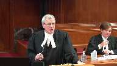

---
title: Her Majesty the Queen v. Richard Lee Desautel
published-title: Heard
date: 2020-10-08
sidebar: false
---

This transcript was made with automated artificial intelligence models and its accuracy has not been verified. Review the original webcast [here](https://scc-csc.ca/case-dossier/info/webcast-webdiffusion-eng.aspx?cas=['38734']).
---

**Justice Wagner** (00:00:32): Good morning.

::: {.column-margin}

:::

In the case of Her Majesty the Queen against Richard Desautels, for the appellant, Her Majesty the Queen, Glenn Thompson, Edward Colcrane, for the intervener, Attorney General of Canada, Christopher Rupert, for the intervener, Attorney General of Ontario, Manizze Fentzi, for the intervener, Attorney General of Quebec, Tania Tlair, for the intervener, Attorney General of New Brunswick, Rachel Standing, for the intervener, Attorney General of Alberta, Angela Edgington, for the intervener, Attorney General of Saskatchewan, R. James Fyfe, for the respondent, Richard Lee Desautels, Mark G. Underhill, and Kate R. Phipps, for the intervener, Pescotto Mukati Nation, Paul Williams, for the intervener, Indigenous Bar Association in Canada, Bruce McIver, for the intervener, White Cap Dakota First Nation, Maxime Faye, for the intervener, Grand Council of the Cree and Cree Nation Government, Jessica Orkin, for the intervener, Okanagan Nation Alliance, Roseanne Kyle, for the intervener, Mohawk Council of Kahnawake, Francis Walsh, for the intervener, Assembly of First Nations, Julie McGregor, for the intervener, MTSIS National Council, METI National Council, and Manitoba METI Federation Inc., Kathy L. Hutchins-Smith, for the intervener, Nuu Chalat First Nation, Jack Woodward QC, for the intervener, Congress of Aboriginal Peoples, Andrew Locken, for the intervener, Lummi Nation, John W. Gales, for the intervener, METI Nation, British Columbia, Thomas Isaac.

Mr. Thompson.

**Speaker 1** (00:03:18): Chief Justice, learned justices, there are two errors in the case that is before you today.

::: {.column-margin}

:::

The first error is simply this.

The courts below applied the 1996 case of the queen and van der peat as the test for who or what may be an aboriginal peoples of Canada.

Van der peat is not the correct test.

That was an error.

The second error is this.

The courts below interpreted section 35 of the Constitution Act 1982 as though the geographic qualifier of Canada, the language that's found in section 35 that includes those two words, of Canada, they interpreted that as if it did not exist.

That is also an error.

Now I'm going to discuss the first error and my colleague Heather Cochran is going to discuss the second error.

First before we address the errors, I want to address a couple of key factual points.

Number one, this was a test case.

Mr. Desatel is a United States citizen, a United States resident and a member of the lakes tribe of Washington state.

He came to British Columbia on the instructions of the fish and wildlife director of the Confederated tribes of the call bill reservation of which the lakes tribe is a constituent member to secure ceremonial meat.

He crossed the border into British Columbia, hunted an elk without a license and without a guide as required by British Columbia law and then subsequently surrendered himself to a conservation officer and then was eventually charged under sections 11 and 47a of British Columbia's wildlife act.

Now at trial he pleaded not guilty to the offense by reason of an aboriginal defense as it's known and namely that was his aboriginal right to hunt as protected by section 35 one.

The trial became as he intended a test case and the question that is now before you is the lakes tribe and aboriginal peoples of Canada.

Now we need to be clear that what's going to happen here is the claimant group as found by the trial judge and confirmed by the appeal courts is the lakes tribe of Washington state.

The respondent wants to broaden that designation.

He wants to broaden the identification of the group to include the people generally and that was not a finding in the courts below.

The only finding in the courts below was a rights holding group called the lakes tribe.

Now I want to turn into Van Der Peet.

At trial the trial judge invoked Van Der Peet to determine if the respondent was exercising his aboriginal right to hunt as you're aware.

The summary conviction appeal judge used Van Der Peet as a basis to interpret aboriginal peoples of Canada which he did and determined that aboriginal peoples of Canada were people who were present in Canada and exercising a right at contact in accordance with the Van Der Peet test.

The British Columbia Court of Appeals stated and this is key, simply put if the Van Der Peet requirements are met the modern indigenous community will be an aboriginal peoples of Canada.

The difficulty here is that Van Der Peet does not address who or what is an aboriginal peoples of Canada.

It simply addresses what rights fall within the scope of section 35 not who the rights holder may be or who the rights can be exercised by.

What the difficulty is is that in using Van Der Peet the courts have attempted to absorb a legal construct which in fact is the aboriginal peoples of Canada idea into a definition that is textually and analytically completely different.

And it was never the focus of the courts below.

**Justice Rowe** (00:07:33): Isn't it as simple what the BC Court of Appeals said is those communities and nations who were encountered by Europeans at contact had rights, some of which were preserved to a greater or lesser degree, and those who are the successors of the groups who were present in what is now Canada at first contact, in a sense the rights flow through to them, and whether they're on one side of the border or on the other side of the border, they're successors, and by virtue of being successors, they hold the rights.

::: {.column-margin}

:::

Is it any more complicated than that, and does that not flow from the general statement of the succession of rights that set out in Vanderpete?

I think that was the logic they relied upon.

**Speaker 1** (00:08:31): I'd agree with you, Justice Roe, that what the courts have done is essentially say just that, that a successor group is entitled to hold the rights.

::: {.column-margin}

:::

The difficulty is when you apply Vanderpete.

Vanderpete doesn't address the question of the location of a successor group in the same way but take account of the different dimensions that occur in this case.

It's correct that they're saying all you need is a modern-day community, a modern-day community in accordance with the way the courts have adjudicated it, suggest that that modern-day community could be located anywhere.

And our submission here and what we're suggesting is that you must have a modern-day community that is within the nation of Canada.

It is not sufficient to say that you have a modern-day community that is located elsewhere.

And the problem with Vanderpete is that nothing in Vanderpete accounts for that difference.

If you go to the first paragraph of Vanderpete, Chief Justice Lamerra, as he then was, raises the issue as this.

He says, the appeal raises the question left unresolved by the court in Sparrow.

How are the Aboriginal rights recognized and affirmed by Section 35-1 of the Constitution Act 1982 to be defined?

Again, Vanderpete is not the correct vehicle.

This is the difficulty because you don't have any conceptual basis to look at Aboriginal peoples of Canada.

Mrs. Vanderpete appealed on the basis that what was the core of the Vanderpete decision, which is the integral to a distinctive culture test, was inappropriate for her particular right and should not be applied to that.

And you can find that in paragraph 13 of that judgment.

And Vanderpete sets out 10 factors that are approximately 10 factors that take up the bulk of the judgment, which discuss what the various badges are of the distinctive culture test.

And that's it.

That's what Vanderpete does.

And the question of who or what might be consistent with the Aboriginal peoples of Canada is a factor that is not considered by that court.

And this is the other difficulty that I think goes to answer the question, Justice Roe, and that's this.

There is actually a threshold question here that the courts did not engage in.

If you look at Section 35 and the language, and particularly the language of Section 35-1, which states that the existing Aboriginal and treaty rights of the Aboriginal peoples of Canada are hereby recognized and affirmed.

Now the first part of that phrase does have to be read together.

But what it does say is this.

Existing Aboriginal and treaty rights are held by or belong to Aboriginal peoples of Canada.

So that raises two questions, not the one that Vanderpete asks.

The first question, the threshold question, is simply this.

Is the claimant Indigenous group and Aboriginal peoples of Canada and thereby eligible to be recognized under Section 35 of the Act?

If the answer to that question is yes, then you move to the question that the courts below answered.

And that is, if the answer is yes, does the claim then meet the test in Vanderpete to be considered an Aboriginal right protected by Section 35?

The courts refused to engage in this as a threshold question.

Who or what is the Aboriginal peoples of Canada?

Vanderpete had never arose.

There was never a question that Mrs. Vanderpete was a member of a group that was resident in Canada that had an exercisable right of some kind in Canada because of its location.

We have a distinction in this case.

We have a group wholly located in a foreign country that is claiming to be a successor group.

And numerous issues arise out of that that suggest from a proposed interpretation that they cannot be an Aboriginal peoples of Canada.

**Justice Brown** (00:12:22): Does the Attorney General of Canada's proposed framework address your concerns?

**Speaker 1** (00:12:28): Where we join issue with the Attorney General of Canada is in the idea that there must be a nation, a First Nation or a rights holder, if you like, that is located in this country and that you have a group in British Columbia in our situation that is capable of exercising the right by virtue of being the Aboriginal peoples of Canada within this country.

::: {.column-margin}

:::

In that instance, what the Attorney General is suggesting there, as you're alluding to, Ms. Brown, is the concept of sheltering.

Sheltering is something that has been well known, it's been practiced in Ontario, some of the key cases come out of that.

The concept is quite simple, which is simply that there is a rights holding entity and another entity that wishes to exercise the rights that may be held by the rights holding entity must demonstrate some form of connection to that entity in order to exercise the right.

There's an analogy here, if you like, which is, I think, apropos for the issues that we're talking about today.

Indian Act bans, which are statutory entities, they're not constitutional entities, obviously, do have members resident of the United States.

That's well known in British Columbia.

There are bans there, but their nexus is, in fact, in British Columbia.

Their members may be entitled to exercise certain rights under the Indian Act and vote in elections and so forth that may be held by the main group in BC, but the main group, the nexus of the group, remains in Canada.

Similarly, you have some submissions from the Attorney General of UConn.

**Overlapping speakers** (00:14:05): What do you mean by the nexus?

**Speaker 1** (00:14:07): When I say nexus, Justice Brown, I'm really referring to the location of the group.

::: {.column-margin}

:::

You need a based group in Canada in order to say that the entity is an Aboriginal Peoples of Canada.

If you're talking about a nexus, you need something upon which the Crown and all entities, governments, federal, provincial, etc., are able to communicate with that group and have jurisdiction with that group in a manner that will allow them to make agreements, to pursue various remedies to situations they have and have them under their jurisdiction.

Nexus really requires that there be something that the Canadian government, the Canadian nation state, the provincial governments do have some authority over.

So you do need that group within Canada.

Now when the Court of Appeal was attempting to answer the question, as we've been discussing, that if the Vanderpete requirements are met, that the modern Indigenous community will be an Aboriginal Peoples of Canada, it invoked a couple of difficulties by the way that it approached this.

And I will take you to the common book, and I'll take you to paragraph 55 of the Court of Appeal decision, which is found at page 15 of the common book.

And if you're there, you'll see that this paragraph starts out, the starting point in determining the meaning of Aboriginal Peoples of Canada in section 35.1 necessarily begins with sparrow.

Sparrow as formalized in Vanderpete requires a propulsive analysis focused on reconciling the pre-existence of Aboriginal societies with the sovereignty of the crown.

There's a quote to page 1106 of sparrow.

And stopping there, this is obviously an error because what occurs here is that approach is taken with respect to interpretation.

And the problem that the Court of Appeal has entered into is they've basically invoked sparrow as a basis to be followed, but the Court of Appeal doesn't do that.

Sparrow states this at 1106, and you don't need to be taken to this, but the principles are important.

The approach to be taken with respect to interpreting the meaning of section 35.1 is derived from general principles of constitutional interpretation, principles relating to Aboriginal rights, and the purposes behind the constitutional provision itself.

None of the courts below engaged in that analysis, and in particular, the approach that requires some application or consideration of general principles of constitutional interpretation.

And those are what my colleague, Ms. Cochran, is going to speak to.

But in a nutshell, what they encompass and what they refer to are the text and its language, legislative context, legislative history.

Those principles are part of what this court has engaged in many times in terms of examining constitutional provisions.

None of the Vanderpete courts embarked on that.

In fact, the Court of Appeal called the Crown's approach when this was put to them as too formalistic and dismissed it summarily and didn't really engage with it at all.

So we're asking this court to take a look at those particular principles as part of this as a constitutional provision.

It's not statutory like the Indian Act, but it does require a different approach than was issued in Vanderpete.

So Justice Roe, if we go back to your question, we're dealing with the same issue, which is if it's a successor group, does it fit because it's a constitutionalized right that's being asked for?

Do the principles of constitutional interpretation support it as a group and a rights holding entity?

And our submission to you is no, it does not.

And you'll hear more about that from my colleague.

Now I'll just move on to the last part of the paragraph here, paragraph 55.

It states this.

These foundational decisions root the concept of Aboriginal rights in the historical presence of Indigenous societies in North America, citing Vanderpete.

This is why courts must look to the practices, customs, and traditions of the historic collective when defining Aboriginal rights, another citation there from Vanderpete.

This is the second error, and it's a matter of focus, because what occurs here is an examination of the practices, customs, and traditions of an historic collective do not by definition include an analysis of the meaning of Aboriginal peoples of Canada.

So the court falls into a second error.

And paragraph 55 that I've just taken you to also gives rise to a third issue, and that's the issue of reconciliation.

And it leads to another error in its approach to reconciliation.

It states that Sparrow requires a purpose of analysis that focuses on reconciling the pre-existence of Aboriginal societies with the sovereignty of the Crown, which roots the concept of Aboriginal rights in the time before Europeans, and that's out of Vanderpete, which is why they look to the practices, customs, and traditions.

There are more recent statements regarding reconciliation, and those have not been taken into account.

For example, the one that springs to mind is the quote out of Beckman, Beckman and Little Sam and Carmacks, which was a quote that basically said that the reconciliation of Aboriginal and non-Aboriginal Canadians, and I underline that, in a mutually respectful relationship is the grand purpose of section 35.

And you'll find numerous references throughout various cases to reconciliation of Canadians and non-Aboriginal Canadians in this kind of relationship.

**Justice Rowe** (00:20:10): Right, but it doesn't mean reconciliation like two old friends who had a row about, you know, their favorite team in the NHL and after a while they became reconciled after they had a couple of the bad 50 or something.

::: {.column-margin}

:::

This is the reconciliation of a preexisting autonomous societies with the assertion and exercise of sovereign authority first by the British Empire and then the Canadian state and how to provide a continued existence and meaningful role for the successors of the societies, indigenous societies existed at the point of contact.

It's a more formalistic, I think, reconciliation than sort of getting along.

**Speaker 1** (00:21:02): I take your point, Justice Roe, and I think that there's one error that occurs in the analysis by the courts below that speaks somewhat to the issue that you're discussing, and that is Vanderpete itself contains a bit of a clue as to how this looks, because the fact is that it states in Vanderpete, and I don't think there's any dispute about this, that reconciliation is essentially involving both parties.

::: {.column-margin}

:::

You must take into account the Aboriginal perspective and you must take into account the common law.

You do not erase the common law.

You reconcile the two.

And the international aspects of this particular incident or instance where Mr. Desitel is an American national raise those kinds of questions.

Do you erase the common law in order to accommodate Mr. Desitel?

Do you erase the common law perspective of Canada as a nation state?

And Canada's a nation state, of course, has borders, and those borders are, in fact, part of what makes Canada a nation state.

So you don't erase the border if you're taking into account in reconciliation the common law.

The goal is to reconcile the Aboriginal perspective with the common law perspective.

If you go as far as what the respondent is suggesting and you essentially ignore that and say, well, an Aboriginal peoples of Canada can live in the United States or can live really anywhere by the nature of this test, then you have effectively said the common law issue of the border of Canada and the Canadian nation state does not matter.

It does not exist.

So what happens in this instance is that you end up with a kind of erasure of Canadian sovereignty.

And in fact, what this becomes is an Aboriginal or Indigenous solution, but it is not a Canadian solution.

And that's the great difficulty because we need something that is going to be workable for all Canadians.

And, of course, in the Mitchell case, you have one of the few cases where we have some guidance as to how this may function because, of course, Chief Mitchell was making a foray across the border and attempting to come into Canada without paying any customs or custom duties.

Now, the issue is different because Chief Mitchell is a Canadian citizen, Canadian resident, and none of those kinds of issues we have in this case arise.

But there are some interesting points to be made here because the fact is, Justice Binnie, in his concurring reasons in that decision, does discuss the fact that the issue of the border and the, if you like, the exclusivity of the border and the fact that the border is part of the Canadian sovereign state is something that has to be respected and it has to be understood as being a factor in all this is being considered.

And the fact is, it's a factor in this case.

It must be a major factor.

**Justice Brown** (00:23:57): What I'm wondering is if we've kind of done what you say the Court of Appeal did, is we've kind of skated past the text of Section 35 and we're moving on as if we've presumed the meaning of it.

::: {.column-margin}

:::

And I'd like to pull you back to the text because obviously we need to give some meaning to Of Canada.

But in terms of its temporal application, it also refers to Aboriginal rights, Aboriginal and treaty rights.

And if, as my colleague suggests, as this Court has suggested, what we're reconciling is the prior occupation and of Canadian, of what is now Canadian territory by Aboriginal peoples with the assertion of Crown sovereignty, or to use, you know, Beckman, the reconciliation of Aboriginal peoples who have that prior occupation and Canadian people who live under the Canadian state that operates by virtue of the assertion of Crown sovereignty.

Just to put that little wrinkle to bed for a second.

The point is that I'm struggling with is, is there right?

Well, I'm not struggling with this, but I'm struggling with accepting your interpretation of Section 35.

The source of their right, the source of the Aboriginal right, is prior occupation, right?

It predates the existence of the Canadian legal order and they are presumed to survive that assertion of sovereignty.

So it's not clear to me that at least a textual analysis gets you where you need to go.

So you must also be looking to the history and the purpose and, but, but, but I'll just tell you, I signal, I, the words of Canada don't seem to announce their own implications to me and other parts of Sub One make it a little more complicated.

My colleague will address this more fully when you're done.

**Speaker 1** (00:26:20): you

**Overlapping speakers** (00:26:20): But she went.

**Speaker 1** (00:26:21): we get there, but I will answer you in this manner, Justice Brown.

::: {.column-margin}

:::

The fact is, as you've just pointed out, there are a number of factors, and all those factors that were listed in Sparrow have to be considered.

Text is one of them, as you're pointing out, so is historical context, so is the context of contemporary situation.

And again, remembering that the way that the phrase is structured is it's talking about the Aboriginal peoples of Canada.

What this leads to is an issue around the potential of a common law right, because up until 1982, as you're well aware, there were common law rights that were actually being held by Aboriginal groups, and they were constitutionalized in 1982.

And our position is simply that when you read section 35, and you take into account the analysis that I've given to you, it is pretty clear that these are not Aboriginal peoples of Canada, not the Lakes tribe.

However, there may be a common law right available to them, because common law is well known to have protected those rights, and of course the common law has been in existence, common law rights have been in existence going way back, and this court in Calder in 1973, Guerin in 1984, has reaffirmed the fact that common law rights are available and are held by Aboriginal groups.

Now in 1981, it may well be that the Lakes tribe had a common law right and had the ability to exercise it, and of course they are resisting the idea that there might be a common law right for a number of reasons.

One of the reasons being, of course, that a common law right is subject to regulation.

But it's not an empty right, and that's an important thing to remember.

The fact is that the right is actually one that engages the honour of the crown, for example, and the honour of the crown is presumed to mean something.

It's actually presumed to be something that can be enforceable by the courts, although it's not a standalone kind of right in itself, and it also is a right that cannot be taken lightly.

It's referred to in Haida, it's referred to in a number of cases.

The jurisprudence has been fairly clear on this point that the honour of the crown doesn't arise out of section 35, but what it does arise out of is the crown's assertion of sovereignty over Aboriginal peoples.

So that common law right can persist with regard to the Lakes tribe, and they do have the ability to engage with the common law right, and we suggest that that's possible.

But to constitutionalize the right is a different ball game, and it's a different ball game simply because of the fact that it is a constitutional right, and we now have this phrase, Aboriginal peoples of Canada, which changes the dynamic and makes it a right that cannot be elevated.

So the right could persist, but it could not be constitutionalized because of the language in section 35.

Can you explain that to me?

**Overlapping speakers** (00:29:21): Thank you.

**Speaker 1** (00:29:22): Essentially, the fact is that the common law right to hunt in British Columbia is something that let's say persisted and that may be available to the Lakes tribe.

::: {.column-margin}

:::

When you get to the constitutionalization of the right and you have to define Aboriginal peoples of Canada, that turns on our submission to you that the Aboriginal peoples of Canada must be located in this country and when they're not, they cannot be an Aboriginal peoples of Canada.

But the common law right, the standalone right of a right to hunt is something that could persist because it doesn't require to be constitutionalized.

**Justice Brown** (00:30:00): If I do not accept your argument about the meaning of the Aboriginal peoples of Canada, does that mean that your common law argument has come a cropper?

**Overlapping speakers** (00:30:10): I'm sorry, I missed the last part of what you said.

**Justice Brown** (00:30:11): Does that mean that, does that put an end to your common law argument?

::: {.column-margin}

:::

Your common, in other words, is your common law argument dependent upon our acceptance that Mr. Desautels, by virtue of his being a U.S. citizen resident in the United States, is not an aboriginal person of Canada.

**Speaker 1** (00:30:31): Let me answer that this way, because we say that, yes, in the sense that Mr. Desitel's status that you've just defined disentitles him, and disentitles more appropriately because these are collective rights we're talking about, disentitles the Lakes tribe from holding the constitutionalized right.

::: {.column-margin}

:::

But it doesn't mean that the common law right ceases, that there is not a possibility that common law right can persist and can be allowed to accrue to the Lakes tribe regardless of whether you accept my argument or not.

**Justice Abella** (00:31:05): How would that work, sir, over here?

Oh, I'm sorry.

Sorry, how does that work?

That he has an existing common law right to hunt that is terminated or extinguished by the existence of Section 35.

**Speaker 1** (00:31:23): Well, Section 35, as you know, elevated all common law rights that were eligible to be elevated in 1982.

It elevated some rights, but it didn't necessarily elevate all rights.

Where do you read that in Section 35?

**Justice Brown** (00:31:39): the existing Aboriginal and treaty rights are hereby recognized and affirmed, not some of the existing.

**Speaker 1** (00:31:46): Well, this depends on how you read section 35 because the point with section 35 is you have to read it in the two parts that I've suggested to you, that there is only an Aboriginal Peoples of Canada capable of holding existing Aboriginal and treaty rights.

::: {.column-margin}

:::

So if you are not an Aboriginal Peoples of Canada, you cannot hold that right.

But if you have a common law right that cannot be elevated, as in the case of the Lakes tribe, that common law right could potentially persist.

**Overlapping speakers** (00:32:14): You

**Justice Brown** (00:32:14): the member of an aboriginal people's in camp people in of Canada of Canada then any common law right he had at the time of 1982 is effectively constitutionalized by virtue of section 35 that would

**Speaker 1** (00:32:28): have to be the answer because that's what happened to most of the common law rights in Canada with groups that were actually existing in Canada and had those rights.

::: {.column-margin}

:::

The Stolo, for example, and Mrs. Vanderpete is an example of that.

But you do have a distinction you have to make here because of the fact that not all rights are going to be elevated by section 35, and that's part of the argument here, that some are not.

And this isn't to create a hierarchy of rights.

This is simply to show that some rights are not going to be elevated and not eligible to be constitutionalized.

**Justice Martin** (00:33:03): May I ask you a question?

Certainly.

**Justice Abella** (00:33:06): Can I, I just would like you to clarify for me.

::: {.column-margin}

:::

Vanderpete, you say, is the wrong test.

Like Justice Brown, I'm struggling with what that means in terms of constitutional interpretation.

We've defined what Aboriginal rights mean in cases like Vanderpete, Sparrow and Vanderpete.

Taking that out of the equation means that you interpret section 35, which we have extensive jurisprudence on, by looking only, and I appreciate your colleague is gonna deal with it, by looking only at two words.

And they are the a priori words that we look at in defining rights under section 35.

In other words, those two words limit everything we've said in Vanderpete.

Am I wrong in that that's the implication of your argument?

**Speaker 1** (00:34:04): My understanding, Justice Abella, from what you're describing is that, yes, that would be correct, because the courts below did not consider those words of Canada to have the meaning that we suggest they ought to have.

**Justice Abella** (00:34:18): So this case essentially comes down to what of Canada means in section 35.

::: {.column-margin}

:::

Not anything we've ever said about what aboriginal rights mean.

The references all the way through Vanderpete to North America, historic ties, pre-contact, all of that is on hold until we figure out what of Canada means.

**Speaker 1** (00:34:41): The fact is that what's on hold is simply claimants like Mr. Desitel of the Lakes Tribe and the kinds of assertions that those groups, American-based groups, let's say, might make because of the fact that they are not Aboriginal peoples of Canada in our submission, that there are two questions there, as we suggested, and there's a threshold question that has never been asked.

::: {.column-margin}

:::

And remembering this court has never had to address this question.

This is a novel issue in terms of who is and who is not an Aboriginal peoples of Canada in that regard.

It's never been decided.

**Justice Rowe** (00:35:15): but in a couple of ways, you said it's a threshold question.

::: {.column-margin}

:::

You've said that they applied the wrong test.

I don't want to play with words, but it seems to me logically it's an anterior question.

It's a question in the logic, if I'm trying to understand the logic of your position, it's a question that has to be answered before you say, what are those rights?

Who are the persons, what are the communities who can assert the rights, which is the question you say hasn't been answered, and then Van Der Peet says, if I follow you correctly, those are the persons who can assert the rights.

What are those rights which then they can assert?

Have I understood?

**Speaker 1** (00:35:56): you correctly.

I think you have my point Justice Roe, that's correct.

And I see my time, I really want to give some time to my colleague so I will turn over the podium to her at this stage if that's agreeable to the court.

Thank you.

**Speaker 2** (00:37:59): Chief Justice, Justices.

::: {.column-margin}

:::

As my colleague Mr. Thompson stated, I'll be addressing our position on a proposed interpretation of Section 35.

Simply stated, our position is that Section 35 proposively interpreted, and by that I mean an interpretation which has regard to the text, the context, and the history of Section 35, including its legislative history, leads us to the conclusion that Section 35-1 does not include within its scope Indigenous groups that are wholly located in the United States, like the Lakes tribe.

Now I think it might be helpful if I began by picking up Justice Brown's question, which was essentially, if I can try to summarize, in the text of Section 35, what rights were elevated to constitutional status, and I might rephrase that as whose rights were entrenched in 1982 by the enactment of Section 35.

So that's going to be my focus as I take you through what we say is this Court's approved approach to proposive interpretation, but I want to begin by emphasizing that the courts below all agreed that Section 35 is to be interpreted proposively, and the respondent doesn't take issue with that, but we say that the courts below didn't actually engage in that proposive interpretation.

Instead, they applied the Van Der Pee test, and we say that that skips over what Mr. Thompson characterized to you as the threshold question, the anterior question, of whether or not this group is a rights holder, a question that you must come to before you consider what rights come within Section 35.

**Justice Martin** (00:39:32): Following that, my understanding of what you're putting forward is that the asserted aboriginal right has to be held by some kind of successor collective that is resident in Canada under a purpose of analysis.

::: {.column-margin}

:::

That's what I understand your position to be.

And I'd like to just ask you do we take into account under that analysis the history of the particular peoples involved and my specific question to put a point on that is that the arrow lakes band were declared extinct when the last member died in 1956-57.

Do you say then that that is the time at which this group no longer was an aboriginal people of Canada when their last member died here and how do we deal with the movement of aboriginal peoples across borders and for the reasons for their movement?

I want you to address that please.

**Speaker 2** (00:40:34): It's a very important question, Justice Martin, and so I'm going to address it carefully and in a few parts.

::: {.column-margin}

:::

First, I would wholly agree with you that in order to establish an Aboriginal right, you do need a successor group.

In order to establish a constitutionally protected Aboriginal right, our position is that, yes, that Aboriginal community needs to be located inside Canada's borders.

Mr. Thompson has already alluded to the possibility, which we acknowledge, that an Indigenous group that is now located outside Canada's borders, like the Lakes tribe, but that has that historic connection to a community that was located inside BC at time of contact, and that's very important.

And we do not discount any of that history, but the way that we acknowledge it and the way that we say that it is acknowledged in this Court's wealth of Aboriginal rights jurisprudence is through acknowledging that the Lakes tribe may continue to hold a common law right, but that it wasn't elevated to constitutional status because of what I'll come to when I take you through a proposed interpretation of Section 35 and what we say the scope of that provision is.

But I want to address the other part of your question, which is with regards to what's been described as the declaration of extinction of the Arrow Lakes Band.

And first, as a factual matter, I want to clarify that the Arrow Lakes Indian Band was a construct under the Indian Act by the federal government, obviously, some time ago.

And as the trial judge does set out in her reasons, it included members not only of the Sinaiqt community that was in BC at that time, but also members of other Indigenous groups that were in the similar geographic area, including the Shweppum, including the Tanahaw.

So, as many Indian Act bands are, it was put together, I would submit, for administrative convenience.

Now, we know from this Court's jurisprudence, including in Chilcotin, that there's not necessarily a perfect correspondence between Indian Act bands and who proper rights-holding communities are.

The trial judge made no finding.

She was very careful to make no finding, and this is at paragraph 68 of her reasons, that there is a rights-holding collective in British Columbia today.

She did note that it's possible that there could be, despite that declaration of extinction, as it's been termed by my friends, Sinaiqt ancestors, and perhaps a Sinaiqt community in BC that could hold rights.

And we say that, yes, despite that declaration, really, that the Indian Act band no longer existed for the purposes of the Indian Act back in 1956, when its last member died, there's still a possibility that there could be a Sinaiqt community in British Columbia.

But the other piece that I want to emphasize, and this comes back to, I think, a question that Justice Roe put to my colleague, or perhaps it was Mr. Justice Brown, in connection with the framework that Canada is putting forward, is that Mr. Dazetel is not claiming to have exercised a right by virtue of membership in a rights-holding group in BC, or with the permission of a rights- holding Sinaiqt group in BC.

That's why the trial judge at paragraph 68 said she didn't have to make a finding as to the existence of such a group.

And that's why, while perhaps instructive of some of the principles at play, I would say that the Attorney General of Canada's framework doesn't answer the question that arises to you today, because this is a test case as to whether or not the Lakes tribe comes within the scope of section 35.

I hope that that answers all of our-

**Justice Abella** (00:43:58): It comes within the scope of section 35 based on the test under section 35 we've developed in Vanderbeet or based on the words of Canada.

**Overlapping speakers** (00:44:08): based on our propulsive interpretation of section 35 and that's

**Justice Abella** (00:44:11): We've done that in our jurisprudence, what's the role of of Canada?

**Speaker 2** (00:44:18): So let's come to that now.

::: {.column-margin}

:::

So in Vanderpete and in Sparrow, this court was very clear that Section 35 is to be interpreted purposively.

In Sparrow, this court took up the question of what existing means in Section 35, and the answer was that it was rights that were in existence in 1982, the court said.

It doesn't revive rights that were extinguished prior to then while acknowledging that that must be interpreted flexibly to account for rights in their contemporary form.

This court hasn't addressed specifically what the words of Canada mean or what work they do.

Now, this court has been clear, and it's jurisprudence we say, that a purposive interpretation must have regard to the text, the context, and the history of Section 35, as I've said.

And so I think that this is a good time to turn to the text of Section 35.

It's at tab 12 of my condensed book.

Because I want to start with the text, because this court has said that there are compelling reasons to do so.

So looking at Section 35 in its entirety here, you'll notice right off the bat that the words Aboriginal Peoples of Canada are not used only in Section 35-1, which is the provision immediately at issue, but also in big bold capital letters in the heading under part two, rights of the Aboriginal Peoples of Canada.

Subsection 1 of 35, of course, states that the existing Aboriginal and treaty rights of the Aboriginal Peoples of Canada are hereby recognized and affirmed.

And so we would submit that what that's doing is it's constitutionalizing all the common law rights that were in existence in 1982 that are held by the Aboriginal Peoples of Canada, that that's a possessive phrase there.

Subsection 2 provides a definition of Aboriginal Peoples of Canada.

It states in this act, Aboriginal Peoples of Canada includes the Indian, Inuit, and Métis peoples of Canada.

So it simply repeats the phrase of Canada while adding specificity to who the Aboriginal Peoples are.

**Overlapping speakers** (00:46:16): It actually says includes, it sounds like it's non-exhaustive.

**Speaker 2** (00:46:21): Yes.

::: {.column-margin}

:::

It sounds like it's non-exhaustive.

I want to deal with that question right now.

I would say that it's non-exhaustive in the sense that it may include groups other than the Indian Inuit or Métis peoples.

There may be another group.

Of Canada, it says.

Exactly, Mr. Justice Brown.

**Justice Brown** (00:46:43): Inuit Métis peoples of Canada, so I'm not sure where this gets you because it does the non-exclusivity just apply to Indian Inuit Métis peoples or Indian Inuit Métis peoples of Canada.

::: {.column-margin}

:::

**Speaker 2** (00:47:02): I say it's the latter

::: {.column-margin}

:::

and I think that it gets us very far because we know that legislative drafters are very careful in their word choice and in the grammatical arrangement of those words.

So I say that the repetition of the phrase of Canada at the end of Section 35-2 can only serve the purpose of being a geographical qualifier.

So in other words, there may be aboriginal peoples included within the scope of Section 35-1 who are other than Indian, Inuit and Métis.

That's non-exhaustive.

But Section 35-1 does not include groups who are outside of Canada's borders and that's what the repetition of of Canada gets us.

And I want to just dissect that a little bit further to try to drive this point home because the word of is used here

and I say that that's a very deliberate word choice.

Of has a meaning and it has a very specific meaning when it's used in relation to a geographic place.

And in my factum and in my book of authorities we've included an excerpt from Stroud's judicial dictionary and it highlights that the term of when used in relation to a place connotes dwelling or residence.

So we take from that that the aboriginal peoples of Canada, the people whose rights were elevated to constitutional status in 1982, must be of Canada not just that they must be exercising.

**Justice Karakatsanis** (00:48:30): Mr. Sotel decided to move to Canada.

**Speaker 2** (00:48:37): If Mr. Desatel decided to move to Canada, but he continued to assert his claim as being a member of the Lakes tribe, then I would say the analysis doesn't change.

::: {.column-margin}

:::

He won't have a problem with crossing the border, but because recalling that the rights at section 35 elevates to constitutional status are held by peoples, hence the plural S there, by the group, the location of the group he's claiming through, who actually holds the right, is still in the United States.

**Justice Brown** (00:49:04): So what if he claimed it as a member of cynics?

Would much of your argument then fall away?

**Speaker 2** (00:49:10): Well, it wouldn't insofar as the only rights holding group that's been identified here by the lower courts is the Lakes tribe.

And the Court of Appeal confirmed that when they said the evidentiary record was limited to Mr. Dezatel's claim as a member of the Lakes tribe.

But I appreciate it's a hypothetical question.

**Overlapping speakers** (00:49:23): Yeah.

**Speaker 2** (00:49:24): We don't have evidence on the record as to what the contours of that group is.

::: {.column-margin}

:::

The respondent emphasized at trial that we don't know the boundaries of that group.

If the Senext is a group wholly in British Columbia, the analysis would be entirely different.

**Overlapping speakers** (00:49:44): It would be...

Or holy in Canada. Sorry?

Or holy in Canada. Yes.

If this next...

If Mr. Desatel...

Well, you said British Columbia, but I just wanted to be clear. Oh, yes.

Yes.

**Speaker 2** (00:49:55): Yes, I'm not in British Columbia anymore, it's true.

::: {.column-margin}

:::

If the group were wholly in Canada, if it were in the Maritimes and you were claiming to exercise a right in BC, I might have a quibble as to how that makes sense in terms of the history, but as long as the group is in Canada, and I say we don't have a problem from the perspective of the language of section 35.

**Justice Abella** (00:50:19): Sorry, did you say there's a difference if the language were Aboriginal peoples in Canada instead of of Canada?

**Overlapping speakers** (00:50:27): I say there would be a difference.

**Justice Abella** (00:50:29): is, and it would be clear that we're talking about Aboriginal peoples now in Canada.

Once you concede that, aren't you saying that of Canada is something different and wider?

**Speaker 2** (00:50:42): I want to answer that question by drawing an analogy to the frank case.

::: {.column-margin}

:::

This court's decision in the frank case where it examined a natural resource transfer act.

So also a constitutional provision or a constitutional document and a provision in that that distinguished between aboriginal peoples in the province of Alberta I think it was and aboriginal peoples of the province and I think that this gets at the distinction that you're trying to draw out Madame Justice Isabella and it's important one and the court in frank said that when the word in a place is used it means any aboriginal peoples who happen to be in within the geographic bounds of that place at any given moment irrespective of ordinary residents.

**Justice Brown** (00:51:28): But they weren't looking at section 35, they were talking about whether somebody was a member of a band.

::: {.column-margin}

:::

So they were distinguishing, you had an Alberta statute that referred to the Indians of the province and the Indians within the boundary thereof, and it just referred to, as I say, membership of Indian bands.

I mean, I think it was in Daniels we said that Indians, so bizarre to be using that term, but Indians has two senses, right?

The sense that we use it in section 9124, which was the issue there, and a narrower meaning that distinguishes members of Indian bands from other Aboriginal peoples.

And it was that latter issue that was at issue in Frank.

I'm not sure that gets you anywhere on the meaning of section 35.

**Speaker 2** (00:52:20): Well, I will make no bones about the fact that Frank was not interpreting Section 35.

This is a novel case, so we do the best we can.

**Overlapping speakers** (00:52:27): Yeah, no, you scrabble up what you can, but I'm just, and then I shoot it down, so yeah.

**Speaker 2** (00:52:33): of legislative drafters and constitutional drafters to give some credit to them and not just the barristers who make the arguments about what they said.

They use language consistently.

There's a presumption of statutory and constitutional interpretation that legislatures, constitutional drafters use specific words for specific purposes.

**Justice Brown** (00:52:50): I think we can presume that the drafters of the Constitution meant the same thing that the drafters of Alberta legislation meant.

::: {.column-margin}

:::

The Constitution was a hard fought bargain and Section 35 was very hard fought.

And I find it hard to think that Merv Leach and Peter Lawhead had their nose in the Alberta statute books at the time.

**Speaker 2** (00:53:14): Well, so we'll take what we can from Frank, but I stand by what I've told you about the use of the word of and the dictionary definition, the judicial dictionary definition of of and what it means in relation to a place.

::: {.column-margin}

:::

It's important section 35 doesn't say in.

Frank provides us with insight into what that might mean.

And it's important I say as well that section 35 doesn't say that the existing Aboriginal and treaty rights of the Aboriginal peoples are hereby recognized and affirmed and leave it at that without any geographical qualification at all or that it doesn't say that the existing Aboriginal and treaty rights of the Aboriginal peoples of North America are recognized and affirmed.

There is specific language chosen there.

So that's that I say is the text.

And I say that that's.

**Justice Kasirer** (00:53:58): Fairness.

::: {.column-margin}

:::

I, I don't think Justice Brown mentioned this at the front end.

If you recognize that 35-2 is a non-limitive, to list.

The, the French text confirms it in no uncertain terms, not that mal.

There, there's no reason to think that that same, that principle confines you to Indian, Inuit and Metis without extending to also to, of Canada.

So even if you're right about the distinction between of and in, why couldn't the non-limitative list extend beyond Canada on that same idea?

**Speaker 2** (00:54:37): Well, what other purpose would there be, though, to repeat the words of Canada at the end of the phrase?

**Justice Brown** (00:54:44): to expand it.

**Justice Kasirer** (00:54:44): Exactly, exactly.

::: {.column-margin}

:::

To expand it after having defined, because its purpose is to define what's in one.

And so, it's defining it in a non-limitative manner, including the du Canada or of Canada.

**Speaker 2** (00:55:04): Well, I think there's a presumption of interpretation that assists us here.

**Justice Karakatsanis** (00:55:09): I was just going to say this discussion really highlights the importance of a purpose of interpretation and it would be helpful to me if you get to that.

**Speaker 2** (00:55:21): It does highlight the importance of it.

::: {.column-margin}

:::

And I am in a propulsive interpretation, though, because it does start by looking at the text.

And we've spent some time on it in the last points that I'll mention, because I think that it assists with the question being raised by Justice Brown and Justice Kasichur is that there's a presumption of statutory and constitutional interpretation that legislation and constitutions apply to persons or things within the territory of the enacting jurisdiction and not outside of it.

And that's perhaps the last point that I'll say on that.

And that's consistent with how I'm reading the text.

But I would say that the context, the legislative context, and the history, the legislative history, and the minutes recording those hard fought battles that Mr. Justice Brown referred to a moment ago are also consistent with the propulsive interpretation that we say leads to the conclusion that Aboriginal Peoples of Canada in section 35 does not include within its scope groups outside of Canada's borders.

So turning to that context, because I think that you have the points about the reasons for starting with the text in my factum, turning to that context, we say that the philosophic context that this court discussed in Vanderpete, the reasons that Aboriginal rights are distinguished from Charter rights, because as this court said, the rights that are held only by Aboriginal members of Canadian society.

And that's why, unlike Charter rights, they don't need to specify whether they're held by citizens, by everyone, by residents, or by permanent residents.

Because we know from their very nature and the reason for their existence is that they're held only by what this court described as being that one segment of Canadian society.

I've already discussed as well the collective nature of Aboriginal rights, which I think supports as well the philosophic context, the fact that they're collectively held.

And that's why we're talking about peoples here and why Section 35 doesn't have any specifics about citizenship or residents of individuals.

And in looking at the text of Section 35, we've also touched a little bit on the legislative context.

The provision is outside of the Charter.

It's under the heading Part 2, Rights of the Aboriginal Peoples of Canada.

And it's followed by Section 35.1, which sets out a commitment to convene constitutional conferences.

And it's followed by Sections 37, or it was followed by Sections 37 and 37.1, which set out similar commitments to constitutional conferences we know have already happened.

And we say that the identity of the groups that attended those conferences, something this court considered in the Native Women's Association case some years ago, as well as the subject matter of those conferences, which included rights of Aboriginal self-government, the fact that no Indigenous groups from outside of Canada were invited to those conferences, the fact that nobody mentioned that they ought to be at the table or that we ought to be considering their rights, and the fact that it would make no sense from an international law perspective in terms of comity to constitutionalize rights of Aboriginal self-government for groups outside of Canada we say is consistent with our proposed interpretation of Section 35.1 of the law.

**Justice Abella** (00:58:32): Where do you put, Ms. Cochrane, all of the language in Vanderpete that talks about looking at paragraphs 22 to 25, 26, 27, calling for a generous and liberal interpretation and understanding that the purpose goes back to the fiduciary relationship of the crown and that the doctrine is to protect the prior occupation, the history, the continuity?

::: {.column-margin}

:::

Where does that fit into your conclusion that of Canada means you ignore all of those things, including, as they said in Vanderpete, what are the views of the aboriginal peoples themselves?

You're focusing on something that feels very comfortable to me as a statutory analysis, as Justice Brown says, but seems to bear no relationship to what we were directed to in Vanderpete about how to look at the rights which were, and then confirmed in Mitchell, where we said we have not taken any rights away, and we didn't create the rights.

They were preexisting.

I don't hear any resonance about those concepts in the analysis that you're presenting to us.

**Speaker 2** (01:00:00): Madam Justice Isabella, let me answer your question in a couple of ways.

::: {.column-margin}

:::

First to say that Van Der Peet confirmed that we take a proposive analysis to Section 35.

And a good recent example of that is the Daniels case where writing for the majority, Madam Justice Isabella, you took the same proposive approach of looking to the language, the text of Section 9124 in that case, to the legislative history and to the legislative context of those provisions.

That's the same approach that we're taking here, and that's what we say the Court of Appeal and the courts below overlooked.

This court has emphasized that those same principles are applicable to Section 35.

And we say that we don't overlook all the history and the connection and the importance of reconciliation.

My colleague, Mr. Thompson, talked to you about how that is recognized and addressed through recognizing the possibility of a common law right which would net in the honour of the Crown to deal honourably in its relationships with the Lakes tribe, acknowledging the history of their prior presence here.

And we say as well that blaze is instructive as a case where this court was again called upon to undertake constitutional interpretation and emphasize that it would take a proposive approach to provisions and stressed specifically addressing the need to adopt a liberal generous approach that that doesn't mean that the court is free to invent new constitutional obligations that are foreign to the purpose and the text of the constitutional provisions at issue.

And we say that that's the real risk here.

The court must fulfill but not overshoot the purpose of Section 35.

And the Aboriginal perspective, my colleague stated already that in Vanderpete this court took care to emphasize that the court stated that true reconciliation will consider both the Aboriginal perspective and the Crown perspective.

How do we bring those two together?

And I think that a good example of that is in the practical consequences that we say would arise if this court upheld the approach of the courts below and that in here is in the duty to consult and how that would work.

**Justice Kasirer** (01:01:59): Before you get to that, perhaps another way to ask Justice Abella's question is, are you proposing as a purpose of understanding of, of Canada, not just a spatial definition, but also a temporal one?

::: {.column-margin}

:::

And one that might be, and this gets back to Justice Roe's point, that it might be incompatible with reconciliation as we imagine it.

So that yes, take into account the non-Aboriginal view, but don't erase the Aboriginal view in so doing.

It, it, it, it strikes me that you're insisting much on geography, the spatial, but the temporal.

I'm not hearing much of that in your purpose of analysis.

**Speaker 2** (01:02:44): Well, there is a temporal dimension to it.

::: {.column-margin}

:::

I would agree.

And the question of what significance does it have that a group was here at contact we say is recognized by the fact that they may hold common law rights but that wouldn't have been elevated by section 35 when it was enacted in 1982 because the group wasn't present then.

And that's the same approach that this court to the meaning of the word existing in section 35 in sparrow.

So there's a temporal dimension in that sense.

**Justice Abella** (01:03:13): Is this an argument that it's incompatibility, an incompatibility in Section 35 with sovereignty?

**Speaker 2** (01:03:24): No, I wouldn't go that far.

**Overlapping speakers** (01:03:27): about justice about it.

**Speaker 2** (01:03:28): I don't think that we need to invoke concepts of sovereign incompatibility or analysis of section 35.

::: {.column-margin}

:::

I think that that only really is relevant to my colleague's discussion of a common law right

and what common law rights would have existed in 1982 that could have been constitutionalized by section 35.

**Justice Abella** (01:03:49): So you're not you're not quarreling with the proposition in Mitchell that all of these rights survived the Charter and were incorporated into it.

**Speaker 2** (01:04:01): All of the rights that were not incompatible with Canadian sovereignty survived the assertion of Canadian sovereignty.

**Justice Abella** (01:04:08): Exactly what I'm asking you.

So your argument comes down to, based on what Justice Kasir said, because of the temporal and geographic argument you're making, it's incompatible with Canada's exercise of sovereignty over Canada.

Is that what you're saying?

**Speaker 2** (01:04:26): I think that what I'm saying is that all the rights that survived the assertion of sovereignty because they weren't incompatible with it, so they were existing common law rights in 1982, all of those rights that were held by the aboriginal peoples of Canada were elevated to constitutional status by the enactment of section 35 in 1982, and so the question for you is who are the aboriginal peoples of Canada, and we say that there is a spatial element to that because of the words of Canada and the proposed interpretation I took you through and to the extent that we're talking about 1982 and the enactment, the timing of the enactment of section 35, there is also a temporal dimension to that.

::: {.column-margin}

:::

**Justice Brown** (01:05:07): I just want to be clear on that point because I understood your colleague as conceding that if we do not accept British Columbia's argument on the meaning of Aboriginal peoples of Canada, that the common law argument falls away.

::: {.column-margin}

:::

The common law argument is parasitic to that point.

So just to be clear, so I understand your answer to Justice Abela.

What is the preliminary issue is whose rights are they?

And if we decide that against you, then is the subsisting right constitutionalized or does it still depend on us grappling with sovereign incompatibility?

**Speaker 2** (01:06:09): There's a lot packed into that question, and I see that I'm out of time, so let me try to address it as precisely and briefly as I can, Mr. Justice Brown, because I don't

**Overlapping speakers** (01:06:16): Precisely for sure, yeah.

**Speaker 2** (01:06:18): Okay.

::: {.column-margin}

:::

Well, here it goes.

So there's a couple of ways at looking at this.

We say that there are, you know, really there can be two reasons why Mr. Dayzatel doesn't hold a constitutionally protected right.

And one reason is because of the proposed interpretation of section 35 that I just gave you.

Because of the scope of section 35. Because

**Overlapping speakers** (01:06:44): Because he's not an aboriginal person, he's not a member of the aboriginal... Got it.

**Speaker 2** (01:06:48): Canada, that's the group he's a member of.

::: {.column-margin}

:::

There's another way that you can get there which is by understanding the common law right foundations that my colleague took you through.

So on that point, and let me say as well that this court doesn't actually have to decide that piece because a common law right wouldn't have served as a defence to the charges against Mr. Desitel.

Only a constitutional right would do that.

But we say it's nonetheless instructive to consider that and to understand those common law foundations for the reasons that your question gets at.

**Justice Brown** (01:07:29): if we accept that the lakes tribe is an aboriginal peoples of Canada is it British Columbia is it is British Columbia's position that that does not mean that Mr. Desautels common law right to hunt was constitutionalized by the enshrinement of section 35 and we still need to address that other consideration you raise of whether a common law right is subject to sovereign incompatibility

::: {.column-margin}

:::

**Speaker 2** (01:08:03): Yes, so there's there's only one caveat to that so we would agree with you

**Overlapping speakers** (01:08:09): Thank you for watching.

**Speaker 2** (01:08:09): that if you conclude based on your interpretation of section 35 that the lakes tribe is an aboriginal peoples of Canada, then the right to hunt that the courts below found based on their application of the van der peet test, that hunting right would have been elevated to constitutional status in 1982 and it would be a constitutionally protected right and a valid defence to the charges under the wildlife act.

::: {.column-margin}

:::

But I emphasize it would be the right to hunt and the courts below were careful to hive off any right of entry into the country and that's where the sovereign incompatibility piece arises because we say that when the lakes tribe migrated south or what became the lakes tribe migrated south, and my colleague took you through that history and timing of when that happened, then any right that they had to continue their seasonal round of hunting in BC, the mobility aspect of that, that is a product of this courts reasoning and sundown and other cases about necessarily incidental rights, that mobility right would have become incompatible with Canadian sovereignty and so that wouldn't have become a common law right and therefore could not be elevated to constitutional status in it.

**Overlapping speakers** (01:09:15): That's clear for me.

Thank you.

All right.

Thank you very much

**Justice Wagner** (01:09:18): Thank you.

**Speaker 2** (01:09:18): Thank you.

**Speaker 3** (01:10:08): Chief Justice, members of the court, I'd like to spend a few moments just giving you a bit of the rationale behind the four part test we put out in our factum.

::: {.column-margin}

:::

Now as we set out, we say there's a four step analytical framework that can be used to determine whether or not a nonresident indigenous person can establish that they may exercise the section 35 right.

Let me emphasize at the start that the framework we're proposing is for this set of circumstances only.

We're not suggesting that this be used in other cases dealing with other types of aboriginal rights.

In particular there's been some comment in our reference to the decision that we're trying to take the decision as a whole and impose it in other circumstances.

We're not doing that.

This is for only this set of circumstances.

The four criteria that we set out are identification the precise nature of the specific right to be exercised.

It's not all section 35 rights.

It's a specific right and specific set of circumstances.

Identification of the historic rights bearing collective.

Let me stop there.

That's essentially where the courts below got to in our submission.

They identified that right.

They identified the historic collective.

Our third and fourth points go a bit further.

We say that there has to also be an identification of the contemporary rights bearing indigenous collective in Canada.

And fourth, establishment of the claim of substantial connection to the contemporary rights bearing collective in Canada by three steps.

Self-identification with the collective, demonstration of an ancestral connection to that collective and acceptance and permission by that collective.

The reason why we say we have to do these extra steps is because of the result of recognizing this right will have an impact on the collective in Canada that holds the right.

It will also have an impact on federal, provincial and territorial governments and whether or not they're obliged to extend accommodation, for instance.

That's why we have to go a bit further than what the courts below came to.

Now, let me turn to what we say is our first additional point, which is identification of contemporary rights bearing collective resident in Canada.

This gets to continuity.

The section 35 rights can only be exercised by virtue of the individual's ancestrally based membership in a contemporary community located in Canada.

You have to have both.

You have to have the individual say this is the ancestral community and this is the contemporary community and I have a flow through to both.

That way you have the contemporary community's involvement in how their section 35 rights are being dealt with, not just what would have happened in the past.

**Justice Karakatsanis** (01:13:22): Can I ask you, Mr. Rupre, as you say, this goes really to the continuity point, and if a collective has moved away, I'm just trying to fit it into your framework, does that mean there's been some kind of abandonment of those rights, and if so, what do you do if the facts are that they've been driven away?

::: {.column-margin}

:::

And again, looking at the purpose of reconciliation, recognizing preoccupation.

**Speaker 3** (01:13:56): First point is we're not suggesting that the contemporary collective has to be in the same geographic area.

::: {.column-margin}

:::

We're not suggesting that at all.

The second point is there will likely always be some sort of successor collective to the ancestral collective.

And so there may be it may not be the exact same form, may not be the exact same geographic location and that's to be determined on the facts of the case, but there is very likely to always be a successor to that ancestral collective in the present date and that's the continuity that we're looking for.

**Justice Karakatsanis** (01:14:33): But what if they're not in Canada?

That's the point I'm trying to get at.

**Overlapping speakers** (01:14:38): There will, sorry, go ahead.

**Justice Karakatsanis** (01:14:39): And if they're not in Canada, does it matter why they're not in Canada?

If it's continuity, they've somehow abandoned something.

I'm trying to understand whether it makes a difference.

**Speaker 3** (01:14:55): It does make a difference.

There has to be, in our view, there will be some collective identified in Canada that is associated with the right that is being asserted.

**Justice Karakatsanis** (01:15:06): But what if they were driven away?

I'm not saying, I'm saying, I guess I'm using a hypothetical.

Sure, we'll do the hypothetical.

**Speaker 3** (01:15:13): If they were driven away, if there was a collective in Canada, they were driven south of the border and they say, we still have that right to hunt, fish, et cetera, our analysis says you still need to look for a collective in Canada that probably still has that right or similar right if they're in the same geographic area or similar right

::: {.column-margin}

:::

and that's where the continuity comes in.

You still need to have a collective in Canada to say that that's our section 35 right as well, Justice Brown.

**Overlapping speakers** (01:15:48): Why?

**Speaker 3** (01:15:48): Why?

::: {.column-margin}

:::

Because in our view it fits within the proper interpretation of section 35 and the phrase peoples of Canada.

We're not suggesting that it's exclusive and that peoples who are outside of the Canadian borders cannot exercise section 35 rights.

We are saying that in our view the interpretation of that phrase means that there has to be a contemporary rights-bearing collective in Canada through which that right is exercised.

**Overlapping speakers** (01:16:24): And that's what our fourth point.

**Justice Brown** (01:16:25): deals with. Why?

Why does there...

**Speaker 3** (01:16:25): deals with. Why?

::: {.column-margin}

:::

Because of the phrase, aboriginal peoples of Canada, the context within the constitution and also because of the overall context of aboriginal rights in Canada.

If it would be somewhat anomalous to a certain degree I would suggest to have a collective solely located outside of the borders of Canada to be exercising section 35 rights and also to have the Canadian government's obligations that may flow because of the recognition of the section 35 rights to a group completely detached from a collective.

**Overlapping speakers** (01:17:11): and care.

**Justice Wagner** (01:17:11): Canada.

That's where our analysis goes.

Chief Justice, I'm well out of time.

You had many questions, so I will allow you more time.

Justice Roh, you had a key question.

**Justice Rowe** (01:17:21): Yes, thank you, Chief Justice.

::: {.column-margin}

:::

What I'm going to say is remarkably simplistic, and there are many nuances.

But nonetheless, I think simplicity has its place.

Under current constitutional arrangements, it falls to the courts to determine what are Aboriginal and treaty rights.

We're only concerned with Aboriginal rights here.

We take into account the perspectives of indigenous peoples, but it's our responsibility to determine those rights.

That's the current constitutional arrangement.

The exercise of those rights, the manner and purposes towards which they are put, isn't our business.

It is the business of the Aboriginal peoples themselves.

Aren't you drawing us into the business of how those rights are exercised in the fourth factor in your test?

**Overlapping speakers** (01:18:20): No.

**Justice Rowe** (01:18:21): And mixing up the recognition of what the rights are with how they are exercised.

The first question being ours, the latter question not being ours.

**Speaker 3** (01:18:33): I would put it that way.

::: {.column-margin}

:::

What we're suggesting in our fourth point, which I can go to, is that the aboriginal indigenous collective story in Canada that holds the right needs to have a say in how that right is going to be affected by a claim by the collective outside of Canada.

So that's why we say we need to put a voice to the collective which is in Canada because it could be affected.

For instance, a simple example, if the collective is allowed to take or has an aboriginal right to hunt a moose, and there's only so many, and maybe the collective itself has said we're only taking five moose this year, and the group who is claiming outside of Canada have a collective aboriginal right to do that.

**Overlapping speakers** (01:19:25): as well.

**Speaker 3** (01:19:25): well, there may be five times as many people outside that collective.

::: {.column-margin}

:::

Therefore, the termination of five moose may or may not be relevant anymore.

Our point is we have to as part of reconciliation, we have to give the indigenous collective in Canada a right and a say in how the aboriginal rights which they hold are to be dealt with.

**Justice Côté** (01:19:53): Can I ask one question?

::: {.column-margin}

:::

Mr. Ruppard, and following your argument, so here there is nothing in the file to tell us if there is a modern collective successor of the 6net.

I don't know if I'm pronouncing correctly.

So this is your point.

It is unclear if we have evidence of a modern collective successor of the 6net.

Yeah, in this particular case, I don't want to get into the facts.

**Speaker 3** (01:20:22): But as I answered Justice Karygis-Santos, it's unlikely that there will be a vacuum in the sense that there will be no mod in our view.

**Overlapping speakers** (01:20:33): Mm-hmm.

**Speaker 3** (01:20:33): understand the cases, it's highly unlikely there will be a vacuum in that no modern collective, contemporary collective will not say that we are the successor to the previous ancestral collective who had the right.

::: {.column-margin}

:::

Quite frankly, just to quote you, that would definitely be something that had to be dealt with on a particular fax.

**Overlapping speakers** (01:20:57): Yeah.

**Speaker 3** (01:20:57): case, because it would have to be very detailed anthropological and evidence from the First Nations themselves as to who the successor is and how it fits together.

**Overlapping speakers** (01:21:09): One more minute.

**Speaker 3** (01:21:10): Thank you, chief justice.

::: {.column-margin}

:::

I'll just make two brief points and then the first is that we're of the view and position that the framework we've put forth is in line with and accordance with United Nations declaration in particular section 36, sorry, article 36 which provides for continued relations between and facilitating relations between indigenous groups across borders.

My final point is I don't want to leave the impression that there's not a role for the governments here, federal, provincial, territorial.

Yukon has set out in their factum an excellent example of how partnership can happen between indigenous collectives and governments.

In the circumstance where if a circumstance occurred where the section 35 right was recognized by a non-resident individual, there still may be a role for the federal, provincial, territorial governments to play.

If it's determined that the legislation or regulation that is enacted by a government infringes such a right, then we have the spiral analysis to deal with that, the infringement justification analysis.

So I'll conclude by saying this.

Your existing jurisprudence answers the question.

Vanderpete with an overlay of certain factors from Pali and if you get into an infringement situation, we have the spiral analysis.

Thank you.

**Justice Wagner** (01:22:44): Thank you very much.

Miss Fancy? She'll...

I hope.

**Speaker 4** (01:23:45): Good morning, chief justices.

::: {.column-margin}

:::

As chief justice Lemaire said, the doctrine of aboriginal rights exists and is recognized and affirmed by section 35 because of one simple fact.

When Europeans arrived in North America, aboriginal peoples were already here, living in communities on the land and participating in distinctive cultures as they had done for centuries.

And indigenous societies and cultures like other societies and cultures were not static or frozen in time.

They were dynamic.

So relationships changed.

And as Justice Martin mentioned, in many cases, both before contact, and that's before there was a Canada, and in fact Canada comes after contact as well in many parts across the country.

And so in cases both before and after contact, there was movement from one place to another.

In this case, that movement crossed the boundary between two different countries, Canada and the United States.

And though that is a hard, bright line, that boundary was drawn through the middle of forests and mountains through the middle of lakes, some of the Great Lakes, with little regard to the boundaries of indigenous peoples and their traditional territories.

But that, nevertheless, that boundary still holds today profound legal and constitutional significance.

It frames the country of Canada, and the Canadian constitutional framework lies on top of that.

So this leads us to the issue that is front and center before this court today, and which has not received attention prior to this case.

That question is when should an indigenous nation who is no longer situated in Canada be considered amongst the aboriginal peoples of Canada for the purposes of the Canadian constitution, and in particular section 35.

And as my friend, Mr. Thompson mentioned, that was not the issue before the court in Vanderpete.

And Vanderpete starts with a question that is, how are the aboriginal rights recognized and affirmed to be defined?

And that is a very different question than what Ontario would say is a threshold question.

And so in Ontario's submission, it is a separate and distinct question, and as Justice Roe mentioned, whether it's a threshold that needs to be crossed before gaining entry into what is offered, or if we call it an interior question.

Another way to look at it might be to take ourselves back to 1982.

And Justice Brown, you mentioned the hard-fought battles at that time.

And, you know, that's when the Constitution Act 1982 comes into force in 1982.

And, you know, part two, part one is the charter, part two is the rights of the aboriginal peoples of Canada.

And that phrase is used in 35.

It's used in the charter as well.

There would have been an understanding at that time as to who the aboriginal peoples of Canada were.

And keeping in mind, Vanderpete doesn't come for 14 years until 1996.

So we recognize that to the British Columbia Court of Appeal, Vanderpete might have seemed like a solution.

But in Ontario's submission, Vanderpete really using Vanderpete to answer that question of who the aboriginal peoples of Canada are really raises more problems than it solves.

**Justice Rowe** (01:26:58): I'm going to put a question to you, mindful of the fact that you have a very limited amount of time.

::: {.column-margin}

:::

One view is that while Vanderpete did not explicitly address what I've called the anterior question, by its statement of what are Aboriginal rights, it implicitly answered the question.

I'm going to put a question to you, mindful of the fact that you have a very limited amount of time.

One view is that while Vanderpete did not explicitly address what I've called the anterior question,

**Speaker 4** (01:27:21): Thank you, Justice Roe, our submission would be that it, I can understand that perspective, my submission would be that it doesn't answer that question.

::: {.column-margin}

:::

And in fact, if you look at it in isolation perhaps, but Section 35, as we've heard, holds much more than Aboriginal rights.

It holds Aboriginal title, which may be a species of Aboriginal rights, but it is a different test.

It also holds non-land-based Aboriginal rights.

And then we have treaty rights.

And treaty rights, there's a different test for treaty rights.

So in my submission, it would cause a lot of confusion to use Vanderpete to answer who the Aboriginal peoples of Canada might be when it wouldn't be clear how that would be applied in those different contexts.

And it could also raise other issues.

For example, contact is different across the country.

British Columbia might be in the 1800s, but earlier in the Maritimes, it's the 1500s, and across Ontario and Quebec shortly after that.

So it really raises some issues about that.

For example, there may be First Nations in Canada who came to Canada after contact.

They're clearly situated here today.

And using Vanderpete like that could potentially exclude Aboriginal peoples who are in Canada today.

And I see I'm almost out of time, so I will, you know, Ontario's, this court could approach this question with that bright line of the boundary.

Ontario has proposed another approach in our factum, which I will leave for the court to consider.

And this really involves embarking on a very careful multi-factor analysis.

An analysis to really discern those exceptional circumstances where an Indigenous nation outside of Canada's borders may have that deeper connection that may justify recognition crossing that threshold into Section 35 and the Constitution.

And our submission is a principled approach.

It's also a pragmatic approach that can allow issues to be worked out on the ground, and perhaps avoid the courtroom.

It's also a flexible approach.

And Chief Justice, if I can harken back to Chief Justice Dixon in Sparrow where he says, where he really emphasized the importance of a context and case-by-case specific approach to Section 35 that really could take into account the complexities of Aboriginal history, society and rights.

And we've described those in our factum.

So in conclusion, if this court does recognize Aboriginal peoples of Canada can potentially be located outside of Canada's boundaries, we do ask the court for some clarity on when those exceptional circumstances would appear.

And we'd also ask that the court respect the multiplicity and complexity of rights from coast to coast.

Thank you very much.

Thank you.

**Justice Wagner** (01:30:11): On vous écoute.

**Speaker 5** (01:30:25): Monsieur le juge en chef, mesdames et messieurs les juges, bonjour.

::: {.column-margin}

:::

Le présent pourvoix soulève la question de savoir si une collectivité autochtone qui est établie à l'extérieur du Canada peut néanmoins être considérée comme un peuple autochtone du Canada au sens de l'article 35 de la loi constitutionnelle de 1982.

Le procureur général du Québec intervient afin de soutenir que, correctement interprété, l'expression « peuple

autochtone

du Canada »

prévue à l'article 35 ne vise que les peuples autochtones établis au Canada.

Avec égard, les tribunaux inférieurs n'ont pas suivi la bonne méthode afin de déterminer la portée de l'expression «

peuple autochtone du Canada ».

Plutôt que d'appliquer les principes d'interprétation constitutionnelle fermement établis, ils ont déterminé la portée de cette expression en appliquant directement le test de la rêve Vanderpeet.

Heure, la rêve Vanderpeet ne s'intéresse pas à la portée de l'expression «

peuple autochtone du Canada ».

Il ne s'agissait pas d'une question en litige dans cette affaire puisqu'il ne faisait aucun doute que Mme Vanderpeet appartenait à un peuple autochtone du Canada.

De plus, le test de Vanderpeet a été élaboré par cette Cour dans un objectif spécifique, celui de définir ce qu'est un droit ancestral.

Ce test n'est tout simplement pas adéquat pour déterminer si la Lake Tribe est un peuple autochtone du Canada.

Avant d'appliquer ce test, les tribunaux inférieurs auraient dû répondre à la question préalable de savoir si l'article 35 vise les peuples autochtones établis ailleurs qu'au Canada.

En fait, l'approche retenue par les tribunaux inférieurs équivaut à éluder cette question qui est pourtant au cœur du présent pourvoi.

Le procureur général du Québec soutient qu'au regard des principes d'interprétation constitutionnelle applicables, il est manifeste que la portée de l'article 35 est limitée aux seuls peuples autochtones établis au Canada.

En effet, les droits et libertés protégés par la Constitution, incluant l'article 35, doivent recevoir une interprétation large et libérale.

Ils ne peuvent toutefois être interprétés de manière à outrepasser leur objet.

La Cour a d'ailleurs récemment insisté sur l'importance d'interpréter l'article 35 en fonction de l'objectif sous-jacent à cette disposition.

Dans l'arrêt Terre-Neuve et Labrador contre Ouachaa ou Noat, la Cour rappelle que l'article 35 doit être interprété de façon libérale et téléologique en vue d'atteindre l'objectif de la réconciliation.

En l'espèce telle que décrit dans le mémoire du procureur général du Québec, l'examen de l'historique entourant l'adoption de cette disposition, du contexte dans lequel elle s'inscrit et de son libelé fait clairement ressortir que l'article 35 a pour objet de protéger les droits des peuples autochtones établis au Canada.

Par ailleurs, la jurisprudence de cette Cour relative à l'article 35 foisonne dénoncée pertinent quant à l'objet et à l'objectif de cette disposition.

De façon continue, la Cour articule l'objectif de réconciliation de l'article 35 en se fondant sur la prémisse que les peuples autochtones du Canada font partie de la société canadienne dans son ensemble.

Par exemple, dans l'arrêt Beckman contre Little Solomon Carmacks, la Cour souligne à juste titre que le noble objectif de l'article 35 est de réconcilier les Canadiens autochtones et non-autochtones dans le cadre d'une relation à long terme empreinte de respect mutuel.

Cet objectif de réconciliation imprègne aussi la doctrine de l'obligation de consulter développée dans l'arrêt Nation Haïda ainsi que celle de la justification d'une atteinte à un droit développée dans l'arrêt Sparrow.

C'est la prémisse selon laquelle les autochtones font partie de la société canadienne qui peut, dans certaines circonstances, rendre légitime, justifiable ou conforme à l'honneur de la couronne une mesure qui a un impact sur un droit établi ou revendiqué.

En effet, une mesure qui poursuit des objectifs impérieux pour la société au sens large bénéficiera également aux autochtones, non pas nécessairement en leur qualité d'autochtones, mais bien parce qu'ils font partie de cette société.

Dans ce contexte, le procureur général du Québec estime que cet objectif de réconciliation peut difficilement être transposé à un groupe autochtone établi aux États-Unis.

Accepter l'idée que des peuples autochtones étrangers puissent être visés par l'article 35 impliquerait de redéfinir cet objectif de réconciliation et par conséquent de revoir les fondements du droit autochtone.

En somme, le procureur général du Québec invite la Cour à conclure que l'article 35 vise exclusivement les peuples autochtones établis au Canada.

Conclure autrement aurait pour effet de contrecarrer le noble objectif poursuivi par cet article. Merci.

**Justice Wagner** (01:35:05): Merci beaucoup.

**Speaker 6** (01:35:12): Good morning, Chief Justice Wagner, Honourable Justices of the Supreme Court.

::: {.column-margin}

:::

Thank you for the opportunity to appear to you today by video.

The Attorney General of New Brunswick is here today in support of the position of the Attorney General of British Columbia.

In our brief submissions, we wish to raise two points.

First, the Vanderpete Test is not the appropriate legal framework by which to determine who may hold Aboriginal rights.

Second, any new test or rights analysis developed by this court must appreciate the unique historical differences of Aboriginal rights across Canada and particularly that of the Maritime Provinces.

If I may pause for a moment, all I'm hearing is an echo and whether they may be able to fix that.

I will continue.

I just hear myself back in perpetuity.

**Justice Brown** (01:36:26): We're hearing you clearly

**Speaker 6** (01:36:28): Okay, thank you.

::: {.column-margin}

:::

So with respect to our first point, it is our position that the legal test for establishing the existence of an Aboriginal right must necessarily consider the holder of the right.

The Vanderpete framework, while pivotal in defining section 35 rights, did not look at who may hold such a right, which we submit is what led to the British Columbia Court of Appeals error in failing to give this threshold question thoughtful consideration.

We submit that the fact situation before this court highlights the limitations of Vanderpete as a mechanism for determining who may hold such a right and provides this court with an opportunity to offer judicial guidance on the application of section 35 to Indigenous peoples not resident in Canada.

As outlined in our factum, the failure of the lower courts to properly characterize the right in a contextual framework led to its error that sovereign incompatibility did not arise.

Although the court stated that these issues could be dealt with at the extinguishment or justification stage, we submit this approach ignores two realities.

First, that the true nature of the Aboriginal right practiced.

I'm sorry, I'm getting a direction from the moderator if you just give me one moment.

I'm going to continue.

The echo is now gone.

I was listening to my own interpretation of myself, my apologies.

So if I could continue, that this ignores two realities.

First, the true nature of the Aboriginal right practiced and that sovereignty requires control over borders.

Aboriginal rights are communal.

This is one of the central tenets of Aboriginal law.

The failure of the British Columbia Court of Appeal to integrate the importance of the communal nature in the expression of the of the Aboriginal

right we submit is inconsistent with the proposed analysis.

The significant social and ceremonial aspects of the ancestral practice must figure prominently in the characterization of the right.

Evidence in this matter demonstrates that crossing borders to both access the traditional lands and to procure the ceremonial meat for the respondent's community was an integral part of the meaningful exercise of the right.

Neither the communal aspect nor the trans-border implications can be ignored.

When there is no community in Canada and the community with whom the rights holder intends to express the communal aspects of the right exists exclusively on the other side of an international border, it necessarily invites consideration of sovereign incompatibility.

As this court enunciated in Mitchell, the control of people and goods across the border is a fundamental attribute of sovereignty.

This court demonstrates, this case demonstrates, I'm sorry, that a workable legal test that considers whether a non-domicile person may exercise 35, Section 35 rights in Canada requires more than what Van Der Peet has to offer.

This echoes Chief Justice McLaughlin's dissent in Van Der Peet where she cautioned against the adoption of a legal test for the purpose for other which it was intended and she further warned against the false dichotomy of classifying a practice necessary for its meaningful exercise as either incidental or integral.

It is New Brunswick's position that the international mobility integral for the meaningful exercise of the respondent's claimed aboriginal right is incompatible with sovereignty and thus is not a Section 35 right.

I see my time's up.

If I may make one final point.

**Overlapping speakers** (01:40:33): Yes, please go ahead.

**Speaker 6** (01:40:34): Thank you.

::: {.column-margin}

:::

Finally, we urge a court in issuing its determination to limit the scope of any possible right in consideration for the vastly different context in Atlantic Canada.

Unlike the province of British Columbia, the history of aboriginal crown relations in what is now the province of New Brunswick dates back a further 300 years.

We would ask this court that the interpretation and the history and the application of aboriginal and treaty rights in the province of New Brunswick necessitates a cautious approach in this case that limits the relevance of this case to the maritime provinces.

**Justice Wagner** (01:41:13): Thank you very much.

Thank you.

Miss Edgington.

**Speaker 7** (01:41:20): Good morning, Chief Justice, Justices.

::: {.column-margin}

:::

In my submissions, I intend to focus on whether the facts found by the trial judge established the claimed Aboriginal right.

And in this matter the trial judge applied the Vanderpete test and declined to apply this court's decision in Pali.

Alberta submits that Pali provides general guidance in relation to Aboriginal rights and is relevant to this present appeal.

In Pali, this court upheld the basic elements of the Vanderpete test.

When defining the scope of Aboriginal rights, both Vanderpete and Pali look to practices that were integral to the distinctive culture of the Aboriginal collective.

In Pali, the court modified the relevant time period for the inquiry, due to the ethnogenesis of Métis occurring post contact with Europeans.

But the Pali decision discusses the necessary connection that a collective, the necessary connection that must exist between a modern Aboriginal collective and historic collective.

And the Pali decision also provides guidance on which individuals are entitled to benefit from Aboriginal rights.

Alberta submits that these requirements are equally applicable in the First Nation context.

The guiding case law from this court sets out a number of key principles.

The first principle is that Aboriginal rights are collective rights.

In order to benefit from an Aboriginal right, an individual must be a member of the relevant rights holding collective.

The second principle is that continuity is required.

There must be continuity between the practice of today with the historic practice.

There must also be continuity between the historic and modern collective.

With all of these requirements discussed in Pali, I would also note this court's decision in R.V. Marshall 2005 SCC 43, where Justice McLaughlin also states that continuity between the claimant, that's the collective that Mr. D'Sotel is a member of.

He is not a member of a collective in British Columbia.

The fact that there are individuals in British Columbia with Sinai ancestry does not lead to the conclusion that there is an identifiable Sinai collective.

There may very well be, but the trial judge was not required to determine whether there currently exists a regional Sinai group in British Columbia.

So this court must assess whether the Lakes tribe has Aboriginal harvesting rights in British Columbia.

Under the guiding case law, Alberta submits that to establish a harvesting right, an Aboriginal collective must have a modern presence in the area.

The lower courts did not accept that such a presence was required.

In this court's decisions considering the site specific nature of Aboriginal harvesting rights, the Aboriginal group had demonstrated both a historic and a modern presence in the relevant geographic area.

These cases are set out at paragraph 65 to 71 of Alberta's factum.

Alberta is relying upon R.V. Adams, R.V. Cote, R.V. Pally.

**Justice Brown** (01:44:30): thing you didn't rely on RV Chilcotin and and and and this goes to your point about you need continuity of of occupation effectively or use.

::: {.column-margin}

:::

I mean that's never been understood since Chilcotin because I think we clarified in Chilcotin as a requirement but rather as a means of proving historical use and occupation of the territory when you're relying on post sovereignty evidence.

**Overlapping speakers** (01:45:02): In other words, it's...

**Justice Brown** (01:45:03): It's not a shield for the crown, it's a sword for the indigenous litigants.

**Speaker 7** (01:45:08): Well, Justice Brown, my understanding of the discussion in Sokotein was that that related to a consideration of Aboriginal title, which has its own distinct test, and Alberta is not suggesting that a claimant group of an Aboriginal right has to demonstrate the level of occupation required to establish Aboriginal title.

::: {.column-margin}

:::

Alberta is not suggesting that a claimant group of an Aboriginal right has to demonstrate the level of occupation required to demonstrate the level of occupation required to demonstrate the level of occupation required to demonstrate the level of occupation required to demonstrate the level of occupation required to demonstrate the level of occupation required to demonstrate the level of occupation required to demonstrate the level of occupation

**Overlapping speakers** (01:45:34): Well, what are you suggesting then?

**Speaker 7** (01:45:36): We're suggesting that what is required is some kind of presence on the landscape to exercise the right, the right at issue in this case.

**Justice Brown** (01:45:48): What's the difference between continuity of presence and continuity of occupation?

**Speaker 7** (01:45:54): Well, I think what is required is that the Aboriginal collective is still frequenting the territory to carry out that integral practice.

::: {.column-margin}

:::

The court in Delgamook talked about a spectrum of rights and how some rights are more connected to land than others.

So on the one end of the spectrum you have Aboriginal title and in the middle the court in Delgamook said you have rights that are connected to the land.

And so if there's no presence on the land, no using the land for those integral practices, Alberta's position is that it cannot be said that hunting in BC continues to be integral to the Lakes tribe.

The findings of fact of the trial judge are that the practice ceased in the 20th century and that today the Lakes tribe do not exercise a seasonal round in that part of their traditional territory.

And Alberta submits that when you consider Adams, Cote, Powley, and Van Der Pee, which says that the practice today must be integral, that hasn't been demonstrated on the facts of this case.

**Justice Wagner** (01:47:07): Thank you very much, Mr. Fyfe.

**Speaker 8** (01:47:15): Good morning.

The court has,

oh it sounds like I'm echoing like a previous speaker.

**Justice Wagner** (01:47:26): You have a cell phone nearby or another computer, sometimes that's the explanation.

**Speaker 8** (01:47:35): Hopefully that helps.

**Overlapping speakers** (01:47:39): Go ahead.

**Speaker 8** (01:47:40): Good morning.

::: {.column-margin}

:::

The court has Saskatchewan's factum and condensed book.

The condensed book contains an outline of our argument.

I'm not going to review all of that now.

For purposes of my oral submission, there's one takeaway message that I would leave with the court.

And the message is this.

The court should look at how it has addressed analogous issues under the Harvesting Clause of the Natural Resources Transfer Agreement, otherwise known as the NRTA.

The NRTA's Harvesting Clause is the other constitutional provision that entrenched pre-existing Aboriginal rights, harvesting rights, in this case in the Prairie provinces.

It has equal constitutional status as Section 35.

The NRTA itself is not a statute.

It is part of the Constitution of Canada by operation of the Constitution Act 1930.

I acknowledge that Section 35 in the NRTA's Harvesting Clause have different wording and different contexts.

But the court's general approach to interpreting Section 35 and the NRTA's Harvesting Clause should be consistent as much as possible.

To this purpose, we encourage the court to look at two of its decisions on the NRTA's Harvesting Clause.

First, the Blay decision, which is found at tab one of Saskatchewan's Condensed Book, and RV Frank, which is found at tab three of the Condensed Book.

Let me just say a few words about Frank first because it came up earlier this morning.

We say that Frank will assist the court with how to approach Section 35's linguistic context.

The court in Frank answered the question of whether treaty Indians from outside of a province can enter the province to hunt under the NRTA.

It wasn't really about Indian bands.

The court in Frank said yes, a non-resident Indian can hunt within the province, namely because there was specific language in the Harvesting Clause that allowed for that interpretation.

And that was the phrase Indians within the boundaries thereof.

As distinct from previous language found in the clause, Indians of the province, which the court held applied Alberta Indians.

It was considering the Alberta NRTA in that case.

The analogy is not hard to see with the present matter with the language Aboriginal peoples of Canada.

And again, we say that the NRTA and Section 35 should be read consistently on this linguistic issue.

Blay, turning to Blay, it's helpful for a number of reasons.

The main reason is because the court in Blay set up a proper approach for answering the question in that case, which was to put the Harvesting Clause in its proper linguistic, philosophic and historic context, qualifying the generous interpretive approach.

And we say that's the approach the court should take here.

I want to just urge the court to not forget about Section 9124 of the Constitution Act on 1867.

The court should endeavor to read Section 35 together with Section 9124 as it stated it should happen in the Daniels case.

The federal government.

Well, it didn't say that it should.

**Justice Brown** (01:51:46): happen in the Daniels case it noted the it noted the coincidental outcome given the language in 35 and 91 24 but the court did not say as a normative matter that they are to be read together in Daniels

**Speaker 8** (01:52:07): That's just refer the court to paragraphs 37 and 38 of Saskatchewan's Factum, where we make the point that under section 194, the federal government does not have jurisdiction over non resident or non Canadians, including Mr. Day so tell any more than it would have over indigenous peoples from any other country.

::: {.column-margin}

:::

And so we find it would be incongruent for section 35 to concern non Canadian and indigenous communities when section 9124 does not.

Those are our submissions.

Thank you.

**Justice Wagner** (01:52:45): Thank you very much.

::: {.column-margin}

:::

The court will take its morning break.

15 minutes.

Thank you.

The court will take its morning break.

Mr. Underhill?

**Speaker 9** (01:54:17): Chief Justice, Justices, if I might I wanted to start with an acknowledgement that on this very important day in Senex history that many of course because of the pandemic members the Senex cannot be here today.

::: {.column-margin}

:::

I wanted to acknowledge that Chairman Rodney Cosson and the members of the Council of the Colville Tribes along with many Senex youth and elder who wanted to be here desperately cannot be.

But I did want to acknowledge that Rick Disotel himself is here in Ottawa.

He was able to quarantine in Senex territory in British Columbia for a couple of weeks to allow him to travel here today and he in turn wanted me to acknowledge the welcome that he has received from the Algonquin people of this territory and he's grateful for that.

As you have seen from my outline of argument what I want to start with is the findings of fact of the trial judge.

What they established in the main was the enduring connection of the Senex people.

Just to pause there I'm going to use

so I don't embarrass myself the term

Senex throughout

but you'll have seen at tab two of the condensed book that I'm dropping a couple of key syllables and so the Senex name means place of the spotted fish people.

When I say Senex I'm dropping a couple of difficult syllables in there but it'll make it easier for all of us to carry on today if I do that

but I want to acknowledge that I'm not capturing when I say Senex the proper word for those people.

But what the trial judge found was not only that the Senex were in the West Kootenay region or the Arrow Lakes region since time immemorial that they were there at contact obviously but that their very identity is defined by being from there.

And so I watched of course from my room the debate this morning about whether the question of aboriginal peoples of Canada is a threshold an interior or sort of implicit in the Vanderpete test.

I want to give you my position on that but say that you can look at it either way and get to the answer that I urge upon this court.

So let me say first of all then just by way of summary only that the court below got it exactly right when they said when we apply the Vanderpete test and find that the Senex people have established a right to hunt they have determined that the Senex are aboriginal peoples of Canada. Why?

Because that exercise involves looking to see whether or not there was a collective present at the time of contact that had hunting as an integral part of its culture and that there was continuity in the sense of that hunting practice remained integral to that collective today.

And so who else I say to this court but an aboriginal peoples of Canada can meet the Vanderpete test and one therefore has to go no farther.

But even if you accept the Attorney General of British Columbia's position that it might be a threshold question and let me be very clear about this.

The Attorney General of British Columbia's position is they want to import a modern day residency requirement of Canada to the Attorney General of British Columbia means resident in Canada today.

That is what the argument you heard this morning is in substance and I say modern day residency has no place in section 35 in modern aboriginal law.

We have to go back to a propulsive interpretation and so when a propulsive interpretation and the grand purpose as the Attorney General some Attorney General alluded to at least is that reconciliation of prior occupation with the assertion of Canadian sovereignty when that approach is taking of Canada has to mean with the grace of respect those peoples who were here at contact and whose identity is derived from their connection to what is now Canada.

That who is of Canada it is not with the grace of respect a formalist approach an originalist approach that parses out of Canada from the rest of the provision.

It has to be looked at in light of the purpose of reconciliation.

**Justice Côté** (01:58:36): Mr. Underhill, in the Vanderpilt case, there was no issuance of Canada, it was already a given.

It was just what the right entails, it was already a given that Ms. Vanderpilt was a Canadian.

**Speaker 9** (01:58:54): It is quite right, but what the court went through was an exercise to find that the Stolo, the collective of which Mrs. Vanderpete was a member, had this integral practice in what is now Canada.

::: {.column-margin}

:::

I appreciate, of course, there was no debate about that, but my point is this.

The application of the Vanderpete test is about the practice of this integral part of the culture within what is now Canada.

So yes, it was not necessary to decide it, but still what comes out of Vanderpete is a finding that you had a collective within what is now Canada with this integral practice in that case of fishing.

**Justice Rowe** (01:59:33): At the risk of being denounced for formalism which seems to be something akin to original sin these days, it kind of brings up a question of stare decisis.

::: {.column-margin}

:::

One view of stare decisis is that what is decided is the matter which is disclosed solely by the facts of the case and no more.

The other view is that a case discloses underlying principles which in the circumstances of the particular case give rise to a given result, but the case having disclosed those underlying principles is authority for those principles.

And that's why I put forward the perspective, not a conclusion, that if one follows the logic which is within Van Der Peet, it leads to an answer to a question which was not actually posed.

I'll leave it at that.

**Speaker 9** (02:00:55): Yes, and I think that is in substance my submission.

::: {.column-margin}

:::

As I say, you can get there by looking out of Canada separately if you wish, either before or after, and I say a propulsive interpretation again leads you to the conclusion that is those peoples who were here and who have that continued enduring connection and who derived their identity from being from what is now Canada.

You can get there, but I say Vanderpete also necessarily gets you there because you're looking at a collective who was carrying out this practice in what is now Canada.

It's not the case that a group is going to meet the Vanderpete test if they were carrying out that practice in Washington state, in this specific case, or Idaho, or Maine, wherever the case may be.

That group, that collective is only going to meet the test if that practice was carried out prior to contact in what is now Canada.

And that's why I say Vanderpete, the corporal was absolutely correct to use Vanderpete to get to the conclusion, but as I say, you can get there another way.

So with that summary of our position, let me then take you through the facts, and in particular it's very important in light of what I heard from the Attorney General of British Columbia this morning to talk a little bit about what the court actually did find about the nature of the collective, because in many ways it's an answer to a lot of what you've heard from various Attorney Generals here this morning.

Can I just be clear?

**Justice Abella** (02:02:15): You're saying contact, at the time of contact is the test, no matter where they live now in the world, is that a fair coda to that proposition? That is.

**Speaker 9** (02:02:29): that is fair, but what they have to do under van de Pete is show, and I want to come to that because it's such an important part of this case, they have to show that the practice in Canada remains integral to their culture.

::: {.column-margin}

:::

It's just a foreshadow where I'm going with that, Justice Abella.

What the facts disclosed here, what the trial judge found, and you saw it throughout, is what Mr. DiCitelle, his nephew, spoke to, Shelley Boyd spoke to, is it matters so much to us, still to this day, to be able to hunt in our territory in Canada.

Respectfully, what that established is that that element of continuity from van de Pete, in the sense of the practice remained integral to their culture.

I'll come to this, that the Attorney General focused too much on the exercise of the right at any particular time in history.

Rather, it should look like, does it still matter to these people, to their culture, to be able to hunt in Canada?

So no matter where they live, it still has to be an integral part of their culture to be able to hunt in Canada.

And the evidence in this case bore that out in a clear and cogent fashion, to use the words of Trump.

**Justice Abella** (02:03:48): evidence they had to it had to be part of their culture whether or not they actually exercised it and wherever they lived.

Is that the proposition?

**Overlapping speakers** (02:04:02): That is the proposition.

**Justice Abella** (02:04:03): So it's the idea of the practice that needs continuity, not the actual practice.

**Speaker 9** (02:04:09): questions?

::: {.column-margin}

:::

Because the exercise of the practice at any point in history, certainly post-contact, can be interrupted by a variety of factors beyond an Aboriginal people's control.

And so the focus of this court respectfully when it comes to continuity should not be on whether at any point in history it's being practiced or how much it's being practiced.

What I say is does it remain integral to that culture and, you know, somewhat pejoratively I suggest some of the attorneys general say it can't be a right in the mind of these people.

Well, that with respect is not respecting the Indigenous perspective.

What the witnesses at trial universally said was to be able to be Senexed, to practice our culture.

We have to be able to hunt where our ancestors did.

**Overlapping speakers** (02:04:59): and

**Speaker 9** (02:04:59): come to this later in the condensed book, the, the, Rick Distell spoke of the chills that went up and down his spine to be able to hunt where his ancestors did.

**Justice Martin** (02:05:09): understand why prior to Section 35 coming into being, there would be a concern to come back to Canada and start hunting wildlife because of various statutes that were outstanding at the time.

::: {.column-margin}

:::

But after Section 35 comes into existence, is there any evidence as to how it is that it's not until some almost 30 years later that this matter that is so important, so vital to the culture, so integral that it's lasted for years and years and years beyond the point where the band in question is extinct.

It's not until 30 years later, almost, that we have this event occurring.

How does that square?

Or am I out of bounds in terms of asking that question and you're going to say it's a finding of fact and too bad?

**Speaker 9** (02:06:09): I might say a couple of those things.

::: {.column-margin}

:::

But what I'll say first and foremost is what I just said.

That what should matter is not the exercise of the right at any point in history.

So I want to just repeat myself very briefly and then address a couple of other points.

What matters is that the practice of hunting in Canada remains integral to other culture whether or not it's exercised at any particular time.

Now, in terms of the record...

**Justice Martin** (02:06:36): So it's really just a credibility point.

In other words, you say it's so important, it's integral, et cetera, et cetera.

And someone says to you, well, how could that be?

You haven't been up here for 30 years.

And so really, you say it's just a credibility issue or what?

**Speaker 9** (02:06:54): It of course is grounded in the findings of the trial judge, but what each Senex witness came forward and said is, despite all the historical forces that first of all led to the move south, and I'll come to that in a moment, but then also in many ways were barriers to use the words of the trial judge to the Senex returning to Canada.

::: {.column-margin}

:::

**Justice Martin** (02:07:17): I'm only talking after section 35 came into being.

I purposefully didn't go before that, so.

**Speaker 9** (02:07:25): That's right.

::: {.column-margin}

:::

But they, you know, the history of the Senex, including post-1982, was they did not feel welcome in the territory.

What is not in the record before you is indeed, you know, a long history of protest and occupation at a place called Valican which is not in the record of this case.

But it is I guess what I can only say given the record here is that the court should not assume that efforts to exercise the culture were not being done post-1982.

That's about as far as I can go.

**Justice Karakatsanis** (02:08:00): This brings me to a question that I asked before.

::: {.column-margin}

:::

I mean, your test, whether the practice remains integral to their identity, really speaks to this issue of continuity.

And my question is, does it make a difference why they moved away from Canada?

Does continuity somehow include the idea of abandonment?

And if there's any reasons why, that demonstrated maybe it wasn't voluntary, I'm just trying to explore what's meant by how you've articulated continuity and how some of the others, including the age of Canada.

**Speaker 9** (02:08:41): As I say, I think it's only necessary to get into and I will, of course, come to that, the reasons for the move.

::: {.column-margin}

:::

Once you get past my initial position that if the aboriginal peoples can demonstrate that the practice remains integral to their culture through the kind of evidence that was led at trial, then the fact that they were not practicing it is less relevant.

That's my first position.

What I would say perhaps in the alternative is to the extent that continuity focuses on the exercise of the right at any particular time, then if one was to focus on that, then the move becomes quite important and the reasons for it.

I come to this, you'll see in the book, maybe I'll just address it now, the finding of fact at trial was due to a constellation of factors, the Senext left the territory not in a voluntary way.

In other words, we had quite a heated moment in cross-examination on this.

Dr. Kennedy, who I want to be clear about this because I know it comes up in some of the intervener's factum, Dr. Kennedy and in turn the Crown at trial were very much in substance advancing an abandonment argument.

Dr. Kennedy's thesis was the lakes or the Senext people left their territory in Canada to quote enthusiastically embrace farming.

As you saw from the reasons of the trial judge, that theory did not hold up under cross-examination and what Dr. Kennedy conceded was the move was the best out of a series of bad choices.

That was the evidence, that was the finding of fact at trial.

The move was not voluntary.

That leads into not only that if one was to look at the question of the exercise of the state, they had to move and had to stop the seasonal round at some point in time because of factors beyond their control.

It was not a voluntary thing.

I want to be clear, abandonment and the court may not choose to go here in this case, I appreciate that, but I want to be very clear that abandonment has no place in Canadian Aboriginal law because what it does is completely obliterate the entire concept of Aboriginal identity that is tied to place.

To suggest that a move would ever be voluntary, that an Aboriginal people would abandon their identity I say has no place in law.

Not necessary to decide here, but I want to be clear about my position in that regard.

But that's where we also need to talk about the game act.

When I say the game act, it's the 1896 amendment to the 1895 game act which featured prominently in the case and for a number of reasons.

I appreciate Mr. Justice Moldaver's point that post 1982 it may be less significant, but certainly prior to 1982 it was very significant in the sense that it was made illegal for the Senex people to hunt in their traditional territory.

**Justice Côté** (02:11:40): Is it not a fact that notwithstanding the 1896 Act, evidence shows that there was hunting until around 1930?

**Speaker 9** (02:11:50): Yeah, that's right.

::: {.column-margin}

:::

And that was actually a point I put justice Cote to Dr. Kennedy in cross-examination because what I was putting to her, which she ultimately had to agree to both, is that the very introduction of that act, first of all, demonstrated how important hunting was to the Senex because that act, which is a remarkable bit of history in this case, was passed in Victoria because of the conduct of the Senex in the west Kootenays.

And so what Dr. Kennedy had to agree with ultimately is that demonstrated just how important hunting remained to the Senex that an act had to be passed to make it illegal for them to do so.

Second of all, in answering your question or addressing your question, justice Cote, I also put to Dr. Kennedy that the fact that they continued to go up to Canada post-1896 demonstrated again how important hunting was to the Senex people.

And as the trial judge found, after 1930, and this court is well aware of the state of history in that period on both sides of the border, we had the residential schools, we had laws in this country that precluded feasting and raising money for title claims, it was, to be blunt, a dark time for Aboriginal peoples.

And so when we speak of continuity, if again we are needing to address the issue of the exercise of the right, I say that there was no break in continuity if that is required because of those various factors that were at play for the Senex people.

But as I say, my first position is what should be most important for the court is that there is continuity in how integral the hunting practice was to the Senex on the findings of fact at trial.

So I've referenced the fact that I've talked about the move.

I want to just go back again to, you know, hammer home the point that the Senex, of course, were there for thousands of years living.

They take their name from the area and reciprocally the Arrow Lakes take their name from a rock which it is thought that the Senex practiced archery over the millennia on.

So there's that reciprocal relationship between the Senex and that region which goes, as I say, beyond name it goes to the very identity of the Senex people.

Shelly Boyd spoke at trial of being from the animals and the water of the place.

And that's why I say there is that enduring connection between Aboriginal identity and place which is at the heart of this case and indeed many other cases.

And as I say, why the doctrine of abandonment has no place.

Now I want to come to the question of who is the modern rights holding collective.

And there was some extensive discussion with my friends for the Attorney General of British Columbia this morning on that point.

With the grace of respect, it was not the finding of the trial judge as confirmed by both the summary conviction appeal judge and the court of appeal that the Lakes tribe was the modern day rights holding collective.

To the contrary and the references are at tabs five to seven of my condensed book, the summary, Justice Sewell spent a long time, we had a long argument about this and Justice Sewell spent a long time looking at what the trial judge found on that front.

And I want to spend some time here because it's when one realizes that the finding below was that the modern day collective is the Snikes and the Lakes tribe was one sub or successor or regional group, a lot of what you've heard from the Attorney General, not just BC but others, falls away.

Because what we are talking about respectfully is a historical collective called the Snikes who were present on both sides of where the international border is now and importantly a modern day collective called the Snikes who also have descendants on both sides of the border.

And so with respect, Justice Sewell was very clear.

He said I've looked at all of the reasons and in particular I draw you to paragraph 35 of Justice Sewell's reasons and I may have this wrong, paragraph 49 I believe or 59 of the Court of Appeals reasons.

They both concluded that the finding of the trial judge, what the modern day collective was, was the Snikes collective.

And I say that is the only possible interpretation of the trial judge's finding of fact because that's where the evidence led her.

And I want to reference two experts in this regard.

First and foremost was what the trial judge described as the masterful evidence of Dr. LaFerret.

And what she did, which I believe was the first time in Canada, was take, trace the genealogies of 21 modern day Snikes families back to descendants at the time of contact, including of course Rick Dissotel himself.

And what she found was that these modern day families were on both sides of the border.

In other words, that the Snikes collective today consists of descendants on both sides of the border.

And in my respectful submission, that was all that was necessary in a regulatory prosecution like this.

That was the only evidence necessary, that there was this collective called the Snikes and that Rick Dissotel was unequivocally part of it.

That's as far as she needed to go.

There was a lot of discussion, of course, about the Lakes tribe because that's the label that has been assigned to Mr. Dissotel today.

He's a member of the Lakes tribe of the Colville Confederated Tribes.

And I remind you that that tribal organization was created by executive order and a number of tribes were told to go on to what is now the Colville Reservation.

**Justice Rowe** (02:17:54): Now, are you prizing us, strictly speaking, of findings by the trial judge, or are you putting forward to us evidence in addition to the findings?

::: {.column-margin}

:::

Because maybe my memory's a little dodgy, but I'm not quite sure I recall all of this in the findings.

So, I'm not quite sure I recall all of this in the findings.

**Speaker 9** (02:18:18): Yes, so what I'm referring to in particular is paragraph 72 of the reasons in my submission to you, Justice Roe to this court is that the finding that the finding of fact that the successor group, if you would, or the modern day collective, the rights holding collective is the Senex was based on the evidence before the trial.

::: {.column-margin}

:::

That's the only submission I'm making.

**Justice Rowe** (02:18:40): Well, okay, but you seem to be asking us to supplement those findings by saying, well, here is a finding and by implication that means we should accept further evidence and make further findings.

That's not our job.

**Speaker 9** (02:18:55): I go no farther than saying that both levels of appellate court below you confirm that the finding of fact at trial was that the modern day collective was the Senex people and that the lakes tribe was one subgroup or one successor group, one regional group.

::: {.column-margin}

:::

That's as far as I go.

That's my submission to you.

That's the finding of fact that is before this court as confirmed by both appellate levels.

And so where that takes you then is you do not have in the words of the Attorney General of British Columbia and many other attorneys general a foreign indigenous group or a group of foreign nationals.

What you have is the same collective that was here at contact that has people residing on both sides of the border.

And so the question becomes is that collective an aboriginal peoples of Canada?

And we say unequivocally yes.

Because in the main because they meet the Van Der Pete test, they went through the Van Der Pete gauntlet if you would and came out the other side

and we say going through that exercise and showing that you have a practice integral to your culture in Canada answers the question.

Or we say as I said, you look at the Senex collective and you say are these the people of Canada?

And I say, propose of generous interpretation of section 35 as a whole has to connote that sense of belonging that the people who identify as being from what is now this country of Canada are the aboriginal peoples of Canada.

**Justice Abella** (02:20:37): They belong.

Does that mean that they're entitled to the benefit of the honour of the crown and the duty to consult?

**Overlapping speakers** (02:20:48): Absolutely.

**Justice Abella** (02:20:49): wherever they live.

**Speaker 9** (02:20:51): wherever they live.

::: {.column-margin}

:::

And the Attorney General of British Columbia says that will give rise to, I think that's one of the deleterious consequences that the Attorney General references in his factum.

And I say, with respect, those practical problems of who to consult and where are problems we experience every day, certainly in British Columbia.

You know, it has played out, of course, most recently with the Witswet'en protests around the pipeline, the distinction between hereditary, for example, and the Indian Act governments.

These are practical issues that play out every day, and the fact that the Sinaites might have one organization down in the United States is no different in kind to the problems that are experienced today and is not in any way a principled reason for saying these people are not an aboriginal peoples of Canada and should be denied rights.

**Justice Karakatsanis** (02:21:46): answer premised on your position that the finding is that the Senext are actually present, a collective present in Canada today.

Partly in Canada, partly in the States.

**Speaker 9** (02:22:03): My answer would not necessarily change if there was a finding that the Seneiks were entirely in the United States, because I say that today.

::: {.column-margin}

:::

That is, if their modern day residency was entirely in the States.

I'm just saying that's not the finding of fact.

You know, what the trial judge was very clear about is I'm not going to say what other representative groups there might be in British Columbia and who's a member of the collective.

And Dr. LaFerrette said, look, we can map it all out.

We haven't done that, but we can.

We can map out who all is part of the Seneiks collective.

But my answer, Justice Karygiannis, is it would not matter whether all of the people were in the United States or not.

But as a fact, all of the Seneiks people are not in the United States in this case.

And what I say in the main is that is a practical problem that cannot be a basis for denying rights in this or any other case.

**Justice Martin** (02:22:59): Just to be clear, I thought there were no findings, they declined to make findings as to whether the sanite ceased to exist in B.C. or not.

::: {.column-margin}

:::

I mean, there's no, in other words, no finding one way or the other.

That's where I'm having trouble.

I thought you told us.

I may have taken it down wrong.

The sanite today consists of families on both sides of the borders.

Where is that coming from?

That's where I'm having trouble.

I mean, there's no, in other words, no finding one way or the other.

**Speaker 9** (02:23:23): That paragraph 62 is what the trial judge said is the import of the evidence of Dr. Lafferet's is that there are descendants on both sides.

::: {.column-margin}

:::

But I'm not going to make a finding about any of those people being in the collective or not

or who represents them.

She was very clear about that and both levels of court affirmed that.

So all I'm saying is that what she said is this evidence that's before me shows that there are descendants on both sides of the border.

It's not necessary for me to make a determination about whether they're in the collective or not for purposes of this case.

**Justice Brown** (02:23:59): so important for the summary conviction appeal judge in the Court of Appeal to understand her as having done something different.

**Speaker 9** (02:24:09): I don't believe he thought she had done something different, but what we had a lot of arguments about were that the Senex people should be seen as this foreign aboriginal group, and I think he thought it important to identify what the findings below were about who the rights holding collective is, and it is the Senex.

::: {.column-margin}

:::

And so it does not necessarily follow, as I say, that the Attorney General can stay here and say that we're dealing with this foreign aboriginal group.

But, Justice Brown, to be clear, my argument is that the Senex people should be seen as

**Overlapping speakers** (02:24:43): You think it, you say it doesn't matter.

It doesn't matter.

Okay, but if it does matter, we win too.

**Speaker 9** (02:24:48): Okay.

::: {.column-margin}

:::

That's exactly right.

Because I was troubled by though the suggestion that there might not be Senex people on this side of the border.

I appreciate the trials judge didn't find that

but it's important to say that door was left wide open.

And so the characterization of the Senex as this foreign group I say is problematic for that reason.

**Justice Martin** (02:25:14): So sorry, just so I'm clear on that, yes, it may not matter, but is it your?

**Justice Martin** (02:25:21): that there are findings here that the Sinai people, if they do still live in British Columbia, are actually engaging in the hunting rights and so on.

::: {.column-margin}

:::

Do they continue to do so or what I...

**Speaker 9** (02:25:39): No, I'm not saying anything about what people in Canada are doing.

::: {.column-margin}

:::

We did have evidence from a Richard Armstrong who self identified as being both and accepted as being a member of the collective and this is referenced in the trial judge's reasons but again she specifically said I don't need to decide whether Richard Armstrong is a member of the collective or not.

**Overlapping speakers** (02:26:04): but his

**Speaker 9** (02:26:04): His evidence, just so you know, his evidence was, I'm hunting in this room.

**Justice Martin** (02:26:08): I just am a little bit amazed at how in modern times this evidence is so elusive somehow that we cannot find, a, whether there's people from the Sunnites still living in this area.

::: {.column-margin}

:::

I say this area, maybe it wouldn't matter if they're still in Canada somewhere, but living in this area and exercising this right that you say is so integral to the culture of this First Nations group.

So why is that so hard to find after, sort of, in modern day times?

I don't understand it.

**Speaker 9** (02:26:47): Cody who is the nephew spoke about this.

::: {.column-margin}

:::

The reason we're here today was charged under the wildlife act.

So it's still, you know, what he's done was illegal.

So what Cody said is he has a senior position within the tribal tribes administration.

He said, you know, it's a factor for me that if I was to come up and hunt, I could be arrested.

So we can't discount that respectfully when it comes to the exercise of the right.

I said that does not change how important Cody said this.

It's so important for me to be able to hunt where my ancestors hunt.

**Justice Martin** (02:27:27): important for someone outside who doesn't live in Canada, not a resident, not a citizen to come up and test this case, even though there may well have been, I don't know whether there was or not, living right there, who wanted to gauge in this absolutely important cultural right, who are not doing it because they don't want to be the test case?

::: {.column-margin}

:::

Is that what we're to take from this?

**Speaker 9** (02:27:51): You're to take from it that Rick Dysartel was willing to come forward and be arrested to be able to establish that his people had this right and that others are not necessarily in the same position.

::: {.column-margin}

:::

And it doesn't in any way diminish how important it is to them.

That's what I ask you to take away from that.

**Justice Wagner** (02:28:09): I'm sure that at one point in time you will provide us with your comments on constitutional interpretation of section 35.

**Speaker 9** (02:28:17): Yes, I will.

::: {.column-margin}

:::

Thank you.

I think I've come through now the findings of fact that I wanted to cover in the main.

I'll just leave I guess with the point that the trial judge specifically found that whatever cessation and hunting there was was not voluntary.

I want to leave you with that.

The land remained in her words ever present in the minds of the Cynics.

Those findings of fact then grounded the van der peat test.

That brings me to the van der peat test in section 35, chief justice, and how to approach this question.

What we say, and this is paragraph eight of our outline of argument in the condensed book, there are these core principles which this court has enumerated many times which lie at the heart of section 35 and which we say should guide your approach to this question.

They are the prior occupation, the assertion of sovereignty, the honour of the crown and most importantly reconciliation.

We say that it is those principles which should guide the interpretation of section 35 as a whole in a proposed way and in particular as was alluded to this morning, the grand purpose of reconciliation.

Importantly what we say at paragraph nine of the outline is this, and this was picked up in some discussion this morning as well, that section 35 of course did not create or bestow rights.

What it did was recognize and affirm rights.

So it's those practices that continued first into the common law, they weren't otherwise incompatible, that were then protected by section 35 as the honour of the crown requires.

That protection is about reconciling that prior occupation with the assertion of sovereignty.

For indigenous peoples, as I say, part of the indigenous perspective that goes into reconciliation is recognizing as I've been at pains to say that fundamental connection between land and aboriginal identity.

So what I say is when we come to the interpretive question, if you would, the strength of the van der peet test is that it's looking at that past occupation and it's also looking through the principle of continuity to the present day connection between an indigenous community and those practices that are carried on in what is now Canada.

And so it grounds, because that is the test you want to have to go through, that grounds the analysis and those foundations, those principles and importantly in the principle of reconciliation.

And what you saw in the crown's factum was little mention of reconciliation, little mention of the aboriginal perspective.

And so if we were to look at the aboriginal perspective for a moment, as I say, if we were to take ourselves out of the van der peet test for a moment and treat of Canada as some kind of threshold test or indeed even an interior test, what I say when we look at the purposes of section 35, that fundamental purpose of reconciliation of prior occupation, as I said at the outset, the aboriginal peoples of Canada has to be those who were here and who have that enduring connection to what is now Canada.

And that modern day residency, which is really the sum total of the attorney general of British Columbia's position, cannot be the guiding factor in the interpretation of section 35 because it has no connection to that fundamental purpose.

Where aboriginal people are today can be the consequence of any number of factors, colonial and postcolonial factors, and it doesn't take us back to that fundamental reconciliation exercise of that prior occupation and the assertion of sovereignty.

I say it's divorced from it

and it has no place in the interpretation of section 35.

**Justice Abella** (02:32:23): Mr. Underhill, can you help me try to figure out the common law argument and what was in fact constitutionally enshrined of the common law in section 35?

::: {.column-margin}

:::

And whether any of it was left out and therefore subject to regulation or legislation the way I think the appellant is asserted.

**Speaker 9** (02:32:43): Yes.

::: {.column-margin}

:::

So we have to be candid with the court.

We've struggled with this.

And I need to answer your question.

I want to set up what happened below.

The position until this court of the Attorney General of British Columbia was that there was no common law right.

In other words, that because the right to hunt for the Sinaiqs included this incidental mobility right, that it did not survive the assertion of sovereignty.

It was incompatible with sovereignty relying on Justice Spinney's reasons as you know in Mitchell.

That was the position until the factum filed in the court.

Now the position is, as we understand it, is that there is a common law right for the Sinaiqs.

And so I want to unpack that a little bit.

Because we say, you may have seen this in our outline, that that position is incoherent.

It doesn't make any sense.

And let me explain why.

If a common law right to hunt survives sovereignty, I think what my friends have to say in that analysis, this is scenario one, that the practice of the Sinaiqs in hunting was integral to their culture at contact.

It survived somehow sovereignty.

I think my friends say the mobility right fell off at that point.

Because the mobility right, paragraph 47 of their factum, they do still say the mobility right is inconsistent with the assertion of sovereignty.

It falls away.

So what you have is a hunt to British Columbia, the Attorney General would say, without this mobility right.

I say there is no reason that that right, that practice, if you would, the common law right, would not become constantly protected other than, as I understand the factum, they are not an aboriginal peoples of Canada.

**Justice Rowe** (02:34:28): which is the point.

::: {.column-margin}

:::

And I'm not saying I'm persuaded by it, but I actually don't find the BC position difficult to understand, which is different from whether I find it persuasive.

It seems to me it comes down to this, that at the point of contact, certain rights crystallize.

That's not a very good way to put it, but arose, perhaps, some rights at common law.

And they were carried forward.

And in 1982, a subset of those rights became constitutionally protected, that subset being the rights that appertained to indigenous peoples or aboriginal peoples that lived in Canada.

And 35-1 did not relate to rights held at common law by persons who were aboriginal groups or indigenous groups, not in Canada.

I'm not saying I'm persuaded by it, but it's simple to understand.

It's not difficult.

**Speaker 9** (02:35:35): So let's talk about why it's not persuasive then, perhaps.

::: {.column-margin}

:::

Because I still say it's, I find it difficult to understand, well, I suppose if the only reason is they're not an aboriginal peoples of Canada, I understand that part.

But let's go back to why I say it's incoherent and why at the same time it's unpersuasive.

Because if we go back to the van der peet test, what we are trying to do there, what this court has told us to do is look at what first of all, whether you have a collective, an aboriginal people who had a practice or a custom or a tradition that was integral to their culture.

And then to look at whether there is a modern day collective that has the same integral practice, custom or tradition.

And so in going through that exercise, and sorry, and that practice is one by necessarily is carried out in what is now Canada.

And so by going through that exercise, how is it not that that collective who has established that they had a practice integral to their culture in Canada is not an aboriginal peoples of Canada?

So in other words, you've gone through that exercise, how is it they're not an aboriginal peoples of Canada?

And that's I suppose why I find it both unpersuasive and incoherent to the extent that we first need to look at this collective that was there.

And if they have gone, as I say, through and established that, how is it they're not an aboriginal peoples of Canada?

And that's why I struggle with the grace of respect with the Attorney General's new theory.

**Justice Martin** (02:37:10): just a question in terms of the way that the constitutional question is framed is whether the wildlife act does not apply to Mr. Deshotel as being a member of the lakes tribe.

::: {.column-margin}

:::

And I guess what I'm grappling with is there's, as you say, a collective that existed before.

Does Mr. Deshotel get the rights that you're suggesting he gets because of his proven connection through Dr. Laforet's tracing of his personal genealogy to this collective group, or is the protection extended to all members of a comparable collective that have origins in the Senex people who have then come to be, let's say, larger members of the lakes tribe, of the confederated tribes of the Colville reservation, but cannot do a similar tracing?

And what would that look like in future cases?

**Speaker 9** (02:38:12): Yeah.

::: {.column-margin}

:::

And I want to be clear.

It was not necessary for us to have the evidence of Dr. LaFerret at trial. We did so

and I want to remind the court again of what we were facing before trial or at trial is one of the arguments of the attorney general of British Columbia was that there was no such thing as a modern day tonight's collective.

You had this diaspora of people who had no connections to each other.

And so one of the reasons, Justice Martin, we went to the trouble of having Dr. LaFerret did her work is to sort of answer that and to say, well, no, no, no.

We can determine that there is a modern day collective and that Rick DeCitelle is a part of it.

But to answer your question, the rights of course are collective and it is not necessarily the case that one would have to go through that gauntlet for each and every person.

The collective as a whole has those rights and what we have to establish under Vanderpete, and I say also for Aboriginal peoples of Canada, is that you had that collective at the time of contact and that you have that collective today.

And it's not continuity of collective.

This court was very clear about that in Powley.

It is the continuity of the practice that matters, at least for our discussion today.

And so, but what you have to show is there's still a modern day collective.

And so I hope to answer you in answering your question, it's the collective as a whole and it is not necessary that you have to necessarily have this genealogical evidence at a trial like this to be able to establish, to meet the Vanderpete test.

But we thought it prudent given the position that we were facing.

I want to just, if I could, just jump back up before I finish with a couple of points to talk about the, what I say is the Attorney General's true position, which is that current residency and as well, what I heard from Canada and Ontario in their factums and in their submissions here today, is that it might be modern day political relationships that dictate who is an Aboriginal peoples of Canada.

And so let me first deal again with residency.

As I say, current residency has no place in interpreted section 35 because it cannot be linked back to its fundamental purpose of reconciliation and the grounding in the prior occupation.

So that's my first point.

And then I want to talk a little bit about the position of Canada and Ontario in articulating that we might need to look to some kind of modern day political relationship, the equivalent of sheltering to ground a right for people who are not resident essentially in Canada.

And I say that is equally divorced from the purposes of section 35.

And I want to be clear about this.

The unlikely scenario that the Attorney General of Canada was positing is in fact the scenario here.

In other words, there is a vacuum in terms of an identifiable collective in Canada right now.

So if we played out this to test that has been put forward to you by the Attorney General of Canada, how does it work in this case?

Who is going to recognize so-called the people such that the Attorney General's test could be met?

And how is that in any way, as I say, connected to the purposes of section 35 to require some unidentified group to validate these people and to allow them to have rights?

That is particularly so on these facts.

As I said, when you have at least evidence, and I'm mindful of the discussion we've had earlier about Senex descendants potentially being on this side of the border, a potential regional group up north, and again, that regional group being a subgroup of the larger Senex connective.

Respectfully, the Attorney General and Ontario's threshold test breaks down just on these facts alone, let alone in future cases.

So that brings me, I think, subject to any questions, to the reliance on deleterious consequences.

**Justice Rowe** (02:42:31): I mean, you say it breaks down, but in what sense?

It's difficult to apply, or it's inconsistent with the jurisprudence?

I'm sorry, I didn't quite get the significance of that. Right.

**Speaker 9** (02:42:44): What I'm saying is that it is inconsistent with the jurisprudence, in other words the purposes of section 35 to look to some other unidentified group.

::: {.column-margin}

:::

So that's my first and perhaps foremost point.

But the second point I'm trying to make is as a practical matter as well, who are these groups that would do the recognition and how would that example, that test play out on these facts that are before you?

That's my second point.

**Justice Rowe** (02:43:13): Well, it seems to me pretty simple.

::: {.column-margin}

:::

Maybe I'm making things too simple.

But if you have an aboriginal or an indigenous group in Canada who says we have rights of a certain nature over a certain territory, and then there are individuals in the United States, ordinarily be the case, and the individuals in the United States say, well, we are an offshoot of a common ancestry, okay?

We're part of a common ancestry, and we assert similar rights over a similar territory.

What I took the Attorney General of Canada to say was the exercise of the rights by the non-resident should be contingent upon the approbation of the rights holding group in Canada.

Again, I'm not saying I'm persuaded by it, but that was my understanding of it.

Of course, there are going to be difficulties in the practicalities of that, but again, conceptually, I don't find it obscure.

I just find it sort of clear.

**Speaker 9** (02:44:34): Well, so again, I go back to my two points.

::: {.column-margin}

:::

First of all, it's not consistent with the purposes of section 35, but it's more than a practical problem here.

The court should ask itself, what group would it be on these facts?

How would the Attorney General's Canada test play out in this case?

What group is going to, I suppose, validate Mr. Dissotel or the larger Lakes Tribe?

There isn't one.

That's the problem with the Attorney General's case.

And it may be that there is a vacuum, because again, of the vagaries of the Indian Act and how groups have been recognized, you may not have a group present to do that.

Because let's remember what has happened to the Senex people is with the move, of course, came all of the labels that have been assigned to them, American citizenship, membership in the Lakes Tribe.

**Justice Rowe** (02:45:28): You've, I think you've pointed to the particular circumstances in this case, which I don't know.

::: {.column-margin}

:::

I don't know enough about the situation of indigenous peace, but seems to me to be very unusual, where it's possible that what was the society, what we call now First Nation, that existed in the territory which is now British Columbia, at first contact, all of their members, none of their members reside, none of their successors reside in Canada, but they reside in the United States.

I think that's got to be pretty uncommon.

I think what's gonna be more common is a straddling in the border, and if you say, well, it doesn't work here because the Attorney General of Canada's fourth element of its test contemplates there being some successor group in Canada, but that may not be the case here.

I agree with you, but that's a very unusual, it seems to me, situation, and in most instances, the Attorney General of Canada's submission would address the reality of successor groups which straddle the border.

**Speaker 9** (02:46:41): Yeah, no, thank you.

::: {.column-margin}

:::

Let me add one more piece to my answer to that.

If we take it back to...and I think this is the importance of recognizing that, finding a fact about who the collective is.

What I say is across Canada is you have collectives who were present at the time of contact who were...we'll call them, for ease of reference, trans-border groups.

Those collectives are the same today as they are as they were back then.

They have been, you know, their political organization has been disrupted by the various colonial and post-colonial forces that have been a play on both sides of the border, but that collective remains.

And simply because they may or may not have some kind of political organization in Canada or indeed in the US, can't determine whether they can exercise rights in this country because that collective has remained.

And that's what should guide this court is looking at that collective and deciding whether that collective has rights, not what political organization may or may not exist in Canada at any particular time.

**Justice Martin** (02:47:45): May I ask this question?

::: {.column-margin}

:::

When we're talking about straddling borders, is it at all relevant when we're talking about of Canada and what is happening here and the question that we need to ask, is it at all relevant to know what is being offered to the Senex people down in Lake Tribe or if there's reciprocal?

Is there comedy?

I mean, is that a relevant consideration when we're talking about who gets rights at this juncture?

**Speaker 9** (02:48:21): I think the short answer is no, in the sense that, and it's an answer I suppose this hasn't come up in the conversation you had with my friend this morning, but to the extent that my friends talk about, you know, domestic dependent nations in the states and the principle of territoriality, whatever rights or interests have been, you know, trying to use the right phrase, because given feels not the right term, but whatever rights they may have in the United States is not relevant to the rights they have in Canada.

::: {.column-margin}

:::

And there's a straight sort of legal answer, it's just not relevant because whatever happens under US law is not relevant to what should happen under Canadian aboriginal law.

But there's something more profound to it than that, and it's this, that, and again, I take you back to what matters to the Senex people is to be able to hunt in their territory in Canada, because that's how they practice their culture.

And so whatever they are able to do in the United States, to them, certainly in that part of the territory in the US, that's important, they want to be able to do that, but what is to be Senexed and to be able to practice your culture, they have to be able to hunt in Canada.

And as I say, that's really probably the strongest answer I can give to why whatever is happening in the United States is not strictly relevant to the question before the court.

**Justice Brown** (02:49:47): Can I take you back to your answer to Justice Roe? Yes.

::: {.column-margin}

:::

Because either I wasn't catching it or the two of you were ships passing in the night.

So Justice Roe says, look, I mean, okay, you were not even sure where the Senex people are in British Columbia, there's no identifiable group, there's no self-government, I'm paraphrasing, but if you look across the country, you'll see typically not just groups that straddle the border, but identifiable groups.

So I mean, one that I'm most familiar with is you have the Pecan Nation, the Pecan Nation in Alberta, and you have the Blackfoot Nation in Montana.

They are the same group, they are Pecan people.

And everyone knows where to go, there's the band office in Brockett and there's the nation office in Browning, Montana.

Mohawks in Quebec, Tlingit in Alaska, Tsimshian and Metlakatla.

There's identifiable groups in many of these instances.

So does it follow from that, that the Attorney General's concern for identifying a group in Canada, the Attorney General of Canada, may be less of a problem and in fact, not uniquely, but a problem that may pose an obstacle for the Senex, but not a lot of other people.

Just understanding the scale of the concern that you raise when you say, well, where are they going to look for these people?

**Speaker 9** (02:51:38): Yeah.

::: {.column-margin}

:::

You know, it's difficult, of course, to talk about how the various cross-border tribes, if I can say that, are organized across the country.

You've given a couple of examples.

I guess all I can say on this point is that the Attorney General's test depends on there being a modern-day political organization that you can identify in the way that you have.

And that, to me, cannot be a basis upon which rights are bestowed.

**Justice Brown** (02:52:11): But it need not be a formal political organization, it might just be a community of people.

But again, the word is collective, right?

**Speaker 9** (02:52:21): But I guess what I was trying to drive at, Justice Brown, is this, the, you know, in this case, of course, the Senex collective has gone through the Vanderpete test.

We know they have, they have established that hunting...

**Overlapping speakers** (02:52:33): Yeah.

**Speaker 9** (02:52:33): is integral to their culture here in Canada, both pre and post contact through to the modern day.

::: {.column-margin}

:::

And so that collective, the trial judge has determined, has rights under the Van Der Pied test.

Why would we then ask the question, well, is there some offshoot of that collective, I suppose?

Because it can't be another collective.

It can't be a representative of some other collective.

It has to be ‑‑ the point I was trying to get at perhaps clumsily when I was answering Justice Roe is we're talking about that same collective.

And so why would it matter that that collective, in this case the Senex, had some kind of political organization in Canada and that they had to get some blessing from that?

Why would that matter on a principled analysis?

And I say it can't.

It can't matter that there is some kind of political organization existing in Canada in some form, whether it's formal or, as you say, just a community.

So collective has gone through the Van Der Pied test, has established itself, and, you know, again, what exists in Canada depends on any number of factors, but it doesn't depend importantly on the principles of Section 35 and then the test they've had to go through.

**Overlapping speakers** (02:53:44): Okay, thank you.

**Speaker 9** (02:53:45): Thank you.

::: {.column-margin}

:::

So I see I have 30 seconds left.

And so I'll conclude with this point.

Much ink is spilled in the various attorneys general's factum about either what the province calls deleterious consequences or Ontario speaks of unintended consequences of recognition of a Cenex right to hunt in this case.

I say simply that is not a principle basis on which to deny rights.

Many of the problems they speak of which is, you know, overlaps or indeed just prior discussion whether there are groups present or not are problems we experience every day particularly in British Columbia and they cannot ground as I say, the denial of a right to hunt.

**Justice Wagner** (02:54:29): Thank you very much, Mr. Williams.

**Speaker 10** (02:54:41): I'm pleased to acknowledge my co-counsel, my daughter, Karenna.

::: {.column-margin}

:::

She's urged the old man to do the speaking today.

You clearly understand that this case is about how nine non-Indigenous judges interpret four words, Aboriginal people of Canada.

Either those words acknowledge the timeless connection between an Indigenous people and its land in Canada, or the word of is a possessive term, a word of control, that enables the trans governments to distinguish between our Indians and somebody else's Indians.

Reconciling is a verb, not a noun.

The process is never ending.

It doesn't mean atoning for crimes and everybody getting along, nor does it mean Indigenous peoples need to reconcile themselves to Canadian sovereignty.

Reconciliation for you, the court, is a purely legal concept.

It's becoming able to explain the contradiction of two laws and two peoples existing in one place.

How do you continue to make room in this land and its laws for Indigenous nations and their laws in the context of four centuries of assertions by the Crown of Sovereignty and Ownership and Jurisdiction?

The key to reconciling and the first step in every treaty relationship is respect.

Respect for the connection between the people and the land, respect for the right of the people to decide who they are and will continue to be.

It shouldn't be as the Attorney General of Canada suggests that they must prove their connection individual by individual when they cross a line that Britain and the United States drew one rainy day in Paris 250 years ago.

I'm the lead negotiator for the Beskidumcadi Nation in negotiations with the Crown about Aboriginal and treaty rights entitled to land in Canada.

Crown civil servants ask Beskidumcadi representatives whether they're from New Brunswick or Maine, whether they're Canadian or American, and they wearily reply, I am Beskidumcadi, I'm from all of Beskidumcadi territory, we are still one nation.

The people on the south side of the narrow Scudic River, many of them yearn to come home, for historically it was New Brunswick and Canada that made their families refugees and drove them away.

A brief grammatical point, it's not an Aboriginal peoples of Canada, people is singular.

The reality is there are many peoples, Indigenous peoples.

Are the Sinait and Aboriginal people of Canada?

Are the Beskidumcadi?

Are my people the Haudenosaunee?

Can this court's answer to a people be, well now, some of you are and some of you aren't, and it's Canada that gets to decide who?

In this case, some of the Crown's governments have referred to the people who live on the south side of the line as foreign residents or non-residents.

It's darker in French, étranger, a stranger.

For 40 years, this court has removed discriminatory parts of federal laws that arbitrarily determined who's an Indian.

Is this case much different?

Sure, we recognize the need for security at the border.

It's a reasonable limit.

I happen to appreciate a closed border these days.

We recognize Canada's need to protect its own sovereignty.

We're no threat to that.

The fundamental principle of respect requires another think about the meaning of the words Aboriginal people of Canada.

You get to interpret the words purposefully, purposively.

They, like the rest of Section 35, are remedial.

Before 1982, breaches of treaty and Aboriginal rights were the law.

You interpret liberally in favor of the Indians.

You resolve ambiguities in their favor.

You do so in a way that upholds the honor of the Crown and its pledges to its treaty partners.

The treaty that drew the boundary was pursuant to the Crown's prerogative authority.

The prerogative is always subject to the law of the land.

In Canada, the law of the land includes the laws of Indigenous nations.

They shape, guide, and inform Canadian law.

Just as Binnie said, the Constitution of Canada has its deepest roots in the laws of Indigenous nations.

And that recognition ought to help us all together uphold the honor of the Crown.

Thank you.

Thank you very much.

**Justice Wagner** (03:00:00): Thank you very much, Mr. Bruce McIver.

**Speaker 11** (03:00:07): Thank you Justices.

::: {.column-margin}

:::

On behalf of the Indigenous Bar Association, I want to first try by doing my best to dispel a bit of the smoke that I think has arisen there in the court today.

And this goes to one of the questions posed by Justice Roe.

What is the question on this appeal?

And I think you have to start with what are the salient facts?

And the two salient facts from my perspective are first of all, Senex territory predates the assertion of sovereignty and the establishment of the border.

Second, Senex exist on both sides of the border, Senex people.

And for your reference, you can refer to paragraph 58 to 69 of the trial decision.

Very importantly, what was not decided.

The courts below did not decide the precise extent of the successor group that exists today.

The trial judge said that the lakes tribe of the Colville Confederacy are a successor group, not the successor group.

You'll find that at paragraph 68 of the trial of the trial decision.

I think the best explanation is found at paragraph 49 of the Court of Appeals decision that this this this question of the modern day successor group did not was not decided at the courts below.

And it's important to keep in mind why that wasn't decided because this isn't a action.

This is a defense to regulatory charges.

And as the court has observed before, it raises problems when you bring these types of collective rights forward as a defense to regulatory charges.

So when we keep the question in mind, it's not as you heard from the appellant and the crown interveners.

It's not a question of a foreign rights holder group asserting rights in Canada.

That's not it.

The way I would phrase it is the question is whether a person of Indigenous ancestry who is a resident of the United States is entitled to exercise an Aboriginal right in their people's ancestral territory in Canada.

Once we keep that question in mind, I say that a lot of the arguments that you heard today are for another day.

It's important to keep in mind here what's happened.

This arose as a defense to the regulatory charges.

Mr. Desetel brought his defense.

Notwithstanding the fact that this was described as a test case, we are here today because Indigenous people across the country are regularly forced into court to defend their rights.

Too often, the crown responds to their claims with arguments that would, if accepted, narrow and defeat the promise of Section 35.

And I think that's exactly what's happening here in court today.

The second point I would like to make is about so-called practical challenges.

Decolonization is a messy business.

That's why it's a road, not a moment in time.

The assertion of crown sovereignty rooted in the discredited doctrine of discovery puts a heavy burden of reconciliation on the crown.

Let's keep in mind what's happening here.

Instead of shouldering this responsibility, the appellant and crown interveners are relying on the ultimate expression of colonization, the international boundary to lessen the burden to lessen the burden of reconciliation.

This court should soundly reject those arguments.

Just as in Delgamook and Vanderpete, it rejected earlier arguments that an unbroken chain of continuity is required to prove Aboriginal title and rights because doing so would undermine the very purpose of Section 35.

I want to make a last point about why this case is so important.

From my view, the grand purpose of Section 35 is that the distinctive peoples, that Indigenous peoples that predate colonization and the creation of Canada are to be protected and perpetuated into the future.

Distinctive Indigenous peoples, including the Sinai, continue to exist across, continue to exist across, along the border across Canada despite the bifurcation of their territory by the international boundaries and despite the devastating effect colonization has had on their lands, languages, cultures, political systems, and families.

They have survived.

Section 35 was intended as a bulwark against the ultimate success of colonization.

**Overlapping speakers** (03:05:35): Thank you.

**Speaker 11** (03:05:36): behalf of Indigenous lawyers, law students, scholars, and judges across Canada.

I urge this court to uphold the promise of Section 35 and not to become the instrument of completing Canada's colonization project.

Thank you very much.

Thank you.

**Justice Wagner** (03:05:52): Maxime Faille.

**Speaker 16** (03:06:00): Good afternoon.

::: {.column-margin}

:::

The intervener white cap Dakota first nation's home community is located just south of the city of Saskatoon.

Its ancestral territory straddle the 49th parallel and its history is one of movement and of displacement.

Frequently in dialogue with colonial actions.

Despite its long standing pre and post contact presence in Canada, white cap is not a party to any of the number treaties of the prairies, having been excluded from treaty on the false and perhaps ironic premise that they were so called American Indians.

Now that history of movement and displacement of white cap and so many first nations militates strongly in our submission against the introduction into the aboriginal rights test of a requirement for geographic continuity between historic and contemporary indigenous collectives and it is that proposed addition to the test that prompts our alarm in our intervention.

In its reply factum the appellant takes issue with white caps assertion that the Attorney General's proposed approach would visit further harm upon indigenous groups already dislocated from their ancestral lands at the hand or behest of the crown.

But whether or not the dislocation of the indigenous group here was due to crown conduct.

It is undeniable that in countless instances it was.

The geographic continuity requirement propounded by the Attorney General risk precluding those many indigenous nations with a history of displacement from exercising any land based rights anywhere.

Under such a test they would have or could have insufficient contemporary connection to their ancestral lands and insufficient ancestral connection to their contemporary lands and thus lack this element of geographic continuity that is being proposed and notably and alarmingly this problem would afflict numerous displaced indigenous groups that are entirely within Canada as well as those who are with a cross-border history.

The effect then would be that warned against in Adams and by the Alberta Court of Appeal in Hersicorn of rendering section 35 rights illusory and impossible to vindicate.

It risks completing the dark work of assimilation contrary to section 35's remedial purpose.

Alberta stresses that harvesting rights are site specific and we agree.

But the fact that harvesting rights are tied to certain territories which must be defined does not lead to the conclusion that such territories are and can only be those lands that were both used and occupied pre-contact and are still in such use today.

A harvesting right after all protected by section 35 has several components and includes the distinctive practice itself which is all important as well as the land on which the practice is exercised which is also all important.

But the relative significance of which may vary from case to case and depending on the context.

And one cannot be arbitrarily prioritized over the other.

The law certainly should not become a tool for severing an indigenous nation's bonds to its ancestral lands nor for snuffing out the practical exercise of distinctive practices in greater proximity to contemporary lands.

And the appellant's approach risks doing both.

Context therefore in our submission is critical.

And admitting of course of contextual nuance is hardly novel.

It is indeed the hallmark of this court's Aboriginal rights jurisprudence.

A rigid one size fits all rule erases indigenous diversity and is inimical to reconciliation.

And so to accord with its purpose in our submission section 35 must be applied in a manner that is flexible, that is mindful of the unique history and perspective of the indigenous group, gives due weight to the importance of connection to both the land and the practice itself and be applied remedially in such a manner so as not only to protect the right but to allow for its exercise to continue and to thrive and to be passed down to younger generations.

Section 35 was after all enacted against a sinister backdrop of generation spanning policies of assimilation and in that sense has important parallels to section 23 of the charter which of course was similarly designed to redress not only past wrongs but also to promote the flourishing of culture and identity previously under siege.

And similarly we say where history has inspired the indigenous groups from their ancestral lands and practices, section 35 fulfills its noble purpose not by building a bigger wall but by setting a larger table.

**Justice Wagner** (03:10:58): Thank you very much.

::: {.column-margin}

:::

Given the time, the court will break for lunch at this time.

And we will resume at 2 o'clock.

Thank you.

**Speaker 13** (03:12:36): you

**Overlapping speakers** (03:12:36): in just a second.

**Speaker 13** (03:12:36): I have two points to speak to this afternoon.

::: {.column-margin}

:::

The first relates to the focus on residence within the meaning of the phrase of Canada in section 35.

And the second is the meaning of reconciliation in the context of interpreting section 35.

So I'll start with the focus on residence, which has been a focus of all of the Attorney General's submissions in this matter.

The Attorney General of British Columbia argues that the word of, when used within section 35, connotes dwelling or residence.

And they similarly describe the Lakes Tribe and Mr. Desautels as being of the United States, because that is where the Lakes Tribe's reserve is presently located and where Mr. Desautels is presently resident.

What this ignores is the very long history of colonial and governmental authorities seeking to define Indigenous peoples as belonging solely to reserve lands and ignoring their deep connections with the lands that are their traditional territories, their traditional hunting territories in particular.

And this restrictive concept of residency and its importation into the interpretation of section 35, I would submit, should be rejected.

It is ahistorical and it is ethnocentric.

Ethnocentric.

It would found constitutional interpretation upon a disregard of the integral, deep, and distinctive connections between Indigenous peoples and their traditional territories.

And that type of disregard should not be the basis for interpreting the word of within section 35.

It should not be the basis for interpreting the nature of the connection to Canada that is required as a matter of constitutional interpretation.

I submit that this would be a fundamentally inconsistent, this approach, the one that is proposed by the Attorney General of British Columbia, would be fundamentally inconsistent with this court's insistence that Aboriginal perspectives must be considered when interpreting section 35.

The purpose of section 35 is very clearly stated in Vanderpied and a number of other cases.

And I draw this court's attention to a quote from Cote, which is included at paragraph 18 of our factum.

It's from paragraph 51 of this court's decision in Cote.

And it says very clearly, the purpose of section 35 was to extend constitutional protection to the practices, customs, and traditions central to the distinctive culture of Aboriginal societies prior to contact with Europeans.

That's the purpose that we must look to.

And that purpose is undermined by speaking of an interpretation of the word of that is solely restricted to residents and residents on reserve.

I turn to my second point, the meaning of reconciliation.

I submit to you that the purposive interpretation of section 35 must be undertaken in a manner that acknowledges and seeks to rectify and overcome the legacies of colonialism.

This means that the meaning of reconciliation, which is the grand purpose of section 35, can't be an ahistorical one.

Reconciliation is of course forward-looking, but this forward-looking process cannot succeed if it does not acknowledge and seek to rectify the history of dispossession, marginalization, and attempted force assimilation that has characterized Crown Indigenous relations in the lands that are now Canada.

And I would urge this court to reject a vision of reconciliation that defines the concept narrowly and ahistorically, and that excludes from its purview some Indigenous peoples with enduring connections with Canadian lands who are now based on reserves located outside of Canada.

Their enduring connections to Canadian lands must be recognized and ought to be part of the project of reconciliation.

And I submit to you that the explanation provided by the Attorney General as to why this cannot be the case simply begs the question.

It simply says effectively that these Indigenous peoples are outside the project of reconciliation a priori.

It seeks to erase and ignore the profound relationship between, for example, the respondents peoples and the lands in Canada.

It ignores and seeks to erase the historical reality that the building of Canada and Canadian society as conceptualized by the dominant authorities, the dominant colonial authorities, occurred on the basis of marginalization and dispossession of Indigenous peoples.

And I submit to you that the project of reconciliation, the grand purpose of section 35, should seek to reverse that history, not entrench it.

Thank you.

**Justice Wagner** (03:17:45): Thank you very much.

**Speaker 14** (03:17:55): Chief Justice, justices, the Okanagan Nation Alliance represents the Silk Okanagan Nation whose territory in BC includes the Arrow Lakes area and whose members include people of Sinaiq's descent.

::: {.column-margin}

:::

The issues that were discussed this morning about the entities holding rights on behalf of people of Sinaiq's ancestry are of the utmost importance to the Silk Okanagan Nation as a representative of individuals with Sinaiq's ancestry in BC.

That is why the ONA intervened in both appellate courts below and in this court.

I submit that great care must be taken by courts in regulatory prosecutions to not identify or delineate the entire proper rights holder or nation holding Aboriginal rights given that collective rights holders cannot themselves be parties to these types of proceedings.

Not all Sinaiq's people left BC.

The evidence at trial including the testimony of Silk Okanagan Nation elders Hazel Squawken and Richard Armstrong and the expert report of Dr. LaForette showed that people of Sinaiq's ancestry live in Silk Okanagan Nation communities in BC today and that some Silk Okanagan Nation members self-identify as both Silk and Sinaiq's and this evidence can be found at tabs three and four of our condensed book.

Based on this evidence the trial judge found that there are people in both Canada and the U.S. who are ancestrally connected to Sinaiq's including Silk Okanagan Nation members.

The trial judge made it very clear that in finding that the Lakes Tribe in Washington state was one regional successor group of Sinaiq's people she was not precluding the possibility that there is a successor group in BC and these parts of the trial judgment are found at tab two of our condensed book.

Importantly the trial judge did not make a finding about who the proper rights holder in relation to Sinaiq's Aboriginal rights is.

This is clear in paragraph 68 of her decision where she refers to the historical Sinaiq's people not nation and a modern day successor group being the Lakes Tribe again not nation.

The trial judge's caution on this point was appropriate and necessary given that representatives of the broader nation could not participate as parties at trial.

It is important to highlight that the words collective or community or successor groups do not denote an entire Aboriginal nation or proper rights holder.

To speak to an issue raised by Justice Moldaver it's not necessary to decide the proper rights holder or nation representing Sinaiq's to decide this case.

The Vanderpete test requires a link between a pre-contact society or culture, see paragraph 44 of the Vanderpete test for example, not the identification and delineation of the proper rights holder either historically or today.

In our respectful submission it is of the utmost importance that this caution exercised by the trial judge be maintained by this court.

If broad generalizations are made in relation to who the proper rights holder is in this case the Silk Okanagan Nation stands to be seriously prejudiced without it having been able to share its perspective on the rights holder issue at trial.

This is a serious concern to the ONA.

It is not a theoretical issue.

Suggestions have been made by some of the attorneys general in their factums and again today that the Lakes Tribe in the U.S. is synonymous with Sinaiq's and that Sinaiq's are a quote U.S. Indigenous group end

quote and the appellant argued at trial that there was no community representing Sinaiq's in Canada as referenced by the trial judge at paragraph 69 of her judgment.

These suggestions are not supported by the findings of fact in this case.

There was no finding that the Lakes Tribe is the proper rights holder.

To respond to a question Justice Martin raised there was no finding in this case that the collective representing Sinaiq's in BC is extinct.

The extinction of the Arrow Lakes Band in the 1950s does not constitute the extinction of the collective in BC as the Arrow Lakes Band was an Indian Act construct and not the nation representing the Sinaiq's.

Thank you very much.

Thank you.

**Justice Wagner** (03:23:10): Mr. Francis Walsh go ahead you can go ahead

::: {.column-margin}

:::

mr. Walsh do you hear me?

**Speaker 20** (03:23:44): Now I do, I didn't hear you before, now I can hear you.

::: {.column-margin}

:::

Great, so thank you.

Good afternoon, Chief Justice and Justices.

The purpose of the MCA's intervention is to ensure that Section 35's reference to the Aboriginal people of Canada is not interpreted in a manner that extinguishes or restricts the treaty rights of the Haudenosaunee that are domiciled in the United States.

I want us to take a moment to consider what Section 35 was meant to recognize and affirm from the perspective of a Mohawk person, domiciled in the United States.

Imagine this person traveling throughout their traditional territory, including both sides of the present day border, as their ancestors have done for thousands of years.

This person's deep connection to the land is expressed by traveling, hunting, fishing, harvesting, and meeting up with family and friends.

As they travel, they are surrounded by their ancestors that are buried throughout their territory.

Along the way, they refer to the places that they visit by their names in Kanien'keha.

The Haudenosaunee laws and worldview that they learned growing up are all based on the characteristics of this territory and the connection to it, including the lands, which includes the hills and the valleys of the Adirondacks, the dense forests, the meandering of the streams and the rush of the rivers, as well as the changing phases of the moon and the stars in the sky.

This Mohawk person also learned about the Tree of Aswagachi of 1760 and the solemn promises that the British Crown made to gain a key military advantage, as further outlined in our factum.

Is it honorable for the Crown to characterize the Mohawk person that I'm describing as a foreigner once they cross the border into Canada?

Would it be honorable for the Crown to assert that Mohawk treaty rights were simply extinguished for all Mohawks domiciled on the US side of the border the instant that a border was imposed based on an incantation of Crown sovereignty?

And would it be honorable for the Crown to argue that Mohawk treaty rights were simply extinguished in 1982 based on a so-called purpose of reading of the section, based on little more than an incorrect interpretation of the plain word meaning of the text, and a couple of quotes taken out of context?

As explained by counsel for the respondents and the Indigenous interveners, it would be contrary to the purposes of section 35 and the true foundation of Aboriginal treaty rights to deny rights to Indigenous people by reason of domicile or citizenship.

In the treaty rights context that we have raised, it is contrary to the honor of the Crown in pursuing the objective of reconciliation for the appellants to advocate for an interpretation of section 35 that it could exclude Mohawk successors to the Treaty of Oswegochi simply by reason of foreign citizenship or domicile.

In terms of addressing the additional tests proposed by the Attorney General of Canada, the problem with requiring that a section 35 rights holder domiciled in the United States demonstrate a connection to and permission from a modern community in Canada is that this is not based on the foundation of these rights and it is based on a mischaracterization of the rights holding collective.

In the Haudenosaunee Treaty context, a sufficient connection requirement can be met by an individual that is a member of a treaty signatory nation within the Confederacy, as defined by the Haudenosaunee, but does not require demonstration of a connection to or permission from a present day community in Canada.

The Haudenosaunee nations and ultimately the Confederacy is not divided by this border.

If you're part of a nation that is part of the Confederacy, it is not necessary to trace back or obtain permission from an individual community.

In fact, requiring this would exacerbate the existing discrimination and difficulties that Mohawks face associated with the imposition of the border and the consequences of Indian Act governance models.

Along with these councils, there are political structures that remain within the Haudenosaunee that Canada must honourably engage with to assist with any practical difficulties that Canada may have to identify rights holders.

It should not be the burden of individuals or Indigenous governments to organize themselves in a manner that the Crown finds acceptable or even understandable.

The honour of the Crown is incumbent on the Crown and they have to fulfill the duty to consult and accommodate.

This can be done by implementing treaty rights in the Two Row Wampum Treaty relationship, but should not be resolved or done by trying to impose additional legal requirements on rights holders.

Sorry, if they take it then, I'm sorry to interrupt, sir.

No problem.

**Justice Abella** (03:28:05): So your position is not that there is no duty to consult, there is a duty to consult.

::: {.column-margin}

:::

The honour of the crown applies.

Is it your position that that is in any way to be modified based on situations like the ones you're describing where you have members living in two jurisdictions? No.

**Speaker 20** (03:28:26): I don't think there's a change to the duty.

::: {.column-margin}

:::

I think at that point, the rights and interests that will be raised and the interests that the communities have on the U.S. side of the border will be raised within the context of the exercise of that duty, but I don't see it as a separate duty.

And I definitely see it as a Crown responsibility to reach out to those communities and engage, as opposed to placing the burden on Indigenous individuals and communities.

**Justice Brown** (03:28:49): Well, it's easy enough to say reach out and engage where we know where they are.

Now, what if we don't?

**Overlapping speakers** (03:28:57): Mohawk communities.

**Justice Brown** (03:28:58): are very well established, but we also have to think about other communities where they're not so well established.

**Speaker 20** (03:29:03): I think at that point it would be up to the Crown to demonstrate that they've taken reasonable steps to do that, and I think you'll find that they haven't done so.

**Justice Brown** (03:29:11): Had in 50 newspapers in Montana.

I mean, honestly, I'm not trying to be flip.

This is a practical issue.

How is consultation to be conducted in these circumstances?

**Speaker 20** (03:29:23): I think it's totally realistic.

::: {.column-margin}

:::

I mean, we have, you know, things, institutions like international joint commissions that deal with jurisdictions across the border to deal with environmental issues, land management issues, resource management issues.

I think it's possible, especially in today's day and age with technologies that makes communication easier than ever.

I don't see any significant practical difficulties in doing this.

But the first step is to start the engagement process with the communities across the border, which is something that I don't think the Crown has even tried to do.

**Justice Wagner** (03:29:55): All right, thank you very much.

Thank you very much.

Julie McGregor.

**Speaker 16** (03:30:03): I'd like to begin my submissions by acknowledging that this Court is on unceded land of my people, the Algonquin Nation.

::: {.column-margin}

:::

In this appeal, the Assembly of First Nations will be making two main arguments.

The first is that the interpretation of Section 35 of the Constitution does not include a presumption that it applies only to First Nations located within Canada.

Secondly, in interpreting Section 35 rights, it is important that the courts adopt the First Nations' perspective on pre-existing rights, pre-existing inherent rights, and recognize First Nations' customs and laws.

This Court has stated that the purpose of Section 35 is the reconciliation of pre-existing First Nations rights, which predate contact with European settlers.

We argue that this process of reconciliation must be premised on an understanding of First Nations' views of nationhood, kinship, and social and political organization and laws which govern these relationships.

It is incorrect to interpret Section 35 from the time at which the Crown laws were imposed.

That is a one-sided view of reconciliation.

Canadian citizenship or residency requirements are not founded in Canadian law, nor are they representative of First Nations' perspectives on traditional territories, political structures, societal norms, values, or kinship.

The appellants suggested earlier in this case that to adopt or consider the First Nations' perspective somehow erases the common law, erases the border, or erases Canadian sovereignty.

We question whether the Crown would prefer to erase First Nations' perspective on their own pre-existing rights, or perhaps it would prefer to erase the history of First Nations on these lands altogether.

In determining the appropriate framework upon which to interpret and apply Section 35, we submit that the Court of Appeal was correct in its finding that the analysis used in Pali is distinguishable from this case.

The modification of the Van Der Pied Test in Pali is applicable to the history and circumstances of the Métis people.

It is not applicable to the history and circumstances of First Nations.

Any attempts to make a one-size-fits-all test for determining Indigenous rights ignores the uniqueness of First Nations and the truth of what occurred in this country during colonization, and we submit that this is the antithesis of reconciliation.

Similarly, the addition of a geographic location requirement or a present-day community criteria to test for First Nations' rights under Van Der Pied is simply a thinly veiled attempt to narrow the application of Section 35.

In our view, the Court of Appeal correctly determined that such an analysis would ignore the reality, and throughout the history of Canada, First Nations were forced from their territories and often displaced by the Crown for a variety of reasons, including the promotion of settlement and resource extraction.

First Nations customs and laws have always been the foundation of our relationships with one another and with other nations.

These rights were practiced throughout history and are still practiced to this day.

It is therefore wholly inappropriate, in our view, for the Crown to interpret Section 35 pre-existing rights solely by itself and excluding the rights of – the perspectives, sorry, of the rights holders, the First Nations people.

Those are my submissions.

Thank you very much.

**Justice Wagner** (03:34:05): Kathy Archerson-Smith.

**Speaker 17** (03:34:12): This case brings to the forefront the issue of territorial integrity and goes beyond the impact of the U.S.-Canada border.

::: {.column-margin}

:::

This court's approach to this issue could have an impact on Métis rights in Canada.

Specifically, the submissions of the Métis National Council and the Manitoba Métis Federation will focus on three key points.

First, we would like to caution the court against creating a present-day community requirement focused on residency because it would effectively exclude substantive provisions for the Métis Nation.

Second, Paoli does not establish a continuity of residency requirement.

Third, a narrow approach to the site-specific requirement undermines access to justice for Métis claimants.

The Métis National Council and the Manitoba Métis Federation are here to caution the court against adopting a legal framework that would effectively undermine Section 35 protections for the Métis Nation.

We urge the court not to impose a continuity of residency requirement.

Such a framework would interfere with the continuity of the relationship between Indigenous peoples and their traditional territory.

The spirit of Section 35 is the recognition and affirmation of our unique identity and culture as a highly mobile Aboriginal people.

A highly mobile way of life is integral to the distinctive culture of the Métis Nation.

As recognized in Willison, Tab B, Para 28 of our condensed book, a focus on settlements puts a, quote, significant obstacle in the way of any finding of a Métis right, end of quote.

A continuity requirement focused on residency would result in a loss of rights every time the Métis moved throughout their homeland, whether voluntarily or by displacement.

Self-extinguishment by mobility is antithetical to the purpose of Section 35.

In order to avoid this loss of rights, there is a need to remain focused on the historic community first, as set out in Vanderpete, because it brings you back to the focus on practices integral to the community.

Section 35 begins necessarily with a focus on Indigenous people who were here before state influence and colonization and strives to protect that pre-existing richness and diversity.

A focus on the present diminishes the historical realities faced by Indigenous people.

The definition of the historic community, that is identifying the proper rights holder, is defined primarily from the viewpoint of the Aboriginal perspective itself, that's set out in Williams BC Court of Appeal tab C of our condensed book.

Pauly left open the possibility of a Métis community being a people living together in a vast territory and a large population.

It did not suggest proof of continuous occupation of the same settlement was required.

In Pauly, the respondents only claimed membership in a Métis community in and around Sault Ste.

Marie, but Pauly was not designed to limit protection only to circumstances that mirror the specific facts of that case.

It placed no limit on community size or territory.

This will depend on the evidence before the court of who the community was, whether it be the Métis community of Manitoba, as this court referred to in Arne Blay, or who was before it in the Manitoba Métis Federation case, or the historic Métis nation of Western Canada.

Pauly is an inclusive adaptation of the Vanderpete Test, which fulfills its purpose in protecting distinctive cultures of Aboriginal peoples, as enumerated in section 35.2.

Lastly, a narrow approach to the site-specific requirement, which is driven by current residency, flips section 35 and reconciliation upside down.

It would impose on individual claimants the heavy evidentiary burden of proving historic use of every particular lake or forest land within their traditional territory.

Such a burden would be prohibitive and undermine access to justice for Métis claimants.

Rather, rights must be exercisable throughout the traditional territory.

**Justice Wagner** (03:39:15): Thank you very much.

**Speaker 18** (03:39:22): My Justices, New Charlotte addresses the question in two ways that British Columbia raises where British Columbia says that Mr. Desautel had a common law right to hunt but it's unprotected and that it was somehow missed by section 35.

::: {.column-margin}

:::

New Charlotte has two responses to that and it's in our factum.

First of all British Columbia gets the history wrong.

In 1980 there was the first draft of the constitution was circulated and it included a schedule that was a closed list.

It was threatening by not including Aboriginal rights to demote Aboriginal rights to unprotected status.

The First Nations argued and New Charlotte argued we were there at the joint Senate and House of Commons committee in 1980 arguing that the constitutional the Aboriginal rights were already of a quasi-constitutional status and that this closed list threatened to demote them.

And so that had to be fixed and it was fixed in two ways.

When the constitution eventually came to its final draft it was fixed by making the list in the schedule an open list.

That's why the word includes is there and of course the other big way that it was fixed was by section 35 itself.

The Aboriginal rights were recognized and affirmed.

Now I know the word elevated has been used by this court.

I think I'm resisting that word because I'm the position all along has been that those rights already had a kind of quasi-constitutional status right back to the royal proclamation of 1763.

Elevated is best understood to mean what section 35 actually says recognized and affirmed brought out of obscurity into our understanding.

That's what happened and so British Columbia is simply wrong to say that there was something left on the cutting room floor that those that there's a bunch of common law rights that weren't protected.

The opposite happened.

They were protected from being demoted by the section 35 process.

The second point that New Chatelet makes is with respect to the new statute.

Now British Columbia legislature passed an important statute the Declaration on the Rights of Indigenous Peoples Act that was just under a year ago.

First legislature that we know of that has adopted the United Nations Declaration on the Rights of Indigenous Peoples and that statute the statute that adopts that it's in it's in my factum and it's in my condensed book the the operative section is section three which says in consultation and cooperation with the Indigenous Peoples in British Columbia here's what it says the government it

**Justice Rowe** (03:42:12): that if you're saying that the meaning of 35.1 is changed by the enactment of a statute, presumably it can be changed by the repeal of the same statute.

**Speaker 18** (03:42:25): No, I'm not saying that this statute— I've moved to a second point here.

::: {.column-margin}

:::

The statute I'm talking about is the United Nations Declaration Statute of British Columbia.

The first point is that British Columbia got their history wrong.

Now I'm on a different point, which is that this statute, the United Nations Declaration Statute, puts certain obligations on the government of British Columbia, not to derogate from the rights of Indigenous peoples, not to derogate from the mandatory obligations in the United Nations Declaration.

Now this is historic, this is unusual to have a government imposing that restriction on itself, but the legislature did that.

And what this is about is hypocrisy.

It's contrary to the project of reconciliation to allow a government to be hypocritical, to raise the hopes of Indigenous people by saying yes, we adopt the United Nations Declaration, and then to send lawyers into court to say the exact opposite.

So that's our point here, is that the sections of the United Nations Declaration that I'd like you to look at would be sections 26 and 36. 26 says that the rights will be protected, not just recognized, but also protected.

Now British Columbia says, well, the right exists, but it's not protected.

That's the problem.

They can't say that anymore.

They've passed a statute adopting the United Nations Declaration.

The other important section is section 36, which explicitly refers to the fact that some Indigenous peoples are divided by international borders, exactly the situation in the case of Barr.

And they have the right to maintain their, it says, their contacts, relations, and activities for spiritual, cultural, political, economic, and social purposes.

Certainly it would be enough to include the situation at the case at Barr.

That's the statute that British Columbia has bound itself by.

It's not just, their arguments are not just wrong, they're wrong to advance those arguments in the face of this statute.

Those are my submissions.

**Justice Wagner** (03:44:30): Thank you very much.

**Speaker 19** (03:44:38): Thank you.

::: {.column-margin}

:::

Chief Justice and Justices, the Congress of Aboriginal Peoples speaks for displaced Aboriginal peoples throughout Canada, off-reserve both status and non-status Indians, southern Inuit and Métis.

Displacement of Indigenous people has taken many forms, not just the imposition of borders but also residential schools, forced relocation of communities, involuntary loss of status by Indigenous women who married out, and status rules under the Indian Act that were designed to foster assimilation.

We submit that Section 35, to be true to its purpose, must be interpreted and develop in a manner that recognize and accounts for this history of fragmentation and displacement.

Now, I'm going to attempt to answer a few of the questions that came up from specific judges with this in mind.

Justices Roe and Brown and the Chief Justice were asked about the purpose of interpretation, particularly of the Crown lawyers.

We say that the Crown's argument on this appeal is not a purposive argument at all.

It would ignore the purposes of Section 35 as identified in Sparrow and Vanderpete and substitute an originalist approach that focuses on words in isolation and the alleged understanding of specific actors in 1982, and they cite Daniels for authority for this.

Daniels did not do that.

Daniels did something quite different.

Daniels does look at historical, philosophical, and linguistic context, but the purposive approach starts with identifying the purposes.

The Crown never actually got to what the purposes of Section 35 were.

In the Daniels context, it's 9124.

Why do we have that provision so that we can open up the West, build a railway, have good relations with Aboriginal peoples, and all of that pointed to a broad interpretation?

Similarly, here, you ask why do we have Section 35?

Well, the Court has already answered that in Vanderpete to achieve reconciliation of prior occupation with the sovereignty of the Crown or the grand reconciliation spoken of in the subsequent cases.

**Justice Abella** (03:46:54): But the arguments in section 35 delineated what the rights, how to determine what the rights are, but it did not delineate to whom they applied.

::: {.column-margin}

:::

And in the purposes of analysis, we look to other provisions of the charter, as you know, and elsewhere in the charter, when we use the phrase of Canada, like official languages of Canada, Supreme Court of Canada, it tends to have, Canada tends to have a meaning.

So what is there about the sui generis nature of aboriginal rights that takes us away from the way we normally do a purpose of analysis of the charter.

**Speaker 19** (03:47:32): Well, you've already done that purpose of analysis, so everything should be looked at through the lens of the reconciliation and the recognition.

::: {.column-margin}

:::

And perhaps the answer is sort of simple.

Aboriginal people of Canada, if I can just give a different example, Russia straddles Europe and Asia.

Are Russians a European people?

Of course they are.

They may also be an Asian people.

But when you've got a group that is one group across a border, they come within the definition.

All you need is perhaps a little bit of generosity of interpretation to be able to get there.

And that is the interpretation that brings you to reconciliation.

There is nothing in that interpretation that threatens crown sovereignty, that displaces common law, that is against Canadian values, which by the way, incorporate and include indigenous laws, indigenous systems, this court has been very clear on that.

So the next question that came up is one of sheltering.

And that may have some superficial appeal, but it ignores with respect the history of fragmentation and displacement.

Indian Act bans are the product of 150 years plus of massive interference with indigenous societies.

And yet it's not safe to assume that an Indian Act ban speaks for anyone that itself, that it is synonymous with a First Nation or with an indigenous group or nation or society.

There is a world of overlapping claims out there.

There are hereditary chiefs and elected chiefs.

If you were to say, well, we'll do it by way of sheltering as Canada suggests, who exactly, what permission are you asking?

What if you have different chiefs say different things or different councillors say different things or hereditary versus elected or different groups say different things?

You're leading yourself into a cacophony that I think with respect you should avoid.

Justice Caricatsanis asked, does it matter why indigenous people ended up on one side of the border or another?

I would say no in principle because the issue is whether there is continuity of practice as per van der peet and an ongoing connection to the land also as per van der peet.

The actual factors historically that lead to people being one place or another or both are very complex and nuanced and it would be a very difficult inquiry to get into.

I see my time has expired.

Thank you very much.

I'll take questions.

**Justice Wagner** (03:50:09): Thank you very much, so John Gillis

**Speaker 20** (03:50:27): Chief Justice, Justices, many of the arguments before us today follow a sadly familiar pattern.

::: {.column-margin}

:::

Yes, promises were made, but the price of keeping them has become too great.

So now we should just cast a blind eye.

You reject that thinking.

The lawful acts perform long enough with sufficient vigor, but never enough to amend the law.

To hold otherwise would be to elevate the most brazen and long-standing injustices over the law, both rewarding the wrong and failing those in the right.

Now I wish those were my words, but those are actually from Chief Justice Gorsuch's majority opinion in the Supreme Court of the United States in a case called McBurton, Oklahoma, July of 2020.

But I think I'd adopt that language, which has particular resonance in this case.

The Crown made promises that the border would not affect the ability of Indigenous nations to continue to exercise their seasonal rounds, hunting, fishing, gathering, and trade resources that the land offered.

There is no dispute that the international boundary didn't evince clear and plain intention to extinguish these pre-existing rights.

This demands that these promises be upheld and these rights be recognized as worthy of protection under Section 35.

Now in many cases, this case is a sequel to the Inyo case that we were dealing with last year, and I'd adopt with a slight variation what the majority said at paragraph 49.

It says, we do not accept that the later establishment of provincial, and you can substitute international there, boundaries should be permitted to deprive or impede the right of Aboriginal peoples to effective remedies for alleged violations of these pre-existing rights.

This case can be decided by existing authorities, in particular Van Der Peet.

There's no need for the court to create a new or modified test for Aboriginal rights.

I do want to address a couple of the, I'll call them the floodgates arguments that the various attorneys general have put forward.

First concerns regarding a raft of Aboriginal rights and title litigation are purely speculative and any Indigenous group resident or with members in the USA would remain subject to the stringent requirements of Van Der Peet, Sparrow, and Chokotan.

Second, the potential of having to consult with more Indigenous groups would not place an enormous burden on the Crown.

From the Haida decision, paragraphs 35 through 38 squarely address how to deal with this issue.

In fact, the Crown is already consulting with Washington state tribes, including my clients, and the most recent example being the National Energy Reward hearings on the Trans Mountain expansion project, which I believe the court is familiar with.

In addition to this, the attorneys general attempt various collateral attacks on the rights, including sovereign incompatibility, a lesser Kamala right, which I'd say is sort of a consolation prize that BC is offering up, as well as the AG Canada's proposal.

Can I, I'm sorry.

**Justice Brown** (03:53:55): Can I take you back?

::: {.column-margin}

:::

You had said that paragraphs 35 to 38 of Haida nation address consultation in precisely these circumstances but it doesn't.

I've got it in front of me and there's nothing about consultation with extra jurisdictionally based indigenous peoples.

Which leads me to suspect that the court in Haida didn't have this particular circumstance in mind.

Do you concede that there are any particular difficulties posed with consultation, with identification of the right people to consult with outside of the jurisdiction?

**Speaker 20** (03:54:38): Thank you for that question, Justice Brown.

::: {.column-margin}

:::

I think when you look at the paragraphs that I stated, there's two elements to it.

I mean, ultimately the Crown has the discretion with whom it's going to consult.

It does its preliminary assessment and then makes a determination.

At the same time, there's a corresponding obligation on the Indigenous group, the First Nation, to make clear that they have rights and they wish to be consulted on these rights.

And that there's going to be impacts on it.

But ultimately, the Crown will make a decision in terms of whether or not it's going to consult and at what level it's going to consult.

So, it may be that they decide they're not going to consult.

It may be they decide, well, we're going to give them notice.

Or in certain circumstances, we're going to engage in deep consultation with this First Nation.

So, it's not simply that the Crown's got to go and try and find some Indigenous group or as you mentioned, place notices in the First Nation's office in Montana.

So, I think that's how a circumstance such as that would go.

**Justice Wagner** (03:55:52): All right, thank you very much.

**Speaker 21** (03:55:56): Thank you Chief Justice and Justices.

::: {.column-margin}

:::

The Métis Nation British Columbia or MNBC is the democratically elected government of the Métis of British Columbia and is the section 35 mandated rights representative for all Métis in British Columbia.

MNBC represents approximately 90,000 self-identified Métis of which approximately 20,000 are presently are MNBC registered citizens who meet the test set out in this court's decision in Powley.

MNBC is here today for two reasons.

A, as part of this matter the British Columbia Court of Appeal made reference to Powley which you've heard about throughout the submissions today whereby dealing with the Crown's contention that requires an Aboriginal rights claimant to be a member of a contemporary community in the geographic area where the right is being exercised and using Powley as the basis for that.

Powley is the seminal Métis rights decision to date from this court and MNBC is concerned that any decision wherein Powley may be raised or could be altered is a factor that ought to be with respect considered very carefully by this court and I'll make some additional submissions on that momentarily.

The second reason that MNBC appears before you today is the geographic area at issue in this particular appeal.

The geographic area where Mr. Desattel asserts Section 35 rights is the area by which the Métis refer to as the Kootenai region of British Columbia.

The Kootenai region for the Métis Nation British Columbia is a core traditional territory and an area where its citizens historically and presently to this day exercise their Section 35 rights to harvest.

The Métis have been documented in British Columbia as early as 1793 and first established communities in the Kootenai region in 1807.

These communities have continually existed in the Kootenai region since their inception and have been used commercially and culturally by the Métis consistently from 1807 until the present day.

The Kootenai region is home to approximately 2,200 self-identified Métis of whom 1,400 are MNBC registered citizens and meet the test set out in Powley.

The Kootenai region is also home to several Métis hunting camps where Métis citizens have historically and continue to this day to exercise their Section 35 right to harvest in the area.

As it has been discussed, Métis Section 35 rights are distinct from those of other Aboriginal peoples under 35 and must be determined in their specific factual context and of course this court emphasized that a number of times in the Powley decision.

The case before you is not about Métis Section 35 rights and there is no evidence before this court and not before the lower courts regarding Métis Section 35 rights and yet the seminal Powley decision is perhaps to some extent at issue depending on how this court may view this appeal.

We are here to remind of course with respect the court that there is no evidentiary basis upon which the court can rely relating to any determination or pronouncements that may directly or indirectly affect the seminally important Powley test and criteria and Métis Section 35 rights more generally.

As well there we are Métis Nation British Columbia is here to remind the court that given the arguments that have been presented, a decision could potentially affect the mobility aspects relating to Métis Section 35 rights and in particular the Métis semi-nomadic lifestyle that is in part similar to the history asserted by Mr. Desatel.

The Métis are distinct Aboriginal people with their own history that informs their Section 35 rights.

There is no evidence before this court regarding Métis Section 35 rights and we respectfully submit that the court should be cautious in its interpretation of the seminal test for Métis rights set out in Powley.

**Justice Wagner** (04:01:19): Any reply, Mr Thompson?

**Speaker 1** (04:01:29): Yes, Chief Justice, I have a few points I want to run through.

::: {.column-margin}

:::

The first point that arises is with regard to the residency of the group at the relevant time.

And this goes to the point that the respondent said that the crown's position in this matter is that an Aboriginal people must be resident in Canada today in order to have a section 35 right.

Our position is simply that an Aboriginal people had common law rights up until 1982.

And then in 1982, the framers decided to constitutionalize those rights of the Aboriginal peoples of Canada to that particular status.

The requirement then is that the claimant group must be an Aboriginal peoples of Canada as of 1982.

There were Aboriginal peoples who had common law rights prior to 1982 were not granted constitutional status in 1982, and like the Lakes Tribe, as an example here.

And we say that those rights can continue in principle with the Lakes Tribe and others who may be in the same position, because it's not about residency today, it's about residency in 1982.

My second point is with regard to purpose of section 35, and particularly the purpose of section 35 in 1982.

There's a key question, and that's this.

Was the purpose of section 35 to entrench the Aboriginal rights of people no longer in Canada in 1982?

We say the answer to that is no.

The text, the context, the legislative history, which you've all heard, all show the purpose of section 35 was to constitutionalize and, in fact, elevate, as that word is used, to constitutional status those existing common law Aboriginal rights of the Aboriginal peoples of Canada, and I emphasize that again.

The next point I want to make is with regard to suggestions made by the respondent and the interveners that there is not an important geographical consideration here.

In the Houset case from 2009, which was referenced in our book of authorities, and there's a link to it through the factum, but you don't have it in the common book, paragraphs 291 and 292 discuss successorship and continuity, citing Marshall and Bernard, which is well known on these points, and the statement that modern-day claimants must establish a connection to the pre-sovereignty group upon whose practices they rely.

A Houset says, and this is a quote from those two paragraphs, proof of connection will be primarily based on the geographical identification, but it is not necessary to prove the geographic connection in the same way that proof of Aboriginal title would require, but a geographic connection is still necessary, contrary to what you've heard from some of the interveners on this matter.

Next point I want to address is this.

We noted at the outset of the hearing that the respondent would try to characterize the claimant group here as the Senext and tell you that the Senext are still an Aboriginal Peoples of Canada.

We have two responses to that.

First is this.

The courts below were absolutely clear.

If Mr. Desatel has a section 35 defence to the prosecution, it is only by virtue of his membership in the Lakes tribe.

There is no Canadian-based group that was relied upon by Mr. Desatel to make that point, and none was found, as you've heard from some of the interveners, that the trial judge refused and declined to make any finding of a group existing in Canada.

And that leads to the second point that arises out of this.

**Justice Rowe** (04:05:18): But of course the idea behind the test case was to come across the border and to say so the fact that there wasn't an evidentiary base laid out I think was quite deliberate.

**Speaker 1** (04:05:29): And I think this goes to the second point, Justice Roe, which is this.

::: {.column-margin}

:::

The issue is not whether there are Senexed, descended individuals in Canada.

And we've heard from the respondent and about Dr. LaFerrette's evidence that there are descendants in all these locations, and indeed the Okanagan Nation Alliance has given you that.

But the point is, that wasn't what Mr. Desitel needed to prove, as you've just pointed out, Justice Roe.

Because, Justice Moldaver, as you noted, Mr. Desitel would not have needed to cross the border in Canada if there was a Senexed right to hunt.

That would be a different question altogether.

The case has always been whether there is a lakes right.

And the next point I want to make is that nothing about our position, I want to make this clear, denies the existence of the lakes tribe or the existence of the Senexed people from whom the lakes are descended.

The case is not about whether Senexed people exist or have rights in Canada.

It's about whether the lakes of Washington state and the United States have constitutional rights despite clear words recognizing and affirming, I'll leave you with this, the existing Aboriginal and treaty rights of the Aboriginal peoples of Canada.

And I see my time is up.

**Justice Wagner** (04:06:47): I'd like to thank council for their submissions.

The court will take this case under advisement.