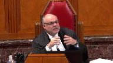

---
title: Her Majesty the Queen v. G.F., et al.
published-title: Heard
date: 2020-10-14
sidebar: false
---

This transcript was made with automated artificial intelligence models and its accuracy has not been verified. Review the original webcast [here](https://scc-csc.ca/case-dossier/info/webcast-webdiffusion-eng.aspx?cas=['38801']).
---

**Justice Rowe** (00:00:03): Report La Pouf.

**Justice Karakatsanis** (00:00:07): I'm shocked.

**Justice Wagner** (00:00:30): Good morning, be seated.

::: {.column-margin}

:::

In the case of Her Majesty the Queen against G.F. et al.

for the appellant, Her Majesty the Queen, Philip G. Coley, for the respondent, G.F. et al.

Addison Craig and Ria Sayani, for the intervener, Criminal Lawyers Association of Ontario, Peter Sankoff, please be advised that there is a publication ban in this file pursuant to Section 486.4 of the Criminal Code, and there is a sealing order in effect for this file from the lower courts.

Mr. Coley.

**Speaker 1** (00:01:18): Good morning, chief justice and justices.

::: {.column-margin}

:::

I intend to discuss the grounds of appeal in the following order.

First, incapacity and the judge's reasons.

Second, the curative proviso.

Third, the ineffective assistance of council argument.

Fourth, time permitting I'll make brief submissions on related issues and procedural fairness.

And with respect to the respondent's uneven scrutiny argument, subject to any questions, I intend to rely on my written argument which you will find excerpted in my condensed book at tab five.

Before jumping into the grounds of appeal, I'd like to provide the court with an overview of the crown's position.

The case before this court started as a simple trial.

It was a single issue trial.

The complainant testified that she was profoundly intoxicated after consuming about eight shots of hard liquor in a short period of time.

She woke as the respondents were already starting to touch her sexually without warning.

She remembered feeling her pants being pulled off and reaching down to stop them only to discover that they were already out of reach.

**Justice Moldaver** (00:02:35): for one moment. Yes.

::: {.column-margin}

:::

The trial judge accepted the complainant's evidence totally. Yes.

And just on the basis of that alone, where she says, I awoke and they were pulling down my pants, I would have thought that if you're looking for incapacity it would be right there, you wouldn't have to go much further.

But we do go much further.

**Speaker 1** (00:02:58): I wholeheartedly agree, Justice Moldaver, and in my submission there are a number of roots to the finding of incapacity in this case and that is certainly one of them.

::: {.column-margin}

:::

The complainant described being sexually assaulted and manhandled for an extended period of time.

She remembered saying stop and nothing else.

She remembered groaning and crying and GF telling her to be quiet.

And she remembered making feeble and confused attempts to push away but failing to create any distance between herself and her assailants.

She remembered fading in and out of consciousness throughout.

And she remembered feeling too afraid and confused to scream.

If the trial judge accepted that account beyond a reasonable doubt, then convictions would follow.

**Justice Rowe** (00:03:49): In sort of my experience, but you know, who knows, maybe I just don't quite get it, when you refer to findings of fact, you say what the trial judge said.

::: {.column-margin}

:::

You're telling me what the complainant said, and you're saying, oh, and by the way, the trial judge believed all that.

Well, okay, you can argue it that way, but it sounds like I'm the trier of first instance.

To my view, you should say, in the following passage, the trial judge made the following findings.

But you know, do as you wish.

**Speaker 1** (00:04:20): My submission, Justice Roe, is that the trial judges made a factual finding to accept the entirety of the complainant's account, including all of these passages that I've referred to, even if the judge did not enumerate necessarily specific passages.

::: {.column-margin}

:::

In my submission, it's the clear implication of the reasons for judgment when they're read as a whole, and you'll recall that the judge found the complainant's testimony was provided without a hint of fabrication and that it was corroborated by other evidence at trial, and within the ten examples provided by the judge of the strengths in her evidence, the judge included the following.

Her evidence as to the amount of alcohol she consumed was corroborated, which I'll remind you was an alarming quantity of alcohol for a female of her age and size.

Her evidence that she had no romantic interest in the respondents was corroborated.

Her evidence that she woke up in a state of shock and confusion was corroborated.

Her evidence describing a sexual encounter that was traumatic and not voluntary was corroborated.

And nowhere in the reasons for judgment is there any indication that the judge had any doubts about any portion of the complainant's evidence.

And second, if the reasons for judgment in my submission were not clear enough in the reasons for sentence, the judge says unequivocally the complainant's evidence which the court accepted was, and then he goes on to summarize her account of the sexual assault.

Now in my submission, this trial was that simple, and that's how all the parties approached it, and that's how the judge resolved it.

He believed the complainant, so he entered convictions.

In my submission, the Court of Appeal lost sight of the nature of this trial when they faulted the judge for omitting to discuss and analyze legal issues that were not controversial at trial, issues that were not discussed at trial, and issues that in my submission did not warrant any particular attention in light of the factual matrix of the trial.

The Court of Appeal ought to have flagged those concerns for the parties at the hearing, and if they had, the parties could have assisted the court in resolving them.

Ultimately, I will ask this court to recognize this case for what it was, a case that was decided by the judge's choice to accept the complainant's evidence.

**Justice Moldaver** (00:06:43): point, if I may.

::: {.column-margin}

:::

Based on the trial judge's findings, because there was obviously the defense position was that she was consenting all along and enjoying it and he kept asking her if it was okay and all this stuff.

Totally rejected by the trial judge.

Based on the trial judge's finding that he accepted completely the complainant's evidence.

Is there any evidence anywhere from which a finding of subjective consent could be made?

**Speaker 1** (00:07:18): In my submission, there is not, and that is why I say both that the finding of incapacity was the inevitable result of the judge's factual findings and also that a finding of no consent, irrespective of capacity, was the inevitable consequence of the judge's factual findings.

::: {.column-margin}

:::

**Justice Rowe** (00:07:38): What test did the judge apply, the trial judge, in terms of capacity and was that a test recognized in law?

::: {.column-margin}

:::

Unless you want to tell me that doesn't matter either.

**Speaker 1** (00:07:59): No.

::: {.column-margin}

:::

So essentially what the judge articulated in his reasons for judgment was a finding of no consent on the basis of the complainant's incapacity and the submission that I'm making is that it should be presumed, the judge should benefit from the presumption of correct application that the judge articulated the correct test.

**Justice Rowe** (00:08:43): Is it not the case that the judge simply said this person was intoxicated and therefore they could not consent?

Point finale.

Simple as that.

And I put it to you, that is simply an inadequate statement of the legal test.

**Justice Brown** (00:08:59): And if that's wrong, maybe you can point to where you say the trial judge articulated the correct test.

**Speaker 1** (00:09:06): Absolutely.

::: {.column-margin}

:::

And so effectively the Court of Appeal found that both the judge did not discuss the factors leading to incapacity and as you've indicated, the Court of Appeal found that the judge's findings may be read, and that's what they said, may be read, as equating any

**Justice Rowe** (00:09:26): you what the Court of Appeals said.

I said what did the trial judge say?

Now if you don't want to answer it, that's fine. Carry on.

But that was my question.

**Speaker 1** (00:09:34): Certainly, and so I'll take you to the passages where the judge deals with it, and those are in my condensed book at tab 1.

**Justice Moldaver** (00:09:49): Just before you go there, I just want to clarify something.

::: {.column-margin}

:::

Paragraph 6 of the Court of Appeal's decision, they report the evidence of the complainant.

And they say, CR testified she was scared in shock and did not know what was going on at that point.

CR testified that she was so intoxicated that she had no control over herself.

And she said she kept blacking out and going in and out of it.

Asked whether at the time she felt she could make a choice, but whether or not to have sex, she answered no.

Now, that's her evidence.

You know, Justice Roe can talk about tests, but the trial judge accepted her evidence across the board.

Now, in terms of a test for incapacity, leaving aside whether it's more nuanced than what I'm about to suggest, she says, I was blacking out.

I kept blacking out, going in and out.

Now, if that isn't enough to establish incapacity, then with great respect, I don't know what is.

**Speaker 1** (00:10:58): I wholeheartedly agree.

::: {.column-margin}

:::

And that's part of my submission that if the trial judge did make an error in his articulation of the test, the proviso would apply.

However, it is my submission that the judge did not make any such error.

And so I'll take you to those passages.

And so that is again at tab 1H of the appellant's condensed book.

And the first passage is at page 1, paragraph 1.

And it's highlighted there.

And the judge here is setting out the crown's position.

And he says, quote, the crown alleges that the complainant was impaired due to excessive alcohol consumption and was unable to provide consent.

So in my submission this first passage does not suggest any error.

And in fact what we see here is that the judge is keeping the two concepts distinct from one another.

He mentions the source of the incapacity, which is impairment by excessive alcohol consumption.

And then he mentions the legal threshold that must be met, that she must have been unable to provide consent.

Next, there's a passage at page 8, paragraph 51.

And in the second line of that paragraph, the judge says, if I find beyond a reasonable doubt that the complainant was unable to provide her consent to this sexual activity because she was impaired by alcohol consumption.

And so again, in my submission, he has not equated the two concepts.

**Justice Brown** (00:12:29): But has he stated a standard?

::: {.column-margin}

:::

Just taking it back to Justice Roe's question that you haven't answered.

Does he state a standard by which incapacity is to be decided?

Now maybe as Justice Moldaver suggests, it's obvious in this case, maybe that's your answer.

He didn't state a standard because he didn't have to.

But I would like an answer to this question.

Did the judge state a standard?

And if so, what was the standard?

**Speaker 1** (00:12:52): it.

And so to the extent that the standard is incapacity, he stated that he was finding incapacity, but to...

**Justice Brown** (00:12:59): inclusion.

By what standard is that decided?

**Speaker 1** (00:13:04): And so I agree with you that he did not go any further than that.

He did not.

**Overlapping speakers** (00:13:07): Okay, so he didn't state a standard. No.

Okay.

I think that's your answer

**Speaker 1** (00:13:11): Right.

::: {.column-margin}

:::

And so rather than go through the other couple of references where the judge points to incapacity, in my submission all are essentially the same where the two concepts are distinct, but the judge certainly goes no further than that.

**Justice Brown** (00:13:35): Well, at Paragraph 71, the trial judge says, It does not leave me with......that is treating as a discrete issue, separate from capacity, the issue of non-consent.

::: {.column-margin}

:::

But if you read that in light of Paragraph 51, which sets the issue plainly in terms of capacity, and then the next paragraph that says, no consent is obtained where a complainant is incapable of consenting to the activity, this applies in instances where a complainant is intoxicated.

It does seem to be combining the two issues, as well as equating intoxication with incapacity.

**Speaker 1** (00:14:32): And so my answer to that is that the judge certainly did and was absolutely entitled to equate incapacity with not consenting because someone who is incapable is not consenting.

::: {.column-margin}

:::

In my submission when the reasons are read as a whole it's clear that the judge elected to base his finding of no consent on the complainant's incapacity but when the judge used at times the language of no consent that's entirely consistent with the finding of no capacity.

As I've said a complainant who is incapable has not consented and in my submission the only reason that the judge's use of both words might seem ambiguous to some on the facts of this case is that his acceptance of the complainant's evidence meant that the complainant was both incapable irrespective of consent, sorry, incapable and that she did not consent irrespective of capacity.

And in my submission far from leading to reversible error this multiplicity of pathways to guilt that flowed from the findings of fact should leave this court feeling all the more confident that the convictions in this case were sound.

Now although in this court the respondents disagree that the complainant's evidence led inevitably to findings of incapacity at trial in my submission they voiced no disagreement with that position.

Both defence counsel at trial focused their submissions solely on whether the complainant's account should be believed or whether GF's account should be believed.

Neither made any arguments to suggest that their clients might be acquitted even if the complainant's evidence was accepted.

And when the crown told the judge that it was a given that if he accepted the complainant's evidence she was incapable the judge replied to say that the crown's position seemed to be in line with the defence position.

And defence counsel never stepped in to say otherwise.

They didn't say otherwise in reply submissions or at any other time.

**Justice Côté** (00:16:37): Is a complainant who is incapable of consenting to sexual activity can at the same time be able not to consent?

I'm asking this as a general proposition.

**Speaker 1** (00:16:56): My answer is yes. One.

::: {.column-margin}

:::

So it is absolutely possible to find that a complainant was both incapable of consenting and did not consent irrespective of capacity because mental capacity is a precondition to consent.

It is not a precondition to the absence of consent.

On the one hand, consent is a positive state of mind.

It's a choice that requires a mind capable of choosing.

On the other hand, the absence of consent is not a positive state of mind.

It is a choice that requires a mind capable of choosing.

**Justice Brown** (00:17:31): So what do we do with Hutchinson?

::: {.column-margin}

:::

Hutchinson says there's a two-step process.

First question of whether there's consent or the conduct raises a reasonable doubt about consent, and then you look at circumstances that may vitiate consent, including the circumstance that you're saying here, and then you look at the

**Speaker 1** (00:17:51): In my submission, the issue of capacity is not divisible between the two steps of Hutchinson.

Because all the work on capacity takes place at the first step of the Hutchinson framework.

If there is no capacity, then there is no voluntary consent to the sexual act in question.

**Justice Brown** (00:18:11): they're left for 273.1 sub two in that case.

::: {.column-margin}

:::

And that was the reasoning of the majority in that case.

If you treat capacity as an inherent element of consent, then you effectively collapse that provision.

**Overlapping speakers** (00:18:32): In my submission.

**Justice Brown** (00:18:33): I mean, this may be excessively formalistic, but it's what the majority said in Hutchinson.

**Speaker 1** (00:18:38): I agree that it was one of the reasons for deciding, as this court did, about misinformation.

Having said that, and I believe it was in this court's decision in J.A., it wasn't just

**Justice Brown** (00:18:50): Just misinformation, they also said section 273.1 sub 2, which is capacity, also lists conditions under which no consent is obtained at the second step.

That's the vitiations of the consent that may be found at step one.

**Speaker 1** (00:19:04): Absolutely, but in terms of a concern for duplication and for the need for a clear and distinct utility of the separate provision, in my submission that was a concern with respect to misinformation and it may well be a concern that applies to some of the other subsections, but when it comes to incapacity in my submission, what this court told us in JA I believe was that Parliament included the subsections surrounding incapacity as an example of something that could not countenance a finding of consent in 273.11 and not as a separate new factor that would vitiate an otherwise valid consent.

::: {.column-margin}

:::

There is no otherwise valid consent.

This was meant to signal, to send a clear signal in response to the jurisprudence that incapacity is simply incompatible with the concept of consent as it's defined in 273.1 sub one.

And perhaps the clearest demonstration of that is that certainly this court in JA held that unconsciousness, which is just one of many forms of incapacity, unconsciousness does not enable the forming of consent in the first place.

And that too is a subsection of 273.1 sub two.

It's now subsection 1.1.

And so just as that subsection did not come in to create a new test to vitiate consent in my submission, so too do any other forms of incapacity not swoop in to create another test to be met for incapacity.

And I just want to come back to Justice Cote's question about whether the findings are mutually exclusive between incapacity and no consent irrespective of incapacity.

Now in my submission, the absence of consent is not a positive state of mind.

It's nothing more than the absence of the choice to consent.

And the reason for which the choice to consent is absent is irrelevant at law.

The choice to consent might be absent because a different choice was made by a capable mind.

The choice to consent might be absent because no choice at all has been made.

For instance, sexual touching that occurs unexpectedly.

The choice to consent might be absent because the mind is incapable of making any choices at all.

For instance, unconsciousness.

Or as in this case, the choice to consent might be absent because an incapable mind has resisted touching as unwanted even though the sexual nature of that touching or the choice to consent or refuse was not appreciated or understood to the extent required by law.

Or the identity of the aggressor is not known.

In that context, there is no choice to consent both because the complainant is incapable and because she does not want the touching to take place even though she does not fully understand what she's resisting or the nature of the choice she's entitled to make.

**Justice Kasirer** (00:22:33): I'm wondering if your proposition finds support in an article cited by Justice Pardue on appeal, the paragraph 47, Jeanine Benedett and Isabelle Grant, where it's posited that it's possible for a complainant to be incapable of giving consent in a particular situation and yet be capable of withholding it.

::: {.column-margin}

:::

**Speaker 1** (00:22:57): Absolutely.

And I've included that passage at tab two, I believe, of my condensed book to further clarify the point that I'm trying to make.

That's exactly what I'm saying.

**Justice Kasirer** (00:23:10): That being said, on what basis did Justice Pardue rely on the same article in that very same passage?

**Speaker 1** (00:23:20): My recollection is that when Justice Pardue cited that passage, she had emphasized a different portion of that passage.

::: {.column-margin}

:::

So she emphasized the point that she was trying to make is that she was recalling from that article that the authors were of the view that when it comes to complainants whose incapacity is the result of disability, of a non-transient condition, it may be more respectful to make findings of no consent irrespective of capacity, if possible, and to operate in that order.

Now, in my factum, I acknowledge that proceeding in that order might be preferable in all cases, but on further reflection in my submission, there really is not one preferable order to determine these questions that would apply for all cases.

It should be left to the trial judges to choose the order in which to decide the issues on the facts of the case.

In some cases, I agree with the Court of Appeal, with Justice Pardue, that it may be more respectful to find that the Crown has proven no consent irrespective of capacity and to leave it at that, and her example is a perfect example.

But there will be other cases where the evidence of incapacity is far clearer and more compelling than the evidence surrounding any possible ostensible consent, and in those cases, it may be unnecessary for judges to undertake the hypothetical exercise of ascertaining whether or not the complainant would have consented if she were capable.

If the clearer path is by proof of incapacity, there is no principled reason in my submission to discourage judges from beginning their analysis by resolving that question first.

**Justice Rowe** (00:25:12): I think what is really critical, I'm probably agreeing with you on this point, isn't so much the sequence as the fact that a pathway is laid out with sufficient clarity.

::: {.column-margin}

:::

And to say, here's the pathway, and here's the evidence.

Pardon me, here are the findings of fact that make out that pathway, and here's the evidence upon which I rely for those findings.

In fact, if a judge does that, I'm not sure it matters which sequence you do, or whether you say, there's two pathways, I'm going to turn my mind to one, I'm satisfied as to one, therefore, I don't really need to turn my mind to two.

I guess my concern is that there be a sufficient clarity as to which pathway, how it is defined, and what are the factual findings that support the conclusion.

Thank you.

**Speaker 1** (00:26:07): And I completely agree, having said that, in my submission, it's a question of sufficiency of reasons at that point.

::: {.column-margin}

:::

And because the judge was presented with a common understanding between all parties about what the live issues were, and that common understanding would have informed the content and focus of the reasons for judgment, it also must inform the review of those reasons for judgment.

Because a trial judge's choice, and this trial judge's choice, not to review, analyze, or discuss issues or legal principles that are not contentious at trial, does not demonstrate error.

And this really is the main point of divergence between my position on the one hand, and the position of the Court of Appeal, and the respondents on the other hand.

The Court of Appeal faulted the judge for failing to identify the relevant factors to be considered when assessing whether the complainant had the capacity to consent to sexual activity.

And after faulting him for what he did not include, as we've discussed, the court expressed the concern that what he did say may be read as equating any degree of impairment by alcohol with incapacity.

But the absence of any discussion on the law of incapacity, or about these two separate pathways, and the judge's reflection, is not reflective of error in this case, because it's only reflective of the live issues at trial.

Why would the judge engage in a discussion of the factors that show incapacity, or these two separate paths, when there was no dispute between the parties about whether the complainant's evidence, if accepted, proved that she was incapable?

**Justice Moldaver** (00:27:48): Your point here, if I understand it, is that something that this Court has said, and other courts on many occasions, that we can sit back in the peace and quiet of this courtroom and take a nitpicky approach to the reasons, and the trial judge could have done this better and could have done that better, but the context of this case, as you have now pointed out several times, is even the defence took the position, this is a credibility case, there is nothing in this record, as I understand it, that suggests that the defence stood up and said, well, it's primarily credibility, but even if you believe the evidence of the complainant right down the line, we take issue with this case meeting the legal test that is required to demonstrate incapacity on the basis of alcohol consumption.

::: {.column-margin}

:::

Nothing like that, and yet we are sitting here, in effect, being somewhat critical of the trial judge, and maybe the reasons could have been done better, but the trial judge was never asked to respond to that question, and to the extent that the evidence in this case of the complainant says that she was out of control, out of control, blacking out here and there, like intermittently, to suggest somehow that we can mix in and say, oh, well, there was really no basis for the trial judge to do what he did, it seems to me is the worst form of Monday night quarterbacking that any appellate court could take.

**Speaker 1** (00:29:25): That's precisely the submission that I'm making, and to put it otherwise, why would the judge—sorry, the only purpose that would have been served by requiring the judge to review the law on capacity in this case would be to prove to the reviewing court that the judge understands the law.

::: {.column-margin}

:::

And that's not the purpose of Reasons for Judgment, because judges are presumed to know the law.

**Justice Martin** (00:29:52): Can you just address for me, though, in terms of the submissions, whether a legal standard was addressed at trial for incapacity?

**Speaker 1** (00:30:02): And so if I'm understanding your question, you're asking whether the parties in their closing submissions made any submissions about what the threshold was for incapacity.

**Justice Martin** (00:30:16): Because the written argument seemed to be very factually based and I'm just trying to get a sense of the full record and see whether or not there was some addressing of what the content of the statutory standard was.

**Speaker 1** (00:30:29): And from my recollection of the record, there was no such discussion.

::: {.column-margin}

:::

There is one point at which the crown mentions sort of offhand that he intends to provide some case law to the judge about capacity, but I'm not in a position to say that the crown ever in fact did that and it never came back to that.

On that note, I'll turn to a brief submission on the proviso.

If this court were to agree with the Court of Appeal that the judge's reasons were insufficient or that the trial judge ought to have applied a two-step approach, then it's my submission that the curative proviso ought to be applied.

Neither error caused a miscarriage of justice because neither error impacted the judge's choice to accept the complainant's account.

And the necessary legal consequences we've talked about at length of finding of accepting her evidence was a finding of guilt both because the complainant was incapable and because irrespective of capacity, she did not subjectively in her mind make the choice to consent.

And I think really all I need to say on that point is exactly what Justice Moldaver said, which is having accepted the complainant's account in which she described this crying and trying to push away and only saying the word stop and nothing else.

There is simply no conceivable outcome other than a finding of no consent.

Now the respondents have argued that the trial judge would have had to consider the defence of mistaken belief in communicated consent if he had not found incapacity, but in my submission that defence had absolutely no air of reality.

The accounts of the complainant and GF were diametrically opposed.

There was no middle ground that could be cobbled together between the enthusiastic consent described by GF on the one hand and the deeply intoxicated resistance described by the complainant.

**Justice Abella** (00:32:30): was that even raised the question of honest but mistaken belief did the defense put that to the to the court

**Speaker 1** (00:32:37): On my review of the record and certainly the submissions that were made orally, it was not.

::: {.column-margin}

:::

I don't believe it was raised in the written submissions, but I can't swear to that, I'll have to double check that.

But certainly it wasn't pursued in oral argument.

And so in my submission, there could be no finding that the complainant did not consent, but also that she somehow communicated that she did.

Moreover, given that the judge rejected GF's account in its entirety and found that it did not leave him with a reasonable doubt, if there was to be any evidentiary basis for that defence, it would have to exist somewhere in the Crown's case.

And in my submission, there was not one scintilla of evidence in the Crown's case capable of supporting that defence.

Turning then to the mistrial application based on the allegation of ineffective assistance of council.

Before this court, the respondents have challenged the ruling on the mistrial application on two bases.

First, they say that the advice not to testify was unreasonable.

Second, they say that council was incompetent for failing to consult with RB before closing the defence case.

I'll respond to the arguments in that order.

First, in my submission, the advice not to testify fell within the range of reasonable advice, and the trial judge's finding to that effect should not be disturbed on appeal.

Council weighed the benefits and drawbacks of putting RB on the stand, and ultimately, he felt the best advice he could give was that she should not testify.

Now, I acknowledge that one benefit of testifying is that RB would have corroborated the main thrust of GF's account, but council felt that the benefit of that corroboration was outweighed by the cost of putting her on the stand, and there were three main risks that council described in his testimony on mistrial application.

First, inconsistencies between RB's account and GF's account.

Second, obvious tainting of RB's account by extensive discussions with GF, and third, RB's difficulty keeping her emotions in check.

Now, at the outset, I'd like to emphasize two principles that guide this inquiry.

First, the nature of the inquiry.

The question is not to determine ex post facto what advice would have been the best advice possible.

This is nothing more than an inquiry into reasonableness.

What is reasonable for council is to be concerned about, sorry, was it reasonable for council to be concerned about inconsistencies in his client's account, tainting in his client's account, and her ability to keep an even temper under cross-examination?

Was it reasonable for council to advise the complainant not to take those risks because her account would be provided to the judge, in essence, through the evidence of her co-accused?

And in my submission, the answer is yes.

Other council might have approached the issue differently, but this was one of the reasonable approaches.

The second key principle I'd like to emphasize is that the reasonableness of advice is a heavily fact-driven determination.

The trial judge who has observed the trial and who has seen the defense strategy play out has an important advantage in evaluating whether that strategy was reasonable.

The judge in this case found that the advice not to testify was reasonable.

In my submission, this court should defer to that finding.

Now, I've included in my condensed book excerpts from council's testimony on the mistrial application.

In my submission, when you review those excerpts, what you will find is that the respondents have offered a watered-down interpretation of council's concerns in their factum.

For instance, with respect to inconsistencies, RB remembered there being rain on the night of the offense, which forced everyone to crowd into the trailer, an event which no one else remembered.

And her recollection of the sexual conduct with the complainant was different in some aspects than GF's account.

This is all evidence about the night of the offenses.

Keeping in mind that there was evidence of RB drinking that night, these are inconsistencies that could easily have undermined RB's reliability.

And with respect to the tainting of RB's evidence, through extensive conversations with GF, council testified that the influence of GF was, quote, evident.

And contrary to what's written in the respondent's factum, he testified that this was not an assessment based only on one interview, but rather this was an impression that stuck with him throughout his involvement with the file.

And lastly, the concerns with respect to RB becoming emotional and upset under cross-examination.

The respondents have interpreted those words to mean that she might shed a few tears or need a moment to compose herself.

But council's impression was far more substantial than that.

His time with RB led him to believe that she would have an emotional breakdown on the stand.

His assessment was not only based on his time with RB, but also from speaking with RB's previous council.

And on the last day of trial, this issue came up again during the afternoon break, not because the complainant was sad or in tears, but because she was upset in the sense of being very angry.

And council reminded her that her anger would not serve her well on the stand.

And at tab 3F of my condensed book, you'll find excerpts of RB's cross-examination on the mistrial application, which I submit demonstrate that council's concerns were well-founded.

RB was quickly and repeatedly rattled on the stand.

She was frustrated and combative.

And that was just the mistrial application.

In my submission, the trial proper would have been much, much more difficult.

That was the first prong of the ineffective assistance argument.

The second prong of the argument is the challenge to whether RB was denied her choice to testify.

In my submission, that argument is answered by four findings of fact that are owed deference.

First, RB made a free and informed choice that she did not want to testify, and she made that decision without undue pressure.

And on the last day of trial, she signed a document confirming those instructions.

Second, there was no agreement between RB and her council express or implied to revisit her decision not to testify at the conclusion of GF's evidence.

Third, nothing transpired on the last day of trial which would have prompted RB to, quote, suddenly change her mind and decide to testify.

Following, and fourth, sorry, following the close of the defense case, RB did not tell her council that she had wanted to testify.

And that's despite the fact that in my submission, the evidence suggests they had a good relationship and that RB never hesitated to convey her thoughts and her concerns.

Those findings were supported by the record.

And there was nothing conditional about the written instructions signed by RB on the last day of trial.

I've included those at tab 3G.

She signed a form instructing her council that she did not want to testify.

And that form also included a variety of acknowledgements to show that she understood the full nature of the decision that was hers to make.

And one part of that decision is that she can change her mind at any time.

Not that her decision will be revisited at the end of trial, but merely that she is always free to change her mind.

That is true of all accused persons.

That wasn't some special agreement for RB.

And that does not create an obligation on council to reassess whether the longstanding instructions of the client have changed absent the client telling council they wish to change their instructions.

And this is especially true when those instructions have been reduced to writing near the very end of the trial and have been confirmed verbally during the last break on the last day of trial after the entire Crown case was in and the cross-examination of GF was already underway.

She had every opportunity to change her mind.

She just never did.

Now, the respondents say that the only reasonable explanation for RB feeling upset at the close of the defense case was that she wanted to testify.

In my submission, if that were the case, she would have said so.

As I've said, they had a good relationship.

When she had concerns, she voiced them.

And very specifically, when those concerns were about whether she needed to testify, she voiced those concerns.

But she said nothing about that after the close of the defense case.

All she said was that she felt the end of trial had been abrupt and she wished they had taken a break to debrief before the closing of the case.

In my submission, it cannot be unreasonable to take RB at her word that she was just nervous about moving on to the next stage of proceedings and nothing more.

I'll move on to related issues and procedural fairness.

Although the intervener has taken a different position on this issue, the parties are at edum on the legal principles that apply to related issues.

That position is made plain in my submission in this court's decision in Meehan.

Appellate courts are always entitled to raise related issues.

But the principles of Audi alterum partum apply to related issues just as much as they apply to new issues or any other issues.

If an appellate court wishes to consider a related issue that might impact the result of the case, the parties must be given some opportunity to be heard on that issue.

And what it means for a party to be given an opportunity to be heard will depend on the facts of the case.

So you think that the parties will be given the opportunity to be heard on that case.

**Justice Brown** (00:42:50): So you say in this case that the related issues that you weren't given an opportunity to comment on were the mixing of capacity and consent, the Court of Appeal's concern about the mixing of capacity and consent, and also about the trial judge's reasons on incapacity.

::: {.column-margin}

:::

Do I have that right?

**Speaker 1** (00:43:12): Yes, with a small caveat for that first concern, because I appreciate that there was some discussion of mixing the two in the context of the proviso and whether or not I could rely on the alternative basis of no consent irrespective of capacity.

::: {.column-margin}

:::

And so in that sense, there was some discussion about the mixing.

But there was certainly no discussion about whether the manner in which those two issues were discussed in the reasons for judgement could somehow create a problem for that initial finding of incapacity.

**Justice Brown** (00:43:50): Well, Justice Nordheimer, and I realize, I mean, I'm not sure how significant it is in that it's an argument about the proviso, but Justice Nordheimer clearly raises with you, I'm looking at page 94 of the transcript, having set the stage that there's the fact of whether the complainant had the capacity to consent and there's the capacity, the fact of whether the plaintiff, or plaintiff, I'm sorry, complainant did or did not consent.

::: {.column-margin}

:::

But then Justice Nordheimer says, the problem I'm having is I don't think you can have a finding that both have.

My concern is speaking for myself with the trial judge's reasons.

He seems to do that.

He seems to treat them almost as one.

That seems to be placing before you the Justice Nordheimer's concern about mixing capacity and consent.

And then in your answer, you say, the submission I'm making is, if the judge is legally incorrect about where he drew the line on incapacity, his findings still make out the path to guilt.

So the trial judge's, the sufficiency of the trial judge's reasons form the substance of your answer.

The sufficiency of the reasons on incapacity.

And I'm wondering if you're getting a little nitpicky on the granularity of the subject matter that was or was not raised with you.

**Speaker 1** (00:45:40): And I certainly appreciate that at first glance those submissions seem to be related to what we're talking about today.

::: {.column-margin}

:::

But in my submission there's a clear and important distinction to be drawn here.

The submissions I was making were not about whether the judge's reasons were sufficient or insufficient for the finding of incapacity.

The only point I was making was whether the findings, the reasons for judgment were also sufficient for the finding of no consent irrespective of capacity as an alternative basis for conviction.

So by this point I had completed all of my submissions with respect to the unreasonable verdict argument which was the only argument that was said to undermine the finding of incapacity.

I had moved on to the proviso argument and in that context what I was talking about was an alternative route to guilt.

And this discussion in my submission was about whether that alternative route to guilt could stand.

It was my understanding that the proviso argument was an alternative route to guilt.

**Justice Brown** (00:46:42): I mean, the difficulty I've had with the argument that you advance on me is you're effectively asking us to recognize a new category of issue between, somewhere between issues that were dealt with by the parties and issues that the Court of Appeal cooked up in its reasons that it didn't raise with the parties, and that's related issues.

::: {.column-margin}

:::

And, of course, related issues, that's a question of degree, and that prompts my comment about granularity because I can see quite easily, and I'm kind of wondering if this isn't an example of that, where the issues might be defined with such granularity that you're effectively holding the Court of Appeal to a standard that doesn't really engage the concerns that Meehan was concerned with, right, balancing the adversarial process with the Court of Appeal's duty to do justice in an individual case, and, in fact, may, as the Criminal Lawyers Association's factum suggests, may cause a lot of practical difficulties on the ground.

This may be one of these cases where principle and practicality are hand in hand.

So I mean, do with that what you will, but that's the, I'm just putting it out there so you understand my concern and to flag it for you.

**Speaker 1** (00:48:24): Absolutely.

::: {.column-margin}

:::

And the first part of my response to your question is very simply that I am not at all advocating for a new category outside of what's already been discussed in Mian.

At paragraph 33 of the decision in Mian, this court recognized that where appropriate the court may have to be prepared to grant even a brief adjournment to allow the parties to consider and canvass the issue, and the issue in that case was some of what I'm calling related issues, so issues that are not new issues but that are not squarely raised either.

And so Mian already recognized that the principles of procedural fairness still apply.

And I think it's also interesting when we read Mian that when they're talking about all these examples of related issues, over and over again this court talks about the fact that the appellate courts are absolutely entitled to ask questions about these issues.

They talk about asking questions at paragraph 31, asking questions at paragraph 32, and at paragraph 33 this court talked about that appellate courts may draw counsel's attention to these issues.

And so in my submission what all of this indicates is that it was never this court's intention in my submission to suggest that just because something is not strictly speaking a new issue doesn't mean that the procedural fairness rules of natural justice get thrown out the window.

And I completely agree that there will be lots of discretion here that will be applied by the courts of appeal and that this court will not lightly intervene with that discretion.

I agree that there will be some cases where the issue has been canvassed effectively in the submissions that have been made.

What my submission is is that in this case the actual errors that decided this case were not canvassed.

And I don't submit that they needed to be canvassed in any extensive way such as notice beforehand or an adjournment or anything like that.

On the facts of this case my submission is that it would have been perfectly sufficient to simply raise the concern in the courtroom and the parties would have been able to respond to those concerns on the spot.

But there was, there should have been the opportunity to respond to those issues.

Now with respect to whether the argument was different in this case, I'd like to emphasize here that when I made the submission about whether the judge was legally correct about where he drew the line on incapacity, in context the submission I made in the context of the proviso argument and the proviso argument would only be necessary if the court of appeal accepted that the finding of incapacity was unreasonable.

So when I referenced an error in drawing the line on incapacity, I wasn't talking about the potential for the judge to have equated any level of intoxication with incapacity, an error that was never discussed.

What I was talking about was the possibility that the court of appeal might found that incapacity was an unreasonable finding on the proper application of the threshold for capacity.

But as it turns out, the court's concern was not that the finding of incapacity was unreasonable, but that the finding was reasonable and they just were not certain whether the judge took the correct path to get there.

And that in my submission is something that I was not able to speak to.

At the end of the day what it comes down to is what you won't find in the record of the court below.

You won't find anything about the two-step Hutchinson test.

There was no discussion about whether there should be a requirement that judges consider the absence of consent irrespective of capacity first and only consider capacity afterwards if necessary.

And you won't find any argument that the judge's reasons reveal that he applied the wrong legal test for incapacity by equating incapacity with any level of intoxication no matter how slight and you won't find any submissions about the requirements and what the requirements are for sufficient reasons.

And perhaps the clearest indication that the court of appeal ought to have given the parties that opportunity to speak was that they rejected the grounds of appeal that they did consider and they still allowed the appeal on other grounds.

And in my submission that should have been a clear signal to the court that there might be a need for notice.

Instead the reasons of the court of appeal reveal that the court only asked itself whether these were new issues and once they decided that they were not they never stopped to consider whether there were any procedural fairness requirements that survived their determination that these were related issues rather than new issues.

Now I've identified a number of other cases that appear to reveal the same reasoning process where the appellate court merely asks whether the issue is a new issue and if it's not that ends the inquiry.

And it's on the basis of this case that and those cases that appear similar that I submit there's a need for clarification on this point.

Where appellate courts wish to consider issues that were not raised by the parties the first step will be to determine whether it's a new issue but even if the issue is determined not to be new in my submission appellate courts ought to turn their minds in every case to that second question.

Have the parties had the opportunity to respond?

In this case as I've set out in my factum and in my submissions we did not and in the absence of submissions the Court of Appeal reached the wrong result.

Now subject to any other questions I'll just briefly conclude.

In light of the judge's acceptance of the complainant's evidence in my submission convictions must be entered.

This complainant should not be forced to undergo the trauma of a second trial when she was already believed at the first.

Thank you.

**Justice Wagner** (00:55:00): break, 15 minutes.

::: {.column-margin}

:::

Miss Craig?

**Speaker 2** (00:56:25): Thank you.

::: {.column-margin}

:::

Good morning Chief Justice and Justices.

Today I'm going to address four main points.

First the issue of procedural fairness which we say the appellants were not denied at the Court of Appeal.

We agree that Meehan was not intended to dispense with the rules of natural justice for related issues but we say that in this case the deciding issues were fully addressed by all parties.

Second the trial judge's failure to apply the correct standard for assessing incapacity.

The complainant's evidence even if she was found credible did not invariably result in a finding of incapacity and he effectively included that because she was intoxicated she was incapable which is incorrect.

Third I will address the proviso and in our submission this is not an appropriate case to apply it.

The inconsistent nature of the complainant's evidence which I will take you through meant that a conviction could follow from non-consent or could follow from incapacity but not both and the trial judge blended capacity and consent in his analysis making it impossible to understand how he resolved the contradictions within the complainant's evidence between capacity and non-consent.

**Justice Abella** (00:57:44): Was the crown right in his submissions this morning, Ms. Craig, that the issue defense said was the issue at trial credibility?

**Speaker 2** (00:57:56): Not entirely, and I will take you to that, but there were submissions also made by Defence Council about reliability, and I will also argue that regardless of the position taken by Defence Council in cases such as this, it is incumbent on the trial judge to apply the correct test because of the burden of proof and the legal capacity standard that had to be applied.

::: {.column-margin}

:::

**Justice Abella** (00:58:18): So no matter how the defense raised the defense and what it characterized as the issue, the trial judge was obliged to go on and consider related issues that could conceivably have been argued by the defense.

**Speaker 2** (00:58:33): Justice Abella, I don't think we're saying that it was incumbent on the trial judge to consider related issues that weren't raised by the defense, but it was incumbent upon him to assess the evidence and ensure that each element of the offense was proven beyond a reasonable doubt, and that includes the proper test for capacity or incapacity.

::: {.column-margin}

:::

That's what we're saying, and indeed the defense did make arguments about the reliability of the evidence of the complainant, and there was no analysis of that, and indeed there ought to have been because it was so inconsistent in many respects.

**Justice Martin** (00:59:06): But my understanding is that the crown in its submissions put forward basically if you believe the complainant's testimony, then incapacity is established in law.

::: {.column-margin}

:::

And did the defence ever take issue with whether or not the evidence that was put forward would have met the threshold or burden of the statutory standard for incapacity?

**Speaker 2** (00:59:34): No, they certainly didn't bring the trial judge's attention to the test that ought to have been applied.

They should have, they didn't, but that doesn't negate the trial judge's duty to assess it from that perspective.

That's what our position is.

And lastly, of course,

**Justice Rowe** (00:59:50): trial, you can't know if the trial judge is going to make a mess in the trial judge's reasons for decision because the trial judge hasn't yet rendered the reasons for decision.

**Speaker 2** (01:00:00): Agreed. Agreed.

::: {.column-margin}

:::

Lastly, if time permits, I will address the issue of ineffective assistance of council.

We do think that this court is in a position to effectively adjudicate it.

But what I would also say is that if the court decides not to adjudicate on that issue, it ought to be remitted back to the court of appeal should the court allow the appeal because it was argued there and not adjudicated.

So dealing first with procedural fairness, which is the issue for which the appellant initially sought leave, the appellant was quite clearly not denied the right to be heard on the deciding issues at the court of appeal, far from it.

The court of appeal quashed the conviction on the basis of a related issue, not a new issue, and as I will demonstrate, the issue was fully argued by all parties.

So starting first with the appellant's now respondent's factum at the court of appeal.

They argued that the verdict was unreasonable, and as part of that argument, they pointed to the trial judge's failure to apply the correct legal test for capacity to consent.

We've included portions of that at tab one of our condensed book.

But literally the very first thing that the appellant pointed to in their factum was that the verdict was unreasonable because the trial judge did not apply the correct test.

They cited Jensen and Ajay and Tariq, amongst others.

And they pointed to the numerous exchanges between trial crown and trial judge equating, essentially, impairment with incapacity.

In their factum, the appellant's now respondent's wrote, the issue of incapacity was not a credibility contest, and the appellant's had no burden to prove capacity.

The crown had to discharge its burden of proving that even if GF's evidence was rejected in its entirety, the totality of the remaining evidence did not raise a reasonable doubt that CR was incapacitated.

The crown's submission suggested both that CR's capacity could be decided by choosing between crown and defence witnesses, and that incapacity was synonymous with impairment.

They then in the factum went on to review the law with respect to the legal test for capacity to consent, and argued that, and I quote, the tapestry of the evidence viewed as a whole was not capable of supporting an inference that CR's alcohol intoxication was so great that she was incapable of providing her consent in law.

Then in oral submissions at the court of appeal, the appellant's now respondent's argued that to convict the appellant's on the basis of the complainant's incapacity to consent was unreasonable.

They continued, a finding of incapacity requires evidence that the complainant is so impaired that she is incapable of knowing that she was engaging in sexual activity or that she could refuse it, and again argued that the trial judge's conclusion that she was incapacitated was unsupported by the evidence inconsistent with the law and therefore unreasonable.

They then went on to argue that the trial judge did not mention any case law, nor did he set out what the test for incapacity was.

And errors of law are often rooted in unreasonable verdict arguments, as they clearly were in this case.

Two perfect examples of that are Binieris and Pelman from this court.

In Binieris, essentially the court held that when assessing the reasonableness of a verdict, the appellant court ought to consider errors in law that were made in assessing and defects in the analysis, I suppose I should say, which the court of appeal quite properly did in this case.

In fact, it's exactly what they did in this case.

Similarly, in Kalanin, the defence argued on appeal that the verdict was unreasonable.

They did not argue specifically about the prejudice of propensity evidence.

That was not a stand-alone grand of appeal, but it did form part of their unreasonable verdict argument, which Justice Martin held was entirely appropriate.

So our position is that the court of appeal in this case correctly applied Meehan.

There is absolutely no trend misapplying it.

We provided a number of cases, St. John's City, Glengrove Suites and the like, to show that the appellant courts are properly applying Meehan.

**Justice Moldaver** (01:04:32): Did the Court of Appeal raise Hutchison?

::: {.column-margin}

:::

Did the Court of Appeal in argument indicate that from their perspective and how they were reading Hutchison, it would be reversible error for a trial judge not to bifurcate consent or lack of consent and incapacity?

Where's that in the transcript?

**Speaker 2** (01:04:58): I think that's what Justice Nordheimer was discussing with the Crown and the passages.

**Justice Moldaver** (01:05:03): you think that's what it is.

But Hutchison clearly would have been mentioned, I would have thought, if that is what is going on in that interchange.

Maybe I'm wrong.

**Speaker 2** (01:05:15): Hutchinson was not mentioned, but certainly the fact that the trial judge conflated the two issues was discussed at some length, and in particular I think the larger issue, at least during oral argument, the failure of the trial judge to apply the test for incapacity.

::: {.column-margin}

:::

That's what there was a lot of focus on, and the conflation between intoxication and incapacity.

**Justice Moldaver** (01:05:40): Even though, even though, the defense is taking a position that credibility is the key here, and, and, and in the face of evidence that the trial judge accepts that she's blacking out here and there throughout the process, and in the face of evidence that she wakes up to find that her pants are being pulled down by these people.

::: {.column-margin}

:::

I'm just not quite sure what you'd be arguing, but maybe there's something I'm missing.

**Speaker 2** (01:06:09): Well, I will, and I intend to take the court through all of that, Justice Woldaver, but for the purposes of argument at the Court of Appeal, it certainly was discussed, and it certainly was argued by the respondents at the time, now appellants, which is my point.

::: {.column-margin}

:::

They were put on notice about the concerns about the trial judge's failure to apply the correct test, and that the trial judge did not enter a conviction based on non-consent, which also became an issue.

I've also included in our condensed book portions of the appellants, respondents at the time, oral and written argument, where they fully addressed this issue.

I don't think I need to go through it in its totality, but for example, in the factum that was filed by the respondents, now appellants, there was, by my count, nine pages devoted to the law about consent, capacity, and an analysis of how the trial judge navigated the issues, even to the extent of distinguishing and discussing Jensen and Faulkner, which I will reference to some extent later.

And at the oral hearing, the appellant addressed both prongs of the respondent's unreasonable verdict argument, and specifically argued that the complainant's evidence was not inconsistent with the legal standard for capacity, which is precisely the issue that he now complains he did not have an opportunity to be heard on, and he most certainly was.

Pages 91 and 92, these are included at tab 11 of our condensed book, and this is the oral argument.

Some of this was reviewed earlier in my friend's submissions, but just to make the point, at page 91, and this is at tab 11, the appellant submitted, my friend, this is a quote, my friend mentions that there is no case law in the judge's decision about incapacity.

Again, the position of the parties made it so that there would be no case law.

That wasn't argued.

The trial judge doesn't separate the two paths, again, because everything is based on the same facts.

And then he continued, recall that factual non-consent is found on the absence of consent.

Proving no consent doesn't require active, lucid non-consent, and so saying that someone never consented and saying that someone was incapable of consenting are absolutely consistent.

And it's at that point that he is questioned extensively by Justice Nordheimer.

And again, there's further discussion about the trial judge's failure to properly consider the test for incapacity.

**Justice Abella** (01:08:54): Can I ask you a question of logic?

::: {.column-margin}

:::

Certainly.

And I may be interpreting wrong.

I thought both parties accepted that if her evidence of the account was accepted, that that meant that she lacked capacity?

Am I misreading? If she.

I'm sorry.

**Overlapping speakers** (01:09:20): I'm not sure it was that explicit, Justice Isabella.

Doesn't it follow?

They said-

**Justice Abella** (01:09:26): It's the bifurcation that I'm having some difficulty with in this case, not in every case, I'm not going to re-argue Hutchinson, but in this case, given the way it was argued, doesn't it follow?

**Speaker 2** (01:09:44): It doesn't, the trial judge is not bound to accept the positions put forward by the parties, necessarily, and he is not bound to accept even concessions that are put forward by the parties.

::: {.column-margin}

:::

It still, at its basic core, remains a burden of proof argument and an issue of proper legal standards.

And so regardless of what position was put forward by Defence Council, or perhaps more appropriately, what wasn't and perhaps should have been, that doesn't obviate the necessity that the trial judge apply the correct law.

I think that's our position.

Certainly, and another example of something that wasn't explicitly argued by Defence Council and ought to have been, and also ought to have been considered by the trial judge, is the issue of honest but mistaken belief, which I will get to, because that issue certainly did arise on the evidence.

And so regardless of the fact that it wasn't raised by trial council, it forms part of the elements of the offence and ought to have been considered.

**Justice Abella** (01:10:49): So, despite the fact that nobody raised it, nobody had a chance to respond with an error of reality argument, it should have been addressed and conclusively addressed by the tragic.

**Speaker 2** (01:11:01): In this case, it should have been because it did arise on the evidence, doesn't it always?

::: {.column-margin}

:::

It's an interesting argument.

I, as Defence Council, would probably argue yes.

Obviously, there has to be an air of reality to whenever it's argued.

There are cases, I'm sure, where it would clearly not arise, but this is not one of those cases.

**Justice Moldaver** (01:11:24): I think it is one of those cases, if you look at the evidence of the complainant and the evidence of the accused is so diametrically opposed, how you can, I guess you're going to tell us how you would cooper together some sort of honest but mistaken belief, but it's hard, I'm hard pressed to think of evidence that is so diametrically opposed.

::: {.column-margin}

:::

**Speaker 2** (01:11:47): Well, perhaps I'll address it briefly now, Justice Muldaver.

::: {.column-margin}

:::

Incapacity, clearly, our position was a live issue, but honest but mistaken belief and consent was as well.

And I'll tell you why.

First of all, it's not dispositive on the appeal that it wasn't argued.

But it arose on the evidence, and we've included an example of that in our condensed book at tab 27, and that's a portion of the crown submissions.

And the crown is discussing the evidence of GF that he was repeatedly asking CR if she was okay with what was happening.

And it seems to have been accepted, that portion of his evidence seems to have been accepted by the trial crown.

And what the trial crown is arguing at pages 94 and 95, and this is a quote from page 94, it would be highly unusual in the crown submission for someone to ask a minimum of seven times whether someone was okay with sexual events if it was clear that they were consensual.

And then again at page 95.

In the crown submission, it doesn't matter how many times you made such an inquiry if the complainant is mentally compromised due to alcohol consumption.

So it certainly, it was something that the crown made submissions on and clearly appears to have been a live issue on the evidence.

And the reason it's important...

Sorry, didn't the trial judge reject that evidence?

The trial judge rejects that evidence.

**Justice Moldaver** (01:13:08): The trial judge rejected…

::: {.column-margin}

:::

In fact, not only did he reject the evidence, but he said that, you know, it makes no sense whatsoever for him to keep doing this, keep saying, is it

okay, is it

okay, if by all accounts and on any sort of objective observation, she was a willing participant.

**Speaker 2** (01:13:31): Just as Moldaver, I don't read where he discusses that and his reasons, I don't read that as him necessarily rejecting his evidence on that point.

::: {.column-margin}

:::

I read that and I think what the Crown was saying is even if he was saying that, the only reason he would be saying that is because she was clearly incapacitated.

I think that's what the Crown's argument was and that was an argument in support of incapacity.

I don't think either the trial Crown or the trial judge were rejecting that portion of his evidence.

That's how I read both the submissions and the judgement.

And just finishing that point on Honest— I sort of keep interrupting, I'm going to lay off you now after this thing.

—certainly.

**Justice Moldaver** (01:14:14): The defence position was she was totally capacitated, if that's a word.

::: {.column-margin}

:::

They didn't ply her with liquor.

She may have had a couple of drinks, but she totally knew what was going on.

And indeed, she was very active and right into it.

So how you get from that to him being concerned about her incapacity escapes me.

**Speaker 2** (01:14:40): Well, that was his evidence.

His evidence was both.

His evidence was that she was into it and a fully willing participant.

And I was saying this repeatedly because it's my practice to do so, I'm paraphrasing.

But that was his evidence.

So his evidence was both.

**Justice Moldaver** (01:14:54): to do with capacity.

If that's his practice, that's his practice, but it has nothing to do with...

I was concerned that because I had plied her with so much liquor, she might not know what's going on or be able to oppose it.

**Speaker 2** (01:15:09): No, not at all. I agree.

::: {.column-margin}

:::

But that was the use, it seems to me from reading the submissions that the crown made of it and that the trial judge made of it.

So I agree with you, Justice Moldaver.

It wasn't explicitly said that way.

But as Justice Major wrote in ESA, if there's an error of reality to the possibility that the complainant could inadvertently disguise her intoxication, say things or perform acts that raise an honest but mistaken belief and dissent, the defence must be considered.

And I don't think it can be said that the trial judge necessarily rejected the crown submission, that the respondent could be guilty, even if GF was repeatedly asking if she was okay.

**Justice Martin** (01:15:53): Can I just intercede here?

::: {.column-margin}

:::

The conclusions and I understand your argument in law, but paragraph 71, the trial judge says he finds mister's evidence to be unbelievable.

It would seem to me that that is a blanket statement that would support that he is rejecting all of the evidence that had come forward.

So how in light of paragraph 71 can we hypothetically think an air of reality could have existed for that defense?

**Speaker 2** (01:16:35): Well, it's frankly, this is part of the problem with the reasons, I think, when you're considering the proviso, which is why we're, the only reason we're making this argument, is that he doesn't address that evidence enough in terms of GF's evidence.

::: {.column-margin}

:::

That's a blanket statement.

Yet when you go through at paragraph 54, it's, at least it seems to me that he is accepting parts of the evidence when he's giving an analysis of why he's not concerned by, or is concerned, rather, by the inconsistencies in his evidence.

So it's not entirely clear to me from reading that paragraph that he's rejecting the evidence in its entirety.

**Justice Abella** (01:17:19): If you look at paragraph 53, the previous paragraph, doesn't that have to be read together showing why he did believe her?

**Speaker 2** (01:17:28): Oh, yes.

::: {.column-margin}

:::

Yes, I agree.

But in terms of the error of reality to the honest but mistaken belief issue, I don't think you can say that his evidence was rejected in its entirely.

I think what he's saying in paragraph 71 is that it doesn't leave him with a reasonable doubt, but I don't think he's rejecting it in its entirety given some of the findings he makes in paragraph 54.

**Justice Karakatsanis** (01:17:50): Does-

**Justice Abella** (01:18:03): and a rejection of his evidence about two glasses versus her ten.

::: {.column-margin}

:::

I mean, this is all inferential.

You cannot get to honest but mistaken belief once he has decided he believes her as to, among other things, how much she had consumed and doesn't believe him as to how much she hadn't consumed.

**Speaker 2** (01:18:30): The problem is there wasn't enough analysis of even the complainant's evidence.

He doesn't explicitly say that he accepts her account of how much she had to drink and rejects his.

He doesn't address any of that.

**Overlapping speakers** (01:18:46): No, he says he believes her.

**Speaker 2** (01:18:47): Well, right, but one of the things I'm going to make submissions on, Justice Abela, is that he clearly rejected some of her evidence.

And herein lies part of the problem.

I'll give you that example right now.

**Justice Abella** (01:19:01): Is that your unreasonable verdict argument that the Court of Appeal rejected?

**Speaker 2** (01:19:06): Yes, one of the examples is the complainant testified that she repeatedly said stop and repeatedly and loudly said stop, yet if you go to paragraph 69 of the trial judge's reasons for judgment, he says, in my view, she was aware that the expectation from the adults in the tent trailer was that she remained quiet and she did so.

::: {.column-margin}

:::

So it appears he's rejecting her evidence that she said stop loudly and repeatedly.

And here in lies part of the problem specifically with applying the proviso is that obviously he rejected portions of her evidence.

And how do we know what he accepted and what he rejected from the reasons that he's given? We don't.

And that is part of the reason that I'm going to ultimately argue that the proviso cannot be applied.

If he found she was incapacitated, clearly the inference from that is that he rejected her evidence that she was repeatedly and loudly saying stop and a variety of other things that I'll take with you.

**Justice Karakatsanis** (01:20:22): I mean, I'm looking at the subheading, at the title just above that finding there, and he's actually addressing the argument that she failed to call for help.

**Overlapping speakers** (01:20:34): Yes.

**Justice Karakatsanis** (01:20:34): Okay.

::: {.column-margin}

:::

Let me just ask you this, though, because I'm somewhat troubled by your position that the trial judge had an obligation to address in his reasons whether honest but mistaken belief was, um, was, whether there was an air of reality to that, given that nobody had raised it.

Does the fact that it's not raised by any counsel, does the fact, does that play into the, um, into the analysis of whether there's an air of reality?

**Speaker 2** (01:21:12): In some cases, certainly it can, but when it clearly arises as we say it does on the evidence, it's incumbent upon the trial judge to consider it.

That's what we're saying.

**Justice Karakatsanis** (01:21:23): say that it clearly arises and we can't take into account that Defence Council, Crown, nobody thought it clearly arose enough to raise it at trial.

**Speaker 2** (01:21:34): It's certainly a factor to consider, but when it arises on the evidence, it's incumbent upon the trial judge to consider it.

**Justice Abella** (01:21:43): unless he rejects it.

Pardon me?

Unless you...

**Speaker 2** (01:21:46): reject it.

::: {.column-margin}

:::

Well, yes, but he has to say that he's doing it.

Just wrapping up on the issue of procedural fairness and then I'll get to the more substantive issues.

I just wanted to point out that the only new submission that the appellant makes on the substantive issues before the court is wrong, the court of appeal did not find that the trial judge's reasons were insufficient in respect of capacity.

Rather, the court of appeal held that the trial judge failed to apply the correct legal test.

Those are two different things.

Applying the wrong legal standard or failing to apply the required legal standard such as the test of incapacity is a different kind of error in law.

And it's distinct from an insufficiency of reasons.

And we've provided the case of Chung, for example, that's at tab 13, which says it is not an error of law to apply the correct legal standard and come to an unreasonable conclusion.

It is an error in law to not apply the correct standard.

So I'll dive back into the substantive issues.

Just by way of introduction, I'll say this.

I think in a case like this, what you would expect to see in reasons for judgment from the trial judge are the legal test for capacity, the legal test for consent, an analysis of how the evidence applies to each, and an explanation or a road map of how the trial judge ultimately came to his conclusion.

Particularly in a case like this, addressing the inconsistencies in the complainant's evidence and the internal inconsistencies in particular.

In this case, we see none of those things.

So dealing with the failure that we say was of the trial judge not to apply the correct test for incapacity.

To establish incapacity, the Crown must prove that the complainant was so impaired that she was incapable of knowing that she was engaging in sexual activity or that she could refuse to do so.

And not even on her own evidence, we say, was this complainant meeting the legal standard of incapacity.

Intoxication is not synonymous with incapacity.

We all agree that unconsciousness is not required for incapacity, but it is a very high test.

Bad decision making, memory loss, blackouts, loss of inhibitions, none of those things necessarily are sufficient to prove incapacity.

And in this case, the only evidence of incapacity came from the complainant herself.

I think it's important to note that quite often in these cases, you see other evidence, either video or other witnesses or toxicology evidence.

That wasn't the case here.

The only evidence of incapacity was from the complainant herself.

And indeed, the toxicology evidence was subject to different interpretations.

Ultimately, it certainly was not useful for the Crown's argument that she was incapacitated.

Essentially, it said that if the complainant had been sick shortly after consuming the alcohol, it would have been expelled from her system.

And it is worth noting that the complainant's evidence was that she did get sick very shortly after, were her words, from consuming the alcohol.

Her evidence, we say, was equivocal at best.

And I think this is where it's important to take you to some examples of that.

We say that capacity was a live issue, even if the complainant was found to be credible.

On the one hand, and we've included in our condensed book two sections of her evidence, or two tabs that contain her evidence.

Those are tabs 17 and 36 of the condensed book.

And I don't know if you want to be flipping back and forth with me or not, but I will give you citations for what I'm referring to.

So first of all, on the one hand, she claimed that she didn't know what was going on, had no control of herself, and was unable to say stop or scream for help, and was super dizzy.

And examples of that come from tab 17, page 113, at lines 25 to 30.

Where essentially she says if she screamed, they would have come running, but she was intoxicated and didn't have control of herself, so she didn't.

Another example of that would be at tab 36, page 47, at line 25, and continuing over onto the following page, where she says she was trying to say stop, but she couldn't.

And then continuing onto page 48, I was so intoxicated that I never felt that way before, and I had no control over myself.

She testified that she was physically incapable of pushing or pulling in order to get away, so to speak.

Examples of that are at tab 17, page 81.

At about lines 7 to 12, she explains that she would have struggled and tried to get away more if she had not been intoxicated and that she had no control over herself.

And then at tab 36, at page 48, line 5, she talks about that as well.

Then she talks about GF dragging her by the hips and manipulating her into various positions, essentially implying that her body was limp.

And an example of that is at tab 17, page 51, where she essentially says that she was dragged and moved into this position by GF.

So all of that evidence militated in favour of incapacity, no question. However—

**Overlapping speakers** (01:28:09): Pretty strongly in favor of non-consent too, as distinct from incapacity.

Certainly could.

There's no equivalence there.

Certainly.

Yes, I agree.

It gets trickier if you combine incapacity as an element of consent.

**Speaker 2** (01:28:24): Very much so.

::: {.column-margin}

:::

Yes, very much so.

On the other hand, in contrast to what I just took you to, she testified that she did push and pull to get away on several occasions during the sexual activity such as pulling herself towards the door.

Examples of that are back to tab 17 at page 54.

Line 2, she's talking about doing it once or twice and pulling away from them.

Another example of that would be at page 80 of the same tab.

And this is a lengthy excerpt

but it's essentially from about line 13 down to 25 where she's talking about actively pushing to get away.

Other examples are at page 114, about line 12 to 15, she talks about actively pushing and pulling to get away.

And there are other examples, I won't belabor the point that are cited in our factum where she's clearly discussing actively resisting pushing and pulling to get away.

She also testified numerous times, as I said, that she did say stop loudly.

An example of that is back at tab 17, page 54.

Lines 10 to 15, she testifies very clearly that she said stop.

**Justice Abella** (01:30:07): I guess, Ms. Craig, one of the difficulties I'm having with this argument that you're presenting essentially an invitation to re-examine the evidence is that I'm not finding anything in the Court of Appeals decision that calls into question the evidence.

::: {.column-margin}

:::

If you start by their conclusion at paragraph 25 where it's clear that the evidence shows that she was incapable of consenting or that she didn't consent and then goes on to say however they made a legal error because they didn't have a binary approach to consent and capacity but nowhere in their reasons do I see that an appreciation or misappreciation of the evidence was at stake and yet that's what you're inviting us to do.

So I don't, looking from 25, actually all the way through, I don't see anything except he should have, the trial judge should have divided the issue and the trial judge should have talked more about intoxication and what degree is required, whatever that means.

So what are you inviting us to do with the Court of Appeals reasons?

**Speaker 2** (01:31:25): What the Court of Appeal, I think, is saying and certainly what we are arguing to this court is that we are demonstrating to you the problem with the lack of analysis of the evidence.

::: {.column-margin}

:::

The Court of Appeal, had they just looked at all this evidence and said, my goodness, clearly the standard of incapacity is met or clearly there was non-consent, could have applied the proviso.

And what the Court of Appeal said is these reasons are insufficient.

We can't do that based on the lack of analysis that we have.

And I'm trying to demonstrate to the court that there really are problems here.

And this is precisely why the lack of analysis by the trial judge creates a real problem.

First of all, why it's a problem that he didn't apply the correct test.

And I think we're trying to demonstrate that if he had, there probably would have been a problem.

And number two, why the proviso certainly can't apply.

The evidence was so contradictory to each other, so equivocal that it creates a real problem if properly applying the test for incapacity.

Much of this evidence that I'm going through now militates very much against the finding of incapacity.

**Justice Abella** (01:32:33): What was the error in the trial judge's approach to the test for incapacity?

Could you identify it for us?

**Overlapping speakers** (01:32:39): You did a-

**Justice Abella** (01:32:39): What is it?

What did the Court of Appeals say what it was?

**Speaker 2** (01:32:43): Well, the Court of Appeal adopted, essentially, the test from Al-Rawi, which we take no issue with.

That was what the Court of Appeal adopted.

I think it was in Nova Scotia, I think, I think it was in, I think, I think it was in

**Justice Rowe** (01:32:52): But isn't the real point that the trial judge did not state a test for the degree of intoxication and simply use lines such as in paragraph 72, no consent is obtained where the complainant is incapable of consenting.

::: {.column-margin}

:::

This applies in instances where a complainant is intoxicated, end of quote.

Now, I mean intoxicated to the point of being impaired in the operation of a motor vehicle is one thing.

Intoxicated so as to lack the capacity to form the necessary intent for certain criminal code offenses is a mental state which arises from intoxication.

And intoxication to the point where there is no capacity to provide legal consent to sexual activity, all of those can arise from intoxication.

But they're not the same, I don't think.

And the judge simply says this applies in instances where a complainant is intoxicated and doesn't say anymore.

So how can you know what yardstick you apply?

**Speaker 2** (01:34:02): Precisely.

**Justice Moldaver** (01:34:04): Well, I would have thought you'd know because the defence didn't suggest that the trial judge said that this evidence taken at its highest wouldn't meet the test.

::: {.column-margin}

:::

What's the trial judge supposed to do, be clairvoyant?

The defence isn't saying, look, even if you accept her evidence down the line, including that she blacked out here and there, that she had no control over herself, she couldn't say no.

Even if you accept that, and you accept, I guess, because the only reason for it would be alcohol consumption, that wouldn't be enough.

**Justice Rowe** (01:34:37): But in reply to your reply to me, Justice Mulder, my point was only that I don't know what the test was.

**Speaker 2** (01:34:47): Precisely, and I agree.

The problem is he was very much equating impairment with incapacity, for example.

And in a case like this-

Well, we don't-

**Justice Brown** (01:34:58): But we don't know that.

::: {.column-margin}

:::

I mean, it's a possible reading. It's it's

and maybe that's the difficulty.

Does the presumption that trial judges know the law do any work for us here?

But then do we still run into the problem that we don't know how that how he would have applied the test knowing the test?

**Speaker 2** (01:35:27): Exactly, you still run into that problem and again I don't mean to sound like a broken record but it comes back to the fact that so much of the evidence was equivocal and so when you look at the evidence it is impossible to say that he appropriately applied the test.

**Justice Brown** (01:35:44): But let me come back to the question I asked you earlier.

::: {.column-margin}

:::

Even if I were to accept that the evidence on capacity is equivocal for the reasons that you urge upon us, none of that evidence seemed to detract from the absence of consent.

If one understands that, as I think Hutchinson requires us to do, as a distinct inquiry, so at that point, is it not open to an appellate court, such as us, to say the evidence on non-consent is overwhelming?

And at that point, the curative proviso is available?

I don't think so, and I'll tell you why.

I want to raise that in case there's a Meehan issue later on, but.

**Speaker 2** (01:36:42): The problem is, as an appellate court, you do not have sufficient analysis of the facts and of the reliability of the complainant's evidence and of the contradictions between the two internally within her evidence.

::: {.column-margin}

:::

There are not sufficient findings by the trial judge.

Well, I have the trial judge's acceptance of the complainant's evidence.

Well, except it appears he rejected at least parts of it, as I took you to earlier.

But none of what—

**Justice Brown** (01:37:15): which militates against the finding of non-consent, who might, might, militate against the finding of incapacity.

**Speaker 2** (01:37:23): But it leaves open the question of what other evidence did he reject.

::: {.column-margin}

:::

We have absolutely no idea.

And I also think it's important to recognize that the trial crown did not urge upon the trial judge a finding of guilt based on non-consent.

He clearly saw a difficulty with the pathway to get there on the evidence that he had, and I think it's obvious why.

For example, her evidence that she was saying stop repeatedly, why on earth did the parents that were 10 or 15 feet away come running, you know, those sorts of things.

The trial crown himself did not urge that route upon the trial judge.

So I don't think it's an appropriate case to apply the proviso and make that finding. And

**Justice Martin** (01:38:09): But can I intercede here as well with paragraph 52?

::: {.column-margin}

:::

I mean, in paragraph 51, the trial judge does talk about unties impairment and alcohol consumption to consent.

But in paragraph 52, there is a general statement, a conclusion.

I have concluded that the complainant did not consent to the sexual activity.

And thereby goes into all of the reasons in terms of why for credibility reasons he believes her.

And then in the next paragraph, he says I do not believe him.

And then in a subsequent paragraph, he says that the male accused is unbelievable.

Why isn't that enough to allow a finding that there was no consent?

I mean, where would you point to there being a voluntary agreement to the sexual activity in question given what the trial judge actually has said in this case?

**Speaker 2** (01:39:13): Well, first I want to point to the fact that the trial judge I think clearly did not make a finding of non-consent.

::: {.column-margin}

:::

And if you look at his reasons on the mistrial application and his reasons on the sentencing judgment, they make very clear that he's found them guilty on the basis of incapacity.

That is very clear.

He did not make a finding of non-consent.

And the passage that you point to I think is very similar to I believe it was falconer.

It was falconer, and we've included this at tab 34 in our compendium.

But this was a case essentially the complaint it was 15 years old, went to a party, consumed alcohol and marijuana and some other things, and ultimately Mr. Falconer was convicted of sexually assaulting her.

And the trial judge convicted based on incapacity given her age, her evidence that she felt weird and a number of other things.

Mr. falconer appealed on the basis that that was unreasonable.

And on appeal the crown did try to argue that the trial judge also found non-consent based on this passage of his reasons.

Quote, I am persuaded that these substances made her totally passive at the time that the appellant had sex with her in the car and that she did not consent to that act in the sense of by way of a voluntary agreement as defined in section 271.1 sub one of the code.

And the court of appeal disagreed, and Justice Gouge said in my view when his reasons are read as a whole, the trial judge here is simply laying the foundation for an ultimate finding of incapacity.

And I think particularly in light of his findings on the mistrial application and on the sentencing, the same clearly applies to this case.

I think the way he's worded it there is simply part of his finding that she was incapacitated.

**Justice Martin** (01:41:04): But even absent his finding, why is the evidence and his clear findings of credibility, why do they not support in the proviso sense a conclusion that there was no voluntary agreement on her part?

**Speaker 2** (01:41:23): Again, because her evidence is so equivocal and without an understanding or an analysis by the trial judge of what he accepted and what he didn't, because he quite clearly rejected some of it.

For example, her evidence that she said stop.

I think that's clear from the passage that I took you to earlier.

**Justice Martin** (01:41:40): But what if we don't read the evidence the same way?

::: {.column-margin}

:::

What if it reads exactly the way that some would say that it does read which is he did accept her evidence that she said stop and he did accept her evidence that she didn't cry out for certain reasons and whatever in terms of how he says that.

And that there's no equivocal nature about her agreement in fact subjectively but that you say the evidence is equivocal about her level of incapacity or intoxication.

But on the other, where is that equivocal?

I don't see that equivocation here.

I don't see him rejecting her evidence on an absence of subjective consent.

**Speaker 2** (01:42:32): That's part of the problem is that we don't know.

::: {.column-margin}

:::

The reasons for judgment are insufficient for proviso purposes.

We do not know what he accepted, what he rejected, how he resolved the conflation of the two issues.

We don't know any of that.

In some cases obviously it would be an appropriate case for the proviso.

We take no issue with the fact that there's some evidence that could have resulted in a finding of non-consent.

There's some evidence that could have resulted in a finding of incapacity, but with the reasons we've been given from the trial judge, it is impossible to understand or ascertain how he resolved all of the internal inconsistencies that we're talking about.

**Justice Brown** (01:43:12): Can I bring you back to your earlier answer to my question about non-consent, because this is an important point for me.

::: {.column-margin}

:::

I want to make sure that I understand your position.

You say it's incumbent upon the trial judge to analyze degree of incapacity, notwithstanding the absence of argument on that point, but non-consent is not available as a route to conviction because there was no argument on that point.

**Speaker 2** (01:43:47): That's right.

::: {.column-margin}

:::

He wasn't invited to convict on that basis.

I think we have to assume there was probably good reasons for that.

Some of them are obvious.

The crown obviously saw a problem with the route to conviction that way.

And as a result, we're left with insufficient findings upon which I say this court could possibly make that finding.

He wasn't invited to convict on that basis.

He didn't analyze the evidence on that basis.

And therefore I don't think it's an appropriate case for the court, this court to do that.

But you can't point to any.

**Justice Brown** (01:44:17): any evidence that militates against the finding of non-consent.

::: {.column-margin}

:::

Your point as well.

There's evidence that militates against the finding of incapacity.

He must have implicitly, we must take that he rejected some of that evidence.

Who knows what other evidence he might have rejected?

That's right.

Okay, do I have your point?

You do, yes. Okay.

**Speaker 2** (01:44:37): I'm trying to demonstrate some of the inconsistencies so that it kind of frames that.

**Justice Moldaver** (01:44:42): calling them inconsistencies.

::: {.column-margin}

:::

You can only call them inconsistencies if you reject the notion that a complainant may go in and out of consciousness while one of these things is happening.

And that argument could have been made and maybe it was made to the trial judge that given everything she says she remembers, how can you possibly accept her credibility or reliability when she says she doesn't remember and you should reject her whole evidence and be left with a reasonable doubt.

You want to retry the case, maybe that would be a good way to do it and maybe that was argued at this case, but that is not the case we have here.

The trial judge completely accepted her evidence and gave very substantial reasons for it and gave very substantial reasons for rejecting the defense evidence.

**Speaker 2** (01:45:39): With respect, I disagree that he gave substantial reasons for accepting her evidence.

::: {.column-margin}

:::

He didn't at all.

He gave a blanket statement that he accepts her evidence essentially and the problem and this is what I'm ‑‑ there are inconsistencies.

For example, I said stop, I couldn't say stop.

I tried to get away, I couldn't get away.

Those are things that had to be resolved and clearly given his finding of incapacity and given I think it was paragraph 69 that I took you to earlier where he finds that she remained silent, clearly there were parts of her evidence that he rejected and therein lies the problem trying to apply the proviso.

**Justice Rowe** (01:46:21): When I gave talks, I don't much anymore, whereas the Court of Appeal, I used to give talks every so often to trial judges.

::: {.column-margin}

:::

I remember saying to them, you know, you lay out the elements of the offense, then you go through the evidence and you recite the evidence and then you say, here are my findings of fact and here's how I resolve each of the elements of the offense and the factual findings that plug into each.

And I think I saw in my 14 years in the Court of Appeal about two decisions that were set up that way.

Although I still think it was good advice.

What was put to us essentially by counsel for the Crown a little earlier, and I kind of jumped on him, but I'm thinking about what he said, of course.

He essentially said the way in which the trial judge structured the reasons was to say, here's the evidence of the complainant and I believe it.

Here's the evidence of the accused, male accused, and I don't believe it.

And therefore, implicit in that is that there were findings of fact which accord with, which correspond with the evidence of the complainant.

I don't think that's a really good way to write reasons for decision, but it's the way in which these reasons for decision seem to have been written.

What's wrong with that logic?

It's the way in which these reasons for decision seem to have been written.

**Speaker 2** (01:47:48): Well because even if you accepted all of her evidence, that doesn't mean that she was incapacitated.

::: {.column-margin}

:::

There is a legal standard for a reason and it has to be applied and it's a very tempting way to look at it.

She said I was drunk, she said I didn't consent or she didn't consent.

Clearly, you know, we must have absence of consent or incapacity.

It's a very tempting way to look at it

but it's not legally correct.

**Justice Abella** (01:48:16): What is legally correct?

What RTFs, what should the trial judge have said?

**Speaker 2** (01:48:22): He should have applied the test for incapacity.

What is that? For sure.

We say it's the test that's outlined in Al-Rawi, but he had to analyze it and he didn't. At all.

**Justice Abella** (01:48:38): I'm wondering, Ms. Craig, each of the accused submitted 15 pages of their arguments to the trial judge in which they set out all of the evidence that you say he should have gone through.

::: {.column-margin}

:::

I suspect point by point, which isn't clear to me.

But if you put that against the court's jurisprudence on sufficiency of reasons, we have never said you have to outline and indicate with a checkmark or an X every single aspect of evidence presented to you on behalf of a party.

So that's what I'm hearing from you now.

I mean, he knew exactly what he was addressing.

The parties knew what he was addressing.

They couldn't have made it clearer what their arguments were.

And he addressed them in paragraphs 53 and 54 and 71 and 72.

What else did he need to do to explain how he reached his conclusion and why?

**Speaker 2** (01:49:44): Well, but he did it.

::: {.column-margin}

:::

What we're not saying, what the Court of Appeal said, and what we agree with, is that this wasn't an insufficiency of reasons issue.

This was a failure to apply the correct legal test issue, and that's the difference.

He had to consider whether her level of intoxication was great enough that she met the test for incapacity, and he did not do that.

He equated intoxication with incapacity.

**Justice Abella** (01:50:11): He said she couldn't consent because she was because of the level of intoxication.

**Overlapping speakers** (01:50:17): He said she was because she was intoxicated.

**Justice Abella** (01:50:19): Right, and so what should he have said?

Because he had 10 drinks, 8 drinks, 4 drinks, here's the level, here's the threshold.

I'm not getting what it is he didn't say that you think he should have said.

**Speaker 2** (01:50:32): You had to apply the test and consider whether or not she had an operating mind.

Being drunk does not mean you're incapable.

**Justice Abella** (01:50:39): No,

but he said she wasn't capable.

She was drunk enough to be incapable.

That's what he concluded.

**Speaker 2** (01:50:44): but he didn't explain how he got to that point.

And there was so much evidence that was inconsistent with that, that strongly supports the argument that he was taking any level of intoxication.

**Overlapping speakers** (01:50:54): Which is in these 30 pages and he rejected it.

**Speaker 2** (01:50:57): Well, he didn't, though.

::: {.column-margin}

:::

Everything I've been outlining is not addressed by him at all.

I'll give you a couple of other examples.

She testified that she was able to scream if she wanted to but did not out of fear.

That suggests an operating mind.

She testified that she physically moved onto her hands and knees and that she did so because she was going along with it.

That suggests an operating mind.

She described in painstaking detail step by step everything that went on, the chronology, everyone's positions, how positions changed, what people said, what people were wearing.

Significantly, she testified that when she was asked to perform cunnilingus on RB, she refused, strongly suggesting that she had an operating mind.

None of that was addressed by the trial judge.

And clearly, all of that militates very much in favour of having an operating mind and against incapacity.

And so, when you look at his reasons and it simply concludes, well, she was intoxicated so she was incapacitated, how did he get to that point in light of all of this evidence?

None of that is addressed.

**Justice Martin** (01:52:15): Even if you're right about that, let's assume that you're in capacity point, I'm still stuck on what do you say is the evidence of her voluntary agreement, why is it that on a proviso basis a court could not say with his clear findings of credibility all she ever said was that she was not consenting

::: {.column-margin}

:::

and he said she was and his evidence was deemed to be believable.

Why aren't we there?

**Speaker 2** (01:52:47): There is simply, because he was not, the trial judge was not asked to address it, there is simply a lack of evidentiary and analytical foundation to do that.

::: {.column-margin}

:::

Because we don't, we can't get to B without passing A, which is findings of fact by the trial judge.

And he didn't make enough of them.

Indeed, he wasn't asked to, which I think speaks strongly against doing that.

**Justice Martin** (01:53:12): But that's the work of the proviso is to say whether or not there was or what the effect of an error may have been.

::: {.column-margin}

:::

But can you point us to any voluntary agreement on her part, on her evidence that would show at the actus rea stage that she was consented.

**Speaker 2** (01:53:34): Well, first of all, I think I want to emphasize that the trial judge made a finding of fact, some findings of fact, and found that she was intoxicated.

::: {.column-margin}

:::

That is fundamentally incompatible with the finding that she withheld consent.

The two cannot mesh.

So when you consider the findings of fact that must have been made by the trial judge in theory in order to support a finding of incapacity, those militate or are directly contrary to a finding of non-consent.

And so with the record from the trial judge that we have, because he was not asked to consider that, there is simply an insufficient basis to do so by this court.

There's simply

**Justice Kasirer** (01:54:26): Ask what you would make of the quote that I put earlier to your colleague from the crown that cited by Justice Pardue, the article by Benedett and Grant, which says that it's possible for a complainant to be incapable of giving consent in a particular situation, yet capable of withholding it.

::: {.column-margin}

:::

**Speaker 2** (01:54:51): First of all, I don't think that was cited.

**Overlapping speakers** (01:54:55): It's cited in page 23 of the judgment of the Court of Appeal.

**Speaker 2** (01:54:58): It was.

::: {.column-margin}

:::

I don't think that was the purpose for which Justice Perdue was citing it.

I also think that's contrary to JA, which says the same standard applies for the withholding of consent.

So I understand the academic interest in the idea.

I don't think that's something this court can find without a sufficient, you know, scientific and evidentiary record to do so.

It's an interesting argument, but it's directly contrary, I think, to what this court has said in prior judgments.

Just wrapping up, I just wanted to point out Jensen, which is another case that we've included in our condensed book at tab 35.

And this is another case in which the complainant consumed significant drugs and alcohol.

Ultimately sexual contact occurred.

The trial judge convicted Mr. Jensen on the basis that the complainant did not consent as well as on the alternative basis that she was incapacitated due to drugs and alcohol.

And essentially the trial judge said, must be one or the other on this record.

And that's precisely what the appellant is urging upon this court right now, just as Rosenberg disagreed.

And he wrote, quote, unfortunately in the passages set out above, the trial judge makes two inconsistent findings.

He states that either the complainant withheld her consent by saying no, or that she was not capable of withholding her consent.

Implicit in the latter half is some doubt that she in fact said no.

And I think that's a good way of summarizing my position on the proviso and the problems that this court would be faced if tried to apply.

**Justice Moldaver** (01:56:40): I just say, come back to you.

::: {.column-margin}

:::

You say it must be one or the other.

And that, in my respectful view, does not take into account either the complainant's evidence, which the trial judge believed, or how life works in these situations.

Unless you can show a scientific evidence that it is impossible to be in and out of blacking out, as she said she was during the course of this, then I don't know why you say they're inconsistent, why you say they cannot live together.

**Speaker 2** (01:57:16): If I may just respond to that, Chief Justice.

Thank you.

I just want to address the issue of being unconscious, because I don't agree that there is evidence that she was unconscious, which I think responds to that point.

**Overlapping speakers** (01:57:30): You don't agree.

The trial judge found it.

Well, no, he didn't, Justice Maldaver.

Accepted her evidence.

What's he supposed to do?

**Speaker 2** (01:57:37): Well, the complainant did not purport to have been unconscious.

The complainant purported to have been going, blacking out here and there.

And I think it's important to emphasize that the trial...

**Overlapping speakers** (01:57:48): So, during the blackout, I mean, I...

There was a... blackout...

That sounds like unconsciousness.

**Speaker 2** (01:57:55): Well, no, because blackout refers to memory, generally speaking.

She described when she was sleeping both before and after the incident as passing out.

And that's not how she described what was going on during the sexual activity.

**Overlapping speakers** (01:58:08): While she awakens to find sexual activity going on. Yes, yes.

You're referring from that point on, one hundred percent.

**Speaker 2** (01:58:14): percent.

::: {.column-margin}

:::

But the trial crown did not ask or submit that she was unconscious.

The trial judge did not find that she was unconscious.

And the court of appeal where the crown made this argument did not find that she was unconscious.

So my friend is on a bit of an island in making that submission because that was not the finding of any other crown or court.

Thank you very much.

Thank you.

**Justice Wagner** (01:58:38): Mr. Sankoff.

**Speaker 3** (01:58:49): Good morning justices.

::: {.column-margin}

:::

On behalf of my co-counsel Chris Rudnicki I'm pleased to be here today to make submissions on behalf of the Criminal Lawyers Association.

Obviously it's not my place to discuss the facts or the particular issues in this case and I'm here to make three submissions about some legal points that have been put before the court today that I would urge you to reject.

I will concentrate on consent and capacity but I feel the need to say a few words at the outset about Meehan in particular.

Without question new or related issues in a best case scenario should always be raised in questioning by the court but what my friend the crown is trying to insist upon today is a legal requirement to impose some unclear level of due process for all related issues no matter what the level of departure from what has been argued by the courts.

Frankly it is completely unworkable and it's inconsistent with how appellate courts actually function.

Meehan guarantees that genuine new issues that are not raised by the parties need to be canvassed with the parties if a court wishes to raise them.

By all means if something occurs after the hearing in the conference room call the parties back but with related issues this simply cannot happen.

The potential for nuance splitting as Justice Brown put it is just too large.

When the parties have brought issues before the court the adversarial process is no longer at risk and the overriding concern for appellate courts is simply to get the law right.

With respect to consent and capacity I take issue with two legal submissions that have been made by the crown and for ease of reference they're put in the crown's oral argument in their appellant in their condensed book at paragraph seven.

First that Hutchinson is restricted to fraud cases and second that it ultimately makes no difference how the trial judge addresses capacity because both roots reach the same place.

I especially take issue with the idea that capacity is decided as part of the first Hutchinson step.

Adopting the position that capacity works the same way under these two sections of the code is flawed in theory and dangerous in terms of how the law is applied as a matter of course whether that's the case in this particular case or not.

With respect to the theory as Justice Brown pointed out already Hutchinson is completely unrestricted and in the intervener's factum at paragraphs 17 and 18, 16 and 17 Hutchinson made several statements about the importance of separation that go beyond fraud.

It was about respecting parliament's role and ensuring that the court does not overstep its bounds in discussing situations in which consent is vitiated.

More importantly separation is also desirable because the legal tests are different and several justices today have asked questions about consent and capacity

and I thought I would offer my thoughts on the idea of whether capacity is always a precondition of consent and I think the academic article that's been referred to suggests that it's not.

The truth is the two tests are different and depending upon how you construe capacity I think it's perfectly logical to say there are situations when a person may not consent or sorry may consent and yet not have the capacity to consent and to use the Al-Rawi test as an example Al-Rawi suggests that you lack capacity if for example the person is unclear upon who their sexual partner is and I think it's perfectly reasonable to suggest that you could have a situation in which a complainant is agreeing to the sexual activity as a general matter but lack the capacity to know who they are having sexual activity with.

Those two findings are not incompatible and it is important to keep the two tests strictly divorced.

The other reason for doing that...

Sorry can I just ask you...

**Justice Karakatsanis** (02:03:09): though, does that not, I mean, don't you need apparent consent to get into this idea of a viciation and if there's no apparent consent, why does it have to be kept separate at that point?

**Speaker 3** (02:03:24): I think you're right, Justice.

::: {.column-margin}

:::

I do believe that there has to be evidence.

What I'm getting at is that you can find beyond a reasonable doubt, or not find beyond a reasonable doubt, that consent has been displaced, and then you need to move to the second part of the test.

It is also important for the mens rea, because the second part, where you conclude capacity is lacking, or consent is lacking, determines how you proceed with the mental element of the test, and that is a very different proposition, depending upon which route you take.

I see my time is up.

Thank you.

**Justice Wagner** (02:03:59): Thank you very much.

Thank you. Reply.

**Overlapping speakers** (02:04:05): I have no submissions in reply.

**Justice Wagner** (02:04:07): Thank you, sir.

I'd like to thank your counsel for their submissions.

The court will take the case under advisement.

Thank you very much.