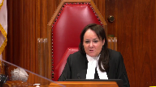
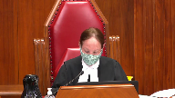
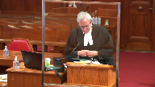

---
title: Attorney General of Ontario v. Jamie Clark, et al.
published-title: Heard
date: 2020-10-15
sidebar: false
---

This transcript was made with automated artificial intelligence models and its accuracy has not been verified. Review the original webcast [here](https://scc-csc.ca/case-dossier/info/webcast-webdiffusion-eng.aspx?cas=['38687']).
---

**Justice Wagner** (00:00:03): The court is adjourned.

::: {.column-margin}

:::

The case of the Attorney General of Ontario against Jamie Clark et al., for the appellant, Attorney General of Ontario, Sunil Mathai, and Anantan Sinadurai.

For the intervener, Attorney General of New Brunswick, Patrick Migwinty.

For the intervener, Attorney General of Manitoba, Amiram Kotler.

For the intervener, Attorney General of British Columbia, Tara Kalan.

For the intervener, Attorney General of Alberta, Kristen Rideout, QC.

For the intervener, Attorney General for Saskatchewan, Michael J. Morris, QC.

For the intervener, Canadian Association of Crown Council and Ontario Crown Attorneys Association, Paul J. J. Cavalluzzo.

For the respondents, Jamie Clark et al., Lauren Honigman, and Michael Lacy.

For the intervener, Canadian Association of Chiefs of Police, Rachel Huntsman, QC.

For the intervener, Toronto Police Chief James Rammer, Earl A. Cherniak, QC.

Sunil Mathai.

**Speaker 1** (00:02:01): Good morning, Chief Justice, Justices.

::: {.column-margin}

:::

For nearly three decades, this court has confirmed the principle that prosecutorial liability should be carefully circumscribed in order to protect against the risk of undue interference with the ability of prosecutors to carry out their duties.

Without adequate constraints, subjecting prosecutors to after-fact review in civil courts risks exposing the administration of justice to the good governance concerns that were identified by this court in Henry, namely, the chilling effect and diversion of duties.

As a result of these concerns, this court has only recognized two narrowly crafted qualifications to prosecutorial immunity, malicious prosecution and charter damages for failure to disclose.

Justices, these qualifications are limited in important ways.

First, they're limited by standing.

Only the subject of a prosecution can commence those causes of action.

Second, they're limited in scope.

Those claims only relate to a challenge to one type of exercise of discretion.

Third, the constituent elements of the cause of action make it amenable to weeding out marginal and meritless claims at an early stage.

And four, with respect to malicious prosecution, it includes an allegation of malice or improper purpose.

These constraints were key to recognizing qualifications to prosecutorial immunity.

**Justice Brown** (00:03:33): Would a constraint of malice or targeted malice, you know, category A misfeasance of public office, for example, would that provide the protection that address the concerns that you're identifying?

::: {.column-margin}

:::

No, Justice Brown, it wouldn't.

**Speaker 1** (00:03:51): And so this goes into what I will say is the second error with what the courts below did.

So I'll kind of give a highlight on this, but I do promise to delve in deeper once I get to that part of this submission.

**Overlapping speakers** (00:04:03): anticipation so don't forget okay

**Speaker 1** (00:04:06): What I would say is there's two elements necessary for displacing the immunity in private law, in tort law.

::: {.column-margin}

:::

The first condition precedent has to be malice or an improper purpose.

That is no doubt a condition precedent based on this court's decisions in the trilogy.

But there's a second element to Justice Brown, and that second element is the elements of the tort itself have to be amenable to weeding out meritless and marginal claims at an early stage.

And so that manifests itself in malicious prosecution, for example, by the requirement that the plaintiff establish that the prosecution resolved in their favor.

Or, most importantly, in my respectful submission looking at paragraph 52 of Nellis, what you'll see is the court identifies the fact that there that you have to have reasonable problem, sorry, that there's a lax and objective reasonable probable cause is one of the elements of malicious prosecution, that that acts as a weeding out tool of meritless and marginal claims.

And the reason that is, is because it's an objective analysis.

Ms. Feeson's in public office lacks any objective analysis because it is singularly focused on the state of mind and knowledge of the prosecutor.

That makes it particularly resistant to striking out at an early stage.

A point noted by the academics, in particular, Dean Chamberlain, when she says that, in fact, Ms. Feeson's is actually easier to plead the negligence because of the requirements and negligence of a duty of care, et cetera.

So like I said, Justice Brown, I do intend to get into that argument in a little bit more detail when I address what I characterize as a second error made by the courts below, but that hopefully is a bit of a sneak peek into what I intend to do.

**Justice Moldaver** (00:05:54): Just while you're on that, if I could just ask you this, is it your view that the gatekeeper function that has now been put into legislation in Ontario is not enough?

::: {.column-margin}

:::

I mean, I'll put it a little differently.

Since we're into common law, I mean, we could frame gatekeeper functions here, potentially, to ameliorate your concerns about easy to plead.

But do you say that really is impossible to do in any meaningful way?

**Speaker 1** (00:06:30): So, yes, that is precisely what we say, but let me do two things, Justice Moldaver, with respect to that question.

::: {.column-margin}

:::

First, with respect to the new requirement in the Crown Liability Proceedings Act 2019, Section 17, as you know, Justices, there's now a requirement if you're bringing a claim against the Crown or one of its employees or agents that's based in misfeasance or bad faith tort.

Relative of the court has to be sought, and the court has to be satisfied that the claim was brought in good faith and also that there is a reasonable possibility of success.

I'm going off of memory here, but that's effectively what the statute says.

Couple of things with respect to that.

First, as you noted, Justice Moldaver, this decision is going to apply across the land.

So, Ontario is the only jurisdiction that has this type of provision, so that type of provision is not going to be an answer for Alberta, for Saskatchewan, Manitoba or British Columbia.

**Justice Moldaver** (00:07:28): I know that.

My question is if we make it a common law, you know, requirement, it will be across the land.

**Speaker 1** (00:07:36): Well, then I guess the problem then, Justice, is we get into the concern of what, you know, using the test in Section 17, and I'm just going to pull it up so I don't misspeak, Justice.

**Overlapping speakers** (00:07:50): I don't mean to throw you off your game plan totally.

No, no, no, no, that's-

**Speaker 1** (00:07:53): That's totally fine, justice.

::: {.column-margin}

:::

The gate keeping function in 17 uses the language of the proceeding is brought in good faith and there is a reasonable possibility that the proceeding would be resolved in the plaintiff's favour.

The problem is we don't know what reasonable possibility is going to be.

There is no cases yet that have interpreted section 17 in Ontario.

As I've said, it is the only commonwealth province that has this type of legislation.

Whenever if this court were to decide to go the route of creating a gate keeper function, it would have to be high enough to ensure that pleadings like this which in my respectful submission is a negligence claim dressed up in misfeasance doesn't get through the door.

I'm going to.

**Justice Côté** (00:08:42): Mr. Mathai, why should it be that crown prosecutors who engage in bad faith conduct or make malicious decisions – and I'm not talking about the decision to prosecute or failure to disclose – for reasons or they are abusing of their public office for an improper purpose?

::: {.column-margin}

:::

What is the remedy for those who may be damaged by such an abusive process?

**Speaker 1** (00:09:10): Yes.

Thank you, justice.

So when we're dealing with the subject of the prosecution, then obviously you have malicious prosecution, but your question goes beyond that.

**Justice Côté** (00:09:21): goes beyond a malicious prosecution and beyond failure to disclose evidence.

**Speaker 1** (00:09:26): Yes.

::: {.column-margin}

:::

So justice, let me answer that question this way.

As with any immunity, and that's what we're talking about here, prosecutorial immunity, part of the constitutionally entrenched principle of the independence of the Attorney General's office that manifests itself in immunity from civil liability, now granted it's a qualified immunity.

But as with any immunity, there are going to be cases where the imagination we're going to be able to come up with facts that make it very difficult to accept that on its face, the immunity is going to apply.

That applies across the board with every immunity.

What we have to keep in mind when we're addressing things like immunity is what's called the balancing of evils, so to speak, that's discussed by Justice Lemaire in Nellis, also picked up by Justice Learned Hand in the U.S. jurisprudence, in particular Gregory and Biddle.

The balance of evils recognizes that there are going to be some cases where it appears that the immunity is putting a hardship on the person that cannot be compensated, but the reason we still engage the immunity, the reason the immunity still applies is because it eners benefits to the administration of justice.

So two examples of that justice is judicial immunity.

As you know, the animus behind judicial immunity is very similar to the reasons for why we have prosecutorial immunity.

Judicial immunity can seem harsh in certain cases.

Allegations that judges engage in biased behaviour or discriminatory behaviour.

Those claims are still going to be captured by the immunity because of the benefits that inure to the justice system when judges are protected by that immunity.

**Overlapping speakers** (00:11:15): But then there could be a complaint to the CJC.

**Speaker 1** (00:11:18): And in this case, there's still other accountability mechanisms.

::: {.column-margin}

:::

Crown attorneys are still subject to review by the Law Society.

They're still subject to employment consequences for any bad conduct.

And in the very, very extreme case, there's obviously criminal conduct as well, potentially section 122 of the criminal.

**Justice Côté** (00:11:41): So Mr. Mathai, you're talking about the importance of protecting the administration of justice, the integrity of the system, and I cannot agree more than you.

::: {.column-margin}

:::

But what do you do in the following situation?

And this is an appetizers.

You have a crown prosecutor, I'm not talking about this case, but you have a crown prosecutor who has in his hands the proof that a witness is going to perjure himself.

And that testimony, that false testimony of a witness will give rise to a finding against somebody, a finding very detrimental.

Do you think that it is to protect the integrity of the justice system to permit such an abuse to be done without any remedy to compensate the person who has been aggravated by that?

**Speaker 1** (00:12:26): Yes, I would, Justice, and I know that seems like an extreme position to take, but let's keep in mind, what you're talking about in your example is a Crown attorney leading perjured evidence to the detriment of whom?

::: {.column-margin}

:::

If it was the detriment of the accused, then there are going to be remedies that will adequately compensate that subject of the prosecution to that type of improper behaviour by a Crown attorney.

There's claims in malicious prosecution, arguably there would be also charter claims available and 24-1 remedies available in that scenario.

What you're talking about is the...

**Overlapping speakers** (00:13:03): You should.

**Speaker 1** (00:13:04): And very well, Justice Moldaver, there may be a criminal prosecution.

::: {.column-margin}

:::

I'm focusing on compensation, though, because of the way the question was asked, Justice Moldaver.

But in that scenario, where the interests of the accused are quite obviously engaged, their fair right interests under Section 11, their Section 7 interests are engaged, that person will get compensation one way or the other.

But if they're leading evidence that's perjured, and that may cause some reputational damage to a third-party witness, who, for example, doesn't have the same type of confrontational relationship in a criminal prosecution to the Crown, or doesn't have charter rights or charter interests at stake, that person shouldn't get compensated because of the potential harms to the administration of justice that follows.

**Justice Côté** (00:14:02): a variation in my hypothesis.

::: {.column-margin}

:::

Let's say that instead of leading perjury evidence, the Crown knows that the accused is testifying falsely and the accused is acquitted.

But the Crown had in its hand evidence to show that the accused was perjuring himself when he testified.

And that evidence and the fact that the Crown did not bring that evidence caused damages to somebody.

There's nothing we can do.

**Speaker 1** (00:14:33): So the way I envision the immunity plying, there would be nothing that can be done for that third party to the prosecution.

**Overlapping speakers** (00:14:43): Now, with respect to the

**Speaker 1** (00:14:43): With respect to your particular example though, Justice, this is the problem with opening the door to misfeasance and potentially opening the door to third parties.

::: {.column-margin}

:::

The example you gave, is it because of the Crown's laziness, incompetence, recklessness, gross negligence, that they didn't lead the contradictory evidence against the accused who's lying?

That's the problem with misfeasance, because it doesn't, as baked into the tort, require an element of malice or improper purpose.

You're all too often going to get scenarios like this one, where the pleading is really about negligence and you get a tag on of an improper purpose that gets it through a rule 21, thereby effectively eviscerating the immunity, because now Crown attorneys are going to be hauled into the civil court, away from the council desk, into the witness—

**Overlapping speakers** (00:15:36): So.

**Speaker 1** (00:15:37): They're going to have to draft affidavits, be subject to cross-examination, and be discovered, all taking them away from their primary duties in the criminal justice system.

::: {.column-margin}

:::

But more importantly, justices, when you open that door to that third party that may be harmed because the accused perjured themselves on the stand, how is that going to impact a Crown attorney's decision-making?

Because now the Crown attorney is going to have to potentially be on the hook of reliability to any witness.

**Justice Karakatsanis** (00:16:08): But can I just bring you back to the potential harms to the administration of justice?

::: {.column-margin}

:::

And you're making a strong case for Crown attorneys.

Police officers also play an important role in the administration of justice.

What kind of remedy does a police officer have in a situation where, well, something like this?

**Speaker 1** (00:16:31): Yeah, so Justice Karygiannis, let's use this particular situation because I think it's a helpful example.

::: {.column-margin}

:::

When you're dealing with police officers and reputational damages that are alleged in this claim because of the findings of the Superior Court and the Court of Appeal, recall that one of the things that's played in the statement and claim is that there was a Toronto police investigation, what was called a court review of the file that led to a finding that the allegations of assault against the respondent officers were not substantiated.

That is, while not a monetary compensation, that is vindicating their reputational rights.

The Toronto Police Service can make that report public.

They can do a press conference if they wanted to where they explain that these, that the officers have been vindicated and they didn't have an opportunity in the criminal process to put their side to the court.

That's all available to them.

And that's what the motion judge recognized in his decision, Justice Stinson's decision, I believe it's paragraph 136 of that decision, where within the duty of care analysis and the negligence claim that's already been struck, he recognizes that there are other mechanisms to protect the reputational interests of the police officers.

And in this particular case, it's the Toronto Police Service's investigation.

**Justice Karakatsanis** (00:17:58): Is there any judicial, um, remedy?

We've got judicial statements about the conduct, and I presume what they're looking for is a judicial statement.

Um, is there any way to get to that?

**Speaker 1** (00:18:12): You know, Justice, in theory and within the criminal process itself, they could have sought standing, I guess, to have their story told or potentially sought standing at the Court of Appeal.

::: {.column-margin}

:::

I don't recommend that as a solution, obviously, to a situation this, for the obvious impacts of the criminal justice system being diverted to deal with reputational interests of officers or witnesses.

But those would be options within the criminal justice that could have provided them with some recourse and prevented, I guess in theory, prevented the findings made by the Court of Appeal.

**Justice Moldaver** (00:18:50): Sorry, let me stop you there for a second.

I mean are we gonna open up criminal proceedings to every disgruntled third-part?

**Overlapping speakers** (00:18:57): I would not recommend.

**Justice Moldaver** (00:18:58): problem.

::: {.column-margin}

:::

You know that's a problem

and I know that's a problem, but let me ask you this.

Would it have been open, I know this sounds a little bit silly, for the police officers to sue the accused?

And I know there'd be no money there, probably, but they might get a declaration that they did not act improperly and vindicate their reputation that way, because one can have a great deal of sympathy for the police in a matter like this, where their very reputation, their livelihood is on the line.

And I mean, you know, once you're tainted with this kind of an allegation, as you well know, it's virtually impossible for you to ever get back into a courtroom.

So what do you say about that possibility, or would you get met with some legal defense that's impossible to overcome?

**Speaker 1** (00:19:51): So, you know, it raises an interesting question, Justice Moldaver.

::: {.column-margin}

:::

I think there would be an ability to sue the two accused and allege some kind of tort against them.

The difficulty, and, you know, we're talking hypothetically here, I think, the difficulty is you might be met with a defence of absolute privilege for the comments that are made in the court and that can't be subject to liability.

Now, could you—

**Overlapping speakers** (00:20:18): Well, we could change that too, we could change that too, make it even more of a circus.

**Speaker 1** (00:20:23): Yes.

::: {.column-margin}

:::

Well, but that is the point, Justice Roe, that I say that opening these kind of claims to third parties does.

It does turn the criminal justice system and then following a process, including the civil system, that is now going to have to reverse findings that we're in a judicial system, a criminal system.

It does make it a bit of a circus justice.

**Justice Côté** (00:20:44): And I think it's important to understand that this is not an exception.

::: {.column-margin}

:::

It's not an exception.

It's not an incident.

So why not creating an exception for police officers in a case like that?

Where it is important for the administration of justice, for the integrity of the system to show that police officers are held to a high standard.

**Speaker 1** (00:21:25): So I think there's two things I would say to that, to that justice.

::: {.column-margin}

:::

That was the same argument that my friends made with respect to negligence at the court below.

They abandoned that one and the Court of Appeal rightly dismissed that claim in negligence.

But what the Court of Appeal said in that decision, I think, that part of the decision I think resonates in your example, is that why would we be favouring the police officers to ordinary citizens?

Why would we be giving them a right that ordinary citizens don't enjoy?

And I'd go a step further in that analysis.

Because misfeasance in public office, when it's pled for example by an accused, so the subject of the prosecution, who generally has the kind of interest necessary to displace immunity, that can also cause a mischief.

And I say that on really two fronts.

One, what I've already said, malice is not required as an element of misfeasance.

But secondly, it does away with two important elements of malicious prosecution.

One, the reasonable probable cause on an objective standard.

In misfeasance, that's not a requirement.

And it also does away with the requirement that the criminal process ended in the favour of the accused.

You could use misfeasance as a backdoor for the subject of the prosecution, as a backdoor against the harder elements of malicious prosecution.

Why would a subject of a prosecution ever sue in malicious prosecution again if they can use misfeasance and it's an easier standard for them to prove?

And then sorry, Justice Brown, if I could just finish the thought on that before I answer your question. Sorry.

If you agree with that and that misfeasance cause real mischief when it's applied to the subject of the prosecution, then why favour respondent officers who only have a reputational interest at play?

Why would they get a benefit that the subject of the prosecution doesn't get themselves?

Sorry, Justice Brown.

**Justice Brown** (00:23:26): You've been talking about misfeasance in the public office for the most part as if it was only Category B.

::: {.column-margin}

:::

Now, you have brought the subject back to malice, but Category A talks about targeted malice.

Conduct that is specifically intended.

So this isn't Justice Cote's example, this is sort of another higher octane kind of...

**Overlapping speakers** (00:23:56): Yes.

**Justice Brown** (00:23:56): example of misconduct, specifically intended to injure a person or class of persons.

::: {.column-margin}

:::

Now, I take it that your answer is, well, you still don't have those objective criteria that you have with malicious prosecution.

But why in an era of herniac and other decisions from courts of appeal across the country that talk about a more rigorous analysis on summary judgment applications, can't we trust the good sense of first-instance judges to use those processes to weed out marginal or baseless claims?

**Speaker 1** (00:24:37): So let me start with a very direct answer, yes, but let me expand upon that, Justice Brown.

::: {.column-margin}

:::

I think there's two problems with that.

That only addresses one of the good governance concerns, which is diverting Crown attorneys from their duties.

So maybe we say we end it early through a summary judgment motion, but let's keep in mind what's involved in a summary judgment motion in Ontario if you can get it scheduled within a year.

It's going back historically to the case, trying to put together the reasons you made decisions on any particular decision that's being challenged.

It's then drafting affidavits.

It's then being subject to cross-examination.

It's then being potentially, if it's in Ontario, using a mini-trial to the extent that there's any credibility issues that the motions judge needs to hear on.

That is still a significant diversion of duties.

But I take your point, Justice Brown, it's not a trial, which is a larger diversion of duties.

So I take that point.

But what it doesn't address, Justice Brown, is the chilling effect.

Because if you are now opening the door to any third party...

**Justice Rowe** (00:25:50): But before you go on to the chilling effect, let's just go back for a moment to the diversion.

::: {.column-margin}

:::

So I'm representing Skull and Crossbones Chemical Company, who's being charged under the Environmental Protection Act for pollution.

And so we're going to go for a scorched earth defense.

And so every time we don't like some aspect of the proceeding, some way that a witness statement was taken or some cross-examination of a supplier, we're going to initiate an action under this jurisprudence here.

And we're going after the crown prosecutors every time they do something we don't like.

We're going to pile up 15, 20 of those in the course of the proceedings.

Don't wait till it's over.

Let's just gum this up all the way through.

And then, of course, I guess that would also have a chilling effect.

**Speaker 1** (00:26:55): 100% it would have a chilling effect, Justice Roe.

::: {.column-margin}

:::

And I think what the example you've used identifies a couple of things.

One, how even for the subject of the prosecution, these torts can be misused.

But I think the second thing it really identifies or brings home is keep in mind what malicious prosecution, which this court has already recognized as an exception or a qualification to prosecutorial immunity, what is that an after the fact challenge to?

It's a challenge to one type of decision, which is the decision to continue or commence a prosecution.

And as part of the elements of the tort, you need a favorable resolution.

Now, in your example, Justice Moldaver, if malicious prosecute, sorry, Justice Roe, if malicious prosecution is the only thing that's available to Skull and Broans Company, then they can only bring their action after the resolution of the criminal process.

But if misfeasance is now open up, even to the subject of the prosecution, well, now every decision is open for challenge.

It's not just about the decision to continue or commence a prosecution.

It's every tactical decision that a crown attorney may make in a courtroom or outside of a courtroom.

And that is the mischief that misfeasance represents.

And that's why it has too profound effect on the good governance concerns.

**Justice Karakatsanis** (00:28:22): But can I just ask, I'm trying to figure out, because when we look at the malicious prosecution, what was being protected there was the core prosecutorial discretion that's not reviewable by the court.

::: {.column-margin}

:::

These other kinds of decisions you're talking about, are they part of that core prosecutorial discretion so that they should benefit from the same kind of policy protection?

**Overlapping speakers** (00:28:51): So, let me say two things on that, Justice Karakatsanian.

Oh, did you have another-

**Justice Karakatsanis** (00:28:55): of how is it different because, well, is it different?

And if it is different because it doesn't go to that core, like whether you're going to proceed with the charge, do a stay, those things that we've listed are part of the core, how is it different?

**Speaker 1** (00:29:12): So let me first root this answer, Justice Karygatsanis, in the actual claim here.

::: {.column-margin}

:::

Because as I see it, and I won't go into great detail about it, there's really three categories of allegations, whether they're framed in negligence or misfeasance.

They're effectively identical.

The only difference in the misfeasance is that they've claimed that the errors that were done negligently were actually done deliberately, and they've attached an improper purpose that applies only to the appeal crown, by no logical sense could it apply to the trial crown.

So one of the categories of the allegations is what I think would fall under the core prosecutorial discretion using the Krieger language or prosecutorial discretion using the Anderson language.

And that's the decision of the trial crown and the senior crown to stay the charges against Mr. Maharaj.

That clearly would fall within your traditional core prosecutorial discretion or prosecutorial discretion.

I would add to that probably a second thing, although it's less clear that that falls with prosecutorial discretion or core prosecutorial discretion, and that's the allegation that the trial crown should not have conceded the charter breach in Mr. Singh's application.

Arguably I think that would also be core prosecutorial discretion or prosecutorial discretion.

So this claim has kind of a smattering of different attacks.

Tax on core prosecutorial discretion, there's attacks on trial and appeal tactics, there's attacks on the failure to investigate, even though it's quite clear that crown attorneys have no duty to investigate.

**Justice Côté** (00:30:49): for what do you think of the following allegation, paragraph 47.8 at page 132 of the appellant's record.

::: {.column-margin}

:::

And we have to take those allegations for true for the time being because we are dealing with a motion to strike.

The new material facts, Mrs. A and her superiors became aware of which clearly exonerated the police officers and implicated Mrs. C's conduct were suppressed by senior crown law officers and were kept from the judges of the Court of Appeal.

Do you think that's suppressing evidence?

If it is true, it is part of the court prosecutorial discretion.

**Speaker 1** (00:31:29): No, I would think that's more trial tactics or appeal tactics, Justice.

**Overlapping speakers** (00:31:34): Trial tactics or appeal tactics?

Sorry, appeal tactics.

**Speaker 1** (00:31:36): tactics, the decision effectively whether or not to lead fresh evidence at the appeal or to answer questions from the court in a particular way because that's in part what this allegation relates to.

::: {.column-margin}

:::

A more detailed particularization of it can be found I believe in paragraph 30.

**Overlapping speakers** (00:31:58): Three.

**Speaker 1** (00:31:59): 32 or 33 of the statement of claim.

::: {.column-margin}

:::

But the allegation is that there was no fresh evidence application that was brought and then in answer to questions from the court, you know, the appeal crown didn't respond in the way that the respondents would have liked.

I see those as trial appeal tactics but the line isn't clean.

But to turn back to Justice Karygiannis' question for a moment, I say it doesn't matter whether this is an attack on court prosecutorial discretion, appeal track tactics, trial tactics or allegations of a failure to investigate.

And the reason I say that is I go back to paragraph 76 of Justice Muldaver's decision in Henry.

The majority decision in that case makes it clear that the good governance concerns that animate the prosecutorial immunity are engaged any time there's a risk of undue interference with the ability of prosecutors to carry out their jobs freely and independently.

That's what this is.

Thank you.

**Justice Brown** (00:33:04): Let me pull you back to chilling effect, because this sags into it, is how would prosecutors be chilled?

::: {.column-margin}

:::

I realize there's the diversion concerns, right?

Litigation is inconvenient, but how would prosecutors be chilled by the existence of liability for those acting maliciously with the intent to inflict injury on others?

How, I mean, in fact, wouldn't that actually be the sort of chilling effect that we might not want to discourage?

**Speaker 1** (00:33:40): So, Justice, if I understand your question correctly, Justice Brown, it's because of a malice element, will that effectively have the chilling effect that we talk about?

Am I getting that correct?

**Overlapping speakers** (00:33:50): Would the prospect of liability have that chilling effect?

**Speaker 1** (00:33:54): Yes, yes it would, Justice.

And here's why.

Because of the way misfeasance can be pled so easily, because it's focused on knowledge, right?

No, no, no, I'm talking about target, I'm talking about category, Targeted Malice, category A.

**Justice Brown** (00:34:10): Yes. Put aside Category B. Yes.

::: {.column-margin}

:::

But if we restricted liability to Category A under the misfeasance tort, would that not address the chilling effect that you say we need to be concerned about?

Not surprisingly, my answer would be no, it won't.

**Speaker 1** (00:34:34): Here's the reason why, Justice Brad.

::: {.column-margin}

:::

And let's use this pleading as an example.

Let's say instead of the improper purpose that was pled here, instead the statement of claim actually pled targeted malice.

When I say targeted malice, deliberately trying to harm someone.

So the appeal, and let's use the appeal crown as a good example here.

The appeal crown made the decision not to lead fresh evidence or not to answer questions from the court in a particular way to harm the respondent.

So there you're into a category A.

The reason it still has a chilling effect is one, it's easy to plead that in a statement of claim and then get you through the door on a motion to strike and now have to do a summary judgment motion.

So that's reason number one.

But reason number two goes back to what I was talking about the lack of objective basis.

See, crown attorneys are gonna know that all that's required is a pleading of this improper purpose and you're through the door even when they're acting objectively correctly.

So let's use the appeal crown as an example.

And I know this is a rule 21 motion and we're not to go into too much detail, but I think detail with respect to the allegations, but I think it brings home the point.

What was the appeal crown going to do in this case?

How could she have led fresh evidence?

There's two stumbling blocks and you'll see this in our fact, we kind of go through this in detail and I don't intend to go through it in that kind of detail justices.

But in our factum at paragraph 76 to 84, you'll see this kind of analysis in some detail.

But what is that appeal crown supposed to do?

There's two reasons why she can't bring a fresh evidence application.

The first reason it's effectively arguing an entirely new position on appeal.

And while there is some limited discretion to do that, one of the analysis on whether you get to argue something new on an appeal is whether or not there's evidence before the court that allows you to make the new argument.

There is no evidence before the court of appeal in the underlying criminal process that would allow the appeal crown to make the new argument.

Let's be clear, the new argument is that there was no charter violation.

**Justice Kasirer** (00:36:46): But isn't that the easy example on what you described earlier as appeal tactics in paragraph 33 of the statement of claim where she didn't explain the exculpatory findings with respect to the conduct of the police officers which she had come to know.

::: {.column-margin}

:::

I mean, we're not into the strategy of or the acceptability of fresh evidence.

She had come to know. Yes.

So that's me, yet we're closer to the example that Justice Brown is asking you to address.

**Speaker 1** (00:37:21): But I think the same problems exist, Justice.

::: {.column-margin}

:::

So she's equipped with, the Appeal Crown's equipped with new knowledge, right?

That there are some problems with the way the trial was conducted, and that there may be good reason to doubt the veracity of the accused accounts.

Okay, let's accept that.

Still, what is the Appeal Crown going to do?

Now that paragraph, paragraph 33, deals in part with the court's questions to the Appeal Crown.

How is the Appeal Crown going to give evidence in oral argument?

Cuz that's what it would be.

It would require the Appeal Crown to say, okay, Court, this is what I've learned subsequent to the trial.

That's giving evidence.

In the absence of a fresh evidence application, she can't do that.

And when you actually go through the transcript justices of the Court of Appeal, you'll see that the Appeal Crown is actually walking that fine line.

She's responding directly to questions from the bench, which is why she's engaging in some of the issues.

**Justice Kasirer** (00:38:22): But there's, I take your point, but there's Boucher against the Queen.

I mean, what's a Crown Prosecutor supposed to be doing when a Justice of the Court of Appeal asks questions she knows the answers to?

Would she say something about it?

**Speaker 1** (00:38:39): Well, the difficulty with that, Justice, is that it's occasioning an unfairness on the accused.

::: {.column-margin}

:::

And part of her job as the appeal crown and her role in the prosecution and her duties to the court are also duties to the accused in some respects.

If she starts giving evidence now on things that were not challenged by the accused because they weren't raised in the trial, how is that a fair appeal for the accused?

She was put in an impossible situation and Ms. Feasance puts her in a completely impossible position.

**Justice Brown** (00:39:15): like these sound like diversion concerns to me not chilling effect I would have thought that the chilling effect is based on a risk that the crown prosecutor will in fact be found

**Overlapping speakers** (00:39:29): It's reliable.

Yeah, so I.

**Justice Brown** (00:39:30): I mean maybe their policy concerns one way or the other I suppose but

**Speaker 1** (00:39:36): Well, Justice, I think it's both, but I would really emphasize the chilling effect, because if she had done what the respondents asked her to do, and if you accept that based on relevant legal principles, she would not have been able to do that, if she does do what my friends have suggested, she's doing it for either two reasons, one, to protect the reputation of the officer, that would be an improper purpose, she would open herself up to a challenge now by the subject of the prosecution, because remember, that's what Prue was about, that was the improper purpose in Prue.

::: {.column-margin}

:::

The second option is she does it to avoid litigation, she does it to avoid the concern that the police officers are now going to sue her in misfeasance in public office because they didn't get what they wanted to get out of the process.

That puts her in an impossible situation, Justice.

That's the chilling effect.

**Justice Abella** (00:40:36): Can I explore that with you?

::: {.column-margin}

:::

You mentioned earlier, and almost in passing, the conflict argument, which of course is the core of the chilling argument.

Could you parse for us what duty you say the Crown owes to police officers and others?

And before we even get to Ms. Feasons, I'm having a bit of difficulty trying to figure out who owes what duty to whom, before we decide whether or not it's covered by Ms. Feasons of Public Office.

**Speaker 1** (00:41:15): Thank you, Justice Abelay.

**Overlapping speakers** (00:41:19): Let me parse it out.

**Speaker 1** (00:41:20): in a few ways, if I can.

::: {.column-margin}

:::

First, Crown attorneys are always going to owe constitutional obligations to the accused, including fair right obligations and obviously disclosure obligations, etc.

That's your easy example.

With respect to witnesses or investigating officers, expert witnesses or complaints, in my respectful submission, there is no duty.

The duty that is owed by the Crown attorney is a duty to the administration of justice and to the court.

Using the language of Boucher, they are viewed effectively as an arm of the court, and that's their overarching duty.

That duty can never conflict with the constitutional obligations, obviously, that are owed to the accused.

But there is no other duty outside of that, Justice.

**Justice Abella** (00:42:11): And therefore, when Ondavi talks about a duty to the public at large you really are asking us to set that aside and say there cannot be any duty to anyone on the part of the crown prosecutor except to the accused in the administration of justice.

::: {.column-margin}

:::

That's right.

**Speaker 1** (00:42:31): And there's two takeaways from that, I think, Justice Abella.

::: {.column-margin}

:::

The first thing is what Odabji says is there's always a duty on every public officer.

Now keep in mind Odabji is not dealing with the Crown Prosecutor and the independence of the Attorney General's office and prosecutorial immunity.

**Overlapping speakers** (00:42:50): But Odagie...

**Speaker 1** (00:42:51): says that there is always a duty on public officers not to engage in deliberate unlawful conduct that can harm an individual.

::: {.column-margin}

:::

That's the overarching duty that the tort is premised on.

Because of that, you can have anybody who is caught up in the criminal justice system, including witnesses, sue for a breach of the duty.

Because what my friends would say is this isn't about a duty to the officers.

This is about a duty to the administration of justice that was not fulfilled.

But that is the real mischief of misfeasance, because anybody can claim that when they're caught up in this in the criminal justice system.

**Justice Brown** (00:43:34): Sorry, go ahead.

We're back to Category B. I want to pull you back to Category.

**Overlapping speakers** (00:43:40): A. So let me give you a different.

**Justice Brown** (00:43:43): case than Odadji.

::: {.column-margin}

:::

Let me give you Roncarelli and Duplessis, which is a targeted malice case fundamentally.

The court suggested that the Premier of Quebec had a duty not to revoke a liquor licence for an improper purpose of inflicting harm on a particular individual.

That is targeted malice.

That is your textbook category A case.

This court has previously recognized a cognizable legal right in people who are the subject of discretionary decisions that target them in a malicious way.

Premier Duplessis did not operate under a statute of regulation that said he owed a duty to Mr. Roncarelli.

It was a duty he owed to the public.

It was part of his administration of the province of Quebec.

But we said when that discretion is exercised in a targeted and malicious way, there is in fact a cognizable legal right in the victim of that exercise of discretion.

Why are prosecutors special?

**Speaker 1** (00:45:07): because of the constitutional independence of the Office of the Attorney General, because our administration of justice requires Crown attorneys, when they're prosecuting, to act independently free from any improper motive.

::: {.column-margin}

:::

That improper motive is not always just the nefarious types of motive.

Improper motives like trying to protect the reputational interests of witnesses, which in the Crown manual you'll see at the first page that we've excerpted in our condensed book, actually says that you will not take into account the reputational interests of others.

If she starts doing that, if he starts doing that, that is a problem for the administration of justice.

Yes, Ron Corelli, yes, Odavji have recognized this tort, but they've never recognized it in the context of prosecutions and what the impacts of recognizing that tort is on the criminal justice system.

**Justice Abella** (00:46:06): It's a proximity analysis.

Is there a compelling policy reason not to recognize the existence of a duty?

**Overlapping speakers** (00:46:15): Sorry, when you say due to justice aid.

**Justice Abella** (00:46:17): Your submission comes down to is there an existing overriding policy reason not to recognize the duty?

That's right.

**Speaker 1** (00:46:28): That's right.

::: {.column-margin}

:::

And in my respectful submission, the good governance concerns that always arise any time you threaten Crown attorneys with civil liability are more profound in misfeasance.

And in particular, the chilling effect.

I don't want to lose sight of that, even though we've been talking a lot about diversion.

Because remember what I had said in my opening remarks, Justice Abela, the current qualifications are limited by standing and scope.

Only the subject of the prosecution and only one type of exercise of discretion are being challenged.

Misfeasance turns that on its head.

It's not bounded by anything.

So what that means is the standing necessary to sue is anybody and everybody who's caught up in the criminal justice system, including expert witnesses whose reputations and professional livelihoods will be on the line just as much as police officers.

But it also means every decision that a Crown attorney makes is now subject to review.

And as you know, in the course of any criminal prosecution, Crown attorneys are making a plethora of decisions.

**Justice Brown** (00:47:40): I think that's a fair point, but I'm having difficulty swallowing the idea that a crown prosecutor in order to avoid liability for targeted malice would take improper factors into consideration.

::: {.column-margin}

:::

**Speaker 1** (00:48:05): Yeah, and I understand why you have some trepidation there, Justice Brown, but it's because it's so easy to plead, and I get it.

**Overlapping speakers** (00:48:16): But that's the diversion.

**Speaker 1** (00:48:17): No, but I don't think so because what a Crown attorney is going to know, Justice, is I made this decision based on the right reasons, like the Appeal Crown here.

::: {.column-margin}

:::

I made this decision for the right reasons, but all someone has to do is speculate on an improper purpose and they're dragging me out of the criminal context and into the civil context.

They're interrelated.

Yes, that's diversion, but as soon as you start thinking, I don't want to be hauled off into the civil system, that's a chilling effect.

So they are interrelated, Justice, and because it's so easy to plead, Ms. Feasons, because it's so resistant to motion to strikes, because it opens the door to everybody and anybody in any decision being challenged, how is that not going to affect the decision-making of a Crown attorney?

Keep in mind Justice Moldaver's decision in Henry.

There you have a situation where it's a constitutional obligation that's owed to the accused.

Of course, this court said that malice wasn't required, but even in the kind of proximity or close-duty analysis there that the Crown owes to the accused, even there the majority decision recognized that if you set the liability threshold too low and there's a plethora of claims that get commenced, that's going to have a chilling effect on the Crown attorney.

No longer will they be exercising their discretion based on relevant legal principles or their overarching duty to the administration of the court.

Instead they're going to be exercising their discretion in a way that would tend to avoid liability.

Well, avoid litigation.

Sorry, avoid litigation.

That's right, Justice.

That's an important policy.

**Justice Rowe** (00:49:58): I'm going to change the context, but maybe it's a little bit like censorship and self-censorship.

::: {.column-margin}

:::

In order to get a docile press, you don't actually have to drag too many people off to prison or entangle them in legal proceedings, just the occasional ones so they get the point.

**Speaker 1** (00:50:17): Yes, that's right, Justice Giroux.

So I have about 11 minutes left.

I think we've canvassed quite a bit of my first argument, my first error, or what I suggested is the first error from the Court's blow, which is that they—

**Justice Moldaver** (00:50:30): just let me ask you something in the example in the way you've portrayed what happened at the appeal court you're saying the appeal crown really was caught between a rock and a hard place because much as she might like to have introduced or had this fresh evidence available on the on the hearing she was badly almost completely compromised by virtue of what had happened at the trial

::: {.column-margin}

:::

**Overlapping speakers** (00:50:57): That's right.

**Justice Moldaver** (00:50:57): No, and so that's a very reasonable explanation

::: {.column-margin}

:::

and I'm just wondering I'm just wondering whether or not if you were to have a the court have a gatekeeper function this couldn't be nipped very quickly in the bud along the lines of what we talked about earlier yes sorry

**Speaker 1** (00:51:26): So it's hard for me to speculate on what that gatekeeper function would look like or what the standard that court would engage in, in performing that gatekeeper function.

::: {.column-margin}

:::

But let me say a couple of things.

First, then we're not talking about misfeasance in public office because once you start imposing an objective element, that's lacking in misfeasance in public office.

Now we're creating some new torts, so we have to be clear about that.

To the extent that the gatekeeping function is now going to include an objective analysis, we're not talking about misfeasance, we're talking about a new tort that this court's willing to develop.

So that's the first thing I would say to that.

The second thing I will say to that is if we open up misfeasance and allow any third party to sue in misfeasance or a modified version of misfeasance, whether it's targeted or some other version, well then, justices, we're still going to be in a situation of a chilling effect.

Because you're still going to have anybody being able to challenge any decision.

Now my friends in New Brunswick, if you look at their condensed book, they've proposed a test in their condensed book in oral argument of what they say a new version of misfeasance could look like.

And again, that's not misfeasance in public office as we know it today.

But that suggestion or that articulation of this new type of tort that's reflected in New Brunswick's materials, it raises a number of questions.

One of the things they've said, and I'm sure you've had an opportunity to review this, is people who are substantially connected to the prosecution, who is that?

Who is that?

Or people who have suffered significant reputational damage, who is that?

Are we now going to be extras or weighing in as to what type of reputational damage?

See, the problem with trying to create a new tort justice is that you're always going to run into the difficulties that misfeasance brings to the table.

Whether you create a new tort or not, you're always going to have the difficulties of opening the door to any person being able to sue for any decision.

And that's why I, with great respect, view this as a zero-sum game.

It's either the tort is allowed or it isn't.

And I think it shouldn't be allowed because of the very profound effects that it has on good governance concerns.

More so than any other qualification that this court has recognized.

Far more so.

Now Justices, I see that I have about seven minutes.

**Justice Moldaver** (00:54:06): Just let me bring you into another area.

::: {.column-margin}

:::

Like, we have this new legislation on slaps and this court, Justice Cote just wrote a couple of decisions on this for the majority, one unanimous.

But it seems to me we're into similar ideas here in a way.

We have the whole concept of, you know, the public right to know and important, you know, informational and information and that kind of thing.

But there's also a real risk that it's going to be used to silence people, these slapsuits, right? Yes.

And so the legislature came out with a pretty stringent test that said, you're going to have to, plaintiff, you're going to have to cross, you're going to have to meet these tests before we're going to let you proceed.

And I'm just wondering again if this is not an area, you know, they used, the legislature used the words, is there a possibility of success?

I would have thought, you know, is there a compelling case where the matter is, you know, the merits are very high?

See, when you use me, give me the Crown example, right away you're saying, hey, there's another reasonable explanation here.

**Overlapping speakers** (00:55:26): That's right.

**Justice Moldaver** (00:55:27): And so one could say, hey, that's not so terribly compelling.

And we're gonna stop this right now before we get any further.

**Speaker 1** (00:55:36): Yeah, so, yes, if you're talking about a reasonable explanation for the conduct being some kind of gatekeeper function, then, yes, that addresses part of the issue, you know, it's still going to be, like I said before, Justice Moldaver, it's still not misfeasance then, right?

::: {.column-margin}

:::

We're talking about a different tort that we're creating.

And I wonder if this is the case to be creating a new type of tort.

You know, and I say that for a couple of reasons.

One, when you look at the pleading in this case, quite frankly, it really is a negligence tort that has been dressed up in misfeasance.

And I say that for a couple of reasons.

One is just my explanation to you now, Justice Moldaver, that there is a very reasonable explanation for the appeal crown's conduct.

But go to my friend's factum at paragraph 41 where they detail their allegations with respect to the trial crown.

Take a look at that, because what that looks like to me, Justice, is really an allegation of negligence, and there's no actual particularization provided as to what the trial crown's improper motive was, right?

And yet we're still here on the trial crown and the appeal crown.

**Justice Karakatsanis** (00:56:54): So with respect to the Crown allegation, the Crown, the Appeal Crown, we've got the transcript.

::: {.column-margin}

:::

So we can see exactly what she said and didn't say and line it up to the pleadings in this case and it provides a very different picture.

What use can we make of that, though?

I thought that the motion judge didn't admit the transcript, so... Yes.

The motion judge...

So what do we take from that?

What do we take from that?

**Speaker 1** (00:57:22): So in Ontario there is case law that suggests that when a when a pleading incorporates a document by reference into the pleading that it can be available for rule 21 motions.

::: {.column-margin}

:::

Now that wasn't accepted by the motion judge I agree he did not accept that

but it was before the Court of Appeal the Court of Appeal didn't comment on it but did rely on the transcript and for a matter of completeness it's before this court.

**Overlapping speakers** (00:57:48): But you know what?

I'm not gonna do it.

**Speaker 1** (00:57:48): But I would add a second thing, Justice Cair Consentants, if I can before I get to your next question.

::: {.column-margin}

:::

That allegation in particular, how she responded to the Court of Appeal, and I think my friends in British Columbia will be addressing this more, that should be subject to absolute privilege.

Now we haven't raised that, to be clear.

We haven't raised that, and the reason we haven't done that is because there is, as I said earlier, a smattering of different claims here.

So it wouldn't dismiss the entire claim, because some of the conduct that's being alleged happened outside of the courtroom, including the decision not to file fresh evidence.

But that should be covered by absolute privilege.

It shouldn't be an allegation, or it shouldn't be the anchor to an allegation in misfeasance.

Now arguably you could say that it's not the misfeasance act that is being complained of, but it is in fact evidence of an improper purpose.

Arguably you could make that conduct or that allegation or argument in the same way that this court reviewed the conduct of the Crown Attorney in Prue and decided that based on that there was evidence of an improper purpose.

Sorry, Justice Cair Consentants, I cut you off before you got an opportunity to ask a second question.

Yes, thank you.

So the only thing I'm going to end with, and we've already talked about this in some detail is the lack of the objective standard.

Keep in mind, Justices, that in malicious prosecution, as I said, there is an objective standard which asks the question whether or not there was reasonable probable cause on an objective basis for the charge to be commenced or continued.

Put it in a different way.

Even if a Crown Attorney was acting with malice, targeted malice, the fact that there was objective reasons for the charge proceeding ends the analysis.

Liability does not follow.

That is not the same for Ms. Feesons in public office.

Because the tort is singularly focused on the state of mind of the public actor.

The second thing just before I end here and leave the rest of my time, as limited it is for any reply that's necessary, I think this court ought to, when it's examining whether Ms. Feesons should be allowed, should also examine it not just from the third party perspective but from the perspective of an accused using Ms. Feesons as really an end run against the more onerous requirements in malicious prosecution.

The two in particular that I would identify is the favorable resolution which prevents a collateral attack.

Obviously Ms. Feesons doesn't include that same type of element and would allow for collateral attacks.

And the second which I've already identified is the objective standard that is in malicious prosecution that's absent in Ms. Feesons.

Without any questions, I'll reserve the rest of my time for reply.

**Justice Wagner** (01:00:43): Mr. McGuinty.

**Speaker 2** (01:00:46): Good morning, Chief Justice.

::: {.column-margin}

:::

Good morning, Justices.

Good morning.

New Brunswick's position, we want to be clear at the outset, New Brunswick's position is fully fleshed out in our written factum, and we do stand with Ontario and the rest of the interveners that there should be full immunity in these circumstances.

So I want to be clear at the outset that that is New Brunswick's position.

But if I can draw the Court's attention to tab one of New Brunswick's condensed book, tab one at the bottom of page one, one thing we want to focus on today is that there are two aspects of this Court's case law that are very clear.

The first is that there is a very sincere discomfort that this Court has expressed in granting full immunity to prosecutors who engage in malicious conduct.

The second is that that has to be balanced against very valid good governance concerns.

And so this Court, in hitting that balancing approach, has imposed high thresholds for liability.

So in New Brunswick, our submissions today, we really focus on the fact that there's a very real possibility this Court is going to follow precedent and pierce immunity but impose a high threshold.

And so although we stand and say that there should be immunity, if this Court pierces immunity, we've proposed at the bottom of page one, tab one, what could be a workable test.

And I want to, before I go through the test, I want to premise the fact that New Brunswick relies heavily on paragraph 33 of the Henry decision, where Justice Moldavar explains that courts have to move very cautiously when expanding liability and that it needs to be dealt with essentially on a case-by-case basis where the Court has the benefit of an evidentiary record and proper submissions.

So our test is really circumscribed to these facts.

And so we say at first that the first step would be that the prosecutor made a decision that directly caused significant reputational harm to a third party substantially connected to the case.

We say in these circumstances that needs to be limited to, for now, an investigating officer because that's the issue before the Court.

The second step of the test we propose, and this very much picks up on Justice Moldavar's comments, is that a plaintiff would have to establish that there was a complete absence of a reasonable and legal basis for the decision made.

And this is purely objective.

And this picks up significantly on Measga, where in Measga this Court clarified that showing an absence of reasonable and probable cause to continue and initiate the proceedings is an objective analysis purely and the subjective intent of the prosecutor is irrelevant.

And so as Justice Moldavar said earlier, in misfeasance there is no reasonableness test.

But this allows essentially a court on a motion to strike to say, well, look, there's a very valid reasonable basis for the decision that was made.

And this part of the test would incorporate essentially a presumption, a longstanding presumption that a prosecutor acts in good faith and that there's a good faith basis for the decision.

So they would have to plead in particularized facts that would really get over that presumption and that objectively of court would have to say there was really no basis for this decision.

**Justice Moldaver** (01:04:25): Oh, just to interrupt you for a moment, because your time is limited, but you would still be running on this model to run the gauntlet of a motion to strike with tough rules which would take the Crown, which might have a chilling effect in and of itself on the Crown, and take the Crown out of the courts and so on, but from your point of view and New Brunswick's point of view, the bang is worth the buck, if we're going to say that there's some basis for going ahead with actions of this nature.

::: {.column-margin}

:::

**Speaker 2** (01:05:00): while just until they were and that's exactly it is that New Brunswick says their immunity should not be pierced we're simply saying that if the court's going to go that way we we say that this reasonableness aspect this criteria that a plaintiff would have to establish that there is no reasonable basis for the decision is crucial it's the most important part of the test because that's what that's what instills strong protection uh to prosecutors and and that would allow courts to dismiss these claims um essentially off

::: {.column-margin}

:::

**Justice Moldaver** (01:05:32): the bat.

That would overcome the pleading problem, how easy it is to plead.

**Speaker 2** (01:05:38): Exactly.

And again, we rely on your decision in Henry Justice Moldavar, where you said that a plaintiff would really have to particularize and plead facts that are sufficient to overcome that threshold.

Chief Justice, I see my time is up.

Yes, thank you very much.

**Justice Wagner** (01:05:53): Oh, maybe, uh, Justice Brown.

**Justice Brown** (01:05:55): I'm probably just about to expose my ignorance, but you mentioned a presumption that prosecutors act in good faith.

::: {.column-margin}

:::

I know there's a presumption of judicial integrity.

Is this in fact a presumption that has been stated in case law?

Yes, Justice Brown.

See, I did expose my ignorance.

**Speaker 2** (01:06:17): Well, no, and I'm quite confident that that was expressed in the Anderson decision as well.

**Overlapping speakers** (01:06:23): Okay.

**Speaker 2** (01:06:23): and that there is a presumption in place, and so I'll...

**Overlapping speakers** (01:06:27): Anderson.

**Speaker 2** (01:06:28): and I believe Nixon as well in the Nixon decision as well as Anderson that this court did say there is a presumption that a prosecutor operates in good faith thank you very much

**Justice Wagner** (01:06:38): Thank you.

Miriam Cutler.

**Speaker 3** (01:06:47): Thank you.

::: {.column-margin}

:::

Good morning.

I'd like to focus on the idea that the problems associated with these kinds of claims can be avoided by having a high enough threshold for liability.

This goes I think to Justice Brown's initial question.

I'm hoping to make three points.

The first is that allowing these claims we say will create significant systemic problems no matter what threshold is ultimately applied to liability and I gave you a case called IRN.

It's reproduced in our condensed book.

In that case the Crown argued that certain probation officers had failed to monitor and control an offender in the community.

The judge agreed with that proposition as did the Court of Appeal and it was an important factor in the decision to keep the offender in custody.

So we asked the question what if that prosecutor had received a letter beforehand from a probation officer's lawyer saying look if you make these allegations in court and you damage our client's reputations you're going to be sued.

Best case scenario and this goes to Justice Roe's point there's going to be an extensive delay while the prosecutor seeks guidance first internally and then possibly from the law society or even from private counsel and a similar issue could arise at any additional point in the proceedings causing a further delay and that's all regardless of whatever threshold is ultimately applied to determine whether the Crown is liable.

Worst case scenario is even more serious.

The prosecutor accedes to the threat because they don't want to get sued whether or not they end up actually getting held liable nobody wants to get sued and then the court is deprived of important information.

I mention this because this was a real case and prosecutors have to make these kinds of decisions all the time which leads into my second point which is a little more fundamental.

The concerns articulated in Henry about chilling prosecutors conduct and diversion and so on are a big problem but we say respectfully even if they weren't even if a prosecutor was able to remain completely focused and totally fairness in the face of litigation it would still be impossible to reconcile the duty to act in the public interest with responsibility for the individual interests of every witness complainant family member or other person who might foreseeably be affected by their conduct of a case.

You just can't approach a case that way in fact we spend the first few years teaching new prosecutors not to think that way.

Acting in the public interest does not mean acting in the interest of any particular member of the public.

First of all it's impossible it's unachievable you could never protect the interests of everyone affected by a case somebody is invariably disappointed.

The sad truth of criminal prosecutions is that they don't have happy endings which is not surprising because they don't have happy beginnings it's just not that kind of work.

More fundamentally how would you even start?

It's hard enough to ascertain the public interest when that's all you're trying to do and that's your only goal but if you put on top of that a simultaneous responsibility to look out for the competing interests of a virtually unrestricted group of potential plaintiffs you're left with this casserole of conflicting obligations to try and tease out what the right way to go is and I just don't know how we would ever make a decision.

Again that is not addressed by raising the threshold for liability the problem goes deeper than that it's a fundamental problem and that brings me to my last point.

This speaks to Justice Cote's question.

The respondent's the respondent's main argument and I think the court's real concern is that the system should provide a meaningful response to the dangers posed by bad faith actions of prosecutors.

We don't disagree I don't think anybody disagrees with that but that doesn't have to mean a private lawsuit with all of the difficulties that that entails.

The appellant has raised several alternatives our factum adds some others and I just want to emphasize one in particular.

Crown attorneys work within a structured and hierarchical system.

Their conduct is subject to supervision and control by directors and deputies and senior colleagues.

The respondents insist that their concern is the rare case where rogue prosecutors are hijacking the trial process and acting outside their proper role as Crown counsel.

By all means if a prosecutor has gone that far alert the Justice Department so that it can review the matter and if necessary reclaim control over the prosecution.

The whole point of the chain of command is to ensure that decisions are made pursuant to departmental policy.

A rogue prosecutor who subverts the justice system should excuse me should expect to be either privately or publicly or both reversed with no lawsuit required and if the review by a group of senior lawyers who are not connected to the case leads to the same result then that's a pretty good indication that we're not talking about the actions of a rogue prosecutor acting outside their role.

They might be wrong senior prosecutors can be wrong too and they might even be wrong in a way that results in unfairness to one or more in unfairness to one or more parties

but it's not a rogue agent hijacking the trial process.

Inaudible.

**Speaker 4** (01:12:04): Chief Justices and Justices of this Court, in order to assist with the analysis of prosecutorial discretion, the Attorney General of British Columbia will focus its oral submissions this morning on the issue of absolute privilege and rely on its factum for the issue of mutual independence of police and prosecutors.

::: {.column-margin}

:::

The occasion on which the alleged wrongdoing was made and the relationship between the plaintiff and the defendant, in this case a potential witness and a Crown prosecutor, should inform the legal analysis of whether a reasonable cause of action is disclosed in misfeasance in public office.

Misfeasance in public office should not be available on an occasion of absolute privilege to an independent police officer.

In this case, Crown counsel conceded a charter breach in the course of a criminal matter.

All of the alleged tortious conduct relates to that concession and the effect of that concession.

Specifically, the respondents allege Crown counsel are liable because Crown counsel did not affirmatively defend the respondent's reputations after conceding the accused charter rights were breached by the respondent's conduct.

After conceding the charter breach, it would be irrelevant to address the police's conduct.

Further, the respondents allege that appeal Crown should have introduced fresh evidence on appeal, something they could not have done because of the concession made at trial.

It's a long-standing settled principle that no action lies against judges, counsel, jury witnesses, or parties for words spoken in the ordinary course of any proceeding because judicial proceedings are an occasion of absolute privilege.

All legal counsel, including individual prosecutors and other government lawyers, are immune from civil liability for in-court statements and conduct to persons other than their own clients in negligence or to the accused in a criminal prosecution.

It's in the public interest to provide all lawyers, including Crown counsel, with this immunity to independent witnesses and police officers for in-court statements.

It frees lawyers from the fear that in advocating their client's cause, they'll be sued if what they say on behalf of their client is not true.

This immunity is justified by the long-standing recognition that if liability flows from in-court statements, legal counsel's ability to conduct their important role as an officer of the court will be irreparably hampered.

Allowing the case to proceed will cast a shadow over court proceedings, chilling potential speech and advocacy through the threat of civil liability.

It essentially permits second-guessing the boundaries of permissible advocacy in a courtroom that's ultimately supervised by an independent judge.

Absolute privilege applies equally to in-court statements, decisions regarding which witnesses to call, the choice of questions posed to witnesses, the way in which a question is asked of a witness, and the choice of which documents are tendered into evidence.

As a matter of policy, creative derivative pleadings, including pleadings of misfeasance in public office, should not be permitted to defeat the immunity afforded by an occasion of absolute privilege.

The public policy imperatives that drive these privileges are as real in the case of all other torts as they are for defamation.

All lawyers, including Crown prosecutors and other government lawyers, require considerable latitude in testing the credibility of witnesses and should be able to lead evidence in the way each individual lawyer sees fit in their own professional judgment.

The law should have allowance for the ardent submissions of any lawyer who must argue his or her client's cause effectively and persuasively.

As a matter of policy, absolute privilege to date embraces anything that may possibly be pertinent in a judicial proceeding.

The respondent has referred to the Hamilton-Angle decision for the proposition that absolute privilege is only available to counsel who is not malicious and acting bona fide.

However, that's not what this court says.

In particular, in the Hammoth case, the court adopts the following statement from Munster and Lamb.

It is better to make the rule of law so large that an innocent counsel shall never be troubled, although by making it so large, counsel are included who have been guilty of malice and misconduct.

The respondents also referred to the 2013 Amado and Welsh case.

This case was determined on a plain and obvious standard in the context of a pleading motion at the Ontario Court of Appeal and applied the relationship of a lawyer to his own client.

It's distinguishable from this case where the police are potential witnesses and not the client and this is a court of last instance.

Subject to any of any other questions, these are the Attorney General of British Columbia's submissions.

**Justice Wagner** (01:17:05): Thank you very much, Miss Christine Rideout.

**Speaker 5** (01:17:11): Thank you Chief Justice, Justices.

::: {.column-margin}

:::

It is Alberta's position that prosecutorial liability should not be extended to Miss Feason's claims by third parties or accused persons for the reasons set out in our factum.

And I hope to address three points in my oral submissions this morning.

The first are the compelling policy concerns that arise when prosecutorial liability is expanded and they are particularly acute in my submission when we're dealing with Miss Feason's claims.

The first is the diversion of prosecutors from their duties.

This court has recognized that the public interest is not served when prosecutors are unable to focus on their primary responsibility, the fair and effective prosecution of crimes.

The second concern is the chilling effect that such liability will have on the decision making of prosecutors.

Again, this court has confirmed that the public interest is undermined when prosecutorial decision making is influenced by considerations extraneous to a prosecutor's role as a quasi-judicial judicial officer.

In my respectful submission, these considerations have led this court to only recognize two exceptions to civil liability in the past 30 years and those were canvassed by Council for the Attorney General of Ontario, cases of malicious prosecution and cases of charter damages for wrongful non-disclosure and both of those are further restricted to restrict their availability.

Expanding prosecutorial liability to Miss Feason's claims by third parties virtually eradicates these carefully constructed exceptions and opens the door to an unlimited number of claimants alleging harm based upon the multitude of decisions made by prosecutors in the course of prosecutions.

This becomes readily apparent when one considers the reputational harm alleged in this case.

As we know, the credibility and reliability of Crown witnesses is a live issue in the vast majority of trials.

Trial judges routinely provide reasons explaining why the evidence of Crown witnesses is believed or not believed.

Those reasons are often repeated in the media or in subsequent court proceedings regardless of the party involved.

The reasons for disbelieving a witness can be uncomplimentary and no doubt in cases will reflect poorly on the reputation of those witnesses including complainants, civilian witnesses, probation officers, expert witnesses and police officers.

Expanding prosecutorial liability to third parties and third party Miss Feason claims based upon the trial judge's credibility and reliability findings will and can only result in my respectful submission in the diversion of prosecutors from their duties and the chilling effect on their decision making.

And I'll explain that because it brings me to my second point which is the impact that this will have on the Crown's unique role and duties as ministers of justice.

The Crown or the role of Crown prosecutors must always be to achieve just results and their duties include acting impartially and laying before the trier of fact the evidence they consider to be credible.

Extending prosecutorial liability to third party misfeasance claims undermines this unique role and duties by encouraging prosecutors to act for the benefit of third parties.

Rather than impartially assessing the credibility of evidence and communicating that assessment with candor to the court, prosecutors facing the risk of civil liability when a third party's reputation is impugned or may be impugned will be encouraged to make decisions designed solely to rehabilitation the reputation sorry to rehabilitate the reputation of those third parties.

One can easily envision scenarios where Crown prosecutors will be subject to multiple actions arising from a single prosecution at any stage of the proceeding and regardless of the outcome.

The conduct that I've described in terms of encouraging Crown prosecutors to act to act for the benefit of third parties and their reputations will no doubt expose those same prosecutors to corresponding civil actions by the accused.

This court has confirmed and proved that prosecutors who conduct prosecutions for the benefit of third parties act for an improper purpose inconsistent with their roles as ministers of justice and that brings me to my final point.

The negative impact that extending liability will have on the impact or the liability sorry the liberty security and fair trial interests of the accused given the inevitable delay that will follow.

As I noted the vast majority of trials involve the credibility and reliability of Crown witnesses.

The proposition that a prosecutor must halt a trial whenever there is a possibility of an adverse credibility finding so that they may bolster a witness's credibility or risk of civil liability will inevitably result in delay.

That delay not only jeopardizes the accused right to be tried within a reasonable time it also denies justice to victims their families and the public as a whole.

The increased potential for civil liability will also encourage prosecutors to gauge and risk assessments for the endless number of decisions that they must make in the conduct of a prosecution.

**Justice Wagner** (01:22:38): refrain from making the difficult and often unpopular decisions.

Thank you very much.

Richard, thank you very much, Chief Justice.

Mr. Michael Morris.

**Speaker 6** (01:22:49): Good morning, Justices.

::: {.column-margin}

:::

The focus of my submissions today will be on the parallels between the immunities afforded to judges, administrative tribunals and Crown prosecutors.

The immunities have one thing in common.

They limit a person's ability to sue a rogue decision maker, but they do so for the broader societal interest in facilitating the work of principled decision makers.

Dealing first with judges.

In Ernst and the Alberta Energy Regulator, every judge on the court agreed that superior court judges have absolute immunity at common law for conduct in their judicial capacity.

What this means is that a judge can deliberately and in bad faith convict an innocent man and that individual cannot sue the judge.

Now the public might ask, why?

And the answer which the courts have repeatedly given is this, the immunity serves to ensure that all judges can be free in thought and independent in judgment.

The premise is that if any judge can be exposed to suit at the instance of a dissatisfied litigant, every judge's ability to act impartially can be compromised.

And in Ernst, the dissenting judges said that judicial immunity is not inconsistent with the Charter because judicial immunity is itself a fundamental constitutional principle which promotes judicial independence.

That's at Paragraph 171.

Now we know Ernst wasn't about judges immunity.

It was about the immunity of the Alberta Energy Regulator, but the majority held that the regulator is immune from suit for similar policy reasons to the judiciary.

First, immunity is necessary to ensure the regulators independence and impartiality in its decision making.

Second, immunity protects the capacity of the regulator to fulfill its functions without the distraction of time-consuming litigation.

And finally, the majority noted that it's actually the threat of litigation, which is the problem, regardless of its merit, at Paragraph 57.

Now let's focus on Crown prosecutors and we know that this Court has repeatedly affirmed the quasi-judicial role they play in the criminal justice system.

In 2016, in the Queen and Cawthorn, this Court set up that a prosecutor has a constitutional obligation to act independently of partisan concerns and improper motives.

An accused, of course, has a corresponding Section 7 Charter right to be tried by such a prosecutor.

So similar to today's case, the Crown prosecutors have a constitutional obligation to act independently of partisan concerns and improper motives.

An accused, of course, has a corresponding Section 7 Charter right to be tried by such a prosecutor.

So similar to today's case, the Crown prosecutors have a constitutional obligation to act independently of partisan concerns and improper motives.

And any chipping away at prosecutorial immunity must consider the effect it could have on prosecutors' independence and impartiality.

**Justice Karakatsanis** (01:26:06): Can I ask you this, because the AG Ontario referred a number of times to the independence of the Attorney General, the Chief Law Officer of the Crown.

::: {.column-margin}

:::

Is your independence and the constitutional principle that you're putting forward, is it also rooted in the constitutional role for the Chief Law Officer of the Crown?

**Speaker 6** (01:26:33): Yes, Madam Justice, that's expressly stated in the Queen and Cawthorne that the independence and impartiality is not solely for the Attorney General himself, it's for any individual Crown Prosecutor in any given prosecution.

::: {.column-margin}

:::

And what I want to emphasize next is that on any given day, a prosecutor can exercise far more discretion than a judge on far more files in the context of a criminal prosecution.

For example, he or she may withdraw charges, make a plea deal, or agree to a joint submission on sentencing.

She may agree or concede that a charter breach has occurred, which is exactly what occurred in this case.

And those are effectively discretionary and quasi-judicial powers, which must be exercised free from improper interference.

Now, of course, unlike judges, prosecutors don't have absolute immunity.

But to date, the court has only recognized an accused person's right to sue on the basis of a prosecutor's conduct.

And there's good reason for that.

An accused person is the only party opposite the Crown in the criminal proceeding, and the only person who has a Section 7 right to be tried by an independent and impartial prosecutor.

The accused's unique circumstances and the unique contours of the tort of malicious prosecution make his right to sue reasonable.

Thank you.

**Justice Wagner** (01:27:56): Thank you.

I'm sorry.

Thank you very much.

**Speaker 7** (01:28:06): Thank you, Chief Justice.

::: {.column-margin}

:::

My focus today will be on Crown immunity from police actions.

I will focus only on the police.

And in our submission, there are two reasons as to why Crown should have immunity from police legal actions.

One is a constitutional and policy reason, and the other is that the tort itself does not apply in these circumstances as there is no public duty that a Crown owes to the police.

Now, as to whether what occurred in this case is a question of court prosecutorial discretion is of no moment here, because in the Anderson case, the court said that both the diversionary aspect and the chilling effect, these policy reasons applied to discretionary decisions made, which implicate some kind of undue interference with the Crown's prosecution of the case.

Now, in terms of the constitutional principles, I rely upon the judgment of the Court of Appeal in the Smith case found at tab 13 of our book of authorities.

And we say here that that cooperation between police and Crown counsel is of crucial benefit to the administration of justice.

However, at the same time, there should be a separation of police and Crown attorney functions within our constitutional system.

And apart from the diversion, the chilling effect here of having police sue Crowns would be immense and of a serious prejudicial effect, because the Crown attorney, for example, giving advice to a police officer knowing that they could be sued in this tort would have a serious chilling effect in the future in respect of whether Crowns would advise police in the future, knowing of that potential liability.

This fear of liability of legal actions is prejudicial because it impacts on the relationship, the cooperative cooperative relationship, which is required within our system.

It would look like the police would be policing Crown attorneys.

And of course, in the Henry case, it was said that Crown attorneys policing the police for in respect of the obligations to disclose would be inappropriate.

And we say similarly, in this case, such police, police oversight of Crown attorney conduct would be totally inappropriate.

And the other point, practical point is that police can sue Crown attorneys, then Crown attorneys can sue the police for inadequate investigations, inadequate disclosure, disclosure, etc, etc.

And you can look at the effect that this would have on the public's view of the administration of justice when it appears to be at war with itself with Crown suing police and police suing Crown attorneys.

**Overlapping speakers** (01:31:13): Sounds like a good gig for lawyers though.

I'm sorry?

Sounds like a good gig for lawyers.

**Speaker 7** (01:31:19): A very good gig for lawyers, excellent gig.

::: {.column-margin}

:::

And I think you get my point as far as the policy and constitutional principles are concerned.

The second point is that in our submission, in our submission, this particular tort does not apply to the relationship between police and crown attorneys.

We submit that the crown attorneys owe a public duty, obviously, to members of the public.

However, they do not owe a public duty to police officers who are engaged in the investigation and prosecution of the very same charge as in this particular case.

We submit that the tort, I'm sorry.

**Justice Abella** (01:32:08): Finish your sentence and I wanted to follow up on a comment you made, but please go ahead, finish your sentence.

**Speaker 7** (01:32:13): Well, we just, we say that the tort was intended to protect against the abuse of government power to the prejudice of members of the public to whom government actors are accountable, such as in Ron Corelli.

So that, my question is, how do you, how do you, how do you, how do you, how do you, how do you, how do you, how do you, how do you, how do you, how do you, how do you, how do you, how do you, how do you, how do you, how do you, how do you, how do you, how do

**Justice Abella** (01:32:29): The question deals with members of the public and duties to members of the public.

::: {.column-margin}

:::

We've been dealing this morning on targeting and the relationship between targeting for malice and the existence of immunity.

What we haven't talked about is member of the public, which plays out far more frequently in the United States, I appreciate, for a failure to act in circumstances where the result is damage.

Do you see a difference between the approaches that we should take?

It's entirely theoretical and I would understand, but it's in my mind when you talk about duty to members of the public as prosecutors.

**Speaker 7** (01:33:12): Well, certainly the failure to act is also covered by the tort as far as members of the public are concerned, but we submit that it's unseemly to suggest that one arm of the Administration of Justice can sue another arm of the Administration of Justice under the protection of this particular tort.

::: {.column-margin}

:::

The fact is that the tort talks about a public duty.

And if you look at Justice Iacobucci's decision at OTG, and we quote this at page nine of our Factum, he talks about members of the public.

He refers to the duty being owed to members of the public on numerous occasions in that judgment.

Ron Corelli is the paradigm case of a government actor abusing their authority to the prejudice of a member of the public.

However, that doesn't mean that different government actors can sue each other in the context of a prosecution in which they are both engaged.

**Overlapping speakers** (01:34:13): I would think.

**Speaker 7** (01:34:14): seemingly to the public and certainly victims of crimes and the accused will be wondering what is happening after someone has been convicted or not, and then we have litigation as to whether the Crown made a mistake or a police officer made a mistake if the action was the other way.

::: {.column-margin}

:::

All right.

I would like to thank you.

**Justice Wagner** (01:34:34): Your time is up.

I'm sorry.

Thank you very much.

**Overlapping speakers** (01:34:36): Thank you very much.

**Justice Wagner** (01:34:36): The court will take its morning break 15 minutes The court will take its morning break 15 minutes The court will take its morning break 15 minutes Thank you.

::: {.column-margin}

:::

**Speaker 8** (01:35:56): Thank you Chief Justice, Justices.

::: {.column-margin}

:::

Good morning.

It's a privilege to be here today given all the circumstances.

My colleague Mr. Lacey is joining us but not in person.

He's joining us via Zoom.

He's in New Brunswick and he is with us today.

Justices, it was December 13, 2013, almost seven years ago when Sergeant Jamie Clark, Detective Sergeant Stevie Watt and Detective Sergeant Donald Boulanger woke up to read the nightmare headlines and accompanying news stories in all the newspapers and electronic media with respect to the Ontario Court of Appeal decision that had been released the day before in the case of R versus Singh.

A decision where the newspaper headline refers to them as torturers.

A copy of that article is part of our compendium.

I'm not going to go through it

but it was one of many articles and it quotes the three-judge panel that Canadian society cannot tolerate.

The courts can't permit police officers to beat subjects in order to obtain confessions yet sadly that's precisely what happened in this case.

One of the two police officers who participated in the beatings apparently thought, as he said, it's part of his job.

And then it quotes the defense lawyer saying he was delighted by the remarkable ruling.

And remarkable indeed because as pleaded in the statement of claim it was totally false.

It was fabricated.

The accused for all intents and purposes had perpetrated a fraud on the courts.

I of course am going to go into my submissions with respect to all of the policy aspects especially as discussed this morning.

The concern of litigation floodgates, the chilling effects.

However, in my submission to fully understand and properly determine these issues I would ask the indulgence now to step back a bit and go through some of the material facts as pleaded and indeed with respect to the various documents that are before the court before the court with respect to those material facts because this is again a rule 21 motion.

You know, sometimes we forget about this.

We go through these cases.

We have no defense.

We talked this morning and I'll get into it about what the crown, the appeal crown may have been thinking at that moment in time.

All speculative at this point of course.

But the material facts as pleaded are deemed to be proven or true and the claim incorporates by reference any document pleaded and indeed those transcripts are crucial because it's my submission that the unique and exceptional factual matrix here that gives rise to this claim claim will clearly show that this is not in relation at all to any poor discretionary decision.

It's not about judgment calls.

It's not about subpar performance by a crown attorney.

It doesn't relate in our respectful submission to any prosecutorial discretion.

It's the conduct which speaks to the prosecutors in question and the crown law office acting outside their office.

Doing so motivated by bad faith slash malice and I'm going to get to that.

You might want to make sure you get to that.

**Justice Brown** (01:39:57): You

**Overlapping speakers** (01:39:57): Thank you.

**Justice Brown** (01:39:57): Don't don't spend all you

I mean it's your call how you want to do this

But if you get too bogged down in the facts, I may not get to the points that I'm speaking for myself I'm interested

**Justice Abella** (01:40:07): Mr. Hahn, if I could ask you too, when you're reciting the facts, it would help me to have in my head what you say the legally protected rights of your clients are and any duties that you say the Crown Attorney owes to them.

::: {.column-margin}

:::

**Speaker 8** (01:40:28): Thank you.

::: {.column-margin}

:::

I'm going to get to both of those.

Thank you, Justice Brown.

I'm going to ensure that I don't get bogged down.

I just want to take the court to the two important aspects of the facts and that is the appearances before Justice Thornburn with respect to the trial crown and then the appearances before the court of appeal in the appeal crown.

Because when we talk about the actions and we go to the constituent elements of the tort and we talk about what we are saying occurred along the way, we don't in our submission, you don't parse out each fact.

My friend said this is a negligence claim dressed up as a misfeasance claim.

Where the final, if I could just use the metaphor, the piece of the misfeasance puzzle comes in and locks it down in our respectful submission for the purposes of this motion are the appearances before the courts by both of those crown attorneys.

Because as pled, and that's the important part of the facts, the trial crown at the time that she appears before Justice Thornburn has as we set out in the pleadings, various documentation with respect to, and again, I don't, to take Justice Brown's advice, I won't go to each particular paragraph in our pleading but we set out what she had or what she should have known or ought to have known at the time that she appears in court.

And most importantly, she has and she knows that these officers at the preliminary hearing denied under oath any allegation that they beat or assaulted the two accused.

She knew that.

She knew going into that, that was, and then Maharaj, the first accused, there wasn't even, there was, the charges were stayed there.

There was no further trial.

But then going into the Singh case, not only did she know that the officers had denied these allegations under oath at a preliminary hearing as the claim sets out in the material facts, she had met with Detective Sergeant Watt who advised her about the fact that they didn't assault these people at all and that he understood as set out in the claim that they would be able to testify to this.

That doesn't happen.

And so these are the two portions that I just want to ensure that the court has.

So the relevant portion of the transcript with respect to the appearance before Justice Thorburn is at tab two of our compendium.

And why are these appearances important?

Because it's going to go to the issue and the questions that were asked.

That when a judicial officer is asking a specific question to a crown attorney, because both Justice Thorburn and the three Justices of the Court of Appeal, as you will see in the transcript, were very troubled, not just by the alleged conduct of the officers, but what do the alleged officers say about this?

And the trial crown is asked by Justice Thorburn at page 32, is there any sort of suggestion that this may have come up in any other way?

This is talking about suffering at the hands of the police.

The trial crown answers there's no evidence that it occurred in any other way.

And I don't wish to speculate on what happened because we don't have any evidence before the court about that other than what Mr. Maharaj has testified to.

That's what the trial crown is submitting in front of Justice Thorburn.

And given the strength of the evidence that was presented to the crown, he would have met his onus in establishing his charter rights had been breached and given the seriousness of his injuries, we have way more strongly in favour of a stay.

And the court, understandably so, begins asking questions about what happened.

On page 33, trial crown says I don't wish to speculate on what happened.

It was primarily officer Clark.

And again, nothing from the trial crown at that point, and here's the other important point that I wish to say because it's going to be very relevant as well with respect to the appeal crown.

These questions from the bench, these questions that may, to use your words, Justice Moldaver this morning, put a crown attorney at that moment in time stuck between a rock and a hard place, in my respectful submission, they shouldn't be between that rock and a hard place because they would know things beforehand.

That's the point.

**Justice Brown** (01:46:23): But, and just to kind of pull you now to Justice Abella's question, right?

::: {.column-margin}

:::

You say that in that circumstance, your clients are owed, well, your clients have a right to, and I'll just genericize it, to have a prosecutor, a crown prosecutor, take account of their interests in deciding how to proceed.

And of course, I think that's a fair sort of summary of what you're saying.

And you'll correct me if not.

And that right, of course, to be legally cognizable must correspond to a duty.

And that duty, like every other duty that we recognize, must be sourced in the law, or a law.

And so what do you say is the source of the duty that the crown owed at that point?

What law grounds that duty?

**Speaker 8** (01:47:29): Well, it, and again, it, going back and I was going to touch upon because my friend Mr. Kevaluzzo talked about them not being a police officer, not being a member of the public.

::: {.column-margin}

:::

They are at that point in time with respect to the tort, they are like a member of public.

No different.

And there the decisions by this crown or the crowns that we say are tantamount to bad faith, maliciously made for whatever improper purpose, they are now going to be suffering damages from it.

The damages are the crucial part of this.

It's not just some type of, well, they weren't thinking about us and therefore, and I'm going to get to how the administration of justice is put in disrepute, there's no doubt about it, but the key part about this is, is that there's damages because

**Justice Brown** (01:48:31): But the fact of damages isn't a basis for a finding of a duty.

::: {.column-margin}

:::

We've never said that. No.

So what is the ‑‑ there has to be unlawful conduct here that constitutes the breach of a duty.

So what is the law that was effectively not observed or broken thereby giving rise to breach of duty?

You plead the Crown Attorneys Act.

**Speaker 8** (01:49:02): Well, yes, there's statute that talks about how a crown attorney is to act and we plead that, but Justice Brown, I think it's important because

**Overlapping speakers** (01:49:13): Do you rely on that statute as the source of the duty?

What part of the statute do you rely on?

**Speaker 8** (01:49:20): Well, if I can, and I know you didn't want me to get off my game here at this point, I will go to that, and I'll get back to that in a moment.

**Overlapping speakers** (01:49:30): Okay.

**Speaker 8** (01:49:30): But what I wanted to say, what I just wanted to make sure I put before the court here is that, and I don't want it to be lost, is that when a crown law officer is faced with allegations that the investigating officers have for all intents and purposes assaulted, beat, got involved in egregious conduct, and those officers have advised those crowns that that did not happen, and a crown law officer says, well, thanks for that, but we don't care, without understanding and in our respectful submission should know at that point about the damages that are going to ensue to those officers based on that decision.

::: {.column-margin}

:::

And if that decision is made as alleged in bad faith or maliciously for an improper purpose, and those are the key words, then I'm going to go to court

and I'm going to go to court

and I'm going to

**Justice Brown** (01:50:32): Well, you said earlier, for whatever purpose, not improper, you said maliciously it made for whatever purpose.

Sorry, and I've correct myself. Right.

Whatever improper purpose.

And that's what's pled in the statement.

Where do you plead that?

**Speaker 8** (01:50:44): Well, if we go to the statement of claim, which is found at tab one of the compendium, and you look at the statement of claim, of course, you look at it in its totality, and when we set out the facts with respect to the trial crown, those facts are set out beginning at paragraph 13, and we take the position at paragraph 18 that the crown had all of these other facts that they knew about, they never did anything to properly investigate it, they called no evidence at paragraph 20 to challenge or contradict it, and they called

::: {.column-margin}

:::

**Speaker 6** (01:51:57): That.

**Speaker 8** (01:52:15): At paragraph 47, we said the deliberate and unlawful conduct, clearly in contravention of their sworn statutory duty, deliberate unlawful conduct was not limited to the following.

::: {.column-margin}

:::

And in our respectful submission, the deliberate unlawful conduct that would be tantamount to bad faith is the improper conduct.

And you can't, you can't, you can't, you can't, you can't, you can't, you can't, you can't, you can't.

**Justice Brown** (01:52:51): lawful conduct.

I asked you that earlier.

What is the source of the law that says they can't do what they say you did?

**Speaker 8** (01:53:00): The unlawful conduct in our submission, as set out, is not only not properly ascertaining the veracity of the allegations that were brought forward, but then, as that final piece, misrepresenting the issues before the court.

::: {.column-margin}

:::

When you mention misrepresenting, is that a mis-

**Justice Wagner** (01:53:23): leading the court because when I look at paragraph page 37 of the transcript, tab 2 of your book, the court is very sensitive to those issues.

::: {.column-margin}

:::

The court says, what do I do with the fact that none of these officers testified?

And that Mrs. Cressman says, you know, I have Mr. Sings, what it means, maybe I believe him, maybe I don't.

The court says, but you know, if there were some officers who would have said, well, we know nothing, I'm sorry, I tapped him and so on and so forth, and Mrs. Cressman says, well, the crown did not call anyone.

The court says, well, yes, and Mrs. Cressman says, and what that means is that the evidence is uncontradicted, other than your honor, of course, is accepting that evidence, so on and so forth.

Is that misleading the court?

And if it is, is that unlawful?

**Speaker 8** (01:54:26): Yes.

::: {.column-margin}

:::

In both, my answer is both.

Yes, to both of those questions.

Because that's what I was referring to earlier, chief justice.

When I said that in both cases, both at the trial and at the appeal, these are direct questions from the bench as to what was said, what were the

and it's very important, that passage.

What do I do with the fact that none of these officers testified?

And that's a court asking, what do they have to say about this?

Do they have anything?

And that's the next passage from Justice Thordburn that you read.

And quote, I tapped him on the shoulder.

I should never have tapped him on the shoulder.

And this is terrible.

Nobody showed up.

And she said, well, the crown didn't call anyone.

And again, our submission being that the trial crown knew beforehand what the officers would have said.

And the trial crown, as we pleaded, as part of the whole statement of claim, knew this before any questions from the bench.

**Justice Karakatsanis** (01:55:39): But can I ask you this?

::: {.column-margin}

:::

I mean, you've said that you pleaded it was malice.

It was done maliciously and deliberately.

What pleading are you relying on for that?

I mean, clearly the Crown made a decision not to call the officers.

She was aware of their prior testimony.

She was aware of certain allegations, certain medical allegations.

You've said she didn't investigate and she didn't call the officers.

Where's the malice that you're alleging?

**Overlapping speakers** (01:56:12): Well, the-

**Justice Karakatsanis** (01:56:13): I mean, that could be.

I'm just speculating.

It could be any number of reasons that she didn't think, I mean, the test here was balance of probability.

She could have made an assessment that it might have made matters worse, not better.

I mean, why are you saying it's malice?

We're the particulars of malice.

**Speaker 8** (01:56:31): Thank you for that question because I was going to talk about that in line of a question asked earlier this morning about the remedies if this goes forward and somebody bringing a summary judgment motion.

::: {.column-margin}

:::

We're alleging that as our material facts.

We say that at 48 they deliberately engaged in conduct.

They knew to be inconsistent with the obligations of the crown of a crown attorney.

They did so in bad faith with the knowledge that conduct was going to likely injure the officers.

To answer to your question, we don't have a statement of defence.

We don't have evidence.

The trial crown may as you say, justice, would testify to.

I didn't do that in bad faith.

We know by the way what she told the police in the TPS in their review of this, but it's our respectful submission that when the crown attorney and if we're wrong on the facts that will come out.

**Justice Karakatsanis** (01:57:32): The point, I guess, the point of my question is that it's easy to make bald allegations of malice.

::: {.column-margin}

:::

It's easy to make those kinds of pleadings without particulars that would actually demonstrate, even if we're looking at category A, targeted malice.

And I was just wondering what it was you were relying on as particulars to establish targeted malice.

Because if it's that easy to just put together pleadings and use the words malice and deliberate and so on, then doesn't that really give credence to the chilling effect, to the disruption effect, to all of those policy concerns?

**Speaker 8** (01:58:14): No, in our respectful submission, and I'll get to the chilling effect, there is nothing here that goes to the issue as to that floodgates argument because it's very specific.

::: {.column-margin}

:::

The way the claim is pleaded, and to your point, Justice, as to, well, how do you just come out and say this bald allegation?

And I talked about the pieces of the malice puzzle.

And when you talk about that, the claim doesn't simply say the officer said we didn't do it and the crown did nothing.

That's not what's pleaded here.

What's pleaded here, not only at the front part of the claim, going through the facts, but what's pleaded in the section of the claim dealing specifically under the subheading of misfeasance is at paragraph 47, subheadings i to 8, and what we call those pieces of malice.

Now, if we had just pleaded, they should have taken into consideration and they did so for a bad purpose.

Going into the trial, we plead everything the trial crown knew and then didn't tell the court when directly asked.

And we plead the same thing with respect to the appeal crown because of the appeal crown, of course, was in a completely different position now than the trial crown.

The appeal crown, before walking into court on that day, was aware that the TPS internal review had done a complete review of what happened.

The Crown Law Office and the appeal crown was aware that this is what the trial crown said, this is what she knew.

The TPS went out and interviewed the doctor in question as well as got records from Maplehurst, concludes, notwithstanding that the two accused didn't cooperate in the investigation, concludes that the charges, the allegations are unsubstantiated.

Also, the appeal crown knew before walking into that court that the SIU had invoked its mandate after the trial.

**Justice Brown** (02:00:54): But we know all this, we know all this, and what we're trying to decide is whether this amounts in law to a hill of beans.

**Overlapping speakers** (02:01:02): I, I, I, I, I, I, I, I, I, I, I, I, I, I, I, I, I, I, I, I, I,

**Justice Brown** (02:01:05): I have two questions for you.

::: {.column-margin}

:::

The first is I'd really like an answer to my question about what law you're relying on as the source of the duty.

And the second thing is you've heard discussion of targeted malice.

If we were to adopt a standard of targeted malice, do you concede that your pleadings don't make that out? Yes.

**Overlapping speakers** (02:01:31): I have to concede that this is not a targeted Malice case.

**Justice Brown** (02:01:34): So let me take it to my first point.

What makes this unlawful?

What is the source of the duty that you are saying, asserting here?

**Speaker 8** (02:01:50): What we talked about, I believe I didn't reproduce, I believe I'm going off the top of my head in fairness, Justice Brown, I think it's section 11 of the Crown Attorneys Act and I can find

**Justice Brown** (02:02:03): it.

I've got it.

Section 11, these are the particularized lists of duties like taking information, conducting prosecutions, special crown counsel, that section? Yes.

Okay. And.

**Speaker 8** (02:02:17): And but I want to talk about this.

::: {.column-margin}

:::

When you talk about what's the unlawful act, it's not in our respectful submission, we talk about the unlawful act, unlawful conduct.

We talk about it being in the claim deliberate unlawful conduct.

And that is if you're aware, for example, that a police officer in a previous judicial proceeding has testified that he did not cause or involve in any assaults on an accused.

And you're aware that by doing not allowing that evidence to go before a court and you are simply consenting to an egregious charter breach and you know that the adverse effects of not calling them as a witness to challenge the allegations and you're aware that a further study shows that those allegations are unsubstantiated and you are asked direct questions by a court about that and you do not advise the court of that, that's the unlawful conduct.

**Justice Brown** (02:03:39): Why?

::: {.column-margin}

:::

Well, that's the unlawful conduct.

But why is it unlawful?

What legal obligation has been breached so as to make that unlawful?

What, in other words, what law requires prosecutors to be mindful of your client's interests in those circumstances?

**Speaker 8** (02:04:02): the same underlying policy in my respectful submission in the context of malicious prosecution when a crown attorney breaches his or her position of trust to such an extent that they're acting outside the terms of their office and that's the key and then also motivated by bad faith and malice that's why the cloak of absolute immunity was lifted in that case and the cases that follow we say the exact same underlying policy is the rationale to allow a claim for misfeasance to proceed to ensure that prosecutorial liability for people who operate outside their role their terms of their office are held responsible that's what it is you're acting outside the term of your office when you do this conduct and

::: {.column-margin}

:::

**Justice Moldaver** (02:04:57): A great trouble understanding is certainly as far as the trial crown goes.

::: {.column-margin}

:::

I don't even see a hint of malice in this.

It may have been an inappropriate decision.

It may have been somewhat negligent not to follow things through, but I don't see even a hint that she wanted to harm your clients and willfully withheld this material and didn't file it with the court because she had it out for your clients.

She wanted to harm them and she knew that this would harm them.

I don't see anything in here.

You may think and you may say quite properly from your perspective that she should have done this.

She really should have given your clients an opportunity to testify and file the reports and so on, but she didn't.

That's very different, though, than saying she was purposefully and deliberately flouting their rights in a malicious way and trying to harm them, Mr. Chairman.

**Speaker 8** (02:05:58): Just a small data.

Let me respond to that in the sense because

**Justice Moldaver** (02:06:08): By the way, this is a crown who was consulting with Frank Armstrong, a most senior crown as you know, Mr. Honigman, who is not known as Mother Teresa.

::: {.column-margin}

:::

And so presumably she was getting advice from a very senior crown who had been prosecuting for years and years and years, and she took some advice.

So that even puts another nail, it seems to me, in an allegation that this is malicious.

**Speaker 8** (02:06:37): Well, your question, Justice Moldaver, suggests this issue of this was somehow a discretionary decision by the trial crown at the end of the day, and that, therefore, and in our respectful submission.

**Justice Moldaver** (02:06:56): It's a discretionary decision.

::: {.column-margin}

:::

It may have been made without the proper follow-up, you know, sort of analysis and figuring out letting this doctor at the jail know things and so on.

But I just don't see malice.

You may say it was negligent for the crown not to do this, not to file this material.

But that's a big difference than saying she was out to get these police officers.

**Speaker 8** (02:07:22): Well, and the interesting question that raised that, and what I'd like to, how I'd like to respond to that, Justice Moldaver, is this.

::: {.column-margin}

:::

Because we're talking this incredible threshold of liability that we're talking about, and we've seen it in the cases, and of course as you pointed out in Henry, the shifting level of threshold of liability.

Let's look at the historical antecedent of this tort, because I believe it's going to help, in my respectful submission, this court in determining that how in the world am I going to be able to plead this malice and bad faith to such a level, what material facts have to be there.

Both my friends and I provided you the Boulanger case, and the Boulanger case is, and provided it for this reason, that we both are on the same page that a crown attorney could be charged criminally if his or her conduct made what we would all agree the highest level of liability, a criminal charge for his or her conduct.

Former Chief Justice McLaughlin, of course, in that case, and that was breach of trust, and former Chief Justice McLaughlin analyzed the history of the breach of trust charge in the criminal code.

And interestingly, the antecedent to breach of trust, the common law criminal offense was called misfeasance in a public office.

And I've provided an excerpt for you from Boulanger, where the former Chief Justice goes through the history, how the charge, how the particular charge started as a misfeasance and where it ends up.

And this is at tab 22 of my compendium. And

Inaudible.

**Speaker 8** (02:09:56): At paragraph 51, page 70, chief justice goes through the different charges that a public official could be subject to.

::: {.column-margin}

:::

I'm sorry?

Did I say tab 23?

My apologies. Sorry.

Tab 23.

And you can see in paragraph 52 the purpose of the offense of misfeasance in a public office.

Now known as section 22 offense of breach of trust by a public officer can be traced back to the early authorities that recognize public officers are entrusted with powers and duties for the public benefit.

The public is entitled to expect public officials entrusted with these powers and responsibilities to exercise them for the public benefit.

Public officials are therefore made answerable to the public in a way that private actors may not be.

And then she goes on to talk about how perfection can never be the standard and that's going to your questions, justice Moldaver about, well, you know, made a decision.

Maybe it was a mistake.

Maybe it was an error in judgment.

That always gets excluded in the context of a criminal offense.

And then she goes through the mens rea requirement, sufficiently serious to move it from the realm of administrative fault to criminal behaviour.

And then on the following page, I won't go through it all, she talks about the test to be met is analogous to criminal negligence and this marked departure from the prudent conduct that one would expect from a public official, a public officer, and refers to the hundle case.

And then the following page, she sets out what the mens rea is.

And talked about the early case law, but what's the mental element of misfeasance in a public office was imprecise because it varied from case to case.

She says, however, common law judges consistently insisted on the presence of some variant of nefarious or dishonest intent.

Dishonesty, corruption, sociality, oppression, and again, all reflected a central concern that public officials entrusted with duties carry out those duties honestly and for the benefit of the public.

And they don't abuse their offices for corrupt or improper purposes.

**Justice Brown** (02:12:30): So that speaks to a duty to the public. Right.

How does that speak to a duty to your clients?

**Speaker 8** (02:12:38): One's not mutually exclusive of the other.

One cannot say in my respectful submission, well, you can only sue a tort of misfeasance in a public office if somehow it's only a duty to the public in general.

**Justice Brown** (02:12:52): Well, that's how we've operated in negligence, Cooper and Hobart, Sillaps, all right, we say, well, this statute creates a duty to the public, not to the person who may well have been foreseeably injured.

**Speaker 8** (02:13:06): because we're dealing in tort law.

::: {.column-margin}

:::

And as this court just recently said, no damages, no tort.

And the difference here.

We've also said no duty, no tort. Right.

But if I could just take you to the final summary of the offense, Justice Brown, because on the last page, this is the criminal breach of trust, criminal conviction, in order to get a criminal conviction for breach of trust, the encoded criminal offense that had its antecedents in misfeasance, the accused is an official.

The accused was acting in connection with the duties of his or her office.

The accused breached the standard of responsibility and conduct demanded of him or her by the nature of the office.

The accused, the conduct of the accused represented a serious and marked departure from the standards expected of an individual in the accused's position in public trust.

Vis-a-vis a particular plaintiff, Mr. Honeckman.

I'm sorry.

**Justice Abella** (02:14:15): vis-à-vis a particular, it's not in the air, it's vis-à-vis a particular plaintiff.

::: {.column-margin}

:::

So I'm coming back, your statement of claim in paragraph 34, I really would find it so helpful if you nailed it down the way Justice Brown is also asking you to nail it down.

You've said the Crown attempted to protect its own agents rather than respecting their duty of care and responsibility to the officers and the administration of justice, not to the public. Right.

So once again, what is the nature of the duty owed to and the rights of the police officers vis-à-vis Crown attorneys? Okay.

**Speaker 8** (02:14:56): So, let me deal with that then directly.

::: {.column-margin}

:::

It's our submission that once a prosecution is underway, the police have no control over that at that point in time.

They are not part of the public office of the prosecutor.

They are members of the public at that moment in time.

And although they may have an interest in the outcome of the case, they're not one of the same of the prosecution.

And they are a third party now who's affected what we say by the bad faith actions undertaken by the crown prosecutors.

And that's why we say it's not only a criminal defendant who is prosecuted who can make the claim.

And this morning, we were looking at some different examples, Justice Cote was asking questions with respect to different examples.

And we're just thinking about that in answer to your question.

What if an accused was charged with sexually assaulting a prostitute?

And the crown attorney assigned to the case for her own reasons believe that prostitutes, they've now taken a career, they're rolling the dice.

I'm exercising my discretion now because I'm a crown attorney.

I don't want to get I get to do this.

I'm exercising my discretion and I'm not proceeding with the prosecution

and it's alleged or material facts are alleged that that crown attorney did so because she doesn't think prostitutes deserve that type of protection.

I read you a passage from me, Asga.

I'm sorry.

**Justice Abella** (02:16:54): Can I read you a passage from Measga, Mr. Connickman?

**Overlapping speakers** (02:16:57): Sure.

**Justice Abella** (02:16:58): I think we're just, we're getting so diffuse here because what you're alleging is a breach of a duty vis-a-vis the Crown and the police and now members of the public.

::: {.column-margin}

:::

So in Miasga she said liability, there has to be proof of an improper purpose which means that liability will not be imposed by reason of incompetence, inexperience, poor judgement, lack of professionalism, laziness, recklessness, honest mistake, negligence or even gross negligence.

And so you have to show whether you agree with this or not that there is some duty to members of the public, witnesses, you say police officers are just like any other member of the public which is an interesting proposition, every single person who comes into contact with a Crown Prosecutor is owed the same duty to do what?

To always follow their instructions?

To always follow? No.

What is it that you're saying?

**Speaker 8** (02:18:07): But and this again goes to the question of the plethora of claims that will spring out from this and the floodgates of litigation. No.

::: {.column-margin}

:::

Let me be clear in answering that question.

It has to be what we are saying is that if a prosecutor or to use the term one of my friends used a rogue prosecutor, if we could put that in as a term, if a third party is injured by the conduct of a rogue prosecutor and the elements of the tort are established, there is no reason at all to preclude third parties from bringing a claim.

And even if one were to say, well, every party would.

So let's look at reputation, Justice Isabella.

I think this is important because I think what has been lost in the entire conversation is the damage issue, the reputational damage.

And, you know, what one thinks about that and Justice Moldaver, you just mentioned the recent case of Plotnick and bent.

25 years ago the late Justice Corey and of course the seminal case in hill and Scientology and for those of us who spend a lot of time in their careers in defamation cases recite paragraph 108 each and every time a tarnished reputation can seldom regain its luster.

**Justice Abella** (02:19:44): That's the case then many of our decisions would fall into that category for some of the litigants

**Overlapping speakers** (02:19:54): Did you just-

**Justice Abella** (02:19:54): If the justice system has collateral consequences, somebody loses, somebody doesn't get their way, that doesn't necessarily mean a breach of a legal duty.

::: {.column-margin}

:::

So don't you have to bring it within a legally recognized category of a duty between a crown attorney and a police officer and any other member of the public if you want to make them all on the same plane? Sure.

Can you identify that for me then in a way that's consistent with the way our jurisprudence approaches what the duty of a crown prosecutor is?

**Overlapping speakers** (02:20:34): 100 percent.

Sometimes it's called abuse process.

It's an abuse process.

**Justice Abella** (02:20:38): It's a process not to listen to a police officer or a witness when they say here's what happened.

**Speaker 8** (02:20:44): It's an abusive process for a crown attorney to concede an egregious charter breach and agree that three police officers beat two prisoners faced with information of denial, faced with information that as described by one of the accused that it could not have happened in the way it was described, that they simply concede that and then when they have an opportunity to correct the record, they don't do so.

::: {.column-margin}

:::

That's where that claim will get weeded out if it's less, if it's just as you say, Justice Abela, somebody who just wants to come forward.

We have now a very stringent weeding out section in Ontario.

I don't even want to hazard a guess.

**Justice Brown** (02:21:45): So what do we do with this abuse of process argument?

::: {.column-margin}

:::

Is this just a rhetorical tool?

Because with great respect, you're not alleging an abuse of process.

There's no due process owed to your clients.

You're saying that there is a duty owed to your clients.

And I'm still trying to understand the source of this duty.

**Speaker 8** (02:22:12): I, I, let me, let's talk about the, the relationship with the police and the crown and perhaps that would put it in.

**Overlapping speakers** (02:22:23): No, this isn't proximity, this isn't negligence.

**Speaker 8** (02:22:26): No, the issue with respect to a crown attorney acting outside the confines of their office, if I could use those, that expression, but when I'm talking about reputation, and we talk about all of these policy aspects that we talked about this morning, the diversion that crown attorneys may be diverted from their duties if they are engaged in defensing lawyering, if they're facing misfeasance lawsuits, and in my respectful submission, there's nothing to suggest at this point, based on the pleading, that they're in any way will be diverted from these duties.

::: {.column-margin}

:::

Crown attorneys would be liable to police officers for what we call egregious breach of their duties.

**Justice Brown** (02:23:30): want to beat a dead horse, but I asked you the source of the duty and you've taken me to the policy considerations that would negate the duty and urging me not to pay attention to them.

::: {.column-margin}

:::

I'm wondering and maybe the answer is there isn't one.

I mean, you made passing reference to section 11 of the crown attorney.

I'm not trying to be difficult, but this is an important point for me, which is why I've asked it so many times.

**Speaker 8** (02:24:00): I apologize if I haven't answered the question.

::: {.column-margin}

:::

In my respectful submission is that if a crown attorney and if I can even simplify it, even say they are not acting in accordance with the terms of their office, they are not acting in a discretion that needs to be protected by a court.

If they are acting maliciously and harming others, that's the duty.

**Justice Brown** (02:24:25): That's the content of the duty.

What's its source?

What's the legal source of that duty?

**Overlapping speakers** (02:24:33): That ain't it.

**Justice Brown** (02:24:33): We don't pick them out saying it's such a nice day, I think I'm going to find a duty somewhere.

**Overlapping speakers** (02:24:41): It has to be sourced.

**Justice Brown** (02:24:42): in law?

What's the law?

What's the unlawful, what's the source of the rule that says this conduct is unlawful?

**Speaker 8** (02:24:51): You look at in my respectful submission, you look at whether it is a minister of justice, whether it's a public official, is that the chief justice spoke about in Boulanger that someone does not move in into a crown attorney's position and say, well, there's nothing here written.

::: {.column-margin}

:::

I don't see anything here written that I don't have to ‑‑ that it's I have to act in good faith.

There's nothing here written that says that I have to ‑‑ I don't have to be malicious.

In my respectful submission, it underscores the actions of a crown attorney, that it's expected because they are a public official, that they are going to do what a public official is going to do.

That's why these cases are rare.

There may not even be another case like this.

Because crown attorneys don't go through as public officials and start making bad faith malicious decisions.

And so Justice Brown, I don't have a section of any statute that says a crown attorney is not allowed to act in bad faith maliciously with the intent to harm police officers or any other members of the public.

I can see that.

I don't have ‑‑

I can't wrap myself around those specific words.

But again, I go back to the underlying policy that underscored malicious prosecution for the same reasons as malicious conduct.

I don't see there should be a difference.

And if I ‑‑

**Justice Brown** (02:26:46): There's a duty to accuse.

::: {.column-margin}

:::

The crown is a minister of justice who must protect the rights of the accused.

You talk about abuse of process, right?

The accused is owed due process. Right.

Witnesses are not owed due process.

Witnesses even in sex assault cases are not owed due process.

It may be that we're ships passing in the night on this

and I should just let go of the bone to mix my metaphors a little.

**Speaker 8** (02:27:25): I appreciate your question.

::: {.column-margin}

:::

But I just before I leave it, as my ship goes this way, I think the issue is that we're not in a we're not talking about negligence.

We're talking about his duty and the duty of care.

We're talking about bad faith actions of a public official that results in harm to a plaintiff or plaintiffs.

And if a public official is acting in that way, and someone, whether it is a police officer or a member of the public, is damaged by that bad faith malicious conduct, then that person should have and indeed as the law stands now the right to bring a claim for those damages.

And if somebody were to say, well, wait a minute, how is a witness could be damaged?

How could a police officer, how could any third party, of course, would have to be pleaded properly.

And that's why the chilling effect is not going to be an issue.

It certainly isn't going to be an issue in Ontario.

My respectful submission, it's not going to be an issue anywhere.

That this type of lawsuit is not going to divert crown attorneys from doing what they need to do.

It's the opposite.

There's a countervailing policy argument here.

That this will just ensure, if you will, that crown attorneys act within the scope of their office.

And this has nothing to do with somehow chilling prosecutorial discretion, ultimate decisions as whether a prosecution should be broad or continued or ceased.

**Justice Abella** (02:29:36): Mr. Honeyfield wants to stop a police officer from bringing these claims every time they disagree with the prosecutorial exercise of judgment that contradicts the information they say they have or the advice they say they have given their relationship with an accused and the prosecutor's relationship with the accused which you'll accept or not the same.

::: {.column-margin}

:::

**Speaker 8** (02:30:02): Okay.

::: {.column-margin}

:::

So, again, and that goes back again, Justice Isabella to the question of, you know, is every police officer now going to be armed with a lawsuit that they're going to bring against the crown attorney simply because the crown attorney didn't want to listen to their input or they disagreed with what it was?

Well, I'm not going to go into that.

**Justice Rowe** (02:30:21): As I said earlier, you don't have to do it too often to deliver the message.

You just got to do it a few times and people understand that the relationship has changed as a practical matter.

**Speaker 8** (02:30:34): Yes.

::: {.column-margin}

:::

But again, just like the worry that took place in this courtroom when Nellis was being argued, and the arguments as we know as we read through many of the same concerns, I don't have the statistics in front of me of how many accused have brought malicious prosecution lawsuits or how many times a crown attorney was taken from his or her office because they had to give evidence.

But I would hazard a guess they're few and far between because the onus is so high.

And the onus would be that high in this case.

**Justice Abella** (02:31:12): That's the accused, Mr. Honeckman.

::: {.column-margin}

:::

That's what we're trying to get from you.

The duty to the accused is one thing.

There is now you're saying the police theoretically are owed a similar duty, which we've heard argument is in conflict with the crown attorney's obligation primarily to protect the fair administration of justice in the trial of the accused.

Is there not an inherent conflict?

**Speaker 8** (02:31:44): In my respectful submission, there isn't.

::: {.column-margin}

:::

This doesn't put the police and the Crown in any conflict whatsoever.

And again, there's no evidence to suggest that if the police were allowed to sue a Crown attorney, that somehow the system, the administration of justice would now break down.

These are specific facts regarding a specific case.

**Overlapping speakers** (02:32:11): But it wouldn't break down, it would simply operate differently, which is the point, isn't it?

**Speaker 8** (02:32:16): Yes.

::: {.column-margin}

:::

And operate differently not in the sense that, well, when you look at that justice row and say look, this is the cost of doing business if you're a police officer.

If a crown attorney wants to believe that you beat up a prisoner and a court of appeal comes out and makes these unbelievable statements and comments about you, it's the cost of doing business.

Let's hope it doesn't happen, officers, but you're going to have to deal with that.

We'll teach that at police school right now.

Crown attorney may allow a prisoner or an accused to perpetrate a fraud on the court.

You're not going to be able to do anything about it.

That's the crown attorney's prerogative.

And in my respectful submission that should never be allowed to happen.

And the administration of justice in my respectful submission would demand that that type of scenario would never be allowed to happen for obvious reasons.

And we don't want and that to me justice row is what I say is the countervailing policy behind this.

My friends talking about all of these chilling and effects that could take place and this defensive lawyering that may take place.

And that goes to justice Moldaver your question about the caught between the rock and the hard place.

I only have two minutes.

**Justice Martin** (02:33:44): ask you in those two minutes to address the New Brunswick proposition or proposal for the terms of misfeasance against a prosecutor to survive a motion.

Do you agree with that?

**Speaker 8** (02:33:58): We have no problem with that, Justice Martin, if the court would think that that is the proper test, then most certainly we wouldn't take any issue with that at all.

**Justice Moldaver** (02:34:10): Then you would fail here.

I'm sorry?

You would fail here.

**Speaker 8** (02:34:16): based on the pleading as it stands.

**Justice Moldaver** (02:34:19): Well, it says where the injury caused results from a judicial finding of fact, the plaintiff must establish on a balance of probabilities that the criminal law finding of fact was incorrect.

**Speaker 8** (02:34:32): Well, again, that would have to be with a much fulsome record, obviously.

::: {.column-margin}

:::

And that goes to your question, Justice Moldaver, with respect to what a crown attorney could do or not do.

Because I want to make it very clear, it's our position that this whole issue of, well, she couldn't have brought a, you know, this fresh evidence application, et cetera, I don't have time to go into all the issues of why we believe that there would be no issue at all if the issue was dealing with a perpetration of fraud on the court in the interest of justice.

But the important passage that I didn't get to is when Justice Doherty is directly asking her about that report, what's contained in that report, and at that moment in time, if you think about this, justices, that if you were asking me at that moment in time, what does the report say about these officers?

And if I said to you, well, I don't want to give evidence, instead of just saying at that moment in time, the report exonerates the officers, says the allegations aren't substantiated, would you as a court, would the Court of Appeal come out and made the findings a fact?

Because it's always important to remember at paragraph 11, and I'll end with that, paragraph 11 of the Court of Appeal decision in this case, which is in the material, and this is the court says the evidence of the appellant and Maharaj with respect to the assaults was not contested, none of the police officers testified, the crown called no other evidence to counter that tendered on behalf of the appellant, nor does the crown contest the evidence on appeal, it therefore provides the factual framework of what actually happened.

And that's what's left on the record.

**Justice Wagner** (02:36:41): Ms. Ansman.

**Speaker 9** (02:36:44): Chief Justice, Justices, when a Crown prosecutor commits an act of misfeasance against a police officer that damages that officer's reputation, the Crown should not be immune from civil liability.

::: {.column-margin}

:::

I will focus my submissions on the policy considerations in support of this submission and I will also attempt to answer Justice Brown's question, what is the law that says the Crown cannot do what they did?

When a police officer's reputation is reparably damaged, the harm caused to the police officer can be serious enough to justify displacing prosecutorial immunity.

For instance, a finding of misconduct by a judge in a criminal prosecution can follow an officer throughout their career.

Even though the officer may be cleared of the alleged wrongdoing by their own service, an officer can become damaged goods.

The adverse finding attaches to the officer and can impact future assignments, promotion and career advancement.

This impacts not only the officer but the entire organisation.

Damage to a police officer's reputation can also have a ripple effect, extending beyond the officer and their police service to every police service in Canada.

For many members of the public, police are police, no matter the uniform that they wear.

This has recently been evidenced through the experience of the many police services in Canada that have borne the brunt of the public's hurt and anger arising from the actions of police in the United States.

When a prosecutor commits an act of misfeasance against a police officer and destroys their reputation, the rationale for immunity from civil liability no longer exists.

Prosecutorial immunity exists to protect the public, not the Crown Prosecutor.

The public's confidence in the administration of justice will be enhanced by holding the Crown Prosecutor accountable and providing a remedy for the harm caused.

The Attorney Generals fear that prosecutorial independence and Crown discretion will be compromised if Crown prosecutors are not immune from civil liability for acts of misfeasance.

The Chiefs of Police submit that such a position fails to consider that it is the misfeasance that is at the root of the problem and threatens the administration of justice, not the remedy.

These good government concerns are not justified in misfeasance cases because such egregious conduct by the Crown is detrimental to the Canadian justice system and should not be condoned.

These concerns should not influence this Court in the balancing of the very important policy considerations raised in this appeal.

Furthermore, these good government concerns would not exist if a Crown Prosecutor follows McNeil when faced with a serious allegation of police misconduct made against a police officer that could impact the accused in an ongoing prosecution.

As cited at paragraph 54 of McNeil, findings of misconduct by a police officer involved in the case against the accused that may have a bearing on the case against the accused should be disclosed.

Justices, this forms part of the first party disclosure package.

When an allegation of serious misconduct is made against one of the investigating officers, Crown counsel have an obligation to the administration of justice to get to the bottom of the matter.

This did not happen in the facts pleaded.

Trial fairness to the accused, the victim, the police officer, and the Crown Prosecutor requires that the allegation not be settled by a Crown Prosecutor's judgment call.

The consequences of failing to make full inquiries are demonstrated by the underlying facts of the case before you, with the adverse effect on policing and the administration of justice.

Permitting the remedy sought by the respondents when the conduct satisfies the high threshold necessary to find the tort of misfeasance in public office will go far to ensure that such rare conduct will be rarer still.

Thank you.

**Speaker 3** (02:41:46): Much.

**Justice Wagner** (02:41:49): Mr. Czerniak.

**Speaker 10** (02:41:55): Chief Justice and Justices, I appear here today for James Raymer, the Chief of the Toronto Police Service and his predecessor, Chief Mark Saunders.

::: {.column-margin}

:::

The Chiefs strongly support the availability to police officers of the tort of misfeasance in public office if wronged by damaging misconduct of Crown Attorneys in the discharge of their duties as Crown Attorneys, or indeed, any public official if they breach their duty as a public official, whose conduct meets the high threshold and the heavy onus required to succeed.

My brief today is policy-based.

Police officers have a unique place in the administration of justice.

It's defined by statute and common law.

But the misconduct and failures pleaded by the respondents can, and in this case, demonstrably did, result in extremely harsh judicial criticism of the respondents in the courts in the same prosecution along with widespread publicity and public condemnation of both the respondents and the force that condoned and did not punish the conduct.

The relevant extracts from the same decision are in our condensed book.

As pleaded, the harsh criticism and widespread publicity that followed had no basis in fact.

Rather, it was a result of the egregious misconduct and failures of the Crown Attorneys in their duty as Crown Attorneys in the prosecution of the armed robbery investigated by the respondents.

So I make this general proposition.

If facts pleaded satisfy the elements of the breach of duty required in the public discharge of the office of a Crown Attorney, the duty and the breach is recognized and should be recognized in the tort of misfeasance in public office and the action should be allowed to proceed for the victim of such misconduct, especially if that victim is a police officer who as I said is not a police officer, he is not a police officer, he is not a police officer, he is not a police officer.

**Overlapping speakers** (02:44:13): Thank you.

**Speaker 10** (02:44:13): a special place in the administration of justice and criminal justice.

**Justice Karakatsanis** (02:44:19): I gather that what you're saying is that the unlawful conduct is the misfeasance in the conduct of their office as Crown Attorneys.

**Speaker 10** (02:44:28): Exactly, exactly, Jessica.

::: {.column-margin}

:::

So the chief's intervention has four policy bases.

First, because of the public perception of the integrity of not only the Toronto Police Service, but every police service in Canada, especially important in today's racially charged atmosphere.

And it's important to remember that the accused in the Singh and Maharaj prosecution were racialized.

Justice Blair made that point in paragraph 44 of his reasons.

I don't have time to quote it, but he made the point very well.

The second branch of the intervention is the chilling effect of the criticism, publicity, and perception on the morale of not only the Toronto Police Service, but police officers everywhere, accentuated by the troubled times that we live in.

Third, as outlined by Ms. Huntsman, the adverse effect not only on criminal prosecutions involving these police officers, these respondents and their career advancement, but on police officers all over Toronto and all over Canada, with the consequent adverse effects on the ability to convict the guilty.

And lastly, the cumulative negative effect on the administration of criminal justice and effective policing, so essential to the safety and well-being of the community.

Public trust is the currency upon which good policing in this country, and indeed every country, depends.

So we say that the public interest will be served by permitting police officers, aggrieved and damaged by conduct such as pleaded here, to be vindicated in the same courts in which they were subjected to the judicial verification, and in which these officers regularly appear as witnesses.

We say there will be no floodgates, because the elements of the cause of action, if proved, including the breach of duty, which requires proof of malice, intention to cause harm, bad faith, plus proof of damages, will limit this story to the most serious cases.

The kind of conduct pleaded here must be rare indeed.

There's no slippery slope argument here.

If anything, it favors the cause of action, because the slope to success, based on the jurisprudence, is uphill and it's steep, and it will be rarely traversed.

**Overlapping speakers** (02:47:11): Thank you.

**Speaker 10** (02:47:11): For all these reasons, as a matter of public policy, police officers with their unique role in the criminal justice system, in the administration of justice, wronged by the breach of duty by Crown Attorneys, and who can meet the heavy onus to establish the tort of misfeasance in public office, ought to be entitled to redress in the court.

::: {.column-margin}

:::

**Justice Wagner** (02:47:35): Thank you very much.

I'm sorry, your time is up.

Thank you.

**Speaker 1** (02:47:46): Thank you, chief justice.

::: {.column-margin}

:::

Just a quick reply, just really addressing two points.

First, I think part of the difficulty in this case that you saw play out in my friend's submissions is that there is no duty that a crown attorney owes to the police officers or any other witnesses.

Neither in statute, neither in common law and neither and not certainly through the constitutional lens.

**Justice Côté** (02:48:15): question about that.

::: {.column-margin}

:::

Should we not, or should we see a difference between a regular witness, a member of the public, and a police officer who is like at the core of the charter breach or who is in a sense accused of being the author of the charter's breach?

**Speaker 1** (02:48:33): So, justice, I would say no and I would actually flip the analysis on its head, justice Cote.

::: {.column-margin}

:::

I say the fact that this is police who are bringing the claim and them being a part of the state actually raises a third good governance concern for why the police in particular should not be able to bring a misfeasance claim.

I won't spend a great detail on this because it is my reply

but I commend you to the court of appeals recent decision in Smith v. Ontario.

It's 2019 ONCA651.

It's in our book of authorities.

That was a claim about negligent legal advice given by crown attorneys to the police.

An accused who is eventually found not guilty sued the police and tried to third party the crown attorneys and alleged they received negligent advice and that's why the police officers did what they did.

The court of appeals struck the negligence claim.

They added a third good governance concern.

That third good governance concern is what happens to the administration of justice when two entities that are meant to be independent of each other act in conflict of each other.

One, it brings concerns to the public when the police are through the use of the tort of misfeasance in public office, the police are actually looking to police the crown attorneys.

Do indirectly what they cannot do directly which is tell the crown attorneys how to exercise their discretion.

That's what they're trying to do through the tort of misfeasance in public office.

I say that raises an additional good governance concern with respect to the independence of both the police and the crown.

I won't spend any more detail on that, justices.

You can see that detailed in paragraphs 87 and 88 of our factum and the smith decision which is in our book of authorities.

Finally going back to the duty issue, I've already stated that there is no actual duty here.

Where I'd leave the court with is going back to where it all started.

The Nellis decision.

If you go back to that decision and see why Justice Lemaira in his concurring decision decided to displace the immunity, it was in large part because the crown owes constitutional obligations to the accused.

Section 7, section 11.

You see that play out in paragraphs 45, 50, and 55 of Justice Lemaira's concurring decision.

That's what creates the standing necessary, if we want to use that word, standing necessary to displace the immunity.

No other individual in the criminal justice system has that unique interest.

That's why displacing immunity should be limited to the subject of a prosecution and in that scenario only for malicious prosecution because misfeasance can be used as an end run against the more onerous parts of malicious prosecution.

**Justice Moldaver** (02:51:40): What do you say to your friend's example, I just want to get your answer on this, of a crown who takes a dislike to prostitutes and feels that any case of sexual assault that's brought by a prosecute is not worth prosecuting and they're going to pull the plug on the charges? Yes.

::: {.column-margin}

:::

How do we deal with that?

I mean, other than figuring out how to get rid of this crown, what remedies does the victim have in those cases to have her day in court, or his day in court, and potentially at the end of it all, sue for damages?

**Speaker 1** (02:52:19): Yes.

::: {.column-margin}

:::

So, Justice Moldaver, this goes back to what I was talking about in my earlier submissions today.

This is the nature of immunities.

There are going to be scenarios through imagination where we can come up with examples where on the face of it, applying immunity seems a bit unfair.

That same fact pattern you've given me, what if I turn that around and say a judge who does not believe or has some prejudices against a prostitute decides to acquit someone because that person is a prostitute.

There is no liability for that judge.

There are other mechanisms of accountability, and those other mechanisms of accountability don't engage the good governance concerns the way that civil liability does.

Thank you very much.

**Justice Wagner** (02:53:10): Thank you.

I'd like to thank Council for their submissions.

The Court will take the case under advisement.

Thank you very much.