---
title: Randy Desmond Riley v. Her Majesty the Queen
published-title: Heard
date: 2020-11-03
sidebar: false
---

This transcript was made with automated artificial intelligence models and its accuracy has not been verified. Review the original webcast [here](https://scc-csc.ca/case-dossier/info/webcast-webdiffusion-eng.aspx?cas=['39006']).
---

**Justice Brown** (00:00:02): Cool the court.

**Justice Karakatsanis** (00:00:26): Good morning.

::: {.column-margin}
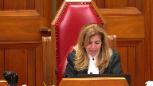
:::

This is the case of Randy Desmond Riley and Her Majesty the Queen.

And it's Lee V. Seshegirea.

I hope I said that correctly for the appellant Randy Desmond Riley.

And James Gumpert for the respondent Her Majesty the Queen.

Mr. Seshegirea?

Seshegirea?

Did I say that correctly?

Seshegirea, yes.

Seshegirea.

Okay, go ahead, sir.

**Speaker 1** (00:01:04): Thank you very much.

::: {.column-margin}
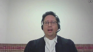
:::

Good morning, Justices.

I'm advancing two main arguments today.

The first is that it was an error of law to give a Vetrovic caution in relation to Nathan Johnson's exculpatory testimony.

The key point here is that Nathan Johnson was an exculpatory witness and as a result, it was wrong to instruct the jury that it was dangerous to rely on his evidence without confirmation.

The second argument I advance is in the alternative.

If it was permissible to give a Vetrovic caution against Nathan Johnson, the way in which the caution was formulated was in legal error.

The problem here is the trial judge's failure to demarcate between the inculpatory and exculpatory components of Nathan Johnson's evidence.

I submit that either of these errors justifies a new trial in this case.

In advancing these two arguments, I wish to offer a further overarching point for the court's consideration.

And that point is that the principled Vetrovic framework should apply to this case.

I'm referring here to the principled framework established in Vetrovic, Brooks, and Keller.

And the key takeaway from those cases is that courts should move away from a categorical approach to accomplish warnings and instead apply the principles to the facts of the case.

The principled framework means that courts should not use a categorical pigeon-holing approach to their analysis.

So why is the principled framework important in this case?

I submit it's important because it resolves one of the key disagreements between the majority and dissent at the court of appeal.

I'm talking here between the majorities, talking about here, the majority's conclusion that Nathan Johnson fell within the mixed witness category versus the defense conclusion that Nathan Johnson was a purely exculpatory witness.

Obviously the appellant sides with the dissent on this point, but I submit that the existence of this disagreement speaks to the importance of the principled approach.

On one hand, the dissent is correct that Nathan Johnson is the key exculpatory witness in this case.

As Justice Scanlon noted at paragraph 146 of the dissent, one could hardly imagine a more crucial witness for the defense than Mr. Johnson.

On the other hand, the record is indisputable and I cannot stand before the court and suggest otherwise that there was some reliance on Mr. Johnson by the crown.

I submit that reliance was both minor and tangential, but there was some degree of reliance.

The question then becomes, I submit, does some slight reliance on Nathan Johnson by the crown justify putting him in the mixed witness category and delivering a better bet caution against him?

And I submit the answer is no.

I further submit that the principled framework justifies that conclusion.

So what do I mean by this?

What I'm saying is if a witness is 99% exculpatory and 1% inculpatory, it's artificial categorical pigeonholing to say that the witness is a mixed witness.

Technically, yes, there is some reliance, but this technical categorical approach should not be applied to undermine the core principles of Vetrovic.

And those core principles tell us that a Vetrovic warning is about protecting an accused right to a fair trial, not prejudicing them.

So in this case, instead of trying to figure out what category Nathan Johnson is in to determine whether a Vetrovic caution is appropriate, I submit it's better to ask the following principled questions.

Do we need a Vetrovic warning on the facts of the case, keeping in mind its purpose?

And would a caution do more harm than good on the facts?

Now, these principles are not plucked from thin air.

They flow from this court's decision in Brooks where Justice Basterash noted that trial judges may properly decline to give a warning if the warning may prejudice the accused case rather than assist it.

The principles also flow from the case law in the United Kingdom and Australia.

As Chief Justice Gleeson explained in the High Court of Australia case of Jenkins and the Queen, there may be cases where the prosecution calls an accomplice whose evidence is wholly favorable to and accepted by an accused, and it would be absurd and contrary to the rationale of the rule to require the trial judge in such a case to give an accomplice warning, sending the jury off on a search for corroboration of evidence upon which the accused relies.

So the appellant asks this court to rely on that principled approach and apply it to Nathan Johnson's testimony in this case.

And I submit that when the principled analysis is applied, it becomes clear that a Vetrovic caution was inappropriate for Nathan Johnson's evidence.

**Justice Côté** (00:06:00): What can we do with the fact, what should we do with the fact that the defence council not only fail to object, but push for a Vitrovic caution?

**Speaker 1** (00:06:15): Thank you.

::: {.column-margin}
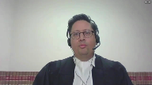
:::

So a couple of points on that.

The first is obviously a failure to object is a relevant consideration, but I submit that it's not determinative.

And the case law certainly suggests that it is the trial judge who bears the ultimate responsibility for the correctness of the charge.

I'd also like to perhaps take issue with the idea that trial council actively encouraged the Vetrovic charge.

If the court goes through the record, the trial started on March 26th.

And it was a couple of days later that the trial judge initiated the conversation about a potential mid-trial Vetrovic.

And so I won't take the court there, but just for reference purposes, volume five of the appeal record tab 39, pages 595 to 598 are where the trial judge introduced the idea of a mixed, excuse me, a Vetrovic in that case for Paul Smith.

Subsequent to that on April 6th, the trial judge again advanced the idea of giving a Vetrovic.

And he suggested at that point, I will give a Vetrovic for both Nathan Johnson and Paul Smith.

That reference is at page 1327 of the transcript.

The trial judge then provided an additional caution.

And this was in discussions with the crown about suggesting that the Vetrovic caution be followed by a further caution of not to use Nathan Johnson's lack of credibility against the appellant.

And it's that additional caution that trial counsel suggested he was in agreement with entirely.

So I suggest the idea that he actively encouraged, I certainly concede that he failed to object, but I think it's possibly overstating it that he was actively encouraging it.

But the bottom line is that if you look at the failure to object, if you look at the decision in Kalman, it's I think for this court to look at whether there was a tactical benefit to counsel, whether it was a strategic benefit to objecting and Kalman certainly suggests that.

Kalman looks at the record to determine whether it was an accidental omission by counsel or whether it was a deliberate tactical decision.

And I submit that if you look at the facts of this case, any benefit to acknowledging Nathan Johnson as unsavory, and I would submit that's all trial counsel did.

He acknowledged Johnson was unsavory.

It's grossly outweighed by the harm of undermining defense evidence and shifting a burden of proof.

So can I ask?

**Justice Karakatsanis** (00:09:09): you this then.

::: {.column-margin}
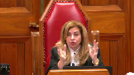
:::

I take it you're not objecting to the trial judge saying well this witness has numerous criminal convictions and that those circumstances you've got to approach the testimony with great care and caution.

You're objecting to the you can't say it's dangerous to convict without confirmatory.

So I'm just trying to make sure that I understand your position.

You're objecting to the confirmatory part of it as shifting the burden of proof not the usual there are these circumstances that you need to take into account and it may be that that those circumstances mean you have to approach this testimony with caution.

**Speaker 1** (00:09:57): Thank you for the question.

::: {.column-margin}
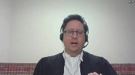
:::

Our position is that the full Vetrovic caution is inappropriate.

And even those suggestions of approaching the evidence with great care and caution, that forms a component of the Vetrovic which was improper.

I would certainly acknowledge that it would be appropriate to give a credibility caution against Nathan Johnson, recognizing that he has a history of convictions.

But to take it a step further and go into Vetrovic is to effectively provide a character caution.

And so the full Vetrovic, which we say equated Nathan Johnson with Paul Smith, told the jury that it should be foremost in their mind that they should apply the greatest care and caution, that it was dangerous to rely on Nathan Johnson without confirmation.

Those are our concerns.

And perhaps the most prime concern would be the focus on Nathan Johnson's exculpatory testimony.

I think it might be helpful if I took the court to-

**Justice Karakatsanis** (00:11:02): Let me bring you back to your answer to my question.

::: {.column-margin}
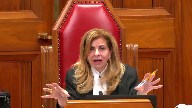
:::

If there's a problem in saying that you've got to approach the testimony with caution, what do you do in a case where truly there is evidence that is both really inculpatory and really exculpatory, so that you, as some of the cases have said, you really should be giving, you should be separating those out and giving different kinds of directions?

If you've already described the witness in such a way that you've set up why they're unsavory or why caution is required, and then just say the confirmatory is required only in relation to inculpatory, would it ever be possible, if you're correct, and you can't say that first part, would it ever be possible to give a jury instruction that applied the Vetrovic only to the inculpatory evidence?

**Speaker 1** (00:12:08): I say it is possible and I would take the court to the decision in Wranglin, that's at tab 22 of the Appellant's Condensed Book.

::: {.column-margin}
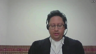
:::

And I think it provides an excellent example of exactly that situation, Justice, where there's both inculpatory and exculpatory evidence.

So I'm pointing to the Appellant's Condensed Book, tab 22, page 100.

And this is the Wranglin decision out of the Ontario Court of Appeal, again, tab 22.

And I'm pointing to paragraph 43 of the Wranglin decision.

And I'll start about four lines down near the end of the sentence, near the end of that line, excuse me.

The trial judge acknowledged that the witness in that case was a mixed Vetrovic witness.

As he said on his ruling on the issue, without the Vetrovic caution, the jury will not be told, understand or apply the appropriate legal assessment to the witness's inculpatory evidence and the less stringent assessment of his exculpatory evidence.

The trial judge provided a mixed Vetrovic caution in which he conveyed the complexity of the situation to the jury.

No objection was taken to the correctness of that instruction in that case.

So that's an example where a trial judge has demarcated between the inculpatory and the exculpatory components of the evidence.

The Vetrovic caution has been applied to the inculpatory components of the evidence because there is a risk potentially of wrongful conviction due to crown reliance on an unsavory witness.

Whereas with respect to the exculpatory components of the evidence, the Vetrovic is not applied because you could risk denigrating the defense evidence and shifting the burden of proof.

So this feeds back to our alternative argument that if it was appropriate to give a Vetrovic caution in this case, which we disagree with, there was an error in this case not to separate out the inculpatory and exculpatory components of the testimony.

**Justice Kasirer** (00:14:25): Mr. Seshagiri, can I ask just to go back to the 99%, 1% comment earlier, I'm wondering what you make of paragraph 83 of the majority opinion in which it was said that the court wasn't, the majority judges were not convinced that this wasn't a mixed witness and in particular it was up to the jury to find as a fact whether Nathan Johnson adopted any of his prior and consistent statements.

::: {.column-margin}
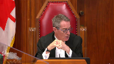
:::

**Speaker 1** (00:15:03): Certainly.

::: {.column-margin}
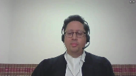
:::

So that is the reasoning that the majority applies to conclude that Nathan Johnson is a mixed witness.

And as you've mentioned, there's three pillars to the majority's reasoning in that regard.

The first is the idea that Nathan Johnson adopted his inculpatory prior inconsistent statements.

The second is that there was some reliance by Nathan Johnson by the prosecution.

And the third is that this categorization is justified by the case law.

And I think you focused on the first issue, which is the adoption issue.

And I think it's helpful in assessing the validity of that argument to consider the positions of the parties, both at trial and also the understanding of the facts by the Court of Appeal.

So with respect to the positions of the parties, we've got a situation where the Crown specifically indicated before the trial judge that Nathan Johnson did not adopt his prior testimony.

And so that was the Crown position that led to the Bradshaw application.

If the witness had adopted, there would be no need for a Bradshaw application.

Furthermore, I'd like to take the Court to paragraph eight of the majority.

That's at tab 17 of my condensed book.

And I think it's somewhat striking.

So this is tab 17 of the condensed book, paragraph eight of the majority decision.

The last line in paragraph eight, Johnson admitted he had said many things to Caitlin Fuller that could be taken to be inculpatory of the appellant, but he did not adopt them as true.

So this is the majority's own reasons acknowledging that he did not adopt.

And we're talking about hearsay here.

So the idea that adoption was in play, I think with respect to the Court of Appeal, is simply not reflected in the record.

And I think it's helpful to look at the other rationales provided by the majority.

On the Crown reliance issue, I think it's helpful to keep in mind that the Crown specifically argued that Nathan Johnson was adverse to the Crown position under section 9.1 of the Canada Evidence Act.

And the trial judge agreed.

The trial judge had no hesitation finding that Nathan Johnson was in a position opposite to the Crown.

So the idea that Nathan Johnson should be a mixed witness because the prosecution is relying on him, I think fails to recognize that he was actually in the opposite position.

He was adverse to the Crown.

And in terms of the third rationale that the Court of Appeal majority relies on for determining Nathan Johnson as a mixed witness, the majority relies on a number of cases, the Gell decision, Tran, Shand and Murray.

I'd like to just briefly speak to those.

In Gell, as the Court is aware, I forwarded the supplemental book of authorities.

The record is clear that the witness was mixed in Gell because the witness had provided an inculpatory KGB statement, which was tenured for the truth of its contents and relied upon by the prosecution, versus the exculpatory in-court testimony.

So it was clear that the witness was both being relied upon by the prosecution for the inculpatory aspects, and relied upon by the defense for the in-court exculpatory aspects of his evidence.

Tran is effectively the same type of case.

You have an inculpatory prior inconsistent statement relied upon by the Crown, exculpatory in-court testimony.

Shand, which was also relied upon by Justice Beveridge.

That case I would respectfully submit is entirely distinguishable because the vetrovec was justified to protect the interests of a co-accused.

Clearly that's not our case.

And then the respondent may point to Murray as justifying a conclusion that Nathan Johnson was a mixed witness in this case.

I would note there are a number of reasons why this Court should not rely on Murray.

The first and most obvious reason being that the discussion on mixed witnesses in Murray was obiter.

At paragraph 105 of Murray, the Ontario Court of Appeal allowed the conviction appeal and quashed the conviction on the basis that the trial judge had disparaged a Crown witness who had provided exculpatory evidence, and there was a reasonable apprehension of bias.

So the entire discussion on mixed witness evidence in Murray is obiter.

It's also distinguishable there was no 9-1 ruling in Murray as there was in this case.

In Murray, the trial counsel specifically asked for the vetrovec warning as opposed to, I would characterize our case as being the trial judge leading the charge on the vetrovec and the trial counsel failing to object.

And my last comment on Murray would be the reasoning is somewhat problematic.

It fails to cite Chenier, which stands for the proposition that you can't cure a mixed witness caution by applying a WD caution.

And it seems to me, on my reading of Murray, that Justice Watt and the majority in Murray did just that.

So there are a number of reasons.

**Justice Brown** (00:20:44): Although one thing with that WD instruction in Murray was it specifically carved out the exculpatory evidence, which again is another basis for distinction I suppose.

**Speaker 1** (00:20:59): Exactly, I would agree with that.

::: {.column-margin}
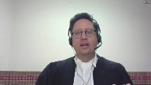
:::

So the present case certainly doesn't have that distinction.

When you look at our case, it is, as the sent Justice Scanlon termed it, a full-throated vetrovec.

And there are a number of reasons why it is distinguishable from Murray in that regard.

So you have the equation between Nathan Johnson and Paul Smith.

Paul Smith was clearly the key inculpatory evidence for the Crown, key inculpatory witness.

And Nathan Johnson was effectively treated in the exact same manner as Paul Smith.

And in fact, the vetrovec cautions, while they mentioned Paul Smith, the first vetrovec caution was given in the midst of Nathan Johnson's testimony.

And trial counsel had to push the trial judge to focus more attention on Paul Smith in his final vetrovec charge than Nathan Johnson.

**Justice Martin** (00:22:07): May I ask you two questions?

::: {.column-margin}
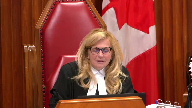
:::

The first relates to whether you have a test or some assistance you would provide the court with in determining when a witness is a mixed witness or when they're in culpatory and exculpatory.

And my second question is, is there anything in Justice Scanlon's dissent that you would draw our attention to that is not correct?

**Speaker 1** (00:22:35): Thank you.

::: {.column-margin}
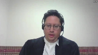
:::

With respect to the first question, I would maintain that the principled framework is the preferred approach to these types of cases.

So rather than trying to figure out how do we wedge a witness into a mixed category or an inculpatory or an exculpatory category, and this goes back to the earlier question about the 99% versus 1%, that's a very extreme example, but perhaps it's 20% inculpatory, 80% exculpatory.

I think taking it back to broad principles is the best approach.

And again, asking, do we need a vetrovec caution on the facts, keeping in mind its purpose, and would that caution do more harm than good?

And if the conclusion is we need a vetrovec to protect the fair trial interests of the accused, then you could conclude that the witness is mixed if there are sections of the witness's testimony that are exculpatory that you don't want to have subject to the vetrovec.

So I would conclude that the characterization follows after the principled analysis.

The second point with respect to Justice Scanlon's decision, I don't see anything that we are holding forward as deeply problematic from the appellant's point of view with respect to Justice Scanlon's decision.

There's a suggestion by my learned friend for the respondent that Justice Scanlon had erred in applying the proviso, and with great respect, I don't agree with that.

My suggestion is on the proviso reasoning.

In fact, it's the majority decision that is more problematic.

The majority's ruling seems to strongly weigh the evidence and get into an analysis of the strength of the case against the accused, which was specifically argued against in Van.

And I think it's helpful to just quickly touch on Van.

Van obviously is a proviso case that talks about both branches of the proviso.

We're talking about the first branch.

But the examples of errors in Van that could be cured by the proviso are a slight deviation from perfection in a jury charge, or an error on an issue that isn't central to guilt or innocence, or an error that benefits the defense.

And I would submit that the vetrovec caution in this case is far from a minor error.

It's a caution that speaks to Nathan Johnson's evidence, which is relevant to the actus reus, the mens rea.

It's relevant to identification.

It's relevant to motive.

It's relevant to whether there was planning and deliberation.

I hate to repeat myself, but Justice Scanlon's point that you could hardly imagine a more important witness for the defense, I think, is an accurate characterization.

And so the idea that this error could be saved by the proviso I think is problematic.

But if, Justice, there were particular concerns about Justice Scanlon's dissent, I'm open to addressing those as well.

I do think it's helpful in this case to consider the majority's analysis of the strength of the error and whether or not the rest of the charge cured it.

So if I could very quickly take the court to tab 15 of my condensed book.

Tab 15 of the appellant's condensed book contains the majority reasoning on what is supposedly problematic about the vetrovec charge.

And at paragraph 90, Justice Beveridge says he's highlighted the most troubling aspect of the trial judge's approach to Mr. Johnson's evidence.

And there are some highlighted passages above.

And I agree, there are some concerns there, the speaking about the need for the greatest care and caution, that it's dangerous to rely on his evidence.

But what the majority fails to emphasize is at the top of page 83, page 20 of the decision, the section where the trial judge instructed the jury to be confirmatory of Nathan Johnson's testimony, the testimony of another witness or other witnesses or other evidence must also tend to show that Nathan Johnson is telling the truth about Mr. Riley's lack of involvement.

So we have here the connection between the vetrovec and the exculpatory component of Nathan Johnson's testimony.

And that was not highlighted, notwithstanding what the majority indicates subsequent in paragraph 90.

So I would submit that's an error made by the jury.

Subsequent in paragraph 90.

So I would submit that's an error by the majority in recognizing the severity of the harm here.

And I just like to also assess the notion that the remainder of the charge was curative.

And if I could take the court to paragraph, excuse me, tab 23 of my condensed book, please.

Tab 23 of the condensed book contains the majority's reasoning on the supposedly curative aspects of the trial judge's charge.

And those excerpts are at paragraphs 91 and 92.

I would note that within the excerpt quoted at paragraph 91, there is a section in paragraph 91, there is nothing that relieves the jury of the idea that it is dangerous to rely on Nathan Johnson without confirmation.

It's telling the jury you should consider his evidence, but it does not fix the problem of having told the jury how to consider his evidence.

And so I would submit that's not curative.

And in fact, further below at paragraph 92 of the majority decision, there's a reiteration or a re-emphasis of the need for confirmation.

The trial judge indicated, be careful not to start to see it as a choice between what Paul Smith said and whatever evidence you find that confirms that on one hand and what Nathan Johnson said, and whatever evidence confirms that on the other hand.

The trial judge says it's not a choice between those two things.

But nonetheless, in that section of the charge, the trial judge is equating the weighing of Paul Smith's evidence and Nathan Johnson's evidence and the need for confirmation of both witnesses.

And we submit that that is the core problem in this case, and so it certainly isn't curative.

**Speaker 1** (00:30:03): Just to sum up justices, this is a case where a witness was called to the stand without anyone knowing what he would say.

::: {.column-margin}
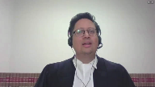
:::

This led to confusion by the trial judge and by both Crown and Defense Council as to whether or not a Vetrovac applied.

However, what is clear in this case is that Nathan Johnson testified that the appellant had nothing to do with the murder and that Nathan Johnson committed it by himself while collecting a drug debt, evidence which was corroborated by a firearm, scales and drugs found within the victim's car.

This evidence by Nathan Johnson was obviously exculpatory for the appellant.

As a result, the Crown sought and obtained a ruling that Nathan Johnson was adverse in position to the prosecution.

The Crown was thus permitted to cross-examine their own witness.

Despite this, Nathan Johnson did not adopt his alleged prior inculpatory statements and this led to the Crown's Bradshaw application.

The Bradshaw application was unsuccessful and the evidence was not admitted for the truth of its contents in support of the Crown case.

Despite this background, the trial judge gave a full-throated Vetrovac caution against Nathan Johnson.

The caution told jurors that it was dangerous to rely on him without confirmation in relation to his testimony exculpating the appellant.

Over and over again, jurors were told to approach Nathan Johnson with the greatest care of caution and to keep this caution foremost in their minds when evaluating his evidence.

The appellant respectfully submits that this process denigrated evidence in favor of the defense and shifted the burden of proof.

It is long settled law that if Nathan Johnson had been called as a witness by the defense, the improper Vetrovac caution would justify a new trial.

The appellant submits that the fact that the Crown called Nathan Johnson does nothing to change these fundamental principles underlying Vetrovac.

The appellant therefore submits that the principled framework should apply to the exculpatory evidence of Nathan Johnson, that the Vetrovac caution in this case was a serious legal error and that this serious legal error cannot be fixed by the proviso and it justifies a new trial in this case.

Subject to any questions, those would be my respectful submissions.

**Justice Karakatsanis** (00:33:07): You can go ahead, sir.

**Speaker 2** (00:33:15): Good morning justices.

::: {.column-margin}
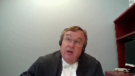
:::

So the respondents position would be that in regard to ground number one, the propriety of vetrovic warning for Nathan Johnson would break into into two parts.

Was it proper to give the warning?

And was the warning properly done?

The majority of the Nova Scotia Court of Appeal ruled that Johnson was a mixed witness.

That was brought out at paragraph 83 of its decision, tab one of the respondent's condensed book.

And this has already been talked about, so I won't repeat this, but it dealt with the fact of the prior statement to Johnson's girlfriend Caitlin Fuller, which the majority said, although it was not specifically or expressly adopted, it was up to the jury to decide if it was adopted in any means.

**Justice Brown** (00:34:13): Well, on what basis could the jury have found that Mr. Johnson adopted his prior statements?

Well, don't we need to know that?

Pardon me?

Don't we need to know that?

**Speaker 2** (00:34:28): Well, it it was there for the jury to consider.

They heard what does that mean? It was.

**Justice Brown** (00:34:33): there?

Was it properly before them?

It probably wasn't.

Okay, what's your next reason?

**Speaker 2** (00:34:42): And I would argue that probably the stronger, the stronger ground in the majority's determination that this was a proper case to give a Vetrovic warning was that the evidence of, sorry, that Johnson's evidence did in fact confirm some of Paul Smith's testimony and some of Paul Smith's evidence.

::: {.column-margin}
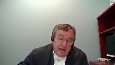
:::

And in this case, justices, when you read the transcript, you'll recall that Paul Smith was the driver who had picked up Riley and Johnson and had dropped them off in the Highfield Park area where the murder was subsequently carried out.

So, so, so, so, so, so, so, so, so, so, so, so, so, so, so, so,

**Overlapping speakers** (00:35:24): Yeah.

**Speaker 2** (00:35:25): I think I would withdraw from arguing in favor of what the majority of the Court of Appeal said in regard to the prior statement to Fuller, except that it was their determination, but certainly that there was no error in saying that there was some confirmation of Paul Smith's evidence.

::: {.column-margin}
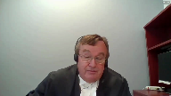
:::

It was not an error, but it was a confirmation of Paul Smith's testimony.

**Justice Brown** (00:35:45): Was it evidence that was inculpatory?

Was it evidence that was inconsistent with Mr. Johnson's version of events?

Was it evidence that proved guilt more than disproved it?

**Speaker 2** (00:36:00): No, it was evidence that confirmed Paul Smith in the sense that it gave some corroboration to Paul Smith's testimony and Paul Smith was the key witness in the Crown's case.

::: {.column-margin}
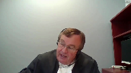
:::

It was evidence that it gave some corroboration to Paul Smith's testimony and Paul Smith was the key witness in the Crown's case.

**Justice Brown** (00:36:19): So it wasn't necessarily inculpatory, but doesn't it have to be for him to be a mixed witness then by reason of it?

**Speaker 2** (00:36:27): Well, it was inculpatory in the sense that it, uh, uh, Johnson confirmed he was with the appellant, uh, and Paul Smith on the day of the murder that they were together.

::: {.column-margin}
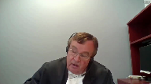
:::

Uh, that certainly was, uh, it was an important, uh, uh, aspect of the case that Paul Smith, uh, was saying, yes, I was, uh, I was with the appellant, although he was saying more than that, uh, but he, uh, he was being challenged by, uh, by the defense on, uh, on, uh, on what he said had occurred that day.

It also confirmed that the victim worked for Panetta Pizza as a pizza deliverer, and, uh, this testimony, um, confirmed that Paul Smith's testimony that the appellant stated the victim worked as a pizza deliverer, uh, and, uh, this was said, uh, by, uh, the appellant in, uh, Paul Smith's vehicle with Johnson also in the vehicle.

So, uh, sorry, the appellant had said this in Paul Smith's vehicle with Johnson also in the vehicle.

Um, so it, it was more than simply neutral evidence.

It tended to support, uh, Paul Smith's testimony.

And as I said, Paul Smith was the key, uh, aspect in, uh, in the Crown's case.

So, um, arguing that, uh, it was proper to, uh, to give such a warning, then the next question would be, was the warning properly made?

Um, the, the Crown would, uh, or the respondent would be relying, uh, quite, uh, heavily, uh, and you'll hear this in my, uh, respectful comments, uh, on the Murray case, uh, Ontario Court of Appeal.

Um, uh, so, so, so, so, so, so, so, so, so, so, so, so, so, so, so, so, so, so, so,

**Justice Martin** (00:38:03): Before you go there, may I just ask you in terms of the classification of the witness and the testimony, the things that you point to on the secondary sort of argument, aren't they things that Nathan Johnson really kind of admitted to already?

::: {.column-margin}
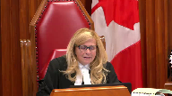
:::

So I mean, why do they carry the weight of making this a mixed witness?

**Speaker 2** (00:38:31): Well, they support the evidence of Paul Smith, who was the main Crown witness and who needed testimonial support because of his categorization as an unsavory witness.

::: {.column-margin}
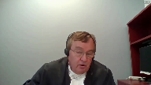
:::

So, he was helpful to the, that was helpful to the Crown's case.

So, then the next question would be, was the warning properly done?

Now, again, in the case of Murray, Ontario Court of Appeal 2017, we respectfully submit that that case is very similar to what occurred in our case.

Tab 9 of my condensed book, paragraph 129 of that decision, sorry, I have to get the right tab numbers, I apologize for this.

**Speaker 2** (00:40:16): I'm sorry, yeah paragraph 128.

::: {.column-margin}
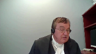
:::

In Murray it said first TJD was a mixed witness called by the crown.

He gave evidence that included some exculpatory features but was largely exculpatory of the appellant on the central issue of knowledge.

In practical terms the exculpatory aspect of TJD's evidence afforded the only sustenance for the appellant's denial of complicity in the murder of the deceased.

So that's what we have here.

We have again Johnson, sorry in our case the appellant Riley did not testify in the case of Murray.

Murray didn't testify and the only exculpatory evidence in the Murray case was this TJD and the only exculpatory evidence in the Riley case was Johnson.

So we respectfully submit that Murray case and the case before this court are on all fours.

And that then leads to the question of whether or not was a proper warning given regarding the delineation between exculpatory and inculpatory evidence and that how that should be treated by the by the jury.

Now I would concede that it was not done in an ideal manner.

It was again similar to how it had been done in the Murray case.

And can I ask you a question Mr. Comfort? Yes.

**Justice Brown** (00:42:04): Would it have been an error for the trial judge to give the jury a Vetrovic warning had Mr. Johnson been called by the defense?

**Overlapping speakers** (00:42:15): Yes.

**Justice Brown** (00:42:15): To give the very same evidence that he gave. Yes.

And why is that?

**Speaker 2** (00:42:24): The case law has said that Vetrovic warnings should not be given in relation to defense witnesses.

**Justice Brown** (00:42:33): Is that what the case law says, or does the case law say that Vetrovic warnings should be given where the jury is invited to convict on the basis of, in the case of Vetrovic, the evidence of an accomplice?

**Speaker 2** (00:42:51): Well, yes, I think that would be Chenier and in that case law.

::: {.column-margin}
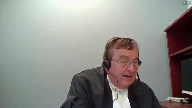
:::

So I would concede that this was not the ideal warning that should have been given.

It wasn't done in a proper manner of delineating, but the majority of the Court of Appeal found that by what the trial judge had said to the jury, that when you look at the functionality of the whole charge, how did the charge in its totality overcome this problem of not having directly delineated how the exculpatory and inculpatory evidence should be given?

Was that overcome by some other part of the charge?

The majority found that it had been, and it was found that it had been by reason of what the trial judge had said about if you have a reasonable doubt based on Nathan Johnson's evidence, you must acquit.

And again,

**Justice Martin** (00:44:04): But that's a general instruction, and may I ask this question?

::: {.column-margin}
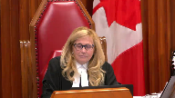
:::

You have a mid-trial instruction, you have the final instructions here, and the Vetrovac warning has very strong wording in it in terms of saying that it's dangerous and that it requires confirmation.

Do you think that holistically those sorts of words, when repeated, can be dealt with adequately by a general statement about credibility?

**Speaker 2** (00:44:42): Well, Justice, that's certainly how it was dealt with in the Murray case.

::: {.column-margin}
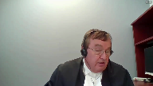
:::

In tab 11 of my condensed book, paragraph 131 says forth the functional approach to the assessment of the adequacy of the trial charge and the obligation to view it as a whole makes it clear the vice of the Vetrovich instruction that includes exculpatory evidence may be alleviated by other parts of the charge and in this case the task was completed by a WD instruction expressly relating to the exculpatory aspects of TJD's evidence.

**Justice Brown** (00:45:17): point that I read, Murray, and the wd charge in that case was very careful to distinguish between the inculpatory and the exculpatory.

::: {.column-margin}
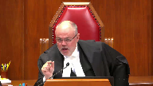
:::

Whereas here you're relying on a very generic general wd charge to cure a very general vetrovec warning.

Neither of those things distinguish between the inculpatory and the exculpatory in the way that the wd charge did in Murray.

And isn't that a problem?

**Speaker 2** (00:45:54): I agree and I may have to be going to the Curator Proviso sooner than later but I would like to I would like to close off the my arguments on ground number one by talking about the position of a defense counsel in this case.

Just before you...

**Justice Karakatsanis** (00:46:09): to go there, I'm sorry to keep you on this ground here, but I'm just looking at the way, at the actual jury charge, and when the judge talks about what is confirmatory, he refers explicitly to the exculpatory evidence.

::: {.column-margin}
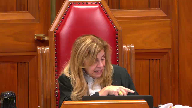
:::

He says to be confirmatory, the testimony must give you the comfort that Nathan Johnson can be trusted when he says that he committed the offense.

So in describing what's confirmatory, he says it's gotta be confirmatory of the exculpatory evidence.

I just don't understand how this charge, you say, dealt only with the inculpatory because it was cured.

So I'm just having a great deal of trouble following that.

**Speaker 2** (00:47:00): Justice, all I can say is that's the conclusion the majority came to, and they did that by looking at the balance of the charge and position of defense counsel, and what the trial judge had said.

::: {.column-margin}
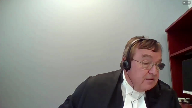
:::

Yes, I agree, it's generic.

Yes, I agree, it's far from ideal, but whether it's so bad that it's an error of law, it was something that the majority did not feel was the case.

Of course, it's subject to this court's determination whether that was correct or not.

But the position of defense counsel is relevant to the propriety of a Vetrovic warning, and the position of the defense counsel in our case at trial is, again, very similar to what happened in Murray.

The defense did not seek any kind of direction by the judge to distinguish between inculpatory and exculpatory evidence.

In fact, the defense counsel seemed to be encouraging the giving of a Vetrovic warning, and I think this is the reason, Justices, the defense counsel rightly at trial recognized it would take real convincing for the jury to believe Johnson's evidence.

He was dealing with an individual whose testimony, common sense dictated, was unbelievable.

Johnson was a very unsavory witness for many reasons.

At tab 15 of my condensed book, I lay out some of the issues that made Johnson a very unsavory witness.

He was a drug dealer, criminal record, longtime friend of the appellants, completely changed his previous version of events where he had implicated the appellant in the murder.

He was convicted of murder of the victim, and the jury was aware of this.

He was serving a life sentence in the penitentiary and common sense dictated that he would not have wanted to return to the penitentiary after testifying against the appellant and then being labeled as a rat.

Later by changing his story, he returned to the penitentiary as a type of a hero.

Obviously defense counsel were aware of that.

They would have to have been beyond common sense not to see what situation Johnson put them in.

What they did was, okay, Johnson has warts, but what they said in their closing address to the jury was, despite the fact that you might be skeptical about Johnson and about his testimony, and the defense counsel labeling him as an equally unsavory witness deserving of a warning, you can still find that there was a reasonable doubt, which is what the trial judge told the jury.

They said, if you still find that there's a reasonable doubt based on Johnson's evidence, then you must acquit.

The argument whether or not this was an ineffective assistance of counsel issue by not objecting to it, and in fact encouraging it, and labeling this person as an equally unsavory witness deserving of such a warning, there was nothing before the Nova Scotia Court of Appeal, and they pointed that out very carefully.

The majority did.

No fresh evidence in the Court of Appeal that defense counsel had provided ineffective assistance of counsel.

In fact, he had done what he had to do in order to deal with this very unsavory witness, and there's a cost benefit to everything, and obviously, the giving of the Vetrovic warning compared to the ability to say, well, look, even if he's unsavory, he still raises a reasonable doubt.

As in Murray, this was the only evidence that he had to tend to convict, or more than tend to acquit his client.

**Justice Karakatsanis** (00:51:23): Just to be clear, Mr. Governor, you're not suggesting that ineffective assistance of counsel is a prerequisite, otherwise failure to object trumps in some way.

**Speaker 2** (00:51:35): No, I'm not.

::: {.column-margin}
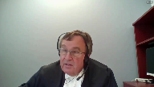
:::

But this court and other courts of appeal across the country have said on many occasions that the position of defense counsel is very important in relation to how serious an error or an alleged error is at a trial.

And in this case, it obviously wasn't a serious error in the mind of defense counsel.

He made the calculated decision to go with the Vetrovic warning to even say he's deserving of such a warning, but he raises a reasonable doubt, which then gets me justices and I see him down to 11 minutes on my timer that unless there's questions on the first ground, we'll just...

**Justice Martin** (00:52:20): I have one.

::: {.column-margin}
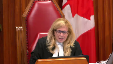
:::

Even if council took that position and we know from the record that was the position taken, but is there not an obligation on the trial judge in the charge itself then to delineate exculpatory from inculpatory and to ensure that the jury understands what the Vetrovic warning pertains to.

Here we know that there's just a general statement that says you need confirmation and it says in deciding whether crown counsel has proven the case against Mr. Riley beyond a reasonable doubt.

Again, a very general term.

Isn't it incumbent for someone who does qualify as a mixed witness that there be a careful demarcation for the jury rather than a general statement?

**Speaker 2** (00:53:22): Well, ideally yes, but again, based on Murray, if the rest of the charge is satisfactory in bringing that point across, then it alleviates the error.

::: {.column-margin}
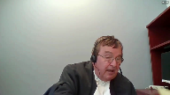
:::

If this court finds that ground number one did create an error, then I would, well, I'm going to go to ground number two in any event, which argue that Nova Scotian Court of Appeal majority correctly understood and applied the curative provision.

And this court has ruled on a number of occasions in Van and White that if this was not an overwhelm, this was not a case where the evidence was overwhelming, this is a case where the issue was whether the error was minor and in the whole review of the entire case, if the error was harmless in its effect.

And in applying the curative provision, the majority focused on three factors.

They're found at tab 17 of my condensed book.

And those factors were the position of the parties before the jury, the balance of the jury charge, and no properly instructed jury would reasonably believe or be left in reasonable doubt by Nathan Johnson's exculpatory tale.

Again, the position of the parties, crowns closing, did not suggest that confirmatory evidence by Johnson was required.

The same for the defense.

There was nothing put in the charges by counsel that would exacerbate the error if there was an error by saying that you have to have confirmatory evidence for exculpatory evidence.

Rather, the focus was in the closing addresses, was whether Johnson's evidence raised a reasonable doubt.

Again, position of the parties.

Defense counsel helped the judge draft the Vetrovic warning, and this is relevant to the seriousness of the judge's instructions now complained about.

**Justice Brown** (00:55:47): I agree that in the abstract, defense counsel's participation in the error is a relevant consideration and the reason is that there's often tactical considerations at play with the Vetrovic warning.

::: {.column-margin}
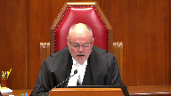
:::

I noticed in Justice Scanlon's dissent that he recounted having invited counsel during the hearing at the Court of Appeal to suggest what tactical advantage the defense gained by the Vetrovic warning in this case and he recounts that nobody had any ideas in that regard.

I'm wondering if given the passage of time you've thought of a tactical advantage that might have been gained here because that seems to be the reason why we do figure in defense counsel's participation or at least lack of objection into this consideration.

**Speaker 2** (00:57:01): uh justice i think its defense council was facing reality the reality of this witness being just so unsavory so unbelievable saying things that were contrary to evidence that uh was presented by the crown uh such as cell phone tower records which completely um

::: {.column-margin}
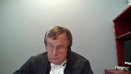
:::

oh my goodness it completely uh overrode his uh overrode his testimony and uh was laid out by the majority in its reasons as to why um uh johnson's uh uh testimony was uh

but there's no tactical advantage and yes in that tactically yeah

the tactical advantages you're

oh i'm sorry i didn't mean to i find it was okay

**Justice Brown** (00:57:42): Okay, I just, I mean, you know, there's no tactical advantage to realizing all there is to do is kneel and take the bullet.

**Speaker 2** (00:57:51): Well, but it's, it's, he can't have, you can't, you can't say, um, he, oh, he's a wonderfully believable witness, um, to, to a jury.

::: {.column-margin}
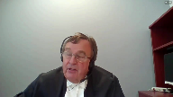
:::

I mean, he has to say to the jury, you're, um, this, you may be very skeptical, he did say, you may be very skeptical of him, um, and he's unsavory.

It's, it's obvious he was unsavory.

**Overlapping speakers** (00:58:12): individual.

**Speaker 2** (00:58:13): from his testimony, but still he raises a reasonable doubt.

::: {.column-margin}
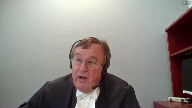
:::

So he says that and without, well, he has to accept reality and to go in front of the jury and simply blithely go forward and say, I encourage you to accept his evidence despite the fact that it's contrary to independent crown evidence, which doesn't rely on veracity of witnesses, but rather relies on technical evidence, which shows what really happened in this case.

He did what was the tactical advantage of putting forward his best efforts to support a reasonable doubt based on an obviously untruthful witness.

**Justice Karakatsanis** (00:59:03): But, I mean, that's a tactical advantage to recognizing the frailties of the witness.

That's not a tactical advantage to seeking confirmatory evidence before relying on that evidence.

There's quite a difference there.

**Overlapping speakers** (00:59:19): Can I-

**Justice Karakatsanis** (00:59:19): Can I ask you something of a more general nature, because I do see that your time is limited.

::: {.column-margin}
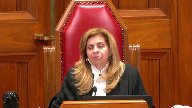
:::

What do you have to say to the appellant suggestion that we really ought to have a principled framework that looks at the evidence as a whole in light of the fair trial interests of the accused and ask whether a vetrovic warning would do more harm than good or whether there's a real risk of a shift in the burden of proof?

**Speaker 2** (00:59:53): uh justices uh yes justice um i think we already have that in the law for example in murray um it it

::: {.column-margin}
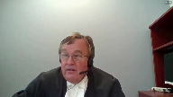
:::

it leaves the giving of a warning to the discretion of a trial judge and if if we start going back in uh in saying well you can only give this discretion in certain circumstances uh i guess i'm asking the rhetorical question it's not me to ask questions but it does it not raise the the the question then aren't we simply simply going back to pigeonholing and it wasn't the whole point of uh vetrovic in the beginning and smith and james and kella and sohota wasn't the whole point of those cases to un-pigeonhole and to give trial judges uh the discretion to uh uh to give to give warnings uh with broad guidelines we already have that in uh in cases like murray even even the decisions from australia i think it's

**Overlapping speakers** (01:00:51): or the

**Speaker 2** (01:00:52): British decision in 73 or 74 and the one from Australia in 2003, even there they're giving discretion to trial judges as to whether or not a warning should be given.

::: {.column-margin}
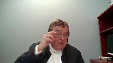
:::

And with respect, it would be the respondent submission that's the best way to deal with this, not to create a new whole pigeonholing approach, but let trial judges do their job with guidance from Courts of Appeal and of course this court.

The only thing I'd like to conclude on is to say the dissenting judge really didn't examine the entirety of the case for context to determine if an error only had a minor effect.

In particular, he didn't review Johnson's evidence in the context of the entire case as the majority did.

As the majority concluded, Johnson's evidence in the context of the entire case was simply unbelievable and those reasons are set out at paragraph 109 of the decision which is found at tab 21 of my condensed book.

It goes on to say, the majority said to say it was unsatisfactory, it being Johnson's evidence, would be kind.

The jury would have to suspend all belief for it to raise a reasonable doubt and then gives from one, two, three, I think eight reasons why, including Paul Smith's testimony which was almost completely at odds with Nathan Johnson's exculpatory tale was corroborated by independent objective evidence.

So justices, in the next 28 seconds I don't have time to go through all those reasons that the Court of Appeal or the majority decided that it would apply the curative provision but perhaps I should not have waited so long to say what I would say this is the best for last is it simply in the circumstances the majority held no reasonable jury would have believed Johnson.

Those are the reasons and I think perhaps that's the strongest argument for applying the curative provision and if the giving of the Vetrovic warning was an error, its effect was so clearly non-prejudicial that it would not have affected the outcome of the trial and again as I say mainly on the basis of what the majority set out in paragraph 108 of its decision.

**Justice Karakatsanis** (01:03:44): Mr. Seshagiri, any reply?

**Speaker 1** (01:03:50): Thank you, Justices.

::: {.column-margin}
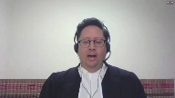
:::

Four brief points in reply.

With respect to the idea that there was significant Crown reliance on Nathan Johnson, I think this is belied by the record.

I would highlight to the court that the Crown consistently and repeatedly relied on the revenge theory as their theory of the case.

This was stressed in the Crown opening and closing.

It was put forward in the Crown theory within the jury charge.

And indeed, in the respondent's fact, again, it is suggested that this is a revenge motive case.

And I say that because that hinges entirely on Paul Smith's evidence, not Nathan Johnson's evidence.

To the extent that Nathan Johnson was relied on by the Crown, it was for pre and post-offense conduct as opposed to core evidence related to the homicide.

The second point I'd like to raise is the issue of ineffective assistance of counsel.

I would simply highlight that trial counsel was counsel at the first appeal and admitted on the record that he had missed the issue.

And I think the absence of a ineffective assistance claim would be to put forum over substance.

I think trial counsel's representations as an officer of the court on the trial on the record are supported by the record in this case.

And I would urge the court to examine the record in that regard.

With respect to the idea that the Crown closing didn't exacerbate the error, I would point this court to page 1786 of the record.

When the Crown had indicated that it was prepared to rely on some of Nathan Johnson's testimony, the Crown included a sentence saying, corroboration for this version of events exists both in the physical and the eyewitness evidence.

And so this was the Crown saying, we'll rely on Nathan Johnson a little bit and there's corroboration for that.

And I think implicitly what that says is that there's a lack of corroboration of corroborating evidence with respect to his exculpatory evidence.

So I would take a different position from my learned friend and from the majority of the Court of Appeal on that point that the Crown's summation, certainly if it might've made it worse, it didn't make it better.

And the last point is that the question of whether or not Nathan Johnson was a believable witness falls for a jury to decide.

And that is a fundamental in our system of jury trials.

Subject to any questions, those would be my respectful submissions.

**Justice Karakatsanis** (01:06:52): So we will take a break.

Thank you.

**Speaker 1** (01:07:35): The court.

**Justice Brown** (01:07:36): Cool.

**Justice Karakatsanis** (01:07:59): Yes, I want to thank all council for your excellent submissions and in that regard I do want to mention all of the lawyers who were involved in preparing this case for us.

::: {.column-margin}
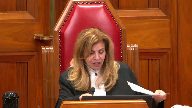
:::

Mr. Lee Seshagiri and Roger A. Burrell for the appellant Randy Desmond-Riley, James Gumpert and Melanie Perry for the respondent Her Majesty the Queen.

So thank you very much for your submissions.

We are ready to give judgment in this case.

We are all of the view that the appeal should be allowed for the reasons of Scanlon J.A. in the Court of Appeal.

The appeal is allowed, the convictions are quashed and a new trial is ordered on the charges of second degree murder and unlawful possession of a firearm.

As a result, it is unnecessary to hear the application for leave to appeal.

Unless there's anything further, I would thank you all very much and wish you a good day.

Thank you.

**Justice Côté** (01:09:35): you