---
title: Her Majesty the Queen v. Thomas Slatter
published-title: Heard
date: 2020-11-06
sidebar: false
---

This transcript was made with automated artificial intelligence models and its accuracy has not been verified. Review the original webcast [here](https://scc-csc.ca/case-dossier/info/webcast-webdiffusion-eng.aspx?cas=['38870']).
---

**Justice Rowe** (00:00:03): The court, the court.

**Justice Wagner** (00:00:25): Good morning.

::: {.column-margin}
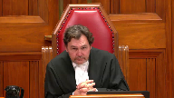
:::

In the case of Her Majesty the Queen against Thomas Slatter, for the appellant, Her Majesty the Queen, Jamie Klootkatsch, Caitlin Sharwi, for intervener Inclusion Canada, previously known as Canadian Association for Community Living, Janine Bennett, for intervener Women's Legal Education and Action Fund Inc. et al, Susan E. Fraser, for the intervener Barbara Schlieffer Commemorative Clinic, Deepa Mathieu, for the respondent Thomas Slatter, Robert J. Reynolds, and Mike Pretzel, for the intervener Criminal Lawyers Association of Ontario, Matthew R. Gourlay.

Jamie Klootkatsch.

Please be advised that there is a publication ban in this file pursuant to section 486.4 of the Criminal Code. Go ahead.

**Speaker 1** (00:01:45): Thank you.

::: {.column-margin}
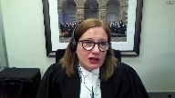
:::

Good morning Chief Justice, Justices.

This appeal as of right based on dissenting reasons raises three issues.

I will address the first issue whether the trial judge's reasons adequately addressed the complainant's reliability and and Ms. Sheroway will address the remaining two issues whether the trial judge erred by using the complainant's evidence to corroborate itself and whether the trial judge failed to explain why he rejected the respondent's evidence.

The question in this case is whether the trial judge failed to adequately address the complainant's reliability and in particular the suggestibility issue flagged by the defense at trial.

The Court of Appeal majority found that the trial judge's reasons were deficient, warranting a new trial because this was an important issue stressed by defense counsel and clearly grounded in the evidentiary record.

In the majority's view it was critical for the trial judge to at least consider the evidence concerning JM's heightened suggestibility.

Justice Peppal in dissent held that there was no air of reality to the defense's suggestibility theory that it lacked factual foundation because there was no evidence of any suggestions of sexual assault made by other witnesses to JM.

In her view it was mere speculation.

It's the appellant's position that Justice Peppal got it right.

She correctly determined that examination of this trial record demonstrates that the trial judge was unquestionably alive to the issue of reliability and its subset of suggestibility but there was simply no real substance to the suggestibility theory and therefore the trial judge was not obligated to address it in his reasons.

The law doesn't require trial judges to advert to every argument, every issue raised by the parties.

The question is whether the issue is in reality substantial, whether it is in fact a live issue.

As observed in the reasons of both the Court of Appeal majority and dissent and as acknowledged by the respondent in this fact and the trial judge did consider JM's reliability in his reasons, specifically the defense position that purported inconsistencies and implausibilities in her evidence impugned her reliability.

It was the trial judge's inattention to the defense's suggestibility theory that was the focus of argument in the Court of Appeal and before this court and the basis on which the majority found the trial judge's reasons to be deficient.

Therefore in the brief time that I have that's what I'm going to focus on, that the suggestibility that the suggestibility issue had no substance when examined in the context of the record as a whole.

And to start it's helpful to be clear about what the defense theory on suggestibility was.

This is set out at paragraph 62 of Justice Trotter's majority reasons.

He quotes directly from defense counsel's closing argument at trial summarizing his position on this which was that JM disclosed incrementally to different people, that JM is suggestible that's based on Dr. Jones evidence about her heightened susceptibility to suggestion and also Dr. Jones referred to examples of JM acquiescing to some leading questions in her police interview on September 10th.

Defense counsel argued that because JM is susceptible to suggestion it's important to have a record of discussions in which she disclosed what happened to her and since some of the conversations were unrecorded there was no way of knowing how she was questioned.

So these two pillars, two main pillars to the submission, JM's susceptibility to suggestion and two the absence of recordings of JM's disclosure discussions with other witnesses.

Examination of the record demonstrates that this theory lacked factual foundation.

It was based on mere speculation as found by Justice Peppel.

Turning to the record I'm going to discuss it under three headings.

First Dr. Jones evidence, second the absence of recordings, and thirdly the trial judge's exchanges with counsel during argument.

So first Dr. Jones evidence.

Yes Dr. Jones testified about JM's susceptibility to suggestion but that evidence was not evidence that JM's account of sexual assault was influenced by suggestion.

Dr. Jones put her at the 75th percentile for suggestibility with the average person being at the 50th percentile meaning that JM was more susceptible to suggestion than the average person but also that other people are more suggestible than she is.

And notably Dr. Jones qualified that saying that JM's more vulnerable to suggestion about matters that she's uncertain about and less vulnerable if the matter is personal, significant, and emotive like a sexual assault.

What this evidence establishes is that JM is like everyone else.

We all fall somewhere on the suggestibility spectrum.

We're all susceptible to suggestion to varying degrees.

Because of her disability, JM's susceptibility is more pronounced.

But evidence of suggestibility is not the same thing as evidence of actual suggestion.

As Justice Peppal put it at paragraph 141 of her reasons, it's one thing to say that a witness is susceptible to suggestion.

However there has to be suggestion to be susceptible too.

Here there was none.

It was mere speculation.

**Justice Brown** (00:07:30): There wasn't even evidence, there wasn't even evidence that the complainant in this, hi, there wasn't even evidence in this case that the, as I see it, that the, or Dr. Jones did not testify, that the complainant was susceptible.

::: {.column-margin}

:::

What Dr. Jones testified, as I read her evidence, is that the complainant falls within a class of persons who, as a generalized statistical matter, are more susceptible.

Isn't that a closer characterization of Dr. Jones's evidence?

**Speaker 1** (00:08:09): Dr. Jones testified that amongst persons with disabilities that was consistent, but it was an individualized assessment, not based on any categorical generalizations.

**Overlapping speakers** (00:08:21): Okay.

**Speaker 1** (00:08:21): Dr. Jones referred to examples of leading questions in the September 10th police interview with Officer Maybe as illustrating how JM could acquiesce to such questions, but this was not evidence that JM's account of sexual assault was influenced by suggestion.

::: {.column-margin}
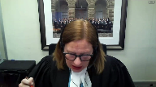
:::

The respondent's complaint about unrecorded questioning doesn't apply here.

There was a record of this interview, the defense had it, yet Dr. Jones was not asked to provide any specific examples of leading questions during the interview.

She was not asked whether any of those leading questions related to material aspects of JM's sexual assault allegations, and not only was there an absence of any materially significant suggestions, the evidence that is on the record affirmatively refutes that possibility.

I say that because JM had already disclosed to her camp friend, to Mrs. C., to social workers, and so before going into the September 10th police interview, she'd already stated to others that the respondent had sexual intercourse with her, touched her inappropriately, touched her breasts, asked for a blow job, and that she was raped by him.

When she was cross-examined, when JM was cross-examined on the September 10th police statement, it was not put to her that Officer Mabee's questions influenced her account of sexual assault.

To the contrary, defense counsel read from the transcript of the interview during JM's cross-examination, and the excerpts that were put to her showed non-leading questions.

In particular, at page 126 of record volume 4, just the question from Mabee is, you disclosed last night that you were raped, where did it happen?

And JM responded, providing three locations, her house, the respondent's house, on the pooch path.

This was the new information that came forth during this interview, and it was elicited through an entirely open question.

The theme of this cross-examination was that JM did not fully disclose to Officer Mabee, that she left things out that she later told to Officer Simpson on September 17th.

It wasn't the theme of cross-examination that anything of substance was suggested to her by Officer Mabee.

So even though counsel had a record of the Mabee interview and there was no evidence adduced to any leading questions from him about the sexual assault allegations, there was no such element.

**Justice Moldaver** (00:10:49): Probably the best practical evidence, I would have thought, that there's really nothing in that statement that is worth cross-examining the complainant on or having the statement introduced.

::: {.column-margin}
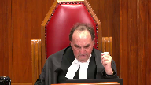
:::

I would have thought it would be first principles for Defence Council if there was something significant in that statement to have it produced and cross-examined the complainant on it minimally.

**Speaker 1** (00:11:14): I entirely agree, Justice Muldoon.

::: {.column-margin}
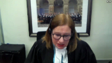
:::

Secondly, the absence of recordings of JM's initial disclosures to different people.

This was a central pillar of the defense suggestibility theory.

But again, not only is there absolutely no evidence of any actual suggestive questioning, Ms. Callahan and Ms. Brennan denied making any suggestions to JM about what happened, they testified they didn't do that under cross examination.

They both maintain that JM spoke to them unprompted in her own words.

Officer Simpson testified that what was about what was discussed on the Pooch Path walk on September 13, she said JM pointed out locations and when JM started to remember other details, Simpson stopped her and told her to write it down, which JM did.

And she brought the written statement in on September 17.

It's difficult to imagine a less suggestive way of obtaining a witness's account in her own words.

The camp friend to whom JM disclosed that she had sex with a middle aged neighbor, she was called by the defense, and there was no suggestion by defense counsel that this was suggested to JM.

Thirdly, the trial judges exchanges with defense counsel during closing argument.

As found by Justice Peppal, these exchanges demonstrated that the trial judge was alive to the issue of reliability and its subset of suggestibility.

And these exchanges were also revelatory of how there was no substance to the defense theory on suggestibility.

This is at volume six.

I'll give some examples at page 100, defense counsels raising the possibility of suggestion reminds the judge that there's no record of the questioning.

So it's unknown whether they're relating questions.

And the trial judge responds yes to all that.

Yes, there are reliability issues.

That's obvious from her evidence.

Nevertheless, she speaks to a number of rather disparate events.

Later at page 115, the trial judge again indicates I get it.

But he gets it.

Summarizing counsel's position this way, her evidence might be suggested by or at least she might reflect or reproduce in her evidence, something that had been suggested to her particularly by people in authority.

But then the trial judge also points out there's no evidence that Darlene Brennan suggested anything to her about the abandoned house that very specific detail.

The trial judge repeatedly raises this difficulty that he's having with the defense position, a position that he understands and acknowledges.

He repeatedly puts to counsel that what he's struggling with is the level of detail in JM's account, and that it counters the possibility that she was just parroting what other people had suggested to her.

And again, at pages 99, that that's apparent pages 99 to 100 and 108 to 109.

These details were corroborated by other witnesses.

The trial judge presses counsel, he putting to him the complaint, it tells us about a whole series of events over a number of years.

Did she make it all up?

In other words, is it all?

Is it all suggestion induced fabrication?

And counsel's responses at page 101 in this court, she does.

But counsel immediately emphasizes, he's not challenging her credibility.

He acknowledges that there's no evidence of motive to fabricate and says, that's why I say it's a reliability issue.

At page 136, volume six, starting at line 15, counsel again clarifies, clarifies, I'm not challenging credibility.

I'm not saying this is a dishonest witness.

As he says, I can't say given her presentation as a whole, that she's doing that on purpose, or she's lying to the court, or she's sitting up there committing perjury, swearing on the Bible.

But there's great concerns about her reliability because of telling the story over and over again.

And we don't know if she has the capability of coming to believe it's true, even though it's not.

We don't know if she has the capability of coming to believe it's true, even if it's not.

Where's the evidence of that?

There isn't any.

Dr. Jones doesn't give that evidence.

But that's counsel's response.

That's how he invites the trial judge to resolve the difficulty that he's having in reconciling the highly and specifically detailed and honestly believed account provided by JM, with the defense position that it's a fabrication, the product of JM susceptibility to accepting what others tell her.

It's a response that doesn't really answer the trial judge's point.

How do you explain all the detail?

Earlier in his submissions at pages 129 to 130, when discussing JM's disclosure to her camp friend, counsel submits that this was the genesis of her story, as he puts it, it's when she started to make it up.

And it kept getting bigger after that, after she spoke to other people.

That's the defense theory, that this witness with an intellectual disability, who counsel repeatedly described as unusual and atypical, might be suffering from a mental disorder that causes her to lose her grasp on reality, a capacity to capability, to come to believe is true that which is not.

A capacity that enables her to hatch this story so convincing in detail, and that she believes with such conviction to be true, because other people have planted the suggestion that she was sexually assaulted.

This submission, in effect, takes a backdoor run at JM's very capacity to testify, which was not challenged.

There was no Section 16 Canada Evidence Act application brought by the defense at trial.

She swore under oath or affirmation.

A witness who is competent to testify, has the capacity to accurately observe, recall, and recount events, as stated by the former Chief Justice McLaughlin in DAI at paragraph 36, a witness who is able to communicate the evidence as required by Section 16.3 is necessarily able to relate events.

This in turn, implies an understanding of what really happened, i.e. the truth as opposed to fantasy.

Along the same line of argument at pages 102 to 106 of volume six, defense counsel at one point invited the trial judge to entertain doubt about whether JM might have psychiatric and cognitive disorders that could impact on her reliability as a witness.

The trial judge points out, there's no evidence that she had psychiatric issues.

And the trial judge notes that Dr. Joan wasn't questioned about that.

And all we know is that JM took medication for anxiety and depression.

And counsel responds at page 106, well, it raises, it's just another element of doubt we have with this unusual witness, to which the trial judge replies, do you want me to speculate as to how it might have affected her memory or motivation to make up stories?

The trial judge was correct.

These exchanges demonstrate that he understood the substance of the matter.

And he did not err in law by failing to address in his reasons a defense position that lacked grounding in the evidence and invited inappropriate speculation.

Subject questions, I will pass the floor over to Ms. Sherwood.

**Justice Martin** (00:18:36): You've gone through the evidence, but can I ask you just on a general basis, the trial judge refers mostly to credibility and the complaint seems to be that there was not a treatment of reliability.

::: {.column-margin}
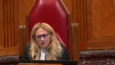
:::

Can you give us some guidance as to how we're supposed to deal with that issue?

Because credibility and reliability are different concepts, but sometimes they're subsumed in the one statement about credibility.

You don't tend to believe something that's unreliable.

So what kind of review should courts be doing of judges' reasoning when they speak of credibility?

**Speaker 1** (00:19:19): Well credibility and reliability are closely connected and as this court said in the warden case which I believe was 2013 there has to be a high level of deference now here for sure the trial judges reasons reflect that there is overlap that circumstances such as the level of detail in a corroborated detail in the complainants.

::: {.column-margin}
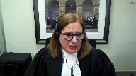
:::

Evidence is relevant to both reliability and credibility so I suppose that it's a contextual assessment.

But but but always with a high degree of deference for the trial judges which is appropriate and well established in matters of credibility and reliability this is something that in terms of the charge which is reasons.

Miss Sherwood will touch on in relation to the second ground.

**Speaker 2** (00:20:16): Thank you Chief Justice, Justices.

::: {.column-margin}

:::

The Crown's overall position is that this case really does turn on the first ground, but there were two other grounds that were raised and addressed in the court below.

As my colleague said, first, whether the trial judge's use of the complainant's evidence was, whether he used it as self-corroborating, and second, whether the trial judge failed to explain why he rejected the respondent's evidence.

In my brief time today, I will explain why we say neither of those grounds have merit.

So starting with the second ground of appeal, this relates to the passage in the trial judge's reasons where he highlights the importance of the varying particulars and details in the complainant's account.

It's reproduced at paragraph 63 of the majority reasons.

It's worth noting up front that the majority of the Court of Appeal stated it would not allow the appeal based on this passage alone.

It did, however, seem to accept the respondent's position that on the face of it, it appeared as though the trial judge was using the complainant's evidence to corroborate itself and enhance her credibility.

The Crown adopts Justice Peppel's analysis on this point in its entirety.

In our submission, when that excerpt is properly placed in the context of both the reasons as a whole and the record as a whole, and in particular with an eye to the Crown's closing submissions, it is apparent that the trial judge was referring to the fact that there were details in her account that were confirmed by other witnesses.

And as we know from the case law and the trial judge explicitly referred to this principle in his reasons, confirmatory evidence can be used to restore a trier's faith in the complainant's account.

Two final points on this ground.

First, contrary to what the majority seems to suggest at paragraph 75 of its reasons, it is not necessary for confirmatory evidence to confirm the sexual assault allegations themselves.

Peripheral details that are confirmed by others can be used in some cases in the credibility reliability assessment.

But in any event, there was confirmatory evidence here that spoke more directly to the sexual assault allegations, and that is the evidence surrounding the barbecue at CFB Trenton.

That confirmatory evidence spoke to some kind of inappropriate contact between the respondent and the complainant, which caused her to be told to go inside, and she stopped attending the barbecues after that.

And so that is clear probative value.

It was flagged by both the trial judge and Justice Peppal in her dissent.

And finally, putting aside for a minute the confirmatory evidence aspect of this passage, there was sort of a dual purpose to the trial judge highlighting the importance of details, and this is what my colleague was referring to.

Part of the defense theory, as you know, is that this was a product of suggestion.

And so the more details you have in an account, the less likely it will have been put to her

and she's simply parroting it back.

So the details have value in and of themselves in this case.

Subject to any questions on that second ground, I will turn to the third issue.

So I have three points to make on this third ground.

The first is that this is exactly the kind of case where JJRD reasoning would apply.

The respondent gives an outright denial when it comes to the sexual assault allegations.

He says, never happened, never touched her.

The complainant, on the other hand, says he had sex with her on a number of occasions in different locations.

So clearly, those two versions of events, they can't be the same.

They can't be true.

And I agree with the respondent that there was other evidence that he gave at trial, clearly.

But the point is, on the key issue, his was an outright denial that any of this happened.

And the trial judge, in his reasons, determined that there were no real issues with his evidence.

He says, it's consistent.

There are no red flags there.

So he properly turned his attention to the complainant's evidence.

And he did that while still recognizing WD principles, the burden of proof.

So this is a JJRD case.

The second point is that in our submission, the trial judge's acceptance of the complainant's evidence was considered and reasoned as required by JJRD.

Not only do we say it was considered and reasoned because he did not err in grounds one and two, but also because the trial judge conducted a thorough assessment of the complainant's evidence.

We adopt Justice Peppel's paragraph 158 in its entirety.

She says it well, where she explains all the things that the trial judge did in assessing the complainant's evidence.

And he addressed some of the issues that were raised by the defense evidence.

For example, the issues surrounding the frequency and timing of events, which he attributed to her cognitive disability.

So nothing more was required.

And it's worth noting that the reason why the majority allowed the appeal on this third ground was because of the errors it identified in grounds one and two.

It did not go on to say that something more was required here in terms of the defense case, which turns me, it takes me to my third point.

Having regard to the trial judge's assessment of the complainant's evidence, there was nothing more that was raised by the defense evidence that needed to be addressed.

The respondent and his wife testified most of their evidence was largely consistent with the complainant's account.

And in the areas where there was some disagreement, it was either addressed by the trial judge, or, you know, for example, when it came to the lack of a beige blanket or the lack of condoms in the home, these were things that did not undermine the complainant's allegation in any meaningful way, such that it needed to be addressed.

And I would simply conclude by saying that cases like REM, Veridine, RA, these are all relatively recent cases out of this court.

They are directly applicable to the case at hand.

They clearly endorse JJRD line of reasoning in facts that we say are similar to what we have here, and we would urge the court to do the same in this case.

Subject to any questions, those are my submissions.

**Justice Wagner** (00:27:37): It's Benedict.

**Speaker 3** (00:27:40): Thank you Chief Justice, Justices.

::: {.column-margin}
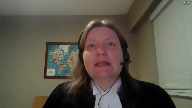
:::

In this case, the Court of Appeal, the majority of the Court of Appeal overturned the respondent's conviction because the complainant was a woman with an intellectual disability.

The complainant in this appeal is an adult woman who testified that the respondent, her neighbour, sexually assaulted her multiple times through a range of sexual acts in various locations over several years.

She made the decision to report this to the police, she withstood cross-examination on her testimony at trial, and the trial judge found her to be a credible witness.

He concluded applying WD beyond a reasonable doubt that sexual assaults occurred.

That should be sufficient for a conviction.

But because the complainant had an intellectual disability, that was the reason given by the majority for requiring a separate inquiry into her suggestibility that would not be demanded of other witnesses who do not have such a disability.

Inclusion Canada intervenes in this appeal to argue that the criminal law must not apply a more onerous standard to the evidence of a witness or impose additional barriers to accepting that evidence simply because that witness has an intellectual disability.

To do so would be discriminatory and create a barrier to accessing justice, particularly for women in cases of sexual violence.

My first submission in support of that is that in this case the finding of credibility was an implicit finding of reliability.

Treating reliability as a distinct issue on appeal amounted to a collateral attack on the credibility finding explained only by the presence of an intellectual disability.

This was a case about credibility, namely whether the complainant could be trusted when she said that the sexual activity with the respondent actually took place.

To the extent reliability was an issue, it was as part of the consideration of credibility in terms of inconsistencies or improbabilities that might leave a trier effect with the reasonable doubt that the complainant was telling the truth.

And the trial judge dealt with this issue in his reasons.

In this case, treating reliability as a distinct issue amounts to saying quite implausibly that the complainant was mistaken about whether she was repeatedly sexually assaulted by the respondent.

This isn't a case where identity is an issue.

It's not a case where reliability becomes a distinct issue because innocuous events have somehow been misinterpreted.

My second submission is that the consideration of suggestibility was unnecessary and should not have formed part of the analysis of the trial judge at all.

The trial judge did not need to refer to the expert evidence about suggestibility.

The expert was qualified to give evidence about whether the complainant had a disability, how it affected her daily life, and her capacity to consent to sexual activity.

To the extent that her opinion went further, it wasn't necessary to resolve the issues in this appeal, especially given the absence of evidence that the allegations were the product of suggestion.

And this goes to the heart of what it means to ensure equal access to justice for witnesses with intellectual disabilities who in a sexual assault trial are disproportionately women.

The use of test scores of suggestibility to label the complainant unreliable reinforces discredited notions that women with intellectual disabilities as a class cannot be trusted and are somehow suspect.

We do not score the suggestibility of witnesses who are not labeled as having an intellectual disability.

The designation is conclusory and its effect is clearly discriminatory.

But hang on.

**Justice Rowe** (00:31:44): Now, I mean, is not the testimony of a young person, particularly a very young person, treated a bit differently than an adult?

::: {.column-margin}
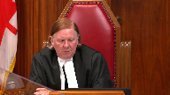
:::

And I know that we're speaking about an adult here, but it's a person who's operating with a disability, and is it not proper to have regard to it, not stereotypically, but in evaluating the evidence to take it into account?

**Speaker 3** (00:32:16): Well, the complainant here is an adult woman, and it's very important that we not infantilize her through this kind of metric.

::: {.column-margin}
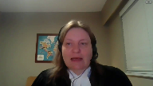
:::

Yes, she has an intellectual disability, but that doesn't make her more likely to lie, and it doesn't make her unable to recount what happened to her in her everyday life.

And most importantly, her life is not public property.

She has the same interests in her privacy and in her medical and sexual history as other women, and she should be able to take the stand and recount what happened to her in her own life.

That's what equality and access to justice for this group of witnesses means.

**Justice Wagner** (00:32:58): Thank you, thank you very much.

And it's a freezer.

**Speaker 4** (00:33:05): Chief Justice, Justices, I'm here with my co-counsel, Carrie Joffe.

::: {.column-margin}

:::

You can't see her, but she's here at the table with me.

And I will use the time that we have on behalf of Leaf, Don and Arch to assert that the majority decision of the Court of Appeal for Ontario represents a departure from this court's well-established jurisprudence on sufficiency of reasons.

In its result, it leads to a requirement of a more onerous reliability assessment for persons with disabilities, and that if upheld, that will impede access to justice.

In making this argument, we acknowledge the duty of the trial judge to provide reasons and rely on this court's jurisprudence regarding the legal test for sufficiency of reasons.

Reasons are especially important in cases where an accused rights to liberty are at stake.

Our concern is how the test was applied.

We assert that by requiring the trial judge to explicitly address the complainant's reliability based on the evidence that persons with intellectual disabilities are generally more susceptible departs from substantive equality.

You can respect substantive equality and guard against wrongful convictions by focusing on the actual capacities of the witness as the trial judge did in his judgment.

As this court well knows, women with disabilities…

**Justice Rowe** (00:34:43): Is it wrong in principle to receive evidence concerning intellectual capacity and potential questions of reliability?

Is it wrong in principle to receive evidence concerning intellectual capacity and potential

**Speaker 4** (00:35:03): There is, there was no challenge to the receipt of this evidence at trial.

Yeah, I'm not talking.

**Justice Rowe** (00:35:10): about this matter because I'm not sure the intervener should be saying whether this evidence was properly received or not but as a general proposition which is I think what you're arguing to us presumably that such evidence should not be received or am I mistaken in my understanding.

**Speaker 4** (00:35:26): No, we would strongly take the view that this type of evidence should not be received once the complainant gets past any section 16 criteria.

::: {.column-margin}
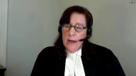
:::

So if she's capable of giving evidence, this court signaled very strongly in DAI that persons with intellectual disabilities can testify in court and that the underlying policy concerns about bringing abusers to justice, ensuring fair trials, and preventing wrongful convictions can all be met by allowing a person labeled with disabilities to testify.

So the question, Justice Roe, in my view, is what does this evidence actually add in the circumstances?

And the evidence doesn't about suggestibility, experts' evidence on suggestibility doesn't add anything.

Yes, but what-

**Justice Rowe** (00:36:23): What about someone who has a visual impairment and they say, well, I saw something half a mile away?

::: {.column-margin}
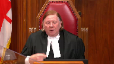
:::

Are you not permitted to put in the box an expert to say, well, someone who is visually impaired would be incapable of, you know, given their physical abilities of doing that, being able to perceive that?

**Speaker 4** (00:36:46): Well, I would expect the trial judge have to use some common sense that if there was evidence of a disability and certainly that would be subject perhaps of cross-examination, but if it's known to everybody that the person is visually impaired.

::: {.column-margin}
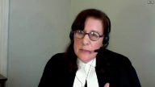
:::

But that's not for this case.

If you look at this case, Justice Roe, both in the way the evidence was called in trial and the way that the judgments are recorded, there were numerous labels that attached to this complainant that she was a hoarder, that she was a former crown ward, a foster child, that she had an intellectual disability, all of which preceded her giving evidence or the assessment of her evidence in the judgments.

And that came at the expense of her actual capacities.

You don't see that what you would find in the record, you don't see in the judgments that she was a community college student.

These, we're not saying that any of the parties or the judges purposely relied on stereotypes, but this court has long recognized that there doesn't have to be a conscious reliance on stereotypes in order for them to be harmful.

So it's easy to see the potential for stereotypes setting in as a result of the unconscious reliance when so many descriptors are called and where you have this type of evidence being called before the witness even speaks.

**Justice Wagner** (00:38:15): Thank you.

I think your time is up on this.

Justice Kirkat-Sinis, you have a question?

**Justice Karakatsanis** (00:38:20): Well, I was just going to say all this discussion about the admissibility of evidence, that's not before us in this case.

The question is how that evidence was used to assess credibility and reliability.

**Speaker 4** (00:38:35): Yes, that is how I understood it, Justice Carrot Katsanis.

Thank you.

**Justice Wagner** (00:38:38): Thank you very much.

Deepa Mathur.

**Speaker 5** (00:38:43): Good morning and thank you Chief Justice and Justices.

::: {.column-margin}

:::

The Barbara Schleifer Commitment Clinic is here before the Honourable Court today to give the perspective on potential impact of this appeal on vulnerable women in Canada, specifically deaf and disabled migrant women.

As a frontline service provider to survivors of gender-based violence, the clinic understands the obstacles that shape women's relationship to the legal system.

The clinic provides many ancillary supports and services to marginalized complainants of sexual assault pursuing legal action on daily basis.

For example, we provide interpretation services to the complainants.

This appeal raises serious concerns about the evidentiary burden placed on vulnerable complainants of sexual assault.

And while we agree with the submissions made by the appellant and the intervener for the inclusion calendar, the singular point that we are making submissions on today is that if it's fair game writ large to scrutinize complainants with intellectual disabilities for suggestibility, it will have a particularly devastating impact on migrant women with disabilities who will not only be scrutinized for suggestibility on the basis of disability, but disability intersecting with language barriers, reliance on intermediaries, and vulnerabilities associated with the precarious immigration status.

In our experience, lengthy code proceedings questioning the reliability of survivors can become an avenue of continued abuse and traumatization.

We are reminded daily of how women of precarious immigration status face barriers in accessing resources, reporting violence, and pursuing legal actions.

Undermining the complainant's reliability based on stereotype of expected behavior raises a dangerous prospect of additionally marginalizing an already vulnerable community of women with special needs, including those who have previously experienced torture or other serious physical, psychological, or sexual violence during their migration journey.

Demands for supplementary measure to scrutinize a disabled complainant's evidence creates an additional obstacle not imposed on other complainants.

It is worth noting that deaf and disabled migrant women almost always have to rely on supports and intermediaries to express themselves through legal proceedings.

Establishing a higher threshold for evidence produces unequal access to justice system, and this heightened evidentiary burden has significant implications for survivors of sexual violence.

Migrant women already face a variety of challenges to their credibility when accessing legal system.

Even where migrant women seek support with help of social agencies, they are routinely questioned for concerning their vulnerability to be influenced by others, suspicion of their ulterior immigrant-related motives, and scrutiny related to their use of interpreters.

The obstacle experienced by migrant women and multiplied if they are deaf or living with disability.

Canadian women living with disability are twice at risk of sexual assault as compared to women who don't have disability, and the experience of migrant women is far more complex.

Harmful stereotypes about migrant disabled women and assumption that a complainant with an intellectual disability may be more suggestible from influence in their evidence may result complainants being considered susceptible and scrutinized for external factors affecting their testimony.

In this way, the court of appeals decision risk erecting further barriers to justice for some of Canada's most vulnerable sexual assault complainants.

The clinic asks honorable court to assess the quality of evidence from each complainant on its merits, free from stereotype and harmful exclusionary assumptions.

Scrutiny of complainants evidence on the basis of stereotype is discriminatory and undermines the truth-seeking function of Canadian legal system by discounting valuable evidence.

Thank you for your time.

Subject to any questions, those are the submissions of Schleifer Clinic.

**Justice Wagner** (00:42:49): Thank you very much.

**Speaker 6** (00:43:01): Thank you, Chief Justice.

::: {.column-margin}
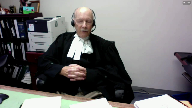
:::

To begin with, in terms of the interventions, to the extent that the interventions appear to advance the proposition that as a matter of law somehow, the sort of evidence that was introduced here from Dr. Jones cannot be considered in terms of assessing the reliability of a particular witness.

I would respectfully suggest, I believe getting behind Justice Roe, that that is completely wrong, is not the law, has never been the law.

And the court is entitled and required to consider any evidence that may plausibly be relevant to the issue of the witness's reliability.

And I would respectfully suggest that obviously, depending on the circumstances of a particular case, expert evidence as to a particular witness's intellectual capabilities in relation to reliability is relevant and can be considered.

The second point is, and again, I'm obviously repeating what I said here at length in the factums, is that in fact, in this case, all these issues that the interveners are trying to raise are simply not raised by the facts of this case.

There was no evidence about stereotypes, about stereotyping intellectually disabled individuals as labeling them, as flagging them.

The evidence given here by Dr. Jones was expert, was evidence given by a highly qualified expert, and it was based not on some generalized reference to statistics and some generalized categorization of the complainant as falling into a certain category.

In fact, Dr. Jones' assessment of the complainant was based, as appears in the evidence, on a series of detailed, quantitative, standardized psychological assessments, three of them carried out over three separate days over a two-month span, followed up by a detailed personal interview.

And it was as a result of that process that Dr. Jones concluded not just that this is a disabled person, therefore falling within a category.

She formed specific opinions about the intellectual disability of this particular individual.

**Justice Moldaver** (00:45:45): Well, that's fine, that's fine, but this particular individual then falls into a class of individuals who is more suggestible, that is put out there, and then everybody, the majority of the Court of Appeals seems to jump on this, and the real problem, it seems to me, is they jump on it in circumstances where there is no real hint of suggestibility, indeed the evidence in this case, if anything, suggests that she is anything but suggestible.

::: {.column-margin}
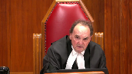
:::

So really the point here is, you can't take generalities that apply to this class of person and start using those to make findings of fact, because there's a real concern that they may be based on stereotypical beliefs, as opposed to looking at the witness, looking at her evidence, assessing it as a whole, assessing her veracity and her ability to recall and recount, et cetera, and that's what you look at.

So Justice Peppal here says, wait a minute, not only is there no air of reality to this, we don't even have to look into this, but the evidence in fact goes the other way, and the Court of Appeal for some reason, the majority seems to say, oh, this is critical, this is absolutely critical, the trial judge didn't address it.

And speaking for myself, a trial judge need not specifically address that which is made out of whole cloth.

**Speaker 6** (00:47:22): Thank you, Justice.

::: {.column-margin}

:::

Let me try to respond to that this way.

In the first place, the evidence here was not generalized, was specific to this particular individual, so that the Court of Appeal was not in my submission working from whole cloth.

I included at tab one of the condensed book some excerpts from Dr. Jones' evidence.

The point that I'm trying to make you can pick up by looking at the first page of that, which is from page 120 of the appellant's record.

At the bottom of that page, Dr. Jones says, in the battery of assessments that I completed, based on the questions asked, I was able to assess her level of intellectual functioning, her academic functioning, and continuing on over to the next page, as well as an assessment of her suggestibility and psychological vulnerability.

If you skip over to the next page in the excerpt, which is from page 165, it was kind of interesting because defense counsel was, in effect, almost in his question conceding, oh, well, I guess this suggestibility would be more of a quantitative thing.

And she says, no, not necessarily.

The suggestibility scale that I used is also standardized and norm-referenced, so it's giving you a normative population as well as specific populations for persons with intellectual disabilities.

And then, if you have a look, and I didn't include it in the condensed book, but, and this relates to a question posed by Justin Brown earlier, counsel at page 167 was asking Dr. Brown about her suggestibility as compared to the normal population, and he recites to her 75th percentile, that's more likely to be suggestible than the norm, which is 50 percent.

And then, at the bottom of the page, she goes on to explain, in terms of her level of suggestibility, she is 75 percent higher than the normal population.

So, let's look at what she bases this on at page 169 of the transcripts.

**Justice Brown** (00:49:48): Go a little page.

::: {.column-margin}
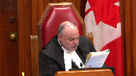
:::

She refers, she says there's multiple, so as I said in terms of suggestibility, it's not only how someone changes the information but someone may be more predisposed to just distorting the information.

So yes, in that transcript there's examples of leading questions, horse choices, changes or distorts her information.

Now this is referring to the police interview, right?

**Overlapping speakers** (00:50:16): That's correct.

**Justice Brown** (00:50:16): Okay, and at paragraph 55 of your factum, on page 22 at subparagraph 5, you say, as discussed by the majority, the presence in the record of the first police interview.

::: {.column-margin}
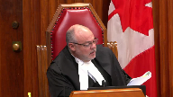
:::

So the police interview, I take it, was on the record?

**Overlapping speakers** (00:50:36): It was not made a formal part of the evidence, I believe.

**Justice Brown** (00:50:39): why do you why do you say it's in the record because that's important because if it's in the record we can look at it and see what sorts of questions she was prevaricating on whether they're trivial details or whether they go to the central issue of whether she was sexually assaulted by your by your client

::: {.column-margin}
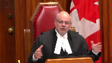
:::

**Overlapping speakers** (00:50:58): So, so.

**Justice Brown** (00:50:59): It's in the record and I looked and I had my clerk look and I can't find him

**Speaker 6** (00:51:04): You know, it was not made a formal part of the record and I didn't certainly intend to suggest that in paragraph 55.

What I indicated was, I thought, and I'm not going to go into detail here, but I think it's important to note that this is not a formal part of the record and I didn't certainly intend to suggest that in paragraph 55.

**Justice Brown** (00:51:18): and so what okay

so it's not on the record although it says it's on the record

**Overlapping speakers** (00:51:22): I was just-

**Justice Karakatsanis** (00:51:23): Not on the record, so...

**Justice Brown** (00:51:23): Not on the record.

So what significance are we to draw from this?

Because we have no idea what these questions are that Dr. Jones is talking about.

So how does that help you?

All right, the answer is that, and the answer is that the answer is that the answer is that the answer is that the answer is that the answer is that the answer is that the answer is that the answer is that the answer is that the answer is that the answer is that the answer is that the answer is that the answer is that the answer is that the answer is that the answer is that the answer is that the answer is that the

**Speaker 6** (00:51:36): You

**Overlapping speakers** (00:51:36): Uh...

**Speaker 6** (00:51:37): least this is what I was trying to convey in subparagraph 5, is that I was referring to Dr. Jones' description of her review of the record of that first police interview.

::: {.column-margin}

:::

That her description, I believe, is the only evidence that was introduced as to the content of that police interview.

**Justice Brown** (00:51:57): Right, and trial counsel, as you say in the factum, systematically took the trial judge through that evidence, but nowhere does, nowhere do we see on the record just how that happened because we don't know what the questions were.

::: {.column-margin}
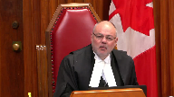
:::

How is the trial, you fault the trial judge for not giving weight to this and frankly I don't know how because it's not in the record and you know I'm with Justice Moldaver, presumably if that, if that interview revealed that she was prevaricating on the central issue of whether she was assaulted then defense counsel would for sure have introduced it.

**Speaker 6** (00:52:44): I guess my response would be this, that in my respectful submission it's not correct to say that there's no evidence, no evidence was given in the record at trial about the content of that police interview.

::: {.column-margin}
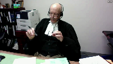
:::

There was, because the Crown's expert witness Dr. Jones was asked about it, indicated she had reviewed the transcript of that police interview in detail and expressed the opinion, well made the statement, that she observed multiple instances in that police interview of the complainant.

Does she describe any of those instances? No.

So how is that helpful to us?

It's helpful because she could be prevaricated.

**Justice Brown** (00:53:27): about the about her home address I mean we don't know

**Speaker 6** (00:53:32): Fair enough, but in my submission, that's sort of flipping it around from the way that it should be looked at.

::: {.column-margin}
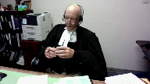
:::

In my submission, what we had here is the Crown's own expert witness saying, I've reviewed the transcript of this police interview and there are multiple instances in which the police officer solicited answers from this complainant by way of leading or forced questions.

And it was left at that.

You see, I'm going to...

**Justice Moldaver** (00:54:01): of showing that she wasn't suggestible also.

::: {.column-margin}
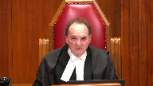
:::

The problem with all this, as my colleague points out, is that you, or not you, but trial counsel, presumably had this interview.

And I come back to the first question, I think I put to Ms. Klukesh, which is first principles would suggest that if there is anything in there that is, that suggests that she is, to use my colleague's language, prevaricating about the actual sexual assaults that she alleges occurred, one would have thought that A, she would be cross-examined about it.

I mean, B, the interview would be put to her.

And C, we would find out exactly what's in there.

I mean, and the fact that it wasn't is, in my view, with respect, certainly suggestive that there wasn't much there.

Otherwise, the defense would have gone after it.

**Speaker 6** (00:55:07): Justice, I again, I would submit that there is a flip side to that, which has to be considered and which was part and parcel of what made this a live issue.

::: {.column-margin}
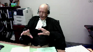
:::

As I said, what we, what Defence Council, by the time he had gotten done cross-examining the Crown's witness, was the Crown's expert making the blanket, unqualified statement that in the police interview the complainant had made statements in response to forced or leading questions that had appeared to influence her answers, in some cases, in some cases not.

It was left that way.

**Justice Rowe** (00:55:47): to assess the credibility or the reliability.

::: {.column-margin}
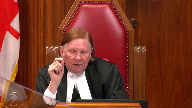
:::

It may be for the expert to say, look, there's a little yellow flag.

You have to be very careful here because this person is potentially suggestible.

And the judge had that before him and had it in mind.

And it was then for the judge to say, okay, bearing that in mind, I'm going to assess the evidence provided by the complainant.

And essentially, the judge said, I'm persuaded, A, that this person is credible and this person is reliable.

So having been put into a position of being cautious about it, having that in mind, the judge said, I'm persuaded.

I've had that yellow flag waved in front of me, but not withstanding that.

This evidence delivered in the witness box is such that I find this witness, the complainant, both credible and reliable.

And it's extraordinary, it seems to me, for the Court of Appeal to say, we're going to overturn an assessment of credibility or reliability and substitute our own view of that.

I mean, that's not what Courts of Appeal are supposed to do, I don't think.

**Speaker 6** (00:57:11): And my response to just finish the previous point was that the flip side of what we've been discussing is that faced with the Crown experts, and I don't think at this point she was expressing an opinion about credibility, she was simply describing what she saw on the record of the police interview.

::: {.column-margin}

:::

And Crown counsel obviously had the opportunity to re-examine, experienced trial Crown counsel is faced with his own witness having said that the police interview of this complainant about these offenses involved leading enforced questions that affected her answers.

And he doesn't ask anything.

Wouldn't it have made sense?

There's nothing there.

**Justice Brown** (00:57:51): Why would the Crown ask questions about what?

There's nothing to ask about.

**Overlapping speakers** (00:57:59): in my submission there is and obviously if the court disagrees

**Justice Brown** (00:58:03): Your whole case, it seems to me, hangs on the absence of evidence.

::: {.column-margin}
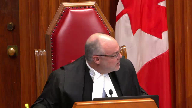
:::

You know, I go back to paragraph 55.

This is your litany of complaints here.

First, the exchange between the complainant and her friend suggests that an affirmative pressure to provide an affirmative answer could come into play, could.

But we don't know.

There's an absence.

But of course there's not an absence of evidence.

That very suggestion was put to the complainant and she denied it.

Number three, the absence of a record of the discussion between Ms. C and the complainant that precipitated the allegations.

But there is something on the record.

There's Ms. C's denial that this was suggested to her.

Paragraph four, the evidence indicated that the complainant never used the word rape.

Ms. B insisted the complainant used the term first.

Well, yes, she did and the trial judge accepted it.

Number six, the absence of evidence as to the content of the questioning of the complainant during her attendance at Pooch Path with Officers S and Ms. B. Again, absence of evidence.

The point is, there is evidence before this trial judge that responds to all of your concerns.

You're just wanting it reweighed in light of what you say is the suggestibility of the complainant.

Isn't that really what this is?

**Speaker 6** (00:59:44): No. Justice, in my submission, no, that's not what I'm saying and that's not what the majority in the Court of Appeal did.

::: {.column-margin}
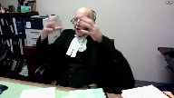
:::

They did not attempt to substitute their own assessment of reliability for the trial judge.

What they did is note that the combination of Dr. Jones' opinion with the presence of her evidence about the presence of leading and forced questions in the police interview, plus the absence of evidence about the content of the other interviews, even though Dr. Jones had said you desperately need to know that to assess their reliability, plus the incremental development of the allegations taken collectively raises an issue.

Not that the Court of Appeal was going to substitute its own assessment of for the trial judge, but rather to say that the trial judge didn't assess it, so we have no idea what he did with it.

All of the points that you've been making and that Ms. Klukacz made about what's in the evidence are completely valid.

As the Court of Appeal majority said, those are all plausible arguments.

Most of them were made by Crown Council at trial.

The question in the Court of Appeal was not whether those were arguments that were going to win or arguments that were going to lose.

The question was, were those arguments on a significant enough issue that the trial judge should have said something about it?

**Justice Rowe** (01:01:16): And I come back to my earlier point, sir.

::: {.column-margin}
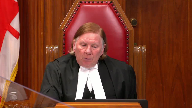
:::

I mean, as a general proposition, expert evidence is of assistance to the court, whether it's in a criminal matter or in a civil matter like torts or whatever, in order to evaluate the evidence of witnesses or real evidence or scientific evidence or whatever.

I mean, it's not for experts to decide matters.

And it's not for this expert or any other expert to say you should or should not believe this witness.

It's for the expert to say there's a certain context in which you should receive the evidence of the witness.

Be mindful of that.

And I think that's what happened here.

And it was before the trial, Judge.

And I must say, I just see in the Court of Appeal majority a real confusion as to the proper role of expert witnesses.

And I'm somewhat baffled by it, actually.

**Speaker 6** (01:02:17): I guess in defense to the majority, in my submission they didn't, well I suppose in defense of Dr. Jones and the majority, I don't believe that anywhere in the transcript she tried to express an opinion about reliability or credibility.

::: {.column-margin}
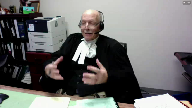
:::

She did not try to usurp the function of the finder of fact and the majority didn't take anything that she said is doing anything more than what you just said, which is taking her evidence as important evidence that they, that the trial judge needed to consider in assessing her credibility.

And again, to come back to where I was going and to continue the sequence, the Court of Appeal wasn't, in my respectful submission at least, substituting its own view as to this witness's reliability or how to assess the evidence of her reliability.

What it was doing was saying that there was an issue here about her reliability as affected by her suggestibility that was sufficiently rooted in the evidence and the submissions of counsel that it deserved an answer.

**Justice Brown** (01:03:35): And the seven pages of the trial judgment from pages 20 to 27 didn't furnish a sufficient answer.

**Speaker 6** (01:03:43): No, in my submission, it actually made it worse.

::: {.column-margin}

:::

That was actually what confirmed that we had a problem.

The difficulty is that you can go through the trial judge's reasons as much as you want, and what you find over and over is he discusses the issue of reliability as related to the consistency argument, so that it's inconsistent with piece of evidence A, B, C.

The defense very clearly advanced a two-pronged reliability argument at trial.

The suggestibility prong and the inconsistency prong, and what you see is the trial judge clearly dealt with the inconsistency prong, although even there he kind of frightens you because he digresses at the end of that into what sounds like the ring of truth talking about credibility, but what's striking by omission is that nowhere does he talk about the suggestibility issue.

**Justice Moldaver** (01:04:39): here please because I think with great respect there were two aspects of reliability perhaps and and it's been raised here the way you just put it as inconsistency in her testimony in fact the defense made a big deal about improbabilities improbabilities that's what it was and the trial judge went through the evidence in that regard and dealt with each one of them you may not like sir how he dealt with them but that's what he did then we have the suggestibility aspect and I guess to put it in as simple terms as possible you don't a trial judges don't deal with if comes and maybes his job was to look at this witness bearing in mind that he was aware of the psychiatric evidence look at this witness and assess her assess her testimony before him and it seems to me that he not only did that and you'll correct me if I'm wrong but I thought at one point didn't he sort of challenge the defense position that she was very suggestible and referred to a couple of times when she didn't give in to questions leading questions and she said no if I'm wrong on that you'll correct me but I thought in argument at least he did so

::: {.column-margin}
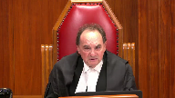
:::

so really we're we're criticizing a trial judge here again I come back to this for dealing with something that is made out of whole cloth given that he had the opportunity to assess this witness in real time and he wasn't the least bit persuaded that suggestibility obviously had anything to do with it and that's why he didn't refer to it

**Speaker 6** (01:06:30): My answer I guess would be firstly I believe that Crown Council at least raised the argument you've mentioned that she held her own in effect when she was examined.

::: {.column-margin}
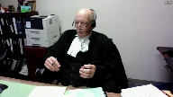
:::

That was part of the mix.

Again the problem that I'm having then in my submission that the court should have is that and what we're talking about now is your assessment here today on this record about how important this issue was, whether it was a live issue, whether her evidence, whether the way she gave her evidence made the the evidence from Dr. Jones,

oh well that didn't really matter because of how she testified.

In my submission that's all very well but as the Court of Appeal majority pointed out that everything you've just said is an assessment that the trial judge should have carried out.

If he thought oh it's not an issue because of xyz he should have said so.

The issue at least reached the point of being sufficiently anchored in the record and it was obviously highlighted and stressed by the submissions of Council that to put it metaphorically the accused was entitled to know having chosen that hill to die on that argument to make as a central issue was entitled to at least the most basic explanation of why ah there's no suggestibility issue here but you will read the trial judge's reasons in vain.

He talked about the as you say improbability reliability argument but he never mentions the other leg.

He doesn't talk about Dr. Jones' evidence.

He doesn't mention defense counsel's argument.

It's as if it didn't exist and when you contrast that with that he did deal with the other leg the absence is even more striking.

So again I'm not trying to because I don't think this is the place to argue and well there's this piece of evidence saying it's a big issue there's this piece of evidence saying it's not that isn't to be decided in the Court of Appeal or here.

The Court of Appeal was right to say we are not purporting to decide that.

The trial judge should have decided those issues on the live record and told the parties why it wasn't a live issue why it didn't matter. So I

I think I better move on if if I may to to what's left.

I I'm going to say about the second issue that statement about self-corroboration in the record only two things.

One is that in my submission in my submission when you simply read the passage in plain English it makes it very clear that he's saying her evidence about detailed in numerous circumstances corroborates and makes more credible her evidence.

There's not a plausible alternative interpretation

oh well he really meant it was the evidence of other witnesses the corroborator that is far too strained in interpretation to be saved by saying oh well when judges say something ambiguous we give them the benefit of the doubt.

This wasn't ambiguous.

Second if you look at the passage in passages in the interchange with counsel that I pointed to there are at least two instances where the trial judge made absolutely clear what this reasoning was and he made it absolutely clear that it was circular.

So in my submission the majority was right.

Coming to the to the third ground the failure to give reasons as to why he rejected the defense the the first thing that I want to stress there is that and it's apparent when you read paragraph 48 of the trial judge's reasons which I'm sure you've all read and numerous times already when he finishes talking about the credibility of the complainant and then goes on to say he finds the accused beyond a reasonable doubt to have committed the assault there is it's it's almost as if when you read it the temptation is there's a page missing because he says nothing about why he rejected the defense and I don't think there's any serious context that there is that hole in his reasons.

What came down to here is that both sides in the court of appeal were content to to deal with that by saying oh well

yeah

there is that hole in the reasons the Crown said

oh well you can use the JG JGRD reasoning that oh he just he rejected the defense because he accepted the complainant and the majority pointed out correctly that on the law as it stands that's only a an available escape clause for the Crown if the reasoning of the trial judge is otherwise considered and reasoned which they found obviously it wasn't because of the errors

but I think it's important the Crown if I understood correctly was almost suggesting that

oh well if you if if the appellant loses on the first two grounds of appeal this one disappears as well because this one depends on those that's not right the the third ground of appeal that the trial judge's reasons were inadequate inadequate because he failed to explain why he rejected the defense is a free-standing ground the Crown may be able to invoke the escape clause of saying oh well he just did it because he accepted what the complainant said but unless the Crown can successfully invoke that clause we are still left with the fact that this trial judge failed utterly to explain what happened to 150 pages of defense evidence now in terms of whether the escape clause

**Justice Moldaver** (01:12:09): matters that are best ambiguous.

::: {.column-margin}
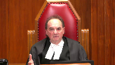
:::

I mean, really, the blanket, you know, for all we know, you know, he had a beige blanket and his wife didn't know about it and he got rid of it.

For all we know, he was buying condoms and his wife didn't know about it.

This is not the kind of evidence that we're going to send a case of this nature back for a new trial, because the trial judge failed to comment on evidence that really has the probative value of which is slight at best.

**Speaker 6** (01:12:41): Well, in my respectful submission, Justice, that becomes circular.

::: {.column-margin}
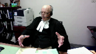
:::

You have, in effect, made a judgement based on the trial judge's failure to deal with the issue, that it couldn't have been a big issue, that he didn't accept the defence evidence.

But there is a substantial body of defence evidence from the accused and his wife as to, not only I didn't do it, and this is why I wouldn't, couldn't, didn't do it.

And what's happening here, in effect,

**Overlapping speakers** (01:13:08): Thank you.

**Speaker 6** (01:13:08): if we follow the path you're suggesting, is that this court is in fact assessing the evidence, informing its own judgment, and saying on that basis, we'll conclude the trial judge didn't have to explain what his judgment was.

::: {.column-margin}
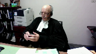
:::

In my submission, that's fundamentally wrong because the judgment here that matters as to how strong that evidence was or wasn't, was the judgment that the trial judge was supposed to have made on a live record.

**Justice Wagner** (01:13:40): All right, thank you very much.

Thank you.

Mr. Gourley.

**Speaker 7** (01:13:46): Thank you, Chief Justice.

::: {.column-margin}

:::

I'd like to pick up where Mr. Reynolds left off on this JJRD point, because I think it's a significant point for the practice that is becoming increasingly common in the trial and appeal courts.

And that's this question of whether the trial judge has an obligation generally to explain the rejection of the evidence of a defendant who gets on the stand, waives his right to silence and testifies in his defense.

In my submission, in all but rare cases, it's incumbent upon a trial judge to explain why the defense evidence is not believed or why it fails to raise a reasonable doubt.

The defendant and accused is entitled to that.

This is not a cosmetic technicality.

This is a defendant who's gotten on the stand and in detail denied not just the allegations themselves, but the circumstances in which the allegations were alleged to have taken place.

And so while there may be cases where the denial is so devoid of detail and devoid of any substantive content that's different from, that distinguishes it from the complainant's account, that the mere acceptance of the complainant's evidence beyond a reasonable doubt can be deemed sufficient from the perspective of the court of appeal.

It is not the case where the accused gives more expansive evidence, much less calls evidence from another witness, such as the accused's wife in this case, that is at least capable of corroborating or casting some doubt on some part of the complainant's evidence.

Now, Justice Moldaver, you've suggested that in this case, perhaps the evidence may have been seen as not that significant and not capable of displacing the findings that were made about the complainant's evidence.

That may be the case, and it's not my role as an intervener to get into the merits of the underlying appeal.

But my point is, if the trial judge thought so, the trial judge ought to have said so.

That's important.

And that's important not just for the perceived legitimacy of the result, which I think is crucial, but it's also important from the perspective of quality control, i.e. the most important thing that courts of appeal are in the business of doing, which is preventing wrongful convictions.

And that's not a fanciful concern.

We all know that in an appreciable number of cases, people who are not guilty come to trial.

In an appreciable number of those cases, people who are not guilty will be convicted.

It's a human system.

There will always be the possibility of error.

So one of the things we require of courts of appeal is to scrutinize the reasons for judgment of the trial judge to pick out where a trial judge may have been led astray and where a potentially innocent person may have been convicted.

Well, it makes it much more difficult to do that when the trial judge's reasons for not entertaining a reasonable doubt based on the evidence of the accused are not articulated.

The appeal court is left in a position of ignorance, and that's not acceptable when the appeal court's job is to protect against wrongful convictions.

**Justice Moldaver** (01:17:35): It seems to me that principle, though, is designed to deal with a situation where a trial judge does not deal with evidence that is really so vital, so critical, and just leaves it out there, just doesn't say anything about it, and just relies on the evidence to complain it, and does not address evidence that is so fundamental that it could well, in and of itself, call into question the integrity of both the complainant's evidence and, more importantly, the ability to rely on it to register a conviction.

::: {.column-margin}
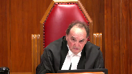
:::

I see nothing.

I know you are for the intervener.

That's the general proposition.

I think this court, in a case called R.A., effectively dealt with that, but I may be wrong.

I don't think so.

**Speaker 7** (01:18:27): I do not agree that the principle that an accused is entitled to an explanation of the rejection of his evidence applies only where there is some sort of extraneous part of the evidence that is capable of demolishing the prosecution's case.

**Justice Moldaver** (01:18:44): It's in combination though, let's keep it together, it's in combination with strong reasons that show why the trial judge believed the complainant.

**Speaker 7** (01:18:54): And if the trial judge's reasons for finding proof beyond a reasonable doubt are simply because of the power of the complainant's evidence, and nothing about the accused's evidence was problematic at all, but the force of the complainant's evidence was that powerful, the trial judge should say so.

::: {.column-margin}

:::

That's what Justice Trotter said in this case.

**Justice Wagner** (01:19:18): Thank you very much.

A reply, Ms. Klugec.

**Overlapping speakers** (01:19:26): No reply.

Thank you, Chief.

**Justice Wagner** (01:19:28): reply.

::: {.column-margin}
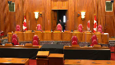
:::

Thank you very much.

The Court will retire.

I will ask Council to remain at our meeting.

Thank you.

You may be seated.

On behalf of my colleagues, I would like to thank Council for their submissions.

The Court is ready to release its decision.

I will ask Justice Moldaver to read the reasons.

**Justice Moldaver** (01:21:08): Thank you, Chief Justice.

::: {.column-margin}
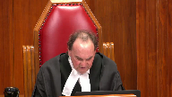
:::

We are all of the view that the appeal must be allowed for the reasons of Justice Peppal with which we agree.

We would simply underline that when assessing the credibility and reliability of testimony given by an individual who has an intellectual or developmental disability, courts should be wary of preferring expert evidence that attributes general characteristics to that individual rather than focusing on the individual's veracity and their actual capacities as demonstrated by their ability to perceive, recall, and recount the evidence in issue in light of the totality of the evidence.

Over-reliance on generalities can perpetuate harmful myths and stereotypes about individuals with disabilities, which is inimical to the truth-seeking process and creates additional barriers for those seeking access to justice.

Accordingly, we would allow the appeal and restore the conviction.

**Justice Wagner** (01:22:29): Thank you very much.

Thank you all.