---
title: T.J.M. v. Her Majesty the Queen
published-title: Heard
date: 2020-11-09
sidebar: false
---

This transcript was made with automated artificial intelligence models and its accuracy has not been verified. Review the original webcast [here](https://scc-csc.ca/case-dossier/info/webcast-webdiffusion-eng.aspx?cas=['38944']).
---

**Speaker 1** (00:00:02): TOOL THE COURT!

**Justice Wagner** (00:00:28): Good morning, please be seated.

::: {.column-margin}
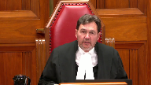
:::

In the case of T.J.M. against Her Majesty the Queen, for the appellant T.J.M., Mr. Graham Johnson, for the respondent, Her Majesty the Queen, Matthew W. Greener.

Please note that there is a publication ban in this file pursuant to Section 110 of the Youth Criminal Justice Act.

And there is a restriction, in effect, for this file from the lower courts.

Mr. Johnson.

But just before you start, I understand that both parties agree that, in this case, the Superior Court judge would have jurisdiction in these matters.

And my understanding is that you disagree on the situation in which there would be concurrent jurisdiction.

So maybe I could invite you and your colleague to put some effort, additional effort, to argue why there is or there is no concurrent jurisdiction.

**Speaker 2** (00:01:55): All right, thank you.

::: {.column-margin}
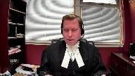
:::

Chief Justice, good morning.

Justices, I don't propose to be particularly lengthy in my oral submissions, particularly considering the position of the crown respondent.

Unless the court wants to hear from me on the mootness issue, I don't propose to deal with that.

To an extent on that issue, I agree with council for the respondent, to paraphrase that at this point the actual answer in some ways matters less that we at least have an answer that clarifies this across the country.

And I have to say my friend for the crown respondent has an interesting take on this.

It's not my reading of the legislation.

That being said, I'm all for flexibility in the Youth Criminal Justice Act.

And if the court finds that there is concurrent jurisdiction, that's not something I'm going to object to.

But for the reasons I'm going to go through, that is not what I would submit is the plain reading of the Act.

And it's true that the Youth Criminal Justice Act isn't exactly a model of clarity.

It does require interpretation.

But Parliament directed that the Act be liberally construed, and to the extent there is any broader policy implications from this case, I would submit it's the importance of interpreting the Act liberally where interpretation is needed.

And it's my submission that the decision being appealed from while wrong on its plain reading is also problematic in that it's a very restrictive interpretation, with the result being that a young person who had specific reasons for entering the election that he did and bringing his bail application where he did, the court refused to hear the application.

And I would appreciate that a court can't take jurisdiction over a matter if the statute expressly says it can't, but I would also submit that on a plain reading of the Act, it does give the court jurisdiction and

**Overlapping speakers** (00:04:16): Uh...

**Speaker 2** (00:04:17): certainly on a liberal interpretation, it does.

::: {.column-margin}
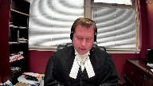
:::

And while there's an almost head-spinning number of sections involved in this case, I would submit that Parliament did not intend that the analysis should be overly complex, as the one has to go through all the sections, looking for hidden clues, like trying to solve a puzzle, but rather it's unlikely Parliament intended that it should be that complicated, and that, where interpretation is necessary, it should be interpreted in favour of the young person.

So, in this case, we start with section 13, suggesting when a young person elects, which I would submit is strongly suggestive that the section is invoked at the time of the election.

The Superior Court judge is deemed to be a youth justice court judge, the Superior Court, the youth justice court for the purpose of the proceeding.

This suggests more than just trial, and while I regrettably have a pretty rudimentary understanding of French, I understand the French text is also more broad than simply trial.

So, right there, I would suggest that it appears Parliament's intention was invoking the section at the time of election, and the court is the youth justice court for more than just trial.

Since it's not as perhaps as clear as it could have been, the next question is whether that reading is inconsistent with anything else in the act, and I would submit it is not.

**Justice Martin** (00:05:51): Mr. Johnson, may I just interject here.

::: {.column-margin}
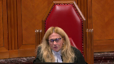
:::

Understanding that the word proceeding can be more than just the trial, what about the interpretation act though that tells us that in section 33 sub 2 that the plural includes the singular and the singular includes the plural in federal enactments.

So why would we pause at all in terms of proceeding being singular as opposed to being more than just a singular event, I guess.

**Speaker 2** (00:06:36): I really think it's a distinction without a difference that the, and while I hesitate to get into a discussion about the French text because my French is not good at all, I understand the French text as well is more broad than simply trial.

::: {.column-margin}

:::

So if you look at whether it's proceeding or proceedings and also look at the wording of the French text, I would submit it strongly suggestive that Parliament intended that this be more than simply a trial.

**Justice Côté** (00:07:09): Mr. Johnson, on that point, if we look at section 21 of the Act, 20 paragraph 1, we can see from that or we can infer from that that a proceeding, singular here in 20, is more than just a trial.

::: {.column-margin}
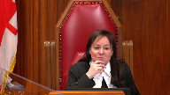
:::

I think we can inspire ourselves too with section 21 of the Act to say that a proceeding, it's not limited to the word trial, but it may also cover other steps.

**Speaker 2** (00:07:46): Yes, and I think looking at section 33 sub 5, that section clearly contemplates a superior court judge hearing a youth bail in the first instance because it's the section that provides that a review of a bail decision by a youth justice court judge who's a judge of the superior court will be to the court of appeal.

::: {.column-margin}

:::

Obviously a bail review isn't available on a section 469 offense like murder, but in my submission it pretty clearly indicates that parliament intended that superior court judges would be hearing bail applications in the first instance in their function as a youth justice court judge.

So I would submit that the reading the act as a whole, it's pretty clear that parliament suggested that at the time of the election the superior court becomes the youth justice court unless and therefore exercises all functions of the youth justice court except for parliament expressly stated it can't and where parliament expressly stated it can't is section 14 sub 7 which is to preside over a preliminary inquiry.

Now as I said the the crown respondent has quite an interesting interpretation of this and I have to say it it wasn't my read of the act but having looked at the crown respondents materials and gone back and taken a look at this section I do think there is some support for the argument that there could be concurrent jurisdiction.

I would note that section 13 deems the superior court judge a youth justice court judge and the superior court a youth justice court as opposed to saying the youth justice court.

It's a minor grammatical thing

but it does suggest perhaps there can be more than one youth justice court operating at the same time

and I certainly wouldn't take issue with this interpretation.

In this case there were reasons for why the young person elected up and applied for bail where he did but as the crown respondent discusses another young person may well have reasons for making the opposite election or wanting to have despite the election his bail hearing in a different court.

And I think on my interpretation you can nevertheless control the tactical decision by the timing of the entry of the election.

So if the young person wishes to have his bail hearing in provincial court he brings the bail application before entering the election.

If the young person wishes for whatever reason to have his bail in the superior court he enters the election first and then proceeds to file the bail application which is what happened here.

Obviously concurrent jurisdiction if it's available would offer even more flexibility and I don't, I would not take issue with that approach.

**Justice Martin** (00:11:17): Mr. Johnson, if you're not taking issue in that approach, do you have any submissions as to when that concurrent jurisdiction, if it exists, would be channeled into one or two of the or a specific youth court?

::: {.column-margin}
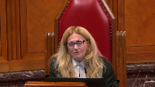
:::

Is it the election?

Is it the triggering offense or the trigger, the commencement of the trial?

What do you think about that?

And the practical implications of that as well, if you could.

**Speaker 2** (00:11:53): So my reading of this is that the Superior Court becomes the Youth Justice Court at the time there's an election to the Superior Court.

::: {.column-margin}
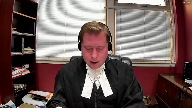
:::

Whether that means the Superior Court is therefore the only Youth Justice Court from that point forward except where Parliament expressly stated the Provincial Court can still perform functions of the Youth Justice Court, and that's basically to hold a preliminary inquiry.

Or whether from the timing of the election there is then concurrent jurisdiction at the

and it's open to the young person to bring any applications in whichever court.

I don't really take issue, although on my plain reading of the Act is that it's more likely there's one Youth Justice Court that was intended.

But as I say, Section 13 does say a Youth Justice Court as opposed to the Youth Justice Court.

So there may be some support for the interpretation that there can be concurrent jurisdiction.

In terms of how long that concurrent jurisdiction would last, if it exists, I would submit up until the commencement of the trial.

That once the trial has commenced, a reading of the Act and just general common law principles would be that there can only be one court that has jurisdiction.

And that during the trial if a bail application needs to be brought during the trial, it's brought before the trial judge.

Obviously the function of presiding over the trial and sentencing and any sentence reviews.

And I've included at tab 14 of my condensed book, some of the sections dealing with sentence reviews.

And I included it exactly to respond to this question.

Because I would note, for example, Section 109, which allows for a review of a decision by the Provincial Director by Youth Justice Court, uses the language saying the Provincial Director shall without delay cause the young person to be brought before the Youth Justice Court, singular.

And I think it would be problematic, and I discuss this a little bit in my materials, and perhaps open a Pandora's box of confusion if it's not made clear that from the commencement of the trial all the way through sentencing and sentence reviews, there is a singular Youth Justice Court and it's whatever court the young person elected to be tried in.

Because otherwise you potentially have the problem of the Superior Court sentences the young person, but a sentence review then gets brought in the Provincial Court by the Provincial Director.

And then there's jurisdictional arguments going on when really the court should be focusing on doing a sentence review.

So, the crux of my submission is...

**Justice Moldaver** (00:15:14): help me out on one thing.

::: {.column-margin}
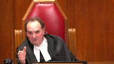
:::

You've taken the position, and I think probably rightly so, that if it's the accused that wants to bring a bail hearing after an election prior to the commencement of the trial, then the accused gets the right to pick which court

he or she wants to appear in front of for bail purposes, if I understand you correctly.

**Overlapping speakers** (00:15:39): If there is parallel jurisdiction, it would be my submission that that's the case, yes.

**Justice Moldaver** (00:15:44): there is for that question.

Does the same apply if the crown is seeking to revoke bail?

Does the crown get the choice then as to what court it goes to or what?

**Speaker 2** (00:15:57): Well and that would be, that would certainly be an issue and that may be a problematic issue if the finding is that there is concurrent jurisdiction because for example what happens if

::: {.column-margin}
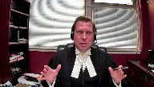
:::

**Justice Moldaver** (00:16:26): I don't mean to put you on the spot, I'm just trying to understand if there is what's good for the goose is good for the gander.

::: {.column-margin}
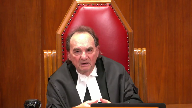
:::

Where the accused is applying, you say, your pick.

Where the crown is applying, and it's not before us, so it's not the end of the world, I just wondered what your thoughts were.

**Speaker 2** (00:16:48): Well, in this case, an accused would remain in custody because it's a 469 offence, unless and until a Youth Justice Court judge releases him.

::: {.column-margin}
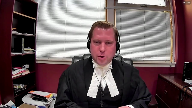
:::

And if the Crown wants to apply for review of that decision, that has to be to the Court of Appeal.

Where we would get into trouble, potentially, with concurrent jurisdiction, would be on a non-469 offence where an accused has an election.

So, for example, something like aggravated sexual assault.

If an accused is released initially and the Crown wants to apply for a de novo hearing before a Youth Court judge, does the Crown get to pick even though the accused has entered an election?

My sense, thinking about it on the spot, is I don't see how you could say that the accused gets to pick, but the Crown doesn't, unless it's to say the act is supposed to be liberally construed from the point of view of the young person, which would give the youth that flexibility, but the Crown should bring its application in the court to which the accused has elected, which would be the Superior Court.

That's my, not having considered it very fully, that's my answer.

**Overlapping speakers** (00:18:13): Thank you.

**Speaker 2** (00:18:14): So, unless the court has any further questions, I don't mean to belabor the point.

::: {.column-margin}
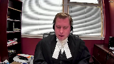
:::

I think my most likely interpretation is there's one court and it takes effect at the time of the election, but as I said, I don't take great issue, subject to thinking through some of the practical implications that might arise, like how it has to be clear that from the trial onward, including sentence reviews, there is a singular youth justice court.

I don't take too much issue with the Crown Respondent's interpretation.

If there's any questions, those would be my submissions.

**Justice Wagner** (00:18:59): Mr. Greener

**Speaker 1** (00:19:04): Thank you.

::: {.column-margin}

:::

Good morning, Mr. Chief Justice, Justices.

Given the Court's sort of direction with Mr. Johnson, I'll just focus my submissions really on this last point, which is the question of concurrent versus exclusive jurisdiction, subject to there being questions on other points.

And I want to emphasize two points in support of my submissions on that issue.

The first is Section 3 of the YCJA directs that the Act be liberally interpreted to advance the Statement of Principles in Section 3, Sub 1.

And those principles include, among other things, the need for promptness and speed in the procedures relating to young persons and for enhanced procedural protections to which young people are entitled.

And it's my suggestion that that supports a more liberal view of bail jurisdiction, that a reading of the Act which limits the jurisdiction of one forum or the other and requires additional procedural steps really has the effect of frustrating access to reasonable bail for young people and should be avoided, if it can be avoided, consistent with the wording of the Act.

And in addition to the specific principles applicable to the YCJA, a more liberal reading of bail jurisdiction, I suggest, would be consistent with the principles that apply to judicial interim release for all offenders, including adult offenders, which would include the need for minimum restraint on liberty.

So the more quickly the issue of bail can be determined, the better, both for young people and, of course, for adult accused.

Of course, that's consistent also with the presumption of innocence, given the stage at which a bail decision has to be made.

So with those principles in mind and looking at the wording of Section 33 sub 8, it's my suggestion that there's no limit expressed or implied on who is a Youth Justice Court for this purpose.

Youth Justice Court and Youth Justice Court judge are defined terms with reference to Section 13 of the Act.

Section 13 defines a Youth Justice Court judge to be first a judge of the designated court, the Youth Justice Court designated by either the Governor and Council or the Lieutenant Governor and Council, so in Alberta, the Provincial Court.

And additionally, in the case of elections, Superior Court judges or Section 552 judges are deemed to be a Youth Justice Court.

So on my reading of Section 13, I'd suggest that nothing in subsections 2 or 3 removes the jurisdiction of the designated Youth Justice Court judge following an election.

The English text of Section 13 says that the Superior Court is deemed to be a Youth Justice Court in this situation.

The French text does use the definite article, but it's also my suggestion that just looking at how procedurally a prosecution is going to unfold, even where there is an election to Superior Court, the Provincial Court has to remain a Youth Justice Court despite that election.

And I'd point to two steps in particular that support that reading.

The first is Section 67 sub 1 requires that the election is entered before plea.

So if upon election to Superior Court, the Provincial Court where the young person is appealing, is appealing, pardon me, ceases to be a Youth Justice Court, then it sort of leaves open the gap of where the plea ought to be entered, which is an essential step obviously to move forward.

Secondly, 67 sub 7, as the court will know, requires that a Youth Justice Court referred to in subsection 13 sub 1 shall conduct the preliminary inquiry.

So that makes clear in my submission that the Section 13 sub 1 Youth Justice Court remains a Youth Justice Court even after election.

And so it's my submission then that unless there's some limitation contained in Section 33 sub 8, the designated Youth Justice Court retains jurisdiction over bail after the moment of election.

**Justice Côté** (00:24:00): And what about when after the Triola started?

**Speaker 1** (00:24:07): So I've included in my fact in one or two cases for adult offenders, or accused, pardon me, the scope of a justice's jurisdiction under Section 515, and those cases have held that essentially the jurisdiction of a justice continues until the commencement of the trial.

::: {.column-margin}
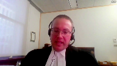
:::

At that point, by virtue of Section 523, the trial judge has jurisdiction, irrespective of any prior order of release or detention that's been made to make a new bail order or to make a bail order at first instance.

So my suggestion is that that would apply to young offenders, to young accused as well, that upon the commencement of the trial, a bail application should be brought before the trial judge.

But up until then, I'd suggest that flexibility is in order.

And there's a practical support for the idea that that jurisdiction should end at the commencement of the trial, as Mr. Johnson has mentioned, which is, you know, simply that when the parties are in court, they're before the trial judge, it makes no sense to essentially go before a different judge, in most cases, in a different level of court to speak to release. Right.

**Justice Rowe** (00:25:25): Once a judge has become seized of a matter, which is certainly the case when the trial starts, let's say I'm a Superior Court judge, and Justice Brown is a Superior Court judge, as we once were.

::: {.column-margin}
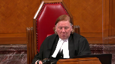
:::

So there's a matter before me.

The trial is underway.

Someone seeks to bring on an application before Justice Brown.

It's quite unimaginable that he'd hear an application when I'm seized of the case.

I mean, it's just not how things operate.

And I don't think it matters whether it's two Superior Court judges or one Superior Court judge and a Provincial Court judge.

Once I'm seized of a case, it's kind of mine, and you've got to knock on my door, I think, not on anybody else's.

**Speaker 1** (00:26:11): Yes, I agree.

::: {.column-margin}
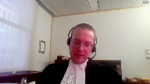
:::

So, the last point that I'll make, maybe just if I can attempt to address a question that Justice Moldavar, you had put to my friend, which was where would revocation hearings be channeled if there's concurrent jurisdiction over bail?

What I might suggest, and it's sort of hypothetical certainly in the facts of this case, but if we look at Section 524 of the Criminal Code, which is incorporated by reference into the YCJA by Section 28, Section 524 says that a revocation hearing would proceed either before a justice or in the case of an order made under Section 522 sub 3 by a judge of the Superior Court of criminal jurisdiction before a judge of that court.

And so, it may be possible to read with the necessary modifications that section to require that where an initial bail order for a young person charged with a Section 469 offense is made by a Superior Court judge, then the revocation should be heard by a Superior Court judge, but that in most other cases, it could be before a youth justice court, either level, a provincial court judge.

**Justice Moldaver** (00:27:42): Can we just go back a moment for, in terms of the trial judge having been appointed and the trial started.

::: {.column-margin}
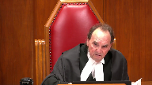
:::

Do I take it that you say that the code provisions that give that judge the authority to alter bail at any time during the proceeding, during the trial, I guess, is the section that should prevail and it does not conflict with 28 of the Youth Justice Act or Youth Court Justice Act?

**Speaker 1** (00:28:13): That's right.

::: {.column-margin}

:::

I say there's no conflict there.

So at least at the time of trial, whichever level of court it's proceeding in, I think sort of on any view of section 13, that court is a youth justice court.

And so for that court to have jurisdiction for that judge to have jurisdiction as the trial judge to revisit bail under 523 would not present any conflict with the YCJA.

**Justice Moldaver** (00:28:42): And can you help me out, please, with one other thing?

::: {.column-margin}
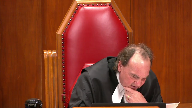
:::

You mentioned 67-77 of the Youth Court Justice Act.

And I don't pretend to be schooled that much in the French language, except that in that, in the English language, it talks about proceedings right at the end, the proceedings shall be conducted, it's plural there.

I don't think it matters that much.

But does it matter that the French uses the word le procès?

I mean, what do you say about that?

As I understand it, that is one of the problems that Justice Ouellette had with this whole situation.

Can you just help me out on that, please, or us out?

**Speaker 1** (00:29:31): What I would say is that in the context of section 67 sub 7, where we're talking about what's to happen after the committal to stand trial, that the reference to proceedings in that section is, I would say, obviously a reference to sort of trial proceedings and ancillary proceedings, so the first appearance in Superior Court setting a date for trial.

::: {.column-margin}
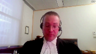
:::

That really talked me about that.

**Justice Moldaver** (00:29:59): Is there a difference between the English proceedings and the French process?

::: {.column-margin}
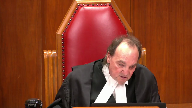
:::

Because where the French wants to use procedures, they know how to do it.

They certainly do it, for example, in 13.2.

They talk about the process of your own cause.

I just want your view on that.

**Speaker 1** (00:30:22): Yeah, I'd suggest that section 67 sub 7, we can read the proceedings in English to mean essentially the trial proceedings, and le passé in French to mean not only narrowly the trial, but the necessary proceedings to bring the matter to trial in the Superior Court.

::: {.column-margin}
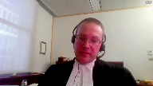
:::

That those essentially have the same meaning in that section, and that's clear from the context of that section.

And Justice Moldaver, as you indicated, in section 13 sub 2, the French text is using what I would suggest is broader phrase, les procédures en cause.

And so there's no reason to suggest that the word proceeding has to have the same meaning precisely in section 13 of 67. 67 is dealing with one very specific aspect of the proceedings in my submission.

**Justice Karakatsanis** (00:31:10): Can I ask you, can I go back to this issue about whether there's concurrent jurisdiction on bail issues after a trial starts and I accept that that's just the way we all trial judges assume once they're seized at the trial they'll deal with these issues but is there something in section 523 that not only gives authority to the trial judge but that makes it exclusive authority or is there some common law rule you can point us to?

::: {.column-margin}
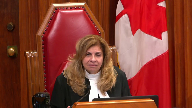
:::

I know that in section paragraph 43 of your factum you refer to two superior court decisions but I'm just looking for a bit more help on what's the basis for this proposition that I think we all feel based on our practice and the practicalities makes sense

but I'm just wondering if there's something specific you can point us to.

**Speaker 1** (00:32:16): Not really.

It does seem to me that it's sort of a matter of common sense which isn't seriously questioned in any of the cases that I have seen.

So I'm not sure I can be of much

**Justice Karakatsanis** (00:32:33): Thank you.

**Justice Moldaver** (00:32:36): For what?

**Speaker 1** (00:32:44): Subject to any further questions from the court, those are the Crown submissions on this issue.

**Justice Rowe** (00:32:49): Sometimes something which is remarkably obvious goes unstated because it is remarkably obvious.

That was intended to help you.

**Speaker 1** (00:33:03): Yeah, I thought it was very helpful.

Thank you.

**Justice Wagner** (00:33:06): Thank you very much, mr. Johnson any reply

**Speaker 2** (00:33:12): Maybe just briefly to respond to Justice Moldaver's last question to my friend about section 67 sub 7 and what Justice Oulette said in TRM about the differences between the English and the French text and it's my submission that section 67 sub 7 is doing nothing more than what a court hearing the preliminary inquiry of an adult would say which is at the conclusion of the preliminary inquiry I find there's sufficient evidence and I commit you to stand trial in the court of Queen's bench 67 sub 7 is simply stating the next step in the prosecution is following a preliminary inquiry

::: {.column-margin}
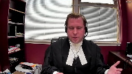
:::

a young person is committed to stand trial in the superior court but that that language does not mean that the more broad language in section 13 removes any jurisdiction from the superior court to hear things other than the trial um subject any further questions those are my only submissions

**Justice Wagner** (00:34:21): Well, thank you very much.

I thank Council for their submissions.

The court will take the case under advisement.

Thank you very much.