---
title: C.P. v. Her Majesty the Queen
published-title: Heard
date: 2020-11-10
sidebar: false
---

This transcript was made with automated artificial intelligence models and its accuracy has not been verified. Review the original webcast [here](https://scc-csc.ca/case-dossier/info/webcast-webdiffusion-eng.aspx?cas=['38546']).
---

**Justice Wagner** (00:00:25): Good morning, be seated.

::: {.column-margin}
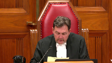
:::

In the case of C.P. against Her Majesty the Queen, for the Appellant C.P., Matthew R. Gorlet, for the Intervener, Criminal Lawyers Association Ontario, Michelle Bidulph, for the Intervener, Justice for Children and Youth, Jane Stewart, for the Intervener, British Columbia Civil Liberties Association, Alison M. Latimer, for the Respondent, Her Majesty the Queen, Grace Choi, Holly Lubert, for the Intervener, Attorney General of Canada, John Provart.

Mr. Gorlet, please note, however, that there is a publication ban on this file, pursuant to the Youth Criminal Justice Act, and there is a sealing order and a restriction, in effect, for this file from the lower courts.

Mr. Gorlet.

**Speaker 1** (00:01:33): Thank you Chief Justice and good morning everyone.

::: {.column-margin}

:::

I'm going to spend the first half or so of my argument explaining to you why in my submission the verdict of guilt in this case is unreasonable and I'll move on then to explain why I say section 37 sub 10 of the YCJA is unconstitutional, in other words why we should have been here as of right without having to seek leave based on the dissent in the in the court of appeal and there's a there's a brief outline of my anticipated submissions in the front of the condensed book.

So let me begin with the unreasonableness argument and the first thing I'd like to call the court's attention to is the fact that this was really in essence a circumstantial case against my client CP.

Certainly there was a credibility aspect to it of course if CP was believed or raised a reasonable doubt in his evidence an acquittal would have followed subject only to a potentially an issue of mistaken belief but the same was not true for the Crown witnesses.

There was no direct evidence of non-consent.

The Crown's theory was incapacity and there was no direct evidence of that either.

The Crown had to prove it circumstantially and that fact has consequences for your review under the law of unreasonable verdict.

Your task is to conduct a limited reweighing of the evidence to determine whether the inferences drawn by the trial judge were reasonably available to her and ultimately whether the finding of guilt was reasonably available on this evidence.

So let me point you to two aspects of the trial judge's reasons that raise what I've been calling Sinclair unreasonableness which is the the variety of unreasonableness drawn from the cases of Sinclair and Beaudry that's based not on whether the conclusion was reasonably available on the evidence but whether the logic of the inferences drawn was fatally flawed in a particular way and I'm going to point to two aspects of the trial judge's reasons that I say were fatally flawed in exactly that manner.

Namely that

**Overlapping speakers** (00:04:08): Yeah.

**Speaker 1** (00:04:08): they were what Justice Fish in Sinclair at paragraph 21 describes as follows, where a trial judge draws an inference or makes a finding of fact essential to the verdict if that inference or finding of fact is demonstrably incompatible with evidence that is neither contradicted by other evidence nor rejected by the trial judge.

::: {.column-margin}

:::

And the two aspects I'm pointing to here are as follows.

First, the trial judge's decision to accept a crucial sliver of CP's own evidence as the crucial link in the chain of inferences that led to the conviction, notwithstanding the fact that the trial judge found the balance of his evidence to be not just incredible but unreliable as well.

So that's number one.

And two is accepting the evidence of the two friends, both EG and GG as both reliable and credible, notwithstanding the fact that they were inconsistent on the crucial issue of timing.

So when you put those two together, in my submission ultimately you get to a place where the verdict was not only reached by an illogical chain of inferences but was not reasonably available to the trier of fact as Justice Nordheimer ultimately held in dissent.

So let me go first to the first issue, and that's the evidence of CP and how the trial judge found her way to hinging her decision to make a finding of guilt on this, what I'm calling a sliver of CP's evidence.

The trial judge, you'll see in the condensed book at tab one, at paragraph 90, the trial judge sets up her task very clearly as follows.

And I should say I don't disagree with this at all.

This is one of the many aspects of this trial judge's reasons that are lucid and persuasive.

So it's not the overall quality of these reasons that I'm attacking by any means.

It's these crucial links in the inferential chain that lead to the ultimate result.

And she says this at paragraph 90.

As the trial unfolded, it seemed there was a lack of clarity with respect to the timing of the sexual activity.

She notes that the crown witnesses were only able to make a guess about when the group arrived at the beach.

EG and GG did not witness any sexual activity and therefore could not help pinpoint the time it happened.

So it's CP who is the required witness to pinpoint the timing of the sexual intercourse.

The trial judge then says this at the bottom of that paragraph.

And this is really the crucial finding in this case.

The combination of EG's and CP's evidence, however, has answered the question of when during the evening the sexual activity took place.

The trial judge in the balance of that paragraph, which I won't read you, recognizes the consequences of this.

Because of course the complainant was observed by credible and reliable witnesses at the end of the evening to be in a state that clearly suggested incapacity.

The closer to those observations the sexual activity occurred, of course, the stronger the inference would be of incapacity at the time the intercourse occurred.

Conversely, the earlier it happened in the evening, the further away from those observations it occurred, the weaker the Crown case would be with respect to incapacity.

Because there was no sense in which the complainant could realistically have been said to be in a state of incapacity throughout the evening.

They arrived at the beach earlier on.

They drank vodka around a bonfire.

And at some point the alcohol had an effect on her that caused her to go into a highly compromised state.

But it was pinpointing exactly when that happened in relation to the intercourse that was crucial.

And as I say, only CP could provide that link because nobody else saw the intercourse.

And the complainant herself, of course, could not remember it.

**Justice Abella** (00:08:34): Mr. Gurley, when you go on from paragraph 90 that you've read and then look at 91, 92 and 93, you're focusing on CP's evidence.

::: {.column-margin}
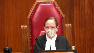
:::

But what the trial judge did was put the timing together based in part on a contradiction in CP's evidence himself as to when EG went over to the complainant.

Having concluded based on credibility that she believed EG who said she went over right away and rejected CP, where does that fit into what you're asking us to consider?

**Speaker 1** (00:09:16): It fits in because E.G. was only able to speak to her own observations when she arrived at the beach.

But you said it was timed.

I'm talking about the timing point, Mr. Gurley. Yes.

**Justice Abella** (00:09:30): So, she identified the timing differently from CP because she said EG came over and immediately went over to the complainant.

::: {.column-margin}
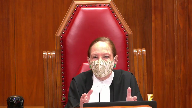
:::

CP accounts for a 15-minute difference by saying he talked to them first.

She rejects that.

That's what I'm asking you to put into context for us in what you're saying about paragraph 90 and the errors you say she made.

**Speaker 1** (00:09:58): The 15-minute point, in my view, is essentially a red herring because CP gives two different versions of that.

::: {.column-margin}

:::

In chief, he says he spoke with EG for 15 minutes before she went over to the complainant.

In cross, he seems to agree that there was no 15-minute chat and EG went over immediately.

But on either account, you have to believe CP that the intercourse ended at effectively the same moment that EG arrived.

On either of those two accounts, that's how the trial judge uses it.

So it's not a question really of whether CP should be believed on the 15-minute point.

The trial judge is entitled to reject that.

But interestingly, one of the reasons she gives for rejecting CP on that point is at paragraph 93.

He was intoxicated at that point.

You'll see in the middle of that paragraph.

It's the second reason she gives for rejecting CP's evidence.

So what the trial judge is saying is that CP was himself in such a drunken state he can't be relied on for a fine point of timing like this.

That stands in, and I'm going to suggest, profound tension with the trial judge's finding that he can be relied on, effectively beyond a reasonable doubt, for linking EG's arrival with the end of the sexual intercourse.

**Justice Côté** (00:11:30): So, Mr. Gorlet, so your position is that the trial judge should have rejected CP's evidence on that point, on that thing when he said that EG and another friend arrived immediately after the end of the sexual intercourse.

**Speaker 1** (00:11:49): My position is, if she was able to rely on that to carry the decisive burden of the Crown case, she needed to explain why she was able to make that finding, notwithstanding her finding that CP was, because of his intoxicated state, an unreliable witness in general.

::: {.column-margin}

:::

And you'll see that further at paragraph 110.

And this is in the section of her reasons where she's explaining why CP's evidence doesn't leave her with a reasonable doubt.

And at paragraph 110, she lists a number of bullet point reasons, or bullet point items, on which CP is unable to give clear evidence.

And she says, look, I think he was drunker than he was letting on.

And that accounts for why he was unable to recall all of these things.

So again, the problem is not just that she finds CP incredible, because of course, she's entitled to make that determination.

She saw him on the witness stand, fine.

But she didn't just find him incredible.

She found that he was understating his level of drunkenness and his actual ability to recall what went on that evening.

So if he's not able to recall what went on that evening, and the trial judge finds it in numerous places that he was not, how then does the trial judge get to the point where she can say for sure that she can rely on his account that when the intercourse ended, he heard EG and J arrive on the scene?

That's a precise point of timing.

And it's the kind of point on which she rejected him and his evidence on a number of other issues.

So the extent to which that finding is both precise, nuanced, and essential to the verdict, because it is essential to the verdict, the problem is that she fails to explain how that bit of evidence coming out of the mouth of CP is not similarly compromised by unreliability.

**Justice Kasirer** (00:14:19): Can you help us understand the position of the majority on this point?

::: {.column-margin}
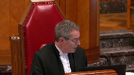
:::

Paragraphs 48 and 49 of the appeal judgment, and specifically the references to the idea that the trial judge accepted a number of aspects of the appellant's evidence on peripheral and narrative points, and also the majority citing paragraph 114, where the trial judge explains that there were aspects of C.P.'s evidence that did not suffer from flaws.

**Speaker 1** (00:15:01): Yes, thank you, Justice Kasir.

::: {.column-margin}

:::

From what I can tell, the points on which the trial judge accepted CP's evidence were narrative details on which everyone agreed and which predated the intoxication that Mars CP's recollection as to the later events.

So Justice McPherson at paragraph 48 talks about the fact that they had been drinking together from the time they left the LCBO.

Well, nobody disputed that.

And that preceded them becoming intoxicated in any event.

So the majority is right as far as it goes that there were some peripheral uncontroversial details on which CP's evidence was accepted.

But none of those details were either crucial to the result or suffered from the flaws the trial judge herself is recognizing in CP's evidence as it pertains to what happened after 10 o'clock, after 1030, towards the end of the evening when CP, on evidence the trial judge accepts, is told to sit down because he's too drunk to be walking around.

That's what happens when EG arrives at the beach whenever that was.

So the very witness who the trial judge accepts is too drunk to walk is being relied on to precisely pinpoint the time of the intercourse based on an overheard conversation, the timing of an overheard conversation from somebody in the distance who's arriving at the beach.

That's the problem in my respectful submission.

**Justice Abella** (00:16:49): And so she ought not to have concluded that she ought to have found that she had some doubt because of his contradictory evidence based on the fact that he was drunker than he said he was.

::: {.column-margin}
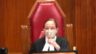
:::

I'm not getting really what your point is.

I want to be sure I understand.

**Justice Abella** (00:17:14): argument you're making about her reasons and the conclusions especially that she reaches at paragraph 95.

**Overlapping speakers** (00:17:20): Yes, so

**Justice Abella** (00:17:22): It leads me beyond a reasonable doubt to conclude that, et cetera, et cetera.

::: {.column-margin}
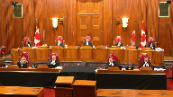
:::

So I just want to know what it is you want us to think about reading these reasons given the fact that you say he was drunker than he said and she acknowledged that he probably was.

**Speaker 1** (00:17:42): Yes.

So what I want you to acknowledge is the tension between her inability to rely on his evidence because of his drunken unreliable state and her acceptance of his evidence on that crucial

**Overlapping speakers** (00:17:57): Isn't that why she relied?

I'm sorry, go ahead.

**Speaker 1** (00:17:59): I appreciate that a judge is entitled to accept some none or all of a complainants of any witnesses evidence and Justice Nordheimer acknowledged that in dissent as well but when the trial judge is picking from the same pool of evidence identifying flaws in the witnesses evidence on some points and yet relying on other points in that same small pool of evidence that suffer from those very same flaws we're at least entitled to an explanation as to why she was able she felt herself able to do that

::: {.column-margin}

:::

**Justice Abella** (00:18:38): So she says the explanation is that she accepted EG's evidence.

**Speaker 1** (00:18:43): But EG's evidence does not get us there, because all EG can say is that when I arrived, RD was there in a compromised state.

::: {.column-margin}

:::

EG has no idea when the intercourse occurred and is not able to speak to that at all.

But he said when it occurred.

He said when it occurred.

And she found her unconscious and covered in vomit.

**Justice Abella** (00:19:07): You

**Overlapping speakers** (00:19:07): Yes.

**Justice Abella** (00:19:08): so those dots are not allowed.

She was not entitled to connect the dots.

**Speaker 1** (00:19:12): She was not entitled to connect the dots by inexplicably relying on a a section of CP's evidence that she'd already determined to be unworthy of belief because of his advanced state of intoxication.

::: {.column-margin}

:::

I'm going to put one more question to you Mr. Gourley.

**Justice Abella** (00:19:32): And then I'll leave you alone.

Doesn't that stand for the proposition that we upend our jurisprudence that says you can accept some or all or none of the evidence of a witness?

You are now saying if you don't accept all of the evidence of a witness, you cannot accept any of the evidence.

**Speaker 1** (00:19:49): No, I'm not saying that at all, and this is textbook Sinclair and Beaudry in my submission in that, of course, a trial judge is entitled to accept some, none or all, but we evaluate the quality of the inferences that are drawn by the trial judge based on their factual findings.

::: {.column-margin}

:::

And if they make findings that are mutually inconsistent and unsupportable, or if they draw inferences that are mutually inconsistent, this court is, any appeal court, is required to intervene.

So again, I don't see this as a jurisprudentially significant or controversial point at all.

And I think that Justice Nornheimer describes it well as simply an aspect of the trial judge's duty to give full reasons for judgment.

**Overlapping speakers** (00:20:41): Can I-

**Speaker 1** (00:20:42): the reasons they're silent on a crucial point.

**Justice Karakatsanis** (00:20:45): Pardon me, Mr. Gurley, I'm looking at the trial judge's reasons that come a little later where she's dealing with the credibility, whether she accepts the sincerity of the evidence of the accused.

::: {.column-margin}
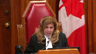
:::

So I'm looking at paragraphs 112, for example, where he was not being forthright.

Looking at these reasons fairly, isn't the trial judge saying, well, I accept his evidence, although I understand that he drank more than, and that's affecting some of his memory, but I accept his evidence when it comes to the narrative and a lot of what happened, but on the crucial points, on the points that are exculpatory, I'm not accepting that he's being forthright.

Judges do that all the time, and if you read these reasons fairly and generously, it's clear she has a problem not only on the issue of reliability because of drunkenness, which is what you have focused on, but she's also got a problem with his sincerity.

So why can't she accept much of the exculpatory, if you will, the narrative, and focus in on those aspects where he is giving evidence to the exculpatory evidence.

**Speaker 1** (00:22:21): The problem in my submission, Justice Karakatsanis, is that if you look at the reasons from about paragraph 110 and onwards, it's clear that one of the reasons for her finding CP not to be a credible witness is intimately intertwined with her finding of intoxication in that it was his failure on the witness stand to acknowledge the degree to which he was impaired and his recollection was impaired by his intoxication that had this knock-on effect of detracting from his credibility.

::: {.column-margin}

:::

So my submission is those two cannot be so easily disentangled, and you inevitably run into the problem that I've just tried to elucidate for you, that the trial judge is simultaneously able to reject the accused's evidence on that crucial sequence of events and yet rely on it for a subtle and particular observation that is required to carry the Crown's burden of proof across the line of reasonable doubt.

That's the fatal flaw in my submission, and again, it's an application of this Court's existing unreasonable verdict jurisprudence, which is a core feature of appellate review.

I make some point in the factum of saying that Justice McPherson has effectively taken too deferential a standard because he's spoken of unreasonable verdict review as being rare or overturning a verdict as unreasonable as being exceedingly rare, when in my submission that's not a correct understanding of the jurisprudence.

It's of some significance, I just happened to see online the other day on the Department of Justice website that the Minister of Justice has just ordered a conviction review for Mr. Yeebs, ordering a new review on the basis that he may have been wrongfully convicted.

The person who gives his name to the unreasonable verdict test in this country.

So that's just an anecdotal observation of the extent to which this jurisdiction to review the reasonableness of the conviction is so crucial to what appellate courts do.

How ironic would it be if the very person who gives his name to that test turns out not to have been guilty all along?

So in my submission there's nothing novel about this, you have to scrutinize the validity of the inferences that the trial judge makes and in this circumstance they're fatally flawed.

Not just for that reason, but for another reason that is the second point I want to make in the remaining few minutes on this section of the appeal.

That is that the trial judge found both E.G. and G.G. to be both credible and reliable and yet they gave evidence that was inconsistent on the point of timing.

So you'll recall that E.G. initially testifies that she arrived at the beach maybe around 10 o'clock.

In Cross she conceded that it may have been substantially later.

Now G.G. was clear that she she's the one you'll recall who had a curfew, had to get home around midnight, left the beach, then got her mom and came back and her evidence was very specific because she was looking at her phone being conscious of her curfew and gives clear evidence that the trial judge accepted that she left at 12.30 and that she was sure that E.G. had not yet arrived when she left.

So the trial judge again accepted this this evidence and you'll see you'll see in the trial judge's reasons at in my condensed book at paragraph 97 the trial judge says as with E.G. I find that G.G. was a credible and reliable witness.

Now G.G. also provides evidence that C.P. and the complainant were were kissing throughout the evening and that just before she left around 12.30 she observed that R.D. was starting to get into a bad state and was starting to vomit.

So it appears on on her evidence that was again accepted by the trial judge that the intercourse likely preceded her departure for the first time and that E.G.'s arrival came after that.

So that would that would be strong evidence suggesting that the intercourse substantially preceded E.G.'s arrival.

Thank you for your attention.

**Justice Côté** (00:28:00): saying substantially.

I understand your point when we look at the evidence of those two witnesses, but why are you saying that the sexual intercourse must have happened substantially before?

Perhaps...

**Speaker 1** (00:28:15): perhaps that's not the best word.

::: {.column-margin}

:::

I mean that it had to have predated those two events.

So Gigi's observation of RD and then EG's arrival, which was some point after that.

So it could have been a matter of 10 minutes.

It could have been a matter of half an hour.

Nobody knows.

And that's really what this all boils down to,

that nobody can with any certainty, once you disentangle the problems with the trial judge's reliance on CP's evidence on this point, the case for the Crown becomes entirely inscrutable because there's no basis on which you can find with any confidence that we can pinpoint the timing of the intercourse on this continuum from starting to drink and getting a little happy earlier in the evening to being incapacitated and vomiting at the end of the evening.

So the trial judge accepted both EG and Gigi, but as Justice Nordheimer explains in great detail and whose reasons I adopt, though the joint acceptance of the evidence of those two witnesses posed profound problems for the Crown's ability to prove its case.

And the trial judge did not seem to cue to those problems.

And that means that the verdict is unreasonable in the Sinclair-Beaudry sense.

And my argument ultimately is that the verdict is also unreasonable in the Yves-Binieris sense, because once you really recognize the problem there, it just cannot be said that there was sufficient evidence on this record to pinpoint the timing of the intercourse.

And I repeat, pinpointing the timing was essential to a finding of guilt.

**Justice Moldaver** (00:30:23): You can pinpoint it by his own evidence because he's all relating it to the time he ejaculated or which he assumed he didn't remember that either.

**Overlapping speakers** (00:30:32): Well, he didn't remember anything else correctly, according to the trial judge.

Well, he seemed to remember that.

**Justice Moldaver** (00:30:37): He seemed to remember that, that he got up right after that.

::: {.column-margin}
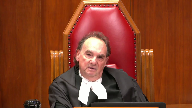
:::

Initially, he didn't.

He took the position that it was, he went right from there, and he saw EG. Yes.

And it was 15 minutes that he spoke, and then at cross-examination, he himself said, no, I was wrong on that, I guess.

It didn't go on for 15 minutes.

Well, didn't that come out at cross-examination? No.

**Speaker 1** (00:31:04): No, but he didn't say I was wrong on that.

He answered a proposition put to him in one word where the crown said, and then E.G. went over directly to R.D.

And he said, yeah.

So I agree. I agree.

**Justice Moldaver** (00:31:19): whatever way you want to put it, the trial judge is watching this.

::: {.column-margin}
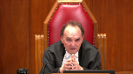
:::

She's listening to the evidence.

She's watching the way he gives his evidence.

He's tied all this to ejaculation.

And she's got a witness, e.g. who she believes, who is credible, who hasn't been drinking, or at least not that much.

And she says, you know, I accept her evidence that when she got there, she sees the accused and goes right over to the complainant.

And I'm having real trouble understanding why a trial judge can't do that.

**Speaker 1** (00:31:58): She's absolutely entitled to do that.

::: {.column-margin}

:::

She's absolutely entitled to accept EG's evidence on whether there was a 15-minute chat.

But that's not the important point.

The important point is whether the accused evidence tying the ejaculation to the arrival of EG can be relied on beyond a reasonable doubt when the balance of his evidence on everything consequential has been rejected as being marred by unreliability, by extreme drunkenness, on a 15-year-old who can't, is not, able.

**Justice Moldaver** (00:32:32): Not everything was marred by that.

I think she found that your client was lying when he said what he said she said to him.

But that never happened.

**Overlapping speakers** (00:32:42): That's not a real lie.

**Justice Moldaver** (00:32:43): thing.

That's a credibility thing.

**Speaker 1** (00:32:45): And as I've tried to explain, the reliability analysis is entwined with the credibility analysis because she's said, I don't find him credible because he's underplayed the extent of his intoxication and his ability to recall things.

::: {.column-margin}

:::

**Justice Moldaver** (00:33:05): Is there any of his evidence we can accept?

::: {.column-margin}
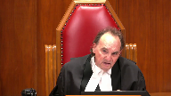
:::

I mean, how does a trial judge do what you're asking the trial judge to do?

If you're taking the position that the trial judge found that he was so drunk he didn't know what he was doing, and nothing that he says is reliable, I mean, where do we go from here?

**Speaker 1** (00:33:26): Well, clearly it was not the defense, that was not the defense position.

The defense position was that he was reliable and was a credible witness, but the trial judge having having found to the contrary, we are in the position of...

**Justice Moldaver** (00:33:43): the trial judge to believe him on the issue of consent, right?

::: {.column-margin}
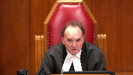
:::

So I don't see how you can then kind of, you know, take opposite sides here.

Either he was so drunk that he didn't know what he was doing, and then how can you say that she should accept his evidence when he says she consents, or you've got to say she should have at least had a reasonable doubt based on his evidence that she was consenting.

**Speaker 1** (00:34:11): No, I'm not, I'm not, I'm not endeavouring to refight that, that battle.

::: {.column-margin}

:::

She's entitled to find that he's not credible on the issue of consent, but she's stuck with the logic of her findings on whether he was, or was not credible and reliable.

And fundamentally, the logic is inconsistent for all the reasons that I've tried to explain.

**Justice Côté** (00:34:34): Mr. Gurley, you said that you adopt Justice Nordheimer's reasons.

Justice Nordheimer's entered an acquittal and in your factum you are asking for an acquittal or in the alternative, a new trial.

**Overlapping speakers** (00:34:50): Yes.

**Justice Côté** (00:34:50): Can you elaborate?

**Speaker 1** (00:34:52): So, if the verdict is unreasonable in the binarist sense, if it's not reasonably available on the evidence, then there should be an acquittal, and that's my principle position.

::: {.column-margin}

:::

I don't think there's evidence on which a reasonable jury properly instructed could judiciously reach a finding of guilt.

If the verdict is simply marred by the trial judge's inconsistent inferences from found facts, then the proper order is a new trial.

If there are not further questions on the conviction appeal, I'll move to the constitutional issue, Chief Justice.

Yes, please do so.

We say that Section 3710 contravenes both Section 7 and 15 of the Charter, and a building block of our Section 7 argument is the position that you ought to recognize as a principle of fundamental justice that youth are entitled to enhanced procedural protections within the criminal justice system.

We say that the Court's decision in D.B. has already implicitly embraced this principle, and that it's closely linked to what the Court identified in D.B. as the principle of diminished moral responsibility.

But, of course, in D.B., the Court's consideration was limited to the sentencing phase of the trial, the phase where moral responsibility is most closely engaged.

Our position is that there's no reason in principle that it ought not to apply to the rest of the process as well.

It must apply to people who are not guilty as well as those who are guilty, and it must take into account the fact that young people who are accused of crime are inherently vulnerable in the system.

They're disproportionately from disadvantaged backgrounds, as was the accused here.

**Overlapping speakers** (00:37:19): I think you'd find that's the case whatever age level.

**Speaker 1** (00:37:22): I think that's right, but it has more profound impact on young people who don't have the benefit of life experience or education that would arm them even with the minimum degree of knowledge and fortitude that adult accused have at some basic level.

::: {.column-margin}

:::

So that's all the more reason to insist that they are given at least the degree of procedural protection afforded to adults.

**Justice Moldaver** (00:37:58): Sorry, when the court, when this court is looking at a leave application from a young person, why would you take off the table the fact that we would consider the very things you just said in deciding whether to grant leave?

::: {.column-margin}
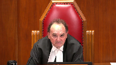
:::

I mean, we're not going to ignore the fact that it's a youth and so on and so forth, and powers of whatever, observation or whatever it may be.

We're not going to ignore that.

So, why is this so dreadful that, you know, the fact that the adults get one thing in terms of this procedure that the young people don't, when in fact this court on the leave application will look very carefully at all these things?

**Speaker 1** (00:38:47): It's the difference between courting a procedural right that is given automatically and as a matter of course, between that and giving an assurance that the court will exercise its discretion in an appropriate way.

::: {.column-margin}

:::

And ask yourself whether the argument I just made to you on the conviction appeal would have had a realistic chance of getting leave to appeal in this court.

Sure, there was a profound disagreement in the court of appeal on whether the verdict was reasonable, but it raises no jurisprudential issue of significance.

It has no public importance to the court.

Does it have to?

Well, that's up to the court, but it's in the court of appeal.

**Justice Moldaver** (00:39:35): I don't think it does when you're dealing with criminal conviction and particularly a youth involved.

I don't think it does.

**Speaker 1** (00:39:42): It's been the court's practice to apply, albeit a modified version of the public importance test set out in section 40 of the Supreme Court Act.

::: {.column-margin}

:::

And I acknowledge the fact that this court may choose to grant leave in a youth case that it sees as particularly meritorious, even if it raises no general issue.

But the point is, why should a young person have to count on the generous dispensation of the court in its unreviewable discretion, when an adult, identically situated in every respect, has that as a legal right to review?

That's the difference.

**Justice Abella** (00:40:25): Sorry, I didn't mean to interrupt.

::: {.column-margin}
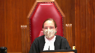
:::

That sounds to me much more like a section 15 argument.

I must say, since it's already in section 3 of the legislation, it's being set out in DB, Justice Deschamps' decision in SJL, KJM.

We've already said in our jurisprudence that they're entitled to enhance procedural protection.

Making that a constitutional principle doesn't necessarily get you to a breach of section 7, because as Justice Moldaver said, there is a right to apply for leave.

So the question is, does the deprivation of an automatic right to leave violate enhanced procedural protection?

So speaking for myself, I find it a less sturdy foundation to apply under section 7 than my openness on the section 15 argument based on that position that you're taking.

**Speaker 1** (00:41:34): Thank you, Justice Isabella.

::: {.column-margin}

:::

And I have to say, I've been struggling with the question of how best this is framed as well.

I guess some of the difficulty under Section 15 has been that youth claims based on, or claims of discrimination based on age, have historically had a more difficult time in this court because it's often the case that a distinction drawn on the basis of age is related to need and ability in some direct way and is therefore not substantively discriminatory.

But I think it's crucial to note that in this case, those concerns really don't arise.

It's not the typical Section 15 case where the claim, even in this court's recent decision in Fraser, where there's difficult social policy judgments at stake and allocation of resources and policy priorities.

That makes it a much easier and clear-cut Section 15 violation in my submission in a case like this, when what you're looking at is not a difficult policy decision involving allocation of resources, but a simple legal right, a simple binary choice of either or.

And in this case,

**Justice Brown** (00:42:57): If that gets you over the first step of the section 15 analysis, there's a distinction.

::: {.column-margin}
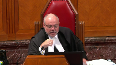
:::

So then the question is, does that distinction perpetuate or exacerbate or reinforce preexisting disadvantage?

And I'm wondering if you could focus on that for a few minutes.

**Speaker 1** (00:43:18): Yes, absolutely.

So I think to understand the extent to which it does reinforce

**Speaker 1** (00:43:25): historical and existing disadvantage you have to look at the the history of youth justice law in Canada which moved through the 20th century from the juvenile delinquents act which was enforced through most of the century and was a highly paternalistic social welfare oriented piece of legislation which accorded young people virtually no firm procedural rights in the system through to the young offenders act in the late 20th century which accorded greater procedural protections to the youth criminal justice act enacted in 2003 which in trenches enhanced procedural protection as one of its own fundamental principles young people have historically been not only vulnerable in the ways that i've that i've already uh adverted to in the criminal justice system because of their their youth and and inexperience um and lack of support but they've also been treated in the system historically as if they were not in need of any right historic

::: {.column-margin}

:::

**Justice Brown** (00:44:31): Historically, right?

You're talking about the Juvenile Delinquents Act?

**Overlapping speakers** (00:44:34): Yeah.

**Justice Brown** (00:44:34): very few of these procedural or substantive safeguards that were legislated in 1984, 1985, whenever the young offenders act came in.

::: {.column-margin}
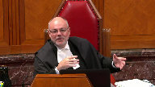
:::

But how can a provision, how can we just leap over the intervening 36 years?

You're grounding a perpetuation of disadvantage argument on a scheme that hasn't existed for 35, 36 years.

I'm not, and here's why.

It's historical, but what was it continuing?

**Speaker 1** (00:45:10): Okay, well, let's look at what happened under the Young Offenders Act because importantly, and I would say surprisingly, the move from the Young Offenders Act to the YCJA in 2003 actually saw a diminution of appeal rights for young people, which is profoundly out of sync with the general trend towards greater procedural protection.

::: {.column-margin}

:::

Why do I say that?

It's because in serious cases under the Young Offenders Act, it was open to the Crown to seek a transfer of the case to adult court.

And if a case, and those tended to be in the most serious cases, if a case was transferred to adult court, then all of the adult rights of appeal would attach.

And you've seen this historically.

I was looking last night through the SCRs in the days before the YCJA came into effect, and it turns out that some very well-known appeals in youth matters were heard as of right by this court.

Stillman, the famous case dealing with Section 8 and 24-2 was one of them.

He was a young person who was transferred to adult court, and this court heard his appeal as of right.

So in the cases where procedural protection on appeal was most needed under the Young Offenders Act, they had it.

Then you move to 2003, and for reasons that nobody has really been able to explain satisfactorily, the Youth Criminal Justice Act that has enhanced procedural protection as one of its guiding principles in Section 3 takes away this right that had existed even under the previous act.

And it does so in a way that exacerbates the disadvantage that young people have always faced in the system.

As I said, young people are uniquely vulnerable.

**Justice Moldaver** (00:47:27): Sorry, I don't understand your point.

I apologize for interrupting.

What is your point that they took away transferring young people to adult court?

What are you saying?

**Speaker 1** (00:47:39): Obviously I'm not complaining about that.

What I'm pointing out is the fact that you could transfer a case to adult court had the knock-on effect of preserving adult appeal rights in those cases where a young person was transferred.

**Justice Moldaver** (00:47:50): That may well be, but now are you saying they can't be transferred to the adult court? Yes.

Isn't that a huge procedure of protection?

**Overlapping speakers** (00:48:00): Yes, it is.

**Justice Côté** (00:48:04): So again,

**Justice Moldaver** (00:48:04): You

**Overlapping speakers** (00:48:05): I don't know-

**Justice Moldaver** (00:48:06): The government has given and taken, but to suggest somehow that this is, that there's some kind of, I don't, I'm not, I can't even quite describe it, that they're perpetuating some disadvantage when they give and they take at the same time.

::: {.column-margin}
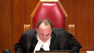
:::

I think it's probably a wash, but.

**Speaker 1** (00:48:29): the exact same point could have been made in DB, of course, because DB was about a presumption of adult sentences in a certain subset of cases and whether it was constitutional to place on the young person the procedural burden of displacing the presumption of an adult sentence.

::: {.column-margin}

:::

And this court found that it was not, even though the suite of protections that provided that presumption was one that was overall very much in favour of youth.

So it's not inconsistent at all to say that this scheme, the Youth Criminal Justice Act scheme, is generally protective of youth.

It's generally more protective of youth than its predecessor.

It's not inconsistent to acknowledge that and say that in this one crucial respect, it is less protective and it is less protective in a way that arbitrarily discriminates between young people and identically situated adults.

**Justice Moldaver** (00:49:40): Do you have any evidence as to how many times this court has denied leave in cases where there's been a dissent in law for a young person?

**Speaker 1** (00:49:50): No, interestingly, the most recent example was a case where everybody thought up to a certain point that there was an appeal as of right, the KJM case from Alberta.

::: {.column-margin}

:::

The court noticed the jurisdictional problem and invited an application for leave to appeal.

It was granted, but I note that in that case, there was an issue of considerable jurisprudential significance as to the application of the Jordan standard in youth matters.

**Justice Moldaver** (00:50:23): then there's no history whatsoever to indicate that this court has denied leave a number of times where there's been a dissent in law by a court of appeal judge there's no evidence of that if I'm hearing you right

::: {.column-margin}
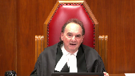
:::

you're putting that down to a mistake are you

**Speaker 1** (00:50:44): No, and I'm not making the claim that the court has somehow been complicit in a pattern of discrimination against young people.

::: {.column-margin}

:::

I'm making a broader point that young people are systematically disadvantaged within the criminal justice system and placing a further disadvantage at the end of the road when the validity of a conviction is in question is arbitrary and discriminatory.

That's the fundamental point.

**Justice Brown** (00:51:18): But what you have to show isn't that there's some little element where relative to the comparator group, they are disadvantaged.

::: {.column-margin}
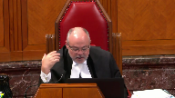
:::

What you have to show is a perpetuation or an exacerbation or a reinforcement of pre-existing disadvantage.

And as you point out, this operates in a system where there are considerable advantages afforded to young people.

And you mentioned KJM, Justice Abella and I, albeit in dissent, but not on this point.

We listed out the advantages that young people receive.

Extrajudicial measures, notice to parents, enhanced right to count.

This is all in addition to section three of the act.

So it seems to me that your case, and you can correct me if I'm wrong, your case isn't satisfied by kind of cherry picking one aspect where relative to adults, they have a comparative disadvantage.

You have to show that there is a pre-existing disadvantage.

And I'm struggling to understand that, how you can make that case when we're dealing with the system that taken as a whole confers considerable procedural and substantive advantages to young people.

**Speaker 1** (00:52:42): The pre-existing, thank you Justice Brown, the pre-existing disadvantage in my submission is the inherent vulnerability of young people within the system and the historical view that is partly ameliorated in the YCJA but not, you know, on this particular point, the historical view that young people have somehow less to lose and less interest in clearing their name if they are in fact not guilty of what they're charged with.

::: {.column-margin}

:::

And in fact, if you look at the justification that is proffered by my friend, it goes all to this argument that somehow, well, there's less at stake, sentences are lower, they expire faster and it's in everybody's interest, it's in the young person's interest just to get this all over with.

Well, in my submission that speaks to the very kind of disadvantage that's faced youth throughout and was most pronounced under the Juvenile Delinquents Act, obviously, but remnants of which have persisted to this day.

The idea that, you know, a young person who says he didn't do something, he was not guilty of something.

**Justice Rowe** (00:54:04): I have a suggestion, complete equality.

Just put them under the criminal code and have it done with.

Well, we'll run into other.

It's full and substantive equality, by the way. Yeah.

**Speaker 1** (00:54:17): Yes.

::: {.column-margin}

:::

And I think that, I mean, the argument I'm making is one of substantive equality because I don't suggest for a moment that every procedural distinction between adult and youth is discriminatory or contrary to the principle of fundamental justice that I've put forward.

There are a number of procedural differences that are not just for the benefit of the accused, but represent trade-offs as well.

Look at the provisions for election of the motive trial.

The accused has fewer options in electing a motive trial than an adult.

A young accused has fewer options in electing the motive trial than an adult accused.

**Justice Rowe** (00:55:00): But what you're laying out for us is a form of analysis that says, as a general proposition, while the Youth Criminal Justice Act confers certain advantages on young persons who are accused, in every instance where it is less advantageous than the criminal code, then section 15 of the Charter requires the court to invalidate the less favorable provision and insist that it be replaced by a provision at least as favorable as the criminal code.

::: {.column-margin}
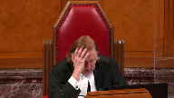
:::

That's really what it boils down to, isn't it?

All right.

**Speaker 1** (00:55:47): And I'm not advancing the last part of that proposition and let me explain.

::: {.column-margin}

:::

If the YCJA provides a less advantageous procedure to young people as compared with adults, it is not automatically invalid.

The question you ask is whether it has a purpose or an effect that is ameliorative in character and that overall assists in advancing the objectives underpinning the YCJA.

So let me give an example that I had just cited as the mode of trial provisions.

Those are different and in some respects less advantageous to young people.

However, they clearly do facilitate the objective of streamlining the process, keeping young people in a specialized court rather than sending them off to a superior court, keeping as this court recognized in KJM, keeping the case well within the Jordan guidelines.

So all of those provisions in my view would be eminently justifiable and nondiscriminatory based on the fact that the difference, the substantive difference between young people and adults is respected and furthered rather than derogated by those provisions.

This provision is not at all like that because a person who has gotten to the end of the road, these very few cases where a young person has appealed to the court of appeal of the province and has had a split decision on an issue of law emerge from that court, the idea of a quick resolution of a criminal case simply does not apply, that ship has sailed.

It's now in that person's interest to have the same benefit that older people do in having this court effectively break the tie.

And there's no good justification that's been put forward for denying them that crucial final procedural protection.

**Justice Moldaver** (00:58:09): Well, didn't Justice Sapinka say there was, except that he wasn't dealing with the Charter, I accept that, but was he wrong in terms of his comments about, that he made in whatever case it was, CTL or whatever?

::: {.column-margin}
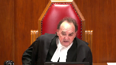
:::

Because he, he hits his head on and he says, you know, uh, that certainly kind of would seem to be what Parliament had in mind here, not to punish the youth or anything else, but to streamline the thing and get it done.

**Speaker 1** (00:58:40): But with great respect, I do think you, and again, that CTL just hinged on a facial reading of the provision at issue.

::: {.column-margin}

:::

And that's what the ratio of the case was.

In Obiter, Justice Sapinka did speculate as to Parliament's purpose, but I'm going to respectfully suggest that was incorrect.

Keep this in mind, and this is really important.

The bar on appeals as of right actually does nothing to advance the interest my friend has put forward as compelling and substantial.

It does not facilitate a quicker resolution of a case because a young person like anyone else retains the ability to seek leave to appeal.

So what it actually does, and seeking leave to appeal is a time consuming process as you're well aware, that in many cases will take just as long as the scheduling of an appeal as of right before this court and the disposition of an appeal as of right.

Now if the young person is actually successful in obtaining leave to appeal, that process will have lengthened the overall time to disposition because you will then insert the four to six month leave process in between the court of appeal judgment and the final disposition by this court.

So even accepting that this is a pressing and substantial objective in this context, which I don't for a moment accept, by its own terms it simply doesn't work.

Unless you're going to take away from young people the ability to seek leave in this court, the denial of an appeal as of right simply doesn't speed things up at all.

**Justice Karakatsanis** (01:00:19): Can I ask you, Mr. Gurley, how does the factor that 3710 also denies the Crown the right of appeal as of right, how does that factor into the analysis?

Because that's a benefit for the young people.

**Speaker 1** (01:00:37): Fair enough.

::: {.column-margin}

:::

I think the reality is that crown and defense rights of appeal are asymmetrical in every context under the criminal code.

So the defense always has more expansive rights of appeal from determinations of fact and law and mixed fact and law.

The fact that they are symmetrically denied by 37 sub 10 therefore doesn't substantially assist the defense.

What you would expect if 37 sub 10 mirrored the adult criminal code would be that the accused would be given a more expansive and more advantageous right of appeal than the crown.

**Justice Wagner** (01:01:30): Thank you.

Justice Abella has the last question for you.

**Justice Abella** (01:01:33): We've been talking about enhanced procedural protection, but what I would appreciate hearing from you, Mr. Gorlie, is what you say the procedural protection is in having an automatic right to have an appeal when there's a dissent on a question of law.

::: {.column-margin}
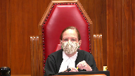
:::

What do you say is protected by that right?

**Speaker 1** (01:01:56): The same right that Parliament has enacted for young people in 6911B, which is to ensure that where the highest court of a province cannot agree on the legal propriety of a conviction, this court will have the final say.

**Justice Abella** (01:02:09): that.

For what purpose?

What do you say the role of these automatic rights of appeal is in the justice system?

**Speaker 1** (01:02:18): to protect against wrongful conviction.

Thank you.

**Justice Wagner** (01:02:22): Thank you, Ms. Bidulph.

**Speaker 2** (01:02:28): Yes, thank you Chief Justice.

::: {.column-margin}

:::

So I intend to focus my submissions on a point of law that does appear to be in dispute between the respondent and the appellant here, which is whether there is a constitutional right to an appeal at all.

So why do we have appeals in criminal matters?

Everyone has a right to affair at an error-free trial and all actors in the criminal justice system, whether they be Crown Council, Defence Council or the trial judge, have a duty to ensure that that right is respected.

So, in theory, we shouldn't need appeals at all.

But theory isn't reality.

In my submission, the right to affair in an error-free trial is meaningless without a mechanism to enforce that right, and that's where appeal courts come in.

Appeal courts exist, at least in criminal matters, to protect against wrongful convictions.

So this is why the CLA submits that the right to appeal against a criminal conviction is a principle of fundamental justice.

This Court recognized that at paragraph 95 of its decision in the United States and Burns, where it stated that appeals are a corollary aspect of the right to a fair trial and the presumption of innocence.

This right is also enshrined in several international human rights conventions, which Canada has ratified, and as we lay out in our written submissions, it meets all of the requirements to be recognized as a principle of fundamental justice.

Now, I understand that the Respondent and the Attorney General of Canada will ask this Court to rule otherwise, to rule that there is no constitutional right to an appeal.

In my submission, this Court must be very careful about accepting this type of broad characterization of what the principles of fundamental justice require.

The principles of fundamental justice are contextual.

The procedures that they require in one context may not be required in another.

All of the cases that my friend relies upon are all decided in other contexts, such as interlocutory appeals or immigration matters.

Here we're talking about the criminal context, where the principles of fundamental justice require that a person be presumed innocent unless and until guilt is proven beyond a reasonable doubt in a fair and an error-free trial.

A corollary must be the right to seek appellate review of any conviction that is entered to ensure that it is legally valid.

Derek, Derek, Derek.

**Justice Rowe** (01:04:34): But there is now and there never will be an entirely error-free trial.

The question is, is the error of such a nature that it makes the verdict unsound or the proceedings so unfair that it has to be done again?

**Speaker 2** (01:04:47): That's entirely correct Justice Roe.

The question is whether or not there was a wrongful conviction.

And that's why we submit that the right to seek appeal of a criminal conviction must be a principle of fundamental justice in order to prevent a wrongful conviction.

**Justice Moldaver** (01:04:58): having trouble understanding when, as you well know, what our leave process is, we look very carefully at the judgments below, we look very carefully, particularly in a case where there's a dissent on a question of law, we look very carefully at it and we have the right, if we ever get one of these cases again, to provide, to use a more liberal standard in deciding whether to grant leave.

::: {.column-margin}
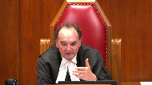
:::

So it's not as if this is some hit-and-miss operation.

We are looking very carefully at the record and if we're concerned that there was a miscarriage of justice that might result in a wrongful conviction of a youth or anybody else, we're gonna grant leave.

**Speaker 2** (01:05:48): Yes, of course.

::: {.column-margin}

:::

The problem, Justice Moldaver, is that what is submitted to this court on a leave application is not the full record.

You'll get the dissent of the court of appeal judge and the majority reasons of the court of appeal judge and whatever parts of the record the appellant or the proposed appellant thinks is relevant, but this court isn't reviewing the whole record on a leave application and it may not be easy to tell at the leave stage whether a wrongful conviction, in fact, occurred.

So in my submission, a right of appeal is necessary in these cases in order to protect, to provide that final protection against wrongful convictions.

Now as Mr. Gurley said, these types of cases, the cases questioning the reasonableness of a verdict, don't raise any kind of novel or unsettled points of law or interesting points of academic or constitutional inquiry.

They're a very fact-specific case of whether the evidence presented at a particular trial was sufficient to prove a particular person's guilt beyond a reasonable doubt.

While we may be able to trust that this court will apply its public importance test and always grant leave in these cases, in my submission, because adults are given that right of appeal, youth should be given it as well.

In my submission, where the judges of the highest court of a province can't agree on whether, on the answer to the question of whether a verdict was reasonable, it signals that there is a very real risk that a wrongful conviction has occurred, which means there must be final appellate review.

It could happen through the automatic granting of leave or it could happen through an automatic right of appeal.

In my submission, there's no reason why the automatic right of appeal should be should be denied to young offenders based solely on their age.

So subject to any further questions, those are my submissions.

**Justice Wagner** (01:07:25): Thank you very much.

Gene Stewart.

**Speaker 3** (01:07:30): Thank you justices.

::: {.column-margin}

:::

This morning I'd like to examine some of the frailties of the justifications that have been offered for 3710.

But as a as a fundamental point I think it's important that the court understand that the benefits of the youth criminal justice system and the youth criminal justice act aren't in fact benefits conferred on a young person at all, but instead what they are is a recognition of the pre-existing disadvantage of young people and adaptations to account for their inherent vulnerability and their reduced maturity.

They are the adaptations that make the system equal by addressing that pre-existing disadvantage.

So to withhold a more robust appeal route is to fail to ensure that the the system is fundamentally equal and treats them equally.

This is not an admonition of this court's process by any stretch, but I think it's worth noting that a constitutional flaw, that is the unequal provision of an appeal right, can't be cured by this court's exercise of discretion.

What must be ensured to a young person is equal access to the protections of this court against the wrongful finding of guilt.

The justifications that have been offered by the Attorney's General for the limits on a young person's appeal route are fundamentally out of step with our present understanding of young people's rights and the best interests of the child.

We know from the jurisprudence of this court as well as the international legal principles that young people are entitled to robust protections and enhanced procedural protections in order to ensure that they are treated equally in the criminal justice system.

And they are also entitled to the consideration of their best interests.

The best interests of the child in this context aren't separate from the other rights protections that they are guaranteed.

They are in fact, they encompass the exercise and the full enjoyment of rights guaranteed to others in recognition of young people's status as individual rights holders and full members of society.

**Justice Moldaver** (01:09:40): Can you help me out where this goes?

::: {.column-margin}
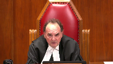
:::

I mean, right now we're just dealing with whether automatic right of appeal or not.

What about jury trials?

Accused adults have much more opportunity to have trials by judge and jury than youths do.

Is that the next case that's going to come to us?

**Speaker 3** (01:10:03): What the system requires is that young people are treated on equal footing with adults.

::: {.column-margin}

:::

I mean, if it could somehow be shown that young people are disadvantaged in a way that doesn't correspond or doesn't, in fact, ameliorate their position of disadvantage in the system by access to a jury trial, then perhaps that wouldn't pass constitutional muster.

But of course, there are other protections of the act to which that relates.

For example, some would say juries are the greatest...

**Justice Moldaver** (01:10:34): protection against wrong wrongful convictions that we can have and yet the adults have obviously much more of an opportunity to be tried by judge and jury so I ask you again is this the next step that we're going to be facing here that all youths that have the same rights as adults for jury trials

::: {.column-margin}
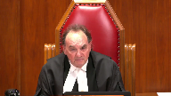
:::

**Speaker 3** (01:10:57): Of course our recognition of young people's rights and our understanding of the content of young people's rights has to be incremental and the question that's before the court today is whether this appeal or this right that's accorded to adults, whether there's some justification that in fact is to the benefit or somehow ameliorates the disadvantage of young people in the criminal justice system.

::: {.column-margin}

:::

I guess I.

**Justice Rowe** (01:11:21): take that answer to be this is the beachhead and the incursion will follow after the beachhead is taken.

**Speaker 3** (01:11:31): We already recognize through the youth criminal justice system and through the jurisprudence of this court through DB and for example KJM that young people are already entitled to these types of enhanced procedural protections in order to remedy the disadvantage that they experience in the criminal justice system.

**Overlapping speakers** (01:11:49): because

**Speaker 3** (01:11:50): We're not proposing that they be offered a new appeal right that's not already available to others in the criminal justice system, but that they be offered that right on an equal basis that takes account of the fact that there are significant harms to a young person of the inability to challenge a wrongful finding of guilt to a higher level of court that are not explained by the justifications that have been offered for 3710.

::: {.column-margin}

:::

**Justice Abella** (01:12:14): isn't it possible that one of the problems is in the way you're characterizing or the way I think I hear you characterizing the issue as being the same rights and approach to equality which is the same when we know that there is as Mr. Gurley said asymmetrical an asymmetrical relationship based on how different young people are from adults including how they're sentenced and how long they're sentenced.

::: {.column-margin}
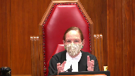
:::

So I'm just a little bit nervous about this equal footing argument because it leads to issues that are admittedly not before us

but I'm just not sure that's the right approach to how we look at section 15 anyway.

**Speaker 3** (01:12:56): What we're asking for is a substantively equal access to a right of appeal that is available to adults and where that appeal route is not available to a young person there has to be some sort of justification that accords with their capacities, their needs and their vulnerabilities.

::: {.column-margin}

:::

There has to be some sort of correspondence between the limitation that's been placed on young people's rights.

**Overlapping speakers** (01:13:22): and

**Speaker 3** (01:13:23): and the protections that they're due under the law so that they can enjoy an equal protection of the law.

Thank you very much.

Thank you.

**Justice Wagner** (01:13:34): Addison Nademer.

**Speaker 4** (01:13:41): Justices, section 3710 of the Youth Criminal Justice Act requires youth to apply for leave to appeal to this court rather than giving them an appeal as of right.

::: {.column-margin}

:::

The BC Civil Liberties Association says this infringes youth section 7 rights both because it offends the established principle of fundamental justice that protects procedural fairness and also because it offends the established principles that laws not be arbitrary or overbroad.

My primary focus today is on procedural fairness and in our submission the charter duty of procedural fairness may include rights to an appeal.

None of the cases that have been cited by the Crown or Canada foreclose that a right of appeal may be required for a particular law to comply with procedural fairness in light of section 7 and the Baker factors.

In Pan, this court relied on Justice Arbour's decision in the Farinacci case and assumed that a self-standing right of review of conviction was required as a principle of fundamental justice.

In our submission, the right of review is best addressed as an aspect of procedural fairness because that allows that content of the duty of fairness to be flexible, variable and context dependent.

Well, the issue before the court today is the right of appeal in the context of a finding of guilt in youth justice court in respect of a sexual assault.

Grounding the court's judgment in the principle of procedural fairness will enable courts and tribunals to apply the court's reasoning to the myriad contexts in which the section 7 rights of youth are engaged in matters before those courts and tribunals.

Those matters of course are not limited to criminal law and they're not limited to appeal rights but they include procedural protections in lots of other contexts including for example child welfare proceedings.

The content of the duty of fairness would vary depending on the circumstances and courts habitually use the Baker factors to guide that determination but those factors are not exhaustive and we say the characteristics of the affected individuals is a significant factor in this appeal and in any proceeding that impacts the charter rights of youth in light of their unique vulnerability and capacity for development of young persons.

We don't shy away from the fact that this resonates with section 15 as equality rights underlie all the other rights in the charter and the charter rights are intended to be mutually reinforcing.

**Justice Kasirer** (01:16:08): Ms. Latimer, may I ask, your argument applies to a second right of appeal, and if it does, why not a third right of appeal, or a fourth right of appeal?

**Speaker 4** (01:16:21): In our submission, it is of some significance that Parliament has seen fit to allow for a final right of appeal in contexts such as in this case, where there's a dissent on a point of law.

::: {.column-margin}

:::

The reason that has been done is because of the risk of wrongful conviction and the heavy toll that that exacts on both the individual and society.

In those circumstances, we say, because of the context of the decision being made and the importance of that decision to the individual and to society, there should be a final level of appeal for youth as well.

And what I've referred to, there are two of the Baker factors that would apply with some significance in this case in terms of determining whether another level of appeal is required.

**Justice Rowe** (01:17:11): Is that not an argument for saying, although it's not before us, that it is beyond the competence of parliament to repeal appeals as of right under the Criminal Code?

**Speaker 4** (01:17:22): Justice Roe I don't need to advance that argument today because of course my argument is that the content of procedural fairness is contextual and variable and context dependent.

::: {.column-margin}

:::

So in a situation where the court was faced with an adult who had no right of appeal you would need to apply the baker factors to see whether that was constitutionally compliant or not.

But if you're concerned

**Justice Rowe** (01:17:51): concern is on improper convictions, then presumably everyone is open to that, whether they're 16 or 66.

**Speaker 4** (01:18:02): Certainly in Charcoway, this court observed that factual situations closer to criminal proceedings will merit greater vigilance by the courts and that extends to adults as well.

::: {.column-margin}

:::

But the nice thing about the Baker factors is that they can be applied in a myriad of circumstances and they will not always result in the same outcome.

Would it result in the same outcome for adults? Maybe.

But in my submission, the characteristics of youth, their special vulnerability, their capacity for growth, this is a factor that weighs heavily in favor of granting them the greatest procedural protections available under the law and I say it's appropriate that this resonates with equality and substantive equality.

It's also consistent with international norms, domestic laws and the jurisprudence which repeatedly recognize the special status of children as uniquely dependent, vulnerable and deserving of protection.

Thank you very much.

**Justice Wagner** (01:18:53): The Court will take its morning break, 15 minutes.

::: {.column-margin}
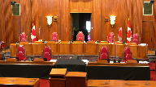
:::

**Speaker 5** (01:20:13): Good morning.

::: {.column-margin}

:::

I'm going to be addressing the section 7 issue for the respondent.

My colleague Ms. Choi is going to be addressing the section 15 argument as well as responding to the substantive arguments made against the underlying findings of guilt.

Before I turn to the section 7 argument, I want to put a very quick pin in the issue of jurisdiction just to make sure that it's not overlooked because it's not obvious to us how this court has jurisdiction to hear this constitutional challenge for the first time at this level of appeal.

It does not appear to be statutory jurisdiction under the YCJA, the Criminal Code, or the Supreme Court Act, and it's not clear to us how this qualifies as a new issue being raised on appeal because unlike in cases like Boudin, there is no meaningful nexus between the constitutional challenge and the appeal proper.

The outcome of the one is not going to impact the outcome of the other.

**Justice Brown** (01:21:17): Here you are making arguments about it and presumably because that's because you filed a motion to quash.

**Speaker 5** (01:21:27): We did.

We took the position in our leave factum that if this court had jurisdiction to address the constitutional issue, it would be on the motion to quash or on the leave application, because that's the moment when the constitutional issue crystallized.

**Justice Brown** (01:21:44): Do you understand yourself as speaking to the motion to quash right now?

**Speaker 5** (01:21:50): it's it's we believe it's moot right now leave has been granted so to the extent that the crown isn't taking the position that this court should not hear it because it's moot

::: {.column-margin}

:::

we're aware we have a full adversarial context here we are not alleging prejudice and although the issue is academic and moot to the appellant it is not academic at large

so if this as long as this court is satisfied it has jurisdiction we are leave was granted and we are prepared to proceed

**Overlapping speakers** (01:22:20): But you're not satisfied we have jurisdiction.

**Speaker 5** (01:22:22): It's not clear to us how this court has jurisdiction, either statutorily or as a constitutional issue being raised for the first time on appeal at the Supreme Court of Canada level.

::: {.column-margin}

:::

We wanted to flag that.

We flag that in our leave application.

We wanted to flag it to make sure it's not entirely overlooked.

Turning to our section 7 argument, in our submission, the section 7 argument in this case is about whether an automatic right to a second level of appeal is a principle of fundamental justice or not.

In our submission, it is not.

In our submission, section 3710 of the YCJA engages the section 7 liberty interest in a manner that is consistent with the principles of fundamental justice.

And we say that for four reasons.

First, there is no inherent right to a second level of appeal, because there is no inherent right to an appeal at all. Second...

**Justice Brown** (01:23:19): What do you say to the submissions of the criminal lawyers association to the effect that the authorities that you rely on really speak to a different context, which they clearly do.

::: {.column-margin}
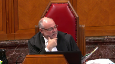
:::

I've looked at them too.

And I'm not ‑‑

it's not clear to me why you're relying on this argument because you don't need to make it.

Because the issue isn't whether there is a constitutional right to an appeal.

The issue is whether there is a constitutional right to a second layer of appeal.

**Speaker 5** (01:23:54): I agree that the none of the authorities that we brought you to are binding but in our submission they are all persuasive to the extent that this court is inclined to recognize more appeal rights.

**Justice Brown** (01:24:07): You said they were unambiguous in the factum.

This court and others have repeatedly and consistently held there is no constitutional right to an appeal.

The law on this is unambiguous.

**Speaker 5** (01:24:22): I would submit that this court in Cortessus at Paragraph 136 stated there is no constitutional right to an appeal.

::: {.column-margin}

:::

In Sharkewi it's clear that the source of the appeal right that they were looking for was in the charter somewhere

but they didn't specifically articulate where.

So in that case to the extent that they were still looking this court was still looking to the charter to find a source of a constitutional inherent right to appeal this court declined to find that right.

Similarly in Chiarelli the court assumed without deciding that section 7 was engaged by the deportation context and then proceeded with their analysis.

**Justice Brown** (01:25:04): ever decided that there is no right to a an appeal from a conviction has the

**Speaker 5** (01:25:14): no there's no case led directly on that point no not to my knowledge that said the that said we have yet to be pointed to any decision at any level of court in any province that has looked at this issue and held that there is an inherent right to an appeal every time the courts have looked at this and admittedly nothing has been directly on point they have consistently declined to recognize more rights of appeal than are found in the governing statute in terms of the the authorities that we we led you to i would also submit to you that in all of those cases the issue that was being looked at was not whether was whether there's actually a a right to a first level of appeal not a right to a second level of an appeal so to the extent that that we we put those to you as relevant we submit it is because if there is no right to a first level of appeal that is even more reason why there ought not to be a right to a second level of appeal

::: {.column-margin}

:::

**Justice Karakatsanis** (01:26:19): So it's your position over here that there is no right to a first level of appeal from a conviction.

That's your there's no right of review following the conviction of an indictable offence.

That's your position.

**Speaker 5** (01:26:36): Our position is that right now there is no case law that sets out that there is a constitutionally required judicial form of review that's required as a principle of fundamental justice. Yes.

**Justice Karakatsanis** (01:26:53): I wasn't asking whether there was case law that established that.

We're being asked to establish that.

Question is, is it your position that there is no right to review following conviction of an indictable offense?

**Speaker 5** (01:27:09): That's a that's a broader question that I think needs to be answered here and I think assuming without deciding that there may be some constitutional entitlement to a first level of review, I think there's a significant difference between a first level of review and a second level of review.

::: {.column-margin}

:::

It's one thing to say that you're entitled to review the decision making process that led to a conviction, I think it's quite something else to say that you're entitled to a judicial review of your judicial review and I mean the rationale that would justify a first level of judicial review to ensure that the reasoning process that led to a conviction is not tainted with error does not apply with equal force in the context of a second level of review.

**Justice Karakatsanis** (01:27:59): I think the argument that's being put to you is that it is a first level of review after a conviction because among the leave provisions that do not apply because of section 3710 is the provision that gives an appeal as of right where a court of appeal sets aside an acquittal and enters a conviction for the first time.

::: {.column-margin}

:::

So that's the position that's being put to you.

**Speaker 5** (01:28:28): I would submit that I have three responses to that.

::: {.column-margin}

:::

I believe first it's that that's a very different situation than we have here, as you indicated, because that would be a first level of review and not a second level of review.

Second, I think assuming without deciding that there is a constitutional entitlement to some form of a first level of review, we would submit that in these circumstances, in those circumstances, a young person has not been denied a right of judicial review because the leave application process itself should be recognized as some form of constitutionally valid form of judicial review.

If, I mean, if we're creating a constitutional measure of an appeal, it's not necessarily tied to our existing statutory scheme.

So there is really nothing to say that an oral hearing would be required for a constitutionally mandated appeal as opposed to an in writing process.

And when you've got an open ended leave provision like we have in these circumstances, it would enable this court to functionally serve the same purpose as a first level of judicial review.

And the further alternative, even if the leave process does not qualify as a form of judicial review, in our submission, the applicant would only be denied a right of review if this court denied leave, denied leave knowing that this would be the applicant's first opportunity to have this conviction reviewed.

In our submission, it would be entirely within this institution's discretion to exercise their leave power in a manner that would permit a review of this conviction.

And that's why there is no institution better positioned than this one to exercise that discretion.

**Justice Brown** (01:30:29): So I just want to make sure I understood what you said just before that.

Did you ‑‑ because I may have been misunderstanding you.

Did you say that our review of an application for leave qualifies as what you call a level of judicial review?

**Speaker 5** (01:30:47): We're submitting that if we are creating a constitutional standard of judicial review, sort of from the ground up, the fact that the leave provision permits the applicant to file materials before this court and permits a panel of this court to review these materials with a very broad discretion and allows it to grant leave on any issue that it feels is of significance.

::: {.column-margin}

:::

**Justice Brown** (01:31:19): What if we deny leave?

Has there been a level of judicial review?

**Speaker 5** (01:31:25): in our submission if we are sort of creating this constitutional standard if this court has reviewed the materials from the court below there has been some form of judicial review because

**Justice Brown** (01:31:39): Reviewing for what?

Reviewing to determine whether it meets the threshold for granting leave is a different kind of review than a search for error.

**Overlapping speakers** (01:31:51): In our submission, the the search for national importance and a search for importance, public importance, I'm sorry to interrupt.

**Justice Brown** (01:31:59): Sorry, I'm just saying it's a different search.

::: {.column-margin}
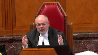
:::

Yes, it is a form of judicial review when we look over leave applications, but we're not reviewing for error or for public importance.

We're reviewing for public importance.

Whereas when we are reviewing a matter on appeal where we've granted leave, we're reviewing for error.

Those are two different kinds of reviews.

The mere fact that we were reading materials doesn't mean that it's judicial review in the same sense as an actual appeal.

I'm just not sure where this argument's taking you.

I'm sorry.

**Speaker 5** (01:32:38): Our response would be that Section 3710, there is no leave test articulated under Section 3710.

It would be open to this court to import the test under Section 40 of the Supreme Court Act into Section 3710, but it would also be open to this court to create... Sorry?

**Justice Brown** (01:32:53): So is your submission that we should just simply grant leave on all of these matters?

**Speaker 5** (01:33:01): I think our position is that what the leave provision does is it gives this court the discretion to weigh the pros and cons of prolonging the appellate process for a youth in a manner that allows it to take sort of a deep dive into the case keeping in mind the individualized nature of the youth in this matter.

::: {.column-margin}

:::

So unlike relying simply on a dissent as a proxy for merit or for a belief that the appeal will have utility, the leave provision allows this court to take an individualized approach and consider not only whether there's error but also whether there are any other timeliness factors or any other factors unique to youth that would add benefits to this process by shutting it down earlier and allowing that individual to refocus on rehabilitation and not on litigation.

**Justice Kasirer** (01:33:59): Does, does that mean that the whole trial record should be put into those materials that you speak of that should be before in support of the leave application?

**Speaker 5** (01:34:11): I would submit that the materials that are currently presented on the leave application would be sufficient in terms of finding that would allow this court to find error in in the usual course the materials that would be before the court would be would be sufficient that would be our position.

::: {.column-margin}

:::

**Justice Martin** (01:34:30): And may I ask you to address what you say is the purpose of an appeal as of right provision?

**Speaker 5** (01:34:40): I would submit that the purpose of an appeal as of right provision is that it's an effort by Parliament to perform a screening process.

::: {.column-margin}

:::

Not all appeals from the Court of Appeal can make it to the Supreme Court of Canada.

There needs to be some kind of mechanism, some kind of proxy that they can use to ascertain whether an appeal has sufficient merit such that an appeal to this Court will have some utility.

And while a dissent is one way of doing that, it's one mechanism that can be used to approximate whether an appeal will have merit, I would submit that a leave provision is another mechanism that would be open to Parliament to use as a screening mechanism.

And in our submission, a leave provision is in fact a more sensitive screening mechanism that can be used by this Court to take into account a used individualized circumstances as well as the interests of timeliness.

**Justice Abella** (01:35:51): That kind of takes us and I appreciate that this whole argument in a way has been a section 1 argument and analysis for why there is a difference between the automatic versus the application process.

::: {.column-margin}
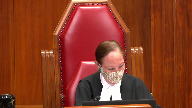
:::

When I look at your factum on what you say is the purpose of this provision for young people in light of your answer to Justice Martin, I'm having some difficulty seeing why granting the Supreme Court of Canada discretion to decide when criminal cases involving young persons merit a second level of review but not adults.

So to me the whole case rests on the purpose of a distinction between the appeal routes available to young offenders and to adults.

And if the justification is the Supreme Court's ability to decide when a case merits further review, why isn't that equally applicable to the leave granting process for adults?

**Speaker 5** (01:37:14): Hi, thank you.

::: {.column-margin}

:::

I have two responses.

I think to the extent that your question engages with the issue of whether young people should have this entitlement because adults have it, I think that's very much an issue that can be ought to be considered under section 15.

Section 15 looks at whether a statutory scheme that gives benefits to one group but denies them to another is without justification and that's very much what we have here.

We have youth indicating that they would like to have the benefit of a scheme, a specific provision that adults have access to.

Section 7 on the other hand asks whether a right to an automatic second level of appeal is genuinely a fundamental pillar of our justice system.

So while section 691 is is informative of that, it by itself does not create the the constitutional standard.

So sort of saying that a youth should be entitled to something because adults have access to it under the existing statutory scheme, I would submit is is less a section 7 argument than it is a section 15 argument.

But to the extent that you you sort of are asking whether there is a some kind of justification for this distinction, I would submit that the the the function one of the functions of the YCJ is to provide benefits to youth and they've tried to capture a broad category of people, the over inclusive rather than under inclusive.

**Justice Abella** (01:38:59): Ms. Choi, can I just stop you there, because I saw that in your factum as well, and in the Attorney General's, the purposes of the Young Offenders Act.

::: {.column-margin}
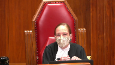
:::

When we deal with Section 1, both under 7 and 15, it's the purpose of the limitation, not the act as a whole.

So don't we have to focus on the limitation, namely the deprivation, either under 7 or a distinction under 15, of an appeal mechanism that is available to adults?

There has to be, what is, it's not the whole purpose of the act, it's the purpose of the limitation.

That's what I'm asking you to focus on.

So far you've said discretion can cure unconstitutionality by exercising it properly, which is an interesting approach, but I'm just interested in how you can protect against wrongful convictions, which is the purpose of the automatic leave provision for young people without giving them the same access.

My second question, which relates to that is, emphasis is placed on timeliness and speedy access to rehabilitation.

Do we have figures on how much longer it takes to apply for leave and get it and then a hearing versus an automatic right of appeal on a question of law?

Do we actually know what we're talking about when we talk about expeditions?

**Speaker 5** (01:40:39): In terms of your second question, we do not have statistics or metrics on timeliness.

::: {.column-margin}

:::

Our submission would be that it should be open to Parliament to reasonably believe that a leave to appeal process would be more expedient than arguing an entire appeal.

The leave process is designed to be more streamlined than the appeal process.

In the usual course, leave applications do not require oral hearings, the filing timelines associated with them are more condensed, leave decisions are usually released within one to three months, and generally speaking without reasons.

So in our submission, there's legitimate reasons for Parliament to believe that a leave process should be more expedient than an appeal, than arguing the entire appeal.

So in terms of the first part of your question about...

**Justice Abella** (01:41:33): I'm sorry to interrupt, but the question is if you're granted leave, if you successfully applied for leave and it's been granted, what is the time frame compared to an automatic rate of appeal?

**Speaker 5** (01:41:49): there is no evidence before the court.

Presumably, if you are granted leave and you have to bring in an appeal, it will take somewhat longer than if you just had to, than if you did not have to bring a leave application to begin with, but there is no data before the court on that issue.

Okay, thank you.

**Justice Abella** (01:42:08): And then the other question, do you accept that the purpose of the automatic right of appeal is to protect against wrongful convictions?

**Speaker 5** (01:42:17): I'd agree that that's one of the purposes of appeals.

::: {.column-margin}

:::

I don't think there's any question but that appeals protect against wrongful convictions and contribute to the fairness of the process.

There is no question here but that young people do have a right of appeal.

The question is whether they have an automatic entitlement to a second level of appeal and whether it's open to Parliament to give this court the discretion to weigh the pros and cons of prolonging the appellate process and prolonging the appellate process along with the increased anxiety and expense in the context of the youth when this court is of the view that there is no utility to that process.

It gives this court an option to be more selective and more individualized in its screening process so that it doesn't have to rely simply on a dissent from the court below but is permitted to make its own finding and its own discretion to allow the principles of the YCJ to sort of become ingrained in the leave process itself.

**Justice Abella** (01:43:29): It sounds pretty paternalistic, doesn't it, to say it's in your interest that we fast-track leaves and give you a reduced substantive investigation by the Supreme Court of Canada because you're younger.

::: {.column-margin}
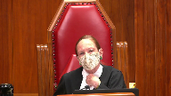
:::

Trust us, it's better for you.

Why is it?

Wrongful convictions is what we're trying to avoid.

**Speaker 5** (01:43:53): it is open to this court in any case where the specter of a wrongful conviction is raised to grant leave.

::: {.column-margin}

:::

But in cases for example like TLC which is a good example that's a case where the issue raised on dissent was kinapple.

In that case where we have no concerns about a wrongful finding of guilt in those circumstances a leave provision gives this court the option to shut the litigation down early and allow a young person to refocus on rehabilitation to the extent that one of the primary purposes of the YCJA is to enhance rehabilitation and reintegration.

It was open to parliament to to impose this leave requirement in the interests of of furthering that goal.

**Justice Abella** (01:44:43): Do you accept that if you have the benefit of the full record you have a better chance of deciding whether there's been a wrongful conviction than if you just have leave application material?

**Speaker 5** (01:44:55): That's a more difficult question to answer.

::: {.column-margin}

:::

It may very well be the more information you have, it makes sense that the better the decision you're in a position to make.

And if this court feels that it needs more materials at any point in time, it is open to it to grant leave so that it can take a closer look.

If, however, on the materials that it has, it feels that refocusing on rehabilitation and discontinuing the litigation at this stage is warranted, then it is open to the court to do so.

But it is by no means required or mandated.

It is left entirely in the court's hands to decide whether it has sufficient materials and whether it's in a position to make the decision that parliament is asking of it.

**Justice Rowe** (01:45:43): I don't want to split hairs, but you referred to expediency on occasion.

::: {.column-margin}
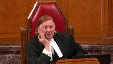
:::

I think you meant something being expeditious.

Expeditious means it's timely.

Expediency means you sort of forego one consideration for another.

And I think you probably meant timeliness, in other words, something being expeditious.

**Speaker 5** (01:46:07): Yes, thank you.

I believe you're correct.

**Justice Kasirer** (01:46:12): But on can I can I follow up on that because if if you encourage Rehabilitation whether Whether you're pushing them quickly to it or not when there's an unsafe verdict as revealed by the presence of a dissent on a question of law Being unreasonable verdict below is there not implicit in that it's better to rehabilitate quickly than to prolong matters and And get to the bottom of whether the conviction was a wrongful one or not

::: {.column-margin}
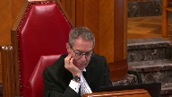
:::

**Speaker 5** (01:46:58): I believe that in any circumstance, the provision leaves it open to any in any circumstances where this court feels the specter of a wrongful finding of guilt is raised or a miscarriage of justice is raised.

::: {.column-margin}

:::

The parameters of the leave provision give this court the ability to take that into account and grant leave.

It may very well be that the presence of a dissent does indicate a danger.

But it may also be that when this court reviews that dissent, it is of the view that that it is not and in those circumstances, it would be open to prioritize the drawbacks associated with prolonging the appellate procedure instead of the benefits.

**Justice Kasirer** (01:47:43): Let's take this case.

::: {.column-margin}
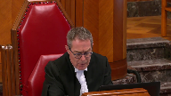
:::

If, if, if a leave, uh, if on leave the, the court did not have the full record here, would the appellant's argument about, about, um, a Sinclair type error or a Binyaris type error have come to light?

**Speaker 5** (01:48:06): Yes, I believe that the judgements of the Court of Appeal set out the arguments that are being made in this court quite well.

::: {.column-margin}

:::

That said, I am cognizant of my time and I do want to give my colleague an opportunity to respond to the section 15 argument being made.

If there's no further questions, I'm going to give the camera over to her.

Very well, thank you.

**Justice Wagner** (01:48:34): Chief Justice, can I just ask one quick question?

One more question.

**Justice Abella** (01:48:34): One more question.

What do you say is the use to which we should put the 1994 decision of justice Sapinka?

**Speaker 5** (01:48:46): We believe it is highly persuasive.

::: {.column-margin}

:::

It did look at a different leave provision under a different statute and it didn't expressly engage section 15 and constitutional principles.

That said, the language of the leave provision was very similar and the goals and principles and underlying motivations of the two statutes are very similar.

**Overlapping speakers** (01:49:14): That's what I was...

**Justice Abella** (01:49:15): So to that extent we ‑‑ sorry.

That was my point.

It was 1994.

It was before db, sjm, kjm, all of those cases.

Would you put that in the mix anywhere that the approach to young offenders was different in 1994?

**Speaker 5** (01:49:30): I would submit that the under the y o a and the y c j a the emphasis on on timeliness remain the same.

So while it is a consideration we would still submit that it's highly persuasive in the context of statutory interpretation.

**Justice Wagner** (01:49:47): Thank you very much.

**Speaker 6** (01:50:28): Good morning justices.

::: {.column-margin}

:::

As my colleague has indicated I'm going to be dealing with the section 15 argument in this case as well as touching upon the unreasonable verdict issue raised by the appellant on the appeal proper.

With regard to section 15 I just want to focus my oral submissions today on the second branch of the section 15 test as this court has most recently expressed it in the very recent Fraser judgment and that second branch being whether the impugned law imposes burdens or denies a benefit in a manner that has the effect of reinforcing perpetuating or exacerbating disadvantage.

Before I get into the analysis I want to start with the overview that section 15 of the charter is animated by the principle that all human beings have equal inherent value and to put the issue before the court in context and bearing in mind that section 15 is about discriminatory conduct as opposed to differential treatment alone.

Does it discriminate against young persons and devalue their inherent worth as human beings to tell them that they need to get leave to have a full appeal heard by the highest court of Canada when most other litigants and even adults under the criminal justice system also need to be granted leave to have their full appeals heard by the highest court of Canada except in a few very narrowly limited circumstances?

And in the respondent submission the answer is no because section 3710 of the YCJA is one of the many legitimate ways in which young persons with different needs and circumstances than adults may be treated differently without demeaning their equal worth and dignity as human beings and this is particularly so within our social context in which the perception of young persons promoted by the law is that they are very worthwhile candidates for rehabilitation and that society values the prospect of young persons reintegrating and becoming full contributing adult members of their communities.

Now it's a well-established point obviously that not all distinctions and differential treatment are discriminatory and in Gosselin at paragraph 32 this court noted that quote a sign on a courthouse door proclaiming men only evokes an entire history of discrimination against a historically disadvantaged class.

A sign on a barroom door that reads no minors fails to similarly offend and this quote is justified because there are many entirely legitimate age-based distinctions in our society particularly with regard to youth and children based on the actual needs and capacities of this age group and one can easily think of distinctions made to drive a car to vote in an election or to buy alcohol.

So turning now to the specifics of the section 15.

**Justice Martin** (01:53:29): You

**Overlapping speakers** (01:53:29): Excuse me.

**Justice Martin** (01:53:30): branch of

**Overlapping speakers** (01:53:31): Thanks, guys.

**Justice Martin** (01:53:31): Excuse me. Hello.

::: {.column-margin}
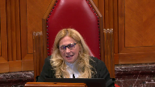
:::

How do you deal with the submission by Defence Council that there is a demeaning of the equal worth and dignity of young people here because they're being told in effect that your conviction, there's less at stake in your conviction because of all of the other things that you've said, yes, rehabilitation, all of that, but their argument is it demeans their human dignity to not have an appeal right when they may not have committed the offence for which the act would have them expeditiously rehabilitated?

Yes, Madam Speaker, I'm not going to go into

**Speaker 6** (01:54:15): Yes, in our submission, sorry, there's a bit of a technical problem, yes.

::: {.column-margin}

:::

In our submission, that is not the Crown's position that there is something about the leave provision that implies that there's less need to have a wrongful finding of guilt corrected or that they have less at stake.

In fact, the Crown's position is that this court can grant leave to correct any wrongful finding of guilt and that the fact that there is a leave provision is reflective not of a demeaning message being sent to youth but the fact that youth have other, there are other principles regarding youth that also need to be respected which are ameliorative for youth and therefore do not devalue them in the fact that this court can consider both the utility of an appeal and the merits of an appeal all as part of a very broad set of circumstances which can be taken into account during the leave process.

And therefore it is not the Crown's position that a youth finding of guilt that is wrongful is somehow more tolerable or of less importance in the youth criminal justice system.

**Justice Abella** (01:55:35): That you would accept that it is certainly one of the tools available to the dissent to an accused to rely on a dissent to get quicker access to the Supreme Court of Canada if the argument is an unreasonable verdict or wrongful conviction. Yes.

::: {.column-margin}
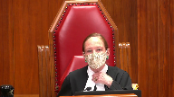
:::

So the question then is it seems to me just to follow up on Justice Martin's question, is there is it does it exacerbate disadvantage once you assume that the first step has been has been met?

**Overlapping speakers** (01:56:04): Yes.

**Justice Abella** (01:56:05): deprive a young offender of a tool to deal with the possibility of a wrongful conviction that an adult has? Yes.

::: {.column-margin}
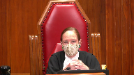
:::

And then of course that gets to justification.

Why would you deprive the young person because he or she is a young person of that tool?

**Speaker 6** (01:56:24): Yes, it does not.

::: {.column-margin}

:::

And the reason why is this.

In speaking about the disadvantage factor in the section 15 test, I want to mention the Fraser case recently dealt with by this court by way of comparing and contrasting.

In Fraser, the specific historic disadvantage to women that the majority of this court found to be perpetuated by the negative RCMP pension consequences of job sharing was gender biases within pension plans which were historically designed for middle and upper income full-time employees with long service, typically male.

And this court indicated that long-standing structural inequality within pension plans results in women being financially worse off than men after their retirement and therefore the RCMP's pension design perpetuated the long-standing source of economic disadvantage for women and therefore made out a prima facie breach of section 7.

And to contrast this where the link between the economic disadvantage historically suffered by women through child care responsibilities being placed disproportionately on them and the perpetuation of that disadvantage through the pension plan, to contrast that young persons viewed within the statutory scheme of the YCJA are not a disadvantaged group in terms of receiving fair adjudications of their charges at trial and appeals in the court of appeal such that the absence of an automatic second appeal to the supreme court without leave would exacerbate or reinforce the type of disadvantage that they suffer.

Now my friend has indicated that young persons are vulnerable and one would agree certainly the case law indicates that young persons are generally less mature and more dependent than adults generally are, however when the larger context of the YCJA scheme is considered as a whole which is required during a substantive equality analysis, the fact that youth are less mature and more dependent than adults is ameliorated by way of numerous protections throughout the statute that adults don't receive from the time of arrest by the police to the process of state statement taking by the police to the court proceedings to representation by council and to sentencing and indeed post-sentencing.

So when it comes to the stage of the court of appeal decision having been issued and then now they're they've got a decision as to whether to seek leave and they do not have the ability to access the as of right provisions based on dissent, query then how a YCJA provision that preserves the broad and flexible discretion for the supreme court of Canada to grant leave for a further appeal if warranted would exacerbate or reinforce the disadvantage suffered by young persons in light of the previously ameliorative statutory processes provided to them that are not provided to adults and some of these I can just give by way of example to show why they enhance the protections given to youth that speak to the needs of lesser maturity and heightened dependency but do not speak to a need for an automatic second right of appeal such as the YCJA requires that council be appointed to represent the young person if the young person is unrepresented and unable to obtain defense counsel through legal aid and it is mandatory if the young person requests it and that pertains to trial or certain hearings relating to detention in custody.

Another example, the youth may request to be assisted by a suitable adult if they are not represented by a councillor at certain hearings.

There's provisions for notice to be given as soon as possible to the youth's parent if the parent is available, an adult relative or other adult likely to assist the youth if the young person is arrested, detained or released on promise to appear.

Ms. Troy, I'm sorry to interrupt, but I'm sorry to interrupt, but I'm sorry to interrupt, but I'm sorry to interrupt, but I'm sorry to interrupt, but I'm sorry to interrupt, but I'm sorry to interrupt, but I'm sorry to interrupt, but I'm sorry to interrupt, but I'm sorry to interrupt.

**Justice Abella** (02:00:41): I'm sorry, you know, because we've done a lot of decisions talking about including recently about all these advantages.

::: {.column-margin}
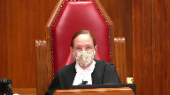
:::

I want to know if you don't mind what it is about not having the same right to an automatic hearing to test the wrongfulness of a conviction is a remedial measure.

Because you've gone through the remedial measure.

So I accept that there are differences, the young persons, the status of youth is ignored, all of that.

But what is there in this case about that deprivation that you say is remedial in accordance with the purposes of the legislation?

**Speaker 6** (02:01:26): Yes, as my colleague was alluding to the leave provision allows effect to be given to the special need of youth that differs from adults for timelier conclusions of their matters, which therefore gives effect to the particular purposes set out in the YCJ a with regard to the need for enhanced timeliness to link the consequences of an action to the time of the action.

::: {.column-margin}

:::

And if, and if, yes.

**Justice Abella** (02:01:59): Sorry, just to stop you, because timeliness I know is a big part of the case.

If it turns out that the application is meritorious and that the court decides in its discretion to hear it, how is the timeliness met?

**Speaker 6** (02:02:17): that is indeed something that is it is not shortened and therefore the fact that some cases require a longer time because of the fact of the leave provision is something that is part and parcel of the fact that a leave provision is generally beneficial in order to be able to give effect to the timeliness concern as a whole.

::: {.column-margin}

:::

How much time is saved?

**Justice Abella** (02:02:47): saved in your view?

How much time is saved by applying for leave as opposed to an automatic right of appeal?

**Speaker 6** (02:02:56): Yes well it would be at least a matter of several months and the reason why is that even the rules of the Supreme Court and the Supreme Court Act provisions that regard are regarding timelines would indicate that the process for leave applications assuming the simplest case possible where there are no other parties but the appellant and respondent the simplest process possible requires materials for a leave application to be filed and totally within the court by three months and 10 days appellant respondent and reply and then there is no need for an oral hearing in general cases and there is also no written decision generally in contrast the materials for the simplest appeal the rules require the materials to be in within five months there's also the need for the oral hearing to be scheduled and then there are often unless judgment is not reserved and given on the day from the bench there are often at added times for written reasons to be given and therefore even the process itself contemplates that a leave application on its own is timelier than a full appeal being heard and therefore having the leave application process so that some cases that will benefit from having timeliness and an emphasis on rehabilitation and reintegration emphasized by this court will be able to have those emphasized whereas those that merit leave through the broad discretion of this court will be able to get leave and and any wrongful finding of guilt can also be addressed through that process.

::: {.column-margin}

:::

**Justice Moldaver** (02:04:40): I suppose there's nothing wrong with the court, in fact it's totally within our authority to expedite leave applications and to expedite hearings if we want to and we do that in certain cases.

::: {.column-margin}
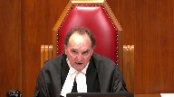
:::

I don't know what we do in youth cases because we see so few of them, but there's nothing to stop us from expediting matters like that, like we do in family law matters.

So that's one thing.

Number two, if I understood it when you were going through your litany of benefits that young people get, your real point is that those benefits in many respects are designed to avoid wrongful convictions or the risk of wrongful convictions because they get benefits that adults don't get to protect against that very thing

and so that they're properly represented in court so that their statements are properly taken, et cetera, et cetera.

So on the one hand, you've got benefits that try to avoid wrongful convictions.

On the other hand, if, hopefully this will never happen, but if there is a wrongful conviction, for the most part, the repercussions of a wrongful conviction against a youth are not justifying this.

I'm just saying, looking at the whole context here, are much attenuated from those of adults who are convicted of a criminal offence.

In fact, for most youths, the convictions, as I understand it, are just wiped out.

**Justice Moldaver** (02:06:12): repercussions so when I put that package together the question I have is you know what I mean the fact that they have to get leave and this the highest court will look at their case isn't that enough I mean even though it's different from what the adults get isn't that satisfactory from a procedural point of view

::: {.column-margin}
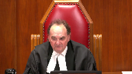
:::

**Speaker 6** (02:06:35): Yes and that's exactly what the respondent's position is that that is satisfactory both for an analysis for of the substantive equality argument and for also for establishing at the at the front end of the section 15 analysis that there is no denial of a benefit meaningfully.

::: {.column-margin}

:::

So yes if we put both the procedural protections up front during the pre-trial arrest pre-trial and trial processes and sentencing processes and then combine them with the fact that sentencing and post-sentencing processes have diligent attention to the prospect that young persons can take a pathway where this period of their teenage years can be can be a thing of the past for them they can move on into adulthood without a permanent taint on their life through several of the processes of privacy record retention only lasting for certain periods of time and sentences being briefer generally than for adults and so if you put that together with the fact that youth do differ from adults and therefore that differential treatment is not necessarily a discriminatory type of treatment then yes we would submit that that is why 3710 is constitutional and does not violate the human dignity or the sense of inherent worth that we accord to young people in our society.

**Justice Abella** (02:08:16): so you don't need the same protection against wrongful convictions as an adult has because the consequences for you as a young person is you haven't been in more years to work it out.

**Speaker 6** (02:08:26): No, our position to be clear is certainly never that just because consequences are shorter that that is the sole reason that justifies letting wrongful convictions stand.

::: {.column-margin}

:::

That would never be our position.

It is that the wrongful findings of guilt of a youth do come before this court and receive careful attention and any factors that this court finds relevant in its broad discretion and it does not need to meet a national importance test in the test applied for youth matters is going to be looked at so that if there is indeed a wrongful finding of guilt that can be addressed by this court and therefore the fact of the attenuated results or consequences of a finding of guilt for a youth are simply going to the fact that it is one of the considerations as to whether that has to be weighed along with other factors such as the merits of the appeal and also other public importance factors, of course, because this court is a court of deciding national jurisprudential issues for the rest of Canada.

And to also clarify that the as of right appeal provisions for dissent, for the as of right appeal provisions, although we take the position that they do address the ability to have wrongful convictions corrected it's not the sole purpose of the as of right on a dissent.

The dissent also signals that there may be an issue of law because, of course, these are need to be issues of law that is unsettled or need settling by this court.

So it may be something that does not really have something to do with wrongful finding of guilt.

It may signal that.

It may also signal that because it is a question of law that because it is a question of law, sometimes wrongful findings of guilt are based more on fact than law.

And if the only intent of 691 provisions were to provide a route, a final route of appeal against wrongful convictions they probably would have provided mixed fact and law as well.

And so it's a multi-faceted right of yes, they I think it's a multi-faceted right of appeal against wrongful convictions, but it's also a multi-faceted right of appeal against wrongful convictions, but it's also a multi-faceted right of appeal against wrongful convictions, but it's also a multi-faceted right of appeal against wrongful convictions, but it's also a multi-faceted right of appeal against wrongful convictions, but it's also a multi-faceted right of appeal against wrongful convictions, but it's also a multi-faceted right of appeal against wrongful convictions, but it's also a multi-faceted right of appeal against wrongful convictions, but it's also a multi-faceted right of appeal against wrongful convictions, but it's also a multi-faceted right of appeal against wrongful convictions, but it's also a multi-faceted right of appeal against

**Justice Martin** (02:10:52): I would just like to follow up on that point that you made.

::: {.column-margin}
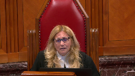
:::

So it's clear that the appeal as of right is triggered by a dissent on a point of law.

But doesn't that just focus our attention on asking a different question then and that is why would the youth offender provisions be seen as some form of lesser law that doesn't need the same automatic clarification when there are those differences of opinion and isn't that tied in a general jurisprudential sense to the idea of wrongful conviction because we have appeals as of right to clarify the law so that errors are not made generally speaking and should not that be a benefit or a purpose that is also attached to youth act matters.

**Speaker 6** (02:11:49): Yes, that is, that again goes back to I think the point about devaluing youth in some manner by suggesting that youth law issues are somehow not going to be automatically important to the Supreme Court.

::: {.column-margin}

:::

But returning to our more global picture of the needs of youth being addressed at the same time as giving them a right to apply for leave.

That is the provision that the that Parliament has given for the Supreme Court to be able to address those youth issues of law that may be of national importance, and that they are available.

That is going to be evident to the Supreme Court through the mechanism of the dissenting judgment, setting out the issues, and therefore, it's not something that automatically implies a devaluing of youth law issues.

It is simply something that needs to be looked at in the context of the global picture of what use needs are that and what their priorities sometimes need to be for an individual youth versus what adult needs might be, and sometimes for a youth.

It is something that timeliness is of more concern than needing an abstract issue of law that may not affect that youth life decided.

**Justice Karakatsanis** (02:13:22): Can I ask you this, because you keep coming back to the Supreme Court's discretion on a leave application, and I'm thinking about newer, where we said that, you know, discretion can't really fix constitutional infirmity, so how can our discretion, assuming—why is the leave application the answer, if in fact we are concerned about, you know, a mechanism to address wrongful convictions? Yes.

::: {.column-margin}

:::

**Speaker 6** (02:13:55): Well, in Noor, I believe the discussion of discretion was regarding crown discretion.

**Overlapping speakers** (02:14:04): Yes.

**Speaker 6** (02:14:05): And yes, and with respect to that, there may be a background that the Crown has certain interests and is a party in the matter, whereas the Court, and particularly the Supreme Court of Canada, in exercising its discretion, is entrusted by Parliament to make decisions that will be decisions that are in the best interests of justice and will

::: {.column-margin}

:::

**Justice Karakatsanis** (02:14:36): That applied to a trial judge then too, if there was an unconstitutional provision it could be cured if there was some discretion.

**Speaker 6** (02:14:46): Yes, well,

**Overlapping speakers** (02:14:47): Oh, that's-

**Speaker 6** (02:14:47): It's the discretion is not something where it implies that the Supreme Court will simply choose to do something.

::: {.column-margin}

:::

It is the opportunity for the Supreme Court to look at a matter and then make a decision on it and perhaps discretion is not the proper word when you think of the fact that discretion implies some sort of decision that is made entirely in that body's power.

It's about the power of it.

But what we're talking about is the opportunity for the court to look at a matter and make a reasoned and thorough decision, careful decision based on a number of factors that this court has the breadth to address.

And that's why perhaps the analogy to the word of discretion may perhaps have not been one that captures that sense of opportunity and decision making based on opportunity as opposed to an exercise of power.

So with that, I think I will conclude our submissions on Section 15 and rely on the factum for the rest of it.

With the closing comment that there needs to be, as the substantive equality analysis law indicates, there needs to be a total look at not just the comparison between adults and youth, but at the full context of the claimant group situation and the actual impact of the law in that situation to which the leave application pertains and to any persistent systemic disadvantages that have operated to limit opportunities available to that group.

And that is, of course, just quoting from the recent Fraser judgment.

And that in our respectful submission is what the Section 15 analysis that we have proffered is suggesting.

With respect to the substantive appeal on the unreasonable verdict issue, I will just rely on the respondent's factum for the response to most of it given the time left.

And I just want to make two points.

One is with respect to the point about the incompatibility between eg and gg and the times that they set out.

And to just point out that the trial judge in our submission did not make any concrete finding of fact accepting that eg actually arrived at the beach between the times that she stated.

The trial judge's mention of eg's evidence as to times was in her summary of all the evidence heard at trial without a comment on whether she accepted it.

And when the trial judge later stated her findings about eg as a witness, the trial judge did find her to be credible, which my friend has pointed out.

But she also noted that eg allowed for the possibility that she was mistaken about the time she arrived.

So that's something that should be taken into account as how it is that they are not incompatible.

And the risk with the analysis that unreasonableness can be based on the trial judge making a factual finding that was incompatible with evidence that is neither contradicted by other evidence nor rejected by the trial judge might amount to finding unreasonableness merely because the trial judge didn't address every single piece of evidence in her reasons to state whether she rejected it because a trial judge is not required to do so.

So I just highlight the fact that unreasonableness construed in that way might simply boil down to the fact that it might constitute retrying the case if one simply points to evidence that was not simply addressed to signal a rejection and used to therefore say that it is incompatible.

So in our submission, the scenario that the trial judge was relying on does not necessitate an inference as my friend was suggesting that there must have been substantially longer time between the sexual activity and EG's arrival than the trial judge thought.

So subject to further questions, those are our submissions on unreasonable verdict but we rely on the factum with respect to that and we take the position that the majority of the court of appeal did not err and that the conviction, the finding of guilt that they found reasonable was indeed reasonable and logically reasoned and supported by the evidence.

**Justice Wagner** (02:20:05): Thank you very much.

Mr. Provart.

**Speaker 7** (02:20:09): Thank you very much, Chief Justice, and good afternoon to you and to all of the Justices.

::: {.column-margin}

:::

We're already in the afternoon.

By way of a roadmap for my submissions today, on behalf of the Attorney General of Canada, there are going to be four parts.

First, I will begin with a brief three-minute overview.

Second, I will address the purpose of Section 7, pardon me, of Section 3710.

Third, I will turn to Section 7, and fourth, I will turn to Section 15.

And I do not intend to make any submissions orally on Section 1, and will rely on my written argument subject to any questions you might have on that.

So, by way of a brief overview then, the Youth Criminal Justice Act reflects the evolution of research and thinking on how young persons interact with the criminal justice system.

It establishes a very different model from that of adults under the Criminal Code, and one that is focused on, not on punishment, but early rehabilitation and reintegration.

And a key component of this system is the timely intervention and early resolution of cases.

And this links offending behaviour with consequences for young persons, and reflects as well their different perception of time.

Are you the person...

**Justice Abella** (02:21:35): We should ask then, sir, what the timing is.

Do you know how much longer it takes to apply for leave and have it granted and then the appeal set down versus the time it takes to submit a leave application.

**Speaker 7** (02:21:51): And certainly, Justice Abella, I take your point, and there is no such evidence before the court, there is no statistical evidence or expert evidence or anything else.

**Overlapping speakers** (02:21:59): Yet you're relying on timeliness, aren't you?

**Speaker 7** (02:22:02): Well, I'm going to be relying on, certainly on Justice Sapinka's elaboration of that as the purpose of the provision, which I say is still relevant today.

::: {.column-margin}

:::

But from a very common sense perspective and looking at the provisions of the rules themselves, looking at this case, for instance, as well, we know that once a leave application has been filed, there's 30 days for response and 10 days for replies.

We're looking at 40 days for the completion of pleadings.

And in this case, we were at a leave decision within three months.

With respect to appeal processes, we know that there are eight weeks to file appeal facta for the appellant and another eight weeks for the respondent.

And that doesn't, of course, take into account the time for the matter to be set down for a hearing.

So I feel there's— Plus the time, plus if it's set down for a hearing, it's an extra several months. Exactly.

**Justice Abella** (02:22:53): So are we not elongating the timeliness of the process by having a requirement to apply for leave in the case of, assuming they exist, meritorious appeals?

**Speaker 7** (02:23:06): There is no doubt that there would be a longer timeline for those cases, but my submission to you is that it's not a significant lengthening of the timeline given the important consideration of the timeliness and the shortening of the timeline that will occur in those cases where leave is denied.

::: {.column-margin}
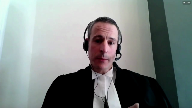
:::

And certainly we see that is going to be a large portion of the cases and that does foster this aim of faster resolution of cases and timeliness and rehabilitation.

**Justice Abella** (02:23:39): and their interest more to have a quick resolution rather than one that's being thoroughly scrutinized as it would be for an adult.

**Speaker 7** (02:23:48): My answer to that, Justice Bell, is that it's not a case of one interest prevailing over the other.

::: {.column-margin}

:::

It's a case of Section 37 addressing both interests, both timeliness as well as the opportunity of a protective review in this court, which is exactly what Justice Sopinka found in the CTL decision.

And indeed, that is something, it's tough to think of another mechanism.

A pure right of appeal certainly is not going to achieve the same degree of timeliness in all of those cases where the court is prepared to deny leave and finds that the case is not deserving of its consideration.

So you can't achieve both objectives without having some mechanism like the provision in Section 37-10.

It's a dual purpose.

It's not a question of one over the other.

It's how do you achieve both, which fulfills the interests of the Youth Criminal Justice Act and the social science evidence upon which it's based.

And so returning then just briefly, I guess, to the overview, we know that timing of intervention is crucial, early resolution is crucial, and extrajudicial measures are in the act, the length of sentences are taken into account.

There are all these various features in the act which go towards this goal of timeliness.

We know that this is an essential aspect which distinguishes the Youth Criminal Justice Act from the Criminal Code.

And can I just-

**Justice Martin** (02:25:07): intervene here and ask you under the criminal code, what was Canada's purpose in having appeals as of right on a dissent on a point of law on a provincial court of appeal?

What purposes are achieved by that provision?

**Speaker 7** (02:25:25): I think we've already canvassed some of those, Justice Martin, and it would go to these issues of allowing for, you know, I think it does prevent miscarriages of justice, among other considerations.

::: {.column-margin}

:::

It's the point being, though, I think in this particular case before you is that we're dealing with a second level right of appeal as opposed to a first level right of appeal, which is a very different matter altogether, particularly given that,

**Justice Martin** (02:25:55): that but it does exist in law, it exists for a wide category of people and I guess I'm just trying to understand what purpose it serves.

::: {.column-margin}
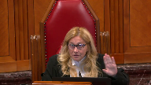
:::

I understand what purpose leave serves and how that's being argued but the actual purpose of having that, if you can give me any further information about Canada's intentions that would be helpful.

**Speaker 7** (02:26:18): and the answer is I don't have much more to add than what you've already heard on that point.

::: {.column-margin}

:::

I would note though that there has been a great deal of frequent use of the term wrongful conviction in the submissions today before you.

And I think it's important to point out that actually there are, and this is not, I know that might be shorthand certainly that many council are using, but there are no convictions actually under the Youth Criminal Justice Act.

And it is an important distinction to make when we consider the consequences of the scheme as a whole and the way the scheme operates.

And indeed, in many cases, like the case before you, or like many cases, pardon me, of the under the Youth Criminal Justice Act, there will be instances in which the young person has gone through the proceeding.

And there will actually at the end of the proceeding, as Justice Moldaver noted earlier, there will be a deeming that the person was not found guilty by the time the case comes before this court.

**Justice Karakatsanis** (02:27:25): Not if they've been sentenced as an adult though, and I'm and I'm actually I thought that was the case here before us

::: {.column-margin}

:::

So there is a conviction if they've been sub once the appeal periods expire It becomes a conviction right if they've got an adult sentence

so this argument How do we deal with the argument you're making when it applies in some cases, but not others?

**Speaker 7** (02:27:52): Um, well, I, I think, uh, uh, just as carrot Katana sits, you know, I, I, uh, um, I, I'm, uh, I'm mindful of, of getting too into the particular, uh, details of the case, uh, given the protections, but I think it is important to, uh, to say certainly that, you know, the, uh, the, the general rule for cases tried under the youth criminal justice act is going to be, uh, for those cases which are not sentenced as an adult, uh, is going to be that, that we know that the sentence will, uh, become a finding of not guilt and indeed will be, you know, subject to the privacy requirements and will be also, uh, will be, will, will, uh, the record will eventually will disappear as well.

::: {.column-margin}

:::

So, uh, I, I think, uh, um, I'm going to, uh, move on, I guess, to the CTL decision, which I think is important, uh, in describing the purpose of the provision before you, because that is certainly a matter which has been subject of great, uh, debate today.

And the question then is what, uh, what effect or, or relevance that case still has given the, the evolution of the, the jurisprudence as, uh, you, uh, mentioned, Justice Abella.

And certainly, uh, our position is that it, it does provide a valid understanding of Section 3710, uh, and that is because, uh, that the provision is, is essentially identical under the Young Offenders Act, uh, as under the Youth Criminal Justice Act.

And Justice Sepinka conducted a valid statutory interpretation exercise, uh, based on a legislative history of the provision and noted that the policy and protection of the rights of young offenders, and this is a quote, would be served by specifically providing for an appeal to this court with leave.

And it has, that, that decision has not been subject to any, uh, significant academic or judicial criticism.

It's in line with the Youth Criminal Justice Act's greater emphasis on timely completion and, and rehabilitation, which has really been, uh, has been established through the, uh, Section 3, uh, and the statement, uh, of, of principle, declaration of principle there.

**Justice Abella** (02:30:09): So what I just need to know because it was 1994, it was obiter, it wasn't about the charter, there were no notifications to attorneys general.

::: {.column-margin}
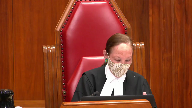
:::

Most significantly it seems to me, aside from the fact that it was before all of our jurisprudence on the purpose of the Young Offenders Act, is that it was before Ben-Yaros.

And Ben-Yaros in paragraph 26 said the following about the purpose of the automatic right when there is a dissent on a question of law.

And I'd just like to read you the beginning of it so that you could tell me what it is about the remedial system we have for young offenders that excludes this prospect.

And the sentence is criminal appeals on questions of law are based in part on the desire to ensure that criminal convictions are the product of error-free trials.

It is inconceivable that Parliament would have permitted access by levers of right in cases of trials affected by legal error but would have granted no access in the case of possibly the gravest error of all an unreasonable conviction, one that cannot be supported by the evidence.

So my question is, if that is what this court has said the purpose of 691 is, what is there about that that somehow takes it out of what is required by the purposes of the Young Offenders Act and rehabilitation and reintegration and timeliness?

It seems to me to be such a high bar in terms of the morality of the process that I just don't see this as a question of timeliness.

It's fundamental to how we look at what the court's roles are in protecting against trial errors.

**Speaker 7** (02:31:55): and I guess just as Justice DiBella may answer to that has to go back to the fact that the Youth Criminal Justice Act is a different scheme.

It is different but what is there about it that's exactly my question.

We know it's different.

**Justice Abella** (02:32:10): We know it should be different and we know that young youth is accounted for all the way through the legislation.

::: {.column-margin}
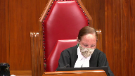
:::

My question is what is there about young offenders that should deprive them of this strong articulation of the protection found in an automatic right of appeal on questions of law in a dissent.

What is there about that system, the design of the system, the purposes of the system that should deprive them of the access to this protection?

**Speaker 7** (02:32:39): And the answer is that the, found in the statement, the Declaration of Principle and the Act, and the fact that the Act does, and I appreciate that there might be some questioning about this, but there is no doubt in the social science research that timeliness, and that is a relative concept here, because we are talking about, you know, in the overall scheme of the youth process, but timeliness and the need for, supports rehabilitation, supports reintegration, and is what the Act is entirely premised upon.

::: {.column-margin}

:::

And that certainly was found to be the case by Justice Spink and remains valid today.

And I guess the other point to make again is, you know, and I think that Vinny Harris is right in talking about convictions.

As I said earlier, I think that, I would submit that we're not dealing with convictions in the case of the Youth Criminal Justice Act.

It sounds like a trite difference, but it's not a trite difference.

It is a difference with significance.

It reflects the different nature of the-

**Justice Rowe** (02:33:47): position come down to this, because we haven't really heard your position yet, actually, but it's only been 13 minutes, come down to this, that the scheme of the act is different and the means by which fairness is ensured are not identical to those under the criminal code, but the view is that the means by which fairness is protected is adequate and proper in light of the overall scheme.

::: {.column-margin}
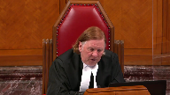
:::

**Speaker 7** (02:34:22): That would be correct, Justice Roe.

::: {.column-margin}

:::

And indeed, I think it's important to note that this is also not, in response to a query made earlier, this is not paternalistic to place an emphasis on timeliness and to say that it's an equally important consideration with a second level of review by this court because of the fact that this is indeed a system which takes into account the unique needs and capacities of young persons, their ability to rehabilitate, their perception of time.

That's social science.

So that's not paternalism, in my respectful submission.

It certainly was motivating the protections the court found in DB and also, again, motivates the scheme before you today.

So I see I'm out of time.

All right.

**Justice Wagner** (02:35:13): Mr. Provar, I think that in all fairness, I will give you much more time because of the intensity of the cross-examination, so go ahead.

**Justice Brown** (02:35:23): I'm wondering if you could finish your point about how we're not dealing with convictions under the YCGA

**Speaker 7** (02:35:31): Certainly Justice Brennan, I'll go there, it's, there are no convictions under the Youth Criminal Justice Act, there are findings of guilt and it's a very, you know, this is a very different system from what we see under the Criminal Code and certainly it is one in which the consequences are different and that's without even getting into the privacy rights and the much shorter lengths of the sentences under the Youth Criminal Justice Act, we are dealing with a finding of guilt which ultimately will be deemed not to be a finding of guilt upon completion of the sentence.

::: {.column-margin}

:::

That is very different from what we find in the Criminal Code and again speaks to the fact that this is a different system with different goals and perhaps I'll jump to section 15 because I think it's really where the nub of this case lies or is perhaps the most important issue in that a lot of the section 7 arguments are even phrased in terms of or framed in terms of comparison.

So when we look at section 15 and this court's jurisprudence, it's important not to focus on the appeal provision in section 3710 in a direct comparison to section 691 of the Criminal Code as some sort of a mirror comparison or a mirror comparator group with the adult individuals, adult offenders wishing to appeal their sentences or their convictions.

That precisely is the approach that Justice Sopinka in CTL was concerned about and I do not, I concede that that's not a, he didn't make a finding, a determinative finding

but it's certainly a criticism that he raised with respect to picking and choosing elements of these disparate schemes and then comparing them in isolation without ignoring the full context and that is not what substantive equality requires.

It's more like a search for sameness which this court has been critical of in terms of short-cutting the second level, second stage of the section 15 analysis in Alliance du Personnel for instance.

**Justice Karakatsanis** (02:37:43): Can I just ask you, I'm sorry to come back to this, I want to make sure that I'm not operating under a misapprehension.

::: {.column-margin}

:::

If someone is, putting aside this case, if someone is sentenced as an adult and the appeal process expires, is there a conviction?

**Speaker 7** (02:38:03): An adult sentence does, my understanding is that it does, that is an adult sentence for the purposes of the Criminal Records Act, but I apologize I don't have a more definitive answer for you on that Justice Carrick-Catenas, but we can get back to you on that if you want.

**Overlapping speakers** (02:38:21): if that would be helpful.

**Speaker 7** (02:38:23): I think it's a matter of looking it up, which I unfortunately don't have the code in front of me.

::: {.column-margin}

:::

I would ask you now to conclude.

Thank you very much.

So my concluding remark then on Chief Justice on section 15 is certainly there has been discussion of evidence with respect to the discriminatory impact and effect.

And we do say today that an intuition of disparate harm, disparate impact is not enough.

A leave to appeal process does not result in perpetuation of discrimination or prejudice or stereotyping.

We have no evidence about a discriminatory impact or effect.

And considering the entire context is crucial in assessing substantive equality, that's not by way of justification.

As we know, this court has frowned upon that in Fraser, but it's to show how the legislation responds to the actual capacities needs of young persons.

And that is with respect to timeliness and rehabilitation and the very different objectives of the criminal justice act.

So those are my submissions subject to any questions.

Thank you very much.

**Justice Wagner** (02:39:34): Thank you very much.

Thank you.

Any reply?

**Speaker 1** (02:39:38): Thank you.

::: {.column-margin}

:::

One brief point in respect of the underlying conviction appeal that I need to make clear because my friend Ms. Choi pointed to the fact that the trial judge may well have allowed that EG arrive later than her initial testimony stated.

My submission is that does not address the incompatibility with the evidence of GG.

The key point I'm making here is that the sex likely occurred before GG left the beach and that was probably some time before EG arrived and made her observations because they didn't see each other coming and going.

So that's the incompatibility that I'm pointing to that was unaddressed by the trial judge but left hanging.

Secondly, on the constitutional point, my friend Mr. Provart spoke of the difference between a conviction and a finding of guilt.

There is a legal distinction there but in my submission, it's a distinction that from the perspective of the impact on the individual might be without a difference in a real way.

When the individual in question such as my client has to live the rest of his life in his community, people who know him, people who know about the case where he's not behind a facade of anonymity, they know he was found guilty of this whether it's called a conviction or a finding of guilt is of no moment.

So my client's interest, profound interest in having the wrongness of the finding of guilt reversed is simply not impacted by that distinction.

Further response to Justice Karykatsanis' point on Nour and discretion, I agree with that but I would add that you don't even have to go to Nour and Crown discretion, you can go to DB and Judicial discretion because of course under DB, the problem that arose there with the presumption of a adult sentence could simply have been addressed by every individual sentencing judge exercising their discretion appropriately.

But this court recognized there as it has in many different contexts that the existence of a discretion to act constitutionally does not cure a constitutional defect in the law itself.

On the issue of time, this is crucial because it's the pillar that the Crown's case for constitutionality stands on.

And I appreciate that we don't have definitive information before you on the relative time that a leave application versus an appeal as of right takes, but I'll say a couple things about that.

One, the court is entitled to take judicial notice of its own processes, this is directly within your knowledge.

Second, look at this case look at this case as a concrete example.

I appreciate that the pandemic has since intervened to delay the hearing of the case, but it's clear that if an appeal as of right, if the notice of appeal as of right had been accepted in a hearing set on that basis, we would have resolved this case long before the pandemic arose.

The imposition of a leave requirement simply elongated the process, it did not expedite it.

And so on the very theory that my friends put forward as justifying the provision, it simply fails on its own terms.

Finally, the issue of rehabilitation, and I think this goes to the section 15 discrimination issue very clearly because what my friend is in effect saying is that the interests of rehabilitation have to trump in a global sense the interests of getting it right and having a disputed finding of guilt review.

Well of course a person can only be rehabilitated if they were guilty in the first place, a not guilty person has nothing to rehabilitate from, and therefore it is part and parcel with the paternalistic and frankly patronizing attitude that was historically taken towards young people in the justice system that the crown would now say give up your argument against the validity of the conviction, it's better that you go and rehabilitate right away.

Those are my submissions.

Thank you very much.

**Justice Wagner** (02:44:04): much.

I'd like to thank everybody for their submissions.

The court will take the case under advisement.

Thank you.