---
title: MediaQMI Inc. v. Magdi Kamel, et al.
published-title: Heard
date: 2020-11-12
sidebar: false
---

This transcript was made with automated artificial intelligence models and its accuracy has not been verified. Review the original webcast [here](https://scc-csc.ca/case-dossier/info/webcast-webdiffusion-eng.aspx?cas=['38755']).
---

**Justice Wagner** (00:00:27): Bonjour à tous.

::: {.column-margin}
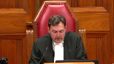
:::

Dans la cause, Mediacummi Inc.

contre Magdi Kamel et al.

Pour la plante, Mediacummi Inc.

maître Mathieu Canneville, maître Marc-André Nadon.

Pour l'intervenante, Société Radio-Canada et al.

maître Christian Leblanc.

Pour l'intervenante Fédération professionnelle des journalistes du Québec, maître Marc Bente.

Pour l'intimé Centre intégré universitaire de santé et de services sociaux de l'Ouest de l'île de Montréal, maître Dominique Vallière.

Pour l'intimé Magdi Kamel, maîtres Jonathan, Pierre-Étienne et Antun al-Sahoub.

Maître Canneville ou maître Nadon.

**Speaker 1** (00:01:25): Je vous invite à prendre le compendium que nous avons transmis la semaine dernière et au paragraphe 1 d'y ajouter une référence que nous avons mise, c'est-à-dire l'arrêt CTV Television contre Ontario Superior Court of Justice, 2002, Canning, 41398, que nous avons cité à notre mémoire.

::: {.column-margin}
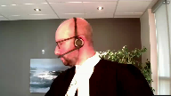
:::

Je plaiderai les sections 1 à 3 de notre compendium et mon collègue Marc-André Nadeau plaidera les sections 4 et 5.

Lorsque nous interprétons un texte législatif, nous devons procéder en deux étapes.

La première étape, que nous pourrions appeler la démarche intellectuelle, fait en sorte que l'interprète doit chercher, avec les règles d'interprétation reconnues, l'intention du législateur.

Une fois qu'il a identifié cette intention, il doit se poser la question suivante comme deuxième étape de l'analyse.

Est-ce que le résultat auquel je suis parvenu est conforme au bon sens ou, en anglais, au common sense?

**Justice Côté** (00:02:52): Maitre Kinville, je m'excuse de vous interrompre.

::: {.column-margin}
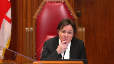
:::

Avant d'aller à l'interprétation, j'aimerais juste vous poser quelques questions sur le cadre procédural ici.

Alors, vous aviez une requête que vous avez intitulée «requête pour mettre fin au scellé».

**Overlapping speakers** (00:03:10): Exactly.

**Justice Côté** (00:03:11): Dans la conclusion de cette requête-là, vous demandez qu'effectivement il soit mis fin au scellé sur le dossier de la Cour.

::: {.column-margin}
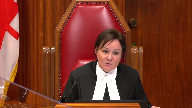
:::

Vous vous mettez fin à toute ordonnance visant à restreindre l'accès au public et de la requérante au dossier de la Cour.

Et c'est ce que vous avez obtenu, la levée des scellés.

Est-ce que je comprends bien que la journée où le juge de la Cour supérieure a rendu son jugement, il n'y avait plus de scellés sur le dossier de la Cour?

**Speaker 1** (00:03:38): effectivement, à partir du moment où le jugement a été rendu, les scellés ont pris fin.

**Justice Côté** (00:03:44): ça veut dire que quand la juge dissidente en cours d'appel ordonne que le dossier retourne à la Cour supérieure afin qu'il soit disposé du débat sur les scellés, c'est pas exactement ça que vous recherchez parce qu'il n'y en a plus de scellés.

**Speaker 1** (00:03:58): en fait, c'est d'avoir accès aux pièces.

::: {.column-margin}

:::

Et la raison pour laquelle les conclusions de la requête écrite, donc celles que vous avez au dossier, sont limitées à la fin de la mise sous scellée, c'est que nous avons su la journée de l'audition de la requête, le 25 avril, que le CIUSSS avait tenté, dans les jours précédents, de retirer les pièces et qu'elle retirait, qu'elle demandait le retrait effectif des pièces au dossier.

Et si vous… et dans le cadre des débats qui ont eu lieu devant le juge Gagnon, Cour supérieure, vous remarquerez que lorsque nous avons été informés de cette situation-là, mon confrère, maintenant donc, a demandé d'abord s'est opposé au retrait des pièces, à la demande verbale de retrait de pièces qui a été présentée par le CIUSSS, on s'y est opposé.

Et c'est ce que le juge Gagnon a également compris dans son jugement, au paragraphe 9 de son jugement, on voit bien que la demande de retrait… pas de retrait, mais plutôt la demande d'accès aux pièces était aussi faite par Média-QMI.

**Justice Côté** (00:05:07): Est-ce que vous faites une différence entre une demande d'accès aux pièces que Médiac Iémis fait, et une demande que Médiac Iémis aurait fait d'ordonner que les pièces demeurent au dossier de l'accès aux pièces?

**Speaker 1** (00:05:20): bien fait, que la pièce physique demeure au dossier de cours éternellement, pas nécessairement.

::: {.column-margin}

:::

C'est simplement que les ordonnances devraient ou doivent permettre à Média-QMI d'avoir accès à la pièce sans prendre copie, non seulement à Média-QMI, mais en fait à l'ensemble du public qui voudrait en prendre connaissance.

J'ai mal entendu le…

**Overlapping speakers** (00:05:47): Vous pouvez poursuivre vos arguments maître.

**Speaker 1** (00:05:51): Parfait.

::: {.column-margin}

:::

Donc, j'ai été à la deuxième étape du raisonnement.

Est-ce que le résultat de l'analyse intellectuelle va à l'encontre du bon sens?

Et si l'interprétation qui découle de la démarche intellectuelle va à l'encontre du bon sens, c'est une très bonne indication que l'interprétation est erronée.

Et si l'interprétation qui a été retenue essentiellement par le premier juge et les juges majoritaires est une interprétation avant tout littérale des articles 108 et 213 du Code de procédures civiles, et une telle interprétation va justement à l'encontre du common sense, puisqu'elle permettrait à une partie d'abord d'instituer des procédures judiciaires, de demander immédiatement la mise sous scellée du dossier, déposer et produire des pièces sous scellées pour obtenir des ordonnances de la Cour, obtenir ces ordonnances toujours sous scellées, réaliser ou exécuter les ordonnances toujours de façon confidentielle, et une fois que la partie n'a plus besoin, que le juge ne puisse avoir besoin des services de la Cour, déposer un décisement à la Cour et se précipiter pour retirer les pièces.

Ensuite, la partie pourrait dire écouter, membres du public et médias, détourner le regard du dossier.

Le dossier a toujours été confidentiel et une grande partie du dossier le demeurera de façon

pratiquement internelle, dans ce cas-ci les pièces sont suivant l'interprétation soutenue par les intimés.

Alors, il est inconcevable que par des gestes et par des décisions qui sont unilatérales, une partie puisse faire échec à l'exercice de droits fondamentaux comme la liberté de presse et la liberté d'expression, et entraver l'exercice des foyers du traité des tribunaux à titre de gardien de la Constitution pour protéger la primauté du droit.

Lorsque la Cour est saisie d'un dossier où elle est confrontée à deux interprétations, nous soulignons qu'elle doit privilégier celle qui est conforme aux valeurs protégées par la Charte, dans ce cas-ci 2B.

**Justice Côté** (00:08:11): Maître Kinville, habituellement, quand on parle d'interprétation, c'est qu'il y a quelque chose d'ambigu dans un texte de loi.

Pourriez-vous nous indiquer ce qui est ambigu dans l'article 108?

Qu'est-ce qu'il y a de patelard?

**Speaker 1** (00:08:24): En fait, une autre interprétation est à l'effet que, oui, le parti doit retirer la pièce, mais ça ne fait pas en sorte d'enlever la juridiction de la cause supérieure, de se prononcer sur des demandes d'accès.

::: {.column-margin}

:::

Et c'est là, peut-être, non peut-être, mais en fait, le point de litige principal entre les partis.

La Cour demeure saisie du dossier, dans ce que c'est, elle était saisie du dossier, et ce n'est pas parce que la pièce est retirée physiquement ou reprise physiquement du dossier que la Cour ne doit pas ou ne peut pas exercer sa juridiction à titre de gardien de la constitution et des valeurs de l'achat.

Donc, évidemment, vous connaissez mieux que moi tous les principes, valeurs et objets qui ont été établis et reconnus par la Cour et les nombreux tribunaux canadiens lorsqu'il est question des protections prévues à 2B. Il y en a quatre en particulier qui retiennent mon attention, qui nous apparaissent particulièrement importants pour interpréter les articles 108 et 213 du Code de procédures suives.

D'abord, que la liberté de presse et la liberté d'expression ne peuvent être restreintes que dans les cas les plus clairs.

Deux, les citoyens ont le droit de pouvoir réfléchir et avoir des discussions qui sont impartiales, qui sont objectives, non seulement sur le processus des tribunaux, mais aussi sur le fonctionnement des institutions publiques, ce qui semble avoir été omis dans l'analyse du juge Schrager.

Pour y parvenir, ils doivent être correctement informés et, pour ce faire, ils doivent pouvoir compter sur une presse qui est forte et vigoureuse et qui a la capacité de recueillir les informations, notamment celles qui ont été déposées au dossier de la Cour.

Trois, le droit d'accès au dossier des tribunaux peut être exercé en tout temps, autant avant qu'après un procès.

Et quatre, la transparence des procédures judiciaires est un principe cardinal d'intérêt public.

Or, ici, malheureusement, l'interprétation qui a été retenue par le premier juge et les juges majoritaires font en sorte non pas de favoriser la transparence des procédures judiciaires, mais plutôt de favoriser son opacité.

Et une telle interprétation doit être mise de côté.

Or, lorsqu'on analyse ou interprète les articles 108 et 213, les valeurs que nous venons d'énumérer et les objets et principes sous-jacents au paragraphe 2B de la Charte sont tout à fait compatibles avec les articles 108 et 213 et nous devons les garder ou les conserver à l'esprit lorsque nous interprétons ces articles.

D'abord, le décidement.

Je vais y aller avec l'article 213 en premier.

**Justice Kasirer** (00:11:23): Maître Canneville, est-ce que je peux juste poursuivre la question que ma collègue, la juge Côté, vous a posée?

::: {.column-margin}
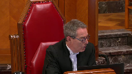
:::

Est-ce qu'il est possible pour le législateur de prévoir une exception au principe dont vous parlez?

Et est-ce que 108 serait une exception?

Une exception, il me semble que même l'article 11 prévoit son deuxième alinéa.

Qu'on fait exception au principe du caractère public des travaux lorsque la loi prévoit le huis clos ou restreint l'accès au dossier ou à certains documents versés au dossier.

Est-ce qu'il y a ici, à l'intérieur de la logique d'un code, je parle de l'idée de l'acte d'amiante, est-ce que le législateur n'a pas pu régler cette affaire malgré tout à partir de sa conception de ce qui est en harmonie avec la Charte québécoise et autres?

**Speaker 1** (00:12:34): Monsieur le juge Jacques Aziraj, je ne crois pas que 108 soit véritablement une exception comme celle en mérite plutôt à l'article 11 de la procédure civile.

::: {.column-margin}

:::

Les mesures de restriction sont des exceptions qui doivent être interprétées, selon moi, de façon restritive.

Et lorsque le législateur a voulu...

Le législateur a voulu qu'il fasse une déclaration de loi sur les droits de la personne qui a commis ce crime.

Il a voulu qu'il fasse une déclaration de loi sur les droits de la personne qui a commis ce crime.

**Overlapping speakers** (00:12:55): We-

**Speaker 1** (00:12:55): imposé ou prévoir de telles restrictions, il l'a fait de façon claire et non ambigüe.

::: {.column-margin}

:::

Et 108 n'a pas ce caractère aussi clair qui permettrait de croire qu'il a voulu que les parties puissent décider quand une pièce devient non accessible pour le public et que la Cour ne peut pas exercer à son égard une juridiction pour décider si le public en a accès ou non.

**Justice Côté** (00:13:25): Il me semble qu'il y a une ville, que 108 là, quand vous dites, ça peut pas vouloir dire que les partis peuvent décider, mais c'est écrit noir sur blanc, que si les partis consentent, les partis peuvent retirer les pièces.

C'est écrit noir sur blanc.

**Speaker 1** (00:13:40): En fait, j'allais parler trop rapidement après la fin de votre question, on m'avait dit d'attendre deux, trois secondes, donc j'excuses.

::: {.column-margin}

:::

En fait, oui, c'est écrit noir sur blanc, qu'il doit le retirer à l'intérieur d'un délai d'un an.

Mais lorsque l'on lit les débats parlementaires, il est manifeste, ce n'est même pas une mesure, certainement pas une mesure de droit substantif.

Ce n'est même pas, je crois, une mesure d'une disposition de droits procédurale, c'est une mesure purement administrative qui a été adoptée pour réduire les coûts d'archivage et réduire le volume des archives.

Dans les circonstances, je ne vois pas comment on peut parvenir à la conclusion que le législateur a voulu, par cette mesure, mettre de côté les droits protégés par la Charte, d'autant plus que la disposition préliminaire du cas de procédure civile rappelle aussi, évidemment, c'est un cas, donc les dispositions s'interprètent les unes avec les autres, mais aussi en harmonie avec la Charte.

Donc, je suis convaincu que le législateur, bien qu'il permettaient, ou en fait qu'il dit au parti qu'ils doivent retirer leurs pièces à l'intérieur d'un délai d'un an suivant la fin de l'instance, que ça ne les fait pas en sorte de constituer une mesure de confidentialité comme le fait que le délai d'un délai d'un an suivant la fin de l'instance, que ça ne les fait pas en sorte de constituer une mesure de confidentialité comme le fait que le délai d'un délai d'un an suivant la fin de l'instance, que ça ne les fait pas en sorte de constituer une mesure de confidentialité comme le fait que le délai d'un délai d'un an suivant la fin de l'instance, que ça ne les fait pas en sorte de constituer une mesure de confidentialité comme le fait que le délai d'un délai d'un an suivant la fin de l'instance, que ça ne les fait pas en sorte de constituer une mesure de confidentialité comme le fait que le délai d'un délai d'un an suivant la fin de l'instance, que

**Justice Côté** (00:15:16): c'est pour la fin de l'instance, mais qu'est-ce que vous faites avec la portion de 108 qui permet aux partis qui consentent pendant l'instance de retirer leurs pièces?

On ne parle même pas de fin d'instance et d'archivage.

On parle pendant l'instance.

Les partis, si ils consentent, peuvent retirer les pièces.

**Speaker 1** (00:15:34): Même si elles peuvent retirer les pièces, la Cour supérieure conserve certainement sa juridiction pour permettre l'accès aux pièces, suivant le test d'Agena Mantoch.

::: {.column-margin}
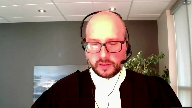
:::

Je ne vois rien dans 108 qui limite la juridiction de la Cour supérieure d'agir de cette façon-là pour s'assurer de la primauté du droit et que les mesures ou les valeurs plutôt protégées par le paragraphe 2B de la Charte soient protégées.

Je vais revenir sur le décidement parce que l'élément déclencheur de l'analyse faite à la fois par la Cour supérieure et par les intimés mais aussi par la Cour supérieure et par la Charte.

Lorsqu'une partie se désiste de sa procédure, elle renonce à l'exercice de ses droits, et non sur les tiers.

Elle ne peut par un décidement priver les tiers ou une autre partie au litige de ses droits.

Et si le droit d'accès était né?

Il ne pouvait être exercé, mais il était quand même né lorsque les ordonnances ont été exécutées par le CIUSSS.

Et si les médias et le public n'ont pas pu en prendre connaissance, c'est simplement parce que les SELÉ avaient été ordonnées.

Alors, le droit d'accès est un droit qui est autonome et qui est indépendant de ceux du CIUSSS.

Ils ont été revendiqués en bonne étufemme par le dépôt d'une requête et le décidement qui a été déposé par le CIUSSS ne pouvait certainement pas éteindre le droit de QMI de demander la fin du SELÉ et d'avoir accès au dossier.

**Justice Kasirer** (00:17:50): Maître Kentville, sur ce plan-là, je voudrais vous demander, vous dites dans votre mémoire que le juge, dans la mesure où je l'ai correctement lu, le juge de la Cour spérieure aurait omis d'appliquer le test d'Agenay-Mentok lors de sa décision de rendre publique la demande introductive d'instance.

::: {.column-margin}
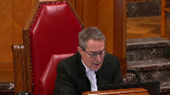
:::

Est-ce que c'est ça ce qu'il a fait?

Est-ce qu'il a véritablement omis de le faire?

Et si oui, comment est-ce qu'il a conclu au paragraphe 138 de son jugement que les scellés sont levés pour la demande et pour la procédure et que la demande introductive d'instance est rendue publique?

J'essaie de comprendre votre point qu'il ne l'a pas fait par rapport aux piastages, je vois bien, mais est-ce qu'il a exercé sa discrétion ici?

**Speaker 1** (00:18:49): En fait, nous sommes d'avis que non, c'est qu'il se sentait ou se considérait lié par la demande et le droit qui était revendiqué par le CIUSSS de retirer ses pièces.

::: {.column-margin}

:::

D'ailleurs, lorsque le CIUSSS débattait du dossier devant lui, il a dit, il me semble que c'est à la page 220 ou 222 du dossier les appelant, qu'il avait le droit de retirer les pièces et qu'il allait les retirer les pièces.

Et c'est en raison de l'application de sa compréhension de l'article 108 du code de procédure civile qui s'est senti lié et qui jugeait qu'il n'avait pas appliqué, qu'il n'avait pas de discrétion pour refuser ou permettre l'accès aux pièces et dans les circonstances que le test d'Agenement Tuck n'avait pas été appliqué.

**Justice Kasirer** (00:19:43): pas appliqué aux pièces, mais à la demande peut-être.

Et qu'est-ce que veut dire sa conclusion à 137 de son jugement?

**Overlapping speakers** (00:19:54): Comme t'y l'as.

Qu'est-ce que t'iras?

**Justice Kasirer** (00:19:55): Quand il dit que le tribunal autorise le CIUSSS à retirer du dossier les pièces P1 à P4, le tribunal autorise le dossier à retirer du dossier les pièces P1 à P4 à P4.

**Speaker 1** (00:20:08): Je m'excuse.

::: {.column-margin}
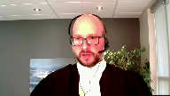
:::

C'est difficile d'attendre deux secondes, je m'en excuse sincèrement.

En fait, c'est que dans le cadre des débats, le procureur du CIUSSS a demandé à retirer ses pièces, séance tenante, et le juge Gagnon lui a dit, bien écoutez, je crois qu'on va maintenir la salée jusqu'au jugement et lorsque le jugement sera rendu, je me prononcerai sur votre demande.

Et c'est la raison pour laquelle il y a une conclusion spécifique d'autoriser le retrait des pièces parce que le procureur du CIUSSS l'avait demandé lors de l'audition.

Mais ça paraît aussi du mémoire et des débats devant le juge Gagnon, dans les… presque aussitôt après le dépôt du décisivement et alors que la requête de QMI avait été déposée, qu'une date d'audition avait été fixée, le CIUSSS a tenté de retirer les pièces sans même en informer QMI.

Et ça, on l'a su seulement le jour de l'audition.

Et si les pièces n'avaient pas pu être retirées avant l'audition du 25 avril, c'est que le greffe ne retrouvait pas le dossier lorsque le CIUSSS a tenté de retirer ces pièces.

**Justice Côté** (00:21:27): Mais, Kenneville, vous parlez que la Cour supérieure n'a pas perdu ou conserve sa discrétion en vertu de l'article 108.

::: {.column-margin}
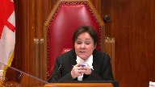
:::

Alors, même si à l'article 108, on ne retrouve rien à cet égard-là qui requiert l'autorisation de la Cour, en vertu de quoi la Cour supérieure aurait-elle conservé sa discrétion?

Est-ce qu'en vertu d'un pouvoir inhérent?

**Overlapping speakers** (00:21:50): C'est le pouvoir inhérent, assurer la primauté du droit.

**Justice Côté** (00:21:53): vous ça avec l'opinion du juge Lebel dans l'Acte d'Amiante?

Parce que dans l'Acte d'Amiante, le juge Lebel a dit que lorsque la loi était claire, les pouvoirs inhérents de la Cour devait céder le pas à la loi.

Le juge Lebel a dit que la loi prime.

**Speaker 1** (00:22:10): Tout à fait.

::: {.column-margin}

:::

Par contre, il faisait aussi des réserves quant à l'application de la Charte, sous réserve de la Charte, à la fin du paragraphe 40 dans l'Acte d'Amiante.

Et je mets quand même l'emphase sur le fait que l'article 108 est une mesure de type, une mesure essentiellement administrative.

Ce n'est même pas une mesure de droit procédural.

Donc, je ne vois pas comment la Cour supérieure devrait être privée de ses pouvoirs pour décider d'une requête qui a été déposée avant même le dépôt du désistement.

**Justice Wagner** (00:22:49): Là-dessus, Mme Canneville, est-ce que les débats parlementaires qui ont précédé l'adoption de l'article 108 ne témoignent pas du fait que cet article-là voulait résoudre une difficulté vécue par à peu près tous les plaideurs au Québec, alors que les greffes et les palais de justice n'avaient plus d'espace pour garder les documents?

::: {.column-margin}
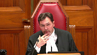
:::

Il fallait savoir comment on allait procéder.

Et le législateur a adopté 108.

Est-ce que j'ai raison de dire ça?

**Overlapping speakers** (00:23:23): Oui, bien c'est notre compréhension aussi de 108, donc c'est une mesure...

**Justice Wagner** (00:23:27): c'est une mesure d'administration.

Est-ce qu'on peut concevoir qu'une mesure d'administration pour faire de l'espace sur des tablettes en débat de justice vont écarter des principes fondamentaux, comme l'accès à l'information par les médias d'information?

**Speaker 1** (00:23:42): Certainement pas.

::: {.column-margin}

:::

Effectivement, je suis d'accord avec votre affirmation, 108, à partir du moment où c'est essentiellement une mesure pour réduire l'archivage et le volume des archivages.

On ne peut pas, de cette façon-là, porter à atteinte ou réduire ou restreindre les pouvoirs de la Cour supérieure de s'assurer du respect des valeurs protégées par 2B. Je vais revenir sur la question du désistement.

Il y a un passage qui m'apparaît particulièrement important pour répondre notamment à un motif du juge Schroeger sur le live issue qui semblait disparaître selon lui à partir du moment où le désistement avait été déposé.

Il y a une analogie très forte qui peut être faite avec un passage de la Remington Tire de 1982 à la page 186 où la Cour suprême, et c'est le seul passage très court que je vais citer parce que je veux reproduire exactement les termes utilisés par la Cour, une décision de poursuivre, de ne pas poursuivre, nonobstant la découverte d'éléments de preuve qui paraissent établir la perpétration d'un crime peut, dans certains cas, soulever des questions importantes pour le public.

L'analogie avec le dossier est très forte alors que dans notre dossier, les questions d'une institution publique qui est le CIUSSS, qui se disait ultime stratagème fauduleux ayant fait perdre plus de 400 000 $ de données publiques, des procédures ont été instituées, des ordonnances d'avance-jugement de ces avance-jugements et de type Norwich ont été mises compte tenu de la gravité de la situation et, malgré tout, un décisement est déposé.

Si, dans l'arrêt McIntyre, cette décision de ne pas poursuivre pouvait soulever des questions importantes pour le public, il en est tout autant le cas dans un dossier comme le nôtre.

**Overlapping speakers** (00:25:46): Le désistement n'a pas été contesté ici, McHenville.

**Speaker 1** (00:25:48): Non, en fait, c'est un décisement qui était fait sans condition.

::: {.column-margin}
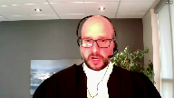
:::

Ils pouvaient se décider de leur réclamation.

Ils se désisent de leurs propres droits, mais ils ne pouvaient certainement pas porter atteinte aux droits de QMI qui étaient nés, qui faisaient l'objet d'une revendication par le dépôt de la requête et qui devait être attendue.

À partir du moment où la requête a été déposée, une date au surplus fixé, nous sommes convaincus que les droits de QMI étaient à ce moment-là cristallisés.

La Cour devait non seulement entendre QMI, mais également décider, trancher la question de l'accès aux pièces.

**Justice Kasirer** (00:26:26): Alors, que dites-vous, maître Canneville, l'argument que l'effet du désistement, c'est de mettre fin à l'instance, il n'y avait plus d'instance, et que l'effet aussi c'était la remise en état des partis, et que donc il n'y avait plus rien là, il n'y avait plus rien, il n'y avait pas de live issue comme disait monsieur Schrager, et votre statut au dossier était, ne vous permettait pas de faire revivre une question qui était à toute fin pratique, classée.

::: {.column-margin}
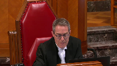
:::

**Speaker 1** (00:27:08): En fait, on ne recherchait pas faire revivre une question classée, M. le juge Casirer.

::: {.column-margin}

:::

En fait, le décisement mettait fin à l'instance principale qui est la demande qui avait été présentée par le CIUSSS.

Mais à partir du moment où les droits qui sont autonomes et indépendants de ceux du CIUSSS, qui sont revendiqués par une requête en bonne et due forme, déposés au dossier de la Cour, le fait qu'un décisement soit déposé ne fait pas en sorte d'éteindre les droits autonomes indépendants de QMI dans le présent dossier.

**Justice Côté** (00:27:50): Est-ce que votre position,

quand vous dites qu'il y avait des droits qui se sont cristallisés, est-ce que ce droit qui se serait cristallisé, c'est le droit que le dossier de la Cour demeure dans un état perpétuel?

C'est-à-dire qu'il n'y a jamais rien qui quitte le dossier de la Cour?

**Speaker 1** (00:28:08): En fait, avec l'effet du dossier, à partir du moment où la raquette est déposée, avant même que le décisement soit déposé, et que même les pièces soient retirées, parce que lorsque le juge Gagnon s'est prononcé sur la raquette, les pièces étaient encore entre ses mains.

::: {.column-margin}
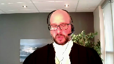
:::

Donc, à partir du moment où, dans un contexte factuel comme le nôtre, les pièces sont encore au dossier lorsqu'on présente une raquette, les droits de QMI sont certainement cristallisés.

Et même lorsque les pièces sont retirées du dossier, un peu comme dans l'arrêt CTV de la Cour de la paix de l'Ontario, les pièces, peut-être, sont reprises du dossier physiquement, mais il y a quand même, et c'est ce que je vais passer la parole à mon confrère maintenant, il y a quand même un contrôle qu'on pourrait qualifier d'intellectuel ou d'effectif sur les pièces et qui permet à la Cour supérieure, qui continue à avoir un contrôle et une surveillance de ces dossiers, à permettre l'accès à des pièces qui ont été reprises d'un dossier, suivant le test de l'arrêt Mantoc.

Considérant que j'ai déjà abordé, en répondant à vos questions, les arguments d'interprétation de l'article 108, à moins que vous ayez d'autres questions, je passerai immédiatement la parole à mon collègue Maître Nadeau.

Merci Maître.

Je vous remercie.

**Speaker 2** (00:29:39): Monsieur le juge en chef, mesdames les juges, messieurs les juges, alors pour ma part, je traiterai des titres 4 et 5 de notre compendium.

::: {.column-margin}
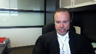
:::

Je travaillerai également en vous référant aux segments, aux sections précises de notre mémoire.

Tout d'abord, l'objet du litige, le vrai pourvoix, sur quoi porte-t-il?

Il porte sur la question de savoir si la garantie de l'ANIA 2B de la Charte canadienne s'applique après la conclusion d'une instance.

Et à fortiori, ce pourvoix vise aussi à déterminer, dans un tel cas, quelle est la portée de la garantie.

J'entends vous plaider, vous soumettre et tenter de vous convaincre que manifestement la garantie s'applique après la conclusion d'une instance, que celle-ci se termine par jugement, avis de règlement ou désistement.

**Justice Côté** (00:30:33): La garantie s'applique pour quelle durée, mais supposons que l'instant s'est terminé.

Est-ce que les pièces sont retournées dans le bureau des avocats, chez les partis?

Est-ce que la garantie est perpétuelle?

Est-ce que les médias peuvent débarquer dans le bureau d'avocats et dire, tenez-moi une copie des pièces qui étaient dans le dossier il y a 10 ans?

**Speaker 2** (00:30:52): Jusqu'au-dessus, ma réponse serait oui.

::: {.column-margin}
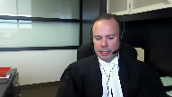
:::

Et bien que je vous soumets respectueusement que nous ne sommes pas dans un cas de figure où l'extension, ou du moins cette question est peut-être réellement factuellement devant vous, je n'ai aucune hésitation à dire que oui, que la garantie doit continuer de s'appliquer et que l'article 108, par sa portée de nature administrative, ne fait pas perdre compétence, ne fait pas perdre la juridiction inhérente du tribunal et ne fait pas perdre au public son droit à la garantie.

**Overlapping speakers** (00:31:24): You

**Justice Côté** (00:31:24): Donc, après la fin de l'instance, ça ne présente pas, contrairement à leur obligation prévue à 108 pour prendre les pièces et que la loi prévoit que les pièces seront détruites.

::: {.column-margin}
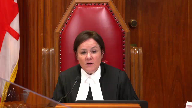
:::

Même les gens au Palais de justice ne pourraient pas détruire les pièces, au cas où les médias voudraient en avoir une copie dans quelques années en vertu de cette garantie dont vous nous parlez.

**Speaker 2** (00:31:45): Ce n'est pas ma prétention, en réponse à votre question, ce n'est pas ma prétention qu'aujourd'hui, et surtout compte tenu des faits, que le tribunal aurait l'obligation de faire des copies.

::: {.column-margin}
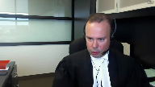
:::

Cependant, ce que j'affirme, c'est que le retrait de la pièce par le citoyen ne fait pas perdre cette compétence.

Mon raisonnement ne s'étend pas à affirmer qu'il y aurait littéralement une interdiction.

Cependant, et ça ressort également du mémoire de la plante, Société Radio-Canada, la presse étale, la compétence doit s'étendre, le droit d'accès s'étend, et au retrait de pièces, à une période postérieure.

Donc, comme principe général, je vous soumets que d'entrée de jeu, en l'absence de contestation…

**Overlapping speakers** (00:32:35): You

**Speaker 2** (00:32:35): une demande d'accès aux pièces devrait se faire uniquement par simple demande aux greffes.

::: {.column-margin}
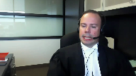
:::

Elles ne devraient pas être assujetties à la soumission, la signification d'une requinte.

Et dans la même veine, le droit d'obtenir copie des pièces, encore une fois, en l'absence de disposition législative, d'ordonnance ou de contestation, devrait se faire sans l'émission d'une ordonnance, sans la nécessité d'obtenir au préalable une ordonnance.

C'est d'ailleurs ce qui ressort de la décision du juge Cournoyer dans l'affaire Magnota.

Ce que nous avons produit dans notre mémoire.

Maintenant, si je passe immédiatement au volet méthode analytique, et là j'en suis à la page 19 et suivante de notre mémoire et le titre 5 du compendium.

Donc, qu'en est-il de cette méthode?

Nous vous proposons de travailler avec la méthode bien connue, qui est la méthode compétence, et nous ajoutons contrôle effectif et ensuite Dagenais-Mentoq.

Par compétence, c'est simplement pour vous indiquer que le tribunal, dans un cas comme le nôtre, dans un cas de demande d'accès aux pièces, devra regarder d'abord sur quoi est fondée la demande.

Et dans ce cas-ci, manifestement, la demande de QMI était fondée sur l'article 11 du Code de procédures civiles. Donc, les articles 11 et 12 du Code de procédures civiles étant la codification de la RACIERA Club, en ce qui nous concerne, pour QMI, il ne fait aucun doute que c'est le pouvoir discrétionnaire du tribunal qui s'enclenche.

Donc, c'est le premier volet de la démarche analytique.

Le deuxième, c'est la question du contrôle effectif.

Nous nous sommes inspirés de l'ensemble de la jurisprudence lue, dont l'affaire CTV, dont l'affaire Air contre Global News, où le tribunal affirme avoir le contrôle et la possession de la pièce, bien que la pièce soit entre les mains d'un tiers, c'est-à-dire les services de police.

Et aussi, nous avons proposé ce critère du contrôle effectif par souci d'efficacité, compte tenu de la particularité de la procédure civile.

Contrôle effectif implique donc que le tribunal puisse considérer que la pièce fait partie du dossier judiciaire.

Donc, nous pourrons y revenir, mais c'est la notion essentiellement que nous vous proposons, par opposition à un contrôle immédiat, c'est-à-dire la pièce est physiquement dans le dossier.

Vous avez vu dans notre mémoire que nous prenons la position à l'effet que la dénonciation en soit suffisante pour conférer un contrôle effectif.

**Justice Côté** (00:35:11): Maintenant donc, est-ce que cette notion de contrôle effectif et ce qui doit faire partie du dossier, ça ne va pas à l'encontre de la décision de la Cour suprême dans l'affaire de Vécuée?

**Speaker 2** (00:35:25): Non, à notre avis, non.

::: {.column-margin}
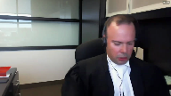
:::

Tout d'abord, si on se remet dans le contexte de Vickery, je pense qu'il était important de souligner que c'est le droit antérieur.

Bien que maintenu dans la décision SRC contre la Reine, il est clair que dans Vickery, la question de la charte n'était pas abordée.

La question de la garantie constitutionnelle n'était pas abordée.

C'est d'ailleurs pour cette raison que la juge Deschamps, dans l'arrêt SRC et la Reine, affirme que les critères prévus dans l'arrêt Vickery demeurent d'une certaine application, toutefois lorsqu'ils sont subsumés dans le cadre du test d'Agenement Tocque.

Alors, non, je ne crois pas que ça va dans le sens contraire de l'arrêt Vickery.

Je pense que l'importance de la garantie 2B, qui a substantiellement évolué au fil des différents arrêts de la Cour qui ont suivi Vickery, fait en sorte que ce contrôle est tout à fait approprié pour s'entrer ou encadrer des débats comme celui que nous avons devant nous aujourd'hui.

Donc, si je reviens ponctuellement au test d'Agenement Tocque, je pense qu'il est important aussi de considérer que déjà à ce stade-ci, la jurisprudence nous donne des indices importants que ce pouvoir s'applique à toute étape procédurale d'une instance judiciaire.

Et succinctement dans Toronto Star et dans McIntyre, la Cour a affirmé que le critère s'applique avant l'instance, c'est-à-dire en période d'enquête criminelle, avant même qu'il y ait dépôt d'accusation.

Pendant l'instance, c'est un peu facile, nous l'avons par l'ensemble du corpus jurisprudentiel canadien, bien entendu, qui découle des arrêts d'Agenement, Mentoc, ainsi que Sierra Club.

Et finalement, fait intéressant, nous avons également des indices jurisprudentiels qui nous disent que le test s'applique après la conclusion d'une instance.

Et plus spécifiquement, je réfère à l'arrêt Société Radio-Canada et Sa Majesté la Reine dans Stéphane Dufour, l'arrêt de 2012, où au paragraphe 15 et 19, vous l'avez dans le recueil condensé de la plante, on voit bien particulièrement au paragraphe 19 que la juge des champs considère quel type de facteur pourrait être appliqué si et lorsqu'une demande d'accès aux pièces survient après la conclusion de l'instance.

Ce qui était d'ailleurs le cas, c'est que le test s'applique

**Overlapping speakers** (00:38:01): And...

**Speaker 2** (00:38:02): Ce qui était d'ailleurs le cas dans ce dossier,

::: {.column-margin}
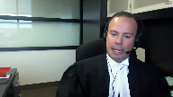
:::

dans le dossier de Stéphane Dufour.

Vous l'avez à l'onglet 3, précisément, du recueil condensé paragraphe 15 et 19.

On peut référer également à Global News où la Cour a considéré qu'une pièce qui n'avait pas été formellement produite conformément aux règles procédurales, qui avait toutefois servi au dossier, qui avait mené vers le retrait d'accusation, que le tribunal devait appliquer Dagenham & Tuck et ne perdait pas compétence du fait que l'instance était réglée.

Au contraire, le fait qu'une décision de retirer des accusations ait été prise sur la base d'une telle pièce, c'était un facteur hautement important dans l'analyse.

M. le Président, ce sont toutes des décisions rendues en commun.

**Justice Côté** (00:38:57): Alors moi, que je me trompe, il n'y a rien, aucune décision rendue en droit civil que vous nous citez.

**Speaker 2** (00:39:04): Vous avez raison,

::: {.column-margin}
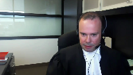
:::

ce sont des décisions qui émanent de la common law.

Toutefois, je pense que les commentaires de cette cour, notamment dans l'arrêt Globe & Mail au paragraphe 28 et 32, mais également dans l'acte Damien, tel que plaidé par mon confrère à McEnville, au paragraphe 40 et in fine, sont des passages importants qui témoignent de la souplesse procédurale dont bénéficie l'égide du Code de procédure civile, notamment et précisément dans le domaine de la publicité des débats judiciaires.

L'acte Damien est un arrêt très précis sur la souplesse de la procédure en matière de procédure civile et de publicité des débats judiciaires.

Maintenant, la demande analytique, la méthode analytique que nous vous proposons, telle que formulée dans notre mémoire, ne vise pas exclusivement les cas d'accès aux pièces, ni exclusivement les cas où il y aurait conflit temporel, comme en l'espèce.

Parce qu'ici, à mon avis, il va sans dire que l'aspect temporel est du moins un élément factuel important dans l'équation juridique que nous avons.

Toutefois, notre méthode est plus large, mais nous avons pris soin aussi d'indiquer certains facteurs, et là je suis à la page 31 de notre mémoire, nous avons pris soin d'indiquer certains facteurs qui auraient une certaine pertinence, advenant qu'il y ait conflit temporel comme en l'occurrence.

Quant au volet nécessité, il s'applique de la même façon, donc avec le test de l'atteinte minimale, vous devez d'abord vous demander bien entendu si l'ordonnance est nécessaire, et dans ce contexte-là, les préceptes de l'atteinte minimale, donc à savoir si l'ordonnance a une portée aussi limitée que possible, ou s'il existe des solutions de rechange.

Il s'agit de critères non-exhaustifs, encore une fois nous nous sommes inspirés des décisions LAVI, le Homes contre la vie, et Gill, qui sont des décisions de common law, mais encore une fois qui traitent de demandes, de retraits d'actes de procédures ou de pièces dans un contexte de pouvoir discrétionnaire.

Ce qui m'amène maintenant à la page 33 de notre mémoire, et à l'application du Code espèce, qui est le dernier titre, pardon tout à l'heure j'ai dit titre 5, mais c'était le titre 4 bien entendu du compendium et je m'en excuse, maintenant j'en suis au titre 5, et donc page 33 à 38 du mémoire, l'application au Code espèce.

Je reviens brièvement sur trois notions fondamentales dans notre pourvoi, donc le principe des débats judiciaires, la liberté d'expression, non le moindre la notion d'intérêt public.

**Justice Kasirer** (00:41:56): M. Nadon, juste pour mettre votre argument en contexte, en bout de piste, est-ce que je me trompe, vous demandez à notre Cour, plutôt qu'à la Cour supérieure, de sous-peuser, selon les facteurs pertinents sous Dagenais-Mentoque, de faire cet exercice-là, contrairement à ce que propose la juge dissidente dans notre affaire.

::: {.column-margin}

:::

Est-ce que c'est ça votre but?

**Speaker 2** (00:42:27): Monsieur le juge Casirer, c'est le but souhaité, c'est le souhait.

::: {.column-margin}

:::

Je pense qu'ici, les facteurs, nous avons cité l'arrêt Vavilov à la pluie, mais tangiblement, ce qui sous-tend notre raisonnement, c'est un peu par analogie avec les conclusions de la Cour dans Stéphane Dufour, donc l'arrêt de 2012, Sainte-Majesté-la-Reine et Radio-Canada, Stéphane Dufour.

L'instant, c'était terminé.

Monsieur Dufour avait été acquitté.

La situation factuelle différait grandement, j'insiste, mais cependant, le contexte procédural est elle-même et la Cour a rendu en lieu et place l'ordonnance

, a statué sur l'ordonnance, sur le pourvoi dans le substrat.

Ici, autre considération, bien entendu, ce dossier n'existe plus, c'est-à-dire qu'il est officiellement, du moins juridiquement, terminé et si nous devions retourner en première instance, il y aurait donc nécessité de fixer une nouvelle date, il y aurait des délais inhérents, qui sait peut-être un appel, un retour vers la Cour d'appel, peut-être une tentative de revenir devant vous, je ne le sais pas.

**Overlapping speakers** (00:43:37): Oui

, je suis...

**Speaker 2** (00:43:38): ce sont des considérations que j'avais à l'esprit, mais il va de soi que nous nous en remettrons au dispositif.

**Justice Kasirer** (00:43:44): C'est juste parce que la logique, et puis on

::: {.column-margin}
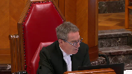
:::

est loin de l'entériner, mais la logique, si je l'ai bien compris, de la position de la juge Marcotte à son paragraphe 60 pour retourner le dossier en Cour supérieure, c'était pour permettre à cette Cour de rendre aux besoins des ordonnances appropriées pour répondre aux préoccupations soulevées par l'intimé.

Entre autres, des ordonnances visant à protéger les tiers, les employés, etc.

On ne peut pas faire ça, nous, ici.

Et je me demande si ce qu'elle propose, sous réserve, bien sûr, aux arguments de l'intimé, est plus sage que de demander à notre Cour d'aller de l'avant tout de suite.

**Speaker 2** (00:44:35): Je confesse devant vous qu'il y a de la sagesse à agir ainsi.

Évidemment, mes commentaires précédents demeurent, mais je ne nie pas certainement pas qu'il s'agit d'une démarche appropriée.

**Justice Kasirer** (00:44:49): Attendez donc que je comprenne.

Vous renoncez à votre demande

que notre cour tranche?

**Speaker 2** (00:44:58): Non, je ne renonce pas.

::: {.column-margin}
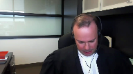
:::

Je pense toujours que la Cour pourrait le faire.

J'ai soumis des arguments qui expliquent mes motifs dans le dernier chapitre, dans la dernière section du mémoire.

À l'effet que suffisamment d'informations, notamment, a été énoncée qu'il n'y a eu aucune représentation de la part du CIUSSS sur la confidentialité des pièces P2 à P4, que quant aux représentations sur la pièce P1, elles ont été faites.

Il y a absence de preuves.

Il y a, à mon sens, davantage d'allégations générales.

Il y a des principes aussi qui pourraient être appliqués afin de limiter les risques si tant est que la Cour ait des sensibilités ou des préoccupations en lien avec les tiers innocents ou en lien avec l'information nominale.

Donc, je ne renonce pas en soi ma demande, mais je m'en remets à votre discrétion et nous considérons aussi que cette autre avenue proposée est raisonnable.

Donc, quelques commentaires sur les trois préceptes.

Tout d'abord, le principe de la publicité judiciaire.

C'est important parce que le juge Schrager en parle abondamment.

Il propose une interprétation qui nous apparaît beaucoup trop restrictive compte tenu de ce principe.

Nous plaidons que ce principe doit s'interpréter largement et que la garantie, quand on l'entend au sens du principe de la publicité des débats, s'applique non seulement à l'égard de l'agir judiciaire, mais aussi à l'égard de ce qui se passe devant les salles de cours, le substrat des dossiers.

Ce n'est donc pas limité à l'examen juridique ou procédural de la Cour.

Et donc, en ce sens, nous soumettons que la notion d'intérêt public est également pertinente dans le cadre de l'examen du principe de la publicité des débats.

Toute procédure judiciaire et les comportements des parties et le substrat des dossiers sont d'intérêt public.

Ici, je vous ai abondamment plaidé pourquoi ce dossier était hautement d'intérêt public.

Maintenant, si nous nous traitons sous l'angle de la liberté d'expression et du droit du public à l'information, je parle de cette autre composante parce qu'évidemment, la liberté garantie s'applique à celui qui tient les propos, à celui qui diffuse, mais aussi à celui qui reçoit.

Et bien là, sans contredit, nous devons regarder les objectifs de la liberté d'expression, quelques dictées dans Grant, le paragraphe 47, Grant contre Thorstar, nous ne l'avons pas produit, nous nous en excusons, et qui reprend les enseignements de cette cour dans Irwin Torrey.

Et en ce titre, nous pouvons déceler, à notre avis, que les deux premiers objectifs de la liberté d'expression sont atteints ici par ce pourvoi.

Tout d'abord, le débat démocratique, le pluralisme démocratique, les discussions portant sur les comportements d'institutions publiques.

À notre avis, ce pourvoi chevauche avec cette notion, qui touche cette notion, et au demeurant, ce serait le deuxième objectif qui s'appliquerait soit à la recherche de la vérité, des discussions, donc que les citoyens souhaitent entretenir sur des comportements d'institutions publiques, participer à des débats, et qui plus est touche et interagissent avec l'agir judiciaire.

Dans ce cas-ci, nous parlons d'allégations sérieuses, preuves à l'appui, preuves d'expertise à l'appui, de la probité, le comportement présumé d'un cadre à l'emploi d'une institution publique, payé à même les deniers publics, dans le cadre de ses fonctions.

Donc, Grand Contour Star au paragraphe 47 ainsi que Rewind Toys sont les arrêts de référence, ce qui m'amène au final à la notion d'intérêt public.

Et là-dessus, nous n'avons pas référé à de la jurisprudence précifique, mais il va de soi que nous référons à Grand Contour Star, précisément au paragraphe 102 à 107.

Nous référons également aux enseignements de cette cour dans Aubry contre vice versa, et notamment au paragraphe 25 à 27 et 57 à 58.

Et nous mentionnons également au passage que vos enseignements, madame la juge Côté, dans Point Protection Association, qui reprennent essentiellement les enseignements également de Grand Contour Star, sont pertinents et très contemporains quant aux arrêts rendus récemment par cette cour.

Ce qui m'amène maintenant à l'application du test d'Agenement Toc à la présente affaire, j'en suis au paragraphe 114 à 121 de notre mémoire.

Donc 114 à 121.

Donc, je serai bref, mais clairement, la pièce P1 a fait l'objet de représentation par mon confrère.

C'est la seule pièce toutefois qui a fait l'objet de représentation.

P2 étant la lettre de démission de l'intimé Camel est une pièce importante, puisqu'elle a été produite au soutien de la demande introductive d'instance pour l'émission d'une ordonnance Norwich.

P3 et P4 sont des documents qui, en apparence, sont entièrement publics.

Je vous soumets.

Bon, l'index aux immeubles

qu'est la pièce P3, c'est manifestement un document public, ainsi que l'affiche centriste, donc de l'affiche web de l'une des propriétés de M. Camel. P4, c'est également une pièce publique, alors quant à nous, le débat est plutôt simple sur ces deux pièces.

Quant à la pièce P1, je pense qu'il y a lieu de réitérer que celle-ci est en partie, du moins, publique par le jugement dont appelle, celui rendu le 20 juillet 2017 par l'honorable Pierre Séguagnon.

Il ne faut pas oublier que ce jugement rend publique la demande introductive d'instance.

Et celle-là, vous l'avez dans le dossier de la plante, fait mention de différents segments, de différentes conclusions de l'expertise P1 Pricewaterhouse, PWC, pardon.

Donc, d'entrée de jeu, à tout le moins, nous pourrions affirmer qu'une partie importante, du moins non-dégligeable, de ce rapport n'est pas confidentielle puisqu'elle est déjà publique, ou à tout le moins, que l'expectative de vie privée de ce document, non seulement par son usage, et nous y reviendrons, mais également par le fait qu'elle est en partie maintenant connue du public.

C'est un argument que vous devriez considérer.

Autre élément important, je ne suis pas certain qu'il y a de preuve, même je suis convaincu qu'il n'y a pas de preuve au dossier concernant le caractère prétendument confidentiel de la méthode d'enquête de PWC.

Ce sont des représentations qui ont été faites, mais avec égard en référant à Toronto Star 2005, paragraphe 9, je pense que nous sommes plutôt dans un contexte d'allégation générale.

Il n'y a pas eu de preuve, pas d'intervention, pas d'affirmation concrète soutenue par un représentant de PWC à l'effet qu'il y aurait des méthodes d'enquête confidentielles ou souhaitées confidentielles.

Ce qui est le plus important selon moi, et ce sur quoi j'aimerais insister devant vous, c'est que la pièce P1 est, ni plus ni moins, la pièce maîtresse de ce dossier.

Et ça a une importance, entre autres, en lien avec le fait que vous constaterez qu'aucune déclaration sous serment ou affidavit n'a été produite au soutien de la demande Norwich.

Quand on regarde la demande, donc qui est dans le dossier de la plante, à la page 35, puisque vous allez à la toute fin de la procédure, il y a un avis d'assignation, on voit un index de pièces qui démontre P1 à P4, et ensuite il y a un avis de présentation.

Mais il n'y a pas de déclaration sous serment, malgré le fait que l'on allègue des actes de fraude, malgré le fait qu'il s'agit d'une procédure musclée, qu'il s'agit d'une procédure d'intérêt public compte tenu de ce que nous vous avons plaidé.

Il n'y a pas d'affidavit, il n'y a qu'un rapport, et compte tenu de la portée des pièces P2 à P4, je n'ai aucune hésitation à affirmer devant vous qu'il s'agit de la carte maîtresse, qu'il s'agit de la pièce fondamentale.

Et non seulement c'est la pièce fondamentale au soutien d'un acte de procédure important, c'est la pièce fondamentale qui a permis et qui a justifié l'autorisation judiciaire, c'est-à-dire l'émission de l'ordonnance Norwich.

Je pense que c'est un autre facteur d'une grande importance que vous devez avoir à l'esprit dans votre délibéré.

C'est donc dire que le recours tout entier de l'intimisius reposait entièrement sur cette pièce qui est la pièce P1.

Sur la notion de proportionnalité, et là j'en suis au paragraphe 122 à 132 du mémoire, tous les facteurs de pondération que nous avons proposés favorisent l'accès et la publication.

J'insiste tout particulièrement sur la nature du document, c'est-à-dire la nature de l'expertise, ce qu'elle a pour impact, ce qu'elle a comme impact et ce qu'elle a comme importance pour le public en général.

J'insisterai aussi sur l'utilité de la pièce au fin de la détermination judiciaire, je ne me répéterai pas.

L'apparence, donc c'était le… je viens de faire mention essentiellement des facteurs I et en fait I et IV.

Facteur V, l'apparence de retrait à des fins stratégiques.

Nous avons fait état de la chronologie, disons, pour le moins particulière dans ce dossier.

Nous estimons qu'il s'agit là d'un autre facteur important, c'est d'ailleurs la notion de dépôt d'agissement stratégique ressort des décisions Hong contre l'avis et de la décision Gill.

Et enfin, le moment de l'instant…

**Justice Kasirer** (00:55:46): You

**Overlapping speakers** (00:55:46): Je suis sûr qu'il y en a d'autres.

**Justice Kasirer** (00:55:48): Sur ce point, je comprends que les apparences, peut-être, vous portent à croire qu'il y a anguille sous roche ici, mais est-ce que c'est de la spéculation dont on doit tenir compte?

::: {.column-margin}
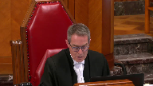
:::

Est-ce qu'il n'est pas possible aussi que les partis, étant maîtres de leurs dossiers, ont décidé de régler l'affaire et que le code de procédure civile les incite de le faire?

C'est dans l'intérêt public que les partis règlent leurs affaires et après, retirent leurs pièces.

Est-ce que ce n'est pas une interprétation possible?

Est-ce que vous nous invitez à faire une spéculation qui devrait, peut-être, ne pas faire partie de notre calcul?

**Speaker 2** (00:56:36): Je ne vous invite pas à spéculer.

::: {.column-margin}

:::

Ça, c'est certain, ce n'est pas mon propos, ce n'est pas mon intention.

Toutefois, la juge Marcotte elle-même a constaté, du moins, l'apparence stratégique du dépôt, du désistement et de l'enchaînement procédural qui s'en est suivi.

Donc, vous l'avez lu, la juge Marcotte, elle également, a eu cette perception, du moins.

Pour ma part, il est important de dire que je ne vois pas de lien entre l'article 108, aligné à 2, et cette volonté, cet aspect de confidentialité ou même de favoriser des règlements.

Je comprends les préceptes ou les principes directeurs universellement reconnus en procédure de favoriser les règlements hors cours.

Je ne suis certainement pas contre ce principe, mais je ne vois pas de lien entre l'article 108, aligné à 2, et une volonté de favoriser les règlements ou les pourparlers hors cours.

**Justice Côté** (00:57:37): Toutes les dispositions du code de procédure civile doivent s'interpréter les unes par rapport aux autres.

La disposition préliminaire est assez claire à cet égard-là.

**Speaker 2** (00:57:47): Oui, je suis d'accord avec vous, Mme la juge Côté.

::: {.column-margin}
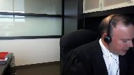
:::

Mais, à tout le moins, je vous soumets que le juge de première instance lui-même a reconnu que l'interprétation de cet incitatif pouvait aller des deux côtés.

C'est-à-dire, je m'explique, lorsqu'il tient ses propos sur la volonté de favoriser des règlements entre les partis, et plus précisément au paragraphe 117 et 118, ou 116-118, il interprète ces garanties comme favorisant ou disant appuyant son raisonnement.

Par contre, si vous dirigez au paragraphe 127 et 129 de son jugement, il dit au paragraphe 127, tout est statuant sur la demande de l'intimé mutuelle.

Donc, je le réitère, demande visant à retirer la demande introductée d'instance ou subsidiairement à mettre tout le dossier sous-sélé.

Le juge Gagnon dit tout d'abord le tribunal en sait très peu sur les circonstances du désistement par le CIUSSS.

Et s'il survient des cas où un désistement dissimule en réalité un règlement hors-course sur une base de compromis mutuelle.

Donc, tout ce que je vous soumets respectueusement, Mme la juge Côté, c'est qu'il peut y avoir des arguments des deux côtés.

Donc, que parfois, autrement dit, la garantie de désistement ou l'acte du désistement ne garantit pas, comme nous le savons, que le demandeur avait entièrement tort et que le défendeur avait entièrement raison.

Et qu'il y a des inférences aussi qui peuvent être tirées, je pense, de diverses façons.

**Justice Côté** (00:59:21): À partir du moment où un désistement n'est pas contesté, qu'il soit déposé pour une raison stratégique ou autre, de la même façon que les motivations qui peuvent guider les médias, je crois que ce sont des éléments qui ne sont pas pertinents dans la mesure où le désistement n'est pas contesté.

::: {.column-margin}
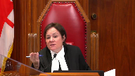
:::

**Speaker 2** (00:59:41): Excusez-moi, il y a eu un tout petit peu d'interférences dans mon casque au début de votre question. Ok.

**Justice Côté** (00:59:45): De la même façon qu'on ne peut pas questionner la motivation des médias, n'est-ce pas non pertinent dans la mesure où le désistement n'est pas contesté, même s'il a été déposé le désistement pour une question stratégique?

::: {.column-margin}
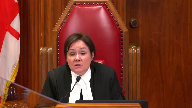
:::

C'est une considération qui...

Est-ce que vous pensez que c'est une considération pertinente?

Il n'y a pas de contestation du désistement. Peut

-être que le public voudrait savoir pourquoi le CIUSSS a agi ainsi, mais les instances auxquelles s'adresser sont différentes.

**Speaker 2** (01:00:18): Il n'y a pas de contestation du désistement, vous avez raison, ça n'a pas été formulé.

::: {.column-margin}
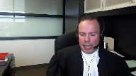
:::

Cependant, nous avons adressé la question du fait qu'on ne devait pas instrumentaliser le système judiciaire et que le tribunal ne pouvait pas écarter des principes constitutionnels d'une si grande importance que la garantie de 2B en raison même d'un désistement.

Et en ce qui concerne la chronologie, nous nous sommes basés également sur les enseignements des tribunaux que nous avons cités à l'appui sur ce point et, au demeurant, la position dans ces mêmes décisions citées portant sur les effets du désistement est à l'effet que, dans certains contextes, la partie fait l'acte judiciaire du tiers ou de la partie en cause conserve une forme d'autonomie.

Nous l'avons vu dans le cadre d'une requête en rejet, nous l'avons vu dans le cadre d'une demande reconventionnelle.

Certes, vous me direz que le code est plus précis par rapport à la demande reconventionnelle, mais en ce qui concerne la requête en rejet, le tribunal conserve une compétence pour l'entendre.

Donc, nous avons aussi cité ces décisions non seulement en lien avec l'effet du désistement, l'agissement stratégique, mais également en lien avec la notion de droit acquis par rapport aux plaidoyers demandés par le tiers, la partie interminable.

**Overlapping speakers** (01:01:39): Je voudrais de conclure parce que votre temps est terminé.

**Speaker 2** (01:01:42): Oui, tout à fait.

::: {.column-margin}
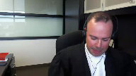
:::

Donc, en conclusion, P1 est la colonne vertébrale de ce dossier, monsieur le juge en chef, mesdames les juges, messieurs les juges.

Plus que jamais, dans un cas comme celui-ci, les dangers de refuser l'accès aux pièces sont donc énormes parce qu'ils attaquent, ils minent la confiance même du public envers le système.

C'est ce qu'il faut éviter à tout prix.

Et par conséquent, limiter la garantie constitutionnelle dans un cas comme celui-ci entraînerait ni plus ni moins un pas de recul pour le Canada, pour la Constitution et pour l'application de la garantie.

Très bien.

Merci pour votre écoute.

Merci pour vos questions.

C'était un honneur de plaider devant vous.

**Justice Wagner** (01:02:32): Merci beaucoup maître.

Maître Christian Leblin.

**Speaker 3** (01:02:38): Monsieur le juge en chef, Mesdames et Messieurs les juges, pour les intervenantes que je représente au dossier, celui-ci représente un dossier où la Cour suprême, nous le croyons humblement, pourrait clarifier le droit de la population canadienne d'avoir accès au dossier de cour actif, mais aussi inactif.

::: {.column-margin}
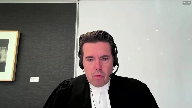
:::

Avoir accès au dossier de cour, ce qui veut dire également pour nous le dossier en sa totalité, ce qui inclut les pièces.

Je ne reviendrai pas sur les principes fondamentaux de l'accès à la justice, du droit du public à l'information qui se rattache.

**Overlapping speakers** (01:03:17): Ce n'est pas l'accès à la justice dont vous parlez, vous parlez de l'accès au dossier.

**Speaker 3** (01:03:22): l'accès au dossier de cours et l'accès au débat judiciaire de façon à ce qu'on puisse prendre connaissance de ce qui se déroule devant nos cours.

::: {.column-margin}
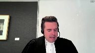
:::

C'est ce que je veux vous indiquer.

Et ça, ça passe également, selon nous, par l'accès, même lorsqu'un dossier est terminé, à la totalité d'un dossier qui a été présenté à une cour supérieure, une cour d'appel ou à la Cour suprême.

**Justice Côté** (01:03:49): Mais qu'est-ce qu'on doit faire, mettre le blanc, s'il y a des dispositions dans le code de procédures civiles?

::: {.column-margin}
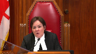
:::

Parce que là, vous parlez du droit du public canadien, mais on va se restreindre pour l'instant au droit du public québécois, si vous le voulez bien, parce qu'on a le code de procédures civiles.

Alors, ce que vous nous demandez essentiellement, c'est de réécrire l'article 108, de dire peu importe ce que dit l'article 108.

Nous devons faire en sorte qu'un document qui, à un moment donné, a abouti dans le dossier de la Cour, doit y demeurer constamment lorsque je lis le paragraphe 3 de votre mémoire.

Vous dites que le dossier doit être accessible au public et le demeurer perpétuellement.

Donc, ça veut dire que si un document est entré dans le dossier de la Cour, il ne pourra jamais en ressortir.

Est-ce que c'est ça votre position?

**Speaker 3** (01:04:31): C'est notre position.

::: {.column-margin}
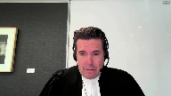
:::

Il pourra en ressortir si un test d'Agenay-Mantok est plaidé, mais le droit tel qu'il est fait en sorte que la pièce doit demeurer.

Je ne vous redemande pas, Madame la juge Côté, de réécrire l'article 108.

Je vous demande d'interpréter l'article 108, avec beaucoup d'égards, en fonction des droits fondamentaux.

L'article 108 est une mesure administrative.

Il ne crée pas de droit substantif.

Là-dessus, la position des juges Marcotte et Schrager de la Cour d'appel est la nôtre.

Et il faut voir que pour qu'une Cour restreigne l'accès au débat judiciaire, cette Honorable Cour, la Cour suprême, a mis la barre très, très haute.

On cite souvent Mentok, vous savez, mais on oublie les faits parfois au soutien de Mentok.

Dans Mentok, et c'est au paragraphe 46 de mémoire, la Cour suprême prend acte que de dévoiler ce qui était l'objet de Mentok, des enquêtes policières et une technique particulière pouvaient non seulement mettre à risque certaines enquêtes qui étaient en cours, mais aussi à risque la sécurité de certains policiers qui étaient impliqués.

Et qu'est-ce que fait cette Honorable Cour?

Elle maintient quand même qu'il faut que les justiciables sachent et connaissent cette technique d'enquête qui était présentée au sein d'un procès et qui revenait donc à l'accès à un procès.

Je vous soumets que l'article 108 ne peut pas interpréter comme voulant dire que, à post-théorie, ou si les partis le décident, le dossier sera incomplet.

Et ce n'est pas que théorique, parce que je vais vous citer un autre article du Code de procédure civile, l'article 171, qui prévoit maintenant que les défenses sont orales dans la plupart des cas, sauf si on prétend que le dossier pose une complexité particulière.

Ce que je veux dire par là, c'est qu'au fur et à mesure du temps et dans le futur, il est possible que les procédures à leur face même donnent très peu d'indications de ce qu'a été une procédure.

Alors, là-dessus, je vous remercie de m'avoir écouté.

Merci beaucoup, Monsieur le Premier ministre.

**Justice Brown** (01:06:34): Votre réponse à la juge côté est peut-être oui, en perpétuité.

**Speaker 3** (01:06:43): Pas « peut-être », M. le juge, M. le juge Brown, je pense que les pièces doivent rester au dossier et être accessibles.

::: {.column-margin}
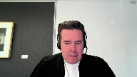
:::

Ils doivent être, par exemple, numérisés, mais ce sera aux provinces et aux différentes cours de gérer comment ils le font, mais il faut garder juridiction sur les pièces et ils doivent être pertinents.

Je vous donne un exemple rapide, et ce n'est pas que théorique.

Les journalistes vont souvent dans les dossiers déjà complétés afin de déterminer et de faire ressurgir des matières d'intérêt public.

Prenez à titre d'exemple, et au risque d'être peut-être un peu caricatural et anecdotique, mais je pense que c'est important, un père et un fils qui est propriétaire d'immeubles locatifs et qui, il y a 20 ans, s'est fait poursuivre parce qu'on ne donnait pas accès à certains logements à des personnes de race noire.

Et 20 ans plus tard, le fils décide de se présenter en politique, peut-être même, pensons-le, à la plus grande fonction d'un pays, premier ministre ou président, et qu'on retourne dans le dossier 20 ans en arrière et qu'on découvre qu'effectivement les pièces, les beaux, dans lesquels il y aurait un code pour identifier qu'il s'agit d'une personne de couleur, les interrogatoires dans lesquels on voit qu'une personne de race noire s'est présentée pour avoir un logement et qu'on lui a dit qu'il n'y en avait plus disponible et que 10 minutes après, une personne de race blanche s'est présentée au même endroit et on lui a dit que le logement était disponible.

Tout ça apparaît des pièces 20 ans plus tard.

Ce genre de reportage a été fait sur un individu qui s'est présenté en politique et c'est uniquement à cause des pièces que ce sujet hautement d'intérêt public sur un personnage public a pu être rapporté.

C'est de ça dont on parle.

**Overlapping speakers** (01:08:25): Nice to meet you.

**Speaker 3** (01:08:25): Et je sais que mon temps est écoulé, mais j'attirais votre attention sur le paragraphe 15 de notre mémoire qui fait référence à l'affaire CTV Television contre Ontario Superior Court of Justice.

**Overlapping speakers** (01:08:38): Oh!

**Speaker 3** (01:08:38): la Cour dit avoir juridiction sur les pièces même lorsque ces pièces ont été retirées.

**Justice Wagner** (01:08:43): Juste une question additionnelle.

::: {.column-margin}
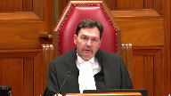
:::

Je comprends votre argument que les pièces à perpétuelle demeurent, pourraient rester au dossier.

Maintenant, comme mesure intermédiaire, est-ce que l'on pourrait pas dire que dans la mesure où il y a une demande d'avoir accès aux pièces qui est pendante, on ne pourrait pas, à tout le moins, détruire sans débat les pièces, ce serait une mesure peut-être moins sévère que la perpétuelle demeure?

**Speaker 3** (01:09:10): Monsieur le juge, dans les réflexions qui nous ont amené à écrire notre mémoire, c'est exactement ce que l'on se disait.

::: {.column-margin}
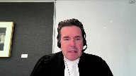
:::

Il peut y avoir une demande d'obtenir la pièce et la personne visée qui a le contrôle de cette pièce, la partie par exemple d'un litige, pourra toujours venir devant la Cour suite à cette demande pour dire par exemple «

je ne l'ai plus, à l'impossible, nul n'est tenu ».

Pourra même, et je le concède, refaire un test d'Agenet-Mentak et dire « à l'époque, je n'avais pas demandé la confidentialité de cette pièce-là, nous sommes quelques années plus tard, les faits ont changé, je demande la confidentialité de cette pièce ».

La Cour aura le loisir d'appliquer les critères et le débat pourra se tenir à ce moment-là.

Mais effectivement, pour les dossiers passés, en présumant que certaines pièces auraient pu être détruites ou retirées, une demande au tribunal pourrait être faite pour l'obtenir et un débat pourrait s'en suivre.

Et effectivement, c'est une mesure qui peut très bien s'appliquer.

**Justice Brown** (01:10:09): Qui va payer pour garder tous les dossiers des cours en perpétuité?

**Speaker 3** (01:10:17): Madame la juge, c'est un droit fondamental.

::: {.column-margin}
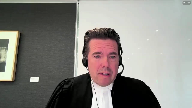
:::

Il faudra que chaque province fasse ce qu'il doit faire pour que ce soit respecté.

Je pense à l'arrêt de Jordan, Madame la juge, où cette Cour est venue dire qu'un procès criminel devait se tenir dans un certain délai.

On peut présumer que ça mettait un fardeau sur certaines provinces de peut-être engager d'autres procureurs de la Couronne, de peut-être même nommer des juges supplémentaires pour arriver dans ces délais.

Mais vous savez quoi?

Au nom d'une liberté fondamentale, et j'en suis fier d'ailleurs, cette Cour et notre pays ne fait pas passer ce genre de frais, de difficultés pratiques, et j'en conviens, au-delà de nos libertés fondamentales.

**Justice Wagner** (01:11:02): Très bien, merci beaucoup. Merci.

Est-ce qu'on a rejoint Maître Bente?

Je suis là, Monsieur le Président-Chef.

Bonjour Maître.

**Speaker 4** (01:11:13): Bonjour.

::: {.column-margin}
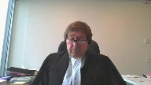
:::

Monsieur le juge en chef, mesdames, messieurs les juges, la Fédération professionnelle des journalistes du Québec intervient dans le présent pourvoi parce que la décision de la Cour d'appel remet en question la portée du principe de la publicité des débats judiciaires et aura pour conséquence, si elle est maintenue, de restreindre le droit du public à l'information judiciaire.

La PGQ est d'avis qu'il est essentiel que cette Cour réitère le caractère constitutionnel de ce principe, donc que cette Cour réaffirme ce qu'elle a dit dans Edmonton Journal, Vancouver Sun, Société Radio-Canada, soit que l'accès du public au dossier judiciaire est garanti par l'article 2B de la Charte et qu'il y a donc une présomption constitutionnelle en faveur de l'accès.

Cette présomption veut dire que les membres du public et les médias n'ont pas à justifier leur présence à la Cour et ils n'ont pas à expliquer ou justifier une demande d'accès à un dossier judiciaire.

C'est pour cette raison que nous soumettons avec respect que le juge Schrager commet une erreur déterminante lorsqu'il fait une distinction entre, d'une part, l'examen du processus judiciaire et, d'autre part, la cueillette d'information dans un dossier judiciaire pour écarter le principe de la transparence judiciaire.

Cette distinction, qui est d'ailleurs assez ténue, est incompatible avec la présomption constitutionnelle d'accès qui fait abstraction de la motivation de la personne qui fait la demande.

Le membre du public ou le journaliste qui fait une demande d'accès à un dossier n'a aucun fardeau à satisfaire.

Le FPGQ ne conteste aucunement le droit des tribunaux de conserver et de surveiller leurs propres dossiers, mais il est maintenant acquis que cette présomption ne peut être écartée qu'en appliquant d'âge de même temps.

Le FPGQ soumet que c'est seulement lorsque le droit d'accès est contesté que le tribunal peut examiner d'autres considérations, telles l'utilisation qui sera faite des pièces.

Cette Cour a bien indiqué au paragraphe 14 de l'arrêt du four que le tribunal peut avoir plusieurs facteurs examinés lorsque le droit d'accès est contesté.

Mais la Cour a ajouté que tous ces facteurs doivent toujours s'insérer dans le cadre élaboré par les arrêts d'Aginé Mentok.

Lorsque le droit d'accès est contesté et on remet en question par exemple l'utilisation qu'on peut faire des pièces, le tribunal ne pourra donc interdire l'accès que s'il est satisfait que cette utilisation pose un risque sérieux et réel pour la bonne administration de la justice.

L'FPGQ soumet également qu'il est erroné de restreindre le principe de la transparence des débats judiciaires aux procédures actives ou « live ».

Cette proposition n'a aucun fondement juridique et est incompatible avec le principe voulant que les tribunaux demeurent comptables de leurs actes et de leurs décisions.

Dans son opinion dissidente dans Vickrey, à la page 699, le juge Corey cite la décision de la Cour suprême des États-Aginés dans Sheppard contre Maxwell à l'effet suivant«

The press does not simply publish...»

**Speaker 5** (01:14:28): information about trials but guards against the miscarriage of justice by subjecting the police prosecutors and judicial processes to extensive public

**Speaker 4** (01:14:36): « Comment le public peut-il se satisfaire que justice a été rendue si son droit d'un regard prend fin dès qu'une décision finale est rendue?

::: {.column-margin}
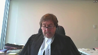
:::

» Dans les cas épunatoires de dignité de justice au Canada, comme les cas de Stephen Truscott, David Milgard et Donald Marshall Jr

.

, les erreurs judiciaires n'auraient jamais pu être corrigées si le droit du regard du public s'arrêtait avec la fin des procédures.

Finalement, l'FPGQ soumet que les droits procéduraux des parties à une instance ne peuvent pas, à eux seuls, écarter le principe de transparence.

Je reviens encore à l'opinion dissidente du juge Corey dans Vickrey, à la page 610, où il a dit qu'une fois qu'un tribunal est saisi d'une demande d'accès des pièces, le tribunal doit garder les pièces et doit trancher la question.

Cette Cour a décité que cette question doit être tranchée en fonction de la présomption de consignes d'accès et que, si l'accès est contesté, la question est décidée en fonction du test d'agenementat.

Le fait qu'une partie puisse par la suite retirer ses pièces ou même se décider complètement de ses procédures n'a aucune pertinence quant au droit d'accès du public.

Une fois que le tribunal est saisi, la question doit être tranchée uniquement en appliquant la Charte et le test élaboré par cette Cour. Merci.

**Justice Wagner** (01:16:09): Merci, maître.

::: {.column-margin}
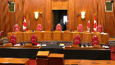
:::

Alors, la cour va prendre sa pause du matin.

On va prendre 15 minutes. Merci.

La cour, le court.

La cour va prendre sa pause du matin.

On va prendre 15 minutes. Merci.

**Speaker 6** (01:17:33): Monsieur le juge en chef, mesdames, messieurs les juges, bonjour.

::: {.column-margin}
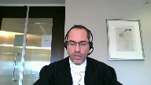
:::

Ce que la Plante vous demande de faire en l'instance, c'est d'ordonner au CIUSSS de lui communiquer des pièces qui ne font plus partie du dossier de la Cour, puisqu'elles ont été retirées par le CIUSSS conformément à l'article 108 du Code de procédure civile.

C'est une demande qui est complètement inédite.

Le retrait des pièces survient à la suite de la réception du jugement de première instance, alors que le dossier, vous l'avez bien compris je crois, était redevenu complètement accessible à tous et qu'il n'existait plus aucune ordonnance ou mesure restrictive.

D'ailleurs, le CIUSSS n'en demandait aucune.

Comme il apparaît plus longuement au mémoire du CIUSSS, au paragraphe 63 et suivant, si la Plante n'a pas pu avoir accès aux pièces en instance, c'est en définitive en application de l'article 108 du Code de procédure et par les propres délais à agir de la Plante d'une part, qui a attendu plus de cinq mois de la connaissance des procédures, ayant publié un article en octobre 2016, avant de produire sa requête pour mettre fin au sellé à la fin mars 2017.

Merci à tous et à la prochaine.

**Justice Wagner** (01:18:39): What is it?

**Overlapping speakers** (01:18:40): Thank you very much.

**Justice Wagner** (01:18:40): Non, bien, je veux dire, il y a quand même eu une requête de la part des médias pour avoir accès à ces pièces-là et il n'y a pas eu de décision sur cette requête-là tant aussi longtemps que les partis n'ont pas été entendus le 25 avril.

::: {.column-margin}
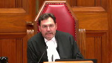
:::

Alors, c'est pas un petit peu réducteur de dire, bien, il aurait dû agir avant.

Il y avait quand même une demande.

**Speaker 6** (01:19:07): Oui, mais si la demande avait été présentée plus tôt dans le processus judiciaire, et si le tribunal avait eu à se prononcer plus tôt dans le processus judiciaire, alors que l'instance n'était pas terminée, il est possible que les pièces auraient toujours été au dossier et que les parties, y compris le CIUSSS, n'ayant pas mis fin à l'instance, ayant toujours besoin du secours du tribunal, les pièces y seraient toujours ...

::: {.column-margin}
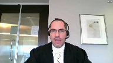
:::

**Justice Wagner** (01:19:28): à ce moment-là.

::: {.column-margin}

:::

Est-ce que le sort juridique de l'interprétation de 108 et des articles 11, 12, 13 du Code de procédure civile dépend d'une... d'une... d'une circonstance temporelle qui n'ont pas agi assez vite?

Donc, on va interpréter le droit par rapport aux ajustements des parties.

**Speaker 6** (01:19:50): C'est pas comme ça que je le présenterais.

::: {.column-margin}
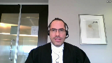
:::

En fait, l'article 108, à notre sens, est clair, sont libellés et facilement compréhensibles s'il est écrit noir sur blanc.

Toutefois, le réel point, c'est que les membres du public qui demandent à accéder à un dossier judiciaire le prennent dans l'état où il se trouve lorsque l'accès est exercé.

Et donc, c'est ça en réalité qui scelle le sort dans l'instance, en l'espèce, au-delà du texte même de l'article 108.

**Justice Côté** (01:20:18): Sur la question du 25 avril, je veux simplement clarifier une chose parce que vous avez dit que la demande de Média QMI était inédite et que vous demandiez aucune mesure restrictive.

::: {.column-margin}
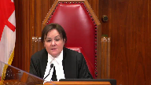
:::

Alors, je comprends que quand CIUSSS s'est présenté à la cour le 25 avril, vous y alliez pour reprendre vos pièces parce que là j'imagine que vous pensiez que le dossier vaut vraiment être retrouvé.

**Overlapping speakers** (01:20:39): Exactly.

**Justice Côté** (01:20:40): Sius n'a pas fait de représentation sur la requête de Média QMI.

La requête pour lever les scellés.

**Speaker 6** (01:20:47): J'ai fait certaines représentations pour expliquer au tribunal le contexte de l'affaire.

**Overlapping speakers** (01:20:52): OK.

**Speaker 6** (01:20:52): Je n'ai pas contesté la demande de Médiacumie de lever les scellés et je n'ai pas non plus demandé de nouveaux scellés.

**Justice Côté** (01:20:59): Et là, vous avez demandé aux juges la permission de retirer les pièces P1 à P4 et, verbalement, Média QEMI s'est opposée.

**Speaker 6** (01:21:09): Ça résume bien la situation.

::: {.column-margin}
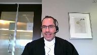
:::

En fait, j'étais là, j'ai appelé ça devant le premier juge, une question d'intendance particulière.

Je ne considérais pas nécessiter l'autorisation de la Cour pour reprendre mes pièces.

Toutefois, je me doutais que le dossier serait en salle puisque les demandes de Kamel et de QMI étaient présentées ce jour-là.

Et devant me voyant vouloir accéder au dossier de la Cour pour reprendre mes pièces, une opposition est formée par QMI, ce qui explique que le juge doit se prononcer.

**Justice Côté** (01:21:35): Et là, QMI dit « on s'oppose à ce que vous retirez les pièces, CIUSC, mais vous CIUSC, est-ce que vous faites une demande en disant « non seulement on veut les retirer, mais on ne veut pas que Média y ait accès ».

Vous avez juste dit « on veut les retirer ».

**Speaker 6** (01:21:52): on veut les retirer.

La question de l'accès, une fois le dossier redevenu public, comme le juge l'a fait, les pièces ont été accessibles jusqu'à ce que le CIUSSS procède effectivement au retrait et elles seraient demeurées au dossier de l'accord et accessibles.

**Overlapping speakers** (01:22:09): I- I-

**Speaker 6** (01:22:10): s'il n'y avait pas eu un tel retrait jusqu'au délai d'un an qui prévoit la destruction.

**Justice Côté** (01:22:13): Alors, donc, le jugement est rendu par le premier juge et le lendemain du jugement, et vous me corrigez si ma version des faits n'est pas correcte, vous vous présentez, vous en siusse présente à la cour pour retirer les pièces.

**Overlapping speakers** (01:22:25): C'est exact.

**Justice Côté** (01:22:26): Entre le moment du jugement et le moment où Sius est allé retirer, Média QMI aurait pu se présenter pour demander une copie des pièces.

**Overlapping speakers** (01:22:34): Tout à fait.

**Justice Côté** (01:22:34): Donc, il n'y avait plus de scellé, il n'y avait rien.

Si Immédiat était arrivé avant vous à la cour, ils auraient pu demander une copie des pièces.

**Overlapping speakers** (01:22:42): Exactly.

**Justice Côté** (01:22:43): Thank you.

**Justice Wagner** (01:22:47): Alors parce qu'ils couraient moins vite, ils ont manqué leurs coups.

**Justice Kasirer** (01:22:52): Est-ce que je peux enchaîner sur ça?

::: {.column-margin}
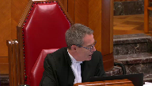
:::

Quel est le sens à donner donc au paragraphe du jugement de la Cour supérieure qui précise 138, qui précise que la demande introductive d'instance doit être conservée au dossier et rendue accessible au public, de même que tous les documents autres que les pièces P1 à P4?

Est-ce que c'est pas une suggestion plutôt que ces pièces-là ne sont pas visées par ce que décrète le juge?

**Speaker 6** (01:23:28): Pour bien comprendre nos jugements, il faut se rappeler que le premier juge, et il n'y a pas d'appel là-dessus, conclut que la demande introductive d'instance, bien que le Code de procédures civile prévoit que les parties puissent retirer, non pas seulement des pièces, mais également certaines procédures, le juge de première instance conclut que la demande introductive d'instance doit demeurer au dossier L à tout le moins à perpétuité, et les autres documents.

::: {.column-margin}
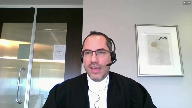
:::

Le juge ne pouvait pas décrypter la même chose des pièces, puisque l'article 108 prévoit expressément que les parties peuvent les retirer, et même doivent les retirer l'instance terminée, et qu'à défaut, elles seront détruites.

Donc le juge ne pouvait pas décrypter le maintien des pièces au dossier, le Code de procédures civile est à l'effet contraire.

Mais le juge ne va pas plus loin que cela non plus.

Il n'ordonne pas le retrait des pièces, il ne prend aucune mesure pour favoriser le dossier des pièces ou les soustraire au public, il remet le dossier dans un état que j'appellerais normal, c'est-à-dire qu'il est entièrement accessible, et par la suite, le droit d'accès des médias existait et va être exercé, et le droit de retrait des pièces des parties existait et va être exercé.

En l'espèce ici, c'est le droit au retrait des pièces qui a été exercé le premier, et c'est l'effet même de la loi.

Mais le juge n'est pas allé plus loin que le texte clair de la loi.

**Justice Kasirer** (01:24:49): Alors, pour accueillir en partie la demande de Mediacumi par rapport à la demande introduite d'instance, est-ce qu'il a procédé en bonne et due forme à une analyse des facteurs d'Agené Mentok, d'après vous?

**Speaker 6** (01:25:07): Le juge a effectivement effectué une analyse d'Agenay Mentok qui est à bon droit sur la demande de Kamel de sceller le dossier au complet et pour toujours.

::: {.column-margin}
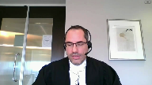
:::

Le juge rejette ces demandes-là et ce débat-là ne me concernait pas.

Pour ce qui est de la levée des scellés, ceux qui existaient auparavant à la demande du CIUSSS, je n'en demandais pas la reconduction, donc ce débat-là m'était étranger.

Je vous entretiendrai maintenant du fait qu'à mon sens, le caractère public des débats judiciaires et l'accès corolaire au dossier de la Cour se limitent à ce qui fait partie du dossier de la Cour.

Nous verrons qu'il appartient aux parties ou litiges de constituer le dossier de la Cour et non aux membres du public, comme la plante.

Nous allons examiner un peu plus amplement le régime de l'article 108 qui s'inscrit dans la logique du système de justice contradictoire qui est le nôtre.

Et nous verrons en terminant qu'en l'absence d'une contestation constitutionnelle de l'article 108, le pourvoi de la plante doit échouer puisque le libel éclair de cet article est le droit en vigueur et il doit être appliqué.

Ce que la plante et les intervenants vous proposent, c'est d'en faire carrément fi sous prétexte de l'interpréter.

Et donc, quant à la publicité des débats judiciaires, la publicité des débats judiciaires permet, sous réserve d'une disposition particulière ou d'une ordonnance particulière, ce qui n'est pas le cas en l'espèce suite aux jugements, permettre aux membres du public d'assister aux audiences des tribunaux et d'accéder aux dossiers de la Cour.

Sur le statut des médias comme d'hier à l'instance, je vous réfère à l'affaire Dagenais à la page 858 qui est à l'onglet 1 de notre recueil, puis vous avez d'autres références à notre mémoire à la note de votre page 43.

Ce qu'on peut garder en tête, c'est que l'objectif fondamental de ce principe de la publicité des débats judiciaires, c'est de permettre l'examen critique des tribunaux et de leur fonctionnement.

Et cette transparence supporte la primauté du droit et la confiance du public dans le système de justice.

Ce sont les propos essentiellement de cette Cour dans l'affaire Edmonton Journal que vous trouvez à l'onglet 6 du recueil condensé du CIUSSS.

Mais donc, c'est les permis d'observer et de rapporter ce qui se passe dans les instances judiciaires.

L'objectif et la finalité de ce principe-là n'est pas de faciliter l'inquisition de tiers dans les affaires privées des partis en litige civil.

Inaudible.

**Speaker 6** (01:27:31): de faciliter les enquêtes journalistiques.

::: {.column-margin}
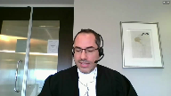
:::

Ça peut, dans une certaine mesure, en être effectivement un effet secondaire, mais ce n'en est pas l'objectif.

La Cour d'appel du Québec résume bien cette idée dans Gay contre Jessica, à l'onglet 3 du recueil condensé et au paragraphe 115 que je vous cite à l'instant.

L'intérêt du public dans la publicité des débats judiciaires ne repose pas sur la possibilité de se mettre sous la dent rapidement ou urgemment des nouvelles, mais plutôt sur le fait de pouvoir se livrer à l'examen minutieux et contemporain de l'agir judiciaire.

Donc, dans notre système de justice civile qui est contradictoire, il appartient au parti, je le mentionnais, de constituer le dossier judiciaire et la preuve qui sera soumise au tribunal, et non aux membres du public qui ont un droit d'accès et un rôle d'observateur.

Et j'ajouterais même, ce n'est pas non plus le rôle du juge de constituer le dossier de la Cour ou la preuve qui est versée, puisque le juge doit trancher en fonction de ce que les partis lui soumettent.

De façon cohérente avec ces principes, l'accès au dossier des tribunaux par les membres du public a toujours, à notre connaissance, été compris comme étant limité à ce qui s'y trouve.

Les tribunaux, incluant cette Cour, n'ont jamais permis aux membres du public de s'insérer dans la constitution du dossier judiciaire à la place des partis.

Et c'est ce que la Plante cherche à faire ici en proposant un critère de contrôle effectif indûment large, à l'effet que dès qu'une pièce est allégée ou dénoncée, même si elle n'est jamais produite en preuve ou versée au dossier de la Cour, elle serait pourtant sous le contrôle effectif de la Cour et qu'il serait dès lors possible aux membres du public d'en obtenir communication.

C'est la position que la Plante a prise ce matin et qui est à son mémoire au paragraphe 90 à 93.

Et pour nous, c'est clairement erroné pour deux raisons.

La première, c'est que la jurisprudence, incluant de la Cour suprême, est à l'effet que ne sont publiques ou ne font partie des dossiers de la Cour que ce qui a fait partie de l'audience ou ce qui a été versé en preuve.

C'est l'enseignement très clair de cette Cour dans l'affaire Lac-Damiante, à l'onglet 7 du recueil condensé, au paragraphe 64 à 72.

**Justice Wagner** (01:29:39): L'acte d'amiante s'inscrit dans un contexte d'interrogatoire hors de cours, puis le débat à l'époque c'était de savoir jusqu'à quel point effectivement des documents demandés lors d'un interrogatoire peuvent être déposés, puis évidemment on a dit que ça répond à des règles bien particulières.

**Overlapping speakers** (01:29:55): On est tout à fait dans le même contexte.

**Justice Wagner** (01:29:56): où une déclaration introductive d'instance est accompagnée de pièces.

**Speaker 6** (01:30:02): Ma compréhension de l'acte d'amiante est un peu plus large que la façon dont vous venez de l'énoncer.

::: {.column-margin}

:::

La Cour suprême conclut au paragraphe 64 de l'acte d'amiante que tant que les interrogatoires préalables ne sont pas déposés en preuve, ils ne font pas partie du dossier du tribunal et demeurent, appelons-ça privés ou confidentiels, autrement dit les tiers n'y ont pas accès.

Mais la Cour fait aussi une distinction plus large au paragraphe 66 et 67 entre, d'une part, ce qui est devenu public et fait partie du dossier de la Cour et, d'autre part, ce qui ne fait pas partie du dossier de la Cour.

Et cette distinction-là, elle est fonction de ce qu'est les différents documents ou éléments de preuve et fait partie de l'audience ou non.

À titre d'exemple, la Cour reconnaît également que les documents ou informations obtenues de tiers, sous l'égide de l'ancien article 402 CPC, puisque cette collecte d'informations-là ne se déroule pas dans le cadre d'une audience, demeure également privée.

Et c'est la distinction entre ce qui a fait partie de l'audience et qui a été versée en preuve de ce qui ne l'a pas été qui nous enseigne à savoir est-ce qu'un document fait partie du dossier de la Cour ou non.

Et la Cour remarque également dans cette affaire de l'acte d'amiante au paragraphe 71 qu'il n'y avait eu aucune contestation constitutionnelle du régime créé par les dispositions en question, et ce sont donc les dispositions du code de procédure civile qui scelle le sort de l'affaire.

Ce même raisonnement devrait s'appliquer en l'espèce, puisqu'on a une disposition du code de procédure civile claire et nette qui prévoit comment, quand et jusqu'à quand et de quelle manière un document ou un élément de preuve devient partie du dossier de Cour et à partir de quel moment les parties ont le loisir de le retirer.

**Justice Kasirer** (01:31:44): Maitalière, toujours dans le cadre de votre présentation de l'Acte d'amiante, le paragraphe 40, le juge Lebel rappelle les liens entre la procédure civile avec l'ensemble du droit québécois, y compris les valeurs exprimées par la Charte québécoise.

::: {.column-margin}

:::

Et il va plus loin.

Enfin, dans un domaine comme la publicité des procès, restent présents les principes constitutionnels fondamentaux de la Charte canadienne des droits et libertés qui sont applicables dans un débat judiciaire privé.

Est-ce que ceci a une pertinence quant à l'interprétation que nous devons faire de l'article 108 et sa place dans le cadre général de la procédure civile québécoise?

**Speaker 6** (01:32:31): C'est un commentaire à propos.

::: {.column-margin}

:::

Toutefois, pour l'affaire qui nous occupe ici, comme je l'ai mentionné, il n'y a pas question d'interpréter l'article 108, il y a simplement question de l'appliquer.

Notamment en ce que l'exercice du droit au retrait aux pièces n'est pas sujet à une autorisation judiciaire, c'est un droit qui s'exerce directement.

Donc, il n'y a pas non plus de discrétion judiciaire, ce qui fait que le test d'Agena Mentok n'est pas applicable au retrait des pièces conformément à l'article 108.

**Justice Kasirer** (01:32:59): Alors, le juge de la Cour supérieure s'est trompé quand il a autorisé le CIEU de se retirer du dossier des pièces P1 à P4.

**Speaker 6** (01:33:10): Il ne s'est pas trompé puisqu'il ne pouvait pas l'interdire.

::: {.column-margin}

:::

L'article 108 du Code de procédures civiles est clair, mais cette conclusion-là, à mon sens, est superfétatoire, un peu comme une réserve de droits.

Ce droit-là, au retrait des pièces, existait.

Le juge ne pouvait pas l'interdire puisqu'on lui avait débattu la question.

Il l'a autorisé, mais il n'a pas procédé lui-même au retrait des pièces.

Son jugement en substance édique que le dossier redevient un dossier normal, accessible à tous et entièrement.

Ensuite, l'article 108 continue de s'appliquer, comme dans tout autre dossier.

**Justice Wagner** (01:33:45): Il fait une distinction entre la procédure introductive d'instance et les pièces.

::: {.column-margin}

:::

À moins qu'il parle pour rien et qu'il n'écrit pour rien, il me semble que son dispositif témoigne justement d'une étude, d'une différence entre le sort réservé et la procédure introductive et les pièces qui étaient jointes.

**Speaker 6** (01:34:04): Tout à fait, le juge arrive à une conclusion différente pour ce qui est de la demande introductive d'instance.

::: {.column-margin}

:::

Ce n'est pas en appel devant vous, les parties ne se sont pas pourvues à l'encontre de cette décision-là.

Et ça me permet de mentionner également que le retrait des pièces ne compromet pas réellement l'accès public aux instances terminées.

Dans tous les cas, qu'il y ait retrait des pièces ou non, la demande introductive d'instance à tout de moins demeurera au dossier de la Cour.

Tous les jugements rendus demeureront au dossier de la Cour.

Les enregistrements des audiences ou les transcriptions des audiences lecocheants demeureront au dossier de la Cour.

Les témoignages rendus à l'audience également.

Donc, l'examen de la Jury judiciaire, même en l'absence des pièces, est toujours possible et si le législateur a permis le retrait des pièces, quand on interprète le code comme un ensemble, c'est que le législateur a jugé qu'il était suffisant pour remplir ce nécessaire examen de la Jury judiciaire, que les pièces n'avaient pas été demeurées perpétuellement.

Pour enchaîner avec ce que je vous disais plus tôt, la proposition voulant que la dénonciation des pièces suffit, même s'ils ne sont jamais versés au dossier de la Cour ou produites en preuve pour donner le droit aux membres du public d'y accéder, est également erronée pour une deuxième raison.

C'est que le tribunal lui-même n'aurait pas le pouvoir de mener telle inquisition dans les affaires d'une partie ou de forcer une partie à produire une quelconque preuve dans un système de justice contradictoire.

Peu importe les allégations qu'une partie peut faire dans ses procédures et même les allégations de documents qui ont pu être faites, le tribunal doit juger en fonction de la preuve qui lui est soumise.

Par exemple, si le tribunal constate une lacune dans la preuve, il peut la signaler au parti en vertu de l'article 268 du Code de procédure civile, mais il ne peut pas la combler et il ne peut pas ordonner à la partie de la combler.

– Excusez-moi, maître.

**Justice Wagner** (01:36:04): You

**Overlapping speakers** (01:36:04): It.

**Justice Wagner** (01:36:05): Est-ce que je dois comprendre qu'un UTT du dépôt du désistement après la requête pour obtenir accès au dossier, en ce moment-là, effectivement, il y aurait eu un débat sur l'application de la règle d'Agenette MnToc, s'il n'y avait pas eu de désistement.

**Speaker 6** (01:36:22): C'est-à-dire, s'il n'y avait pas eu de désistement, les partis auraient toujours pu, de consentement comme le prévoit la ligne A2 de l'article 108, retirer les pièces.

::: {.column-margin}

:::

Et ici, il apparaît du dossier, vous avez les références dans mon mémoire, que les partis consentaient au retrait des pièces.

Donc, la question qui serait devant vous serait la même, est-ce que l'article 108 trouve application?

Et si oui, on doit l'appliquer puisque c'est le droit en vigueur et qu'il n'y a pas de contestation constitutionnelle de cet article.

**Justice Wagner** (01:36:47): même s'il y a un dépôt d'une requête des mesures d'information pour avoir accès aux pièces, avant.

**Speaker 6** (01:36:53): Le premier juge a eu une discussion avec l'avocat qu'il a mis en première instance à cet égard-là en disant est-ce que le simple dépôt de votre requête en quelque sorte gèle les droits des parties de faire évoluer leur dossier judiciaire ou gèle l'état du dossier de la Cour automatiquement, ce qui est un peu ce que la Plante prétend dans son mémoire.

::: {.column-margin}

:::

Alors que la réalité, c'est que le dépôt de la requête en mars, qui finit en présenter un mois plus tard, n'est assorti d'aucune mesure conservatoire si tantique qu'elle ne pourrait pas être accordée, mais il n'y a aucune demande des médias que tu as mises à cet égard-là non plus.

**Justice Wagner** (01:37:35): pas prétendre non plus qu'il y aurait un décisement soudain dans ce dossier-là, c'est peut-être ce qui...

Ceci explique peut-être cela.

**Speaker 6** (01:37:42): Peut-être, mais la précaution devait s'exercer du côté de la plante.

::: {.column-margin}

:::

Les parties aux litiges ne pouvaient pas être empêchées de se désister de réseaux de litiges ou autrement de se mettre fin s'ils le jugeaient appropriés.

Le dépôt de la demande ne peut pas avoir pour effet, non.

La demande d'un membre du public d'accéder au dossier de la Cour ne peut pas en soi entraîner l'arrêt des droits des parties et l'arrêt de leurs procédures.

Donc, ici, c'est vraiment l'article 108 qui est au cœur du débat encore une fois.

Sur le principe du caractère contradictoire du système de justice, à l'effet qu'une pièce qui est simplement allégée, mais qui n'est pas produite, le tribunal ne peut pas ordonner une partie de faire une preuve qu'elle n'entend pas faire, même peu importe ses allégations.

Je vous réfère à la technologie Laptronics de la Cour d'appel à l'onglet 5 de notre recueil condensé et votre Cour dans l'affaire pétrolière impériale contre-georque à l'onglet 4 du recueil condensé reconnaît effectivement, citant avec approbation technologie Laptronics, le caractère contradictoire de la justice civile au Québec.

Et ça nous ramène, comme je vous disais, à l'article 108 et à la question de savoir de quoi et comment sont constitués les dossiers des tribunaux et le contrôle que les tribunaux exercent sur ceux-ci.

Et d'entrée de jeu, il est vrai que le tribunal possède le pouvoir de surveiller et de préserver ses propres dossiers, mais il est aussi évident que la législation, le cas échéant, encadre ce pouvoir.

Et la Cour suprême le mentionne expressément dans l'affaire SRC contre la Rêne à l'onglet 10 de notre recueil condensé au paragraphe 12.

Et je vous fais une lecture du début de ce paragraphe.

L'accès aux pièces est un corollaire du caractère public des débats et, en l'absence de dispositions législatives applicables, il revient au juge du procès de décider de l'usage qui peut en être fait.

Et donc nous avons ici une disposition législative applicable, l'article 108, qui a été correctement comprise par les deux tribunaux inférieurs et qui trouve application en l'espèce.

Et le législateur a prévu à l'article 108 justement dans quelle mesure, à partir de quand et jusqu'à quand, un document ou un élément matériel de preuve fait effectivement partie du dossier de la Cour.

Donc, il découle du deuxième alenéa de l'article qu'un document ou un élément de preuve ne fait partie du dossier de la Cour que du moment où il y est produit à titre de pièce par une partie.

Et il est intéressant de noter que cela est parfaitement cohérent avec les enseignements des affaires Lac-Damiante, technologies Laptronics et pétrolière impériale que nous venons de traiter.

Et donc, j'ajouterais à ça que le législateur a sujeté d'abord et avant tout la présence des pièces au dossier de la Cour à la discrétion des parties au litige.

C'est vrai de leur dépôt, mais c'est également vrai du retrait, compte tenu que les parties peuvent retirer de consentement en tout temps les pièces de l'instance.

Évidemment, ce consentement-là va être modulé par la nécessité perçue par les parties de soumettre les documents en question au juge dans le cadre d'une instance.

Et l'article prévoit de même qu'une fois l'instance terminée, les parties doivent retirer leurs pièces, à défaut de quoi elles sont détruites au bout d'un an.

Et comme on l'a déjà mentionné, le tout échappe à l'intervention et à la discrétion judiciaire.

En ce que le tribunal ne peut pas forcer une partie à présenter une preuve qu'elle choisit de ne pas soumettre à la Cour, et en ce que le retrait des pièces également, suivant le libellé express de l'article, échappe aussi à l'intervention judiciaire.

Et le juge sans sonde de la Cour d'appel le reconnaît d'ailleurs au paragraphe 29 de la décision.

Et quant à nous, que le droit du public d'accéder au dossier des tribunaux existe avant, pendant et après le procès comme tel n'y change rien.

L'observateur, les membres du public doivent prendre le dossier dans l'état dans lequel il se trouve lorsque l'accès s'exerce.

Et il ne leur revient pas de constituer, à la place des parties et des balises législatives, les dossiers de la Cour.

Donc la proposition de la plante voulant que dès qu'un élément de preuve est allégué ou dénoncé, le tribunal en ait le contrôle effectif et pourrait ordonner de le verser au dossier ou autrement d'en ordonner de la communication au public m'apparaît contraire au principe de notre système de justice civile et actuel.

Et comme je l'ai déjà mentionné, il apparaît également que pour le législateur, les pièces ne sont pas une partie essentielle ou éternelle des archives et dossiers de la Cour.

Le législateur a choisi de permettre leur retrait et l'obligation de les retirer l'instant se terminer.

Il est vrai qu'une considération est de nature administrative et de gestion de coûts, mais il fait néanmoins ce choix consciemment, et je cite, des doutes sérieux qui peuvent être soulevés sur la nécessité de conserver ces pièces après un certain délai et des coûts qu'une telle conservation comporte, comme il apparaît des débats parlementaires concernant l'ancêtre de l'article 108 qui sont reproduits à l'onglet 10 du recueil condensé de la plante.

Et ce choix législatif-là, permet aussi aux justiciables en matière civile de prévoir et d'arbitrer dans les paramètres prévus par la loi la mesure dans laquelle les différentes natures privées qui se mettent au tribunal deviennent publiques et la mesure dans laquelle ils doivent, pour les fins de l'audience, renoncer à leur droit à la vie privée.

Donc, ce choix législatif peut également favoriser l'accès à la justice en limitant dans une certaine mesure l'intrusion dans la vie privée des justiciables qui seront possiblement davantage portées à faire appel aux tribunaux aux besoins.

Et l'opportunité qui est donnée au parti de retirer les pièces en tout temps de consentement ne peut pas s'expliquer par un simple calcul de coûts administratifs.

Ce choix-là du législateur n'a rien de choquant.

Je soumettrais qu'il est cohérent avec les propos de la Cour suprême dans l'affaire Vickrey dans laquelle la Cour suprême énonce que le tribunal n'est que le dépositaire des pièces, ce qui est encore plus vrai dans une instance civile que dans une instance criminelle comme dans l'affaire Vickrey.

La majorité de la Cour dans cette affaire commente également la raison d'aide d'une règle de procédure de la Nouvelle-Écosse qui presquit le retour des pièces qui ont été reproduites.

Et l'affaire Vickrey est reproduite à l'onglet 8 de notre recueil condensé et c'est à la pages 681 et 682.

Et je me permets de faire lecture de certains passages qui commencent à la bas de la page 681.

Une pièce n'est pas un document du tribunal au même titre que les dossiers produits par le tribunal ou que les actes de procédure et les affidavitent préparés et déposés en conformité des exigences du tribunal.

Les pièces appartiennent souvent à des tiers qui ont ordinairement été.

Lorsqu'elles ont servi la fin pour laquelle elles ont été déposées, elles sont généralement mises à la disposition de la personne qui les a produites.

Pendant qu'il en est dépositaire, le tribunal a l'obligation de statuer sur toute demande d'accès.

Et un peu plus loin, commentant sur la règle de Nouvelle-Écosse, le juge en chambre fait mention de la règle de la Nouvelle-Écosse qui prescrit la remise des pièces à la partie qui les a produites.

Elle souligne que cette règle a pour but d'éviter au tribunal d'avoir à conserver des pièces dont elle n'a plus besoin.

La règle reflète cependant le fait que les pièces n'appartiennent pas au tribunal.

La Cour suprême reconnaît donc que le législateur peut valablement encadrer la présence des pièces au dossier, puis possiblement les exclure.

Ces propos sont directement applicables à l'affaire qui nous occupe.

Et comme je le mentionnais, il ne faut pas oublier que demeurent au dossier du tribunal les enregistrements, les procédures, les jugements qui permettent d'examiner l'agir judiciaire après la fin d'instance, et même des années plus tard.

**Speaker 5** (01:45:12): ce qui l'a fait en réalité.

**Justice Kasirer** (01:45:14): Votre collègue plaide au paragraphe 92 de son mémoire que l'arrêt vécu n'est pas déterminant dans notre affaire puisque la Cour avait refusé de se prononcer sur la protection constitutionnelle de l'accès aux pièces.

::: {.column-margin}

:::

Qu'est-ce que vous dites à cela?

**Speaker 6** (01:45:35): Je répondrais simplement qu'ici aussi, nous avons une disposition législative applicable à l'égard de laquelle il n'y a pas de contestation constitutionnelle, donc on ne peut pas l'écarter ou l'invalider, il faut l'appliquer ou à la rigueur l'interpréter, mais son texte est tellement clair que l'exercice d'interprétation n'est pas utile à mon sens.

::: {.column-margin}

:::

Et donc, ce qui apparaît en réalité, c'est que la plante et les intervenantes sont insatisfaites de l'effet de l'article 108 et de l'équilibre créé par le législateur entre les avantages, inconvénients et coûts associés à la présence des pièces au dossier.

Et sous prétexte de l'interpréter, ils veulent écarter l'article, ce qui est impossible de faire ici.

Et la Cour suprême est claire que lorsqu'une disposition législative est contestée, ça doit prendre la forme d'une contestation constitutionnelle ou fondée sur la charte en bonne et due forme, ce que la plante n'a pas fait.

Et cette Cour est également claire que le test d'Agenement Toc, dont la plante se réclame, est réservé à l'exercice d'un pouvoir discrétionnaire par le tribunal, qui n'a pas prise sur le retrait des pièces à l'article 108.

Et dans notre recueil condensé, vous trouverez à l'onglet 1 l'affaire Dagenais contre Société Radio-Canada, à la page 874, qui l'établit, et c'est réitéré notamment dans personne désignée contre Vancouver Sun, à l'onglet 2 du recueil condensé, aux pages 274 et 275.

Je voudrais dire un mot également des autorités que les appelantes ont mentionnées qui traitent toutes, justement, d'un pouvoir discrétionnaire exercé par le tribunal ou qui sont de common law.

Et on a référé expressément à l'affaire Ong-Vila-Vie comme étant intéressante, pourtant elle se distingue de façon fondamentale pour trois raisons, et ces trois raisons-là apparaissent des trois premiers paragraphe de la décision.

Et vous avez à l'onglet 11 de notre recueil condensé ces trois paragraphe.

Au paragraphe 1 de l'affaire Ong-Vila-Vie, le retrait qui était demandé était de retirer 18 affidavits du dossier de la Cour.

C'est différent par nature d'une pièce, on l'a vu avec l'affaire Vickrey.

Deuxièmement, au paragraphe 2, le tribunal, les parties constatent «

The applicants acknowledge that there is no basis

in statute or in the rules

of civil procedure

for the remedy sought.»

Et c'est une distinction

fondamentale.

Ici, nous avons l'article 108 du Code de procédures civiles, et au paragraphe 3 de Ong-Vila-Vie, le tribunal reconnaît qu'il s'agit dans ce cas-là de l'exercice d'un pouvoir discrétionnaire, ce qui n'est pas le cas en l'instant.

**Justice Côté** (01:48:03): Il y avait aussi une autre distinction dans Ong contre la vie, contrairement ici où il y a un désistement, donc une fin d'instance.

Dans Ong contre la vie, l'instance était toujours en cours parce que les partis étaient en train de discuter d'une possibilité de régler au cours.

C'est une expérience incontrôlable.

**Justice Wagner** (01:48:19): Je vais vous barrer de conclure parce que votre temps était expiré.

**Speaker 6** (01:48:19): Je vais vous demander de conclure parce que votre temps est expiré. Merci.

::: {.column-margin}

:::

Alors, en somme, au premier chef, en raison de l'absence de contestation constitutionnelle, le pourvoi de la plante doit échouer.

Et le seul intérêt qui serait servi en l'espèce par la demande de la plante est l'intérêt de la plante qui pourrait potentiellement compléter plus facilement une enquête sur un sujet qu'elle juge d'intérêt, mais cela n'aurait rien à voir avec le caractère public des débats judiciaires ni avec l'examen de l'agir judiciaire.

Je vous remercie.

**Justice Wagner** (01:48:47): Maitre Pierre-Antoine.

**Speaker 7** (01:48:53): Bonjour

::: {.column-margin}

:::

Monsieur le juge en chef, Mesdames, Messieurs les juges, je vous salue.

Je fais évidemment bien les arguments de mon collègue Maït Baliaire et je vais m'attarder sur les questionnements qui ont été soulevés par Mme la juge Côté et Monsieur le juge Casirer.

À savoir, avant tout, en parlant de propos, je vais reprendre une citation de Jack Keirin, « And

they will be simple.

Un jour, je trouverai les mots justes, et ils seront simples.

» Comme vous le connaissez certainement, l'Organisation internationale sur un langage clair, CLARITY, exprime qu'une communication en langage clair est si son libellé, sa structure, sa conception sont si claires que le public visé peut facilement trouver ce qu'il a besoin, comprendre ce qu'il trouve et utiliser cette information.

Vous saurez évidemment que c'est ce que le législateur veut et évidemment que tout jugement écrit cherche à atteindre avec le nouveau Code de procédure civile, soit une lecture simple qui va de pair avec l'adage que le législateur ne parle pas pour rien dire et ne reste pas silencieux sans raison.

Donc, je vais vous exposer notre position en regard des questionnements de Mme la juge Côté et Monsieur le juge Casirer sous cinq volets.

Soit le premier, le langage clair de l'article 108 en lien avec la disposition préliminaire du CPC.

Deuxièmement, les principes directeurs de la procédure et l'impact de l'article 19, CPC évidemment, l'absence de discrétion judiciaire face à un article clair du Code et non pas une absence de disposition applicable.

Par la suite, le caractère public de la procédure est dicté par l'article 11, la position de la plante dans son test de contrôle effectif pour compléter ce que Mme Vallière a mentionné.

L'erreur même est finalement déterminée, s'il me reste du temps, par l'erreur même dans le libellé de la première question de la plante soumise au tribunal.

Donc, quand on parle de langage clair de l'article 108 avec les dispositions préliminaires, si on regarde le paragraphe 2 de la disposition préliminaire, on peut voir qu'il commence par « le Code vise à permettre, dans l'intérêt public, la prévention des règlements des différends et de l'éthique ».

Par la suite, in fine, on peut comprendre en lisant « qu'il vise également à assurer l'accessibilité certes, la qualité, la célérité de la justice civile, l'application juste » et j'attire votre attention sur le mot « juste » et « simple », « proportionné » et « économique » de la procédure et l'exercice des droits des parties.

Donc, si on va à l'article 108, au paragraphe 2, il y a déjà un premier avertissement qui est envoyé aux parties, à savoir, je me fie à 108, au paragraphe 2, « tout élément ou tout document ou tout élément matériel de preuve produit »

– j'attire l'attention encore sur « produit »

– « au dossier à titre de pièce doit y demeurer jusqu'à la fin de l'instance ».

Donc, le législateur mentionne expressément que, de la minute qu'on produit un document, il doit y demeurer jusqu'à la fin de l'instance, à moins que toutes les parties consentent à son retrait.

Donc, le législateur dit très clairement et dit comment on peut retirer les pièces de deux manières, soit du consentement des parties ou encore une fois l'instance terminée, sinon elles doivent rester là.

Donc, le Code, par sa structure, nous amène au chapitre 6, les incidents qui mettent fin à l'instance.

On se ramasse maintenant à l'article 213, 218 et 220 qui sont respectivement le désistement, l'acquiescement et le règlement.

Donc, on amène le citoyen à venir comprendre la deuxième partie, l'instance terminée.

Et c'est à cette partie-là que nous, le cas qui nous occupe est 213, à savoir un désistement.

L'effet du désistement a déjà été expliqué, 218, l'acquiescement est de même et 220 est aussi clair en disant, comme on reporte encore une fois à la disposition préliminaire qui dit, voulant favoriser les règlements des différents, à savoir partie, réglez votre dossier et vous pourrez en principe, l'avertissement qui dit de demeurer, produire et doit rester, vous pourrez retirer vos pièces.

Donc, je prends le cas qui nous occupe, 213, le demandeur qui, en le lisant, le demandeur qui se désiste en totalité de sa demande en justice met fin à l'instance dès que l'acte de désistement est notifié, aux autres parties et déposé.

Donc, M. le juge en chef, quand vous interrogez à savoir la demande de QMI qui était à la base même, et Mme la juge Côté l'a mentionné, l'a fait remarquer aussi, qui était une demande de lever des scellés.

Entre temps, la demande, il y a eu une entente, un règlement hors cours ou un désistement, comme M. le juge Gagnon le mentionne, qu'un désistement peut cacher une des trois options.

Il en appartient maintenant que le désistement a produit son effet dès que l'acquisement a été notifié aux autres parties et déposé aux greffes.

Lors de l'audition pour reprendre ce qui s'est passé, M. Vallière arrive pour simplement reprendre sa question d'intendance de reprendre ses pièces.

**Justice Wagner** (01:54:49): être un peu réducteur de se limiter à ces faits-là, dans la mesure où, quand on regarde le contexte, on parle d'une réclamation quand même excessivement substantielle en matière de fraude contre un ancien dirigeant d'une administration publique.

::: {.column-margin}

:::

Et l'article 11 du code de procédure civile, j'imagine que vous allez en parler éventuellement, mais prévoit également que les audiences sont publics et que tous peuvent prendre connaissance des dossiers et des inscriptions au registre.

Alors, avec cet article-là, qui reprend finalement un principe fondamental d'accès à l'information, pour les médias d'information, la publicité, l'ouverture des tribunaux, etc., un média fait une requête pour lever les solets, comme vous venez de le dire, mais également pour prendre connaissance des pièces et du dossier.

C'est la première étape de faire lever les solets.

Et immédiatement après la requête, le dépôt de la requête, il y a un désistement qui… je ne veux pas dire que c'est stratégique, mais il y a quelqu'un dans le dossier qui a dit ça en quelque part.

Mais peu importe si ce soit stratégique ou non, qui, de par l'effet du désistement, mettrait fin donc au principe fondamental d'accès à l'information par les médias.

Il ne faut pas regarder plus grand que ça, plus grand que simplement le désistement.

**Speaker 7** (01:56:05): Je comprends l'intervention du tribunal qui est très limitée, pas limitée, mais qui cerne les médias, mais là je parle en grand aussi du public.

::: {.column-margin}

:::

À savoir aussi qu'il faut le lire, comme je le mentionnais, le Code, le législateur ne parle pas pour rien dire, et on doit lire le Code dans son harmonie, que l'article 19 vient répondre à votre questionnement, monsieur le juge, à savoir que, toujours en regardant les principes du directeur, et l'article 19 paragraphe 1, je vous cite, pas vous, mais je cite le Code, les parties à une instance ont la maîtrise de leur dossier dans le respect des règles de procédure.

Et la bienveillance des tribunaux reste à savoir sous réserve du devoir des tribunaux d'assurer la saine gestion des instances et de veiller à leur bon déroulement.

Donc, le respect de l'article 108 en quelque sorte, de respecter le Code de procédure civile pour le bon déroulement de l'instance.

À aucun moment, je devance pour continuer dans votre questionnement, à aucun moment QMI est devenue une partie, donc elle n'a aucune maîtrise du dossier.

Elle fait une demande qui ne cristallise rien en l'effet de l'avancement du dossier, qui doit cheminer non seulement par l'échéancier ou plutôt par le protocole de l'instance de résidige, et ne peut pas être retardée par une question d'un tiers qui n'est pas une partie au dossier.

**Overlapping speakers** (01:57:43): L'article 11 du Code dit le contraire, mais ...

**Speaker 7** (01:57:45): L'article 11 dit qu'on peut avoir accès au dossier, dans l'accès au dossier.

**Speaker 7** (01:57:51): où ils se trouvent.

::: {.column-margin}

:::

Donc, si je regarde aussi le paragraphe 3 de l'article 19, ça mentionne aussi très clairement que les parties qui ont la maîtrise de leur dossier peuvent à tout moment de l'instance choisir de régler le litige, et je continue vers la fin, et aussi mettre fin à l'instance, donc à tout moment.

Donc, de venir supposer les droits des médias ou du public, que j'aime mieux appeler, parce que vient contrebalancer l'effet de l'ensemble de la lecture du code de procédures civiles, quand on parle de maîtrise, quand on parle que les parties doivent s'harmoniser pour tenter de régler leur différence.

En pouvoir régler leur différence, ça leur permet de mettre fin au dossier.

Donc, est-ce que certaines parties viendraient plutôt asseoir le fait que ça ne permettrait pas une concision et ne verrait aucun soit avantage si vous parlez de stratégie, ou si on parle de règlement parce qu'on parle d'un dossier qui serait aussi de nature commerciale, que certains courriels ou échanges entre les parties sur des affaires de la compagnie resteraient tout le temps au dossier pour qu'un tiers ou un compétiteur puisse en avoir connaissance?

**Justice Kasirer** (01:59:22): M. Pierre-Étienne, est-ce qu'on ne doit pas, juste dans la foulée de votre argumentation sur 108, tenir compte d'une des leçons de l'Acte d'Amiante et de la disposition préliminaire qui ne faut pas faire...

::: {.column-margin}

:::

il faut lire un texte du Code comme faisant partie d'un Code, d'un ensemble, et de ne pas en faire une lecture désincarnée?

Et quelle est la pertinence du fait que 108 se trouve dans un chapitre du Code portant sur les actes de procédure, la forme et les éléments des actes de procédure, le dépôt des actes de procédure et la production de documents, un chapitre du Code qui se veut, à première vue, technique, par opposition à l'article 11, qui énonce un principe de grande portée et en lien avec la référence à la disposition préliminaire à la Charte québécoise.

**Speaker 7** (02:00:30): Comme Maitre Vallière l'a mentionné, il n'y a pas de contestation de l'article en soi.

**Justice Kasirer** (02:00:37): Vous revenez, excusez-moi de vous couper, je sais pertinemment qu'on n'a pas contesté la validité constitutionnelle de 108, c'est pour la lecture qu'on en fait.

::: {.column-margin}

:::

Alors dans l'acte d'Amiante, on dit que le code de procédure civile est un code dans la tradition civiliste, on revient sur ça dans la disposition préliminaire, et ma question

c'est est-ce que vous donnez une portée trop large à 108 en raison de son emplacement au code par opposition à l'article 11?

**Speaker 7** (02:01:10): C'est dur, M. le juge, de donner une portée large à des mots clairs et limpides.

::: {.column-margin}

:::

Le Code mentionne des mots forts, « doigts ».

Il n'y a aucune façon de pouvoir se sortir de la lecture simple qui est le Code.

Le Code est fait pour se lire de façon, oui, dans son ensemble, mais aussi l'article doit à première vue se lire et être compréhensible.

Donc, c'est là que je ne peux aller autrement que venir dire que…

**Overlapping speakers** (02:01:49): Alright.

**Speaker 7** (02:01:49): sans pouvoir contredire ce qu'il est écrit, on ne peut donner notre portée.

**Justice Kasirer** (02:01:58): dans le même chapitre du Code.

::: {.column-margin}

:::

L'article 99 utilise le même mot ou verbe « devoir ».

L'acte de procédure doit indiquer sa nature, exposer son objet, énoncer les faits, doivent être présentés avec clarté dans une logique et numérotée consécutivement.

Cet emploi du mot « devoir » n'a pas peut-être la portée impérative que vous voyez à 108.

**Speaker 7** (02:02:30): Je vais vous faire le parallèle avec le test du contrôle effectif.

::: {.column-margin}

:::

Parce qu'effectivement, comme le législateur l'a dit, l'impératif de dénoncer clairement ces arguments va avec la logique d'une rédaction simple.

Et puis, si on passe au test du contrôle effectif, ça ferait en sorte que, de créer non seulement un illogisme, les parties qui voudraient, dépendamment évidemment le sort de ce dossier, qui ne voudraient pas alléguer les pièces, mais voudraient quand même les alléguer pour pouvoir en avoir assez de chair à leur demande introductive d'instance, feraient en sorte de créer une rédaction qui ne serait pas limpide pour pouvoir justement camoufler peut-être des pièces, pour s'assurer que certaines parties ne les aient pas, qu'ils ne seraient pas versés maintenant au dossier, mais qu'ils ne seraient pas non plus communiqués si on va dans le test du contrôle effectif.

Et puis, ça créerait un fait qu'aussi, si le langage est clair dans une demande introductive d'instance, l'accès à la demande, tel que le juge le fait en première instance, il n'y a pas d'exemple d'accès à la demande du juge.

**Overlapping speakers** (02:03:50): All right.

**Speaker 7** (02:03:50): serait, pas non juste raisonnable, mais serait exactement ce que les médias ont besoin d'avoir pour comprendre le litige de nature privée entre deux parties.

::: {.column-margin}

:::

C'est comme ça que je vous réglerais le problème de l'article 99, M. le juge, en vous mentionnant que simplement l'article, la rédaction doit être limpide.

Et si elle ne l'est pas, le Code prévoit aussi qu'il y a des requêtes en précision qui peuvent être faites.

Donc, plus la rédaction est simple, moins il y a de procédure dans un dossier et plus les justiciables en sont gagnants.

D'y aller autrement et d'amener un test de contrôle effectif reviendrait en sorte de changer complètement la dynamique que le législateur et les cours ont essayé de faire pendant plusieurs années, de rendre une rédaction facile pour le justiciable qui, dans votre cours, pour apprendre M. le juge en chef, plus de 35 % de justiciables se représentent seuls.

Et ce nombre ne va qu'en grandissant.

Donc, une rédaction qui ne serait pas simple vient non seulement créer des problèmes et un Code de procédure qui ne dit pas ce qu'il veut dire vient nuire aux citoyens.

Si je passe au mot sur la question de… je vais sauter parce qu'on a abordé plusieurs réponses à vos questions.

Je vais y aller avec l'erreur sur la première question dans la plante.

À savoir que, comme vous l'avez fait remarquer, il n'y avait pas nécessairement besoin de demander le retrait des pièces.

La plante se méprend dans sa question en demandant s'il est nécessaire de demander le retrait des pièces.

Non, parce que, comme je le disais encore, 108 est si limpide qu'il le fait automatiquement à la fin de l'instance entre les parties.

Et c'est d'ailleurs en même temps le droit des parties…

**Overlapping speakers** (02:06:04): there

**Speaker 7** (02:06:04): d'ensemble

::: {.column-margin}

:::

s'entendent

sur le retrait

pour en conserver le caractère confidentiel.

Et en vertu de l'article 108, je vous amène à la reste sérieuse qu'on ne boit vers, c'est l'ongle 2 du recueil condensé, au paragraphe 4, mentionnant«

Notons enfin,

en cours d'instance, les parties n'ont pas cherché à en protéger la confidentialité des documents en jeu.

Ils n'ont pas non plus produit ces documents de matière propre pour en assurer le caractère confidentiel.

C'est après coup que les appelants soutenus par l'intimé en font la demande, ou le juge de première instance a bon droit à juger cette demande tardive.

Les parties en outre n'ont jamais retiré les pièces du dossier.

Ce que permet pourtant l'article 108, et je souligne, c'est une démarche qu'elle pourrait toujours faire.

C'est ce que la Cour d'appel souligne.

Donc, pour ne pas créer d'incongruité, c'est ce qu'il faut rechercher dans la présente interprétation de l'article 108.

Je vais m'attarder sur le contrôle des pièces par le tribunal après l'instance, toujours dans le contrôle effectif.

Cela ne ferait pas de sens non plus, car évidemment, les parties ne peuvent pas être tenues de garder ad vita etternam des documents, et je comprends qu'on a mentionné qu'à l'impossible, nul n'est tenu, mais ça viendrait créer un fardeau sur le citoyen de non seulement garder plus longtemps que ses rapports d'impôt un dossier de cour qui serait fermé et qu'il veut mettre derrière lui.

Donc, de demander à un citoyen de garder le dossier, et peut-être même, et là j'extrapole, à sa succession, et ou à un avocat qui après sept ans peut fermer un dossier de cour qu'il a ouvert à son bureau, ça ne viendrait pas être cohérent avec l'article 108.

Donc, évidemment, pour ne pas continuer sur les mêmes propos que mon collègue Maître hier, je vous demanderais de rejeter l'appel, bien évidemment, le tout respectueusement sous nous.

**Justice Wagner** (02:08:47): Réplique, maître Canneville ou maître Nadon.

**Speaker 2** (02:08:52): Bonjour.

Donc, ce sera moi qui fera la réplique.

Donc, lorsque vous êtes prêts, je peux y aller.

**Overlapping speakers** (02:09:01): Nous sommes prêts.

**Speaker 2** (02:09:02): Très bien, merci.

::: {.column-margin}

:::

Tout d'abord, en lien avec la question de Mme la juge Côté, au départ, sur l'introduction de la plaidoirie de mon confrère, Maître Vallière.

Celui-ci a affirmé que sa demande se limitait davantage à insister sur son droit au retrait de pièces.

Et ses explications, mon possiblement, et je le dis sans mesquinerie, mais m'ont laissé un peu perplexe sur la position réellement exprimée par le CIUSSS lors de l'audition du 25 avril 2017.

La demande d'accès aux pièces a été fortement contestée par le CIUSSS.

J'attire votre attention aux pages 26 à 28 du dossier de la plante, c'est-à-dire la transcription de l'audition du 25 avril.

Et je pense que c'est un point extrêmement important parce que, ce que l'on voit, à 226 et 228, la plaidoirie de Maître Vallière débute vers la page 220.

Donc, 220, c'est le début de la plaidoirie.

Et moi, je vous amène à 226, où le juge exprime sa préoccupation aux pages 5 à 11, ainsi que celle de Maître Vallière, et il dit « Maître Vallière, si je vous donne raison que mon jugement dit Maître Vallière, venez retirer les pièces et personne d'autre que vous-même, il y aura accès jusqu'à temps que vous les retiriez.

Qu'on fasse ça un peu plus tard quand mon jugement paraîtra.

» Et là, Maître Vallière enchaîne.

Et plus tard, à la page 228, aux lignes 13 à 18, donc page 228, ligne 13 à 18, la Cour, 16, pardon, plutôt 16 à 18, « PWC devienne un document public utilisable par les médias.

Maître Vallière répond, ligne suivante. Exact.

Parce que là, il y a en fait, mais pas seulement les médias, oui d'accord, tous les membres du public.

» Alors clairement, le véhicule de 108, la position du CIUSSS n'était pas « Je souhaite retirer mes pièces, tout simplement.»

Manifestement, il y avait des préoccupations par rapport à la confidentialité.

Et plutôt que de procéder au débat sous Dagenais-Menta, comme on aurait dû le faire, on a procédé par l'article 108.

**Justice Côté** (02:11:42): Il n'y a pas eu de demandes de renouvellement de l'ordonnance de scellé.

Le juge a dit «je vais renouveler le scellé jusqu'à ce que je rende mon jugement».

Mais si US a fait une demande pour renouveler l'ordonnance de scellé jusqu'au moment où le jugement serait rendu, où c'était l'initiative du juge?

**Speaker 2** (02:11:56): moment où l'ordonnance de renouvellement avait été faite préalablement, au jour de l'audience

, les scellés ont été renouvelés.

Je ne me souviens pas si c'est à la demande du CIUSSS ou de concert afin de ne pas compromettre la décision à être faite.

**Overlapping speakers** (02:12:12): d'être vendu ultérieurement.

**Speaker 2** (02:12:13): Mais ça reste que j'insiste sur le fait qu'ici, il y avait une volonté de protéger la confidentialité.

::: {.column-margin}

:::

C'était seul enjeu.

Ce n'était pas simplement « je veux retirer mes pièces pour le principe ».

Et si tant est que cela l'était, pourquoi n'y a-t-il pas eu de collaboration, de consentement?

Tout ce qu'on demandait, c'est une interprétation conforme à la Charte.

Et donc, il y avait une volonté de retirer sous 108, parce que c'était un mécanisme utile pour le CIUSSS, qui évitait le débat sur la confidentialité, conformément à l'égide du test d'Angelo Mentac.

Deuxième point de réplique.

Gay contre Jessica, paragraphe 115, ne réduit aucunement l'importance du travail journalistique.

Et la liberté de presse, disons

-le, je connais bien la position de la Cour, évidemment, mais j'insiste sur le fait que la liberté de presse, d'un obstacle à la dissidence dans la révaille, est à l'effet que la liberté de presse est expressément mentionnée dans le libelé de l'article 2B. Et donc, on ne peut pas prétendre que le paragraphe 115, comme le fait le juge Sanson et mes collègues, à l'effet que c'est une disposition, c'est un paragraphe ou un commentaire qui, entre guillemets, exclut la pertinence ou l'importance de la liberté de presse.

Au contraire, tout ce que s'indique ce paragraphe, c'est que scruter l'agir judiciaire, il y a une raison, c'est en réponse à un argument d'urgence qui était opposé aux médias, et la Cour a affirmé que l'un des intérêts de la garantie, c'est de scruter l'agir judiciaire lorsqu'elle est en mouvance.

Et dans ce cas-ci, j'insiste, l'agir judiciaire était hautement en mouvance.

Il y avait énormément d'activités judiciaires.

Donc, cet argument n'aide pas la position des intimés.

Ensuite, les pièces sur la question du dépôt, je vois que c'est terminé.

**Overlapping speakers** (02:13:57): Terminez votre propos.

**Speaker 2** (02:13:59): Donc

::: {.column-margin}

:::

, sur le dépôt des pièces, encore une fois, dossier de la plante, page 97, c'est une position, certes, où il y a des accords,

mais il n'en reste pas moins qu'ici, ça n'aide pas la cause des intimés puisque les pièces avaient été déposées au dossier de la cour, nous le savons.

C'est indiqué, c'est admis à la page 97 du dossier de la cour, soit dans les notes, dans les transcriptions également.

**Overlapping speakers** (02:14:30): Très bien.

**Speaker 2** (02:14:30): Alors, malheureusement, je pense que ça complète.

Est-ce que vous n'estimez pas nécessairement que je fasse des commentaires sur le statut d'intervenante de la plante tout au long de l'instance?

**Justice Wagner** (02:14:42): Vous aviez cinq minutes de réplique, alors vous les avez consommées.

Je vous remercie beaucoup. Merci.

Alors, je veux dire merci à tous les avocats au dossier pour leurs arguments.

La Cour va prendre le dossier en délibéré.

Merci, bonne fin de journée.