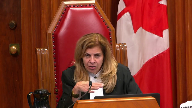
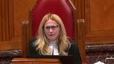
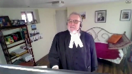

---
title: Her Majesty the Queen v. R.V.
published-title: Heard
date: 2020-11-13
sidebar: false
---

This transcript was made with automated artificial intelligence models and its accuracy has not been verified. Review the original webcast [here](https://scc-csc.ca/case-dossier/info/webcast-webdiffusion-eng.aspx?cas=['38854']).
---

**Justice Wagner** (00:00:29): Good morning.

::: {.column-margin}

:::

In the case of Her Majesty the Queen against RV, for the appellant, Her Majesty the Queen, Mr. Christopher Webb and Atim Keir, for the intervener, Attorney General of Alberta, Joanne Dartana QC, for the respondent, RV, Mr. Philip Campbell and Neil Fitzmaurice, for the intervener, Criminal Lawyers Association of Ontario, Michael Deneen.

Please note that there is a publication ban in this file pursuant to section 486.41 of the Criminal Code.

Thank you, Mr. Webb.

**Speaker 1** (00:01:22): Good morning Chief Justice, justices, my friends.

::: {.column-margin}

:::

This is a Crown Appeal from the Judgment of the Court of Appeal for Ontario quashing the guilty verdicts on charges of sexual interference and invitation to sexual touching following the respondent's trial and substituting acquittals on the basis that those guilty verdicts are inconsistent with a verdict of not guilty returned by the same jury on a charge of sexual assault.

We ask that the judgment be set aside and the convictions restored.

This can be described generally as an inconsistent verdict case and it raises important procedural and substantial substantive issues regarding appellate review.

As a starting point, our position is that the facially inconsistent acquittal on sexual assault which is said to make the convictions unreasonable is explained by the confusing and erroneous jury instructions regarding the charge of sexual assault that resulted in an acquittal on that charge and this was the basis of the dissent.

It is also explained by the boilerplate instruction in the charge to the jury that they are to consider each count separately and the simple solution that while they had a reasonable doubt on the issue of whether the accused applied force to the complainant, they had no doubt that he touched her.

The inconsistency is also attributable to the absence of any instruction in the charge to the jury that the same verdict had to be returned on all counts and finally it's explained by the possibility that the inconsistent acquittal on sexual assault rather than a product of confusion or compromise is actually a product of the jury's innate sense of justice or an exercise of leniency in a case like this involving a single accused charged with multiple duplicative offenses arising out of the same events.

**Justice Rowe** (00:03:23): It probably doesn't affect the disposition of this matter, but if you say to us that an instruction should have been given, that a conviction on one is a conviction on all, then why the heck did the crown bring three separate counts as opposed to one, which has the great potential for confusion, since the other two are going to be stayed anyway if there's a conviction in one?

::: {.column-margin}

:::

**Speaker 1** (00:03:49): Yes, that was an observation made by the majority.

::: {.column-margin}

:::

It's been made in multiple cases that when duplicative charges are preceded with, that the possibility of inconsistent verdicts arises.

And there is some merit I would submit to the observations of the majority that in cases such as this one there perhaps should be more of a more attention paid to the possibility of trimming the charges.

Perhaps, you know, at the end of the Crown's case

**Overlapping speakers** (00:04:22): It's a recipe for confusion, isn't it?

It could, yes.

And so if it's a recipe for confusion, it really should be stopped, should it not?

**Speaker 1** (00:04:33): Perhaps this is a case in which some guidance can be provided with respect to that point.

**Justice Brown** (00:04:39): I think it was just provided.

**Justice Rowe** (00:04:41): I mean it's your discretion.

I'm just making a comment and I don't want to interrupt the flow because we have other matters to deal with here.

**Justice Moldaver** (00:04:47): I don't think it's a recipe for confusion if the charge is clear, crystal clear that the touching is the same for all of them.

::: {.column-margin}

:::

That's part of the problem here, a non-direction amounting to a misdirection.

But I take my colleagues' points that we have said on many occasions.

You know, don't clutter up the case if there's no need to do so.

The charges are essentially the same, the elements the same, you know, pick one and go with it.

**Justice Wagner** (00:05:16): And I must add that, just to follow up with what my colleague just said, it's not limited to Ontario, but we could see that throughout the country.

::: {.column-margin}

:::

In many cases, it seems that the Crown overcharged and is, you know, I think you have to choose your battle.

It's a source of confusion, very often.

**Speaker 1** (00:05:40): Chief Justice, just, I, the Crown, I, in most cases, I would say, does an admirable job of whittling down the charges.

::: {.column-margin}

:::

Just practically speaking, in many cases, the police lay numerous charges.

By the time it gets to trial, the Crown usually has whittled it down to the essence of the case by proceeding on what's most important.

And in a case such as this one, it may, they may be, um, merit to the, the, uh, the idea that once you get to the pre-charge conference stage, if it's apparent that this may well, uh, be a problem in terms of introducing the possibility of inconsistent results, perhaps, um, the Crown could reconsider whether or not to continue proceeding with that charge at that stage, or the jury could be told, as it is in some cases, that if you find him, that this occurred, you ought not to have any difficulty finding the accused guilty on all counts, or if you find that he, uh, it did not occur similarly, or conversely, that you would not, you would find him not guilty on all counts.

Um, and of course, the jury can't be, uh, directed to return a specific verdict, but some guidance, uh, may be appropriate, um, but it all depends on the circumstances of the case.

Um, I, uh, historically, with respect to sexual assault and sexual interference, um, the reasons why, uh, you would proceed with both is, uh, at the end of the day, if someone was convicted of, um, an offence in relation to these allegations, there is some public interest in ensuring that the accused criminal record reflects that his sexual offence related to a minor.

Um, at, conversely, with respect to sexual assault, historically, sexual assault is a, uh, specifically enumerated offence for the purposes of a dangerous offender designation.

Um, there are all competing considerations as to why, uh, the Crown may proceed, um, with the both charges, uh, but

I, I take your point.

Um, my submission is, is that the result below is a direct product of the following legal errors, which themselves involve a straight application of obiter in a prior decision of this Court, Regina versus JF, um, and specifically that the Court of Appeal erred in concluding that in cases like this, the Court of Appeal cannot consider the actual jury instructions to resolve the inconsistent verdict allegation raised in the defense conviction appeal, unless the Crown cross appeals the inconsistent acquittal.

**Justice Abella** (00:08:33): The Court of Appeal, sir, just a question on that.

The Court of Appeal referred to the, what it called the authoritative obiter.

**Overlapping speakers** (00:08:42): Yes.

**Justice Abella** (00:08:43): In JF? Yeah.

**Overlapping speakers** (00:08:44): Thanks for watching!

**Justice Abella** (00:08:45): Could you tell us what you see as the holding in JF and what is binding in JF and what you think is not?

**Speaker 1** (00:08:56): Thank you.

::: {.column-margin}

:::

Well, my submission is that if one turns to JF, and I believe it's, well, in summary, Mr. Justice Fish, somewhere prior to paragraph 20, found that the Crown's argument in that case did not have merit.

Specifically, the Crown tried to reconcile the inconsistencies between the two verdicts on the basis that the instructions the jury had received underlying the acquittal were flawed.

And Justice Fish, in his reasons, found that I would not accept that argument.

There was nothing wrong with the instructions.

So thereafter, what followed fell within the realm of Obiter.

And then he commented, or found that, nevertheless, I would not allow the Crown to resist such an argument on the basis that the legal instructions were flawed.

And so I'll just take you

**Justice Wagner** (00:09:57): Well, that was an arbiter, so the question of my colleague is to what extent that arbiter is binding, because speaking for myself, I mean that when Justice Fisch says that we should not look to determine what is the reason why there is this inconsistency, seems to me it's a lazy way to address the issue.

::: {.column-margin}

:::

**Speaker 1** (00:10:21): I would, yes, well I would say that it was unnecessary to the disposition of the case.

::: {.column-margin}

:::

I would submit that the reasons provided in support of that conclusion were not fulsome and it's a reflection of why ordinarily, you know, consistent with the principles of stare decisis, you do not determine issues that are not necessary for the resolution of the appeal.

Because then we see now the cases which have followed, there's all kinds of confusion across the country as to what JF means, especially since JF cites pittiman, which makes clear that you look at the instructions that the jury received from the trial judge in order to resolve.

**Justice Brown** (00:11:10): Whitman, those instructions are examined in order to determine whether there is an inconsistency.

::: {.column-margin}

:::

I don't see anywhere in Justice Charron's reasons there indicating that you look at the reasons in order to determine why there was an inconsistency.

Also at paragraph 10 of her reasons, for example, and this is the passage you rely on, where she says the test remains the same in each case, are the verdicts irreconcilable such that no reasonable jury properly instructed could possibly have rendered them on the evidence.

What she's doing there is she's contrasting this kind of situation we have here, a single accused charged with multiple offences with the situation of multiple accused charged with the same offence, and how we assess whether the verdicts are truly inconsistent.

The test that she articulates, as I read this passage, speaks to determining whether there is an inconsistency, but maybe you can point me to something that indicates no, she's actually exploring the reason for the inconsistency because that has some influence on the outcome.

**Speaker 1** (00:12:46): Okay.

::: {.column-margin}

:::

To step back, my submission is that that test, while correct, it's the test from Yves and affirmed by your court in Benares, that test only applies once the accused or the parties pass the hurdle of establishing that the instructions the jury received were correct.

The remedy for an unreasonable verdict is an exceptional remedy.

And it basically is following an error-free trial, including no erroneous rulings with respect to the admissibility of evidence, no errors in the instructions that the jury received, if after all of that there is still this strange result, that then calls into question whether or not there was a flaw in the process in the jury room, which led to this.

Where in Pinnamin are you reading this, sorry?

Oh, I'm just making reference to that quote about, that you brought to our attention.

Are the verdicts irreconcilable such that no reasonable jury properly instructed could possibly have rendered them on the evidence?

And I'm saying, my submission is that you only get to that point once you establish that there wasn't something in the proceedings below which could have explained or does explain the inconsistent result.

So, for example, if someone is charged with aggravated, the Walia case, for example, the Court of Appeal, the offender who was charged with aggravated assault and assault with a weapon and had struck the complainant in the face with a glass, the mens rea for both offences is essentially the same, just a voluntary act to strike the other, the complainant in the face.

On the instructions in that case, the jury was told that there had to be a specific intent for the assault with a weapon charge, whereas aggravated assault was a general intent offence.

So, as far as the jury was aware, they were two separate offences.

So that explains the inconsistent result.

The jury had no doubt that this person no doubt that this person voluntarily struck the complainant in the face, but they had a doubt that she specifically intended to wound on the evidence.

Sorry, to...

**Justice Brown** (00:15:09): Just to be clear, is it your position that my understanding of what Justice Charron is doing here is wrong?

::: {.column-margin}

:::

That she's not speaking to the test for determining an inconsistency.

She is in fact empowering an appellate court to review the charge in order to determine why there was an inconsistency.

**Speaker 1** (00:15:30): I'm submitting that, if you step back to paragraph seven, page 73 of the condensed.

This is the.

**Justice Brown** (00:15:40): passage about whether the verdicts are supportable on any theory of the evidence consistent with the legal instructions given by the trial judge?

That's correct.

**Speaker 1** (00:15:48): So if the result is consistent with erroneous instruction, for example, then that explains the inconsistency.

::: {.column-margin}

:::

And then, so at the end of the day, we go to that passage you brought to our attention.

The test remains the same in each case.

Are the verdicts irreconcilable, such that no reasonable jury properly instructed?

That's, properly instructed is a prerequisite for a finding of inconsistency, which is possibly irreconcilable.

If they weren't properly instructed, that's the beginning and the end of it.

That is my submission.

Thank you for your attention.

**Overlapping speakers** (00:16:25): Okay, I have your submission, thank you.

**Speaker 1** (00:16:27): Thank you. Yes.

::: {.column-margin}

:::

And just to follow up while we're with Pittman, at the end of the day, at paragraph 13, which is at page 76 of the condensed book, sidebarred, Justice Cheron observed, "'While an appellate court inevitably compares "'the basis for acquittals, as well as convictions "'in assessing inconsistent verdicts, "'the decisive question is not whether "'the acquittals are reasonable, "'but whether the conviction was not.'"

And what this suggests, or what this stands for, is that if the conviction is viewed in isolation and it's supportable by the evidence and it's supported by legally correct instruction, then the circumstance that the jury may have returned a wrong decision on another count should not impugn the integrity of that conviction, which is supportable by the record.

**Justice Brown** (00:17:26): If we read further towards the conclusion of paragraph 14, she directs that where the verdict is found to be unreasonable on the basis of inconsistency of verdicts, but the evidence against the appellant supported the conviction, the appropriate remedy will usually be a new trial.

**Speaker 1** (00:17:43): Yes, and so that's, you know, all of these cases aren't cookie cutter, there's different circumstances.

::: {.column-margin}

:::

It may well be that the nature of the inconsistency gives rise to the need for appellate relief.

But that is a helpful passage in the sense that when you contrast this with JF, JF says it cites PITAMIN and says nothing in these reasons are meant to change what PITAMIN stands for, but then says the remedy is to quash the conviction, sorry, yeah, quash the conviction and substitute an acquittal, which is inconsistent with what PITAMIN says, which is you usually should order a new trial if, you know, the record supports the conviction.

And you see in JF, the record did support the one charge on which the jury returned a verdict of guilty, and the problem was is that there was that inconsistent acquittal.

The appropriate remedy in that case ought to have been to simply order a new trial, which is what the Court of Appeal had done, which was consistent.

**Justice Karakatsanis** (00:18:46): Can I ask you this, how does issue estoppel factor into it when there's no appeal from the acquittal?

**Overlapping speakers** (00:18:54): Yes.

**Justice Karakatsanis** (00:18:55): and there's been a decision that's unchallenged, legally, that on those facts the accused did not commit that offense, what happens if there's a retrial?

::: {.column-margin}

:::

Does the accused then get to say, well I've already been tried of these facts of this deli and there's an issue with Staple?

Isn't that part of the reason why the crown appeal was necessary and the substitution was the appropriate remedy in that case?

**Speaker 1** (00:19:32): Yes, I appreciate that that was the the reasoning of Justice Fish in my respectful submission because it in part it was like an obiter determination without a full consideration of the issues.

::: {.column-margin}

:::

My respectful submission is issue estoppel has no application to the assessment of whether or not an inconsistency in the verdicts results in an unreasonable result.

And this is illustrated by a number of things.

First, my friend in his factum states repeatedly that we can't divine the exact reason for an inconsistency.

It can be attributed to numerous things.

So in the context of the jury returning a verdict of guilty on one charge and not guilty on the other, it's inappropriate to then treat the acquittal as a declaration of innocence for all purposes.

It could be simply a reflection that the jury had a reasonable doubt with respect to the element of the other offense.

It could be that they exercised leniency.

It could be confusion.

It could be compromise.

A number of things that my friend notes.

So in that context for the purpose of assessing the validity of a determination made by the same trier of fact in the same proceeding, it's not appropriate to treat that inconsistent acquittal as a declaration of innocence, especially since the jury is told that their primary duty is to resolve what happened in this case and that your resolution of the case must be based on your determination of fact.

So in returning the guilty verdict, they have found as a fact that the allegations before the court were proved.

So now my friend makes the submission and he relies on what Justice Fish observed, that the jury found that the accused, you know, did and did not commit the same offense.

But I respectfully submit that that's just implausible.

That the jury said with respect to the charge of sexual interference, we all agree that he did and did not touch this complainant for a sexual purpose.

But more importantly, with respect to the issue of stop.

As justice, sorry, Chief Justice.

**Justice Moldaver** (00:21:55): Before you go on, Mr. Webb, can we sort of go back to basics here? Yes.

::: {.column-margin}

:::

Your friend, Mr. Campbell, at paragraph 15 sets out a framework. Yes.

And the framework that he sets out is this.

If you have a jury that is properly instructed and you get verdicts that on their face are inconsistent, that is the responsibility of the accused to show that.

Once that first step is met, and it may not be met in certain instances, as Justice Charron says at paragraph 8 of Pittaman, different verdicts may be reconcilable on the basis that the offences are temporally distinct or qualitatively different or dependent on credibility of different complainants or witnesses.

So if I understand her correctly there, she's saying that there may be some cases where the jury has been properly charged, they come up with different verdicts, but it's clear on the face that there are distinctions between them and they are reconcilable and we don't go any further.

That's right. Yes.

But if, however, they are irreconcilable, your friend says, then the owner shifts to the Crown.

And he sets it out at Roman numeral 3, what has to be done, not as my colleague Justice Brown says, to get everything sent back for a new trial.

He accepts that there will be cases where the Crown can show to a high degree of certainty that the trier of fact followed legally erroneous instructions in entering the acquittal, thereby disproving other unjustifiable explanations for the inconsistency, the court may quash the acquittal and uphold the conviction.

This is your friend.

I don't know why we're getting into this debate now about if there is a reconcilable basis that explains these inconsistent verdicts, you must of necessity go back for a new trial.

That Justice, another Justice of the Court in conversation this morning, that may be the default position, but the default position goes by the wayside, as your friend points out in 3, if the Crown can make, which is obviously a difficult burden, but can show with a high degree of uncertainty that the problem here arose because of erroneous instructions on the one where there was acquittal, and I would just add to what he said in that paragraph, that the convictions, the charge was completely proper.

**Overlapping speakers** (00:24:51): In those circ-

**Justice Moldaver** (00:24:52): he says the convictions stand and the acquittal gets overturned and then I don't know what will happen to it go back for a new trial or it doesn't go back I don't know but

**Speaker 1** (00:25:05): Well, I would agree and I would go one step further that the need for a Crown appeal is unnecessary because the only reason the Court of Appeal is called on to assess the basis for the inconsistency is because of the conviction appeal that the accused has brought.

::: {.column-margin}

:::

And if, you know, implicit in this passage that you've brought to our attention is that if the instructions explain the acquittal, then that should be the beginning and the end of it.

So why should the Crown have to bring in a cross appeal against the acquittal in order for the Court of Appeal to consider a perfectly reasonable explanation that reconciles the purported inconsistency?

**Justice Moldaver** (00:25:53): you run the risk of leaving outstanding, what you would be saying is an improper acquittal, which on its face suggests that the guy's factually innocent of something, but you're just going to leave that outstanding.

::: {.column-margin}

:::

Now, sorry, I'm going to go on a little bit further here, okay?

Justice Chiron, at the paragraph that I just read to you, doesn't suggest there that the Crown has to cross appeal.

She says there will be instances where it's apparent it's reconcilable, and so that's the end of it, if it's reconciled on the points that she makes, qualitatively different, temporally different, et cetera.

But where she says that therefore, in the case of a single accused charged with multiple offences, different verdicts may be reconcilable on the basis that the offences are temporally distinct or are qualitatively distinct, I'm going to suggest to you that there should be one more qualifier there, or the jury is given erroneous instructions which lead them to believe that the offences are qualitatively different.

What do you say to that?

**Speaker 1** (00:27:05): but I would urge you to apply that principle or add that.

::: {.column-margin}

:::

With respect to the other circumstances, the conditions that you mentioned before, if the verdicts are reconcilable on those bases, that they're actually temporally distinct, what we're actually dealing with is a ground of appeal, which should never been brought in the first place, an allegation of inconsistency, which is unfounded on the basis of the record.

So it really isn't.

**Overlapping speakers** (00:27:37): It's not unfounded, it's just explicable.

It's explicable. Right.

**Speaker 1** (00:27:42): But I would say, to get to the irreconcilable stage, you have to demonstrate that there isn't something that explains it, that is apparent on the record.

::: {.column-margin}

:::

In which case you have to, you know, and the jurisprudence talks about the various possibilities, which is it could be simply explained by the circumstance that the jury is told you should only convict on a particular charge if you are sure about that charge.

And you should consider each charge separately.

And, you know, like within, you know, that framework, there are a lot of, there are many explanations.

But with respect to the improper acquittal point, Justice Moldaver, that you brought up earlier, facially, someone who is not informed of the record, and they look at this and they say, oh, well, he was convicted of this, but he was acquitted of something which is very similar, that's troubling.

But if I would say a reasonably informed observer is someone who actually familiarizes themselves with the record.

And then, you know, just, and a good example of that sort of approach is the Pline decision, the Ontario Court of Appeal, portions of which are reproduced in the condensed book at tab 19.

And in that case, Justice Pacheco, in the context of a judge-at-alone trial says, yes, these are facially inconsistent verdicts, the acquittal and the conviction.

But the acquittal itself is directly attributable to clear legal errors that can be identified in the reasons for judgment.

So it would be inconsistent with the interests of justice or the remedial powers in section 686 of the code to then grant relief for something that's not a problem.

And it may well be someone wants to say, oh,

well, how did that acquittal, you know, remain standing?

Well, and Justice Pacheco observes that things may well have been cleaner if the Crown had appealed to set aside the acquittal.

But to step back, usually the Crown, you know, after a multi-count case and gets a conviction on one or acquittal on other, absent exceptional circumstances, the Crown picks up its marbles and goes home.

And that's the end of it.

The Crown doesn't launch appeals against the acquittal in order to proactively address a future allegation that this inconsistent acquittal invalidates the conviction.

And then further, with respect to the issue of stoppable point, yes, that acquittal is hanging in the air.

But if one applies the principles of issue of stoppable, issue of stoppable only applies if the only rational explanation for the prior disposition is that the matter was resolved conclusively in the accused's favor.

And that's the only, and so first, that burden can't be met in this context.

And then second, Mahalingan makes clear that it has to be a prior disposition before issue of stoppable applies.

And it specifically refers to what's called the ARP anomaly, where, you know, in a similar act context, if someone is acquitted of something underlying a charge, that evidence can't be used as similar act evidence in relation to a subsequent case, because, you know, girdic and, you know, issue of stoppable, for all intents and purposes, that's a declaration of innocence.

But if they're being tried together, there's nothing strange about the jury saying, you know, we're not gonna find this person guilty on count one, because although we think, and I believe it's, well, it's in ARP, it's either Justice Corey or Chief Justice Lemire observes that there's nothing strange about the jury finding that count one was proved on a balance of probabilities, but not beyond a reasonable doubt.

But nevertheless, the jury is entitled to use that prior incident as similar act evidence with respect to the count that results in a conviction.

I just wanna be. Yes.

**Justice Karakatsanis** (00:32:00): I just want to be clear about your position are you saying that if there was no Crown Appeal and the acquittal on sexual assault on these facts stayed and there was an order for retrial on the sexual interference on the same facts that the accused would not be able to raise Otrfoyky?

::: {.column-margin}

:::

**Speaker 1** (00:32:25): Yes, that's precisely my position, because I'm just playing it out.

::: {.column-margin}

:::

So it's implicit in the the order for the new trial and the reasons for judgment that would accompany it, is that the reason we're ordering a new trial is we can't define why this person was convicted and acquitted.

**Overlapping speakers** (00:32:46): so you'd be relying on the fact that the jury might have improperly acquitted him.

**Speaker 1** (00:32:50): That's a possibility, yes.

::: {.column-margin}

:::

But Pankow, this court's decision in Pankow says on a plea of issuance stop or autrefois, you have to demonstrate that the prior disposition was conclusively determined in the accused's favor.

And it's implicit in the circumstance that the Court of Appeal exercises its jurisdiction to grant appellate relief that it did not conclusively determine the issue in the accused's favor.

And that's my submission on that point.

And I, before going into, I'll just, I was going to, if I may, I was going to just briefly summarize the instructions that the trial judge gave to the jury.

And of course, the basic facts are that it was alleged that the accused, who was the stepfather of the complainant, engaged in sexual impropriety over a number of years.

She was the only witness at the trial.

Her evidence was uncontested.

And in the instructions, the judge correctly told the jury that for sexual assault to be proved, you have to find that there was an application of force, and that force can include a gentle touching.

But then with respect to the sexual touching count, that all that was required was proof of touching.

And explicitly, that force is not required.

So that instruction right there juxtaposes the two offenses and, as the dissent observed, can create a distinction in the mind of the jury as to these two offenses being, you know, not the same thing.

And what complicated things in this case is that the trial judge also left the jury with the included offense of assault when the facts of the case could not have given rise to that result.

And what was interesting about what happened here, and I won't, if you wish, at tab two, I've reproduced a portion of the dissent where I would submit the dissent helpfully summarizes the problems in the charge, including what I have just referred to.

Maybe I will.

Just a moment's indulgence, please.

And that starts at page 16 of the condensed book, the PDF version being page 20.

And Justice Rouleau for the dissent helpfully sets out what it was about the instructions that the jury received that would have led them to be confused and perhaps understand that the two offenses were distinct, although they were functionally equivalent at law.

And I won't go through that in detail with you, but I just wanted to make sure that you're aware of that.

And then prior to that, at page 15 of the compendium, Justice Rouleau provides some helpful guidance with respect to the assessment of jury instructions.

Quoting Justice Doherty in Elkin, it's at paragraph 166 of the dissent, appellate courts reviewing those instructions must review them from the perspective of a reasonably intelligent layperson listening to the instructions and not from the perspective of a legally trained student of the criminal law schooled to see the ambiguities and subtleties associated with the language of some provisions in the criminal code.

So the response we have here is that, well, at the beginning of the charge, the jury was told force includes gentle touching.

Then sometime later in the charge, they're told for sexual interference touching is what needs to be proved, but force is not required.

And A, they're supposed to remember what they were told at the beginning of the charge and come to the logical conclusion, not being trained legal participants in the justice system, that means that these are the exact same thing and we should be returning the same verdict on all counts.

And then notwithstanding this observation, in the inconsistent verdict context, I would submit that the inconsistent verdicts are subjected to an unreasonably high level of logical scrutiny.

We're saying that, well, they should have known that these are the same thing, although they weren't told that and they're not told that.

And then on appeal, the court of appeal allows the appeal on the basis that they didn't come to an inclusion, which they weren't told they should have arrived at.

And then what's interesting about that, that's the context for which, in which I want to bring to your attention, what actually happened in this case, which is at page eight of the condensed book.

I didn't reproduce the transcript because it contains information that can identify the defendant, but what I've reproduced is the transcript where the jury came back with a question.

And that's at page eight of the condensed book.

And the question was at paragraph 17 here, on the decision tree for count one, sexual assault versus the verdict sheet, there are only two choices to make on the verdict sheet, whereas the decision tree provides for three verdicts.

Number one, guilty of sexual assault.

Number two, not guilty of sexual assault, but guilty of assault.

Number three, not guilty.

What do we do?

And the defense counsel's immediate response is it's a weird, it's an odd question.

I don't know how they could have ever arrived or come.

I don't know how the jury could ever come to a decision of a lesser and included guilty of simple assault.

And the trial judge states it was in the instructions and defense counsel says it was,

Oh, I just don't know how they could ever get there.

So we're overturning convictions on the basis that the jury did not divine that in the absence of instruction, that these are two functionally equivalent offenses.

Yet the legally trained professionals in the room didn't clue into this.

**Justice Karakatsanis** (00:39:42): So what do we do with the fact that the crown counsel participated in the drafting of these instructions and didn't object to what you're urging us to find are confusing and wrong?

**Speaker 1** (00:40:01): Um well just to to before addressing that directly um is that the what they agreed on the solution they agreed on was to amend the verdict sheet and to include a charge or a possible verdict of guilty of simple assault and leave that with the jury and then the trial judge did so without giving any instruction as to how that could arise on the facts of the case yes which and

::: {.column-margin}

:::

um but the crown's participation in the in the um the the the pre-charge conference and the instructions the drafting and the instructions as Justice Rouleau observed part of the plan was to give the jury a copy of the charge to the jury for their use in the jury room during their deliberations but at the last minute based on an objection from defense counsel it was withheld from them and that I would submit the you know goes towards um explaining some of the confusion that would have resulted.

**Overlapping speakers** (00:41:03): Uh.

**Speaker 1** (00:41:04): Thank you.

**Overlapping speakers** (00:41:07): Sorry, Justice.

**Justice Karakatsanis** (00:41:07): Sorry, if they'd had a copy of the jury charge in the jury room, would that have cured the confusion and misdirection that you're submitting?

**Speaker 1** (00:41:21): Well, with respect to, see, by leaving with them the included offense of assault and no instructions as to how they could get there, the danger arises that the jury would resort to colloquial understandings of what an assault is.

::: {.column-margin}

:::

It's been observed multiple times in numerous cases, like Trombley, for example, the Alberta Court of Appeal, which is reproduced in our materials at tab 15, that, you know, and Barton, that juries, they have no problem understanding what touching is, but they have, you know, there's a need for guidance as to helping, you know, helping them to understand that force includes touching because it's inconsistent with the, just the basic jury, sorry, dictionary definition of what force is.

So I do submit that in that context, that the jury instruction being in the room with the jury, as had been contemplated from the beginning, the jury would have had access to an instruction which, you know, clarified at the beginning that force and touching are the same thing.

So, yes, the Crown did participate in, you know, drafting the charge, but at the end of the day, what we have here is an appeal from a conviction, which is supported by the evidence, it's supported by the instructions that the jury received on that charge, and respectfully, in that context, we could say there was no miscarriage of justice, which warranted granting a remedy.

On the basis of inconsistency, and in support of that proposition, I would refer to you to a decision of this court, Corey, from the 60s, in which an inconsistent verdict allegation was made, and Corey is found at tab nine of the condensed book.

And if you go to page 78, which would be 82 of the PDF, it's the sidebar passage.

There are, however, broader implications in the argument submitted in this case.

The argument is that once it is shown on the face of the record that there is an inconsistency, then the quashing of the conviction must follow automatically.

And it's observed that that principle grew up at common law, I guess, in the 18th century, when the record was limited to just the indictment, so on the face of that record, if there's an inconsistency, all the court could do was quash the conviction.

And then the next paragraph, but a case does not now come before a provincial court of appeal on this limited record.

We have in addition the possibility of the court of appeals to make a decision on this limited record, we have in addition the judge's charge to the jury and the whole of the evidence on which it is based.

We can also see in a limited way the objections made to the charge, how the defence counsel wishes to have his defence put to the jury.

And then going over, based on this record at the top of the next page, to the extent indicated in the cases, the court of appeal then can sort out the inconsistency.

And then going down to the next sidebar passage on that same page, to give effect to this submission would be to ignore the common sense of the trial.

Courts of appeal do not now operate under 19th century procedural limitations.

On the evidence that we can now examine, the error, if any, is in the acquittal on the charge of conspiracy and not in the conviction on the substantive offense.

We can say with assurance that on this record, which includes the whole of the evidence, the judge's charge and the objections of the defence counsel to the charge, that this man was properly convicted.

And that his acquittal on conspiracy does not vitiate his conviction or give rise to any substantial wrong or miscarriage of justice.

We are not compelled to defer to this acquittal for the purpose of quashing the conviction on fraud.

And we are not engaged in a process of logic chopping.

And we are entitled to look at the facts behind the record of the acquittal.

And in my submission, this goes to the point Justice Moldaver made earlier, which is the facts behind the record of the acquittal include the instructions that the jury received, which may have resulted in the inconsistent acquittal.

And what it ultimately stands for is the proposition that if the conviction in isolation is sound, then how can it be argued that there's a miscarriage of justice occasioned by the inconsistent acquittal?

And as this court observed that the acquittal appears to be erroneous based on the record.

**Justice Moldaver** (00:46:09): One thing we know here with certainty is there was only one way based on the trial judge's instructions that the jury could completely, could acquit on the sexual assault.

::: {.column-margin}

:::

And at, you find that at page 159 of the record. Okay.

Where the, volume one I guess it is, where the trial judge says if you're not satisfied beyond a reasonable doubt that the accused intentionally applied force to the complainant, you must find him not guilty.

Your deliberations would be over.

That's the only basis that is left to this jury upon which they can find the accused not guilty.

And that's precisely what they do.

They find the accused not guilty because they aren't satisfied beyond a reasonable doubt.

I presume that there was an intentional application of force.

And when you wind that in with the confusing at least instructions that are, you know, sort of force is needed for this, it's not needed for that, it's not needed for the other one, and all the things that Justice Rulo says, it becomes perfectly apparent what happened here.

The jury just didn't understand that the application of force in this case was the one and the same with the touching that was needed or was involved in the other two offenses.

And I'm just going to go on one more thing to you.

Justice Rulo put his reasons, he said there's an error of law here.

This charge was so confusing, he says, it's one of those rare cases where in and of itself that is a ground, that's a reversible error.

The charge is so confusing that it constitutes reversible error.

That's at page, paragraph 158 of his reasons.

But interestingly enough, he goes on at page 73, paragraph 1, sorry, page 72, paragraph 172, and he finds that there was non-direction amounting to misdirection here.

He says at line three, toward the end of the charge, the trial judge could have told the jury that in reviewing the elements of the three offenses, it should keep in mind that, quote, touching and, quote, force were one and the same.

Further, whereas here the trial judge chose not to provide a copy of the charge, the trial judge should indicate on the decision tree the only true tool that the jury had access to in that jury room, that force and touching were in effect interchangeable terms.

The failure to take either of these steps in the circumstances of this case constituted an error of law.

So he seems to be saying not only was this charge so confusing that it amounted to an error in law, and that occasioned the acquittal, but also that there was non-direction amounting to misdirection in this case, in the circumstances of this case.

That too amounted to reversible.

Is that your understanding of his reasons?

**Speaker 1** (00:49:36): Yes and I agree with that interpretation because like the Court of Appeal overturned the verdict of guilty on the conviction on the basis that the jury didn't understand that the two offenses were functionally equivalent.

::: {.column-margin}

:::

They were left in the dark on that and if it exposes them to being overturned and basically being impugned as illogical and irrational then at a minimum the judge should assist them you know by providing some instruction on that very point if it exposes them to being overturned and it's not about you know that's the role of the the jury instructions is to assist the jury and they were left completely in the dark on that point and this also is a segue into the the need for a Crown Appeal in the first place because all of what Justice Rouleau is saying here is addressing this what I would submit an artificial requirement to launch a Crown Appeal in order to get into the nuts and bolts of what actually happened in this case.

**Justice Rowe** (00:50:45): Now that we're into that, that you call artificial aspect, I have a couple of questions here.

::: {.column-margin}

:::

In the order that you seek paragraph 125 of your factum, you say the formal judgment of the court of appeal be set aside and the convictions restored, but aren't you actually asking this court also to set aside the acquittal?

**Speaker 1** (00:51:16): Well, that's a challenge.

Well, given that this case involved the Crown appeal, then that remedy is explicitly available.

**Justice Rowe** (00:51:26): It's a question that's capable of being answered by yes or no. Yes.

::: {.column-margin}

:::

Okay, so you are asking this court to reverse the decision of the Court of Appeal and to set aside the acquittal, but you're arguing to us that that is not a necessary step in the circumstances of this case in order to affirm the convictions, am I correct?

**Speaker 1** (00:51:59): Just a step, like the factum you're referring to is the factum on the appeal as of right, which assumes that the law as stated in JF is correct in its need for a crown appeal in order for the court of appeal to resolve these issues.

::: {.column-margin}

:::

And that's my submission to you is that our ultimate ask here is that that requirement be set aside because it introduces undue complexity.

**Justice Rowe** (00:52:30): Yeah, that's fine.

::: {.column-margin}

:::

That's your argument.

I want to get your position straight.

So I'm going to put it to you very plainly, very simply and very slowly again.

So you're saying that we should set aside the conviction and we should, pardon me, set aside the acquittal and affirm the convictions, but you are also saying your position is that we do not need, as a matter of law, to set aside the acquittal in order properly to affirm the convictions.

Do I have your position accurately?

**Speaker 1** (00:53:09): Yes, in the event that you uphold the need for a crown appeal.

**Justice Abella** (00:53:15): I have a...

**Justice Moldaver** (00:53:16): What problem do you have with the crown appealing?

**Overlapping speakers** (00:53:21): you're you're right

**Justice Moldaver** (00:53:22): here is the instructions were erroneous and they are the cause of the apparent inconsistent verdicts.

::: {.column-margin}

:::

So why are you so resistant to an appeal?

You have to prove it seems to me.

I think you maybe have to go further than just saying well there was obviously some confusion in this charge.

Now I'd like your answer on that because because what you've done here it seems to me is you have demonstrated that there was an error of law here that is accountable for the in the facially inconsistent verdicts and by the way court you you can take that to the bank you don't have to worry about the jury nullification or coming to some other you know compromise verdict or any of these other things that's your burden it's a high burden. Right.

So here one can argue that you've done that

but I'm not sure you could do that if you just sort of stood up and said well there's some confusion here and there's an error here and so on.

Is it your position that that's all you have to do is just you can defend the inconsistent verdict allegation by just raising matters that are apparent on the record?

I mean Justice Pachoko seems to think you can.

What's your position?

**Speaker 1** (00:54:58): My position is, and the patrol code decision is related to the judge alone context, where it's.

**Overlapping speakers** (00:55:05): I understand that.

**Speaker 1** (00:55:06): Okay, so that whole line of authority, including the Alberta line of authority and the line of authority in Ontario, which the Court of Appeal found should no longer be followed, there was no requirement for a Crown appeal in order for the Crown to resist the inconsistent verdict allegation on the basis of reasonable outcomes based on the instructions that the jury received.

::: {.column-margin}

:::

So, freeze.

**Justice Moldaver** (00:55:35): followed JF and one of the problems that's raised by your friend, they don't even refer to JF a lot of them.

**Speaker 1** (00:55:42): Yes that's that's um

::: {.column-margin}

:::

and I and one good example is uh at tab 16 which is a decision of the Alberta Court of Appeal LBC um which was decided after RV and and this I would say is typical of the jurisprudence post JF in which JF is cited but it's not actually applied.

So we 119 of the compendium or the condensed record paragraph 17 JF is cited.

JF stands for the proposition that you cannot look at the jury instructions then Pittman is cited in support of the position that where the verdicts are truly inconsistent and therefore unreasonable depends on whether a jury could have rendered the verdicts on any theory of the evidence consistent with the trial judge's instructions.

So that's at paragraph 17 and then you go over to page 120 paragraphs 22 and 23.

At the beginning of 22 the court observes whether there is truly an inconsistency between the verdicts depends on whether the verdicts can be supported on any theory of the evidence consistent with the trial judge's legal instructions.

Repeats that statement of principle and then goes on to say well the inconsistency here is explained by the jury instructions which JF says can't be considered unless the crown launches an appeal.

**Justice Brown** (00:57:16): So you brought an appeal.

Whether you had to or not, maybe a subject of debate between you and some of us.

But what do you want us to do with your appeal?

What order do you want from us?

**Speaker 1** (00:57:32): Ultimately, I would like an order stating, in the summary in the condensed book, I've said that the court should find that JF shouldn't be followed because it has introduced...

**Justice Brown** (00:57:46): What order do you want, not the reasons, what order do you want?

Do you want us to allow the appeal?

Do you want us to dismiss the appeal?

What do you want us to do with your appeal?

**Overlapping speakers** (00:57:56): We would like, the crown would like for you to allow the appeal.

**Justice Brown** (00:58:01): All right, and what happens under 686 sub 4 when we allow an appeal from a jury acquittal?

**Speaker 1** (00:58:08): Well, the issue in that case, then you it's limited in that you can only order a new trial. Right.

::: {.column-margin}

:::

Right.

In the context of this case, where it's on the record that the Crown has agreed or represented in the Court of Appeal, that we wouldn't seek a new trial, we wouldn't proceed with a new trial in any event.

The only reason we brought the Crown to Appeal.

**Justice Brown** (00:58:29): That's not what I'm not asking you what you're going to do.

The order is a new trial, isn't it?

**Speaker 1** (00:58:37): Well, the order is a new trial and then 686 sub 8 and 695 of the code provides jurisdiction to the Court of Appeal and this and this court as well to make any order which justice requires.

**Justice Brown** (00:58:50): It says when we are exercising a power under, in this case, subsection 4, so when we are exercising our power to allow the appeal, set aside the verdict and order a new trial, we can make an additional order.

::: {.column-margin}

:::

**Overlapping speakers** (00:59:09): order.

And the additional order would be to stay the proceedings.

**Justice Brown** (00:59:13): the additional order would be to undo our order to order a new trial.

**Overlapping speakers** (00:59:18): Well, if you order a new truck...

**Justice Brown** (00:59:20): You see the problem?

::: {.column-margin}

:::

Parliament allows us only, if we're going to allow this appeal, parliament allows us only to set aside the verdict and order a new trial.

Now you're saying we can make another order that undoes the constraints that parliament has imposed us on subsection four.

That's an up the hill problem to me.

You have to go up to Parliament Hill and get sub eight changed.

I'm not a legislator.

**Speaker 1** (00:59:50): What I would submit then is, that raised an interesting question is, if you order a new trial and then the matters remanded to the Superior Court of Justice, if the Crown was then to just stay the, like withdraw the charge, would that be abusive?

::: {.column-margin}

:::

That's your call.

That's your discretion.

That wouldn't be an abusive process.

Well, I make no comment.

That's your call.

**Justice Brown** (01:00:12): call, right?

That's Crown discretion, but we only have discretion or we only have, well, we have no discretion if we're allowing the appeal sub 4 directs that we direct a new trial, right?

**Overlapping speakers** (01:00:24): So is that-

**Speaker 1** (01:00:25): order you want from us?

I would say in combination with that, if that is actually a concern, then you may wish to consider whether or not to exercise your additional discretion or jurisdiction or 686 sub 8.

**Overlapping speakers** (01:00:40): to tell you how to exercise your discretion down the road?

**Speaker 1** (01:00:43): So we don't have to, if it's a concern, if it's a true concern, if there's a concern that by ordering a new trial, an abuse of process or a miscarriage of justice is going to be occasioned to the accused, and if the crown then declines not to prosecute, if that actually gives rise to a remedy, then yes, maybe the court ought to then, in order to bring some finality and make everything cleaner, the court could exercise the jurisdiction and then just stay the proceedings, because the ultimate.

::: {.column-margin}

:::

**Justice Brown** (01:01:17): write your MP for that one.

**Justice Wagner** (01:01:19): Mr. Webb, I think your time is almost up, but Justice Abella has a final question and Justice Martin as well.

**Justice Abella** (01:01:29): This is more technical than anything, and it's about the reference to Curry.

I don't think JF or Pittman referred to Curry.

**Overlapping speakers** (01:01:39): No.

**Justice Abella** (01:01:39): Is there any reason we should stay away from referring to it?

I know you've cited it a fair bit in your factum or are we running into some kind of trouble to reintroduce it when those two judgments didn't?

**Speaker 1** (01:01:56): I'm not sure what has happened.

::: {.column-margin}

:::

What I do know is post-query it was applied by the BC Court of Appeal in a case called Danda and it was also applied by our Court of Appeal in a decision that was penned by Justice Labrosse.

I just can't remember the name right now.

So it had some traction for a while.

What I, if you're asking, a lot of reference is made to this decision in McShannock.

Anyway, in McShannock, that was a decision of Justice Martin.

Justice Martin, post being a Court of Appeal justice, he was counsel on Koori.

And then, you know, it's, and then we have this McShannock decision in the Court of Appeal which then gained traction subsequent to it and was applied.

I'm not, no, I don't know if I'm being responsive to your question there, but I'm saying that Koori is a solid precedent of this Court and I would submit to you it should be applied.

That if the record supports the conviction which is being subject to scrutiny, then this Court can find that there is no miscarriage of justice which warrants setting aside the conviction.

**Justice Wagner** (01:03:16): One last question by Justice Martin.

**Justice Martin** (01:03:19): Thank you.

::: {.column-margin}

:::

I'm going back to your overall, I guess the questions that you would have this court pose in a situation where the argument is that there's inconsistent verdicts, you are saying we can look at the record or that jf should permit a looking at the record.

What's the order of the questions that you would have us ask then?

Do we start with a question of is there an error in the instructions when we look at the record and if there is an error, does it then just become an error case?

And do we only go to the inconsistent verdict on reasonable verdict because there's no error and a facial inconsistency?

So I'd like to move away from a critique of the court of appeal to what you're actually proposing we do when we can look at the record if we accept that argument.

**Speaker 1** (01:04:24): Okay, so I have just a moment's indulgence.

::: {.column-margin}

:::

I would say if you know if it's clear on the record that the verdicts can be reconciled on the basis that was Justice Muldaver mentioned earlier, that you know it's temporally distinct, different elements etc, then that is the the complete answer to the inconsistent verdict, unreasonable verdict allegation.

Secondly, if the inconsistent acquittal is the product of legal error, then that as well leads to a dismissal of the conviction appeal because otherwise you're granting a remedy for a non-existent problem.

Like there's a facial inconsistency but if the legal error explains that inconsistency then there's no basis upon which to grant a remedy and this goes to the need for a Crown appeal in the first place

and I just to go back to what actually happened in this case, the Court of Appeal dealt with the conviction appeal first in isolation without consideration of the instructions and they allowed the appeal and then they said okay the Crown cross appeal only goes towards the remedy.

If the Crown can convince us that there was an error in the instructions which led to the result, then the remedy is affected but it doesn't actually affect the merits of the conviction appeal.

This is why it's important in my submission that there be a resolution of that principle be addressed, the need for the Crown appeal in the first place because it's to order a new trial on all counts when the acquittal appeal removes the basis for allowing the conviction appeal is in my respectful submission duplicative unnecessarily complex and a waste of judicial resources.

All right, thank you very much.

**Justice Wagner** (01:06:24): Thank you very much.

Thank you.

Ms. Dartana.

**Speaker 2** (01:06:33): Good morning Chief Justice, Justices.

::: {.column-margin}

:::

My submissions will be limited to the issue of whether in the context of a defence conviction appeal alleging inconsistent verdicts, an appellate court can go beyond the verdicts and look at the actual jury instructions to determine whether or not the verdicts can be reconciled.

And importantly, whether the court can do that in the absence of a Crown appeal from acquittal.

The Attorney General of Alberta's position is that an appellate court can and should look at the actual jury instructions to see if the verdicts can be reconciled, even where the Crown has not appealed the acquittal.

There are three reasons for our position.

One is that the first reason addresses a Court of Appeal suggestion that because inconsistent verdicts are brought as an unreasonable verdict ground, the question of whether the jury was misdirected is not an issue, and must therefore be argued as a separate ground as part of a Crown appeal from acquittal.

Respectfully, we say that this is wrong because the Court, this Court has affirmed in a number of cases that in order to defend against an appeal, the respondent is entitled to raise any arguments or any other errors that may have inured to the benefit of the appellant, in order to sustain the judgment below.

And that's even if it's not been raised by the appellant.

The second reason addresses the Court of Appeal suggestion that the court can't look at the jury instructions without a Crown appeal from acquittal, because of their interpretation of the words properly instructed jury, which they say refers to a hypothetical jury, not an actual jury.

It's our submission that the use of the term properly instructed jury was never intended to prevent an appellate court from looking at the jury instructions to see if they were correct.

It was meant to address the situation where the jury instructions had already been reviewed and determined to be error-free.

And this is apparent from the language used in the cases provided in our factum.

So if it hasn't been determined that the jury instructions are error-free, an appellate court is free to look at the instructions to ascertain whether or not there are any errors.

The third reason is that the Court of Appeal's approach is formalistic and inflexible, which is contrary to the approach suggested by this Court, in other cases, albeit in different contexts.

The Court of Appeal's approach is premised on a narrow set of circumstances, namely that one, the Crown must have appealed the acquittal, and two, the Crown must establish an error of law that meets the Graveline Test.

And in respect of jury instructions, this means the charge must have been so confusing that it constituted an error of law.

The problem with this approach is that often verdicts can be reconciled by explanations that don't meet the threshold of an error of law that satisfies the Graveline Test.

In many of the cases referred to in our factum, the jury instructions were not incorrect, per se, but there was something about them that provided a rational or logical basis to explain why the verdicts turned out the way they did.

For example, some of them were incomplete, confusing, or misleading.

In most of these cases, the Crown didn't appeal the acquittal.

And had the appellate courts followed the Court of Appeal's approach in this case, then convictions would have been overturned and acquittals substituted simply on the basis that the Crown failed to appeal the acquittals and or didn't show an error of law that meets the Graveline Test.

Lastly, the Respondent and the Criminal Lawyers Association raised the issue of issue estoppel and autrefois  qui.

Respectfully, these concepts do not apply where there's an allegation of inconsistent verdicts.

And that's because, with inconsistent verdicts, the jury has found the accused guilty on another offence arising out of the same facts.

So an acquittal in such a case is therefore not a clear declaration of innocence.

In other words, it can't be unequivocally said that the jury had a reasonable doubt about the accused's guilt in respect of the account of the accused.

And it can't be unequivocally said that the jury had a reasonable doubt about the accused's guilt in respect of the account of which he was acquitted.

Subject to any questions, those are my submissions.

**Justice Wagner** (01:10:58): There is one question by Justice Roe.

**Justice Rowe** (01:11:01): Not focusing on the position taken by the Ontario Court of Appeal, but as a general proposition, if the Crown does not bring across appeal with respect to the acquittal, but simply argues that the acquittal was flawed in a fundamental way, is it available properly to a court to affirm the conviction or convictions, or is it only properly available to a court in that circumstance, in the absence of a cross appeal, to order new trials on all counts?

::: {.column-margin}

:::

**Speaker 2** (01:11:48): our position would be that it would be available for an appellate court to simply dismiss the conviction appeal and affirm the conviction even in the absence of a crown appeal from acquittal and respectfully the the reason for that is that issue of stoppable wouldn't apply in that case because there would be no new trial ordered and so as per the cases that say that the issue of stoppable applies to a subsequent trial that would not apply in in that particular case.

::: {.column-margin}

:::

**Justice Wagner** (01:12:20): Thank you very much.

::: {.column-margin}

:::

The court will take its morning break.

15 minutes.

The court.

Thank you.

Be seated.

Mr. Campbell.

**Speaker 3** (01:13:56): Thank you, Chief Justice, and good morning members of the court.

::: {.column-margin}

:::

I trust that I am being heard now.

You have my condensed book.

I will refer to that, my factum, and perhaps the Court of Appeal judgment, not all of which I've put in my condensed book.

I want to spend about a third of my time, and certainly no more than that, on the jurisprudential questions related to the authority of JF and the balance of my time on attempting to satisfy you that there is no error of law in this charge, and certainly none that explains the jury's verdict and is capable of overriding the effect of the inconsistency.

But let me begin, if I may, with JF.

We are, to put this in some context, dealing here with a relatively unusual kind of case.

I had my co-counsel, Mr. FitzMorris, look through 20 years, 21 years actually, of appellate jurisprudence, and he identified 21 cases, about 20 cases, about one a year that meet the parameters of this one.

That is where a verdict, a conviction, is challenged on the basis of inconsistency, and the Court of Appeal finds that there is indeed inconsistency as between a conviction and an acquittal that is inexplicable.

And there are many more, perhaps four or five times as many, where, in the other category, where the challenge is made, but on the record and the issues and the elements of the offense, it is clear that there is no actual inconsistency and that the differing verdicts were open to the jury.

In this case, there has been, and I think still is, no dispute about the facial inconsistency.

Both parties have agreed on that, and the majority and the minority in the Court of Appeal agreed on it.

And the key question at the jurisprudential level is whether the Crown must resist an appeal by showing that an apparently inconsistent verdict is the product of an error of law and having that reversed, and if so, then there's no more inconsistency, and the Crown argues that the conviction appeal should be dismissed.

And the Crown, of course, argues that it also should not, because you should not follow JF, have to go through the formal process of establishing an error of law and the acquittal.

To remind you of what the Crown is asking, JF, with its emphasis on preserving the legitimacy of verdicts and the integrity of the legal process, those are the foundational considerations in JF, is not only this Court's answer to that submission, but I say it's the correct answer.

The Court approved that approach in an eight-to-one decision just 12 years ago.

Some appellate courts have not followed it, have not even adverted to it, but others have, including the minority, that is the dissenting judges in this case, who raise no objection to JF.

The Court in JF, in insisting on a Crown appeal that undermines or removes the acquittal, emphasized legal process values and did not treat it as simply a matter of the merits of the case, but invoked an independent concern about the legitimacy of verdicts and the integrity of the legal process that required the Crown to set aside the acquittal once inconsistency was acknowledged, if it wanted to resist the accused conviction appeal.

Those are, in my submission, important policy values.

They are values that this Court has to deal with, would have to deal with even without JF, but certainly should deal with once JF is decided and now put in play.

And that brings me to the end of my

**Justice Moldaver** (01:18:35): Mr. Campbell, I just want to understand the practical implications, if you can, please.

Just tell me what it is.

You talk about the legal process and values and so on.

Can you just help me out as to what we're talking about there?

**Speaker 3** (01:18:53): We're talking about, I'm about to get into that, if I may, by discussing the role of issue estoppel here.

::: {.column-margin}

:::

In short summary, because I'll be expanding on it in a moment, the significance of it is that there is something unsatisfying and indeed troubling about at the conclusion of a piece of litigation, the court, as Justice Fish put it in JF, having arrived at different conclusions on the same indictment, tried by the same jury in the same court and on the same evidence, that is that the accused both did and did not commit the acts alleged against them.

So it's in that context that I invoke this court's authorities on issue estoppel, and I do it, and I refer to issue estoppel for two reasons that should not be confused.

The first reason is that the authorities on issue estoppel fortify the policy foundation for the law on inconsistent verdicts.

In a number of cases, the Crown has responded to defense appeals by saying, in effect, you can explain the acquittal by some feature of the jury charge.

They'd like to say it might be an error in some cases, but even if it's not an error, it's an explanation.

And if it's an explanation, then it results in the inconsistency and answers the appeal based on inconsistency.

And JF says the Crown cannot do that.

If it wants to avoid a conviction being quashed as inconsistent, it has to overturn the acquittal with which it is inconsistent.

It can't just take a swipe at it and hope it satisfies the appeal court that there is an explanation for the acquittal.

Here and in the Court of Appeal, we relied on the law of issue estoppel to support our policy analysis, and that's because the policy considerations are very similar in the two areas.

One of the main rationales for the preservation of issue estoppel in Mahalingan, just two weeks after JF, was avoiding inconsistent verdicts.

You will see that in Mahalingan at paragraphs 2 and 45.

The court's repugnance for inconsistent verdicts is one of the reasons for preserving the law of issue estoppel.

A second rationale for the law of issue estoppel in Mahalingan was upholding the, and here I'm quoting, integrity and coherence of the criminal law.

That is an objective very similar to the legal process and legitimacy concerns articulated in paragraph 21 of JF.

So we invoke a closely related body of law in support of our position that if inconsistent verdicts are not acceptable from one courtroom to the next, they can't be acceptable where a trier of fact, here's the evidence on one indictment in a single courtroom and reaches logically inconsistent verdicts.

That, if anything, seems to be more troubling for the integrity of the legal process and respect for verdicts than the consecutive cases, and it's certainly not any less.

And that is why in my submission Justice Fish began his near unanimous judgment in the way that I've just quoted by citing how striking it is to have different factual conclusions on the same allegations in the same courtroom.

**Justice Moldaver** (01:22:48): Can I interrupt again?

::: {.column-margin}

:::

I'm sorry.

Is it your position that mere confusion that does not amount to the kind of confusion that would constitute, in and of itself, reversible error can never be used to try to show that there is a reconcilable basis for the facially inconsistent verdicts, if that makes any sense to that question?

**Speaker 3** (01:23:18): I take that to be the import of J.S., yes is the answer, I take that to be the import of J.F. and the import of Caton and Walia and Al-Qasim in the Court of Appeal for Ontario.

::: {.column-margin}

:::

If the Crown wants to argue something short of legal error to undermine an acquittal, which is inconsistent with the conviction in it, it has to put its money where its mouth is, it has to actually make the bet.

So, to remove any uncertainty, issue estoppel does not, as a legal doctrine, govern when inconsistent verdicts are returned at the same trial.

It operates only with respect to consecutive proceedings, but it is a big challenge for the Crown to explain why the law should be so careful to avoid different findings in consecutive cases, but have no problem finding them in the same case.

And I say that it has not met the challenge in this case, and I, having read its factums, do not perceive it to have actually tackled that question.

The second rule of issue estoppel is a more direct and controlling one.

Issue estoppel explains why, if an acquittal is not overturned for error of law, the appellant must be acquitted and not sent for a new trial when his appeal against the inconsistent conviction is allowed, because at the second trial he could invoke issue estoppel and not be tried again, because he's already been acquitted.

And that's what Justice Fish means in paragraph 41 of JF, when he says that to order a new trial would deprive the accused of the benefit of his acquittal.

And again, the Court of Appeal for Ontario, in a number of judgments that have dealt frankly with JF rather than sidestepped it, has reached the same conclusion.

I should say Wong, W-O-N-G, is another case in that sequence.

So if JF states the law correctly, and you are satisfied that the convictions are inconsistent with the acquittal, which is not contested, you should not order a new trial on the convictions if the acquittal remains intact.

The result of that new trial, as I said, would be a foregone conclusion.

So on the remedial question, as opposed to the earlier antecedent policy question, I say that issue estoppel is a governing principle.

As to the, and that's a point I make preliminary to getting into the actual nuts and bolts of the jury charge here and the allegation of error.

I want to take objection as well as the point that I made earlier.

I want to take objection as well to the argument from both the appellant and the Alberta Attorney General that it is wrong to assume or hypothesize a properly instructed jury in conducting an inconsistent verdict analysis, or as they also say, an unreasonable verdict analysis.

As I read both factums, they appear to assume that these analyses can only be conducted after a preliminary finding that there were proper instructions at trial, and that if there were not been a finding of unreasonableness is unavailable.

In my submission, that's not right.

The argument mistakes the meaning of the phrase properly instructed jury in those areas of law.

In an unreasonable verdict argument, the appellate court does not have to find there was a proper instruction.

It assumes a proper instruction as a tool of analysis, uninterested, agnostic about whether it was in fact an error-free charge.

The test for unreasonableness is whether a hypothetical properly instructed jury could convict on the evidence adduced to trial.

The hypothesis of a proper instruction is just a tool of analysis.

It is used to measure the sufficiency of the evidence.

It would make no sense to presume an improperly instructed jury to conduct this analysis.

Such an analysis would be of no use at all.

**Justice Rowe** (01:28:05): But what if in reality, the jury instructions are deeply flawed?

Are we to just turn a blind eye to that?

**Speaker 3** (01:28:19): for the purpose of an unreasonable verdict analysis or an inconsistent verdict analysis, the answer is yes.

::: {.column-margin}

:::

You approach those questions kind of dryly and abstractly and objectively and say let us test whether this is a reasonable verdict by supposing, hypothesizing that we have a properly instructed jury.

Set aside the instructions here.

**Justice Karakatsanis** (01:28:51): But there's something unreal about all of this, because if in fact the defense thinks there's an error, they're gonna raise that in their conviction appeal.

::: {.column-margin}

:::

They're not gonna ignore a legal error that might undermine.

So there's just an air of unreality to say, you just assume that the jury, even if there are errors in the charge, the jury's only going to be unreasonable if you just ignore that.

I'm having trouble with the idea that we would ignore what this jury had before it in determining whether it was unreasonable.

**Speaker 3** (01:29:37): In an unreasonable verdict case, in the typical unreasonable verdict case, it's very likely that the accused will bring challenges to the jury charge and challenges to the reasonableness of the verdict.

::: {.column-margin}

:::

But they operate on separate tracks in the course of analysis.

The unreasonable verdict argument assumes a properly instructed jury, and if the Court of Appeal concludes that the evidence simply could not persuade that notional jury of guilt, that notional reasonable jury, then it quashes the conviction and it enters an acquittal.

So it is not wrong to presume a properly instructed jury, nor is it wrong to presume that a jury

**Justice Karakatsanis** (01:30:27): I mean I guess you're right it operates on separate tracks but if there is an error the court will have to deal with that and if the court is not satisfied there's an error then it deals it deals with unreasonable verdict but the the appellate court is is looking at both even though it's analyzing different aspects

::: {.column-margin}

:::

so it's it makes sense that if if they're not finding errors of law which would lead to a reversal of the conviction that there's an assumption that you're looking at a properly instructed jury to determine whether they're unreasonable but

**Speaker 3** (01:31:07): The Court of Appeal can dispose of the whole case by saying there's very interesting arguments about legal error, but we find the verdict unreasonable, and we do not need to get to those other arguments because an unreasonable verdict leads to the entry of an acquittal on appeal, and the whole thing is over.

::: {.column-margin}

:::

They may also say this is an unreasonable verdict, and it may be that errors of law contributed to the unreasonableness.

There's all kinds of ways that it can go, but there is nothing wrong as an analytical matter with assuming properly instructed juries, and that's why you have to do it in the inconsistent verdict context as well, because the threshold question is whether a properly instructed jury really appreciating the law and applying it faithfully could arrive reasonably at these two different verdicts, an acquittal and a conviction, and if they could, then there is no inconsistency, but if they could not, which is where we are here, a properly instructed jury would have returned the same verdicts, then you have to go, so JF says, to the question of error as an explanation, and the real issue then becomes why should, the issue becomes how, then, if the crown wants to salvage its convictions by claiming legal error, what does it have to show and what does it have to do, and JF says it has to appeal, and it invokes issue estoppel type of considerations in order to say we're not satisfied with just leaving these two contradictory outcomes on our, on a court's record.

That is offensive to pretty important values and to public perceptions, so crown, bring your appeal against acquittal and show us the error that you say allows us to oust the acquittal and therefore preserve the conviction, and I have argued in the sort of formulation that Justice Moldaver took my friend to this morning that that's an appropriate way of going about this, and that it, but with the super added requirement that if the crown can establish error that ousts a conviction, it has to establish it with enough certainty, with enough confidence that you can be sure that it was not one of the other things that are possible explanations, and it would, and it should discredit the convictions or lead to their ouster.

Just to get a, just to get a, just to get a, just to get a, just to get a, just to, just to get a, just to get a, just to get a, just to get a, just to get a, just to get a, just to get a, just to get a, just to get a, just to get a, just to get a, just to get a, just to get a, just to get a, just to get a, just to get a, just to get a, just to get a, just to get a, just to get a, just to get a, just to get a, just to get a, just to get a, just to get a, just to get a, just to get a, just to get a, just to get a, just to get a, just to get a, just to get a, just to get a, just to get a, just to get a, just to get a, just to get a, just to get a, just to get

**Justice Moldaver** (01:34:03): Just to interrupt for one moment, just to go back to your first proposition that it's whatever, unseemly or it's not satisfactory to leave an acquittal but uphold the convictions and so on.

::: {.column-margin}

:::

Why can't we just look at this as saying, okay, queue's got a windfall, the Crown didn't appeal, we're not going to interfere with the acquittal, that's our choice, we chose not to appeal but all the arguments that we would make are there on the record, we make the very same arguments and so we're prepared to let the accused have a windfall but what we're not prepared to do is let him have three windfalls in this case or two other windfalls because he's not entitled to those at all.

If we give him a windfall on the sexual assault, that's fine, we don't care.

What we want to do is uphold the convictions on those charges that the jury was properly instructed and there's no errors to suggest that there's anything improper about those verdicts.

**Speaker 3** (01:35:13): Justice Mulvaver, that is bringing to the appellate process a much narrower lens than I take this court to have done or brought to it in JF.

::: {.column-margin}

:::

The concern and the approach implicit in that question is focused on the conflict between the parties.

And the interests of the parties.

JF encourages, as does the law of issue estoppel, which is not focused on the merits or the equities between the parties, but on public perceptions and bedrock values.

The JF perspective is that's not an acceptable outcome.

There is something repugnant, intolerable about the coexistence of the conviction and acquittal at the end of the litigation.

And I say that's right.

I'm not going to say that it's also, there's also not an erroneous charge here.

And I think it's time I got to that.

But I leave you with the law of issue estoppel, the authority of JF, the courts that have followed JF, and I suppose paragraph one of JF, which poses a question that is almost rhetorical because it seems to answer itself.

This is not an acceptable state of affairs.

May I just ask you a question, Mr. President, and I'm going to ask you a question.

And I'm going to ask you a question, and I'm going to ask you a question.

**Justice Martin** (01:36:52): When you say the courts have followed jf, can you point to any other authority beside jf itself that says that the actual verdict cannot be contemplated without a separate Crown Appeal?

**Speaker 3** (01:37:09): Yes, the Court of Appeals judgment in Caton, C-A-T-T-O-N, you'll find to be an example of that.

::: {.column-margin}

:::

It is also implicit in Wong, Al-Qasim, and Walia.

**Overlapping speakers** (01:37:29): and

**Speaker 3** (01:37:30): And then we have this whole cluster of cases that are characterized mostly by the Crown not attempting to meet the challenge of JF and courts not requiring it to and mostly not dealing with it at all.

::: {.column-margin}

:::

So I find a certain irony in a case where we are talking about the integrity of the legal process to be dealing with a series of judgments where the appellate sphere of the legal process seems to have misfired by a failure of this court's authorities to be confronted, much less circumvented to uphold conviction.

**Justice Moldaver** (01:38:18): Just to play devil's advocate for one more moment, I mean, isn't the real issue here?

::: {.column-margin}

:::

Are these two facially inconsistent verdicts reconcilable?

And if they are reconcilable, then it seems to me you are taking away the concept of unreasonableness.

And so, again, I come back to you, like, what's the real question here?

Is it somehow the integrity of the system because the Crown decides to leave the accused with a windfall?

Or is it the real question, are these verdicts reconcilable such that the Crown has put up a proper defence to the allegation of inconsistent verdicts?

**Speaker 3** (01:39:06): JF says how that defense is to be put up, so it raises legal process questions.

::: {.column-margin}

:::

This is not a matter simply between the two sides.

And the Crown puts the authority of JF in question, but I submit that it is properly decided and fortified by the closely parallel body of law on issue of Staple.

**Justice Rowe** (01:39:38): JF expressly said that it did not depart from Pittman as I recall, but do Pittman and JF say quite the same thing in this regard?

**Speaker 3** (01:39:53): Yes, I am, the Court of Appeal dealt with Pittman at paragraphs 84 and 85 and I mostly just want to adopt that.

::: {.column-margin}

:::

But what I will say is that the Crown overinterprets references to properly instructed jury.

When the Court in Pittman, Justice Sharon, refers to consistency with the legal instructions given by the judge, she is not presuming their incorrectness but rather presuming their correctness.

So she doesn't say the proper legal instructions but there's no issue as to the impropriety of the legal instructions in that case.

And Justice Sharon is doing what I say is the correct thing to do.

She is setting up the prerequisite for the inconsistent verdict analysis.

Can they coexist on proper instructions?

A few years later, Justice Sharon is one of the judges who agrees with Justice Fish's analysis in JF.

So it is hard to infer from the language she uses in Pittman that she was intending to say something that would be inconsistent with JF

and I take her not to be

and I take the Court of Appeal to be correct in its own analysis of that question.

If I may turn then to the question of error, the Court of Appeal conducted an extensive analysis of the Crown's argument and it went back to the nuts and bolts of the jury charge which is where you have to go to see if this is actually a realistic ascription of error.

Remember that we are not simply reverse engineering this so that if we have inconsistency, we will cast around for something that might explain it in a notional way.

It requires looking carefully at the charge to see whether we should deprive an accused of an acquittal and deprive him of a conviction appeal that rests on that alleged inconsistency by settling on this thing and saying, well, that explains the whole thing.

That not only ousts the conviction but it eradicates any concern that this jury approached this in some unprincipled or confused way, the kinds of concerns that animate the law from Justice Martin's judgment in McShannock forward.

So on the question of error, my first point is that the case law is overwhelmingly against the appellant on this.

**Overlapping speakers** (01:42:59): There is-

**Speaker 3** (01:42:59): a series of cases referred to by my friend from Ontario, Alberta and Nova Scotia from 2013 to 2018 which are summarized in paragraphs 81 and 82 of our Factum where jury instructions similar to those in this case.

::: {.column-margin}

:::

**Overlapping speakers** (01:43:20): Bye!

**Speaker 3** (01:43:20): even less explicit, less explicit on the definition of force, were considered by courts of appeal.

::: {.column-margin}

:::

In each case, the court concluded that there was no legal error in the charge.

Chief Justice Strathee discusses those at paragraphs 108 to 123 of his judgment.

And remember, these judgments are from courts that were sympathetic to the Crown.

It ultimately held in favor of the Crown on the various appeals, but still concluded there was no legal error in the instructions.

Instructions close to these, but if this is a problem, worse than these, that isn't those in this case.

The judgments of those courts would have been stronger and more convincing if they concluded that there actually had been an error of law in the acquittal.

They would have headed off any potential problems with JF by finding error of law, but none of the courts reached that conclusion.

The only appellate finding that a charge of the kind we're talking about is erroneous, I believe, is Justice Rouleau's dissent in this case, joined in by Justice Miller, and it stands against a wall of contrary opinion from those very cases.

Secondly, the charge in this case was drawn directly from Justice Watts' manual.

**Justice Moldaver** (01:44:52): Just a moment, just a moment, please.

::: {.column-margin}

:::

Those other cases you're talking about, they clearly found that there was such confusion and that the jury obviously went out and had its own perception of intentional application of force, a common sense application, and they decided that it wasn't necessary.

I mean, there was no Crown appeal, but they, in their own way, said this is the basis for reconciling these decisions.

The jury was confused to the point that they came out with different verdicts, but, and this reconciles the so-called facial inconsistencies.

I mean, I'm not quite sure what you're arguing.

You know, those cases, for the most part, ignored JF, but you're asking us not to ignore JF

and that therefore there should be an appeal by the Crown, but I mean, any fair reading of all those cases is this jury was totally confused by the charge.

They didn't understand that the touching is the same, whether it's sexual assault or sexual interference, and that explains, reconciles the so-called inconsistent verdicts.

That's the way I read.

**Speaker 3** (01:46:13): Justice, that's a pretty fair reading, but I disagree with you on one point and take a separate point.

::: {.column-margin}

:::

The point I disagree on is that they did not address error of law.

These are cases where there is an express finding that there is no error of law.

And the point I take in addition to that is based on your earlier question, why am I in effect pushing for, or what do I view as the importance of JF's insistence on a Crown appeal?

And the answer to that is that there have to be grounds for that appeal.

There has to be an error of law if you uphold and apply JF.

And these judgments, which did not uphold and apply JF, say that there is no error of law.

They don't sidestep the question.

They are explicit on it.

And that brings me to my second point about why there is no error.

The charge in this case was drawn directly from the manual of criminal jury instructions.

And that manual incorporated the recommendation for greater clarity made by the Court of Appeal for Ontario in SL, which found the charge in that case not to be erroneous, but to be capable of improvement for greater clarity.

**Justice Rowe** (01:47:45): You know, in Peanuts, Linus had what he called a security blanket and used to carry it around with him all the time and he felt very secure.

::: {.column-margin}

:::

Trial judges go to Watt and read out at length, at enormous length on occasion, what is in Watt is in Watt.

And they use it as a security blanket.

But it ain't.

What really matters is was the jury properly given an understanding of the law that they were to apply and simply saying, I read Watt, it doesn't do it for me.

**Speaker 3** (01:48:29): And Justice Roe, that is a position that I have urged on appeal courts many times in many cases because usually Justice Watts-Manuel is being cited against the point that I'm trying to make in an error that I'm alleging.

::: {.column-margin}

:::

The added value of the point in this case is that SL, SL's recommended cure for the problem of confusion where sexual assault is tried with sexual interference is reflected in the watt-based charge that was delivered in this case.

That language about any intentional physical contact, even gentle touching, is what Justice Laskin said in paragraph 43 of SL would be curative.

**Justice Moldaver** (01:49:32): the cases, one could say that all the cases, including SL, show that it wasn't working, it wasn't right, and that more was required.

::: {.column-margin}

:::

I mean, there's a whole raft of these cases that have come out where this very issue has arisen and it just keeps raising its ugly head.

And these cases would seem to show that putting in this point about a gentle touching will do, does not do the trick.

And that something more is needed, the very something more that Justice Rulo says is required in a case like this to make it crystal clear.

And I don't even see what's so hard about this.

The CJC instructions now, as I understand it, don't even use these words, application of force, they just say touching.

This is not rocket science.

**Speaker 3** (01:50:29): Let me make two points about the utilizing of this series of cases to suggest that there is a problem.

::: {.column-margin}

:::

You don't have the records or the charges in those cases, so it is very difficult to use them as the foundation for a finding of fact that the alleged error in this case is the source of the split verdict.

You also don't have any kind of statistical basis for judging what's going on in those cases.

To be clear, sexual assault, sexual interference indictments are extremely common.

I think my friend would acknowledge that and it was sort of implicit in what he was saying this morning.

That means that countless juries charged in this kind of language reach completely intelligible verdicts.

They are not thrown off or confused by a definition of force, which is extremely explicit.

Force is made out by any intentional physical contact, even gentle touching.

They hear that and they process it.

So you cannot, in my submission, say that juries that reach verdicts that are divided or inconsistent are baffled by this language when it is effective language and judicially approved language that works in many other cases.

And I say this as well.

We know from McShannock that one of the animating concerns in this whole area of law is the possibility of jury compromise, a thing that you cannot see but that we know and criminal lawyers accept is real.

We know that, you know, late Friday afternoon verdicts tell us that jurors don't just rigorously always apply a lot of the facts.

These kinds of cases, and this is a good example, are quite capable of producing factional conflict within a jury and compromise.

This case, like many, involves the uncorroborated or unconfirmed evidence of a single witness.

There's only one witness in this case, with a substantial, although obviously not overwhelming, challenge to her credibility.

It is quite possible that this is a case where a jury divided factionally and some felt that a reasonable doubt could be entertained on all charges, some felt that both charges or both sets of charges have been made out, and they compromised.

We don't know that when it occurs, but it is a reality.

And so in my submission, you cannot take this cluster of cases from a much smaller number of, much larger number of comparable cases, and say that when it happens it is a result of confusion.

It can very easily be a result of the other things that drive, that are characteristic of this kind of case.

**Justice Moldaver** (01:54:04): Why acquit, though?

Why not just have a hung jury?

That's normally what happens in these situations.

**Speaker 3** (01:54:12): And that's not the result of a successful compromise, though.

::: {.column-margin}

:::

Successful compromise is, you know, we talked about this yesterday, we spent the night, we don't want to continue.

How about we resolve our doubts with an acquittal on sexual assault and you resolve your certainty with a conviction on sexual interference.

**Justice Moldaver** (01:54:33): So so we're we're gonna say there's no touching on the sexual assault We can't be sure about that, but we're gonna convict in any ways where they're because there is touching We're all in agreement there is touching on the other ones.

I mean it makes no sense to me whatsoever

**Speaker 3** (01:54:49): Well, that kind of thing is the premise of the law in this area, and it has made sense to courts not only in Canada and in the case law we're talking about, but

::: {.column-margin}

:::

courts in other jurisdictions as well, if you dig deeply into the English, Australian, American, and New Zealand 40s.

**Justice Martin** (01:55:12): Mr. Campbell, when we're looking at this, it's very difficult to say why a jury decided a specific thing because they don't give reasons and we don't go behind their actual verdicts.

::: {.column-margin}

:::

But why in a situation like this would we assume that they have bargained in a manner that is contradictory to the instructions that they were given rather than looking at the whole record and saying is there a legal basis on which we can reasonably say that they could have been confused?

Why would we jump to them not doing what they were told?

**Speaker 3** (01:55:56): Justice, in my conception of this area of law, we don't actually reach a conclusion.

::: {.column-margin}

:::

We don't jump to any finding.

Rather, we approach it systematically.

And once inconsistency is established, we recognize what I called, in my fact, or maybe in too fancy language, the epistemological problem, the limits on what we can actually know.

And recognizing that there are things we don't know, we give effect to the one critical thing that we do know, and that is inconsistency, two facially incompatible verdicts, the first stage which has been successfully passed.

So I don't regard the oath of the jurors or their instructions and the presumption that they follow them as particularly helpful here, because to take as an example, the Klendert case that I circulated to the court yesterday, it is possible to look at a record and say this smacks of, Justice Doherty's words in Klendert, compromise, but it's not a provable proposition.

And I have also, as Justice Moldaver adverted to this morning, I have also recognized that it is possible in some cases, absolutely not this one, I say, to entertain the Crown's challenge to the acquittal on legal grounds and be satisfied that that challenge is so cogent, so explanatory, that it ousts any other possibility, even if we can't see what went on in the jury's deliberations and oust that possibility directly.

So in my submission, that's the best answer I have for your question.

**Justice Moldaver** (01:57:59): Could I just say this to you, that we make this sound like this effort to try to figure out what the jury did or didn't do is almost an impossible task.

::: {.column-margin}

:::

You yourself use the test of high degree of certainty, which may well be a good test, but this isn't the first instance or the only instance where courts have been going behind jury verdicts for a long, long time.

We see it in fresh evidence cases.

We see it in Graveline itself.

We see it in the failure of the crown to disclose cases.

We see it in the proviso.

We are doing these things all the time.

And the law is, if I understand it correctly, you've got to be really careful and you've got to have, to use your words, a high degree of certainty.

But if you're going to ask that we reach a level of certainty that is effectively beyond even the term of reasonable doubt, so that it's an absolute certainty, then forget it.

Forget all these other areas where we say it wouldn't have affected the verdict or, you know, it would have affected the verdict.

You could just say you're speculating on all of that.

So I guess my point is, this is not novel, Mr. Campbell.

It's just a question of what the test should be.

And I don't think anybody on this court would suggest that it should not be a high test.

**Speaker 3** (01:59:34): it should not be a high test and it should not in my submission be a reverse engineered test.

::: {.column-margin}

:::

That is, it should be something which when the jury charge is being delivered you could say, whoops, that looks like it could cause confusion in this case on this indictment.

It's not just meant as a cure-all, it is meant as an ascription of actual legal error.

And so the third point about why this is not, should not be held to be an error, is that the Crown did not object to the charge having read it and then heard it.

And it read it when it thought it was going to be given to the jury, but it heard it live in the same way that the jury heard it.

**Justice Moldaver** (02:00:19): enough this jury was more discerning than the judge in the and the crown and the defense council had caught the mistake in the Decision tree and and Whatever it was the verdict sheet.

::: {.column-margin}

:::

I mean, you know, they caught things that council didn't even catch Correct. I agree

**Speaker 3** (02:00:38): they were discerning, and that seems to me to make my point that being discerning they probably were not buffaloed by the reference to force when it was so expressly defined for them, that is including touching, gentle touching, any physical contact.

**Justice Martin** (02:00:57): Even if we are in a position where we could say that the charge itself on the sexual assault given that it had the SL variation about a gentle touching, even if we can say that that might be seen as relatively error free, isn't the real problem here that there's multiple charges and that it was no explanation of how those charges coexisted and there was no instruction about how they should be thought of in shall I say a factual or thematic way as opposed to the silos of the presentation of distinct charges.

::: {.column-margin}

:::

**Speaker 3** (02:01:44): So, Justice, that brings me to the next point that I wanted to make, which is that on this record, it is not realistic that the jury, considering the issues that were before it, actually thought that anything turned on the definition of force as opposed to the definition of touching.

::: {.column-margin}

:::

That would be, and that is, here, frankly, an attempt to retrospectively seek out an explanation for something that does not make any sense in terms of the way this case was left to the jury.

And here, I have to take you and

**Overlapping speakers** (02:02:26): You're speaking of confirmation bias here, aren't you?

**Speaker 3** (02:02:30): Yes, I suppose I am.

If we sat back and listened to this charge, I submit we would not see error in it, especially if we had listened to the evidence and the issues raised for the jury.

**Justice Brown** (02:02:47): Yeah, your point is because we know the result, we're reading the charge in light of that result.

::: {.column-margin}

:::

And if you're out hunting for a rabbit by golly, you're probably going to look for things and suddenly squirrels start looking like rabbits.

**Justice Rowe** (02:03:06): Unless you see rabbit tracks.

**Speaker 3** (02:03:09): So those are, broadly speaking, my points, yes.

::: {.column-margin}

:::

I have quotes that I really want to take you to, but I'm going to preserve my time and not do that.

The only issue in this case, as between the Crown and the defense, was the complainant's credibility.

There was not a single question asked or pointed to here that suggested that the respondent might have done one thing but not another.

It simply didn't arise.

The defense closing said nothing that suggested controversy about those matters.

Nothing suggested that the jury could find the actus reus of sexual interference, but maybe not of sexual assault, because that was not a remotely tenable finding on the evidence.

The Crown closing address treated the evidence on the three charges as identical and explicitly merged all three counts into a single legal allegation, set out at paragraph page two of my factum.

The Crown said, in summing up its case, he sexually assaulted her between the ages of six and seven to 12 or 13, and that he committed the offense of sexual assault, sexual interference.

He had her touch him in a sexual manner, and that he committed the offense of invitation to sexual touching.

They were all wrapped up as a bundle.

Nothing suggested anything different.

The judge's charge to the jury was supported by everything that preceded it.

And it said that the real issue in this case, I'm reading here from tab 11 of my compendium at page 152 of the record, quote, the real issue in this case is whether the events alleged to form the basis of the crimes charged ever took place.

So in my submission, it is exceedingly unlikely that this putatively alert jury heard that and then thought, no, it's a real issue in this case, whether in spite of the definition of force we get, he actually forced her, and then found that he didn't force her but that he nonetheless touched her.

**Justice Rowe** (02:05:41): In my experience, which reaches back a goodly number of years now, I had the sense, you can't get inside a juror's head and you certainly can't know what happens in the jury room, that they were hanging on every word that I said and attaching significance to it.

::: {.column-margin}

:::

And it really makes you feel like you're on a tightrope when you're charging a jury.

So when we read something and say, oh yeah,

I see how that all fits together, and touching and forth, they're all the same thing.

It's very clear to us.

Ah, but is it quite so clear to the jury?

And if you use different words at different times, maybe the judge must mean something different.

And it comes from the fact that I think juries are encouraged and properly pay very, very close attention to what the judge says to them.

**Speaker 3** (02:06:40): So, Justice Roller, if they did that here, then they heard that when they were considering sexual assault, they should convict if the respondent in circumstances which were clearly sexual on the Crown allegations, they should convict if he so much as gently touched her.

::: {.column-margin}

:::

They were given no encouragement, intentionally gently touched her.

They were given no encouragement to adopt a colloquial use of the word force.

Again and again, the record in this case, which my factum takes you to, shows that it was all wrapped up in one bundle and that touching was interchangeable with the force requirement on sexual assault.

**Justice Moldaver** (02:07:32): It seems to me the ordinary juror would look at this and see words like force and assault, being told in the other ones, you don't have to worry about force, and even a gentle touching.

::: {.column-margin}

:::

They would be looking for some evidence of constraint or compulsion or something, threats, that kind of thing, which they're not seeing, at least to a degree that they say, aha, this is the kind of force combined with a word assault, we know what assaults are.

It's not here.

And one of the things, as Justice Rose says, you've got to be really concerned about.

We can pore over this as lawyers and try and fathom what's being said.

But these are 12 people, you know, and I have enormous faith in juries, but one of the things they do is they bring their world experience and common sense to the situation.

And when they hear words like force and assault in one crime, and then they're told numerous times you don't need to worry about force in the other ones, somebody's sitting there saying there's got to be a difference.

And they're using their common sense and they're coming to a conclusion that if the proper wording had been used by the trial judge here, with great respect, to simplify this whole thing, none of us would be here today.

**Speaker 3** (02:09:01): Justice, I would contend that it is exceedingly unlikely that 12 jurors on this record made that mistake in the face of this instruction.

::: {.column-margin}

:::

And as to your point that there was some obvious distinction between touching and more assaultive behavior, the top of page three of my factum reproduces the various verbs that were used by the complainant in describing her allegations.

I'm running out of time, I'm just going to read the verbs, but it illustrates that the supposed division between force and a milder thing called touching is not realistic on this record.

They're in seven separately numbered points.

She alleged that the respondent held his hand over the complainant's hand and slid her hand toward his penis.

**Speaker 3** (02:10:03): He grabbed her chest, touched her vagina, grabbed her wrist, and brought her hand over to his penis, pulled her on top of him and started pushing her hips forward, pulled her on top of him and pushed her back and forth, pushed her head down.

::: {.column-margin}

:::

In my submission, no sound to any reasonable jury in relation to a 7 to 12-year-old girl like assault of behavior, coercive, forceful, physically assaultive behavior.

If the jury were even applying a colloquial definition of force, which they were expressly told not to do, they would not have reached that conclusion.

And I suppose my larger point, there is no way that the Crown should be able to satisfy this court that that is what did happen.

**Justice Moldaver** (02:10:57): The simple answer to that is for the trial just to say that if you're satisfied beyond a reasonable doubt that she was pushed, grabbed, pulled, etc.

::: {.column-margin}

:::

And I direct you as a matter of law that that would be the intentional application of force. Next.

Where was that here?

That wasn't here, but that was the description.

**Speaker 3** (02:11:18): You

**Overlapping speakers** (02:11:18): It wasn't me.

**Speaker 3** (02:11:19): But that was the description of her allegations on which the jury acquitted of sexual assault, where it is now contended that they did so only because, ignoring the judge's actual definition of sexual assault, they applied a separate colloquial definition, and it does not fit with that record on the instructions that they were given.

::: {.column-margin}

:::

You will see immediately below that passage on paragraph three the trial judge repeatedly describing the complainant's allegations as involving touching when he is talking about the sexual assault.

**Overlapping speakers** (02:12:07): Thank you.

**Speaker 3** (02:12:07): whether the sexual assaults were of a, whether the alleged assaults were of a sexual nature.

::: {.column-margin}

:::

He, and I've underlined them in that bullet point, repeatedly describes the allegations as matters of touching.

So the whole jury charge supported the position of the parties that there was a unity of the definition of the actus reus in this case as between the counts.

And finally, and this is a related but slightly different point, the appellant crown says that this error discredits the acquittal, but there is no reason to assume that the supposed error would run just in that direction.

We know that the jury decided on count one that the respondent did not use force, and that means looking at this charge that he did not have physical contact with her, even gently, in sexual circumstances.

If he had, he would have been convicted.

That's how force was defined, no intentional physical contact.

That's what the acquittal stands for.

The jury could then turn to the other two counts, where they were told that force was not required to convict.

And bring that analysis, that definition of force to those questions, to those two counts.

So they can convict on those two counts, even without force.

But they've already been told that force includes any intentional physical contact, even gentle touching, and they've made a finding on count one that there was no physical contact, no force occurred, defined that way.

Now, on sexual interference, they're told force is not required, which means no intentional physical contact on those counts is required.

And that's completely wrong, but it's consistent with the actual meaning of the instructions, if you read them together.

And the crown could respond to that argument and say, but the jury were told that touching requires intentional physical contact, which is true.

But I come back with, they made a finding of no touching when they acquitted, even though they were told that force could be gentle touching on the assault.

**Justice Wagner** (02:14:34): Mr. Campbell, I would ask you to conclude because your time is up.

**Speaker 3** (02:14:40): I suppose the concluding point is just this, there is no way of looking at this record without coming to the understanding that there has been here a failure of reasoned adjudication.

::: {.column-margin}

:::

We cannot precisely point to its source, but no construction of this record and these verdicts makes sense.

And if we are to give some ground to the crown here, which I do not do in light of JF, it would be utterly wrong to ignore the failure of adjudication and uphold these convictions.

Thank you very much.

Not a right result.

**Justice Wagner** (02:15:24): Thank you.

Mr. Michael Dineen.

**Speaker 4** (02:15:29): Yes, thank you, Chief Justice, and good afternoon, justices.

::: {.column-margin}

:::

So the particular interest of the Criminal Lawyers Association in this appeal is specifically maintaining the Gurdick principle that an acquittal stands as a finding of innocence without qualification, which is a principle of great importance to the CLA.

And so I'm going to focus in furtherance of that on the Crown's argument that a Crown appeal from acquittals, requiring a Crown appeal from acquittals in these cases is artificial, as Mr. Webb put it this morning, and unnecessary.

And it would be my submission that Crown appeal is, in fact, essential if the Crown is going to ask the court not to fully enforce the acquittals in the rare cases of genuine facially inconsistent verdicts.

And this court, in defining the scope of issuist topple in cases like Mahalingan, has emphasized the need for integrity and consistency in verdicts in order to maintain public confidence in the justice system and has expressed what was described to Mahalingan as an abhorrence of inconsistent verdicts.

And Mr. Webb has taken the position that his proposed position doesn't affect Mahalingan and our issuist topple jurisprudence because this case doesn't involve findings in prior proceedings, which is the scope of the rule set out in that case.

But my submission, that misses the point, which is that the principles that underlie issuist topple will be severely undermined if an accused person can be acquitted and convicted at the same time of the same conduct and have both verdicts stand.

If we accept that it's repugnant and undermines the credibility of the justice system to have inconsistent results at two different trials, I'd submit the effect is even greater where the inconsistency is at the same trial.

And so tolerating facially inconsistent verdicts will necessarily call into question and invite inroads into rules like issuist topple that rest on the same principles.

And I see an example of that in the dialogue between Justice Karakatsanis and Mr. Webb earlier this morning.

Issuist topple is directly impacted when looking at the question of remedy in these cases.

The extent a new trial could be ordered as a remedy, the accused absent a Crown appeal from the acquittal that succeeds would have a plea of res judicata available to him or her unless this court were to modify the rule to provide otherwise, which the Crown is evidently asking you to do.

And that's the very sort of inroad into double jeopardy protections that the CLA is concerned with and that that position, in my submission, would be creating different kinds of acquittals, one of which is acquittals that are unappealed, that continue to stand, but that we're going to look behind and treat as improper or not conclusive of innocence, which is directly contrary, in my submission, to the verdict holding that there are no different types of acquittals and that we don't look behind them in that way.

And it also has the effect of circumventing the limits that we have on Crown appeals from acquittals.

And I appreciate that different considerations might apply in judge-alone cases, like the Justice Pichaca one that's been discussed already, where the cause of the inconsistency can be conclusively identified in a way that shows the conviction was not unreasonable and where you can actually identify the findings of fact of the court, although the position of the CLA would still be that the Crown should appeal in those cases.

But in jury cases, because of our jury secrecy rules and the limits of jury unanimity, we can never have that same confidence in cases of inconsistent jury verdicts and never exclude the possibility of the different types of explanations that the Crown acknowledged this morning could underlie these verdicts, like some form of jury nullification or unprincipled compromise verdicts that our case law and experience recognizes can happen.

So I submit it's not a useful or productive exercise to try to create a new test where we determine to some degree of certainty a story of why a jury has returned an inconsistent verdict.

And the test should be the Graveline test where the Crown appeals.

We can assess the effect of any alleged legal error on a verdict.

And in applying that test, the inconsistent verdicts themselves might provide evidence of potential confusion from the jury that could support an argument for legal error or show that any such share likely affected the verdict.

But that is the existing framework I submit should be applied in assessing the inconsistent verdicts and the acquittals rendered in these cases.

And just finally, my final point, I acknowledge Crown appeals from acquittals are by design more limited and more difficult than appeals from convictions.

And that will mean that in some cases, there's an asymmetry because the inconsistent conviction set aside is unreasonable.

Well, Crown may not be able to establish reversible error for the equally inconsistent acquittal.

But in my submission, that's not a windfall for the accused or a loophole.

That asymmetry is a policy choice by parliament that itself rests on double jeopardy principles.

And in fact, we grant the prosecution greater latitude to appeal than some other common law jurisdictions.

So I see my time's expired.

Subject to any questions, those are my submissions.

**Justice Wagner** (02:20:34): Thank you very much.

Need a reply, Mr. Webb? Mr. Webb?

**Speaker 1** (02:20:52): No, thank you, Chief Justice Wagner.

**Justice Wagner** (02:20:55): Thank you very much.

I'd like to thank Council for their submissions.

The Court will take the case under advisement.

Thank you very much.