---
title: Michael Christopher Delmas v. Her Majesty the Queen
published-title: Heard
date: 2020-12-02
sidebar: false
---

This transcript was made with automated artificial intelligence models and its accuracy has not been verified. Review the original webcast [here](https://scc-csc.ca/case-dossier/info/webcast-webdiffusion-eng.aspx?cas=['39163']).
---

**Speaker 1** (00:00:02): The court!

**Justice Brown** (00:00:29): of course we have it.

**Justice Abella** (00:00:29): musical judges.

::: {.column-margin}
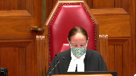
:::

Good morning.

Michael Christopher Delma is it or Delmas?

Ms. Serink am I pronouncing it properly?

We'll hear from you and you'll give us the correct pronunciation.

Andrea Serink and Elias Sanders for the appellant.

Sarah Clive for the respondent and Mabel Lye for the intervener, Attorney General of Ontario.

Ms. Serink.

**Speaker 2** (00:01:19): Thank you.

And I pronounce it Delmas.

I'm sorry, I didn't hear you.

I pronounce it Delmas.

**Justice Abella** (00:01:27): Delmas.

Thank you very much.

Oh and just a there is a publication ban in this file.

**Speaker 2** (00:01:35): Thank you.

::: {.column-margin}

:::

The appellant is here on the basis of the dissenting reasons of Justice O'Farrell.

We have drafted our argument that the court has been provided in writing on that basis.

Essentially there are two main issues.

We've divided into three but they can be resolved by way of two issues.

One being the reliability and credibility analysis that we say was erroneous and to the procedural error regarding the 276 evidence.

And so I'm going to start by addressing the reliability and credibility error that we say the trial judge committed.

In order to understand the appellant's complaint we tried to make that clear in our condensed book.

At paragraph 26 of the majority reasons they seem to indicate that in this case the trial judge was not even required to undertake any sort of credibility analysis because in their minds the trial judge had already rejected Mr. Delmas's evidence on the basis of him being unreliable.

And they acknowledge that the source of the unreliability seemed to be Mr. Delmas's drug use which he testified about and was very honest in his articulation of same.

And so what we say that this appeal is about whether or not a drug addict with a poor memory can actually have a fair trial if in testifying they get some of the details wrong

but they are adamant in their denial that they committed this offense.

And so when we look at the majority reasons the second part after they cite Morrissey at paragraph 26 they really shift the burden in terms of understanding what evidence is required in order to secure a conviction beyond a reasonable doubt and what evidence actually is capable of raising a reasonable doubt.

And that's where we say that there's a difference between inculpatory and exculpatory evidence.

And so Mr. Delmas when the trial judge is going through his analysis of his evidence he says you know he's quite unreliable he makes some comments about general unreliability and refers to incidents that aren't necessarily the incident in question.

And then he says it's causing me some difficulty.

And so I would say that we're at the second stage of WD which interestingly enough the trial crown conceded before the court if you find Mr. Delmas unreliable I'm requesting an acquittal be entered.

And so when we look at that it's not like QWERTY wherein QWERTY this court had said no the trial judge had rejected the appellant's fanciful articulation of what had happened.

Here he's struggling he's wondering what should I do because he's not sure.

I mean Mr. Delmas presents as being very forthright in terms of his drug use and then he goes through the fact that he's got some of the details wrong in terms of the articulation of when they used meth how that was administered.

And then he says that there's a discrepancy in the timing of the consent which I say is really not a discrepancy at all.

You're applying a pretty unfair analysis of his evidence.

One of the crown questions was there wasn't much talk prior to sex and he said you know there wasn't much talk

but it didn't say that there was silence or that there was no talk.

So in my respectful submission that's not a discrepancy

but then we go from there to what we're calling the impugned reasoning and which the majority and minority both refer to.

It's the paragraph on page 10.

**Justice Moldaver** (00:05:51): Just before you go on, could I just ask you a question, please, because what you were looking at is at page 9 of the record, the reasons of the trial judge, and the trial judge goes through an explanation based on Mr. Donaldson's own evidence as to why he finds them to be unreliable.

::: {.column-margin}
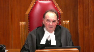
:::

He himself admits that when he's taking methamphetamine, a lot of it is just lost.

He doesn't remember a thing and so on and so forth.

And so then he goes on and says, you know, basically I accept his own evidence that he's unreliable because he was on methamphetamine at the time.

Now I want to see what impact if any this has on his credibility.

And then he goes and he says, you know, there's some several places here that cause me to doubt his credibility.

I mean, you may not like that reasoning, and I know you're coming to the part about the generalizations and so on, but what is wrong with the reasoning down to the end of that page?

I just am missing this.

I'm sorry.

**Overlapping speakers** (00:07:02): Well,

**Justice Moldaver** (00:07:02): like it as I say you might have done something different

but where's the project gone wrong

**Speaker 2** (00:07:07): Well in the dissenting reasons Justice O'Farrell explains there are other reasons that the trial judge uses in order to get to the conclusion where ultimately he rejects Mr. Delmas's testimony.

::: {.column-margin}

:::

But what the dissenting judge says is that this stereotypical generalizations that occur following those reasons are problematic because they take-

I'm sorry, I'm sorry.

**Justice Moldaver** (00:07:35): I'm sorry if I interrupted you.

If that's what you were getting to that point, I didn't mean to interrupt you on that point.

You seem to be upset with how the trial judge dealt with reliability and credibility up to that point.

And if you are not upset with that, then I apologize for interrupting.

**Speaker 2** (00:07:52): No, the part that I would say that seems to be unfair, although acknowledged and perhaps not part of the dissenting reasons, is that he's speaking about general unreliability, and then the Court of Appeal translates that to reliability in terms of the issue in question.

::: {.column-margin}

:::

And then I'm saying that there's an unfair reading to suggest that there's this discrepancy of consent.

But then I'll go on to the next paragraph, page 10, wherein that's where the trial judge really explains why he's having so much difficulty.

And he explains that on the basis of what he believes to be normative standards.

And one of the really important things to make sure that is not lost on the Court, and it's perhaps not very clear in our factum, is that there's actually a sentence missing in the majority and minority articulation of this paragraph, and that's actually page 10, line 8, the first time they ever engaged in sexual intercourse.

And so that was actually just dot dot dot in terms of the bulk paragraph in which the majority and minority refer to.

However, I would say that that is an extremely extreme generalization to suggest that there's a certain way that persons have sex for the first time.

And also it's actually contrary to the evidentiary record in this case and the trial judge's reasons.

He acknowledges that the complainant said that there was one sexual encounter that was by consent before the incident in question and one after.

So that would be a misapprehension of the evidence as well as a generalization.

**Justice Moldaver** (00:09:47): Did she say on either of those occasions that she talked about whether it was protected or not?

**Overlapping speakers** (00:09:53): No, she didn't.

**Justice Moldaver** (00:09:54): Then it's not, there's no inconsistency then with respect because they're talking here about unprotected.

**Speaker 2** (00:10:01): But in terms of the inconsistency, the first time she ever engaged in sexual intercourse, comma, and unprotected sexual intercourse.

::: {.column-margin}

:::

So there's two different things there.

The first time she ever engaged in sexual intercourse and unprotected sexual intercourse.

So that's at lines eight and nine.

So they're actually separated.

In the majority reasons, I said that that paragraph for sorry, that sentence is missing, but they're making reference to the fact that the trial judge seems to play some importance that he says this is the first time they've ever engaged in sexual intercourse, which is actually not true and not consistent with the rest of his reasons.

And so when we look at how the trial judge actually got to the point where he rejects Mr. Delmas's evidence, that's why it's important.

It's not a situation where the court can say, well, he rejected it outright, like in Corgi where the evidence was fanciful.

Here, he was struggling.

And what we say is when he was struggling, he used impermissible reasoning to get to the point at which he rejects Mr. Delmas's evidence.

And at this point, sir, I will turn it over to Ms. Sanders.

**Justice Abella** (00:11:28): Ms. Sanders?

**Speaker 1** (00:11:33): Sorry, I'm 11.

**Overlapping speakers** (00:11:34): Can you hear me?

Yes, we can hear you and we can see you.

**Speaker 1** (00:11:39): Okay thank you.

::: {.column-margin}

:::

Well we had plans that I would address the 276 issue and so I'll do that.

I just want to advise the court this decision of the trial judge was of course before this court had released its decisions in Barton, Goldfinch and RV.

When in Barton this court spoke of the ripple effects the failure to have a hearing can bring.

In my submission they're here in full force.

In this case the complainant actually brought up certain indications and as both majority and and dissent noted the impugned evidence began during the crown's examination in chief.

I'm not saying the defense ought not to have brought a 276 application but I am saying that allowing that evidence in the judge's gatekeeper failing to have a 276 hearing or to disabuse his mind of that evidence in in the absence of a 276 hearing starts these ripple effects.

He should have had a hearing under Seaboyer.

The crown concedes.

**Justice Abella** (00:12:59): I don't want to I don't want to take you off your course, but the crown concedes that it was an error They just don't think it should be a new trial.

So is this now?

Are you making an argument about whether or not?

There should be a new trial

Well, you don't have to argue

**Speaker 1** (00:13:16): be a new trial.

::: {.column-margin}

:::

Both majority and dissent agree that the judge abided by 276 in spirit in his final ruling.

Both agree there should have been a 276 hearing.

The majority says for the reasons in RV, they're dismissed the appeal.

I infer from that, they mean that the evidence was heard and did not carry the day.

The dissent, of course, in reading the reasons of the trial judge is unable to discern whether the trial judge disabused his mind of the evidence that ought to have been the subject of a 276 hearing or whether he heard it and it didn't persuade him.

Without knowing the difference, he says I cannot say an unfairness did not ensue and that's where we're at.

My friend the respondent makes argument in her fact that this evidence would have been inadmissible anyway

and that's what the majority appears to have found.

We disagree, of course, and say that it's unclear that that's what the majority would have found because there's an inherent inconsistency in saying we interpret this in accordance with RV in that it was heard.

So you've had the benefit of the questions you wanted to ask and you still lose.

Our position is that the defense is correct.

It's unable to discern what the court had done and the procedural error leading to the unfairness here relates in my submission to way the case unfolded.

Had the evidence in chief not repeatedly referred to, I saw Mr. Delmas is only a friend, I didn't see him that way, I didn't consent because I wouldn't have, I respected his girlfriend, all of those sorts of things before it comes out spontaneously that she'd had sex with him two other times and then the Crown elaborates on that as to the timing before and after.

If that weren't the case the accused were facing, we'd be in a different position.

So the trial judge here doesn't have a Seaboyer hearing.

This is the evidence faced by the defense.

Then the defense follows up and of course questions on it without a 276 hearing, without a 276 hearing but here comes also the unfairness of it all where the trial judge after the defense asks a number of questions and this is at page 46 of the record.

After the trial judge asks a number of questions the Crown expresses discomfort we're in 276 territory.

The judge says yes I was concerned about it in the Crown's case but then at the top of page 47 the court says so we can leave it but it can't go much further and then of course defense says I'm taking position the Crown opened the door.

We know that's not proper but when the trial judge says so we can leave it

but it can't go much farther the obvious implication is that the evidence to this point would be admissible but we can't go much further.

In the result though the judge rejects all of it for being impermissible reasoning.

**Justice Brown** (00:16:52): But presumably, if there was more evidence that the appellant had wanted to adduce, he could have adduced it by way of a 276 for a deer.

So where's that point taking you?

**Speaker 1** (00:17:07): The unfairness of it is at the point at which the judge says as gatekeeper up to here is okay, but at this point it stops, would lead the defence council to believe what had been heard to that point was admissible and he relied on it in final argument.

::: {.column-margin}

:::

When the judge ultimately comes out with his ruling, he finds this is impermissible reasoning and disabuses his mind of it.

The question of course is whether or not he's actually analyzed the argument that Justice O'Farrell in dissent sets out.

It's much more nuanced.

What he said was though it was an outdated perception. He did.

**Justice Brown** (00:17:51): Right.

Are you saying that that is impermissible reasoning or that it's responding to impermissible reasoning?

I mean, I just thought he ‑‑ I mean ‑‑

I mean, I just thought he ‑‑ I mean, I just thought he ‑‑ I mean, I just thought

**Overlapping speakers** (00:18:05): Well, on this record...

**Justice Brown** (00:18:07): but I thought he was referring to the belief that women have consensual sex only with people that they're sexually interested in.

**Speaker 1** (00:18:18): that could have been the case but the difficulty on this particular record is that Justice O'Farrell links it to her credibility and her reliability having said one thing and potentially done another.

::: {.column-margin}

:::

So could there have been an explanation that reconciled it?

Possibly, but this has been a

**Justice Abella** (00:18:39): admissible in your view?

::: {.column-margin}
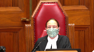
:::

Had there been a voir dire?

The question is leaving aside how it got in and questions about whether it should have gone in.

Had there been a voir dire on this evidence, in your view, would it have been admissible or was the court right to say this is exactly the kind of twin myth reasoning that would have been excluded under Section 276?

**Speaker 1** (00:19:09): Well, starting from the first point, neither the majority nor the minority found that it would necessarily have been admissible.

::: {.column-margin}

:::

Had this case been conducted differently, it would be difficult to say where the relevance would arise.

The inherent unfairness in this case comes as the response to the Crown's case.

So the Crown, long before they ever get to the point where they're arguing about where they're discussing clearly 276 inferences, they start right near the beginning at page 13 of the transcript.

The complainant says line two, I never saw Mr. Delmas's anything more than a friend.

Line 22, I didn't see that Mike that way.

He was just a friend.

And then on page 15, what if any discussion did you have about sex with Mr. Delmas? None.

It was never a topic.

Like I said, I wasn't interested in him that way.

The Crown, okay.

Complain it.

He had a girlfriend.

I knew his girlfriend.

I respected his girlfriend.

I never, I was never out with intents to hurt anybody either.

So and then page 33, the Crown is asking about how would you characterize the nature of your relationship?

Were you acquaintances, friends, boyfriend, girlfriend, something different?

This is line 11, line 13.

No, I never dated.

I never dated him.

**Justice Brown** (00:20:41): Okay, but, Ms. Sanders, you're going to what you say is an irreconcilable set of statements, that she had consensual sex with the accused, but that she had no sexual interest in the accused.

::: {.column-margin}
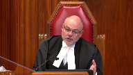
:::

She just thought him as a friend.

The trial judge clearly understood that was the argument.

It was the contradiction was put to the complainant in cross.

It was put to the trial judge in submissions.

The trial judge avers to the argument in the course of his reasons, and he rejects it as an outdated perception.

Where's the error?

I'm saying it was a potential error.

I should say, where's the prejudice?

**Speaker 1** (00:21:34): The prejudice is, had there been a 276 ruling...

**Overlapping speakers** (00:21:40): Right.

**Speaker 1** (00:21:41): The judge would have heard submissions and we would have reasons for why he says this is outdated and know whether it was simply in response to what was said or know that it was actually a rejection of the specific argument made.

**Justice Brown** (00:21:57): reject the contradiction.

::: {.column-margin}
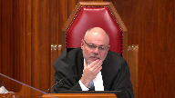
:::

He considers it and he rejects the contradiction as an outdated perception that a woman cannot have consensual sex with someone that she's not sexually interested in.

**Speaker 1** (00:22:18): on this record though it's in my submission quite problematic because we have a complainant who has a very difficult memory and can't remember the day.

::: {.column-margin}

:::

Council both agree that this they're talking about the same incident and throughout her evidence appears to change.

In my submission there is still an apparent contradiction that might be resolved through a 276 hearing and might not.

The question though is whether the accused has lost the opportunity to make full answer and defense.

So in my submission the judge considers it only on the superficial level without ever addressing why this could not raise an inconsistency.

But he does.

Sorry but he

but he does.

**Justice Abella** (00:23:11): does say just following on justice brown's point if you look at page 12 of the record of his reasoning, I emphasize that whether the complainant consented to sexual activity is not admissible to support an inference that she was more likely to have consented to the sexual activity and he goes on to explain why he wouldn't have accepted the evidence.

::: {.column-margin}
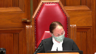
:::

So what do you think?

**Speaker 1** (00:23:37): The issue was never that her consent on a different occasion made it more likely.

That's exactly the argument that was not being made.

**Justice Abella** (00:23:46): What was the argument being made as to the relevance then of that evidence?

**Speaker 1** (00:23:53): that when she gives testimony to say, I wouldn't, I didn't, I would never, I respected his girlfriend, I never saw him that way, I had no interest in him, and then ultimately says, well I did consent on two other occasions.

**Justice Abella** (00:24:09): Therefore was likelier to have consented this time.

Isn't that the only conclusion that would have been useful for?

**Speaker 1** (00:24:15): No. Therefore, saying that she wouldn't have wasn't the type of person to do that, wouldn't have done that because of his girlfriend, but apparently she did.

::: {.column-margin}

:::

Nothing to do with whether or not consent on one occasion meant consent on another, but simply that after she's held herself out to be a person who wouldn't have, not because she said no, she wouldn't have because she didn't see him that way because she knew his girlfriend, because she respected his girlfriend, because their relationship was never about sex, because they were only friends, but then it comes out in the Crown's case that they had consensual sex before and after.

**Justice Abella** (00:24:57): And therefore, and that's exactly what I'm asking you, and therefore, her evidence about the fact that on this occasion she did not consent because of her feelings and relationship with his girlfriend should not be believed.

::: {.column-margin}
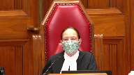
:::

**Speaker 1** (00:25:18): It had the Crown refrained or better prepared his witness or in one way or the other none of if none of that evidence was in the Crown's case it would be a different case.

::: {.column-margin}

:::

For example if the judge had had a seaboyer hearing and we don't have the complainant holding herself out for x y and z reasons to be explaining why of course her consent her non-consent was valid then we would be left with only what we should be left with.

Did she or did she not consent on this occasion?

Not why is she the type of person and what's your past relationship and what has been your history with this man?

That comes out in the Crown's case.

At a certain point there has to be there has to be one of three things.

Can I either the

**Justice Abella** (00:26:08): Can I just, before you go on, I don't want to miss your point.

Was there an obligation on the part of the defence once that came out to ask for a section 276 hearing for a deer?

**Speaker 1** (00:26:23): uh if he in I have the defense absolutely in the circumstances of this case ought to have requested one.

The judge's gatekeeper said well this is as far as it goes but doesn't say none of this is going to be heard.

Well actually the crown

**Justice Moldaver** (00:26:41): should have asked for one.

::: {.column-margin}
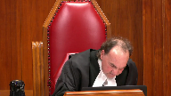
:::

We made that clear in Barton.

But I think this is missing with respect to the point of her evidence.

And I think the trial judges, my colleagues have pointed out, recognize that one can have sex with somebody and not be wanting to be involved in an intimate sexual relationship.

And that is precisely when you look at her testimony at page 19 of the record, that the court of appeal goes through the questions and answers with her.

And she makes it clear at about, I don't know, the lines in paragraph 11 in any event, the defence is saying there's a contradiction here.

You had consensual sex with them, yet you're telling us you had no sexual interest or whatever.

She says as I understand it, sir, I stick to the fact I was never interested in having a sexual or intimate relationship with him.

Now, speaking for myself, I see a distinction.

What she's trying to say is I was never interested in having a long time intimate relationship with this man.

Yes, we had sex on a couple of occasions, but that is different than suggesting somehow that I'm interested in him and wanting some sort of a long-term relationship.

**Speaker 1** (00:28:05): I appreciate that and certainly in my submission that could very well be the outcome of a 276 hearing once it's clarified that that is the circumstance.

::: {.column-margin}

:::

The difficulty is there's also the possibility that that's not the case.

We do have defense counsel of course putting to the complainant her Facebook messenger messages with the accused in which he asks if she's calling him sexy to try and of course raise the inference that she did have more of an interest in him and I'm not going there for the prohibited reasoning.

I'm going there because she apparently says she has no recollection of it, doesn't admit to it until the Facebook messages are actually put to her

and then she acknowledges that if they're there on paper she must have said that.

We do have two other counts in which her memory was so sparse that there were acquittals on this same trial so I appreciate that the ultimate outcome of a section 276 hearing might have been the finding that there is no discrepancy.

We don't need to address this but it also in order to have full answer and defense it might very well have turned out to be differently.

The difficulty here is that the judge doesn't indicate as the court suggests that he's heard it and disabused his mind of it.

The crown says he simply found it inadmissible.

We don't know where we're at and that was the point of Justice O'Farrell's dissent that we don't even know on this record whether the judge rejected it for 276 reasons or if he heard it and wasn't persuaded on the merits.

Had there been a 276 hearing we would have had a ruling.

Had there been a ruling the accused would have been in a different position in two ways.

One, if the judge had had the voir dire issued his ruling we don't know on what basis this case might have been argued it might have been different.

Had the ruling been during the course of the crown's evidence we don't even know how it might have changed the complexion of the crown's case.

The judge might have disabused his mind of all of those impermissible inferences and then the defense might not have felt compelled to address them.

Hence we're saying the ripple effect from Barton when you don't follow correct procedure.

So ultimately Justice O'Farrell says because of the procedural error he ends up in this position and of course what is his position?

His position is having made final argument that either is falling on deaf ears because it's impermissible or else it failed but he doesn't know why.

So it's exactly because of that and in my submission this is a fine example of why the procedural process is so important.

So you don't end up with this being the kind of case the defense has to meet.

So you don't end up with the defense capitalizing on the absence of a hearing in the crown's case and that you don't end up with the accused not knowing until the reasons for judgment issue whether or not that argument is even being considered and then when you try to appeal it at least you know on what basis the trial judge rejected that evidence.

**Overlapping speakers** (00:31:42): Thank you, Ms. Sanders.

Thank you.

Sorry, did you have a sentence you wanted to finish?

I thought you were at the end.

**Speaker 1** (00:31:49): to say had there been reasons issued as statutorily required under 276, then the accused would have been in a position to know on appeal what exactly the reasoning of the trial judge had been for argument, and we don't have that here either.

**Justice Abella** (00:32:06): Thank you.

Ms. Clyde?

**Speaker 3** (00:32:09): Good morning Madam Justice.

::: {.column-margin}
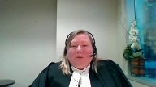
:::

Good morning other Justices.

The Crown's respectful submission is this.

We are faced with a situation where a seaboyer and or 276 application should have been made.

The Crown does not dispute that issue.

The real issue on this particular appeal is whether or not that requires a new trial.

In the Crown's respectful submission that is not the case and the reason we say that is this.

The failure to conduct the hearing did not lead to prejudice on this particular appellant.

The questions were asked of the complainant and the appellant relied on the answers to those questions in his closing submissions.

In the Crown's respectful submission that was all that was required of the trial judge.

The appellant now on an oral submission seemed to suggest that the real issue here is that there was a failure to provide reasons with respect to a seaboyer or a 276 hearing.

Respectfully no application was made before the trial judge so you can't fault him for failing to provide reasons for an application that was never actually made.

In the Crown's respectful submission the situation we also have is this.

This evidence is simply not admissible.

It is not admissible and the reason we say that is this.

Section 276 sub 1 which even in a seaboyer application if we accept the proposition that this was in fact Crown-led evidence.

276 sub 1 is part of that analysis and it strictly prohibits twin-myth reasoning.

In the Crown's respectful submission Justice O'Farrell on dissent says that this evidence may have been admissible to determine whether or not she was mistaken as to whether or not she consented on that occasion or her reliability with respect to consent.

Respectfully both of those articulations of admissibility are prohibited by twin-myth reasoning.

It essentially is an argument that states she is less worthy of belief now on the circumstances of this offense because she consented on other occasions.

**Justice Moldaver** (00:34:15): As I understand it, help me out if I'm wrong on this, but on this whole issue, the defence wanted this in not to show that she's more likely to consent or that she's less credible, but that it did go to a credibility issue, a pure credibility issue, in terms of her evidence and prior sort of saying one thing at one point and then, you know, being inconsistent on the other, but as I understand the trial judge's reasons, he looked at this whole debate about inconsistency and resolved it in the witness's favour, in the Crown's favour, by saying in effect, there's really no inconsistency here.

::: {.column-margin}
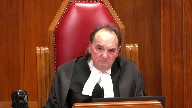
:::

She didn't want to have a sexual intimate relationship with this man and there's nothing that really supports the fact that she was being incredible on that.

The fact that she had sex with him once before and one after does not, in his view, make for a sexually intimate, a wish for a sexually intimate kind of long-term relationship.

So once the trial judge makes that finding in effect that this really doesn't impact on her credibility at all, because it's implicit in his reasons that it doesn't, that's the end of it.

You don't need to. Sorry.

Go ahead.

**Speaker 3** (00:35:39): Sorry sir, that is correct.

::: {.column-margin}
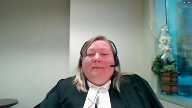
:::

This is where, and I was going to get to this in a moment sir, Justice Brown's comments with respect to whether or not the trial judge effectively addressed this in his trial decision and respectfully in the Crown's respectful submission he did.

He determined that it was based on an outdated perception of women's sexuality and Justice Moldaver, I think you are correct, her evidence was I had sex with him on two other occasions

but it was not because I was sexually interested in him.

Therefore there is no contradiction.

So what my friend is attempting to suggest is that perhaps it should have been.

Respectfully that is an outdated perception of women's sexuality.

Justice Brown said it exactly, women have sex for many different reasons.

Women, like men, do not need to be sexually attracted to the people they have sex with.

And that's the long and the short of it.

**Justice Côté** (00:36:28): What should we do with the Crown's position?

Please believe the accused and don't believe the complainant.

I was sad the first time I've seen that.

**Speaker 3** (00:36:40): Unfortunately, it's not the first time I've seen it.

::: {.column-margin}
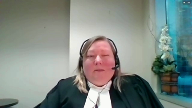
:::

What I can say with respect to this particular appeal is as follows, the appellant is here as of right on the dissenting reasons of Justice O'Farrell.

Justice O'Farrell did not dissent on that aspect.

You'll read the Alberta Court of Appeals decision and I'm sure you will agree with them that it was an unfortunate choice of theory by the trial council.

I believe in both the trial judge's submissions in the transcript as well as the Court of Appeals decision, they are charitable to the Crown and say that perhaps this is because he didn't have the full time to consider his position fully in the face of a transcript.

Respectfully, that was a legal error.

The theory was based on a legal error.

There was no evidence of incapacity by intoxication.

That I would suggest is not what we're here to argue today because there is no dissent on that position.

Does that answer your question, Justice?

**Overlapping speakers** (00:37:40): You answered my question.

It does not mean I agree with you.

I, absolutely.

**Speaker 3** (00:37:44): So turning to Grounds 2 and 3 and the Crown's respectful submission, there is simply no prejudice to this accused.

::: {.column-margin}
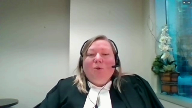
:::

If we send it back for a new trial, the appellant now claims it's because a Section 276 hearing could have been done and could have been successful.

There are two issues why that should not be the case.

Number one, the appellant had the opportunity to make a 276 application.

He chose not to do so.

That could be construed as a tactical decision.

My friend argues that the trial judge, when he made his comment saying that he was the gatekeeper, somehow forbade him from doing that.

In the Crown's respectful submission, that's simply not the case.

The second reason why it should not go back for a new trial is because it is not admissible.

Pursuant to Section 276, it's a twin-myth reasoning and prohibited for that regard, and it is based on an outdated perception of women's sexuality.

So the contradiction argument is not sufficient to warrant its admissibility in any circumstances.

Seaboyer is the leading case on this.

Seaboyer has a list, in addition to the twin myths, of I believe it's 11 other myths that pervade the prosecution of sexual assault.

That case is quite dated, but unfortunately those myths still exist.

And I would suggest this type of argument that women must be sexually attracted to the people they have sex with should fit into that list.

That list is not exhaustive.

It leaves open the possibility of adding others.

In the Crown's respectful submission, the trial judge made no error in determining that this evidence, although not within the confines of a proper formal hearing, deemed it nonetheless irrelevant to her credibility and based on an outdated perception of women's sexuality.

I wonder if any other members of the panel have questions with respect to ground two and three?

**Justice Abella** (00:39:47): and do you have any further submissions you want to make?

**Speaker 3** (00:39:52): Not with respect to grounds two and three, I would like to then turn to ground one briefly if that's all right.

::: {.column-margin}
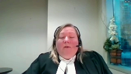
:::

Yes, of course.

Thank you.

So with respect to ground one, the situation is this with the greatest of respect to my friend and the intervener.

The issue with regard to ground one is not ambiguity in the law.

Of course, certainty is always helpful to the lower courts and guidance is always helpful from this court.

But in this particular case, what is decisive is the interpretation of the trial judge's reasons.

And the Crown simply disagrees with the appellant's argument that he was somehow confused and struggling in the assessment of the appellant's credibility and reliability.

In the Crown's respectful submission, it is very clear that he finds the appellant's evidence to be unreliable.

Morrissey says that reliability is the ability to observe, remember and recollect.

The appellant very candidly indicated the testimony he was providing to the court on that day was not the result of the memories he made during the time of the event, but what came to him in the three years subsequent to the event.

He was candid that he was intoxicated by methamphetamine, that methamphetamine affects his memory.

And as a result, he sometimes has information that he

I think he doesn't adopt the word blackout.

But he says and candidly admits there are some things he simply doesn't remember.

It was open to the trial judge to find his evidence on the basis of that testimony to be unreliable.

My friend and the dissenting justice make no submissions with respect to how any of the common sense analysis in the subsequent paragraph affects or creates a palpable and overriding error when it comes to the articulation of his reliability findings.

And on that basis alone, the majority of the Court of Appeal correctly held that the credibility analysis subsequent to that finding is not critical to the conviction.

And in the Crown's respectful submission, that ends the appeal on ground one.

I don't know if the court has particular questions with respect to that.

I can go through the case law if you'd like, ARJD and Cordy discuss the fact that you simply should not be using generalizations when assessing the credibility of complainants.

Cordy at paragraph 21 makes it clear, I would suggest, that you also cannot use those generalizations when assessing the credibility of accused people.

**Justice Brown** (00:42:27): So, when I read that one paragraph, I'm not sure, well in fact I'm pretty sure that it's not an instance of stereotyping, but it does seem to me, I mean these arguments about well, how would a man who, you know, in a relationship with another woman, you know, consider himself in a boyfriend-girlfriend relationship, the stuff about hep C, the stuff about meth, it's not so much that it's stereotypical, it's just, it's illogical, and so if it's illogical, did he err?

::: {.column-margin}
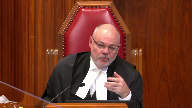
:::

Is there, and presumably if there was an error, you would say, well let's cure it, but the first step is, is there an error to cure?

**Speaker 3** (00:43:11): I would suggest that deference is owed.

I would suggest that the majority of the Court of Appeals said that there was one comment.

They don't clarify that comment for the purposes of this appeal.

I assume it's having unprotected sex.

Yeah, but the Court of Appeals said that the majority of the Court of Appeals said that

**Justice Brown** (00:43:23): That's paragraph 35.

::: {.column-margin}
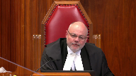
:::

I think the court of appeal, the suggestion I took from that is that they think it might have been stereotypical reasoning.

Again, I'm not sure it's stereotypical reasoning.

Well, again, I'm pretty sure it's not stereotypical reasoning.

It just seems to me to be illogical reasoning.

And the answer to illogical reasoning surely can't be deference.

I mean, it may be, well, look at the findings on reliability, look at the findings on credibility, but nonetheless, how do we channel that illogic?

Do we call it an error and then you would say cure it or do we or not or do we just say, well, there's no error looking at the reasons as a whole.

**Speaker 3** (00:44:10): I cannot say in good conscience that there is a clear logical articulation in his findings in that common sense paragraph to be one, sir.

::: {.column-margin}

:::

What I would suggest though is this.

This is a situation like GH, FBP, other cases where that one concerning comment and perhaps as you would suggest the entire paragraph.

**Overlapping speakers** (00:44:32): Yeah.

**Speaker 3** (00:44:32): if it is illogical, that is not critical to the conviction because we come back to the interpretation of the trial judge's reasons as a whole.

::: {.column-margin}
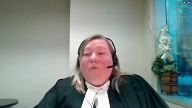
:::

And as a whole, it is clear that he is finding the appellant first unreliable.

And I would suggest in his credibility findings, there are other reasons that are afforded deference that contain no logical error or inadmissible stereotype depending on what each member of this panel suggests it to be.

It simply doesn't found the conviction.

So in the Crown's respectful submission, we're in a situation like GH, like FBP, where one concerning comment should not warrant a new trial.

**Justice Kasirer** (00:45:14): In your factum, paragraph 97 in the section dealing with the application of the curative proviso, you raised this issue.

::: {.column-margin}
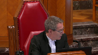
:::

Is that by design?

Are you arguing that the concern relating to the comment about engaging in unprotected intercourse while hepatitis C positive is covered by that?

Same argument.

**Speaker 3** (00:45:44): Yes, sir.

**Justice Moldaver** (00:45:45): I would have thought, though, that the real essence, the important part of that paragraph is the middle part where the trial judge says that he went there on his own evidence just to have a talk almost immediately on his arrival.

::: {.column-margin}
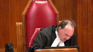
:::

Both he and the complainant started consuming meth even though he'd never seen her do so before.

Almost immediately after that he indicated that he and the complainant had unprotected sexual intercourse.

I would have thought that that is something that the trial judge could look to, not simply on its own but having determined that the complainant's evidence is credible and reliable.

He can look at the whole package and say, this just does not make sense.

**Overlapping speakers** (00:46:37): And that's what he's.

**Justice Moldaver** (00:46:38): entitled to do it seems to me to the extent that he was maybe erred and drawing in a logical inference that because the accused was involved in another relationship and so on what would he be doing with this I think it really could be looked at the other factors could be looked at as being harmless in terms of the overall result the key part of it though in my respectful view was proper and admissible proper thinking yeah

::: {.column-margin}
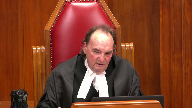
:::

**Speaker 3** (00:47:09): Sorry, sir.

::: {.column-margin}
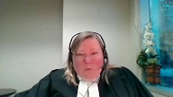
:::

I agree with that.

I appreciate, and I mean no disrespect in this, in my research and preparation for this, I note that in cases where it comes to the application of credibility reviews on appeal, each person will have a different interpretation of the judge's reasons.

In the Crown's respectful submission, regardless of those minute differences between the interpretations of this particular paragraph, it should not change the ultimate result.

And the ultimate result in this case is that the trial judge rejected the appellant's evidence because it was unreliable, number one.

Number two, the other reasons that he provides on why he would have also found it incredible, and I would suggest the inconsistencies with respect to methamphetamine when he obtained verbal consent, the fact that he didn't put this detailed narrative to the complainant, are all proper considerations by the trial judge entitled to deference that underpin correctly and reasonably his analysis of the appellant's credibility.

So Justice Moldaver, even if you disagree with Justice Brown with respect to what part, if any, of that one paragraph causes you concern, it should not respectfully change the result of the appeal in this case.

**Justice Martin** (00:48:34): May I ask in terms of your research and your thinking on this issue, we're in the portion of a judgment that is dealing with credibility.

::: {.column-margin}
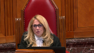
:::

And in terms of credibility, we know the law that it's not a science, that it's a difficult assessment to make, that part of that can be informed by consistencies, inconsistencies, whether they be internal or external.

But there's always been a role for common sense in the finding of credibility and inferring what is or is not likely to have happened by reference to some norm.

So can you help me by drawing a line or helping us find when is it appropriate to use common sense and when are you using improper normative assumptions in a way that might attract this idea that the judge has fallen into error?

Because it seems to me that that is a very different or difficult assessment to make when you're allowed to do one that looks very similar to what is now being complained of in terms of being either illogical or stereotypic.

**Speaker 3** (00:49:58): Unfortunately I would suggest that a generalized definition cannot be articulated in a factual vacuum.

::: {.column-margin}
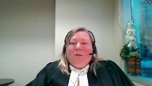
:::

This is a situation really where it is on a case-by-case basis.

I appreciate the intervener's argument where she puts forward a very thoughtful analysis of how we should be defining those going forward.

I frankly do not have an answer to that because I think that it is on a case-by-case basis.

What I would suggest though, Madam Justice, is this.

Common sense is the application of logic, reasoning, and life experience and there are many areas of the law and credibility surely should be one of them where common sense must always have a place in the consideration of the witness's credibility and reliability.

Generalizations are unfair and inaccurate expectations of how a person is supposed to behave.

I have a limited imagination unfortunately and cannot provide you with a full sentence that properly dictates what that line should be and unfortunately that is the best answer I can give.

I would suggest that if it is unfair and inaccurate generalizations they should not be considered by the trier of act.

If this court is considering providing a definition, if I can call it that, with respect to the difference between common sense and generalizations, I welcome that.

I unfortunately do not have an answer to that because I think

**Overlapping speakers** (00:51:37): You might-

**Speaker 3** (00:51:37): have a magic definition.

::: {.column-margin}

:::

What I would suggest though is this.

The interveners framework is very interesting but if this court is considering adopting it I would ask this court to consider the fact that this type of direction must also be considered and properly explained to jurors.

Their framework is very complicated.

It is also it is obviously very helpful for the purposes of an appeal but we must consider the fact that whatever generalization definition you intend to give if you choose to do that has to be explained in such a way that every member of a jury could also understand it and frankly I don't have the imagination to provide you that at this time.

**Justice Moldaver** (00:52:26): Your point is the more particularized, you should be particularizing it to the facts and circumstances of the case and looking at the evidence of the witness that you find to be, you know, this just isn't adding up and looking at that evidence in the context of the evidence of the, that that witness has given and the other evidence in the case and say on these facts and circumstances, this doesn't make sense as opposed to some generalization that, you know, it's impossible to think of a situation where someone could come over to the house and be shooting up meth and having sex with someone, you know, ever.

::: {.column-margin}
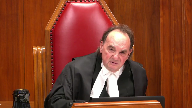
:::

You can't imagine that that would just defy common sense and logic.

You can't go that way because that's just too broad a generalization.

You can go that way if you tie it to the facts and circumstances of the particular case, which is what the trial judge did here.

**Speaker 3** (00:53:31): Certainly, I agree with that the concern frankly that I had in my mind when I was preparing for this hearing if we follow that argument which I agree with is we have to also be careful to remind ourselves that it cannot be a purely subjective analysis, it cannot be, as I would suggest the appellant at some points in their argument suggest.

::: {.column-margin}
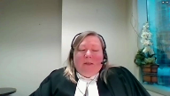
:::

This appellant would have done whatever he wanted to do and it's nobody's place to determine whether or not he was inconsistent in that behavior.

Common sense must play some role in assessing the internal consistencies of a witness's evidence.

**Justice Karakatsanis** (00:54:07): When we talk about, though, how we look at a trial judge's reasoning or reasons with respect to credibility, I guess the extent to which you zero in on one sentence or on one phrase is also part of the problem that we sometimes see, where you have, perhaps if you look at the reasons as we've suggested many times more generously, look at them as a whole and then look to see what, you know, that particular error that's being alleged, what role does it play if you look at the reasons as a whole?

::: {.column-margin}
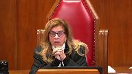
:::

So I think, I mean, you get more into problems about generalization and common sense if, I guess the more you parse the reasons, the more problems you can find.

So that's not really a question, is it?

But I welcome any comments you may make, because it seems to me that's part of the problem.

**Speaker 3** (00:55:09): why this is part of the problem and this is why I keep coming back to the fact that it is the interpretation of the trial judge's reasons that rule the day today in this particular case and that is he rejected the appellant's evidence because it was unreliable so focusing solely on one or more of the statements contained in the paragraph on page 10 is not the answer to this appeal because it is not central to the conviction.

::: {.column-margin}

:::

Subject to any other questions I see Justice Brown is looking for something

so I don't know if he has a question for me but subject to any other

**Overlapping speakers** (00:55:48): I'm looking for something for the lawyer who's next up.

**Speaker 3** (00:55:51): Just to Sabella, I don't know if you have anything else for me, I note I have six minutes left, I don't intend to use that time because frankly it usually does not end well for me if I do that.

**Justice Abella** (00:56:04): It's not a shy panel.

I'm sure if they had questions, you'd hear them.

Thank you very much.

Thank you for your submissions.

Ms. Lai for the Attorney General of Ontario.

**Speaker 4** (00:56:14): Good morning, just Isabella and the remainder of the panel.

**Speaker 5** (00:56:20): I'm here to intervene on one issue and that's the discussion with respect to stereotypes and generalizations, which does provide this court with an opportunity to shed light on what precisely we mean when we say stereotypical reasoning in the context of criminal trial, and how that term relates to other terms like generalizations that variously appear in other cases and in the decision below.

::: {.column-margin}

:::

At base, my submission is that generalizations and stereotypical reasoning are different, but they are related generalizations can properly play a role in judicial decision making and stereotypical reasoning cannot.

And I agree with the positions of the parties that as a matter of law stereotypical reasoning is prohibited regardless of whether the target is the accused, the complainant, or in other witness.

And to be clear when I say generalization I mean an assertion that something is likely but not always true in a given set of circumstances and this is where the application of common sense and life experience can sometimes come in to decision making and I agree with my friend from the Attorney General of Ontario, sorry Alberta, that it is a case by case analysis that maintains a robust role for common sense.

With respect to the question she raised about whether this is a question for the jury or for the judge, it strikes me that the propriety of a line of reasoning is a question of law and in a jury trial would be a matter for determination for the trial judge and not left to the jury.

But I emphasize that there's nothing improper about relying on a generalization, those are the basis upon which we infer motive whether it's to commit an offense or to lie, a risk, intent, animus, any number of other factual findings that are the bread and butter of criminal trials.

And if those of care isn't taken, then relying on a generalization can give rise to what I say are two failures of logic I've categorized them.

And what I say, sort of been captured compendiously under the description of stereotypical reasoning in the case law.

The first is the unfounded generalization so we're speaking of where the assertion is itself flawed.

It's a logical or it lacks proof or it's just untrue.

The second different type of error is the in applicable generalization error.

So to go back to justice Moldova's point earlier, it's to tie it the need to tie it to specific facts of a specific case, the in applicable generalization error is where they're just lacks that evidence to bring it from the general to the specific, and it's a monolithic generalization of a generalization.

The problem isn't however in that scenario with the generalization itself.

And so, I've tried to elaborate a paragraph 16 and 17 of my factum that that the generalizations in the context of assessing sexualized interactions.

It is particularly prone we have seen to either type of error the unfounded generalization or the in applicable one, but that doesn't mean that it's insulated from the application of common sense, or that generalizations cannot categorically play a role in the assessment of sexualized allegations and hazard is stark example

I would say it's proper to assert in general that if a sexualized interaction takes place at gunpoint the complainant is likely not consenting.

That's always going to be true, but it is a valid guide to decision making.

If you have that link, you always need the link to the specific case the specific complainant, but with that link, it's just a common sense proposition that the involvement of a weapon impacts the general consent.

The fact that it is a sexualized interaction doesn't take away from the validity of that as a guide to decision making.

**Justice Abella** (01:00:40): Is there any utility then in introducing a binary concept generalizations versus stereotypes when what you're really asserting is there's nothing wrong with the appropriate application of common sense because I just worry that we then risk greater confusion in an area and a labeling process for something that had, that Morrissey says is just a common sense approach to the evidence.

::: {.column-margin}
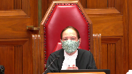
:::

**Speaker 5** (01:01:14): And the concern, Justice Abella, is that the existing law already starts to interchange or intertwine those words, generalization and stereotype.

::: {.column-margin}

:::

And so if the guidance from the court is, you know, one of these terms we can shelve and we can use the other going forward, this is the common vocabulary to describe this particular type of logical reasoning error, which ultimately is what stereotypical reasoning is, right?

It's a failure in logic.

And then that, I suggest, would be a useful and welcome contribution as we see greater awareness in terms of societal context, not only in sexual offenses, but also with other marginalized and vulnerable communities.

This discourse will continue and a common vocabulary will assist in moving the jurisprudence forward in a meaningful way.

**Overlapping speakers** (01:02:03): And ultimately, I think there is some value to distinguishing between... I'm afraid your time is up.

**Speaker 3** (01:02:10): You

**Overlapping speakers** (01:02:11): want to wrap up?

Is there a sentence you want to wrap up with?

We have your factor.

**Speaker 5** (01:02:16): No, it's just an opportunity for the court to clarify these terms and definitions and I would commend the remainder of my factum to the court if it assists.

Thank you.

**Justice Abella** (01:02:24): Thank you very much.

Any reply?

**Speaker 2** (01:02:28): uh yes please uh Justice Abella I'd just like to make clear that um just in response to the question that uh Justice Cote asked um my friend said that um Justice O'Farrell never makes reference to the Crown's position at trial and that's actually incorrect he makes reference to it at paragraph 68 with respect to this idea of generalizations or logical reasoning um

::: {.column-margin}

:::

and he says particularly when the Crown was urging the trial judge to accept the evidence of the accused and reject the evidence of the complainant and that theme carries through throughout the discussion of the 276 throughout his dissent.

The other thing I would just want to address is with respect to the other question about uh you know zeroing in on one sentence within reasons um I would say that you know there are certainly examples of that in the case law where appellants may try to do that in this case this was a trial judge who was grappling with whether he could accept um Mr. Dalmas's uh denial that he committed a criminal offense and he he says so I

I find it difficult to assess his credibility and yet um we're just satisfied to say well he was a drug addict

and he got some of the details wrong

so um the whole permissible impermissible reasoning that he starts with at page 10 uh is not uh is not a problem I would say that that is an error that the dissent uh noted and he said that it taints the reasoning process and he relied heavily on it so whether it's characterized as generalizations assumptions uh stereotypes uh he's saying uh this doesn't make sense to me the funny thing is is that how does it not make sense when the complainant's evidence is in uh before him about that that's exactly what these two individuals would do um the other thing that I just want to make clear

is it's not prohibited uh twin myth reasoning uh I don't agree that there's only one way to read the trial judge's reasons he says um that he can he says this is not the case well he doesn't say I've considered it and determined that there's no inconsistency and so Justice O'Farrell quite clearly points to that we're not sure does he disabuse his mind of it or does he um ultimately rule it inadmissible if he does that these reasons aren't sufficient and so I think what's being lost on um the respondent's argument is that she's trying to do an admissibility assessment at the Swine Court of Canada on evidence that we're saying there was a procedural error that never had an opportunity for that admissibility assessment so you don't sorry

**Justice Abella** (01:05:13): Just to stuff you, you don't accept that his discussion at page 12 of the record where he talks about what the submission is based on and how he's using it and why he's rejecting it, you don't think that addresses your concern.

**Speaker 2** (01:05:28): No, and I would rely on the dissenting reasons where he explains that that does not address it.

::: {.column-margin}

:::

And so he's assuming that it's a myth.

But the really the only way that it is admissible is if you say one thing and do another.

Or you have to remember this evidence was elicited by the Crown.

In order for the defense to neutralize evidence where somebody was allowed to say, I wouldn't have had sex with Michael because I didn't think of him like that.

That is highly problematic that the trier of fact heard that evidence.

And then the judge just said, well, that's as far as we can go when the defense asked questions.

What he should have said is exactly what Justice O'Farrell says he should have done.

There should have been a gatekeeper operating and controlling the trial in terms of what evidence was admissible.

You don't wait until closing argument to then have admissibility rulings.

And to say that there's no prejudice to the accused is unbelievable.

In a case where the Crown was advocating, believe the accused person and didn't confront the accused person.

Didn't confront the accused person on inconsistencies because he said, accept his evidence.

And he said that on branch two, if find him unreliable, then to acquit him.

And so what we're saying is there was a procedural error that permeated throughout this trial.

It was done very poorly by all parties.

The court of appeal and the dissenting reasons agree that there was an error in law in not holding the 276.

And most respectfully, we are not in the same position as RV.

Also with respect to the majority reasons, they're not even saying what part of the paragraph is of concern.

Is it the hep C?

Is it the fact that he's got the evidence wrong that these two individuals have had sex before?

It's not at all clear what they're saying is the problematic portion.

And we are respectfully requesting Mr. Delmas have a new trial.

Thank you.

**Justice Abella** (01:07:21): Thank you for your submissions.

The court will retire.

I'd ask council to remain while we consider this matter.

Thank you.

**Justice Brown** (01:08:12): The court is in the court.

**Justice Abella** (01:08:44): Thank you for your very helpful submissions.

The court is ready to deliver its decision.

Ms. Muldaver will be giving the reasons of the court.

**Justice Moldaver** (01:08:59): Thank you, Mr. Dahl.

::: {.column-margin}
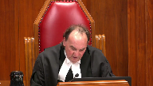
:::

And thank you to all council as well.

A majority of the court would dismiss the appeal.

The trial judge did not engage in stereotypical reasoning in his assessment of the appellant's evidence to the extent he may have erred in drawing an illogical inference about the unlikelihood of the appellant having sex with the complainant while he was involved in a relationship with another woman.

The error in the view of the majority was harmless having regard to the reasons as a whole and at occasion no wrong or miscarriage of justice.

Likewise, while the failure to conduct a section 276 voir dire regarding the complainant's evidence of a past sexual relationship with the appellant was an error, it gave rise to no substantial wrong or miscarriage of justice.

Justice Cote dissenting would allow the appeal for substantially the reasons of Justice O'Farrell.

She would not apply the curative proviso since she is not persuaded that there was no substantial wrong or miscarriage of justice in this case.

**Justice Abella** (01:10:27): adjourned until tomorrow morning at 9.30.

Thank you.