---
title: 6362222 Canada inc. v. Prelco inc.
published-title: Heard
date: 2020-12-03
sidebar: false
---

This transcript was made with automated artificial intelligence models and its accuracy has not been verified. Review the original webcast [here](https://scc-csc.ca/case-dossier/info/webcast-webdiffusion-eng.aspx?cas=['38904']).
---

**Speaker 1** (00:00:02): La Coupe!

**Justice Wagner** (00:00:03): D'accord.

::: {.column-margin}
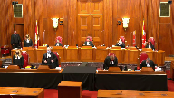
:::

Bonjour, soyez-vous.

Dans la cause de 6-3-6-2-2-2-2 Canada Inc.

contre Prelko Inc.

, pour la plante, M. Guy Pratte, M. Stéphane Richer, pour l'intimé, Prelko Inc.

, M. Catherine Cloutier et M. André Johnson.

M. Pratte ou M. Richer.

**Speaker 2** (00:01:12): Bonjour

Monsieur le juge en chef, j'espère que vous m'entendez bien.

Absolument oui, merci.

Madame, messieurs les juges, j'espère aussi que vous avez reçu notre recueil condensé cette fois-ci, parce que j'ai l'intention de m'en servir assez...

**Overlapping speakers** (00:01:27): Oui nous l'avons reçu.

**Speaker 2** (00:01:28): Pour commencer, comme l'écrivait un auteur, et vous retrouverez le passage à l'onglet 1, c'est-à-dire B1 de notre accueil condensé, dans les contrats de gré à gré touchés à l'une des clauses, c'est briser un équilibre soigneusement déterminé par les parties.

::: {.column-margin}
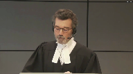
:::

Au nom de la justice, c'est en réalité l'insécurité du contrat et donc des échanges qu'on organise.

D'emblée, j'aimerais souligner que l'intervention des tribunaux dans cette affaire, pour réputer non écrite une clause limitative de responsabilité, s'est faite en l'absence de plusieurs facteurs.

Premièrement, en l'absence d'inégalités ou d'abus de pouvoir de négociation, en l'absence d'erreurs de consentement de l'intimé sur les éléments essentiels du contrat, en l'absence de mauvaise foi de la part de la plante et en l'absence de toute considération de la cohérence entière du contrat des prestations de part et d'autre.

Ça nous rappelle le commentaire du juge en chef Dickson à propos de la théorie apparentée de l'inexécution fondamentale, et vous retrouverez ça à l'onglet 2 de notre recueil condensé à la page 5, lorsqu'entre autres il disait « il est peu utile de masquer ».

La question derrière une construction de l'esprit, il parlait évidemment à cette époque de l'inexécution fondamentale, abordait explicitement la question de l'inéquité et de l'inégalité du pouvoir de négociation des parties permet au tribunal de se demander expressément pourquoi il devrait refuser d'appliquer une condition contractuelle qui aurait reçu le consentement des parties.

Et dans notre affaire, avant d'intervenir sans aucune autorité législative particulière, on en discutera, dans le champ contractuel librement défini par les parties, la Cour ne devrait-elle pas se demander pourquoi le créancier aurait librement accepté au moment de la formation du contrat de limiter toute demande pour dommages matériels, y compris dans le cas d'un manquement et d'une obligation essentielles, mais qu'il serait autorisé à posteriori de demander d'annuler cet engagement.

En outre, dans un contrat de gré à gré qui ne fait qu'aménager, selon la volonté des parties, les risques de découlant d'une faute simple, quelle injustice fondamentale aurait échappé à l'attention du législateur qui pourrait justifier une intervention, voire une création prétorienne.

Alors, pour vous orienter, la position de la place sera présentée en deux volets principaux.

Je traiterai premièrement de l'économie du Code et ferai un survol de la doctrine et de la jurisprudence pour démontrer que, selon la plante, ni l'économie du Code ni la jurisprudence afférente ne pourraient justifier en l'espèce l'annulation de la clause qui est en jeu aujourd'hui.

Le législateur a déjà prévu plusieurs mécanismes de contrôle qui ne s'appliquent pas et il n'est pas nécessaire d'y ajouter.

J'entends passer à peu près 45 minutes sur cette question plus générale et Maître Richer, pour sa part, dans les 15 dernières minutes, fera les représentations en prétendant que même en tenant pour acquis que la doctrine, la théorie, le concept ou la règle du manquement de l'obligation essentielle pouvaient exister, pour deux motifs principaux, elle ne pourrait trouver application en l'espèce, premièrement parce que nous ne faisons pas face à une clause d'exclusion totale et la clause limitative ne livrerait pas du tout Créatech de son obligation essentielle.

**Justice Côté** (00:05:18): Cet égard, M. Pratt, avant que vous entriez dans votre argument concernant l'économie du code civil, j'ai constaté dans votre mémoire que vous insistez beaucoup sur le fait qu'on est en présence ici d'une clause limitative de responsabilité et non une clause qui exonère complètement de la responsabilité.

::: {.column-margin}
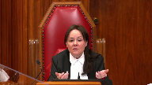
:::

Est-ce que votre argument en droit quant à l'existence ou non d'une obligation essentielle fait la distinction ou doit-on traiter les deux types de clauses limitatives et complètement exonératoires sur le même pied?

**Speaker 2** (00:05:53): La réponse de Mme la juge Côté est la suivante, c'est que lorsqu'on regarde les principes et l'économie du cause, elles sont traitées de façon équivalente dans la mesure où on parle de contrats de gré à gré et donc le Code ne fait pas de distinction, les deux sont permises en vertu de l'article 1474 du Code dans le cas de faute simple.

::: {.column-margin}
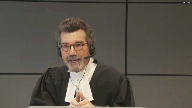
:::

**Justice Côté** (00:06:16): question parce que Prelko dans son mémoire dit que la clause 7 du contrat n'est pas une clause de limitation de responsabilité mais une clause qui exclut une responsabilité complète donc votre argument en droit ne change pas selon qu'il s'agit d'une clause limitative ou d'exonération complète.

::: {.column-margin}
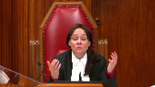
:::

**Speaker 2** (00:06:36): Cet examen, Mme la juge Côté, mon confrère maître Richer, en traîtra plus abondamment

::: {.column-margin}
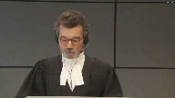
:::

pour démontrer que clairement, ça ne peut être une clause exclusive en l'espèce de toute façon.

Mais évidemment, si vous concluez, par exemple, qu'il y a une marge de marneuve qui permettrait une création prétorienne, à ce moment-là, je vous soumettrai que le tribunal pourrait traiter différemment une clause exclusive d'une clause limitative comme c'est fait en France et que dans la mesure où le montant de la clause limitative n'est pas dérisoire comme en l'espèce, elle ne devrait pas faire l'objet d'une annulation.

Je viendrai à la toute fin de la plaidoirie, mais autrement vous avez bien compris la logique de ma présentation, Mme la juge Côté.

Alors, je commence tout de suite sur l'économie du Code et j'ai deux points principaux à faire valoir dans ma partie.

Premièrement, je veux m'attacher à l'économie du Code et je note en passant que dans le jugement de la Cour d'appel et en fait dans aucun des jugements qui sont mis de l'avant à l'appui de la thèse des intimés, retrouve-t-on une analyse complète de l'économie du Code civil?

Ça, je passerai quelques minutes là-dessus.

Et le deuxième point, c'est d'examiner rapidement, mais quand même de façon assez spécifique, la jurisprudence et la doctrine invoquée notamment par l'arrêt de la Cour d'appel, qui contrairement, et je le dis évidemment avec respect, à l'impression qui est créée est beaucoup moins catégorique que la Cour d'appel ne le laisse entendre.

Alors, je commence par l'économie du Code.

Premièrement, soyons clairs parce que les messages des fois véhiculés dans la mémoire de l'intimé pourraient laisser entendre le contraire.

La plante ne conteste pas le pouvoir général créateur des tribunaux en droit civil.

Même Napoléon le reconnaissait, le créateur du Code civil en 1804.

Mais cela dit, il n'est pas exact de dire que parce que dans d'autres circonstances on a pu justifier des règles pléthoriennes, qu'on puisse le faire dans tous les cas.

Et en l'espèce, comme vous l'avez par exemple décidée dans l'affaire Churchill Falls.

Maître Pratt, je peux, maître Pratt, juste vous, juste vous, vous, vous, vous, vous, vous, vous, vous, vous, vous, vous, vous, vous, vous, vous, vous, vous, vous, vous, vous, vous, vous, vous, vous, vous, vous, vous, vous, vous, vous, vous, vous, vous, vous, vous, vous, vous, vous, vous, vous, vous, vous, vous, vous, vous, vous, vous, vous, vous, vous, vous, vous, vous, vous, vous, vous, vous, vous, vous, vous, vous, vous, vous, vous, vous, vous, vous, vous, vous, vous, vous, vous, vous, vous, vous, vous, vous, vous, vous, vous, vous, vous, vous, vous, vous, vous, vous, vous, vous, vous, vous, vous, vous, vous

**Justice Kasirer** (00:09:05): vous insistez à bon droit sur l'autorité prétorienne, mais une des spécificités du droit civil, c'est l'importance de la doctrine, aussi en marge de la jurisprudence, peut-être quelque chose qui fait démarquer le droit civil de la common law.

::: {.column-margin}

:::

Dans votre analyse, vous allez faire place à ce paradoxe qui, même si la jurisprudence ne fait pas ce que vous appelez une analyse complète de l'économie du code, la doctrine, à quelques exceptions près, appuie assez fortement la position de la Cour d'appel et, compte tenu de l'autorité de la doctrine dans les sources du droit civil, il ne faudrait pas peut-être trop insister au départ d'une analyse prétorienne.

C'est mon seul point.

**Speaker 2** (00:10:11): Merci, M. le juge Cassirer.

::: {.column-margin}
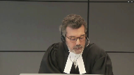
:::

D'ailleurs, je vais commencer.

Une fois que j'aurai fait un survol de l'économie du code, je vais justement m'attacher à la doctrine et tenter de vous démontrer qu'il y a des réserves très importantes dans la doctrine qui sont exprimées.

J'y reviens dans un instant parce que, évidemment, je concède, M. le juge Cassirer, que la doctrine historiquement, de toute façon, a eu davantage d'importance en droit civil, quoique ça change un peu encore maintenant, mais je reconnais la validité de votre point évidemment.

Alors, pour le code civil, si on peut faire un bref survol, mais important, on commence, je pense que c'est concédé, par la consécration du code civil de l'importance du principe de l'autonomie de la volonté ou de la liberté contractuelle, quoiqu'elle soit évidemment limitée, balisée par certaines limites importantes.

Et si vous allez à l'onglet 6 de mon recueil condensé, je voudrais vous… d'attirer votre attention sur certaines de ces balises parce qu'on verra que le champ libre qui est laissé au parti dans le cadre du contrat de Gré et Gré ne peut être une question de chance.

Alors, premièrement, dans l'article 1437, vous voyez la clause générale qui permet, mais seulement dans les contrats, de consommation et d'adhésion, l'annulation d'une clause dite abusive et notamment, vous verrez, on l'a souligné, dans la mesure où cette clause-là serait si éloignée des obligations essentielles qui découlent des règles gouvernant habituellement le contrat qu'elle dénature ceci.

Notons, comme nous le disons dans notre mémoire, que cette limite au contrat de consommation et d'adhésion est contraire à ce qui avait été recommandé par certains, où on voulait étendre ce pouvoir général-là à tous les contrats, le codificateur, le législateur l'a rejeté.

Et si vous tournez la page, en passant j'aurais dû vous dire, Mme Léjus, M. le Géant-Chef, je vais référer aux pages, au nombre de pages en haut de la page en caractère gras, ça rendra les choses plus simples.

Si vous allez à la toute première page de l'onglet 5, page 13, l'article 1379, on définit un contrat d'adhésion comme un état 1, dont les stipulations essentielles ont été imposées par l'une des parties, les stipulations essentielles.

En revanche, le contrat de gré à gré est défini par opposition au contrat d'adhésion, ce qui emporte nécessairement la conséquence qu'elles ont été, y inclut les stipulations essentielles, discutées librement.

Donc, il y a un pouvoir général d'annuler les clauses abusives, mais seulement du égard au contrat de consommation et d'adhésion, ce qui n'est pas notre cas.

**Justice Kasirer** (00:13:12): je vous interrompe une deuxième fois et je m'en excuse.

::: {.column-margin}

:::

Je voulais juste vous demander si vous prêtez une importance tout de même, même si c'est à des fins illimitées, la reconnaissance de la théorie des obligations essentielles à 1437-2.

Autrement dit, dans d'autres traditions juridiques où on redoute l'incertitude qui se rattache à la notion de fundamental breach ou des idées analogues, ici, même que ce soit limité au contrat d'adhésion et au contrat de consommation, il y a tout de même une reconnaissance de la place de cette théorie dans le droit civil du Québec.

Est-ce que je me trompe?

**Speaker 2** (00:14:05): Non, monsieur le juge, sauf que justement ce qui est encore plus clair avec Égard, c'est que cette place-là est limitée sciemment par le législateur qui a fait le choix de ne pas l'étendre au contrat de gré à gré.

::: {.column-margin}
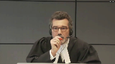
:::

C'est ce qui est clair et ce qui ressort de cette clause-là, et ce qui distingue notamment le choix fait par le législateur français à l'article, je crois, 1170, qui a suivi la réforme de 2016.

Donc, ma prétention, monsieur le juge, c'est que, justement, c'est une indication que, loin de créer un vide juridique, le législateur québécois a choisi dans les contrats de gré à gré de laisser le champ libre sous réserve d'autres limites express visant les clauses limitatives de responsabilité, sur lesquelles maintenant j'aimerais attirer votre attention brièvement à la page 16 de l'onglet 5.

Donc, à l'article 1474, le législateur s'est préoccupé de façon explicite des clauses exclusives et limitatives de responsabilité et il a fait un choix très spécifique.

Il ne les permet, comme on le verra du deuxième alinéa de 1474, en aucun cas eu égard aux préjudices corporels ou morales, mais lorsqu'on parle de préjudice matériel, il les permet mais seulement dans le cas de faute simple, c'est-à-dire qu'une faute intentionnelle ou une faute lourde pourra mener à l'annulation d'une telle clause.

Donc on voit un article qui est spécifiquement concentré sur les clauses limitatives et qui les permet, ou au moins ne les interdit pas, dans le cas d'une faute simple.

Et ceci est confirmé par l'article 1475 parce que ma prétention c'est qu'il faut lire ces trois articles-là, 74, 75, 76, ensemble, parce qu'à 1475 on lit un avis qu'il soit ou non affiché stipulant l'exclusion ou la limitation de l'obligation de réparer le préjudice résultant d'une exécution d'une obligation contractuelle n'a d'effet à l'égard du créancé que si la partie qui invoque l'avis prouve que l'autre en a pris connaissance.

Cet article-là n'a aucun sens à moins qu'au moins certaines clauses limitatives et exclusives ne soient permises.

Et découlant de la logique de 1474, il faut que ce soit celle qui ne découle que d'une faute simple au égard au dommage matériel.

Même chose, même logique pour l'article 1476 qui dit à l'égard des tiers qu'on ne peut exclure ou limiter sa responsabilité, ce qui, à contrario, dit qu'on devrait pouvoir au moins la limiter dans certains cas lorsqu'on parle de parties contractantes.

Enfin, si vous allez à la page suivante, page 17, 1613 et 1623, un autre article qui indique le législateur s'est penché sur la question et ne voulait pas interdire des clauses limitatives de dommage.

En matière contractuelle, se lit l'article, le débiteur n'ait tenu que des dommages intérêts qui ont été prévus, ce qui, notamment, pourrait certainement inclure une clause limitative et qu'on a pu prévoir au moment où la libération a été contractée, lorsque ce n'est point par sa faute intentionnelle ou par sa faute lourde, ce qui correspond évidemment à la logique de 1474 et en porte, à contrario, qu'on puisse les prévoir lorsqu'il s'agit d'une faute simple.

Et enfin, cette même page, 1623, la clause que vous connaissez bien, ou l'article, pardon, que vous connaissez bien, qui permet les clauses pénales, mais qui permet aussi à la Cour d'en réduire les montants dans certaines circonstances, il n'y a aucun pouvoir correspondant qui permettrait à un tribunal d'intervenir pour aménager différemment une clause exclusive ou une clause limitative dans la mesure où elle touche les dommages matériels.

Et je dis, soit dit en passant, pour revenir au passage du juge Dixon, on se demande quel problème tentons-nous de régler?

Est-ce qu'il y a quelque chose qui viole la morale contractuelle ou l'ordre public lorsqu'un dommage matériel découlera d'une faute simple, d'une simple négligence?

La réponse à cette question, je vous le soumets respectueusement, c'est clairement non.

Et d'ailleurs, les auteurs Beaudoin, si vous allez à l'onglet 7, Beaudoin des lauriers, je vais simplement donner la référence, mais vous verrez à l'onglet 7 un des extraits des auteurs et avec Égard, il n'y a pas vraiment de désaccord là-dessus.

On y lira par exemple et dit, il est en effet socialement concevable

qu'on puisse se prémunir contre les simples erreurs de jugement ou de conduite, mais non contre les conséquences d'un acte volontaire.

C'est donc, il n'y a absolument rien dit de morale qui viole l'ordre public de vouloir aménager des conséquences sur des dommages matériels seulement, résultant d'une faute simple.

Et c'est exactement ce que les clauses limitatives ont comme objectif pour qu'entre débiteurs et créanciers, on partage les risques et on puisse, comme le remarquait le professeur Wadhams en parlant de doctrine dans l'affaire Hunter cité par le juge Dickson, vous retrouvez ça à l'onglet 2 à la page 4, il n'y a rien d'exorbitant qu'on veuille aménager les risques dans un contrat de gré à gré où les parties sont de force égale.

Je note également, avant de terminer sur l'économie du Code, et on en traite au paragraphe 35 et note 49 d'honnête mémoire, que dans le Code, le législateur s'est aussi préoccupé de plusieurs contrats nommés où il a interdit ou balisé, dans des circonstances spécifiques, l'utilisation des clauses limitatives ou exclusives, par exemple, eu égard à la vente, l'article 1723, ou le logement, à l'article 1900, ou le contrat de travail, le contrat de transport, l'hébergement.

Donc, dans des cas spécifiques, et on peut voir généralement que lorsqu'une partie est susceptible d'être plus faible, que le législateur est intervenu, mais il ne l'a pas fait de façon générale dans les contrats innommés de gré à gré.

Et enfin, notons également ce dont on traite au paragraphe 44 et 71 de notre mémoire, que le législateur a refusé d'étendre la lésion entre majeurs non protégés, sauf dans trois cas spécifiques qui ne nous occupent pas, à l'article 14.6 et 14.7.

Le législateur a refusé, malgré une autre recommandation, d'étendre la lésion qui, dans le fond, vise une erreur sur l'équilibre général du contrat, des prestations respectives, de l'étendre à tous les contrats de gré à gré.

Or, en bout de dingue, la théorie qui est mise devant vous du manque de l'obligation essentielle, comme plusieurs auteurs le notent, s'apparente étrangement justement à une sanction qui viserait la lésion, puisqu'on veut sanctionner un déséquilibre qui existerait entre les prestations respectives.

Alors, je conclue sur la question simple de l'économie du code.

Qu'il n'y a absolument rien, absolument rien dans le code qui indiquerait, au contraire, que le législateur n'ait voulu qu'une chose, c'est-à-dire de laisser le champ libre aux parties contractantes dans les contrats de gré à gré.

Et pour vos notes, je me réfère sur cette logique-là, à votre décision dans Churchill Falls.

Malheureusement, j'ai omis de mettre ce passage-là dans mon recueil contentiel.

Mais au paragraphe 102, vous écriviez, en vous fondant sur les auteurs Luell et Moore, « Les choix faits par le législateur lors de la refonte font en sorte qu'en droit civil québécois des contrats, si le consensualisme est tempéré, c'est le plus souvent sous la forme d'exceptions et de règles spécifiques.

» C'est exactement ce que nous avons vu.

Et en dehors de ces règles-là, le champ devrait rester libre, même logique dans l'affaire uniprix.

**Justice Kasirer** (00:22:55): vous allez traiter maître Pratt, excusez-moi je vous coupe encore, le fondement possible de la théorie et la cause de l'obligation, l'article 1371, que ceci, la Cour d'appel le souligne à son paragraphe 39, la notion d'absence totale de cause de l'obligation sert à fonder la théorie de l'obligation, du manquement de l'obligation essentielle et que ceci pourrait expliquer ce fondement pour une règle d'application générale, l'absence de règle particulière ou même de précision particulière pour des contrats de gré à gré.

::: {.column-margin}
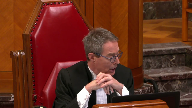
:::

**Speaker 2** (00:23:46): J'allais y venir dans à peu près trois minutes, M. le juge.

::: {.column-margin}

:::

Qu'est-ce que ça, si vous me permettez.

Mais ma réponse courte, c'est qu'il n'y a absolument rien dans les travaux préparatoires qui indiquerait que les législateurs voulaient donner à la cause prévue à l'article 1371 du cause de l'obligation, une vocation qui permettrait une règle prétorienne de réaménager les contrats qui ont été librement consentis.

Et je vais vous montrer quelques passages d'auteurs qui critiquent vivement cette théorie-là.

C'est un peu faire de la grenouille qui veut se faire aussi grosse que le bœuf.

La cause n'a qu'une utilité importante, mais quand même minimale, et qui n'est que de viser ou s'assurer qu'il y a une contrepartie à la prestation et non pas d'en mesurer l'équivalence.

Parce que si on donne à la cause la mission d'assurer l'équivalence des prestations, on contredit la volonté du législateur de ne pas permettre la lésion.

Donc, je conclue sur le code et je vous demande de songer à la question suivante.

Comment peut-on expliquer que le législateur aurait oublié ou négligé d'interdire les causes si elles ont vraiment à l'encontre de la moralité contractuelle, de la bonne foi ou de l'équité, comme le prétend l'intimé au paragraphe 87 de son mémoire?

**Justice Côté** (00:25:16): pour vous qui découle de votre réponse à monsieur le juge Casirard

::: {.column-margin}

:::

, est-ce que quand vous parlez du fait qu'on ne doit pas reconnaître l'existence de cette théorie dans le cadre des contrats gris à gris pour des fautes simples, est-ce que vous faites une distinction entre un contrat qui prévoit une obligation de moyen et puis un contrat qui prévoit une obligation de résultat?

**Speaker 2** (00:25:42): En bout de ligne, non, mais avec les nuances suivantes, madame la juge Côté, une obligation de résultat pourrait, dans la mesure où on veut sanctionner cette théorie-là, donc on se met dans ce champ-là, évidemment que je n'accepte pas, mais je dois concéder que si on a une obligation de résultat, elle pourrait contribuer à l'identification d'une obligation essentielle.

::: {.column-margin}

:::

Elle pourrait attester et aider le tribunal à identifier cette obligation-là.

En revanche, une obligation de moyen, comme on en a une dans le cas qui nous occupe, pourrait indiquer justement qu'on est en présence d'un contrat plus complexe où les parties reconnaissent qu'il puisse y avoir des manquements qui seront peut-être aménagés par un partage de risques dont, par exemple, le prix du contrat tiendra compte.

Et ça, c'est un reproche que nous faisons à la jurisprudence en général, que la jurisprudence française maintenant aura connu, mais dont la Cour d'appel n'a pas du tout tenu compte.

Lorsque, comme le professeur Wadams l'a reconnaissé dans le passage que je vous signale, si on est dans un contrat de gré à gré, avec des parties qu'on présume à forces égales, on ne parle que d'une faute simple, il n'y a absolument rien d'illogique de croire, comme le professeur Wadams l'a dit de façon explicite, qu'en échange de la clause limitative, on ait pu obtenir un prix avantageux.

Or, une des failles extrêmement importantes de la théorie, comme elle a été appliquée en l'espèce, mais plus généralement, c'est qu'on annule une clause qui pourrait avoir des échos dans d'autres parties du contrat sans jamais examiner si justement cet ensemble qu'on est en train de réaménager à posteriori aurait été un contrat que le débuteur aurait signé.

Alors, je passe maintenant à la deuxième partie de mon propos qui est justement d'examiner les assises prétendues doctrinales et jurisprudentielles de cette théorie-là.

Et je dis peut-être en faisant une image un peu grossière que si l'économie du code n'est pas en soi un feu rouge au développement d'une règle prétendue, c'est au moins un feu jaune.

Et c'est pour ça, je vous le soumets respectuellement, qu'il est important à ce moment-là d'examiner la doctrine.

Et pour ce faire, je vous invite à consulter premièrement l'onglet 8 de notre recueil condensé.

Nous avons regroupé toutes les parties de la doctrine auxquelles les parties et la Cour d'appel font référence et vous verrez, je n'ai pas l'intention de passer à travers tout ça, mais je vais au moins vous indiquer ce qu'on peut, comment tirer l'enseignement que je vous soumets.

Les passages en jaune sont ceux qui sont repris dans le jugement de la Cour d'appel.

Les autres passages sont des passages qui ne sont pas cités de la Cour d'appel.

Et ceux qui sont en caractère gras, des fois ils sont dans le jugement de la Cour d'appel, mais des fois non.

Et je vous soumets respectuellement que cette doctrine-là justement apporte des nuances extrêmement importantes quant à la validité ou à l'acceptation de la théorie en droit québécois.

Et en passant, on nous reproche chez les intimés d'appeler ça la théorie plutôt qu'une règle avec un R majuscule.

Je vous soumets respectueusement que ce n'est pas en affiblant le mot règle d'un R majuscule qu'on crée de la jurisprudence.

Et la Cour d'appel elle-même réfère à cette doctrine-là comme étant une théorie au paragraphe 2 de son jugement.

Elle l'appelle souvent parfois par doctrine, concept, etc.

Cela étant dit, si vous regardez à la page 45 de l'onglet, donc la première page, vous voyez le passage en caractère gras qui n'est pas inclus dans le jugement de la Cour d'appel.

Si la théorie de l'obligation essentielle finissait par s'implanter dans notre droit positif, ça s'est tiré de l'ULMO1, ce qui n'est pas encore le cas.

Elle s'imposerait comme un instrument autonome de neutralisation des clauses de limitation.

Elle réduirait en fin de compte l'utilité de l'article 1474 au seul cas du préjudice matériel résultant d'une violation d'une obligation secondaire.

Et en passant, M. le juge Cassirer, pour revenir à votre propos sur la cause, si la cause avait pour mission aussi importante de permettre l'annulation de clauses limitatives, c'est encore plus vrai dans le cas de faute intentionnelle et on se demande quelle serait l'opportunité à ce moment-là des articles 1474 à 1476, voire même de l'article 1437.

Je continue si vous tournez la page 46.

Les auteurs Llewell et Moore, vous verrez au paragraphe 2979-2980, expriment plusieurs réserves, je vous ferais grâce de toutes les lire, mais regardons par exemple ce qu'ils disent dans la deuxième partie de la page en caractère gras.

Vous verrez qu'il y a un passage en jaune qui parle de justice commutative et de responsabilité des obligations qui est repris par la Cour d'appel, mais ce qui n'est pas dans le jugement de la Cour d'appel, c'est le passage suivant.

Mais à notre avis, cette idée n'aurait de pertinence que dans l'hypothèse où la clause dénierait tout recours aux créanciers victimes d'une exécution en écartant de la convention l'obligation essentielle elle-même, on pourrait alors dire sans embâche que la clause anéantit la clause de l'obligation corrélative.

Tel n'est pas le cas cependant dans notre problématique, y inclut la nôtre, puisque la clause, loin d'exclure une obligation essentielle, se contente de jouer au niveau des sanctions et novices en fait de sanctions que l'octroi de Dommage 2981, à notre avis lorsque le contrat n'est ni d'adhésion ni de consommation, autrement l'article 1437 pourrait le cas échéant neutraliser la clause en l'absence même de fautes lourdes intentionnelles, l'article 1474-1 devrait continuer à s'appliquer quelle que soit la nature de l'obligation en cause.

J'ai pas le temps de faire toute la lecture, mais si vous allez à la page 49, vous verrez que le juge Beaudoin à l'époque, au paragraphe 871, parle d'un développement audacieux d'une nouvelle tendance jurisprudentielle et que le juge Beaudoin a été vivement critiqué en France.

**Justice Kasirer** (00:32:38): Monsieur le Prat, juste pour comprendre, parce que c'est si bien fait ce que vous avez fait ici, mais de faire préciser, par exemple, dans le cas des professeurs Lueul et le juge Moore, qu'on semble laisser une place, selon la théorie, à l'annulation d'une clause de non-recours ou d'une clause de non-engagement, une clause limitée à l'engagement, je pense à notre jugement d'un iconologue, notre arrêt, mais c'est le cas particulier des causes exonératoires et limitatives de responsabilité qui causent des ennuis.

::: {.column-margin}
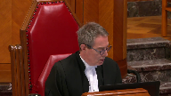
:::

Est-ce qu'il y a lieu de tirer une distinction entre ces types de clauses-là selon leurs finalités respectives, les clauses exonératoires et limitatives de responsabilité visant l'exécution du contrat, tandis que les autres vont plus droit à l'existence même de la cause potentiellement?

**Speaker 2** (00:33:47): Je comprends bien votre question, M. le juge Cassirer.

::: {.column-margin}

:::

Je crois que tout le monde s'entend qu'une clause qui est libellée parfois par les auteurs, une clause de non-obligation, ne peut être valide parce que ça devient une clause purement protestative.

C'est une clause où on prétend s'obliger et ne pas s'obliger d'autre part.

Mais ce que les auteurs, notamment Louis L. Moore et d'autres comme les Frères Mazo par exemple, c'est qu'une clause limitative ne joue que sur un terrain qui n'a rien à voir avec l'existence de l'obligation en tant que telle, mais qui ne fait qu'aménager certaines de ses conséquences dans un champ très limité puisqu'il faut respecter les limites prévues à l'article 1474.

**Justice Kasirer** (00:34:34): très utile ce que vous dites.

::: {.column-margin}
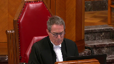
:::

Une distinction donc qui vise d'une part des clauses touchant à l'existence de l'obligation et d'autre part des clauses visant l'exécution du contrat.

Est-ce que cette distinction pourrait peut-être nous aider dans le dossier qui nous concerne?

**Speaker 2** (00:34:55): Seulement

::: {.column-margin}
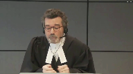
:::

, dans le sens où il est manifeste et maître Uchiha va en traiter, que la clause dont on parle n'est pas une clause de non-obligation, mais plutôt une clause qui vise les conséquences de l'exécution.

Et c'est tellement vrai, et je n'aurais pas le temps de vous lire tout ce que j'aurais aimé vous lire, mais il y a un article récemment paru, qui vous aurez à l'onglet 6, par M. Etienne Cossette-Lefèvre, qui fait une analyse de l'affaire Prèlesco, mais ce qui est d'encore plus intéressant, c'est qu'il fait une analyse absolument détaillée de tous les mobiles d'intervention, des théories avancées, faute lourde, la cause, et aussi de l'approche française.

Et il démontre justement qu'il y a une distinction à faire entre une clause de non-obligation et une qui ne fait qu'aménager les conséquences d'une inexécution, et qui, par ailleurs, prouve que l'obligation subsiste, parce que en l'espèce, l'exception d'une exécution aurait pu s'appliquer, on aurait pu rechercher une exécution en nature, et en fait, en pratique, on a obtenu une exécution par équivalent par un tiers.

Donc, ce qui ne pourrait être possible que si l'obligation subsistait, et la clause ne faisait aucunement obstacle à cette solution-là.

Et je rencherie, M. Bruce, que lorsqu'on parle d'une faute qui pourrait, pardon, d'une obligation potestative qui dépendrait seulement de la volonté du débiteur, ça ne peut s'appliquer dans un cas de négligence simple, parce que si le débiteur voulait vraiment ne pas donner suite à son obligation, ce serait carrément une faute intentionnelle, voire une faute lourde, et la clause imitative ne pourrait pas l'aider, eu égard à l'article 1474.

Donc, une des choses que je veux que je vous soumets respectueusement, vous devez vraiment tenir à l'esprit et toujours garder à l'esprit, c'est qu'on est dans un champ non seulement de contrats de gré à gré, mais de circonstances d'applications extrêmement limitées.

Et sur votre, maintenant, nous avons fait un tableau un peu semblable, eu égard à la jurisprudence, et évidemment, je tiens compte, M. le juge Cassirer, de vos réserves sur la jurisprudence, mais il est encore, de façon générale, important de…

**Justice Kasirer** (00:37:19): placé d'avoir des réserves sur la jurisprudence et un faible pour les professeurs d'université étant donné mes petites fonctions actuelles

, ne vous en faites pas.

J'ai une affection toute particulière pour la jurisprudence.

**Speaker 2** (00:37:37): J'ai une affection pour les deux, sauf que dans ce cas-ci, M. le juge, ni l'une ni l'autre n'est de l'intimé selon nous.

::: {.column-margin}
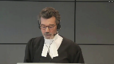
:::

Donc, nous avons préparé un tableau et je veux tenter de vous l'expliquer.

Ce que nous avons fait, c'est que nous avons repris toute la jurisprudence citée par la Cour d'appel, par les intimés aussi, à l'appui de cette théorie.

Et je concède d'emblée que la théorie, ou manquement d'obligations essentielles, est mentionnée.

Mais vous ne retrouverez jamais dans cette jurisprudence-là, dans aucun des arrêts, soit une discussion, sauf un, de la jurisprudence française, dans l'affaire Ace, en ordre de bas de page, on mentionne Chronopost, qui est en fait beaucoup peu évolué, mais il n'y a aucune analyse de l'économie du Code en général.

Dans aucun de ces arrêts-là.

Et non seulement ça, vous aurez vu que dans notre mémoire, au paragraphe 49, note 89, et au paragraphe 55, note 106, nous avons fait une analyse assez exhaustive de toute la jurisprudence, même celle qui aurait tendance à appuyer la thèse de l'intimé.

Et on a démontré que cette jurisprudence-là, en fait, dépendait, lorsqu'on regardait les décisions ultimes, d'autres motifs, comme la faute lourde ou la faute intentionnelle.

C'est le cas de l'affaire Salmon, par exemple.

Et je note que dans leur mémoire, les intimés n'ont aucunement critiqué notre analyse à ces notes-là.

Et d'ailleurs, dans leur propre mémoire, au paragraphe 4, par exemple, ils citent une affaire Western Alliance, que vous verrez à la page 58.

Western Alliance, à la page 57, on tire les extraits du jugement de la Cour d'appel.

Mais à la page 58, pendant le bas de la page, vous verrez qu'on n'a aucunement mentionné dans le mémoire des intimés.

Mais la Cour suprême a confirmé le jugement de la Cour d'appel qui parlait des obligations essentielles, mais est arrivée à sa conclusion seulement sur une question d'interprétation de la cause, de la clause en question.

Et, vous verrez en caractère gras, a dit qu'elle ne souscrivait pas justement plusieurs des motifs invoqués par la Cour d'appel.

Les intimés aussi font référence, vous verrez à la page 66, à l'affaire Mediterranean Shipping.

Ça, c'est la page 66 en caractère gras, dans le haut de la page, mais c'est une affaire de common law.

Et aussi aux affaires Torrance et Harris, que nous avons aux pages 80 et 81, qui sont de mémoire des affaires qui datent de 1860 et 1862, avant l'affaire Glen Goyle, où la Cour suprême, en 1897, a confirmé la validité des clauses limitatives.

**Justice Wagner** (00:40:47): Maitre Pratt, si je peux me permettre, en parlant de common law et je comprends que je pense qu'il est bien établi maintenant que notre droit civil peut s'interpréter et survivre à même la doctrine et notre jurisprudence.

::: {.column-margin}
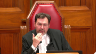
:::

Maintenant, qu'est-ce qu'on peut déduire du fait que, dans la common law, on a mis de côté l'équivalent, le « fundamental breach », il y a déjà quelques années?

Est-ce qu'on peut tirer quelque chose de ça?

**Speaker 2** (00:41:17): Oui, monsieur le juge, joigne-moi à l'idée, évidemment, d'importer sans embâche, sans nuance, une théorie de la common law, mais comme tous les auteurs le concèdent, il semble clair que la théorie du manquement de l'obligation essentielle, et même j'entends les auteurs français remarquent que cette théorie-là un peu descend ou tire certains enseignements de la théorie anglaise.

::: {.column-margin}
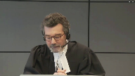
:::

Comme vous le dites, en Angleterre, dans l'affaire Photo-Ops, on a mis au rencard ces théories-là, et dans votre cours dans l'affaire Turcon, on lui a donné le coup de grâce que voulait que lui soit donné par le juge Dickson dans l'affaire Hunter.

Et l'enseignement dont vous devriez tenir compte, Solomon, est le suivant, parce que, est le suivant.

Si on est pour créer une règle prétorienne, encore faut-il se demander quels problèmes on entend régler comme le suggérait le juge Dickson.

Et dans un cas de gré à gré, où il n'y a aucune inégalité entre les parties, et où tout ce qu'on fait c'est aménager une clause résultant de dommages causés par une faute simple qui n'est pas contre l'ordre public, comment justifier une intervention?

Quelle est l'injustice qu'on tente de corriger?

Est-ce qu'on ne devrait pas simplement concéder que les parties ont décidé d'aménager entre elles les risques et qu'une des parties, à l'espèce le créancier, a décidé d'accepter les risques, par exemple pour perte de profits, possiblement en échange d'un prêt, d'un prix avantageux?

Et au minimum, si vous deviez sanctionner ou approuver, avaliser une intervention prétorienne, est-ce que le tribunal ne devrait pas au moins, comme on le ferait en common law, comme vous l'avez fait par exemple dans l'affaire Uber, exiger une preuve d'abus, de mauvaise foi, d'inégalité entre les parties, et une évaluation de la cohérence du contrat avant d'à posteriori réécrire le contrat que les parties avaient fait cinq ans ou dix ans auparavant, sans jamais examiner s'il y a une explication pour cette clause-là qui pourrait être parfaitement légitime?

Donc, l'enseignement qu'on doit tirer, monsieur le juge, c'est qu'il deviendrait très étrange que le législateur québécois, n'ayant pas prévu aucune autorité législative précise pour justifier l'intervention de la Cour, les faits ne divulguant ou ne dévoilant aucun abus de pouvoir, aucune mauvaise foi, en droit civil, dans des circonstances identiques d'un contrat commercial, le contrat survivrait et la clause survivrait en common law dans le même contexte, mais il serait annulé par une règle prétorienne qui serait en contradiction avec la règle prétorienne prévue après Tercon.

La logique à ce moment-là, si le Code permettait l'intervention, ce serait une chose, mais en l'espèce, on l'a vu, c'est le contraire.

Le législateur a voulu sciemment baliser un champ libre dans les contrats de gré à gré.

Si on est pour créer, que ce soit en fonction de la cause ou autrement, un pouvoir prétorien, encore faudrait-il que lui-même soit balisé pour tenir compte des vrais problèmes qu'on prétend vouloir régler et personne n'identifie qu'il était ce problème-là.

**Justice Côté** (00:44:54): Si on regarde le tableau que vous avez reproduit au paragraphe 9 de votre quai condensé, évidemment je n'ai pas eu le temps de le lire au complet, mais il me semble que quand je regarde toute cette jurisprudence-là, il n'y a pas d'abus qui semblent se manifester dans le cadre de contrats de grille à grille.

::: {.column-margin}

:::

Lorsque je regarde par exemple les raisons pour lesquelles les cours ont refusé d'appliquer les clauses, souvent c'était dans les cas de faute lourde, faute intentionnelle, comme c'est déjà prévu au cas de civils.

**Speaker 2** (00:45:23): Absolument

::: {.column-margin}
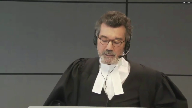
:::

Madame la juge, c'est une affaire Samen par exemple, c'est pour ça qu'on dit que les intimés ont tort de prétendre qu'il y a plusieurs cas, hormis les cas de faute lourde ou de 14-37.

L'immense majorité des cas s'expliquent par des cas de faute intentionnelle.

Permettez-moi de conclure dans les 30 dernières secondes qui me restent.

En vous amenant à un passage de l'article que j'ai mentionné tantôt, à la page 26, c'est à l'onglet 6, qui fait en fait, je pourrais signer, j'aurais pu vous dire, lisez l'article, je n'ai rien à vous dire aujourd'hui.

Parce qu'il fait le tour de la jurisprudence et critique les fondements de la théorie et c'est au paragraphe 41, la page 26.

Je termine là-dessus.

L'auteur dit, après avoir fait son analyse, à mon avis, la théorie de l'obligation essentielle, définie comme une théorie de droit commun susceptible de s'étendre à tous les types de contrats, même librement négociés, et qui permet aux juges, sur le fondement de la cause, d'annuler une clause exonératoire ou limitative de responsabilité en cas de manquement d'une obligation essentielle du contrat, peut-être rejetée en droit civil, puisque sous couvert de la justice contractuelle, la théorie manque en réalité de justification solide.

La théorie de l'obligation essentielle est aussi et surtout contraire à la lettre et à l'esprit et à l'économie générale du Code civil.

Il ne s'agit ni plus du moins d'une invitation faite aux juges de contrôler le caractère abusif des clauses exonératoires ou limitatives de responsabilité, au-delà du domaine limité des contrats de consommation et d'adhésion.

Or, la règle du Code civil du Québec sur les clauses abusives s'applique uniquement aux contrats de consommation et d'adhésion. Merci.

**Speaker 1** (00:47:26): Bonjour

::: {.column-margin}

:::

Monsieur le juge en chef, mesdames et messieurs les juges, comme le dit mon collègue, je vais vous présenter l'argument subsidiaire de notre cliente, soit qu'advenant que la théorie doit être reconnue en droit civil, on vous soumet respectueusement que les conditions d'application ne sont pas rencontrées dans la présente affaire.

En effet, avec égard, on vous soumet que les juridictions inférieures ont commis une erreur de droit isolable en concluant qu'il suffisait, qu'il y ait un manquement d'obligations jugées essentielles pour rendre inopérante une clause de limitation de responsabilité comme celle en cause.

À notre avis, ce n'est pas suffisant qu'il y ait un manquement.

J'y reviendrai.

J'entends dans ma courte présentation vous faire un rappel rapide des conclusions factuelles du juge de première instance qu'on ne met pas en cause, mais qui nous semble importantes dans la question de savoir si la théorie doit s'appliquer ou non ici.

Par la suite, je vais revisiter rapidement la décision de la Cour supérieure et de la Cour d'appel quant à l'application de la théorie et les conditions d'application qui s'appliquent en l'espèce.

Puis, je vais vous dire un petit mot rapide sur la demande de l'intimé quant aux frais de justice et aux dépenses.

**Justice Wagner** (00:48:39): Dans ce contexte-là, M. Richer, dans l'éventualité où l'appel serait accueilli, vous allez également nous donner le portrait de ce que seraient normalement les montants payables de part et d'autre.

**Speaker 1** (00:48:54): Oui, je pourrais regarder le tout.

**Justice Kasirer** (00:48:58): Maitre Richer, juste avant de vous laisser la parole, vous allez donc, si je comprends bien, nous présenter un argument qu'il y a une erreur de droit ici et non pas une erreur manifeste et déterminante dans l'application.

::: {.column-margin}

:::

Donc, c'est-à-dire, tenant pour acquis aux fins de la discussion que la théorie s'applique, que le type d'erreur commise par la Cour d'appel dans l'application de la théorie est une erreur de droit, est-ce que c'est votre point?

**Speaker 1** (00:49:31): Exact.

::: {.column-margin}
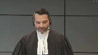
:::

Je pourrais vous soumettre à la fin qu'il y a également une erreur manifeste déterminante, mais on considère qu'il y a une erreur de droit parce que dans les faits, tant la Cour supérieure que la Cour d'appel a omis une condition d'application de la théorie du manquement d'obligations essentielles et donc n'a pas appliqué le bon critère juridique ou la bonne norme juridique.

Donc si je vais rapidement sur les conclusions factuelles du juge qui nous semblent pertinentes et importantes de rappeler, d'abord le contrat P3, c'est un contrat de service tant matériel et pas à forfait.

Créatech avait une obligation de fournir des ressources compétentes disponibles pour conseiller et accompagner PRELCO dans l'implantation du logiciel en question.

C'est un contrat, comme mon collègue l'a rappelé, qui est négocié et je vous réfère sans y aller aujourd'hui par manque de temps, notamment au pages 2 de 8 et 8 de 8 du contrat P3 où on voit expressément que les parties ont discuté notamment de réduction de prix et d'un partage de risques.

C'est à son importance.

Au terme du contrat, Créatech avait une obligation de moyen et non une obligation de résultat.

Ça c'est assez clair du jugement en première instance.

Vous verrez de ce contrat-là également que PRELCO client dans le projet a trois fois plus d'heures à investir que Créatech comme fournisseur de services.

C'est vraiment une collaboration et donc la performance ou la résultante du projet dépend beaucoup plus de la performance de PRELCO en temps que celle de Créatech.

Vous verrez aussi au terme de ce contrat-là que les responsabilités du client sont beaucoup plus importantes en nombre que celle du fournisseur de services.

Ils avaient au terme du contrat une gestion partagée du projet mais PRELCO avait la responsabilité de faire les développements, ce qu'on appelle les personnalisations.

Elle avait également la responsabilité principale des tests fonctionnels, des tests intégrés.

Elle avait également la responsabilité de la conversion des données d'un système à l'autre, la formation des utilisateurs finaux, donc les gens qui vont utiliser en bout de piste le logiciel et même chose pour la responsabilité, ce qu'on appelle le plan de démarrage, donc le plan visant à s'assurer par exemple que toutes les commandes en cours de production sont scannées à bonne étape de production avant de mettre le nouveau service en service.

Donc des responsabilités très étendues pour le client dans ce contrat-là.

La clause 7, comme mon collègue l'a rappelé, c'est une clause de limitation de responsabilité et non une clause d'exclusion comme l'intimé le suggère.

Et finalement, quant au rappel des constatations factuelles, une d'importance, puis ça c'est au paragraphe 33 du jugement qu'on le voit et à d'autres endroits, mais principalement au paragraphe 33, le système en bout de piste fonctionne, il est utilisé par PRELCO et il comporte la grande majorité des fonctionnalités qui sont prévues au contrat.

Et ça c'est une conclusion très claire du jugement.

Donc à la lumière de ces faits-là, si on regarde maintenant les conditions d'application de la théorie qu'on peut décider, si je peux m'exprimer ici, de la doctrine et de la jurisprudence tant en France qu'au Québec, il est clair à notre avis que le 5 constat qu'il y a un manquement d'une obligation essentielle n'est pas suffisant.

Il faut au surplus, puis là si on prend le vocabulaire en France, que la clause vide l'obligation essentielle de sa substance, ou si on regarde en doctrine québécoise qu'elle paralyse l'obligation essentielle ou qu'elle prive le contrat de ses effets essentiels.

En France, je vous réfère notamment à l'affaire Forestia 2 de la Cour de constatation, c'est à l'onglet 15 du recueil condensé.

La Cour indique qu'une clause de limitation de responsabilité n'aura pas cet effet-là si elle ne prévoit pas un plafond qui est dérisoire, puis si elle n'est pas injustifiée à la lumière de l'économie générale du contrat.

Dans cette affaire-là, la Cour de constatation a jugé qu'une clause de limitation de responsabilité qui prévoyait un plafond d'indemnisation équivalent au prix payé n'était pas dérisoire et donc ne vide pas l'obligation essentielle de sa substance.

C'est une décision intéressante parce qu'elle comporte des faits assez similaires aux nôtres.

En doctrine, au Québec, je vous réfère rapidement à notamment Beaudoin, Jobin et Vizina, l'onglet 17, qui traite de cette deuxième condition-là.

Donc, il faut un manquement de l'obligation essentielle, mais il faut aussi que la clause ait pour effet, et là le vocabulaire utilisé est « paralyser l'obligation essentielle ou priver le contrat de son effet essentiel ».

Même chose du côté de Vizina et Langevin, à l'onglet 18 de notre accueil de condensé, où on dit qu'il faut que la clause prive le contrat de ses effets essentiels.

Si vous regardez à la lumière de ces conditions d'application-là, les deux décisions, celle de la Cour supérieure et celle de la Cour d'appel, vous allez voir qu'on fait abstraction de la deuxième condition, si je peux m'exprimer ainsi.

La Cour supérieure, puis là je suis au paragraphe 210 à 226 de la décision, le juge de première instance élabore pas sur les conditions de l'ouverture de la théorie, il fait simplement conclure qui a un manquement à une obligation essentielle, et que de ce fait-là, la clause doit être écartée.

Il ne se pose pas de questions et analyse pas l'effet de la clause comme telle.

Quant à la Cour d'appel, paragraphe 45, elle semble poser la bonne question, elle dit, puis là je le cite, la question est donc celle de savoir si la clause d'exonération, bon avec Égard, nous on vous soumet que c'est une clause de limitation de responsabilité, et je reprends « vide le contrat de son effet essentiel ou paralyse l'obligation essentielle ».

Mais dans la section qui suit, puis c'est assez court le jugement de la Cour d'appel sur l'argument subsidiaire, mais dans la section qui suit, elle ne fait que résumer essentiellement le jugement de première instance, puis elle analyse pas dans les faits l'effet de la clause de limitation de responsabilité.

Or, dans le cas qui nous occupe, la clause elle ne prive pas près du coût de tout recours, puis elle prévoit un plafond d'analyse qui est loin d'être dérisoire, soit l'équivalent du prix payé.

Dans le cas qui nous occupe, on parle de 1,7 million au jour du procès, aujourd'hui ils ont payé jusqu'à 2 millions puisque la demande conventionnelle a été acceptée, accueillie, et donc elle prévoit un plafond d'analyse qui est loin d'être dérisoire.

Prévu qu'au terme de cette clause-là, pouvait réclamer, puis dans les faits a réclamé, notamment les montants payants qu'elle jugeait en trop pour les services qui étaient selon elle inutiles ou inadéquats.

Donc la clause n'empêchait pas cette réclamation-là, ils l'ont fait, ils ont réclamé 1,5 million, sans succès, pas à cause de la clause, mais à cause que le juge n'avait pas cru qu'ils avaient démontré que les services étaient inutiles.

Au terme de cette clause-là, Prèlescourt pouvait également réclamer le coût des travaux correctifs, ce qu'elle a fait également, les coûts qu'elle a payés à un tiers hérisco pour faire des travaux correctifs, des ajustements, des travaux d'optimisation, 79 200.

Elle a réclamé ces frais-là et elle les a obtenus, et je vous soumets avec égard que même si les travaux correctifs avaient dû s'élever à 1,7 million, la clause n'avait pas empêché cette réclamation-là non plus.

Donc c'est faux de dire, comme le prétend l'intimé, qu'il s'agit d'une clause qui exclut totalement la responsabilité de Créatec, puis qui ne permet pas l'exécution en nature ou par équivalent.

De plus, malgré le manquement à l'obligation essentielle, si on reprend, si on n'attaque pas les conclusions du juge à cet égard-là, la clause n'a pas privé le contrat de son effet essentiel, soit la livraison ou la mise en place d'un système qui est fonctionnel.

Et encore une fois, je répète, je vous réfère aux conclusions très claires du juge à cet effet-là au paragraphe 233 sur le fait que le système est utilisé, il est fonctionnel, puis il comporte la grande majorité des fonctionnalités décrites au contrat.

De plus, si on regarde la clause, la clause est loin d'être choquante quand on la regarde à l'égard de l'économie générale du contrat.

Comme je vous le disais tout à l'heure, je vous réfère notamment aux pages du contrat qui traitent de la négociation des parties et des concessions que les parties ont fait lors de cette négociation-là, notamment Créatec quant au prix et au partage de risques.

Donc, avec égard à ce qui choque l'esprit, si je peux reprendre les termes du juge de première instance, ça serait de rendre inapplicable une clause comme celle en cause qui a été valablement convenue entre des parties de force égale en fonction de leur négociation quant au prix et partage de risques, alors qu'au final, Predco a obtenu et utilise un système qui est fonctionnel et qui comporte les fonctionnalités qui avaient été prévues au contrat.

Je reviens en terminant sur l'erreur manifeste et dominante qu'on peut y voir également dans le juge de première instance, parce que le juge de première instance définit l'obligation essentielle comme étant le fait de bien identifier, proposer un logiciel de gestion et une méthode de développement qui soit appropriée à la situation Predco de façon à ce que le système de gestion intégré soit pleinement opérationnel.

Il dit que c'est ça l'obligation essentielle, il dit qu'il y a un manquement à cette obligation essentielle, mais en même temps, comme je vous le disais tout à l'heure, il arrive à la conclusion que le système de gestion est opérationnel et fonctionnel au paragraphe 33.

Donc, pour nous, il y a là aussi une erreur manifeste et déterminante si on ne prenait que la condition d'application que le juge a pris.

En terminant, quant aux frais de justice, on fait valoir respectueusement que la demande de l'intimé n'est pas fondée.

On ne devrait pas déroger de la règle habituelle à l'effet que les dépenses sont adjugées à l'appelant victorieux.

Dans les faits, on vous dit du côté de l'intimé que les instances inférieures n'ont fait qu'appliquer une règle reconnue.

Avec égard, on vous soumet que la théorie n'est pas bien établie en droit québécois et à tout le moins que les conditions d'application ne sont pas clairement définies.

C'est faux de dire que c'est une règle qui était reconnue.

Même si vous arriviez à ce constat-là, ça ne justifie pas, même si vous aviez, avec votre jugement, à modifier l'état du droit, ça ne justifie pas de s'écarpeter de la règle habituelle quant aux frais de justice.

Les décisions qui modifient l'état du droit sont, je pense, assez communes du côté de cette Cour.

Même chose pour les dépenses au niveau de la Cour suprême.

On vous dit que c'est une question nouvelle et qu'elle a une incidence sur des innombrables autres contrats.

Je vous soumets que c'est le genre de questions qui sont généralement soumises et entendues par votre Cour et donc il n'y a pas lieu de déroger de la règle habituelle.

Je vous remercie.

**Justice Wagner** (01:01:15): Il vous reste 15 secondes pour répondre à ma question.

**Speaker 1** (01:01:23): Est-ce que je peux me permettre de vous demander d'y revenir, soit après votre pause ou en réplique?

Ça va me permettre de revoir les conclusions et de vous répondre plus précisément.

Très bien, merci.

**Justice Wagner** (01:01:32): La Cour va prendre sa pause du matin.

15 minutes. Merci.

Merci.

**Speaker 1** (01:02:28): Thank you.

**Justice Wagner** (01:02:48): Merci, soyez-vous.

Maître Cloutier.

**Speaker 3** (01:02:58): Monsieur le juge en chef, mesdames, messieurs les juges, le dossier que vous avez devant vous aujourd'hui soulève l'application d'une question relativement simple qui est la suivante.

::: {.column-margin}
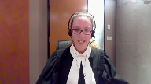
:::

Est-il juridiquement possible en droit québécois de prévoir une clause qui supprime le caractère obligatoire du contrat dans lequel elle se trouve?

Je vous soumets que depuis de nombreuses années, les tribunaux et la doctrine s'entendent pour répondre non à cette question.

D'ailleurs, ils fondent leurs réponses non pas sur une simple théorie abstraite, diffuse ou incertaine, mais bien sur une règle claire et autonome.

**Justice Wagner** (01:03:45): Ce n'est pas ce que le juge Beaudoin semblait dire quand il référait à cette théorie-là comme étant audacieux.

Est-ce que vous n'êtes pas audacieux en disant le contraire?

**Speaker 3** (01:03:58): j'aurais l'occasion d'y revenir, mais je vous soumets que non.

::: {.column-margin}
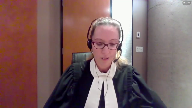
:::

Évidemment, il y a certaines réserves d'émise dans la doctrine pour inviter les tribunaux à utiliser cette règle-là avec discernement, mais il faut faire attention de ne pas tomber dans un piège linguistique, qu'on l'appelle théorie, règle, qu'on utilise le vocable d'obligation essentielle ou d'autres termes pour la définir ne devrait pas nous empêcher d'évaluer sa légitimité.

Il ne faut pas, autrement dit, être prisonnier des termes qui ont été choisis par certains auteurs, mais bien s'en remettre à l'objectif que cette règle-là protège.

Il ne faut pas réduire son examen à la simple signification des termes qui ont été retenus pour la nommer, et c'est tout là que devient important le débat et l'utilisation des bons fondements, finalement, pour l'interpréter.

Je vous soumets et j'utiliserai pour aujourd'hui le vocable de règle parce que je vous soumets qu'il y a un consensus général quant à la légitimité de cette règle-là qui essentiellement empêche toute partie d'exclure sa responsabilité en cas d'un manquement à une obligation essentielle, et c'est dans le but d'assurer le maintien des engagements contractuels.

**Justice Wagner** (01:05:31): Alors, lors de la réforme du Code civil du Québec, certaines parties ont suggéré qu'on devrait même abolir les clauses de limitation de responsabilité ou même, carrément, toutes clauses de non-responsabilité.

::: {.column-margin}
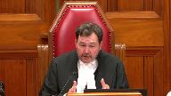
:::

Et le législateur, on le dit souvent dans sa sagesse, toujours prendre le même mot, a décidé que, non, on allait laisser le principe de la liberté de commerce, de la liberté de commerce, effectivement, de négocier des contrats, mais on a décidé de baliser, effectivement, les exceptions, c'est-à-dire dans des cas où, effectivement, il y a des clauses abusives, un abus de droit, où on voulait traiter, effectivement, des situations inéquitables.

Dans le domaine, ici, de l'inéquité, du déraisonnable, le législateur a fait un choix.

Alors, n'est-ce pas dans ce cadre-là qu'on doit regarder si, effectivement, il existe autre chose que ce qui est prévu au Code?

**Speaker 3** (01:06:27): il faut faire attention de ne pas prendre certaines dispositions spécifiques qui ont été effectivement établies pour protéger les partis plus vulnérables.

::: {.column-margin}
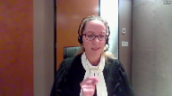
:::

Il ne faut pas les prendre pour les interpréter à contrario en faisant abstraction des fondements mêmes du droit des obligations qui ont eux aussi été codifiées dans le code civil.

**Justice Côté** (01:06:47): M. Cloutier, qu'est-ce qui justifierait, parce qu'on sait que les contrats d'adhésion, les contrats de consommation, évidemment c'est pour protéger des personnes qui ne sont pas à pouvoir égal, mais qu'est-ce qui justifierait de protéger deux commerçants sophistiqués qui ont négocié un contrat?

::: {.column-margin}
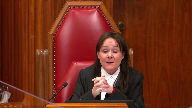
:::

Qu'est-ce qui est dans notre droit des obligations?

Qu'est-ce qui heurte la morale, dans un cas comme ça?

**Speaker 3** (01:07:11): C'est simple, Madame la juste côté, c'est le devoir d'honorer les engagements.

::: {.column-margin}
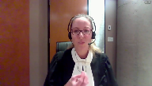
:::

Au moment où les partis ont contracté, il y avait un cœur, un noyau au contrat qu'ils ont convenu, qu'ils ont négocié.

On ne peut pas, par le biais d'une clause de limitation ou d'exclusion, évacuer la totalité de l'essence d'un contrat.

**Justice Côté** (01:07:37): l'objet du contrat

::: {.column-margin}
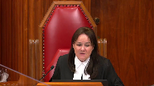
:::

, la cause du contrat n'est pas disparue ici.

Même, c'est un peu, j'essaie de concilier le jugement de première instance qui même partage la responsabilité entre votre cliente et Créatech.

Alors donc, ce partage de responsabilité, à mon avis, c'est une preuve flagrante que la cause du contrat n'est pas disparue.

**Speaker 3** (01:08:01): D'abord, votre question amène deux... je vais diviser ma réponse à votre question en deux.

Il faut faire attention de ne pas penser qu'on ne s'appuie que sur la cause pour justifier la fameuse règle.

**Overlapping speakers** (01:08:18): Thank you.

**Speaker 3** (01:08:19): D'abord, ce qu'on vous dit, c'est que cette règle-là, elle est la consacration d'un ensemble de fondements pour le droit des obligations, dont le devoir d'honorer les engagements, le caractère sinalagmatique des obligations, mais également l'objectif même de la liberté contractuelle, qui implique, à la base, qu'on s'engage à créer un

::: {.column-margin}
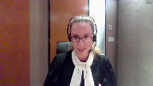
:::

**Justice Côté** (01:08:45): quelque chose.

Maitre Cloutier, le devoir d'honorer les engagements dans un contrat sénatogmatique, ça s'applique des deux côtés.

Alors, Créatech a pris des engagements, puis Prèlesco a pris des engagements, donc de ne pas réclamer certains dommages.

**Speaker 3** (01:09:02): Effectivement,

::: {.column-margin}
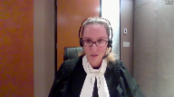
:::

mais ce qui est important, c'est de ne pas non plus évacuer l'essence du contrat.

À la base, PRELCO acceptait de limiter la responsabilité de Créatec et, entre parenthèses, c'est quelque chose qu'on accepte.

Il n'y a pas de problème avec les clauses de limitation de responsabilité.

Elles sont permises dans la mesure où elles ne dénaturent pas le contrat.

Et c'est pour ça qu'on vous dit oui, PRELCO a accepté une clause de limitation de responsabilité dans la mesure où Créatec remplissait l'engagement qui était prévu au contrat.

C'est-à-dire que s'il y avait eu des problématiques, je vais dire mineures, sur des éléments accessoires au contrat, il y aurait eu une limitation applicable.

Ça m'amène à vous faire une rectification par rapport à ce que mes collègues ont plaidé un peu plus tôt.

On n'est pas dans un context où on vous demande de déclarer nulle la clause d'exonération qui est prévue au paragraphe 7 du contrat.

Elle est inopérante dans le contexte actuel parce que Créatec a manqué à son obligation essentielle.

Elle a commis une erreur fondamentale, et non pas une simple faute, mais bien une erreur fondamentale à l'obligation essentielle qui était le cœur du contrat.

Et donc, en appliquant la clause restrictive, on en reviendrait à dénaturer ce contrat-là.

Et la liberté contractuelle, elle va dans les deux sens.

**Justice Côté** (01:10:34): Mme Cloutier, mais ici, le premier juge a décidé que la faute commise par Créatech était une faute simple.

::: {.column-margin}
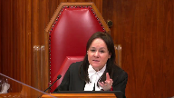
:::

Dans le cas d'une faute lourde, je peux comprendre qu'on peut dire que dans le cas d'une faute lourde, peut-être le contrat est dénaturé, mais dans le cas d'une faute simple, j'ai de la difficulté à accepter le fondement que vous nous donnez.

Le premier juge a conclu que c'était ça, faute simple.

**Speaker 3** (01:10:57): Oui, il y a une faute simple.

::: {.column-margin}

:::

Il qualifie qu'au niveau de l'exécution, 1474 ne peut pas s'appliquer parce qu'il n'y a pas de faute lourde, mais il n'en demeure pas moins que la règle s'applique puisque le manquement de Créatech est sur un aspect fondamental du contrat.

Pour revenir à votre question initiale, je vous avais dit que je vous répondrais en deux temps.

La première portion de ma réponse était qu'on n'utilise pas uniquement la cause comme fondement à la règle, mais bien un amalgame d'ancrages qui sont prévus dans le code.

L'autre portion de votre réponse, vous faisiez référence au partage de responsabilités.

Je vous soumets que ce n'est pas un problème au niveau de l'application de la règle.

Le jugement de première instance est un exemple parfait de ça, c'est-à-dire qu'il y a dans l'exécution d'un contrat la possibilité que les deux parties commettent des fautes et qu'on doit partager leurs responsabilités.

Mais l'application de la clause arrive à un autre niveau, c'est-à-dire qu'on doit d'abord regarder quels sont les manquements.

S'il s'agit d'un manquement à une obligation fondamentale, on va déterminer – je vous soumets que la clause ne peut pas s'appliquer – et sur la base des dommages qui ont été démontrés, on va appliquer 1478 du Code civil, qui nous permet de partager la responsabilité entre les responsables.

Si la clause avait été appliquée par son orateur… Excusez-moi, est-ce que je peux…

**Justice Wagner** (01:12:37): Selon votre raisonnement, donc, on ne peut valider les clauses de limitation de responsabilité dans les cas où il y a un bris d'obligation principale, fondamentale, essentielle, ou utilisez le terme que vous voulez.

::: {.column-margin}
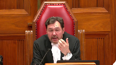
:::

Mais on pourrait donc l'invoquer, le député pourrait l'invoquer dans les cas d'obligation accessoire.

Est-ce que c'est votre prétention?

**Overlapping speakers** (01:12:58): Tout à fait.

Alors ici?

Oui, c'est ça, c'est ça, c'est ça, c'est ça, c'est ça, c'est ça, c'est ça, c'est ça, c'est ça, c'est ça, c'est ça, c'est ça, c'est ça, c'est ça, c'est ça, c'est ça, c'est ça, c'est ça, c'est ça, c'est ça, c'est ça, c'est ça, c'est ça, c'est ça, c'est ça, c'est ça, c'est ça, c'est ça, c'est ça, c'est ça, c'est ça, c'est ça, c'est ça, c'est ça,

**Justice Wagner** (01:13:00): Très bien.

Alors ici, vous plaidez que le premier juge a eu raison de considérer qu'il y avait eu un bris de l'obligation principale ou essentielle.

Quel est, dans ce dossier-ci, l'obligation, s'il y en a, accessoire?

**Speaker 3** (01:13:17): Il peut y en avoir plusieurs.

En fait, la quantité de ressources qui vont être fournies de part et d'autre, le temps qui va être investi par une partie, c'est un exemple d'obligation que je jugerais accessoire.

**Justice Wagner** (01:13:31): Et donc, on pourrait appliquer la limitation de responsabilité pour ces obligations-là.

**Speaker 3** (01:13:37): fait le reproche à Créatec de ne pas avoir fourni suffisamment de personnel pendant une durée suffisante ou pour un nombre d'heures par semaine suffisant, on pourrait appliquer la limitation de responsabilité.

**Overlapping speakers** (01:13:51): Les premiers juges ne l'ont pas appliqué, ni la Cour d'appel.

**Speaker 3** (01:13:53): Mais ce n'est pas ça l'erreur fondamentale qui est retenue par la juge de première instance.

::: {.column-margin}
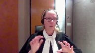
:::

C'est la raison pour laquelle les tribunaux inférieurs ne l'ont pas appliquée de cette façon-là.

En fait, ce que le juge de première instance dit, c'est que l'erreur fondamentale qui est à la source de toutes les problématiques qui ont été vécues chez Prèles-Côte, c'est le fait de ne pas avoir choisi une approche d'implantation appropriée aux besoins de Prèles-Côte.

Et tout découle de ça.

Le juge de première instance est clair quand il dit, une fois que l'engrenage a été, on était dans l'engrenage, ça ne fait que s'amplifier, on ne pouvait plus revenir en arrière, dit autrement et dans mes mots, le projet était voué à l'échec dès le départ parce que l'approche d'implantation qu'on a utilisée, selon laquelle les parties se sont exécutées, était inappropriée.

Et sans cette erreur-là, les problèmes ne seraient pas survenus, du moins pas ceux qui sont survenus qu'on a analysés et que vous avez devant vous.

**Justice Wagner** (01:15:01): de venir à la conclusion que la responsabilité devrait être assumée à 40 % par votre client.

**Speaker 3** (01:15:09): Tout à fait.

Et on ne le remet pas en cause.

C'est la raison pour laquelle je mentionnais que la question du partage de responsabilités et l'application de l'article 1478 n'est pas une problématique à l'application de la règle.

**Justice Kasirer** (01:15:26): est-ce que vous avez dit tantôt que la clause devient inopérante et c'est ça donc la sanction.

::: {.column-margin}

:::

La cour d'appel dit un peu la même chose à son paragraphe 41 mais j'essaie de m'expliquer vous allez peut-être pouvoir m'aider que si la clause de limitation de responsabilité ou d'exonération porte sur l'obligation fondamentale de sorte que ça ne rend pas possible ça va jusqu'au coeur de cette obligation-là comment peut-on dire que le contrat survit est-ce que ce n'est pas ce n'est pas le contrat dans son ensemble qui tombe un peu comme le dit la théorie de la nullité des contrats s'il y a quelque chose de fondamental qui manque.

**Speaker 3** (01:16:29): Non, en fait, la façon dont la règle a été établie, ce qu'elle dit, c'est qu'on ne peut pas appliquer la clause restrictive en présence d'une erreur, d'un manquement, d'une obligation essentielle.

::: {.column-margin}
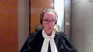
:::

Mais il pourrait y avoir dans le contrat d'autres dispositions qui ne sont pas visées par la règle et donc doivent demeurer applicables.

Alors, pour moi, ce n'est pas une question de nullité.

C'est pour ça également que je vous dis que la cause ne peut pas être le seul fondement qu'on utilise.

**Justice Kasirer** (01:17:01): C'est-à-dire que la cause n'est pas le fondement.

::: {.column-margin}

:::

Est-ce que la logique suit de votre position?

Est-ce que si vous dites que la Cour d'appel semble ouvrir la porte à la notion d'absence totale de cause, mais pour vous, la Cour d'appel aurait tort sur ce point?

Parce que si oui, à première vue, c'est la nullité du contrat plutôt que la clause qui devient inopérante, sous 1438.

**Speaker 3** (01:17:34): En fait, la Cour d'appel mentionne qu'il y a plusieurs justifications qui peuvent être utilisées pour appuyer cette règle-là et sa légitimité, et je suis d'accord avec les juges de la Cour d'appel.

::: {.column-margin}
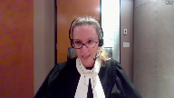
:::

La règle, elle incarne le résultat de notre droit des obligations, et bien qu'elle ne soit pas codifiée spécifiquement, elle s'harmonise et elle est cohérente avec un ensemble de dispositions, dont les dispositions qui touchent à la cause.

Mais la cause n'a pas pour seule mission de gérer ou d'encadrer les clauses restrictives.

Par contre, un contrat doit avoir une cause, un contrat bilatéral, j'entends, doit prévoir une réciprocité des obligations.

On ne peut pas évacuer notre portion du contrat, notre obligation principale, par le simple biais d'une clause.

Donc, c'est la raison pour laquelle j'insiste à vous dire qu'il y a plusieurs fondements, plusieurs points d'ancrage, tous cohérents les uns avec les autres.

**Justice Côté** (01:18:54): M. Cloutier, vous avez réclamé en première instance le remboursement de tous les honoraires payés à Créatec, en plus des autres réclamations.

Sur quelle base avez-vous réclamé le remboursement des honoraires?

**Speaker 3** (01:19:08): à l'époque, ils étaient réclamés sur le principe du trop payé en prétendant que ce qui avait été livré après le cours n'avait pas la valeur du système qui nous avait été livré.

::: {.column-margin}
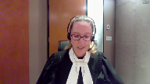
:::

En fait, ce qui a été livré n'avait pas la valeur de ce qui était facturé.

Le juge de première instance ne nous a pas donné raison sur ce point-là et je vous soumets que ce n'est pas non plus une problématique parce que la plante vous dit qu'il y a une incongruité dans le jugement de première instance parce que Prèlco doit payer 2 millions d'honoraires pour un service qu'elle continue ou à tout le moins qu'elle utilisait au moment du procès.

Le fait d'avoir à payer des services s'inscrit strictement dans la conclusion du juge que les services rendus par Créatech ont une valeur.

Créatech a travaillé de nombreux mois pour livrer un système, donc elle doit être rémunérée pour ce qu'elle a fait.

Mais il n'en demeure pas moins que ce qu'elle a livré ne répond pas à ce que les parties avaient convenu dans un contrat.

C'est-à-dire que Créatech n'a pas, même si elle a livré un système, elle n'a pas livré l'obligation essentielle à laquelle elle s'était elle-même engagée.

**Justice Côté** (01:20:39): Ce que Créatech a livré pour 2 millions, c'était une obligation accessoire.

::: {.column-margin}
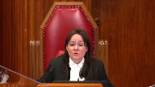
:::

Elle a livré ça en vertu de quoi, vous croyez?

En vertu d'un contrat qui avait une cause.

Elle n'a peut-être pas fait une exécution parfaite, comme le juge de première instance a décidé, mais elle l'a livré en vertu de quelque chose.

On ne fait pas du travail pour 2 millions s'il n'y a pas de contrat qui existe ou s'il n'y a pas de cause qui existe.

**Speaker 3** (01:21:00): Je suis d'accord avec vous sur ce point-là.

::: {.column-margin}
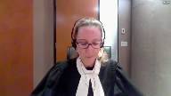
:::

La problématique, c'est qu'elle n'a pas livré ce pourquoi Prèlesco avait accepté les termes du contrat tels que rédigés.

Et c'est là tout l'intérêt de la règle, de dire on doit protéger les relations contractuelles en imposant aux partis d'honorer le contrat qu'ils ont convenu et de livrer l'obligation essentielle à laquelle chacune s'est engagée.

On ne peut pas laisser un client comme Prèlesco, bien que ce soit une partie aguerrie, obtenir quelque chose qu'elle n'a pas choisi selon des termes qui devaient s'appliquer uniquement dans un autre contexte.

Et c'est pour ça que la règle, vu l'ensemble des fondements qui sont déjà dans le code civil, qui sont dans le droit civil également, on doit protéger les relations contractuelles en regardant l'économie générale du contrat.

Et cette règle-là, c'est ce qu'elle fait de façon 100% conforme avec notre droit québécois, que ce soit au niveau de l'origine, du droit, de sa logique, l'économie générale du code.

Faire abstraction de cette règle-là permettrait à des parties de modifier un contrat par leur seule volonté après avoir fait accepter des clauses à leur co-contractant.

Et d'ailleurs, je vous réitère ce qu'on mentionne dans notre mémoire, le code civil, qui regorge d'ancrage pour cette règle-là, doit aussi être vu avec le droit civil.

Au-delà du code civil, il y a le droit civil qui permet de conserver un code de loi qui n'est pas figé dans le temps, qui n'est pas hermétique et qui permet d'évoluer selon l'évolution de la société.

La disposition préliminaire du code...

**Justice Wagner** (01:23:43): Quand vous parlez d'ancrage, maître, encore faut-il s'ancrer en quelque part, là, c'est un choix multiple.

::: {.column-margin}
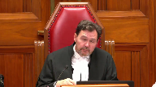
:::

On a une Macédoine de possibilités, on a une bouillabaisse d'éléments, une bouillabaisse d'éléments sur lesquels on peut s'accrocher.

Est-ce que c'est vraiment ça que les tribunaux doivent faire, choisir son élément de bouillabaisse ou de macédoine?

**Speaker 3** (01:24:09): Je vous soumets que ce n'est pas nécessaire de choisir un seul article du Code civil pour justifier l'application de cette règle-là.

::: {.column-margin}
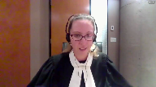
:::

Parce que tous les articles qui ouvrent notre livre des obligations dans le Code civil vont toutes dans la même direction, vers un même objectif que cette règle-là protège.

Si vous voulez choisir dans le cadre du jugement que vous aurez à rendre, un seul fondement, vous pourrez le faire.

Mais moi je vous soumets que c'est par une vision globale du Code et du droit des obligations qu'on peut obtenir un fondement puis justifier finalement la légitimité de cette règle-là.

**Justice Kasirer** (01:24:59): de mettre Cloutier dans la soupe que prépare notre juge en chef, est-ce qu'il y a une place aux droits français?

::: {.column-margin}

:::

Je pense aux arrêts de la Cour de cassation dans Chronopost et Fosseria 2, sur lesquels certains auteurs, même québécois, s'appuient pour dire que lorsque, pour expliquer comment une clause peut vider le contrat d'une obligation essentielle et qu'est-ce qu'il faut en faire avec.

**Speaker 3** (01:25:38): On peut assurément s'inspirer de ce qui s'est passé en France avant la codification de l'article 1170 en 2016.

::: {.column-margin}
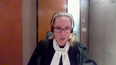
:::

Pour trouver une explication, avec le plus grand des respects pour mes adversaires, la décision de Forestia 2, sur laquelle il s'appuie beaucoup en disant que c'est des faits similaires aux nôtres parce qu'on a un fournisseur de système informatique avec un client à Guéry qui a négocié un contrat de Créagri, doit être une inspiration pour le dossier actuel.

Je vous soumets qu'il faut faire bien attention quand on veut s'inspirer de Forestia 2.

Pour différentes raisons, cette cause-là ne présente pas les mêmes similitudes avec notre dossier.

D'abord, je suis d'accord avec la planque, il y avait une clause dans laquelle il y avait une limitation de responsabilité au montant des honoraires payés et une exclusion pour les pertes de profits.

Par contre, la clause en question dans le dossier de Forestia 2 prévoyait spécifiquement que cette clause-là et son existence étaient en fonction ou étaient le reflet des prix convenus entre les parties et de la négociation.

Ça, c'est un élément que vous n'avez pas dans notre dossier.

La clause ne fait pas référence à ça.

Bien que la planque tente de vous le soumettre, ce n'est pas ce que le texte dit.

Autre élément qui est très différent avec Forestia 2, et là, je vous invite à prendre l'onglet 15 de notre recueil condensé qui présente le contrat intervenu entre Prèlco et Créatec.

Je vous soumets qu'il y a une différence importante.

Vous pouvez prendre la page 90 dans le haut, qui est finalement la clause 3, en page 8 de 8 du contrat.

Il s'agit de la clause qui est intitulée «

Partage du risque ».

Dans le dossier actuel, le partage de risques dont les parties ont discuté était exclusivement au niveau des prix, mais d'un dépassement de coûts.

Donc, ce qui était convenu, c'est qu'advenant un dépassement de l'estimé budgétaire, il y aurait un partage à hauteur de X % entre Prèlco et Créatec.

C'est une forme de rabais, finalement, si on n'arrive pas à respecter le budget initial.

Or, dans Forestia 2, la raison pour laquelle la Cour de cassation en arrive à dire que la clause présente un taux de remise, n'est pas dérisoire, présente des… en fait, doit être appliquée.

C'est-à-dire qu'il y a d'autres obligations qui ont été convenues dans le même contrat.

Les parties s'engageaient, pour le futur, au-delà de l'implantation d'un système informatique.

Il était convenu, notamment, que Forestia pourrait participer à un comité destiné à améliorer la situation, améliorer le développement.

Il y aurait un bénéfice préférentiel sur des ajustements du système.

Il y avait un taux de remise et non pas un rabais sur l'estimé budgétaire.

Et c'est dans ce contexte-là que la Cour de cassation en arrive à dire, quand on regarde l'ensemble du contrat, son économie générale nous confirme que les parties ont convenu un contrat autour de la clause de limitation de responsabilité.

Et c'est la raison pour laquelle la Cour de cassation justifie qu'elle doit être appliquée.

Or, dans notre cas, ce n'est pas ça du tout.

Le contrat convenu entre Préleco et Créatech est simple.

Créatech doit implanter un système informatique, en contrepartie de quoi Préleco paiera les honoreurs.

Il y a toutes sortes d'obligations accessoires, de modalités d'exécution, de modalités de paiement, mais une fois le système implanté, les parties n'ont plus de relations commerciales ensemble, ce qui est complètement différent de forestier à deux.

**Overlapping speakers** (01:30:28): C'est pour ça...

Je vais continuer, je vais...

**Speaker 3** (01:30:30): Je voulais juste compléter en disant que c'est pour ça que la Cour de cassation en arrive à dire dans Forestier A2 qu'on ne dénature pas ou on ne vide pas le contrat de sa substance en appliquant la clause de limitation de responsabilité parce qu'il demeure un bénéfice pour le client au-delà des problèmes qui sont survenus dans le cadre de l'implantation.

::: {.column-margin}
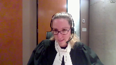
:::

Or, ce n'est pas le cas pour Préleco.

**Justice Côté** (01:30:55): Pourriez-vous nous dire pourquoi, après le cours, au lieu de prendre le recours qu'elle a pris, si elle était convaincue que ce que Créatec a livré est si différent de ce qu'elle voulait, pourquoi elle n'a pas demandé l'annulité du contrat?

**Speaker 3** (01:31:12): parce que le système était déjà livré, Madame la juge, quand on s'est aperçu des problèmes et du fait que l'approche utilisée n'était pas appropriée, parce que je vous rappelle que Créatec est le spécialiste en la matière, donc c'est sur ses épaules que reposait cette obligation-là, ce fardeau de choisir l'implantation.

::: {.column-margin}
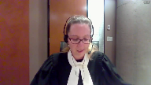
:::

Au moment où on démarre le système, on se rend compte de l'ampleur du problème.

Dès le jour un, c'est le chaos.

Or, à ce moment-là, Préco n'a que ce système-là pour tenter d'opérer sa business.

**Justice Côté** (01:31:50): Vous gardez le bénéfice, vous gardez le bénéfice de ce qui a été livré, même si ça ne fonctionne pas à votre goût et dans les faits.

Vous engagez ERISCO, le juge de première instance a condamné Criatec à payer les honoraires d'ERISCO et maintenant il y a un système qui fonctionne.

**Speaker 3** (01:32:07): La différence, à cet égard-là, c'est qu'effectivement, les honoraires, on doit les payer.

::: {.column-margin}
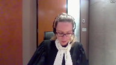
:::

Pour la raison que je vous ai donnée tantôt, il y a une valeur à ce que Créatec a fait.

Par contre, les travaux des risquaux qui permettent de faire fonctionner le système plusieurs mois après leur livraison n'ont en aucun cas permis de reprendre l'approche d'implantation.

On n'a pas exécuté à aucun moment l'obligation essentielle de Créatec.

On n'est pas dans une situation où Créatec devait livrer un camion de patates, pour prendre cet exemple-là, et que, ne le recevant pas, on fait livrer la même quantité de patates par quelqu'un d'autre.

On est dans une situation où Irisco a stabilisé le système pour le rendre un minimum fonctionnel, mais n'a pas exécuté l'obligation à laquelle Créatec s'était engagé dans le contrat.

Et c'est là la différence qu'on doit tenir en compte, et je vous soumets que ce n'est pas une incongruité que Prèlco utilise au moment du procès le système informatique.

Conclure autrement reviendrait à dire que Créatec peut non seulement bénéficier du travail d'un tiers et du fait qu'on a mitigé chez Prèlco les dommages en essayant de stabiliser le système livré.

Mais aussi d'obtenir le paiement pour les honoraires sans jamais n'avoir exécuté le contrat qu'elle s'était engagé à honorer et qu'elle avait même offert de livrer.

Si vous retenez la thèse de la plante à cet égard-là, c'est aussi de dire qu'un débiteur pourrait modifier son obligation au point de ne jamais exécuter l'obligation essentielle pourvu simplement qu'il offre un quelconque bénéfice.

Cette vision-là me paraît avec respect affecter les relations contractuelles en laissant un créancier à la merci de son débiteur sans pouvoir forcer l'exécution du contrat qui avait été convenu.

**Justice Wagner** (01:34:58): La notion d'obligation essentielle, est-ce que votre prétention, c'est que le législateur l'a complètement occulté, l'a oublié complètement?

**Speaker 3** (01:35:07): Non, je pense que la notion d'obligation essentielle, elle est déjà prévue dans le code à différents endroits.

Notamment à 1437?

Notamment à 1437.

Pourquoi on l'a dévoquée?

**Justice Wagner** (01:35:19): Pourquoi on a limité l'implication de l'obligation essentielle à 14,37, selon vous?

**Speaker 3** (01:35:29): En fait, 1437, c'est un article qui s'inscrit au niveau de la protection au moment de la formation du contrat.

::: {.column-margin}

:::

Alors que la règle, ce qu'elle permet d'assurer, c'est que non seulement au moment de la formation, mais surtout au niveau de l'exécution, on en arrive à faire respecter le noyau contractuel, la substance du contrat qui a été convenu.

Vous avez mentionné, M. Jean-Chef, l'article 1437, mais je tiens aussi à préciser que l'article 1379 que mon collègue a utilisé dans sa plaidoirie plus tôt ce matin, utilise également la notion d'essentiel.

C'est là une démonstration que l'obligation essentielle n'a pas besoin d'être définie dans le code.

Chaque contrat étant différent, il faut laisser une marge de manœuvre au tribunal pour interpréter dans un cas donné quelle sera l'obligation essentielle, sans pour autant que le législateur ait jugé que c'était une notion trop floue, que c'était une notion qui était indéfinissable.

À 1437, on utilise l'exemple d'obligation essentielle dans un contexte différent au niveau des contrats d'adhésion ou de consommation, mais le législateur ne définit pas quelle est l'obligation essentielle dans cet article.

Même chose à 1379.

Je vous soumets que la notion d'obligation essentielle est déjà prévue dans le code.

La règle est déjà implicitement prévue également dans le code.

**Justice Wagner** (01:37:22): Le législateur a prévu, justement, effectivement, on y réfère, ce que le législateur dit dans le cas de civils, c'est que lorsque, dans les cas de contrats d'adhésion, par exemple, ou avec les consommateurs, lorsque les stipulations essentielles ou les conditions essentielles font en sorte qu'elles sont déraisonnables ou abusives, elles sont réputées être non écrites.

::: {.column-margin}
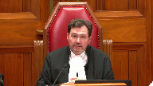
:::

On a mis comme paramètre que justement, quand on traite d'obligations essentielles, d'obligations ou de stipulations essentielles, c'est dans un contexte bien particulier, bien balisé.

Le législateur aurait pu ouvrir ça à tous les genres de contrats, mais il ne l'a pas fait.

**Speaker 3** (01:38:07): de deux choses l'une.

::: {.column-margin}
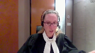
:::

Je vous soumets qu'à 1437, 1437 ne s'applique pas exclusivement au niveau des obligations essentielles.

Ce que 1437 alinéa 2 nous dit, c'est qu'à titre d'exemple, une clause abusive pourrait être celle qui affecte l'obligation essentielle.

Mais 1437 demeure applicable à d'autres situations où des clauses pourraient être abusives sans pour autant toucher des obligations essentielles d'un contrat.

Et le, voilà.

Donc si je résume au niveau de, avant d'embarquer sur la liberté contractuelle, je veux insister pour vous faire un parallèle entre 1437 et la règle qui pour moi touche deux choses différentes.

Le législateur n'avait pas besoin vu tout ce qui existait déjà dans le Code de prévoir spécifiquement cette règle-là.

Il aurait pu le faire, il pourrait encore le faire, mais je pense que ce n'est pas nécessaire qu'il l'ait fait, ce n'était pas nécessaire de le faire en 94. 1437, c'est le pendant de l'article 1171 du Code civil français, qui sont deux articles qui protègent le déséquilibre entre deux parties qui ne négocient pas à armes égales.

Alors que la règle et l'article 1170 du Code civil français viennent pallier à des situations qui ne sont peut-être pas récurrentes ou si souvent utilisées, mais qui sont nécessaires pour le respect des relations contractuelles, c'est-à-dire de s'assurer que même des parties aguerries qui négocient entre elles ne peuvent pas par un contrat, par une clause dans le contrat, dénaturer celui-ci et lui enlever toute sa substance.

Objectivement, une partie ne pourrait pas choisir de contracter en offrant à son co-contractant la possibilité de ne jamais honorer son contrat sans aucune conséquence.

Alors, si on ne peut pas le faire, si on ne peut pas penser que quelqu'un voudrait faire ça, je vous soumets qu'on ne peut pas non plus penser que notre droit le permet.

C'est une allégation très générale qui, à mon avis, peut vous conforter pour tout ce que je vous ai donné précédemment sur les motifs qui sont applicables et les fondements qu'on trouve déjà dans le Code Civil.

**Justice Wagner** (01:41:14): Dans le cas qu'il nous occupe, Kira Tech n'a pas refusé d'exécuter son contrat.

::: {.column-margin}
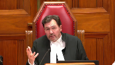
:::

Il a voulu y aller mais il s'est trompé.

Je paraphrase.

Dans la prestation de ses services, dans la fourniture des équipements, il s'est trompé.

C'est comme ça que le juge a conclu au niveau de la responsabilité.

Il n'a pas refusé mais c'est après avoir signé un contrat dans lequel les parties qu'on présume sophistiquer en matière commerciale ont négocié et ils sont entendus sur les conditions en limitant la responsabilité.

Ça aurait pu être des dommages liquidés aussi.

Ils auraient pu s'entendre sur des dommages liquidés à devenir un pépin, à devenir une mauvaise exécution du contrat.

Ici, la différence entre une mauvaise exécution du contrat et les mauvais choix de services, il n'y a pas

**Speaker 3** (01:42:07): avec respect, je ne suis pas d'accord avec vous sur ce point-là.

::: {.column-margin}
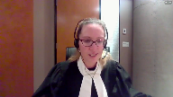
:::

Le Créatech, ce n'est pas simplement tromper, il n'a pas simplement commis une faute simple.

Elle a manqué à une obligation fondamentale.

Elle n'a pas honoré ce pour quoi elle s'était engagée.

Et c'est tout là l'utilité de la règle.

Si on était dans quelque chose de beaucoup plus léger, je vais le dire comme ça, la situation serait autre.

C'est vrai qu'on peut limiter la responsabilité d'un cocontracteur dans un contrat.

C'est vrai qu'on peut liquider des dommages.

Ce que je vous dis, c'est qu'on ne peut pas le faire au point de retirer le cœur du contrat.

Les parties, quand elles négocient, elles ont beau être à armes égales, elles négocient en fonction de ce qu'elles ont convenu de mettre dans ce contrat-là, en fonction des obligations auxquelles l'une et l'autre s'engagent.

Si on retire la possibilité pour une partie de s'engager ou de la forcer à exécuter son engagement, c'est là qu'on dénature le contrat.

Donc, il faut faire attention de ne pas mélanger la simple exécution, les strictes fautes simples ou légères, avec ce qui fait l'objet du contrat, ce qui est sa substance même.

**Justice Kasirer** (01:43:39): Mais vous ne dites pas, M. Cloutier, que le manquement de l'obligation essentielle, en lui-même, est une faute lourde.

**Overlapping speakers** (01:43:48): Non, ce n'est pas ce qu'on dit.

**Justice Kasirer** (01:43:50): Alors, ce n'est pas une faute lourde, ce n'est pas ici une faute intentionnelle, mais vous dites ce n'est pas une faute simple non plus, c'est quoi donc?

**Speaker 3** (01:44:00): c'est un manquement à l'obligation essentielle.

::: {.column-margin}
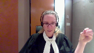
:::

La notion de faute lourde, de faute simple, on l'utilise en parallèle avec l'article 1474 qui vise l'exécution du contrat, la façon dont les parties vont s'exécuter tout au long du contrat.

Or nous, dans notre dossier, la problématique survient dès le tout début.

L'obligation principale, fondamentale n'a jamais été rencontrée.

Et c'est là que la problématique prend toute son ampleur.

On n'est pas dans un contexte où Créatec n'a pas respecté le délai qui était convenu, n'a pas mis suffisamment de ressources à la disposition de Prèlco pour réussir à préparer une formation complète pour les usagers.

On est dans la raison même pour laquelle Prèlco avait besoin d'un spécialiste, identifier la méthode d'implantation appropriée pour son type de marché et l'aider à l'implanter.

À partir du moment où on n'arrive pas à identifier correctement cette approche-là d'implantation, on ne remplit pas l'obligation essentielle.

Ce n'est ni une question de faute lourde, ni une question de faute légère ou pas.

Puis on vous le mentionne dans notre mémoire, je ne retrouve pas le paragraphe exact, mais le code prévoit qu'on ne peut pas s'exonérer de sa responsabilité pour une faute lourde.

On ne peut pas non plus pour une succession de faute légère.

Ça pourrait viser, l'article 1474, des obligations accessoires au contrat.

Or, ce qu'on est en train de vous présenter par la thèse de la plante, c'est de dire qu'on pourrait, en droit civil, pour le simple motif que les parties sont négociées à armes égales, s'exonérer du cœur du contrat.

On ne pourrait pas commettre une faute lourde sur une obligation accessoire, mais on pourrait ne pas livrer l'obligation essentielle à laquelle on s'est engagé sans aucune problématique.

Et c'est là qu'on vous soumet que le bas blesse pour la thèse de Créatik.

**Justice Côté** (01:46:31): C'est ce qu'on appelle un système NAV.

**Speaker 3** (01:46:38): Oui, en fait, c'est le nom du logiciel.

**Justice Côté** (01:46:42): au paragraphe 233 de la décision de première instance à la toute fin

::: {.column-margin}
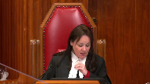
:::

, le juge dit «

De plus, l'argument de l'avocat, à la fin de sa plaidoirie, selon lequel Prelko se retrouve aujourd'hui avec un système NAV qui n'en est plus un, tellement il a subi des modifications, n'est pas supporté par une preuve prépondérante.»

Qu'est-ce que vous répondez à ça, quand vous dites qu'on n'a pas reçu ce qu'on a commandé?

**Speaker 3** (01:47:11): Ce à quoi le juge fait référence à ce paragraphe-là, c'est qu'on prétendait que Créatec avait tellement développé le système par le biais de la mauvaise approche d'implantation qu'il avait créé, ni plus ni moins, un monstre qui ne permettait plus de bénéficier des mises à jour du système.

::: {.column-margin}
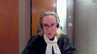
:::

C'est pour ça qu'on avait plaidé en première instance qu'on n'avait jamais reçu le système pour lequel on avait payé.

Ce que je vous dis ici, c'est qu'on en a reçu un système.

On ne peut pas nier qu'au moment du procès, Prellco l'utilisait.

Le problème, c'est qu'à cause de la approche d'implantation qui a été choisie erronément par Créatec, le démarrage de ce système-là a été chaotique au point de causer des milliers de dollars de perte de profits.

Prellco a été empêché d'opérer correctement son entreprise pendant des mois à cause de l'approche d'implantation qui n'a pas été bien sélectionnée par le spécialiste qui était Créatec.

Donc, c'est deux choses différentes.

La raison pour laquelle le juge met ça au paragraphe 233 est ce que je vous dis.

Moi, ce que je vous dis, c'est qu'à aucun moment, Prellco n'a reçu ce qui était un système selon une approche qui était appropriée, donc n'a jamais reçu ce que Créatec était prêt à livrer.

On a effectivement un système.

On doit maintenant payer pour les services qui ont été rendus, mais ça n'empêche pas que Créatec n'a à aucun moment exécuté son obligation essentielle.

Et c'est pour ça qu'on est devant vous,

pour vous demander de confirmer la légitimité de la règle qui a été développée depuis plusieurs années.

Je voudrais insister également avec vous sur la question de l'exécution par équivalent.

La clause qui est soumise, la clause 7 du contrat, n'est pas une clause strictement de limitation, bien que ce soit le titre qu'on lui donne.

Il faut regarder la substance de cette clause-là et, dans les faits, elle empêche Prellco d'obtenir l'exécution en nature ou par équivalent.

Bien qu'elle soit en mesure de récupérer le montant des travaux effectués par Erisco, il n'y a aucun dommage causé par Créatec et par son erreur fondamentale qui n'est accessible à Prellco.

Et donc, l'exécution par équivalent est complètement anéantie par cette clause-là.

On dit qu'on ne peut pas, on ne sera jamais tenu à plus que le montant des honoraires qui ont été payés.

C'est essentiellement offrir la restitution des prestations, bien que Prellco ne soit pas capable de redonner ce qu'elle a reçu puisque le système ne peut pas être simplement évacué.

Il n'en demeure pas moins qu'on n'a pas Créatec évacue en fait tous les risques qui auraient pu peser sur elle en cas de manquement à son obligation.

On vous dit qu'on a géré les risques, qu'on a partagé les risques entre nous.

Ce n'est pas vrai.

Essentiellement, il n'y a que Prellco qui supporte les risques d'un manquement à une obligation fondamentale qui serait commis par Créatec.

Et on tente du côté de la plante de vous dire si vous confirmez cette règle-là, les fournisseurs informatiques ne voudront plus faire des affaires.

Ça va affecter la stabilité des relations commerciales.

Moi, je vous soumets que ce n'est pas le cas du tout.

D'abord, c'est plutôt l'inverse parce que ne pas confirmer cette règle-là va aussi avoir pour effet que les clients qui vont devoir supporter tous les risques d'un mauvais fonctionnement de ce que leur fournisseur doit leur livrer ne voudront pas davantage s'engager.

Il va y avoir une problématique au niveau des relations contractuelles à cet égard-là.

**Justice Wagner** (01:51:49): Maître

::: {.column-margin}
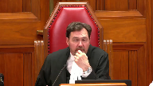
:::

, j'ai une question qui est peut-être accessoire plutôt qu'essentielle.

Dans votre mémoire, vous prétendez que le Créatec a complètement, totalement exclu sa responsabilité.

C'est pas à la conclusion à laquelle les juges de la Cour d'appel ont conclu.

C'est pas de la conclusion à laquelle ils sont venus.

Qu'est-ce que vous dites là-dessus maintenant?

**Speaker 3** (01:52:16): je vous soumets qu'au stade où on est rendu, il faut regarder la clause dans son ensemble.

::: {.column-margin}
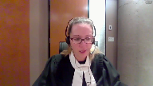
:::

Je pense que la règle s'applique aux clauses d'exclusion de responsabilité.

Ce n'est pas impossible par contre qu'elle puisse s'appliquer également en matière de clauses limitatives dans la mesure, un peu comme on faisait le parallèle tout à l'heure avec la France, où la limitation pourrait affecter la portée de l'économie générale du contrat.

**Overlapping speakers** (01:52:46): Mais ici, c'est une clause de limitation de responsabilité ou totalement exclue.

**Speaker 3** (01:52:49): Moi, je vous soumets que par l'effet qu'elle a, cette clause-là, c'est une clause qui exclut totalement la responsabilité de créatrice.

**Justice Wagner** (01:52:57): Le juge de première instance et les juges de la Cour d'appel ont tort.

**Speaker 3** (01:53:02): En fait, la question ne s'était pas posée de la même façon devant eux, donc la distinction n'a pas été faite de la même façon.

::: {.column-margin}
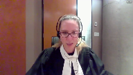
:::

Je ne suis pas ici pour critiquer leur jugement, on n'a pas porté le jugement de la Cour d'appel en appel.

Mais je vous soumets que dans les faits, quand vous la regardez comme il faut, cette clause-là, c'est une clause d'exclusion.

**Justice Wagner** (01:53:21): Je comprends. Merci.

**Speaker 3** (01:53:27): Pour ajouter également, on dit que du côté de la plante, si vous ne confirmez pas cette règle-là, ça va créer une incertitude.

::: {.column-margin}

:::

Les fournisseurs ne sauront plus du tout à quoi ils sont tenus.

Je vous soumets que ce n'est pas le cas du tout.

Le Code civil répond déjà à cette préoccupation-là par le biais de l'article 1613 qui limite le montant des dommages aux dommages directs et prévisibles.

Donc, on ne sera pas du côté des fournisseurs tenus à n'importe quoi non plus, il y a un certain encadrement.

Au-delà de ça, je vous réitère que les clauses de limitation de responsabilité demeurent possibles dans la mesure où elles n'affectent pas la portée de l'obligation essentielle.

Donc, la règle ne va pas à l'encontre de la liberté contractuelle comme on tente de vous le présenter du côté de la plante.

C'est plutôt l'inverse.

Elle protège les relations, protège la liberté contractuelle dans l'ensemble du contrat selon une vision globale de son économie générale plutôt que la stricte libellée d'une clause de limitation de responsabilité.

Je vous soumets que quand on applique un contrat, on doit regarder l'intention objective des parties.

Ici, ça me paraît absurde de penser qu'une partie a pu vouloir décharger son co-contractant de l'ensemble de ses responsabilités advenant qu'il ne rencontre pas son obligation essentielle.

**Justice Wagner** (01:55:22): Évidemment, si jamais on venait à la conclusion qu'il s'agit d'une clause de limitation de responsabilité et non, comme vous le soulignez, de totale non-responsabilité, est-ce que la réponse est la même?

**Speaker 3** (01:55:37): Si vous en arrivez à la conclusion d'une clause de limitation de responsabilité, vous devrez vous poser la question quant à savoir si sa portée affecte le cœur du contrat.

::: {.column-margin}

:::

Et je vous soumets que oui, par l'effet que cette clause-là a. Peut-être un dernier commentaire sur les éléments qui vous ont été soumis par la plante.

On vous mentionne qu'il y a deux conditions pour appliquer la règle.

Je vous soumets que ce n'est pas deux conditions, mais plutôt la définition même de la règle.

Elle ne sera applicable que dans la mesure où on a un manquement à une obligation essentielle qui, par définition, va vider le contrat de sa substance.

On vous parle du caractère dérisoire d'une limitation de responsabilité.

Évidemment, je vous soumets qu'ici ce n'est pas le cœur du débat puisqu'on a une clause d'exclusion, mais il faut faire attention si jamais vous faites un parallèle avec la France sur le caractère dérisoire puisqu'en France, cet élément-là est codifié spécifiquement.

Un contrat est nul si la contrepartie est illusoire ou dérisoire.

C'est ce que nous dit l'article 1169 du Code civil français.

Ici, on n'a pas cet élément-là et la définition de la règle en droit québécois n'a jamais impliqué d'analyser le caractère dérisoire ou pas du montant de la limite, ni d'ailleurs comme le faisait la Common Law, d'obtenir la quasi-totalité de ce qui était prévu au contrat.

Ce n'est pas le problème ici et vous n'avez pas à en tenir compte.

Une question a été posée un peu plus tôt ce matin sur l'obligation de moyens et l'obligation de résultat quant à savoir si la situation serait la même si on était en présence ici d'une obligation de résultat.

J'attire votre attention sur l'article 21-00 du Code civil qui prévoit spécifiquement que si les parties sont tenues à une obligation de résultat, elles ne peuvent pas se dégager à moins de prouver la force majeure.

Donc ça encadre déjà la situation.

Au-delà de ça, je pense que ça se joue à deux niveaux, c'est-à-dire que dans un premier temps on vérifie si l'obligation de résultat a été livrée ou pas et ensuite on vérifie si la clause peut être applicable.

Je vous rappelle que si personne ne remet en doute la conclusion du juge de première instance à l'effet que Créatec avait une obligation de moyen.

Peut-être un bref commentaire avant de conclure sur la question de la common law.

Simplement pour vous réitérer que le droit civil demeure un droit autonome et que l'issue qui a été donnée à la règle du fundamental breach ne doit pas être un empêchement à reconnaître la légitimité de la règle.

La common law et le droit civil, c'est reconnu, évoluent distinctement à leur façon.

Donc ça ne pose pas problème de ne pas les uniformiser l'une et l'autre.

Si vous retenez, comme on vous le soumet, qu'il y a des fondements en droit civil québécois pour cette règle-là.

**Justice Wagner** (01:59:37): Je suis d'accord avec vous et je pense qu'il n'y a personne qui va contredire ce que vous venez de dire.

::: {.column-margin}

:::

Il est quand même intéressant de constater, ne serait-ce que comme un fait, que l'un des deux droits qui a vigueur ici au Canada, le common law et le droit civil, alors dans le common law, on a cherché, par entremise de ce principe-là, effectivement à corriger des situations d'inéquité.

Et comme sûrement en droit civil, on a cherché aussi.

Puis dans la mesure où, effectivement, on est venu à la conclusion dans le common law que ce principe-là ne devrait plus exister, il n'est pas impossible de pouvoir conclure qu'il en serait de même en droit civil.

**Speaker 3** (02:00:22): pas impossible,

::: {.column-margin}

:::

mais ça ne doit pas être une adéquation parfaite et automatique.

La règle en droit civil québécois, elle existait en parallèle et en marge avec la théorie en commune-là.

La problématique dans Hunter et Tercombe, c'était aussi une problématique d'encadrement.

Moi, je vous soumets que la règle au Québec, elle est déjà encadrée et qu'elle ne pose pas problème au niveau de l'application.

Personne ne vous a remis en question des applications problématiques.

La Cour d'appel vous dit que la règle existe et doit être appliquée avec discernement.

Je suis d'accord et il n'y a pas eu de problématique d'application de cette règle-là.

Je veux également vous rappeler que la disposition préliminaire du Code civil du Québec, qui est quand même le premier élément d'architecture de notre droit civil, rappelle aussi le devoir des tribunaux de chercher au-delà de ce qui peut être écrit dans le Code.

Donc, vous devez, sur la base de ce qui existe au Québec dans notre droit des obligations, regarder sur quel fondement la règle peut s'appuyer.

Et cette règle-là, elle permet d'atteindre un équilibre entre les clauses qui sont convenues par les partis dans un contrat négocié et l'économie générale du contrat.

On ne vous demande pas dans le dossier ici d'étirer l'application d'une disposition du Code civil, ni même de modifier un contrat ou les clauses que les partis ont voulu convenir, mais plutôt de confirmer l'essence du contrat en confirmant que la règle est établie et qu'elle est légitime en droit civil québécois pour protéger le cœur du contrat.

La question d'application de cette règle-là n'est pas de savoir si Créatech a exécuté ses obligations contractuelles, mais plutôt de savoir si le contrat l'obligeait à exécuter son obligation essentielle.

Dans ce contexte-là, l'existence et l'application de la règle assurent

la stabilité des relations contractuelles et, donnez foi à la thèse de la plante, reviendrait à l'autoriser à ne pas respecter son engagement contractuel sans jamais en être responsable.

Et c'est pour toutes ces raisons qu'on vous demande d'appliquer la règle qui est déjà reconnue depuis longtemps à notre dossier et de confirmer les jugements unanimes rendus par les instances inférieures.

Je vous remercie.

**Justice Wagner** (02:03:12): Merci, maître Luthier.

Maître Pratt ou Richer pour la réplique?

S'il y en a une.

Au moins pour considérer la réponse à ma question.

**Speaker 2** (02:03:25): Oui, monsieur le juge, à cet égard-là, je vais faire la réplique très brièvement, mais maître Richer, si vous me le permettez, je sais que c'est un peu inusité, va répondre spécifiquement à votre question, et notamment en se référant au paragraphe 87 de notre mémoire.

::: {.column-margin}

:::

Très bien.

Alors, simplement sur quelques points qui ont été soulevés.

Le premier, c'est… en fait, c'est presque un point d'interprétation de la clause où l'intimé semble dire que cette clause-là ne pouvait viser… dans le fond, il serait légitime seulement dans l'éventualité où elle visait des manquements qui sont accessoires.

Or, là-dessus, monsieur le juge, je dis qu'il n'y a rien dans le libellé de la clause en tant que telle qui la limite d'une telle façon.

Et en fait, une clause limitative qui exclut par exemple une perte de profit serait sans utilité véritable, parce que tu contentes d'aménager, c'est justement les risques importants, et dans les contrats de gré à gré, c'est justement ce qu'on vise.

Et cette limite-là qu'elle veut mettre dans la clause du contrat, elle veut aussi implicitement que vous la mettiez aux articles 74 et 74-75, comme si le législateur ne voulait dans ces articles-là qu'interdire les manquements aux obligations accessoires.

Alors, rien dans le texte, notamment en 74-75, qui exige qu'on dénonce une clause limitative résultant d'une faute simple, on parle seulement d'obligations contractuelles.

Il n'y a aucune limite dans le texte qui est soumis.

Après ça, elle fait un parallèle entre le choix du législateur français et le législateur canadien.

Le législateur français, et on l'aura à l'onglet, l'article 1170, que je ne retrouve pas, est sans limite.

Ça s'applique à tous les contrats, excusez-moi deux secondes.

**Overlapping speakers** (02:05:30): Huh?

**Speaker 2** (02:05:31): 13.

::: {.column-margin}

:::

13?

Non. Ok, 16.

Alors, vous l'avez à l'onglet 16, «Toute clause qui prive de sa substance l'obligation essentielle du dédicteur est réputée non écrite.

Le contraste de ce libellé-là à 1437 est frappant.

» Parce que dans le fond, c'est exactement l'exemple que donne le législateur québécois en disant, comme exemple d'une clause abusive, qu'une obligation essentielle qui est touchée de telle sorte qu'on en dénature la nature du contrat est réputée non écrite.

Le législateur français a fait un choix en 2016 que cet article-là s'applique à tous les contrats.

Le législateur québécois a fait un autre choix, comme on l'a déjà vu.

Ma collègue aussi parle du fait qu'à un moment, l'obligation essentielle, c'est tellement exorbitant que ça ne peut être toléré par notre droit.

Elle dit que ça ne peut pas être une faute simple.

En réponse à la question de savoir si ce n'est pas une faute simple, une faute lourde ou une faute intentionnelle, il n'y en a pas de réponse.

Mais il faut que ce soit l'une des trois.

Et comme le dit l'auteur Cossette Lefebvre à l'onglet 6 de notre recueil, page 24, paragraphe 32, au début, toute la théorie du montant de l'obligation essentielle était fondée sur justement la faute lourde.

Le seul fait de violer l'obligation essentielle était une faute lourde.

Or, cette théorie-là a été complètement rejetée parce que, manifestement, à moins d'intentions subjectives, il n'y a pas de faute lourde, comme en l'espèce.

Donc, même si elle ne veut pas l'accepter, en pratique, cette théorie viendrait à ressusciter le détour par la faute lourde en qualifiant d'inacceptable le seulement point d'obligation essentielle, même s'il ne résultait que d'une faute simple.

Ça ne peut pas être accepté.

Ensuite, elle nous dit dans le fond qu'on a tellement dénaturé le contrat qu'on en a modifié la substance, qu'il n'y a pas de remède.

Tous les remèdes sont disponibles.

L'obligation n'a pas pu être anéantie puisqu'ils ont obtenu des dommages.

Ils ont obtenu des dommages pour les travaux dérisquaux et ils ont obtenu éventuellement le système comme on l'a discuté.

Et en fait, s'il n'avait eu aucun bénéfice, on aurait été tenu, c'est-à-dire la plante, de payer 1,7 million en dommages.

On ne peut pas dire à ce moment-là que l'obligation…