---
title: Her Majesty the Queen v. Awet Mehari
published-title: Heard
date: 2020-12-04
sidebar: false
---

This transcript was made with automated artificial intelligence models and its accuracy has not been verified. Review the original webcast [here](https://scc-csc.ca/case-dossier/info/webcast-webdiffusion-eng.aspx?cas=['39109']).
---

**Justice Rowe** (00:00:01): The court recalls.

**Justice Abella** (00:00:20): Good morning.

::: {.column-margin}
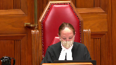
:::

Her Majesty the Queen and Awat Mahari.

W Dean Sinclair QC for the appellant.

Erin A Fox QC for the respondent Awat Mahari with Darren, is it Krausauer?

Krausauer?

Krausauer.

Krausauer, okay.

Thank you.

Mr Sinclair.

**Justice Kasirer** (00:00:48): Can I just...

**Overlapping speakers** (00:00:49): Thank you, my lady.

Sorry, justice has a question to put to you.

**Justice Kasirer** (00:00:57): Before you start pleading, Mr. Sinclair, and not wanting to cut into your time, I just had a, or we had a question on procedure here.

::: {.column-margin}
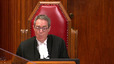
:::

The respondent, as we understand it, was convicted on two counts.

Sexual assault and breach of recognizance, and the breach was as a result of having committed the sexual assault.

And he was sentenced on both.

The appeal goes forward, and the court of appeal in allowing the appeal offers reasons in a formal order that only refer to count one.

And they quash the conviction and order the new trial only on this charge.

And, and I'm, I'm, of course, they're, they're, the counts are convict, are connected at, at some level.

But I just wanted to alert both parties to this slight confusion here, that we don't have before us the second conviction, which doesn't seem to have been spoken to on appeal.

In which case, it remains on the record, unless I've got things wrong.

**Speaker 1** (00:02:15): My Lord, excuse me, Justice Kashir, I don't think you have things wrong.

::: {.column-margin}
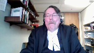
:::

This is probably attributable to a mistake that I made.

I drafted the judgment for the court of appeal and I neglected to refer to the breach charge.

So it issued and the court probably didn't realize that it wasn't speaking to the section 145 charge at the same time.

But I think you're absolutely correct.

The conviction on that matter can't stand with an order for a new trial on the sexual assault.

As you're aware, the Saskatchewan, the question of law separating the majority and minority judges in this case, concerned whether the trial judge applied a different level of scrutiny to the evidence of the complainant, as opposed to the evidence of the respondent.

That question is a claim that the trial judge aired in law by employing a faulty methodology in the credibility assessment process.

There is no clear legal test for determining if different levels of scrutiny have been applied.

This is not-

This is not the court of appeal.

**Justice Martin** (00:03:45): there.

::: {.column-margin}
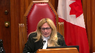
:::

Can you quote?

This court has never said that uneven scrutiny is an independent error of law and that may explain why there is no standard across the country test for that.

So I just wanted to make sure we were all should there be such a should there be such a rule?

Is that part of this appeal or are we just dealing with whether or not uneven scrutiny does or does not exist on this record?

**Speaker 1** (00:04:23): Well, that will be the, Justice Martin, that will be the focus of my submissions this morning, the question whether it exists on the record.

::: {.column-margin}
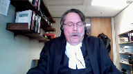
:::

But your point is well taken.

In my respectful submission, this is a rather amorphous ground of appeal without a clear legal test.

And that's not surprising because it's understood that credibility or assessing credibility is not a science governed by the application of mandatory objective rules.

At its core, it's an inherently a subjective exercise that from the perspective of the trial judge or the trier of fact, involves resolving a complex intermingling of impressions that emerge after watching and listening to the witnesses.

So it's understood in law that a trial judge's efforts to explain why he or she believed a witness is not a purely intellectual exercise, and that the process of doing so may involve factors that are difficult to verbalize.

This court made that observation in R versus MRE.

Given the rather amorphous nature of this ground of appeal, I think it is also well understood that the appellant has a very heavy burden to discharge.

Appellant courts must be wary of weeding out claims that amount to little more than thinly veiled attempts to relitigate credibility findings.

Additionally, as stated by the Ontario Court of Appeal in the decision of R versus BDN, a case that's referred to, I think, at tab three of our condensed book, such claims are often not founded on logic.

What is clear from the authorities, I suggest, is that a party advancing such a claim must do much more than prove that different credibility findings could be made, must do much more than prove the trial judge could have said something different or something more than what was said.

And further from the Manitoba Court of Appeal in MCA, which is at tab two of our materials, the fundamental rule is that if a trial judge's credibility assessment can be reasonably supported by the record, it should not be interfered with on appeal.

I would also, with respect, suggest another fundamental rule.

An appellate court considering an argument of this kind must necessarily acknowledge what the witnesses actually said when they testified and what the trial judge actually said in giving reasons for judgment.

With that, I would like to turn to what the trial judge actually said in this case.

She was dealing with a case where the complainant provided direct evidence of being sexually assaulted when she was sleeping.

The complainant repeatedly testified that she woke up to find the respondent having sex with her.

The respondent denied that assertion, and he claimed that the complainant was fully conscious and an active participant in all of the sexual conduct at issue.

There was DNA evidence proving that the respondent's semen was on the complainant's undergarments, medical evidence proving a two-centimeter laceration to the base of her vaginal orifice.

There was, most of what the complainant said was corroborated either by her friend Caden or the respondent himself.

At the end of the day, there was no dispute that the respondent had sex with the complainant, a woman he did not know in the bedroom in his house.

There was no dispute the complainant was emotionally distraught immediately after that sexual activity.

Further, there was no dispute that based on the complainant's cell phone records, as indicated in the agreed statement of facts, the complainant did not use her telephone between 3.39 a.m. when she phoned for a pizza and 5.25 a.m. when she phoned her friend Caden for help.

After hearing all of the arguments, the trial judge offered two reasons for why she rejected the respondent's testimony.

First, she concluded the respondent was a poor witness who did not appear to be testifying from an actual memory of events.

She came to that conclusion because his testimony sounded rehearsed and his description of events when he was asked open-ended questions about what happened did not include the kind of extraneous detail she would expect a witness to provide if the witness was testifying from an actual memory of events.

She gave examples of-

So what it's-

**Justice Rowe** (00:09:57): For what it's worth, some people are not as talkative as others, but anyway.

**Speaker 1** (00:10:02): Yes.

::: {.column-margin}
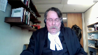
:::

Point taken, my lord.

She gave examples of the respondent's testimony that she thought supported her conclusion.

Secondly, the trial judge rejected the respondent's testimony on the issue of consent, because even his description of the complainant's emotional condition immediately after the sexual activity in question was inconsistent with consensual sex.

Then, with respect to a specific factual issue, namely whether the respondent told the complainant that she was horny and wanted it, the trial judge accepted the testimony of the complainant and rejected the respondent's evidence on the issue, because the statements the respondent allegedly made to the complainant, which were exculpatory, by the way, and I need to emphasize that.

He said, I didn't do anything wrong.

Those statements were consistent with his testimonial portrayal of events inside the bedroom.

So, the trial judge also explained why she found the complainant was a credible witness.

Her reasons included.

First, unlike the respondent, the complainant provided significant factual detail when she testified.

Secondly, her testimony was chronological, consistent, and it flowed logically from one event to the next.

Third, although there were many gaps in the complainant's memory, if the complainant could not remember a detail, she said so.

And finally, the complainant's testimony was supported by the timeline of events as noted in the agreed statement of facts relating to the cell phone calls.

In addition, the trial judge noted that the complainant's emotional condition immediately after the sexual act was consistent with her testimony that she did not consent.

So was her willingness to undergo an invasive medical examination later the same day, and the trial judge further commented that she found her testimony was credible because it was not weakened when she was thoroughly cross-examined.

The trial judge was aware of and referred to what she called, quote, the apparent inconsistencies, end quote, between Cadence and the complainant's testimony.

She did that before she found the complainant was an honest witness who was anxious to tell the truth.

So with respect, considering what the trial judge actually said, the Crown respectfully submits that the trial judge did not in any way apply uneven levels of scrutiny to the evidence.

For her, one witness appeared to be testifying from a memory of events.

The other was not.

The account of one witness in relation to the emotional condition of the complainant immediately after the assault was corroborated by that emotional condition, the other witness's account was not.

In my respectful submission, the trial judge used the very same measuring sticks to assess credibility, and her findings were reasonably solid.

She did not interfere with her credibility, and her findings were reasonably supported by the record.

For that reason, the Court of Appeals should not have interfered with her credibility assessment at all.

So I would like to turn to the Court of Appeals' errors, if I may.

In finding that the trial judge applied uneven levels of scrutiny, the majority judges in my respectful submission said that the trial judge actually said.

For example, one of the reasons for finding uneven scrutiny was that the trial judge reasoned as if gaps in the complainant's memory enhanced her credibility.

But with respect, that observation did not fairly or accurately state what the trial judge said.

To repeat, the concern of the trial judge was that one witness appeared to be testifying from an actual memory of events, and the other was not.

The trial judge didn't say the complainant's credibility is enhanced because she can't remember very much.

Similarly, the majority judges oversimplified the trial judge's reasoning by stating that the trial judge found the respondent's failure to provide extraneous detail detracted from his credibility.

With respect, the point the trial judge was attempting to articulate was that the respondent did not appear to be testifying from an actual memory of events.

Further, I submit that the majority judges misapprehended the reasons by suggesting the trial judge overlooked the fact that the respondent was not asked a direct question about condom use until he was cross-examined.

The trial judge plainly understood that he was not asked a direct question about that until cross-examination.

The point she was trying to articulate was that the failure of the respondent to include that kind of extraneous detail when he was asked to describe in open-ended questions what happened in the bedroom was one of the reasons she believed he wasn't testifying from an actual memory of events.

Finally, I respectfully submit that the majority judges unfairly criticized the trial judge for suggesting that she likely drew a negative inference about the respondent's credibility from the fact that he simply answered questions that were put to it.

Again, the point the trial judge was trying to make was that the respondent's failure to refer to extraneous detail suggested his testimony was not based on an actual memory of events.

This was the trial judge attempting to articulate her perceptions not only of what the witness said but how the witness said it.

She was trying to describe witness demeanor.

In a nutshell, the majority judges failed to appreciate or respect that the trial judge's reasons reflected a consideration of both testimonial plausibility and witness demeanor, and they failed to acknowledge that the trial judge was in a much better position than they were to assess witness demeanor, and that she was entitled to accept or reject testimony because it did not reflect the testimony of the witness.

The second reason that the majority judges gave for finding an uneven level of scrutiny was that the trial judge erred by accepting the complainant's testimony on certain material points in the face of clear, contradictory evidence that the trial judge did not reject, reconcile, or otherwise explain.

In making this statement, the first point that I would like to make is that if we were really concerned about the application of uneven levels of scrutiny, and if this was a marker for it, then one would expect to find in the trial judge's reasons for judgment her going through and comparing and contrasting cadence evidence with the evidence that was presented in the trial judge's testimony.

Her going through and comparing and contrasting cadence evidence with the respondent's evidence and noting any contradictions or inconsistencies between those two witnesses.

The trial judge didn't do that.

Therefore, her failure to do that in terms of everything that was identified by the respondent in his arguments in the Court of Appeal is not an indication of applying uneven scrutiny at all.

But more significantly, that concern by the majority judges referred to portions of the complainant's evidence that were simply not confirmed or corroborated by her friend Caden.

It must be emphasized that all of the arguments that the Court of Appeal heard and all of the arguments that the respondent has advanced in this court about those issues are the very same arguments that he made at trial.

The trial judge heard and considered all of the arguments for why the respondent believed the complainant's evidence was contrived.

She was not persuaded by them.

She plainly did not perceive the differences between Caden's testimony and the complainant's testimony to be clear contradictions on material points.

As I already indicated, she referred to these differences as quote, apparent contradictions.

And she made it clear that at least the ones that she considered related to unimportant factual or peripheral details.

In my respectful submission, the majority judges interfered with her perceptions with those perceptions of that evidence when they categorized the difference in Caden's testimony and the complainant's testimony as clear contradictions on material points.

That was not the perception that the trial judge took away from hearing and listening to the witnesses testify.

The majority judges changed her perception without finding that the trial judge committed a palpable and overriding error of fact.

And that was an error of law.

Then, having improperly changed or interfered with the trial judge's perceptions of the evidence, the majority judges criticized Caden's testimony.

**Justice Rowe** (00:21:11): It can't just be perceptions or feelings or hunches or, you know, bottom line statements that we defer to blindly.

::: {.column-margin}
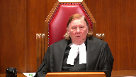
:::

I mean, I can conceive, I'm not saying anything about this case, but I can conceive of circumstances in which the assessment of credibility is totally botched.

Yet the evidence is ample.

So what do you do with that?

I mean, it really calls into question the soundness of the verdict.

So I think there has to be some space for courts of appeal to intervene where the assessment of credibility is so deeply flawed that no proper reliance can be placed upon it.

**Speaker 1** (00:22:05): And I think there is, my Lord, but with respect I would say there is nothing in the trial judge's reasons for judgment to indicate that the credibility assessment in this case was deeply botched.

::: {.column-margin}
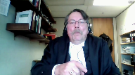
:::

She was attempting to articulate a process or a task that is difficult sometimes to do, recognized in the authority, why she rejected one witness's testimony and accepted another.

Her observations were plainly supported by the record.

The notion that the respondent's testimony sounded rehearsed, when he was asked an open-ended question in directed, I mean his counsel was told to stop leading the respondent when he was questioning.

So then counsel asked an open-ended question, what happened in the bedroom?

And his answer was virtually identical in all respects, almost word for word, as it was when he was asked the same open-ended question in cross-examination.

And there was no extraneous detail, at least there was certainly a lot of missing extraneous detail.

This is a perception, it sounded rehearsed, it's going to be difficult for a trial judge to articulate demeanor issues like this, and I believe with respect that the trial judge did as good a job as she could.

Although I should say there were other things that the trial judge could have said, but that's neither here nor there.

But the point that I was trying to make, my Lord, is, or excuse me, Justice for all.

**Justice Abella** (00:24:15): I'm afraid you're frozen on the screen.

**Overlapping speakers** (00:24:18): Must be cold in Regina.

**Justice Abella** (00:24:20): Can you hear us?

**Overlapping speakers** (00:24:29): and stop.

**Justice Abella** (00:24:30): Mr. Sinclair, can you hear us?

::: {.column-margin}
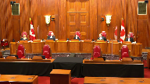
:::

I guess not.

No record that there are over six minutes left.

**Overlapping speakers** (00:25:02): Et le reste...

**Justice Abella** (00:25:12): Well, that was an interesting argument.

I think we'll take a break until we're able to come back and see you and you can hear us.

Yes, I can hear you.

**Speaker 1** (00:25:23): On se casse, on se casse, on se casse, on se casse...

**Justice Abella** (00:25:40): Can you hear us now, Mr. Sinclair?

**Speaker 1** (00:25:49): in the last.

**Justice Abella** (00:25:50): We're going to take a break for, let us know when the computer is fixed.

**Justice Rowe** (00:26:02): It's like early Pink Floyd or something.

**Justice Martin** (00:26:08): Yes, you guys want to take a picture?

And let's make sure as well.

**Justice Rowe** (00:26:21): The court is adjourned.

**Justice Abella** (00:26:37): Mr. Sinclair, I don't know what you did to the camera

::: {.column-margin}
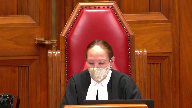
:::

but you also managed to fix it having broken it.

So let's continue with the argument.

We're not going to hold you strictly to time.

You lost about a minute.

And I just want to make sure Mr. Fox that Mr. Fox has disappeared.

Mr. Fox, did you hear, are you satisfied you've heard everything that Mr. Sinclair said?

**Overlapping speakers** (00:27:02): Yes, we weren't having any difficulty hearing Mr. Sinclair in our end.

**Justice Abella** (00:27:06): Okay. Great.

Mr. Sinclair.

**Speaker 1** (00:27:08): Thank you, Justice Abella.

::: {.column-margin}
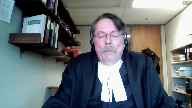
:::

I am almost finished.

I appreciate the court's looking at the clock for me.

I think where I was, I just wanted to start off, I think I may have said this, but just in case.

The trial judge's description of the differences in the testimony provided by Caden and the complainant as apparent inconsistencies is, in my respectful submission, a reasonable and fair way to describe the failure of one witness to corroborate or confirm the testimony of another witness, especially on a peripheral factual detail.

That kind of testimonial difference does not necessarily amount to a clear contradiction at all, especially if it relates to a peripheral factual detail.

And I am unaware of any rule that says witnesses' testimony is suspect if they don't testify in precisely the same way on precisely the same every fact.

Further, I think that the majority judgment was undermined by their decision to, or their inclination to suggest that the trial judge, having found Caden's evidence, was credible, must have accepted Caden's evidence wherever it differed from the complainant's evidence, or if not, had a duty to explain how she reconciled the differences.

The trial judge didn't say that she accepted the complainant's or Caden's evidence on everything that he said.

There were clear instances in the record where Caden made a mistake, but he was nonetheless found to be a credible witness.

On the one issue of significance, at least to the respondent and to the majority judges, that is, did the respondent tell the complainant that she was drunk and wanted it after the sexual activity in question, it is clear that to the extent that you can see, to the extent that the differences in Caden's and the complainant's testimony

**Overlapping speakers** (00:29:53): Uh...

**Speaker 1** (00:29:53): amounted to an inconsistency, it is clear that the trial judge accepted the complainant's testimony over that of Caden.

::: {.column-margin}
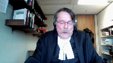
:::

And with great respect, I have a very difficult time seeing how that involves an uneven application of scrutiny to the evidence given by the complainant and the respondent.

It's simply a credibility finding, a finding of fact.

The majority judge's criticism of the trial judge's failure to reconcile what they perceived to be all of the clear contradictions in evidence was, in my respectful view, also improper because the law did not require the trial judge to refer to every item of evidence or every argument of counsel to demonstrate that she considered the evidence or the arguments of counsel.

As already stated, all of the arguments that the respondent advances on appeal were made to the trial judge and it is clear that she did not accept those arguments.

Therefore, the Attorney General respectfully submits that the majority judges erred in law first by misapprehending the reasons for judgment, what the trial judge actually said, and secondly, by modifying the trial judge's perception of the facts in the absence of palpable and overriding error, and then using those manufactured modifications to criticize the trial judge's credibility findings.

For the reasons provided by Mr. Justice's lure and dissent, the Attorney General respectfully submits that the trial judge did not apply uneven levels of scrutiny to the evidence at all.

The nature of the order that the Crown is seeking in this case is to quash the order for a new trial and return the matter to the Court of Appeal so that the respondents, the other grounds of appeal that the respondent advanced in the Court of Appeal that the majority judges did not deal with can be heard and determined by the by a full court of the Court of Appeal.

Unless the Court has any questions, those would be my submissions.

**Justice Abella** (00:32:22): Just one, a couple of clarifications.

::: {.column-margin}
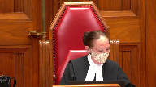
:::

First of all, on this last point, the order you're seeking in your factum is that it go back to the Court of Appeal, not necessarily the panel that heard the case.

Do we leave that to the Court of Appeal?

**Speaker 1** (00:32:42): I would suggest to go back to the same panel.

::: {.column-margin}

:::

They've heard the arguments.

I'm not even, I didn't even, frankly, Justice Abella, I wasn't aware that I could ask for a different panel to consider it, but I, I.

**Justice Abella** (00:33:00): Just wondered how specific you wanted us to be in your order because it's not in the order that you have in what you've sought.

The second thing is I just wanted to confirm there is no longer a publication ban, is that right?

**Speaker 1** (00:33:11): That's correct Justice Abella and that was brought to my attention by the complainant in these proceedings.

::: {.column-margin}
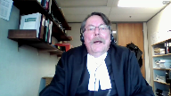
:::

She applied to have the publication ban lifted between the time of conviction and the time of sentence.

It's a point that I missed in reviewing the transcript and when I saw that the publication had been lifted by the trial judge I refiled the proper certificates with the court as did my learned friend. Okay.

**Overlapping speakers** (00:33:42): Thank you very much, Mr. Sinclair.

**Justice Martin** (00:33:44): Thank you for your question.

**Speaker 1** (00:33:44): Thank you for your question.

**Justice Martin** (00:33:45): In relation to this matter being sent back to the same panel from the Court of Appeal, Justice Lur did deal with all of the various arguments that had been put forward.

::: {.column-margin}
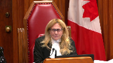
:::

And I guess there's one way of reading the Court of Appeal saying that the Court of Appeal dealt with the arguments that they thought were meritorious in that way and said that otherwise there was a reasonable basis except for what they perceived to be the error of uneven scrutiny that they nevertheless said that this was a reasonable verdict.

Does that give us any more latitude in terms of remedy or why I guess I'm really asking you why in the circumstance you're requesting a return?

**Speaker 1** (00:34:40): Well, if memory serves, Justice Martin, it seems to me that the majority judges expressly declined to deal with the grounds of appeal other than two.

::: {.column-margin}
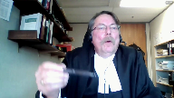
:::

Number one, was the verdict unreasonable?

Number two, did the trial judge apply uneven levels of scrutiny?

No, I'm looking at it as a matter of fact, I'm looking at it as a matter of fact, I'm

**Justice Brown** (00:35:06): Looking at page 19 of the record, I think this goes to your point, Mr. Sinclair.

::: {.column-margin}
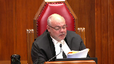
:::

Paragraph 13 of the Court of Appeals decision, Mr. Mahari raises a number of grounds of appeal and then the three grounds are listed, different level of scrutiny requiring Mr. Mahari to explain the frailties in a way that effectively reversed the burden of proof and failing to consider circumstantial evidence in determining whether or not to accept the witness's testimony or rather the complainant's testimony that she was asleep.

And then also paragraph 15, failed to consider whether he could avail himself of honest but mistaken belief defense and then unreasonableness.

And then paragraph 17, as I will explain, I've concluded that the trial judge erred by applying a more stringent level of scrutiny to the evidence given by Mr. Mahari than she applied to the evidence given by Akay.

As this issue is dispositive of the appeal, I need not address the other grounds of appeal except for the ground relating to the reasonableness of the verdict.

**Speaker 1** (00:36:17): That's my recollection and that's why I asked for the order that the matter be sent back to the Court of Appeal to deal with the respondent's other grounds.

**Justice Abella** (00:36:31): Ms. Martin, is it your position that there is no room for us to do anything other than sending these four unresolved grounds by the majority back to the Court of Appeal?

**Speaker 1** (00:36:46): Yes, because I don't think that any other issue other than the issue of uneven level of scrutiny is properly before this court.

**Justice Abella** (00:36:57): But the question then is also does it have to go back or can it be dealt with in any way by this court in the absence of any argument in the factums on these four issues?

**Speaker 1** (00:37:10): Oh well there were there were different legal arguments to the different grounds of appeal that were not commented on by the majority at all.

::: {.column-margin}
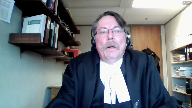
:::

Certainly Justice Lohr did.

He dealt with all of the grounds as pointed out by Justice Martin but I just I think the fairest thing for the respondent if the crown were to be successful in this application would be to have the matter go back so that the court of appeal could fully deal with all of the other grounds of appeal.

**Justice Brown** (00:37:54): Another way to maybe ask this question, Mr. Sinclair, is do you see the Crown as having put the Respondent on notice that he is not a member of the House of Commons?

**Overlapping speakers** (00:38:03): you

**Justice Brown** (00:38:03): is addressing any other issue here other than the sole ground on which the Court of Appeal decided this.

**Speaker 1** (00:38:13): There's no I don't.

Thank you.

**Justice Abella** (00:38:16): And so just we set aside the decision of the Court of Appeal, we don't substitute a verdict, we send it back. Right.

Okay.

Thank you. Right.

Thanks for the clarification.

And Mr. Fox.

**Speaker 2** (00:38:39): Good morning, Justice Abella.

::: {.column-margin}
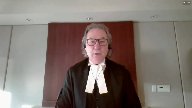
:::

Thank you.

The case obviously turns, and this is just a little bit of a follow up to the discussion that took place.

The issue of uneven scrutiny is the only issue that was raised by the Crown on this appeal and that we've addressed.

And this appeal does address the question of what is the role of an appellate court when dealing with that issue, and I respectfully submit that the Crown's argument would curtail that role so significantly that really an appellant court would have no role whatsoever.

The transcript of the trial evidence along with the reasons given by the trial judge are the record based on which virtually all criminal appeals are dealt with, and the cold hard transcript is capable of illuminating an error by a trial judge in her or his assessments of the evidence.

And while a court of appeal clearly is slow to interfere with determinations of credibility made by a trial judge, that does not mean that it should shirk from its responsibility to review the record and the reasons that follow to determine if there has been an error.

To simply state that a case like this calls for deference to the trial judge's finding a fact, especially as they relate to credibility, does not mean that a review should not take place.

It must or the appellant court will fall short of its duty and responsibility.

And with respect, the Crown at paragraph 69 of its factum when it states to be sure a trial judge must act fairly and must consider all relevant evidence when assessing credibility really is confirming that.

So in the case of bar there there are two questions.

The first question is did the court of appeal error in the application of the applicable law.

I've not heard any argument or suggestion in the factum that they did.

So that moves us to the second question which is whether the court supports the court record supports the conclusion that the trial judge applied uneven scrutiny.

And it's our submission that the answer is yes for the reasons identified by the court of appeal.

So what is uneven scrutiny and maybe I'm just justice Martin, just to address the question you asked about is this a standalone ground of appeal.

The standalone ground of appeal I think is, was there an unfair trial, such that it led to a miscarriage of justice that's I think what the standalone ground of appeal is uneven scrutiny is an example of where if the appellate court identifies that there's been an uneven uneven scrutiny, then there has been an unfair trial, and that standalone ground of appeal has been established.

**Overlapping speakers** (00:41:23): I-I-I m-

**Speaker 2** (00:41:24): Admittedly, we've seen more cases and case law dealing with uneven scrutiny.

::: {.column-margin}
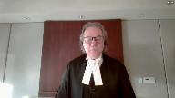
:::

And maybe we get to the point where it will come to be considered a standalone ground.

But I see it as falling under that general question of, was there a fair trial?

The test has been described.

And my argument is following my condensed book.

But it is an error of law for a trial judge to apply a stricter level of scrutiny to the defense evidence and the crown evidence.

This results in an unfair trial.

And a miscarriage of justice, even if the evidence is capable of supporting a conviction.

In tab one, I referred to the Grazon decision.

And the comments there, the court has repeatedly stated that it is an error of law for a trial judge to apply a higher or stricter level of scrutiny to the evidence of the offense than to the evidence to the crown.

And in paragraph 53, even if the evidence was capable of supporting conviction, where the trial judge has applied a different standards to the assessment of prosecution defense evidence, the appellant has not received a fair trial, and thus has been the victim of miscarriage of justice.

And the significance of that statement is that it applies even if there is evidence capable of supporting a conviction.

And that's what's important to remember.

My friend has spent a great deal of time trying to convince you that there was evidence to support a conviction.

Quite frankly, the Court of Appeal majority decision agreed that it was not an unreasonable verdict.

But uneven scrutiny calls for the court to examine the decision and the record to see if the trial judge has applied different standards to the assessment of the crown versus the defense evidence.

It's not enough to say that there could have been a conviction here.

The standard of review is noted.

And again, this common ground is one of correctness.

I referred to the quarterly decision of the Alberta Court of Appeal, affirmed by the Supreme Court that the issue undermines the fairness of the trial.

That's what you're looking for.

And the standard of review is correctness.

This appeal again should not be, or this argument should not be confused with an appeal based on a finding of credibility, which does require proof of palpable and overriding error, or an argument of an unreasonable verdict.

If there has been uneven scrutiny that results in an unfair trial and miscarriage of justice, even if there is evidence to support the conviction, the appeal must be granted.

There is no question that to interfere with finding of credibility, there must be proof of palpable and overriding error.

But that is not the issue here.

The problem is uneven scrutiny.

And this has been sometimes described as an error in methodology.

I think the Court of Appeal in the majority decision recognized the issue and made the point very well as to where the unfairness comes.

And at my condensed book, page 28, I quote paragraph 45 of the Court of Appeal.

And I'm going to repeat it because they say it far better than I can.

But in the end, and this is quoting the Court of Appeal paragraph 45, page 28 of the condensed book, in the end, I'm satisfied that Mr. Mohari's claim of uneven scrutiny must succeed.

This is not to say that I think the trial judge's conclusion on credibility was necessarily wrong.

In fact, the jurisprudence is clear that an appellant court is not entitled to reassess credibility findings absent palpable and overriding error.

And uneven scrutiny of the evidence is not the same thing as palpable and overriding error.

However, if the trial judge in this case had applied as exacting a standard of scrutiny to the evidence of AK as she applied to Mr. Mohari's evidence, she may well have been left with a reasonable doubt about his guilt.

And that really sums up what the Court of Appeal had to do.

What is the role of an appellant court?

So that raises the question of what is the role of an appellant

**Justice Abella** (00:45:33): Can I ask you a quick question about that?

::: {.column-margin}
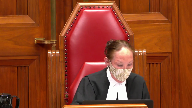
:::

Do you find any dissonance in saying the court can't reassess credibility findings absent overriding error but it can assess methodology in how those credibility findings are made?

And I guess what I'm looking at are the previous paragraphs in the majority decision, 41, 42, 43, 44, poor witness, inconsistencies, et cetera.

It doesn't really do any more than explain the trial judge explaining why it was that she believed the complainant and not Mr. Mahari.

So maybe this is just a language issue and we're quarreling over linguistics, but I'm trying to get at what the conceptual difference is between what a trial judge does in determining credibility and how one assesses methodology.

**Speaker 2** (00:46:46): So if the trial judge listens to the evidence in this case of say the complainant, and there is a basis to accept your evidence, there may be some contradictions but concludes that they accept the evidence.

::: {.column-margin}
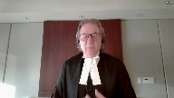
:::

On the face of it, that would not raise an issue of uneven scrutiny, you would need something more you would need to point to something.

And in my condensed book and in my argument today I want to point out some of the sort of well established examples of what uneven scrutiny would be.

But it was something where the court, the appellate court can say, I don't see how, for example, this factor was considered

and it's significant

and I don't know how you could come to a conclusion, not just on the credibility of the complainant or whether you're going to accept the evidence of the accused, but on the overall case of whether or not it's been proven beyond a reasonable doubt, how you could arrive at that without considering that factor.

**Justice Kasirer** (00:47:49): Mr. Fox, how is that distinguished from a sufficiency of reasons argument?

It sounds like you're saying the explanation was insufficient.

**Speaker 2** (00:47:59): lack of sufficiency of reasons could be an example of uneven scrutiny if it points to either to a significant factor or a factor which the trial judge clearly considered was significant.

::: {.column-margin}
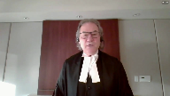
:::

So lack of sufficiency of reasons can be an issue and I mean we acknowledge that a trial judge isn't expected to address every conflict, every issue, but if there is a fact which is crucial to the case or a fact which the trial judge clearly considers to be crucial to the case and there's contradictory evidence or evidence that points to the frailties of that fact which are not addressed, the court can look at that and say okay that's an indication of uneven scrutiny.

**Justice Kasirer** (00:48:48): You would agree that it's possible that a trial judge applies even scrutiny but just doesn't properly explain why inconsistencies were or were not relevant to an ultimate finding, in which case it strikes me that the analysis proceeds on a different basis.

::: {.column-margin}
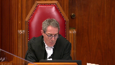
:::

**Speaker 2** (00:49:11): So, Mr. Justice, if you look at that, if you apply that to the extreme, then you can answer the question of, well, the trial judge didn't address this.

::: {.column-margin}
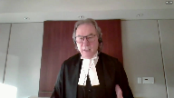
:::

Well, the trial judge doesn't have to.

They don't have to set out the facts to every example of that.

But an uneven scrutiny argument, I do think, is saying at the end of the day, there's a culmination of circumstances.

And culmination of examples in the judgment that lead you to that conclusion of uneven scrutiny.

The lack of reasons on a significant point, not a collateral point, not a peripheral point, but on a significant point, or a point that clearly the trial judge thought was significant, that would be part of that package of reasons that goes into coming to the conclusion of uneven scrutiny.

**Justice Brown** (00:50:05): be part of a conclusion that leads to insufficiency of reasons.

::: {.column-margin}
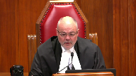
:::

I mean, you're equating them or maybe you're viewing sufficiency of reasons as a subset of uneven scrutiny.

But my concern, and the gravamen of my concern, where a central issue is not addressed or not properly addressed in a trial judge's reasons is the sufficiency of the reasons.

I don't think I've ever looked at that as a question of, well, was she giving the same degree of scrutiny to the Crown's witness as to the defense witness.

**Speaker 2** (00:50:56): I guess, Justice Brown, it can be.

It can be in the circumstances.

And in this case, we submit it is.

But why would we try to do that?

**Justice Brown** (00:51:05): Why would we treat it that way when sufficiency of reasons gives you a fair bit of traction?

**Speaker 2** (00:51:22): Yes, and you could, and in this case I'd suggest you could, because the sufficiency of reasons argument that we're talking about relates to the comments that were made outside that were attributed to the respondent, Mr. Mohari, and...

::: {.column-margin}
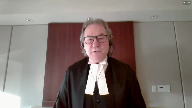
:::

**Justice Rowe** (00:51:40): Let me give you a concrete example.

::: {.column-margin}
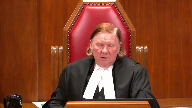
:::

I don't want to chew too much into your time, but you've got three witnesses.

The complainant and the accused describe exactly the same circumstances in exactly the same time frame.

You have a third independent witness who comments on what happened.

And the trial judge says, I've looked at the testimony of the accused, and it's riddled with inconsistencies with this third party witness, and I just don't believe anything the accused says.

Then comes to the complainant and just blows past the independent witness.

Doesn't really take any of it seriously, just flies right past it.

And so I believe the complainant.

Now that, to me, is a methodological error.

Whether it's a sufficiency of reasons problem or not, I don't know.

But I can conceive of circumstances where you can mess up the assessment of credibility so badly that you cannot place reliance on it.

**Speaker 2** (00:52:42): Justice Rowe, that's correct.

::: {.column-margin}
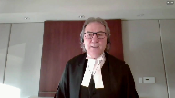
:::

And in making that assessment, you're going to look not at any single factor I'd suggest in isolation, although some may be more significant than others, but you're looking at the cumulative effect of those various things.

So in the case of the comments that were attributed to the respondent outside after the incident, it's not a peripheral fact, it's not a collateral fact, it was put forward as a damning statement that he supposedly made, and it was relied upon by the trial judge in her decision.

It was significant in her rejection of his evidence.

But in doing that, the Court of Appeal simply observed the evidence of KS, evidence of Kaden, it did contradict.

Kaden said he went out with the complainant, he accompanied her outside, Mr. Mahari was nowhere to be seen outside, he remained outside with her, I think he said for 15 minutes while she was waiting for a ride home, and then he went back into the party.

That's a significant contradiction on what was found by the trial judge to be a very crucial point of evidence in rejecting his testimony.

At the same time, the Court of Appeal observed the trial judge resolved the inconsistency between Kaden saying I gave her my jacket at the bar already, and her saying she only got it afterwards, and a couple other minor things like that.

But the Court said, how could you not then, if you're addressing those really insignificant, inconsequential differences, how could you not address this significant issue when you are relying upon it to reject the evidence of the accused?

And that's what the trial judge did.

And that's why it's so significant.

And the Court of Appeal went on to say, here's a. Well, hold on.

**Justice Brown** (00:54:46): Well, I mean, the complainant's evidence was that she found the jacket in the bedroom, she wrapped the jacket around her waist following the assault, right?

::: {.column-margin}
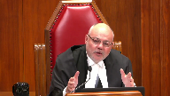
:::

So Caden testifies that she was wearing the jacket when he came into the bedroom.

There's nothing in the record that I'm aware of that contradicts either of those recollections and furthermore, they're reconcilable because from the time the complainant stood up from the alleged assault and Mr. Mahari leaves the room until he returns with Caden, there's nothing that disproves her statement that she wrapped it around her waist and was able to pull her pants back up and put her jacket on.

There's nothing in the record that says that she was not wearing that coat as she left the room.

Just the difficulty that I have with actually almost every alleged contradiction that you posit here is when it's looked at closely, they're not contradictions.

I mean, on the more crucial point about whether he made that demeaning statement.

So Caden testified he left with the complainant and he stayed outside with her and he sat with her in the car for, I think it was 15 minutes.

So during that time, he doesn't see Mr. Mahari outside, Mr. Mahari doesn't follow them.

Caden testified he doesn't hear Mr. Mahari making any demeaning comments, which you say is the evidence that directly contradicts the complainant's evidence.

But it's not.

**Overlapping speakers** (00:56:40): It's not obvious.

**Justice Brown** (00:56:40): that they left the house at the same time, she testified that as she ran down the stairs, someone grabbed her arm and stopped her, but she broke loose and she kept going.

::: {.column-margin}
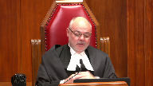
:::

Caden, while not asked about this, doesn't mention that.

And further, as your friend notes in his factum, that evidence is about speaking to the complainant in her car.

And while his timeline may contradict hers, there's nothing that contradicts the evidence that Mr. Muhari actually said that.

And the crown also provides in the factum various ways to reconcile the timelines, like Mr. Muhari may have made the comments in the bedroom before Caden arrived.

My point is there's nothing in the evidence that expressly contradicts it.

So there's contradictions being asserted here that aren't, to my mind, entirely contradictions.

And maybe that's the problem with not all, but with some of these complaints about differential scrutiny of evidence is sometimes when you actually get into it, there's not contradictions.

**Speaker 2** (00:58:03): The issue of the jacket is not something that we rely upon in any way.

**Justice Brown** (00:58:10): making the point that that the trial judge relies upon the jacket as a reason for disbelieving him on a major points.

**Speaker 2** (00:58:19): no no the trial judge simply reconciled the difference in the testimony between Caden and the complainant about the jacket and all the court of appeal the point the court of appeal was making is that the trial judge saw fit to reconcile what seemed to be a pretty as as you pointed out Justice Brown a pretty innocuous thing I mean did she get the jacket already at the bar did she get it there it doesn't matter she said she wrapped it around her it the trial judge went to some lengths to say this isn't a this isn't a big concern the court of appeal said okay if you've done that then why haven't you tried to address what appears to be a big concern and well it's a concern I mean well it's an inconsistent

::: {.column-margin}
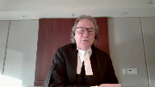
:::

**Justice Brown** (00:59:11): It's an inconsistency between witnesses, but it's not a contradiction.

**Speaker 2** (00:59:16): Well, with respect, I think it is a contradiction where the witness says, I went outside, Mahari followed me out and made this statement, and then went back in.

::: {.column-margin}
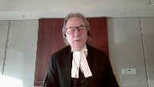
:::

There's no time gap there in that chronology of events that she describes whatsoever.

The accused denied making a statement like that.

So there's a very live issue.

There's a dispute there.

So then you go to Caden's evidence, and Caden's evidence again is clear.

He followed her out there and remained with her out there for an extended period of time.

And during that time, when, as the complainant described, this statement was made, Mr. Mahari wasn't there, did not come out, did not make any statement like that.

That on the face of it is a significant contradiction in positions that had to be addressed.

Now, it was addressed, and it was addressed, and it was addressed, and it was addressed.

**Justice Abella** (01:00:10): unfortunately for Mr. Mahari against him.

::: {.column-margin}
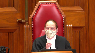
:::

So my question is, do you accept that what we were what we're dealing with an uneven scrutiny if there is such a thing as a separate legal test is methodology?

And if it is methodology, if it isn't then obviously I'm on the wrong track.

If it is methodology, aside from the fact that she sometimes believed one version of events, the complainants and not the accused, what is there in the methodology she applied that would indicate to us in the absence of your position that there's any palpable and overriding error or an unreasonable verdict?

How do we nonetheless conclude that there is a methodological problem in the way she assessed the evidence of the two witnesses?

**Speaker 2** (01:01:05): Methodology, Justice Abella, is an example, but it's but one example of what could constitute an uneven scrutiny.

::: {.column-margin}
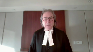
:::

So in this case, I've cited and I've attempted to cite the various examples of the uneven scrutiny that took place.

She came to us.

**Justice Abella** (01:01:24): uneven conclusions.

::: {.column-margin}
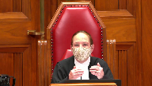
:::

There's no doubt.

But that doesn't mean she applied uneven scrutiny.

And I guess I'm having trouble in my own mind trying to figure out what words a trial judge would use in order to be able to absolve himself or herself of a claim of an unusual uneven scrutiny when there is always going to be a

he said, she said, or they both said.

So I'm just trying to figure out what words a trial judge would use in order to be able

**Speaker 2** (01:01:50): I'm not suggesting for a moment, Justice Abella, this is a situation where you stack up the complainant versus the stack up the accused and decide which one you're gonna believe or who's got the most corroboration.

::: {.column-margin}
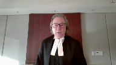
:::

But you do have to look at what the trial judge said and did.

So again, if I can, perhaps I can refer to the examples because I think they illustrate it best.

The condom issue, the accused testified as to what happened.

In cross-examination, he was asked if he wore a condom and he said yes.

Nothing more was asked of him.

There was no question of him, why didn't you mention it in chief?

The condom wasn't an issue.

This wasn't a case where an issue of consent as to whether a condom was worn or not.

It's difficult to see how this inconsequential matter could have somehow led to a credibility finding.

Yet to the trial judge, this was a significant factor in the trial judge's credibility assessment.

Can I just talk to you?

**Justice Abella** (01:02:47): for a second, what happened to we have to look at the reasons as a whole?

::: {.column-margin}
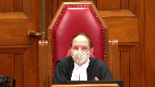
:::

We have always said you don't go through step by step by step every single piece of evidence.

We just have to be satisfied, which we are or not, that looking at the reasons of the whole, the trial judge undertook a credibility assessment appropriately.

And we don't necessarily do it by person.

In fact, we don't do it by person every conclusion she reached and didn't reach.

Are you correct?

**Speaker 2** (01:03:20): I take no issue with that, Madame Justice Bella, but it is as you look at the examples of uneven scrutiny, this is part of the package.

::: {.column-margin}
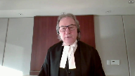
:::

So you can't say, okay, maybe they made a mistake there, maybe the trial judge got it wrong there, I can discount that.

But there's a point in time when you look at the cumulative effect of the numbers of examples and say I've reached the point where I think there's uneven scrutiny here.

I think I've reached the point where this is unfair.

So it's an inference.

**Justice Abella** (01:03:52): You're saying it's a methodological inference you draw from how often someone's evidence is believed or not believed, notwithstanding how that belief or disbelief is characterized by the trial judge or the basis for it.

**Overlapping speakers** (01:04:07): It's not a method.

**Justice Abella** (01:04:08): It's not the methodology that's actually used, it's the inference you draw about the methodology that we assume was used because she didn't come to the conclusions.

**Speaker 2** (01:04:19): It's it's it's not an assumption.

::: {.column-margin}
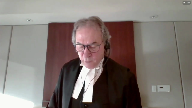
:::

So in the case so we can't be speculative about this We have to point to specific examples.

The case law is clear in that you've got to identify where you say There's a problem.

So when you turn and this is a page Page 14 of our condensed book when we are page 22 the condensed book where I go to trial judges comments on the on the condom

However, when count counsel asked mr. Bahari whether he used a condom.

He said yes, the police found used condoms by the side of the bed But in earlier recitations of the event, he had said nothing about condom in my view had he testified from recollection?

He remembered this detail and if he honestly forgot this detail was presented with it He would have knowledge how and why he forgot it

Well, this got nothing to do with demeanor or rehearsed or whatever That's I don't like the answer he gave and it's an answer on something which nobody thought was of any Consequence in this trial yet.

It was a finding made against the accused.

I couldn't stand here justice Abel and say based on that Answer alone.

There was uneven scrutiny

But it's an example and as the case law has said you can look for where there are major Inconsistencies that are not addressed, but you can also look to see if there were inconsequential matters Which appear to have been given unreasonable weight and that's a good example of it

**Justice Abella** (01:05:44): Did she make any palpable and overriding errors in your view on the credibility findings?

**Speaker 2** (01:05:50): um I would I would suggest she did um certainly on the business as it related to the conversation that occurred outside the the other example of that um is and this is

::: {.column-margin}
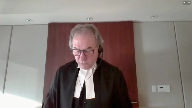
:::

and I'm jumping back and forth a bit

but I'm trying to cover this is and my friend mentioned this a number of times that the timelines and that all fit in with the phone calls that were made the two phone calls 339 529 or whatever this is at page 11 of my condensed book uh sorry page two of my condensed book um the trial judge was concerned about the lack of detail by the complaint by the accused and that he just answered questions when it when that that answered the questions that were put to him in reference to the complainant she found that she provided significant detail she was chronological and consistent where there was gaps she readily admitted it and by the end of the trial judge's decision trial judge concluded and this is um at page 36 of my condensed book comment about that uh chronological page 37 um talked about the jacket resolve that um and then concluded and this is at page 38 of the condensed book right at the bottom there's no evidence to contradict her claim that she was asleep for most of the time between those two calls so in other words what she's saying

is she basically went up there 339 shortly after that fell asleep and the accused came in sometime later on and sexually assaulted her which was contrary which was contrary to what he said

but if you look at what the complainant actually said it's far different from that in fact it's just the opposite page 39 of the condensed book this is the complainant's answer in chief talked about going upstairs on the right hand side the first door is the bathroom second door all its room

so i followed all it to the room i remember walking into the room after that to this day i do not remember anything that happened in that room i do not remember the door being shut i do not remember the light being on or off i do not remember having a conversation with them i don't remember sitting on the bed falling asleep

i don't remember anything to this day that was your evidence in chief cross-examination page 40 of the condensed book right at the bottom

so defense counsel asked her so it's possible you laid in the bed

yes possibly i don't remember is it possible mr moharry laid down beside you on the bed possibly i don't remember is it possible you had a brief conversation possibly i don't remember she denied that she would have engaged in sexual activity with them and this was brought out by the crown in in chief with her because she wasn't attracted to him it isn't in my condensed book but at page 48 of the record right at the very bottom she was asked this question okay

but you have no idea at what time you fell asleep and her answer was no that that's a huge first of all gap a huge question because we see cases where a complainant said i went upstairs with the intention of going to bed i laid down fell asleep and this happened that was not this witness's testimony a complainant here said i don't recall anything i could have had all sorts of interactions as she described with the accused i just don't know the court in order to fit this into the timeline in the crown's theory that the accused went up there some time after she had fallen asleep and sexually assaulted her said there's no evidence to contradict her testimony that she fell asleep shortly after going going into the room or was asleep most of the time that wasn't her evidence at all

**Justice Kasirer** (01:09:58): Mr. Fox, the Court of Appeal fixes on much of this in terms of the argument, the level of scrutiny argument about the amount of detail each one of them gave and that somehow there was an uneven requirement in terms of measuring credibility and that that's a sign of uneven scrutiny.

::: {.column-margin}
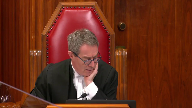
:::

It sounds to me there was really in face of these open-ended questions a genuine difference in the way in which the complainant and the accused gave evidence and the judge drew inferences from that genuine difference from the way in which they gave evidence.

And I don't see that as uneven scrutiny.

It seems like she was in her province to decide on who was giving the right story or not.

**Speaker 2** (01:11:04): So you're correct, Justice Cazir, that it is in the province of the trial judge to assess the witnesses.

::: {.column-margin}
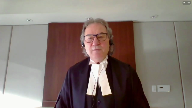
:::

And that's correct.

But if we say that's enough, if we say, well, it's within her ability to accept whether this witness is correct in saying this or the accused isn't correct, then there's no role for an appellant court to review the record to see if there are issues, to see if there are issues that should have been addressed or issues that were relied upon, which frankly don't fit in the evidence.

This one that we talked about, the gap in her memory, the trial judge by the end of the decision had changed this from a situation where the complainant for some unexplained reason, she wasn't intoxicated, she hadn't consumed any drugs, had no recollection whatsoever of what went on in that room, and frankly, she wasn't intoxicated.

**Overlapping speakers** (01:12:00): Well, her recollection begins with the sexual assault and progress, and the record is they went up together.

You can have a gap without it being incorrect.

**Speaker 2** (01:12:10): No, I understand that, my Lord, but on our...

**Overlapping speakers** (01:12:15): No, no, my Lord's good.

**Speaker 2** (01:12:17): Okay, but on the on the question of the uneven scrutiny the crowns theory here was that She'd gone up to bed She had been sleeping there for a long time because the call to the to Caden didn't happen to 529 So the crowns theory is that she went up there went to sleep and sometime later obviously the the accused snuck up there they couldn't have gone in there and had sex right away because the time frame wouldn't work

::: {.column-margin}
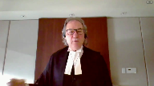
:::

and So the trial judge finds well, you know That's because she there's no evidence to contradict that she fell asleep for most of the time that she was in the room

But that's not the evidence of the of the complaint and so the court the evidence of the complaint

**Justice Brown** (01:13:00): until she was definitely asleep.

**Overlapping speakers** (01:13:03): I mean, on the same-

**Justice Brown** (01:13:03): On the same page as the page you quoted from the record, she's being cross-examined closely on this point and then is asked, and you're positive this is a sleep, not just all of a sudden being aware that something's happened to you.

Another 100% was asleep.

**Speaker 2** (01:13:19): So, and Justice Brown, I accept that.

::: {.column-margin}
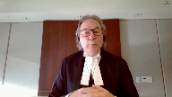
:::

But that's not what the trial judge was relying upon to fit this into the time frame.

And so, again, you look at that and say, well, is that a standalone ground alone sufficient to cause a concern?

And the answer would be probably not.

But when you look at the other problems with the analysis that took place, the inconsequential facts, then it is a concern.

Even Justice Brown, her statement that I recollect nothing about going in that room, but Mr. Bihari may have came into the room with me, he may have had a conversation with me, may have laid down on the bed with me, all of those raise questions about something different and suggest something different than simply the accused walking in there at some point in time long after she's gone to sleep and sexually assaulting her.

To say that everything flows chronologically and where there are gaps, she readily admitted it.

This wasn't just a gap.

I mean, it was a major hole in her testimony.

**Justice Kasirer** (01:14:28): Maybe but you're not making an unreasonable verdict argument.

::: {.column-margin}
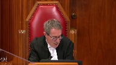
:::

You're not asking us to overturn factual findings.

You're asking us to speak to uneven scrutiny. Right.

You're using it as an open door to do what we're not supposed to do which is re-evaluate the evidence and come to a different credibility assessment.

The periods in which she didn't remember were used by the judge for credibility purposes as a sign of her candour.

And the different manner in which the accused testified was rightly or wrongly used as a manner to suggest that he wasn't telling the whole story the first time around and we had to wait until the cross exam to find out what really happened.

So there was no.

**Speaker 2** (01:15:22): Nothing in the cross-examination that changed the accused testimony as to what took place.

::: {.column-margin}
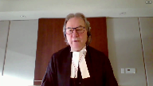
:::

The only thing that occurred in the cross-examination that changed it was the improper cross-examination of asking him why he thought she would have been lying, something that he didn't suggest in chief.

The crown hadn't put forward that theory in the cross-examination of the complainant.

That's the only thing that came out in cross-examination, quite frankly, that was any different. Mr. Fox.

**Justice Abella** (01:15:51): We've been asking you questions, so you've gone on now almost 10 minutes beyond your time.

::: {.column-margin}
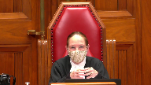
:::

I want to be sure that you've addressed everything you wanted to say.

I think judging from your fact and what you've said now is pretty well what you were intending to say, but is there a final closing comment you want to make?

**Speaker 2** (01:16:15): The only closing comment I would make, lady, and thank you for granting me the indulgence of an extra minute or two, is that this is a cumulative argument.

::: {.column-margin}
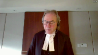
:::

The courts have identified the use of a trial judge of minor or collateral inconsistency contradiction may be significant.

The courts have identified that where a trial judge fails to conduct a critical assessment of inconsistencies which undermine the crown evidence is an example of it, and where inconsistencies are used to undermine the credibility of defence are ignored but not applied in the same standard to the crown, you've established uneven scrutiny.

It's not one single thing, it's a cumulative pattern.

Thank you.

**Justice Abella** (01:17:00): Mr. Fox, just a final thing on remedy.

If the appeal is dismissed, there's obviously nothing for us to do except say it's dismissed.

Do you agree with the proposed disposition by the Crown if the appeal is allowed?

**Speaker 2** (01:17:13): If the appeals dismissal will go back to the new trial if the appeal is allowed Yes, the the crowns at no point in time suggested that the other issues are going to be addressed before this court So the only appropriate remedy would be to send those back to be dealt with by the Court of Appeal.

::: {.column-margin}
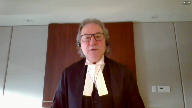
:::

Thank you.

Mr. Fox Thank you.

**Justice Abella** (01:17:32): Can you reply, Mr. Sinclair?

**Speaker 1** (01:17:37): Thank you, Justice Abella.

**Justice Abella** (01:17:41): Thank you.

The court will take its morning recess and I would ask council to remain.

And we'll let you know.

Inaudible.

**Justice Abella** (01:28:52): Council, we want to thank you for your excellent submissions.

Mr. Fox, you said everything you could, but unfortunately we're not ready to exceed to your arguments.

The reasons of the court are going to be read by Justice Martin.

**Justice Martin** (01:29:12): This court has not decided whether uneven scrutiny, if it exists, is an independent ground of appeal or a separate and distinct error of law.

::: {.column-margin}

:::

In any event, we see no error in respect of this argument that would warrant intervention on appeal.

Accordingly, the appeal is allowed and the matter remitted to the Court of Appeal to decide the grounds of appeal the majority did not address.

**Justice Abella** (01:29:54): adjourned.