---
title: Ethiopian Orthodox Tewahedo Church of Canada St. Mary Cathedral, et al. v. Teshome Aga, et al.
published-title: Heard
date: 2020-12-09
sidebar: false
---

This transcript was made with automated artificial intelligence models and its accuracy has not been verified. Review the original webcast [here](https://scc-csc.ca/case-dossier/info/webcast-webdiffusion-eng.aspx?cas=['39094']).
---

**Speaker 1** (00:00:31): Be seated.

Good morning.

**Justice Wagner** (00:00:38): In the case of Ethiopian Orthodox Tiwaddo Church of Canada, St. Mary's Cathedral et al.

::: {.column-margin}
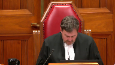
:::

Against the Tihom Aga et al.

For the appellants, Philip H. Horgan, Rafael T. R. Fernandez.

For the intervener, Canadian Muslim Lawyers Association, Shazad Siddiqui.

For the intervener, Association for Reform Political Action Canada, John Sukima.

For the intervener, Canadian Civil Liberties Association, Kara Sweeble.

For the intervener, Watchtower Bible and Tract Society of Canada, Jayden McEwen.

For the intervener, Seven Day Adventist Church in Canada, Kevin L. Bounstra.

For the intervener, Christian Legal Fellowship, Derrick Ross.

For the intervener, National Council of Canadian Muslims, Manu Chaudhry.

For the respondents, Tihom Aga et al. and to Nicole Angelo.

For the intervener, Egal Canada Human Rights Trust, Adam Goldenberg.

For the intervener, British Columbia Humanist Association, Wesley J. McMillan.

Before we start, I just would like to remind the interveners that, of course, we expect them to raise arguments on legal issues and not on the merits on the decisions on the review.

Mr. Organ.

**Speaker 2** (00:02:25): Thank you Chief Justice, Justices.

::: {.column-margin}
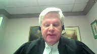
:::

May it please the Court.

The central issue in this appeal is when, if ever, courts have jurisdiction to review the decisions of religious organizations where there are concerns over procedural fairness.

If that sounds familiar, it is because it is the first sentence of your decision two years ago in Highwood Congregation and Wall.

The further legal question in this case is whether a church's governing documents can be enforced as a contract by church members.

This is not only a membership case like Wall.

This case exposes the risks that ensue when a court finds a contract in the absence of a proper evidentiary foundation.

It exposes the further concern of having the court weighed into a dispute over religious doctrine on the basis of an implied contract between church members and a hierarchical clergy.

To the expelled members who brought this claim, it's not about the legal question, the alleged contract which they in fact did not plead.

They seek to have a court enforce their theological views against the Tejadiso movement which they perceive to be heresy.

In their statement of claim they're asking the courts to enforce the findings of the investigative committee at paragraphs one, C and D which examined the heresy.

They continue to pursue that claim.

The court of appeal found a contract to exist to fit into the Highwood and Wall paradigm where such a finding in my submission does not fit.

We assert that a court should have no rule in adjudicating the decision of my clients.

The respondents argue that a procedural review is available as a result of the existence of a constitution or bylaws which the respondents argue is the contractual matrix on which the court gains jurisdiction.

They argue that because they registered as members and donated to the church they can enforce the constitution and bylaws in court for reasons that we have submitted and which are found by the original trial judge.

There is no contractual basis for such an intervention.

We submit that the court should not extend its jurisdiction and should be hesitant and limited in extending its jurisdiction into private decisions especially in the context of religious institutions.

Application of procedural fairness, a legal construct on all such private decisions ignores the necessity of the underlying basis of any intervention.

**Justice Rowe** (00:05:24): By the way, is it purely coincidence or rather careful staging that the portrait of Sir Thomas Moore is over your right hand shoulder?

**Speaker 2** (00:05:35): A little bit of both, Justice Roe.

::: {.column-margin}
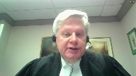
:::

I have Thomas Moore in my office at all times as a reminder.

If I could continue, membership in a voluntary religious community engages an acceptance of the norms of that community.

That membership does not create an enforceable contract.

In circumstances of the congregation such as my clients, they rely upon scriptural norms of Matthew 18, not unlike Highwood congregation.

For reference for that, you can look at the Patriarch's Letter at tab 8 of my condensed book.

The state should have no role in adjudicating internal membership provisions of private, voluntary clubs or associations, and even less of a role when that community is of a religious congregation absent underlying legal rights.

Wall stipulated that there is no freestanding right to procedural fairness of decisions of voluntary associations in the absence of an underlying legal right.

This court also asserted that courts should avoid matters of a religious tenant as being non-justiciable.

I refer you to paragraphs 2, 12, 24, 29, and 37 of Highwood and Wall at tab 2 of my condensed book.

Likewise, a congregation or a church cannot use the courts to impose some form of requirement on its members.

Their respective commitments are aspirational, such as upholding the church's teachings, rules for the reception of sacraments, and participation in liturgy.

Courts have no role in such oversight.

The religious commitments of a congregation do not form an enforceable contract.

The problem is not just lack of jurisdiction, it's also about justiciability, which limits the kinds of questions courts should be deciding.

The judiciary should not decide membership questions.

Such decisions should remain matters for churches to decide, especially in recognition of the freedom of religion and the charter, and membership is at the core of the church's discipleship.

Courts should steer clear of issues such as the administration and delivery of the sacraments, admission to ministry, or discipline of its members.

The decisions the expelled members are challenging here are ultimately religious.

They are not justiciable in my submission.

I will proceed to address jurisdiction and then thereafter justiciability.

My colleague Mr. Fernandez will speak to charter issues and the motion on the inducing of fresh evidence.

Turning to jurisdiction, I'll address three issues arising from the court of appeal decision, the effect of a written constitution or bylaws, contractual consideration, and the intent to form contractual relations.

I should note that there are certain items not in dispute, there are certain items not in dispute, that the plaintiffs are not members of the corporation and therefore do not enjoy a statutory claim under the corporations act.

I have not spent time on the difficulty in identifying the parties to this contract, which creates another area of doubt.

The court does not enjoy a right to fix every problem or deliver its opinion merely on the basis of a suggestion that it may come to a different conclusion on the question.

As a result, in the absence of a legal underpinning, private institutions are not required to provide notice, a fair hearing, or written reasons.

High Wood and Wall required the need to find a legal underpinning prior to the entry of a court into the review of decisions of private institutions given the respect afforded religious institutions and the constitutional right to associate or not to associate.

The basis on which the Ontario court of appeal allowed the action to proceed was a finding of contract between church members and the church, which would make membership itself into the underlying legal right.

The court of appeals holdings on contract were ambiguous.

First, I referenced paragraph 40 at tab three of my condensed book.

It suggested that where a voluntary association had a written constitution or bylaws, these constating documents were always a contract.

That's an incorrect statement of the law.

A proper contractual analysis is required, and I'll turn to that later.

Second, the court of appeal found that the constitution bylaws of the church in this case were a contract because the expelled members registered via membership applications and gave consideration to the church in the form of monthly contributions.

That's a paragraph 46 to 48.

**Justice Brown** (00:10:44): You'll come to this, I'm sure, but I just want to make sure that you do is to review precisely the evidence on that point that was in the record on the question of this issue of consideration.

::: {.column-margin}
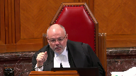
:::

**Overlapping speakers** (00:11:02): consideration or was

**Justice Brown** (00:11:03): what was promised, what was given, what evidence is there of any of that.

**Speaker 2** (00:11:09): I could speak to that just briefly.

::: {.column-margin}
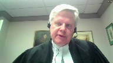
:::

From the submissions in Highwood and Wall, I think it is clear it is on the plaintiff to establish those contractual propositions.

So on the first set of proposition, the onus falls to the respondents here to establish those contractual terms.

Thereafter, respondents argue, Justice Brown, that in effect the Constitution and bylaws, including the 1977 M. Eric Constitution, were in fact accepted as terms even though on their membership, such materials weren't before them.

But I believe that this is part of the vagueness of the proposition of the intention to form contractual relations, which I'll certainly turn to.

**Justice Brown** (00:12:10): The Court of Appeal said that they gave consideration in the forms of the contributions, and the Court of Appeal seems to draw that from the membership form.

::: {.column-margin}
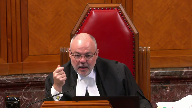
:::

Is there anything on the record that suggested that this was their intent to form a legal relationship of contract by making contributions?

Is there anything on the record that indicates that they actually made contributions?

Is there anything on the record that shows what those contributions were?

**Speaker 2** (00:12:44): No, the expelled members haven't put in any evidence that they gave money to the church, let alone fixed monthly contributions.

::: {.column-margin}
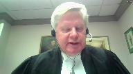
:::

I think it's understood that the members presumably may have donated to the church over the years, but they didn't raise that point until the Ontario Court of Appeal hearing.

The inference that was drawn by the Ontario Court of Appeal was from the blank form, which is at tab six of the condensed book, or my condensed book.

More importantly, financial contributions to a church are normally treated as donations, as gifts.

Advancement of religion has been the norm since the Statute of Elizabeth in 1601.

Donations aren't by definition not consideration.

They're freely given and not enforceable.

I don't want to go into the details, but I'm going to give you a little bit of a rundown of what happened.

**Justice Brown** (00:13:35): to suggest by my question that I understood otherwise.

::: {.column-margin}
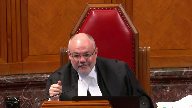
:::

I just wanted to know precisely what the record showed about this, and your answer, as I understand it, Council, is nothing.

The record showed nothing.

It showed no contributions.

It didn't show the amount of contributions.

It was just the blank entry on the membership form.

That's correct.

Thank you.

**Speaker 2** (00:14:04): Returning to the notion of the merits of the constitution and bylaws, I think it's important to recognize that Wall stated that it was difficult to show mutual intent and to form contractual relations in the context of a religious voluntary association.

::: {.column-margin}
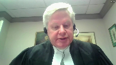
:::

That's a paragraph 29 of Wall. Why?

Because churches and other religious groups codify their spiritual commitments into written documents without intending those documents to be enforced by civil courts.

That's why Wall puts the burden of showing that there's a contract on the party who alleges its existence.

You just can't assume it.

The Highwood congregation in Wall, like the church here, relied on written procedures themselves set out in the organized to do Jehovah's will handbook.

That's referenced at paragraph 38 of Highwood and Wall.

Just as in Wall, the mere existence of such written procedures does not create a contract.

That would essentially create a free-standing right to procedural review which Wall rejected.

The court of appeal relied upon Senes, which we say was misplaced.

First of all, the Montreal Real Estate Board was incorporated and Senes paid a membership fee and due pursuant to the Quebec Statute.

Senes' livelihood depended on membership.

He was fired from his job, a contractual arrangement, because of his expulsion from the board.

The court noted that the board could have sued members for arrears of membership dues if they didn't pay them.

Senes was claiming damages from the Montreal Real Estate Board, but none of those propositions apply to the church in this case.

We provided a brief overview of cases in my factum at pages 10 and 11.

The two cases we've cited where written constitution and bylaws of a voluntary association were found to be a contract were...

**Justice Kasirer** (00:16:18): Mr. Horgan, can, can I, I don't know if you've, you've finished speaking to Senes.

I'm wondering if, have, have you, are, are you perhaps going to come back to it?

**Overlapping speakers** (00:16:27): going to move on.

**Justice Kasirer** (00:16:28): So I was wondering, in Senes, the court speaks to similarities between the constitution and bylaws of a corporation and a contract of adhesion, and I'm wondering if you have any comment on that parallel made by the court.

**Speaker 2** (00:16:47): No, I've given my submissions, Justice, on where I think the distinction needs to be drawn in Cinez.

::: {.column-margin}
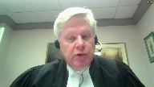
:::

It wasn't a merely aspirational relationship between the parties, it was commercial.

There were impacts on one's livelihood, claims for damages, and on the same term, the ability of the board to demand compliance and such dues.

None of that applies to the church.

So in the circumstances, the particular distinction of adhesion, et cetera, is not something which I think can be drawn or brought over to our case.

I should point out that the reason in the membership form, or at least the notion of financial contributions to a church, is that this church, as well as many others, have a notion of tithing, of the aspirational expectation of supporting the church and its community.

But it's an aspirational commitment.

As we pointed out in our factum at paragraph 42, the church's constitution says a member who can't afford to tithe can contribute less or make no contribution and isn't deprived of access to church services.

In Cinez, the court pointed out that the board could have sued Cinez for arrears and by the same token had an action in contract against them.

It would clearly be wrong to allow a church to sue parish members to collect donations.

I refer you to Boutellier and Dalhousie of this court from 1934 or the Marcus Estate case from 2003, both of which held that a pledge to make donations is not enforceable as a contract.

The implication of the court of appeals holding is that when you register as a member of a church community and give money to it, such payments are contractual.

If a payment is contractual, it can't also be a charitable donation.

Holding donations to a church to be contractual payments is a departure from existing law.

If I could turn to the issue of the intent to form contractual relations.

When you become a member of a church or other religious association, the presumption is that you intend to assume spiritual obligations, while held at paragraph 29 that the party alleging a contract had the onus of showing the evidence to form contractual relations.

That onus was effectively reversed by the court of appeal.

The court simply assumed that the constitution and bylaws were intended to be contractual.

That can't be enough, otherwise the court and law could have treated the Jehovah's Witness procedural handbook as evidence that there was a contract in that case.

We say that both the expelled members and the church intended only to assume spiritual aspirational obligations and not contractual relations that they would have expected to be enforced by courts.

There's nothing about membership in this church that makes it beyond mere membership in that context from paragraph 29 of law.

While the church adopted disciplinary procedures and cited them in expelling the expelled members, it did not intend them to be enforced or overseen by courts.

There's a distinction there from Lakeside Colony, references to which I put at tab five of my condensed book, where the case began as an action by the colony to ensure, enforce the expulsions.

The religious organization was quite clear that it was enforcing or trying to enforce legal rights, whether it would be with accommodation and or employment arrangements.

When a voluntary association has to do with one's livelihood or when the member in becoming a member intends to purchase a bundle of rights with a quantifiable value, the intent to form contractual relations can be implied.

When you would join such an organization, you expect to form the kind of relationship that a court could enforce if necessary.

Mr. Horgan.

**Justice Kasirer** (00:21:33): Can I, Mr. Horgan, sorry to interrupt you again.

::: {.column-margin}
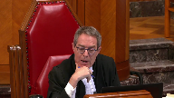
:::

Can I ask about the right to use church premises?

Your letter, the letter of expulsion threatens action and trespass.

Is membership, does membership give a right to use church premises and is that in any way relevant to the dispute before us?

**Speaker 2** (00:21:56): The membership, again, is not contractual in nature.

::: {.column-margin}
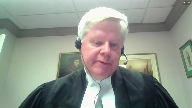
:::

But in terms of the element of the trespass notice, in effect, that was a consideration which arose to address the nuisance that was being experienced by the community and was a matter for which the difficulty which had been going on for quite some time had been a matter that was believed by my clients to address the difficulty.

It should be noted in the evidence and in the record while they were told not to attend the cathedral parish of the Ethiopian Orthodox Tewedo Church, they continued to attend other parishes.

Most importantly, Justice, we should probably keep in mind that the expelled members haven't asked for a reversal of the trespass notice or an injunction allowing them onto the property.

They just seek to have their expulsions reversed.

So in that context, it's not before the court.

It may be before the court at a future date under some responses that could be raised, but that's not currently before the court or has been sought as a form of redress or correction by the expelled members.

I may move on with my time to justiciability.

In Wall at paragraph 12, it's noted that even where review may be available, the courts will consider only those issues that are justiciable.

Issues of theology are not justiciable.

Justiciability is about capacity and legitimacy.

It arises in this case because the court does not have the capacity to adjudicate religious questions in my submission.

And granting remedies of religious nature undermines the court legitimacy.

It should be remembered that the expelled members here aren't seeking damages or a proprietary remedy based on an alleged contract.

The main relief sought by the members, and you'll find this at paragraphs one, C and D of their statement of claim, is a declaration that the findings are valid to announce the findings and to enforce the findings against the church and its members.

Some reference could be made to both the guidelines and the findings from the record, which can be found at volume two of the record tab C, parts B and C. And I'll just make a reference to certain elements of the findings, which recognize that it's up to the archbishop to make these decisions.

But even on the page three of the document, page 129 or page 380 of the record, depending on which number at the top of the page we're referring to, if I just make quote.

Again, this is from the findings.

The violations committed are dogmatic and canonical in nature.

And the committee has submitted the file to Archbishop Ebuna Dimitros, head of the diocese, so that the decision will be made in accordance with the church's set of codes.

We are quite sure that His Holiness will review the evidence submitted before him and render an appropriate decision.

It's clear by their own reference, both in the guidelines and then in the findings, that these are dogmatic and canonical propositions.

These remedies are not justiciable in my submission.

At paragraph 58 of the Interior Court of Appeal decision, it stated that it wasn't clear whether the church followed the steps required by the constitution of advice and education, consultation and canon, and temporary suspension with warning before the cancellation of membership.

My clients disagree.

My clients say they followed a process.

But it should be remembered that we don't get to a review of that process unless we've had the preliminary question answered in the affirmative of a legal underlying right.

**Justice Kasirer** (00:26:58): You

**Overlapping speakers** (00:26:58): Let's see.

**Justice Kasirer** (00:26:59): Sir, excuse me, sir, sorry to, but let's say we do.

::: {.column-margin}
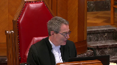
:::

I mean, you should, if the court was to find, and in fairness to the Court of Appeal for Ontario, they did find, either pursuant to web of contracts doctrine or the general rules on contract that a contract did exist, then they were right to consider just disability, no?

**Speaker 2** (00:27:30): Well, let's just play that out.

::: {.column-margin}
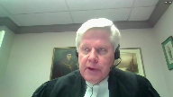
:::

If in fact there's an entry-level acceptance of a contractual claim or legal remedy, you're still engaging in a process which finds its origins in the Gospel of Matthew chapter 18.

**Justice Kasirer** (00:27:53): I understand, but you're asking yourself about justiciability after, and it may well be that once you've found a contract, you embark on a second order inquiry.

::: {.column-margin}
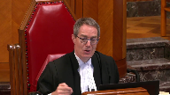
:::

Is the dispute justiciable?

And then if it falls narrowly under a religious doctrine, according to your view, the answer would be no.

And I'm wondering then, if it doesn't fall under religious doctrine, then I guess the answer is yes.

**Speaker 2** (00:28:29): not knowing the hypothetical, I think that's correct, but if it were matters, again, I'm trying to understand a proposition that would meet your criteria.

::: {.column-margin}
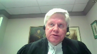
:::

But I think, I suppose my submission is focused on both the decision of the Archbishop, which was pastoral in nature, one for which these dissidents did not agree, or the submission of the Patriarch, both of which are at tabs eight and nine in my condensed book.

**Justice Kasirer** (00:29:04): Well, to myself, sorry, just to explain myself, whether if the issue bears on the merits of a decision of expulsion, one might be inclined to say, well, that's a theological matter and that's not justiciable.

::: {.column-margin}
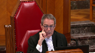
:::

But if it turns on the procedure intended to give effect to that, and there is an underlying contract, is that not fairly justiciable?

**Speaker 2** (00:29:43): I would, let's posit a hypothetical.

::: {.column-margin}
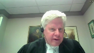
:::

If you're dealing with an employment relationship of someone who may be working at the cathedral, I think there, there's a reviewable proposition. Why?

Because there's an underlying contract.

In our submission, we don't get there, but even if it was the employment situation, I think we need to be clear that it has to be resolved in reference to those guidelines, the bylaw and the constitution.

But perhaps it's helpful to make reference to a high wooden wall, paragraph 38 justice, where justice Roe indicated that in addition, sometimes even the procedural rules of a particular religious group may involve the interpretation of a religious doctrine.

So in terms of the commentaries that have been written, and I know one of the interveners probably speak to this, the development of procedural rules will find its base in the religious dogma, in the canonical norms.

And very quickly, the distinction between process and substance brings you back into a non-gestational area.

**Justice Abella** (00:31:09): Doesn't it really in some sense, just following along from Justice Kasir's question because it's in my mind as well, doesn't it really require an assessment of what the nature of the contract is, not is there a contract?

::: {.column-margin}
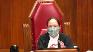
:::

What is the nature of this contract?

Is it based on theological doctrine or is it a commitment, a secular commitment to give funds, to donate, to be hired, to be fired?

So it seems to me that the question of the existence of and the justiciability of what we're dealing with are tied together because as you pointed out as well, some contracts are so rooted in theological doctrine that they are not justiciable.

Others even though they relate to religious organizations may very well be justiciable.

So we have to look at what the nature of this contract is assuming there is one.

Is it one that is rooted in civil secular doctrine or does its interpretation depend on an assessment of the theological underpinnings?

Is that an inappropriate way of looking at it?

**Speaker 2** (00:32:34): Again, I think the focus should be relying upon what this Court has unanimously approved two years ago in Wald.

::: {.column-margin}
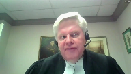
:::

Let's get through the identification of the contract and here you have difficulties of the vagueness of parties, terms, consideration and so on which I've already mentioned let alone the intention to create contractual relations.

But if in fact you can get through that to some extent to suggest that there is a contractual underpinning a matrix of some kind, I don't know if we get over the bridge of justiciability.

Think about the person making the final decision in this case, Justice Abella.

It's the Archbishop.

The Archbishop is making a ruling because the Church believes that bishops have inherited their authority from Christ's apostles.

They don't participate in an expectation of having oversight from our civil court.

I'm mindful of your reasons in Bruker, Justice Abella, where there may be aspects of a contractual relationship entered into by husband and wife with counsel for which there may be damage claims available but even there the court did not go so far as to impose obligations on the religious aspects.

So I think from our own jurisprudence, Justice Abella, that may be helpful to your decision in terms of whether in fact aspects of this contract engaged in justiciable notions, let alone the process that the Court of Appeal seemed to think needed attention.

In the end of the day, the question arises are civil courts competent or have the capacity to wade into the kinds of issues that are before either this committee and or the Archbishop without delving rather deeply into Church doctrine, canonical norms, history and other elements?

**Justice Abella** (00:35:01): Exactly, that's my point.

::: {.column-margin}
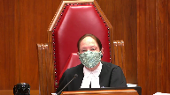
:::

If you cannot do it without engaging in those religious doctrinal foundations, then it is not justiciable.

I think that's what Wall said too.

I'm just wondering how much time, therefore, we should spend on is it a contract, isn't it?

Is it a rule?

Are there rights?

If what is at stake is rooted in an interpret that requires an interpretation of religious doctrine, haven't we said that isn't justiciable?

**Speaker 2** (00:35:33): I agree with you.

::: {.column-margin}
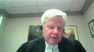
:::

In fact, if you focus as I mentioned on the relief sought in respect of the findings of the committee, read that carefully.

It's clearly religious or doctrinal and thus directly contrary to Anslem's mandate that the court should not engage in that kind of a review.

**Justice Abella** (00:35:57): But in Anselm wasn't the problem that the court used religion as a defense to the enforcement of contractual obligations.

**Speaker 2** (00:36:08): Well, just focusing on our case, I query whether in fact a court in 2020 should be engaging in approval of a finding of heresy as requested by the plaintiffs here.

::: {.column-margin}
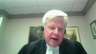
:::

With those submissions, I may turn it over to my associate, Mr. Fernandez, who will speak briefly about charter impacts and the motion to adduce new evidence.

Thank you.

**Speaker 3** (00:36:46): Chief Justice, Justices, good morning.

Just is my mic on?

**Overlapping speakers** (00:36:54): Go ahead, we hear you.

**Speaker 3** (00:36:55): All right, perfect.

::: {.column-margin}
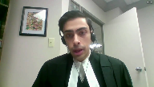
:::

Thank you.

The expelled members are seeking remedies of an essentially religious nature, as we've just been discussing with my friend Mr. Horgan.

For a court to impose such remedies violates the charter freedoms of my clients.

The expelled members actually sought a declaration that the church had infringed their charter right, but the church is a private voluntary association.

It's not an arm of the state.

It's not acting with government functions or anything like that.

In fact, the church is protected by the charter.

Its autonomy is valuable and we say this because communities like the church are important to a strong civil society in Canada.

That's why it's protected by religious freedom because it's important to the spiritual lives of its members, freedom of association as a community and in particular this community is part of the Ethiopian diaspora, largely new Canadians and we must bear in mind the interpretive principle of multiculturalism.

The impact on this community of granting the relief sought would not be just procedural.

It would be substantive and I say that even with respect the expelled members are asking for a procedural review of the expulsion process and we've explained why we consider that to be religious, but the impact of the order they seek reinstating them in membership, there are two impacts I want to focus on.

The first is that as my friend pointed out, my clients as Orthodox Christians believe that their bishop is an important spiritual authority that's core to their religion, a successor of Christ's apostles.

For a civil court to tell a bishop you've interpreted your church's internal religious rules incorrectly places my clients in a bind.

The court is telling them one thing about how to interpret their religion, the bishop has told them another.

The second impact is that if the expelled members were to be reinstated in membership, they would be free to continue what we've termed their crusade against the Tejadiso heresy.

The very reason for the decision in the first place was to prevent this disruption and again it was a pastoral decision, it wasn't you can't come to any of our churches, the bishop is an authority over the whole diocese not just St. Mary Cathedral, it was in this community you're a disruptive influence, you can go to another one if you so choose.

To reinstate them and to vindicate them even if relief with respect to the findings isn't granted, to reinstate them would be a victory in court in an action that they seem to understand based on their own pleading and their own evidence as largely about the Tejadiso movement.

That's going to disrupt the internal affairs of my client at a church, at a community of worship which should be at the center of what religious freedom protects.

**Justice Karakatsanis** (00:40:08): Can I just ask you about the due process point?

::: {.column-margin}
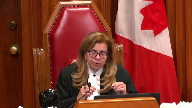
:::

I understand that the relief, other relief sought is religious, is interpreting religious matters.

But in terms of the issue of whether the expulsion followed the process established by the church, I understand your submission to be that the process itself is a religious precept?

Is that what you're saying, that there's something about this process that's supposed to be followed that is religious in nature?

Other, I mean, I guess who is making the decision is one aspect, but is there something about the process that's based in religion?

**Speaker 3** (00:40:57): Yes, Justice Karakatsanis.

::: {.column-margin}
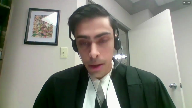
:::

The answer is actually similar to what was found in Wall.

It's that these procedures are based on scripture, based on the Gospel of Matthew.

And that's why we've included in our condensed book at tab eight, the patriarch's letter.

So this is page 28, the second paragraph of the letter.

Our Lord Jesus Christ, who is head of the church, has taught us that three steps should be followed to solve any controversy within the church, Matthew chapter 18, verse 15.

I don't want to go further with that, but that's essentially our problem here.

If the process which has been written into a document that looks perhaps more legal, that doesn't mean it's not based on scripture.

We say it is founded on scripture.

It is how this church deals with controversies that arise in the church is founded on scripture.

So yes, we say that is a religious precept.

**Justice Brown** (00:41:58): And that is coincidentally the precise scriptural passage that was cited at paragraph 38 of Waltz.

**Speaker 3** (00:42:08): Exactly Justice Brown and that's it's not the only case looking at the jurisprudence where that's come up in a church expulsion case.

::: {.column-margin}
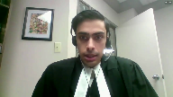
:::

I want to address some jurisprudence that may be of assistance to the court.

Our primary submission is that because a court order is a state action it may engage the charter when it seems to infringe charter freedoms.

That's a proposition that does come up in it's a different set of cases but in injunctions in defamation cases we've cited the Canada Liberty net decision of this court which held that when the court is applying an injunction in a defamation case it has to do a kind of quasi oaks test

and I want to focus also turning to religious freedom on what this court did Justice Abella in Bruker.

Bruker was a case based on a separation agreement negotiated by council and seeking damages so there's a civil right and a civil remedy.

Justice Abella went through a balancing and distinguished the approach specifically said this honorable court didn't endorse the approach of American courts which have done two different things.

One specific performance they've ordered recalcitrant husbands to appear before the the Beth Din the rabbinical court and seek the get that specific performance of a religious nature and we say that's similar to requests for enforcement of the findings order that the findings be read out in church.

The second approach that this court didn't endorse which wasn't sought on the facts but didn't endorse is a declaration on the enforceability of a Jewish marriage contract the ketubah if I'm pronouncing that correctly which is entered into as part of the religious ceremony.

We say that that's not unlike a declaration on the validity of the findings or even a declaration on whether the church's processes founded on scripture have been correctly followed so we say that that is a precedent which may be helpful to the court in understanding how the charter applies to this case.

Subject to any questions I'll move to the motion to it.

I have a question.

May I have a question?

**Justice Martin** (00:44:41): Thank you.

::: {.column-margin}
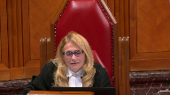
:::

In law, there was not a very full treatment of charter issues.

There was, as you say, a reference to the charter informing the development of common law.

Can this be an area in which the charter rights and charter values that you're invoking, do we need to consider them on the justiceability issue or on any other issue?

Because it seems to me that the more that you're basing yourself in rights and charter rights, maybe the more justiciable the issue becomes.

**Speaker 3** (00:45:20): My argument is that justiciability is actually informed by the Charter.

::: {.column-margin}
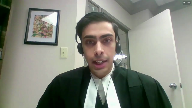
:::

Part of the reason an issue may not be justiciable.

Remember, justiciability is about a decision that the court makes for itself.

But part of the reason it chooses not to make certain decisions is because they're in areas like religion, dogma.

Again, AMSALM courts should not become arbiters of dogma.

That informs the court on justiciability.

And in that sense, I think the Charter is related because it points to areas.

**Justice Rowe** (00:45:56): to tell you I am greatly skeptical that something which would have been justiciable before 1982 needs to be justiciable after 1982.

**Justice Brown** (00:46:10): I mean, and if you look at, for example, this court's decision in Sommer, right?

::: {.column-margin}
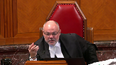
:::

Justice Rand makes very clear that such questions are not part of the remit of the court.

There are certain civil matters and there are certain kind of primordial freedoms and he takes care to distinguish them.

I'm not sure what 1982 in the charter changed on that front.

I share Justice Roe's skepticism on that.

I just want to signal that to you.

**Speaker 3** (00:46:50): Well, there's one other point I will make.

::: {.column-margin}
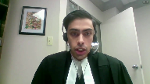
:::

So first, the charter isn't necessary in our submission to decide this case if you accept our submissions on the necessity of the contract, the underlying legal right and so forth.

But I do want to say the charter does inform the development of the common law and what the court below did and what the respondents are here seeking is the development of the common law.

We haven't yet seen something like the web of contracts doctrine applied to an unincorporated religious association that's just a congregation.

We've seen it applied in Lakeside where there were proprietary rights and commercial interests.

So we're saying that this court should consider the charter in choosing not to develop the common law in that direction which we say threatens the religious freedom of communities like my clients.

Turning then to the motion to adduce fresh evidence, I want to address really just one of the points under the four-step Palmer test whether my clients could have adduced this evidence at the lower courts.

This didn't begin as an action in contract.

The pleadings and the affidavit of Mr. Bayenne on which the respondents, the expelled members rely don't talk about contracts, don't talk about a financial commitment that was imposed on members or that members made.

This becomes a contractual case on appeal.

The notice of appeal talks about the bylaw, the constitution and findings as terms of a contract but there's no suggestion, it doesn't discuss consideration, there's no discussion of a financial commitment.

That becomes the argument at the court of appeal hearing it appears and then is accepted by the court at paragraphs 21 and 46 stating that financial commitments were made, contributions were made and that it constitutes contractual consideration.

So we say only at that point could my clients have known that the fact that these members didn't write in any financial commitment when they applied for membership would have been relevant.

That goes not just to consideration but also to intent to form contractual relations.

When the court of appeal drew the inference that there was a financial commitment in writing, that the membership applications had to be submitted for approval, it may have looked to them like a commitment was being required by the church, a financial commitment.

In fact, there wasn't such a commitment made.

It's less reasonable to draw that inference.

Again, we would say that even if there had been a commitment in writing, it might well have been a pledge to make donations.

But what the record with the fresh evidence shows is that when the members submitted applications for membership, they were just giving contact information to the church.

They didn't know the terms of the constitution and bylaws.

The church didn't have any written commitment from them, just contact information.

There was no meeting of the minds and there was no contract.

Subject to any questions, those are my submissions.

Excuse me.

**Justice Martin** (00:50:20): I do have one question on tab 8, the patriarch's letter.

::: {.column-margin}
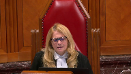
:::

May I just ask, it seems that that letter is addressing the committee's findings and not the expulsion.

Would that be a fair reading of that letter, or does it address both?

**Speaker 3** (00:50:40): It's written as a response to the controversy following the committee's findings, but it's setting out where the process is going to go.

::: {.column-margin}
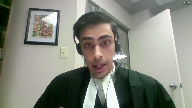
:::

It talks about what church discipline means.

I just want to point out, this is a document from the patriarch who's in Ethiopia, part of the global church.

The constitution and bylaw are not specific to this community.

He's talking about what the discipline of the church requires.

He's the spiritual father, you might say, of the church.

He's providing that interpretation.

And yes, it's prior to the expulsion, but he's setting out what the disciplinary process is.

**Justice Wagner** (00:51:22): Just Sabela as the last question for you

**Justice Abella** (00:51:28): seemed in part at least to base the conclusion on the fact that the statement of claim does not, we're spending a lot of time talking about breach of contract, but am I right that or was the motion judge right in saying the statement of claim does not allege a breach of contract and doesn't that a lot flow from that?

::: {.column-margin}
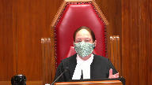
:::

**Speaker 2** (00:51:50): Absolutely.

In effect, the word contract, as I recall, does not appear in the statement of claim, but it comes up in the first instance, in paragraphs 40, 46, etc., in the Court of Appeal.

**Justice Abella** (00:52:07): of appeal,

but the motion judge expressly said it wasn't pleaded.

That's correct.

**Speaker 1** (00:52:14): Thank you very much.

**Justice Wagner** (00:52:19): Chazade, c'est de qui?

**Speaker 4** (00:52:33): Good morning Chief Justice, honorable members of the full bench, may it please the court.

::: {.column-margin}
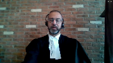
:::

I wish to begin by recognizing the civil conflagration in Tigray near Eritrea in the Horn of Africa.

Our sympathies go out to the Ethiopian people.

Ethiopia has had a long and storied religious history from the Queen of Sheba and Solomon to the Negus of Abyssinia and his protection of religious minorities to this important case in a faraway colder land.

The court here must apply the wisdom of Solomon.

We've advocated that religious organizations should be required to abide by principles of procedural fairness in their compensating documents, especially in corporations.

**Justice Rowe** (00:53:25): I am informed by the wisdom of Solomon in my private life, not in my judicial pronouncements.

**Speaker 4** (00:53:35): fair enough, Your Honour, where there are things such as the right to know the case against you, the right to reply, and an opportunity to be heard by a panel of your peers.

::: {.column-margin}
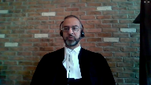
:::

As my learned friends of the appellants have noted, this Court's recent decision in Highwood Congregation versus Wall states that courts can review procedural rules that are based on contract even where they give effect to religious principle.

Yes, there is a mystique in religion, what we described as the rarified atmosphere of the Dome of the Rock in our last appearance before this august chamber.

While we take no position on the facts of the current case and whether there is a contract, the author of the Law of Unincorporated Associations in Canada says as follows, Justice Roe held that where an association is not bound together by contract, mere membership in the association is not justiciable.

But it will be an unusual case where the association relationship is not contractual in nature.

Our greater concern is what will happen when board members across the nation realize they will not be held to procedural fairness requirements in their constitution and bylaws.

Will it result in vigilante justice in the Gurdwara, fisticuffs in the chapels of the nation?

Will there be a reliance on the criminal law because there is no civil remedy?

With religious entities that are incorporated, we must also keep in mind current and pending laws, such as the Ontario Not-for-Profit Corporations Act.

Chief Justice Strathie of Ontario cited the Corporations Act in the Bala versus SMA case to find jurisdiction, as set out in our condensed book.

On the issue of incorporated entities, the court may wish to wait for a better case involving a corporation on a fuller record, so that you can account for the will of the legislature.

The amber light continues to be a good metaphor in this case, as it was in the Wall case decided in 2018.

And we submit that there is a reason that within two and a half years of Wall, there's a similar case that has reached the Supreme Court.

There's a similar similar case that has reached the Supreme Court of the land.

On behalf of the Canadian Muslim Lawyers Association, those are all submissions as a friend to this court.

**Speaker 1** (00:56:22): Thank you very much.

**Justice Wagner** (00:56:26): Mr. John Sekima.

**Speaker 5** (00:56:35): Chief Justices, this court faces the question of whether or in what circumstances to assume jurisdiction over matters of ecclesiastical or religious law and membership in a religious body.

::: {.column-margin}
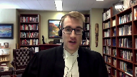
:::

And as I indicate in my facum, this is in many respects an ancient question.

I submit that two basic rules articulated by this court in Wall govern the jurisdiction question, and I will comment on those.

First is that mere membership in a religious organization should remain free from court intervention.

Second is that jurisdiction of a civil court depends on the presence of a legal right which a party seeks to have vindicated.

Both these points are found in paragraph 24 of Wall.

Now what this court called mere membership in Wall, meaning membership without property or civil rights attached, may not be mere in other ways.

From a religious perspective, a member may have duties toward God, the church, religious leaders, and fellow believers, as well as rights, in a sense, to be ministered to by the religious community and leaders to participate in sacraments and so on.

We cannot take mere membership to mean membership in a religious body where nothing is expected of members or leaders, or where there is no religious rules or procedures or authorities to govern that religious body.

Now as for this court using the term mere membership to describe membership in such a religious body, which may have rules and obligations and expectations, as a civil court I think that is completely appropriate.

As far as a civil court is concerned, it is mere membership in a religious body where there is no clear civil or property right at stake.

Now I submit it is important for courts to recognize that religious law may intend to set out rights and duties and rules, yet not be intended to set out civil rights or obligations that are civilly enforceable.

If it is alleged that a document is a contract, that is a civil contract, courts should look at its overall content, including language that may suggest it is meant to be interpreted and applied by religious authorities.

They should look at its origins and they should look at how parties came to be adherents of it.

And this court recognized the importance of paying attention to such religious realities when it said in Wall, at paragraph 29, that members of a congregation may not think of themselves as entering a legally enforceable contract by merely adhering to a religious organization, since a religious contract is based on norms that are often faith-based and deeply held."

Again this language of religious organization, religious contract, signals that the principles in Wall must apply to organized religious polities with which have written governing documents, whether we call it a contract or something else, these may not be civilly enforceable.

Now since some references have been made to Bruker, I'd like to bring your attention to a passage, I don't need to take you there, but in the dissent of Justice Freeman in R.E. Morris and Morris, which is a 1973 Manitoba Court of Appeal decision, dealing with the obligation to appear before a beth din to obtain a get, this dissent was cited by the majority of this court in Bruker.

And the dissent in that case distinguishes between a civil contract with a religious aspect, which indeed does not necessarily render it unenforceable, and a matter of internal religious decision making and religious jurisdiction.

So at page 553 of R.E. Morris and Morris, Justice Freeman says, it is important to keep in mind that we are here simply concerned with a contract between two parties, that is spouses, and the matter of its enforcement.

We are not concerned with a conflict having its genesis in an order of an ecclesiastical court, and thus posing the question of proper limits of jurisdiction between a civil court and a religious court.

End quote.

And Justice Freeman then goes on to quote another case, an English case, explaining the connection between religious law, religious decision making, religious jurisdiction.

And this quote goes as follows, quote, the true ground of the absence of jurisdiction is to be found in the fact that the ecclesiastical courts administer a system of law foreign to, and having no privity with the courts of common law.

The law which they administer being concerned primarily with rights and duties of spiritual import, end quote.

Enforcing spiritual or religious rights and rules is with respect not the responsibility or the burden of the civil courts, whereas protecting property and civil rights is.

As for the balancing of values in Bruker, I know that this comes at the end after the door of jurisdiction has been entered, after it was established that there was a contract and freedom of religion is invoked to get out of its civil consequences.

Subject to any questions, those are my submissions.

Thank you very much.

**Justice Wagner** (01:01:38): Karas Weeble

**Speaker 6** (01:01:46): Good morning Chief Justice and Justices of the Court.

::: {.column-margin}
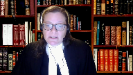
:::

The Canadian Civil Liberties Association intervenes in this case to urge this Court to take an approach to the appeal that appropriately balances three fundamental values freedom of religion, the neutrality of the state vis-a-vis religion, and the basic value of access to justice.

The parties and interveners may all strike this balance in different ways but in my submission there does appear to be some general agreement that these are the values that are at play in this appeal.

And I'm going to use the few minutes that I have to highlight two points that I hope are not duplicative of what you've already heard and of what you will hear from others today.

First I want to address the dangers of adopting the hard and fast rule that was articulated by the Ontario Court of Appeal which says that where a voluntary association has a written constitution and bylaws those constitute a contract as between the members and the organization.

CCLA submits that this conclusion is problematic not only as a matter of contract law but that it also fails to appreciate some of the unique aspects of religious associations and religious belief more generally.

My factum references a piece written by Professor Moon which deals with the Bruker case and in my submission Professor Moon's discussion of judicial reluctance to enforce religious contracts is helpful for the purposes of the issues raised in this appeal.

At page 45 of that piece he notes that quote a religious contract is based on norms that are often faith-based and deeply held and that bind the members of the religious community.

When entering an agreement or contract the parties may not understand themselves as creating legal obligations.

They may consider themselves bound not by secular law but by the spiritual norms of their community, by higher law and by their commitment to each other as members of a spiritual community end quote.

Professor Moon also notes that there may be concerns about whether or not a party made a free and independent decision to enter into an agreement in light of the family and community pressures that may be brought to bear in some circumstances and I think that perhaps this was the issue that Justice Kessier was raising earlier in terms of the analogy to a contract of adhesion.

With respect the court of appeals blanket rule ignores the impact of these complicating factors and this court's own statement in wall that clearly acknowledged that it may be more difficult to show an intention to form contractual relations in the context of a religious community or association.

The second submission I'm making relates to the remedial options that may be open to a court even where there's a determination that legal rights are at stake and that a claim is justiciable and in my submission this is where the charter may become relevant although I would agree with Justices Roe and Brown that the charter does not render justiciable that which wasn't before 1982 and that freedom of religion doesn't exist by virtue merely of the charter.

The remedies however that a civil court can order may be circumscribed in light of the constitution's protection of freedom of religion.

In the case of a breach of contract specific performance is a remedy that may unduly encroach on freedom of religion and in Bruker as you've heard the court found that an award of damages for the wife in light of her husband's lengthy refusal to grant her a get was a reasonable remedy.

A remedy that would have required the husband to give his wife a get however would likely have been beyond the court's jurisdiction.

Another example is referenced in the factum of the intervener the national council of canadian muslims at paragraph 31.

That case is D.F. D'Afferia et al versus Elliott where the court granted some of the relief requested but found that other relief was beyond its jurisdiction.

The fundamental principle in my submission that arises out of these cases is that the court should seek to avoid excessive entanglement in religious matters not only in assessing which disputes are justiciable but also in determining which remedies are available.

In our submission this recognition is a key part of appropriately balancing the fundamental values that I referenced at the outset of my submissions.

Subject to any questions that you may have those are my submissions.

**Speaker 1** (01:06:42): Thank you very much.

**Justice Wagner** (01:06:43): Jaden McEwen.

**Speaker 7** (01:06:47): Chief Justices, Chief Justice and Justices, Highwood Congregation was a congregation of Jehovah's Witnesses and the case was really about religious fellowship.

::: {.column-margin}
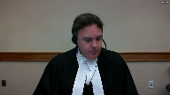
:::

The membership decision was purely religious and involved the determination of things like sin and repentance.

This Honourable Court unanimously found there was no cause of action.

But if the same facts were back before the courts today, a judge might be inclined to assume jurisdiction over the matter on purely technical grounds. How so?

Well Highwood Congregation, as this court had acknowledged, had written rules but it had no governing document or constitution.

But that's changed since then because since then the Canada Revenue Agency has required that all congregations and Jehovah's Witnesses across Canada, and there's well over a thousand of them, adopt a basic constitution to remain a charity.

It's just a two-page document.

It certainly doesn't replace the religious rules that were referred to in paragraph 38 of Highwood.

It's just a basic constitution.

Now does that mean that Jehovah's Witnesses in Canada have suddenly decided to enter into contractual agreement with the congregation?

Of course not.

But according to the Court of Appeals reasons in Aga, they have entered into a contract, whether they like it or not.

And even whether they know it or not, simply because a constitution now exists.

That result has to be wrong because nothing in substance has changed.

So what test should courts apply when a religious association has a constitution?

Our answer, the very same test set out in Highwood at paragraph 29.

We don't need a new test.

In all cases, if a party wants to claim there's a contract, that party has to show there's a contract and show there's intention to form contractual relations and that there was consideration, mutual consideration.

The onus is on the claimant.

No presumption of a contract, no reliance on such a presumption.

And Justice Roe, as has been mentioned, added that showing an intention to enter into contractual relations would generally be more difficult to show in a religious context.

And that's because in a religious context, membership is often just a generic term.

We're really talking about religious association, we're talking about faith, and we're talking about religious relationships and fellowship.

So where did the Court of Appeal go wrong?

Well first, it relied on the web of contracts theory, this legal fiction that was put to rest in Barrie versus Pulley.

It was a legal fiction that was developed in the first place to follow the development of trade unions.

And this Honourable Court found that in reality that legal fiction defied logic to think that all members of a trade union are in some sort tied by mutual contract.

Well, that is even more true when you apply that to religious fellowship.

Next, when you look at cases in which the Supreme Court found that there was contractual membership, cases like Barrie, Sanez, Lakeside Colony, well it wasn't just because a constitution existed.

No, it was because the relationship truly was contractual.

There was a livelihood issue, there was mutual consideration, there was property interest at stake, and members were required to pay dues.

But each time, in all of these cases, this Honourable Court has led by example, by being guided by principled legal analysis, not reliance on labels or on presumptions.

Fundamentally, religious membership and association is fellowship based on religious beliefs.

And unless a party shows that there are legal rights of significant importance that hinge on the membership decision, courts should simply refuse to assume jurisdiction in the first place.

Thank you.

**Justice Wagner** (01:11:15): Thank you, Mr. Bounstra.

**Speaker 8** (01:11:24): Chief Justice, Justices, the Seventh-day Adventist Church in Canada intervenes in this case out of a concern that a contractual theory of religious association would secularize what are, in substance, spiritual commitments of church members.

::: {.column-margin}
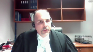
:::

I submit that when considering any issue of membership in a religious organization, the court should approach constating documents, constitutions, bylaws, rules, whatever they are, as a codification of religious commitments and religious relationships and not treat them as though they are intended to be legally enforceable obligations.

And I have two points.

The first is that faith communities require restructure but still have only religious purposes.

My second point is that procedural rules should be still viewed as substantively religious.

My first point.

Faith communities are essential to religious belief and practice in this country.

The means of most religious expression and practice is in its collective dimension, which can only be manifested through organizations and associations.

These religious communities organize themselves for specifically spiritual and religious purposes.

They adopt a structure in order that they can interact with secular society so they can own property, employ people, enter into contracts for goods and services, and these structures can take a variety of forms.

But the focus shouldn't be on the form, but rather on the substance.

Because in substance, these associations are for religious and not secular or legal purposes.

The commitments being made amongst the members are spiritual ones, because that is the point and the purpose of these organizations.

And this is true irrespective of the form of the organization, whether it's incorporated or not, and whether it has bylaws or not.

These faith communities are founded on relationships that are substantively religious, and all of the provisions of constating documents simply provide ecclesiastical structure to their religious affiliation.

What is at issue in membership disputes are religious relationships, and such relationships cannot be legally forced.

My second point is that even procedural rules should be viewed as substantively religious.

And in my factum, I make the point that one can only understand the religious nature of constating documents from inside the religious community.

What may appear to be merely procedural provisions and bylaws may well and often do have religious purposes.

And we've already made mention of the passage from from the book of Matthew this morning, which is a clear example of something that's in a bylaw that incorporates scripture specifically.

**Justice Kasirer** (01:14:13): I mean, can I interrupt you, just to follow up on that.

::: {.column-margin}
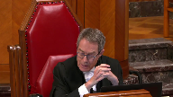
:::

I understand the point that some procedural rules will involve religious doctrine, but Wall continued at paragraph 38, acknowledging that courts may still review procedural rules where they're based on contract between parties, even when, where the contract is meant to give effect to doctrinal religious practices, and I'm wondering if you think that's consonant with what you're pleading now.

**Speaker 8** (01:14:45): Justice Casser, I think it is consonant.

::: {.column-margin}
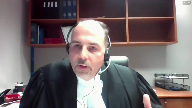
:::

I think the issue, the principles that I'm submitting to you today go both to the question of justiciability and to the question of whether or not a contract is created in the first instance because as I think it was Justice Abella asked this morning, don't we first determine whether or not there's a contract and in my submission the principles that I'm talking about address both the justiciability issue but also before that address whether or not there is in fact a contract in the first place because as I was submitting on the question of the relationships, these organizations are based on a mutual spiritual compatibility of the members.

It's never been an intention of them to create this contract in the first place.

Only if there's a determination that there's a contract you then approach the question of whether or not some of the things that are in the bylaws are are enforceable and when it comes to and what I would submit is that the only things that could even possibly be enforceable at that level are procedural because all of the other aspects of bylaws would would fall within the decided cases and not be justiciable.

My fundamental point is that the only way you can determine if something is merely procedural is to look at it from inside the spiritual community because only the only from inside the community can you determine whether or not there's ecclesiastical or theological import and the only way for the court to do that is to enter into what Professor Chaffee called the dismal swamp of obscure rules and doctrines in which a court has to become enmeshed in wading through understanding and applying religious rules and doctrines.

**Overlapping speakers** (01:16:33): Thank you very much.

**Justice Wagner** (01:16:33): Time is up, so thank you very much.

Thank you.

Derek Ross.

**Speaker 9** (01:16:40): Good morning Chief Justice, Justices.

::: {.column-margin}
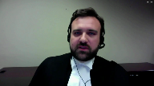
:::

We've heard this morning about the notion of judicial restraint in religious disputes and Christian Legal Fellowship has intervened to speak further to the underlying question of why.

Why, as a matter of legal principle, should courts exercise restraint in religious disputes where no legal rights are engaged?

And this inquiry is important because there may be cases in which courts seem to have the practical ability to adjudicate such a dispute, or at least a certain element of it.

However, as this court has affirmed, the issue is not just whether a court can resolve a dispute, but whether as a constitutional matter it is appropriate to do so.

And this is to be answered by looking to the courts, and this is a quote, quote, proper role within the constitutional framework.

Those authorities are included in Tabs 1 and 2 of our condensed book.

In other words, Justices, justiciability is not just a pragmatic inquiry, it is in some respects a constitutional question that must be informed by certain constitutional limits.

Now in our case law, the principle that has most been discussed in this context is the constitutional commitment to a separation of powers.

And the relevance of that doctrine here might not be obvious at first blush, because it does not speak to religion per se, but it is always an important consideration in framing questions of justiciability, in part because it prescribes the court's role as specifically and primarily a legal adjudicator, not a moral or political one.

This court has said that moral and political matters are not by themselves, generally within the court's jurisdiction to assess, unless they engage a sufficient legal component.

Again, that's a Tab 2 of our condensed book.

And the same must be true of religious matters.

That does not mean the court cannot adjudicate cases with a religious element, but those cases must have a substantive legal, not just religious interest in dispute.

Now this may be a simple point, but under our constitution, the judicial branch consists of courts of law, not courts of religion.

Section 96 courts are not ecclesiastical courts, and that always has to inform questions of justiciability.

This is reinforced by a second constitutional principle, which we submit is relevant here in informing the court's proper role, and that is the duty of religious neutrality.

That applies whether the charter directly applies or not.

It is an overarching duty that precludes involvement in matters in which the state or the court must take sides on religious questions or enforce a particular interpretation or application of theology or doctrine.

**Justice Abella** (01:19:49): Excuse me, sir, but we do do that all the time under the charter.

::: {.column-margin}
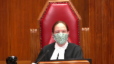
:::

I notice that you referenced the charter for the first time, but that's a very different set of considerations, isn't it?

Like we weigh in, as we have Hutterites, for instance.

Jehovah's Witness cases involving transfusions.

We do engage where there is a legal foundation that's raised.

**Speaker 9** (01:20:15): Absolutely Justice Abella and that is the key point is that there is a legal foundation that is raised and even in that context of course this court has been very careful to say that it will not weigh in on the legitimacy of the beliefs or try to interpret the beliefs in section 2a cases the role of the court is to ensure that the beliefs are sincerely held but has restrained itself from becoming an arbiter of religious dogma and and religious neutrality flows from freedom of religion and that is the third constitutional consideration here along with freedom of association and here the jurisprudence of the European Court of Human Rights is helpful because it is specifically looked at the relationship between these principles and has interpreted them together to protect the autonomy of religious communities.

::: {.column-margin}
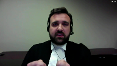
:::

It is said that the autonomy of religious groups is necessary for the realization of individual freedoms and that in turn requires that state actors generally refrain from interfering in their composition or interfering with membership decisions and those cases are summarized in tabs three and four of our condensed book but what they do explain is that the state should not impose secular procedures on voluntary religious groups and that where there is an internal dispute the solution is not to coerce a religious community to accept religious practices or members against their will instead the individual's freedom of religion is exercised through his or her freedom to leave the community.

Thank you very much.

**Justice Wagner** (01:21:52): Thank you, Justice.

Manu Chaudhuri.

**Speaker 10** (01:21:57): Chief Justice, Justices, the National Council of Canadian Muslim understands in a direct way one of the central challenges of this appeal.

::: {.column-margin}
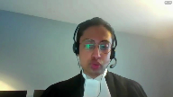
:::

The Council has as its members both voluntary religious associations and ordinary Canadians who participate in these associations.

As such, my client understands that protecting voluntary religious associations, autonomy and self-governance is vital.

At the same time, there's a legitimate interest in protecting individual members' legal rights.

We propose a three-step framework that would help the courts reconcile these interests in a more predictable and uniform way.

Justices Abela and Kassir, you asked earlier where the justiciability analysis fits in and our framework is an attempt to answer that question.

Now I want to say at the outset that our framework is an attempt to consolidate the law and does not depart from the case law in any major way.

So turning to the framework, the first step of the framework requires a court to determine whether the impugn dispute pertains to a cognizable civil contractual or property right granted to a party by virtue of their membership in the religious association.

This is the rule that the court emphasized in WALL and is at the forefront of our framework.

If a party can satisfy this requirement, we move to step two.

If not, that is the end of the analysis and the court will not review the dispute.

At the second step, the court conducts a detailed review of the nature of the impugned matter to determine the essential character, that is the core legal issue.

The question is whether in determining the dispute would the court have to opine on or make assumptions about religious doctrines.

In answering this question, the court may look to the surrounding facts of the dispute, the allegations raised, and the remedy sought to determine the essential character of the conflict.

Now, if religion is only an aspect of the dispute and not its essential core, the court may proceed to hear the matter without further analysis.

If, however, religion is the essential core of the dispute, the court will have to proceed to the third step of our framework.

Now, I want to pause here and suggest that there are two advantages of conducting an essential character analysis.

First, while courts do not expressly use the language of essential character, cases across Canada suggest that courts grapple with this idea in determining whether to intervene in the internal affairs of religious associations.

Clearly setting out the nature and the method of the essential character analysis may encourage more uniform application of this doctrine.

Second, the essential character analysis supplements that 1877 rule that originally comes from Dunnett and was re-emphasized in Wall.

And while that rule is highly instructive and is at the center of this analysis, that rule alone does not instruct judges to always consider whether in adjudicating the legal right at play, they may have to opine on religious doctrine.

The essential character analysis, on the other hand, by making this a necessary part of the approach, helps ensures that courts do not improperly veer into determining religious doctrines for reasons that this court is well aware of and the other parties have suggested.

So at the third step then, if a matter is religious in its essential character, the court may proceed with what we call accommodation and, in exceptional cases, balancing.

Accommodation involves examining the essentially religious dispute to see if any part of the claim can be decided without having to opine on religious content.

Practically speaking, a court considers whether the adjudication of the legal right at

**Justice Brown** (01:26:09): does that ever arise if you've decided at step two that religion is central to the dispute?

**Speaker 10** (01:26:16): certainly Justice Brown and we point to an example in her factum at paragraph 32 the case of Elliot where an individual sought an injunction to prevent a meeting from occurring in a church and the individual also sought X number of people to be admitted into the church in that case the courts had the thrust of your dispute is really about this membership issue but in terms of preventing this meeting from taking place the court may have authority to grant the injunction

::: {.column-margin}
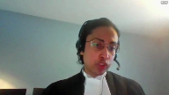
:::

**Overlapping speakers** (01:26:48): Sounds like it was wrongly decided.

**Speaker 10** (01:26:50): It's very possible and we say that in the accommodation stage it's entirely up to the discretion of the court to decide if there is a severable issue.

I see that I'm out of time. Yes.

Thank you for your time, Mr. Justice and Justices.

**Speaker 1** (01:27:04): Thank you.

**Justice Wagner** (01:27:04): Thank you very much.

So the court will take its morning break.

We'll be back in about 15 minutes.

**Justice Rowe** (01:27:47): The court is adjourned.

**Justice Wagner** (01:28:12): Thank you.

Be seated.

Mr. Colangelo.

**Speaker 11** (01:28:21): Good morning Chief Justice, Justices.

::: {.column-margin}
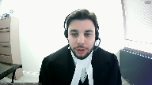
:::

I start by submitting that this case is centered around the expulsion of the five respondents from the Appellant Church.

And I wish to start by noting the following.

The Appellant Church is incorporated under the Corporations Act.

The Appellant Church has a constitution and bylaws.

The Appellant Church owns property.

The Appellant Church's leadership receives remuneration.

**Overlapping speakers** (01:28:45): So what? So what?

**Speaker 11** (01:28:47): Where I will take you next, Justice Brown, is to wall the reference made by Justice Roe.

::: {.column-margin}
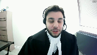
:::

The hybrid congregation is a voluntary association, not incorporated, no articles of association or bylaws, no statutory foundation, doesn't own property, no member of the congregation receives any salary, all in contrast to what we have in this case.

In that case, the Jehovah's Witnesses were carrying out congressional activities and spiritual guidance on a volunteer basis by a group of elders.

**Justice Côté** (01:29:20): Mr. Colangelo, just on that, you see all in contrast with this case, but in this case, even if there is a corporation, I understand that your clients are not members of the corporation.

**Speaker 11** (01:29:31): Yes, but, yes, Justice Cote, but I also think if we look at paragraph 28 of wall, I think this court has left the door open for this very fact pattern what justice role has written is unlike many other organizations such as professional organizations to highwood congregation does not have a written constitution bylaws or rules that would entitle members to have the agreements in force in accordance with their term.

::: {.column-margin}
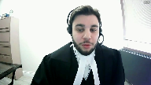
:::

**Justice Brown** (01:29:54): Yeah, but look at the sentence that preceded that.

No basis has been shown that Mr. Wall and the congregation intended to create legal relations.

What do you say here shows an intention to create legal relations?

**Speaker 11** (01:30:09): Well, Justice Brown, I think what I would adopt the reasoning of the Court of Appeal in this case, but also Justice Perel, which is at my condensed book at tab number six in Caraholios, or tab five, I apologize.

::: {.column-margin}

:::

And if you look at paragraph 180, he outlines what I believe this court should adopt when an unincorporated association or group has a written constitution and bylaws.

These instruments constitute a contractual relationship, setting out the rights and obligation of the organization and its members.

It's a complex of contracts between each and every other member.

**Justice Brown** (01:30:52): Okay, so contracts are two-way streets, right?

You agree with that?

Obligations flow from party A to party B and from party B to party A.

What was the obligation that flowed from your clients to the church?

**Speaker 11** (01:31:06): So I take your question, Justice Brant, to mean what consideration is flowing in both directions in this case.

My first submission would be monthly membership fees are paid by the respondents.

**Overlapping speakers** (01:31:18): What's the evidence of that?

**Speaker 11** (01:31:19): The membership form that the Court of Appeal relied on specifically outlines monthly membership fees.

**Overlapping speakers** (01:31:26): What's the evidence that your clients paid them?

**Speaker 11** (01:31:28): Well, Justice Brown, that is in the constitution and articles and bylaws.

**Overlapping speakers** (01:31:34): What's the evidence that they actually paid?

**Speaker 11** (01:31:37): them.

So in response to my friend's motion to adduce fresh evidence we have an affidavit from my client confirming that they paid the monthly membership fee.

**Justice Brown** (01:31:46): all right so there's something in the fresh evidence motion let me ask you this had they not paid it is your position that the church could have sued them for breach of contract

**Speaker 11** (01:31:58): Well my position on that Justice Brown is it depends on what the terms of the constitution bylaws say is the consequence of not paying those membership fees.

::: {.column-margin}

:::

I believe in this case it simply says loss of membership status.

So you know if it's if the

**Overlapping speakers** (01:32:16): But this is a contract, you said.

**Speaker 11** (01:32:18): Yes, Justice Brown, but the contract specifically contemplates what happens if the membership fees are not paid.

It says loss of membership status.

It does not grant a right to sue for return of funds.

**Overlapping speakers** (01:32:33): Well, this sounds like a very strange kind of contract to me.

**Speaker 11** (01:32:35): Well, I would, again, Justice Brown, I would adopt what the Court of Appeal says.

::: {.column-margin}

:::

It's a complex contract with parties entering and leaving the relationship.

What Justice Perrel has said, this is a complex of contracts.

It's a web of contracts where it's a special nature entering and leaving the relationship different parties subject to changing contractual obligations as constitution and bylaws are amended from time to time.

So it's a complex of contracts.

**Justice Côté** (01:33:02): Let's say that it is a contract, and don't assume that I'm of the view that it is a contract, but for the purpose of our discussion, let's say it's a contract.

::: {.column-margin}

:::

But when the purpose or the object of a contract is essentially religious, what would make this justiciable?

My court should put their nose in that.

**Overlapping speakers** (01:33:24): So.

**Justice Côté** (01:33:24): about justice ability.

Let's say that it is a contract but when as I said the purpose is essentially a religious.

**Speaker 11** (01:33:32): So, yes, Justice Kote, I did anticipate that you would ask that question.

::: {.column-margin}

:::

What I say is with respect to this particular case and with respect to the bylaws that we see the church has, if we look at my condense book, tab four, there are articles that refer to disciplinary measures.

And if we look at 47.2 specifically, there is a reference to the person in question having the right of appeal.

Now, what I would suggest, Justice Kote, is that once...

But it also...

**Justice Brown** (01:34:12): says any member of the parish who desecrates and contravenes the faith and practice of the church shall be excommunicated.

So are you saying that that's whether somebody has contravened the faith and practice of the church is a justiciable question?

**Speaker 11** (01:34:30): Yes, yes, Justice Brown, but I'm saying it in possibly in a roundabout way, because what I suggest is once once an organization creates disciplinary measures or a mechanism by which to discipline or expel individuals, then this court should attach the principles of natural justice to that question.

::: {.column-margin}

:::

And the principles of natural justice are articulated in Lakeside Colony, the right to be heard, the right to make representations, the right to an unbiased tribunal.

I mean, what my clients had in this particular case is that we know that there's disciplinary measures, but what they had was none of the actual procedural safeguards that this court has identified.

They were not given any opportunity to make any representations.

They were given no opportunity to be heard whatsoever.

What they received is a warning letter without any particulars.

And you can see that in my condensed book.

We heard it.

**Justice Brown** (01:35:23): these are all similar to the arguments we heard in Highwood congregation and at paragraph 12 this court said courts may only interfere to address the procedural fairness concerns related to the decisions of religious groups or other voluntary associations if legal rights are at stake even where review is available the courts will consider only those issues that are justiciable issues of theology which I would include her can which I would suggest her connoted by contravention of the faith and desecration of the faith are not justiciable how do you reconcile your submission with that clear statement in law

::: {.column-margin}

:::

**Speaker 11** (01:36:07): Justice Brown, I think there's there's two components to this.

::: {.column-margin}

:::

If my clients had in fact been given the forum to make representations and to properly address the allegations, then, you know, the court cannot wade into whether the decision was actually made on a religious basis, but they can certainly address whether my clients had the opportunity to do so, whether the organization followed their own internal procedure and or whether that internal procedure actually complies with the principles of natural justice.

**Justice Abella** (01:36:41): a question about that because I'm interested in the procedural fairness point because it's always very seductive to say people should be treated fairly.

::: {.column-margin}

:::

Is it right that what your argument is, since you did not plead the existence of a contract in your statement of claim and we're dealing here with summary judgment, that your argument amounts to a freestanding right to procedural fairness anytime someone is a member of a voluntary organization, religious or otherwise?

**Speaker 11** (01:37:17): uh no Justice Abel I think I would I would add in something that I believe in the in the statement of claim I did plead at 37 sub 9 that the church failed to follow their own internal procedures and regulations in deciding to expel the applicants in this proceeding

::: {.column-margin}

:::

so I don't submit that it's a free standing

right I submit it's a right that was granted pursuant to you know the organization having a constitution and bylaws

**Justice Abella** (01:37:44): That's what I'm saying.

::: {.column-margin}

:::

If we don't find that there is in fact a contract that founds rights of procedural fairness for the reasons that the motions judge set out, that they weren't members, that the legislation and bylaws weren't in existence, all of that, if we don't find that underlying contractual right, is there still a right to procedural fairness that your clients have in the absence of that foundation?

**Overlapping speakers** (01:38:19): We'll just, I apologize.

**Justice Abella** (01:38:21): My second question is, to assert the right of procedural fairness really asserts the right that their religion was violated or that they were dealt with unfairly in accordance with religious precepts, and so is there a way – it's the second part of the question – even if procedural rights do apply, is there a way to consider those procedural rights in the absence of looking at the theological underpinnings that they are asserting, namely the consequences of failing to get access to that procedural fairness?

::: {.column-margin}

:::

So is it really an abstract procedural fairness argument or is it tied to religious rights?

**Speaker 11** (01:39:08): So to answer your first question Justice Bellah, I do agree that if there is no underlying right and I say there is, that wall speaks to this but I do say it's different because of what Justice Roe has said in paragraph 28, my clients can have the agreements enforced according to their terms and that's what they're seeking you know by looking at the disciplinary measures outlined in the bylaws they can then the court then has competence to assess okay

::: {.column-margin}

:::

this organization has determined that we may discipline members and in doing so the court has an overarching ability to say is the procedure they've outlined fair and does it accord with the principles of natural justice.

**Justice Rowe** (01:39:49): Well, I'm going to stop you right there because I think we are mixing up two different bodies of law which it's unwise to mix up.

::: {.column-margin}

:::

Things such as procedural fairness, natural justice, relate to the exercise of the authority of the state by delegates who've been granted authority.

And the courts have wanted to ensure that the exercise of state authority is not misused.

It's not misused by someone purporting to exercise an authority which they do not have, or it is not exercised in a manner which is in a sense abusive, which fails to accord a certain fairness to the citizen when facing the power of the state.

When we look at contracts, it's a different frame of reference.

When you have principles for the interpretation of contracts and for the application of contractual obligations, it might be something like the duty of good faith or something like that.

But procedural fairness pertains to the exercise of state authority.

It is not, in my view, at least in my knowledge, an aspect of contract law.

**Speaker 11** (01:41:21): Well, just this role, I think this court did undertake that exercise in Lakeside Colony, and they did look at an unbiased tribunal, the right to make representations, and Lakeside Colony is not a state actor.

::: {.column-margin}

:::

So I do think once you invoke disciplinary measures, we should return to what the court says in Lakeside Colony.

It is a factor that a court can assess.

Whether the expulsion was undertaken fairly, whether the, you know, again, I return to the whether it was done without malafide fetus, whether, you know, was there an internal review procedure?

If there is a right of appeal, was it granted?

And I do think in this case, it says there is a right of appeal, and there's an allegation that that was not granted whatsoever.

**Justice Rowe** (01:42:09): No, my point is perhaps a doctrinal one, but I think it's important.

::: {.column-margin}

:::

There's a difference between saying that if there is a contract, if there are justiciable interests at issue, and if there are mandatory procedures which are set out in the contract, then there is a contractual obligation to adhere to them, which is different from a kind of a free standing duty of fairness, which I don't want to quibble, but it really exists in a different realm.

It exists in the realm of public law, I think.

**Justice Abella** (01:42:46): Can I bring you back then following up on that to the motions, judges, reasons and Lakeside I think is different.

::: {.column-margin}

:::

The allegation there was proprietary right

so there was an underlaying right.

Here you're asserting now before us but not in the pleadings that there was a contractual right in the bylaws which underlay their right to procedural fairness.

What do you say about the motion judge's conclusion that the plaintiffs weren't even aware of the bylaws or the terms until this proceedings and yet it underlines your whole argument before us?

**Speaker 11** (01:43:23): So, Justice Abella, that was an issue that did arise before the Court of Appeal and the Court of Appeal addressed that question.

They said, you know, they made a specific determination that there were, I'm just looking for the reference, if you could give me one moment.

**Justice Abella** (01:43:43): and we'll see you next time.

**Overlapping speakers** (01:43:43): So...

**Justice Abella** (01:43:44): of course, of whether they're members under the Corporations Act.

**Speaker 11** (01:43:48): So there is, as Mr. Horgan said, there is an agreement that they were not members of the corporation under the Corporation Act, but they are members by virtue of the bylaws and constitution of the of the appellant church.

::: {.column-margin}

:::

But I would submit that there is an acknowledgement by the opponent of the, you know, of the affidavit used in support of the summary judgment motion by the appellants that these are, they are members of the organization.

At paragraph 21, the Court of Appeal in their reasons, which is attached at tab two of my condensed book, said the appellants completed and submitted membership application forms in order to become members of the congregation.

They were members for over two decades, it says in 22.

And there also is reference to the appellants must have known, the respondents must have known that there were bylaws because what the, what the appellants did in their expulsion letter is refer to bylaws and articles in expelling the members from their membership.

So the the appellants were well aware that there were articles and bylaws that they were using to expel.

What the Court of Appeal found is they didn't produce that specific bylaw that was referenced in the expulsion letter, which is the last page of tab three.

And bylaw four.

**Justice Abella** (01:45:14): 37 which they refer to deals with disciplinary proceedings and were they therefore not bound by those provisions dealing with disciplinary proceeding proceedings.

**Speaker 11** (01:45:24): my submission of justice bells of course they were bound by the disciplinary measures of the bylaws but also in the letter at the back page of tab three in the respondent's condensed book you'll note that Abba Dimitros who's the archbishop cited bylaw of our church chapter 57 article 4 and chapter 55 article 1 suspending the membership of these individuals from the membership in the church and the court of appeal and their reasons found that that was never adduced by the appellants and they could not make the necessary inference effect until that was adduced therefore remitting it back to the court so we were not provided with all the information from the appellants in their possession which they purport to rely on in expelling and the reference to paragraph 59 of the court of appeals reasons they go over this issue and they specifically note that the rules were followed when the church and its leadership expelled the appellants because the respondents failed to reduce the following documentation and it refers to bylaw chapter 57 article 4 and chapter 55 article 1 and the steps the church and its leadership took to expel the appellants referred to in the may 24 2017 letter issued by the church's lawyer so the church's is acknowledging that they're well aware that steps are required in order to expel the respondents from the church yet they are not identifying what those requisite steps are and they've used the term requisite steps in their letter expelling so they say the requisite steps have been taken to expel you but cannot identify what those requisite steps are and i submit again returning to lakeside colony and the what this court has said our fairness concerns are applicable here because the requisite steps should have been notice fair hearing right to make representations and our submission and what the evidence shows is that the appellants may have made a grave mistake by expelling the respondents because they falsely attributed a letter not written by any of the respondents to them so there was a letter suggesting that uh you know the the the respondents were uh basically attacking heretics in the church when my clients say they never authored that letter and when we come to cross examinations the the opponent of the affidavit says really who wrote the letter i don't know so if they were given the opportunity to represent they would certainly have addressed that point and raised it and and we would not be in the situation and again advising that the requisite steps have been followed and then not identifying what those steps are is an issue for sure certainly because those requisite steps should be notice fair hearing unbiased tribunal right to be heard by your peers not advised of the right to counsel no no opportunity to make full answer in defense and in fact no no particulars of allegations if we look at the warning letter provided to the respondents uh it doesn't even say exactly what's been done and when queried on this uh at cross examinations he said it's disturbing is the issue so

::: {.column-margin}

:::

**Justice Rowe** (01:48:47): I'm going to come back again, because full answer and defense disclosure, these are concepts in the criminal law.

::: {.column-margin}

:::

And they're in the criminal law because the criminal sanction is one of the heaviest sanctions that can be applied by the state against one of its citizens.

So extraordinary measures and exceptional rules are put in place to ensure that there is the most unscrupulous fairness because of the nature of the interests which are at stake.

And you're trying to transpose things which have to do with the operation of the state and the heavy hand of the state and inject them into presumably the stamp club.

**Speaker 11** (01:49:39): Well Justice Roe I think that concern can be addressed because I do share your hesitance to your reluctance to become involved in a stamp club or a chess club but when an organization you know has these backdrops they own property they have a detailed constitution and bylaws I mean we're talking about hundreds of pages that they presumably chose to write.

::: {.column-margin}

:::

**Justice Brown** (01:50:00): The chip of property doesn't have anything to do with this.

::: {.column-margin}

:::

You're hanging your hat on the existence of bylaws in the constitution, right?

Yes, but I, yes.

So a stamp club with bylaws in the constitution that decides to expel member X because they don't like the cut of her jib or they don't like his collection of Pickering Island stamps that he keeps bringing all the time can look to the bylaws, see that there was a right of appeal that wasn't honored and bring it to the court.

That's effectively the, that's the upshot of your submission, is it not?

**Speaker 11** (01:50:42): In a nutshell, Justice Brown, you are correct.

::: {.column-margin}

:::

But as a practical matter, I think it's very unlikely that a stamp club would even have bylaws in the Constitution that set out such rights.

So when I say, where I think the property issue comes in is because this organization is such an important organization and the members have such fundamental rights and they've been members for 20 years and this is a weekly, it's not a stamp club level, you know, issue.

That's true.

**Justice Brown** (01:51:12): of rights and one of those rights is freedom of association and one of those and the part of enjoying freedom of association is deciding who I don't want to associate with.

::: {.column-margin}

:::

And the collective expression of the membership of this group was certain members can no longer associate.

And we're supposed to interfere with that?

No, no, no, no, no, no, no, no, no, no, no, no, no, no, no, no, no, no, no, no, no, no, no, no, no, no, no, no, no, no, no, no, no, no, no, no, no, no, no, no, no, no, no, no, no, no, no, no, no, no, no, no, no, no, no, no, no, no, no, no, no, no, no, no, no, no, no, no, no, no, no, no, no, no, no, no, no, no, no, no, no, no, no, no, no, no, no, no,

**Overlapping speakers** (01:51:36): Well, especially in the

**Justice Brown** (01:51:37): On the basis of a dispute about, sorry, what was it?

Desecration and contravention of the faith.

**Speaker 11** (01:51:47): Well, Justice Brown, I think it has to tie into what else my clients allege in this case, because there's also issues with, you know, then we come to other issues like the financial reporting, which is a right given to the parishioners clearly in the bylaws.

::: {.column-margin}

:::

So if an organization decides, you know, they just don't want to comply, the reverse of that is also problematic because there's also election issues, right?

So if somebody exceeds their term in the church as an elected official, they simply say, well, what can happen outside of the church? Nothing.

Then it really is going to come down to whoever's the most dictatorial will reign in all of those scenarios.

So part of the claim is also for financial audit reports that is clearly specified in the bylaws.

You know, a term of the election policy clearly specified in the bylaws.

And I don't think this exercise is as complicated as one would think.

I mean, it would be simple to, for the appellants to adduce evidence to say, here is the audit report that is required, and here was the data was supplied to you, and the case would be over if that was an issue brought to court, right?

It would have no merit whatsoever.

Now, if an organization determines here are disciplinary measures-

That's right.

**Justice Rowe** (01:52:59): The threat of litigation can be a very heavy threat.

::: {.column-margin}

:::

The prospect of being drawn into interminable litigation at tens, if not hundreds of thousands of dollars in legal fees is a great way to throw your weight around if you've got deep pockets or if you're a busybody.

**Speaker 11** (01:53:27): So Justice Roy, perhaps you're suggesting that this is a slippery slope, right?

::: {.column-margin}

:::

But this is something very important because this is expulsion from membership, right?

I do, perhaps at the Justice Ability stage we can, we could simply address that issue and say, when it's something so important as expulsion or an audit report, those are issues that a court can deal with.

But when it's something so simple as I didn't like what stamps we reviewed on Wednesday last week and the bylaws don't say we're supposed to review Pitcairn Island stamps on Wednesday, that is not an issue.

**Justice Abella** (01:53:59): The problem is, sir, that justiciability is not about the importance of an issue.

::: {.column-margin}

:::

Justiciability is a question whether, even if the issue is very important, the courts are entitled to scrutinize the decision.

So it comes down for me to the question, even assuming you're right, that there may, in theory, be procedural rights that attach, can they be divorced from what it is that the remedy would have to be?

So it is procedural fairness in the way, in the fact that they were expelled from the church, the fact that, and the methodology of expulsion.

Arguing procedural fairness means arguing that they ought not to have been expelled.

Doesn't that close the circle on justiciability?

And it really can't be looked at unless we're prepared to look at what the potential remedy is for the breach of procedural fairness.

You're entitled to a hearing, notice, a lawyer, et cetera, to determine whether the archbishop was entitled to expel you based on religious principles.

So I can't get away from the justiciability issue, regardless of the importance, because it's always important to the individual's concern.

But if what we're asking, if what you're asking the court is to do indirectly what we've said it can't do directly by virtue of procedural fairness requirements, then I think we have a problem.

**Speaker 11** (01:55:56): Yes, yes Justice de Villa

::: {.column-margin}

:::

but I would I would note that I don't think the issue is one of religion in this case.

This is an issue of the individual who has responsibility for the members uh membership decides they don't like what these members are asking with respect to financial audits and the presentation of a committee report that was a fact-finding committee assembled by the congregation.

So what what this court is being asked to do is not review Matthew 18, right.

There's no reference to Matthew 18 in the bylaws or the constitution of this church.

Are they seeking damages?

No, no, Justice de Villa, they're not seeking.

**Justice Abella** (01:56:34): a hearing into the expulsion for purposes of not being expelled, is that right?

**Speaker 11** (01:56:42): Well, Justice Abella, what the Courts of Justice Act says in Section 97, the Ontario Courts of Justice Act, is any contract, a court can make binding declarations with respect to that contract.

::: {.column-margin}

:::

So what they seek in 1A is a declaration that that expulsion is null and void, very similar to what was done in Macaw when the court did declare that exact thing.

The minister's name should not have been removed from the rolls of the church.

So what they're seeking actually is a declaration that, in fact, the hearing process or the disciplinary measures were not carried out in accordance with the bylaws, and or those bylaws do not properly address what should be in the bylaws, which I submit, and I understand Justice Rose's concerns, but I believe we should read in some procedural fairness as this court has determined in Lakeside Colony.

So with respect to, perhaps I should return to the point of whether this is a religious dispute, because I don't believe it is.

What happened was there was a fact-finding committee established, the Archbishop was actually the chair of that committee, the committee reached a finding, the guidelines of that committee specifically state that the all of the members of the committee will ensure that the decision made is implemented.

What happened was the Archbishop did not present the facts found to the to the congregation, and our client simply said, why did you present different facts from those found?

They did not ask to purge heretics, they did not ask to eliminate people from the church.

What in fact they asked for was transparency with respect to those findings, presentation of those findings properly, and in response to that what they get is a warning letter without particulars and an expulsion without further particulars or an opportunity to be heard, which I submit is improper and the whole basis for the expulsion you know is not there right there.

**Justice Côté** (01:58:46): So I don't understand why you say that it is not a religious dispute.

::: {.column-margin}

:::

Of course they have that process, the committee, but the findings are fact.

The art or the core of those findings pertains to religion.

How can you say it's not a religious dispute?

**Speaker 11** (01:59:06): So Justice Cote, I think the dispute properly arises in the religious context but what is properly complained of is the expulsion which is not arising from a religious you know determination that you are not practicing the correct faith or you are you are consecrating the faith what in fact what in fact the expulsion arises from is an attempt to say these were the findings they were factual you did not present that and then and then again we return to the steps taken to uh expel the members which were not articulated by the appellants at all and really the thrust of the complaint is simply they're expelled from the organization but that expulsion is based on really nothing and the court doesn't need to know anything about religion to or wade into religion or determine what the Tehidiso movement is it's simply when we come to that expulsion that disciplinary measure you know listed in the bylaws why is that expulsion taken out and what steps were taken to do it and a court is very competent to actually assess that and say those steps that were taken were either not taken at all which we submit they were not taken at all there was no meeting with the respondents or they were taken improperly or you know there were none of the procedural safeguards that I say should attach so

::: {.column-margin}

:::

**Overlapping speakers** (02:00:26): One word, sorry, go ahead.

**Speaker 11** (02:00:27): So really what I submit is that the court needs almost no understanding except for factual context as to how this dispute arose, but not to understand anything about religious movements, schisms in the religion.

::: {.column-margin}

:::

They don't need expert evidence in this case.

They really just need to assess what has been done many times in every day by courts across the country, which is, you know, what was the procedure undertaken?

Is that in accordance with the bylaws and was it fair?

And that's why I think it's not a religious dogma dispute whatsoever.

**Overlapping speakers** (02:01:05): So.

**Speaker 11** (02:01:05): you're correct in suggesting the background is religious, the thrust of the dispute is not a religious dispute.

It would be a dispute then.

**Justice Abella** (02:01:13): Sorry, just on that very point, paragraph 27 of your pleadings in setting out what the issues are, the plaintiffs plead that the findings of the investigation committee and their complaint is that it wasn't followed were referred to the archbishop, et cetera, to render a decision based on the church law.

::: {.column-margin}

:::

It's what you say in your pleadings.

It's all based on church law.

And so how do we then turn around and say

but it isn't church law if in applying church law they didn't comply with our rules of procedural fairness?

**Speaker 11** (02:01:53): I think perhaps I have been conflating the two but what I think happens is a process and we're looking that that part of the pleading is referring to a time prior to the actual steps towards the expulsion so what that was was a period of time when we were explaining how did this arise but what I suggest is how did this arise is not necessarily the most important factor it is when the when the step was taken to warn and the step was taken to discipline what what were the issues and the problems with that step so that is the that is what I submit as the factual background comes from religion but the actual decision is made something a court can review without expert evidence at all.

::: {.column-margin}

:::

**Overlapping speakers** (02:02:36): because even though it's based on church law.

**Speaker 11** (02:02:38): Well, what happened was there was a fact finding made, and so these individuals are responsible for, we couldn't call it the heresy or spreading the movement, right?

::: {.column-margin}

:::

But at that moment, that is a codified answer, that's the findings, the findings were made.

And then from that point forward, it's simply are those findings properly implemented or, you know, presented to the church.

But most importantly, in this case is, again, the thrust is the expulsion occurs after that is done.

And in order to, in order to assess the expulsion or whether it's fair, we would simply be looking at what steps were taken in the expulsion process.

**Justice Rowe** (02:03:21): Somewhere along the way, a superior court judge says, you, the archbishop or bishop of the Ethiopian Orthodox Church, are hereby ordered to place before the congregation the contents of the following report, open parentheses, I don't care what you think of this theologically, this is an order of the court, so do it, close parentheses.

::: {.column-margin}

:::

That's where we end up, isn't it?

**Speaker 11** (02:03:52): uh on on that on that sole issue alone right

::: {.column-margin}

:::

but that is only one of the pleaded relief the other pleaded relief is is with respect to the expulsion which i submit is the thrust of the actual complaint

the reason the claim is brought uh is the expulsion issue was that expulsion carried out appropriately and what the what the appellant saw in summary judgment is a dismissal of all claims not a motion to strike one particular item to say you cannot do that

but uh this is those that relief can be mutually exclusive a court can simply say no we cannot order the archbishop to do that

but we can actually consider uh that expulsion complaint because again there's disciplinary measures in the bylaws those disciplinary measures were not followed and that's how we come to assessing that complaint

and i do think your honor because justice row because uh this was a this was a report with guidelines as to how the report would be implemented and it says specifically present the report that i would submit can can be ordered by the court that the fact-finding report has specific guidelines as to how they're going to come about it and what's going to come of that

**Justice Rowe** (02:05:00): Yeah, but what if the archbishop says, look, I prayed to God and I received guidance.

Aren't we supposed to say, well, what did he tell you?

**Speaker 11** (02:05:10): Well just to throw that is hypothetical because I don't know what he's saying with respect to that report right

::: {.column-margin}

:::

I mean he may say he may say that he may

but but I think it goes we have to return to what the findings actually were and the process that the parties agreed to when that when that committee was organized right they agreed that this would be the conclusion of the report the report would be presented he agreed as part of that committee and as the chair of that committee that that that is what would happen it is not uh you know it's not different to say after the fact I'm going to pray and change because then I think in it

I think we're conflate he's bringing in religion

but it's not a religious issue at that point I mean I could say the same in defense to a another contract case and say I pray that you know I won't get sued but the court is obviously not going to go anywhere with that argument.

I do wish to address my friend's motion for fresh evidence because I do believe that it was a summary judgment motion and what this court says in Benton Platonic is you know can the evidence have been produced by due diligence and and clearly the answer would be yes the they produced what is a blank membership form in the record in support of the in support of the summary judgment motion there were as my client pointed out in his affidavit he his position is they do pay membership dues the membership dues are something totally different from donations to the church there are there are membership fees there are and then there are donations to the church which would be in the form of you know pass around a box of of alms or we need the church to do something else this year the church needs to undertake a new project new building repairs we require donations those are those are properly characterized as donations what we see on the membership form is the term membership fees which entitles me to be a card-carrying member of this organization

so when when I look at the constitution uh I think the consideration is all parties in this in this matter uh have to are bound by the by the bylaws so the parishioners have certain things that they must comply with consideration does not only have to be monetary but but in my submission it is also monetary because there are membership fees paid and clearly the form says monthly membership fees

**Overlapping speakers** (02:07:40): And so again, the church can sue them for breach of contract.

**Speaker 11** (02:07:43): And if I would return to Justice Brown to what I have stated, it would depend again on what the terms of the Bibles and Constitutions say about that.

**Justice Brown** (02:07:55): the term that you directed me to might go to remedy, but there's no doubt that on your theory of this case the church would have a cause of action against a church member who did not pay these membership fees.

::: {.column-margin}

:::

**Speaker 11** (02:08:15): Not necessarily, Justice Brown, and my response to that would be what the bylaws specifically say is loss of membership status.

Now, the cause of action could be based on a contract to confirm...

So that's the remedy?

That's the remedy?

Yeah, that could be the remedy.

**Justice Brown** (02:08:29): So they can sue and have a court enforce the bylaws by expelling the member from the church.

**Speaker 11** (02:08:38): Well, there is a bit of a distinction there, Justice Brown, in this particular case because what might be lost in this is there are classes of individuals in the church.

::: {.column-margin}

:::

There are members of the church who are card-carrying members, which are my clients, and then there are just lay members of the church who are not yet members who are not paying the membership fees.

So what the bylaws contemplate is if you don't pay the membership fees, you simply do not have access to the increased services that are contemplated in the bylaws and constitution.

**Overlapping speakers** (02:09:09): What are those increases?

**Speaker 11** (02:09:10): services I believe discounts on certain usage of usage if it's an article 56 through 63 the obligations and rights of the laity members okay

so you're asking

**Justice Brown** (02:09:23): a church to enforce a provision that would strip rights of membership, card-carrying membership from a person who had it.

That's what you're seeking an order from the court for in that case.

**Overlapping speakers** (02:09:40): I mean, I have.

**Justice Brown** (02:09:41): I have to say, Mr. Colangelo, that gives me pause.

::: {.column-margin}

:::

I mean, giving, forcing a church to readmit someone as a member is a kind of a striking enough proposition, but forcing someone to leave a church, that is, as a judge, is even something that gives me more pause.

But if this is a contract, if it's an exchange of mutual promises that are enforceable, that it tends to flow from your submission, does it not?

**Speaker 11** (02:10:17): It does fall for my submission, Justice Brown, but I think it would be an extremely, extremely rare case that in that type of situation where somebody is suing and the remedy is I would like to strip this member of their membership privileges and return them to a lay member.

::: {.column-margin}

:::

Because what happens as a consequence is simply you're not a member, you no longer have access to these services in the church or the discounts.

I think that would just simply be automatic.

The member might say, as I'm saying, I have lost my membership and for a reason that is totally unfair.

I mean, a reason that is totally unfair is not that you haven't paid the membership fees, but what I think the members entitled to, according to the disciplinary measures or according to what the Constitution says.

**Justice Brown** (02:10:58): something more fundamental and I could see this I could actually see this in being in the Constitution of a church you don't have the right to full communion you don't have the right to participate in communion so so in that instance the church would be seeking enforcement sender the person keeps presenting themselves for communion and it creates a scene and the church wants to put a stop to that and they're asking a section 96 judge of a court of law to tell this person to stop presenting themselves for communion that's not that's not why I became a judge mr.

::: {.column-margin}

:::

Colangelo

I I don't I don't want to make those kinds of orders

and I don't think I have the power to do it

**Speaker 11** (02:11:43): What I think is the simple answer to that, Justice Brennan, I understand the court does not want to be overwhelmed with that matter, that type of matter.

::: {.column-margin}

:::

But what I think the simple answer is, it is an internal dispute up to a certain point, right?

Because in your hypothetical situation, what I think should happen is the member should be given a warning letter saying, you've presented yourself for communion, you know, you should not have done so, and have an opportunity to be heard as to why, and if it's valid, it's valid.

But I do think your example treads towards the religious aspect of the dispute, whereas...

**Overlapping speakers** (02:12:20): Well, that's only because that's going in the other direction.

**Speaker 11** (02:12:23): Well, because we're talking about use of a sacrament, right, that is a religious issue, but I don't think being expelled for what the appellants say is disturbing without any further particulars is anything at all, right?

::: {.column-margin}

:::

It's nothing religious at all.

I don't enjoy that you're asking for accountability, therefore the easiest remedy for me is to say you no longer are-

That's how you-

**Justice Brown** (02:12:51): cast it.

::: {.column-margin}

:::

The church may cast it as questioning someone who holds Tractarian authority from St. Peter.

I don't know the theology of the apostolic succession and Tractarian succession.

We're not in the business of that.

**Justice Kasirer** (02:13:11): I apologize.

Finish your answer.

I have a connected but just different question.

**Speaker 11** (02:13:21): So, Justice Brown, I think what we're missing is the other side of this case, because that is not what the appellants have said in this case.

::: {.column-margin}

:::

They haven't said, you know, the reasons were valid and the reasons were X, Y, and Z.

And what we've come to discover through this process is that it was based on the false attribution of a letter, right?

It was not that, it's not that the appellants have taken the position, you haven't followed St. Peter or you haven't, you know, complied with Matthew 18 or any scripture or you practice a religion we don't like.

What they say is not a religious issue.

They simply suggest, you know, I'm not quite certain what the appellant suggests in this case.

They suggest that they are disturbing and you'll see that in the cross-examination transcripts.

And disturbing, I mean, could simply mean we don't like what this person has to do with our organization because they ask for transparency and accountability, which is what we submit as the issue.

**Justice Kasirer** (02:14:20): Can I just ask quite a simple question?

When you presented your notice, your statement of claim,

**Overlapping speakers** (02:14:29): and you

**Justice Kasirer** (02:14:30): you adduced the evidence necessary.

::: {.column-margin}

:::

So prior to the admission of fresh evidence, what's in the file about what has been paid and what specific undertakings to pay have been made?

I understood maybe wrongly that there were on the forms, on some of the forms, a box that says I will pay or undertake to pay and they hadn't been filled out and that it wasn't plain what the members had in fact paid in order to either achieve or retain their status as members which in and of itself seems to undermine the consideration argument.

So before we get to the fresh evidence, I'm wondering if there is evidence of consideration in any event.

**Speaker 11** (02:15:32): Well, Justice Cassare, I believe what's in the record is the articles which specifically outline the different contribution levels, again at Article 56, ALMS, donations, but the specific category of membership fees, and then again in response to my friend's fresh evidence motion, this motion proceeded on the basis that my friend took a visit, it fell squarely within wall, not that it was not a contractual issue, but that there was no distinction made with the bylaws and constitution of the church, right, as they're taking the position now.

::: {.column-margin}

:::

Again, they confirmed that they're members of the church and what that implies is that they are card-carrying members of the church in good standing and have paid the monthly membership fees because that's what's required to be a member of the church in this particular case.

**Justice Kasirer** (02:16:26): But if it's if on the theory that the fees are gifts and they are members and there's no evidence that they made those payments to either achieve or retain their status as members, don't we have a consideration problem before we get to the fresh evidence if the file doesn't suggest that they actually had to go through with paying their these amounts in order to be members?

::: {.column-margin}

:::

**Overlapping speakers** (02:16:56): Not my concern.

**Justice Kasirer** (02:16:57): My concern is whether or not the fresh evidence is necessary to solve the matter.

**Speaker 11** (02:17:07): Well, Justice Castro, the Court of Appeal was quite clear that, I think it's implied from what is said by Mr. Inga does cross-examination, right, they are members of the church, so in order to be a member of the church, according to the Constitution bylaws, you must pay membership fees and be in good standing.

::: {.column-margin}

:::

So, you know, and then we come to the fresh evidence motion where they now submit that, you know, membership fees line is blank, but we, you know, in response to that, we do some affidavit that says membership fees are in good standing and are paid by these members.

Again, I think my friend is making two points, one that it would be charitable anyway

and I submit no, because that would be the donations that are over and above the membership fees and they specifically call it membership fees and say you are a card-carrying member, you know, and that would be based on paying the membership fees of the organization.

And again, the distinction between being a member and just being a member who can, a person who can attend church, there is a distinction between that in the Constitution and bylaws.

And then an acknowledgement inside the cross-examination that these are members, and they have to be expelled from membership in the organization.

So, I think what Mr. Angadha says at his examinations is clearly they were members because what were they doing if not expelling members from the membership in the organization, right?

If they were not, you know, official members or in good standing or have paid the dues, there would be no need to actually expel them from the organization, which the church says we take the requisite steps to do to kick you out, to expel you.

So, when I come to the test for fresh evidence, I would submit that the fresh evidence sought to be submitted, I mean, could have and should have been adduced by these appellants at that stage if they were going to rely on the fact that membership fees were not paid, because then there was no opportunity to challenge Mr. Angadha that they were paid or that there was membership amounts paid by these members.

So, by stating yes, they are members, but my position at the summary judgment motion is I have put my best foot forward, and I have produced all evidence that I need, that they need, so they would have access to the records to confirm no membership fees paid by these members.

They didn't produce that evidence that they bring the motion.

So, that would be why I think the fresh evidence motion fails, because by due diligence, clearly they were queried about the membership form, they brought the membership form themselves, they chose not to bring the actual membership.

And then, only at this stage, not even before the Court of Appeal, do they bring a fresh evidence motion stating that, you know, here are the actual membership forms, but without confirming, you know, membership fees paid or not paid or what's the status of those membership fees or are they in arrears.

Again, the response in the affidavit is no, we are card-carrying members.

We believe that we have paid the membership fees and there is no allegation that they are in arrears anywhere up to this point that there are no membership fees by the appellants.

**Justice Brown** (02:20:32): Well, who bears the burden of proving a contract?

**Speaker 11** (02:20:36): Well we do Justice Brown

::: {.column-margin}

:::

but I submit that a contract can be proven because they acknowledge that we are members that the bylaws apply to them in the in the cross-examination transcripts.

It's implied that they're as a as a member you are up to date with the membership fees and they expel them from membership in the organization therefore you know I don't see there's clearly evidence that the bylaws apply to the organization that these are members of the organization that they take no issue with that because they actually expel them from membership.

They never raised that you know no membership fees have been paid at all up to this stage of the case.

And if we if we turn to Mr. Inga's cross-examination transcripts he confirms that that question is 44 to 46.

Does the St. Mary Cathedral adhere to the Constitution? Yes.

Does it adhere to the bylaws? Yes.

Do you follow them?

Everything that's written there you follow? Yes.

Right

so he's confirming that there's he's not relying on anything else in this case

and he's confirming that those bylaws apply to this particular organization.

I suppose I should conclude my submissions by saying this case does not require the court to consider the merits of a religious tenant as as discussed in Wahl.

In Wahl we were very specifically looking at Matthew 18.

In this particular case we are not.

We are looking at the expulsion procedure undertaken by the appellants.

**Overlapping speakers** (02:22:06): it.

**Speaker 11** (02:22:07): move these members from the church which a court can easily look at the requisite steps.

::: {.column-margin}

:::

The court of appeal agreed that they needed to determine what those requisite steps were and determine whether or why the appellants did not adduce the bylaws that they report to rely on to expel the members.

It's an acknowledgement that they were aware of these rules and this that there were steps required and they didn't take them appropriately or chose not to present the evidence that they had in fact taken them appropriately.

I subject any further questions those are my submissions.

**Speaker 1** (02:22:41): Thank you very much.

**Justice Wagner** (02:22:45): Mr. Goldenberg.

**Speaker 13** (02:22:48): Thank you, Chief Justice.

::: {.column-margin}

:::

Justices, good afternoon.

Before I get going, I want to acknowledge my co-counsel, Connor Bildfell, who would have been with us in court, but is instead participating by videoconference.

Gal intervenes in this appeal to make the following request of the court.

Don't change the law.

Don't change the law with respect to the principles of justice's ability.

Don't change the law with respect to the principles that govern the exercise of court's remedial authority.

Our interest in this appeal is on behalf of LGBTQI2S people of faith, individuals who are vulnerable to having their legal rights adversely affected by purportedly religious decisions.

And these adverse effects, these adversely affecting religious decisions, can come in two forms.

They can be overt, a situation in which a Sunday school teacher is terminated in their employment after coming out as transgender, for example.

They can also be covert.

And this is what ties our submissions to the membership dispute that's before you in this case.

Imagine the family with same-sex parents that is removed from membership in a religious congregation for some stated purportedly religious reason that has nothing to do with the sexual orientation of the parents.

In these circumstances, LGBTQI2S people of faith need to be able to rely on the existing law with respect to justice's ability and legal remedies in order to ensure that they are not trampled by religious organization.

The principle that runs through this court's cases is that religion, for all of its importance, which we obviously do not contest, is not a trump.

And it does not decide on its own whether or not a matter is justiciable.

And it does not decide whether or not a court can exercise the full scope of its remedial authority in a particular case.

Justiciability, we say, should continue to turn on whether there is a legal right to be adjudicated.

And this is so, to your question, Justice Cote, even if adjudicating that legal right would require the court to come to the best understanding possible of the applicable tradition and custom.

And I'm taking those words from Justice Gantier's reasons in Lakeside Colony, page 191.

The availability of a legal remedy in the event that a matter is justiciable, we say, should continue to turn on the vindication of the legal right that has been violated.

And this is so, even if the remedy that is sought and ultimately granted has religious implications, even profound religious implications, like voiding the expulsion of the Hofer family from the Lakeside Colony in the eponymous case, or restoring the minister's name to the roles in the Macaw case from the Ontario Court of Appeal in the early 1990s.

The reason that this is important is that LGBTQI2S people of faith are minorities within minorities.

They are members of religious associations, and as such, may be parties to, and this is to your point, Justice Kazir, to contracts of adhesion as a consequence of that membership.

And we take no position as to whether or not such a contract exists in this case.

But if they do have legal rights as members of religious associations, LGBTQI2S people of faith must have recourse to courts to adjudicate their contractual or other legal rights, which, because they are legal rights, are justiciable.

The alternative to this is to allow religious authorities within those individuals' faith communities oust the court's jurisdiction by asserting a religious justification for a decision, or by asserting that by adjudicating a legal dispute, a court will have to engage with religious doctrine or religious subject matter.

Justice Abella, you dealt with this point in response to the dissenting reasons of Justice Deschamps and Justice Charron in the Bruker case, when you said that in deciding cases involving the freedom of religion, courts cannot ignore religion.

And there is nothing untoward, we submit, in courts examining religious doctrine and religious concepts to the extent that they are necessary to decide a legal question, to adjudicate a legal right.

And whether or not the issue before the court is strictly spiritual, or purely ecclesiastical, or narrowly doctrinal, such that it is non-justiciable, cannot be decided on faith.

It cannot be decided based on the mere assertion of a religious justification by the very religious association whose conduct is an issue.

So we're not asking you to do anything other than maintain the law as it stands with respect to justiciability and the scope of available remedies in cases between individuals who are affected by religious associations and those associations.

I see my time is up.

Subject to any questions, those are my submissions.

**Speaker 1** (02:27:52): Thank you very much.

**Speaker 13** (02:27:59): Thank you Chief Justice and Justices.

::: {.column-margin}

:::

If a legal right is at play, it is justiciable.

Justiciability is not a second stage analysis to avoid the court's obligation to resolve legal disputes.

The example of employment was brought up in the appellant's presentation.

If an employee's contract incorporates doctrinal issues, the court cannot simply choose to not resolve the underlying employment issue.

If, for example, continued employment is contingent upon adherence to the faith or an aspect thereof, the court cannot refuse to intervene when there is a dispute over the termination of that employment.

Of course, the remedy would be limited to damages, and thus this example does not risk the court directing a church or religion as to what it must do or not do.

Church property cases are different.

Church property cases are the best and perhaps most frequent example of court intervention in religious disputes.

They are, in essence, membership disputes.

One group claims to be the true adherence of a faith and that another group are not or are no longer adherents of the faith.

And courts have been careful to attempt to resolve those cases without addressing doctrinal matters.

One approach where available is to consider whether the church is able to alter its doctrine, and that's the Free Church of Scotland decision and subsequent decisions dealing with the Anglican church's stance with respect to same sex marriage.

Another approach is to engage in an interpretive analysis as to who is the beneficiary of the trust, and that was done by the Ontario Court of Appeal and Delicata.

But some cases are not so simple, and it will, of course, depend on the terms of the trust.

A trust may be on terms that the church continue to follow a particular scripture or religious belief.

For example, a trust may be on terms that the church follow the requirements of Matthew 18.15 or recognize the sanctity of marriage.

That may be resolved by a determination as to who has the final say on doctrine, but to suggest that it is not judicial intervention in purely religious matters is simply not correct.

A decision as to who gets to decide religious-faced doctrines is, by its very nature, purely religious.

Yet to resolve the trust dispute, the underlying legal issue, the court must act.

To the extent that scripture or doctrine is not put in tangible or secular terms, the court must wade into religious matters.

This is so because a secular legal right is at issue.

The court cannot abdicate its responsibility.

And in my submission, concerns about justiciability have no role where there is an underlying legal right. An issue.

Now, to address the issue of an underlying legal right, I wanna take it out of the religious context.

And I mentioned the Alberta Court of Appeal decision in McCarger in my factum.

And the concern that arises from there is that in McCarger, it seems to be saying that a member has no standing to challenge the vires of an incorporated society's actions and decisions.

And incorporated societies have a leadership group, a board or executive, and there's a constitution or bylaws that govern the organization.

And in McCarger, the Alberta Court of Appeal said that a member has no ability to challenge the actions or decisions of the board.

And this court ought to clarify when members have standing to challenge organizational decisions, particularly incorporated organizations.

When does membership create a contract or provide a member a right to challenge organizational decisions?

When can a member bring a claim that an action or decision of the organization is contrary to its bylaws or constitution?

And the concern with McCarger is that the court seems to be saying that unless membership contains express contractual language, a member never has the ability to challenge organizational decisions.

And that relegates the organization's constitution and bylaws to merely aspirational documents rather than governing documents.

If not a member, who enforces compliance with the constitution and bylaws?

And any suggestion that a member can simply quit the organization trivializes the relationship between a member and that organization and gives carte blanche to the leadership of the day to reimagine the organization in any way it wishes without regard to its constitution or bylaws.

Thus membership decisions must also be reviewable by a court.

If they are not, the leadership can simply eject those members with whom it disagrees and proceed to ignore its constitution and bylaws with full knowledge that nobody who would object has standing to challenge its actions and decisions.

Subject to questions, those are my submissions.

Thank you very much.

**Justice Wagner** (02:32:36): And the reply, Mr. Horgan.

**Speaker 2** (02:32:41): Thank you, Chief Justice.

::: {.column-margin}

:::

Justices, since I believe I saved a little time on my submissions, I may have an opportunity to make four points.

There seemed to be quite a bit of time spent on the new evidence and in particular questions with respect to consideration paid.

The evidence in the materials from Mr. Beyene is an affidavit, which is at the first tab five of the second volume of the record, paragraph eight, in which he says that it's been through our efforts and contributions that the congregation is able to build a $7 million cathedral.

It's not a specific reference to him or to the other expelled plaintiffs.

In paragraph three of the responding affidavit, he says in response to the GoData affidavit, this is again Mr. Beyene, he says, the church regularly accepted membership fees from the respondents.

Again, no stipulation of amounts and he also continues to use language of fees, when in fact I've made the point that these were treated as gifts, as donations.

In the context of my friend Mr. Colangelo's submissions, he was asked about whether excommunication may be justiciable and I believe his answer was in a roundabout way, yes.

Clearly excommunication can't be seen as a justiciable proposition for review by a court.

Second on that same point, the expelled members were not excommunicated.

I mentioned that the record shows that they have been told not to re-attend at the cathedral.

There's been an invitation for re-admission if there's an effort at reconciliation.

My friend seems to take issue with process and although we don't get there in my submission without a contract, it may be helpful to see at the last tab of my condensed book at tab nine, there is a brief synopsis from the Archbishop, in this case to one of the five, each of the five received a similar letter, this case to Mr. Beyene, in which despite this year-long process, the Archbishop talks about a meeting on May 6th of 2017, in which Mr. Beyene is quoted as saying the priests who serve our Lady St. Mary's sanctuary, including the Archbishop, should be wiped out.

That kind of language in an open meeting I think causes folks some level of concern, if not dissension.

And this may repeat back to Justice Kaziri, your question about the trespass notice.

The trespass notice is in the materials, I didn't reproduce it as part of my condensed book, but it also has a bearing on parties.

Again, plaintiffs claim not pleaded in contract, which is part of the reason that the actual membership forms weren't produced, because there was no contractual claim upon which to question consideration.

But the plaintiff's claim, the expelled members, is pursuing relief as against the corporate entity, St. Mary's Cathedral.

It's clarified in the decisions below that the corporation, under the Corporations Act, doesn't allow for that relief because these plaintiffs are not members of the corporate entity.

That's already been discussed by the panel.

The party becomes, in effect, the congregation, the parish community.

And in that context, I would submit part of the answer to the question about even the trespass notice is that it's being used to protect the property, the corporate interest, in terms of re-attendance on the property.

My friend mentioned the Corollius decision.

I did not speak to it in my original submissions.

I think that's distinguishable on a variety of fronts.

There was a $100,000 comprehensive deposit paid by Mr. Corollius.

There was a $200,000 registration fee, all of which were contractual terms that were required in order to be used in the property.

Contractual terms that were required in order to run for the leadership of the Conservative Party, those are propositions which are not here.

Obviously, significant consideration, commercial interests, et cetera, which gave right to the court to provide its intervention.

**Overlapping speakers** (02:37:59): It would have-

**Speaker 2** (02:37:59): I ask you to conclude, your time is up.

::: {.column-margin}

:::

Thank you, I wish only to make sure that the propositions by the interveners on the other side, I don't think I need to respond to, although I note in paragraph 14 of the Egal Factum, the examples given, and even the ones mentioned in oral argument, again, engage in contractual relationships, employment or otherwise.

And I think that even the colony example that's used, Justice Avella noted was rather different.

We're proposing not to amend the Lakeside Colony ruling.

**Overlapping speakers** (02:38:38): Thank you very much.

**Justice Wagner** (02:38:39): I'd like to thank Council for their submissions.

The Court will take the case at their advisement.

Thank you.

Thank you, have a good day.

**Speaker 2** (02:38:39): Thank you very much.