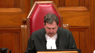
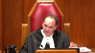
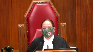
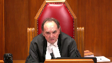
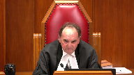
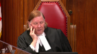
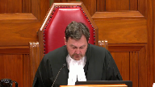

---
title: Her Majesty the Queen v. W.M.
published-title: Heard
date: 2020-12-10
sidebar: false
---

This transcript was made with automated artificial intelligence models and its accuracy has not been verified. Review the original webcast [here](https://scc-csc.ca/case-dossier/info/webcast-webdiffusion-eng.aspx?cas=['39114']).
---

**Justice Wagner** (00:00:02): The court, la Côte.

::: {.column-margin}

:::

Good morning.

Be seated.

In the case of Her Majesty the Queen against WM, for the Appellant, Her Majesty the Queen, Caitlin Charouy, for the Respondent, WM, W. John McCullough, Ms. Charouy, please note that there is a publication ban in this file pursuant to section 486.41 of the Criminal Code.

Ms. Charouy?

**Speaker 1** (00:00:51): Thank you.

::: {.column-margin}

:::

Good morning Chief Justice, Justices.

The central issue on this appeal is a narrow one.

There is no dispute that the trial judge made a factual error in his reasons for judgment.

He was mistaken about the date that the respondent received sex offender treatment.

The question for this court is whether this was a material misapprehension of evidence resulting in a miscarriage of justice.

The Crown's position is that the trial judge's error did not meet the stringent test for material misapprehension of evidence.

In my submission, the majority of the Court of Appeal erred by focusing its analysis on one aspect of the trial judge's reasons without proper consideration of the entire reasoning process that led him to convict.

Justice Miller in dissent on the other hand properly placed the trial judge's error in the context of the reasons as a whole and in doing so correctly found that nothing in the trial judge's reasoning turned on the date in which the respondent received sex offender treatment.

I intend to begin my submissions by taking the Court to the passage that that is at issue and from there I will explain why I say the trial judge's error could not have had any material impact on one his similar fact evidence analysis and two his credibility assessment of the respondent.

Simply put this conviction did not depend on this misapprehension of evidence as required by the case law.

This was one mistake in an otherwise exemplary set of reasons no miscarriage of justice occurred and this is not a case that warrants a new trial.

So as I mentioned as a starting point I do think it would be helpful for the Court to have the passage in the trial judge's reasons that is at issue on hand

so it's in volume one of the appellant's record and it starts at the bottom of page 24.

So this is where the trial judge turns to the similar fact evidence analysis and he recognizes that the respondent took sex offender treatment between the time of the past offenses in the 80s and 90s and the current offense in 2015 and he properly understands that this is a factor that he needs to take into account.

Now the key the key part is at page 25 so the next page.

We know that the trial judge mistakenly believes this treatment occurred in 2008 as opposed to 2000 and because of that he finds the situation specific propensity to touch young girls persisted from 1985 to 2008

and then he says

and I quote given that this propensity persisted or at least demonstrated itself over the period 1985 to 2008 there is every reason to believe it would still be a factor in 2015.

Now I'm going to stop there for a moment that is the problematic passage in the trial judge's reasons and this is what the majority focuses on.

I am not here today to tell you that that passage does not exist.

Clearly the trial judge makes these statements and he finds some significance in the fact that according to him the treatment happened in 2008.

The point that I am making today and the point that Justice Miller makes in his dissent is that this passage cannot be looked at in isolation.

You can't just stop there you have to go on and look at the the entire similar fact analysis and the entire set of reasons because only then can you truly appreciate the materiality of the misapprehension of evidence and this is what I say the majority failed to do.

The majority focused on this passage and from there drew conclusions that were not grounded in the specific reasons of this case.

So if we go back to the passage and continue reading there are in my submission important findings that need to be taken into account.

So he goes on to say no one would suggest that any treatment program is 100 effective.

So while I factor the treatment program into my analysis it certainly does not preclude consideration of the long-standing situation-specific propensity that the respondent had to touch female children inappropriately and then a few lines down and this is sort of what I say is key here he says the significance of similar fact evidence lies in the improbability of coincidence.

I think there is virtually no chance that coincidence explains the respondent having a criminal record for touching prepubescent females on the vagina while they are in his care and sleeping and this complainant making the same allegation.

And then he says and this is also important as I have concluded when the child made her statement to police she was not being influenced by her mother or anyone else.

**Justice Côté** (00:06:23): Mr. Charaoui, if I understand, there was no argument made by the defence in their closing submissions about the relevance of the length of time between the treatment and the offences.

**Speaker 1** (00:06:41): Yes, that is right.

::: {.column-margin}

:::

So the defence submissions at trial with respect to the similar fact evidence and the treatment were very brief and it was sort of pitched that, you know, this was an intervening event that would logically tend to diminish the value of the similar fact evidence.

So there was nothing that talked about, you know, the good behaviour that he was on during this time and the closeness in time to the offence.

So I agree with that Justice Cote.

So the value of similar fact evidence comes from the improbability of coincidence and the reason the trial judge comes to this powerful conclusion in this case is for two reasons and because of two significant factors.

The first is the strikingly similar nature of the past offences to the allegations and not just the act itself, the placing of the hand on the child's vagina, but also the circumstances, the age of the children, while they are in his care, while he is in a position of trust, during the night, while they are sleeping.

This is a very distinct pattern and that is not lost on the trial judge and that is apparent from his reasons.

The second significant factor is the lack of tainting of the complainant's evidence.

The trial judge, prior to his similar fact analysis, he goes through all the possible scenarios of tainting or outside influence and he concludes that these allegations came from her.

That is a factual finding that is owed deference.

And so we know from Handy, which is a case that my friend filed, that collusion or perhaps more accurately in this case tainting or contamination, that is a critical factor because it has the potential to undermine the very thing that similar fact evidence derives its value from, which is the improbability of coincidence.

And the trial judge finds there's no tainting here

and so he was obviously aware of that significant factor.

So this is what I say is really at the heart of this similar fact analysis.

These two points and this is where the value comes from.

Now the intervening events, yes I agree it is a relevant consideration and yes the trial judge got the dates wrong.

But the question for this court is really whether this intervening event, under the correct time line, so if he had not made this error, could it have diminished the value of the similar fact evidence in any material way?

Because remember no one is challenging the admissibility of this similar fact evidence.

So we're strictly talking about weight here.

And the Crown's position is that there is simply no way that this intervening event, whether in 2000 or in 2008, could have blunted the significance of the similar fact evidence.

**Justice Moldaver** (00:09:46): take it, Ms. Sherway, that in saying that, you are also taking into account the really quite exemplary reasons of the trial judge, where he goes through credibility findings and finds that the accused, for any number of reasons, is not credible, and he rejects his evidence, leaving aside the date of the treatment.

::: {.column-margin}

:::

And he goes through the evidence of the complainant in detail, looks at, you know, potential frailties and so on, looks at the mother, the other witnesses, and concludes that he is satisfied.

The complainant is not only credible and reliable, but what is coming from her is coming from her, not someone else.

So you look at the whole package when you're assessing whether or not this timing error could have really...could be said to have impacted on the ultimate result.

**Speaker 1** (00:10:42): Yes, I agree with that entirely.

::: {.column-margin}

:::

I mean, this really is the crown's main point, which is that you have to look at everything you can't just focus in on this passage and and I will touch on that when I get to the credibility.

Why I say it wouldn't have impacted his credibility assessment, which is sort of one of the issues.

The majority identifies here.

But yes, I agree.

So, The reason just finishing up on the on this, the similar fact evidence.

The reason The crown says it could not this intervening event, even under the correct timeline could not have diminished the value of the similar fact evidence is for several reasons.

First of all, as a trial judge noted no treatment program is 100% effective.

That is, as a matter of common sense.

Nobody is sort of asserting otherwise.

And this is true, regardless of the date of the treatment.

This is unlike an intervening event where the accused has some kind of physical incapacity that renders him Unable to commit the offense, which was the example that was cited in handy referring to a case called menace.

So that is not like this case.

And remember the respondent Doesn't even really credit the treatment for making him a changed man.

And that's something that Justice Miller picks up on in his dissent as well.

The respondent says he benefited from the treatment.

He says, you know, he learned A bunch of things, how to recognize triggers and stressors and learn to empathize with victims and he says he had no concern that after the treatment, he would reoffend, but When asked in cross examination to really elaborate on that evidence and to sort of explain why it is, he says, he would not reoffend.

He does not Double down on the treatment he he now gives two other answers that are unrelated to treatment.

He says, first of all, As a result of my conviction in 1998 I realized how wrong it was.

And so I would not reoffend.

That's two years prior to treatment.

And then he also says, I had this car accident which left me unable to obtain an erection.

And so that's why I wouldn't reoffend.

So at that point, he is not crediting this treatment for making him a changed man.

And finally, the trial judge recognized the long standing situation specific propensity that the respondent had to touch young girls inappropriately.

Now, whether this was a 15 year period under the correct timeline or a 23 year period under based on the trial judges error in my submission that is still an extensive period of time.

So given all, all of that context, what I what I said about strikingly similar nature of the offenses, the lack of tainting of the complainants evidence.

And now what I say is a relatively weak intervening event to begin with, even under the correct timeline.

It simply cannot be said that the trial judges error could have impacted the weight he assigns to the similar fact evidence.

And the majority in my respectful submission did not grapple with any of these things in its analysis.

So turning to the credibility issue that Justice Moldaver sort of touched on, to the extent that the majority and the respondent are saying that this error impacted on his credibility assessment, the Crown's position is that Any impact on credibility was minimal at best.

I say this because, as Justice Moldaver pointed out, all the other reasons the trial judge gave for rejecting the respondents evidence.

As Justice Miller said the trial judge had ample reason to disbelieve the respondent quite apart from the similar fact evidence.

So he found elements of the respondents evidence to be self-serving, exaggerated, or contradictory.

And I won't go through all of these examples today.

They are set out at paragraph 52 of my factum.

But the point is the trial judge did not need this similar fact evidence to reject the respondents denial.

There were plenty of reasons why he found him not to be credible.

And again, in the same in the same context, this was also done In light of an assessment of the complainants account that was detailed that was thorough, he finds her to be a credible and reliable witness.

He addresses all the frailties that defense counsel raised at trial.

He finds that they are, you know, he is not bothered by them.

And he doesn't use the similar fact evidence to do that, per se.

He doesn't say, well, you know, there are all these problems here, but we have the similar fact evidence.

So I'm satisfied she's telling the truth and being accurate.

He doesn't do that.

He explains the frailties Separate and apart from the similar fact evidence.

So my overall point is really this when you are assessing materiality of a misapprehension of evidence, you need to look at the entire reasoning process.

And when you do that in this case.

You see that this error was just one small piece of the trial judges reasons, even if he had gotten the date right, nothing would have changed.

And that takes me to my final point.

There is an important distinction between misapprehension of evidence and material misapprehension of evidence.

Not every error is going to result in a miscarriage of justice.

The language in the cases on material misapprehension of evidence describe a stringent standard and they speak to the centrality of the error to the reasoning process.

So, for instance, in Lauer, citing to Morrissey.

If the appellant can demonstrate that the conviction depends on a misapprehension of evidence, then it must follow that he did not receive a fair trial.

In Sinclair, a misapprehension of evidence will amount to a miscarriage of justice only if striking it from the judgment would leave the trial judges reasoning on which the conviction is based on unsteady ground.

So this is strong language.

And in my submission, none of those things apply in this particular case.

Subject to any questions, those are my submissions on this main ground.

I will say briefly that there were two other issues raised in the court below that were not addressed in the majority reasons.

I intend to rely on my factum for those issues, subject to any questions and subject to my friend's submissions as well.

I may choose to say something in reply.

Thank you very much.

**Justice Wagner** (00:17:30): Thank you, Mr. Micola.

**Speaker 2** (00:17:44): I had not unmuted myself, sorry, if it pleased the court.

::: {.column-margin}

:::

The most basic principle of our criminal justice system is that the accused is entitled to a fair trial.

And that means that the accused is entitled to make full answer in defense and have the actual defense that they present heard and understood.

If the evidence at trial is misapprehended by the trial judge, then the most basic principle is broken and a miscarriage of justice results.

As I indicated in my factum, justices, as Justice Doherty observes a conviction that is not based on the actual evidence results in a miscarriage of justice, even where there is sufficient other evidence to base a conviction.

My friend indicates, turns to the reasons of the learned justice in this case to make her point.

And I'll do the same thing if it please the court.

In the learned justice's decision in the same, I agree with my friend that pages 22 to 24 set out the reasoning process of the learned justice.

And in my respectful submission, the date, his mistake in getting the date wrong is critical to his assessment of my client's credibility.

And it's critical to the decision that he makes.

As Justice Strathy indicated in his decision, the learned justice came to two erroneous conclusions based on the date.

One, that the appellant's propensity to offend was active in 2000.

If it was active in 2008, it would still likely be active in 2015.

And two, that the treatment did not reduce the probative value of the similar fact evidence.

It is a significant factor that the last offense that the similar fact evidence takes into account occurred in 1997.

This offense is alleged to have occurred in 2015.

That's 18 years.

There's 18 years with no sexual offenses.

The respondent took the treatment that was available to him at the first available time in 2000 when he was at the Ontario Correctional Institute.

As Justice Strathy indicates, it had been 15 years since the time that he took the treatment with no offenses, no sexual misbehavior at all.

And there's a big difference in my respectful submission.

Common sense tells us there's a big difference between 15 years and seven years.

The exact timing, who knows what would be the exact timing of what would be an effective amount of time.

Would 20 years without an offense be something that could become an intervening event with 30 years?

In my respectful submission, the fact that there had been treatment and the 15 years had gone by without any further treatment is a factor that has to be considered.

And it's particularly in my respectful submission has to be considered when you go to the learned trial judge's judgment when he indicates that it is essential that the court consider the fact that on page 23 and 24, the significance of the similar fact evidence lies in the improbability of coincidence.

That's a large hurdle that the respondent has to get over.

And in my respectful submission, the timing is on his side.

The longer he has gone without an offense, the longer he has gone without an offense as he received treatment, the more credible his evidence becomes.

**Justice Abella** (00:22:44): Mr. McCullough, one of the things that Justice Miller refers to in his dissent is the fact that this was not argued by the defense at trial.

::: {.column-margin}

:::

Is that right that nobody asked the court to consider the fact that it had been such a long time, 15 years or 23 years, which assuming it could be, let's say I agree with you that the length of time may be an indicator of something, that in the absence of evidence before the court or the suggestion to the court that that be taken into account, what what impact do you think that should make on our considerations?

**Speaker 2** (00:23:27): Adam Justice, that evidence was before the court.

::: {.column-margin}

:::

I mean, my client testified that he had received his treatment in 2000.

The offense occurred in 2015.

The evidence in the similar fact evidence was that the last issue, the last incident that was included, there were two incidents included in the similar fact evidence.

One that occurred between 1985 and 1987, and one that occurred between 1995 and 1997.

So that's in the evidence.

**Justice Abella** (00:23:59): No, no, I know that.

::: {.column-margin}

:::

I thought what Justice Miller was talking about was the fact that the defense didn't ask the court to consider the length of time in its determination of the similar fact evidence.

That there wasn't evidence of the previous, of the treatment and of the previous incidents.

**Speaker 2** (00:24:18): In my respectful submission, that evidence was there and it was clearly before the court.

**Justice Abella** (00:24:25): The argument needed to be made on it, one way or another, because it features obviously central ears.

**Speaker 2** (00:24:31): It's central, of course it's central.

The fact that he taken the treatment and there have been 15 years since he'd taken to the treatment and there'd been no offences, that's clearly the evidence before the court.

That's what the learned justice heard.

**Justice Moldaver** (00:24:47): That really isn't, with respect, Mr. McCullough, the significance of the evidence.

::: {.column-margin}

:::

The trial judge focuses on the significance of the evidence at the bottom of page 25 of his reasons.

And it just seems to me that once the trial judge makes a finding that this four-year-old child's evidence was her own evidence, that it was not tainted, that it was not influenced by anybody, then in the face of your client's complete denial, there are only one of two things that could happen.

Either she's the luckiest guesser in the world, given the striking similarity of the prior offenses committed by your client, or she's telling the truth.

And that seems to me to be the nub of this case, regardless of when this man had treatment.

That is something that the trial judge recognized was critical, and I'm not even sure the majority gave it much thought.

But it seems to me that logically, once he finds that the complainant is credible, reliable, and untainted, then there's only two possibilities.

And he says at the top of page 26, I think there is virtually no chance that coincidence explains Mr. M's having a criminal record for touching prepubescent females on the vagina while they're in his care and sleeping, and this complainant making the same allegation.

And this man, it seems to me, Mr. McCullough, left a calling card with this four-year-old complainant that dates back to when we know he was convicted of these offenses.

And it seems to me, leaving aside everything else, that is virtually fatal to your client's position, given the trial judge's reasoning and his assessment.

**Speaker 2** (00:26:55): Justice Moldaver, I see your point.

::: {.column-margin}

:::

I would only ask you to look at the facts and look at the judge's reasoning.

He says that the child was not tainted.

But in the evidence, it's clear that the first time that any allegation came out about my client was when the mother asked the child, not did somebody touch you, not did anything happen?

Did your father touch you on the vagina?

So the child gets pointed to this by the mother.

Now, the learned child judge says that that's not tainting.

But I'll leave it to you.

The child didn't go to touching on the vagina.

The mother did.

The child also said, or the mother also said to the child, if daddy touches you again, call for mommy and I'll come.

Damn, we good.

**Justice Moldaver** (00:27:59): Just to interrupt though, two things.

::: {.column-margin}

:::

It's not just the touching on the vagina.

It's the touching on the vagina of a child who is in your client's care, who is sleeping at the time, and you have to take that whole picture into account.

It's not just touching the vagina.

Number two, you have a finding of fact made by the trial judge whether another judge would have come to the same conclusion, who knows?

But you have this finding of fact, and unless you can show that this finding of fact is a product of, you know, overriding and palpable error, it seems to me that is not for us to reconsider, Mr. McCullough.

**Speaker 2** (00:28:46): I'll leave it to you, Justice Moldaver, whether it's overrunning and palpable error, but in my respectful submission, there was error.

::: {.column-margin}

:::

The child said in her evidence that her father came into the room, touched her on the vagina, she screamed for her mother.

That didn't happen.

The child did not scream for her mother.

Her mother never came into the room.

Her father ran out of the room at that time.

That didn't happen.

The mother called the police.

The police arrived and arrested my client that night in his house.

That didn't happen.

So the only thing that could be true out of what happened possibly is that my client touched her vagina, but the rest of the incident didn't happen.

Who brought up screaming for her mother?

Her mother.

If somebody touches you, scream for mother and I will come.

That's what she said happened, but it didn't happen.

So almost the entire story that the child gives is a fallacy.

It didn't happen and his honor deals with that by saying she conflated her mother's instructions into what really happened, but we have a situation where my client was arrested coming home from work and that's in the evidence.

He was never arrested at the home.

Mother never ran into the room.

There was never any incident in the home.

So to say that there isn't tainting in my respectful submission is wrong.

Mother brings up the vagina, but it's not just that she brings up the vagina.

She says call for mummy if daddy touches you.

Now where is daddy going to touch you that mummy isn't there?

Obviously it's going to be somewhere.

The first place that jumps to mind would be in a bedroom sleeping that he came in.

So in my respectful submission there's an explanation for that

and I understand that it's powerful evidence.

All the more reason to say that his honor has to get the facts right to convict my client.

My client's entitled if he's going to be convicted, convicted based on what he said, based on what the evidence really is, not based on a mistake.

**Justice Rowe** (00:31:25): Just returning, if I might for a moment, to the Court of Appeal decision, I'm gonna read just a couple of sentences from the reasons for the majority of Chief Justice Strathy.

::: {.column-margin}

:::

Paragraphs 28 and 29, I should be very brief.

This is a material length of time that would have affected the trial judge's assessment of the appellant's evidence and the extent to which treatment could be considered an intervening event that diminished the probative value of the similar fact evidence.

I am satisfied the appellant has met the stringent standard for determining whether misapprehension of evidence led to a miscarriage of justice.

The only reason I read that passage in what's quite a short set of reasons is it seems to me that Chief Justice Strathy was persuaded by you that the misapprehension by the judge as to the date of treatment was problematic.

And I can't disagree.

I mean, I think it is problematic.

But then what happens is Chief Justice Strathy says that's enough.

That is sufficient to meet the stringent test.

And that really is the point I want to zero in on because Chief Justice Strathy I think short circuits the analysis, whereas Justice Miller goes through the analysis in a very thorough way and it seems to me properly applies the standard set out in Lorer whereas it's almost as if Chief Justice Strathy said, ah, there's an error.

If there's an error, there's an unfairness.

If there's an unfairness, there must be a new trial.

But that's not what the test says.

And that's what I guess I'm focusing on is which set of reasons more fully, faithfully, and properly applied the relevant standard.

**Speaker 2** (00:33:38): In my respectful submission, Mr. Justice, sir, the Justice Strathy is correct.

::: {.column-margin}

:::

In my respectful submission, the fact that he got the date wrong has implications on his assessment of my client's entire evidence, on his assessment of my client's credibility.

It colors his assessment of my client's credibility to be the, what my client would have to do is convince the trial judge that taking the treatment affected his whole approach.

And he tried to say that he learned from the treatment how to empathize with victims, what his triggers were, and the timing is important.

If he's really interested in getting this treatment, why would he wait till 2008 to take it until he's arrested again for other offenses in 2008?

In fact, in 2008, he didn't even go to jail, but why would he wait that long if this is a burning issue with him, if he's sincere, if he's genuine about it?

In my respectful submission, those are facts, that's what Justice, the learned Justice is saying when he's saying that the propensity is still there in 2008.

He didn't deal with it right away.

He didn't deal with it at his first opportunity.

And in my respectful submission, that makes that mistake paramount because it affects his assessment.

I agree with my friend that in paragraph 52 of her factum, she said there are other reasons that the learned trial judge didn't believe my client.

One of them was that he blamed the children's aid for the ideas that were in his daughter's mind.

If you read his evidence, that's not anything that, in my respectful submission, is a significant factor that he's exaggerating, trying to blame the children's aid, trying to get the blame off himself.

His evidence shows that he has a grudge against children's aid from the time that he was a child, and he was sexually assaulted while in treatment.

So it's a normal thing that he would blame the children's aid.

The issue is, did he try to do something about the problem that had caused him a problem in 1985 and 1995?

And the answer is yes.

As soon as he had a chance, he took the treatment, and he's entitled to have the judge understand that when he assesses his credibility.

And that's, in my respectful submission, why Justice Strathy stopped there.

And he says that because he got the date wrong, the learned child judge makes two related errors in assessing the evidence.

And in my respectful submission, he's absolutely correct when he says that.

He's of a mind, because of that timing, that that, in my respectful submission, if you read the judgment and if you look at Justice Strathy's reasoning, he's right on in that it colors, that mistake colors his assessment of my client's evidence.

**Justice Wagner** (00:37:30): Thank you.

**Overlapping speakers** (00:37:30): Thank you.

**Justice Wagner** (00:37:31): Thank you.

Yeah, go ahead.

I thought you were finished.

**Speaker 2** (00:37:37): I'm sorry, I was just waiting to see if there was another question.

::: {.column-margin}

:::

In my respectful submission, Madam and Mr. Justice, Justice Strathee hit the nail right on the head when he said that, and in agreement with Justice Doherty, hit the nail on the head, that particularly in issues where credibility is the most important factor, then the learner trial judge has to get the facts right.

In fact, he says so in his own judgment.

Earlier on in his judgment, he says that in most sex assault cases, they boil down to an assessment of the evidence of the complainant, an assessment of the evidence of the accused.

In this case, the evidence of the accused is colored by a mistake in the judgment.

Thank you.

Subject to any further questions, those are my submissions.

**Justice Wagner** (00:38:43): Thank you very much.

Thank you.

Any reply? Shall we?

**Speaker 1** (00:38:50): Yes thank you Chief Justice just very briefly related to the complainant's evidence.

::: {.column-margin}

:::

My friend points to a number of frailties in her account that were advanced the same arguments advanced at trial.

I would simply say two things.

First of all the complainant does not at any point waver on the core of her.

**Justice Wagner** (00:39:31): Thank you.

::: {.column-margin}

:::

So first of all, I'd like to thank Council for their submissions.

The Court is ready to release its decision.

We are all of the view that the appeal must be allowed for the reasons of Justice Miller.

The trial judge's mistake regarding the specific year of the sex offender treatment did not have any material impact on his overall assessment of the similar fact evidence or the accused credibility when one considers the trial judge's reasons as a whole.

In the result, no miscarriage of justice occurred, the appeal is allowed, and the conviction is restored.

Thank you very much.

Have a good day.