---
title: Joaquin Alfredo Cortes Rivera v. Her Majesty the Queen
published-title: Heard
date: 2020-12-11
sidebar: false
---

This transcript was made with automated artificial intelligence models and its accuracy has not been verified. Review the original webcast [here](https://scc-csc.ca/case-dossier/info/webcast-webdiffusion-eng.aspx?cas=['39084']).
---

**Justice Martin** (00:00:02): The court, la cour.

**Justice Abella** (00:00:23): good morning uh revera versus her majesty the queen joaquin alfredo cortez revera represented by deborah r hatch megan savard for the intervener the criminal lawyers association and keith joys for her majesty the queen miss hatch

::: {.column-margin}
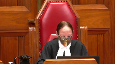
:::

**Speaker 1** (00:00:55): Good morning Justices.

::: {.column-margin}
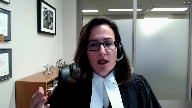
:::

The question on this appeal is this, when a trial judge has improperly restricted the right to cross-examine the Crown's main witness and the defence abides by that restriction, what remedy then is appropriate?

When we look at the trial record here, this was evidence that was critical, it was central, it was a plank within the Crown's case, relied heavily on by the Crown as probative of intercourse, which the complainant wasn't certain about, and it was relied on as a key corroborating feature.

It was so central that the Crown called expert evidence to provide opinion evidence in relation to it, and the trial judge found that evidence to be highly probative.

But the defence was not permitted to challenge the source of those injuries.

Now the majority here, and actually all three Justices in the court below, recognized that cross-examination should have been permitted.

It could be targeted, it was in good faith, it was relevant, it was potentially probative.

But here the majority found that there was no substantial wrong or miscarriage of justice because the evidence was sufficient, that's what they found, was sufficient to convict on, and that's at paragraphs 28 to 30 in the majority's judgment.

And further they found that the trial judge would not have found a reasonable doubt.

The dissenting justice said cross-examination should have been permitted, he agreed.

He recognized that cross-examination was potentially probative, and especially so because the complainant was not sure if she had been penetrated at all, and that's paragraph 64 of the court of appeal judgment.

He recognized that cross-examination may well have raised a reasonable doubt, and he found though that the remedy that was appropriate here, he said more appropriate than 686, was to allow the complainant to be questioned via section 683 within the appellate process.

He recognized though that it was an inquiry that should have taken place at trial.

This is not a case like R.V. where there's an improper ruling, but the evidence was adduced anyway because the defense skirted the ruling here.

Defense counsel abided strictly by the ruling, and the evidence was completely withheld, and the defense, respectfully we say, was denied the ability to challenge what was a key prong of the Crown's case.

Now 686 of course says where a conviction is inevitable, would inevitably occur on a retrial, then 686 can properly be applied.

This wasn't such a case, this isn't such a case.

This evidence, in conjunction with the absence of evidence of the accused DNA on or within the complainant when she is examined just hours later, could well support a reasonable doubt in this case.

And the Crown again said that these injuries were the key corroborating feature.

How can the Crown be permitted to rely so heavily on evidence which the accused is not permitted to challenge?

And both counsel in this case, the Crown and defense, recognized that this was potentially important evidence.

The Crown resisted the 276 application strongly, and the defense said, after getting the ruling, that this evidence wasn't even capable of being admissible.

The defense said, I need to consider the options, I need to get instructions, and he said this was an important ruling for the defense.

Justice McLaughlin, as she was at the time in in Seaboyer, certainly recognized that at page 608 in the condensed book at tab one, that the denial of the right to challenge, to call and challenge evidence is tantamount to a denial of the right to rely on a defense to which one is legally entitled.

This is fundamental.

And she went on to say, and this is at page 609 between D and E at tab one of the appellant's condensed book, that a law which prevents the trier of fact from getting at the truth by excluding relevant evidence in the absence of a clear ground of policy or law, justifying the exclusion runs afoul of our fundamental conceptions of justice and what constitutes a fair trial.

That applies here.

Mr. Cortes Rivera was denied a fair trial.

He did not skirt the ruling.

He abided by it, respected it, and was not permitted to challenge this evidence.

And there's no question, and I don't propose to go through what's in the appellant's factum, and what this court has said many, many times about the importance of cross-examination in Little and again in R.V.

It may be the only way to get at the truth.

And, of course, this court said or reaffirmed in Little that construing the right to cross-examination broadly is critical.

And I say that does not mean unduly curtailing cross-examination and then applying section 686 where counsel abides by the restriction and where the Crown recognizes the right to cross-examination.

**Justice Martin** (00:07:00): Excuse me, Ms. Hatch.

::: {.column-margin}
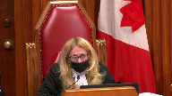
:::

I mean, Council has to abide by the restriction.

I mean, so I think we should focus on the absence of cross-examination and the prejudice, because it would be completely improper for a Defence Council to not abide by a judicial order saying that cross-examination on that point couldn't occur.

**Speaker 1** (00:07:26): Yes, Justice Martin, I agree completely.

::: {.column-margin}
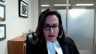
:::

Council must abide by it, but that is the important point relative to RV, because that was the only reason, from my reading of the majority in this court's decision, that was the only reason that it was found that Section 686 could be applied, was because Council skirted the ruling, got the evidence in, and that's what occurred there, and that did not occur here.

And there is prejudice, because the Crown presents this as the key corroborating feature, the trial judge relies on it in that way, the trial judge relies on expert evidence premised upon the injury.

This was central to the case.

They called an expert to deal with this, and they urged the trial judge to find that evidence to be probative, and indeed the trial judge found it to be highly probative, and all of that evidence was found to support the complainant's evidence.

How, in that circumstance, could we apply Section 686?

How could we say that if that cross-examination had been permitted, the result inevitably would be the same?

A conviction would be the only result that could occur.

And this court recognized too, in RV at Paragraph 86, that a failure to allow relevant cross-examination will almost always be grounds for a new trial, almost always.

And the court has the onus to show that Section 686 could apply.

And of course, this court also said that in Shearing and Crosby, Auslan, many other cases, the denial of a 276 hearing, where there is the basis for it, is legal error.

And, respectfully, I submit, leads to, where the defense is not permitted to challenge a plank of the Crown's case that is central, leads to an unfair trial.

And the remedy for that is a new trial.

Many cases, appellate cases have said that HLM, Ecker, in Barton, this court found that a denial of a Section 276 hearing, it's something where we shouldn't speculate on what would be the proper outcome of that hearing.

And a new trial was ordered.

And of course, there were, you know, I recognize many other issues in that case, but we should not speculate a new trial is the remedy in this type of circumstance.

Again, I say, RV is anomalous.

And the only reason that the majority in this court, as I understand it, said that 686 was applicable is that the defense was able to advance their position.

And the scope of cross-examination would not have been any broader.

That is not the case here.

And one has to be able to challenge central evidence relied on by the Crown.

It may be a different case if the trial judge didn't place any emphasis on it, if she did not rely upon it.

She relied on it.

It was an important feature for her.

And again, the fact that the Crown calls expert evidence and relies on that expert evidence to interpret these injuries, and the defense can do nothing there.

Now, my friend for the respondent says, well, you know, they were able to ask certain questions of the expert, but there was no foundation for that.

They weren't allowed to put any questions to the complainant about intercourse within the last seven days, within the last five days that could have led to these injuries.

**Justice Martin** (00:11:24): I'm going to interrupt you here and ask you some questions about, I think when you in your introduction you said that there was a question as to whether there was penetration at all.

::: {.column-margin}
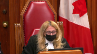
:::

And I just wonder about that because my reading of the transcript is more to the effect that there is perhaps some uncertainty as to where the penetration was, but that when it was put to her in cross-examination that the accused did not put anything inside of her.

She said, yes, he did.

And that to me is relevant for many different perspectives, which is if the evidence is overwhelming that there was penetration of a sort, what does that do to prejudice?

So that's sort of a question I'm asking you about the actual transcript itself.

And then based on that, what do we do with the 686 aspect?

**Speaker 1** (00:12:33): Yes and so certainly at some points she indicated that she had concluded that there was penetration at the time.

::: {.column-margin}

:::

One of the things she was asked is why she thought that

and she said because I felt his hands on me, I felt his body against me and she was specifically asked anything else

and she said no.

**Justice Martin** (00:12:57): But in other places she said because of the pain.

I'm sorry?

Didn't she also suggest in her testimony that there was a great deal of pain associated with what she said he did.

**Speaker 1** (00:13:13): Well and so it's interesting because when you look, I think it's page 69 of the trial transcript, when you look back at what she actually says about the pain she first notices pain in the hospital and let's remember too that during a part of her examination in the hospital she is hunched over and still vomiting six hours later.

::: {.column-margin}
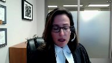
:::

So that is when she first notices pain and then the next question that followed that I believe in chief, and again this was a leading question in examination in chief, the next question was did you notice it before the bathroom and she said no.

So she first notices that pain in the hospital.

It is entirely possible that intercourse some days prior with another individual could have led to some weakening or even some lacerations that were healing at the time and then she is vomiting so violently for hours six hours later that these lacerations which were described as the tiniest little things that they arise but again the defense was not allowed to explore that.

And in terms of penetration and I think that the Court of Appeal refers to this throughout the judgment it may be in the dissenting judgment that she had said about penetration wasn't sure if it was vaginal, anal, or at all.

**Justice Martin** (00:14:51): And I'm questioning whether that is accurate, the at all part is accurate.

I know that it's in the judgement, I just don't see it from the transcript.

**Speaker 1** (00:15:03): Okay and and I'll have to to look back at that

::: {.column-margin}
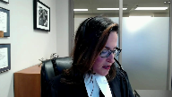
:::

and I can perhaps come back to that while my friend is is making his submissions.

I'll have a look at that Justice Martin.

So there is prejudice just dealing with your your question about that.

There is prejudice because one cannot even explore this.

And again this court has been clear that we shouldn't speculate about the outcome of a Section 276 hearing

but we know here and this court has said many times where there's evidence of a condition or injury that the Crown is relying on then this is something that the defence will will typically be permitted to to explore.

This would have been a tight concise exploration, cross-examination should have been permitted and the court below was correct about that.

In terms of Section 686 and and dealing with with prejudice and whether a conviction would have been inevitable we have to remember that the default when there is an error of law is a new trial.

That is the default and again I say on behalf of the appellant when you have an error which denies the accused a fair trial this amounts to a miscarriage of justice.

And when there is a miscarriage of justice the only remedy is is a new trial.

Where one cannot pursue cross-examination that is relevant and as all of the court recognized potentially probative then full answer in defence is impeded and this was fundamental to a fair trial.

Con tells us at paragraph 27 that Section 686 cannot apply in that circumstance and that the remedy is a new trial.

This court in little and and recently I think last month in Riley dealing with the curative proviso found that it's significant error when it relates to a pivotal witness.

In that circumstance the curative proviso should not apply and and I say in this case the curative proviso should not and cannot apply and further when we look at that the majority in the court below applied the wrong test and of course the test is that the crown has to satisfy the court that the verdict would necessarily have been the same that conviction was inevitable the evidence so overwhelming that any other verdict is impossible not even unlikely but impossible any possible doubt in yours to the accused and this court said that in van and con again um remembering too that in this case his DNA was not found upon her or within her when she was examined the dissenting justice correctly recognized that a proper cross-examination here could have led to a reasonable doubt and again when it comes to Section 686 the onus on the crown is stringent it's high and the crown says to the court of appeal uh that it would change the record on trial right at the end of the crown's submissions to the court of appeal we see that and that's at the appellant's record at page 66

so the default here i say is a new trial did the court of appeal though what is the path to uh where they ended up did they say that the evidence was so overwhelming that any other verdict would have been impossible and that a trial judge inevitably would convict they do not say that in their reasons this was not the standard that they applied what did they say they said well the evidence was sufficient to convict on that's not the test and they said the trial judge would not have had a reasonable doubt again that is not the test and importantly when we

**Justice Martin** (00:19:29): address this.

::: {.column-margin}
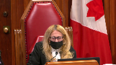
:::

The words sufficient to convict here or the sufficiency, are they referring to the evidence or are they referring to whether or not there's sufficient evidence to meet the standard of overwhelming?

Because I can read that particular part of the judgment either way.

And I just wonder why we should read it in a way that assumes that they don't know what the legal test for 686 is.

**Speaker 1** (00:20:06): I don't necessarily say that they don't know what the legal test for Section 686 is but I think the question is did they apply it here?

::: {.column-margin}

:::

Did they have it squarely in mind?

What test did they apply?

And what we can look at there is simply the words of the Court of Appeal was sufficient to convict on and a trial judge would not have had a reasonable doubt.

Respectfully I say that's not the test.

We have to look at, you know, appellate courts choose their words carefully and we cannot say, and this is a case again where the onus is on the Crown to prove that Section 686 should apply, we cannot say that they had that test squarely in mind.

I know that the respondent says well let's apply the law that says, you know, where a trial judge says something and it's open to two interpretations.

Let's just assume that they knew the law.

Well we're not dealing here with the trial judge in that regard, we're dealing with the Court of Appeal and a reserve judgment.

And respectfully I say the law is what we see in Wildman and more recently in Trotium.

The standard doesn't allow an appellate court to dismiss an appeal under 686 just because it would conclude that the Crown has proven guilt beyond a reasonable doubt.

And that is what they're saying here.

The Court of Appeal is saying well, you know, the Crown had proven its case beyond a reasonable doubt.

If the majority had found that the evidence was so overwhelming that only conviction would be possible, I say they would have said so.

We look at any reasonable possible effect of the evidence and again that inures to the benefit of the accused.

Some of the cases talk about the tracing effect and that of course is a speculative exercise and any doubt there should be resolved against the Crown.

So where all of that leaves us is a case where the evidence was important, it was central, it was relied on by the Crown and it was relied on by the trial judge.

She rested her decision on that.

This was a pivotal witness.

This was cross-examination that was impeded, withheld from the defense and relied on by the trial judge this injury evidence to convict.

And relied on by the Crown to provide a foundation for expert evidence which in turn the trial judge found to be highly probative.

How can we say in that circumstance that conviction was absolutely inevitable, that this cross-examination could not have made a difference?

Respectfully I say we cannot say that.

The default here is a new trial and it was the Crown who had the onus to show that anything else was warranted and met the high test under 686.

I want to address very briefly section 683.

The submissions are outlined fairly fully in the appellant's factum and I won't reiterate them.

**Justice Kasirer** (00:23:37): Ms. Hatch, can I ‑‑ I'm sorry to interrupt you, but I want ‑‑ your comment to Justice Martin about the pain perplexed me because it seems to me that the trial judge found the reverse, that the pain ‑‑ he associated paragraph 111, he associated the pain with the incident, and my reading of the record, when she described feeling pain on a scale of 1 to 10 at 9, she associated that with the incident.

::: {.column-margin}
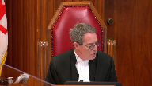
:::

Is that not right?

Because if that is right, then we may have evidence that helps us get around, given the expert evidence about the 5‑day healing period, we may have evidence that would suggest that the cross examination on the target question wasn't really necessary.

So was the trial judge wrong?

Is that your point?

The trial judge was wrong to say that the pain was associated with the

**Speaker 1** (00:25:04): I suggest that may have come more from submissions to the court than it did from the complainant's evidence.

::: {.column-margin}
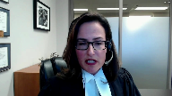
:::

When we look back at her evidence where she's asked about that, where did you first notice the pain in the hospital?

And then the Crown's leading question after that being whether she noticed it before the bathroom and she said no.

Now she was not asked whether she had noticed it several days prior.

She was asked this leading question by the Crown.

But again, significant that what she had said before that was that she first noticed the pain in the hospital.

So I would ask the court to look at that.

Again, it's something that, you know, even if the evidence is uncertain or she said several things about it, this would be something that could be explored further, especially if there is a foundation for that that is laid by cross-examination.

**Justice Rowe** (00:26:06): Actually, it doesn't follow because when the complainant, whether the complainant felt pain at the time of the incident has nothing to do whether she'd had any form of intercourse in the five days before.

::: {.column-margin}
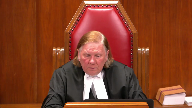
:::

It mattered whether there was intercourse in the five days before had to do with the medical evidence, not her direct evidence, it seems to me.

**Speaker 1** (00:26:34): Well, their justice role, what I would say is that if she had been permitted to be cross-examined about prior sexual activity, we don't know what she would have said about that prior intercourse within the seven days, whether there had been attempted anal penetration or anything else that could have led to that.

::: {.column-margin}

:::

And simply because even if the complainant was experiencing pain in the bathroom, but again I say she seemed to say that that occurred, she first felt it at the hospital, but even if she was experiencing it in the bathroom, it's not speculative to say she is hunched over the toilet

and she is vomiting fairly violently.

And if there is some prior weakness or something like that from whatever goes on several days prior, that could, the pressure, and of course the nursing evidence was that pressure can cause this tearing in the skin, the pressure could have caused those tears to occur at that point. So it is.

**Justice Rowe** (00:27:48): accused was just extraordinary unlucky that doing what he did at the time maybe the complainant had a spasm from from from a completely separate sequence and causation it's just just one of those unlucky coincidences I guess that's the idea

::: {.column-margin}
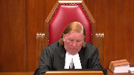
:::

**Speaker 1** (00:28:10): Well first of all I would say yes.

::: {.column-margin}
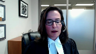
:::

We've seen many cases where people are unlucky and where it looks uh bad at first blush for someone.

Some of those cases you know we can look back at cases like that of Guy Paul Moran um where it looks bad and ultimately even though the evidence is seen to support a conviction there um you know we see that uh that person should not have been convicted.

So that's that's my my first response to that.

My second response is if she could...

**Justice Karakatsanis** (00:28:43): seem to support a conviction.

::: {.column-margin}
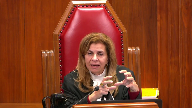
:::

The test is overwhelming case.

So if we put aside here the evidence that deals with the significance of the injury, and we look at the DNA evidence and we look at the complainant's accepted evidence, and if we look at it in that context, isn't the question for us whether it was so overwhelming that a conviction was inevitable?

**Speaker 1** (00:29:14): Yes, that is the test.

::: {.column-margin}

:::

I certainly agree with that.

But I say when we look at the other evidence, and I spent some time on that in the factum, again when we talk about the DNA we have to consider as well that his DNA is not found on her.

If he is penetrating or attempting to penetrate, we would presume that that would be found on her or within her

and it's not.

Now yes, it's true, there was other DNA evidence and that was this penile swab that is taken and there are many issues with respect to that.

But ultimately what it shows is an abundance of her DNA on his penis.

And this is one thing that that the defense works.

**Overlapping speakers** (00:30:06): What's the logical inference you draw from that?

**Speaker 1** (00:30:08): Well there are several.

::: {.column-margin}

:::

It's important to note that the the DNA expert testified about secondary transfer and he said saliva to hand, that is to the accused hand, and we know that he's handling what's referred to as the puke bag while she's throwing up, saliva to hand to penis is a possible scenario.

He said that it is a possible scenario.

**Justice Karakatsanis** (00:30:40): Do we take into account if a trial judge rejects secondary transference?

**Justice Abella** (00:30:51): Sorry, we can't we can't hear you.

Are you on mute?

**Overlapping speakers** (00:30:55): I see that.

I apologize if you could answer justice.

**Justice Abella** (00:31:00): could send us this question and then wrap up your submissions please.

**Speaker 1** (00:31:05): Yes, certainly.

::: {.column-margin}
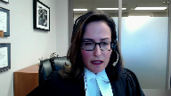
:::

So yes, we look at whether a conviction would be inevitable.

And did this trial judge, I guess, reject that? Yes.

But the question is, would a conviction be inevitable?

It's not this trial judge.

A reasonable trial judge, would they find the evidence to be so overwhelming that a conviction is inevitable?

And respectfully, I suggest not.

Where we have, you know, an equivocal statement by an accused that's not translated properly with a variety of issues, where we have evidence that it is possible that there is secondary DNA transfer, and it is not speculative here because the evidence was that he handled his penis when he was in the dry cell and he needed to urinate and he had no bathroom facilities very early on in that detention.

He leaned down and urinated and he was seen to be handling his penis.

And he was handling, you know, her vomit, the bag at least that the vomit was in.

So it's not speculative.

The experts said it was a possible scenario and we have that.

And then what does the trial judge rely on?

Or what could a trial judge rely on?

The complainant's evidence, but without proper cross-examination.

And again, I say cross-examination is a process.

It would have been related to this point, but who knows how it would have proceeded and progressed and what the complainant would have acknowledged.

Would a conviction here, could it be said it was inevitable this was the only result?

Respectfully, I say that that is not the case.

The Crown has not met its onus to show that Section 686 should be applied here.

And a new trial is what is warranted in the circumstances.

That is the default and that is what is warranted, I submit here.

Just one question.

Thank you very much.

**Justice Abella** (00:33:06): question, Ms. Hatch.

::: {.column-margin}
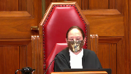
:::

In the ‑‑ in paragraphs 13 to 17 of the decision of the trial judge, the one dealing with the 2006 application, which then shows up in paragraphs 106, 9 to 11 of her decision, we have an acknowledgement ‑‑ there is a discussion about why this couldn't have been consensual, why these injuries were even more than normal, even if it was consensual, the age, an acknowledgement that she did in fact have intercourse a week earlier in paragraph 14 of the expert evidence, and then the conclusion by Dr. Carter Snell that the injuries reflected something that occurred within seven hours previous.

Is any of that attenuating the submission that she needed to be cross examined to see whether she had slept ‑‑ had sexual relations with somebody within the previous week?

**Speaker 1** (00:34:27): So Justice Abella, what I would say there is it is really important that we look at, I think it's page 221 in the trial transcript, what is said by the expert about the within seven hours.

::: {.column-margin}
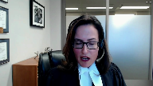
:::

She said consistent with being caused within seven hours, but also within five days.

So yes, it's consistent with that, but it's also consistent with within five days because it can take up to five days for these injuries to heal and that's where there is a very real basis to say well what happens during that time and all she indicated was no consensual anal intercourse within the last two days, and so...

**Justice Abella** (00:35:12): nature I thought she described of the injuries were fresh.

When she talked about

**Overlapping speakers** (00:35:17): Well-

**Justice Abella** (00:35:17): that they did not reflect something that happened a number of days ago.

They looked like injuries that would have occurred recently. Okay.

So recently one thing that is important now is what she said.

**Speaker 1** (00:35:32): Well what what she said was within seven hours but also within five days.

Importantly when we talk about recency, this is very important, there was no bleeding observed.

So that would go against, that would tend to go against potentially, the recency.

**Justice Abella** (00:35:50): The reason I asked you the question was we have findings of fact by the trial judge on these points at paragraphs 109 to 111.

::: {.column-margin}
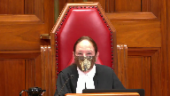
:::

Were they palpably and overridingly errors, her conclusions based on the passages that I've referred you to of Dr. Carter Snell's evidence?

**Speaker 1** (00:36:12): no that was open to her to find on the evidence that was before her

::: {.column-margin}
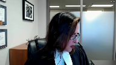
:::

but again that evidence was deficient because it was lacking the cross-examination that the accused was entitled to and so when you look at an injury where there is no bleeding and when you look at an injury that could have been caused up to five days before this was relevant cross-examination and it was probative meaning that it could potentially prove something of some relevance to the case of some significant relevance

and so I say there again you know it's a question for obviously this court to say can we properly apply section 686 I say when we look at CON and when we look at the centrality of this evidence and a trial judge relying on it as a key corroborating feature and a trial judge relying on interpretation of it as highly probative we should say that section 686 does not apply in this case

**Justice Abella** (00:37:15): your point.

Thank you, Ms. Savard.

I appreciate it.

Thank you.

Ms. Hatch, calling now on Ms. Savard, please, the Criminal Lawyers Association.

**Speaker 2** (00:37:26): Thank you, Justice Abela.

::: {.column-margin}
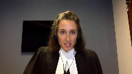
:::

Justices, good morning.

The parties are making submissions to you this morning about whether the proviso can cure a 276 error in this case, and the CLA intervenes to make a broader point on an issue which this court will have to tackle if it decides the Alberta Court of Appeal was wrong in its approach, and if it needs to consider the overwhelming or potentially overwhelming nature of the evidence, the CLA in that domain asks this court to clarify the scope of the proviso in cases where the evidence is apparently overwhelming but the error severe enough that letting the verdict stand would nonetheless undermine public confidence.

And there is no place where that particular application of the cure to proviso is as likely to occur as in a case where there has been a deprivation of the right to cross-examination.

**Justice Rowe** (00:38:32): Just logically, how is it possible to have evidence that is so overwhelming that the result is inevitable and yet the use of the cure to provide so shakes public confidence?

::: {.column-margin}
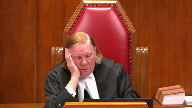
:::

I don't understand that.

And I don't understand it to be consistent with Khan either, by the way.

**Speaker 2** (00:38:53): So to answer your question Justice Roe, the most recent authorities from this court that hold that would be the case of Elshaw in 1991 and Burlingham in 1995.

::: {.column-margin}
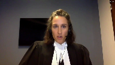
:::

Both of those were cases where where evidence was improperly admitted but the evidence was said to have by the Crown to have no effect on the verdict because in those cases there was so much other evidence.

So these are situations where the trial judge committed an error, the evidence was overwhelming and nonetheless it was held by this court, albeit in the 1990s, that it should distance itself, that appellate courts should distance themselves from those kind of decisions which endorse state excess.

And in this case the unfairness can come from the fact that the defense was compromised either in its ability to participate in creating the record or influence the trier of facts reasoning.

The two cases that you might want to look at at the appellate level where there were apparently overwhelming records but deficiencies in how counsel conducted the case called into question whether that overwhelming record was really as overwhelming as it looked are the cases of Walker and Olusonga, both of which are in my factum and Olusonga is O-L-U-S-O-N-G-A.

**Justice Karakatsanis** (00:40:25): I'd like to ask you a question that's perhaps related, but a little bit coming at it from a different perspective.

::: {.column-margin}
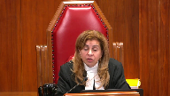
:::

How do you, in determining whether the evidence is overwhelming and would inevitably have resulted in a conviction, how do you deal with the findings of fact of the trial judge?

You put aside those, any that are impacted by the error, and I'm not talking about this case now, I'm just talking in general, putting aside any findings that are impacted by the error as found, what do you do with the rest of the findings of fact?

**Speaker 2** (00:41:10): My submission would be you cannot separate out the findings of fact that are affected and those that are not and to take this away from the case currently before the court, I'll use the case of Walker at the Court of Appeal as an example.

::: {.column-margin}
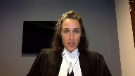
:::

This is a decision from last year where an aggressive acting out defendant was excluded from her dangerous offender hearing.

Amicus was appointed and it was found by the Court of Appeal that Amicus' role was not either properly defined or carried out.

And at the end of the day, the trial judge, I'll say the sentence hearing judge's finding that Ms. Walker was dangerous was unavoidable on the record.

There was an uncontradicted psychiatric opinion that she was dangerous.

There she was acting out before the sentence hearing judge herself.

That's a different kind of an area.

The nature of the record was what was called into question.

**Justice Karakatsanis** (00:42:05): Yeah, but that's a different kind of error.

::: {.column-margin}
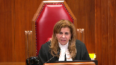
:::

That's where you're actually, you're looking at the entire proceedings.

Are you saying that in no case can you ever look at a trial judge's assessment of evidence that in no way is tainted by the error in question?

I would say it's a different kind of error.

**Speaker 2** (00:42:25): So I would say the first step in the analysis has to be, is the error of a type where any of the factual findings are safe.

::: {.column-margin}
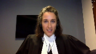
:::

And so, for example, in a case where cross-examination has been wrongly prohibited, one looks to the centrality of the witness's evidence, the centrality of the cross-examination, whether that witness was a key- Or the centrality of the issue. Exactly.

And so, for example, in my factum, I gave an example of a cross-examination restriction that might justify the application of the curative proviso, a six-month project case where a peripheral witness was asked about her perjury convictions, but improperly couldn't be asked about a diverted shoplifting charge.

That would be the type of cross-examination error to which the curative proviso could apply.

But as Ms. Hatch alluded to, there is a long line of cases that say that in the vast majority of cases, cross-examination restrictions will justify a new trial precisely because credibility must be assessed as a whole in the context of the evidence as a whole.

And so, almost always, by logical extension, be impossible to say that the trial judge's findings would have been the same.

**Justice Abella** (00:43:44): I just want to confirm that your second point, you would like us to expressly looking at your language disavow the approach adopted by Slatter Day A, is that right?

**Overlapping speakers** (00:43:57): Yes, section 683.

For the reasons I've set out in my factum.

Yes, we have the benefit of your factum.

**Justice Abella** (00:44:04): Thank you so much, Christopher.

Mr. Joyce?

**Speaker 3** (00:44:10): Good morning, Justice Abella, other Justices.

::: {.column-margin}
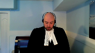
:::

I don't wish to spend a lot of time on the interveners' submissions, but I do think it's prudent to offer a couple of comments.

The test that the interveners proposing is a reasonable possibility test that the error could have impacted either the actions of counsel, the evidentiary record, or the reasoning of the trier of fact.

Now as far as I can tell, that argument has its genesis in the Dixon case from 1998, which was a case of late disclosure.

Council had the will-say statements, but only received the actual witness statements after conviction, and there in this court found that to establish a breach of your right to disclosure, the accused had to demonstrate that there was a violation of the right to full answer and defense, and they could do that either by showing that the newly found evidence that there is a reasonable possibility it could have affected the outcome, which sounds an awful like the cure to proviso as it is, or that the newly found evidence could have impacted the overall trial process.

And it was on this latter point that the court decided the reasonable possibility test could be interpreted as either foreclosing other avenues of investigation or affecting defense strategy.

And so I can understand why on the surface the intervener has drawn a parallel, however in my respectful submission there is a problem with applying that particular reasonable possibility test to a situation where cross-examination has been impeded.

And in my respectful submission the test in that situation would be so overly broad that it would be functionally meaningless, or would render the proviso functionally meaningless.

**Justice Rowe** (00:46:08): I mean, I have to tell you, I thought the court set things up with remarkable clarity and in a very practical way and calm.

::: {.column-margin}
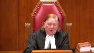
:::

And not withstanding all these various circumstances which have been referred to, I do not understand this court who departed from it.

Either an error is harmless, and therefore it's really of no consequence, or it is of a more serious nature, but even if you put aside the evidence that is affected by the error, the remaining evidence is of such a nature that the result is inevitable and therefore there is no unfairness or miscarriage of justice.

I mean, the Kahn formulation, which I've rendered in my own words, I hope faithfully, meshes quite nicely, as it should, the wording of the criminal code provision and gives us a very simple yardstick.

Is this error something which could have struck at the soundness of the verdict or the fairness to the accused?

And if it didn't, it's of no consequence.

**Speaker 3** (00:47:26): Yes, Justice Roe, I agree with that entirely.

::: {.column-margin}
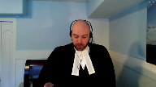
:::

In fact, a point I was coming to in my notes is that although the Dixon test sets out that the things I've just mentioned are required to establish a breach of the right to disclosure, the court went on to say that actually obtaining a remedy requires further assessment of the degree of prejudice actually suffered, which is completely in line with the CON assessment, and I agree it hasn't been changed.

The point I really wanted to make about the intervener's position here is that considering how broad the basis of allowing cross-examination is, that is the sort of good faith basis, and how much of that could cover, when you have a situation where cross-examination has been impeded, it would literally always be said that the defense was denied either access or information or would have taken a different approach every time, particularly in a 276 application.

They're literally trying to get that information in 276.

They've literally applied to get that information, and they've been told no.

So there's no scenario under the reasonable possibility test where defense counsel couldn't meet that trial fairness test from Dixon.

And since my friend from the intervener has said we don't need to worry about the actual effect on trial, it would in effect reduce the entire issue to a question of simple admissibility.

And once the appellate court disagreed with the lower court that say the issue in question was or was not hearsay, or perhaps had a different or limited use, or even was collateral fact, because the intervener doesn't want to worry about the overall effect or the lack thereof, a new trial would be automatic.

And I would humbly suggest that it's completely contrary to Kahn, it's contrary to the Dixon case, it's contrary to RV, and every other case of this court.

And then assessment.

**Justice Rowe** (00:49:26): I just refer you to, I can't remember which case it was in, and I'm not saying it's the guiding rule here, because I think it's in Khan, but there's a formulation that was given by Justice McLaughlin that I think, I've always found very useful, that everyone is entitled to a fair trial, no one is entitled to a perfect trial, and at the end of the day, what we're trying to ensure is that there is a fair trial.

::: {.column-margin}
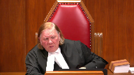
:::

**Speaker 3** (00:49:53): yes sir that's precisely correct and I believe Justice Lebel had comments to that effect in CON where you're always looking not at the discrete errors per se

::: {.column-margin}

:::

but the overall excuse me effect.

So unless there are further questions that's really all I wanted to say in addressing the intervener's position it is far too broad a test and the current test for the proviso is more than adequate.

Now as to the appeal proper I will get into my notes in a moment

but I just wanted to talk off the top about something that my friend brought up repeatedly and that was the issue of when the complainant first noticed the pain was it at the hospital or otherwise

and it's clearly stated in the transcript and that's at the appellant's record volume 2 page 105 this is when the complainant is first giving her recitation of the facts

and I'll quote it to you starting at line two

she says I was still puking feeling nauseous and I told him to stop that that hurts and he didn't stop.

So while I certainly appreciate my friend's comments that the complainant was asked and did admittedly specifically say she noticed the stinging and burning in her anus while at the hospital it's quite clear from her testimony that she experienced and felt pain at the time and the trial judge was entitled to take that into account by determining that the injuries here were related to the assault and nothing else.

Otherwise there's...

**Justice Martin** (00:51:39): well comment on whether or not there were statements in the transcript where she was unsure as to whether any form of penetration occurred, as opposed to her statement that she was 90% sure it was anal penetration, but couldn't be, I guess, more sure than that.

::: {.column-margin}
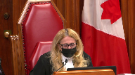
:::

**Speaker 3** (00:52:06): My recollection of the transcript was similar to yours, Justice Martin, in the sense that in the actual testimony she said was put to her she wasn't penetrated and she was clearly stated she was.

::: {.column-margin}
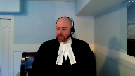
:::

I think it was earlier when she was telling the police she wasn't sure if she had been penetrated anally or vaginally, and I'm afraid at the moment I can't pinpoint a reference for you.

**Justice Abella** (00:52:37): That was dealt with by Dr. Carter-Snell too, wasn't it, when she said sometimes you can't know the nature of the penetration at the time it's occurring in circumstances like this?

::: {.column-margin}
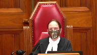
:::

Did I misread your evidence?

That was dealt with by Dr. Carter-Snell too, wasn't it, when she said sometimes you can't know the nature of the penetration at the time it's occurring in circumstances like this?

Did I misread your evidence?

**Speaker 3** (00:52:57): That is correct, Madam Justice, the expert did say it was not uncommon because of the pain in the area that the victims would be unable to pinpoint where it was.

**Justice Kasirer** (00:53:08): Mr. Joyce, can I get back to a comment that Justice Katsanis made to the intervener and apply it here.

::: {.column-margin}
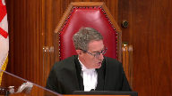
:::

If there was a finding of fact that's not affected by the error in respect of the cross-examination, well, then we're bound by it, are we not?

And if that's the case, however one reads the transcript on the timing of the pain, the trial judge found that it was the contact between the accused and J.T. caused her considerable pain, paragraph 111.

The Court of Appeal picks up on that.

And I guess the argument would be, and this is my question to you, even if we were to provide an opportunity to cross-examine at a new trial, on the narrow question about the prior sexual history within the five days prior to the incident, it wouldn't affect the matter of when the pain actually was felt or communicated.

**Speaker 3** (00:54:34): Yes sir, I agree with you on both those points.

::: {.column-margin}
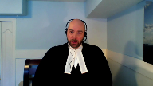
:::

Legally speaking, so long as the error has not impacted the fact, then you are bound by it, unless it's probably an error as always.

And two, the point I made and would repeat here today is that

yes, the complainant complained of pain that day and the pain itself can be an inference of the assault, even if we were to cast aside all the evidence of actual penetration.

But I don't think we have to cast aside the evidence of penetration.

**Justice Rowe** (00:55:04): I guess another way of picking up on what my colleague just said is it seems to me that the cross-examination which was denied really went to, potentially to some extent, the probative value of the medical evidence and didn't really relate to the testimony of the complainant as to what occurred.

::: {.column-margin}
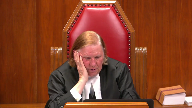
:::

It seems to me that's the logical relationship.

**Speaker 3** (00:55:37): Yes, sir.

::: {.column-margin}
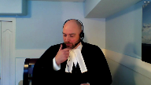
:::

In this particular case, cross-examination, we can ask ourselves, as the court did in RV, what is the purpose of this evidence?

And in RV, of course, cross-examination about injuries had to happen for a couple of reasons.

First of all, impregnating someone requires two people, obviously.

There was contradictory evidence about when the complainants said to the doctor she was not sexually active and so on and so forth.

But most importantly, in that particular case, the time frame of the assault was not strictly defined.

It was a broader two-week period.

And because, of course, sex is the only way to impregnate someone or sexual encounter is the only way to impregnate someone absent a medical issue, it was necessary to go and ask her about prior sexual contact.

Now, in this particular case, the identification and the argument that was made in the court below about identification is that the complainant was wrong or potentially wrong about who assaulted her that day.

There were other male partygoers.

So, respectfully, asking the complainant about injuries that may have occurred five days prior could do nothing to aid the theory she was mistaken about who assaulted her on that particular day.

Those injuries have nothing to do with that.

And so, likewise, not allowing cross-examination about five-day-old injuries does nothing to advance the theory at trial that she was mistaken about who assaulted her that day.

**Justice Karakatsanis** (00:57:07): I guess, just to continue on this for just a little bit, I think the point that Ms. Savard made and the point that's being made now is that you really have to look at the error to see what it's tainted.

::: {.column-margin}
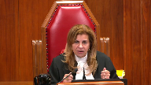
:::

And sometimes it may taint the entire trial, sometimes it'll taint particular evidence, or the, but you have to be rigorous in examining the effect of the error.

And so my question here would be, could the failure to ask questions of that nature have impacted, say, for example, the complainant's credibility?

Is that, is there a possibility of that?

And I think that if you follow through with that kind of analysis, that helps you determine whether the case, the untainted evidence and any untainted findings of fact are so overwhelming that any trial judge would have convicted.

Does that, does that, is there, is that how it goes?

Or is there something that I've overstated or perhaps not mentioned?

**Speaker 3** (00:58:23): No, Madame Justice Caricatsanis, I don't believe you've overstated or missed anything.

::: {.column-margin}
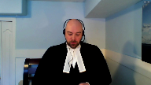
:::

I do agree that CON has clearly said that where trial fairness has been impacted, the cure to proviso should not be permitted, but it's a question of determining whether on the facts of any one case that trial fairness has been impacted or tainted in such a fashion that you shouldn't or couldn't use the proviso.

And of course, in CON, it shouldn't be overlooked that Justice LaBelle, I believe, set out different factors, including whether it's central, whether it's peripheral, whether it's a judge-alone trial or a jury trial and so on and so forth.

But at the end of the day, you do have to look at what has potentially been tainted or not.

And RV not only illuminates the error in this case, but also the path of redemption, so to speak, in that it tells us to examine why we would be using this sort of evidence and how it might relate to the defense at large.

And a moment ago, I spoke of the identification issue.

And your question, ma'am, to credibility, this evidence could not be used to challenge your credibility per se, in the sense that it couldn't be used to contradict her because there were no pre-existing statements that said she was hurt on an earlier occasion or anything of that nature.

Also, because the pain that she reported in her testimony is occurring at the time was noted in the examination at the hospital, it would seem to me anyway, suggests that counsel would not be able to cross-examine about prior sexual encounters as a means to showing she was fabricating her evidence about pain.

Obviously, you couldn't go to honest but mistaken belief because there was no error of reality to such a defense and where stories are diametrically opposed.

**Justice Martin** (01:00:22): But isn't the claim here that the evidence of Dr. Carter-Snell was put forward to corroborate that an assault had taken place and that the physical injuries were more or were consistent with an assault.

::: {.column-margin}
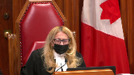
:::

So doesn't that make them probative?

I mean doesn't that make the issue of whether they could have been caused in a different fashion probative?

**Speaker 3** (01:00:57): Yes, Justice Martin, I don't disagree it was probative.

::: {.column-margin}
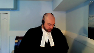
:::

That's exactly why everyone agrees that cross-examination of some form should have been allowed.

But the issue now, of course, is whether or not not allowing that cross-examination has been overtaken by evidence that was overwhelming.

And so, yes, the expert was put up for that purpose, but since she was thoroughly examined about other potential causes and how the number of injuries relate to things, and when I say other causes, I'm talking about stool, whether it could have been fingers, so on and so forth.

And this is all in my my condensed book.

I'm not going to refer you specifically to it, but she was asked about bowel movement, stool, diarrhea, whether it could have been fingers, whether, in fact, it could have been rough consensual anal intercourse on an earlier occasion.

And all of her evidence, and the evidence, I would say, of the Sartners, pointed away from that conclusion.

So at the end of the day, even though the expert was called to essentially suggest that these injuries were consistent with an assault, having been asked, having been attacked, her evidence alone about could this have come from something else was, I say, in the spirit of R.V., sufficient to sow the seeds of reasonable doubt, at least in terms of how we would define that from a trial fairness issue.

And as a result, the trial simply was not unfair, just as it wasn't in R.V.

**Justice Karakatsanis** (01:02:31): But RV was on the harmless branch, are you...

We've been talking about the overwhelming and I take it you're now trying to establish that it was also harmless.

**Speaker 3** (01:02:45): Yes ma'am in fairness in a matter of speaking it is harmless because of that

but it's also

**Justice Karakatsanis** (01:02:50): Sorry, it's either harmless because at the end of the day the questions were asked or putting that aside on the rest of the evidence that's not tainted, it's overwhelming.

Which argument are you making now?

**Speaker 3** (01:03:08): Respectfully, ma'am, I don't think I have to choose which horse per se.

::: {.column-margin}
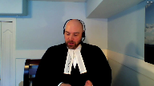
:::

The I agree that in RV, the issue was harmlessness.

And I'm suggesting there are distinct parallels between this case and RV.

So you could say it was harmless.

The court below considered it overwhelming.

And I agree with them that the case is overwhelming, because when you add up the the expert evidence about the time to heal and as compared to the evidence of pain and the fact that the lacerations could be seen without the dye, which was significant, that the complainant displayed tenderness, which was defined as experiencing pain or recoils, recoiling or wincing, that this pain lasted for days and was not present before the appellant came in the bathroom.

The suggestion that she had somehow been injured five days before, which means she would have been healed or completely healed at the time of the assault, is completely inconsistent.

And therefore, I would suggest that not cross examining her about it, or pardon me, I would suggest then that accepting those facts as the trial judge did, the case was overwhelming.

The inference that the assault was caused, the injuries were caused by the assault is completely overwhelming.

By the way, I.

**Justice Rowe** (01:04:23): Justice Kerikosanis was on one side in RV and I was on the other side.

::: {.column-margin}
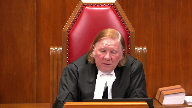
:::

I don't think it matters.

I don't read RV as establishing a new test.

I read RV as the application of settled law in the particular circumstances of the case and in a difficult case where there was a bit of a close call.

That's different from the general statement of the law that we find in cases such as Khan.

So I find it a bit of a distraction, not that that much matters, that the Court of Appeal rattles on about RV.

I think maybe they should have looked at the principles, but maybe RV established new jurisprudence.

I just didn't understand it to be so.

**Speaker 3** (01:05:14): Well, sir, I won't get into that, but my over overarching point is respectfully is that the the like RV cross examination here was held, therefore any prejudice to his right to cross examine was minimal.

::: {.column-margin}
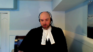
:::

And moreover, the evidence here, given the expert and the healing as contrasted to the the inference, the defense wants you to draw is overwhelming.

**Justice Kasirer** (01:05:36): Mr. Joyce, can I ask you on that last point, if we look at the Court of Appeals analysis of the proviso, I'm looking at paragraphs 28 and 29 in particular, let's fix on 29, some of the evidence that you've been speaking to that you submit that is overwhelming, the Court of Appeals says, well, not essential to this conclusion.

::: {.column-margin}
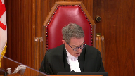
:::

What do you make of that comment and whether we should rely on it?

**Speaker 3** (01:06:15): Pardon me, sir.

I just want to get to the paragraph you referred to.

**Overlapping speakers** (01:06:20): It's 29.

**Speaker 3** (01:06:21): I'm just going to mute my microphone for one moment, please.

::: {.column-margin}
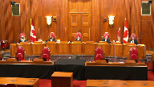
:::

Yes, to that point, sir, we see at paragraph 28 what they're saying is even if you exclude all the evidence, you're not going to get anything out of it, you're not going to get anything out of it.

**Overlapping speakers** (01:06:39): other

**Speaker 3** (01:06:40): otherwise, including the DNA and the immediate identification.

::: {.column-margin}

:::

This is just part and parcel of what I say.

I think the court below was saying that they find that the provisor could have applied.

That is, there was no room for reasonable doubt based on the evidence accepted by the trial judge alone.

That is how I would suggest.

**Justice Kasirer** (01:07:04): draw a distinction, Mr. Joyce, between the evidence in 28, the DNA evidence and so forth, and what the Court of Appeal perceives not to be essential, which would include the complainant's testimony that the pain she felt during the event was intense, a nine on a pain scale of ten.

::: {.column-margin}
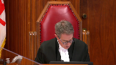
:::

**Overlapping speakers** (01:07:27): I'm an-

**Justice Kasirer** (01:07:28): not right in thinking that that evidence is important to help explain why reaching back to days four and five in the five-day period identified by the expert Carter Snell is would have no impact here

::: {.column-margin}
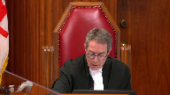
:::

because the evidence taking that into account, the evidence is overwhelming that the event took place as it's alleged.

**Speaker 3** (01:08:00): I agree with you 100% on that sir.

::: {.column-margin}

:::

That evidence is key to showing why the case was overwhelming.

I merely contrasted it with paragraph 28 because I think what, as I said a moment ago, what the lower court was suggesting is that the case was overwhelming even without it and that if you factor that in, the nine out of ten, it's even more so overwhelming.

**Justice Martin** (01:08:22): What do you say, though, to Ms. Hatch's argument that the case is not overwhelming because of the limits to the DNA evidence?

**Speaker 3** (01:08:39): At that point, Justice Martin, the DNA evidence, the expert was asked about other sources of vomit and blood, and the expert had testified, if I recall correctly, that – let me just bring that up, if I may – as to the lack of her DNA, the expert said at page 255 of the trial transcript that they were unable to identify semen, and the swab was not submitted for DNA analysis at that time.

::: {.column-margin}
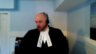
:::

And he was asked about other staining, but he said there was no visible staining on the swab.

And so when you take that evidence as it's in the record and combine it with the trial judge's finding that this evidence, this DNA, came from an internal source, and therefore she ultimately rejected secondary transference, I would suggest that my friend's comments, ably made though they were, that the evidence was – the case was not overwhelming is an incorrect characterization, particularly in light of the evidence of the complainant.

Now I see I have about five minutes left, and through the questions of the members of the court, I've sort of gone through everything I wanted to say in my notes.

So let me just conclude, if I may, by commenting also briefly on the alternate remedy by the dissenting justice.

You have my written submissions on that point.

It would appear a neat and tidy solution on the surface to simply call the complainant and have her give some further evidence to the Court of Appeal, but for the reasons I've outlined, it would soon turn the appellate process into a trial de novo, which is something we shouldn't be doing.

**Justice Karakatsanis** (01:10:42): It would also seem to be fundamentally inconsistent with the idea that the evidence that's there is overwhelming.

**Speaker 3** (01:10:53): quite right Madam Justice Eric Xanis.

::: {.column-margin}
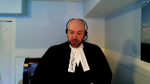
:::

If you are suggesting you have to augment the record in order to find the cure to proviso then you are presupposing the lack of inevitability which is the very precondition for imposing the proviso.

So I would suggest if the court is not willing to leave this to another day when there could be full argument in an appellate court and reasons from an appellate court then the solution proposed by the dissenting justice below is unworkable and should not be adopted.

Subject to further questions.

Thank you very kindly.

**Justice Abella** (01:11:30): Thank you, Mr. Joyce.

Any reply, Ms. Hatch?

**Speaker 1** (01:11:36): Yes, just going back to the point of revisiting the trial judge's findings and what the test is here for this court, I just wanted to draw the court's attention to the excerpt from Wildman in the condensed book at tab 10, Condensed Book of the Applicant.

::: {.column-margin}

:::

What the court said there, page 329, is that when the error of law is the preclusion of exculpatory evidence, then the determination must be made with regard to the entirety of the evidence, that evidence having been included, and in light of the effect that the excluded evidence could, within reason, possibly have had on the evidence.

Any reasonable effect should inure to the benefit of the accused.

And so when we say the accused was denied cross-examination, that cross-examination could well have been probative, and the Crown acknowledges that, where does that leave us?

It may be that the complainant, because cross-examination is a process, it is not just one question that was precluded, it was a process of cross-examination, how would that cross-examination have gone?

Would it inevitably have gone the same way that it went here, but for a particular answer that, yes, there was some other intercourse within a few days, and maybe an acknowledgement that that injury could have been caused at that time?

That may have occurred, but in addition, that process could have led to a cross-examination that was different from the one that we see there.

So any reasonable effect that it could have had should inure to the benefit of the accused.

**Justice Rowe** (01:13:26): I'm not sure that that follows, because, you know, an order, if it had been granted, would have narrowly circumscribed the range of cross-examination for prior sexual activity.

::: {.column-margin}

:::

You can't just go on a fishing trip.

And so the most it could do would be, it seems to me, logically, weaken the credibility to be given to the medical evidence.

**Speaker 1** (01:13:57): And so what I would say to that, Justice Roe, is that when we cross-examine a witness, of course, their answers in relation to this, and I fully recognize that there's no question, there would not have, there could not have been a fishing expedition, as it were, but if the complainant gave certain answers, if the complainant acknowledged some other act within a few days prior that could have caused this, sometimes that causes a witness to step back to question their evidence, to question some of the conclusions that they've drawn.

::: {.column-margin}

:::

And the path that that cross-examination then took, and the evidence that comes from that, may well have been different, because that's the nature of cross-examination.

So that's the first point that I wanted to make.

And I also wanted to just say that it's not just a question of tainting by the error, and that is one question, but that is one part of it.

It's a pivotal witness here, and even if, you know, the cases say if we have a miscarriage of justice because an accused is denied a fair trial, not a perfect trial, but a fair trial, then we don't get to the question of was the evidence, you know, would there inevitably have been a conviction.

If there's a miscarriage of justice, he must have a new trial.

And I say that the default is, where cross-examination is impeded, the default is that there is a miscarriage of justice and accused has been denied a fair trial.

I also wanted to address the point of the expert evidence, and if we take that away, just excise it from the evidence at trial, that we could just be left then with the complainant's evidence.

But again, if that's how we look at it, I say, you know, where relevant cross-examination is constrained or restrained, can we say that the evidence is inevitably going to lead to a conviction?

And I say that's not the case.

A fair trial includes proper cross-examination and fulsome cross-examination.

And unless you can say, well, the accused was, you know, skirted the ruling and he went there in some way anyways, then where we get to is a miscarriage of justice.

And I know that this is a sexual assault case, and we don't readily, you know, we don't want to order new trials too readily for a variety of reasons, but where we have an error of law and someone who is impeded from proper cross-examination that could have been probative, then I suggest where we get to is, in fairness, only a new trial.

**Justice Abella** (01:16:51): Ms. Hatch, thank you.

I'm afraid your time is up.

And this is reply.

I'm hearing some of the arguments we heard from you this morning.

So I would ask you to wrap up, please.

**Speaker 1** (01:17:03): Okay.

One last point.

Can we say that it would not have been open to a trier fact to have a reasonable doubt?

Again, I would refer this court back to atrocious.

**Justice Abella** (01:17:17): This isn't reply, Ms. Hatch.

Thank you.

I would ask the parties to remain.

The court will take its morning recess and we'll let you know whether you need to stay any longer.

Thank you.

**Justice Rowe** (01:18:04): Record, la Coupe.

**Justice Abella** (01:18:20): Councillor, thank you for your submissions in the hearing and in your written materials.

::: {.column-margin}

:::

They were extremely helpful.

We would dismiss the appeal.

The parties did not dispute that the trial judge erred in dismissing the accused application under section 276.1 of the criminal code to cross examine the complainant.

In our view, this error did not lead to a miscarriage of justice and falls within the curative proviso under section 686.1b because the evidence was otherwise overwhelming and a conviction was inevitable.

We do not endorse the application of section 683.1.

Neither party sought this remedy before the court of appeal and in this court both parties as well as the intervener urged us to reject his approach.

Thank you, council.

This court is adjourned until 2021.