---
title: Karen Armstrong v. Colin Ward
published-title: Heard
date: 2021-01-18
sidebar: false
---

This transcript was made with automated artificial intelligence models and its accuracy has not been verified. Review the original webcast [here](https://scc-csc.ca/case-dossier/info/webcast-webdiffusion-eng.aspx?cas=['39049']).
---

**Justice Wagner** (00:00:01): The court will go.

::: {.column-margin}
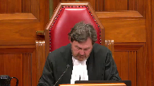
:::

Good morning.

In the case of Karen Armstrong against Colin Ward, for the appellant Karen Armstrong, Ryan Briden, and Jan Merrin, for the intervener Ontario Trial Lawyers Association, Barbara Leggett, for the respondent Colin Ward, Mark Veniziano, and Jan Lillis, for the intervener Healthcare Insurance Reciprocal of Canada, Anna Marison.

Mr. Briden.

**Speaker 1** (00:01:09): Thank you Chief Justice.

::: {.column-margin}
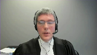
:::

I'd like to begin by touching on what this court said in Fontaine because in my submission this sets a useful framework for looking at both how the parties and in particular the respondent approached this case at trial and in my submission shows why the majority erred in its criticism of the trial judge.

As you know in Fontaine this court dispensed with the doctrine of reciprocity in favor of what I would describe as a more pragmatic approach.

First that the trial judge must determine whether the plaintiff has established by direct and or circumstantial evidence a prima facie case against the defendant and second once the plaintiff has done so the defendant must present evidence negating that of the plaintiff or necessarily the plaintiff will succeed.

In this case the plaintiff's case was very straightforward.

She argued first that the standard of care required Dr. Ward to stay more than two millimeters from the ureter when using the ligature.

Second that Dr. Ward breached that standard of care by using the ligature too closely and third that using the ligature too closely caused the injury to the ureter and obviously if the evidence of Dr. Bernstein and Dr. Klotz were accepted the plaintiff made out that prima facie case.

I'd like to turn then to how the respondent dealt with that and as you know virtually all of the defense, pardon me, virtually all of the evidence regarding the standard of care is reproduced by Justice Van Rensburg and her dissenting reasons below.

I don't propose to take you through all of that because I know that you've seen it

but I would ask you to make note of the following points which in my submission are essential to understanding why the majority erred in this case.

First dealing with the evidence of Dr. Ward himself.

He testified that the standard of care is to ensure that you use the ligature far enough away from other structures like the ureter that you don't inadvertently damage those structures by thermal spread.

He testified that the way that you protect the ureter is by and I'll quote maintaining a distance and ensuring that you are several centimeters away before using the ligature and of course he testified that he did in fact maintain that distance and that he was never closer than five centimeters from the ureter when using the ligature.

Dr. Hagen, the standard of care expert called by the respondent, testified that the standard is to identify the ureter and to stay away from the area.

That when using the ligature you have to stay more than two millimeters from the ureter in order to avoid the risk of injury.

He testified importantly that there is no risk of injury to the ureter when you do this procedure correctly because you're centimeters away and again a quote he said it's not possible to damage the ureter if you've identified it and he went on to testify that the reason that you couldn't have an injury is because you would not put the ligature within that two millimeters.

And in re-examination he testified that if the surgeon misidentified the anatomy, so if he thought something was the ureter and in fact it was another structure and he was protecting the wrong thing, that would be a breach of the standard of care.

And lastly Dr. Robinette was called as a causation expert by the respondent but he had given an opinion with respect to the standard of care and ultimately testified about that at trial and he testified that if Dr. Ward inadvertently used the ligature two millimeters away from the ureter that was in fact a breach of the standard of care.

That's the respondent's evidence.

And I'd make three observations.

So number one, in my submission there was no controversy at all that the standard of care required a surgeon to stay more than two millimeters away from the ureter when using the ligature.

Two, Dr. Hagan had the same opinion as Dr. Bernstein and my friend criticizes Dr. Bernstein, the majority criticized Dr. Bernstein, but you'll see that their opinion was in fact the same which is that if the standard of care is met it is impossible to use the ligature within two millimeters of the ureter and therefore impossible to cause an injury with the ligature.

The only difference is that Dr. Hagan refused to concede what in my submission is the logical corollary of this which is that if the surgeon did come within two millimeters of the ureter then it follows that he must have breached the standard of care.

And lastly and in my submission this is the most important point in terms of understanding how the majority erred in its assessment of this case, there was absolutely no suggestion from anyone that there was any circumstance in which a surgeon might be unable to maintain a safe distance.

It wasn't pleaded, it wasn't even put to a witness let alone testified to by any of the witnesses at trial, and it wasn't argued before the trial judge.

So this wasn't a case where the respondent's defense was yes I came within two millimeters of the ureter but it wasn't my fault and here is why

and then the trial judge would have had to deal with that.

This was a case where the respondent said I didn't come within two millimeters of the ureter.

Mr. Brindan, is this the end of the interview?

**Justice Côté** (00:07:33): I'm sorry to interrupt you, is the fact that the surgeon decided to proceed through in using that laparoscopy technique instead of the regular surgery, does it have an impact, I know it was not disputed that he could use that type of surgery, but does it have an impact on the assessment of the risk or the risk of injuring the urethra?

::: {.column-margin}
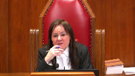
:::

**Speaker 1** (00:08:02): So, thank you.

::: {.column-margin}
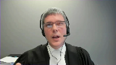
:::

Now the evidence was that this standard, the identifying the ureter and protecting it by staying away applied regardless of the mode of surgery, so it didn't matter whether the procedure was by open surgery or laparoscopy.

It wasn't, it didn't matter if it was a procedure that was done by a general surgeon or a urologist or even obstetrician gynecologist so the evidence was that this was a standard that applied regardless of how the surgery proceeded and there was no evidence that somehow the fact that this was done laparoscopically had any bearing on whether Dr. Ward would in fact be able to achieve this.

**Justice Côté** (00:08:49): Yeah, but with the laparoscopy, there is evidence that you cannot see all the time.

The surgeon cannot see all the time because the camera has a limited angle.

**Speaker 1** (00:09:04): Right, that was the evidence, but again, all of the experts testified that, nevertheless, the surgeon would be able to, or ought to be able to, identify the ureter and then stay away.

::: {.column-margin}
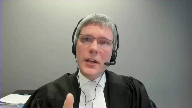
:::

I mean, they know the anatomy

and they know where the ureter lies, so if they're able to identify one portion of it, they can predict where it's going to go.

And I think more to the point, there is no suggestion that somehow the fact that this was being done laparoscopically would prevent Dr. Ward from being able to achieve this in this.

**Overlapping speakers** (00:09:36): in this case, just wasn't an issue that was argued at all.

Thank you.

**Speaker 1** (00:09:40): Just briefly deal with the actual defence that was raised, mainly because I anticipate my friend has some things to say about it this morning.

::: {.column-margin}
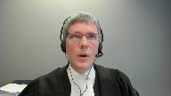
:::

Because there was no issue that the appellant suffered an injury during this procedure, and given the defence that was raised, which was that Dr Ward stayed more than five centimetres away, the respondent needed an explanation as to how the appellant had suffered her injury and this was the real focus of this trial, what actually happened.

The respondent's theory as you've seen was that the ligature used several centimetres away caused inflammation which travelled through the retroperitoneum and ultimately damaged the appellant's ureter.

The trial judge rejected that explanation and in my submission had ample reason to do so.

Dr Robinette, who was the causation expert attended by the respondent to advance this hypothesis conceded in cross-examination that the injury could not have been predicted, that he was not aware of a single case of this ever happening, it's never been reported in the literature.

And when he was asked why the appellant had suffered this unforeseen or unforeseeable complication, testified that he didn't know what made her unique.

That was sort of the respondent's theory and of course Dr Bernstein and Dr Klotz testified that this was a thing that simply did not happen and that if the ligature did this, it wouldn't be safe to use and although parenthetically the evidence is that the ligature is a device which is used all over the world and in all sorts of surgeries, so it's not something that's specific to colectomy as it's used routinely, it just doesn't do the thing that was alleged to have been done and of course if it did, it wouldn't be safe to use in general.

**Justice Wagner** (00:11:43): Mr. Breeden, I have a question for you.

::: {.column-margin}
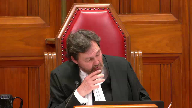
:::

In the evidence, Dr. Artsberg testified, he's the surgeon who removed the kidney.

And apparently, Dr. Artsberg said that it was quite possible that the damages were caused by the previous colectomy, because there were a lot of adhesions and a lot of scarring beyond the proximal third of the ureter.

I'm referring to page five of the trial judgment.

Obviously, the first judge did not consider that evidence.

**Speaker 1** (00:12:24): Well, with respect, so the colectomy that Dr. Hartzberg is talking about is this procedure, this is the colectomy that was performed by Dr. Ward.

::: {.column-margin}
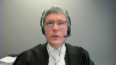
:::

So when Dr. Hartzberg says that this must have been an injury caused during the colectomy, he's talking about the procedure at issue.

**Justice Wagner** (00:12:44): But along the large number of scars, which may suggest that it was there, much more caused by something else than what happens during the operation, no?

**Speaker 1** (00:13:01): Well, that wasn't the evidence, Chief Justice.

::: {.column-margin}
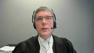
:::

So really, there are two theories that were put to the trial judge.

So plaintiff's theory is Dr. Ward used the ligature basically right up against the ureter, and that caused the scarring.

And he used it along some length of the ureter, and that's why the ureter was scarred at that length.

So that was the theory that ultimately was accepted by the trial judge.

The theory of the respondent, based on the medical evidence that was available, was that it was caused by the ureter, but by the ureter used at some remote distance, which then caused scarring through the abdomen.

So there's no suggestion by anybody.

It's in the ligature, not by the ureter.

**Justice Brown** (00:13:45): ureter you mean it was caused by the you mean the caused by the ligature not by the ureter

**Speaker 1** (00:13:51): I'm sorry, yes, caused by, pardon me, thank you very much, Justice, yes, caused by the use of the ligature at a remote distance, which then caused inflammation through the abdomen is the respondent's theory.

::: {.column-margin}
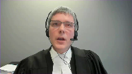
:::

There's no suggestion that other pre-existing causes, other earlier surgeries, something else might have caused the scarring, which I think Chief Justice is the thrust of your question.

And in fact, the evidence was to the effect that there was no such causes.

So there are other things that that might give rise to this sort of phenomenon.

The evidence was that the plaintiff didn't have any of those other conditions.

So really, the trial judge on the evidence that was before him was being asked to pick between two different explanations.

And he preferred the explanation advanced by the appellant's experts, and in my submission, made a finding of fact as to what happened, from which there's no appeal.

I mean, that was a finding of fact that was available to him on the evidence, as my submission was well supported on the evidence, and that's that.

And it follows from that, that the trial judge made a finding of fact that the respondent did in fact use the ligature within two millimetres of the ureter, and that that was the cause of her injuries.

And again, in my submission, there can be no appeal from that finding.

**Justice Brown** (00:15:16): Just just to be clear the expert evidence was that this was thermally caused.

Yes, correct, right and that it it and that inflammation and scarring could not have caused this other than Dr. Robinette's evidence.

**Speaker 1** (00:15:29): So the expert evidence is that the way the ligature works, maybe I can back up, it has two prongs and it passes an electrical current between the two prongs and that allows the surgeon to dissect and cauterize at the same time.

::: {.column-margin}
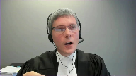
:::

As you will have seen in the materials, the evidence is that there is a thermal spread of one to two millimeters from that point.

Now, the evidence of Dr. Klotz is that that thermal spread can cause inflammation and ultimately scarring at the site.

So Dr. Klotz theory was that the ligature was used within two millimeters of the ureter.

That didn't burn a hole in the ureter.

I mean, that was one thing that might have happened, that would have presented immediately with complication.

So it didn't do that.

But what it did do was start a process of inflammation and ultimately scarring, which resulted in the obstruction of the ureter.

That was his explanation for why it took some time for this to be manifested.

This issue wasn't discovered for several weeks because it took some time for that scarring to develop.

But the point is that it occurred at the ureter itself, not as suggested by the respondent at a remote location.

The trial judge, as you've seen, articulated the standard of care in paragraph 84 of his reasons as saying that under these circumstances, it would be in the circumstances being performing a colectomy in a patient with a benign, that is an anatomically normal colon like the appellant.

It would be a breach of the standard of care for a general surgeon to touch the ureter or to come within one or two millimeters of it during a routine colectomy on a benign colon.

**Justice Wagner** (00:17:36): Well, I'm sorry again.

::: {.column-margin}
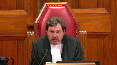
:::

So what you're saying is that essentially the standard of care should not be the one for a surgeon to be at least two millimeters of the ureter, but it should be to identify and protect the ureter.

And in order to protect the ureter, you should not be closer than one or two millimeters.

So it's not so much to be at one or two millimeters.

It's to protect the ureter.

And one way to do that is to stay away from it.

**Speaker 1** (00:18:09): Well, actually, the only way to do that is to stay away from it.

::: {.column-margin}
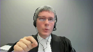
:::

On the evidence, what it means to protect the ureter is to stay more than two millimetres away from it, nothing else.

And so in my submission, the trial judge was correct to identify the standard of care in the manner that he did, because that was what the evidence was.

And it wouldn't actually be helpful for him to have said the standard of care is identify and protect the ureter, because the next obvious question is, well, what does it mean to protect the ureter?

**Justice Brown** (00:18:42): be that would be adopting the absolute standard of care that your friends say that the trial judge adopted.

That's Falloca, right?

**Overlapping speakers** (00:18:49): Exactly.

**Justice Rowe** (00:18:50): FU-

**Justice Brown** (00:18:50): But faloka was you have to keep intruders from the mine without actually saying how to do that.

::: {.column-margin}
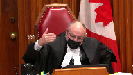
:::

Here, if he had just said you have to identify and protect the reader, that might well have been an absolute duty, but as the chief justice points out, he says how you do it, and that's by staying away from it.

**Speaker 1** (00:19:14): Right, that's exactly it.

::: {.column-margin}
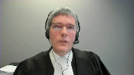
:::

The trial judge would have fallen into the air that was alleged by the majority or found by the majority and raised by my friend had he said, you have to protect the urter because that doesn't tell the surgeon what he actually has to do.

And on this evidence, what he has to do is stay more than two millimeters away.

And that's why the trial judge defined the standard of care in those terms.

The majority finds that this is an error because they say that he's defined the standard of care in terms of the goal rather than this step.

And I've made the point in the fact that's just a semantic distinction that isn't terribly helpful because you can always describe almost any stage of a procedure or anything as being either a step or a goal.

But what they do is they go on to say that a step involves something which is executing an act under one's control.

That sort of ties into what this court said in St. John of Mercier, which is that it's an act or omission of the defendant.

That's correct.

The problem with the majority's finding is that on this evidence, staying more than two millimeters away from the urter was within the surgeon's control.

And there's no evidence at all that it was somehow outside of his control to be able to do that.

And so therefore, if what the trial judge is required to do is articulate the standard of care in terms of an act that is within the control of the defendant, a statement which I think broadly speaking must be correct, he did that in this case on this evidence.

So it's described by the majority as being the controversial issue.

And with respect, it wasn't controversial.

It wasn't even raised as an issue.

All of the physicians testified, and I've taken you through the evidence, that maintaining a safe distance was something that was done, that was capable of being done.

And of course, the respondent testified that it was something that he actually had done, but that evidence was rejected.

The majority's concern seems to be that the trial judge did not specifically exclude other possible non-negligent explanations.

And they go on to suggest other possible non-negligent explanations that might have been explanations for the injury.

And so the suggestions are, well, perhaps it has to do with the surgeon's dexterity, or perhaps it has to do with the effects of vermiculation, which is when you poke the ureter, it pulses a little bit.

That's one of the ways that the surgeon identifies that it is the ureter and not something else.

And the problem in my submission with this is that there were no other non-negligent explanations advanced by the respondent.

**Justice Brown** (00:22:14): Well there's another problem too which is if a surgeon doesn't have the dexterity to do the procedure, perhaps the surgeon is negligent by doing the procedure.

**Overlapping speakers** (00:22:24): Thank you very much.

**Justice Brown** (00:22:24): I mean, I must confess, I found that example passing curious.

**Speaker 1** (00:22:30): Well, that's just it, because the issue is that if the respondent raises that as an issue, the respondent has to raise it as an issue, if that's a defense that is being relied upon, then it would be open to the plaintiff to call evidence about that.

::: {.column-margin}
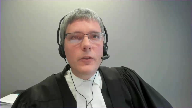
:::

And so if, for instance, as you say, if the respondent's position at trial had been, look, my hand was shaking, then there would have been evidence as to whether it was appropriate to proceed with the surgery in the circumstances, and the case would be decided on the basis of that evidence.

**Overlapping speakers** (00:23:07): That might not need expert evidence.

**Speaker 1** (00:23:08): I, I, I, I, I, it would probably depend on the, on the circumstances, but you, but you may be right.

::: {.column-margin}
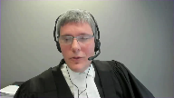
:::

Um, the, the, the, the court must not, as a general principle, uh, hypothesize about explanations which are not advanced in the evidence.

Our, our system of justice, the advocacy system, the adversarial system relies on the parties to bring their best cases to court.

And it relies on the court to then impartially arbitrate between them.

And, and I've put some cases before you.

I don't think we need to turn them off.

You'll have seen them, but, but right.

The court doesn't, in Justice Scalia's words, sally forth looking for wrongs to right.

It decides the issues that are brought before it.

And a trial judge is not, in my submission, required to consider positions not advanced by the respondent.

And if you've seen the Becker and, and Toronto case, this is the case involving the glass door in the, in the community center.

Here, the, the defendant had pleaded a different explanation, different non-negligent explanation than the one that was actually advanced at trial.

They run a different argument at trial, they're unsuccessful and on appeal argue, well, the trial judge should have dealt with that other non-negligent explanation.

And the, the Ontario court of appeals said, no, that can't be right, because the trial judge has to deal with the issue that is presented before her based on the evidence that is presented before her.

And if a party chooses to abandon some possible non-negligent explanation, which it might do for strategic or other reasons, like for instance, that it knows that the evidence isn't ultimately going to bear that out if it is put to the test, then it has the, the party has to live with that.

And this is a good example of why it's just not a shred of evidence with respect to either of the, the supposed causes that were hypothesized by the majority.

It wasn't argued, it's not supported in the evidence, wasn't raised at all.

And had it been raised, as I say, the, the appellant would have called evidence to deal with those.

The best example to show why this has got to be right in my submission is that the one it's referred to in my factum, it was raised in oral argument below, which is the earthquake example, right?

So if there's an earthquake that had happened during the surgery, obviously that might be a non-negligent explanation for why the surgeon's hand shook and, and caused the injury.

Now, the question then is, was the plaintiff required to lead evidence that there was no earthquake?

Or was the trial judge required to make a specific finding or consider whether an earthquake might have caused the injury?

Of course, the answer to that has to be no, right?

We rely on the respondent to call evidence.

If the respondent raised as an issue that there was an earthquake, then it would have been incumbent probably on the appellant to call appellant to call evidence that there was not, in fact, an earthquake in Barrie at that time.

In my submission, that is enough to dispose of this appeal in total.

Now, I will turn though, to the relationship between the standard of care and causation, which is raised by both the respondent and by the intervener, Hirok.

And in my submission, there are really two separate issues, which this court is being invited to opine on.

The first is, is the trial judge entitled to consider the risk of harm which actually occurred in determining what the standard of care is?

**Overlapping speakers** (00:27:19): Good.

**Speaker 1** (00:27:19): the respondent says the trial judge erred in doing so.

::: {.column-margin}
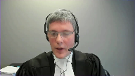
:::

In my submission, which I'll deal with in a moment, the answer is yes, the trial judge clearly is entitled to consider that.

The second question raised by the intervener, Hirok, is can the trial judge, or under what circumstances, can the trial judge consider what actually happened in determining whether the defendant breached the standard of care?

Let me deal with the first issue first.

So the respondent, as I understand their argument before you now, alleges that the trial judge erred by reasoning backwards from the injury in this case in order to define the standard of care.

And I think if we put their argument at its highest, the respondent says that the trial judge determined that using the ligature within 2 millimeters of the ureter could cause an injury, and therefore decided that the standard was to stay more than 2 millimeters away.

And it is alleged that that's an error.

Now, I'll concede that it is clear that the trial judge did consider the risk of harm in determining what the standard of care is.

You see that in his analysis where he sets out the standard of care in paragraphs 81 to 84 of his reasons.

Paragraph 83, he specifically deals with the evidence of Dr. Klotz and Dr. Robinette that using the ligature within 2 millimeters of the ureter could cause an injury.

So he was clearly alive to the risk of harm in deciding what the standard of care is.

Thank you, sir.

**Justice Côté** (00:29:01): Did the trial judge have the choice to proceed otherwise?

I don't think that it was the only way he could proceed here.

I think it was the only way.

**Speaker 1** (00:29:11): Well, so there's two questions.

::: {.column-margin}
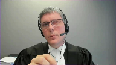
:::

In terms of deciding whether Dr. Ward actually met the standard of care or didn't, which is the second question, I absolutely agree with that.

On this evidence, he had to look at what actually happened and make a determination about what happened in order to decide whether Dr. Ward did or did not do the thing he said he did.

And in my submission, he was correct to do so.

And there can be no issue about that.

But the subtler question is whether it is an error to consider what happened in terms of identifying what the standard of care is.

Because Hirok, the intervener, Hirok is quite right that the question of what is the standard of care is distinct from the question of, did the defendant breach the standard of care? I agree.

But isn't the standard of care the standard of care?

**Justice Côté** (00:30:05): Is it not common sense for the trial judge to decide to proceed as he did?

You have to look at what happened in fact, I think, before determining the standard of care.

**Speaker 1** (00:30:18): So, certainly in my submission, the trial judge must consider the risk of harm, including the risk of the harm of the thing that actually happened in deciding what the standard of care is, right?

::: {.column-margin}
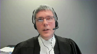
:::

Standard of care is always defined in terms of the harm which is to be avoided.

And so, it is never the case that you could decide the standard of care in the vacuum without reference to what the harm is, what the foreseeable harm is to be avoided in terms of deciding what reasonably should happen.

So, I mean, you can take lots of examples, right?

To drive on the right-hand side of the road is the standard of care. Why?

To drive on the left-hand side of the road, I'm likely to cause a collision.

**Overlapping speakers** (00:31:08): Thank you so much for having me.

**Speaker 1** (00:31:08): the risk of harm that defines why the standard of care is that.

::: {.column-margin}
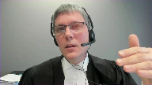
:::

I have to assault my driveway. Why?

Because if I don't in the wintertime, somebody might slip and fall.

In a surgery, the standard of care is that you have to count all of the instruments before the surgery starts and after the surgery ends. Why?

Because there's a risk of harm that you might leave something inside the patient inadvertently otherwise.

Or in this case, the standard of care is you have to stay more than two millimeters away from the ureter when you use the ligature. Why?

Well, because if you don't, there's a risk that you're going to harm the ureter.

And so in my submission, not only correct, but required for the trial judge to look at what are the risks of harm that inform the standard of care.

Now, where it gets a little more, and that's exactly what the trial judge did in this case, and in my submission, it was correct.

One of the points that is raised by Hirok, though, that you're going to be asked to decide upon is, is it appropriate for a trial judge to consider what actually happened in this specific case in determining what the standard of care is?

Now, that's not what the trial judge did in this case of my submission.

And it's complicated in the following way.

The standard of care has to be determined prospectively.

That is, when you decide what was the standard of care at the time of the relevant event, you have to determine that based on the information that was available or ought to have been available at the time.

It's not proper to look at things that became known after the fact in order to inform the earlier standard of care.

And so in most cases, the specific events at issue, the specific harm that befell the plaintiff will not be relevant to that analysis.

Now, the risk of the harm that manifested is a relevant factor.

So what was known about that risk would be a relevant factor.

And that's what the trial judge in my submission took into account in this case.

But what actually happened generally would not be a thing that would be known.

Now, Hirok suggests that you should restrict the application of this principle therefore only to questions of whether the care the standard was actually breached and not articulating what the standard is for that reason.

And in my submission that goes too far because you can't imagine.

**Justice Rowe** (00:33:59): The element of artificiality about this, I mean, we'll have to deal with the submissions of others, but on one occasion when I was driving my car, the brakes failed completely.

::: {.column-margin}
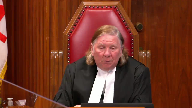
:::

On another occasion when I was driving a different car, one of the wheels came off.

And it's no good, in the first case, asking about whether the lug nuts were properly put on because it had nothing to do with it.

It was the brake line which had severed.

And similarly, it was no good talking about the brake line when the problem was the lug nuts hadn't been properly secured.

So it's all framed by the factual circumstance.

And I'm baffled by the notion that somehow you're supposed to formulate a standard of care in a vacuum.

**Speaker 1** (00:34:53): I think that's quite right.

::: {.column-margin}
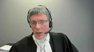
:::

I mean, in this case, you could imagine if the Ms. Armstrong had gone in for a gallbladder surgery and they mixed her up with another patient and performed a colectomy instead, the trial judge would not have been looking at the use of the ligature.

He would have had to look at the standard of care about, you know, how do you identify the patient and how do you figure out who's the right patient and what procedure you're going to do.

So even knowing what the question is to ask requires the trial judge to, it's informed by what actually happened in the circumstances of the case, which is why I would suggest that the proposal raised by Hirokka about restricting the application of this evidence can't be, it's too restrictive, it can't be right.

I've already touched on the fact that the trial judge looked at what happened in terms of deciding whether there was in fact a breach.

And again, in my submission, he was quite right to do so.

And on this case, in fact, that was necessary.

And there are some other cases in which it's clear that that was a necessary step.

It is just part of the direct and circumstantial evidence that goes into the analysis that has talked about in Fontaine in my submission and doesn't require anything more specific than that.

I'll lastly then just turn to what the court actually did here.

The last thing I'd like to touch on is the finding of the majority that Dr. Ward in fact met the standard of care.

As you will have seen, the majority found that the respondent found that because the trial judge concluded that the respondent took steps to identify and protect the order, that he erred in failing to find that Dr. Ward met the standard of care.

And in my submission, this ignores the trial judge's explicit finding of fact that the respondent did not actually stay more than two millimetres away from the order.

He may have taken some steps, but he didn't do the thing that he thought that he had actually done and the thing which the experts all testified should have been done.

And so my submission, even if the majority were correct that the trial judge did not find that Dr. Ward met the standard of care, and if the majority were correct that the trial judge erred in his articulation of the standard of care, which in my submission they're not, the remedy should have been to remit this case for a new trial with some instructions as to how the standard of care ought to have been articulated, not to dismiss the case from the bench, because that conclusion just cannot be reconciled with the trial judge's findings of fact below.

So subject to any questions you might have, thank you very much.

**Justice Wagner** (00:38:07): Thank you.

Barbara Allegate.

**Speaker 2** (00:38:17): Thank you Justices.

::: {.column-margin}
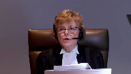
:::

It is the submission of the intervener the Ontario Trial Lawyers Association that the law established by Fontaine and recently reiterated by Metropolitan Condominium Corporation and Shanks Plumbing by the same Court of Appeal about a month after this case ought not to change.

It needs no refinement, it needs no additional complexities, nor would it be improved by overlays of complicated preconditions as is suggested by my friends on behalf of HEROC.

It is a simple rule of evidence that is easily understood and has withstood the test of time until this point apparently for almost a quarter of a century.

**Justice Brown** (00:39:15): any confusion about it besides this case?

Is there any debate in the case law?

**Speaker 2** (00:39:24): There's none that I have seen.

::: {.column-margin}
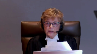
:::

Justice Brown, the concern in fact emanates from the decision of this majority and if this court were to follow it then it would be it would be stating a new rule of evidence.

The issue that the Ontario trial lawyers has is that plaintiffs would not be able to prove their cases in surgical negligence cases should it be followed.

The reality of surgical negligence cases is that the plaintiffs start out at a disadvantage where the defendant controls the place or thing that is the source of the injury.

She is effectively blind, she's knocked out to the direct evidence of what occurred.

Where there's litigation you can't expect the defendant to give that direct evidence.

Where liability is disputed he will invariably testify that he did everything the usual way, took the appropriate precautions and would never say that he intended to do harm but would say the opposite.

So where the surgery or other event is expected to proceed uneventfully but does not it calls for an explanation and the party in the best position to provide that explanation isn't the plaintiff it is the defendant.

If the defendant offers an explanation that is accepted by the court then he's protected and we saw that in the Metropolitan Condominium case where the plumber offered an explanation and it was accepted.

The plaintiff in addition should not have to go outside the evidentiary record to conjure and respond to every potential non-negligent case.

So we have to ask the question in a surgical negligence case should the majority be followed how would the plaintiff ever prove her case in a surgical negligence case?

What proof can she offer other than circumstantial and expert testimony?

The standard imposed by the majority should it be applied to other areas of negligence and we say that there is no difference between medical negligence and other areas of negligence is that it would it would change the metric it would change what evidence has to be called it would change how common sense assessments are made by judges and juries across Canada.

So in the example of a driver driving through a red light the law does not require a fine and precise statement of what she did whether it was talk talking or texting or just daydreaming.

It does not ask or look at what she intended to do but rather what she did she is judged on her actions.

The driver may offer a non-negligent explanation like her brakes failed even though she had them in the shop last week.

She might also say that she just didn't see the other car or the light even though it was there to be seen but she's still liable.

Momentary inattention while operating a vehicle is negligence momentary inattention and surgery may be exactly the same.

So the plaintiff in a car crash case doesn't have to say well I have to figure out if the defendant had a heart attack and prove that he didn't that a child didn't ride out onto the road.

The defendant has to fairly raise the defenses in a prima facie case and the plaintiff responds.

There are no special rules required.

The current rules are adequate to the task and there ought not to be a special rule for medical negligence cases.

Thank you.

**Justice Wagner** (00:43:14): Thank you very much.

::: {.column-margin}
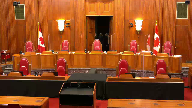
:::

The court will take its morning break.

You have 15 minutes.

The court will take its morning break.

You have 15 minutes.

The court will take its morning break.

**Speaker 3** (00:44:21): Thank you and good morning Chief Justice and Justices.

::: {.column-margin}
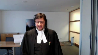
:::

We have split our submissions this morning between myself and my colleague Mr. Lillis.

My submissions will focus on the trial judge's error in imposing a standard of care upon the respondent that was based on absolute results and perfection and that being an error of law.

My colleague Mr. Lillis will focus his submissions on two points.

Number one, the obligation of the trial judge to rule out non-negligent causes if a trial judge is prepared to proceed on the basis that only negligence could cause the relevant injury as articulated in the reasons of the majority of the Court of Appeal.

And secondly, the appropriateness of the consideration of causation in advance of standard of care and namely the marangolo and grass decisions of the Ontario Court of Appeal.

By way of introduction I simply want to make three quick points.

Firstly, the standard of care imposed was a standard of perfection absolutes and results and that is a matter of law upon review.

And the nub of it is that a trial judge cannot use injury to define standard of care and in this case the trial judge used the cause of the ureteric injury to define the standard of care.

And he did so accepting the evidence and reasoning of Dr. Bernstein and Dr. Klotz which in my submission was improper.

Avoiding ureteric injury was the standard of care and causing the ureteric injury was the breach.

Secondly, as a result of this reasoning and imposition of the standard of care, the trial judge failed to carry out what I submit he was obliged to do to assess what a reasonable prudent person would do in a similar situation and specifically whether coming one to two millimeters from the ureter was due to an absence or failure to exercise a reasonable degree of skill and care.

The respondent was judged by the results of the surgery not the means to avoid the surgery.

And my final introductory point is this.

Accepting our submissions today does not require this court to set aside the finding of facts that the ligature came within one to two millimeters of the ureter or that the injure the ureter was injured as a result of the ligature coming within one to two millimeters or that Dr. Ward did not stay five centimeters away as intended.

Now I'll quickly run through what I think is well established and very helpful legal framework from this court and various courts of appeal that generally it is an error of law to use outcomes or results as the standard of care.

And as I said the support for this principle is in decisions of this court Fuloka versus Pinkerton, St. Jean Mercier, the decision of the British Columbia Court of Appeal in Carlson.

And this principle is not restricted to medical negligence actions.

It pervades professional negligence actions.

We have included excerpts in our condensed book from decisions of the Ontario Court of Appeal in Larch which dealt with an architect's standard of care and Reardon.

And Justice Gontier in my submission really elegantly and wonderfully summarized the law for the assessment of a negligence standard of a professional.

When he ended that that often quoted paragraph, professionals have an obligation of means not an obligation of results.

Because you can get, you can suffer unfortunately an adverse result and still meet the standard of care.

And in St. Jean, Justice Gontier warned triers of fact that if you focus on an act or a mission as to whether that constitutes fault, you run the risk of focusing on the result.

In those cases...

**Justice Brown** (00:49:53): accept a distinction then between working backwards from sort of what happened to finding a breach on one hand and working backwards from what happened to defining the standard of care.

::: {.column-margin}
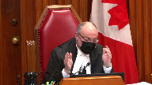
:::

**Speaker 3** (00:50:16): So yes, there is a distinction because I'm not going to suggest that the trial judge should somehow, in the words of Mr. Justice Roe, not consider what happened, assess or define standard of care in a vacuum.

::: {.column-margin}
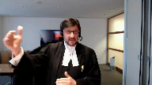
:::

The what happened, depending on the case, could have some significance.

But in my submission, what the cases describe and tell us, that the what happened cannot become the standard of care.

The what happened does not get imported into the definition of the standard of care.

**Justice Brown** (00:51:00): Can the what happened not inform the definition of a standard of care?

**Speaker 3** (00:51:07): I'm going to quibble with the use of the word inform and let me try to give an example.

**Justice Brown** (00:51:13): Let me ask you then, can the what happened have any influence whatsoever on the definition of the standard of care and if so, what? Yes.

Let me give you an example.

**Speaker 3** (00:51:23): from this case, obviously a make-believe, a make-up example.

::: {.column-margin}
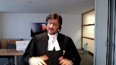
:::

Let's say in this case the defense was that the stricture of one-third of the ureter in Ms. Armstrong was caused by medication prescribed by Dr. Ward weeks before the surgery preoperatively, and that was the causation defense.

I would submit then the what happened, the determination in fact of what caused the stricture would have much more relevance and import into defining or informing, going back to that word, the standard of care.

So there are circumstances and I think there would be a spectrum as to the importance of what happened.

I will say this though, that in my submission the law is clear that the what happened, to use a word perhaps I shouldn't use in this day and age, cannot infect, cannot infect what becomes the definition and imposition of the standard of care on whether it's a surgeon or any professional.

From the cases that we have included, the standard of care is not defined by prevent incursion into the mind.

This court found that that was an improper imposition or definition of the standard of care.

**Justice Abella** (00:53:01): Was there any real dispute, Mr. Veneziano, that the standard of care did include staying at least two millimeters away from the ureter?

::: {.column-margin}
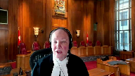
:::

So even if we accept your proposition in theory that in most cases you can't use what happened to define the standard of care, where everyone here seems to agree that the standard of care requires that distance from the ureter, what are we really talking about here?

**Speaker 3** (00:53:32): Sure, because I think we have to break down stay away and one to two millimeters.

::: {.column-margin}
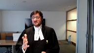
:::

The one to two millimeters, let me start there, that arose out of the evidence of Dr. Bernstein and Dr. Klontz as to the cause of the injury.

The ligature with its thermal spread came within one to two millimeters of the ureter and caused the injury.

The stay away is different and I can tell you my own expert said you try to stay away and I think it was common that you want to stay away.

So you say why?

Well obviously to avoid injury but the stay away has substance and the substance is based on the identification and protection.

The identification and protection were the means, to use Justice Gantier's language in St. Jean, to avoid injury.

**Justice Abella** (00:54:35): But didn't your own expert, Dr. Hagan?

**Overlapping speakers** (00:54:39): Yes.

**Justice Abella** (00:54:39): say that the standard of care included staying one or two millimeters away from the ureter?

**Speaker 3** (00:54:46): he

::: {.column-margin}
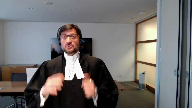
:::

what Dr. Hagan's evidence fairly read is you take steps the identification and protection that was the key and those steps those means which are complex we've included in in our condensed book at pages 24 to 29 the evidence of Dr. Ward as to the various complicated technical steps taken to position yourself that you are away from the urtter to avoid injury so in my submission you can't just leave it that stay away it's in in a sense akin to win the trial and you would not judge a lawyer on whether they won the trial as to have met the standard of care well hold on

**Justice Brown** (00:55:35): So that would be a fair comparison if the standard of care was defined in terms of don't injure the patient.

::: {.column-margin}
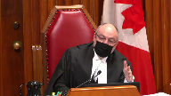
:::

That's when the case, that's the comparison.

But what this trial judge does is he draws from evidence of both Dr. Hagen and Dr. Bernstein to say the standard of care here is to avoid, is to identify and protect the ureter by staying away from it, by staying 1 to 2 millimeters.

You heard what I said to your friend.

This isn't faloka.

This isn't you got to keep people out of the mine with no guidance as to how you do that in a volatile labour environment over a big geographic area.

This is identify and protect the ureter by staying away from it.

That's your step.

Stay away from it.

**Speaker 3** (00:56:33): And there is guidance though on the record as to how you do that.

::: {.column-margin}
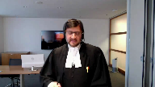
:::

The steps, the means you take, and that is the identification and protection evidence.

And even Dr. Bernstein, and unfortunately this was not included in the condensed book, but it's found at page 156 of the record, even Dr. Bernstein agreed that the steps taken by Dr. Ward, the means employed by Dr. Ward, were reasonable steps in identification and protection to avoid injury of the ureter, including the division of the mesentery.

And remember, this is a complex procedure.

**Justice Côté** (00:57:19): Dr. Bernstein said that although he admitted, he acknowledged that your client took steps, he said that he did not take the final step, I mean to make sure to see the urethra at home times.

**Speaker 3** (00:57:34): Well with respect, Dr. Bernstein never said that.

Any reference to checking and rechecking was a general comment about the conducting of these procedures.

**Justice Côté** (00:57:47): But that was said by Dr. Bernstein, checking and rechecking until the end.

**Speaker 3** (00:57:52): Correct but not in the context of that just uh Madam Justice Cote.

::: {.column-margin}
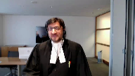
:::

Dr. Bernstein did not opine and I would submit he would need to in order for a trial judge to make that finding that in this case the breach of the standard of care is that he failed to check and recheck the location of the year and I also note that that is not a finding made by this trial judge because there was no evidence for that finding.

**Justice Abella** (00:58:22): But he did find, didn't he?

He agreed with you that he didn't touch the ureter.

**Overlapping speakers** (00:58:29): Correct.

**Justice Abella** (00:58:29): no contact.

::: {.column-margin}
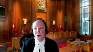
:::

However, he said, because there was thermal injury, he inferred that he came within the one or two millimeters that defined the standard of care.

In other words, he went through the two parts carefully, I thought, first saying there wasn't any direct contact, but he couldn't always see where the ureter was and therefore concluded that he must have come within one or two millimeters.

So what's the legal error in the way he's approached the question of the standard of care and then causation?

We're splitting hairs here and I'm not sure based on what the experts have said that it's really a legal proposition here or a factual one that we're arguing over.

**Speaker 3** (00:59:27): Thank you.

::: {.column-margin}
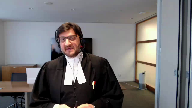
:::

The evidence was not, risk of repeating myself, that Dr. Ward failed to check and recheck the location of the ureter.

In fact, Dr. Ward gave that evidence that he would do that.

And that was included in the identification and protection means or steps.

The legal error that was committed in this case by the trial judge was that the stay away, if we want to go back to that, those two words, is in fact what Justice Gonche warned us is the fault.

The focus is on fault because the stay away is what caused the injury.

The one to two millimeters, as Madam Justice Abella has indicated, which was the finding.

So if we focus on the fault, on the stay away, we are now focusing on the result.

And we are ignoring, we are ignoring the identification and protection means that the trial judge found were met, were done, were completed by Dr. Ward.

**Justice Karakatsanis** (01:00:48): Can I ask you this, though?

**Overlapping speakers** (01:00:51): Yes.

**Justice Karakatsanis** (01:00:51): Is it your position then that staying away, keeping one to two millimeters is not a step that is required in order to protect the ureter?

**Speaker 3** (01:01:04): No, and I'll say it for two reasons.

::: {.column-margin}
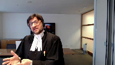
:::

Number one, the staying away arose, as I've indicated a few minutes earlier, in the injury analysis.

That is the cause of the injury, the ligature coming within one to two millimeters.

The means to avoid that injury, that result, are the complex steps taken by Dr. Ward as part of identification and protection.

Dr. Ward cannot, in law or in fact, when there is a risk, a known risk of ureteric injury in this surgery, Dr. Ward cannot guarantee that he will stay away.

The obligation he has, as Dr. Hagan fairly put it, is to try, and you have to have a basis to try, and that is the reasonable care analysis.

That was partially done by Justice, by the trial judge.

Partially done in the sense he found that he met the steps for identification, but that he breached.

He breached because he came within one to two millimeters, and why did he come to one to two millimeters?

Isn't this simply the result of the injury that Dr. Ward has been suffering from?

The injury that Dr. Ward has been suffering from is not the result of the injury that Dr. Ward has been suffering

**Justice Rowe** (01:02:19): matter of inference, there's only one explanation which fits with this type of injury, and that is that the surgeon came too close.

::: {.column-margin}
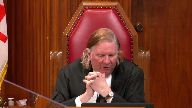
:::

That's a logical, factual inference, and it seems to me it is the basis of the decision.

And all this stuff about means and steps and defining the duty of care is just noise.

It seems to me it's as simple as that.

**Justice Brown** (01:02:53): I mean, your own expert says if you've identified the ureter properly, which your client's note said he identified it, whether he identified it properly, let's just assume it.

::: {.column-margin}
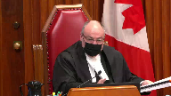
:::

Your own expert said if you've done that, it is not possible to damage the ureter.

How do you get around that?

**Speaker 3** (01:03:15): You take the steps and you position yourself to be centimeters, hopefully, away from the ureter.

::: {.column-margin}
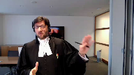
:::

But this, again, is a complicated procedure where there is issues of dexterity.

There is issues of dexterity.

**Justice Brown** (01:03:34): What is the evidence of issues of dexterity here having any impact other than in Justice Pachocko's imagination?

**Speaker 3** (01:03:42): Well I'm not sure it was imagination.

My friend Mr. Laliz will hopefully have some persuasive submissions on that.

But I can tell you the dexterity is a matter of what in my submission the plaintiffs ought to have led.

Because the...

**Overlapping speakers** (01:03:58): What is the evidence of it?

What is the evidence of dexterity being an issue here?

There's not, but I'm gonna explain to you.

So then why is the trial judge wrong for not considering something of which there's no evidence?

**Speaker 3** (01:04:08): Correct.

He did not consider something which of which there was no evidence and no such evidence was led by the only

**Overlapping speakers** (01:04:16): person who could have led it. What?

No, the appellant.

The appellant's under general anesthetic.

What's she supposed to know about this?

**Speaker 3** (01:04:24): The appellant's expert, Justice Breyer.

::: {.column-margin}
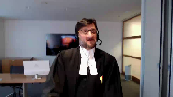
:::

Oh, come on.

The appellant's expert.

There is no difficulty in many cases, Cooper and Flood, Hassan, where there is expert evidence about the pressure applied with a surgical instrument, a troll car.

And I think what Justice Pachocka was getting at was that there could have been evidence.

**Justice Brown** (01:04:48): If only the defendant had said so, if only we could know, come on, that's not a serious submission.

**Overlapping speakers** (01:04:56): Well, it's a submission that could have formed the basis of expert evidence, could have formed the basis of a breach.

**Justice Brown** (01:05:02): someone had offered it, someone who knew about it being an issue.

::: {.column-margin}
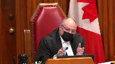
:::

You threw all your, you threw all your, your, your eggs into the cause of the injury, into the what happened basket, right, which was I stayed five to 15 centimeters away and, and, and, and yet there was an inflammation as a result of doing that.

That's, that's where you put, and you wrote everything on the trial judge accepting that as having been what happened.

That not being accepted, you had no evidence on what the appropriate standard of care was and you ran the risk therefore of having nothing to displace the prima facie finding of negligence that almost inevitably flowed from the weight of the expert evidence here.

You had nothing.

You had no evidence of an earthquake.

You had no evidence of a dexterity problem.

You had no evidence of, I mean, I don't know, lightning could have struck. Nothing.

And yet the trial judge is to be faulted for not considering what there was no evidence of.

I actually think the trial judge would have erred by considering potential causes of which there's no evidence.

**Speaker 3** (01:06:35): And Justice Brown, I'm going to answer your sort of question

::: {.column-margin}
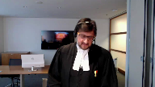
:::

but I'm going to agree with that last part.

I'm not suggesting and we are not submitting that the trial judge has some sort of obligation to go do internet research and try to figure out standard of care or or cause

but but I do want to respond to to sort of what the defense did

and yes the defense took a had a different causation theory but the defense met the plaintiff's case.

The defense attempted unsuccessfully at the trial but the defense attempted to meet the plaintiff's case and I'm going to turn to just maybe one thing in the condensed book because in my submission I think this is helpful to put the evidence and the record into context.

If you could turn in my condensed book to page 16.

These are this is an excerpt from the reasons of the trial judge at paragraph 74 and I'm going to paraphrase or just read a couple of sentences.

What in support of his finding that Dr. Ward failed to meet the standard of care the trial judge reproduced evidence of Dr. Bernstein.

First sentence I feel that the standard of care is to identify and protect the ureter and this was not achieved in this case stopping there

and then he lists some factors which I'm not suggesting there was any evidence or defense that that that this was an abnormal colon or anatomy that that wasn't the case and then he he states my position just to be is just to be clear that the average reasonable prudent practitioner general surgical practitioner in terms of removing a structurally normal colon in a structurally normal abdomen and peritoneum should be able to achieve the goal using the word goal of colon removal without injuring the other structures and basically he fell below the standard of care because he injured the other structures and in my respectful submission this is not a standard that is correct in law this was not a

and i'm gonna spend a couple minutes on a sort of fontaine analysis this was not a fontaine case where it was said here's the injury over to you defended this was a traditional medical negligence case involving a complicated surgical technique

**Overlapping speakers** (01:09:18): Surgery 101, one of the experts called it, this complicated surgical technique.

**Speaker 3** (01:09:24): But in my submission, it involves steps, right, and the trier of fact, the trial judge in this case, these steps, this identification and protection means to avoid injury was beyond the knowledge and expertise, and this is one of those cases where in order to define and assess whether there was a breach of the standard of care, expert evidence was required.

::: {.column-margin}
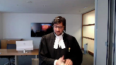
:::

And that expert evidence was more complicated than just stay away.

And in my submission, Dr. Bernstein agreed that Dr. Ward took those steps, took those means to avoid injury, but unfortunately in his view caused an injury.

**Speaker 3** (01:10:13): Justice Pachocko, in his assessment of the case and when he found that

**Overlapping speakers** (01:10:21): You

**Speaker 3** (01:10:21): the injury did form the basis of the statement of the standard of care imposed upon Dr. Ward, called it circular reasoning.

::: {.column-margin}
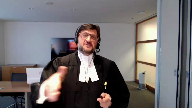
:::

It's at paragraph 44, 41 rather, of his decision.

It's excerpted in our condensed book at page eight.

That question which I ask you to sort of ask yourself, did the breach cause the injury?

It did, because the injury is the breach.

There is nothing in the record that there was some independent act, independent or mission, that was called a breach by any of the experts.

**Justice Martin** (01:11:12): Well, you know, I'm sitting here and it just seems to me that this is a case in a way that involves credibility.

::: {.column-margin}
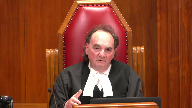
:::

Your client took the position that he didn't come anywhere near the two-millimetre point of concern, that he was, I think, five to fifteen centimetres away from it.

And, I mean, you're almost saying to us that the trial judge was not entitled to disbelieve him.

I'm not suggesting for a moment that the doctor was committing perjury or that he was intentionally trying to mislead the court.

But the bottom line is, from what I'm hearing from you, is the trial judge had no right to disbelieve what the doctor was saying.

And then once you get to that point, then the case for the plaintiff collapses.

But I always thought trials, one of the things you were doing was deciding whether you could believe the defendant who says, you know, I knew about the two-millimetre rule, but I guarantee you I didn't come close to it, even though he accepts that in part of the procedure he can't see the uterus.

And you're effectively saying the trial judge was stuck with that evidence.

And I, because I don't see any other way.

**Speaker 3** (01:12:38): I'm not saying that and in fact as I open my submissions on this point I said you don't need to set aside that finding that he didn't actually as intended stay five centimeters away and I'll say I'll say it for this reason and it's not it's not an evidentiary reason it's not a credibility reason it's a legal reason because the role of the trial judge is to assess whether in this case the respondent behaved like a reasonable prudent person in similar situations and exercise reasonable care and if we focus on his failure to stay five centimeters away from the year while taking all these steps in my submission we are focusing on what Justice Gonshay told us to do told us not to focus on his fault

::: {.column-margin}

:::

**Justice Brown** (01:13:33): So let's look at what he actually wrote tonight.

Go ahead, Justice DeBell.

**Justice Abella** (01:13:41): but just wanted some clarity where we go with your analysis based in part on what Justice Moldaver just asked you.

**Overlapping speakers** (01:13:51): Mm-hmm.

**Justice Abella** (01:13:51): If we say that the standard of care is to stay away from and protect the ureter and then we go immediately to causation, what is the trial judge permitted to look at on the facts of this case and where does he put the submission from your client that he was five centimeters away and everyone else is evidence that you had to be farther than two millimeters away.

::: {.column-margin}
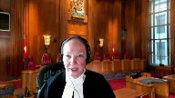
:::

So I'm just trying to figure out in this case what difference it would make even if we accepted your proposition that the standard the standard of care was only a generic one.

Be careful.

**Speaker 3** (01:14:33): Well, let me just say, generic in the sense of there was expert evidence on that.

::: {.column-margin}
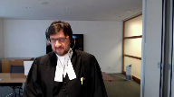
:::

What I'm saying is that the evidence of Dr. Ward cannot be determinative of whether the standard of care was met because he has to be compared or assessed, is a better word, assessed with the reasonable and prudent person.

Sorry, I cut you off.

**Justice Abella** (01:15:00): Well, just because I'm not really understanding the point, that's like saying, don't take his evidence into account.

Even though he said he was five millimeters away, don't take that into account.

Do you take into account?

**Speaker 3** (01:15:16): I'm not suggesting you don't take that into account.

What I'm suggesting is that cannot be determinative, because in in every... What is?

**Justice Abella** (01:15:24): You

**Overlapping speakers** (01:15:24): but

**Justice Abella** (01:15:24): The expert evidence then the expert evidence.

::: {.column-margin}

:::

Okay, the expert evidence is stay away two millimeters Stay away and where does that?

to avoid Thermal injury, correct, right and in this case your client said I was five millimeters away.

Everyone else says Two millimeters away and therefore looking at it from a causation point of view Was the trial judge just even assuming your steps are the right one?

The right ones was he entitled to assume That there was therefore a breach of the reasonable standard of care Based on your client's own evidence about how far away he said he was being disbelieved And

the inference drawn that he was closer than two millimeters

**Speaker 3** (01:16:16): The trial judge, of course, is entitled to rely on that evidence to be judged against what the expert evidence was.

The staying of weight of five centimeters in his estimation is based on the identification and protection steps he says he took.

**Justice Abella** (01:16:32): was his whole case.

His case was I was five millimeters away.

**Overlapping speakers** (01:16:38): Mm-hmm

**Justice Abella** (01:16:38): It was disbelief.

**Speaker 3** (01:16:40): correct and I'm going and if we take it under the rubric of causation or he caused the injury because he did not execute what he intended to do

**Overlapping speakers** (01:16:52): Right.

**Speaker 3** (01:16:53): my respectful submission, that can't be the end of the assessment, that can't be the end of the analysis.

::: {.column-margin}

:::

Just take two cases.

Carl said there was an injury there.

The surgeon unfortunately had his instrument go through the annulus fibrosis and he cut the iliac vein and artery.

He didn't intend to do that, but if we stop the analysis there that he did it, then anything else is irrelevant.

**Justice Abella** (01:17:19): And he also relied, and then I'll turn you over to Justice Brown's care.

::: {.column-margin}

:::

He also relied on the evidence of Dr. Robinette who said it was a fatty tissue issue and that was rejected as well based on the evidence of the other experts who say that simply is impossible or no one would be using this form of surgery ever.

So those are the two theories that were advanced, both were rejected, leaving the trial judge with what?

**Speaker 3** (01:17:47): Those were causation theories.

::: {.column-margin}

:::

Leaving with the trial judge as to what is the reasonable prudent behaviour expected of a general surgeon in carrying out a left-sided colectomy to avoid injury.

That's what we're left with.

And you can't have what the intention was but not carried out or any causation analysis in my submission infect what the first job of the trial judge is to assess what that reasonable prudent behaviour ought to be.

And I'm not suggesting, Justice Abel, just to go back, Madam Justice Abel, just to go back to a point that you can't, you got to turn your eyes to what happened.

No, I'm not suggesting that.

It will have significance depending on the case, but you, a trial judge, is entitled to look at the record.

But I just wanted to finish this one point

and then I'll be turned over to Mr. Justice Brown.

There usually is in this case an injury, an unfortunate result.

Carlson, I gave an example.

Let's take Rowlands and Wright, which is a case of the Ontario Court of Appeal where a general surgeon, it's part of a gallbladder procedure, cut the common bile duct.

And he wasn't supposed to do that.

So one can infer the evidence that I didn't intend to cut the common bile duct.

And in my submission would be an error for a trial judge to stop there and say, you didn't do what you should have done.

You there breached the standard of care.

What's the trial judge then in that case and what actually the Court of Appeal required the trial judge to do?

What was important in that case is whether the general surgeon obtained obtained the critical view.

That was crucial in determining whether the standard of care was met.

And the Court of Appeal ordered a new trial because there was no finding whether the critical view was obtained.

And asked the new trial judge to make sure that's a finding that is made.

And I would respectfully submit, arguably, if that finding is made at the next trial, and he obtained the critical view, but nonetheless cut the common bile duct, he would not be held liable because he met the standard of care.

And we're not going back and working from the result backwards.

And the intention, the five centimeters of Dr. Ward's, in Dr. Ward's evidence, forces us to do that, to work from the result.

**Justice Rowe** (01:20:36): Just for those of us of a certain age, five centimeters is about two inches, and two millimeters is about 1 10th of an inch.

::: {.column-margin}

:::

And so if you think about that, staying two inches away from something is quite different from staying 1 10th of an inch away from something.

**Speaker 3** (01:21:01): working within a small abdominal space in a complicated procedure.

I'm not gonna quarrel with the math on that one.

So, so over to my...

**Justice Brown** (01:21:11): Oh, sorry.

**Justice Martin** (01:21:11): That's what surgeons are all about.

::: {.column-margin}

:::

That's what an operation is.

You're not working in a dome stadium.

You're working on a very specific area.

And your client, your doctor said, as justice row points out, I was like a mile away from this thing.

Never mind 2 millimeters.

Now, if he'd said, you know, I was gauging this, I was watching it, I was very mindful of the 2 millimeter problem area, and maybe just a slip in a split second, you know, that's not what he said.

He said there's no way I could have caused this injury by virtue of this ligature or whatever it is.

That's his position.

And he's disbelieved on that.

Not because he's a bad guy, but because the trial judge looked at the whole evidence and said, look, I'm looking at all this, and the only reasonable explanation I have for the cause of this injury is that somehow, by mistake, by negligence, by negligence on his part, he got within 2 millimeter range.

And I don't see anything wrong with that.

I mean, I just can't for the life of me see what the problem is of that, especially when you're looking at other possible causes that are either based on pure speculation or another one that Dr. Robinette gave that is rejected by the trial judge.

**Speaker 3** (01:22:47): We can't.

**Overlapping speakers** (01:22:48): You

**Speaker 3** (01:22:48): Mr. Justice Muldaver we can't fall into the trap of circular reasoning and let me try to explain into making two submissions the going back to

::: {.column-margin}

:::

dr. Ward's evidence of what he thought he had achieved it would be no different than the surgeon than the physician in st. John who thought he actually diagnosed the fracture as sciatic and not a diagnosed the injury sorry a sciatic and not a fracture

**Justice Martin** (01:23:16): No, you know what it is?

It's someone saying I couldn't have been involved in this accident

or I couldn't have been involved in this offense because I was a mile away at the time.

Well, that's what it is.

It's almost like an alibi.

**Speaker 3** (01:23:30): Well, I would respectfully disagree because it's a professional negligence case and the second point was was something you the reason why that didn't happen.

::: {.column-margin}

:::

The reason why that didn't happen is something in my submission the appellant ought to have led at trial and the record fairly states that the only act or omission was the injury.

That's all I have to say about this case, thank you very much for listening and I'll

**Justice Côté** (01:24:01): I'm going to ask you a question.

::: {.column-margin}

:::

Sorry, your client in cross-examination and this part is reproduced in paragraph 114 of the dissenting reasons.

He was asked, but so opponent says I'm going to repeat my question.

I want you to listen to it and answer my question.

**Speaker 3** (01:25:17): And Dr. Hagan, Dr. Hagan gave similar evidence and when pressed further said, because the standard of care also disagreed that it would be a breach of the standard of care because the standard of care is to identify and protect the, identify and protect the ureter from injury taking those steps.

::: {.column-margin}

:::

So again, that's the focus of fault.

I didn't carry out what I intended to do.

Well, hold on.

**Justice Brown** (01:25:51): Hold on.

::: {.column-margin}

:::

I'm back to my tender mercies here.

Paragraph 81-84 is the statement of the trial judge on the standard of care.

And he begins by saying I am satisfied that the standard of care for a general surgeon is to identify, protect and avoid direct contact with or close proximity to the ureter when using the ligature.

Paragraph 82.

Based on the expert's testimony, close proximity to means within 1 to 2 millimeters.

Recounts Dr. Ward's evidence.

Recounts the evidence of the urologist.

And then I am satisfied that under these circumstances it would be a breach of the standard of care for a general surgeon to touch the ureter or to come within 1 or 2 millimeters of it during a routine colonectomy on a benign colon.

How is he doing what you suggested he's doing, which is basically saying it's a breach to injure.

What he's doing it seems to me, just so that you have the benefit of my thoughts on this, is he's not only stating the standard but the steps necessary to meet the standard.

You heard what I said earlier.

This is not faloka.

This isn't keep them out of the mine.

This is keep them out of the mine, and here's how you do it.

**Speaker 3** (01:27:27): just picking up on that point, the here's how you do it involved complicated technical surgical steps that Dr. Bernstein himself agreed and when you fare were taken and met the standard of care and were reasonable to avoid injury.

::: {.column-margin}

:::

If you then follow along and read the entirety of Dr. Bern Bernstein's evidence, it was solely the basis that an injury occurred, that an injury occurred in a surgical, in a surgery with a known risk of that injury.

And in my respectful submission, an injury alone does harm to the Falloca Carlson.

**Overlapping speakers** (01:28:14): That's not what the trial judge is doing.

**Speaker 3** (01:28:17): The trial judge is relying upon the opinion of Dr. Bernstein, which fairly read does not include anything independent of the injury to ground a finding of the breach.

**Justice Brown** (01:28:32): evidence of Dr. Hagen.

We're going around in circles, so I, I, I...

**Speaker 3** (01:28:38): Well, it's a fun circle though, but I hear you, I hear you, but it's again, Dr. Hagan and Dr. Ward in my submission actually have a better sense of the reality of this surgery.

::: {.column-margin}

:::

In other words, you can take all the steps and still cause injury. So,

**Justice Brown** (01:28:57): The trial judge should have preferred certain aspects of their evidence instead of evidence of others.

He should have, going back to.

Kind of weighing expert evidence now.

This would have been a good argument.

Yeah, it's a lot of the same.

This would have been a good argument in front of Justice Mulligan.

I'm sure you made it, but. Yeah.

**Speaker 3** (01:29:14): Yeah, no, it didn't work there and

::: {.column-margin}

:::

but but you're correct that it is in my submission if we, you know, and I tried it and it didn't work the first time.

It was a palpable and overriding error to accept the evidence of Dr. Bernstein, a guy who doesn't even do laparoscopic collectivies, who doesn't use the ligature to divide the mesentery, who agreed that there were different, it was done in a different way, i.e. identification and protection, whether it was open as he does versus laparoscopic.

I'm just gonna, I want to turn it over to my to my colleague, but obviously answer any questions.

I just want to say for a moment on which we've been talking about the use of injury and based on Faloca, St. Jean Carlson, in my submission, injury cannot form the basis of a standard of care definition or a breach.

Fontaine, and I think it's a wonderful decision in Shanks, but from the Ontario Court of Appeal, tells us that

yeah, it's a

it's a weighing of evidence and the strength of any inference to be drawn from injury or interchange it with resolved depends on the circumstances of this case and of the case being considered.

And in a professional negligence case, in my submission, the circumstances require that there'll be that there is some expert basis to find to define the standard of care and to find a breach.

That's the balance that that is required.

Plaintiff puts up a case, defense is required if there is an inference to be drawn to negate that inference, which includes not only a cause of injury, but may include whether the person met the standard of care.

And in my submission, that's what we did legally, you can't rely on injury.

And based on the evidence, we had negated any inference to be drawn by the fact that the injury had occurred through the expert evidence.

And unfortunately, the trial judge engaged in that circular reasoning based on the cause of injury, what happened to the ligature and the ureter and that infected his analysis.

It's built right into the definition of standard of care.

I'm going to turn it over to my colleague, Mr. Lilly's subject, of course, to any questions that you may have.

**Overlapping speakers** (01:32:01): Thank you.

**Speaker 4** (01:32:32): Thank you, good morning Chief Justice and Justices.

::: {.column-margin}

:::

I will, as Mr. Venetiano indicated, address two issues.

The first is the issue of the obligation to consider and rule out non-negligent causes, which has already been the subject of some discussion this morning, when a trial judge defines the standard of care in terms of an injury.

This is, as you know, paragraphs 46 to 57 of the reasons of the Court of Appeal and the appellant's initial issue B.

The second issue I will address time permitting, and without going over some of the material in the discussion that's already been had, is the appropriateness of considering issues relevant to causation, the what happened inquiry prior to making determinations about the standard of care.

So I will be referring, I've collected the relevant portions of the decision of the Court of Appeal in our condensed book at tab five, which is a convenient place to start on the first issue.

Our position on behalf of Dr. Ward is that the the Court of Appeal correctly identified the obligations and the circumstances in which it is appropriate to rely on injury in order to define the standard of care, and appropriately indicated that in order to do so there's an obligation on the trial judge to consider and rule out non-negligent causes.

Our interpretation, our submission with respect to this part of the reasoning of the Court of Appeal is that they did not, the majority did not create or overturn the existing law, but sought to clarify the very rare and narrow circumstances in which it is permissible for a trial judge to define the standard of care based on injury.

So as I said, the starting point in my submission is to understand the reasons of the majority from the Court of Appeal, and it starts as I indicated at tab five of our condensed book page 31 with paragraph 42 of the reasons from the Court of Appeal in which the court says the general rule is that it is generally an error of law to use outcomes or goals as the standard of care.

So that is the starting point for this discussion by the majority.

So we are in, as they say, the general rule, but the court goes on to say, for all the reasons that Mr. Venetiano has already submitted, why that is the general rule that you cannot rely on injury or outcome alone to define the standard.

But the court goes on to explain in paragraph 46 that what that their description of

**Overlapping speakers** (01:35:50): this.

**Speaker 4** (01:35:51): this error or this issue as a general rule is because as Justice Pachoko says, I would not rule out that there are cases, there are cases where negligence alone could prevent a goal from being achieved or a positive result from being attained.

::: {.column-margin}

:::

And so what the court is saying is that although the general rule is and the error that he found in this case was that the trial judge relied on a goal or an outcome in order to define the standard of care, there are limited exceptions.

And then he goes on to first cite two examples in the medical context, the example of leaving a sponge in a patient and the example of operating on the wrong limb.

Evidence in my submission that are on the margins of medical negligence law, they are cases where the system, the systems in place to prevent those particular injuries or outcomes are so robust that the evidence could show that it is only through negligence that the outcome could happen.

Well, that is.

**Justice Brown** (01:37:05): Isn't the real distinction there, that those are, that's direct evidence of negligence, right?

::: {.column-margin}

:::

If the clamp's still inside or if someone lopped off the wrong leg or something like that, it's different from most medical negligence cases which inherently rely, because there's an information imbalance between the plaintiff and the defendant, rely on circumstantial evidence.

**Speaker 4** (01:37:31): Thank you, Mr. Justice Brown.

::: {.column-margin}

:::

I don't know that in my submission that the difference between those cases turns on the fact that there is direct evidence.

There may be direct evidence in other kinds of medical malpractice cases.

I think that the difference, and in my submission, the difference with those cases is that the means for preventing that kind of injury are so well established that, to use the words of Justice Pacheco, it would be harmless to define the standard as, don't leave the sponge in the patient or the tool in the patient.

**Justice Brown** (01:38:10): do is there are cases where what happened is necessarily determinative of causation. Right?

::: {.column-margin}

:::

What happened?

The wrong leg got taken off.

And so, gosh, I wonder what happened. Correct.

How that happened. Right?

Whereas it's different in cases like this where you have to have some idea of what happened and then how what happened might have been avoided.

And as I understand your submission, that on the law is fine so long as in the course of that you don't fall into the trap of saying, ah, well, there must have been negligence here without ruling out non-negligent causes.

I think I'm being fair to your submission.

And if I am, then what I'd like you to tell me is what you're supposed to do where there are no non-negligent causes posited or where there's one posited as here and you've dealt with it, maybe not very well, you might think, but what are trial judges or for that matter juries supposed to do?

Are they supposed to kind of fish around or are they relying on common sense?

Judicial notice there was an earthquake.

I mean, what are, what are they doing?

**Speaker 4** (01:39:39): I'm going to try and understand and answer your question, Justice.

::: {.column-margin}

:::

As a starting point, the submission, and I don't think the Court of Appeal says this, and our submission is that this is not a matter of fishing around outside the record and trying to determine whether or not there was an earthquake.

I don't think that's fair to the to the decision of the majority of the Court of Appeal.

**Overlapping speakers** (01:40:01): appeal clearly say that certainly it's certainly fair with respect to their example of dexterity.

**Speaker 4** (01:40:07): Well, I don't know that I agree with that, Mr. Justice Brown.

::: {.column-margin}

:::

I think that the point that was being made about the dexterity, like the point about the fact that there was a conclusion that he had turned a blind corner, is really a comment on the insufficiency of the evidence to rule out that those were non-negligent, that there was a non-negligent slip, that in every instance, and this is not about, to back up, trying to unpack some of the other parts of your question, this is not about the fact that the evidence led by the defendant was a different non-negligent cause.

The inquiry here is limited to the cause of coming within two millimetres of the ureter with the ligature.

This is the narrow focus of this part of the judgement.

The narrow focus is saying if you are going to define the standard of care, in other words, basically make it strict liability, you come within two millimetres, you're negligent.

That's the standard of care, means that automatically there's been a breach of the standard.

If you are going to do that, you must be satisfied as the trial judge that that could only occur negligently.

In other words, that there are no other non-negligent potential causes of that.

And what the Court of Appeal in my submission is basically saying is that it is the trial judge's obligation to make sure he is able to and does make that finding, and it is the plaintiff's obligation to prove that it is so.

And so in this case, what the majority of the Court of Appeal found was that there was an insufficiency of evidence for the court to make that conclusion that every time, that every instance, it is only possible to come within two millimetres of the ureter with the ligature.

Sorry, it is the only circumstance in which you can do that, or in every case, it is negligence.

And so that's really, I think, the essence of this is that the trial judge must consider not whether there was an earthquake, as they say, on the evidence.

And so on the evidence of this case, there was no evidence that it could only be by virtue of negligence that you come within two millimetres.

And I think that is the purpose or the point of that particular paragraph.

I don't know if I've addressed your question.

**Justice Brown** (01:42:24): Well, I think we're ships passing in the night because as I understand the law after Fontaine, evidence of injury can itself be evidence of a breach of the standard of care.

::: {.column-margin}

:::

And then it is open to the defendant to displace sort of the prima facie finding of negligence by showing other potential causes.

And that makes sense to me because how on earth is the plaintiff to disprove a negative that nothing else could possibly have caused this?

How can an expert testify to that because maybe there was a problem, maybe there was, I don't know, maybe there was the earthquake.

And so who does it fall to properly to adduce evidence of other potential causes?

Surely it's the defendant.

**Speaker 4** (01:43:34): And so to address that, Mr. Justice Brown, I think the answer is that it is the plaintiff's obligation for this reason, which is that if you choose to frame your case as the injury, causing the injury is negligent, then it is your obligation.

::: {.column-margin}

:::

This does not close the door, it does not place an impossible burden on the plaintiff in my submission.

It is always open for the plaintiff to lead expert evidence a medical case that says that the negligence actually pinpoint and prove the negligent act or omission, as opposed to going this route, which is the exceptional route to basically prove by a negative that it must be negligent.

It is always open to them to lead evidence from an expert or otherwise, that for instance, in this case, the period of vermiculation was inadequate.

Dr. Bernstein, say that.

**Justice Brown** (01:44:27): So that's just inconsistent with Fontaine, right?

::: {.column-margin}

:::

In Fontaine, this court rejected res ipsa loquitur as a separate legal doctrine, but preserved the process for assessing circumstantial evidence, and said it's still the case that where the injury itself provides sufficient circumstantial evidence to allow the trier effect to, I think he used the language draw the inference, but I prefer to call it just make a prima facie finding of negligence, but let's say an inference, that the defendant breached the standard of care, the trier can do that.

Professor Klar agrees with that, Justice Linden and Professor Feldheusen agreed with that.

It's perfectly consistent with Fontaine.

So why do we need to change the law?

**Speaker 4** (01:45:15): In my submission, we're not seeking to change the law because Fontaine was a question of whether or not the injury could be circumstantial evidence of a breach of the standard.

::: {.column-margin}

:::

The problem that we have here is the trial judge and what the court is talking about is the definition of the standard of care.

So to go back to Fontaine, at the end of that case, the court actually says they were invited to say there should be a presumption that every time there's an accident, that there's a presumption of negligence.

The court says no, because that would be in effect imposing strict liability.

But what is happening in this case, when you make the error of defining the standard based on the injury, you're actually even going further than the conclusion in Fontaine.

**Justice Brown** (01:46:03): We keep saying that as if it actually happened, but I've already pointed out to your colleague that paragraphs 81 to 84 do not do that.

::: {.column-margin}

:::

He says the standard of care is to identify, protect and avoid direct contact or close proximity.

He defines what close proximity did.

He did that on the basis of heaps of evidence that suggested it's really not a good idea to go within 2 millimetres of the ureter and then he says in those circumstances it would be a breach of the standard to come within 2 millimetres in this hopelessly complex surgery I got here.

**Speaker 4** (01:46:41): And I'm not intending to repeat what has already been done, but I think that's a separate issue.

::: {.column-margin}

:::

This discussion that the Court of Appeal is having about ruling out non-negligent causes only arises if you accept that he made the error of defining the standard in terms of injury.

So if, as you've just indicated, Mr. Chester-Brown, you don't think he made that error, then this analysis that Justice Pacheco has undertaken doesn't even apply to that situation.

Inaudible.

**Speaker 4** (01:47:09): I think there was another question.

**Justice Brown** (01:47:13): I think there's a subtle distinction between what you're suggesting the law is and saying that where the injury itself provides sufficient circumstantial evidence to allow the trier fact to infer negligence, the trier can do that and then it's open to the defendant to negate that inference.

::: {.column-margin}

:::

I think that's a slightly different point.

**Justice Wagner** (01:47:32): So I'll let you answer that last question, and that will be the last answer too.

**Speaker 4** (01:47:37): Thank you, Mr. Chief Justice, I notice I'm out of time.

::: {.column-margin}

:::

And I'm not sure I completely understood the distinction that's being drawn, but the key distinction as I've indicated, Mr. Justice Brown, is that the problem here is using this injury, and again, if you accept that that's what the trial judge actually did, to define the standard is different than Fontaine, where the accident itself could form circumstantial evidence of whether or not there was a breach of the standard.

And in our submission, those are two separate things that must be conceptually kept distinct.

So I'm out of time.

**Overlapping speakers** (01:48:17): Thank you.

**Speaker 4** (01:48:18): Thank you very much.

**Justice Wagner** (01:48:19): Thank you.

**Speaker 5** (01:48:31): Chief Justices, my co-council Eva Krajewska and John McIntyre join us today by the webcast.

::: {.column-margin}

:::

Professional negligence law is about compensating plaintiffs not because of bad outcomes but because expected means were not met by the practitioner.

Careful consideration of when and how the outcome can inform the standard of care analysis is particularly important to consider in medical claims where the outcomes are often tragic.

The real danger is backward reasoning to meet the sympathetic case.

The outcome can improperly influence whether there was a breach of the standard of care and also improperly defining the standard of care itself by looking at what could have been done to avoid the outcome rather than what was reasonable at the time.

Reasonable practice at the time will be based on the subject, in Justice Roe's words, whether it's a lug nut or a break case and the expert evidence at trial will adjust the subject of the case including the risks known in advance of the case.

In contrast, defining the content of the standard of care based on the actual outcome in a given case and how to avoid that outcome could lead to unfair standards being imposed on health care providers whose very job it is to try and assist people often in critical and high-risk situations.

We agree with the appellant that the specific harm that befell the patient does not define the standard of care.

The subject of the procedure and the known risks will inform the standard of care defined by the experts.

Now hindsight and outcome bias further illustrate the danger of retrospective reasoning.

Hindsight bias is a well-studied phenomenon.

This happens where our knowledge of the outcome increases our perception that it was predictable.

For example, knowing a patient had breast cancer increases our perception that it was obvious that they had cancer.

The related but different outcome bias describes the effect of poor outcomes on the evaluation of the care.

Studies show that clinicians tend to be far more critical of care when they thought a patient died than when the patient survived.

This is why it's so important to evaluate the care based on the means rather than the outcome and why courts including this one in Ternusen warn against hindsight bias.

We propose that the only way to guard against the danger of hindsight and outcome bias during the standard of care analysis and to give effect to the court's warnings is to clarify the limited cases in which the injury can be considered to those cases where it's necessary to fairly determine whether there was a breach of the standard of care.

This is not a new or restrictive framework.

We're seeking to provide clarification given the evident confusion in the case law post-marangolo and grass to make explicit the need to guard against the known dangers of hindsight and outcome bias.

We suggest that trial judges should make explicit efforts to determine whether there was a breach of standard of care without considering the risk of the injury.

They should make explicit efforts to determine whether there was a breach of standard of care without considering the specific injury in the case before them.

Where it's not possible to determine what happened at the time of the alleged negligence such as when there's no evidence as to what took place or conflicting information about what took place, then the judge can look to the evidence surrounding the injury to determine what happened and if that finding provides evidence on whether the standard of care was met.

If it's found it was necessary for the trial judge below to consider how the urtter was injured in order to determine whether there was a breach of the standard of care, then it would fall within this group of cases.

Now in our factum we propose three guiding principles for courts where they have determined the need to consider the injury during the standard of care analysis.

The first principle is that the injury is not relevant to defining the standard of care.

Again this is not to say that the subject of the case does not inform the question itself but that the specific outcome in this case is not relevant to defining the standard of care.

The second and third principles are outlined in our factum.

These do not change the law.

They fit within the established framework and they will clarify the uncertainty in the law across the country and work to minimize the dangers of hindsight and outcome bias.

**Justice Wagner** (01:53:32): Thank you very much.

Reply, Mr. Briden.

**Speaker 1** (01:53:38): Yes, thank you Chief Justice.

::: {.column-margin}

:::

I just have two short points.

One is I just wanted to give you a page reference.

Mr. Veneziano in his submissions made reference to a line of the cross-examination of Dr. Bernstein in which Dr. Bernstein was asked and did in fact agree that if certain steps were taken that those steps would meet the standard of care and that the piece of the cross-examination that Mr. Veneziano referred you to is actually reproduced at paragraph 104 of Justice Van Rensburg's decisions and Dr. Bernstein did agree that if Dr. Ward had taken the steps in the manner that was described by my friend that that would meet the standard of care.

What my friend didn't take you to and would be in my submission is important to close that off is that Dr. Bernstein then testified that had those steps actually been taken the injury would not have occurred that did occur in this case.

So i.e. yes those steps would have met the standard of care but on Dr. Bernstein's evidence they were not actually taken and that evidence is found at page 158 of volume 2 of the record of the appellant.

The other point that I would like to touch base on is the point made by Ms. Marison in Hirok's proposal and as you've heard Hirok is proposing to restrict the consideration of circumstantial evidence to cases where the factual cause

**Overlapping speakers** (01:55:19): I...

**Speaker 1** (01:55:19): where there's either no evidence about what occurred or where there's conflicting evidence about what occurred and in my submission that is far too restrictive because this case is a good example right.

::: {.column-margin}

:::

In this case the conflict as to what actually occurred arose from the circumstantial evidence and on the the formulation as as Ms. Marison has set it out the trial judge wouldn't have been able to consider what actually occurred in this case in order to decide whether he accepted Dr. Ward's evidence or

not and in my submission that can't be right and there's really no reason for for this court to go beyond what Fontaine has said in terms of the evaluation of both direct and circumstantial evidence in determining whether the plaintiff has made out its case.

So subject to any questions those are my submissions.

**Justice Wagner** (01:56:09): Thank you very much.

::: {.column-margin}

:::

I would ask the Councillors to remain at our meeting.

Thank you very much.