---
title: Jamis Yusuf, et al. v. Her Majesty the Queen, et al.
published-title: Heard
date: 2021-01-19
sidebar: false
---

This transcript was made with automated artificial intelligence models and its accuracy has not been verified. Review the original webcast [here](https://scc-csc.ca/case-dossier/info/webcast-webdiffusion-eng.aspx?cas=['39110']).
---

**Justice Wagner** (00:00:02): The Court is adjourned.

::: {.column-margin}
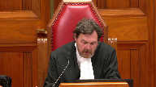
:::

Good morning, everybody.

In the case of Yamis Yusuf against Her Majesty the Queen, and between Aziz Pahls against Her Majesty the Queen, and between Jamal Yusuf against Her Majesty the Queen, for the appellant Aziz Pahls, Michael W. Lacey, and Brian Badali, for the appellant Jamal Yusuf, Boris Bytensky, and Brittany Smith, for the appellant Yamis Yusuf, Adam Little, for the respondent Her Majesty the Queen, Philip G. Cowell.

Mr. Lacey.

**Speaker 1** (00:01:18): Good morning, Chief Justices, Justices, and may it please the Court.

::: {.column-margin}
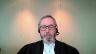
:::

In Jordan, the majority of this Court was persuaded that it was time to revisit the 11b framework because of the confusion, complexity, and unpredictability that became hallmarks of the Section 11 jurisprudence.

Much of the case law pre-Jordan, as this Court noted, appeared to be results-driven and involved with this Court described as minute accounting, micro-counting involving judicial guesstimations and the bane of every trial judge's existence, where the right to be tried within a reasonable time had become a mathematical as opposed to a constitutional exercise.

And the intent of this Court in Jordan was to do away with the old and usher in a new, revamped, and fresh perspective and approach to unreasonable delay to give teeth once again to the constitutional right.

It's our collective submission to you today that the decision under review represents a step backward from the gains that were made and left to stand will invite a return, at least in Ontario, to that same micro-counting of the past that encourages, in fact, hour-by-hour assessment of the Court time and allocation of the delay where the forest will be once again lost through the trees.

It also, in our submission, invites other appellate panels to second-guess determinations made by trial judges to enter into the factual fray and to render appellate deference in this constitutional context illusory.

This case was a poster child for the culture of complacency, delay tolerance, and the anything-goes inefficiency that led this Court to take action in Jordan.

And I know you have the benefit of the factums that have been filed, but just by way of brief overview, you'll recall that the appellants in this case were charged in August of 2014.

The trial began a year later.

Very importantly to the trial judge's assessment in this case, the Crown estimated that the entire case involving the three accused and really a single witness for the Crown, the core witness for the Crown, was what was described as a simple press-and-play case that would only take two days of Court time total.

**Justice Moldaver** (00:03:37): Well, wait a second.

::: {.column-margin}
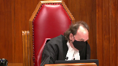
:::

The initial pretrial on this matter in March, long before the trial date is set, as the Court of Appeal noted at page nine of their reasons, page 120 of the record, that the defence agent, Mr. Batensky, who's apparently appearing on behalf of all accused and representing everybody, comments that all necessary preparation has been done and that the defence could proceed almost immediately, calling the case a he said, she said, type of matter.

I don't see anything in there that suggests that the defence was taking a position different from the Crown as to the length of time that this case probably should have taken if people had been acting responsibly.

**Speaker 1** (00:04:38): Well yes, and to that point though, Justice Moldaver, recall that in the context of this case where the core part of the Crown's prosecution was the video evidence, the video of the incident that gave rise to the assault of conduct, that had the Crown in fact proceeded as they indicated they would, that you know effectively you have the complainant identify who he is on the video and have him testify he didn't consent to the various things that were happening to him and give some context to what brought him into conflict with the individuals he alleged had assaulted him, well then this case was one that could have been dealt with quickly and efficiently.

::: {.column-margin}
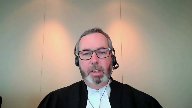
:::

**Justice Moldaver** (00:05:21): Let's talk about that for a minute.

::: {.column-margin}
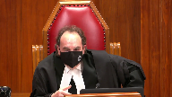
:::

Apparently it took two years from the date of the charge for two council to concede that the person on the video was in fact the victim.

Third council acting for we'll call him Jamie never conceded it.

That's number one.

Number two, when one looks at the so-called defence put forward in this case against these allegations in the face of a video where three grown men, young men, relatively young men are attacking a drunken, harmless victim and unlawfully confining him and not only attacking him but attacking him for over two hours on this video.

I'm at a loss to know what defence of self-defence could possibly apply in those circumstances.

The best you could have hoped for here was what you got, ending up with assault bodily harm as opposed to aggravated assault and it seems to me that most of what was occurring here was a complete and utter waste of the court's time because maybe you can help me as to where self-defence comes in here

but I'm at a complete loss.

**Speaker 1** (00:06:34): Well, in some ways, Justice Moldova, you make my point, though, that the Crown, who apparently looked at this case and decided that if the accused wanted to put the Crown to the onus of proving guilt beyond a reasonable doubt, and whether that was, you know, whether that was the kind of decision that Council might have decided on their own or not is obvious.

::: {.column-margin}
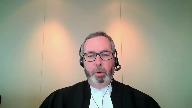
:::

No, they would have taken instructions from their client.

They were going to hold the Crown to the requirement that the Crown prove the case.

The Crown knew that they were going to be held to that standard, and the Crown looks at the video and says, okay, all we need to do really in this case is to play the video.

This case is about the video, and then that informs the estimate of the court time in this case, two days, and the examination in chief by the same Crown who estimated the two-day total trial time was four days.

So, the issue here, again, I mean, I appreciate that, and I'm not suggesting you're raising an equities issue, but I appreciate that when you look at this after the fact, you might say, well, what was going on?

These accused ought to have pled guilty, but at the end of the day, the accused were entitled to hold the Crown to the standard of proof.

They did so, and what was the cause of this case taking more than 32 months to get into the trial judge's hands?

I mean, that's the focus of the Section 11B analysis.

I mean, as I understand your majority decision in Jordan, part of what we move away from is the seriousness of the case, part of what we're moving away from is not the relative merits of whether the accused is entitled to bring the case to trial or not.

The issue is, once the accused decides that they're going to hold the Crown to that standard of proof, what does everyone do to bring this case to trial?

**Justice Moldaver** (00:08:15): answer to my question is, where do you get self-defense out of this at all?

::: {.column-margin}
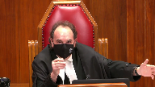
:::

This was a frivolous defense, it seems to me.

There's no way conceivably that self-defense could have applied here.

And by the way, on the unlawful confinement, they were convicted as well by the judge, and the only reason that one of them got out was because the Crown chose to withdraw that charge.

In fact, the trial judge convicted him, the third party, I guess your client maybe, of the unlawful confinement, and then he was reminded that the Crown had withdrawn that charge and he changed his view.

I'm really getting at, Mr. Lacey, because you're a very competent and able counsel.

The bottom line here, it seems to me, is that if people were acting responsibly in the face of a video where your client and two others are in effect beating up on this man, unlawfully confining him, clearly for a period of two and a half hours, even if he had sat outside where the video we didn't have, even if he'd said, I'm going to kill you guys if I have the chance, there was no justification for what went on in the bar.

And it just seems to me that looked at responsibly, this could have been a half a day case in terms of how serious were the injuries, were they life-threatening, have you proved your aggravated assault as opposed to assault bodily harm.

And I mean, if you can rebut that to me, I know the accused has the right to have everything proved and everything, but you've got a video that goes for two and a half hours where they are beating this man, three of them, not letting them go, throwing them back into the chair.

I mean, it's just, it seems to me remarkable.

If you're going to suggest that that is a proper use of court time and a proper defense to raise, when you can't possibly explain to me why self-defense could apply here, I'm at a loss.

**Speaker 1** (00:10:16): So if I could try to answer the question, Justice Moldaver, we'll get the opportunity next month to deal with self-defense in some detail in the Cahill appeal.

::: {.column-margin}
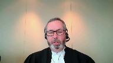
:::

But what I would say to you is this, that really the threat of that question to the appellants in this case is, well, what if the court is of the view that it's frivolous for the accused to go forward and require the Crown to establish the allegations beyond a reasonable doubt?

And how does that factor into the Section 11B analysis?

And in my submission, that's a very dangerous precedent to go down because you're trading off one court.

**Justice Rowe** (00:10:53): I think it's quite a relevant point because while it's entirely open to the accused to say look, you're put to the strict proof here.

::: {.column-margin}
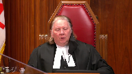
:::

That's your obligation.

I'm just going to sit back and wait.

I'm going to contest everything.

Clearly that is the right of the accused.

But don't come afterwards and say I was denied a trial in a reasonable time because in effect my counsel gamed the system.

If you game the system you don't get the benefit of 11B. That's the point.

**Speaker 1** (00:11:29): Well, again, I come back to this, Justice Roe, it's not gaming the system to hold the Crown to the standard of proof.

::: {.column-margin}
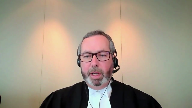
:::

The constitutional rights, obviously, an issue with respect to that are Section 7 and Section 11D of the Charter.

So you hold the Crown to the standard of proof.

The Crown knows going into this pretrial, knows going into this prosecution, they're going to have to prove this charge.

And the Crown's position, their position is, we only need to press play on this recording because that's how obvious the guilt is in this case.

And then when it gets in front of the trial judge, as the trial judge found, it takes the Crown four days to adduce the evidence and examination in chief by breaking down the video into microseconds and micro questions.

So, again, thank you very much.

**Justice Moldaver** (00:12:18): not agreeing to anything.

So you're in effect forcing the Crown's hand here, Mr. Lacey.

**Overlapping speakers** (00:12:25): You

**Speaker 1** (00:12:26): I don't want to ask the court a question.

**Justice Moldaver** (00:12:26): I don't want to ask the court a question.

**Overlapping speakers** (00:12:27): You weren't even-

**Justice Moldaver** (00:12:28): even agreeing that this was the victim.

**Speaker 1** (00:12:33): again, in my submission, to introduce issues about the relative merits of the defence and whether or not the defence position to even contest these charges was a reasoned one, informed one, was frivolous or not frivolous is not the question before this court, nor should it ever be the question before the court because that would undermine and introduce into the Section 11B jurisprudence the conduct of the defence.

::: {.column-margin}
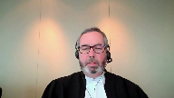
:::

When we talk about conduct of defence in carrying out the trial, surely that can't be the fundamental decision of the defendant to choose to go to trial at all.

**Justice Brown** (00:13:16): But surely it can't weigh against the crown as crown delay when the accused chooses to exercise all those prerogatives.

**Speaker 1** (00:13:27): Well no, but what it comes back to Justice Brown when we look at that is everyone's on notice then at the ultimate pre-trial where the dates are going to be set as to what the defense position is going to be in this case.

::: {.column-margin}
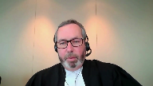
:::

The Crown decides to provide an estimate based upon how they know they're going to conduct their case, their prosecution, their case in chief.

It's a gross underestimate according to the trial judge and it's something that is throughout the trial judge's reasons on the 11b application here.

He's concerned that the Crown effectively never or ought to have known that to prosecute this case in light of the positions being taken by the parties would have taken much longer.

So that's the that's really part of what factors into the trial judge's analysis in this case.

I accept as Justice Doherty said in Allen and as this court has said if the defense is gaming the system throughout the prosecution, if the defense is the one who's causing the delay once the prosecution unfolds, well obviously defense is responsible for that delay.

But it can't be because the defense decides to have a trial whether that's you know whether those are the decisions I would have made Justice Moldaver or that's the advice I would have given.

Those are different questions and ultimately if the defendant decides he's going to hold the Crown to the strict burden of proof, everyone's on notice about that.

Then we have to look at well why did this case take as long as it did?

And I'm going to be occupying more of the time than I wanted to in answering your questions.

I want to give an opportunity for other counsel to answer this.

But ultimately the trial judge looks at all of this and he says well why did this take so long?

He reads Jordan, the trial judge does, the application gets brought to him and he says you know what the biggest problem here was the underestimate of the trial time, was the failure of the Crown to deal with some inquiries by the defense related to disclosure which caused a five-month adjournment at the end.

And it's our position the trial judge was in the best position knowing the local culture, knowing the local characters, knowing the counsel involved, knowing the Crown's office involved.

Been a trial judge in that court for 30 years, he just recently retired sorry practiced in that court for 30 years having just recently retired.

And he had his pulse on what was happening and how this trial was conducted and who was responsible.

**Justice Brown** (00:15:47): You seem to be assuming that the proper application of delay is a question of fact.

**Speaker 1** (00:15:54): Well, and that's where we come to the standard of review, Justice Brown, where obviously a trial judge has to make findings of fact for the purposes of the delay analysis.

::: {.column-margin}
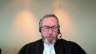
:::

And in our submission, one of the things this case actually does, although it's an appeal as of right, is give this court an opportunity to deal with the issue of the standard of review.

And if I can just, on that question, draw your attention to the Ellis decision, which is a decision that's not referenced by any of the parties.

It's the Nova Scotia Court of Appeal decision that we've included at tab 4A of the condensed book.

It's pages 94 to 95 of the Adobe file, and it's paragraphs 78 to 83.

But what the Nova Scotia Court of Appeal highlights is a lack of consistency across the country in approaching the question of how to assess a trial judge's determinations in terms of the allocation of delay.

And that court makes the point that there's a divergence between the Ontario approach and the approach that at least most recently was adopted by the BC Court of Appeal in the Pipping decision.

And I'll leave you with that, but it's our submission that the Nova Scotia Court of Appeal's conclusion that they should follow the Pipping line of reasoning.

And that's to say that the ultimate determination of whether the issue, a trial has been the subject of unreasonable delay is subject to the correctness standard.

However, a trial judge's characterization of each period of delay and the findings of underlining facts should be subject to correctness.

Well, I mean-

**Justice Brown** (00:17:39): I mean the findings of underlying facts is one thing but the proper attribution of delay, if in fact the overall assessment of reasonableness is not, is reviewable for correctness, I don't know how the proper attributions of delay that make up that would not be reviewable for correctness as well.

::: {.column-margin}
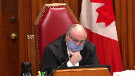
:::

So I think it's fairly plain.

**Speaker 1** (00:17:59): Well, to the extent that this court might view it as plain, certainly appellate courts across the country are struggling with this.

::: {.column-margin}
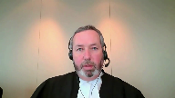
:::

Because when you look at what the Nova Scotia Court of Appeal says, when you look at pipping versus what the BC Court of Appeal said in earlier decisions, I mean, I think part of the issue is the attribution of delay is so inextricably bound with findings of fact.

And what I would suggest is that this court should prefer the analysis of the Quebec Court of Appeal in Regina and Rice, which is also we've included in our condensed book and in the interest of time and not to, I feel like I've used up most of our time, but the decision in Rice you'll find in our authorities, our condensed book, I'm sorry, at tab 4F.

And really it's paragraphs 33, 34, and 35 I would commend to the court.

This is page 102 of the Adobe file.

And what the court notes is that a court of appeal must necessarily accord a trial judge the discretion to assess different situations.

The judge knows the court in which that judge functions and how it works, its context and the players involved, among other things, a trial judge has special knowledge of similar matters, which have been the subject of neither an appeal nor any other particular analysis, but which nonetheless constitute undeniably important guideposts.

And they suggest that that's the type of standard that needs to be applied so that we avoid a return to the former context of unending gray areas to which the point of no return fades and is lost.

I hope I was of some assistance.

I fear, perhaps, not Justice Moldaver, but I do want to turn the table, if I can, to my colleagues who equally have important things to say to the court.

**Overlapping speakers** (00:19:55): Thank you very much.

**Speaker 1** (00:19:56): Thank you very much.

**Speaker 2** (00:19:59): Chief Justice, Justices, may it please the Court, I'm going to very briefly address what we say are the errors the Court of Appeal made in deducting various periods as arising from defense delay or discrete circumstances.

::: {.column-margin}

:::

And I'm going to focus on two main areas very briefly.

The first is the attribution of responsibility for the initial adjournment of the trial, which the trial judge attributed to the Crown delay in responding to the disclosure request.

And the second is the delay arising from the mis-estimate of trial time on repeated occasions by the trial Crown in this case.

And regardless of where this Court sides with respect to the proper standard of review, we say that these findings are findings of fact that were entitled to deference by the Court of Appeal, unless they were the product of probable and overriding error, which of course we reject that notion.

With respect to the propriety of the disclosure request, this was conceded by the Crown on appeal and I've included in our condensed book at tab 5G a portion of the Crown's factum conceding this.

And the Crown on appeal, same as the Crown before this Court, noted that the appellant does not seek to renew the debate over disclosure.

Ultimately, the Crown had the ability to avoid the delay that flowed from the disclosure request and did not do so.

And what happened here, of course, was that trial counsel for one of the appellants sent out correspondence to the Crown in the middle of May, close to three months before the trial commenced, and received no response until she took it upon herself to actually speak with the Crown at the courthouse.

Even then, formal response took almost two months to come.

So the trial judge recognized that what really happened here was the defense acted diligently and had the Crown simply responded in a timely manner, the adjournment would not have been necessary.

The disclosure could have been provided and tested in due time to proceed with the trial.

**Justice Moldaver** (00:22:15): Well, you needed the Crown to reaffirm what was clearly set out in the initial disclosure on no basis whatsoever to doubt what had been set out in the initial disclosure.

**Speaker 2** (00:22:27): Thank you, Justice Moldaver.

::: {.column-margin}

:::

My response to that is that Trial Council was entitled to confirm the correctness of the officers' notes.

It's not unknown that a disc does not work on one computer and it works on a computer a second, a different computer when it's tried a second time.

That's not an uncommon occurrence.

How long did it take the Defence Council?

Sorry, was that you?

It was not me. Sorry?

It was not me, Justice Moldaver.

**Justice Moldaver** (00:22:54): but how long did it take the Defence Council?

You got the disclosure when?

**Overlapping speakers** (00:23:00): It would have been in 2014 prior to the setting of the trial dates.

**Justice Moldaver** (00:23:04): Prior to setting the trial date, prior to the first pre-trial, I presume?

**Overlapping speakers** (00:23:09): Well, some of it, yes.

**Justice Moldaver** (00:23:11): So this got sat on for months and months and months and ultimately, you know, on the eve of trial, the thing comes to a head, and by the way, you don't have your expert available or something, he or she is away.

::: {.column-margin}
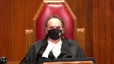
:::

I mean, let's look at this realistically, okay?

There's no reason why when you got that disclosure, if you were really concerned that maybe you had misread it or something, or maybe there was a mistake or whatever, you get on the phone to the Crown right then and there, and you say, look, we got a blank video here, is that right?

You know, and that's months and months and months before the trial that you're aware of this.

And yet, somehow, we end up on the eve of the trial with you saying, we need an adjournment because we didn't get production.

We need production.

I mean, let's be realistic, I'm not faulting you, obviously.

But you know, it's a simple phone call or two phone calls or running into the Crown at the court or whatever.

You and I both know that.

If you really want to get to the bottom of it and you think you need a production order, you don't kind of sit on it for months and months and months and go through the pretrial without mentioning it, and then all of a sudden, it becomes, oh my goodness, you know, the Crown is not acting responsibly.

**Speaker 2** (00:24:39): Or, Justice Moldaver, it's a simple letter to the crown asking, well, is your copy blank as well?

If not, we'd like to get it tested.

And, respectfully, I-

**Justice Moldaver** (00:24:51): Sorry, that letter came when?

Months after you were aware of the disclosure that said it's a blank. Months?

Why did it take months to send that first letter?

**Speaker 2** (00:25:03): Obviously, I can't assist with that, unfortunately, Justice Moldaver, but the trial judge found, as a finding of fact in my submission, that the defense preparation was reasonable.

::: {.column-margin}

:::

I mean, it happens that defense counsel turned their mind to a case, crown counsel turned their mind to a case, and in preparing for it, they noticed things that they might not have noticed on a first review.

You know, this court has said that the role of assessing defense delay is not to second guess defense counsel.

It's not an exact science.

**Justice Moldaver** (00:25:35): very interesting about this, even if you'd got that production.

::: {.column-margin}
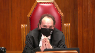
:::

Obviously, it turned out, when you did get it, and you had your expert look at it, it went nowhere.

But I'm wondering how it could possibly help you in any event in this case.

Because even if the victim here, when they were outside, punched your client and the others in the face, and kicked at them, and did whatever, where does that give you self-defense when they haul them into the bar and start beating them up for three hours, two and a half hours, on a video?

I don't even know what the purpose of that other video would be to you.

**Speaker 2** (00:26:15): Well, I have two responses to that, Justice Moldator, very quickly, and then I'll have to turn it over to my colleagues.

::: {.column-margin}

:::

One is, where did the defense of self-defense cause the delay in this case?

My submission, it didn't.

What caused the delay was the Crown not giving appropriate thought to how it was going to proceed with its case.

And in response to what use could the video have been?

Well, it may have gone to the question not necessarily of self-defense, but of when the injuries were caused.

If the injuries were caused in a different context than inside the bar, that may have led to a difference between aggravated assault and assault causing bodily harm.

I mean, this court in Cody held that defense delay would only be deducted when it was illegitimate insofar as it was not taken to respond to the charges.

Cheeking out that video is...

**Justice Moldaver** (00:27:12): You just put your finger on it.

::: {.column-margin}
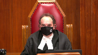
:::

You just conceded with respect, quite properly, that the only issue in this case was the degree of harm suffered.

And I can't believe the three competent council couldn't sit down with a crown and say, look, this is the issue.

We want to just have a brief trial or whatever it takes to get at that issue.

And we'll make our submissions, you make yours, and let's see what the judge does.

That could be done probably in a day, maybe two at the outside.

**Speaker 2** (00:27:46): Respectfully, Justice Mulder, where is there anything in the record that suggests the Crown went and said, what do I need to go through on the video?

::: {.column-margin}
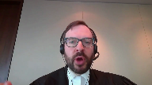
:::

I mean, he could have established identity very quickly.

He didn't need to proceed through the video on a minute-by-minute basis.

He could have conceded identity.

**Justice Moldaver** (00:28:04): You could have conceded identity very quickly.

What is this, a game?

**Speaker 2** (00:28:11): respect, I don't think it's a game

::: {.column-margin}

:::

Justice Moldaver

and I'm not suggesting that.

What I'm suggesting is that the Crown needs to be equally responsible for the way it conducts its trial.

It's not all on the defense.

The court has made that clear in its jurisprudence, I would submit, in Jordan and Cody.

And it, what seems clear about this case is that to me is that the Crown simply, the delay was caused by the failure of the Crown to give appropriate thought to its case and not by the actions of the defense.

**Justice Moldaver** (00:28:46): This is taking a scorched earth policy here, sir, a scorched earth policy.

::: {.column-margin}
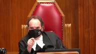
:::

Nothing is being conceded, everything is being contested, and you're upset with the Crown in the face of that for saying, okay,

well, we'll just follow the book.

You know, there was no audio on this tape, and so the Crown had to sort of keep asking the victim, well, what's happening now, what was said now, et cetera, et cetera, as opposed to the defence saying, okay, look, it's obvious what's going on on the tape.

You have a harmless drunk who's sitting there and being pummeled for three hours and kept in the chair, so we'll accept that.

The only issue here is the degree of violence.

I mean, really.

**Speaker 2** (00:29:32): In my final submission, Justice Moldaver, I just leave the court with the fact that it took the Crown two months to respond to a simple request that's not consistent with the culture of complacency that this court was trying to replace with Jordan and Khalid.

::: {.column-margin}

:::

So with that, I apologize for taking so much time, but I'll turn it over to my colleagues.

Thank you.

**Speaker 3** (00:29:56): Chief Justice, Justices, I have very little time so I'll be very brief.

::: {.column-margin}
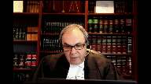
:::

To address the questions that were posed earlier by Justices Moldavar, Justice Roe, first of all there is nothing in this record to show that the Crown ever was willing to offer assault bodily harm pleas or resolutions to any of the lawyers.

So the fact that a trial was necessary in some ways can be measured as a success.

Secondly, there is a respect...

**Justice Moldaver** (00:30:23): I got to stop you there, Mr. Patenski, because really, if it really came down to the degree of harm, even if the Crown's not going to concede that it's ABH as opposed to aggravated, that's a half a day trial.

::: {.column-margin}
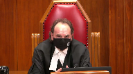
:::

That's the medical evidence.

That's the showing the video, showing what happened, and looking at the nature of the injuries and saying, okay, did they reach the level where you're satisfied, judge, beyond a reasonable doubt that his life was in peril?

I mean, it's so simple.

**Speaker 3** (00:30:54): Justice Mulder, if I may, the roles of the three accused were not the same.

::: {.column-margin}
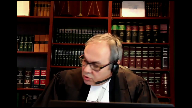
:::

The position of the use of brothers were very different with respect to this matter than the position of Mr. Paul's.

The position of the use of brothers was that they inflicted very little damage and very little harm.

And with respect, these were issues that were litigated at trial.

With respect to the, there was an issue of their involvement being very different than Mr. Paul's.

And as I said, ultimately, there is no evidence that they were ever offered anything.

And Mr. Jamal Youssef, the client I represent, and Mr. Schickman represented at trial, did concede identification, did concede jurisdiction.

He did not have the scorched earth policy.

Maybe some others did.

But with respect, if one person takes that position, it can't be visited upon.

The stories I'm.

**Justice Moldaver** (00:31:42): I'm sorry, and I don't agree with you on this.

::: {.column-margin}
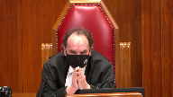
:::

I'm really sorry, but I do not agree.

If you offer it to the Crown and the Crown says no, then the professional way to conduct this case is say, because we've got no self-defense here, there's no possible way we've got self-defense here.

So let's just have a trial on an issue.

How serious were the injuries?

Do they reach the level of aggravated assault?

That's what you, that could have been done, and this case would have been over in a day.

**Speaker 3** (00:32:13): Well, Justice Moldavis, the Crown's examination in chief lasted four days of total court time, so I'm not sure it could have been over in a day, regardless of the concession that one accused would have been prepared to offer.

::: {.column-margin}
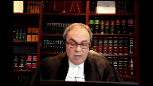
:::

I'll simply say that Justice Gorowicz, a very experienced judge, wrote a 40-page decision, and he took all these factors into account at the time in terms of who did what and what the defence ought to have done.

And trying to recreate that in a 30-minute argument when we're trying to deal with legal issues and factual is precisely why deference to the courts below or the trial judge must be given primarily on essential findings of fact, such as whether the defence conducted itself appropriately, reasonably, including with respect to the disclosure request.

And I had much more to say, so I'll simply have to rely on things that we've written in the factum in the response.

But I wanted to address those questions directly because with the greatest of respect, I appreciate the comments.

In hindsight, this was not a defence that was successful, but for Mr. Youssef specifically, specifically Jamal Youssef, this was not the same case as it was against Mr. Pauls, and he took a different position unsuccessfully but with respect reasonably, and no evidence of an offer of any other lower resolution was ever – it's not in this record, and it simply doesn't exist.

Thank you very much.

I appreciate my time, so I'll come back.

Thank you.

**Justice Wagner** (00:33:32): Thank you, sir, Mr. Cowell.

**Speaker 4** (00:33:41): Good morning Chief Justice and Justices.

::: {.column-margin}
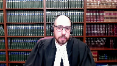
:::

I intend to begin with very brief opening remarks followed by a roadmap of the submissions I anticipate making.

When the Jordan framework is applied correctly the result is both forward-looking and principled.

The framework is forward-looking because both parties are incentivized to avoid the delay that each can control.

The framework is principled because the state is only held accountable for the delay that is reasonably within its control.

The trial judge in this case did not apply the Jordan framework correctly.

He made several errors in his application of the law and the result was neither forward-looking nor was it consistent with the accountability principles espoused by this court.

The Court of Appeal was right to intervene and I'll be asking this court to dismiss this appeal substantially for the reasons of the Court of Appeal.

By way of roadmap I'll begin with brief submissions on the standard of review and then I intend to focus my submissions on the four errors that were identified and corrected by the Court of Appeal.

And I expect the first two will take up the bulk of my time.

First, in this joint prosecution the trial judge erred by holding the state responsible for illegitimate delay that was caused by the co-accused not the state and for which none of the accused proposed any viable solution.

Second, the trial judge failed to hold the appellant's accountable for the adjournment of the first trial dates.

Third, the trial judge erred by failing to consider the impact of rescheduling court days lost to discrete events.

And fourth, the trial judge erred by considering only the misestimate prior to the start of trial and not the subsequent estimates at each of the continuations throughout the trial.

For the remaining issues I intend to rely on my factum.

Beginning with the standard of review.

There is no reason to depart from the traditional appellate standards of review.

This Court has long held that findings of fact are reviewed for reasonableness but the application of the facts to the law is reviewed for correctness.

It is through those standards of review that this Court has ensured certainty, consistency and predictability in the law while respecting the fact-finding role of trial judges.

**Justice Brown** (00:36:02): Just to be clear, are you of the view that the Court of Appeal applied the correct standard of review?

**Speaker 4** (00:36:08): I am of the view that the Court of Appeal applied the correct standard of review.

::: {.column-margin}
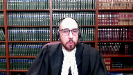
:::

In my submission they they said as much in their decision and they went on to apply the very standards that they had articulated.

In my submission, in this Court's 2009 decision of the Queen and Shepherd, you left no room for doubt about this baseline for the standards of review and I've included the passage at tab 1A of my condensed book.

This Court cautioned that for any issue on appeal that requires the Court to review the underlying factual foundations of a case, it may understandably seem at first blush, as though the subsequent legal issue is a question of fact or discretion, but that is not the case because this Court has repeatedly affirmed that the application of legal standards to the facts of the case are a question of law and although the trial judge's factual findings are entitled to deference, the ultimate ruling is subject to review for correctness.

**Justice Abella** (00:37:04): extent, Mr. Cowell, do you see the courts of appeal that Mr. Lacey referred to diverging then?

What is there that in your view could be clarified, if anything?

**Speaker 4** (00:37:19): Well, in my submission, the line of jurisprudence that the appellants rely on have committed the very error that this Court identified in Shepherd.

::: {.column-margin}

:::

They've sort of taken this first blush approach and they've misinterpreted the comments made by this Court.

In my submission, this Court did not signal any departure from the long-standing principles of appellate review in Jordan and Corey.

And if anything, it's a matter of fact that— As a matter of fact—

**Justice Wagner** (00:37:47): Mr. Call, as a matter of fact, your colleague referred to the case of Rice, Court of Appeal in Quebec, but when one reads paragraph 136 of that decision, it says that an error in the attribution of delays in applying the analytical framework is an error of law.

::: {.column-margin}
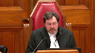
:::

So it is correctness.

**Speaker 4** (00:38:07): I wholeheartedly agree, Chief Justice, and that's exactly what I've set out in my factum and I agree with my friends that there are some courts of appeal, some provincial courts of appeal that seem to have strayed and my friends have set those out, but in my submission they are misinterpreting the comments of this court and I think one of the chief examples that some of those courts have relied on are with respect to defense delay.

::: {.column-margin}
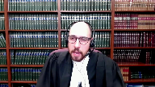
:::

Those provincial appellate courts have looked to the comments of this court as suggesting somehow that there's some discretion in the application of the law, but what this court actually said in my submission is that it's the factual findings about the legitimacy of defense conduct in a particular case that are entitled to deference, but the legal test for defense delay must be applied correctly to those findings and in my submission nowhere is it more important for judges to get that law right than in this context where the legal principles in question have the effect of setting minimum standards of charter compliant behavior and we're falling short of those standards leads to the termination of criminal proceedings with no adjudication on the merits.

And with that I'd like to turn to the first of the four errors corrected by the court of appeal and that's with respect to the error in accounting for co-accused delay.

The trial judge erred by holding the state responsible for scheduled delays that it did not cause and could not remedy.

In my submission when courts are reviewing defense delay in joint prosecutions we cannot lose sight of the type of delay we're examining.

Defense delay as defined in Jordan is not delay caused by the state and it's not delay caused by legitimate defense actions.

Defense delay is illegitimate delay caused by one or several of the accused and in reviewing that type of delay in the context of joint prosecutions the approach of the court of appeal for Ontario is the correct one

and I would describe that approach in the following terms.

An accused person whose proceeding is delayed by the actions of his co-accused and who sees a delay reducing remedy that he wants the state to employ must diligently pursue that remedy.

If the accused does not pursue a reasonable and viable remedy from the state then the court may conclude that he does not want that remedy or that he is acknowledging that there is no viable remedy available to the state.

In those circumstances defense delay is properly deducted on a communal basis.

Conversely if the accused does diligently seek to have the state employ reasonable remedial action in response to his co-accused delay and the state refuses or cannot accommodate then the state may be held to have contributed to the delay causing conduct subject to proof of exceptional circumstances.

So when the court finds that a group of co-accused was proceeding as a collective during a certain period of time in my submission the crux of that finding is that the accused were not seeking any reasonable remedies in response to the delay causing behavior of their co-accused.

**Justice Brown** (00:41:33): So so do you agree then that that this depends entirely on a finding that the co-accused approach their defence as kind of a united front

::: {.column-margin}
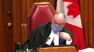
:::

right it's it's

it's it's not a case where attributing delay to all accused for defence council delay a single defence council delay is consistent with Jordan

but there has to be kind of a a united front they've they've presented themselves as a package deal in other words.

**Speaker 4** (00:42:00): Exactly.

::: {.column-margin}
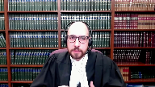
:::

In my submission, the way we can identify that package deal, that united front, is if at the time that the delay takes place, defense counsel does not seek any reasonable remedy with respect to that delay causing behavior of their co-accused.

That is the united front.

**Justice Brown** (00:42:20): And so in that case, just, I appreciate that, um, in such cases then, is the question this, taking into account the whole of Defence Council's actions, was there a demonstrated sustained effort to move the case forward?

::: {.column-margin}
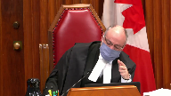
:::

Is that a fair sort of encapsulation of the question we asked then, having made that determination, that they presented as a united front?

I'm just trying to kind of put the framework for analysis into my mind here.

**Speaker 4** (00:42:58): I see exactly what you're saying and to some extent I agree it's relevant, it's relevant because it may well be that the accused has been pursuing remedies for months and months, has been pursuing severance for months and months and on one particular occasion omits to reference a particular remedy and this court might well find in that kind of circumstance that that was merely sort of an inadvertent omission but that the accused had clearly put the state on notice that they were seeking reasonable remedies.

::: {.column-margin}
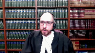
:::

But I think the ultimately the main focus has to remain on the time that the delay is taking place.

It's at that time that Defence Council has to flag a reasonable remedy if they see one available and if they actually want it.

I probably wasn't.

**Justice Brown** (00:43:52): clear enough.

::: {.column-margin}
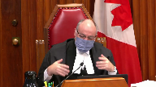
:::

My question presupposed that we've made that determination, that they're a package deal, that the united front, and then is the focus on the conduct of defence counsel as a whole, and whether it demonstrated an effort to move the case forward.

**Speaker 4** (00:44:14): And in my submission, I apologize if I'm not being.

**Overlapping speakers** (00:44:20): helpful.

I'm sure the fault is mine.

**Speaker 4** (00:44:23): I can only I can only return to the fact that while I agree that that that type of a broad view is relevant, I really want to emphasize that my position is that the emphasis has to be on the time at which the delay causing behavior is taking place.

::: {.column-margin}
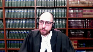
:::

And the reason I think it's so important to focus on that time is because we cannot have a situation where counsel are sort of sitting back and they see potentially a reasonable opportunity but in that moment, they don't ask for it they only talk about it later in the subsequent 11 B application that cannot be consistent with the Jordan principles.

**Justice Brown** (00:45:03): I think we're ships passing in the night, but your time is limited, so I'll just...

**Justice Rowe** (00:45:06): It reminds me of a quotation from Napoleon, which I will render in English.

When you see your adversary making a mistake, never interrupt him.

**Speaker 4** (00:45:17): Thank you.

In my submission, either way.

**Justice Moldaver** (00:45:22): Hold on Mr. Call for one second.

::: {.column-margin}
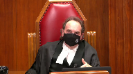
:::

If you had one co-accused that was playing this scorched earth policy approach and the other two were saying, look, we're not, we don't want to go there, we just want to sort this out on the basis of whether it's an assault bodily harm or whether it's an aggravated assault.

What would the Crown's position, what should the Crown's position be in that case?

**Speaker 4** (00:45:50): In that case, the accused who is sort of taking what I'll call the more reasonable approach is to flag reasonable remedies to any delay, any illegitimate delay that's being caused by his co-accused.

::: {.column-margin}
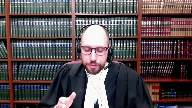
:::

**Overlapping speakers** (00:46:08): Why wouldn't the crown consider severance in a case like that?

**Speaker 4** (00:46:11): And so, it may well be that severance is appropriate, and that's what I mean when I say that Defence Council has to ask for reasonable remedies.

::: {.column-margin}
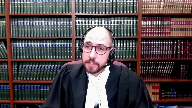
:::

And so, if severance is a reasonable and viable remedy in the circumstances, and I take that language from Vassal, if it's reasonable and viable and Defence actually ask for it, then yes, the Crown needs to pay serious attention to that, needs to consider that.

And if it's a reasonable and viable solution and the Crown fails to employ it, then the Crown will be called on to account for that.

The Crown may have to justify that by way of exceptional circumstances.

**Overlapping speakers** (00:46:50): Thank you.

**Speaker 4** (00:46:51): In my submission, this approach is sound in principle because in Jordan and in the jurisprudence since then, this Court has repeatedly said that fighting the culture of complacency requires cooperation and a proactive approach from all parties.

**Justice Karakatsanis** (00:47:06): So can I ask you then, Mr. Cowell, how would that apply where we're talking about a transitional case and where some of these events would have arisen before Jordan?

**Speaker 4** (00:47:24): Justice Karakatsanis, I think it applies in essentially the same way we look at any other feature of the delay framework and so in the initial analysis we apply Jordan because Jordan is the law whether the parties were aware of it at the time or not

::: {.column-margin}
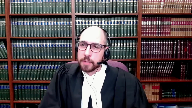
:::

and we only go back to considering the moraine framework later when if we've gone over the the Jordan cap

and then we're asking the question well what was the reasonable expectation of counsel at the time that this was taking place and just to continue with what I was saying I want to emphasize this court's language in Cody where this court talked about the need for defense counsel to actively advance their client's rights to trial within a reasonable time and to collaborate with crown counsel when appropriate and that defense delay may be premised on inaction or omissions because the complacency that was tolerated under moraine will not be tolerated under Jordan.

**Justice Moldaver** (00:48:26): Can you help me out with something, though, that your colleagues have effectively indicted the Crown and the trial Crowns in this case?

::: {.column-margin}
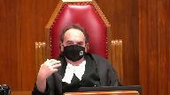
:::

It's their fault.

It's the way they ran the case.

They're the ones that should be reprimanded here for the manner in which they dealt with this.

Do you have any sort of responses to the way the Crown conducted itself here and why they did?

**Speaker 4** (00:48:58): My response is that essentially the Court of Appeal got it right in their description of how this actually took place.

::: {.column-margin}
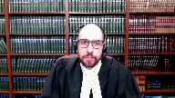
:::

And so in my submission, the Crown was absolutely reasonable in the steps it took.

The Court and the Crown made themselves widely available at every continuation.

The Court of Appeal actually upheld the judge's finding with respect to the initial mis-estimate of time.

The Court of Appeal agreed with the trial judge and placed that at the feet of the Crown.

But the Court of Appeal went on to consider the subsequent mis-estimations at the continuations, and that's something the trial judge did not consider.

And with respect to mis-estimations, the Court of Appeal in my submission was right to say, look, by the time we get to January and the victim's been on the stand for an entire day, if ever there had been a time before where everyone wasn't on the same page, that's no longer true.

Everyone is absolutely on the same page at this point, and going forward, everyone knows how this case is proceeding.

Now, before I leave the question of co-accused delay, I do want to make sure I make some last comments on that issue.

In my submission, the approach taken by the Court of Appeal is sound in practice because if we look back to the leading cases in which the Crown was found to have failed in its obligation to remain vigilant, what we see time and time again is that the accused whose rights were breached spoke up, and they did so repeatedly.

And that's Vassal, Manassari, Nye, those accused persons who are truly being held hostage by their co-accused say something about it.

They oppose unnecessary adjournments, they seek severance, and they ask the state to intervene.

And with that, I'd like to move on to the second error corrected by the Court of Appeal, and that has to do with the adjournment of the first trial dates.

In my submission, the trial judge failed to hold the appellants responsible for the adjournment of the first trial dates, and on this issue, the trial judge erred in law by failing to consider all the facts that were relevant to the attribution of defence delay.

Specifically, he failed to consider the facts surrounding whether the appellants had pursued a legitimate step in an illegitimate manner.

Now, as my friends have talked about, at the time that Defence Council was writing to the Crown asking to find out whether there had been a copying error that caused the security footage for Camera 15 to be black, they were already in possession of the answer.

They had already received disclosure of the police notes that described the retrieval of the security footage, and those notes revealed that the security feed for Camera 15 on the original DVR that was examined by police was black, which of course fully explains why any subsequent disclosure copies would also be black.

Now, evidently, in raising this concern about a possible defect in the defence copy, Defence Council in my submission had not reviewed the disclosure carefully enough to recognize that there were police notes that fully answered that very question.

But instead of seeking the release of the DVR right away in May of 2014, Defence Council sent the Crown off to investigate a copying error that they should have known did not exist, and they then waited for the Crown to report back.

And it's only on August 5, the first day of trial, that Defence Council took their first step towards actually obtaining the original DVR for testing.

Those are the facts.

The question is, what is the correct application of Jordan to those facts?

And according to Jordan and Corey, the judge had to decide not only whether it was legitimate for the defence to seek the release of the DVR for testing, but also whether they pursued it in a legitimate way.

Nowhere in the trial judge's ruling did he consider whether it was reasonable to wait over two months for the Crown to re-disclose information that had already been disclosed.

This was an issue that the Crown had raised in his submissions at first instance, and I didn't have the foresight to include that in my condensed book, but you'll find that in the transcript of August 22, pages 149 to 157 of the PDF.

And by failing to consider that question, in my submission, the trial judge effectively allowed the Crown to pass the buck and offload their responsibility to review disclosure.

In their decision, what the Court of Appeal said is that it's true that the Crown could have responded more quickly to defence correspondence, but the defence correspondence was frivolous to begin with.

Now the appellants say that the Court of Appeal has imposed a standard of perfection, but in my submission, the message conveyed by the Court of Appeal is that before defence counsel asks the Crown to investigate outstanding disclosure, they should first review what they already have to make sure there actually is outstanding disclosure.

And that's not a standard of perfection in my submission, that's a standard of reasonable diligence, and by failing to consider that question, in my submission, the Court of Appeal has imposed a standard of perfection, but in my submission, the message conveyed by the Court of Appeal is that before defence counsel asks the Crown to investigate outstanding disclosure,

**Justice Rowe** (00:54:20): Just to be clear, I mean, it isn't for any appellate court, the provincial courts of appeal, this court,

::: {.column-margin}
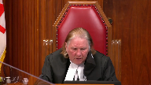
:::

anyone sitting in an appellate to say, well, this is how you should have conducted your defense.

That's for counsel themselves and counsel discussing with the accused.

Really what we're concerned with here is, is there a legitimate basis to say that the rights of the accused were infringed and that they failed to receive a trial within a reasonable period.

So I don't want us to slip, maybe I'm being overly cautious here, into some sense of the courts telling defense counsel what they should and shouldn't do.

It really is a matter of evaluating whether there's a proper basis to say that my client's rights under the charter were violated.

**Speaker 4** (00:55:14): I completely agree and as I understood the comments that were made earlier by Justice Moldaver, by yourself and by Justice Brown, the issue that your comments were directed to was whether or not the Crown had a reasonable ability to mitigate the delays that were arising from the discrete events that were taking place.

::: {.column-margin}
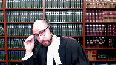
:::

And the trial judge, and I gather my friends now as well, all took the position that while the Crown ought to have known that it was going to present its case slowly and meticulously and perhaps one of the solutions would have been for the Crown to speed it up a little bit.

And as I took the comments of Justice Moldaver and yourself, that was not a reasonable alternative.

The Crown should not have been held to taking that kind of step to control delay in this case.

I also note that with respect to Mr. Youssef who did eventually concede identity, he conceded identity on September 8th of 2016 and the other two parties did not.

And so in a case like this one where severance was not a reasonable alternative, the Crown was left with no choice and the trial judge on September 8th in the transcript recognized that.

But he seems to have lost track of that point later on by the time the 11b application is being argued.

And excuse me.

**Justice Kasirer** (00:56:42): the

**Overlapping speakers** (00:56:43): Yes.

**Justice Kasirer** (00:56:43): In respect of his findings of fact on these points, the trial judge at 68 and 69 of the, of his judge, of his judgement, did he not find that, that he found that the applicants were prudent in requesting the release of the black video for testing and the preparation for the trial commenced just less than three months was reasonable and then later in 69 he found that the crown did not respond in a timely manner to what I find was a timely request for disclosure.

::: {.column-margin}
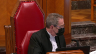
:::

If we, if we avert to the power of this court to review findings of fact within the Jordan framework without changing things, how are those to be taken into into account?

**Speaker 4** (00:57:46): Well, I have two responses to your question, Justice Cazire, and the first is that in my submission, the Court of Appeal did not in fact disturb any of those factual findings.

::: {.column-margin}
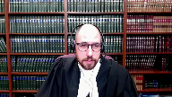
:::

The Court of Appeal agreed that there was no problem with Defence Council beginning to review the discs in May.

The Court of Appeal agreed that the Crown could have responded more quickly, and the Court of Appeal agreed that it was prudent to seek testing of the DVR.

But in my submission, when the trial judge is making findings about the timing of the disclosure request, the disclosure request the trial judge is talking about is the letter in May asking for a fresh copy of the security footage on a disc.

He's not talking about waiting until the first day of trial to ask for the testing.

And in my submission, the reason that the judge sort of went astray on this issue is that he failed to consider whether Defence Council had pursued this legitimate request in an illegitimate way by waiting for re-disclosure of information they already had.

That issue, in my submission, is nowhere in the trial judge's ruling.

And so, just to make one last comment on the question of defence delay leading to the adjournment of the first trial dates.

In my submission, the correct attribution of defence delay must be principled and forward-looking, and that's the approach the Court of Appeal took.

They recognized that the best way to fight the culture of complacency is to get rid of frivolous requests so that the State is able to make the best of the situation.

It's to get rid of frivolous requests so that the State can focus its resources on dealing with the legitimate ones more quickly.

I'll move on to make some brief comments on the impact of discrete events.

The trial judge identified almost three days of court time lost to discrete events, but then failed to consider whether there should be any deduction to account for the months it took to reschedule those lost court days.

The Court of Appeal was right to step in and give effect to several months of delay caused by discrete events, and I've provided in my condensed book at tab 4A an example, this Court's decision in KJM, and in that case, the accused had been two and a half hours late for court, which created the need to reschedule two and a half hours of court time, and neither the trial judge nor the Court of Appeal had accounted for the cascading effect of the lost half day, and this Court corrected that error by deducting two to three months.

In this case, both the judge at first instance and the Court of Appeal agreed about the actual events that constituted discrete exceptional circumstances.

The issue was that the trial judge failed to advert to the reality that it took months to reschedule those nearly three days of evidence, and in my submission, his failure to do so was an error of law.

Fourth, with respect to the joint misestimates of time, in this case, there was not only one misestimate of time that created delay.

When we consider the misestimates at each of the continuations, there were no fewer than four misestimates of time.

On a correct application of the Jordan framework, each of those estimates had to be considered to determine whether any of them amounted to discrete exceptional circumstances, and that's where the trial judge erred.

The judge's reasons only make reference to the first misestimate, the one prior to the start of trial, and the Court of Appeal was right to evaluate the later misestimates in light of the different circumstances in which they were made.

As I mentioned earlier, on January 14th, the victim had been on the stand for an entire day, and everyone could see how things were proceeding.

**Justice Moldaver** (01:01:41): Can you help me in terms of discreet events, Mr. Cowell?

::: {.column-margin}
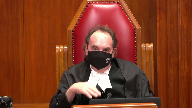
:::

If, let's say, the accused or a counsel for the accused gets sick, and they're not able to make a certain date and they're sick for several months, now, if that is clearly a discreet event, then at the end of the day, after you deduct defense delay, I suppose, it goes into the discreet event category and gets taken off for Jordan purposes.

I think I've got that right.

But does that apply across the board to the others as well, who were well and able to continue but couldn't continue?

**Speaker 4** (01:02:23): In my submission, the way that it applies to the others is through the analysis of discrete events that this court has set out.

::: {.column-margin}
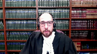
:::

So, for example, if there were reasonable solutions that the Crown ought to have pursued to respond to the illness of the accused, for example, then the Crown may well be held to account for having failed to pursue them.

But in this case, when Mr. Paul's did fall ill, and the appellants diligently sought severance, the court found and recognized that severance was not a reasonable alternative.

And so in those circumstances, if the Crown has no reasonable remedy, then that satisfies the test for discrete exceptional circumstances.

And I'll just make a brief concluding remark, I'm conscious of my time, taking a big picture approach to this case, the Court of Appeal reversed the stay of proceedings because this was not a case in which the state was complacent.

Disclosure was complete within a few months of arrest.

The court and the Crown were ready to accommodate trial within 10 months of arrest, and the trial was actually underway within 12 months of arrest.

At every unexpected interruption, the Crown argued to keep the trial going.

When a witness was late, the Crown sent police to drive him to court.

When the assigned Crown was unavailable, he found a call that he found a colleague to step in.

The judge offered to sit on days he wasn't scheduled to sit.

At every continuation, the court and Crown were widely available, and not once throughout the trial did any of the appellants suggest otherwise.

In my submission, the state responded reasonably and diligently throughout the trial, but ultimately, discrete events and defense delay doubled the number of trial days required.

Subject to any questions, those are my submissions.

**Justice Wagner** (01:04:08): Thank you very much.

**Speaker 1** (01:04:13): Yes, Chief Justice.

::: {.column-margin}
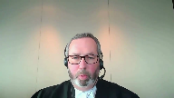
:::

I wonder if you'd indulge me and if I allowed Mr. Little to address the court as he didn't have an opportunity to do so, but I'll just make one comment in reply.

I hope the irony, this following irony is not lost on the court.

Mr. Cowell at the Court of Appeal conceded that the findings of fact that Justice Casada made mention of supported the trial judge's allocation of delay for the initial adjournment to the Crown.

The Court of Appeal stepped in and decided that that allocation of delay was improper.

And here he says, of course, they had to step in and do so.

But really it's inextricably bound with the factual findings.

And that's really what the complaint of the appellants is here.

But if I can turn the rest of the time over to Mr. Little with the court's permission, please.

Thank you.

**Justice Wagner** (01:05:01): Thank you. Go ahead.

**Speaker 5** (01:05:02): Thank you.

::: {.column-margin}
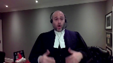
:::

Good morning, Chief Justices, Justices.

In reply, I want to be very clear.

We are not saying, nor was the trial judge for that matter, that the solution was for the Crown to speed up the manner in which it was calling its evidence.

The solution, as the trial judge pointed out, was for the Crown to accurately estimate how long the trial was going to take.

As the trial judge pointed out, if the Crown had said the trial was going to take five days, the delay would have been less.

And I'll just simply point out the Crown on four separate occasions.

In November of 2014, when the trial date was set, when the adjournment happened in August of 2015, when the continuation dates were set in January of 2016, and in June of 2016, four separate times, the Crown underestimated the trial time.

This was a significant factor for the trial judge.

We know this, because on no less than ten occasions in his judgment, he made reference to the fact.

That's the first point.

Justice Moldaver at one point had said to the Crown that we were indicting the Crown in this case.

To be fair, we're not.

It was the trial judge's findings that did that.

I was supposed to be talking to the court about the transitional exceptional circumstance.

I'll just simply refer the court to paragraph 84.

The court doesn't need to turn it up of the trial judge's reasons, where he explains all the reasons why the Crown caused the delay in this particular case.

I make one other point just to touch on something Mr. Lacey said about the standard of review.

If this is the proper application of the standard review in this case, then deference is simply illusory.

I would also point out in response that Ms. Schichman, who was counsel for one of the Youssefs, sought severance when Mr. Pauls was sick.

That was in June of 2016.

She made reference to seeking severance in January of 2016.

Every step of the way, when trial dates were set, when continuation dates were set, she consistently put comments on the record complaining about the delay.

That was there on the record.

This is not a case of the defense laying in wait.

In response to my friend's arguments with respect to how the Court of Appeal approached co-accused delay, we rely upon our factum at paragraphs 61 to 66, given the comments that I just made about how Ms. Schichman approached the case.

It cannot be said that all three co-accused worked in a united front.

Again, they sought severance.

They complained about the delay.

Next, turning to my friend's comments about discrete events, the trial judge's comments at paragraphs 71 to 72 of the judgment explain why he found the discrete events didn't cause the delay in this case.

He in essence found that there is sort of a causation requirement.

We rely upon that analysis as set out by Justice Pachocko, as he then was in the Ontario Court of Justice in a case called JM, which we cited in our factum at paragraphs 71 to 72.

I point out to the court also in reply just how long the total delay was in this particular case.

The total delay in this case, which as we know is a significant feature under the prior regime under Moran, is 35 days.

It's longer than the 34 months in Ascoff, longer than the 30 months in Godin, and was just below the approximately 36 months in both Vassal and Williamson.

We respectfully submit that that is a important contextual factor to bear in mind.

How long this case actually took, because unlike those cases, this was a one-stage prosecution.

There was no preliminary inquiry.

We say as a result of that, it makes the delay even more unreasonable under Moran.

Just by way of an example, the total delay in this case was so long that based upon the trial judge's findings, even after deducting reserve time, the Jordan net delay for the use of appellants exceeded not just the 18-month ceiling for provincial court trials, but also exceeded the 30-month ceiling for superior court trials.

I see my time's almost up.

I'll try to make one quick point.

In Jordan in paragraph 98, this court explained when dealing with a transitional exception circumstance, you would defer to the good sense of trial judges to determine the reasonableness of delay in the circumstance of each case.

I urge the court to review the trial judge's reasons at the end when he sets out his transitional exceptional circumstance reasoning.

This is an experienced trial judge, knew the law pre-Jordan, knew the parties involved, and made findings of fact which drove the analysis.

There is no basis on this record to conclude that he erred in any way, shape, or form in using his good sense to conclude the delay was unreasonable and the transitional exceptional circumstance did not apply.

Thank you very much.

I thank the court for the additional time.

Thank you.

**Justice Wagner** (01:09:58): Thank you.

::: {.column-margin}
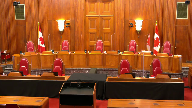
:::

I will ask Council to remain at our disposal.

The court is adjourned.

I would like to thank Council for their submissions.

The court is ready to render its decision.

I will ask Justice Moldaver to read the reasons.

Thank you.

**Justice Moldaver** (01:11:20): Chief Justice.

::: {.column-margin}

:::

This appeal comes to us as of right.

The three appellants were convicted at trial on charges of assault causing bodily harm.

Two of the appellants, Messrs. Jamies Yusuf and Jamal Yusuf, were also convicted of unlawful confinement.

Following the release of the trial judge's reasons for judgment, the appellants moved for a stay of proceedings on the basis that their right to be tried within a reasonable time under Section 11B of the Charter was infringed.

The trial judge agreed and stayed the proceedings against them.

The Crown appealed from that order and in a unanimous decision, the Court of Appeal for Ontario, applying the appropriate standard of review, allowed the appeal and restored the convictions.

We agree with the Court of Appeal in the result and would accordingly dismiss the appeal.

In doing so, we have chosen to leave for another day various legal issues that arise from this court's decisions in RV Jordan and RV Cody, including whether and in what circumstances multiple accused should be treated communally as opposed to individually when assessing defence delay under Section 11B, whether discrete events as defined in Jordan attributable to a particular accused should be deducted only from the accused responsible for those events or be deducted communally from the co-accused as well, and whether a Section 11B application can be brought post-conviction and if so, whether a remedy other than a stay of proceedings is available.

In this case, we are of the view that none of these legal issues, taken alone or together, would have affected the resolution of this appeal.

Our decision to leave these legal issues to another day is influenced by several matters, including the absence of interveners who could shed light on them, the fact that this is a transitional case in which 70% of the trial was completed before the release of Jordan, and the lack of meaningful efforts on the part of the three accused to move the trial process ahead in cooperation with the Crown and the trial court.

As the Court of Appeal observed correctly in our view, this trial was by any measure uncomplicated.

Based on the foregoing, no proper application of Jordan would have resulted in a stay here.

**Justice Wagner** (01:14:26): Thank you very much.

The court is adjourned tomorrow morning, 9.30.