---
title: Muneeb Murtaza v. Her Majesty the Queen
published-title: Heard
date: 2021-01-21
sidebar: false
---

This transcript was made with automated artificial intelligence models and its accuracy has not been verified. Review the original webcast [here](https://scc-csc.ca/case-dossier/info/webcast-webdiffusion-eng.aspx?cas=['39134']).
---

**Justice Wagner** (00:00:26): Good morning to all, in the case of Munib Murtaza against Her Majesty the Queen for the appellant Dale Ferrochuk QC and Ramey L Alvarez for the respondent Her Majesty the Queen Jenna Hyman and Barbara Mercier.

::: {.column-margin}
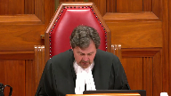
:::

I'd like to indicate that although you don't see them, Justice Abela and Justice Kyrgatsanis are participating remotely to this hearing.

Mr. Ferrochuk.

**Speaker 1** (00:01:09): May it please the court, at trial the appellant looked physically different in his appearance from the description of the dealer provided to the court by the Crown's witnesses.

::: {.column-margin}
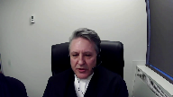
:::

None of the officers relying upon their present memories could make a doc identification of the appellant as the perpetrator of the offenses for which he was charged.

The police officers in this case did not have a referring at trial to the video and photograph of the drug dealer.

The only police officer who had face-to- face contact with the drug dealer was Constable Swanson, the undercover officer.

He provided a generic description of the drug dealer in that he did not note the existence of any distinctively unique features such as facial tattooing or scarring.

The description given by was that of an East Indian male, big ears, black hair, medium build, 20 to 25 years old, and a description of the clothes he was wearing on each occasion.

As the trial judge noted, in a multi- ethnic city like Calgary this description could be used to describe hundreds, if not thousands, of youth.

From this alone an identification could not be made.

Police determined that a voir dire ought to have been held to establish the foundation for Constable Swanson's evidence regarding identification, because Constable Swanson testified when asked if he saw the individual in court as follows, I do, and just for the record

I, if it was an independent recollection I wouldn't, but from the video and the photograph that I have I'm comparing it to the individual in the

and it is the same person.

As noted by Justice Valdez at paragraph 48 of her dissenting opinion, a court must be satisfied that the proposed testimony actually comes from the functional recollection of the witness.

Whether the undercover officer was actually refreshing his memory was for the officer to clarify on further examination,

**Justice Côté** (00:03:28): I'm sorry to interrupt you, but you say that Constable Swanson used the term compare, but in the respondent's factum at paragraph 53, the respondent is making a point that when Constable Swanson used the word compare, it was after having referred to just from independent recollection and just watching the video.

::: {.column-margin}
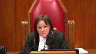
:::

So it seems to me that he had some sort of an independent recollection, which was refreshed by him looking at the video.

**Speaker 1** (00:04:03): Thank you, Justice Cote.

::: {.column-margin}

:::

That's actually not the case.

The statement by Constable Swanson was, if it was an independent recollection, I wouldn't.

But from the video and the photograph that I have, I'm comparing it to the individual in the accused box, and it is the same person.

Constable Swanson in both direct and cross-examination had indicated that he did not have an independent recollection.

He had the advantage of seeing the video that was played by the Crown before he was asked for any description, and he had the advantage of looking at a still photograph that was taken from that video before he gave his evidence on the description of the individual.

**Justice Moldaver** (00:04:48): In retrospect, we know that the man that was arrested was the same person as the one sitting in the box, albeit that, you know, there was a huge difference in their appearances at the time.

::: {.column-margin}
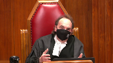
:::

I mean, you know, I just, I find the whole thing almost surreal because, I mean, I consider the situation of someone whose face has been badly burned between the time that they're arrested and the time they're in court, and an officer said, well, do you see the person in court?

Well, no, I don't see the person that I arrested, but I can tell you right now that, you know, from looking at the video and so on, you know, I'm satisfied that the person who was arrested and who agrees that he's that person, you know, is one and the same.

I mean, this thing can get so esoteric, it seems to me, when it's really basically quite simple and whether or not there's enough there for the trial judge to say I'm satisfied beyond a reasonable doubt that this person is one and the same.

Help me out with this because I'm really having trouble with this.

If in fact the person changed their appearance totally so that really the officer acting honestly says, no, I actually don't see the person, is that the end of the case?

**Speaker 1** (00:06:15): Not at all.

::: {.column-margin}

:::

Indeed, that's where recognition evidence comes from.

It is open for the Crown at that point to adduce evidence from for persons who have seen the changes in that accused person over the years.

For example, the Crown in this case could have called someone who knew the accused at the time of the offence three years earlier, saw the transition in appearance to the present day and called that person to give recognition evidence.

Getting back to the issue of the arrest, you will recall that the appellant was not arrested until a few days after the alleged drug deal.

I would agree with you if it was the case that the appellant had been arrested at the exact time of the drug deal.

Constable Swanson was the only person who saw the drug dealer.

If Constable Swanson had participated in the arrest several days later of the appellant, then yes, we're in a position where there is a much better opportunity for the Crown to adduce identification evidence from Constable Swanson.

Or, for example, if Constable Swanson had come into the detachment immediately after the appellant's arrest and conducted either an in-person or photo lineup, his evidence on identification would have been much stronger.

Further, or as a further alternative, if Constable Swanson had been arrested, a fake arrest, and put into the same cell as the appellant at the time the appellant was arrested, in what is usually characterized as a cell shot, then also the appellant would have been, or Constable Swanson would have been in a much better position to be able to identify the appellant.

This isn't what we have.

**Justice Moldaver** (00:07:57): Isn't the surveillance officer's evidence worth something?

::: {.column-margin}
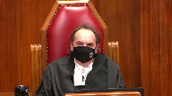
:::

He had a photo.

He had a photo of the person that had been engaged in the first drug buy.

It's true that he loses contact on the way, but then he gives evidence about seeing your client coming out and fitting the appearance.

The lighting is good and he's satisfied based on his evidence that this is one and the same person as is seen in this photograph.

Now you may say well that's really weak because you know the conditions weren't great and he was 50 meters away and whatever whatever.

That's a matter of weight though.

It's not a matter of admissibility.

**Speaker 1** (00:08:44): I respectfully disagree.

::: {.column-margin}

:::

It is a matter of admissibility because the surveillance officer did not see the face of the drug dealer on both occasions of the buy.

He saw a photograph and the photograph in and of itself may have created a confirmation bias.

In other words, Detective Coffin, instead of seeing the face of the individual that he saw from 40 to 50 meters away at night, even given good lighting conditions, may not have been the actual individual he might have had in his mind, the picture that he had clipped to his notes or the video that he had seen.

The difficulty was that he did not see the face of the drug dealer.

**Justice Côté** (00:09:24): But Constable Detective Coffin testified that he is certain.

::: {.column-margin}
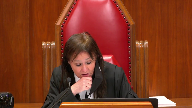
:::

He says that the person arrested on July 27 was one and the same person as the male he saw on July 6 after the second drug buy.

It seems that there is no hesitation in his testimony on that.

**Speaker 1** (00:09:46): the difficulty with that evidence is he again he did not see the face of that individual at the actual drug deal he saw the individual come out of a vehicle there was a break in surveillance for 24 minutes where no officers had eyes on the individual when he saw this individual almost two hours after the drug buy it was from the back as the individual was walking away from him going into a building then a period of time elapsed and he saw the appellant come out of the building and get in the car it is conceivable that it was not the appellant who drove to that location that during that 24 minute break in surveillance someone else was either driving the car or as an alternative the person drove the vehicle to that location the a different individual went in and the appellant came out that's the difficulty with his evidence

::: {.column-margin}

:::

yes the person he arrested was the person he saw on july 6th but the person he saw on july 6th was not the person who is doing the drug deal he can't testify to that because he did not see the face of that person

**Justice Moldaver** (00:10:57): thought the surveillance officer was comparing him to the photo and he looked at the photo and he looks at this guy coming out of the building where the lighting is good and he says I'm satisfied that's the same person now if we follow through with that

::: {.column-margin}
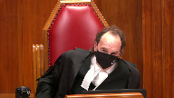
:::

and we look at the by officer the undercover officers evidence he doesn't say he dealt with two people he says he dealt with one person same person and here's the picture here's the photo here's the video of that person so in effect there's no question that the photo that the surveillance officer had is the photo of your client

**Speaker 1** (00:11:34): again the difficulty comes in with the change of appearance in the client.

::: {.column-margin}

:::

It might have been possible if the trial judge conducted a voir dire to qualify the officers to give opinion evidence where the officers could have said here we have a photograph from three years earlier and now we have an accused on the stand who looks very much different from this but by comparing this photograph to the accused identifying certain features on the accused in the box I can say I can extrapolate and I can say they're one in the same.

Constable Swanson did not have a memory of the person he conducted conducted the drug deals with.

He only had a photograph that's all he had.

**Justice Kasirer** (00:12:17): Go ahead.

::: {.column-margin}
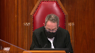
:::

Mr. Fedorchuk, it's true though, you've said it earlier that Constable Swanson saw the drug deal of June 22nd.

Is that not right?

And I'm trying to understand how Leni is required, as a Leni voir dire is required.

When one compares what Constable Swanson saw to the five officers in the Leni case, the four or five of them had no acquaintance with the accused and were not in a better position than the judge has been.

The fifth had been acquainted with him, but unlike Constable Swanson, hadn't seen the alleged wrongful conduct.

So isn't, by saying that Leni applies, aren't you asking us to extend Leni?

**Speaker 1** (00:13:10): I am not.

::: {.column-margin}

:::

The principal problem in this case was created by Constable Swanson's inability to identify the appellant in the prisoner's dock.

And so we have someone who says, I don't know if that is the person who was the drug dealer.

I don't remember.

And so the court is taking, the crown took one step further and said, you've looked at the video.

You've looked at the photo.

Now can you give us a description of the appellant?

Recall that Constable Swanson only saw the dealer on two occasions, very short periods of time, less than a minute on each occasion.

They both took place in the dark.

There was no evidence as to whether the lights in the vehicle were on when these drug deals took place.

The second drug buy occurred in a situation where there were other individuals in the vehicle and Constable Swanson was splitting his attention between the drug dealer and the other two individuals in the vehicle because of the shortness, the fleeting nature of those encounters.

Constable Swanson does not have the same level of familiarity as someone who, for example, has spent years dealing with the same individual.

This individual was unknown to Constable Swanson before this deal.

He had very brief encounters with that individual in dark conditions and in one situation where other people were involved.

And so that being the case, all that Constable Swanson really had was the video and the photograph.

As soon as it became an issue of relying upon the video and the photograph to make the identification, we're either into a Nicole Nicolevich situation or we're into a situation where Leany must apply because then the judge has to determine whether given that brief encounter, this officer had sufficient familiarity with the accused to be able to give that evidence.

**Justice Moldaver** (00:15:08): All right, go ahead.

**Justice Karakatsanis** (00:15:08): I take it you agree though that if we accept that the trial judge actually did accept the Crown's gloss and understood the evidence to be present memory revived that the the Lini voir dire is not necessary.

::: {.column-margin}
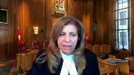
:::

**Speaker 1** (00:15:29): Yes.

**Overlapping speakers** (00:15:33): Under your last scenario, Mr.

**Justice Moldaver** (00:15:35): Are you serious?

She's just as scared.

**Overlapping speakers** (00:15:37): No. Go ahead.

**Justice Moldaver** (00:15:38): On your last scenario, where you talk about the second buy and three people in the car and so on, I mean, are you suggesting that if the buy officer on the second deal wasn't sure that he was dealing with the same person on the first, he would have let the surveillance officer keep the photo of the first one and sort of follow a car where he wasn't sure that he was dealing with the same person?

::: {.column-margin}
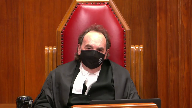
:::

It doesn't make any sense.

It really doesn't make any sense.

If the second buy and the officer thought he was maybe dealing with someone else, surely he would have notified surveillance and said, wait a minute, there's a second person involved here, don't use that photo that you have because it's no good.

**Speaker 1** (00:16:24): I'm not sure the evidence reflects that Constable Swanson was aware that Detective Coffin had taken the photograph and clipped it to his notes.

::: {.column-margin}

:::

Being the undercover officer, I'm not sure whether he had the authority to tell anybody what to observe and what not to observe.

Detective Coffin was the operations officer effectively and also the fact that there were three individuals in the vehicle instead of the one individual, that should have created some concern as to the involvement of all the individuals.

I'm not saying that Constable Swanson was confused as to whether the second person he bought drugs from was not the same as the first person.

Indeed Constable Swanson's evidence was that the two individuals were the same.

What I'm saying is he had a very limited involvement with the accused and he could not make a positive identification in court.

This would have been a much different case if Constable Swanson had come to court before seeing the video and said, the individual that I sold drugs to is sitting in the prisoner's dock.

End of story.

**Justice Côté** (00:17:36): You're talking about identification in court, but is it not the key here that the identification has to be on the day of the arrest, because the defense conceded that the person arrested was the person sitting in court.

::: {.column-margin}
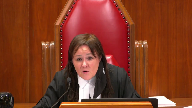
:::

So that part between the arrest and the identification in court, we know from this concession by the defense that the person arrested is the one who was sitting in the courtroom. So

**Overlapping speakers** (00:18:03): Yes.

**Justice Côté** (00:18:04): Is there evidence, was the first judge, did the first judge have enough evidence about identification on the day of the arrest because of the testimony of Detective Constable Swanson and Detective Kaufman?

**Speaker 1** (00:18:20): No, I do not believe that the trial judge had sufficient evidence.

::: {.column-margin}
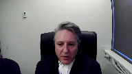
:::

The person who was arrested, yes, trial council admitted it was the same person as the person sitting in court.

Nevertheless, if the wrong person was arrested, then that admission makes no difference whatsoever.

The right person had to be arrested.

Detective Coffin never saw the person arrested actually conducting the drug deals.

He saw that person two hours later.

He saw that person in by referencing a photograph which may have created a confirmation bias that I've discussed in the factum.

But Detective Coffin could not give evidence that he saw the person he arrested making the drug deal.

If Constable Swanson had been there or as I've said done a phone line up or acted as an undercover officer in the cell, that would be an entirely different story because then you have an officer saying, yes, this is the person I conducted the drug deal with.

Constable Swanson at trial could not say the person on the stand is the person I conducted the drug deal with.

**Justice Karakatsanis** (00:19:30): Mr. Fedorchuk, I don't want to take you off your course if you want to continue on this point, but I am very interested in the second ground of appeal.

::: {.column-margin}
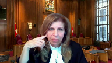
:::

So if I can wait until you get there, or I can ask my question now if you're ready to move there now.

**Overlapping speakers** (00:19:48): Please do.

**Justice Karakatsanis** (00:19:49): Okay, I understand your argument, your submission that in the penultimate paragraph of the trial judge's reasons, it can be taken as her saying she will refuse to consider evidence of video and the photos that were relevant to identity and she should not have reached a conclusion on that essential element without considering the whole of the evidence.

::: {.column-margin}
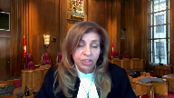
:::

So my question to you is, do we necessarily have to read the reasons that way?

In the context of this case where she had clearly seen the video, where there was a lot of discussion about it, about the difference in the appearance, I mean, I take it you would have been completely, you would agree she was entitled to completely disregard it if she said, I looked at it

and it's not helpful at all.

But in the context of the case, isn't that a way of, isn't that what she's done?

She's looked at it, she's thought about, she's clearly, there's been a lot of discussion about how helpful it was.

And I'm just wondering what's your submission about whether it's possible to read the last, that paragraph of her reasons as saying precisely that it's just not helpful in this case.

**Speaker 1** (00:21:17): if the trial judge had completed an assessment as to the clarity of the photograph, had determined whether it met the other criteria that was set out under Nikolovsky and then said I do not need to refer to this photograph because I am satisfied as the identification of the accused, yes it would not be necessary.

::: {.column-margin}

:::

The difficulty we have here is in my respectful submission she accepted opinion evidence from the police officers without conducting a voir dire into the admissibility of that evidence and then effectively she gave her responsibility for ascertaining whether identification had been proved beyond a reasonable doubt to the officers.

She said the officer said it was so, I accepted it was so

and I don't need to look at the photograph on my own.

**Justice Karakatsanis** (00:22:13): That's a different point, I think, because I don't accept your argument on Leni.

::: {.column-margin}
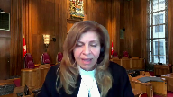
:::

If I don't accept that that was an error, then my question to you is, was she entitled to say, I've got enough evidence, I am not going to look at that because I've seen it and it's not helpful.

**Speaker 1** (00:22:33): Yes, she was entitled to say that if she accepted, if she was not in error on the leaning side, yes.

**Justice Karakatsanis** (00:22:40): So my question comes back to this.

If I don't accept your first ground of appeal, then does your second ground of appeal fall away?

**Speaker 1** (00:22:53): Yes.

**Justice Karakatsanis** (00:22:56): Okay, thank you.

**Speaker 1** (00:23:15): Returning then to the first ground of appeal, as Justice Valdez noted, there is no doubt that the video and still photograph were admissible and could operate as past recollection recorded.

::: {.column-margin}

:::

The question is whether the officer's memory was actually revived as a result of looking at the photograph.

And so the distinction, I respectfully submit, between a present recollection revived and a past recollection recorded must be maintained.

The distinction was blurred in this particular case and ought to have been considered by the trial judge for the reasons I've indicated earlier.

In essence, Constable Swanson was extrapolating the identity of the impellent by comparing a three-year-old photograph and video with the person in the dock.

If police officers, as non-expert witnesses, were being asked to opine in the absence of personal recollection whether the person in the prisoner's dock could be the same person who sold drugs to the undercover officer three years earlier, I respectfully submit that Leany comes into play and ought to have been followed.

In my submission, this is not simply a case, as the trial judge expressed it, of eyewitness identification from police officers who were present at the time.

This was a case of recognition evidence and ought to have been dealt with as recognition evidence.

I know that an argument has been presented by my friend that police officers, as professional witnesses, are entitled to a different assessment of their evidence as opposed to, say, lay witnesses.

It's my submission that the officer's training and experience is a factor a judge may take into account on a voir dire, but a judge should not assume the officer is better able to identify a suspect just because they are professional, nor should there be a presumption that a police officer is a better witness than a lay witness just because the police officer has training and experience.

In the case at bar, if Constable Swanson's training and experience did not assist him to recall distinctive features of the dealer that would have made the dealer memorable or more memorable at trial than other steps ought to have been taken.

So one cannot simply look at this particular case and say, because the police officers were professionals, that we can, even in a fleeting glance case, give more deference to the reliability and credibility of that officer's testimony than, say, if we had the testimony of a lay witness.

As it pertains to the police officers in this particular case, the Ontario Court of Appeal stated in Hudson at paragraph 31, and I think it's applicable to this scenario, trial judges should be wary of the allure of potential witnesses who, despite having only a general level of familiarity with the accused, purport to be able to offer descriptions capable of identifying them.

In other words, a trial judge should generally only permit a potential recognition witness to testify where the judge is satisfied on a balance of probabilities that the witness's relationship with the accused affords him or her a level of familiarity that will enable the witness to provide valuable or otherwise unavailable identifying information.

The evidence of the police officers in this case do not add value to the issue of identification because of their lack of familiarity with the appellant.

It is clear that these officers had a very brief and limited involvement with the appellant, so much so they were unable to provide a doc identification of the appellant as the drug dealer.

Given the lack of other corroborating, direct or circumstantial evidence, the evidence of the police officers was too weak to be direct evidence and so lacking insufficiency as to not meet the test for recognition evidence.

**Justice Kasirer** (00:27:48): Your colleague says Hudson was more classically a lenient situation, that the police purported to identify Mr. Hudson on the tape based on a prior acquaintance, as opposed to our case where there's an eyewitness.

::: {.column-margin}
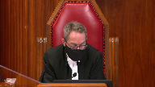
:::

You say it's a weak eyewitness identification.

You seem to say that it's the weight we should ascribe to it is slender.

But it strikes me that it's admissible.

**Speaker 1** (00:28:23): The difficulty again is the way that this manner proceeded in court.

::: {.column-margin}

:::

The Crown played the video first.

The Crown marked the video as an exhibit.

And then sometime after that, the Crown says, now you've seen the video, can you give us a description of the person who sold you drugs?

And it was only at that point where we get a generic description from Constable Swanson.

Even after he's cross-examined and presented with his notes and given the opportunity to refresh his memory, he still cannot provide such a clear identification of the appellant as to make it obvious that he either has a present recollection or that his present recollection was revived.

In those circumstances, if all we're working on is a past recollection recorded, then there should have been a voir dire to determine the admissibility of that past recollection recorded.

**Justice Moldaver** (00:29:29): This is so surreal in a way because in most identification cases, as you know, you don't have a video of the person who's actually there and one that's clear enough to make out that person.

::: {.column-margin}
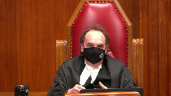
:::

And I just find it surreal in the sense that if this really wasn't your client, then simply call 20 people before the case even gets to court to go into the Crown's office and say, hey, wait a minute, this is not my client.

You never looked like this.

You got the wrong guy.

I mean, I know that's too simple

and I know there's no onus on any accused, but as I say, this is really quite surreal in my view because we have an actual photograph of the perpetrator and yet there's no evidence from the defense whatsoever, either before or during the trial to say, hey, wait a minute, that's not me.

But as I say, that's probably heretical.

**Speaker 1** (00:30:28): But if we did have a, if we do have a photograph of the perpetrator and the perpetrator looks exactly the same at trial, there is no issue because it would be clear to everyone in the courtroom that the person sitting in the courtroom is the person in the photograph.

**Justice Moldaver** (00:30:44): If someone has a picture of me from two years ago, and they're relying on that, and I say, hey, wait a minute, that's not me, you got the wrong person, I never looked like, that's not me, I didn't look like that, and I'll bring in ten witnesses to confirm what I'm saying.

::: {.column-margin}
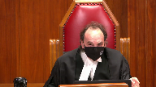
:::

But that again, that's too simple.

**Overlapping speakers** (00:31:04): But that also shifts the onus to the defense to disprove.

**Justice Moldaver** (00:31:08): That's why I'm saying it's a radical, so don't take too much from it.

**Justice Wagner** (00:31:15): All right, thank you very much.

Ms. Eyman.

**Speaker 2** (00:31:27): Yes, thank you Chief Justice, Justices.

::: {.column-margin}
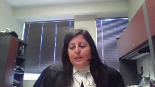
:::

In my submissions to you today I intend to address both of the legal issues raised by the appellant based on the dissent in the Court of Appeal, of course subject to the questions of the court.

On the LEANY issue my position will be firstly that I will address the general admissibility of eyewitness evidence without a voir dire and then address why this is not an example of LEANY either as to the undercover officer of Swanson or the surveillance officer Coffin and why no voir dire was required.

As to the Nikolovsky issue I'm going to first address when I come to that issue a misapprehension of evidence by the dissenting judge who appears to have erred as to what comparison the trial judge was in fact being asked to make and then secondly I'll address why it wasn't necessary for the trial judge to make the comparison requested on the facts of this case.

So as to the first issue the LEANY issue my first point is to simply start from the perspective that eyewitness evidence is routinely admitted at trial without a voir dire.

The added requirement of a voir dire in the context of LEANY that is the specific context of a video of the offence a witness who did not observe the offence purporting to identify the accused from the video is I say limited to that context and I say that because there are good reasons for adding a voir dire requirement to identification evidence in that context when it's not otherwise required.

There is a concern about the probative value of non-eyewitness evidence to ensure that that evidence will actually be of assistance to the trier of fact but with respect in my submission those reasons do not extend to eyewitness evidence itself where the evidence is plainly probative and cross-examination is the technique needed to bring out any limits or frailties in the evidence and I say that is what did and should have occurred here that is cross-examination showed any frailties in the evidence that would go to the weight of the evidence as opposed to its admissibility.

Therefore there's no principled reason in my view to extend the reasoning in LENI to eyewitness identification cases and of course that presupposes.

**Justice Brown** (00:34:01): That presupposes that we have a case of eyewitness identification.

**Overlapping speakers** (00:34:07): That's correct.

**Justice Brown** (00:34:07): Given your friend's concession regarding the second ground, it seems that everything kind of at least preliminarily hangs on that, so maybe we could go with that.

**Speaker 2** (00:34:17): With respect to that, Justice Brown, what I would say is the question of whether or not there genuinely was a present recollection of the evidence is firstly a question of fact and therefore is a question for the trial judge.

::: {.column-margin}
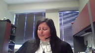
:::

And in response to the question that Justice Cote asked my friend earlier, she quite correctly recited the evidence, although it's three questions earlier, I think is why my friend didn't immediately pick up on the point.

But if you have regard to the record, it's page 77 of the record where this exchange occurs.

And the officer says specifically, he references his independent recollection.

He says earlier on page 77, just from independent recollection and just watching the video.

Yeah, I mean, and goes on to refer to something with respect to the clothing that precedes the answer that my friend is focusing on with respect to the comparison.

But my point with respect to that is simply that there is an evidentiary basis for the judge's factual finding that there was some degree of present recollection.

And that's why this is a question of weight and not a question in my view of admissibility.

**Justice Brown** (00:35:40): I don't know how you get around that later exchange because the question is a request for a doc identification.

::: {.column-margin}
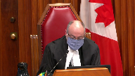
:::

Is this person in the court today?

And the answer is clearly couldn't be clearer.

If it was an independent recollection, no.

But I'm comparing the video and the photograph which anyone could have done.

I mean, yes, we take the evidence as a whole, but this is directed to the question of a doc identification.

It seems to me the essential bit of evidence here.

**Speaker 2** (00:36:18): I appreciate the concern, Justice Brown, but my point simply is...

**Overlapping speakers** (00:36:23): No, you don't.

**Speaker 2** (00:36:24): Well, I do, because I do appreciate it in the sense that identification evidence is always a question of concern and it is for the Crown as well, but my point simply is that you do have to look at the evidence in its totality and that the trial judge was the person who was best suited to do so.

::: {.column-margin}
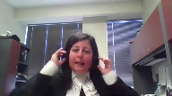
:::

And so if we're simply focusing on the fact that the officer used the word compare and on that basis saying that the trial judge was not entitled to reach the factual conclusion that she did.

Well, it's not just for the user, I mean, it's not just for the user, I mean, it's

**Justice Brown** (00:36:58): I mean, you know, we may be ships passing in the night

and I don't want to dwell on this.

You've only got a little bit of time, but he doesn't just use the word compare.

He specifically denies doing this from independent recollection, right?

**Speaker 2** (00:37:11): I appreciate that those are the words that he uses, Justice Brown, and I'm simply saying that screams out wreckage.

**Justice Brown** (00:37:18): That screams out recognition.

**Justice Côté** (00:37:20): Please, Ayman, on that, on that duck identification, you said in your factum that the duck identification, although important in other cases, it's not important in the context of this case.

You say, in fact, that it is a red herring.

Can you elaborate on that?

**Speaker 2** (00:37:35): Yes, Justice Cote, that is my position with respect to this, that the admission that the accused is the person who was arrested.

::: {.column-margin}
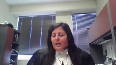
:::

And remembering the context of that admission, what the Crown was proposing to do at that point was to adjourn the proceedings for the purpose of obtaining an arrest photo of the accused, that is a photograph of the accused from two weeks post-defense that would have shown his appearance as of that date.

And instead what the counsel for the appellant chose to do at that point on the appellant's instructions obviously was to admit that the accused was the person who had been arrested.

And in my submission that moved the focus of the identification in this case from the question of is the person in the dock the person who committed the offences to was the person who was arrested the person who committed the offences because there was no doubt given that admission that the person who was arrested was the person in the dock.

And in my submission the evidence was clear that the person who was arrested was the person who was committed who committed the offences.

I noted my friend said a couple of times in his submissions that Detective Coffin who identified the accused didn't see the offence.

But as Justice Muldaver pointed out he really did see the offence because there was video of the offence unlike the usual case.

And with the benefit of that video of the offence and a clip from that video in his notes he identified the accused in circumstances that were consistent with the second transaction.

But he identified him as the person who had met with Detective Swanson and committed the first offence.

In my submission that completed the circle of identification if I can put it that way that Swanson said the same person committed both offences.

He had a photograph of that person.

Coffin said that's the person who was on the video and that's the person who was arrested.

The accused said he was the person arrested therefore and in my submission that was more than adequate evidence upon which the trial judge was entitled to conclude that identification had been proven.

My friend with respect to that expressed a concern about confirmation bias but as I've set out in my factum the Crown's view is to the contrary that having the benefit of a target photograph when the police are conducting surveillance is in fact a way of ensuring certainty with respect to identification.

It's a way of confirming the identification that confirmation bias arises when after the offence a witness is shown a single photograph.

Instead before the officer went out he had the benefit of a photograph of his target and said the person I'm looking at and the person in the photograph that I have are the same person and that is inherently reliable evidence of identification.

With respect to the general proposition as I say this in my submission is inherently eyewitness identification and I've reflected on the reasons why I say that it is and then as I say with respect to the surveillance officer in my submission the question of admissibility simply doesn't arise in the way my friend suggests even questions about confirmation bias if that did arise on this case again I say it doesn't are not questions of admissibility they're questions of weight and there was in my submission no basis to have any concern about the admissibility of the evidence of Detective Caffeine Coffin I believe it is actually the surveillance officer.

I appreciate the comment that this appears to turn on the first issue I do want to briefly address the second issue and specifically I do want to note for the court with respect to the Nicolovsky issue that it appears to me that the dissenting judge misapprehended the evidence about the photographs that the trial judge was being asked to compare to the video and this is from paragraph 35 of the dissenting reasons of Justice Feldhaus where she says that the photos filed as an exhibit were from several months before his arrest when in fact the evidence was clear that the photographs were from the trial date that is three plus years after his arrest and that the photographs reflected his changed appearance and that error likely stems from the trial judge misspeaking in her reasons for judgment she did date those photographs from 2014 in her reasons for judgment when they were actually from 2018 but there can be no doubt the trial judge knew that the photographs she was being provided with were contemporaneous to the trial itself and therefore reflected the accused with a beard glasses three years older which in a relatively young man is a difference of some significance and with respect to Nicolovsky the fact that it's likely that misapprehension in my view led Justice Feldhaus to the view that the trial judge should have made the comparison excuse me and that leads me to my second point with respect to Nicolovsky which is just because a judge can doesn't mean a judge must and in this case in terms of the truth-seeking function of the trial given the changed appearance of the accused of the in in my submission it would have not been a fruitful comparison to make between

**Justice Karakatsanis** (00:44:18): But can I ask you to address the question that I raised?

::: {.column-margin}
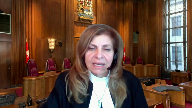
:::

Yes, the judge can conclude it would not be fruitful, but what about this suggestion that she was nonetheless obliged to consider the whole of the evidence in determining the issue of identity?

If you'd address that for me, please.

**Speaker 2** (00:44:41): Yes, thank you Justice Caracazan.

::: {.column-margin}
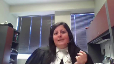
:::

What I would say with respect to that is that this is a brief trial.

The evidence had been heard for across three days and the decision is sort of a week later and she did see all of the evidence.

It's not like she didn't have regard to it.

As you pointed out, the video was played and discussed.

The photographs simply represented the accused as he appeared in court.

Well, she had the benefit of seeing him in court as opposed to requiring photographs that represented the same thing.

So in my submission, there's no basis to say that she was disregarding evidence as opposed to saying she chose not to make the comparison herself because it wasn't a useful comparison.

**Justice Moldaver** (00:45:27): Can I ask you as a matter of practice, in cases like this, although I think I'm not sure whether this is unique in the sense that you actually have a video or a photo of the suspect, but is the normal practice in a case like this to have the undercover officer look at a photo, line up and pick out the person that he or she says the buy was made from, or does that go off the table where you actually have a photograph?

::: {.column-margin}
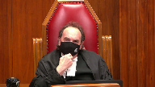
:::

I'm just interested in the practice here.

**Speaker 2** (00:46:05): Honest in answering you, Justice Moldaver, in Manitoba, where I practice, we don't have that technology.

::: {.column-margin}
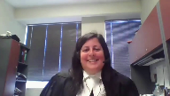
:::

I don't think the Winnipeg Police Service has the same money as the Calgary Police Service, and it's not the practice to take video of undercover operations.

So, I don't know that I have a clear answer for you.

Sorry, is it the practice when you don't have a video?

No, it's not the best practice.

**Justice Moldaver** (00:46:27): Is it the practice when you don't have a video to run a line-up? Yes.

To have the...

If the accused... Sorry?

**Speaker 2** (00:46:35): Yes, if the accused was not arrested immediately after the offense because of an ongoing investigation of the nature that this one clearly was, the practice, at least in Manitoba and in British Columbia where I used to practice, would have been to do a photo.

::: {.column-margin}
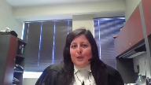
:::

Okay, thank you.

In the absence of any further questions, which I'm happy to answer, those are functionally my submissions.

I just wanted to very, very briefly make a note about the question of remedy.

Of course, the crown submission is that the appeal should be dismissed, but I simply wanted to note for you that in his notice of appeal, my friend asks only for a new trial, but in his factum asks for either a new trial or an acquittal should this court view the view that I'm wrong and that there is an error of law with respect to the trial judge's decision.

And I would simply say that if there was an error of law, this is a case for a new trial and not for an acquittal.

**Justice Wagner** (00:47:39): Thank you very much.

**Speaker 1** (00:47:48): I do not have a reply.

Thank you.

**Justice Wagner** (00:47:50): Thank you very much.

::: {.column-margin}
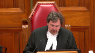
:::

I will ask Council to remain at our disposal.

The court is adjourned.

I would like to thank Council for their patience and for their submissions as well.

The court is ready to release its decision.

The majority of the court would dismiss the appeal.

They would simply add that when the evidence of the by officer and the surveillance officer is considered in conjunction with the concession of defence counsel that the person arrested on July 27, 2015 was the appellant, there was sufficient admissible evidence supporting the trial's judge's conclusion that the appellant and the suspect were one and the same.

Justice Brown would have allowed the appeal substantially for the reasons of Justice Valdez and would have ordered a new trial.