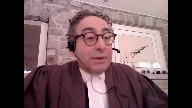
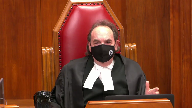

---
title: Her Majesty the Queen v. Angus Frederick Waterman
published-title: Heard
date: 2021-01-22
sidebar: false
---

This transcript was made with automated artificial intelligence models and its accuracy has not been verified. Review the original webcast [here](https://scc-csc.ca/case-dossier/info/webcast-webdiffusion-eng.aspx?cas=['39214']).
---

**Justice Wagner** (00:00:02): Your court, Naku.

::: {.column-margin}

:::

Good morning.

In the case of Her Majesty the Queen against Angus Frederick Waterman, for the appellant, Her Majesty the Queen, Arnold Osei-QC, for the intervener, Attorney General of Ontario, Lisa Joyal, for the respondent, Angus Frederick Waterman, Michael Crystal, and Heather Cross, for the intervener, Criminal Lawyers Association, Alan D. Gold.

Note to file, there is a publication ban pursuant to section 486.41 of the Criminal Code that exists in this matter at the lower courts.

I'd like also to mention that although the public cannot see the judges on the screen, both Justice Abella and Kara Gatsanis and Justice Martin are actively participating in this hearing.

Mr. Hussey.

**Speaker 1** (00:01:39): Good morning Chief Justice and Justices.

::: {.column-margin}

:::

The majority of the Court of Appeal in separately written decisions found that the guilty verdicts reached by the jury for indecent assault and gross indecency were unreasonable and could not be supported by the evidence.

This appeal raises two issues.

The first is whether the Court of Appeal erred in concluding that expert evidence was necessary to explain the effect of counselling on the inconsistencies in the complainant's evidence.

And the second is did the Court of Appeal err in finding that the verdict could not be supported on any reasonable view of the evidence.

**Justice Rowe** (00:02:18): What you've done, I think, sir, is just made a clean division between the two sets of reasons.

::: {.column-margin}

:::

On my reading, Justice Welch relied very largely on the need for expert evidence, and Justice White said the evidence taken overall is inadequate.

And so I think you need to differentiate between the two.

**Speaker 1** (00:02:46): Thank you, Justice, and you are correct that I am making that difference between the two judgments that were rendered.

::: {.column-margin}

:::

It's the appellant submission that the dissent of Justice Butler was the correct approach, and on the basis of her analysis and reasoning that the verdict reached by the jury was one that a properly instructed jury acting judicially could reasonably have rendered.

In the case of Justice Welsh, she concluded that given the nature and extent of the inconsistencies in the complainant's evidence, coupled with the fact that the complainant gave as his explanation for those inaccuracies was that because of counselling he was able to separate his nightmares from reality, the jury did not have the tools necessary to resolve any doubt that may have been created by those inconsistencies.

Justice Welsh went on to state that expert evidence was therefore necessary to explain the effect of counselling, as this fell outside the experience and common sense of the jury.

There was therefore a failure in her reasoning on the part of the Crown to provide the necessary evidentiary basis to support a conviction, and consequently the Crown had failed to adduce sufficient evidence to prove the case beyond a reasonable doubt.

**Justice Abella** (00:03:57): Mr. Hussie, could you just confirm, it is the case that this evident that the issue of expert evidence was not raised, was a first-time issue before the Court of Appeal?

**Speaker 1** (00:04:11): Yes, Madam Justice, it wasn't raised at the Court of Appeal.

It was only raised in the Decision of Justice.

**Overlapping speakers** (00:04:16): just as well.

**Speaker 1** (00:04:18): It wasn't argued.

::: {.column-margin}

:::

That's correct. OK.

Justice Welch went on to distinguish the facts in this particular case from those in WH, where she indicated that in WH, the complainant was not forthright because of the nature of the interview, as opposed to counselling, which supposedly had been received by the complainant.

She also went on to distinguish the facts in Francois at paragraph 20 from the case at hand as well.

In Francois, the memory had been blocked and revived after speaking to the children's aide and the police about the importance of admitting that things had happened to her, which is different from recovering memory through counselling, according to Justice Welch's reasoning.

It was therefore upon this basis that Justice Welch concluded that the jury did not have the necessary tools to resolve any doubts that may have been created by those inconsistencies.

Justice White, on the other hand, did not go quite as far as Justice Welch in concluding that it was necessary to call expert evidence on the counselling issue.

But rather, he stated that there was no explanation offered that was supported with evidence.

He did, however, opine that more was required from the complainant than providing his or her own explanation for the different statements that the complainant gave.

So therefore, Justice Welch concluded that whether the inconsistencies were neutralized by the explanation offered by the complainant, the jury needed to know how the memories were triggered, the effect of the passage of 40 years, the effect of dreams and nightmares, the age of the complainant at the time, and the potential for tainting.

In this particular instance, there was evidence that was led at the trial indicating how the memories were triggered.

And they were triggered by a Facebook message that the complainant had received.

There was evidence about the complainant's background, the age as to when the offences occurred.

And the complainant gave significant evidence or testimony as to the effect that the passage of time had had and his recall of the threats from the actual assaults and the separation of nightmares from reality.

And all of this evidence, it is our submission, was well within the common sense of the jury to logically assess and make a determination as to whether it had any impact on the credibility and reliability of the complainant.

Justice Butler disagreed that without expert evidence to assist at the assessment of the complainant's explanation for the inconsistencies was not within the experience and common sense of the jury.

And she went on to further indicate that it would be dangerous to suggest that an expert opinion was required in order for the jury to accept the complainants.

**Overlapping speakers** (00:07:11): I'm

**Speaker 1** (00:07:11): explanation.

::: {.column-margin}

:::

Justice Butler does not go into any detail about why she made the statement that it would be dangerous to require an expert opinion.

However, I would submit that the inference that could be drawn would be the concern that the use of an opinion would entrench upon the fact finder's duty in determining the issues of credibility and reliability.

Credibility has long been held to be within the competence of laypeople, and this court has rejected the use of expert evidence on the truthfulness of witnesses.

And according to Justice Butler, in her opinion, the jury was quite...

**Justice Abella** (00:07:49): Sorry, Mr. Haslick, isn't that the end of it when this court said in Markhard that you don't need expert evidence to discuss the credibility of witnesses and whether they were telling the truth?

Isn't that dispositive of this issue?

**Justice Brown** (00:08:06): I would agree.

::: {.column-margin}

:::

Well, except you also referred to reliability.

I mean, I agree with Justice Abella that we've said that about credibility, but why was expert evidence not required to allow the jury to assess the reliability of the complainant's evidence in light of his earlier statements that were inconsistent with what he gave at trial?

So he goes, just to give one example, he goes from telling the police of a rape to, after counselling, the threat of a rape.

And his explanation for this is, well, I had nightmares, I couldn't sort out fact from fiction, but the counselling helped me.

We don't know what kind of counselling it is.

Could be crazy stuff, it could be the hypnosis that Justice Deschamps threw shade on at this court.

It could be blue chip counselling that is, in fact, reliable and creates reliable results if that's, in fact, possible.

I don't know, that's not within my ken, and my point is it's not within the jurors' ken.

So why don't jurors need help to sort that out?

**Speaker 1** (00:09:23): In this particular instance, the evidence that was presented, the jurors were in a position to be able to accept or to disregard certain portions of the evidence that the complainant provided in particular.

::: {.column-margin}

:::

Justice Butler makes reference to the fact that the complaint or the jury in this particular instance could have disregarded the statement that he gave to the police and focused on the fact that he admitted that there was contradictions that were made in the evidence that he gave.

**Justice Brown** (00:09:56): But that goes to credibility, the fact that he admitted that there are these complications.

That's fine.

He could be as truthful in his own mind as one can possibly be.

But how is the jury able to process that?

**Speaker 1** (00:10:16): I guess from the point of view that the jury obviously would take that into consideration and would assess as to whether or not that had any impact on the reliability of the evidence that was being given by the complainant in the testimony that was provided.

**Justice Brown** (00:10:34): Well, okay.

I don't want to go in circles.

**Justice Abella** (00:10:37): But did Marquardt make a distinction between reliability and credibility or did it just talk about not needing expert evidence to support the truthfulness of a leader?

**Speaker 1** (00:10:50): The mark where it goes towards the truthfulness of the evidence as opposed to credibility and reliability.

In particular, that's what it makes reference to is the truthfulness of the evidence that's being presented or the testimony given by the complainant.

**Justice Rowe** (00:11:08): Well, I could truthfully say that I recall having been an outstanding hockey player when I was a teenager, but that would be quite inaccurate.

::: {.column-margin}

:::

So I mean, from my perspective, I'm sort of looking back with this rosy view of my salad years.

I was spectacular, but it's completely at variance with the record.

But I could believe that I did all those things.

So saying truthfulness doesn't help where what we're looking at is the possibility that this man believed everything he said, but it simply wasn't accurate.

**Speaker 1** (00:11:55): And again, that was the assessment that the jury had to make based on the evidence that was presented to them under all of the circumstances and justice.

::: {.column-margin}

:::

I'd also submit that the cases that are relied upon by the respondent on the issue of admissibility of expert are generally highly contextualized and case specific.

They normally make reference to false memory syndrome, child abuse accommodation syndrome, child witness interviewing practices, and bizarre sexual behavior.

So those are my comments with respect to the issue on the need for expert opinion.

And I'd just like to briefly move on to my comments on Justice White's decision dealing with the application of his principles of appellate review as expressed by this court and WH and Benares.

Justice White concludes.

**Justice Moldaver** (00:12:48): Sorry just before you go on I want to ask you about the rights of the of the

**Overlapping speakers** (00:12:54): Plain and-

**Justice Moldaver** (00:12:54): section 278 of the code.

::: {.column-margin}

:::

And in order for the Crown to be able to lead this evidence that it was suggested they should lead or had to lead or whatever.

Don't they have to sort of either bring a third party records application and or get the, I guess the complainant's consent.

I'm not sure, I haven't looked at the section for a while

but I'm not sure.

It seems to me in a case like this the Crown takes a chance maybe of not trying to lead evidence and sort of just leaves it up to the jury to assess what the complainant, what the witness says and the jury may in their own mind say that's not enough.

He's just telling us that.

There's nothing to support that.

But that's to suggest somehow that the conviction will be dangerous because the jury having looked at the whole of the evidence, all the inconsistencies and the complainant's testimony that this stuff started to get clear with the counselling.

You're effectively saying you can't convict.

You can't convict in those cases because unless you have some evidence to explain this, it's over.

I guess what I'm really saying is what was the Crown to do here?

The Crown could ask the complainant I suppose whether he would object to having the records produced but you're getting into privacy interests here that are protected by the criminal code, aren't you?

**Speaker 1** (00:14:42): I would agree, Justice.

::: {.column-margin}

:::

As I indicated, Justice White, in applying the principles of appellate review, as expressed by this court in WH and Benares, concluded that based upon the entirety of the inconsistencies in the absence of any explanation for the inconsistencies that was supported with evidence, the jury's verdict could not be supported on any reasonable review or any reasonable view of the evidence and that therefore judicial experience led to the conclusion that the process in which the jury weighed the evidence must have been flawed.

At paragraph 68, Justice White asked the following two questions.

What could the jury have found credible about such inconsistent evidence?

What basis did the evidence provide for the jury's conclusion?

And with all due respect to the Court of Appeal, the posing, I submit, of these questions is what this court has said is the wrong approach in reviewing guilty verdicts for unreasonableness, which is trying to place itself in the place of an imaginary trial judge and on a review of the written record, asking whether the imaginary judge could have articulated legally adequate reasons for the conviction.

As this court has stated, great deference must be paid to the jury's findings of credibility as they were present at the trial and saw and heard the evidence and the jury's reasoning from what evidence was or was not accepted flows from that advantage point.

And in this particular instance, I think it's appropriate that the quote of this court at paragraph 41 of WHOH is extremely applicable.

At that paragraph, the court stated, as the court stated in Francois, where it is suggested that a witness is not telling the truth because of inconsistencies, because facts may have been suggested to him or by others, or because he or she may have reason to concoct the accusations, the jury must in the end decide whether it believes the witness's story in whole or in part.

The determination turns not only upon such factors as the assessment of the significance of any alleged inconsistencies or motives for concoction, which may be successable of reason to review by a court of appeal, but on the demeanor of the witness and the common sense of the jury, which cannot be assessed by the court of appeal.

In this particular instance, both Justice White and Justice Butler agreed that there was some evidence that, if believed, would support the conviction.

Justice Butler, I would submit, was correct in stating that on the facts essential to the jury's verdict on the indecent assault and gross indecency, that the complainant's core story never varied from the time he spoke to the police, nor from the time that he gave evidence at the preliminary inquiry or at the trial.

And I would agree with Justice Butler and her conclusion that the approach taken by the majority, therefore, was contrary to the principles expressed in Benares and W.H.

**Justice Rowe** (00:17:35): Well, I'm not so sure about that because, let me give you a hypothetical.

::: {.column-margin}

:::

Someone gets in the witness box, the complainant, and says, I was assaulted.

And then they spin off in some direction that's lunatic.

It's just completely off the wall.

But there is some evidence upon which the conviction can be entered because the accusation is made.

There must be a point at which the inconsistencies and the lack of detail and the whole problematic nature of the testimony falls short of the mark.

Otherwise, a bare accusation can always be the basis for a conviction.

And you can never say a verdict is unreasonable.

It isn't black or white.

Once the allegation is made, that cannot in itself be enough.

**Speaker 1** (00:18:42): Thank you, Justice.

**Justice Brown** (00:18:49): Can I can I take you back can I take you back to Justice Moldavers question?

::: {.column-margin}

:::

Yes, Justice.

I mean what if for example the therapy that the complainant received here was hypnosis Which we have said is presumptively inadmissible So in some circumstances don't we actually need the very kind of evidence About the counseling or about the therapy that Justice Moldaver referred to Potentially

yes, don't we need to don't we doesn't the jury need to know whether this was Whether this was reputable therapy or whether it was quackery

**Speaker 1** (00:19:41): I'm not sure that I would go that far justice in the sense that once the issue was raised the jury obviously would have to be satisfied based on the explanation that was being provided and the evidence that was being presented to them that they did not have a reasonable doubt as to whether or not there was any impact on the allegations that were being made by the complainant in this particular instance that would have affected the eventual outcome of their of their verdict.

::: {.column-margin}

:::

**Justice Brown** (00:20:13): to do that, how are they able to do that if they don't know what happened?

::: {.column-margin}

:::

If they don't know, I mean, he is saying it is this counseling that allowed me to sort fact from fiction, right?

This isn't repressed memory, this is false memory, right?

We're trying to sort out what is false from what is real.

He has the memories, but what is false and what is real?

He says, counseling helped me.

Well, what was it?

Was it hypnosis, was it some kind of even worse quackery, was it blue chip counseling, what was it?

Doesn't the jury need to know that in order to make that evaluation that you say that it's open to them to make?

**Speaker 1** (00:21:00): I don't think so why not again he basically the complainant is giving evidence indicating I mean he gives evidence basically starting from the time that the incidents occurred the fact that he had repressed all of the the the incidents that had taken place and it goes into a fair bit of detail as to the impact that it had on him and that as time passed he had put all of this behind him type of thing until he was his memory was triggered as a result of the incident that occurred through the Facebook message the jury would be I would submit in a position to be able to assess that evidence and if they came to the conclusion that there was some issue that insofar as the the counseling was concerned then they would have made a determination that the crown hadn't proved their case beyond a reasonable doubt

::: {.column-margin}

:::

**Justice Brown** (00:22:04): Jury decides whether the jury needs help to assess the reliability of evidence.

We just leave that to the jury now.

I think that's what you're saying.

**Justice Moldaver** (00:22:17): Surely that is the point, and I don't know of any legal proposition that says that a witness who says, I got help and it all came back through counselling, that the juries would, I can't imagine the trial judge saying to them, well, you must ignore that evidence because we don't have any evidence corroborating it.

::: {.column-margin}

:::

So you can't accept that evidence.

I mean, that is absolutely fundamentally against the principles of what a jury can accept or not.

**Overlapping speakers** (00:22:49): unless the counseling was a crystal ball.

**Justice Moldaver** (00:22:52): version, on my colleague's version, the defence should have been objecting to this evidence going in because he effectively says it's worthless and a jury should be so instructed.

The problem is that it may be worthless.

**Justice Brown** (00:23:06): the problem is is it may be worthless.

We don't know.

That's up to the jury.

No, the jury doesn't know.

**Justice Abella** (00:23:12): Can I just ask a question about this debate?

::: {.column-margin}

:::

Mr. Hussey, that's been on my mind during the conversation between my colleagues.

Did the Defence Council ask any questions about the nature of the therapy and raise concerns or try to elicit any information about its character?

**Speaker 1** (00:23:32): No, Madam Justice, there were no questions asked by Defence Council with respect to the issue of counselling, nor was the issue raised during submissions, and it was not raised either at the Court of Appeal level.

::: {.column-margin}

:::

The application for the original appeal was based on the inconsistencies in the complainant's testimony, and there was no issue raised at any point in time during the preliminary or the trial as to any issue concerning counselling.

**Justice Moldaver** (00:24:07): I take it it's obvious that Defence Council never moved under 278 for disclosure.

**Speaker 1** (00:24:13): No, they didn't.

**Justice Martin** (00:24:16): Didn't, excuse me, but didn't Defence Council cross-examine on the absence of expert evidence to the complainant?

And the complainant responds, I'm an expert on me.

**Speaker 1** (00:24:30): That I don't recall, Madam Justice?

It's in the transcript. OK.

**Justice Rowe** (00:24:37): I'm not sure I could dispute him when he says I am me.

**Justice Martin** (00:24:43): I'm an expert on me, right, but the point I'm making is that I think that there was cross-examination on related points.

**Speaker 1** (00:24:57): Thank you, Madam Justice.

Justices, those would be the comments of the appellant or the crown with respect to this matter.

**Justice Wagner** (00:25:04): Thank you very much.

Thank you.

**Speaker 2** (00:25:14): Chief Justice and Justices, AG Ontario takes no position on whether the verdict in Mr. Waterman's case was unreasonable.

::: {.column-margin}

:::

That said, AG Ontario makes three submissions it hopes will assist the court.

First, although the admissibility of expert evidence is always case and issue specific, generally speaking, triers of fact are well equipped to assess frailties of memory as a matter of common sense and experience.

Ontario courts in recent years have have reasoned that expert evidence about the reliability and recovery of memory and the many different potential external influences on memory is generally unnecessary to admit before a trier of fact.

As Justice Nordheimer said in Sikorsky, frailties of memory are evident in virtually every trial that is held.

Triers of fact are constantly faced with the issue of whether they can rely on the recollections of witnesses.

From an early age, we all become familiar with failed, inaccurate and unreliable memories, both our own and others.

AG Ontario agrees with those judicial observations from Ontario courts.

Second, courts and parties cannot ignore the charter rights of sexual assault complainants respecting their personal information.

For instance, courts can't relax or ignore the third party provisions for third party records provisions of the code or extend the legal boundaries of Crown and Defence questioning of a witness at trial about their counselling history simply because a party or a court speculates it may be helpful to do so.

Absent a successful defence application under the third party records provisions of the code, a practice of compelling witnesses in their testimony to involuntarily disclose the contents of their counselling discussions may have a chilling effect on the willingness of sexual assault victims to report their abuse to the police, may deter victims from obtaining counselling that can help them to cope with trauma and more effectively participate in court proceedings and may also diminish public confidence in the justice system.

Trial fairness doesn't grant the Crown, the Defence or the courts a fishing license into the private lives of sexual assault complainants absent a successful defence application.

Third, courts, parties and triers of fact all need to be aware of their own starting point assumptions about sexual assault complainants and sexual offences and remove those assumptions from their decision making in order to ensure that reasoning on issues of reliability and credibility is not based on stereotype.

In this case, two stereotypes were capable of tainting legal and factual reasoning.

The first one, the evidence of victims who seek counselling to help them deal with trauma and who discuss their trauma and counselling is inherently less reliable than the evidence of those who don't.

This court has stated it's common for sexual assault victims to seek counselling in relation to their sexual violation.

Counselling can help individuals to cope with trauma.

As a result, this court has held that speaking to a counsellor by itself isn't indicative of unreliability.

Society has an interest in ensuring that victims of abuse get the counselling they need.

Similarly, one can't assume that a complainant's memory has been tainted or suggested by counselling methods simply because a complainant has discussed their abuse in counselling.

Inferences must be grounded in evidence, not stereotypes or speculation.

The second stereotype, true adult victims of child sexual abuse will remember all of what happened to them and will provide a full, clear, consistent, chronological account of what happened.

Respectfully, there's no standard way for sexual assault victims to react to, recall, or cope with the trauma of sexual violation.

Victims of sexual assault may respond in various ways.

As some courts have recognized, human beings may not remember emotional or traumatic events clearly or in detail, and despite this, sexual assault victims are sometimes expected to demonstrate near perfect recall of their trauma from start to finish.

Respectfully, this isn't a realistic expectation, but that kind of an assumption can interfere with how the testimony of a witness's traumatic experience can be heard and how their credibility can be assessed at trial.

Parties and courts must continue to challenge stereotypical assumptions about true victims and how they would respond to and recall their abuse.

A trauma-informed justice system requires this to be done if justice is to be done and fair trials are to be held for both accused persons and complainants.

Thank you very much.

**Justice Wagner** (00:30:23): Thank you.

**Speaker 3** (00:30:24): Mr. Christl.

::: {.column-margin}

:::

Good morning, Chief Justice and Justices.

This case is first and foremost an evidence case, and it's about an evidence gap and going right to the heart of the matter.

The jury, and this could have easily been a judge case, a bench case, judge alone case.

The jury in this case was being asked to draw inferences from a conclusion.

And I think that's the difference between what Justice Brown and Justice Moldaver have raised is the eye of the storm in this case, from an evidentiary point of view, is this piecing together the puzzle that came about in therapy.

It's a black hole.

That's a conclusion.

It came together in therapy.

There's no way you draw inferences from conclusions.

It's the same as a police officer saying he was drunk or saying the fire was intentionally set and the case moving on from that.

And this isn't just the tail of the storm.

This is the eye of the storm.

This is where all the inconsistencies were worked out.

So to walk away from this and to say that this is a case which doesn't have to deal with experts is not to address the real issue.

The real issue in this case is evidentiary gap.

And the crown can build a case any way they want.

It's like a footbridge.

Every fact, every witness is a plank.

But if you leave a gaping hole in your footbridge and someone falls through, you don't say the bridge was well built and you can get to the other side.

You never make it to the other side.

And the reason you don't make it to the other side is because there's an evidentiary gap.

Mr. Kristol, I'm trying to, Mr. Kristol.

**Justice Abella** (00:32:15): I just I try to get the heart of what it is that you're telling us are you saying that the jury you don't have any quarrel with the charge I think it it's there's no dispute that it was a fair charge the defense at trial defense all of the inconsistencies were pointed out just before it went to the jury by defense counsel it was all before the jury the inconsistencies which were acknowledged what is it that you're telling us that the jury could not could not have without expert evidence which which the defense took no steps to either seriously ask about or present through criminal code procedures that are available you want us now to to be the 13th juror and say you the jury should not have come to that decision

::: {.column-margin}

:::

**Speaker 3** (00:33:09): Madam Justice Abella, thank you very much for that question and what I would say is I was counsel on WH and WH was a case where it was the intimidation at the police station could have very easily led to those inconsistencies and it was totally within the wheelhouse of a jury to figure out.

::: {.column-margin}

:::

Here's what I'm trying to say.

I'm trying to say that in this case the epicenter of the coming together of the evidence, because there's some wide inconsistencies, the epicenter of where it all came together, the piecing of the puzzle is presented to the jury as the counseling session.

It came together in counseling.

Now the Crown asked no questions about the counseling.

The defense asked no questions about the counseling.

The judge didn't give a specific charge with regards to the counseling.

The counseling was a black box.

It was a black box.

It all came together in counseling is a conclusion.

That's not evidence.

That's not what happened.

I'm sorry to interrupt Justice, I'm sorry to Justice Karrisakis, I didn't mean to interrupt Justice Karrisakis, I didn't mean to interrupt Justice Karrisakis, I didn't mean to interrupt Justice Karrisakis, I didn't mean to interrupt Justice Karrisakis, I didn't mean to interrupt Justice Karrisakis, I didn't mean to interrupt Justice Karrisakis, I didn't mean to interrupt Justice Karrisakis, I didn't mean to interrupt Justice Karrisakis, I didn't mean to interrupt Justice Karrisakis, I didn't mean to interrupt Justice Karrisakis, I didn't mean to interrupt Justice Karrisakis, I didn't mean to interrupt Justice Karrisakis, I didn't mean to interrupt Justice Karrisakis, I didn't mean to interrupt Justice Karrisakis, I didn't mean to interrupt Justice Karrisakis, I didn't mean to interrupt Justice Karrisakis,

**Overlapping speakers** (00:34:21): No, I was interrupting you, you piece of fish. Sorry.

I'm buying a book.

**Speaker 3** (00:34:25): I guess all I'm trying to say is, look, juries don't know.

::: {.column-margin}

:::

Like, you know, juries deal with availability.

They deal with what you give them.

So they're not going to say, oh, you know, we don't know what they say.

But all I'm saying to you is if you give them, it all came together in therapy.

They don't know any better.

I mean, they work around that, but in terms of doing a forensic analysis, in terms of proof, in terms of drawing inferences, you know, the reason you call experts is because, you know, the layperson can't draw an inference for what's given.

And this goes to what Justice Brown is saying.

We don't know what happened there.

And there's no way, the crown led the case they wanted.

And they did not ask any questions about this.

Oh, sure, they didn't bring a 278 application.

That's fine, that's all fine.

They led the case they wanted, but they have to deal with the consequences of that.

And so we don't know what happened in therapy.

And all I'm saying to you is we're dealing with a- Excuse me

, are you?

**Justice Moldaver** (00:35:25): Are you saying, was there a motion for a directed verdict at the end of the Crown's case?

**Overlapping speakers** (00:35:33): because the-

**Justice Moldaver** (00:35:33): What I'm hearing from what I'm hearing from you is this gap is fatal you can never in a case like this allow to go to the jury really because there's a huge gap and you cannot the crown cannot prove its case without filling that gap therefore ladies and gentlemen I am directing you as a matter of law you must acquit that's what I'm hearing from you.

::: {.column-margin}

:::

**Speaker 3** (00:35:58): Well, I think to some extent you're right,

::: {.column-margin}

:::

Justice Muldaver, in this sense.

I don't think this case has a ton of precedential value.

I think it very much turns on its backs.

They led evidence that all the real understanding or the evidence relating to the sexual assault all came together in this activity, this piecing of the puzzling counseling.

No one asked about what took place.

Well, no one, including the defense counsel.

**Justice Karakatsanis** (00:36:29): I guess, but my point, my question is this, are you saying, as a matter of law,

**Overlapping speakers** (00:36:36): Yes.

**Justice Karakatsanis** (00:36:36): where there are inconsistencies and someone offers the fact that they had counseling as being a reason or part of a reason for those inconsistencies, that as a matter of law there needs to be expert evidence about that counseling.

::: {.column-margin}

:::

And I guess just to kind of step back for a moment, I mean, Council, Experienced Defence Council in this case, chose to rely on the inconsistencies rather than pursue at any, I mean, there was some limited questioning, an explanation that might have provided some explanation about those inconsistencies.

When we're talking about unreasonable verdict, don't we take into account the entire context, in fact, the fact that this was not even raised as an issue at trial, so I've actually combined two questions there.

**Overlapping speakers** (00:37:36): First beat.

**Justice Karakatsanis** (00:37:36): about how do we take into account the decisions that experienced defense counsel make about how they're going to run this case and the second one being what I think you're saying just to follow up on what Justice Moldaver said that as a matter of law once the complainant said well part of the reason for my inconsistencies or the reason for it was counseling that expert evidence was required.

::: {.column-margin}

:::

**Speaker 3** (00:38:08): I guess the way to look at this case, and I take your point just as carrot seconds, the way to look at this is you don't have to have counselling if, well, with these recovered memories, if you, you know, a case like Frances, I mean, obviously there was no counselling and, you know, people do recover memories.

::: {.column-margin}

:::

People do have flashbacks and that's certainly within the wheelhouse of the, within the layperson.

But what I'm saying to you is it was, it was unavailable, the jury would not be able to do their work of drawing inferences from the evidence the way it was presented.

And I don't think it has to be, I don't think it has to be incompetent council type analysis because if the crown is leading their case and they create this black box by just saying, they didn't ask any questions about what happened in counselling, they didn't bring any motion.

But this is, what's happening here is the evidence is that it all came together in counselling, that the memory came together in counselling.

And that is the evidence.

I'm not saying that there always has to be expert evidence, but if a police officer says that the fire was intentionally set and that's the evidence for the arson, obviously that would be totally inappropriate.

So the point is it's, there are no inferences for the jury to get into what happened.

And you just see, you could just see how dangerous this is by Justice Brown's question.

It could have been hypnosis.

It could have been some quackery.

But the point is it's the crown's case.

It's not for the defence counsel to raise this.

They may have tactically said, how can they convict when everything came together in counselling and they're not even going into it.

I don't think we should create these black boxes of evidence.

I mean, the jury works with what they have.

**Justice Abella** (00:40:20): Mr. Christel, there was a time not too long ago when the allegation was that recovered memory was not within a jury's wheelhouse and therefore expert evidence was necessary for recovered memory period and the court put that to bed in Francois in 1994 and then in DD in 2000. Yes.

::: {.column-margin}

:::

Now we are saying it is not within the wheelhouse when those memories are recovered with the assistance of therapy and therefore we need to have a further evidentiary explanation, notwithstanding the defence strategy of not raising the issue of the quality of the therapy, that we need to have expert evidence, notwithstanding that we've said in previous cases we don't.

What is there about counselling that is different from recovered memory through a friend triggering a memory, through a dream triggering a memory?

Why did we say it's not necessary there and now having urged on us a new category of expert evidence that's required every time there's counselling?

Whether or not the privacy protections anticipated by the code have been followed.

So this was a trial where defence counsel was very good at explaining and reinforcing all of the inconsistencies.

Nonetheless, you're saying notwithstanding the exposure of all these inconsistencies, they didn't do the one thing they should have done and that is say what kind of counselling it was.

**Speaker 3** (00:42:01): But with the greatest of respect, it doesn't have to be that this is not particular to a counselling case.

::: {.column-margin}

:::

This is an evidentiary gap in the Crown's case.

This is the epicenter.

This is where all the all the inconsistencies that were made, the police statement that made made no sense had was very inconsistent with other statements.

This is where it all comes together.

It's described.

OK, so the evidence, the conclusion that I'm worried about, and this is this is where I see this case as an evidence case about an evidentiary gap.

It happens to be with counselling.

It could have been about arson.

It could have been about could have been about impaired driving.

It really doesn't matter.

What I'm saying is that you are working with a conclusion that was left for the jury.

And it had it was it was dispositive of the outcome of the case.

It was also where all the inconsistencies were resolved.

It's described as where all the pieces came together.

Yet the Crown doesn't ask any questions about it.

The defence doesn't ask any questions about it.

And therefore what?

The jury is left with it.

**Justice Abella** (00:43:14): Let me stop you there.

The defense didn't ask any questions about it.

What's the implication of that?

**Overlapping speakers** (00:43:21): OK.

**Justice Abella** (00:43:21): Was this something a new trial required because Defence Council didn't properly represent the accused? No.

**Speaker 3** (00:43:29): No, because let's say the crown can run its case any way they want, but if they run a case where, and I'm sitting there as a defence lawyer, if they run the case and they have this conclusion that this witness comes to and they don't dig into it to at least provide the underpinnings of a conclusion, I mean the evidence is a conclusion, that's when he says the pieces came together in a puzzle, he's not talking about what actually happened, he's just saying the result.

::: {.column-margin}

:::

But if I sit there and say, well how are they going to be able to convict on that, that's a strategic move.

But I don't, what I'm saying to you is, it's very dangerous.

I think the jury at the end of the day, and it could have been a judge as well, is deprived of the fact-finding opportunity.

They're deprived of drawing inferences because they were just handed this black box.

And this case is not a therapy case, it doesn't have to be a therapy case, it's an evidentiary gap case.

And an evidentiary gap case goes, that's why I've given you Pavlik, that's why I've given you Wilkinson.

These are cases where in Wilkinson it was a statement where there's no explanation of what happened leading up to a statement given to a police for 12 hours.

Pavlik is another case from the same court, Saskatchewan Court of Appeal, where basically it was a charter motion and the reasonable and probable grounds, the officer who had those grounds never testified, so the grounds weren't properly put forward and there was a gap.

So, you know, I don't see this as about juries, I don't see it about expert evidence necessarily.

**Overlapping speakers** (00:45:26): I see.

**Speaker 3** (00:45:27): It is an evidentiary gap case.

**Overlapping speakers** (00:45:28): I see.

And in this case, we're going to have to go back to the beginning.

**Speaker 3** (00:45:29): case it happens to be a conclusion related to counseling and as a result it was incumbent upon the crown to show how that conclusion was reached and

::: {.column-margin}

:::

I and I disagree with the proposition that that's not part of Justice White's decision as well because I think I just want to say

**Justice Rowe** (00:45:52): Actually, I would disagree with you, because when I read Justice White's decision, he says things like the inconsistencies were such that it was unsafe to rely upon the evidence.

::: {.column-margin}

:::

The inconsistencies in the evidence made the testimony unreasonable in terms of its reliability, or the entirety of the inconsistencies in the case created more than a vague unease or lurking doubt.

Rather, it creates a serious doubt in relation to the complainant's reliability.

I mean, what Justice White did is different from what Justice Welch did.

He looked at the inconsistencies, and he said, this is so full of holes, this is so all over the place, this is so tenuous that it is unsafe to convict.

And you don't seem to pay any attention to that.

But that's up to you.

You're representing Mr. Waterman.

**Speaker 3** (00:46:56): No, Justice Roe, you are absolutely right.

::: {.column-margin}

:::

That is the thrust of his decision.

You're absolutely right.

Justice White takes a different tack.

But in paragraph 68, which is at my book of my compendium, at page 6, paragraph 68, he says, the complainant acknowledged that his memories were like a puzzle.

And he did not explain this puzzle, how this puzzle was pieced together during counseling.

What could the jury have found credible about such inconsistent evidence?

What basis did the evidence provide for the jury's conclusion?

So yes, he takes a completely different tack.

You're absolutely right.

But on that problem of inferences, I think he agrees with Justice Welsh.

And while I'm on that point, I would also say Justice Butler does not go into any great depth.

She's more interested in Justice White's tack.

And for good reason, because I think Justice White is on shaky ground whenever you start to become the 13th juror.

But fair enough.

But Justice Butler, in section, sorry, paragraph 75 of her reasons, she basically just gives one paragraph on Justice Welsh.

And she says, that was a new issue, and it would require submissions.

But my position is that everyone comes back to this notion that a black box is created by this conclusion.

And that's why, and from an evidentiary point of view, I think it makes perfect sense.

Can I ask you something?

Yes, go ahead.

**Justice Brown** (00:48:49): Paragraph 53 of your factum, you describe this as a case in which the complainant had memories suddenly emerge after more than years, 30 years, and then, and here's what I want to ask you about, underwent a process whereby a professional using psychological techniques assisted him in extracting different memories.

::: {.column-margin}

:::

Is that on the record that a professional using psychological techniques helped him?

Do we know that?

**Speaker 3** (00:49:14): No, I mean, I think I was trying to write generically, so no, clearly there's no...

**Justice Brown** (00:49:21): Psychological psychology is not a generic technique of counseling.

It is a technique of counseling.

Yeah, it is you're absolutely right,

right We don't know.

I overreached and and that's not evidence.

Could have been a Ouija board.

**Speaker 3** (00:49:32): board for all we know.

::: {.column-margin}

:::

It could have been a Ouija board and see the only thing I want to get to

and I've probably spoken much longer than I should have

but I just want to get to to one point

and I think if anything this case brings out the danger of leaving conclusions as opposed to facts with the evidence and I'm not pointing the finger at anybody but that is the way this part of the evidence came out and you can see what a ticking time bomb that is because when you have something like that it's impregnated with all kinds of information that we just can't assess so just so going back to Justice Brown was there hypnosis well that's a game-changer but we don't know because conclusions were left with the jury and I agree with Justice Moldavar absolutely in terms of the privacy analysis that has to be done on this evidence so question being the question is this is the Crown's case they run the case the way they see fit now what I say to you is should there have been a 278 application or some sort of application to even mention counseling like where do you draw the line and where do you where do you draw the line in terms of even raising it

and once you raise it you know how much do you get to say about it and what I'm saying to you is this case is not about it is not about demonizing counseling and making making victims of people who've gone to counseling I asked you this question in

**Justice Martin** (00:51:17): In terms of when we're talking about the original police statement on which most of the very substantive inconsistencies arise.

**Overlapping speakers** (00:51:28): Yeah.

**Justice Martin** (00:51:28): And we're dealing with an unreasonable verdict and looking at judicial experience.

::: {.column-margin}

:::

There are many times when a fact finder can say that it was too early to take a statement.

The person was still intoxicated, it's a car accident, the person is on medication.

So why is it with the description that this complainant provides about the triggering, being on a tractor trailer and not being able to move for a long time, and then going and very quickly giving a police statement.

Why isn't it available to the jury to say, given these explanations, that we don't think that the prior statement is reliable.

It was taken too soon in a time of trauma and we will assess this case more on the basis of what is in front of us right now.

Why is that an unreasonable manner for the jury to potentially have considered this?

**Speaker 3** (00:52:34): well you're absolutely you're you know that's wh

::: {.column-margin}

:::

i mean that's exactly what happened and um and and people uh can understand that

but the that's why i say this is an evidentiary gap case because really a lot of this case is very ordinary and and well within the wheelhouse of the jury the problem is and i don't think we it it

it matters where you point the finger the reality is is that the i the the counseling reference isn't simply put as just one um step along the way it's it's it's where everything crystallized it's where everything came together it's where the complaint you know basically stems from and and and it's admitted by the the complainant that you know um earlier things were mixed with nightmares and are not reliable but this is where it all came together

but the problem is is that no one did any forensic questioning and you just can't give the thing wrapped up in a bow to the jury and just say accept it

**Justice Karakatsanis** (00:53:46): I'm really struggling to understand your submission that this was a conclusion, not a fact.

::: {.column-margin}

:::

He testified that he's been able to sort through what was nightmare and what was reality with the help of counselling.

Why isn't that just evidence that a jury can take into account?

What is it that makes this?

I just don't understand what you mean.

**Overlapping speakers** (00:54:16): Bye!

**Justice Karakatsanis** (00:54:16): It's a conclusion, therefore not evidence that's available to the jury.

**Speaker 3** (00:54:22): uh okay well I think we'd be agreed on one thing if the evidence was if it was an arson case and the police and the evidence was the fire was deliberately set and that was the evidence I think we'd expect more right we would say that that that is just a conclusion right we would

::: {.column-margin}

:::

and so what I'm saying to you is

**Justice Moldaver** (00:54:43): Excuse me for a second, you're talking about an essential element of the crime there not being proved.

**Overlapping speakers** (00:54:49): That's right.

**Justice Moldaver** (00:54:49): very different thing than saying that there's a

::: {.column-margin}

:::

, you keep calling it a gap.

I always thought of gaps in criminal law as being you failed to prove an essential element.

And you're saying in order to prove an essential element of this case, there had to be an embellishment of the kind of, you know, help he was getting.

And I find that a very novel and unacceptable proposition.

**Speaker 3** (00:55:15): Well, I appreciate the question.

::: {.column-margin}

:::

I guess what I'm saying to you is the essence of the sexual assaults, according to this witness's evidence, the complainant's evidence, is where the understanding of what happened, the recollection, because we're dealing with a case that's 40, many, many years had passed, and where this all came together, where the elements of the offense, became available or understood to the complainant, is in counseling.

All the elements, what happened?

So you're saying, well-

**Justice Moldaver** (00:55:57): That actually is incorrect, in my respectful view, if I understand this correctly.

::: {.column-margin}

:::

He never has...

I don't think he's ever wavered on what I'll just call the touching.

The problematic stuff was really the embellishment of anal intercourse and all that kind of stuff.

You know, and that was the problem that he realized that was not happening, it was dreams.

Although, even in one instance, the second incident, he talks about flicking and urine.

But in all other respects, the basic complaint here was that he was forced to touch your client's private parts, okay?

I don't know that that wavered, and in fact, if the jury was satisfied of that, that's enough.

**Speaker 3** (00:56:46): With the greatest of respect, Your Honour, and I think that, you know, you raise a very, very important point.

::: {.column-margin}

:::

But do we really want to, in this type of fact, let's just talk about, I mean, the facts of this case, because like I said, I think they're quite unique.

But the thing is, do we really want to take that sort of balkanized approach to the assessing of evidence when the thrust, by all parties, all parties admit that where things came together were counselling.

Yes, I mean, sure, there were some things that were, you know, consistent, but this is a substantial problem.

And all I'm saying to you is, you know, you say, well, you've mentioned, look, you know, you're talking about the elements of the offence, I'm talking about all the elements of the offence in counselling.

I'm talking about the fact that it was given as a conclusion.

It wasn't, there is no way for real analysis by the jury.

And that's the reality.

And so yeah, sure, some things are consistent, but that is dangerous.

So I just say to you, I'm not, I'm not, I don't think this case has a great deal of precedential value.

Now you may disagree with me, I, you know, I don't want to, you know, obviously make big platitudes.

But all I'm saying is, I find the facts in this case quite unique.

And just getting back to what Justice Carrick, Justice Abella and Justice Carrick-Sakas have been asking me about with terms of this, you know, you don't understand that this is a conclusion.

The point is, to say that this all came together.

**Justice Rowe** (00:58:31): of this case anything but unique, I find the allegations in this case distressingly common.

::: {.column-margin}

:::

And I've been shocked since I've been on the bench to learn how widespread this is.

I think the real question here, at least from the perspective of Justice White, is while the complainant spoke in what he believed to be a truthful manner, were his recollections so inconsistent and so at odds with other evidence that it is an unsound basis upon which to enter a conviction?

Now, you have consistently ignored that and put all of your eggs in the basket that in the absence of the explanation for counseling, all of the evidence should be rejected.

And I just don't understand that.

I mean, if you agree with Justice Wells, certainly.

But that's not at all what Justice White said.

Justice White said, this is so problematic.

Nobody could properly convict, and even if there is some evidence on all of the elements of the offense.

**Speaker 3** (00:59:47): Yes, well that's probably because I still have PTSD from WH and in all fairness, I take Justice White's point

::: {.column-margin}

:::

and I think he's right that the evidence here is highly problematic, but in terms of jury verdicts, courts have been accepting, appellate courts have been accepting these findings even in these circumstances, but yes, I mean the decision of Justice White highlights the Wills case through the judicial lens that this type of decision with this type of discrepancy is highly problematic.

**Overlapping speakers** (01:00:42): Thank you.

**Speaker 3** (01:00:43): The greatest of respect, Justice Roe, I mean, I, you know, I was, the WH case, and there was another case at a Newfoundland called Blackmore, which you may have been involved, and I can't remember, it goes back quite a while, from the appellate court a few years ago, but it was cases where...

::: {.column-margin}

:::

I am familiar with Blackmore.

Yes, so there were substantial credibility issues that the Court of Appeal stepped in.

Mr. Chris.

Oh, sorry.

Mr. Green, I'm sorry, your time is up.

Yes, thank you.

**Justice Wagner** (01:01:11): Thanks for watching!

**Overlapping speakers** (01:01:11): Thank you.

**Justice Wagner** (01:01:12): Thank you very much.

**Speaker 4** (01:01:21): Thank you Chief Justice.

::: {.column-margin}

:::

May it please the Court, the Criminal Lawyers Association sought intervention to assist the Court in order to urge the Court, you see from the material we have filed, urge the Court to appreciate the need to update the justice system's view with more reliable and nuanced knowledge of human memory's reliability.

These concerns about the law's treatment of memory are absolutely context independent.

You see our materials, our longest quotation is from a commercial case.

So that is our concern, that the law as this robust literature we've given you says that the law's sensibility about the reliability of human memory has not kept pace with modern science's appreciation of the frailties of memory.

And this is important, we're talking about the frailties of memory, not about individuals.

We're talking about the process.

You know, credibility and reliability are often stated as a simple couplet.

Well, love and marriage is also another common couplet.

Well, love is like credibility, it's pretty simple, but marriage is more like reliability, it's an institution with very complicated processes.

And the further point is the respect for privacy, the CLA urges the Court cannot immunize memories, memory deficiencies, systemic memory deficiencies from examination and possible exposure, especially in the criminal context.

Our submission is that both Justice Welsh and Justice White essentially recognized a memory issue that required special attention, a reliability memory issue that required special attention.

And that their discussions really were, as I say, about the frailties of memory, the memory process, not about the particular accused as an individual or their credibility.

And this leads really to the, to the final point that I wish to make that a memory claimant is not a reliable assessor of their, of their own reliability, they in fact, probably have a common sensical view of memory process, which we hope that the material that this revenue shows is probably inaccurate that that what is commonly believed in fact isn't sensible and what's sensible unfortunately is not as commonly known as it should be.

One clear finding is of the experimental psychological science is that the accuracy, the reliability of memories are consistently overestimated.

That false confidence is ubiquitous, is a ubiquitous memory failing, and the significance for the criminal justice system, and it applies in this case to a witness who said I'm an expert on me, that false confidence will immunize against an effective examination, and not only that, it creates a false aura of credibility, the witnesses certainty.

As someone once said, being wrong but being certain at the top of your voice the witnesses certainty will create an artificial appearance of tremendous credibility.

And unfortunately in some cases credibility and reliability have an in first relationship.

So, the Criminal Lawyers Association simply urges the court to recognize that this case is simply one where the reliability of the memory process required special attention.

The judges differed on the legal characterization, but our respectful submission is that this court should recognize that the law has to get up to date in its knowledge of the processes of human memory and their inadequacies and their failings and their frequent unreliability.

Thank you Chief Justice, thank you Justices.

**Justice Wagner** (01:06:01): Thank you, sir.

Any reply, Mr. Assi?

**Overlapping speakers** (01:06:04): No, Chief Justice.

Thank you very much.

Thank you.

**Justice Wagner** (01:06:08): So, I will ask Council to remain at our disposal.

**Justice Brown** (01:06:40): D'accord

, la cour!

**Justice Wagner** (01:06:53): Thank you.

So, again, I thank council for their patience.

The court is ready to release its decision.

And I will ask Justice Moldever to read the court's decision.

**Justice Moldaver** (01:07:12): The only issue on this unreasonable verdict appeal is whether the inconsistencies in the complainant's testimony are so significant that a conviction registered on the basis of his evidence is unreasonable as a matter of law.

::: {.column-margin}

:::

Although some of the inconsistencies are troubling, we are satisfied that the jury acted reasonably in believing the complainant.

The complainant accepted that his testimony was inconsistent with his prior statements.

These inconsistencies were the focus of vigorous cross-examination, forceful closing submissions, and a comprehensive jury charge which the parties agree was free of errors.

For his part, the complainant explained that counselling had helped improve his memory since his initial police statement.

In our view, it was for the jury to decide whether this explanation neutralized any reasonable doubt caused by the inconsistencies.

In these circumstances, the lens of judicial experience causes us to yield to the wisdom of the jurors who had the advantage of hearing the complainant testify.

We decline to second guess this determination.

With respect, we disagree that the Crown had to either lead further evidence on the complainant's counselling sessions or reduce expert evidence on the role that counselling can play in refining memory.

For these reasons, a majority of the court would allow the appeal, set aside the acquittals, and restore the convictions.

Justices Brown and Roe would dismiss the appeal substantially for the reasons of Justice White.

Thank you.

**Justice Wagner** (01:09:31): The court is adjourned.