---
title: Mike Ward v. Commission des droits de la personne et des droits de la jeunesse
published-title: Heard
date: 2021-02-15
sidebar: false
---

This transcript was made with automated artificial intelligence models and its accuracy has not been verified. Review the original webcast [here](https://scc-csc.ca/case-dossier/info/webcast-webdiffusion-eng.aspx?cas=['39041']).
---

**Speaker 1** (00:00:02): La Cour de Courte!

**Justice Wagner** (00:00:29): Bonjour à tous.

**Speaker 2** (00:00:31): You

**Justice Wagner** (00:00:39): Dans la cause de Mike Ward contre Commission des droits de la personne et des droits de la jeunesse.

::: {.column-margin}
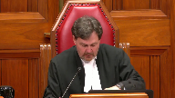
:::

For the appellant Mike Ward, Maître Julius Gray et Maître Geneviève Gray.

Pour l'intervenante, Association des professionnels de l'industrie de l'humour, Maître Walid Ijazzy.

For the intervener, Canadian Civil Liberties Association, Christopher D. Brett.

For the intervener, Canadian Constitution Foundation, Ana Maria Inayar.

Pour l'intimé Commission des droits de la personne et des droits de la jeunesse, Maître Stéphanie Fournier, Maître Lisiane Clément-Major.

Pour les intervenants, Sylvie Gabrielle et Jérémie Gabrielle, Maître Stéphane Harvey.

For the intervener, International Commission of Jurists Canada, Maître Guy Géré-Gimbale.

For the intervener, League for Human Rights of Bnébret Canada, David Métas.

Soyez informés également que deux de nos collègues, les juges Carcassanis et Abela, participent à l'audition, même s'ils ne sont pas en salle d'audience.

Maître Gray.

**Speaker 1** (00:02:00): Chief Justice, justices, good morning.

::: {.column-margin}
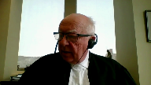
:::

The case before us concerns four fundamental principles, discrimination, freedom of expression, dignity and artistic freedom.

I shall start with the issue of discrimination, noting that this issue is separate because if there was no discrimination, the rest does not matter.

The tribunal had no jurisdiction.

Discrimination, you will find at our factum 3839, the definition means distinction, exclusion or preference for a certain number of reasons.

Jeremy Gabriel was not chosen for his handicap.

The other sacred cows, it was a program about sacred cows and deflating sacred cows.

The other sacred cows were also excoriated for personal characteristics.

And you can see that in the dissenting judgment of Madame Justice Savard at paragraph 73, including some reasons that could have been connected to the charter on sexual preference and so on.

It is submitted, and this will come up over and over again, that there simply is no right not to be offended.

And the way we have to, the question we have to ask is, is the mere mention of the forbidden ground or mocking it discriminatory?

Remembering again that he was not chosen for that.

I think Madame Justice Savard gives a perfect answer to that in paragraph 78.

I think the mere mention of a discriminatory ground cannot amount to discrimination.

And I will look at paragraph 138 as well, which is very important, where she quotes Madame Justice Bish, who makes the distinction in paragraph 138 of the dissenting judgment.

Madame Justice Bish said, mais de l'autre côté, toutes ces limites étant posées, il ne peut être question de faire de l'article 15 de la Charte canadienne des droits et libertés ou des articles 10 et 10.1 de la Charte des droits et libertés de la personne, la base d'une nouvelle forme de mise à l'index.

Bref, on ne peut pas agir selon nos convictions discriminatoires, mais on peut toujours les exprimer.

**Overlapping speakers** (00:04:51): I have a question for you, I'm sorry to interrupt you.

**Speaker 1** (00:04:56): is therefore, can, is, is.

**Justice Côté** (00:05:01): I hope it's not me.

**Speaker 1** (00:05:19): You

**Justice Côté** (00:05:21): Maître, question for you.

**Overlapping speakers** (00:05:25): Yes?

**Justice Côté** (00:05:25): Okay, so what is your position regarding the respondent argument that what Mr. Wurtz said about the handicap of Mr. Gabriel had on Mr. Gabriel a prejudicial effect, thereby creating a distinction under Section 10?

::: {.column-margin}
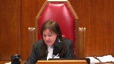
:::

**Speaker 1** (00:05:49): I think when we come to the prejudicial effect, the dignity, we'll see that it's a purely subjective effect and that there is no proof of prejudicial effect.

::: {.column-margin}
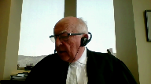
:::

What prejudicial effect means, I think, is not getting goods, services, all the advantages of society on account of that.

There was no prejudicial effect here.

And whatever there was, was purely subjective.

But I want to look at paragraph 10 to see why it would be impossible to argue that all of these things cannot be mocked.

Every person has a right to full and equal recognition and exercise of his human rights and freedoms without distinction, exclusion, or preference based on race, color, those are conventional things, sex maybe, gender identity, it's a little more difficult expression, pregnancy, sexual orientations, civil status, age, religion, political conviction.

What it means is that we cannot mock somebody's political convictions or even his religion.

We cannot, language or ethnic or national origin, can't make fun of somebody's accent.

It would be so broad if mere mention created a prejudicial effect.

**Justice Abella** (00:07:20): Mr. Gray, can you can you help me with two related issues that come out of what you've said so far?

Why was Mr. Gabrielle famous?

**Speaker 1** (00:07:32): because he used or at least his parents presented him as a handicapped child who could nevertheless uh develop his talent and uh can I

**Justice Abella** (00:07:43): can I stop you there? Yes.

So does that he was famous because he was a handicapped child, is that right?

**Overlapping speakers** (00:07:52): He was in the public arena.

Yeah, okay.

**Justice Abella** (00:07:54): He was in the pot but as a because unlike all of the other people in the list that you've presented to us comparable list.

::: {.column-margin}
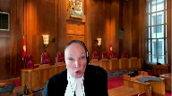
:::

He was famous because he was a handicapped child.

Is that right?

And since Mr. Ward was uh bringing to public attention those he thought were famous, the fact that he was famous because of his handicap you say is irrelevant to whether or not he was singled out under section 10 for handicap.

We are to ignore that.

**Speaker 1** (00:08:27): He was not singled out for handicap.

He was singled out for his performance and his fame.

The handicap was merely mentioned in there.

It was present in his public persona.

And Mr. Ward didn't disclose anything everybody didn't know. What a-

**Justice Abella** (00:08:43): And the comments, sorry, just let me continue then, the comments he made about Mr. Gabriel, were they not all related to his handicap?

**Speaker 1** (00:08:51): Not all.

And in any case, they were merely comments about the handicap.

They did not deprive him of any services.

They didn't create a distance.

**Justice Abella** (00:09:03): it this is a distinct we're talking about the distinctions i'm with you on on the stages so at the distinction set your submission to us is he was not

**Overlapping speakers** (00:09:13): not singled out.

**Justice Abella** (00:09:14): I'm sorry, he was not singled out because of his handicap.

::: {.column-margin}
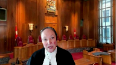
:::

He was singled out because he was famous.

That's number one.

My second question to you, Mr. Gray, is as you present to us these arguments on what discrimination means, etc., to what extent are we entitled to look at the discrimination jurisprudence of the Quebec courts and of the rest of the country?

This is on the theory, as we said in Bombardier and many other cases, that the approach is to be consistent.

Are you suggesting it should not be?

**Speaker 1** (00:09:50): I think they're the same.

::: {.column-margin}
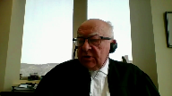
:::

I think they're very similar on this particular point.

There may be some statutory differences as there are from province to province.

But I think the jurisprudence, the jurisprudence that we'll be looking at, Bombardier, Kikstra, Watcott, et cetera, is all applicable to this case.

Maître Gray.

**Justice Kasirer** (00:10:09): you

**Overlapping speakers** (00:10:09): Let me ask you.

I'm so sorry.

Go ahead, Mr. Gohan.

Just discuss your...

**Justice Kasirer** (00:10:14): So I was going to follow up on your question, which I thought was an important one.

::: {.column-margin}
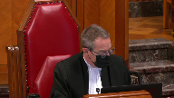
:::

The disagreement between the tribunal and the dissenting judge on the point of distinction, Mr. Gray, I wonder if you'd comment on it to help me anyway understand it.

At paragraph 86, the tribunal says that Mr. Ward n'a pas choisi Jérémie à cause de son handicap.

And later in the dissent in the Court of Appeal, Justice Savard says at paragraph 66, Selon le juge, le handicap du plénian n'a joué aucun rôle dans le choix de l'appelant de se moquer de lui et de le cibler dans son spectacle.

And I'm wondering if that's if that's a black and white choice, it strikes me that the tribunal, after what it said at paragraph 86, explained why the jokes in respect of Mr. Gabriel were made as as a way of singling him out as a person with some fame, that that was the link to go back to to Justice Abella's question to you.

So I'm wondering how to reconcile those points.

**Speaker 1** (00:11:44): Well, I think all the people who were singled out were singled out because of some fame.

::: {.column-margin}
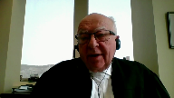
:::

But Madame Justice Savard clearly said, le choix was not made on account of his handicap.

And indeed, he didn't even mention the handicap as such.

He described him, he mocked what he looked like or what he behaved like, as he did with the other sacred cows.

It's clear that it was not on account of the handicap that Jeremie Gabriel was part of the show.

**Justice Abella** (00:12:22): doesn't that just stick with this because it seems to me analytically really quite important.

::: {.column-margin}
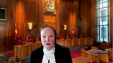
:::

Your argument then comes down to at the distinction stage.

When you are a sacred cow, a famous person, you have lost the right to claim that you have been discriminated against even though you may be the only woman, the only black person, the only Jewish person.

You have lost that right because you are a sacred cow.

Is that what the argument comes down to?

Because someone can say, well I didn't, it wasn't for sexist reasons that I criticized this woman.

It was because she was famous.

Is that what this amounts to?

**Speaker 1** (00:13:04): He criticized him because he said he couldn't sing, because he sang badly, because he used the word ugly in this thing, but it...

**Overlapping speakers** (00:13:14): And I tried to drown him and he's unkillable.

**Speaker 1** (00:13:19): But that is clearly just a joke.

Nobody could take that seriously.

If he had tried to drown him, the police would have been involved.

Okay, but that's a separate question.

That gets us to the next stage. Again.

**Justice Abella** (00:13:29): I'm still at the distinction stage and go ahead

sorry you don't know I don't want to interrupt you.

Go ahead you're the lawyer.

**Speaker 1** (00:13:38): You're the judge.

::: {.column-margin}
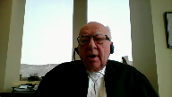
:::

The question that are the distinctions today, Shirley, is mere comments about the distinction, distinguishing somebody and amounts to discrimination.

Otherwise, if you mention that a politician speaks with a foreign accent, you'll be making a distinction based on his origins.

**Justice Abella** (00:14:02): It is not a distinction, it is not discrimination unless the other steps of the discrimination analysis are met.

**Overlapping speakers** (00:14:12): Don't you think?

**Justice Abella** (00:14:13): agree?

::: {.column-margin}

:::

We're just at the distinction stage and my position is it's hard to see how this is not based on one of the Section 10 grounds handicapped.

Your position is we don't even get to the discrimination analysis because we haven't passed the first step.

Is that right?

**Speaker 1** (00:14:32): Yes, because distinction, it'll be my position that distinction and all the other two elements in discrimination refer to getting equal services, getting equal accessibility to universities, to public life, to commercial, to being dealt with commercially.

::: {.column-margin}
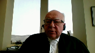
:::

It doesn't mean mere comments.

**Overlapping speakers** (00:14:59): So what does dignity mean, then?

What's the point of Section 4?

That's the next stage.

Right, but you don't get there if we accept your premise that there's no distinction.

We don't even get to the Section 4, do we?

**Speaker 1** (00:15:10): that there's no distinction because all it was was a comment.

::: {.column-margin}
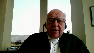
:::

And comment distinction requires, and it's paragraph 78 of Madame Justice Savard's dissent, which says very clearly, The legalite relle exige qu'une personne ne soit pas privée davantage des services ou des bénéfices accordés à d'autres où on ne voit pas imposer un fardeau différent à raison de motifs prohibés par la Charte.

It's the services, it's more than mere comments.

Because otherwise, apply that to political opinions.

Does that mean that mocking somebody's political opinions amounts to discriminating against them?

Now, I agree, the section is valid.

Not admitting somebody to university because of his political opinions does make it invalid.

It does violate his rights and does discriminate, makes a distinction.

But if you look at such things as political opinion or language or whatever, simply mentioning the ground, mocking somebody, pretending that that's what he's like, that does not deprive him of a service, of an opportunity, of life.

It cannot be that, as Madame Justice Bich said in the passage that I read, that a new way of putting something on the index has been found that mentioning the handicap amounts to a distinction.

**Justice Abella** (00:16:51): There's no question, Mr. Gray, and I'll end with this, not all distinctions are discriminatory.

**Overlapping speakers** (00:16:58): Do you agree?

**Justice Abella** (00:16:58): Yes.

OK, so maybe the focus should move on.

Maybe it'll move on, yes.

**Speaker 1** (00:17:04): because I'm going up.

**Justice Karakatsanis** (00:17:04): But maybe I can just ask though because you focused on the le choix and is to what extent is intention helpful when we're determining whether a distinction has been made?

**Speaker 1** (00:17:19): I think it's been held that intent to discriminate is not important, nor is the opinion of the person who's discriminated necessarily important.

::: {.column-margin}
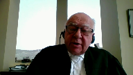
:::

It's an objective thing.

Was there, in fact, discrimination?

And the mere mention, just like the mere mention of political opinion, or if you were mocking Henry Kissinger, mocking him with his accent, that is not discrimination.

**Overlapping speakers** (00:17:45): Right, so le choix doesn't help us that much.

**Speaker 1** (00:17:49): Well, Bombardier is an example of where it would apply.

::: {.column-margin}
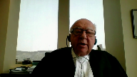
:::

But then I think I would take Justice Abella's hint and go on.

The first thing I would say is why were the anti-discrimination laws passed?

They were not passed because people said things that offended.

They were passed because people were really not given equal access, equal access to commercial opportunities, equal access to universities, equal access to the courts and so on.

And it was because there was freedom of expression.

**Justice Rowe** (00:18:25): Mr. Gray, I mean, I think you've come to what is, for me, the absolutely critical point here.

::: {.column-margin}

:::

Human rights legislation is to provide protections against people operating in society, things like employment, things like access to services, things like renting an apartment.

It is not meant to be a censorship in accordance with political rectitude, but this is what the Human Rights Tribunal has transformed it into.

**Speaker 1** (00:18:58): That is my view, my Lord.

::: {.column-margin}
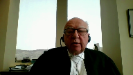
:::

That is the position taken by Madame Justice Biche at paragraph 138 of the dissenting judgment.

That is the position in article 78 of Madame Justice Savard's dissent.

That what you're creating is a new index, new index based on stating something about discrimination.

And I think the purpose of the discrimination law was precisely to get rid of these things.

And it's in fact, because there was freedom of expression, because there was, that one could get past, for instance, people who were profoundly offended by homosexuality, profoundly offended by atheism, et cetera.

It's because there was freedom of expression and one didn't have to fear mentioning these things that they changed and we got put into codes.

May I proceed?

**Justice Kasirer** (00:19:51): To pursue, Mr. Gray, may I pursue Justice Roe's comment, which is an interesting one, and ask beyond employment, the furnishing of goods and services, whether there is jurisdiction for the tribunal.

::: {.column-margin}
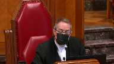
:::

I'm thinking, for example, of Whatcot, where flyers were, it was the distribution of flyers that was under study.

Under study, it was a different statute, I appreciate that.

And I'm wondering if, in this case, we have something that transcends mere comment.

You don't make mention in your account of the facts of the capsules that he set on the internet that circulated widely beyond the 135,000 people who saw his show.

And I'm wondering if that could be, is legitimate for the tribunal to examine.

Certainly, the majority of the Court of Appeal thought so.

The capsules were mentioned by the tribunal.

But what do you think of that?

**Speaker 1** (00:20:58): Well, I think the capsules were mentioned and they were there.

::: {.column-margin}
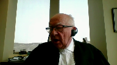
:::

But I think the answer, the question you're really asking following Mr. Justice Roe's position is, are there situations where mere words can create discrimination?

That's why Watcott was mentioned.

And the answer to that question is yes, there are such situations.

The situations are hate, for instance.

Watcott deals with that very clearly.

Section 91, or paragraph 91, 92, Kiechstra.

But the thing about hate is, and we'll get back to that when we speak of freedom of expression, not a word of casual connotation, said Chief Justice Dixon in Kiechstra.

And the same was said by Mr. Justice Roeffstein in Watcott.

**Justice Kasirer** (00:22:01): At this point, I'm gonna stop you just to follow up precisely here.

::: {.column-margin}
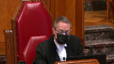
:::

In Watcot, it was not an employment or furnishing of goods and services point, it was the flyers.

Our case, it's not employment, it's not furnishing goods and services, but it is, among other things, the capsules.

And mere comment, in Kaleko, it was a different circumstance, but that was comment as well.

So I'm just wondering how sweeping the statement that you made earlier, that it must be limited, and the jurisdiction of the tribunal must be limited.

**Speaker 1** (00:22:43): Well, I think in Wabkot and Kikstra it clearly was hate.

In Kallego it was different.

In Kallego it was worse.

**Justice Brown** (00:22:51): And can I intervene at this point?

::: {.column-margin}
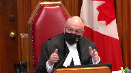
:::

Because I mean, surely in answer to that, you need to say more that it was clearly hate.

Was not the point that in Watcot, they were dealing with section 14 of the Saskatchewan Code.

The Saskatchewan Code gave the tribunal jurisdiction where there was a statement of representation that exposes or tends to expose a person to hatred, ridicule, belittlement, otherwise affronting the dignity.

And the Supreme Court said in that case that the jurisdiction over a statement on the basis that it gives rise to hatred was constitutional, but it stopped there.

That Justice Rossi made clear, the constitutionality of it depends on them restricting that jurisdiction to hatred, not to belittlement, not to affronting the dignity.

Isn't that?

**Speaker 1** (00:23:56): But that would have been unconstitutional.

::: {.column-margin}
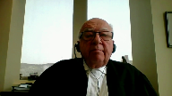
:::

That's the point.

And I think that is the point.

And I think there is another case.

I will concede that there's probably another situation in which mere comments can amount to discrimination.

And that's the Butler situation where something is so profoundly disgusting, dehumanizing and so on.

But Mr. Justice Rothstein dealt with that in Watcott as well in paragraph 91 saying, yes, when it approaches the degree of humiliation caused by hate.

But to turn mere comment on political views, language, religion into discrimination is to create a new tribunal.

There are nobody denies that there could be in certain circumstances, a civil action, action libel or what is known in Quebec as grievous insult.

There could be possibly, I don't think in this case, but to turn it into a form of public law censorship, going beyond such things as Butler and Watcott would be first of all, to freeze it.

Nobody would possibly make those comments.

**Justice Martin** (00:25:14): Can I intervene here and ask a question?

::: {.column-margin}
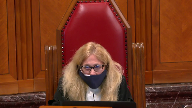
:::

You seem to be assuming that we're dealing with the public services aspect of human rights legislation, but it is arguable that the Quebec Charter is very particular in Section or Article 10 by providing more general protections, and that Article 10 of the Quebec Charter is different from any other human rights provisions across the country because it's not tied, particularly like Articles 11 and following, to services.

So would there not be an argument that the tribunal's jurisdiction is grounded in Article 10, and that that is sufficient?

You don't have to prove that any service or whatever was problematic, and isn't that the arc of the jurisprudence?

**Speaker 1** (00:26:18): I think that would be a very dangerous conclusion, especially given the breadth of Section 10, when it talks about political opinion and language, religion, and so on.

::: {.column-margin}
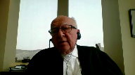
:::

It would turn the Human Rights Tribunal into a censor of very large parts of our daily life and so on. I agree.

First of all, there is an analysis by Madame Justice Savard of the section in Watcot and in Quebec, saying that they're basically the same.

There may be a different style of legislation, but they're both based on dignity.

But to suggest that in Quebec alone, among Canadian provinces, one cannot make comments about handicap or political opinion or language or any of those things, which are very broad and encompass just about everything, is, I think, unthinkable.

I think, in fact, it could be argued that Mike Ward provided equality for Jeremy by treating him the same as the others.

**Justice Brown** (00:27:30): Come on come on come on don't go that far.

We're not talking about Galileo or Salman Rushdie here.

He's no hero

**Speaker 1** (00:27:37): We're talking about, well, we're talking about

**Justice Martin** (00:27:39): somebody saying that they would try to drown a 13-year-old child that has a physical disability.

So let's make sure that we understand the stakes here and not plead the straw case.

**Speaker 1** (00:27:55): He didn't say I'd like to drown him.

He said I tried to drown him, which is obviously not true and it's part of a performance

**Justice Martin** (00:28:05): So, it all ties into a stereotype that the lives of children with disabilities are less meaningful and it ties into that.

::: {.column-margin}
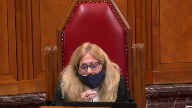
:::

So, in jokes, in conversation, there's very little that needs to be cued to get to those social norms or suppositions, that are at base demeaning of the dignity of the person targeted.

**Speaker 1** (00:28:36): I will point out that he didn't even mention the disability.

He merely described Gabriel.

He didn't deal with the group.

He didn't deal with stereotypes.

But he doesn't have to.

**Justice Martin** (00:28:50): to because they exist.

::: {.column-margin}

:::

He just has to tuck into them.

And so the idea that he might not have chosen the individual on the basis of a disability doesn't mean that the disability wasn't front and centre if implied, because of the way in which the discussion and the jokes were made.

It's the effect of the jokes, it's what they tie into in the social reality of the circumstances that would be the distinction and would be the harm.

**Speaker 1** (00:29:27): uh but the well we'll come to the issue of the effect because i don't think there were was much in the way of effect but in i i would like to point out that yes uh he chose a number of people whom he considered to be sacred cows some for reasons that could have been connected to the charter as well and he uh lampooned them and that it is

::: {.column-margin}
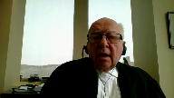
:::

**Justice Martin** (00:29:53): say, Mr. Gray, how can you say there's no effect when we have, well, we have the evidence, but we also have evidence that people in the schoolyard repeated those same jokes in an attempt to bully.

**Speaker 1** (00:30:09): People in the schoolyard repeated it was not only because of that and we all know that in schoolyards people laugh at children laugh at other children an attempt to create a situation where the mere mocking of a handicap becomes a Ground for for public law action is to my mind creating the type of censorship which one does not work andI

::: {.column-margin}
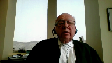
:::

**Justice Rowe** (00:30:43): But Mr. Gray, you are a very experienced and distinguished counsel, and it is far from me to give you advice as to how to plead your case, but some cases are better pleaded on the law than the facts.

::: {.column-margin}
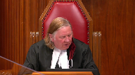
:::

I want to go back to just a very simple point that you had made before, that if criticism on the basis of, for example, political convictions can amount to a breach of human rights and therefore be subject to the sanction of the Human Rights Tribunal, is this not absolutely on a collision course with the rights of all Canadians to freedom of expression under 2B of the Canadian Charter?

**Speaker 1** (00:31:33): Absolutely, that is the point that I made.

::: {.column-margin}
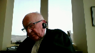
:::

The point that I made is that the mere mention, even of unpleasant things, the mere mention that of something cannot possibly accept in the context of hate and maybe the Butler concept of absolutely degrading and disgusting things amounts to something that is prohibited.

I take your point Justice Roe, it is a matter of law.

It's not the particular facts or the particular jokes in this case.

And that is why I think treating Jeremy the same way as the other sacred cows was in fact making him more equal than unequal.

Whether it's because of law, not because of fact or because of the particular situation.

The other thing I want to point out before we move to the next issue, because I'm almost more than halfway through, is Madame Justice Savas' argument in paragraph 122, 123, that it's circular.

And I'll read that passage.

I think there is that because the judge never considered that the matter could be justified.

But before that, I will conclude this argument.

I believe the human rights tribunal had no jurisdiction.

I think that it's possible in certain cases to sue for libel and grievous insult.

But I think that given the breadth of section 10, given the world in which we live, in which people are very scared of public law condemnation, it would mean that large parts of our everyday life could no longer be mentioned.

**Justice Abella** (00:33:57): Does this come down, Mr. Gray, to an argument that there's no such thing as discriminatory speech?

No, I'm sorry, Mr. Gray, I'm sorry, Mr. Gray, I'm sorry, Mr. Gray, I'm sorry, Mr. Gray, I'm sorry, Mr. Gray, I'm sorry, Mr. Gray, I'm sorry, Mr. Gray, I'm sorry, Mr. Gray, I'm sorry, Mr. Gray, I'm sorry, Mr. Gray, I'm sorry, Mr. Gray, I'm sorry, Mr. Gray, I'm sorry, Mr. Gray, I'm sorry, Mr. Gray, I'm sorry, Mr. Gray, I'm sorry, Mr. Gray, I'm sorry, Mr. Gray, I'm sorry, Mr. Gray, I'm sorry, Mr. Gray, I'm sorry, Mr. Gray, I'm sorry, Mr. Gray, I'm sorry, Mr. Gray, I'm sorry, Mr. Gray, I'm sorry, Mr. Gray, I'm sorry, Mr. Gray, I'm sorry, Mr. Gray, I'm sorry, Mr. Gray, I'm sorry, Mr

**Speaker 1** (00:34:05): I made the exceptions, hate and the butler exception, the particularly disgusting and dehumanizing type of things, and those are mentioned in Watcock.

::: {.column-margin}

:::

But I think merely saying, I don't, I'll give you an example, an example with which I strongly disagree.

I don't like homosexuality, it's not discriminatory.

**Justice Abella** (00:34:30): If it's intended, if it's aimed at a particular individual, is it your position that that individual has no recourse, if he or she feels that one of the grounds of Section 10 has been triggered, that he or she can only sue for defamation, which as you know is a completely different legal test?

::: {.column-margin}
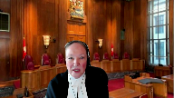
:::

**Speaker 1** (00:34:55): I think that is so.

I think a person, first of all, the question is, is it a person or a group?

And if you look at paragraph 80 in Watcock, there has to be a connection to the group.

The purpose of discrimination law is not to provide redress to the person, but I do think

**Justice Abella** (00:35:12): Excuse me, that's a novel proposition, Mr. Gray.

Most of the cases at Human Rights Commissions are being brought by individuals.

**Speaker 1** (00:35:22): through offenses against the group.

::: {.column-margin}
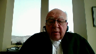
:::

The point is that it is not a- Through membership in a group.

Group, that's right.

But it is surely not, I will answer your question directly.

If somebody says, I don't like homosexuals and so on, and a person says, I'm offended, no, there is no remedy.

There may be on grievous insult, but there isn't here.

If somebody says, I will not hire you, then there is a remedy.

If somebody says, I will not sell to you, then there is a remedy.

**Overlapping speakers** (00:35:59): So Coleco was wrongly decided?

No, Coleco.

**Speaker 1** (00:36:02): was at work.

::: {.column-margin}
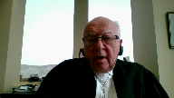
:::

Collega was a situation where the employer dealing with newly arrived immigrants from China made their position at work fragile.

That was the interpretation given by the court

and I think that that led to a denial of equal service.

What about the denial of speech in OBRI?

**Justice Abella** (00:36:28): the picture-taking.

**Overlapping speakers** (00:36:30): Bicyclers.

**Justice Abella** (00:36:31): where we've said, where the court said that you can not interfere, your right to take pictures is restricted by the privacy rights section of dignity.

::: {.column-margin}
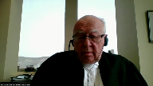
:::

So I what your argument seems to be is an American approach to speech which is that speech is absolutely protected subject to the ability to prove defamation.

**Speaker 1** (00:36:55): No, subject to hate, subject to these disgusting comments in Butler, and Aubry was an issue of privacy and taking of a picture and using...

**Justice Abella** (00:37:04): But it was speech, it was restrictions on speech, it was sharp, because we were dealing with vulnerable.

**Speaker 1** (00:37:10): It was sharp.

::: {.column-margin}
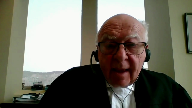
:::

Sharp was a restriction of speech, but it was not before a human rights tribunal as discrimination, nor was Aubry.

Those were cases where speech may be restricted, and we're coming to that, the freedom of expression, when it can be restricted.

**Justice Abella** (00:37:29): one more one sorry one more question are you saying that context is irrelevant

**Speaker 1** (00:37:34): No context is always relevant.

That's what Mr. Justice Ralphstein said in Watcock.

However, context doesn't mean—

**Justice Abella** (00:37:44): relevant.

Context can't be relevant if there's no such thing as discriminatory speech.

**Speaker 1** (00:37:50): context is not relevant to give the tribunal jurisdiction or not, but context is relevant to determining whether something is hate or not.

::: {.column-margin}
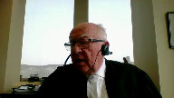
:::

Context is relevant in the second stage, we'll come to the freedom of expression part.

So context is relevant, but yes, you can't decide these things on a case-by-case basis.

**Overlapping speakers** (00:38:10): You can't or you can, I'm sorry, sir.

You can't, cannot, cannot, cannot, cannot, cannot, cannot,

**Speaker 1** (00:38:13): decide these things on a case-by-case basis, and we'll come to that on the issue of freedom of expression.

::: {.column-margin}
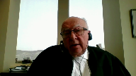
:::

On the issue of freedom of expression, it's obvious, and now we're off the issue of jurisdiction, we're on whether freedom of expression should have prevailed, that it cannot be decided on a case-by-case proposition because what it does is it creates a chill effect where people will simply not say anything.

And in our society, in our society of cancel culture, and generally there is a chill on freedom of expression, to do it on a case-by-case basis will mean that nobody will speak.

And therefore restrictions on freedom of expression, while they're very important, and we'll go through the ones you've mentioned, have to be reasonably precise and have to be, cannot refer to mere speech and so on.

And again, the first restriction- Thank you, Mr. O'Grady.

**Justice Côté** (00:39:23): At what stage should we take into account the freedom of expression?

::: {.column-margin}
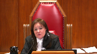
:::

Should we take it into account at the first stage of the analysis or at the justification stage?

I believe, Madame Justice, that I was probably right, because at the first stage of the analysis of the freedom of expression, the freedom of expression should be taken into account at the first stage of the analysis or at the justification stage.

I believe, Madame Justice, that I was probably right, because at the first stage of the analysis of the freedom of expression should be taken into account at the first stage of the analysis of the freedom of expression should be taken into account at the first stage of the analysis

**Speaker 1** (00:39:41): of the analysis.

::: {.column-margin}
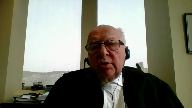
:::

Although I think it doesn't make much difference in the result, but we have to take it into account seriously and to limit freedom of expression, it has to be reasonably precise.

And I'll give you the cases, Kikstra and Watcott, where you're limited to hate or things that come close to hate.

Butler, where you give the three types of things and you say only the very gratuitous, the very disgusting, et cetera, can be limited.

And when you talk about Sharp, it's a much broader restriction because the whole activity is rather questionable, child pornography, but the exceptions are very precise because otherwise you'll create a chill effect.

Who will ever say anything about that?

Libman, Ford, in all of those cases, there is a reasonably precise situation where a person may know when he can speak or when he can not speak.

If this particular case remains, if the majority view in the court of appeal was correct, the whole notion of a standup comic become comedian, becomes questionable because who will dare?

At what point will somebody say you lampoon by political convictions?

You lampoon this and it hurt me.

I have to have redress for what you've done.

And therefore, the freedom of expression, especially in a world in which there is so much political correctness, and you have a quotation in paragraph 91 of our factum of Mr. Justice Baudouin in Cabaret Sex Appeal, where he talks about the danger of when he speaks, a free and democratic society like ours must necessarily show a high degree of tolerance for the expression of thoughts, opinions, attitudes or actions which not only do not make unanimity or do not rally the views of the majority of citizens, but can still be disturbing, shocking or even hurtful for certain people or for certain groups.

Freedom of expression must not be laid down in the bed of political correctness.

**Justice Rowe** (00:42:00): Actually, Mr. Gray, it is possible to have censorship and stand-up comedy.

::: {.column-margin}
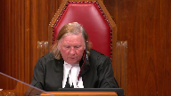
:::

As a young man, I served in the diplomatic service behind the Iron Curtain.

It actually wasn't particularly funny.

That was the problem, because it was all authorized speech.

**Speaker 1** (00:42:21): Well, I think I would suggest to you the word I would use is if the majority judgment is upheld, then stand up comedy will become goody goody humor.

::: {.column-margin}
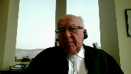
:::

You'll always have to be very careful to make sure that it's all in good.

There's nothing more than, but the essence of it is that it has to be more than people laugh because it's funny that way.

And I will agree with Justice Roe.

Behind the Iron Curtain, they did have cabarets and they were very careful.

Every so often somebody went further and the audience gasped.

But the notion that freedom of expression can be determined on a case-by-case basis, we'll weigh it in each case and we'll see which one stands up, doesn't work.

There has to be.

**Justice Abella** (00:43:08): in Irwin Toy, our very first frame of expression case, we said that.

It's case by case.

We've always said it's case by case.

**Speaker 1** (00:43:15): You said that context matters.

It's like what says the same thing.

**Overlapping speakers** (00:43:19): No, it's- Oh, it's-

**Speaker 1** (00:43:20): Well, it's not a decision case by case whether speech is permitted or not, if it were, then the chill effect would be there.

**Justice Abella** (00:43:31): wide, the scope is very wide, Mr. Gray, I concede that, then the question becomes, given the wide scope, is it justified?

We've said that in all of our jurisprudence under freedom of expression.

**Speaker 1** (00:43:45): So, yes, given the wide scope, but given the rather precise guidelines that the courts have given in Butler, in Keekstra, in Sharp, for that matter, it's very precise.

::: {.column-margin}
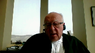
:::

**Justice Moldaver** (00:44:03): excuse me, Mr. Gray, don't you have to come back to the basics here in terms of freedom of expression and look to things like inciting violence or inciting hatred.

::: {.column-margin}

:::

And, you know, I kind of find it strange the way we've dealt with Butler.

That's true.

It's dehumanizing, degrading, and disgusting.

But really what it does is it objectifies women and or men and that in itself can lead and does lead to violence.

**Overlapping speakers** (00:44:34): The same with child pornography, it's the very same thing.

**Justice Moldaver** (00:44:40): Abusing young children, abusing children, is one of the grossest forms of violence.

::: {.column-margin}
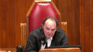
:::

So if we keep the focus on incite to hate, to cause hatred or violence, then I think we're going to be relatively safe in this.

**Overlapping speakers** (00:44:58): And giving that.

**Justice Moldaver** (00:44:59): Living the freedom of expression, the wide berth it requires.

**Speaker 1** (00:45:04): I fully agree with you.

::: {.column-margin}
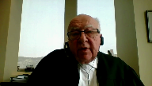
:::

And I think in Watcott, in paragraph 91, Mr. Justice Rothstein put together the Butler and the Keekstra exception.

And yes, it has to do with extreme, Kate is not a word of casual connotation.

It cannot become an every day thing.

But what is also important is dignity.

Dignity is an extremely important concept.

It's one of the pillars.

But it, unlike freedom of expression, where it creates a chill factor, one has to be very careful with dignity because it cannot become a merely subjective thing.

My dignity was hurt.

I am offended.

And Madam Justice Savard points out that in this particular case, paragraph 107, 108, the judge basically referred to only the offense caused to Jeremy Gabriel.

And you see that as well in Watcott, paragraph 56 and 82.

It's not the feelings of the person who was the subject of the conversation.

It's whether there was an objective person would think that his dignity was seriously compromised.

Can I ask a question?

**Justice Kasirer** (00:46:23): about that, exactly those two paragraphs, and you say in your factum and Justice Savard in dissent says that the tribunal made a mistake, that they only used a subjective measure of the affront to Jeremy's dignity, and that that was a mistake.

::: {.column-margin}
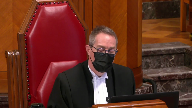
:::

And I would, speaking for myself, intend to agree that both Watcott and Kaleiko speak of the objective test that you speak of.

But in both Watcott and Kaleiko, and indeed in the very paragraphs that Justice Savard cites, she says something not at all surprising to a jurist, that when you apply an objective test, you do it by putting the person, the objective measure in the circumstances of the complainant.

This is made very plain in Justice Morissette in Kaleiko says, test objective attenuate, and the court in Watcott, paragraph 34, makes a similar point, and Justice Savard cites both of those things.

And I'm wondering to what extent she did take into account the circumstances of the complainant here.

I'm wondering if she did take into account one particular one that I have in mind, the fact that Mr. Gabriel was a child when there was this affront to his dignity.

He was a child at school, and that it was reasonable to imagine that the affront to his dignity would be felt more pointedly by a child, not just this child, but any handicapped child.

And I'm wondering if that aspect of the objective test, his age, and I'm not saying that this was a case based on discrimination on the age ground, but as part of the context, whether the dissenting judge took that age factor prominently into account.

And I've got in mind the fact that Jeremy, subjectively, spoke of his suffering in the schoolyard, his suicidal thoughts that he had as a result of the mockery, and I'm wondering where that subjective aspect of, or at least the inconcreto aspect of the inabstracto test, as civilians tend to say it, comes into play here.

**Speaker 1** (00:49:05): The reason age was never part of the case.

::: {.column-margin}
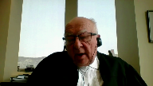
:::

It had to do with somebody who goes into the public arena and wants to be a singer and exposes himself to mockery criticism like everybody else.

And I do not think that the fact that Gabriel was a child in any way creates an objective reason to think that those particular jokes or remarks would be an offense to his dignity.

In fact, it's proved that his career was not affected by it.

People in his surroundings were not affected by it.

But quite apart from that, dignity requires something where keeping in mind the very broad definition of freedom of expression.

In order for somebody's dignity to be offended, it is not enough for the person to say, I was mortified. It isn't.

Because look at section 10 again.

You've got political opinion to language to mocking somebody's accent, et cetera.

These things can, of course, lead to unpleasant things.

And 91, 92 in Watcott mentions it.

No, I'm not.

**Justice Kasirer** (00:50:31): speak we're speaking past one another if you listen to justice morris said in calico that justice of our quotes with approbation paragraph 102 of calico she cites at 107 of her judgment yes le critère applicable et donc d'abord objectif wrote justice morris cela dit il faut en évaluer l'impact dans le context précis où quelqu'un se prétend victime de discrimination dans cette mesure on atténue le caractère abstrait du critère celui qui exprime la notion de personne objectivement raisonnable et l'on se rapproche de la situation particulière de l'individu qui se prétend victime de discrimination

::: {.column-margin}
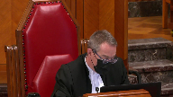
:::

so my question is la situation particulière de l'individu qui se prétend victime de discrimination that was a child it was a handicapped child and while you apply an objective test to measure the affront to dignity i think the law requires you to contextualize that and to attenuate the objective test with that factor involved it's it'sa

it's an easy idea understood right through private and public law

and i'm wondering whether that was taken into account on appeal properly

**Speaker 1** (00:51:58): I think it was taken into account by Madame Justice Savard, who pointed out that the only things that were there was his sense of anguish.

::: {.column-margin}
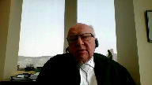
:::

The question has to be, would a person, a reasonable person standing back from that, say that the remarks made by Mike Ward were so horrific, so close to hate, so close to vilification, that they affected the dignity?

And I think the answer would clearly be that the dignity of the person standing back from that was so horrific, so close to hate, so close to vilification, that they affected the dignity?

And I think the answer would clearly be that the answer would clearly be that the dignity of the person standing back from that was so horrific, so close to vilification, that they affected the dignity?

And I think the answer would clearly be that the dignity of the person standing back from that was so horrific,

**Justice Kasirer** (00:52:25): the dignity of a child or the dignity of any handicapped person?

**Overlapping speakers** (00:52:29): Is-

**Justice Kasirer** (00:52:29): In the context of the dignity of a handicapped child, is that relevant, Mr. Gray?

**Speaker 1** (00:52:35): I think there is a, I don't think that was the issue in the case, I think you could, I don't think it's particularly relevant, the age, I think another handicapped person could also be mortified and have his feel that his dignity was affected.

::: {.column-margin}
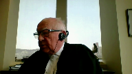
:::

And so I think that the fact that he was mortified and his dignity was affected.

**Justice Brown** (00:52:58): But you're kind of skating around the point, Mr. Gray, right?

::: {.column-margin}
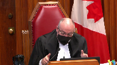
:::

The point that Justice Kazir is raising, and I'd really like to know your answer on this, is not that any handicapped person would experience this in the same way.

And this all assumes that subjective experience can inform the objective analysis, which I express no view on, but it's just I don't think you're addressing Justice Kazir's point.

It is not that a handicapped person or disabled person, I guess, would experience this in the same way, but that a child who is disabled may not be able, may not have the wherewithal that an adult disabled person does to process the humiliation, such that they may indeed sustain an injury in the form of an affront to dignity that an adult would not.

I think, and I don't want to put words in Justice Kazir's mouth, but I think that's his point, and I, it's an interesting point.

I'd like your.

**Speaker 1** (00:54:15): I think it's an interesting point.

I think it does not, that his being a child did not affect it.

And I think the issue of freedom, weighing of freedom of expression and dignity cannot depend on that type of...

**Overlapping speakers** (00:54:31): Well that may be, that's a different point.

**Speaker 1** (00:54:33): calculus.

That's the point.

That's the important point.

Mr. Gray, he went on the public, in the public arena.

**Justice Rowe** (00:54:45): Mr. Gray, my colleagues, several of them, have posed questions which really, it seems to me, suggest that what the courts should be doing, because ultimately it's the courts who make these decisions, is saying what is the social value of this expression versus what are the consequences for individuals and groups, perhaps, of this expression.

::: {.column-margin}
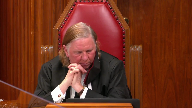
:::

And therefore we will make a judgment as to which is of greater value.

That places in the hands of jurists the role of authorizing speech and moderating it versus, it seems to me, a categorical approach which says hate speech is not permitted, the incitement of violence is not permitted, et cetera.

But I can ascertain with relative certainty what hate speech is.

I can ascertain with relative certainty what the incitement of violence is.

I defy anyone to tell me in advance what the balance is between ignorant comments directed towards a vulnerable group and how that will be resolved by jurists at the end of the day.

Aren't these two exercises of a different nature?

**Speaker 1** (00:56:23): Absolutely, and the second exercise is extremely dangerous.

::: {.column-margin}
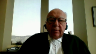
:::

It'll depend on the political correctness of the day on how things are viewed.

And I think there's one more point that I do have to make, and that has to do with artistic expression.

I noticed, I think it was Justice Brown who said, this isn't Galileo, this isn't anything, but it is artistic expression.

And artistic expression, in Butler, there is a comment on page 4...

**Justice Brown** (00:56:48): That was in response to your casting, Mr. Ward, as the champion of equality.

**Speaker 1** (00:56:54): However, if you look at Butler, the statement there is artistic expression rests at the heart of freedom of expression values, and any doubt in this regard must be resolved in favor of freedom of expression.

::: {.column-margin}

:::

I cannot see how people had doubt that artistic expression and the majority in the Court of Appeal didn't feel that it was entitled to special treatment but Butler clearly said it did, and it's

**Justice Abella** (00:57:22): I'm sorry, Mr. Gray, again, our jurisprudence has been very clear so far, you may want us to change it, that artistic expression is included within freedom of expression and doesn't require or it isn't desirable to have it as a separate standalone discrete area of freedom of expression.

::: {.column-margin}

:::

Are you asking us to change that jurisprudence?

**Speaker 1** (00:57:45): No, I'm asking you to apply the words in Butler.

Artistic expression rests at the heart of freedom of expression.

And therefore, and therefore what?

Any doubt in this regard must be resolved in favor of freedom of expression.

**Overlapping speakers** (00:57:57): And where does dignity come into the analysis?

**Speaker 1** (00:58:00): Dignity comes into the analysis as an objective fact when there has been speech that involves hate or things as extreme as those in Butler.

::: {.column-margin}

:::

It was not intended for the Human Rights Tribunal to become a general censor.

**Justice Abella** (00:58:20): So dehumanizing speech, for example, wouldn't come within the protected.

**Overlapping speakers** (00:58:24): It would, it would, it would.

**Speaker 1** (00:58:26): would be humanizing speech.

::: {.column-margin}

:::

Yeah, by Butler, 91 of Watcock, but it would have to approach the degree of intensity in of hate, whereas merely mocking, no, it does not.

So it's case by case.

It's not case by case.

It's with a very strong presumption of freedom of expression and very clear guidelines as to what will be tolerated.

You cannot have a situation where a person who is going to make a joke, ask himself, will this pass or will.

**Justice Abella** (00:58:58): this not.

So a strong presumption of freedom of expression but not a strong presumption of dignity, is that what you're saying?

They're not balancing?

**Speaker 1** (00:59:05): No, they're not balancing.

::: {.column-margin}

:::

Dignity has to be objective.

Objective dignity with...

It cannot be that the mere fact of being offended is a violation of one's dignity.

And because otherwise, every single performance, every single case will depend on the particular position today, whether this speech is fashionable, whether it's politically correct, whether it's viewed today as part of cancel culture or not.

**Justice Abella** (00:59:49): What does political correctness have to do with this, Mr. Gray, I'm intrigued by the concept, is this a, an overall rebuttal to any attempt to challenge the use of speech that feels discriminatory to somebody.

::: {.column-margin}

:::

No, it is an unpack it for me please legally.

**Speaker 1** (01:00:08): Legally, it's what Mr. Justice Baudouin said when he used it in Cabaret sex appeal.

It means that freedom of expression must include unpopular matters, must include things that shock, things that disturb.

**Overlapping speakers** (01:00:21): which we said right at the beginning in Irwin Toy.

We accept that.

**Speaker 1** (01:00:25): Now, Irwin Toy is a special case with advertising for children where certain types of advertisements were not permitted.

But at the same time, he is a special case with advertising for children where certain

**Overlapping speakers** (01:00:35): Isn't that important?

They were not permitted.

They were not permitted for reasons that... Because they were children.

**Speaker 1** (01:00:42): No, well yes, in that particular case, but not because of dignity or because of any of those things, but because of the harm that it could do.

It's part of the services and the damage that could be caused.

**Justice Abella** (01:00:57): But that was under the charter.

There's no restriction in the charter to services or accommodation. No.

Charter.

**Speaker 1** (01:01:03): The order is different, but, but no less broad.

It's unthinkable that there be less freedom of expression in Quebec than everywhere else.

I would at this point I think I've only got is the light on yet. I would

**Overlapping speakers** (01:01:21): I have two minutes, but I have two minutes.

**Speaker 1** (01:01:23): So I will pass the floor to my colleague Genevieve Gray for one particular argument.

And I will reserve my right of rebuttal.

**Justice Wagner** (01:01:33): Thank you.

**Speaker 3** (01:01:35): Good morning, Chief Justice and Madam and Mr. Justices, I hope you can all hear me properly.

::: {.column-margin}

:::

I want to speak about the exemplary damages in this case, which we obviously, I have two minutes so I'm going to go very quickly or as quickly as possible.

In Caligo, we didn't have, they, the courts did not, yes?

**Justice Wagner** (01:01:57): There were many, many questions from my colleagues, so I will be a bit more generous.

You could take three, four, five minutes if you need to.

**Speaker 3** (01:02:08): Thank you, Mr. Chief Justice, I appreciate that.

::: {.column-margin}

:::

So, you know, obviously the exemplary damages are a secondary issue, but the main point is that they have to be intentional.

And in this case, I don't think Mr. Ward intended to discriminate based on a handicap at all.

I think that he was trying to create a message of, you know, he wanted to laugh at the hypocrisy of society that elevates people to a certain status when they technically don't have what he would consider the talent to do it.

Now, it's really it's subsidiary to to any personal characteristics of of of Mr. Jeremy Gabriel, because essentially he was at the time, you know, Mike Ward did not intend to to well, he just didn't intend to discriminate.

I think he really intended to make a comment on society and in terms of sacred cows and an artistic point.

Another illustration is location of excellence, even when they found bad faith, they didn't put punitive damages or exemplary damages because it should be a small symbolic amount in that case.

And I think in this particular case, having exemplary damages would be when he didn't intend to discriminate.

I think that that much is clear.

I think he was performing in an art show and there was a comment that he was trying to make about society.

Now, whether or not it landed, whether or not, you know, that that is sort of not not the point, but in terms of exemplary damages, I don't think there was an intention on his end.

So that was sort of the point we wanted to make about the exemplary damages.

**Justice Kasirer** (01:03:59): Maître Gray, can I ask you what your thoughts are on the citation by the majority in the Court of Appeal of Richard against time expanding, or at least modifying, Richard against time and Saint-Ferdinand, the decisions of this court, modifying the strict intention test there to include conduct that, knowing all the immediate and natural consequences, or at least extremely likely, that this conduct will generate?

::: {.column-margin}

:::

**Speaker 3** (01:04:37): Well, I don't think that he would have, I think an expansion in this case is kind of dangerous if you think about, you know, comedic and artistic expression and freedom of expression.

::: {.column-margin}

:::

When he, I think expanding it to this would be a very big reach, I think, for the courts.

And I think in this case, it wouldn't work for, you know, if you balance it with the freedom of expression, the freedom of artistic expression, it wouldn't work to have exemplary damages when there was clearly no intention whatsoever to discriminate.

And even, you know, he, for years while he performed this, nobody said anything.

There couldn't have been any idea, especially at that time, that this would have been considered inappropriate, especially as it was an adult show.

So, I don't think that that would be applicable in this case, and I don't think it's reasonable to ascribe exemplary damages.

Thank you very much.

**Justice Wagner** (01:05:39): You

**Justice Abella** (01:05:39): Sorry, Mr. Chief Justice, just one question.

Is it relevant or irrelevant that our test for discrimination across Canada, including Quebec, does not include a requirement of intent?

**Speaker 3** (01:05:51): Well I think for exemplary damages I think it's not relevant because that's a completely different attribution of damages.

Oh sorry, you're on mute, you're uh...

**Overlapping speakers** (01:06:01): So when you talk about intent, you're only talking about it in terms of exemplary damages.

**Speaker 3** (01:06:06): Yes, in this case, I think you need to have intention for exemplary damages.

**Justice Wagner** (01:06:11): Thank you.

::: {.column-margin}

:::

Thank you very much.

Thank you.

**Speaker 4** (01:07:36): Oui, est-ce que vous m'entendez?

**Overlapping speakers** (01:07:38): Oui, non, maintenant on vous entend.

**Speaker 4** (01:07:40): Je m'excuse.

::: {.column-margin}

:::

Ok, bah, bah, regardez.

Alors, je vais recommencer.

Plaise à la course.

Désolé pour la complication technique.

Alors, à mon niveau, tout va bien.

Et plaise à la course.

Je suis honoré d'être devant vous aujourd'hui pour cette cause quand même très importante pour l'art, l'humour et l'expression en général.

Je vous disais donc que les humoristes québécois et les produits humoristiques du Québec font rayonner le Québec et le Canada partout dans le monde.

La présente cause est historique.

C'est la première fois qu'une blague se rend aussi loin dans les analyses judiciaires et le milieu est inquiet.

Un humoriste a été sanctionné pour une blague qu'il a fait dans le cadre de son travail, ce qui crée inévitablement un effet de frilosité chez les artisans de l'humour.

Et ce qui est malheureux pour le public, les consommateurs d'humour.

Un effet de frilosité va nécessairement amener de l'autocensure, la perte de spontanéité, des filtres qui se multiplient, un contenu qui devient de plus en plus aseptisé, la conformité, la rectitude politique, le danger de se rendre vers un contenu populaire, un contenu mainstream homogène et gentil alors que la société n'a jamais été aussi diversifiée et pluraliste et que l'humour a toujours cherché à agiter, à provoquer et à créer des malaises, en plus de faire rire.

Pour faire rire, un humoriste ne doit pas craindre la censure ou l'intervention d'un organisme de l'État.

Lorsqu'un humoriste s'exprime sur scène, on a l'impression d'entendre un ami, ce qu'il nous dit peut nous sembler extrêmement crédible, mais peut-être qu'il ment, qu'il ne joue qu'un personnage.

L'humoriste n'est pas obligé de dire la vérité malgré le climat de confiance et la proximité avec son auditoire.

Alors ce n'est pas parce qu'un humoriste se moque de quelqu'un qui lui souhaite du mal, ce n'est pas parce qu'un humoriste se moque d'un politicien qu'il ne vote pas pour lui.

Les réactions du public font partie du spectacle, que ces réactions soient positives, les applaudissements, les rires ou négatifs, des huées, des insultes à l'endroit de l'humoriste, des silences inconfortables.

Les réactions ne sont pas uniformes et ça fait partie du spectacle.

Certains spectateurs peuvent apprécier la blague alors que d'autres peuvent s'en offusquer, ne pas la trouver drôle ou ne pas la comprendre.

Les sujets ont évolué avec le temps, ce qui tabou un jour ne le sera pas dans le futur.

Les humoristes poussent continuellement les limites du politiquement correct et du socialement acceptable.

**Justice Côté** (01:10:08): J'ai une question pour vous, comment comparez-vous, si on peut les comparer, les humoristes et les caricaturistes?

**Speaker 4** (01:10:16): La comparaison est la même, je veux dire, les caricaturistes font dans la satire, les humoristes font dans la satire, alors je veux dire, il n'y a pas juste les humoristes de type stand-up, il y a l'humour en général, il y a la caricature, il y a le satire, alors et à l'intérieur même de l'humour, l'humour est un terme extrêmement générique et j'y arrive, il y a plusieurs cibles humoristiques, il y a plusieurs catégories d'humour.

::: {.column-margin}

:::

Alors je disais que les personnages c'est stéréotypé, depuis toujours sont un sujet de moquerie, et depuis toujours, encore une fois, une technique efficace pour faire rire et l'exagération des caractéristiques physiques que logisent une personne.

**Justice Kasirer** (01:10:52): Je voudrais vous poser une question sur l'état du droit sur le point que vous plaidez, et plus précisément, « What caught?»

**Overlapping speakers** (01:11:00): Vous avez...

**Justice Kasirer** (01:11:00): plus précisément Watcott et le paragraphe 91 de Watcott, que vous avez entendu l'appelant insister sur ça.

::: {.column-margin}

:::

Il a concédé qu'il y a une limite à l'expression de l'humoriste.

Mais je voudrais savoir jusqu'à quel point la Cour suprême dans Watcott a laissé la porte ouverte au-delà de la haine et de l'incitation à la violence.

Et je lis du juge Rothstein, puis je voudrais votre commentaire.

91, la dernière phrase.

Bien qu'il soit possible que le ridicule expose à la haine s'il est poussé à l'extrême, j'estime que, dans son sens ordinaire, le ridicule ne pourrait, et voici sur quoi je voudrais que vous vous interdiez, dans son sens ordinaire, ne pourrait généralement pas mener à la discrimination que le législateur cherche à enrayer.

**Speaker 4** (01:12:04): C'est une grosse question, on est au cœur du problème ici.

::: {.column-margin}

:::

Ça nous amène à quelle est la ligne de la liberté d'expression d'un humoriste?

Quelle ligne peut-il ne pas franchir?

Nous disons que le terrain de jeu de l'humoriste doit être le plus vaste possible.

Nous avons toujours argumenté, c'est ce que nous faisions valoir à la Cour d'appel et c'est ce qu'on dit ici, que rarement une blague peut être qualifiée de discriminatoire au sens classique de la discrimination qui est une privation, de priver quelqu'un de la jouissance d'un bien, d'un service, de l'exercice d'un droit.

Une blague, il faut rester dans le contexte et on se rallie à ce que la juge Savard dit pour la dissidence dans la cause qui nous occupe.

La simple mention d'un motif énuméré à l'article 10 n'est pas suffisante.

Alors pour répondre à la question et en revenir au paragraphe 91 dans White Coat, ce n'est que très rarement qu'une blague pourra être discriminatoire lorsqu'on tient compte du contexte qui est du contexte de l'humour.

Alors, ce que le paragraphe 91 dit, c'est qu'une blague peut être absolument de mauvais goût, mais on n'est pas dans une discussion de morale ou d'esthétique.

Il faut que ça s'érige un certain ça et les règles générales, si on parle d'un discours humoristique qui n'est pas empreint de mauvaise foi, qui n'incite pas à la haine, ça reste dans un contexte humoristique et aussi de mauvais goût soit-elle, elle est quand même protégée par la liberté d'expression.

Merci maître.

Je vous en prie.

Inaudible.

**Speaker 2** (01:13:32): Chief Justices, justices.

::: {.column-margin}

:::

The CCLA will address three points.

The analytical framework under the Canadian Charter.

Second, that artistic expression, including parody and satire that is offensive, must be considered in context.

And finally, that restrictions on offensive expression are limited.

First point, the analytical framework under the Charter.

This Court has recognized that human rights codes, including the Quebec Charter, are subject to the Canadian Charter.

Where the Quebec Charter is being invoked to restrict expressive freedoms, it must be interpreted and applied in compliance with the requirements of Section 2B of the Canadian Charter, and in particular, any restrictions on expressive freedom are subject to a rigorous Section 1 analysis.

What flows from this analytical framework is fundamental.

Unlike the Quebec Charter, dignity is not a free-standing right under the Canadian Charter.

It is a value that may be taken into account in the Section 1 analysis.

This is not a case like Dagenais where two Charter-protected rights had to be balanced.

Rather, the Section 1 analysis for offensive or discriminatory expression established by this Court and what caught is what governs.

Second point, artistic expression, including parody and satire that are offensive, must be considered in context.

Comedy, including parody and satire, are forms of artistic expression entitled to strong protection under Section 2B. Some on this Court might recall George Carlin's comedy routine, The Seven Dirty Words Which You Can Never Say on Television.

My friends and I found it hilarious my parents were shocked.

That's the nature of comedy.

It's often outlandish, exaggerated, and offensive to many.

This Court, in Wick Radio, held that the law must accommodate the satirist who seizes on a point of view which might be quite peripheral to the public debate and blows it into outlandish character for public edification or merriment.

**Justice Abella** (01:15:50): But it said so, Mr. Brett, in Wick, on the basis that it was in the public interest to do so, that the topic was in the public interest, and it was in the context of a defamation action.

Is it different, do you think?

**Speaker 2** (01:16:04): What I would say is that putting aside the bad taste of comedy, much of comedy is in bad taste.

::: {.column-margin}

:::

And here the thrust, I'm not going to defend what was said here, we all can agree it's pretty offensive, but it was done in the context of a comedy routine that was trying to send up some sacred cows.

And in those circumstances, the expression is protected and what this court has said, that when you're looking at offensive expression, and I'll come to my third point because I'll just move on, I think this gets to the heart of it, which is that much, and that is that restrictions on discriminatory or offensive expression are limited.

And what I'm going to say here is much of the comedy or satire is offensive to the dignity of the person targeted.

Let me give the example of former Prime Minister Jean Chrétien, who was satirized frequently through offensive parodies of his facial disability.

These were obviously offensive.

**Overlapping speakers** (01:17:10): to his dignity.

**Speaker 2** (01:17:12): However, this court in Whatcot held that expression which ridicules, belittles or otherwise affronts the dignity of an individual could not be prohibited unless it rose to the level of hatred.

::: {.column-margin}

:::

The court accepted that expression which creates humor at the expense of others can be derogatory to the extent of being repugnant, and that expression which belittles a minority or attacks the dignity of individuals who jokes, ridicule or insults may be hurtful and offensive.

But in Whatcot, the court unanimously held that satire and parody was protected by the Canadian Charter unless it rose to the level of creating hatred.

**Justice Kasirer** (01:17:53): So I ask, excuse me, I ask this exact question to the previous intervener, and I'll ask it to you.

::: {.column-margin}

:::

You're right to say that what caught is very careful about the limits imposed, in particular in respect of ridicule.

Paragraph 91, I'm wondering if Justice Rothstein left the door slightly ajar, and more ajar than you've just suggested.

He wrote, while ridicule taken to the extreme can conceivably lead to exposure to hatred, in my view, ridicule, in its ordinary sense, would not typically have the potential to lead to the discrimination that the legislature seeks to address, not typically.

So is that suggested that there's a, what's the expression, a bright blue line between hatred and all the rest of satire, or is this, are there circumstances to be measured on a case-by-case basis to see whether this is a typical or not typical case?

**Speaker 2** (01:18:57): Well, I think that's a bit of a false dichotomy because you're always going to have to determine whether it has risen to the level of hatred.

::: {.column-margin}

:::

But I do think that what caught was clear that for speech and understand there's an important distinction here between speech and conduct.

Conduct and competition between equality and speech.

When you're dealing with actual conduct, discriminatory conduct, it's treated differently than discriminatory speech.

And that's important because the advantage of the test that this court set in Whatcott is that it creates a very high bar for the restriction of expressive freedom.

And what I'm going to say is that high bar, given the importance of comedy and satire to public and political discourse is fundamental to the protection of expressive freedom.

**Justice Wagner** (01:19:57): Thank you very much.

Ms. Inanaya,

**Speaker 5** (01:20:09): Good morning Chief Justices and Justices.

::: {.column-margin}

:::

Freedom of expression is a right that allows us to negotiate the contours of all other rights, including equality rights and the rights to dignity.

Where freedom of expression in the context of the Quebec Charter comes into conflict with a guarantee of equality, the test to determine discrimination must expressly integrate and give appropriate allocation to the consideration of freedom of expression, given its importance in a constitutional democracy.

**Justice Abella** (01:20:43): said, sorry, Ms. NNAR, haven't we said that there is no hierarchy of rights?

It seems that you are preeminently privileging speech over all the other rights.

That seems to go against what we've consistently said.

**Speaker 5** (01:20:58): So the crux of my submission is that the present test, which is a two-part test, first there is a determination of discrimination, and then there is a determination of the justification for discrimination.

::: {.column-margin}

:::

And to answer your question, my submission is that the two-part test, as it presently stands, pre-eminently elevates the rights that are included in the case at bar, so the right to dignity, thereby not considering the balance between the rights to dignity and freedom of expression at the discrimination stage, we are actually pre-eminently and raising and providing a hierarchy that privileges dignity over freedom of expression.

Where what I'm proposing is to actually put them at the same level, but at the determination stage of the determination of discrimination itself.

**Justice Abella** (01:21:50): So you can limit one right, which is listed in Section 10 by, you can limit the right by reference to an other right referenced in Sections 1 to 9.

Is that what you're saying? Yes.

**Speaker 5** (01:22:03): Absolutely, and it's not just me who's saying this, I wish I could take credit for this legal proposition, but it's actually quite clear in the language of this Supreme Court's decision in Devine, a 1988 case, which is cited at paragraph 15 of our Factum.

::: {.column-margin}

:::

In that case, the court held expressly that whenever it is alleged that a distinction on a ground prohibited by Section 10 has the effect of nullifying a right in Sections 1 to 9 of the Charter, the scope of that right must be determined in relation to all other rights, and that is expressly in the language of the Quebec Charter.

That is not found in the language of other Charters, and that is what makes this framework distinct.

That is pursuant to Section 9.1 of the Quebec Charter.

So that architecture exists by virtue of what the legislature decided in determining how to structure a determination of discrimination and other rights under the Quebec Charter.

**Speaker 1** (01:23:13): Sorry, could I just?

**Justice Moldaver** (01:23:14): let me just ask you a quick question, and it's, it doesn't apply to this case, but we've been talking about context.

::: {.column-margin}

:::

We've heard context, context.

I'm just wondering, off the top, could Mr. Ward make the same speech in front of a class of, you know, primary and secondary students?

And I guess my question that flows from that is what kind of risk do we look at in terms of inciting violence and hatred? You know,

**Overlapping speakers** (01:23:51): Ha ha ha ha ha ha ha ha ha ha ha ha ha ha ha ha ha ha ha ha ha ha ha ha ha ha ha ha ha ha ha ha ha ha ha ha ha ha ha ha ha ha ha ha ha ha ha ha ha ha ha ha ha ha ha ha ha ha ha ha ha ha ha ha ha ha ha ha ha ha ha ha ha ha ha ha ha ha ha ha ha ha ha ha ha ha ha ha ha

**Justice Moldaver** (01:23:51): If, in fact, these younger people are more, um, amenable to thinking that people who are mentally challenged or physically handicapped are some lesser form of human beings, isn't there, would there be a real concern that this could be inciting children to bully them and berate them and so on?

::: {.column-margin}

:::

I'm just interested in your thoughts about this context point.

**Speaker 5** (01:24:21): I think that that context is necessary to take into consideration in the third step of the discrimination test.

::: {.column-margin}

:::

So if we have a distinction, exclusion, or preference, and we have it based on an enumerated ground, then we'd have to look at the context to determine whether or not it has the effect of nullifying or impairing the right to full equality in the recognition or exercise of the right to freedom.

However, the test that is proposed by the Canadian Constitutional Foundation suggests that there must be an integration of what what Justice Moldavar you term as the context in order to determine whether or not in reality in fact in this case there is a nullification or impairing of the right to full equality and that and the assessment of that must take into consideration the language the limits that the legislature imposed through section 9.1 of the Quebec Charter which is that the scope of that right must be understood with proper regard to democratic values.

Freedom of expression is a democratic value and it must also be exercised with respect to with a full understanding of the scope of other rights that are in competition and intention but also with respect to public order.

And so Justice Moldavar, I believe that the that your question and your concern about context and the the the difference that context can pose could be applied in or could fit into the concern about public order which is expressly in the language of section 9.1.

**Justice Wagner** (01:25:54): Alors, la cour va prendre sa pause du matin, 15 minutes.

**Justice Rowe** (01:26:35): Let go of the cord.

**Justice Wagner** (01:26:59): on va mettre le fournier

**Speaker 6** (01:27:07): Monsieur le juge en chef, mesdames et messieurs les juges, alors merci pour cet temps de parole.

::: {.column-margin}

:::

Monsieur le juge en chef, d'entrée de jeu, je tiens à préciser que ma collègue Maître Lysiane Clément-Major est avec moi, mais elle a malheureusement été éjectée de la rencontre Zoom, mais elle est bien présente avec moi au dossier.

Alors, permettez-moi de commencer.

Je vais vous dire ce que n'est pas ce dossier.

Ce n'est pas un dossier qui cherche à demander à cette cour ou à quelconque tribunal d'établir quels sont les propos de bon goût.

Est-ce que les propos sont acceptables?

Est-ce qu'on devrait les censurer?

Le dossier ici ne concerne ni la morale ni le bon goût.

Il s'agit de discrimination.

La discrimination d'un enfant, discrimination d'un enfant handicapé, et je pense qu'essayer de nous amener sur le terrain de l'outrage du blasphème aurait pour effet de dénaturer le litige.

Je veux vous ramener à la question de la discrimination, plus particulièrement la garantie d'égalité au Québec.

Permettez-moi de m'y attarder un peu parce que la garantie d'égalité en vertu de la Charte québécoise est différente des autres garanties d'égalité que l'on retrouve dans les lois sur les droits de la personne dans les autres provinces.

Elle est différente parce qu'elle est d'une part plus vaste, donc elle couvre à la fois certains secteurs, l'emploi, l'accès à des lieux publics, les biens et services ordinairement à faire au public.

Vous retrouvez ces secteurs de protéger contre la discrimination aux articles 11 à 19 de la Charte que nous avons mis dans notre recueil condensé.

Mais la Charte québécoise, dans sa garantie d'égalité, elle est unique parce qu'elle va plus loin.

Elle garantit en plus la reconnaissance et l'exercice, la sauvegarde des droits garantis dans la Charte, tant les droits fondamentaux que les droits politiques, les droits judiciaires, les droits économiques et sociaux, elle en garantit la reconnaissance en pleine égalité.

Et l'autre élément qui est unique avec la Charte, et j'espère ne pas vous induire en erreur, c'est qu'elle reconnaît le droit à la dignité comme droit substantif.

Certes, la dignité est une valeur sous-jacente à tous les droits, c'était reconnu par cette Cour à de nombreuses reprises.

**Justice Wagner** (01:29:19): Ce dont nous sommes saisis aujourd'hui, c'est l'interprétation de l'article 10, n'est-ce pas?

**Overlapping speakers** (01:29:25): Quatre et dix.

**Justice Wagner** (01:29:28): est-ce que c'est votre prétention qu'en matière de paroles et non pas en matière de décision par exemple Bombardier ou on parle de décision donc quelqu'un est empêché d'exercer un droit, quelqu'un n'a pas la promotion qu'elle pourrait avoir cette personne-là à cause d'une discrimination.

::: {.column-margin}

:::

En matière de paroles, soit dans le cadre d'une présentation humoristique ou en matière de paroles de façon générale, est-ce que vous êtes d'accord avec la proposition sur laquelle c'est Larry Wadcott qui devrait nous guider entre autres mots, en l'absence de haine ou de propos haineux ou qui incite à la violence par exemple bien en vertu de la liberté d'expression, on devrait laisser les gens se prononcer pour ce principe-là et que les juges ne devraient pas être des constables de ce qui devrait être dit puisque ce qui devrait être dit n'est pas dit.

**Speaker 6** (01:30:27): Non, l'arrêt WhatCut n'est pas la décision qui doit guider ce tribunal, M. le juge en chef.

::: {.column-margin}

:::

L'article 10 est clair, il garantit et reconnaît le droit à la pleine égalité d'une personne dans l'exercice de la sauvegarde de sa dignité.

En ce sens, la Charte québécoise est unique.

Je fais le parallèle, si vous me permettez, avec l'arrêt Schrenk, rendu par cette Cour en 2017.

Il s'agissait de propos discriminatoires.

Dès le paragraphe 2 de cette décision, cette Cour dit qu'on n'a aucun doute que la conduite reprochée est discriminatoire.

C'était des propos à la fois sur l'origine ethnique, des propos homophobes qui avaient été tenus dans le contexte de l'emploi.

Le défi pour cette Cour, c'était de déterminer si on rentre dans un des champs de compétences qui est protégé par le droit à l'égalité, où on a une reconnaissance de la protection contre la discrimination.

En colombien britannique, vous deviez rattacher la conduite discriminatoire à l'un des secteurs protégés.

La question était si ces propos sont relatifs à l'emploi.

On est dans un contexte qui est relatif à l'emploi.

La majorité de cette Cour a conclu que oui, mais ce n'est pas nécessaire de faire ce rattachement supplémentaire au Québec.

La dignité est un droit substantif.

En ce sens, il faut assurer à une personne, et l'arrêt Bombardier s'applique ici.

Le cadre juridique énoncé par l'arrêt Bombardier s'applique totalement.

**Justice Côté** (01:31:49): dans l'affaire Bombardier il y avait une différence de traitement.

::: {.column-margin}

:::

Ce n'était pas deux droits fondamentaux qui s'opposaient dans l'affaire Bombardier.

Contrairement à ici où on a le droit à la dignité et puis on a le droit à la liberté d'expression.

Alors, j'aimerais que vous nous expliquiez comment le test qui a été élaboré dans l'affaire Bombardier peut être transposé ici sans aucune adaptation.

**Speaker 6** (01:32:18): En fait, il y a une jurisprudence constante du Tribunal des droits de la personne qui a été confirmée par la Cour d'appel à l'effet que les propos qui sont discriminatoires sont protégés par l'achat en vertu de la garantie d'égalité et cette reconnaissance-là se fait sur la base du fardeau de preuve élaboré par cette Cour dans la vraie Bombardier.

::: {.column-margin}

:::

**Justice Côté** (01:32:38): à la condition que les propos soient discriminatoires, mais comment vous détermine-t-on si les propos sont discriminatoires?

**Speaker 6** (01:32:45): est la même, il faut d'abord déterminer est-ce que nous sommes en présence de discrimination et en ce sens le fardeau est le même, à une exception prête je vous dirais, et c'est l'exception qui a été, c'est pas une exception, c'est peut-être une précision qui est apportée.

::: {.column-margin}

:::

Donc il faut, comme le dit cette cour, démontrer est-ce qu'on est en présence d'une distinction, exclusion, préférence, fondée sur l'un des motifs énoncés à l'article 10, je vous rappelle la liste des motifs est exhaustive, dans l'exercice ou la reconnaissance d'un droit, ici c'est le droit à l'égalité.

Donc le fardeau de preuve Primo Facci est le même.

Mais dans la règle à l'égo, au paragraphe 99 à 102, le juge Maurice Sette, s'exprimant au nom de la cour, a rajouté un critère supplémentaire, il dit pour éviter justement que les tribunaux se transforment peut-être en orbite du bon goût, il a précisé il faut que les propos franchissent un certain seuil de gravité pour qu'il puisse y avoir une atteinte discriminatoire à l'égalité.

Donc il faut qu'il y ait des propos qui visent l'un ou l'autre des motifs énoncés à la charte, ici on parle du handicap et du moyen pour y pallier, et il faut que ces propos-là franchissent un seuil pour que la personne puisse soutenir que sa dignité a été atteinte.

Je réfère au principe parce que le droit à l'égalité c'est quoi?

C'est pas de s'assurer qu'une personne va avoir plus de droits que les autres.

On confond souvent, c'est souvent l'impression populaire, c'est que les personnes qui sont protégées par le droit à l'égalité auraient plus de droits, plus davantage que les autres.

C'est une erreur.

L'objectif du droit à l'égalité c'est de s'assurer qu'une personne n'aura pas moins de droits.

Ici on peut s'assurer qu'une personne n'aura pas une moins grande reconnaissance de ses droits fondamentaux, de son droit à la dignité parce qu'elle est handicapée, parce qu'elle est noire, parce qu'elle est d'une origine ethnique différente.

C'est ce qu'on vise à préciser.

Et le juge, je vous réfère au paragraphe 99 de l'arrêt calégo.

À la fin du paragraphe, le juge Morissette précise clairement ce qu'il en est.

Il dit, avant de s'estimer atteinte dans son droit à la sauvegarde de sa dignité ou de son honneur, d'une manière qui contrevient à l'article 10 de la Charte des droits et libertés de la personne, la personne raisonnable devra avoir essuyé un affront particulièrement méprisant envers son identité raciale, ethnique ou autre, et lourde conséquences pour elle.

Donc ici, le critère, tant le juge de première instance que la Cour d'appel à la majorité ont conclu que l'affront subi par Jérémie avait atteint ce seuil de gravité, qu'il était suffisamment méprisant et lourd de conséquences.

**Justice Wagner** (01:35:32): Le premier juge du tribunal des droits de la personne vient à la conclusion qu'il a dit clairement que la raison pour laquelle M. Gabriel fait partie du spectacle, c'est parce que ce n'est pas à cause de son handicap, c'est à cause de sa notion, sa notoriété publique, comme les autres artistes ou auteurs ou chanteurs auxquels on réfère.

::: {.column-margin}

:::

Alors en partant, si effectivement on ne peut établir qu'il a été choisi ou il a été décidé, il a été identifié à cause de son handicap, est-ce que ça ne met pas fin à l'argument de la discrimination?

**Speaker 6** (01:36:06): Non, non, monsieur le juge en chef, parce que c'est l'effet des propos. Peut

::: {.column-margin}

:::

-être qu'il n'a pas été ciblé en raison de son handicap, mais ses propos ciblent directement son handicap.

Et là, il n'y a pas de doute là-dessus.

Et c'est ce qui a été reconnu tant par le juge de première instance que par la Cour d'appel dans les faits.

Donc, c'est son handicap qui est ciblé et c'est le principe du droit à l'égalité, le principe de l'égalité réelle.

Quel est l'effet des paroles sur la dignité de Jérémie?

Et je voudrais attirer votre attention sur la norme applicable.

Effectivement, dans, je crois que c'est monsieur le juge Casirac qui y avait référé plus tôt, il y a une norme objective qui s'applique.

Et cette norme, il ne faut pas la confondre avec la norme applicable en matière de diffamation.

En matière de discrimination, il faut se rapprocher le plus possible de l'état de la personne, parce que c'est la dignité, le respect qu'une personne porte pour elle-même par opposition.

Et je vous explique pourquoi je fais la distinction.

C'est que je pense que dans la dissidence de la juge Savard, il y a un glissement vers la norme du citoyen ordinaire qu'on utilise en matière de diffamation pour déterminer est-ce qu'il y a eu atteinte à la réputation.

Alors ça, c'est une erreur.

Je vais y revenir par rapport à cet élément-là.

Je veux juste revenir sur l'importance, quand on parle de dignité, de ramener ça à la personne qui vit.

Ici, on a Jérémie, Jérémie qui avait 13 ans au moment où les blagues ont débuté en 2010.

Jérémie qui est un enfant handicapé et son handicap est visible.

Le syndrome Treacher-Collins se manifeste physiquement.

Il a une différence et il a eu à vivre toute sa vie, à prendre à vivre avec sa différence.

Donc il faut se mettre, nous ce qu'on vous propose, on pense qu'il devrait être la bonne façon de voir les choses, mais c'est à vous de le décider bien entendu.

C'est le critère de la victime raisonnable, le même critère qui avait été utilisé dans le contexte du harcèlement sexuel.

Pendant longtemps, vous vous rappellerez peut-être le milieu, on revient des années en arrière, les milieux de travail étaient traditionnellement masculins et pour essayer de répondre et protéger les femmes victimes de harcèlement sexuel, à un moment donné, les tribunaux ont adapté la norme applicable et retenu la norme de la victime raisonnable pour déterminer est-ce qu'une conduite est acceptable ou pour déterminer est-ce qu'une femme pouvait ou a clairement manifesté son refus.

Il faut se mettre dans les souliers de la femme, dans les circonstances où elle est pour déterminer ici comment elle a vécu les choses et c'est en prenant cette perspective de la victime raisonnable qu'on a pu mieux protéger les femmes parce qu'on a réalisé à un certain moment, les tribunaux ont réalisé que des fois les femmes ne pouvaient pas exprimer un refus claire face à des avances.

**Justice Côté** (01:38:51): C'est ce qu'elle a dit.

::: {.column-margin}

:::

**Speaker 6** (01:39:34): En fait, le principe ici, je ne réfère pas la cour à une norme subjective, je réfère la cour à une norme objective, mais personnalisée, qui tient compte de la réalité de la victime.

::: {.column-margin}

:::

Pour comprendre l'atteinte à la dignité d'une personne, d'un enfant handicapé, il faut savoir se mettre dans les souliers d'un enfant handicapé.

Et là où je vous fais souligner l'erreur que fait la juge, et je pense que ça a été assez important dans sa décision, si vous lisez le paragraphe 108, elle dit, le juge n'appuie pas ce critère objectif contextualisé, il appuie plutôt sa conclusion sur la détresse et l'humiliation vécue par le plaintant adoptant ainsi une norme subjective.

J'ajoute, et cela est important, qu'à aucun moment le juge conclut que les propos de l'appelant cherchent à susciter auprès de son public une croyance selon laquelle la dignité du plaint en raison de son handicap est d'une moins grande valeur.

Donc ici, c'est pour ça que je vous mentionnais qu'on a une norme qui se rapproche davantage du citoyen ordinaire en matière de diffamation où la norme objective, c'est on va se dire, est-ce qu'une personne raisonnable qui entend les propos va penser que la réputation de la personne ciblée par les propos est déconsidérée et ce n'est pas la norme qui doit être appliquée, ce n'est pas le critère qui doit guider cette cour.

C'est vraiment est-ce qu'une personne placée dans les mêmes circonstances que j'ai réunies.

On parle d'un enfant de 13 ans qui vit avec la différence à tous les jours handicapé qui a les mêmes caractéristiques dans un contexte où il y a un spectacle d'humour qui est mis de l'avant, où il y a des capsules qui sont diffusées sur Internet.

On tend à faire, à banaliser dans certaines mémoires l'importance des capsules.

Moi, je vous dirais qu'elles sont fondamentales parce que c'est elles qui ont été rendues le plus accessibles aux jeunes qui fréquentaient la même école que Jérémie.

Donc, elles étaient disponibles sur Internet.

Alors, ici, c'est un élément majeur.

Quand au paragraphe 99, je suis toujours au paragraphe 108, je pourrais faire le lien du jugement de la Cour d'appel, la décision de la juge savoir, elle réitère le même critère au paragraphe 132.

Donc, c'est toujours l'opinion d'un tiers vis-à-vis Jérémie.

Donc, c'est selon nous un mauvais critère

qui l'a guidé dans les circonstances et qui l'a amené à conclure qu'il n'avait pas atteinte à la dignité, adoptant par le chemin les critères de l'arrêt boue malade où on adoptait le critère du citoyen raisonnable qui va comprendre que c'est généralisé les propos, va comprendre qu'il y a de l'enflure, va comprendre que ce n'est pas vrai ce qui est dit et ce n'est pas le critère qui doit guider cette Cour en matière d'atteinte à la dignité parce qu'en matière d'atteinte à la dignité, c'est comment la personne reçoit, les ressent, vit ces propos-là dans son atteinte en lien avec sa réalité de tous les jours, en lien avec ce qui l'a différencié des autres.

Donc, c'est majeur.

Paragraphe 99 du jugement de première instance cité par la juge savoir, le tribunal n'a aucun doute que les propos de M. Ward selon lesquels Jérémie Aylette, un soubouffin à sa tête et une petite bouche qui ne ferme pas, atteignent le degré de gravité exigé par la Cour d'appel dans l'arrêt calégo, vous l'avez votre critère objectif.

Est-ce qu'il peut y avoir plus objectif que le tribunal qui doit être la personne, reprendre les critères de la personne raisonnable?

Et quand il précise par la suite, Jérémie a longuement témoigné au sujet de la détresse que ses propos ensuite répétés par d'autres ont engendré chez lui et ses parents.

Le juge réfère clairement aux critères de l'arrêt calégo.

Où le juge dit, il faut un affront maîtrisant à l'identité raciale et lourd de conséquences.

Ici, les propos ont été lourds de conséquences.

Jérémie, vous l'avez mentionné un peu plus tôt, a eu à composer avec des idées suicidaires.

Il s'est fait moquer, il s'est fait intimider à l'école sur la base des propos.

Il a eu à composer avec la détresse de ses parents aussi.

Donc c'est énormément de conséquences vécues par Jérémie.

Donc ici, le critère établi par l'arrêt calégo, vous avez la question du seuil qui a été franchi et vous avez la question ici du lourd de conséquences et ça a été confirmé par la Cour d'appel.

On ne vous a pas présenté d'erreurs manifestes et déterminantes sur ces questions mixtes de faits et de droits qui… D'ici demain, est-ce que vous êtes d'accord?

**Justice Wagner** (01:43:56): sur la question maître fourni du standard d'intervention.

Est-ce que vous êtes d'accord qu'ici c'est une question du standard de décision correcte qui doit s'appliquer en raison de la vie love qui a été rendue par la suite?

**Speaker 6** (01:44:10): En fait, c'est la décision de la norme d'appel en raison de l'arrêt d'avis-là, tout à fait, mais dans ce contexte, c'est une question mixte de faits et de droits, donc ce serait l'erreur manifeste et déterminante, selon les questions qui sont posées.

::: {.column-margin}

:::

Mais dans tous les cas, la décision est correcte, peu importe le critère applicable, il ne fait aucun doute, selon nous, que la décision est correcte.

**Overlapping speakers** (01:44:32): La seule chose, c'est qu'on n'a pas de différence à apporter au tribunal des droits de personne.

**Speaker 6** (01:44:35): sur ces conclusions de faits, oui, sur ces conclusions de faits.

::: {.column-margin}

:::

Ici, on est dans une conclusion mixte de faits droits.

Donc, ma prémisse à moi, celle que je vous soumets, c'est que c'est l'erreur manifeste et déterminante en lien avec cette conclusion.

Est-ce qu'on a franchi le seuil de gravité?

Donc ici, ça devrait être la différence qui devrait être de mise dans les circonstances?

Oui, oui, oui, oui, oui, oui, oui, oui, oui, oui, oui, oui, oui, oui, oui, oui, oui, oui, oui, oui, oui, oui, oui, oui, oui, oui, oui, oui, oui, oui, oui, oui, oui, oui, oui, oui, oui, oui, oui, oui, oui, oui, oui, oui, oui, oui, oui, oui, oui, oui, oui, oui, oui, oui, oui, oui, oui, oui, oui, oui, oui, oui, oui, oui, oui, oui, oui, oui, oui, oui, oui, oui, oui, oui, oui, oui, oui, oui, oui, oui, oui, oui, oui, oui, oui, oui, oui, oui,

**Justice Kasirer** (01:44:59): de l'Ontario et de l'Ontario

::: {.column-margin}

:::

. C'est ce que je disais.

Excusez-moi, M. Jean-Chef, j'aurais aimé vous demander de cibler vos propos.

Vous parlez de Calico.

Ce qui m'intéresse, c'est de mettre en regard Calico et WhatCott.

Dans WhatCott, nous avons le juge Rothstein qui dit qu'il va y avoir un cas de figure de discrimination, mais dans Calico, le juge Morissette semble laisser la porte ouverte avec cette expression en affront particulièrement méprisant, comme vous dites, à quelque chose de moindre qu'un discours haineux.

Et je vous pose la question, est-ce qu'il y a une opposition entre Calico et WhatCott?

Nous avons à choisir si l'application de cette exception de WhatCott, le ridicule qui franchit le seuil du discours haineux, là, on va trop loin, mais qu'en est-il des propos qui, à première vue, semblent être discriminatoires

**Speaker 6** (01:46:22): Alors, M. le juge Casirard, oui, effectivement, notre prémisse à nous, c'est que Watkot ne s'applique pas directement, on ne fait pas de la lecture qu'on souhaite y faire.

::: {.column-margin}

:::

Watkot nous dit voici quels propos ne sont pas protégés par la liberté d'expression, ne sont pas couverts par la liberté d'expression.

En l'espèce, on ne prétend pas que les propos incitaient à la haine nécessairement.

En fait, ce n'est pas la conclusion à laquelle le juge en est arrivé, il n'y a pas de conclusion de fait à cet effet-là.

Mais ici, les propos, si on retient qu'ils sont à première vue couverts par la liberté d'expression, parce que c'est vrai, cette cour l'a dit à plusieurs reprises, des propos inacceptables peuvent être couverts, la question de la limite se fait à l'étape de la conciliation.

Et pour qu'il y ait conciliation ou pondération, il faut qu'il y ait deux droits en conflit.

Et c'est notre prétention depuis le début qu'il y a le droit à l'égalité, il y a le droit de Jérémie à la sauvegarde de sa dignité en pleine égalité et la liberté d'expression de Mike Ward.

Deux droits qui sont compromis.

Donc, pour répondre à votre question, j'espère être suffisamment clair, Monsieur le juge, les propos sont couverts par la liberté d'expression.

Watcote ne s'applique pas ici.

Mais, un peu la même chose qu'on fait en matière de diffamation, il faut concilier deux droits qui s'opposent.

Donc, la limite, elle est là.

Et retenir la lecture de Watcote à l'effet que seuls les propos qui incitent à la violence ou qui sont violents pourraient avoir préséance sur le droit à l'égalité.

Ce serait une approche qui serait contraire au principe fondamental qui guide cette cour.

Elle est fait qu'il n'y a pas de hiérarchie entre les droits fondamentaux, entre les droits reconnus par la Charte québécoise.

Est-ce que c'est votre prétention?

**Justice Wagner** (01:48:03): est-ce que c'est votre prétention de mettre qu'il n'y a pas de différence entre les critères pour une action en diffamation et un recours en discrimination devant le tribunal?

Absolument pas, absolument pas.

**Speaker 6** (01:48:13): contraire.

::: {.column-margin}

:::

Les critères sont différents et c'est très important de les différencier pour ne pas vider la norme d'égalité de son sens.

Je m'explique, en matière de diffamation, l'intention est un élément constitutif de la faute ou une défense à la faute.

Donc l'intention de ridiculiser quelqu'un est quelque chose qui va être un critère qui va être retenu, pas en matière de discrimination.

Donc, les critères sont de distinguer les critères pour assurer un cadre juridique conforme.

Pour assurer la pleine reconnaissance de droit, c'est essentiel.

Je l'ai mentionné un peu plus tôt.

La norme, le critère, la norme qui permet d'évaluer est-ce qu'il y a eu atteinte ou pas à un droit fondamental, la norme objective n'est pas la même en matière de diffamation et en matière de discrimination.

**Overlapping speakers** (01:49:02): en matière d'éducation.

Allez, continuez.

J'ai une question pour vous après.

**Speaker 6** (01:49:06): Oui, merci.

::: {.column-margin}

:::

Alors, là où je voulais venir, c'est que même au niveau de déterminer est-ce qu'il y a une atteinte à un droit de la norme qui doit guider le tribunal, où cette Cour n'est pas la même, et c'est important d'éviter cette confusion pour ne pas vider soit la diffamation, soit la discrimination de son sens.

Mais ce que j'entends et ce que je vois, c'est que cette Cour s'est prononcée beaucoup plus souvent sur la question de l'équilibre entre la réputation et la liberté d'expression qu'en matière de reconnaissance du droit à l'égalité, à la sauvegarde de sa dignité en pleine égalité, et de liberté d'expression.

La ressemblance

, si vous me permettez, et je me permettrai de citer cette Cour en faisant un mutatisme-outanisme en appliquant paragraphe 2 dans Grand Contour Star, qui était un cas de discrimination, que nous citons au paragraphe 96 de notre mémoire, vous dites, cette Cour dit, les règles relatives à la diffamation n'interdisent pas aux gens de s'exprimer, elles posent simplement que quiconque porte atteinte à la réputation d'autrui pourra être tenu de réparer le tort causé.

C'est la même chose en matière de droit à l'égalité.

Donc, dans un premier temps, il faut établir est-ce qu'il y a eu atteinte au droit à l'égalité de Jérémie, et ensuite faire cet exercice de conciliation.

Donc, en ce sens, et je reviens à votre question Madame la juge côté, le critère, le fardeau de preuve applicable, le cadre juridique énoncé par cette Cour dans l'arrêt Bombardier s'applique toujours.

Maintenant, au niveau de la justification, effectivement, c'est une première ici, ce n'est pas le critère de la contrainte excessive qui va s'appliquer, ce n'est pas le critère de la justification énoncée par cette Cour dans les arrêts Mayorin ou Grisemart.

Ici, c'est un droit fondamental, la liberté d'expression qui va venir déterminer.

Et le contexte est important, et le principe même de la non-hierarchie des droits commande qu'il n'y ait pas de préséance donnée à l'un ou l'autre des droits.

**Justice Côté** (01:51:04): Vous dites que le principe de non hiérarchie des droits commande qu'il n'y ait pas de précédences à donner à un ou l'autre, mais plus je vous écoute et j'ai lu votre factum, votre mémoire, pardon, vous semblez créer une hiérarchie, vous semblez examiner le droit à la dignité dans votre mémoire en vase clos au stade de l'atteinte aux droits de la dignité et vous ne prenez pas en considération au niveau de cette année-analyse-là le droit à la liberté d'expression.

::: {.column-margin}

:::

Vous l'utilisez plus tard dans l'étape de justification.

Alors, comment pouvez-vous dire si vous voulez respecter le fait qu'il n'y ait pas de hiérarchie entre les deux droits, entre le droit à la dignité et le droit à la liberté d'expression, comment pouvez-vous ignorer le droit à la liberté d'expression lorsque vous analysez s'il y a eu atteinte aux droits de la dignité de M. Gabriel?

**Speaker 6** (01:51:49): C'est à la deuxième étape, à la première il faut déterminer est-ce qu'il y a un droit et est-ce qu'il y a atteinte à ce droit.

**Overlapping speakers** (01:51:56): Donc

vous donnez un caractère absolu au droit.

**Speaker 6** (01:51:59): Non, ce qu'on dit

::: {.column-margin}

:::

, c'est que intégrer la norme de la liberté d'expression pour déterminer s'il y a une atteinte, ça, ça serait donner une préséance à la liberté d'expression ici.

On veut juste savoir, est-ce qu'il y a un droit qui est compromis quand on fait l'atteinte à la réputation ici?

Quand on a parlé, je vous donne un exemple de vice versa, qui était le droit du sujet, la photographie, le droit à la vie privée.

C'est à l'étape de la conciliation qu'on a mis en opposition la liberté d'expression et le droit à la vie privée ici.

Donc, ce n'est pas à l'étape de déterminer le droit.

Il y a deux droits.

La charte, l'architecture de la charte est ainsi faite.

On va commencer par établir est-ce qu'il y a atteinte à la dignité et ensuite est-ce que la liberté d'expression peut intervenir pour porter atteinte, limiter le droit à la dignité de Jérémie ou, au contraire, est-ce que le droit à la sauvegarde de sa dignité en pleine égalité de Jérémie peut limiter la liberté d'expression?

Ce n'est pas à l'étape de déterminer si son droit a été atteint.

Il faut le faire de façon indépendante parce que ça serait intégrer un deuxième droit dans la reconnaissance d'un premier droit.

Il faut pour qu'il y ait deux droits en conflit qu'il y ait d'abord deux droits qui sont reconnus.

**Justice Wagner** (01:53:13): dans ce contexte-là,

mais est-ce que vous êtes d'accord pour conclure que le juge du tribunal, le premier juge, n'a pas du tout traité de la liberté d'expression dans son analyse, ce qui lui rapproche d'ailleurs de la juge Savard?

**Speaker 6** (01:53:27): mais il en a traité à l'étape de la justification.

::: {.column-margin}

:::

Dans une deuxième étape, on a bien suivi, le juge de première instance a suivi parfaitement l'analyse de ce tribunal.

Est-ce qu'il y a eu le cadre juridique pour établir l'égalité, le droit à la reconnaissance, le droit à l'égalité dans l'exercice d'un droit?

C'est de déterminer est-ce qu'il y a eu de distinctions et si ils ont une préférence fondée sur un motif ici dans la reconnaissance du droit à la dignité.

Jérémie n'a pas eu le droit à la reconnaissance, à la sauvegarde de sa dignité en pleine égalité.

Il a été traité différemment et comme une personne de moindre valeur parce qu'il est handicapé, parce qu'il utilise un moyen pour pallier son handicap.

Donc là ici, on a un premier droit qui est le droit à la sauvegarde de sa dignité en pleine égalité.

Premier droit.

Ensuite, la liberté d'expression et il n'y a pas de hiérarchie entre les droits.

Et je vais plus loin et cette cour dans l'affaire

Dagenais dit qu'il faut reconnaître l'importance des deux catégories de droits.

**Justice Rowe** (01:54:23): Madame, il me semble que la dignité c'est une considération dans le test pour justifier sous l'article 1 de la Charte canadienne une attente de liberté d'expression protégée par l'article 2B, n'est-ce pas?

::: {.column-margin}

:::

**Speaker 6** (01:54:44): en matière de garantie d'égalité en vertu de la charte

::: {.column-margin}

:::

, la dignité est un droit substantif reconnu.

Donc, il n'est pas nécessaire d'aller à l'étape 2.

Ici, c'est vraiment la charte qui s'applique.

Il y a un droit substantif à la pleine égalité et c'était reconnu par cette Cour, notamment dans l'affaire Procureur général du Québec contre A, paragraphe 138 qui a été citée par la Cour d'appel, que l'objectif du droit à l'égalité, c'est de s'assurer qu'une personne ne sera pas considérée comme une personne de moindre valeur.

Quand on porte atteinte à la dignité d'une personne spécifiquement sur un motif de discrimination, je prends l'exemple de la race.

Je trouve que c'est un exemple qui est parlant.

Un des personnes ciblées dans le spectacle, c'est Grégory Charles.

Grégory Charles a la peau noire, c'est bel héritage de son père haïtien.

Monsieur Ward a ri de Grégory Charles, mais il n'a pas ri de lui sur la base de la couleur de sa peau et c'est pas ça le critère, c'est pas de rire de lui sur la base de couleur de sa peau, c'est de rire de lui d'une façon méprisante en lien avec la couleur de sa peau ayant lourde conséquences pour elle.

Le critère est élevé ici.

Il a été rencontré, mais ce n'est pas un critère banal.

On ne banalise pas la charte ici parce qu'il y a un critère.

Il faudrait ici, il me semble que c'est clair pour moi que si on parlait d'une personne, qu'on faisait des blagues racistes sur la couleur de sa peau, des blagues qui ont pour effet de la faire considérer, de la faire ressentir comme une personne de moindre valeur en raison de la couleur de sa peau, ça ne passerait pas.

Il n'y a pas de hiérarchie entre les différents motifs énoncés à l'article 10, donc c'est la même chose pour les blagues qui sont liées au handicap d'une personne.

Il y a encore plus forte raison au handicap d'un enfant.

Donc, pour nous c'est essentiel de déterminer qu'il y a une atteinte à la dignité et par la suite, est-ce que la liberté d'expression peut ou pas limiter ce droit?

**Justice Wagner** (01:56:46): On parle à ce moment-là d'un seuil et dans ce contexte-là, est-ce que vous êtes d'accord avec les propos de la juge Biche dans le dossier de MétroMédia qui disait que, je le cite, mais de l'autre côté, toutes ces limites étant posées, il ne peut être question de faire de l'article 15 de la Charte canadienne des droits et libertés ou de l'article 10.1 de la Charte des droits et libertés de la personne à base une nouvelle forme de mise à l'index.

::: {.column-margin}

:::

Bref, on ne peut pas agir selon nos convictions discriminatoires, mais on peut toujours les exprimer sans franchir un certain seuil.

Est-ce que vous êtes d'accord avec ça?

**Speaker 6** (01:57:24): dans la mesure où le seuil réfère au test énoncé par cette même Cour, la Cour d'appel, dans l'affaire Callego.

::: {.column-margin}

:::

Donc, des propos peuvent être discriminatoires dans la mesure où il y a une distinction fondée sur un motif qui a un effet sur la dignité parce qu'on a franchi ce certain seuil.

Et c'est de jurisprudence constante au Québec parce qu'il y a cette reconnaissance spécifique du droit substantif, ce qui est la dignité, et cette garantie d'égalité qui est différente du reste du Canada.

Et c'est le principe des droits, en matière de droits de la personne, d'assurer une interprétation large, généreuse des droits fondamentaux afin d'étonner le réalisateur.

**Justice Rowe** (01:58:02): Je m'excuse.

La liberté d'expression appartient à tous les Canadiens et Canadiennes, n'importe dans quelle province, n'est-ce pas?

**Speaker 6** (01:58:12): Absolument.

::: {.column-margin}

:::

Mais notre prémisse, c'est que les propos sont protégés par la liberté d'expression à première vue.

On ne dit pas que ces propos-là ne sont pas protégés.

Ce n'est pas du tout ce qu'on dit.

Nous, on dit que les propos font partie du spectre de ce qui est protégé par la liberté d'expression.

Maintenant, ils entrent en conflit.

Deux droits sont en conflit avec le droit à la dignité en pleine égalité de Jérémie Gabriel.

Et dans ce contexte-là, un exercice de conciliation s'impose.

Et cet exercice-là, ici, il tient compte de plusieurs faits.

Il tient compte du contexte, parce que la liberté d'expression, oui, les propos sont à première vue protégés par la liberté d'expression ici.

Mais là, on parle de liberté humoristique.

**Justice Kasirer** (01:58:57): est-ce que je peux vous, excusez-moi de vous couper, mais juste pour vous dire qu'il n'y a pas d'hierarchie, il y a un conflit, il faut concilier une mise en équilibre des droits.

::: {.column-margin}

:::

Que dites-vous sur l'apparente désaccord entre Madame la juge Savard et le tribunal sur le lieu de cette mise en équilibre, c'est-à-dire en raison de l'architecture que vous soulignez de la Charte québécoise, 9.1 semble, selon cette lecture de Madame Savard, je peux me tromper mais vous allez me corriger, exiger que la mise en équilibre se fait entre l'article 3, la liberté d'expression, et l'article 4, le droit à la dignité, avant même d'arriver à la question d'une éventuelle justification sous le 10.

Est-ce qu'elle a raison de prendre cette analyse-là?

**Speaker 6** (02:00:05): Non, c'est sûr, nous ne sommes pas d'accord avec cette approche présentée par la JUSAVAR qui aurait pour effet d'intégrer dans la norme d'égalité pour déterminer est-ce qu'il y a eu une atteinte à l'égalité d'abord et avant tout, d'intégrer la liberté d'expression.

::: {.column-margin}

:::

Nous ne sommes pas d'accord avec cette approche.

L'article 9.1 ne s'applique pas à l'article 10, à la garantie d'égalité.

L'architecture de la Charte est ainsi faite.

Ça ne signifie pas que la liberté, la protection du droit à l'égalité est absolue, ce n'est pas du tout ce qu'on prétend, mais la liberté d'expression non plus n'est pas absolue.

Alors, notre approche à nous, et c'est l'approche qui a été adoptée tant par le juge de première instance que par la Cour d'appel, c'est de reconnaître qu'il y a deux droits qui sont compromis.

Il y a deux droits qui sont en conflit l'un avec l'autre et c'est le délicat exercice auquel les tribunaux sont conviés, c'est d'essayer de concilier les droits.

Et dans les circonstances, cette Cour, je vais me permettre de citer Watcott au paragraphe 112 où cette Cour dit que les écrits et les discours ne seront pas traités sur un pied d'égalité lorsqu'il s'agit de trouver un juste équilibre entre des valeurs concurrentes dans le cadre d'une analyse fondée sur l'article premier.

Ça, c'était Watcott, c'était dans un contexte différent, c'était l'égalité d'une disposition qui était en cause.

Mais le principe est le même, tous les discours n'ont pas la même force, la même protection, si vous voulez, par rapport à la liberté d'expression.

Ils sont protégés, mais lorsqu'ils entrent en conflit avec un autre droit, que ce soit le droit à la réputation ou la vie privée, permettez-moi de faire le parallèle, c'est-à-dire que Watcott dit que seuls les propos qui sont haineux ne sont pas couverts par la liberté d'expression.

On est d'accord avec ça, mais on prétend que les propos ici ne sont pas de cet acabit, ce n'est pas ce qu'on dit.

Soutenir que seuls les propos haineux peuvent laisser la place à la reconnaissance du droit à l'égalité de Jérémie, ça, ça serait une forme de hiérarchie parce que ça veut dire dès que le propos est protégé, il a préséance sur le droit à l'égalité.

C'est une interprétation, je pense, qui serait contraire au principe déjà énoncé par cette Cour.

Deuxième élément, cette Cour a reconnu à de nombreuses reprises en matière de diffamation que la liberté d'expression n'était pas absolue.

La liberté d'expression est énoncée à l'article 4 de la Charte québécoise dans la même disposition qu'est reconnue le droit à la dignité.

La Cour a également reconnu que la vie privée, énoncée à l'article 16, pouvait être une limite à la liberté d'expression.

Pourquoi est-ce que la vie privée et la réputation, on reconnaît que ce sont des limites, n'est pas le droit à l'égalité à la sauvegarde de sa dignité en pleine égalité?

**Justice Wagner** (02:03:03): vous l'avez dit vous-même

::: {.column-margin}

:::

, vous l'avez dit vous-même, être la liberté d'expression comme telle a ses limites et c'est la raison pour laquelle la Cour a rendu dans WhatCott

, a donné des principes justement pour bien baliser, pour éviter qu'à chaque situation où quelqu'un utilise, bénéficie de la liberté d'expression, il doit se demander tout le temps, bon, en vertu de quel critère maintenant je dois baliser mes propos?

Est-ce que ça c'est acceptable dans un cas?

Est-ce que je peux faire rire sur des attributs d'une personne ou l'autre?

Alors que finalement dans WhatCott on a dit écoutez là en matière de liberté d'expression ça a des limites et si vous arrivez à dire ou vous avez des propos de nature à entraîner la haine ou la violence, c'est inacceptable, ce sera pas toléré.

Mais quant au reste, il y a quand même, il y a quand même une très grande marge de manoeuvre pour la liberté d'expression et vous pensez pas qu'en matière d'humour puis c'est pas nous qui allons décider c'est quoi ce qui est bon, ce qui est pas bon, ce qui est drôle, ce qui est pas drôle.

Mais justement on n'a pas on n'a pas besoin effectivement de bonne balise pour éviter les problèmes éventuellement.

**Speaker 6** (02:04:11): La balise, c'est la reconnaissance du droit à la dignité, ce sont les motifs.

::: {.column-margin}

:::

En fait, je serais tentée de vous dire que c'est probablement la balise la plus simple.

Vous ne pouvez pas rire de quelqu'un sur la base de la couleur de sa peau, de son origine ethnique, de son handicap, d'une façon qui a pour effet de la dénigrer, de la ridiculiser, de l'humilier.

Parce que quand vous faites ça, vous franchissez un certain seuil, vous portez atteinte à la reconnaissance, à la dignité de cette personne en pleine égalité.

Vous franchissez ce seuil et ça, ça devrait être une limite à la liberté d'expression.

Donc, les propos sont couverts, mais ils créent un tas, parce que c'est ça ici la différence aussi avec l'arrêt WhatCode, c'est que là ici, on est dans une situation où les droits d'une personne ont été compromis et la Charte est ainsi fait qu'elle a un objectif réparateur.

L'article 49 prévoit que Jérémie, parce qu'un de ses droits a été atteint de façon illicite et on soutient intentionnelles, a le droit à la réparation.

Donc, visant le but réparateur reconnu par la loi, il faut reconnaître les droits, mais il faut reconnaître aussi, et c'est pour ça que j'ai fait référence à l'arrêt Grant contre Torstar.

Le lien que je fais, le seul lien que je fais avec la diffamation, c'est de dire, il y a des droits fondamentaux d'une personne et il y a la liberté d'expression d'une autre personne.

Et lorsque la liberté d'expression est utilisée d'une façon qui porte atteinte au droit à la vie privée, au droit à la dignité en pleine égalité, ou au droit à la réputation d'une personne, il y a matière à réparer ici.

Watcott ne parlait pas, il parlait d'une disposition dans un code des droits de la personne qui n'est pas la Charte.

Donc, il faut faire attention ici aux références qu'on fait dans les circonstances, parce qu'il faut se mettre dans la Charte, quelles sont les garanties reconnues, quelle est l'architecture de la Charte, et reconnaître les droits dans les circonstances.

Et l'exercice de conciliation a bien été fait.

Sur la liberté d'expression, permettez-moi de parler, on a parlé beaucoup de la question de la liberté d'expression artistique, et on reconnaît que la question de l'humour est un facteur qui doit être considéré dans le contexte, parce que le juge de première instance, je vous réfère au paragraphe 133 et suivant, l'a clairement bien expliqué, l'humour peut être un vecteur d'inclusion, l'humour peut avoir des valeurs éducatives, mais l'humour peut aussi exclure et renforcer l'exclusion de certaines personnes sur la base de caractéristiques personnelles, et ça c'est ce qu'on veut éviter.

Et vous me permettrez, c'est l'arrêt Vilmer, pas l'arrêt, pardon, le jugement Vilmer qui est du tribunal des droits de la personne, est cité par le juge de première instance au paragraphe 133 du jugement.

Permettez-moi de porter à votre attention ce passage-là.

Le juge écrit, indiquant que l'humour, comme élément de contexte, peut être un facteur aggravant.

Selon les circonstances, l'humour, il peut même constituer une forme particulièrement insidieuse de discrimination.

Tentez de faire rire à propos de caractéristiques personnelles qui constituent des motifs interdits de discrimination, comporte un risque évident de banalisation de l'interdiction de discrimination.

L'humour peut avoir pour effet d'isoler encore davantage la personne qui fait l'objet de discrimination, en attirant les riards de côté de celui qui se moque et en discréditant les protestations de la victime de discrimination.

C'est ce qui est arrivé à Jérémie Gabriel.

Jérémie Gabriel a subi les affronts de l'utilisation de la liberté d'expression de Mike Ward.

Mike Ward a le droit de rire de Jérémie Gabriel.

La notoriété expose à la critique, à la satire.

Mais Mike Ward n'avait pas le droit d'humilier, d'énigrer Jérémie Gabriel sur la base de son handicap.

Ça, c'est la limite ici à ne pas franchir, tout comme on ne peut humilier, d'énigrer une personne sur la base de la couleur de sa peau, sur son origine ethnique.

C'est ça la garantie d'égalité énoncée par la Charte.

Il faut lui donner tout son sens.

Donc, au niveau de la conciliation qui a été faite, je trouve ça intéressant.

Je trouve ça important de dire que tant le juge de première instance que la Cour d'appel ont donné toute leur importance aux deux catégories de droit en cause, mais que dans les circonstances, ils ont à bon droit et à juste titre reconnu que l'impact des propos sur Jérémie Gabriel, sur sa dignité, outrepassait tous les inconvénients par rapport à Mike Ward.

Je voudrais faire au paragraphe 84 et suivant du jugement de première instance.

Ce ne sont pas tous les propos qui visent Jérémie qui ont été considérés discriminatoires.

Le juge les passe les différents propos.

Il passe à travers les capsules.

Il dit que la capsule où on fait chanter une chanson grivoise à Jérémie, ce n'est pas de la discrimination.

C'est peut-être de mauvais goût, mais ce n'est pas ça ici.

Mais il le dit, ce n'est pas de la discrimination.

Somme toute, la teinte à la liberté d'expression est le plus limitée possible dans les circonstances.

Il faut en tenir compte dans l'évaluation de la conciliation entre les deux droits ici.

Jérémie, je veux l'insister, c'est un enfant handicapé et on est venu amplifier.

La question de la liberté humoristique, moi, ça me fait poser comme question, qu'est-ce qui est vraiment protégé, le propos lui-même, le statut de celui qui l'est dit, ou la plateforme sur laquelle ils sont diffusés?

Si le propos lui-même qui est problématique, ça voudrait dire qu'un enfant dans une cour d'école pourrait tenir les mêmes propos vis-à-vis Jérémie, et parce qu'il le dit en blague, c'est une blague, ça voudrait dire que cet enfant-là aurait le droit de dire ça.

Non, ces propos-là dans une cour d'école, c'est de l'intimidation.

Ce n'est pas parce qu'ils se transposent sur une scène qu'ils sont davantage légitimes.

Je fais bien les propos du juge de première instance au paragraphe 135-137 de son jugement.

Des propos tenus inacceptables dans le privé ne deviennent pas légitimes parce qu'ils sont tenus sur une scène et encore moins quand ils sont diffusés sur Internet parce que je ne saurais assez insister sur l'importance des capsules discriminatoires.

Je ne sais pas si vous avez eu l'occasion d'aller voir les capsules, mais c'est Jérémie, sa photo de Jérémie enfant qui a été prise et qui a été modulée par un système informatique pour lui faire dire des choses contre lui, malgré lui, qui ont été utilisées par d'autres jeunes pour rire de lui.

Parce que ça a été quoi?

Ça a été une banalisation de la discrimination, c'était une carte blanche pour continuer la discrimination à l'égard de Jérémie.

Donc, ici, oui, les propos sont peut-être protégés, ils font partie de la liberté d'expression.

Il y a une liberté d'expression reconnue, la liberté d'humour fait partie de la liberté d'expression, mais elle n'outre-passe pas, elle n'a pas de préséance sur les droits fondamentaux de Jérémie dans ce contexte particulier.

Ce qui me permet, je vois qu'il me reste encore du temps de parler sur la notion du seuil.

Vous me permettrez d'insister sur un élément, la question du seuil.

Mike Ward savait qu'il y avait un seuil ici.

Mike Ward, si vous prenez l'onglet 2, la transcription de son spectacle d'humour, Mike Ward le dit, je le sais qu'il y a des gens, si je ris d'eux, je peux me faire poursuivre, et à la toute fin, il le dit, je ne savais pas jusqu'où je pouvais aller.

Donc, c'est...

Mike Ward a bâti sa carrière sur aller frapper le seuil, et comme l'a dit la Cour d'appel, cette fois-ci, il l'a franchi.

Mais ce n'est pas comme si c'était une surprise.

C'est le propre même type d'humour que fait M. Ward dans les circonstances.

Alors, c'est là ici où il y a eu une limite et où la limite a été franchie.

Et ce faisant, il a porté à tête aux droits fondamentaux à Jérémie, et les montants réclamés sont, écoutez, ils sont justifiés dans les circonstances, et il y a une bonne différence qui doit lui être due sur cet élément-là.

Et par rapport au dommage punitif aussi, dans une entrevue, et ça avait été mis en preuve en première instance, Mike Ward a reconnu que dans d'autres circonstances, il aurait cessé ses propos s'il était informé que les propos portent à tête ou heurtent une personne qu'il ridiculise dans ses spectacles.

Pourtant, quand ça a été le cas de Jérémie, il ne l'a pas fait.

Au contraire, il a continué à le dire encore plus.

**Overlapping speakers** (02:13:18): Est-ce

que c'est dans le jugement d'entreprise, ça, ce que vous venez de dire?

**Speaker 6** (02:13:22): le jugement de première instance, effectivement, le juge reconnaît.

C'était une entrevue qui avait été donnée aux francs-tireurs, là, donc...

**Overlapping speakers** (02:13:30): Est-ce que c'est pour justifier les dommages d'intérêts?

**Speaker 6** (02:13:33): C'est au niveau des dommages punitifs, donc en vertu de la Charte québécoise, l'atteinte pour obtenir des dommages punitifs, l'atteinte doit être intentionnelle et le juge de première instance et la Cour d'appel ont reconnu à la fois qu'il y avait eu lieu d'obtroyer des dommages.

::: {.column-margin}

:::

Paragraphe 162 du jugement de première instance.

M. Ward reconnaît qu'il ne se préoccupe pas des sentiments des victimes et de leur famille lorsqu'il rédige une blague.

Il est toutefois conscient qu'une blague peut blesser et serait prêt à cesser d'utiliser une blague si on lui apprenait que sa victime en est pénée.

Parce qu'il sentait que l'animateur avait été choqué par ses blagues au sujet de Jérémie, il a reconnu dans l'émission Les francs tireurs que ses blagues allaient trop loin, qu'elles dépassaient la limite.

Le tribunal est convaincu que M. Ward ne pouvait ignorer les conséquences de ses blagues sur Jérémie.

Une personne raisonnable ne peut d'ailleurs pas ignorer qu'un enfant handicapé sera profondément blessé qu'un humoriste connu fasse publiquement des blagues sur son handicap, notamment en affirmant qu'il est lettre.

De même, une personne raisonnable ne peut ignorer qu'un enfant handicapé sera blessé, que l'on insinue même à la blague qu'elle a préféré s'acheter une voiture de sport plutôt que de payer une chirurgie à son enfant.

Ce sont les conclusions auxquelles le juge est arrivé en première instance et on ne vous a soumis aucun argument ici de fait ou de droit qui justifie qu'on intervienne ici et qu'on revienne voir ce constat de fait-là.

Je pense que c'est important, si vous me permettez, de rappeler l'importance du droit à l'égalité ici.

On parle beaucoup du droit à la dignité.

Moi, je veux ramener le radar si vous me permettez sur l'importance du droit à l'égalité.

Je l'ai dit et j'insiste.

On pense souvent que le droit à l'égalité c'est accorder plus de droits à une personne.

Je pense que c'est important d'insister et que c'est de s'assurer qu'elle n'en a pas moins et que le droit à l'égalité sert de levier justement pour assurer un équilibre ou un rééquilibre du rapport de force parce que les groupes qui sont ciblés, les caractéristiques qui sont ciblées à l'article 10 visent des groupes, des personnes qui sont plus vulnérables, historiquement vulnérables, en raison de ces droits de l'égalité.

**Justice Côté** (02:15:45): vous reconnaissez que l'exercice de pondération de l'article 9.1 de la charte n'intervient pas dans l'analyse sous l'article 10.

Non, effectivement, en fait, on s'est...

**Overlapping speakers** (02:15:57): à la vidéo de la nôtre.

**Justice Côté** (02:15:57): L'exercice de pondération, ce n'est pas entre pondérer le droit à l'égalité et le droit à la liberté d'expression.

::: {.column-margin}

:::

Ici, l'exercice de pondération doit être entre le droit à la dignité de l'article 4 et le droit à la liberté d'expression de l'article 3.

Si vous dites que l'article 9.1 ou si vous reconnaissez que 9.1 ne s'applique pas dans le cadre de l'analyse sous disque.

**Speaker 6** (02:16:20): En fait, 9.1 ne s'applique pas sous 10, mais l'article 3 n'est pas absolu, il peut être restreint par le premier alinéa de l'article 9.1 et le droit à l'égalité n'est pas absolu non plus.

::: {.column-margin}

:::

On fait une analyse, en fait, ce qu'on a proposé, ce qu'on s'est inspiré, devrais-je dire, de cette cour, de l'approche que cette cour a prise dans l'affaire Brouker contre Markicowicz au paragraphe 77 où il n'y avait pas deux droits en opposition nécessairement, mais on a fait une analyse inspirée de 9.1, on prétend que c'est la même approche qui doit vous guider ici, que l'architecture de la charte est ainsi faite, que c'est l'analyse qu'on doit retenir dans les circonstances.

Le premier alinéa de l'article 9.1 vise les rapports entre individus, le second alinéa vise les limites qui peuvent être apportées par une loi dans les circonstances, et ici on est dans le cas des rapports entre individus.

La liberté d'expression de Mark Ward n'est pas absolue, elle peut être limitée par les valeurs publiques, l'ordre public, les valeurs démocratiques, donc il faut prendre en considération les droits opposés ici.

Le droit opposé c'est le droit à l'égalité, la dignité, la sauvegarde de sa dignité en pleine égalité.

**Justice Kasirer** (02:17:39): est-ce que juste pour poursuivre la question de ma collègue la juge côté j'ai peur je me trompe peut-être qu'il y a comme une espèce de redondance ou un risque du moins de redondance si on évalue deux fois la liberté d'expression c'est à dire à la fois intégrer dans l'analyse sous 4 et le tribunal l'a fait à 98 et par la suite comme moyen de défense à l'article 117 est-ce que comment vous est-ce que le tribunal c'est mépris à 117 en parlant de moyens de défense

::: {.column-margin}

:::

**Speaker 6** (02:18:21): Quand vous avez dit, monsieur le juge, paragraphe 98, vous faisiez référence au jugement de la Cour d'appel.

**Justice Kasirer** (02:18:29): Non, non, non, non, non, non, jugement d'ont appel, c'est à dire le jugement du tribunal.

**Justice Martin** (02:18:33): Je suis dans le jeu.

**Justice Kasirer** (02:18:34): du tribunal.

::: {.column-margin}

:::

Et donc, 98 est suivant.

On tient ça en ligne de compte là et on revient à 117 avec comme une second kick at the can comme on dit comme moyen de défense.

Et j'essaie de comprendre pourquoi ce n'est pas redondant.

**Speaker 6** (02:18:55): All right.

**Overlapping speakers** (02:18:55): Si j'ai...

**Speaker 6** (02:18:56): Je comprends bien votre question.

::: {.column-margin}

:::

Est-ce que vous faites référence aux propos du juge Kalevo qui faut tenir compte de la possibilité que dans une société démocratique, des propos peuvent dépasser, donc tolérants vis-à-vis la... la... la graphe 98.

Vous faites référence au juge de première instance qui dit que le but poursuivi par l'article 4 ne saurait de permettre à toute personne qui, subjectivement et même de bonne foi, se croit viser par une insulte ou par une injure à tonnerre discriminatoire de brandir avec courroux les notions de dignité, d'honneur ou de demander réparation par voie de justice.

Ainsi, pour parvenir à démontrer une atteinte discriminatoire au droit au respect de sa dignité, au droit de la sauvegarde de son honneur, une personne doit avoir essuyé un affront particulièrement méprisant et lourd de conséquences pour elle.

Est-ce que c'est... elle a dit...

**Overlapping speakers** (02:19:50): le paragraphe où qu'elle est cette référence, M. le juge.

**Justice Kasirer** (02:19:52): Surtout

, lise ces paragraphes lus en fonction de ce que le tribunal fait à 117, en parlant de moyens de défense fondés sur la liberté d'expression.

**Speaker 6** (02:19:52): Je ne sais pas si c'est le cas mais je ne sais pas si c'est le cas.

::: {.column-margin}

:::

Je ne sais pas si c'est le cas.

**Justice Kasirer** (02:20:35): Oui, très bien.

::: {.column-margin}

:::

Ce qui me confond un peu en partie, c'est à 120, quand le tribunal parle d'une justification qui s'applique indirectement lorsqu'il y a convention au droit à l'égalité.

C'est de façon... le lecteur a l'impression qu'on fait appliquer l'article 10, la liberté d'expression, pardon, 9.1 à l'article 10, tandis que tout le monde sait que ce n'est pas comme ça que ça marche.

Alors c'est pour ça l'expression moyen de défense et de s'appliquer indirectement porte un peu à confusion.

Je dis ça amicalement, là, pas pour critiquer le juge, mais...

**Speaker 7** (02:21:18): and I

**Speaker 6** (02:21:19): En fait, notre approche, et au risque de me répéter, c'est que la garantie d'égalité n'est pas un droit absolu.

::: {.column-margin}

:::

On peut lui porter, elle peut être limitée, mais c'est la même chose pour la question de la liberté d'expression.

Le cadre s'inspire de l'article 9.1, c'est-à-dire qu'on prend deux droits en opposition, en conflit dans un contexte particulier.

Les droits sont habituellement interreliés, dans ce cas

-ci, ils entrent en conflit, alors on cherche un moyen d'y pallier dans les circonstances, et on s'inspire du préambule de la Charte aussi, qui parle de l'importance de concilier.

En fait, on s'est beaucoup inspirés dans notre contexte du préambule de la Charte, qui parle du fait que les droits sont interdépendants et interreliés.

Il n'y a pas de hiérarchie, mais quand les droits entrent en conflit, ils doivent être conciliés, fonderés afin de déterminer, un, afin d'assurer le plus possible la reconnaissance et l'importance de chacun de ces droits, et de limiter le plus possible la restriction de chacun de ces droits dans les circonstances.

**Overlapping speakers** (02:22:29): Non, oui, je vous laisse terminer votre phrase, excusez-moi.

**Speaker 6** (02:22:33): j'allais simplement dire c'est l'exercice périlleux auquel s'est soumis le juge de première instance, il a fait une bonne analyse et c'est exactement le constat auquel est arrivé la majorité de la cour d'appel au paragraphe, en fait je trouve intéressant la majorité de la cour d'appel au paragraphe 208.

::: {.column-margin}

:::

**Justice Kasirer** (02:22:56): avant 208 à 148.

**Justice Kasirer** (02:22:58): 2016

::: {.column-margin}

:::

, les juges majoritaires se permettent tout de même de critiquer l'expression moyenne de défense et de préférer, comme vous l'avez fait vous, la justification comme étant plus exacte.

Je dis tout ça parce qu'en partie, la tâche de la Cour dans notre dossier, au delà de la question métaphysique, est-ce que la liberté d'expression prime ou ne prime pas ici, dans le contexte, etc.

Il y a l'architecture de la charte québécoise, son rapport avec le droit canadien se rapportant au droit de l'égalité.

Et vous comprenez que notre Cour est un peu, du moins un de ces juges, est un peu en désarroi quand on a ces confusions apparentes sur le 9.1, 10, 4 et 3.

**Speaker 6** (02:24:02): Je comprends votre confusion parce qu'effectivement, tous ces droits sont effectivement en jeu ici, tant l'article 3 que l'article 4, mais lus avec l'article 10 dans ce contexte-ci.

::: {.column-margin}

:::

Mais je pense que la bonne façon d'y parvenir, c'est de s'inspirer, comme l'a fait ce cours dans l'affaire Brooker contre Markowitz, du contexte de l'article 9.1, mais s'inspirer surtout du préambule de la charte ici et de faire cet exercice de conciliation-là.

Donc, de ne pas accorder plus d'importance ou de ne pas retenir une interprétation qui aurait pour effet de donner préséance à un droit sur l'autre, je pense que c'est un élément important.

J'aimerais faire encore au principe énoncé dans Dagenais, de retenir une interprétation qui reconnaît toute l'importance de chacune des catégories de droits, mais faire cet exercice ici d'assurer l'équilibre, parce que c'est ce qu'on fait ici si on cherche l'équilibre entre deux droits et libertés de la personne.

L'article 10 ne fait pas partie de la catégorie des droits fondamentaux, mais c'est un droit entier reconnu spécifiquement par la charte, avec toute la valeur qu'il a et l'importance qu'il a. On parle beaucoup de la liberté d'expression qui est énoncée à la charte canadienne, mais la garantie d'égalité est tout aussi fondamentale et se retrouve également à la charte canadienne, donc ces deux droits dont les valeurs sous-jacentes sont exceptionnellement importantes dans notre société doivent être reconnus comme tels.

**Justice Kasirer** (02:25:31): Merci.

**Justice Wagner** (02:25:41): Il vous reste une minute vingt-cinq.

**Speaker 7** (02:25:43): Ah, excellent!

Alors, bien écoutez, je…

**Overlapping speakers** (02:25:50): Vous n'avez pas oublié de les prendre, là.

**Speaker 6** (02:25:52): Non, mais juste vous dire, écoutez, dans notre mémoire, au niveau de la question de la réparation, on a référé à d'autres jurisprudences portant sur des droits fondamentaux.

::: {.column-margin}

:::

L'affaire Ismaïl qui portait, intéressant, je n'ai pas eu le temps de vous parler, mais l'affaire Ismaïl, c'était aussi un cas où un artiste, sur une scène, ça se passe en Colombie-Britannique, les gens sont, c'est comme un restaurant qui devient bar un peu plus tard, il y a un artiste qui vient sur scène et ça dégénère un peu, se maintenir des propos homophobes à l'égard d'une des clientes.

Dégénérer, c'est un euphémisme ici.

Et la question ici, elle est rattachée, comme il n'y a pas la garantie particulière de l'article 4 du droit à la dignité, elle est rattachée à un des secteurs couverts par la protection contre la discrimination, donc ça avait été fait dans le cadre des biens et services ordinairement à faire au public.

Ça avait accordé, je crois, 22 500 $ de dommages ici à la dame qui avait eu à subir un affront une seule fois alors qu'elle était présente.

Jérémie, lui, c'est des années, c'est un spectacle, c'est des capsules sur Internet et c'est un spectacle aussi qui a été repassé plus de 230 fois, mais qui a été aussi capté, enregistré et diffusé après ça pour DVD.

Ça n'arrête pas pour Jérémie.

La discrimination ne s'est jamais...

Donc les montants qui ont été donnés ici sont pleinement justifiés et toute la différence doit être accordée aux juges de première instance.

**Overlapping speakers** (02:27:17): dans des circonstances.

**Justice Abella** (02:27:19): Excusez-moi, j'ai un chef et une petite question.

**Overlapping speakers** (02:27:23): Wait.

**Justice Abella** (02:27:23): Est-ce que vous êtes d'accord avec l'analyse du juge Sigurdsson dans l'affaire Ismaël au sujet de la discrimination?

**Speaker 6** (02:27:36): C'était le contexte

, c'est sûr qu'il y avait un peu de particulier parce qu'il fallait le rattacher, mais il est arrivé à la conclusion que les propos étaient discriminatoires.

Inaudible.

**Speaker 6** (02:27:47): En ce sens, bien entendu, les propos étaient discriminatoires, comme cette cour l'a reconnue aussi dans l'affaire Schroenck, donc des propos portant sur l'origine ethnique et le fait qu'il y avait un ennemi homosexuel.

::: {.column-margin}

:::

Donc je ne veux pas retenir les propos, mais ça a été retenu comme une conduite discriminatoire par cette cour.

Ce n'est pas la première fois que des propos discriminatoires sont soulevés devant cette cour.

C'est le contexte qui est différent, c'est celui de la charte qui est découverte.

**Overlapping speakers** (02:28:11): Merci.

Inaudible.

**Speaker 8** (02:28:31): Oui, donc c'est un plaisir pour moi et mes clients, Jérémie et Madame Gabrielle.

**Speaker 8** (02:28:41): de s'adresser à cet honorable cours pour exprimer notre point de vue.

::: {.column-margin}

:::

La Cour suprême est la gardienne de notre Constitution et la gardienne des droits fondamentaux, et j'ajoute ce petit bout de phrase qui est extrêmement important dans le cas qui nous occupe, et de leur équilibre.

De notre point de vue, mesdames, messieurs les juges, nous ne croyons pas qu'au nom de la liberté d'expression qu'on puisse aller jusqu'à marchander la dignité des personnes humaines sur la place publique, qu'on puisse aller jusqu'à se permettre de détruire un enfant ou un adolescent en plein développement.

Ce n'est certes pas ce que le législateur envisageait lorsqu'il a adopté notre charte des droits et libertés.

La véritable question de notre point de vue, et c'est pour ça que c'était important pour Jérémie et sa mère de venir s'exprimer directement devant cette Cour, et non pas tout simplement par l'intermédiaire de la Commission, est-ce qu'on peut, dans le cadre d'une société juste et démocratique, agir sans se soucier des droits d'autrui, des effets du dire n'importe quoi sur autrui à l'espèce Jérémie et sa mère?

De notre point de vue, poser la question, c'est y répondre.

La charte nous apparaît claire sur ce point.

On ne peut, excusez l'expression, on ne peut pas s'amuser à discriminer quelqu'un en raison de son handicap.

Derrière la charte, les principes de droit et les décisions des tribunaux, il y a des êtres humains d'où notre présence aujourd'hui.

C'était un peu un cri du coeur, je vous dirais, de mes clients, Jérémie et Gabrielle, et Madame Gabrielle, à cet honorable cours.

Nous voulons conscientiser la Cour suprême à tous les impacts des propos de M. Ward sur un enfant et un adolescent qui cherchaient tout simplement à façonner son avenir.

Nos lois et nos tribunaux tendent à protéger nos enfants et sont parfois plus exigeants envers les adultes.

Dans ce cas-ci, j'aimerais que la Cour prenne aussi compte du caractère répétitif et récurrent des propos que ces propos ont pu avoir sur Jérémie et sa famille.

C'est la raison pour laquelle nous avons pensé dans notre mémoire, plutôt qu'aller sur ou plutôt dans le recueil condensé, insister sur justement certains ouvrages qui mentionnent et font que c'est durant cette période qu'un enfant et une adolescente se façonnent.

Si de façon extérieure, on porte atteinte à la dignité et à la sanité de la personne, on sait que ça va avoir des répercussions toute sa vie durant.

Mesdames les juges, messieurs les juges.

Je veux aussi parler quelque peu du point de vue de la maire Mme Gabrielle parce que ça m'apparaît aussi important aussi pour l'avenir.

Il y a bien sûr Jérémie, mais dans tous les gens qui sont victimes d'une certaine façon ou que leurs droits sont brimés par la charte, il y a aussi bien souvent la famille, les parents.

Et la raison pour laquelle on est aussi intervenu par Mme Gabrielle et le message que nous demandent de vous porter, c'est que n'eût été de l'handicap dont est affligé Jérémie Gabrielle ou a été affligé Jérémie Gabrielle, Mme Gabrielle n'aurait pas été visée par les propos de M. Roy, et ça c'est très important de le dire.

Elle n'a pas seulement subi les contrecoups et les répercussions de ce que Jérémie a subi, elle est elle-même visée, je tiens à le préciser, en raison de l'handicap de son fils.

C'est comme si ça devenait son handicap d'une certaine façon.

Mme Gabrielle a eu droit à un traitement différent en raison de l'handicap de son fils.

Elle n'aurait point été visée n'eût été de l'handicap de son fils Jérémie Gabrielle.

Oui, on peut voir cette cause comme une confrontation en certains droits, mais je ne le vois pas de cette façon-là.

Je le vois que les droits constitutionnels ou les droits de liberté s'imbriquent les uns dans les autres.

C'est toujours une question de dosage et les droits des uns s'arrêtent là où les droits des autres commencent et vice versa.

Donc dans ce cas

-ci, comme là d'une certaine façon reconnu M. Roy, il est allé trop loin et s'attaquant de façon répétitive à M. Jérémie Gabrielle

en raison de son handicap.

Il y a eu des répercussions qu'il ne pouvait ignorer.

C'est pour cette raison que bien que je sois moi-même un fervent défenseur de la liberté d'expression, je crois que dans ce cas-ci, à un moment donné, cette liberté d'expression doit laisser prévaloir un autre droit à l'espèce, le droit à l'indignité.

**Justice Wagner** (02:35:54): Merci.

**Speaker 9** (02:36:01): Chief Justice and Justices, I'm here on behalf of the International Commission of Jurists Canada with my co-council Professors Stéphane Beaulac and Errol Mendes.

::: {.column-margin}

:::

The ICJC has prepared a condensed book and I intend to follow the outline that is found at tab A.

I would like to discuss two specific points.

The first one is about the scope of the right to dignity and the second one is about the balancing of the right to freedom of expression with the right to dignity.

**Overlapping speakers** (02:36:33): Where is the right to dignity found in the Canadian Charter?

**Speaker 9** (02:36:38): Justice Roe, I was getting there.

::: {.column-margin}

:::

If you go to tab one at paragraph 44, and it's in the Prudhomme case, and at paragraph 44, the court stated or held that the innate dignity of the individual is a concept which underlies all the Canadian Charter rights.

And in our factum, we note that dignity is found in section 15 and all that line of case law.

And it's also found, if you look at the Hill versus Church of Scientology, it is also part of the right to reputation.

And the reputation on its own is another balance that could limit the right to freedom of expression.

**Justice Rowe** (02:37:19): The only restriction that I am aware of, of rights under the Charter, is pursuant to Section 1.

::: {.column-margin}

:::

You're saying that these amorphous concepts, or these generalized concepts, you can have regard to them, and that's a basis upon which to say the infringement of right is justified.

I find that extraordinary.

**Speaker 9** (02:37:43): Justice Roe, in our view, dignity is a concept and a value that applies everywhere, just like in the law of defamation.

::: {.column-margin}

:::

The law of defamation itself, the right to reputation, is also not specifically noted in the Charter, yet it exists and it does limit the scope of right to freedom of expression.

And you said earlier, Justice Roe, and your comment was that who will be moderating the speech if this case is allowed to stand?

And the Chief Justice talked about qui seront les constables?

Well, in our view, defamation is exactly the same type of case.

The courts are there to be the arbiters of comments that are made on one hand and on the second hand that might affect someone else's dignity.

In our view, there's nothing new there.

The question is, is what test needs to be applied?

**Overlapping speakers** (02:38:37): I'm sorry, go ahead, finish your sentence.

**Speaker 9** (02:38:40): Thank you Justice Abella.

::: {.column-margin}

:::

I was just saying in our factum we provide for a test where you need to distinguish those comments that are made against groups where normally freedom of speech would prevail and other types of speeches where they are identifiable or made against one specific individual in which case the right of dignity rises and then you need to reconcile those two rights.

**Justice Abella** (02:39:08): Isn't there a difference with the way we've approached dignity?

Haven't we said in cap that dignity is not a standalone test, it is something that is the lodestar of the whole Charter that seems to be different from the way it's approached under the Quebec Charter, isn't it?

**Speaker 9** (02:39:25): Not necessarily, I don't see that as being a dichotomy.

::: {.column-margin}

:::

In Quebec, dignity is a substantive right that is noted under section four.

I don't see that right as being very distinct at common law.

In our view, the same type of right applies in both different types of system.

And defamation is an example where you would find it.

In Hill, this court said that reputation enhances the individual's sense of worth and value, and therefore is in it to worthiness and dignity.

And you can find that in our tab three at paragraphs 107, 108, and 120.

And so in our view, defamation is example where the dignity of one person might be such that it will limit the freedom of expression of another.

And indeed, there's a new case that was rendered two weeks ago from the Ontario Superior Court, and that can be found at tab four.

And this case discusses a new common law tort of internet harassment that provides a legal recourse when comments are repeated numerous times, are made available on the internet, and might cause emotional upset or impugnity.

**Overlapping speakers** (02:40:35): We already said that in brag.

Sorry, Mr. Rijenbo.

Didn't we say the same thing in brag?

**Speaker 9** (02:40:39): But this case does not break new ground.

::: {.column-margin}

:::

In our view, dignity is equivalent in both systems for that type of purpose.

And so in our view, for the ICJC, the balancing of the right to freedom of expression and dignity must be made where dignity has been affected.

But it takes more than just an objective or a subjective test.

Where the situation where the comments infringe on dignity, it's not sufficient for the victim to be insulted.

There must be some evidence of mental distress.

And equally, when a reasonable person would have similarly suffered, then, and only then, liability incurs.

**Overlapping speakers** (02:41:19): Thank you very much.

**Speaker 9** (02:41:20): Because of that resulting balance, following the test that we propose, we do not believe that that would represent a significant expression in Chile.

**Justice Wagner** (02:41:29): Merci.

**Speaker 10** (02:41:36): Thank you.

::: {.column-margin}

:::

Chief Justice and Justices, our faculty has been prepared with the assistance of Sarah Teach.

This case raises the question where the balance lies between the right to freedom of expression and the right to freedom from discrimination, where the expression under challenge is defended as comedy.

The Intervener, a Jewish community-based organization and the Jewish community generally have had to address this issue because of the many cases in several jurisdictions in Europe brought both fine against Mabala Mabala Jadani.

Jadani has claimed his discourse is entitled to protection as comedy.

The courts have ruled otherwise finding him against him and his discourse on the basis that he has infringed permissible limits of freedom of expression.

In Belgium, the criminal court of Liege in November 2015 sentenced Jadani to prison in a fine for remarks made during a show in the town of Hirstel.

The Liege court of appeal in confirming the conviction recalled that the laws aimed at combating discrimination are necessary to protect human rights and do not disproportionately infringe on freedom of expression.

The court ruled that Jadani had violated, among others, the Belgian law against discrimination.

In October 2009, a parasite court sentenced Jadani to pay a fine for anti-Semitic insults.

The court in its reasons for decision wrote, nor can Jadani hide behind the pretext of comedy.

The right to humor has certain limits and in particular that of respect for the dignity of the human person.

In the present case, the defendant excessively overstepped the permissible limits of the right to humor.

The Paris court of appeal held this judgment writing, while Jadani has relied on his right to freedom of expression and the kind of immunity that should in his view be enjoyed by artistic creation with a comic game, it should be pointed out that such rights, essential though they may be in a democratic society, are not limitless, particularly where respect for human dignity is at stake as it was in the present case and where theatrical as give way to demonstration which is no longer in the nature of a performance.

The Cassation court affirmed the finding of the court of appeal that the expressions of Jadani about persons of Jewish origin or faith was both insulting and contemptuous.

In January 2014, the state council allowed the prohibition of a Jadani show pointing to the serious risks, serious attacks on respect for the values and principles in particular of the dignity of the human person enshrined in the declaration of rights in man and of the citizen and by the Republican tradition will again be carried out.

Jadani asked the state council to invalidate a minister of the interior circular calling on local police and city halls to prohibit the presentation of a show of his.

The council in November 2015 refused to do so stating that remarks and gestures may undermine the dignity of a human person even though they would not cause material disturbances.

That thus the minister of the interior did not exceed his competence by mentioning among the elements allowing to justify the prohibition of the representation of a spectacle the words or scenes which would be likely to violate the dignity of the human person.

Jadani petitioned the European Court of Human Rights that his rights under the European Convention on Human Rights had been violated by his conviction in France to which I just referred.

The European Court of Human Rights in October 2015 rejected his application writing it is unable to accept that the expression of an ideology which is at odds with the basic values of the convention can be assimilated to a form of entertainment.

However, it's a tyrannical or provocative which would be afforded protection by the convention.

Accordingly, the court finds that the applicant is attempted to deflect the convention from its real purpose by seeking to use his right of freedom of expression for ends which are contrary to the text and spirit of the convention and which if admitted would contribute to the destruction of the rights and freedoms guaranteed by the convention.

These cases allow us to state general principles in addressing where the balance lies between the right to freedom of expression and the right to freedom from discrimination in a comedy context.

They include the right to humor has certain limits and in particular that of respect for human dignity.

The right to freedom of expression enjoyed by artistic creation with a comic aim is not limitless particularly with respect for human dignity is at stake and that the expression of an ideology which is at odds with basic human rights values cannot be assimilated to a form of entertainment however it's a tyrannical or provocative.

Thank you.

**Justice Wagner** (02:46:32): Thank you, sir.

Mr. Gray, any reply?

**Speaker 1** (02:46:50): yes i'm sorry i was we were having uh uh computer problems

and i lost uh the connection for a second which is why i came in uh about a minute late

**Overlapping speakers** (02:47:03): No problem.

I hear you.

**Speaker 1** (02:47:05): Yeah, I, there are a number of points that I went to make the first one

::: {.column-margin}

:::

and I think it's quite fundamental is the debate that Mr. Justices here and the commission had on Watcott and Caligo.

I think one of the problems is that article 91 of paragraph 91 of Watcott to some extent in the Mr. Justices here pointed out the possibility that one might find in it, some possibility of insult being ridiculed being sufficient for condemnation, but I think we forget article 109 of Caligo of Watcott restricting expression, because it may offend or hurt does not give sufficient weight to the role expression place in individual self fulfillment search for truth unfettered political discourse prohibiting any representation which really kills belittles or otherwise affronts the dignity of protected groups would capture a great deal of oppression, which, while offensive to most people fall short of exposing target group to extreme that station I pointed out that Caligo said it's worse when it's the group than the individual that Watcott rather said that Now to reconcile this with Caligo, you have to see that Caligo deals with a specific labor problem.

That is why it's discriminatory paragraph 31 of the judgment of Mr. Justices.

And then he goes on to say, paragraph 52.

It's a position as vulnerable people immigrants at work as a captive audience for the boss.

So the reason why the difference between Caligo and Watcott is on Caligo it's not mere speech in Caligo.

It's a service.

It's accessibility of equal treatment at work.

The second point I'd like to make and I know my time is very limited, the public interest.

The puncturing of sacred cows is something of extreme public interest I cannot understand how both Mr. Justice Hughes and the majority in the Court of Appeal didn't see the value of it

I mean you just have to look at that to see that it is a part of public interest to challenge the presently held views and the, the unchallengeable so to say, and that's where the discussion between myself and Justice Abella on political correctness comes in, it is in the public interest for people to be able to challenge such things.

The third point in the Butler case.

The paragraph 38 above that if it had been made in a public forum.

It would have been okay.

Not only shows that Mike Ward was fine, but it also answers the question posed by Mr. Justice Moldaver, what if you made that speech in a school and Butler also answers that the fact that it's not prohibited by human law doesn't mean that you have to allow it in a school, and you don't allow it in a school, and that's very clear but it does not allow the condemnation simply because it was made.

Now I want to point to paragraph 125 where Mr. Justice Hughes made a clear mistake of law when he said that political speeches protected by, but when you read the paragraphs that follow comic speech or artistic speech, less so.

It's clear from Butler, that they are equally at the heart of the convention.

I want to point out that this is a point of pure law, and in fact there are no disputes as to facts, and therefore there is no deference.

It's vavelov pure and simple, the whole appeal does not depend on fact nobody contested any fact.

The issue is law.

I want to make one more step about the due donate case that Mr. Matus mentioned.

The problem with due donate is that it's universally recognized that his speech in the guise of comedy is hate speech.

It's been said so often and so on, it would have been caught in Canada, there is no fear that the due donate exam that if Mr. Ward wins this case due donate will come to Canada and make the speech, his speech was hate.

We therefore come to the final question of the Commission's submission.

If one takes a step back, I like to use the French word, if we stand back and look at the world in which those types of rules are there will see that there is almost no room for either freedom of expression, or for challenging the values of the charter of freedom of expression.

Some of those values were not accepted five years ago and 10 years ago, it may be that in five or 10 years ago, people will accept arguments that some of them are not right.

One cannot take the position that any speech critical of the charter or not in conformity with it is invalid.

When one looks at all of the jurisprudence in Canada, defending freedom of expression.

It obviously applies to the Quebec Charter to because the Charter of Rights and Freedoms Canadian Charter applies there too.

And therefore, the speech that can be condemned is hate or tantamount to hate, but it would be extremely dangerous to live in the cautious goody goody world of the in which every performer every speaker has to ask himself.

**Overlapping speakers** (02:53:28): HOOM

**Speaker 1** (02:53:28): am I offending?

Thank you.

I'm sorry your time is up sir.

Yeah, I understand that.

**Justice Wagner** (02:53:35): Merci à tous.

La Cour va prendre un dossier à délibérer.

Bonne fin de journée.