---
title: W.O. v. Her Majesty the Queen
published-title: Heard
date: 2021-02-19
sidebar: false
---

This transcript was made with automated artificial intelligence models and its accuracy has not been verified. Review the original webcast [here](https://scc-csc.ca/case-dossier/info/webcast-webdiffusion-eng.aspx?cas=['39245']).
---

**Speaker 1** (00:00:02): la cour de court.

**Justice Côté** (00:00:24): So, good morning all.

::: {.column-margin}
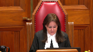
:::

In the case of W.O. against Her Majesty the Queen, R. Craig Bottomley and Melia Kinville for the appellant W.O., Valerie Bailey and Roger Pinnock for the respondent Her Majesty the Queen.

There is a publication ban in this file pursuant to section 486.4 of the Criminal Code.

So, Mr. Bottomley, the floor is yours.

**Speaker 2** (00:00:58): Good morning, thank you Justice Cote.

::: {.column-margin}
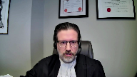
:::

Good morning Justices.

There's an important principle at play in this appeal where the complainant story evolved significantly during the course of cross-examination.

However, the trial judge held that this had no impact on credibility as it was simply what he deemed to be late disclosure.

I submit that the need for an informed and sensitive credibility analysis does not obviate the need to conduct a fulsome credibility analysis.

Forgiving prior inconsistent statements in a credibility case as merely delayed disclosure in this matter led to insufficient reasons that deprived the appellant of understanding why he was convicted and why the presumption of innocence was overcome.

In addressing this argument, Ms. Quinville and I will attempt to hit four points.

One, that the insufficiency, well there was an insufficiency of reasons that was caused by the trial judge overextending the principles in DD and DP.

We will address the circumstances in which it is appropriate for an appellate court to cobble together reasons, explaining what happened in the court below.

And three, was the majority of the court correct in its resolution of these issues?

And then finally, Ms. Quinville, my colleague, will address you on the impact of the failure to address the motive to fabricate in this case.

So starting with what I will call the failure of the trial judge to give reasons, the issues arise against a backdrop where the defense submissions on the core issues of credibility largely centered on three factual inconsistencies.

One, the revelation of a new sexual assault allegation that had never been mentioned before the cross-examination was underway.

Two, a factual contention relating to scarring that seemed to defy logic and reasonable experience.

And then three, an email which set out parameters upon which the complainant would again visit her father, which existed in contrast to her purported fear of being alone with her father and for her sister's safety if they were to go visit.

To the extent that this impacts on the credibility analysis, I'll be relying on our written submissions.

The email more directly impacts on the motive to fabricate and was something that defense counsel specifically relied on in his closing argument, but one that the trial judge did not address.

And Ms. Quinville will carry the argument on this point.

So the core of my submissions will center on what Justice Nordheimer in dissent at the Court of Appeal described as a panacea for any credibility problem that arose during the course of the trial.

He somewhat naturally observed that the principles from DD and DP are critical for the purpose of dispelling stereotypical thinking about how victims of sex assault should be expected to reveal abuse, but it is not a panacea for every issue that arises in a credibility analysis of a complainant's evidence.

Let me say at the outset that DD and DP are critical decisions.

They are important decisions.

They are vital to a system that is fair to all sides.

There is no place for stereotypical reasoning of how a sexual assault victim should act or should disclose.

But I would like to just harken back to the facts of those two cases.

In DD, there was a single delayed disclosure approximately two and a half years after the alleged assault.

And in DP, the first disclosure came eight years after the fact and then was followed by what was called piecemeal disclosure, another piece of disclosure about two months later.

There is no scenario in either of these cases where the delayed disclosure came during the course of the trial, came during the cross-examination, and was still deemed to be delayed disclosure or piecemeal disclosure.

In my respectful submission, it's impermissible to treat new disclosure, something that arises in cross-examination, as simply being new disclosure and not engage with the prior inconsistent statement on the issue of credibility.

And further, Mr. Bottomley,

**Justice Côté** (00:05:41): Okay, I'm sorry to interrupt you, but on that, yes, it came during the cross-examination, the Niagara incident, but the judge said that it found this credible, given the narrative before and the evidence presented that it was very difficult for the complainant to come forward, and so he said it's not incompatible with what I have heard in the evidence about her first talking about the incident.

::: {.column-margin}
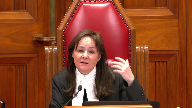
:::

**Speaker 2** (00:06:13): But in that, thank you for your question, Justice Côté.

::: {.column-margin}

:::

As it occurred though, it's not that she just had one opportunity to provide this story.

She first tells the boyfriend, then the mom, then gives her first police statement on September 16, 2013.

She then writes the email on May 4, 2013.

Then on March 10, 2015, she gives what's been called, in this case, a victim statement, goes through her in-chief evidence, no mention of it, and it's not until cross-examination.

And in that victim statement, Justice Côté, she talks about how nice the detective is to her, such that she can open up, and still no mention of what I'll call the Niagara Assaults.

And that niceness is something, in fact, even recognized by the majority of the Court of Appeal.

It's hard to imagine, in my respectful submission, that the cold, pressurized, intense environment of a trial court, with defense counsel cross-examining her, was the warm environment where she'd feel comfortable disclosing a new sexual assault.

Not that it can't happen, but in these circumstances, it cries out for a credibility analysis to be conducted in a critical fashion.

The prior inconsistent statements are the hallmark of fabrication.

It is the one place where defense counsel can refute allegations that may be hard to refute.

I asked the Court, what would it look like if a complainant were, in fact, fabricating?

It might look like the allegations arose where there's a motive to fabricate, and where the story changes under cross-examination, and it's not sufficient in this factual circumstance to extend the principles of DD and DP to what I'll be calling a panacea, and say, well, there's just a delayed disclosure, and we can't assume how victims will act.

And the difficulty, of course, is that if you just do that, if you just say, well, delayed disclosure, and sort of leave the issue there, then this leads to a point where a person who is presumed innocent before the Court, the defendant, cannot know how this was meaningfully resolved in a way that lets them know why they lost.

And it was this Court, the Supreme Court, in REM that held in order for reasons to be sufficient, they must explain to the accused why the person was convicted or acquitted, in addition to providing public accountability and reasons that were available for appellate review.

**Justice Rowe** (00:09:11): Of course, if you're taken by surprise, by evidence, you can always say to the judge, I want an adjournment.

It has happened at trials that I've been conducting.

**Speaker 2** (00:09:24): Thank you for your question, Justice Roe, but I don't think you should have to.

::: {.column-margin}
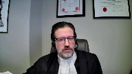
:::

I think, you know, any experienced trial lawyer, and I know the trial lawyer in this case, a very good trial lawyer, should be able to say, oh, this is a new story.

Let's hear the details from it.

Let's hear the details of this newly revealed sexual assault.

This isn't a bad thing for the defense generally.

This isn't something you need to recover from.

This is something in cross-examination you want, because traditionally, when a new version of events comes up, you think, oh, wonderful, says the defense lawyer.

We'll be able to point to this as a prior inconsistent statement, one of the hallmarks of fabrication, and we'll be able to challenge this story.

But it becomes impossible to do that if the answer is people disclose slowly.

And I agree, people disclose slowly.

But surely the disclosure process, the farther into the proceedings you get, if you've made it through two years of investigation, and you've made it through the in-chief, and you're now into cross-examination, at some point in my respectful submission, it moves away down the spectrum from disclosure and across over to prior inconsistencies.

Mr. Bottomley, oh, sorry.

Not at all.

**Justice Kasirer** (00:10:42): Well, the judge in paragraph 29 of his reasons anchored his explanation not just in the general principles of DD and DP, but in his view of how the matter evolved in the courtroom and how he could explain how having focused on the abuse already disclosed in the video statement, the evidence in chief, that she would struggle with details thereafter.

::: {.column-margin}
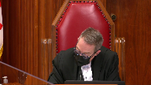
:::

Is that not a sufficiently independent basis for his conclusion?

**Speaker 2** (00:11:26): So, I'll take you to that, and if it assists the panel in finding that exact portion, you'll find it behind tab five of our condensed book.

::: {.column-margin}

:::

And what the judge says there is, I am unable to draw, first he says, I think it's important, because he tethers that in the previous paragraph to saying there's a delayed disclosure.

In this case, I'll say exactly what he said, considering the reasons why victims of sexual assault often delay the disclosure of the assault or disclose them in a piecemeal way, and the disclosure narrative referred to by Crown counsel, I am unable to draw an adverse inference from the fact that the complainant did not mention Niagara Falls allegations during the police interview.

I am also unable to draw an adverse inference from what the defense counsel has described as a lack of detail and nonsensical evidence from relation to the Niagara Falls allegation.

And I'll pause there for a moment, because what defense counsel was referring to was, he said, in essence, pared down, and you can find this in our condensed book as well, I'll take you to it in a moment, he said, what were the details of this sexual assault in the trailer?

And the answer essentially was, just like all the other times that I've described, it was just like the times in the trailer.

And then the trial judge continues, having not previously disclosed the sexual abuse, the complainant was unexpectedly on cross-examination confronted with the Niagara Falls trip.

Having viewed her statement and having just given her evidence in chief, she was understandably focused on the abuse already disclosed.

It is unsurprising that she would struggle with the details of the previously undisclosed abuse without having had time to think about it, especially given that it had taken place five years previously.

I find that there would be nothing improbable about the details of the abuse that she did relate.

And that's the complete analysis as to how the inconsistency is analyzed.

Nothing more is said, but surely that's not an answer to the problem.

It wasn't just that she hadn't mentioned the allegations to the police.

She hadn't mentioned them to anyone ever.

She hadn't in, you know, multiple meetings with multiple agencies, she met with the police, she met with CAS, she had at least two interviews with the police, she wrote this victim statement, she testified in chief, no mention.

And Justice Nordheimer in his dissent, I think, puts it fairly succinctly where he says, there's no evidence that she wasn't focused on the assaults here.

This is what she had come here to talk about.

And I remind the court, my core argument here is that in DD and DP, the disclosures came well before the trial ever started.

So to tether this explanation to, well, it's just delayed disclosure, goes far beyond what was contemplated in DD and DP, where you have what I would call something closer to the other end of the disclosure spectrum and not as close as in this case as we have to the prior and consistent end of the spectrum, as they say.

**Justice Côté** (00:14:43): Let's say, let's say and don't assume anything, but just for the purpose of the argument, let's say that the reasons were not sufficient regarding that Niagara incident.

::: {.column-margin}
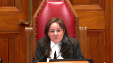
:::

What about all the other findings and explanations of the trial judge?

Don't we have to read the reasons as a whole?

**Speaker 2** (00:15:03): Absolutely.

::: {.column-margin}
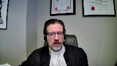
:::

But when you're looking to the whole, I don't mean to be glib, but I would say there's a hole in the hole.

There's this significant omission in the trial reason.

If the reasons are insufficient on Niagara, then the question has to be asked.

Let's say the credibility analysis went the way the defense had hoped and said, well, that seems awfully strange that you wouldn't mention this five-day trip in a new setting on what was a major event in a young woman's life.

She takes this trip with her dad from, I won't say from where, but from a small town in Ontario and goes on the Maid of the Mist and goes on a helicopter ride.

And the whole thing is marred by repeated sexual assault in this otherwise major event in her life.

You would think that the credibility analysis is going to go the way the defense counsel hopes.

And if that's so, and if there's a determination that she was fabricating this portion of the story, then there's a natural question to be answered, which is if she's going to fabricate that in the midst of custody proceedings, have you made out the case beyond a reasonable doubt?

In my respectful submission, if it's insufficient on Niagara, then the reasons are corrupted and insufficient throughout.

And it's not just.

**Justice Côté** (00:16:23): Mr. Bottomley, you said that maybe she fabricated this in the midst of custody proceedings, but this Niagara incident was raised at trial during the cross-examination, and my understanding is that at the time of the trial, the custody fight was resolved.

**Speaker 2** (00:16:40): Sure, absolutely Justice Cote, thank you.

::: {.column-margin}

:::

But as she's confronted with this, she has to realize that the rest of the story she's put forward wouldn't make any sense.

And that in fact was the exact submission of defense counsel at trial to the judge asking him to resolve that issue.

And there was more to it, of course, because there's also the scars element where the complainant wrote in what's been deemed a victim statement, not to be confused with the often referred to victim impact statements in criminal courts, that she had lasting scars that had been created on her chest when her father dragged his teeth across her skin.

And she's cross-examined on this point and on the fact that she had not mentioned the scars or any dragging of the teeth during any of the prior interviews.

And she's cross-examined at length on this and gave a series of descriptions to the court.

And we've excerpted that from our factum.

It's detailed at paragraph 27 of our factum and it's included in our appeal book, sorry, our condensed book behind tab seven of our materials.

And there are several different, I think we've got A through I listed as different versions, but at its core, she has different versions that the scars are starting to fade when she gives her victim statement, which was two and a half years after she said the cuts had been inflicted.

And then she says, in fact, the scars were not visible and you can't see them at the time she gives her statement.

And then she says she doesn't know whether they're visible or not.

So there's some difficult inconsistencies here for a try or a fact to resolve.

And in my respectful submission, I ask you to flip this on its head and think of the profound, powerful evidence that would have existed for the crown to use if in fact the scars were there, if the crown had been able to say, look at these scars, that's proof positive of what she's saying.

I say that the absence of scars now saying, well, there are scars that are lasting and are visible and then they're not there.

Oh no, no one can see them and nothing like that.

That absence of evidence pulls with equal force in the opposite direction towards a reasonable doubt.

And rather than reconcile these versions, the trial judge again relies on an overextension of the principles from DD and DP.

And we have in our condensed book at tab five, we have his reasons where the trial judge writes, however, the reasons why so many victims of sexual abuse delay in reporting the abuse of tethering it back to those principles also apply to the details of the abuse.

There was nothing surprising about the way the disclosure of the marks unfolded in this case.

What was important for the complainant was not so much the incident that caused the marks, but rather how the marks made her feel when she saw herself in the mirror.

It was this latter concern that was addressed in her statement.

And I can do no better than Justice Nordheimer, who writes in the dissent, and you'll find this behind tab eight in our condensed book.

At paragraphs 80 and 81, Justice Nordheimer writes in my view, the trial judge failed to address this issue in any meaningful way in terms of the complainants credibility.

First, there is no evidence that the incident that caused the marks was not important to the complainant.

And I'll just pause to say here, you know, if she was surprised by the Niagara Falls allegation, surely she wasn't surprised by this issue of the scars and when these were caused.

To the contrary, her father's assaultive behavior was front and center in terms of her concerns.

Second, the idea that her father dragged his teeth across her breasts in the course of a sexual assault that caused scarring that lasted for a year to a year and a half on its surface, extremely troubling.

While there was no medical evidence on this point, common knowledge would raise questions about whether such injuries could have occurred as described by the complainant.

The evidence raised an obvious problem regarding the complainant's credibility that simply could not be dismissed in the fashion that the trial judge did.

It certainly could not be dismissed on the basis of delayed disclosure and the principles enunciated in DD.

On that point, my colleague says that the trial judge did not sidestep the issue by improperly relying on DD and DP, although she does allow that the trial judge's reasons might have been clearer.

That is more than a generous characterization of the trial judge's reasons.

The fact is that the trial judge did sidestep this issue, something he was not entitled to do, and I of course say that Justice Nordheimer was right.

DD and DP were meant as an important warning, an important caution against stereotypical reasoning, but there is no scenario in either of those cases, as I say, where there is delayed disclosure that comes at the end of the trial and it's impermissible to tie this reasoning to a delay in reporting and treated as simply new disclosure and not engage with the credibility issues beyond that.

**Justice Kasirer** (00:22:20): Mr. Bottomley, what's your view of paragraph 35 of the trial judge's reasons on this point?

**Speaker 2** (00:22:35): Well my view of it is that it's conclusory, that it simply says well there's nothing ridiculous about that.

::: {.column-margin}

:::

Well why not?

Why is it that you know such wounds were caused that led to scarring, that scars that disappear when questioned about it shortly after writing, I have scars that I can see.

There are scars that are still visible when I look in the mirror.

And then the police go and report it.

**Justice Kasirer** (00:23:02): He does, in fairness, I understand your point.

::: {.column-margin}
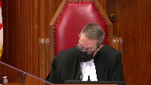
:::

I do understand your point.

But in fairness, it is slightly more than conclusory, is it not?

He attempts to explain his view of how she noted she would have been able to see the marks, even if they were not visible to others because she had known where they were.

**Overlapping speakers** (00:23:25): So that's X-Planet.

**Justice Kasirer** (00:23:26): not conclusory at first blush.

It might not be a happy explanation, but it's not a conclusion.

**Speaker 2** (00:23:34): Right, well, I mean, if we go back to REM, it has to be an explanatory, I won't say it has to be a happy explanation, and it certainly doesn't have to favour the defence, but it does have to provide a logical resolution to the issue.

::: {.column-margin}

:::

There's a qualitative difference between what's happening in DD and DP, which is the tether and the tools that are available to the defence lawyer in this case, or the hallmarks that are available to defence counsel in this case, to point to and say, this is how you know it's a fabrication, there has to be a meaningful response, not an overextension of principles.

I see I've got about a minute and a half left in my time, if I'm going to leave Ms. Quinville any room to address what I think is a very important point on the motive to fabricate.

So I'll try and compress the next two points to say, you know, to what extent can a reviewing court review and cobble together better reasons than the trial judge, and my summarized position on this is you can only do that where there are two things, one, where the explanation follows the law, and in this case I say it doesn't if it leads to an overextension of DD and DP, and two, where the explanation you're summarizing is patent on the record.

And I would point to, for your later consideration, paragraph 56 of the REM decision, which exists under the very helpful heading of the role of appellate courts in assessing the sufficiency of reasons.

And then on whether or not the court, well I think I've answered this question in response to Justice Cote's inquiry, but tying it to the disclosure narrative when you're cobbling together those better reasons, I say that you have to address the core problems.

It's not enough in this case where the inconsistency arrives at the end of the legal proceedings and simply say, well it relates to DD and DP, and that's true of the Niagara allegations and inconsistencies, and it's true of the Scars where I say the majority simply repeated the trial judge concludes or restatements that she didn't remember how long the Scars were there for and there's nothing ridiculous about her account of how they were caused.

That's not an analysis and reasons like that are not sufficient for the defense to understand why they lost the trial.

And I would just advert to Justice Nordheimer's conclusion and my conclusion and say in the end result, I return to the purpose of reasons as enunciated in Shepherd, they exist to explain to the parties why they lost and Justice Nordheimer concludes by saying the appellant in this case was entitled to know why he lost.

He has never been told and that renders the trial unfair.

And with that said, I'll turn it over to Ms. Quinville to address you on the issue of motive to fabricate.

**Justice Côté** (00:26:56): Thank you, Mr. Bottomley.

**Speaker 1** (00:26:59): Yes, good morning justices.

::: {.column-margin}

:::

The failure to address the motive to fabricate in this case is a critical issue because of its potential to raise a reasonable doubt.

The complainant's motive to fabricate was that she did not want her father to have custody over herself and her sisters.

And it's significant that she made this complaint approximately two weeks before a custody hearing was scheduled between her mother and father.

I would refer you to Justice Doherty in BAT, which is behind our tab 15 of our condensed book, where he says it is difficult to think of a factor which as a matter of common sense and life experience would be more germane to a witness's credibility than the existence of a motive to fabricate evidence.

It is an uncontroversial proposition that the motive to...

**Justice Côté** (00:27:44): Is it not a fact that when defence counsel made his submissions he did not identify this element motive to fabricate as a major area.

::: {.column-margin}
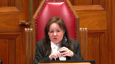
:::

The defence counsel said he had three major areas which were discussed by Mr. Bottomley but this one the motive to fabricate was not identified as such as a major area.

**Speaker 1** (00:28:11): Respectfully, Justice Cote, I would disagree with that proposition.

::: {.column-margin}
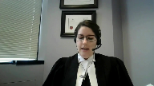
:::

I think he arranged his submissions in three major areas, one of which was the May 2013 email.

And there were a few different points that went along with that email, one of which was the motive to fabricate.

The motive to fabricate.

The majority acknowledged this that the motive to fabricate was framed as a part of the May 2013 email, and the majority said that the judge addressed the issue.

And I agree that to some extent, the, the aspect of the email which the judge had addressed, which is the appealants, or pardon me, the complainants anger at her father was part of the submissions raised.

But trial counsel also used the email as a jumping off point for the evidence about the custody issue, and specifically that evidence was that prior to the email the complainant had refused to go on visits with her dad for some undetermined period of time.

I don't think there's clear evidence on what that period of time was.

That following the email the complainant attended a counseling session with her dad.

And after that it was the complainants opinion that nothing changed.

At some point in this timeline he had failed to attend her grade eight graduation.

She fought with her mom and called her dad one night in anger and told him that she wanted to live with him.

And that was sort of the initiation of the custody proceedings which were then over her head for about two months until the custody hearing in September of 2013.

And as I've already noted, the allegation came about two weeks before that custody hearing.

So, it's very clear, I would submit in in child counsel's closing submissions that the custody issue is a related, but also a distinct argument about the email that the plaintiff had refused to go on visits with her dad.

**Justice Kasirer** (00:29:55): Ms, Ms. Kenville, thank you for that.

::: {.column-margin}
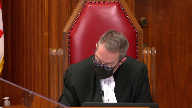
:::

Would, would you comment on Justice Hoy, paragraph 53, where she remarked on the fact that trial counsel, the appellant's trial counsel questioned the complainant about her understanding of the custody proceedings, but never directly put to the complainant that she had fabricated the assaults because she did not want the appellant to have custody over her.

**Speaker 1** (00:30:22): I agree, Justice Kasser, to some extent that that's true.

::: {.column-margin}

:::

Trial counsel did, however, put directly to the complainant that she might have come up with this because she didn't want her dad to have access to her sisters.

I would also make the point that it's not necessary for trial counsel to have put this proposition directly to the complainant.

This isn't a brown and done issue.

This is an issue of what was raised on the evidence.

And I have provided quite a few pages behind tab 19 of all of the evidence and submissions that were directly related to this issue that came up during the trial.

And I think that's my time.

Thank you, Justices.

**Justice Côté** (00:31:01): Thank you very much.

We will now hear Miss Bailey.

**Speaker 3** (00:31:07): The Crown's position is that the majority of the Court of Appeal for Ontario was correct to find that the trial judge's reasons were sufficient.

::: {.column-margin}

:::

The reasons met the functional and contextual test this court has set out for sufficiency of reasons, which the majority articulated and then applied in their reasons.

The trial judge's reasons explained why the judge had reached the conclusions that he reached, and they permitted meaningful appellate review.

They were, as this court put it in the Queen and Walker, responsive to the case's live issues and the party's key arguments.

**Justice Brown** (00:31:46): I wonder if I could take you right to the issue of the Niagara Disclosure.

::: {.column-margin}
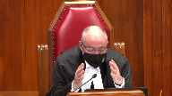
:::

I review the trial judge's reasons and there's no doubt the trial judge is clear that he does not find that that late disclosure or new disclosure, however you want to, however we're supposed to understand that, whether it was incremental or something new.

Trial judge is clear in his mind that doesn't affect the complainant's credibility.

And I just want to signal to you my concern which arises with what I see is perhaps his failure to explain why.

Bearing in mind that the complainant's disclosure contradicted a previous statement that the complainant had made under oath, under oath, that all the abuse occurred at the trailer.

So I just want to signal that to you.

You can address it now, you can address it in due course, but that's something I need to hear from you on.

**Speaker 3** (00:32:53): To answer that specifically now, if I could refer to paragraph 22 of the majority's reasons in the Court of Appeal case, the majority...

**Overlapping speakers** (00:33:05): I thought you were going to take me to the trial judge's reasons, but okay, let's go to the Court of Appeals.

**Speaker 3** (00:33:11): I'll start with the Court of Appeals reasons, because the issue here is whether or not the majority of the Court of Appeal erred in law in their understanding of the trial judge's reasons.

::: {.column-margin}
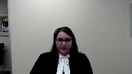
:::

And at paragraph 22 of the majority's reasons, which is in the appellant's record at page 37, the majority noted that the trial judge had reviewed defense counsel's arguments, specifically noting the complainant's comment in her 2013 police statement that she was pretty sure it was all at the trailer.

And then the trial judge explained why he concluded that this did not affect the complainant's credibility.

In the Crown submission, the majority is correct here.

The trial judge identified the crux of the issue that defense counsel had raised at trial, that is the inconsistency between the complainant's police statement and her testimony in cross-examination.

And I'll now refer to the reasons for judgment, which are located at pages 23 to 24 of the appellant's record, starting at paragraph 26.

And this is where the trial judge reviews defense counsel's arguments and then addresses them.

And particularly at paragraph 27, the trial judge says that defense counsel had pointed out that during the complainant's police interview, she was asked where the assaults took place and replied that she was pretty sure it was all at the trailer.

And then that in cross-examination, the defense counsel's position at trial was that the complainant had made up the story of the Niagara assaults in cross-examination.

In the Crown submission, this shows that the trial judge sees his mind of the issue.

He identified that it was an inconsistency that defense counsel was raising.

And then in the following paragraphs, 28 and 29, he went on to explain why it was that in the context of the evidence in this case, in the context of the complainant's disclosure narrative, which he had set out in detail earlier in his reasons, why it was that this inconsistency was not a significant inconsistency that led him to have a reasonable doubt.

So in the Crown submission, the majority was correct.

This was sufficient within the meaning of the test that this court has set out for sufficiency of reasons.

And just to be clear, I'll be addressing the three major areas that defense counsel raised at trial.

And my colleague, Mr. Pinnock, will address the alleged motive to fabricate.

Fundamentally, the Crown's position is that the trial judge's reasons show that he did four things in relation to all of the inconsistencies that defense counsel raised at trial.

First, he identified that some aspects of the complainant's evidence were inconsistent or unclear.

Second, he understood the appellant's position in relation to these issues.

He understood that defense counsel was relying on these inconsistencies as a basis for reasonable doubt.

The trial judge, third, grappled with the alleged inconsistencies.

And fourth, explained why the alleged inconsistencies did not raise a reasonable doubt.

The majority did not agree with him.

**Justice Rowe** (00:36:28): One of the things that it's a bit intangible, but I think it's very important for trial judges, and it's also important for appellate judges to bear in mind.

::: {.column-margin}
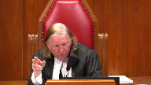
:::

If you say, as trial judge, I can understand why the inconsistency A has arisen, I can understand why the inconsistency B has arisen.

I am not persuaded by the questioning of the motivation to fabricate.

At the end of the sequence, though, I think you have to say, while neither of these, in and of themselves, causes me to have a doubt about the credibility of the complainant, it's incumbent on the judge to say, do they all taken together undermine the credibility?

I'm not saying that the judge made that what I think can be a fatal error, but I'm also not seeing the judge do that.

**Speaker 3** (00:37:49): I have two responses to that, and the first is it's important to read the reasons as a whole, as the majority did, and in this case it's clear from reading the reasons as a whole that none of the three major areas that defense counsel raised at trial alone or taken together caused the judge to have a reasonable doubt.

::: {.column-margin}
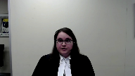
:::

And the second answer is the way that the test for sufficiency of reasons has been articulated by this court in the past.

For example, in I apologize I'm just looking for the reference, in REM this court expressed the test as follows.

Reasons are insufficient only if they are so deficient that they fail to disclose an intelligible basis for the verdict, and therefore foreclose meaningful appellate review.

And that's at paragraph 16 of REM.

In the Crown's submission, in this case the reasons do disclose an intelligible basis for the verdict, and they do permit meaningful appellate review, meaningful appellate review that the majority of the court of appeal was able to engage in.

And for that reason they are not insufficient within the meaning of the functional and contextual test that this court has set out in the past.

The question isn't whether the trial judge could have expressed himself better, could have said more, or even whether it would have been better for the trial judge to say more.

It's whether or not the reasons explain the basis for the verdict and permit meaningful appellate review.

And of course the reasons must always be read as a whole and in the context of the evidentiary record.

Specifically in relation to the Niagara Falls allegations, the majority found that the trial judge had identified and resolved this issue in a fact-specific manner.

And in particular the fact-specific approach that the trial judge took here, it wasn't simply relying on the principles in DD and DP in some abstract way, but rather the trial judge looked at the evidence in this case, the complainant's disclosure narrative, essentially how she had disclosed the abuse incrementally, reluctantly, and in stages.

And the trial judge relied on that to conclude that this was not a significant inconsistency.

It was not an error for the majority to find that the trial judge was entitled to advert to and rely on these principles.

The trial judge did not depart from prior jurisprudence on delayed and incremental disclosure, but rather based on the circumstances revealed by the evidence in this case, and that's language from the Ontario Court of Appeals decision in DP, the trial judge did not find the complainant's testimony about the additional incidence of sexual assault to be a significant inconsistency.

And the majority was correct that there was no basis for appellate intervention in relation to that finding.

**Justice Rowe** (00:41:02): I just want to put in another very simple point.

::: {.column-margin}
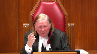
:::

It may, it's well settled in the jurisprudence and I think founded on good social science, psychology and the like, that people who've been subject to abuse are very reluctant to tell their story and sometimes it comes out piecemeal.

And you have to, of course, bear that in mind.

But if someone keeps changing their story, it doesn't enhance their credibility in any way that they disclose piecemeal.

In a sense, you always see a series of question marks.

What's happening here?

And in many instances, it will be an adequate explanation to say is this is simply a natural consequence of sort of psychological conflict.

But it doesn't help that you disclose piecemeal.

And it's almost as if the trial judge is saying, oh well, the fact that it's coming out piecemeal almost makes it more believable, which is very counterintuitive.

**Speaker 3** (00:42:21): In the Crown submission, that's not what the trial judge did here.

::: {.column-margin}
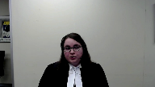
:::

And that's borne out by the way that the trial judge structured his reasons by identifying the three major areas that defense counsel raised and then addressing each one in turn.

What the trial judge was doing was explaining why he didn't find these issues, these inconsistencies to be significant ones.

So that's different from using it to enhance the complainant's credibility.

Rather, he's explaining why each of these issues doesn't cause him to have a reasonable doubt.

And it was an issue for the trial judge to determine and in the Crown submission, it was a factual finding that was open to the trial judge and to which deference should be shown.

And the majority was correct to show deference to that factual finding.

I'll turn to the issue of the complainant's marks, the marks on her skin, the scars on her skin.

Again, the majority was correct to find that the trial judge had given sufficient reasons in relation to the marks on the complainant's skin.

Once again, the majority found that the trial judge had both identified and then resolved the issue.

The majority found that the trial judge's reasons made it clear that he didn't have a reasonable doubt.

The majority found that the trial judge's reasons made it clear that despite the delayed disclosure of the marks, the judge had accepted the complainant's evidence that the appellant's teeth had left marks on her chest.

And this is at paragraph 38 of the majority's reasons.

And I would highlight despite the delayed disclosure, because that wording means that the majority understood and addressed the issue here, which was not only the inconsistency in relation to or the vagueness in the complainant's evidence about how long the marks had remained on her skin, but also the delayed disclosure.

That was the issue that had been raised at trial, and the trial judge identified that issue.

The majority found that reading the reasons as a whole as they must be read, and in light of the record, the trial judge had sufficiently resolved the issue, because he found that the complainant's evidence at trial was that she did not know how long the scars had remained visible.

So in other words, the trial judge found that the complainant's evidence about when the marks had faded was not inconsistent.

It may have been unclear, and she may have given different estimates, but ultimately she was not sure.

And that again is a factual finding that is owed deference on appeal, and the majority was correct to defer to it.

Ultimately, the majority said that while the trial judge's reasons on this issue might have been clearer, that is not a reason for a new trial.

And they did not err in reaching that conclusion, because as I've mentioned, the test for sufficiency of reasons doesn't ask whether the trial judge could have expressed him or herself better, but rather it asks whether the reasons explain the basis of the verdict and permit appellate review.

And I'll finally turn to the third issue, the complainant's email, which was the third major issue that defense counsel raised at trial.

And again, the majority found that the trial judge had directly addressed and resolved defense counsel's argument at trial that the contents of the email the complainant sent her father could not be reconciled with her allegations.

And the majority quoted the trial judge's finding at paragraph 45, which sets out the reasons why the trial judge concluded that the email was not irreconcilable with the complainant's allegations, that it ignored the dynamics of her relationship with her father, that she wanted to spend time with him because he was her dad, she needed him to be a part of her life, and the abuse had stopped six months prior to the email, and the same reasons why she delayed in disclosing the abuse would apply to her failure to mention it in the letter.

The majority was correct to find that this was sufficient to deal with this issue.

In the excerpt the majority referred to, the trial judge explained why he rejected the argument that the complainant's email was inconsistent with the allegations.

Overall, the majority was correct to find that there was no basis for appellate intervention in relation to any of the three issues I have discussed.

The trial judge expressly and directly addressed all three of these major areas, and he addressed them in the way that they were raised at trial in the terms that defense counsel at trial raised them.

The trial judge did not sidestep these issues, but rather grappled with the alleged inconsistencies and resolved them, and the reasons were therefore sufficient, and this court should uphold the majority's conclusions.

Subject to any questions, my colleague will now address the issue of motive to fabricate.

Thank you.

**Justice Côté** (00:47:14): So, Mr. Pinnock?

**Speaker 4** (00:47:18): Thank you Justice Cote and thank the court.

::: {.column-margin}
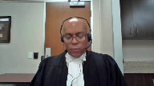
:::

I will briefly address the issue of motive to fabricate.

The majority correctly concluded that no error flowed from the trial judge's failure to reference the defense claim that the complainant's desire to resolve the custody dispute in favor of her mother gave her a motive to fabricate the allegations against her father.

At the outset, it is important to contextualize this issue, which the appellant has described in his factum as the very heart of his defense.

First, when trial counsel for the appellant in his closing submissions identified three major areas he wished to advance, custody proceedings giving rise to a motive to fabricate was not among them.

It is difficult to reconcile that choice with the present claim that this issue was the very heart of the appellant's case.

Second, while the complainant was subject to a very thorough cross-examination, trial counsel for the appellant didn't ever choose to put to her that her wish to avoid living with her father was driving fabricated testimony about his conduct.

Finally, and perhaps most significantly, the custody proceedings had been resolved in favor of the complainant's mother as of the time of trial, so the supposed motive to fabricate her testimony was factually moot at the time of trial.

And it is within this context that we must assess the trial judge's omission to reference this discrete point.

The jurisprudence tells us that the reasons must be assessed in the context of the record as a whole, including the live issues and positions of the parties to determine whether they explain the verdict.

And in making that assessment, appellate courts are cautioned that trial judges are not held to a standard of perfection.

Specifically, trial judges are not obliged to resolve every inconsistency or reference every argument advanced by counsel.

And finally, where credibility is the foundation of the trial judge's ruling, appellate the difficult.

**Justice Brown** (00:49:37): The difficulty though is the rule that trial judges are not to be expected to resolve every inconsistency.

::: {.column-margin}
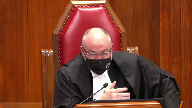
:::

It's not the same thing as saying trial judges are not expected to resolve any inconsistency.

And here there's a glaring inconsistency.

Now maybe the trial judge resolved it, perhaps your colleague is right on that point.

But if there's a glaring inconsistency and it's the only inconsistency in the case, would you agree with me that the trial judge has an obligation to deal with that?

Or does the rule that trial judges are not expected to resolve every inconsistency means that they don't have to resolve any inconsistency?

**Speaker 4** (00:50:23): In response, I would adopt my colleagues submissions on that point pointing to the test for sufficiency of reasons, and the requirement that they, in a whole, explain an intelligible basis for the verdict which we submit they do in this case.

::: {.column-margin}
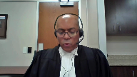
:::

My submissions on on this point relate to the discrete issue of the motive to fabricate arising from the custody proceedings as opposed to the previous issues already addressed by my colleague.

**Overlapping speakers** (00:50:53): I know, but I just wanted to know what you thought about that.

**Speaker 4** (00:50:55): Understood, I.

**Overlapping speakers** (00:50:59): May I ask you this question?

**Speaker 4** (00:51:01): broadly dispute the assertion, but I do take the position that as a whole these reasons do explain the verdict and the trial judge did confront and grapple with and resolve the inconsistencies that presented before him.

**Justice Martin** (00:51:16): May I just ask you why, um, you talk about it being factually moot at the time of the trial, but isn't the argument that it was a powerful allegation made at a moment in time when it had a relevance to a custody dispute, isn't, isn't that what the defense is saying?

::: {.column-margin}
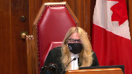
:::

**Speaker 4** (00:51:40): Indeed, the defense could have, if they wanted to make that the basis of the allegation of a motive to fabricate, could have put to the complainant that she was giving false testimony for this reason.

::: {.column-margin}
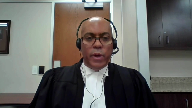
:::

The court will recall that the defense did in fact put to the complainant that she was fabricating her testimony because she was angry with the appellant at feeling that she, the complainant had been replaced by the appellant's girlfriend's sons.

That's referenced in paragraph 53 of the ruling of the court of appeal.

And this hearkens back to the need to look at the reasons as a contextual whole.

In this case, we can glean from the defense what they believe to be important and central to their case.

As defense counsel told us, he told us the three areas that were of the greatest significance.

And when faced with the complainant in cross-examination, he put to her those circumstances which in the view of the defense were the most significant.

And he challenged her as having a motive to fabricate on this basis, but not on the basis of the custody proceedings being still a prominent factor in her giving false testimony before the court.

And I can't speak to why that choice was made, but in my respectful submission, the inference to be drawn from that choice is clear.

This issue is being elevated to a far greater level of importance on appeal than it held at trial.

In my respectful submission, the majority was properly guided by the established jurisprudence and assess the reasons for judgment as a whole and correctly concluded that the trial judge's permission to specifically reference custody proceedings as a motive to fabricate was not an error.

The question before them wasn't whether he should have made reference to the issue, but rather whether his failure to do so rendered his reasons insufficient and prejudiced the appellant's right of appeal.

In the respondent's respectful submission, the ruling of the majority discloses no error.

They observed that the trial judge engaged appellant's trial counsel on the impact of the May 2013 emails.

Moreover, the trial judge directly engaged Crown counsel on the complainant's desire to avoid living with her father.

The majority reviewed the record as a whole and concluded that it demonstrated that the trial judge had seized the substance of the defense position, but was satisfied beyond a reasonable doubt that no fabrication had taken place.

He found the complainant to be credible.

His finding is entitled to deference, and his reasons for that finding are intelligible on a review of his reasons for judgment.

The reasons for the majority in dismissing the appeal below disclose no error, and the appellant respectfully requests that this appeal likewise be dismissed.

**Justice Côté** (00:55:05): Any reply?

**Speaker 2** (00:55:07): Yes, thank you so much.

::: {.column-margin}

:::

I'll start with my good friend, Mr. Pinnick's argument.

He says, look to what the defense submitted to find what was important to the defense.

Behind tab 19D of our condensed book, at page 100, you'll find Mr. Marchetti making the following submissions.

But the alternative explanation is much simpler and more in accordance with human experience, which is that this young girl or young woman was angry about her parents getting divorced, that she loved her father very much, that she enjoyed visiting him and spending time with him and her sisters, but then he got a new girlfriend and replaced her mom

and she wasn't ready for that.

It goes on to address the custody issue.

We've provided behind tab 19 literally dozens of examples of examples where evidence on that point arose during the trial, not just with the complainant, but with different witnesses.

It was definitely thematic to the defense.

And I'd say, you know, there are a couple of motives to fabricate that exist in this case, but one of them leads to a reasonable doubt.

And if the trial judge doesn't address that, that's a fatal error.

My friend, Miss Bailey, I'd just like to address one or two points in her submissions.

One, she read to you from REM paragraph 16 in discussing the functional test.

But if you were to continue to paragraph 17, you would see what I say is the beating heart of the REM decision, which has the language, the critical language of relating the what to the why, the what to the why, the what to the why.

So, and I say, and it's been the core of my submissions, that the bridge between what to why can't be built on a legal error, which in this case is the overextension of DD and DP.

And then just on a factual point where my friend says, you know, all she said, all the complainant says was, I'm pretty sure this just happened at the trailer.

I'll take you to tab four of the condensed book, just so we have exactly what was said.

It wasn't just, I'm pretty sure it happened at the trailer.

Behind tab four, you have her statement where she's asked by the police, okay, and these times the sexual intercourse part, that was at the trailer.

She nods yes.

The detective asks, did it happen?

She answers yes.

Police, any time, sorry, any other place besides the trailer answer, most of it was at the trailer.

I think it was the odd weekend when we ended up going up to his mom's house that it happened there.

Okay, so, but I'm pretty sure it was all at the trailer.

So that's the context.

It either happened at the trailer or at his mom's house.

Certainly not in Niagara Falls.

And those are my respectful submissions and reply.

**Justice Côté** (00:58:15): So we'll ask all the lawyers to remain at our disposal.

::: {.column-margin}
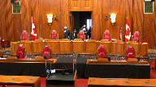
:::

The court will retire and we'll come back.

Thank you.

The court.

So thank you for your patience.

And the court is ready to render its decision.

But we want to thank all the lawyers for their very able and interesting submissions.

Here is our decision.

We are all of the view that the appeal should be dismissed substantially for the reasons of OACG.

The court is adjourned.

Thank you.