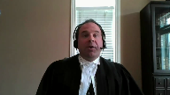

---
title: City of Toronto v. Attorney General of Ontario
published-title: Heard
date: 2021-03-16
sidebar: false
---

This transcript was made with automated artificial intelligence models and its accuracy has not been verified. Review the original webcast [here](https://scc-csc.ca/case-dossier/info/webcast-webdiffusion-eng.aspx?cas=['38921']).
---

**Justice Wagner** (00:00:03): Dr. Claude Lacour.

::: {.column-margin}

:::

Please be seated.

Good morning.

In the case of City of Toronto against Attorney General of Ontario, for the appellant City of Toronto, for the intervener Toronto District School Board, Paul Coven, for the intervener Fair Voting British Columbia, Nicolas M. Rouleau, for the intervener David Asper Center for Constitutional Rights, Alexi N. Wood, for the intervener Canadian Civil Liberties Association, Geeta Philippuple, for the intervener Center for Free Expression at Ryerson University, Jamie Cameron, for the intervener City Place Residents Association, Selwyn A. Peters, for the intervener Durham Community Legal Clinic, Omar A. Ridaei, for the intervener International Commission of Juris Canada, Maître Guy Réjean-Balde, for the intervener Progress Toronto, Donald K. Eady, for the interveners Art Eagleton, Barbara Hall, David Miller, and John Sewell, Christine Davies, for the intervener Federation of Canadian Municipalities, Stéphane-Emar Chabot, for the interveners Mitzi Nation of Ontario and Mitzi Nation of Alberta, Jason Madden, for the respondents Attorney General of Ontario, Robin Basu, and Yashoda Ranganathan, for the intervener on constitutional question, Attorney General of Canada, Michael H. Morris, for the intervener on constitutional question, Attorney General of British Columbia, Mark Witten, and for the intervener Canadian Constitution Foundation, Mr. Adam Goldenberg.

**Speaker 1** (00:02:58): Good morning, Chief Justices, Justices, may it please the Court.

::: {.column-margin}

:::

This case is about protecting what this Court has described as the single most important and protected type of speech.

That is, expression during an ongoing democratic election.

If that expression is not protected by Section 2B, then no expression is protected.

This case is also about protecting the underlying democratic values of one of our most important institutions, the democratic government.

If the circumstances under which a person selects their representative in democratic government is not protected, then democracy itself is not protected.

In our submission, courts, and in particular this court, has the constitutional obligation to provide this protection.

To borrow the language of the minority of the Court of Appeal, Bill 5, quote, left a trail of devastation of basic democratic principles in its wake, and blew up the efforts, aspirations, and campaign materials of hundreds of aspiring candidates and the reciprocal engagement of many informed voters.

Bill 5 was unfair, undemocratic, unprecedented in Canadian history, and most importantly for us, it was unconstitutional.

The City says that two of the effects of Bill 5 were unconstitutional.

First, the mid-election interference aspect, and second, the failure to provide for effective representation.

The City submits that Bill 5 was unconstitutional because it infringed Section 2B and is not saved by Section 1.

We say the Bayer test does not apply.

The Irwin test does, and is easily satisfied in this case.

**Justice Côté** (00:04:51): Mr. Chou, I have a question for you because I'm interested to resolve something from the outset.

::: {.column-margin}

:::

In the majority reasons in paragraph 44, the judge said that it is uncontested that the province could do so after the election.

So are you acknowledging that Ontario could have adopted the act outside of an election period?

**Speaker 1** (00:05:25): Well, what we say to that, Justice Coté, is it depends on the situation.

::: {.column-margin}

:::

First, if this court accepts that effective representation is required, then this particular form of Bill 5, which we say does not provide effective representation, could not be implemented after.

However, if you are only discussing the issue of the mid-election interference, again, we suggest there may be circumstances after which it may be inappropriate.

We may have to look at the reason that the Bill 5-type legislation is implemented after.

But generally speaking, we would say if this happened after, and effective representation aside, yes, they could have done so after.

**Justice Côté** (00:06:14): So in your reply factum at paragraph 18, you say that the city is not saying that the municipal framework of 47 words is forever immutable.

::: {.column-margin}

:::

So do you abandon the effectiveness of the representation here?

Because you seem to acknowledge in the reply factum that the province could reduce the number of words.

**Speaker 1** (00:06:40): So we do want to clarify, because there seems to be some confusion as to whether we are demanding a 47-ward structure.

::: {.column-margin}

:::

And I appreciate the question that you've asked about this.

The reason we say that's not what we're saying.

We're not asking for 47 wards.

It just so happened that in this case, there was a 47-ward structure that became a 25-ward structure.

What we say is the province could change that structure, provided that it provides effective representation.

**Justice Rowe** (00:07:15): So we, the courts, not just we, but any superior court, is going to examine the voting arrangements and say whether they pass constitutional muster in terms of the number of constituents represented by each elected person, the boundaries that are set, et cetera, et cetera.

::: {.column-margin}

:::

So we're going to supervise the electoral structure, presumably federally, provincially, municipally, all the public institutions in the country.

We're going to be a busy group.

**Speaker 1** (00:07:58): Justice Roe, what we say is that under the Constitution, you're already required where a claim comes up to supervise or at least to determine whether in the federal and provincial context effective representation is provided.

::: {.column-margin}

:::

That that comes from the Carter case and Section 3 of the Charter.

We acknowledge that Section 3 does not apply to municipalities, but we say, and I will get to in my submissions, how nonetheless the unwritten democratic, the unwritten constitutional principle of democracy does put a constraint on the province when it chooses to create a democratic election for government.

So what if what if?

**Justice Brown** (00:08:39): province chooses not to create a democratic election for government?

::: {.column-margin}

:::

What if the province decides to appoint municipal councils instead of allowing them to elect?

Is that a way for the province to circumvent this magical, unwritten constitutional principle that rights municipalities into section 3?

**Speaker 1** (00:09:01): Justice Brown, what we say is municipalities are not written into Section 3. Indeed.

We say Section 3, it is, you know, we are not saying that.

But you're trying to.

**Justice Brown** (00:09:11): have us write them into them effectively through the bibbidi-bobbidi-magic of an unwritten constitutional principle.

**Speaker 1** (00:09:19): to answer your question, what we would say is that where the province has, as in this case, chosen to provide a democratic election to municipalities, then those principles would apply.

Where it chooses not to, then they would not apply.

So the City of Toronto could...

**Justice Brown** (00:09:37): be statutorily abolished tomorrow or the council could be statutorily abolished and replaced by a board of trustees appointed by the province and that passes muster in your view.

::: {.column-margin}

:::

What the province may not do is change the number of wards to a point that creates ineffective representationists as you put it or to do so in the middle of a campaign.

**Speaker 1** (00:09:59): Right.

We say in the context where they have specifically provided a democratic election, then no, they may not.

In other circumstances, that would not apply.

**Justice Abella** (00:10:11): Mr. Chu, can I stop you there, too, because I'd like some clarity.

::: {.column-margin}

:::

The effective representation argument is Section 3.

Can you tell me whether and how it applies in your Section 2B argument, or is that separate?

Because I'm trying to – I think part of the confusion is the emphasis on unwritten principles like democracy, which of course you're arguing, but also Section 2B.

So is this a Section 2B claim that you are making?

Is it unwritten principles that you are seeking to have us strike down the legislation with?

Or is it an interpretation of Section 2 that is informed by the effective representation requirement in Section 3?

And if it is the latter, how do we do that?

**Speaker 1** (00:11:08): Justice Abella, so what we would say is, first of all, it would depend on the effect that the one of the which of the two effects that we're analyzing.

::: {.column-margin}

:::

If we're dealing specifically with effective representation, which seems to be on the mind of several of you from the questions that were asked that I'm being asked.

If it's the effective representation that is that issue, we say there are different paths to get there.

There is certainly the path that Justice Abella, the application judge took.

We suggest that that's probably not the best path and we would emphasize and we are going to emphasize in our oral submissions that a better path to that would be through the use of unwritten constitutional principles.

The connection between Section 2B and the effective representation component in Section 3, we would rely on the submissions that we've already set out in our factum.

We don't have any more to say on that.

We would suggest to this court that the better path to using to having effective representation be a requirement of democratic elections of municipal government would be through the unwritten constitutional principle.

Thank you.

**Justice Abella** (00:12:23): What is it, what is it Mr. Chu that your, your position is based on that this is a breach of section to be for reasons you'll explain, or that it's a breach of the unwritten principle of democracy.

Is it an alternative argument, or is it a combined one.

**Overlapping speakers** (00:12:41): and this is with respect to effective representation.

**Justice Abella** (00:12:44): No, effective representation came up in the discussion that you had with my colleagues.

::: {.column-margin}

:::

I just want to know what your argument is about Section 2B, unwritten principle of democracy, how they work together, if that's what you're claiming, and if you're seeking to have them separately considered about the timing of this legislative change.

And it is about the timing, isn't it?

It's all about the timing.

**Speaker 1** (00:13:15): The timing is one aspect, as we said, but the effective representation argument survives.

::: {.column-margin}

:::

It's not just related to the mid-election interference.

So that's why I want to clarify just exactly what effect of Bill 5 is being analyzed.

With respect to the mid-election interference aspect of Bill 5, we say that it does infringe Section 2B, and we say that, as well, it infringes the unwritten constitutional principle of democracy.

**Overlapping speakers** (00:13:46): Do you need both? No.

Okay. You do.

That's what I asked.

So it's an alternative argument.

They are alternative arguments.

**Speaker 1** (00:13:53): Thank you.

**Justice Martin** (00:13:56): And may I ask a question about your Section 2B argument then?

::: {.column-margin}

:::

Um, given that, uh, we're talking about a midstream variation and, um, we're all in agreement that it's all about timing, I guess conceptually, um, what I'm having a difficulty, uh, wrapping my head around is why a form of political expression, and I accept that it might be at the centre of Section 2B, but why is it only a form of political, uh, expression at certain times and not others?

**Speaker 1** (00:14:35): I'm not sure what you what you mean, but what I what I take from your question is why is the Bayer situation different than our situation here? Is that?

That's one.

**Justice Martin** (00:14:47): one way of thinking about it, but the other is to say that if we're really talking about an infringement of section 2b and we say that the government, the provincial government could have enacted bill 5 either before or after an election, it seems to me that there's no infringement or how does that work?

::: {.column-margin}

:::

The speech remains constant.

It's always political speech but it's only infringed at certain points in time.

It's the combination of the content of the speech, it's potentially ongoing nature and the fact that your infringement is tied to a moment in time that I'm finding particularly confusing.

**Speaker 1** (00:15:41): What we would say, Justice Martin, is this.

::: {.column-margin}

:::

It is a different type of speech.

It's not political speech in the abstract.

We say the expression at issue here is electoral expression.

And this is a subset of political expression.

That is expressive activity that is taking place during an active election.

So it's not normal political speech.

It's not the discussion of policies in general.

It is expression that is taking place within the structure of an election.

So we say the 2018 City of Toronto election began on May 1, 2018.

So at that point in time, all the electoral participants, be they the candidates, the voters, the supporters, the volunteers, everybody at that point in time, were no longer just engaged in political expression.

They were engaged in the electoral expression.

And in that case, that electoral expression is very dependent on the structure of the election.

Because that time, the election was going to take place on May 1, 2018.

And that election was going to take place on May 1, 2018.

**Justice Côté** (00:16:51): I'm sorry to interrupt, given the fact that you are discussing, you say, yeah, it started on May 1st, but initially the nomination period was supposed to end on July 27, and because of the act, it was extended until September 14.

::: {.column-margin}

:::

So what weight should we give to this extension, if any, in our analysis?

**Speaker 1** (00:17:15): In our submission, it's not when the nomination period ended, it's when the nomination period began, which was May 1st.

**Justice Karakatsanis** (00:17:22): Does it, can I take it from that though that it makes no difference at all what the timing is provided it's during an active election?

::: {.column-margin}

:::

Would your position be the same if it was the day after it started?

Or is timing for you as long as it's during an active election that's it?

So my question really, what role does timing play in your analysis?

**Speaker 1** (00:17:50): So we say the electoral expression begins on the on the day that the nomination day in this case all the way up to the day of the vote and during that period of time it is electoral expression.

::: {.column-margin}

:::

Any changes, so if it were the day after nomination day as you suggest Justice Caris-Cassanis in your question, we would say that would we have to analyze to see whether there was the infringing effects but assuming that there were we would say yes it would nonetheless be a section 2b infringement that would then go to section 1 and perhaps the time that timing whether it was two-thirds of the way in or just the day after may go to section 1 analysis that is possible so it may not be totally relevant but whether it impacts on the infringement we say no if there is interference with the electoral expression that began in our case on May 1st whether bill 5 drops on May 2nd or whether it drops on August 14th you would analyze it the same way it would be at that point in time an interference to ongoing electoral expression.

**Justice Brown** (00:18:56): Is there any relevance here to the jurisdiction, to the legislative authority of Queen's Park to reduce the election campaign period?

::: {.column-margin}

:::

I was struck by the length of Toronto's campaign.

It was like almost six months, 174 days or something like that.

Most cities manage to get by on 30 or 40 day campaigns, and indeed the entire country manages to do that too.

But what you're effectively arguing, I think, with your electoral expression is that provincial jurisdiction under Section 928 is frozen for the duration of the campaign.

But yet the duration of the campaign itself can be set by provincial legislation.

So where does that argument get you?

**Speaker 1** (00:19:52): So, Justice Brown, I think we're talking about two different things.

::: {.column-margin}

:::

We don't deny that the province has the power to change the length of the election period.

In fact, we believe they have done that.

It's no longer May 1st, the nomination day.

But what we say is once those rules are in place and expression begins, it's not a question of whether the power has been lost to change the rules.

That power remains.

What we're saying here is you have to then analyze it within, as with any other exercise of either provincial or federal authority to pass laws, you have to analyze whether there is a charter breach.

We're not saying that you don't have the power, but you may be exercising that power in a way, in the circumstance of a particular case that is unconstitutional.

And we say that in this case, the way that the province exercised its power by passing Bill 5 in the middle of an election that was ongoing had the effect of interfering with existing electoral expression.

**Justice Brown** (00:21:01): Can you tell me what is distinct about electoral expression?

::: {.column-margin}

:::

Because my understanding is no participants were muzzled, no points of view were restricted.

All participants could still seek election and campaign as they saw fit.

They were just doing so within a different framework.

So there must be something special about electoral expression as you're describing it that I must be missing.

And I'm wondering if you could help me with that.

**Speaker 1** (00:21:34): Sure, what we say, Justice Brown, is that it is different because the expression at issue is very much tied to and connected to the structure, the rules of the election.

**Justice Brown** (00:21:46): But what is the expression?

You're describing that it's different because it's tied to something, but what is the expression that's being limited?

**Speaker 1** (00:21:58): the end of the day the expression in an election campaign we say is to inform voters of their choices of who their representatives can be in the representative government that will be formed after the vote.

::: {.column-margin}

:::

So as this court had discussed in Libman, what we're really getting at is providing reasonable opportunities for the candidates to present their positions and reasonable information for the voters so that their vote could be informed.

And that is something that is unique to the electoral context because when an election is ongoing that's the purpose, that's the ultimate purpose is to provide enough information to voters so that they can they can do the ultimate act of expression which is the vote in an informed manner and to provide the opportunity, the fair opportunity to all electoral candidates to participate as well as all supporters, donors, everybody else within that complex web of expressive activity that is going on.

It's not the same as just generally talking about policies.

When you have an election that is happening it's all directed towards who should be the best representative for the various people, the various people, for the voters when they ultimately make their decision on voting day.

**Justice Brown** (00:23:23): time for that sorry and 69 days wasn't enough time for that

**Speaker 1** (00:23:30): In our submission, it doesn't matter what the time frame is in terms of whether or not there was...

**Justice Brown** (00:23:35): They must, because you're talking about reasonable opportunities for candidates to put out their position.

::: {.column-margin}

:::

A reasonable opportunity, and I'm asking, 69 days, which is longer than federal campaigns and provincial campaigns, 69 days wasn't enough of a reasonable opportunity.

This comes back to Justice Kerikatsanis' point, and I'm wondering if, you know, following your hypothesis, maybe timing does have some work to do before you get to Section 1.

**Justice Abella** (00:24:09): Mr. Chu, can I ask you to consider not so much the number of days that are involved and whether or not we can assess the legitimacy of the kind of interference that occurred.

::: {.column-margin}

:::

It sounds to me like the argument you're making about electoral speech is something that depends not on whether or not the provincial government had the authority abstractly, in theory, to change Ward's numbers, but whether any government could interfere, federal, provincial or municipal, once an election started, in a way that had an impact on the ability of either candidates or voters to get on with the deliberative process of what takes place during elections.

So, in a way, the fact that it's a municipal election is not central to the argument, is it?

Unless it's pinned on section three, which doesn't apply.

**Speaker 1** (00:25:16): Correct.

::: {.column-margin}

:::

We agree with you, Justice Bell, this is not a Section 3 issue and this is, it would apply at the federal level, it would apply at the provincial level because what is that issue is a democratic election and everyone agrees that a democratic election is taking place at federal level and at the provincial level and we say in this particular case the province has given a statutory democratic election to the City of Toronto.

So it's in our submission with respect to Section 2B, it's in no different opposition than the other types of democratic elections.

**Justice Abella** (00:25:53): The argument comes down to once an election has started, which you say in this case started on the nomination day, Section 2B, Protection for the Process of Electoral Speech, Section

**Overlapping speakers** (00:26:07): Discourse.

Yes, sure.

**Justice Abella** (00:26:09): cannot be interfered with, period?

::: {.column-margin}

:::

Or is there, do we get into some of the quantitative arguments that have been raised with you this morning?

The number of days, how early in the campaign, how many people are affected and how?

I mean, is that relevant or is it your position that elections start, they are protected?

Our submission that-

Or the stability of the election is protected.

**Speaker 1** (00:26:40): the stability of the election is protected and the issues as to whether the interference happened earlier on or later on or whether there was still 60 days left or 40 days left in our submission are less to the issue of whether there was an infringement of Section 2B as it is towards whether Section 1 may provide some justification to allow that type of interference to survive charter scrutiny.

::: {.column-margin}

:::

**Justice Abella** (00:27:11): Just to close the loop then if the issue is timing and whether or not it is a breach of section to be once an election has gotten underway on whatever date is concluded, then the section one analysis is on whether the timing, whether there's a pressing substantial objective, not to the change from 47 to 25, but to the timing.

::: {.column-margin}

:::

In other words, the whole thing turns on timing, the whole analysis under the Constitution.

**Speaker 1** (00:27:45): Well, what we say is it would be up to the government to justify why they're doing it.

**Overlapping speakers** (00:27:52): When?

**Speaker 1** (00:27:52): Well, as to the timing, if that is in fact where the breach you find lies, then it would be up to them to explain why it is that the timing was so critically important that at whatever time the interference took place was justified under the Section 1 analysis.

::: {.column-margin}

:::

**Justice Abella** (00:28:14): which is a very different analysis from whether or not it is a good idea to have long election campaigns, 47 or 25, 110,000 people in a constituency versus 60,000, that's different.

**Speaker 1** (00:28:27): That is different, yes.

For the sections, yes.

For the mid-election interference aspect, yes.

Those considerations would not be relevant.

**Justice Kasirer** (00:28:36): Mr. Chiu, I'm wondering if in addition to the timing point, there's a, at least if we read the application judge's opinion, in particular paragraphs 29 and following, there's kind of a detrimental reliance dimension to the claim.

::: {.column-margin}

:::

And what I mean by that is that the midstream change meant that some candidates made their decisions to run for councillor based on the 47-award structure.

They chose a ward to run in based on that structure, conducted extensive campaigning, targeted campaigning based on that idea, raised and spent money based on that structure, and thus relied upon it.

And some of that reliance cannot be or could not be repaired or completely repaired even with an extension to the electoral period so that there was something manifest, but it goes beyond the mere timing.

It's the fact that people acted upon it.

So for example, a candidate who, this may, I think this is right, that a candidate who'd already spent money based on the 47-award structure must carry over that expenditure and the limits on that expenditure to the new 25-award structure so that you're kind of stuck.

And so I'm wondering if it's sort of timing plus.

**Speaker 1** (00:30:11): Well we would we would frame it differently with respect to what you're saying in terms of the expenditures because that's that is a good example of of the interference that bill 5 caused in this case it

::: {.column-margin}

:::

and I understand your question to still be related to section 2b and that argument what we say is yes generally we're not advancing that claimants have kind of a reliance interest per se but what we say is that where expression is interfered with that has already taken place based on the understanding of the rules of the election there can nonetheless be an infringement with respect specifically to the spending limits.

We say that spending limits per se represent a restriction on expression and we know that from the cases of Libman and Harper that it can be justified spending limits because there is the greater laudable goal of electoral fairness and trying to ensure that no one person through money can dominate the electoral discourse.

However we say that bill 5's effect and this is raised by Justice Kasir's question, bill 5's effect on this type of electoral spending was even more insidious

because and we just want to take a moment because one of the interveners Lily Chang in our view she said it best as to how this actually was interfering with the electoral expression and this is found at tab 16 of our contents book.

We just want to take a moment to read paragraph 28 and she says further I've already used up a significant portion of my budget on campaign materials which cannot be used now.

This is unfair to anyone who signed up to run before August 14, 2018.

Anyone who enters the race after August 14 starts with a fresh budgetary allowance and has not spent any money and they can expend their funds on accurate materials but the city clerk has informed candidates that any expenditures prior to August 14 still count towards the maximum allowable expenditures.

So what bill 5 did in this case is it created this patchwork of expense limits so those that entered the race after August 14 who had not spent any money on inaccurate materials they had the full amount of spending limit in order to say what they want to say and put their accurate materials into place whereas those that had already entered the race prior to August 14, 2018 and had already spent money on materials that now could not be used it would just be happenstance coincidence how much money had already been spent out of that pot that remained to them for use on accurate materials.

So bill 5's effect basically created everybody pretty much had a different spending limit depending on how much had already been spent before they determine they want to stop spending because bill 5 was coming or before bill 5 actually took effect and we say this also infringes section 2b the same way that spending limits in general do

but it requires the province to justify because we say they cannot rely on the Libman and Harper type of justification for electoral fairness because this is in our submission the antithesis of electoral fairness where everyone has this random patchwork of spending limits.

**Justice Côté** (00:34:22): Mr. Chou, would you say that there would be a section to be infringement if the province would have waited like two weeks after the end of the election to adopt the Act?

::: {.column-margin}

:::

The same Act but adopted like the province would have said, okay, I'm going to wait until the end of the election, but one or two weeks after I'm going to adopt the Act.

Would it be a section to be infringement?

**Speaker 1** (00:34:48): we would say no, it would not be a section 2b infringement.

There might be other issues and assuming effective representation is preserved by what by I guess Bill 5, then no, because the election would have ended.

**Justice Rowe** (00:35:05): This leads to an interesting methodological point which I think is more than sort of a pedantic point.

::: {.column-margin}

:::

If federal and provincial elections need to adhere to the concept of effective representation because of Section 3, it's open to the enacting legislature, the government, to say, well, we're going to justify this under Section 1.

Here are our arguments.

But you're saying you're not relying in terms of effective representation vis-à-vis municipalities because by the express terms of Section 3, it doesn't address municipalities.

I understand your argument to be that you're relying on the unwritten constitutional principle of democracy.

And on that basis, one could strike down, the courts could strike down provisions of legislation as being unconstitutional.

But of course, there's no opportunity in that analysis for Section 1.

So in effect, by your reasoning, effective representation is more fully protected by the Constitution for municipalities than it is for federal and provincial legislatures, which is somewhat anomalous at the very least.

**Speaker 1** (00:36:43): So Justice Roe, what we would say to that is first that the unwritten constitutional principle of democracy would also apply to federal and provincial elections that because they are democratic.

::: {.column-margin}

:::

However, we we understand the concern there and what we would say is that the constitution doesn't view rights generally as absolute and we say that even protections provided by unwritten constitutional principles cannot be absolute and in our submission the government should be provided an opportunity to justify their actions that are set to potentially infringe

well then this this

**Justice Rowe** (00:37:21): What you're putting forward to us now, it seems, is that unwritten constitutional principles have within them somehow internal limits which parallel the test, the Oakes test under Section 1.

::: {.column-margin}

:::

It's complicated, but I'm trying to follow you here.

**Speaker 1** (00:37:44): Yes so what we would say is this justification analysis that we suggest is available could either be in how this court determines whether or not there is an infringement or it could be done after it is found to infringe.

::: {.column-margin}

:::

We acknowledge that there there one could imagine that there may be circumstances where legislation is required to go into effect that might in other contexts infringe the democracy principle but are necessary in certain contexts to protect democracy.

For example one could imagine that maybe during times of war or some other civil outbreak that you would need to enact some sort of legislation to regulate democracy to advance that principle and we

so we say that it is possible and it should be possible for governments to try to justify their actions and we also say that with respect to judicial independence and that unwritten constitutional principle this court has already kind of gone down that blended road where in circumstances where the unwritten constitutional principle is infringed it has adopted in cases like Macken and Conférence des Jus de Pays an increased kind of section one analysis under their section 11d

and we would suggest in certain circumstances where section 11d were not available but the principle of judicial independence was nonetheless found to be infringed there would be opportunity for the government to justify that in the same way as it would had there been a direct breach of section 11d for example.

**Justice Kasirer** (00:39:39): I'm interested, how far does your alternative argument go?

::: {.column-margin}

:::

Imagine if the provincial legislature had enacted Bill 5 and said this act applies invoking the notwithstanding clause, notwithstanding any breach to freedom of expression.

Would you still make your unwritten constitutional principle argument notwithstanding?

**Speaker 1** (00:40:13): Yes, we say that we could, that it's not Section 2B. I take your question, Justice Casir, to be a question as to whether this takes away.

**Justice Kasirer** (00:40:30): No, whether you can circumvent the notwithstanding clause by invoking an unwritten constitutional principle.

::: {.column-margin}

:::

So circumvent the fact that 2b can be ousted by using a different route saying the unwritten principles allow us to avoid the effect of section 33.

**Speaker 1** (00:41:00): We say if, if this court finds that there is an infringement of an unwritten constitutional principle, this court has not yet provided guidance on the interaction between Section 33 and the unwritten constitutional principles, but we would say that on its face, Section 33 would not be available to override an infringement.

::: {.column-margin}

:::

And in that situation where there is a finding that it infringed the unwritten constitutional principle, Section 33 wouldn't be available, even if it would have been available with respect to Section 2B.

However, we say that just because this is a possibility should not be of concern to this court.

And I want to—

Well, I think it is, because—

**Justice Rowe** (00:41:46): Because once you accept certain general propositions, as a matter of logic, there are consequences.

::: {.column-margin}

:::

There are corollaries to it.

And I'm trying to see how deep the waters are that you're asking us to enter into.

When I reread the reasons in the secession reference, I understood the court to say that unwritten constitutional principles can assist in interpreting and giving meaning to the written text of the Constitution.

I did not understand them to say that unwritten constitutional principles could be used in opposition to the written text of the Constitution, such that you have created a parallel and superior structure of law to the written Constitution, which is really what I think you're telling us we should do.

**Justice Abella** (00:42:50): Or are you, Mr. Chu, and I need to be clear about this too, or are you doing what we quite frequently do, which is to look at rights and inform the meaning and interpretation of those rights by looking at other rights?

::: {.column-margin}

:::

We look at section 15 sometimes in the way we apply section 2 or other provisions.

So if you are saying when you interpret whether or not there was a breach of section 2b in what you say is election fairness, deliberative, whatever, look at what the principle of democracy, the unwritten principle of democracy protects, and in deciding whether there's a breach, be guided by those principles, which is very different from using it in this case, which is not the debate about whether or not you can strike down legislation.

Our courts already said you can with unwritten principles.

But in this case, do you need to have that other than as we do with other sections and a way to analyze what the right at issue in this case is?

**Speaker 1** (00:44:01): We say you don't need it.

::: {.column-margin}

:::

It's both.

We say unwritten constitutional principles are available to inform how certain rights are interpreted.

So if you're looking at Section 2B, just at Section 2B, we say yes, the unwritten constitutional principle of democracy can assist in how you interpret that particular section and apply the facts of this case to Section 2B.

So from the perspective of the mid-election interference, we say yes, it can inform.

And even with respect to effective representation, yes, it can also inform.

And we have set out in our factum how we say kind of the unwritten constitutional principle of democracy will creep up into the interpretation of the constitutional text.

So that is one aspect.

But we also say it is like it is for judicial independence.

Unwritten constitutional principles are available to independently strike down legislation as well.

See, you had me until you had me until you had me until you had me until you had me until you had me until you had me until you had me until you had me until you had me until you had me until you had me until you had me until you had me until you had me until you had me until you had me until you had me until you had me until you had me until you had me until you had me until you had me until you had me until you had me until you had me until you had me until you had me until you had me until you had me until you had me until you had me until you had me until you had me until you had me until you had me until you had me until you had me until you had me until you had me until you had me until you had me until you had me until you had me until you had me until you had me until you had me until you had me until you had me until you had me until you had me until you had me until you had me until you had me until you

**Justice Brown** (00:45:09): Well, you didn't have me anymore, Mr. Chu.

::: {.column-margin}

:::

So, I mean, I agree that we have used unwritten constitutional principles to strike down legislation, but we've been very careful about how we've done it.

And, you know, Chief Justice LeMair in provincial court and provincial court reference talked about the constitutional imperative of the preservation of the basic structure, the basic structure of our constitution.

So, it isn't just to be thrown willy-nilly in invalidating, you know, amendments to means of elections of statutory delegates like school boards or the town of Rainy River or the city of Toronto.

And what concerns me about what you're saying in relation to section 33 is, in fact, this muscular use of unwritten constitutional principles that you are urging upon us, I think has to be tempered in view of your submission that section 33 would not be available to the legislature to undo that because we're effectively writing a new charter here, and that's not the bargain.

**Overlapping speakers** (00:46:42): Have we been doing that before?

**Justice Brown** (00:46:44): I would have thought a more moderate approach to unwritten constitutional principles, the one that Justice Abella suggests as a tool of interpretation, would be more in keeping with your point in light of your submission on Section 33.

**Justice Abella** (00:46:59): Have we ever, Mr. Chiu, just I want to kind of figure out why, where we've wandered off to, have we ever discussed the role of section 33 in the interpretive role or the striking down role of unwritten principles?

::: {.column-margin}

:::

Has that ever come up and is there any reason for it to come up in our analysis today?

**Overlapping speakers** (00:47:23): other than one of your colleagues asked about it.

**Justice Abella** (00:47:25): Right, but it wasn't addressed below, it wasn't discussed below, it seems to me that this is a very different point that argues against something that our court has already said is appropriate, namely the use of unwritten principles, either to interpret or strike down depending on what your approach is.

::: {.column-margin}

:::

An argument about Section 33, it seems to me, is a collateral attack on the existence of these principles as legitimate at all, and I'm not sure this case really calls for us to make that determination.

**Speaker 1** (00:48:08): Well, we would say it's no, it has never come up before this court has not yet had the opportunity to discuss the interplay between Section 33 and the unwritten constitutional principle.

::: {.column-margin}

:::

So, and it's in our submission, it's not raised directly in this case, in any event, and what we would say in terms of

**Justice Brown** (00:48:29): except you say it's not available in the case of striking down legislation on the basis of an unwritten constitutional principle.

::: {.column-margin}

:::

So does that not inform how we apply those unwritten constitutional principles?

Should there not be a measure of restraint in doing so because in fact unlike actual written constitutional principles we're depriving the legislature of the last word?

**Speaker 1** (00:49:01): What we would say is that was an answer to a question from Justice Roe, however this court has already gone down the path of using unwritten constitutional principles to potentially strike down legislation.

::: {.column-margin}

:::

So that door has already been open and what we would suggest is if this court is to then do a more in-depth analysis as to the interplay between section 33 and the unwritten constitutional principles function in that situation.

**Justice Brown** (00:49:32): I'm not suggesting an in-depth analysis.

::: {.column-margin}

:::

I'm not suggesting that we write a 500-page tome, although maybe some of us will.

I'm suggesting that it is a consideration we have to bear in mind in considering your remarkably muscular application of unwritten constitutional principles in this case to invalidate an amendment to how a statutory delegate is elected.

**Speaker 1** (00:50:07): What we would say is if we're looking at the content that we suggest should be in the unwritten constitutional principle of democracy as it applies to this case, and we say the content should be informed by this court's jurisprudence with respect to section three, then we say that that this concern about, I guess, extra muscle that this interpretation might give to municipal elections is is not is not there because section three itself is not subject to a section 33 override.

::: {.column-margin}

:::

So, in the context of whether in the face of unwritten constitutional principles striking down legislation with respect to democratic rights.

In the case of section three case, it also would not be available that section 33 could override.

**Justice Kasirer** (00:51:05): Mr. Chu, you did say in answer to Justice Abella that the unwritten principle argument is an alternative argument to the 2B argument.

::: {.column-margin}

:::

So I think the question is fair.

If the 2B argument fails, can the unwritten constitutional principle succeed as an alternative argument to invalidate the law?

And if it does, we have to be mindful of the consequences of that finding in the alternative.

I think that's the only point, muscular or not.

**Speaker 1** (00:51:49): What we would say is yes, even if the Section 2B interpretive aspect of democracy you find is not available, yes, nonetheless, we suggest that the unwritten constitutional principle itself could strike down.

::: {.column-margin}

:::

We recognize that there is this concern with respect to the inability potentially of using Section 33 to override.

However, what we would say is, in addition to what we've already said is, first of all, it would depend on the unwritten constitutional principle issue.

For example, federalism as an unwritten constitutional principle might not be even susceptible to a Section 33 override in the first place, and so this concern that you've lost something because of the use of unwritten constitutional principle may not always be applicable.

Secondly, if we look at unwritten constitutional principles as was described by this Court in the Quebec secession reference, as principles that dictate major elements of the architecture of the Constitution itself and are such the lifeblood of the Constitution in our submission, it may not be overly problematic that such lifeblood of the Constitution cannot be overridden.

For example, should Ontario be permitted to use Section 33 to override, for example, the rule of law, which is an unwritten constitutional principle.

**Justice Abella** (00:53:21): But isn't the answer exactly what you said, Mr. Chu?

::: {.column-margin}

:::

If we look at the Charter itself, there is a section called democratic rights, sections three, four and five.

Those are not subject to the override.

And so the unwritten principle of democracy not being subject to an override is consistent with the written text, which is you cannot override the democratic rights in the Charter.

So I'm not sure how far we need to go with this in terms of whether we're upending constitutional structure.

It is right in the Constitution that you cannot override democratic rights.

**Justice Brown** (00:53:58): But just to be clear, this is a breach of 2B that you're alleging.

**Justice Abella** (00:54:03): No, no, we're talking about the, I'm sorry, I was responding, I may have misunderstood, but I was responding to the argument that I've been hearing, that you cannot have.

**Justice Brown** (00:54:13): the council to clarify this is not a breach of three that he's alleging it's a breach of two.

**Justice Abella** (00:54:19): I appreciate that, but the fact that this is the unwritten principle of democracy, if we want to know what the intention of the legislature was, or of parliament, they protected from override what they call democratic rights.

::: {.column-margin}

:::

So I'm not sure we have to go into it, but I don't think we'd be going far afield from parliament's intention if we did have an unwritten principle of democracy that may be protected from section 33, which we don't have to decide in this case anyway.

**Speaker 1** (00:54:55): we would say that we're just answering the questions that were posed, but we agree with what you said, Justice Abella, and what we had said earlier, that in the case of democratic rights, which we say are informed by Section 3, it is consistent because there is no override available to Section 3 rights anyway.

::: {.column-margin}

:::

I noticed the time, and I want to leave some time for my colleague, Ms. Dimmer, to speak to Section 1.

So I think at this time, unless there are other questions from the bench, I would refer to Ms. Dimmer.

Thank you.

Thank you very much.

**Speaker 2** (00:55:35): Chief Justice, Justices, I'm just going to make a few points regarding Section 1, and we say Ontario hasn't met its burden if you find there has been a charter infringement.

::: {.column-margin}

:::

They haven't met any aspect of the Oakes test.

None of the judges below found that Ontario satisfied the test.

The majority of the Court of Appeal didn't deal with it, although they fully heard the argument, including Ontario's fresh evidence.

But the minority judges and the application judge had no trouble finding that Ontario hadn't met its burden.

And I do stress that in a case such as this, which deals with political expression, it's a heavy burden that their justification must be supported by clear and convincing demonstration that what they have done was necessary, does not go too far, and enhances more than harms the democratic process.

So they have two main justifications.

One is voter parity, better voter parity, and Justice Bela Bhabha carefully considered this and rejected it.

And what is so shocking in this case is that Toronto had just gone through a very extensive review where they hired experts, they determined what the appropriate ward boundary should be, they set counsel at a 47 ward structure, they reviewed voter parity, and they satisfied the various criteria in the Carter case.

One of those criteria is that it's appropriate to take into account growth projections.

So the experts here that Toronto retained looked at what the population growth was going to be in Toronto, which is a fast-growing city.

And then what we have as well is that these same issues were heard by the Ontario Municipal Board, an objective tribunal that deals with these matters has expertise.

The province here relies on an affidavit from Mr. Sancton.

Well, that's basically a rehashing of his same opinion evidence at the OMB.

The OMB heard all this various evidence on voter parity.

They had seven days of a hearing, and they determined that the Toronto ward boundary model met effective representation of which voter parity is a component.

So we say there's no way that the province can say this was such a pressing and substantial objective to interfere in this process.

As well, not only did the OMB deal with it, but the Divisional Court did as well.

There was a leave motion and an oral hearing where the court again considered all the same evidence on voter parity and said the Toronto ward boundary model meets the appropriate tests.

We say as well that they can't meet the other aspects of OAPS, that the federal model is not appropriate for the city.

It does not achieve perfect voter parity either.

And in terms of the minimal impairment aspect of OAPS, we say if the province was genuinely concerned about this, they could have approached Toronto and said, look, we're concerned with one or two wards that seem to be problematic from a parity perspective.

They never did that.

I also point out that their own witness, Mr. Sancton, and we've got this at tab 31 of our brief, he was very critical of the government making this change mid-election.

He is quoted as saying, I do not support Ford's current process.

If the federal electric districts were to be used, they would be revised by 2026.

To be clear, I oppose the current Ford process.

He said as well, he was shocked and surprised by the announcement.

He's quoted as saying, I think the process is terrible.

I don't think the government should have intervened at all if they wanted to change it.

They could have changed it for the next election in 2022.

That's the province's own witness.

I then want to just turn to their second purported objective, council efficiency and effectiveness.

We say there's no evidence to support this.

Again, they rely on Mr. Sancton, but he hasn't done any studies or tests.

His evidence is vague at best.

The rhetoric from the premier about council effectiveness is not reliable evidence.

And in contrast, the city has put in evidence from Ms. Carboni, who speaks to the effectiveness of council, the significant work they had done during the 2014 to 2018 term.

So we say on this objective, the province does not meet the very significant tests that they have to.

It seems that their case is all about promoting that council meetings need to be short as possible, and the councillors shouldn't be spending much time with their constituents.

There's no valid objective here, that this is a valid harm in a democratic society.

**Justice Abella** (01:01:24): Ms. Jimmer, I'm wondering, since this whole case turns on the timing, isn't the question, is the repressing and substantial objective to doing all of this, even if it's legitimate, in the middle of an election, rather than is it a good idea, generally?

::: {.column-margin}

:::

So you are justifying, you are allowing them to justify under Section 1 why it's a good idea to reduce from 47 to 25, which, as you say, was already considered within months or weeks by the OMB.

But I thought this case turned on, did they have, were they interfering with the constitutional right by when they did what they did, not whether they were entitled to do it generally.

**Speaker 2** (01:02:14): Justice Abella, we agree with you that in terms of timing, that they can't justify why they did it mid-election.

**Overlapping speakers** (01:02:22): There's no urgency.

There was no urgency argued at any point that it had to be done right away.

**Speaker 2** (01:02:28): They will say that they wanted to do this for those two objectives of voter parity and council efficiency.

::: {.column-margin}

:::

We say those are not pressing and substantial objectives.

The voter parity issue was clearly dealt with at the OMB.

And they ruled that Toronto's model was fine.

So we say that is not a pressing and substantial objective.

And there was no urgency to change council from 47 to 25 to meet some efficiency goal that's very ill-defined.

**Justice Wagner** (01:03:07): All right, thank you very much.

::: {.column-margin}

:::

The court will take its morning break, 15 minutes.

Thank you.

The court will take its morning break, 15 minutes.

Thank you very much.

The court will take its morning break, 15 minutes.

Thank you very much.

The court will take its morning break, 15 minutes.

Thank you very much.

Thank you.

Mr. Colvin.

**Speaker 3** (01:04:50): Thank you.

::: {.column-margin}

:::

Good morning Chief Justice and Justices.

The impact caused by the passage of Bill 5 mid-election stream in August of 2018, some two-thirds of the way through Toronto's municipal election, affected not just the City of Toronto but also the concurrent election of school board trustees of the Toronto District School Board, TDSB, and the other public school boards operating within Toronto.

By virtue of the provisions of the Education Act and its regulations, public school boards are required to align their electoral boundaries with the municipal ward boundaries in the city.

When the City of Toronto conducted a ward boundary review and increased the number of its wards to 47, TDSB similarly conducted its own extensive review and community consultation.

In February of 2018, TDSB approved its new trustee ward boundaries and approved the number and distribution of trustees for the October 2018 election.

With one stroke of the legislative pen and the passage of Bill 5 in August of 2018 and corresponding amendments made to the Education Act, months of planning, public consultation, and debate by TDSB regarding the boundaries of its trustee wards was effectively rendered meaningless and the board was compelled to adjust its ward boundaries mid-election without the ability to conduct further consultation or discussion.

By way of what was essentially an ultimatum, the province also imposed a two-week deadline on TDSB, requiring the board to change its boundaries by August the 14th to comply with the anticipated passage of Bill 5, failing which the province would do so unilaterally.

In this appeal, TDSB supports the position taken by the City of Toronto and submits that the provisions of Bill 5 offend the most basic principles of our democratic process and undermine the electoral process to an unwarranted and unjustifiable degree.

Free and fair elections are the cornerstone of democracy.

They ensure that Canadians are heard and represented at decision-making tables across the country, whether at the House of Commons, at municipal councils, or at board meetings of school board trustees.

Free and fair elections depend on an open exchange of ideas and a clear process for political expression.

When this integral component of an election is threatened by government action, the fabric of our democracy is weakened.

This is precisely what we say occurred when the Government of Ontario passed Bill 5 mid-election stream.

The board submits that Justice McPherson aptly and correctly described the time and the timing of Bill 5 as representing a substantial attack on the centrepiece of democracy in an established order of Canadian government, an active election in a major Canadian municipality.

Now the City has made submissions on the freedom infringing effect of Bill 5 on candidates and voters in the municipal election.

TDSB submits that a similar detrimental effect was experienced by trustee candidates and voters in the concurrent school board trustee elections.

While the state is not required to ensure that electoral expression has meaningful impact, it is required to ensure that its actions do not prevent electoral expression from having any potential impact.

The effect of Bill 5 in our mind was a silencing of all political expression that occurred in the first two-thirds of the election process.

In our view, this constitutes an undeniable infringement of Section 2B.

**Justice Brown** (01:09:00): You've referred both to electoral expression and political expression as if they're the same thing. Are they?

**Speaker 3** (01:09:08): For the purposes of the board, we're referring to political expression within the electoral setting of an election.

**Overlapping speakers** (01:09:17): So in the context of a campaign, they are the same thing.

**Speaker 3** (01:09:20): to be a part of the committee.

::: {.column-margin}

:::

In my mind, they are.

In the context of the 2018 election, the passage of Bill 5 and related changes to the education act reduced the role of political expression to an exercise of performance rather than one of substance.

This, in my submission, is a dangerous precedent to allow to stand.

My final point is one relating to remedy.

The province acknowledges in its presentation that the government's role in the education act, the province acknowledges in its factum at paragraph 154 that the 2018 amendments to the education act, which were made at the time of the passage of Bill 5, essentially live or die in accordance with the fate of Bill 5.

Accordingly, the province and TDSB have agreed in both courts below and before this court that if Bill 5 is invalidated by the court, the changes to the education act, being Ontario-wide, are invalidated by the court, and the amendments to Bill 5, following Ontario regulation 391-18, should similarly be invalidated.

**Justice Wagner** (01:10:24): Thank you very much.

Thank you.

**Speaker 4** (01:10:32): Merci, thank you.

::: {.column-margin}

:::

Good morning.

I'll make two comments today.

First off, this court should recognize that Section 2B protects the right to fair and legitimate elections, whether in federal, provincial or municipal elections.

This court has in many instances recognized that the connection between freedom of expression and the political process is the linchpin of Section 2B protection and free expression is valued above all as instrumental to democratic governance.

Conversely, democratic governance and elections are instrumental to free speech and participation.

More particularly, electoral fairness and electoral legitimacy are values that this court has accepted for decades as informing its Section 2B jurisprudence.

In Libman and Harper, for example, the court recognized that fair spending limits during elections promote expression and participation.

And in Harper, the court added that the legitimacy of the election regime depends upon how citizens assess the extent to which the regime advances the values of their electoral democracy.

And where Canadians perceive elections to be unfair, voter apathy follows shortly thereafter.

So in short, this court has already recognized that freedom of expression under Section 2B is instrumental to the protection of fair and legitimate elections.

And conversely, that an election that is or is perceived as unfair or legitimate impedes the expression and participation of citizens under 2B. My second comment, and this is really where rubber meets road, is that the Section 2B right to participation and expression in the context of a fair and legitimate election must recognize that engaged voters and candidates express themselves, participate, and publicly engage with the election based on their understanding that the electoral rules will remain stable, consistent, and predictable throughout the election.

This case is all about timing, as many of you have put it.

Electoral rules, such as financing rules, geographical boundaries, voting systems, and election timelines can't be moving targets.

In other words, the rug can't be pulled out from under voters and candidates.

If the election is to be fair, legitimate, certainly perceived as fair and legitimate, and consistent with the values of democracy and the rule of law.

Furthermore, the participation of engaged voters and candidates in the substance of the election itself is impeded if rules such as these are finalized or even overhauled in the latter part of the election.

**Justice Karakatsanis** (01:13:20): So can I ask you do you then take the position that even on day one of an election any change in the rules would necessarily be an infringement of 2b or is there some kind of analysis on what's the impact on on the freedom of expression?

::: {.column-margin}

:::

Based on time?

**Speaker 4** (01:13:44): For sure, for sure.

::: {.column-margin}

:::

We would argue that at any point the interference with the rules that are laid out, candidates make their plans according to these rules and so the participation and expression of these candidates would be affected necessarily.

Now, how significant that is and whether it could be justified, I would say can be dealt with under Section 1.

But the interference in the course of the election would infringe Section 2B. In my words, it would call into question the integrity and the legitimacy of the election and the public's perception of it.

It impacts the expression and participation of voters and candidates because, while it could defeat the efforts of candidates and voters to plan their campaigns in accordance with the pre-established rules, it may discourage them from participating.

It can become a distraction that focuses away from the substantive debate.

And in fact, especially if followed by litigation attempting to overturn the interference, it could result in doubts throughout the election over what set of rules will ultimately apply.

Candidates and volunteers and voters who fail to win the election as a result, we suggest, may feel unjustly treated, thereby undermining the principle of the loser's consent.

So playing around with the electoral rules, no matter when during the election, isn't something that we want to do.

I'll say that finally, the recognition of a right to a fair and legitimate election that protects against government interference isn't going to create some sort of expansive right that's going to transform elections going forward.

We're only asking to protect exactly what we've accepted and taken for granted in our history, elections without government interference.

Basically, don't mess with ongoing elections.

That's what we are entitled to and what we've had throughout our history.

**Justice Wagner** (01:15:40): Thank you very much.

**Speaker 5** (01:15:45): Yes, thank you.

::: {.column-margin}

:::

I'd like to first mention that I am joined by my colleague Lillian Kediya-Shaw even though she's not on camera this morning.

This court has identified two democratic principles that apply to electoral expression under section 2b and those two principles are equal participation in democratic government and the right to a free and informed vote which is the right of electors to be adequately informed of all of the political positions advanced by the candidates and the various political parties.

It is these two principles that are at the core of the David Asper Center for Constitutional Rights argument.

I will make two arguments today.

The first will address the foundation for that position that I just advanced which is this court's past jurisprudence in section 2b cases.

I will then address the stability of the electoral process and why it is relevant when it comes to section 1 balancing.

As for the foundation for these two section 2b principles, first the Asper Center does not rely on section 3 principles such as the right to effective representation, the right to meaningful participation, or the right to a fair electoral process.

The Asper Center relies on the section 2b principles I outlined at the outset and for those 2b principles we need to look at three foundational Supreme Court cases Keegstra, Libman, and Harper.

And when we look at these cases we see that three themes emerge which underpin the Asper Center's argument.

First, drawing on Keegstra, this court stated that the connection between freedom of expression and political process is the linchpin of section 2b.

Second, we have to start with Libman which was a section 2b case.

It dealt with spending limits but in that case this court expressed approval for an egalitarian approach to the rules governing spending during referendum or election.

In Harper, Justice Basterasch continued that theme and stated that in Libman the court endorsed several principles, one of which was the equal dissemination of points of view.

That's a paragraph 61 of Harper.

And the third theme is again taken from Libman where this court addressed the right of electors to be adequately informed of all of the political positions advanced by the candidates and the various political parties.

Again in Harper, paragraph 61, this court took that and called it the right to a free and informed vote.

And in this case informed is the key.

So in this case we take those two principles and the equal participation principle that addresses issues such as equality of finance and access.

Under the free and informed vote, again informed being the key, that encompasses all electoral expression, not just the highly regulated expression like campaign finance expression but the full deliberative exchange that occurs within an electoral period.

And that takes me to the second point which is the necessity of a stable electoral process.

It is essential to situate this case in the context in which it arose, electoral expression.

That goes to the very heart of our democratic process.

It's also important to recognize the unprecedented nature of the action taken in this case.

Public confidence in the democratic process and faith in elected government depends on the legitimacy of the electoral process.

In order to maintain that legitimacy, the electoral process must be inherently fair and stable.

The election process must conform to Canadian principles drawn from well-established constitutional and charter conventions including those that inform the rule of law and case law.

These principles are reinforced by international norms such as the ones that we've outlined in our factum at paragraphs 21 and 22.

When assessing proportionality given the foundational role that expression plays in the election process, there is a commensurately heavy burden on the state to justify mid-election changes to these electoral rules.

**Justice Wagner** (01:20:56): Thank you very much.

**Speaker 6** (01:21:06): Chief Justice, justices, my co-counsel Stephen Barrett and I represent the CCLA.

::: {.column-margin}

:::

In our written submissions, we submit this court should revisit the Bayer test and that in any event Bayer does not apply to the 2B claim against mid-election interference.

Today I will highlight three points in support of our submission that this court should apply the robust and contextual Irwin Toy test.

First, the preservation of the status quo during an ongoing election is not a positive rights claim.

The fact that governments oversee elections does not convert claims about legislative interference with political expression during an election into positive rights claims.

A fair and democratic election requires stable government rules, regulations and resources and political expression during an election, the heart of the 2B guarantee is and always has been premised upon a stable election structure.

A claim against sudden and extensive mid-election legislative changes to the framework and boundaries of a democratic election is not seeking government action or assistance but rather seeks to be free from direct government interference.

This court was concerned with applying Bayer to public places in Greater Vancouver Transportation Authority.

This concern is equally applicable to public platforms for expression of which the most important is a democratic election.

Even outside the election context, if direct interference with expressive activity on public platforms...

I'm sorry, I can't hear if there's a question being asked.

I can ask one if you want.

Oh sorry, no.

**Justice Abella** (01:23:07): I know that your your brief was on Bayer.

::: {.column-margin}

:::

What do we take from the fact that since Bayer was decided, which relied on Dunmore, which we overturned and mounted police, have you seen any reference in any of our charter cases to the distinction between positive and negative rights and why would we resuscitate it in this case?

**Speaker 6** (01:23:33): No, Justice Abella.

The fact that the Bayer test is rooted in Dunmore and that Dunmore overturned Mounted Police supports our submission that

**Overlapping speakers** (01:23:43): Sorry, that got me more.

**Speaker 6** (01:23:44): that mounted police overturned Dunmore, supports our submission that this court should not apply the Bayer test to the 2B claim here.

::: {.column-margin}

:::

And this is also supported by the fact that the application of the Bayer test should be restricted to claims of under-inclusion, and this is not such a case.

The prior claims of under-inclusion that this court has considered are about a discreet group of persons being denied protections afforded to everyone else.

But something bears.

**Justice Brown** (01:24:16): But something bare also says quite apart from that is that the fact that the claimants in that case were asking for a return to the status quo is immaterial.

::: {.column-margin}

:::

They equated it, in fact, the court equated it with the decision to legislate for the first time which was therefore a request for a particular statutory platform which seems to be in tension with your submission that preservation of the status quo is not a negative rights claim, does it not?

**Speaker 6** (01:24:50): Justice Brown, I think the distinction between this case and Bayer is that in Bayer, the concern was not about the timing of the interference and the court was being asked to determine whether teachers could be school trustees or not.

I understand you.

**Justice Brown** (01:25:08): You talked about timing, but you begin your submission by saying preservation of the status quo is not a negative rights claim.

::: {.column-margin}

:::

That was a categorical statement.

And my point is, is that not in tension with putting aside Dunmore, but is that not in tension with what Justice Rostein said in Behr?

**Speaker 6** (01:25:30): Justice Brown, we say it's not intentioned because there is a direct legislative interference here and if we were to view the positive rights claim so broadly as to say that even outside an election context, direct interference with expressive activity on public platforms is treated as a positive right, then even the Seminole Irwin Toy case could be recast as a positive right claim for access to the government regulated platform of commercial advertising.

::: {.column-margin}

:::

My final submission is in response to the arguments of the various attorneys general that this court would be expanding the protection of 2B if it applies Irwin Toy.

Accepting the position urged by the attorneys general would lead in the CCLA's submission to an untenable result of imposing a significantly higher threshold for claims regarding interference with core political expression during an election when this is the very expression which lies at the heart of the 2B guarantee and our democratic society.

Thank you very much.

Thank you.

**Justice Wagner** (01:26:36): Thank you. Cameron.

**Speaker 7** (01:26:43): Chief Justice, Justices of the Court, my co-council Mr. Brett and Mr. Jemison are in the room with me at this hearing.

::: {.column-margin}

:::

The CFE makes two submissions this morning.

First, the enactment of the BLGA during the Toronto municipal election violated section 2b of the charter and second, providing the court finds that the violation is unjustifiable under section 1, a remedy should be ordered.

First submission, the breach of section 2b of the charter.

The CFE's two key points on the question of breach are these.

One, the BLGA, which is Bill 5, violated section 2b because it was enacted during the municipal election and not because it changed the composition of City Council and two, the BLGA's enactment in these circumstances violated section 2b under Irwin Toy and long established section 2b doctrine.

In short, the CFE's submission is that conventional analysis applies to what is a temporal breach of section 2b.

I'll explain in a bit more detail.

First on the question of the BLG's enactment in the middle of the municipal election.

The BLG could not make oh, excuse me.

The BLG could not make fundamental changes to City Council and the electoral map during an electoral process without interfering with section 2b rights of democratic participation that were actively being exercised and protected from the outset of the electoral period.

The BLGA had a direct proximate and systemic impact on the section 2b rights of all participants and this includes candidates, campaigners, and the electorate.

But for the legislative fiat of the BLGA, those rights would have continued to be exercised without disruption or interruption.

Instead, by fundamentally altering the electoral map, the BLGA effectively terminated and cancelled all prior section 2b activity that was related to the 47-1. Ward election.

So moving to the BLGA's enactment and the violation of section 2b of the charter, freedom from government interference with expressive activity is a negative entitlement and the BLGA's interference with ongoing electoral activity engaged a negative conception of section 2b.

The section 2b analysis is governed by Irwin Toy.

Irwin Toy established the breach the standard for breach under section 2b and the purpose effects test has been entrenched in the jurisprudence since 1989.

Under the effects branch of the Irwin Toy test, government action that interferes with expressive activity violates section 2b and must be justified under section 1.

This is providing the expression serves section 2b's underlying values which is not an issue here.

So under this branch of Irwin Toy, the effects branch of the purpose effects test, the BLGA's enactment during the municipal election violated section 2b and must be justified under section 1.

**Justice Abella** (01:30:08): Professor Cameron, can you just answer this question?

::: {.column-margin}

:::

You say there's an effect under, in accordance with the test under Irwin Toy. Yes.

We heard some discussion earlier this morning about the extent of the interference, the extent, arguments about the quantitative and qualitative assessment of what exactly the harm was.

What role does that play in the Irwin Toy analysis under effects, and if any?

**Speaker 7** (01:30:36): Thank you Justice Abella.

::: {.column-margin}

:::

Urwentoy establishes of course that either the purpose or effects of government action can violate Section 2B and it does it establish that as the standard for breach without regard to a threshold for interference and so the CFE's position would be that where government action affects and interferes with expressive activity that serves Section 2B's underlying values that satisfies the purpose effects test and moves the analysis to Section 1.

So many of the issues that were being discussed in the earlier part of the hearing would fall to discussion under Section 1 because there is no threshold at least under Urwentoy at least not as yet on the question of unconstitutional effects on expressive activity and if to just to add to that the CFE's position is that the substantial interference test does not apply where Urwentoy is the governing analysis and should only apply in narrowly circumscribed and exceptional circumstances.

**Overlapping speakers** (01:31:45): Thank you very much.

**Speaker 7** (01:31:46): see that my time is up we also have a submission about remedy which I will leave to the justices to consider.

Thank you.

**Justice Wagner** (01:31:53): Thank you very much.

**Speaker 8** (01:31:57): Good morning Chief Justices and Justices.

::: {.column-margin}

:::

The City Place Residence Association supports the City of Toronto submissions but we would like to make a few additional remarks all relating to freedom of expression.

We submit that a key part of the voter's distinct Section 2B interest is their ability to gather information about the election in preparation for the vote.

In our written submissions we call this idea electoral listening.

This court in Ford versus Quebec and Edmonton Journal versus Alberta recognized that Section 2B protects listeners as well as speakers.

It is also well established in the jurisprudence that voters ability to vote in an informed manner is crucial to participation in democracy as recognized in Harper versus Canada Attorney General and Libman versus Quebec.

These concepts which we're calling electoral listening is simply an extension of these two ideas.

The ability to freely listen and gather information is key to freedom of expression particularly where the information is being gathered for an expressive act as constitutionally important as voting.

Justice Abella in a media case RV Vice Media came to a conclusion that journalists have the right to gather information and the gathering of that information is part of their Section 2B rights.

We therefore submit by analogy that Section 2B protects voters ability to gather information about the elections something which depends upon a reasonably stable electoral framework and we agree with the submissions and ask you to join with the City of Toronto in saying that Bill 5 violates that protection when it threw the Toronto elections into confusion.

Those are my submissions.

Thank you very much.

**Justice Wagner** (01:34:27): Thank you very much, sir.

Omar Arudai.

**Speaker 9** (01:34:33): Good morning, Chief Justice and Justices.

::: {.column-margin}

:::

It's a pleasure to speak to the Court.

We have one main submission in this case.

We invite the Court to give effect to the Constitution's text in Section 2B to make it relevant on behalf of low-income Ontarians.

We propose to do that over the Section 2B arguments, given that we are at the tail end of the interveners making submissions on those points.

We hope to also address Section 1.

We will not be making submissions on effective representation, and we will emphasize that this is an exceptional case that will not require ongoing supervision by the Court.

It is, as Justice Abella described, timing plus.

And the plus in our submission is poverty and marginalization and how that interacts with informed voting.

The purposes of Section 2B can be found in cases like Erwin Toy and Ford and Co. in Quebec, and include participation in social and political decision-making.

This has been described in a multitude of cases, including Erwin Toy, Kiechstra, Taylor, Watcott, indeed many of the leading Section 2B cases, as being connected to the marketplace of ideas.

Indeed, this was referenced by the majority, by Justice Miller, at paragraph 43.

Our submission here is that low-income people have less currency to spend in this marketplace of ideas.

The concept of marketplace of ideas goes back to the 19th century, and the classic liberalism thinkers like John Stuart Mill had little concern or consideration for people who are marginalized in society, let alone low-income people.

If the electoral listeners referred to by Cityplace are indeed engaged by Section 2B, they certainly do engage low-income people and do so in a very different way.

Our materials demonstrate that low-income people in Canada vote less than others.

They have lower voting rates, and as a result, the policies that we have in our democratic institutions do not reflect those populations.

Running for office is expensive, and that is indeed part of the muzzle here.

About 75 candidates dropped out with Bill 5.

Many others continued, but did so half-heartedly because of diminished resources.

This is the diminished, or sorry, the detrimental reliance argument that Justice Kasserer had described.

The impact of Bill 5 is indeed significant or profound in this particular context if it resulted in confusion or misunderstanding, as the application judge found at paragraph 30.

As a result, this impacts public confidence in public institutions, and consequently results in a lower adherence to laws and social norms.

The remainder of our submissions will focus on Section 1, and we do believe that there are some very significant aspects of the Oakes Test that engage considerations for low-income populations.

To start, there really was no pressing and substantial objective identified by the respondents in this case, only anecdotal information, as the application judge found at paragraph 71.

He attributed that to the hasty manner in which this matter proceeded, given the context that was involved.

But we would like to make three specific points as it relates to that.

That the change anticipated in Bill 5 was never mentioned in any platform or in the election.

That the respondent himself vis-a-vis the Premier had a personal history with that same counsel.

That's referred to in paragraph 67 by the application judge.

Indeed, in 2013, he vowed to wage war on that same counsel.

That would be outside of the timeline of what the respondents are claiming is constitutionally immunizing.

We would also point to Section 33, the Not Withstanding Clause.

And this is a very significant fact if we're doing a balance of probabilities, analysis on a pressing and substantial objective, because it suggests a level of indignation towards charter scrutiny.

And although this is not a case about the Not Withstanding Clause, it's emergence for the first time in the province's history would presumably be accompanied by persuasive and compelling facts.

Moving to rational connection briefly, a shift in purpose is permissible, but over time is not permissible, but over time may be permitted.

We would suggest that the lack of an explanation identified by Justice Balababa still has not been made in this case.

And the crickets that he observed at paragraph 77 are indeed still chirping before this court.

Thank you very much.

**Justice Wagner** (01:39:43): Thank you very much.

**Speaker 17** (01:39:48): Chief Justice and Justices, my co-counsel Professor Errol Mendez and I represent the International Commission of Jurists Canada.

::: {.column-margin}

:::

The ICJC has prepared a condensed book and I intend to follow the argument that is at tab A.

I would like to make two specific points to the Court today.

First, the use of the unwritten principles of the Constitution in the interpretation of section 2b of the Charter and second, the proper interpretation of section 33 of the Charter.

To begin, I'll start with a discussion on the unwritten principles.

Properly construed and in reliance on the unwritten principle of democracy, ICJC submits that a gap exists between the protections provided under section 2b and the values underlying section 3 of the Charter when interacting with section 92 8 of the Constitution Act 1867.

The use of the unwritten principle of democracy in construing section 92 8 fills that gap by including the basic protections of democracy and the values of sections 2b and 3 of the Charter.

Properly interpreted, once the Ontario Legislature had discharged its power under section 92 8 and decided to enact a municipal council and provide for a specific for specific democratic rules, it was precluded under a proper interpretation of section 92 8 and section 2b from removing the fundamental aspects of those democratic rules after the election had begun.

The amendments of Bill 5 during the election undermine the unwritten democratic principle that entitles candidates and voters to a fair electoral process and limited freedom of expression under a proper interpretation of section 2b of the Charter.

And to respond to the questions of Justice Isabella and Justice Ikerakatsanis, once the electoral process had started, section 2b protects the electoral speech and cannot be restricted.

And that starts at day one as explained by my colleagues as well.

Justification can exist under section 1, but the rationale on that must be on the justification must be on the timing only, not of the substance because the substance can be then enacted in between elections without any issue in regards to section 2b.

My second point is on section 33 of the Charter and in our view section 33 of the Charter might not be available in this case.

This court has held numerous times that Charter rights must be given a large liberal and purposive interpretation.

For the Charter rights to be properly protected, any justification of a breach must be made under section 1 and as well as in section 33 must also be correspondingly subject to a restrictive interpretation.

Certainly section 1 has a restrictive interpretation and that would comply with that principle.

However, at paragraph 88, the majority opined that section 33 could be available in this case and indeed the government threatened to rely on it.

The ICJC submits that properly interpreted and taking into account of the unwritten principles of the rule of law, democracy and the protection of minorities, section 33 must be construed narrowly.

Properly interpreted and given and given its limited application and time, section 33 requires that the state demonstrate an emergency or an overwhelming public purpose to impose a provision despite its charter, its breach of a Charter protected right.

**Overlapping speakers** (01:43:37): And where do you find that in the text of section 33?

**Speaker 17** (01:43:40): Justice Brown it's not in the section it's it's in a proper interpretation of section 33

right so we're interpreting the

**Justice Brown** (01:43:48): of Section 33, we've made clear just recently that we start with the text.

Where in the text do you get this novel idea?

**Speaker 17** (01:43:57): Well, it's not a novel idea.

Section 1 also does not have the basic proportionality test that was then interpreted in Oakes.

And likewise, Section 35 of the Constitution does not provide for a test, and this Court has interpreted one with Sparrow.

Likewise, in our view, Section 35 does not provide for a test, and this Court has interpreted one with Sparrow.

Likewise, in our view, Section 35 does not provide for a test, and this Court has interpreted one with Sp

**Justice Brown** (01:44:14): So we tied it to the text of Section 1.

Here in the text of Section 33 is the door to this.

**Speaker 17** (01:44:23): Section 33 itself provides for a limited time in application.

**Overlapping speakers** (01:44:29): That means-

**Speaker 17** (01:44:29): that it must be interpreted consistently with this timing issue.

::: {.column-margin}

:::

And so because the timing is restricted, the entire application and the rationale that are underlying its use must be consistent with the principles underlying the constitution, including in this case, democracy, and as held in Ford, minority.

So in Ford, for example, Section 33 was interpreted narrowly, precluding any retrospective application of Section 33.

Retrospective is also not used in the text of Section 33, yet this court interpreted it as being within Section 33.

And in Ford, Section 33 was used to protect the Francophone linguistic minority, and evidence existed that the French language required additional legislative protection.

And in our view, unless the state can identify an emergency or an overwhelming public purpose, Section 33 is not available to justify a charter breach.

**Overlapping speakers** (01:45:27): Thank you very much.

**Justice Wagner** (01:45:27): Thank you very much.

**Speaker 11** (01:45:34): Good morning Chief Justice and Justices.

::: {.column-margin}

:::

I represent, I and my co-council Glynnis Ha represent Progress Toronto.

Progress Toronto submits that the passage of Bill 5 in the middle of a municipal election campaign is both unprecedented and is contrary to the unwritten constitutional principle of democracy.

Bill 5 is profoundly undemocratic and should be struck down.

The impact of Bill 5 on candidates and voters and on the fairness of the and the integrity of the election was profound and I invite the court to review as one example the affidavit and cross-examination of Lily Cheng who I had the distinct honour and pleasure of representing in the courts below and who was a candidate in both the 47 ward and the 25 ward election and her affidavit can be found at the uh appellant's application record uh volume 13 tab 47 and her cross-examination can be found at the appellant's application record volume 33 tab 71 because what what happened with Ms. Cheng illustrates the fundamentally undemocratic aspect of Bill 5.

Ms. Cheng was encouraged to run by the then incumbent councillor.

She was endorsed by that councillor.

She canvassed with that councillor and then when the when the Bill 5 was enacted and the nomination period was extended by Bill 5 from the end of July until um until September that incumbent councillor then ran against Ms. Cheng in the 25 ward election and that incumbent councillor was successful.

Ms. Cheng ran second.

So if Bill 5 had never been enacted there is a very good possibility that Ms. Cheng would have been elected to the 47 ward council and you can fit that into a speech pigeonhole.

You can fit that into a section 3 pigeonhole.

I would like this Honourable Court to fit this into a democratic pigeonhole.

It is simply unfair and unconstitutional for a government to change the election rules in such a profound way for no good reason in the middle of the election campaign and I wanted to just respond to a couple of questions that were raised this morning and that were asked of Mr. Chu.

We say the democracy principle ought to extend to protecting the electoral regime when it happens.

So if we want to take if we want to take nomination day as the start until election day at the end that's fine.

We also say though in response to a question that the democracy principle can be expanded to prevent a province from simply appointing city councillors when there has been a long-standing democratic right which pre-exists confederation and pre-exists the constitution of having free full and fair municipal elections.

So we say first that the unwritten constitutional of democracy has been defined by this court as a lifeblood, a necessary part of the constitution, binding, giving rise to substantive obligations, a vital unstated assumption and the democracy principle itself has been described as a baseline and simply assumed.

We say that based on that that the democracy principle can be used to strike down legislation on its own.

We appreciate however that the there is concern and it's been expressed this morning that that if this if if our if our suggestions and our submissions are are adopted by the court that there will be some sort of monster that has been has been created in the sense that municipal elections may have better protections than provincial or federal elections and I want to make the point that these the democracy principle is capable of being balanced and justified.

So in the sense that a a government which postpones a municipal election let's say for the example of a global pandemic would be in a very different position in terms of its justification for the suspension of democratic rights than the current government was with respect to the enactment of bill 5 and bill 5 and those are my submissions.

**Justice Wagner** (01:50:37): Thank you very much.

Christine Davies.

**Speaker 12** (01:50:42): Good morning Chief Justices, I'm here today with my colleague and partner Howard Goldblatt on behalf of former Mayors of Toronto.

::: {.column-margin}

:::

The Mayors will be addressing the need for a contemporary approach to cities under our constitution.

We will first address this in relation to the scope of provincial authority under section 92-8 of the Charter and then in relation to section 2b, including issues of effective representation.

This court's approach to section 92-8 must reflect the importance of cities and the exercise of local democracy.

Cities do not have independent status under the constitution but our constitution is premised on the existence of democracy and the democratic principle is woven through our constitution through its preamble.

Cities are democratic institutions.

They are municipal institutions of a special character given their roles of lawmaking, taxation and they're democratically elected with local and significant distinct mandates.

Cities and particularly Toronto have substantial budgets and authority over important and vital areas of public policy, everything from public health and public transit to social housing, daycare, highly local matters like bike lanes and local development proposals.

To put things in perspective, Toronto has budgets and populations that exceed many of the provinces and a major impact on the social and cultural life of this country.

The contemporary role of the city was first recognized by Chief Justice McLaughlin in dissent in Shell and she recognized the growing sophistication and stature of the contemporary city, the vitality of local democracy and the importance of civic pride.

This generous approach to municipal powers was subsequently endorsed by majorities of this court in Nanaimo and Spratek, with the court recognizing that courts must respect the responsibility of elected municipal bodies to serve the people who elected them.

Now this approach which focused and was grounded in the democratic character of municipal decision making should also inform our approach to the appeal today.

This appeal engages the constitutional principle of democracy and the dignity of an ongoing election.

What is protected by the principle of democracy considered in light of the special place of cities in contemporary Canadian life is at least the exercise of an ongoing democratic election.

The approach of this court in the provincial judge's reference provides a framework for an approach that considers unwritten constitutional principles in construing the section 92 legislative powers of the provincial legislature.

The court recognized that there are statutory institutions in that matter, like provincial courts, and that it is important to recognize the importance of the principle of democratic decision making in the context of the constitutional principles of the state of Canada.

**Justice Rowe** (01:53:39): I have to ask you whether you see this as the continuity of jurisprudence to this court or you see it as an innovation.

::: {.column-margin}

:::

I understand the idea of unwritten constitutional principles informing the scope and application of charter rights, but I have not at least comprehended until now the idea that unwritten constitutional principles constitute internal limitations on the exercise of enumerated powers.

This, unless I have misconceived you, is the proposition you are putting to us.

**Speaker 12** (01:54:24): That is exactly what we are saying and our approach flows directly from the provincial judge's reference wherein this court considered the exercise of legislative power under section 92 14 in the provincial legislation legislature's authority over provincial courts which are statutory courts whose powers and jurisdiction are matters of legislative policy much like cities and we say that the approach taken in that court in that court decision where this court recognized the necessity of finding the constitutional home of judicial independence as flowing from the preamble and not simply from the limited text of section 11 d that that approach provides you the very framework that you should consider in today's issues that the constitutional home of the principle democracy is not only in the limited text of section 3 it flows from the preamble and it is the lifeblood of the constitution

::: {.column-margin}

:::

**Justice Brown** (01:55:23): But this is not just filling a gap.

::: {.column-margin}

:::

I mean, one of your friends earlier recounted that municipalities have been around for a long time.

In fact, they have.

They've been around since before the conquest in Magna Carta.

Are we filling a gap or are we overriding a deliberate omission from section 3 by using the unwritten constitutional principle to write into what wasn't included in section 3 into section 2B?

**Speaker 12** (01:55:55): In our respectful submission, we are filling a gap.

We are addressing the fact that cities have a major role and that they are democratic institutions recognized.

**Justice Brown** (01:56:04): we have an amending formula?

We could have patriated the Constitution in the 1930s, but for the amending formula, you're asking us effectively to write into 2B what was excluded from 3.

**Speaker 12** (01:56:21): What we are asking for is to use the principle of democracy to protect the integrity of an ongoing democratic election in a manner consistent with the expectations of Canadians that elections will not be interfered with midstream, that the rules of the game, once they are set in place are sacrosanct and protected.

**Justice Brown** (01:56:39): not responsive, but if you don't want to answer it, that's fine.

**Justice Wagner** (01:56:42): All right, your time is up.

Thank you very much.

**Speaker 13** (01:56:51): Mr. Chief Justice, Justices, good morning.

::: {.column-margin}

:::

The actions of the province leave the Court with a stark choice.

Either the Constitution protects the active exercise of democracy at the local level from political interference, or as Ontario will argue, a legislature can disrupt ongoing municipal elections at will.

This issue affects the rights of 30 million Canadians who live in incorporated municipalities, and NFCM submits that the answer to the question is found in Section 92-8 itself.

Legislatures do not enjoy unfettered lawmaking authority under the Constitution or under 92-8.

Each individual grant of authority is unique and is subject to various constitutional constraints.

In this case, the meaning of the words used, the historical context in which they were adopted, and the normative force of the democratic principle used as an interpretive tool, not as a standalone device, determine the unconstitutionality of Bill 5.

FCM submits that municipal governments and local democracy were purposely intended as an essential feature of our constitutional governance order.

And Lord Durham, in his thorough review of pre-Confederation governance, denounces the absence of local democratic governments.

And he states that the utter want of municipal institutions may be considered as the main cause of the failure of representative government and of the bad administration of the Constitution.

And he goes on to say that the people should have been entrusted with the complete control over their local affairs and trained to take part in the concerns of the province.

And he concludes with the following recommendation.

The establishment of a good system of municipal institutions throughout these provinces is a matter of vital importance.

A general legislature which manages the private business of every parish in the province, in addition to the common business of the country, wields a power which no single body, however popular in its Constitution, ought to have.

And his last sentence is telling a power which would be destructive of constitutional balance.

Toronto had democracy in 1834, but within 10 years of the Durham Report, Ontario or Canada West implemented the recommendations and established democratic local governments in every township with at least 100 property owners.

And the same evolution took place in the other Confederating provinces.

And by 1867, the record is clear.

This rapid, deliberate and universal adoption of democratically elected municipal councils as the hallmark of good governance was essentially complete.

And this would have been top of mind for the framers of the Constitution, including Sir John A. Macdonald, who himself entered politics as an elected municipal councillor in Kingston.

**Justice Brown** (02:00:12): Would it have been top of mind for the constitutional framers when they drafted section three of the Charter?

**Speaker 13** (02:00:20): Section 3 constitutionalizes something that was already there.

::: {.column-margin}

:::

It did not create anything new.

There are practical reasons why 92.8 remained the resting place or the place where municipal institutions were placed.

And that is that municipal governments, although they are governments in every term of the word, and they are democratic lawmaking institutions and so on, and they draw their legitimacy from the democratic process itself, they are different.

The constitution recognizes this and jurisprudence recognizes this.

Municipalities can be merged, they can be divided, they can be placed in as a one-tier or two-tier system.

Elections can take place with districts or at large.

The provinces do have the authority to delegate power, remove power, and so on.

What they do not have is the authority under 92.8 to interfere with democracy itself.

That was embedded into the constitution in 1867.

In closing, the words in 92.8 municipal institutions, if they are properly construed in their historical context, require the application of the democratic principle. Why?

Because democratic local governments were deliberately established as a vital piece of our constitutional order and the consequential right to a free and fair democratic process from beginning to end also rests in 92.8 and consistent with the other democratic principles or the other democratic rights enjoyed by Canadians, they lie outside the scope of the notwithstanding clause.

Thank you very much.

**Justice Wagner** (02:02:12): Jason Madden

**Speaker 17** (02:02:16): Good morning.

::: {.column-margin}

:::

So you may ask why are two Métis governments, one from Alberta and one from Ontario here, and the answer is simple.

The comments from the Ontario Court of Appeal below in relation to the general statements around constitutional principles, being unable to invalidate legislation compromises one of the well-established constitutional principles of this Court that Indigenous people rely on every day to make the work of reconciliation move in Canada, which is the honour of the Crown.

And in some ways, I feel like we're representing the fifth Beatle of constitutional principles.

Those broad statements in paragraphs 87 to 89 in the Court of Appeal's decision can't stand.

This Court has developed a coherent, well-established, and working theory on how the constitutional principle of the honour of the Crown works, gives rise to legally enforceable duties in certain circumstances, and how it interrelates with other constitutional principles.

I do want to highlight this.

The honour of the Crown can't be found anywhere within our Constitution's text, but it is now a well-established anchor of modern Aboriginal law, and it is doing what Section 35 on its face can't do.

And our main point here is, if this Court is, if this case does get resolved on constitutional principles, please be clear that not all constitutional principles can be painted with the same judicial brush.

Some have evolved and developed to a point where, less than two and a half years ago, this Court, a majority, five to four, clearly stated the constitutional principle of the honour of the Crown may give rise to invalidating legislation in specific contexts, even when a right hasn't been established.

And that is because that, based upon the Court's decision in Manitoba Métis Federation, which established a coherent theory about how that constitutional principle applies, and we say this, it's very specific to Indigenous peoples.

We are not seeking its expansion, but what we also don't want to see is broad statements about constitutional principles generally having an inadvertent and disastrous effect on the well-established jurisprudence of this Court.

And, to be quite frank, the Ontario Court of Appeal wasn't mindful of that.

We're here today to make sure this Court is mindful of that and ensures that the constitutional principle of the honour of the Crown isn't inadvertently damaged by the decision here.

It was nice to hear Chief Justice Abela, as well as Justice Brown, agree on one thing, which was yes, constitutional principles can invalidate legislation in specific contexts, which contradicts paragraph 89 of the Ontario Court of Appeal decision in its entirety.

And what we want to highlight is the honour of the Crown framework, which we say is not applicable here and is not engaged by this appeal, does actually provide a framework about how constitutional principles, combined with provisions of the Constitution in specific facts situations, can give rise to legally enforceable constitutional duties.

And I think one of the challenges that we hear from today is do the facts of this case create an overly broad right, or do the context and specific situation within this case give rise to a broad and complex right, or do the context and specific situation within this case give rise to a requirement, in particular, since the election was already engaged, that that gives rise to a breach of the unwritten constitutional principle of democracy, as well as a potential remedy flowing from it.

That is the framework and the organizing framework that this Court and the Manitoba Métis Federation in relation to the honour of the Crown.

It has not been applied in other contexts and we are not suggesting that it need be if this case isn't resolved on those issues, but there is a framework there and as to once again make the point, not all constitutional principles are the same.

Some have evolved to a place by the jurisprudence of this Court that the invalidation of legislation is a potential remedy in certain contexts and those shouldn't be disturbed.

Do want to answer two questions, one from Justice from Justice Brown.

The main issue here, and this is even applied to First Nation governance structures, is it's the integrity of the institution itself of why the rules of the game can't be changed halfway through the election.

The Federal Court of Appeal applies that principle all the time to Indian Act bans.

One would think that that same concept or principle applies in relation to the largest municipality.

And finally, we just want to highlight that Justice Roe's comment, don't wade into waters that you don't need to.

Don't wade into the honour of the Crown or constitutional principles broadly in this case if you don't need to.

Thank you very much.

**Justice Wagner** (02:07:30): much.

Thank you.

The court will take its break for lunch.

We'll be back at 12.45.

I repeat 12.45.

Thank you.

Buon appetito.

**Speaker 13** (02:08:31): the court that cool.

**Justice Wagner** (02:08:53): Thank you.

Be seated.

**Speaker 17** (02:09:01): Thank you Chief Justice, Justices.

::: {.column-margin}

:::

Although the condensed book is a bit heftier than we'd like, its virtue is that it contains all the evidence and law that you would need for the respondent's case.

When we refer to tabs in our submissions it'll be to the condensed book.

Tab A, page one of course, is an outline or guide to argument cross-referenced to the tabs.

Page two of tab A is a timeline of the situation in 2018 which saw both a provincial election that resulted in a change of provincial government overlapping with the commencement of the municipal election under a new model adopted by the City of Toronto.

We will come to the consequences of this overlap in the timeline in due course.

I'll be sharing our 60 minutes with my colleague who will take the final 10 minutes or so.

She will speak to two issues.

First, that Bill 5 did not offend any unwritten constitutional principles, and second, that the unwritten principles relied on here, standing alone, should not be used to invalidate the legislation.

I'll speak to the balance of the issues on the appeal.

Namely, first, the policy rationale for Bill 5.

Second, an explanation of the timing of Bill 5.

Third, the Section 2B claim in relation to timing.

Fourth, the claim related to effective representation.

Fifth, Section 1, to the extent that it hasn't already been dealt with in my discussion of policy.

And sixth, the appropriateness of the remedy sought by the City.

Before I get to that, however, I'll deal briefly with two relevant preliminary issues.

First, the settlement.

When heard by the application judge in August 2018, this case involved claims by multiple individuals as claimants and multiple individuals as supporting interveners.

After the stay issued from the Court of Appeal and the October 2018 election proceeded under Bill 5, the individuals sought to settle.

We agreed, and they withdrew from the litigation and any appeals, consenting to the order of the Court of Appeal, reversing the application judge on the merits.

Their evidence, however, remains in the record, along with post-election cross-examinations on their evidence, now admitted by this Court as fresh evidence.

Only the City carried along, carried on with the case based on Section 2B and unwritten principles.

Claims based on Charter Section 3, 2D, and 15 have not been continued and do not form part of this appeal.

On the appeal below, the Toronto District School Board only sought technical relief, aligning its districts with the City's if Ontario's appeal were unsuccessful.

And similar relief was sought before the application judge, and we are in agreement on the outcome as indicated at the end of our factum, in the event that an alignment is required.

The second preliminary matter is the fresh evidence.

For reasons set out in our fresh evidence motion granted by this Court last August, the record before the application judge did not include any expert evidence from the Crown responding to the claim nor any cross-examinations.

The claims were adjudicated under 2B and findings were made by the application judge on 2B and Section 1 without the benefit of a full record.

In fact, all the findings of the application judge were based on a record from the claimants as of August 22, 2018, just seven days after the enactment of Bill 5.

The Court of Appeal majority, meanwhile, found no need to admit the fresh evidence as the claim was found legally unsustainable, regardless of the evidence.

The dissent in the Court of Appeal paid no heed to the Crown's fresh evidence motion and its comments on the facts and Section 1 suffer accordingly.

This Court now has the fresh evidence and a full record.

For convenience in our factum and reply, the fresh evidence is cited in italics.

I will obviously be referring to this evidence in my submissions, but in brief.

First, cross-examinations of the candidates, electors, and organizers were conducted after the election.

This is part of the fresh evidence and it shows that those candidates who decided to stay in the councillor elections were able to run full-fledged, robust campaigns focused on the municipal issues they cared about.

Can I just stop you there for a moment?

**Justice Abella** (02:13:36): I know that's what you're saying the fresh evidence said, and I am wondering where then we put the findings of Justice Bela Bhabha.

**Overlapping speakers** (02:13:48): Will they have to be re-

**Justice Abella** (02:13:49): So I just want to be clear I have your argument.

::: {.column-margin}

:::

Your argument is, we are not required to pay serious attention to those findings, because they did not have the benefit of this fresh evidence, and therefore it's like a de novo hearing, because this fresh evidence you say goes to all of the issues.

**Speaker 17** (02:14:13): It goes to the Section 2B factual determinations as well as the Section 1 rationale and unfortunately the Court of Appeal didn't see fit because the majority didn't see it necessary to admit the evidence then this court wouldn't be in the position it's in.

::: {.column-margin}

:::

But I mean this case was always proceeding on a paper record in any event this court is no more disadvantaged than the application judge who was hearing it on a paper record but he and I don't want to get into because I could spend half an hour on why things transpired the way they did but that's set out in our fresh evidence factum it was been dealt with by the court but the findings of the application judge must be treated with great caution given the subsequent cross-examination of the claimants, their experts, the City Consultant, we didn't get to do cross-examinations before this was heard, right?

**Justice Abella** (02:15:01): This is a very unusual way to do a hearing at the Supreme Court of Canada.

::: {.column-margin}

:::

You're essentially inviting us to be the application judge on the whole of the fresh evidence.

And I wasn't under the impression that when the fresh evidence was admitted, it was for purposes that we weren't in a position of where we could decide weight, whether it was applicable to the whole thing, because this is now a fresh – you're inviting us to do a fresh hearing on the basis of 2B as if none of the two levels of courts had decided the issue.

**Speaker 17** (02:15:33): Well, I mean, first of all, the second level of court didn't make findings of fact, the second level of court disposed of the matter as a matter of law.

::: {.column-margin}

:::

Justice, in my submission, this court should pay heed to the fresh evidence.

It should pay heed to the fresh evidence when considering the application judge's findings.

So I just want to, in one sense, it's fairly well crystallized in the record.

And if one looks through the condensed book, the cross examinations resolved conflicts in the evidence.

And I think at the end of the day, reading the fact that together and reading the Crown's fact, bearing in mind it has the fresh evidence, this court will not be disabled in coming to factual conclusions.

I just want to finish by identifying what it is.

So the cross examinations showed the candidates were able to run proper elections.

Three candidates, three applicants who were candidates dropped out.

One, Mr. H. Ampong didn't appear for his cross examination.

His evidence was struck out on consent.

The other two didn't want to run against an incumbent they supported and campaigned on her behalf.

She was successful.

And their situation is really no different than a late entrant to the races they were in, say, at the end of the nomination period under the bill, the 47 ward model.

If a late entrant had come in that they preferred, they were in the same situation.

Well, we might as well drop out and support this person.

One of those two individuals, Mr. Moyes, decided to run as TDSB trustee and he was reelected.

So the cross examinations are tabs 24, 29 to 33.

This is with respect to the fresh evidence on the cross examinations.

And it's discussed in our factum at paragraphs 59 to 63.

Second, the evidence of Ontario's expert Professor Fank Sankton, leading scholar of urban government, tab 28 of the condensed book, strongly supports the public policy rationale for Bill 5, specifically improved voter parity for 2018 and a more effective city council commencing with the election in 2018.

**Justice Abella** (02:17:38): Now can I have you confirm this about Professor Sancton's evidence?

::: {.column-margin}

:::

Is it true that this was a duplication, a virtual duplication of the evidence he gave before the OMB in support of a 25 ward uh constriction which was not accepted by the OMB?

Am I right about that?

**Speaker 17** (02:17:57): Well, I haven't done a line-by-line comparison, but in sum and substance, what his evidence was was the 25 feds model, which is how I'll refer to the model, the 25 ward model adopted by Bill Fife, was strongly preferable as a matter of...

**Justice Abella** (02:18:13): My question is, is that the evidence that he gave to the OMB, which the OMB rejected in favor of a 47 ward plan?

::: {.column-margin}

:::

I just want to be sure when you're submitting it as something we should take seriously.

That's number one.

Number two, wasn't his expertise as a member of a federal boundaries commission rather than a municipal one?

I may be wrong about that.

**Speaker 17** (02:18:38): Professor Stankton is one of Canada's leading experts on urban governance.

::: {.column-margin}

:::

He's a political scientist and by virtue of that became a federal commission member.

But, and he's been around forever.

He gave evidence against the crown in the mega cities case that Justice Abella you dealt with in the Court of Appeal in 1997.

And he's, you know, revised his views, but I will say there's a substantial similarity, no question.

I haven't done a line by line comparison, but there's a substantial similarity between the evidence that he gave in front of the OMB and the evidence we're relying on.

However, the OMB only conducted a reasonableness review of the city's plan.

What's their opinion on this?

**Justice Abella** (02:19:24): appeal sorry I want to be clear about this because you're presenting us with a new case was there an appeal from the OMB's decision which rejected Professor Sancton's position.

**Speaker 17** (02:19:36): Well, it didn't reject his evidence.

**Overlapping speakers** (02:19:39): It didn't go with it.

**Speaker 17** (02:19:40): it was reasonable for the city, given that it wanted to have a static set of wards for four election cycles, 16 years, it was reasonable for the city to aim for parity in 2026 and sacrifice parity in 2018.

::: {.column-margin}

:::

I'm giving you, I'm giving you what the OMB decided.

It was reasonable for the city to do that based on all the evidence in front of it.

Including the

**Overlapping speakers** (02:20:07): including the substance of this evidence and was there an appeal?

**Speaker 17** (02:20:13): application for leave to appeal the province wasn't involved remember it was a prior government at the at the provincial level the prior government had no interest in this particular matter it was really when the new government elected in June 2018 came into power was sworn in and the legislature constituted in July 2018 that this became a salient issue at the provincial level so the old government didn't appeal there was an application for leave to appeal which was dismissed by a single judge of the divisional court so this

::: {.column-margin}

:::

**Justice Abella** (02:20:44): is a rule of law question that I have for you writ large not to not on the merits.

::: {.column-margin}

:::

There is an appeal of a there is no appeal of a decision of the Ontario Municipal Board that goes into all of these arguments based on four years of study by the City of Toronto notwithstanding a cooperative agreement between the province and the city on how things are to proceed and within weeks an urgent piece of legislation is presented.

**Overlapping speakers** (02:21:13): within weeks of a provincial election, which resulted in a change of government.

**Justice Abella** (02:21:17): disregarding a political process and a judicial process and now their argument is we really had to do it in the middle of an election.

It was urgent.

**Speaker 17** (02:21:28): Well, they had to do it to fix voter parity for the 2018 election.

::: {.column-margin}

:::

You have to fix it before the 2018 election and we'll get into that factually.

And to fix and for this government for the new government to say, I want a 25 seat council or 26 seat council, including the mayor to work with on provincial objectives on city objectives at the outset of the provincial government's new mandate, rather than waiting four years, which will be after the expiry of the new provincial government's electoral mandate to enact change is in my watch.

**Justice Abella** (02:22:07): Even though, I'm sorry to interrupt you, even though there was virtually no evidence that there was any harm to parody or anything else in 47 wards, and in fact, that's the conclusion that they won't be.

**Overlapping speakers** (02:22:19): No, not at all.

That's not the conclusion.

**Justice Abella** (02:22:21): Were there any studies?

Did it go to committee?

Was there any assessment made of the legitimacy of this position?

**Speaker 17** (02:22:27): First of all, there were academic studies about the fairness and lack of fair consideration by the Toronto Ward Boundary Review, by totally independently the Institute for Municipal Governments at the University of Toronto, Alexandra Finn authored the study and said there's a really good question as to whether the Toronto Ward Boundary Review fairly considered a 25 ward model, a smaller council.

::: {.column-margin}

:::

One problem with the Ontario Municipal Board Review is quite correctly, the majority of the Ontario Municipal Board said the size of council is not within our remit.

We can't decide the size of council, all we decide is was the commitment to parity in 2026, not 2018, was the commitment to parity in 2026 reasonable with the plan that was presented in light of the desire for static wards for four election cycles for 16 years.

If council size wasn't in the OMB's remit, then there's no rule of law issue at all with respect to the new government saying we're going to actually take a look at council size.

On the question of parity, and I know you want to ask me a question, Justice Isabella.

**Overlapping speakers** (02:23:47): And that's why I'm not looking at the-

**Speaker 17** (02:23:48): I know.

It's so hard not to look at the camera.

I'm looking at your face.

I'm looking at you.

I know, and I'm trying to look at the camera, but this is not my.

**Overlapping speakers** (02:23:56): my element.

**Speaker 17** (02:23:57): I'd rather be there, to be honest. Me too.

::: {.column-margin}

:::

God willing, we'll get there.

But it's entirely within the province, the legislative judgment of the province, if it wants to disagree with the municipal board.

The municipal board is itself a creature of the province, and if the province says, you know what, we prefer the dissent in the municipal board, it's okay for the province to say, you know what, we're going to upset that decision and implement our own policy.

**Justice Abella** (02:24:31): Even assuming all of that is true, Mr. Basu, do you accept that the central issue in this appeal is timing?

Well, I will absolutely deal with timing.

Do you accept it as the central issue?

**Speaker 17** (02:24:43): well the other side hasn't made it the central issue they've got all kinds of issues about effective representation and

::: {.column-margin}

:::

so forth i mean in our submission uh the timing is was the least worst option available to the government to achieve its objectives and and and but that is that is an issue we are going to deal with the question of what are the constitutional implications of um enacting this bill introducing this bill or sort of announcing the bill on the day nominations closed under the 47 ward model introducing it the monday following and enacting it two weeks later

but still we say 69 days before the scheduled election and in our submission that's plenty of time to have a full and fair election and to have a full platform for expression mr mr bazoo

**Justice Kasirer** (02:25:32): Can I ask you a follow-up question to Justice Abella's and specifically about the findings of fact of the application judge?

::: {.column-margin}

:::

You've said they've been shaken by the fresh evidence.

I want to go to something quite specific.

At paragraph 29 he said that the candidates time and money had been invested within the boundaries of a particular ward when the ward numbers and sizes were suddenly changed.

And in the paragraphs that follow, he continues on that theme suggesting that some candidates made their decision to run due to the 47 ward structure.

They chose a ward based on their involvement and connection to one of the 47 wards.

They raised campaign funds within the ward.

They prepared campaign materials at their expense within the ward.

So, I want to...

**Overlapping speakers** (02:26:31): I wouldn't quarrel with those findings.

Pardon me?

I wouldn't quarrel with those findings.

**Justice Kasirer** (02:26:35): Well that's important and would you also not quarrel with the idea that candidates who spent money based on the 47 ward structure had to carry over that money under the new 25 ward structure?

**Speaker 17** (02:26:51): So what you didn't hear from my friends was that the amount of the expense limits are governed by the ward size.

::: {.column-margin}

:::

They're population based.

So as the ward sizes grew larger, in some cases double the size in terms of population, the funding limits increased commensurately.

And so the result is there's a new tranche of money available and new opportunities for fundraising and expenses.

We absolutely grant that expectations were upset and that reliance interests were affected because people have spent money.

**Justice Kasirer** (02:27:30): But I mean that's an important nuance because if you that's I may be mistaken

but that's the essence of the message of the application judge when he speaks to the evidence at paragraphs 29 to about 30 36

and you don't quibble with that.

**Speaker 17** (02:27:47): No, I don't quibble with the idea that, you know, money's been spent, there's posters, I got one in my ward, he went on to win, but my ward changed.

::: {.column-margin}

:::

And I completely understand, and the crown understands, that the reliance interests were affected.

But that is no different from a constitutional perspective than the following example.

And this raises the question of doing something mid-election, because governments do things, we have a very long municipal election period as has been observed, governments do things for their own purposes, provincial governments do things for their own purposes during those periods which have effects on municipalities.

For instance, if the, you know, safe injection sites and marijuana dispensaries, hugely controversial issues back in 2018, the location, say the municipality had had the pre-existing authority to determine those issues.

And the campaign was focused on those issues.

And some people, single-issue candidates, were fully engaged on those issues.

And then the new government says, in August 2018, in the middle of the election, put Bill 5 aside, we didn't do Bill 5, this is a new example, in the middle of the election, you know what, we're going to take that issue away from the municipalities.

The result is all that speech, all that election speech, all that political speech, all that policy speech, at the core of the 2B guarantee, we agree, at the core of the 2B guarantee, is wasted.

And we say that's not a Section 2B issue, because Section 2B doesn't protect one's speech from being wasted by a resultant change in the law, change in policy, and so forth.

When a corporation is selling widgets, and the government comes and advertises them in lobbies and so forth, and then the government says you can't sell the widgets anymore, all that speech is wasted.

That happens all the time in this world.

And it's a function of living in a democracy.

The democracy gets to make the laws, and the laws can affect people's, the value of people's speech.

And that's reflected, I can't do better than the Court of Appeal majority judgment on that issue.

**Justice Rowe** (02:30:04): I don't want to be pedantic, sir, but you keep referring to the government changing the laws.

The government can change the laws, it's the legislature.

The government can make proposals, but anyway.

**Speaker 17** (02:30:15): I know, I'm short-circuiting my expression and my, um, the assist-

**Overlapping speakers** (02:30:21): Assistant Deputy Attorney General used to be.

**Justice Brown** (02:30:23): You've been like Mr. Chu, you've been led down some rabbit warrants.

I'm wondering if you're going to get onto section 2B at some point.

**Speaker 17** (02:30:23): The director of constitutional law branch will have my head for it.

::: {.column-margin}

:::

Like Mr. Chu, you've been let down some rabbit warrants.

I'm wondering if you're gonna get onto Section 2B at some point.

Yes, I will.

I see my time is dwindling, but not yet gone.

Anyway, with respect to Professor Sancton's evidence, not met by reply expert evidence.

He was not cross-examined, there was an opportunity.

Professor Fowler's evidence, also fresh evidence, completely undermined speculation of the adverse impact on women and candidates from marginalized communities.

He had the benefit of the election results.

The cross-examinations of the experts on the other side undermine many of the claims they made.

Those are the cross-examinations and the exhibits relevant ones are tabs 25 to 28.

Fifth and last among the fresh evidence issues, this Toronto city clerk certified the 2018 election in her declaration of results under the municipal election fact, tab 34.

In fact, and this is not in the fresh evidence, but was given scant regard by the application judge, the clerk had advised council, Toronto city council, in August 2018, and the court of appeal state panel observed in September of that year, that it was the litigation challenging Bill 5 that introduced uncertainty and confusion in the electoral process.

It was the prospect of reverting to a 47 word election after Bill 5 was enacted, that threatened having a fair election with integrity, undoing the work of the clerk who had worked with the province's Ministry of Municipal Affairs to prepare to implement Bill 5, that's tab 15.

The 2018 election was free and fair, no suggestion that it lacked integrity or failed to reflect a democratic vote.

The city doesn't seek to set it aside.

This fact was also not before the applications judge.

I turn now to the policy of Bill 5.

This is a case about a public policy measure enacted by a freshly elected provincial legislature, there I have legislature in the right place, in respect of the governance of its delegate, the city to benefit the city and its residents, to improve its governance with a smaller, better functioning city council, and to provide for a fairer vote for its residents for the 2018 election, where the votes of residents would carry markedly more equal weight from ward to ward than under the city's plan.

This is not a trivial issue.

Historically, and by the way, the wards, the 44 wards that predated the city's 47 war model were based on the feds, the 22 feds in existence in 2000.

They grew out of parity because the city never made any changes despite being given authority to do so in the City of Toronto Act 2006.

Finally, the city got around to make changes in 2014 when they engaged the Toronto Ward Boundary Review.

By that point, some wards were twice the size, twice the population of others.

That's a huge problem.

That is a huge problem.

Now, the Toronto Ward Boundary Review, the problem with that is that even though it expanded to 47 wards, it was not focused on obtaining parity for the 2018 election.

Because it was told we want static wards or we want the wards to be in place for a reasonable period of time, they said, well, that must be four election cycles, 16 years.

To keep wards static for 16 years, the boundary review, the consultant said, well, we can't pick 2018, we're gonna pick 2026 as our target date for parity.

And so the result- Mr. Bassett, I've just, now I wanna know what I'm listening to. Yes.

**Justice Abella** (02:34:06): Have we skipped over Section 2B?

Are you conceding that it's a breach of 2B?

No, not at all.

**Speaker 17** (02:34:14): Well, I've been told I always have to do an overview, and I did policy first, and I'm doing policy.

Because we have to understand what the policy is, and we'll get to Section 1 when we get to it, but this is the policy of the Act.

**Overlapping speakers** (02:34:28): Not only the.

**Speaker 17** (02:34:28): this court but the but the observing public need to understand the policy of the act.

**Justice Abella** (02:34:35): Well, I thought both Justice Bellababa and the Court of Appeal agreed that the issue was whether the structure could be changed in mid-election.

::: {.column-margin}

:::

What you seem to be arguing is whether the structure can be changed, period, which is a different inquiry.

Well, my friends argue that it can't be changed, right?

In mid-election.

Well, that's not what we're dealing with.

We are dealing with-

**Speaker 17** (02:34:59): We're dealing with a case that they've brought and we dealt with that in the case below.

Justice Bela Bhabha said even the change past election would have violated 2B's effective representation that he found in Section 2B. At the point being, we have to, in order to understand why we're doing this, we have to

**Justice Brown** (02:35:14): kind of a that's kind of a by the way um somebody earlier expressed amazement that justice abella

and i were in agreement

but we're in agreement a lot

and i think we're both in agreement right now that we'd really like to hear from you on the on breach fair enough okay

the the question thank you

**Speaker 17** (02:35:30): You

**Overlapping speakers** (02:35:30): She dresses brown.

**Speaker 17** (02:35:30): Thank you, Justice Miller.

::: {.column-margin}

:::

But we have to understand, why did the government act mid-election?

The government acted mid-election because of this strange overlap that the government came into power once the municipal election had already started, right?

If the provincial election had been in January, we wouldn't be here.

They would have enacted their legislation in February and there wouldn't be an issue, the mid-election issue.

The reason the government did what it did.

So all the other sides all concede that if there's a good reason for the government to act mid-election, we've got something to talk about.

So yes, I am in one sense talking about section one, but I'm trying to explain the policy of the act.

So the goals were to have a streamlined council in place for 2018, October 2018, or when they're sworn in after the election.

And to achieve voter parity for October 2018.

Because the city's model, again, the 47 ward model, had multiple wards double the size of other wards, population wise.

That for 2018, that's a problem.

17 wards were plus minus 20 outside the average, which is a problem.

The fed's model was much, much superior.

And as Hansard shows, tab 11, the minister introducing the bill said, I'm concerned about voter parity.

I want a fair election in 2018.

I also want an effective council starting in 2018.

That's why the government did what it did.

When it did.

What it did, when it did.

So it was urgent.

**Overlapping speakers** (02:37:19): It was her.

**Speaker 17** (02:37:19): In fact, it was the second bill passed by the legislature.

The first bill was the Urgent Priorities Act, which ended the York University strike that had been going on for 143 days.

That was urgent.

And where was that?

**Justice Abella** (02:37:31): Let me come back then to another question then.

::: {.column-margin}

:::

If it was urgent, where was the – normally when governments do things even quickly, there's some written evidentiary committee prior report.

If it's in the material, I haven't seen it.

Could you tell me what it was that led the government to decide that it had to be done in the middle of an election urgently?

**Speaker 17** (02:37:54): The evidence is really the answer, which is this is our objective.

There is no report.

There is no

**Justice Abella** (02:38:01): I mean, and in fact, we weren't asked for any of that in the record.

No, I'm asking you, because what we're arguing about is whether there was justification if there's a breach, if this represented a breach, which I think I'm still waiting for you.

**Overlapping speakers** (02:38:17): It's not a breach in our opinion

**Justice Abella** (02:38:20): Then maybe it is time that you just explain why it's not a breach to do it in the middle of an election.

**Speaker 17** (02:38:26): Well, first of all, we, as I've mentioned, we've begged the question, if it's a breach to interfere in an election, how far does that go?

**Overlapping speakers** (02:38:36): because a child is a child.

**Speaker 17** (02:38:36): A change of government policy, if the court accepts that we've engaged to be, let's just say is to be engaged, is to be engaged by a change in government policy in the midst of an election that affects the election.

::: {.column-margin}

:::

In my submission that can't be so, because at the example I just gave of changing the city's authority deal deal with safe injection sites or marijuana dispensaries in the middle of election will result in wasted speech, it will make some campaigns futile, yet in my submission can't engage to be.

I'm going to move to the election itself just a second.

I really am.

**Justice Abella** (02:39:15): So now there's a new category called wasted speech.

::: {.column-margin}

:::

Your position hasn't referred to any jurisprudence, any case, under what case of our court are you saying that it's not a breach of Section 2B?

**Overlapping speakers** (02:39:33): that speech is waste.

**Justice Abella** (02:39:35): it what should we be looking at so therefore under what Irwin toy it's not a breach of to be or what it's freedom of expression it's freedom to express oneself the idea with the government's freedom of expression

**Speaker 17** (02:39:50): No, no, it's the people's freedom of expression, the citizen's freedom of expression, the candidate's freedom of expression.

::: {.column-margin}

:::

It's not a guarantee that the expression will be effective.

It is not a guarantee that the expression will achieve its objectives.

That is the essence of the 2B guarantee.

And there is an exception, which is the Bayer exception.

And I will get to the Bayer exception.

This is absolutely a positive rights claim because it is a claim for the maintenance of the electoral platform that the province had provided the city up to the enactment of Bill 5, which was in the City of Toronto Act, the city's authority to set its own boundary, wards and council composition.

The city acted on that authority, passed a bylaw, established a statutory slash regulatory regime for the 47 ward election.

The province came in, yes, mid-election, and removed that statutory platform.

It cancelled the election that had been going on under the 47 ward model.

Now, not a lot was particularly happening because by the time Bill 5 was announced, it was announced on the day nominations would close.

So when nominations close, when we know the field that we're running against, that the action really happens in a municipal election.

So there's no action, there's no action on.

**Justice Abella** (02:41:18): on the part of people engaging with whether or not they're going to get nominated?

All those months, what was happening in those months that wasn't political?

**Speaker 17** (02:41:27): It absolutely is political, it's absolutely an exercise of free speech, fundraising is also an exercise of free speech, all of that is obvious, but that continues to have value.

::: {.column-margin}

:::

That's why this idea of wasted speech matters.

I mean, if we look at the decision of the Court of Appeal, it squarely lands on this issue that there's no, I mean, as Baer says, there's no guarantee of effective expression.

There's no guarantee that expression will be effective in meeting its objectives, and there's no guarantee that expression can continue to be made in a statutory platform that is provided by the state if the state decides to repeal the platform.

That means, if that happens, the Baer test has to be met.

And I do want to talk about why Baer is still good law and important.

**Overlapping speakers** (02:42:18): Can you get to that sooner than later?

**Speaker 17** (02:42:21): Absolutely.

::: {.column-margin}

:::

So, first of all, the suggestion was made by Hague, ANWAC, Dunmore, Bayer running a line.

And they deal with the fundamental freedoms, in the case of three of those cases, 2B and in the case of Dunmore, 2D, where someone wants to access a particular statutory platform ostensibly for the exercise of their fundamental freedoms. Okay?

And the question is, the question that the Bayer-Dunmore test asks is, are you seeking access to the statute?

Or are you seeking to exercise your fundamental freedom?

And what Bayer, at the end of the day, the inquiry requires is, can you continue to express your freedom of expression?

Participate in a political dialogue, for example, if the one platform is either removed permanently, or if you're excluded from it for whatever reason, that's what we call under inclusion, or if it's removed and replaced with another.

This case falls into the latter category.

It's been removed and replaced with another.

And we say freedom of expression, access to freedom of expression, is achieved, fully fulfilled, under the new platform, which has a 69-day election. And so-

**Overlapping speakers** (02:43:58): Can you give me an example of a negative freedom of expression case?

**Speaker 17** (02:44:02): Yes, actually, well, I mean, Erwin Toy, which was a ban on advertising aimed at children.

::: {.column-margin}

:::

You're banned on making an impression.

Libman, which is you're banned on making a donation.

You're prohibiting speech rather than facilitating providing a platform for speech.

**Overlapping speakers** (02:44:21): But you're banning the difference between 25 and 47 people from...

**Speaker 17** (02:44:26): You're are, but there is no section to be right to run in.

**Overlapping speakers** (02:44:32): Yeah.

**Speaker 17** (02:44:32): or vote in a 47-word election.

Isn't one of-

**Justice Brown** (02:44:35): isn't one of the reasons why that's so, is because of what Justice Rothstein wrote in Bear for the Court, which was the fact that the claimants in that case, candidates for school trusteeship, were asking for a return to the status quo was immaterial.

::: {.column-margin}

:::

And that's because, he says, in these cases, you treat it as a decision to legislate for the first time and a request to legislate for the first time.

Is that significant in your submission?

**Speaker 17** (02:45:07): Well, a repeal, I mean, this was the issue in Dunmore too, in relation to 2D. And by the way, Dunmore has not been reversed.

It has not been overturned.

I think, Justice Abella, you misspoke.

**Overlapping speakers** (02:45:17): Oh, yes, it was.

And mounted police.

I'm sorry.

**Speaker 17** (02:45:20): looked over the lunch break, it was the dissent, Justice Rosty's dissent, who accused the majority of overturning Dunmore.

::: {.column-margin}

:::

What was overturned in MPAO was Delisle, and MPAO, Delisle and MPAO were the same facts, right?

RCMP officers trying to organize.

**Overlapping speakers** (02:45:39): Thank you.

**Speaker 17** (02:45:39): and they were prohibited from organizing as they wished with an independent, they were prohibited from organizing as they wished in an independent with without with the independent independent choice those are the two issues in in MPAO and what because the the the government the federal government imposed a staff relations model on the RCMP that was a negative rights claim that was a claim where they were prohibited from engaging in free collective bargaining which is protected by 2d wasn't in Delisle that's why the change between Delisle and MPAO Dunmore is still good law

::: {.column-margin}

:::

I mean 70% of my practice is this area of the law ever since this court constitutionalized collective bargaining in 2007 Dunmore is is is it establishes the bare test the bare test is still necessary it is necessary to deal with claims where somebody says look look just as fit I let me just explain this by way of justice fish justice fish dissented in bear and justice fish said there's a huge difference between just expressing yourself on school issues and running for school trustee and being school trustee

absolutely yes there's a huge difference one of those and and and there's no question that being a school trustee and running for school trustee are themselves expressive

but there's something else to them because being a school trustee means you govern and what the claimants wanted was an opportunity to govern an opportunity to participate in an electoral process which would if they were successful would allow them to govern that can't be protected by to be sorry if you grant me one moment's indulgence I'm just gonna pull up my notes on this little section of argument because it is more convincing to me to read my argument than it is for me to say it

so the whole logic of Hague and WAC Dunmore in in its context and bear is the guard there's a difference between a megaphone supplied by the state and a posture of restraint and by the way Hagan and WAC are about political speech in a referendum on the Constitution there is no higher important electoral political speech than that certainly compared to municipal election these are positive rights cases they require their own test why because otherwise any statute with an expressive aspect which is what I'm being a school trustee is something provided by statute it's a governance position being a law society venture being a being a judge is also expressive

but it is a role it is role that it that has legal consequences attached to it marrying somebody is also expressive there's expressive content

but there's something more than just expressive content there are a bunch of legal consequences attached to the words that's why we have to distinguish that conveying of meaning from doing other things with words right so being a city councillor being a referee in a sporting match even being an adjudicator they're all more effective more resonant speech they can make one speech have legal consequences you can govern a game you can stop a game with a whistle you determine the outcome of a lawsuit or you determine whether a vote or a vote succeeds or a bylaw is passed so that is the expressive there is an expressive aspect

but then there is a governance aspect and what the province did was change the governance aspect it didn't regulate the expressive aspect you can do whatever you did under the new regime as you did under the old regime

yes it was disruptive for those candidates who'd already spent money

but they had an opportunity to spend more money because their wards were bigger and nobody challenged nobody challenged the provisions of the Municipal Elections Act and the regulation that set the spending limits anyway the challenge would be to those limits not to bill 5 similarly no donor has come before the court saying I've topped up on my donations and I can't continue to donate well you can only donate a certain amount per election we would say the Municipal Elections Act says per election we'd say there's a new election Charter values would say you get to donate up to your limit again but it didn't what didn't have to be dealt with because it never rose so in terms of the in the restraint the prior restraint by legislation on donating or fundraising or spending money those were solvable problems that don't involve the invalidation of bill 5 the what isn't a solvable problem is the fact that people had already spent money but as I tried to explain having already spent money isn't Charter protected or having already engaged in speech and gone down gone door-to-door isn't Charter protected and that's why mid-election interference does not engage section 2b

**Justice Martin** (02:50:52): May I ask you a question in terms of maybe it goes to expressive and governance and maybe it goes to a different point.

::: {.column-margin}

:::

But is there any limit as to what sort of a provincial legislature could do here in terms of midstream variations?

And what I'm thinking about here is you spent a lot of time explaining the policy behind bill 5.

What if we change the facts and keep everything the same, but what the government, the new government comes in and thinks that a 25 ward municipal structure would allow it to do a partnership that it wants to do with the City of Toronto when a 47 one would get in the way.

So that the motivation is very different.

And the reason I ask that question is that the construct that you put forward in your factum in here has no limits at all about how there can be a change to a governance structure.

And I'm asking you are there limits and would the example that I give you invoke other principles that people may be worried that a legislature could come in and choose a structure or a governance structure that doesn't respect or is more in line with what it prefers as policy?

**Speaker 1** (02:52:18): Well-

**Speaker 17** (02:52:18): Well, the city is the delegate of the province, and that is, the city was created by the province, and it is an element of parliamentary sovereignty and the expression of the democracy principle that a prior government's decisions about a governance structure of its delegate can't bind the next legislature.

::: {.column-margin}

:::

The legislature can't be bound, and that's democracy, because today's democracy is what matters, not yesterday's democracy.

So in that context, and that explains our jurisprudence from Hodge, 1881, all the way to the Pan-Canadian Securities Reference, 2018 or 19, which is, parliament can change its mind, especially in relation to its delegates, and in fact, if parliament can't change its mind, this court has held, it's unconstitutional for parliament to delegate.

That's why the Nova Scotia inter-delegation case is decided the way it was.

It's an abdication of the legislative authority, parliamentary supremacy, to give away your power on a permanent basis, or to make it subject to immunization for modification.

Hodge, all the way to Pan-Canadian Securities, and there's 10 cases in the middle, consistently say, a delegation can be revoked, amended, withdrawn, re-given, at any time.

At any time matters, because that is the preservation of the democracy principle.

**Justice Moldaver** (02:53:51): Does part of your argument hinge on the fact that there was a 69-day gap to allow people to pivot and say freely and full expression and everything else, I mean, if this act had taken effect two days before the vote, surely you would not be standing here saying that is an example of effective communication.

::: {.column-margin}

:::

**Overlapping speakers** (02:54:12): There's gotta be an o-

**Justice Moldaver** (02:54:13): meaningful opportunity to express your positions.

**Overlapping speakers** (02:54:18): Right. Listen.

**Justice Moldaver** (02:54:20): and it's a sham, but that's, so my simple question is, are you relying on the 69-day period?

**Speaker 17** (02:54:26): We are, we are relying on the case that exists here, which is 69 days.

::: {.column-margin}

:::

You know, there are practical limits to the idea of doing this any later than it happened.

Because you can't even print enough ballots.

Like that's what the city clerk was worried about.

Let's make sure we have enough ballots on hand and it takes time to print ballots and make sure they have integrity.

So there are practical constraints.

**Justice Brown** (02:54:47): But surely the upshot of your earlier submission on bear that what the city is seeking here is access to a particular statutory platform.

::: {.column-margin}

:::

Surely that submission obtains irrespective of whether there were 69 days or 69 seconds left in the campaign.

**Speaker 17** (02:55:07): It does, because the government could say, the government, the legislature, could say the day before the election, we're cancelling the election.

**Overlapping speakers** (02:55:17): right we're canceling the election and you know

**Speaker 17** (02:55:19): It's not outlandish, you know, especially with smaller communities, you know, white nationalism is an issue in this province and there's no reason why in the fullness of time a group will try and capture a city council and the province may want to intervene in something like that.

::: {.column-margin}

:::

As it turns out, the person who got who ran third in the mayoral contest in 2018 is a white nationalist, she got 6% of the vote.

**Overlapping speakers** (02:55:44): in the city of in the city of toronto in the city of toronto just just so that we're not defaming these smaller communities no no no

**Speaker 17** (02:55:51): I don't mean to defame small communities.

::: {.column-margin}

:::

I'm saying they're susceptible to this kind of situation because they're smaller communities

But that I mean so that no no that's obviously an extreme example

And that's certainly not the case not the facts here

So there are circumstances where maybe we'd want to do it certainly with referenda I mean if the municipality wants to have a referendum on some issue and bind itself and the province can say you know what we don't like that and cancel the referendum even midstream even before the day of the vote or Eliminate its meaningfulness by canceling its binding nature and say you know what fine have your vote

But it's not gonna mean anything and that has to be within provincial authority over its delegates now Not that a government is gonna.

Go ahead and do that kind of stuff.

You know governments have to get reelected Governments are answerable at the ballot box And they by and large try and do good policy and they want to do good policy For the sake of the province and for the sake of the municipalities that they also serve So I'm not I don't want to get into outlandish examples.

I'm just trying to get no I wasn't

**Justice Martin** (02:56:52): I was trying to give you an outlandish example.

::: {.column-margin}

:::

I was trying to test whether or not there are limits.

From what I understand your answer to me was is that really on the section 2 there are no limits because the government gets to choose whether it has a good policy or any other kind of policy regardless of its reasons you're saying constitutionally that's what democracy is.

**Speaker 17** (02:57:19): correct, subject to somebody successfully establishing a claim under Bayer, right?

::: {.column-margin}

:::

I mean, there is a possibility that somebody, you know, the farm workers in Dunmore successfully established a claim.

And that was, you know, they met the test, but the test is important because otherwise we're just bringing into 2B review, and therefore section one justification, any change to a, in principle, any change to a consultative process, a referendum process, an electoral process, or even a process where expression is exchanged and is part of the process, any change will then be subject to 2B review if we don't have a robust threshold, which is the Bayer test we say, and AGBC and AG Canada have marvelous factums, and I'm sure their submissions will be marvelous on that issue, you're gonna hear more about that, about the importance of retaining the test, which as I say, and with all due respect to Justice Abella, has not been overturned by the NPAO case.

And I reach out to.

**Justice Abella** (02:58:22): Can I just read something to you about that, Mr. Basso?

::: {.column-margin}

:::

Because I really do think what your argument turns on, it seems to me, is which test we apply.

And that is a debate about whether we're dealing with Irwin Torrey, which has a low threshold, and Bayer, which has substantial interference as a threshold.

So I'd like to read you what the court said in Mounted Police, where they said that Dunmore was framed following Delisle. Yes.

So Dunmore applied Delisle.

And this is what the court said in overturning Delisle, which was followed in Dunmore.

And the court said, the Chief Justice and Justice McLaughlin, Delisle was decided before this court's shift to a purposes of a generous approach to the exercise of freedom of association, and Delisle considered a different question and narrower aspects of the labor relations regime than those that arose at issue here.

It follows that the result in Delisle must be revisited.

I just want to put to bed the suggestion that Dunmore has survived, because it hasn't.

**Overlapping speakers** (02:59:31): No.

**Justice Abella** (02:59:31): So then the question, now that doesn't mean that you can't argue that BEAR still applies, BEAR was also based on Dunbar, which has been overturned since.

**Speaker 17** (02:59:40): Justice Abella, we're going to have to disagree because Delisle does not rely on Dunmore, Delisle does not rely on Dunmore for the holding in respect of which it was overturned by this court.

::: {.column-margin}

:::

And I could probably spend 45 minutes on this and I won't.

You know, obviously the cases will speak for themselves.

But the positive rights test, I mean, the reason Delisle was overturned was because the court recognized in health services a right to collective bargaining.

And therefore the regime in place for the RCMP was insufficient, constitutionally insufficient, because it dictated a top-down regime by management.

And that's why Delisle was overturned.

It's not because it relied on Dunmore.

Dunmore, in my submission, remains good law.

And, you know, obviously there is an answer to this question which needn't be reached at the hearing.

So I'm now at 10 minutes and I subject to any questions.

I think I'm going to sit down if I've answered, or tried to answer, the court to its satisfaction.

My colleague, as I said, will be talking about unwritten principles.

And I suppose it's up to the court to decide whether it wants to hear more about that or more from me, although I certainly have heard enough of me.

Thank you.

**Justice Abella** (03:00:50): that I have your argument to section one.

I'm sorry Chief Justice if I could.

So your argument to section one is the reason the timing was as it was, was because it was a good idea to do it.

**Speaker 17** (03:01:01): No, it's because in order to achieve voter parity for 2018, you have to do it before the 2018 election.

**Overlapping speakers** (03:01:07): and it was within their absolute discretion to do it then.

**Speaker 17** (03:01:10): and but we still have 69 days for the election and that's that's go

**Overlapping speakers** (03:01:14): I don't know.

**Speaker 17** (03:01:14): analysis and so that was that was important because otherwise you're sacrificing voter parity in 2018 for the sake of 2026 and and the voter parity was a serious issue and secondly the reason is I mean there are two alternatives

::: {.column-margin}

:::

okay the province had two alternatives number one is don't do anything at all there's more than two

**Overlapping speakers** (03:01:38): Don't do anything else!

**Speaker 17** (03:01:38): until the next election.

::: {.column-margin}

:::

Until the next election.

But that's a four year wait.

And the government shouldn't have to wait four years to achieve its objectives in terms of effective represent, and in terms of voter parity and having an effective council.

The government or the population or the people.

The government or the people shouldn't have to wait.

The legislature acting in the public interest. I see.

And secondly, the other option as outlined in the Court of Appeal is okay,

well, if you don't like the size of council, blow up the council the day after the election, which would have been more disruptive.

I mean, that's a terrible option.

Just blowing up the council and saying, okay, all these people, all their reliance, all the voters' reliance, everybody's reliance gets thrown out the window.

Now, it's within the government's rights to do that.

But as a policy, it's a terrible policy compared with as soon as you can deal with it.

Grab the nettle as it were.

So I will sit down.

Because my colleague will have my head if I don't.

**Overlapping speakers** (03:02:39): subject of course.

Thank you.

**Speaker 17** (03:02:40): direction.

**Speaker 16** (03:02:44): Good afternoon, Chief Justices, Justices.

::: {.column-margin}

:::

I'm addressing unwritten constitutional principles, and my colleague had noted that I have two submissions.

The first, that there's no fake factual basis to suggest that Bill 5 invalidated unwritten constitutional principles, such as the principle of democracy.

And my second submission is that the unwritten constitutional principles relied on here are not a standalone basis to invalidate legislation.

And I just know.

And I just know that the unwritten constitutional principles relied on here are not a standalone basis to invalidate legislation.

**Justice Rowe** (03:03:12): All your time is very short, but I want to get at a doctrinal point at some juncture, so why not here?

::: {.column-margin}

:::

In the secession reference, the majority said that underlying constitutional principles can be used to assist in the interpretation of the written text of the Constitution or to fill in a gap, in other words, to address powers where it's not addressed in the written Constitution.

The DEI judge's reference was a bit different, and one can argue, and it seems to get some traction when you read the case, that in that instance, the court said that an underlying constitutional principle could be sufficient to invalidate a law, the law relating to the setting of a judge's compensation.

And if that general proposition that it is possible to do so, then it becomes very, very important to define with clarity what are the circumstances in which that can occur.

Now, you may or may not address that in your submissions, but to me, that's a very important doctrinal question.

**Speaker 16** (03:04:24): I agree Justice Roe and I in fact I suggest that I just move to my second submission given the time and I think it will answer your question.

::: {.column-margin}

:::

Unwritten constitutional principles are are part of the Constitution.

They don't sit outside the Constitution.

They arise from the written text to give effect to its structure and its architecture.

What is meant by the structure and architecture?

Well this is the idea that the Constitution has to be interpreted with a view to discerning the underlying form of government that it is meant to implement.

Unwritten constitutional principles arise by necessary implication to fill gaps within the written text in order to give effect to that structure.

The city and the interveners that support it rely on the cases from the judicial independence and the access to courts context to suggest that unwritten constitutional principles can be used to invalidate legislation but the cases in the courts context are distinguishable and that's because courts have a constitutional status grounded in the written text in section 96 in the preamble that requires a constitution similar in principle to the UK which has an independent judiciary.

The constitutional status of courts has been held by necessary implication to go further than the written text but that's because under our Constitution under the structure we have a federal state and a charter state and courts need to be able to fulfill their role in drawing lines and resolving conflicts within that structure.

The conferrence of jurisdiction to courts means that there is a relative subtraction of power from Parliament and the legislatures under section 91 and 92 because for the courts to have the independence necessary to fulfill their role they have to have a core of jurisdiction into which the legislatures can't encroach.

Municipalities are not on the same constitutional footing as courts.

The Constitution creates a two-level federation nor can municipalities as some of the interveners have suggested and the city suggests evolve into a constitutional status because of the growth in their authority and we've included in our condensed book at tab 54 the Northwest Territories case where a very similar argument was made that the Northwest Territories had evolved to a sovereign entity because of the increase of their authority and the federal court in that case said no matter how much the Northwest Territories authority increases the source of that authority remains in the federal crown.

It's not a gap or a mistake that municipalities are not recognized in the Constitution.

Whether cities should have a constitutional status was raised before the Constitution Act 1982 and we addressed that in paragraph 122 of our factum.

So in our submission the city and the interveners that supported are not relying on unwritten constitutional principles to give effect to the form of government that the Constitution seeks to implement rather what they're asking is for the court to import something into the Constitution that isn't there.

A charter section three-like protection for municipal elections.

In our submission that's exactly what this court has warned that unwritten constitutional principles should not be used for in Imperial Tobacco, in Christie, in Caron.

The focus of this court's jurisprudence has been on the primacy of the written text and in the recent Quebec Numbered Company case this court said that any proposed of interpretation should begin with the express terms of the Constitution.

So recognizing a section three-like protection for municipal elections would sit uncomfortably with the constitutional architecture.

It would sit uncomfortably against the exclusion of municipalities under section three, against the plenary jurisdiction of the provinces under 92-8, against the amending formula that requires the provincial legislature's agreement but does not provide a role for municipalities.

It would provide a greater protection as you put it in Justice Roe and a greater restraint on parliament and legislatures for municipal elections than provincial and federal elections because that protection would not be subject to section one or section 33 of the charter.

**Justice Abella** (03:08:37): And you accept that if the provincial government enacts legislation under its authority over municipalities that it is or is not under an obligation to do so in a constitutionally compliant way.

**Speaker 16** (03:08:50): it is under it is required to do so in a constitutionally compliant way but our submission here is that one cannot use the democracy principle as a principle sitting outside the constitution where the express terms of the constitution read and taught context don't provide for a remedy and so in our submission it would be contrary to the words of this court and bear uh to and it would be effectively creating a third order of government where the constitutional architecture does not provide for that thank you very much thank you

::: {.column-margin}

:::

**Justice Wagner** (03:09:22): Mr. Morris.

**Speaker 17** (03:09:30): Sorry, I apologize.

::: {.column-margin}

:::

I hope you can hear me okay?

Yes. Okay.

Canada intervenes in this appeal to address only the first constitutional question, that is the proper scope of Section 2B and the importance of not conflating Section 2B with other Charter rights.

The Attorney General takes no position on the facts of this case.

Our singular focus is to provide assistance on the relevant interpretive principles and, most importantly, the critical importance of maintaining the BEAR framework in the Section 2B jurisprudence developed by this Court to assess claims seeking access to a particular statutory platform.

And that will be my exclusive focus today toward that.

And I'll make three points.

First, the BEAR framework is firmly grounded in consistent jurisprudence that treats claims for positive actions by governments or access to statutory platforms as exceptional and therefore subject to particular scrutiny.

Second, that the BEAR factors are necessary to address the particular challenges of positive rights claims, an issue Irwin Toye is silent on, and this Court should not dispense with its guidance.

And third, that the BEAR framework is not and was never intended to apply only to under inclusive claims, but instead extends to all claims for positive action or statutory platforms.

Turning to my first point about how BEAR sits in the jurisprudence of this Court, BEAR is not an anomalous case, it is not an outlier, and in our submission has certainly not been overturned.

It is firmly planted in the consistent jurisprudence going back to Big M, Drug Marts, Hague, Native Women's Association of Canada, Siemens, and certainly not overturned in Criminal Lawyers Association or the Greater Vancouver Transportation Authority.

These case case highlight that Section 2B protection is not without its limits and the Court should not be required to justify every exclusion or regulation of expression.

The purpose of 2B is to protect against interference and constraint on speech by governments, that's the point made in Big M, going way back into jurisprudence, and it does not oblige governments to extend or preserve statutory platforms to facilitate speech except in exceptional circumstances.

**Justice Rowe** (03:11:47): I have to tell you, I read the jurisprudence of Chief Justice Dixon the same way I listen to Elvis records.

It's as good as it ever was.

**Speaker 17** (03:11:59): I could not agree more, and in essence, Justice Roe, I think that's precisely my point.

::: {.column-margin}

:::

There's a suggestion, and I think a number of the interveners took the point, that either Bear is an outlier or it's been surpassed.

It doesn't apply anymore in the context of how we currently, how this court currently interprets 2B, and I'm submitting that is absolutely not the case, and let me go through it.

When you look at Justice Rothstein's decision in Bear, he cites Justice Leroux Dubé's seminal judgment in Hague, rejecting a Section 2B challenge to overturn provisions that had the effect of restricting who could vote in a referendum, and Justice Leroux Dubé makes a point in colloquial terms that Section 2B prohibits gags, but does not compel the distribution of megaphones.

Now, she rejects the notion that a statutorily created platform, in that case eligibility to vote in a referendum, can or should take on constitutional status, pointing out that a government is under no constitutional obligation to extend that platform to anyone, let alone everybody.

Now, context is important here.

Justice Leroux Dubé was dealing with the right to vote in a referendum.

While that's not a right protected by Section 3 per se, it certainly is a fundamental democratic right, yet she was still able to find no Section 2B breach by virtue of the fact that that was a case about demanding to participate in a legislative framework or platform.

Now, Justice Leroux Dubé also presently anticipates future 2B jurisprudence acknowledges that it's not always a clear distinction between positive and negative entitlements, and while positive entitlements are rightly treated as exceptional under 2B, they can't be ruled out.

Therefore, a posture of restraint might not be enough, and legislative intervention might be required to prevent certain conditions, which muzzle expression or ensure public access to certain kinds of information.

I had to miss this reference to ensure public access to certain information is quite a prescient pre-staging of the Criminal Lawyers Association case decided some 17 years later.

Now, while Criminal Lawyers Association was not an example of an application of Bayer per se, I would submit that it's consistent with it as an application of a high threshold for establishing a positive claim in a specialized context.

**Justice Abella** (03:14:22): I don't think criminal lawyers association, I mean, part of the problem here is the is the terminology.

::: {.column-margin}

:::

We never use the word positive rights, negative rights in dealing with criminal lawyers association.

And no case since Baird has used the terminology.

So it's what I'm not clear about what it is you want to protect in our jurisprudence going forward.

The distinction between what is a positive and negative right with a higher threshold for proving a positive right under the Charter of Rights and Freedoms or, I mean, nobody's talked about Baird since it was decided or applied yet.

**Speaker 17** (03:14:59): Yes, thank you for that question.

::: {.column-margin}

:::

I think, I'll put it this way, I don't, if you look at the jurisprudence post-Baer that's wrestled with positive rights, I would submit that the underlying rationale that when you're dealing with a claim for positive rights, you need special scrutiny has absolutely been upheld.

Now while it's true, Baer per se, as in terms of the setting out of the Dunmore factors and a case that actually applies it with respect to applying that and comes out a positive result, it's true, there aren't a lot of examples of that.

**Overlapping speakers** (03:15:34): We're not.

**Speaker 17** (03:15:34): I think there are no examples of that, but I would submit, however, that does not mean that it's no longer good law.

::: {.column-margin}

:::

I think what that suggests in my submission is that the ability to establish positive cases outside a specialized context when you're dealing with the kind of true interference with the expression itself, which is exactly what is being presaged, again, by Justice Leroux-Dubé in Hague in those examples that takes in criminal lawyer association.

And if you also see how Justice Deschamps deals with it in the Greater Vancouver Transportation Authority, she never says, oh, BEAR's no longer good law, it doesn't require special scrutiny.

What Justice Deschamps found in the Greater Vancouver Transportation Authority, completely accepting the applicability of BEAR and the deep place it has in Canadian jurisprudence, but she says, that's not what I'm dealing with here.

This isn't about the existing platform.

In that case, it was public space on the side of a bus for advertising.

It was about the attempt by the state to restrict the content of speech on an existing platform.

And I would submit that that also is exactly what explains Libman.

Libman and Hager are a wonderful contrast.

They both happen in a regulated context.

In fact, the same regulated context of a national referendum.

In Libman, you have an attempt to restrict election spending, or Mr. Libman says, I don't want to participate in the yes or no committee.

I have a different perspective, and you're telling me I have to join one or the other.

You're restricting what I can say, and that's a restriction on freedom of expression in a regulated context.

And then you have Hague, where Mr. Hague fell between the cracks and couldn't vote in the Ontario-Quebec side of the referendum on the Charlottetown Accord.

And Justice de Rugy Bay said, well, that's the platform, you can still express yourself on the point.

So the fact that we're dealing with a regulated context, you still need a distinction between the fundamental difference between what's a positive and negative, right?

Because that's the nature of the motion.

**Justice Kasirer** (03:17:36): Isn't it true that all of these cases, Hague, Fraser, the observation of Chief Justice McLaughlin and Justice Lebel and Greater Vancouver all insist on the difficulty of making the distinction.

::: {.column-margin}

:::

And one of the difficulties is that expression in public places invariably involves some form of government support or enablement and so if government support or enablement were all that were required to trigger a positive rights analysis it could be argued that almost any claim brought let's say you know the example given in Greater Vancouver demonstrators seeking access to a public park should be under bare analysis as opposed to Irwin Toy.

So isn't it a problem of geography between or or or categories that we have to wrestle with here on the facts rather than just applying bare or or being careful or.

**Speaker 17** (03:18:43): There is no doubt, absolutely no doubt, Justice Cassirer, that, and in fact, that's exactly what Justice Alhoudjibay talks about.

::: {.column-margin}

:::

It's not always easy to distinguish positive from negative rights case, and that's in fact what Justice Rothstein wrestled with in Behr.

But it's possible, and he points with, I think, tremendous power to the example of Libin versus Hague.

They're both in regulated speech context, but that doesn't prevent you from being able to tease out, one, the demand to access the statutory platform versus the right to express oneself freely within the existing platform itself.

So that's what we're talking about.

It's that distinction.

It can be done.

Yes, it's a difficult concept.

It's not always straightforward.

And you have special contexts where you need a posture of restraint, like, for example, what this court found in Criminal Lawyers Association.

But if you read Criminal Lawyers Association, it's a very substantial threshold, which in fact wasn't made out in that case, to demonstrate that the access to information in that quest or the denial, in fact, constituted a section 2b breach.

It's still, in my submission, an assertion by this court of those principles about the fact that fundamentally 2b is a negative right.

And when you're outside that context, you're subject to particular scrutiny.

That's our only point.

Thank you, Mr. Morris.

**Justice Wagner** (03:20:02): Thank you.

Mr. Whitten.

**Speaker 18** (03:20:08): Yes, Chief Justice, Justices, on behalf of the Attorney General of British Columbia, I will make three points on Section 2B of the Charter.

::: {.column-margin}

:::

And my first point, picking up on a theme that has just come up, is that Toronto's claim to Section 2B protection for its election is a positive rights claim.

BEHR, at paragraph 35, says that a negative rights claim seeks freedom from interference with expression, that people would otherwise be free to engage, and this is the key part, without any need for any government support or enablement.

A candidate's participation and expression in a municipal election requires the province's creation and maintenance of that electoral structure.

So according to BEHR, this is not an independent expressive activity that is in question in this case, this is not a negative rights claim.

Rather, according to BEHR, the protection that Toronto claims for the 47 ward framework is a claim for government to enable or support expressive activity through that specific statutory platform of the 47 ward electoral framework.

And BEHR, and not only BEHR, I would say Greater Vancouver Transportation also, which addresses BEHR, clearly say that that is a positive rights claim.

In fact, at paragraph 34 of BEHR, the majority says that a claim to preserve the legislative status quo ante is positive, and that is what is at issue in this case.

My second point is that the BEHR test serves a very important purpose, by restricting positive Section 2B rights claims, such as the one advanced by the appellant.

And in my submission, this course decisions in Hague and later BEHR provide a compelling rationale for this restriction.

A fundamental problem with a positive Section 2B right to access a statutory platform is that it grants a constitutional status.

It effectively constitutionalizes the statutory framework.

In Hague, Justice Leroux de Bey rejected the possibility of a Section 2B right to participate in a referendum because she said it would have granted a constitutional status to a statutorily created platform for expression.

And Justice Rothstein in BEHR, he similarly said that the appellants were, in that case, asking this court, in effect, to constitutionalize the prior regime.

That was the regime where teachers had been permitted to run for school trustee.

And in my submission, these concerns apply with equal force in this case.

Toronto seeks to expand the scope of Section 2B to protect, in their words, the structure of the 47 ward electoral framework, as well as the expressive activities within it.

But to do so would effectively constitutionalize, at least for a time, the statutory framework of a provincial delegate that lacks any constitutional status.

And that, in my respectful submission, is very difficult to reconcile with the plenary nature of the province's Section 92-8 power.

–Summing, excuse me.

**Justice Moldaver** (03:23:22): Assuming you're right on that and accepting that you're right on that, I still have some concern about the effects of legislation that would, to use one of your colleagues' words, muzzle these 25 candidates, to muzzle the people that want to now be part of the 25-person regime to be able to express themselves.

::: {.column-margin}

:::

I'm having a disconnect here, and I know it's not this case, but I asked about the 69 days, and I go back to my question, if it was one day before the election or two days, such that the effect of the legislation was to muzzle those people who were wanting to get their message forward, where does that fit

**Speaker 18** (03:24:19): Yes, Justice Moldaver, and I think I have an answer for you.

::: {.column-margin}

:::

Where I would say that the timing fits in is into the BEAR framework.

So first step, is it a claim that is grounded in a fundamental freedom, or is it a claim that is to access a statutory platform?

And in my submission, in this case, this is a claim to access a statutory platform.

However, BEAR still allows for the possibility for positive rights claims.

And so in my submission, if let's say this is a six-month election period and the changes come in on day one, that would be a very weak claim that the actual ability to express oneself on issues is what is impaired as opposed to a claim to access the statutory framework.

But as you move along in that election framework, I think an argument could be made that certainly if you're two or three days away, would that be characterized as a claim to still access a statutory platform, or would that potentially impede the underlying fundamental freedom?

And so I think that is where the timing comes in, in that provision in the BEAR test, that it is possible to allow for positive rights claims in rare circumstances, and when a very high threshold is met, where speech is effectively muzzled, as you say, where it is impossible.

**Justice Moldaver** (03:25:43): That would fall under the rare exception that Justice Rostein was referring to, or potentially. Yes.

Okay, good.

**Justice Brown** (03:25:51): I was thinking about this when Mr. Morris was speaking, and I didn't ask him, but maybe I'll put it to you.

::: {.column-margin}

:::

It seems to me, in a way, that that first step in the Bear Trap test, and this was a point he was making, I think, in response to Justice Kazir's question about what he saw as the elusive quality of the distinction between a positive and a negative rights claim, and it occurred to me, as Mr. Morris was speaking, that the first step of the Bear test, and I realized at that point, we're into a positive rights claim, but the first step of the Bear test also, I think, helps flush out what may be negative rights claims and separates them from positive rights claims.

In other words, if under that first consideration under Bear, the matter is grounded in a fundamental freedom of expression that is being restricted, that sounds like a negative rights claim to me, whereas the quality of a claim that makes it a positive claim is it is seeking a particular statutory framework, and I'm wondering if that first step of the Bear test actually does that, it's almost an insurance policy that we are dealing with a truly positive rights claim.

**Speaker 18** (03:27:18): Yes, Justice Brown, I think that is essentially correct.

::: {.column-margin}

:::

I think, and this goes to a question that was posed earlier about the danger of any sort of area where there is government regulation, such as the Irwin Toy test, with all Section 2B claims, could they be recast as positive rights claims?

And in fact, Bayer addresses that very question and says, no, it has to be a claim to access a statutory platform.

That's really what the positive rights claim is in this context.

And that can be distinguished from a claim that is truly grounded in fundamental freedom.

So I think that first step does essentially reflect the positive-negative divide, but it also allows for the possibility where there is something so profound that speech is not permitted, it is effectively precluded, and the Bayer framework allows for that sort of positive rights claim to be protected.

**Justice Abella** (03:28:16): Do you have any concerns, Mr. Whitten, that this approach, which essentially which seems to me to be unique to freedom of expression, is it a is this grounded in a fundamental freedom or is it access to a particular statutory regime?

::: {.column-margin}

:::

Is there any other section of the Charter in which we put to the claimant the duty to say that they really should be entitled to bring a claim under a provision of the Charter?

Especially when we have said over and over again, there are few as important as freedom of expression and the Bayer test makes it harder to get access to the possibility of proving a breach of expressive rights.

So this really is an approach, almost every case involves an argument that you could turn into, I want access to the ability to advertise my claim, my products in Irwin Toy, or you could say this is expressive content and use the Irwin Toy test.

But I can't think of a single case in which you could not say that it involves access to a platform, which means making it harder in every freedom of expression case to show that there is a breach and why would we do that?

**Speaker 18** (03:29:34): Well, Justice Abella, I think it is traced back in the jurisprudence to the fact that Section 2 protects a fundamental freedom, and that has been recognized in Hague and other cases, and it is essentially a negative orientation to the right.

::: {.column-margin}

:::

And because there is this risk of constitutionalizing statutory frameworks through this broad freedom of expression, the Court has found it necessary to restrict those claims using the bare framework.

However, I would say that the Section 2D framework also has the high substantial interference threshold, so it is not just Section 2B.

In fact, of course, Dunmore was a Section 2D case that was grafted into Section 2B. And going to your second point about the concerns about any sort of area of regulation being construed as a positive rights claim, I think it is fair to say that any positive rights claim can be flipped around, and someone can say the lack of access to a statutory regime is interfering with my fundamental freedom.

And that same argument was made in bare, and what the Court said was, no, fundamentally, this is a claim to access a statutory platform.

So the Court has to come back and look at that, because it is true, and it can be tricky.

A litigant can always flip it around and say, the fact that I don't have access is creating a negative interference.

But this Court had no trouble with that issue in bare, and in my submission, it should have no trouble with that issue here.

And I can see that my time has ended.

So subject to any questions, those are my submissions.

**Justice Wagner** (03:31:08): Thank you very much, Mr. Goldenberg.

**Speaker 19** (03:31:14): Thank you, Chief Justice, Justices, good afternoon.

::: {.column-margin}

:::

My co-counsel Jacob Klugsberg and I propose to leave you with our factum and the outline that's in our condensed book with respect to the unwritten principles issue that's before you in this appeal.

I want to focus on what I say is the way that you can avoid dealing with the positive negative rights issue and distinction that's been the subject of the last two interventions and numerous questions from the bench because we say that you don't even get to Bayer in this case because Section 2B of the Charter is not engaged on the claim as pleaded by the City.

Instead, we say the Court has to start in this case with Section 3 and with the choice that was made in 1982 to exclude municipal electoral participation from what is protected under Section 3 of the Charter.

That choice means that the constitutional remedy for limits on municipal electoral participation is not non-existent but what it means is that that remedy is not judicial.

It's one that exists at the ballot box at the next provincial election.

Participation in which is protected by Section 3 of the Charter.

In order for this Court to recognize any right under Section 2B to any form of effective or meaningful participation in a municipal election would be to do under Section 2B what its common ground you could not do under Section 3 and that we say would defy the choices that were made in 1982 and that are embodied in the text of the Charter which bind you today.

Now this goes to the questions that Justice Moldave, you and Justice Martin, you asked some of my friends about what if the bill at issue here were passed two days before the election or to Justice Martin's question are there any limits on what a provincial legislative assembly can do with respect to a municipal election campaign?

And the answer to start with Justice Martin's question is that yes there are limits on what a legislative assembly can do

but and and some of them do lie in Section 2B of the Charter.

For example if a municipal provincial government said that there could be no political advertising during a municipal election campaign that would give rise to a Section 2B claim.

If provincial law said that women could not vote in the next municipal election that would give rise to a claim under Sections 15 and 28 but that does not mean that the right of the the power of a provincial legislature to make or unmake the rules of participation in the sense that Section 3 protects federally and provincially is limited by Section 2B in spite of the limitation the textual limitation in Section 3.

And to your question Justice Moldaver whether or not the government could affect this sort of legislative change two days before an election again I don't think you need to get to the positive or negative rights distinction as my friend from British Columbia just suggested to you I think the simpler answer is to say that there's no limit there's no restriction on a provincial government abolishing the municipal government of the City of Toronto the day after a municipal election if it so chose and so similarly there can't be in such a a restriction on its legislative power.

**Justice Moldaver** (03:34:26): Once you give them the platform, even though it's a different platform than they wanted, I'm not sure you can then say, well, we're going to muzzle you.

::: {.column-margin}

:::

You won't be able to make any speech that's meaningful whatsoever.

I'm just not sure about that, Mr. Goldenberg.

**Speaker 19** (03:34:44): Well, so the key word in your question, Justice Moldaver, is the word meaningful.

::: {.column-margin}

:::

What makes speech of the type you are describing during a municipal election meaningful is that it's spelled out in the electoral outcome of that election and in the way the government then runs after the election is done.

That's a Section 3 claim, what you have just described.

That's not a Section 2b claim.

Meaningfulness of speech, the speech is still there.

Elections happened, the views have been aired, the votes have been counted, the people have been heard.

They just aren't represented in a municipal government if it ceases to exist the next day.

That's not a Section 2b issue.

It might be a terrible decision by the provincial government, it might be horribly unfair, maybe there's some other constitutional argument that could be made against it, but there isn't a Section 2b claim, we say.

And that is because, again, of the choice that the government made in 1982, by the government I mean Canada, made in 1982 not to protect municipal democracy under Section 3, which restricts the scope of Section 2b.

It must, or else we are inventing new constitutional rights.

And the reason that this matters, we say, is because ultimately, unless we are disciplined about the scope of charter rights, unless we are willing to set limits on what the freedom of expression protects, all the work gets shifted to Section 1.

And we have the situation that Mr. Chu suggested would arise in future cases like this, where the constitutionality of provincial law depends on what a particular judge thinks is enough time before a provincial election, or excuse me, a municipal election, to change the rules of the game.

Leaving this sort of constitutional right to that sort of judicial discretion, which is the necessary implication of not being disciplined, and I see my time is up, but if I could just conclude, Chief Justice, if we leave that sort of constitutional protection up to judicial discretion, civil liberties receive less protection in the end, not more.

And that, we say, would be a bad outcome and one that's contrary to the text, scheme and purpose of the charter.

Thank you very much.

**Justice Wagner** (03:36:42): Any reply, Mr. Chu?

**Speaker 1** (03:36:45): Thank you very much Chief Justice.

::: {.column-margin}

:::

I want to make five points very quickly.

First, with respect to limits on election financing, just on a point that Justice Casira was asking about, yes, Bill 5 did increase the limits on election spending for everybody within a certain ward.

However, it does not, it did not change the patchwork of limits that came into effect because people had already spent money.

So the bottom line number was changed, but how much could be spent, it was still taking into account the pre-Bill 5 expenditures.

Number two, second point, is with respect to voter parity, we just wanted to be clear that the majority of the OMB did deal with voter parity and found that the 47 board model did have this component of effective representation.

Third point is with respect to the effectiveness of expression, we say that this is not an element of the Irwin Toy test and we would refer you to the passages of the majority's decision that refer to the effectiveness of expression and the various cases that they refer to such as Longley, Delisle and Bayer and all of the passages that they refer to that is paragraph 109 of Longley, paragraph 41 of Delisle, paragraph 48 of Bayer, etc.

This is all in the context of positive rights cases under inclusive legislation which we say is not at issue here.

So Irwin Toy does not set that kind of a threshold at all.

Fourth point, timing is everything.

Enacting Bill 5 after the election is different than enacting it during the election for several reasons.

First, we want to refer this court to the words of Justice Iacobucci in Figueroa at paragraph 29 where he says, it thus follows that participation in the electoral process has an intrinsic value independent of its impact upon the actual outcome of elections.

We say part of what is important with the Section 2B analysis is that there's something important about the protection of the integrity of the expression within the electoral timelines itself.

It has nothing to do with the outcome who might be elected.

Section 2B is neutral to that effect but it is important that the process itself be protected and we say there is a difference between enacting Bill 5 during and after.

In terms of the platform analysis and Justice Brown's question about status quo and returning to the status quo, we say that it is different because unlike in Bayer, there was something to interfere with when Bill 5 came into effect in this case which was the ongoing electoral expression on the very platform that was being interfered with.

That did not occur in Bayer.

We do not say that after the election is over the province could not say, you know what, we're going to no longer have 47 wards, we're going to make it 25.

That it can do but not during the election itself because there is already expressive activity going on and you would then have to analyze it as an interference under Irwin Toye.

And one last point we wanted to talk about very quickly is just the remedy as it wasn't clear from the submissions.

If this court finds that the only constitutional defect of Bill 5 is related to the timing and its mid-election interference with the 2018 election, then given the passage of time, the city is content with a simple declaration to that effect.

The province has indicated in paragraph 152 of its factum that that could be an effective remedy and we would we would agree with what the Centre for Free Expression is proposing as a potential remedy in the event that you find that the only problem with Bill 5 was the mid-election interference.

The last thing that I want to say is we wanted to recognize all of the efforts of our colleagues Fred Fisher and Philip Chan from the City of Toronto's Legal Division whose help was instrumental in helping us mount this appeal.

Thank you very much.

**Justice Wagner** (03:41:20): Thank you.

I'd like to thank council for their submissions.

The court will take the case under advisement.

The court is adjourned until tomorrow morning, 9.30.