---
title: Association de médiation familiale du Québec v. Isabelle Bisaillon, et al.
published-title: Heard
date: 2021-03-18
sidebar: false
---

This transcript was made with automated artificial intelligence models and its accuracy has not been verified. Review the original webcast [here](https://scc-csc.ca/case-dossier/info/webcast-webdiffusion-eng.aspx?cas=['39155']).
---

**Justice Wagner** (00:00:02): De Court-Lacour.

::: {.column-margin}

:::

Bonjour à tous.

Dans le dossier de l'Association de médiation familiale du Québec contre Isabelle Bizaillon-Hettal, pour l'appellante Association de médiation familiale du Québec, maître Sylvie Schirme et maître Marie-Hélène Tremblay, pour l'intimé Michel Bouvier, maître Johan Biron et maître Émilie Kessel, maître Schirme.

**Speaker 1** (00:01:05): Alors, bonjour, Monsieur le juge en chef, Mesdames les juges, Messieurs les juges.

::: {.column-margin}

:::

Aujourd'hui, vous êtes appelés à décider si les principes de l'exception au privilège relatif aux règlements tels que détaillés dans l'arrêt Union Carbide sont applicables dans un contexte de médiation familiale.

Vous avez aussi à décider si le résumé des ententes est admissible en preuve.

Je vais traiter de l'exception au privilège en médiation familiale et mon associé, maître Marie-Hélène Tremblay, qui est aussi médiatrice accréditée, traite-la de la question du résumé des ententes ainsi que les départs.

Je désire commencer en attirant l'attention de ce cours à l'arrêt Miglin contre Miglin, qui est à l'angle 3 de notre trajectoire.

**Justice Wagner** (00:01:53): Je me demande si vous avez des idées pour les gens qui ont des problèmes de santé ou de santé publique.

::: {.column-margin}

:::

J'ai une question, je m'excuse de vous interrompre à ce moment-ci.

J'aimerais que vous m'indiquiez à un moment donné vos pensées sur ma pensée à ce moment-ci.

J'ai toujours pensé que la médiation, que ce soit en matière familiale ou en matière commerciale, en matière civile, l'objectif c'était de permettre aux parties de régler leurs différents à moindre coût dans un délai raisonnable.

Mais en matière familiale, c'est encore plus vrai parce qu'il y a des personnes vulnérables, souvent c'est les conjoints eux-mêmes, mais c'est souvent des enfants.

D'où l'objectif de la médiation pour obtenir un règlement.

C'est un peu ironique dans un cadre de médiation où l'objectif, surtout en matière familiale, c'est d'obtenir un règlement qu'on ne puisse pas en faire de la preuve, ou si facilement qu' on ne

**Speaker 1** (00:02:44): ça c'est une question de preuve, M. le juge en chef, c'est une question de preuve et il faut quand même protéger le contexte dans lequel tout cela se fait, qui est la confidentialité.

::: {.column-margin}

:::

Alors le but du législateur et le but de la médiation familiale est justement de permettre un endroit où est-ce qu'on peut échanger sur toutes sortes de sujets, faire toutes sortes d'échanges, essayer de trouver des solutions et ce dans un endroit sécuritaire où on sait que qu'est-ce qu'on dit ou qu'est-ce qu'on fait ou quel document qu'on échange ne sera pas déposé dans un dossier de la Cour.

C'est justement cette confidentialité qui est le principe, la pierre angulaire de ce processus-là et qui doit être protégé à tout prix et d'ailleurs c'est ça que les justiciables comprennent quand ils embarquent dans cette processus-là.

**Justice Wagner** (00:03:36): Êtes-vous d'accord que le processus a comme objectif d'avoir un règlement de différents pour éviter les procédures?

Définitivement, le but est d'avoir un règlement de différents pour éviter les procédures.

**Speaker 1** (00:03:44): mais le fait de croire qu'il y a un règlement quand il y a une entente entre deux parties, mais quand une des deux parties considère qu'il n'y a pas eu de règlement, il n'y a pas de règlement et on ne doit pas présumer qu'il y a un règlement tant qu'il n'y en a pas un vrai règlement

::: {.column-margin}

:::

, une entente entre les deux parties.

**Overlapping speakers** (00:04:03): À d'autres mots, selon vous, Union Carbide ne s'applique pas en matière familiale.

**Speaker 1** (00:04:08): Je sais que c'est vous qui l'avez rédigé, monsieur le juge, mais on vous demande de ne pas l'appliquer en médiation familiale étant donné que toute la cadre de cette situation-là est totalement différente.

::: {.column-margin}

:::

On ne peut pas comparer le débat de réservoirs de moto-marine entre deux compagnies représentées par avocat pendant la médiation à une médiation familiale où est-ce qu'on traite de toutes sortes de sujets, la garde, la pension, les biens et l'avenir de cette famille-là où on a plusieurs décisions à prendre, des échanges à faire.

On ne peut pas comparer le contexte et c'est un peu pour ça que je voulais me référer à la reine McGlynn qui souligne comment le contexte de cette dynamique-là est totalement différent et je vous attire au paragraphe 74 de l'onglet 3 du recueil condensé qui dit «

Les négociations dans le contexte juridique d'une séparation ou d'une divorce se déroulent dans un cadre particulier.

Les auteurs et praticiens reconnaissent qu'il s'agit d'une période d'intenses bouleversements personnels et émotifs au cours de laquelle les parties ou l'une d'elles peuvent se sentir particulièrement vulnérables.

Et c'est la réalité du droit de la famille tel qu'on le connaît.

Et c'est l'enseignement de cette Cour qui doit également s'appliquer même si ici les parties sont des conjoints de fait.»

**Justice Côté** (00:05:33): Je suis d'accord avec vous que le contexte d'une médiation commerciale, ce n'est pas le contexte d'une médiation en matière familiale.

::: {.column-margin}

:::

Là-dessus, il n'y a pas de problème, mais je pense qu'on ne doit pas se laisser se limiter à regarder le contexte.

Lorsqu'on s'en va en médiation, que ce soit en matière commerciale ou en matière familiale, on y va avec le but, si on est de bonne foi, d'atteindre un règlement, de régler notre dispute.

Alors, même s'il y a des différences de contexte, étant donné que ce qui anime les partis qui s'en vont en médiation, c'est le but d'obtenir un règlement, vous ne trouvez pas que ça a une importance pour qu'on décide?

Parce que la position que vous semblez adopter me semble absolue.

Je suis d'accord avec vous que quand ce qui se passe en médiation, puis ce qu'on dit, puis les documents qu'on échange et tout, s'il n'y a pas d'entente, évidemment, c'est confidentiel.

Mais étant donné que le but d'aller en médiation, c'est d'avoir une entente, si à la fin de la médiation, il y en a une entente par l'échange du consentement des partis, vous semblez prendre la position que ce sera jamais possible pour une des parties à l'entente de venir demander à un juge de reconnaître l'entente.

Est-ce que j'ai bien compris?

**Speaker 1** (00:06:47): votre position.

Vous avez bien saisi Madame la juge Côté, mais la raison c'est parce qu'il n'y a pas d'entente.

Dans ce litige-ci, il n'y avait pas d'entente, parce que s'il y aurait eu d'entente, on n'aurait pas fait toutes les procédures qu'on a faites dans cette démarche.

C'est ça la réalité, c'est quoi la notion d'entente.

**Justice Côté** (00:07:03): selon vous, est-ce que ça prend un contrat écrit, signé ou si une entente est selon les principes de consensualisme du code civil?

**Speaker 1** (00:07:11): il y a une entente quand il n'y a pas de litige.

::: {.column-margin}

:::

Alors que les partis arrivent à une entente en médiation ou conviennent de quelque chose puis qu'ils mettent en application sans aller devant la Cour, soit parce qu'il n'y a pas de litige, il n'y a pas de différend, ou si quelqu'un craint, qui veut protéger une créance ou veut protéger une situation de fait, puis on s'en va à la Cour puis on fait entériner l'entente à laquelle on est convenu, on judiciarise pour confirmer, pour obtenir un jugement.

Mais il n'y a pas d'entente tant qu'il n'y en a pas une.

Ici, il n'y en a pas une, mais le pire, c'est que pour prouver cette entente, c'est une question de preuve, pour prouver cette entente, on a lévé la voile de la confidentialité, on a fait témoigner des partis sur qu'est-ce qui s'est passé, on a cité des extraits de qu'est-ce que le médiateur les aurait dit, on a produit le résumé des ententes et ensuite on a utilisé ça pour conclure qu'il y avait une entente.

C'est ça le danger, c'est de briser cette confidentialité.

**Justice Côté** (00:08:12): la conduite postérieure des partis, la conduite postérieure à la médiation.

On a utilisé les chèques que monsieur a fait avec la mention que ça référait à une entente.

Même madame elle-même, dans un échange avec monsieur, a référé à l'entente.

**Speaker 1** (00:08:26): Elle est référée dans un courriel à l'entente et ce document-là n'aurait dû jamais être produit au dossier de la Cour parce que ça fait partie du processus de médiation qui est contenu, entre autres, à l'article 4 du code de procédure civile.

::: {.column-margin}

:::

Ça fait partie du processus de médiation.

Alors, les chèques prouvent un paiement.

Le fait qu'on écrit n'importe quoi sur un chèque, à mon avis, ne fait pas preuve d'une entente.

Et ce chèque-là, oui, éventuellement, dans ce dossier-là, dans le fond, on aurait dû faire une demande de partage puis on aurait fait le débat et monsieur aurait dit

« j'ai fait un versement de 20 000 $ ».

Parfait, on a une preuve qu'il y a un versement de 20 000 $.

C'est ça la réalité parce qu'ici, qu'est-ce qu'on est venu faire, c'est tout à fait l'inverse et on a permis à attaquer cette confidentialité-là.

Madame, que ce soit dans ce dossier-là ou n'importe quel dossier, le justiciable a une attente à cette confidentialité-là qui se trouve partout dans notre législation et c'est ça l'expectative du justiciable et c'est pour ça que ce qu'on demande, c'est que cette exception-là soit écartée, qu'il y ait une présomption que l'exception est écartée en médiation familiale.

**Justice Wagner** (00:09:35): Mais les expectatives des justiciables n'est-ce pas également, je pose la question, de s'attendre à appliquer les règles de notre Côte-Civile?

Mais dans le contexte de la médiation familiale...

La médiation familiale n'écarte pas les règles de droit du Côte-Civile.

**Speaker 1** (00:09:50): Non, Monsieur le juge, mais quand on s'engage dans un processus de médiation familiale, on s'y attend à que tout ce qui se passe là est confidentiel.

::: {.column-margin}

:::

Et on s'y attend aussi pour le médiateur, dont les membres sont de notre cliente, sache c'est quoi leur rôle aussi à jouer dans ce processus-là.

Est-ce que c'est paisible pour un médiateur de penser que qu'est-ce que je vais écrire dans le résumé des ententes peut un moment donné se rendre dans un dossier judiciaire à la Cour supérieure?

Je ne crois pas.

On lui enlève son rôle en faisant ça.

Il n'est pas là comme conseiller.

Les gens sont non représentés et si il y a une entente, il y a des façons de confirmer cette entente-là, mais non pas de permettre que cette preuve-là soit déposée et qu'on brise aussi avec respect la confiance du public dans ce processus-là.

On dit quoi à nos clients?

Quelqu'un vient me voir, je vais aller en médiation, est-ce que c'est confidentiel?

Oui, mais faites attention.

Si vous dites oui à quelque chose, peut-être qu'on va interpréter un comportement.

Si vous faites un essai, parce qu'il ne faut pas oublier que la médiation familiale se fait dans un continuant, puis il y a un processus là-dedans, puis la rupture familiale ne se règle pas du jour au lendemain.

Alors souvent, les gens vont aller en médiation une fois, cinq fois, dix fois.

Sur une période de temps, ils vont régler des choses, ils vont tester des affaires, ils vont tester la gagne, ils vont essayer de voir comment on paye les dettes.

Il y a certaines ententes, ce ne sont même pas des ententes, des essais, des solutions qui s'essayent, puis on peut continuer à revenir.

Alors, il ne faut pas…

**Justice Côté** (00:11:24): de briser cette possibilité-là.

::: {.column-margin}

:::

Le Conseil du Québec a décidé en 2005, dans la férière contre la bonté, c'est d'ailleurs un jugement que Mme la juge Nantiel a cité dans son jugement sur la requête en rejet, en irrecevabilité, qu'on pouvait renoncer à la confidentialité attachée à la médiation familiale par notre comportement après la fin de la médiation.

Est-ce que vous êtes en désaccord avec cet énoncé de la Cour d'appel du Québec de 2005?

**Speaker 1** (00:11:49): Je ne suis pas en désaccord.

::: {.column-margin}

:::

Je vous dis que les faits ne s'appliquent pas.

Dans la faria contre la bonté, c'est un document que madame Auré signé et écrit dans le processus.

Il n'y a jamais eu d'objection de personne lors de l'interrogatoire sur la confidentialité.

Personne ne s'est objecté quand quelqu'un a écrit dans les procédures ce document-là qui a été fait en médiation.

Alors, à ce moment-là, je pense qu'on ne peut pas comparer le dossier que vous avez devant vous avec la faria contre la bonté.

S'il y a rénonciation, il faut que cette rénonciation soit extrêmement claire.

Je vous donne un exemple d'une rénonciation.

Les partis signent le résumé des ententes.

Je vous dirais qu'à ce moment-là, il y a une signature.

Il y a un geste qui est posé.

Ce n'est pas le cas en temps normal parce que les gens ne doivent pas signer le résumé des ententes.

Mais, ultimement, si un résumé des ententes est signé, il est possible de conclure qu'à ce moment-là, effectivement, il y a eu une rénonciation et on a accepté cette entente.

**Justice Wagner** (00:12:43): Si les actes postérieurs témoignent de la reconnaissance de cette entente-là, en paiement par exemple de chèques et tout ça, c'est un vieux principe en droit civil, c'est la Cour suprême 1938, il y avait un arrêt qui disait si on ne peut pas déterminer l'objectif d'un contrat

::: {.column-margin}

:::

, on va regarder les ajustements des parties, comment les parties elles-mêmes, hein, n'est-ce pas?

Alors, c'est ça qui est un peu ici qui est invoqué, là, c'est que, non l'absent le fait que les ententes ne sont pas signées comme telles, les ajustements des parties indiquent ou amènent un tribunal, il y a eu plusieurs juges qui ont amené ces juges-là à conclure qu'il y avait eu effectivement une entente dans les circonstances.

Et on y donne suite.

**Speaker 1** (00:13:26): Ça, c'est une approche traditionnelle civiliste, qui est l'approche qui a été utilisée par le juge de première instance, qui a été utilisée par la Cour d'appel et que, vous nous soumettons, ne doit pas être l'approche utilisée en médiation familiale.

::: {.column-margin}

:::

Et les agissements dans ce dossier-ci, c'est un courriel et des chèques.

Alors, cela ne vient pas confirmer quoi que ce soit et c'est relié à la médiation.

Donc, ça doit être exclu de toute possibilité de faire la preuve.

Et cela ne veut pas dire que les gens ne peuvent pas avoir des ententes, c'est certain qu'ils peuvent avoir des ententes.

Mais les ententes, on doit respecter dans tout temps la confidentialité.

Et les justiciables le savent.

Et c'est écrit, je vous attire l'attention, sur l'onglet 5 du recueil condensé, l'avant-dernier paragraphe.

Ça, c'est qu'est-ce qu'un justiciable voit?

Où est-ce qu'on s'en va?

Qu'est-ce qu'on sait de la médiation?

C'est gratuit.

C'est subventionné par l'État, ça doit être important, c'est confidentiel.

Alors, une profane, pour citer M. le juge Doyon, nous dit en bas, la médiation est globale ou partielle?

Elle permet aux ex-conjoints de régler leur différend, il n'y a pas de débat là-dessus.

Et la dernière phrase dit ceci, la médiation est dite fermée, c'est-à-dire confidentielle.

Rien, rien de son contenu ne peut être utilisé en preuve devant un tribunal.

Dans son rapport, le médiateur fait seulement état de la présence des parties et des questions sur lesquelles il y a eu entente, il ne donne aucune autre information.

Alors, vous voyez que qu'est-ce qu'on comprend ici, c'est que tout qu'est-ce qui est dit.

Et c'est très important parce que c'est justement le lieu d'échange où on peut faire, appeler, si vous voulez, des admissions dans un processus.

Par exemple, un parent peut très bien dire, je reconnais que je n'ai pas une très bonne relation avec notre aîné.

Mais ce parent-là ne voudra jamais dire ça devant un tribunal par crainte de perdre, par exemple, des lois d'accès.

**Justice Kasirer** (00:15:34): Quoi?

Mettre au chien?

**Justice Wagner** (00:15:34): Je vous propose une hypothèse maître, admettons que ce n'est pas le cas ici, disons que ce n'est pas le cas ici, qu'il y a une des deux parties qui n'est pas de bonne foi et qu'effectivement il y a eu une entente lors d'une médiation familiale, il y a vraiment eu une entente sur tous les points et puis là par la suite, la partie, une des parties dit, ben là moi juste pour causer du trouble, je vais dire qu'il n'y en a pas d'entente.

::: {.column-margin}

:::

Est-ce que vous me dites qu'il ne sera jamais, dans aucune circonstance, il sera impossible, parce que c'est une médiation familiale, pour la partie de bonne foi d'établir qu'effectivement il y a eu une entente?

Je ne vous dis pas que c'est ça ici.

**Speaker 1** (00:16:14): Je vous dirais que non, parce que la confidentialité, sinon elle va être brisée et on va utiliser quoi comme argument?

::: {.column-margin}

:::

On peut faire l'inverse.

La personne de mauvaise voix va pousser l'autre à dire oui à quelque chose pour ensuite utiliser cette possibilité comme on le voit ici, dans le sens que les témoignages des partis ont été même cités dans le jugement d'accord d'appel, on peut voir que cette confidentialité a été brisée.

Alors si quelqu'un a un droit qu'il ou elle veut faire respecter, il existe des recours et c'est enterrer le consentement, ou aller à la cause si on n'a plus d'entente, si une partie considère qu'il n'y a pas d'entente, puis le terme entente, c'est difficile parce qu'on l'utilise avec une connotation très juridique, mais ce n'est pas ça en médiation familiale.

C'est une autre chose, c'est une autre chose, c'est une autre chose, c'est une autre chose.

**Justice Kasirer** (00:16:58): M. Chiam, vous avez dit tout à l'heure que si le résumé est signé, il va y avoir exception.

::: {.column-margin}

:::

Je vous renvoie à votre résumé des ententes, à la page 101 du dossier conjoint, où, à côté de l'exception de la signature, on dit « De la même façon, nous désirons vous informer que la mise en application de tout ou partie des ententes peut également produire des effets juridiques.

En ce sens qu'une telle mise en application peut constituer une reconnaissance de l'entente préalablement à la judiciarisation.

Vous avez, je parle pour moi-même, des bons points, mais des mauvais faits, M. Chiam.

Le dossier, et je pense que ça explique un peu l'unanimité des juges d'appel sur le point de la preuve dans le dossier que le principe de la confidentialité ne vous aide pas dans votre dossier ici.

Et le juge Moore arrive à la même conclusion.

Alors, dans un sens, on comprend votre souci pour la spécificité de la médiation, mais est-ce que vous avez l'effet pour faire la promotion de votre point de vue dans des circonstances où les règles du droit de la preuve et votre propre contrat ouvrent la porte à la conclusion de la juge Hogg, qui, je tiens à souligner, était la même que le juge Doyon, malgré son questionnement sur le reste?

**Speaker 1** (00:18:52): Madame la juge Haug a dit que même s'il n'y avait pas eu de résumé des ententes, elle aurait rendu la même décision.

::: {.column-margin}

:::

Ce qui est un petit peu inquiétant pour nos membres, parce que cela signifie que ce serait basé sur la preuve, le témoignage des parties de ce qui s'est passé en médiation.

Je vous soumets, M. le juge Casirard, que le fait de dire que les faits ne sont pas bons, c'est que ces faits-là n'auront jamais dû avoir eu lieu.

Jamais ce résumé des ententes n'aurait dû être produit.

Jamais le courriel n'aurait dû être mis en preuve dans ce dossier-là.

Dès qu'on voit qu'une des parties lève un drapeau rouge et dit « mais il n'y a pas d'entente, ce n'est pas ce que j'ai compris », tout ça se passe, il ne faut pas oublier, dans un processus où il n'y a pas de conseil juridique aux gens, ce n'est pas un processus où est-ce qu'on est accompagné du début jusqu'à la fin.

Quand une des deux dit «

je pense qu'il n'y a pas d'entente », on ne doit pas percer cette confidentialité-là et on doit conclure forcément qu'il n'y a pas eu entente.

Qu'est-ce que les gens vont faire?

Parce que c'est comme dans les cas où les gens vont en médiation, il n'y a pas d'entente.

Alors ils vont judiciariser par la suite, ou ils vont essayer d'autres alternatives, ou ils vont essayer de négocier entre les avocats.

Ça existe ça, ce n'est pas toutes les causes.

**Justice Côté** (00:20:07): Monsieur, dans son mémoire, Monsieur, à la note en bas de page 74, donne des exemples de dossiers à la Cour supérieure qui ont appliqué l'exception des ententes.

::: {.column-margin}

:::

Est-ce que tous ces juges-là ont fait erreur en appliquant l'exception des ententes et en référend à ce qui s'était passé en médiation?

**Speaker 1** (00:20:29): La jurisprudence, avec respect pour ma collègue, ne soutient pas cette théorie.

::: {.column-margin}

:::

Il n'y a pas une des seules causes, ou est-ce qu'on a eu une cause semblable.

Ce sont des questions de CRA, ce sont d'autres sujets.

Ce n'est pas le dépôt d'un résumé des ententes qui est mis dans ces jugements-là.

Les faits ne sont pas du tout extrêmement loin de ce que vous avez, ou parfois il y a un dossier où les deux parties ont déposé des résumés des ententes pour dire voici lequel qu'on voulait.

Ce n'est pas du tout le cas que vous avez devant vous.

**Justice Kasirer** (00:21:01): Je me demande si votre point de vouloir protéger les personnes vulnérables d'une manière que Union Carbide ne le ferait pas serait atteint si vous faites la distinction entre une entente d'une part et une transaction d'autre part.

::: {.column-margin}

:::

Je confesse qu'en lisant votre mémoire, il y a un flottement dans l'utilisation des termes.

Pour moi, ce n'est pas une entente non seulement au sens du droit civil traditionnaliste, comme vous le dites, mais au sens du code de procédure civile en matière de médiation 613, contient des engagements et met un terme indifférent.

Mais ce n'est pas pour autant une transaction.

Cette entente ne constitue pas une transaction sauf si la matière et les circonstances s'y prêtent et nous savons en matière familiale qu'il y a un problème.

C'est comme ça que les personnes vulnérables sont protégées.

Pas par le biais d'une exception au privilège des règlements qui, comme le juge en chef dit, si on met ça de l'avant, on écarte cette exception-là, on va en quelque sorte mettre fin à l'efficacité de la médiation potentiellement comme moyen de règlement des circonstances.

C'est comme ça que vous mettez l'accent sur

**Speaker 1** (00:22:31): Non

, monsieur le juge.

Et je tiens à vous souligner que monsieur le juge Moore, dans son jugement, a reconnu qu'il n'y avait pas de possibilité de transaction.

Cependant, il a trouvé une autre façon en ordonnant au parti de respecter une entente.

Alors, s'il vous plaît, s'il vous plaît, s'il vous plaît, s'il vous plaît, s'il vous

**Justice Kasirer** (00:22:48): à la décharge du juge de première instance, il a fait la nuance entre une entente et une transaction.

::: {.column-margin}

:::

Une transaction là où lors de l'homologation, on contrôle la légalité, tandis qu'une simple entente, on contrôle le contenu, puis en matière familiale, il a très bien souligné qu'en matière familiale, il ne peut pas y avoir de transaction.

Alors, ce n'est pas tout à fait juste ce que vous dites à l'endroit du juge de première instance.

La juge Hogue ne s'est pas prononcée sur ce point, mais à toute fin pratique, la question n'était pas directement devant elle, telle que les questions ont été posées en cours d'appel.

**Speaker 1** (00:23:30): Mais je vous soumets que tout simplement le résultat dans ce cas-ci est le même.

::: {.column-margin}

:::

C'est ça qui est arrivé, le résultat est le même.

Je vous souligne par ailleurs que la question de la vulnérabilité est justement la personne qui souvent n'a pas les moyens nécessaires de se faire accompagner par un procureur, un avocat durant le processus de médiation.

Alors la vulnérabilité est aussi à cet égard-là ainsi qu'à l'égard du rapport de force qu'on sait qui existe souvent entre des conjoints ou des gens mariés et surtout dans ce dossier-ci où madame restait la maison peu importe les faits, honnêtement ce n'est pas notre cliente.

Cependant, il faut aussi regarder que la vulnérabilité ici a fait en sorte que si vous voulez les procédures on continue, on n'a pas rien réglé, les différents existaient.

Ces gens-là sont allés jusqu'en cours d'appel, sont retournés et nous voilà devant vous peut-être d'autres raisons à cause de notre intervention.

**Justice Kasirer** (00:24:33): vous me permettez encore une fois si on lit attentivement les règles applicables le droit de la le code de procédure civile prévoit une protection particulière en matière de médiation familiale lorsque par exemple le médiateur voit qu'un projet d'entente est susceptible de causer préjudice à une des parties ou aux enfants, 618 dit il met les freins une règle qui ne s'applique pas en matière de médiation commerciale il n'y a pas de frein à mettre alors je pense que vous allez comme trop loin throwing out the baby dans la pâte d'eau

::: {.column-margin}

:::

**Speaker 1** (00:25:15): ne s'agit pas à médiation familiale.

::: {.column-margin}

:::

Et justement, le but de cette demande-là, et je vais laisser tantôt à ma collègue de vous parler un peu plus du résumé des ententes, mais le but de cela, c'est de fermer la porte, dans le fond, aux possibles litiges pour l'avenir.

Le but est de donner une clarté à tout le monde parce que si vous lisez le rappel dans le résumé des ententes qui est rédigé par un tiers, on s'entend, ce n'est pas les parties qui rédigent ce document-là, c'est la perception du tiers.

Si vous regardez le rappel, on dit plusieurs choses.

On dit que c'est confidentiel, on dit que vous ne déposerez absolument rien à la cour, on dit que ça pourrait effectivement être interprété comme une exécution et à cet effet-là, je vous réfère à l'article, à paragraphe 16 du jugement de M. le juge Doyon, qui est à l'onglet 9 de notre accueil condensé, où c'est écrit, bien entendu, nul n'est censé ignorer la loi.

En revanche, devant toutes ces informations, et quand je vous parle d'informations, je vous parle qu'est-ce que les gens aussi ont accès à l'internet, sur c'est quoi la médiation, le site du ministère de la justice, le code de procédure civile, qui ne peut être représenté, parce qu'on ne peut pas être représenté par un conseiller juridique pendant les séances de médiation, saura certainement que le processus est confidentiel, parce que cela est spécifiquement prévu dans le contrat de médiation qui est signé au début du processus, mais il ne sera aucunement informé de l'existence d'une exception, et surtout pas de la nécessité de l'exclure de façon claire s'il ne veut pas qu'elle s'applique.

Il serait illusoire de prétendre qu'un profane, qui par ailleurs est en processus de séparation ou de divorce, et on sait que ce sont les moments les plus difficiles qu'on vit souvent dans notre vie, c'est cette rupture familiale, il est illusoire de croire qu'il puisse connaître cette subtilité, ou plus simplement l'avoir à l'esprit.

C'est pour ça que le fait de mettre cette exception-là est un message clair qui va éviter qu'on ait des jugements comme on a eu, ou le témoignage des parties.

Ça va être quoi la prochaine étape?

On va faire témoigner le médiateur pour faire la preuve?

**Justice Côté** (00:27:26): Je suis d'accord avec vous que tout ce qui se dit là, s'il n'y a pas d'entente, s'il n'y arrive pas un meeting of the minds, à la fin, c'est confidentiel, ça ne peut pas être utilisé.

::: {.column-margin}

:::

Supposons oublier ce dossier-là.

Je suis d'accord avec vous que tout ce qui se dit là, s'il n'y a pas d'entente, s'il n'y arrive pas un meeting of the minds, à la fin, c'est confidentiel, ça ne peut pas être utilisé.

Mais supposons oublier ce dossier-ci, mais supposons qu'on est dans un dossier, on a les deux conjoints, il y a un meeting of the minds sur les éléments qui ont donné lieu à la médiation.

Pendant quelques années, les parties se comportent en fonction de ce meeting of the minds, puis à un moment donné, il y a une partie qui dit, je pense que j'aurais dû demander plus lors de la médiation, je vais faire une procédure à la cour.

Et là, est-ce que c'est votre position que l'autre conjoint et les défendeurs dans la procédure ne peuvent pas dire à un instant lors de la médiation, il s'est passé telle affaire et voici, c'est en fonction de ça que j'ai exécuté mes obligations.

Est-ce que vous prétendez que cette preuve-là n'est pas possible?

**Speaker 1** (00:28:34): preuve qui est possible,

::: {.column-margin}

:::

Madame la juge, c'est la preuve des faits suite à ça.

Si j'ai quelqu'un qui est pendant un an en paie une pension de 500 $ par mois et que quelqu'un vient dire par la suite c'est pas assez, ou je veux qu'il paie des frais particuliers, ou je veux d'autre chose, mais la preuve va être faite que le paiement a été fait.

Cette preuve-là est possible, c'est pas qu'il n'y a plus de preuve, mais le pourquoi ces 500 $, et pourquoi Madame aurait accepté moins, et pourquoi Monsieur aurait peut-être pas voulu payer, tout ça doit être protégé parce que c'est les discussions, sinon on va ouvrir la porte à tout le monde de venir justement quelqu'un de mauvaise foi, d'utiliser ce processus-là pour ensuite dire

c'est pas ça que j'avais convenu, ou voici qu'est-ce que nous avons convenu, et là on fait la preuve de quelle façon.

C'est prévu dans la loi que la confidentialité est importante, on doit la protéger à tout prix, et les gens vont le savoir.

Tout ce qui se dit ici, c'est confidentiel, et si vous pensez que vous avez une entente, faites ce que vous avez à faire, et s'il y a une entente qui dure pendant trois ans, la situation de fait va être mise en preuve pendant cette période.

**Justice Kasirer** (00:29:37): L'exemple de ma collègue est très bon, je trouve.

::: {.column-margin}

:::

Je vous rappelle que le contre-exemple de la pension alimentaire, ça va être contrôlé par le tribunal de toute façon.

C'est une question d'ordre public.

L'entente ne peut pas, sous forme de transaction, régler ça.

Encore une fois, votre souci me semble être mal placé et en insistant sur la confidentialité absolue, vous risquez de porter atteinte à la même médiation familiale que vous cherchez à protéger.

C'est ce qui est paradoxal ou ironique, comme dit le juge en chef de votre position.

**Speaker 1** (00:30:19): Avec respect

::: {.column-margin}

:::

, notre position c'est tout à fait le contraire.

La confidentialité, le processus de médiation familiale va être mis en péril et encore plus difficilement pour les professionnels qui font ce travail-là parce que présentement, elles sont en questionnement.

C'est quoi une entente?

Quelles mesures la confidentialité va être brisée pendant ce temps-là?

Ce n'est pas étanche.

C'est la même chose quand on conseille nos clients, ce n'est plus étanche comme nous avons cru qu'il l'était et c'est ça notre inquiétude.

Si vous n'avez pas d'autres questions, je vais passer maintenant à céder la parole à maître Marie-Hélène Tremblay qui va traiter de la question du résumé des ententes.

**Overlapping speakers** (00:31:03): Très bien.

Merci, maître. Merci.

**Speaker 2** (00:31:28): you

**Speaker 3** (00:31:32): Est-ce que vous m'entendez bien?

**Overlapping speakers** (00:31:33): Oui, on vous entend bien. Oui!

**Speaker 3** (00:31:35): Très bien.

::: {.column-margin}
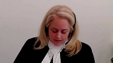
:::

Alors bonjour, M. le juge en chef, mesdames les juges, messieurs les juges.

La Cour d'Abel a conclu que le résumé des ententes pouvait être déposé au dossier de la Cour et en fait, là, toutes les communications et les témoignages qui s'y rapportent pour faire la preuve des modalités, en fait, pour faire la preuve qu'une entente existait et pour faire la preuve des modalités de cette entente-là.

Avec égard, ce que nous vous soumettons aujourd'hui, c'est que ça, c'était une erreur, une erreur qui est lourde de conséquences parce qu'elle vient compromettre cette promesse de confidentialité dont vous en parlez, Maître Chim, et qui est faite par le législateur au Justiciable lorsqu'il les invite à se soumettre au processus de médiation.

Simplement, Mme la juge Côté, vous avez dit tout à l'heure que le processus de médiation, il était obligatoire avant de pouvoir le fixer une cause.

C'est la séance de coparentalité qui est obligatoire.

Les heures de médiation, elles restent facultatives et c'est lorsque des parties souhaitent se soumettre qu'elles peuvent le faire, mais c'est uniquement la séance d'information sur la coparentalité qui, à ce stade-ci, est obligatoire.

Pour vous permettre de trancher la question, parce qu'on s'est posé la question à savoir quelle était la nature de ce résumé des ententes-là, je pense que c'est important de revenir à l'origine du document, d'où est-ce que ça vient.

Alors, ça vient, c'est une suggestion, parce que ce n'est pas un document qui est obligatoire, c'est une suggestion qui émane du CO-AMF, qui est le Comité des organismes accréditateurs en médiation familiale.

Et qu'est-ce qu'il nous dit le CO-AMF?

On vous l'a mis à l'onglet 7 de notre quai condensé.

Le CO-AMF a donc produit un guide qui se veut un peu une espèce d'assurance de cohérence entre les différents ordres professionnels, parce que les médiateurs proviennent de différents ordres professionnels.

Certains sont juristes, certains ne le sont pas.

Et donc, le CO-AMF nous suggère que le guide, le guide, pardon, du CO-AMF nous suggère que le résumé des ententes, si vous regardez à la page 24 du guide, c'est un outil de référence pour la réflexion des parties et les motifs qui ont été à l'origine de leur entente, ou un outil de consultation pour l'obtention d'avis juridiques ou autres, et un outil de référence pour la rédaction d'un projet de convention que prépareront les juristes aux fins de dépôt devant les instances judiciaires.

Le guide des normes ne donne pas de modèle de résumé des ententes, mais il nous suggère des avertissements dont M. le juge Calgirère a fait la lecture, ou a fait référence à un des avertissements.

Ce qu'on retrouve dans le guide des normes, par contre, c'est le modèle du contrat de médiation qui intervient au début de la médiation.

Alors, c'est un outil de travail, ce résumé des ententes-là, et c'est un document qui se présente au parti comme étant un outil de travail.

C'est ce qu'on retrouve habituellement dans ce document-là, comme je vous disais, il n'est pas obligatoire, mais la plupart des médiateurs vont inclure également les avertissements qui réitèrent que ce n'est pas un contrat et qu'il ne peut pas être déposé en preuve.

C'est ce qui est dit dans les avertissements.

**Justice Kasirer** (00:34:32): M. Tremblay, un peu à la décharge des parties, qui sont un peu mêlées de la nature juridique du résumé des ententes, notamment dans ce dossier-là, encore une fois, si on se rapporte au résumé d'entente qui a été présenté, des deux, on voit à la page 99 que le médiateur, le qualifie, l'avocat médiateur, le qualifie, je ne veux pas taxer, ce n'est pas une critique que je porte à lui personnellement, il dit au milieu de la page Mme Bissayon et M. Bouvier en sont arrivés à une entente représentant le résultat global d'un exercice de réflexion.

::: {.column-margin}

:::

Deux pages plus loin, il qualifie le document comme un projet d'entente, en haut de la page 101.

Et en bas de la page 101, lorsqu'il parle de la révision à la suite d'un changement important dans la situation de M. ou Mme, il évoque les ententes consignées dans le présent résumé.

La confusion provient en partie, non pas de l'état du droit, mais de la documentation au dossier et peut-être dans plusieurs dossiers, mais la confusion n'y est pas et encore une fois, à la fois le droit civil et le droit judiciaire qui fait la promotion de la médiation comme pierre angulaire du droit de la procédure civile est très clair de qu'est-ce qu'une entente, très, très clair.

Alors, je me demande jusqu'à quel point, encore une fois, on a un dossier qui ne nous aide pas à éclairer le point que vous cherchez en termes de conclusion, du moins, que vous cherchez de mettre de l'avant.

**Speaker 3** (00:36:27): En fait, monsieur le juge, je pense que la confusion naît du nom de ce document-là.

::: {.column-margin}
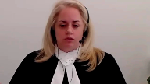
:::

Parce qu'en médiation familiale, et c'est là que le contexte prend toute son importance, alors qu'on vit une rupture émotionnelle, une rupture économique, il y a une rupture juridique également, il y a des ruptures relationnelles, une rupture sociale, ce qui est important pour les partis, c'est d'avoir un forum où on peut discuter librement.

Et ce document-là, qui est même d'un tiers, et à l'instant où il est parfois signé par les partis, mais pas ici, ce document-là aurait dû s'appeler le résumé des solutions envisagées.

Ça aurait dû être ça, son nom.

Parce que c'est ce qu'on fait en médiation.

On explore des différentes options et parfois même, on va prendre des décisions pendant le processus de médiation.

Donc, d'imputer à ce document-là un rôle formel d'entente, comme si les partis l'avaient signé.

Vous savez, le résumé des ententes dans ce dossier-là contient aussi une quittance.

Est-ce que Madame, simplement dans les faits, je peux les résumer en disant qu'elle aurait pu avoir droit à 250 000 $ pour la maison, puis elle a accepté un montant de 85 pour la maison et son enrichissement est justifié.

Je le résume très très grossièrement.

Est-ce que Madame savait ce qu'elle faisait?

Est-ce que vraiment, lorsqu'elle a envisagé cette solution-là, qu'elle savait que le médiateur le mettrait dans un document et que la Cour d'appel présumerait que ce document-là constitue l'entente?

**Justice Côté** (00:37:59): de la Cour d'appel

::: {.column-margin}

:::

, la juge Hogg n'avait pas dit que le document lui-même constituait une entente.

Je vous amène au paragraphe 102, les motifs de la juge Hogg.

Elle dit dans un tel contexte, j'estime qu'une partie pourrait, pour ce motif, s'opposer à ce qu'il soit admis pour faire la preuve de l'acte juridique que constitue l'entente allégée.

Et au paragraphe 103, elle dit, je rappelle toutefois qu'un écrit qui n'est pas admissible pour prouver un acte juridique peut parfois être admissible pour prouver un fait juridique.

Ce sera le cas notamment de l'écrit produit à titre d'indice d'une présomption de fait.

Alors, il me semble que Mme la juge Hogg ne dit pas que le résumé c'est l'entente, mais elle voit ça comme un fait qui vient, combiné avec les autres éléments mis en place, prouver ou confirmer qu'il y a une entente.

**Speaker 3** (00:38:47): En fait, ce qu'elle fait, et quand elle présume, ce qu'elle vient dire, c'est que c'est un simple écrit.

::: {.column-margin}

:::

C'est ce qu'elle dit.

Elle fait l'étude, le juge Moore avait dit, ça pourrait être un contrat, ça pourrait ne pas l'être.

La juge Hogue vient très bien définir que c'est un simple écrit qui est rédigé par un médiateur et qui reflète sa compréhension à lui, des éléments sur lesquels les parties se seraient entendues.

Et elle vient dire donc qu'effectivement, on pourrait prouver des frais juridiques, mais elle utilise le document du résumé des ententes pour permettre le témoignage.

Et ensuite, on vient conclure qu'il y a une entente de par les témoignages, alors que tout ça aurait dû être confidentiel.

Le résumé des ententes, il ne faut pas oublier non plus que c'est une...

Le juge Moore a retenu dans son jugement la date du partage de la copropriété comme étant la date de signature du résumé des ententes.

C'est ce qu'on fait.

Le raisonnement a été de dire, bien, on voit les modalités, parce qu'avec Égard, si on avait simplement regardé le courriel, nous, on vous soumet que tout ce qui fait référence à la médiation devrait être exclu du dossier de la Cour.

Même la mention sur le chèque, le paiement pour la médiation, même le courriel qui fait référence à une entente.

Mais si on avait seulement eu ça, si on n'avait pas permis la production du résumé des ententes, on n'aurait pas pu connaître les modalités de cette fameuse entente-là.

Il faut se rappeler que ce que Mme est venue dire aussi en témoignage, en première instance, elle est venue dire, « Moi, ma compréhension, c'était que notre médiation n'était pas terminée.

» C'est repris dans le jugement de la qu'on appelle, les extraits, et elle dit, «

Ma compréhension, c'était que la médiation n'était pas terminée.

» Par contre, on avait écoulé nos cinq heures de gratuité et le médiateur nous a dit, « Je vais faire le constat de où nous en sommes en ce moment.

» Est-ce qu'elle pouvait véritablement comprendre que ce document-là, qui n'émane pas d'elle, serait lié par ce document-là?

On vous soumet, Mme la juge, que la réponse est non.

Ce document-là, qui émane du tiers, qui n'est pas signé, ne peut pas faire foi de l'entente qui est intervenue.

Il faut aussi se rappeler pourquoi il est produit ce document, ce résumé des ententes.

Le CO-MF le suggère pour indiquer la fin de la médiation, mais la fin de la médiation du point de vue du médiateur, du point de vue de celui qui va rédiger l'entente.

Parce que des parties, lorsqu'elles discutent, et elles discutent souvent de façon globale, elles peuvent continuer de discuter à l'extérieur.

On revient en médiation, on permet d'aller voir un avocat.

Une des raisons pour lesquelles on suggère de faire un résumé des ententes, c'est pour permettre aux parties de prendre ce document-là et d'aller voir un juriste.

Parce que beaucoup de médiateurs ne sont pas juristes.

Et donc, si on présume que les modalités prévues au résumé des ententes comme solution envisageable sont maintenant à l'entente, on vient de neutraliser le droit d'une partie qui serait vulnérable d'aller consulter parce que c'est dans les faits ici, c'est ce qui s'est passé.

**Justice Kasirer** (00:41:53): c'est pas tout à fait ça.

::: {.column-margin}

:::

Encore une fois, la Cour d'appel est très précise.

Les courriels et les chèques constituent un commencement de preuve.

On s'est gardé à respecter le cadre exact du droit de la preuve et vous n'allez pas me dire que le droit de la preuve ne s'applique pas à la médiation familiale.

Il faut parler un peu avec précision.

Je comprends que vous n'êtes pas d'accord avec la conclusion, mais tout de même, la jugeur a très bien compris que c'était un simple écrit.

Elle a très bien compris qu'elle ne pouvait pas utiliser des témoignages sans commencement de preuve et elle a respecté rigoureusement le cadre du droit de la preuve.

Encore une fois, les faits ne sont pas sympathiques à l'argument que vous faites.

**Speaker 3** (00:42:54): En fait, avec Égard, ce que ça prouve, le commencement de la preuve, ne fait pas nécessairement, ne nous permet pas de conclure qu'il y a une entente, c'est le contexte particulier du droit de la famille.

::: {.column-margin}

:::

Parce que ces ententes négociées-là, le courriel de Madame, si on prend les faits en l'instance ici, le courriel de Madame disait «

Tu m'as versé 5 000, je croyais que c'était 20 000 pour janvier ».

Il y a un courriel qui provient de Madame qui dit ceci.

Alors, avec l'expectative de confidentialité des gens qui vont en médiation, parce que c'est ça l'enjeu.

L'intimid bouvier vient vous dire «

Non, c'est l'inverse, en fait, les gens qui veulent régler ne croiront plus en cette médiation ».

Nous, on vous soumet respectueusement que c'est l'attrait principal, c'est ça, c'est la confidentialité, c'est ce milieu protégé où on peut échanger, parler de nos enfants, parler de nos craintes pour le futur, etc. Donc, si on lève cette confidentialité, parce que ce qu'on vous soumet aussi, c'est que ce début de preuve-là, M. le juge Casirer, nous on dit «

Il aurait dû aussi être protégé ».

Tout ce qui fait mention à la médiation ne devrait pas être produit.

Si, par exemple, puis un peu peut-être pour répondre à la question de Mme la juge Côté plus tôt, si les parties ont une entente et qu'ils ne jugent pas bon de signer un document, qu'ils ne jugent pas bon d'homologuer un consentement à jugement et qu'ils vont avec l'entente qu'ils ont cru comprendre en médiation, et que les années avancent, on paye une pension alimentaire, on s'entend sur un horaire de garde et on décide que je transfère ma maison pour 200 000 $ et on va chez le notaire, l'avertissement du résumé des ententes, à mon humble avis, c'est ce qu'il veut dire.

Il veut dire «

Ce n'est pas un contrat, vous n'êtes pas liés, prenez

-le, allez maintenant chercher vos conseils juridiques ».

Mais si vous faites certains gestes, on pourrait démontrer ces gestes-là.

On pourra montrer que M. a fait un paiement de 5000 $ en janvier.

On pourra démontrer, avec un acte notarié, qu'il y a eu un transfert.

Mais on ne pourra pas faire référence à ce qui s'est dit en médiation et pourquoi il y a eu un transfert et pourquoi la contrepartie était seulement de 200 000 $.

Je vous donne des faits de façon abstraite.

**Justice Wagner** (00:45:11): Pourquoi un justiciable irait en médiation familiale à ce moment-là?

Il va prendre sa chance, il va aller devant les tribunaux, il va prendre les procédures.

Parce que de toute façon, le justiciable, il ne peut pas s'attendre à ce que ça produise des résultats.

N'importe quoi peut arriver, peu importe s'il y a des ententes.

**Overlapping speakers** (00:45:28): I don't b-

**Justice Wagner** (00:45:28): de l'Ontario et de l'Ontario et de l'Ontario et de l'Ontario et de l'Ontario et de l'Ontario et de l'Ontario et de l'Ontario et de l'Ontario et de l'Ontario et de l'Ontario et de l'Ontario et de l'Ontario et de l'Ontario et de l'Ontario et de l'Ontario et de l'Ontario et de l'Ontario et de l'Ontario et de l'Ontario et de l'Ontario et de l'Ontario et de l'Ontario et de l'Ontario et de l'Ontario et de l'Ontario et de l'Ontario et de l'Ontario et de l'Ontario et de l'Ontario et de l'Ontario et de l'Ontario et de l'Ontario et de l'Ontario et de l'Ontario et de l'Ontario et de l'Ontario et de l'Ontario et de l'Ontario et de l'Ontario et de l'Ontario et de l'Ontario et de l'Ontario et de l'Ontario et de l'Ontario et de l'Ontario et de l'Ontario et de l'Ontario et de l'Ontario et de l'Ontario et de l'Ontario et de l'Ontario et de l'Ontario et de l'Ontario et de l'Ontario et de l'Ontario et de l'Ontario et de l'Ontario et de l'Ontario et de l'Ontario et de l'Ontario et de l'Ontario et de l'Ontario et de l'Ontario et de l'Ontario et de l'Ontario

::: {.column-margin}

:::

**Speaker 3** (00:46:09): ce qu'on dit.

::: {.column-margin}
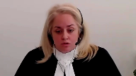
:::

Ce n'est pas tout à fait ce qu'on dit parce que ce qu'on dit, c'est ce que vous allez discuter en médiation sera protégé.

Si quelqu'un est craintif d'aller en médiation pour rien et qu'on arrive véritablement à un entente, on faisait illusion en préparation à l'adage connu, si un arbre qui tombe dans la forêt mais que personne ne l'entend, est-il vraiment tombé?

Et on se dit, si en médiation on discute et qu'une entente intervient et qu'une partie change d'idée, parce que c'est ça ultimement, y a-t-il vraiment eu entente?

Nous vous soumettons que s'il existe un différent quant à l'existence d'une entente ou aux modalités de l'entente, vous devriez présumer qu'il n'y a pas d'entente.

On ne peut pas lever le voile pour aller voir et essayer de comprendre les modalités de ce qui serait intervenu parce que ce sont des pistes de solutions.

Mais si quelqu'un a peur que cette situation-là arrive, si quelqu'un a peur d'aller en médiation pour discuter, perdre mon temps parce que de toute façon…

Alors c'est très simple, M. le juge, on signe une entente.

Et des différents… Regardez actuellement la situation.

Quelqu'un qui veut judiciariser son dossier va judiciariser son dossier.

Quelqu'un qui veut véritablement chercher à discuter et à trouver des solutions envisageables pour tout le monde, c'est là le propre de la médiation familiale.

Faut pas oublier qu'ils ont une relation de coparentalité.

La médiation est maintenant possible aux couples qui sont sans enfant, mais depuis longtemps, c'était uniquement les couples avec enfants à charge.

Et l'optique de cette médiation-là, c'est de permettre que la relation de coparentalité se poursuive au-delà de cette entente-là.

Parce que, pardonnez-moi l'image grossière, mais d'enfoncer des termes, des modalités d'une entente dans le gorge d'une partie ne règlera pas la solution pour la suite.

Même si on disait parfait l'exception de « union carbide s'applique en droit de la famille », si quelqu'un n'est pas content et qu'il y a une relation qui s'ensuit de coparentalité, les juges vont trouver une raison d'aller à la cour s'ils veulent aller à la cour.

**Justice Kasirer** (00:48:09): Je ne veux pas vous assommer de questions, mais vous ne répondez pas du tout à la question du juge en chef, vous dites, il dit, mettons si on arrive à une entente et votre contre-exemple c'est, qu'est-ce qui arrive si les partis ne sont pas véritablement arrivés à l'entente?

::: {.column-margin}

:::

Mais imaginons si il y a une véritable entente qui met un terme aux différents, et qu'on n'arrive pas en fait à l'entente, qu'on n'arrive pas à en faire la preuve, c'est un problème pour la médiation familiale.

Donc, l'exception de Union Carbide aide la médiation familiale.

Votre souci pour les vulnérables est protégé parce que cette entente-là ne peut pas tout faire, contrairement au cas de Union Carbide, où les partis commerciales peuvent tout faire, ou à peu près à l'intérieur de l'ordre public, mais pour votre exemple de la coparentalité, ne vous en faites pas.

Ce n'est pas l'entente qui va régler ça définitivement.

Lors de l'homologation, un juge ou une juge va regarder ça et va dire est-ce que c'est dans l'intérêt de l'enfant?

Alors, c'est comme un faux problème que vous brandissez et que la conséquence, le juge en chef le dit, c'est la médiation familiale est potentiellement mise en péril, si votre argument est pris à l'extrême.

**Speaker 3** (00:49:34): En fait, ce qu'on vous soumet, c'est que cette entente-là qui serait intervenue en médiation, il faut laisser le temps au parti de l'assimiler, de vérifier qu'elle est à leur satisfaction.

::: {.column-margin}
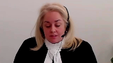
:::

C'est essentiellement ce qu'on vous dit.

Et pour cette raison-là, on ne peut pas présumer qu'un résumé des ententes rédigé par un tiers représente véritablement les modalités qui sont intervenues.

Qui est-il pour dire qu'effectivement, c'est son…

**Justice Côté** (00:50:04): Je vous dis, vous auriez peut-être raison s'il y avait seulement le résumé, mais ici, le résumé porte la date du 10 décembre 2012 et vous nous avez dit tantôt que la production du résumé par le médiateur, ça signifie la fin de la médiation.

::: {.column-margin}

:::

Même si Madame n'avait pas compris ça, il n'en demeure pas moins que sa requête parce que ce qui est en cause ici, c'est le partage de l'immeuble.

On ne parle pas de la garde des enfants ou quoi que ce soit.

Alors, elle a attendu presque deux ans, octobre 2014, pour faire sa requête en partage de l'immeuble.

Alors peut-être, j'accepterais ce que vous nous dites, s'il n'y avait rien eu, mais entre le moment de la fin de la signature du résumé par le médiateur, les parties se sont comportées d'une façon qui accrédite ce que monsieur dit.

Il y avait une entente lors de la médiation quant à l'immeuble.

**Justice Kasirer** (00:50:51): Thank you for watching!

**Overlapping speakers** (00:50:51): Merci madame.

**Justice Kasirer** (00:50:52): Est-ce que je peux compléter, parce que la question est tellement bonne, juste pour compléter, est-ce que vous ne confondez pas résumé et entente?

::: {.column-margin}

:::

C'est le résumé des ententes, c'est comme confondre le négocium avec l'instrumentum.

Il y a une entente qui n'est pas nécessairement consacrée par l'écrit rédigé par le médiateur.

La question de ma collègue est fort pertinente.

**Speaker 3** (00:51:19): En fait, non, parce que qu'est-ce qui démontre que madame avait vraiment l'intention d'être liée?

::: {.column-margin}
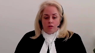
:::

Ce qui est fait en médiation, c'est comme je vous disais, l'exploration d'options.

Elle a dit bon ben parfait, peut-être que ça fonctionnera avec 85 000.

Et ce qu'elle a dit par la suite aussi lorsque les témoignages ont été permis, c'est oui je l'ai encaissé le chèque parce que j'étais en situation de survie alimentaire, parce que ça faisait trois ans que je n'avais pas travaillé, parce que c'est moi qui ai quitté mon emploi pour s'occuper des enfants et là j'avais besoin d'argent alors j'ai encaissé le chèque.

C'est ce qu'elle est venue dire.

Ce qu'on vous soumet respectueusement, c'est qu'il ne faut jamais présumer qu'il y a eu entente.

Le résumé des ententes ne peut pas confirmer qu'il y a effectivement eu entente.

Et de la même façon, dans ce cas-là, s'il y avait eu entente, il aurait très bien pu avoir un transfert devant le notaire rapidement après cette fameuse entente-là qui serait intervenue chez le médiateur.

Dans les faits, quand il y a véritablement entente, c'est ce qui se passe.

Les gens vont agir en conséquence.

Alors qu'ici, ce qu'elle a fait, c'est déposer un chèque en se disant, ben j'en avais besoin, j'avais besoin de ça pour ma survie alimentaire.

Mais jusqu'où on va aller?

Si on permet le dépôt du résumé des ententes, est-ce qu'on va également permettre le témoignage du médiateur?

Je sais que dans l'arène Union Carbide, on n'a pas eu à se pencher là-dessus et ici non plus, parce que personne n'a demandé, personne n'a cité à comparer avec le médiateur, mais il va falloir se poser la question.

Lorsque ce résumé des ententes-là va être produit contre une partie pour démontrer l'existence d'une entente, est-ce que cette partie-là va avoir le droit de le contre-intéroger?

**Justice Wagner** (00:52:58): On n'a pas besoin de se rendre là.

::: {.column-margin}

:::

C'est la raison pour laquelle on a été tremblés.

On n'a pas besoin de se rendre là.

C'est la raison pour laquelle dans Union Carbide, on n'avait pas besoin de se rendre là.

On se limite simplement aux principaux éléments.

Les éléments principaux, c'est est-ce qu'il y a eu une entente ou non et quels sont les faits.

Et surtout ici, ici, est-ce que les gestes posés ou assumés par les partis après la prétendue entente démontrent qu'effectivement il y avait eu une entente.

Dufort contre Dufresne, 1938, Cour suprême.

**Speaker 3** (00:53:29): Mais le contexte est complètement différent.

::: {.column-margin}

:::

Dans Union Carbide, les gens étaient représentés, il y a eu des offres post-médiation et l'entente, le litige portait sur une modalité.

Mais ici, qu'est-ce qui nous dit qu'effectivement, le résumé des ententes-là, il y a un argument qui est utilisé par l'intimé Bouvier qui dit « Oui, mais Madame ne s'est pas objectée ».

Mais qu'est-ce qui nous dit qu'elle l'a même lu?

Comment est-ce qu'on peut imputer ce document-là comme étant la volonté d'être liée par les termes qui y sont mentionnés?

Ça n'émane même pas d'elle.

Il n'y a aucune garantie de fiabilité.

Il n'y a aucune garantie non plus que c'est effectivement les discussions qui ont eu lieu durant la médiation.

Il n'y a aucune garantie que les gens l'ont compris.

Et encore une fois, ce qu'on enseigne aux médiateurs, ce que le CO-MF indique dans son guide des normes, c'est que les partis doivent prendre ce document-là et aller chercher leur opinion juridique parce que la présence de l'avocat est interdite.

Merci Madame.

**Justice Côté** (00:54:30): de l'entente.

::: {.column-margin}

:::

Tantôt, mon collègue a référé à une clause de la dernière page de résumé des ententes que nous retrouvons à la page 97 du dossier de la plante.

Lorsqu'on dit de la même façon que nous désirons vous informer que la mise en application de tout ou partie des ententes peut également produire des effets juridiques.

En ce sens, une telle mise en application peut constituer une reconnaissance de l'entente préalablement à la judiciarisation.

Comment on doit interpréter ça?

On doit ignorer que la mise en application

**Speaker 3** (00:55:04): On ne doit pas l'ignorer, mais ce paragraphe-là, il porte à confusion, Mme la juge.

::: {.column-margin}
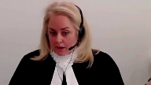
:::

Est-ce que ce qu'on veut dire, c'est si vous décidez de vous entendre sur la maison, puis que vous allez devant le notaire, puis que vous transférez la résidence et recevez en considération 200 000 $, est-ce qu'on parle de ces cas-là?

Est-ce qu'on parle des cas, bien, si vous vous entendez sur une pension, puis que monsieur verse 500 $ par mois, bien, il va y avoir une reconnaissance, il va y avoir un certain statu quo.

Est-ce qu'on parle de ça?

Et avec égard, cet avertissement-là ne se trouve pas dans le contrat de médiation qui est par ailleurs signé par les partis.

Cet avertissement-là se trouve uniquement dans le document qui est remis à la partie et qui comprend aussi des clauses qui disent ce n'est pas un contrat, on ne peut pas le déposer en preuve.

Alors, l'interprétation que nous, on en fait, c'est qu'effectivement, certains gestes peuvent avoir des conséquences, comme l'établissement d'un statu quo, mais que ça ne compromet en rien la levée de la confidentialité, qui est la pierre angulaire de la médiation.

**Overlapping speakers** (00:56:07): Et avec égard.

Excusez-moi de terminer votre phrase.

**Speaker 3** (00:56:12): Non, j'allais dire, avec Égard, ce qu'on vous suggère, ce qu'on vous demande, c'est de présumer que l'exception aux privilèges ne s'applique jamais en médiation et si vous faites ça, la question du dépôt du résumé ne pourra jamais être soulevée à moins qu'il soit soumis de consentement par les partis ou qu'il soit signé auquel cas on n'est plus au même endroit.

::: {.column-margin}
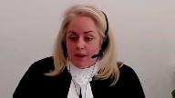
:::

**Justice Kasirer** (00:56:35): Je me demande si vous avez peur pour rien et je reviens à cette confusion entre entente et transaction.

::: {.column-margin}

:::

Dans votre mémoire, vous taxez Union Carbide d'avoir consacré un privilège de transaction, paragraphe 76, et à 77 et surtout 78, vous dites que le résumé des ententes a été pris par le premier juge, permet au premier juge de mettre en preuve pour prouver la transaction nonobstant le principe de confidentialité.

Ce n'est pas le cas.

Le juge Moore n'a pas fait la preuve d'une transaction.

Il savait pertinemment qu'une transaction ne peut pas se faire à l'égard des questions d'ordre public.

C'était simplement de prouver une entente, ce qui était le propre de Union Carbide.

Alors, c'est que vous cherchez à défaire, donc, une règle portant sur la transaction en vous attaquant aux privilèges relatifs aux ententes et là encore, c'est une confusion des genres, non?

Est-ce que... voyez-vous la distinction?

**Speaker 3** (00:57:52): Je comprends votre distinction, monsieur le juge.

::: {.column-margin}

:::

En fait, il faut aussi savoir qu'il y a eu une demande, madame, et les revenus aussi, elle a demandé la garde et la fixation d'une pension, mais ça a été traité séparément, ça a été homologué, il y a eu une convention finalement qui a été homologuée par le juge Moir en première instance, mais ce que nous on indique, c'est qu'il dit ne pas pouvoir, il reconnaît ce contexte global-là de la médiation où plusieurs sujets sont traités, donc l'impossibilité d'y avoir une transaction, mais il en vient quand même à considérer que l'entente est intervenue et il l'homologue, alors qu'il n'y a rien dans les faits qui aurait pu permettre au tribunal d'établir les modalités.

Les modalités ont été établies en levant le voile la confidentialité, en regardant le résumé des ententes et en permettant les témoignages.

Il y a même eu des témoignages contradictoires, madame, et vous me dire autre chose, mais nous on a retenu le résumé des ententes.

Et c'est ça qui est à notre avis complètement aberrant, un résumé des ententes, et ce n'est pas le rôle du médiateur, le rôle du médiateur c'est de faciliter la discussion, de permettre l'échange.

Vous savez, il y a des médiateurs qui ne sont pas juristes, donc est-ce qu'un médiateur non juriste peut, ils ne peuvent pas conseiller la partie non plus.

Donc on constate les échanges, les solutions envisagées, puis on dit allez-y, allez consulter.

Et là ici, tout ça n'a pas été permis.

**Justice Brown** (00:59:21): J'ai une question à vous poser, il reste seulement deux ou trois minutes, mais une question au sujet des dépens.

::: {.column-margin}

:::

Monsieur Bouvier nous demande de lui accorder les dépens sur la base avocat-client.

Et à partaire 113 de votre mémoire, vous soumettez que chaque parti devrait payer ses frais, continu de la nature du litige.

Laissez-moi vous demander, compte tenu de la nature du litige dans lequel c'est l'association, et non Madame, qui a prolongé ce litige, qui a traîné Monsieur Bouvier devant la Cour Suprême, pourquoi devrait-il payer ses propres dépens?

**Speaker 3** (01:00:11): En fait, avec Égard, l'intervention de l'intervenant au stade de l'appel a été limitée par le juge Vauclair à la portée de la confidentialité et la nature du résumé des ententes.

::: {.column-margin}
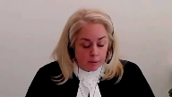
:::

C'est ce qui est devant vous aujourd'hui.

C'est ce mandat limité-là qui a été mis de l'avant devant vous aujourd'hui.

L'intimé Bouvier, avec respect, n'avait pas à être devant vous.

Il aurait pu s'en remettre à la décision de la Cour.

Il aurait pu également faire comme l'intimé Bisaillon, qui n'est pas présente, ne pas intervenir.

Dans ses conclusions, dans son mémoire, il n'y a aucun argument ni aucune conclusion qui porte sur des faits qui ne s'appliqueraient à lui directement.

Il parle de la portée de la confidentialité et de la nature du résumé des ententes.

Il s'en remet essentiellement à la position de la Cour d'appel.

Et ce que vos enseignements nous démontrent, là, je sais que j'arrive à 33 secondes.

Est-ce qu'on me laisse terminer là-dessus rapidement?

**Overlapping speakers** (01:01:02): Oui, allez-y.

**Speaker 3** (01:01:03): Très bien.

::: {.column-margin}
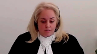
:::

Alors, ce que vos enseignements nous démontrent, c'est que c'est un cas, c'est seulement dans des cas d'exception qu'une partie devrait avoir apporté les dépens clients-avocats et qu'ici on ne rencontre pas les critères.

L'AMFQ, c'est une association à but non lucratif qui a été représentée pro bono tant en appel que devant vous.

L'association, on a avec nous les documents, les états financiers et le budget.

Si on a une façon de vous les communiquer, on va le faire avec plaisir.

Mais avec Égard, ce qu'on sait de monsieur, c'est qu'en 2012, il faisait 177 000 par année comme directeur de finances et qu'il avait une résidence de 700 000.

On présume que ça a changé depuis aujourd'hui, que ça a augmenté.

Mais avec Égard, il a sans doute plus de moyens que l'AMFQ.

On n'est pas dans un dossier où on représente le procureur général, où on représente pas non plus, par exemple, parce qu'on a cité le Barreau du Québec.

**Justice Wagner** (01:01:56): En vous écoutant, maître, on a beaucoup de difficulté à distinguer entre les intérêts de madame et celles de l'association.

Là-dessus, on va prendre un moment de reprise.

**Speaker 3** (01:02:04): de rien nous

::: {.column-margin}

:::

par rapport aux faits.

On ne vous demande pas de retourner en première instance, on ne vous demande pas d'ordonner à monsieur de condamner quoi que ce soit.

Ce qu'on vous demande de faire, c'est d'établir qu'il existe une présomption à l'effet que l'exception est écartée et on vous demande, dans un cas où il y a un différent quant à l'existence ou aux modalités d'une entente, de présumer qu'il n'y a pas eu d'entente à médiation.

**Justice Wagner** (01:02:25): savoir à l'encontre des prétentions de monsieur qui nous demande dans les circonstances d'avoir ses frais si tant est que l'appel soit rejeté.

Là-dessus, on va prendre notre pause du matin, 15 minutes.

**Speaker 3** (01:02:37): Merci.

**Justice Wagner** (01:03:10): La Cour, the Court.

::: {.column-margin}
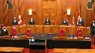
:::

Merci, soyez vous.

Alors, avant de passer à Maitre Biron, juste un mot pour préciser que même si vous ne les avez pas vus ou entendus, les juges Abela et Caracazzanis participent à l'audition.

Maitre Biron.

**Speaker 4** (01:03:56): Excusez-moi, j'étais sur la sourdine.

::: {.column-margin}

:::

Alors, bonjour monsieur le juge en chef, bonjour mesdames et messieurs les juges.

Alors, on a compris que la plante recherche une présomption de confidentialité absolue en médiation familiale qui écarte automatiquement l'exception des ententes.

Elle dit que c'est des conditions strictes, c'est-à-dire que si on veut maintenir l'exemption aux ententes, il faut en convenir de façon très claire dans le contrat de médiation ou dans le résumé des ententes.

Mais ce sont des conditions très strictes et le processus de médiation ne peut en venir à une entente dont une partie pourra forcer sa reconnaissance et, par la suite, son exécution.

L'intimé Bouvier soumet respectueusement que les conclusions recherchées par la plante auraient des effets très préjudiciables aux justiciables, aux conjoints qui participent au processus de médiation en matière familiale et remettraient en doute l'utilité de la médiation et finalement nuiraient au système judiciaire.

Je vais traiter de ces points-là en commençant d'abord pour les raisons pour lesquelles je trouve que la position de la plante ne peut être tenue.

Je vais y aller par la suite avec les principes juridiques et le cadre d'analyse et, finalement, on traitera des résumés des ententes et dans quelles circonstances celles-ci ainsi qu'autres éléments de preuve peuvent être amicibles en preuve pour prouver l'existence d'une entente qui est intervenue.

Je veux dès le départ vous indiquer qu'on ne remet aucunement en question la pertinence et le caractère essentiel du principe général de la confidentialité en matière de médiation familiale et du privilège relatif aux règlements.

Nous sommes en accord avec la plante à l'effet que la confidentialité est une composante essentielle à la médiation puisque celle-ci permet au parti d'avoir des discussions franches, sachant que les admissions, les concessions, les discussions qui vont avoir lieu ne pourront être tenues à l'encontre de ces derniers devant les tribunaux.

Alors, dans la majorité des cas, la confidentialité sera maintenue, les partis vont convenir d'une entente et vont procéder et agir en conséquence de ce ou ces ententes-là ou les partis n'auront pas d'entente et, à ce moment-là, tout ce qui va avoir été changé dans le cadre de la médiation va demeurer confidentiel.

Ce n'est que dans de rares scénarios, et j'appuie sur le mot rares scénarios, que l'exception des ententes va avoir toute sa pertinence.

C'est lorsqu'une partie conteste ou renie l'existence ou la portée de l'entente qui est intervenue que c'est à ce moment-là qu'on va parler et qu'on indique que l'exception des ententes est absolument nécessaire dans un processus de médiation.

Parce qu'il faut se rappeler aussi que l'exception des ententes est un droit qui appartient au parti de pouvoir faire la preuve des modalités de règlement.

L'exception des ententes est un droit qui vise le même intérêt public que le privilège lui-même, soit celui de favoriser les règlements hors-cour.

Il est donc nécessaire au parti d'avoir les moyens de prouver les termes de leur entente en appliquant, lorsque nécessaire, dans les cas où c'est nécessaire, cette exception, sans quoi il n'y aurait aucun moyen disponible au parti pour faire la preuve de leur entente et même dans les circonstances où les partis ont commencé à exercer l'exécution.

Maître Birand, est-ce que je peux juste vous poser une question?

**Justice Kasirer** (01:08:10): imaginons si dans notre dossier il n'y avait pas cette preuve se rapportant à la mise en application des ententes.

::: {.column-margin}

:::

Il n'y avait pas de chèque, il n'y avait pas de courriel.

Et l'entente, le résumé des ententes n'est pas non plus signé. Oui.

Qu'est-ce qui arrive?

**Speaker 4** (01:08:30): Ça va dépendre de chaque cas d'espèce.

::: {.column-margin}

:::

D'abord, il faut se rappeler que l'exception des ententes permet uniquement à une partie d'admettre en preuve ce qui est nécessaire pour démontrer l'existence et l'étendue de l'entente.

L'administration de la preuve à ce sujet est bien sûr laissée à la discrétion du juge.

Il va arriver des fois que l'inadmissibilité du document va être évidente à sa face même.

Par exemple, il pourrait y avoir un avis ou une note inclue dans le résumé qui va dire que c'est une entente de principe et que les parties se réservent le consentement à donner, sujet à la consultation par exemple d'un avocat.

Dans un tel cas, il n'y a pas de commencement de consentement qui lie les parties.

Ça peut aussi être toutes sortes de circonstances, en tout cas je ne veux pas rentrer dans tous les cas qui peuvent intervenir, mais ce que je veux que vous compreniez c'est que le résumé des ententes quand c'est non signé et quand il n'y a pas d'exécution, ça va vraiment dépendre des circonstances.

**Justice Côté** (01:09:37): Je vous donne un exemple.

::: {.column-margin}

:::

Supposons qu'il y a une séance de médiation, une ou plusieurs séances, et il y a un résumé des ententes qui est préparé par le médiateur et qui est complet.

Puis les parties conviennent, à la fin de la séance de la médiation, qui vont aller chez l'honataire ou l'avocat pour préparer un contrat en bonne et due forme, un contrat écrit.

Et là, le rendez-vous est pris pour aller chez le professionnel, mais une des parties décide qu'elle n'y va pas.

Alors l'autre partie, évidemment, en dit un instant, nous avions une entente et la partie s'en va à la cour pour faire reconnaître et homologuer l'entente.

Est-ce que cette partie-là peut utiliser ce qui a été dit lors de la médiation, en concluant le résumé pour tenter de prouver l'entente, selon vous?

**Speaker 4** (01:10:26): Théoriquement, ça pourrait être possible parce qu'ils ont eu, ces gens-là, à tout le moins une entente orale et on sait qu'on peut convenir oralement d'une entente, mais ça va être dans des cas extrêmement rares, ce que vous me soulignez, Madame la juge, qu'une partie va alléger qu'il y a une entente mais qu'il n'y a aucune autre preuve.

::: {.column-margin}

:::

Je pense que si quelqu'un essaie de prouver cette preuve orale-là, il va y avoir énormément de difficultés à rencontrer son fardeau de la preuve et démontrer par prépondérance de preuve qu'une entente est intervenue.

Il ne faut pas oublier non plus qu'on a les limites qui s'imposent sur la preuve testimoniale quand on veut prouver un acte juridique et qui limite le tout à 1 500 $.

**Justice Kasirer** (01:11:10): Bien ça, le point.

::: {.column-margin}

:::

Est-ce que ce n'est pas le droit de la preuve qui règle...

Le résumé est un simple écrit, non signé.

C'est un simple écrit, comme dit la juge.

Il faut donc logiquement témoigner pour faire la preuve de l'entente et pour le faire, pour un dossier au-delà de 1500 $, il faut un commencement de preuve.

**Overlapping speakers** (01:11:31): Exactement.

**Justice Kasirer** (01:11:32): le droit de la preuve et Union Carbide s'inscrit dans le droit de la preuve?

**Overlapping speakers** (01:11:37): absolument.

**Justice Kasirer** (01:11:38): C'est une règle de preuve.

Exactement.

**Speaker 4** (01:11:45): une première étape.

C'est l'étape où on veut faire reconnaître qu'il y a eu une entente et indiquer que les partis se sont obligés à cette entente-là.

Et après ça, on arrivera à la seconde étape, qui est le fait que les partis ne sont pas obligés d'avoir une entente.

**Justice Kasirer** (01:12:00): l'exécution oui alors je suppose que la raison pour laquelle la question vous êtes adressé c'est pour dire est ce que la médiation familiale change la donne est ce que les règles du droit de la preuve des règles ordinaires du droit de la preuve sont sont affectés de ce contexte particulier de la médiation familiale où la confidentialité selon la plante du moins semble avoir une valeur plus importante en raison de la vue le caractère vulnérable des personnes impliquées et les défis de l'accès à la justice en matière familiale

::: {.column-margin}

:::

**Justice Wagner** (01:12:38): En d'autres mots, est-ce que les enseignements de Union Carbide s'appliquent en matière de médiation familiale?

**Speaker 4** (01:12:45): Absolument.

::: {.column-margin}

:::

Les règles de preuve sont les mêmes qu'en droit familial ou en droit civil.

Je ne vois pas pourquoi l'enseignement de l'Union Carbide ne peut pas s'appliquer dans un dossier qui émane d'une médiation familiale.

Il faut les participer à l'épargne des droits de l'âge, à l'épargne des droits de l'âge, à l'épargne des droits de l'âge, à l'épargne des droits de l'âge, à l'épargne des droits de l'âge, à l'épargne des droits de l'âge, à l'épargne des droits de l'âge, à l'épargne des droits de l'âge, à l'épargne des droits de l'âge, à l'épargne des droits de l'âge, à l'épargne des droits de l'âge, à l'épargne des droits de l'âge, à l'épargne des droits de l'âge, à l

**Justice Côté** (01:13:11): Je vais utiliser le résumé préparé par le médiataire pour tenter de démontrer une entente.

Évidemment, si le résumé dit qu'il n'y a pas d'entente entre les parties, on doit reprendre pour acquis que les parties ne sont pas idiotes.

**Overlapping speakers** (01:13:27): by now.

**Justice Côté** (01:13:27): à la cour

::: {.column-margin}

:::

pour faire reconnaître une entente dans un résumé qui dit qu'il n'y a pas d'entente, mais si le médiateur dit que les partis se sont entendus sur les points suivants, donc votre position c'est que Union Carbide s'applique et la personne pourra aller à la cour en utilisant le résumé ou d'autres éléments de preuve pour tenter de démontrer qu'il y a une entente.

Et selon ce que vous dites, on est régi par les mêmes règles de preuve, la preuve testimoniale n'est pas permise à moins d'avoir un commencement de preuve par écrit, donc vous pouvez utiliser le résumé, mais tout irait à la valeur probante que le juge accorderait à ce résumé.

**Speaker 4** (01:14:06): Exact.

::: {.column-margin}

:::

Il faut aussi se rappeler, madame la juge, que le législateur n'a pas soumis la médiation familiale à un régime de confidentialité plus étendu que les autres types de médiation.

Alors, je ne vois pas pourquoi on ne pourrait pas appliquer les principes et les enseignements d'Union Carbide dans un dossier de médiation familiale.

**Justice Kasirer** (01:14:30): Le point du juge Doyon, c'est que la spécificité provient du fait que les avocats ne sont pas présents ou ne peuvent pas être présents lors des séances de médiation.

::: {.column-margin}

:::

Comme ma collègue a dit ce matin, il peut y avoir consultation avant ou après, mais lors de la séance comme telle, est-ce que ça... Puisque le juge, excusez-moi, la Cour suprême dans Union Carbide, entre autres choses, a insisté sur le fait que les partis étaient bien conseillés.

**Speaker 4** (01:15:08): Oui.

::: {.column-margin}

:::

Alors écoutez, on est conscient, puis on est d'accord avec le fait que quand les négociations débutent dans un processus de médiation familiale, on est dans des circonstances qui sont particulières, qui peuvent à l'occasion être difficiles et émotives.

On est conscient de ça.

Mais le choix du législateur a été que les avocats n'accompagnent pas les partis en médiation familiale.

Le choix du législateur est à l'effet que les partis sont en mesure, ensemble, de trouver le règlement des différends qui concerne leur cellule familiale.

C'est en ligne avec la philosophie, d'ailleurs, du nouveau Code de procédures civiles, cette justice participative-là, puis je vais avoir un terme encore plus dur, le « empowerment » qui est donné aux partis, c'est important.

Et ce qu'on dit, dans le fond, quand on parle de cette terminologie-là, c'est que les partis sont mieux placés que le tribunal pour connaître leur propre situation.

Alors, les individus sont capables de contracter, malgré que ça se fasse, j'en conviens, dans un environnement qui n'est pas toujours facile.

Mais ils ont quand même une certaine protection.

Ils ont une protection par la loi dans un second temps, mais ils ont aussi une protection à travers ce processus-là.

Le médiateur est un professionnel qui est neutre, qui est impartial et qui, selon le guide de l'association, doit jouer un rôle.

Et ce rôle-là, je vais juste en traiter de certains points, c'est notamment guider les partis vers une entente équitable, souligner l'iniquité d'une entente, s'assurer que le consentement est éclairé et que l'entente est comprise entre les partis et aussi indiquer dans le projet d'entente les causes, s'il y a une cause ou un préjudice à l'endroit des partis ou des enfants.

Et comme vous l'avez si bien mentionné tout à l'heure, il peut aussi en aucun temps arrêter le processus de médiation s'il voit qu'une partie est trop vulnérable et qu'il y a un déséquilibre.

Et donc, la présence de ce professionnel-là peut souvent pallier au déséquilibre auquel vous faites mention.

**Overlapping speakers** (01:17:37): dans le présent.

**Speaker 4** (01:17:38): En dossier, le litige concerne un partage d'actifs et une compensation entre des conjoints de faits.

::: {.column-margin}

:::

Ils sont régis par le droit civil.

Ils peuvent régler le partage de leurs actifs par entente sur le coin d'une table ou dans leur salon et passer chez le notaire directement sans jamais obtenir de jugement.

Ils peuvent aller voir un médiateur, puis c'est tant mieux s'ils le font, mais ils peuvent aussi aller voir un médiateur qui est un médiateur civil et non un médiateur en chambre de la famille.

Dans les deux premiers cas, ces gens-là seraient en mesure de faire la preuve des ententes qu'ils ont convenues parce qu'ils l'ont fait d'eux-mêmes ou parce qu'ils l'ont fait en médiation civile.

Et ce que l'association nous dit, ce que la plante nous dit, c'est que ça ne pourrait pas être le cas dans le cas où ces gens-là ont procédé par voie d'une médiation en droit de la famille alors qu'ils étaient encore mieux encadrés pour être en mesure de passer à travers ce processus-là.

Alors oui, c'est vrai qu'il y a des périodes de vulnérabilité.

Je veux juste vous rappeler aussi que nous sommes entre conjoints de faits et même si ce n'est pas aucunement apparent du dossier qui nous concerne, il faut se rappeler que la lésion entre majeurs en ce qui concerne les conjoints de faits, c'est la réalité.

On ne peut pas se prémunir contre ça.

**Justice Kasirer** (01:19:13): d'ordre public qui les protège

::: {.column-margin}

:::

. M. Piron, est-ce qu'il n'est pas vrai qu'au Québec, la présence importante des couples en union de fait avec enfant crée la possibilité d'un problème important?

Prenons l'exemple simple où c'est comme notre dossier le partage d'un immeuble mais d'une résidence de la famille en copropriété.

Il y a un lien à faire entre la question se rapportant à la propriété de la maison et le bien-être des enfants potentiellement.

Les questions sont liées.

Alors le fait de dire tout simplement les personnes ne sont pas mariées donc ils ne doivent pas pour constater la rupture de leur relation passer devant un juge pour prononcer le divorce ou la fin de l'union civile, ça ne change pas le problème du caractère vulnérable d'un conjoint de fées ou d'un des enfants.

Voyez-vous le problème qui est là?

**Speaker 4** (01:20:23): Oui, je vois le problème, ce n'est pas nécessairement le problème que nous avons dans notre cas sous étude, mais je me permettrai de vous dire que le juge qui entendra l'audition sera en mesure de décider en fonction de l'ordre public et en fonction de ce qui est le meilleur intérêt pour les enfants.

::: {.column-margin}

:::

Ça ne veut pas dire que parce qu'on va être en mesure d'amener devant eux le fruit des ententes des parties, que le juge n'a pas un rôle à jouer et dont le rôle à jouer est celui de regarder si les ententes rencontrent l'ordre public et si le meilleur intérêt des enfants est en jeu.

Je dois vous dire que dans la nouvelle loi du divorce qui est rentrée en vigueur tout dernièrement, vous aurez peut-être constaté que le juge a l'obligation d'être mis au courant de l'entente des parents relativement au plan parental qui concerne les soins des enfants.

Alors il va prendre en considération ce que le plan parental propose, mais il reste quand même que c'est lui qui va devoir s'assurer que tout est conforme à l'ordre public et surtout le meilleur intérêt des enfants.

**Justice Kasirer** (01:21:32): Sauf erreur de ma part, la nouvelle loi sur le divorce n'aide pas les conjoints non mariés.

**Speaker 4** (01:21:38): Non, vous avez raison, elles n'aident pas les conjoints non mariés, mais il reste quand même que quand on a un différend relativement à la garde des enfants pour des conjoints non mariés, ça demeure encore matière à ordre public et à intervention du tribunal.

::: {.column-margin}

:::

Mais malheureusement, c'est malheureusement, monsieur le juge Casirat, c'est l'état du droit au Québec.

Je ne commenterai pas cette réalité qui est très controversée dans la province et très discutée en ce moment, mais c'est une réalité.

**Speaker 2** (01:22:14): Est-ce que je peux poser une question aussi?

::: {.column-margin}

:::

Oui, certainement.

Mon collègue justice Casarère a posé une question un peu théorétique, c'est-à-dire que sans le curiel, sans l'échec, qu'est-ce qui se passe avec une entente ou une résumé d'entente?

Vous avez dit que ça dépend sur les circonstances.

Ça, je comprends.

C'est une circonstance que potentiellement c'est important ou peut-être le plus important même si on applique le union carbide.

C'est-à-dire le rappel.

Je voudrais vous présenter l'introduction dans le rappel quand on dit que madame et monsieur sont informés que le présent projet d'attente n'est pas un contrat.

J'aime cette phrase beaucoup parce que c'est un projet d'attente.

Le projet d'attente ne constitue ni un contrat, ni un jugement.

Par conséquence, il ne peut avoir d'effet juridique.

Ce n'est pas un contrat nécessairement, mais ça c'est l'avis, les affiches aux gens qui n'ont pas des advocages ou qui n'ont pas d'affiches.

Si vous avez une entente, si vous avez une intention de vous lier juridiquement, il faut que vous fassiez des autres choses.

Un auteur, d'avoir un jugement même de signer.

Une chose assez simple, de signer la résumé.

Mais qu'est-ce qu'on va faire avec les gens qui ne font pas ces choses?

Est-ce qu'on va faire des choses qui peut-être constituent une reconnaissance de l'attente préalablement?

Dans l'autre cas, est-ce que nous sommes réglés par ça et de comprendre que les gens qui parlent, qui discutent avec une médiatrice ou un médiateur qui n'est pas nécessairement un juriste, qu'est-ce qu'on va faire avec ça?

Est-ce qu'il y a vraiment une attente ou est-ce qu'il y a une préalable d'une attente que la personne doit prendre des autres étapes pour rendre leur intérimement avec le nez fait?

**Speaker 4** (01:24:55): Si j'ai bien compris votre question, d'abord, comme je l'ai mentionné tout à l'heure, ça va être laissé à la discrétion et l'appréciation du tribunal quand quelqu'un va vouloir soumettre qu'il y a eu une entente de déterminer s'il y en a une.

::: {.column-margin}

:::

C'est toute une question de rencontrer le fardeau de preuve, c'est évident.

Mais vous pensionnez tout à l'heure que les médiateurs ne sont pas nécessairement des juristes, mais il ne faut pas oublier une chose, c'est que le médiateur, qu'il soit juriste ou non, d'ailleurs les médiateurs qui ne sont pas juristes ont la même formation, ils doivent s'assurer que les parties, quand il y en arrive à une entente, parce que moi je ne vois pas ça comme une réflexion, un peu comme la plante Indigèj, quand il y a un résumé des ententes, ça dit ce que ça dit, c'est un résumé des ententes, mais le médiateur doit s'assurer que les parties donnent un consentement libre et éclairé quand ils acceptent les termes de cette entente-là.

À nouveau, on a parlé tout à l'heure des différents rôles que doit jouer le médiateur actif dans le processus.

Il faut dire qu'il y a plusieurs séances aussi auxquelles les parties vont participer.

Ils peuvent réfléchir entre les séances, ils peuvent aller consulter un avocat s'ils le souhaitent, mais comme je vous le mentionne, je crois qu'il est possible très certainement pour les gens qui ont ce processus de médiation-là de s'assurer que quand on a un résumé des ententes, que ce résumé des ententes-là est effectivement complété de façon libre et éclair.

**Justice Wagner** (01:26:40): Ce que j'ai compris, maître, de la question de ma concert, c'est que dans l'éventualité où effectivement il y a une entente, le médiateur comprend et résume les ententes sur les éléments essentiels sur lesquels il doit y avoir une entente, mais que pour donner suite à l'entente, évidemment, il y a des gestes à poser, il y a des chèques à envoyer.

::: {.column-margin}

:::

Il faut aller se présenter devant le notaire.

On doit exécuter donc les modalités de l'entente.

Ce n'est pas parce qu'il faut faire d'autres modalités ou exécuter d'autres modalités que pour autant, on ne puisse pas faire la preuve qu'il y a eu une entente.

**Speaker 4** (01:27:17): Absolument.

::: {.column-margin}

:::

Ça va être difficile évidemment s'il n'y a absolument rien, s'il n'y a pas d'écrits, s'il n'y a pas de signature du résumé des ententes, s'il n'y a pas de geste posé, s'il n'y a pas de chèque, ça va devenir extrêmement difficile et comme je le mentionnais, peut-être que le fardeau de la preuve ne sera pas rencontré.

Vous savez, la façon simple qu'il y aurait de régler la question, ce serait qu'on fasse une clause qui est claire, qui indique que seule une entente qui est écrite et signée sera valable et opposable au parti.

Si on avait cette clause-là, un peu comme la décision dont vous aviez discuté dans l'Union Carbide de l'Alberta, si mon souvenir est bon, c'est ce qui existait à ce moment-là et c'est pour ça que l'entente n'a pas été déposée parce que le consentement n'est pas intervenu avec la combinaison de ces deux conditions-là, c'est-à-dire l'entente et la signature de l'entente.

Je faisais référence à la cause Stewart contre Stewart auquel vous aviez fait référence, M. le juge en chef, dans la décision Union Carbide.

**Overlapping speakers** (01:28:26): MEN-

**Speaker 4** (01:28:27): être contrées avec des modifications contratives.

**Justice Kasirer** (01:28:30): Mais même avec un contrat type comme ça, ça ne lie pas le juge, n'est ce pas, pour ce qui est des questions d'ordre public, il n'est pas lié à ça.

**Speaker 4** (01:28:40): Exactement.

::: {.column-margin}

:::

D'ailleurs, vous savez, quand je réfléchissais aux demandes de la plante, évidemment, ça ressort des faits qui sont pertinents dans notre dossier, mais je ne suis pas certain, moi, de toute façon, que les partis, à l'orée de leur médiation et quand il vient le temps de négocier leur contrat de médiation, pourraient effectivement renoncer contractuellement à la clause d'exception aux ententes.

Parce que le juge a justement le droit d'avoir le portrait global de la situation et des ententes qui sont intervenues entre les partis, même en médiation, pour être en mesure de décider des différentes questions qu'il aura à décider, d'ordre public et autres.

Alors, il y a un droit de surveillance, la Cour spère a un droit de surveillance, un droit de révision et je ne suis pas certaine que les partis pourraient contractuellement même prévoir, comme vous le proposez dans Union Carbide, de pouvoir, non pas dans le matière familiale, j'en conviens, mais de pouvoir effectivement s'exclure formellement cette exception au processus de médiation qui s'entamera dans un dossier en question.

**Justice Kasirer** (01:29:57): Est-ce que c'est, maître Biron, est-ce que c'est une nuance à faire avec Union Carbide?

**Overlapping speakers** (01:30:04): C'est-à-dire?

**Justice Kasirer** (01:30:04): l'autorité des droits de l'homme et des droits de l'âme.

::: {.column-margin}

:::

C'est ce que je disais.

Merci beaucoup.

**Speaker 4** (01:30:41): Oui, exactement.

C'est exactement ce que je suis d'accord avec vous.

**Speaker 5** (01:30:47): Mais pour faire suite à la question de mes collègues et surtout la question de la juge Martin, Union Carbide confirme que l'exception des ententes peut être écartée par une clause de confidentialité au contrat.

::: {.column-margin}

:::

Alors, il faut alors débuter par l'interprétation du contrat pour se demander s'il y a un conflit entre l'exception et la clause.

Ici, le contrat de médiation précise à la clause 10, je pense, que le résumé des ententes ne constitue pas un document légal ou une entente d'exécuteur.

Toir, à la clause 8, il précise que les documents issus de la médiation sont confidentiels et ne peuvent pas être déposés en preuve.

Alors, la seule exception mentionnée au contrat est celle de la signature du résumé par les parties.

Comment peut-on penser qu'elle ne voulait pas écarter l'exception de l'entente?

**Speaker 4** (01:31:57): D'abord, si on compare la clause en question qui était la clause 8 et 10, comme vous l'aviez mentionné, et la clause Union Carbide, la Cour de première instance ainsi que la Cour d'appel a considéré que c'était tout simplement une reconnaissance des principes de confidentialité qui ne mettait pas à l'écart l'exception.

::: {.column-margin}

:::

**Speaker 5** (01:32:20): Mais l'application de Union Carbide, c'est dans une médiation familiale, c'est un contexte assez particulier, comme vous l'avez constaté.

::: {.column-margin}

:::

Et alors, surtout avec l'absence des avocats, l'application de Union Carbide et les termes du contrat doivent être examinés dans le contexte particulier.

C'est très différent des faits et le contexte du Union Carbide.

**Speaker 4** (01:32:56): Alors écoutez, moi ce que je vous dirais, c'est que le résumé, excusez-moi, c'est très large, de toute façon, l'exception aux ententes permet de prouver de différentes façons, pas juste au niveau de l'entente, du résumé des ententes.

::: {.column-margin}

:::

On fait référence au résumé des ententes, mais le résumé des ententes, ce n'est pas tout, ce n'est pas tout ce qu'il y a et qui peut être pertinent à mettre en preuve, et je dis bien dans les limites, de ce qui est nécessaire pour prouver qu'il y a eu une entente.

Les parties, quand ils vont dans un processus de médiation, leur expectatif, c'est effectivement que ça soit confidentiel, mais ils sont dans un processus de bonne foi, ils sont aussi, ils ont leur intention de vraiment régler.

Alors dans le contexte où leur intention est vraiment de régler, je pense qu'il faut absolument que, même si la confidentialité demeure, que l'exception des ententes puisse être évoquée dans les cas où c'est nécessaire de pouvoir le faire.

De toute façon, dans le contrat de médiation du dossier qui nous concerne, on n'a pas utilisé le mot renonciation.

On a le mot renonciation dans le contrat à d'autres moments lorsqu'il est question de faire venir le médiateur en disant qu'on renonce à faire témoigner le médiateur, mais il n'y a pas de mot renonciation dans le contrat de médiation.

Alors, ce que je voulais aussi vous mentionner, c'est que l'appellante veut donc imposer un fardeau important aux participants à la médiation qui ne sont pas accompagnés par avocat, on le concède, de négocier l'inclusion de l'exception des ententes dans ce contrat de médiation-là, alors qu'ils ne sont pas dans des conditions qui leur permettent de négocier.

Vous savez, quand les gens en droit de la famille et en médiation familiale arrivent devant un médiateur et se font présenter un contrat qui est un contrat type pour leur permettre de débuter éventuellement un processus de médiation, ces gens-là ne sont pas capables, ils ne sont pas en mesure de pouvoir négocier dès le départ la signature d'une clause qui inclurait l'exception des ententes.

C'est beaucoup demander à ces gens-là qui eux arrivent dans un processus de bonne foi que d'essayer de commencer à négocier des clauses qui laissent porter la possibilité que quelqu'un ne puisse pas éventuellement suivre et respecter les ententes qu'il a convenues et puisse agir de mauvaise foi.

L'exception des ententes, oui.

**Justice Kasirer** (01:36:17): Je vais suite à la question de la juge Karakatsanis et la juge Martin.

::: {.column-margin}

:::

Ce que vous venez de dire, est-ce que ça n'explique pas un peu les réticences du juge Doyon?

Parce que le juge Doyon, il met l'emphase sur le fait que les partis ne sont pas conseillés lors de la séance de médiation.

Elles sont vulnérables potentiellement, je suis à son paragraphe 17.

Ils connaissent l'importance de protéger la confidentialité, mais ils ne connaissent pas la dentelle de Union Carbide.

Les profane ne sont pas, comme dit la juge Karakatsanis, ne sont pas au fait de la jurisprudence de la Cour suprême du Canada.

Le juge Doyon propose que l'exception aux privilèges relatifs aux règlements ne s'appliquerait pas, sauf si la preuve démontre que c'était le voeu des partis.

Autrement dit, Union Carbide peut s'appliquer, mais il faut démontrer que c'était la véritable volonté des partis profanes.

Qu'est-ce que vous en dites?

**Speaker 4** (01:37:34): Écoutez, moi, le « opting out »

::: {.column-margin}

:::

, je préfère l'option du « opting in », c'est-à-dire que je préfère l'option du « opting out » parce que cette clause-là, l'exception des ententes, c'est une protection pour les parties que, je le répète, arrivent dans des circonstances très exceptionnelles.

En général, les gens vont respecter la portée de leurs ententes.

C'est beaucoup mieux, je pense.

Je respecte l'opinion contraire, bien sûr, mais je pense que l'opting out, comme vous aviez d'ailleurs mentionné dans « Union Carbide », est beaucoup plus saine pour des parties qui sont dans un processus de médiation familiale, qui, pour eux, est un processus qui est là et mis en place pour qu'ils agissent de bonne foi en tant qu'ex-conjoints puissent, ensemble, en arriver à des ententes à travers des compromis.

Je veux dire, l'exception aux ententes, ce n'est pas un concept qui est nuisible, ce n'est pas un concept qui est négatif, comme l'appelante le prétend.

C'est un concept qui protège les individus et les participants dans des circonstances exceptionnelles.

En fait, ma question, je dirais…

**Justice Côté** (01:38:50): Je dirais que c'est de l'existence de l'exception, à mon avis, est en faveur de la médiation.

::: {.column-margin}

:::

Parce que si on dit aux partis, lorsqu'ils arrivent, peu importe ce que vous allez dire, peu importe ce que vous allez offrir ici, peu importe ce qui sera accepté, ça veut rien dire.

Vous pourrez pas en parler, vous pourrez jamais en parler, même si vous vous entendez.

Il me semble que quelqu'un pourrait dire, mais pourquoi je participerais à toutes ces séances de médiation et je prendrais le temps de faire des offres si, même s'ils sont acceptés, je peux jamais y référer.

Alors, il me semble que ça doit aider la médiation.

**Justice Wagner** (01:39:23): Est-ce qu'on doit pas aller même un peu plus loin que ça, dans la mesure où on parle déjà depuis plusieurs années d'accès à la justice en termes de coût, en termes de délai, et d'interdire la possibilité complète de pouvoir établir entre personnes de bonne foi qu'il y a eu une entente, justement pour éviter les délais, pour assurer l'accès à la justice, n'est-ce pas là, ce serait une conclusion qui viendrait à l'encontre de tout ce qui s'écrit et tout ce qui se veut présentement dans le domaine de l'accès à la justice, dans le domaine judiciaire au Québec et au Canada.

::: {.column-margin}

:::

**Speaker 4** (01:40:01): Absolument.

::: {.column-margin}

:::

Écoutez, vous avez tout à fait raison.

Quand les parties vont dans un processus de médiation familiale, ce qu'ils veulent faire, c'est éviter des délais, ce qu'ils veulent faire, c'est éviter des inconvénients, des coûts, le stress d'un litige.

Évidemment, ils n'ont souvent pas les moyens financiers de passer à travers tout ce processus-là.

C'est dans ce contexte-là qu'ils signent les ententes de médiation.

Les partis ne s'attendent pas à ce que l'autre parti pourrait éventuellement nier l'existence quelques années plus tard parce que leur relation s'est détériorée des ententes qui sont intervenues.

Le but de la médiation, tel que le code le prévoit, le code de procédure civile, c'est d'aider les parties à explorer les solutions et à parvenir s'il y a lieu à une entente qui est mutuellement satisfaisante.

D'ailleurs, dans le contrat de médiation même des partis qui sont devant vous, ou le cas est devant vous, c'est mentionné, nous, sous-signés, comprenons que la médiation a pour but de permettre à des conjoints qui sont séparés, divorcés ou qui ont pris la décision de ne plus vivre ensemble d'en arriver à une entente.

Il est essentiel d'avoir une finalité aux différents entre les ex-conjoints.

À défaut, le but de la médiation familiale serait compromis.

Il faut instaurer aux conjoints une confiance dans l'utilité de la médiation et le bon fonctionnement de ce processus, surtout, comme vous le dites, à l'heure actuelle où l'intérêt public est de favoriser les modes alternatifs de règlement dans le domaine du droit de la famille et que ça devient une priorité.

Si effectivement les gens n'ont plus confiance dans le système, dans le processus de médiation, qu'est-ce qui va se passer?

C'est que les avocats ne suggéreront pas à leurs clients de leur médiation.

Les gens vont se retrouver devant les tribunaux qui ont déjà beaucoup de pain sur la planche et ça va à l'encontre de la justice participative à laquelle le législateur veut intéresser tout le monde, incluant les gens qui sont des ex-conjoints bientôt ou des gens qui vont à la médiation familiale.

**Justice Wagner** (01:42:27): Dans ce contexte-là, si on compare à l'autre dossier en matière commerciale, on peut comprendre que les parties en matière commerciale représentées par avocat peuvent avoir d'autres intérêts.

::: {.column-margin}

:::

Même dans ce cas-là, dans l'arrêt qu'on a rendu, évidemment, on a dit écoutez, s'il y a une entente, il y aura une exception au principe de confidentialité pour l'établir.

Mais dans un cas de pratique familiale, où les gens ne sont même pas représentés très bien, où il y a des enfants d'impliqués, où il y a des conjoints vulnérables, il me semble qu'il y a encore des raisons de plus pour pouvoir permettre la preuve d'une entente, si cette entente il y a,

**Overlapping speakers** (01:43:07): C'est ça, c'est ça.

**Justice Wagner** (01:43:08): avec l'intervention d'un juge qui peut en décider que même en matière commerciale.

**Speaker 4** (01:43:13): Absolument, exactement.

::: {.column-margin}

:::

Mais on est effectivement ici en train de parler de la première étape, c'est-à-dire de l'étape qu'on souhaite d'être en mesure de faire la preuve qu'il y a eu une entente et que les partis se sont obligés.

Et bien évidemment, tout ça va suivre son cours et selon les règles d'ordre public et du meilleur intérêt des enfants, à ce moment-là, on va pouvoir demander aux tribunaux de faire évidemment ce qu'il a à faire, c'est-à-dire de superviser et de voir, à s'assurer que les partis respectent l'ordre public.

Vous savez, dans le nouveau code, la nouvelle loi du divorce au paragraphe 7-3, maintenant, on indique au même titre qu'on le faisait dans le code civil, mais maintenant c'est le législateur fédéral qui mentionne que les partis doivent tenter de régler par des motifs, par un processus de médiation ou autre possibilité de règlement hors cours, leur dossier.

Avant ça, dans l'ancienne loi du divorce, à l'article 9, c'était le seul lien qu'il y avait avec la médiation, c'était le fait que les avocats avaient l'obligation d'informer leurs clients qu'il existait possibilité de procéder par voie de médiation.

Alors, voyez, je suis parfaitement d'accord avec vous en indiquant que la société a évolué dans ce sens-là et ça devient d'autant plus important.

Imaginez-vous si on suivait la position de la plante, les gens font un processus de médiation qui est difficile émotivement pendant plusieurs séances, cinq, dix, peu importe s'ils poursuivent après les séances qui sont subventionnées par le gouvernement, en viennent à des ententes et là, dans des cas, je le répète encore, les gens vont en médiation et veulent agir de bonne foi, mais dans des cas très exceptionnels, quelqu'un nie.

On ne pourrait pas faire la preuve, les gens retourneraient à la case départ après tout cet effort-là mis dans un processus de médiation et qu'est-ce qui se passerait?

Ils seraient obligés de s'adresser aux tribunaux, ils seraient traînés, ils devraient se traîner devant les tribunaux, chose justement qu'ils essayaient de ne pas faire.

Il faut aussi réaliser un autre élément aussi, on parle des gens qui vont devoir aller devant les tribunaux, mais les gens qui vont dans un processus de médiation familiale, ce ne sont pas tous des gens qui vont faire homologuer leur entente.

On sait particulièrement chez les conjoints de fait que la majorité d'entre eux font juste exécuter leur entente, ça ne veut pas dire qu'ils ne voient pas un caractère obligé de leur part aux ententes qu'ils ont prises.

Il faut quand même être conscient de ça aussi, ce n'est pas tout qui va devant les tribunaux ultimement, mais je pense que le processus va bien, les résultats sont excellents.

Depuis votre décision dans l'Union Carbide, d'abord, comme on l'a noté, il y a eu plusieurs décisions, les juges ont très bien géré votre enseignement relativement aux exceptions aux ententes et la médiation est plus populaire que jamais.

Je pense que si on change les règles, c'est là qu'il risque d'y avoir des problèmes, mais les gens vivent très bien avec les règles.

C'est sûr que les gens qui procèdent à un processus de médiation, les participants ne sont pas nécessairement contents lorsqu'ils tombent exceptionnellement.

Je ne mettrai pas de pourcentage, mais je suis certain que ça correspond probablement à 5 % des médiations, mais quand ils tombent dans cette réalité-là, ils ne sont pas heureux d'avoir à faire tout ce cheminement-là pour être en mesure de prouver qu'ils avaient une entente, mais au moins ils ont la possibilité de le faire et je pense que c'est de la vie.

**Justice Kasirer** (01:47:07): Est-ce que nous devons nous garder de raisonner à partir de ce fait social là que vous évoquez, je ne sais pas quel est son... que beaucoup de conjoints, notamment de faits, ne présentent pas pour homologation des ententes et parce qu'il y a une distinction entre forces obligatoires entre les parties et forces exécutives.

::: {.column-margin}
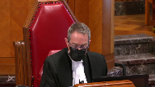
:::

**Overlapping speakers** (01:47:31): Wow!

**Justice Kasirer** (01:47:31): de l'entente.

::: {.column-margin}

:::

Si la Cour suprême ne tient pas compte de cette distinction-là, on va dire des bêtises.

S'il y a une entente, par exemple, qui porte sur le bien-être des enfants, elle ne serait pas exécutoire sans l'intervention du juge, techniquement parlant, n'est-ce pas?

Exactement.

**Speaker 4** (01:47:57): Et c'est le juge qui va avoir le dernier mot pour apprécier si l'entente qui a été souscrite par les partis rencontre le meilleur intérêt des enfants.

**Overlapping speakers** (01:48:07): Et moi, je veux...

**Speaker 4** (01:48:08): Là, on parle ici, je m'excuse, je voulais juste compléter ce que je disais, si vous me le permettez.

::: {.column-margin}

:::

Là, on parle de l'admissibilité en preuve.

Au moment où on se parle, on parle.

Elle existe, là, et cet entente-là n'existe pas, puis il faut être en mesure.

Et le tribunal doit avoir le loisir d'en prendre connaissance pour être en mesure, comme vous le dites, si bien d'évaluer si ça rend compte l'ordre public et si ça conforme au meilleur intérêt des enfants.

**Speaker 2** (01:48:39): Mais si j'accepte, je le fais, que les résultats sont excellents, je pense peut-être que c'est à cause du fait que s'il y a une vraie attente, si les personnes choisissent les termes qu'ils ont discuté dans la médiation, ils peuvent signer le résumé.

::: {.column-margin}

:::

C'est simple.

Et maintenant, ici dans ce cas, nous avons un résumé qui les partis ont choisi de ne pas signer et de ne pas transférer dans une attente avec un effet exécutoire.

Qu'est-ce qu'on prend de ce fait ici dans ce cas que le contrat ou le résumé n'a pas signé par les partis?

Qu'est-ce qu'on va faire avec les justifications pour ça aussi?

**Speaker 4** (01:49:40): Oui, c'est sûr qu'il serait souhaitable que, je ne peux pas vous le cacher, que les partis effectivement signent les ententes, auquel cas ça réglerait bien des choses.

::: {.column-margin}

:::

Mais il faut regarder à ce moment-là, je veux dire, il ne faut pas nier le fait qu'il peut y avoir eu des ententes comme dans notre cas.

Il y a eu une entente et heureusement, dans notre cas, il y a des circonstances subséquentes qui font en sorte que le tribunal et les tribunaux ont été en mesure de constater qu'il y avait effectivement eu une entente, qu'il y avait eu la rencontre des volontés et que les partis s'étaient obligés.

Parce qu'il y avait eu l'échec payé, l'échange de correspondance, qui arrive tout après que l'entente a été conclue pendant le processus de médiation.

Alors, c'est sûr que, quand il y a un début d'exécution comme dans notre cas, ça confirme la volonté des partis d'être liés à l'entente qu'ils ont prise dans le processus de médiation.

Et on se souviendra, puis vous l'avez souligné à plusieurs reprises, il y avait aussi une mise en garde dans ce résumé des ententes-là qui indiquait aux partis de bien faire attention, si elles choisissent d'exécuter, que ça aura comme conséquence de créer une reconnaissance des ententes qu'elles auront prise en médiation.

Alors, oui, c'est sûr qu'il faut regarder la situation de tous les faits pertinents à chaque dossier.

Dans notre cas, il me semble que c'est assez clair qu'il y avait une entente entre les partis, que les partis ont voulu s'y obliger.

Alors, mais c'est sûr qu'il y a des dossiers où ça ne sera pas clair, mais ce n'est pas parce que le résumé des ententes n'est pas signé, que ça ne peut pas devenir pertinent à un moment donné pour un tribunal de le considérer, en même temps qu'il va considérer les autres faits et agissements des partis qui résultent de la médiation et qui sont subséquents à la médiation.

**Justice Côté** (01:51:52): Vous allez nous parler de votre demande au niveau des dépens sur la base Avocat-Liant.

**Speaker 4** (01:52:02): Oui.

Alors, écoutez, vous avez le public…

**Overlapping speakers** (01:52:09): Je-je-je-

**Speaker 4** (01:52:09): Je vais commencer par ça en disant que le public fait confiance au processus de médiation et mon client M. Bouvier a accepté de participer à une médiation avec son ex-conjointe Mme Bizaillon suite à leur séparation pour arriver à un règlement rapide tout en évitant les délais, tout en évitant des stress et tout en permettant de trouver un terrain d'entente qui ferait en sorte qu'il pourrait ultérieurement, déjà par ce premier geste-là, démontrer qu'il serait en mesure d'avoir des communications efficaces entre eux-mêmes pour le bénéfice de les enfants.

::: {.column-margin}

:::

Lorsqu'il a opté pour la médiation, il croyait vraiment à son utilité, il croyait à son efficacité.

Il n'y aurait jamais pu s'imaginer que ce même processus de mode alternatif de résolution de conflit, qui existe pour favoriser les règlements et promouvoir l'accès à la justice, serait la source même d'un litige qui perdure depuis 9 ans.

Après tout ce temps, les frais et les coûts émotionnels du dossier, notre client recherche la confirmation finale de l'existence d'une entente librement dégociée de bonne foi en 2002 avec l'assistance d'un médiateur accrédité.

La décision de votre arme de cour ne décidera pas uniquement du sort de l'intimé, mais aura aussi un impact sur les décisions de nombreux époux et conjoints de fait au Québec qui souhaitent avoir recours au processus de médiation au lieu de s'adresser au tribunal.

Alors, je vous demande aujourd'hui, après ce long préambule, d'accorder les dépenses sur la base avocat-client à l'intimé Bouvier, et ce indépendamment du résultat du présent pourvoir, considérant que la plante qui n'était pas partie au litige s'y est émissée afin d'en faire une cause type, soulevant des questions dont la portée dépasse le cas particulier des intimés, et vous aurez noté que l'ex-conjointe de notre client n'est pas ici devant vous aujourd'hui.

**Justice Brown** (01:54:19): «

Qu'est-ce que vous dites à ce que maître Tremblay nous a dit, et spécifiquement, que ce n'était pas nécessaire, elle dit, pour M. Bouvier à intervenir?»

**Speaker 4** (01:54:33): Je vais juste prendre le mémoire de la plante.

::: {.column-margin}

:::

Si vous regardez les conclusions du mémoire de la plante, à part d'accueillir le présent appel, c'est maintenir l'objection soulevée par l'intimé bisaillon en première instance.

C'était dangereux de ne pas intervenir.

On est ici évidemment pour faire valoir les droits de notre client, mais aussi pour s'assurer qu'on puisse faire quelque chose à l'encontre de cette conclusion-là qui était recherchée, de maintenir l'objection soulevée par l'intimé bisaillon en première instance.

**Justice Wagner** (01:55:10): En fait, c'est la partie bisaillon qui aurait pu être la plante ici.

**Overlapping speakers** (01:55:16): Absolument, ne le dis pas.

**Speaker 4** (01:55:22): Alors, ce que je voulais peut-être vous mentionner, je vais juste me repositionner puisqu'on a parlé de beaucoup de choses.

::: {.column-margin}

:::

Alors, je voudrais revenir sur les principes juridiques applicants, mais surtout le cadre d'analyse que je vous soumets qui pourrait être tenu.

Alors, l'intimé bouvier soumet respectueusement que les principes détaillés dans votre décision d'Union Carbide devraient continuer à s'appliquer.

L'exception peut être invoquée à moins d'une clause de renonciation claire et express écartant ce droit, et ce bien évidemment dans les limites de l'ordre public.

Je vous ai aussi indiqué au passage que je ne croyais pas que les partis pouvaient adopter une clause de confidentialité absolue qui serait opposable au tribunal et qui priverait le tribunal de son pouvoir de surveillance.

Je vous ai fait référence au fait que dans les ordonnances, dans la loi du divorce, à différents moments, le tribunal doit prendre en considération les ententes intervenues entre les partis et les ententes intervenues en médiation.

Merci beaucoup, M. le Président.

**Justice Wagner** (01:56:56): question pertinente de mon collègue Browne sur la question

::: {.column-margin}

:::

, parce qu'on ne peut pas plaider pour autrui, un vieux principe, est-ce que l'association peut réclamer ce qu'elle réclame dans les procédures?

Est-ce qu'elle a intérêt pour réclamer et demander ce qu'elle demande dans ses conclusions, même comme intervenante?

**Speaker 4** (01:57:22): Je ne penserais pas, Monsieur le juge, mais je ne peux pas vous dire, Monsieur le juge en chef, je ne peux pas vous dire, je ne pouvais pas ne pas répondre à ça pour le bénéfice de notre client.

::: {.column-margin}

:::

J'ai trouvé ça assez spécial, effectivement, puis comme vous l'avez si bien dit, on voit que les intérêts de l'association La Plante sont intimement liés à celles de Mme Bizaillon.

**Overlapping speakers** (01:57:49): Ce n'est pas la même personnalité juridique.

**Speaker 4** (01:57:51): Exactly.

**Speaker 5** (01:57:55): Je veux retourner, si je peux, à la question de l'accès à la justice, pas dans cette cause, mais en général.

::: {.column-margin}

:::

Dans le contexte familial, est-ce que l'accès à la justice n'est pas servi en permettant aux conjoints de faire des essais et des erreurs et de modifier leurs solutions sur une certaine période de temps?

Et à la fin du processus, le résumé peut être signé par les parties.

Alors, pas dans cette cause, c'est une question plus générale.

**Speaker 4** (01:58:33): Écoutez, je suis d'accord avec vous, mais quand les partis font dans un processus de médiation, leur but est de trouver un terrain d'entente.

::: {.column-margin}

:::

Je ne pense pas que leur but est de faire erreur et cesse à ce moment-là.

Ils peuvent prévoir un mécanisme dans leurs ententes qui prévoit une évolution dans les dispositions qu'ils vont mettre de l'avant, mais je crois que quand ils vont dans un processus de médiation entre la famille, leur but est de trouver un terrain définitif et de permettre la finalité de ce qu'ils ont à décider ensemble.

**Overlapping speakers** (01:59:12): You

**Speaker 4** (01:59:13): Oui, bien sûr, si ce n'est que la question des enfants.

**Speaker 5** (01:59:16): Mais il y a deux étapes, premièrement de trouver une solution et deuxième de former une autre solution, c'est d'apprendre à faire ce qu'on a fait, c'est-à-dire qu'on

**Speaker 4** (01:59:27): Oui, effectivement, il y a deux étapes, je suis d'accord avec vous.

Ce qu'ils veulent dans un premier temps, c'est de s'assurer de prouver leurs ententes et après ça, ce sera la question de l'exécution.

Je suis parfaitement d'accord avec vous.

**Speaker 5** (01:59:41): Wait.

**Justice Wagner** (01:59:46): Est-ce que vous avez d'autres arguments maître?

**Speaker 4** (01:59:49): En fait, ce que je voulais vous dire, c'est que si cet honorable cours ne souhaite pas appliquer le sens strict de Union Carbide à l'endroit des médiations familiales, je vous soumets peut-être que l'analyse effectuée par le juge de première instance, l'honorable Moore, qui est basée sur le principe énoncé par la décision La Ferrière, la bonté de la Cour d'appel du Québec, devraient à tout le moins être retenue.

::: {.column-margin}

:::

Ce principe prévoit qu'une partie peut renoncer expressément, implicitement ou par son comportement au principe de confidentialité.

Alors, cette analyse requiert évidemment la recherche de la rénonciation express et implicite ou par le comportement des parties au principe de la confidentialité, mais je pense que ça nous servirait aussi bien.

Ça serait un cadre qui serait un peu plus, un standard un peu plus élevé et peut-être que la Cour est intéressée également par cette approche dans un mode.

Quant à nous, à toute fin pratique, le résultat serait tout aussi satisfaisant.

C'est ce que je voulais également vous mentionner à ce sujet là.

C'est tout.

**Overlapping speakers** (02:01:07): Si c'est tout...

**Speaker 4** (02:01:10): Alors évidemment, ce qui est important et vous l'aurez compris, c'est qu'on demande évidemment que soit rejetée l'appel, mais outre ça, on nous demande donc que la décision de la Cour supérieure et de la Cour d'appel, rejetant l'objection à la preuve formulée par l'intimé Bizaillon dans le présent dossier, soit confirmée et que bien sûr le présent pourvoi soit rejeté.

::: {.column-margin}

:::

Merci Maître.

Je vous remercie.

**Justice Wagner** (02:01:37): Merci.

**Overlapping speakers** (02:01:42): Oui.

Alors, tout d'abord...

**Justice Wagner** (02:01:44): J'aimerais vous entendre en particulier sur la question que j'ai posée à votre concert à la fait que je me demandais si vous aviez, votre cliente évidemment, avait l'intérêt requis pour demander les conclusions recherchées.

**Speaker 1** (02:01:59): La réponse est oui, monsieur le juge, et d'ailleurs je vous souligne que qu'est-ce qu'on a demandé c'est une question de droit, donc c'est-à-dire on demandait de maintenir l'objection.

::: {.column-margin}

:::

On ne demande aucunement de retourner en arrière sur la question du partage de l'immeuble, ça c'est un débat qui appartenait à madame, nous on ne représente pas madame et ça n'était aucunement notre intention en demandant de maintenir l'objection, c'est tout simplement parce qu'on s'objecte au fait qu'il y a des documents qui pour nous sont de nature confidentielle qui n'auront pas dû être déposés, alors on ne voyait pas comment on pouvait conclure autrement.

**Overlapping speakers** (02:02:30): qu'on vous demande aujourd'hui.

La notion de confidentialité n'appartient pas à la partie d'elle-même.

**Speaker 1** (02:02:34): La question de la confidentialité est une obligation du médiateur, nos membres, et l'assurance que cette confidentialité soit respectée fait partie du devoir du médiateur.

**Overlapping speakers** (02:02:46): Quel est le bénéficiaire de la confidentialité?

**Speaker 1** (02:02:49): Il est parti certainement, mais je vous dirais que dans ce cas-ci, indirectement, le médiateur, parce que si on protège sa confidentialité, il ne sera pas impliqué dans le processus judiciaire, ce qui est indirectement ou directement par le dépôt du résumé des ententes.

::: {.column-margin}

:::

**Overlapping speakers** (02:03:08): I'm sorry.

**Speaker 1** (02:03:08): juste pour clarifier certains faits, quand on pense qu'on est en train de nuire au processus de la médiation, c'est tout à fait le contraire.

::: {.column-margin}

:::

Les parties rentrent dans une séance de médiation et terminent à un moment donné.

Il n'y a pas 40 chemins.

On ne s'entend pas.

Il n'y a pas de règlement.

C'est possible.

On s'en va voir nos avocats et on entreprend le processus judiciaire.

Ça c'est porte numéro 1.

Porte numéro 2.

On s'entend sur une partie des choses, mais on ne s'entend pas sur le reste.

On consulte, on continue de négocier avec des avocats.

On s'entend sur tout.

Qu'est-ce qu'on fait?

Alors, on a des choix et le choix c'est, on sort de la médiation, on signe une entente avec des avocats ou sans avocat, on établit un statu quo et je comprends qu'il y a des gens qui ne vont pas chez l'avocat suite à la médiation.

On établit un statu quo qui va durer une certaine période de temps et si besoin est, effectivement, on retourne à la cour et l'ordre public va, effectivement, vérifier qu'est-ce qu'il y en est.

Mais ça, c'est suite à la confidentialité pendant ce processus-là.

Il doit absolument être protégé parce qu'il n'y a pas d'entente et on utilise le mot entente.

Ma collègue vous a dit peut-être qu'on doit changer le document, effectivement, mais il n'y a pas d'entente.

Qui dit qu'une personne ne peut pas changer d'idée une semaine ou deux après la médiation?

Alors, si on veut concrétiser des droits, si on veut confirmer des ententes, on peut le faire par ce biais-là.

Alors, c'est un milieu que si on lève la confidentialité, les gens n'auront pas la même approche pour pouvoir avoir des discussions franches et ouvertes, faire des admissions que les partis ne feront jamais à la cour ou même à leurs avocats.

Je tiens à vous dire aussi, et si jamais c'est tellement important, à ce moment-là, on signe le résumé des ententes.

Je tiens à vous dire aussi que qu'est-ce qu'on demande, parce que je recule un peu en arrière, c'est de dire c'est quoi l'intention des partis par rapport à l'exception au privilège.

Et c'est ce que dit M. le juge Doyon par f15 de son jugement, quand il dit que, justement, il faut tenir compte de l'ensemble des circonstances et présumer que les gens qui participent à la médiation familiale vont demander d'écarter cette exception-là à cause de toute l'information qui a été donnée aux justiciables, aux profanes, tel que je l'ai déjà plaidé. Merci.

**Justice Wagner** (02:05:30): Merci maître.

Alors, je remercie les avocates, la Cour va prendre le dossier en délibéré.

Et la Cour est à journée.

Bonne fin de journée.