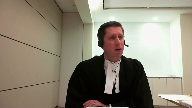
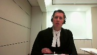
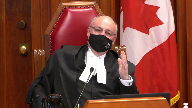

---
title: City of Corner Brook v. Mary Bailey
published-title: Heard
date: 2021-03-23
sidebar: false
---

This transcript was made with automated artificial intelligence models and its accuracy has not been verified. Review the original webcast [here](https://scc-csc.ca/case-dossier/info/webcast-webdiffusion-eng.aspx?cas=['39122']).
---

**Justice Wagner** (00:00:03): the court good morning in the case of uh... city of corner brook against mary bailey for the appellant city of corner brook erin e best and guile's w airs for the respondent mary bailey jay alexander templeton please note that even though you don't see them in the court the courtroom just sabella and justice kirkatsanis are participating in the hearing mister best there and that's i'm sorry

::: {.column-margin}

:::

**Speaker 1** (00:01:09): Good morning Chief Justice and Justices.

::: {.column-margin}

:::

I will begin today with the Blackmore rule and then I will turn to the standard of review and then to the facts of our case.

The main issue before this court is, should there be a special interpretive principle which requires releases to be read restrictively?

The crux of our position is that a release should be interpreted in accordance with the rules of contractual interpretation as outlined by this court in Sattva and Point Protection.

While we do not agree with the analysis of the Newfoundland and Labrador Court of Appeal in our case, we do agree with what Justice Butler said when she stated that the Blackmore rule has been subsumed into the law of contractual interpretation in Canada.

**Justice Rowe** (00:02:01): Now, in paragraph 19 of his reasons, Justice Murphy sets out the applicable standard which he's going to apply.

::: {.column-margin}

:::

Did he err in his statement of the law? F-19.

**Speaker 1** (00:02:23): I'm just, thank you Justice Roe, I'm just looking at paragraph 19 of the trial judge's decision.

::: {.column-margin}

:::

No, what Justice Murphy stated at paragraph 19 was correct and it essentially reflects the law in SACFA and in point protection.

We must look to the words of the release, the entirety of the release and all its words, and then the context in trying to interpret those words.

So we submit to the court that that is the exact right approach.

**Justice Rowe** (00:02:54): Now, if the trial judge or the trier of first instance directed his mind to the correct legal principle, is not the relevant standard of review palpable in overriding error?

**Speaker 1** (00:03:10): Yes, absolutely Justice Roe and that pretty much sums up our submissions on standard of review.

::: {.column-margin}

:::

Of course, I have a lot more detail to add, but we do submit that the Newfoundland and Labrador Court of Appeal aired when they found that there was an extricable principle and then used that to substitute the opinion, their opinion for the opinion of the trial judge.

So, while we don't agree with the analysis of the Newfoundland and Labrador Court of Appeal, we do agree with Justice Butler when she stated that the Blackmore rule has been subsumed into the law of contractual interpretation in Canada, that that very law which Justice Roe, you just took me to in the trial judge's decision.

So, I'd like to... Just to be clear, the Newfoundland and Labrador Court of Appeal is not an extricable principle.

It's a principle that is not an extricable principle.

**Justice Brown** (00:04:01): Just to be clear on what that means, as I understand what the Court of Appeal is saying at paragraph 31, and that's the passage, that's the passage where, that you just paraphrased, that the rule in Blackmore has been over time subsumed into principles of contractual interpretation affirmed by the court in Sattva.

::: {.column-margin}

:::

It really means that the approach to releases, as I understand what the Court of Appeal is saying, to the approach to the interpretation of releases stated by the English court in Blackmore is now, with the exception of standard form contracts, contracts of adhesion, whatever you want to call them, that is now the general rule regarding the interpretation of contracts as stated by the court in Sattva.

Is that correct?

**Speaker 1** (00:05:00): That's not precisely what I thought she was saying, Justice Brown.

::: {.column-margin}

:::

I thought what she was saying was that the Blackmore rule had come into line with the law in Canada, the modern law of contractual interpretation in Canada, which is the law of contractual interpretation in Canada, which is the law of contractual interpretation in Canada.

**Overlapping speakers** (00:05:22): Maybe there's a chicken and egg thing.

I thought they were saying the modern law in Canada had come into line with Blackmore.

**Speaker 1** (00:05:27): That's not how I understood it, but I'm not sure that there's that much of a difference.

In fact, I'm not sure there's any difference.

And I would like to take this one.

**Justice Brown** (00:05:38): Well we need to know this, is there a difference between what Blackmore says about the interpretation of releases and what Sattva says about the interpretation of contracts?

**Speaker 1** (00:05:50): Well, I would state that perhaps, yes, because the Blackmore rule states, first of all, it has a limiting factor.

::: {.column-margin}

:::

It states that it is, that a release is always limited to what is in the contemplation of the parties at the time of the signing of the release.

And that's not that limiting factor.

And what Justice Butler stated about the judicial tendency is to interpret releases narrowly.

That is certainly not in line with the law, as it's stated in SAFA.

**Justice Brown** (00:06:27): same thing as the Blackmore rule, right?

::: {.column-margin}

:::

If the Blackmore rule is, you know, Blackmore doesn't say you read them narrowly.

Blackmore says you read them in light of the intentions of the parties.

And Sattva says that you read the contract consisting with the surrounding circumstances known to the parties at the time of formation of the contract.

Is there a substantial difference between the two?

**Speaker 1** (00:06:53): I think there's a difference if you take the Blackmore rule, if you interpret it strictly.

::: {.column-margin}

:::

And I just am going to turn to the rule itself.

The general words of a release are limited always to that thing or those things which were especially in the contemplation of the parties.

And then it goes on, Justice Brown.

It states, but a dispute that had not emerged or a question which had not at all arisen cannot be considered as bound and concluded by the anticipatory words of a general release.

That seems to suggest that it is very difficult, if not in some interpretations impossible, to release unknown claims through a release.

That's how we interpret the strict interpretation of the Blackmore rule.

But I would really like to take this court to this court's interpretation of the Blackmore rule by Justice Corey in the Hill case, which is at tab nine of your condensed book.

Here we have the case of Hill in Nova Scotia, a 1997 decision of the Supreme Court of Canada.

And on page two there, paragraph 20, we have Justice Corey citing Justice Laforet, as he then was, from White and Central Trust.

He begins by summarizing the Blackmore rule for us.

He states, as Lord Westerbury stated in the House of Lords case of London and Southwestern Railway Co. in Blackmore, 1870, the general words in a release are limited always to that thing or those things which were specifically in the contemplation of the parties at the time when the release was given.

Then he goes on to say, and this is the important part, what the statement quoted means is that in determining what was contemplated by the parties, the words used in a document need not be looked at in a vacuum.

The specific context in which a document was executed may well assist in understanding the words used.

It is perfectly proper and indeed may be necessary to look at the surrounding circumstances in order to ascertain what the parties were really contracting about.

**Overlapping speakers** (00:09:28): do you concede that that's satva i do

okay okay

we're good then thank you

okay can i may i

**Justice Kasirer** (00:09:36): Ms. Pursuit, Ms. Bestmack, Pursuit, so, so just because I'm trying to understand what exactly subsumed means, so it doesn't seem to mean overturned, it, it seems to me caught up by or something, something of that order.

::: {.column-margin}

:::

But I, I note in, in, in the UK modern reading of, of Blackmore is that it's not a rule of law but a cautionary principle.

Does, does that have any currency in Canadian law?

**Overlapping speakers** (00:10:05): or does subsumed means forgotten?

**Speaker 1** (00:10:07): I don't think so.

::: {.column-margin}

:::

And such a cautionary principle would result in confusion, I think, in the different Canadian courts.

As the Blackmore rule, as Strictly stated, has done, even after the decision in Hill that we just referenced, courts in this country still seem to be confused about how to apply the Blackmore rule.

Do we need it?

**Justice Kasirer** (00:10:07): I don't-

**Justice Abella** (00:10:35): anymore is best?

Is it really of any assistance at all since SATFA in interpreting what a release means?

**Speaker 1** (00:10:43): Justice Abella, it's our position that we do not need it and it is of absolutely no assistance whatsoever in a post-SATVA world.

::: {.column-margin}

:::

The rule came about pre-SATVA in a time in England when courts were not allowed to look to the context when interpreting a release.

Now that we have SATVA, we know that it's not only our courts allowed, not only do they have the leeway to look to the context as Justice Corey stated, but we've even come further than that now.

Now we are required to look to the context as we see in SATVA and Resolute.

So there is no longer any need for the Blackmore rule.

**Justice Abella** (00:11:26): If it's the SATFA test which is the surrounding circumstances known to the parties at the time of contract formation, how far does that take us given the UK jurisprudence in Alley to extending the release beyond what was actually said in the release to the circumstances of which the parties had noticed, in other words knew or ought to have known, which is the approach that they took I think in the Alley decision.

::: {.column-margin}

:::

Is that where SATFA takes us?

**Speaker 1** (00:12:01): Yes, I believe so.

::: {.column-margin}

:::

I think the discoverability principle applies here and we see that in other Canadian case law with respect to facts that were known to the parties or ought to have been known.

And then we must add to that as well, also from SACFA, that of course only the objective evidence is relevant to this inquiry and not the subjective evidence which, as we'll see as I proceed, was another area where the Newfoundland and Labrador Court of Appeal erred by considering the subjective evidence of the driver.

**Justice Martin** (00:12:40): And may I return to your point where you say that there's confusion.

::: {.column-margin}

:::

Um, could I ask you to be a little bit more precise about that?

Because when I look at the appellate jurisprudence across the country, so if you look at Bank of British Columbia and Kaiser in B.C., or the Owner's Strata Plan in B.C., and you look at, uh, Biancello in the Ontario Court of Appeal, it doesn't strike me that there's confusion in the law.

There's just different results, which one would assume are completely theoretically possible if you're applying a consistent set of legal principles.

It would just depend upon the wording of the releases and the contract documents in dispute.

So what is this confusion you're talking about?

**Speaker 1** (00:13:28): Thank you, Justice Martin.

::: {.column-margin}

:::

So I disagree with what you stated, first of all.

I think there is confusion and I'll point it out by referring to the tests that the BC Court of Appeal and then the Ontario Court of Appeal have come up with, or the list of factors.

If you turn, for example, to the Court of Appeal decision, which is at tab 1D of the record.

Thank you.

And I could have taken you to the Kaiser case instead because I'd like to just take you to paragraph 33, which summarizes the test that the BC Court of Appeal outlined in the Kaiser decision.

So we see there at paragraph 33, we see a list of five factors from Kaiser.

The first factor, no particular form or words necessary to constitute a valid release.

We agree with that.

And that would would be in line with SAFSA.

Second factor, the normal rules relating to the construction of a written contract also apply to a release.

A release in general terms is to be construed according to the particular purpose for which it was made.

Again, no problem with that, accords with SAFSA.

We do have a problem though when we get to the third factor.

The court will construe a release, which is general in its terms in light of the circumstances existing at the time of its execution and with reference to its context and recitals, in order to give effect to the intention of the party by whom it was executed.

And the problem here is that is the use of the word party.

It only considers when you apply to our case, the intention of the driver, the releaser.

It does not direct the court to consider the intention of the city.

And that is problematic because according to the SAFSA approach, we ought to consider the intentions of the parties, plural, not one party.

If we turn to the fourth factor there, in particular, it will not be construed as applying to facts of which the party making the release had no knowledge at the time of its execution or to objects which must then have been outside his contemplation, which in our case would be outside of her contemplation because the party making the release was the driver, Mary Bailey.

But again, we are limiting the inquiry here to one party.

So that section is unclear, I would submit.

And then the fifth factor we have no issue with, the construction of any individual release will depend on its particular wording and phraseology, obviously we agree with that.

I would like to take the court as well now briefly to the list of factors from Bianca and Yello.

Which is in your condensed book.

At tab eight.

**Overlapping speakers** (00:17:15): Is there a wish tub?

**Speaker 1** (00:17:16): Tab eight.

::: {.column-margin}

:::

That paragraph 42, which is the last page of the decision there.

Okay, so we have again a list of five factors, not the same five factors that we saw from the BC Court of Appeal in Kaiser.

The first factor, one looks first to the language of the release to find its meaning.

Well, that's not exactly in line with this court's direction from Resolute, where the court indicated that we ought to consider the entirety of the context at once and that the text in and of itself doesn't have meaning without the background, but that's the first factor.

Well, how is that?

**Justice Brown** (00:18:27): How is that inconsistent?

I mean, you're still having to look at the text of the agreement.

The question is the text of the agreement in light of what?

But I don't see anything in that first part that's inconsistent with it.

You go to the text first.

**Speaker 1** (00:18:42): Okay, I consider that to be very minor, Justice Brown.

::: {.column-margin}

:::

I would agree with you that we ought to read the text first and then interpret it in light of the rest of the context.

So the second factor there, parties may use language that releases every claim that arises, including unknown claims.

However, courts will require clear language to infer that a party intended to release claims of which it was unaware.

That's fine, except for there is a little bit of an added onus there to use clear language to release unknown claims, but that's fine.

General language in a release will be limited to the thing or things that were especially in the contemplation of the parties when the release was given.

So factor number three there, we have a pretty clear expression of the Blackmore rule itself.

And again, what's problematic here is this limiting principle, this artificially limiting principle.

When we have two parties that should have the freedom of contract, they expect to have freedom of contract, if their intentions are to release unknown claims or anything else, they should be able to do so and the written release ought to give effect to their intentions.

**Justice Brown** (00:20:04): But isn't that simply saying that absent language, which I might suggest you have in this release, I know your friends will be jumping up and down when they hear this, but you have language in this release about without limiting the generality of the foregoing, foreseen or unforeseen future, you have specific language in this particular release that contemplates that it may extend beyond the things that were in the contemplation of the parties when the release were given.

::: {.column-margin}

:::

If you don't have that, what's wrong and what is inconsistent with Sattva about saying, well, if there's general language of the release, that has to be understood in the context of what these parties objectively knew.

**Speaker 1** (00:20:50): Yes, Justice Brown, I agree with you and and certainly the the Ontario Court of Appeal and BN Caniello would agree that the the language in in our release as well would bar unknown claims.

::: {.column-margin}

:::

But the only point that I'm making is that the suggestion of this limiting principle, the use of the word limited here and in the Blackmore rule has resulted in some.

I guess, incongruous results in the courts below.

And, and we submit that that that that is a problem that the courts have not followed the guidance in in Hill, even the appellate level courts.

In some instances, and that is problematic we see it in in owners and strata plan of the apex, which is a case of the at an appellate level that that applied the Blackmore rule, and, and we would submit arrived at an incorrect result.

**Justice Abella** (00:22:00): Are you concerned about the fifth point in Bianca and Yellow?

::: {.column-margin}

:::

Is that looking at the circumstances surrounding the giving of the release to determine what was specially in the contemplation of the parties?

Is that kind of a reintroducing the Blackmore principle into this new modern framework?

**Speaker 1** (00:22:24): Yes, Justice Abella, exactly.

::: {.column-margin}

:::

The fifth principle certainly does mirror the Blackmore rule, and as we stated in our factum, to ask the court to inquire as to what was especially or specifically in the contemplation of the parties at the time of signing the release is not the guidance that were given in SADFA, which is to determine the intentions of the parties at the time of signing the release.

And we submit as we have in our factum that what is in the contemplation of the parties and what is the intentions of the parties is actually somewhat different.

And certainly if we follow the line of reasoning that Justice Butler did in the Newfoundland and Labrador Court of Appeal, it becomes very problematic when what can be in your contemplation or what might not be in your contemplation was even something that you had objective knowledge of.

**Justice Abella** (00:23:30): What's the test then, Ms. Best, that you're suggesting?

::: {.column-margin}

:::

I mean, we just dealt with that quite recently in Resolute, where we adopted the language of Justice Laskin, who was adopting the language of Justice Doherty, and it was the text as a whole, context of the circumstances as they existed when the agreement was created, and then the circumstances include facts that were known or reasonably capable of being known by the parties when they entered into the written agreement.

So that's our most recent law on the subject.

Is there any reason that we need to change that?

**Speaker 1** (00:24:08): no reason whatsoever.

::: {.column-margin}

:::

I think that mimics the law from satva and point protection as well, except that there is one more piece of it, which is that the context shall not overwhelm the words of the agreement or as Justice Cote stated in point protection, the context shall not distort the words of the agreement.

Other than that, we are certainly submitting that that resolute satva and point protection all enunciate the appropriate approach to be applied here.

**Justice Abella** (00:24:43): None of which relies on Blackmore.

**Speaker 1** (00:24:48): Correct.

::: {.column-margin}

:::

Yes, and to add to that point, an indemnity, as was at issue in Resolute, is not so different from a release.

In fact, our release, as I'm sure you've seen, which is at tab one of our condensed book, contains an indemnity.

So the idea that we might use a special rule to interpret the first paragraph and then no rule to interpret the indemnity provision is quite odd.

As well, we note that the contract that was at issue in the point protection case was also a settlement agreement, which again is not so different from a release at all.

And again, no rule was applied.

**Justice Martin** (00:25:36): May I ask you to go back to your point about a contemplation of the parties is different from their intention.

::: {.column-margin}

:::

I mean, but in many ways, we sort of use the two interchangeably.

So what's the difference and what turns on the difference in your view?

Because a lot of it can be semantics.

What's in the...

So help me out.

**Speaker 1** (00:26:01): there please.

::: {.column-margin}

:::

Yeah thank you Justice Martin.

If you wouldn't mind turning please to paragraph 131 of our factum.

Okay so we see there that well we had this thought as well and we looked up the definition of the word contemplation and found that it meant regarding steadily which is not really the same level of knowledge that's required by our discoverability principle and with respect to you know the test of known or ought to have known and then I say here in the second half of paragraph 131 what is in the contemplation of the parties refers to the subject matter the parties were thinking about whereas the intentions of the parties refers to what they were intending to agree to.

I wonder if we're I wonder if we're

**Justice Brown** (00:27:05): I wonder if we're making this way more complicated than we need to, right?

::: {.column-margin}

:::

Because, I mean, things that were specially in the contemplation of the parties can surely, in the language of Bianconiello, include an intention to wipe the slate clean.

So the point is this.

I mean, maybe there is a distinction between things in contemplation and intentions, but what is in the contemplation of the parties can inform the parties' intentions.

I'm not sure you agree with that, but I think that's right.

**Speaker 1** (00:27:42): Well, fair enough Justice Brown, but if the rule as stated in the Blackmore rule is the same as the current law as stated in Zappa and Point Protection, then why do we need the Blackmore rule at all?

::: {.column-margin}

:::

I'm not saying we do.

Okay, especially in light of the fact that courts seem to be misinterpreting it.

**Justice Brown** (00:28:07): I may well find myself with you on that point, that it has been subsumed, swallowed up, taken over, overtaken, whatever.

::: {.column-margin}

:::

But I'm just not sure, I'm not sure where this kind of granular analysis, even forensic, you know, forensic postmortem on Blackmore is taking you.

If we accept what the Court of Appeal says at paragraph 31, then we're in the world of SATVA.

And then the question is, okay, did the motions judge commit a palpable and overriding error in the few ways that the Court of Appeal thought?

Yes, and I'd very much like to get to that.

I'm quivering with anticipation, so take me.

**Speaker 1** (00:29:01): I do agree with you that what the Court of Appeal stated at paragraph 31 was correct.

::: {.column-margin}

:::

Unfortunately, the Newfoundland and Labrador Court of Appeal did not apply the law that she stated.

The analysis then went on to be a strict application of the historical approach to the Blackmore rule, as opposed to the post-SATVA approach to the Blackmore rule that the trial judge took.

**Justice Abella** (00:29:34): Didn't it get answered in SACFA where Justice Rothstein said the overriding concern is to determine the intent of the parties and the scope of their understanding.

::: {.column-margin}

:::

So we don't even need contemplation of the parties, we're talking about a test that seeks to determine the intention of the parties.

**Overlapping speakers** (00:29:53): Yes, I would agree, Justice Abella.

**Justice Abella** (00:29:55): So isn't Justice Brown right then?

We're focusing on semantic distinctions that have been overtaken by our jurisprudence.

**Speaker 1** (00:30:04): Yes, I would agree.

::: {.column-margin}

:::

And the only reason why I raise it at all is because our appellate courts seem to be getting into these distinctions which, as you stated, have been essentially put aside by SATFA.

So I'd like to turn now to the standard of review.

First, I'm going to talk about how the Newfoundland and Labrador Court of Appeal erred on standard of review, and then I'll talk about the standard of review to be applied to the decision of the Court of Appeal very briefly.

Contractual interpretation is a question of mixed fact and law.

The standard of review is palpable and overriding error, unless there is an extricable principle of law.

This is rare.

The Newfoundland and Labrador Court of Appeal erred when it found that there was an extricable principle of law which resulted in the standard of review of correctness, which allowed the Court of Appeal to substitute its own opinion and factual findings for the opinion and factual findings of the trial judge.

If you could please turn to the decision of the Newfoundland and Labrador Court of Appeal at tab 1D of your appeal record.

At page 10.

We see here three instances where the Newfoundland and Labrador Court of Appeal found that the trial judge erred in principle.

The first is at paragraph 39.

About halfway through there, the phrase that starts with, the trial judge did not consider that their delivery of the statement of claim to their own insurers who promised to take care of the matter was relevant to the Bailey's continuing knowledge of the temple action and whether it could realistically be said to continue to have been in their contemplation when the release was signed.

We disagree with this finding, but more importantly, we disagree with how the Court of Appeal approached this finding.

What the Court of Appeal is really saying here is that the trial judge did not give this evidence enough weight, but weight, as we know, does not attract a standard of review of correctness.

So the Court of Appeal erred in this regard.

Secondly, the evidence regarding the delivery of the statement of claim to the driver's insurer was in the answers to interrogatories of the driver.

We know that the trial judge read and considered those answers.

We also know from this Court's decision in Housen and Nicolaisen that the full evidentiary record, sorry, if the full evidentiary record is before the trial judge, we can presume that he reviewed it.

And I'd ask that you please turn to tab 12 of our factum where we'll find the case of Housen and Nicolaisen.

**Overlapping speakers** (00:33:00): Your condense book.

**Speaker 1** (00:33:00): Sorry, I do apologize, it's not in our condensed book.

It is at tab 12 of our factum.

**Overlapping speakers** (00:33:08): Your factum has no caps.

**Speaker 1** (00:33:10): Oh, okay, so I thought that

**Overlapping speakers** (00:33:15): TELL US ALL ABOUT

**Speaker 1** (00:33:16): mistakenly thought.

::: {.column-margin}

:::

I'm sure you've read this case and you know it inside out so I'm just going to paragraph 72.

Here we go.

So here we have this court stating, however as we have already stated the full evidentiary record was before the trial judge and absent further proof that the omission in her reasons was due to her misapprehension or neglect of the evidence, we can presume that she reviewed the evidence in its entirety and based her factual findings on this review.

This presumption absent sufficient evidence of misapprehension or neglect is consistent with the high level of error required by the test of palpable and overriding error.

We reiterate that it is open to the trial judge to prefer the testimony of certain witnesses over others and to place more weight on some parts of the evidence than others, particularly where there is conflicting evidence.

The mere fact that the trial judge did not discuss a certain point or certain evidence in depth is not sufficient grounds for appellate interference.

**Justice Abella** (00:34:28): Can I clarify something with you please, Ms. Best.

::: {.column-margin}

:::

I want to be sure.

This morning you're arguing, am I right, that the standard of review is palpable and overriding error.

Are you resigning from what I think your position is in your factum at paragraph 36, that the issue here is about whether releases are to be interpreted narrowly, whether the Blackmore rule applies, and that this attracts a standard of review of correctness.

Am I reading that wrong?

**Speaker 1** (00:34:59): No, Justice Abella, and thank you for that question.

The standard of review of correctness is the standard of review that we're asking this court to apply to the Newfoundland and Labrador Court of Appeals decision.

But wait now, wait now, wait now, wait now, wait now, wait now, wait now, wait now, wait now, wait now, wait now, wait now, wait now, wait now, wait now, wait now, wait now, wait now, wait now, wait now, wait now, wait now, wait now, wait now, wait now, wait now, wait now, wait now, wait now, wait now, wait now, wait now, wait now, wait now, wait now, wait now, wait now, wait now, wait now, wait now, wait now, wait now, wait now, wait now, wait now, wait now, wait now, wait now, wait now, wait now, wait now, wait now, wait now, wait now, wait now, wait now, wait now, wait now, wait now, wait now, wait now, wait now, wait now, wait now, wait now, wait now, wait now, wait now, wait now, wait now, wait now, wait now, wait now, wait now,

**Justice Rowe** (00:35:13): Wait now.

::: {.column-margin}

:::

I mean, I put a question to you earlier on, and I said, is not the real issue here whether the trial or first instance made an error of law?

Because if there's no error of law, or no possible overriding error, mixed fact in law, I mean, the Court of Appeal is out to lunch.

Now you're telling us, forget what the trial judge said, just look at the Court of Appeal.

You've got me completely confused now.

**Speaker 1** (00:35:41): I'm sorry Justice Roe.

::: {.column-margin}

:::

Yes, so what we are arguing is that the Newfoundland and Labrador Court of Appeal aired with respect to its approach to standard of review and that error now to this court is reviewable on a standard of review of correctness because it was a legal error the way that they approached the standard of review.

But if we're going to stick to the standard of review that the Court of Appeal applied to the trial judge, we argue that ought to have been palpable and overriding error. Okay.

**Justice Brown** (00:36:15): say I agree with you.

So did the Court of Appeal identify any palpable and overriding errors in Justice Murphy's reasons?

**Speaker 1** (00:36:28): we submit that it did not.

::: {.column-margin}

:::

And so I'd like to continue taking you through those Court of Appeal reasons

and I'll show you where I think they pointed out errors, but then I'd like to show you how they were not extricable principles or palpable and overriding errors.

So, secondly, with respect, if we go back to the Court of Appeal reasons there at paragraph 39, and we're talking about, again, the fact that Justice Butler of the Court of Appeal found that the trial judge erred when he didn't consider that the statement of claim might not have been in the driver's contemplation because she gave the statement of claim to her insurers and she believed that they would take care of it.

So, secondly, the evidence regarding the delivery of the statement of claim to the driver's insurer, as I mentioned, was in the answers to interrogatories and then I read you the quote from Housen.

Further, the trial judge did, he did correctly find that only objective versus subjective evidence is relevant to this inquiry.

And we submit that there is clearly objective evidence that the driver had not considered objective evidence, that the driver had knowledge of the statement of claim, the temple statement of claim, because she was served with it and because she read it.

The fact that she may have believed that her insurer would take care of it is subjective and is not relevant to this analysis.

So, we submit that the trial judge's finding on this point should be reinstated.

The second extricable error, and there are only three that the trial judge, sorry, that the Court of Appeal so this is the second one, is at paragraph 43 of the Court of Appeal's decision.

Wherein the Court of Appeal found that it was impossible that the temple action was within the contemplation of the parties, because there was no evidence that the city was aware of it.

Sorry, Justice Abella, I see that you're turning to it.

No, no, it's okay. Go ahead.

I'm with you.

Okay, great.

Thank you.

This finding must be wrong, because if it isn't, then it would be categorically impossible to release unknown claims at all.

The trial judge, however, understood this.

And I ask you to please turn to the decision of the trial judge, which is at tab 1B of your record.

**Justice Rowe** (00:39:21): I mean isn't it really as simple as this in in Ms. Bailey said when I struck Mr. Temple it wasn't my fault it was your fault city and what could be clearer than that

**Speaker 1** (00:39:39): Well, I think she alleged that, but of course that is what the release resolved and the settlement resolved.

::: {.column-margin}

:::

The release was a part of that, as was the discontinuance, which is also an important part of the context that I'm going to get along to.

So, at paragraph 44 of the trial judge's decision, he states, I do not believe that either of the parties was thinking of any particular type of claim by the Baileys or Mrs. Bailey, including a third party claim.

However, I do not believe that it is necessary that the parties be specifically contemplating a particular type of claim.

Instead, I believe it is sufficient if the parties were contemplating any and all types of claims relating to a particular event, such as the accident.

**Justice Martin** (00:40:42): you

**Overlapping speakers** (00:40:42): They're arguing.

**Justice Martin** (00:40:43): I mean, I understand the breadth of the full and final release, but, I mean, there's textual features about that that tie it to a particular action number.

::: {.column-margin}

:::

The temple action is a different number, and on its face, the full and final release, although it has all of the requisite wording around, you know, generalities and specifics, nevertheless absolutely tracks down to the other remedies this Honourable Court might want, it's excerpted out what is in the Bailey action by way of a request for remedy and relief, and just puts it there.

Why isn't it a palpable and overriding error not to have, not to have cottoned in on that, and not to have, when they say what they knew of, it seems from the face of this that whether they knew of it or not, they were just addressing a particular action number and a particular claim and the wording around that so that there could be no releasing everything in respect of that action.

**Speaker 1** (00:42:04): Justice Martin, I respectfully disagree for two reasons.

::: {.column-margin}

:::

First of all, the plain reading of the release itself releases the subject matter is stated right in the release.

It releases all claims arising from the accident.

Second of all, before the language where the actual action is mentioned, we see use of the word and, and without limiting the foregoing.

Those words cannot be interpreted so as to limit the release to that particular action number and to do so would certainly distort their meaning.

Third of all, and importantly, this release was accompanied by discontinuance.

Both the release itself and the discontinuance were part of the counter offer that the city made to the driver.

And the discontinuance along with the fact that the limitation period had expired are very important because they function to completely eliminate any possibility of any further claims, personal injury or property damage claims arising from the driver against the city.

Those claims are off the table.

The limitation period has passed on them.

There's no way that those claims can be brought after this release has expired.

**Overlapping speakers** (00:43:33): But the discontinuance is in relation to the Bailey action only.

**Speaker 1** (00:43:37): Yes, it is, exactly.

::: {.column-margin}

:::

The discontinuance discontinues the Bailey action and also eliminates any possibility of subrogated actions.

So the release, then, must relate to something more.

And it does.

And this is what the trial judge understood.

It relates to unknown claims.

**Overlapping speakers** (00:43:58): And on the other side of the screen, you can see that there's a lot of people watching this live on Facebook right now, and on the other side of the screen, you can see that there's a lot of people watching this live on Facebook right now, and on the other side of the screen, you can see that there's a lot of people watching this live on Facebook right now, and on the other side of the screen, you can see that there's a lot of people watching this live on Facebook right now, and on the other side of the screen, you can see that there's a lot of people watching this live on Facebook right now, and on the other side of the screen, you can see that there's a lot of people watching this live on Facebook right now, and on the other

**Speaker 1** (00:43:58): And unknown claims include the claim for contribution and indemnity brought by the driver, the third-party claim.

In fact, that's really the only thing that it can refer to.

There's really nothing left.

**Justice Kasirer** (00:44:09): Ms. Best, can I, I understand your argument and it's, I find it compelling that when the parties use appropriate language, they can release claims that one or another of them neither knew nor could have known, nor even imagined.

::: {.column-margin}

:::

I want to go back to Ali and where Lord Bingham says, and that's where the cautionary value of, of this old case, he says, remains relevant.

And this is, this is actually quoted by the Ontario Court of Appeal in BN Canelo at paragraph 29.

Lord Bingham reviewed the jurisprudence from English and Australian courts on interpretation of releases, jurisprudence established that by using appropriate language a party can release claims that the party neither knew nor could have known, nor even imagined.

But then he's, and you're making the point, and I understand it, that here we have, here we have language that if we were to over, if we were to use context to set it aside that would be distorting or overwhelming it.

But Lord Bingham goes on, however, in the absence of clear language, the court will be very slow to infer that a party intended to surrender rights and claims of which he was unaware and could not have been aware.

Is that of any enduring value, that caveat there?

In the absence of clear language, in other words, in the presence of very broad language, but not clearly connected to the circumstances at hand, that the court should be slow to infer that a party intended to surrender rights.

**Overlapping speakers** (00:46:01): And thus be it. Must.

**Justice Kasirer** (00:46:02): take caution before simply applying the broad text.

I think that's what Lord Bingham had in mind when he said there is a residual cautionary value to the former rule.

**Speaker 1** (00:46:17): Yes, thank you Justice Casar.

::: {.column-margin}

:::

Yeah, I think that that passage is useful.

So first of all, you mentioned that Ali is cited in Bien Caniello and I will note that the Ontario Court of Appeal in Bien Caniello did find that that clear language that was required in that case was present in the release and by the way that clear language that was present in that release is also present in our release.

It's very, it's very similar in that regard.

As well, I note that in Ali, one of the Lords makes the example of a release that might be so broad as to release the world.

He gives the example of a release that was meant to resolve a dispute over partnership accounts then later being used to prevent a claim from one partner's tree roots encroaching on the property of another partner and how the release in that case, if it did not contain the clear language required, should not apply to, should not have such a broad application.

And here in our case, we submit that the subject matter of the release is very narrow.

It does not release any claim that the driver might have against the city.

In fact, the driver very well may have many more claims against the city in her lifetime.

It does not go to those.

It is restricted to claims arising from the accident and we submit that that is the subject matter of this release and that it contains or that it includes the driver's claim for contribution and indemnity.

**Justice Kasirer** (00:48:01): so that even taking caution as Lord Bingham suggests it doesn't change your view of the result I understand your argument I guess for the precedential value if any of of Ali um and by extension Blackmore do you think this cautionary value this court should remind remind litigants of the the it's the possible cautionary value of the rule or is it just subsumed so that it's been swallowed up by satva

::: {.column-margin}

:::

**Speaker 1** (00:48:33): We submit that it's subsumed and that the review of the context is appropriate to determine the intention of the parties and that there need not be special super added and I use the quotation marks for that because the Blackmore rule has been called a super added rule on top of the regular law of interpretation of contracts and we submit that there is no need for a super added rule that when parties make a release that their intentions ought to be affected as stated in that release and that if there is if there are any inequities we submit that those ought to be resolved by the existing equitable doctrines and of course we we have a recent decision on that in Crystal Square Parking which is in our condensed book at tab 11.

::: {.column-margin}

:::

**Justice Brown** (00:49:45): Just before you go there, I just wanted to go back to Justice Kazir's point, and I'm wondering if it might be useful to consider the distinction between this kind of claim and the unknown kind of claim discussed in Alley and Biancaniello.

::: {.column-margin}

:::

Because in those cases, it wasn't a question of the claim being unknown, but the facts giving rise to the claim having been unknown to the plaintiff, whereas here, everyone knew the facts.

Bailey hit Temple. Yes.

Is that an important distinction or is it unimportant?

**Speaker 1** (00:50:25): Well it's very important in fact I think with respect to the Ali case certainly the law as adopted by the Ontario Court of Appeal and BN Caniello is very relevant to our situation.

::: {.column-margin}

:::

The reason why the result was not in favor of of the releasee was that in that case the the the claim that was being barred was a claim for stigma damages and at the time of the signing of the release in Ali a claim for stigma damages did not exist.

The court's

**Overlapping speakers** (00:51:01): probably had a very, stigma damages probably had an almost theological understanding before then.

**Speaker 1** (00:51:09): The court in L.E. found that it was inconceivable at the time of the signing of the release.

::: {.column-margin}

:::

So that's quite, there's quite a difference between an inconceivable claim and an unknown claim.

And an unknown claim, as our courts have found, can depend very simply just goes back to the discovery of principle, sorry, the discoverability principle.

If the facts were known or not.

**Justice Rowe** (00:51:32): have gone into a rumsfeldian distinction between known unknowns and unknown unknowns which I find unhelpful.

::: {.column-margin}

:::

I just want to read to you two paragraphs from the justice Murphy's decision and then I'll pose a question to you.

From a factual perspective, paragraphs 27 and 28, from a factual perspective, Ms. Bailey also knew of the facts underlying her third party claim.

She clearly knew Mr. Temple had been injured and she knew the city was potentially liable for the accident that led to his injury.

This last fact is made clear from a review of her statement of claim against the city and he gives the action number.

By that statement of claim, she alleged the city was liable for the accident.

I'm going to make it a little earlier.

And then paragraph 28, it's very short, thus when Ms. Bailey signed the release, she knew she was being sued by Mr. Temple as a result of the accident

and she knew the city was potentially liable for the accident in which Mr. Temple had been injured.

Thus, she had knowledge of all the facts which underpin her third party claim against the city.

End of quote.

Where is the unknown?

**Speaker 1** (00:53:05): Yes, thank you Justice Roe.

::: {.column-margin}

:::

I would agree with you that those, we fully agree with those two paragraphs of the trial judge's decision.

I think the only possibility of the unknown is that the city did not know that the temple claim had been in fact issued.

And the city would have known certainly of the facts that underpinned the temple claim, but just simply didn't know that the claim had been, that an action had been filed and issued.

But as I'm sure you've guessed, we find that to not be meaningful.

The parties in this case knew of the facts that underpinned the temple claim, both sides did.

And while the driver knew that the action had been issued and it had been served on her

and she read it, we have no evidence that the city knew that the action had been issued and served and that she read it.

But again, we submit that that's not meaningful in this case.

**Justice Moldaver** (00:54:07): Part of the claim is best, part of the record as to how much the temple claim was for.

**Speaker 1** (00:54:15): Yes, oh no, sorry, excuse me, Justice Moldaver.

The amount of the temple claim is completely unknown.

It's even unknown to me at this point.

We haven't done the analysis.

**Justice Moldaver** (00:54:28): have real trouble believing that the city did not know or minimally ought to have known of the temple claim.

::: {.column-margin}

:::

This is their own employee who's been injured.

The statement of claim by Ms. Bailey makes it very clear that she's holding the city responsible for any injuries that may have been occasioned to the worker, their worker.

And to somehow sit back here and suggest that they didn't know or ought not to have known the temple had issued a claim, I find very difficult to accept.

And quite frankly, I guess my question really is, if indeed they were aware or should have been aware of the claim, why would it be...would it not be reasonable in this release that they specifically address that claim, so the third-party claim, so that no one is mistaken about what this release relates to?

I'm just thinking this.

I mean, if it was a million-dollar claim by temple, and I'm not saying it was, that would be part of the factual matrix here that one would surely have to take into account in assessing whether this release was intended by Ms. Bailey to give up a third-party action against the city.

It's a long question, and it's very wandering and all that, but I think you know what I mean.

Why would we not expect the city to have specifically referred to that in this release, if indeed they were intending to be released from the third-party claim?

**Speaker 1** (00:56:14): Thank you Justice Moldaver.

::: {.column-margin}

:::

Well, first of all, as I've stated the the release does refer to all claims, which I think the city ought to be have been entitled to understand would mean all claims arising from the accident.

Second of all, as I see that the limitation period had passed, and Mr. Temple had only sued, Miss Bailey In fact, he alleged that Miss Bailey the driver was solely, and that word is in the statement of claim responsible for the accident.

So, the city, the city had not had any claim with respect to Mr. Temple's damages served on it at that time, and, and it, it was, it was not aware that the action was out there further.

I just remember as well that part of the context is that Mr. Temple was an employee of the city.

I don't disagree with you that there's some likelihood that the city would have knowledge of his injuries and in fact, it seems as you said, very unlikely that they wouldn't it could have been an issue of the right hand not knowing what the left hand was doing

but but that being said, the important part as well as the context of the historical trade off.

I understand that Mr. Temple did receive workers comp benefits for some period of time that he may have changed his election.

I don't think that's an evidence I don't, I don't think it's important to this case

but it just goes to show that there are reasons why this would remain to be as as Justice Roe stated unknown unknown claim.

**Overlapping speakers** (00:57:51): in this context, and the very.

**Justice Brown** (00:57:53): type of claim that it was most valuable to have released.

But this is again an example of the distinction between knowing the facts, knowing of the facts and knowing of the claim.

**Overlapping speakers** (00:58:05): Yes, that's right.

**Justice Karakatsanis** (00:58:06): Just to follow up on Justice Moldaver's question, if in fact, they ought to have been aware of, they were aware or ought to have been aware that there was another claim out there, are we, and looking at the specific release here, which refers to the accident, but also refers to the Bailey claim and not the Temple claim, are we entitled, is the amount of the settlement at all relevant to determining those, that objective circumstances?

::: {.column-margin}

:::

**Speaker 1** (00:58:40): I submit Justice Karakatsanis that in some cases it can be but in this particular case it is not relevant because we do not know we do not know the the value of the of the temple claim in this case we we have with respect to the the settlement figure of $7,500 we we do know from the context that the city was denying liability and that it felt strongly about about liability and that in this case the the the city was essentially wanting to close its file it wanted finality and that necessarily included a finality with respect to any third party claim that Mary Bailey might bring against the city.

::: {.column-margin}

:::

**Justice Martin** (00:59:28): But when it speaks about its $7,500 offer, it talks about the physical symptoms of the plaintiff being resolved, right?

It doesn't speak about anything else.

Yes, other than liability.

**Speaker 1** (00:59:45): Yes, so that that goes to that that comes from the email correspondence which are part of the negotiations, which of course are an admissible aspect of the context but only in so much as they offer objective evidence with respect to the intentions of the parties and entering the agreement.

::: {.column-margin}

:::

And with respect to the city, the drivers injuries having resolved, it's our submission that part of that back and forth is posturing and not to be given too much weight.

**Justice Brown** (01:00:21): Does the standard of review figure prominently here?

::: {.column-margin}

:::

I mean, it may be the case that one could have arrived at a different result, but, I mean, isn't your submission, I mean, at root that it doesn't matter here because the judge didn't commit a palpable and overriding error, which is an error that has to leap from the page in arriving at the result he did.

**Speaker 1** (01:00:46): Justice Brown that's exactly our submission standard of review is of crucial importance here and is something that appellate courts ought not to be getting wrong in this context they ought not to be substituting their opinion for the opinion of the trial judge when there's no palpable and overriding error or extricable error of law as in this case.

::: {.column-margin}

:::

**Justice Wagner** (01:01:13): Thank you very much.

**Justice Abella** (01:01:13): Thank you very much justice.

::: {.column-margin}

:::

Can I ask one, just one question. Yes.

When, when I thank you.

When I, if you look at the original claim of Miss Bailey in paragraph six where she sets out her claim against the city.

And then you look at her third party claim.

Five years later at paragraph seven.

Can you take anything from the fact that the things she's claiming in her original claim in a third party claim are almost identical.

**Speaker 1** (01:01:55): Well, certainly, yes.

I mean, there are both claims in negligence against the city and brought by the same parties which and claims arising from the accident.

So in that regard, they would certainly all be captured by the release.

Thank you.

**Justice Wagner** (01:02:09): Thank you.

::: {.column-margin}

:::

The court will take its morning break.

Fifteen minutes.

The court will take its morning break.

Thank you.

Be seated.

Mr. Templeton.

**Speaker 2** (01:03:18): Yes, thank you Chief Justices and may it please the court.

::: {.column-margin}

:::

Mrs. Bailey executed the release in this case for the purpose of bringing her litigation against the city to a close.

Her litigation concerned an accident, which is to say a mishap that led to injury.

It's important to recognize that the word accident does not have an immutable meaning as suggested by SAPA.

We must look to the surrounding circumstances to understand what the parties meant by their use of that word.

The mishap at issue in her litigation was to say that the word accident did not have an immutable

**Justice Cote** (01:03:57): Are you saying that here we should consider that there were two accidents?

One relating to the claim that Madame took against the city and the other one relating to the third-party claim?

**Speaker 2** (01:04:14): Justice Cote, what I'm suggesting is that the word accident is capable of having a broad meaning and it's capable of having a more narrow meaning.

::: {.column-margin}

:::

And what is pertinent to the court is to determine exactly what meaning was adopted by the parties as is reflected by their intentions.

The mishap that was at issue in Ms. Bailey's litigation was clearly the city's negligent conduct of roadwork at night, whereby the city failed to meet its duty of care towards her as a motorist on the night of March 3rd, 2009.

And are we dealing in the time?

**Justice Brown** (01:04:53): you

**Overlapping speakers** (01:04:53): An accident? Sorry.

Go ahead, Justice Brown.

**Justice Brown** (01:04:58): And are we dealing with different negligent conduct in the context of the temple action?

**Speaker 2** (01:05:05): Well, Justice Brown, I think that if we look at the concept of the word accident...

**Overlapping speakers** (01:05:10): Oh, here we go.

**Speaker 2** (01:05:11): What I'm suggesting is that accident comprises two elements.

The first element is that- Is the answer to my question yes or no?

There's the template.

**Justice Brown** (01:05:21): does the temple action not deal with the negligence of the defendant's city as well, or with the negligence of the city?

**Speaker 2** (01:05:29): Well, it deals with negligence, but as towards a different person and potentially as towards a different standard.

**Justice Brown** (01:05:36): So the same negligent conduct could be a breach of a duty that can be peppered through different actions because it's owed to different people, even though that would mean that they could almost certainly be consolidated, but a release can't be taken, even a generally worded release is applying to more than one action.

::: {.column-margin}

:::

I think is the tenor of your submission.

**Speaker 2** (01:06:02): Well, that's that's generally the point. Yes.

::: {.column-margin}

:::

So the, the nature of it is that if we have to look at the word accident and determine what its meaning was as as used by the parties here.

The word accident, if we think of it as comprising two elements, one of which is a mishap, a failure to meet a duty of care owed by one entity to another.

And then the second element being a result of a failure to meet a duty of care owed by one entity to another and then the second element being a result of a failure to meet a duty of care owed by one entity to another

and then the second element being a result of a failure to meet a duty of care owed by one entity to another and then the second element being a result of a failure to meet a duty of care owed by one entity to another and then the second element being a result of a failure to meet a duty of care owed by one entity to another and then the second element being a result of a failure to meet a duty of care owed by one entity to another and then the second element being a result of a failure to meet a duty of care owed by one entity to another and then the second element being a result of a failure to meet a duty of care owed by one entity to another

**Justice Brown** (01:06:31): injury.

And is the meaning of accident here a question of fact or a question of law?

**Speaker 2** (01:06:38): Well, I would submit to you that it is a matter of contract interpretation, and as a result of that, it would be a question of mixed fact and law.

**Justice Brown** (01:06:50): And are we the ones who interpret at first instance the contract?

**Speaker 2** (01:06:55): So, Justice, if we would like to move directly to the issue of the standard of review that was applied by the Newfoundland and Labrador Court of Appeal in this case, the court selected the correctness standard as being applicable here on the basis that there was an extricable issue of law, error of law that arose.

::: {.column-margin}

:::

Properly, the jurisprudence of this court, as my friend has surveyed, in the first instance, the presumption is that in matters of interpretation of contract that it will be a palpable and overriding error standard that will apply, and certainly that extricable errors of law attracting a correctness standard will be rare.

Now, the Newfoundland and Labrador Court of Appeal held in this case that there was such an extricable issue of law that should be reviewed on the correctness standard, but our submission would be that if we were to characterize the error at issue here as rather an issue of mixed fact in law, what remains here is that the nature of the error that was identified by the Newfoundland and Labrador Court of Appeal was one that had an overriding effect, that at the end of the day, whether or not it's one standard or the other, I believe you end up at the same result.

**Justice Rowe** (01:08:35): Isn't this really as simple as the Court of Appeals said, we see things differently, we're going to substitute our view, case closed.

**Speaker 2** (01:08:50): No, Justice Rowe, I don't believe that is the case.

::: {.column-margin}

:::

And if the place to go in answer to that question is to the Court of Appeals decision and the nature of the errors that it identified.

And the excerpt of the decision that I take you to is found in our condensed book.

Sorry, at tab 14.

And specifically, this is a, I take you to paragraphs starting at paragraph 49.

So what the Court of Appeal has found is that the trial judge's reasons are reflecting an incorrect application of the interpretive principles.

That that's the nature of the error that the Court of Appeal finds, which has a material effect upon the result as identified in paragraph 55 of the decision.

So we have itemized errors here at paragraph 50 that what was in the contemplation of the city in drafting the release is not determined with mutual intent.

So the issue here being that in the application of the interpretive principles, the trial judge below determined that by nature of the use of the broad words that had been proposed by the city in the release, that that was indicative of the mutual intent of the parties as opposed to the intent of only one of the parties.

The second factor, the second error- I'm sorry, I don't-

**Justice Brown** (01:10:31): understand that.

::: {.column-margin}

:::

The error that they're saying is that the trial judge erred by treating as what was in the contemplation of the city in drafting the release as determinative of mutual intent.

As I read that, the error that the Court of Appeal identifies here is that the trial judge did not consider what was in the minds of both parties.

Am I correct?

**Speaker 2** (01:10:57): Yes, that's correct.

::: {.column-margin}

:::

So ultimately, the trial judge decided that the language used in the release itself was indicative of a broad scope release, and that ultimately that was determinative of identifying what was in the mutual contemplation of the parties.

That's a different...

**Justice Brown** (01:11:23): That's a different sort of error alleged, right?

::: {.column-margin}

:::

They're alleging in the passage that you cite an error that the trial judge treated the city's intention or the city's contemplation as determinative of the release.

And that's different than saying, and I think this is also something else that they say, in a different passage, that the trial judge treated as sufficient that the broad general wording of the release potentially covered a subsequent third party action for contribution, or rather that it was insufficient if the surrounding circumstances suggested otherwise.

That's what you're saying, but that's different than that first error because, and in fact it's not really an error because the trial judge, as you say, did consider what was in the contemplation of the parties, just to put that first alleged error to rest.

**Speaker 2** (01:12:27): Well, if we, if that is the case, I think that it's, you know, it's perhaps Justice Brown, the nature of it is that these are not sort of insular errors, but rather they are a collective of errors that lead to, in collective, in overriding, an overriding error that must be corrected by the court.

::: {.column-margin}

:::

So if we move on to consider in the other elements here, the second error identified by the court at paragraph 51, that it was in fact necessary to determine what was specifically or specially contemplated by both parties in this case.

**Justice Rowe** (01:13:08): Isn't that resurrecting Blackmore and putting it in opposition to Sattva, which is exactly what they said they weren't going to do?

**Speaker 2** (01:13:21): No Justice Roe, I don't believe it is a resurrection of the Blackmore rule because effectively I believe the Newfoundland Labrador Court of Appeal is correct in finding that the general principles of statutory interpretation having subsumed the rule in the Blackmore rule is simply indicative of the fact that the considerations that factor into informing the words used by the parties as directed by the Blackmore rule has now become the common approach to all contracts.

::: {.column-margin}

:::

**Justice Brown** (01:14:00): Okay, and if that's right, then if I could direct you to paragraph 44 of the trial judge's reasons, four lines up from the bottom.

::: {.column-margin}

:::

Does he not here, in fact, determine what was specifically contemplated by both parties?

Both parties.

Says what the parties were contemplating by payment of the 7,500 and signing the release was that Mrs. Bailey could bring no more claims or demands against the city relating to the accident, including the third party claim.

The parties.

**Speaker 2** (01:14:42): Right, so Justice Brown, the distinction that we have there is that, again, we have to consider that the nature of the accident that's referenced in the release can have a narrow meaning or broad meaning.

::: {.column-margin}

:::

And ultimately, the narrow meaning is the meaning that corresponds with the surrounding circumstances.

**Justice Brown** (01:15:07): In paragraph 51 that you took us to of the court of appeals reasons say, it was in fact necessary to determine what was specifically contemplated by both parties.

::: {.column-margin}

:::

And I've directed you to a sentence where he specifically contemplates what was in the contemplation of the parties.

It isn't, isn't, isn't, isn't, isn't, isn't, isn't, isn't, isn't.

**Speaker 2** (01:15:30): Justice, I think that Justice Brown, the issue though becomes the only factors.

::: {.column-margin}

:::

If we look at the surrounding circumstances as informing what was in the contemplation of the parties in their mutual contemplation, there is nothing in the surrounding circumstances that support that broader application.

And as a result of that, at the court of appeal level, it was considered that what Justice Murphy had done here is he had articulated the interpretive principle that it is insufficient to simply look at the literal meaning of the words that were adopted by the parties in the contract, but rather we must look at the meaning of those words informed by the surrounding circumstances.

Having properly determined that in this case, he was looking at those principles from the perspective of the Blackmore rule.

The fact that those principles have to be applied suggests that the general language of the release that was used is not determinative of that aspect.

We have to go further, we have to go deeper to understand the meaning.

Then having recognized that what the trial judge then did is as opposed to actually looking at the totality of those various surrounding circumstances that would inform that meaning, he simply reverted back to say, well, by the fact that general language was used, that equates to a very broad meaning and therefore I'm finding that that was in the common consideration of the parties.

**Justice Cote** (01:17:04): Mr. Templeton, what in your views did the trial judge forget in the surrounding circumstances?

::: {.column-margin}

:::

Because you say he just considered the general wording of the release and he forgot about the surrounding circumstances.

Tell me precisely what did he forget in the surrounding circumstances?

**Speaker 2** (01:17:30): Well, Justice Cote, what the trial judge found in respect of the surrounding circumstances is limited to factors that actually support a more narrow interpretation as opposed to a broader one.

::: {.column-margin}

:::

So it is all the factors that were brought to my friend's attention in respect of the nature of the claim that the purpose of the release itself as to why it is that the parties were entering into this agreement.

The nature of the discussions as between counsel with respect to this release and the settlement of the bailiard.

**Justice Cote** (01:18:18): the nature of those discussions, the motion judge said when the offer was made, the motion judge says Madame was contemplating to settle that action, but there was a counter offer, and then when both parties agreed to settle for the amount of money we know, in consideration of a full and final release, the trial judge considered all of that, and he came to the conclusion at the end that the intent on both parties was to resolve everything in consideration for a full and final release.

::: {.column-margin}

:::

**Overlapping speakers** (01:18:52): So you want us?

You want us?

**Justice Cote** (01:18:53): And when you say that the accident we should give a narrow meaning to the word accident when I read the release I am wondering on what basis we can give a narrow reading to the word accident because it says rising out of or relating to the accident which occurred on or about March 3rd 2009

::: {.column-margin}

:::

So if I want to follow you to give a narrow meaning to that I'm wondering if I'm not overwhelming the meaning of the words

**Speaker 2** (01:19:25): Yes, and Justice Cote, so on that point then the issue is not, it is not to adopt a narrow meaning but rather to interpret the word to have the meaning that the parties contemplated it having and what I'm submitting to you is that the word accident does not have an immutable meaning.

::: {.column-margin}

:::

What does it mean?

So, what accident means will be informed by the surrounding circumstances and the context in which it's used.

**Overlapping speakers** (01:19:59): And what does it mean in this case?

**Speaker 2** (01:20:00): So in this case, the context is very clear.

::: {.column-margin}

:::

The use of the word accident, the accident referred to is the same accident that's referred to in Mrs. Bailey's Statement of Claim, which is a mishap that occurred as a result of the negligent conduct of road work at night.

And if we look at accident, sorry, Justice Albel, just to completely- Yes, of course, I'm sorry.

The thought, if we also look at the word accident as having two elements, one of those being the injury that results from that failure in the duty of care, the question then is whose injuries are we talking about?

And in this case, again, the accident would be the failure in the duty of care by the city as towards Ms. Bailey as a motorist that gave rise to Ms. Bailey's injuries and damages and losses.

**Justice Abella** (01:20:53): Mr. Templeton, if I look, as I said to your friend earlier this morning, at paragraphs five and six of the third-party claim by Ms. Bailey.

**Overlapping speakers** (01:21:03): Yes.

**Justice Abella** (01:21:03): and her claim in the first place against the city, there's almost no difference in what it is that she's alleging the city did wrong.

::: {.column-margin}

:::

That's number one.

Number two, the Ontario Court of Appeal in Bianconiello was dealing with an allegation that there were claims arising from services.

It was a different kind of claim, but it arose from the least said claims arising from services, and therefore the claims were barred by the release.

In this case, how can we say anything other than rewriting the actual words in the agreement that when the release says any and all claims of any kind or nature whatsoever arising out of or relating to the accident, which occurred on March 3rd, you're asking us to read in, I'm sorry, and without limiting the generality, the foregoing all claims raised, or which could have been raised.

So it actually brings in the test from Lord Bingham's reasons in Alley and Bianconiello.

So my question to you is what gives us in the rules of contract interpretation, the right to read this release in a way that subdivides the word accident, just as the Court of Appeal did not subdivide the word services.

So is this, I'm trying to hang on to what it is that we should, what's the legal principle that subdivides the words on the page in order to come to a different intention of the parties or attribute a different attention to what the words actually say.

And you're asking us to read in the rules of contract interpretation.

**Overlapping speakers** (01:22:46): You're welcome.

**Justice Abella** (01:22:46): say, in the two claims, the third party claim and the original claim.

**Speaker 2** (01:22:51): Right.

::: {.column-margin}

:::

So Justice Abella, thank you for that.

And it does focus the issue.

I suppose in terms of if we can take them in, let's take them in the order that you sort of pose them.

So the question of if we look at the specific allegations of negligence as appear in the statement of Ms. Bailey's statement of claim, and then again as appear in the third-party claim.

**Overlapping speakers** (01:23:15): of Ms. Bailey, of Ms. Bailey.

**Speaker 2** (01:23:16): of Ms. Bailey, I'm suggesting again that they refer to different, if we were to refer to them as accidents, giving rise to accidents, we would have to look at them in their context as informing that.

::: {.column-margin}

:::

So in the instance of Ms. Bailey's statement of claim, the accident at issue is the failure of the city, its duty of care as towards her as a motorist, which would be of one standard that gave rise to her injuries and no one else's, her personal injury loss and property loss.

So these are consequences.

**Justice Abella** (01:23:55): aren't these these are not different definitions of accident Mr. Templeton these are different consequences of the same accident.

**Speaker 2** (01:24:03): Well what I'm submitting to you Justice Abella is that again we have to consider what is the use of the word accident by the parties in different contexts and we're saying that in the context of the release what we are describing the failure of the city to meet that duty of care as towards her as a motorist which gave rise to her injuries is describing an accident in in the third party claim it there's a different accident while there are still there are simple

::: {.column-margin}

:::

**Overlapping speakers** (01:24:32): A different accident?

Not the accident from March 3rd?

**Speaker 2** (01:24:36): So we can describe what is the subject matter of the third-party action as an accident.

::: {.column-margin}

:::

But what we are describing there again, has specific meaning.

The specific meaning of accident in the context of the third-party action is the accident caused by the city, not to Ms. Bailey, but to Mr. Temple as a worker in the context of the city's failure to provide him a safe workplace.

That is the nature of the accident.

And it gave rise to injuries, not Ms. Bailey's injuries, but Mr. Temple's injuries.

So in that sense, it's a very complex situation.

**Justice Cote** (01:25:14): Mr. Temple is suing Madame, he is not suing the city.

::: {.column-margin}

:::

Mr. Temple is suing Madame.

And he says it is Madame's fault.

And Madame says in the third party claim, it's not my fault, it's your fault.

So Madame seems to say the same thing than what she was saying in her action against the city.

**Speaker 2** (01:25:34): So, Justice Cote, on that point, again, there is an accident here, you're quite correct, that Mr. Temple has brought brought suit against Ms. Bailey, suggesting in that context that the accident at issue is Ms. Bailey's failure to fulfill her duty of care to pedestrians in the nature of her being a motorist and as a result of that it led to injuries of Mr. Temple.

::: {.column-margin}

:::

We would describe that as an accident, but what I'm also saying is that the third-party claim refers to an accident as well, but it is of a different nature.

What is being suggested in third-party claim is that the city owed the employee, Mr. Temple, a duty of care in terms of maintaining a safe workplace and he failed, the city failed in that duty and that also gave rise to injuries sustained by Mr. Temple.

If you're right about that.

**Justice Brown** (01:26:33): If you're right about that, what's the point of the indemnity on the second page of the release contract?

**Speaker 2** (01:26:38): So the point of the indemnity, then, is very clear.

The indemnity ties to the subject matter of the release.

And therefore, it's the subject matter of the release.

**Justice Brown** (01:26:48): if they were indemnifying someone else.

On your logic, that's a different accident.

**Overlapping speakers** (01:26:55): It's a different-

**Justice Brown** (01:26:55): legal relationship, it's a different breach of duty.

::: {.column-margin}

:::

If you're going to define accident in this strange way that that is specific to a particular legal relationship and a particular breach, why bother having the indemnity because that's going to relate to, on your definition, a separate accident.

**Speaker 2** (01:27:15): So again the the issue here would be that the indemnity if the indemnity in the release applies to the subject matter of the release then what we are saying is that the indemnity would apply to the the same the the the losses that were um that were sustained by Mrs. Bailey arising from this failure of the city to to properly care for

::: {.column-margin}

:::

**Overlapping speakers** (01:27:41): Alright.

**Speaker 2** (01:27:41): her as a motorist in its duty of care around the the road work.

::: {.column-margin}

:::

So in that context absolutely the indemnification has has meaning because after she has signed this release and and brought her claim to finality what she is saying to the city is that if if anyone else brings claim for recovery of my injuries my damages arising relating to my injuries and my property loss connected with your failure city to properly provide for my my safety as a motorist then I will indemnify you and hold you harmless for in respect of those claims that subject matter it absolutely has

**Justice Karakatsanis** (01:28:26): Perhaps I can ask you a question, Mr. Templeton, moving off this idea of two different accidents and ask you about a legal principle.

::: {.column-margin}

:::

Are pre-contract negotiations admissible as part of the surrounding circumstances when interpreting a contract?

I note that the Alberta Court of Appeal...

**Overlapping speakers** (01:28:47): said.

Sorry, I apologize.

Justice Caricot says you heard to hear me.

Yeah, the sound didn't, it's kind of blocked out there for a second.

**Justice Karakatsanis** (01:28:56): All right, I'm asking about the admissibility of surrounding, sorry, of pre-contract negotiations when interpreting a contract, and I'm thinking of the Ontario, sorry, the Alberta Court of Appeal recently said it was generally inadmissible.

::: {.column-margin}

:::

So I'm just wondering if you agree with that position given SATVA, and if so, what do you make of the first instance judge's focus on the counter-offer of the city at paragraph 37?

Did you hear that question?

**Speaker 2** (01:29:33): I did, yes.

::: {.column-margin}

:::

So Justice Karakatsanis, I would submit that when in the context of trying to discern what it is that was in the intention of the parties that absolutely, you know, we are not concerned with subjective evidence, but rather we are looking at the objective evidence that's available.

And so when we're dealing with correspondence that relates to the negotiation of a settlement, we must be careful that, of that distinction, that we are not dealing with subject matter that doesn't inform objectively what it is that the conclusion around the settlement was that was reached.

But what I would submit to you is that it's a treatment of that evidence.

In this case, it's very clear that the correspondence as between counsel with respect to the settlement that was reached is objective and it indicates the subject matter that the parties were contemplating, were dealing with directly.

And of course, it informs that the subject matter that they were dealing with was a settlement of Ms. Bailey's action, the court proceeding, bringing that to a discontinuance and releasing then claims related to that accident and nothing more.

There's no discussion in that correspondence that would suggest that there is this wider application of the release that's contemplated by the parties.

**Justice Cote** (01:31:14): And I'm going to turn it over to you, Ms. Boucher, to talk a little bit more about your friend, about the fact that the discontinuance, if the discontinuance is there to release, to take care of the property damage and personal injury claim filed by Madame.

::: {.column-margin}

:::

So she says, what was the purpose of a release if we limit the interpretation of the release to just those two items that are involved by the discontinuance anyway?

It must mean that if we want to give some meaning, or if that release was useful, it's because it has a broader interpretation, it has a broader meaning.

What do you see on that?

**Speaker 2** (01:31:56): Well, Justice Cote, I think that brings me back to the points that I was that I was making with respect to Justice Brown's comments, that if we look at the release,

**Overlapping speakers** (01:32:09): the rule.

**Speaker 2** (01:32:09): release concerns more than simply the discontinuance of that action.

::: {.column-margin}

:::

There are, as my friend had pointed out, contextual factors around expired limitation periods and those items as well, which bring into question, okay, are there claims that could be brought by someone else on behalf or in the name of Ms. Bailey to recover that same subject matter, her damages arising from the failure of the city and the student of care as towards her as a motorist.

But this is the issue is that certainly the release has that protection that's provided to the city around indemnification and holding the city harmless with respect to those claims.

And at the end of the day, issues around discoverability, there are issues around that limitation period as well that while I would agree with my friend that the limitation period had passed, certainly also there are factors that can be considered to extend limitation periods and discoverability and what have you.

So the other element of it as well is that the release absolutely has benefit in terms of its covering known and unknown claims, right?

The nature of this would be that the parties by their agreement agree to a release whereby Mrs. Bailey was contemplating the release of unknown claims, but as it applies to that subject matter.

Again, so that would cover, for example, if there was a latent injury that had not been discovered and then after the release is executed, of course, this latent injury comes to be discovered and the suggestion that that injury was caused by the failure of the city in its duty.

**Overlapping speakers** (01:34:09): Do you have any authority?

**Speaker 1** (01:34:10): Thanks for watching!

**Speaker 2** (01:34:10): That would be covered off.

That is the risk that Mrs. Bailey was accepting in deciding to settle her claim.

Do you have any authority at all?

**Justice Brown** (01:34:19): to support this understanding that you urge upon us of the factual concept of accident as being limited to the breach of a particular legal relationship.

**Speaker 2** (01:34:35): So Justice Brown, I take you to the general interpretive principles in in SACTA and the pronouncements of the court that words used in the in a contract do not have immutable meaning and that we must discern the party's use of those words and the meaning that is ascribed to those words through the party's use.

::: {.column-margin}

:::

That is interesting.

**Justice Brown** (01:35:00): here is it describes an accident which occurred on or about March 3rd 2009.

Does the timing not help us understand what is meant by accident here?

**Speaker 2** (01:35:14): Well, I think I think it again identifies, you know, it identifies when the failure in the duty of care occurred, so it does limit it to that, you know, the failure on that date.

**Justice Brown** (01:35:26): But it doesn't say the failure in which the duty of the breach of the duty of care occurred.

::: {.column-margin}

:::

And what are we to make of the language without limiting the generality of the foregoing?

That seems to suggest that accident was to be taken as having a general meaning.

I mean, I'm struggling, I've never heard an accident described in the terms that you are describing it as limited to a particular breach of a duty of care.

If there's a multi-vehicle accident, we don't talk about five accidents, we talk about an accident even though there may be multiple breaches of duties of care.

It's all the same transaction.

**Overlapping speakers** (01:36:08): Yes.

And I'm- I'm-

**Justice Brown** (01:36:10): I just want to signal to you that I'm having troubles getting around that, and if you have another argument, just in case this one doesn't work, you might want to offer it, because...

**Speaker 2** (01:36:20): So, Justice Brown, what I would suggest to you though is that, you know, you've indicated you're struggling with the issue because you've never heard of an accident being confined in this way.

::: {.column-margin}

:::

My submission to you would be that you've never had to discern what the use of the word accident is in this context, and that is the exercise that's before the...

**Overlapping speakers** (01:36:42): What's special about this?

What's special about this context?

This is a run-of-the-mill MVA.

**Speaker 2** (01:36:49): Well, but this is the issue is that if we are to believe that words do not have an immutable meaning, we must leave our preconception about what they mean at the door and determine what it is that the meaning was used in, you know, by the parties in this context.

::: {.column-margin}

:::

Now, that's not to say in the critical issue...

**Justice Rowe** (01:37:14): And just because wording does not have immutable meaning does not mean it has infinitely malleable meaning. I agree.

**Speaker 2** (01:37:24): Bye!

**Justice Brown** (01:37:24): We are to read those words in their ordinary and grammatical sense.

I don't think the ordinary meaning of accident includes a breach of a specific duty to a specific person in isolation to other persons who may have been injured.

**Speaker 2** (01:37:43): Justice Brown and Justice Roe, I agree with you.

::: {.column-margin}

:::

The question, the critical question before this court is whether or not this is a circumstance where the surrounding circumstances with respect to the release are being allowed to overwhelm the words of the release.

And my submission to you, Justice Brown, on this point would be that we can ascribe the grammatical and ordinary meaning to this accident in the narrow sense.

If we are looking at the accident as described in the statement of claim here, it is accurate according to grammatical and ordinary meaning to describe it as an accident.

The issue is whether or not it is a specified accident or a more general accident that is that issue.

**Justice Karakatsanis** (01:38:45): Mr. Templeton, can I just, I mean, I think we all understand your position that there's two different accidents here involved.

::: {.column-margin}

:::

I would suggest you maybe make some other points.

Aren't you really trying to say here that there's one accident, but there are different kinds of claims that the focus here was on the Bailey action, which is referred to specifically, and that the Temple action was a different action that wasn't known to others, wasn't known to both parties.

And I think if you kind of went down that road, you'd have a better chance of being able to make your position stronger, but you'd still have to deal with the standard of review and the palpable and overriding.

So if you could perhaps shift and address some of those other points, I for one would be very interested to hear other arguments than the fact that you're thinking of two different accidents.

**Speaker 2** (01:39:48): Sure.

::: {.column-margin}

:::

So, Justice Karakasanis, if we sort of, I'll take that suggestion and move away from that.

Of course, the question that we have to look at is in the, if we're to go back and look at whether the trial judge here committed an overriding error.

The issue that we have is that in an applying the interpretive principles that he had identified here, effectively what has happened is that we have the surrounding, we have the purpose of the release, which was to bring closure to Ms. Bailey's litigation as against the city, which points to a certain subject matter, a more narrow subject matter than what a general use of the word accident would connotate.

We have the correspondence as between the solicitors leading to that settlement, and that again does not reference any claims other than Mrs. Bailey's claims for damages.

We also have a circumstance where, and this goes to Justice Kastner's exchange with my friend earlier, around in Ali, the issue around, should this, should the rule in London and Southwest Rail, the Blackmore rule, have this cautionary aspect to it?

And I believe that in this circumstance, we can't lose sight of the fact that the rule, the Blackmore rule arose from interpretation of a specific form of contract, a release, by nature of the fact of a recognition that releases have a unique aspect to them, which is that they tend to use broad general language for the purposes of bringing that closure that they are intended to bring, the finality that they're intended to bring.

But what the rule has obviously indicated is that there are inequities that can result if we just apply a literal meaning, a formalistic literal meaning approach.

We have to consider, we have to go deeper to understand what was the use of the words that the parties described, and what especially was in their contemplation, what was their mutual intention when they agreed the release.

So the cautionary aspect that is referenced here, I believe it's also reflected in the Court of Appeals decision when it speaks of this is now a particular application of the SATRA principles.

It is an application of those principles to a specific type of contract, which by its nature encompasses general broad, all encompassing language.

And we must look to what did the parties intend by the use of that language in this context.

In circumstance, I think it's important that we look at the context of the language.

And I think that's a very good point.

I think it's important that we look at the context of the language, and the context of the language, and the context of the language, and the context of the language, and the context of the language, and the context of the language, and the context of the language, and the context of the language, and the context of the language, and the context

**Justice Abella** (01:42:54): stances, sir, as we said in Resolute, where what is included are facts that were known or reasonably capable of being known by the parties when they entered into the written agreement.

So where would we put that into this analysis?

**Speaker 2** (01:43:13): Correct.

::: {.column-margin}

:::

So, in this context, it is important as well not to lose sight of the distinction here between the, because these issues arise with respect to interpretation of releases in two different, in two different contexts.

In one context, and perhaps the most frequent context, it's a question of whether or not a certain element of claim by the same litigant that signed the release was captured by the release, or whether or not it falls outside of the subject matter that the two parties were agreeing to.

On the other side of the coin, in another group, we have these questions around whether or not the subject matter of the release captures all elements of a claim.

And the difficulty that we have here is that if we are to look at what the parties mutually intended by the release, we must give ourselves, we can only determine, we must number one recognize that the nature of the contract itself will use broad language for the purposes of ensuring settlement and closure of the specific subject matter to which the release speaks.

And that by that, we must engage in an interpretive principle where we step back from a literalist interpretation of those words.

You know, we can't obviously abandon the meaning of those words, the words still govern, but what we can say is we can be informed of the meaning of those words by the nature, not only of the circumstances surrounding the execution, but also by nature of the fact that the purpose of the contract here is a release, it's to obtain finality with respect to a certain subject matter.

**Overlapping speakers** (01:45:15): So this is why you go ahead.

I will ask my question after.

**Speaker 2** (01:45:19): Certainly, so this is what I read to be meant by this concept of the cautionary aspect of the rule.

::: {.column-margin}

:::

And if we are to find, which I agree with the Court of Appeal in its finding that the Blackmore rule has now been subsumed by SACVA, what we still must reflect, as was reflected in Ali, is that we cannot lose sight of the underlying rationale for why there was a rule in the Blackmore rule in the first instance.

We have to be able to look at it and say this requires a contextual analysis that is a little different than we might apply to all other contracts.

**Justice Rowe** (01:46:03): are saying to us is exactly what the Court of Appeal said, and that is we march forth under the flag of Sattva, and what we are going to do is apply Blackmore.

::: {.column-margin}

:::

And it doesn't work.

I mean, the two are in tension.

Subsumed in this instance means it's overtaken.

Blackmore is gone, but not in the view of the Newfoundland Court of Appeal.

They are applying 19th century English jurisprudence while claiming to apply the current contemporary jurisprudence of this Court, after having in the most insignificant way differed from the trial judge and said, see, we owe no deference.

And then they conduct their own analysis as if, when you read it, it reads like a trial decision.

And it's all about Blackmore, which you are bringing us back to again.

**Speaker 2** (01:47:09): So Justice Raul, I disagree that it is simply a reversion back to application of Blackmore.

::: {.column-margin}

:::

What the Court of Appeal is doing here is simply reflecting that the SATVA general principles now reflect the same principles that arose under the Blackmore rule.

If you actually look back to the decision of Justice LaFore in White that was then, as my friend alluded to earlier, that was then brought forward by Justice Corey in Hill, we see the seeds of the SATVA interpretation approach in those cases.

And so what we're saying is simply that the general principles of contract interpretation have now evolved to the point that it is not these principles that only apply as regards releases, but it is these same principles that apply now to all contracts.

And all the Court has to then do is it's saying, look, when we look to the meaning of the words of the contract, we have to be informed by the fact of the surrounding circumstances, the context, also the purpose of the agreement, the commercial purpose of the agreement.

And what we are reflecting is that the particular application of the SATVA rules in this case simply identifies that a release by its nature will use general language.

**Overlapping speakers** (01:48:41): and as a result of that.

Can I ask?

**Speaker 2** (01:48:42): I apologize, Justice Cote, I'm not hearing your microphone.

Can you hear me now? I can.

I can hear you, I can hear you, I can hear you, I can hear you, I can hear you, I can hear you, I can hear you, I can hear you, I can hear you, I can hear you, I can hear you, I can hear you, I can hear you, I can hear you, I can hear you, I can hear you, I can hear you, I can hear you, I can hear you, I can hear you, I can hear you, I can hear you, I can hear you, I can hear you, I can hear you, I can hear you, I can hear you, I can hear you, I can hear you, I can hear you, I can hear you, I can hear you,

**Justice Cote** (01:48:56): Okay, thank you.

So you say in your hotline of argument, which is in your condensed book, that the Court of Appeals interpretation in this case is commercially sensible and practical.

**Overlapping speakers** (01:49:07): Yes.

**Justice Cote** (01:49:07): I've read a few releases in my practice, and usually, is it not a fact that the person, the releasee, the person who is paying to buy the piece, wants to get rid of everything, and if the other side is not happy with getting rid of everything, then the other side must specify the following release does not apply to this.

::: {.column-margin}

:::

So when you draft a release, the person who wants, as I say, who is paying to get that release usually wants a release for everything known and unknown arising from the subject matter.

Is it not what is what makes commercial sense or practical sense in the day-to-day life of people?

**Speaker 2** (01:49:53): So, Justice Cote, you're absolutely right that in the commercial context, the releasee will be looking for a very broad and all-encompassing release, as broad a release as they can get, and certainly one that will contemplate both known and unknown claims.

::: {.column-margin}

:::

But the anchoring factor is as regards this subject matter, the subject matter that is being negotiated as between the parties.

And what we are saying is that in the context of this release, the word accident has that same meaning that corresponds with all of the rest of the surrounding circumstances, which is the Bailey action.

It's framed in that context.

If we are, so in that scenario, there is no amendment that is required to this release as it is drafted.

We can ascertain the meaning of the parties in this respect.

And the question here is, if it were to have that wider scope, as Justice Moldaver has alluded to in his questioning of my friend, if the true intention of the city had been to also encapsulate all of these other elements of risk that the city had that now it wanted to transfer over to Ms. Bailey, certainly we would see specific references to that effect in this release.

**Justice Brown** (01:51:25): Why doesn't the language of without limiting the generality of the foregoing, or claims raised or which could have been raised in the action, why doesn't that capture that?

::: {.column-margin}

:::

Bearing in mind, I mean, the city knew of the facts, but the city didn't know of the claim.

What more could they have done, knowing what they knew and not knowing what they knew, to have captured that?

And why does this language not capture it?

**Speaker 2** (01:51:54): So if we're talking about the language of not withstanding the generality of the foregoing,

**Overlapping speakers** (01:52:01): without limiting the generality of the foregoing.

**Speaker 2** (01:52:05): without limiting the generality of the foregoing and further articulating.

Again, at some point in time, the release has to ground itself, it has to anchor in a certain subject matter.

**Justice Brown** (01:52:18): Okay, so we're back to the accident again.

::: {.column-margin}

:::

So is it fair to say you concede that this language is broad, but what you're doing, you concede the breadth of the language, you concede that it's efficacious, you're just addressing that by targeting the reference point of the accident, and we're back to the argument that claims just refer to the breach of a particular legal duty.

**Speaker 2** (01:52:47): So I do agree that that those words do expand the breadth and these are these are expands the generality

::: {.column-margin}

:::

but as you've said that that generality still has a a limit

and and I believe Justice Brown this is the limit if I can take you to

um I'll take you to the Ali case um um which appears in our condensed book uh pardon me

I beg your pardon Justice uh it

it is in our condensed book at uh at tab six and uh at paragraph 28 this being uh Lord Nicholls of Birkenhead the the issue uh if if we start at the the second sentence that once a possibility of further claims has been foreseen a newly emerging claim will always be regarded as caught by a general lease whatever the circumstances in which it arises and whatever its subject matter may be however widely drawn to language the circumstances in which the release was given may suggest and frequently they do suggest that the parties intended or more precisely the parties are reasonably to be taken to have intended that the release should apply only to claims known or unknown relating to a particular subject matter and and that that's that is the subject matter that is under consideration

and then if we go to paragraph 29 and the last sentence or the last two sentences there the constant theme is that the scope of general words of a release depend upon the context furnished by the surrounding circumstances in which release was given the generality of the wording has no greater reach than this context indicates so again it's this idea that despite the the use of the general words uh those can can point

**Overlapping speakers** (01:54:58): You know...

**Speaker 2** (01:55:00): extremely broad

but we've also but

we've also

**Justice Brown** (01:55:03): So we've also said that this cannot be used to deviate from the text, such that the court effectively creates a new relationship.

::: {.column-margin}

:::

And I, so, I see you as doing one of two things.

One, you're either urging us to read out this general language. No.

Right, okay.

So then the other thing you're doing is you're, everything falls back on this definition of accident, that this language, while efficacious, while general, while reaching, nonetheless must be understood as applying only to a breach of a particular duty because in the context, that's what accident means.

**Speaker 2** (01:55:51): that that is that is our submission that that is the meaning to which the word accident uh is is construed and has meaning in in this context

**Justice Brown** (01:56:02): Do you concede that really the case for you comes down to that?

**Speaker 2** (01:56:07): Well, I would submit that that is the linchpin, the pivot point. Got it.

Yeah.

**Justice Kasirer** (01:56:16): Mr. Templeton, in your explanation of the relevance of Ali and the opinions of Lord Nichols and Lord Bingham, they speak to the subject matter that was under consideration as a way of cautioning the way, the understanding that one might have of general language used in a release.

::: {.column-margin}

:::

**Overlapping speakers** (01:56:43): Yeah.

**Justice Kasirer** (01:56:43): And, and I'm wondering if that idea of, of subject matter rather than accident is, is, is the best way to, to do this.

::: {.column-margin}

:::

And then ask ourselves, because what they speak of in Ali is a, merely a cautionary principle and not a rule of law, that we should ask ourselves what, what was the subject matter under consideration here, and then take a further, ask a further question, who decides that?

And, and is it possible to say that the trial judge here, he decided what the subject matter was, and we're stuck with that.

And consequently, even if one were to decide that there is a cautionary principle that, that remains relevant to the construction of releases, that in this particular case it's of no assistance to, to your client.

**Speaker 2** (01:57:41): So Justice Kasserer, on that point, what I would submit is that in terms of the point you made around the trial judge's determination here, the issue would be that there was an interpretive process that was engaged and the nature of that interpretive exercise was to discern what the meaning of the words of the release was, as...

::: {.column-margin}

:::

**Speaker 2** (01:58:13): as agreed to by the parties.

::: {.column-margin}

:::

And that we must, the end result must be that the meaning that was selected does correspond with those surrounding circumstances and properly aligns with the circumstances surrounding the execution of the release, the purpose of the release, the context.

Our submission would be that there is only one meaning that can be ascribed to the word accident when we consider those circumstances.

It is the more, it is the meaning that is reflected in the statement of claim.

It is the subject matter of the litigation as between Mrs. Bailey and the city.

And to then take the general language of the release and apply it to subject matter other than that is the exact inequity, it is the exact problem that arises from adopting a literalist interpretation of releases.

Again, all of this, if we look back 150 years to the genesis of London and Southwest rail, and then how it's moved up through the jurisprudence as we've reflected in our written brief, the issue here is that this is a common problem of releasees attempting to use releases, which by their nature have general language to apply to subject matter other than that for which the release or in the releasee bargained.

And it is out of that element of the potential inequity that this rule developed to say, we can't give those words, they're plain literal formalistic meaning.

We have to look behind the parties to satisfy what was in their mutual contemplation when the release was given so that the release itself can be properly construed.

And that as my discussion with Justice Brown gave rise to, it does then pivot down to, it focuses in on this pivotal issue of what was the subject matter of the release in this context.

**Justice Abella** (02:00:32): Can you tell me then, if that's the position that you're taking, what evidence can we look to to discern a different intention of the parties, a different common intention of the parties, other than what is expressed in this release.

::: {.column-margin}

:::

I know you're making a legal argument that we should impute two different meanings to the word accident but where, where is support evidentiary support for reading a common intention that is different from the language.

In this case.

**Speaker 2** (02:01:03): So the evidence that supports and that supports the interpretation that we are advancing in this case is just that identified by the Court of Appeal in the decision that the Court of Appeal looked to a couple of different factors here.

::: {.column-margin}

:::

One of them being that we must read the release as a whole, we must read the contract as a whole, and we must be informed by the specific references in the release in terms of giving meaning to the general terms in the release.

**Overlapping speakers** (02:01:44): And what are they?

**Speaker 2** (02:01:45): The Court of Appeal identifies that the reference, as you alluded to earlier with my friend, the reference, the specific reference to the Bailey action, that court process number, the itemization of Bailey's claimed heads of damage that appear in the release, those elements are specific language that should inform the subject matter of the release as a whole, and also then inform the subject matter for the purposes of the application of the general language in the release as well.

::: {.column-margin}

:::

Aside from those specific references, there's also the issue of the amount of the settlement in this case, the $7,500.

The issue here is that does inform whether or not this should be a narrow or a more broader application.

And then there were contextual factors that the court identified as well.

And these are, the court considered the correspondences between counsel for the release or in the releasee as one of these, as these contextual factors, which again, only make reference to the Bailey claim, makes no reference at all to the context to which the city is now asking that this should be applied to.

**Justice Abella** (02:03:09): If you look at the cases that are referred to in both your and the appellant's factums, and the cases referred to by the trial judge in the Court of Appeal, there isn't one of them that doesn't allow, starting with Kaiser, that doesn't allow the court to interpret that when the parties say services or employment, they mean anything consequential on those services and that employment.

::: {.column-margin}

:::

And I know you want us to see a different meaning of the word accident.

I'm just not sure where you are getting support for the proposition that the word shouldn't be read as broadly as the parties stated them to be.

I mean, there may well be extraneous circumstances that could lead to a different possible interpretation, but are they so cogent as to overwhelm the words of the parties in this release?

**Speaker 2** (02:04:12): So, Justice Zabela, just to respond to that point, and I do reflect that amount of time, so I'll just respond to that question.

::: {.column-margin}

:::

The issue here is, again, that the SATRA general principles of contract interpretation do support the view that words do not have an immutable meaning, that words must be considered in their context, and that in this case, we must determine what the use of those words were by the parties in this specific purpose, in this contract, you know, in this context.

And so it is difficult to not come at that approach without sort of a preconceived notion that, well, by the use of the word, there is a very general meaning to that.

It's meaning a vehicle that collided with, you know, a pedestrian and another vehicle, and thereby there was injury that resulted.

And instead, we have to say, well, if we're looking at it and saying, we have to look at the context and say, is that properly what is supported by the context here when they were only speaking in respect of settlement of the Bailey action, settlement of a claim by Mrs. Bailey for her injuries, or were the parties properly contemplating that there would be this transfer of risk by using a more general meaning for that word accident, transferring the risk of the city as towards its employee over to Ms. Bailey, was that clear?

**Justice Wagner** (02:05:49): Thank you very much.

::: {.column-margin}

:::

Ms. Best, any reply?

Ms. Best, are you there?

**Speaker 1** (02:06:20): Pardon me, I was muted.

We have nothing in reply.

Thank you.

**Justice Wagner** (02:06:24): Thank you very much, so I'd like to thank Council for their submissions.

The court will take this case under advisement.

Thank you very much.