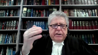

---
title: Akash Ghotra v. Her Majesty the Queen
published-title: Heard
date: 2021-04-13
sidebar: false
---

This transcript was made with automated artificial intelligence models and its accuracy has not been verified. Review the original webcast [here](https://scc-csc.ca/case-dossier/info/webcast-webdiffusion-eng.aspx?cas=['39215']).
---

**Justice Brown** (00:00:03): L'accueil!

**Speaker 1** (00:00:24): Good morning.

::: {.column-margin}

:::

In the case of Akash Ghotra against her majesty the queen, for the appellant Akash Ghotra, Mr. Allen de gold, for the intervener Canadian civil liberties association, Danielle glatt, for the intervener British Columbia civil liberties association, Mr. Gerald Chan, for the intervener criminal lawyers association of Ontario, Mr. Michael W. Lacey, for the respondent, her majesty the queen, Ms. Katty Doherty.

Please note that justice, although not in the courtroom, participate to the hearing. Mr. Gold?

**Speaker 2** (00:01:25): Chief Justice, justices, may it please the court.

::: {.column-margin}

:::

This court has said many times that the police must catch criminals, not create them.

Evolution has not yet eliminated our vulnerability to temptation from our basic nature.

According to Ahmed, this court gave for the entrapment principle the following rationale.

The entrapment principle is to prevent intrusion into people's lives just to test their virtue, essentially whenever the police want.

The particular mode of entrapment in issue here is the demarcation between random versus non-random virtue testing.

What is allowed is evidence-based virtue testing.

If there exists reasonable suspicion of person or place, then virtue testing is lawful police activity.

The state is entitled to provide evidence-based opportunities to commit crimes.

But an opportunity provided without supporting evidentiary basis of reasonable suspicion is disallowed as entrapment.

Providing an opportunity, I rely on the ordinary meaning of the word.

In fact, I could not find another suggested meaning.

An opportunity is simply a set of circumstances that makes it possible to do something.

What constitutes an opportunity depends upon the answer to the necessary rest of the question, to do what?

To provide an opportunity, I submit, in this context, means an opportunity in regard to a specific criminal activity.

When there is nothing else to be done, nothing else be said, nothing else need be changed, everything is ready, everything is ready for the actor to act unlawfully.

That is when an opportunity has been provided.

The fact that the officer did not have to do very much to entrap my client is a reflection of the fact that guilt of this offense, once a 14-year-old is believed to be virtually present, depends on the accused simply transmitting a message with that certain forbidden purpose in mind.

**Justice Brown** (00:04:15): Well, that's the thing, isn't it, Mr. Gold?

::: {.column-margin}

:::

Is that certain forbidden purpose in mind?

Because one can communicate with a 14-year-old for all kinds of purposes.

And so how is it then since the purpose is totally under the control of the interlocutor, in this case the accused, that merely setting her out there as a 14-year-old, even a cutie 14-year-old, is necessarily entrapment?

**Speaker 2** (00:04:57): Justice, it's the same way as setting the stuffed wallet out in the back pocket.

::: {.column-margin}

:::

Justice, what you have described is the issue whether or not the person commits the offense, whether or not the person fails the virtue test, whether or not the person gives in to temptation.

If they send an innocent message, they pass the test.

The officer, like the stuffed wallet, out of the purported drunker's back pocket, it's that the opportunity is created, the accused is being tested.

If they transmit with the unlawful purpose, they're committing the offense.

They are taking advantage of the opportunity.

If they send an innocent message, then they have passed the virtue test, they have passed on the opportunity, they've not taken advantage of the opportunity to commit an offense.

But the alleged virtual presence of the 13-year-old, they now have the opportunity, they are now being tested.

Will they send an innocent message?

Will they send a forbidden message that shows what's going on in their mind?

And I emphasize, respectfully, not to confuse issues of commission and proof.

If the message sent is, would you like to go to a movie, the accused may have the prohibited purpose in mind, but as a matter of evidence, the Crown will not have enough evidence yet to prove it.

Other events will have to unfold that may provide evidence of the forbidden purpose that the accused had all along.

So the content of the message is highly relevant as proof of the commission of the offense, but proof is not our issue.

Our issue is, is the officer providing an opportunity to commit the offense.

So how is this different that-

**Justice Brown** (00:06:53): How is this not akin to beginning a conversation with a drug dealer?

::: {.column-margin}

:::

I mean, in Ahmed, we cited to the Ontario Court of Appeal in Bayat as an appropriate analysis of when an opportunity is offered.

So what you had there was a non-sexual picture of an obviously young girl in a swimming pool.

And Justice Rosenberg said, well, this is just an investigative step.

It's no more than a knock on the door.

And it was after the photo was posted, kind of akin to here, where the respondent then took the lead in engaging in sexually explicit discussions.

How is this case any different from those?

**Speaker 2** (00:07:33): Justice, my submission would be that Bayat is wrongly decided, if I might...

**Justice Brown** (00:07:39): have cited to it in Ahmed as an example of an appropriate analysis of when an opportunity is offered.

So that aspect of Ahmed is wrongly decided.

**Speaker 2** (00:07:53): uh if I might just take a couple minutes and present that submission respectfully yes it is wrongly decided in uh paragraph 20 and I I can pinpoint the error of reasoning in my respectful submission in paragraph 20 uh Justice Rosenberg says uh the following

::: {.column-margin}

:::

and I believe this is justice what you have in mind there is a difference between simply providing an opportunity to chat or talk and providing an opportunity to commit the offense of child learning and you'll notice what's missing from that statement namely the forbidden age in my submission that statement is correct what isn't correct is to say there is a difference between simply providing an opportunity to chat or talk to an underage recipient and providing an opportunity to commit the offense of child learning that in and in by at justice Rosenberg relied on immoral the uh the drug case and if I could just very quickly go through summarize immoral in immoral there were three steps the accused approached the officer to come with him the officer said can you hook me up and step three was immoral

answered yes and at that point there was entrapment by and what the court said in the moral was can you hook me up all the officer was asking was mr. immoral was he a drug dealer there was no specific request to sell illegal drugs as Ahmed requires but by its reliance on immoral was mistaken because this is the central point the opportunity to commit a drug offense is not the same as the opportunity to commit luring because no request by the other party is required for luring only the claim of an ostensible age in fact immoral would be analogous as follows my client said ASL that's like approaching the undercover officer step two in immoral was can you hook me up our officers should have said why do you care about my age or what age would you like me to be then it would be analogous to step two in immoral and

if my client then said oh i'd like you to be cute and uh 13 or 14 there would be no entrapment it would be analogous to immoral so in my respectful submission when the officer said here i'm 14 that's as if in the officer in immoral had said can you sell me a kilo of coke it's exactly within Ahmed and this is the crucial point the elements of luring do not require any internal mental state on the part of the other party it doesn't require a willingness to purchase a specific amount of drug all it requires is the objective purported characteristic of age and as i say in my written submissions the officer actually gets to pick which offense they are providing an opportunity of if the undercover officer claims to be 17 or 16 then the accused is being offered an opportunity to commit the offense contrary to 172.11a the under 18 offense if the officer offers 15 or 14 as their age then it's a separate subsection subsection b under 16 if the officer says they're 13 or younger then the opportunity is to commit the section sub c offense under 14 the officer by giving that purported objective element creates an opportunity for the accused and the officer can even define which offense in my respectful submission and that's that was the that's the logical error in by at and in my respectful submission its reliance on immoral was inappropriate i realized it was approved in amat but respectfully you have my submission the important point that matters for this case is an opportunity to commit luring is different than an opportunity to commit a drug sale and that all luring requires is it's like the stuffed wallets sticking out of the uh out of the person lying on the street to tempt to see whether an accused will commit theft all you need and this is if i could take you to the court of appeal uh judgment in this case where the court uh said that um police conduct is is nothing other than placing a potential victim an accused line of vision and saying that's not enough it's the same as placing the stuffed wallet with the money sticking out in the accused

**Justice Karakatsanis** (00:13:01): Mr. Gould, can I ask you this then?

::: {.column-margin}

:::

All right, we agree it's got to be proximate to the elements of the offense.

And we have an offense here, which as you've pointed out, unusually is fault-driven.

The actus reus is, it's more fault-driven.

So is it appropriate to focus just on the age of the person or does there have to be something sexually suggestive that actually addresses the fault element?

So I'm not quite sure whether you're saying age itself is enough or that there was evidence here that would create opportunity on the fault, on the sexually suggestive side.

**Speaker 2** (00:13:48): All we need is age.

::: {.column-margin}

:::

The officer doesn't have to cause or instigate the offense.

He just has to provide an opportunity.

I have this opportunity to argue this appeal because of a dissent.

I do not have an opportunity to argue the other issue in the appeal because leave was refused.

The merits of the argument are relevant to my opportunity.

When the officer says I'm 14, it's all up to the accused.

Will the accused fail the virtue testing or will the accused pass the virtue testing?

**Overlapping speakers** (00:14:23): So you're focusing just on that one element of the offense, you're not looking more broadly.

**Speaker 2** (00:14:29): Because the definition of an opportunity, as I have said, is it's a set of circumstances that makes it possible to do something.

::: {.column-margin}

:::

Soon as the officer says, I'm 17, 16, 15, 14, 13, everything is in place for the accused if they are so inclined to commit an offence.

I have your position.

Thank you.

Can you help me?

**Justice Abella** (00:15:00): Can you help me clarify, Mr. Gold?

I want to be sure that I understand what your position is about the username.

If this had been a different, is this an argument about the username, which...

**Speaker 2** (00:15:15): No, Justice, unfortunately this isn't in the record.

The trial judge made an express finding in reasons for judgment that he was attaching no significance to the username.

It was never put to the client, and I can give you the reference.

**Overlapping speakers** (00:15:31): No, that's fine.

So that's not your position.

You are not...

No, no, the username is irrelevant.

**Speaker 2** (00:15:37): All that matters is it appears to have been a female name.

That was the trial judge's conclusion on that, that the accused was content to speak with a female.

Okay, thank you.

Justices...

**Justice Moldaver** (00:15:53): Sorry, just a moment.

::: {.column-margin}

:::

So you disagree then with a big chunk of Justice Nordheimer's dissenting reasons because he placed a great deal of weight on this and in fact he kind of related it to someone standing on the street saying drug users.

So you are effectively saying to us, if I understand you, that aspect of Justice Nordheimer's reasons is one that you not only do not endorse, you disagree with.

**Speaker 2** (00:16:24): No, no, Justice Moldaver.

I'm simply making sure the court has an accurate understanding of the record.

**Justice Moldaver** (00:16:33): Well, I mean, part of it, of course, is that the Defence cross-examined the officer to make it clear, at a minimum, that this acuity, whatever, in 1998, is completely ambiguous.

::: {.column-margin}

:::

So, I guess maybe that's one of the reasons, too, why you're abandoning that.

It's a little different than drug dealer or drug user.

**Speaker 2** (00:16:55): As I say, I submit the opportunity.

All of the pieces fall into place to provide an opportunity when the accused is told he is dealing with a 14-year-old female.

**Justice Abella** (00:17:12): And so the police officer who was doing the luring when she was asked how old are you should have said what in order to ignore.

::: {.column-margin}

:::

How old do you want me to be? I see.

So she should not have said any age.

**Speaker 2** (00:17:31): he could have he could have taken a step to like in a morrow where he could have not provided an affirmative opportunity yet but see if the accused was looking for an opportunity if the once the accused demonstrates they're looking for an opportunity for example if the accused said uh well

::: {.column-margin}

:::

i i'd like it if you're uh young and uh uh etc the officer can continue the discussion until the accused makes clear and provides real suspicion that they are looking for the opportunity to commit the offense then there's no entrapment um and i and in my submission uh it's important to understand that it's much easier to commit this offense than for example drug dealing parliament has created these offenses because of the nature of the internet they're virtual offenses

and i simply make the submission that the easier you make it to commit an offense the easier you make it for the state to virtue test because it's easier for the state to provide opportunities new internet these new internet offenses by their nature make it easy for the police to offer opportunities to commit them and of course the nature of the internet is such that mass testing is very very easy the the stuffed wallet out of the back pocket of the person on the street is only seen by a few people

but if if the analogous takes place on the internet hundreds thousands and even more people can see it and and press a button whether they want to take the money or not um so in my respect

**Justice Moldaver** (00:19:19): Can I interrupt for a second, please?

::: {.column-margin}

:::

I just have to ask you another thing.

In paragraph 30 of the majority reasons, after setting out in the second line, Justice Miller sets out that an officer's actions must be, quote, sufficiently proximate to conduct that would satisfy the elements of the offence.

He then goes down and completes that paragraph.

The appellant's argument could only succeed, it seems to me, in a world where any 14-year-old girl who agrees to chat online with an adult male, and by the way, this is not one of these you're saying this is not one of these places that you can like craig list or something, so it's just kind of a normal chat line, in general interest chat room, thereby communicates that she's potentially receptive to a sexual encounter.

That is not our world.

And then we compare that.

It wasn't your client's world either.

Because when she said to him she was 14, and he said, oh, that's okay.

That's cool.

We can be friends.

And then he continues his little, you know, sort of carries on with a view to, you know, getting her trust and so on and so on, and the next thing we know he's talking about masturbating.

So he himself knows.

I mean, let's not get too fine on this.

He himself knows exactly what's going on, and she has not said anything to him to lead him to believe that she wants sex.

And he says, well, that's fine.

We can just be friends.

And then as you carry on, he's the one that raises the sex.

He's the one that gets into it.

And so he's not being opportuned at all.

He's doing the opportuning, it seems to me.

**Speaker 2** (00:21:20): So Justice Mulder, my response to that is that in fact, paragraph 30, which you quoted, the majority is wrong.

::: {.column-margin}

:::

The willingness of the purported 14-year-old is irrelevant.

It's not an element of the offense.

The accused can be guilty of the offense even if the recipient tells him to get lost and leaves.

If the crown can prove that he communicated with her with that purpose, he's guilty.

Again, I emphasize not to mistake questions of proof for issues of proof or issues of commission.

And in paragraph 31, I've already referenced where the majority said the police conduct is nothing more than placing a potential victim in the accused's line of vision.

And where the accused is given no reason to believe that the victim would be a willing participant in the offense committed, the victim doesn't have to be a willing participant.

Luring does not require any consent or willingness on the part of the recipient.

No, but surely.

**Justice Brown** (00:22:19): Luring but surely luring is more effective if the communication is that she is potentially receptive

**Speaker 2** (00:22:26): But success is irrelevant to entrapment.

This is all about random virtue testing.

**Overlapping speakers** (00:22:33): What are you saying?

**Speaker 2** (00:22:34): We wouldn't be here if the accused hadn't failed the test.

::: {.column-margin}

:::

In my submission, a potential victim in the accused line of sight is all that's required.

Victim's willingness is irrelevant to the luring offence.

It's like a potential plump wallet in the line of sight of the person who's being tested for theft.

The majority, as well as the Crown, go on to say that having learned that she was underage, it was the appellant who ventured into sexual topics and suggested an in-person meeting.

That venturing was taking advantage of the opportunity presented.

His failure in the virtue testing is why we are here.

And it's irrelevant to the real issue, which was whether it was lawful to virtue test him in the first place.

**Justice Moldaver** (00:23:23): You know, we have this, we know in society that wallets carry credit cards, they carry money, it's obvious, okay, so we can, in effect, presume that when a wallet is left on a street, that the person who decides to go for it is looking for and, you know, can kind of accept, we can presume that they think there's money or credit cards or something in there.

::: {.column-margin}

:::

How do we get to that kind of a presumption when someone just says, I'm 14, speaking to somebody in a general chat room?

Does that, do we presume that because you're 14 that you're looking, that there's somehow you want sex?

**Speaker 2** (00:24:08): Justice Moldaver, in my submission, the example often given is the undercover officer lying with a wallet with money sticking out.

::: {.column-margin}

:::

But to take your example, Justice Moldaver, the wallet is saying, I'm a wallet, I have money.

That is analogous to the undercover agent saying, I'm a 14-year-old, now go ahead and see whether or not you try to lure me by sending me a message with the forbidden purpose in your mind.

I'm a 14-year-old, I want sex.

**Justice Moldaver** (00:24:39): That's what you're effectively saying to it, and that's what in paragraph 30, which is the main reason why Justice Miller went the way he did, he says, that's not the society we live in.

**Speaker 2** (00:24:52): Justice Mulder, section 172 says nothing about whether or not the recipient of the communication has any interest in sex or not.

::: {.column-margin}

:::

It's all about sending a message with a prohibited state of mind to the recipient of a certain age.

And as I say, the message may be worse or better evidence of the accused purpose.

If the message is, would you like to go to a movie?

The accused may have the improper purpose in mind, but the crown won't have evidence yet to prove it.

If the message is sexually explicit, the message will prove the purpose in the accused mind.

But the recipient is of no moment, the recipient's state of mind, their willingness to have sex or anything, that all has to do with success or not of the substantive actual sex offense.

It is irrelevant with regard.

The luring offense is purposely made very, very inchoate, much more inchoate than the common law has ever known.

Conspiracies required an agreement, not negotiations or anything else.

Attempts required proximity to success.

The offenses like luring developed in the internet age are remarkably inchoate compared to anything known in common law for criminal liability.

**Justice Karakatsanis** (00:26:17): Granted, Mr. Gold, but I guess when you're talking about what are the set of circumstances that creates the opportunity, it has to be proximate.

::: {.column-margin}

:::

Age is clearly one of the circumstances, but is it sufficiently proximate?

And given the nature of this crime, which I agree is one that is driven more, is driven by the sexual purpose of the accused and not the willingness, but doesn't there have to be something more than just age that suggests that this is an opportunity for you to direct your sexual purpose in this direction?

So why is age alone sufficiently proximate without something else that is suggestive of something that relates to the sexual element of the effects?

**Speaker 2** (00:27:14): because parliament has made the judgment that every 14 year old who goes on the internet is at risk.

::: {.column-margin}

:::

It's essentially reflecting parliament's judgment that the internet is dangerous for people of certain ages.

They don't have to do anything.

They just go on the internet, they're at risk.

Parliament created this.

**Justice Karakatsanis** (00:27:37): But if we take that approach then you're actually endorsing the idea that because every 14-year-old on the internet is at risk, a bona fide inquiry could encompass the entire internet and they're logically connected.

**Speaker 2** (00:27:55): No the officer just has to not jump the gun and provide an opportunity.

::: {.column-margin}

:::

The officer has to engage in investigation.

What age do you want me to be?

I may be too young for you.

I don't know you.

Um you know uh there's I mean surely the police are so smart enough.

**Justice Karakatsanis** (00:28:16): It's just hard to think of just saying I'm 14 and nothing more somehow rises to the level of entrapment.

Giving you a chance to address my reservations on this, are you going to give me a chance

**Speaker 2** (00:28:32): I understand justice, Madam Justice, it does because of the nature of the offense that Parliament has created.

::: {.column-margin}

:::

They have required so little for criminal liability.

Everything for criminal liability is up in the accused's mind.

There's no objective circumstances that are required for an opportunity to commit the offense other than the purported virtual presence of a person of a certain age.

And I understand it seems that the breath may seem counterintuitive, but it's a reflection of the breath of the offense.

When you look at the elements of the offense and realize Parliament's judgment that we need an offense so broad, therefore, is it not too much?

Remember, the police can now do mass virtue testing on the Internet.

Is it too much to ask that, at least like in Morrow, the officer send a couple of messages first to be sure that they're not just creating crime?

Is it too much to ask one more message saying, what age do you want me to be?

What age would you like me to be?

I may be too young to you and see what the accused replies.

Is it too much to protect people's privacy on the Internet to ask that the police spend an extra minute investigating to see if reasonable suspicion could be generated?

**Overlapping speakers** (00:30:03): No, just a-

**Justice Moldaver** (00:30:04): They don't lose anything in my submission.

::: {.column-margin}

:::

Hang on a second.

This is where we get into this choice of words and the dancing on heads of a pin it seems to me.

I may be too young for you.

If the officer had said that, you would say, oh, this is fine.

But because she says, oh, I'm only 14, and he comes back and effectively says, well, I know you're too young, we could just be friends.

I mean, let's be realistic here.

So you're going to say this case turns on if she'd said, I may be too young for you, then it's not entrapment.

But because she says, hey, I'm only 14, then it's entrapment.

**Speaker 2** (00:30:43): In my submission, the difference is that saying 14, the definition of an opportunity is now fulfilled.

::: {.column-margin}

:::

I may be too young to you is like asking, are you a drug dealer?

The situation has not clearly crystallized as an opportunity to commit a luring offense.

Could just have a moment.

So yes, in my submission,

**Justice Karakatsanis** (00:31:15): Mr. Gold, I have to, sorry, but I'm, you know, what age do you want me to be sounds almost more of, of providing, you know, being more suggestive than saying I'm 14.

I'm just still really.

**Speaker 2** (00:31:30): Well, no, the accused could answer, well, if you're in your 40s, you're too old, I'd like you to be in your 20s.

It's like saying, are you a drug dealer, which the court has said is OK.

It hasn't crystallized that this is an opportunity to communicate with.

**Overlapping speakers** (00:31:46): with an underage person.

**Speaker 2** (00:31:47): All right.

**Overlapping speakers** (00:31:49): I was

**Speaker 2** (00:31:50): So yes, my submission is that communicating with another person on the internet of course is lawful, but giving a specific ostensible age which comes within the criminal code, that number replaces as the relevant characteristic of the undercover officer willingness to buy a specific illegal drug in drug cases.

::: {.column-margin}

:::

Thank you.

In the case at bar, I think-

**Overlapping speakers** (00:32:18): I will ask you to conclude, I will ask you to conclude because your time is up.

**Speaker 2** (00:32:23): Oh, I'm sorry.

::: {.column-margin}

:::

On the issue of location, it's my respectful submission that any suspicion about the internet as a whole is unreasonable and drug dealers have cell phones.

That doesn't allow you to assume that every phone on the cell network is under a cloud of suspicion.

Not every website chat room on the internet is under reasonable suspicion.

Thank you very much.

**Speaker 1** (00:32:48): Thank you, sir.

**Speaker 3** (00:32:57): Good morning Chief Justice, Justices.

::: {.column-margin}

:::

I'm here this morning on behalf of the Canadian Civil Liberties Association.

I want to use my time today to focus, like the Appellant's Council, on the issue of the appropriate opportunity threshold in child-learing cases.

But the CCLA's focus is on the state's conduct and the wholesale unfettered intrusion into individuals' privacy and other rights that will continue if the opportunity threshold is not adapted and the police are permitted to continue investigating in the manner that they did in this case.

As a starting point, developments in modern technology have facilitated paradigmatic shifts in both public practices and state investigative practices online.

And as a result of these developments, the adaptation of the opportunity threshold in the entrapment framework is necessary to maintain police accountability in these types of investigations into child-learing offences and to protect the privacy rights of individuals online.

To the extent that state practices and individual practices continue to evolve, so too must the entrapment doctrine.

The opportunity threshold is supposed to reflect the balancing between the state interest in investigating crimes and and this is certainly, you know, it's true that there's an important state objective in preventing crimes against children and it is also true that these crimes often occur online and are difficult to detect.

So I'm wondering how what...

**Justice Brown** (00:34:32): it is to be tailoring entrapment doctrine to to the specific offense.

::: {.column-margin}

:::

I mean that's what the Crown asked of us in Ahmed with diala doping and and we the majority refrain from doing that

but you're asking us to do what the Crown essentially asked us to do in Ahmed is to to take an offense by offense kind of approach to to entrapment doctrine.

**Speaker 3** (00:35:00): Justice Brown, the CCLA isn't suggesting an offence by offence approach but it does come back to the court's statement in Mac that you know the balancing and the concepts of individual freedoms and on the one hand and the protection from crime on the other it doesn't exist in a vacuum and the second is that the court specifically said that the legitimacy of a particular enforcement technique may be different than another and so when we're talking about online investigations like this and the scope of these types of investigations and and their development over you know the past two decades since these provisions were enacted by parliament it's the CCLA's position respectfully that that in order to give meaning to the privacy and other associative and expressive freedoms that individuals enjoy in Canada there needs to be an adaptation of this framework and the court in Ahmed the majority decision specifically said that the entrapment doctrine needed to be adaptive and to to change with the times and you know if that means as as was discussed with the appellant's council that bayot needs to be revisited then the CCLA's position is that that's appropriate and you know to put it in context in terms of the ways in which people in Canada use the internet and and the privacy rights at stake here um you know when bayot was released instagram had had only just been uh launched you know snapchat didn't exist tik tok didn't exist uh the the ways in which Canadians use technology and the privacy interests that are at stake today are different than they were 10 years ago and 20 years ago and this is an opportunity for the court to address that

::: {.column-margin}

:::

**Justice Abella** (00:36:53): Can I just ask you a question?

::: {.column-margin}

:::

In your factum, you make reference because of the privacy concerns and the unique nature of the internet.

You talk about the fact that there are certain websites that cater to this kind of conversation, not generally.

Is this an argument for the police staying away from general websites?

And I'm referring specifically to paragraph 38 of your factum.

It's just not clear to me what you're saying about the privacy interests and whether or not the police have a higher threshold to meet if they're going to go on a general chat line rather than something like Craigslist where it's expected that that kind of conduct take place.

**Speaker 3** (00:37:40): Well there isn't a higher threshold that's required uh the CCLA submission in respect of the opportunity threshold is that it needs to be set at a level that allows us to get to reasonable suspicion so that we can uh take the framework that was outlined in OMID and and apply it to virtual spaces um and and provide uh you know the police with some guidance in terms of of what is and isn't acceptable uh the CCLA isn't suggesting that there's a higher privacy interest in general chat rooms but

::: {.column-margin}

:::

simply and this you know comes back to the court's statement in in in why is that simply because you're in a public space it doesn't mean that you have a diminished expectation of privacy necessarily.

**Speaker 1** (00:38:27): You

**Overlapping speakers** (00:38:27): Thank you very much.

**Speaker 1** (00:38:28): My time is up, so subject to any further questions, those are my submissions.

Thank you. Mr. Chen.

**Speaker 4** (00:38:37): Good morning Chief Justice and Justices.

::: {.column-margin}

:::

I want to make three points with my time this morning or two if I run out of time, and I'll focus my submissions on the bona fide inquiry prong of entrapment, which assumes that there has been an opportunity to commit a crime provided and assumes that there's no individualized reasonable suspicion.

And at this stage, the question is whether there's reasonable suspicion as to the location targeted.

The second point I want to make in this regard is that the type of targeted location in this case, namely an internet chat room on a website is qualitatively different from the ones that this court has examined in previous cases, because it is a virtual space, it is not constrained by the limits of geography.

And so the people affected by an undercover police operation won't be limited to people from the Granville Mall in Vancouver such as in Barnes for example, but could be from all over the world.

Because it is a virtual space, the police officer conducting the operation is not constrained by the real world or physical world reality that a person cannot be in more than two places at once in the virtual world, a single officer with a computer internet connection can conduct multiple operations on multiple websites at the same time.

And this dramatically expands the scale and therefore intrusiveness of these types of police agent provocateur operations.

Finally, because the virtual space here is a website privacy and expressive freedom, the underlying charter interest of the entrapment doctrine are implicated on a much broader scale.

You're not talking about the limited number of people who might be on the receiving end of a single phone number for example like in a dial adult operation that you had an omit, or even the contact information that may be listed on a particular advertisement posted Craigslist, for instance, you're not talking just about the limited number of people who may respond to an advertisement that the police decide to put up on a website where the police depending on the language they choose in that advertisement can narrow down to the audience that would be responding to it.

Instead, you're talking about all of the people who may be visiting a particular high traffic website, logging in from places ranging from their bedroom to the local coffee shop and participating in the expressive activities on that site, whether it be a chat. Yes.

**Justice Brown** (00:41:09): we're talking about the internet and we're talking about kind of a, I mean it is a worldwide web.

::: {.column-margin}

:::

And that is also the platform on which the offences of online luring are occurring. Got it.

So what do we do with that?

**Speaker 4** (00:41:29): Well, I think where that takes you to, Justice Brown, is the second point that I wanted to make, and it took me a while to get there, which is that all of this weighs in favor of the courts adopting a rigorous approach to patrolling the boundary between legitimate police investigations and unlawful entrapment.

::: {.column-margin}

:::

And more specifically, on the question of when you have reasonable suspicion in relation to a location, all that I'm urging the court to do is recognize that that reasonable suspicion analysis is already relaxed from the typical reasonable suspicion analysis that we have, which is, in all other legal contexts, individualized.

Here, it relates to a location, which is necessarily broader and more relaxed than the reasonable suspicion analysis you have elsewhere.

And so what the BCCLA would urge the court to do is adopt and endorse an approach that does not allow for this inquiry to be further diluted to the point where it ceases to be meaningful.

And what that means is an insistence on detailed, cogent evidence that the particular location that is targeted is one for which there is reasonable suspicion that the particular crime that is being investigated here, the particular crime that the police are providing an opportunity to commit, is happening at this location, that there be an insistence on evidence that the Crown present, not dicta from other cases about the generalized dangers of the internet or even about a particular website.

For example, statistical evidence of the number of crimes reported or charges laid in respect of this particular site.

And also, and I think this is an important point, that this evidence be recent.

Because locations like websites are not static.

Just because you have reasonable grounds to suspect that child luring, for example, was occurring on a particular site in 2018 does not mean that the same is happening in 2021.

**Justice Rowe** (00:43:30): the practical consequence of what you are putting to us essentially render impractical and and render just of no use at all the kind of investigative tools that the police are using aren't you really asking us to shut down these kind of police operations entirely

::: {.column-margin}

:::

**Speaker 4** (00:43:56): I see that I'm out of time.

::: {.column-margin}

:::

If I may just answer that question, Chief Justice.

Not at all, Justice Rhoad.

The threshold is one of reasonable grounds to suspect, which this court has already recognized is a lower threshold than reasonable probable grounds to believe.

It requires a reasonable possibility, not a reasonable probability.

In my submission, it is not too much to ask for the police to have evidence, recent evidence, that the particular location they are targeting is one in which this type of criminal activity is taking place before they conduct the sort of virtue testing we are seeing in these cases.

Thank you very much, Chief Justice.

Thank you.

**Speaker 1** (00:44:34): Michael Lacy.

**Speaker 5** (00:44:36): Yes, good morning, Chief Justice, Justices, and may it please the Court.

::: {.column-margin}

:::

Much like the BCCLA, on behalf of the Criminal Lawyers Association, we want to focus on the issue of the bona fide inquiry exception to entrapment, and in particular the question of how that should be applied in virtual locations.

And as a compliment, really, to the submissions of the BCCLA, where Mr. Chan urges a more rigorous approach to the question of reasonable suspicion in the virtual context, the Criminal Lawyers Association proposes a bold but principled submission to this Court, because this case raises the following question.

In the absence of individualized suspicion, should we judicially regulate when the police can provide opportunities to commit offenses at virtual locations at the front end of the investigation, rather than simply afterwards through the entrapment doctrine?

And that's why the CLA submits to this Court that in light of the privacy interests engaged in virtual locations, locations that this Court acknowledged in OMET are very difficult to define, that there's this risk with allowing broad virtual location opportunity offering by the police that you will in fact engage in the kind of random virtue testing that's precluded by the entrapment doctrine.

In light of that context and the qualitative differences between virtual locations and geographical locations, we submit that the Court should require prior judicial authorization before the police engage in these types of opportunity offering.

And to your question, Justice Roe, which might equally arise to the submission I just made to the Court, well, will this shut down police investigations?

In my submission, the answer to that is no, because the police would be entitled to engage in investigations short of offering opportunities at virtual locations.

If they want to investigate whether a particular website is involved in communications that suggest there's exchanges with respect to child pornography and other things, short of offering opportunities to commit criminal offenses, they can gather intelligence.

They can gather information to support the existence of reasonable suspicion.

And if this Court were to go so far as to require prior judicial authorization in this context, it would mitigate the risk that people would target or the police would target virtual spaces in a manner that's inconsistent with MAC, BARNES, and OMET.

It would provide the police with the comfort in knowing that scarce investigative resources are being deployed in a presumptively lawful manner.

**Justice Moldaver** (00:47:30): Aren't you changing the whole basis of entrapment because you're going if you need a warrant then you need reasonable grounds.

::: {.column-margin}

:::

You don't just need, excuse me, 487.1 is the section I think you talk about.

You need reasonable grounds to get a warrant.

So you're asking us in effect to get rid of the reasonable suspicion aspect of it where you're dealing with a virtual location.

That's how I understand what you're saying which changes as I say the whole complexion of entrapment.

**Speaker 5** (00:48:02): So Justice Moldova, I acknowledge that based upon the existing Criminal Code provisions that Parliament has enacted, that the mechanism by which the police could currently apply to engage in this kind of investigation and offer opportunities at virtual locations would be through the general warrant provision of the Criminal Code.

::: {.column-margin}

:::

But if the fact that that is a higher requirement than what would be the constitutionally minimum in these circumstances, which would be reasonable suspicion, does not preclude Parliament, of course, from enacting a new provision in the same way that they enacted new provisions for production orders, for example, or tracking warrants requiring establishing on a reasonable suspicion threshold.

I mean, our overall point to the court is that by requiring prior judicial authorization, you have judicial supervision into an area that is very murky for the police, that risks ensnaring and people who would otherwise not commit criminal offenses, that guards against the kind of random virtue testing that this court warned against in Ahmad.

It's the natural evolution in our submission from Ahmad, where the court was very careful at paragraph 37 of the decision to caution against police officers doing what the Crown would urge, in this case, using the internet as a location where you could randomly offer opportunities for people to commit criminal offenses.

And for those reasons, in the time, the last 10 seconds, we would urge the court to consider the law evolving in this area.

And when you're dealing with particular random, or sorry, virtual locations that you require prior judicial authorization on the part of the police to target and offer opportunities in that context.

Those are my respectful submissions.

Thank you.

**Speaker 1** (00:49:50): Thank you, Mr. Leasing.

It's dirty.

**Speaker 6** (00:49:58): Good morning Chief Justice, Justices.

::: {.column-margin}

:::

The majority of the Court of Appeal for Ontario, as well as Justice Derno, the trial judge, got it right.

The appellant failed to meet his onus to show that he was entrapped.

The Crown's position in this appeal is as follows.

First, the police did not provide the appellant with an opportunity to commit the charged child luring offence.

The majority of the Court of Appeal for Ontario was correct to affirm the trial judge's conclusion in this regard.

The dissenting Justice's conclusion to the contrary is the result of a flawed approach to the opportunity threshold that both conflicts with this Court's recent consideration of this point in Ahmaud and ultimately sets the opportunity bar far too low, such that the important goals of the entrapment doctrine are frustrated.

If this Court agrees with the majority of the Court of Appeal on this question, then that's the end of things, Justices.

The appeal must be dismissed.

If the Court concludes that the opportunity threshold was crossed here, it's the respondent's position and the alternative that the police had the requisite reasonable suspicion to engage in the conduct they did here.

Thus, there was no entrapment.

I'll address each of these issues in turn, but I first want to focus on this opportunity question, Justices.

In my submission, the police did not offer the appellant an opportunity to commit the child luring offence by simply posing as a 14-year-old in this chat room.

I want to address three points on this issue, Justices.

The first is the important role that the opportunity threshold plays in ensuring that the entrapment doctrine performs its core functions.

The second is why I say the majority of the Court of Appeal correctly concluded that the police conduct here did not cross that opportunity threshold.

And finally, the problems that I say are inherent in the dissenting Justices' conclusion to the contrary, in particular, its conflict with Ahmaud and the impact of setting the opportunity threshold as low as Justice Nordheimer did.

Starting with the role of the opportunity threshold in the entrapment doctrine, Justices, in my submission, it's important to start here sort of before we turn to the application question.

The entrapment doctrine recognizes judicial disapproval of intolerable police conduct in the investigation of criminal offences.

The entrapment doctrine shields individuals from state conduct that society regards as intolerable, conduct that violates our notions of fair play and decency and which shows blatant disregard for the qualities of humanness which all of us share.

However, the entrapment doctrine is not just about punishing police excess.

It's also based on a need to recognize that it's in the public interest to allow the police the flexibility to develop effective, proactive law enforcement measures to suppress crime.

The doctrine balances the competing objectives of the vital need for the police to have substantial leeway in the techniques used to investigate criminal activity on the one hand, with the important need to guard against police power becoming so untrammeled as to permit random virtue testing on the other.

Various aspects of the entrapment doctrine give effect to this need for balancing and in my submission on the first branch of entrapment, this opportunity threshold does exactly that.

It separates, it makes clear as a first point that not all police conduct is going to trigger an entrapment analysis.

It's got to pass this opportunity threshold and if that threshold is set too low or too high, the balancing intention is frustrated.

It's within

**Justice Côté** (00:54:20): the line will be crossed, because here we are dealing with the general chat room where participants in the chat room have to certify that they are at least 18 years old.

::: {.column-margin}

:::

In fact, here the police officer certified that she was 19 years old.

So give us an example of what would be a case where the line is crossed.

And an opportunity is offered.

**Speaker 6** (00:54:52): Sure, so in my submission, Justice Cote, when you have conduct that gets closer to all three elements of the offence, you've got communication over a telecommunications device, that's going to be made out in any of these situations, you've got that age information being provided, and you've got something that speaks to that third element, that the communication is not just going to be any kind of communication, but a communication for one of the prohibited purposes, the range of your commission of those specified sexual offences.

::: {.column-margin}

:::

So you see situations where perhaps the context is already sexualized in some way, Justice Cote.

You have an ad posted where the person is looking for a sexual partner, for example, and the police don't know anything about the poster, don't know anything about the place, and they just come back to that person and say, hey, I'm 14, is that good with you?

And then by just simply saying yes, there's your offence.

So in this, I contrast that kind of situation, Justice Cote, with what we have here.

And in my submission, that's really what's driven the majority's reasoning in the court below.

They looked at how close the conduct here got to the commission of the offence.

And as the majority noted, and Justice Moldaver's already taken you to paragraph 30 of their reasons where I was going to take you, communicating with a 14-year-old is not the offence.

There has to be something that speaks to that third element.

And for my friend to say that, to focus on the use of the word willingness, it's not that you can only engage in one of these luring offences with a willing participant, but that willingness is the indication or the opportunity that some of this offending conduct is on the table.

And all that the accused person who's interacting with the undercover officer needs to do is respond positively to that, and you have your offence.

So when we just have that age information, Justice Cote, in my submission, we're not proximate enough to the offending conduct to have had an opportunity crystallize.

**Justice Moldaver** (00:57:13): Picking up on that store deep.

**Overlapping speakers** (00:57:15): Thank you so much.

**Justice Moldaver** (00:57:16): I know that Mr. Gold has effectively says, you know, a cutie and so on is irrelevant here and he's not relying on it.

::: {.column-margin}

:::

If I understand you correctly, that could pose a problem.

If, for example, the user name was one that sort of invited sex. Sure.

And then you find out that they're 14. So...

**Overlapping speakers** (00:57:38): Sure.

**Justice Moldaver** (00:57:39): You would say the police obviously have to be careful in terms of in this context

**Speaker 6** (00:57:50): Yes, most definitely in terms of the name and in those initial communications.

**Overlapping speakers** (00:57:57): I mean, I-

**Speaker 6** (00:57:58): I take the court's indication in a mod that when police engage in communications with a potential target without that reasonable suspicion off the start be it about the person or about the place you've got to be very careful because I think the majority uses the words you're on you're on thin ice you've got to be very careful that you're not going over that line and in my submission that's what the officer has done here she hasn't I mean my friend's cross-examination demonstrated the and Justice Derno accepted his submissions on that front about the ambiguity that came from the name alone and so here what we have is interacting with a female and who is of an age that's captured by these offenses so we don't have that convergence of all three of the necessary elements such that we're getting close to the offending conduct such that an opportunity would be offered and in my submission we're in no different position than Justice Rosenberg was considering in Bayat which was adopted as has been discussed in my friend's submissions in terms of the reasoning that he employed there of initiating these kind of communications with a particular person is not in and of itself going to meet that opportunity threshold and in my submission there's no reason for this court to depart from that reasoning here that takes me to the dissenting justice's decision to the contrary in my submission his approach to the opportunity threshold should be rejected his analysis lowered the opportunity bar in a manner that's inconsistent with this court's articulation of the standard in a mod and conflicts with the overall purposes of the entrapment doctrine on the dissenting justice's approach the police identifying themselves as a member of the class of persons who can or who are likely to be the subject of a particular kind of criminal activity is sufficient to meet the opportunity threshold that's why i've talked about it as the equivalent of a but for causation standard this offense couldn't have happened if the officer hadn't have presented herself in this chat room therefore the opportunity line was crossed in my submission the dissenting justice's analysis sets the bar too low and conflicts with this court's decision in a mod if merely presenting a member of the potentially targeted group was enough the analysis in a mod would have been much simpler merely contacting these phone numbers would have been the opportunity at the first message on justice nordheimer's analysis providing a person who the accused could go on to commit an offense with or against is enough on justice nordheimer's analysis that's inconsistent with the approach in a mod in my submission where this court affirmed the ability of the police to take legitimate investigative steps that stop short of offering an accused an opportunity to commit an offense and that opportunity threshold was only ultimately crossed where an affirmative response to the police conduct would satisfy the elements of the offense the dissenting justice's analysis transforms affirmative response into inculpatory response and in my submission that's a significant difference it's the difference between the police responding to the appellant's question about mia's age by saying 14 as they did here as the equivalent of the police having responded i'm 14 and would you like to communicate with me for the purpose of facilitating an enumerated sexual offense as justice miller noted it can't be assumed that in telling an accused she was 14 the officer was offering the accused an opportunity to engage in the kinds of prohibited communications for the prohibited purpose justice nordheimer analogizes the officer identifying herself as 14 with an officer standing on the street corner with a sign that says drug user or leaving a wallet a full wallet on the ground and neither analogy is apt in my submission with respect to the drug user sign scenario what is the information the accused had here that indicated an interest on the part of the police in any kind of criminal conduct such that that could be inferred from just the age there's no there's no drug user sign in my submission on the facts of this case the only information the accused had was that the girl was 14 and as justice miller noted this kind of reasoning assumes that such an interest could be inferred from simply the age being provided and that's not our world similarly the full wallet analogy does not describe the situation we have here either the implicit logic on the analogy between the identified child and a wallet on the ground is that the temptation to engage in criminal conduct regarding the target sexual misconduct with the identified child or theft of the wallet would be so overwhelming that it would offend our community sense of decency and fair play to allow the police to take such an action without a pre-existing reasonable suspicion of criminality again this is an assumption that in my submission cannot be made or generalized when we're talking about sexual misconduct with the child in the same way it could be with the wallet on the ground the lowering of the standard inherent in justice

::: {.column-margin}

:::

**Justice Karakatsanis** (01:03:50): Can I ask you, Mrs. Doherty, because when I read Justice Nordheimer's reasons, and particularly I'm looking at paragraphs 48 and 49, he really relies on the username.

::: {.column-margin}

:::

He is relying not just on the fact that she provided an age, but that she had created circumstances through the username to provide a context, a necessary context.

And so my question is particularly given Mr. Gold's comments in this area.

Was this really a disagreement on the legal test or is it a disagreement on the factual significance of that username?

**Speaker 6** (01:04:42): Well, I think it's the latter, Justice Krakat-Zanis, and the biggest hurdle for Justice Nordheimer's reliance on only the – sorry, I'm looking at you, not at the camera – the biggest problem for Justice Nordheimer's analysis there is Justice Derno's conclusions to the contrary based on my friend's cross-examination about what exactly could be made from that username.

::: {.column-margin}

:::

As Justice Moldaver noted, there could be usernames that would create significant problems but the trial judge as the finder of fact was not satisfied that this was one of those usernames.

And so in my submission, it doesn't fall to Justice Nordheimer to revisit that factual conclusion and come to a different legal finding as a result of those different facts.

As I noted at the start, Justices, this threshold of opportunity ties right into the purpose that entrapment is meant to serve, this inherent balancing exercise.

So in my submission, if you set this standard too low, just as my friends would argue, if you set it too high, there are problems with the balancing.

Here Justice Nordheimer has set it too low and there is no room left on his analysis for legitimate police investigative steps to be taken because on his analysis, by merely being in this chat room or communicating with these individuals, an opportunity has been offered.

For those reasons, Justices, the dissenting Justices' approach should be rejected.

And as I noted at the start, if the court agrees with the majority of the court of appeal on this point, then the appeal must be dismissed.

That takes me to my second argument with respect to the reasonable suspicion that I imagine will be a bit more controversial than my first point.

But in my submission, I take to heart what Justice, what we were speaking about during my friend's submissions in terms of these two propositions really live together.

If the opportunity threshold is crossed because we can take, we all know that every child on the internet is at risk from these kinds of offenses, then those same understandings in my submission have got to come into the reasonable suspicion analysis.

Should this court determine that the police offered the appellant an opportunity?

In my submission, the police had the requisite reasonable suspicion to do so.

Justice Derno concluded that there was a reasonable suspicion that the targeted criminal conduct was going on in chat rooms like that, which the appellant interacted with the undercover officer.

This conclusion accepts that the requisite reasonable suspicion was present regarding the more broadly defined space than may be generally expected in this analysis.

The question is whether that definition is too broad as to support the requisite reasonable suspicion finding.

In my submission, in light of the unique and particular circumstances of child luring investigations, Justice Derno was correct to find that there was a reasonable suspicion that internet child luring was going on on online chat rooms, such as the one in which the undercover officer entered and was contacted by the appellant.

**Overlapping speakers** (01:08:07): that's not to say oh sorry just this about go ahead thanks for your sentence i'll be i'll be here when you're done all right

**Speaker 6** (01:08:13): This is not to say that such a broadly defined space could necessarily support a reasonable suspicion in other contexts, but in my submission it does here.

**Justice Abella** (01:08:25): So my question really relates to how Barnes applies.

::: {.column-margin}

:::

I mean, we were clear that if you have a location defined with sufficient precision, then that meets the threshold.

Here, Justice Sturnow says the internet chat room was a place where internet learning was likely occurring.

And therefore, the specific location is the entire internet.

That strikes me as a very, very wide application of what was at issue in Barnes, where we were clear to say, it's not just everywhere.

You really have to be able to identify it.

And I appreciate that there are specific issues, because the internet, as we've said in other cases, has no borders.

But does that mean that because there is some predatory luring on the internet, that the whole of the internet becomes available for reasonable suspicion?

I would just add, while the internet is being used,

**Justice Rowe** (01:09:31): The internet has no borders, it does have contours.

**Speaker 6** (01:09:38): I don't disagree with anything that you, Justice Beller, you, Justice Roe, have just said.

::: {.column-margin}

:::

I acknowledge that Justice Derno's conclusion captures a largely defined space in terms of these kinds of chat rooms like that in which the appellant interacted with the undercover officer.

But in my submission, when we're dealing with the unique offense of Internet child luring, that broad definition can support a broadly defined space, can support a reasonable suspicion finding as Justice Derno made.

And I want to focus on a few of the things or a few of the factors that this court talked about in Ahmaud as things that we should be thinking about when we're considering whether the space is sufficiently defined.

And the three that I want to highlight are the seriousness of the crime in question, the availability of other less intrusive investigative techniques, and the level of privacy expected in the area or space.

And in my submission, the unique nature of luring offenses informs this analysis in the present context.

The Internet luring provisions were enacted to protect children against the very specific danger posed by certain kinds of communications via computer systems.

As Justice Doherty noted in Alessandro, the Internet can be a fertile breeding ground for the grooming and preparation associated with the sexual exploitation of children by adults.

The powerful direct and immediate, indirect, and long-term impacts of the online and hands-on sexual exploitation of children are well known and were recently reviewed by this court in Friesen.

The Internet allows offenders to cast their nets widely and anonymously or through misrepresentation regarding their true identity.

Cyberspace also provides abuse-intent adults with unprecedented opportunities for interacting with children that would almost certainly be blocked off in the physical world.

The luring provisions are a response to this dark reality of the Internet.

The purpose or goal of these offenses is the prevention of the multifaceted ills associated with the sexual exploitation of children.

**Justice Abella** (01:12:12): So, Mr. O'Rourke, doesn't that erase the whole notion of reasonable suspicion and almost suggest an automatic reasonable suspicion every time you're dealing with the Internet, which, I mean, that may or may not be what Parliament intended, but it would be a very new step in the way we approach both reasonable suspicion and even the Internet.

::: {.column-margin}

:::

**Speaker 6** (01:12:36): It's a, when we're thinking about reasonable, what kind of conduct can reasonably, what there's a reasonable possibility is going on in a particular place.

::: {.column-margin}

:::

What Justice Durneau did in this case, as he said, he looked at why we have these provisions in the first place.

And it's because exactly this kind of conduct is going on in these types of chat rooms where folks come together and children are, end up exploited.

Not just in the situations where it's a chat room dedicated to that, but also in places that aren't dedicated to anything that on its face would seem to be sexual or criminal conduct.

**Overlapping speakers** (01:13:22): So am I, sorry, Justice Crackett.

No, I'm sorry, finish.

I was just going to say that.

**Speaker 6** (01:13:26): But in my submission, when you have an offense that is geared and created to say we have to intercede in this kind of conduct well before we get to some kind of hands-on sexual offending or even actual sexual offending over the internet because of the ills that are associated with this, to say that you're only going to have a reasonable suspicion, as Justice Nordheimer would, when you've sat in the chat room and watched a few kids get lured online, then you know that it's going on there and you can police that particular chat room.

::: {.column-margin}

:::

That, in my submission, is antithetical to the intervene before these kind of consequences come to light, nature of this offense.

**Justice Karakatsanis** (01:14:09): But surely that's not the only way you can get evidence to show that there is a certain activity going on.

::: {.column-margin}

:::

My question to you is if we in fact define the entire internet that there's reasonable suspicion, what kind of weight are you giving privacy?

What kind of weight are you giving any of the other factors?

**Speaker 6** (01:14:35): Well, I think in terms of whether you've got to also think about what the conduct we're talking about here is, Justice Crackett-Santos.

::: {.column-margin}

:::

We're talking about conduct here such as entering the chat room.

If entering the chat room is offering an opportunity, in my submission, that's as minimal of a technique or a step as the police could take.

So when we talk about are there alternatives that the police could be using, in my submission merely entering the chat room is as low as it's going to get in terms of the activities by the police.

And when we're talking about privacy, of course, I can't quibble with the court's various decisions on the nature of the internet, the nature of the electronic age and the privacy implications that come from that.

But on the other hand, I'd ask this court to keep in mind the nature of the communications that are exclusively undertaken when we're talking about this technique of an undercover officer posing as a child and engaging in conversations with any individual.

Those are communications that per Justice Brown's decision in Mills do not attract a reasonable expectation of privacy.

And that is another reason why this kind of offense is unique amongst other kinds of investigations because that assumption cannot be made off the top regarding other kinds of offenses or other kinds of communications as it can be here because necessarily anyone who is communicating with the undercover officer is communicating with a child who they is a stranger to them and who they've just started communicating with in that chat room.

So in my submission when we talk about the kind of chilling effect to privacy, we've got to keep in mind the nature of the intrusion here.

And when my friends in particular from the interveners talk about the sort of chilling effect on privacy of state surveillance, I mean this court has said that back to Duarte.

I don't take issue with that with those decisions but in my submission or I can't take issue with those decisions but in my submission we've got to consider the nature of the police conduct here and the potential privacy impact of that conduct which is limited to exactly these kind of communications that as I say per Mills don't attract a reasonable expectation of privacy.

**Overlapping speakers** (01:16:55): So it's in all of them.

**Speaker 6** (01:16:55): All of those circumstances, Justice.

::: {.column-margin}

:::

I just wanted to, so there is no Barnes test for the internet?

What I'm saying is the Barnes application to the internet in the particular circumstances of a child luring offense is satisfied, as Justice Sterno found.

And the question becomes if that's, if he's defined it too broadly or not.

In my submission, in light of the serious, oh sorry, Justice Abella.

**Justice Abella** (01:17:20): No, he didn't explore it, he just said it's the internet, it's bad conduct, he mentioned Barnes and then didn't examine how Barnes applies in the internet.

So your position is there is no Barnes when we're dealing with the internet.

**Speaker 6** (01:17:36): My position is that the Barnes threshold of having a defined space over which the police have a reasonable suspicion is satisfied when we're talking about the kinds of chat rooms that were targeted by Parliament when they created these offences.

::: {.column-margin}

:::

And in light of the seriousness of the offences and the lack of any less intrusive step that the police could do than just entering these chat rooms to investigate this and the unique privacy landscape, in my submission, that conclusion discloses no reversible error.

**Justice Moldaver** (01:18:08): I suppose if we uphold the majority's view in this case, it's not as though the police are without any means of entering these chat rooms.

::: {.column-margin}

:::

And your friends seem to suggest that you could have situations where you get enough examples that are recent that you might pass the Barnes test on a particular line, chat line, or whatever they call them.

And so the big problem in my mind is not so much that the police are being hampered to the point they can't sort of enter these rooms, but when do we reach the point where we can say the Barnes test has been met?

And of course, none of your friends really bother to tell us when that would be.

I mean, is five enough, is three enough, is 10 enough?

We don't know.

Maybe that'll be something that will have to be challenged at a later time.

Right now, though, we're just really talking about no evidence whatsoever that a general chat room is sort of engaging in.

Anybody is engaging in this kind of conduct.

And so we can't really say that Barnes would apply.

But I'll be fascinated to see at some point once the police find a chat room like this and have a half a dozen cases, whether by the complainant complaining to them, a real live complainant, or them doing what they did here, then let's see where we go with that.

**Speaker 6** (01:19:41): That's exactly the issue when you get into cases about particular websites that have reputations just as Moldaver, like sections of Craigslist or sections of Backpage.

::: {.column-margin}

:::

Those are exactly the arguments that we face there.

The only other point I would make just quickly, if I could Chief Justice, is in response to my friend from the CLA, this notion that we need to turn the entrapment analysis when we're talking about child luring 180 degrees on its head to have sort of a pre-entrapment hearing through the use of a judicial authorization.

In my submission, as Justice Moldaver noted, there is no possible judicial authorization that could serve that purpose.

We had these arguments in Mills with respect to part six and this court rejected the need for a part six authorization for these kind of interactions.

Mr. Gotra had pursued that argument himself before Mills was released and didn't pursue it after Mills in the Court of Appeal.

So in my submission, that's an issue that's best left for another day by this court.

It's of course the Crown's position that such a warrant requirement is neither tenable nor warranted in these circumstances.

Thank you very much.

Subject to any questions Justices, those would be my submission.

**Speaker 1** (01:20:57): Thank you.

Any reply, Mr. Gold?

**Speaker 2** (01:21:04): Thank you Chief Justice.

::: {.column-margin}

:::

Very briefly, the trial judge based his conclusion on this Honourable Court's obituary denouncement of the dark side of the internet in Regina versus Levine and as noted by Justice Nordheimer in the court below, that discussion about the dark side of the internet was in the context of justifying Parliament's creation of these new offences.

It was not in the context of justifying virtue testing.

In my respectful submission, it's important to understand that the question is always an opportunity to do what and as said in Ahmed, it's in regard to a specific criminal activity.

If age is enough to provide opportunity, it's because of how the luring defence has been defined.

The issue is proximity to the luring offence, not any substantive sex offence that might be the ultimate goal of the perpetrator.

The Crown said that in addition to age, there has to be something in relation to the accused's purpose.

Well, the accused is responsible for their purpose.

The other party to the communication, the undercover agent, can't do anything to create that purpose.

If the undercover agent expresses an interest in sex, i.e. demonstrates willingness, they're generating the offence.

They're instigating the offence.

They've gone beyond just providing an opportunity.

They're taking part in the creation of the actual offence.

**Justice Brown** (01:22:37): I think your I think your friend conceded that that is possible that that you know one can present oneself in a certain way I'm not going to get into the details of how this person present herself you know you know 14 year old or whatever that can actually generate the very problem that that you're raising Mr. Gold

::: {.column-margin}

:::

but but that's that wasn't the finding of the trial judge and and your and and under cross examination your client conceded the ambiguity of the message.

**Speaker 2** (01:23:06): Justice, just to explain it, my client's position was he did not know, he believed this person was over 18.

::: {.column-margin}

:::

As a result, there was no way he could rely on the name as somehow demonstrating being underage.

But the point is this, the issue of willingness of the third party arises in drug trafficking cases.

It does not arise in luring cases.

It is irrelevant.

And willingness demonstrating any element of willingness in a luring case would be instigating the offense.

That's why the presentation of the ostensible age is enough.

It's not only, as the Crown says, a necessary condition, but given the elements of luring, it is a sufficient condition.

There is no proximity element missing.

In Mills, you said that there's no objective basis for an adult to be talking to an underage person, stranger on the internet.

There's no objective expectation of privacy.

That's the whole point.

For a person to want to talk to an underage person on the internet in a chat room is not acceptable in our society.

It is an opportunity to, it is presumed to be an opportunity to commit an offense.

That's why age is enough in the context of the luring offense.

All the accused has to demonstrate is that they are looking to talk to an underage person.

That's the reasonable suspicion that the agents should generate before presenting as an underage person.

In my respectful submission, drug offenses are bilateral.

They require willingness on two parties.

Luring offense is a unilateral offense totally up to commission by the person that is receiving the transmission.

Those are my respectful submissions.

Thank you very much.

**Speaker 1** (01:25:07): I will ask the councils to remain at our disposal.

::: {.column-margin}

:::

The court is adjourned.

The court is ready to release its decision.

I would like first of all to thank all councils for their submissions.

We are all of the view to dismiss the appeal for the reasons of Justice Miller of the Ontario Court of Appeal.

Thank you.