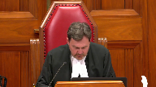

---
title: Northern Regional Health Authority v. Linda Horrocks, et al.
published-title: Heard
date: 2021-04-15
sidebar: false
---

This transcript was made with automated artificial intelligence models and its accuracy has not been verified. Review the original webcast [here](https://scc-csc.ca/case-dossier/info/webcast-webdiffusion-eng.aspx?cas=['37878']).
---

**Justice Rowe** (00:00:02): The court, la cool.

**Justice Wagner** (00:00:22): Good morning.

::: {.column-margin}

:::

In the case of northern regional health authority against Linda, for the appellant northern regional health authority, Robert Watchman and Todd C. Andrus, for the intervener Canadian association of council to employers, Craig W. Newman, QC, for the respondent Linda O'Rourke, Paul Champ, and by John Roy, for the respondent Manitoba human rights commission, Tor J. Ansell, and Shea Garber, for the intervener Canadian human rights commission, Brian Smith, for the intervener Don Valley community legal services, for the intervener empowerment council, Karen R. Spector, for the intervener attorney general of British Columbia, Robert Denny, for the intervener British Columbia council of administrative tribunals, Oliver.

Please note that justice participates in the hearing even though you don't see her in the courtroom.

Mr. Watchman.

**Speaker 1** (00:01:45): Thank you.

::: {.column-margin}

:::

Chief Justice, Justices of the Court, I would like to begin by first expressing my appreciation for the courtesy that was extended to me for the hearing date of today's hearing, and so I would like to thank the Court, all Council, and all parties participating.

And now, may it please the Court, this appeal calls for re-examination of two issues of central importance to our system of administrative law.

First, the standards of appellate review, as between levels of court, and the drawing of jurisdictional lines as between competing tribunals.

And the appeal presents the opportunity to simplify and unify both the standards of appellate review and the proper application of the Weber analysis.

**Justice Rowe** (00:02:41): dealt with standard of review and vavelov.

You're asking us to open it up again, eh?

**Speaker 1** (00:02:46): No, not me, Justice Roe.

::: {.column-margin}

:::

We're talking about not the standards of administrative review.

We're talking here about the standards of appellate review.

So as between a superior court and an appellate court, not as between the tribunal and a court.

Because the issue here was the adoption of the Agrara standard over the well-established standards from Housen.

And Agrara is called into question for two reasons.

Firstly, because the case law provides no substantive judicial reasoning or explanation for departing from the Housen standards.

And secondly, because Agrara is contrary to not only the fundamental principles of appellate review, but also to legislative intent and subsequent pronouncements of this court.

Now, initially, in Dr. Q, this court said that the normal rules of Housen would apply to an appeal from a lower court decision.

However, in 2013, in Agrara, this court then instead confirmed a single correctness standard for both the selection and application of the appropriate administrative standard, adopting Justice Rothstein's metaphor of the appellate court stepping into the shoes of the reviewing judge.

**Justice Abella** (00:04:22): And making no mention of the decision in Dr. Q or in any subsequent decisions.

Am I right?

**Overlapping speakers** (00:04:30): Yet, you're...

**Justice Abella** (00:04:31): And your factum seems to spend a lot of time on Dr. Q, and it's nowhere in agrara or in our standard of review jurisprudence that I could see afterwards.

You want us to revive it, essentially.

**Speaker 1** (00:04:45): Yes, exactly.

Or as Professor Daley described it, housingize the appellate standard. Now, we-

**Justice Karakatsanis** (00:04:55): But isn't there a difference between reviewing a court of first instance or an original decision and reviewing the correctness of a decision?

::: {.column-margin}

:::

I mean, what you're asking us to say is that even if there was jurisdiction and it was declined and the issue was whether it was a reasonable decision, that if the reviewing court comes to another reasonable decision, then that's okay.

And what about all of the issues of consistency and the importance of clarity, particularly in the area of jurisdiction between two tribunals?

There's a disconnect between your saying that it has to be correctness for jurisdiction and we should defer to the reviewing judge on judicial review, again, on a jurisdictional matter.

**Speaker 1** (00:06:03): Well, that's not entirely what we were trying to convey because, so for example, the standard with respect to determination of jurisdiction, if it involves a determination or a question of fact, then, sorry, a determination of law, then it will be reviewed, the lower court's decision will be reviewed at the correctness standard.

::: {.column-margin}

:::

But if that determination required questions of fact and mixed fact in law, under Housen, the standard will be palpable and overriding error.

But Aguera, under Aguera, the entire analysis by the judge, even facts or questions of mixed fact in law are now reviewed under a correctness standard.

And that's what the case under appeal here today stands for.

**Justice Abella** (00:06:51): What do we do with the fact that one of the underlying principles of Housen is the expertise of the trial judge in making findings and actually seeing witnesses?

That doesn't apply, does it, here?

How would you want us to impose?

**Overlapping speakers** (00:07:09): Yeah.

**Justice Abella** (00:07:09): on an administrative review.

**Speaker 1** (00:07:12): Well, yeah, there's, of course, Housen established three basic principles.

::: {.column-margin}

:::

And the first being judicial economy.

So limiting the number, length, and costs associated with appeals.

So clearly this principle applies to administrative law decisions as much as any other field of law.

But under Aguera, establishing a non deferential correctness standard, it empowers the appellate court to come to its own conclusion on the issue, which cannot help but foster appeals and protracted liquid litigation because it's essentially the second kick of the can.

The second principle under Housen was that the standards promote the autonomy and integrity of the lower courts.

So obviously again, a non deferential standard undermines that principle as no deference is afforded to the reviewing judge.

And so it was the third principle in Housen, which spoke to the advantages of the lower court judge in terms of exposure to the evidence and the findings of fact.

And as indicated, the argument there is that in respect of administrative review is largely on the record.

And so the reviewing judge is in no better position than the appellate court.

And indeed that was part of the reasoning in the case under appeal at paragraph 49.

Now bearing in mind firstly, that that reasoning would justify applying the Aguera standard to any proceeding in which there was no viva voce evidence.

So typically it would apply to any motion, any other matter that proceeded by way of application or even trials by affidavit.

And so a number of courts have rejected this type of reasoning.

In Housen, the court referred to an earlier decision of justice John Laskin of the Ontario court of appeal in which he described it quite eloquently as needless duplication of judicial effort without any improvement in the quality of justice.

And he was clear that deference was still called for on any appeal on an entirely written record.

And that is the Gutardo decision referred to in Housen at paragraph 15.

Mr. Watchman, thank you very much for your time.

**Justice Kasirer** (00:09:54): Can you explain to me, maybe I missed it in your answer to justice, does this issue have any bearing on the outcome of this appeal?

::: {.column-margin}

:::

I mean, if the standard of review on the operative issue of jurisdiction is correctness, whether you go the house and route or the agrara route, no deference is owed to the reviewing judge on either framework.

What are we worrying about here in this case?

Is it necessary to get to the bottom of this thorny issue here?

**Speaker 1** (00:10:30): Well, I believe it is for two reasons.

::: {.column-margin}

:::

First, in the course of making a decision at the reviewing level, the court may be called upon to answer issues that the administrative entity did not answer and, as I said, may in the course of finding whether or not jurisdiction exists, have to apply questions of mixed fact and law.

And so now, typically, the standard would be palpable in overriding error.

But in this appeal, our court of appeal clearly applied a correctness standard to the findings of fact by the reviewing judge.

**Justice Côté** (00:11:22): I'm going to pursue, Mr. Watchman, I'm going to pursue the path developed by Justice Kazirha.

::: {.column-margin}

:::

Assume that correctness applies across the board, and this is just me saying that, assuming that, don't draw any inference from that.

What is your position?

How can you explain to us how the first judge was correct?

In his assessment of the jurisdiction.

**Speaker 1** (00:11:48): Yes, so in this case, for example, so in this case, the adjudicator did not properly apply the Weber analysis and we'll be getting to that.

::: {.column-margin}

:::

She really played, you know, lip service to the Weber analysis and then seized upon jurisdiction based upon a legal characterization of the dispute.

So at the review level, the reviewing judge was required to conduct a proper Weber analysis because it wasn't done by the adjudicator.

And so when, and again, we'll be getting to Weber in a second, but in the course of making that determination, so first of all, it's an original decision by the judge because the adjudicator failed to do it and the Weber analysis requires determinations of mixed fact and law.

But in this case, as I said, the court of appeal clearly applied a correctness standard to the determinations of fact and the Weber determined, and the Weber analysis that the reviewing judge had conducted.

**Justice Côté** (00:13:05): But did the reviewing judge make original findings of FAQ?

And if yes, where are they?

Because when I read his decision, did he make original findings of FAQ?

**Speaker 1** (00:13:19): Well, he had to, as I said, he had to conduct the Weber analysis.

I agree with you, but.

**Justice Côté** (00:13:25): But you have to conduct a waiver analysis.

But I'm looking for what are the original findings of fact, or was it only a question of luck?

**Speaker 1** (00:13:37): No, it's, I think the Weber analysis, the second part of the Weber, I mean, the one half of the Weber...

**Overlapping speakers** (00:13:43): for now.

**Speaker 1** (00:13:44): is to determine the essential character of the dispute in its factual context, so obviously that is a determination of fact.

**Justice Brown** (00:13:56): But it is the basis for which jurisdiction would exist, is it not?

::: {.column-margin}

:::

The essential character of the dispute.

So how can that be a factual inquiry?

I mean, I know there's some courts that have decided that to that effect, but it baffles me how.

**Speaker 1** (00:14:21): Well, I would say that, again, perhaps I'm getting ahead of myself, but the proper Weber analysis is to determine the factual nature of the dispute in its factual context only, without any legal characterization.

::: {.column-margin}

:::

And then it is related to the legislative and legal context.

So it involves determining first what are the facts of the case, and then comparing that, relating that to the legislation that may be in play.

So in this case, the adjudicator really didn't consider at all the competing jurisdiction.

So the adjudicator really did not consider at all, in particular, the mandatory grievance procedure in the Labour Relations Act, and instead simply said, well, I see where I have jurisdiction under the human rights code, and therefore I take jurisdiction and I hear this case.

**Justice Karakatsanis** (00:15:30): And I think it's the decision of the adjudicator is the one that we're interested in determining whether it was correct or not.

Is that not what this whole appeal is about?

**Speaker 1** (00:15:42): Well yes, I mean the whole appeal, I mean that is the second part of the of this appeal, but it gives rise to a question as to whether the adoption of the agrara standard by this court is on reflection is still appropriate because it applies a correctness test across the board rather than the usual.

::: {.column-margin}

:::

**Justice Karakatsanis** (00:16:06): Speaking for myself, I'll be very interested when you get to the substance of that.

**Speaker 1** (00:16:19): So just staying on the question of Aguirre for the moment, so we have in this case an example where the reviewing court had the entire transcript of the proceedings before him.

::: {.column-margin}

:::

And there is a question, a question was raised with respect to why neither the complainant nor the union filed a grievance.

And the only evidence before the adjudicator was the subjective belief and hearsay evidence concerning the union that the Ms. Horrocks gave.

And counsel for the commission who had carriage of the proceedings and was representing the complainant's interest, elected not to call any evidence from any representative of the union.

And then in turn did not file any evidence on this point before the court of appeal.

But notwithstanding, the court of appeal overturned the reviewing court's determinations on the correctness standard and determined that the union was not interested in grievance arbitration.

And the consequence of that is that determined it used that distinction to say that the reviewing judge was incorrect and had misdirected himself.

And so now we have in this proceedings before this court, we have actually more transcript from the adjudication than was before the court of appeal.

And there's an attempt to try to re-characterize and re-litigate the facts at this stage on the part of the respondent Horrocks.

And you can see that from the factum of the respondent Horrocks at paragraph 51 where they try to attribute blame on the union by saying it was the union's decision not to grieve the second termination.

And again at paragraph 101 that the union was the party who declined to advance the grievance.

And again, there's no direct evidence as to the union's state of mind so to speak.

And so it's inappropriate certainly at this stage to attempt to re-litigate the facts.

And it brings to mind something that Justice Rothstein discussed in the Sattva case.

And this is at paragraph 51 of Sattva and I'm paraphrasing.

But what he said is that what are the central purposes of drawing a distinction between questions of law and questions of mixed fact in law is to limit the intervention of appellate courts to cases where the results can be expected to have an impact beyond the parties to a particular dispute, namely questions of law.

And the role of the appellate court is not to provide a new forum for the parties to continue their private litigation.

But that's precisely what is happening and has happened in this case as a result of the effect of Agrara, the number and the manner in which our Court of Appeal dealt with determinations of fact and now the attempt to re-litigate those facts.

**Justice Wagner** (00:19:33): Sir, I think we get your points on on that issue and just I'd like to echo what my colleague just told you would like to hear you on the merit of this case and the other legal issues please.

**Speaker 1** (00:19:45): on the merits of this case okay then what else so I will turn to the the second part of the appeal which is the the what is the clarification of the proper application of the Weber analysis and what we are set out in our factum is that the it's the factual characterization dispute that must be kept separate and distinct from its legal characterization so as to avoid confusion and inconsistent decision making now Weber is seemingly straightforward two-step analysis you determine the essential character of the dispute and then examine it in the context of the legal or legislation that's applicable to determine the intended form for resolution and the one overarching proviso however is that that determination must not result in a real deprivation of ultimate remedy now even though the decisions of this court are highly consistent somehow as that direction goes out into our judicial system we see a great deal of confusion and highly inconsistent decision making at every level administrative decision makers first level reviewing judges and courts of appeal as well and there are two primary reasons for this inconsistency the first is the conflation of the factual and legal context in determining the essential character of the dispute and secondly that administrative tribunals often focus unduly on their own particular domain their own administrative scheme and seize upon jurisdiction without fully appreciating the broader legal system and again as I said we have both of these errors occurring in the present case where first the adjudicator as I said paid a little more than lip service to the Weber analysis and see simply seized upon jurisdiction on the basis of the legal characterization of the dispute and that is discussed starting at paragraph 115 of our factum and then subsequently the court of appeal clearly conflated the factual and and legal context in determining the essential character of the dispute in the first step and that's expressly set out at paragraph one of the court of appeal decision sorry paragraph 51 of the court of appeal decision

::: {.column-margin}

:::

so and what we have set out in our factum what is required is as I said that the factual characterization be separate separate and distinct from the legal characterization and we discussed that starting at paragraph 84 of our factum and in particular at paragraphs 87 and 91 of our factum where you know contrary to all good advice as to how to draft a factum we've coded repeatedly from the decisions of this court making the same point firstly as I said that any legal characterization of the dispute is prescribed and once the factual character of the dispute is determined it is then reviewed against the competing legislative schemes to determine which scheme the legislature intended would be engaged to resolve the dispute and so the second step of the analysis is all about determining legislative intent and the reason for all the repetition on our factum is because this court has made these points over and over and over again

and and I would note that in vavelov at paragraph 143 under the heading of rule of prior jurisprudence this court stated that the court's jurisprudence in this regard would continue to apply essentially without modification and what we have set out we say is consistent with those supreme court decisions including the morin decision other than in morin then chief justice justice mclaughlin you know reversed the order of the two-step analysis but the substance of the two-step analysis is still the same and while i'm there i just a comment with respect to morin morin is not authority for the blanket proposition that human rights and labor relations tribunals have concurrent jurisdiction rather than chief justice mclaughlin set out four basic reasons why the arbitration exclusivity provision was not engaged in the unusual and particular circumstances of that case and at paragraph 21 she noted that the ontario grievance provision that was considered in weber was arguably stronger than that in the quebec

that in quebec and then she states that the critical difference between weber and the case before her lies in the factual context giving rise to dispute and as i said she then in the next paragraphs sets out what those facts are none of which apply to the case here and first and foremost amongst her reasons was that the dispute in morin did not involve the interpretation application or alleged violation of the collective agreement and that's a crucial factor obviously but it it tends to be ignored in the arguments opposite so in the in the labor relations context when drawing jurisdictional lines of course the decision maker must make a determination whether dispute arises expressly or inferentially from the collective agreement but because this is what triggers the exclusivity of our section 78 so this is what engages legislative intent and of course we must bear in mind that with respect to what arises out of the collective agreement that as affirmed by this court in perry sound the substantive rights and obligations of the human rights code are incorporated into the collective agreement

**Justice Abella** (00:26:34): Am I right that, sorry Mr. Watchman, am I right that the provision in the Manitoba legislation is almost identical to the provision that the court in Weber found created exclusive jurisdiction, section 45 of the Labor Relations Act?

::: {.column-margin}

:::

**Speaker 1** (00:26:53): Yes, and in our condensed book at tab eight we have provided a comparison chart which includes the wording of the statutes at the time that they were considered in the various cases which are listed below each of the provisions and yes a comparison you'll see that Manitoba and Ontario the wording is substantially the same and for that matter

::: {.column-margin}

:::

**Justice Kasirer** (00:27:24): And so is the Canada Labour Code on the next page.

::: {.column-margin}

:::

And the Quebec provision, too.

The one in Morin, considered in Morin, Chief Justice McLaughlin made the point at paragraph 16 that in the same way that in Weber or Weber, the 45-1 grounded exclusive jurisdiction, so too could the provision of the Quebec Labour Code in ordinary circumstances.

And she referred to Weber finding that as exclusive.

So does that tie the knot between Weber Morin and this case, at least in terms of legislative intent?

**Speaker 1** (00:28:11): Yes, well the way that she described it at paragraph 21 in Moram was that the Quebec provision was argued, sorry the Ontario provision was arguably stronger but again the crucial difference between Weber and Moram was the factual context and in particular as I said first and foremost that the dispute did not involve the interpretation application or alleged violation of the collective agreement in Moram.

::: {.column-margin}

:::

Now so as I was saying in Parry Sound as Justice Iacobucci put it, an alleged violation of the code is an alleged violation of the collective agreement.

So in the present case what is the essential character of the dispute in its factual context and conveniently it's clearly set out in the human rights complaint itself which is at tab 11 of our condensed book and it is in the record that this is a form that is prepared by an intake officer of the Respondent Commission and ultimately it gets signed off by the complainant.

And as you will see the body of the complaint is set out in both numbered and unnumbered paragraphs.

The significance of the numbering is that they set out the allegations of fact whereas the unnumbered paragraphs appearing before and after set out the legal characterization of the dispute.

So the template used by the Respondent Commission actually distinguishes between the two and as we read through the factual allegations it is readily apparent that they fall completely within the collective agreement.

These facts could have been the subject matter of a grievance under the collective agreement and ultimately at paragraph 10 what we find is that what precipitates the complaint is the termination of Ms. Horrocks' employment.

And so how does that factual context relate to the dispute in its legislative context?

Well from the human rights perspective the allegation is that the employer's actions constitute discrimination on the basis of a disability under section 14 of our code which includes the failure to make reasonable accommodation and therefore the argument goes the complaint is entitled to proceed with resolution through human rights adjudication.

From the labour relations perspective however, section 78 which is of course set out at tab 8 there provides strong exclusivity language for the final settlement of all differences concerning the meaning, application or alleged violation of the collective agreement.

Yes that was substantially the same as the provision in Weber but in Manitoba more particularly

and this is at tab 12 of our condensed book, 78.2 makes clear that the deemed arbitration provision provides that it applies to any difference relating to the dismissal or discipline of the employee.

And furthermore and in particular I would like to draw the court's attention to section 78.4 of our labour relations act that's at tab 12 of our condensed book, 78.4 of our

**Overlapping speakers** (00:32:03): Thank you.

**Speaker 1** (00:32:04): the same tab, tab 12 at the page 69, at the numbering at the top, because this provision requires that every unionized employee individually shall comply with the mandatory arbitration provision.

::: {.column-margin}

:::

I submit that that demonstrates how clear and emphatic the legislative intent is in this case.

So section 78 is not just about what has to go into a collective agreement.

It imposes a statutory obligation directly and personally on every unionized employee, including the complainant.

But of course if the Manitoba Court of Appeal decision in this case and or the arguments of the party's opposite prevail, that's a statutory obligation that can be readily circumvented simply by filing a human rights complaint.

Now I would just like to relate the Horrocks to the Weber case and in particular why then Justice McLachlan found exclusive jurisdiction under the Ontario Relations Provision.

And to her reasons they're summarized at paragraph 58 of her decision.

And she finds exclusive jurisdiction because the case meets the tests of statute, jurisprudence, and policy.

So statute because it gives full credit to the language of the Labour Relations Act, jurisprudence because it accords with the Supreme Court's approach in St Ann, Nacowit, and policy because as she described it, it conforms to the pattern of judicial deference for the arbitration and grievance process and correlative restrictions on the rights of the parties to proceed with parallel or overlapping proceedings.

And now there she was referring to litigation in the courts but of course in Regina police in subsequent cases this court has confirmed that the Weber analysis applies whether the choice of form is between a court and tribunal or two or more tribunals.

And I just wanted to to note that reference to correlative restrictions in the unionized workplace and we discussed that in our factum starting at paragraph 146.

But the point here is that in Weber the court was fully cognizant of the restricted access to other procedures and took that fully into consideration when Weber was decided.

Now I just want to touch upon, time permitting, touch upon some of the issues that have been raised by the other parties.

The first is the question of concurrent jurisdiction and again this was addressed by Justice McLaughlin in Weber in a paragraph 45 she notes that the word differences in the arbitration provision denotes the nature of the dispute between the parties and not the legal actions which one might bring against the other party.

So once the nature of the dispute falls within the words used in the act here the meaning application or alleged violation of the collective agreement as she said there is no room for concurrent proceedings and so when we read section 78 it is the fact that the dispute relates to a difference under the collective agreement which determines jurisdiction and not whether or not the employee has filed a grievance under the collective agreement and that we say is contrary to the finding of the court of appeal in this case at paragraph 78.

**Justice Karakatsanis** (00:36:13): Can I ask you, if that is so clear, why in Parry Sound did, I think it was Justice Iacobucci say that although the arbitrator had jurisdiction to hear the grievance, he made no holding on whether the jurisdiction of the Human Rights Commission is ousted by that of the board.

::: {.column-margin}

:::

Can I ask you, if that is so clear, why in Parry Sound did, I think it was Justice Iacobucci

**Speaker 1** (00:36:41): Yes, so that question was put squarely before this court in Parry Sound but the court did not answer the question because it was unnecessary for the determination in that case.

::: {.column-margin}

:::

So here we are some 20 years later and it has remained an open issue and so the purpose of this appeal is to finally address this issue.

**Overlapping speakers** (00:37:06): I'm sorry, I thought you said it wasn't an open issue.

**Speaker 1** (00:37:11): It certainly is an open issue.

::: {.column-margin}

:::

The final comment I would make on concurrency is something that was noted by Justice Iacobucci and Perry Sound in paragraph 54 of his decision, and that was that the argument for concurrency is recognition on part of the commission there and here that labor arbitrators are perfectly capable of implementing and enforcing human rights within the unionized workplace.

Now in doing so, the commission is not saying that labor arbitrators should not have the power to resolve human rights issues in unionized workplaces.

They simply want a slice of the jurisdictional pie.

Now of course the reverse does not hold true, that human rights adjudicators are somehow absolutely incapable of implementing human rights issues in unionized workplaces.

**Justice Rowe** (00:38:05): Is it really, I understand, you're kind of saying they want a piece of the action.

::: {.column-margin}

:::

When I'm not sure that that's how the human rights commissions view it, I think they view themselves more as a safety net, that if the operation of labor arbitration provides no effective avenue for someone who alleges that their human rights have been not respected, that there is a final residual avenue which is open.

And you're saying no, that that capacity does not exist under the human rights legislation that properly read together the human rights legislation and the labor relations legislation says use the tools that are available under the labor rights, labor relations legislation, and if that provides you with no remedy, you have no remedy, point final.

**Speaker 1** (00:39:20): Thanks. Yes.

**Overlapping speakers** (00:39:22): Yeah.

**Speaker 1** (00:39:23): And the point is that our system, our administrative system for labour relations is a complete system, because it provides the employee with the ability to file a duty of fair representation complaint, DFR complaint against the union if the union does not proceed with a grievance that raises human rights issues.

::: {.column-margin}

:::

And as we've set out in our materials, all of the DFR provisions in the various legislation across the land includes a ground of DFR being discrimination by the union against its member.

So in the same way that an employer owes human rights obligations to its employees, the union owes human rights obligations to its members.

And so we can't answer, of course, in a vacuum why the union may not proceed and whether that would be successful on a DFR.

And then in turn, there's the ability, of course, for judicial review of a labour board decision on that point.

So we would have to know why the union didn't grieve.

We would have to know why the labour board didn't find it was a violation of duty of fair representation.

And we would have to know why the courts didn't overturn the labour board decision on judicial review.

So, so, so, so, so, so, so, so, so, so, so, so.

**Justice Côté** (00:41:00): I think the collective agreement permits an employee to file agreements in himself or herself.

**Speaker 1** (00:41:09): Yes and we have actually included extracts from the collective agreement at tab 13 of the condensed book and it's at the top it's page 78 it's article 1004 and that's a very important point Justice Cote.

::: {.column-margin}

:::

An employee has typically as in this case the ability to initiate the grievance process under the collective agreement.

Furthermore section 133 of our labour relations act strictly expressly provides that an employee may initiate a grievance and indeed the memorandum of agreement in this case specifically provided that the Miss Horrocks could proceed with grievance and arbitration in respect of the termination of her employment.

**Justice Côté** (00:42:03): by yourself, even if the union would refuse, the employee has the ability to do that.

**Speaker 1** (00:42:09): certainly to initiate, I guess I think it's an open question under the memorandum of agreement in this case, but certainly under the statutory provision and the provision in the collective agreement proper, you know, typically the union has carriage of the proceedings, so and

::: {.column-margin}

:::

**Justice Côté** (00:42:29): The initial hearings, I saw that you said that you would not insist on the time requirements set out in the collective agreement to initiate agree events.

::: {.column-margin}

:::

I tried to find the same acknowledgement in your factum before us.

Is it still the position of the appellant?

**Speaker 1** (00:42:49): Yes, yes.

::: {.column-margin}

:::

And that's the point is that our because arbitrators, of course, have the ability to relieve against breaches of time limits, and the commitment that was made by the employer was that should she file a grievance, they would not contest it on the basis of time limits.

**Overlapping speakers** (00:43:11): Thank you.

**Speaker 1** (00:43:11): I think the other thing I just would like to note there because of course a lot of the agreement the argument opposite is that while the human rights process is superior to the DFR process because the union has carriage and if they decide they can decide for what's described as a myriad of reasons not to proceed with a grievance involving human rights but of course conversely under our human rights legislation first of all the Human Rights Commission has broad discretion to dismiss a complaint under section 29 of our code and indeed even if a complaint makes out discrimination they have a broad the Commission has a broad discretion not to refer the matter to arbitration if they don't believe it will further the objectives of the code and under section 34 of our code it is the Commission that has carriage of the adjudication the adjudication proceedings but the Commission does not have to represent the complainants interest either at adjudication or at on judicial review and we put in our replies submissions the decision of Pollock decision which in which the Commission did not represent the complainants interest at either the adjudication or the on judicial review and furthermore if a reasonable offer of settlement is made by the responding party but not accepted by the complainant at the Commission level if the Commission believes that the offer was reasonable it must terminate the complaint process that's section 24.1 of our code and if it's done at the adjudication level the adjudicator must terminate the provisions sorry the adjudication or the complaint and we have examples in Manitoba of judicial where complainants were unsuccessful in judicial review in both of in both those types of instances where the Commission terminated on where the adjudicator terminated and that's the for the Commission that's the the course case and for the adjudicator that is the Matassar case so in other words you know the the human rights complaint process is clearly not the utopia that is described in the Responding Party's factums.

::: {.column-margin}

:::

**Justice Kasirer** (00:46:25): Can I just ask one, one last question, sir, the, the, in the event that the, the union does not agree to move the grievance to arbitration, um, is it not true that under the Manitoba Code, um, a, a complaint could be made against a union if they fail to advance a grievance of a member with disability?

::: {.column-margin}

:::

I, I ask because this seems to be one of the preoccupations with some of the interveners.

I'm wondering if, if that's an avenue that would be open in the event that, uh, that things went wrong between the, uh, the member and the union.

**Speaker 1** (00:47:09): the member with this.

::: {.column-margin}

:::

So under our Labor Relations Act, as I said, the DFR provision includes a prohibition against discrimination against the bargaining new member.

And the Labor Relations Act also provides an exclusivity provision in favor of the Labor Board, Manitoba Labor Board.

So in that case, it would be, we would say that, that type of complaint would have to be directed to the Manitoba Labor Board rather than the Human Rights Commission.

Now, I just wanted to touch upon a couple of the other topics that are under discussion.

And I wanted to speak to the Paramountcy provision under our Human Rights Code.

And that is found in the condensed book that paragraph, tab 14 rather.

And this is section 58 of our Human Rights Code.

And there are two things to note about that provision.

So firstly, that it explicitly relates to Paramountcy of the substantive rights and obligations under the code.

And secondly, says that they are paramount over the substantive rights and obligations in other legislation.

So what is absent, of course, in that provision is any reference to procedures or enforcement mechanisms.

So not only does the code not provide any type of procedural Paramountcy for human rights proceedings, conversely, it does not derogate from proceedings under any other act or legislation.

And of course here, section 78 of the Labour Relations Act, which clearly expresses an intention of procedural Paramountcy.

And I just before passing, I know my friends, I believe might be commenting on the primacy provision in the Ontario code.

And I would just note that the language in Ontario is very different from the language we've used here or Manitoba has used here in section 58.

In Ontario, it's a general provision that the code will prevail over conduct authorized by other statutes.

So now the somewhat related is the argument in this case that human rights are quasi constitutional and therefore somehow should trump labour relations and the exclusivity of the grievance process.

But recall in Weber, that a similar argument was made there, but in respect of charter rights.

So Mr, sorry, Weber had commenced court proceedings claiming both torts and charter rights violations.

So nevermind quasi constitutional rights, he was arguing actually constitutionally entrenched rights have been violated.

And indeed, the Ontario Court of Appeal accepted that and said that while he could not proceed with his tort claims, he could proceed with his charter claims.

And of course, we know subsequently that that decision was overturned by this court because the better policy is that arbitrators have the right to implement and enforce charter rights under the collective agreement.

And of course, and that's a paragraph 61 to 66 of Weber.

And of course the same applies to human rights as we know from Parry Sound.

And so again, this court was cognizant in Weber of the correlative restrictions in unionized workplaces when the decision was made.

And as then Justice McLaughlin said at paragraph 60, the existence of broad policy concerns with respect to a given issue cannot preclude the labor arbitrator from deciding all facets of the labor dispute.

Now, and of course the case law is replete with discussion as to the underlying reasons for curial deference for labor relations tribunals.

I'm not going to repeat all of that.

I would say that perhaps the high watermark for deference to labor arbitrators was the Norman Regional Health Authority decision from 2011.

And I would also point out that labor relations of course are not merely about private relations.

There is a substantial public interest component to labor relations and Justice Iacobucci referred to that twice in the Parry Sound case at paragraphs 17 and 50.

And indeed it is not an exaggeration to speak of the violent past of the evolution of labor relations in Canada.

A number of us appearing today are from Winnipeg where even now more than a hundred years later frequent references made to the 1919 Winnipeg general strike now memorialized.

Yeah, I think you need to.

**Justice Rowe** (00:52:52): You need to avoid exaggeration here.

::: {.column-margin}

:::

The right to form a union is what spiked the whole business of violent actions by workers.

What grievance arbitration really was directed towards was wildcat strikes.

**Speaker 1** (00:53:16): Well, yes, perhaps more broadly described as they said by Justice Iacobucci that peace and harmony and industrial relations is important to both the parties and society as a whole and as well that prompt final and binding resolution of workplace disputes is of fundamental importance to the parties and society as a whole.

::: {.column-margin}

:::

So it isn't just the, you know, wildcat strike for recognition type of situation.

It is indeed, as the preamble to our Labor Relations Act states, the single comprehensive scheme governing labor relations is for the stated purpose of furthering harmonious relations.

And the point is that means something and it can't be ignored or minimized or dismissed out of hand simply by saying well human rights are quasi-constitutional and therefore somehow superior or more valued such that even the procedural aspects of human rights should override the express statutory exclusivity of grievance arbitration.

**Justice Abella** (00:54:27): Mr. Watchman, does anything turn on the fact, this is really a two-part question.

::: {.column-margin}

:::

The first is, it's unclear what the effect would be in this circumstance of the conclusion of Avalov that expertise is no longer really something to consider in judicial review generally.

But the question is, the respective fields of authority, your argument I think comes down to this, the labour arbitrator has jurisdiction to do everything related to the collective agreement and the workplace, including anything the human rights commission can do.

But that the human rights commission does not have the ability that the labour arbitrator has to deal with some of the workplace issues that arise under a collective agreement.

Is that essentially your position?

**Speaker 1** (00:55:27): Yes, I would say more emphatically that human rights adjudicator doesn't have the jurisdiction to consider the human rights principles, sorry, the labor relations principles in place.

And I think it's important to say that the human rights principles in place are not just the principles of human rights, but they're also the principles of human rights as a whole.

**Justice Abella** (00:55:44): Whereas, I just want to be clear, your position is that the labor arbitrator has the duty, not only the jurisdictional capacity, but the duty, to...

**Speaker 1** (00:55:53): consider human rights considerations.

::: {.column-margin}

:::

And that's a fundamental difference.

Yes, exactly.

And that is the effect of parry sound.

And again, under our legislation, the Labor Relations Act at section 121 provides that an arbitrator is directed and required to have regard to the real substance of the matter and dispute between the parties.

And that the arbitrator is not bound by strict legal interpretation of the matter in dispute.

And there is a stark contrast between the approach of human rights adjudicators and labor arbitrators.

And that's exemplified in this case.

We've discussed this at starting at paragraph 116 of our factum where the human rights adjudicator here ignored all of the labor relations dispute and addressed only the human rights issue.

And that's to be contrasted with the labor arbitration approach, which is exemplified in the C-SPAN case, which is in the materials.

And I would respectfully commend that case to the court because it's been referred to at every level of the proceedings here from adjudication through to the court of appeal.

And so under the human rights adjudication approach, the labor relations issues are tabled and left unresolved.

So it's like an open wound.

The very thing that the comprehensive system of labor relations was designed to prevent.

And so if you look at an example where two employees, the two employees of long-term.

**Overlapping speakers** (00:57:43): Yeah.

**Speaker 1** (00:57:43): long-term care home are discovered consuming alcohol at work and they both declare a disability and an addiction to alcohol but their employment is terminated.

::: {.column-margin}

:::

So if one engages the union and files a grievance whereas the other files a human rights complaint or we're going to have very different processes and probably very different outcomes

but if they're both successful in their challenge we know that under but isn't isn't another

**Justice Rowe** (00:58:13): the possibility, addressing the situation you've just indicated, where one employee goes one way, the other employee goes the other way, is for the Human Rights Commission to say no, we're gonna use our discretion, we're not gonna deal with this, go back and use labor arbitration, because it's open to you.

**Speaker 1** (00:58:33): they could, but I think the problem is they don't.

We've seen how many of these disputes involve a human rights tribunal or commission.

They keep challenging this.

**Justice Karakatsanis** (00:58:46): but perhaps the human rights commission that does have concurrent jurisdiction should nonetheless not be exercising it if what an employee is seeking is reinstatement of their position for example.

::: {.column-margin}

:::

I guess I just wanted to ask you about section 78 which you have you've referred us to the fact that every collective agreement shall have a mechanism to resolve all differences between the parties.

But the section says by arbitration or otherwise.

Does that mean that the legislature has determined that the parties could choose to go a route other than arbitration if they so chose?

Is that an indication that the legislature was not clearly saying that arbitration was the only route?

**Speaker 1** (00:59:50): Yes, well and interestingly enough there is a case on that point in this in the materials

::: {.column-margin}

:::

but yes I would agree if the parties so chose

and of course the distinction between arbitration and adjudication is in arbitration the parties get to select the decision maker whereas in adjudication they don't.

So the parties might come to some agreement for some other form of dispute resolution.

It's not found in the collective agreement here but there is a case in the materials uh Nova Scotia and Halifax from about 2007 or 2008.

It's in our materials and in that case the um the parties the court found that the parties had incorporated the human rights adjudication process into their collective agreement and therefore there was concurrent jurisdiction and therefore the employee was allowed to pursue a complaint.

**Justice Karakatsanis** (01:00:47): So, what does the wording or otherwise in that option tell us about the legislature's intention with respect to exclusivity of arbitration?

**Speaker 1** (01:01:01): well yeah

::: {.column-margin}

:::

I think the point there is that the legislation ensures that there is a dispute mechanism process which won't result in things like strikes or other actions but left it to the parties that if they wanted to come up with some other form of dispute resolution they could agree to that but they would have to agree to that it would have to be consensual and so if the parties don't agree to human rights adjudication then the arbitration the mandatory arbitration provision prevails so I'm out of I'm almost out of time

and I just wanted to sum up on this point by saying that oh there's the clock the the this part of the appeal really distills down to the wording used in section 78 of the labor relations act and section 58 of the human rights code and of course it's not the role of tribunals or the courts to read words into the legislation nor is it the role to parse or ignore or distort the ordinary meaning of those words in order to achieve a particular result or whatever one or more of the parties imagines is best or right thank you the application of

**Justice Wagner** (01:02:30): of, sorry.

Your time is up, I'm sorry.

But just Sabela has one more question for you.

It's a question that, thank you Chief Justice, it's a question that, thank you Chief Justice.

**Justice Abella** (01:02:38): It's a question that arises out of an interpretation of the word settlement and something I didn't really see addressed in your factum although I may have missed it.

::: {.column-margin}

:::

And that is there was a settlement.

The terms of the settlement included an acknowledgment that all obligations of the employer in the reunion including the duty to accommodate have been met and certain other terms of what she agreed to do as part of her reasonable accommodation.

What is the relationship in your view between that settlement where she acknowledges that she's being essentially reasonably accommodated and her claim in the human rights commission that she has not been reasonably accommodated because it wasn't based on bona fide occupational requirements?

**Speaker 1** (01:03:32): Yes, and the manner in which our Court of Appeal handled that was to say, well, you know...

**Overlapping speakers** (01:03:37): I know, I know, I'm interested in your view.

**Speaker 1** (01:03:40): Well, effectively, at the very least, it establishes an estoppel on that point.

I mean, but for that agreement, the individual would not have been reinstated.

**Justice Karakatsanis** (01:03:55): that no grievances is available on that point, even before an arbitrator.

She can't argue that that was not proper accommodation.

**Speaker 1** (01:04:05): Well, yeah, the provision is, there's the specific reference in the agreement to her ability to initiate grievance or arbitration of any future action that might be taken by you.

**Overlapping speakers** (01:04:22): Section 10.

**Speaker 1** (01:04:24): An open question before the arbitrator, but again, it's the arbitrator that ought to decide at that point rather than the Human Rights Commission.

**Justice Wagner** (01:04:32): All right.

Thank you very much sir.

Thank you.

Thank you Mr. Newman

**Speaker 2** (01:04:41): Thank you Chief Justice and good morning.

::: {.column-margin}

:::

The Canadian Association of Council to Employers, or CASE, intervenes on one of the two questions before the court.

That's the one about how jurisdictional lines are to be drawn between labour arbitrators and human rights tribunals.

The intersection of the jurisdiction of those kinds of tribunals is a very busy one as the breadth of CASE law reflects, and certainly an intersection that is at higher risk of collisions in terms of the potential competing exercise of concurrent jurisdiction.

CASE submits that it would be helpful for this court to provide guidance to the parties, employers, employers, employees, unions, and also to tribunals, labour arbitrators and human rights tribunals, by identifying at least a presumption is what we advocate for that in terms of adjudicating human rights issues when a dispute is arbitrable under a collective agreement, that the presumptive forum be labour arbitration, recognizing as well exceptions.

My submission is that this approach is best reflective of the logical progression of the court's jurisprudence on this topic, and that it also is an approach which stands the best chance of ensuring that the benefits of access to justice and timely and effective conclusive resolution of human rights disputes emanating from unionized workplaces occurs for the benefit of the parties.

When I talk about the court's jurisprudence on this topic in terms of the jurisdictional lines to draw around labour arbitration and in particular where it intersects with human rights jurisdictions, I, in our factum, trace it back at least to 1986 and St. Ann Nacowick, appreciating that that case was focused on the exclusivity of labour arbitrators jurisdiction in relationship to courts and civil actions, but followed to by Weber in 1995, and the court in that case elucidating something of a functional and pragmatic approach to map out quite broad jurisdictional boundaries ascribed to labour arbitrators whenever the essential character of a dispute arose out of a collective agreement.

And then of course another milestone in the court's progression, its pronouncements on this topic would be Perry Sound in 2003, and the court's indication that employment related statutes like human rights codes should be treated as implicit elements of collective agreements and that labour arbitrators accordingly could have a primary role in interpreting and applying and fulfilling the promise of labour arbitration and union workplaces to expeditiously and comprehensively resolve workplace disputes even when they include human rights issues.

**Justice Rowe** (01:08:20): Yeah, but I'm seeing some light between you and Mr. Watchman, because Mr. Watchman, if I understood him correctly, and he was pretty clear, said labor arbitrators have all the jurisdiction, human rights tribunals have none.

::: {.column-margin}

:::

You seem to be saying that labor arbitrators should be presumed to have all the jurisdiction, but in certain circumstances they may not.

**Speaker 2** (01:08:46): and you've detected, I think, the light fairly, Justice Roe, between the submissions you've heard, at least in terms of characterizing the submissions I make on behalf of case, that, to use your phrase, there may be a role, a safety net for human rights tribunals to fulfill in unionized work settings, but I would also emphasize that simply deferring or relying on human rights tribunals to exercise discretion in terms of them deciding when or to what extent they might serve as that safety net, it would be much preferable, indeed I would argue needed from this court, for there to be guidance to those tribunals and others about the typical primacy of labor arbitration as the preferred venue, and not to leave it as a matter of individual exercises of discretion by tribunals.

::: {.column-margin}

:::

Thank you very much.

**Justice Wagner** (01:09:54): Thank you.

::: {.column-margin}

:::

The court will take its morning break.

Fifteen minutes.

The court, let's go.

Thank you.

Be seated. Mr Champ.

**Speaker 3** (01:11:07): Yes, good morning, Chief Justice and Justices.

::: {.column-margin}

:::

Thank you.

I will be covering six areas in my submissions today.

I'll briefly highlight a few key facts, then I'll discuss the appellate standard of review.

I'll touch on the administrative law standard view, which we believe does need to be discussed here.

I'll talk about the proper test of deciding between the jurisdiction or competing jurisdiction between the Labor Arbitration and Human Rights Tribunal.

I'll apply that test to this particular case, and then finally, I'll discuss remedial jurisdiction.

Before I jump into that, though, based on some of the questions, I just want to start with this.

The heart of this case is really about should the union monopoly over the Labor Arbitration process deprive a victim of discrimination of a forum?

That's really what this is about.

Or phrased differently, was that the intention of the legislature looking not simply at the Labor Relations Act, but also at the Human Rights Code?

Because it's our position that to deprive someone of a forum to vindicate their human rights, you need an express, clear, and unequivocal statutory provision.

**Justice Abella** (01:12:19): Mr. Champ, that seems to be a premise that would have been a pre-Weber argument and pre-Perry Sound, but since the very purpose of Perry Sound anyway was to say you always have an obligation to look at the human rights issues when you're dealing with arbitration, it's not clear to me where you say they're, what remedy are they deprived of since arbitrators are obliged, have the jurisdiction and have the duty to consider human rights cases and most of their collective agreements have a non-discrimination clause such as this one in section 6.

::: {.column-margin}

:::

**Overlapping speakers** (01:12:58): Mm-hmm.

**Justice Abella** (01:12:58): So if you could clarify what it is you're suggesting.

**Speaker 3** (01:13:02): Yes, well, first of all, I think it's important to to distinguish between Weber and Perry Sounder, or more properly, Moran, which is Weber was about labor arbitration versus the courts, whereas Moran, in this case, is about labor arbitration versus a human rights tribunal, two different competing administrative tribunals, not simply a single tribunal and the court.

::: {.column-margin}

:::

So you have to look at two different statutes.

Now, with respect to Perry Sound, it's very true that there the court said that human rights issues can and should be raised before a labor arbitrator.

Don't take issue with that proposition.

But the difficulty remains that an individual unionized employee does not have an independent right to go to arbitration.

And my friend, the appellant, I think really was a bit ambiguous on this point.

It's true that Ms. Horrocks has the right to grieve.

There's no question.

She has the right to grieve.

But she does not have the right to take that grievance to arbitration without the support of the union.

**Justice Côté** (01:14:09): the memorandum of agreement and more particularly paragraph 10 of that memorandum of agreement.

**Overlapping speakers** (01:14:17): Yeah.

**Justice Côté** (01:14:17): And I think the union was also a party to that agreement.

::: {.column-margin}

:::

So is there, I think that when I read that, it seems to me that everybody agreed that if Madame would be terminated, there would be a possibility of grievance and arbitration procedure.

And I think that the union was also a party to that agreement.

So is there, I think that when I read that, it seems to me that everybody agreed

**Speaker 3** (01:14:46): Yes, you're totally right, Justice Cote, but what the provision says is that the union and Ms. Horrocks, but if the union doesn't advance that grievance to arbitration, then Ms. Horrocks is left without any forum whatsoever.

::: {.column-margin}

:::

And my friend's answer to that is, well, you know, she could bring a duty of fair representation complaint, a DFR complaint.

But let's be clear here.

There may be all kinds of valid reasons why a union may not advance human rights allegations in a grievance that that does not violate the duty of fair representation.

The union may think that there's no merit to the human rights allegations.

There may be a conflict of interest with other members of the bargaining unit or the union may simply have limited resources and can't advance all of those issues.

And so in that way, the individual is still going to be deprived of an opportunity to advance and vindicate their human rights and, you know,

**Justice Abella** (01:15:44): Sorry.

::: {.column-margin}

:::

What we're alighting over is the fundamental principle in labour relations.

Fundamental principle that when you are a member of a bargaining unit protected by a collective agreement, the quid pro quo is you have deferred your rights to representation by a union subject to the in exchange for the union committing to you the duty to represent you fairly without discrimination, et cetera.

That is a core principle.

So you may have something that is a dismissal plus occupational health and safety.

A dismissal plus discrimination.

We long ago decided that that doesn't give you the right on your own to decide to break that fundamental bargain and go off to the occupational health and safety tribunal or somewhere else.

You're the legislation in Manitoba and most other provinces is the union represents you and they have to do it fairly and impartially.

So I mean, how do you get around that fundamental bargain that is the essence of labour relations in this country?

**Speaker 3** (01:17:01): That's a very important labour relations policy in principle, Justice Abela, but I just want to clarify that it's not only human rights tribunals that also have concurrent jurisdiction in our submission.

::: {.column-margin}

:::

We've got materials showing that, for example, you say occupational health and safety.

In fact, unionised employees can make occupational health and safety complaints independent of the collective agreement to a ministry of labour, the provincial ministry of labour.

They can make privacy complaints under PAPETA to the privacy commissioner.

There's workers' compensation legislation.

If there's an issue whether an employer has properly accommodated an employee or offered proper accommodations, that can either go to a workplace compensation board or it can go to a labour arbitration.

If it's under compensation, it can go to a labour arbitration.

That's what we're talking about.

We're not talking about a labour arbitration.

We're talking about

**Justice Abella** (01:17:49): the collective agreement you can deal with these issues that are covered by the collective agreement.

I'd be interested in the case law.

**Speaker 3** (01:17:57): Yes, Justice Abella, there is the case law.

::: {.column-margin}

:::

If you look to in our condensed book, tab eight, there's just a summary there.

It's Brown and Beattie, and Brown and Beattie goes through the variety of different areas where a union member can go to other processes.

They talk about occupational health and safety.

We talk about the workers' compensation tribunals.

You'll see there where Brown and Beattie says it's on the third page there, workers' compensation tribunals, the last sentence of that paragraph.

Likewise, it has been held an arbitrator and the Ontario workplace safety and insurance board have concurrent jurisdiction to determine fitness of work, and then the footnote, you see there's a few cases there.

We'd cited those cases in our factum as well.

Incidentally, if you look at those arbitrators, David Starkman and William Kaplan, very well-known and prominent arbitrators.

So I guess my point is this, Justice, is that there's no question that labor arbitration is viewed as the primary source of relief.

But with respect, I think that it is an error to say that Weber stands for the principle that there's always exclusive jurisdiction to labor arbitrators when there's an issue in the unionized workplace.

And I'll say that this court in Morin at paragraph 11 was very clear on that, saying that Weber does not stand for the principle that there's exclusive jurisdiction to labor arbitrators for all disputes in the workplace.

So that's our fundamental position.

And if you look as well, I'll just go through my submissions now.

So just on the facts, the key facts, as you know, is that everything that follows flowed from a single incident that occurred on June 3, 2011.

That's when Ms. Horrocks, who was a health care aide, attended at work under the influence of alcohol.

That suspicion was reported to the employer by a coworker.

The respondent, Ms. Horrocks, admitted the misconduct, and she admitted to an alcohol addiction.

About two months later, a month and a half later, the employer terminated her employment because she would not agree to a strict last chance agreement.

The Board of Adjudication confirmed, though, that the employer never offered her any medical leave.

They did consult with her counselor or physician in coming up with that last chance agreement.

They didn't get any independent professional advice and so forth.

Over the next year, Ms. Horrocks received ongoing treatment and counseling for her alcohol addiction.

And then there's ultimately an agreement signed on April 5, 2012, that reinstated her employment and allowed her to return to work, another last chance agreement.

And the key here, though, is that she never goes back to work.

She's terminated because people see her off work, and one person sees her in the grocery store and suspects that she's under the influence of alcohol, and she's speaking to a manager on the phone, and that manager thinks she's under the influence.

But she never was in the workplace again, not for over 10 months.

So there's no evidence of any performance issues, and really the termination goes all the way back to the incident from June 3, 2011.

And when you look at the Board of Adjudication decision, the chief adjudicator, Walsh, there's an extensive analysis applying human rights principles to last chance agreements and when and what circumstances they're enforceable, because there's many cases where they are not enforceable.

You know, for the purposes of this case, it might be argued that there's issue of stoppables for things going backwards, but it's certainly not binding going forwards.

And what the adjudicator points out is that, you know, when there's last chance agreements, usually when they are enforced, there's been a repeated number of incidents, a whole series of incidents before there's the last chance agreement.

But that ultimately, in this case, Ms. Oryx only had one chance.

So that was the human rights analysis that the chief adjudicator brought to the table.

**Justice Abella** (01:22:13): What do you say to the role of the agreement?

::: {.column-margin}

:::

And what I'm looking at is in her human rights complaint, she acknowledges that she signed an agreement, paragraph eight of her complaint, that included conditions that she should provide confirmation of attendance and consoling stage and totally abstain.

She agreed that she would totally abstain in or out of the workplace.

And I'm wondering what the relationship is to the settlement agreement where she agreed that she would not consume alcohol in paragraph three, in paragraph four, that it would be total abstinence.

So the question is, is there any role that this agreement plays in determining jurisdiction?

I mean, you're presenting us with the fact as if we were the arbitrator deciding whether or not it was fair that she be let go.

But my question is jurisdictional.

Given that she had agreed to these terms, how does the jurisdictional issue play out?

**Speaker 3** (01:23:30): Well, in our submission, it's open to the Board of Adjudication and Human Rights Tribunal to take a look at that last chance agreement and choose not to apply it.

::: {.column-margin}

:::

There's an extensive legal analysis on that issue by the chief adjudicator.

As it relates to, you know, this proceeding, you know, is open to the adjudicator to say there was issue estoppel, I suppose, for all matters up until then.

But as the adjudicator says, you know, in any event, the termination followed, it was after that for conduct that came afterwards.

And there's a wealth of jurisprudence about when last chance agreements are enforceable or not.

That's not really the issue squarely before us.

And, you know, other than that, I don't think I can add.

The two other key facts I'll just highlight is that, again, there's no grievance filed.

There's no dispute about that.

There's no grievance filed.

And Ms. Horrocks testified that the union had declined to help her.

That was the evidence that was before the Board of Education.

You know, we've put in transcripts from the Board of Adjudication where the employer counsel asked her questions about that.

She named the union reps who told her that.

And ultimately, we see an exchange with the employer counsel and the adjudicator saying where the employer counsel, Mr. Watchman's colleague says that he believed that the union didn't want to pursue the grievance because they didn't believe her.

They didn't think it had merit.

So the employer essentially understood at that point the union had declined to pursue the grievance.

And so the question is, does that then end it for Ms. Horrocks?

And what we submit as I get into it is that it's not, it's a concurrent jurisdiction matter.

And when there's no grievance filed or pursued by the union, that's a contextual factor.

That's part of the factual matrix that can be considered whether the Human Rights Tribunal is the more appropriate form.

**Justice Brown** (01:25:24): So we've come back to concurrent jurisdiction, and so I'd like at this point, Mr. Champ, if I can, to pull you back to your citation to paragraph 11 of Moran, and you described it as standing for the proposition that Weber does not stand for the proposition that exclusive jurisdiction for all disputes in the workplace rests with the arbitrator, but when you look at paragraph 11, so I wonder if it's not a little bit more nuanced, and it's at the conclusion of paragraph 11 where it says as stated in Weber, because the nature of the dispute and the ambit of the collective agreement will vary from case to case, so because the ambit of the collective agreement will vary from case to case, it is impossible to categorize the classes of cases that will fall within the exclusive jurisdiction of the arbitrator, and it seems to me that that phrase is equating the exclusive jurisdiction of the arbitrator with the ambit of the collective agreement, which would make sense given the statement in St. Anne that courts lack jurisdiction to hear claims based on the interpretation or application of the collective agreement which contains an arbitration clause.

::: {.column-margin}

:::

So putting those two things together, this is a long-winded question, I'm sorry about that, but does it not seem that in fact we have recognized exclusive jurisdiction resting with the arbitrator on all matters arising out of the collective agreement, perhaps not all disputes arising out of the workplace, but all matters arising out of the collective agreement, and if so, why does this not fall within that?

**Speaker 3** (01:27:16): What I'd say Justice Brown is that the fact that a collective agreement may either inferentially by the authority of Perry Sound or expressly say that you know a breach of the human rights code can be grieved, that's not really a unique provision of that collective agreement.

::: {.column-margin}

:::

Broadly or generally incorporating human rights legislation into a collective agreement does not in a sense make it just about the collective agreement.

The Saskatchewan Court of Appeal made that point in the Cadillac Fairview case and I would submit that this is what the many other appellate courts that have dealt with this issue have also held.

The BC Court of Appeal in Kantar, the Alberta Court of Appeal in ATU, the Ontario Court of Appeal in Narain, the Nova Scotia Court of Appeal in Halifax Regional Municipality.

All of those cases look at that issue Justice and they say well you know ultimately just because you're referring to human rights legislation in collective agreement doesn't mean it's just unique to that collective agreement.

**Justice Brown** (01:28:20): The premise of a lot of those decisions, and in fact the explicit premise in some cases, is that while Weber concerned a jurisdictional dispute between labour arbitration and the courts, not between two statutory tribunals. Yes.

::: {.column-margin}

:::

And that's true.

But I wonder about the legal significance of that distinction because when you go and look at the Ontario statute in Weber, it did not exclusively oust the jurists.

It did not oust the jurisdiction expressly of courts and confer exclusive jurisdiction expressly on the arbitrators.

And your friends are saying, well the logic applies obtains here too.

And why doesn't it?

**Speaker 3** (01:29:04): Well, the difference there, Justice, is that with Weber, you were just looking at one statute.

::: {.column-margin}

:::

You're just looking at the labor relations statute.

And there it was concluded that, well, inferentially, what the legislature intended was that matters shouldn't go to the court, they should be with a labor arbitrator.

But the difference is that with competing statutory regimes, whether it's occupational health and safety or privacy, or in this case, human rights legislation, you need to look at both statutes.

And that's what the court was saying in Moran.

The court went on after paragraph 11 in 15 and 16, saying, well, you need to have a two-step task where you look at all the relevant legislation and look at the competing legislation.

And ultimately, there, what the court said in Moran was that which tribunal is the better fit?

Look at the essential character and determine what is the better fit.

So in Weber, all we-

**Justice Brown** (01:29:51): we had on the other side of the ledger was section 96 of the Constitution Act.

**Speaker 3** (01:29:58): Well, but even then, Justice, there's all kinds of other circumstances where we're, um, it's about the intention of the legislature I would submit is what it comes down to.

::: {.column-margin}

:::

Um, and, uh, you know, the, I guess you could say the constitution is the, the people, was that the people's, uh, uh, rights?

And we have all kinds of other cases where, you know, legislatures have in other ways sort of confined or, uh, redefined, uh, charter claims.

Like for example, time limits to bring a charter claim.

There's nothing in the constitution that says there's a two-year time limit to bring a charter claim.

At one time, courts said, well, you know, that's changing the constitution.

But, uh, ultimately the courts later said, no, no, no, you can sort of control charter claims.

So what we're talking about here though, is another statute that was passed by the legislature.

And do we see any clear indication in either of those statutes that parliament or primary legislature intended a victim of discrimination to have no forum whatsoever?

It's an access to justice issue.

**Overlapping speakers** (01:31:01): Nice!

**Justice Brown** (01:31:01): Well, hold on, hold on, hold on.

::: {.column-margin}

:::

Access to justice.

I mean, there's no suggestion I think that someone is going to have any kind of a timely sort of resolution of a matter by going through the human rights tribunals.

I mean, I have correspondence back from my days in council from someone called a backlog supervisor at a human rights tribunal.

Let's not forget that Blanco came out of that context.

Yes, of course.

Yeah, of course.

We can all die of old age waiting for a disposition.

**Speaker 3** (01:31:36): Indeed, this is my area of law, Justice, and it is true that the tribunals, they grind their wheat in the mill quite slowly at times.

But it's better to have a slow remedy than no remedy at all.

You know, we don't take issue that-

**Justice Brown** (01:31:53): I'm just saying, much like your friend ought not to trump at 1919 in Winnipeg, I don't think access to justice is exactly a flag that we ought to be flying here.

**Speaker 3** (01:32:04): Well, with all due respect, Justice, I think that is the key to this case, because if you say that the labour relations regime is paramount, and that if a union decides not to bring a grievance involving discrimination for any reason to arbitration, then the individual is deprived of their individual human rights.

::: {.column-margin}

:::

I submit that that's, and I think there's all kinds of authority that we cite in our factum that that's inconsistent with the purpose of human rights legislation.

Like the purpose of exclusivity and labour legislation is the inexpensive and swift and expeditious resolution of disputes.

I agree with you there, and there's no doubt that that would be a wonderful primary source of relief to individuals.

But where the union doesn't take it forward, you need a safety net.

And this isn't me just arguing policy, this is what the legislation is saying.

So if the legislation, if the human rights legislation, if the policy or the competing policy there is the vindication of human rights and the eradication of discrimination, equality.

**Justice Brown** (01:33:13): So is the duty of fair representation superfluous then?

Why have I-

**Speaker 3** (01:33:19): Well for that for that purpose it is justice.

::: {.column-margin}

:::

If you look at paragraph five of the Alberta Court of Appeal in ATU they lay out all kinds of very valid reasons why the union may not wish to pursue a grievance involving human rights allegations.

Like in that particular case again it was a person a woman who had sexual harassment allegations that she wanted addressed.

The labor relations issue was that she swore at her supervisor and so the union wanted to advance a grievance just about that on labor relations just cause principles that there was no progressive discipline and so on and so forth.

She might win that grievance on that basis but for her it was far more important that she had been sexually harassed by that supervisor and her co-workers for a prolonged period of time and the union for valid reasons did not advance those arguments did not want to advance those issues in the grievance so she went to the human rights tribune.

And so that's that's the issues if we're talking about vindicating human rights human rights legislation should not be enfeebled in that way.

We don't have any express exclusionary language saying clearly that human rights tribunals don't have jurisdiction.

Now we did have that invade I'll point out the Supreme Court of Canada that's the only other real case where you have the competing labor tribunal and human rights tribunal and there it didn't turn on you know the Mr. Vade had argued that the Canadian Rights Tribunal should have jurisdiction and he cited the Paramount C Provision the Cayman Rights Act similar to the Human Rights Code there and in fairness to my friend's arguments the Supreme Court of Canada said well it doesn't turn on that but what it did turn on was section 2 of the Parliamentary Employment and Staff Relations Act which did make it clear that the machinery of the grievance arbitration should take precedence exclusively over other means of a resolution and and that's what again the Alberta Court of Appeal said in ATU it's what the Nova Scotia Court of Appeal said in Halifax Regional Municipal Authority that that is really the key issue there was no section 2 of PEZRA in those labor relations statutes and I submit there's no statute a provision like that in the Labor Relations Act of Manitoba and and I'll point this out justice we've got in our condensed book at tab 11 a tab 11 we have section 92 sub 2 of the Manitoba Employment Standards Code and it says this an employee who is covered by a collective agreement may not file a complaint under this code it couldn't be any clearer that is a clear statutory provision unequivocal that ousts the jurisdiction of the labor standards tribunal so therefore an employee who has an issue with the Employment Standards Act must exclusively go through the arbitration the grievance and arbitration process and if union decides not to take its arbitration well that's the bargain that that individual made

but it's different for human rights human rights are quasi constitutional and moreover the human rights code in Manitoba has no such provision like that.

**Overlapping speakers** (01:36:38): What does it mean, what does it mean that human rights are quasi-constitutional?

**Speaker 3** (01:36:42): It means, Justice, that equality and the right to equality is viewed as a foundational principle that governs all of our relationships.

::: {.column-margin}

:::

And I'll say this, Justice, you know, when you look at Trash Montaigne and Perry Sound, the principles there, this Court said that, you know, in Trash Montaigne, disability tribunals should be able to imply human rights legislation because we should make human rights legislation accessible to all.

It should be an accessible remedy.

So you want to expand the number of tribunals that apply it.

In Perry Sound, same principle there, the Supreme Court of Canada said that labor arbitrators should have jurisdiction over human rights statutes to apply it because we want to expand the scope and application of human rights legislation because human rights and equality are so important.

And I would submit it's a bit perverse to turn those cases on their head and say, well, but the human rights tribunal shouldn't be allowed to hear a case when there's no other forum that can hear the human rights complaint, not a human rights tribunal, which takes us

**Justice Abella** (01:37:49): back to whether or not there's another form.

::: {.column-margin}

:::

So I have a couple of questions.

One dealing with the language in weaver where it seems to me to be pretty clear that the mandatory arbitration clauses generally confer exclusive jurisdiction on labor tribunals and didn't say vis-a-vis the courts.

It's just a blanket statement at page 963 paragraph 67.

That's number one.

But the specific question I have, Mr. Champ, for you is the relationship between what you're arguing now vis-a-vis jurisdiction and section 10 of the agreement between Ms. Horrocks and her employer.

Namely, an agreement in advance that any breach of this agreement, which is exactly what was alleged to have taken place here, constitutes just cause and the terms are abstinence anywhere, not just in the workplace, but that she has the right, and as does the union, to challenge any decision to the grievance and arbitration procedure.

So my question to you is even if you're right about exclusive jurisdiction not belonging to the arbitrator under the Manitoba legislation, what does the existence of this agreement between the parties do or is it your position that we forget that it exists and the fact that there was an agreement is of no relevance in her ability to go forward and start a whole new procedure under the Human Rights Code?

**Speaker 3** (01:39:30): Well, I would, I would submit, Justice Abella, to the extent it's relevant of all, is with respect to issue a stoppable for matters that happened prior to that, if at all.

**Justice Abella** (01:39:40): This is an agreement going forward.

::: {.column-margin}

:::

We've settled the grievance.

Going forward, here's what I agreed to do.

Here's what we both agreed to do.

Any breach of the conditions including abstinence, reports from confirmation that there is abstinence in themselves constitute just cause and that's what happened here.

It constituted just cause and she had the right as did the union to go ahead to grievance.

So I'm asking you where we put, even if we accept your jurisdictional argument, where do we put the existence of this agreement as to what will happen into what you say you now want to happen going before a different tribunal.

**Speaker 3** (01:40:23): Well Justice, I would submit that the principle that applies there and which has been applied in countless labor arbitrations and tribunals is that you can't contract out of your human rights even in a non-unionized environment.

::: {.column-margin}

:::

Let's say an employment employee gets a new job and they sign employment contracts that says you know you asked for a chair to accommodate your disability on hiring and we've done it and therefore you cannot bring a human rights complaint.

They may have signed that, but you can't bring a human rights complaint to them.

**Overlapping speakers** (01:40:52): Human Rights Tribunal. It's not.

**Speaker 3** (01:40:53): repeatedly it's not binding that's contracting out of that's contracting out of the human rights legislation.

**Overlapping speakers** (01:41:00): so your client had no right to sign this agreement.

**Speaker 3** (01:41:02): She could sign the agreement, I'm just saying that it cannot operate as a matter of public policy to contract out of her human rights and her right to access a forum that can vindicate her human rights and her right to be free from discrimination under the Human Rights Code.

**Justice Abella** (01:41:19): other than the form she agreed would apply to determine that question.

**Speaker 3** (01:41:25): Madam Justice, they could also have said if you have any issues involving your human rights going forward or accommodation of your disability, you will go to the employer and only the employer will decide and you have no right to go to the Human Rights Tribunal.

::: {.column-margin}

:::

They could have put that in and she could have signed it, but I would submit for the same reasons, it's not binding in that way.

I have a question as a— I have a question as a—

I have a question as a— I have a question as a— I have a question as a— I have a question as a— I have a question as a— I have a question as a— I have a question as a— I have a question as a— I have a question as a— I have a question as a— I have a question as a— I have a question as a— I have a question as a— I have a question as a— I have a question as a— I have a question as a— I have a question as a— I have a question as a— I have a question as a— I have a question as a— I have a question as a— I have a question as a— I have a question as a— I have a question as a— I have a question as a— I have a question as a— I have a question as a— I have a question as a— I have a question as a— I have a question as a— I have a question as a

**Justice Abella** (01:41:45): As a matter of labour policy, settlements are the fuel of what happens in a workplace.

::: {.column-margin}

:::

Your proposition would mean that these settlements are useless and irrelevant and should not be taken seriously and there's no point to entering into them because either party would have the right to disregard them.

**Speaker 3** (01:42:04): Justice, I guess all I would say is that there is a wealth of jurisprudence around this issue when last chance agreements are enforceable and not.

::: {.column-margin}

:::

And if you go to the adjudicator's decision, she gets into that at length.

She goes through all the decisions, she hears the arguments from the employer, and that's ultimately the decision she made.

There might have been other factual factors or context where she might have decided, no, you know, I'm not going, you know, I think that I am going to apply this agreement, I am going to enforce it.

That was open to her, but I would submit as a matter of law, as a matter of law, it was open to her to say, no, I'm not going to enforce this against Ms. Horx and allow a full hearing of her allegations.

Thank you very much.

**Justice Wagner** (01:42:47): Thank you very much.

**Speaker 4** (01:42:52): Thank you Chief Justice and Justices.

::: {.column-margin}

:::

I'll begin by saying that although Ms. Horrocks is now represented by her own council, the Commission continues to support her in this matter and would very much like to see her have the benefits of the Chief Adjudicator's decision.

The Commission's primary focus or interest in this appeal is to clarify the confusion that arises as a result of the Court of Appeals decision and in particular with respect to the nature and extent of the Commission's jurisdiction over complaints made by unionized employees who are subject to a collective agreement.

As one might imagine the Court of Appeals concept of transcendent jurisdiction that applies to some matters that may exceed the exclusive jurisdiction of a labor arbitrator is is not easily understood and it's very difficult to apply in practice when the Commission receives complaints from unionized employees.

It begs questions of whether the Commission has jurisdiction at all or is it limited in some respects?

Are the remedies the Commission might otherwise grant to address human rights violations circumscribed and if so to what extent?

And the Commission hopes the appeal will provide clarity for it on those issues moving forward but having said that the clarity the Commission seeks is a finding that the Chief Adjudicator had just jurisdiction over all aspects of Ms. Horak's complaint.

I'm going to pick up on the point raised in questions asked of my friend Mr. Champ towards the end with respect to the memorandum of agreement and what do we make of that and a couple of things.

First off I don't believe my friend and certainly not the Commission is suggesting that memorandums of agreement like that entered into by an employee a union an employer are useless or should be ignored and I respectfully submit that's not what the Chief Adjudicator did.

She was certainly alive to the existence of that agreement she heard the arguments from the appellant on the subject she considered it but at the end of the day what we have that memorandum agreement is something that was entered into against a backdrop of human rights violations where the employer had failed to respect Ms. Horak's human rights and failed to accommodate her special needs.

So in that context while we don't suggest the Chief Adjudicator or a human rights tribunal should ignore those types of agreements we do respectfully submit that they are entitled to look at them should take them seriously and respect them when possible but whereas here they're found to have been entered into against the backdrop I've just described then yes we do respectfully submit that the Commission and in this case the Chief Adjudicator had jurisdiction to do what she did.

Well perhaps.

**Justice Brown** (01:46:09): assuming for sake of argument that the adjudicator had jurisdiction ought the adjudicator to have declined to exercise that jurisdiction.

**Speaker 4** (01:46:23): So are we, may I clarify Justice Brown whether that question is asked in the context of declining to exercise jurisdiction insofar as dealing with matters that were the subject of the memorandum of agreement or are you asking that question in the context of suggesting to that the adjudicator should have declined jurisdiction entirely?

::: {.column-margin}

:::

**Justice Brown** (01:46:48): Entirely, but you can answer either one.

**Speaker 4** (01:46:51): Okay, I'll deal with the question as you intended it and I'll come at that this way.

::: {.column-margin}

:::

Advanced in the materials and by parties to this appeal are various policy arguments in favor of exclusive jurisdiction of labor arbitration over human rights adjudication or perhaps vice versa.

I would respectfully submit that we see a preference for labor rights adjudication prevalent in some of the cases, maybe that's because labor arbitration had a bit of a head start, I'll call it.

But the point has been made and it's a fundamental importance and I think recognized by this court in the Moran case that the first thing we need to do is to look at legislative intent because at the end of the day policy arguments are interesting but it's ultimately the legislature of Manitoba that had the authority to express what policy it wanted in legislation pertaining to the human rights commission and in the labor relations legislation.

And the amalgamated transit union case makes the point very eloquently in that and the excerpt I would direct you to you'll find it at tab three of our condensed book.

And I won't read it but it quite correctly points out that beginning with a presumption in favor of labor arbitration runs the risk of giving a jurisdictional edge to labor arbitration over human rights adjudication and it gives that edge without even yet having looked at the what the legislation has to say.

And in my submission that's why Moran step one recognized the importance of looking at legislative intent and that's why in amalgamated transit union it was careful to point out that there is not one legislative intent to consider, there's two.

We have the labor relations act in this case and we have the Manitoba human rights code in this case.

So we need to look at those two specific pieces of legislation to determine the answer to the question you just asked me.

And I think if we do that and there's again been a tendency to want to focus on the labor rights labor relations act legislation first.

I'm going to come at it the other way and and if we imagine this complaint.

I'm going to put it to you directly sir.

**Justice Rowe** (01:49:40): that when I said to Mr. Watchman isn't it important to have a safety net in case it's not open to an employee to vindicate their rights through the labor relations regime, he said no, there's inadequate means and exclusivity is fine.

::: {.column-margin}

:::

What I hear from you is not a safety net, it's a competing line of business.

You're saying that my door is open, come and see us, or proceed by labor relations, and it isn't a safety net, it's like a complete 100% alternative.

And isn't that just gonna give rise to chaos?

**Speaker 4** (01:50:26): No, I don't so go so far as to suggest, Justice, that that

**Speaker 4** (01:50:32): to use your words, the Commission's door is open and it's a competing tribunal.

::: {.column-margin}

:::

What I do go so far as to suggest, though, is that if one looks at the Human Rights Code and what the legislature has told the Commission it must do, we can't lose sight of that.

And if you look at what the code says, it first off gives any person section 22, you'll find that in within tab five of our condensed book.

Section 22 gives any person the right to file a complaint.

Unlike the Canadian Human Rights Act, we see no exception there, no expression of deference that might be afforded to a complaint made by a unionized employee.

And then if we look at section 26, the legislature has put on the executive director of the Commission a positive mandatory obligation to investigate a complaint to the extent necessary to dispose of it, etc.

And I'm going to tie that section in with what follows in our condensed book immediately below it, which is 29.3, which confers a discretion on the Commission itself to determine whether or not it should refer a matter on for adjudication.

And it's at that stage where considerations of the nature you're raising in my respectful submission apply and should and ought to be considered by a Commission in any given case.

So if, for example, a complaint was made by a unionized employee, the executive director in the course of fulfilling her mandatory obligation investigated it and determined that I don't need to take this any further.

This employee has made a complaint in accordance with the grievance procedure.

I see it's been fairly and appropriately dealt with.

We don't need to go further.

Or if it gets to the stage of the Commission deciding whether it's going to refer this on for adjudication or not, if an employee has made a complaint that has been fairly and adequately dealt with under whether it be labour relations legislation or some other forum, the Commission can say, no, there is no need to refer this on for adjudication.

So that's what the legislature has put in place.

Anyone can file the complaint, the executive director has to investigate it, and then the Commission has a discretion whether it's going to go further or not.

**Overlapping speakers** (01:53:17): Does that mean, Mr. Hentz-

And I respectfully submit- I'm sorry?

No, go ahead, please finish your sentence.

I'll ask you when you're done.

**Speaker 4** (01:53:23): Okay, thank you.

::: {.column-margin}

:::

I respectfully submit that if that discretion is exercised inappropriately, for example, they say notwithstanding a complaint has been fully adjudicated, the human rights issues were dealt with, we're going to refer it for adjudication again.

Well, that would be subject to challenge using existing doctrines, abuse of process, race judicata and so on.

But what the.

**Overlapping speakers** (01:53:51): Mr. Hanson.

**Speaker 4** (01:53:52): of Manitoba has told us is this forum is available and they have not made any express exclusion for a complaint by a unionized employee and in my submission that's step one of the analysis.

**Justice Abella** (01:54:06): So, is it your position then, we have the facts in this case, which includes a prior grievance, et cetera, would your position be that this is complete concurrence and that Ms. Horrocks, as a member of the bargaining unit, notwithstanding the provision of Section 78 of the Labor Relations Act, could have gone in the first instance to the Human Rights Commission rather than bringing a grievance under the collective agreement?

::: {.column-margin}

:::

You're saying that those options are open to every unionized employee covered by a collective agreement for disputes under the agreement.

I just want to be clear about your position.

**Speaker 4** (01:54:50): Yes so I'll address how in my view the legislature has dealt with that scenario and it goes back to section 22 of the code anyone can make a complaint the executive director is going to go in it so into it but in the circumstance you describe yes it means the legislature has said that person may make a complaint

::: {.column-margin}

:::

and they haven't put any limits on it so if we can find those limits elsewhere

**Justice Abella** (01:55:19): What about the limits in section 78 if it's a workplace dispute under the collective agreement?

That's where you go Yes, but you're saying

**Speaker 4** (01:55:28): going to go there.

::: {.column-margin}

:::

The last point I'll make on looking at the code when this complaint came in the door with no grievance procedure outstanding, it worked its way through, I've drawn your attention to those provisions and before I turn to the Labour Relations Act I'll make one final point in response to submissions from my friend Mr. Watchman.

He of course rightly points to section 58 of the code which provides paramountcy of the substantive obligations of the code over other legislation and he rightfully points out that that refers to substantive obligations but not so fast.

Let's not allow that to lead us to jump to a conclusion that that means somehow the code now becomes subservient to other legislation.

That would be a leap in my submission because one need only look to the preamble of the code as well.

Subparagraph E which again talks about the fundamental importance and that follows the subparagraphs before it which deal with things like equality of opportunity, ensuring reasonable accommodation, affirmative action programs and so on.

So it's a stretch in my submission to suggest that because section 58 of the code refers to substantive obligations we should somehow discount the procedural and enforcement and investigative mechanisms that are available in the code to an employee in Ms. Horak's circumstance.

**Justice Abella** (01:57:05): So section 143 of the labour relations act giving exclusive jurisdiction to the board to arbitration vis-a-vis courts which would include the charter.

Is that meaningless in the context of the human rights commission?

**Overlapping speakers** (01:57:22): Sorry, I missed the section you were referring to, Justice.

**Justice Abella** (01:57:24): 143 of the Labor Relations Act.

**Overlapping speakers** (01:57:30): Just allow me.

**Justice Abella** (01:57:31): some exclusive jurisdiction to exercise the powers conferred upon it and to determine all questions of law and fact.

::: {.column-margin}

:::

That's the section that's called relationship between the board and courts.

Which would include, of course, charter.

But you're saying that we don't look at exclusivity vis-a-vis the human rights commission because nothing can host the jurisdiction of something like a human rights commission even though its jurisdiction is subsumed by a labor arbitrator.

**Speaker 4** (01:58:04): So I'll make the first point, Justice, that section 143.1 applies to the board or any panel of the board.

**Overlapping speakers** (01:58:11): Right.

**Speaker 4** (01:58:11): it does not apply to a labour arbitrator and that's one of the points we make in our factum is that if the labour arbitrator hearing a grievance under the collective agreement was intended to have exclusive jurisdiction surely the legislature of Manitoba would have said so and we've included provisions from several other acts in Manitoba from which the conclusion can be drawn in my submission that when the legislature intends exclusive jurisdiction it comes right out and says so and so like it

::: {.column-margin}

:::

**Justice Brown** (01:58:46): like it did in Weber and there was no conferral of exclusive jurisdiction on the arbitrator in Weber and yet court said that was enough to oust courts.

Sure, and again...

**Speaker 4** (01:59:03): You

**Speaker 4** (01:59:03): This goes back to the point I was making at the outset that we need to be careful looking at the various cases to draw conclusions from one and how it may apply in the other without first taking a look at the underlying legislation in place.

::: {.column-margin}

:::

So the point I'm making here, and my friend, Mr. Champ made it as well, and it's well articulated by the Alberta Court of Appeal in the amalgamated transit union case is in a situation like this, we're dealing with two expressions of legislative intent, not just one as in Weber.

And I take your point, Justice Brown, Weber says what it says and found that there was an intention to confer exclusive jurisdiction on the labor arbitrator over the courts in that case.

But what we have to decide in this case or consider in this case is whether the legislation as expressed by the Manitoba legislature in the Manitoba Human Rights Code as compared to the Labor Relations Act, do we see such a clear expression of legislative intent?

And in my respect- Well, did we see one?

Did we see one?

**Justice Brown** (02:00:20): Did we see one in Weber?

I mean, where was the expression of legislative intent in Weber?

I mean, you know, your friend Mr. Champ says, well, that's two statutes that we're looking through here and Weber just involved one. But if...

**Overlapping speakers** (02:00:35): If-

**Justice Brown** (02:00:35): If the concern is, as you appear to be preoccupied with the express legislative statement, that we didn't have one in Weber.

**Speaker 4** (02:00:48): So the conclusion in Weber in my submission goes no farther than to say that the court found that based on the specifics of the labour relations legislation in issue in that case that there was an intention on the part of the Ontario legislature that the dispute in question fall within the exclusive jurisdiction of the arbitrator.

::: {.column-margin}

:::

That's what Weber says.

I don't argue with that.

**Justice Karakatsanis** (02:01:14): So Mr. Hensel, assuming for a moment that you make the case that there is concurrent jurisdiction when you look at the intention as expressed by through both statutes here, I'd like to come back and ask you that second question that Justice Brown had posed earlier.

::: {.column-margin}

:::

Where the remedy sought is reinstatement.

And given what we know about the importance of a quick resolution and all of those policy considerations in the labour regime, ought a commission to proceed or ought the commission to exercise its discretion to defer jurisdiction in such a case?

I'm not saying what the Court of Appeal said, that it limited the jurisdiction.

I'm asking you, does that go to the issue of whether a human rights commission ought to exercise its jurisdiction or not?

**Speaker 4** (02:02:23): Thank you Justice Katsanis and I would say this your question is phrased along the lines of ought the commission to exercise that jurisdiction and my answer to that is whether the commission should or should not will depend on the facts of any given case.

::: {.column-margin}

:::

There may be good reasons not to do so but that doesn't mean the commission doesn't have the jurisdiction to exercise that remedy of reinstatement in appropriate circumstances.

**Justice Karakatsanis** (02:02:57): So let me ask you a different question then.

::: {.column-margin}

:::

Is it reasonable for an adjudicator to proceed when the remedy sought is reinstatement given above all else I think the timing of that process?

**Speaker 4** (02:03:16): Sure.

Is it reasonable to proceed?

So, again, I think the answer to that is the determination of whether reinstatement is going to be a remedy or not is made at the end of the process, not at the outset. So,

**Overlapping speakers** (02:03:31): No, but the claim includes it at the beginning of the process.

**Speaker 4** (02:03:34): Sure, and is it within the jurisdiction to consider that?

::: {.column-margin}

:::

In my submission, yes, it is.

Now, at the end of the day, ought the commission to impose that remedy?

Perhaps not, and maybe this case, there are arguments as to why that remedy was or wasn't appropriate.

I believe the chief adjudicator was alive to that, considered those issues, and imposed that remedy.

And my point simply is, she had the jurisdiction to do so.

And if there's a challenge to that remedy, and I believe there was, and that particular aspect wasn't dealt with or argued in judicial review, or dealt with on judicial review or an appeal.

So that's when that question might be decided, ought the chief adjudicator to have imposed that remedy or not.

But it doesn't detract from the fact that when the adjudication process is underway, yes, the chief adjudicator had jurisdiction to impose that remedy, assuming it was appropriate in the circumstances.

I hope that's an answer to your question.

**Justice Rowe** (02:04:40): You've said earlier on, and I tried to take note of it when you said it, that whether or not the Commission chooses to act upon its authority or declines to do so depends on whether the complaint has been quote fully and fairly, I think those were your exact words, dealt with under the grievance procedure.

::: {.column-margin}

:::

That smacks to me as if the Commission believes it has sort of a supervisory role and that it's going to oversee how grievances are dealt with, and if they're not dealt with in an appropriate fashion, well, the Commission will just take them up and fix things.

Is that really what the Commission is there for?

**Speaker 4** (02:05:26): No, Justice, and I don't think the Commission would suggest for a moment that that's what it's there for.

::: {.column-margin}

:::

And the words I meant to convey is there is an opportunity on the part of the Executive Director under Section 26, or the Commission itself under Section 29, to look at whether any given complaint, and perhaps better words would be, had been adjudicated, adequately adjudicated, fairly adjudicated, would fall into the equation as well.

I mean, if there were abuses there, yes, I submit, it would be open to the Commission to consider that.

But no, I don't suggest for a moment, and I don't believe the Commission suggests for a moment, that it should not have respect for other processes that are available.

But we go back to the context of this case.

Here we have a unionized employee who's come forward.

She is not being assisted by her union.

We don't know why.

She talks about having signed a memorandum of agreement under some financial distress.

So in that circumstance, does the Commission have to be cognizant of whether there might be another avenue available to such an employee?

Yes, it does.

But is the Commission bound, and is there an expression of clear legislative intent anywhere in the Code or the Labour Relations Act, that the Commission's jurisdiction is ousted?

We say no, there isn't.

So we're back to the language of the statute. Yes.

**Justice Brown** (02:07:05): And you say that that governs and Weber doesn't apply because Weber is just one statute and versus the court.

::: {.column-margin}

:::

So what do we do with paragraph 16 of Moran?

Because there we were dealing with two statutes, the statute governing labour arbitration and the statute governing the Quebec Human Rights Commission.

And what the court did there was it drew from the provision in Quebec's labour code that every grievance shall be submitted to arbitration in the manner provided in the collective agreement.

If so, a certified association employer will abide by it.

This tells us, said the court, that the arbitrator is competent to resolve all grievances under the collective agreement.

The arbitrator has jurisdiction over matters arising out of the collective agreement's operation.

And then this little nugget at the end, in Weber, this jurisdiction was found to be exclusive.

Why is that not dispositive of this issue?

**Speaker 4** (02:08:09): I go back to the point that I made earlier that Weber involved the interpretation of one statute.

**Justice Brown** (02:08:17): Moran didn't, but Moran didn't, and Moran is bringing Weber forward.

This jurisdiction, this jurisdiction, in other words, the jurisdiction at issue in Moran was found to be exclusive.

**Speaker 4** (02:08:33): So, again, looking at the legislation there, but Moran was also very careful to note that a, there is no presumption of arbitral exclusivity, b, the analysis that it advocates in terms of the test involves looking at both pieces of legislation.

::: {.column-margin}

:::

And I come back to the point, I've made it before, I'll make it again, that when we look at the Manitoba Human Rights Code, and when we look at Section 78.1 of the Labour Relations Act, where do we find the expression there of exclusive jurisdiction?

Those words aren't used, despite the fact the legislature uses them in many other statutes.

Where do we find it?

No indication that the jurisdiction of the commission is ousted, that the legislature was intending to oust that jurisdiction over a code which it gives fundamental importance, primary importance to.

**Justice Brown** (02:09:34): I'm sympathetic with that argument.

::: {.column-margin}

:::

I actually am.

And if this were tabula rasa, I think I'd be thumping my desk and going hallelujah.

But you have to help me around the adoption in Moran, which involved two statutes, of Weber as a source of authority for saying this jurisdiction is exclusive.

And it may be that we're ships passing in the night, but I want to signal to you that that is where the appeal tips for me.

**Speaker 4** (02:10:08): All right, let me just find the paragraph.

Was it 16 you're referring to in Moore and Justice Brown?

**Justice Brown** (02:10:17): Yes, it is.

**Speaker 4** (02:10:34): Yes, all right.

::: {.column-margin}

:::

So in my submission that goes no further than what it says there, that the arbitrator has jurisdiction over matters arising out of the collective agreements operation.

We don't dispute that an arbitrator has jurisdiction.

And you're then focusing on the sentence that says in Weber this jurisdiction was found to be exclusive. Yes.

And it was.

But I go back to the point, Weber did not involve an analysis of looking at two competing statutes.

But Moran did.

Moran did. Yes.

And I believe ultimately found there was jurisdiction on the part of the commission.

Exclusive.

For that particular dispute and issue in that case.

**Justice Brown** (02:11:23): because it arose out of the collective agreement.

I think we're going around in circles, Mr. Hansel.

I appreciate you.

**Overlapping speakers** (02:11:30): Oh, yeah,

yeah, yeah.

**Speaker 4** (02:11:31): I have your submission.

::: {.column-margin}

:::

All right, fair enough.

I did want to look a little more closely at Section 78 of the Labour Relations Act.

And again, I think it stands in stark contrast to some of the other expressions of legislative intent we've seen from the Manitoba legislature.

78.1 says no more than a collective agreement shall contain a provision for final settlement without stoppage of work.

And as one of the justices pointed out this morning, it then goes on to say by arbitration or otherwise.

Section 78.2 is a deeming provision that simply says if you don't include one of those, you're deemed to have such a provision.

And it's interesting that the language of subparagraph A is permissive.

It allows that a party may notify the other of a desire to submit a matter to arbitration.

And again, I come back to the point.

It would be a leap of epic proportions in my respectful submission to equate that language with clear legislative intent to oust the jurisdiction of the chief adjudicator and the Manitoba Human Rights Commission on the facts of this case.

You accept that Section 78.

I see my time's up.

So I'll end it there.

**Justice Abella** (02:12:59): One last question.

::: {.column-margin}

:::

Just a quick question which I asked your friend.

You're putting much on section 78.1 of the labour relations act.

Do you accept that section 45 which was the labour relations act of Ontario at issue in Weber is almost identical to section 71 and that is the provision in which the court found there was exclusive jurisdiction?

I accept the provisions are quite similar, yes.

Okay, thank you.

**Speaker 4** (02:13:31): Thank you very much, sir.

**Justice Wagner** (02:13:32): Thank you.

Mr. smith.

**Speaker 5** (02:13:39): Thank you.

::: {.column-margin}

:::

Thank you Chief Justice and Justices.

The Canadian Human Rights Commission is grateful to be here today to join this conversation about questions that are central to its work as a federal statutory decision maker, namely questions about whether or in what circumstances human rights bodies should hear allegations of discrimination made by unionized employees.

So you have the Commission's Intervenor Factum, you should also have our condensed book which has an outline of oral argument at page one and my hope today is to touch on both of those points that you see on that outline of argument.

So the first is, and really picking up on themes that you've been exploring with my colleagues, is the Commission's view that determining whether one statutory tribunal or another has exclusive jurisdiction properly starts with the review of the legislative intent expressed in both statutes.

So of course no dispute, critically important to recognize the objectives that underlie the mandatory arbitration clauses in labor laws.

However we join our colleagues in stressing that in our view it is equally important to recognize the objectives and quasi-constitutional status of human rights laws.

And from that status flows the proposition that you've heard about already that only clear legislative wording can oust the application of the provisions in a human rights law.

And here we do wish to underscore what we think is a critical point it's been made by others which is that legislatures do know how to achieve this result and oust the application of human rights laws where they intend it.

We've included two examples in our condensed book, one is the case of Vade which you've heard about already, that's on page four of our condensed book, the other is Charrette in the condensed book at page 12.

On a related note as you've heard the Manitoba Commission has gathered together in tab 11 of its condensed book a number of provisions where the Manitoba legislature has expressly described the jurisdiction of various bodies as exclusive.

And we join others in encouraging you to look at the example taken from the Manitoba Employment Standards Code.

Mr. Champ read that one out to you, a very simple clear statement that an employee covered by a collective agreement may not file a complaint under the Employment Standards Code.

And again notable in its absence from the Manitoba human rights legislation in this case.

So bearing these examples in mind as reference points we submit that a key question in any given case will be whether the mandatory arbitration clause in a labor law is sufficiently clear to oust the procedural mechanisms set out in the human rights law.

And here it's our submission that the typical formulation of those clauses in isolation should be insufficient.

Justice Abella perhaps anticipating your question, we do accept that the wording of the Manitoba labor relations arbitration clause here is very similar to that in Weber.

But in our view those clauses generally are seen to confer a significant breadth of jurisdiction on arbitrators.

But they do not in and of themselves typically say anything specific about whether that conferral is to the exclusion of other statutory tribunals.

And to this extent we say they can be contrasted with the kinds of clauses that we've described in cases like Wade and Charette or that we see taken from the Manitoba legislation in the Manitoba Commission's condensed book.

**Justice Abella** (02:17:26): even though the case itself uses the word, interprets from that provision, exclusive jurisdiction.

::: {.column-margin}

:::

Whether or not it's actually in the provision, that's what the court said.

Generally confer exclusive jurisdiction on labor tribunals, et cetera. So, I.

**Overlapping speakers** (02:17:44): Yes.

**Justice Abella** (02:17:44): You're quite right, the word isn't in there, exclusive, but that's the way the courts interpreted it.

**Speaker 5** (02:17:50): Right.

::: {.column-margin}

:::

And I think I join my friend from the Manitoba Commission in stating our position that that language coming out of Weber and the line of cases that have followed Weber makes that finding in the absence of another piece of legislation with corresponding legislative intent that we say is worthy of equal consideration.

Well, it does, though.

But I take your point.

**Justice Abella** (02:18:13): I'm sorry, sir, Weber was about the charter.

That's a piece of legislation.

**Speaker 5** (02:18:20): Yeah I understand

::: {.column-margin}

:::

and I think I think it may be that that I'll simply have to leave this point by echoing the submissions of my colleagues in the point of view of the commission when we look at the history of the interpretation of human rights statutes we go back to the cases of Heerspink and Creighton which developed this principle of quasi-constitutional primacy of human rights legislation it is from this history of this court's jurisprudence that we draw the conclusion that express language is needed to oust those human rights procedural and substantive provisions and

and it's on that basis that we say that this is a case that can be distinguished from Weber as we track the development of the case law in this area over the years.

Thank you.

So I do see my time is up thank you for your time.

**Justice Wagner** (02:19:05): Thank you very much.

**Speaker 6** (02:19:11): Yes thank you Chief Justice and Justices.

::: {.column-margin}

:::

I'm appearing on behalf of the intervener Don Valley Community Legal Services and today I'll just be focusing my submissions on on the points regarding the human rights complaints in the unionized environment and also discussing the party's inability to opt out of the human rights regime.

To start I just wanted to to first talk about a gap that exists for unionized employees that we fear might be exacerbated by exclusive jurisdiction of labor arbitration over human rights matters and to delve into that a bit further I just want to illustrate an example.

So due to the unclear jurisdictional lines if you will between human rights tribunals sorry and commissions and labor arbitration the clinic is often unable to assist many unionized employees via the human rights commissions and tribunal so often these unionized employees are told to first exhaust all options with their union so they need to work up the chain of command to try to get their grievance resolved.

If at that point after having exhausted all options the union still decides not to pursue the employee's complaint the employee is then directed to access the tribunal process.

It's the union of course that decides exclusively whether to pursue arbitration over the employee's human rights complaint.

The employees don't have a mechanism to seek arbitration independently of the union and so the union may decide not to pursue their complaint for any number of reasons.

In such a scenario the employee's only legal recourse would be to file a breach of the duty of fair representation claim against their union however there's no certainty that such a claim would be successful since it's possible the union did not act contrary to its duty.

I'll take a brief moment to recap where we are with the employee in this scenario.

So by this point the employee who only sought to grieve their human rights issue has had multiple points of contact with their union representative other more senior members of their union with a legal clinic potentially a private lawyer and perhaps even the tribunal or the commission itself.

After all the expended energy resources and time if the employee's only recourse is to file a breach of the duty of fair representation claim that now becomes another barrier that is in their path.

Further with no guarantee that they'll succeed in such a claim it's not likely that many employees are going to pursue that additional step.

So this ground level perspective of the employee and their perception of access to justice from their point of view we submit ought to be considered by the court in providing clarity on the jurisdictional lines between the human rights commissions and labor arbitration.

Further the practical result of such a clarification or delineation should be to simplify access to justice for unionized employees and not to further exacerbate the preliminary steps they need to take before their human rights claims can be considered.

And now just moving quickly to my second point it should not be permissible to opt out of the public human rights commission system.

And I just want to say briefly that courts have recognized of course and there's been lots of discussion about human rights not being private rights and being quasi-constitutional.

In fact because they are public rights constituting fundamental public policy parties are not able to contract out of those provisions.

And since there is substantive paramountcy of human rights unionized employees should not be completely shut out from accessing the procedural procedural entity that's designed under the human rights code that's available to the rest of the public.

We would just submit that the court should be cautious of the potential for access to be foreclosed with no corresponding increase in the remedial power of arbitrators or even in access to arbitration under an exclusive labor arbitration jurisdiction model.

Unionized employees ought to be able to submit to the full remedial tribunals and commissions.

Subject to any questions these are my submissions and I thank you so much for your time.

**Justice Wagner** (02:24:11): Thank you very much.

Karen Spector.

**Speaker 7** (02:24:21): Good morning Chief Justice and Chief and Justices, I to bring the perspective of persons with lived experience of the issues before this court.

::: {.column-margin}

:::

The Empowerment Council are people with mental health and addiction disabilities who face barriers in employment because of lack of proper accommodation and subject to discrimination due to negative stereotypes regarding addictions.

The Empowerment Council intervenes to ensure that this honorable court does not foreclose access to the human rights system for unionized workers including workers with addictions.

Although addiction has been recognized as a disability under human rights legislation myths and stereotypes regarding addictions continue to inform legal analysis and understandings of addiction.

Such negative stereotypes include that conduct related to addictions is voluntary a matter of personal choice and therefore persons with addictions are morally blameworthy and not really persons with with disabilities entitled to human rights protection.

The Ontario Court of Appeal recognized that the stigma associated with having an addiction and in Stewart and Elk Valley Justice Gascon stated that drug dependent persons represent one of the marginalized communities that could easily be caught in a majoritarian blind spot in the discrimination discourse, yet of course they require equal protection from the harmful effects of discrimination.

The Empowerment Council seeks a broad liberal and purposive interpretation regarding the jurisdiction of human rights adjudicators to enforce the rights of unionized workers and particularly one that's consistent with access to justice.

Given the marginalization faced by persons with addictions barring unionized workers at the outset from accessing the human rights system will deny access to justice and the full scope of human rights protections and I'll make three brief points in support.

First, labor relations and the human rights system have divergent aims.

As noted by Professor Faye Faraday, the human rights system is a public regime with a mandate to address systemic discrimination and award remedies that advance the public interest.

By contrast, labor arbitration is a private forum for the enforcement of private contractual rights.

Arbitrators are selected and paid for by the union and the employer and do not have the institutional independence or security that human rights adjudicators have.

And it's given these institutional limits of arbitration that downloading human rights adjudication exclusively to the private sphere may undermine the safeguards and accountability that exist in the public enforcement of human rights and deny access to justice for unionized workers.

**Justice Abella** (02:27:06): Sorry, did you suggest that arbitrators are not independent?

Was that your position?

**Speaker 7** (02:27:11): That is my position that they are paid for by both the union and the employer and they are not independent, they don't have the hallmarks of independence that human rights adjudicators have.

::: {.column-margin}

:::

My second point is that around the concern with exclusive labour arbitration is that the decision on whether to go to arbitration ultimately rests with the union.

Unions have limited resources and must consider the collective interests of its membership and not just the individual griever in determining which grievances to advance.

While unions and arbitrators must balance the griever's needs with the collective, the human rights system aims to ensure the individualized accommodation of persons with disabilities and the individualized needs may interfere with the collective needs of the membership and not be supported by the union through arbitration.

And therefore human rights tribunals must have concurrent jurisdiction to address discrimination arising in a unionized workplace.

My third point is that unionized workers with addiction disabilities must not be confined to labour arbitration to address discrimination as some of their behaviour may be misconstrued as culpable misconduct justifying a disciplinary response rather than a disability related need that requires accommodation.

Some arbitrators apply both a human rights analysis and a just cause analysis in the context of addiction disability where some needs are to be accommodated and some conduct is to be disciplined.

So for example at the remedy stage a worker would be reinstated but without back pay.

And that is in contrast to the pure human rights analysis applied by the human rights adjudicator in the case at BART.

The appellant relies on this hybrid approach to addiction disabilities to support labour arbitrators having exclusive jurisdiction.

But we submit that the hybrid analysis relies on negative stereotypes regarding addictions in framing disability related conduct as morally culpable and therefore unionized workers must not be barred from the human rights system to ensure their full human rights protections are not undermined.

To conclude lack of recourse to the human rights system by unionized workers including workers with addiction disabilities will deny access to justice and undermine their full human rights protection.

The law needs to be flexible to address the unique circumstances of real people.

**Justice Wagner** (02:29:42): Thank you very much.

Thank you.

Robert Denny.

**Speaker 8** (02:29:47): Thank you, Chief Justice, justices.

::: {.column-margin}

:::

The Attorney General of British Columbia has intervened in this appeal to speak to a single issue, the standard of review that should be applied by judges when they review administrative action and a question arises regarding the drawing of jurisdictional lines between multiple administrative decision makers.

In short, the Attorney General urges the court to clarify that correctness review in such cases should be limited to cases involving a true operational conflict between the competing decision makers at issue.

The paradigmatic example of such a conflict is where it's impossible for a party to simultaneously comply with the orders imposed by the competing decision makers.

Where there's no such operational conflict, in my respectful submission, reasonableness review should apply.

As I will explain, this approach is most consistent with this court's overarching reasoning in Vavilov.

In order to bring greater coherence and predictability to this area of the law, this court in Vavilov held that the presumption that reasonableness is the applicable standard of review will only be rebutted where required by a clear indication of legislative intent or by the rule of law.

Notably, at paragraphs 65 through 68 of Vavilov, the majority of the court held that true questions of jurisdiction in which an administrative decision maker must decide whether it has the power to do something should no longer be recognized as a distinct category of question that must be reviewed on the correctness standard.

The court held that judges could discharge their constitutional duty as guardians of the rule of law by reviewing such questions on a robust reasonableness standard.

But at paragraphs 63 and 64 of Vavilov, the court held that the rule of law does require judges to apply the non-deferential correctness standard when they review a particular subspecies of jurisdictional question.

Namely, a question involving the drawing of jurisdictional lines between administrative decision makers.

How can these two aspects of Vavilov be reconciled?

How can it be that the rule of law can be fully maintained by applying a robust reasonableness standard to the review of jurisdictional questions involving one tribunal but not to jurisdictional questions involving two or more tribunals?

In my respectful submission, the answer can be found at paragraph 64 of Vavilov where the court explained why the correctness standard must be applied in cases involving the drawing of jurisdictional lines among competing tribunals.

In particular, the court explained that, quote, the rule of law cannot tolerate conflicting orders and proceedings where they result in a true operational conflict between two administrative bodies pulling a party in two different and incompatible directions.

It's important to recall in this regard that just because conflicting orders might be pulling a party in different directions does not mean that either of the orders is necessarily unreasonable on its own terms.

If the reasonableness standard were applied to such a situation, both orders might be allowed to stand.

That is why the courts, as guardians of the rule of law, must step in to give a single answer to the jurisdictional question at issue in such a circumstance.

Historically, however, correctness review has often been applied in cases where an administrative tribunal was merely asked to rule on whether the matter before it was within the jurisdiction of another tribunal, even when no parallel proceedings had been launched or even could be launched in that other tribunal.

Since such decisions do not raise even the possibility of an operational conflict, there's no reason why judges cannot uphold the rule of law that would allow them to do so by reviewing a reasonableness standard.

**Justice Rowe** (02:33:30): So the rule of law and mine differ in this regard.

I think the citizen should always know where they can receive redress and where they cannot.

In your case, it's uncertain.

And that uncertainty, it seems to me, is not compatible with the rule of law.

**Speaker 8** (02:33:49): Yes, Justice Roe, I mean, to a certain extent, the uncertainty will exist regardless of what the standard of review is.

::: {.column-margin}

:::

In light of the complexity of the analysis and the, you know, you look at the two-part Moran test, there's a significant component of that test that involves an analysis of the facts that, to determine what is the essential nature of the dispute.

And necessarily, that will be a case-by-case analysis as well.

So there's going to be a measure of uncertainty that's unavoidable.

And in addition, the fact is that the robust reasonableness review that the court prescribed in Vavilov makes it clear that, you know, depending on the wording of the particular statute at issue, the administrative decision-maker who's reviewed on the reasonableness standard may not have a very wide scope of movement depending on how specific the legislation at issue is.

**Overlapping speakers** (02:35:07): Thank you very much.

**Speaker 8** (02:35:08): reasons, we would urge the court to make the clarification that I have suggested.

Thank you.

**Justice Wagner** (02:35:15): Mr. Oliver Polablanck.

**Speaker 9** (02:35:19): Thank you Chief Justice, Justices.

::: {.column-margin}

:::

The British Columbia Council of Administrative Tribunals, who I refer to as BCCAT, intervenes in order to offer the perspective of administrative decision makers.

And to be clear, these submissions are general, they're not focused in the labour relations context, but are offered should this court decide to provide more general guidance on the approach to jurisdictional boundaries between tribunals.

And BCCAT does say that such guidance would be welcome, perhaps especially in light of the recognition in Vavilov that one of the limited areas of a continuing correctness review is jurisdictional boundaries, and the expectation that as a result more litigants may attempt to raise such an issue.

And there's also a concern, given that the leading jurisprudence has come out of the labour relations context, and specifically the labour relations human rights context, that the unique factors that may arise in the labour relations context may result in confusion as to the general principles to apply in other contexts.

So from the perspective of administrative decision makers, some of the key issues that concern the court standard of review don't have extensive application in their day-to-day work, but the issue of jurisdictional overlap and exclusive jurisdiction will be decided as a matter of first impression at the administrative level, which is why BCCAT says its position may be of some assistance.

And most notably, the question of exclusive jurisdiction puts tribunal members out of their comfort zone in that they may be required to look beyond their own statute to determine the limits of their tribunal's jurisdiction.

Specifically, when there's an assertion of the exclusive jurisdiction of another tribunal, they would be asked to interpret that tribunal's statute.

And so BCCAT offers both a procedural and a substantive point that may be of assistance in allowing administrative decision makers to resolve this dilemma.

First, procedurally, BCCAT submits that it would be of assistance for this court to direct that tribunals may consider inviting submissions from the other tribunal as to its interpretation of its jurisdiction and the scope of its exclusive jurisdiction.

Certainly, courts benefit at times from tribunals giving their submissions as to their own jurisdiction, and such a practice at the tribunal level may help tribunals arrive at consistent, coherent, and complementary interpretations of the scope and limits of their respective jurisdictions.

**Justice Karakatsanis** (02:38:07): Is there anything to stop a tribunal member or an adjudicator from doing that?

**Speaker 9** (02:38:14): not as a general principle in my submission justice care at Cassantis, and I would submit that this court offering direction that may be an appropriate step to take would be of an assistance to that practice becoming more widely adopted.

::: {.column-margin}

:::

And if there would be a ability of the two tribunals to arrive at a coherent agreement, this would certainly assist in the process and provide certain elegance.

And if there was disagreement after such a exchange, that would provide a good record for the court to resolve this dispute.

Second, substantively, BCCAT submits that considering the matter from a tribunal member's perspective weighs in favor of the general notion that it's sensible to assume that when a legislature intends to limit the grant of jurisdiction to a tribunal in a separate statute, it will use clear and unambiguous language to do so.

BCCAT makes no submission on when this presumption might be overridden, including in the labour relations context, but says it's a sensible starting point that from the tribunal member's perspective allows it certainty that unless there's a clear and unambiguous taking away of jurisdiction, it can rely on the jurisdiction it is found granted in its own statute.

In the absence of clear and unambiguous language, from a tribunal member's perspective, BCCAT suggests that generally the better understanding would be a concurrent jurisdiction.

And BCCAT does submit that when the question is concurrent jurisdiction and the discretion as to which of two tribunals with jurisdiction ought to take the matter, this is not something then that would need to be reviewed on a correctness standard in a judicial review.

This would rather be something that could be reviewed on a reasonableness matter.

And the question there, of course, is better fit.

And the last submission I'll make is the relevant considerations here would include whether either tribunal has traditionally been deformed to resolve disputes of that kind, which tribunal has the more effective procedures for resolving the dispute, and whether other tribunal is limited in its ability to provide a practical remedy.

And subject to any questions, those are BCCAT submissions.

Thank you very much.

**Justice Wagner** (02:40:30): Mr. Watchman, any reply?

**Speaker 1** (02:40:35): Yes, thank you, Chief Justice.

::: {.column-margin}

:::

Just a few points very quickly

and I understand that the court has this point but just to flesh it out, the distinction between when the competition is between the court and the tribunal or two tribunals and the argument that well, you know, it requires more specific language in order to the jurisdiction of one over the other and of course that's not what any of the Supreme Court cases say, certainly the ones that follow Weber and the argument is based upon an artificial distinction because not only is not all court jurisdiction inherent, sometimes it's assigned by statute when we think of the entire federal courts system is statutory and so sometimes the legislatures will bestow specific jurisdiction on the court in the same way it bestows specific jurisdiction on tribunals and yes, Weber is an example of that because there were two statutes, not one, under consideration.

The argument there was that pursuant to section 24.1 of the charter, charter remedies could only be awarded by a court of competent jurisdiction which clearly includes the courts of the province.

So not only though did this court rule that that phrase was broad enough to include labor arbitrators but as we know went on to find that that jurisdiction was exclusive to labor arbitrators.

So it's a complete answer to the argument because not only does the charter not say it's subject to labor legislation, the statutory mandatory arbitration provision does not use the word exclusive.

Now next, I just want to comment on Mr. Champ's referral to the number of other boards that have jurisdiction competing with the labor arbitrator and of course it makes with respect to broad a statement because if there is competition between an arbitrator and one of those other boards, what do you do?

Well you'd have to undertake a Weber analysis because you can't just look at the statute.

As we say, the first step in the Weber analysis is to determine the essential character of the dispute in its factual context.

So you have to know that before you can determine which jurisdiction prevails and Mr. Champ referred you to an extract from Brown and Beatty and I would again respectfully recommend to the court to go through to the end of that extract because it talks about of course that the bottle to be chosen will depend on the governing legislation as applied to the factual matrix in which the dispute arises.

Precisely the argument that we are making.

You heard a number of references to the ATU case and I would draw the court's attention to in particular to two paragraphs in the ATU case because the Alberta provision at that time was substantially weaker than the provisions in Weber and what we have in Manitoba and that is the Alberta provisions from the time are included in our comparison chart at tab eight of our condensed book and essentially paragraphs 48 and 57 of the ATU case where the court talks about well you know Weber and Wade had clear exclusivity clauses so as compared to Alberta and references made to a decision by Justice Iacobucci in respect of the Alberta clauses in which it was described as legislative preference for arbitration.

Now I just

and I'm passing I just a quick reference with respect to the comments concerning section 92 of the employment standards code as being clear language

and I would refer the court to Perry Sound the Perry Sound decision at paragraph 39 where Justice Iacobucci makes the point that the presumption is the starting presumption is that legislation affirms the law and does not intend to change it or depart from established principles policies or practice.

So in other words section 92 is presumed to simply codify the existing law codify the existing law not change it.

Now finally with respect to the availability of a DFR complaint and you have it you have it in the materials now because it's in the Respondent Horrocks's record at tab two page 21 that Ms. Horrocks knew she had the ability to make a complaint against the union.

She was asked why she didn't and her answer was oh I have intentions.

So she clearly knew that she had remedies under the DFR or potentially under the Human Rights Code.

Thank you.

**Justice Wagner** (02:45:50): Thank you.

Thank you very much.

I'd like to thank Council for their submissions.

The court will take the case under advisement.

And the court is adjourned until tomorrow morning at 9.30.

Thank you.