---
title: Her Majesty the Queen v. Abbas Sheikh
published-title: Heard
date: 2021-04-16
sidebar: false
---

This transcript was made with automated artificial intelligence models and its accuracy has not been verified. Review the original webcast [here](https://scc-csc.ca/case-dossier/info/webcast-webdiffusion-eng.aspx?cas=['39372']).
---

**Speaker 1** (00:00:02): That cool of the cork.

**Justice Wagner** (00:00:21): Bonjour à tous.

::: {.column-margin}
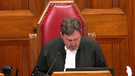
:::

Dans la cause de Sa Majesté la Reine contre Abbas Chik, pour la plan de Sa Majesté la Reine, Maître Simon Lacoste, pour l'intimé Abbas Chik, Alexandre Tardif.

Maître Lacoste.

**Speaker 1** (00:00:44): Monsieur le juge en chef, bonjour madame le juge, messieurs les juges, plaise à la cour.

::: {.column-margin}
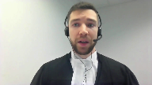
:::

Le présent pourvoix soulève deux questions qui découlent d'un dossier qui concerne le plus gros vol de l'histoire du Québec, sinon du Canada, à savoir le projet Luisanne, sans lien avec la disparition de presque 10 000 barils de sirop d'érable, d'une valeur avoisinant 18 millions de dollars.

La première question relève essentiellement de l'application de la norme d'intervention d'un tribunal d'appel, tandis que la seconde soulève des questions en lien avec le pouvoir discrétionnaire de la poursuivante en matière d'administration de la preuve ainsi que des potentiels inéquités qui pourraient en résulter.

Je vais tout d'abord vous entretenir du premier moyen d'appel qui vous est soumis, à savoir si les juges majoritaires de la Cour d'appel du Québec ont erré dans le cadre de l'application de la norme d'intervention en appel relativement à la question de déterminer si un verdict est déraisonnant.

Plus spécifiquement, la Cour d'appel devait se poser la question suivante.

Est-il raisonnable de conclure qu'un individu prêtrait réellement, personnellement ou via des prêteurs privés 800 000 $ en argent comptant remis dans des sacs d'épicerie à l'occasion de rencontre dans des terminaux d'autobus ou dans des cafés à une personne qu'il connaît à peine, le tout sans contrat de prêt alors que le prêt allégué n'est constaté que sur deux versions manuscrites rudimentaires sans garantie quelconque, et tout ça pour acheter et vendre du sirop d'érable?

Manifestement non.

De sur quoi cette conclusion serait-elle d'autant plus justifiée si ce même individu ayant prêté la somme de 800 000 $ en argent comptant a déclaré faillite à deux reprises dans le passé, a déjà bénéficié de prestations d'aide sociale, qu'il déclare des revenus d'environ 3 000 $ en moyenne depuis quatre ans, qu'il loue un appartement d'une valeur de 200 000 $ et qu'il possède presque 30 000 $ de dettes reliées à des cartes de crédit?

Absolument.

Enfin, cette conclusion serait-elle d'autant plus légitime si l'action en justice pour recouvrir le prêt allégué a été faite sans mise en demeure au prix à l'âme avant l'échéance du terme du disprès, avec un acquérissement total à la demande signé par le débiteur et ce, la journée même du dépôt du recours judiciaire et que le jugement obtenu fut traduit la journée même de son obtention, pourra être par la suite utilisé dans les semaines qui suivirent afin de tenter de récupérer une somme d'argent issu du trafic de sirop d'érable volé dans le Vernon.

Tout à fait.

C'est la conclusion à laquelle en est venue l'honorable juge de première instance, à savoir qu'un prêt de cette nature, dans ses circonstances, est tout simplement irréaliste.

La majorité de la Cour d'appel, quant à eux, ont estimé qu'il s'agissait tout au plus d'une transaction suspecte, voire louche, mais qu'ils ne pouvaient en venir à la conclusion que le prêt était fictif.

Le juge dissident, quant à lui, estimait que la conclusion de la juge de première instance était tout à fait raisonnable et que son analyse de la preuve ne contenait aucune erreur érévisonne.

Dans le présent pourvoi, il s'agit donc de la position de la plante, à savoir que la manœuvre mise en place par l'accusé et son complice ne consistait en soi qu'en un stratagème frauduleux visant à récupérer une somme d'argent destinée à la victime, soit la fédération des producteurs acéricoles du Québec.

À l'instar du juge dissident

, nous vous suggérons que la décision de la juge d'instance est raisonnable et que les juges majectants n'étaient pas justifiés d'intervenir.

La norme d'intervention en appel dans un dossier comportement principalement de la preuve circonstancielle est claire et la majorité de la Cour d'appel du Québec, en l'absence d'erreur de la part de la juge d'instance, devait faire preuve de déférence à son endroit.

**Justice Kasirer** (00:04:52): de la cour d'appel et de la province.

::: {.column-margin}
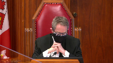
:::

C'est ce qu'on a dit.

On a dit qu'on allait mettre la coste.

Si on peut aller, parce que vous n'avez pas beaucoup de temps, on peut aller tout droit à la thèse des prêteurs privés.

L'analyse que la majorité de la cour d'appel fait de la preuve administrée en première instance, partant du paragraphe 65, en fait, essentiellement 65 à 67 de l'arrêt de la cour.

Et le juge Vauclair souligne que le noyau de la preuve du ministère public se trouve dans les documents déposés, que la thèse elle-même des prêteurs privés s'y rattache.

Et je voudrais avoir vos commentaires précis sur pourquoi ce que cite le juge Vauclair est-ce qu'il s'agit de la thèse des prêteurs privés?

Est-ce qu'il s'agit de ce que cite le juge Vauclair au paragraphe 65 et surtout 66 dans mon cas, c'est le témoignage de l'enquêteur brillant, pourquoi ceci n'ébranlerait pas l'analyse qu'en fait la première juge, tout en respectant la différence dont vous parlez qui est exigée?

Ma question précise est-ce que le juge Vauclair porte sur le témoignage de l'enquêteur brillant qui explique qu'il a obtenu le nom d'un investisseur privé tiré de du témoignage de Monsieur Shake dans le dossier civil et que il a fait une enquête préliminaire sur Internet pour aboutir à la conclusion que c'était un personnage relié au crime organisé qui a subi une mort violente et qui n'a pas poussé l'analyse plus loin.

Ce qui fait dire au juge Vauclair que la thèse du prêteur privé basée sur cette enquête incomplète et je dois dire que l'enquêteuse elle aussi dit qu'elle n'a pas poussé l'enquête très loin, mais la thèse ...

**Overlapping speakers** (00:07:26): Uh...

**Justice Kasirer** (00:07:26): fait écho à l'information figurant dans la déclaration sous serment dont vous parlez.

::: {.column-margin}
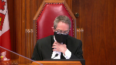
:::

Quelle est la pertinence de ceci puisque la juge, au paragraphe 129, elle dit qu'il n'y avait aucune piste issue des travaux des enquêteurs.

Qu'est-ce que vous avez à dire à cet égard?

**Speaker 1** (00:07:52): En fait, monsieur le juge, il faut remettre en contexte l'affirmation de l'enquêteur brillant étant donné que cette information-là, relativement un potentiel prêteur privé, est survenue bien après la conclusion de l'enquête initiale et que de toute manière, quand cette information est venue aux oreilles de l'enquêteur brillant, cela faisait déjà très longtemps que le dit prêteur privé était décédé de manière violente.

::: {.column-margin}

:::

Il s'agit, en fait, d'un élément de preuve qu'on pourrait qualifier comme étant préconstitué.

Et je vous soumettrai, monsieur le juge, qu'il serait téméraire d'accorder un poids, une valeur probante élevée à ce type d'élément de preuve-là, compte tenu que le ministère public n'a pas pu tester cette allégation-là qui a été mentionnée, notamment, par M. Sheik.

**Justice Kasirer** (00:08:48): Pour qu'on se comprenne, j'ai vu que, justement, il y avait une objection à la preuve que c'était du self-serving evidence.

**Overlapping speakers** (00:08:56): J'ai...

**Justice Kasirer** (00:08:56): le point et la juge a permis que le questionnement se poursuit parce que c'était pour démontrer non pas la vérité de est-ce que M. Valiquette avait prêté de l'argent oui ou non, ce que bien sûr M. Sheik aurait pu témoigner à cet égard-là, mais de la démarche policière qu'on cherchait dans le contraintérogatoire, l'avocat de la défense cherchait à démontrer que la police n'a pas poussé son enquête sur la piste des prêteurs privés à son bout.

::: {.column-margin}
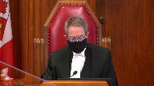
:::

C'est pas du self-serving evidence du point de vue de la démarche entreprise par la police du tout.

**Speaker 1** (00:09:51): En fait, ce serait au niveau de la lacune de l'enquête policière relativement à la thèse des prêteurs privés.

::: {.column-margin}

:::

Eh bien, cet aspect de la preuve, en fait, a été évalué par la juge d'incidence.

Et bien que cela puisse ou pourrait faire écho, notamment à la mention qui est faite par l'intimé M. Sheik, à l'intérieur de son affidavit, quand vous regardez l'ensemble de la preuve, et c'est la raison pour laquelle je vous soumettrais que cet élément de preuve-là, en tant que tel, ne fait pas le poids relativement à la balance de la preuve, notamment la capacité financière de M. Sheik, et plus spécifiquement les circonstances dans lesquelles le prêt allégué aurait été effectué, et le tout jumelé aux circonstances du recours judiciaire, M. le juge.

Donc, bien que des démarches plus poussées n'aient pas été effectuées, on peut également supposer quels types de démarches auraient pu être effectuées, quand cette information-là vient à la connaissance de M. Brion en 2017, alors que M. Valliquette aurait été assassiné en 2012.

Donc, à ce niveau-là, je vous soumets que bien que cela puisse faire écho à la fidavit de l'intimé à l'intérieur du recours judiciaire allégué comme étant frauduleux par M. Sheik, cela ne fait pas le poids relativement à la balance de la preuve.

**Justice Côté** (00:11:14): l'accusé de prêter de l'argent?

::: {.column-margin}
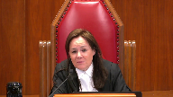
:::

Est-ce que c'est lui qui a prêté l'argent?

**Speaker 1** (00:11:51): Effectivement, en fait, ça pourrait être une hypothèse possible, mais à tout événement, le test que le court d'appel devait déterminer, devait appliquer dans les circonstances, c'est est-ce que les conclusions de la juge d'instance étaient raisonnables et étaient soumis, en fait, étaient soutenus par la preuve qui a été administrée en première instance.

::: {.column-margin}

:::

Et à ce niveau-là, je vous soumets que les reproches qui sont faites à la juge d'instance ne sont pas justifiées dans les circonstances, c'est que sa conclusion était tout à fait raisonnable à l'effet que les potentiels prêteurs privés, bien que ça soit une thèse qui soit possible, sa conclusion à l'effet qu'il n'existe pas était, n'en demeure pas moins, tout à fait raisonnable.

**Justice Côté** (00:12:33): Thank you, Madam Judge.

**Justice Kasirer** (00:12:38): de dire, M. Lacoste, que c'était le témoignage, entre guillemets, mensonger de M. Vallière, qui était le socle de la preuve positive que vous devez apporter quant à la fraude qui est à la base de l'accusation.

::: {.column-margin}
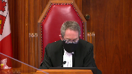
:::

Et est-ce que ça a un impact sur ce qu'on peut en tirer pour pour l'analyse de la juge?

**Speaker 1** (00:13:16): En fait, je vous soumettrai, monsieur le juge, que le témoignage de Vallière, en fait, contrairement à la prétention de la majorité de la Cour d'appel du Québec, que ce n'était pas le noyau de la preuve en tant que telle du ministère public et que le témoignage de Vallière, bien qu'on puisse alléger comme étant central, en fait, à la cause du ministère public, ce n'était pas du tout le cas.

::: {.column-margin}

:::

Et la juge d'instance, la conclusion à laquelle elle en est venue, malgré le fait que la majorité mentionne que c'est principalement en raison du rejet du témoignage de M. Vallière qu'elle a condamné l'intimé M. Sheik, en fait, cette affirmation-là est tout à fait inexacte étant donné que la juge d'instance mentionne de manière très spécifique que, nonobstant le témoignage de M. Vallière, la balance de la preuve était suffisante pour soutenir la déclaration de culpabilité de l'intimé et conséquemment l'inférence à la fait que les prêts n'ont jamais eu lieu.

**Justice Wagner** (00:14:16): Est-ce que c'est la raison pour laquelle mettre la coste l'émission par la couronne dans les circonstances d'avoir recherché les prescriptions de l'article 9 de la loi sur la preuve?

::: {.column-margin}
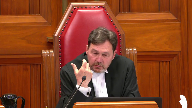
:::

Finalement, selon vous, n'a aucune conséquence puisque l'impact de ne pas avoir accouru à l'article 9 c'est sur l'appréciation de la crédibilité du témoin.

Étant donné que la juge de toute façon se base sur d'autres preuves pour venir à sa conclusion, l'émission par la couronne dans les circonstances d'avoir recherché les prescriptions, l'émission de recourir à l'article 9 n'a aucune impact.

**Speaker 1** (00:14:49): Exactement, monsieur le juge, exactement.

::: {.column-margin}
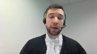
:::

Et en fait, c'est un argument en deux temps, c'est que premièrement, je vous soumets, je soumets à cette cour que le ministère public pouvait agir de la sorte, c'est-à-dire interroger monsieur Vallière sans recourir aux dispositions de l'article 9, soit de contre-interroger monsieur Vallière ou de le faire déclarer hostile ou opposé, et que, nonobstant la réponse à cette question-là, cela n'a pas eu d'impact au niveau du verdict, compte tenu que la juge d'instant rejette de toute manière une bonne partie du témoignage de Vallière au niveau de sa crédibilité ainsi que de sa fiabilité.

Donc, peu importe, en fait, la réponse que vous allez avoir relativement à la deuxième question qui vous est soumise, je vous soumets respectueusement que cela ne devrait pas avoir d'impact au niveau de la première question qui vous est soumise, à savoir sur la raisonnabilité du verdict, précisément à cause que, justement, cela n'a pas eu d'impact capital relativement au motif de la juge d'instant.

**Justice Kasirer** (00:15:54): Laissez-moi juste vous poursuivre dans la même veine, mais là je me trouve non pas sous neuf, je suis toujours sous l'importance de la preuve offerte par M. Vallière.

::: {.column-margin}
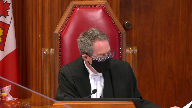
:::

La juge dit, au paragraphe 100, « Vallière n'est tout simplement pas crédible, et ce, particulièrement sur la question de l'existence des prêts.

» À 115, elle dit, après avoir dit que le reste de la preuve permet néanmoins de tirer des inférences, elle dit, cela dit, « Son récit ne suscite pas davantage de doutes raisonnables en faveur de l'accusé, puisque le tribunal n'ajoute pas foi à son assertion selon laquelle l'accusé lui a consenti les fameux prêts.

» Alors, je reviens à ma question, juste pour que je comprenne, parce que le juge Vauclair insiste sur ça.

Il dit, « Qualifier un témoignage de non digne de foi, de mensonger, ne permet pas de fonder la preuve de son contraire.

» Il cite l'affaire Walker à la fin de ses motifs.

Alors, même si la juge en fait abstraction, puisqu'elle ne prête pas foi au témoignage de Vallière, est-ce qu'on ne peut pas dire qu'elle tire en partie, minimalement confort, sinon plus que ça, sa conclusion quant à l'inexistence du prêt de son témoignage mensonger.

**Speaker 1** (00:17:47): Je vous soumettrai que non, monsieur le juge.

::: {.column-margin}

:::

En fait, ce que la juge d'instant, c'est contrairement à ce qui est mentionné notamment dans l'arrêt soubriant, c'est qu'il faut faire des nuances dans les arguments qui sont en fait dans les motifs de la décision de la majorité de la Cour d'appel.

C'est que le fait de rejeter le témoignage de monsieur Vallière, normalement, effectivement, ne constitue pas une preuve pertinente relativement à la culpabilité de l'accusé, à savoir l'intimé à bas chèque.

Sauf que dans les circonstances très précises du dossier qui est présentement sous étude, le mensonge, en fait, de monsieur Vallière, même si ce n'est pas le raisonnement qui a été adopté par la juge d'instance, devenait pertinent relativement à la culpabilité de l'intimé, étant donné qu'il y avait une collusion apparente entre l'intimé et son complice.

Et ça, c'est vraiment la théorie des prêts qui était factice.

Donc, même si la juge d'instance, en fait, n'a pas de tirer de conclusions défavorables relativement à l'intimé par rapport à la collusion entre le complice et l'intimé, elle s'est gardée, contrairement aux propos de la majorité de la Cour d'appel, d'inférer l'inverse de ce que le témoin Vallière est venu dire.

C'est-à-dire, plus précisément, qu'elle n'a pas dit «

je ne crois pas Vallière » et donc « j'ai fait l'inverse de ce que monsieur Vallière est venu dire ».

La juge d'instance a très clairement mentionné qu'elle ne considère pas le témoignage de Vallière et donc, conséquemment, elle ne le prend pas en charge contre l'intimé, monsieur Sheik, bien que la poursuivante vous soumette qu'en l'espèce, considérant notamment la décision d'Angie, elle aurait pu tenir contre l'intimé, monsieur Sheik, le mensonge de son complice allégé, monsieur Vallière.

**Justice Côté** (00:19:50): En fait, M. Lacoste, ce raisonnement-là que vous venez de nous expliquer, je crois y refléter au paragraphe 115 de la décision de première instance, quand la juge dit à tout événement, même en décidant d'écarter complètement le témoignage de Vallière comme non digne de foi, le tribunal croit que le reste de la preuve permet néanmoins de tirer les inférences que propose la poursuiture.

::: {.column-margin}
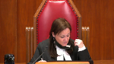
:::

**Speaker 1** (00:20:16): Exactement.

::: {.column-margin}

:::

Et la décision de la juge de première instance, justement, elle le mentionne très clairement et c'est repris notamment par le juge minoritaire de la Cour d'affaires, M. J. Schrager, à l'effet que la juge d'instance est libre d'accepter en totalité ou seulement partiellement le témoignage d'un témoin.

Et ici, ça, c'est la règle qui, je vous dirais, est plutôt générale, la règle plus spécifique quand on se retrouve en présence d'un témoin qui a réagi en collusion avec l'accusé, à savoir l'intimé, M. Schrager, en l'espèce.

Et bien là, dans ce cas-là, même si normalement le mensonge ou en fait le fait de ne pas retenir une portion du témoignage d'un témoin ne devrait pas être incriminant pour l'intimé, en l'espèce, ça pouvait l'être, bien que la juge d'instance n'en a pas pris rigueur dans les circonstances.

Et ultimement, de toute manière, comme vous le mentionnez, Mme la juge, au paragraphe 115, même si on tasse complètement le témoignage de M. Vallière, ça ne devrait pas avoir d'impact au niveau de la culpabilité de l'intimé, compte tenu que le reste de la preuve est suffisante pour justifier la culpabilité de l'intimé, en l'espèce.

Pour ce qui est justement du témoignage de M. Vallière, je vous soumettrais que l'erreur, en fait, de la majorité de la Cour d'appel se traduit de la manière suivante.

Elle est fait précisément qu'au paragraphe 61, la majorité mentionne que la juge déclare l'intimé coupable principalement parce qu'elle ne donne pas suite à l'invitation de la poursuite de ne pas croire ce dernier témoignage.

Comme je vous ai mentionné, il faut nuancer cette affirmation-là parce que la poursuivante en l'espèce n'a jamais demandé à la juge d'instance de croire l'inverse du témoignage du complice Vallière.

On a plutôt invité la juge d'instance à analyser globalement ce témoignage, en fonction notamment de ses lacunes relativement à l'existence du prêt, eu égard à l'ensemble de la preuve produite.

Il convient de corriger également que la poursuivante n'a jamais demandé à la juge d'instance de croire l'inverse du témoignage du complice Vallière.

C'est excessivement important, à un point tel que la juge d'instance, justement comme vous le mentionnez au paragraphe 115, affirme que même si on rejette le témoignage de celui-ci, la preuve est à tout événement suffisante en l'espèce.

Également, je vous soumettrais qu'il convient de rappeler également le pouvoir discrétionnaire de la poursuivante en l'espèce.

Le pouvoir discrétionnaire de la poursuivante est large et le témoignage de M. Vallière était pertinent étant donné qu'il s'agit notamment du complice de l'intimé, mais également l'autre co-contractant au dit préallégé.

Dans les circonstances, il serait difficile, voire impossible, de dire que le témoignage de M. Vallière n'était pas pertinent étant donné que, notamment, c'est ce qui a été mentionné, réitéré par la décision mise en état de la Cour d'appel au paragraphe 44 et 56 de l'arrêt, il y a une série d'éléments factuels qui pouvaient venir incriminer l'accusé, qui ont été mentionnés par M. Vallière, notamment sa connaissance personnelle bien que limitée de l'intimé M. Sheik, tout en parlant de M. Vallière, bien évidemment.

Le contexte et les circonstances dans lesquelles il aurait rencontré l'intimé lors des remises d'argent, les activités qu'il avait dans le domaine acéricole ainsi que son incorporation volontaire au Nouveau-Brunswick dans le but avoué de se soustraire à la décision qui le condamnait à payer une somme d'argent à la Fédération des producteurs acéricoles.

**Justice Kasirer** (00:24:29): vous me permettez de revenir sur la question du juge en chef quant au traitement que le ministère public a réservé à monsieur Vallière lors de son interrogatoire.

**Overlapping speakers** (00:24:44): On...

**Justice Kasirer** (00:24:44): On comprend en lisant la majorité de la cour d'appel que, d'après elle, votre but était essentiellement pour ces questions clés de l'existence des prêts d'utiliser Vallière pour son témoignage mensonger, ce qui était d'après vous le témoignage mensonger.

::: {.column-margin}
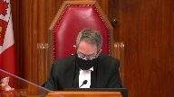
:::

Et quand on lit l'interrogatoire, votre traitement du témoin, les trous de mémoire qu'il avait à répétition, vous lui mettez sous le nez des documents selon le juge Vauclair pour le confronter à une autre réalité.

Son témoignage que la juge elle-même a qualifié d'évasif, de réticent, de ponctué de trous de mémoire fréquents sur les éléments importants.

Est-ce qu'on peut pas dire que vous avez dépassé le rôle habituel de simplement rafraîchir la mémoire du témoin et vous l'avez traité comme un témoin adverse ou hostile, sans pour autant demander à la Cour permission de le faire, de sorte que ça vous permettait de faire la preuve en chef du mensonge qui était essentiel à votre hypothèse de travail?

**Speaker 1** (00:26:14): En fait, monsieur le juge, je ne vous cacherai pas que le témoignage de monsieur Vallière n'a pas été le témoignage le plus facile que j'ai eu l'occasion de faire dans le cadre de ma carrière.

::: {.column-margin}

:::

Ceci étant dit, une fois qu'on a dit ça, est-ce que le témoin Vallière était pour autant hostile, voire adverse, au ministère public?

Je vous soumettrai que non.

Le ministère public, ce qu'il a fait en première instance, c'est justement seulement de rattraîchir la mémoire du témoin Vallière, parce qu'au début particulièrement du témoignage, celui-ci avait énormément de trous de mémoire.

On lui soumettait des documents, notamment pour lui rappeler le numéro de sa compagnie, par exemple, ou des choses comme ça.

Je vous soumettrai que le ministère public ne l'a pas contre-interrogé, monsieur Vallière, et que malgré tout, on a réussi à établir une série d'éléments factuels positifs, et non pas uniquement le mensonge de monsieur Vallière.

Une des choses qui était le plus capitale dans le témoignage de monsieur Vallière, c'était justement son animosité envers la fédération des producteurs à séricoles, son refus de payer la créance qu'il qualifiait comme étant injuste, et son désir manifeste d'empêcher la fédération de mettre la main sur l'argent qui était saisi au Vermont.

Il s'agit essentiellement de ce dernier point-là, qui est le mobile qu'on impute à l'intimé, monsieur Sheik, et ça, ça a été mis en preuve, nonobstant le fait que monsieur Vallière, contre Vance et Marie, et pour des motifs qu'on peut comprendre, s'obstinait et, en fait, justifiait qu'effectivement il y avait eu des prêts.

Mais quand on regarde l'ensemble des circonstances et l'interrogatoire qui a été effectué par le ministère public, on pouvait, j'estime, légalement de soumettre à la juge d'instance de rejeter une portion de son témoignage relativement à l'existence ou non des prêts, tout en prenant pour avéré, notamment, son animosité et le mobile relié au stratagème produit.

**Justice Kasirer** (00:28:26): Mais vous ne pouvez pas, comme le dit le juge Vauclair, contreinterroger le témoin.

::: {.column-margin}
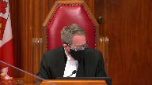
:::

Au-delà de...

Et quand on lit l'interrogatoire, je me permets de dire que c'était un peu rock and roll à un moment, là c'était un peu fort.

Je relève aussi, je ne sais pas si c'était nécessaire de le dire, lors de l'argumentation devant la juge, la Couronne dit, écoutez, cette personne-là, je suis à la page 54 de l'audience du 27 juin, écoutez, cette personne-là, je vais vous inviter à apprécier son témoignage, compte tenu des circonstances.

On s'entend, monsieur est accusé de la même infraction à Trois-Rivières.

Il me semble que ce n'est pas comme ça qu'on va de l'avant sans passer par l'article 9.

Qu'est-ce que vous avez à dire sur l'ensemble de votre traitement du témoin et l'omission de passer par 9?

Est-ce qu'il y a une carte inaccessible?

**Speaker 1** (00:29:35): En fait, ultimement, la pertinence, je vous dirais, est très limitée, compte tenu de la conclusion de la juge, à l'effet que, nonobstant le témoignage de M. Vallière, la preuve était suffisante pour déclarer coupable intime.

::: {.column-margin}

:::

Ceci étant dit, pour ce qui est du traitement qui a été fait du témoignage de M. Vallière, je soumettrais, M. le juge, que le ministère public ne pouvait pas passer via l'article 9, même si au début, je ne vous cacherai pas que j'y ai réfléchi, étant donné que M. était excessivement évasif, mais avec le temps et au fur et à mesure du témoignage, M. Vallière a fini par donner certains détails et a témoigné relativement la trame factuelle qui était pertinente au dossier.

Le ministère public ne pouvait tout simplement pas passer par l'article 9, étant donné qu'on ne possédait pas de déclaration antérieure incompatible pour contre-interroger potentiellement le témoignage.

**Justice Wagner** (00:30:32): Votre temps est maintenant expiré, à moins que vous vouliez conclure.

**Speaker 1** (00:30:38): En fait, je conclurai rapidement en vous soumettant d'accepter les moyens d'appel qui ont été soumis par le ministère public et de rétablir la condamnation de l'intimé.

Merci beaucoup.

Merci à vous aussi, Monsieur le Président, et à tous les députés de l'Assemblée nationale de l'Assemblée nationale de l'Assemblée nationale de l'Assemblée nationale.

**Justice Wagner** (00:30:49): Merci.

Maître Tardif.

**Speaker 2** (00:30:54): Oui,

bonjour monsieur le juge en chef.

**Overlapping speakers** (00:30:56): uh...

**Speaker 2** (00:30:56): Madame la juge, messieurs les juges, bonjour.

::: {.column-margin}
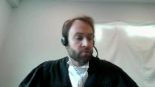
:::

Alors, en fait, à mon sens, mon interprétation du dossier, surtout eu égard à la première question, c'est une question qui est hautement factuelle.

Je pense qu'on peut tous s'entendre pour dire qu'à l'égard du verdict déraisonnable, il n'y a pas de grande question juridique qui se pose dans le présent pourvoi.

En résumé, bref de la preuve, je pense quand même important qu'on parle de la base dans ce dossier-là, il y a plusieurs éléments de preuve qui sont produits par le ministère public, donc par la plan, qui constituent une preuve directe de l'existence du prêt, à savoir le témoignage de monsieur Vallière, la fidavité de l'intimé, monsieur Sheik, ainsi que deux documents attestant une reconnaissance de dette.

À l'inverse, il n'existe aucun élément de preuve directe qui vient établir son inexistence.

On s'appuie sur une preuve circonstancielle.

Évidemment, l'intimé vous soumet que cette preuve-là n'était pas suffisante dans l'espèce, à savoir la capacité ou l'incapacité financière de l'intimé de prêter ces sommes d'argent-là, l'animautité en plus.

**Justice Wagner** (00:32:10): La question suivante, une preuve circonstancielle, quel est le niveau d'implication d'une cour d'appel en semblable circonstance?

::: {.column-margin}
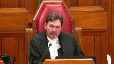
:::

Est-ce qu'on ne doit pas normalement en appel avoir une différence pour le juge d'instance qui a vu et entendu les témoignages lorsque c'est une preuve circonstancielle comme celle-là à défaut d'une erreur de droit formelle?

**Speaker 2** (00:32:31): En fait, oui, je pense que même là aussi, à ce niveau-là, je pense que oui, le tribunal d'appel doit faire preuve de déférence.

::: {.column-margin}
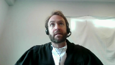
:::

Cependant, ici, je vous soumets, probablement aussi, ce qu'il ne faut pas oublier dans ce cas-ci, c'est qu'on a le témoignage de Vallière, qui n'est pas cru, et je ne pense pas non plus que ça fasse l'objet nécessairement d'un débat.

Je parle par la juge, je ne sais pas sur cet aspect-là que les juges majoritaires de la Cour d'appel sont nécessairement intervenus. En fait

, la juge de la Cour d'appel...

**Justice Wagner** (00:33:04): Si vous me permettez, je m'excuse de vous interrompre, le juge Vautelaire, dans son premier paragraphe, deuxième paragraphe, il dit, il dit, c'est parce que la couronne a demandé à la juge de ne pas croire le témoignage que, puis là, il a encensé une...

**Overlapping speakers** (00:33:15): Oui.

**Justice Wagner** (00:33:15): à quel endroit c'est, dans le premier jugement, j'ai pas eu ça nulle part.

**Speaker 2** (00:33:21): Excusez, j'ai peut-être mal saisi votre question.

Qu'est-ce que vous voulez savoir où se trouve exactement dans le premier jugement?

**Justice Wagner** (00:33:28): La demande du ministère public de ne pas croire le témoignage de M. Vallière.

**Speaker 2** (00:33:34): En fait, ce que je voulais dire par là, c'était des parties du témoignage de M. Vallière.

::: {.column-margin}

:::

Je pense qu'il est évident que le ministère public a invité, notamment, je pense qu'on fait référence que le ministère public, en fait, a eu égard à son plan de plaidoirie.

Je pense que c'est une référence, j'aurais le goût de vous dire 75 dans le jugement.

Excusez, je ne suis pas au bon jugement.

On fait référence, on est au paragraphe 115 où on parle du plan d'argumentation de la poursuite à ce niveau-là.

Je vous soumets que le ministère public a nécessairement, évidemment, puisqu'elle alléguait l'inexistence du prêt, elle a invité, évidemment, le tribunal à ne pas croire M. Vallière sur ces éléments de preuve-là.

Je ne sais pas si je réponds à votre question.

**Overlapping speakers** (00:34:32): En fait, je ne le vois pas dans le jugement, mais vous ne me référentez pas à le faire.

**Speaker 2** (00:34:35): Non, mais ce que je veux dire, c'est que ça devrait davantage être au niveau des plaidoiries, mais je vous faisais référence au plan d'argumentation de la poursuite à ce niveau-là.

::: {.column-margin}
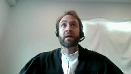
:::

Ok, j'ai votre réponse.

Maintenant, en fait, donc, je parlais de l'incapacité financière de Monsieur, de l'animosité entre le témoin valiaire et la fédération, et ça, ici aussi, c'est un élément qui est particulier parce que ce que le ministère a mis en preuve de façon extensive, je vous dirais, dans le dossier, c'est le mobile

pour, non pas l'accusé, mais pour Monsieur Valiaire de commettre le crime, et ça, je pense que ça s'est reflété aussi dans le jugement de la majorité de la Cour d'appel où on dit on a parfois l'impression que l'accusé est absent de ce procès-là, c'est le procès de Monsieur Valiaire, je suis toujours dans la preuve circonstancielle, et finalement, les circonstances qui entourent le prêt ainsi que le recours, c'étaient les éléments sur lesquels s'appuyait le ministère public pour venir conclure à l'inexistence du prêt.

Maintenant, je vous dirais, et c'est évidemment la position de l'intimé ici qui est tout à fait alignée à la position de la majorité de la Cour d'appel, à savoir que ces éléments de preuve-là n'étaient pas suffisants pour conclure au caractère hors de tout doute raisonnable du caractère… Alors, vous avez…

**Justice Wagner** (00:35:59): Vous avez oublié deux éléments assez importants aussi dans l'appréciation de cette preuve-là.

::: {.column-margin}
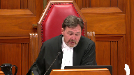
:::

C'est l'absence de mise en demeure à l'intimé pour le paiement des prêts et un acquiescement immédiat à jugement sur la présentation de la procédure, quand même assez rare.

Vous ne pensez pas que ça permettait à un juge raisonnable de devenir à la conclusion que c'est un élément qui, normalement, amène à conclure qu'il y a complicité ou complaisance?

**Speaker 2** (00:36:28): En fait, je vous disais que je les ai incluées dans les circonstances entourant le recours qui était justement l'absence de mise en demeure ainsi que l'accueillissement à jugement.

::: {.column-margin}
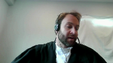
:::

C'est à ça que je faisais référence quand je parlais des circonstances entourant le recours.

Je vous dirais, en fait, par rapport à ça, premièrement, je pense qu'il est clair que, en droit civil, surtout lorsqu'on est en lien avec des actions sur compte qu'on pourrait appeler, il n'y a pas une obligation, contrairement dans d'autres domaines du droit, par exemple au niveau des vis cachées et tout ça, de mettre en demeure.

Ça, c'était numéro un.

Et numéro deux, il y a, en fait, je vous dirais de deux façons.

Premièrement, évidemment, quelqu'un qui reconnaît devoir de l'argent peut acquiescer à jugement.

Et dans un deuxième temps, je pense aussi qu'il ne fait pas de doute là-dessus que, et on n'est pas en matière de faillite ou quoi que ce soit, qu'il est vrai que par cette action-là, M. Vallière a tenté de favoriser un créancier au détriment d'un autre, à savoir la Fédération.

Mais je ne pense pas qu'on pouvait tirer des inférences qui allaient plus loin que ça au niveau de ces éléments de preuve-là. M. Tandis

, c'est un peu le...

**Justice Côté** (00:37:43): Je suis curieux quand même, je poursuis dans la même veine que M. le juge en chef.

::: {.column-margin}
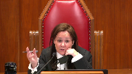
:::

Vous avez le même avocat qui prépare la requête introductive d'instance.

Vous parlez d'une action sur compte, oui.

Mais ici, il y a un débat dans la preuve.

Est-ce qu'il y avait un terme d'un an ou deux ans sur ce prêt-là?

Mais peu importe, la requête introductive d'instance a même été signifiée avant l'expiration, même du délai d'un an qui était soi-disant un des termes.

Le même avocat prépare l'acquiescement en jugement, c'est signé la même journée et c'est une action sur compte pour un montant important, ce n'est pas une action sur compte pour 1000 $.

Est-ce que la première juge était déraisonnable en accordant le poids qu'elle a accordé à cela?

J'ai de la difficulté à voir qu'elle a été déraisonnable.

**Speaker 2** (00:38:28): Je vous soumettrai par rapport à ça, Mme la juge, que tout ce que ça démontre clairement, c'est l'intention de M. Vallière de préférer un créancier au détriment d'un autre qui a clairement une animosité.

::: {.column-margin}
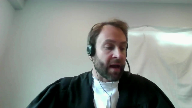
:::

Je comprends évidemment qu'on n'est pas dans la situation habituelle, mais en regard de la preuve qui était administrée dans le présent dossier, je ne pense pas que ça permettait de conclure que l'inexistence du prêt constituait la seule conclusion raisonnable dans les circonstances.

Je vais te mettre le temps.

**Justice Kasirer** (00:39:18): La plante propose que la majorité de la Cour d'appel n'a pas respecté la norme d'intervention en matière de verdicts irrésonnables, qu'elle a indûment émissé dans la preuve circonstancielle et qu'elle a conclu à tort à la place de la juge quant aux inférences attirées de la preuve.

::: {.column-margin}
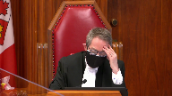
:::

Qu'est-ce que vous avez à dire sur cette question-là?

Parce qu'on peut débattre le poids de la preuve.

Est-ce que la force probante de la mention à la fille d'Avide fait le poids contre le reste?

Mais ça, on s'entend, c'est normalement le domaine de la première juge.

Qu'est-ce que vous avez à dire à cet argument de vos collègues qui disent que les juges majoritaires n'ont pas respecté la norme d'intervention ici?

**Speaker 2** (00:40:22): Oui, en fait, évidemment parce que je pense que l'argumentation centrale des juges majoritaires est au niveau du rejet, je vous dirais, de façon très sommaire de la preuve de tiers prêteurs, donc de prêteurs privés.

::: {.column-margin}
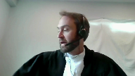
:::

Et je pense que leur argumentation à ce niveau-là démontre, malgré tout, qu'ils connaissent la norme de contrôle à respecter, mais qu'ils en concluent qu'ils peuvent intervenir dans les circonstances, puisqu'il n'était pas, je vous dirais, raisonnable pour la juge d'instance d'exclure totalement la preuve au niveau de l'affidavit qui avait été faite par M. Sheik, qui était une preuve qui, au final, n'était pas en soi contredit.

Et quand on regarde certaines des erreurs de la juge, lorsqu'elle mentionne notamment qu'en fait, premièrement, elle tient rigueur à l'accusé, mais à l'intimé, de ne pas identifier dans ce document-là l'identité des prêteurs privés.

Je vous dirais qu'ici, déjà, c'est d'imposer une obligation qui n'existe nullement, parce que ce qu'il faut se rappeler, c'est que cette affidavit-là, cette déclaration solennelle-là avait été faite dans le cadre d'un recours en opposition.

Donc, je vous dirais que dans ce cas-ci, l'identification des prêteurs n'avait aucune pertinence.

Également, l'ajout manuscrit, ce n'est pas comme si on avait ajouté quelque chose, encore que je vous dirais que ça n'aurait peut-être pas eu une incidence majeure, mais ici, clairement, la déclaration solennelle, la fidavit laissait un espace où en fait le rédacteur n'avait pas cette information-là, c'est «from», et là, il y a un espace pour indiquer finalement d'où provenait l'argent, et non pas une situation où on avait ajouté, biffé ou quoi que ce soit.

Ce sont des éléments qui amènent la juge à rejeter cette déclaration-là, et je vous dirais également lorsqu'elle mentionne que, je ne m'appelle plus du terme exact, lorsqu'elle fait référence au fait qu'il n'y a aucun élément de preuve, mais si on fait référence au paragraphe 65 et 66 du jugement de la majorité, lorsqu'elle fait référence au fait qu'il n'y a aucun élément de preuve qui pourrait aiguiller le tribunal sur la provenance des fonds, je vous dirais que là, c'est une erreur puisque quand on lit le témoignage de M. Luc Briand, on peut distinguer, je pense, à la page 44 et 45 des notes cinégraphiques à cet niveau-là dans mon onglet 2, si je ne m'abuse du mémoire condensé, on voit qu'il y avait quand même, le ministère public avait des informations en lien avec cet individu-là, et on n'a pas poussé l'enquête, et quand j'entends plutôt mon confrère dire que l'enquête était terminée, je pense que les tribunaux sont en même de savoir qu'une enquête n'est pas terminée, s'il y a des informations nouvelles, on doit s'ajuster, on doit s'adapter, on doit faire le nécessaire.

Au niveau de la lacune de l'enquête, je pense que c'est aussi un des éléments sur lesquels le tribunal d'appel a conclu que la juge n'avait pas analysé ces éléments-là, donc c'était une absence de l'analyse d'un élément de preuve qui était hautement pertinente dans l'analyse du caractère vraisemblable de la thèse des prêteurs privés.

C'était au paragraphe 129 du juge d'instance que je cherchais le passage, mais c'était au paragraphe 129.

Je vous soumettrais que le sentiment qu'on peut avoir, c'est celui que la majorité exprime également dans son jugement, et je pense que la majorité était fondée de conclure de la sorte, c'est-à-dire que la juge cherche plutôt des motifs de ne pas croire à l'existence du prêt par rapport à ça, notamment quand on fait référence aux deux reconnaissances de dette, une qui a été utilisée dans le cadre d'un recours, mais une autre qui n'a pas été utilisée dans le cadre d'un recours qui était en fait présent chez l'accusé.

Tout ce qu'on vient faire par rapport à ça, c'est qu'on vient se questionner.

En fait, on vient établir qu'il y a des distinctions entre les deux au niveau du terme, au niveau des débiteurs.

Dans un cas, c'est uniquement M. Vallière, et dans l'autre cas, c'est à la fois l'entreprise et M. Vallière.

Dans le contexte, on vient mettre en doute la validité ou la véracité, mais on ne se questionne pas non plus sur pourquoi cet individu-là avait une autre traite, une autre reconnaissance de dette.

Je vous dirais pourquoi il y avait ça si ce n'est pas parce que ça avait été uniquement pour falsifier.

Pourquoi aurait-il eu besoin d'en avoir une autre copie?

Ce sont des éléments qui ont été complètement occultés de la part de la juge.

C'est notamment pour ça, à mon sens, que le tribunal d'appel décide d'intervenir.

**Overlapping speakers** (00:46:18): Uh...

**Speaker 2** (00:46:18): Je me permettrai aussi de peut-être juste parler très rapidement de l'incapacité financière allégée de M. Sheik de prêter ces sommes d'argent-là.

::: {.column-margin}
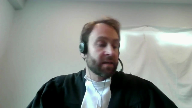
:::

Je vous soumettrai juste par rapport à ça, en fait, à l'onglet 1 du mémoire condensé de la partie intimée, à la page 225, lors du témoignage de la policière Isabelle Barlow.

En fait, et je pense qu'on peut tous en déduire, elle-même, en fait, le témoigne qu'elle ne sait pas, compte tenu des revenus familiers, quand on parle de 2 000 ou 3 000 $, elle n'était pas prestataire d'aide sociale.

Et dans le contexte, il y a quand même, on présente, un éduc qui a un train de vie, je vous dirais, régulier.

Et dans ce contexte-là, je vous dirais, ce n'est pas de la pure spéculation de conclure que M. a accès à des fonds qui sont, en fait, que son profil économique n'est pas complet.

Je vous dirais même qu'à cet effet-là, quand je vous dis que ce n'est pas de la pure spéculation, à mon sens, si on se retrouvait dans une situation inverse, où un individu qui aurait un profil économique semblable à l'intimé, qui aurait été arrêté, par exemple, dans un dossier stupéfiant, la poursuite aurait probablement tenté de demander au tribunal d'inférer de son train de vie l'absence de revenus ou des revenus négligeables.

Je vous dirais ici que même ça, à ce niveau-là, ce rejet-là systématique n'était pas justifié dans les circonstances.

Mais comme je vous dis, ça, c'est évidemment une petite parenthèse parce que le tribunal d'appel n'en faisait pas mention, donc ce n'est pas ce qui a guidé leur décision.

Maintenant, ce qui m'amène à vous dire que par rapport à ça, je pense que la majorité de la Cour d'appel était tout à fait justifiée d'utiliser, malgré la différence qu'ils doivent démontrer, lui-égard à l'interprétation des faits de la juge d'instance, était justifiée d'intervenir parce que dans les circonstances, il n'y a rien qui permettait à la juge d'instance de réellement exclure la thèse des prêteurs privés dans le présent dossier.

Ce qui m'amène à traiter du deuxième aspect, c'est à dire le témoignage de M. Vallière.

Je pense que c'est le juge Casira qui a mentionné qu'on fait la lecture de ce témoignage-là.

Le déroulement du témoignage est pour le moins particulier,

à savoir évidemment la façon que ce témoignage-là se déroule.

La partie à plante, à ce niveau-là, aussi adopte la position de la dissidence et je vous soumets que cette position-là est problématique, la distance de la Cour d'appel, parce que quand on se réfère au paragraphe 39 de la dissidence de la Cour d'appel, on fait référence que l'inférence de l'inexistence du prêt peut être déduite en partie du témoignage juge et faux d'un témoin Vallière qui affirmait l'existence du prêt.

C'est un peu toute la discussion que vous avez eue avec mon confrère précédemment.

Je vous soumets que cette position-là de la dissidence, je cherche le bon terme, ne représente pas l'état du droit et est très dangereuse.

Ça peut apporter, je vous dirais, créer des injustices à ce niveau-là, parce qu'évidemment, oui, on parle de collusion, mais cette collusion-là, je vous dirais, demeure quand même centrée, je vous dirais, sur l'animosité de M. Vallière à l'égard de la fédération.

Je sais que vous n'allez me répondre pas également à les circonstances du recours, ce qui est un élément qui peut être considéré, mais je vous dirais qu'à mon sens, ne permettait pas de tirer des inférences négatives du témoignage de M. Vallière.

Pourquoi, quand je vous dis que ça prête à une certaine dangerosité, si on commence évidemment à permettre ces inférences négatives-là, bien évidemment, c'est que dans certaines situations, ça pourrait amener la poursuite à venir témoigner un ami, un voisin, un membre de la famille qui est fortement criminelisé, qui a été témoin d'une situation, pour ensuite inviter le tribunal à conclure exactement l'inverse de cette situation-là.

Donc, de vouloir faire d'une preuve, je vous dirais, une absence de preuve, de créer une preuve positive de l'inverse de ce qui a été raconté, et je vous soumets que ça n'a absolument aucun sens et que dans le présent cas, c'est un résultat similaire auquel la poursuite tentait d'en arriver.

Par rapport à ça, je ne nie pas, évidemment, le droit ou le pouvoir discrétionnaire de la poursuite de gérer sa preuve dans les limites de ce qui est, je vous dirais, juridiquement acceptable.

Évidemment, sa preuve de faire entendre, évidemment, mon confrère citait la Rêche d'Olivet, de faire entendre les témoins qui souhaitent faire entendre.

Cependant, je pense qu'ici, il y a un élément supplémentaire, c'est qu'on a le droit aussi, évidemment, à une partie, notamment même le ministère public, évidemment, on a le droit d'inviter un jury ou le juge à croire une partie comme étant véridique d'un témoignage et une autre partie comme étant, finalement, soit fausse, soit, j'allais dire, inaccurate, qui n'est pas précis, qui n'est pas fiable ou quoi que ce soit, mais je vous dirais que dans les circonstances en l'espèce, on a franchi, on a franchi cette ligne-là et c'est ça qui fait en sorte que tout le reste est devenu, que ce dossier-là a été teinté et que ce préjudice-là est devenu, je vous le soumets, irréparable.

Parce que, bon, évidemment, il y avait le déroulement, comme le note la majorité au paragraphe 75 de leur décision, le déroulement de l'interrogatoire qui était hautement préjudiciable, à mon sens, mais, et mon confrère cite, je pense que c'est au paragraphe 32 de son mémoire, cite la décision biniariste de la Cour d'appel de la Colombie-Britannique, où, en fait, on vient dire qu'on a pu administrer une preuve générale de mauvaise réputation à l'égard d'un témoin.

Et je vous dirais qu'en l'occurrence, c'est un peu ce que le ministère public a fait à l'égard de M. Vallière, à savoir qu'on regarde l'ensemble de la preuve qui a été déposée concernant cet individu dans le cadre du procès de M. Shea, qu'on regarde le témoignage de M. Briand qui s'étend en long et en large sur l'enquête, l'uisance auquel M. Shea n'était nullement parti.

Et, en fait, évidemment, tout ça avec quoi?

Avec un but de prouver le mobile, oui, mais le mobile pour M. Vallière, ce qui, en fait, ce qu'on essayait de faire, donc, et ensuite de dire parce que M. Shea est lié à M. Vallière, donc il a participé à la fraude.

Je vous dirais que ça, c'est quelque chose qui est très dangereux et que j'ai l'impression qu'il est venu teinter, et c'est pas là, je ne suis pas sûr d'avoir l'impression, c'était l'impression de la majorité de la Cour d'appel, est venu teinter de façon irrémédiablement négative le procès de première instance.

M. Terdi, M. Terdi.

**Justice Kasirer** (00:54:21): de vous couper

::: {.column-margin}
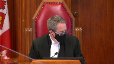
:::

. J'aurais aimé avoir votre opinion.

Le juge dissident cite l'arrêt Benji de la Cour d'appel de la Colombie-Britannique au sujet de la preuve de propension.

Il reconnaît que l'interdiction générale d'une preuve de proportion ou d'attaquer la crédibilité de son propre témoin n'entraîne pas nécessairement l'obligation pour une partie de cautionner tout ce qui est relaté par ce témoin-là.

Je suis au paragraphe 53 et à 54, il enchaîne en disant que ce même arrêt, qui est comparable factuellement au nôtre, un complice de l'accusé avait été appelé à témoigner par la couronne afin de relier l'accusé à la victime.

Sa version des faits contredisait la théorie de la poursuite.

Qu'est-ce que vous faites?

Le juge Vauclair ne cite pas Benji.

Est-ce que vous y voyez une pertinence ici?

**Speaker 2** (00:55:35): Je ne veux pas induire la présente cour en erreur si mon interprétation est erronée, mais c'est ce sur quoi je me dirigeais.

::: {.column-margin}
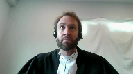
:::

Oui, une partie pourrait assigner un complice, un complice allégué à venir témoigner pour faire ressortir des éléments de preuve, mais je vous dirais que pour ça, et c'est ce qui manque ici dans le dossier, c'est que nous n'avons aucun autre témoin, et quand je parle de témoin, je devrais plutôt dire de preuve, aucun élément de preuve qui vienne contredire ce qui a été apporté par le témoin valiaire ici.

Parce que ce qu'on a, c'est en fait, comme je vous disais, on a valiaire qui vient dire il y a un prêt.

Finalement, je vais résumer en trois mots l'essence du plus, évidemment tout le reste au niveau de son animosité, mais au niveau de la question en litige, il vient dire il y a l'existence d'un prêt, et on n'a pas aucun élément de preuve qui est présenté par le ministère public qui vient à l'encontre de ça.

Oui, on parle de contexte, de circonstance et tout ça, mais comme je vous dis, l'incapacité financière m'apparaît hautement impertinente, puisque ce qui est allégué, c'est la thèse des prêteurs privés qui est, je vous dirais, alléguée à l'intérieur même de la preuve du ministère public.

Donc, la différence ici, à mon sens, elle est là, à savoir que du côté du ministère public, on n'a pas administré des éléments de preuve qui venaient contredire.

Par exemple, si vous avez évidemment un témoin qui est en mesure d'identifier, par exemple, dans un dossier de conduite dangereuse, qui est en mesure d'identifier l'accusé, mais qui dit il roulait à 50 km<|fr|><|transcribe|> et qu'on a six autres témoins qui viennent dire il roulait à 160 km, mais on n'a pas vu qu'il conduisait.

Moi, je vous soumets évidemment qu'à l'égard du premier témoin, le ministère public peut aisément inviter le témoin à venir dire qu'il est son ami, par exemple, que ce soit, retenez la preuve de l'identification, mais ne retenez pas les autres éléments de preuve de son témoignage, retenez plutôt le reste de la preuve que j'ai administrée.

Et c'est là où je vous dirais qu'il y a une différence entre notre dossier et les autres dossiers qui ont été cités par mon conférence.

La preuve que je qualifie de positive, donc des éléments positifs qui viennent nier les allégations d'un témoin n'existe pas dans le présent dossier.

Et en fait, Monsieur le juge, je vous dirais que c'était la raison en fait pourquoi j'invitais le tribunal à conclure que ici, ce qui avait été fait par la plante, donc par la poursuite dans le présent dossier, ça avait dépassé évidemment ce qui était réellement autorisé.

On ne pouvait pas simplement, parce qu'en fait, en invitant à croire l'inverse de ce que son témoin, le seul témoin qui est venu déposer sur l'existence ou l'inexistence du prêt, je vous soumets qu'on a franchi ce qui était permis, en dehors évidemment de ce qui aurait pu être fait via neuf de la loi sur la preuve et dans le contexte.

C'est la raison pour laquelle cette conduite-là a entraîné une inéquité qui est bien expliquée par la Cour d'appel et qui se devait d'être sanctionnée.

C'est la raison pour laquelle je vous soumets que les juges majoritaires de la Cour d'appel étaient bien dirigés en droit lorsqu'ils ont conclu qu'ils devaient intervenir, accueillir l'appel et acquitter M. Chaguer.

**Justice Kasirer** (00:59:58): possibilité de je réfléchis tout haut ici maître tardif si on devait se rallier à votre point que l'interrogatoire de monsieur valière n'a pas été mené dans les règles des règles de l'article 9 notamment mais que on est et je le je parle c'est une hypothèse

::: {.column-margin}
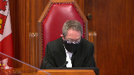
:::

on ne se rallie pas à votre à votre hypothèse sur le premier point du verdict des raisonnables qu'elle est le sort du dossier dans ce cas là

**Speaker 2** (01:00:34): En toute transparence, à la Cour d'appel, on avait adopté la position que dans l'éventualité où on concluait au verdict déraisonnable, donc au premier motif d'appel, on demandait évidemment l'acquittement.

::: {.column-margin}
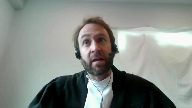
:::

Et si ce motif-là était rejeté et qu'on concluait seulement à l'iniquité procédurale, on demandait l'ordonnance d'un nouveau procès.

Donc, je présume que ça répond à votre question à ce niveau-là. Merci.

**Justice Wagner** (01:01:00): Merci, maître.

Réplique, maître Lacoste.

**Speaker 1** (01:01:07): Oui, avec votre permission

::: {.column-margin}
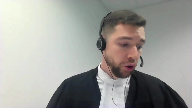
:::

, monsieur le juge.

En fait, je vais être relativement bref au niveau de la réplique, à moins que vous ayez des questions pour moi.

Je vais me permettre d'insister au niveau, et c'est vous qui l'avez mentionné tantôt, les circonstances du recours.

Et Madame le juge Côté a également mentionné d'autres éléments, mais il faut insister sur le fait que ce recours-là est à toute fin pratique irréaliste et fantaisiste.

C'est-à-dire, vous avez mentionné l'absence de mise en demeure, l'acquiescement quasi immédiat à la demande de l'intimé, monsieur Sheik.

Madame le juge Côté a mentionné le fait que le terme du prêt n'était pas échu, et également, moi je vais vous mentionner, en fait, qu'il n'y a pas de contrat de prêt formel.

Bien que tous ces éléments-là pris indépendamment les uns des autres, n'ont pas nécessairement, je vous dirais, ne font pas le poids pour déterminer qu'effectivement il y a eu absence de prêt.

Quand on conjugue ces éléments-là à l'ensemble de la preuve, et bien là, on se retrouve, et c'est le fait d'une preuve essentiellement circonstancielle, à conclure que, ultimement, il n'y a pas eu de prêt.

Et on parle depuis le début du fameux prêt de 800 000 $, je vais inviter la Cour, en fait, à consulter les fameux documents qui éteillent la prétention de l'intimé à l'effet qu'il y a eu un prêt.

Ils sont à la page, entre autres, 114 du recueil condensé de la plante.

On parle d'un document qui est à toute fin pratique rédigé sur une feuille 8,5 par 11.

On a utilisé l'expression en première instance d'un prêt qui a été rédigé sur le coin d'une table, qui a été rédigé à toute fin pratique sur du papier brouillon.

Moi, je vous soumets que, juste à la vue de ce document-là, et on peut aller également à l'onglet 9, à l'onglet 8, excusez-moi, à la page 9 de l'onglet 8, le fameux prêt d'argent.

Encore une fois, on se retrouve devant un document qui est pour le moins rudimentaire et qui fait état d'un prêt qui est somme toute significatif.

On parle d'un prêt de 800 000 $ qui est constaté, encore une fois, écrit manuscrit, avec seulement celui qui reçoit les prêts.

On ne sait pas qui a fait les prêts.

Il y a plusieurs problématiques au niveau de la rédaction de ces documents-là.

Je vous soumets seulement à la vue de ces deux documents-là, parce que c'est de ça qu'on parle depuis le début de ce dossier-là, un prêt de 800 000 $ qui est constaté sur deux feuilles de papier brouillon, rédigé à la main seulement par M. Vallière, dans des circonstances qui sont pour le moins hautement suspectes, et quand on le conjugue à la balance de la preuve, je vous soumets que la conclusion de la juge était tout à fait raisonnable dans les circonstances de conclure qu'un prêt de cette envergure-là ne peut tout simplement pas, conformément à la logique humaine et au bon sens, être constaté de cette manière-là.

Respectueusement, je vous soumets.

**Justice Wagner** (01:04:16): Merci, maître.

::: {.column-margin}
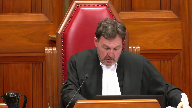
:::

Je demanderai aux avocats de rester à la disposition.

La Côte de Côte-de-France.

La Côte de Côte-de-France. Merci.

Alors, je vous ai remercié au nom de mes collègues les avocats pour leurs arguments.

La Cour est maintenant prête à rendre sa décision.

Le ministère public se pourvoit de plein droit contre un arrêt de la Cour d'appel du Québec dont la majorité des juges a acquitté l'intimé des accusations de fraude qui pèsent contre lui.

Le ministère public soutient que la Cour d'appel a erré en concluant que le verdict de culpabilité était déraisonnable et que le procès était inéquitable, notamment en raison de l'omission par le ministère public de recourir à l'article 9 de la Loi sur la preuve lors du témoignage du témoin Valière et en raison d'une évaluation perfectible de la preuve circonstancielle.

Essentiellement pour les motifs du juge Schrager, la majorité des juges de cette Cour n'est pas convaincue que l'omission du ministère public de recourir à l'article 9 de la Loi sur la preuve a rendu le procès inéquitable.

Et comme le juge Schrager, nous sommes d'avis que le verdict n'est pas déraisonnable.

Pour sa part, le juge Cassirer, essentiellement pour les motifs de la majorité de la Cour d'appel, aurait rejeté le pourvoi.

Pour ce motif, l'appel est accueilli et le verdict de culpabilité est rétabli. Merci.

C'est parti pour aujourd'hui.