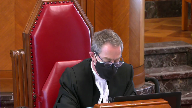

---
title: Her Majesty the Queen v. Loblaw Financial Holdings Inc.
published-title: Heard
date: 2021-05-13
sidebar: false
---

This transcript was made with automated artificial intelligence models and its accuracy has not been verified. Review the original webcast [here](https://scc-csc.ca/case-dossier/info/webcast-webdiffusion-eng.aspx?cas=['39220']).
---

**Justice Wagner** (00:00:02): The coup, the court.

::: {.column-margin}

:::

Good morning, be seated.

In the case of Her Majesty the Queen against Lobla Financial Holdings Inc., for the appellant, Her Majesty the Queen, Eric A. Noble, Elizabeth Chasson, for the intervener, Attorney General of Ontario, Baba Forsun, Forsun, I'm sorry, for the respondents, Lobla Financial Holdings Inc., Al Meji, and Puja Mihaljevic, for the intervener, Canadian Bankers Association, Matthew G. Williams.

Mr. Noble, I can't hear you.

No, we cannot hear you.

I'm sorry.

**Speaker 1** (00:01:41): Sure, so

**Justice Brown** (00:01:45): That's how it'll be.

**Justice Wagner** (00:01:46): Yeah.

Oh, I can hear something.

**Speaker 1** (00:01:55): Just having...

**Overlapping speakers** (00:01:56): Yeah, it's okay.

Now we hear you.

**Speaker 1** (00:01:58): Okay, I'm sorry, Chief Justice.

::: {.column-margin}

:::

If everyone can hear me now? Yes.

Okay, thank you.

To prevent the erosion of our tax base attributable to the holding by Canadians of investments offshore and low tax jurisdictions, Parliament enacted the Foreign Accrual Property Income, or FAPI, rules in the Income Tax Act.

The FAPI rules tax Canadian resident taxpayers.

I'm sorry, sir.

**Justice Wagner** (00:02:26): Sorry, is it possible to speak louder or put your volume up a little bit, because...

**Speaker 1** (00:02:34): I'll try to do so. Okay.

::: {.column-margin}

:::

The FAPI rules tax Canadian resident taxpayers on the income of their controlled foreign affiliates.

These rules have an anti-avoidance purpose.

The crux of this case is the determination of what was the controlled foreign affiliate, Glen Huron's business and with whom was that business principally conducted.

Glen Huron was a financial institution whose business was to make money from money.

Over the course of a decade, Glen Huron continuously acquired funds from the Loblaw Group and used those funds to invest in short-term investments, derivatives and intercompany lending.

This case is not about whether expenses are current or capital in nature or what the correct test is for computing profit.

The case centers on the interpretation of a narrow exception within the FAPI regime.

The Federal Court of Appeal, with respect, failed to properly interpret the FAPI provisions and favored an interpretation that excluded from its consideration an essential part of Glen Huron's business, its acquisition of funding, in a manner not supported by the text, context or purpose of the legislation.

The result, as the Federal Court of Appeal itself acknowledged in its reasons, is inconsistent with the intent of the FAPI regime.

By contrast, the Tax Court of Canada properly considered the text, context and purpose of the provisions by considering all aspects of Glen Huron's business to arrive at its factual conclusion that Glen Huron's business was principally conducted with non-arms length persons.

The Federal Court of Appeal, I submit, arrived at the outcome that it did as a result of two major errors in its reasoning.

Firstly, the case law on which it relied, Canadian Pioneer, Montreal Coke and Bennett and White, were with respect not relevant to the issue before it.

Secondly, the Court of Appeal's analysis was based on an inconsistent view of what Glen Huron's business was.

Glen Huron's funding was taken into account for one purpose, but then ignored completely for another purpose in applying the statute.

The proper outcome after correcting for the Court of Appeal's errors, I submit, is to reinstate the decision of the trial judge.

The trial judge found that Glen Huron's activity amounted to the managing of an investment portfolio for its parent group.

These are precisely the sort of circumstances in which the FAPI rules were intended to apply.

So, onto the first major error.

The Federal Court of Appeal relied on, I submit, irrelevant case law to conclude that the business conducted by Glen Huron did not encompass funding received from its parent group.

The trial judge made a finding that Glen Huron's business consisted of receipts of funds and uses of those funds.

He appropriately took both the acquisition of funding and uses of that funding into consideration in applying the arms length requirement or arms length test.

The Federal Court of Appeal excluded Glen Huron's acquisition of funding in reliance on this court's decision in Canadian Pioneer and on Montreal Cope and Bennett and White.

Canadian Pioneer deals with a very different issue and I submit has no relevance to a determination under the FAPI rules.

It was not relied on by either party at trial or in the Federal Court of Appeal.

The question before the Court of Appeal was not what is a bank or banking business under Canadian law, but rather what was Glen Huron's business and was that business conducted principally with non-arms length persons.

**Justice Karakatsanis** (00:06:24): Mr. Noble, your position rests on the fact that the Federal Court of Appeal did not consider the capitalization, the funds received, the equity, rather than focusing on what it is to carry on business.

::: {.column-margin}

:::

The law's always distinguished between capitalization and business as two different concepts.

I want to ask you about what do we make of CRA's guidance to taxpayers in 1995 and again I think in 2000 that, and I'm quoting here, the fact that a foreign affiliate receives funding to carry on its income earning activity by way of debt or equity from a related party would have little if any relevance to the arm's length test.

Does that not tell us something about how those terms were understood?

**Speaker 1** (00:07:28): I believe the letter to which you refer was from Justice to a letter from 1995 and the comments in that letter were not necessarily pertaining to financial businesses or to a banking business.

::: {.column-margin}

:::

It was not a letter for general consumption, it was an administrative response to a specific taxpayer's request.

And the letter itself noted that a full examination of all the relevant facts would need to be performed. So,

**Justice Karakatsanis** (00:08:07): Well in that case why don't you address the underlying principle which is that there what we're looking at is was it carrying on business principally with arm's length companies and does carrying on business include how a company is capitalized that's what brings it within the affiliated companies brings it within the scheme if it was as simple as that then why wouldn't the act simply say that was enough to make it subject to this.

::: {.column-margin}

:::

**Speaker 1** (00:08:40): Justice Karakatsanis, the wording in the arms length requirement is business conducted principally with and I'd submit that in the case of a financial business such as Glen Huron, the funding that it acquires is an integral part of the business and has to be taken into account in order to arrive at a reliable understanding of the nature of its business and with whom its activities are conducted.

::: {.column-margin}

:::

Inaudible.

**Justice Karakatsanis** (00:09:18): I was just going to ask you because would the funding have to be received in the tax years in question?

**Overlapping speakers** (00:09:26): if we accept you.

**Justice Karakatsanis** (00:09:27): your interpretation.

**Speaker 1** (00:09:29): justice, no, I think if the funding is received in a prior year, but it continues to be used in a subsequent year, then the funding is still relevant in the overall factual inquiry that the business conducted wording in the arm's length test directs the court to conduct.

::: {.column-margin}

:::

So the arm's length test is not a simple mechanical calculation, adding up amounts of funding received in one year and taking account of revenues generated in the same year, but it directs the court to look at the entirety, the totality of the business, including its financing arrangements over the course of time.

**Justice Côté** (00:10:22): Mr. Noble, my point is the following.

::: {.column-margin}

:::

If we accept your position about the funding, it means that the controlled foreign affiliate will never be eligible to the exemption.

Because, forget Canadian pioneer, I agree that it is a separation of power case, but just based on the normal corporate commercial law, it's clear that an affiliate is always founded by the mother company.

**Speaker 1** (00:10:56): Justice Côté, I would differ with you in the sense that voting control, which a parent may have over a controlled foreign affiliate, doesn't necessarily involve provision of all funding.

::: {.column-margin}

:::

A controlled foreign affiliate could still have arm's length funding provided to it even though it's controlled by its parents, so the two don't necessarily go hand in hand.

So I would disagree with that proposition.

**Justice Brown** (00:11:30): I want to pull you back just to your answer to justice because I think that was, I assume that that's your response to your friend's submission and his factum that your interpretation that you're urging on us makes no commercial sense because this isn't just a one time determination.

::: {.column-margin}

:::

The arms length test is applied in each taxation year.

So your friend says in the year where all the corporate capital comes from the parent corporation, then you'd fail the arms length test but in a year when no corporate capital is received even if everything else that's going on is the same, then you pass the test.

Your argument is, well, no, if you're still using the capital, then you use that whenever I think your term was whenever it's convenient, did I get that right?

**Speaker 1** (00:12:23): Justice Brown, what I meant to say, if I don't recall using the word convenient, but if I did,

**Overlapping speakers** (00:12:32): I mean, I may have that wrong, but, but, uh.

**Speaker 1** (00:12:34): Yeah, what I meant to say is that the funding needs to be taken account in the arms length requirement, not just in the year it may have been provided or received, but in years subsequently in which it was used.

::: {.column-margin}

:::

Funding may not be entirely used up or exhausted in the year in which it's received, it can continue to be relevant as it was in Glen Huron's case over a course of years.

So the totality of the business needs to be examined, not just taking...

**Justice Brown** (00:13:09): Just to be clear, in a year when Glenn Huron is not receiving capital, it is still, in your judgment, conducting business with the parent that provided capital long ago when it's conducting all its other business.

::: {.column-margin}

:::

**Speaker 1** (00:13:30): It could be.

Yes, Justice Brown, that could well be the case.

The business conducted.

**Overlapping speakers** (00:13:35): Okay.

**Speaker 1** (00:13:36): the funding received from the parent in prior years if that funding still continues to be used by the CFA.

**Justice Brown** (00:13:42): I say that makes no commercial sense to me, but anyways.

**Speaker 1** (00:13:48): um well in uh i'll just i'll proceed with my um my presentation and uh perhaps we can come back to that justice brown uh um let me the

::: {.column-margin}

:::

**Justice Brown** (00:14:06): That's just not how business works The test looks to business conducted

**Speaker 1** (00:14:16): And the test looks to what the nature is of the business conducted, and

**Justice Brown** (00:14:24): And it's conducting business with the people with whom it's conducting business.

::: {.column-margin}

:::

Even accepting your argument that in a year when it receives capital from a parent corp that it is conducting business with that parent corp, you say in a year when it's doing nothing with the parent corp, just using the money to do all its other business, it's still doing business with the parent corp.

And that is utterly nonsensical.

**Speaker 1** (00:14:56): Thank you, Justice Brown.

::: {.column-margin}

:::

I submit that the Trout Judge made a finding that Glen Heron's business consisted of receipts of funds and uses of those funds.

The Federal Court of Appeal excluded the acquisition of funding in reliance on Canadian pioneer Montreal Coke and Bennett and White.

We've already addressed Canadian pioneer, it deals with a different issue.

As for Montreal Coke and Bennett and White, they likewise deal with quite a different issue which was the calculation of a taxpayer's profit from its business and whether certain expenses were deductible.

Now the businesses involved in Montreal Coke and Bennett and White were not financial businesses and

the two cases date from a time when the statutory scheme was quite different.

The Income War Tax Act, which was the statute at issue in both cases, drew a distinction between capital used in the business to earn the income and the process of earning profits.

But the wording with which we are concerned in the arms length requirement is business conducted.

The Federal Court of Appeal relied on Montreal Coke and Bennett and White to hold that there is a well-established distinction between a corporation's capital structure and its income generating operations.

And although that may have been a relevant distinction for purposes of determining whether an expenditure was on capital account or was a current expense under the scheme for profit calculation as it then read, it is not, I submit, a relevant distinction in construing and applying the words business conducted in the arms length requirement.

No calculation of the controlled foreign affiliates' profit is being performed.

The arms length requirement has to do with whether a business satisfies the financial institution exception to the definition of investment business, which will in turn determine whether the controlled foreign affiliates income from that business will be foreign accrual property income.

The phrase business conducted, I submit, is not limited to income generating activity such as Glen Huron's acquisition of short-term securities and participation in swaps.

Business conducted is a broad term.

The starting point is the definition of business in subsection 248-1 of the Income Tax Act, which defines business in very broad terms.

It includes a profession, calling, trade, manufacture, or undertaking of any kind, whatever.

The broad definition of business in subsection 248-1 of the Act, certainly I submit, includes the activities which made up the offshore banking business carried on by Glen Huron.

There is nothing in the definition of business in subsection 248-1 to suggest that business is restricted to income generating transactions or that it concerns itself only with the use of any funds received.

**Justice Martin** (00:18:11): May I intervene and ask you a question here?

::: {.column-margin}

:::

I mean you've asked us to basically reinstate the trial judge's decision but it seems to me that the the trial judge has accepted that how business conducted with is is subject to the reference to the applicable foreign law i.e. the the law in Barbados and I guess I'm I'm questioning how do you answer the criticism that that would then leave the definition uh in Canada subject to the variance of what is occurring in foreign jurisdictions.

Isn't that a methodological issue that um it prevents us from dealing with the trial judge's judgment i.e. an error?

**Speaker 1** (00:18:58): I'd submit not, Justice Martin.

::: {.column-margin}

:::

The trial judge took the provisions of the foreign law into consideration in identifying what the business was.

But I would point out that the statute already defers to foreign law insofar as the definition of foreign bank defers to whether the entity is recognized as a bank under the laws of a foreign jurisdiction.

So to the extent that foreign law is relevant in assisting the court to identify what the business consists of, there isn't anything particularly new in that, in that foreign law is already deferred to in terms of whether the entity is a foreign bank.

The entity rules.

**Justice Martin** (00:19:57): but it's not deferred to, it's whether or not there is a precondition that's been met under the statute.

::: {.column-margin}

:::

Is it a foreign bank?

And you can sort of say yes, it is, because according to the laws of the residents, it has received the requisite licenses.

But is that the same thing as then looking and saying how do we under a Canadian tax provision when we're talking about the business conducted with?

Shouldn't we have a made in Canada kind of definition of that that's applicable regardless of what other foreign jurisdictions may say about business?

**Speaker 1** (00:20:40): Well, we do have a made in Canada version, we have the definition of business, and then identifying what a taxpayer's or a CFA's business is, is largely a factual inquiry.

::: {.column-margin}

:::

And one looks to the activities that are performed and in this instance, Glenn Huron's activities were circumscribed by what the foreign law permitted it to do.

But one still needs to look at all of the facts and determine just what the nature of its business is.

**Justice Martin** (00:21:12): But may I ask the trial judge here put a significant emphasis on the competition requirement and the federal court of appeal says that's an error.

Could you comment on that?

**Speaker 1** (00:21:26): Yes, Justice.

::: {.column-margin}

:::

I submit that there was no error committed by the trial judge in examining the extent to which Glen Huron engaged or not in competition.

The meaning of arms length business activity looks under the tests enunciated in decisions of this court such as Swiss Bank and McLarty to whether there is evidence of ordinary commercial dealings between parties acting in their own interests.

And so in order to perform the weighing exercise the judge was called upon to make, he looked in the record to see whether there is evidence of such kinds of dealings by Glen Huron and competition is a perfect example of parties engaging in ordinary commercial dealings and acting in their own interests.

And he made the findings that he did which was there was no competition engaged in and that informed his weighing analysis of the nature of the business and and whether it was conducted principally with non-arms length parties or not.

**Justice Côté** (00:22:46): Mr. Nobel, on this competition aspect, what do you answer to the argument made by the respondent that it's not a relevant issue because when parliament had found necessary to consider more closely the actual level of competition, instead of simply assuming it, it has done so expressly like section 95, 2.4 of the Income Tax Act.

::: {.column-margin}

:::

**Speaker 1** (00:23:14): Yes, Justice Cote, I would agree with the trial judge's explanation of the presence of those words in 95.2.4.

::: {.column-margin}

:::

He explained it as 95.2.4 addresses a more specific situation calling for a more specific language, but it's not an indication that evidence of competition should be...

**Overlapping speakers** (00:23:43): You

**Speaker 1** (00:23:43): regarded as irrelevant in the weighing exercise to be performed under the arms length test.

It still could be relevant, but it's just not been made an explicit requirement.

And I submit the judge didn't make it an explicit requirement.

**Justice Kasirer** (00:23:58): Can I ask, can I follow up on Justice Côté's question?

::: {.column-margin}

:::

That, obviously the business of some financial institutions involve competitiveness for deposits from their customers.

So the receipts are relevant to determining their business activities.

But it strikes me that that's not the kind of circumstance we're in here.

And that while the cases that you mentioned, Canadian Pioneer, Montreal Coke, and Bennett are awkward in some respects as direct authorities.

There is a hint in all of those cases, there's certainly the latter too, that corporate law makes clear, unlike a commercial bank competing for deposits, an ordinary financial institution here that simply receives a subscription for equity from one of its shareholders, is that's not that distinction between capitalization of a corporation that allows it to conduct business and the activities of the business itself are different.

And that's hinted at in at least two of those cases.

I'm wondering if that's helpful here

and it helps us make sense of when competition is necessary on the receipt side.

**Speaker 1** (00:25:34): I'm not sure that, well, perhaps I can address your question this way, Justice Kasirer.

::: {.column-margin}

:::

The respondent has asserted that funding received by a CFA such as Glen Heeran through deposits would constitute part of the business conducted by the CFA, and that assertion can be found in paragraph 18 of the respondent's reply to the intervener's facta.

And in such a scenario, it might be that the CFA is competing for deposit monies from arm's length parties with other entities.

The respondent says, however, that funding obtained by such a CFA from its parent for shares issued to the parent or monies received by way of loans from related companies within its group would not be part of the business conducted by the CFA.

And I submit that in the context of a case such as this involving a business of making money from money, there's no justification for drawing a distinction between funding obtained through deposits and funding obtained from non-arm's length parties through issuing shares or from loans.

If deposits are to be included in applying the arm's length test, all types of funding need to be included, not just funding from arm's length depositors or lenders, which will assist Glen Heeran to meet the arm's length test, but funding from all sources.

Otherwise, the test will not reflect the totality of the business.

So, in view of the breadth of the term business and business conducted, I submit there's no justification for including some types of funding but excluding others.

All funding should get included in the assessment of with whom Glen Heeran's business was conducted.

And the funding, to your question, Justice Casir, the funding could involve competition by the CFA with other entities for funding or not.

I don't know that competition is a determining factor.

It's relevant as the trial judge explained and as I've attempted to

**Speaker 1** (00:28:10): assist the court in explaining, but it's not a requirement.

**Justice Brown** (00:28:16): I think the difference between receiving deposits and receiving capital is who is and who isn't a customer.

::: {.column-margin}

:::

Deposits are from customers, capital funding is from the parent.

Maybe that's a distinction that might have some legal significance.

**Speaker 1** (00:28:36): it might just as Brown, although in the case of a business which just makes money from money, the money, irrespective of the source of the funds, it is used in the same way.

::: {.column-margin}

:::

And that was the case here.

And it's something to be borne in mind that regardless of the source of Glen Huron's funds, those funds were used in the same way in the business as described by the trial judge.

Money is fungible and capital is as well.

The respondent acknowledged as much at trial and that can be found at tab 10 of the appellant's condensed book.

Financial businesses such as Glen Huron use funds acquired from deposits and funds acquired through loans received or shares issued in the same way.

And in order to arrive at a correct understanding of the nature of the business it conducted, one has to look at all the funds received.

And the words business conducted in the arm's length test I submit are sufficiently broad as to include all methods used to fund the business.

And I was mentioning earlier before some questions that to suggest that business conducted is limited to income earning transactions as the court of appeal appears to have believed.

This involves reading in a limitation to the phrase business conducted which isn't there and which is inconsistent with the context and purpose of the provision.

If parliament had intended to make the arm's length test a quantitative test based on income or gross revenue generated by the business, it would have done so explicitly.

There are other provisions in the FAPI rules which do impose an earnings or revenues based test.

For example, paragraphs 95 to 8.1, 8.2, 8.3, and 8.4 which were added to the act at the same time as the definition of investment business.

And these examples of a quantitative type test can be found at tab six in the appellant's condensed book.

The federal court of appeals decision has the effect of transforming what is a broadly based qualitative test for what is business conducted into a narrower quantitative type test that is focused on revenues and whether those revenues are received from arm's length or non-arm's length persons.

And it did so in reliance on statements made by this court in Montreal, Koch, and Bennett and White.

But this court has on numerous occasions suggested that caution be exercised before applying general statements of principle made in the context of a decision arising under one section of the act to cases arising under different sections of the act.

And I can refer to the GlaxoSmithKline decision of this court in 2012 in which such a caution was expressed about applying general statements from Singleton and Schell which dealt with the interest deductibility provision.

And this court concluded that those statements ought not to be applied in matters involving a different provision, in that case, the transfer pricing provision in subsection 69.2.

And the extracts from that decision can be found at tab five of our condensed book.

In the case before this court today, this court is faced with a determination of what was the business carried on by Glen Huron as a foreign bank and was it a business conducted principally with non-arm's length persons.

The statements from Montreal Koch and Bennett and White speak to a different question, a computation of profit from a business and their, I submit, not of assistance on this appeal.

**Justice Kasirer** (00:32:54): They're not, they're not of direct assistance, but they do speak to the relationship between a shareholder and a corporation that runs right through corporate law and that's what's, speaking for myself, slightly surprising with your position for understanding conducting a business when, when a shareholder receives a subscription for equity is, one typically doesn't think of that as conducting business with the corporation.

::: {.column-margin}

:::

One's investing in it, but, but not conducting business in it

and I think that's the spirit in which those cases might be relevant here.

I agree with you that, that strictly speaking, this is not a case on what is an outlay on account of capital, but I think that the, the, the spirit in which those, Kate, that Bennett and, and Montreal Coker cited is, is different, I think, here and, and that's, that doesn't fall afoul of the idea of misquoting one, interpretation of one provision of an act for another.

It seems to me it's speaking to a general principle of corporate law.

**Speaker 1** (00:34:04): Well, one further comment about Montreal Coke is the expenses at issue there are now dealt with quite differently under the statute, and this was the subject of an observation by Justice Binney in a decision called Imperial Oil from this court in 2006.

::: {.column-margin}

:::

And so statements of general principle from Montreal Coke ought to be approached with some caution in light of the very significant changes to the statute that have occurred since then.

But I would come back to my point about financial businesses which deal with money and just make money from money are perhaps in a different category and funding obtained by such a business is always going to be relevant in arriving at an understanding of the nature of its business and funding from a parent or non-arms-linked parties must be taken into consideration in arriving at an understanding of the totality of the business conducted.

And I would reiterate that the wording is business conducted not conducting business and this I suggest is something to bear in mind.

We're looking at the business and trying to identify what it is.

**Justice Kasirer** (00:35:41): What, what do you say to your colleagues who, who suggest that you've maybe um, oversimplified the competing policy interests that are expressed in the FAPI principles?

::: {.column-margin}

:::

When you speak of making money from money or treating Glen Huron as a kind of a, a purse in the Barbados for, for the principles of Loblaws, that you're, you're perhaps neglecting the fact that in its, um, not just general rules, but the exceptions to its general rules, Parliament is seeking to, to balance the taxation of passive income in some circumstances as FAPI with other objectives, including encouraging Canadians to compete internationally in some settings and invest, invest money through, through vehicles that are completely legitimate under the FAPI rules in pursuit of other purposes.

**Speaker 1** (00:36:48): Well, I don't believe that we have misstated or oversimplified the FAPI regime as my friends at the respondent may have alleged.

::: {.column-margin}

:::

In fact, this kind of activity is precisely, I submit, the kind of activity which the FAPI rules were intended to capture.

The arms length test looks to identify the degree to which the business is conducted with non-arms length parties because non-arms length transactions are often used to divert income and avoid tax.

So it is seen as a way to differentiate between those types of CFA's which warrant exclusion from FAPI treatment and and those which don't.

But in order to apply the arms length test in a sensible and appropriate manner, one needs to look at the totality of the business and not hive off parts of it which will result in an incomplete view of the nature of the business activity.

And the interpretation which the respondent urges upon the court and which was accepted by the Court of Appeal provides the opportunity for well-resourced taxpayers to fund their CFA's with large amounts of equity and have those monies invested in largely passive sorts of investments and such as was the case with Glen Huron.

And that, I submit, is precisely the kind of fact situation that the FAPI rules were intended to capture.

**Justice Côté** (00:39:10): Mr. Nobel, you try to import here the GAR.

::: {.column-margin}

:::

And it is not a GAR case.

It is a statutory interpretation case.

And although the trial judge, the tax court judge, made some, he had an obiter about the GAR, that the obiter was not disputed by the Crown before the Federal Court of Appeals.

So my impression is you are trying, you are using words like avoid taxes and that you are trying to get, to imply the GAR here where it is not a GAR case.

It is a statutory interpretation case.

And maybe the intent was what you just described.

Maybe there is a legislative gap, but is it the role of our court to fulfill that gap?

To fill that gap.

**Speaker 1** (00:40:09): Justice Côté, I'd submit that the arm's length requirement in the financial institution exception has an anti-avoidance purpose, as I mentioned earlier, and in order to interpret the arm's length requirement in accordance with a textual contextual purpose of approach, as we are called upon to do, some emphasis has to be given to the anti-avoidance purposes, even though this isn't a GAR case, as you have pointed out.

::: {.column-margin}

:::

So the anti-avoidance rationale underlying the provision is something that ought to be borne in mind.

It's not to be minimized just because we're no longer in a GAR situation.

If I could perhaps make some submissions with regard to the second point that I was proposing to address, which is the exclusion of the arm's length funding by the federal court of appeal resulted in the statute being applied in an inconsistent manner.

Glenn Heron's business was treated in effect as two different businesses, one when applying the arm's length test, and another for purposes of applying the remainder of the financial institution exception.

But the business to which the arm's length test was applied is the same business.

It is the business that was carried on by Glenn Heron as a foreign bank.

The relevant wording may assist to look at for a moment.

It can be viewed at paragraph 60 in the appellant's factum.

The relevant wording starts at paragraph A.

The business, bracket other than any business conducted principally with persons with whom the affiliate does not deal at arm's length and bracket is one, a business carried on by it as a foreign bank.

So when considering the words any business conducted principally with, we know in the present case what the business under consideration is.

It is the business that was carried on by Glenn Heron as a foreign bank.

That is the business to which the arm's length test has to be applied.

In the case before you, this business was what Glenn Heron described as its auto banking business and later its international banking business.

As mentioned, the trial judge found that Glenn Heron's business had a receipt of fund side and a use of fund side.

The trial judge also found that in order to be licensed in Barbados, Glenn Heron had to have both of those receipt of fund side and the use of fund side.

So without both, Glenn Heron couldn't be licensed as an offshore bank and couldn't be a foreign bank and therefore couldn't be carrying on business as a foreign bank.

But under the federal court of appeals and the respondent's approach, the funding side would be taken into consideration when determining whether Glenn Heron is a foreign bank and carried on a business as a foreign bank, but then ignored when applying the arm's length test.

And I submit that this court ought not to endorse such an approach as a correct approach.

It would not be an appropriate application of the statute to look to Glenn Heron's funding side in order to determine if the entity is a foreign bank and carrying on business as a foreign bank, but not take that funding into account when applying the arm's length test to that same business.

**Justice Karakatsanis** (00:44:10): I'm sorry just to come back to Justice Martin's question to you though isn't there a difference between whether it qualifies as a foreign bank and how the carrying on business in our tax statute is defined and do we let the the foreign legislation define what that means in our statute there's a distinction between whether it qualifies as a foreign bank and then whether it the business conducted is principally with arms length and that's a Canadian statute and we interpret that here

::: {.column-margin}

:::

**Speaker 1** (00:44:51): Well, in order to qualify for the financial institution exception, the business that it carries on has to be a business carried on by it as a foreign bank.

::: {.column-margin}

:::

And then one looks to whether that business was a business conducted principally with arms-length or non-arms-length persons.

And I submit that it's not a question of deferring to a foreign jurisdiction about what its business is.

The business is what it is.

The business it carried on as a foreign bank involved obtaining funding and using that funding in certain ways.

One has to apply the arms-length test to the same business.

One can't hive off half of the activities of the business for purposes of applying the arms-length test.

One needs to apply it to the same business that is the business which the CFA seeks to rely on to benefit from this financial institution exception.

**Justice Côté** (00:45:57): Is there not a distinction between the capitalization of a corporation in order to enable that corporation to conduct business and the activities by which the income or the profits are earned?

::: {.column-margin}

:::

I'm capitalizing a corporation in order to permit that corporation to start conducting business.

**Speaker 1** (00:46:24): That might be relevant if one were determining deductibility of expenses in computing profit, but I submit in applying the statutory language, business conducted and whether the business was conducted with arm's length or non-arm's length persons, that's not a relevant distinction.

::: {.column-margin}

:::

**Justice Brown** (00:46:49): You know, you keep saying that, and I'm wondering if you could take us to the definition and explain why that is.

::: {.column-margin}

:::

Because I agree, the definition isn't as narrow as is suggested and as has been suggested elsewhere, but it doesn't seem to me that it bears this engorged meaning that you're giving it, and I'm wondering if you can help me with that.

**Speaker 1** (00:47:13): Um, the definition of business is, um, I don't know if I have that.

So I have it here.

It's section 248 of professions.

**Justice Brown** (00:47:25): a profession calling trade, manufacture, or undertaking of any kind.

::: {.column-margin}

:::

So I accept, for example, it's not restricted to generating, something generating profit, but now conduct is not defined, but I understand conduct as meaning carrying out, right?

But it's not obvious to me that that definition encompasses something that enables business to be conducted, such as the receipt of capital, or the negotiation of a lease for physical premises, or whatever, and the activities themselves, which are the conduct of the business.

And maybe you can address why I'm wrong.

**Speaker 1** (00:48:17): Um well there are cases which have considered um whether funding is uh integral to a business and I would submit that in in this uh in the example of Glen Huron, the funding it received from non-arms length parties was integral to its business. Uh the uh

::: {.column-margin}

:::

**Overlapping speakers** (00:48:42): Why?

**Speaker 1** (00:48:43): It was a business of making money from money, it absolutely needed that money, and so...

**Overlapping speakers** (00:48:52): Thank you.

**Speaker 1** (00:48:52): It got virtually all of its money from non-arms length parties

**Justice Brown** (00:48:56): My father ran a hardware store, he needed money too.

::: {.column-margin}

:::

Was his negotiation with the bank integral to his business?

What difference does it make whether he's selling hardware or whether he's selling financial planning or whatever he's selling?

**Speaker 1** (00:49:15): Well, I submit it does make a difference if if it's a bit if it's a financial business involving using money to make other money that's different from a more conventional kind of business.

**Justice Brown** (00:49:31): Isn't it this simple?

::: {.column-margin}

:::

To operate a business of whatever kind, the operator often needs a capital injection.

The reason they're making, they're in business is to make money, they don't have the money right away, they need an injection to get the business going.

Doesn't matter whether they're, you can use that money to deal in money, or to deal in widgets.

But, isn't it this simple that there's a distinction between something that enables business to be conducted, such as the receipt of capital, and the activities of that business?

And again, I mean, with reference to the definition, which you haven't really addressed, except to say it covers that, why should we accept that that's part of the conduct of Glenn Huron's business?

**Speaker 1** (00:50:33): The funding was received over a course of years.

It wasn't an instance, for example, an initial injection of capital.

**Justice Brown** (00:50:44): But you say that doesn't matter because as long as they're using it, even if it's just that first injection, that's doing business with the parent court.

So that doesn't matter.

I have your submission on that from earlier. Yes.

**Speaker 1** (00:50:58): Well, I would refer to the consolidated Mogulmines case at tab 13 in our condensed book, which is an instance of where financing and funding was viewed as being integral to the business.

::: {.column-margin}

:::

But that's not what I meant by that.

It's not what I meant by that.

**Justice Brown** (00:51:25): What the definition says.

Can we refer to the definition and can you tell me why the definition bears this ambitious meaning that you ascribe to it?

**Speaker 1** (00:51:40): Because the undertaking in question involved using funding provided or obtained to make money using that money and that's the nature of its business.

**Justice Brown** (00:51:56): How's that different from my father's hardware store?

**Speaker 1** (00:52:03): Well.

**Justice Brown** (00:52:04): He used it to buy stock, he used the money to buy stock, and then he sold the stock to make money.

**Speaker 1** (00:52:14): This we're dealing with a controlled foreign affiliate and with investment business which has a particular definition involving activity directed at earning income from property and that is defined in certain ways.

::: {.column-margin}

:::

So that provides a framework that I submit differentiates the situation with which we're concerned from a more conventional kind of business.

Income from property as defined in section 95 for purposes of the investment business definition includes the sorts of returns that Glenn Heron was was seeking to obtain.

So that the investment business definition supplements the the one in 2481 I would submit and having regard to both aspects of the description of business both in 2481 and in 95-1, I'd submit that the obtaining of funding from whichever source whether it's a parent or from arm's length entities is a part of the business conducted for purposes of the arm's length requirement.

**Justice Kasirer** (00:53:52): But it still begs the, in fairness to my colleague, it still begs the question, you're right to say that what we're concerned about is the definition of an investment business, and that's FAPI.

::: {.column-margin}

:::

There's an exemption which is not FAPI, business by a foreign bank with more than five employees, not FAPI.

And then there's the exception to the exemption about any business conducted principally with persons.

So that's the setting in which all of this is debated, and you're right, it's context-specific.

But again, it does require us to ask ourselves what the character of the business is.

And it seems to me that while the Federal Court of Appeal said it quite nicely at paragraph 86, while you might wish that the very target of FAPI legislation investment portfolios held offshore be included in all circumstances, but they're not.

They're not.

The law doesn't include them in all circumstances in pursuit of different policy objectives. I guess

**Overlapping speakers** (00:55:09): I wouldn't

**Justice Kasirer** (00:55:10): You wouldn't mind hearing it as your time expires, how you would explain to us the amendments to the act in 2014.

::: {.column-margin}

:::

Where the FI exception was reviewed, new conditions for eligibility added.

But the FI exception was not repealed, nor was the arms length test changed.

But we have this new section 95211 that narrows the class of tax payers eligible to rely on the exception.

Now I may be wrong, but I hear the respondent saying what you're asking the court to do with the interpretation you suggest in this case is to apply the 2014 amendment retroactively.

Are they right?

**Speaker 1** (00:56:03): No, the 2014 amendment, as you observe, Justice Kasir, does narrow the range of entities which can benefit from the exception.

::: {.column-margin}

:::

But as you rightly point out, it didn't change the arms length requirement.

And we say the 2014 amendment has no relevance to this appeal.

And it doesn't, it doesn't supply any support for the respondent's assertion that it reflects an intention that the activities involved in by Glen Huron were intended to benefit from exclusion from FAPI.

**Justice Kasirer** (00:56:56): Was there a need to narrow the class if we just adopt your test of arm's length?

::: {.column-margin}

:::

Maybe that amendment was superfluous in 2014.

Why did Parliament do it, if you're right on the test that you're proposing for us?

**Speaker 1** (00:57:17): There are other aspects to the amendment in 2014, such as the $2 million taxable capital in Canada requirement, which are motivated perhaps by other considerations.

::: {.column-margin}

:::

I wouldn't suggest that the amendment had no, or would have had no effect if the interpretation that we have...

**Overlapping speakers** (00:57:46): Alright.

**Justice Martin** (00:57:46): You

**Speaker 1** (00:57:46): advocated for the arm's length test is accepted by this court.

::: {.column-margin}

:::

The amendment addresses concerns other than those that are the subject of the arm's length requirement arguments before this court.

So I don't agree with my friends that that the one is a substitute for the other or anything of that nature.

In the time that remains, I would perhaps address the assertions as to parental oversight.

The respondent has alleged that the activities of law-blah amounted to routine parental oversight and I suggest that that that's not an assertion that's supported by the record.

After a rigorous and comprehensive examination of the facts, the tax court judge concluded that the parents' dealings with Glenn Huron went well beyond shareholder oversight.

The tax court concluded that the parents' influence pervaded the conduct of Glenn Huron's business.

This was at paragraph 247 of the tax court's reasons, which we have included at tab 9 in the condensed book.

So these activities went beyond shareholder oversight.

It's noteworthy that the tax court never characterized the parents' role as oversight.

Now the federal court of appeal observed at paragraph 72 that the evidence was not sufficiently detailed to conclude that the involvement of the parent was limited to an oversight role.

And later in its reasons, it observed that if the alleged legislative intent of encouraging Canadians to carry on active businesses outside of Canada would be frustrated if significant weight were to be given to these interactions between Glenn Huron and its parent in applying the arm's length test.

But if, as I submit, the parents' influence pervaded the business conducted by Glenn Huron, as found by the trial judge, those interactions should receive appropriate weight in the weighing exercise that is called for under the statute and not be.

**Justice Kasirer** (01:00:29): I'm sorry, I don't understand your position, maybe it's my fault, but are you then conceding that being subject to ordinary corporate oversight is not the conduct of business?

**Speaker 1** (01:00:44): No, the contrary.

The trial judge found that...

**Justice Kasirer** (01:00:48): No, I understand what, on the facts, but you seem to say it was overreaching over ordinary corporate oversight that, but my concern is that the position of being subject to corporate oversight, is that a sign, yes or no, of conduct, of whether, of the conduct of business.

::: {.column-margin}

:::

**Speaker 1** (01:01:09): No, not simply oversight, but that's not what was found in this case.

::: {.column-margin}

:::

What was found in this case was that the parents' influence pervaded the business.

And so if that is in evidence, that is something that which should be and appropriately was taken into consideration by the trial judge in the weighing exercise.

**Justice Côté** (01:01:31): But do you have any support, Mr. Noble, for the position that being subject to corporate oversight, which in my book is normal commercial behavior between the parent and the subsidiary, but corporate oversight is the conduct of business?

::: {.column-margin}

:::

**Speaker 1** (01:01:52): I'm not suggesting that mere corporate oversight is, but that's not what we were dealing with in the facts of this case.

::: {.column-margin}

:::

The parents' activity went well beyond that, as found by the trial judge, and that is evidence which the trial judge correctly took into account in the weighing exercise that was called for under the statute.

**Justice Wagner** (01:02:19): Thank you very much.

Thank you.

**Speaker 2** (01:02:28): Good morning Chief Justices.

::: {.column-margin}

:::

Ontario submits that the arms length requirement of the exception to the investment business definition must be considered in its proper statutory context and the proper factual context of the relevant business of the controlled foreign affiliate.

The statutory language of the arms length requirement is concerned with whether the business of the of a controlled foreign affiliate that earns income from property, whatever form that business may take is conducted principally with arms length persons and that business may be a regulated foreign banking business as in this case or other types of regulated or unregulated businesses.

The phrase business conducted in the arms length requirement refers to the conduct of the business and this requires a consideration of all aspects that are relevant to the conduct of the business and the arms length requirement does not distinguish between those aspects that fund the operation of the business and those that do not.

Nothing in the investment business definition suggests narrowing the conduct of the business to income earning activities.

**Justice Brown** (01:03:52): So what, I asked this to your, to Mr. Noble and I never got an answer.

What is it in the definition that allows it to be understood so broadly as you're suggesting?

**Speaker 2** (01:04:07): So what is it, what it is in the definition and by definition, I mean the investment business definition is the word conduct business conducted principally worth the word conduct does not narrow does not mean narrowing it to the income earning activities.

**Justice Brown** (01:04:24): what in that term allows it to be broadened so as to obliterate the distinction between what is required to enable business to be conducted and the actual activities that are conducted.

**Speaker 2** (01:04:43): And Justice Brown, my submission would be that we're not suggesting that it be broadened.

::: {.column-margin}

:::

What we're stating is that you have to look at the full factual context, and that means looking at all aspects.

In my respectful submission, looking at all aspects of the conduct of a business.

No, no, no, no, no, no, no, no, no, no, no, no, no, no, no, no, no, no, no, no, no, no, no, no, no, no, no, no, no, no, no, no, no, no, no, no, no, no, no, no, no, no, no, no, no, no, no, no, no, no, no, no, no, no, no, no, no, no, no, no, no, no, no, no, no, no, no, no, no, no, no, no, no, no, no, no, no, no, no, no, no, no, no, no, no, no, no, no, no, no, no, no, no, no, no, no, no, no, no, no, no, no, no, no, no, no, no, no, no, no, no, no

**Justice Brown** (01:05:02): You look at the factual context in determining whether a business fits the statutory test as properly interpreted.

::: {.column-margin}

:::

You do not look at a factual context in determining the meaning of that test.

So what is it in the actual definition that gets you where you want to be?

**Speaker 2** (01:05:23): So what it is in the actual definition is the really the issue is that the look if you just look at the income earning activities, you are disregarding an integral part of the of the arm's length requirement, which is really conducting business where you conducting business with arm's length parties or with non arm's length parties and the and our submission is that the funding is integral to the conduct of the business.

::: {.column-margin}

:::

So it's the fact that the if business if a business is earning income from property, the business requires income to to in order in order to in order to earn income.

**Justice Brown** (01:06:05): Obviously, it requires it, but does that mean that it is the conduct of business?

Businesses require lots of things, but is it actually that you're saying what is integral to the conduct is the conduct?

Is that right?

**Speaker 2** (01:06:22): No, that is not what I'm saying.

::: {.column-margin}

:::

What I'm saying is that to the extent that any funding is used to earn income from property, the source of that funding is a necessary component in determining whether the business is conducted principally with arm's length persons.

Our submission is that sourcing, maintaining, using, and continuing to use any funding is integral to the conduct of a business.

And a controlled foreign affiliate will not have an investment business without funding.

And that really is our respectful submission, that that cannot be disregarded.

That in looking at all aspects of that business, funding is an integral component.

And the correct approach in our submission is to look at that in the proper context when determining whether the arm's length requirement is met.

**Justice Wagner** (01:07:17): Thank you very much.

Thank you.

The court will take its morning break, 15 minutes.

Inaudible.

**Justice Wagner** (01:08:22): Thank you.

Be seated.

I'll let you.

I'm sorry.

**Speaker 4** (01:08:33): Thank you Chief Justice, Justices of the Court.

::: {.column-margin}

:::

I'm going to start my submission by talking about by going to Ontario's FACTUM and they tell us something that is of profound importance and that is they tell us in paragraph one of their FACTUM how important certainty in our tax laws is and this court has told us about the importance of certainty in the interpretation and application of our tax laws in virtually every significant tax case that has been heard by this court probably over the last 20 years.

Certainty in the interpretation and application of our tax laws is a compelling public policy imperative.

What we have here before you is this legislation comes out 25 years ago when the Department of Finance and Parliament decide that they're going to revisit our whole regime and we have a detailed code of how the whole FAPI system is supposed to work and that's introduced 25 years ago.

Contemporaneously, the Canada Revenue Agency issues the document that Justice Karatsakanis went to in her opening question and in that document the CRA tells the world, tells Canadian taxpayers that when you are applying the arms length test, the source of capital is largely irrelevant.

Importantly, the Canada Revenue Agency tells taxpayers that the test we're talking about when we talk about the arms length test is something that is focused on revenues.

They actually use that phrase, it's about revenues.

For 25 years, the system has worked perfectly well.

For 25 years, Canadian companies have basically followed that interpretation and that interpretation is consistent with our fundamental tax law and corporate law principles.

That we focus when we talk about the conduct of business, we focus on the things that generate profits and CRA makes sure that we taxpayers or taxpayer corporations understand that the focus is not on the receipt of capital and all they're doing in that bulletin is they're reflecting the settled and received principles of corporate and tax law.

**Justice Côté** (01:11:31): Mr. Meji, on that, when Justice Katakatsanis asked her question about the document, Mr. Noble said it was to respond to a very limited problem.

What do you have to say on that?

**Speaker 4** (01:11:47): Well, that's an interesting way for them to describe it.

::: {.column-margin}

:::

But what this document is, is a taxpayer writes in and says, what is your position?

How do you apply this?

And then the CRA answers the taxpayer, but releases, as you see, a redacted document to the public.

And that's why these sorts of interpretations, CRA doesn't keep this letter private.

They release it to taxpayers.

You can see they've redacted the names of the taxpayers.

And in fact, if you read the document, it's pretty evident that they're talking about all this in the context of a financial institution.

And that Justice Garatzakanis, I recall, referred to a second document, which was issued in 2000, which is plainly in the context of a deposit taking institution.

And CRA again reiterates its position.

So that's the way that the law began 25 years ago.

That's the way taxpayers understood it.

And that's the way it's been working.

And it worked just fine until this case came along.

Now here's the thing, and this is something that may not have come out in our factums, or it may not be crystal clear from what you heard from my friend.

When this case went to trial justices, everything you've heard here today was not the Crown's argument.

The Crown did not argue before the trial judge that the reason we should fail this test is because Glen Huron was conducting business principally with Loblaw.

That was not their case.

Their case, and if you look at their submissions, and they are in the materials that have been provided to the court, their case was Glen Huron wasn't conducting business with anyone.

They never argued that Glen Huron was conducting business principally with Loblaw because it received capital from Loblaw.

And it's understandable why they didn't argue that.

Because they were not going to go to trial and take a position that was contrary to what their own client had told taxpayers for the last 25 years.

So the trial judge raises this thing for the first time, sometime in the argument phase.

And we have a debate with the trial judge about this point.

And the trial judge then goes and decides the case by finding that we were conducting business principally with Loblaw.

That was never a proposition in the Crown's case.

It wasn't in the pleadings.

It wasn't discovered.

It was something the trial judge came up with on his own later.

Now, I'm just going to say this in passing because I'm not going to spend much time on it.

My friends in their materials have said, look at what Mr. Magie said at trial.

And he basically conceded that we were conducting business with Loblaw.

I'm surprised that I'm the best authority that the Crown relies on on this proposition.

But if you look at the exchange that I had with the trial judge, the trial judge and I were talking about whether under Barbados law, under Barbados law, whether the receipt of these amounts constituted the conduct of the business, I agreed with him that under Barbados law, that is what the law of Barbados said.

And then I said, and I'm going to come back after the break and clarify for you my position on this.

We went for a break.

I came back and made it crystal clear to the trial judge that no, we must look to Canadian law.

We must look to our domestic law on what business conducted means.

And then we file submissions to show that.

So what you are being asked to do, and make no mistake about this, justices, you are being asked to upset a perfectly well-working system that is consistent with our fundamental principles of corporate law and our fundamental principles of tax law.

And you are being asked to import a commercially, and I say this, I use this word with care, and I'll explain why I use it.

You're being asked to adopt a commercially absurd interpretation of this provision, number one, and you are being asked to inject significant commercial uncertainty into the process.

I use the words commercially absurd and commercial uncertainty.

What do I mean by that?

Can I ask you a question?

**Justice Karakatsanis** (01:16:48): ask you perhaps before you get to that, if you don't mind.

::: {.column-margin}

:::

I think at its heart, Mr. Noble's argument here today is that to qualify for this exemption, you have to qualify as a foreign bank, a foreign bank, and in order to be a foreign bank, you have to look at the business conducted by a foreign bank and meet the foreign definition of business for, in order to qualify for this tax exemption.

**Overlapping speakers** (01:17:22): Yeah.

**Justice Karakatsanis** (01:17:22): So what is your specific answer to that?

And then you can come back to the bigger arguments of absurdity that you want to address.

**Speaker 4** (01:17:33): So basically what he's doing is the appellant is basically conflating the question, the first question, which is, are you a bank under the laws of Barbados?

::: {.column-margin}

:::

That's a question.

And when we go to answer that question, as we did in this trial, we look to the local law, we called an expert who said, yes, you are a bank under the laws of Barbados.

And they called an expert who said, no, you're not.

Because they said, under the bank, under the laws of Barbados, you have to be, I think this is a fair representation of their evidence, you have to be essentially a deposit taking institution.

And the trial judge heard all that evidence.

And he said, no, you are a bank under the laws of Barbados.

And he said, because the domestic banking law of Barbados speaks of the receipt of funds and the use of funds.

And that's understandable.

Because what is the Barbados bank law about?

It's a regulatory regime.

The Barbados authorities, when they're administering the bank law, they're concerned about cash flows.

They're concerned about what foreign currency is coming into our country into this bank, what foreign currency is leaving, where is it being used.

So they look at it through the lens of the local Barbados law, because they're regulators, and they understand business for that purpose to be consistent with their mandate.

And it's understandable that that's what they're doing.

So we've satisfied that condition.

Now we come to Canada.

So we've met that condition.

And then when we get to the arms length test, the phrase appears and it must be interpreted according to Canadian law.

And imagine if my friends were right.

So what we're going to do is if the regulators in Bermuda have a different have a different definition of business, or the regulators in Sweden have a different definition of business, and we comply with their definition of business, all of a sudden, all these foreign affiliates operating entities outside of Canada are faced with a different definition of business when we're seeking to tax them.

That result simply, nobody would argue that that result is consistent with what we're trying to do here.

So let me go now to what I said.

I said two things, commercially absurd and commercially unworkable.

Here's why it's commercially absurd.

What they're basically saying is we have Glen Huron here, which receives capital and then conducts the business it did.

It entered into swaps, it bought T-bills and it made profits from that activity.

So they say, because you got your capital from your parent, your income is FAPI and you're taxable in Canada.

Now let's assume that you've got a company identical to Glen Huron doing exactly the same things, buying the same T-bills, doing the same swaps, making exactly the same profits.

And remember here, the evidence is that Glen Huron took its capital, deployed it almost entirely for these business activities.

Its employees spent almost all their time conducting these activities.

So all their labor, their capital, et cetera, is used to conduct these activities.

So you have Glen Huron doing exactly the same thing, but instead of getting their capital from their parent, they went to an arm's length person.

They issued, they got debt from a bank, they issued preferred shares to an arm's length person, they went to some sort of private equity outfit and got capital.

Well, according to the crown, these two taxpayers who are identically situated, except for the source of their capital, are going to be taxed differently in Canada.

How does that make any sense when we understand what this regime is entirely about?

And here's what I mean when I say that.

My friends tell you in their factum, numerous paragraphs, they say this regime is entirely about testing the nature of the income that's being earned.

They say, let's look at that company and see if it is earning active business income.

What is the level of activity?

Is this income active or is it passive?

And that's their whole factum.

Their whole factum is about the FAPI regime.

The essence, the raison d'etre of this regime is to test the quality and the nature of the income being earned and to compartmentalize it either as active business or to see if it's got passive aspects to it.

Yet you have two taxpayers earning exactly the same type of income, doing exactly the same type of activity, once being taxed in Canada, one is not.

It is intellectually irreconcilable.

**Justice Moldaver** (01:23:23): Let me interrupt for a moment, please, if I may, Mr. Rindji.

::: {.column-margin}

:::

I just want to understand something.

You gave us the example of the start-up funds coming from a third party.

And you say, what, I'm not quite sure what you're saying, whether that would be captured or not on your friend's theory, but isn't there a big distinction?

I mean, any profits that are made by the business, Glen Huron, in terms of arm's length transactions with other people, and they're making money off it, and retained earnings and so on, don't go back to the third parties.

Whereas here, ultimately, it's Loblaws that's going to get the benefit of any profits that have been made.

So I may be totally wrong, but I don't see that, I see that as a distinction.

The same distinction I would make with Justice Brown's father.

He's not making his profits to give it all back to the bank.

He's not, the bank doesn't own his father.

So there's no, there's an arm's length transaction there, clearly.

So I'm just trying to understand this, because there is a distinction, it seems to me, where the funding is coming from a complete third party, arm's length, who will not be entitled to all the profits at the end of the day that Glen Huron makes, unlike Loblaws, who will.

**Speaker 4** (01:24:56): Well, Justice Moldaver, let me take your illustration or your example and say that if that is correct, if that is a relevant element in deciding whether something is FAPI or not, then we have an issue in the sense that every corporation that has a subsidiary down there, ultimately the beneficiary of the profits of any subsidiary is the parent.

::: {.column-margin}

:::

So if you said, well, the test is that is the profit ultimately going to end up in the parent or is the profit going to go to a third party?

If you use that test, whatever profits are the profits of a subsidiary ultimately end up in a parent.

So does it follow that therefore every subsidiary's income is FAPI?

That's not this regime.

The regime is not asking where the profits are going to end up, the regime is asking

**Justice Kasirer** (01:26:01): I think you're being unfair to Justice Muldaver's question.

::: {.column-margin}

:::

The argument that the Crown is making is that this is an ostensibly an investment portfolio held offshore, and it should be taxed as FAPI.

And indeed, the Federal Court of Appeal recognized that argument, and the concern is a valid one.

Paragraph 86.

So, it's not so far-fetched.

The policy argument is not so far-fetched.

And I understood from your factum that you weren't so much as denying the validity of the policy concern, but that you were saying that in the context of a statutory interpretation as opposed to some other process, such as GAR, that the object of determining whether the taxpayer can organize its affairs to attract the least tax possible allows it to do this.

But it's not so much that the policy is crazy, or is reduced to this dynamic that you describe between investment and non-investment.

We're dealing here with the investment business rule in the FAPI rules, and the exemptions there under.

I think in fairness, that's what's at issue here.

**Speaker 4** (01:27:40): I think that my response to that is the use of the phrase investment portfolio.

The FAPI rules don't speak about investment portfolios, the FAPI rules don't speak about investment portfolios, the FAPI rules don't speak about investment portfolios, the FAPI rules don't speak about investment portfolios, the FAPI rules don't speak about investment portfolios, the FAPI rules don't speak about investment portfolios, the FAPI rules don't speak about investment portfolios, the FAPI rules don't speak about investment portfolios, the FAPI rules don't speak about investment portfolios, the FAPI rules don't speak about investment portfolios, the FAPI rules don't speak about investment portfolios, the FAPI rules don't speak about investment portfolios, the FAPI rules don't speak about investment portfolios, the FAPI rules don't speak about investment portfolios, the FAPI rules don't speak about investment portfolios, the FAPI rules don't speak about investment portfolios,

**Justice Kasirer** (01:27:51): Sorry, I'm gonna, sorry, I don't mean to be rude, that's not my phrase, that's the Federal Court of Appeal.

::: {.column-margin}

:::

So I, of course, it doesn't use investment portfolio.

I'm saying that's the policy position that the Crown, in the eyes of Justice Woods, was taking.

And she was responding to that by saying it was a valid concern.

**Speaker 4** (01:28:11): In my respectful submission, I think that we are reading Justice Woods' last paragraph, the paragraph that my friends rely on.

::: {.column-margin}

:::

We're reading too much into it.

The phrase investment portfolio originates with the trial judge and the crown, but perhaps I can respond to the use of that phrase in this way.

The FAPI regime basically says this, I mean, this is the principle of the FAPI regime.

We're going to look at the subsidiary and we're going to determine whether what it's earning is active business income or FAPI.

That's it, two boxes.

It's either earning active business income or it's earning FAPI.

Then to remove the subjectivity that goes with whether something is active business income or whether something is FAPI, and to avoid uses of phrases like investment portfolio, passive income, mobile capital, to ensure that none of those sorts of subjective colloquial uses don't create uncertainty, the legislation says none of that language is relevant.

What we're going to do is write a very prescriptive set of rules to see whether you fall into the FAPI box or into the active business income box.

These rules then completely occupy the definition.

Here my friend says it's an investment portfolio.

The trial judge uses the phrase it's an investment portfolio, but the test for whether something is active business asks some very big questions.

Is this a bank?

Is this a bank under the local jurisdiction?

Answer yes.

Does it have the requisite number of more than five employees? Yes.

Is it really regulated as a bank in the foreign jurisdiction? Yes.

In fact, this bank is so regulated that in fact its parent had to put capital into it because the Central Bank of Barbados said, we want you to put more capital into this.

What this legislation does is it doesn't allow us to slip into colloquialisms like investment portfolio because you say that and then it obfuscates what this legislation is doing.

There are all these very prescriptive defined tests and where we ended up is a trial judge finding this is a bank that was constituted in Barbados for commercial reasons.

It is regulated in Barbados as a bank.

It files annual reports with the Barbados authorities.

The Barbados authority is subjected to the regulation and jurisdiction.

The phrase investment portfolio is frankly a distraction.

He can call it an investment portfolio, but it is as the trial judge found a robust operating bank.

It does the kinds of things that a bank does, taking on risks that are associated with swaps.

The activities that are being carried on are the kinds of things that the trial judge said made it a bank.

My submission to the question is this, when Justice Woods is dealing with this, she gets to the conclusion and the crown says this is an investment portfolio and she says when she uses the words this is a valid comment, I'm not exactly sure what she means by that, but what I think she's saying to the crown is, but I've got a subsequent legislative amendment here and parliament has dealt with this issue in the way it sees fit.

To the extent that your concern is a legitimate one, parliament has addressed it.

It's not for the court to deal with this in a retroactive way.

With respect, I don't concede that there is any policy issue here.

What is the policy issue?

The policy question is very simple.

Is this active business or isn't it?

It's only when we start using colloquialisms like investment portfolio and mobile capital and we get into this touchy-feely characterization of the income as opposed to the strictly intellectually rigorous characterization of the activity and the income that the statute directs us to do that we start slipping off and questioning the policy.

**Justice Côté** (01:33:32): Mr. Meji, is it possible to get the benefit of the exception if you're not a bank?

**Speaker 4** (01:33:43): Um, it's not possible to get the benefit of the exception in all circumstances, but in our case, you will see that what we had pled was, and I can take you through the legislation, we had pled 2C, which was another condition, and the trial judge said, I don't have to deal with that, because I find that you were a bank.

::: {.column-margin}

:::

So I don't have to go and deal with whether you qualify under another branch.

And so that issue was never pursued after.

**Justice Côté** (01:34:12): Okay, thank you.

**Justice Kasirer** (01:34:14): Your colleague has criticized the use of Canadian pioneer management in helping to understand the character of this business.

::: {.column-margin}

:::

What are your views on that?

And then also, perhaps by extension, Montreal Coke and the Bennett case.

**Speaker 4** (01:34:34): So, with respect to the Pioneer case, as the Crown points out, neither party cited that case to the Court of Appeal.

::: {.column-margin}

:::

We didn't cite it, the Crown didn't cite it, and I think Justice Wood says in her reasons that while she largely agrees with Loblaw's position, her analysis differs somewhat, is what she says.

And then she goes on to cite Canadian Pioneer.

I don't believe that Canadian Pioneer is central to her reasoning.

I think what she's trying to say there, she's raising Canadian Pioneer as an answer to the Crown's argument that you should adopt the Barbados banking definition.

She's saying we don't adopt, I think she's saying in Canada, we're not going to adopt the Barbados definition, and I think she then points to Canadian Pioneer.

We didn't cite it, we don't think it was necessary for her to go there.

We think that once the trial judge had satisfied and accepted her argument that we were a bank under the laws of Barbados, we think that issue was done, and all she had to do was apply the arms length test, which she did.

**Justice Kasirer** (01:35:54): What, what, when she said, um, to, in that, in the same sentence, the tax, uh, uh, 56, tax court's approach is at odds with Canadian Pioneer, and this is a portion that interests me, which details that a formal institutional approach should be taken to define a banking business.

::: {.column-margin}

:::

Using this approach, there is no reasonable basis to conclude that the arms length test requires both business receipts and uses.

What do you, what, what do you have to say about this formal institutional approach she mentions?

**Speaker 4** (01:36:27): I can't say that I know exactly what she means by that, but I think that what sheds light on that phrase is when she talks about receipts and uses, of course, receipts and uses is a concept that comes right out of Barbados law.

::: {.column-margin}

:::

And so she's using that formal institutional approach to juxtapose to say the receipts and uses narrative or the receipts and uses conception is not acceptable under our-

So am I right in-

**Justice Kasirer** (01:37:06): understanding your position that she did not need to rely on Canadian Pioneer nor did she need to rely on a formal institutional approach to conclude that receipts under general principles of corporate law should not be included.

::: {.column-margin}

:::

**Overlapping speakers** (01:37:25): I that is that is our position she did not need to rely on that

**Justice Kasirer** (01:37:30): All right, so now I'm going to ask you to continue that thought with her reliance on Montreal Coke and Benetton White, which your friend says were misplaced, that they deal with the different question as to whether expenditures of of entities that were not in the business of engaging in financial operations were on capital or income account.

::: {.column-margin}

:::

And so that that skewed the usefulness of those authorities.

What do you say about that?

**Speaker 4** (01:37:59): The, undoubtedly, those authorities dealt with, the authorities deal with expenditures that are incurred by the specific companies, and whether those expenses are deductible or in the nature of capital.

::: {.column-margin}

:::

That's what those cases deal with, and we accept that.

But what those cases teach us, and that is why they're relevant here, is that when you're dealing with the capital structure, when you're dealing with, in one of those cases, you have a situation where capital comes in by way of debt, bonds, and then there is a change in interest rates, and the company decides, we're going to essentially reorganize the capital structure by taking out the old debt and getting new debt out, and the court says that relates to the capital structure, and the court distinguishes that from the income-earning operations.

And what Justice Woods is doing is relying on those cases appropriately to ground or to reiterate the profound distinction that exists between capital and income-earning activities.

Income-earning activities.

**Overlapping speakers** (01:39:23): and

**Speaker 4** (01:39:24): the fact that that capital is received to enable income earning activities while the conduct of business is about what one does to earn and generate profits.

**Justice Kasirer** (01:39:37): Thank you for that.

::: {.column-margin}

:::

I get your point.

Your colleague says, however, that the statute at the time that those two cases were decided and this distinction you mentioned between the provision of capital and the process of earning income is not made in the arm's length distinction that we've got before us today.

**Speaker 4** (01:40:02): The distinction between income-earning, profit-generating activity versus the creation of the, and I'm gonna use a word that a bunch of the old English cases where all of this comes from, the English courts have said there's a distinction between the profit-making apparatus and the activities to generate profits.

::: {.column-margin}

:::

That distinction comes from the English cases which we absorb into our Canadian tax law and is a foundation stone of pretty much our entire statute.

So what Justice Woods is doing is she's speaking of cases that are talking about such fundamental and core principles and explaining that here's an example of a case that echoes those principles that are the foundation stone of our whole income tax system.

So I just wanna go back to a question from Justice Moldaver and that was then picked up by Justice Cazirier and that relates to this money is coming back to Loblaw and the concern that Loblaw is the shareholder and ultimately all of this is coming back to them and you have that concern.

Well, let me see if I can allay that concern with this.

The very concern that you're talking about is addressed explicitly by parliament in 95-2L. So 95-2L says this and I'm just gonna paraphrase it and then take you to the provision if need be.

95-2L basically says this.

It says if you are earning this type of income and the type of income that Glen Huron was earning that income, even if you clear this test, all of the tests that we've talked about, you're a foreign bank, you have five employees, you're regulated, all of those tests and you clear the arm's length test, even if you do all of that, that type of income will still be taxed in the hands of the parents, okay?

So if we had cleared the arm's length test, we would then have to clear the next hurdle, which is 95-2L. And 95-2L says that income will be taxed in Loblaws' hands unless Loblaws is in what I describe as the banking space.

It's in the banking business.

So 95-2L basically says that if you've got a Canadian company that's in the banking business and you can be in the banking business by being a bank conducting banking business, or you can have a subsidiary that is a Schedule I bank, and Loblaw is that because Loblaw owns PC Bank, which is a Schedule I bank, Parliament goes out of its way to say, if you are that, that income will not be taxed in Canada.

So what you have here is, this is very important, you have the drafters, you have the Department of Finance, you have Parliament that sits there and asks, and this is the point, this goes to Justice Moldaver's question, asks, should we tax exactly this income in Canada?

They put their minds to exactly this structure, and they say, we will tax this in Canada, except if you in Canada, the corporate group, are in the banking space, and if you are, we will not tax this income in Canada, and to be in the banking space, you have to have a Schedule I bank in your group, and we do.

So my response to just,

**Justice Côté** (01:44:26): Yeah, it means that you need to have like two banks.

Glen Yoron has to be a bank under the Barbados law.

**Overlapping speakers** (01:44:34): Yes.

**Justice Côté** (01:44:35): But it is not sufficient to address, that will not be sufficient to address Justice Moldova's concerns.

**Justice Wagner** (01:44:42): Yeah.

**Justice Côté** (01:44:43): to not to be taxed in Canada, the parent company or somebody in the group has to be a bank different than Glenuron.

**Speaker 4** (01:44:54): Yes, that's exactly right.

::: {.column-margin}

:::

And so I want to, the reason I was directing this, particularly Justice Moldaver, is Justice Moldaver, your concern is, I understood your concern to be, listen, I mean, I don't know if this sort of income should not be taxed in the hands of Loblaw.

Should it be?

I mean, should this arms length test be interpreted in a way that this income isn't taxed in Loblaw's hands?

The response to that is, Parliament put its mind to exactly that question, exactly that question and said, we are explicitly deciding that it will not be taxed in Loblaw's hands because of this.

But if it was any other taxpayer that is not in the banking space, this income wouldn't come back to Canada and be taxed.

So Parliament has addressed exactly the concern that you have.

And then, of course, what happens is in 2014, Parliament amends the law and says, effective now, we're going to change the class of taxpayers who get the benefit of being in the banking space, to use the language I used, and we're going to restrict it to banks of a particular size.

So they have to have X billions of dollars in equity, et cetera.

So Parliament addressed exactly, put its mind to that, and then in 2014, changed the law and made it prospective.

And that goes back to what Justice Woods was saying in her concluding paragraph, that Parliament's put its mind to it, we're not in the business of applying amendments retroactively.

**Justice Moldaver** (01:46:41): Just forgive me for a moment, then.

::: {.column-margin}

:::

I just have to understand this.

On your understanding, because Loblaws also has an affiliate that is a valid bank here, you're not suggesting, I take it, that the funding that we're talking about, the capital funding has to come from that bank.

That doesn't mean anything.

It's just that—

**Overlapping speakers** (01:47:08): I didn't mean any.

**Justice Moldaver** (01:47:09): If you have a proper bank here, the funding can come through shareholder equity, whatever it may be, it doesn't matter.

Is that right?

**Overlapping speakers** (01:47:20): That's exactly right.

**Justice Moldaver** (01:47:21): Can you just help me to understand why that matters so much?

**Speaker 4** (01:47:29): Well, because the reason it matters is because you're asking the question of, did Parliament intend for the arms length test to apply in a way that taxes this income in Loblaw's hands?

::: {.column-margin}

:::

And Parliament steps up and says, no, because Loblaw has a Schedule 1 bank in its group.

And if it didn't, then Parliament says we will tax it.

**Overlapping speakers** (01:48:00): All right, thank you.

**Speaker 4** (01:48:01): says, and we're not going to say to Loblaw that the source of your funding matters.

What matters is do you have a Schedule 1 bank in your group?

**Justice Moldaver** (01:48:13): All right, thank you very much.

**Speaker 4** (01:48:20): Let me just get to what I think is driving the Crown's case here.

::: {.column-margin}

:::

Look, here's the thing.

My submission is if you just apply these settled concepts of tax law and corporate law, distinctions between revenue generation, capital receipt, and all the cornerstone principles that sort of define these areas of law, and you apply some commercial common sense, you get to the result the Court of Appeal did.

Of course, we're conducting business with all of those international banks and the people that we're buying T-bills from.

That's generating all our profits.

Of course, we're conducting business with them, and they are unrelated parties.

Of course, we're not conducting business with Loblaw.

That's just in my mind, just an unforced, natural, comfortable, intellectually coherent view of the law.

What is it that's driving the Crown's case?

You see that in their factum.

They start right at paragraph one with a very provocative line that if the Federal Court of Appeal's decision stands, that wealthy Canadians will be parking all their investments offshore and avoiding Canadian tax.

That drives their whole case.

Their whole case is about avoidance.

They're basically saying to you, Justices, that if you don't accept this forced interpretation of the legislation, you will have opened up a massive tax avoidance hole in the system.

That's the appeal.

I dare say that in the current zeitgeist where there is concerns about tax avoidance, that's not a bad play to make to this court, but I want to spend a few minutes telling you why that concern is wholly misplaced.

Here's why.

What happened in this case is when we went to trial, the Crown's whole case was about tax avoidance, and Justice Miller says

that in paragraph one or two of his judgment.

He says, the parties framed this as a guard case.

Then the Crown's theory was this.

The Crown said, Justice Miller, Loblaw went to Barbados, they incorporated a bank for the purposes of avoiding Canadian tax.

They then capitalized it and diverted all of this money into Barbados to avoid Canadian tax.

They then went and got a license so that they could take advantage of this to avoid Canadian tax.

We had a huge trial.

The trial went on and on.

They also said, and by the way, they didn't even have five employees there.

We ran a trial where we called people who created the bank, we called one of the early directors, we called all the CEOs.

They even subpoenaed Galen Weston to testify at the trial about this case.

It was an epic debate about why this was all done.

The trial judge, who wasn't disposed towards us, he decided the case against us, makes a finding of fact.

He says, none of the things that were done were done principally to avoid taxes.

He said, all of this was done primarily for commercial reasons.

He said, this was a bank.

They were making money, they had these smart people investing and making decisions about swaps.

You don't have a tax avoidance case in front of you.

The tax avoidance case was defeated at trial.

You have a taxpayer in front of you who incorporated a bank in Barbados for bona fide commercial reasons.

What were those commercial reasons?

Because we know that whenever somebody uses Barbados and a 2.5% tax rate, everybody immediately says, they didn't go down there for the weather, so they must have gone down there for tax avoidance.

The trial judge answers that.

The trial judge says they went down there because of this.

They had a significant US business, a very significant foreign business, and they were going to create an insurance company to insure the risks from that business.

Somebody who was in the company that was doing all their insurance management looked at various locations and said, this is a good place to do it.

It's got expertise.

It's a jurisdiction with good law, et cetera.

Then at about the same time, they wanted to get into the derivatives trading business, and that comes together.

There was a third element that enters into this, which is they were financing their US business using a Netherlands subsidiary, and the US-Netherlands treaty was being changed, and that was going to create problems for them.

So they said, we could even use this company to do that.

The trial judge tells you all of that, and he makes a finding that that's why they went there.

So you don't have a tax avoidance case in front of you.

What the crown is telling you is, please, court, interpret this arm's length test the way we're suggesting, because if you don't, there's going to be an applier to these people who didn't engage in tax avoidance.

So you're being asked to basically pay no attention to the trial that we ran and demonstrated to the judge that we were not down there to avoid taxes.

**Justice Brown** (01:55:04): Mr. Maggi, would it be fair of us to infer that because the CRA argued this initially as a GAR case, that they can be taken as having implicitly suggested that they accepted that this was otherwise a legitimate application of the FAPI regime?

::: {.column-margin}

:::

**Speaker 4** (01:55:32): No, because Justice Brown, that would not be fair because they did plead and argue the other elements.

::: {.column-margin}

:::

But it is fair to say what the trial judge said.

The trial judge said both parties see this as a car case.

And I didn't put this in the materials.

I wish I had now.

But you should read the crown's opening statement.

The crown's opening statement was this was one big epic tax avoidance transaction.

It was all about that.

So they pled the other sections and they argued them.

They threw the kitchen sink at us.

But the focus was gone.

And the other thing to note, as we say in our written submissions, is this arms length test.

Was it took, I don't know, out of a three week trial, it probably took two hours or something to argue.

It was not.

This was not what this appeal was about.

The trial judge shifted it and said they all are arguing that this case is about this.

My mind, the battleground is on this thing.

And and then, frankly, after he comes back and says, you were conducting business with Loblo, we were a bit surprised because we said, hey, nobody argued that.

Nobody said that.

Now, just a couple of observations in that there's a few things that the crown says about the FAPI regime in their description of the facts of the law that's just plainly misleading.

And here's what I mean.

They say they say in their factor, you know, Loblo could have conducted this business in Canada.

There is nothing in our FAPI regime, not even remotely, that says if you can conduct a business in Canada, you must.

They say and the second thing they say is they mentioned several times that Barbados had a two point five percent tax rate.

Again, irrelevant.

Why do I say that?

Justices, here's what our FAPI system does.

Our FAPI system basically says to Canadian companies, you are permitted to go anywhere in the world, set up subsidiaries and conduct business.

We are not going to tell you that you can't go to country A or country B. Go out there, invest everywhere in the world.

You decide where to deploy your capital.

You want to go to a two point five percent country, be our guest.

All that we're concerned about is when you go to another country, whether the rate is two point five percent, like, you know, Barbados or Sweden, where the tax rates are much higher.

All we care about is if the income is active business income, we won't tax it.

If it's FAPI, we will.

It is our tax policy that we do not restrict companies from going to low tax jurisdictions and running businesses if they want to do that.

All we say is if it's FAPI, we'll bring it back.

But if it's not, be our guest.

Go and do business in a two point five percent country.

Now, why would we have that tax policy?

Because my friends are implying that there's something fishy about a Canadian company setting up an operation in a two point five percent country.

Now, here we didn't do that.

As the trial judge said, we set it up for business reasons.

But what if we had set it up because we like the two point five percent rate?

Why is that OK?

Why is it OK for us to allow Canadian companies to do that?

And here's why.

We are a country that has no restrictions on capital inflows, capital outflows.

We are a serious open market economy.

We welcome foreign investment and we encourage Canadian companies to maximize their profits by going out into the world and doing stuff.

We're a serious country, justices.

We have the 10th largest economy in the world.

And this intimation that, you know, it's a two point five percent jurisdiction and they went down there.

We're not a our tax laws are not parochial.

We're not a country that that controls foreign exchange, you know, bringing in money in or out.

We don't have capital controls.

We're we have a massive open economy and the message to Canadian companies is go out and do that.

We won't interfere.

You go to any country.

If you like the tax rate, go there.

We just have one rule.

We have one simple rule.

We will test your income.

If it's FAPI, we'll bring it back.

If it's not, if it's active business, it'll stay out there.

And the legislation says this.

Let's let this point be lost.

Income is assumed to be active business.

The presumption is it's active business because of the definitions in the legislation, unless it is rendered FAPI.

So unless, you know, we start with this is all active business, unless we fall into the FAPI box, that's consistent with our economy.

That's consistent with tax policy.

And this picture that's being painted is more akin to a parochial capital limiting country.

So I just want to say to you, justices, I want to submit to you, you are not to be seduced by the rhetoric of tax avoidance because our policy deals with the tax avoidance.

You are not to be seduced by the rhetoric of tax avoidance because our policy deals with it.

And then behind all of this, all of these, this tax policy, we have a whole arsenal of weapons to make sure that our tax base isn't eroded.

We have GAR.

So if somebody is inappropriately trying to erode the tax base, we've got the GAR.

We have thin capitalization rules.

If a Canadian company has capitalization which is intended to shift income, we've got thin capitalization rules to protect it.

We've got a whole arsenal of rules that protect our tax base, but don't interfere with the proper functioning of a large, robust, open economy.

So the tax avoidance narrative is simply, is simply beside the point.

And it is very interesting that you have a case before you where the court of appeal mentions the word avoidance once, but the crown's whole case here is about tax avoidance.

Why is that?

Because the crown lost the tax avoidance debate in the court of appeal, did not appeal it to the court of appeal.

Justice Woods and her colleagues weren't dealing with tax avoidance.

They were dealing with a narrow technical rule and they did their job.

And now the crown says, well, we didn't, you know, tax avoidance wasn't really before the court of appeal.

It was this narrow issue, but you want to set their judgment aside and adopt the trial judge's judgment.

But if you adopt the trial judge's judgment, you're going to be saying, and this is important, you're going to be saying, well, because of avoidance concerns, we accept the trial judge's judgment.

But by the way, the trial judge found there was no avoidance here.

It is frankly difficult to square the circle.

I want to deal in the short time I have.

**Justice Martin** (02:03:28): May I just ask this question?

::: {.column-margin}

:::

It's a follow-up to make sure I'm understanding.

Is this kind of the argument you're making, which is that one of the fundamental objectives behind FAPI is the capital export neutrality?

Is that what we're talking about here?

I know Chief Justice Noel recently has been discussing that in the federal court of appeal.

Does that factor in here?

**Speaker 4** (02:03:53): You know, the way I would answer that question, Justice Martin, is that capital export neutrality and that concept was undoubtedly taken into account by the Department of Finance and Parliament when they wrote the whole FAPI regime.

::: {.column-margin}

:::

Remember, we're dealing with a small sliver of it.

**Overlapping speakers** (02:04:16): Right.

**Speaker 4** (02:04:17): So, when they wrote the whole system, when they wrote a whole set of prescriptor rules, they undoubtedly took that into account.

::: {.column-margin}

:::

One of my colleagues on the team that prepared for this case, you know, we were preparing for this case and she kept saying, you've got to tell them that this is like a sausage factory, the Department of Finance.

They sat there around a table and they took in a whole myriad of policy objectives.

They're open economy, tax avoidance, competition, capital export neutrality, and they said, we need to reduce these policy objectives to a prescriptive set of rules that taxpayers can apply consistently, reliably, predictably, so that we don't have cases like this.

I have just a little over three minutes left

and I will conclude with my submission on this point.

It deals with the issue of corporate oversight, the exchange with my friend about corporate oversight.

Look, the trial judge tells us what he means by corporate oversight.

He says, corporate oversight that rendered the transaction as being FAPI was this.

Number one, he said, Glen Huron is reporting up to, is sending reports to the parent company. Okay.

The subsidiaries send reports to the parent company.

How is a parent company supposed to prepare its annual report, do its accounting if there's no reporting?

Of course, that's normal commercial supervision.

Number two, he said that people from the parent company attended board meetings.

Well, of course, they attended board meetings.

They weren't sitting there as directors, they're sitting there as observers, a parent company employee going to Barbados, attending a meeting and sitting there observing and answering questions.

What happens if a director at Glen Huron says, you know, I have a question for the parent company on whether we're going to get capital in the future or whether they have any concerns about us doing that?

Of course, it's normal for somebody from a parent company to be there.

Number three, he cites the fact that Glen Huron was subject to Loblaw's corporate policies on derivative instruments.

So Loblaw has a corporate policy that companies can do certain types of derivative transactions, they can't do other types of derivative transactions.

Why does Loblaw have that?

Why does any multinational have that?

Well, because a parent company's job is to make sure that a subsidiary in another jurisdiction doesn't take inappropriate risks so that it blows up the whole enterprise.

So it's a risk management strategy.

Parent companies set rules for subsidiaries on how much risk they can take.

The trial judge points to that.

And then the last thing the trial judge points to, he just points to four things.

He says, and in some of these swaps, there was a term that the swap would be collapsed if Glen Huron ceased to be a subsidiary of Loblaw.

Why would that be present in a swap?

Well, it makes complete commercial sense for that to be in a swap because if you're Citibank sitting in New York and you're doing a swap with Glen Huron, what you want is you want to make sure that the whole corporate balance sheet is available for risk management strategy.

Another entirely commercially normal aspect of supervision.

So none of the things the trial judge relies on is in any way, shape, or form outside norms of commercial supervision.

I think my time is up in 17 seconds and those are my submissions.

**Justice Moldaver** (02:08:31): Just to ask you one more question, and this is probably totally dumb, but paragraph page 15 of your factum, you talk about a framework for Canadian taxpayers to determine with certainty whether income of a foreign affiliate conducting a financial business is active business income or FAPI.

::: {.column-margin}

:::

Then you say Parliament enacted specific provisions in safe harbours.

Three such provisions which apply sequentially.

I don't know what you mean by that.

The third one that you cite in paragraph C is the 95 2L which you put to me.

That's a separate and distinct basis as opposed to the first two that you mentioned or what?

**Speaker 4** (02:09:21): What we're saying in that paragraph is that the way the scheme works is you look at the income that they're earning.

::: {.column-margin}

:::

So you look at Glen Huron and you are testing whether that income is active business income or whether that income is FAPI.

That's the purpose of the exercise.

And the way the legislative scheme works is you basically run through those traps.

So you go to the first paragraph and it says if you have this type of income we are going to deem it to be FAPI and bring it back.

So it carves out that income and saying that's going to get taxed.

And then it creates exceptions from that carve out.

And so we're saying that that carve out doesn't apply to us.

So none of our income is touched by that.

Then we move to the second test in B and then we move to the third test in C. But Justice Moldaver your question is helpful in the sense that when we look at the first test the 95 to 8.3 which says that certain types of income doesn't retain its active business income and carves it out and says that will not be taxed as FAPI.

That's not applicable to us because we don't fall in that box.

But that carve out if you look at the legislation has further carve outs when you are engaged in competition.

So even if a taxpayer is caught by that if they're engaged in competition the legislation says okay because you're engaged in competition we'll leave it and let you treat it as active business.

And the reason that's important here or informative here is because you have a specific legislative scheme that addresses my friend's competition point.

**Justice Wagner** (02:11:18): Thank you very much.

Thank you, sir.

Thank you, Mr. Williams.

**Speaker 3** (02:11:25): Thank you, Chief Justice.

::: {.column-margin}

:::

The Canadian Bankers Association sought leave to appeal in this matter, or to intervene rather, because the appellant's interpretation of the arm's length test has the practical effect of undermining Parliament's deliberate and continued intention to allow Canada's largest banks to be able to rely on the financial institution exception that we find in the investment business definition.

As we've discussed with my friends earlier today, a foreign affiliate of a Canadian bank that is funded by its parent or subject to group oversight will find itself at risk of failing the arm's length test before we even turn to the business that's actually conducted on the ground.

And this is because the appellant's interpretation of the arm's length test is built on her assertion that the financial institution exception was never intended to apply to any foreign bank that happened to be trading on its own account.

And based on that assertion, the appellant seeks to interpret the arm's length test in such a way as to characterize all such income as FAPI.

The problem with that assertion is it is built on a faulty foundation.

Where Parliament sought to characterize income earned by a foreign affiliate trading on its own account as FAPI, Parliament did so with very targeted and specific legislation that operated in such a manner so that non-Canadian source income earned by foreign affiliates of Canadian banks could still be excluded from FAPI.

And we start in 1995 at the beginning of this scheme when Parliament specifically turned its mind to a foreign affiliate trading on its own account when drafting the investment business definition.

And initially, separate and apart from the arm's length test, the definition characterized income from a corporation whose principal business was trading or dealing in debt obligations on its own account or on the account of a related person.

The type of income we're talking about in this case, it treated that full stop as investment business income.

And had Parliament's intention been to characterize all such income as FAPI, as suggested by the appellant, that would have done the job.

Can I ask a question?

**Justice Kasirer** (02:13:40): question, for a commercial bank, for a foreign affiliate of a Canadian big bank doing business in the Barbados or some such place that is actually competing for customer deposits at the receipt end, does that change the dynamic?

::: {.column-margin}

:::

Does that put that category of bank in a different category than Glen Huron here?

**Speaker 3** (02:14:08): Well, no, it shouldn't because if you're competing for business then your deposit taking activities become part of the conduct of your business and it will then be tested.

::: {.column-margin}

:::

You'll be doing a different sort of business than Glen Huron but that test will still apply where we look to look at that business and say what the conduct of the business, let's identify the various factors that are part of the conduct and let's test those.

**Justice Kasirer** (02:14:33): I understand, but

the receipt, the distinction between receipt and use...

**Overlapping speakers** (02:14:38): Yes.

**Justice Kasirer** (02:14:38): which is so fundamental to to the case that we've heard, is it different for a commercial bank that competes for deposits for customers in the way that the bank in our case doesn't?

**Speaker 3** (02:14:55): They're very different business models that are addressed very specifically by Parliament.

::: {.column-margin}

:::

And when we look at the amendments that are done in the Income Tax Act, specifically in 2014, I think what Parliament has done there is they've signalled that what they want to do is look at what is happening in the foreign jurisdiction and they want to test that by proxy to the nature of the parent in Canada.

They sought to narrow the availability of the financial exception.

And they didn't do that by looking at the activities that are being undertaken in the foreign jurisdiction, but rather by the nature of the parent in Canada.

And in Canada, what they did was they said, OK, prior to 2014, this was allowed, as my friend mentioned, if you have a Canadian Schedule 1 bank in your group.

After 2014, that was narrowed, so that would no longer be sufficient.

You needed to satisfy these certain equity.

**Overlapping speakers** (02:15:55): Ross.

**Speaker 3** (02:15:55): the two billion dollars of such, so the largest banks.

::: {.column-margin}

:::

But what Parliament was very careful about doing in 2014 in drafting that rule was ensuring that Canada's largest banks were treated the exact same way on the day after that enactment as they were the day before that enactment.

And that is the continued intention by Parliament to ensure that by looking at the Canadian parent as a proxy we can see, as my friend has said, are we looking at something that is really more of an active business, a bona fide business, or are we looking at something that really is more passive?

And initially the rules looked down into the foreign jurisdiction with the five person test and the test regarding the whether you're regulated.

After 2014 the test looks into Canada a little bit more closely and narrows it after that date.

**Justice Wagner** (02:16:47): Thank you very much.

::: {.column-margin}

:::

Any reply, Mr. Noble?

Mr. Noble, we can't hear you.

**Speaker 1** (02:17:18): My apologies, Chief Justice.

Can you hear me now?

**Overlapping speakers** (02:17:21): Yes.

**Speaker 1** (02:17:21): Yes, sorry.

::: {.column-margin}

:::

Just a couple of points in reply.

One, to the question that Justice Casir put to Mr. Williams, I think that the kind of deposit taking bank that's seeking deposits in a local foreign market that was mentioned is different in the sense that the arms length test likely would not knock out such an institution.

So that, in a sense, the example that Justice Casir put to Mr. Williams is in a slightly different category than the sort of investment portfolio type scenario that we're dealing with in this case.

To the discussions about 95-2L that have come up, we've put this into our reply factum, but the respondent and intervener, CBA, put emphasis on 95-2L, but the appellant's position is that this provision is of no relevance in this appeal.

95-2L only applies where the taxpayer does not have an investment business and otherwise qualifies for the financial institution exception.

And that's the end of my presentation.

**Overlapping speakers** (02:18:39): Well, the-

**Speaker 1** (02:18:39): very issue before the court, if the Glen Huron were to satisfy the requirements for the financial institution exception, including meeting the arm's length test, then in some other situation, 95-2L could potentially apply to treat the CFA's income as FAPI, but that is a question for another day.

::: {.column-margin}

:::

So I suggest that 95-2L has no assistance to provide to the court.

And then finally, the reference to the technical interpretation letters that have been mentioned, I submit that the respondents and CBA's assertions as to the existence of an alleged long-standing interpretation of the provision are overstated.

Further, there's no factual foundation for the claims made by CBA about the manner in which the affairs of its members have been structured over the years in reliance on a particular interpretation that's been out there.

**Overlapping speakers** (02:19:50): Thank you so much.

**Speaker 1** (02:19:50): So, these are not interpretation bulletin documents intended for general consumption.

::: {.column-margin}

:::

So I submit that they don't provide compelling support for the assertions made by CBA.

And those are my submissions in reply, Chief Justice.

Thank you very much.

**Justice Wagner** (02:20:09): Thank you very much.

I'd like to thank council for their submissions.

The court will take the case under advisement and the court is adjourned until tomorrow morning at 10.30.

Thank you.