---
title: Trial Lawyers Association of British Columbia v. Royal & Sun Alliance Insurance Company of Canada
published-title: Heard
date: 2021-05-17
sidebar: false
---

This transcript was made with automated artificial intelligence models and its accuracy has not been verified. Review the original webcast [here](https://scc-csc.ca/case-dossier/info/webcast-webdiffusion-eng.aspx?cas=['38949']).
---

**Justice Wagner** (00:00:23): Good morning, be seated.

::: {.column-margin}

:::

In the case of Trial Lawyers Association of British Columbia against Royal Sun Alliance Insurance Company of Canada for the appellant, Trial Lawyers Association of British Columbia, Mr. Ryan D.W. Dalziel, QC, Diziel, I'm sorry, Esther Mader, for the intervener, Ontario Trial Lawyers Association, Gavin McKenzie, and for the respondent, Royal Sun Alliance Insurance Company of Canada, David A. Thumpkins and Mark A. Borgo.

**Speaker 1** (00:01:11): Thank you Chief Justice, Chief Justices.

::: {.column-margin}
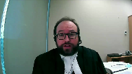
:::

This appeal arises out of a litigation process involving a tragic motor vehicle accident.

Three individuals were injured of which one was killed.

But the question for the court today is not about tort liability or anything of the sort.

It's a question of insurance coverage associated with the phenomenon sometimes called late breach.

Late breach refers to when an insurer some distance into the litigation process asserts a breach of the insurance policy by the insured that the insured says, instead the insurer says ends its duties under the policy.

And so the insurer's council gets off the record and the insured is left to fend for himself or herself.

And meanwhile other parties, plaintiffs and co-defendants are left with a situation where a defendant is now likely to be financially hollow.

The question is when and who can say that it is too late in the process for that to happen.

The insurer has carried on too far and now the insurer is stopped from going off coverage.

I will come to that question directly but very briefly just a bit of background.

Here the problem arose from arose when fact came to light in the course of examinations for discovery.

Specifically council appointed by the respondent Royal and Son Alliance, I'll refer to the respondent as RSA, learned that RSA's insured, one Devassari had consumed alcohol prior to his fatal accident.

That was impermissible under his policy terms and RSA proceeded to go off coverage.

That was discovered in 2009, more than one year after the litigation had been commenced, pleadings had been filed and as mentioned examinations for discovery had occurred.

**Justice Brown** (00:03:17): and more than three years before the trial.

What do we make of that?

**Overlapping speakers** (00:03:23): Bradfield

**Justice Brown** (00:03:24): Bradfield took a chance, right?

::: {.column-margin}
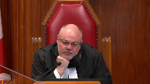
:::

Bradfield knew about the off-coverage position for nearly three years before trial.

Bradfield took a chance.

Took the $600,000, turned down the settlement offer, ran the trial in the hope that he wouldn't be found liable at all, lost big.

Does that have any legal significance here?

**Speaker 1** (00:03:47): Not in my submission, Justice Brown.

::: {.column-margin}
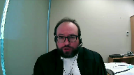
:::

Justice Brown, I think that asks the wrong question, it focuses on the wrong stage of the analysis, because I think by the time you get to the point at which RSA is going off coverage, there has already been an assurance for stoppable purposes, decisions have already been taken.

An assurance of what?

An assurance that coverage persists.

**Justice Brown** (00:04:10): All right, and is that the same thing as an insurance of indemnity at the end of the day?

**Overlapping speakers** (00:04:15): In this case, it would be not necessarily in all cases, right?

**Justice Brown** (00:04:19): But you want this to apply as a general rule.

**Speaker 1** (00:04:24): Well I want certain principles to apply as a general rule and it just so happens that in this case defense and indemnity would align.

::: {.column-margin}
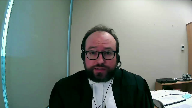
:::

If there was intoxication then there was neither a duty to defend nor a duty to indemnify.

In other cases depending on the allegations there may be a duty to defend but not a duty to indemnify.

Well not just to defend.

**Justice Brown** (00:04:44): Depending on not just depending on the allegations, could be depending on how the defence proceeds.

::: {.column-margin}

:::

The insured defendant might refuse to cooperate or there may be a discovery later of a material of an undisclosed material change in risk that may have nothing to do with the case but which may avoid the cover job initio.

**Overlapping speakers** (00:05:04): Yes.

**Justice Brown** (00:05:04): What are all of, how do you factor all of those considerations in?

**Speaker 1** (00:05:11): Well, and I suppose to the list you just mentioned, I might add, the findings, in fact, made a trial might well affect whether there's a duty to indemnify.

**Overlapping speakers** (00:05:19): Indeed.

**Speaker 1** (00:05:20): But the point is that, at least on the facts of this case, and I don't want to focus too much on them because we are dealing with a moot case, but at least on the facts of this case, defense and indemnity would be aligned because of the nature of the policy term in question.

::: {.column-margin}

:::

And as to the other concerns, the reality is, Justice Brown, I think you're just focusing on, with all due respect, the wrong facts.

If an estoppel arose from what RSA did, then that's the end of the matter, at least so far as defense would be concerned, and in this case also indemnity.

**Justice Rowe** (00:06:00): Now, you said that you didn't want to focus too much on the facts of this case because it's moved, which I found, perhaps I misunderstood you.

::: {.column-margin}

:::

This isn't a reference.

This is a case.

And unless you argue the facts of the case, frankly, we have no business here because we don't just legislate in this place, at least not so far as I'm aware, which really calls into question whether we should be deciding this thing on the merits told.

**Speaker 1** (00:06:30): Justice Roe, that's a completely fair concern.

::: {.column-margin}
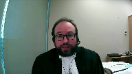
:::

I agree that this Court does not entertain private references.

What I would say, however, is that we are going to address this case in the context of its facts.

Its facts won't need to be canvassed in great detail for you to be able to do that, and I will have a submission about why the Court, despite mootness, should exercise its discretion, a discretion it no doubt possesses, to decide this case and the legal issues it presents on their merits.

Just to complete my very brief recital of the background, it was found at trial, and I think it's not controversial, that the fact of alcohol consumption could have readily been discovered by RSA in 2006, three years prior to the discoveries, by way of a coroner's report that RSA, its adjuster, inexplicably failed to obtain.

The result was that the series is still going on.

**Justice Wagner** (00:07:37): Excuse me, sir, so you're talking about actual knowledge, so everybody agrees that there were no actual knowledge by the insurer, right?

**Overlapping speakers** (00:07:45): I do.

I do agree. Yes.

**Justice Wagner** (00:07:47): So in order to succeed in this case, you have to allow or suggest that it should be constructive knowledge.

**Overlapping speakers** (00:07:57): That is what I will be submitting.

Yes, Chief Justice.

**Justice Wagner** (00:07:59): Do you have any precedence on that issue?

Because I don't know about any precedence.

**Speaker 1** (00:08:05): There are precedents that contemplate presumed knowledge in the context of insurers and insurance policies.

::: {.column-margin}

:::

Those precedents have not yet been applied in the context of the claims assessment process.

I'm going to invite the court to make a very incremental extension of the common law that would create the possibility of presumed knowledge in certain circumstances in the claims assessment process.

**Justice Wagner** (00:08:29): That would be new law that you ask us to decide, right?

**Speaker 1** (00:08:35): It would be, yes, but I would say a minor extension of established law elsewhere in the insurance context.

**Justice Brown** (00:08:42): In the context of this case, on what basis would you say the insurer is presumed to know something that it didn't know of?

**Speaker 1** (00:08:53): uh this this is I'm being anticipated in various ways uh justices so I apologize if my answers seem incomplete

::: {.column-margin}
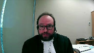
:::

but but what I'm going to be contending is that the duty of good faith which is well established encompasses a duty of investigation and that duty of investigation when it is not carried out creates presumed knowledge as to what should have been discovered in the investigation and because RSA's adjuster failed to obtain the report uh that that it was admitted could readily could easily and ought to have been obtained in fact there was a direction to obtain it

so when you say

**Justice Brown** (00:09:33): The duty of investigation, you mean the duty of fair investigation that is owed to the insured, yes?

**Overlapping speakers** (00:09:40): Yes.

**Justice Brown** (00:09:40): and that insured owes a corresponding duty of disclosure.

That is part of the reciprocal duty of utmost good faith.

Thank you for watching this video, and I look forward to seeing you in future videos.

**Overlapping speakers** (00:09:50): I would agree with that, yes.

**Justice Brown** (00:09:51): Did Mr. Bradfield owe a similar duty to Royal?

**Speaker 1** (00:09:57): RSA was not the insurer for Mr. Bradfield, so I would say the answer to that must be no.

**Justice Brown** (00:10:02): But you're saying that the royal owed a duty to Mr. Bradfield?

**Speaker 1** (00:10:07): No, I'm saying that Mr. Brad Fiedel is able to rely on the breach of duty by RSA to Mr. DeVos series.

**Justice Brown** (00:10:18): That's effectively meaning that he's owed a duty without reciprocal obligations, right?

::: {.column-margin}

:::

You stand in Mr. Bradfield's shoes and Mr. Bradfield could have disclosed this information, didn't, but now through you says that he's entitled to rely on the coverage that was extended and would not have been extended had he actually been forthcoming with the insured duty, which the deceased would have had but obviously couldn't discharge.

**Speaker 1** (00:10:50): Justice Brown, yet again, respectfully, I must disagree.

::: {.column-margin}

:::

I do not say there were two duties and there doesn't have to be because Bradfield is able to rely on Section 258 of the Insurance Act to make claims that Mr. DeVissieri or his estate could have made on that policy.

So there only needs to be one duty in issue for there to be an estoppel that arises as a right of action.

**Justice Brown** (00:11:16): but that doesn't mean it creates a legal relationship between the insurer and Mr. Bradfield, or does it?

In my submission, it does. Okay.

**Speaker 1** (00:11:24): First of all, first of all, this court has never said privative contract is required for there to be a legal relationship.

There's academic authority that says there ought not to be. All of.

**Justice Brown** (00:11:33): of tort laws a testament to that.

So yeah, that's that's nothing new.

**Speaker 1** (00:11:39): Well, and when you have a statutory right to sue, it seems to me that that statutory relationship is something we would call a legal relationship, Justice Brown.

**Justice Côté** (00:11:48): Mr. about the duty to investigate, I'm wondering on the facts of the case, what should have triggered that duty?

::: {.column-margin}
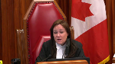
:::

You said that the insurer should have obtained the report from the coroner, but here the police report, if I'm not mistaken, was not alluding at all to alcohol as the cause of the accident.

It was the high speed.

And even the mother of the deceased told that her son was not drinking.

So what should have triggered that duty to investigate by RSC, given the facts known to RSC at the time?

**Speaker 1** (00:12:31): Well, Justice Cote, I think you're right about all of those facts, I would just say two things in answer.

::: {.column-margin}

:::

One is that the adjuster was specifically instructed to get the coroner's report.

And I think the evidence was that in the ordinary courts, he would have and couldn't explain why he didn't.

So the fact that the police report doesn't get into it, in the context of a death, as opposed to the usual sort of motor vehicle accident, the coroner's report naturally becomes an essential document.

And it is indeed inexplicable that the adjuster would have failed to take steps to obtain it

and he admitted that he easily could have, he just didn't.

So I think I've argued about half my case, but in little tiny slices.

What I'm going to do is back up, widen the lens and map out more comprehensively the way we say the analysis should proceed in cases of this kind, because it is a distinctive context for Estoppel.

And I start with this.

The principles governing this sort of problem, and this goes back to the Chief Justice's question about new law, they've not been considered by this court for 100 years since the decision called Parrott.

And that's a decision amenable to several different interpretations, depending on how one reads any of the five judgments given in that case.

And of course, much has occurred in the law of contract and insurance since 1921.

So I say to a large extent, we are on Terra Nova, we're on a clear field in considering the legal issues in this appeal.

And my central contention, and I'm going to map out the steps now so that you can see the whole picture.

To bring us up to speed with the law of 2021, it's this.

When we're dealing with the problem in the nature of Estoppel, fundamentally, we're looking for a promise or assurance that changes legal relations.

And because it's a promise or assurance that gets us into questions of knowledge and intentionality, which you'll recall were prominent in the Court of Appeals analysis.

And here's how we say you solve it.

Here's how we say that assurance ought correctly to be found in this distinctive context.

There's four steps, I'll unpack them all later, time permitting, but here they are.

The first step, and this goes back to my answer to the Chief Justice, is recognizing that the insurer has a duty to conduct a prompt and thorough investigation when a claim is made.

**Justice Brown** (00:15:30): Does that does that at all stand in tension with the things that we've said about the constraints on an insurer investigating for coverage vis-a-vis the insured?

**Speaker 1** (00:15:42): No, no, Justice Brown.

::: {.column-margin}
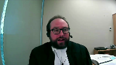
:::

Whitten and Fidler certainly have been, were important cases in pushing back on making sure that insurers don't persecute their insureds, don't go too far.

The submission I'm going to make essentially exists in counterpoise to that.

It's what puts it into balance.

It's what ensures that claims are treated fairly and in a balanced way by an insurer for the benefit, not just of the insured, but indeed for all parties.

**Justice Brown** (00:16:14): Well, we talk about balance, but the balance is, of course, the balance against the insured's duty to disclose, right?

::: {.column-margin}
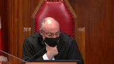
:::

Again, there's that mutuality which doesn't exist in respect of the relationship that you're positing here.

There's no obligation.

There's no balance.

It's just simply a duty that's owed.

I mean, you're talking about a different balance.

I think this is the Goldilocks type of argument that the insurer can't be too hot in going after the insured, but can't be too cold in the interests of the plaintiff or the code offender.

I say with respect, I mean, your argument that, well, that may be difficult, but it should be difficult to be an insurer.

I say with respect, that is a very difficult argument to accept.

We have carefully crafted that balance between the insured and the insurer, and I think to skate over the possibility that this balance may be upset now by the ability of a third party to rely on that is a very difficult argument to accept, and I think that's a very difficult argument to accept.

I think that's a very difficult argument to accept, and I think that's a very difficult argument to accept, and I think that's a very difficult argument to accept.

I think that's a very difficult argument to accept, and I think that's a very difficult argument to accept, and I think that's a very difficult argument to accept, and I think that's a very difficult argument to accept, and I think that's a very difficult argument to accept, and I think

**Overlapping speakers** (00:17:37): It's not a-

**Justice Kasirer** (00:17:38): That's a very satisfactory answer.

::: {.column-margin}

:::

Can I, can I pick up on Justice Brown's preoccupation and just give you a specific, maybe you have a good answer for this, Mr. de Sihal.

That if we impose a kind of a, a stricter duty to scrutinize the possibility of a policy breach at this early stage on the insurer, insurer, insurance company, don't we risk slowing down the proceedings while the insurance company does a deep dive and in the end everyone ends up paying for this early scrutiny that might in the end of the day not prove to be decisive?

**Speaker 1** (00:18:30): Justice Kasser, I don't, respectfully, I don't think so.

::: {.column-margin}

:::

When we're talking about something that's reasonable, balanced, thorough, but incremental, we're not necessarily talking about something that's gonna slow things down.

We're talking about something that responds to the practicalities of a given situation.

And in this case, the practicalities are highly evocative of what that could mean.

It was literally a matter of asking for the document.

So that risk seems, with all due respect, to be ephemeral to me and indeed speculative.

And I have high confidence that in future cases, if that should prove problematic, if the intensity of investigation, and this goes back to Justice Brown's concern, ends up itself causing difficulties for the insured, then we know from Whitten and Fidler that the courts have the tools to deal with that.

Thank you.

**Justice Brown** (00:19:33): I think that's where the bogging down comes in, is the court having the tool to deal with it.

**Justice Wagner** (00:19:38): If I may follow up on Justice Brown and Cacire's questions, your argument may be appealing.

::: {.column-margin}
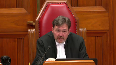
:::

The problem is, when you put aside the old law, and use those words, in other words, the principle that we know about, that you have to establish specific knowledge by the insurer, if we put that aside, and I understand your argument being, well, you know, the insurer has an obligation to do the investigation properly, and if he did not, he's deemed to have the knowledge.

The problem is, where do you draw the line when you are at that level of proper, extensive investigation, where do you draw the line?

What are you giving proper guiding principles for the future?

Specific knowledge is quite clear.

That's a matter of proof, but if the insurer has the knowledge, he cannot deny coverage, but for your argument, how should we draw the line?

**Speaker 1** (00:20:40): Well, I'd say two things about that, Chief Justice.

::: {.column-margin}
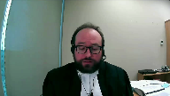
:::

One is that I think of particular assistance jurisprudentially are the decisions of this court in Canadian Indemnity and Coronation Insurance from 1990 and 1991, which talk about how insureds can't simply rely on the insured and then later place blame on that insured if there's a problem.

They talk about what's presumed to know, what they talk about what a reasonably competent underwriter would do.

And Justice Gontier used powerful language in describing the importance of that.

And this is in the pre-contract context.

I'm just asking that it be incorporated into the claims assessment process.

But what Justice Gontier said, and I think it's very important, he said the courts see the pathology of the insurance business, I'm quoting him here, and accordingly, justice must be done in cases where the confusion might have been avoided by the diligent action of both parties.

So we have acceptance in the insurance context of presumed knowledge.

We have the standard of the reasonably competent underwriter, which is something that courts are capable of assessing in my respectful submission.

And then Justice Corey takes that further in coronation insurance and emphasizes another crucial consideration, which is the public protection rationale for mandatory insurance.

In that case, it was air carriers.

But of course, it would apply to motor vehicle.

And yet again, he said insurers have to be presumed to know matters that are, in his words, within their grasp.

And so we're not really talking about new law chief justice.

We're just talking about the application of that form of analysis in terms of what the insurer's duty is into the claims assessment process, bearing in mind that in cases like Fidler, the court there again adopted the principle that an insurer must assess the merits of the claim in a balanced and reasonable manner.

So that's the jurisprudential part of my answer to your question.

But there is a second part, and it's this.

I want to leave you with a reference that I think will help the court provide guidance on this point in terms of what the elements of a good faith investigation would be.

And there's an article, I won't ask you to turn it up, but it's behind tab six of my authorities.

And it's by a fellow named David Debitum.

And I'll just give you the reference.

It sets out at pages 42 and 43 an 11-point checklist for what he considers to be the elements of a good faith investigation.

And so when you ask Chief Justice about how the line gets drawn and what rules apply and what guidance can be given, I commend to you the Debitum article, and I think it will assist the court in providing that guidance.

**Justice Rowe** (00:23:45): Isn't there a sort of a practical and policy problem with what you're putting forward to us in the sense that undoubtedly on occasion an insurer will say to the insured, we will defend the action, we will seek to hold you free from liability, but as to whether we will indemnify in the event of liability, that is another matter.

::: {.column-margin}

:::

And if we adopt your position, the duty undertaking the defense seems to imply undertaking to indemnify, and if that is so, will not insurers basically fight with their insured right at the beginning as to whether they want to defend at all?

And isn't this just highly problematic for the whole system because you've intertwined too tightly, perhaps unintentionally, the duty to defend and the duty to indemnify?

**Speaker 1** (00:24:58): Uh, no, no, Justice Roe, I think that the, uh, let's put it this way, the nature of the assurance that will be taken in any given case from the assumption of a defense will depend on the policy terms, which, recall, everybody in the room, all the parties are going to get.

::: {.column-margin}
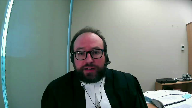
:::

They're going to all get them in the disclosure process.

That's under the rules of court.

They're not admissible, but they're going to get them.

And so parties will be able to assess whether in any given case, uh, the assumption of a defense is or is not going to be, um, um, uh, an assurance with respect to indemnity.

And in this case, where the issue that subsequently emerges is one of alcohol consumption, defense and indemnity do converge because with alcohol consumption, if that's the problem, there would be neither defense nor indemnity.

And so, and so that will be a fact-sensitive assessment in terms of whether the, the assurance that I'm saying is associated with the, with the assumption of the, uh, conduct of a defense is going to be context-sensitive.

**Justice Kasirer** (00:26:11): Mr. Dalzia, I'd like to pick, Justice Roe makes a very good point.

::: {.column-margin}
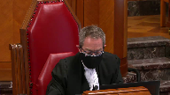
:::

I thought the jurisprudence, including of this court, dealing with the duty to defend, part of its purpose was to take some of the sting out of that moment in the litigation process because to do otherwise might serve to upset the real issue at the end of the day on who was to indemnify.

And so that courts have been more forgiving in some respects on the allowing or imposing on insurance companies a duty to defend, knowing that there's a way out down the line.

I think Justice Roe has a point there that the fight might shift as you say courts are asked to give guidance at an earlier stage on a different kind of point.

Isn't that a potential access to justice kind of problem?

**Speaker 1** (00:27:20): Well, first of all, Justice Kessler, I think your point is well taken that cases like Scalera were designed to facilitate defense while accepting that there is differentiation potentially at the end of the day between defense and indemnity.

::: {.column-margin}

:::

But it nevertheless seems to me, and my submission is, that that's not likely to be a significant practical problem because of the capacity of the parties to look at a policy term, because they will have them, look at the allegations in a case, because they will have those two, and make a reasonable assessment of whether there has been an assurance of defense only, defense and indemnity, or something else, depending on the nature of the issue.

So I don't see a chilling effect here in terms of defense, I see this as something that intelligent and experienced counsel and reasonably competent adjusters all can manage collectively together in a way that ensures expectations are not inappropriately upset, as they were in this case.

**Justice Moldaver** (00:28:43): What is the standard of perfection that you are seeking from the insurer in terms of the investigation it conducts?

::: {.column-margin}

:::

Are you seeking...

It sure sounds to me like you're seeking, if not a standard of perfection, something very close to it.

I look at the context of this case, and if ever, in my experience, one would expect in the police report a finding of alcohol consumption, particularly in a situation where there is a death, this would be it.

So they looked at those reports.

They interviewed people, including Mr. Bradfield.

And, you know, they looked at other reports, the motor vehicle accident reconstruction report and so on and so forth.

They did a whole lot of things.

They inadvertently, I would suggest to you, failed to look at the coroner's report.

I guess the police did too. And...

But it seems to me you want a standard of perfection.

And if that's what you're asking, or something very close to it, before you would be content.

Clearly, if the insurer is willfully blind to something that it should know it must look to.

That's another story, perhaps.

But I'm just not sure, and I'm rambling on with this question, what standard of perfection are you looking for?

Well, and...

**Overlapping speakers** (00:30:13): Because there's more than...

**Justice Moldaver** (00:30:14): Excuse me, bear in mind, this is a relatively straightforward, in that sense, you've got an easy sort of, oh, there's one thing that they could have looked at.

::: {.column-margin}
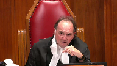
:::

You're going to have all kinds of other cases where there's nothing anywhere close to being that, as you would say, simple to look at, and where do we go?

**Speaker 1** (00:30:36): Well, Justice Moldavis, certainly I don't contend for a standard of perfection.

I think what I'm contending for is a standard of reasonable, thorough, competent diligence as articulated by this court in Canadian Indemnity and Coronation.

**Justice Brown** (00:30:52): thorough and diligent, that sounds awfully close to perfection, especially where on these facts the one thing that wasn't done is the one thing you're saying has to be done.

::: {.column-margin}

:::

In other words, it had to be a perfect investigation, even though the adjuster spoke to the witnesses, including your man Bradfield himself, said nothing about drinking, even though there was nothing in the police report that created any sort of an indication that there might have been.

Other than closing off that last investigative step, in other words, perfection, they did everything, and there was nothing that suggested the possibility of a breach of this kind.

So it must be perfection, and the standard of thoroughness and diligence seems to suggest that.

**Speaker 1** (00:31:43): Justice Brown, again, I respectfully disagree.

We're talking about an adjuster doing the very thing he was asked by the insurance company to do.

**Overlapping speakers** (00:31:54): Right.

The one thing that wants you to

**Speaker 1** (00:31:57): just just follow your instructions.

::: {.column-margin}

:::

I mean we're not talking about going on a manhunt, we're not talking about him you know getting a CSI team out um and and blood sample or going to the morgue and blood sampling the body, we're not talking about anything like that.

We're talking about the the Mr. Eddie doing the thing he was asked to do and then he didn't do it.

This this is nothing close to perfection, this is just doing the job he was given.

**Justice Brown** (00:32:23): Well, it is perfection in the sense that it was the one thing that didn't get done, right?

::: {.column-margin}
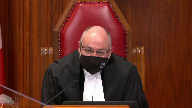
:::

The interviews all occurred, the police report was reviewed, no indication of consumption of alcohol.

The one thing that didn't get done, you say should have been done, which then raises Justice Moldaver's concern.

Well, what about in other cases?

And you say, well, it's just diligence, it's thoroughness, those are, those sound like quite exacting standards.

And the problem is, again, we know from Whiten and Fidler that if an insurer goes too far, this can breach the duty of good faith out to the insured.

So we just can't wing it based on this case, I bet.

**Speaker 1** (00:32:59): But Justice Brown, all I'm doing is quoting back to you what this Court said itself in 1990-91, which is the insurer should be taken to know, presumed to know, the things that were within their grasp.

::: {.column-margin}
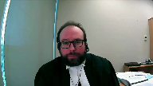
:::

This was manifestly within RSA's grasp.

And so in my submission, that's not perfection.

We evidently have different conceptions of what perfection amounts to, because my conception of it is do your job and access the things that are within your grasp.

**Justice Moldaver** (00:33:39): This slipped through the cracks.

::: {.column-margin}
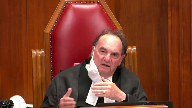
:::

Unfortunately, everybody isn't perfect.

This slipped through the cracks because as I understand it, Mr. Eddie thought that some other adjuster, an accident benefits adjuster was going to be looking into this and it fell through the cracks.

So as my colleague suggests, seems to me you're pretty much looking for perfection here.

There's no suggestion for a moment that they sort of consciously got down and sat down together and said let's not look at the coroner's report, you know.

**Speaker 1** (00:34:12): I just think there's a vast gap between the kind of willful blindness that you just mentioned and failing to take a basic step that was contemplated in an instruction letter.

::: {.column-margin}
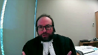
:::

I'm not sure how much more I can assist the court on this point, candidly, because we have a standard of reasonable competence, and when things that are instructed by the insurer slip through the cracks one way or another, that in my submission is not reasonable competence.

**Overlapping speakers** (00:34:45): That's your argument.

**Speaker 1** (00:34:47): And I would just add, sorry, there is a point of deference to be made here because the trial judge took a very different view of this conduct.

::: {.column-margin}

:::

The trial judge viewed it as quite a blatant error on the part of RSA's adjuster.

And insofar as that's going to form part of the analysis, there is something to be said about probable and overriding error.

**Justice Moldaver** (00:35:10): I could just as easily say to you that they could have looked at this whole thing and said it's redundant because we have a police report that doesn't mention it in the context of a death.

::: {.column-margin}

:::

And if that isn't reasonable for an insurer under those circumstances where there's no evidence or the box alcohol is not checked off or is checked, you know, and says no alcohol consumption, I would have thought that's enough right there.

And that going to the coroner at that point, which one might have thought the police would do in their investigation would be redundant, if anything.

**Speaker 1** (00:35:51): Well, then Justice Moldaver, all I can say to that is one wonders why the insurer, again, presumably acting under its duty of utmost good faith, specifically instructed the adjuster to get the coroner's report.

::: {.column-margin}

:::

I mean, I think candidly we ought to defer to the insurer's judgment in that regard.

The insurer thought the adjuster needed to get the report himself.

The insurer didn't just say, police report's good enough.

The insurer said, we want you to see the coroner's report too.

**Justice Moldaver** (00:36:21): They didn't say it's mandatory.

It's a suggestion that was made.

In any event, I don't want to waste your time on this anymore.

**Justice Kasirer** (00:36:30): Well, speaking for myself, I'm not sure it's a waste of time.

::: {.column-margin}
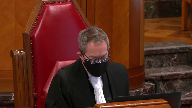
:::

The, the, your argument, Mr. Del Zielle, is not, is not that the estoppel kicks in when there is negligence, that the negligence precludes the insurance company from, from insisting on, on going back on things.

It's representation.

Where, where does, you say the trial judge made findings, but I'm not sure he was turning his mind to the, the estoppel point here.

How does that fit into the estoppel argument?

**Speaker 1** (00:37:12): Well, the trial judge made a characterization of RSA's conduct that gave rise to, in his view, waiver, and he didn't reach the question of estoppel.

::: {.column-margin}
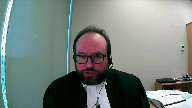
:::

So, Justice Kessler, you're completely right that the analysis factually that I'm talking about doesn't marry up with what the trial judge was doing.

The trial judge's analysis was about waiver, and for a variety of reasons, this isn't and can't be a case about waiver, and we make no argument about waiver.

This is entirely a case about estoppel.

Where we say the estoppel comes from is a combination of several further factors.

**Justice Karakatsanis** (00:37:50): But can I, I'm sorry, but can I just ask you to address the issue of what is the difference, different knowledge requirement under waiver and estoppel?

Is it different? It is.

This is Kirk at Sandisk.

**Speaker 1** (00:38:07): The difference, the difference is that in the waiver context it is established under Saskatchewan River bungalows and I think that's the most notable case of this court, that it is actual knowledge.

::: {.column-margin}
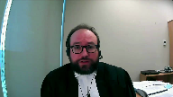
:::

In the estoppel context, it, it, at least, at least in this, this aspect in this context, it should be constructive knowledge it should be based on what the insurer is presumed to know, having done their job.

And so we say that the Court of Appeal respectfully erred in effectively conflating waiver with estoppel.

Estoppel is more flexible, it is equitable, it seeks to do justice where justice requires it.

And an insurer ought to know something.

Other parties ought to be able to rely on that.

**Justice Karakatsanis** (00:38:55): So, what are you relying on to say that promissory estoppel can look to constructive knowledge?

What are you relying on in making that statement?

**Speaker 1** (00:39:11): What I'm relying on is this.

::: {.column-margin}
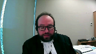
:::

If the insurer is presumed to know what they ought to have known, then the logical result of that is when the insurer assumes and maintains the defence of an insured some meaningful distance into the litigation.

That is giving insurance to the other parties that we have completed our investigation and there's nothing discoverable out there at this point that would interfere with coverage.

**Justice Karakatsanis** (00:39:47): I'm sorry, I wasn't clear in my question.

::: {.column-margin}

:::

I was asking for your legal authority in making the submission that knowledge is different for promissory estoppel and that constructive knowledge would be sufficient in the context of promissory estoppel, generally, not just on the facts of this case or in this specific context.

**Speaker 1** (00:40:15): I don't have authority at my fingertips for constructive knowledge in promissory or stoppel generally.

::: {.column-margin}

:::

I do say that under the miracle test, there isn't even any contemplation of knowledge whatsoever.

All the miracle test requires is a promise or assurance.

And so, all we know from that is that the miracle test requires a promise or assurance.

**Justice Brown** (00:40:33): with an intention to change behaviour, right?

With an intention that people can rely on it.

I mean, I'm not sure that gets you around the knowledge question, right?

**Speaker 1** (00:40:47): No, Justice Brown, that's right.

::: {.column-margin}
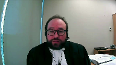
:::

It just raises what the knowledge question is.

Is that at what point can we say that there's sufficient intentionality?

And I think we can say that when it's in this, that there is sufficient intentionality to the insurance arising from the fact that the insurer is taking deliberate action in the litigation with knowledge that is imputed to it by law under insurance.

**Justice Brown** (00:41:15): law principles how can how can you intend to do something how can you intend to to to how can you intend not to how can you intend to induce reliance by refraining to exercise a right in this case the right to hold the insured and breach that you don't know that you have all right

::: {.column-margin}
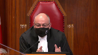
:::

**Speaker 1** (00:41:41): but when you ought to know it, and you engage in the conduct anyway.

**Justice Brown** (00:41:47): But intention is intention.

**Overlapping speakers** (00:41:52): I, I, I, I, I, I, I, I, I, I, I,

**Justice Brown** (00:41:54): I understand that your argument that, well, they ought to have known it but, and sometimes constructive knowledge, I mean obviously in our law constructive knowledge is a thing and we use it in all kinds of situations.

::: {.column-margin}
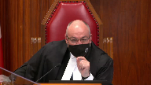
:::

The question is whether it works very well in a stopple because you're taken on your theory as making a representation with an intention, right, to affect the legal relationship that you say exists between Bradfield and the royal.

But I'm wondering if that intentional component really precludes any kind of ought to have known argument because intention requires you to know of it.

Maybe they should have known it, maybe, maybe, I mean you're not arguing a stopple by negligence but maybe someday there's an argument out there like that.

But I don't know, try as I might, I can't understand how intention can be derived from anything other than actual knowledge unless we're going to have constructive intention as well.

Well, but Justice Brown.

**Speaker 1** (00:43:19): if the law takes you to know something, if you're accepting that threshold proposition that the insurer is taken to know it, then that then grounds the finding of intention.

::: {.column-margin}

:::

Because we are assuming as a baseline per the first branches of my argument that they do know it.

And so therefore, when they take those steps, they are taking those steps with intention.

**Justice Brown** (00:43:46): But they're not.

That's a fiction.

**Justice Moldaver** (00:43:49): There is sort of a middle ground, if I understand it correctly.

::: {.column-margin}
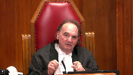
:::

Help me out with this.

Where the insurer knows the facts that would allow the insurer to go off coverage, but doesn't appreciate their significance.

There's case law on that and stuff written about that, where knowledge is effectively, I guess, call it constructive, call it imputed.

But you know the pertinent fact.

You just don't appreciate its significance because you haven't checked your own policy carefully enough or whatever.

And in those cases, I think knowledge is imputed.

So there is a little bit of what I'll call imputed constructive opening.

But not that there's clear evidence that the insurer just simply does not know and cannot know that it's in an off coverage position unless it knows certain facts.

**Speaker 1** (00:44:48): So, Justice Moldaver, I hate to say it, but I just got interrupted by the plant watering lady, and I think I missed a crucial part of your question.

::: {.column-margin}
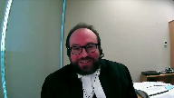
:::

So maybe you could restate it, because I did hear parts of it, but I think the plant lady didn't understand the sign on my door.

**Justice Moldaver** (00:45:17): there are situations where the insurer knows the pertinent facts but doesn't appreciate it in terms of a breach that would allow an off-coverage position to be taken.

::: {.column-margin}
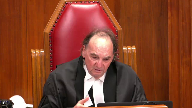
:::

And so, for example, there's a case involving a dirt bike, I think, where the insured should not have been driving a dirt bike, wasn't covered in the policy or whatever.

And the insured should have known that, looking at its own policy, the insurer should have known, looking at its own policy, it didn't appreciate it.

So in those cases, you say you can't get out from underneath, you knew the pertinent fact.

The fact that you didn't know that it allowed you to go off coverage is too bad for you.

That's very different than what we have here.

They didn't know the pertinent fact that would have enabled them to go off coverage.

So you're a step back from it.

**Speaker 1** (00:46:09): Right, so Justice Moldaver, I take no issue with those cases, but those are actual knowledge cases and my argument unabashedly pushes the matter out further to presume knowledge.

::: {.column-margin}

:::

That's, that's, that's, I just, I don't disagree with you.

**Justice Moldaver** (00:46:27): It seems to me it's a very long extension, not just a little one.

**Speaker 1** (00:46:33): Well, Justice Molde, all I can say is that this court has said that insurers are taken to know things in the past

and I thought I was just echoing that back to you.

**Justice Côté** (00:46:45): Mr. Dalziola, I just want to confirm a point of timing.

::: {.column-margin}
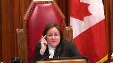
:::

You say that the insurer failed to get the coroner's report in due time, but when the insurer took the off-coverage position, he had not received yet the coroner's report.

It was just right after the discovery.

**Overlapping speakers** (00:47:06): That's right.

**Justice Côté** (00:47:07): So, he took the off-coverage position without being induced in doing that by the coroner's report because he had not seen it when he took its position.

**Speaker 1** (00:47:19): That's right, he took the matter all the way to discovery, which is what I say is the problematic conduct that amounted to the assurance of an on-coverage position.

**Justice Côté** (00:47:30): Thank you.

**Justice Brown** (00:47:31): So equity has been invoked and of course that brings in all those hoary old maxims like clean hands.

::: {.column-margin}

:::

Is there any legal significance in your view to Bradfield not disclosing to the adjuster that he and the deceased read a bar prior to the ride?

**Speaker 1** (00:47:52): My understanding of the evidence on that was that Bradfield simply didn't have a recollection of alcohol consumption, and so I'm not sure if there's any significance to that.

I believe that's my recollection of the record.

**Justice Rowe** (00:48:09): I think there is significance if he was drinking and he said, Oh, I don't remember I was drinking because that really is misleading.

**Speaker 1** (00:48:18): Well, I think all you could say was that he remembered where he was.

They were riding motorcycles, so it's not necessarily the case they would be drinking.

In fact, one might expect they wouldn't be.

**Justice Brown** (00:48:31): I didn't ask about them drinking.

I asked about them being at a bar prior to the ride.

I'm not sure that, Justice Brown, unless they were drinking virgin mint tulips.

**Speaker 1** (00:48:41): on the nature of the establishment?

::: {.column-margin}

:::

I can't answer that question.

It sounded to me like a restaurant and bar.

I can't remember its name, but I don't have confidence in whether it was the kind of place where people, you know, like, you know, an Earl's or whatever, where people eat or drink.

**Justice Kasirer** (00:49:02): And I had just asked you to make time for the detrimental reliance point given how strong your friends on the other side can be anticipated to come back on it.

::: {.column-margin}

:::

As to whether there was detrimental reliance to any other party.

Given that there was potentially no difference in the progress of the action or the nature of the defense.

Whether RSA was involved as a statutory third party or offended in the name of Bradfield.

**Speaker 1** (00:49:34): Yes, thank you for the question, Justice Kessler.

::: {.column-margin}

:::

Reliance is interesting in this context because of the nature of the litigation process.

And in my submission, it's naturally the case that treating the claim as covered is intended to be acted upon by the insured himself or herself and is acted upon because they step back from conduct of their own defense.

So proof of intention that it be acted upon and proof of reliance in that sense converge here.

And because the insurer knows there will be reliance, they must also intend that that assurance will be acted upon.

So those two components of the estoppel effectively combine here and ought not instead to be compartmentalized.

And I would refer in that regard to what Justice Holland said in Rosenblood.

And I'll just paraphrase it for the sake of brevity.

It's in paragraph 132 of my factum.

And he says, if coverage was timely denied, the defense could well have been conducted differently.

Examinations for discovery could have been conducted with a different emphasis.

But I say that's true for all parties in the room.

The reality is that the conduct of litigation by other parties will always be impacted by where the money is or is not.

So where there is an assurance of a non-coverage position, as I say arose here, that shapes what happens.

That shapes settlement discussions.

That shapes procedural choices.

That shapes examinations for discovery.

There is reliance by everyone in the room.

**Justice Brown** (00:51:08): But what do we do with the fact that everyone knew about the coverage issue as of July 2009?

All that reliance fell away.

Anything that happened after that was done with full knowledge of the Royal's off-coverage position.

**Speaker 1** (00:51:25): Yes, but in the meantime, who knows what happened?

::: {.column-margin}
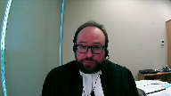
:::

And that's the problem.

As a practical matter, by the time issues like these are litigated, or by the time issues like these emerge, you can't unscramble the egg of the years of litigation that happened prior.

The counterfactual of what happens in those previous years, Justice Brown, if the insurer had done its job properly and denied coverage from the start, is necessarily gonna be speculative and probably loaded with self-serving evidence.

And it also, as I pointed out in my factum, raises serious problems of privilege.

Because to prove it, to unpack it, lawyers would have to testify about their instructions at the relevant times, what was in their litigation brief, what happened in settlement talks that are confidential.

All of those are privileged matters.

So that's why, and in my respectful submission, we just don't wanna go there.

I say that in cases like this, reliance in the presence of an assurance of this nature in the litigation process should at a minimum be strongly presumed.

And like Justice Holland, I have difficulty seeing how that presumption could reliably and properly ever be rebutted.

**Justice Rowe** (00:52:32): All that does is it makes the requirement disappear.

::: {.column-margin}

:::

It's just, it's gone.

It's just assumed, and if it's assumed, it just doesn't exist as a practical matter.

And so, you know, again you're asking us to change the test in a way that's rather significant.

**Speaker 1** (00:52:51): Justice Roe, I would just say I'm asking you to apply the test in a way that makes practical and common sense given what we know of the litigation process.

**Justice Karakatsanis** (00:53:02): But you would agree we're looking at Bradfield's detrimental reliance in this case, as opposed to the insured.

**Speaker 1** (00:53:12): I say we could look at either because they both had a legal relationship that could dis-entitle RSA from

**Justice Karakatsanis** (00:53:25): It's Bradshaw who's bringing the application here, who seeks to establish promissory estoppel to him.

You're saying it could be either.

**Speaker 1** (00:53:36): I'm saying it could be either because because either because there's two legal relationships there's there's the legal relationship directly between judgment creditor Bradfield and RSA, and the legal relationship between the devisaries state and and RSA, and by either mechanism through through either mode of analysis.

::: {.column-margin}

:::

So, in a way, if there's detrimental reliance, then, then, then RSA can be a stop.

**Justice Rowe** (00:54:23): But isn't equity of the nature that it is unfair to assert a given legal right against me, rather than against someone else?

::: {.column-margin}
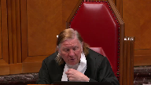
:::

It must be unfair against me.

That's always embedded, it seems to me, in these rules of equity.

And you're saying, no.

If it's unfair against the deceased, then somehow Bradfield can avail of that for his purposes.

I find that a very dubious proposition.

**Speaker 1** (00:55:02): Well, Justice Roe, I'd say you'd have to take that up with the Ontario Legislature because what Section 258 does is allows Bradfield as Judgement Creditor to claim through and assert the rights of the insured.

::: {.column-margin}

:::

So that's a statutory modification of what you might otherwise consider to be consistent with equity, but the point is that if the insured has the right, then Bradfield has the right.

That's what Section 258 Sub 1 does.

**Justice Brown** (00:55:29): Yeah, but the question here is what are the implications of that?

::: {.column-margin}

:::

And you're using promissory estoppel to ascribe certain implications to it.

And that's a distinct question, it seems to me.

Then what the statute says about that.

**Overlapping speakers** (00:55:47): Justice Brown, not sure I understand the question.

**Justice Brown** (00:55:49): Well, I think we're ships passing in the night, so...

**Justice Karakatsanis** (00:55:52): Can I ask you this, though?

::: {.column-margin}
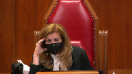
:::

If we are looking at it from Bradfield's perspective, there is no legal relationship until he gets judgment, until judgment.

So do we look at reliance before that point in time or do we...

I mean, I'm just trying to figure out the logic of that.

If to the extent we're looking at Bradfield's detrimental reliance, can we look at reliance before there's any legal relationship just because there's a potential one?

**Speaker 1** (00:56:24): Yes, I think so.

::: {.column-margin}

:::

I think that that there does not have to be.

It's an interesting question just to care concerns, but, but I would say that an equity, there does not have to be a perfect temporal alignment between the two.

Assurance relied upon, and then a legal relationship arises such that that assurance can be the subject of an assertion of a stop.

Then, then, at that point the elements all align what they just they all just need to come together.

Eventually, in my respectful submission I think that that's that's that's what equity would compel.

**Justice Moldaver** (00:57:01): Excuse me, could I just ask you this?

::: {.column-margin}
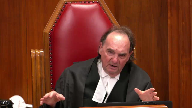
:::

It may be an unfair question to you, but was there a mechanism for Mr. Bradfield, the moment he found out some three years into the piece that Royal was going off coverage, could he have brought a motion at that point before we get into trials or anything else to have a judge determine whether or not Royal was stopped at that point?

And I'll just add to it, by waiting three years, should Mr. Bradfield be stopped from raising it?

**Speaker 1** (00:57:40): My understanding of the process was that Mr. Bradfield attempted to have contemporaneously with the liability trial.

**Overlapping speakers** (00:57:48): the question.

I know that.

That's some years later, isn't it?

**Speaker 1** (00:57:52): Well, I'm not sure when he could have done it before that. Pardon?

Well, that's when they were all in court together.

**Justice Moldaver** (00:58:00): Well, that's not my question.

My question is, could he have brought a freestanding motion to say you cannot do this, RS, because you're stopped, long before there's any trials?

**Speaker 1** (00:58:19): That may not be a question I can answer.

**Overlapping speakers** (00:58:25): Well, that may involve a theory.

**Speaker 1** (00:58:27): there would have been practical utility for it at that time because it's of course not until after the trial that the crucial question of coverage when you get this lopsided allocation of liability where he's 10% liable, but it's a $1.8 million judgment.

**Justice Moldaver** (00:58:42): I'll roll the dice and if it goes for me great, and if not, I'm gonna say You know, you shouldn't have been a you should you shouldn't have got off royal

Well, I certainly play both ends against the middle could be a tactical decision on his part.

We have no idea

**Speaker 1** (00:58:58): Not having been trial counsel, I can't say, but I certainly can't necessarily say there was dice rolling involved either.

It might just be practical thinking on the part of counsel.

Certainly he endeavored to address the matter so that it was all bound up together.

We know that was true.

**Justice Moldaver** (00:59:14): To the extent we're dealing with an equitable remedy, I would have thought it's quite important.

**Justice Rowe** (00:59:21): And what my brother Moldaval referred to is, the technical term is lectures.

**Speaker 1** (00:59:30): Justice Roe, I don't have the law on that at my fingertips, but my understanding of the laches cases is that the delay involved has to be quite profound and prejudicial, but I failed to see what prejudice would have arisen from the delay we're talking about in this case.

::: {.column-margin}

:::

That's what I seem to recall reading in MNH a long time ago.

**Justice Côté** (00:59:56): Don't infer anything from my question, but in your factum you're making submissions as to the cost and you say that you should not be condemned to pay any cost because of your status and RSA says no no

::: {.column-margin}

:::

no we should consider you as if you were in Bradfield shoes and Exposed to the same consequences, so what do you have to say on that?

**Speaker 1** (01:00:26): I say that the trial lawyers came to this court bonafide and as a recognized public interest litigant with a view to assisting the court in resolving a case in which leave had already been granted, so there was evidently a matter of public and systemic importance to Canadian civil litigation to be addressed.

::: {.column-margin}
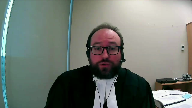
:::

The purpose of my client's participation was to assist the court in a circumstance where the court had already decided to take here and decide the case.

So I say that given TLABC status as a non-profit public interest litigant endeavoring to assist the court with a case that it already wanted, I say that in those circumstances an award of cost against TLABC would not be appropriate and of course nor does TLABC seek costing against RSA in what appears to be the slender prospect that we prevail.

**Justice Brown** (01:01:27): you talked a lot about the TLABC, what about the other side?

::: {.column-margin}
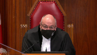
:::

Why shouldn't they have their costs since they've been forced here?

I know I have from your submissions and your fact, there's a suggestion that the royal could have just remained silent. Yes.

But with great respect, that seems to me unrealistic in the face of submissions that would effectively impose, as you acknowledge, new obligations.

Incrementally new obligations, you say, but still new obligations on insurers.

**Speaker 1** (01:02:04): Well, there's any number of ways that the vast financial power of the insurance industry...

Oh, come on, come on, come on, come on.

**Justice Brown** (01:02:10): Come on, come on, you know.

**Justice Wagner** (01:02:12): All right.

Thank you very much.

Time is up.

Thank you.

Mr. Gavin McKenzie.

**Speaker 2** (01:02:26): Thank you, Chief Justice.

::: {.column-margin}

:::

May it please the Court.

My client, the Ontario Trial Lawyers Association, appreciates this valuable opportunity to make submissions on the important question of when, if at all, knowledge of a policy breach may be imputed to an insurance company so as to prevent it from denying coverage to the victim of an automobile accident claiming through an insured defendant.

I propose to use my time this morning to list four considerations that we respectfully submit should be taken into account by the Court in answering the question whether, in some circumstances, constructive knowledge may form the basis of an estoppel in the automobile insurance context.

The first consideration we submit that the Court should take into account is that the relationship between an insurance company and a plaintiff claiming through an insured defendant is a special relationship governed not only by the common law and equity, but also by statutory provisions with a consumer protection orientation.

Automobile insurance policies are not just commercial contracts.

As the Court of Appeal for Ontario has expressed it, they are part of our social contract, which protects persons injured in automobile accidents.

The second consideration we submit that the Court should take into account is that estoppel is an equitable doctrine rooted in considerations of fairness.

Historically, it was often said that courts of equity are courts of conscience, and all courts applying the common law today are courts of equity.

In Ryan and Moore, which we've referred to and cited in paragraph 13 of our factum, this Court adopted Lord Denning's characterization of the doctrine of estoppel when he wrote that the doctrine of estoppel is one of the most flexible and useful in the armory of the law.

This Court held in Ryan and Moore that when parties to a transaction proceed on the basis of an underlying assumption, neither of them will be allowed to go back on that assumption when it would be unfair or unjust to allow them to do so.

If one of them does go back on that assumption, the Courts will give the other such remedy as the equity of the case demands.

In the context of negligence claims in the automobile insurance context, we say an insurance company should not be permitted to go back on the underlying assumption of coverage on which the commencement and continuation of litigation and the insurance company's defense of it was premised.

The third consideration we asked the Court to take into account is the realities of automobile accident claims in Ontario.

The reality is that most people injured in automobile accidents cannot afford litigation unless plaintiff's lawyers assume the risk and fund litigation on a contingent basis.

The related reality is that many, if not most, defendants cannot pay substantial damages if insurance coverage is unavailable.

Where there may not be insurance coverage, injured people will not bring claims to assert their rights, and plaintiff's lawyers will be disincentivized to act.

Affordable access to our civil justice system is enhanced when parties can rely on an insurance company's express or implied representation of coverage.

The fourth and final consideration is that it should not be permitted to go back on the underlying assumption of coverage on which the commencement and continuation of litigation and the insurance company's defense of it was premised.

The reality is that most people injured in automobile accidents cannot afford litigation unless plaintiff's lawyers assume the risk and fund litigation on a contingent basis.

**Justice Wagner** (01:06:08): Excuse me, sir, that may be a question that should be put to members of the legislature.

It may be put to them as well.

**Speaker 2** (01:06:16): But this case enables the court to articulate the circumstances in which, if any, if there are any, and you may decide there are none, the requirement of actual knowledge has the beauty of certainty, but it has the disadvantage of inflexibility.

::: {.column-margin}
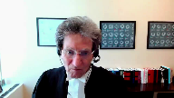
:::

It's open to the court in our respectful submission based on the authorities to at least extend to a minimal extent the doctrine of this estoppel in order to improve access to justice, which is a consideration with great respect.

That's why...

**Justice Wagner** (01:06:59): That's why the National Assembly in Quebec changed their regime, no fault regime.

**Speaker 2** (01:07:05): Now let me get back if I may.

::: {.column-margin}
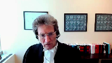
:::

The fourth and final consideration is that investigating coverage is a fundamental aspect of an insurance company's business.

That's what they do.

A narrow actual knowledge standard would permit an insurance company to neglect to investigate coverage in a timely way.

**Justice Brown** (01:07:23): Are we really concerned about incentives here?

::: {.column-margin}

:::

I would have thought the incentive would be for insurers to bird dog things down.

Granted that may not have happened here.

In fact, the incentive is so strong that we've tempered it, right?

We've said that they're constrained.

So I'm not sure your concern about incentives to kind of, you know, go easy on coverage issues is really a realistic one.

**Speaker 2** (01:07:54): In my submission, it is a risk that if this court were to maintain the narrow and absolute standard requiring actual knowledge in all circumstances, in my submission, it is a risk

::: {.column-margin}
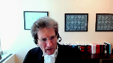
:::

**Justice Brown** (01:08:13): It may give them an incentive to actually acquire that knowledge.

**Speaker 2** (01:08:19): I would have thought it would be the opposite, Justice Brown, with respect.

**Overlapping speakers** (01:08:22): That

**Speaker 2** (01:08:22): in those circumstances there's a way of deciding this case which would incentivize insurance companies not to do a reasonable and diligent investigation to avoid the result of having to pay greater damages even though they have the basis to deny coverage as a matter of policy thank you very much

::: {.column-margin}
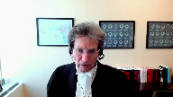
:::

yes thank you very much

**Justice Wagner** (01:09:02): Thank you.

::: {.column-margin}
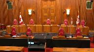
:::

The court will take its morning break, 15 minutes.

Thank you.

Be seated.

**Speaker 3** (01:10:09): Yes, thank you.

My friends come before the court seeking, as I understood, to clarify the law with respect to estoppel.

But to be fair, they're really trying to move the needle a long way.

**Overlapping speakers** (01:10:24): You're

**Speaker 3** (01:10:24): They're trying to create new law, new law that is well beyond the facts of this case.

::: {.column-margin}
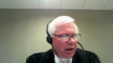
:::

The facts, this case was predominantly a fact-driven case, but the new law they wish to establish is that once a defense has been filed by an insurer for its insured, coverage is forever bound.

And that would be going too far, I would submit.

Now, there was a question near the end of my friend's presentation by the court about whether trial counts.

**Justice Wagner** (01:10:56): Excuse me, sir, it may be a bit unfair to your colleagues because what essentially they are saying is that it's not so much that you could never raise any issue or any violation of the insurance policy, but that the insurer has to make, has to be diligent, has to make a reasonable investigation, so on and so forth, so it's on the means more than on the result that the argument was based, I think.

::: {.column-margin}

:::

**Speaker 3** (01:11:25): Well, you'll see that in my condensed book I talk that the investigation by RSA, my client, was reasonable.

::: {.column-margin}

:::

It may not have been perfect but it was reasonable.

Under the circumstance of this case, there were witnesses who were interviewed, the police were interviewed, the deceased mother was contacted

and she only wished to see the jester, the investigator, Mr. Eddie, after the police reported to her.

There was a scene investigation, there was contact with Bradfield and there was contact with Littansky, two of the people who gave evidence at the examinations for discovery some years later.

They weren't particularly forthcoming with respect to information but all indications showed that this was an accident that was occasioned by reckless speed on the part of the deceased Mr. Deveseri.

Now my friend says that wasn't sufficient.

He says RSA through their investigation, Mr. Eddie, could have, and he used the words readily or easily, he should have, could have or ought to have had the coroner's report.

Well, if we looked at the task assignment issued right from the get-go when the accident's known to the insurer to gather information and investigate what is clearly a serious accident, one of the boxes ticked off was get a statement from the insured.

Well, that would have been difficult.

Another thing was do a scene investigation, identify the witnesses, investigate with the police and get a coroner's bracket death certificate.

Now it's fair that the coroner's report wasn't secured and it's fair that Mr. Eddie, the investigator, doing everything else, said back to the insurer, can't you get the death certificate, the coroner's death certificate, through the accident benefit department because there are generally benefits available to an estate when a loved one is lost.

However, what standing did RSA have to get a coroner's report that seems to be the crux of the suggestion that this was a failure on the part of RSA to properly investigate?

They had no standing to get the coroner's report.

The coroner's act clearly shows that it's only available to the next of kin.

I suppose it's also probably available to the police, but it's not available to an insurance company who simply writes to the coroner and says, can we have a coroner's report?

We'd like to look at it.

How could Mr. Eddie have got that coroner's report?

Well, the evidence is clear that he did eventually, after the police briefed the deceased's mother about the accident facts and how speed was such an issue.

He could have asked her because he did get her to sign some authorizations for the police investigation.

I suppose he could have put an authorization to her to say, I'd also like to get the autopsy report with respect to your deceased son.

Now, what would she have said about that?

I think the obvious question would have been, why would you want that?

And my friends would suggest the reason why you want that is, you at least know the deceased was an M2 driver.

It's a license that has a restriction on it, just like G2 for a car, M2 for a motorcycle.

You can't drive with alcohol in your system.

So if one had suggested that to the mother, well, we'd like to see the autopsy report to see if your son had been drinking, what we do know is what her answer would have been.

Her answer was, my son doesn't drink alcohol.

Would she, we're speculating, would she have permitted access to the coroner's report?

She may have, she may not have.

The investigation carried on, and Eddie reported that this was a reckless speed accident.

He considered whether it was a race and speed test, which is also a breach of a policy, but said, I don't really think that there's anything there.

He essentially reports that this is a bad liability case for this insurer under this policy.

He closes his file well before, he closes it in 2017 after 22 hours of investigation.

He closes it, and the litigation starts in 2018, a couple years later.

Now, the first real knowledge of any drinking on the part of anybody, whether Bradfield or Deviceri, the deceased, comes up through the Latansky discovery evidence under oath.

Now, Mr. Latansky, by that point in time, he had had a very detailed transcribed statement by the police and never mentioned any alcohol consumption, but he did under oath at the examinations for discovery.

And immediately, RSA on learning of that said, that would be a policy breach.

That's evidence of a policy breach.

Let's stop for a second and think about that.

So, they want to take an off-coverage position as soon as they learn.

Who gets the coroner's report?

It's Solicitor Watt representing the plaintiff, Catton.

He gets the coroner's report because by this point in time, he had standing to move before the court under a disclosure motion, a wag motion, as we often call it here in Ontario, requesting that the coroner release the report for the purposes of this litigation.

And Watt brings that motion because it's opened up a big door for him.

It's opened up possible more insurance coverage for Catton and also for Bradfield, who was a plaintiff.

So, he was excited about that opportunity because an off-coverage position, if it's demonstrated, and it ultimately was admitted, if it's established, all of a sudden, the available insurance coverage by both Bradfield as plaintiff, he was both a plaintiff and a defendant, and Catton, who was only a plaintiff, immediately goes to a minimum of $1.8 million because the off-coverage position of Royal allows only $200,000 of minimum limits under the Insurance Act, but each of Catton and Bradfield had an OPCF 44R, such common underinsured coverage, with a million dollars, which meant for each of their claims, they could get an additional $800,000 from each of their own insurers.

Now, that was quite telling in this case, because if Bradfield escapes liability, that's where they're going to go for their funding, and in fact, that's where Bradfield went for his funding, paid for by his insurer, State Farm.

By the time those discoveries were in play, the people who were discovered were Catton, Bradfield, and Latansky.

DeViceri is not discovered because he's not alive.

He can't tell us anything.

So, knowledge comes out in that date, June or July, June, I guess, late June of 2009, and RSA proceeds promptly with respect to its position as a plaintiff.

The court asked whether a party could bring a freestanding motion to deal with the issue of estoppel that we're here many, many years later dealing with, and of course, they could have.

In fact, the cases that Bradfield, in presentation of this case, which is really a subrogation case by one insurer against another, that the court could bring to the court, in presentation of this case, which is really a subrogation case by one insurer against another, the cases that he relied upon, and what my friend now raises, show that both insureds and insurer do bring that freestanding motion.

It was done in the Logo case, the very case that the trial judge, Justice Sosna, said was the seminal case on this point.

But in Logo, the facts were that there were multiple defendants in that case.

There was a township and other defendants.

The claim was issued early, which can happen quite frequently after an accident, and the coroner's report was secured.

We don't really know by who, but undoubtedly, it would have been secured either by Annex of Kin, authorizing its release, but probably more likely, one of the other counsel brought a disclosure motion.

And the coroner's report in that case came up before the statement of defense was even filed, and had found its way to the insurance company Wawanisa.

Six months before they filed their defense, they had the report in hand.

I would suggest, I'm speculating, it came into their hands, just as this one did, because the action had already been initiated, and someone had secured its production.

And just like in this case with Mr. Deveseri, with a restricted license M-2, the late Mrs. Logo, she had a G-2 license.

But that case shows something else happened.

Despite filing a defense after they had the report, completely different than RSA's position here, three more years went by.

Wawanisa didn't appreciate that there had been this report in their hands even before they filed their defense.

Discoveries took place, but after three years post-filing the statement of defense, other defendants had been let out.

The only parties left was the estate and a township.

At that point, there clearly was prejudice.

The litigation landscape had changed, and the Logo estate brought the freestanding motion to determine whether Wawanisa, under those circumstances, was a stopped.

And the court, at first instance, agreed, and a stopped defense said you couldn't go down to the minimum limits because of the policy breach, because you had it in your hands even before the defense, three and a half years before the discovery, after there had been settlement discussions and parties let out.

That's detrimental reliance.

Now, that was the Logo estate bringing the application, but six weeks before the Court of Appeal heard the appeal in this case that's before this court, the Commonwealth and Shane Campbell case was heard in the Court of Appeal.

I knew about it.

We presented it to the court and to Bradfield's Council.

They didn't report it in the decision, but in the Commonwealth and Shane Campbell case, again, a freestanding motion was brought well before trial.

By the way, the trial in that case is scheduled for January of 2023.

So, in that case, it was the insurance company that initiated a motion for a declaration that they didn't have to defend because of a policy breach.

What were the facts?

The facts in that case was they were defending under a homeowner's policy, which had a restriction that said, we won't cover you if you're driving a vehicle on a public highway that needs to be registered in some manner, and that's exactly what Mr. Campbell was doing.

But they knew that because the accident happened on a public highway, on a dirt bike that was not in any way street legal or licensed and needed no registration.

So, to the extent that this court asked whether a freestanding motion could have been brought in the issue of latches, yes, it could, and it's in all likelihood, if you're going to raise an issue of a stopple, it's the proper course of conduct to follow.

So, what do we have here?

We have four cases that I suggest the courts below have considered, but in each one of them, actual knowledge was before the insurer.

In two of the cases, the freestanding motion was brought in Logo and Commonwealth.

In two others, the insurer continued to defend, a hundred years ago in Parrott, they continued to defend, even though they knew the facts, they continued to defend all the way through trial.

The prejudice in Parrott was that they knew that the machine that injured the plaintiff didn't have a guard on it.

They knew that from their early investigation, and that was the exclusion.

But they thought they could win the case on liability in any way, so they only offered a hundred dollars.

The plaintiff didn't accept it.

They went to trial.

The verdict was $1,400.

A hundred years ago, that was probably a considerable sum of money.

And then the insurer said, well, we've learned at trial that the injury was caused by a machine that didn't have a guard on it, and that's an excluded issue under the policy.

But the detrimental reliance in that case was established because the plaintiff admitted the injured plaintiff admitted in the court on the coverage dispute between the insured and the insurer that she wouldn't accept the hundred dollars, but she would have accepted 700.

And the insured where coverage was being denied in that those facts said, I would have settled this case for $700, but the insurance company was running it.

Rose and blood was the same thing.

Rose and blood, through first instance and then the court of appeal, it was a solicitor's dishonesty claim, which is excluded under the Law Society coverage for lawyers.

It was known immediately, but nonetheless, no coverage position was taken.

There was discoveries.

There was a settlement proposals and then much longer, longer line.

The Law Society insurer said, we're not going to cover this and the insured estate, the Rose and blood estate had to take it over ended up settling the case for, I think it was $33,500, which the suggestion was could have been settled a lot earlier and with a lot less expense.

Even interesting in that case, the insurance company, even though they now knew why they were going to raise a denial, still offered $15,000.

So we have a predominantly fact driven case that comes before this court.

And I would suggest that in the law, as it currently exists, it works in the same way that it did in the case of Rose and it currently exists, it worked well in this case.

And if we're dealing with the issue of estoppel, it's not only a question of direct knowledge, actual knowledge, but there has to be a prejudice.

And there was no prejudice here.

In fact, the appellant is really the appellant, it's Bradfield and his insurance company.

The appellant is the one that drove this case to trial.

The appellant Bradfield, the one who was apparently drinking with Mr. DeViceri demonstrated two things.

And this is established by the cost ruling and the judgments below.

He demonstrated that he always took the position he had no liability.

That's not even 1%.

He was found 10% at fault.

And he demonstrated that he gave no credence to Mr. Catton in a future income loss.

This trial, the original underlying trial, the Catton trial, only took eight days.

It was a sizable judgment.

But only three days were presented by the plaintiff.

Who were the adversaries at that trial?

Well, the plaintiff was presenting his damages.

But on the issue of liability, the dispute was between King's Way, the underinsured carrier of Mr. Catton, and State Farm, Bradfield's liability insurer.

And trial counsel Todd McCarthy took the position, no liability on his client, which would mean King's Way would pay the claim, other than what RSA would have to be obliged to pay and had already agreed to pay under the minimum limits, the $200,000 plus adverse costs.

But he also took the position that there was no future income loss claim.

In advance of that trial, the defense offers were as follows.

RSA had already agreed to pay and had, I believe, already advanced $100,000 because their limits were 200.

And the parties agreed they would split it between Bradfield as a plaintiff and Catton as a plaintiff, put the money in play.

There'd also be an obligation to pay adverse costs because that's a component under the Act, the legislation, and the policy wording.

King's Way, the underinsured carrier for Catton, if Bradfield has no liability, King's Way was going to pay the judgment up to $800,000 being the spread between 200 and the $1 million policy.

King's Way offered $75,000 if the plaintiff, Catton, would settle.

Bradfield, through his insurer's state farm, offered $100,000.

That's a total of $275,000 plus adverse costs from RSA.

King's Way lowered their offer because when the trial went, they dropped it by another $25,000.

So shortly before trial, there was $275,000 available for the plaintiff, Catton, but he didn't accept it.

He wanted more.

He wanted to pay the $1 million and state farm, contesting both liability and damages, the only party that contested damages, said no.

They took the gamble.

They went to trial and the jury awarded a significant sum for future income loss.

But if you look at the judgment in the underlying case, the total judgment, including a prejudgment interest for general damages and past income loss and prejudgment interest, adds up to less than $270,000.

So where was the gamble?

The gamble was on Bradfield's part, on his insurer's part, no liability and no future income loss, and he lost on both and he lost badly.

He tried to delay the trial after three years.

Maybe he wasn't ready for the damages case.

**Overlapping speakers** (01:31:18): I don't know

**Speaker 3** (01:31:18): But he lost badly.

::: {.column-margin}

:::

He perhaps had been comforted in the years past because at a very early stage in the Catten trial, Bradfield brought a summary judgement motion after discovery.

He already knew Royal's position of off coverage, but he brought a summary judgement motion and was successful.

Bradfield was out of the Catten action.

Still there was an appeal of that decision of summary judgement justice and the Ontario Court of Appeal overturned it and said, no, there's enough for you to go to trial on.

There's enough evidence.

We're going to let you go to trial.

So Bradfield and his insurer must have thought we have a pretty good case.

We won it once, but now we're back into it.

And he must have thought he had a pretty good case because he's got Kingsway putting some money on the table.

And on the overall assessment of the case, RSA has no more money.

Kingsway's running a risk.

They could pay a lot more.

But Bradfield and State Farm, they were willing to throw in $100,000 all in.

So that's the underlying trial.

If he was so concerned, as he suggests, that RSA should be in for their full million because their policy breach shouldn't stand up, he should have brought the standalone motion just as Commonwealth did with Shane Campbell and just as the local estate did in the case that Justice Sosna ruled was the seminal case.

Now the system works well in Ontario.

My friends represent the plaintiff's bar and no plaintiff was going to be suffering here with respect to a lack of insurance compensation, whatever played out.

In fact, Bradfield as State Farm comes before this court as the appellant.

Now the TLABC representing the point on this clarity of the law.

He comes before this court, but they already accepted the RSA off coverage position because they paid $600,000 to Bradfield, the appellant, on his own personal injury claim under their same policy.

So there is no second part of the test.

There's simply no prejudice to Bradfield.

This case should never have come further than it has.

But leave was granted.

The leave application says there's one issue.

Should an insurer be permitted to deny coverage for breach of an insurance policy three years after electing to defend a claim?

That's how it was worded.

Well it wasn't three years that it was defending the claim.

The statement of defense was filed in March and the discoveries happened in June.

Council was appointed, however, by at least a notice of intent to defend the previous fall.

The patent action, which is the underlying basis for this 258 subrogation case, was only started two years after the accident.

**Justice Karakatsanis** (01:34:48): Can I ask you, Mr. Tompkins, as a matter of the legal framework here, do you accept the proposition that you can look to detrimental reliance by either the insured or the third party who's claiming through 258?

::: {.column-margin}

:::

I know your position on the facts in this case.

You say there was none by I by by neither party.

**Overlapping speakers** (01:35:15): Right.

**Justice Karakatsanis** (01:35:16): But I'm looking for some assistance in terms of what's the right question under the framework of promissory estoppel.

**Speaker 3** (01:35:25): Okay, well 258 permits a person, a person to present a direct cause of action if they have a judgment and they can bring it and it's unsatisfied.

::: {.column-margin}

:::

It's a little different than Section 132 which specifically excludes motor vehicle cases.

258 is created so that there is always compensation to the minimum limits available in the jurisdiction which we're dealing with is Ontario.

But it references a person so Bradfield is a person.

He has a judgment by way of cross claim but he is the only one who could suggest that the estoppel should be premised upon detrimental reliance because it should be his detrimental reliance.

If my friend suggests it should be any party even not before the court, I'm not aware of any authority on that but in any event there was no prejudice to anybody else.

Bradfield as plaintiff certainly benefited to the tune of some six hundred thousand dollars.

He never would have received that kind of compensation otherwise.

And where else was the, who else in any way had any detrimental reliance?

Did they act contrary to their interests?

Not at all.

I believe it can only be the party that comes before the court that says my position was prejudiced.

He lost an opportunity to settle for example or he's gone so far into the litigation that for some reason its character has changed.

In Logo they were three and a half years after the coroner's report, three years after the defense parties had been let out by the insurance company defense lawyer and then the insurance company tried to take you off every position.

That would be wrong.

In Parrot a hundred years ago the insurance company thought they had a right to sue you.

And that's what they did.

**Justice Wagner** (01:39:05): Can you hear us, Mr. Tompkins?

**Speaker 2** (01:40:49): Yeah.

**Speaker 3** (01:40:51): Well, you just dial them up on that phone.

**Overlapping speakers** (01:40:54): Mr. Tompkins.

**Speaker 3** (01:40:56): We can hear you now.

::: {.column-margin}

:::

Okay, and I can see you, so thank you very much.

All right.

I don't know where it might've broken off, but the point about section 258, it's part of the compensation scheme that is of benefit to the injured parties.

Also the underinsured coverage, which is so prevalent.

258 sub one says you don't have to be the insured who pursues the claim as against the insurer.

If you have a judgment and you can't collect on it, it can be any person.

So there's no contractual relationship between Bradfield and RSA.

And the insurer, even if it was cap, the insurer is absolutely liable, absolutely liable, regardless of whatever breach, whether it be even before the policy was created on a misrepresentation on an application or a failure to pay a premium or a misrepresentation on the true facts or a subsequent policy breach.

The insurer is absolutely liable.

Agreed RSA, these cases are worth more than 200,000 and RSA said, we'll divide our money up.

And they agreed it would go $100,000 to Bradfield and $100,000 to Catton. And all.

I have no video.

All it says is Gavin McKenzie across my screen. And.

**Justice Brown** (01:43:38): I just think he can't hear us.

**Overlapping speakers** (01:43:40): And now I see Gavin, but I don't see the courtroom.

I'm not buying it.

**Speaker 2** (01:43:53): your submission, Stephen.

**Speaker 3** (01:44:29): You think it's our video?

**Overlapping speakers** (01:44:32): We can see and hear you now.

**Speaker 3** (01:44:34): I can see the court now.

I can see the court, but if someone would ask me a question, perhaps I can know if I got bit and sound.

**Overlapping speakers** (01:44:46): Can you hear us?

I can hear you, yes.

And we can see and hear you.

**Speaker 3** (01:44:50): Okay, thank you.

::: {.column-margin}
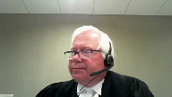
:::

I don't know where that technology failure is occurring, but it's occurred twice.

And if it's my end, I apologize, but I'm not a computer wizard.

So my point about 258 is it's a good balancing.

Section 11 gives the insurer the rights against Bradfield that it could raise as against DeViceri if the knowledge of the breach materialized.

So if this is an estoppel case, there was no actual knowledge and there was no detrimental reliance.

The two things you need for estoppel.

This case doesn't need to move the needle or advance the law.

It was such a very specific factual case.

It went very badly for the Bradfield insurer, who at one point wasn't even in the litigation, but came back in, took a gamble, and lost badly.

And I don't believe I have any further submissions to make other than that, unless there's a question.

**Justice Wagner** (01:46:05): Mr. Dalezal, any reply?

::: {.column-margin}

:::

We cannot hear you.

**Speaker 1** (01:46:42): Sorry, I didn't, I had the toggle off on the headset, I apologize.

So Chief Justice, a few brief points.

The first is that you were correct to point out to my friend, my argument is not that once a defense is filed, uh, uh,