---
title: Cameron O’Lynn Parranto also known as Cameron O’Lynn Rocky Parranto, et al. v. Her Majesty the Queen, et al.
published-title: Heard
date: 2021-05-18
sidebar: false
---

This transcript was made with automated artificial intelligence models and its accuracy has not been verified. Review the original webcast [here](https://scc-csc.ca/case-dossier/info/webcast-webdiffusion-eng.aspx?cas=['39227']).
---

**Justice Wagner** (00:00:25): Good morning.

::: {.column-margin}
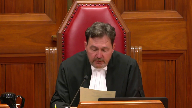
:::

Please be seated.

In the case of Cameron Olin Parenteau, also known as Cameron Olin Rocky Parenteau, against Her Majesty the Queen, and between Patrick Douglas-Felix, against Her Majesty the Queen, for the appellant, Cameron Olin Parenteau, Mr. Paul L. Morrow, for the appellant, Patrick Douglas-Felix, Andrew D. Fipers, and Jared N. Craig, for the intervener, Criminal Trial Lawyers Association, Mr. Danielle J. Song, for the intervener, Canadian Civil Liberties Association, Sarah Renkin, for the intervener, Aboriginal Legal Services, Jonathan Rudin, for the intervener, Legal Aid Society of Alberta, Dane F. Bollerwell, for the intervener, Association Québécoise des Avocats et

Avocates de la Défense, Maître Gault Casey, for the respondent, Her Majesty the Queen, David W. Schoenbroeker, and Monique Dion, for the intervener, Attorney General of Manitoba, René Laguimodier, for the intervener, Attorney General of Alberta, Joanne B. Dartana.

**Speaker 1** (00:01:58): Good morning, Chief Justice, members of the court.

::: {.column-margin}

:::

My name is Paul Morrow.

I am counsel for the appellant, Cameron Olin-Parantho.

This court has dealt with and skirted the issue of starting point sentencing ever since the divided panel in MacDonnell.

I submit that now is the time for this court to make a decisive statement on the principle of starting point sentencing.

The issue, of course, was raised but not firmly decided, most recently in the Friesen case.

In that case, this court said they would not decide the issue but would await the appropriate case.

This is the appropriate case.

In this case, these two cases, the Alberta Court of Appeal has, in my respectful submission, disregarded what this court said about starting points not being binding.

And they've not only done that but created yet another starting point, now the longest one yet.

In the course of doing this, the Alberta Court of Appeal has overturned two senior and experienced trial judges for their handling of the starting point approach.

This, even though there was no starting point in existence at the time of sentencing, this court's clear statement in Friesen that deviation from or departure from a starting point could not be reversible error was apparently not enough to dissuade the Alberta Court of Appeal from this course of action.

Now, I do not propose to explain in my oral submissions what starting points are.

I think this court knows perfectly well what they are.

And it's all set out in both my factum and that of several of the other parties as well, particularly the Attorney General of Alberta.

Neither do I propose to review the facts, as those are all set out in the materials.

So let me start by addressing what I think is perhaps the elephant in the room.

No one doubts that appellate courts should provide guidance to trial courts.

Ranges of sentence articulated by appellate courts, of course, provide useful guidance to the exercise of discretion by sentencing judges.

I don't think anyone disputes that.

Certainly, I don't.

However, there is vigorous debate about how the Alberta Court of Appeal is applying the standard of review to cases involving their own starting point decisions.

**Justice Brown** (00:04:42): So is this really a case about the starting point and the application of the starting point?

Or is this a case about whether starting points as a methodology are an acceptable form of appellate quantitative guidance?

**Speaker 1** (00:04:59): In my submission it's the latter.

My friend Mr. Song on behalf of the Criminal Trial Lawyers Association describes starting points as a failed experiment, a 40-year experiment which has failed.

The court may have noticed that I have myself defended starting points in the past.

**Justice Brown** (00:05:17): I had come to the conclusion that they're not feasible.

::: {.column-margin}
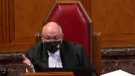
:::

Well, why can we not, why cannot we view this as a standard of review issue?

For the very reasons that, I mean, I'm not, I'm certainly the last person to hold someone, hold past academic writings against someone, but as someone who's defended the idea of starting points in the past, Mr. Morrow, why would this not just be a matter of how they're done, whether in Alberta or anywhere else, how they're applied, and why shouldn't we see this as an opportunity really to give very specific guidance as to how to review a trial judge's, a sentencing judge's sentence when they depart from a starting point?

**Speaker 1** (00:06:11): Well sir you're certainly correct that part of the problem here is how the standard of review is applied to cases involving starting points but that is not the only problem and if we're going to address the question of whether starting points are an appropriate method of appellate guidance then we should really consider all aspects of the concept of starting points.

::: {.column-margin}

:::

So part of the problem is how the Alberta Court of Appeal has been applying the standard of review but that is not by any means the only problem.

Another equally important problem is the manner in which starting points are created or arrived at and I discussed that to some extent in my factum but certainly the the issue is that appellate guidance which will affect hundreds or thousands of future cases should be arrived at based on at least two things.

Firstly a distillation of a substantial body of jurisprudence.

In many of the authorities there's a discussion of how sentencing ranges are arrived at and they're described as being a distillation of hundreds or thousands of prior decided cases and the wisdom derived from hundreds of lawyers and hundreds of courtrooms speaking to hundreds of judges amounts to a considerable body of information and wisdom which is then distilled into a range of sentence.

So that is what I call bottom up guidance.

On the other hand or in contrast starting points are top down guidance.

So in this case for example the Alberta Court of Appeal considered prior sentencing decisions in coming up with a starting point.

You know how many? Four.

Four decisions.

That is not in any sense the distillation of a substantial body of jurisprudence and of course in this case there were two cases joined for argument at the Court of Appeal level.

So we had the Crown, we had Mr. Parenteau and we had Mr. Felix.

In other starting point decisions there's been only one many times only one offender being sentenced and the problem is that firstly the playing field is unequal as between the Crown and an individual offender but the problem more so is that the court doesn't have the opportunity to receive the sort of broad-based information, social science information from specialists, sociologists, criminologists, lots and lots of different lawyers and judges that a court should receive when making broad sweeping policy decisions.

May I interrupt?

I'd like to interrupt you here and just ask you a few questions about that.

**Justice Martin** (00:08:57): particular case, fentanyl, it was a new sentencing issue.

::: {.column-margin}
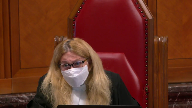
:::

Would there have been any difference in how a court using a range-based philosophy would have approached it?

Would they have had more than the four cases to do what you say is a bottom-up rather than a top-down?

And I'll follow that up with saying in the range cases from those jurisdictions, where do they get the wide perspective of the sociological and the evidentiary basis?

If what they're doing is a historical snapshot of cases and a distillation of authority, they're not having that kind of intervention with evidence-based, I guess, things that you're talking about.

So if you could answer those two questions, I'd appreciate it.

**Speaker 1** (00:09:51): No, you're quite, you're quite correct.

::: {.column-margin}

:::

So I would say this, first of all, in terms of using sentencing ranges as appellate guidance, I agree that those case, those ranges are not informed by the same kind of sociological or social science evidence that I'm talking about, and that's an unfortunate gap in the evidence.

But well, okay, let me back up and address the first question you asked first.

So to start with, I would suggest that were the court not attempting to create a starting point, it could have looked at a wider body of precedent in that there were sentencing decisions from across Canada, not just from Alberta, that the court could have looked at.

But more to the point, if the Court of Appeal was not here trying to set a standard, trying to provide guidance, it could have simply looked at the question of fitness of sentence without trying to pronounce on what future cases might consider to be a fit sentence.

**Overlapping speakers** (00:10:56): So, I'm wondering if this is in...

**Speaker 1** (00:10:59): set itself here demanded that it consider a wider range of precedent than was available to it, which is why I have argued under my third round of appeal that if you're going to have a starting point, it was too early to set it in this case.

::: {.column-margin}

:::

This was not the right case at the right time because the jurisprudence had not yet developed sufficiently.

**Justice Brown** (00:11:21): about that, Mr. Morrow, because I mean, you've mentioned Friesen and in Friesen, paragraph 34, we do say, look, usually in keeping with the emphasis on precedent, appellate guidance reflects and summarizes the existing case law.

::: {.column-margin}
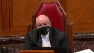
:::

But then we went further in paragraph 35.

Appellate courts are not just case briefers.

Sometimes an appellate court can set a new direction.

Take a lead.

And in fact, we did in Friesen, right? Right.

I mean, having briefed the cases, we found them too low, and we wanted to kick the numbers upstairs a little bit.

**Overlapping speakers** (00:11:56): I couldn't.

**Justice Brown** (00:11:56): In the Alberta Court of Appeal, in light of, I think it's a fairly common understanding that fentanyl is a particular problem, people are dying, say, well, we find it grotesque to wait around for the case law to develop.

::: {.column-margin}
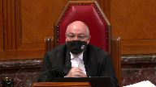
:::

We're going to do what the Supreme Court did in Friesen.

We're just going to do it via a starting point.

**Speaker 1** (00:12:19): Court of Appeal certainly could have given guidance similar to what this court did in Friesen and there would be nothing wrong with that although the court would have had to explain why it is that trafficking in the worst drug that we know about today should attract a higher sentence than trafficking in the worst drug that we knew about 20 years ago which was heroin.

::: {.column-margin}

:::

So there's a starting point in Alberta for commercial trafficking of heroin, FUN, and that has a five-year starting point.

That was the worst drug that we knew about then.

Fentanyl is the worst drug that we know about today but next year there's going to be a different drug.

We know that that will happen.

We don't know what it'll be but we know that will happen.

So is another starting point going to be demanded?

In my respectful submission the nature of the drug traffic doesn't have any impact on the moral culpability although it may have an impact on the seriousness of the offense.

So in the context of considering proportionality, which is the ultimate touchstone for a fit sentence of course, the Court of Appeal I suggest with respect could have done a better job of explaining that difference.

But more to the point, the court is asking me can the Court of Appeal not exercise leadership and say the range of sentence needs to move upwards.

Certainly it can do so.

It can do so without setting a starting point as this court did in Friesen.

So yes, the Court of Appeal can and indeed should exercise leadership in that regard.

**Justice Brown** (00:13:49): So the issue isn't then whether the Court of Appeal should have sat on its hands and waited for the case law to develop.

It really is just the form.

It's the methodology.

It's the starting point as opposed to a range.

**Overlapping speakers** (00:14:01): They could have shown leadership.

**Justice Brown** (00:14:02): they didn't have to wait for the case law to develop, they just had to have a bottom number and a top number and not just a bottom number that you start from.

Is that a fair summation?

**Speaker 1** (00:14:11): Well as as you say I think the problem is the methodology not the fact that they're exercising leadership or providing guidance to sentencing judges that's perfectly appropriate that's within the purview of the of an intermediate Court of Appeal is to provide guidance to trial judges but the manner in which they arrive at that guidance and the manner in which they then distribute so to speak that guidance is what is at issue here and the starting point approach is extremely problematic.

::: {.column-margin}
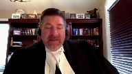
:::

You're aware the court is aware from the written materials of the arguments about starting points essentially being judicially created crimes which is treading on the purview of Parliament the courts aware of the arguments about starting points not being derived from a sufficient factual or evidentiary basis that that sort of thing should be properly the work of something like a sentencing commission as we had in the 1980s we had the Canadian Sentencing Commission which heard evidence from a broad range of social scientists and experts and then provided guidance much of which was ultimately adopted and became part 23 of the Criminal Code eventually so if we are going to have starting points in my respectful submission they should be derived from some body like that and since the latest federal budget has reintroduced funding for a Law Commission perhaps there is hope that such a thing will be created in the future but in the interim it is my submission that it is not the proper business of an intermediate Court of Appeal to be creating starting points and then reversing trial judges who don't adhere to those starting points or worse yet reversing judges who say there's no starting point binding on me here

so I'm going to find my own route to a fit sentence and then the Court of Appeal says ah

but you disregarded the starting point approach even though there was no starting point I mean based on what the Court of Appeal did here you could have a case of theft for example or fraud for which there's no starting point decision from the Court of Appeal and the sentencing judge could say there's no starting point here

so I'll find my own path to a fit sentence the Court of Appeal could reverse this the trial judge because she said there's no starting point even though she was correct that there was no starting point that's exactly what happened here justice will it said I'm not bound by any starting point this court in Friesen said he could do that justice Watson for the Court of Appeal said no he's not entitled to do that he disregarded the starting point approach and this he was not entitled to do

**Justice Martin** (00:16:52): Okay could I stop you there and say let's say somebody accepts the proposition that the standard of review element is too strictly enforced on the starting points right

::: {.column-margin}
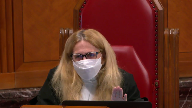
:::

so so take the um all of that out of the equation you let's say you've convinced everybody about that what is it then is the proposition about starting points that is so less responsive to guidance than ranges or any other alternative because as I see the construction here it's ranges or starting points or providing guidance about the harms associated with a crime like freezing so in proportionality we can say the part that deals with the offense can be defined by a court but is it is are those the three things that we're dealing with then and

and and why is it that a starting point isn't just a different modality of getting to the principles that we care about which are in the code.

**Speaker 1** (00:18:06): Well, that's a compendious question.

::: {.column-margin}

:::

Let me try to answer it sequentially if I can.

So is the problem here the manner in which the standard of review is being applied?

Yes, it is.

This court has said consistently, ever since MacDonnell over 20 years ago, deviation from a starting point is not a basis for reversal.

It's not reversible error.

And yet, the Alberta Court of Appeal continues to reverse trial judges for failing to follow sufficiently closely the starting point.

In this case, reverses two different senior and experienced trial judges for their handling of the starting point approach, even though there was no starting point in effect for the sentences for which these trial judges weren't creating sentences.

So even though this court has told the Alberta Court of Appeal consistently for 20 years over and over again, the Alberta Court of Appeal continues to apply starting points in a very restricted and indeed an iron-handed manner.

So that's the first problem.

The second problem is the manner in which starting points are created because they are based on insufficient information, certainly in this case, the Alberta Court of Appeal didn't look at nearly enough jurisprudence, nearly enough sentencing cases.

But you don't have a problem when ranges are established that way?

Well, ranges, of course, are never binding in the same way that starting points are binding.

**Justice Brown** (00:19:42): I mean, again, so that's the standard of review problem.

But let's say hypothetically we all agree with you on the standard of review.

So we have, I don't know, say that certain paragraphs of our candidate are just wrong, and so we deal with the standard of review problem.

**Overlapping speakers** (00:19:57): What would you problem?

**Justice Brown** (00:19:58): I mean, you've said already. Right.

::: {.column-margin}
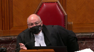
:::

Yes.

Well, we throw more shade on them.

But then, again, what's the difference, I guess, between providing that quantitative guidance by way of a range as opposed to by way of a starting point?

If we set aside the standard of review problem, right, I mean, you've talked about, you know, in your factum, you talk about kind of the baked-in sort of presumptions that go into starting points.

But we see those in ranges, too, right, in the Ontario Court of Appeal in Cunningham.

They set in all kinds.

They created a sort of a category of offence of importing cocaine for personal gain.

They baked in what would normally be a mitigating circumstance of first-time offender.

We see those same concerns arise in ranges as well.

And perhaps the same concerns can arise in any form of quantitative guidance.

So what is it about starting points that are not okay while other forms of quantitative guidance are okay?

**Speaker 1** (00:21:15): Well I'm glad you raised that because the Crown respondent as well as the Attorneys General of Alberta and Manitoba have all argued in their FACTA that ranges and starting points are functionally the same thing.

::: {.column-margin}

:::

They're not the same thing.

They're clearly not the same thing.

For example if you refer to the Alberta Court of Appeals judgment in our CAN at paragraph 125, there's an extensive discussion there by Justice Watson about how it is and why it is that ranges and starting points are not the same thing.

As a shorthand I'll just refer the Court to the FACTUM of Legal Aid Alberta at paragraph 10 and the FACTUM of the Criminal Trial Lawyers Association at paragraph 8 where better explanations than I can articulate are set out as to why ranges are not the same thing as starting points.

**Overlapping speakers** (00:22:05): Can I ask you, can I just-

**Speaker 1** (00:22:07): speaking, a range is a historical portrait which inherently encourages individualization of sentence and is bottom-up rather than top-down guidance.

::: {.column-margin}

:::

But more importantly, everyone understands that a range is just what has happened in the past.

So ranges exist whether or not any court of appeal says this is the range.

But you've accepted.

**Justice Brown** (00:22:27): already that a range can be essentially imposed top-down as we did in Friesen that judges imposing ranges or recognizing ranges don't have to wait for the jurisprudence to develop they can look at the seriousness of the offense and say well this is where it is you just can't you just can't hold the sentencing judge to that range which is again the standard of review issue that we've part

::: {.column-margin}
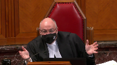
:::

**Speaker 1** (00:22:53): Right, so what I would say in response to that is simply that this court or an intermediate court of appeal can certainly say the range that we discern from past cases is too low given the information we now have about, for example, as it was in Friesen, the effect of this sort of crime on these sorts of victims.

::: {.column-margin}

:::

We understand better now than we did before what the harm is and therefore we find the range too low.

**Justice Wagner** (00:23:22): It seems to me that's the answer.

In Friesen, we did not, the court did not set up a starting point.

It says that sentences should be increased, but that's a big difference than starting point.

**Speaker 1** (00:23:34): Absolutely.

Yes, that is exactly my point.

It is a big difference from starting points.

**Overlapping speakers** (00:23:39): And I was quite out of his...

**Speaker 1** (00:23:40): well in the related context that this court doesn't owe any deference to the Court of Appeal here, nor did they in Friesen.

::: {.column-margin}

:::

Sentencing discretion is the discretion of the trial judge, not the Court of Appeal.

This court is reviewing the decision of the Court of Appeal on a basis of a standard of correctness in my respectful submission, and there's no deference that is owed.

**Justice Abella** (00:24:04): Is there, is the problem, because I'm trying to determine what it is exactly that is problematic about starting points compared to ranges, because I too have difficulty seeing conceptually what the difference is between a range, which is a starting and end recommended point, and a starting point, which is a recommended starting point.

::: {.column-margin}
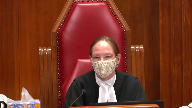
:::

And it sounds to me from your argument, leaving the methodological concerns you have aside, what you're troubled by is the way starting points are used rather than the fact of a beginning.

So if this were designated to be nine years to 15 years by the court of appeal rather than simply the nine-year starting point, and if they had built in the flexibility this court has consistently directed they build in since MacDonnell, would you have a problem with the imposition of a starting point if it is seen conceptually the same way as ranges are seen?

**Speaker 1** (00:25:16): Well I would say no I would not have the same kind of problem because again starting points and ranges in my respectful submission are not the same thing.

::: {.column-margin}

:::

Everyone understands that when we're talking about a range of sentence there are cases that will fall at the fringes of that range and there's lots and lots of appellate authority including from this court that says even sentences that are outside of that range may well be fit and appropriate sentences.

Why can't the same...

**Justice Abella** (00:25:46): apply, why can't the same apply to starting points?

::: {.column-margin}
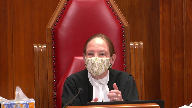
:::

Because your dispute, I think, is with the structure of starting points as being an impermissible use to go outside of the starting point.

But if it is treated the way ranges are treated and the way in principle that cases suggest it should be treated as a guide, what's wrong with it?

**Speaker 1** (00:26:19): Well, firstly, if it was treated as a guide as opposed to a binding structure and really a set of handcuffs, I would have much less problem with it.

::: {.column-margin}

:::

But the significant problem with starting points are in two senses.

Firstly, in how they are created and arrived at, which taking this case as an example, demonstrates that the court of appeal did not have regard to a sufficiently large body of jurisprudence to arrive at the decision they purported to arrive at.

Secondly, the standard of review function.

So ranges are always capable of evolution.

We see that in Friesen.

In contrast, starting points are fixed and they're resistant to change.

Now in our

**Overlapping speakers** (00:27:04): I can feel it.

**Speaker 1** (00:27:05): The Alberta Court of Appeal said, well, look, we've got this reconsideration procedure.

::: {.column-margin}

:::

So we've never said starting points are set for all time.

But the reality is, there's only ever been two cases in Alberta in which the court was asked to reconsider.

And in both cases, they denied leave.

One was Arcant.

The other was out of sight.

**Justice Moldaver** (00:27:25): in response to justice abella's question let me put this to you in practical terms the starting point is seven years and in another province the range is five to nine years it seems to me that in the other province if you want to go down to a three-year sentence or a four-year sentence it's going to be much easier because you're only coming off the range by a year or two whereas if you're starting with a seven point seven year starting point you're going down four or five or whatever it may be and that's going to attract I would have thought the Alberta Court of Appeal in a big way

::: {.column-margin}
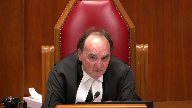
:::

**Speaker 1** (00:28:10): Yes I believe that is exactly correct and that is what is referred to as the anchoring effect or the clustering effect that is discussed in both my factum and that of some of the interveners as well.

::: {.column-margin}

:::

So where you've got a single number that is the starting point deviations from that number tend to be relatively modest where the sentencing range is a true range then deviations can occupy a larger span of available sentences.

Mr. Morrow what do you...

**Justice Kasirer** (00:28:41): You say to the, following up on Justice Muldaver's question, the answer that the Crown gives to that argument and says that starting points do not result in clustering or gravitational pull or anchoring effect, and that they point to those who say that it does and make the same argument that you made a moment ago about empiricism.

::: {.column-margin}
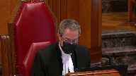
:::

They say that there's no empirical evidence that this is the case, that these are all anecdotal accounts about, in different cases where courts are shy to move from the starting point, and that one can find anecdotal ones that go the other way.

Where does empiricism come in to testing your clustering thesis?

**Speaker 1** (00:29:34): Well that you're quite correct sir that is the Crown's response is that we don't have a sufficient number of examples to demonstrate that although I have cited the social science evidence which primarily drives research in the United States there is some empirical evidence now that wasn't

::: {.column-margin}

:::

**Justice Brown** (00:29:55): about ranges.

A lot of that research was about the anchoring effects caused by ranges, and in particular, the ranges prescribed by U.S. sentencing guidelines.

So I guess what's...

**Overlapping speakers** (00:30:04): Right.

**Justice Brown** (00:30:05): concern.

**Overlapping speakers** (00:30:06): But then Paris is...

**Speaker 1** (00:30:07): So what's the difference between starting points and ranges in that sense?

Well in that sense, you're correct, there's an anchoring effect of both, but empiricism has both.

**Justice Rowe** (00:30:16): I have to take issue with the question put by my colleague.

::: {.column-margin}

:::

In the United States, they have grids, and the grids force you into a certain position.

It's a question of the application of strict law that gives rise to particular circumstances.

I challenge the premise of the question.

**Justice Brown** (00:30:39): Well, the premise is simply that it was about ranges, and...

Okay, I will ask him to answer the questions.

**Justice Wagner** (00:30:46): and I will let my colleagues discuss later on.

**Speaker 1** (00:30:51): Thank you Chief Justice.

So really what I was going to say...

**Justice Karakatsanis** (00:30:54): question then if I may and you've talked about how they're created and the problems associated with that and you've mentioned standard of review and how in other words how departure from a starting point is dealt with what about what is built into the starting point and I'm thinking in particular about any individualized factors like no criminal record for example here just want to make sure that you address that

::: {.column-margin}
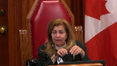
:::

**Speaker 1** (00:31:26): Yes that is indeed, thank you very much, that is indeed one of my concerns about this is the built-in assumption.

::: {.column-margin}

:::

So ultimately the problem I've got with starting points is that they limit the ability of a sentencing judge to individualize the sentence.

The fundamental premise or principle on which we should operate is that proportionality is the key to a fit sentence.

In my respectful submission and in my mind proportionality and individualization of sentence are the same thing.

So a proportionate sentence is one which is fit for the offense and also for the offender, in other words it must be individualized to that offender.

Now starting points limit the ability in my respectful submission of judges to individualize sentence because they bake in or assume so many factors.

They assume typically a guilty plea, they assume no prior criminal record, they assume prior good character of the ordinary sense, as well as assumptions about the nature of the facts that make up the index offense.

So there are so many built-in assumptions that it becomes difficult to individualize the case and demonstrate for the sentencing judge, for counsel it becomes difficult, to demonstrate for the sentencing judge why this case is any different than any other case.

And that may be what results in this anchoring effect.

**Justice Karakatsanis** (00:32:48): But do you see any difference when what you're building in relates to the gravity of the events?

**Speaker 1** (00:32:56): Well, what is, yes, the gravity of the offense essentially is always fixed when we talk about a starting point.

::: {.column-margin}
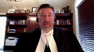
:::

So it is commercial trafficking of cocaine or it is wholesale trafficking of fentanyl or it is home invasion robbery because the starting point decision sets out hopefully with considerable accuracy and specificity the circumstances which will make up that particular offense so as to trigger the application of the starting point.

There is really no room to individualize the case in terms of the circumstances of the offense or the seriousness of the offense.

So they're all the same and the only way to individualize then becomes the moral culpability of the offender and most of that is already fixed by the presumptions that are built into the starting point as well.

So it leaves very little room which is why my first ground of appeal, my first argument here is that starting points sacrifice individualization of sentence or proportionality at the altar of parity.

Now parity is a useful thing to pursue and of course the criminal code demands us to consider parity as one of many principles in sentencing

but it's not the only goal.

But parity is the only goal of starting point sentencing.

All the starting point decisions proceed from the assumption that there's unjustified disparity.

If you look back at the very first one which was Jonas robbery of a convenience store the court there said words to the effect of we look at our docket and we see a lot of robbery cases and we see divergent sentences so we're going to now create a starting point and that was the first starting point.

Then Sandercock came along then Maskell actually Maskell was before Sandercock but in any event in all of the starting point cases the Alberta Court of Appeal has proceeded from the presumption that there's a great deal of unjustified disparity.

Now the court earlier asked me about empirical evidence to support the arguments that I'm advancing but empiricism works both ways.

In no starting point case has the Alberta Court of Appeal ever heard evidence that there is a wide degree of unjustified disparity in sentencing cases which demands appellate intervention.

That has never happened other than perhaps Hajar but other than that it's never happened.

Mr. Morrow I think your your time is up I'm sorry.

**Justice Wagner** (00:35:27): just I apologize thank you okay one more question

**Justice Côté** (00:35:38): He is in respect with the Court of Appeal statement that departing from a starting point constitutes an error.

Am I right to understand that you do not dispute the overall analysis made by the Court of Appeal of the errors of the trial judge?

**Speaker 1** (00:35:57): I have not touched upon the other errors that the Court of Appeal attributed to the trial judge because I focused my argument here on the starting point issue.

::: {.column-margin}

:::

Reasonable people can disagree about the weighing of various relevant sentencing factors.

In my respectful submission, what the Court of Appeal did, setting aside the whole starting point issue, is essentially the Court of Appeal reweighed the sentencing factors that had been considered by Justice Ouellette at sentencing and attributed different weight to the factors, arriving then at a different result, and said that that was reversible error.

All right.

Thank you very much, sir.

**Justice Wagner** (00:36:40): Thank you. Merci.

Mr. Pfeiffer.

**Speaker 2** (00:36:46): Thank you.

::: {.column-margin}
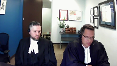
:::

Good morning.

If it pleases the court.

I fear that if this court endorses the starting point approach to sentencing, it will entrench a cruelty into the sentencing process in the name of parity.

A cruelty that will again fall on the shoulders of the impoverished, marginalized, and Indigenous.

In the Queen and Gash Canney, 2017, Justice Berger of the Alberta Court of Appeal states this, and it really strikes at the heart of the matter.

A judicially imposed starting point in the jurisdiction constrains the wide latitude and broad discretion accorded to the sentencing judges by the Supreme Court of Canada, stifles that sentencing discretion and results in a chilling effect on the ability of sentencing judges to craft individualized dispositions.

Now, I am Indigenous.

I grew up in a community plagued with issues and in poverty.

I'm now counsel and work extensively in Indigenous communities in Alberta that are much the same.

The suffering has not abated.

This has been the subject of commentary in this court in Gladue and in cases, uh, uh, Ipoli.

So, I guess I'll begin our submission with a message.

This matter before the court is not a theoretical or abstract debate.

Your decision here will have substantial and enduring impacts on lives.

Including in the commu

**Justice Brown** (00:38:27): communities where Mr. Felix was dealing drugs in the Northwest Territories, which are 51% indigenous.

::: {.column-margin}
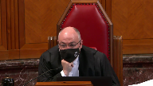
:::

We know that indigenous people are many times higher, likely to die of an overdose than non-indigenous people.

There's peer-reviewed research to that effect, and that they are statistically much more likely to have an overdose than non-indigenous people.

Should we factor that into our consideration as well?

**Speaker 2** (00:38:53): The issue there is this.

::: {.column-margin}

:::

When the court set the nine-year starting point in Felix, the court also set a sort of a notional starting point of six years for commercial trafficking beyond a minimal scale.

That is the category that is going to capture up in it, cast this net too broadly and capture those very persons in those communities.

We place those people in in impoverished situations more over policed, more likely to be involved in the criminal justice system.

It's that category that is going to capture these persons.

**Justice Martin** (00:39:40): May I ask you this question, though?

::: {.column-margin}
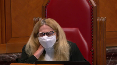
:::

I mean, I understand your point about the relationship between the criminal code provisions and starting points.

And Mr. Rudin has written about this and that.

But my question is, understanding that critique, I hear the same critique of ranges as well, that it's not a difference between a range and a starting point.

It's a more generalized problem of sentencing.

And so my question to you is, accepting your premise that this needs to be taken into account, is there any difference between ranges and starting points in terms of putting this forward?

And then the next question I would ask is, what does a court do when, in the Parenteau case, the defense has waived the Gladjou report?

**Speaker 3** (00:40:46): If I may, Madam Justice, the issue about the difference between ranges and starting points is a very important issue and just trailing on what Mr. Moreau, my friend, has said, the difference between ranges and starting points is that ranges are more flexible.

::: {.column-margin}

:::

They allow you to take into account case-specific factors, things like Gladoux factors, in a way that starting points don't.

For starting points, a portion of the analysis is already conducted, assuming an offender of good character, assuming no criminal record, assuming a particular class of archetypical offence.

We're no longer prosecuting an individual before the court.

At that point, we're abstracting away.

We're talking about these abstract notions, and it's different in Canada than in the U.S. when you talk about things like grids, those sorts of things.

It's a human process here.

We put trust in sentencing judges, and when you take that discretion away, it's a very, very troubling thing.

The other related issue that perhaps I'll touch on later and we touched on in our factum is ranges, as Mr. Moreau has stated, are more amenable to change over time.

They're more reactive to changing needs in communities.

So, for example, we mentioned a lot in our factum about harm reduction, shifting views about the sources of drug addiction, mental illness, poverty, closely tied into Gladoux factors.

And I think over the next 10 to 20 years, things are going to change.

The stigma surrounding mental illness and addiction, which particularly visits as harsh as consequences on communities such as Indigenous communities.

When you have a starting point that's ossified for 40 years, it's not as reactive to changing views.

Sentencing judges aren't able to take those changes into consideration.

And building on what Mr. Moreau has stated about the way these starting points are fixed, not only do you not have evidence or empirical evidence about disparity or that sentencing judges are simply going to throw caution to the wind and impose whatever sentence they want, we have no evidence.

We have serious concerns, as Justice Berger has cautioned in this sense, as this court has cautioned, about whether or not deterrence is even effective, particularly for this class of individuals captured by a six year starting point for something resembling a one-time transaction that could be captured by the commercial starting point.

That is going to continue to disproportionately impact Indigenous offenders and have a chilling effect on sentencing judges' discretion.

You have a range, it's organic, it evolves over time.

It's part of a judicial dialogue between the lower courts and appeal courts and sentencing judges have the discretion they need to take these things into consideration, to changing views about drug use and addiction, to dispel these stigmas over the course of time.

And with respect to your question about ranges and starting points, I think that's an aspect of the dialogue that we need to focus on.

As far as the second aspect of your question, what do we what do we do when we waive a right to a glue report, like in Parenteau, I think that those considerations always form part of the circumstances of the offense.

I think regardless of whether it's specifically raised, that sentencing judges do need to be aware and are well aware of the communities in which they serve.

It's about the communities.

We appoint sentencing judges for a reason.

The criminal code delegates this task to sentencing judges for a reason.

We trust their judgment.

We trust their wisdom, their ability to balance these various factors and ultimately their humanity.

And that's the difference between these grids, between the starting point approach, abstracting away from that individual level.

**Justice Brown** (00:44:37): So, were we wrong in freezing to do what we did? No.

Sorry, sir.

**Overlapping speakers** (00:44:42): Shouldn't we have just trust?

**Justice Brown** (00:44:43): trial judges to understand local conditions and then post fit sentences.

**Speaker 3** (00:44:52): No, I think that this court was exactly correct in Friesen and I think that that is the key role of appellate courts responding to a particular need and proceeding in a top-down fashion and but also a bottom-up fashion based on evidence and broader policy considerations.

::: {.column-margin}

:::

I think appellate courts should be giving guidance but it can't be a one-way street.

We still need to be drawing on wisdom of sentencing judges while at the same time allowing them discretion.

Friesen I think is a perfect illustration of the role of appellate courts insofar as they recognize a need.

In that case it was a new class, it was a growing recognition about the harms of a particular class of sexual offences and if I'm not mistaken this court did consider empirical evidence in that case.

The concern here is there's no other side to the dialogue.

Are longer jail sentences going to deter crime?

The evidence suggests not and we don't have evidence of clustering or empirical evidence.

I would suggest there's evidence there.

There's evidence from sentencing judges specifically saying that there's a chilling effect.

There are the studies from the U.S. and empirical data but it's equally as dubious to have this solution that taking discretion out of the sentencing judge's hands, imposing stricter or longer jail sentences by applying the standard of review in a particular way, it is dubious to suggest that that is going to make things better and in fact it risks making things worse as we set out in our arguments.

Careful deliberation by sentencing judges, give them the discretion to consider those things in the communities where they serve every single day in real cases with real offenders, with real victims and they do this, they balance the various competing factors.

Parity is an aspect of the range, it's important.

Appellate courts can give guidance for that but you can't shackle the sentencing judges, you can't take away those key aspects of their discretion.

That's not how sentencing works in Canada.

**Justice Abella** (00:46:56): Was it inappropriate in your view for the Court of Appeal to say that fentanyl trafficking warranted its own category of consideration, leaving out starting point versus ranges?

::: {.column-margin}
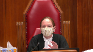
:::

Were they entitled to create that class of offense for particular consideration in sentencing?

**Speaker 3** (00:47:20): Our position was that it was too soon.

::: {.column-margin}

:::

And part of the basis, and I think my friend will know, is we talk about there being four sentencing decisions.

I think in fairness to the Court of Appeal, they weren't just building on four fentanyl decisions.

They were building on this entire elaborate architecture from the four-year starting point in Moscow, from the three-year to the four-year to the five-year.

And so they do rely on ordinal reasoning there, but you're building up from an ossified four-year starting point.

And again, all those concerns about how these starting points were constructed, the manner in which they were constructed, the way that they don't account for changing societies, you get trapped in and you just continue to go up from there.

And there's no effective way to critique these starting points.

In general, how we're sentencing drug offences, if it's helping, and the way in which it's impacting vulnerable communities.

Sentencing judges over the next 10 years, over the next 20 years, as we learn things about the sources of addiction, as we dispel this stigma about drug use, particularly for this class of vulnerable individuals, street-level addicts that are looking at a six-year starting point for a commercial minimal scale, how far can a sentencing judge go from that?

You're looking at an individual who's been sentencing for a six-year starting point.

**Justice Brown** (00:48:34): We've heard a lot about the offender.

::: {.column-margin}
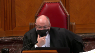
:::

Something we haven't heard about is the other part of proportionality, which is the gravity of the offense.

And I understand it's awkward given the gravity of the offense that your client is charged with.

He's not supporting an addict.

He's not supporting an addiction.

He's the top of the chain here.

And he has other people do his dirty work.

He's the Tony Soprano.

So let's talk about a different offense that is also serious.

Like sexual assault.

Back in the days when trial judges were routinely giving 90-day sentences intermittently served for sexual assault in the Alberta Court of Appeal said, no, it's time to treat these things seriously.

Were they wrong to impose a three-year starting point?

And if so, why?

**Speaker 3** (00:49:25): I think, I think that it comes down to guidance and judicial dialogue.

::: {.column-margin}

:::

I think that it was correct to identify a pressing social need and that's based on changing views in a society and that's perfectly consistent with the role of an appellate court.

But I would imagine at that time, they had a broad body of case law and there was a...

**Overlapping speakers** (00:49:46): empirical evidence of 90 day sentences.

**Speaker 3** (00:49:49): So, and that's where, and absolutely, and that's where appellate guidance comes in because in those cases there will be a degree of disparity and they point to it specifically and say here's disparity, here's a pressing social need, and that's part of the dialogue between lower courts and higher courts.

::: {.column-margin}

:::

It doesn't sound w-

**Justice Brown** (00:50:08): That sounds like a dialogue, that sounds like a direction.

**Overlapping speakers** (00:50:12): I mean, I don't understand the...

**Justice Brown** (00:50:13): This dialogue metaphor of yours seems rather fanciful.

I mean, appellate reviewers are not engaging in a dialogue with trial judges.

They're doing what we said is perfectly acceptable in Friesen, which is to set a new direction.

**Speaker 3** (00:50:33): Yes, and so what we're doing in these cases, especially, preferably if we were dealing with ranges, is identify oppressing social need, increased awareness about the harms that sexual crimes visit, identify the source of that need, identify outliers, and say that there's been a shift in social views.

::: {.column-margin}

:::

With a starting point, that's ossified.

Sexual offences are a different class of offences.

When we're looking at drug-related offences, it's a lot more complicated.

We're looking at empirical data.

We're looking at issues about deterrence, mental health, addiction.

These more go on the mitigating side.

I take your point, though.

I think the problem in this case, ultimately, was that it wasn't drawing on a wealth or body of case law, and that there were serious, tribal, empirical issues.

I don't think that there was much room for debate in the literature at that time or in Friesen about the harms that these class of sexual crimes visit.

I don't think that there was any reasonable debate about that, and this court could easily go to empirical evidence and provide a measure of guidance to sentencing judges.

The case of drugs, drug trafficking, drug-related harms, much more complex.

**Justice Brown** (00:51:45): There's a debate in Fort McMurray about whether wholesale fentanyl trafficking is a serious problem that doesn't have grave effects on society.

::: {.column-margin}
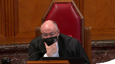
:::

There's a debate in Yellowknife about these things.

There's a debate in Edmonton.

I'd be surprised.

I think there's a general recognition that there's a serious problem.

**Speaker 3** (00:52:08): I think that's absolutely fair there is a serious problem and it's it's grave proportions and so there's no reasonable debate that it's a pandemic and that we have is that we have to do something that it's a public health crisis the question is what the answer is and you have medical health professionals policymakers and they deal with evidence they adopt an evidence-based approach to addressing these issues the criminal justice system plays a role in that in prosecuting crimes in attempting to curb the illicit sale of drugs but with respect for an institution that prides itself on logic on dealing with things in an evidence-based way the criminal justice system in setting these starting points and its slavish adherence to denunciation and to deterrence to general deterrence is the only institution or stakeholder in this debate that has failed to adopt an evidence-based approach and to the extent that there's evidence in the literature that there's serious concerns expressed by some of the in some of the articles we cited that ultimately this is causing more harm it's a lot different than identifying outliers and setting up setting a starting point for sexual offenses when we're talking about fixing in this case a notional starting point of six years for a street level trafficker what are we going to do we're going to take them off the street six years starting point there what what sort of derivation from a starting point could there be in that case with an anchoring effect you have someone that's addicted to drugs that's grown up in poverty they're impoverished in many senses for the case for example in the cases of indigenous offenders we've created the very circumstances that have contributed to leading to them to this point and the answer is six years starting point two years in jail three years in jail take them away from their families take any future prospects and grant and absolutely there are going to be cases like the case below where you're not dealing with these considerations that's why a seven-year sentence was imposed it was a strict sentence there were mitigating factors and that seven-year sentence was not out of line as we've set out in our factum with other decisions at that level and there were mitigating factors and I don't want to abstract away from the facts in this case but we have to appreciate that we've now sit set a six-year starting point for commercial trafficking and fentanyl and it's going to have serious impacts on our communities and the problems that sentencing judges see every day they need to have latitude to derivate in appropriate cases and not be shackled by six-year starting point when dealing with someone where their problems could be better addressed by harm reduction by rehabilitation restorative justice and and that is the most substantial problem over the next 10 to 20 years we can hope that as societal views change about these issues these stigmas about mental health and addiction that we'll see a shift but in the 40 years since Maskell we've learned that starting points will stop that from happening

::: {.column-margin}

:::

**Justice Martin** (00:55:14): May I just ask you, I'm going back always to the methodology here in terms of I understand what you're saying about I guess the overarching result of sentencing and the priority that you say is being given to deterrence

::: {.column-margin}
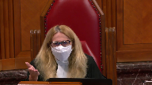
:::

and I understand your point about it being ossified.

But if the court of appeal here had expressed the same sentiments in a range or had used a harms-based approach to say that the trafficking in fentanyl has serious harms, what does that I mean, what is the starting point?

Why is the starting point the problem?

If those same messages that you're saying shouldn't be part of the law can be made part of the law either as part of a range or as part of a harms identification per offence.

**Speaker 2** (00:56:17): Really, I'll address that question, three things. One,

**Overlapping speakers** (00:56:21): and

**Speaker 2** (00:56:22): we've noted in the conversation earlier.

::: {.column-margin}

:::

The departure from a range, from the bottom end of a range may not be as swiftly intervened on by an appellant court.

Whereas a starting point, the deviation from that central point is more readily appealed.

Secondly, there is, with respect to the range approach, and Mr. Craig touched on this, with respect to the range approach, there is more contribution from the wisdom of judges.

Sentencing judges, trial judges.

As attitudes or social sciences change, so too can the input from the wisdom of these sentencing judges.

Now, that speaks to the issue of this sort of concept of an ossified starting point.

It's the opposite of that.

Once that starting point is imposed, it's been shown to be rigid.

We're 40 years since the Maskell starting point.

It's still applied.

There's been no real assessment of whether that reasoning for setting that starting point, the social impact it was having at the time, is still present.

Currently, judges are still sentencing with reference to that starting point.

They have to.

With a range, it's quite a bit more adaptable than the ability to evolve.

Again, with respect to regional disparities, sentencing judges in a small Indigenous community in northern Alberta may have a different consideration with respect to what is an appropriate sentence.

They can contribute to the range more readily without a reference to a starting point that applies to the entire province.

The range is simply much more adaptable and responsive.

It places trust back into the hands of the trial judges.

**Justice Abella** (00:58:41): Are they much more flexible and responsible or have they been treated by the Court of Appeal as much less flexible and responsible?

::: {.column-margin}
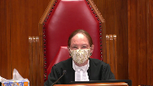
:::

In other words, if the direction were once again given to the Court of Appeal, this is not an error in principle.

It is not an inflexible approach.

Treat it the way the country treats ranges in general and not as not as something that on a standard of review can make a sentence unfit.

Would that address your concern about that aspect of your argument?

**Speaker 2** (00:59:21): Well, with respect, when a starting point is set, judges have to make reference to that starting point, and the variance has to be justified.

::: {.column-margin}

:::

If this court simply says, look, this is not a ground for applet intervention, departure from from a starting point, even significant.

**Justice Wagner** (00:59:43): In that aspect, in Friesen, we said that appellate courts cannot treat the departure from or failure to refer to range of sentence or starting point as an error in principle.

::: {.column-margin}
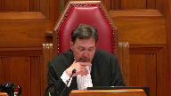
:::

We already said that.

Obviously the Court of Appeal in Alberta does not understand, but it was said already.

**Speaker 2** (01:00:05): This is true.

::: {.column-margin}

:::

And as recently as 2017 in the Corbiere decision, at paragraph 23, the court actually makes a fairly strong statement there.

They cite lacasse and they say, well, this isn't necessarily grounds for intervention.

Where there's significant departure from the starting point, it can form the base of intervention.

Then they go on, that's paragraph 22, then they go on to in paragraph 23 and they state that defense counsel had presented a number of sentencing decisions from lower courts.

Then they state, had those been appealed to this court, they may not have been upheld.

And go on to say, as such, they do not need to be discussed.

That's a fairly strong statement by the Alberta Court of Appeal in Corbiere that, and logically has a chilling effect on sentencing judges, trial judges, where they're saying, look, you've presented a bunch of lower court decisions, we don't even need to discuss those decisions.

They probably wouldn't have been upheld if they were here.

**Justice Rowe** (01:01:26): Is not the Alberta Court of Appeal simply being logically consistent and applying its own methodology faithfully, and isn't that really the problem?

::: {.column-margin}
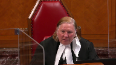
:::

That was a lob.

**Speaker 3** (01:01:56): They are being faithful to the approach, and I think that there's compelling reasons on the surface to think that it's going to work.

::: {.column-margin}

:::

Consistency, parity, and emphasizing denunciation and deterrence, which are crucial in many cases.

But those are only, if you have a range, those are only aspects of the process.

**Justice Brown** (01:02:21): Trafficking of fentanyl but pardon me like wholesale trafficking of fentanyl

**Speaker 3** (01:02:28): Yes, that's correct.

::: {.column-margin}

:::

And I think in these sorts of cases, we need to emphasize denunciation and deterrence, as the sentencing judge did, the experienced sentencing judge in the case below.

Strong statements about the dangers of fentanyl, but as he should, he considered a variety of other factors.

Rangers comprise a matrix of different considerations, not just parity, denunciation, deterrence, rehabilitation, restorative justice, restraint.

These are all aspects of the range that are taken out of the hands of sentencing judges in cases where you're focusing and abstracting on this starting point approach.

And to your question about are they just adhering to this approach, they're taking these issues out of the hands of sentencing judges.

That's what's fundamentally different, and we need to put our trust back in them.

**Justice Abella** (01:03:18): But then your answer is yes to Justice Roe.

::: {.column-margin}
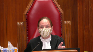
:::

The problem is not a court of appeal saying in our view based on what we've read and what we understand from the trial judges and what's happening out there, we need to ensure that sentences are reflective of all of the sentencing principles plus the seriousness of a particular offence and therefore we're saying presumptively start with this point.

What they're doing instead is saying if you don't start with this point, your sentence is going to be overturned.

So isn't it a question of approach rather than philosophy?

Because there's nothing wrong with the court of appeal in setting a range saying we've decided based on what we've understood is going on and based on our assessment of the seriousness of this offence that it requires a particular sentencing approach which is higher than what has been done.

So what they don't do is they don't have an unless component and that's the problem, isn't it?

**Speaker 2** (01:04:31): That's part of the problem, but that alone is not the only problem.

::: {.column-margin}

:::

It ignores the start point, does a couple of things.

It builds into it the archetypical offender and offense.

That's one problem.

So now the judge, the sentencing judge can't consider, look, he's got no criminal record or they have good character.

Those things are built in.

So that's irrelevant considerations.

Those things aren't grounds now for a sentencing judge to intervene, to look at this individual and say, hey, you know, this weighed on me.

Those are built into the starting point.

Those are no longer relevant.

**Justice Brown** (01:05:12): If our direction were to prevail, as it should, that the departure from a starting point is not in and of itself an error, do those concerns still persist or do they fall away?

**Speaker 2** (01:05:28): Well, if we look at the approach so far, I would suggest that they persist.

**Justice Brown** (01:05:36): But if our direction were to prevail, then do those concerns persist or do they fall away?

**Speaker 2** (01:05:44): I think they still persist.

**Overlapping speakers** (01:05:48): Wow.

**Speaker 2** (01:05:48): There's still the start point of the anchoring effect and the fact that you have to consider as irrelevant things like good character and no-comeric.

That's one thing.

But if we're...

**Justice Brown** (01:05:59): We're applying the starting, the standard of review properly, right.

So we've said it's not an error to fail, to have regard to a starting point fail.

**Overlapping speakers** (01:06:09): 1-5

**Justice Brown** (01:06:09): Why do those other concerns persist if that's the case?

**Speaker 2** (01:06:16): Well, we still have the issue of the adaptability of this approach.

::: {.column-margin}

:::

The evolution of the sentencing up, you know, the sentencing on a given start point.

Here on a start point, again, as we've mentioned, it becomes ausified.

It becomes a rigid application.

That problem still remains on the start point approach.

**Overlapping speakers** (01:06:42): I don't see how.

**Speaker 2** (01:06:43): how we get around that.

**Justice Wagner** (01:06:47): All right.

Thank you very much.

I think your time is up now.

Thank you.

Mr. Danielle Song.

**Speaker 4** (01:07:05): Thank you Chief Justices.

::: {.column-margin}

:::

On behalf of the Criminal Trials Association, Tanya Shapkin and I ask this court to consider one important question in your deliberations.

If uniformity of approach is such an important sentencing objective in Canada as the majority stated it can, why after 40 years do most jurisdictions use a different approach from Alberta?

Now there are a myriad of reasons in my submission but one of the biggest reasons I would say is that the Courts of Appeal are just simply not equipped to make sentencing policy.

**Justice Brown** (01:07:49): position in the Criminal Lawyers Association advanced in Friesen.

::: {.column-margin}

:::

In Friesen, you said, the association more correctly said, I think it was you, promoting consistency while preserving discretion is something that non-binding guideline judgments have the capacity to do.

Starting points then can still be useful.

For the Criminal Lawyers Association in Friesen, the issue was really the appropriate application of the standard of review.

Now you're saying it's a 40 year experiment that's failed and that really this isn't something that courts of appeals should be doing at all.

How do I reconcile these two positions that your association has taken?

**Speaker 4** (01:08:39): You would reconcile them, Justice Brown, because there are two different cases.

The case in Friesen was not dealing with whether the starting point approach itself, in and of itself, was valid.

**Overlapping speakers** (01:08:49): But you nonetheless opined on it, you nonetheless opined on it.

**Speaker 4** (01:08:56): submission, the thrust of the submission in Friesen was to address the manner in which the Alberta Court of Appeal was treating starting points as binding.

::: {.column-margin}

:::

But the appellants in my submission in this case have squarely put before the court the question of whether starting points are an appropriate and a valid approach to sentencing in a broader sense.

And so in my submission, that's the only explanation I can give to the court as to the the distinction between the submissions from from Friesen and now.

But I do advance the submissions on behalf of the CTLA that here starting points are not that this court must address whether starting points are a valid form of sentencing.

And when I say that courts of appeal are not properly equipped to deal with policy, we only need to look at that Sentencing Commission report way back in 1987 where they said that courts of appeal are not structured to make comprehensive policy to provide guidance to trial judges.

It's because they only respond to cases on a, sorry, to issues on a case-by-case basis.

They don't have the means and the resources to gather all the necessary information to create policy on appropriate sanctions and frankly they just don't represent the people.

Parliament does.

And so, and Parliament didn't take the recommendation to create a permanent Sentencing Commission to give guideline ranges, but it's noteworthy that the Commission was to consult with a Judicial Advisory Council, a majority of which was to be comprised of trial judges, not appellate judges.

So the Commission recognized that sentencing judges were the ones who had, were better positioned to understand the needs and the spirit of their local communities.

Now I want to kind of try to address in my short time a few of the concerns that the court has raised.

The, isn't the issue and the problem with starting points the application of the categorization of these, of these starting points?

I don't want to steal Mr. Bouldwell's thunder, but I know that he's going to be dealing with some of these issues, but in our factum I do, we do highlight the fact that in Alberta there's still a persistent debate about whether digital penetration is a major sexual assault.

I mean those debates would not occur in my submission if, if we were dealing with ranges.

Ranges do not create these categories that become sort of the focal point of the sentencing process.

**Justice Brown** (01:11:40): Some of them do, some of them do.

The Court of Appeal of British Columbia in Boone, Ontario Court of Appeal in Cunningham, they create categories.

**Speaker 4** (01:11:47): Yes, so I'm not going to say that ranges cannot be applied incorrectly.

::: {.column-margin}

:::

So it's not, this court shouldn't be assessing the starting point approach by simply just comparing it to ranges.

It's certainly a possibility that appellate courts might be applying ranges incorrectly as well.

It's, this court should be analyzing the starting point method, methodology in and of itself, and when we do look at ranges, you can, you can accept that the court of appeal in Vung, for example, they didn't create a starting point category that bleached mitigating factors outright.

They say it's a first offense drug trafficker who would get sentenced between six to nine months.

The court there went through trial judge, sorry, previous cases in which sentences were imposed to establish that range.

The court of appeal reviewed those previous cases in order to determine what the appropriate range would be.

As we had stated in the factum, the same court of appeal in Williams after this court released Friesen declined to set a range.

It's not in my submission, the, the role of an appellate court to set a range of sentence or a starting point in the abstract.

It has to be grounded in something.

And in my submission, the wisdom and collective wisdom and the history of cases, certainly that's what provides a strong foundation in terms of determining whether, whether there is in fact a range.

It's an exercise that we, we learned from law school.

We have to rely on past decisions to determine whether the current decision is correct.

And if we're going to talk about prospective analysis, then the appropriate venue is parliament.

It's not the courts of appeal.

And I just say that if the court looks at the analysis in Arcan, the majority rationalize the starting point by reviewing the legislative history of CSOs.

It was the 2007 amendments that excluded sexual assaults that justified the, the starting point that was set in that case.

So it's the escalation of restrictions that signaled the need for the approach to focus on proportionality and parity.

Now we have Bill C-22 in the pipeline, which if passed will repeal those very restrictions.

So when Justice Brown, you say, well, what about these 90 day sentences?

You know, at the time, perhaps that could be justified given parliament's signal.

But with Bill C-22, what are we to do?

Bring another reconsideration motion that's going to fail?

Each time parliament changes its mind, the starting points just don't allow us to react and adjust in a timely way when parliament expresses the ever changing will of the people.

And just Chief Justice, if I might end this way, we have to trust our sentencing judges.

We have to trust the character of our sentencing courts.

We signal a change of direction and allow these policy debates to be aired in the proper venue, which is down the street from this courthouse.

Thank you very much.

**Justice Wagner** (01:15:05): Thank you.

Ms. Roentgen?

Thank you.

**Speaker 5** (01:15:11): Good morning Chief Justice, Justices.

::: {.column-margin}

:::

I'm here this morning for the Canadian Civil Liberties Association along with co-council Heather Ferg and I think the clearest way to advance our point is to answer what I believe was the first question of the day which is why the problem is starting points rather than the standard of review

and I took that question to be related to a recurring theme this morning which is why is the problem, why are the problems we say exists with starting points not present in ranges.

My answer to that question would be starting points pre-consider a large number of sentencing factors.

They then place the burden on the sentencing judge to justify why they've considered additional factors or tougher still for a sentencing judge why they would weigh the factors built into the starting point differently than the Court of Appeal did and in my view that means the standard of review problem is embedded in starting points.

Individualized sentencing will tempt appellative interference every time.

The difference between starting points and ranges is that ranges reflect a body of knowledge, body of wisdom and the collective consideration with specific facts, specific arguments arising from trial courts.

They arise I would say from a call in the law when they are compiled by Courts of Appeal and there was some discussion about this Court's decision in Friesen and I think Friesen is an example of a kind of appellate guidance at the opposite end of the spectrum from starting points.

When you look at the breadth of material reviewed in Friesen which was used to identify the problems in the law, the places where the approach to analyzing these offenses had lagged or become inconsistent with the appropriate principles and which principles ought to be given priority, what Friesen provided was the way to do the analysis, not the analysis itself and that I would say is the primary distinction between starting points and ranges.

There was discussion earlier about the appropriateness of guidance from appellate courts from the top down, whether it's appropriate for appellate courts to take the lead and my submission would be that that's not what happened in Friesen and Friesen reflects the sort of approach that significantly differs from starting points.

What you have typically in the starting point cases is assumptions about policy, policy goals and sentencing objectives and the court departs from there and the difference I would say between cases where ranges are identified by courts of appeal and that approach is that the nature of the problems to be solved, the places where trial judges either have significantly disagreed with one another, where there is intolerable or unjustified variation or in the case of the 90-day sentences referred to earlier, where they have perhaps lagged behind prevailing wisdom and social progress, those emerge in the cases

and so I think in terms of the the idea of a dialogue between trial courts and courts of appeal, even if the court of appeals response to a body of law is that is not the correct approach.

Let us tell you what the principles are and let us identify for you what sort of factors and objectives you ought to be looking for here.

That is significantly different than the court of appeal going on to inform the trial court of what the sentencing objective weight ought to be and bind their hands in terms of identifying a proportionate sentence and that deprives individuals at future sentencing hearings of the opportunity to make the arguments that contribute to advancing the law in those areas.

I think that there was also a question earlier about the if the kinds of prioritization that or the sort of emphasis that's being given in starting points came in ranges, why would that be preferable or how would that be different and what I would say is if that kind of guidance came following a rigorous debate in dozens or hundreds of courtrooms about how reasonable people might disagree about the sentencing objectives, then that answer may well be different at the end of the discussion.

**Justice Wagner** (01:20:08): Thank you very much.

Jonathan Rudin.

**Speaker 6** (01:20:20): Thank you, Chief Justice, Justices.

::: {.column-margin}

:::

It is our submission that when the Alberta Court of Appeal hears a starting point case involving an Indigenous offender, it means that the direction set by this Court in Glewydewin Ipealy will be ignored.

And we want to make it clear at the outset that the Alberta Court of Appeal is certainly capable of issuing sophisticated and nuanced decisions involving the sentencing of Indigenous people.

Indeed, the Okemah decision which we reference in our factum and which was a range case is an excellent example of that.

However, as we also demonstrate in our factum, this appreciation for Glewydewin Ipealy vanishes when the Court addresses cases that depart from their self-imposed starting points.

And three decisions from the Court of Appeal make this clear.

Harkon from 2010, Corbiard from 2017, and Hillback from 2020.

In each of those cases, the Court of Appeal overturned decisions of judges that clearly and carefully applied this Court's direction on the sentencing of Indigenous offenders.

In all of these cases, the Court of Appeal's discussion of Glewydewin is either non-existent or cursory at best.

You've already heard about Harkon today.

The Court of Appeal and Harkon in our submission was so concerned with setting out its creed occur in defensive starting points, that the fact that Mr. Harkon was an Indigenous, young, first-time offender was barely mentioned in the decision.

In overturning the intermittent sentence and determining that a two-year, less-a-day sentence was appropriate, the Court's only acknowledgement of Section 718.2e was to say, quote, if those circumstances were to be replicated for a non-Aboriginal young person, the effect would be much the same.

In Corbiere, the respondent Felix referred to, the Court of Appeal specifically mentions Lacasse, but then goes ahead and does exactly what you warn Courts of Appeal about in that case.

Unlike Harkon, the Court acknowledges Glewydewin, but never explains why, in light of that decision, it was necessary to replace an intermittent sentence with a one-year sentence.

And in Hillback, the Court of Appeal cites this Court's decision in Friesen, saying it's not an error of law to depart from a starting point.

Significantly, while citing and then ignoring Friesen, the Court of Appeal does not cite those portions of Friesen that specifically speak about the necessity to apply Glewydewin in all cases when Indigenous offenders are sentenced, to always keep in mind that these considerations may have a mitigating impact on moral blameworthiness, and that, quote, a different or alternative sanction might be more effective in achieving sentencing objectives.

And Justice Brown, that is why it's our position that you can't give direction to the Alberta Court of Appeal on these issues, because they will always find ways to make the starting point supreme, and in the context of Indigenous people, it will mean that those factors will be ignored.

And that's what happened in Hillback, because the Court of Appeal said that the Court over—the trial judge overemphasized Glewydew factors, but never really explained what that meant.

And so why does the Court of Appeal have to ignore Glewydewin, I peely, when enforcing its starting point regime?

And we think it's because the approach demanded by this court to the sentencing of Indigenous offenders is antithetical to the philosophy behind starting points.

As you've heard, starting points ostensibly already take into account the best offender, one with good character and no prior criminal record.

Starting points are grounded in the concept of the hypothetical offender.

And what did this court say in I peely about reliance on hypothetical offenders?

They said— you said, quote, there is no sense comparing the sentence that a particular Aboriginal offender would receive to the sentence that some hypothetical non-Aboriginal offender would receive because there is only one offender standing before the court.

And that's the essence of the problem.

As the cases we've discussed show, starting points blind the Court of Appeal to the Indigenous person before them.

To see the person, to engage in the analysis required by this court in Glewydewin, I peely, to do what the Court of Appeal itself did so well in Okemah is to challenge the very essence of the starting point concept.

And in order that this does not occur, when the Court of Appeal hears a starting point case involving an Indigenous offender, they make a concerted effort to ignore the person before them.

They ignore Glewydewin.

They ignore I peely.

They perpetuate the systemic discrimination that this court has condemned in clear and plain language.

Simply put, starting points are fundamentally incompatible with Glewydewin and I peely.

Thank you, miigwech.

**Justice Wagner** (01:25:34): Thank you, thank you very much.

Dane Butterwell

**Speaker 7** (01:25:40): Yes, hello Chief Justice, Justices.

::: {.column-margin}

:::

I'm going to part ways a little bit with some of the other counsel you've heard from already.

I don't think the debate here is about whether appellate courts can provide what I would call perspective guidance.

A range doesn't need to be historical portrait.

We're legal aides not so concerned about whether it's a bottom-up or a top-down approach, but I would like to highlight a few methodological concerns about these sorts of cases and these sorts of sentencing issues that I think remain real.

The first is you have a wholesale trafficking case in relation to a particular type of crime in front of you, but we know that sentences are calibrated in relation to all sorts of other issues, all sorts of other sentences, these ideas of ordinal and cardinal proportionality, and it's very difficult for a court to hone in and recalibrate just one small portion of the overall sentencing landscape.

And I think it's important for courts to recognize there are some functional limitations on when any appellate court can address and readdress sentencing wholesale.

There tend to be all sorts of sub-issues and these epic sentencing decisions that never quite get their due from either the court or the advocates.

And you know, if you delve into how starting points and drug cases have worked in Alberta for the last 40 years, there's all sorts of nuances that I would submit aren't necessarily this court's job to fix.

Just a few simple examples.

Getty, which was this 1991 decision, reasons for judgment reserved to the extent that matters, suggests things such as addiction isn't mitigating, profit motive isn't actually, or is profit motives aggravating on top of the starting point category.

I could spend 10 minutes on those points alone and talk about why they're inconsistent with section 10 of the CDSA, why they're inconsistent with what this court said in Lloyd.

Totality's in play in this case, the value of a late guilty plea and the post-surdine era is at play in this case.

There's all sorts of issues we just can't get to in one sentence appeal like this.

And so I think that that cautions some, a restrained approach when approaching these sorts of big sentencing cases, because there are real evidentiary concerns.

Justice Brown, you asked rhetorically, is there any debate here about the harm of fentanyl and Fort McMurray or Yellowknife?

I don't think there is.

But what there is a very real debate about is whether increasing sentences that are already long are going to do anything to achieve the goal of general deterrence, which we've seen time and time again roots what the Alberta Court of Appeal does with starting points.

That is the rhetorical rationale for why sentence, starting point sentences are imposed, the idea that we need to send a message.

And I would suggest it's telling that none of the respondents or the attorneys general have cited any social science evidence to contest what's been put in front of the court about the dubious value of general deterrence.

So the concern isn't here to do with denunciation.

We know that fentanyl trafficking and particularly high level fentanyl trafficking is problematic.

But the real concern here is that many of Alberta's starting point categories, and particularly those for drug offences, are just too vaguely defined to provide meaningful guidance.

And they sweep in vastly different offenders with vastly different moral culpability.

Everything from the high level traffickers that are running the big operations to potentially naive couriers like Ms. Giroux, who we've cited and we've talked about before, that get pulled into this big category.

And that's what's different about ranges.

In other provinces, there doesn't tend to be this focus on do you fall into this category or that category.

There doesn't tend to be this focus on, you know, is this particular mitigating factor part of the archetypal offense or not.

But by picking a single number, a single jail sentence to apply to this broad variety of offending, what starting point sentencing does is it turns into a debate about what is that archetypal offense.

And I would submit it's telling that we are 40 years after Maskell.

And the best the Alberta Court of Appeal has been able to say is that, well, you know what, we'll define this category through the case law.

With all due respect, that's problematic.

If Parliament were to define some sort of an offense like that, it would probably be struck down for vagueness or overbreadth.

And when this important sentencing category is defined in Alberta this way, and we can't even talk about what's in it, I would suggest there's a reason why we keep coming back to this problem in Alberta.

There's a reason why we have ongoing dialogue with the Court of Appeal about how much the starting points can be used as a means of appellate review.

It's because it's inherent in the starting point approach that when you pick one number and you categorize all of this whole world of wholesale drug trafficking or commercial drug trafficking to one number, it becomes very, very important whether something is technically aggravating or technically mitigating or technically falls in.

And that's just completely different than what this Court did in Friesen, where it defined child sex offenses writ large.

And it simply said, this is usually where it ends up.

I think it's troubling that in a recent case called Hochan, the Alberta Court of Appeal said that it viewed that as this Court setting a starting point.

What I'd ask the Court to do is articulate the methodological differences here, the key one being there are not these big debates, these categorization debates.

As for the suggestion, there's no empirical evidence about sentences clustering.

This is the difficulty.

A range at least gives some broad notion of where it usually falls.

One sentence, one data point, I would submit it's just inherent that trial judges are going to be very nervous about moving too far one way or the other.

So we would simply ask this Court to make a clear statement that it is not suspicious, not suspicious for there to be a substantial deviation, whether it's a range, whether it's a starting point in the presence of mitigating factors.

And second, to say that what the Alberta Court of Appeal has done in terms of its definition of starting points isn't respectful of what was said in Stone about the need to define them with clarity.

Thank you very much.

**Justice Wagner** (01:31:08): Thank you, sir.

**Speaker 8** (01:31:14): Oui, bonjour M. le juge en chef,

bonjour mesdames les juges.

Je vais tout d'abord réitérer les arguments que nous avons présentés

dans notre

**Overlapping speakers** (01:31:24): Awwww

**Speaker 8** (01:31:24): et d'autre part, je partage l'opinion de mes collègues qui ont exprimé leur opinion sur les points de départ depuis le début de la journée.

::: {.column-margin}

:::

Quant à l'ACAD, notre position est la même que la Cour d'appel du Québec qui refuse d'établir des points de départ au Québec et qui conclut à notre avis avec raison que les points de départ dans leur application deviennent facilement et rapidement des peines minimales.

D'une part, il n'était pas de notre intention de discuter des fourchettes de peines ou des rings comme on en a discuté aujourd'hui.

Par contre, étant donné la tangente que le débat a pris, je vais me permettre de donner mon avis sur la différence entre les points de départ et les fourchettes de peines.

D'une part, à mon avis, les points de départ contreviennent de façon importante aux principes de détermination de la peine qui sont énoncés au Code criminel.

D'une part, du fait que le Code criminel et les sentences qui y sont incluses sont en soi des fourchettes de peines.

Donc, on retrouve des infractions où on a entre aucune peine minimale et des peines d'emprisonnement de 10 ans et des infractions où il y a des peines minimales avec un maximum.

Alors, il nous semble clair que le choix du Parlement est que les juges puissent donner une sentence en tenant compte de l'ensemble des facteurs à l'intérieur des fourchettes de peines.

Lorsque la Cour d'appel du Québec ou d'autres cours d'appel établissent des fourchettes, ils le font, comme mes collègues l'ont dit, avec une importante banque de jurisprudence.

Toutefois, je vais mettre un bémol là-dessus, j'ai quand même des critiques par rapport au range ou aux fourchettes du fait que souvent ce n'est pas l'ensemble des décisions qui sont publiées et les décisions qu'on retrouve publiées sur les différents sites de recherche sont souvent des décisions qui présentent des caractéristiques particulières qui peuvent avoir un effet dossé les fourchettes.

Donc, c'est la principale différence, en notre avis, entre les fourchettes et les points de départ et le fait que la fourchette colle beaucoup mieux au principe de détermination de la peine énoncée.

D'ailleurs, ce qu'on observe depuis 30 ans, c'est effectivement que les points de départ sont traités presque comme des peines minimales.

**Justice Kasirer** (01:34:16): Est-ce que c'est vrai ce que vous dites là, vous l'affirmez allègrement, mais c'est un point de départ, ce n'est pas un point d'aboutissement et la couronne dans ce dossier vous prend de partie en disant que la méthode du point de départ laisse une place à une variation et que si on regarde les peines qui sont imposées, il y a une fourchette effective et que votre hypothèse de la peine minimale ne tient pas la route.

::: {.column-margin}
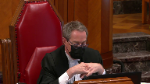
:::

Je ne sais pas d'où vous tenez ça, c'est comme vous évacuer le pouvoir discussionnaire qui reste à l'intérieur de la méthode du point de départ.

**Speaker 8** (01:35:09): En fait, si je peux me permettre, M. le juge, j'ai peut-être été mal compris, je ne dis pas que les points de départ sont des peines minimales.

::: {.column-margin}

:::

Ce que j'énonce, c'est qu'ils sont traités assez facilement comme des peines minimales et deviennent presque des seuils à atteindre.

En fait, mon commentaire et notre position vient, entre autres, d'un commentaire de la Cour d'appel du Québec dans l'arrêt Olivier au paragraphe 3, où la Cour d'appel dit que, quant à la détermination d'un point de départ pour la peine en matière de braquage à domicile, il y a un danger que ce genre de détermination ne devienne un seuil minimal pour le crime en question, ce qui serait contraire au principe d'individualisation de la peine et de la retenue des cours d'appel en matière de peine.

Donc, notre commentaire est là-dessus.

C'est sur le danger que ça devient ça et je vois que mon temps s'écoule.

Ce que je veux terminer, c'est que l'intérêt de la CAF dans le présent dossier est que, bien qu'au Québec la porte soit fermée sur les points de départ, elle n'est pas verrouillée ni scellée et, de notre côté, nous ne voulons pas avoir à traiter avec les points de départ qui soulèvent beaucoup de questions quant à leurs effets.

Et pour avoir écouté mes collègues qui ont à traiter avec les points de départ sur une base régulière, les effets de ces décisions sur les points de départ semblent quand même importants et ont des impacts clairement disproportionnés en matière de peine.

Alors, ça complète.

Je vous remercie.

**Justice Wagner** (01:36:59): We will be back at one o'clock.

::: {.column-margin}
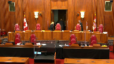
:::

We will be back at one.

**Speaker 9** (01:38:28): Yes, good afternoon Chief Justice, Justices, thank you.

::: {.column-margin}
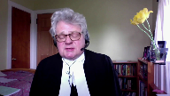
:::

In our condensed book you have an outline of the submissions that my colleague Ms. Dionne and I wish to make today.

The first three topics, so this is a tab one.

The first three topics are more general in nature, they are for me to make, that starting points are an appropriate form of appellate guidance, how they work, and then addressing some of the criticisms that have been leveled against starting points.

And then my colleague Ms. Dionne will address what I suggest are issues more about the standard of review.

It's appropriate that she take that division of labor because she practices in the Alberta Court of Appeals, so just in case the court was wondering why we divided it up.

She'll address the Court of Appeals' ability to set a nine-year starting point for wholesale fentanyl trafficking.

She'll specifically address the standard of review and then address any concerns about the fitness of the sentences imposed in the Court of Appeal below.

So nobody questions the need or authority for an intermediate Court of Appeal to provide guidance to its sentencing judges on matters of sentence.

Nobody questions that as far as I can tell.

The only issue is how that guidance should be structured.

And most Courts of Appeal use ranges of sentence.

The Alberta Court of Appeal has made a conscious choice to use the starting point approach for some offenses.

It's not a universal approach for all offenses.

It's only for approximately two dozen.

And our submission is that where the starting point approach is used by the Court of Appeal for Alberta, it's a perfectly acceptable and appropriate form of appellate guidance.

There are three very important things to bear in mind when looking at whether starting points are...

**Justice Rowe** (01:41:02): things I want to unpack there

::: {.column-margin}
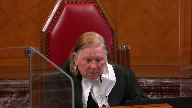
:::

and I don't want to interrupt you when you're just at liftoff but guidance is one thing the exercise of review is something else as someone who sat for 14 years as a court of appeal judge most of the time I didn't give guidance I exercised my role in appellate review a relatively small portion of the time I gave guidance so you know there's there's a bit of a difference between the two

**Speaker 9** (01:41:40): That's absolutely true, Justice Roe, and I have no issue with the way you've put it.

::: {.column-margin}
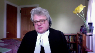
:::

The courts of appeal are primarily error-correcting courts, but there are occasions where it is appropriate for the court of appeal to be a little bit more expansive and provide guidance to their judges.

It doesn't happen very often.

It's not the usual purpose for the court of appeal to decide a case and provide reasons.

Invariably, their reasons for judgment in every case will have some significance for the lower courts, but I'm talking more about situations in which the court of appeal consciously decides that there is a need to provide some form of guidance to sentencing judges.

**Justice Wagner** (01:42:31): You mentioned, I'm sorry sir, you mentioned that the Court of Appeal only uses starting point in 24 types of offences, crimes, do you know why?

::: {.column-margin}
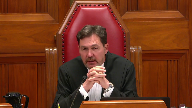
:::

What about the others?

Are they using the range?

**Speaker 9** (01:42:51): They are, Chief Justice, and I was hoping you wouldn't ask me for a list of all 24, because it's not exactly… That's my next question.

::: {.column-margin}
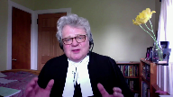
:::

That's the next question, thank you.

The reason that it's restricted to those few offenses is because they all have something in common.

And what they have in common is a very broad legislative range of sentence.

In other words, you can have no minimum and a very high maximum, and they also have in common that you can describe them in a way that is helpful and sensible.

So our example that we discuss in our factum is commercial trafficking in cocaine beyond a minimal level.

We're talking about street dealing in cocaine, small amounts of cocaine, not wholesale by any stretch.

Those types of offenses are all sort of in the same continuum of conduct, and it is sensible and helpful to capture them in a category and say, you know, if that's the type of cocaine trafficking that you're engaged in, we call it commercial trafficking above a more than minimal level.

That's a category we all understand.

The starting point is three years, so start there and go from there to reach an individualized sentence.

Other offenses can't…

They're not susceptible to that type of grouping.

Manslaughter is one example we provide in our factum.

Here the conduct can range from an almost accident to almost murder, and so to try and take the offense of manslaughter and say we're going to create a category for manslaughter and generate a starting point that's useful to a sentencing judge is, I suggest, a futile exercise.

That's going to…

**Overlapping speakers** (01:44:57): So the purpose is to set up categories of crime?

Yes, where that's useful and appropriate.

It's not always.

Isn't that parliament that does that usually?

**Speaker 9** (01:45:09): The Parliament certainly does in terms of defining offences and that was one of, well that was one of the major sources of disagreement between the majority and the minority in the MacDonnell case.

::: {.column-margin}
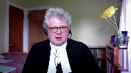
:::

The majority felt that Parliament had discriminated between ordinary sexual assault, sexual assault caused bodily harm and so the majority was critical of a category that said if you commit a sexual assault that has harm in it, that's a major sexual assault and we're going to generate that category and give you a starting point.

What Justice, so that was the majority concern about using that type of category as you're treading upon the parliamentary role.

Justice McLaughlin as she then was for the minority or dissent on this point didn't use the categorization in the same fashion.

But I should perhaps address your question Chief Justice with a more useful example and that is again coming back to the trafficking example that we cite in our factum.

Under the Controlled Drugs and Substances Act it's an offence to traffic in a Schedule 1 substance and the punishment for that is life imprisonment.

The substances vary however, so you can sell a handful of Tylenol 3s to a drug user in a bar or you can operate a wholesale fentanyl operation, now of course that moves it into the wholesale level if we keep it back down to street level dealing.

You can sell on the one hand a handful of Tylenol 3s or you can sell half an ounce of fentanyl and there has to be a difference between the sentences for those two types of offences.

So that is why categories work in terms of trafficking in Schedule substances because you can discriminate as among the substances that are being sold.

You can also discriminate as among the levels of offenders.

So you have your social trafficker, a friend who shares drugs, that person isn't caught by the commercial trafficking category.

You can move into your commercial street level drug dealing and all the way up into wholesale drug dealing and so it's possible that you can sell a handful of Tylenol 3s to a drug user.

**Justice Wagner** (01:47:39): What about the personal characteristics of the accused, his background, court record or not, the age, environment, indigenous or not, and it's not taken into account into this category.

**Speaker 9** (01:47:54): That's correct Chief Justice, absolutely, and it's because the category attempts to see if we can group offences in terms of the conduct, what it is that the conduct involves, and then once you have done that and have created a notional starting point, and I admit as well that that starting point category or the creation of that category also assumes an offender with no prior record, you've heard comments about that, once you have the starting point then you go on to consider all of the other circumstances, aggravating circumstances and mitigating circumstances, and that's why it's called a starting point, it's a place to start.

::: {.column-margin}
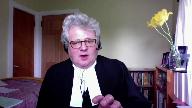
:::

**Justice Kasirer** (01:48:40): Yeah, sorry, just so I understand, in response to the Chief Justice's question, you give the example of the original one, Jonas, at paragraph 49 of your factum, and you mention that the category includes the fact that it was a youthful offender.

::: {.column-margin}
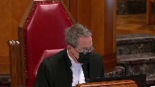
:::

I mean, if we're bringing into the definition of the category matters that might be mitigating in the exercise of discretion on the individualization side, aren't we taking that away from the sentencing judge at the end of the day?

**Speaker 9** (01:49:17): Yes, that is a very sage observation and to some extent one could complain that in Jonas, the original starting point case decided 40 years ago, might better off have not focused on youthful offenders.

::: {.column-margin}
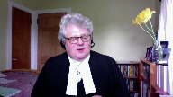
:::

That just happened to be the type of offense that the court noted was prevalent at the time.

Their intention in Jonas was, frankly, to increase the sentences that were being imposed and they picked on that type of prevalent offense, which just happened to be youthful persons.

So, in that case, the youth of the offender, which ordinarily is a mitigating factor that enhances restraint in the imposition of sentence, is taken off the table.

It's not irrelevant.

It's still something that the judge needs to factor in when they individualize the sentence and arrive at what must, at the end of the day, be a fit sentence.

And I suppose one would then say, well, aren't you double counting youthfulness, both in the starting point and in the ultimate disposition of a fit sentence or imposition of a fit sentence?

And I say, no, the judge always has to take into account every circumstance of the offense and every circumstance of the offender.

So if there is a little bit of double-

**Justice Kasirer** (01:50:40): I'm sorry.

::: {.column-margin}

:::

I guess your friends on the other side worry that by baking into the category of the offense factors that might be ordinarily left to the discretion of a sentencing judge, you're doing a disservice to the principles of sentencing, which typically allow that judge the latitude to decide justice on that basis, as opposed to having it decided for him or her.

**Speaker 9** (01:51:16): Yes, there is an element of that.

::: {.column-margin}
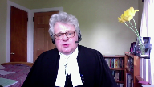
:::

I would submit that the main concern is about the lack of a criminal record.

And that seems to be troubling to my friends opposite because they can't then argue that in mitigation.

It's already been factored into the starting point and shouldn't motivate the judge to move down from the starting point based on the fact that the accused is a first offender.

In answer to that particular one, I would say the court decided to choose a first offender because you're picking somebody that's of neutral character in the sense that they don't have prior convictions.

They're not a recidivist.

There's not an enhanced need for specific deterrence and so on, but you start with your first offender and you go from there.

The other potentially mitigating factors that might be taken into account in the early case of Jonas that we've averted to, the fact that the robbery was unsuccessful and the violence was relatively minor.

These are circumstances of the category.

**Justice Rowe** (01:52:27): I'm going to stop you there because earlier on in these proceedings I was shocked and frankly upset by the idea that was put forward that somehow sentencing ranges was the kind of thing that we do in Canada like they do in Alabama or Mississippi

::: {.column-margin}
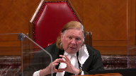
:::

and I took issue with that.

But what you're seen to be describing now is getting very close since the Americans have been drawn into this already to a sentencing grid and the discretion that remains to the sentencing judge is in the interstices of the grid.

In other words, you can move around inside a defined category, you cannot escape the category because if you seek to invoke certain characteristics it brings you into another category and then you're caught in that category.

This is the antithesis, it seems to me, of individuation because it subordinates in a structural way the particular characteristics of the offender and the particular circumstances of the offence and sacrifices them on the altar of parity and effectively something akin to almost complete control on behalf of the court of appeal by the creation of this grid and that it seems to me is the logic, the inescapable logic of what you're describing to us.

**Speaker 9** (01:54:23): Thank you Justice Roe.

::: {.column-margin}
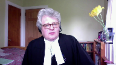
:::

I can well understand how one might be shocked if that's how starting points appear to work or how they appear to how they should appear to work.

In answer to your question, I would submit starting points do not lock judges into categories or boxes.

They ought not to intrude upon discretion and the ultimate responsibility of the judge to impose a proportionate sentence.

Proportionality being the overarching guiding principle.

And they shouldn't be seen that way.

It's just a place to start, Justice Roe, and a judge in fact can move all over the map within the legally available sentencing options in arriving at a fit sentence.

At the end of the exercise of sentencing, and I say exercise as a function not as a game, but at the end of sentencing, a fit sentence is what must be imposed and there is an enormous amount of judicial discretion to impose a fit sentence.

If you want to be talking about boxes or if that's a concern, I would suggest sentencing ranges should give you more trouble there because sentencing ranges suggest a floor and a ceiling.

A starting point does neither

and I was...

**Justice Rowe** (01:55:50): It does suggest boundaries, but boundaries that are permeable.

**Speaker 9** (01:55:58): Rangers do.

Is that what you mean, Justice Roe, that Rangers suggest boundaries?

**Justice Rowe** (01:56:02): Exactly, it says ordinarily, ordinarily it's between X and Y, but of course it can vary depending on the circumstances.

It's indicative, it's not prescriptive.

Of course, of course a lot of work goes into the word.

**Justice Brown** (01:56:16): a lot of work goes into the word ordinarily.

::: {.column-margin}
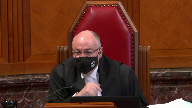
:::

I mean, we could use the word ordinarily in setting a starting point as well, which leads me to wonder whether the problem isn't so much the methodology is between starting point and range, but the standard of review, and in particular the standard of review as it has been applied by the Court of Appeal of Alberta.

And I'd like to hear from you at some point about that.

**Speaker 9** (01:56:42): You certainly would be hearing from Ms. Dionne Justice Brown if you would let me defer to her on that.

**Overlapping speakers** (01:56:49): Sure.

**Speaker 9** (01:56:49): Okay.

Thank you.

**Justice Martin** (01:56:52): could you address the argument that starting points tend to ossify the jurisprudence, whereas ranges allow more responsive calibration based on what's actually happening in courts.

::: {.column-margin}
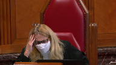
:::

**Speaker 9** (01:57:14): That is certainly a concern and the point has been made by my friends opposite that, you know, once you get a starting point of say three years for commercial trafficking and cocaine it never changes, it never goes up, it never goes down.

::: {.column-margin}
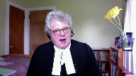
:::

It shouldn't be that way and the Alberta Court of Appeal does have a reconsideration process and they've engaged in it a few times.

There's one of their Court of Appeal rules allows anybody who wants to reconsider a prior binding judgment to bring a motion and put it before a panel of five judges.

So there is that particular mechanism and so there is certainly the opportunity to reconsider a five judge judgment that's intended to provide a starting point and a starting point of some certainty.

I understand the point though, if I do understand the point, that what ranges do is they morph a little bit as time goes on because you keep adding to the pile and sometimes you find that the range has been going up and sometimes you find that the range is going down, but the fundamentally important part of it is that we can't expect that starting points and ranges will operate exactly the same.

They're slightly different in some important ways, but what is central to both of them is discretion and individualization.

So if you're a judge in a provincial court in Alberta and you're dealing with an offense for which there's a starting point of say three years, but after hearing everything and considering all of the circumstances, you the judge decide that the sentence should be one year or a noncustodial sentence, that's the judge's right to do so.

**Justice Wagner** (01:59:03): And then the Court of Appeal of Alberta would intervene and say you made a mistake.

**Speaker 9** (01:59:09): Well, they shouldn't, outside of the direction that this court has provided, going back to Shropshire through to La Casse and Friesen, they shouldn't.

::: {.column-margin}

:::

If the court is not within the boundaries of proper appellate review that this court has so clearly laid down, then that shouldn't occur.

**Overlapping speakers** (01:59:31): So do you concede that in these cases the Court of Appeal made a mistake?

**Speaker 9** (01:59:35): I'm not going to concede that, I'll let Ms. Dionne particularly address that.

::: {.column-margin}
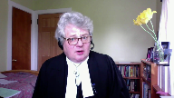
:::

But we do agree that starting points are not binding.

In no way, shape, or form are they binding.

They're simply guidance, and we don't put it any higher than that.

To the extent that sometimes you see language that suggests otherwise, that's incorrect, and we don't adhere to that view.

I want to turn to the notion of… Can I just follow up on that?

**Justice Abella** (02:00:05): questions that you were just asked.

::: {.column-margin}
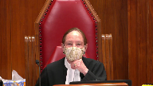
:::

What's our role then in our court when we've taken the position that you've just articulated that they are not directions, they are guidance, there must be flexibility for the principles of sentencing and consistently a particular court of appeal has taken an approach that consistently thwarts the directions of this court that they not be a straitjacket.

So what would you, if you were in our position, what would you suggest an appropriate approach would be to say do it again but this time we really mean it and don't use it as a straitjacket or do we say starting points the way they've been applied in a particular province have been what Justice Martin called an ossification process and therefore should no longer be used and replaced by ranges which do have the capacity for the flexibility that take all of those sentencing principles into account.

**Speaker 9** (02:01:13): Well, you know, what should this particular court do, what should this court do in terms of providing guidance to the Alberta Court of Appeal on this particular topic?

::: {.column-margin}
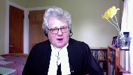
:::

I think Ms. Dionne is going to address a couple of more recent judgments from the Alberta Court of Appeal post-freezin' where it appears that things are not quite as bad as the Chief Justice suggested where he used the words that the court perhaps wasn't listening.

I don't think the situation is that dire, Justice Abella.

I don't think that this court is at the point where the court should reject the starting point approach because of a perception that this court is not being listened to.

I do not believe things are that dire, of course, if you feel they are.

If this court is of the view that its instructions are not being followed, one would hope that's not the case.

But then this court will do what this court feels it needs to do, and I don't need to tell you what that is in this particular case.

I just don't think you're at that point, respectfully.

I wonder if I could turn to the criticism that starting points improperly, unduly increase the incarceration of Indigenous offenders.

This is a very troubling submission that is made because if it's true, this court should be very worried about the viability of starting points and the starting point approach.

And what I have to say about that is really not terribly complicated.

In my respectful submission, when you're dealing with an Indigenous offender, the sentencing judge is mandated to take that into account.

So take my example of a three-year starting point for commercial trafficking in cocaine above a minimal level.

A federal prosecutor presents that particular case to the sentencing judge.

The sentencing judge is presented with evidence and information that the offender has an Indigenous background and is mandated to take that into account.

So you have the starting point of three years.

How does the Indigenous or the indigeneity of the offender get taken into account?

Well, it's when the judge decides to move up or more probably down from the starting point of three years.

The judge can easily reach a restorative justice outcome based entirely on the indigeneity of the offender.

So whether you have a starting point of three years or in some provinces maybe it's a range of two to four, our position is neither differently affects the over-incarceration of Indigenous offenders.

And I say that with all due respect to the very careful and able submissions of my friends on the other side of the court, Mr. Fipens and Mr. Rudin in particular.

As I say, if starting points are having a contributing impact on the problem of the over-incarceration of Indigenous offenders, this court should be very concerned about that.

But I submit as between starting points and ranges, there really is no suggestion that starting points are more of a problem, that they are more contrary to Gladue or Ipili than ranges.

Thank you.

**Overlapping speakers** (02:05:02): more problematic unless unless it's an error in law not to apply them

**Speaker 9** (02:05:07): Correct. Correct.

But it's not.

It's not an error in law not to not to

**Overlapping speakers** (02:05:14): apply a starting point.

Unless it's treated as an error in law.

**Speaker 9** (02:05:18): Yes, absolutely, but you'll hear more from that in a minute or two about that issue.

**Overlapping speakers** (02:05:27): You can tell we're all kind of trembling with anticipation on this.

**Speaker 9** (02:05:32): I keep, yes, I keep announcing her and that's not fair to her, so.

::: {.column-margin}
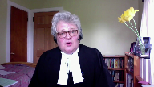
:::

You know, I don't, I don't wish to be seen to be making a very superficial submission on this, but there really isn't a lot to say about starting points and the urgent problem of over-incarceration of Indigenous offenders.

And the reason that I don't have a lot to say is because, again, when you compare ranges to starting points, they don't have any different effect.

So that's not a reason to dispense with the starting point approach.

And again, I say that with the greatest of respect to my friends who have raised that argument.

**Justice Rowe** (02:06:13): saying is that the phenomenon which has been referred to as clustering does not exist.

**Speaker 9** (02:06:22): Well, we're not sure there's, you know, we're not sure there's good evidence of clustering, but probably a better answer to the question is, if there was clustering that offended the principles in Gladue, Ipili 718.2, Sabi, it's wrong, it shouldn't be that way.

::: {.column-margin}
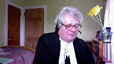
:::

People who should be looked at a particular way because of an Indigenous background should not be subjected to clustering.

The Gladue and Ipili factors have to be taken into account by a sentencing judge when the judge arrives at an individualized fit sentence.

So if clustering is a, you know, a concern, if it's violating Gladue, if it's violating Ipili, if the judge is not doing their duty under 718.2, Sabi, that's completely wrong.

But my position is, we're not so sure that that's the case, you'd have to have some pretty good jurisprudential evidence or empirical evidence to suggest that judges are ignoring Gladue Ipili 718.2, Sabi, because of starting points.

I wish to end my submissions, if I might, by turning to the second-last tab of the condensed book.

And what I'm looking at here is, so this is, I'm sorry, it should be tab nine, I apologize.

And what you have here is reasons for judgment of a provincial court judge named John, Judge John Maher in Alberta.

He sits in Sherwood Park, which is a small community of about 80,000 people on the eastern edge of Edmonton.

So it's in many ways your typical Canadian provincial court.

And I've sidebarred the passages I draw to your attention.

It's just a regular sentencing judgment.

But he says at paragraph 11, I disagree with the criticism that starting point sentencing constrains the wide latitude or broad discretion which this court has said rests with judges.

Rather than handcuffing sentencing judges or having a chilling effect, it's a useful tool which assists sentencing judges to better craft individual sentences.

I won't read it to you, but in the next paragraph, paragraph 12, he talks about enhanced flexibility, less confinement compared to a range, refers to ranges as having floors and ceilings, which starting points do not have.

And the reason I bring this to your attention is simply because it's a favorable user review.

This is the-

**Justice Rowe** (02:09:25): If I put my dog in the backyard and I tie him up to a starting point, he can move, but he can't move very far.

::: {.column-margin}
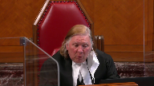
:::

I've got a big backyard.

If I let him loose in the big backyard, he's got a lot of place to run.

Maybe it's as simple as that.

**Speaker 9** (02:09:44): Our judge, in this case, our judge's backyard is whatever parliament has given him in the criminal code.

::: {.column-margin}
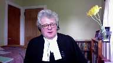
:::

The starting point doesn't restrain him whatsoever.

As long as the sentences fit within the limits of the law, that's all, that's the only limitation placed upon the judge in your scenario.

Unless there are further questions of me, I would wish to pass the floor to my colleague.

Thank you very much.

**Justice Wagner** (02:10:09): Thank you.

**Speaker 10** (02:10:16): Good morning.

::: {.column-margin}

:::

Whether or not the Alberta Court of Appeal should have intervened and varied the sentence in this case, once the matter was before them, they were entitled to set a starting point for wholesale trafficking in fentanyl.

Trafficking isn't a new offense.

The only thing that's changed in this case is the drug that's being sold.

The Alberta Court of Appeal did not need to wait for hundreds of cases and more people to die to derive a range of sentence.

And the court makes this clear.

At paragraph 45 of Regina and Felix, the court states, like other drug trafficking starting points, it's defined by two dimensions, the dangerousness of the drug and the scale of the offender's involvement.

The nine-year starting point in this case is built on a strong foundation, expert evidence and a natural extension of the existing scheme of drug trafficking sentences in Alberta.

And importantly, this starting point is consistent with or even below the range of sentences imposed across Canada.

And it's not four cases, as suggested by the appellant, but rather 16 sentencing cases taken from across the country that were reviewed in the creation of this starting point.

And this takes me to the second issue concerning the standard of review, which from my impression is the one that the court is very interested in.

And I think that's the real issue in this case, or it would be if this court hadn't already addressed this issue in Regina and Friesen.

To deal with Chief Justice Wagner's comment directly, it's not that the Alberta Court of Appeal isn't listening.

Friesen was in fact decided after Pranto and Felix.

And in the decision of Pranto, the court notes that they expected further guidance from this court in Regina and Friesen as to the standard of review and how it would apply to starting points.

And subsequent cases have followed it.

And I'd suggest the cases of Hodgkin and Clark in the factum of the Attorney General of Alberta.

**Justice Martin** (02:12:22): I'd like to go back to that point, because it's a point your friends opposite make quite strongly, and that is on the standard of review, if we go backwards to MacDonnell, I mean, there's been maybe a tension between what this court has said about starting points being just that, not straight jackets, that departing from a starting point is not a reviewable error of law, all of these things, but it doesn't seem to have had a wide acceptance, and a very strict approach to standard of review is argued to be present in the Alberta Court of Appeal.

::: {.column-margin}

:::

What do we do if we think there are problems with the standard of review now, after a history of saying it can't be a straight jacket, and coming back and finding something like this to say that if you deviate from the methodology, we can come in and say there's been an error of law?

**Speaker 10** (02:13:33): And this case is in a difficult position because this court has already said that very clearly in Friesen.

::: {.column-margin}

:::

And so it's hard to go back and cast aspersions on the Alberta Court of Appeal for not writing their judgement in accordance with a decision that had not yet been released.

**Justice Wagner** (02:13:52): I'm sorry to interrupt, but they may not have received freezing at that time, but they must have looked at La Casse, I guess?

In La Casse, don't you think that the message was clear?

**Speaker 10** (02:14:02): But there was some wiggle room, even in MacDonnell, the court had held that disparity from a starting point may suggest, but not be determinative of unfit fitness of sentence.

::: {.column-margin}

:::

But I think that if we look post-freezin, which is the clearest direction where this court pulls out the paragraph.

**Justice Rowe** (02:14:22): term wiggle room.

That tells me they don't want to do it and they'll find any way they can to avoid it.

It seems to me it was a sort of a Freudian slipper.

Have I misunderstood you?

**Speaker 10** (02:14:40): Well, I don't know if my poor choice of words can be taken as what the Court of Appeal in Alberta actually thinks, and so I worry that I have coloured the argument too much with that.

::: {.column-margin}

:::

However, what I'd say is that we have to look at the empirical evidence in these cases.

It's not, as is suggested by the appellant, we don't have clustering around the starting point.

In the cases that we provided in our factum, we chose trafficking of cocaine because it's been around since the 80s, and it's likely to predict the distribution of sentences in the context of fentanyl.

And there are sentences that have been opposed all the way from 90 days jail, all the way up to four years.

So I don't see how the appellant can say that his three-year starting point is a floor or a mandatory minimum where we can point to the majority of these cases falling somewhere in the range of 12 to 24 months, with some much lower than that.

Now, I know that Madam Justice Abella had mentioned a concern that when some of those cases, whenever they seem to go up to the Court of Appeal, the 30 and the 90-day cases, the Alberta Court of Appeal says, no, that's too low and changes them.

But we have to reflect on those cases.

In our factum, we've provided a number of cases in the range of 90 days that didn't go up to the Court of Appeal.

And the reason why they didn't go up to the Court of Appeal is because the Crown took the position that there wasn't an error in those cases.

When we look at the cases that do go up to the Court of Appeal, it's hard to say that the Court of Appeal interferes with all of these cases without looking at the fact that these cases have been brought to them because the Crown believes there was an error in the analysis.

And so, when we look at the cases such as Godfrey, that the appellant cites for this position, that's a case of an individual who pled guilty to commercial trafficking of cocaine, and there were not significant rehabilitative factors.

So, there wasn't a justification for the very low sentence that was imposed in that case.

So, let's come back to that.

**Justice Wagner** (02:16:48): Let's come back to our case then where the Court of Appeal said well It was a mistake because the first judge did not respect the starting point Was the Court of Appeal wrong?

**Speaker 10** (02:17:00): I wouldn't go so far as to say that that was the reason why they intervened and the reason for that is because there was no starting point at that point for the judge to respect or take into account what was in that decision is a lengthy obiter about what the judge felt was the shortcomings of the starting point, and this court's direction on that.

::: {.column-margin}

:::

And so it's hard to say that the Court of Appeal erred, because they, they failed to follow a starting point that wasn't yet in place.

The Court of Appeal, particularly in Pranto considers that an issue of ordinal proportionality, where they fail to take into account other starting points for the main example is the wholesale trafficking and heroin starting point at five years, and suggesting that the subsequent sentence that was imposed was inconsistent with that.

But the real issue was that the sentence imposed in Pranto and Felix were demonstrably unfit.

And part of that I think isn't so much particularly in Pranto that Justice will let rejected the starting point.

The larger starting point schema that we use in Alberta to help define the moral culpability of these various offenses in various categories, but the he erred, he erred in finding that it was five years for commercial for wholesale trafficking and heroin, and that resulted in him finding a range that was materially too low, and then therefore imposing a sentence that was demonstrably unfit, not because it didn't atorn to some starting point that wasn't yet in existence. He also

**Justice Brown** (02:18:43): He also aired, didn't he, in his treatment of Parenteau's knowledge of the potential harm of fentanyl.

::: {.column-margin}

:::

He described Parenteau's ignorance of the purity or potency of the fentanyl as irrelevant to his moral culpability, whereas there's a lot of appellate authority, particularly from British Columbia, that says that it is, in fact, morally blameworthy to take a risk by not knowing and imposing that risk on his customers.

**Speaker 10** (02:19:09): And I would agree with that, sir.

::: {.column-margin}

:::

He, in fact, made a number of additional errors that were aggravated in part due to what I would suggest the inadequate record on Parenteau as to the consideration of addiction and the effect that that would have on sentence.

So there were sufficient grounds in those cases for the court of appeal to intervene in this case.

In Parenteau, the errors that ultimately affected the sentence that was imposed, and in both cases, the sentences that were imposed for not just wholesale offenders, but wholesale offenders at the highest, most executive level, and the sentences imposed in those cases being demonstrably unfit.

**Justice Rowe** (02:19:56): One of the very difficult and imprecise aspects of sentencing is to weight factors, is to give them relative importance and what significance to ascribe to them.

::: {.column-margin}

:::

And if I am a determined court of appeal judge, what I can do is I can say that the weighting or the consideration of this factor constitutes an error in principle and not really show my cards, which is that I would have given a different weight.

In other words, if you're really determined as a court of appeal judge to substitute your own view for that of the sentencing judge, you can take everything the sentencing judge has said and cast it as somehow an error in principle.

But it simply amounts to I want to impose the sentence which I want to impose, and I will exercise my authority to do it.

And there's a degree of artificiality in all of this, which I think is a mischaracterization of an error in principle, which is merely a reweighing of the factors, which is a cloak for an unwarranted intervention and a substitution of a different view by the court of appeal.

Am I inaccurate in that?

**Speaker 10** (02:21:37): the respondent would not agree with that characterization.

::: {.column-margin}

:::

I think that I wouldn't be the first person to say that sentencing is less of a science and more of an art and we could consider this case as a situation where the Court of Appeal would have weighed the aggravating and mitigating factors differently.

But the aggravating and mitigating factors in this case weren't, other than the guilty plea and some little evidence in relation to Gladue and some evidence in relation to rehabilitation, they were not difficult or complex or required a lot of analysis.

I think what happened in this case is that these cases came before the Court of Appeal and the Court of Appeal at that point, whether they decided they needed to intervene or not, were entitled to consider whether or not there was a need for guidance for the rest of Alberta for this offense and the Court looked at the cases that were put before them to justify the the offense which ranged from three and a half years in Regina and Sauve all the way up to eight or nine years out of the Ontario Court of Appeal and they said there was a need for a starting point in this case and once they'd taken the steps of determining the starting point, which is what every sentencing judge should be doing in every case, where they survey the applicable case law based on a clearly defined category, they find an appropriate range of offense and they take into account any directions from Courts of Appeal or the Supreme Court of Canada as to denunciation and deterrence and they came to a starting point of nine years and once they did that it became apparent that the sentence imposed in both of these cases were just so low given the incredibly aggravating factors as to be demonstrably unfit.

**Justice Rowe** (02:23:29): In the description of the methodology, everything spins around the framework set by the Court of Appeal.

::: {.column-margin}

:::

I heard nothing about 718.

And isn't that really the problem here?

That the Court of Appeal of Alberta, through the methodology of starting points, has really set up its own set of principles, or its own framework, in effect in substitution for what Parliament has established.

**Speaker 10** (02:24:03): Well sir, any concern that this court may have had about that should be resolved by the decision of Friesen, which from the perspective the respondent says that the starting point is not binding, the categories are not binding, failure to put an accused in the appropriate court of appeal delineated category is not an error.

::: {.column-margin}

:::

So in fact from my perspective a sentencing judge can throw out the court of appeals directions as the starting point.

They don't need to apply the starting point, they don't need to start at the starting point.

But they do need to impose a proportionate sentence and in doing so they need to look at yes the directive of 718 of the criminal code and they need to look at sentences imposed and like offenses and they need to take into account the court's directions as to denunciation and deterrence.

So what's the difference with the range system?

That's exactly what the range system does.

And that's exactly what the starting point system does as well sir because of a starting point.

**Justice Wagner** (02:25:04): In the case of Arquin, the Court of Appeal of Alberta says those are two different things.

You don't agree with the Court of Appeal of Alberta?

**Speaker 10** (02:25:12): Well, I would say that they're different approaches that substantially get you to the same place.

So, we're all, we're all

**Justice Brown** (02:25:20): We're all agreed then that the standard of review is as we described it in Friesen and not as the Court of Appeal described it in Arcand.

::: {.column-margin}

:::

So given that we've kind of, all the parties have arrived on this common point, the question then is, well, what sort of guidance do we give to trial judges who wish to depart, as they may, from starting points?

What guidance do we give them about the existence of a starting point?

You say they can just throw it out.

I mean, surely that can't be right.

There must be some purpose to having a starting point.

And what guidance do we give to reviewing appellate courts in reviewing a sentencing decision that departed from the starting point?

Is it just simply that your starting point means nothing and don't worry about it?

**Speaker 10** (02:26:30): I think that we have to look at the directives of 718 of the criminal code that says sentences have to be proportionate and so as long as the sentence is proportionate whether or not the the sentencing judge who seeks to get there applies the starting point or the categorization of the court of appeal it shouldn't be a cause for concern and it shouldn't attract the the scrutiny and ultimately the sentencing of fresh in the court of appeal these starting points are not binding what they are is a judicial shorthand if the starting points are done properly then they serve much of the same purpose as a range as that they are a summary of of the cases that have come before it taking into account the directions of the court of appeal in relation to those specific offenses and the moral culpability that's inherent to those offenses.

::: {.column-margin}

:::

**Justice Abella** (02:27:31): Can I, can I ask you if I'm wrong in observing that what we're arguing about is terminology, that if there had been no such concept as starting point, and we were just looking at the provisions of the Criminal Code in 718, and the aim of proportionality and fitness of sentence based on the circumstances and the offender, that it would nonetheless have been opened to the Court of Appeal to have said the Crown was right in Felix in asking for 10 years, and in Parenteau in asking for 14 years, and given the seriousness of the offence and not withstanding the mitigating circumstances, it's an unfit sentence.

::: {.column-margin}

:::

And instead of looking at whether or not there's compliance with the sentencing principles for aggravating and mitigating circumstances, this whole debate is about whether or not it's a good or a bad thing to have starting points.

And I'm wondering, increasingly as this hearing goes on, how helpful that concept is aside from suggesting that some offences are worthy of greater, are more aggravating than others, which we consistently have said over the years.

So I'm just wondering if this is the right debate given what it is we're directed to do by the Criminal Code when we're doing particularised sentencing.

**Speaker 10** (02:29:03): And I think what we are directed to do under 718 is the issue here, and I think that that is a difficult and complex analysis where you have a variety of drugs, an offence that varies in seriousness from an addict sharing part of his own supply all the way up to large-scale wholesale transactions in the context of...

::: {.column-margin}

:::

**Justice Abella** (02:29:25): No, I'm sorry, Ms. Dionne, I'm not disagreeing with you.

::: {.column-margin}

:::

I'm just saying what we are arguing about is the implications of a concept called starting point, rather than arguing about whether the particular, how to look at whether this particular sentence for Mr. Felix and for Mr. Barando was a fit one.

**Speaker 10** (02:29:44): And I would agree.

::: {.column-margin}

:::

And I'd reiterate the aid and say, especially in this case, where the concept of whether or not the courts below follow the starting point is almost a red herring in this case, in both of these cases, because the starting point, as created by the Court of Appeal at that level, didn't exist.

And so it's not a case where the courts below did not follow the starting points, because they simply weren't in existence.

**Overlapping speakers** (02:30:13): whether

**Speaker 10** (02:30:14): the sentences that they ultimately imposed were either based on an error of principle or were demonstrably unfit.

**Justice Moldaver** (02:30:20): Speaking for myself, this is the problem with this whole appeal.

::: {.column-margin}

:::

The problem is that the Court of Appeal is looking at a relatively new drug on the scene.

They're dealing with a wholesale commercial enterprise of huge magnitude.

They're dealing with a drug that is much more dangerous than even heroin was in its day, for which punishments were handed out of life imprisonment if you trafficked an ounce or two of heroin that was 80 or 90 percent pure.

This fentanyl, from what I can understand, and its derivatives, is either about 100 times more dangerous and addictive, and by the way, available in terms of people can buy it easier than heroin was.

It seems to me this whole thing, the Court of Appeal could have just taken the ball in its hands and said, you know what, this is a new drug on the scene.

It is extremely dangerous.

It is killing people every day.

This comes close to manslaughter, causing death recklessly by letting this stuff out.

Here's somebody that's the kingpin of this operation, a wholesale operation that is effectively destroying the lives of all kinds of people in the Fort McMurray area and elsewhere.

So really, the issue is not starting point.

The issue is, just to say like we did in Friesen, double-digit penitentiary sentences to life will be imposed on those who engage in this on a wholesale basis for profit, period.

Get the message out that way.

Forgetting about this starting point or that starting point, you put on a range like we've been talking about that effectively says, this is really serious and we've got to treat it that way, as opposed to puttering around with, oh, seven years or nine years or whatever.

I think this case is missing, as I say, the whole point of this.

**Speaker 10** (02:32:41): and I would say that some of this is just going to be differences in a preference for whether or not the appellant guidance on these sorts of offences is done by range as is historically done in many of the different provinces or by starting points which is just the method that the Alberta Court of Appeal has historically used for this and has generally served them well and has been something that is relatively easy for the courts to apply and for counsel to understand and to move forward in that regard.

::: {.column-margin}

:::

**Justice Moldaver** (02:33:19): And in Friesen, our court did not say the starting point for this form of child abuse will be two years.

::: {.column-margin}

:::

We gave ranges.

We looked at the types of conduct and we gave ranges.

And with respect, it seems to me that that is the guidance that is coming from this court.

Not starting points, but appropriate ranges for categories of crime.

**Speaker 10** (02:33:45): And, sir, if the standard of review is such that there is, as I perhaps erroneously said earlier, wiggle room in a range and wiggle room vis-a-vis a starting point, I just question, is there a significant difference whether we impose a range where we anticipate that the sentence will be somewhere within that range or we impose a starting point where history has taught us and the empirical evidence that the respondent has put before this court is that there is a wide tolerance of appropriate sentences above and mostly below that starting point.

::: {.column-margin}

:::

Isn't it just two very similar approaches, albeit not identical, that get us to substantially the same place?

They both tolerate deviation in sentence, they both allow for individuality or individualization, and they both communicate the court's concerns about proportionality for a significant and insidious drug that has become a public health crisis in Canada.

**Justice Moldaver** (02:34:54): As we've been saying throughout the day, they're not treated that way.

::: {.column-margin}

:::

They haven't been treated that way by the appellate court.

And as a result, and now we're 40 years since MacDonnell or whatever the name of the case was, we're still having this problem.

So maybe the time has come to, you know, sort of say, that's the end of these things, we're going to go to ranges.

They're not perfect either, but they're better.

**Speaker 10** (02:35:24): and it may be the court's concern about that, but the Alberta Court of Appeal doesn't view that ranges are better and ranges themselves have their own shortcomings that was identified by this court in Regina and Friesen as to the hard floors and hard ceilings.

::: {.column-margin}

:::

In addition, many of the shortcomings identified by the appellants in this matter apply equally to ranges and so if both starting points and ranges allow for individualizations and have similar although different shortcomings and neither one is a panacea, why would we just unilaterally prefer one over the other where many of these issues are simply resolved by the proper application of the standard review where divergence from either a range or a starting point isn't an error as long as the sentence imposed was fit.

**Justice Karakatsanis** (02:36:18): Can I ask you this, what would you say, why do you say that starting points are better?

I'm just curious to hear the defense of why they're better than ranges.

**Speaker 10** (02:36:30): I wouldn't say that they're better than ranges.

::: {.column-margin}

:::

I would say that they that ranges have shortcomings and starting points have shortcomings and they're the same in that regard.

Many of the concerns about starting points that they presume a period of incarceration or they may be difficult to apply vis-a-vis this court's directives in relation to Bladu and Ippoli apply equally to ranges.

**Overlapping speakers** (02:36:56): Yes, I think.

**Speaker 10** (02:36:56): the biggest advantage that they bring is that while a range has a hard floor and a hard ceiling, where as this court has indicated that is where ordinary cases would fall, courts of appeal have asked that sentences to be imposed below have used words like exceptional circumstances to go below a range and that's not the case with starting points.

::: {.column-margin}

:::

Starting points don't have a floor and they don't have a ceiling and if we look at the decision of Judge Maher in BCP he states that from his perspective they do not limit any possible sentence that he could impose.

**Justice Abella** (02:37:34): Can I ask you a question about standard of review?

::: {.column-margin}

:::

Are you finished your?

Yes, thank you.

It's a standard of review question in circumstances like this where both trial judges applied the same range.

They were obviously under the impression that five to seven was what they were bound, was the operative range.

And then the Court of Appeals said, no, that isn't the operative range.

We've now decided something at nine years is the starting point, no range.

How do we scrutinize the exercise, taking out the starting point vocabulary?

How do we scrutinize the fitness, the standard of review issues by the Court of Appeal in interfering with that sentence?

**Speaker 10** (02:38:18): I think we look at what we identified and the Court of Appeal identified is errors in the creation of the range that was used to define the moral culpability of the offence, specifically that in coming to the five to seven year range the court substantially relied on offenders with lower moral culpability, either lower level commercial offenders or even commercial like below de minimis in coming to the low end of that range.

::: {.column-margin}

:::

In relation to Pranto I think a major issue that that I think unwittingly caused Justice Ouellette to impose a sentence that was too low was his error in finding that the typical range of sentence that was imposed on commercial heroin cases he mixed up with wholesale heroin cases which probably helped articulate that range for him as well.

Similar mistakes were made in the case of Felix including the reliance on on the decision in Pranto which would have been very persuasive as it was in the same time frame and from the same court and interestingly in Felix the court finds there's a range of five to seven but then says if we consider these additional cases from the Ontario Court of Appeal and from outside of the province I actually find the range to be five to nine and a half but then rejects that and prefers the five to seven range with the accused in that case falling on the the higher end of the range to respect the fact that he was really one of the highest level executive types of traffickers that we see.

So I think that that's what happened in that case that we created a range that didn't properly reflect the moral culpability of these wholesale offenders and that is the reason why the sentence is demonstrably unfit and it has nothing to do with the starting point it has to do with false comparators that failed to take into account the gravity of the offense not just of wholesale trafficking of fentanyl but wholesale trafficking of an insidious drug at the highest level.

Thank you very much.

Thank you.

**Justice Wagner** (02:40:29): Thank you.

**Justice Karakatsanis** (02:40:33): I did it.

**Justice Kasirer** (02:40:34): I'd like to ask, this is maybe close to Justice Karakatsanis' question.

::: {.column-margin}

:::

We know that sentencing in some measure is a product of good sentencing, a product of local knowledge, that that's one of the lessons of la casse.

And arguably, a provincial court of appeal in undertaking its guidance role understands the local knowledge you pointed us to, this typical provincial court judgment.

I'm wondering to what extent that favour to local knowledge extends to the method that's used in the provincial court of appeal.

When the Alberta court of appeal has plainly chosen a method, not quite of its own because, of course, it's there and you point out in your factum that it's used in Saskatchewan and elsewhere on occasion.

But to what extent should we defer to that local knowledge as a point of view of methodology?

Or should we feel free to, if we feel it's superior, to use the range method?

**Speaker 10** (02:41:55): So in Regina and Friesen this court recognized that there could be regional variation in sentence and that explains why in Alberta we have if we accept this as starting point of nine years for wholesale trafficking in fentanyl and in Ontario they're sentencing in and around the eight to nine year range for similar offenses but the sentences that we look at in British Columbia are significantly below that because the court recognizes this regional authority to give effect to what's required in the individual provinces.

::: {.column-margin}

:::

**Justice Kasirer** (02:42:35): The question is not the, sorry to interrupt you, it's rude, but not the substance of the starting point, the number or the number in the range, but it's the method itself as a feature of local legal knowledge.

::: {.column-margin}

:::

To what extent should this court be mindful of that and defer to that if it amounts to the same thing at the end of the day as you mentioned earlier?

It's the method that interests me as a feature of local knowledge.

**Speaker 10** (02:43:06): well and that's why I mentioned the result also being a feature of the local knowledge is if that if we are able to broadly tolerate different results in different regions where no ultimate result whether you have a higher sentence in Ontario or Alberta or a lower sentence in British Columbia then there should be an equal amount of toleration for different methods that are used locally that get us to substantially the same place and certainly since this court's clarification of this the standard of review vis-a-vis ranges and starting points that they should based on that get us to the same place.

::: {.column-margin}

:::

Thank you very much.

**Justice Wagner** (02:43:48): Thank you.

Thank you, sir.

Your time is up.

Thank you.

Thank you, sir.

**Speaker 12** (02:43:57): Good afternoon justices.

::: {.column-margin}

:::

I am here on behalf of the Attorney General of Manitoba.

Our submission concerns the greater national implications of disavowing starting points.

I plan to address three broad areas.

First, the decisions before this court are not reflective of a national problem.

Although in Friesen the Manitoba Court of Appeal made an error that was connected to its approach to starting points, I would submit to this court that it was an outlier decision and not truly about the usefulness of starting points.

A closer examination of decisions from the Manitoba Court of Appeal demonstrates that it does not consistently rely on starting points in an inflexible or rigid fashion.

Secondly, I'd like to touch on Manitoba's use of starting points and sentencing ranges for decades as an example of how both can be used effectively.

And third, I would like to touch on the idea of disavowing starting points and how that needs to be considered in light of this court's guidance in Friesen.

So turning to the first issue with respect to whether or not this is a national problem, during the Friesen appeal a discussion about the utility of starting points arose.

Friesen though was not illustrative of a large scale problem with starting points in Manitoba.

It was brought to this court to address a much wider reaching underlying difficulty.

The inability or unwillingness of appellate courts to acknowledge 30 years of growing awareness of the harms caused by child sexual abuse.

It was not intended to result in a deep dive into the tools used to sentence an offender, but to revisit the currency of the result.

The stagnation of sentencing precedents generally, whether starting points or sentencing ranges, and the failure to acknowledge that it was high time for the historical portrait to be revisited.

In fact, the vast majority of sentences in Manitoba are not appealed because when it is used the starting point approach works as it should.

Which brings me to my second area, starting points within Manitoba.

A starting point, a sentencing range, a benchmark, a rubric, a yardstick, all of these are different adjectives that are intended to be illustrative examples, comparators or valuable resources.

The availability of these tools is not problematic.

The problem arises when they are enforced rigidly, inflexibly, or strictly.

And while this court has clearly provided direction with the standard of review, most recently in Friesen, I would suggest that this case provides an opportunity to clarify and provide further guidance in this regard.

It is our position that eliminating starting points is not necessary.

And if you look to Manitoba jurisprudence, what you will see is that starting points have been used effectively by sentencing judges and the appeal courts to consider the principles of parity and proportionality.

The starting point involves offence categories that are definable, often by reference to moral culpability, looking to what parliament has acknowledged as inherent seriousness through maximums or through paramount sentencing principles, so that would be with respect to deterrence and denunciation for child abuse matters.

These starting points provide counsel, sentencing judges, and the appellate court with a place to start or begin the analysis.

But the art of sentencing requires the sentencing judge to balance the individual features.

And I just want to touch on this idea that starting points don't rely on the wisdom of prior decisions.

In fact, they do.

They're created based on previous decisions, and ultimately it does not eliminate how judges are going to individualize that sentence, because it's a place to begin.

They will then apply the rest of the principles in the code to get to parity, so they will look at other offences.

**Justice Karakatsanis** (02:48:13): Can I ask you what your submission is on what can be actually baked into the starting point in terms of the individual offender as opposed to the offense itself?

**Speaker 12** (02:48:30): So most starting points, they have to start somewhere, so they take an individual who has no previous record, who's of good character.

::: {.column-margin}

:::

But that's just the starting point

and I think that ultimately the sentencing judges will then go on to look at the specific individual features and if you look at the Manitoba case law that really points to it and points to, sorry, to the ability to go up or down from there and many of the cases that we've provided in our factum show you precisely that there isn't this clustering.

Many sentences are below the starting point, some are above, some require, such as in freezing, that something higher needs to be done.

**Overlapping speakers** (02:49:21): Thank you.

**Speaker 12** (02:49:21): I do notice that I'm out of time.

I'm wondering if I can touch on one last thing, Chief Justice.

**Overlapping speakers** (02:49:27): One minute.

**Speaker 12** (02:49:28): Thank you.

::: {.column-margin}

:::

I just would encourage this court to re-read paragraph 114 of Friesen and to ask yourself what that paragraph means.

It's the paragraph that talks about the mid-single digit penitentiary.

I would suggest that while that is not binding or an inflexible guidance, it is guidance that's being given to courts across the country and that the court then went on to provide the other factors that need to be looked at.

And that is precisely what has been done with other starting points in Manitoba.

And so you're not looking at a national problem requiring a national solution.

Instead, it's a matter before the court about one appellate court's intervention and the question of whether or not it went too far.

And in resolving these issues, I think that eliminating starting points would have a detrimental impact on the many cases, particularly in Manitoba, where these starting points have been used properly to impose proportionate sentences.

Thank you very much.

**Justice Wagner** (02:50:26): Ms. D'Artagnan.

**Speaker 12** (02:50:36): Morning Chief Justice, Justices.

::: {.column-margin}

:::

I'm here on behalf of the Attorney General of Alberta.

In my five minutes today, I would like to discuss two points very briefly.

The first is that eliminating starting points for sexual offences would contribute to the denial of the equality rights of women and young girls.

And second, I will briefly touch upon the proper standard of review to be applied to starting points.

With respect to the first point, eliminating starting points altogether as a sentencing tool risks disparity in sentencing.

And with sexual violence offences, particularly, because this is a gendered crime, this would have a disproportionate impact upon women and young girls, and especially Indigenous women and girls.

**Justice Wagner** (02:51:25): Are you saying that using the range system will not provide a fit sentence?

**Speaker 12** (02:51:32): No, I think that the sentencing range, they operate functionally the same way as starting points.

::: {.column-margin}

:::

So the Attorney General of Alberta agrees with the submissions made by the respondent that the criticisms apply equally to sentencing ranges.

So when I'm referring to starting points, I'm actually referring also to sentencing ranges that are established.

**Justice Rowe** (02:51:56): the logic of your position is quite clear.

You want higher sentences, and you believe that starting points give rise to higher sentences.

Isn't it as simple as that?

**Speaker 12** (02:52:09): Starting points work well especially in Alberta for those offenses where there had been disparity in sentencing and where the offenses were so serious that the court of appeal felt that a starting point was necessary.

::: {.column-margin}

:::

So the starting points in Alberta yes do prescribe higher sentences but that's because they deal with offenses that have been deemed to be very serious such as serious sexual offenses, sexual offenses upon children, home invasion robberies and drug trafficking.

**Justice Wagner** (02:52:45): It's a bit like we did in the case of freezing.

**Overlapping speakers** (02:52:50): Yeah.

**Speaker 12** (02:52:50): without setting up a starting point.

::: {.column-margin}

:::

Yes, but in Friesen at paragraph 35, this court did suggest that sentences should be increased for child sexual offenses and that was left to sentencing judges, but they also said that appellate guidance would also be helpful in that regard.

So, in my view, this court in Friesen has said to the appellate courts from the various provinces that they can increase the starting points or sentencing ranges, whatever that province is used to, to increase the sentences for these very serious offenses.

**Justice Brown** (02:53:32): I mean is it fair to say the tenor of your submission is that is that starting points have been imposed in Alberta with respect to offenses that are of a high degree of gravity and we should bear that in mind particularly with respect to those those starting points regarding sexual offenses.

::: {.column-margin}

:::

Is that is that a fair summary of your submission?

That's a very fair summary.

Do you have anything else to add?

**Speaker 12** (02:54:04): Well, I just wanted to say that disproportionate impact upon women and young girls would lead to a denial of their equality rights under the law and the right to equal protection.

::: {.column-margin}

:::

And Alberta submits that discarding starting points altogether, and again, I say sentencing ranges as well, take away an important part of the proportionality analysis, which is the objective assessment of the seriousness of the offence and moral blameworthiness of the offender.

And it would risk skewing the proportionality analysis too much in favor of individual factors, and could lead to an under emphasis of general deterrence and denunciation, the seriousness of the offence and harm to victims.

It may also lead to the imposition of disproportionately low sentences because of reliance upon stereotypes and myths regarding sexual assault victims.

For example, judges may think there's less harm caused to the victim if she's in a domestic or other sexual relationship to the accused, or if she consented to some but not all sexual activity, as in the case of sex workers, or in the case of an adolescent victim, she willingly participated in sexual activity with an adult and couldn't consent because of her age.

So this latter situation was the exact situation in Alberta before Hajar was decided.

Judges were imposing very low sentences from 90 days to 17 months because it was believed that victims didn't suffer any harm in these cases.

In Hajar, the Crown presented expert evidence and social science literature to show that there was significant harm not only to the victims in these cases, but also to their families and the community and the society in general.

So starting points remind judges of the objective seriousness of the offences and moral blameworthiness, as well as the inherent violence and harm to women and children.

**Justice Wagner** (02:55:57): Now, Ms. D'Arconna, your time is up, but I wanted to get your views because you talked about standard of review, and I wanted to know from your submission in which circumstances the Court of Appeals should intervene when a first judge do not follow the starting point scheme in sentencing.

::: {.column-margin}

:::

**Speaker 12** (02:56:21): The Court of Appeal should only intervene if ultimately the sentence is just proportionate to the gravity of the offense and moral blameworthiness.

::: {.column-margin}

:::

So if a sentencing judge ignores the starting point approach or ignores the starting point or deviates from the starting point, if that judge ultimately comes to a proportionate sentence regardless of what he did with the starting point, the Court of Appeal ought not to intervene.

And this sort of leads me to my very last point if I can make it.

With respect to the proper standard of review, the problem isn't that starting points exist, it's that they've been misunderstood and misapplied and that's because sometimes the proper standard of review hasn't been applied.

And regarding that, Alberta submits that after this Court's decision in Friesen, deviation from the starting point without justification can no longer be an error by itself contrary to what was stated in Arcand, but that doesn't mean that starting points are useless and irrelevant.

The proper role of starting points is to continue to assist in determining proportionality and that we submit that a reasonable standard of review would be that deviation from the starting point is not an error, but it is a relevant consideration in determining proportionality and for that reason they should not be abolished.

**Justice Wagner** (02:57:38): Thank you very much.

**Speaker 1** (02:57:46): Thank you Chief Justice.

::: {.column-margin}

:::

I just have a couple of brief remarks to make and reply if I may.

First of all, the Crown suggests here that there is a lack of evidence of the clustering or anchoring effect of starting points.

I would point out that there is an equal lack of evidence of the deterrent effect of longer sentences and just remind this court of what this court itself said in the Noor decision in 2015 about the empirical evidence being clear that mandatory minimum sentences do not deter more than less harsh proportionate sentences.

The fact of legal aid and the Civil Liberties Association both speak to that issue as well.

A further issue though is one problem with starting points is the definition of a typical case and much of the argument has worked around that.

Arkand said that it's important, it's essential to starting points to define the typical case but 40 years after Maskell we still have divergence of opinion on the meaning of commercial trafficking and the meaning of that is elusive.

So for example look at the Court of Appeal, the Alberta Court of Appeal decision in the Giroux case which was cited by a couple of the interveners.

So Miss Giroux was an Indigenous single mother, difficult background, a victim of domestic abuse.

She didn't know what drugs she was transporting, she didn't know how much she was transporting, she was not compensated in any way for her role as a courier.

It was a one-time deal and she pled guilty.

The Court of Appeal found that this technically fell within the definition of commercial trafficking and attracted the three-year starting point.

They increased her sentence from 90 days intermittent, a sentence which would have allowed her to keep her job and therefore to keep custody of her children and imposed instead a sentence of nine months in jail because of the anchoring effect of the starting point.

The Court of Appeal said you can't go that far below the starting point because of the commercial nature.

At paragraph 21 of their decision they said what identifies this situation as commercial was Miss Giroux's knowing act of transporting drugs and the quantity of drugs she conveyed even though she didn't know what the quantity was.

So that highlights I suggest one of the problems with starting points.

**Justice Abella** (03:00:26): What if they had just said that it was an unfit sentence?

No reference to any starting point because of the seriousness of what was involved.

**Speaker 1** (03:00:36): Right, well if they had simply said that then of course those would be reasons which would be inscrutable and we wouldn't be able to figure out really why it was unfit.

::: {.column-margin}

:::

So we wouldn't be able to criticize it because we wouldn't be able to understand the reasoning process which is why of course there is a requirement that reasons be given so that there can be appellate review.

But that really demonstrates the next thing I was going to say which is that starting points permit a court of appeal to re-weigh sentencing factors and this is what I was saying in response to the question I think it was Justice Cote was asking and that was picked up as well I think by Justice Kessler that sentencing court, I'm sorry it was Justice Roe was picking up on this, that the intermediate appellate court has the ability to essentially re-weigh and re-evaluate sentencing factors under the guise of a starting point analysis which really means that section 718 considerations are being subordinated to the starting point imperative.

My friend Ms. D'Artana for Alberta says the concern of doing away with starting points is that this could lead to an overemphasis of individual factors.

Frankly I don't know how you can ever have an overemphasis of individual factors given that the criminal code mandates and Parliament has directed that sentencing be individualized.

Ultimately Parliament has adopted a scheme that says to sentencing judges we trust you.

Here are a list of factors, you figure out how they apply, you decide how much weight to give to each individual factor, we trust you.

The Alberta Court of Appeal has said to sentencing judges clearly you can't be trusted so we will supply a scheme of starting points and we will rigorously enforce it with an iron hand.

Thank you those are my submissions.

**Justice Wagner** (03:02:28): very much.

I'd like to thank Council for their submissions.

The court will take the case under advisement.

Thank you very much.