---
title: Tanner Jay Morrow v. Her Majesty the Queen
published-title: Heard
date: 2021-05-19
sidebar: false
---

This transcript was made with automated artificial intelligence models and its accuracy has not been verified. Review the original webcast [here](https://scc-csc.ca/case-dossier/info/webcast-webdiffusion-eng.aspx?cas=['39456']).
---

**Justice Rowe** (00:00:03): De courte, la cour!

**Justice Moldaver** (00:00:25): Yes, good morning, everyone.

::: {.column-margin}
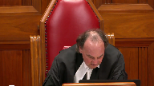
:::

This is the matter of Tanner J. Morrow versus Her Majesty the Queen, H. Markham Silver QC and Andrea L. Serink for the appellant and Andrew Barg for the respondent.

There is a publication ban in this file pursuant to section 486.4 of the criminal code.

Yes, Mr. Silver or Miss Serink, who's ever going first?

Thank you.

**Speaker 1** (00:00:58): Morning Justice Moldaver, good morning Justices.

::: {.column-margin}

:::

This appeal as of right is predicated on the dissenting reasons of Justice Slatter in the Alberta Court of Appeal.

It is submitted that the dissent of Justice Slatter raises a question of law in respect to the elements of the offense of obstructing justice.

In particular it is submitted whether on the trial record of this case the acts of the appellant following the discussion he had had with AU where he provided to her the requested information about the steps to advise the Crown that she wished the charges to be withdrawn was in fact other corrupt means as required by section 139 of the Criminal Code.

The standard of review it is submitted is correctness.

There's certainly based on the dissenting reasons of Justice Slatter, a disconnect between the completion of the discussion in respect to the withdrawal of charges or the provision of information of the withdrawal of charges and what happened subsequently with respect to the charge of 271.

The trial judge makes a finding of fact that the appellant primary purpose, one of the primary purposes in respect of the breach of bail was to provide this information to AU.

The trial judge does not make a finding at that point of the judgment that what the primary purpose of the appellant was in approaching AU on June 2nd was for the purpose of dissuading her from testifying.

To the contrary, the evidence that was adduced to trial and granted the record is not perfect but the evidence that was adduced to trial clearly substantiates that the complainant had the appellant's property in the kitchen, the appellant comes to the house in response to a request by AU of the appellant's father as to how to withdraw charges and provides that information to her.

The complainant testified that the appellant was at the residence for between one and a half and two hours, likely two hours.

The conversation in respect to the withdrawal of charges took approximately one half of an hour from the time that the appellant entered the house.

Justice Slatter makes it clear that there is a disconnect therefore between the discussion in respect to the withdrawal of the charges and what happened subsequently which is the 271 allegation.

The appellant submits that Justice Slatter is correct in this and the question that he poses is how do the findings of fact on this record relate to other corrupt means as delineated by section 139 sub 3.

In particular, there is no finding by the trial judge on the record that a threat was uttered to the complainant nor was there any suggestion that a bribe had been offered to the complainant.

Therefore, the question that was before the trial court was whether this conduct amounted to other corrupt means.

Opposite to the consideration, the Ontario Court of Appeal in Reynolds which was affirmed by this court ultimately.

In Reynolds, the concept of corruption is defined at paragraph 69 of Justice Blair's dissent which was adopted by this court.

To corrupt is to induce to act dishonestly as per the Shorter Oxford Dictionary.

That is precisely the means the appellant was applying to dissuade Mr. Page not to testify.

And I point that out for the following reason.

In each of the cases that is cited by the Crown in support of its position, the accused in that case, in each of those cases, was the proponent of the idea to withdraw charges or to dissuade a witness from testifying which is separate and distinct from the issue that was on the trial record of this case which is that the complainant had already decided that she wished to advise the Crown that she no longer wished to proceed with the original charge against the appellant and made inquiries of the appellant's father as to how that could be accomplished.

Granted, the appellant contrary to the judicial order requiring him to abstain from communicating with the complainant or attending at a residence did in fact attend at a residence and provided that information.

The complainant does not dispute that and in fact says a number of times that what he does is he explains how the charge can be withdrawn and there is no question but that the information that was provided was in fact correct.

It's apposite to note that in the court below the Crown conceded that had the information provided to the complainant successful is more of a comment on his significant misunderstanding regarding those affections than it is on the attempt itself.

So, if the-

**Justice Moldaver** (00:06:47): Could I just ask you a question, please?

::: {.column-margin}
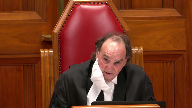
:::

If you look at your friend's factum, paragraph 9, or you don't have to take it up, he says she, being the complainant, testified, I felt a lot of guilt with Tanner and having to have charges pressed again.

Some evidence suggested that she had spoken with the appellant's father about possibly dropping the charges.

Now, are you saying, I maybe misheard you, but I think you took a position a little while ago, Mr. Silver, that she had definitely made up her mind.

There was no question about it.

She was going to have the charges withdrawn, and that was final.

I don't read that at all.

She was certainly, as I understand this case, entitled to ask the question.

I don't know that there's any direct admissible evidence that says that she had finally come to a decision or that she couldn't have changed her mind if she had.

So I think we have to look at it from that perspective as opposed to your client was simply just reinforcing that which she had already firmly and completely made a decision about doing.

**Speaker 1** (00:08:09): If I understand your question, Justice Moldaver, it appears to me from a review of the excerpts of the transcript that the complainant had contacted the appellant's father.

The appellant testifies that the appellant's father had been in contact with the appellant's father, and that the appellant's father had been in contact with the appellant's father.

The appellant's father had been in contact with the appellant's father.

The appellant's father had been in contact with the appellant's father. The app

**Justice Moldaver** (00:08:25): in the evidence.

::: {.column-margin}
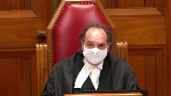
:::

I apologize for interrupting.

Where does she say directly, I had made a final decision, I wanted these charges withdrawn, I wasn't going to change my mind, and all that required was just going to a crown or whatever and sort of finalizing the whole thing.

Where is that in the evidence?

I'm not suggesting that it is in the evidence.

In fact, I'm not suggesting that it is in the evidence. No, okay.

I'm not suggesting that it is in the evidence.

**Speaker 1** (00:08:49): Unfortunately, the question was never put to the complainant by either the Crown or the defense counsel.

**Overlapping speakers** (00:08:59): However, you can find...

Unfortunately, defense counsel didn't do it.

**Speaker 1** (00:09:04): No, that's why I said originally that it is an imperfect record.

::: {.column-margin}

:::

But I can draw some comfort from the transcript, which you can certainly find at volume two of the appellant's record.

Page 35, line 37, question, how long was the conversation he had with you about the outstanding charges?

Answer, I'd say half an hour maybe.

This is by the Crown.

Question, do you recall how he left it with you?

Answer, I think I said I would look into it and that I would do what I could.

Question, do you recall what, if anything, he asked you?

Answer, if I cared about him, if I wanted these charges to go through, if I could imagine a future past all of this with him.

Only the complainant at the end of the examination by the Crown indicates that, and one can certainly infer from her answer at lines 40 to 41 of the transcript, that she had contemplated withdrawing the charges and that she would look into it and see what she could do.

There is no further discussion with the complainant in respect to withdrawal of charges or the accused appellant advocating that she withdraw the charges.

It is clear from the evidence of the appellant that, which was not rejected by the trial judge, that you can find at page 66 where the appellant testifies.

Can you tell me more about that conversation in parentheses with the complainant?

Answer, it was basically the same stuff over and over again.

Her saying that she didn't want me in jail, she didn't want me charged.

I said, well, I asked why she was doing it.

The reason I asked her, or sorry, told her that the steps of going about dropping the charges was she ended up messaging my dad saying that she wanted the charges dropped and the cops wouldn't let her.

That was the Facebook message we were bringing forward.

The evidence which was not rejected by the trial judge included the evidence of the appellant where he specifically says that the information provided to the father was that she had wanted the charges dropped and did not know how to do that considering that the police were not assisting.

The appellant made inquiries, according to his evidence, unfortunately attended at her evidence, provided that information to her as requested by her.

There's nothing that suggests that he was trying to dissuade her from testifying.

As I indicated, her evidence was at the end of the conversation, she said that she would contemplate or think about it

and she would see what she could do.

She just wanted to motor there.

**Justice Moldaver** (00:12:06): She just wanted him out of there, she was, because the trial judge accepted her evidence, that she was frightened, she was scared, she felt intimidated, and then he proceeds to sexually abuse her.

::: {.column-margin}
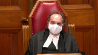
:::

You know, her bottom line is she didn't want him there to begin with.

And so I don't think you can just sort of say,

oh well, she had decided yes, that she would go ahead with this.

This is in the context of him going over there unasked for, unwanted, you know, and to think that he apparently calls the police to find out how to do this, but didn't bother to sort of mention to the police whether it would be okay for him to go over to the house.

I mean, you've got to look at the whole context of this.

This is a domestic, this is a case of domestic abuse, and now the person who has domestically abused her is at her doorstep doing what your friend points out is step three of Lavalli.

So if you look at it in that context, which I think the trial judge did and the court of appeal did, that puts a very different perspective on the way you are quite ably trying to put your case forward.

**Speaker 1** (00:13:24): Well, with respect to the cycle of abuse that's referred to in Lavalier's decision of this court, it was clear as well that in order to take into account that information, expert evidence would be required.

::: {.column-margin}
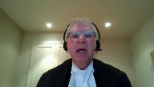
:::

Now, I'm not going to argue this point at this time.

I do say, however, that what transpires in this case, and it appears to be clear from the evidence of the original police officer, that a phone call was made originally to the police with respect to the appellant obtaining his property and advising them that he was going to attend at the residence.

He then testifies, and it does not appear that his evidence was rejected on this point either, that he cancels the police.

He does attend at the residence.

I agree that one must look at it in context, but the context is also that there is a break in the causal chain between any discussion with respect to the charges, and subsequent conduct, which Justice Moldaver, you point out quite aptly, is the 271 offence that occurs.

What it appears as well from the complainant's evidence is that, yes, she does wish the appellant to leave the residence, and he ultimately does do that, but that in order to get him out, she also agrees that she was going to do this fiction of the hug in the hallway, and then he's about to leave the residence.

He leaves, he leaves, he's on the step, and he tries to kiss her again.

The trial judge doesn't make it clear as to whether he finds a continuing 271 offence, or which attempt to kiss is the 271 in this case, the attempt at the doorstep after the fiction of the hug and the walk in the hall, or whether it was the first attempt to kiss her in the bedroom, but what does appear is that there's, according to Justice Slatter as well, is that there's a causal break between any discussions with respect to withdrawing of the charges, the original charges, and what happened subsequently where he attempts to rekindle the relationship.

This is after the discussion that the complainant has with the appellant, where she tells him, I still have feelings for you, yes, I still like you, but I have to do what is in the best interests of myself and my children.

**Justice Kasirer** (00:16:03): Is there not, Mr. Silver, may I ask, sorry to, to interrupt.

::: {.column-margin}
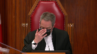
:::

On this question of a causal break or a continuum.

On page 12 of the record, the, the reasons for judgment, line 20, 28 to 30, the judge makes a connection between the 271 offense and the withdrawal of the charges.

And the withdrawal of the charges.

His advances were unwanted and not consented to.

She testified she felt pressured and uncomfortable as a result of them.

In my view, his actions were part and parcel of his overarching goal to have her withdraw the charges.

It's of a piece, is it not?

It's all of a piece.

He tried to prey on her affections for him in the discussion for, in respect of withdrawing the charges and the conduct continued through the 271 offense all with the same overarching goal for the trial judge.

**Speaker 1** (00:17:18): Thank you, Justice Kessler.

::: {.column-margin}
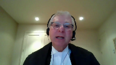
:::

I would respectfully suggest that what the complainant was saying was responsive to the question of how she felt in respect of the 271 allegation when the appellant attempted to kiss her.

So what she was saying was responsive to a question as opposed to a question of, how did you feel when the appellant was discussing the withdrawal of the charges?

She doesn't say that she felt pressured by him in respect to that.

And I would suggest that on the record that is before the court, the trial record, neither the Crown nor the defense make it clear as to what part she felt pressured.

And granted, that as Justice Moldaver points out, one looks at it in context and you have to look at it and say, was this in fact a continuing transaction or was there a break in the causal chain as Justice Slatter finds and says that the attempt to provide the information in respect to the obstruct justice is separate and distinct from his attempt to rehabilitate the relationship that he had with the complainant.

So that there's two different parts that you're looking at.

Now, the trial judge says that I'm drawing an inference from that that says that his overarching goal was with respect to the obstruction of justice or to dissuade her from withdrawing the charge.

But on the other hand, Justice Slatter finds that an equal inference can be drawn, that there was an attempt to rehabilitate the relationship separate and distinct.

And I think you can draw comfort on that submission from the fact that the complainant herself says when asked, what did the accused tell you?

And she gives the three points of, do you really want to proceed with the charge?

But the most telling is the one that's the last one, which is.

It sounds to me it's that.

**Justice Kasirer** (00:19:29): Again, I'm interrupting you, it's very rude.

::: {.column-margin}
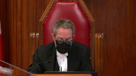
:::

But you said at the outset you were arguing on the correctness standard and a point of law, and now you're recharacterizing the evidence as it was found by the trial judge.

I asked you about a finding of fact, and Justice Slattery didn't take the same view of the facts, but it strikes me that we're straying into palpable and overriding error now.

**Speaker 1** (00:19:56): No, but it's submitted that if there is an error in respect to the inference which is drawn and its relationship to other corrupt means, whether or not it falls within the definition of other corrupt means, that becomes an error of law as opposed to an error of mixed law and fact.

::: {.column-margin}
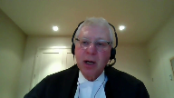
:::

So it's the characterization of the inference which is drawn which is contrary to the evidence.

As I was about to say, and I appreciate your question and your comment, but the third part of the answer that is provided by the complainant is, after all is said and done, is there still a future for us?

So he doesn't say, after all is said and done, if you withdraw the charge, is there a future?

He's saying, is there a future for us if you withdraw the charge at all?

So can I...

**Justice Karakatsanis** (00:20:50): bring you back, I mean you talk about the context and whether this finding was available, whether it was reasonable.

::: {.column-margin}
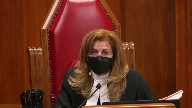
:::

What do we do with the context that he only gained entry to the home using, I won't use the word, well fiction if you will.

He said that he was there to pick up his things.

I'm looking at the trial judge's reasons.

He was waiting for the police to arrive so he could retrieve some of his personal belongings and she said let him know, let her know when the police have arrived, closed the door, he knocks again and he gets in, she lets him in.

What do you do with that?

You said it's not reasonable to conclude there were any corrupt means here because she initiated the request to withdraw the charges.

How does that fit into the, given the context that Justice Moldaver has set out, do we, do we, is that relevant at all to the final determination?

**Speaker 1** (00:21:59): The trial judge says that the attendance, and you can find this at the record page 10, line 12, it was in my view one of the, if not the primary reason, he knowingly and willfully breached the no contact condition of his recognizance and attended her residence.

::: {.column-margin}

:::

So the fact is that one reason, according to the trial judge, that he attended at the residence was for the purpose of discussing the withdrawal of the charge, being responsive to the question that was posed to the appellant's father.

Another reason that the trial judge finds is to recollect his property, and as noted earlier, it appears from the transcript that the property was in the kitchen, waiting to be picked up.

Pursuant to the evidence.

**Justice Karakatsanis** (00:22:54): I understand what you're saying, but I don't see how the fact that he had some other proper or legitimate purpose can wipe out if, in fact, there is evidence that he committed this crime.

::: {.column-margin}
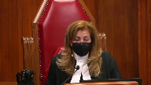
:::

I just don't see why the one excludes the other.

And I probably shouldn't be taking you to the facts in any event, because as my colleague quite properly points out, we're looking at the legal conclusion and not re-arguing the facts.

But in this context, the fact that he had some other purposes as well doesn't wipe out conduct that the trial judge found to be criminal.

**Speaker 1** (00:23:40): Thank you, Justice Kara Katsanis.

::: {.column-margin}

:::

The trial judge finds that one reason for his attendance was to discuss the withdrawal of the charges.

Another reason for his attendance was to collect his property.

And what you had said originally was, and your original part of the question was that he obtained entry by a ruse.

That is only if, in fact, his attendance was solely for the purpose of discussing the withdrawal of the charges.

But if his purpose was equally to obtain his property, then there is no ruse.

And quite frankly, he was convicted of the failures to comply with recognizance.

It was never an issue and there were even no submissions really made on that point.

So he was found guilty of that which he was guilty.

The question then is whether as a matter of law that failure to comply with the recognizance informs of other corrupt means and whether that is other corrupt means.

**Justice Côté** (00:24:52): Mr. Silver, in paragraph 22 of your Factum, you refer to a concession made by the Crown on Appeal.

::: {.column-margin}
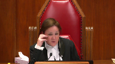
:::

And you say that the Crown on Appeal conceded that in order to make out a charge of attempting to obstruct justice, there must be something corrupt or illicit about the conduct of the appellant.

Was the concession more precise as to the conduct of the appellant?

I mean, was there something more specific in the concession made by the Crown?

**Speaker 1** (00:25:31): Ms. Serink argued the appeal before the Alberta Court of Appeal and I would invite her to answer that question for you and in fact she may have some further submissions but I think it would be most appropriate to hear from her.

**Overlapping speakers** (00:25:44): Okay, thank you.

**Speaker 1** (00:25:45): mind the time that we have as well.

If you could allow Mr. Rink to answer that question, please.

**Justice Côté** (00:25:58): Yeah.

**Speaker 2** (00:26:03): Good morning.

::: {.column-margin}

:::

I just want to take you to the correct portion of the dissenting reasons where Justice Slatter speaks of the concession.

I believe it's at the last part of paragraph 22.

Justice Slatter says the crown concedes that in order to make out a charge of attempting to obstruct justice there must be something corrupt or illicit about the conduct of the accused.

And so that was what was specifically discussed at the oral hearing before the appeal court with whether if the father had communicated that information directly would that have amounted to an obstruction of justice.

Does that answer the question?

**Justice Côté** (00:26:54): When it's referred to the conduct of the accused, it was the conduct of the accused regarding the information provided to the complainant. Yes.

Okay.

**Speaker 2** (00:27:07): And so just getting back to the point that my colleague was making, it's the breaches of recognizance were never appealed.

::: {.column-margin}

:::

Those were conceded at the pretty much at the trial level and also on appeal.

But it's really important to just not overly convict someone on the basis of that they're committing other criminal acts.

And so what Justice Slatter was doing was looking at whether or not the conduct on this record actually made out the specific intent of obstructing justice.

And so just with respect to Justice Moldaver's question earlier this morning, one of the things that's important to also appreciate is that factually what she wanted, the evidence was a bit slim in that regard.

There weren't certain questions put to her.

But it's really about also what the appellant believed to be the case.

So when we're looking at corrupt means, was he truly trying to manipulate her or was he just speaking what he believed to be true?

And so that's why Justice Slatter looks at it and says, well, on this record, what we have here, you know, is somebody that clearly isn't getting the message and is perhaps behaving in a criminal matter with respect to the recognizance and other activity, including the forced kiss.

However, there is conduct that's really above that that is required in order to meet the test of obstruction of justice.

And so that's why, you know, we are talking a little bit about the facts because we're talking about the application of a legal test to the facts.

And it's not a very perfect record in this case.

Those are those are my submissions.

I will turn it over to my friend.

**Justice Karakatsanis** (00:29:07): Just just before you do in terms of the record Was there any record that his statement the police were coming to to be there while he picked up his things?

::: {.column-margin}
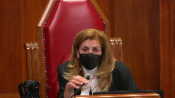
:::

Was there anything in the evidence that that was true that the police were on their way?

Um, or did the police ever arrive?

**Speaker 2** (00:29:27): So, my understanding of the record is that he advised that they were coming, but then also told her later that he had told them that they weren't coming anymore.

::: {.column-margin}

:::

Like he had essentially advised her that he had called them off.

So, whether you're correct that there is, you know, a quote, unquote ruse in order to get inside the residence, and that is obviously aggravating with respect to the breaches of the recognizance.

However, the whole interaction can't just be melded.

And I think that that's what my friend is doing with the cycle of violence.

And I respond to those submissions when I hear what he has to say.

**Justice Kasirer** (00:30:19): Can I just, you mentioned earlier about trying to manipulate her when he went over, not contenting himself with the exchange with the father, doing it directly himself.

::: {.column-margin}
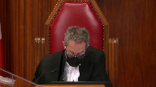
:::

And I'm fixed on the line of the trial judgement picked up on by the majority of the Court of Appeal, page 10, line 23.

By attempting to dissuade her from proceeding with the matter, and this is the key, by trying to prey on her affections for him.

I'm wondering if the manipulation for the judge was there.

It's not just appealing to her affections, it's preying on them.

That is to say, pointing to her vulnerability, making her a victim, wrapped up in this previously abusive relationship.

I'm wondering if the manipulation can be seen there.

**Speaker 2** (00:31:35): Well and just to be clear the 271 offense doesn't happen until after this so prior to this was the criminal harassment when we talk about abuse that's a it's a form of abuse

::: {.column-margin}

:::

but it's a different form but what I would say is that the the judge does say by trying to prey on her affections for him when we look at other corrupt means Justice Slatter takes a very positional uh point

and he says you know preying on emotions or appealing to emotions is not corrupt means uh that might be um perhaps

**Justice Kasirer** (00:32:15): My point is there's a distinction between appealing to emotion or affection and preying upon it.

**Speaker 2** (00:32:23): You're saying there's a distinction between praying and appealing?

No, I understand what you're saying.

Praying would be more along the lines of manipulating.

**Justice Kasirer** (00:32:37): Yes.

::: {.column-margin}
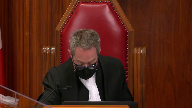
:::

And that's the word that the trial judge used, and Justice Slatter preferred the expression in paragraph 30, appealing to emotion or affection, when he said that that does not fall within threats, bribes, or other corrupt means.

I think that might have been, I say so respectfully, a mischaracterization of what the trial judge had found.

**Speaker 2** (00:33:04): And sir, I will hear what my friend has to say and then provide a reply.

**Justice Moldaver** (00:33:10): All right, thank you very much.

We'll hear from the crown now.

Mr. Bard, please.

**Speaker 3** (00:33:19): Thank you Justices.

::: {.column-margin}

:::

I hope that you can hear me.

Is my audio working?

Very good.

Yes, it's working.

Thank you very much.

Thank you.

So in the respondent's respectful submission, this really was a factual case.

The judge made findings to fact that were reasonable and that were supported by the record and you should accept those findings of fact and if you do, then there's no basis to interfere with the legal conclusions that followed naturally from those facts.

And in my submission, it's necessary to review the entire context, the whole two hours approximately that the appellant was at the complainant's residence as one transaction as the trial judge did to understand why his actions do satisfy the test of corrupt means.

I'd like to address one point that my friend made right at the outset before I miss it and this is the definition of corrupt.

My friend referred to Reynolds and that case is in the condensed book and the definition is to induce to act dishonestly, which was the definition used in that case.

And I'd like to take issue with that definition a little bit.

Certainly it applied on the facts of that case where the offender was inducing the victim to provide a false doctor's note but the context of the actual section reads, and I'm reading this is in my condensed book at the first tab, 139 sub 3 sub a dissuade a person by threats, bribes, or other corrupt means.

So the context of this language in my submission is that threats and bribes are corrupt means but the section contemplates other kinds of corrupt means as well which could satisfy the test.

So if I'm correct about that, that threats and bribes are corrupt means, it's certainly possible to issue a threat in a way that's not dishonest.

So I submit based on a plain reading of the section, dishonesty is not required for corruption although it certainly could be a relevant factor as it obviously was in the Reynolds decision.

**Justice Côté** (00:35:53): So, but you say that a threat is not necessarily dishonest, what about a bribe?

Do you agree that a bribe necessarily implies dishonesty?

**Speaker 3** (00:36:09): I would say not necessarily.

**Overlapping speakers** (00:36:13): Hmm.

**Speaker 3** (00:36:13): Let me give you, I don't wanna get too far off track, but let me give you an example.

::: {.column-margin}

:::

One of the cases in my factum is R.V. Koch.

This is a 1990 decision of the Alberta Court of Appeal.

What happened in that case was it was an individual, a lawyer was charged with shoplifting from Superstore.

And Mr. Koch was a longtime associate of this lawyer and he decided to approach Superstore to try to help out the lawyer who was charged with the shoplifting.

He approached Superstore and told them that he would make a $20,000 donation to a charity of their choice in their name in exchange for them arranging to have the charges withdrawn.

So it was not necessarily secret or deceitful.

It was a straight up offer to do something in exchange for having the charges withdrawn.

And based on that example, in my submission anyway, it's not necessarily deceitful to offer a bribe, but it is corrupt in that context.

And it does, Mr. Koch was convicted on those facts.

So the only reason I'm making these submissions is I wanted to take issue with my friend's comment that dishonesty is essential to the offense here.

Although you might find dishonesty in a variety of the things that he did, it's not an essential element of corrupt means.

I'd like to go to what I take to be the main issue, which is the dissenting judge's finding.

He made a finding of fact that the appellant, that the complainant initiated the discussion about dropping the charges.

And in my submission, there are several things wrong with this finding.

First of all, the trial judge didn't find that this occurred.

This finding was only made on appeal.

And so the first problem is the only evidence in support of this was hearsay.

The appellant testified that his father told him about this conversation that he had.

And he was allowed to testify to that as part of the narrative to explain his motivation for doing what he did and to present his defense.

But that evidence couldn't have been used for the truth or shouldn't have been used for the truth because there was no evidence before the court to assess whether what the father told him was truthful.

So right from the beginning, the finding that Justice Slatter in dissent made, respectfully is not based on properly admissible evidence.

But regardless, if that finding were accepted, I have tried to argue in my factum that there's a very significant difference between initiating a discussion with a third party and initiating discussion with the person who was charged with criminal harassment with the appellant.

Speaking to a third party, the third party doesn't have a court order not to contact them.

The third party, the offender, the complainant is not afraid of the father in this case.

So to just gloss over the difference and say she initiated the conversation in my respectful submission is very wrong.

And it neglects the reality that she is afraid of him, so much so that she had to seek police protection.

The other problem with that submission is that, or I should say that finding, is that even if she did initiate the conversation, that doesn't undermine the fact that obstruction could occur.

And I'll just give you the example of an accomplice.

If you imagine a case where a person is charged with an offense and the Crown is planning to call an accomplice to give evidence about what they did, and the accomplice does not want to testify, and the accomplice might initiate a conversation with the accused and say, I don't want to have to go to court on this.

Can you help me figure it away so that I can get out of this?

**Overlapping speakers** (00:40:38): Bye.

**Speaker 3** (00:40:38): obligation to testify, and then they might have this illicit conversation trying to figure out a way to avoid having to give evidence.

::: {.column-margin}

:::

That would still, or could still, constitute obstruction of justice and the fact that the accomplice quote initiated the conversation would not change that.

So for all those reasons the dissenting finding was not a basis to overturn the conviction in my submission.

**Justice Rowe** (00:41:06): But isn't this, I mean, I'm sure all of that played into Justice Slatter's reasoning, but I'm gonna be a little more simple about this.

::: {.column-margin}
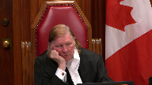
:::

Doesn't it come down to when the accused said, in effect, if you cared about me, you wouldn't proceed with this?

And did that constitute another corrupt means in law?

**Speaker 3** (00:41:41): Well, that's that is my position.

::: {.column-margin}

:::

That's part of my position is that absolutely, he preyed on her emotions.

He recognized her vulnerability, because his father, he heard from his father that she was having possible second thoughts.

He decided to take advantage of the situation, go approach her, contrary to the court order that she had sought, and then force further contact on her that she didn't want.

**Justice Rowe** (00:42:10): But I guess, that's sort of how we get to the critical moment.

::: {.column-margin}
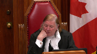
:::

Maybe it's determinative, maybe the context that he shouldn't have been there is decisive.

Maybe the fact that he treated her very badly, and that frames what was said and how it was received.

Maybe that's determinative.

But it seems to me, in the end, it comes down to, when he puts that proposition to her, does that constitute other corrupt means?

And I know your conclusion, but I'm not sure I understand your reasoning other than, maybe it comes down to this, in all of the circumstances, as a matter of law, it constitutes other corrupt means.

I'm not sure I understand your reasoning other than, maybe it comes down to this, in all

**Speaker 3** (00:43:06): Well that's not, that's quite right.

::: {.column-margin}

:::

My submission is it depends.

So making that statement, if you cared about me, why are you doing this, would you drop the charges, it might or might not be corrupt means, it depends on the context.

It depends on all the circumstances in which those words are said and these acts are done.

So it's not, certainly on this case, but in any case we should not isolate that particular, you know, that part of the transaction.

And I concede there certainly could be some cases where appeals to emotion do not satisfy the test for obstruction, can certainly imagine that situation, but that's not this case.

And what I do respectfully disagree with the dissent is that there should not be a rule of law that appeals to emotion never count as corrupt.

So I hope that answers your question Justice Roe.

My answer really is it depends and the context is crucial for the trier of fact to assess whether those words were corrupt in the context.

And in this case, the trial judge found that they were.

And that was a new that

**Justice Moldaver** (00:44:21): doesn't that go back to Justice Casir's point, which is the word used was pray, manipulate, not appeal to, and and it seems with respect that the dissenting judge twisted that to say he was there to appeal to her affections.

::: {.column-margin}
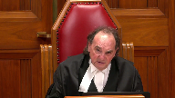
:::

That's what not what he was there according to a finding of the trial judge that was certainly open to the trial judge.

**Speaker 3** (00:44:50): Exactly.

::: {.column-margin}

:::

And that is what the dissent does throughout in my submission is attempt to reinterpret the record and come to different conclusions than what the trial judge reached.

And just to give you one other point that that is relevant in my submission of paragraph, I believe it's paragraph 25.

Justice Slaughter uses this word idiotic to describe the actions of the offender.

And this word kind of has connotations that Mr. Morrow didn't give it any thought.

And if he'd given it a moment's thought, he never would have gone to a residence.

And that's not really the way the trial judge viewed it.

That's not really accurate.

There's premeditation involved here because he learned this information according to his narrative from his father.

And he decided to take advantage of the information he learned.

He attended her residence.

He attended and he went back again.

And he went back again a third time.

And he went there with a plan with an overarching purpose to persuade her to drop the charges.

So to just dismiss this as some sort of idiocy really fails, I submit, to perceive the moral blame worthiness that attaches to these actions.

I don't think there's any-

**Justice Rowe** (00:46:13): The question about the moral blameworthiness, the question here is about the criminal liability.

The moral blameworthiness is a pretty easy one to resolve.

But moral blameworthiness does not equal criminal liability.

**Speaker 3** (00:46:32): Well, my point was that the dissent recharacterizes facts and comes to different, assesses them differently than the trial judge did.

::: {.column-margin}
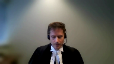
:::

I mean, ultimately the question that you're asking regarding the appeals to emotion, I'm not able to point to a case that says appeals to emotion are corrupt or may be corrupt, but I've tried to argue from broader principles, including the cycle of violence and the lavely references that they may be depending on the context and certainly where they become manipulative, where they approach the praying as the trial judge described them, they certainly can be.

But the other important, the other essential finding of fact, which Justice Cazare pointed out as well, is the judge's finding that the sexual assault was part and parcel of the overarching purpose of persuading the complainant not to test, not to participate in the process.

So that finding, putting aside any kind of praying on emotions, the finding that his means of persuasion included sexually assaulting her, in my submission, has to qualify as corrupt means.

And if you, and if I'm right about that, then the other aspects of the decision really fall away because that finding of fact on its own is decisive on the issue of whether he employed corrupt means of persuasion.

I mean, there is one, I'm sorry.

**Justice Rowe** (00:48:26): There is the old country and western song, Don't Give Me Lines and Keep Your Hands to Yourself, which sort of indicates an attitude on behalf of the singer that, you know, look, I'm not interested and you just kind of keep your distance, buddy.

::: {.column-margin}
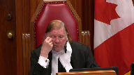
:::

And the person who would sing that line doesn't sound like they're vulnerable or subject to manipulation.

Whereas, I think you touched on something that I consider quite important here, which is the notion of manipulation and was this individual, the complainant, in a vulnerable state and did the accused seek to take advantage of that?

And by that means, was it, by that avenue, was it a corrupt means?

Because simply saying, you know, if you care about me, you wouldn't do this.

That one, I've got a little more trouble with.

Or the guy gets fresh and kisses her when he really shouldn't, which we all know is not acceptable.

But again, in isolation, it doesn't seem to me that it's the fatal moment.

But if what we have is someone who's perhaps afraid and confused and intimidated, now that maybe is a little different.

**Speaker 3** (00:49:52): Well, I couldn't agree more, and this is exactly the kind of assessment the trial judge is in a position to make.

::: {.column-margin}

:::

And the majority in the Alberta Court of Appeal replied on the ESA decision.

And the facts in that case were that Mr. ESA phoned the complainant and said something like, if you go through with this, you're going to look really stupid.

And Assessing whether that's obstruction, you know, normally on the face of it, it doesn't sound like obstruction.

It doesn't sound like corrupt means.

It just sounds like a relatively harmless statement.

But the trial judge in that case was present, of course, to hear the evidence.

He was able to assess the nature of the relationship between the two people.

And based on that assessment, he concluded that these words uttered by the person to the victim in the context that they were uttered, did constitute obstruction.

And the trial judge, as I don't want to keep repeating this point, but the trial judge was the one to make that assessment.

And the trial judge here was the one to make the assessment here, and it is available on the record.

So, I wanted to just briefly respond to one paragraph in the dissent.

Paragraph 28, where the dissenting judge says that he has identified palpable and overriding error.

And of course, that is the standard of review that's applicable to facts.

And so I wanted to confront this head on, because the dissenting judge states that the trial judge, and I'm paraphrasing, but the trial judge equated persuading somebody not to go to court in response to a subpoena.

And so, the dissenting judge states that the trial judge, and I'm paraphrasing, states that the trial judge equated persuading somebody not to go to court in response to a subpoena.

**Overlapping speakers** (00:51:43): PENIS.

**Speaker 3** (00:51:43): with persuading somebody to arrange for the withdrawal of the charges.

::: {.column-margin}

:::

And Justice Slatter said this was a palpable and overriding error, not supported by the record.

And so first of all, Justice Slatter in my submission is being unfair to the trial judge here.

The trial judge knew exactly what had happened.

He well understood the facts.

He knew that there was no trial date.

There were no subpoenas issued because the charge had only been laid three days earlier.

And the trial judge demonstrates his understanding of these facts earlier and the reasons.

And so to simply take this one sentence out of context, really, and then find that the trial judge committed palpable and overriding error by saying this is just not right.

But then in addition, Justice Slatter treats this error as being decisive in the sense that since there was no subpoena issued, since he wasn't telling her not to go to court in response to a subpoena, that distinguishes all these other precedents and I don't need to.

And therefore those cases, the principles from those cases don't apply.

And in my submission, that also really is not sound reasoning because the purpose of this section of obstruction of justice is to protect the integrity of the justice system as a whole.

We couldn't have trials unless we have witnesses who are willing to come to court and give evidence.

But it's not enough to just protect witnesses once they receive a subpoena.

The whole purpose of the section would fail if it was free to interfere with witnesses up until the point where they're served with a legal document.

And we can see that from the wording of the section, which expressly states a legal proceeding, pardon me, a judicial proceeding existing or proposed.

So the judicial proceeding need not even have been commenced yet for obstruction to be possible.

And so Justice Slaughter's distinction here in my submission, again, really misses the point and fails to appreciate the importance of the section.

So not only was he wrong that the judge made this error, but he was also wrong to find that this was a significant error if the judge had made it.

The last point that I'll make subject to any questions is to respond to something the dissent says in paragraph 30.

So, and this is, I'm also responding to my friend's emphasis of this point.

Justice Slaughter in the last sentence, he says, any prospect of dropping the charges was derailed when the appellant turned the meeting away from the topic of dropping the charges and attempted to turn it into an attempt to rekindle their relationship, resulting in the sexual assault for which he was properly convicted.

So Justice Slaughter here is subtly, once again, changing the finding of fact.

The trial judge was of the view that the sexual assault was part and parcel of the overarching purpose.

And for some reason, without finding any palpable and overriding error, the dissent here would change that finding and decide that these are two separate unrelated interactions.

And that is not the role of an appellate court, I respectfully submit.

As I said, I think at the outset, we should accept the trial judge's findings.

And once those findings are accepted, in the context of this case, it follows as a matter of law that a conviction was proper.

So unless there are any questions, those are my submissions for today.

**Speaker 2** (00:56:03): Just in reply I note that there was a question about the entry into the residence and there's a discussion about that in volume one at page 38 and the Crown was asking how that made her feel once she determined that the police weren't there or weren't on their way.

::: {.column-margin}

:::

She said slightly she said were you concerned that they weren't there she said slightly I just didn't really have it on my mind and so I think that you know the record is obviously imperfect but when my friend says that Justice Slatter's decision is based on evidence that wasn't admissible that's very interesting argument in light of the fact that I argued ineffective assistance at the Court of Appeal and my friend argued no the the trial council was effective this wasn't didn't meet the standard of miscarriage of justice and then to now say well well there's no leg to stand on with respect to the evidentiary record I mean that's not very fair to the appellant and just with respect to the preying on emotions paragraph and and the part that Slatter has reproduced in his dissent if you look at that closely the judge seems to be really the trial judge is really concerned with the benefit portion of the interfering with justice who receives the benefit and that's just wrong and so when he then ties that to the conclusion of dissuading from giving evidence that that's wrong and so while he didn't pick through and find portions of the trial judge's reasons that maybe could be considered to be applying something that is along the lines of the appropriate test he's saying no he's applied the test wrong he he hasn't even uh he says on one hand he's accepted the uncontradicted evidence of the appellant and then on the other he's making this finding about preying on her emotions and what I think we really have to look at is the immaturity of these individuals the pinky swear the walking towards each other down the hallway there's elements of sophistication uh that is being imported on these individuals that simply is not borne out by the record um and then I would just also say that um if uh if justice slatter did state that appealing to emotion could never be corrupt means

i i believe that he was speaking about this case the appellant's case

but clearly there might be a scenario where appealing to emotions could be corrupt means but in essence the dissent was saying not on this record not for this appellant

and so when we look at the specific intent of this offense what justice slatter is saying firstly the trial judge didn't apply the right test second when i look at applying the test this individual uh does not make out that test his conduct does not meet criminal intent uh to interfere with justice on this record subject to questions those are the appellant submissions

**Justice Moldaver** (00:59:15): The court will rise now, but I would ask council to kindly stay put.

::: {.column-margin}
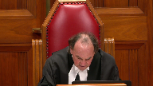
:::

Thank you.

The court is adjourned.

It was open for the trial judge to find that Mr. Morrow's intention was to apply pressure on the complainant and ultimately to manipulate her into dropping the charges against him.

The fact that Mr. Morrow may have also been motivated by a desire to rekindle his relationship with the complainant did not undermine the availability of this finding.

There was also evidence that contradicted Mr. Morrow's position that he was simply responding to a request for information.

The complainant made no such request to Mr. Morrow, and she did not expect nor was she interested in the information he provided.

In these circumstances, and having regarded the fact that survivors of domestic abuse are particularly vulnerable to acts of intimidation and manipulation, the trial judge's verdict was reasonable.

There is no basis for appellate intervention.

Justice Cote is dissenting, and I would now call upon my colleague to please deliver her reasons.

**Justice Côté** (01:03:38): The wording of the charge required evidence that the appellant attempted to dissuade the complainant, quote, by threats, bribes, or other corrupt means from giving evidence, end of quote.

::: {.column-margin}
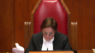
:::

There is no such evidence here.

The appellant's behavior cannot in this case be characterized as a corrupt means within the meaning of Section 139.3 of the Criminal Code.

Appeal to or preying on affection are means of persuasion, just like appealing to or preying on reason.

Nothing in the circumstances of this case makes this means of persuasion corrupt.

The trial judge erred in finding otherwise, his reliance on the Queen against Crazy Boy was in opposite for two reasons.

First, no finding of corrupt means was made in that case, as the wording of the charge did not require any.

Second, Mr. Crazy Boy attempted to manipulate the complainant and incited her to adopt an illegal behavior by fleeing from her home so that she would not be brought before the court to give evidence.

Here, the appellant merely provided information as to the process for withdrawing charges.

As a Justice Slater, I am of the view that the conviction for attempting to obstruct justice is not made out on this record and that the conviction is unreasonable.

I would therefore allow the appeal and enter a verdict of acquittal.

**Justice Moldaver** (01:05:32): Thank you Justice Cote and thank you again to all counsel the court is adjourned now till tomorrow morning at 930. Thank you