---
title: York University, et al. v. Canadian Copyright Licensing Agency ("Access Copyright"), et al.
published-title: Heard
date: 2021-05-21
sidebar: false
---

This transcript was made with automated artificial intelligence models and its accuracy has not been verified. Review the original webcast [here](https://scc-csc.ca/case-dossier/info/webcast-webdiffusion-eng.aspx?cas=['39222']).
---

**Justice Wagner** (00:00:02): Report, Lacourt.

**Justice Wagner** (00:00:27): Good morning.

::: {.column-margin}
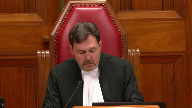
:::

Please be seated.

Good morning, everybody.

Mesdames et messieurs, ladies and gentlemen, Avant de procéder aux plaidoiries ce matin, je tiens à souligner qu'il s'agit, il s'agira aujourd'hui, de la dernière participation de la juge

Abela aux audiences de la Cour suprême du Canada.

Justice Abela, dear Rosie, It is hard to believe that today's hearing will be your last.

You are the Court's longest-serving current member, and in the 17 years since your appointment at the Supreme Court of Canada in 2004, 2004 was a very good year for a judge's appointment, you have heard over a thousand appeals, penned hundreds of judgments, and pushed forward your remarkable judicial career.

As Chief Justice, I wish to take this opportunity, on behalf of my colleagues, and indeed on behalf of all Canadians, to thank Justice Abela for having been such a champion of equality rights.

She has been instrumental in developing the Court's jurisprudence in this regard, as well as in other important areas of the law, at all times with passion, with dedication, and limitless energy.

Needless to say, there will be lots for her to teach, as she takes on the role of Visiting Professor of Law at Harvard next year.

As many of you may know, Justice Abela is also an avid musician and art collector, and her office here at the Court is more an art gallery than judges' chambers.

From the floor to the very high ceilings, all four walls are crammed with fine works of art.

It has, in fact, become a must-see attraction for many visitors to the Court.

Legend has it that Justice Abela's enthusiasm for hanging some of that art herself using a very tall ladder explains why she had to use a cane on the day of her swearing-in ceremony.

And it was on that very day, Rosie, that you spoke about how lucky you have been throughout your life.

As you remarked when you introduced me as Chief Justice back in 2018, it has been a life guided by the desire of making justice and equality a reality for all Canadians.

We are all unanimous in finding that in doing so, you have served Canada and Canadians with a unique panache, and that you are leaving the Court with an honourable legacy.

Finally, I wish also to express the Court's gratitude to Justice Abela's beloved husband, Irving – Ichi, as we fondly refer to him – as well as their two sons, Jacob and Zachary.

Thank you for sharing Justice Abela with us for so long.

Being a judge is a great privilege, but it is also a very demanding job.

And not just for the person wearing the black robes.

I will now give the floor to our honourable colleague to say a few words.

So, Rosie, the floor is yours.

**Justice Abella** (00:04:55): Chief Justice, Excellency, Richard, cher ami, thank you for your generous words and especially for your warm friendship over the years.

::: {.column-margin}
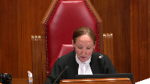
:::

This has not been an easy for you, an easy year for you or the court, but you've guided us masterfully and protected the ability of everyone who works Chez Cormier to prove to the public that justice will not only be done, it will be seen to be done safely.

This plexiglass protects you from a grateful hug, but a hug awaits you when we emerge from COVID's grasp, as it does for all my colleagues who have brought such joy to my supreme life. Il y

a évidemment bien des aspects de ma vie à la

Cour suprême qui vont me manquer, mais la chose qui va me manquer le plus, ce sera la chance que j'ai eue au cours de toutes ces années de pouvoir travailler avec autant de mes merveilleux et merveilleuses collègues, collègue, des collègues qui m'ont constamment appris, inspiré et encore plus que moi.

I've had 18 colleagues over the past 17 years, remarkable people and jurists, most of whom started off as strangers and all of whom ended up becoming friends.

We work together, think together, worry together and protect the institution together.

We don't, however, always agree together, but that's to be expected.

We're each different and we're each independent.

But when we do disagree, we do it from a genuine commitment to justice and we do it with civility, most of the time.

And we have the benefit of an incredible group of court personnel, plus our wonderful judicial assistants, our invaluable court attendants and our remarkable law clerks.

I've had the privilege of working with 55 exceptional law clerks, all of whom have made indispensable contributions to my idealism, to the quality of my work and to my enthusiasm for the task. So today.

This is not just the last sitting day of the Supreme Court year.

It is also the last sitting day of my Supreme Court career.

I remember how emotional it was when I was sworn in on October the 4th, 2004, but that was nothing compared to how emotional it is to be sworn out.

Because I am not only leaving my life on this court, I'm leaving a judicial life that started 45 years ago when Roy McMurtry appointed me to the family division of the Provincial Court in 1976, when I was not yet 30 years old and very pregnant with our younger son.

Almost all of my friends in the bar urged me not to take the appointment because the Provincial Court was at the bottom of the judicial hierarchy and since I'd only been practicing law for four years, they were convinced that with time I would one day make it to the federal trial bench.

But I had no ambition to go to the federal trial bench.

I had no ambition to go to any bench.

People like me, female, Jewish, immigrant, refugee weren't exactly being appointed to the bench in droves.

So really all I was aspiring to do when I graduated from law school with five other women was to be a really good lawyer.

But if somebody wanted to make me a judge, who was I to say no to the opportunity?

After all, immigrants live for opportunities, not entitlements.

We don't think about where our career's finish line should be.

Mostly we're just grateful to have careers and the chance to contribute to the country that let us in.

What we hope for when we work hard and try to contribute is respect and the chance to earn it based on who we are.

Everything else is beyond imagining, but when the unimaginable presents itself, we welcome it.

And I did, again and again.

So I became a judge in 1976 and then I became whatever else they asked me to become.

A labour board chair, a law reform commission chair, a royal commissioner, a constitutional conference chair, a moderator of a leaders debate, a law professor at McGill, a judge of the Giller Literary Prize.

It was chutzpah in full flight.

I saw all of these and more opportunities as wonderful opportunities to learn about law, about people, about policy, about life, and as wonderful opportunities to contribute.

I didn't spend a second thinking about whether they would lead me to a seat on the Supreme Court of Canada because I knew they wouldn't.

And yet, here I am, the first Jewish woman on the Supreme Court of Canada, one of ten women who have sat on this court and one of thousands of women who have joined the legal profession and one of hundreds of women who became judges.

And all this where before there were none.

But isn't that this generation's story of justice, the story of change, a story that started with insistent questions about who was in the mainstream, who wasn't, and if they weren't, why not?

We questioned the role of women, of persons with disabilities, of Indigenous persons, of race, of religion, of gender identities, of bilingualism, of multiculturalism, and of the role of law itself.

And all this made us question the role of courts because all of the social, political, and economic realignments that were happening around us meant that judges could no longer just be defenders of the status quo.

We had to accept that justice was the application of law to life, not just the application of laws to facts.

And what made judges accept it was the enactment of the Charter of Rights and Freedoms, the noble risk that paid off.

No longer were human rights and civil liberties merely aspirational public goals.

They were required by the Constitution and assigned by Parliament to the courts for protection.

It was a triumph for justice and the beginning of an eternally fluctuating conversation about what judges do and how robustly they should do it.

But here's what makes me so proud to be part of the Canadian judiciary.

Canadian judges exuberantly embraced their new mandate and along the way embraced a transcendent duty to keep justice and access to it in close contact with the public interest, not with public opinion.

They didn't do it any other way except by listening with an open mind, not a mind closed by their own experiences.

By accepting that the more important you are, the more important your humility is.

By appreciating that compassion is a better interpretive tool than passion, but that passion is better than indifference.

By knowing that being smart is good, but being wise is better.

By understanding that while our decisions will sometimes attract controversy, the real judge's history, not popularity.

These are the qualities that guide Canada's judiciary and they are the qualities that have made Canada's judges and their decisions inspirations around the world.

But we could not do what we do as judges in this country without the extraordinary professionalism and tenacious integrity of our legal profession.

The lawyers who advise the public assist the government and persuade the judges with skillful advocacy.

Or without the legal academics whose polymathic scholarship and sophisticated criticisms direct us to look wider and deeper for our judicial solutions.

Or without the discerning scrutiny of the media who hold up a mirror to what we do and make us ask, are we the fairest of them all?

But in the end I knew this was going to be hard.

Our deepest debt is to the people closest to us.

My life as a lawyer and a judge has been incredibly intellectually fulfilling.

But my real life, the life of my heart, rests on the love I feel for my family and the love they give back.

How do you know when you marry at 22 halfway through law school that 53 years later you will still love the 28-year-old visionary history professor you married or that he will still love you?

How do you know that he will be the most supportive and humane parent your children could have?

Or the most unconditionally encouraging husband?

And how could you know that the two sons you raised together over the last 47 and 44 years would themselves turn into such magnificent and brilliant people, husbands and fathers?

You can't.

So you take nothing for granted, hold your breath, and say thank you over and over again.

So to my spectacular husband and sons Jacob and Zachary, their extraordinary wives Marnie Hershorn and Susanna Gora and especially their glorious children, our grandchildren and our future, Felix and Maisie, thank you for filling my life with so much love, thank you for filling my life with so much love, pride, gratitude, and happiness.

My final thoughts.

I'm so sorry.

My final thoughts are with two people who aren't here but are always with me.

This day, like everything else in my life, would not be possible without my parents.

They were Holocaust survivors whose lives and families were destroyed but whose optimism and belief in the goodness of people never were.

They brought my sister and me to Canada in 1950 with the highest hopes for a happy life.

They got it and they gave it to me.

I have been so lucky.

And so on the eve of my 75th birthday on Canada Day, I say to Canada on their behalf, thank you.

Thank you for giving them the life they dreamed of and for giving me a life beyond their wildest dreams.

I am so proud and lucky to be a Canadian.

Thank you.

**Justice Wagner** (00:16:39): Thank you so much, Rosie.

::: {.column-margin}
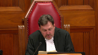
:::

We have a case to hear this morning, so I will call the parties now.

In the case of Canadian Copyright Licensing Agency against York University and between York University and Canadian Copyright Licensing Agency.

For the Appellant, Respondent, Canadian Copyright Licensing, Sheila R. Block, Asma Faizi.

For the Respondent, Appellant, York University, Maître Guy Perrette and John C. Cotter.

For the Interveners, Association of Canadian Publishers, Et Al, Brandon Van Nienus.

For the Intervener, Société Québécoise de gestion collective de droits de reproduction, Daniel Payette.

For the Intervener, Centre de droit des affaires du commerce international, Et Al, Isolde Gendrot.

For the Intervener, Society of Composers, Authors and Music Publishers of Canada, Matthew Estabrooks.

For the Interveners, Canadian Musical Reproduction Rights Agency Limited, Et Al, Aaron Finley.

Again, Aaron Finley.

For the Interveners, Canadian Media Producers Association, Et Al.

For the Interveners, International Federation of Reproduction Rights Organizations, Et Al, Stéphane Caron.

For the Interveners, Music Canada, Et Al, Casey M. Chisick.

For the Intervener, Copyright Collective of Canada, John E. Callahan.

For the Interveners, Canadian Association of University Teachers and Canadian Federation of Students, Jeremy de Beer.

For the Intervener, Universities Canada, David Kent.

For the Interveners, Authors Alliance, and Ariel Katz, Sana Alwani.

For the Intervener, Canadian Association of Law Libraries, Kim P. Nayer.

For the Intervener, Canadian Association of Research Libraries, Howard P. Knopf.

For the Interveners, Sam Wilson, Glasgow, Canadian Internet Policy and Public Interest Clinic, David Feuer.

For the Intervener, Copyright Consortium of the Council of Ministers of Education Canada, Wanda Noel.

For the Intervener, Colleges and Institutes Canada, Aidan O'Neill.

Please note that there is confidential information in this matter at the lower courts that is subject to a confidentiality and protective order in federal court.

I will take a break.

I'm kidding.

Better block.

**Speaker 1** (00:19:54): Chief Justice, it's a privilege to be here on this historic day.

::: {.column-margin}
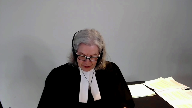
:::

I'm sure I speak for everyone in this courtroom.

May it please the court.

We are here because in 1988 and 1997, parliament realized that writers and visual artists needed protection from massive undetected, unauthorized copying of their works.

Users didn't need a printing press to make massive copies.

The photocopies and internet by that time took care of that.

So parliament amended the act to provide for collective societies to enter agreements with users to propose tariffs to the copyright board for these writers and visual artists.

In 1997, parliament included an amendment at the center of the case enabling collectives which had obtained a certified tariff to collect the approved royalty from users if they didn't pay to sue in court.

And if I could have you turn to the last tab of our condensed book, you'll find the definition of collective society that was put into the act in 1997.

And you'll see it refers to a society that operates a licensing scheme, carries on the business of collecting and distributing royalties payable pursuant to the act.

Societe de gestion, a management company.

And the definition in 2019 now makes it clear this applies to all collectors.

This applied obviously to access copyright in 1997 and by its letters patent, it is both a society that operates a licensing scheme and carries on business to collect royalties under the act.

If you turn to tab one, you'll also see what was added in 1997 as applying to collectives like access copyright and that is section 68.2 which is at the heart of this case that a collective society may for the period specified in its approved tariff collect royalties specified in the tariff and if they aren't paid they can recover them in court basically in a collection action.

And that's the problem that brings us here.

Access copyrights, more than 11,000 writers and visual artists and 600 publishers have seen their royalties from access copyright decimated because York and the bulk of universities and colleges still copying many millions of pages refused to negotiate licenses and won't pay the certified tariff.

But they still use just like before on a massive scale.

Access copyright, carrying on the business of collecting royalties sued York University and the court of appeal said tariffs are voluntary.

York can walk away, still can reproduce copyrighted materials in the millions and the individual creators can each sue for infringement in separate actions which is no remedy at all.

In 1988 and 1997, parliament amended the act to avoid that virtually useless alternative.

The court of appeal ruling here is a devastating blow to the collective regime put in place with these amendments and it's a devastating blow to the board's tariff setting process to set terms in cases where there is no agreement.

And this ruling deprives the board's tariff setting process of any practical purpose and leaves the collective and those creators it serves with no real remedy.

Let me tell you about the tariff setting process and if you look at tab two of our condensed book, you'll see the tariff for access copyright in relation to post-secondary educational institutions.

It's published in the Canada Gazette and you'll see on the second page it's a statement of the royalties to be collected by the agency access copyright for the reproduction and authorization to reproduce in Canada the works in access copyrights repertoire by post-secondary educational institutions.

And then it defines copy to include both the print copies of course packs and the digital copies.

And if you look at the page seven of the condensed book, section three, grant of rights, the tariff entitles an educational institution to make copies.

You'll see for any authorized purpose including for use in a course collection.

And then over the page at five you'll see royalties for each academic year during the term of the tariff, the educational institution shall pay to access copyright a royalty

and it sets out the royalty for universities and over the page lower one for colleges.

And the payment amount you'll see at six is the amount payable under section five, the royalties under section five plus interest.

Now this tariff setting process is elaborate, expensive, lengthy.

It takes three to seven years.

This one took nine years.

Robert Blair, former justice who was chair, explained why it took an extra a degree of time in circumstances.

But the court of appeal ruling renders all this tariffs tariff setting effort which is tremendous renders it meaningless.

Collectives spending millions of dollars, thousands of hours, just wasting their time.

Copyright for doing nothing worthwhile.

But Ms. Block, what

**Justice Abella** (00:25:47): I appreciate that there's an impact on the collective, I think that's clearly the heart of your case, but am I wrong that the collective does not own any of the copyrights?

::: {.column-margin}
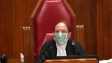
:::

And so, other than the collective, can you tell me who is harmed by an approach that doesn't see these tariffs as mandatory?

The creators and visual artists and their publishers.

I think that's the most important thing that we need to do, and I think that's the most important thing that we need to do.

I think that's the most important thing that we need to do, and I think that's the most important thing that we need to do, and I think that's the most important thing that we need

**Speaker 1** (00:26:13): because they're only alternative if the collective can't collect under the tariff and the collective does not have exclusive right to the copyright for sure and typically it won't because writers and and publishers need those copyrights to run their business to achieve their business purposes they do lots of things with their with their intellectual property that access copyright isn't there to do it's there under the act as a collective to deal with collecting the royalties that are owed to it for reproduction to the the writers for reproduction so what this ends up leaving the the creators the situation they're left in is that they have to they have to bring an individual infringement action which is a complete pyrrhic thing to do it is very expensive it's very complicated they would have to monitor and track down the the the infringers and then bring a separate action for a royalty amount that could never be justified there is no access to justice for these creators now when they when they operate collectively

::: {.column-margin}
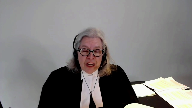
:::

**Justice Brown** (00:27:27): Let's assume, though, that they are able to do that.

::: {.column-margin}
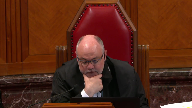
:::

Paragraph 62 of your friend's factum says that where they do that, so a user doesn't accept the license, and the owner is sued for copyright infringement, your friends say that on your understanding of the law that the user would still be liable.

So the user is liable to the author, but then separately to the collective society for royalties under this tariff that you view as mandatory.

Do you accept that that is the upshot of your position?

Are they making a fair statement of Paragraph 62 of their factum?

**Speaker 1** (00:28:10): No, that's an artificial situation.

If the owner...

I didn't ask if it's an artificial situation or if it's the owner.

**Justice Brown** (00:28:16): situation is it would that be the circumstance if if the if the author sues for infringement and the user is liable to the author is the user still liable to effectively pay double because they're also liable under this tariff

**Speaker 1** (00:28:34): they're liable under the tariff and if access copyright is exercising the remedy, it would be doing it on behalf of the owner.

::: {.column-margin}
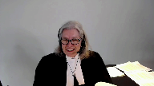
:::

They would be doing it not in addition to a separate suit by the owner.

If the owner wants to sue, the problem that parliament was solving was they didn't want to leave owners unrepresented. Okay,

but I still would like an answer.

**Justice Brown** (00:29:04): The answer to my question, if the owner sues for infringement and the user is liable to the owner for the infringement, is the user still liable to pay the tariff?

**Speaker 1** (00:29:17): No, because a court with judges who are faced with a motion by the user for bis vexare would not allow two suits for the same thing to go on.

I mean, it's just, it's artificial, and therefore it's not.

**Justice Brown** (00:29:34): presume that the access copyright would still pursue them for the tariff and then they rely on judicial relief.

**Speaker 1** (00:29:41): No.

The access copyright is there to serve the owners.

If the owner chooses to take its own situation in her own hands, which they don't want to.

**Overlapping speakers** (00:29:57): Then the tariff isn't mandatory in that situation.

**Speaker 1** (00:30:01): The tariff is mandatory.

::: {.column-margin}
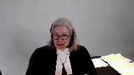
:::

It is an option to exercise the remedy.

The tariff is mandatory.

The user ought to have paid the tariff because it's certified by the board, and under the board they can be sued to collect for it.

And as you see, the terms of the tariff say you have to, if you use, you have to pay.

But if they're being sued by the owner directly, then the tariff is mandatory.

**Overlapping speakers** (00:30:31): Then Access Copyright wouldn't sue as well.

So it's so it is.

**Speaker 1** (00:30:34): exercise the remedy, but the tariff is still mandatory, they ought to have paid the tariff.

And because they didn't pay the tariff, the owner has a right to bring an action for, the exclusive owner of the copyright has a right to bring an action for infringement.

**Justice Rowe** (00:30:49): Ms. Block, just to follow up on Justice Brown, if a user pays the tariff, do they become a licensee?

**Speaker 1** (00:30:59): No, they don't become a licensee.

::: {.column-margin}
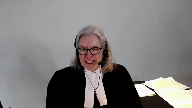
:::

They are operating under, you know, in one sense, a statutory license.

They're not a license, they're oper...

There's no need to accept a license under a mandatory tariff.

A mandatory tariff allows the user to say, I am going to use, I'm gonna continue to use, but I am doing so because I will, I accept to pay the royalty rate that has been certified by the board.

Perhaps I'm being slow here, but you will assist...

**Justice Rowe** (00:31:44): you

**Overlapping speakers** (00:31:44): doubt it.

**Justice Rowe** (00:31:44): Okay, but okay, you say that the tariff is mandatory.

::: {.column-margin}
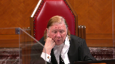
:::

The user says, I've forwarded my funds.

I've paid the tariff in full.

And you're saying the consequence of that is that they do not become a licensee.

What benefit do they get?

**Speaker 1** (00:32:06): they get the right under the tariff not to be sued.

They get that specific right under the act.

That's a strange way of phrasing a right under the tariff.

**Justice Brown** (00:32:18): right.

That's a strange way of phrasing it right.

I would have thought they're getting as a right of use which

and you know maybe I'm being a bit thick too

but they waste each property law and we call that a license.

**Speaker 1** (00:32:29): Well, they're authorized to use the works under the statute.

They are authorized to use the works and they can't be sued for infringement.

**Overlapping speakers** (00:32:37): By way of a right not to be sued.

**Speaker 1** (00:32:40): Well, they're authorized to use the works, that's the whole point of the tariff.

::: {.column-margin}
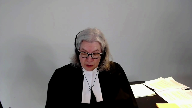
:::

The result that we have is that the collective would never go through this grueling process of, as I say, millions of dollars, hundreds of hours, thousands of hours.

If it can't collect the royalties that are specified, if the user won't agree to a license but uses, it is authorized under the tariff to use.

So that is a right, and the only reason for the tariff setting process is because the user won't agree to a license agreement.

So no collective would ever go through the grueling process that is the tariff setting process to just get words on the page.

Now what York says in its Factum at paragraph 7, supporting the Court of Appeals reasoning, is that, well, let the infringing copies be dealt with in the normal course with an action for copyright infringement.

There's no issue that that is no solution.

Each owner, creator or publisher, would have to bring this individual civil infringement action, which is completely uneconomic, huge cost, small recovery, completely pyrrhic, and the normal course would therefore, the normal course that the Court of Appeals suggests and that York pleads, equals a user can infringe with impunity.

If they're going to use but they're not going to pay, either because they don't have an agreement or because they won't abide by the terms that the copyright board has set, that was never the intent parliament intended with these amendments

and I'm going to show you parliament's intention in making these changes in 88 and 97 for collective management, tariff set by the board, collection of tariffs not tied to the grant of a license, and show you that the Court of Appeal decision destroys the regime that was set up to protect creators right to receive a just reward.

So let me start with the

**Justice Kasirer** (00:34:59): Ms. Block, just before you start, could, could I ask, how does section 7017 fit into your view of the, that you've just described to us of the relationship between 68.2 and, and infringement action, subject to another provision?

::: {.column-margin}
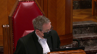
:::

No proceedings may be brought for the infringement of a right against a person who has paid or offered to pay the royalties specific in an approved tariff.

How does that, does that help us understand 68.2 and its application?

**Speaker 1** (00:35:38): Yes, because if they pay or tender payment, they can't just say I'm going to pay and never pay, but if they pay in effect, then they can't be sued for the unauthorized use, i.e. infringement, because they are using in an authorized way, because it's been authorized under the tariff.

::: {.column-margin}
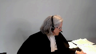
:::

**Justice Kasirer** (00:36:00): But there's no protection from an infringement action for users who refuse to pay altogether?

**Speaker 1** (00:36:08): If a person, if an infringer, if an infringer uses, if a person uses, does the act and doesn't pay and doesn't have a license, doesn't pay under a tariff and doesn't have a license, then they're infringing, they're liable to be sued because they're using someone else's property without any authority.

::: {.column-margin}
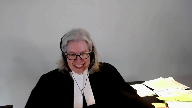
:::

Ms. Plath.

**Justice Karakatsanis** (00:36:30): York, you've said that copyright infringement actions are not a possibility, are not a factor.

York says class actions are available.

Why would that not be an option?

**Speaker 1** (00:36:47): Well, as a veteran standing here of two large class actions that actually went to trial, one took eight years, the other took 10 years, and the one I'm starting in September is now 13 years in being, and we've already been up to your court, so they're very complicated, they are very expensive, they are not ideal for the amount of money of money that would be involved for each member of the class, and they take forever and they're complicated.

::: {.column-margin}

:::

There was one that was brought against Laval by copy back and they no doubt can speak to that, but the certification got knocked out and then ultimately it settled as many class actions do, but it's not an effective remedy.

What Parliament put in place was basically a collection action by the collective.

If there is a tariff and you've gone through this extensive process to get it sorted out by a quasi-judicial specialized administrative tribunal that knows what it's doing, they set out the tariff and the terms, they publish it in the Canada Gazette, and you don't want to, as a user, I don't wanna deal with access copyright, I don't wanna go and hunt down all the individual owners, I'm just going to use.

They can use it with the authority that they're given under the tariff to not be sued for infringement.

So what I want to do in the short time that I have on this part, I have to do the fair dealing case as well, is just to go through the intention and purpose of the changes, and look at the language of the act, show you that SODRAC does not govern, and leave you with some sections of the Court of Appeal decision, which show it was disconnected from the purpose of the act.

Now, both the court and York say that the point of the amendments at the Court of Appeal was to preserve the legislative intent of the 1936 amendments to limit collectives' market power.

And York describes the purposes, protecting from anti-competitive predatory pricing, curbing the market power of collectives.

Let me show you that that is dead wrong.

The legislative history shows that the amendments were not about setting out a solution to monopolistic pricing abuse, that had been done in 1936 with the amendments then.

The amendments, as you will see, were to protect creators' royalties for reproductions.

And if you go with me to tab three of the compendium, I've just given you an excerpt from the Parker Commission, because this is the Royal Commission that led to the 1936 solution to what was then a monopolistic pricing situation by the one and only performance rights organization, the Canadian Performance Rights Society, that jacked up its prices.

And two Royal Commissions later, these amendments were made.

And the amendment was to establish the Copyright Appeal Board and control that pricing.

So this 1936 lens that the Court of Appeal says governs is entirely misses the point.

And you'll see that if you fast forward to 1977 at tab four, in 1977, what they called the so-called copier, photocopier was reeking havoc, difficult for creators to control the copying.

And they saw that there was a need to strike a balance between users and owners.

And said, it's obvious that an individual author cannot possibly control all the uses to which his works are put.

And it would be impossible for him to individually exercise his rights.

So creators of copyright should organize to protect the rights and exploit them.

If you move forward by the next decade, 1984, there's a white paper on the amendments, same problem identified the administration mechanisms can't be accomplished on an individual basis, the transaction costs are too high.

It's impractical, if not impossible for negotiations and transactions to occur without societies.

And they talk about societies collecting payments from institutions making extensive use of photocopying.

And they say there's two major reasons for the reform that leads to 1988, the changing technological circumstances, which have greatly expanded unauthorized reproduction.

And the high costs of transactions are so great as to make it impracticable for owners to negotiate individually, such as in the case of photocopying by educational users.

And so in the circumstances, they are looking for cooperative mechanisms for the enforcement of rights and the collection of fees.

Next tab is another ministry in 1984, sending a report making the point that the economic importance of copyright to the economy is something that has to be front and center.

And the work of individual creators is important.

They need to be able to exploit their works, notwithstanding the technology, which has greatly increased the amount of copyright infringement.

So copyright societies.

These concerns are not about protection for users.

The focus is the rebalancing for creators.

And we see that in the next tab, which is the subcommittee, actually working on the legislation in 1985.

And it publishes something called a Charter of Rights for Creators.

The title alone tells you the point is about protection of creators, not what the Court of Appeal and York say, well, it was all about monopolistic pricing abuses.

That had been solved in 1936.

It had been operating perfectly for 50 years.

And the same issue of modern reproduction and photocopiers is addressed multiple users, uses of works by many different users.

Individuals are ineffective in protecting their rights to monitor and enforce the unenforceable uses.

And it says the individual creator could attempt monitoring and collecting, but the attempt would be unsuccessful.

The payment for each use is so small that the cost of collecting would be greater than the payment.

That's the problem with individual infringement actions.

So collective exercise of copyright and the White Paper, which had more than 130 recommendations, most of which the government put in the legislation, made the point that the board has functioned remarkably well for 50 years as a rate-fixing tribunal.

So the problem, the Court of Appeal, and some of the interveners say, well, that's the whole point of this legislation, is just not what they're dealing with.

The board's role is to ensure a measure of balance between creator and user.

And by this time, the report says the owners, not the users, have the problem.

And then it gets introduced by Flora MacDonald in the House, and she, too, talks about the challenges of copying technology, making it almost impossible for creators to monitor the infringements.

And she talks about the new regime.

The now-named Copyright Board will continue to set and regulate royalty rates and make binding decisions.

And when collectives and their members aren't able to reach agreements, the board will, as a fully independent agency with quasi-judicial authority, will be the final arbiter in disputes between creators and users.

So let me walk you through the change in the language and start at tab nine with the 1936 language.

And PRS, and that's the only collectives until 1988, so performing rights societies, because of the history of monopolistic pricing, because everybody had to deal with them.

You couldn't just go into a room and make photocopies.

You were doing a public performance, so you had to deal with the PRS, and they jacked up the prices.

So the solution was make them file their statements of their royalties, and they'll be approved, or as amended by the regulator, by the Copyright Board.

And then in 10b-8, here's their enforcement.

Their statement of royalties, so certified by the board, shall be the royalties that the society may lawfully sue, and here's the relevant language, may lawfully sue for or collect in respect of the issue or grant by it of licenses.

And then come with me to tab 10, and you'll see a reference from a case called Leondor in 1987.

This is the year before the 1988 changes.

And it shows you section 50 sub-9, which is just like 10b-8.

You can collect the fees in respect of the issuer grant by it of licenses, the fees in your certified tariff, sorry, certified statement.

And the judge says it'll be noted that this deals only with the enforcement of licenses.

The subsection refers to amounts which the society may sue for or collect in respect of the issue or grant of it by licenses.

Emphasis added, if a person performing these works refuses to take out a license, then 50 sub-9 has no application.

Enforcement measures are not directed to recovering money in respect of the issue or grant of licenses.

Pardon me.

Over on the next page, you will see 50.9 at the top, and then the change that happens in 1988 is that a society for the period specified in its approved statement may collect royalties specified in the statement or in default can recover them in court.

It is no longer tied to issuing or grant of license.

So 49.2 from 1988 becomes 68.2 in 1997, and the change is just to change society, association, or corporation into collective society and change approved statement into approved tariff.

But it is exactly the same formula.

The society may, for the period in its approved tariff, collect the royalties specified in the tariff, and if the user doesn't pay, can recover them in court.

Ms. Block, Ms. Block, Ms. Block, I'm sorry.

**Justice Côté** (00:48:45): I'm sorry to interrupt you, but if we accept your argument such that this is equivalent to a statutory license, how do you respond to the respondent's argument about their right to deal with competitors of access copyright?

::: {.column-margin}
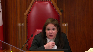
:::

Because if we accept your argument, their right to deal with other people, maybe to get better deal is quite inexistent.

**Overlapping speakers** (00:49:19): Because your position as an

**Justice Côté** (00:49:20): has an impact on competition?

**Speaker 1** (00:49:23): they can they can go to say they wanted works from five owners they can go to those five owners and make transactional licenses if there was a competitor another collective they could join up with the other collective and take their portions out of the access copyright repertoire it's not a problem that I see can't be it's not a real problem

::: {.column-margin}
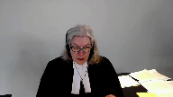
:::

okay so let me just give you at 11 you'll see from Justice Peltier in the Court of Appeal he says the omission of the the language of in respect of the issue or grant of of licenses in the remedy section is just inconsequential now there's i'll leave you with one other reference just at tab 12 between 88 and 97 there was an attempt a bill put forward to provide educational institutions with an exemption from paying for use in a courtroom sorry in a classroom if they didn't have an agreement and the government's position was this is incongruous with the philosophy of the 1988 act which contemplated that the copyright board as an impartial arbiter in such disputes would set a reasonable royalty that would be binding on the parties so let me take you to some language in this in the act very quickly at tab 13 you'll see

**Overlapping speakers** (00:51:04): That

**Speaker 1** (00:51:04): the heading tariff or agreement and a collective society for the purpose of setting out by license the royalties and terms may do two things it can file a proposed tariff with the board which is just a proposal it isn't the certified tariff but it can file a tariff proposal or it can enter agreements with users 13 and 14 are the things that deal with what has to be in their proposed tariff but then after they go through this elaborate process in front of the board there's certification

::: {.column-margin}
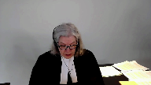
:::

seven seventy point one five the board shall certify the tariffs as approved with such alterations to the royalties and terms as the board considers necessary and it's a very rigorous process as I'll be showing you having regard to any objections everyone who's interested can object can can put in their own evidence can appear and then sub to this is the change in 1997 where a tariff is approved under subsection one so you've got a certified tariff after this elaborate process sixty eight point two one applies and sixty eight point two one allows the collective for the period in the tariff to collect the royalties and in in default of payment to sue for that collection

**Justice Brown** (00:52:26): Which is remarkably similar to, as your friends point out, the provision in section 70.4 that was under consideration in SODRAC.

::: {.column-margin}
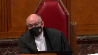
:::

And in respect of which, this court said that the burdens of the licence should not be mandatory upon a user who didn't consent to be bound by its terms.

So your friends put great weight on the similarity between those provisions to the extent that they say that our judgement in SODRAC is determinative.

So I'm wondering...

**Speaker 1** (00:53:01): Thanks for watching!

**Overlapping speakers** (00:53:01): It was not.

**Speaker 1** (00:53:02): I'd like to hear from you on that because that's an important point for me.

::: {.column-margin}
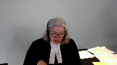
:::

Right and I'm going to come to it as soon as I finish this if I can just give you 70.191 an approved tariff

so it's been certified does not apply where there's an agreement between a collective where there's a license agreement and a person authorized to do an act if as the case may be if the agreement is in effect during the period covered by the approved tariff

so if you've got a license agreement then the tariff doesn't apply if you don't have a license agreement the tariff applies and let me just give you before I get to the SODRAC point because it's obviously important at tab 14 a section you see all the time in the interpretation act that acts are remedial this is a remedy section a4cri it should be interpreted large fair liberal construction that best ensures the attainment of its objects and you see at the bottom 70.15 the board shall certify tariffs as approved with alterations and under two where it's approved 68.2 applies

and if you look at 68.2 a collective society may for the period specified in its approved tariff collect the royalties or sue if they don't pay and there's no other may in 68.2 there's no may for the user it's the collective may sue in the period for the for the tariff in the next tab

and i don't have time to go through i've left you with some other provisions of the act which which relate to the fact that that either a license or the tariff apply in other sections of the act and these are all educational these sections are all educational exemptions are called remunerated exemptions they get to use the parts of the repertoire without with with uh out of payment but only if they have a license or there's a tariff in place or a proposed tariff which once it's certified would be retroactive so the the concept is there's going to be remuneration for creators which was a big problem all along that led to these amendments

**Justice Kasirer** (00:55:24): Ms. Bloch, what is the relevance of, you started your presentation with the definition of collective society, and while you didn't emphasize it, paragraph A, operating a licensed system, in French, chargé d'octroyer des licences at 70.1, and at 70.13.1, I understood that royalties are to be paid on the collection for issuing licenses.

::: {.column-margin}
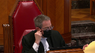
:::

Are we missing a piece of what is and how operates a collective society?

**Speaker 1** (00:56:12): The idea was to have collective administration of their rights.

::: {.column-margin}

:::

There are two ways it can happen.

Obviously, the way it happened with performance rights societies was through licensing, as I say, because you had to deal with, if you're having a public performance, you can't do it behind closed doors.

So it was common to do it by a licensing agreement.

For years, from 1994, people sat down with Access Copyright and had licensing agreements.

They didn't want to go and get a tariff.

Tariff is the backup plan when the licensing agreement doesn't work.

It's still a licensing scheme to be able to collect the royalties and distribute them.

That's part of the licensing scheme and sub B is the collection part, which they do when they have a tariff and they haven't been able to get an agreement.

But it's not only an agreement, a user has four choices.

It can enter into an agreement, it can abide by a tariff, it can say, I don't want an agreement, but I'll use and I'll pay the tariff amount, fine.

I'll have an authorized use, I won't be illegal.

It can go to individual owners and make transactional licenses and not to have anything to do with either the tariff because you're not dealing with the repertoire, or they can use other information.

There's lots of people in the courtroom who will tell you about open source and public information and so on.

They don't have to use the repertoire, but if they choose to, and what the Court of Appeal has done is given a fifth option.

Well, you can use not agree, not pay a tariff, not negotiate a transactional license, just use and catch me if you can.

Just wait for an infringement lawsuit, which won't be coming because they're completely uneconomic.

The user has the hand here if this action stays in place, and the fact that a tariff, the backup position, which sets out the terms that would apply if they sat down and negotiated the license, although as you see from 71.91, you can negotiate another license with different terms because the tariff doesn't apply if you have a license.

Let me move to SODRAC because it does not govern in this case.

My friends, as you've pointed out, rely on the SODRAC case to say tariffs are voluntary, but SODRAC expressly did not address tariffs.

Justice Rothstein makes this point in paragraph 21.

It was also not a case where the legislative history was before the court.

There may have been a reference to the Parker Commission in 1936 or 35, but taking the case as it stands, dealing with the arbitration section of the act, and you'll see it at tab 16 of my compendium, where two parties reach an impasse in negotiations, one or the other or both can go to the board and have the board set the terms.

It's known in the copyright bar as the arbitration provision.

Justice Rothstein looked at the language that you see in 70 sub 4 about the effect of a board decision and saw that the person concerned, i.e. the user, may, subject to the terms and conditions fixed on paying or offering to pay the royalties, may do the act that's authorized, i.e. use of reproduction that isn't an infringement.

And so, Justice Rothstein said, may doesn't mean the user has to accept the contract as arbitrated, and a user who refuses a license will not be liable as a licensee.

And 70.2 and 70.4 are license provisions.

So, they can walk away.

So, 68.2, which I put at the bottom there, the only may in that section empowers the collective to sue if the user uses, but doesn't pay.

**Justice Brown** (01:00:36): You mentioned the omission of a may relative to the user, and I could be wrong, but it doesn't strike me as legally significant in the way that you suggest in light of Justice Rothstein's insistence upon clear and distinct legal authority, as he put it.

::: {.column-margin}
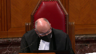
:::

He said, the language of 70.4 does not, of its own force, bind the user to the terms and conditions of the license, which it clearly doesn't, but neither does the omission of a reference to the user.

So I'm wondering if you're pointing to a distinction without a difference.

**Speaker 1** (01:01:28): Well, I'm pointing to a remedy section which is very straightforward that says the collective society may sue for the royalties in the in the tariff once they have a tariff.

**Overlapping speakers** (01:01:40): Yeah, but to whom?

That's the question.

**Speaker 1** (01:01:42): may sue the person using.

And, and if you look at the.

**Overlapping speakers** (01:01:51): the history of the section.

**Justice Brown** (01:01:53): That's not what it says.

**Speaker 1** (01:01:53): Well, look at the history of the section and how it's operated since 1936, when it had to be in relation to the issuance of a license, but it was to sue people using the repertoire, people who were not authorized, who would be authorized under the tariff, and if they don't pay the tariff amount.

::: {.column-margin}
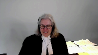
:::

**Justice Brown** (01:02:19): So the legislative history then provides the clear and distinct legal authority for imposing the terms of a license on an unwilling user.

Is that what I'm to take from that?

**Speaker 1** (01:02:29): No, the the words in respect of the grant or issuance of a license were removed.

::: {.column-margin}
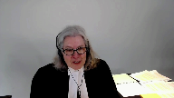
:::

We're all talking about use of owner's works.

And if you use the owner's works and you don't have a license but there is a tariff, then you're using under the authority of the tariff and the tariff setting power that is given to the copyright board, 70.15, it has the power to set a tariff.

The user gets that substantive right to use the works.

And the user is not a licensee of access copyright but they are protected and covered by this statutory permission if they if they pay and if they don't pay they can be sued for not paying.

**Justice Abella** (01:03:28): Does it matter that what access copyright has is a non-exclusive right to the...

**Speaker 1** (01:03:35): the work?

::: {.column-margin}
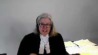
:::

Well, it matters from the point of view of it can't bring an infringement action because it doesn't have exclusive ownership of the rights.

And why would it?

It was put in to administer the royalty collection and distribution, the monitoring, the collection, the distribution, the negotiation of licenses on behalf of people who keep the ownership for all kinds of other reasons.

Maybe they're, you know, selling to Netflix or making a graphic novel out of it or whatever.

The creators and their publishers use that to carry on their business.

That's not access copyrights business.

And you see the definition of collective does not require a collective to have the substantive exclusive right to the copyright.

So what this allows, though, is the collective collection by suing York for all of the 17.6 million pages reproduced a year over a series of years.

So it's a very large issue.

The amount of pages, the amount of the royalty, they're all set by the copyright board, which builds in fair dealing, which builds in in substantial use and into the amount of the royalty that they fix and publish in the Canada Gazette.

And you can say, I don't want to have a license with these folks, but I'm using.

You have the authority to use it under the tariff, the published tariff.

And access copyright is the agent that can go and collect it on behalf of all of these users and then distribute it all to all the users like it does if it had an agreement.

If it had an agreement, it would collect all that money and give it to who owes it.

**Justice Abella** (01:05:33): But if you have the right to use it, don't you have the right not to use it?

**Overlapping speakers** (01:05:40): You don't have to use the repertoire.

You mean the user?

**Justice Abella** (01:05:46): If you have the right to use the work through access copyright but you don't have to use access copyright because it's not an exclusive grant of copyright that access copyright has, which means you can go directly if you want, your argument is the existence of a tariff automatically triggers a mandatory requirement on whoever wants to use something in the repertoire to be bound by a tariff.

::: {.column-margin}
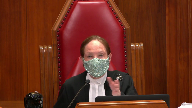
:::

**Speaker 1** (01:06:23): No, they can go to the individual owner and get a transactional license.

::: {.column-margin}
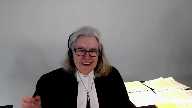
:::

They don't have to, they don't have to use the repertoire.

They can get, they can get their permission.

They have to have some sort of authority, right, or else they're just infringing.

They're just, and reproduction is the, is the right that access copyright deals with.

It's not, it's not licensing to Netflix.

It's not making graphic novels or serial, serializing it in a newspaper.

It's just dealing with the reproduction rights that are under Section 3, are the right of the copyright owner.

And that ability to manage all that, which is huge, is done by a professional organization, Access Copyright.

**Justice Abella** (01:07:08): And the fact that it manages and goes to the trouble of getting a tariff where it wants to is what gives it the right to impose on a non-subscribing user the duty to pay what it has gotten a tariff to cover. Is that it?

::: {.column-margin}
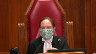
:::

Is that where we get the mandatory nature of it?

**Speaker 1** (01:07:33): If the user uses and doesn't abide by the tariff, the user is infringing.

**Justice Abella** (01:07:41): Why?

::: {.column-margin}
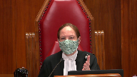
:::

Where is the language that shows why that has to be the case?

I mean, you were asked this question by Justice Brown.

Sodrak talked about express and clear legislative language that would show someone who is not bound, not voluntarily bound, that they are nonetheless bound.

No, someone...

**Speaker 1** (01:08:10): who does not accept the license, the copyright board has said, okay, you may use on these terms because I am negotiating the license for you.

::: {.column-margin}
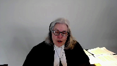
:::

I'm setting out the terms.

You've come to me, here's the license.

There it is.

And it's basically, according to SODREC, take it or leave it.

If they leave it, they are not a licensee.

And then if they go out and use and there's a tariff in place, they can say when they get sued for the amount under the tariff, here's your money.

If they get sued for infringement, they could say, here's your money under the tariff and they couldn't, the infringement suit couldn't go on.

And the infringement suit could have punitives and aggravated and all kinds of other damages that this is just collecting the royalties.

They can say, okay, here's the royalties.

So I know I didn't have authority to do this because you have, you owner, have the exclusive right for reproduction and you've allowed access copyright to manage that, you know, Societe de Gestion, to be the management company of that, fine.

I don't want to deal with either of you.

Well, then they're doing it illegally, they can be sued for infringement.

But the fact is they won't be sued for infringement, which is why 68.2 sub one is there to allow access copyright to go to the time trouble effort and expense to get a tariff, which they don't want to do, they'd much rather have sit down and have a deal and be on their way.

But if they have to get a tariff for three to seven years, or nine years, as in this case, then they can collect the amount if the user uses, because otherwise they're, they're using unlawfully.

**Justice Rowe** (01:10:00): I'll have another try at it.

Is the benefit that arises from the payment of the tariff that it thereby constitutes a defense against an action for infringement?

**Speaker 1** (01:10:19): it is a total defense to an action for an infringement.

::: {.column-margin}
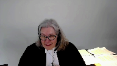
:::

So suppose you use and think, well, I'm gonna get away with it.

And then access copyright comes and sues you because there's a tariff.

And, you know, that's without...

And you see the suit and you say, you know what?

I don't wanna have to hire a lawyer and go to court and so on.

If you send the check in, that's the end of the suit.

And that's the benefit, that is a benefit because you can use...

You don't have to enter into a license.

If you get sued, you can pay the royalty that's set by the copyright board and you don't have litigation over your use of somebody else's property, but it's the use of someone else's property.

And for reputable organizations, like the people in this room from whom much is expected to walk away from the tariff-setting process, to walk away from the licensing, this is the remedy.

**Justice Abella** (01:11:27): It means that universities are eternally bound by a collective society, a particular collective society whenever the material it wants to use in its educational institution happens to be represented by in part a particular collective society.

::: {.column-margin}
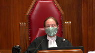
:::

In other words, there is no option available to an educational institution.

Once somebody says I've gone to the trouble of getting a tariff, interim or permanent, and that means your rights to deal in any other way are gone.

**Speaker 1** (01:12:10): No, you can go to the owners of the material you're using, you're using their property, you can go to them and you can get a transactional license if you want, go to their publisher, go to them directly.

::: {.column-margin}
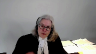
:::

So you're not eternally bound and you don't have to use the stuff in the repertoire, but if you want to use someone else's property, you either agree with them or you abide by the term that is set through the legislation, the copyright board, with the power to set tariffs, to make alterations, to certify them, and then there's the power given to the collective because parliament knew it would be unsuccessful if individuals tried to do this on their own.

**Justice Brown** (01:13:01): section 68.2 makes the tariff mandatory where is the if section 68.2 makes the tariff mandatory where is the statutory authority providing that it is not mandatory where the user goes and pays the author directly.

::: {.column-margin}
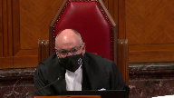
:::

**Speaker 1** (01:13:25): If the user has the authority from the author, there is no right to sue for the tariff amount because they already have permission.

And there's no issue here.

It's an absolute no-shame.

**Justice Brown** (01:13:42): Where do we see that?

Because you're saying 68.2, this makes it mandatory.

If you use, you pay.

**Speaker 1** (01:13:49): no this is the remedy if you if you use if you use um section three gives the right to the owner to the to to control reproduction

::: {.column-margin}
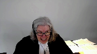
:::

so if you're taking away that property from the owner without getting the owner's permission or getting access copyrights permission through a license and you still use you are going to be liable because that's infringement section 27

it's infringement if you reproduce right

so that is if that's what you're talking about mandatory you can't just go and steal other people's property you have to pay for it and if you haven't paid for it then um you can be and and there's a tariff that sets out what the cost is you can't just walk away you can be you can be put to the task of of okay

i either have another permission and to suggest that well they can't do anything else just look at their i'll show you in the fair fair dealing which i i better get to because i've only got five minutes left but in the fair dealing defense um york put in uh 25 bound volumes of 1100 permissions that they said they had to use the material they weren't saying oh we can just use it they said no no

no we've already paid for it we've already got this permission from other people so of course they can they can get permission from somebody else and access copyright can't go and sue them if they can if they pull out of their their pocket i've got a license from uh to to to to to do the hockey sweater so uh leave me alone they would be left alone because they would have the permission

**Justice Martin** (01:15:32): But Ms. Blockwood, I understand the argument that you're making in terms of you either pay a tariff or you have a license from access or a personal license from the owner.

::: {.column-margin}
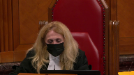
:::

I get that.

But wouldn't that be a very easy thing for parliament to say which is the tariffs are binding rather than trying to construct it through the rights that are granted, the powers that are granted to the board or the remedies that are provided?

Couldn't that just be an express statement rather than everybody out worrying about it this way?

**Speaker 1** (01:16:12): Well, will there be an amendment?

::: {.column-margin}
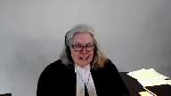
:::

Should there be an amendment to satisfy that?

Perhaps there will be.

This legislation, as you've seen, it's like it's a huge patchwork quilt or a Rubik's cube.

It's a complicated area of law.

It's a complicated piece of legislation.

But the effect of, it's just like the corporate statute.

I mean, the corporate statute would say, if you're a director, you have to use care and attention and you've got a fiduciary duty and so on.

And then there's remedy sections.

You can be sued for oppression.

You can be sued for a breach of your director's duty.

It's the same thing.

There's a right here that is in the owner, and of course, the collective is entitled under the legislation to manage this aspect of it.

And if it's breached, there's a remedy.

It is elegant, it's simple.

**Justice Abella** (01:17:09): It's not in the remedy section 68.2.

::: {.column-margin}
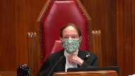
:::

It is your argument comes to a form of suggestion that it really is kind of a remedy for infringement, but it is not in the remedy section.

Aren't you transforming it into a remedy?

**Speaker 1** (01:17:32): No, the sections that deal with the tariff setting reference back to 68.2, which has been in there and has been used by the PRSs since it came in in 1988 and its predecessor in years before.

::: {.column-margin}
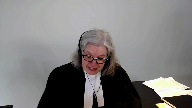
:::

So it doesn't have to be in a specific spot to work.

You just have to look at the language.

You may sue.

The collective may sue for the royalties that are certified.

Can I just make a stab at fair dealing?

I'm sorry to leave you dissatisfied on this one and then race through the next, but one of the most important points on fair dealing, of course, is it's a question of fact.

And I've given you at tab one what you say to that effect in CCH, that it is a question of fact.

You quote Lord Denning.

It's a matter of impression.

It's tribunal of fact that must decide.

And this is a fact rich case.

The trial judge did a deep dive on an extensive record.

And if you look at tab 20 of the condensed book, you'll see what was before justice failing.

The days and days of evidence and argument and 22 witnesses and these 25 volumes put in by York of 1100 documents attempting to show that it already paid for the works.

Not that I don't have to pay, but we've already paid elsewhere.

And they didn't say, therefore, I mean, they did plead in the next paragraph and next tab that what access copyright was doing was suing them for something they already had permission for.

Now, that strategy utterly failed.

They said, you know, we, the judge noted that York had conceded that it's evidence on the licensing information that you'll see at tab 22 was impossible to rely on and they couldn't match any of these alleged permissions.

So although the permission evidence was useless, it was an acknowledgement that it knew it needed to pay for what is in the course packs.

And I'll just leave you with, I'm afraid I can't in the time remaining address this, but let me just leave you with the consequences for creators.

The whole purpose of protecting their rights was to achieve a balance so they would receive a just reward, creating an environment that kept creators producing works.

And it utterly fails with this decision if it stands.

And it turns abuse issue on its head because these organizations should willingly come to the table and they don't.

And the price will be at the whim of, won't be at the whim of some abusive monopoly.

It's set by the specialized tribunal.

But when institutions use their collective power, which is what's happened here, that they won't deal, they won't pay, they'll walk away, they won't participate in the board process.

They leave creators right where parliament knew they would be left without redress, left to bring their individual useless infringement actions from these institutions.

So I'm sorry to have gone over time, thank you for your attention.

**Justice Wagner** (01:21:05): Thank you very much.

::: {.column-margin}
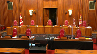
:::

So the court will take its morning break.

Fifteen minutes.

The court will take its morning break.

**Justice Wagner** (01:22:27): Prêt?

**Speaker 2** (01:22:32): Mr. Chief Justices, in both appeals, access copyright paints universities generally, and New York in particular, as rogue institutions bent on destroying their members for selfish commercial reasons by abusing the quote-unquote exception of fair dealing and seeking to avoid paying for what they use as if it were hydro.

::: {.column-margin}
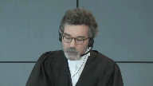
:::

Now I say that this tendentious narrative begs the very legal questions that this court is called upon to answer.

On the tariff appeal, access copyright asks at paragraph 16 of its factum whether infringers can avoid paying royalties set by tariff simply by opting out.

But if, as York submits, the language of the statute and nowhere in the legislative history can you find that parliament intended as a result of merely tariffs being issued that the users would be bound by them, then we are not avoiding anything.

On the fair dealing appeal, access copyright claims that it's about serving the interests of a group of mass dealing universities at the expense of creators.

This wrongly assumes that the fair dealing user right in the university context are not those of the students but of the institution.

Our position in a nutshell on these two points is this.

First, that the royalties for a license established by tariff cannot be extracted from a person who does not agree to its term.

Never has been and is not now, as I will show you when we review the basics of the statute.

And second, on the fair dealing appeal that when you look correctly from the student's user's perspective, not only did the trial judge and the court of appeal get the conclusion that there was no fair dealing, but we say that the guidelines, which was the issue before the court, not infringement, the guidelines provide a reasonable, appropriate framework and necessary to actually give life to students' fair dealing rights.

How do we know if the students' fair dealing rights are

**Justice Rowe** (01:24:41): How do we know if the practices at York University bear any relation to the guidelines?

**Speaker 2** (01:24:48): That's not the issue, if I might, I'll tell you.

**Overlapping speakers** (01:24:52): Should we care about that?

Should we care about that? No.

The answer is no.

**Speaker 2** (01:24:58): And I will tell you why, giving you the short answer, let me deal with the tariff issue.

::: {.column-margin}
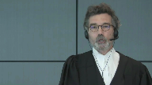
:::

And the reason is the counterclaim was asking whether if the copying complied with the guidelines was fair dealing.

That was the only issue as the judge points out in trial judge paragraph six of his reasons.

This is not an infringement action and whether or not any copy beyond that could attract payment would be part of phase two.

But I'll deal with that in greater detail if I might, Justice Roe.

I will not forget you, how could I?

Because I know I have to confront that point directly and I will presently if you would allow me to go on to the statutory interpretation issue.

So let me turn, you have in our condensed book at page one, and I'm assuming everyone has it

and it's tabbed, our outline of argument for the tariff issue.

And you'll see that there are four main subjects I wanted to deal with.

The statutory interpretation, I think I can probably skip that.

The point has been made that a burden has to be explicit.

What I really gonna spend my time about is looking at the language of the statute and how the interrelated basic elements of it make it crystal clear that a person who gets a license a license through a tariff cannot enforce it unless the user has offered or accepted to pay it.

So let me, may I turn right now to the statute in question.

And I will show you that what I'm suggesting to you as a basic proposition, that is that no royalties can be exacted from an unwilling or user that doesn't choose to pay is true in the SODRAC regime.

It's the arbitration regime.

It's true in a general regime we're concerned about with as it was true before, but let's turn to page 14 in tab four.

And what I propose to do is to go very quickly through the basic analysis, which is commended by or commanded by Rizzo.

We look at the words of the section, but also how they relate and interrelate to the rest of the statute.

This as Ms. Block said is a complex statute, partly because parts of it are incorporated by reference and so forth, but the basics are always the same.

And the basic have four building blocks.

The first is to identify who can collect.

And in my chart, you'll see number one, who may collect, it's the definition of collective societies.

And I'll come back to that because I have a point in response to Ms. Block on this.

The second that the statutes always do is specify the legal instruments that are used to cover the acts, their licenses.

Three, in the general regime, which is the one we're concerned with, there are three ways to get a license.

There's the application of the tariff, which we're mainly concerned with, an agreement, and then arbitration cases.

They all result in licenses.

And finally, we will look at the effect of following this process.

And we will see that section 68.2 sub one, as it's incorporated here by reference, includes necessarily the words for granting a license.

So you have one who may collect.

Let me go back.

Ms. Block says, well, look at sections two sub D, they can collect.

That's not applicable here.

We're dealing with societies.

If you look at tab A, page 15, so just the following tab, what we've done is correlate the relevant sections in the graph to the statutory section.

So you look first at section two A, it distinguishes between two types of collective societies, those that administer licenses and then obviously can collect, and those who merely collect, that's sub B, under, because of the regimes of neighboring rights under sections 19 and 81, where there are no licenses.

And the French version makes that even clearer that there are two distinct types of collective societies.

Access copyright falls in the ones administer licenses.

And if you now go to, in the same tab, if you go to page 32, we can then go through the sequence of the process.

This part, which is the first part of the collective regime at 70.1 sets out who the collective societies, it applies to, and they all are licensing schemes.

They have nothing to do with the neighboring rights, section 19, or the levies in section 91, where there is no license, the right to collect is a statutory dependent one.

Secondly, then you look at the instrument, you see at 70.12, that's the second building interlocking block, a collective society may, for the purpose of setting out by license, the royalties and terms and conditions relating to the classes of use, file a proposed tariff or enter into agreements.

It is crystal clear, I submit, that one way of getting a license is as a result of proposing a tariff, therefore, and if there's any doubt about that, I invite you to read 70.13.

Each collective society referred to in section 70.1, may, before March 31, immediately before the date when its last tariff was approved, file with the board a proposed tariff in both official languages of royalties to be collected by the collective society for issuing royalties.

So I say that there is no doubt whatsoever that the royalties that result from a tariff that can be collected under section 68.2 sub one are for the tariff setting out the royalties to obtain a license.

And in fact, having added those words, because my friend basically pitches her whole case in the statute as having these words being removed after 1988, the words are there.

They are there as a result of the effect of 70.12 and 70.13.

Now, let me go back to the graph because we're now at the heart of the effect of the setting of the tariff.

That's the...

**Overlapping speakers** (01:31:50): There.

**Speaker 2** (01:31:50): number four.

::: {.column-margin}
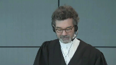
:::

You see I had set out that there are three ways of getting a license and if you look at the middle one, agreement, obviously a user can be sued for the royalties under contract.

But the other two are the ones we're more directly concerned with.

The one on the left hand side, what is the effect?

Well the effect requires you to combine two sections and you will see when you we look at 70.4 and the previous statutes that these two sections were always conjoined or in 70.4 in the same section and they always do two things.

They say that if the user offers to pay or pays the royalty then he can't be sued for infringement because as a result of paying he has the license he's authorized.

And then if you look then there's a right to collect which I say is necessarily tied to that.

And in fact if we then go back because in this block it ignores essentially 70.17 except when she was asked by Justice Casir.

If you then go back to the actual terms of the statute at tab 4A page 34 section 70.17.

There you have the option of the user which benefits from protection from infringement if and only if that person has paid or offered to pay the royalties specified in an approved tariff.

So that may in SODRAC in fact if you look at it we can just start only relates to the option of the user to choose to either offer to pay or to pay both of which are elective acts and only then when the user has manifested their will thusly are they protected from a suit from an infringement which means they're authorized by license under the tariff to do the acts covered by the license.

It is true it's a bit of a hodgepodge simply because they want to get the section 68 put it in in the general regime but the same structure exactly is under the arbitration regime which is the very next page page 35 at the very bottom section 70.4 and nothing could be clearer there than to see that the person concerned you'll see second line during the period subject to the terms the related terms and conditions fixed by the board and the terms and conditions set out in the scheme the licensing scheme and on and on paying or offering to pay the royalties do the act with respect to which the royalties and their related terms and conditions are fixed so that means they can't be sued they have the authorization and without prejudice any other then the society can collect the royalties so you pay or offer to pay once you do that you're authorized to act pursuant to the license

and then they can collect it so and if you go back to previous tabs sorry to the first page under tab 4 page 13 there we have set out and you just you only need to look really at the first the left-hand side column we set out the imp the impact of having a tabs for the performing regime performing rights regimes which we know is a successor to that which was implemented in 1936 and you see at the bottom that the effect there is again exactly the same you pay or you offer to pay you can't be sued for infringement and then the collective society can collect and in that regime you'll see if you actually look at the statute itself at page going back to sorry to have you flip

but I want to make sure that you are able to relate the text to the boxes in my graph pages 30 and 31 of the current or sorry the statute that is of the moment for this litigation at the very bottom effective fixing our royalties 68.2 is the right to collect no proceedings sub to the next sub section no proceedings may be brought against the person who is paid or offered to pay they always go together because the offer to pay the elective act of offer to pay is what gives you the license that protects you from infringement and that conjunction of interlocking provisions is attested to by every statute since the beginning if you now go to tab 2 sorry

yes tab 2 page 3 you have at the very bottom this is the performing rights regime the original one you have at the very bottom

effective fixing royalties again two provisions next to one another

and you'll see that in sections 10 8 8 & 9 you see that at pages 5 & 6 at the very bottom of 5 the the performing rights organizations can collect the royalties and there's no right of action that's sub 9 at page 6 exactly the same structure and finally if you look at the performing rights regime at tab 3 in 1985 that's the one that Justice Peltier said and there's no debate about that access copyright agrees that terrorists remote were voluntary before in 1988 you have exactly the same structure in section 70 point sub 1 and sub 2 so in my respectful submission my friend is wrong when she isolates and essentially reads in 68 point 2 sub 1 in complete isolation and indeed I'll go further if you look at section 70 point 1 7 it is meaningless on the theory of access copyright

because because if if you immediately get a license as a result of the tariff being issued as soon as you use a work in the repertoire then why would you need a section that says but in order to be protected from infringement you have to pay or offer to pay there is no answer to that question because it's crystal clear that from the very beginning the two always went together and in my friend says well we just gave you a permission that's what a license is well that's wrong too the statute makes it crystal clear that in order to get the benefit of the permission you have to pay or offer to pay the royalties set out in the license by the legislator so the absence and my friend tried to distinguish so drag by by saying well you know there's a word main that's not there well in my respectful submission is just dead wrong too and you'll see that if you look at paragraph 106 of so drag you'll find a tab 5 page 38 so before the paragraph that I believe you alluded to at Justice Brown which sets out the general principle you have to have clear words for a burden Justice Rothstein says this provision makes it clear that a user who's copying activities were the subject of a 72 proceeding may avail itself of the terms and conditions established by the board as a way to gain authorization to engage in the activity contemplated in the board proceeding the language of section 70.4 does not of its own forth bind the user to the terms and conditions of the license so the May here is the main 70.4 and the May is you can choose to offer or offer to pay that is the election that gives you the protection from infringement and that is exactly the same election or decision that that you find in 70.17 and indeed when you look at the next tab tab 6 you understand that the legislator always wanted to have that conjunction of the right to collect in exchange for a license which protects you from infringement and this is the decision engineer no one says that it's wrong Justice Duff said he was dissenting there but his decision was upheld by the Privy Council if you look at the second full paragraph where the rationale for the the plan of collective administration is set out just as Chief Justice Duff says under this plan the dealer and performing rights has his sole right to perform any particular composition in public qualified by a statutory license vested in everybody who pays or tenders to the dealer a fee the license under the tariff they're called a stat a statement of fees is an exchange for the payment or the decision to offer and indeed just by the by can't make too much of that but the French version of section 70.4 which we say when you look at at sixty eight point two and seventy point seventeen together and seventy point four are basically identical but when you look at the French version it says molly and now why you know love will appear ma which means an exchange on my friend's theory the tariff immediately binds it becomes binding regardless of the actions of the proposed user that in my respectful submission is is wrong and her answer to the several questions that were posed to to her

that well you know you can just have a transactional license I simply does not hold water the tariff if it's more than zero will always mean you'll have to pay something quite possibly for something that you don't need and nowhere does the statute put that qualification if she's right

so I respectfully say that when one looks at the words in the sections in question and they are interlocking functions in the way the system is set up necessarily imply the royalties issued by a tariff are for a license and that one is always able to decide not to take advantage of that license my friend then says well you just you know you just then face a useless pyrrhic infringement actions well with the greatest of respect that is the choice of the members of access copyright who as she said may want to keep that right so that they can deal with Netflix well that's their choice because in my respectful submission a right given assigned or exclusively given to the collective society for infringement is far from being a useless remedy it's 40 pages of pay a part four of the statute and as she herself said toward the end of her submissions you can confront injunction punitive damages their criminal provisions the only reason that infringement may not be the ideal remedy is because of the choice of their members and by the way and I'm going to turn to that now my friend then says well the legislative history confirms now

**Justice Rowe** (01:44:08): I'm not sure, Mr. Pratchett, you're being quite fair.

I mean, are there not practical problems with individual copyright holders suing for infringement?

**Speaker 2** (01:44:22): Well that, if there are Justice Roe, that is the result of those members deciding that they would like to keep those rights for themselves as opposed to assigning them or providing an exclusive license.

::: {.column-margin}
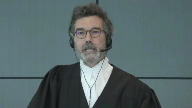
:::

That was, and by the way, SOCAN, which also is a collective society, has a full assignment and can and does sue for infringement collectively.

So in my respectful submission, we can't be visiting the choice of access copyrights members and say, well, we don't have an efficient remedy when that is the result of their choice and in any event.

Nothing in the statute, or in the statute of history, which she has generally covered with you, ever says that the reason we are now in 1988 acting collective society for rights beyond performing rights is because there's a problem of enforcement and we'll solve that, and because infringement is not a potent remedy, we'll solve that by giving them a mandatory tariff. Nowhere.

Zero.

In fact, if you look at her tab, sorry page 31 I apologize I'm not sure I know the tab.

It just is.

**Justice Kasirer** (01:45:35): Yes, Mr. Pratt, Mr. Pratt, you're about to go to the legislative history and all power to you.

::: {.column-margin}
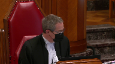
:::

I have one question, I believe it's the other side that raised it, or perhaps one of the interveners.

How do you make sense of 30.3 of the act, the rule that says no infringement by educational institutions for certain, the section appears, at least on my reading, deems some reproductions at copy machines in educational facilities not to infringe copyright, explicitly limits the application of the deeming provision.

But it doesn't seem to sit well with this voluntary theory that you're making out for the rest of the act.

How does that fit in?

**Speaker 2** (01:46:26): Well, I make two submissions, and maybe I could take the Court to believe the section you're referring to is 30.3, or have I got the wrong number, Justice Gessner?

**Overlapping speakers** (01:46:35): That's

**Speaker 2** (01:46:35): That's the right number.

::: {.column-margin}
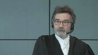
:::

So if you go to page, sorry, to tab 4A, page 22.

Actually, I make three submissions.

The first one is that the utility of that section has probably been overtaken by CCH.

The second point is whatever may be taken from that section, it falls far short of the requirement in SODRAC that you have to impose clearly liability on a particular user.

But thirdly, to be more directly responsive to your question, Justice Kasir, what my friends seem to ignore is in 30.3 sub 2, what are the conditions of application?

And I say that those all entail also an agreement.

So this is a section, by the way, for the members of the court that allows inter alia education institutions not to be sued for infringement for putting photocopiers available to the public.

And it's many conditions, but if you look at the application section sub 2, it says that the exemption of the protection will apply in respect of reprographic reproduction, where the educational institution library archive has entered into an agreement.

So if you have an agreement, you've consented, you get the protection from being sued for infringement for putting out further copying done by third parties.

B, the board has in accordance with section 70.2, fixed the royalties and related terms and conditions in respect of a license.

Now we know from SODRAC, because that's the section 7.2, that a person can walk away, but if they take the terms of the license voluntarily, then they would get the benefit of the exemption.

And the same is true of C and D. We do not assert, Justice Kasir, that anyone would get the benefit of the exemption, but for having agreed to the terms of the license.

And indeed, if you look then at sub three, you see that the legislator gives a discretion to the board to someone who offers to negotiate, that then they might get also the exemption.

So our position, Justice Kasir, is that none of these provisions would apply, except in a case where a user has accepted the terms in an agreement or of a license that is the result of an arbitration or of a tariff.

**Justice Kasirer** (01:49:10): But it does seem odd, you're arguing elsewhere that it's the kind of organic character of the Act read as a whole that supports your interpretation of 68.2, that from a policy perspective to tie this exception at 33 to the exception from infringement to the mere existence of a tariff under 7015 at sea, it covers a reproduction if it's possible to opt out of the tariff despite its existence.

::: {.column-margin}
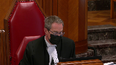
:::

It's just a little quizzical that it's there in the Act.

It may be right that it's overcome by circumstance, but it is an odd rule.

**Speaker 2** (01:49:54): But I'm obviously not clear, Justice Kasir.

::: {.column-margin}
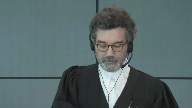
:::

This language, in my respectful submission, has to be read with the other sections and jurisprudence I've taken you to.

No one is claiming, sorry, York is not claiming that the mere assurance of a tariff would allow an institution any more than it allows it to collect royalties, except if you do have a license.

So that language, if you add that caveat, which necessarily follows from 17.17, for example, means that only the people who have an agreement or who have accepted the terms of a license, whether or not they result from an arbitration or from an appearance tariff, can claim the benefit of this section.

So before I move on to fair dealing, I do want to make a point, though, on the legislative context upon which my friend puts such heavy reliance.

And there you have our submissions in our factum about that.

But we say that nothing in the legislative history supports my friend's theory that the purpose of the amendments in 1988 was to, let me just find my tab, sorry, was to completely overhaul the regime, to transform what had hitherto for 50 years been a voluntary regime to now a mandatory one, nothing.

And so if you look, for example, at tab eight, at tab eight, we have an excerpt from Minister McDonnell's introduction of the bill.

And you'll see on this page 43, tab eight, you'll see the portion that access copyright has sidebarred, which has to do with the problem of this modern reproduction technologies and the problems it poses.

What they haven't highlighted is what follows from this.

The minister saying this system has been in operation for about 50 years for musical performances and is working well.

Under our present bill, the practice, which now pertains to those who provide musical performances would be expanded to other areas to be covered by copyright and would result in collective of authors, visual artists, and so forth.

There's not a hint there or in any other excerpt that they've put before you that suggests that, in fact, they were doing anything else but extending the regime.

And in fact, in the other document she referred you to at page 31.

Before you go on.

**Justice Rowe** (01:52:35): Before we go on, and this isn't a side, Mr. Pratt, I'll be very brief.

::: {.column-margin}
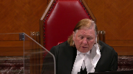
:::

I'd note that the opening words say that this is part of the second reading debate.

And the minister is the sponsoring minister.

And the second reading speech, second reading is approval in principle.

And in the second reading speech, the sponsoring minister explains to the House the purposes of the bill and why Parliament is being called upon, in this case the House of Commons, to make the amendments.

So it is perhaps the most authoritative statement that one can find of the content of the bill that one can extract from the legislative debates.

I think that is to your favor.

**Speaker 2** (01:53:25): Thank you, Justice Roe.

I will certainly take that one.

The other document, before I move on, to Fair Dealing…

**Justice Karakatsanis** (01:53:33): to lower your microphone.

**Speaker 2** (01:53:38): Thank you.

::: {.column-margin}
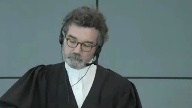
:::

So another document my friend took you to is the Charter of Rights for Creators.

If you look at page 31 now of my friend's condensed book, you will see if you read all of it, not just what they've underlined, that they wanted to extend the existing system to collectives beyond performance, just performance rights, and not to change anything else but extending it.

So you see at the first paragraph, page 31, below what they've underlined, this is the system presently used with respect to the performing rights and musical works which has worked well.

The performing rights societies provide a working model to the subcommittee for application in similar situations.

Bottom of the page, in return for complying with the conditions of the license and the payment of appropriate royalties, in return for the conditions complying and the payment, the purchaser of the blanket license is at liberty to do what would otherwise be done provided or be prohibited under the Act.

And then the subsequent paragraph on page 32, if you read it all, you'll see that the reason that the collective society is of benefit to these other organizations that would manage more than performing rights is that they are now protected from a competition concern because being able, by legislation, to collectively administer the rights of thousands of people gives immense market power, and that protects them from that concern.

And the role of the board, with the greatest respect to my friend, her argument that the board's role is useless unless its tariffs are mandatory founders, on the fact that that is the very same role that it has played for 50 years until 1988, and it's the same role that it plays in the arbitration regime.

The fact that it can set rates that are fair doesn't make them mandatory and it doesn't make its role useless.

I'll conclude on this by just reminding the court that if my friends were right, then the consequences of that would be remarkable.

It would mean that by just collecting together, Access Copyright claims more rights against users than the members of the collective, because no member of the collective can force any terms of any license on any potential user.

If the user decides to, notwithstanding, use the work that's protected under Section 3, they face a suit for infringement.

But their case is that by merely collecting, government intended to give them more rights by way of a mandatory tariff, and as I say, neither the language in the act when properly construed nor the legislative history ever supports such a fundamental switch.

I'll turn now, if I might, to the fair dealing issue.

My friend essentially said, and there I'll just, in terms of a road map, take you back to tab two of our condensed, sorry not tab two, tab one, but page two of our condensed book, and we set out there our basic positions.

I have really three points to make and I hope I can end just this row by dealing with your point, not because it's not important, but in fact my respectful submission, it's best dealt with that way.

So I make three basic submissions.

That, well my friend says this is all a matter of fact.

In my respectful submission, the assessment of whether the guidelines were fair dealing are marred as a matter of law from a fundamental legal error, which is essentially that instead of focusing on the unfair dealing in the university context as a user right belonging to the student, both courts below focused virtually exclusively on the perspective of the institution, so-called mass copying.

That error, if I'm right that this is a legal error, then the second point is to look at, as briefly as I can, how it's manifested in the fair dealing analysis conducted by the trial court and essentially sanctioned or approved by the federal court of appeal subject to some errors that they thought or the court of appeal thought was inconsequential, which my respectful submission is wrong, and the third point is to deal with your issue, Justice Roe, which is to what extent is any copying over the guidelines relevant to the issue of whether copying within the guidelines could be fair dealing, and I will address that head-on and if you're not satisfied I know from previous experience that you will not let me go home unchallenged.

So might I turn then to the first of these three major points, and on that I say, I make two, on the first point which is that the student user perspective is the key perspective, I rely on two things, a principle and b previous decisions of this court.

Principle, why?

Because section 29, as a result of the amendments in 2012, which is this fair dealing section, has added education, surely not narrowing the import of fair dealing, and perhaps equally if not more important, this court has confirmed that fair dealer, fair dealing rights are user rights, and that means student rights, sorry students fair dealing rights, not the institutional one.

I'll come back to because I grant that one has to look at the institution in certain circumstances and I will deal with that, but that is not the the key starting point.

That they got wrong, and in fact the federal court of appeal goes so far as to say that this court

**Overlapping speakers** (02:00:32): Uh...

**Speaker 2** (02:00:33): misunderstood the whole fair dealing analysis in the institutional context.

::: {.column-margin}

:::

And what they're finding in Sokan was sparing curium, a pretty bold claim, nice level submission, completely unwarranted.

So the perspective is wrong.

And I go further, it's compounded by the fact that throughout both judgments, but particularly the trial judgment, fair dealing is really treated as free loading.

That's what it is.

If you look at tab 9A, where we set out excerpts from the various judgments, I don't have time to read them, but you will see that every time the institution gets something quote unquote for free, it's suspicious.

It's trying to reduce its cost and properly, it should be paying them like as if it were hydro.

So I say that these two judgments are the product of a fundamental legal error, which is it has the wrong perspective.

It focuses on institution, not the student, and it ignores education.

In fact, the court of appeal reprimanded the trial judge for importing the allowable purpose of education when it looked at the fair dealing analysis in step two.

That's gotta be wrong.

Education has to be taken into account as a contextual factor throughout the analysis, not just step one, because you recall that under CCH, fair dealing analysis is divided between step one, which is do you have an allowable purpose under section 29?

And then if so, you go to the second multifactorial assessment of fairness.

The trial judge accepted this analysis, but at some points did consider education, and the court of appeal said that's wrong.

Once you have ticked off the box for education at step one, it's over.

In my respectful submission, that is plain wrong.

Education has to be a contextual factor throughout the analysis, and nothing in section 29 would command otherwise, and I say so can, for example, paragraphs 34 and 41 make it crystal clear that the perspective of the allowable purpose has to be taken into account through the analysis.

Thank you, Mr. Chair.

**Justice Martin** (02:03:07): May I interrupt here?

::: {.column-margin}

:::

Accepting that those two arguments you make are correct, that it's user based and education is a contextual factor throughout, what do we do about the fact that we're dealing with universities and education?

And we're dealing with the generation of knowledge.

And we're trying to inculcate in the students the idea of respect for knowledge in all of its rich forms.

And we have professors who are producing things that are going to be part of the protected repertoire.

How do we ensure, for example, a very simple thing, if you look in alternative ways of dealing or how we think about this, what about systems, I mean, this, if you look at it, there's $14.31, the yearly tariff on a full time student equivalent.

Why is it not fair to build that cost into tuition?

Why is it not fair if the institution who is bargaining on behalf of the users through either its fair dealing exception or whatever, where does that come in in terms of ensuring it's not for free, I understand what you're saying about that that's pejorative, but what about the ethic of respect for the knowledge that's being created?

And that this is a small amount to pay.

And what about the student who says I want to pay the $14.31 to ensure that my performances, my words have some kind of protection in the future?

So what do we do with those kinds of observations in a contextual analysis on fair dealing?

**Speaker 2** (02:05:00): Justice

**Overlapping speakers** (02:05:02): Yeah, Mr. Pressman.

**Speaker 2** (02:05:04): I guess I'll never learn, sorry, Justice Martin, first of all, the 1491 figure is picked up by Access Copyright and its FACTA, which is kind of odd because that is looking at the individual user perspective.

::: {.column-margin}

:::

That's the first.

The second is it seems in my full submission that focusing on how small or relatively small the cost might be is a contradiction with fair dealing because fair dealing means that there's some portion of the work you can get for free.

So if it's one cent, two cents, it would matter.

But if it's $50, it would, that would mean that the more you take away, the more it costs, the more your fair dealing rights increase.

So in my full submission, the balance that you're looking for, it has to result from looking at all these factors contextually under the six factors.

And I also make the point because you referred authors that the faculty, there are 3000 members of faculty at York University, 50,000 students.

The faculty have no incentive to run roughshod over copyright, but they support it.

So in my full submission, the cost and how small it might be or whether they might be willing to bear it is actually a contradiction of fair dealing.

It's saying as long as you don't have to pay too much, then you have to pay it.

Well fair dealing is the opposite of that.

And it was also inconsistent with my submission with the jurisprudence of this court in CCH that license, when you look at alternatives, you cannot look at the availability of a license because effectively that's giving the owners what they want in the first place.

That's paragraph 70 of CCH, if I recall correctly.

And indirectly, your question poses that problem with respect.

And might I say on this, because that goes to Justice Rose's question, we're looking for a way, a practical way, as you say in the university context, of actualizing fair dealing rights.

If they are the rights of the student, the only people that can do that is the institution.

We can't have 50,000 people, students saying, you know what, I should have 10 pages, whatever it is.

But the faculty and the university has to come up with some sets of standards which make those rights real.

And the guidelines, it was an attempt to do that, guided by your jurisprudence in CCH and SOCAN and in Alberta.

And we have to, when I say justices, chief justices, that the court below got it wrong in inter alia by not focusing on education, it's because the guidelines here are necessary.

If there are no guidelines, and we can argue about the specific parameters, but we need to get this proposition straight in my respectful submission.

In an institution like York, as in CCH, if there's no policies or guidelines that set some kind of benchmark, the student's right is illusory, period.

It's a denial of Section 29.

And students go to school to be guided by the faculty.

If they didn't need to go to school for that purpose, they wouldn't go.

And the faculty, therefore, has devised, by looking at your jurisprudence as the guidelines explicitly cite, try to find some workable benchmarks.

Whether they got exactly the right balance, we can discuss.

But in my respectful submission, one of the great deficiencies of the judgments below is that you have, or have access to copyrights for that matter, is you can have no idea whatsoever, and they're both long judgments, you can have no idea whatsoever of what fair dealing would be allowed at the university.

**Justice Martin** (02:09:17): But what about you said that the fair dealing that you put in place can hit the mark or it can not necessarily hit the mark.

::: {.column-margin}

:::

I mean, I'm being a bit facetious here, but isn't a $14 fee good insurance that the university is doing it in an absolutely fine manner given the margins of errors on those guidelines?

I mean, to open students up to potentially, as I understand it, individual actions against or from individual owners, there's maybe something to be thought of there.

**Speaker 2** (02:10:03): Well, access copyright has relied on that fear, effectively, to force universities to pay whatever tariff is set.

::: {.column-margin}

:::

And in my respectful submission, that cannot be a correct application of fair dealing.

Now, as I say, maybe they'll decide.

Some universities have decided to pay that tariff.

But that cannot possibly answer the question.

The question in this appeal is very simple.

Are the guidelines a fair, or copying within the guidelines, and I go now to Justice Roe's question, is that fair dealing?

The answer can't be, well, there's a tariff that said you should just pay it because that effectively will guarantee you protection.

What the university needs to know from this court is two things.

First of all, are guidelines necessary to make the right meaningful?

Whether it's, whatever the value of it, but are guidelines necessary?

I say indubitably, the answer to that question has got to be yes.

The next question is, okay, what guidelines?

What guidelines represent fair dealing?

It's more than zero.

And if we're going to make this right meaningful at the university level, then the next question is, well, are these guidelines arbitrary, as

the courts below say?

Well, why?

They are based on CCH, which said that, for example, taking one entire work can be fair dealing.

They're based on SOCAN, where when you look at the statistics, about 12% of the sampling was thought to be fair dealing.

And they're based in Alberta.

**Justice Rowe** (02:11:47): I find it very peculiar to say 12% of a musical work corresponds to 12% of a written work when what was involved in 12% of the musical work was to give some idea of whether it was a good toe-tapper and they were willing to pay $1.25 to download it, which is a little different from saying I'm taking the article in its entirety, which is 12% of the overall work.

::: {.column-margin}

:::

**Speaker 2** (02:12:16): Well, with respect to Justice Roe, in CCH, there was a policy that was not that dissimilar and where the court, this court said that taking an entire article could be fair dealing.

::: {.column-margin}

:::

And secondly, if we stand back and you ask yourself, what is the purpose of the university?

What is the purpose of university?

It is to expose students to a variety of sources of knowledge.

It's a form of sampling.

And these course packs are just that.

They're just that.

And to the extent that the fair dealing is allowed, they're only allowing short excerpts, a maximum of 10%.

And yes, we can argue with those thresholds.

But who's to say in Microsoft full submission, that the guidelines who are directly tied to your jurisprudence are ipso facto arbitrary.

It's got to be more than zero.

And I say again, I challenge my friend to point anywhere in the decisions below that tells us what threshold would be appropriate.

We are urging this court to give further guidance.

You gave guidance in CCH about the the legitimacy of policies and the thresholds therein.

You gave further guidance in Alberta, where you found that the board was wrong to consider the practice there of giving some excerpts to students up to grade 12 was fair dealing.

And even if this court is not prepared to endorse the specific guidelines here, in my respectful submission, it should and could, but if it is not feel comfortable, at the very least, it would be helpful to get some guidance that might be applied by the lower court to say, here are the kinds of considerations that should enter into the writing of those guidelines.

Otherwise, otherwise, otherwise, otherwise, otherwise, otherwise, otherwise, otherwise, otherwise, otherwise, otherwise, otherwise, otherwise, otherwise, otherwise, otherwise, otherwise, otherwise, otherwise, otherwise, otherwise, otherwise, otherwise, otherwise, otherwise, otherwise, otherwise, otherwise, otherwise, otherwise, otherwise, otherwise, otherwise, otherwise, otherwise, otherwise, otherwise, otherwise, otherwise, otherwise, otherwise, otherwise, otherwise, otherwise, otherwise, otherwise, otherwise, otherwise, otherwise, otherwise, otherwise, otherwise, otherwise, otherwise, otherwise, otherwise, otherwise, otherwise, otherwise, otherwise, otherwise, otherwise, otherwise, otherwise, otherwise, otherwise, otherwise, otherwise, otherwise, otherwise, otherwise, otherwise, otherwise, otherwise, otherwise, otherwise, otherwise, otherwise, otherwise, otherwise, otherwise, otherwise, otherwise, otherwise, otherwise, otherwise, otherwise, otherwise, otherwise, otherwise, otherwise, otherwise, otherwise, otherwise, otherwise, otherwise, otherwise, otherwise, otherwise, otherwise, otherwise, otherwise, otherwise, otherwise, otherwise, otherwise, otherwise, otherwise, otherwise, otherwise, otherwise

**Justice Kasirer** (02:14:14): Yes.

::: {.column-margin}

:::

Maître Pratt, can I just follow up on exactly what you're saying?

Giving guidance is one thing.

You're asking for us to exercise our discretion to grant declaratory relief.

And I'm just wondering if in the context of this dispute, and let's say without deciding, saying anything more, let's say you have the upper hand in the principal appeal, is that the exercise of that discretion an appropriate thing to do?

**Speaker 2** (02:14:50): Well, the answer is yes, Justice Kasir, but with a caveat, I suppose.

::: {.column-margin}

:::

If this court agrees that when it's said that a user right is not just a limited exception in Section 29, or the fair dealing rights, and that the educational context, as you clearly said in Alberta, confirmed as a matter of principle in SOCAN, is the ultimate user's right, then the next question is, how do we make that right real?

And in my respectful submission, there is only one way is to have guidelines.

Now, there you might part company and say, we are willing to go as far as saying that some guidance is required in the form of guidelines, but we don't feel situated or properly situated to go farther than that, then you can send it back to the trial court to define the standards more precisely.

But at the very least, we will not be leaving here with utter complete uncertainty where we know just one thing, that without guidelines, fair dealing means nothing for the students, nothing.

And at the very least, this court my respectful submission given that the CCH test is a judicially made remedy, or sorry, an analytical framework which you decided to provide to make fair dealing more concrete and with some direction, and in your subsequent decisions in CCH as well, you did, in CCH paragraph 90, the court gave a declaration that the policies of the great library were fair dealing.

So it's not without precedent.

But even if you're not willing to go that far, Justice Gassier, I respectfully submit that it is more than reasonable to ask this court to give the kind of direction that would be useful for other tribunals so that we actually move to a world where in the university context, there is some guidance, as opposed to the complete vacuum that results from maintaining the two decisions below.

I've actually delivered my conclusion, skipping a step, essentially, but I'll just say, in respect of the various factors now, what we say in, I guess, point two, that the errors that I've mentioned are apparent when you analyze the results of the CCH test, and I think that are apparent when you analyze the various factors.

And let me just give you a couple of points in the five minutes I have left.

If you look at the first factor, which is the purpose of the dealing or what the trial judge, so now we're in step two of the fair dealing analysis, and we have to assess the fairness in consideration of the six factors outlined in CCH.

And if you look at tab 9b, we have put some passages there of both courts that look at how the courts below looked at the purpose of the dealing, and it's clear in paragraph 22 of Alberta that one of the reasons you want to look at the purpose of the dealing is to make sure that the person claiming the right is actually exercising it for the allowable purpose.

And the example, as I recall, in paragraphs 20 to 22 of Alberta, this court said, well, we want to know whether or not this is really being done for students or whether there's some hidden, colorable purpose, commercial purpose, for example.

And I say that in the analysis that they're both courts below here focused on university, the university Judge Thelen concluded was doing this to reduce its costs.

Now, there's no evidence of that whatsoever, but he inferred it as a result of the fact that some of these copying would go, would be quote unquote free.

Now, if you just think about the logic of this proposition, it would follow from every institution who's relying on behalf of the users on fair dealing, because it's then not infringing, therefore not paying anything, that its purpose must be illicit, that it's trying to reduce its costs.

That can't be right.

It can't be right.

It's a denial of section 29, because if you can infer a commercial purpose simply because you save some money as a result of exercising your user, your student's user right,

then there's always going to be an illicit purpose.

And there would have been in Alberta.

In the Alberta case, my friends focused on the four to five pages.

The total pages for the province was 233 million pages that were involved.

So in my respectful submission, that is one of the factors and we say in our fact and that they're also compounding errors that the judge is looking at the effect of the of the dealing incorrectly, because he's essentially looking at the drop in revenues based on what he calls this the license drop, the surrogate, which is effectively doing what the court said you can't do, which is to look at the alternative of a license in the fair dealing analysis.

So I don't have time to go through all of the factors, but I do want to end with this question, Justice Roe, that you started on.

Why is the copying over the guidelines not relevant?

It's because we didn't ask for that.

The copying over the guidelines would be relevant in an infringement action, as in CCH.

And in CCH, the reason one had to look at whether the policies were effective was to ensure that actually the users, those who asked for the copies of the various articles and so forth, were actually sticking to the policy.

That was the only reason that the safeguards were necessary.

The safeguards were there to ensure that the purpose for which it was claimed, researched by the lawyers, was actually respected.

But that's not the issue here.

Before we worry about copying over the guidelines, we need to decide whether or not at least copying within the guidelines would be fair.

Because if we don't know that, there's no point in the safeguards.

We need at least to know whether or not fair dealing, according to some guidelines, can be implemented, actualized in some guidelines.

And then we say in our factum that there are safeguards if the court feels that they're not stringent enough to ensure there's compliance with the guidelines.

The court is obviously free to say that.

But the condition precedent to any usefulness of the safeguards is to know what it is we are safeguarding.

And that is what this declaration was seeking to achieve.

And that is why focusing on the over-copying is a way to avoid the real question, which was before the courts below, is can tell us please whether copying within the guidelines is fair dealing.

And I respectfully submit that the answer to that question should be yes, and therefore you should grant the appeal on fair dealing and dismiss the appeal on the tariff issue.

Inaudible.

**Overlapping speakers** (02:22:36): Sure, go ahead.

**Justice Brown** (02:22:37): Mr. Pratt, I want to pull you back to Justice Kazir's question.

::: {.column-margin}

:::

Because I understood him as asking whether it is appropriate for us to issue a declaration in the absence of a live issue on the assumption that access copyrights appeal is decided in your favour if you prevail on the main appeal.

And I understood your answer as going to more why declarations are generally available in this context.

I'm wondering if you can, and if I misunderstand Justice Kazir's question, I'll ask that question.

Is it appropriate to issue a declaration?

**Justice Kasirer** (02:23:21): No, that was my question.

**Speaker 2** (02:23:26): Well, the answer is yes, Justice Brown, in my respectful submission, because even if you grant the appeal, the fact is that the appeal itself, that is the tariff appeal, was largely based, as you heard Ms. Block, on we need this to control this over-copying.

::: {.column-margin}

:::

And because remember Justice Brown and Justice Kucera, that we pleaded fair dealing and the guidelines within the main appeal, not just as a counterclaim.

So in my respectful submission, it would be, I guess, a happy result for York if we were successful on the main appeal, on the tariff appeal.

But it would be, if the court cannot find a way to give us the kind of guidance I talked about, it would be, as my friend Ms. Block keeps saying, it would be kind of sad to have spent so many years and leave here with having no idea from this court as to what it considers fair dealing to mean in the university context.

And in my respectful submission, there is nothing in your statute that would preclude from giving the kind of direction that I am asking.

I'm sorry, I'm sorry, I'm sorry.

I'm sorry, I'm sorry.

**Justice Brown** (02:24:45): But you accept that this would be purely an advisory opinion?

**Speaker 2** (02:24:51): Well, no, because as I say, the issue was live in the tariff appeal and this court has in in SOCAN and all these proceedings has given advice to parties about what their guidelines or sorry about what fair dealing means and I agree with you Justice Brown that it may not be binding as a matter of law

::: {.column-margin}

:::

but I would say that if the court can find a way to give users and authors some idea of what fair dealing means in the university context which was the whole the whole raison d'etre of their lawsuit was to try to stem what they considered to be an inappropriate use of fair dealing and so in that appeal if you dismiss their appeal there's nothing that would preclude you from saying that in fact fair dealing rights can be actualized through guidelines in any event in Myers-Belfort submission even if it turns out to be an obiter.

**Justice Wagner** (02:25:52): Alright, thank you very much.

Merci beaucoup maître Pratt.

The court will break for lunch.

We'll be back at one o'clock

**Justice Brown** (02:26:37): The court now calls.

**Justice Wagner** (02:27:00): Thank you.

Be seated.

Brendan van Nieuwenhuis.

Thank you.

**Speaker 3** (02:27:07): Thank you.

::: {.column-margin}

:::

The clients for whom I speak today write and publish books and other works for a living.

The tariff is not an abstract thing to them, and in my submission, nor should it be seen as such by this court.

In fact, the tariff represents the outcome of the administrative process before a tribunal that makes binding decisions and orders.

Consider considering exactly the kinds of concerns my friend, Mr. Pratt, has just raised before you.

For those decisions to be enforceable and have legal effect is not remarkable, as Mr. Pratt has submitted.

It is, in fact, the garden variety result of a specialized administrative tribunal following its process in issuing a decision in order.

My friends thirst for some guidance from this court as to its guidelines and as to their appropriateness is a thirst that is easily quenched before the copyright board in a properly constituted tariff proceeding.

The concern has been expressed about why Parliament might not have been more express.

In my respectful submission, and I'll come to this, Parliament was express, but firstly, so was the board.

The board proceeding begins with notice given to the post-secondary institutions, including York, who are proposed to be bound by the tariff, which entitles York to a right to be heard, a right to tender evidence, and a right to make submissions.

If a tariff should not be issued to bind York University, then York University should tell the board, and if it is correct, then the board would not approve of it.

If much or most of what York does is fair dealing, then York should go and tell the board and show the board the evidence, and the board would accordingly be expected to adjust its tariff in the course of its administrative process to account for that, and indeed that's precisely what it does.

In this case, York in fact did this.

It participated in the proceeding, and then it withdrew.

After the proceeding had completed the hearing stage, York then wrote a comment letter to the board saying exactly that, without evidence that it should not have the tariff applied to it because of its factual claims.

There is a clear and distinct legal authority that arises from the order of the board, and that gives York the right to enter the safe harbour offered by the tariff so that it cannot be sued in other ways, and that the tariff can be established on the basis of York's evidence as well as that of access copyright.

York also has the right to do that work itself.

It may gather up thousands upon thousands of individual licenses if it is truly afraid of thousands and thousands of tiny lawsuits, and it can show the board, or by way of an infringement action like this, an enforcement action like this, that it had the licenses.

York said it would do that in its statement of defence.

It was unable to do so on the evidence, and of course York has the right not to use the repertoire at all.

The suggestion that an individual action is in any way an option is in my submission a red herring.

How would a creator, an individual creator, even be able to determine whether infringement occurred when much of the copying occurs behind password-protected learning management systems as the evidence showed at trial in this case?

The tariff is a safe harbour for users like York so that they do not face this risk, though it is fanciful in practice that they will be sued on thousands of occasions for thousands of tiny infringements.

And yet York will not take advantage of this safe harbour and will not take yes for an answer in effect.

The suggestion of class proceedings as an alternative is again a red herring.

There was no class proceedings legislation in existence in 1988 when this legislation was massively amended in the fashion we're looking at today.

This is in effect the class proceedings legislation that applies to the enforcement of copyright through a collective.

Parliament used an administrative tribunal rather than a judicial regime, as it does all the time.

And it's the same kind of mischief that class proceedings legislation may be designed to remedy of practically unenforceable rights, but it is a better method in this context to use an administrative tribunal and endow with powers.

Those powers are enforceable and I want to stress it hasn't been raised before you but section 66.7 of the Copyright Act, it's reproduced in page six of our intervener's factum, but expressly says that any decision of the board may be enforced as an order of the federal court or a superior court.

It may be issued as a judgment of the federal court or superior court in a purely ministerial fashion and it binds those that it purports to bind.

If you look at the tariff itself, it's clear who it's directed to, it's directed to post secondary institutions and it clearly orders that for each academic year the educational institution shall pay to access copyright the royalty.

Thank you.

**Justice Wagner** (02:32:15): for submissions.

Thank you very much.

**Speaker 4** (02:32:21): Monsieur le juge en chef, Mesdames, Messieurs les juges, je représente devant vous aujourd'hui près de 35 000 auteurs et près de 3000 éditeurs québécois dont, je le souligne, toutes les presses universitaires chargées de diffuser le savoir pour reprendre l'expression de Madame la juge Martin tout à l'heure, et leurs associations, les sociétés étrangères qui ont donné à Copyback le mandat de gérer en leur nom les droits de reproduction par tout procédé sur les oeuvres qu'il crée et en toute langue.

::: {.column-margin}

:::

Depuis 1988, avec l'appui des gouvernements successifs du Québec, s'est mis en place un régime de négociation de licence globale et aujourd'hui les universités, toutes les universités du Québec, peuvent reproduire un nombre illimité de copies, moyennant un prix de 13,50 $ pour un catalogue composé de plus de 200 000 titres de livres, plus des centaines de journaux et de périodiques, et les montants recueillis, une somme de 230 millions de dollars en 23 ans est une somme non négligeable pour les éditeurs.

Sans cette contribution aux revenus de l'édition, de trompeuses éditeurs québécois, en particulier les presses universitaires, les presses de poésie, les auteurs d'essais, pourraient être menacés.

L'Université Laval avait choisi en 2014 de suivre une politique institutionnelle semblable à celle de l'Université York et elle a fait marche arrière quand elle a constaté que ce type de politique était en réalité inapplicable.

Le Québec a instauré ça et il n'est pas différent de la situation qui prévoit en France où il y a un régime de licence globale ou en Grande-Bretagne où il y a un régime de licence globale négociée du même titre.

Qu'est-ce que c'est que l'utilisation équitable?

À mes étudiants, j'expliquais que c'était le gros bon sens.

Serait-il raisonnable d'interdire à un encanteur ou à un propriétaire de galerie de reproduire une toile pour la vendre?

À l'évidence, non.

Et par contre, permettre aux universités de reproduire sans contribution à la création et à la diffusion du savoir des centaines de millions de copies chacune et donc des milliards pour l'ensemble du régime, à l'évidence, ce serait déraisonnant.

Cette cour avait énuméré dans CCH les six indicateurs pour déterminer dans une situation particulière s'il y avait utilisation équitable.

Et en fait, ce que l'Université York vous demande, c'est une déclaration pour établir un système quantitatif qui écarte toute appréciation qualitative des œuvres.

Et c'est pourtant un élément essentiel, comme cette cour l'a rappelé, pour déterminer ce qui est une partie essentielle quand elle l'a fait dans l'affaire Sinard contre Orin-Binson.

Le Canada s'est obligé au niveau international à respecter les conventions de Berne et notamment le test en trois étapes.

C'est un test qui lie le Canada et qui s'applique aux exceptions et que cette cour devrait examiner.

Le premier volet du test indique que l'exception ne doit s'appliquer qu'à des cas particuliers.

Dans les circonstances, il ne s'agit évidemment pas d'un cas particulier lorsque ça s'applique à un grand nombre d'établissements, comme un comité d'arbitrage international l'a décidé dans l'affaire des communautés européennes contre les États-Unis.

Le second volet, qui pour nous est selon la jurisprudence le plus important, c'est celui de la solution de rechange.

Existe-t-il une solution de rechange qui permette aux universités d'utiliser les œuvres tout en respectant les droits des auteurs et des éditeurs et cette solution existe?

La loi anglaise, par exemple, a consacré la jurisprudence et indiqué qu'on ne peut pas parler d'utilisation équitable lorsqu'il existe la possibilité de contracter une licence globale auprès d'une société de gestion collective.

On ne rencontre pas dans ces circonstances-là la contrainte que cette cour avait mentionnée dans CCH pour qu'on doive demander une licence particulière.

Et enfin, il faut établir que le préjudice demeure dans les limites raisonnables, c'est le troisième volet.

À l'évidence, le juge Fallon a remarqué en première instance que ça aurait des conséquences dramatiques pour l'édition de langue anglaise.

On imagine volontiers que les conséquences seraient encore plus dramatiques pour les éditions en langue française et en langue autochtone au Canada qui comptent sur ces revenus de la reproduction.

Il importe enfin de mentionner que l'utilisation équitable n'écarte pas les droits moraux des auteurs et que la politique de York ne comporte aucune indication relative au respect des droits moraux alors que le régime des licences globales offre des éléments de protection.

Et il faut également indiquer pour terminer que York devait démontrer le caractère, l'application pratique de sa politique et qu'elle était respectueuse et que, comme la conclut le juge de première instance, tel n'était pas le cas et cette Cour ne devrait pas réviser cette constatation de fait. Merci.

**Justice Wagner** (02:37:38): Merci.

Isole de Jean-Drew.

**Speaker 5** (02:37:44): Merci.

::: {.column-margin}

:::

Monsieur le juge en chef, mesdames les juges, messieurs les juges, je comparais devant vous aujourd'hui au nom du Centre du droit des affaires et du commerce international et de la chaire LR Wilson en droit des technologies de la Faculté de droit de l'Université de Montréal.

Il me fait plaisir de venir vous parler d'une institution fondamentale en droit d'auteur canadien.

Peut-être voudrez-vous éventuellement poser des questions sur d'autres sujets.

Mais pour parler de cette institution fondamentale en droit d'auteur canadien, on est dans un univers où avec le droit d'auteur, on s'exprime souvent à l'aide de concepts abstraits.

La notion d'œuvre, la notion d'auteur, d'originalité, d'utilisation équitable, de communication, de public.

On en parle aujourd'hui et on en parlait il y a 100 ans avec le même vocabulaire.

Avec les décisions de la Commission du droit d'auteur ici, on parle d'un même phénomène, mais pas toujours avec la même étiquette.

De nos jours, on en parlerait en termes d'équilibre.

À l'époque du rapport Parker, dans les années 30, on ne parlait pas d'équilibre comme on en parle aujourd'hui, mais on agissait sur l'équilibre.

Et c'est ce rapport qui a vu une situation où une société d'auteur qui était une coquille pour des intérêts étrangers, cherchait à faire valoir ses droits, que le rapport Parker reconnaissait, devait être mis en équilibre avec les capacités des payeurs vivant la grande dépression.

Ça a mené à la création de l'ancêtre de la Commission du droit d'auteur d'aujourd'hui et c'est le modèle que nous avons eu jusqu'à nos jours.

C'était une institution pionnière, nous sommes les premiers au monde à avoir eu un tel tribunal administratif, mais pour nous, c'est quelque chose de très commun.

Mais ça fait en sorte que quand on arrive à la fin des années 80, avec plus de technologie, pour avoir plus d'utilisation de petits droits qui ont besoin d'être monnayés, il faut à ce moment-là faire appel aux caractéristiques de la Commission du droit d'auteur, c'est-à-dire un tribunal administratif indépendant, avec des membres experts qui examinent une situation dans le cadre d'une procédure quasi-judiciaire qui homologue un tarif et dont les décisions doivent être connues à l'échelle du pays par l'entremise de la Gazette du Canada.

C'est ce modèle-là que le Parlement a voulu reprendre en 88 lorsqu'il a eu à s'assurer d'encadrer la gestion collective pour la retransmission par câble et encore plus en 1997 quand la technologie avait encore avancé et on voulait davantage s'assurer que les petits droits pouvaient être exercés par des sociétés de gestion collective qui allaient être dans un processus devant cette Commission du droit d'auteur.

Donc, depuis 1997, et le texte de la loi aujourd'hui le montre très bien, il y a des instances où les sociétés de gestion comme la SOCAN à l'époque, où les sociétés qui s'occupent de retransmission aujourd'hui doivent se présenter à la Commission pour demander un tarif.

Ensuite, maintenant, les sociétés de gestion comme ACCESS peuvent négocier de gré à gré, mais elles ont aussi la possibilité de se présenter devant la Commission pour demander un tarif, toujours à l'occasion de cette même procédure qui résulte en une décision pour laquelle tous les intérêts ont pu être soupesés.

Et il y a ensuite, évidemment, notre clause d'arbitrage institutionnel, quand justement des négociations ne fonctionnent plus

, on peut s'adresser à la Commission du droit d'auteur parce que c'est là que se trouve l'expertise en matière de monétisation du droit d'auteur.

C'est à l'occasion de ces tarifs que tous ces grands principes abstraits, et en particulier le principe parfois abstrait de l'équilibre, se concrétisent monétairement en espèces sonantes et trébuchantes, peut-être un peu moins aujourd'hui, mais c'est à ce moment-là que l'équilibre est maintenu.

Et c'est parce que le législateur a à cœur ce maintien d'équilibre qu'il fait en sorte que ces décisions doivent être respectées par des personnes dont l'utilisation des œuvres ne peut être niée.

On ne peut nier qu'il se fait des reproductions dans les universités, comme on ne peut nier qu'il se passe de la radio, pardon, de la musique dans les stations de radio.

Et ça va devenir encore plus important pour la Commission du droit d'auteur d'exercer son pouvoir de calibrage alors que la technologie nous amène dans l'univers d'Internet, et à ce moment-là, l'équilibrage sera entre des sociétés de gestion et des utilisateurs de type GAFAM.

C'est important de conserver le calibrage que permettent les décisions de la Commission du droit d'auteur.

**Overlapping speakers** (02:42:50): Merci à tous.

**Justice Wagner** (02:42:50): Mr. Matthew Estabrooks.

**Speaker 6** (02:42:58): Good afternoon, Chief Justices, Justices, in my submissions today, on behalf of SOCAN, I hope to make the following three points.

::: {.column-margin}

:::

First, that the goal of the tariff setting process is to arrive at an enforceable tariff.

Without enforceable tariffs, the key benefits of the collective administration system are lost and the Act sets out the enforcement options for collective societies.

My friend Ms. Block explained that the tariff setting process, from proposal to adjudication to approval, is quite an investment of time and resources and I don't disagree with that.

The question is, what is this investment for?

This investment must be for something.

And I would submit that Parliament intended that the return on this investment be a tariff, an enforceable tariff, that's suitable for licensing copyright at scale.

It might be helpful here to go back and look at some of the first principles of copyright.

Copyright is a bundle of exclusive rights and a non-owner must seek permission from the owner if it wants to engage in one of those exclusive rights.

The first option here is an individual license, but as I'm sure the court can imagine, as those individual licenses pile up and the scale starts to get larger and larger, negotiating individual licenses becomes unfeasible.

At the scale that we're talking about here in terms of collective societies, the practical problems of individual licensing are simply insurmountable.

Think of the example of SOCAN.

SOCAN has 160,000 members, it operates 50 tariffs that cover 100,000 users, and SOCAN also administers rights on behalf of international societies as well.

So at this scale, individual licensing is simply unfeasible.

Parliament's solution to this problem is to interpose the board between the copyright owner and the copyright user to replicate the negotiation that would happen individually.

The board sets tariffs that function as turnkey licenses for users, but this solution only works if there's a mechanism for turnkey enforcement as well.

Justice Roe asks the question, are there any practical problems with individual infringement actions?

And the short answer to this question is yes, of course.

At scale, individual infringement actions undermine the concept of collective administration altogether.

They simply add too many transaction costs and too much friction that make licensing unfeasible.

On a practical level, we can look at these practical problems by asking, how does the approach that York is advocating apply to an organization like SOCAN?

York's position, just to put it simply, is that users can wait for the board process to finish, wait for a tariff to be approved, and then decide, do they take a license or do they opt out?

And there's two problems with this approach.

First, the phrase to take a license is simply inapt in this context.

It doesn't reflect the practical reality.

Most users don't decide to take a license.

They simply start using music.

And I would suggest that this is actually an advantage of the tariff system.

There's no need to negotiate in advance.

The terms of the tariff are already there.

They're publicly available.

Anyone who begins to use music is aware of the obligations that come with it.

It's a little bit like getting on a train where the fares are posted in the station.

Once the passenger is on the train and the train starts moving, the passenger doesn't get to decide that they don't want to pay or they don't get to negotiate with the purser for a lower fare.

They've engaged in the right by getting on the train.

Also, the concept of opting out is unrealistic.

The practical reality is if it becomes known that tariffs are seen to be optional, then users will just simply stop paying.

Think of how this would operate in the context of Sokan's background music tariffs, for example.

Sokan licenses tens of thousands of bars and restaurants across the country.

If each one of these bars and restaurants simply stopped paying, Sokan would be forced then to negotiate individual terms with each one of these bars and restaurants and forced to administer those terms on an individual basis.

And again, the advantages of collective administration would be lost.

And we can see in the Act that it's very clear that Parliament intended collectives to have these enforcement options.

We look at Section 68.2, which is the section that's at issue here.

If we read it top to bottom, it becomes obvious.

Starting from the very title of the section.

The title is The Effect of Fixing Royalties.

The section grants collective societies the universe of remedies available under the Act.

And then it adds two more remedies.

The right to collect royalties that are fixed and the right to recover unpaid royalties.

This becomes even more clear when we look at the 2019 amendments to the Act, which add words to the title of the section.

Permitted Acts and Enforcement is now in the title.

And also add Section 73.1, which allows collectives to enforce not only the royalties parable under a tariff, but the tariff terms itself.

And to wrap up, enforceable tariffs serve an essential purpose.

They allow for efficient licensing at scale.

The significant investment in the tariff proposal adjudication approval process is returned in the form of administrative efficiency, which creates value for all participants.

If some participants are allowed to opt out, it undermines the system for everyone.

Parliament's intent for this system is apparent in Section 68.2, and it's even more apparent following the 2019 amendments.

It's even more apparent following the 2019 amendments to the Act.

Thank you.

**Justice Wagner** (02:48:28): Aaron Finley.

**Speaker 7** (02:48:39): Apologies, thank you Chief Justice Justices.

::: {.column-margin}

:::

For my first intervention, I am here on behalf of three collective societies that operate under the same general regime as access copyright and one collective society that operates under the retransmission regime.

Contrary to the decision under appeal, the collectives submit that Canada's collective administration regimes and the tariff setting process do not exist solely to limit the market power of collective societies, rather the economic rationale and the legal framework demonstrate that the purpose of collective administration and tariffs are to facilitate a functioning efficient marketplace for the exchange of copyright protected works.

In our factum we provide the court with the economic policy rationale for the collective administration of copyright, but essentially the high transaction costs associated with bargaining monitoring and enforcement can make the individual exercise of copyright difficult.

And these challenges are amplified when rights holders negotiate with a user that holds significant market power such as an online music service like YouTube or Amazon Music.

These challenges are also amplified in cases where there are mass uses of content or where the use of individual works trigger multiple rights often owned by different rights holders.

So collective administration exploits economies of scale to lower the per transaction cost to a level that supports or enables a functioning marketplace.

The Copyright Act provides us with regulatory tools to remedy market imbalances in support of this functioning marketplace and some of these tools are reflected in the general regime that was implemented by parliament in the 1988 and 97 amendments.

At the time parliament allowed creators to band together as collective societies and they did this by exempting them from the application of the conspiracy provisions of the competition act and you can find that at section 70.5 subsection 3 of the Copyright Act.

Parliament also gave collectives operating under the general regime the option of venturing into negotiated license agreements or filing tariffs.

In 2018-2019 parliament doubled down on the framework of the general regime by also giving performing rights societies and others the ability to enter into agreements with users.

So performing rights societies are no longer required to file tariffs with the board and they can also now avail themselves of the exemption from the competition act.

These provisions which have always been present in the general regime are antithetical to the notion that collective administration and the tariff setting process exists to limit the market power of collective societies.

The copyrights board's role is to balance out the market power of both rights holders and users.

It sets fair and equitable rates and terms of use when the market cannot settle the terms on its own.

This morning Justice Roe you asked whether users become licensees whether users of a tariff become licensees.

I submit that a user becomes authorized to use the works for the uses as proposed in in a tariff.

They do not become a licensee of the collective per se instead users become authorized to use by virtue of the tariff that is approved by the regulatory body the copyright board.

Justice Brown you asked if an author sues for infringement does the user still become liable to pay the tariff.

First and foremost collectives are agents of the rights holders that they represent.

Collectives act on the direction of their members.

We looked at section 70.17 no proceedings may be brought for the infringement of a right referred to in section 3 15 18 or 21 against a person who has paid or offered to pay the royalty specified in an approved tariff.

I submit that the words offered to pay in 70.17 is meant to deal with what happens between the time a tariff is proposed and when it is approved by the board.

But it refers to it refers to the approved tariff.

That's right right

so there's like it there's a tariff.

**Justice Brown** (02:52:47): been approved and someone cuts a deal with an individual author, are they still liable to pay the tariff that has been approved?

**Speaker 7** (02:52:56): If someone cuts a deal with the individual author, they are not liable to pay a tariff that only applies to the works of that individual author, assuming that the license that has been cut with the individual author covers the same use.

**Overlapping speakers** (02:53:08): And what provision are you relying on to support that?

**Speaker 7** (02:53:10): That would be simply the effect of a negotiated license they already have the authorization to use.

They do not need...

**Overlapping speakers** (02:53:18): I thought the tariff was mandatory.

**Speaker 7** (02:53:21): A tariff is mandatory, but as we've discussed this morning, there are other options available to users.

::: {.column-margin}

:::

So if a user has already licensed the use, there is no need for the user to pay the tariff.

If there's an exception that applies, there is no need for a license, there's no need to pay the tariff.

And I think Access Copyright covered that this morning as well.

**Justice Brown** (02:53:42): I mean, I'll just leave it with this.

I think that the theory that this is a mandatory tariff proves too much is the problem.

**Speaker 7** (02:53:52): I will jump forward to the end recognizing my time is up.

**Overlapping speakers** (02:53:56): Yes.

**Speaker 7** (02:53:56): Parliament's intent in implementing the general regime and extending it to performing rights societies and other collectives in 2018 cannot have been to create unnecessary regulatory tools and additional inefficiencies in an already inefficient marketplace.

::: {.column-margin}

:::

Rather, the general regime and tariffs was and is designed to provide tools and conditions for an efficient functioning marketplace for the exchange of copyright protected works.

Thank you very much.

**Justice Wagner** (02:54:22): start your other submission.

five minutes.

**Speaker 7** (02:54:27): Thank you, Chief Justice, Justices.

::: {.column-margin}

:::

The Producers' Coalition submissions focus on one single point.

The purpose of copyright law is to promote the public interest in encouraging, disseminating, and providing a just reward to the creator for original expression.

This Court's decision in Taberge continues to be the leading case on the purpose of copyright law in Canada.

Taberge is often quoted in copyright cases, but I would like to spend a little bit of time on it today.

At paragraph 30, Justice Binney stated, the Copyright Act is usually presented as a balance between promoting the public interest in the encouragement and dissemination of works of the arts and intellect, and obtaining a just reward for the creator.

So here we have the notion of balancing out three objectives in the public interest.

Encouragement of works of the arts and intellect, and I submit that encouragement means creation.

I don't think there is much controversy about that.

Dissemination of works of arts, the intellect, and the creator's just reward.

Each of these three objectives, the creation of works, the dissemination of works, and obtaining a just reward for the creator are in the public interest and are the objectives to be weighed in any copyright and fair dealing case.

York asserts that the main purpose of copyright law is to encourage or promote the creation and the dissemination of knowledge.

It also suggests that copyright law and higher education share the same objectives of both creating and disseminating knowledge, and a number of interveners echo this position.

But this approach invites legal confusion.

It does not accurately reflect the law for three main reasons.

First, it ignores the creator's just reward.

Second, it focuses on the wrong subject.

And third, it asserts that copyright even has a main or governing purpose, instead of recognizing that all three policy objectives must be weighed.

So first, the creator's just reward.

Taberge very clearly identifies the creator's just reward as one of the objectives of the Copyright Act.

Whichever philosophy of copyright one subscribes to, there is no question that obtaining a just reward for the creator is an objective.

The creator's just reward stands alone as an independent policy objective, but it also feeds the other two.

We reward creators for the fruits of their labor or their doit d'auteur, at least in part, to incentivize them to continue creating and disseminating.

And in this way, the just reward helps feed a virtuous cycle of content creation and dissemination.

Balance in copyright is sometimes framed as weighing the interests of a copyright owner against a copyright user, or as just reward versus dissemination.

But viewing balance as a simple binary choice ignores the complementary objectives of copyright law.

The creator's just reward and creation and dissemination are not opposing forces.

The balancing exercise is not a zero sum game.

It is in the public interest that the creator is justly rewarded for their works.

It is also in the public interest that those works are created in the first place, and that society as a whole has access to those works.

When properly balanced, these can be mutual and complementary interests.

It is beneficial to copyright owners and users, as well as the public more broadly, that works are created, that those works are disseminated to the public, and that creators receive a just reward.

Moving on very briefly to the subject of copyright.

Copyright does not protect or encourage the creation of or dissemination of knowledge.

Rather, the subject of copyright is the original expression of ideas, CCH paragraph 8.

And finally, copyright does not have a main or governing purpose, and dissemination certainly does not rank any higher than the creator's just reward.

To suggest otherwise would distort the balance assessment that is the basis of copyright law.

So instead of viewing balance as copyright owner versus copyright user, or protection versus access, or creation and dissemination versus just reward, in the producer's submission, the balance assessment ought to be conducted holistically and in light of all of the objectives of copyright law.

Striking the correct balance amongst creation, dissemination, and the creator's just reward is the central question in copyright law, and is in my submission the proper framework for the assessment of fair dealing in this appeal.

Thank you.

**Justice Wagner** (02:58:50): Stéphane Caron

**Speaker 8** (02:58:56): Chief Justices, the Intervener, the International Authors Forum and the International Publishers Association bring together national authors and publishers associations from around the world.

::: {.column-margin}

:::

IFRO, the International Federation of Reproduction Rights Organizations is the umbrella organization that represents an international network of over 100 reproduction rights organizations like Access Copyright and Copyback.

The Interveners asked this court to view this case in the context of Canada's international obligations and specifically the three-step test that is set out in the Berne Convention but also in the TRIPS agreements and other international agreements to which Canada is a party.

I will be supplementing some of the information that was provided by Maître Paquette on behalf of Copyback on the issue of the three-step test which is an important one.

I will be focusing on three key related points today.

Number one, the three-step test sets a standard for copyright exceptions in international law.

Second, the three-step test does not replace the jurisprudence of this court, rather it sets threshold conditions to an exception and guides the application of the CCH fairness analysis.

And thirdly, the three-step test provides for a balanced interpretation of the fair dealing exception and in saying so, I need to underscore that the Interveners' views are that the exclusive rights granted to authors by copyright serve a public interest and an important public interest.

They are a compensation to the author for the contribution of original work but they are also an incentive to creation and foster more creativity and so that too is in the public interest.

And in that regards, I refer to the submissions that were made by the Canadian Media Productions Association just now.

So one, an international standard, two, a guide, and three, a balance.

From an international standards perspective, the test was adopted as a counterweight to the right of reproduction.

It implicitly recognizes the need for exceptions and sets threshold requirements for the drafting of national legislators.

So what is that threshold?

It stipulates that one, the exceptions must be confined to certain special cases, two, that they must not conflict with the normal exploitation of the work, and finally, three, that they not unreasonably prejudice the legitimate interests of the right holders.

These three conditions are important to assist us in interpreting exceptions and particularly important in the context of a fair dealing exception like fair use and other open-ended exceptions where the court is called upon to interpret and to set out a guidelines and interpret them in applying the exception.

So the three-step test, this brings me to the second point of my presentation, is a guide and yet the court has yet to consider this guide in its jurisprudence to date on the issue of the interpretation of fair dealing.

And we submit that this is because the court has not yet decided on the interpretation of fair dealing.

The court has not had an opportunity to do so.

The conditions, the cases that have come before it in the past have not disclosed this level of interference or this breadth of interference with the rights.

To better serve the public interest, there must be exceptions, but these exceptions must not interfere with, come into conflict with the exploitation of the work.

And this is the point I would like to focus on.

The, and primarily with respect to the sixth factor, the sixth factor obviously is one of the six only, but clearly in a situation where it is, the dealing will not necessarily amount to interference to a conflict, but where the dealing does amount to a conflict, the sixth factor must become determinative in whether or not fair dealing exists.

And this must be reflected in the application of the test.

In a situation where no conflict exists, there can yet be a prejudice that is unreasonable.

And again, the exception must ensure that this prejudice is compensated for.

And this is the role that play the collective administration of the rights in the context of this exception.

**Justice Wagner** (03:04:05): Thank you very much.

**Speaker 9** (03:04:13): Good afternoon, justices.

::: {.column-margin}

:::

My clients, the Music Industry Associations, are here today for a simple reason.

Although this case arises in the context of higher education, the decision is bound to have broader implications for the creative industries, including music.

And that's clear from the evolution of fair dealing in Canada since CCH.

So I want to help the court appreciate what's truly at stake in this appeal, including for the music industry.

Now, as the court made clear in CCH, fair dealing is a matter of impression.

That requires a flexible, fact-driven assessment in each case.

And this court has provided us with non-exhaustive factors to help inform the fairness analysis, but it still comes down in the end to a matter of impression.

A court can't be unduly constrained in its ability to form that impression based on the particular facts of each case.

It needs a full appreciation of the dealing.

Now, York's approach would do the opposite.

It would put blinders on the court to the unfair prejudice of creators.

And I say that for at least three reasons.

First, York would have the court look at fairness from the perspective of the end user only.

But it's important not to narrow the analysis artificially by focusing on one perspective to the exclusion of all others.

The analysis ultimately has to focus on the dealing, not on the dealer.

And that means examining all the fairness of factors from all relevant perspectives.

In a guidelines case, the court can't

**Overlapping speakers** (03:05:52): Do you see that as us having to change our jurisprudence on that point?

**Speaker 9** (03:05:58): No Justice Brown, I don't and I'll tell you why.

::: {.column-margin}

:::

Even in Sokan where the court indicated that it was important to look at the first factor of the fair dealing test, the allowable purposes threshold from the perspective of the end user.

It didn't say that about the fairness analysis at the second stage and in fact in all three of this courts seminal cases on fair dealing.

So can CCH and Alberta.

It did in fact, look at the six fairness factors from the perspective of both the end user and the intermediate institution entity, whatever you want to call it on the circumstances of the case so my submission Justice Brown is that that would be entirely consistent with the jurisprudence of this court.

Secondly, when looking at the amount of the dealing which is one of those six factors.

It's crucial to consider the quality of the material use and not just the quantity.

If you don't, it's impossible to gauge the importance of the material used, which is what CCH says we have to do.

In music, for example, using the most famous riff from a song would raise fairness considerations that are different from the use of a less familiar portion, even if the excerpts are of an equal length.

And you can't just derive a mathematical recipe for fairness from unrelated decisions.

Justice Roe you touched on this earlier, a percentage relationship observed in one case just doesn't mean much in the circumstances of another.

Right in windows.

**Justice Rowe** (03:07:37): When Windows 95 was marketed, start me up from the Rolling Stones.

Very short section, everyone remembers it.

**Speaker 9** (03:07:45): Yeah, that's exactly right and so using a clip even of a short duration in the context of a pure advertisement is different from using it in an online preview as you said this morning to see if the song is a toe-tapper.

::: {.column-margin}

:::

In a more contemporary context you might look at a TikTok video and say well what if the excerpt is the whole soundtrack, context is vital, it's got to be fact specific.

Which brings me to the last point, a policy is not a dealing and Justice Roe you touched on that too and it was telling when you did.

It's impossible to assess the fairness of a policy by just reviewing its language and imagining what might happen if people complied with it.

You need to look at how the policy is implemented in practice and whether there's good reason to think that the dealings that result from it will be fair.

If not you risk giving the judicial stamp of approval to policies that are observed only in the breach and that'll have repercussions right across the creative industries including in music where online platforms are full of policies that often don't comport with the practice.

Now why is this all so important?

Because as you heard from my friend Ms. Finley, fair dealing is a matter of impression that needs to be addressed with an eye to the three policy objectives of the Copyright Act.

The encouragement of creation, of dissemination, and of a just reward for creator.

And when the analysis is narrowed prematurely or when it obscures the true nature of the dealing, fair dealing does not adequately serve those purposes.

**Justice Wagner** (03:09:31): Thank you, Mr. John Callahan.

**Speaker 10** (03:09:35): Thank you, Chief Justice.

I appear today on behalf of the Copyright Collective of Canada.

Copyright Collective of Canada is a collective society that collects royalties in respect of the retransmission regime.

**Overlapping speakers** (03:09:51): You might want to click your video link there, Mr. Kelland.

**Speaker 10** (03:09:55): Oh, my apologies.

::: {.column-margin}

:::

I hope I look all right there, Justice Brown.

Outstanding.

Thank you very much.

Going back to what I was saying, we appear today simply to urge the court to confine its decision to the specific tariff under consideration, which is a tariff under the general regime.

And particularly we urge the court to avoid generalized statements as it relates to the mandatory or voluntary nature of tariffs.

The retransmission tariff is not the same as the general regime that has been discussed today.

They arise from separate statutory provisions.

There's a separate history.

And of course there'll be separate legislative objectives.

And like any tariff or any copyright, it's a matter of statute.

So what the court is obviously engaged in is a matter of statutory interpretation with all the contextual understanding of the history of the statute and the impacts.

The retransition regime has its own unique history.

It did not arise as a result of the Gutenberg press or the Xerox machine.

It arose as a result of the coaxial cable and the use of that cable to transmit by distance signals, programs, particularly off the United States broadcast services.

And what happened was the courts, in traditional copyright legislation, there was no copyright protection.

And as a result, the cable companies in the earlier days simply use the coaxial cable to access those programs without remuneration.

The practice was deemed inequitable and so much so that it became a consideration under the free trade negotiations resulting in the express requirement under that treaty that there be a right of equitable remuneration in both Canada and the United States for those rights holders.

This became the impetus for the amendments to the Copyright Act and the subsequent retransmission regime.

The provisions of the retransmission regime are themselves somewhat distinct.

There are set out in our factum a number of provisions at paragraph 24 that apply only to it, and none of those provisions are being considered by this court today.

In addition, the retransmission regime is, as you'd expect, intertwined with the Broadcast Act as evidenced from its reference in section 312.

And indeed, considerations of broadcast policies are often considered by the board in addressing what it deems to be a fair and equitable tariff.

So I raise these considerations today only as a matter of illustration.

We ask the court to confine its decision to the general regime.

I bring your attention to the fact that the York agrees with our position at paragraph 38 of their factum.

York states as follows.

This appeal does not require the court to address whether the retransmission tariffs are mandatory.

The retransmission regime must be interpreted within its broader interlocking statutory scheme, including the Broadcasting Act.

This scheme has a different historical origin and is structurally different from the general regime or any of the other aspects of the act which form the context of the general regime.

We adopt York's position in its responding factum and ask this court respectfully to confine its decision to the general regime and the matters before it today.

Thank you.

**Justice Wagner** (03:14:02): Thank you.

Jeremy De Bier.

**Speaker 18** (03:14:07): Chief Justice, justices, I offer submissions today on behalf of more than a half million Canadian university students and 70,000 Canadian university teachers.

::: {.column-margin}

:::

There's just one point from our factum, which I know you've read, that I'd like to emphasize, and it's that in this context, the goals of education and copyright align to favor a finding of fair dealing.

The principle that teachers and students ask this court to endorse is this.

The closer the purpose of a dealing comes to the purpose of copyright, the fairer it tends to be.

Dealings that are merely consumptive or colorable imitations, they tend to be less fair.

Dealings that create new expression, that generate social value, tend to be more fair.

There's a spectrum when it comes to purpose from consumptive to productive dealings.

The place to apply this legal principle is step two of the fair dealing test, starting with the first factor, purpose.

The proper approach here is not just to assert that the purpose of the dealing is education, but to ask what is the purpose of education.

And here there are two specific ways in which the purposes, the goals, of education align with copyright.

The creation of course packs, physical course packs, and online course pages, produces new expression and it generates social value.

From students' perspectives, students are not just consumers, like the music listeners sampling entertainment in Socan and Bell, they are much more.

Students engage with learning materials to become authors in their own right to create and express their own new ideas and as it was put into Berge, to embellish creativity in the long-term interests of society as a whole.

From teachers' perspectives, which has been a big part of my life, I've been a teacher for a long time, and I've been a teacher for a long time, and I've been a teacher for a long time, and I've been a teacher for a long time, and I've been a teacher for a long time, and I've been a teacher for a long time, and I've been a teacher for a long time,

**Justice Rowe** (03:16:57): If I'm the author of a novel, I'm flattered if tens of thousands of university students read my work, but I'd also be gratified to receive some compensation for it.

**Speaker 18** (03:17:09): Well, there are two points in response to your question.

::: {.column-margin}

:::

First, I think the relevant issue is not tens of thousands of students.

One, students' fair dealing rights cannot be impacted by what other teachers across campus or at other universities assign.

And the second is that what students are doing in this context is exercising user rights within the statutory balance.

Teachers also have an important perspective to acknowledge here, and that from teachers' perspective, which has been largely overlooked in the lower courts and by the parties, course packs and course pages embody ideas and choices and opinions and creativity expressed in teachers' exercise of their academic freedom.

When teachers curate course packs, they imbue the raw materials with new meaning, new context, producing something creative and the very kind of thing copyright values.

And that is why teachers' deliberate choices here, teachers' expression make the dealings more fair than mere ad hoc photocopying.

You may wonder, can any editor or publisher who makes a compilation just say the same thing?

Of course not.

No, first and foremost, that's because their purpose is not education.

If it were, it probably, if they tried to claim it were, it would be an ulterior motives case.

But this is just the start, not the end of the analysis.

Justices, if you'll permit, I do have a quick word about guidelines.

They guide, they guide university administrators and teachers and students to show respect for both sides of copyright.

Justice Martin, this goes to the heart of your question.

The guidelines are how we show respect for both authors' rights and users' rights in a campus setting.

But fundamentally, Justice Roe, what matters is not compliance with the guidelines, but compliance with copyright law.

Chief Justice, I do have an answer to Justice Martin's earlier question, if you'll permit me to provide that.

Very quickly, yes.

Justice Martin, you asked about the $14 and why that's not also a way to show respect for copyright.

Three reasons building on Matre Pratt's correct position.

The license is not a relevant alternative to hold otherwise would require overruling this court's express findings at paragraph 70 of CCH.

That goes to the alternatives of the dealing.

On the sixth factor, the effect of the dealing on the work we have to compare apples to apples.

So one cannot measure the cost of the dealing to authors in tens of millions of dollars and say the cost to students is cups of coffee.

We have to be commensurate when we're assessing these factors.

And third, and finally, this is where I'll end, Chief Justice, it's not just the price of the license.

There are other terms and conditions that concern teachers and students, most notably audit provisions.

Which chill academic freedom.

And the process that Ms. Block described, which is so long, complex and expensive, teachers and students prefer to exercise the other options for respecting copyright.

Direct licensing, license aggregators from libraries and open access publishing.

And that's our response to.

**Overlapping speakers** (03:20:51): And they might even buy the book.

**Speaker 18** (03:20:54): and if you look there's all kinds of evidence on the record about those investments thank you I have to thank you

**Overlapping speakers** (03:21:02): David Kent.

**Speaker 14** (03:21:08): Yes, thank you, Chief Justice, Justices.

::: {.column-margin}

:::

I'm here for Universities Canada, which represents about 100 universities across the country.

I'm going to be making two submissions with respect to the mandatory license issue.

First, I want to unravel some connections that are being attempted among a variety of things, the concept of balance, the idea of collective administration, and this notion of mandatory that has been bedeviling some of the speakers, because Access Copyright and its supporters have tried to knit together a disparate group of assertions in support of mandatory tariffs.

For example, they advanced the sanctity of the collective administration of copyright.

They say that the general regime of copyright administration was enacted to cure the problem of the costs of detection and enforcement outstripping the damages that might be recovered.

And several have asserted that the benefits of collective administration actually accrue to users.

Universities Canada submits that this represents an attempt to turn advice into a virtue through a revisionist description of collective administration.

I'm going to make three brief foundational observations and then offer two conclusions as takeaways.

So the first foundational observation.

Collective administration unchecked was vilified in Vigno, and their regulatory oversight of collective administration was a recognition that coordinated conduct required supervision in order to protect the public.

The point is that it was not related to the cost of detection and enforcement of infringement.

Observation number two.

It is acknowledged by Access that the tariffs are not truly mandatory.

And this, Justice Brown, comes back to a question you've asked several people.

They are certainly not mandatory in any preemptive sense.

It seems to be acknowledged that users can operate under a multitude of alternatives, direct licenses, using their fair dealing rights.

And so that's the second observation.

The third observation is this.

There are certainly user benefits from collective administration in many cases.

And in those cases, you would expect that users will opt for the available tariff.

And this is where tariffs have a true valuable function.

But where the tariff is not beneficial, no user should have it imposed upon them.

And it does not lie in the collective's mouths to opine as to what is in the user's best interests here.

So what are the two takeaways?

First takeaway.

Since the tariff regime was not a legislative response or a legislative solution to the detection and enforcement problems that Access say have worsened, then eroding user's protections against collectives by treating tariffs now as mandatory does not in any sense rebalance copyright as the two are simply not connected.

Second takeaway.

Collective administration of copyright is clearly not impaired by optional tariffs because it's acknowledged that licensing alternatives all operate outside the realm of collective administration and therefore collective administration in fact coexists with non-collective approaches.

Collective action is permitted under the Copyright Act but does not require mandatory tariffs to function.

Second submission is a plea to take care to avoid the process trap.

In other words, the Copyright Board is a solution but it's only one approach.

What Access and its supporters refuse to acknowledge is the practical effect of mandatory tariffs.

And it's been summarized by York and its submissions and its factums.

In essence, a user that wishes to employ alternative licensing approaches runs the risk of double licensing payments if there is any infringement and there's a mandatory tariff that then latches on.

And it's this double licensing risk that chills users' practical ability to pursue the options that even Access acknowledges that they have.

And that compromises the practical utility of those options.

It's not an answer, as was suggested earlier, it's not an answer to say that users can simply go to the Copyright Board and ask the board for an appropriate tariff.

That's very much a spider to the fly sort of invitation.

The board might certify a satisfactory tariff but as we know the process is attenuated, it's expensive and it's uncertain, Ms. Block attested to all of that.

The mere possibility of a useful outcome from a Copyright Board proceeding simply cannot foreclose other options, including the option of not going down that path at all instead of, for example, private license negotiations.

And SODRAC confirms that the fact that the board is there as a backstop against Collective's market power does not imply the mandatory application of the board's process.

And so the user's protection objective of the tariff regime must include genuine and unfettered access to alternatives, which includes not only alternative licenses but also alternative licensing processes.

Thank you very much.

Inaudible.

**Speaker 13** (03:26:38): Good afternoon Chief Justice, Justices.

::: {.column-margin}

:::

I'm here today on behalf of Authors' Alliance and Professor Ariel Katz.

I intend to use my time today to address fair dealing and specifically the final CCH factor, the effect of the dealing on the work.

But first, given who I'm representing, I'd like to explain that access copyright does not represent the interests of all authors.

Authors' Alliance members include many academic authors and are concerned about their works having the greatest possible impact by reaching the largest possible audience.

Access copyright suggests that the views of Authors' Alliance should be discounted because they do not quote make a living from selling and licensing their creations.

And that is simply an attempt by access copyright to discount creators who do not share their views.

Some of the members of Authors' Alliance operate under an all rights reserved model and are remunerated for their works, but perhaps more importantly academic authors and other authors are not just paid to write, they are expected to publish or perish.

There is currency or just reward to use the language of Ms. Finley for these authors from their writing.

It is reputation rather than royalties and that reward is facilitated by a robust fair dealing approach.

The approach of the courts below to fair dealing risks creating a chilling effect on the dissemination of academic works and other works which is vital to education and to public discourse.

And now I'd like to turn to the effect of the dealing, the final CCH factor.

The fair dealing factors were dealt with in this case without being anchored to specific instances of alleged infringement.

The abstract nature of that inquiry was due to the court determining infringement outside of an infringement action without the proper parties or necessary evidence.

The trial court concluded that there were reproductions that entitled access copyright to royalties, i.e. that there was infringement without identifying any particular reproduction that was not fair dealing.

Many of the errors by the court in all of the factors were the result of this abstract analysis and I'm sorry I'm sorry miss sorry miss yes

**Justice Wagner** (03:29:02): You know that the interveners should never comment on the merits of the case?

Yes, Justice, I understand that.

**Speaker 13** (03:29:09): And what I'm trying to explain is that the approach that was taken was problematic because of the nature of the case.

::: {.column-margin}

:::

And what I'm asking this court is really to go back to its CCH Alberta and SOCAN jurisprudence to the effect that the effect of the dealing is really supposed to address only whether the reproduced work adversely affects or is likely to compete with the original work, not with the market generally.

And insofar as this court is interested in making comments on what the fair dealing doctrine is or should be, and I've heard some of the questions before about whether that would be appropriate in this case, so insofar as this court would like to do that in this case, we ask that the court make very clear that there is a requirement for evidence of a link between the copying and the effect of the work, and that this type of market-wide analysis that was accepted by the trial judge and then endorsed effectively by the federal court of appeals should be clearly rejected by this court.

The effect of the dealing factor is intended to consider the market impact of the defendant's actions with respect to the plaintiff's work on the sale or royalties of that particular work.

A general market approach like the one that was undertaken untethers the analysis from one of the cores of copyright, which is the economic interests of the specific creators.

Evidence regarding the impact on the sales of other works is irrelevant.

Evidence regarding the impact of copying by other institutions is irrelevant.

And nevertheless, the courts below base their decision precisely on that type of evidence.

And even doing that, even though the federal court of appeal recognized that the effect of the dealing evidence was general and not specific to York's actions.

So at the end of the day, the courts seem to have been swayed below by what they perceived it as this massive amount of copying.

And there was an implicit reasoning, surely that must mean that there was an impact.

But that's a function of viewing the copying in the aggregate, which a lot of other counsel have commented on as opposed to on a per dealing basis, which is what this court should endorse.

So in our submission and in conclusion, it was an error of law to consider this factor in the aggregate and at this market wide level.

And we ask this court to reaffirm the approach to the effect of the dealing factor as an investigation into the effect of the dealing factor.

**Overlapping speakers** (03:31:48): Thank you.

**Speaker 13** (03:31:48): of a specific dealing on a specific.

Thank you very much.

**Justice Wagner** (03:31:51): The Court will take a 15-minute break.

::: {.column-margin}

:::

**Speaker 14** (03:33:03): Good afternoon, Justices.

::: {.column-margin}

:::

It's my honour and privilege to be here to represent the Canadian Association of Law Libraries, l'Association canadienne des bibliothèques de droit.

I wish to make four points about fair dealing.

The first centers on access to justice.

The second is about materials that law libraries hold.

The third addresses guidelines, and the fourth overarching point raises a caution about unintended consequences.

On the first point, fair and reasonable access to legal materials furthers access to justice.

The guiding light on fair dealing, CCH, is itself a case about a law library and access to legal materials.

CCH of course clarified that user rights sit in balance with the rights of copyright holders, and it established the flexible multifactorial test used in fair dealing determinations.

The great library and its staff were providing access to legal materials for people who needed that access in furtherance of access to justice, a fair purpose.

Any determinations this courts court makes in deciding the question between these parties, I respectfully submit must not abridge or interfere with this access.

The second point is about law library materials.

Law libraries hold many materials that are protected by copyright, or in parts of which copyright subsists.

For example, the published judgments with editorial enhancements discussed in CCH are an example of these.

They also hold many materials that are not protected by copyright.

And they hold materials in which copyright subsists, but the use of which materials is governed by license agreements with publishers and aggregators.

Those agreements are often negotiated to preserve or replicate fair dealing rights.

The court must consider that any decision here that disrupts fair dealing has the potential to also disrupt many of these arrangements.

Third, as to guidelines CCH tells us that the existence of carefully crafted reasonable guidelines that reflect what the law says is a factor that tends toward fairness.

Whatever the court decides about the York guidelines guidelines themselves can go a long way to ensuring dealings are fair.

Lawyers may use law libraries, but it's not lawyers making day to day decisions about whether a request for a copy or a scan is fair.

Law library staff make these calls.

Lawyers can craft context specific legally compliant guidelines and library staff or the library user will use those guidelines to determine what they can fairly copy, whether instead to seek a permission that they may have written before, whether to recommend that a user by a copy of the book, or whether a third party license governance matter.

They rely on guidelines to help them make these lawful decisions.

And all of this is akin to the familiar analogy of policies and guidelines that structure discretion for a decision maker.

This court I respectfully submit must reiterate the continued value of guidelines that reflect the CCH factors, factors which did not themselves include inflexible or blunt measures, such as numerical thresholds, caps, or dollar values.

Finally, I am first to emphasize an overarching caution about the potential consequences of the outcome of this dispute between these parties.

This court has considered fair dealing twice since CCH, and the test hasn't changed.

Parliament has reviewed the fair dealing and related sections of the Copyright Act, multiple times, hearing evidence from a range of interested parties, including the OECD.

Parliament made a few amendments and Parliament refrained from making other suggested amendments.

Fair dealing is highly complex and highly context specific.

Any modification of the accepted tests and factors, including the use of guidelines will have far reaching and unpredictable impacts on a range of actors, including people seeking access to justice.

I submit respectfully that this court leave any such modification to the legislative branch.

And those are my submissions.

Thank you.

**Justice Wagner** (03:37:36): much.

Thank you.

**Justice Wagner** (03:37:38): Howard Knuth?

We cannot hear you.

**Speaker 15** (03:37:56): Good afternoon, Chief Justice and Justices.

::: {.column-margin}

:::

Resolving these two cases could actually be much easier than it appears.

As Justice Peltier himself ruled in paragraph 206 of the Court of Appeal judgment, quote, the validity of York's guidelines as a defense to access copyrights action does not arise because the tariff is not mandatory and access copyright cannot maintain a copyright infringement action, end quote.

Now just over six years ago, I appeared here along with and on behalf of Professor Ariel Katz, whose scholarship dominates this case, and another IP academic by the name of Professor David Lemetti as he then was.

In the resulting CBC and SODRAC judgment, we persuaded Justice Rothstein and the court, including five of you who were there, with no dissent on this issue that, quote, licenses fixed by the board do not have a mandatory binding force over user, end quote.

Now access copyright has been in denial ever since and treats your clear, compelling and controlling decision as a one page afterthought at the end of its factum.

So parties to the voluntary so-called arbitration consensual regime at play in SODRAC under section 70.2 are not bound by the board's ruling.

Then a fortiori, how can it possibly be that a tariff under section 68.2 in the context of virtually identical wording for material purposes can be mandatory?

That would be incongruous.

No rational user wants to engage in the notoriously expensive and protracted in-ram copyright board hearings unilaterally invoked by access under copyright under the clearly non-consensual provisions of section 70.12.

We can't ignore the sword of Damocles aspect here, namely that there could be a prospective and retroactive liability of millions of dollars for just one sizable university making, simply for making one supposedly infringing copy of just one single work.

Speaking of retroactivity, I commend you to the notable footnote two in paragraph 111 of Justice Rothstein's reasons that put, quote, the legitimacy or limits of the board's power to issue retroactive decisions, end quote, on this court's radar screen.

That resulted from a prescient question from Justice Karakatsanis.

You don't have to decide that issue in this case, but it will certainly come back to haunt you if it turns out that access's tariff is supposedly retroactively mandatory for a decade as it seeks with resulting potential liability of hundreds of millions of dollars or even more for beleaguered Canadian educators.

And by the way, the figure for the 2011, 2014 tariff recently set by the board was $24.80, not $14.31, which was for later years.

Now consider our analogy about train travel.

Once upon a time, there were, quote, tariffs, end quote, that set the maximum for a train ticket from Ottawa to Toronto.

For example, but didn't require travelers to take the train if they chose another means, and obviously didn't require them to purchase an all-year Canada-wide pass.

Ms. Block essentially conceded this point earlier today.

Now for practical purposes, some tariffs may be de facto, though not de jure mandatory.

For example, any radio or TV station that uses music other than Bach and Mozart had better get itself a SOCAN license.

The only clearly mandatory payment to a collective in the act is not even called a tariff, but it's the private copy, quote, levy, end quote, which is the exception that proves the rule.

Turning finally to the fair dealing guidelines issue, the courts below should with respect not have issued what is clearly a declaratory, quote, advisory opinion, or quote, advice upon legal questions as this court avoids except in the rarest of circumstances.

Justices Brown and Casirer raised this issue this morning.

It's not for this court to effectively supplement and amend the fair dealing provisions of the act.

That's the job of parliament.

So if you still choose to deal with the guidelines ruling despite Justice Pelletier's paragraph 206 and not label it as obiter dicta as we suggest, then please at least note the serious errors regarding aggregate copying contrary to Justice Abella's judgment in SOCAN v. Bell and safeguards contrary to Chief Justice McLaughlin's judgment in CCH v. Law Society.

Not to mention Justice Pelletier's rather unusual comments in paragraphs 225 to 227 of the decision criticizing Justice Abella's ruling in SOCAN and the suggestion that a key point in CCH was, quote, in per curiam, end quote.

So unless you have questions, that concludes my submissions and I thank you.

Thank you very much.

**Justice Wagner** (03:42:46): Um, Mr. David Feuer.

**Speaker 16** (03:42:51): Good afternoon Chief Justices.

::: {.column-margin}

:::

I will address two matters relating to the interpretation of fair dealing.

The purpose of user rights within the overarching framework of copyright law and the question of whose purpose is to be considered in assessing the fairness of a dealing.

First, with respect to the copyright framework, in Tiberius and CCH this court placed copyright on a rational framework identifying the objectives of copyright law as promoting the public interest in the encouragement and dissemination of works of the arts and intellect and obtaining a just reward for the creator.

Parliament's division of rights between authors and users should thus be seen as balancing statutory entitlements amongst equally significant stakeholders for the purposes of achieving these objectives.

User rights embody a range of activities including education that promote significant public policy objectives.

They're not ends in themselves, they seek further objectives.

These objectives are important in a free and democratic society and they embody wider societal and constitutional values.

In particular, fair dealing embodies values that we say lie at the core of charter rights.

Notably, fair dealing for the purposes of education resonates with the charter guarantee of freedom of expression and its underlying purposes of promoting democratic self-governance, the search for truth, and individual self-fulfillment and human flourishing.

In a time in which even the truth is being politically contested, fair dealing for the purposes of education is more important than ever for empowering copyright to embody charter values.

Fair dealing's affinity with charter values suggests the proper approach to the second issue we address, whose purpose to be considered in assessing the fairness of a dealing.

Sipik argues that Justice Abella's observation in Alberta was correct.

Fair dealing is a user's right and the relevant perspective is that of the user.

This is so as a matter of statutory interpretation.

When faced with competing interpretations of a provision, a court should adopt the one that embodies charter values.

Faced with the choice of considering the motives of the ultimate user or those of an intermediary, a court should elect to examine those of the user.

It's the user's dealing that expresses the values embedded in the dealing, including charter values.

This is not necessarily true of an intermediary whose role is merely to facilitate the user's exercise of their fair dealing rights.

To focus on the purposes of the intermediary to the exclusion of the ultimate user would be very problematic.

We'll give you three reasons.

First, this approach freezes the user out of the analysis and in so doing ultimately frustrates Parliament's purpose in crafting user rights at all.

This approach accordingly also risks stripping the dealing of its wider societal value, including its charter values.

Second, if a dealing is fair in the hands of a user, it should not become unfair due merely to the facilitation of an intermediary.

To hold otherwise would effectively promote inefficiency and it would frustrate Parliament's objectives in granting user rights in the first place and ultimately impairing the charter values embodied in the user's dealing.

**Justice Rowe** (03:46:12): Aside from the Charter values issue, which I'll leave alone, what's wrong with considering both the users and the intermediary?

I mean it's very artificial to say only look at one.

Shouldn't you look at both, but in the proper manner?

**Speaker 16** (03:46:30): Well, I would absolutely agree, but it's the manner in which one may look at the intermediary's purposes.

::: {.column-margin}

:::

You know, the third reason that I would give you is that it's the user's purpose that justifies the dealing at all.

But for the ultimate user's purpose, the dealing simply wouldn't occur.

So this suggests how we should look at the motives of the intermediary.

It's not that they're irrelevant, but they're definitely subordinate to the larger purpose of the user.

We would say that it's sufficient to find that where the intermediary's purpose is primarily to facilitate the purposes of the ultimate user, then the user's perspective should be dominant.

This doesn't mean you have to go so far as to find a symbiotic relationship between the intermediary and the user, as was found by this court in its analysis in Alberta.

We would say that it's only where the intermediary is going so far as to act in bad faith, or with an ulterior motive, such as promoting an unrelated product or services, or to compete in the marketplace with the original, that a court should ever consider supplanting the user's purpose.

Effectively, it's a bad faith analysis, Justice Roe.

With my little remaining time, I'd like to quickly address Justice Martin's comment.

I agree with my friend Mr. De Beers' comments, and would simply also bear in mind that asking students to pay a licence is the equivalent of asking them to surrender their rights.

The question that we're asking is, where do the rights lie?

Where does the entitlement lie?

Thank you.

**Justice Wagner** (03:48:07): Thank you very much.

**Justice Wagner** (03:48:10): Ms. Wanda Noel.

**Justice Wagner** (03:48:30): still waiting

**Justice Abella** (03:48:33): Hello?

**Justice Wagner** (03:48:34): Yes, we hear you. Go ahead.

Go ahead.

**Speaker 17** (03:48:36): Good afternoon, Chief Justice and Justices.

::: {.column-margin}

:::

I'm representing the ministers of education in every province and territory with the exception of Quebec and British Columbia this afternoon.

I have four points.

The first one is that the thresholds in York's fair dealing guidelines have a clear basis in recent case law.

The federal court and the federal court of appeal decisions found that York did not explain the basis for its amount thresholds.

The ministers submit two things, that the thresholds for York's guidelines are in the case law that York cited in the courts below, and second, that the thresholds are consistent with that case law.

Contrary to what access copyrights reply factum states, ministers are not arguing for a purely quantitative fair dealing analysis.

Ministers are arguing that several recently decided fair dealing cases found that copying within the thresholds in York's fair dealing guidelines was fair and that most of these cases involved access copyright.

My second point is that there has been an enormous investment in fair dealing litigation in this country in recent years.

This court, York court, has heard three cases, CCH, Alberta, and so can Versus Bell.

In the federal court of appeal, there were three judicial review proceedings, and at the copyright board, there were three very long and extremely expensive tariff proceedings.

The ministers submit to the court that the findings in these cases establish fair dealing thresholds that can be relied on by users in an education context.

These cases apply thresholds to distinguish between fair and unfair dealings in three institutional settings, in libraries, in schools, and in government offices, and in one commercial context involving the online sale of music.

My third point zeroes in on two of the thresholds in York's guidelines.

The first one is copying entire articles.

This court in CCH found that a law librarian making a single copy of one article for research and private study was fair as a matter of routine under the Great Library's access to law policy.

In that same decision, this court also found that it may be necessary to copy an entire article for research and private study purposes.

I'd like to ask you to fast forward now eight years to 2012.

This court decided Alberta and said it's fair for the purposes of research and private study for teachers to copy short excerpts for students in their classes.

The court did not decide what a short excerpt consists of.

Last fast forward another four years to 2016,

and we're at the copyright board who's certifying an access copyright tariff for schools, and it was applying this court's Alberta decision regarding short excerpts.

In its reply factum, access copyright states that the copyright board found that copying an entire article was not fair.

In fact, the board found that under the amount factor in a fair dealing analysis, copying an entire article tended but didn't do so strongly toward unfairness.

But when the board applied the five other fair dealing factors, it found that over 98% of the dealings with newspapers and other periodicals in schools was fair.

So while the threshold of a single article did not establish fairness on its own, copying a single article was found to be fair in an education context when all the circumstances were considered.

This copyright sought judicial review in the Federal Court of Appeal, and the board's decision was upheld.

Turning now to the York guidelines, they do provide that a single copy of an article may be made for each student in a class.

The minister submit that this guideline is consistent with the case law on teachers copying articles for students in their classes.

The second controversial threshold is the percentage of a word that is used in a class.

**Justice Rowe** (03:53:11): A very quick question.

Does it make a difference if the article is in the Canadian Bar Review, which is not trying to make money, or Chatelaine magazine, which really is trying to make money?

**Speaker 17** (03:53:25): Um I in my view no because a student um could be studying law or could be studying uh journalism and the article would have equal relevance uh to that student's fair dealing needs.

**Overlapping speakers** (03:53:41): Thank you very much.

**Speaker 17** (03:53:42): The second threshold is the percentage.

**Overlapping speakers** (03:53:47): Your time is up.

I will ask you to conclude, please.

**Speaker 17** (03:53:49): Okay, my last point is that Fair Dealing guidelines are necessary because educators are not lawyers and it's not reasonable to expect them to know and apply Fair Dealing case law themselves.

**Justice Wagner** (03:54:04): Thank you very much.

Thank you.

**Justice Wagner** (03:54:09): Aidan O'Neill.

**Speaker 18** (03:54:11): Good afternoon.

::: {.column-margin}

:::

I represent today Colleges and Institutes Canada, CI-CAN, the national voice of publicly supported colleges, institutes, CEGEPs and polytechnics in Canada.

CI-CAN was one of the three entities including the Ministers of Education and Universities Canada that worked together to develop the original template of the Fair Dealing Guidelines that were later adopted by York University.

The guidelines were designed to offer a practical tool to be used by the teachers, instructors and other staff members of educational institutions from kindergarten to university as to how the fair dealing rights of students could be properly exercised consistent with the Copyright Act and the case law.

In my presentation today I would like to explain the importance of having guidelines to guide these educators as to how the fair dealing rights of their students can be exercised in an institutional educational setting.

Fair Dealing Guidelines are not only practical but they are absolutely necessary if educational institutions are ever to be able to exercise the fair dealing rights set out in the Copyright Act on behalf of their students.

Without such a set of easily understandable guidelines educators, teachers and instructors would be unable in a consistent way to exercise the fair dealing rights when copying short excerpts of protected works for their students.

Simply put these educators do not themselves as individuals have the legal expertise necessary to understand and apply the complex case law relating to fair dealing every time they wish to make a copy of a short excerpt on behalf of their students.

It is clearly beyond the means of these individuals to undertake the two-step six-factor CCH fair dealing analysis every time they step up to a copying machine to make a copy of an excerpt from a protected work.

Guidelines consequently ensure that educational copying that is based on the fair dealing right is applied in a consistent manner by the many many thousands of educators, teachers and college instructors throughout Canada.

In a practical sense the fair dealing rights that students clearly have under section 29 of the Copyright Act could not possibly be exercised in an educational setting in the absence of such guidelines.

As a result without guidelines the ability of educators to exercise the fair dealing right of their students would be entirely illusory.

In this regard I fully endorse my friend Mr Pratt's remarks on this point from this morning.

Turning now to the question of the quantifiable or the the quantitative thresholds set out in the guidelines I would like to note that the use of quantitative thresholds is not a novel concept in terms of applying copyright law in Canada.

For example in the Copyright Board's 2015 tariff decision relating to access copyright in respect of government copying the board chose to adopt a quantitative threshold as to what level of copying would be considered substantial and therefore deserving of being counted in a tariff rate.

In its decision the board deemed that all copying events of less than 2.5 percent of work were not to be considered substantial and therefore were undeserving of compensation.

On judicial review of the board's decision the federal court upheld the board's adoption of these quantitative thresholds because it provided necessary guidance to government employees and in the words of the court in the absence of the bright line rule individual government employees would obviously reach widely varying conclusions as to what is and what is not a substantial part of a published work.

Similarly CICAN submits that guidelines are essential to ensure that the fair dealing rights of students can be exercised and consistently exercised across the entire Canadian education sector.

Individual teachers and instructors just cannot make these determinations applying the CCH six-factor analysis while standing over a copying machine on an ad hoc case-by-case basis.

Now quickly I would just like to respond to a number of the critiques of the guidelines that will have been raised by access copyright.

First of all access copyright claims that the guidelines are a get out of copyright free card.

In response it is very clear that educational institutions do not seek a blanket exception from copyright payments as claimed by access copyright.

This suggestion by access is an enormous canard rather educational institutions respect their obligations under the act which includes fair dealing which is an integral part of the copyright act.

Second access copyright or throughout this proceeding there have been numerous examples given to attack the guidelines as a whole for example the raccarier story of the hockey sweater.

They'll always be such quirky situations but as Voltaire noted

Inaudible.

**Speaker 18** (03:59:17): And finally, as for the issue of the utilities, the point made by Access Copyright, educational institutions do not have statutory fair dealing rights in respect of the consumption of electricity, heating oil, food and other things.

::: {.column-margin}

:::

So this ignores the existence of the fair dealing right.

**Overlapping speakers** (03:59:36): Thank you very much.

**Speaker 18** (03:59:37): submissions.

**Justice Wagner** (03:59:38): Thank you.

Sheila Block, can you reply?

**Speaker 1** (03:59:47): Thank you, Chief Justice.

::: {.column-margin}

:::

First, on the tariff appeal, my friend Maître Pratt said, in order to get the benefit of the permission under the tariff, you have to pay or offer to pay.

Section 68.2 expressly deals with the user who doesn't pay or offer to pay.

That user can be sued under 68.2 by the collective for the tariff.

My friend also says, well, just sue for infringement.

You have before you lawyers representing almost 600 educational institutions.

Access copyright owners would individually have to bring lawsuits against 600 institutions.

It is not a sensible interpretation of the scheme in the Copyright Act, for one thing, and for another thing, it's not going to happen.

So there's no access to justice for those writers.

Let me turn to what one of the counsel described as the bedeviling term mandatory.

And maybe we're hung up on that term, or I'm hung up on that term.

It's not just because there's a tariff that you have to pay.

It's because if you use and you don't pay, you can be sued.

So let me give you the judicial description of mandatory.

In paragraph 220, the trial judge said, if York did not copy any works in Access's repertoire, if it obtained proper permission to copy those works, or if the copying was exempt by law, fair dealing, then the tariff would not be applicable.

Absent these conditions, the tariff is mandatory.

The copyright board, paragraph 50, explained mandatory in this sense.

An institution can avoid its application by purchasing the work, negotiating a license to copy with Access or its affiliates, not using any work in the repertoire, or engaging only in conduct exempt from liability.

The Federal Court of Appeal had a run at it and said mandatory, it's in this sense useful to begin by clarifying.

When Access copyright says the tariff is mandatory, it means a user becomes liable for payment of royalties stipulated in the tariff if it engages in any copying which constitutes infringement.

In other words, copying which was not authorized by the copyright holder or which does not come within any of the user's rights set out in the act.

A user's liability to pay royalties depends upon his or her use of the works in the repertoire, not upon any assumption of liability.

The board has jurisdiction to structure a tariff that allows a user to pay less if the user obtains some of the rights from sources other than the collective.

The board can and does adjust the application of coverage.

Let me turn to fair dealing and thresholds.

At our condensed book at tab 31, I just leave with you, the trial judge strove mightily for justification for the thresholds in the evidence and he was not given any and the Supreme Court is not the place to set the thresholds.

It's a very factual issue and you can't do it without the evidentiary basis.

CCH which is being used as well just apply that.

CCH, the Law Society had no motive to save money.

The copying was entirely ad hoc.

The librarians didn't compile and make available textbook-like collections that substituted for originals.

That was the finding in this case about what was happening, what is happening and the nature of the works was created by lawyers not as has been noted by justices, not looking for compensation, not the writers and professional writers and publishers in this case who use it to earn a living and the copying was harmless.

No evidence that it had any negative impacts and here the findings were that it did and I just would ask you if you won't mind looking at tab 25 because what the universities said when education was added to section 29 was this would never happen, what we're dealing with here.

The court did deal with, the trial court did deal with education.

I've given you five paragraphs at tab 30 that aren't in step one and finally, if I can make this point, Matt Rapiette said does it make sense?

I mean professors get paid to curate these course packs and how can it be fair for these teachers to curate these copied excerpts into textbook-like collections that substitute an effort for which they get paid rightly as part of their salaries when the creators of the underlying works that are copied and curated don't receive a penny?

That is not fair dealing.

Those are my submissions.

Thank you.

**Justice Wagner** (04:04:50): So thank you very much.

Mr. Pratt, any reply?

I have briefly, Chief Justice.

Yes, we can hear you.

**Speaker 2** (04:05:01): Okay, so to the Association of Canadian Publishers which was making the point that the elaborateness of the administrative process implied a mandatory tariff, I say that that is wrong.

::: {.column-margin}

:::

There was this elaborate admin process from 1936 onward and no one ever thought that that made them mandatory and secondly that it doesn't follow from the fact that tax may be fair that you have the power to tax in the first place.

Those are two distinct questions.

First you have to find the power to impose a burden and secondly you may have the duty to make it fair.

Second to SOCAN, basically saying that the board was interposed in 1988 to ensure that there would be tariffs that would be published and would become mandatory.

Well of course that happened not in 1988 but in 1936 and there too if you look at the statute which is at tab two or three you'll see that the fees were posted in the Canada Gazette just as they are now and in respect of the submission of Mr. Easterbrook that infringement rights or infringement remedies are inefficient by half of SOCAN that is odd because he was saying every individual author would not be able to sue SOCAN and ministers collective rights on behalf of all of those authors and they sue for infringement collectively.

Mr. Cizik said that we'd have to do the fair dealing analysis individually presumably on a per student basis talk about power imbalance in any event I refer you to paragraph 63 of the CCH decision in response to that submission which you will find at tab 10 of our condensed book in which at paragraph 63 Chief Justice McLaughlin as she then was speaking about fair dealing said the language is general quote dealing on quote connotes not individual acts but a practice or system this comports with the purpose of the fair dealing exception which is to ensure that users are not unduly restricted in their ability to use and disseminate copyrighted works.

Finally in respect of some of the submissions you've had on behalf of Mr. Katz and by Mr. Nehr and Mr. Knoth about the issue of whether or not guidance from this court would be appropriate I just note two things first of all and this may be also in further response to Justice Gesirer rule 190 of the federal court act allows notwithstanding the dismissal of a of an action for this for the court to proceed with the counterclaim as it says not withstanding that the judgment is given in the action or that the action is stated discontinued that's the procedural answer more important perhaps substantively the guidance in the context of the mandatory tariff or the tariff even if it's not mandatory that then remits people to the state of affairs that it's always been users have to decide what to do and having some more precise knowledge of what's permitted under fair dealing guidelines obviously will improve everyone's certainty and will make those negotiations more likely to succeed.

I want to conclude if I might Chief Justice

it's obvious that Ms. Blogue and I and it's not the first time I've joined issue before this court today

but I join with her unreservedly on behalf of the bar of this country and particularly the members of the bar who have appeared before Justice Abella not only in this court but in all the courts in which she has sat in 19 since for the last 45 years to thank her for her service.

Thank you very much Chief Justice and Justices.

**Justice Wagner** (04:09:13): Merci beaucoup à toutes les avocates et avocats.

**Justice Wagner** (04:09:18): to thank Council for their submissions.

The court will take a case under advisement.

Thank you.