---
title: Her Majesty The Queen v. J.J.; A.S. v. Her Majesty The Queen, et al.
published-title: Heard
date: 2021-10-05
sidebar: false
---

This transcript was made with automated artificial intelligence models and its accuracy has not been verified. Review the original webcast [here](https://scc-csc.ca/case-dossier/info/webcast-webdiffusion-eng.aspx?cas=39133).
---

**Justice Wagner** (00:00:28): Good morning.

::: {.column-margin}
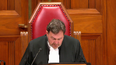
:::

Be seated.

In the case of Her Majesty the Queen versus JJ and AS against Her Majesty the Queen et al.

For the appellant respondent on cross appeal, Her Majesty the Queen, Leslie A. Ruzicka.

For the respondent appellant on cross appeal, Rebecca McConkey and Megan Savard.

For the appellant AS, Downey Way and David Butt and David M. Reeve.

For the respondent, Her Majesty the Queen, Jill Whitkin, Jennifer Trehearne.

For the respondent, Shane Reddick, Carlos Ruppel, and Marianne Sali.

Please note that in the file number 39133, there is a public ban and ceiling order from the lower courts.

And there is a publication ban in this file pursuant to section 486.4648278.951 of the criminal code.

And in the file of 39516, there is a publication ban pursuant to section 486.41 of the criminal code.

Leslie Ruzicka.

**Speaker 1** (00:02:10): Chief Justice, Justices, to borrow the words of Justice Moldaver in Goldfinch, the new scheme for the admissibility of records in the possession of the accused is not a zero-sum game which pits the rights of the complainant against those of the accused.

::: {.column-margin}
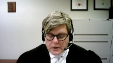
:::

It is designed to protect the rights of both and properly interpreted, it appropriately reconciles an accused right to a fair trial and to make full answer in defense with the complainant's rights to privacy, security, equality and dignity and in doing so it gives effect to society's interest in encouraging the victims of sexual assault to report.

It is intended to protect the integrity of the trial by excluding irrelevant and misleading evidence and reasoning and it aligns with the principles of fundamental justice.

The scheme can be applied in a manner that is consistent with the principle against self-incrimination, the rights to silence, a fair trial and to make full answer in defense.

By enacting the impugn scheme, Parliament filled the legislative gap as it pertains to records in the possession of the accused and Parliament did so by adopting a procedural framework that has already passed scrutiny in Derrick and Mills.

A number of issues have been raised by JJ on the cross-appeal and I intend to focus most of my time on...

**Justice Rowe** (00:03:34): Has it been, when you say it's been approved in Derrick and Mills, yes of course it has, but not with respect to this legislation.

::: {.column-margin}
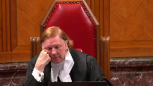
:::

So the statement that it's, you know, I mean why are we here?

If it's already been, it's already been approved, this is a complete waste of time.

We're here because it's being applied to a different scheme, is it not?

**Speaker 1** (00:04:00): Yes Justice Roe, I acknowledge that and one of the first points that I intend to address is why the use of records is analogous to the use of section 276 evidence and in answering that question I intend to address the question and the very point that you've just raised.

::: {.column-margin}
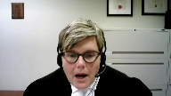
:::

I also intend to address the impact on self-incrimination and the right to silence, the issue of the timing of the application and whether notice to the Crown and the complainant violates the right to a fair trial or to make a full answer in defense.

But just before I answer Justice Roe's question and before I turn to these issues, I submit that this court has an opportunity to see through the record of the trial in JJ how the scheme operates in practice and how the procedural framework in Mills and Derrick applies in this context.

And I submit that on the record that is before this court which is an example of an actual application, there is no evidence that the procedure operated unfairly to the accused, that the participation of complainant's counsel was anything other than proper and appropriate in assisting the court, there was no evidence that the complainant's evidence was tailored or changed as a result of her counsel's participation in the voir dire or her knowledge of the application and there's no evidence again as an example of an application that defense counsel's cross-examination was unfairly impacted.

My friend Ms. McConkey conducted an effective cross-examination.

But in my submission what you can see from that record is that the screening process served its purpose.

Defense counsel identified the relevance of the photo and the purpose for which it was being adduced.

There was significant potential for myth-based reasoning because the complainant worked in the sex industry.

There was significant potential for the photo to lead to myth-based reasoning about the expected behavior of a complainant following an alleged sexual assault.

But there were extensive submissions on these points and confirmation by my friend in the voir dire that the photo was not going to be used to advance myth-based reasoning.

There were discussions about whether it was even necessary for defense counsel to produce the photo to the complainant or whether the issue could be dealt with by way of admissions.

There was discussion about whether the redactions to the photo proposed by defense counsel were sufficient to protect the complainant's privacy and dignity.

And in fact the trial judge ordered additional redactions to further protect the complainant's privacy and dignity.

There were discussions about how to properly deal with the photograph before the jury to ensure that the complainant's privacy and dignity was protected to the greatest extent possible.

And there were discussions about what instructions would need to be provided to the jury at the time the photo was adduced and later in the charge.

But for the impugn provisions none of this would have happened if the photograph had been produced to surprise the complainant in the midst of cross-examination to see what her emotional reaction might be.

**Justice Rowe** (00:07:05): I put to you that what you have just described is the operation of an obligation of the accused to disclose the entirety, virtually, of the defense strategy.

Would you agree with that?

**Speaker 1** (00:07:24): No, Justice Roe, I would not and I'll jump ahead then.

::: {.column-margin}
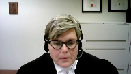
:::

You've asked me two questions now and perhaps I'll start with your second question.

I submit that this scheme does not either compel the accused to reveal his defense or to disclose evidence and in my submission those assertions we need to go back to first principles and be analytically precise about the terms and principles that are being asserted.

So what's been asserted that this is a violation of the case to meet principle but that has always been that the Crown must prove its case before there can be an expectation that the accused will respond with a defense case.

It's about an assessment of the strength of the entirety of the Crown's case before accused calls his own evidence or calls witnesses or that makes the decision to testify but that has always been distinct in my submission from a voir dire to determine the admissibility of evidence used to cross-examine prosecution witnesses and if that reasoning is correct an accused could never be asked to establish the relevance and probative value of a line of cross-examination or about the relevance and probative value of a piece of evidence that's being adduced in cross-examination.

And what Justice Gonshay talked about in Derek, he said that the right to silence in section 7 comprises the right to silence before trial and the privilege against self-incrimination at trial.

It's inaccurate to speak of an absolute right to silence at the trial stage of the criminal process and at trial the right to silence has always been about whether or not you can be compelled to testify and

the right not to have your testimony used against you in future proceedings and that principle has always been concerned with notions of compulsion and coercion and this court has always said that the principle provided by the sorry the protection provided by the principle against self-incrimination is context dependent it demands different things at different times and the task in every case is to determine exactly what the principle demands if anything in the particular context

but it's never provided absolute protection and based on Justice Gonshay's analysis in Derek which I do submit applies here the impugn scheme doesn't compel the accused or violate the principle against self-incrimination or the right to silence at trial the requirement that the accused serve notice of an application to establish a legitimate use for evidence during his cross-examination of a crown witness does not violate the principle against self-incrimination it doesn't create a legal burden an accused does not have a right to induce irrelevant or prejudicial evidence and as Justice Gonshay found in Derek an accused is not compelled to bring an application it's a tactical choice to do so and that tactical choice does not offend the principle against self-incrimination or the right to silence this court has said that the purpose of a wardier is not defense disclosure that court this court said that in Underwood and said it again in Derek and in Derek Justice Gonshay held that the application creates no independent rights in the crown it's not an opportunity for the crown to deeply probe the defense case or to cross-examine at large the point of the process is to provide the trial judge with the information needed to assess the application and as we know if in fact the accused does testify on the wardier section 13 applies because a wardier is a proceeding so the evidence from the wardier cannot be used by the crown to incriminate or to establish culpability if the accused testifies that evidence can only be used to impeach if there's an inconsistency now i'm i'm jumping around a little bit

but and i will come back Justice Roe to your question about how is this different and is the procedure applicable in this case

but i just wanted to raise two points before i do that i submit that the evidentiary screening process strikes the correct balance it's a flexible scheme that accords the trial judge the necessary discretion to address all relevant factors and i submit that parliament must be taken to have intended that judges within the broad scope of the powers conferred would apply it in a constitutional manner

and i submit as we have seen from the record in JJ that the screening process ensures the true seeking function of the trial is not impaired by the admission of evidence that relies for its probative value on myths and stereotypes and generalizations about how complainants in sexual assault cases are expected to behave or alternatively used for an irrelevant or collateral or otherwise prejudicial purpose

**Justice Rowe** (00:12:10): Isn't that dealt with already under 276.1?

**Speaker 1** (00:12:17): I'm not sure if you're meaning to refer to 276.1 or 278.1.

::: {.column-margin}
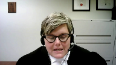
:::

276 is the other sexual activity provisions.

And when we're talking about records, the new scheme has, if I can call it a decision tree.

So under the new scheme, the first question for a trial judge to ask is whether or not the material contains evidence of other sexual activity that is not related to the subject matter of the charge.

If it is under this decision tree, then the analysis is undertaken under section 276.

And at that point, the criteria in section 276.2 apply.

If the matter is not of other sexual activity or sexual communication, then under 270 and it's a record, we go down the path of 278.92 and we deal with the record scheme in that regard.

And so I'm not sure Justice Roe, if what you're referring to instead is the 278.1 third-party records process.

**Justice Rowe** (00:13:24): Well, I guess I wasn't clear, and maybe your precisions will assist me, but 276.1 was about addressing the twin myths and ensuring, in accordance with the general principles of evidence, that evidence which is, whose prejudicial impact is greater than its probative value, is excluded.

::: {.column-margin}
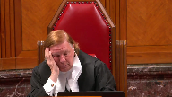
:::

And you've just told me that this scheme is about the same thing.

It's about addressing irrelevances, and it's about prejudicial material, and it's about the twin myths.

Maybe I've misunderstood you.

**Speaker 1** (00:14:05): No, Justice Roe, I'm not saying that this is exclusively related to the Twin Myths, and if a record, so a record within the definition of 278.1, which is a record in which the complainant has a reasonable expectation of privacy, if that material contains evidence of other sexual activity or is a sexual communication, then what we have long known as the Section 276 scheme still continues to apply, those criteria still apply, but the procedure for other sexual activity and records which do not contain other sexual activity, the procedure is the same for both.

::: {.column-margin}
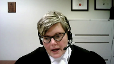
:::

But no, the old Section 276 scheme or the current 276 scheme would not cover the concerns that arise with respect to a record that does not contain evidence of other sexual activity.

Although, as we'll see in a moment, when I address the analogy to 276, it is entirely possible the way the scheme is set out, that material that contains, is of a sexual purpose or is of sexual activity, but relates to the subject matter of the offence, could be captured under the new record scheme that is under, that whose constitutionality is being scheduled here, assessed here.

So perhaps, if I may, I can answer now the first question that you asked, which is how is this context functionally the same or different from what we've historically known as Section 276?

And I submit that records are equally capable of raising the same concerns that animate Section 276, including impacts on the complainant and the potential for myth-based reasoning.

And I use the phrase myth-based reasoning because I'm talking about myths that extend beyond the twin myths.

**Justice Brown** (00:16:18): Something we haven't talked about yet is the scope of the documents or the scope of the definition of records.

::: {.column-margin}

:::

You seem to acknowledge at paragraphs, well, at paragraph 96 of your factum, a pretty broad scope of application.

You acknowledge that texts and emails and other communications, and I assume you mean text emails between the complainant and the accused, may be caught by this definition and then you say, but that's a good thing because some of those messages may be used to advance myths and stereotypes and other impermissible reasoning, and I agree that that's so.

But what about the ones that don't?

What about the messages that don't?

But simply relate to a matter on which the complainant is reasonably expected to give contradictory evidence.

In other words, the accused has a prior inconsistent statement in the form of a text, a WhatsApp message, an email that doesn't engage myths, that isn't prejudicial, it's not a psychiatric record or something like that.

What then?

Why is that...

I mean, I take it from your acknowledgement, paragraph 96 of your factum, it's caught by the scheme.

Should it be?

**Speaker 1** (00:18:05): So Justice Brown, of course, as you're aware, that is a question that the over-breadth of the definition of record that will be fully addressed in the AAS litigation, because that was the over-breadth of the definition is something that will be addressed there.

::: {.column-margin}
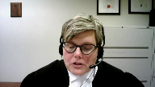
:::

However, I will fully answer your question now.

There are a couple of things I would say in response and Justice Rowe, I will come back to your question about the analogy to 276 in a moment, but in order to talk about the definition of record and whether or not it should be caught, of course, the first point to acknowledge is that the definition only captures records in which the complainant has a reasonable expectation of privacy in personal information.

And the way that the jurisprudence has developed is that trial judges have been well-placed to determine whether or not electronic communications contain information in which there is a reasonable expectation of privacy.

And the parties have put a wide range of that evolving jurisprudence before you, but it involves an application of this court's section eight jurisprudence and how this court has assessed reasonable expectation of privacy, not only strictly in the section eight context, but also with reference to this court's decision in Jarvis and this court's decision in Quesnel.

And where text messages fall is that, of course, they're not enumerated under section 278.1.

So a reasonable expectation of privacy in the category is not presumed, but the court is required based on the analysis that Justice Karratazana set out in Quesnel to look at whether there's a reasonable expectation of privacy in assessing the totality of the circumstances.

**Justice Brown** (00:19:59): Has there been unanimity among trial judges in applying that analysis?

I wouldn't say there's unanimity.

There's been wide disagreement, hasn't there?

**Speaker 1** (00:20:09): There have been a variety of factors that have been considered in the analysis, but I would submit that the weight of jurisprudence has concluded that there is a reasonable expectation of privacy in electronic communications.

::: {.column-margin}
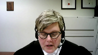
:::

Different courts have applied different factors to come to that determination.

But this is where it's important to come back to the criteria under the scheme that the court must take into account.

So, if, for example, the court were to conclude that there is a reasonable expectation of privacy in a text message, but the reasonable expectation of privacy is low.

Not dissimilar from the assessment of the reasonable expectation of the diary in shearing, which was found to have a lower expectation of privacy because it contained mundane details.

But the probative value of the evidence is high because it involves contradicting on a prior inconsistent statement.

Then the scheme is flexible enough to allow a trial judge to admit that evidence.

That's the difference between, for example, the categorical exclusions that occurred in Seaboyer and here.

The first factor that the court must consider is the ability of the accused to make full answer in defense and it's one of a number of enumerated factors.

So when I talk about the scheme, providing the trial judge with the full discretion to assess all of the factors, that's what would happen in that situation in my respectful submission.

**Justice Karakatsanis** (00:21:45): Can I bring you back, though, to the issue of reasonable expectation of privacy?

::: {.column-margin}
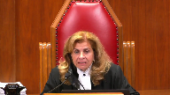
:::

How would cases like Duarte and Fliss factor in, is there a reasonable expectation of privacy as against the recipient of a communication?

So I'm talking now specifically about communications between the complainant and the accused.

**Speaker 1** (00:22:14): Well, if we go back to Diamond, for example, this court has said that you can divulge information to an individual or an organization with the expectation that it can be used for a specific purpose.

::: {.column-margin}
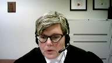
:::

And in Quesnel, Justice Kerikatsanis, you said that whether a person is entitled to expect that their information will be kept private is a contextual inquiry, and whether or not a trial judge can determine whether a record contains personal information, it is assessed on the totality of the circumstance.

And then we come to Merica, and it's clear that this court has said that you can have a reasonable expectation of privacy in electronic communications, but not necessarily every text or email.

And in Jarvis, Chief Justice Wagner acknowledged that you can have a reasonable expectation of privacy vis-a-vis a third party.

So if, for example, Chief Justice Wagner gave the example of individuals disrobing online to engage in sexual activity, you expect the other party to see you naked, but you don't expect that person to videotape you or take a photograph of you.

And then, of course, we have Reeves, where this court acknowledged that it's possible that both parties to a text message chain can have a reasonable expectation of privacy in that electronic communication.

And while a complainant, it could be argued, may not have a reasonable expectation of privacy in respect of an accused being in possession, you could retain a reasonable expectation of privacy as it relates to that material being sent to a third party or to the use of that material in a criminal trial.

And I would submit that this court's jurisprudence has said that the assessment is always case specific and would depend on the nature of the communication.

And so, as I said, I anticipate that my friend, Ms. Whitkin from Ontario, is fully prepared to address this issue and will address it further in the AS appeal.

But in my submission, in answer to Justice Brown's question, the scheme affords enough discretion to the trial judge to consider all of these relevant factors to ensure that the accused's ability to make full answer in defense, to engage in the cross examination is permitted.

**Justice Brown** (00:24:41): Maybe when your colleague speaks on behalf of AS, he or she might answer whether the accused is or how the accused is able to establish high probative value before trial, before the crown has even opened their mouth to make a case.

::: {.column-margin}
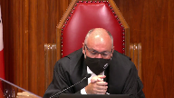
:::

**Speaker 1** (00:25:02): Well in my submission and I can answer that question and I'm sure Ms. Wittgen will as well but in the vast majority of cases an inconsistency will have arisen before trial either there will be a clear inconsistency between previous statements made to the police or to the crown or previous testimony and whatever record defense council is holding and certainly in my submission that's what happened in JJ the inconsistency crystallized at the preliminary inquiry and in those circumstances in my submission if defense council has a good faith basis for answering asking the question before trial then there is no reason why the application cannot be brought pre-trial.

::: {.column-margin}
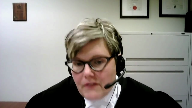
:::

In addition if defense council intends to engage in full cross-examination on the records as part of their cross-examination strategy and they know that in advance of trial there is no reason why the application cannot be brought in advance of I'm saying in advance of trial with the seven days notice.

In addition the scheme is flexible enough and that will be when I come to the issue of notice that's the error we submit that Justice Duncan made in JJ.

The scheme and the notice provision is flexible enough to afford the trial judge the discretion to determine the timing of the application in the interests of justice.

So even for example if the application is made pre-trial the court could revisit the application as the evidence evolves at trial and it would be open to the trial judge under the notice provision to hear the application after the crown's direct or in cross-examination but when I come to that issue my submission will be that meaningful effect must be given to parliament's intention and that the seven day notice should be the default the should be the rule not the exception

and I'll come to that in a moment.

**Justice Kasirer** (00:26:59): hold you up and maybe it'll be your colleague who answers this, but if it's

**Speaker 1** (00:27:07): in the AS appeal.

::: {.column-margin}
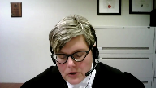
:::

Of course, I would just say, by way of initial response to your question, that it's not prescribed in the legislation.

Section 278.934, which we refer to as stage one, says that if the application was made in accordance with the subsection and the accused has complied with the notice, the judge looks at whether the evidence sought to be adduced is capable of being admissible.

Then you go to stage two and hold a hearing.

What we know from our experience in the 276 context where there's a stage one and stage two, the first stage of stage one at 276 is often a very cursory review for compliance.

And often there is a collapsing of stage one and stage two.

Some judges have found that if the scheme is not engaged, if it's not a record, then it's not necessary to involve the complainant in the process and that it is preferable to have the screening at that stage.

The response to that is if the complainant, if the key issue is whether the complainant has a reasonable expectation of privacy in the record, then the complainant is the person in the best place to address that.

And by excluding the complainant from the determination of whether or not there's a reasonable expectation of privacy in the record, it doesn't give meaningful effect to the complainants' rights if they're excluded from that determination.

And certainly a number of parties have asked the support to give direction or provide some guidance on that issue.

But of course, the example in JJ, where the trial judge concluded that the complainant did not have standing on the motion for directions, did not have standing on the question of whether or not the photograph was a record.

There was an issue about whether or not the photos had been taken with her consent, which of course is relevant to whether or not she has a reasonable expectation of privacy.

So I will defer to the parties that follow that and tend to address that issue, but that would be my preliminary response to the question.

So if I may then come back again and try and answer Justice Roe's question, because I do think it is an important one.

And as I said, I submit that records are equally capable of raising the same concerns that animate section 276, including impacts on the complainant and the potential for myth-based reasoning.

And as I think I said earlier, they're motivated by similar policy considerations.

And in fact, in Derrick, this court recognized that records were analogous to section 276 evidence.

And one of the things that JJ and the interveners say is that records are not analogous to other sexual activity evidence because records are not presumptively inadmissible.

But I submit that evidentiary rules are not frozen in time.

And we have to remember that there was a time when sexual activity evidence was what the respondent would have described as presumptively admissible.

There was a time when the common law permitted evidence of a complainant's sexual conduct, which was of little probative value and was calculated to mislead the jury.

And it was societies and the courts evolving understanding of the impacts of the use of that evidence that led parliament to legislate with respect to other sexual activity evidence.

And that's in my submission, what has happened here.

We have an evolving understanding of privacy.

**Justice Rowe** (00:30:27): And when that legislation was brought forward, it was challenged under Seaboyer, and its over-breath was identified.

::: {.column-margin}
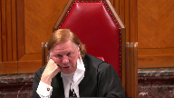
:::

Parliament adjusted the legislation, and it was held to be charter-compliant under Derek.

Just because Parliament is legislated on a legitimate topic doesn't mean it has done so in a way that is constitutionally compliant.

**Speaker 1** (00:30:53): No Justice Roe I agree but the primary defect that was identified in Seaboyer was that it resulted in categorical exclusions without the ability of a trial judge to engage in a weighing and an assessment of the necessary factors and it had the potential to exclude evidence that was relevant to the accusability to make freelancer in defense and that's why I say that when Parliament re-legislated in Derrick and came up with a procedural scheme that passed constitutional muster that scheme that this court approved of in Derrick involved many if not all the same factors that are included in the impugn scheme here and most notably the first factor is the accused ability to make freelancer in defense so in my submission this scheme is not does not have the same defects as this court identified in Seaboyer

::: {.column-margin}
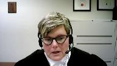
:::

and I agree Parliament does have the ability to legislate and that's what what happened here as I said we have an evolving understanding of privacy and of the impact of the trial process on complainants including the impact of the use of records in which the complainant has a reasonable expectation of privacy and this court had developed common law rules in Auslan and Shearing and despite those common law rules the same issues persist and Parliament has decided to legislate because there are valid systemic concerns about the misuse of records and I've touched on some of this already but even when a record doesn't specifically include sexual activity the complainant experiences impacts on their privacy and dignity when records are used in court and in some cases just producing the record to the complainant and the trier of fact or asking the question about the record would constitute an invasion of the complainant's privacy and dignity and we only need to think about the potential impact on the complainant in this case if for example an unredacted photo had been produced to her depicting her neck naked to surprise her in the midst of cross-examination and of course in Auslan Justice Corey actually rejected the line of cross-examination proposed by the defense and it was only a more limited line of cross-examination that was allowed after Justice Corey identified a potential legitimate purposes and I've referenced the diary and shearing already but that diary contained mundane details of the complainant's life although this court concluded that the complainant still had a reasonable expectation of privacy in the diary and the court's concern as Justice Binney said wasn't a privacy concern so much it was a concern about the myth-based reasoning that would arise from the use of that diary and it was still necessary for the trial judge and then this court to engage in a gatekeeper function but in both those cases Justice Corey and Auslan and Justice Binney and Shearing said that there's an onus on the trial judge to assess even if the proposed line of cross-examination by the defense is not appropriate to assess whether there still remains a legitimate basis for cross-examination apart from that asserted by council and as I alluded to earlier we have to remember that the definition of record can also capture sexual material that is part of the subject matter of the charge so that material wouldn't be captured by a 276 application but it may be captured by the new record scheme and I'll give you two examples one is the photo in this case which had arguably content of a sexual nature it depicted the complainant naked the judge said it didn't fall under section 276 because it formed part of the transaction the subject matter of the charge the other example I would give you is that had the trial in AL which is in my condensed book at tab 12 which is a decision of the BC Court of Appeal had that occurred after Bill C-51 was enacted Justice Fitch certainly alluded to the fact that the video depicting sexual activity would have been assessed under this scheme because it didn't fall under section 276.

Does that, Ms. Radhika, I have a question, does that

**Justice Jamal** (00:35:07): That line of reasoning though suggests that reasonable expectation of privacy under the statutory steam should really be interpreted having regard to the statutory purposes, one of which you've identified is encouraging complaints come forward.

::: {.column-margin}
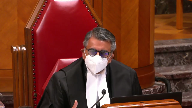
:::

So rather than transposing the section eight jurisprudence, it has to be interpreted in light of the statutory purposes and in light of what Justice Binney said in Shearing, citing Justice Corey from Osalyn, that a complainant should not be unduly harassed and pilloried by, to the extent of becoming the victim of an insensitive judicial system.

So it's actually a different analysis informed by the statutory purpose rather than transposing section eight jurisprudence.

**Speaker 1** (00:35:49): Yes and this court has recognized in a number of contexts that the Section 8 jurisprudence isn't necessarily a direct transposition to the assessment for example of privacy so of course this court did that recently in Sherman Estates where it talked about whether or not you could directly apply the Section 8 jurisprudence to the assessment of privacy in the open court context and you're absolutely correct that these factors have been recognized by Parliament in the list of statutory factors so for example 278.923G looks at potential prejudice to the complainant's personal dignity and right of privacy and 278.923H the right of the complainant and of every individual to personal security and to the full protection and benefit of the law and it would be fair to say that a review of this court's jurisprudence from the Seaboyer all the way to the recent trilogy that the court has referenced a number of different provisions of the Charter in identifying where those interests come from.

::: {.column-margin}
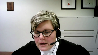
:::

Section 7 of course was recognized by Justice Leroux Dubé in O'Connor as the source of privacy and all members of the court agreed with her analysis of privacy in that case.

In Mills of course the discussion of privacy was grounded in Section 8 because it was state compulsion for the production of records and this court has used a variety of language to describe those rights and interests and principles and values but they have all appeared throughout its sexual assault jurisprudence.

**Justice Martin** (00:37:35): Mr. Zika, may I ask you a question in terms of the constitutional methodology?

::: {.column-margin}
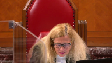
:::

Your friends opposite posit that there is a division between a Dagenham-Mentuck approach and a Derek Mills, what they call a reconciliation approach, and they argue in favour of the Dagenham-Mentuck.

I guess I'd like to have your response to whether these are categories that have meaning, and if they do, where you stand on the appropriate approach this court should take to the balancing of interests and rights at play.

**Speaker 1** (00:38:16): Justice Martin, this is an issue that I've addressed fully in the Respondent's Factum on the cross-appeal, but what I would say is that the Mills and Derrick approach is really an extension of the Dagenais reconciliation approach, but in the context of a challenge to legislation.

::: {.column-margin}
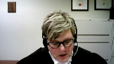
:::

And Mills and Derrick apply Dagenais, or at least the analytical framework from Dagenais, but in the review of a legislated compromise.

And of course, Dagenais-Mentuck historically has always governed case-specific exercises of discretion in the open court context.

In this court, it was applied in NS in a different context, but it was again applied to a case-specific discretionary decision.

But in my submission, the approach this court took in Mills and Derrick is the more appropriate approach to assessing the constitutionality of a legislated compromise, because it respects the traditional breach Section 1 framework that has been used for assessing the constitutionality of legislation.

And when we talk about how the balancing of interests must take place, what this court has said is that because the right to a fair trial and because the right to make full answer in defence, which are procedural rights, are not absolute and they're context-dependent, the court determines the scope of that right, the right to a fair trial, the right to make full answer in defence, before determining if there has been an actual breach.

And in doing that, this court takes into account other principles of fundamental justice, other charter guarantees and other charter values, and the right to full answer in defence in this context must be defined in light of the complainant's privacy and dignity and equality and security, because the principles of fundamental justice embrace interests and perspectives beyond those of the accused.

And in my submission, whether or not this court calls them the complainant's rights or interests or charter values, I submit that privacy and equality and dignity must inform this court's analysis of the scope of the accused right to a fair trial and the right to make full answer in defence, including the right to cross-examination in the same way that this court has done in all of its related jurisprudence.

And so when we're assessing the scope of the accused right to fair trial and full answer in defence in this context, I say that this court should take into account the following factors.

The complainant's privacy and security of the person and dignity, the complainant's right to substantive equality as guaranteed by sections 15 and 28, and the accused right to make full answer in defence.

But the right to a fair trial must be understood in light of other principles of fundamental justice, which may embrace interests and perspectives beyond those of the accused.

It must recognize that the right to a fair trial does not include the right to a perfect trial or the most favorable procedures, and it must acknowledge that fairness must be seen from the point of view of fairness in the eyes of the community and the complainant.

And as Justice Jamal acknowledged, those factors are also recognized by Parliament in the list of statutory factors that must be taken into account when assessing an application under this scheme.

**Justice Rowe** (00:41:50): Are interests, values, and rights similar in nature, or is there some hierarchical relationship among them?

You seem to have thrown them in a bag and shaken them up.

**Speaker 1** (00:42:08): Well, to be fair, Justice Roe, this court in its sexual assault jurisprudence has used all of those terms, rights, interests, principles, and values interchangeably, and I am certainly aware of this court's dialogue over the use of charter values and where they fit in the charter analysis.

::: {.column-margin}
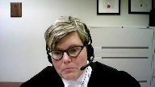
:::

If you were to look, for example, and it's not referenced in my material, but for example, Professor Hogg has suggested that this court's use of equality in the sexual assault jurisprudence is a charter value that must be taken into account in assessing the scope of a charter right, and my understanding is that perspective has also been adopted by a number of members of this court.

But in addition to that, in this context, we have Justice Leroux Dubay recognizing in Section 7, that section in the context of O'Connor, which deal with records, that Section 7 did include a right to privacy in private records that were at issue in that case.

That included medical counseling and school records.

She held that the breach of privacy of a sexual assault complainant constitutes a severe assault on her psychological well-being.

She said that rights to individual liberty and security of the person as enshrined in Section 7 encompass a right to privacy, and that privacy is essential to human dignity, which is also a basic value underlying the charter, and that the right to security of the person under Section 7 includes protection from psychological trauma, which can be occasioned by an invasion of privacy.

So in my submission, when we're talking about the rights to privacy, when we're talking about the Section 7 right to privacy in the context of sexual assault records, this court, I would submit, has recognized the right to privacy under Section 7.

I note from subsequent reference to this court's decision in Barton that some members of this court have described substantive equality as a charter value that must be undertaken and considered when balancing the principles of fundamental justice under Section 7.

But as I indicated earlier, to be fair, this court has used a number of different terms to address what have been universally described for more than 30 years as the complainant's rights to equality, dignity, and privacy in this context.

**Justice Côté** (00:45:06): Ms. Ruzica, what should I take from the fact that if, for instance, the Crown wants to use the same material, example text messages exchanged between the complainant and the accused, the Crown is not subject to any screening mechanism?

::: {.column-margin}
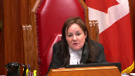
:::

**Speaker 1** (00:45:29): In my submission the difference is in who possesses the records and the procedural protections that are already built into the criminal code with respect to records.

::: {.column-margin}
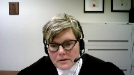
:::

So I would say first of all that the starting point on this is Mills and Quesnel where this court acknowledged that the principles of fundamental justice don't always guarantee the accused the same privileges and procedures as the crown and in Mills the court said that the greater procedural burden placed on the accused reflects the fact that unlike the crown the accused no bears no responsibility to protect the rights of others so to protect such rights when they're threatened by the acts of the accused greater protection procedural protections are required.

So the difference here is that when the defense possesses private records obviously neither the complainant or the crown is aware of that.

If it is a text

**Justice Côté** (00:46:21): And I'm sorry, but if it is a text message or a letter that the complainant sent to the accused, I assume that the complainant is aware because he or she is the sender of that.

**Speaker 1** (00:46:36): Yes, in some circumstances that may be correct, and if I can just further explain what I mean by this.

::: {.column-margin}

:::

If the complainants records may, although I'll just pause to say in a number of circumstances of course in modern technology these conversations are deleted.

And we don't remember every text we sent every email that we sent over the course of the use of that communication.

But the complainants records come into the Crown's hands in a number of ways, if the complainant gives the records to the police.

As a part of the reporting that may be done with the complainants consent and maybe a consent search, and in that circumstance the complainant knows the police have the records, or the police may obtain the records via a judicial authorization.

If they come into the Crown's hands, and they meet the definition of a record, then under 278.22 the third party records provisions apply to records in the possession of the Crown.

Unless the Crown has obtained an express waiver from the complainant.

So again in those circumstances the complainant will know that the Crown has them, the complainant can address any privacy interests.

If the Crown is going to reduce the record, it will have to have been disclosed.

And so either again the Crown will have either had to obtain an express waiver from the complainant, or the Crown will have had to have given notice to the defense that it is in possession of a record that meets the definition of a record in 278.1.

And in that situation there will be a third party records application where the complainant is entitled to notice and has participatory rights at the hearing.

And then if defense counsel has had disclosure about the record, and has concerns about the Crown's line of cross examination, they've had full disclosure of that record and they're in a position to object.

So the difference is that if it's in the possession of the accused and the Crown and the complainant have no knowledge it's coming, the Crown can't anticipate when to object or to deal with the issues of arise or know whether for example to obtain other procedural protection such as a publication ban.

So I say the differences in the procedural protections that are already built into the criminal code.

Okay, thank you.

I note that I have about 12 minutes remaining.

And I have already briefly addressed the form of the application.

But of course it doesn't require the accused to provide detailed particulars.

It's just a statement of relevance.

It's not a full statement of defense strategy.

It's just particulars to satisfy the court that the evidence is relevant and probative and not being adduced for an improper purpose.

There's no requirement that the records even being attached, and the requirements to hold a voir dire in my submission and establish the relevance of potentially prejudicial evidence is not a departure from the rules of evidence and again it's not a, it's a tactical choice to bring that application.

If I can then briefly moved to the timing issue which I've alluded to earlier in my submissions.

We do respectfully submit that the trial judge Justice Duncan erred in concluding that the timing aspect was constitutionally flawed, because on its plain wording, the provision mandates neither seven days notice nor pre trial application.

It provides the trial judge with full discretion to determine the timing of the application.

It applies the interest of justice test with which is a well known testing criminal law that allows for the court to take into a broad base of factors, including the accused right to make full answer and defense.

However, as I've submitted Parliament's choice of a presumptive seven day notice must be given meaningful effect.

It should be the default, the rule, not the exception.

I urge this court to provide that guidance, because there are a number of good reasons for the application to be heard pre trial.

It leads to efficient trial management.

It ensures that the trial as a whole proceeds without interruption.

It ensures that the parties are not bifurcated and bifurcated trials have a significant impact on a complainant, particularly if they're under cross examination when that bifurcation occurs.

If it occurs in the middle of a jury trial, the jury has to be excused while the application proceeds, and all of this of course raises concerns about Jordan timelines and delay.

It ensures parties know in advance the parameters of the use of a specific piece of evidence, and it permits trial judges to effectively determine the role.

And of course, historically to 76 applications have been pre trial applications.

We know that the applications can be always be revisited if circumstances change.

And this pre trial seven day notice allows the complainant to retain counsel and meaningful, meaning, meaning flee prepare in some provinces and application for legal aid is required for complainants counsel, and just like defense counsel are not in a state of perpetual availability.

This also allows the complainant to make informed decisions about whether to participate in the records application or even to participate in the trial.

And it allows the crown to apply the ongoing charge assessment standard.

And there have been anecdotally because they're never reported cases where the crown in fact has directed a stay of proceedings, either after reviewing records or after the complainant has been advised of the contents of the application and has asked the crown to make the decision not to proceed.

**Justice Kasirer** (00:52:26): Ms. Ruzick, could I, I'm sorry to, to, I'd like to come back to the tactical choice point.

::: {.column-margin}
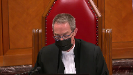
:::

If, if the accused has nothing to prove, if the accused has a right to silence, isn't the regime closer to imposing a, a legal burden rather than a tactical burden on, on the accused?

And if that's the case, do we have a problem with the right to silence and, and the right against self-incrimination jurisprudence?

**Speaker 1** (00:53:04): No, in my submission, it doesn't infringe the right to silence or the right against self-incrimination and it's the manner in which this court has assessed of Wardeers and particularly in Derrick where Justice Gonche said that, adopted previous jurisprudence of this court that said that a Wardeer does not result in defense disclosure and that an accused does not incriminate themselves by providing notice of an application to have the admissibility of evidence that they wish to tender in a defense case admitted as part of cross-examination and that's where I say the 276 evidence is functionally not different than records applications because the accused in a 276 application is applying to be able to use evidence of other sexual activity evidence either to cross-examine the complainant on a substantive defense or to impeach the complainant or to impeach the complainant on a prior inconsistent statement or to advance a substantive defense in their own case.

::: {.column-margin}
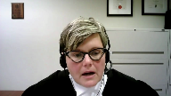
:::

So, well, one...

**Justice Brown** (00:54:21): One difference is, in the case of 276, you're dealing with evidence that is presumptively inadmissible, right?

::: {.column-margin}
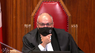
:::

That's your starting point.

Whereas here, again, if the scope of the definition is as broad as you say it is, it will, I mean, to a certainty, include evidence that is not.

**Speaker 1** (00:54:48): but in Mills this court said that any concerns about the scope of what is captured by the definition of the record are addressed by the procedural protections that are imposed in the scheme and I submit that that is the same situation here.

::: {.column-margin}
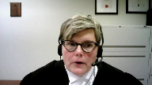
:::

Again going back to the Mills

**Justice Rowe** (00:55:08): The rules is about preventing phishing expeditions for records that are prejudicial and irrelevant.

::: {.column-margin}
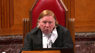
:::

Like isn't it true you had a nervous breakdown 18 months ago?

Well come on, we don't want people phishing that up and we certainly don't want people using them.

What we're talking about here principally, I put to you, is communications between the complainant and the accused and you've hedged and you've hedged.

I think what I've heard is that they're caught by records and they're presumptively inadmissible.

Communications between the accused and the complainant about the subject matter of the charge.

**Speaker 1** (00:55:53): In my submission, electronic communications between the complainant and the accused would only be captured by the definition of record if the record contains, if the document, the text, the email, the electronic communication contains personal information in which the complainant has a reasonable expectation of privacy.

::: {.column-margin}
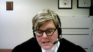
:::

And so what we're talking about is sensitive, highly sensitive communications and intimate or personal details that affect the complainant's dignity or go to their biographical core.

And so in my submission, emails between the accused and the complainant that contain that information might very well contain mental health information.

I text my spouse to say I've been to see the psychiatrist and I've been diagnosed with these medical conditions and I've been prescribed this medication.

**Justice Rowe** (00:56:46): They're shooting fish in a barrel.

::: {.column-margin}
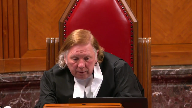
:::

That's not the hard stuff.

The hard stuff is the complainants describing the events, characterizing the events, talking about the nature of the relationship between the two of them, which you might say, well, that's feeding the twin mists.

Mm, not so sure, not so sure.

And what you're really calling for is that, other than the testimony of the accused, everything gets disclosed in advance because it's presumptively inadmissible.

**Speaker 1** (00:57:26): With the greatest of respect, Justice Roe, I don't agree.

::: {.column-margin}
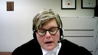
:::

Trial judges, when you review the decisions, of course, it's taken some time for the jurisprudence to evolve.

But trial judges have proven very adept at looking at communications between the accused and the complainant and identifying which of those fall within the definition of record.

And as that jurisprudence develops and as the criteria are developed and with guidance from this court on this issue, it will be very clear what communications between the accused and the complainant are caught.

Often those communications are caught because they fall within the 276 line of the decision tree.

So they are electronic communications that fall within the definition of sexual communication.

But if they're truly down the record side of the decision tree, and if they do truly contain information in which the complainant has a reasonable expectation of privacy, what we're talking about is highly sensitive communications and intimate or personal details that affect the complainant's dignity or go to their biographical core.

And so again, you gave the example of mental health issues.

It could be communication about addictions.

It could be communications about health concerns.

Those are the types of records that would be caught.

But trial judges have proved well-adapt at weeding through which records are caught and which are not.

**Justice Brown** (00:59:00): Well, it wouldn't necessarily capture only highly sensitive communications.

I mean, the diary and shearing was considered private, despite containing, I think, what was described as mundane information.

**Speaker 1** (00:59:13): Yes, and in that situation it was agreed that the writing of the diary, if I remember correctly, affected the complainant's dignity.

So it would be something that she intended and she had a reasonable expectation of privacy.

But in my submission,

**Overlapping speakers** (00:59:27): It's not always going to be so clear, is it?

**Speaker 1** (00:59:30): No, but the courts have, and if you look at the wide body of jurisprudence that's developed, and as the jurisprudence develops, it has been much more clear what the criteria are for assessing that.

::: {.column-margin}

:::

But in my submission, what the court said in Mills, even though it was the third-party records scheme, is still correct, and that is what procedures are in place and are those procedures constitutional?

I see that I only have two minutes left, and the last issue that I wanted to address before I conclude was this notion of notice to the complainant, and I know as well that some of the interveners and other parties intend to address this as well.

But on its face, the scheme does not require service on the complainant, but most Council have held that application materials should be provided to the complainant and Council to permit meaningful preparation and participation, and certainly in Derrick, this court clearly contemplated that the Crown would review the application with the complainant, and it's certainly within the trial judge's discretion, within the exercise of their trial management power to address specific concerns about the complainant having access to the application record.

But I submit that this court's constitutional analysis should not start from an assumption or assertion that if the complainant has advanced knowledge of this evidence, that will always result in a change of evidence or will always reduce the veracity or accuracy of the complainant's evidence.

We see from the record in JJ that that's not accurate.

There are many other situations in which a complainant may become aware of the potential lines of cross, and the witness exclusion rule has never been absolute.

This is a legislated exception to the witness exclusion rule, but this court back in 1975 in Dobberthane talked about if there is a violation of the witness exclusion order, the witness is not disqualified from testifying, although in some circumstances the trial judge may exclude their evidence and the weight, if any, to be given to their evidence is for the trier of fact to decide.

And I submit there is no bright line rule that the Crown can't discuss applications with witnesses.

If there's any further questions, those are my submissions.

**Justice Wagner** (01:01:44): Thank you very much.

::: {.column-margin}
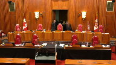
:::

The court will take its morning break.

15 minutes.

The court will take its morning break.

Ms. Rebecca McConkey.

**Speaker 2** (01:02:53): Thank you.

::: {.column-margin}
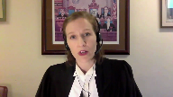
:::

My submissions will address the context of the new record screening regime and the legislation's unprecedented limits on the accused section 7 rights and these are points one and two in the outline of oral argument contained at tab one of the condensed book.

My colleague Miss Savard will address the impact on the complainants rights, why this legislation does not strike the right balance between accused and complainants rights and how this court can give parliament guidance for redrafting this legislation in a constitutionally compliant way.

I'm going to make three points about context.

First, the context of the 278.92 record screening regime is fundamentally different than the context of third-party records and of 276, the other sexual activity regime.

It raises a different problem requiring a different solution.

The second point about context is that the concern triggering the regime is not the nature or content of the record, it's who wants to use it.

The exact same piece of evidence is presumptively admissible in the hands of the crown in aid of a conviction but presumptively inadmissible and subject to a rigorous pre-trial vetting regime when in the hands of the defense to be used to raise a reasonable doubt and this belies any claim that it's the inherent dangerousness of this type of record to trial integrity that justifies the regime.

The final point I'll make about context is that the JJ appeal, this appeal, deals only with records not involving 276 evidence and parliament's restrictions on the use of this type of defense evidence is an entirely new creation.

In contrast, the companion case of AS deals with the changes to the pre-existing 276 regime and for that reason the analysis cannot be conflated.

Now in our fact and we use the Dagenais-Mentuck framework for the analysis but because the the analytical framework matters less than the balancing that needs to be done I'm going to use the Mills framework today and under both frameworks the court must determine the scope of the rights in issue not just the scope of the accused's rights the scope of the complainant's rights as well and in that specific context and once it's done that it's able to determine to what extent if any there needs to be a reconciliation between these competing rights and that determines whether or not the correct balance has been struck and we say here parliament got it wrong what parliament has done is drafted procedures that struck a constitutional balance in one context and grafted them onto a completely different context and now the crown says look at Dara look at Mills it was constitutional there it must be constitutional here but that's not how it works that ignores the fundamental differences between these contexts

so that's the first point that I'm going to turn to.

The third party records is a regime governing production and it's distinct from admissibility.

The third party records regime governs the production of the complainant's private records that were never meant for the accused's eyes and indeed that the accused has never seen and these are high privacy interest records they're confidential records not in the accused's possession and moreover the state is using its power to compel production which engages the complainant's section 8 rights.

In contrast the new record screening regime deals with admissibility not production and ensuring this court made the distinction between those two things very clear and my friends rely on a statement from Dara saying that the use of third party records as described in Mills is analogous to the use of 276 evidence.

Well to the extent that that suggests that Mills had anything to do with the use of records that's a misinterpretation and we know that from Shearing.

Shearing which is in the condensed book at tab three makes very clear at paragraphs 105 to 107 that the the rationales that apply to production don't apply to admissibility.

So paragraph 107 Justice Binney says you know the reason for this different orientation between Seaboyer and Mills is apparent.

In the O'Connor situation in the third party records context the accused is not entitled to disclosure and it seeks the intervention of the state to put aside the privacy of a third party complainant and in the Seaboyer situation aka admissibility the state is asked by the complainant to intervene against the accused to deny him the use of information already in his possession.

It is true that some of the same values maybe must be weighed e.g. full answer and defense privacy equality rights etc but both the purpose and the context are quite different and that we say is critical and that's been overlooked by the crown and their submissions.

Another of course important difference is that this new regime has nothing to do with the complainant's privacy vis-a-vis the accused.

He already has the records.

Another important distinction is between the 276 regime and the new regime that that we're here to debate today.

The 276 regime governing the admissibility of evidence of a complainant's other sexual activity captures a narrow category of evidence that is by its nature rarely relevant or probative and always carries a high risk of prejudice to the truth-seeking function of the trial and that's because it relies on myths and stereotypes and the inherent danger to this truth-seeking function of the trial is why this court in Darrah upheld the admissibility regime under 276 as redrafted by parliament after Seaboyer.

Moreover the fact that this type of evidence is about a complainant's sexual behavior which is a uniquely private area of life means that its admission will always have a significant impact on the complainant's privacy and dignity and let's compare that to the type of material captured by this new record screening regime.

One point that we agree with the crown on is that this regime is incredibly broad.

It captures evidence all evidence in the defense's possession in which the complainant has a reasonable expectation of privacy no matter how marginal that reasonable expectation of privacy is or how mundane the information in it is and with respect what this court's reasonable expectation of privacy jurisprudence makes clear is that information doesn't need to have be highly sensitive to attract a reasonable expectation of privacy.

Shearing is a great example the diary was mundane and we see that with a lot of the cases applying this regime and that's because contrary to the crown's submission section 8 is content neutral

and i'm going to adopt the submissions of the intervener criminal lawyers association on that point

but what we can see is that a vast quantity of diverse types of records are falling under this regime including electronic communications voluntarily made between the accused and the complainant third-party records that the accused has successfully obtained through a third-party records application and even disclosure that has been produced from the crown's brief

**Justice Côté** (01:11:33): But Ms. Meconchi, I try to, in reading your factum, to know, to determine if you have a clear position on the definition of record.

::: {.column-margin}

:::

Do you have one or not?

Or I understand what you're saying to us, that the broad interpretation has been given to that word.

But what is your position on that?

Should we adopt a narrow interpretation or a broader interpretation?

**Speaker 2** (01:11:58): I think as currently worded, it has to be a broad interpretation for following what parliament, the words of parliament and the jurisprudence of this court.

::: {.column-margin}
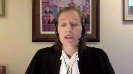
:::

Now, would a much narrower interpretation better protect the accused's rights?

Of course.

I say that that wouldn't solve the Section 7 problems that this legislation creates, but it would go quite a ways into, you know, minimizing the number of these applications that occur and

**Justice Rowe** (01:12:30): Justice Jamal earlier posed a question that should not the definition of record be read by reference to the purposes of the legislation, a proposition which seems to me to be eminently reasonable.

::: {.column-margin}
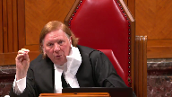
:::

But the purposes of the legislation, it seems, are three, as you have pointed out to us, but there is one definition.

And it becomes a sort of a technical difficulty as to how you say the same words mean one thing for purpose A, and statutory scheme A or component 276, that means something different for mills, and it means something different for records in the hands of the accused.

So I can see if you had a standalone definition, how you could interpret it more narrowly or read it down.

But if you have a definition which is common to all three purposes, I think you have a really difficult problem to solve with the legislation as it is currently drafted.

**Speaker 2** (01:13:47): I agree.

::: {.column-margin}
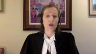
:::

If the purpose of this legislation is simply to protect the complainant's privacy, then any evidence that has even a marginal privacy interest would properly fall under the scope of the regime.

If the purpose of the regime is to exclude presumptively irrelevant and prejudicial records, then reasonable expectation of privacy is an inapt indicator of that type of danger.

And so that's the difficulty in saying, well, can't this be a context-specific analysis?

And that also puts the accused in a very precarious position because either he decides to bring a pretrial application that may not be necessary, thereby having to disclose his evidence to the Crown before the complainant perhaps has even given any sworn evidence, or he says, I don't think that this is something that is going to engage the complainant's reasonable expectation of privacy.

I'm not going to bring a pretrial application.

And then when he attempts to use the record in the case, gets shut down and that evidence is excluded because he failed to comply with the notice period.

So that's not a risk that many accused people will take given the stakes are so high in this type of prosecution.

And so simply saying the analysis needs to be context-specific dependent on the words in the text message that gives zero guidance to trial judges.

And contrary to my friend's submission, there's no unanimity amongst the trial level at this stage.

It goes back and forth, but overwhelmingly courts have said anything that is a communication between an accused and a complainant may fall within the scope.

And then if that's the situation, then accused are required to bring a motion for directions, which has its own problems and which is being very strongly urged against by some of the interveners.

But what is also important about the Crown's argument that this is inherently analogous to 276 is that that's simply unsupported.

So the Crown's defense of this regime and its reliance on DARA in particular, relies on the premise that material in which a complainant has a reasonable expectation of privacy is analogous to 276 and that it's inherently irrelevant, misleading, prejudicial to the true seeking function of the trial.

And that's simply not made out.

Not only has the Crown failed to tender any actual evidence of that, but the evidence and jurisprudence before you shows otherwise.

Inaudible.

**Speaker 2** (01:16:47): No, the answer is no to that.

::: {.column-margin}
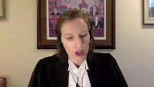
:::

And I say that based on Seaboyer and the other jurisprudence discussing the distinction, number one, when evidence can be rendered presumptively inadmissible, and number two, what needs to take primacy when the contest is between, in this case, a complainant's privacy rights and full answer in defense and the true seeking function of the trial.

So first off, if parliament is rendering evidence presumptively inadmissible because it engages the complainant's privacy, number one, it's only doing that when it engages the complainant's privacy when it's in the hands of the defense.

So essentially, you're allowing the complainant to determine whether or not she's gonna waive her privacy based on whether or not evidence corroborates or contradicts her account.

And that is giving an awful lot of power to control the true seeking function of a trial to a partial third party.

That's not good for the true seeking function of the trial.

Secondly, what we know from Seaboyer is that the aim of protecting complainant privacy cannot justify a regime which renders evidence presumptively inadmissible if that regime impacts the section seven rights of the accused.

And that's in Seaboyer at pages 620 to 621.

And what Justice McLaughlin says there in discussing this very argument that was made in Seaboyer by some of the interveners saying, well, even if some of this evidence might be relevant in some rare circumstances, protecting the complainant's privacy and protecting the desire to encourage reporting is sufficient to justify the exclusion.

And the court said, no.

Courts had given the primacy in our system of justice of the principle that the innocent should not be convicted.

The right to present one's case should not be curtailed in the absence of an assurance that the curtailment is clearly justified by even stronger contrary considerations.

And in Seaboyer, protection of the complainant's privacy was an insufficient countervailing consideration.

And I say that the same conclusion has to be come to by this court because the cornerstone of our justice system is that wrongful convictions must be avoided.

Society loses much more faith in the Canadian criminal justice system if we give privacy rights primacy over the truth seeking function of the trial.

And this is something that this court has said over and over again.

In a contest, in a last resort contest between getting to the truth by admitting relevant probative evidence and protecting a complainant's privacy, getting to the truth wins.

That's in Mills at paragraph 94, in Darrah at paragraph 43, in Seaboyer at 617 to 618, and in Shearing at paragraph 132.

And moreover, Justice Jamal, one only has to think of the policy ramifications of allowing parliament to say, if the defense wants to use that evidence, but it's about a private matter of the complainant, it's presumptively inadmissible.

Given the nature of the type of evidence that is going to occur, is going to be the subject of a sexual offense prosecution, that is essentially the entire defense brief.

Sexual assault prosecutions are talking about some of the most private issues possible.

And if the fact that a line of questioning or a piece of evidence impacts the complainant's privacy is enough to render it presumptively inadmissible, parliament could say that the entire defense case is presumptively inadmissible.

And you have to vet your questions in cross-examination counsel.

You have to tell us what the defendant is gonna say, so we can ensure that we're gonna minimize the impact on the complainant's privacy.

So that's why this case is so important to the path of criminal justice in this country, is of the ramifications of this type of logic going forward.

If privacy is enough, then what's to say that the accused own testimony is not presumptively inadmissible unless it's been vetted first.

And we know, I say, that it's not the inherent dangerousness of the evidence that's the concern.

And we know that because the crown gets to use it without any of this.

The crown can make strategic mid-trial decisions about whether or not to cross-examine an accused on his text messages with the complainant.

The crown gets to tender the complainant's text messages with the accused when it corroborates her account, for example, showing that she texted her friends immediately afterwards to say, look what happened.

And they do, they regularly rely on that type of evidence.

And that's fine.

What this legislation says is that is fine.

But when the accused wants to use that exact same piece of evidence, it all of a sudden becomes dangerous.

And that should be a big red flag, I say, that any claim about the inherent dangerousness of private records to the integrity of the trial is without foundation.

**Justice Moldaver** (01:22:46): What if there were to be a general exclusion of communications between the complainant and the accused relating to things like text messages, letters, emails, and so on, with very limited exceptions?

::: {.column-margin}
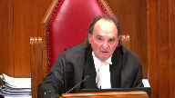
:::

For example, if the accused is his or her therapist and you have a situation where confidentiality stands out, if the accused is his or her teacher, you see, when you look at the specific sort of categories that they set out in this provision, it pretty much talks about things like where you're dealing with someone where you would expect some form of confidentiality.

And you may say, well, what about employment or what about education?

And I say to you, if you're talking about a teacher or the employer and they happen to be the accused, then in my view, that serves the purpose here of requiring the accused to establish that it should be admissible because there is an overriding confidentiality feature.

But in the normal course, which is the tens of thousands of cases we see day to day and the tens of thousands of emails that go back and forth in any given relationship, if there were a general exclusion, a general exclusion from this records provision of those kinds of things, like the Gomeshi situation, like that, what would you say then in terms of the so-called terrible things, the over-breath and so on in this provision?

**Speaker 2** (01:24:51): I would say that the legislation is still not constitutional and that's because the law still would interfere with effective cross-examination by requiring advanced notice to the crown and the complainant.

::: {.column-margin}
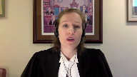
:::

It still has a heightened admissibility threshold higher than my example was it wouldn't require notice because it's not a record.

**Justice Moldaver** (01:25:14): offence starts up and they start cross examining.

::: {.column-margin}
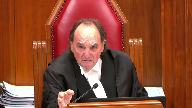
:::

Now bear in mind that doesn't allow the offence to go wild in cross examination.

There will still be limitations and they still won't be able to lead evidence that is, you know, myth related and so on.

But in terms of cross examining the complainant about use, Justice Brown raised this earlier.

You said this or you didn't say this to the police when you were asked.

Now, you know, you're saying something different.

This is just going to, just going, it's important, obviously, but it's going to credibility.

And so if it's limited to that kind of thing, I'm not stopping you at all on my thesis from cross examining.

Cross examine on credibility all day long.

But don't get into things that raise the kind of myths that we're talking about.

You went to see a therapist, therefore there must be something wrong with you, therefore your credibility is, you know, not worth very much.

You wrote some kind of love notes to the accused after the event.

And so, you know, if you were really sexually assaulted that would never have happened.

So, you know, we can pretty much presume that you weren't sexually assaulted. A myth.

Do you see what I'm getting at?

**Speaker 2** (01:26:35): Yes, we're already not allowed to do that.

This legislation doesn't change that.

Well, you may not be allowed to do that.

**Justice Moldaver** (01:26:42): that but there's a lot of that has been tried and been going on and that's why we have a whole series of cases relating to what 276 is all about.

::: {.column-margin}
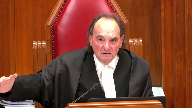
:::

You make it sound like this is also this is long time established.

You know, Barton and rv in those cases just happened in the past sort of year or two.

So let's not sort of kind of go back and say this hasn't been a problem.

It's been a huge problem and it's still a problem in courtrooms across this country.

**Speaker 2** (01:27:10): Absolutely.

::: {.column-margin}
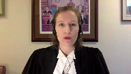
:::

With respect to other sexual activity evidence.

And that's because as this court in Barton and the other trilogy cases has made clear, that type of evidence is inherently prejudicial because it inherently triggers these types of myths.

And what we see from the case law applying this record screening regime to things like electronic communications is that they don't have that same inherent tendency. Let's.

**Justice Moldaver** (01:27:42): I'm giving you that generally.

::: {.column-margin}
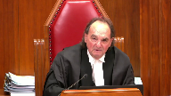
:::

On my proposition, the accused doesn't have to.

If it's not a record, if it's a communication between the complainant and the accused, and it says thanks for a lovely night last night, I say that's not a record.

The complainant is communicating with another person.

This is not section 8, this isn't police involvement, this isn't the particular situation legislation like in Jarvis.

This is a situation which was described in Duarte and later picked up in America that has between two co-conversationalists, the you have no control, you have no real expectation of privacy because you know perfectly well that if I know perfectly well that if I say something to you in a text, it could be out the door the next day, you could be sending it across the world if you wanted to.

So there was a very big distinction drawn in Duarte and in America and I suggest perhaps in cases like this where the issue is not police involvement, that kind of thing, it's between the accused and the complainant and so long as it's used properly, what's the problem?

There isn't a problem.

Except in special relationships, except in special relationships.

**Speaker 2** (01:29:14): And as you'll see in Mr. Bard's submissions, what we say would be a constitutional regime would have that type of nuance built in.

::: {.column-margin}
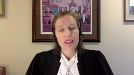
:::

It would be dependent upon the nature of the relationship between the parties.

So if they did have a confidential relationship or a relationship of trust, then their communications would fall under that because that's really the mischief that- Yeah.

**Justice Moldaver** (01:29:39): One can say that's implicit when you look at the specific categories that are referred to.

One would, but again, that's not how the case law has interpreted it.

But you're asking us, one of the things we're doing here is interpreting what a record is.

**Speaker 2** (01:29:53): Right, and my submission to you is that even if electronic communications between non-relationship of trust parties was carved out of this regime, it still would not be constitutional because of the impact on cross-examination and the right to silence.

::: {.column-margin}
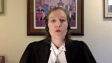
:::

And so, I see that I do want to—

**Justice Moldaver** (01:30:14): Sorry to interrupt.

::: {.column-margin}
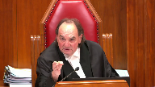
:::

You don't have to disclose it to anybody if it's not a record.

It's in the hands of the accused.

There's no forewarning, no nothing, but if you start down a line of cross-examination that is not acceptable, that is improper, you're going to get stopped.

That's all I'm saying to you.

You don't have to disclose it to anybody on my thesis.

**Speaker 2** (01:30:37): Right, but it's the material that remains under this record screening regime that I'm talking about.

::: {.column-margin}

:::

And I say that while that that type of therapeutic record, that type of high privacy interest attracting record should have a regime governing its use, this regime is not a constitutional regime.

And that's because it does more than vet the admissibility based on things like privacy considerations or admissibility probative versus prejudicial or relevance.

What it does is add a notice period that requires pretrial disclosure to the crown before it's called its case, which in many times, this case had a preliminary inquiry.

Now it wouldn't.

Parliament has since eliminated preliminary inquiries for the very type of offense that was at issue in this case.

And so in that context, for example, you won't even have any sworn evidence from the complainant upon which to make your argument about relevance or probative value.

And so what I'm saying is that even if you carve out and narrow down this regime, it still has constitutional failings for the materials to which it would continue to apply.

So in terms of interference with cross examination, which is the first area under section seven that I'm going to address, the legislation's advanced notice and disclosure requirements seriously undermine the defense's ability to effectively cross examine the complainant, who of course is the crown's key witness in most sexual offense prosecutions.

And the trial judge in this case was correct to find that breach.

Trial judges are uniquely positioned to understand the dangers of advanced notice to effective cross examination.

And in the condensed book at tab seven, we have the DLB case where the judge refers to numerous other constitutional challenges where trial judges have found that this interference with cross examination is a section seven violation.

And those cases make clear that concerns about tainting are not illusory.

And contrary to some of the submissions of the interveners in this case, they're not based on myths or stereotypes about conniving complainants.

They're based on logic and experience.

Now there's a reason that witnesses are excluded from the courtroom before every trial starts because that protects the integrity of their evidence.

Tainting could be intentional.

It can be inadvertent.

Either way, tainting undermines the integrity of that witness's evidence and the integrity of the true seeking function of the trial as a result.

**Justice Moldaver** (01:33:32): I don't quite understand then how the third party record regime passed constitutional muster because that there's an initial hurdle and don't say with respect it doesn't go to evidence it doesn't go to admissibility it sure does one of the things is is it likely relevant so it goes to admissibility in its own way it doesn't determine admissibility but is it likely relevant is one of the factors that gets looked at so then if in fact it passes hurdle one of course the complainant gets notice of what it is and what the record is and where they want to go with it and this court said that's perfectly okay

::: {.column-margin}

:::

so I'm missing this as to why somehow you know if the accused has mental health records from the if the accused is a therapist and and he or she has mental health records from the from the complainant somehow that should be that's that somehow is going to affect the right of the accused to make full answer in defense that's not the issue

**Speaker 2** (01:34:44): Well, the scope of the complainant's rights in the Mills context is different than it is in this context, because in the Mills context, her Section 8 rights are engaged and there's a high privacy interest in those records.

::: {.column-margin}
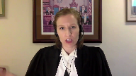
:::

In this context, it's different.

She's a witness in a trial, and this is something that Ms. Savard is going to talk about.

But we can't simply say that because the complainant had the right to advance notice in that specific context, she must have the right to advance notice in this context.

That's ignoring the requirement in Mills to define the scope of both the complainant's rights and the accused's rights in this specific context.

**Justice Moldaver** (01:35:26): Even if the accused is her employer, even if the accused is her doctor.

Is that what you're saying?

**Speaker 2** (01:35:33): I'm saying that, yes, her privacy rights have a different scope.

**Justice Moldaver** (01:35:40): because she was prepared to discuss the most intimate things, private things with them.

Anyways, I'll leave you alone.

**Speaker 2** (01:35:50): Well, I'll give you one example of why the court should reject the Crown's argument that advance notice is good for the search for truth.

::: {.column-margin}

:::

And this is premised upon the idea that the complainant will become emotional or confused when confronted with evidence that contradicts her account.

Now there's no evidence of that before you.

That is based on a stereotype of how the typical sexual assault complainant will react, a stereotype of an overly emotional woman.

And that isn't something that should guide the court's analysis here.

Moreover, if the court accepts that advanced notice is really helpful to the true seeking function of the trial, then again, what's to stop Parliament from saying, okay, because we think that this is helpful, you have to give your cross-examination in advance to give the complainant time to prepare answers that will better assist in the true seeking function of the trial.

**Justice Rowe** (01:36:57): That sounds a great deal like interrogatories rather than cross-examination.

**Speaker 2** (01:37:03): Right.

::: {.column-margin}
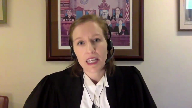
:::

And this court has recognized that the ability to catch a witness in a contradiction is critical to effective cross-examination and that in turn effective cross-examination is critical to the right to make full answer in defense.

So when we're talking about the right to full answer in defense and the crown submission that this case shows that it can be done and it won't have an impact and that the complainant didn't tailor her evidence, number one, we don't know that.

There's no possible way to know that.

Number two, in this case, there was a preliminary inquiry.

So we had sworn evidence from the complainant on the record that doesn't exist anymore in sexual assault cases involving adults.

And number three, the notice period was not followed.

That's a critical aspect here.

So this case actually isn't a really great example of how the legislation can work.

It's an example of how the notice period would have interfered.

But moreover, and the final point I want to make on this issue is that had DARA so fundamentally changed the law that the right to surprise a complainant no longer exists in sexual assault cases, one would imagine that the other jurisprudence from this court would have mentioned that.

And it doesn't.

Little follows DARA.

It comes after.

And in little, the court reinforced the importance of not just largely unimpeded cross-examination, but counsel's ability to control the rhythm of that cross-examination.

And there's no caveat to that that says except in sexual assault cases, and there shouldn't be if we're to continue with what this court said in sharing about not making sexual assault defendants second class litigants.

And so I will adopt the submissions of the intervener CTLA with respect to the right to silence, which is another aspect of this legislation that is unprecedented in terms of the limits it poses on the accused rights.

And I'll turn it over to Ms. Savard now to discuss the impact on the complainants rights and what a piece of constitutional legislation might look like.

**Justice Wagner** (01:39:29): Thank you.

**Speaker 3** (01:39:31): Thank you.

::: {.column-margin}
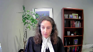
:::

Good afternoon justices.

I'm going to address two issues in my submissions which are set out under headings three and four of our outline in our condensed book.

First I'll explain why the record screening regime offers a marginal and ultimately unnecessary benefit to complainants in sexual assault cases.

My submission will be that when you compare this marginal benefit to the profound limits on the accused section 7 rights that Ms. McConkie has identified in which we address in our factum, it becomes apparent that the limits cannot be justified under any analytical framework.

The principles of fundamental justice do not authorize parliament to limit core substantive rights for one party to preserve unnecessary procedural benefits for the other.

Parliament's attempt to do so in this case struck the wrong balance and resulted in an unsalvageable section 7 breach under both the Dagenais and related mills framework.

Second I'll address the issue of remedy.

We've asked the court to strike down the legislation in its entirety.

There have been questions along the lines of whether narrowing the regime to certain categories of records or removing a notice period might salvage the legislation and our submission is no, no single provision can be read down without an unexpected impact on the other components of the record screening regime.

But in suggesting that the legislation needs to be struck down I want to stress that this need not be the last word in the dialogue between the judiciary and parliament.

It is crucial that complainants understand and feel empowered and feel empowered during criminal proceedings.

It is open to this court to engage with parliament the way it did in Seaboyer recognizing that in striking down the legislation we're not reverting to the way things were recognizing the importance of the legislation's mandate and guiding legislators towards a regime that achieves a better balance than the flawed legislation before you today.

Striking down the regime will not put an end to the dialogue but allow it to continue.

**Justice Brown** (01:41:44): Just so you know, I'm very interested in knowing, Ms. Savard, what specifically you think Parliament needs to do.

::: {.column-margin}

:::

I mean, we're obviously not legislative drafters, but in some some general terms, we need to give Parliament guidance.

I mean, for example, Justice Moldaver talked about a general exclusion from records, from the records definition of communications between the complainant and the accused, that kind of thing.

I'd like to hear that from you in the time you have left.

**Speaker 3** (01:42:11): Yes I'll make sure I address that.

Justice Brown it's also contained at page two of our outline under the heading of remedy and I'll be able to expand on it in more detail.

**Overlapping speakers** (01:42:21): Thank you.

**Speaker 3** (01:42:22): that.

::: {.column-margin}

:::

I want to address first though a question it's really answering a question that Justice Roe raised earlier which is are interest values and rights the same and the MILS framework is notorious for kind of glossing over what the complainants rights actually are and whether they're charter protected in any given MILS balancing act.

So I want to invite the court to take some time to actually define the rights at issue so that you can assess whether or not there's a legitimate justification here for the profound section 7 limits that are being imposed on the other side.

In my submission echoing Ms. McConkey's the complainants privacy and dignity rights sure they're engaged but they're engaged in a much more limited way when she is on the stand having brought herself forward as a witness the sole evidence of whom will deprive someone of their liberty and then asked about relevant private information.

This is profoundly different than when that same person before she becomes a witness is subject to a production order or that witness is subject to invasive question questioning about prejudicial sexual activity evidence.

The rights at stake under this regime for the complainant are the same rights to privacy and dignity that attach to any vulnerable witness testifying in a criminal trial.

All witnesses are entitled to have the use of their private information in court judicially supervised in a way that avoids unwarranted privacy violations and improper inferences.

But I ask you to reject the suggestion collectively urged upon you by the crown litigants that witness rights are always engaged to the same degree for complainants in sexual offense litigation and therefore always weren't the same kind of enhanced protection that we find in the 276 admissibility regime.

**Overlapping speakers** (01:44:17): Poop.

**Speaker 3** (01:44:17): It can't, yes.

**Justice Kasirer** (01:44:20): Is Parliament not entitled to take into account the special character of the offences listed and the fact that they tend not to be denounced?

::: {.column-margin}

:::

And that was one of the purposes of heightening privacy, was to encourage those offences to be denounced.

**Speaker 3** (01:44:45): So to the extent is, the question is, does this legislation actually encourage reporting from sexual assault complaints?

::: {.column-margin}

:::

The answer is we have no evidence that it does.

There is no evidence indicating that the complex procedure, and it's entirely a procedural benefit, created by the record screening regime, has any impact on the reporting of sexual offences.

In fact, I think the court would be surprised if most people in society not actively practicing criminal law even know this regime exists.

Moreover, unlike Section 276, which tells the complainant in advance, don't worry, your sexual history won't be picked apart at trial in aid of improper reasoning, all this regime signals to society and to potential complainants who might or might not report is, well, you'll get to know in advance, maybe, about a specific area of cross examination, but the judge will probably allow the defense to ask about it because it's important to the trial.

And in this way, I want to emphasize that the benefit to the complainant under this regime is far less.

There is no additional protection that this regime grants the complainant, and in that way, it's very different from the 276 record screening regime.

So the short answer to your question is no, Parliament cannot simply say privacy is heightened here.

Parliament has to say privacy is heightened here, and the records regime actually has to protect it in a meaningful way in order to be justified.

Bear in mind that under Mills, all Charter protected rights are subject to internal limits by the other principles of fundamental justice.

And what that means when we're talking about a witness at trial, any vulnerable witness at trial, is that their privacy and dignity rights must be internally limited by both the defendants and society's interest in a fair trial and the search for truth.

**Justice Martin** (01:46:48): Ms. Savard may I ask you this question please it seems to me that when we're talking about the issue of constitutional breach or even limitations on rights when we look at the structure of 27892 and and the factors for example that a trial or the judge must consider there is a listing by parliament of the exact rights and interests and it speaks of different things parliament talks about the interests of justice including the right of the accused to make full answer in defense then speaks about other interests and then speaks about the right of the complainant to personal security the potential prejudice to personal dignity in the very structure that parliament has created it has effectively through this listing of factors tasked the judge with that constitutional balancing of the rights of full answer and affair at full answer and defense fair trial rights other interests whether it's right to silence or whatever so in an individual case a judge is being directed towards all of the various things that are listed as factors here doesn't that go a long way towards the recognition or even the balancing that you say has to take place under Dajna and Mentat isn't that

::: {.column-margin}

:::

what this section is actually doing

**Speaker 3** (01:48:24): No, so it is, it is certainly less unconstitutional because a trial judge considering a records application before trial is entitled to take into account competing factors, but the court should not forget that that balancing only happens.

**Overlapping speakers** (01:48:41): once the scheme has been found to apply.

**Speaker 3** (01:48:44): once the accused has already given up his right to silence by producing his brief to the crown, whose preparation of their witness will change, whose investigation will change, and who has a duty to prosecute their case vigorously, and also given up the right to effective cross by producing those same materials to the complainant who consciously or not may be affected in the giving of her evidence in a way that is not fully testable.

::: {.column-margin}

:::

So the unconstitutional aspect of this regime comes from the fact that it is a mandatory notice period and a mandatory standing obligation, neither one of which permit the trial judge to take the interests of justice into account in a meaningful way.

And only then, once the horse is out of the barn, so to speak, with respect to the accused's rights, does that balancing happen.

So the balancing under Mills is looked at from a step back.

Do the defendant's profound rights deprivations here speaking specifically of the right to silence and the right to effective cross, are they being limited for any good reason?

And my submission is given the lower privacy and dignity interests that are inherent in the witness's position under this regime, and given the limited marginal benefit to that witness under this regime, which I'll turn to now, it cannot be said that those are justifiable limits.

This is not a case where the complainant has a protected section eight privacy interest in keeping her records free from state interference like under Mills.

There is arguably no competing charter protected right at all.

And for that principle, I commend you to, it's actually the appellant Crown's condensed book, tab 17, pages 237 and 238, the case of shearing at paragraph 110.

In this paragraph, you have an analysis very similar to what we're asking the court to undertake here.

As in this case, the court is tasked with characterizing the complainant's rights as a witness confronted with private information in the exact way that we characterize them in this proceeding.

And what the court observed in shearing is that no enhanced procedural protection was required to advance the complainant's privacy and dignity interests.

And an important piece of the analysis was, it wasn't even clear whether the witness's rights were engaged under the charter at all.

It is an open question for this court to determine when and how much any vulnerable witnesses, privacy and dignity rights are engaged and violated by what would be standard if invasive questioning during the course of a criminal trial.

And I say standard but invasive questioning in pursuit of the search for truth is the very kind of reasonable internal limit that we should be looking to place on complainant's section seven privacy and dignity rights so that the fair trial right, which we all have an interest in is not compromised.

**Justice Moldaver** (01:51:44): It just seems to me in this situation where the accused has the records, we just skip the first test of third party records and we go straight to admissibility.

::: {.column-margin}

:::

And so I don't see this huge distinction that you're making that this is somehow such a major change.

It was to plug a gap.

And quite frankly, when I look at this provision, given that parliament knew about gmeshi when it brought it in, but there's no mention of electronic records and getting back to the thing that I think is really bugging the defence here, the kind of cross-examination that Ms. Hennan did in that case, there's no mention of that here.

I would have thought that if parliament intended to include emails, text messages and so on between the complainant and the accused, except where, as I said, in limited circumstances where the accused is the therapist, they would have said so.

They've set out an area of concern here.

And if the accused has lawfully the medical records of the complainant or the therapeutic records, the accused has lawful possession of them, all they're saying is, okay, we don't have to go through the protection thing because he's got them already.

Now all we have to do is look to the factors that warrant their admission or not.

And in that context, the complainant should know what it is that the accused plans to do with them.

And that is no different, it seems to me, than the production regime other than in the third party production regime other than the accused has the records that he or she wanted produced under that regime.

I'm missing this.

You can help me out.

**Speaker 3** (01:53:30): I can briefly, I also think that part of my response to your question would be turning to the issue of remedy because I agree with you that Parliament's purpose was much narrower than simply protecting witness privacy and dignity.

::: {.column-margin}

:::

It did want to target a very specific type of records, and I think I can address Justice Brown's question about what that regime would look like.

And to answer your question about why the third party records regime is different.

It's because the rights at stake are different.

The fact is that it is the only reason there was no section seven violation and mills is because the complainant had a charter protected right against unreasonable search and seizure by the state, and her privacy interest was much more profound than it is in this case, when you are a witness testifying on the stand, it is inherent in the expectation of being a witness.

That there will be certain privacy invasions that do not amount to a breach.

Those are the reasonable internal limits on privacy that operate now at trial that did not operate at mills when the issue was forcing the complainant to open her own private briefcase so to speak and hand over records that nobody had ever seen.

**Justice Moldaver** (01:54:44): wasn't this all designed, I'm sorry to interrupt, wasn't this all designed to, out of a concern, that the history of sexual assault trials in this country unfortunately was a sad one in the sense that there was all kinds of inadmissible evidence being led, cross-examined on, you know, all the myths that we've been sort of bringing to light of late in the last few years, and that's what these records seem to me to be concerned about.

::: {.column-margin}

:::

It's not all of these records that will be, the accused may well be able to cross-examine on them, but the concern is an initial vetting to make sure that if these records can be used, which are extremely private, if they can be used, they're only going to be used for a proper purpose.

**Speaker 3** (01:55:40): Yes, and and there I would say the remedy still is to strike down the legislation identify the actually problematic records and direct the matter back to Parliament for a constitutional redrafting.

**Justice Jamal** (01:55:54): Mr. Fahd, but in part, you said that the distinction turns on the unreasonable search or seizure in the third-party records regime, but in paragraph 94, Chief Justice McLaughlin and Justice Iacobucci also talk about the equality rights of complainants and witnesses, which obviously goes beyond a privacy interest, and that seems to me to be, that's based there on the issue of myths and stereotypes, but it seems to me that's very, there's a family resemblance to the sort of privacy interest that Parliament was targeting by this legislation.

::: {.column-margin}

:::

**Speaker 3** (01:56:26): So what Justices McLaughlin and Iacobucci said in Mills was that equality rights, the right to equal protection under the law should inform the interpretation of both competing rights.

::: {.column-margin}

:::

So yes, the limitation of the accused section 7 rights internally can be informed by the need to protect a historically disadvantaged group of complainants, but similarly the question of whether a unique and unusually cumbersome procedural regime should be granted to a particular type of vulnerable witness should also take into account whether or not this court is prepared to open the same door to other vulnerable witnesses, including the accused whose private records are used at trial and offered up by the complainant without any need for balancing.

And it is, I think, important to address a suggestion that's been put to you by multiple interveners in this case that somehow the primary power imbalance to correct here is between the accused and the complainant.

The reality is that the complainant, the defendant, and many, many other categories of witnesses in criminal trial are vulnerable for different reasons, disenfranchised for different reasons, unwilling to put their lives before the court for reasons related to colonialism, racism, racialization, and other disadvantages that might make them mistrust the system.

Many accused are themselves victims of sexual abuse or otherwise vulnerable.

**Overlapping speakers** (01:57:57): But only one of the parties is looking at going to jail.

**Speaker 3** (01:58:00): Exactly.

::: {.column-margin}

:::

The difference, as you say, Justice Roe, is that the stakes are higher for the accused, and the procedural protections to which he is entitled must be correspondingly greater.

The fact is that wrongful convictions result in a far greater loss of confidence to the justice system than invasive cross-examinations.

No admissibility regime, no matter how welcoming and empowering for a witness, can shield that witness's privacy and dignity from scrutiny at the expense of the truth-seeking function of the trial.

Now, I do want to take some time to address the Court's questions with respect to remedy.

The constitutional regime that we commend to the Court and invite the Court to put forward to Parliament would apply narrowly, and it should include efficiency and privacy safeguards.

The first precondition would be that it should capture records that carry a high expectation of privacy or a high risk to dignity, and we've given some examples.

One of the ways in which this Court signals to Parliament what a qualitative term like high means is through the use of a non-exhaustive list, so that could include records that the accused obtained illegally, records such as those Justice Moldaver was referring to that the accused obtained by virtue of a position of authority, records that remain subject to professional confidentiality obligations and which any other witness would have to have pre-vetted if they brought them to court, therapy records, other health provider records, records subject to other privacy legislation.

So that would be the precondition for the application of any scheme.

The second thing, the feature, that we say would make the regime constitutional is it would have to direct the admissibility of Wardier to be held at the time the record becomes relevant.

In some cases that will be obvious before the trial, but as Justice Moldaver pointed out many years ago in the Harris case, oftentimes issues that seem to be outstanding or controversial before trial resolve themselves.

They resolve themselves or become moot during the course of the trial itself, simply because it doesn't arise.

I think any experienced counsel knows the feeling of coming into court armed with 80 pages of material from disclosure for use as potential impeachment material and then walking out having only used five of the pages because the witness predictably agreed with the content of most of the records.

And so by requiring the admissibility of Wardier to be held at the time the record becomes relevant, often mid-trial, when its impeachment value crystallizes, you'll actually be minimizing the privacy impact on the complainant.

Bear in mind that the court in Mills was careful to remind trial judges that even disclosure of private records to a trial judge is a privacy invasion.

If the record screening regime can avoid that simply by having the parties wait until the issue crystallizes before submitting the records for scrutiny by the trial judge, then that should be done.

And what that means is that there will be mid-trial applications.

I would encourage the court to suggest that the adducing party must alert the court to the need for a Wardier.

That would satisfy Ms. Ruzicka's concern about the nude photo in this case being used to surprise the witness.

That simply wouldn't happen because there would be a Wardier.

And a Wardier should be required regardless of which party wants to adduce.

And that will ensure that the complainant's privacy is protected equally against Crown and Defense.

It also ensures that Parliament will act with appropriate restraint because one can imagine a world in which overinclusion of records in the regime would create unworkable trials both for the prosecution and the defense.

The next aspect of the constitutional regime is it would codify and require trial judges to consider common law and relevant statutory rules including the list of factors you referenced,

Justice Martin, including including reference in O'Connor, Mills and McNeil to the importance of vetting to protect unnecessary privacy invasions and enhanced vigilance to protect against improper reasoning in sex offense cases.

There's one more feature of the constitutional regime, Chief Justice.

I see I'm out of time, but subject to the court, I could address that.

**Overlapping speakers** (02:02:46): One minute.

**Speaker 3** (02:02:47): Thank you.

::: {.column-margin}

:::

Finally, the constitutional regime would grant trial judges the discretion to give the witness participatory rights on the voir dire when doing so would be in the interests of justice, a broad phrase that the Crown itself says often immunizes legislation against findings of unconstitutionality.

Now, that said, separate and apart from the record screening regime, Parliament may also codify the appointment of counsel for the complainant at an early stage.

In my submission, it would better assist reporting if complainants knew they would be supported with independent legal advice from the start of the criminal justice process.

What's important at the end of the day is that complainants understand the proceedings feel heard and have agency and have the opportunity to know their rights during a criminal trial and assert them where appropriate.

Having counsel at the outset, albeit in a limited role with no standing on evidentiary hearings, except in exceptional circumstances, would be better for achieving that goal than having counsel for the limited purpose of an evidentiary hearing where there's a high likelihood the evidence will be admitted.

Thanks very much, Justice.

**Justice Wagner** (02:03:57): Thank you very much.

The court will now break for lunch.

We'll be back at two o'clock Ottawa time.

**Speaker 4** (02:05:46): Me, Ms. Way, Mr. Reeve, and myself are here on behalf of AS, a sexual assault complainant.

::: {.column-margin}

:::

And to summarize our position and to give you an overview, all we ask is that that notion of equality in terms of our charter rights be fully recognized, respected, and operationalized.

That's the beginning and the end of what we ask for.

Our client has no entitlement to any particular outcome.

But I do say that our client has, with equally important rights at play, full access to the same procedural opportunities to participate and be heard, as other rights bearers do.

And that really captures our position in a nutshell, but I'm not going to sit down.

In terms of developing that, I'm going to deal with that notion from a conceptual perspective, from a jurisprudential perspective, and then perhaps most importantly, I'm going to deal with that notion from a jurisprudential perspective, and then perhaps most importantly,

**Overlapping speakers** (02:07:04): Bye!

**Speaker 4** (02:07:04): practical perspective.

::: {.column-margin}

:::

And I will leave for my co-council Ms. Wei the particular discrete but important issue of motions for directions.

And I know Justice Kazir, you had asked a question about that.

My colleague will be addressing those issues fully.

So let me just start with the conceptual.

There has been a lot of talk this morning and there's a lot of talk and a lot of charter litigation about, if we all remember our grade school grammar, the object nouns in the charter.

So privacy, equality, full answer and defense.

I'd like to shift the focus a little bit to something much more prosaic

but I think it's overlooked.

The subject nouns in the charter.

And if we look in particular at the privacy, equality sections and security of the person section seven, the subject noun is everyone.

That includes my client.

Textually, we are driven to what this court has said in Mills that all of those rights are equally important by the very simple prosaic and non distinguishing term everyone.

And I want to in terms of just emphasizing that, make reference to a paradigm that we often habitually resort to that actually represents sloppy thinking and inadequate attention to the nuance of the charter of bodies.

And that is this conception of a criminal process as an epic clash between the accused and the state.

It is true that it is that.

But that perspective does not begin to capture all of the charter dimension that play in the criminal process.

My submission to this court is that in addressing this legislation, we need to evolve our thinking from that two dimensional binary accused versus state conception.

Keep in mind the textual subject nouns in the charter and take our thinking on the evolutionary path to a fully three dimensional conception of charter rights.

It is tougher, it is more complicated, it is more nuanced and it is more complex, but it is where we are compelled to go.

Jurisprudentially, I am moving from the conceptual now to the jurisprudential.

This court has been moving in that direction for decades.

Dagenais, 1994, recognized third parties have charter rights.

In that case, on those facts, there is media organizations and freedom of expression.

But the court said these are important rights.

That is the first place where we see the court articulating this notion of there are no second class rights.

**Overlapping speakers** (02:10:47): and

**Speaker 4** (02:10:48): And really importantly, operationalizing that concept of rights, they didn't remain abstract.

::: {.column-margin}

:::

They were operationalized in that case with Chief Justice LeMayer saying, you may have to grant standing.

And we've come to the point now where when media freedom of expression issues are engaged, publication demands and the like, it's routine.

The lawyers show up and we know how to handle it.

We've operationalized a three-dimensional criminal process in that respect.

The court continued along that path in O'Connor, recognizing important privacy rights.

And significantly operationalizing them again, all by itself to the extent of inventing essentially an entire procedural regime that gave standing to third party rights holders to be heard on an equal basis.

**Justice Rowe** (02:11:50): So now we're going to go into this great leap forward.

::: {.column-margin}

:::

I wouldn't call it three dimensions, it reminds me more of what Mao did in the 1950s.

And maybe we'll just say that you can have multiple prosecutors, and it's a tag team.

You've got the crown, and then you've got a complainant, and then you've got an intervener, and you know, everybody's got their rights, and everybody just has a go at the accused, and that's equality, isn't it?

No, that's chaos.

And so what I'm asking for...

Sir, that's exactly what you're counselling to us.

**Speaker 4** (02:12:26): With the grace of respect, sir, what I'm counselling is participation, and this is really important, co-extensive with the rights engaged.

::: {.column-margin}

:::

So my client has no standing to act as a second prosecutor.

My client has standing to be heard and to participate insofar as is necessary to enable a thoughtful consideration of her rights that are meaningfully engaged.

And that's a really important distinction.

And it's something that the courts have recognized, again, Mills, where this court upheld the Parliament's regime around third-party records, standing has become routine in third-party records, and the brief of counsel who has standing for complainants in third-party records is functionally limited to advancing the privacy, security of the person, and equality rights that are in play in that particular records application.

And when the trial comes, the Crown takes over.

So that's how the court has, I say admirably, developed this three-dimensional concept by always being anchored in the rights that are in play and always being anchored in this notion that all of the various rights in play are entitled to equal treatment.

And of course, we can carry it forward.

**Justice Rowe** (02:14:07): Because a series of rights are engaged doesn't mean that they have equal significance, does it?

No, it doesn't.

Well, it seems to me that's what you're telling us, but maybe I'm misunderstanding you.

**Speaker 4** (02:14:20): I'm asking for an equal opportunity to be heard and to participate.

::: {.column-margin}

:::

As I said, my client has no entitlement to an outcome.

And your question implied that I have an entitlement to an outcome that my rights will suffer.

And my question is, do I have an entitlement to an outcome that my rights will suffer?

**Justice Rowe** (02:14:39): You should have tried what it said, not what you have said it said, sir.

It was to understand your position.

**Speaker 4** (02:14:46): Yes, and I'm sorry if I misunderstood your question.

::: {.column-margin}

:::

My client, I say, is entitled to be heard coextensively with the rights that are meaningfully engaged.

She has no right to a particular outcome.

She has no right for her position to prevail.

It's simply a right to participate and be heard. And why?

To assist the court in balancing the various rights that are in play.

It's a matter of assisting the court to understand the scope, significance, impact on any particular right holder when balancing those against other equally important rights.

So it's a matter of participating in an iterative process that engages equally with those rights.

**Overlapping speakers** (02:15:42): And this is the end of the presentation.

**Speaker 4** (02:15:43): is the notion that again expressed in paragraph 61 of Mills that it's contextual integration and balancing in a way that maximizes all of the rights as they are in play on the evidence.

::: {.column-margin}

:::

So that is jurisprudentially where I say the court through the cases that I've taken you through Dajani, Mills, Derrick has really given us the template for where we are now and so that I say that this legislation is another salutary reasonable and appropriate step on that same continuum.

**Justice Brown** (02:16:28): I wonder if I could pull you into some concrete issues. Sure.

::: {.column-margin}

:::

And this relates to advance notice and disclosure.

Paragraph 90 of your factum, you say that applications should be brought pre-trial except in what you describe as the rarest of cases. Right.

So what are those rare cases?

When could an application be brought mid-trial?

**Speaker 4** (02:16:57): Yeah I can talk from personal experience.

::: {.column-margin}

:::

We litigate an issue and it's happened to be in both 276 and 278 applications.

Let's call it a 276 where I get the application.

I agree that questions A, B and C can be asked because about prior sexual activity because they're not discriminatory.

Questions A, B and C get I'm gone.

I'm not participating in the trial.

Questions A, B and C get asked and the complainant, my client, gives answers that give rise to the possibility of further questions and people want to ask further questions.

I get a call.

We need to renew this application because this has gone in a direction we didn't anticipate.

So that's the kind of thing that I say does lend itself and I want to say that that should be kept to the rest of cases and again my colleague will speak in more detail to this because of the potential for disruption of trials

but yes we have to keep that door open because frankly our lives as trial lawyers would be much easier if we knew what witnesses were going to say with precision

but we don't always know that.

**Justice Brown** (02:18:18): And I guess my point is neither does the accused and I wonder, I mean, there's kind of a movement away in some jurisdictions from preliminary hearings.

::: {.column-margin}

:::

Let's say that there's not a police statement or that the police statement isn't the issue.

If the complainant herself in chief testifies in a way that the accused did not expect but the accused has an email or a text that I assume you would agree comes within the definition of record that contradicts what she said.

Is that one of the rarest of cases?

It doesn't sound particularly rare, but, but, uh,

**Speaker 4** (02:19:07): Bear in mind that, at least in the jurisdiction where I practice, video statements and transcripts of what complainants say when they make their initial allegation to the police are routinely disclosed.

::: {.column-margin}

:::

So the allegations are set forth, we don't have to rely on officers' chicken scratching and bad transcription, there's a verbatim account of what the complainant alleges.

So the defense is with disclosure.

**Overlapping speakers** (02:19:34): does have

**Speaker 4** (02:19:35): have, again, a verbatim account of what they expect the complainant to say.

::: {.column-margin}

:::

And on that basis, they're well-armed to look at the text messages.

They have decided to make their strategic choices, as the court said in Derrick, about what applications they want to bring.

Full disclosure is a great tool in that respect.

And we should expect that the full disclosure be used pre-trial to make those decisions.

And if somebody goes off-site and says something completely different and there's a text message that comes into play, yes, absolutely.

That has to be assessed.

And if it's a nondiscriminatory use, if it's an appropriate use, if it's a probative use, 100%, that happens.

My position, our position is that disclosure is full, it's complete.

There's an obligation, responsible obligation, to use that to formulate an approach to trial – pre-trial – so we're minimizing our demands on that.

**Justice Brown** (02:20:42): Just to be clear then I mean Are you saying that this would only apply where the first application was already brought pre-trial or in this case In the example that I've given you it can be brought for the first time mid-trial Sure. Okay.

All right.

**Speaker 4** (02:20:58): Here's what I respectfully submit is problematic.

::: {.column-margin}

:::

People waiting mid-trial to bring something that they were fully equipped to bring, pre-trial.

If somebody has a statement from a complainant that says X and they have a text message from the complainant which says not X, pre-trial, let's deal with that pre-trial.

**Justice Brown** (02:21:28): Now should we just ignore that there's also the requirement that the complainant be given notice of this if it if it's going to be admitted?

**Speaker 4** (02:21:38): No.

::: {.column-margin}

:::

Our position is that, again, in terms of equality of participation, if there's going to be litigation about my client's privacy rights, then I'm entitled to that application.

I'm entitled to the full details of that application.

And I'm entitled to participate as a full participant on behalf of my client to balance those things.

**Justice Brown** (02:22:03): Do you not acknowledge that that would undermine the effectiveness of the cross examination of your client as a witness?

**Speaker 4** (02:22:12): No, because if she's in video saying X

and she's got a text message saying not X, there's no wiggling out from that.

And that's why it's really important to address these things pre-trial.

Well, there may be wiggling, there.

**Justice Brown** (02:22:26): There may be wiggling out, I mean, people...

**Overlapping speakers** (02:22:28): You know.

**Justice Brown** (02:22:29): will, if given enough time, find ways to reconcile.

::: {.column-margin}

:::

This isn't, by the way, a suggestion that your client as a complainant is more inclined than anyone else to do that.

It seems to me more human nature that we try to reconcile competing accounts that we may have offered at different times. Right.

And of course the more time you have to make that reconciliation, the more effective the argument goes, and it's the argument that I've read in the factums from the other side.

And I'd like to know your thoughts on that.

There's a big problem with that argument.

**Speaker 4** (02:23:08): In the early 1990s, immediately close to Inchcombe, Crown prosecutors made exactly that argument.

::: {.column-margin}

:::

If we give full disclosure to accused persons, they will have all this time to tailor their disclosure, to tailor their evidence to the disclosure, so we shouldn't be giving it to them.

The courts gave very short shrift to that argument because there are other rights in play, which is the right to make full answer in defense, which cannot be.

Well, it wasn't a matter of other rights.

**Justice Brown** (02:23:39): there were rights, the crown had no rights at stake.

This wasn't a reconciliation of rights case. Sure.

Yeah.

I'm asking you to reconcile the rights.

**Speaker 4** (02:23:50): Right, so from an equality of rights perspective, we are not to diminish disclosure to the accused in pursuit of full answer and defense out of a fear that they might tailor to the disclosure.

::: {.column-margin}

:::

I say it's a rhetorical question.

How can we possibly have a double standard for?

**Overlapping speakers** (02:24:16): I know.

**Speaker 4** (02:24:17): that says, we will do exactly that.

And it takes us into a problematic gender dimension.

**Justice Brown** (02:24:23): We exclude witnesses from trials.

It's not a question of complainants, it's witnesses.

**Speaker 4** (02:24:31): We, I'm representing complainant here and complainants and witnesses pursuant again to Mills have these privacy and equality rights and there are no two-tiered rights in the charter.

::: {.column-margin}

:::

So if we are to afford the accused full disclosure and basically set aside that risk that they will tailor to fit because the full answer in defense is more important, which incidentally I take no issue with.

I think it's right and it only makes sense that for equally important complainant and witness rights we provide the same consideration.

In other words, so this is an excuse.

**Justice Brown** (02:25:19): So this is an exchange for stinch comb, in other words.

::: {.column-margin}

:::

I hadn't thought of it that way.

Yeah, it's ‑‑

I'm not persuaded yet

but I'm sure you'll take a good shot. Yeah.

**Speaker 4** (02:25:38): The thinking around the accused person is a byproduct of arguments that were made post-stinch comb.

He said, hang on a minute, we're not gonna undermine really important.

Did stinch comb rape, did stinch comb rape?

No, no, no, no, no, no, no, no, no, no, no, no, no, no, no, no, no, no, no, no, no, no, no, no, no, no, no, no, no, no,

**Justice Brown** (02:25:49): I'm gonna ask you a rhetorical question.

Did Stinchcomb require the Crown to disclose what they will use the evidence for?

**Overlapping speakers** (02:25:59): I'm not sure I understand the question.

**Justice Brown** (02:26:00): did Stinchcomb require the crown when they disclosed to indicate what relevance the evidence had and what they would use it for?

**Overlapping speakers** (02:26:12): Well, I.

**Justice Brown** (02:26:14): I mean, if it's a straight out exchange, presumably there'd be conditions that would be similar on either side.

**Speaker 4** (02:26:21): Yeah, no, I don't see it as as exchange and transaction oriented.

::: {.column-margin}

:::

I'm submitting to you that it's based on the principle of equality of rights and the need to avoid drawing using reasons to limit one set of rights.

It's equally important that you wouldn't use to limit another set of rights that you know.

**Justice Rowe** (02:26:45): Now your view of the equality of rights, which I find novel, perhaps I'm ignorant of the law in this regard, reminds me very much of what Ian Binney used to refer to as the recipe for horse and rabbit pie.

::: {.column-margin}

:::

One rabbit and one horse.

Sometimes the proportions are simply not in any way near equal, and you are saying that because of some structural argument relating to the fact that there is no hierarchy of rights, each of them must be put on an equal basis as opposed to the weighing of them in different circumstances, which can be enormously disproportionate.

It's a very formalistic argument.

It's usually the sort of thing that's aimed at me, actually, so I'm making a formalistic argument.

**Speaker 4** (02:27:42): Well, that's the starting point, that everybody has an equal right to be heard and there are no presumptions that there are second class rights.

::: {.column-margin}

:::

But that's not the end point.

The end point is driven by the actual evidence in play.

And I quite agree that And there frequently is in these cases a sliding scale.

Of how important is the privacy in the particular piece of evidence.

How important is the privacy interest.

How important is it to personal dignity and how important is it to the defense.

All I'm saying is both parts have to be heard on that.

It's not to say both parties will inevitably or ever have a degree of meritoriousness to their arguments that you can pause it in advance.

Not the case at all. Mr. Buck.

And indeed, sorry.

**Justice Jamal** (02:28:44): Mr. Butt, part of the concern seems to be an empirical concern that the effectiveness of cross-examination might be undermined, and that's obviously difficult to do in the abstract.

::: {.column-margin}

:::

But I guess to go to the point that Justice Moldava raised earlier, the third-party records regime in Mills shows that an obligation to demonstrate likely relevance hasn't undermined the effectiveness of cross-examination, one could say, in sexual assault cases where third-party records are disclosed.

So at least in that context, that's what we have, that that obligation, that threshold obligation, hasn't undermined the effectiveness of cross-examination, hasn't skewed the scales, we still have effective trials.

**Speaker 4** (02:29:30): Yes, and you know, to boil it right down to its essence, a third party records application is defense counsel coming to the court and saying, here's what I want, and here's why I want it.

That's what happened.

**Overlapping speakers** (02:29:47): happens in a third.

**Speaker 4** (02:29:47): party records application.

::: {.column-margin}

:::

And they've been going on for decades.

I know exactly when they say, here's why I want it, what their strategic gambit for those particular records is.

If that was perpetuating rampant revamping of complainant stories, you'd think that there'd be some cases where judges have said, you know what, this isn't working.

Look what just happened.

I don't see any of those in any of the materials from the people on the other side.

And we've been doing this for decades.

And in fact, it actually facilitates.

**Overlapping speakers** (02:30:30): smooth.

**Speaker 4** (02:30:30): trials because you know what the issues are.

And sometimes it can facilitate resolution.

**Justice Brown** (02:30:36): I mean, I'm surprised to hear you express concern for a smooth trial.

::: {.column-margin}

:::

You say the complainant should have the right to cross-examine the accused on material that has yet to be ruled admissible, right, before the accused has a chance to even cross-examine the complainant.

Now putting aside that I'm struggling to understand, well, I'm not even sure the scheme requires it, but I'm struggling to understand how this does not violate the rule against self-incrimination in a fair trial.

How does that create a fair trial when you've got a cross-examination in that context?

**Overlapping speakers** (02:31:20): Yeah, it-

**Speaker 4** (02:31:20): or the record is even considered admissible?

::: {.column-margin}

:::

Right, so you have an application and pursuant to Derek in 276 or pursuant to Mills in 278 records context, the applicant has to put forward an affidavit that provides information or evidence, the wording in Derek is detailed particulars, that meets the threshold for either likely relevance in a records application or non-discriminatory use with a significant probative effect.

So the complainant who has a countervailing interest, I say is entitled simply as a matter of course, to be a participant, a full participant in that hearing.

And if that means challenging with some questions, the affidavit material that's been forwarded on the issue that is in play, which is not the ultimate issue at trial, but it's the proposed use of the evidence of other sexual activity or the record, then the complainant should be permitted to ask those questions.

You know, when...

In Parliament...

**Justice Brown** (02:32:32): When parliament is intended to confer a right to cross-examine, it has unambiguously included that language.

::: {.column-margin}

:::

And you also say submissions as well.

I mean, the criminal code distinguishes submissions from providing evidence.

Parliament could have done this. Didn't.

So we're to read this in, I gather.

**Speaker 4** (02:32:59): Yeah, my position is that the complaint has the right to be represented by counsel that is in the legislation.

**Justice Côté** (02:33:07): I'm surprised to hear that you say that the complainant has the right to cross-examine because since the beginning you are discussing the importance of equal rights.

::: {.column-margin}

:::

When we look at the legislation, the complainant would have in your position the right to cross-examine but the accused does not have that right because 278-942 says that the complainant is not a compelible witness at that hearing.

I have difficulty to reconcile your position about equal rights and the complainant cannot be cross-examined but you say that the complainant has the right to cross-examine the accused.

**Speaker 4** (02:33:50): Right, so the accused has a full right to cross-examine at the trial.

**Overlapping speakers** (02:33:59): I'm talking about at the at the hearing about admissibility.

**Speaker 4** (02:34:03): Right, right.

::: {.column-margin}

:::

But we have to look at what's happening here.

We're making a determination as to whether certain materials can be used at the trial.

And parliament has said that the Complaint and Counsel gets to participate.

What does participation mean?

I say as a matter of the simple discharge of everyday professional functions in a court by a lawyer, it has to mean the right to get the materials, to prepare fully, to cross-examine where necessary, and to make submissions.

**Justice Brown** (02:34:43): Well, you haven't answered my point that Parliament knows how to say those things and says that in other portions of the code.

Didn't say it here.

Are you arguing for us to read it in?

**Overlapping speakers** (02:34:57): Yes, yes, I say that.

**Justice Brown** (02:35:00): So, you know, I mean you're not in Ottawa, but if you were here I'd say that you got to walk up the hill That's an up-the-hill problem Look for the building with the big clock tower and knock on the door and hopefully someone will help you

But that's not what we do

**Speaker 4** (02:35:15): Well, my submission on that is that we have to understand what the right to be represented by council means.

::: {.column-margin}

:::

And every time that an accused is represented by council, there's not a procedural guideline in the statute setting up what the council can and cannot do.

We know what council does.

We know what contributions council make to the effective resolution of disputes by challenging evidence by warranted, by getting full sets of materials and preparing. So

**Justice Moldaver** (02:35:53): I'd like to bring this down to a reality situation.

::: {.column-margin}

:::

Can you give me an example of a cross-examination by the complainant that you would say is not only proper but goes beyond perhaps something that the crown would be thinking of or aware of or whatever?

And along those lines, if the complainant, if this is a discretion on the part of the judge as to whether the complainant should be allowed to cross-examine and if so on what? Throw that into the mix.

But I'd like a concrete example of where you say the complainant could add something legitimately properly to this hearing that warrants her or him having the opportunity to cross-examine. Right.

**Speaker 4** (02:36:42): The accused says, you know, I want to talk about sexual activity that took place on such and such a date, at such and such a time, and it's relevant for these two reasons.

**Speaker 4** (02:37:00): in possession of a video of them, in a completely different location at that time.

::: {.column-margin}

:::

I as counsel, I'm not gonna put my complaint in the box, but I'm gonna say, Mr. Accused, I put it to you that you weren't even in that location.

I'm talking about.

**Justice Moldaver** (02:37:26): something that the crown couldn't ask.

I mean, I would have thought the complainant would show that to the crown.

**Overlapping speakers** (02:37:32): and give the...

**Justice Moldaver** (02:37:32): crown the ammunition it needed to make the, to ask the question.

::: {.column-margin}

:::

I'm wanting something that goes beyond what the complainant could just tell the crown and seek the crown to cross-examine on.

Your example is a very simple one.

Of course the crown would cross-examine on that.

If the crown had access to that video.

So, so that's, that's just the point.

That comes from the complainant, doesn't it?

**Speaker 4** (02:37:55): Yes.

::: {.column-margin}

:::

But who's acting for the complainant?

The Crown?

And do I have to, as complainant's counsel, work through the Crown and say, oh, please, Mr. Crown, can you ask this question?

Again, it's equality of participation.

And if I've got evidence that would help a judge resolve an issue that comes from my client, I say I'm entitled to present it. I don't.

**Justice Moldaver** (02:38:22): that the Crown is not prepared to ask.

You've got to follow up with that because if the Crown is prepared to do this, you're not losing out on anything.

**Speaker 4** (02:38:32): That may be true, but I will not go so far as to say that I have to get permission from the Crown to ask a question and be guided by the Crown's decision.

::: {.column-margin}

:::

That's the whole point of independent council.

If I'm not a—

**Overlapping speakers** (02:38:51): time.

**Speaker 4** (02:38:51): in the courtroom representing my client's interests, then I have second class participation rights.

::: {.column-margin}

:::

If I have to ask the crown, see, that's my point.

It's equality of participation.

I want to address just a couple of things that have come up that you heard in the respondent.

Just a couple of things that have come up that you heard in the respondent.

Just a couple of things that have come up

**Overlapping speakers** (02:39:23): This morning.

**Speaker 4** (02:39:23): The notion that complainants in sexual cell cases have limited privacy rights is categorical.

**Overlapping speakers** (02:39:40): me

**Speaker 4** (02:39:40): be the case.

::: {.column-margin}

:::

It may be accurate in one case or another.

It may be wildly inaccurate in other cases.

And so the whole point of equal representation is so that all the parties can come to the table and say, okay, what shakes out, what rises to the surface, and what is inconsequential here?

So my submission is we give everybody equal participation.

We don't start with things like the rights of the accused are more important.

The rights of the complainant are attenuated.

We start with, you know what, this could go anywhere.

They're all entitled to equal consideration.

Let's see where it actually goes on the evidence.

I'd like to also address a point that Justice Moldaver made, again, just on the practicalities of this legislation.

And this, it ties closely to the notion of what were read that came up this morning.

The complainant's reasonable expectation of privacy is the linchpin of the definition of record in this legislation.

And I've got two things to say about that.

First of all, that did not cause any problem to this court, ultimately, in Mills.

So you have the same definition operating.

But I hear Justice Moldaver's concern, particularly in a social media age, that there can be all kinds of mundane stuff.

And, you know, as complainants counsel, and I'm sure everyone in the profession would welcome the court's guidance.

Because frankly, if there's a text message that, you know, that says, you know, I'm going to go pick up milk on my way home from work, do we really have to be having an application to the court about that?

**Justice Moldaver** (02:41:38): Well, we don't, but if the complainant were to send the accused, forget about a therapist or a teacher or whatever where there's a kind of a confidentiality relationship, the complainant were to send the accused, who is just an ordinary person, a copy of her therapist's most recent report.

::: {.column-margin}

:::

Well, it seems to me that that would fall under the kind of record that is covered by 278, so even if the accused got it from the complainant, that would have to be a vetting.

I'm talking about situations where, God, that was a wonderful time last night, and it turns out that there's an allegation that she was sexually assaulted that night, the night before.

I mean, you know, I just don't see any privacy interest.

I see you put this out there.

There should be no reason.

I don't see it as a record at all.

I think it's a comment, and I don't see why the accused can't use it, particularly for cross-examination purposes going to credibility.

I think it's a comment, and I don't see why the accused can't use it, particularly for

**Overlapping speakers** (02:42:57): if they're going for others.

**Speaker 4** (02:42:58): reasons that's a different story. Exactly

::: {.column-margin}

:::

and so I can't solve the problems that trial judges will have to wrestle with going forward about what engages a legitimate reasonable expectation of privacy and what doesn't.

There will continue to be hard cases but I quite agree that you know if we're into the mundane and regular then you know the profession can benefit from guidance from this court on when an application is necessary.

But I do want to sound a note of caution it

you know it's not just let's say a complaint of sending her intimate partner the latest therapist report it could be the complainant talking about her anxiety disorder or sharing intimate details about family members.

You know there can be all kinds of things it's really hard to be again categorical in advance because this court is...

**Justice Rowe** (02:44:08): just a small question I think was you're you're not really answering it

::: {.column-margin}

:::

he's saying the very events that are the subject of the charge and it's if the testimony is he held a knife to my throat I was afraid for my life it was the most terrifying thing that has ever happened to me

and then there's a series of messages which just completely absolutely completely paint a different story why can't that be used in cross-examination

**Speaker 4** (02:44:48): I say that the benefit of this regime is that it weeds those cases out of the system early.

::: {.column-margin}

:::

Why should we wait for a Perry Mason moment in a courtroom and blow up the trial two days in when we've got three days

and then it's empty?

Why don't we deal with this in a pretrial motion six months in advance and give up the court time to a case that really needs it?

So it is, and bear in mind that if

**Overlapping speakers** (02:45:19): plaintant.

**Speaker 4** (02:45:19): are, as I say, they should be entitled to, fully represented by good counsel.

::: {.column-margin}

:::

I'm going to look at that

and I'm going to go, a Crown's going to look at that

and it's going to go, is there any longer reasonable prospect of conviction?

So there's real benefits in ascertaining in advance what the viable trial issues are.

And if there aren't any viable trial issues, is this something that we need to have a trial on?

And if there's hard evidence, as in the hypothetical, in a text message that fundamentally undermines the Crown's case, the earlier the better.

We're all better off.

The accused is better off.

He doesn't have to wait another six months.

He doesn't have to pay for trial preparation.

**Justice Moldaver** (02:46:09): Well, that assumes that the Crown is going to pull the plug on something like that, and you know perfectly well that the complainant may come up with a reasonable explanation of some sort, because, you know, who knows what.

::: {.column-margin}

:::

They thought it was an aberration the night before, they really liked the guy, they, you know, they wanted to give him another try, whatever, whatever.

You know, that really comes down to what explanation is offered and whether it's considered reasonable by the trier of fact.

So I don't buy into this, the Crown will just pull the plug.

**Speaker 4** (02:46:43): I don't say they will, I say they may, and you're right it depends on the explanation, but a reasonable prospect of conviction or substantial likelihood of conviction, if we use the British Columbia standard, it's a high standard to meet, and if the Crown in good faith believes they can discharge despite this evidence of the contrary, that's their tough decision to make, but the point is that the more you can do pretrial, the better and more efficient a trial will become.

::: {.column-margin}

:::

I want to touch on, in terms of this reasonable expectation of privacy and social media communications, it's a bit of a double-edged sword.

So I fully acknowledge that there will be mundane communication that you shouldn't have to be troubled with a 278.9 for application, but the double-edged sword of social media is that...

**Overlapping speakers** (02:47:49): Everything.

**Speaker 4** (02:47:49): is recorded now.

::: {.column-margin}

:::

And things that were once private conversations, if that conversation is conducted over an electronic medium, invariably they're retrievable.

So we have to keep in mind one of the important social contexts in which this legislation sits is that the technology can facilitate that conversation.

**Overlapping speakers** (02:48:12): facilitate

**Speaker 4** (02:48:13): greater invasions of privacy.

So we want to be really careful about saying categorically, oh, if it's a tax, you don't need to worry about it.

We have to.

**Overlapping speakers** (02:48:26): again.

**Speaker 4** (02:48:26): be focused on subject matter and context, the nature of the communication, all of the things that this court has identified in previous cases, because the potential for invasion is significant just by virtue of the technology being able to capture so much.

::: {.column-margin}

:::

**Overlapping speakers** (02:48:46): more than it could.

**Speaker 4** (02:48:46): in the past.

**Justice Kasirer** (02:48:54): Mr. Butt, doesn't that cut both ways, as you say?

::: {.column-margin}

:::

Won't the complainant have access to the other side of the conversation in the hands of the accused?

I'm just wondering if the reasonable expectation of privacy, you see the temptation for a kind of a categorical answer, to cut that off and say the message has been sent, control of it has been lost.

There's not going to be a surprise at the end because it can be retrieved by either party.

How are we to determine where that reasonable expectation of privacy comes from in a text message?

I'm just wondering if the reasonable expectation of privacy, you see the temptation for a kind of a categorical answer, to cut that off and say the message has been sent, control of it has been lost.

**Speaker 4** (02:49:45): Yes, and I can't give you a simple answer to that, Justice Kazir.

::: {.column-margin}

:::

What I can say is what this court has said is that it's contextual and there are multiple factors at play, but I will point to one thing where this court in Quesnel recognized that you can give out information, and in that case it was giving information to the police with a certain set of expectations about how it will be used.

And one cannot imply from that sharing of information consent to use it for other purposes.

So we do have to be aware of that notion that has been recognized in this court's jurisprudence of limited use disclosure and consent.

And gosh, I wish I could say there were easy answers to if you press send, it's over and done.

But consistent with the nuanced approach to privacy, which in my submission is a salutary one, we just can't be that confident.

So you're going to have to look at the nature of the communication, nature of the relationship in place would be some of the factors you'd look at, the intended use, whether that was reasonably to be anticipated.

And again, I'm not being exhaustive, but those are some of the things that one does have to look at.

**Justice Kasirer** (02:51:08): So the judge will have to come to the view that this was sent for your eyes only, and that somehow the circumstance makes that plain.

**Speaker 4** (02:51:23): I mean, again, to use a simple example, if the complainant is in the context of a relationship of trust, which subsequently breaks down with a criminal allegation, but in the context of that relationship of trust, shares intimate details about mental health struggles or mental health struggles of close family members, for example.

::: {.column-margin}

:::

But that's not the point.

**Justice Brown** (02:51:48): the cases that we're worried about.

::: {.column-margin}

:::

I mean, they're just not.

If she sends a text about what her psychiatrist told her or what her Councillor told her, that's obviously highly prejudicial and might even fall within the enumerated sort of items.

What we're talking about as I think it's been pointed out to you at least once is communications about the event itself.

**Speaker 4** (02:52:18): And yes, and and let me say that that may not be what you're worried about, but it's what my clients are very worried about.

Just the vulnerabilities.

Fair enough, but now you know what I'm worried about.

**Justice Brown** (02:52:29): about and and that's it's it's just not helping me to point to these extreme examples

well it's not giving me what I need I just I just want to signal that to you

**Speaker 4** (02:52:47): Sure, and you know I'm trying to answer the question as best I can by saying that if we have categorical definitions in advance we will be setting ourselves up for problems.

::: {.column-margin}

:::

I wish I could give simple answers on these but it requires a contextual analysis and that's that's the nature of contextual analysis it has both advantages and disadvantages.

It's not easily ascertainable in advance and that's that's the nature of privacy but we owe it because of the importance of privacy to do that hard work I say on behalf of the people who hold those privacy.

**Overlapping speakers** (02:53:33): The last thing I'll say and then I want to

**Speaker 4** (02:53:34): to give the floor to Ms. Way to talk about motions for directions is that the notion of, sorry, I just lost my train of thought here.

**Justice Kasirer** (02:53:52): You find your train of thought, Mr. Butt.

::: {.column-margin}

:::

Can I just ask you, do you think the, we've spoken a lot about the expression, reasonable expectation of privacy. Yes.

In, in the definition.

What, what work does personal information do?

Does that, does that give us any help on, in, in the, the task that would fall to the, to the application judge doing this case by case analysis?

**Speaker 4** (02:54:17): Yes, that's an example of something that might fall in the sort of category of things to be paid attention to.

::: {.column-margin}

:::

Mundane was the word I use that would be an example of things that fall outside.

So yes, personal information is as a

**Overlapping speakers** (02:54:37): strong.

**Speaker 4** (02:54:38): connection to privacy values that are worthy of protection and thank you very much for asking that question Justice Kazir because it actually put my ramshackle train of thought back on the track and the respondent in JJ spoke about how there should be a high expectation of privacy before there's any triggering legislation and the constitutional standard is reasonable expectation of privacy so to suggest that we have to move to a high expectation of privacy is to single out complainants for basically diminished privacy protections again a two-tiered rights approach which I say is inconsistent with this court's jurisprudence on that I'll turn it over to my colleague Ms. Wade to deal with the issue of the motion for directions.

::: {.column-margin}

:::

**Justice Wagner** (02:55:30): Thank you.

**Speaker 5** (02:55:36): Good afternoon Chief Justice and Justices.

::: {.column-margin}

:::

In the course of listening to the dialogue this morning, it strikes me that many of the issues that I was asking this court to consider on a motion for directions may be alleviated if the court provides the guidance that we've been discussing in the last few minutes because many of the motions for directions that have come in the past have dealt with the more mundane matters that perhaps this court is able to provide some guidance on.

So we ask that if this court finds that the legislation is constitutional that you make it clear that the determination of the reasonable expectation of privacy and the admissibility of evidence in the possession of the defense be addressed exclusively at a 278.94 hearing.

Now there's no dispute that a proceeding that the motion for directions is a proceeding that was not created or authorized by the legislative scheme.

It's an extra layer of litigation at a time when the courts are overburdened more than ever.

It's a proceeding on which the admissibility, decision on the admissibility is made without the input of the complainant on the very issues in which Parliament intended her to have direct participation on the issues of her privacy and dignity.

And of course it's not just Parliament in enacting 278.94 who have spoken on this important principle.

This court in LLA and AB which was heard as a companion case to O'Connor made it clear that the principles of natural justice require that the courts provide an opportunity to be heard to those who possess a direct and necessary interest in making representations.

A motion for direct directions is problematic from the perspective of the complainant not only because she is excluded from participating but these motions are often conducted without the complainant even being aware that arguments that directly engage her privacy and dignity are being made in a courtroom.

And this practice can also affect trial fairness and in Seaboyer, Mills, Barton and other cases this court has recognized that trial fairness reflects a spectrum of interests including the perspective of the complainant and society more broadly.

And participation and representation on an invisibility hearing was enabled in 2002 in Shearing when the trial judge allowed the complainant to be represented by council and that's now been codified in 278.94.

Our submission on this issue is reinforced by a review of the factors listed at 278.92 sub 3 which reveal Parliament's intention in enacting the legislation as well as a defendant's full right right to full answer and defense which is the first factor that must be considered by the courts.

The court also has to consider the complainant's dignity, privacy, her right to personal security and full benefit of the law as well as society's interests in reporting sexual assaults and obtaining treatment.

A consideration of these factors is entirely missing from a motion for directions.

By allowing this litigation to proceed without the complainant present and outside of the statutory regime we say is an unnecessary addition to carefully calibrated legislation that considers the rights of both the complainant and the defendant.

**Justice Kasirer** (03:00:00): But Ms. Way, you, you, if you'll allow me, sorry, to, to cut you off.

::: {.column-margin}

:::

But in, in an odd way, you're inviting the problem, aren't you?

By saying that this must be determined on a case-by-case basis, rather than on a categorical basis.

You leave the accused with the, the worry as to whether or not the documented question is a record under 278.1.

And, and, and consequently, maybe that you're obliquely making a good argument for a categorical approach to eliminate the need for motions for directions.

**Speaker 5** (03:00:39): I certainly invite this court to provide guidance on the definition of a record.

::: {.column-margin}

:::

And Justice Muldaver is quite correct.

Electronic communications are not captured in that definition.

But as Mr. Budd said earlier, it seems clear that there are going to be times when communications exchanged between intimate partners will engage the very privacy issues and the dignity of the complainant.

I'm surprised, though, that you don't.

**Justice Brown** (03:01:15): surprised that you don't think that the electronic communications are captured.

In America, the majority held the risk that a recipient could disclose an electronic conversation does not negate a reasonable expectation of privacy in an electronic conversation.

**Speaker 5** (03:01:32): If I said captured, I misspoke.

They are not enumerated.

**Overlapping speakers** (03:01:38): Ah, okay.

That's a big difference.

Yes, it is.

And I, and I appol-

**Speaker 5** (03:01:42): I apologize if I use the wrong word.

::: {.column-margin}

:::

Quinelle of course tells us that we need to interpret Section 278.1 in a broad and expansive manner.

And it would seem that especially in these days of electronic communications, we must use a broad and expansive approach.

We have certain communications in existence now that we couldn't have imagined 20 years ago.

And we can't imagine what will come to pass in the years to come.

So we want this to continue to be a flexible tool that we can use in assessing.

So again, I do invite the court to provide us some guidance and it may well alleviate the concerns that council for the complainant have on the motion for directions, which have been rolled out without the participation of the complainant.

So our submission is that the code constitution.

**Justice Moldaver** (03:02:50): I'll go on with your submission.

America is such a different case.

**Overlapping speakers** (03:02:54): Yes.

**Justice Moldaver** (03:02:54): And, and it was made clear in America that basically conversations between two people, it doesn't involve the state intruding and trying to get its hands and intercepting something that the complainant or in those, in those cases the accused never wanted.

::: {.column-margin}

:::

They never thought that they were giving this over to the police.

That's a very different, that's a Section 8 issue that's very different than what we're talking about here.

It seems to me.

So when you said initially that you didn't think that those things were captured, I would give you that there may be some instances where the information that's passed to the accused is so intimate, so going to the core of the person or in fact includes a record that would be captured.

Maybe, maybe, but we're trying to sort of get rid of this, trying to get something that trial judges can put their hands on and with relative ease, relative ease say it is or it's not.

And I suppose in terms of what you started out with this argument, if in fact the trial judge, it's a close, close call and the trial judge sort of can't, needs more help, perhaps the trial judge could say I want to hear from the complainant on this.

It's a discretion so that the trial judge can make the call with the information that he or she needs.

I just throw that out to you that we shouldn't necessarily paint all this in black and white, that's all.

**Speaker 5** (03:04:30): Well, I certainly, again, Your Honour, my apologies, Justice Moldaver, I agree and I encourage the court to provide guidance on these issues.

::: {.column-margin}

:::

And in terms of text communications exchanged between intimate partners, it would seem that in the context of to litigate mundane entries, and I see I'm out of time if I could just finish by saying, as someone who represents complainants, the last thing that I want is for more time to be chewed up in court.

It's in my client's interest for them to have their day in court and have the trial as soon as possible while maintaining respect for their rights.

Thank you very much.

Thank you.

**Justice Wagner** (03:05:16): The court will take a ten minutes break, so we'll be back at 3.15.

**Speaker 6** (03:08:32): The litigation that's taken place to date since Bill C-51 really hasn't been about whether or not communications are covered.

::: {.column-margin}

:::

Many judges have accepted that a communication between an accused and a complainant can be covered under this section and can have a reasonable expectation of privacy.

It's just that clearly there are delineations and the types of records that are covered or circumscribed.

And I will say as well that in Parliament, in terms of Parliament's intentions, Defence Council who made submissions before Parliament clearly asked Parliament to exclude the definition of communications from the legislation because they submitted that as a result of this court's decision in America, text exchanges would be captured, but Parliament refused to do so.

And so in my submission, the fact that the accused is in possession of the document does not extinguish the complainant's privacy rights.

And we know that from cases like Clifford from 2001 from the Ontario Court of Appeal.

Those were joint counselling records and the accused was in possession of them, but when it went up to the Court of Appeal, they determined that even though he had them or was there for the conversation, those should still be captured.

This Court or the Courts below certainly.

**Justice Moldaver** (03:09:54): Excuse me for one second.

::: {.column-margin}

:::

I just want to understand something.

Gomeshi case is where the information or the text messages go as between complainants. Correct.

There's nothing that's going directly to the accused.

So in order for the accused to get a hold of these, he brought a third party record application.

I mean, other than going and somehow hacking their phones or stealing them, how else would he be able to get them?

I mean, so I think it's a we're trying to make a bit of a distinction here.

If one of the complainants in that case had just said decided to turn them over to Mr. Gomeshi on her own, these text records, what would your position be on that?

**Speaker 6** (03:10:47): She may very well have been willing to hand them over on her own, on consent.

::: {.column-margin}

:::

My position is that even today that would qualify as a communication, as a record under Section 278.1.

And if the Crown is in possession of it, they would get an express waiver from the complainant before handing it over to the accused.

The difference is that the accused in the trial process knows about that communication.

He's already had disclosure.

And so if he alleges that there's some concern about his privacy rights or that that particular communication is being admitted for some improper purpose, he knows about it in advance and it can be litigated in advance.

But the complainant doesn't know about that because in the present regime or before the present regime, and what defence is suggesting, which is that these only occur mid-trial, the problem is that they're brought up mid-trial and there's going to be a chaos in the courts.

I want to just point out that we – and we've addressed this in our factum on the appeal in JJ.

And that is that this is not every communication between them.

And I appreciate the court's concern that this is going to cover a very, very wide and broad range of communications.

When the jurisprudence to date is really distilled down, one of the things we want to look at is the factors that the courts have considered in the courts below.

And really, I say they've considered the content, the context, and a normative assessment to reasonable expectation of privacy.

In other words, what sort of communication should we as a society expect would be protected from a sudden use of cross-examination in a public court hearing?

And that is by no means going to be every type of communication at all.

I think, Justice Muldiver, you've alluded to the fact that certainly if it's about a mental health condition or a discussion about therapy, that that would be covered.

But that is still a communication.

What about discussions about a marital breakdown?

I mean, those are very personal.

They do go to the biographical court.

Those have been found to be covered.

Discussions about family dynamics.

Even personal feelings, including flirtatious or amorous feelings about the accused.

Those have been found to be covered.

In a case called TA, which is in our materials, and this is at paragraphs 21 to 26 of our appeal factum for JJ, the justice there said those were exchanges with the accused that were made not after she has gone to the police and asserted that he's sexually assaulted her, but made at a time where they were in a romantic, intimate relationship.

And so her privacy has to be gauged from that point in time when the communication was made.

By contrast, in a case called Mai, Justice Roberts, in dealing with a communication where the complainant confided in the accused about her drug addiction, found that there was no objective reasonable expectation of privacy.

There may be a subjective one, but not an objective one because she had just met the accused.

They were virtual strangers.

And so that type of normative analysis, which has taken place in the courts below, is very helpful to actually eliminate a lot of the motion for direction that we're concerned about.

**Justice Brown** (03:14:21): I take it then that you would take the position that a text between a complainant and an accused about the actual event that forms the subject matter of the charge, the sex, would be caught by the definition of record.

**Speaker 6** (03:14:41): Well, I think if it's about sex, it's an interesting question, Justice Brown, because it falls outside of the 276 regime by virtue that it's about the incident in question.

**Overlapping speakers** (03:14:51): Right.

**Speaker 6** (03:14:51): But I would submit and courts have decided that certainly there is a privacy element to sexual communications or photos or videos, even if they involve...

Well, let's put it...

**Justice Brown** (03:15:05): If I sent a text like that to somebody, I would consider that I have a ‑‑ I would think it's private.

::: {.column-margin}

:::

Subjectively I would think it's private.

But my question is, objectively, is it private?

Is it caught by the definition of record?

Because that's what we're talking about.

We're not talking about, you know, I've seen my psychiatrist or would you pick up a dozen eggs on the way home, honey.

It's about the event.

That's usually what we're dealing with.

So where are we on that?

Is that a record or isn't it?

**Speaker 6** (03:15:41): I think it certainly can be and I think it would have to be determined at and I'm not going to call it a motion for directions and I'll explain why I think it is a record but or maybe I can just go to that point now I think it comes down to when we think about the purpose of the legislation the purpose of the legislation that was clearly articulated by Parliament was to respect the privacy rights of the complainant and it was to make sure that myth-based reasoning was not injected into the process and also to make sure that relevant evidence when it went to the trier fact and when we think about the building case law about myths and stereotypes and this court's decision in find about the fact that myths and stereotypes are so invidious because they can mask as common sense and they operate at a level of unconsciousness which sometimes makes them difficult to identify and root out and in fact even self-instructing judges have erred in that in that way judges in cases such as ARJD that went up to this court Ontario Court of Appeal cases like Lalonde and ABA those were cases where judges instructed themselves that there's no one way for complainant to respond but then went ahead and actually utilized that reasoning in undermining the or in finding the complainant not credible and we're not only talking about delayed disclosure that's a common myth but also post-defense communication for instance and so Justice Brown to answer your question I mean certainly there's a discussion about the event but that could take place somewhat after the event with the accused and because these myths and stereotypes are so invidious we also have to ensure that that they are protected not only from judges who know the law but from juries who hear the evidence and who hear the question and most of all from the complainants themselves because they're not immune to these myths and stereotypes and there may be situations where a complainant herself may not realize that an incident was actually a sexual assault what about a domestic situation where there is a sexual assault call it in January complainant goes to the police in June but there are amorous communications between her and the accused in April and May I say those have to come under the section because she is should be entitled to consider not in the sterility of the court room when she's suddenly you know thrown the paper by by counsel for the accused who's sitting beside the person who she says violated her body she should be entitled to consider that communication outside of the courtroom in a calm and relaxed manner so that she can number one deal with the fact that her privacy rights if it's admitted are going to be violated in open court where she sits with her friends and family members of the public the media and two that she is able to internalize why she may have acted in a certain way because she too may fall into the stereotype of that we're all that we're all dealing with here in fact there's case law since bill c-51 where courts have said and this is in our cross-appeal factum at footnotes 55 and 85 but even if a even if a record is produced under the third-party record regime it still has to go through the 278.92 process in order to be admitted in the court and the reason for that is because the judges have have recognized that it is one thing for that record to go to the the judge for review at stage one or even to the accused

::: {.column-margin}

:::

but it's quite another for it if there's a visceral effect on the complainant when that record is put to her in the courtroom suddenly without notice

and and I appreciate the element of surprise that comes with cross-examination

but there are competing interests and parliament has and is entitled in fact to legislate exceptions and we have lots of exceptions in the case law in terms of situations where complainants will know about the theory of the defense and Mr. Butt talked about the third-party record motion the 276 motion since the third-party record regime was put in the courtroom and the complainant knew about the record in question the complainant knew about the the sexual activity in question yet nobody is suggesting that her evidence when she gave it was not credible similarly in in the civil sphere there's reciprocal disclosure no one is suggesting that judges can't decipher a fact from fiction in the civil

**Justice Rowe** (03:20:34): Are you equating the interests of someone who's fighting about money in a contract case with someone who's on trial for a major criminal offence?

**Speaker 6** (03:20:47): certainly not Justice Roe.

::: {.column-margin}

:::

And I'm only illustrating the fact that there are, there is the ability of the trier of fact, even where there is advance notice of certain pieces of evidence to accept the evidence of the witness.

There is a presumption of innocence, absolutely, but I would say that there's no presumption to ambush or to surprise.

And in some contexts, like this one, the element of surprise with respect to certain types of records impedes the truth-finding process rather than assists it.

**Justice Brown** (03:21:24): I must say with respect I don't find this epithet of ambush particularly helpful.

::: {.column-margin}

:::

I don't think anyone is suggesting that an accused has a right to confront a complainant with a highly prejudicial statement that comes from her psychiatric records or something that advances a rape myth.

And I'm worried that talking about ambush obscures an essential truth which is the ability to confront a witness with a prior inconsistent statement is a longstanding and effective often means of getting to the truth of a matter and where consent is the only issue, it's often the only thing that defense counsel has to challenge the account of the complainant.

I just don't find ambush helpful and I think it obscures that essential truth.

**Speaker 6** (03:22:40): I appreciate your point Justice Brown and and certainly consent is always going to be an issue and credibility is always going to be an issue but in my submission the complainant still should be entitled with certain types of communications to to know that that communication is going to be put to her and to think about and to discuss with her counsel what submission she wants to make to the court outside of the courtroom and that's really that's really what this regime is about and I'm not going to make submissions on on the notice period and how important it is because Ms. Rizika did that this morning but in my submission that is one of the the features of what parliament was trying to accomplish here was to ensure that myth-based reasoning doesn't take place and that myth-based reasoning can take place sometimes whether it's a 276 piece of evidence or whether it's a private record and they're not mutually exclusive if there's a a photo or a sex video or even a conversation that doesn't fall within the 276 regime then that in my submission may very well have to go through the regime or at least go and it

::: {.column-margin}

:::

I guess it's going to lead me to my next point which is the motion for directions there is a great deal of jurisprudence that has already developed in the courts and the courts are really and obviously we are all hopeful that this court will be able to provide some guidance in terms of the type of records that would be covered in what and wouldn't and the motion for directions as a third hearing so to speak and my submission is unnecessary and this is why because the the legislation already accounts for a two-stage process and at the first stage uh it it's an application by the accused it doesn't need to be served on the complainant it says nothing about her being served just the crown and the clerk uh in advance of the trial and that's that that's the stage where the threshold needs to be met in order for the matter to go to a hearing and she doesn't get standing until the hearing and so certainly crowns will at that stage in the context of 276 sometimes argue that the two that it shouldn't go to a hearing because the 276 evidence isn't capable of being admissible in other words it only goes to a twin myth and so that will be disposed of at stage one and it never even gets to a hearing similarly that's the place where defense if they feel that it's a record or there's a gray area then the defense can bring that to the attention and the judge to the judge and even have it sealed and show the judge the record without the crown seeing it and then at that stage there can be a decision made whether or not an application is necessary i would submit that at the at the beginning after the legislation was passed there's been a lot of litigation on motion for directions because courts and council were attempting to try to figure out how the legislation was to be interpreted and and while communications are not enumerated certainly many many courts have and almost all of them have accepted that a communication between a complainant and an accused can be a record depending on the circumstances and at that first stage a decision can be made that the accused is not jeopardized because he hasn't disclosed anything to the complainant and and and even if he is going to disclose it can be very cursory i'm seeking this record because i want to impeach the complainant i'm seeking this text message with the with the complainant's friend because i want to show animus i'm seeking these communications between the complainants because i want to show that there's been collusion and whatever the or i'm seeking this text message where the complainant confided in the accused about her father's alcoholism because that contradicts her statement to the police that she was afraid of the accused because he was drunk and she's never around drunk people and and my submission as well is that the the when it's an impeachment when it's a statement that is inconsistent with her police statement and these days police statements are quite comprehensive sex assault complainants are not giving written statements on the street and so the impeachment has already crystallized either she's going to testify consistent with her statement to the police in which case the communication impeaches her or she's going to testify consistent with the communication and she's inconsistent with the police and the the defense is has full range across examine her on the circumstances of when she found out about it and so that that impeachment is is there already and if it's the type of communication that is subject to myth-based reasoning that we do want to eradicate then that can be dealt with at the front end and it may even be able to be dealt with at stage one without her involvement and on a case-by-case basis as has been done if the if the judge feels that there's more information that he or she needs from the complainant maybe the context of the relationship maybe there's a there may be a question about authenticity though then the court can appoint counsel for the complainant to make submissions at stage one but the protection is there in the legislation because nothing needs to be given to her

i mean at all according to the legislation but as the materials show many courts below have determined that that she should receive a copy of the application record or at least the record itself certainly not at stage one

and i guess the important thing here is that and justice moldiver you made this point although in the 276 context in goldfinch everyone has to be crystal clear as to why the evidence is being admitted and and ensuring this court said relevance can't be assumed it has to be articulated and so for for the court to be able to make a decision about whether or not the evidence is being admitted or whether or not the evidence is being articulated and so for for that relevance to be articulated at stage one when she's not involved that is something that can be done which does not breach the accused uh the accused's fair trial rights and again on a case-by-case basis if there's no evidence related from her judges can can uh can ask for her to be involved

**Speaker 7** (03:29:47): Thank you.

**Justice Brown** (03:29:55): I take it you don't agree with A.S. who argues that her participation rights extend to cross-examination of complainants?

**Speaker 6** (03:30:06): That's a good question Justice Brown.

I certainly agree that the legislation doesn't contemplate it

but then again it doesn't contemplate that she should be served with the materials either.

**Overlapping speakers** (03:30:18): Well, I think that can be implied.

It can be.

**Speaker 6** (03:30:23): about cross-examination is that I say it should be with leave of the court, I say it should be the exception and not the rule, and it also can never be duplicitous or redundant to anything that the Crown can accomplish.

::: {.column-margin}

:::

And in most cases, as was pointed out earlier, the Crown may very well be able to ask all the relevant questions.

But for instance, if there is a question about authenticity and for whatever reason the Crown doesn't have that information, then perhaps with leave of the court, Defence can cross-examine.

I would also go as far as saying that if Defence wanted to put any materials to the complainant in cross-examination, that would also have to be with leave of the court and that would have to be disclosing in advance to the Crown and to the accused.

There's no reason the accused should be taken by surprise.

But I also, I know that in the few years since this legislation has been in place, I'm not aware of any case where the counsel for the complainant actually needed to cross-examine or did cross-examine.

I'm not saying it hasn't happened, but I think it's a rare case and that would be my position on cross-examination.

**Justice Brown** (03:31:35): from me please on the meaning of adduce.

What is it to adduce and in particular is it simply tendering in evidence or must the accused apply if the accused intends to just refer to the contents of the communication.

**Speaker 6** (03:31:53): So my submission, Justice Brown, is this, the argument that is made and it's made by the Criminal Lawyers Association that it only applies when the accused wishes to put the record itself into evidence should be rejected because it ignores Parliament's statement in the legislative summary that the regime governs admissibility and use of records in the hands of the accused.

::: {.column-margin}

:::

And it also ignores Parliament's desire to protect a complainant's privacy by reducing her privacy interest to the medium rather than the message in a manner consistent with this court's dicta and shering and merica.

Once the complainant agrees as to the content of the record then it's in the public sphere.

Her privacy has been breached and where she does not agree with the cross examiner's recitation of the contents of the record then it's difficult to imagine many situations in which the cross examiner would not then go ahead and put the record to the complainant in an attempt to force her to agree.

In my submission, some of the cases that were relied on by the Criminal Lawyers Association, Fliss and Mills, are inapt because in Fliss there was no suggestion that the accused had a reasonable expectation of privacy in what was in any event an oral conversation and in Mills the court held that the accused did not have an objectively reasonable expectation of privacy in the electronic communications.

And the other, my last point is that the policy implications of this argument should not be forgotten because we know that one-third of Canadian women are sexually assaulted and at those odds all women would have to start self-censoring their communications and not just any communication but communications with people who they otherwise trust so that if they are sexually assaulted down the road their privacy can't be further violated by the use of the contents of those messages in open court.

And the court in TA, one of the decisions I referred to earlier, it's at footnote 50 of our factum on appeal, Justice Golmary there said that such reasoning lowers the women's privacy rights because of a theory that she should have anticipated being a victim of a sexual assault and to borrow from this court's decision in Jones, Canadians should not be required to become digital recluses in order to maintain some semblance of privacy in their lives.

I want to just I want to just deal with the, I know that my, that defense for for JJ is urging this court to resort to the common law as it is as it exists now and in my submission the problem with that is that the the ability for judicial oversight during the trial as exists at common law it always takes place mid-trial and mid-trial applications like in Shearing are not conducive to trial efficiency or

to treating a complainant with respect and so a mid-trial application forces her to either exercise her rights to privacy and right to be heard pursuant to the rules of natural justice and pursuant to the section or forego that right in an effort to finish what is otherwise an unpleasant and counterproductive experience which impacts on her psychological well-being.

The other thing is in in a mid-trial application the complainant is in cross-examination and can't even talk to the Crown and so if if the need for counsel occurs at that point just like it would happen within this regime if there were mid-trial applications it bifurcates the trial completely.

In my submission there's been a long history of mistreatment of sexual assaults or the treatment of sexual assault complainants in the criminal justice system and in particular with myth-based cross-examination and this court has made powerful statements in in Austin Shearing Mills about how damaging cross-examination can be.

Professor Craig has done extensive work looking into sexual assault trials and concluding that the trial process has the effect of being harmful to complainants and my colleague Mr. Hearn will talk a little bit more about that tomorrow because I only have a very short time left but in Mills this court acknowledged the importance of the democratic process and the work of this court which motivates the legislature and courts must presume that parliament intended to enact legislation that's constitutional and must give effect to that intention.

There was a long process leading up to this bill there was discussion and debate amongst parliamentarians and submissions from interest groups including the defense bar and this was a considered piece of legislation and it is within parliament's right to enact laws even if there was a pre-existing process and even if the court does not agree with it.

The only question to be answered is whether it is charter compliant and we say it is.

I see that my time is up.

Thank you.

**Justice Jamal** (03:37:08): Thank you very much.

**Justice Wagner** (03:37:13): Mr. Rappel.

**Speaker 8** (03:37:16): Thank you Chief Justice.

::: {.column-margin}

:::

If Council for AS is correct, this legislation will allow him to be cross-examined at the voir dire on undisclosed information, information that may not be known to the police, the Crown or the accused.

And this is clearly unacceptable.

And if the legislation is interpreted in such a way, it is clearly unconstitutional.

So the question then becomes, what are the parameters of the wording in the legislation to attend and make submissions?

And my friend, Council for AS, said there is no procedural guidelines.

Well, I would submit that the language is quite clear and should be interpreted narrowly.

Justice Brown has pointed out and I think it's very clear that the rule with respect to implied omission is clearly present here.

The Criminal Code and numerous sections of the Code, and this is at the BG decision paragraphs 46 and 47, so I won't read from it in its entirety, point out a number of sections in the Criminal Code where the right to cross-examination is explicitly given.

And for the complainant to have the right to cross-examine in this case would be profoundly unfair, particularly since there is an evidentiary burden upon the accused to lay the foundation for the 276 application.

And for that reason, we fall into a similar problem with the definition of records.

The definition of records is well suited for the old mills regime where you are asking to compel production and is not well suited for something in the hands of the accused.

Likewise, the role of Council to attend and make submissions has a very different role in the three different scenarios that the legislation applies to, whether records are being compelled, whether it is 276 material, or whether it is records already in the hands of the defence.

And Justice Moldaver asked a good question with respect to, well, when would cross-examination by Complaintants' Council ever be helpful in the situation of a 276 application?

And my submission is it simply wouldn't be, and that question could not be answered in a compelling manner.

And I would submit likewise with respect to 276 that there's very little that a Complaintants' Council can add to any submissions on this.

And in fact, the old regime didn't allow for it.

And I would submit because it is baked into the legislation that there is obviously a presumption that the evidence is inadmissible.

There is, in the test, the Complaintants' privacy and dignity rights are considered by the court.

And of course, there is going to be a high expectation of privacy, both subjectively and objectively.

And this is something that the Crown Attorney in the case can certainly make submissions about.

So the idea that there needs to be counsel for the complainant playing an active role and participation in the voir dire does not add anything and can cause real concerns with respect to adding a layer or a cloak of privilege with respect to some of the materials.

While of course it's conceded that the Crown could always consult with the complainant in cases such as this, the important thing about that is that the Crown would then provide any information with respect to the incident to Defence Council.

And this can be very important because it is a rare case, we think we can all acknowledge, that 276 evidence would be relevant to the trial.

But in the case where it is relevant to the trial, the initial reaction of the complainant and what they say about the incident, whether they have a memory of it, what their position is on whether or not it occurred, and any details they provide are particularly important.

And it is important to all parties to the litigation.

Much has been said about the idea that the police take detailed statements and from my understanding in different jurisdictions that differ somewhat across the country.

But because other sexual activity is presumptively inadmissible, this is actually something that the police would rarely canvass.

So it is being brought to the attention of both the complainant and the Crown oftentimes for the first time on the application.

And for that reason, the position of the complainant is important and it should be disclosed to the Defence.

No one is well served by that being done for the first time under a cloak of privilege at the trial or with evidence that is not admissible for the defendant.

One has to remember that if the interpretation of counsel for the complainant in this case is correct, and in fact gave an example of confronting the accused with a videotape that she has in her possession that has never been produced to the Crown or the Defence, would be profoundly unfair.

So the idea of the accused facing two adversaries creates problems both with respect to perception of fairness and real fairness.

I will just say one final thing with respect to the right to cross-examine which I ask you to categorically reject is that what would happen in the case of an unrepresented complainant, the criminal code includes under 486 sub 3 that in sexual assault cases an accused can never cross-examine a complainant himself.

Counsel is appointed because that is unseemly.

It certainly would be problematic in my submission to have a complainant being cross-examining an accused on any of these applications.

And of course the scenarios are somewhat different depending on if you're talking about a voir dire of voir dire with respect to records in the hands of the accused versus records or a prior sexual sexual activity.

And in this case there is going to have to be an application with respect to prior sexual activity and in this case the idea that the complainant's counsel could add anything is simply not there

but there is a real concern that the defense will lose the all-important disclosure with respect to the position of the complainant with respect to this important piece of evidence and for that reason there is nothing that the Crown cannot do in a situation such as this.

And in fact what the counsel for AB suggests is appropriate is very problematic that the Crown in essence take no position on the voir dire and let the parties to use their word with skin in the game make arguments with respect to the admissibility of evidence.

And the idea of a complainant's counsel taking a position on the admissibility of evidence should not be or form part of the interpretation of what to attend and make submissions means.

If it is ruled to be constitutional in any way shape or form it should be narrowly construed so that it just involves submissions on the expectation of privacy and the court can take that into account but that then begs the question how is that particularly helpful particularly when it is presumed to be inadmissible at least in the 276 area.

I want to deal with the role of directions because in my submission these are very important and no matter what the court determines with respect to the definition of records they will need to be brought by responsible counsel and I say that for a number of reasons.

The more ambiguous and less categorical the definition of record is the more likely it is that the accused is going to have to bring a motion for directions to see if the court is of the view that it is even a record in the first place.

**Justice Brown** (03:46:44): Well, I mean, the difficulty with that for me, at least preliminarily, is that you have a statutorily prescribed scheme here.

::: {.column-margin}

:::

And if you're unsure whether something is a record, you can operate within that scheme to file and serve an application.

I might even go so far as to suggest that acting outside that statutorily prescribed scheme is really quite improper, and I mean, if there's a problem with the definition of records, we're here to talk about it.

But I don't think the way to deal with it is to circumvent a scheme that Parliament's established.

**Speaker 8** (03:47:38): Well I would submit it's anything but circumventing it's to determine whether the threshold question of whether there is a reasonable expectation of privacy even exists and the the problem with not allowing a council to do that is any uncertainty greatly prejudices the defense if the defense waits and the trial judge finds in fact what you're trying to say is that there is a reasonable expectation of privacy even exists and the the problem with not allowing a council to do that is any uncertainty greatly prejudices the defense if the defense is not able to do that is any uncertainty greatly prejudices the defense is not able to do that

::: {.column-margin}

:::

so I think it's a reasonable

**Justice Brown** (03:48:03): What you're trying to do is add a preliminary step to see if you really need to show your hand.

::: {.column-margin}

:::

That's the issue, isn't it? Exactly.

Right, and because there's a statutorily prescribed scheme that makes you show your hand.

And maybe that's one of the problems with the scheme, but surely the answer isn't to tack on what parliament hasn't seen fit to tack on.

I mean, you have my concerns, so I'll just leave it at that.

**Speaker 8** (03:48:37): Well, it's important to note that it's a two-stage process and counsel for the complainant is only supposed to be involved if it gets to the second stage, but it's not only a concern.

::: {.column-margin}

:::

One of the primary concerns is providing the evidence to the complainant and her counsel, but there is also a concern with respect to even providing that evidence to the Crown, because of course the Crown, depending on the facts of the case, could also perfectly, ethically provide that evidence to the complainant.

So there are a number of reasons that motions for directions are helpful, even taking into account.

**Justice Brown** (03:49:17): I'm not denying that they're helpful.

I'm sure they are, I'm just not sure it's proper.

Just to be clear what my concern is.

I'm not sure.

**Speaker 8** (03:49:27): And another reason that it is proper is what some have said is one of the benefits of the legislation, the flexibility, is that it is worded that it is supposed to be brought at least seven days in advance or if it's in the interest of justice it can be brought later in the date, perhaps after the complainant has testified.

::: {.column-margin}

:::

I pose rhetorically what is defense counsel to do in those circumstances.

You want to make sure if you have a large number of text messages that are in essence the digital communications of your client and the witness, you don't know which of those are going to be relevant until the dynamics of the trial begin.

And you don't want to have to bring something seven days in advance that would then alert and cause all the tainting concerns that have been identified.

But that is what prudent counsel is forced to do, particularly when the definition of record is so ambiguous.

And even if it is somewhat clarified you're still going to have that issue and you're still going to have the issue of what if the trial judge says counsel you've waited too late, you had this in your possession and you should have brought an application well in advance of trial even if it was somewhat mundane but that it had a reasonable expectation of privacy.

Directions are important even just with respect to the timing, let alone things that have a higher expectation of privacy.

**Justice Brown** (03:51:04): Just so that I understand your submission, you referred to the definition of record being ambiguous.

::: {.column-margin}

:::

And I thought the concern about the definition of records that was being advanced here is its breadth, not its ambiguity.

So if it's the ambiguity, can you point to me the terms and the definition that you submit are ambiguous?

**Speaker 8** (03:51:28): Maybe ambiguous isn't the best turn of phrase for what is a reasonable expectation of privacy because the lower courts have clearly indicated that that a disagreement with respect to that with respect to text messages and perhaps a real world example such as the one here where the complainant and the accused met online and almost all their communication as is very common in the modern world are done digitally.

::: {.column-margin}

:::

If they wanted to testify with respect to that and it was just oral there would be no question that the accused could do that but the fact that it is now more reliable and is in an electronic format that somehow one has to bring that before the court and see if it is admissible because it may be presumptively inadmissible is problematic and of course when people are meeting one another any broad definition of reasonable expectation of privacy is going to capture some of those communications even though they're not problematic and it gets back to the earlier discussion that this definition of records is so ill-suited to cover three different purposes.

One production from a third party and one that in essence just records the modern day communication between accused and complainant and I think this goes into another question that Justice Brown you posed for the Crown Attorney.

What does it mean when you look at the word adduce because in a circumstance such as this where the vast majority of the communication particularly at the early stages is getting to know one another online

it would be somewhat absurd if the accused could not ask questions about that merely because it had been reduced to writing and he was in possession of it or that he's allowed to ask questions about it provided the documentation is destroyed but if it is in his possession he is not allowed to do it.

That is very difficult and any prudent counsel is going to want to at least get the preliminary views of the trial judge with respect to whether these communications are or are not covered by the legislation.

**Justice Rowe** (03:54:00): I'm just wondering, trying to pick up on what Justice Brown said, I can put it kind of bluntly.

::: {.column-margin}

:::

This legislation is about full disclosure by the defense, and it's very difficult to see how the use of a motion for directions can be used to avoid that consequence.

The question, I think, can be put, is that requirement, practical requirement for full disclosure, try to comply.

It seems to me to be a bit of a dodge to say, well, you know, the way around it is, we just, we deal with the same issues but in a preliminary way and under a different heading, call it a motion for corrections.

I'm like Justice Brown, I'm finding this to be a little evasive.

**Speaker 8** (03:54:56): Well to be clear our initial position is that the legislation is unconstitutional and therefore a motion for directions shouldn't be necessary that the the new approved of if parliament chooses to come back with new wording for records would not include what the vast majority of these motions for directions are which is reverse disclosure with respect to communication between the accused and the complainant

::: {.column-margin}

:::

and I think as Justice Cote made some reference to this earlier it's very problematic that if it's if the curated and it sometimes is curated disclosure of the witness to the crown can be made admissible without any problem you then have a very different situation where they they may even have those documents but have chosen for whatever reason to not provide them to the accused and then the accused still has this this reverse onus

so I don't think dodge is is is quite the right word but certainly in this difficult situation that the legislation creates it is the only way to blunt the extreme prejudice that that exists with respect to the reverse disclosure and you'll note in our factum and the trial judges that have attempted to make the the legislation constitutional in other words try and read it in a charter compliant manner the only way to do that is in essence this reverse Garifolli procedure which does not disclose the defense to either the crown attorney or the the complainant in advance to prevent witness tainting or or to prevent what has been noted in some of the examples the complainant knowing knowing the case and this does not just go to cross-examination I think it should be emphasized because a number of the other parties have indicated well the complainant is committed to a version of events based on a statement to the police that is not always the case and in fact a sophisticated cross-examination may be one where the foundation for the contradiction is established in cross-examination and a witness who knows the contents of the records in advance is in that position to tailor the evidence and that's why if you have a large number of text messages that may seem mundane and may not seem relevant at the at the time prudent council if this legislation is held to be constitutional has no choice but to bring the motion for directions not only with respect to the content of the records but the the timing of the application and if one looks at many of the decisions on this very issue in order for the judge not to make a premature decision with respect to the records will often say that what seems to be the statutory presumption that it'd be done in advance of trial at least seven days will hold off until the factual foundation is is better established and for that for that reason a motion for directions will be necessary but the more clarity there is with respect to what a record is they will become needed rarer and and and rare.

**Justice Jamal** (03:58:39): Is there anything to preclude an application being brought again?

Let's say it's brought in advance of trial, it's dismissed and then perhaps later on it might be more apparent to the trial judge the relevance of the evidence.

Is there anything to preclude that being brought again?

**Speaker 8** (03:58:58): Not at all.

::: {.column-margin}

:::

There certainly can be brought mid-trial, but one of the advantages of bringing a motion for directions is again, if all the documentation seems relatively mundane or is in essence conversations, text messages, that would be perfectly admissible if they were not recorded electronically, that you can canvas that with the trial judge at an early time, and the trial judge can determine that the threshold is not met, there is no reasonable expectation of privacy, and then you don't have to worry about the record.

So of course, trials are dynamic things and evidence can always change, but it's in everyone's interest that if there is this clearly admissible evidence, which is often the case I would submit with respect to these records, particularly text records, that it be determined at a very early stage that counsel for the defendant doesn't have to worry about engaging in the procedure.

And that is what's happening, particularly in the infancy of this legislation, but given that trial judges have made very different decisions with respect to expectation of privacy, and this goes to the problem with the definition of records, it makes sense for it to be very broad and when dealing with production, and in fact that's what Mills upheld, is that this very broad definition to protect privacy in the context of production makes sense, and you do not want to have, I submit, inconsistent jurisprudence with respect to the exact same section, the definition of records.

That's why it makes much more sense for the definition to be different as it relates to evidence in the hands of the defendant versus production of third parties, just like it makes very good sense to have different rules with respect to standing of complainants' counsel when the complainant is being forced to do something, that is produce records that are in the hands of a third party and have their privacy actively potentially violated and have a counsel speak to them, rather than talking about something that they have voluntarily provided to the accused on a previous occasion.

I want to deal very briefly with the role of Crown counsel, because in my submission, Crown counsel does provide a very important fairness filter with respect to the way these applications proceed, and because the Crown counsel has certain duties to the administration of justice, that has been recognized as a charter right of an accused person, that that role is diminished the greater role that the complainant's counsel is provided in the proceedings.

So if the complainant's counsel is given full rights to cross-examination, the right to withhold and deduce evidence, again, evidence that they do not need to lead under oath, that is problematic.

Criminal law is a paradigm of two parties, and if you create standing for a third party, which is being advocated by counsel for AAS and a number of the interveners, it creates a number of problems, up into including the right of appeal.

That has been something that has been addressed, but what happens in a case if complainant's counsel has standing on an evidentiary issue and the trial judge rules that their evidence is to go in and they want to appeal?

Do they have a right of certiorari if it's in the Superior Court?

Do they have a right of appeal to this court, as brought this case before this court?

In my submission, that is very untenable, and for that reason, this court has to create a clear restriction on what role they have and make it crystal clear that it is not party status, if they are to have any status at all.

I want to say a little bit about particularly evidence that the Attorney General has put in their factum with respect to social science evidence and the truth-seeking function.

I would ask this court to view that with some skepticism and remember that it has not been or had the benefit of being tested under cross-examination at all.

In the first instance, the court has had every opportunity to lead Section 1 evidence and chose not to, so the idea that somehow a stressful situation creates poor evidence and for that reason, procedures should be in place to give the complainant extra time to contemplate the evidence is problematic in the search and contemplate the evidence is problematic in the circumstances of a criminal trial.

That has to be taken into account what happens with respect to an accused person.

An accused person, after being given the rights to counsel, is interrogated by the police in a manner that is incredibly stressful and interrogation techniques have been approved with respect to that that would be inconceivable with respect to a complainant.

So the idea that the Attorney General and some of the interveners have indicated that stressful evidence should never be given weight or should never be considered is something that this court should be skeptical of.

**Justice Rowe** (04:05:22): And that if I'm an accused who faces 14 years in prison or something like that, and I'm being cross-examined, maybe that's a little stressful too.

**Speaker 8** (04:05:35): of course and to be cross-examined by council for the the complainant I would submit is both not only unfair but would would be somewhat unseemly particularly given that they are not compelible on the on the voir dire and I guess I would end by saying that they are competent so if this court were to find that they could present evidence I would submit that it would have to be at the very minimum on the same standard that the accused must under oath and being able to be tested so subject to any questions those are my submissions thank you very much

::: {.column-margin}

:::

**Justice Wagner** (04:06:23): Thank you.

That was our program for the day.

So thank you all for your presence, for your arguments, submissions.

The court is adjourned until tomorrow morning at 10.30 Ottawa time.

Have a nice evening.