---
title: Meranda Leigh Dingwall, et al. v. Her Majesty the Queen, et al.
published-title: Heard
date: 2021-10-08
sidebar: false
---

This transcript was made with automated artificial intelligence models and its accuracy has not been verified. Review the original webcast [here](https://scc-csc.ca/case-dossier/info/webcast-webdiffusion-eng.aspx?cas=['39274']).
---

**Justice Wagner** (00:00:02): The Court is adjourned.

**Justice Wagner** (00:00:25): Good morning.

::: {.column-margin}
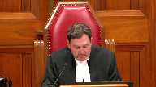
:::

Be seated, please.

The case of Miranda Lee Dingwall et al. against Her Majesty the Queen.

For the appellant, Miranda Lee Dingwall Brent v. Bagnall.

For the appellant, Kelly Michael Richard, Jason C. Leblanc.

For the appellant, Christopher Ryan Russell, Kenneth R. Beech, and Roger P. Turkel.

For the respondent, Her Majesty the Queen, Susan Elliott, and Jeffrey McDonald.

I don't know if it's Mr. Beech who will start, I guess.

**Speaker 1** (00:01:20): Chief Justice and Justices, I will commence my argument with a brief overview.

::: {.column-margin}
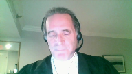
:::

The appeal, this appeal is about fairness, more particularly the right to a fair trial.

All three appellants were found guilty of a shooting and the burning of the stolen pickup truck involved in the shooting and the hiding of the gun used in the shooting.

The shooting was separated by about 20 kilometers from the destruction of the stolen pickup truck and the hiding of the gun.

This appeal is only concerned with the shooting offenses as leave was not granted on the other counts concerning the destruction and hiding of the evidence.

Now the case against all three appellants was 100 percent circumstantial.

There simply was no direct evidence of any act or the intent on the part of any of the appellants.

In fact, none of them could be put at the scene of the shooting.

The evidence disclosed that there were at a minimum five people that could have been that could have been involved and there could have been several more.

Three people were in the vehicle in which the shooter was riding.

At a minimum two more people were 20 kilometers away at the time of the shooting.

The appellant Dingwall was one of the people that was 20 kilometers away when the shooting occurred.

It is impossible to say where the other two appellants were at the time of the shooting.

They could have been at the shooting.

They could have been 20 kilometers away with Dingwall or they could have been somewhere else.

Further, due to the gap gaps in the evidence, the trial judge did not identify any acts that any of the appellants performed to make them either principals or aiders or abettors to the shooting.

The trial judge convicted after erroneously stating that where an alternative inference that supports a reasonable doubt is asserted, there needs to be some evidence to support it.

Of course, this is contrary to this court's well-known decision of Villa Roman.

This misstatement of the law resulted in an unfair trial and the appellants asked this court to either order a new trial or to enter acquittals on all counts.

The appellants state the issue as did the trial judge err in law in his determination that the accused's guilt on counts three to six was the only reasonable conclusion on the totality of the evidence.

The appellants bring two arguments to assist this court in its determination of this issue.

The first argument is that inferences consistent with innocence do not have to be based on proven facts.

The second argument is the verdicts are unreasonable.

I now turn for my overview to an in-depth analysis of the appellant's first argument that inferences consistent with innocence do not have to be based on proven facts.

I'm going to start with a reference with a reference to the trial judgment which has been reproduced at the appellant's condensed book at tab two paragraph or page four.

I'm drawing the I'd like to draw the court's attention to paragraph nine where the trial judge outlines the principles that will govern his analysis.

Paragraph nine the reads as follows the following principles also apply a in some cases in the absence of a credible explanation an inference of knowledge may properly be drawn from the circumstantial evidence.

We have no quarrel with that.

B is the problematic principle the trial judge states when alternative inference is asserted there needs to be some evidence to support it and he refers to a pre-Villa Roman British Columbia Court of Appeal case called Vu.

This is clearly contrary to Villa Roman.

Then we have produced the relevant paragraphs of Villa Roman at page 19 of our factum at paragraph 61.

I'm simply going to direct the court's attention to the next page page 20.

We commence paragraph 35 on paragraph 19 and on page 20 I wish to draw the court's attention to the highlighted part of paragraph 35.

In assessing circumstantial evidence inferences consistent with innocence do not have to arise from proven facts and the court follows that with several cites and then continues requiring proven facts to support explanations other than guilt wrongly puts an obligation on an accused to prove facts and is contrary to the rule that whether there is a reasonable doubt is assessed by considering all of the evidence.

And skipping down to paragraph 36 of Villa Roman again referring to the highlighted portions I agree with the respondent's position that a reasonable doubt or a theory alternative to guilt is not rendered speculative by the mere fact that arises from a lack of evidence.

There really is no dispute that the trial judges misstated the law on circumstantial evidence.

All three judges in the British Columbia Court of Appeal agreed that this was an error of law and the Crown also agrees.

The appellants submit that absent the curative proviso the appellants are entitled to an acquittal or a new trial.

The appellants state this is a matter of fairness.

The appellants further say that this is particularly true here when the majority of the Court of Appeal stated that not every trier of fact would inevitably come to the same conclusion and in fact the court itself divided on the appropriate conclusion to be reached.

Excuse me, may I ask you a question?

**Justice Martin** (00:09:09): I think it is clear that there is a misstatement of the law.

::: {.column-margin}
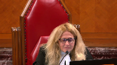
:::

But then you then went and said that makes it an error of law.

And I'd like to hear further submissions on that proposition.

Because it would seem to me that there's a plausible reading of the British Columbia court of appeals judgment that they found that it was a misstatement of law but there was no error of law.

**Speaker 1** (00:09:40): Mm hmm.

::: {.column-margin}
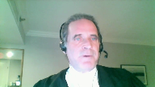
:::

Well, our first thing the appellant states, submits is that we can't tease that error of law out of the whole judgment.

We, the appellant also states, it's presumed that the trial judge was acting reasonably inconsistently and having stated the principle as he did, he applied it.

And the appellant draws the court's attention to paragraphs 105 and 106 of the reasons for judgment.

And if I can just go there.

In paragraph 105, the the trial judge is dealing with certain gaps in the evidence.

And the defense has proposed alternative theories that could be drawn from them.

It's concerned with a parking pass that was found in the vehicle driven by the appellant Dingwall in which the other two appellants were were found.

This was an important piece of evidence because that parking pass was originally in the vehicle that was used in the drive by shooting.

It somehow ended up in the Dingwall vehicle.

And the trial judge used that fact to draw the conclusion that there was a close connection between the Dingwall vehicle and the shooting vehicle.

The defense pointed to the fact that there was a gap in the evidence of how the parking pass got in the vehicle and suggested at least three alternative explanations for that.

These are reproduced at paragraph 105 and at paragraph 106, the trial judge deals with it.

Paragraph 105 states this, the defense raises several theories with respect to the parking pass being found in the Dingwall Yukon.

These include the pass was sold or maintained by the thief in Prince George and passed on to one of the accused in the preceding 24 hours.

B, the pass was recovered from the side of the road in Prince George as was a tire and lawn chair from that vehicle.

And C, the pass was taken from the Eagle truck by the person who drove the truck to the final location off of Highway 39 when it was found burning, never having entered McKenzie.

And then it somehow magically ended up in Ms. Dingwall's vehicle.

Well, it could have got in there in any way.

**Justice Brown** (00:12:47): have floated in on the wind.

::: {.column-margin}
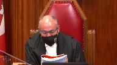
:::

I mean, these are, I mean, these are remarkable coincidences, right, when that, that, that, you know, a pass that was recovered from the side of the road and by presumably the Ms. Dingwall, and then her vehicle is remarkably seen on the same logging road 185 kilometres away from where the vehicle from which the pass was stolen is found burning.

**Speaker 1** (00:13:22): Well, we respectfully submit if the trial judge would have entered that type of analysis, then he would have then he would have acted correctly.

::: {.column-margin}
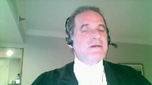
:::

But that's not what he did.

He didn't say that is an unreasonable inference.

It is speculative and I will not and it I will not drive because it really does it really need saying.

**Justice Brown** (00:13:41): I mean, I just think these are absurd, with respect.

::: {.column-margin}
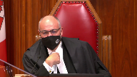
:::

These are absurd explanations.

You might as well, maybe there was a strong wind on the Hart Highway that day, and blew the pass off the side of the road to the logging road, and McKenzie, I mean, come on.

Well, I mean, that's weak.

But it's not much weaker.

**Speaker 1** (00:14:06): Well, number A isn't that weak, that the pass was passed on, that the parking pass was passed on by the thief, that there was some money involved in this, there was a, there's a value to this pass.

He happened to pass it on by the thief, that there was some money involved in this, there's a value to this pass.

**Justice Brown** (00:14:19): on to the person whose vehicle was found next to the burning vehicle from which the pass was stolen the next day.

**Speaker 1** (00:14:27): Well, but what what you're doing is you're analyzing the inference and you're rejecting it because it it because you're the view that it doesn't follow.

::: {.column-margin}
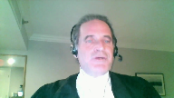
:::

That's not what the trial judge did.

The trial judge said this, he said, but there is no evidence upon which these inferences or theories could be based.

He didn't do the type of analysis that the court is doing right now.

And that is grounded in his misstatement of the law that where there is not where there is an alternate theory there has to be evidence to support it.

That's the problem and that's where it shows up over and over.

And we contrast this paragraph with paragraph 102.

I'm sorry, just

**Justice Karakatsanis** (00:15:18): I'm sorry, just before you leave that paragraph, I'm looking at the very next sentence where he refers to speculation.

::: {.column-margin}
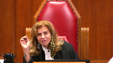
:::

Isn't he saying there, not that there's, you know, I need specific evidence, but that based on the evidence as a whole, this is speculative.

**Justice Brown** (00:15:39): In paragraph 107, there's another theory that's advanced that these pieces of the broken headlight from the Yukon could have, you know, maybe a flying rock or something from the vehicles that passed by.

::: {.column-margin}
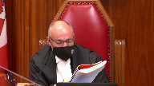
:::

And then Justice Abreu concludes, this theory in my view also defies common sense.

In other words, that theory defies common sense like the others above defy common sense, which I tend to think is correct.

So maybe he did engage in that analysis.

**Speaker 1** (00:16:14): Well, I think, well there's a couple of problems with that and the first and obvious problem, if we're saying that he misstated the law and then simply didn't apply it the way he stated it, then we're saying he was inconsistent in his thinking and he wasn't doing a rational analysis.

::: {.column-margin}
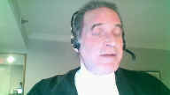
:::

We have to assume, I respectfully submit, that once he stated the principles that bound him, he followed those principles.

**Justice Kasirer** (00:16:46): Isn't it possible that, following up on Justice Brown's point, that we're in exactly the same circumstance as Villa Roman itself?

::: {.column-margin}
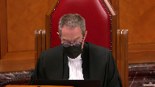
:::

You remember at Villa Roman, the court said that at first glance, there were some problematic statements in the trial judge's reasons, but then reminded us of our duty as appeal judges, paragraph 48, to read the trial judge's reasons as a whole and put them, such as the sentence in 106 that you call our attention to, in the context of the judgment as a whole.

I mean, that's right in Villa Roman, which you're relying on.

It strikes me that you're, or maybe I'm wrong, but you are inviting us to do the kind of parsing that we shouldn't do.

**Speaker 1** (00:17:38): Well, I mean the crown relies on Villa-Roman and Villa-Roman was a much different case.

::: {.column-margin}
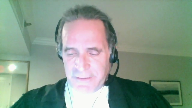
:::

In Villa-Roman the court found that the offending language was used in reference to the burden on the crown and the court said this in fact was not an error of law when it talked about the crown's the crown's onus and the and caution the jury about drawing speculative conclusions from the crown's from the crown's theory from the crown's evidence.

This is not like that at all.

This goes to the onus on the accused.

I mean this requires the accused to bring evidence and to prove facts to support alternative theories.

So it's very very different.

The other thing which the appellant wishes to say about what the BC Court of Appeal did is that we respectfully submit that what the BC Court of Appeal did is it retried the accused.

It looked at all it looked at the evidence before the trial judge.

It did not have all the advantages that the trial court has when assessing evidence and did its own analysis and this court has said that the court simply can't do that

and I I we have produced in our factum at page 21 excuse me

I yes page 21 of our factum I'm just going to take me a moment to get there.

This court in SPL in 1991 decision I'm referring to page 21 of our factum paragraph 64 and it talks about an error of law.

On the other hand if the Court of Appeal finds an error of law with the result that the accused has not had a trial in which the legal rules have been observed then the accused is entitled to an acquittal or a new trial in accordance with the law.

The latter result will obtain if there is a legally admissible if there is legally admissible evidence on which a conviction could reasonably be based.

The court cannot substitute its opinion for that of the trial court that the evidence proves guilt beyond a reasonable doubt because the accused is entitled to that decision from a trial judge or jury who have all the advantages that have been so often conceded to belong to the trier fact.

If the Court of Appeal were to make that decision the accused would be deprived of a trial to which he or she is entitled first by reason of the abortive initial trial and second by the Court of Appeal.

**Justice Wagner** (00:20:37): Mr. Burt, I will come back to one of my colleague's questions, Justice Martin, assuming that the first judge made a misstatement of the law. Yes.

::: {.column-margin}
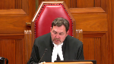
:::

That doesn't mean that there is an error of law, and that was, I think, the question of my colleague.

So what do you answer to that?

The first judge made a misstatement of the law, and that was, I think, the question of my colleague.

**Speaker 1** (00:21:02): Well we say that we say that he had to have made an error of law because the evidence in this case was so full of gaps that he could only have gotten there and the Court of Appeal got there by finding by finding a a plan for which there was no evidence.

::: {.column-margin}
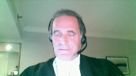
:::

Now in Villa Roman in order for the court to safely arrive at that plan it had to be the only possible plan on the evidence that was available on the evidence and it simply wasn't.

Mr Justice Butler in the Court of Appeal in his dissent and I'm trying to go find it right now.

Mr Justice Butler in the in the Court of Appeal and dissent rejects this notion of a plan and he says this is speculative.

He says he says it doesn't follow with circular reasoning to impose a plan on this and we have reproduced that portion of Mr Justice's argument or decision in tab 6 of our condensed book and it's at page 13 where at paragraph 116 where Mr Justice Butler says nothing supports the conclusion that the shooting was well planned and organized other than that the sequence of events unfolded as it did yet the events themselves do not lead inevitably to the conclusion that they were well planned.

It is a reasonable possibility that Ms Dingwall had no knowledge before the shooting occurred that anyone whether the co-accused or the unidentified persons in the Eagle truck possessed a firearm.

The evidence from Mr Hanju established there were three individuals sitting out front of the Chrysdale residence at 4 a.m that's where the shooting did place.

Did the people in the Eagle truck know that or did they have some other plan to confront an individual at the Chrysdale house or steal something from that house in the middle of the night?

I mean that's important this was a shooting that happened at 4 a.m to think that it's well planned that they're going to go by someone's house at 4 a.m

and there's going to be three people outside that are going to be shot at stretches credibility.

The court goes on

**Speaker 1** (00:24:06): Did the people in the Eagle truck know that or did they have some other plan to confront an individual at the Crisdale house or steal something from the house in the middle of the night?

::: {.column-margin}
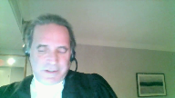
:::

But the plan changed when they saw the people outside.

With no information about the relationship between the accused and the victims, if there is one, and what may have motivated the shooting, it is not possible to draw inferences about whether the shooting was premeditated as opposed to a rash or random decision.

Indeed, the actions of burning the Eagle truck, which immediately drew suspicion and police activity, throwing the firearm away, come close away close to the burning truck and taking the parking pass at least equally suggest a poorly thought out or an unplanned sequence of events.

Thus, while it would be insufficient evidence of the actus reus to say that there was a plan and therefore Ms. Dingwell must have taken part in it somehow, the record does not allow for that conclusion.

So we must recall that there is no evidence here of any act which could make any of the appellants aiders, abetters, or principals.

There simply isn't.

And when the trial judge stated, as he did in paragraph 9B, that there has to be some evidence, we also must look at what he said in paragraph 9A. If I could just go to 9A in our, again, it's at tab two.

And I draw the court's attention to page four of the, of our condensed book and bearing in mind, there was no evidence of knowledge whatsoever here.

9A, the trial judge says this, in some cases, in the absence of a credible explanation, i.e. where there is no evidence, an inference of knowledge may properly be drawn from the circumstantial evidence.

So he's already said, what I'm allowed to do in the absence of evidence is drawn inference of knowledge.

And then in B, immediately following that, he says, if you're going to ask me to draw an alternative inference, i.e. that they didn't have knowledge, you have to point to the evidence.

Read that way, the appellant rhetorically asks, how could there not be an error of law that affected the judgment?

**Justice Karakatsanis** (00:27:00): Can I ask you this?

::: {.column-margin}
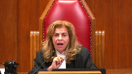
:::

I understand your submission that there was not only a misstatement of the law, but it was applied in a way that resulted in an error of law.

So my question to you is this.

If, however, we agree with the conclusion of the Court of Appeal, the majority, that in fact, although there was a misstatement of law, it was applied in a way that was not an error, is the curative proviso then irrelevant?

**Speaker 1** (00:27:38): Well, that's a very good question and the appellant says, and that comes down to the question of what does the appellant have to do when he identifies an heir of law?

::: {.column-margin}
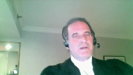
:::

Is there a burden on the appellant to say, not only is there an heir of law, but in fact, it affected the judgment?

Or do all we have to do is point out there's an heir of law and then the onus shifts to the crown to call out, to invoke the curative provisional.

**Justice Karakatsanis** (00:28:08): I guess my question really is, is it, it's not just an error of law, is something different than a misstatement of the law.

::: {.column-margin}
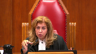
:::

It can be the same, but isn't there a conclusion here that despite a misstatement, the law was actually applied correctly?

And if that prevails, then is the curative proviso engaged at all?

I understand.

**Overlapping speakers** (00:28:37): Well-

**Justice Karakatsanis** (00:28:37): that a misstatement is an error of law, but what I'm asking you to do is to look at how the law was actually applied and whether that amounted to an error of law.

**Speaker 1** (00:28:55): No, I understand the court's question.

::: {.column-margin}
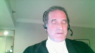
:::

I mean, if the court was satisfied that he made an error on the face, there's a misstatement of the law, but nevertheless applied the correct law.

But, I mean, rhetorically, we would ask, how could we ever know that he applied the correct law?

This, the facts, bearing in mind in a circumstantial case, it is the trial judge who separates a reasonable inference from speculation.

How can we ever know if the next trial judge who looked at this would approach it the same way?

But we do agree the provisor would not be engaged if there was no actual error of law.

We agree with that.

But how could we ever come to the conclusion that there was no error of law without re-examining all the evidence in the face of the error of law?

And SPL says you can't do that.

The trial court can't do that absent, or the appeal court can't do that absent the cure to proviso.

And I think, and then, of course, there was an earlier question about Villa-Roman, and isn't that exactly what Villa-Roman did?

And again, we return to, well, no, not really.

What Villa-Roman said, there was no error of law because it didn't affect the accused.

It only went to the burden on the crown.

And in fact, it didn't misstate the burden on the crown.

It stated what the burden of the crown was.

But here, there's a clear statement that puts an onus on the accused to provide evidence.

So how, in the face of that clear statement, assuming that the court is acting reasonably on following the principles that say he must follow, how can we, at the end of the day, sit back and say, nevertheless, he got it right?

I respectfully submit, we respectfully submit that just can't be done.

That just can't be done, especially bearing in mind the high, high onus of proof in a circumstantial case.

Can this be the only possible conclusion if he would have correctly stated the law?

We respectfully submit, there's simply no way of knowing that.

And as SPL says, the accused would have been deprived of a fair trial because of the misstatement of law.

And then the accused would again be deprived of the trial by the appeal court, if the appeal court ignores that.

You know, in the court of appeal, the majority said the trial judge correctly looked at all the gaps, and he rejected any, any conclusions as being speculative.

The minority said exactly the opposite.

The minority said, no, there's all kinds of gaps here that he didn't examine.

The relationship between the individuals, no evidence at all of them meeting beforehand, no evidence of a plan, no evidence of any discussions.

He didn't consider those.

And if he did, he might not have come up with the same conclusion.

And the appellants say, and if he did consider a plan, what particular plan was it?

Because he didn't tell us, right?

He didn't tell us, right?

What particular plan was it?

Because he didn't tell us what plan he considered.

I mean, the Crown posits a plan, which coincidentally fills in all the gaps of the evidence before it.

But why not a plan?

Why that plan?

Why not a plan that is incapable of filling in the gaps?

For instance, a plan where those at the burn site where the where the evidence was destroyed, and the gun was hidden.

That's all they knew about the venture that night.

They didn't know about what was happening in Mackenzie 20 kilometres away.

They didn't know the gun was fired.

They didn't care.

They were just there to burn a truck and hide a gun.

Wasn't there evidence of residue on them?

There was.

There was evidence of residue.

You just mentioned they didn't know the gun was fired, but the suggestion was they were.

**Justice Brown** (00:34:00): You mentioned they didn't know the gun was fired, but the evidence was that they were obviously quite close to a gun that had been fired.

**Speaker 1** (00:34:08): Yes, but the evidence was also that the way that they were arrested and held and handled by the police.

**Overlapping speakers** (00:34:14): Oh, yes, that's right, there was that concern about contamination, yeah, you're right.

**Speaker 1** (00:34:18): So why not that plan?

::: {.column-margin}
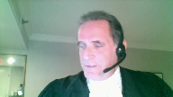
:::

That plan is equally available on the evidence as the plan that conveniently fills in all the gaps.

So how can we say no error was made when there is available another reasonable inference on the evidence?

And then when we juxtapose that with 9a, where he says within the absence of evidence, I can draw an inference of knowledge.

And then he says, and if you're gonna tell me an alternative inference of knowledge, you've got to give me some evidence, then I respectfully submit.

It's really difficult to sit back and say, nevertheless, he applied the right test.

**Justice Brown** (00:35:17): And just to be clear, the other reasonable inferences that you describe are the ones set out at Paragraph 105 and 107 of the Trial Judgment.

**Speaker 1** (00:35:33): I might just get to that.

No, the one of you mean, you mean the reasonable inference is that the trial judge rejected is that what.

**Overlapping speakers** (00:35:49): Yeah.

**Speaker 1** (00:35:49): Yes, you mean, he certainly referred to those rejected those 105 and 107 at this, he found a gap in the 107.

::: {.column-margin}
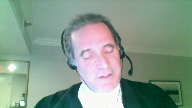
:::

He also found the 20 minutes.

There's a gap of 20 minutes between the sighting of Dingwall at what turned out to be the burn site and then the discovery of the vehicle in flames that he fence referred to that gap and he didn't see that as a problem.

That's in paragraph 99 and 100.

But he certainly didn't refer to other serious gaps in the evidence, the gaps of that.

**Justice Brown** (00:36:52): about the gaps I'm just wondering about the the inferences that he was urged to consider as reasonable alternative inferences to be drawn from the evidence so those yet he lists out some at paragraph 105 and another one at 107 I'm wondering were there other inferences that you say he he ought to have identified as alternative reasonable accounts for the evidence

::: {.column-margin}
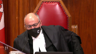
:::

**Speaker 1** (00:37:23): Yes, he should have.

He should have.

On the evidence, he could have easily inferred on the evidence that the three appellants had no knowledge of what happened in Mackenzie where the shooting took place.

I mean, that was an inference that was wide open for him to make.

**Justice Kasirer** (00:37:40): Isn't it fair to say that the trial judge, all these repeated references to hypotheticals, that he considered the evidence as well as the absence of evidence that the accused relied upon?

::: {.column-margin}
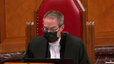
:::

And if that's the case, perhaps his misstatement is not as important in its consequences as you say.

**Speaker 1** (00:38:08): Well, the appellant respectfully submits that we don't see how he could have considered the absence of evidence if there was, well he couldn't have considered any inferences that arise from the absence of evidence if he was being consistent.

::: {.column-margin}
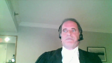
:::

If he was actually doing what he said he was going to do in 9b.

And there's absolutely no reason we respectfully submit to say that while he was inconsistent.

This, or he misstated because he wasn't thinking about it.

I mean recall that the decision was first made from the bench and then he said written reasons to follow.

And so presumably he thought about what he was writing and presumably it wasn't it wasn't made off the cuff like sometimes occurs from the bench after hearing all the evidence and the arguments.

This was made presumably after some reflection.

And he clearly says I need evidence for alternative inferences.

There were all kinds of alternative inference we respectfully submit on the evidence.

He just didn't turn his mind to them.

He didn't consider it.

If we can go on then, turning to the reasonableness of the verdict which is our second argument.

Of course it's the well-known Yibbe's test which of course I'll briefly mention where the trier fact acting judicially could reasonably satisfy the accused guilt was the only reasonable conclusion available on the totality of the evidence.

We say guilt wasn't the only reasonable inference and we point to the to the counts themselves.

Three of the four counts required proof of specific intent.

Counts three and four required proof of the intent to discharge a firearm.

It also required proof of the intent to shoot the named complainants and also proof of the intent to wound.

Count five required proof of the intent to discharge a firearm and count six was the only general intent count.

It was these requisite intents that the Crown had to prove.

Crown is faced with proving specific intent.

It's got to prove it.

And so then the question of course is well there may be evidence to show that they acted together but whether they had a the requisite intent is an entirely different inquiry.

You need more than just acting together.

And in fact there was a paucity of evidence that they acted together in this case or with the requisite intents there simply was no evidence on any of these issues of mens rea.

There is no evidence that the appellants knew before the shooting that the shooter had a firearm.

There's no evidence that the appellant knew that the shooter intended to discharge the firearm.

There's no evidence that the appellants knew that the shooter intended to shoot anyone or the appellants knew that the shooter intended to wound anyone.

In fact there is no evidence and this is crucial as well that the appellants knew the shooter had even discharged the firearm.

All of this had to be inferred from the evidence.

To convict this inference had to be the only reasonable conclusion available on the totality of the evidence.

And we say it simply was not.

We should it might be helpful if if I briefly refer to some of the evidence.

The shooting occurred at approximately four in the morning in the town of Mackenzie.

Two passengers in a pickup truck got out of the vehicle shot at people in their front yard.

They hopped back in the pickup truck.

The vehicle sped away.

The appellant Dingwall was not at the shooting.

She was 20 kilometers away.

There's simply no evidence where the other two appellants were at the time of the shooting.

And the first time all three appellants are put together and the first time the two appellants are even located in the evidence in the story is when they're arrested.

In a vehicle, Dingwall is driving about two hours after the shooting and 150 kilometers away from the shooting.

That's the only direct evidence of where the male appellants were.

Additionally, in addition to that there was this parking pass we've already discussed and there was this broken headlamp from the Dingwall vehicle.

Now the trial judge found that there was no evidence of the shooting.

Now the trial judge found that evidence.

I find that they were all parties or aiders and abettors in the destruction of the vehicle.

He could not find Dingwall or the two male appellants at the scene.

Nevertheless, the shooting scene, nevertheless he found that Dingwall was either an aider or a better to the shooting and he found in relation to the the males that they were either principals involved in the shooting or aiders or abettors.

And he said his reasons are very slim

but he said this at paragraph 93.

This is his conclusion which we have reproduced in our condensed book at tab three at pages six and seven of tab three in his paragraph 93.

When I apply the legal framework to which I have referred to the totality of the circumstantial evidence used in this case, I find that all the evidence with the exception of the GSR significantly corroborates the Crown's case being that

and I pause for a moment to say no he does not refer to the lack of evidence.

He's just talking about all the evidence.

Then we go on.

He says the accused Dingwall is guilty as an aider or abettor pursuant to section 21 of the criminal code of the offences with which she is charged in relation to the shooting and as a principal or aider or abettor with respect to the burning of the Eagle track on the burn site.

And then he says the accused Richet and Russell are guilty either as principals or aiders or abettors with the offences with which they are charged in relation to both the shooting at 221 Chrysdale and the burning of the Eagle truck at the burn site.

That's what he found.

The Crown says well he can do that.

He can he can rely on Thatcher and he can rely on Picton and it's open it's open for the trial judge to convict when there exists using the language from Thatcher and Picton when there exists quote evidence of a concerted action in the commission of offense end of quote.

But the appellants say we need more than this and the appellant brings this court to Picton and paragraph 73 of Picton which is produced at tab eight of our condensed book on page 18.

Where Mr. Justice Labelle for the minority he had two others with him I believe Justice Fish was one of them at any rate.

Mr. Justice Labelle said this he said the problem with this line of reasoning is that ignores the fact that aiding and abetting were not before the jury as alternative routes to the liability and co-principal liability was not available in the evidence.

Well it may be true that a separate party instruction on co-principal liability may not generally be necessary given that its elements are the same as for sole principal liability.

The same cannot be said of the liabilities an aide or a better and this is the next sentence is what we wish to undermine the following.

Although the ultimate legal liability is the same for a principal as for an aider or a better the findings of fact necessary and the specific legal principles which apply to each are different.

The findings of fact necessary.

He made no findings of fact.

He made no necessary findings of fact to make them either a principal or an aider or better.

**Justice Brown** (00:47:40): Is this not the subject of a portion of your factum that was struck?

**Speaker 1** (00:47:48): well we're not arguing that the crown has raised in its fact um um Picton the crown has introduced Picton we're just simply going to Picton and saying this is what Picton says and

**Justice Brown** (00:48:05): Well, the term of the order was that no party shall refer to these paragraphs, and I assume that means the contents of the paragraphs.

**Speaker 1** (00:48:15): step out of that.

::: {.column-margin}
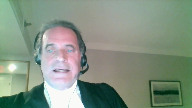
:::

But dealing with just on a reasonable verdict, putting aside Picton, there is simply no evidence which could make either party a principal or an aider or a better.

I mean to be an aider or a better, the party has to do more than just some action or some encouragement that does in fact assist.

They must do it for that purpose.

There's no evidence here that anything was done for that purpose.

As Mr. Justice Butler correctly stated in his descending reasons, he said the fact that they were convicted of burning the truck and hiding the gun can't make them aiders and abettors to the actual shooting because aiding and abetting has got to come before the offense.

And this is where the Crown in the absence of evidence urged at the Court of Appeal and the Court of Appeal agreed with them that well in the absence of all this evidence it's open to find a sophisticated plan.

And I've already referred to that.

I'm not going to go over that again but other than to highlight that if you need a plan and they did to make them aiders and abettors then surely there has got to be evidence of the content of that plan.

And if there's not evidence of the content of that plan then we're just making up a plan to fill in gaps.

Why that plan?

Why not another plan?

As I said earlier, why not a plan that the people at the burn site, these three appellants who were found at the burn site, simply knew their job was to burn the truck and dispose of the of the weapon?

Why not the driver was simply told drive me to Mackenzie, stop in front of this house, leave the rest to me?

Why not that plan?

**Overlapping speakers** (00:50:31): The

**Speaker 1** (00:50:31): evidence is as consistent with that plan as the Crown's plan.

::: {.column-margin}
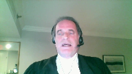
:::

And as this Court stated in Villa Roman, the Crown doesn't have to negate everything, every speculative thing, but it does have to negate equally reasonably inferences to arrive at a conviction.

And I simply direct this Court's attention to paragraph 37 of Villa Roman, which is not in our condensed book and we haven't produced that in our factum.

But the Court simply says this, when assessing circumstantial evidence, the trier of facts should consider other plausible theories and other reasonable possibilities which are inconsistent with guilt.

I agree with the appellant that the Crown thus may need to negative these reasonable possibilities, but certainly does not to negative every possible conjecture, no matter how rational or fanciful.

But it has to negative other reasonable possibilities.

This alternative plan is a reasonable possibility from the evidence and the lack of evidence, the totality of the evidence in this case.

And the Crown cannot negative it, therefore the conviction cannot stand.

To do so, to accept this plan, succumbs to the danger identified in Villa Roman at paragraph 26.

And again, we don't have this in our factum or in our condensed book.

But paragraph 26 simply says this, there is a special concern inherent in the inferential reasoning from circumstantial evidence.

The current concern is that the jury may unconsciously fill in the blanks or bridge gaps in the evidence to support the inference the Crown invites it to draw.

Baron Alderson referred to this risk in Hodge's case.

He noted the jury may look for, and may, quote, look for, and often slightly distort the facts, end of quote, to make them fit the inference that they are invited to draw.

Or as his remarks are recorded in another report, the danger is that the mind may, quote, take a pleasure in adapting circumstances to one another, and even straining them a little, if need be, to force them to form parts of one connected whole.

Now, the appellants respectfully submit, the very good example of this happening is located in paragraph 52 of the Respondent's Factum, where the respondent states the appellants could be, quote, enforcers hired by someone to shoot up the appellants, the Chrysdale residents, or compelled to do so to distinguish a drug debt, end of quote.

There's absolutely no evidence that to support this.

Absolutely no evidence.

That is a clear illustration of doing what Baron Alderson warns against, that is, quote, taking pleasure in adapting circumstances to one another, and even straining them a little, if need be, to form parts of one connected whole.

Thus, we respectfully submit that the verdict is unreasonable, and this court ought to enter acquittals on all counts, alternatively a new trial.

Subject to any further questions, those are the appellant submissions.

**Justice Wagner** (00:54:19): Thank you very much.

::: {.column-margin}
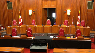
:::

The court will take its morning break.

Fifteen minutes.

The court will take its morning break.

Please be seated.

**Speaker 2** (00:55:37): Chief Justice, Justices, thank you.

::: {.column-margin}

:::

This is a fact-driven appeal about the reasonableness of convictions for a drive-by shooting based on circumstantial evidence.

And as this court knows, the appeal comes before the court because of a dissent in respect of three counts only.

And I stress this point because all of the judges in the court below agreed that the trial judge made no error in convicting the appellants of burning the vehicle used in the drive-by shooting and disposing of the firearm also used in the shooting.

Those convictions are not under appeal.

So we know that the appellants acted to help the drive-by shooters.

The issue is, was the trial judges finding that they knowingly took part in the drive-by shooting unreasonable?

And our position is on correct application of the appellate standard of review.

It was open to the trial judge in this case to convict.

**Justice Wagner** (00:56:41): So I understand that your arguments, your submissions, will be as concise as your factum.

**Speaker 2** (00:56:48): Yes, I will try to do that.

Thank you.

I was just going to first address the facts, some of the facts, and then speak to the standard of review.

**Justice Wagner** (00:56:58): You have a good knowledge of the facts also, but it's up to you.

**Speaker 2** (00:57:03): The point that I would like to make about the faxes is in my submission they established that these offenses were part of a, what I would term a single transaction and a precise and coordinated plan to commit a drive by shooting.

::: {.column-margin}

:::

And so I make, I have just have five points to make in that regard.

And the first is that the offenses were timed with precision, and the entire transaction took less than 30 minutes from the time of the shooting, until the Eagle truck was discovered engulfed in flames, and nobody was around.

So during that brief 30 minute time, the shooting occurred.

They had to travel 20 kilometers, burn the vehicle, hide the gun and flee.

The second point is that the offenses required coordination.

The Eagle truck was stolen less than 24 hours earlier from the appellant's hometown a distance away.

And it had to be driven to Mackenzie to commit the drive by shooting, as did Ms. Dingwall's vehicle to act as the getaway vehicle.

And indeed her Yukon was spotted at the burn site, about the same time as the shooting was taking place, evidencing coordination to enable her to be in the right place at the right time.

The third point is that their actions were purposeful and goal oriented.

And I say that's consistent with the targeted shooting.

As the vehicle sped into the residential development the shooters walked up to the curb, only as far as the curb, and opened fire.

And then they fled in the vehicle and all of this happened with quick succession.

The trial judge's fourth point found that the manner in which the shooting took place demonstrated that the perpetrators had familiarity with the targeted residents and its location.

And fifth, the evidence disclosed strong links between the appellants and the offenses, and that was discussed this morning that part of the Dingwall Yukon was found at the burn site as well as the parking pass.

And in addition, the fact that all three of these appellants are in a remote community 185 kilometers away from their hometown at about four in the morning.

And I say that viewed in totality, the evidence established a transaction, whereby the appellants were involved in a well orchestrated plan to carry out the shooting, hide and destroy evidence and escape.

I would also add that all three appellants played a significant role by, and I say at a minimum, because it's possible that the two male appellants were the shooters, but at a minimum, all three played a significant role by burning the eagle truck and disposing of the firearm.

The law that I say is applicable here is Villa Roman and I've included the excerpts at tab one I won't take the court there.

I make three observations.

First, Villa Roman says reasons for judgment must be read as a whole.

And in this context it's particularly opposite, because I say in Villa Roman that equivalent problematic statements were made by the trial court in that case.

The court was not persuaded that they constituted reversible error, because ultimately the judge did not lose sight of the proper process of inference drawing and the overall burden of proof.

So, I say it's, it's analogous to the issue being raised by the appellants here.

And in this case in my submission the majority did not find that the trial judge committed an error of law.

It was simply a misstatement of, of an aspect of the law of circumstantial evidence and therefore the curative proviso did not apply.

The second point in Villa Roman is that the appellate standard of review on an unreasonable verdict is deferential.

It's, we know that it is fundamentally for the trier fact to draw the line in each case that separates reasonable doubt from speculation.

And to that end, the third point I would make is that an appellant court should focus on the question of whether the inference drawn by the trial judge were reasonably available and not focus on hypothetical alternative theories or engage in speculation.

And so, turning to the final point that I wish to make which is why I say the majority applied the correct standard of review.

With respect, I say that the dissent erred by effectively retrying the case on appeal.

And unless there are any questions I will rely on my fact and with respect to the issue of whether the judge committed an error of law and whether the court of appeal was required to apply the curative proviso.

I will go over that briefly, and in my submission, Villa Roman is basically a complete answer to that issue.

With respect to the reasonableness of the verdict.

**Justice Martin** (01:02:19): Can I just stop you there in terms of the reasoning provided by the British Columbia court of appeal.

::: {.column-margin}
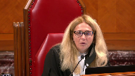
:::

At paragraph 49, there's a statement that criminals would not include someone in their plan who is not aware of their goal.

You're asking us in essence to endorse the reasoning and result of the court of appeal.

And I find that that may be too wide of a statement.

And I just like your comments on paragraph 49.

**Speaker 2** (01:03:00): Thank you, Justice Martin.

::: {.column-margin}
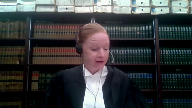
:::

So in paragraph 49, what I say is the BC Court of Appeals reasoning in that case has to be viewed in the context of the facts of this case.

So as I went through, we're dealing with an extremely short, tight timeline.

And as I articulated, the appellants played an important role.

So as I understand paragraph 49, the majority of the Court of Appeal is addressing the alternative hypothetical that in essence, these appellants were dupes, that they just were engaged to only burn the vehicle and only dispose of the firearm, and that they had no knowledge or kept in the dark about the shooting.

And in my submission in the context of these facts, which is, as I said, a tight timeline, and if one imagines, as the Court of Appeal indicates, if somebody decided to back out, given their role, it would have been disastrous, because you have somebody then in a remote community at four o'clock in the morning near a logging road with a stolen truck and a firearm having just committed a drive-by shooting.

So I'm not sure if it answers your question, but if taken broadly that no criminal is ever going to involve somebody who doesn't fully aware of the master plan, then that would be, I think, quite a broad statement.

But in the context of this case and these facts, that is in my submission what the Court of Appeal is addressing there, and explaining why the alternative that the appellants were simply dupes was speculative on the evidence.

But that essentially leads me into the submissions on the reasonableness of the verdict, and I would refer the Court to paragraph 49 as well as 48, where the Court of Appeal talks about the indicia of planning and sophistication, and paragraphs 51 and 52 are the salient paragraphs in my view, based on the facts I articulated at the beginning, that is the majority of the Court of Appeal explaining that it was open to the trial judge to convict on the basis that the purpose of the Eagle truck and Ms. Dingwall waiting at the designated spot as the getaway vehicle after burning the Eagle truck was to commit a drive-by shooting, and that there was no innocent or other explanation for the appellant's conduct in this case.

And as I indicated in my respectful submission, the weakness in the dissent in this case is that the judge effectively in my submission retried the case on appeal, and in essence the dissent simply disagreed with the inferences drawn by the trial judge, and he did that by holding that the events themselves do not inevitably lead to the conclusion that the shooting was well planned.

And then in my submission he substituted his view of the line between reasonable doubt and speculation.

And in terms of the paragraph that my friend took you to in the dissenting reasons this this morning, which would have been paragraph 116 is that paragraph page 35 of my condensed book.

There I say one finds examples of the court, the dissent doing exactly what this court said not to do in Villa Roman, which is to focus on hypothetical alternative theories which are arguably speculative.

So just looking there the the notion that they may these assailants may have planned to rob a house or may have planned to confront an individual is in my submission inconsistent and doesn't accord with the evidence and the manner in which this drive-by shooting took place.

And that being that the assailants drove up at a high rate of speed, attracting attention, fired shots, and fled within moments.

So subject to any questions it is my respectful submission that the appeal should be dismissed for the for the reasons that I've submitted in my factum as well as the reasons of the majority.

**Justice Wagner** (01:08:15): Thank you very much.

And in reply, Mr. Beach.

**Speaker 1** (01:08:33): I'll get it right this time, we have no reply.

**Justice Wagner** (01:08:36): Thank you very much.

I would ask Council to remain at our disposal.

**Justice Martin** (01:09:22): The court is adjourned.

**Justice Wagner** (01:09:49): Thank you.

Be seated, please.

So I would like to thank council for their submissions.

The court is ready to release a decision, and I will ask Justice Roe to read the reasons.

**Justice Rowe** (01:10:05): Thank you, Chief Justice.

::: {.column-margin}
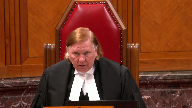
:::

We would dismiss the appeal substantially for the reasons of Newbery J.A. at paragraphs 51 and 53.

I would add that notwithstanding a misstatement of law with respect to circumstantial evidence set out by the trial judge in paragraph 9B of his reasons, the trial judge properly applied the law with respect to circumstantial evidence.

Accordingly, no reliance need be placed on the curative authority under section 686 of the Criminal Code.

Finally, I would note that while the Court of Appeal in paragraphs 39 and 50 addressed the rule in Hodges case, the scope and application of that rule is not before this court.

**Justice Wagner** (01:11:11): The court is adjourned until Tuesday morning, 10.30, Ottawa time.