---
title: Her Majesty The Queen, et al. v. David Sullivan, et al.
published-title: Heard
date: 2021-10-12
sidebar: false
---

This transcript was made with automated artificial intelligence models and its accuracy has not been verified. Review the original webcast [here](https://scc-csc.ca/case-dossier/info/webcast-webdiffusion-eng.aspx?cas=['39270']).
---

**Justice Wagner** (00:00:26): Bonjour, veuillez vous asseoir, s'il vous plaît.

::: {.column-margin}
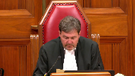
:::

In the case of Her Majesty the Queen against David Sullivan et

al, for the appellant respondent on cross-appeal, Her Majesty the Queen, Joan Barrett and Michael Perlin and Jeffrey Wingarden, for the intervener Attorney General of Canada, Michael H. Morris, Roy Lee, Rebecca Sewell, pour l'intervenant procureur général du Québec, Maître Sylvain Leboeuf et Maître Jean-Vincent Lacroix, for the intervener Attorney General of Manitoba, Amy Cutler, for the intervener Attorney General of British Columbia, Lara Visoli, for the intervener Attorney General of Saskatchewan, Noa Verniskowski, for the intervener Attorney General of Alberta, Deborah J. Alford, for the intervener Women's Legal Education and Action Fund Inc., LEAF, Megan Stephens et Lara Kinkartz, for the respondent David Sullivan, Stephanie Di Giuseppe, and Karen Height, for the respondent appellant on cross-appeal, Thomas Chan, Matthew R. Gorlet, Daniel Rabitaille, for the intervener Canadian Civil Liberties Association, Eric S. Neubauer, for the intervener British Columbia Civil Liberties Association, Jeremy Opolsky, Paul Daley, Jake Babad, and Julie Lowenstein, for the intervener Criminal Lawyers Association, Lindsay Daviau, and Deepa Negandi, for the intervener Empowerment Council, Systemic Advocates in Addictions and Mental Health, Carter Martel, Anita Zighetti, Sarah Rankin, and Maya Kotob, for the intervener Advocates for the Rule of Law, Connor Biltfell, and Asher Onikman.

Mr. Perlin.

**Speaker 1** (00:02:55): Chief Justice, Justices, Section 33.1 of the Criminal Code conforms with the principles of fundamental justice.

::: {.column-margin}
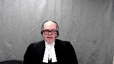
:::

It reflects a reasoned policy choice that falls squarely within the scope of Parliament's broad discretion to prescribe conduct as criminal.

A person caught by the section is not morally innocent.

That term, as Madam Justice Wilson explained in Bernard, cannot be applied to those who, through the voluntary consumption of alcohol or drugs, incapacitate themselves from knowing what they are doing.

Intentionally or negligently becoming intoxicated to such a high degree is blameworthy because it is dangerous.

**Justice Brown** (00:03:40): But that's not what this section says.

It doesn't say intentionally or negligently, it just says it happened.

**Speaker 1** (00:03:49): Well that's that's one reading of the section Justice Brown.

Our position is that the section is drafted in a way that indicates it has an objective fault requirement.

**Overlapping speakers** (00:04:00): So take me right to the section and tell me where that is.

**Speaker 1** (00:04:04): Well, I don't think you're going to find it expressly in this section and indeed of what the fault requirement is, so it's the viability of what you're going to find in this section.

**Justice Brown** (00:04:13): of the thing?

Am I reading between the lines?

What am I doing?

Let's just kind of cut to the chase here.

**Speaker 1** (00:04:18): Sure, on the interpretation question, our position is that as ordinarily happens with a criminal provision, as often happens with a criminal provision, it prescribes conduct without expressly indicating a mental element, that's common.

::: {.column-margin}
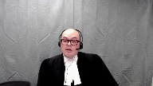
:::

And when that occurs, pursuant to many cases from this court, including Lucas, 1998, when no mental element is stated, the courts read one in.

Parliament has indicated in section 33.1 in the preamble that an objective fault requirement is what parliament intended by use of language like standard of care and marked departure.

I note that it's one of the few provisions in the criminal code that uses that language of marked departure.

Symmetry, the general principle of symmetry requires a fault requirement linked to the precise conduct for forming the actus res, and here that is self-induced intoxication that renders the person unaware of or incapable of consciously controlling their behavior.

And when you have an objective fault requirement, this court has held in many cases, Creighton, Javan Marty, Finlay, Hundle, Gossett, Neglic, where there's an objective fault requirement, it must be read as a marked departure.

And that's even if language like in Finlay, carelessness is used.

If that language of negligence is used, the court reads in a marked departure standard.

That's what parliament would have anticipated.

That's why parliament used the language of marked departure.

And in my submission, it's important to note here that no one contends that the element of self-induced intoxication has no mental element.

Everyone agrees, the Court of Appeal agreed that some mental element is required in the section.

Some mental element attaches.

There's disagreement on when that is, but nobody says that this is a pure deeming provision such that when this state of intoxication coincides with violence, it results in liability.

A pure deeming interpretation in my submission, where there's no mental element in the offense at all, would impute to parliament a rather shocking inability to interpret this court's judgments like Creighton, which had been decided just a few short years before the provision was enacted.

Or in the alternative, as Mr. Sullivan suggests, it could impute to parliament a deliberate effort to circumvent what this court said is required to make an objective offense constitutional.

That's contrary to the presumption in Mills that parliament intended to enact constitutional legislation.

It's also contrary to the parliamentary record, which demonstrates that parliament was trying to create a lasting solution, not one that would be struck down by the court.

Thank you for your attention.

**Justice Brown** (00:07:24): I wouldn't have expected that parliament was looking to pick a fight with the courts.

::: {.column-margin}
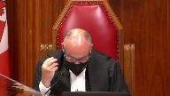
:::

I'm wondering though if I could just pull you back because your answer to my earlier question is premised on really the gravamen of the marked departure being itself the self-induced intoxication.

Is that a fair summary of what you told me?

**Overlapping speakers** (00:07:51): Yes.

**Justice Brown** (00:07:51): And so, I'm wondering if I could take you right to subsection two.

::: {.column-margin}
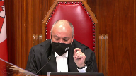
:::

And so, it says, for the purposes of this section, a person departs markedly from the standard of reasonable care generally recognized in Canadian society and is thereby criminally at fault where the person, while in a state of self-induced intoxication, so we're already there, that renders the person unaware of and capable of constantly controlling their behaviour voluntarily or involuntarily, interferes or threatens to interfere with the bodily integrity of another person.

And that suggests to me that really the gravamen of the marked departure is the general intent index offence.

That reading seems so plain as day to me that I have to invite you to disabuse me of that because otherwise I think we're ships passing in the night here.

**Speaker 1** (00:09:02): Yes well I what I would point to is that um section 33.1 sub 2 is uh it's a fault creating provision um 33.1 takes away a defense 33.2 is parliament uh identifying conduct is blameworthy and if you look at the marginal note and I'm not asking you to put too much weight onto this um it indicates that um 33.1 sub 2 provides criminal fault by reason of intoxication and that's the blameworthy act.

::: {.column-margin}
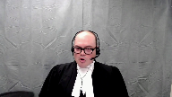
:::

**Justice Brown** (00:09:37): I want to pull you back to what it actually says.

::: {.column-margin}
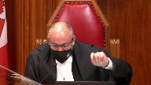
:::

I asked you about the text, and you said, let me show you a marginal note.

I want to talk about the text.

Criminally at fault, where the person, while in a state of self-induced intoxication, so it's not the becoming intoxicated, while in a state of self-induced intoxication, interferes or threatens to interfere with the bodily integrity of another person.

Why does a plain reading of the section not show us that the gravamen of the marked departure is the index of hence?

**Speaker 1** (00:10:22): Well, the act of violence, if the act of violence is read as what has to be a marked departure, in our submission, the provision could never apply in that for conduct to constitute a marked departure, you have to be conscious.

Okay, so you're taking me to...

**Justice Brown** (00:10:39): consequences now, but let's just look at the text, right?

::: {.column-margin}
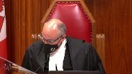
:::

While in a state of self-induced intoxication, interferes or threatens to interfere with the bodily integrity of another person.

I'm sorry, Mr. Perlin, I need to hear from you on that precise point.

What is it in the text that allows you to sort of make the interpretational argument that you're making?

**Speaker 1** (00:11:06): Well, our interpretation of the provision relies on a variety of factors, including the preamble, which is an important tool for interpretation of the provision in the preamble.

::: {.column-margin}

:::

Ascribes in, we've numbered the paragraphs in our condensed book, paragraph seven.

Parliament considers it necessary to legislate a basis of criminal fault in relation to self-induced intoxication and general intent offences involving violence.

I'm not suggesting, Justice Brown, that your textual interpretation is unavailable.

What I would go back to is a series of strong presumptions of interpretation of penal statutes, and the interpretation that you're ascribing to this, Justice Brown, I think goes further than the respondents would say, further than the Court of Appeal said, in that everyone agreed that some mental element must be associated as a matter of basic criminal interpretation with the act of self-induced intoxication.

I'd refer to that term in particular, though, self-induced intoxication.

What does that mean?

The text of the provision doesn't answer that question, and in our submission, that's, for lack of a better term, the linguistic hook that we'd ask you to rely on.

One last question.

**Justice Brown** (00:12:30): And then I'll leave you alone for a while.

::: {.column-margin}
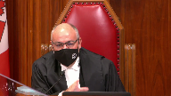
:::

If I don't agree with your interpretation, do you have any, I mean, do all your arguments on constitutionality hang on that interpretation?

If I don't accept it, is this provision, is it, are we into section one, I guess is the question.

And the answer is yes.

Thank you.

**Speaker 1** (00:13:01): If the provision does not include fault on a marked departure standard in the way that that analysis applies as described in Crichton, Hundle, Beattie, for example, then the provision imposes liability in the absence of necessary minimum fault requirement.

::: {.column-margin}

:::

And we're into section one.

And my colleague, Ms. Barrett, is going to address you on section one.

Thank you.

**Justice Côté** (00:13:29): Councillor, I have a question for you.

::: {.column-margin}
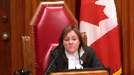
:::

So here you say that section 33.1 applies only to cases of blame or intoxication.

But you seem to have taken a different position before the Court of Appeal.

When I read paragraph 89 of the majority of reasons.

**Speaker 1** (00:13:51): Well, I don't want to provide evidence here and you don't have the transcript of the of the Court of Appeal hearing before you.

::: {.column-margin}
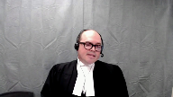
:::

What I can tell you is that the issue arose in the context of a question from Justice Pichago and we provided a series of responses and if I recall correctly the last one was that the Chalk and Vicburg interpretation of the mental element for self-induced extreme intoxication wasn't binding on that court.

It's certainly not binding on this court but more importantly our analysis in the Court of Appeal, the position that we were taking, simply assumed the correctness of the then leading cases on the mental element.

Justice Pichago's questioning prompted us to take a closer look at the issue before we came before this court and our analysis, particularly the requirement, the fact that marked departure must be read in to offences predicated on objective fault, led us to take the position that we're taking before you now and in my submission it's not prejudicial in any way to any of the, to either of the respondents to take this position before you.

Thank you.

**Justice Kasirer** (00:15:01): Mr. Perkins.

**Justice Moldaver** (00:15:01): Excuse me, Mr. Perlin, do I take it that when you talk about intoxication in this section, you are effectively reading in excessive intoxication of a kind that would render you either incapable of forming any intent or that would sort of disable you from having any control over your conduct?

::: {.column-margin}
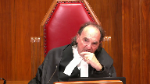
:::

It's clear that you would say that when the section refers to intoxication, self-induced, you're referring to the voluntary consumption, I think, of intoxicants.

Now, here's where I want to question you on a first read-in on mens rea.

Knowing or in reckless disregard that the consumption of these intoxicants could render them unaware of or incapable of consciously controlling their behaviour, i.e. excessive intoxication, do I have that right that you would read that in? Almost.

**Speaker 1** (00:16:15): Sorry, that's almost exactly right, although the way that you framed it, Justice Maldaver, was intent, I think you said intent, recklessness, or willful blindness, and we say it's on.

**Justice Moldaver** (00:16:28): knowing in reckless disregard, you may want to say knowing or putting it into an objective basis. Yes.

::: {.column-margin}
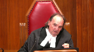
:::

Or ought to have known.

I don't know what you would ask us to read in.

So I guess I'm asking you, what is it that you would have us read in?

**Speaker 1** (00:16:48): Yes, that's almost entirely our position.

::: {.column-margin}
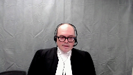
:::

Our position is that the act of ingesting an intoxicant must constitute a marked departure from the conduct of a reasonably prudent person.

And the marked departure analysis requires the court to consider not only that the conduct is something that a reasonably prudent person would not do, but because the conduct is a marked departure because it involves risk-taking and the risk of the prohibited state, the prohibited dangerous state in section 33.12 is intoxication that renders the person unaware of or incapable of consciously controlling their behavior.

That's a text of 33.12.

So we say the act of ingestion must constitute a marked departure and the relevant risk for the court to consider whether the person knew that risk or ought to have known that risk based on the facts known to the person in the circumstances is the risk of becoming intoxicated to the degree described in the section.

**Justice Rowe** (00:17:57): You know, there's a looseness about this that causes me a great deal of concern, and I don't know whether I can resolve it simply by looking at the words of the statute.

::: {.column-margin}
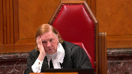
:::

I mean, a long time ago, when I represented clients of modest means, you'd go and you'd speak to someone and they'd say, well, the last thing I remember was I was drinking at so-and-so's house, and the next thing I remember, I woke up in the jail, right, and in between is just a blank.

And you have to say, well, you know, you were charged with having broken into the service station or something.

It's not an uncommon occurrence for, you know, young lawyers to have those kind of clients.

So that might be called blackout drinking.

What we're, it seems to me, we're dealing with here is something that's quite different.

I mean, you know, the two individuals here, one person said, you know, I have to attack you because you're an alien.

I mean, that's completely delusional.

The other one was, you're the devil and God has told me, you know, to destroy you or something along these lines.

Or you can imagine somebody having hallucinations and, you know, there's a person in front of them, but they believe it's a giant snake or something, and they're just defending themselves because of that.

I mean, these are not the same phenomena, but they're kind of mixed up.

And to me, there's a looseness about this that is problematic, because someone who, you know, just drinks alcohol to excess and wakes up the next morning having broken into the service station is different from the person who kills their mother because they believe they're from another planet.

**Speaker 1** (00:19:56): Yes, and I and I agree with that.

::: {.column-margin}
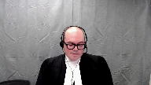
:::

And what the evidence before Parliament indicated is that, you know, blacking out is not the same as entering an involuntary state or a state where you lack capacity to form intent.

And what the section is concerned with is that kind of incapacity.

It's not concerned with drinking and not forming memories, waking up not recalling what you did.

It's concerned with intoxication that is self-induced that renders the person unaware of their behaviour at the time it's occurring or incapable of consciously controlling their behaviour at the time that it's occurring.

I want to be very precise and make sure that I'm clear on what we say this section requires.

And that's going to be a question for the for the trier of fact in a given case whether the whether the form of intoxication can do that.

And I think what we have with with some hallucinogenic drugs or with hallucinogenic drugs in general is that risk of the person becoming unaware of their behaviour.

A person who is hallucinating, that means they're perceiving something that is not true, something that does not exist, and is delusional, that means believing this false perception, can easily become unaware of their behaviour.

So that squarely falls within the ambit of the section in my submission.

Somebody whose conduct is driven by delusions, we would say, or somebody who believes that the individual is a devil, for example, that's an incapacity that's a little bit different.

What the court held in chalk at page 1321 is that intoxication, sorry, a mental state where the individual lacks capacity to appreciate the nature and consequences of one's actions, that's something that deprives the individual of the capacity to form intent or act voluntarily.

Now that could be a person stabbing somebody believing that what they are doing is cutting a loaf of bread.

What the court said in that case, that's something that deprives a person of capacity to form the intent.

But if a person is stabbing somebody believing that it is the right thing to do, they're aware of their actions, they're aware of the fact that they're stabbing somebody, but it's driven by delusions, that is something that deprives a person of the capacity to appreciate the moral wrongfulness of their conduct, and that the court held in chalk, again page 1321, is something that does not deprive the individual of capacity to form general intent.

**Justice Brown** (00:22:45): Would it be a fair summary of your argument then that the rules of fundamental justice are satisfied by showing that this state, either drunkenness or other forms of intoxication, was attained through the accused's own blameworthy conduct? Conduct?

::: {.column-margin}
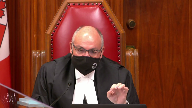
:::

**Overlapping speakers** (00:23:08): Yes, that's definitely one way to put it, and we would...

**Justice Brown** (00:23:12): That's how Justice Sapinka put it in his dissent in Davio.

::: {.column-margin}
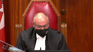
:::

And so what I'm interested in knowing from you now, Mr. Perlin, is how is what you're saying about the constitutionality of 33.1 in respect of sections 7 and 11d substantially different than what Justice Sapinka said in Davio.

**Speaker 1** (00:23:46): Well, I might answer this by saying how this is different from what the majority addressed in Daviau.

::: {.column-margin}
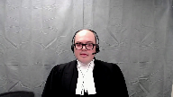
:::

We do think it's quite similar to the conduct that Justice Sapinka was describing as blameworthy conduct in Daviau, but the fundamental difference between what you have before you today and what this court had before it in Daviau is that the Leary rule was a common law rule that permitted courts to substitute the essential elements, substitute proof of intoxication for what parliament had said were essential elements.

And what you have before you now is parliament has indicated that this is a basis of fault.

And this is a very important point.

But there's a statement.

**Justice Brown** (00:24:33): a categorical statement of law in Justice Sapinka's dissent that it actually speaks of a general rule.

::: {.column-margin}
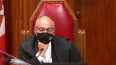
:::

And I just can't escape the suspicion, again I invite you to disabuse me of it, that Parliament has codified the dissent in Davio.

**Speaker 1** (00:25:00): And I don't, I don't agree, I don't disagree with that in general terms.

::: {.column-margin}
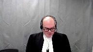
:::

Parliament has identified as blameworthy what the court, the dissenting justices in Davio said was blameworthy, but Parliament has done this in a way that is consistent with the principles of fundamental justice.

The problem, so Davio, the majority of reasons are based on the analysis of Justice Wilson and Bernard, and she said the problem with self-induced extreme intoxication is not a problem of moral innocence or moral blameworthiness, the problem is substitution.

We're doing, the court was doing what, or imposing a liability in circumstances where Parliament said that liability was not appropriate or where Parliament had not codified a right to liability.

So the respondent's court complaint about section 33.1 is that it replicates what this court held was unconstitutional in Davio, and I would like to disabuse you of this.

The charter breaches in Davio were based solely on the fact that the Leary rule was a common law rule, and by enacting section 33.1, Parliament corrected the problem identified in Davio.

The court described the most vehement and cogent criticism of the Leary rules is that it substituted proof of drunkenness for proof of the requisite mental element, and the analysis was based on White and Viancourt.

For most of the analysis is an application of those principles, the principle from those cases, that is that if an element is essential because the Constitution or Parliament says so, liability cannot be imposed in the absence of that element or a substitute element that inexorably proves the essential element.

The court was analyzing an offense in Davio, sexual assault, that was constructed using a typical model for criminal liability, intent with respect to the, excuse me, an act voluntarily performs accompanied by contemporaneous mens rea and the mens rea amounting to intent with respect to the performance of the act.

But the court highlighted that this model applied, quote, unless the legislator provides otherwise.

And that's on page three, sorry, tab three, page 11 of our condensed book.

The signal from this in my submission is that if the legislator provides otherwise, the test for substituted essential elements must be performed in relation to the form of liability constructed by the legislator.

So every charter problem can and should be understood as flowing from the manner in which the Leary rule deviated from that standard model.

First, there's a substitution problem.

Leary said that self-induced intoxication was a sufficient substitute when intent or voluntariness or both were absent.

So that is not what section 33.1 does.

33.1 says it retains the normal route to liability, intentional application of force, but it says if you don't have an intentional application of force, self-induced intoxication is another sufficient mental element.

So it's not parliament saying that self-induced intoxication proves intent.

It's parliament saying that self-indoxication and intent with respect to the act are two different routes to get there.

And the other problems are all about linking the act and the fault or the act and the voluntariness or the act, the fault mirroring the act.

And all of those problems, while they existed in the Leary rule because you've got intent, voluntariness with respect to an act of ingestion of intoxicants that's separate from the act of violence, under 33.1 all of those problems are corrected because you have an intentional ingestion of a substance, the voluntariness is linked to that act, and the mental element mirrors the prohibited act.

So what does that mean?

**Justice Moldaver** (00:29:17): This is where I'm still having trouble with what you're saying.

::: {.column-margin}
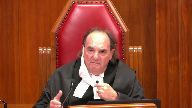
:::

Surely it's not just the use of a drug that we're looking at.

I mean, you yourself admit quite properly so, I would have thought, that if your drink is spiked, you have no idea you're consuming a drug.

I mean, it's not meant to cover that.

So my question, I come back to you.

What is it that the accused has to know or ought reasonably to know about the drug that he or she is consuming?

And that I don't see in this provision.

**Speaker 1** (00:29:58): you won't find that in the text of the provision where you will find that is in the application of the mark departure test basic principles of the mark departure test so there has to be a risk a prohibited state and what parliament is specified as the prohibited state is the

**Justice Moldaver** (00:30:14): That departure test just talks about the end result.

::: {.column-margin}
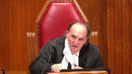
:::

It talks about extreme intoxication.

My question to you is, what does the accused have to know, or as you put it, ought to know, maybe it's got to even be the more reckless standard, about the drug?

Surely you've got to bring that home some way. Yes.

Yes.

We're doing it in this provision.

**Speaker 1** (00:30:41): It requires self-induced intoxication in the context of drinking and driving, other offences relying on self-induced intoxication.

It's always required some kind of knowledge of the intoxicating...

Well, hold on.

**Justice Brown** (00:30:57): And hold on, impaired driving causing death or impaired driving causing bodily harm.

::: {.column-margin}
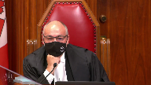
:::

If you remove the impairment from the facts, you don't have an offense because driving in an unimpaired state is not an offense.

Here, if you remove the impairment from the offense, you still have an offense, assuming you can show mens rea.

**Overlapping speakers** (00:31:28): So-

**Justice Brown** (00:31:29): I just don't think, I mean, I guess this depends on your, all this rests on your interpretation of, you know, importing some kind of foreseeability or some kind of negligence standard, but I wanna pull you back to that because I wonder if you're not trying to re-litigate Bouchard-Lebrun on this point, where Justice Lebel says 33.1 applies, where three conditions are met, intoxication, right?

::: {.column-margin}
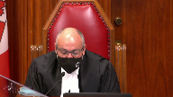
:::

Self-induced and departure from the standard of reasonable care to be expected by threatening or interfering with the bodily integrity of another person.

Does that not decide the contents of 33.1?

**Speaker 1** (00:32:19): In our submission it does not and Bouchard Lebrun was a case that was about section 16.

There was a subsidiary issue on whether liability attached under section 32.1 but the issue to my knowledge from reviewing materials in the record.

**Overlapping speakers** (00:32:34): But he said it.

He said it.

**Speaker 1** (00:32:36): He said it and referred to and cited the then leading cases, Chalk and Vicberg, generally.

::: {.column-margin}
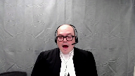
:::

Now in my submission this was merely the court applying the law that no one had asked it to consider and not a considered analysis of the mental health of the person.

I agree with you.

**Justice Brown** (00:32:54): that I don't think foreseeability rose on those facts, but he clearly addressed it all the same.

I mean, paragraph 91 is quite clear, right?

And he says there's no distinction between normal effects and abnormal.

That is, I guess, unforeseeable effects.

**Overlapping speakers** (00:33:11): That's right.

**Justice Brown** (00:33:12): Everybody writes, no distinction based on the seriousness of the effects of self-induced intoxication is drawn in this provision.

**Speaker 1** (00:33:18): And Justice Pachocko inferred from that that the provision was intended to capture abnormal effects, but that analysis rests on two flawed premises.

::: {.column-margin}
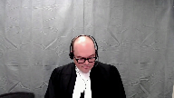
:::

First is that in Bouchard-Lebrun, the court rejected the distinction between normal and abnormal effects of the intoxicant.

There's no comment on whether the provision applies to abnormal effects because the court disagreed that there is such a thing.

And the second flaw is that Justice Lebel didn't use the word abnormal to mean unforeseeable.

His comment that 33.1 is not limited to the normal effects of intoxication is not about how foreseeable or common an effect is.

He was responding to the appellant's argument that some effects are so extreme that they should fall under Section 16.

He's saying, he's talking about severity, not foreseeability.

And if the court were to conclude that the issue had been resolved in Bouchard-Lebrun, we would ask the court to revisit that issue.

There was no sustained analysis of the mental element required under the provision.

**Justice Moldaver** (00:34:20): You

**Overlapping speakers** (00:34:20): Mr. Prime.

**Justice Moldaver** (00:34:20): Just before you go on, because you gave me the example of, well, when I asked you what is it that the person has to know or ought to know, you said, well, impaired driving.

::: {.column-margin}
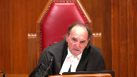
:::

You are not talking about the kind of intoxication that would render you liable for impaired driving.

You are talking about a particular form of intoxication that renders you a zombie.

Let's just put it in simple terms.

Now, surely there has to be something that we can look to in this provision somewhere or have to read it in.

What is it that the accused has to know about

**Overlapping speakers** (00:35:02): The huge drug.

**Justice Moldaver** (00:35:03): that would cause the accused to know or should know that if you consume it you know in big quantities you'll become a zombie as opposed to just lying on the ground and getting sick. Yes.

::: {.column-margin}
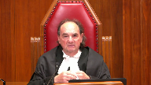
:::

To me that's critical.

**Speaker 1** (00:35:22): And I agree, that is critical, and what's required is that in the circumstances known to the accused, that the accused, based on whatever those circumstances are, that they would appreciate a risk that the consumption in the manner that it's being consumed and the quantity that's being consumed would render the person unaware of or incapable of consciously controlling their behaviour.

::: {.column-margin}
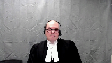
:::

If the person could not reasonably anticipate that risk based on the nature of the site, the substance, its identity, the circumstances surrounding its consumption, if it happens to result in extreme intoxication, that's not criminal.

But if a person, a reasonable person, in the circumstances of the accused would appreciate a risk of entering that state, that's the blameworthy state that the provision aims to deter and criminalizes.

And I just have, I did intend to address you as well on the section 52.1 issue.

Before you go there, Mr. Perlin, I have a...

**Justice Karakatsanis** (00:36:20): question because I think your submissions the interpretation you're asking us to take not only strains what you know a marked departure means because sub section two actually sets out what it means and talks about the end result

::: {.column-margin}

:::

but it seems to me that what you're urging us to find is that this provision creates a new offense that it creates you know like violence where there's self-induced intoxication to such a degree which requires us not only to read in the mens rea

but then how do we deal with the language that says it's not a defense

so I guess the interpretation you're asking us to to to make to read this as a new offense that's been created doesn't rest easily not only with the language of marked departure and with the absence of any reference to fault but also with the fact that on its face it talks about a defense that's not available

**Speaker 1** (00:37:26): Well, I'd make two points.

::: {.column-margin}

:::

First, the text of the provision does refer to departure from the standard of care and marked departure, and that's a signal as to the mental element that should be read in.

But second, on the text of the provision, 33.1 sub 1 says it is not a defence.

33.1 sub 2 is a fault-creating provision.

Criminal fault by reason of intoxication, again referring back to the preamble.

So section 33.1 does both.

It eliminates a defence and it creates a mode of liability.

I don't think I'll get to the...

**Overlapping speakers** (00:38:03): What's the sent- Mr. Perlin, what's the sentence then for this new offence?

**Speaker 1** (00:38:07): The sentence is based on the offense of violence which is charged, and I'd note that this is a compromise provision in that Parliament indicates that liability is required, but for even the most serious general intent offenses of violence, there is no minimum sentence.

::: {.column-margin}
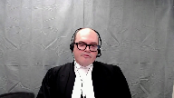
:::

We had indicated in our factum that manslaughter with a firearm has a minimum sentence, but that's a specific intent element of that offense.

So there is no minimum sentence for any general intent offense of violence.

So discharges and suspended non-custodial sentences are within the discretion of the court to impose in that regard the provision accords with the principle that unintentional harm should be treated as less blameworthy than intentional harm.

In the case of violence, there is no minimum sentence for any non-custodial offence.

The sentence is based on the offense of violence which is charged, and I'd note that this is a compromise provision in that Parliament indicates that liability is required, but for even the most serious general intent offenses of violence, there is no minimum sentence.

**Justice Brown** (00:39:02): Either Mr. Sullivan or Mr. Chan, was there any evidence on the record that they accepted or knew of the risk?

**Speaker 1** (00:39:09): Yes, Mr. Chan, as he concedes in paragraphs 101 to 105 of his factum, it conceded that the risk of hallucinations was foreseeable.

::: {.column-margin}
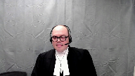
:::

And for Mr. Sullivan, he was aware, having experienced psychotic episodes from taking Wellbutrin before.

Was there a find-

**Justice Brown** (00:39:29): That's evidence that's suggestive of it.

Where is there a finding then?

**Overlapping speakers** (00:39:35): I mean, there must have been.

**Justice Brown** (00:39:35): There must have been, if you say it's...

**Overlapping speakers** (00:39:37): Yes.

**Speaker 1** (00:39:37): potential elements of 33.1, right?

::: {.column-margin}
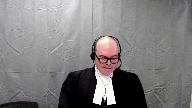
:::

Well, yes, except, so we have findings of fact in Mr. Sullivan's case regarding the application of 33.1.

Chan didn't rely on 33.1 as it had been held constitutional, so we don't have those specific findings.

We do in Sullivan, and I'd refer you to tap 12 of our condensed book.

And the very last point I'd make is that the form of liability created in section 33.1, this court has confirmed that this form of predicate act liability is constitutional.

That's Pino, where you've got an underlying element of self-induced extreme intoxication, the intent, and voluntariness with respect to the prohibited consequence of impaired driving or assuming care and control.

That is no longer essential, and this court is in the most important part of the court's decision on this matter.

What was the offense in that case?

Impaired care and control, the act of assuming care.

Impaired, right in the offense.

So I suspect.

**Justice Brown** (00:39:37): potential elements of 33.1, right?

::: {.column-margin}
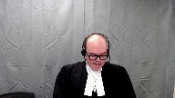
:::

Well, yes, except, so we have findings of fact in Mr. Sullivan's case regarding the application of 33.1.

Chan didn't rely on 33.1 as it had been held constitutional, so we don't have those specific findings.

We do in Sullivan, and I'd refer you to tap 12 of our condensed book.

And the very last point I'd make is that the form of liability created in section 33.1, this court has confirmed that this form of predicate act liability is constitutional.

That's Pino, where you've got an underlying element of self-induced extreme intoxication, the intent, and voluntariness with respect to the prohibited consequence of impaired driving or assuming care and control.

That is no longer essential, and this court is in the most important part of the law, and we're going to have to deal with that.

What was the offense in that case?

Impaired care and control. Impaired.

Impaired, right in the offense.

Yes, just like 33.12.

May I ask this question?

Yes, you may.

**Justice Martin** (00:40:43): question, please.

::: {.column-margin}
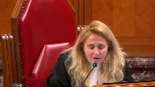
:::

And it goes back to the way that you're asking us to interpret this section.

And that is that what do we do with the fact that this is a provision that's existed for 25 years?

And you're putting forward what is I would I don't even know

and I'm asking you for a bit of a novel interpretation.

You criticize Vickery and chalk in your factum for being wrongfully decided.

But I guess my question is, is there any case law and authority that supports that this is the way that courts across Canada for 25 years have been interpreting this provision?

**Speaker 1** (00:41:24): have been interpreting? No.

But Brown from the Alberta Court of Appeal, which you'll hear on November 9th, adopts a very similar interpretation of the provision to the one that we're prescribing.

**Justice Martin** (00:41:38): Right.

::: {.column-margin}

:::

But I guess outside of the constitutional realm in courts across this country when the provision was actually being applied, I would be interested to know whether this was the theory of liability that was put forward by the crown that required then before a conviction that there be a blame worthy extreme intoxicating event and that there was that requisite foreseeability that you're saying is the threshold here.

**Speaker 1** (00:42:08): To my recollection, the Crown and Vickburg advanced such an interpretation and it was rejected by the court.

::: {.column-margin}
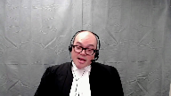
:::

33.1 is a provision that was rarely applied because it was, in my submission, given that it was present, there was the defense, the Dabio defense was rarely pled.

I should turn it over to my colleague, Ms. Barrett, who will address you on such a note.

**Justice Moldaver** (00:42:32): want to let you go.

::: {.column-margin}
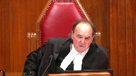
:::

Do we have to read into the provision an objective risk of violence as well arising from people who are in this state? Why not?

Why doesn't Creighton talk about their need to be when you're in the penal negligence?

You don't have to know exactly the form of violence, but don't you have to have some objective basis for holding that people who get into this extreme state?

There's an objective risk of violence that comes simply from being in that state.

**Speaker 1** (00:43:06): No, and that's D'Souza, that's Crichton.

::: {.column-margin}
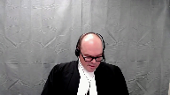
:::

D'Souza at page 55 of our condensed book referring to the offence of unlawful act causing bodily harm.

That offence requires objective foreseeability of bodily harm but quote, there is however no constitutional requirement that intention either on an objective or subjective basis extended the consequences of unlawful acts in general.

And some prime examples, sexual assault causing bodily harm, no need for objective foreseeability of bodily harm.

Impaired driving causing death, no need for foreseeability of death.

Manslaughter, no need for foreseeability of death.

There is as this court held in Crichton, no precise symmetry rule.

There is no need, offences can be constructed based on a predicate act that is sufficiently blameworthy.

**Overlapping speakers** (00:43:58): Her penal negligence is the basis of the fault?

**Speaker 1** (00:44:01): Yes.

**Justice Brown** (00:44:03): Yes, do you accept that your answer is in total contradiction to the majority regions in davio?

**Overlapping speakers** (00:44:09): No, I do not.

**Justice Brown** (00:44:11): So here's what the majority said in Davio.

::: {.column-margin}
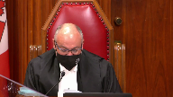
:::

Consumption of alcohol simply cannot lead inexorably to the conclusion that the accused possess the requisite mental element to commit a sexual assault or any other crime.

Rather, the substituted mens rea rule has the effect of eliminating the minimum mental element required for sexual assault.

Self-induced intoxication cannot supply the necessary link between the minimal mental element or mens rea required for the offense and the actus reus.

Here the question is not whether there is some symmetry between the physical act and the mental element, but whether the necessary link exists between the minimum mental element and the prohibited act.

That is to say, the mental element is one of intention with respect to the actus reus of the crime charge.

**Speaker 1** (00:44:59): Now that in my submission is the final element of Justice Corey's definition of the standard model of liability, a requirement that the mental element constitute intent with respect to the act uh with with respect to the act charged with respect to the

**Overlapping speakers** (00:45:16): The crime charge, the offense, yeah.

**Speaker 1** (00:45:18): Sure, but there is no constitutional rule that prohibits parliament from classifying offences based on unintended consequences.

::: {.column-margin}
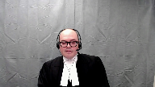
:::

And what you have here is, in my submission, intent with respect to the, intent voluntariness with respect to the act of ingestion and an unintended violent consequence.

And what the court said in Peno, D'Souza and Crichton is that that is a constitutional form of liability.

**Justice Côté** (00:45:47): Dr. Lin, did you want to tell us something about steroid exercises, or is it your colleague?

**Speaker 1** (00:45:54): Well, I was to address you on stare decisis, but in the interests of, well, I'm gonna give you just a few minutes on that if you don't mind before I turn it over to my colleague.

::: {.column-margin}
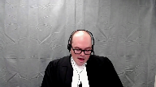
:::

And I understand some of the interveners will also be addressing this issue.

I just indicate four points briefly.

The first, to our knowledge, the closest this court has come to resolving the issue of whether declarations of invalidity by in courts of coordinate jurisdiction is lava, where Chief Justice Lemair contemplated that a superior court could disagree on whether a law is constitutional, leaving it for appellate courts to resolve the resulting uncertainty in the law.

Second, Mr. Sullivan's strict interpretation of section 52.1 could leave bad constitutional rulings on the books for long periods of time.

Sometimes trial courts get constitutional rulings wrong.

Authorities are missed, excuse me, authorities are missed.

Sometimes mistakes can be made in analysis, particularly in the context of a criminal trial.

Sometimes issues that have been wrongly decided can prove evasive, or at least temporarily evasive of appellate review.

And even when review is initiated, it can take years to complete.

A strict rule that would require courts to follow wrongly issued declarations of invalidity would undermine the rule of law in two ways.

First, it would deprive citizens of valid laws.

And second, it would prevent courts from applying valid laws, thus forcing them to exceed their constitutional role and undermining the authority of parliament.

In G, this court unanimously accepted that impairment of the rule of law could justify the temporary application of unconstitutional laws.

We say that surely such considerations can also justify the temporary application of laws whose constitutionality remains open for debate.

Finally, the rules of vertical and horizontal stare decisis are perfectly capable of guarding against the chaos that the other side alleges would ensue if constitutional issues can be relitigated at first instance.

We note that Jordan provides a major incentive for the Crown to not wastefully relitigate constitutional issues.

Under the rules of horizontal precedent, courts will generally follow declarations of invalidity, which will continue to have province-wide effect, but absent binding authority from above, judges should not be forced to follow rulings they know to be wrong.

They should be free to exercise their authority to interpret and follow the constitution and the law.

**Justice Rowe** (00:48:29): I would say that the classic example of that is a decision per incurium.

**Overlapping speakers** (00:48:37): Yes.

**Justice Rowe** (00:48:37): Judge A says, here's my declaration.

::: {.column-margin}
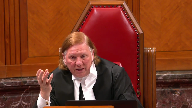
:::

Judge B is presented with an argument that says, well, Judge A was never directed to this governing precedent.

And the thing is, it was plainly never considered.

And the suggestion that Judge B should say, I don't care.

He got past the polls first.

Even if he missed, he or she missed out on the binding precedent, who cares?

I mean, he got out first, and therefore, that's the law, end of matter.

That seems to me to be just very odd.

**Speaker 1** (00:49:14): We would agree.

Thank you very much.

**Speaker 2** (00:49:58): Chief Justice, justices, sorry, can you hear me?

**Overlapping speakers** (00:50:09): Yes, please go ahead.

**Speaker 2** (00:50:10): Thank you.

::: {.column-margin}

:::

26 years ago, Parliament anticipated the task that is now before this court and it wanted to ensure that you knew exactly its reasons for enacting 33.1.

The preamble contains in Parliament's own words its objectives and its chosen means.

It provides critical context.

Violence by those in extreme states of intoxication is a complex social issue that must be viewed in context.

That context includes the devastating impact it has on the charter rights of victims who are disproportionately women and children, the absence of any obviously right answer, and the absence of any defense for lesser degrees of intoxication.

This is an issue that lies at the core of Parliament's power and duty to make policy choices to address harm in our society.

The harm of intoxicated violence is well documented in the decisions of this court.

In Tatton, Justice Muldaver for this court observed that alcohol habitually plays a role in sexual violence and that to allow it as a defense is to endorse if not promote that very behavior.

If that is the harm of alcohol, these concerns are only heightened when one talks about crystal meth and the other chemical drugs common in today's society.

Drugs that are taken precisely for their extreme mind-altering effects.

And as with our drinking and driving laws, 33.1 ensures that those who pose the greatest threat to public safety are convicted.

My submissions will address Section 1 in Mr. Chen's cross appeal.

On Section 1, I have three main points.

First, Parliament's objective in enacting 33.1, we say it is twofold, accountability for and protection from all intoxicated violence.

Second, if these two objectives are used, 33.1 survives the proportionality analysis.

And third, DAVIAL is not determinative of what a minimally impairing regime is.

With respect to Mr. Chen's request to cross appeal, I have two key points.

First, we say it lacks jurisdiction.

And second, we say his request for a substituted verdict is unavailable on the record before you.

Turning to the next slide, please.

**Justice Kasirer** (00:53:02): Ms. Barrett, before you start on the section one point, do I understand you're not relying on an argument that would say that, for example, the section seven and section 15 rights of, say, women and children should be balanced at the infringement stage?

::: {.column-margin}
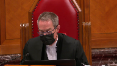
:::

**Speaker 2** (00:53:23): No, we would say that the rights, the competing rights of victims should be dealt with under Section 1, as per Bedford and Carter.

::: {.column-margin}

:::

Turning to Parliament's objective, legislation rarely stands or falls at step one of Oaks, yet this has been the key divisive issue in the lower courts, and unlike many provisions, 33.1 has the benefit of a detailed and lengthy preamble.

To quote Justices Cote and Brown from the Frank decision, it is a corporate statement of legislative purpose.

It is the best evidence of Parliament's intent.

And when one looks at the broader scheme of 33.1, we say that the animating social value is to promote and ensure a violent, free society and maintain confidence in the justice system.

Its purpose is accountability for and protection from intoxicated violence, and the means is to convict self-intoxicated automaton.

So yes, it targets one specific group of offender, the self-induced violent automaton, but its purpose is much broader, and that becomes clear when one views it alongside the Leary Rule, because 33.1 with the Leary Rule communicates one simple, clear message, that any act of violence is criminal and will be punished without exception.

It is a zero-tolerance policy and public safety demands no less.

33.1 was responsive to a new public safety threat, the threat that an intoxicated violent act could go unpunished.

This is conduct that had previously always been criminalized throughout the history of our common law.

**Justice Brown** (00:55:37): Is your zero tolerance, is the zero tolerance argument not in tension with your colleague's argument that this is in fact targeting an even narrower subset where it was, where self-induced intoxication was itself foreseeable?

::: {.column-margin}
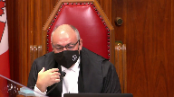
:::

So, I mean, let me give you just an example of someone who has an unforeseeable reaction to a prescribed drug that they're taking for the first time.

Zero tolerance, and for that matter, let's say preliminarily, my reading of the section suggests that that's caught.

Your colleague says, no, no, no, it's not zero tolerance, it's plus five tolerance, it's something else.

So, I guess this sort of carrying you ahead a little bit over breath, but I just thought I'd make that observation.

**Speaker 2** (00:56:34): and you're absolutely correct Justice Brown there will be the odd case where the marked departure test is not met someone taking prescribed medication in the prescribed dose we would say rightly that 33.1 ought not to capture that individual but but Parliament wanted to capture as much as possible under 33.1 and if its intent was simply to reverse Stabio then the answer was very simple just restore the Leary rule but it didn't we know from Bouchard Lebrun this court recognized that the Leary rule continues to apply with respect to general intent property offenses it 33.1 was tailored specifically to crimes of violence because Parliament's objective was to promote and ensure equality rights and we know that violence against women is very much an equality issue and if the intent was simply to reverse Stabio there would also have been no need for the extensive consultations that Parliament engaged in you'll see it in our condensed book at tab 17 that Justice Minister Rock resisted pressure within weeks of the Davio decision to pass legislation before the end of the year Parliament wanted a fast response at the second reading in February of 1995 when the bill was presented there was a motion brought at that time that it simply be passed just skip over the committee process and Justice Minister Rock resisted that pressure because he wanted to build the evidentiary record that would support Parliament's decision and the consultations support what we see in the preamble that there is a disproportionate impact on women and children that intoxication does play a role in that and that there are policy reasons why individuals should be held accountable for this conduct and with regards to the accountability objective we say it works hand in hand with the protective element and that's because accountability is more than just punishment our criminal law is a system of values and exceptions create uncertainty and a culture that rewards the most dangerous conduct in Malmo Levine this court found that criminalizing the simple possession of marijuana met the step one inquiry if harm from the victimless crime of simple possession is a pressing and substantial objective how can it be that violence while extremely intoxicated is not and then it becomes a question of how best to address that and that is something that falls squarely within Parliament's policy making role.

::: {.column-margin}

:::

**Justice Kasirer** (00:59:57): Can I ask you, can I ask you, to what degree does the accountability objective need to be particularized?

::: {.column-margin}
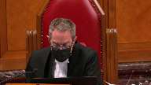
:::

I guess this is another way of asking the zero tolerance point.

But, but it, if you read the preamble, it, it seems rather broadly alluded to.

And, and yet, and you've stated it in a couple of different ways, just in, in presenting the point to us this morning.

Is it that the objective should be particularized to mean accountability for violent acts committed while intoxicated to the point of automatism?

It's not just voluntarily ingesting intoxicants, right?

Or is, or is that, is that nuance worth making?

**Speaker 2** (01:00:46): uh yes Justice uh Cassirah it's it's when the uh risk actually materializes so by individuals engaging in a marked departure that results in extreme intoxication we say that they are turning themselves essentially into a physical instrument that is devoid of rational thought

::: {.column-margin}

:::

and it is that risk to public safety that we need to hold accountable we say an accurate proportionality analysis turns on whether one adopts this narrow or broad definition of parliament's objectives and courts that have proceeded to the proportionality analysis using their own interpretation uh which rejects or refines parliament's stated objectives have failed to accord the posture of respect that this court spoke of uh in mills and what's interesting

i know you're very familiar with the mills decision from your hearings uh last week um if one compares the preamble that was used for the 278 regime to the preamble used for 33.1 in terms of the language for parliament's objectives concerning uh the violence against women and children it's almost word for word um and in mills this court relied heavily on the on the preamble as indicative of parliament's uh intent so if one accepts that we say the it survives the proportionality analysis because rational connection and minimal impairment do not demand perfection we agree with the court below that no one is deterred from drinking in the off chance that they might become a violent automaton but the same cannot be true of other drugs such as crystal meth with

and then we come to the heart of section one and the salutary and deleterious effects the deleterious effects are case specific the salutary effects are much greater and at a societal level 33.1 maintains public confidence it ensures certainty in the operation of the criminal law it communicates clear standards and expectations and it promotes the charter rights of all canadians i'm sorry

**Justice Brown** (01:03:27): How can it convey a clear standard when we're having by your colleagues arguments to read in part of that standard?

**Speaker 2** (01:03:37): The message though to individuals, the same as anyone who goes to a bar and starts drinking, is that you know at some point where your intoxication is getting to.

::: {.column-margin}

:::

So we would say that individuals who take chemical drugs, known hallucinogenic drugs, they accept the risk and as I said, they are turning themselves into a physical instrument devoid of rational thought.

So that is in my submission, communicating a clear standard.

We also say that Davio is not the measure of 33.1's constitutionality.

As my colleague Mr. Perlin noted, Davio dealt with the common law leery rule which is entitled to no deference.

The parliamentary record that you have before you was not before the Davio court.

The Davio court gave no consideration to competing charter rights and the Davio majority recognized that intoxicated violence can be criminalized.

These are not wrongful convictions.

May I stop you there please.

**Justice Martin** (01:04:53): In terms of what you're saying about Davio and not taking into account competing charter rights and what I think you responded to my colleague Justice Brown that the balancing of rights and interests that are contained either in the Charter or memorialized in the preamble You said those are section one issues and and not sections not up for balancing under section 7 And that strikes me as an odd proposition that you're putting forward It's my recollection from JJ that the AG Ontario Through endorsing the BC's approach in fact asked us to balance under section 7 so Could you help me with that with what you said about section 7 and section 1?

::: {.column-margin}
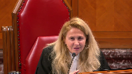
:::

**Speaker 2** (01:05:46): I'm not familiar with the submissions that were made before you last week, but what I can say is that my reading of Bedford and Carter indicates that the balancing of societal interests is done under section one.

::: {.column-margin}

:::

So where you have clear principles of fundamental justice that have been articulated, then you go, once there's a violation of that, then you go to section one.

The case before you last week, if it's an issue where the principles of fundamental justice are still being developed, then that is an area where you can look at competing rights in terms of how far you want to go in developing the section right principles of fundamental principles of fundamental justice.

So there is still some room for competing rights of society and victims for principles of fundamental justice in terms of defining their scope.

When it comes to their application, then it would be under section one only.

**Justice Rowe** (01:07:03): This, this, this, I don't want to get down a doctrinal, I won't say rabbit hole, but anomaly, it seems to me, that if you seek to have reference to section seven, there's one pattern of analysis.

::: {.column-margin}
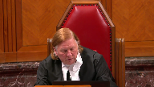
:::

If you seek to have reference to something like 11-D, you have another pattern of analysis.

And to the extent that seven and 11-D overlap, you have two parallel but different lines of analysis, which strikes to me as being incoherent.

**Speaker 2** (01:07:43): I agree with you Justice Roe that there are um the jurisprudence of this court

::: {.column-margin}
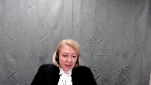
:::

um I think that there is some overlap in terms of the principles and and how one deals with these interests whether it is under section 7 or section 1.

Perhaps in my last five minutes I can deal briefly with Mr. Chan's cross appeal.

We say that there is no jurisdiction for his request for for leave.

Criminal appeals exist only by statute.

It's uh the jurisdiction is not found under section 691.

It is explicitly excluded under section 40 sub 3 of this court's act and even assuming that jurisdiction exists we say leave should be denied.

The request for his uh for an NCR verdict is fact specific and based on the trial judge's weighing of the expert evidence and even if there is a material error the remedy is a new trial which is what he got.

Mr. Chan asked this court for an acquittal under Davio and this turns on how this court reads the Davio decision and we say that the court below was correct to to find that it is limited to those individuals who are so drunk that they are an automaton and that's because Davio was concerned with those cases where the essential elements of a general intent offense are negated.

So where there is no actus reus and no mens rea and only acts that are physically involuntary can negate these essential elements.

In Davio that came from the evidence of his blackout which was erroneously treated as akin to automatism and in Mr. Chan's case we don't have any evidence.

The trial judge found as a fact that the essential elements were proven and there is no evidence that Mr. Chan was an automaton.

Dr. Classen was the only expert who spoke to this issue.

His report which you will find at tab 21 of our condensed book indicates that Mr. Chan's conduct was delusional not automatistic and Dr. Classen also testified that even individuals who are quite psychotic can appreciate the nature and quality of the acts.

So Justice Roe I know you had asked earlier about the the difference between an alcoholic blackout and and delusions and yes they are very different.

An alcoholic blackout we know from the scientific evidence before parliament is incapable of producing automatism.

However delusional driven conduct may or may not negate the essential elements of the offense and that's clear from the chalk decision of this court which you will find at tab 21 of our condensed book and page 189 of that book.

It's quite clear that incapacity an incapacity under the first branch of section 16 can negate the essential elements.

So when Justice Corey says extreme intoxication akin to automatism or insanity the or insanity is because the first branch of section 16 will also negate the essential elements.

An inability or an incapacity to know that acts are morally wrong falls under the second branch and chalk specifically says that that may or may not negate the essential elements the key feature being whether that incapacity is caused by a disease of the mind and ever since McNaughton in 1843 that is the last page of our condensed book you will see that the term disease of the mind was used by the House of Lords almost 200 years ago for no reason other than to exclude temporary artificially created states of madness.

That is Mr. Chan.

**Justice Wagner** (01:12:30): Thank you.

**Overlapping speakers** (01:12:31): Thank you very much.

**Justice Wagner** (01:12:32): The court will take its morning break, 15 minutes.

::: {.column-margin}
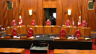
:::

Thank you.

Be seated.

**Speaker 3** (01:13:46): Thank you, Chief Justice.

::: {.column-margin}
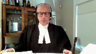
:::

Good morning, Justices.

The candidate intervenes in this appeal to address the Charter issues raised in respect of the Constitutional validity, Section 33.1, and the legal effects and determinations made under Section 52 of the Constitution Act 1982.

All are addressed in our Factum.

But subject to your questions, I will restrict myself today to the Section 7 and 11D in the Legislative Interpretive Issues, and I'll be making two related points.

First, that the Ontario Court of Appeal erred in its interpretation of Section 33.1 by mischaracterizing its operation, and where it locates the fault on very voluntariness element, effectively ignoring subsection 2 and the standard of care set out therein.

In effect, the Court below proceeded as if that subsection did not exist.

Properly interpreted, we submit Section 33.1 does not run afoul of Section 7 or 11D. Turning to the interpretive error.

The Ontario Court of Appeal found that Section 33.1 violates Section 7, essentially because it enables the conviction of accused persons who do not have the constitutional required voluntariness or level of fault for the commission of crime at the time they commit the violence.

This, however, in our submission was a misinterpretation of how Section 33.1 operates and the blameworthy conduct it targets.

The fault targeted by Section 33.1 is the voluntary ingestion of an intoxicant that a reasonable person knew or ought to have known creates a realistic risk of automatism where that ingestion departs markedly from the standard of care reasonably expected in the circumstances.

And we set that out in our fact.

**Overlapping speakers** (01:15:24): Can you explain to me where in the section I would find that?

**Speaker 3** (01:15:27): Yes, Justice Brown, we agree with Ontario, you're not going to find that specifically in this section.

::: {.column-margin}

:::

What you're going to find in this section, however, is a clear advertence to a penal negligence standard by use of the language criminally at fault by the express incorporation of the marked departure concept in relation to a decision to voluntary intoxicate.

That has to be the blameworthy conduct that's targeted by Parliament, and it's not novel for this court to have to discern fault elements over time.

It's not always set out so clearly in the legislation, and that's, I submit, precisely what this court did in the ADH 2013 decision, where it said it's not always easy to discern fault elements in criminal provisions themselves, but the courts have to often do that inference as circumstances and facts present themselves, and I submit that this is precisely that.

You have a clear objective receivability, a penal negligence standard of care set out in subsection 2, that sets out...

**Overlapping speakers** (01:16:35): It's so clear, why do I have to read it in?

**Speaker 3** (01:16:37): Well, I would submit that actually it doesn't involve, strictly speaking, reading in, because if you actually read the wording of 33.2, it talks about, it departs markedly from the standard of reasonable care with respect to the fault.

::: {.column-margin}

:::

And the fault here, and I think this is an absolutely critical point, the fault is not the ultimate apex offence in this case where, I'm sorry, the blameworthy conduct is not that because at the point that the actual violence takes place, we're talking about someone who's in an automatistic state, it would be absolutely illogical and beyond the premise that parliament only holds blameworthy conduct subject to criminal sanction, that person isn't capable of discerning what they're doing at that point.

So what happens here is that the actual fault, the mode of liability to the commission of the offence moves from the application of force to the ingestion of the intoxicant creating the risk of automatism.

**Justice Brown** (01:17:47): You've got limited time, but that's not what it says.

::: {.column-margin}

:::

It says while in a state of self-induced intoxication, we're already at the self-induced intoxication.

It's not at the ingestion stage.

And with respect, I think the Attorney General of Canada is advancing just an untenable interpretation here.

**Justice Kasirer** (01:18:10): Anything to be said that your colleagues from Saskatchewan make the point that the adjective self-induced modifies not just intoxication but the whole entire phrase.

::: {.column-margin}

:::

Is there any, the crown said to us earlier today that everything hangs on self-induced.

What are your views on that part of the interpretation?

Well, I would say that the word self-induced is not just an adjective, it's an adjective.

It's an adjective that is not just a word, it's an adjective that is not just a word.

**Speaker 3** (01:18:33): certainly say that the section in subsection two focuses on the self-induced element and in fact when the bill was introduced it it talked about the fault being at the at the point of intoxication Minister Rock makes that point when he introduced the the bill now uh I if I recall correctly the argument is made that that creates ambiguity in this section I would submit on our reading there is an ambiguity in the section in the sense that it its intent is not clear I would submit its intent is crystal clear but you have to read it purposively and textually and logically if you read it the way the appellants did and the way that the lower court read it in effect you have subsection two eliminated you have all the work done one subsection 33-1 says not a defence then then the provision is spent you don't have to go on and and look at the actual standard of care set out in two and that makes no sense because what you'd have in in that case is a legally meaningless appendage of a reasonable standard a penal negligence standard set out in subsection two which would be added on to the criminal fault which would not have changed by virtue of being the same as what should a traditional pathway be that is that the liability happens at the point of the application of force but that can't be what parliament intended here it can't be because it's illogical and and incoherent that parliament would have simply put in or appended a meaningless provision setting out and talking about mark departure and talking about standard of care and applying that to uh deem it if it happens at the hands of an at the hands of an irrational non-rational actor that doesn't make sense because the danger that's targeted by the section here is the creation of an automatistic state that's where the danger lies that's what parliament sought to address because we can't predict or know what is what an automaton is going to do there it's pointless to at that point to attach blameworthy conduct it it's done at that point because the person is not capable of making those decisions anymore they're in an automatistic state so parliament says we can't tolerate this kind of uh criminal uh intoxicated violence happening at the most extreme level of automatism we have to close the door to it close the gap um that was left open by by uh the decision in davio we have to close the gap but we have to do it by creating a new mode of liability and that new mode of liability is to say if the person self-induces toxication and reasonably foresees the possibility of automatism they've created the dangerous state i i

::: {.column-margin}

:::

**Justice Brown** (01:21:20): I'm not sure, with respect to where this argument is getting you, because I'm not sure anyone is disagreeing with that proposition.

::: {.column-margin}

:::

The question is whether Parliament did that.

And your answer to Justice Kazir is yes, the section, this was your language, focuses on the self-induced element.

I don't even know what that means.

I'm just, so.

**Overlapping speakers** (01:21:46): Sure.

**Justice Brown** (01:21:47): Maybe my thinking is just impoverished.

::: {.column-margin}

:::

I start with the text, and I don't wanna go in circles with you, but there's nothing about ingestion.

We're passed in time, the state of ingestion, by the time we get to the text.

And I mean, you have my concern.

**Speaker 3** (01:22:07): I understand.

::: {.column-margin}

:::

Let me try to address it as best I can, and I'm not sure that's going to satisfy you, but I'll try as best I can.

This may be an element of inelegant drafting, but if you look at it purposively and contextually and logically, there's no other way to read it.

It has to be what parliament intended.

There clearly is the danger of the creation of the risk of automatism, and it talks about a marked departure.

How can there be a marked departure at the point that someone's automatistic?

It has to reference the self-inducing, and there's a common law test for self-induced.

That hasn't been changed by this section.

What this section adds is the additional element of the reasonable forcillability in relation to a person becoming unaware of or incapable of consciously controlling their behaviour voluntarily or involuntarily, which is words expressly set out in subsection 2, creating that fundamentally important reasonable standard of care that is not simply a meaningless appendage onto 33.1.

I'm sorry.

**Justice Karakatsanis** (01:23:16): How can it be a meaningless appendage?

Subsection 2 is exactly what connects this to crimes of violence.

I just don't understand how you can...

**Speaker 3** (01:23:26): I'm not suggesting it's a meaningless appendage.

::: {.column-margin}

:::

I'm saying that if you read it the way that the Court of Appeal read it or the way the appellants do, it becomes a meaningless appendage.

It is not a meaningless appendage.

It sets out the standard of care.

I am not submitting, and I apologize if I appear to be suggesting that.

I'm saying that interpretation's absurd because of exactly that.

It is the link to what is being accomplished here and what exactly the standard of care that's being set out is in relation to the creation of the risk of automatism.

That's precisely what subsection two critically does, and it's by ignoring that that the Court of Appeal got it wrong in our submission.

All right, thank you very much.

Thank you.

Inaudible.

**Speaker 4** (01:24:20): Monsieur le juge en chef, madame et messieurs les juges, Dans un premier temps, parmi les enjeux soulevés dans le présent pourbois, il y a celui de l'interaction entre l'application du principe du tarif des C-6 et les effets d'une déclaration d'invalidité prononcée par une course supérieure en vertu de l'article 52 de la Loi constitutionnelle de 1982.

::: {.column-margin}

:::

Il est bien établi qu'une déclaration d'invalidité prononcée par une course supérieure a pour effet de faire cesser les effets juridiques de la disposition législative consécutive, et ce, à l'égard de tous.

Sans aucunement remettre en cause cet aspect, le procureur général du Québec est d'avis qu'une déclaration d'invalidité pourrait tout de même être écartée par la suite.

L'application de l'article 52 de la Loi constitutionnelle de 1982 pourrait être écartée par une course d'appel, mais pas par une course supérieure d'une autre province.

Je vous répète la question, s'il vous plaît.

**Justice Wagner** (01:25:14): Pour être écarté, une décision d'une Cour supérieure déclarant invalide d'une législation peut être écartée, bien sûr, par une décision contraire à la Cour d'appel.

Mais ce qui est ici en jeu, c'est est-ce qu'une autre Cour supérieure d'une autre province est tenue ou doit respecter la décision d'une autre province?

**Speaker 4** (01:25:32): Pour le procureur général du Québec, ce qui est en jeu ici, c'est en intérieur de la même province.

::: {.column-margin}

:::

Il est question de savoir si on peut écarter une décision de la Cour supérieure, prenons par exemple ici au Québec, si une décision de la Cour supérieure du Québec, invalidant une disposition législative, peut être par la suite écarter par un autre juge de la Cour supérieure du Québec.

En ce qui concerne les décisions des autres provinces, celles-ci n'ont pas d'effet au Québec au regard de la constitutionalité.

Leurs jugements auront effet à l'égard de la province dans laquelle ils ont été prononcés.

**Justice Kasirer** (01:26:03): mettre le boeuf, je ne veux pas vous contredire du tout, mais je cherche à comprendre pourquoi vous tenez pour acquis qu'il n'y a aucun volet interprovincial à la règle que vous dessinez.

**Speaker 4** (01:26:20): C'est que les compétences des tribunaux sont délimitées de façon provinciale.

::: {.column-margin}

:::

Ici, les courses supérieures ont toujours eu une juridiction à l'intérieur des provinces dans lesquelles elles se trouvent.

Et pour le Procureur du Canada du Québec, les effets d'une déclaration d'invalidité prononcée dans une province, comme on parle toujours ici d'une déclaration d'invalidité prononcée par une course supérieure, sont limités à cette province-là.

Mais c'est la même législation.

**Justice Wagner** (01:26:45): On présume que c'est la même législation à travers le pays.

Donc on se retrouve dans une situation où il y a une déclaration d'invalidité à l'aide du Prince Édouard sur une législation qui est applicable également en Ontario et qui serait possiblement déclarée valide en Ontario.

**Speaker 4** (01:27:03): Oui, je vais répondre à votre question, M. le jugeant-chef, par un exemple un peu contraire.

::: {.column-margin}

:::

À partir du moment où on prendrait pour acquis qu'une déclaration d'invalidité prononcée par une Cour supérieure dans une province aurait un effet pancanadien, que l'on aurait pour effet nécessairement de lier toutes les Cours supérieures, bien, en bout de ligne, il serait impossible de faire cheminer un débat, si on fait erreur de notre part, jusqu'à la Cour suprême.

Si on regarde le présent dossier et le pourvoi Brown qui sera entendu prochainement par la Cour, à compter du moment où la Cour supérieure de l'Ontario a invalidé l'article 33.1 du Code criminel dans la décision donne, cela signifierait que l'article 33.1 ne pourrait plus produire des faits au Canada dans l'ensemble, ça ne finirait pas avoir un débat qui puisse se rendre jusqu'à la Cour d'appel de l'Alberta, parce que la disposition aurait été privée de ses effets dès le départ, c'est pour ça qu'au point de vue pancanadien, ça amènerait à une situation que je me permets de qualifier peut-être un peu d'extrême, ça l'empêcherait de faire tous des bausses sub-séquentes.

**Justice Rowe** (01:28:14): Il me semble que c'est une conséquence nécessaire d'être un pays fédéral.

**Speaker 4** (01:28:23): le volet fédéral que nous retrouvons ici, il va se jouer avec les dossiers, il va être pris en compte lorsque les dossiers chemineront jusqu'à la Cour suprême.

::: {.column-margin}

:::

La Cour suprême a ce rôle d'uniformité du droit à travers le Canada et lorsqu'on regarde comme ici une disposition qui est dans le Code criminel, c'est justement pour ça que les procureurs généraux, en présence de déclarations d'invalidité, vont s'adresser aussi à la Cour suprême.

Pas uniquement pour venir dire « j'ai un problème dans un dossier », mais pour dire aussi « il y a une problématique pancanadienne, il est d'intérêt pour le Canada d'avoir une certitude quant au droit applicable, est-ce que cette disposition est valide ou non » et pour un procureur général, quand une demande d'autorisation d'appel est faite à la Cour suprême, c'est aussi pas simplement pour régler un dossier d'espèces, mais aussi pour une question d'uniformité pancanadienne du droit.

Dans ce contexte, la position du procureur général du Québec, si on revient sur la primis que la décision vaut à l'égard de la province, c'est que le principe du Stari des cécistes doit être modulé afin de pouvoir concilier les effets de déclarations finales d'invalidité, qui sera Air God Nice, et les raisons d'être de l'article 52.

Dans ce cas-ci, le procureur général du Québec est d'avis qu'une décision pourrait par la suite être écartée en vertu du principe du Stari des cécistes lorsque l'un des éléments suivants sera établi par le procureur général.

C'est-à-dire qu'il y a une nouvelle question de droits qui se pose ou qu'il y a eu une modification au niveau d'après où la situation change radicalement la donne.

**Justice Kasirer** (01:30:05): Est-ce que vous vous ajouterez à votre liste au paragraphe 9?

Vous dites nouvelle question de droit, modification de la situation.

La preuve change radicalement que le tribunal s'est trompé.

Est-ce qu'on peut...

Est-ce qu'on peut le plaider ainsi?

**Speaker 4** (01:30:20): Normalement

::: {.column-margin}

:::

, lorsqu'un tribunal rend une décision et au regard, mettons, une déclaration d'invalidité qui, dans un but, le procureur général estime que cette décision-là est erronée, la première étape à suivre, normalement, est d'aller en appel de cette décision-là.

Pour le procureur général du Québec, c'est la première chose qui est à faire.

La position dont le procureur général du Québec fait état ici, c'est à compter du moment où on peut estimer dans l'évaluation d'un dossier que la décision, même s'il y a un désaccord, on pourrait avoir peu de chance de la faire infirmer en appel en regard du droit applicable.

Mais à compter du moment où il y a une modification, soit jurisprudentielle ou des nouvelles, comme est mentionné, des situations au niveau de la preuve qui pourraient survenir, même si la décision à l'origine, on pouvait estimer qu'elle était, oui, défavorable au procureur général, mais peut-être pas manifestement erronée, mais que par la suite, avec l'évolution du droit, il peut être amené à se dire, bien, finalement, le précédent prononcé il y a quelques années, bien, à notre avis, il n'est plus juste, il ne doit pas faire autorité à la matière et il pourrait être possible de demander à un tribunal de l'écarter en vertu de critères précis, bien définis et qui ont été appliqués à diverses occasions.

**Justice Côté** (01:31:41): est-ce qu'il pourrait arriver que dans une même province, on va prendre le Québec, que vous ayez trois ou quatre décisions, disons, de cours supérieur, qui sont différentes.

::: {.column-margin}

:::

Deux décisions, par exemple, ont déclaré inconstitutionnelle l'article en question et deux autres décisions ont confirmé la validité.

Et la couronne continue de déposer des plaintes et faire des procès.

Est-ce que ça pourrait arriver, ça, dans votre argument?

Et la couronne va prendre l'appel des déclarations d'invalidité.

**Speaker 4** (01:32:14): selon la compréhension que le Procureur général du Québec a de la jurisprudence de la Cour quant aux effets engendrés par l'application de l'article 52, sauf erreur, lorsqu'une déclaration d'invalidité est prononcée par une Cour supérieure, c'est si et ergo nais.

::: {.column-margin}

:::

Par conséquent, cette loi invalidée-là et que cette disposition serait invalide ne pourra pas, dans le cadre, par exemple, d'une infraction, donner lieu à une accusation par la suite.

C'est la lecture que nous faisons actuellement de jurisprudence, notamment de la RG, rendue l'an dernier.

C'est pour ça, c'est dans ce contexte-là que nous proposons une approche modulée pour, pas contourner, mais pour avoir une réponse au contexte que cela amène.

C'est pour ça que, normalement, une disposition qui est invalidée par une Cour supérieure ne devrait pas produire un effet par la suite, à moins que ce soit écarté, soit par un appel ou en vertu de notre proposition ici.

Évidemment, les critères que le Procureur général du Québec met de l'avant ont été généralement étudiés puis appliqués dans le cadre de situations où la Cour a été amenée à se demander si elle devait suivre un précédent qui avait maintenu la validité constitutionnelle d'une disposition législative contestée.

Pour le Procureur général du Québec, il manifeste que le fait que de nouvelles questions juridiques peuvent se présenter au clied des modifications de la preuve changeant radicalement la donne ne sont pas des circonstances qui sont exclusives au précédent maintenant la validité constitutionnelle de disposition législative.

Ces mêmes circonstances peuvent également être pertinentes en ce qui concerne les déclarations d'invalidité prononcées par une Cour supérieure en application de l'article 52.

Ainsi, comme nous l'avons mentionné précédemment, il pourrait arriver des circonstances où le Procureur général estimerait opportun de demander à un tribunal d'écarté une décision antérieure d'une Cour supérieure déclarant constitutionnelle d'une disposition législative.

**Justice Wagner** (01:34:22): Ça complète vos représentations?

**Overlapping speakers** (01:34:25): a fait le tour des représentations pour la stabilité c'est ça.

Merci Maitre Laboeuf.

**Justice Wagner** (01:34:30): Merci.

**Speaker 5** (01:34:37): Thank you Chief Justice.

::: {.column-margin}

:::

I'm going to try to make three points.

First, running throughout Justice Pichoko's reasons below is his view that Parliament's concerns are overblown because these issues arise only in the rarest of cases and affect only a few victims.

This underlies virtually every facet of his analysis particularly under Section 1.

Respectfully this is simply not the case.

The availability and potency of modern chemical drugs leads regularly to extreme violence in every part of the country and at Justice Roe we totally agree it is important to emphasize that these drugs are nothing like alcohol.

They create profound dissociation, hallucination and paranoia.

They cause psychosis and abnormal behaviour including unpredictable acts of violence and the results are shocking.

In our factum we set out a number of recent examples.

They include random stabbings, attacks on children, kidnappings, people setting apartment buildings on fire.

None of this is uncommon.

In fact you recognized this 10 years ago in Bouchard Le Brun when you said toxic psychosis is unfortunately a fairly frequent phenomenon that seems to result from the high toxicity of chemical drugs.

The situation has not improved in the intervening 10 years as Justice Slatter recently recognized in Brown.

If anything the drugs now are just stronger and subject to more widespread abuse.

None of this respectfully is reflected in the decision below and that we say significantly understates the problem.

The decision to consume these substances is extraordinarily dangerous not just for the user but for the members of the surrounding community.

That leads to my second point.

The decision below contemplates total acquittals.

No accountability and no preventive measures to stop the violence from reoccurring.

Clearly that carries substantial implications for the charter rights of the victims but apart from that it also has a significant impact on public confidence in the administration of justice.

Justice Lowers described a pervasive sense of outrage following the decision in Daviau.

So did Justice Slatter in Brown.

It was swift, intense and largely non-partisan.

The prospect that the system was helpless and unable to respond to dangerous choices that led to avoidable deaths or injuries offended the community's deep intuition of justice.

As by the way did a standard that exonerated only the ones who maximized the danger they posed by getting so intoxicated that they lost all self-control like a law that immunized liability for collisions but only if the driver was speeding fast enough.

Again simply no consideration of these concerns by Justice Pachoko.

In fact it's the opposite.

He rejected them as part of Parliament's misguided accountability purpose.

Respectfully we strongly disagree with that.

Your jurisprudence, the code and the charter itself all suggest that maintaining confidence in the administration of justice is an important principle that justifies the restriction of charter rights.

And again we provided several examples in our factum. Why?

Why is it so important?

Well as Chief Justice McLaughlin acknowledged in Hall it's because confidence in in the justice system is fundamental to maintaining the rule of law.

If we lose it we lose everything.

Respectfully this was not something that Parliament could responsibly ignore as Justice Pachoko suggested that it should have done.

And I should note that it's not just Canada that has drawn this conclusion.

As the Attorney General of Canada points out many comparable jurisdictions take a similar approach which is not surprising because their citizens share the same deep intuition of justice, to use Justice Lauer's language.

Turning to my last point, none of this means the answer is easy.

On the contrary as everyone who has studied the issue including the Law Reform Commission has concluded there are no easy answers.

Any solution will necessarily require a degree of doctrinal flexibility.

That doesn't mean that we are punishing the morally innocent.

And at the latter pages of our factum pages 18 and 19 we set out the reasons why in our submission the moral blame worthiness of an accused who satisfies the threshold of section 33.1 supports holding him or her accountable for violent offences that they commit while intoxicated.

The first point I want to make in that regard is that marked departure is a high standard.

Liability will only ensue where the accused fails to direct his or her mind to the risk that a reasonable person would have appreciated.

Here the risk that behavior would lead to extreme intoxication and a subsequent violent offense.

I just want to pause here to go back to Justice Moldaver's earlier question.

In our view the fault requirement of the section corresponds to the actions covered by the entirety of the section.

So we say that the accused has to well ought to have appreciated a risk not only that the consumption would lead to extreme intoxication but also that it would raise the risk of a subsequent violent offense.

And this is important when you consider the question of members of the community who suffer from addictions because for them

**Justice Moldaver** (01:40:21): I have to interrupt because you make some very important points in this regard.

::: {.column-margin}

:::

How much can we read into a provision?

There are so many possibilities ranging from a 17-year-old who is experimenting for the first time to someone who thinks they're getting some drug but in fact it's been spiked with something else that they don't know about that could be hallucinatory and you just made the point about objective foreseeability of violence or the risk of it.

I don't mean to sort of suggest that the argument is hopeless but I just don't know how much we can write into a provision that on its face is so devoid of all of this.

**Speaker 5** (01:41:12): That's a very fair comment, Justice Moldaver.

::: {.column-margin}

:::

What I think I can say is the idea of marked departure can carry a lot of baggage.

Trial judges are very used to applying it and in our factum we point to what we think the key things that the courts will be looking at, that is to say the nature of the drug, the amount consumed and the surrounding circumstances and that will be the indication that they will work around when considering does this meet that high standard of a marked departure.

So if you are taking an identified intoxicant in a moderate manner you're probably not going to get to that threshold.

If you're taking an unidentified substance or you're taking a wildly excessive amount of a substance or you're binging on crystal meth then maybe you are.

It depends on the facts but just returning to that last point because I think this does speak to your question as well.

If you do read the section as including the foreseeability of the risk of violence then that allows for a much broader, we say, analysis by the finder in terms of whether there has actually been a marked departure from the standard of reasonable care because you know you may be taking a substance say because you have an addiction or maybe it's a substance and you're not sure what it is.

You say okay

you know what I'm not sure what's going to happen when I take this.

Maybe I am going to lose control.

Maybe I should take some steps to reduce the potential for danger to other people if I do lose control right.

Maybe I need to give my knife to somebody else so that I'm not holding on to it while I lose control of my body and the finder will consider the efforts to work around the circumstances that the accused finds themselves in.

For example an addiction while recognizing the need to ensure the safety of other people.

So in other words it's the conduct as a whole that goes into the analysis and which must constitute a marked departure in order for liability to attach.

So then say you have somebody who does meet that threshold.

**Justice Moldaver** (01:43:28): or just before you go on where you getting this from self-induced is my colleague justice here asked or or is it just we're just kind of plugging holes that are and here to be in the section we're legislating a little bit

**Speaker 5** (01:43:44): Well I would say you're maybe squinting a little bit when you read the legislation but the section governs to if you read the section as a whole it's aimed at the consumption of intoxicants that makes you extremely intoxicated and the commission of a subsequent violent offense

::: {.column-margin}

:::

**Overlapping speakers** (01:44:09): So red as a whole, where would I find the consumption?

**Speaker 5** (01:44:12): It is in the first subsection where the self-induced intoxication results in the lack of general self-induced intoxication results in the lack of general self-induced intoxication results in the lack of general self-induced intoxication results in the lack of general self-induced intoxication results in the lack of general self-induced intoxication results in the lack of general self-induced intoxication results in the lack of general self-induced intoxication results in the lack of general self-induced intoxication results in the lack of general self-induced intoxication results in the lack of general self-induced intoxication results in the lack of general self-induced intoxication results in the lack of general self-induced intoxication results in the lack of general self-induced intoxication results in the lack of general self-induced intoxication results in the lack of general self-induced intoxication results in the lack of general self-induced intoxication results in the lack of general self-induced intoxication results in the lack of general self-induced intoxication results in the lack of general self-induced intoxication results

**Justice Brown** (01:44:23): But in sub 2, sub 1 just takes away a defence.

I think everyone's agreed on that.

So sub 2 creates the criminal fault.

**Speaker 5** (01:44:31): As I say, Justice Brown, it's hardly a model of successful drafting.

**Justice Brown** (01:44:37): It looks fine to me.

::: {.column-margin}

:::

I mean, this is what lawyers try and do when they try and get around clear text, is they call it ambiguous or not a felicitous model of drafting.

It says, person departs markedly from the standard of reasonable care, therefore criminally fault, where, while in a state of self-induced intoxication, dot, dot, dot, they voluntarily or involuntarily interfere or threaten to interfere.

What's confusing about that?

**Speaker 5** (01:45:05): Well, if you read it that way, in other words, if you read it that way, you're going to have

**Overlapping speakers** (01:45:09): How did he read it that way?

I just read it.

It's not a question of the way I read it, I read it.

**Speaker 5** (01:45:15): And before I answer, Justice Brown, Chief Justice, may I just have a little bit of extra time to respond to Justice Brown's question?

**Overlapping speakers** (01:45:24): Yes.

**Speaker 5** (01:45:24): please.

::: {.column-margin}

:::

Thank you.

So if you interpret marked departure as referring to the violent act and not the act of consumption, then that contradicts the first part of the section because the same act can't be criminally negligent and also automatous.

That is logically impossible.

You can't make a decision that represents a marked departure from the conduct of a reasonable person if you can't make a decision.

So that's why we say you have to read the sections together and why we say the false requirement of the section derives from reading both of them together as a whole.

Thank you very much.

**Justice Wagner** (01:46:10): All right, thank you.

Lara Bisonley.

**Speaker 6** (01:46:18): Chief Justice, Justices, today I intend to address the Section 52 and stare decisis issue.

::: {.column-margin}

:::

The Attorney General of British Columbia takes the following position.

First, that a declaration of invalidity made pursuant to Section 52 sub one is not an ordinary order decision of the court and it shouldn't be treated as such.

When a Superior Court Justice makes such an order, it means the law is of no force and effect in that jurisdiction until such time as a higher court rules otherwise.

And Chief Justice, to answer the question that you asked earlier with respect to why that wouldn't apply across Canada, I say that's because the law recognizes that not all courts have jurisdiction to make that order.

For example, a provincial court judge cannot make a formal declaration of invalidity, but a statutory, a court that's statutorily empowered to do so, such as an appellate court of this court or a court of inherent jurisdiction can do that.

But those courts are limited by their own jurisdiction and that jurisdiction is limited to the province in which they preside.

Second, AGBC submits that the problem identified by the majority of the Ontario Court of Appeal, namely that a decision finding legislation unconstitutional takes precedence over other decisions upholding the same legislation, is better addressed by strict adherence to the principles of horizontal stare decisis in relation to prior decisions which find legislation constitutional.

AGBC submits that a court of coordinate jurisdiction should only reconsider a decision upholding the constitutionality of a provision where the threshold established by this court in Bedford, recognizing that Bedford was addressing the application of vertical not horizontal stare decisis, is met.

Or alternatively, where there is palpital and overriding error, as opposed to the more amorphous terms, plainly wrong or manifestly wrong.

**Justice Rowe** (01:48:40): Well, how about per incurium?

::: {.column-margin}

:::

In other words, they just overlooked something.

So Judge A makes a decision.

You go before Judge B and say, well, Judge A didn't take into account.

It just wasn't brought to his or her attention.

And so Judge B, you shouldn't be bound because there's a cogent reason why you should look at this.

Not simply to substitute your own view, but they just missed something that's highly relevant.

And so Judge B, you should look at this.

**Speaker 6** (01:49:11): Well Justice Rowe, I say that falls into the category of palpable and overriding error.

::: {.column-margin}

:::

So while I say that a section 52 declaration is different and once it's made that that standard doesn't apply, AGBC also says in the alternative if this court determines that a section 52 declaration does not bind courts of coordinate jurisdiction that the same test I just outlined should apply before another court overrules it, which is that the standard should be palpable and overriding error or the Bedford threshold.

**Justice Brown** (01:49:50): I wonder if it's helpful to bring in the language of palpable and overriding error, which we tend to associate with overturning a lower cordon, as a matter of fact.

::: {.column-margin}

:::

Whereas per incurium is actually, I mean, it's just because it has a Latin name doesn't mean it's obscure, or its meaning is obscure, it's actually quite precise, and might be less awkwardly applied than a standard that we've typically applied to factual errors.

**Speaker 6** (01:50:23): I think that's a fair point Justice Brown.

::: {.column-margin}

:::

The the main thrust of the submission on behalf of AGBC is that plainly wrong and manifestly wrong are are really they countenance mere disagreement as a reason for departing from an earlier constitutional decision and that leads in AGBC's submission to chaos.

So whether this court chooses the language of per curiam or I agree that palpable and overriding error is most often associated with an appellate court and implies an error in the court it sort of goes against the principle in some ways of stare decisis because it involves a fellow judge finding error in his fellow judge's judgment.

But that said it is a it is a well-known and understood standard.

I'm turning to the nature

**Justice Kasirer** (01:51:26): What if judges, Judges A and B, to use my colleague Rose's example, disagree as to what the pressing and the substantial objectives are of the statute that's being contested?

::: {.column-margin}

:::

Is there room for the kind of error that you're looking for there?

**Speaker 6** (01:51:49): Yes, I think there is, but again, that is the alternate position of AGBC where a law has been declared invalid.

::: {.column-margin}

:::

So that would be in the context of a previous decision upholding a law.

And yes, I think there is room for that under the Section 1 analysis.

**Justice Karakatsanis** (01:52:16): So if you have a decision upholding the constitutionality and another one finding it unconstitutional we You're saying you'd only be bound by the one that found it unconstitutional.

**Speaker 6** (01:52:35): Yes, strictly speaking, yes, because once there is a declaration of invalidity that has a different effect on the law than upholding its constitutionality.

::: {.column-margin}

:::

That said, decisions upholding the constitutionality of the law have to be given more weight than I think they presently are.

Turning to the nature of a declaration of invalidity, in Attorney General vs. G, Justice Kyrgostanis, in writing for the court, you said that our legal order is grounded in both constitutional supremacy and the rule of law and requires that there be an institution empowered to finally determine a law's constitutionality.

And you specifically referenced the reach of a judicial determination of unconstitutionality, noting that it is limited in the absence of statutory or inherent jurisdiction to issue a general declaration of invalidity.

And then AGBC submits that that implicitly recognizes that when a court with statutory or inherent jurisdiction does issue a declaration of invalidity, its reach is not limited in the same way.

Similarly, in Ferguson, Chief Justice McLaughlin, as she then was, wrote that our judicial determination of invalidity is limited in the absence of statutory or inherent jurisdiction to issue a general declaration of invalidity.

And you specifically mentioned that in Ferguson, Chief Justice McLaughlin, as she then was, wrote for the court addressing the notion of constitutional exemptions and said that the divergence between the law and the books and the laws applied exacts the price paid in the coin of injustice because it impairs the right of a judicial determination to issue a general declaration of invalidity is nothing more than a precedent that may or may not be followed by a subsequent court.

Is it anything more than a constitutional exemption?

What would be the point of distinguishing between the reach of a decision of a provincial court judge and a judge with either statutory or inherent jurisdiction to make a formal declaration of invalidity?

Further, what would be the point of suspending a declaration of court of coordinate jurisdiction?

**Justice Rowe** (01:54:50): But, I mean, the ordinary rules of horizontal stare decisis provide that by applying sort of the doctrine of comity, I don't merely disagree with my colleague, if I'm a superior court judge.

::: {.column-margin}

:::

Someone has to demonstrate to me that there's a cogent basis for revisiting the issue.

And in the absence of a cogent basis, I accept as a matter of comity that the earlier decision is the effective decision.

And in practice, it becomes binding, unless someone can show me why it isn't.

And, I mean, I just don't know why there's a problem with that.

**Speaker 6** (01:55:34): Justice Roe I would say the problem is in the application and in my factum I set out a number of examples recent examples from the elimination of peremptory challenges and the amendments to Bill C-51 in which there is little in in many cases there is little attention paid to the concept of comedy or stare decisis

::: {.column-margin}

:::

**Justice Rowe** (01:56:01): But my point is that the problem is not with the rule.

The problem is that people haven't been paying attention to the rule, which is different.

**Speaker 6** (01:56:13): Well I think it's in the way the rule is expressed and that the rule needs to be expressed in more stringent terms than simply manifestly wrong or plainly wrong which are often translated and easily translated to mere disagreement.

::: {.column-margin}

:::

I seem that my time has expired.

**Justice Wagner** (01:56:33): Thank you very much, thank you.

**Speaker 7** (01:56:35): You

**Speaker 7** (01:56:36): Thank you, Chief Justice.

::: {.column-margin}

:::

Saskatchewan would like to make two points here today.

The first relates to the proper interpretation of Section 33.1.

We say 33.1 only applies when extreme intoxication or intoxicant-induced automatism is objectively foreseeable.

And while making this point, I will address some of the earlier questions.

Our position is that this interpretation is available on the face of the text and does not require acrobatic acts of reading it.

The second point relates to how 33.1 advances its protective objective.

That is, I want to articulate in what way 33.1 protects the public and the rights of women and children to prevent a misunderstanding that might taint the following Section 1 analysis.

First, interpretation.

The issue is whether 33.1 applies whenever an accused knowingly consumes an intoxicant or whether something additional is required, such as objective foreseeability of extreme intoxication or automatism, or for the consumption of that intoxicant to also constitute a marked departure.

In Saskatchewan's submissions, the resolution of this interpretation issue must begin with an honest recognition of the fact that 33.12 is oddly drafted when considered in relation to 33.11.

The relation between those two is where the ambiguity arises, and it's not crystal clear.

Sub 2 offers a definition of marked departure that acts as a condition precedent for the application of 33.1, but then defines that marked departure in an unclear manner.

It says a marked departure occurs whenever a person, and I quote, while in a state of self-induced intoxication that renders the person unaware of or incapable of consciously controlling their behaviour, and when in that state violence follows.

The respondents suggest that the subsection's conditions are satisfied wherever someone has self-induced intoxication, and automatism and violence follows.

All conditions, it is important to note, that are already present in sub 1.

All of those are already there in sub 1.

So in other words, the response suggests that sub 2 adds nothing to 33.1 whatsoever, other than deeming a set of circumstances and consequences beyond the accused control of marked departure, presumably an attempt on the part of the drafters to help the provision pass constitutional muster.

Saskatchewan, however, submits that this is not the correct interpretation of 33.1 sub 2.

The subsection's conditions are satisfied only where a person self-induces extreme intoxication, in the sense that they consume substance which is objectively foreseeable to risk automatism.

It does not capture the spike drink, it does not capture faultless unforeseeable automatism.

These situations rather lie outside provision's purpose and effect.

We submit this interpretation as consistent with the text of 33.1, and I'll go into that shortly because I think it's important, but is also supported by various conventions of statutory interpretation.

First, from a textual perspective, this interpretation logically follows from reading the adjective self-induced in sub 2, as modifying the entire phrase, intoxication that renders the person unaware of or incapable of consciously controlling their behavior.

The automatism, and not just the intoxication, must be self-induced for the sub 2 marked departure to occur.

And for something to be self-induced, there must be objective foreseeability, based on the mens rea, the Nova Scotia Court of Appeal, developed for the concept of self-induced in the case chalk.

Other than being available on the language of sub 2, this interpretation is supported by many other interpretive principles and aids, such as the presumption against surplusage, because it is only under this interpretation that sub 2 does any work.

Self-induced intoxication, automatism, and a violent crime are already conditions that are present in sub 1.

And this answers perhaps an earlier question, suggesting that maybe sub 2 links, the work it does was link the violence to the intoxication, but my suggestion is that the violence is already present in sub 1 by the opening words.

So, for this point, I think it's important to say that the presumption against surplusage aids this interpretation.

It's also aided, as mentioned in our factum, by the strict construction rule, the provisions of legislative history, and finally, the presumption of constitutional compliance, potentially.

Saskatchewan acknowledges that there is enough space between the respondent's interpretation and this interpretation that this court could find one justifiable but the other not.

If this were the case, the presumption of constitutional compliance would be an additional and powerful reason to favor this interpretation.

Moving on to my second point now, I want to clearly identify how 33.1 advances its protective objective.

This is the process of placing the correct weights on the scales for the section one balancing exercise.

In our factum, we argue 33.1 pursues two interrelated imported objectives.

First, an accountability objective, which is both communicative and penal, and two, a protective objective.

Today, I'm just going to talk about how 33.1 advances its protective objective because in our submissions, this was misunderstood by the court below.

So, how does 33.1 protect?

In two ways.

It deters dangerous intoxication, and it deters intoxicated violence more generally.

First, it deters people from self-inducing extreme intoxication, or intoxicating themselves to the point that they risk losing their ability to control themselves.

It puts the community on notice that all people will be held responsible for the acts they commit while extremely intoxicated, provided that intoxication was objectively foreseeable, which in turn dissuades people from consuming intoxicants in manner which might result in automatism.

Considering the evidence before parliament when enacted 33.1 that showed a strong correlation between intoxication and violence, it is rational to believe that deterring this extreme risky intoxication also reduces violence and protects.

**Justice Martin** (02:03:28): I'm sorry, I'd like to bring you to paragraph 73 of your factum that is in your section 1 analysis.

::: {.column-margin}

:::

I mean you're there dealing with the salutary and deleterious effects and it's an astounding proposition that you're putting forward here to me that you're saying in some circumstances conviction could occur where a trier of fact has a reasonable doubt about an essential element of the offense.

Although this is a serious deleterious effect for a specific individual, the severity and frequency of an impune provision's impact both must be considered when its overarching deleterious effects are assessed.

Am I reading that correctly to say that or to suggest that while a wrongful conviction may be a serious deleterious effect for a specific individual, we have to look to its severity and frequency before it becomes a deleterious effect?

**Speaker 7** (02:04:34): the proposition certainly is not that it has to be frequent in order for it to be a deleterious effect.

::: {.column-margin}

:::

In fact, the situation described there is a deleterious effect in our submissions, and is a deleterious effect of significance.

The proposition that I'm putting, that Saskatchewan put forward there, is that the frequency of that deleterious effect is also something that should be considered when assessing the overall deleterious effects that are stemming from a provision.

**Justice Brown** (02:05:07): So, what are we to do with Justice Corey's statement in Davio that to deny that even a very minimal mental element is required for sexual assault offends the Charter in a manner that is so drastic and so contrary to the principles of fundamental justice that it cannot be justified?

**Speaker 7** (02:05:27): Thank you, Justice Brown.

::: {.column-margin}

:::

Well, my initial submission on that point is that largely for the reasons suggested by the Attorney General of Ontario that this provision is on side of the principles of fundamental justice.

That's the first answer.

The second answer relates to...

**Justice Brown** (02:05:51): But you're saying in this paragraph that Justice Martin pointed you to, that the lack of a mens rea, you know, it just all comes out in the balancing.

::: {.column-margin}

:::

And that in some circumstances, the absence of that mental element may still support a conviction.

That's not what Justice Corey says in Davio.

He's quite categorical on that.

**Speaker 7** (02:06:16): Our position is that in certain circumstances, breaches can be justified under section, breaches of section seven can be justified under section one.

**Overlapping speakers** (02:06:26): And that can be reconciled with Davio Howe.

That can be reconciled with Davio Howe.

**Speaker 7** (02:06:31): How can that be reconciled with D'Avio?

::: {.column-margin}

:::

I suppose I would, in response, point to the jurisprudence on section one more generally, that I am unable to recall a case that has said section seven can never be justified under section one.

And I suppose that's what our position is relying on, is the suggestions in Bedford, that although these principles of fundamental justice are integral, there's still a space for section one.

They're not a matter of absolute rights.

**Justice Brown** (02:07:04): The statement, I'm sorry, I know you're out of time, but the statement in Daviau presupposes that there's room for section one.

::: {.column-margin}

:::

He's conducting a section one analysis, and he says this will never work under section one.

Not section seven never works under section one.

What you're defending in paragraph 73 never works under section one.

**Speaker 7** (02:07:32): I suppose, Justice Brown, my answer to that is that the principles of fundamental justice are based on the case law from this court, can be justified under Section 1, and that statement from DABO has to be read alongside the rest of that jurisprudence.

::: {.column-margin}

:::

**Justice Wagner** (02:08:01): All right.

::: {.column-margin}

:::

Thank you very much.

The court will take its morning lunch break.

We'll be back at two o'clock.

All right.

Thank you very much. Court!

**Justice Rowe** (02:08:56): BOOM!

**Justice Wagner** (02:09:21): Please be seated.

Thank you.

Ms. Deborah Alford.

**Speaker 8** (02:09:30): Good afternoon Chief Justice and Justices.

::: {.column-margin}

:::

It is clear from this morning's question that of course the key issue in this particular case is the proper interpretation of section 33.1 of the Criminal Code.

Alberta respectfully submits that if properly interpreted the section is not violative of either section 7 or 11d of the Charter.

And we say this for one primary reason which is this Court's unanimous decision in Regina and Bouchard-Lebel some 10 years ago.

Firstly at paragraph 35 of that decision the Court said section 33.1 was not a recasting of the Leary Rule.

It said that it was not simply a codification of the minority in Davio

but rather it was a limit on the majority decision in Davio.

And with respect we suggest that the Court embarked upon a holistic analysis of the section reading it all together not parsing it out but looking at it from a holistic and purposive fashion.

Alberta further suggests that the three elements as described by Justice Lebel at paragraph 89 and in paragraphs 90 and 91 must be read in their entire context including the final sentence of paragraph 89 where Justice Lebel in reference to the three elements says where those things are proved it is not a defense that the accused lacked the general intent or the voluntariness required to commit the offense.

Further moving on to paragraph 90 this Court continued that self-induced intoxication refers is is limited in time.

It corresponds to the period during which the substance consumed by the accused produced its effect.

The Court says section 33 sub 1 sub 2 leaves no doubt about that about this that it provides a person to be criminally at fault.

So with respect it is Alberta's submission that this Court has already interpreted section 33.1 and that in so doing you in this case and of course in the subsequent Brown decision that that will be heard on November the 9th of this year that this Court has an opportunity to expand upon that.

We also respectfully submit that the legislative history that is included in this appeal record before you in the Chan and Sullivan cases is important to aid in this interpretation.

The preamble of course has been referenced by Ontario and by other interveners this morning in this hearing.

I would like to point the Court to another piece of interpretive material that is included in the legislative history.

It is actually at tab 44 a of the appellant's record.

It was referred to in a footnote by Justice Slatter of the Alberta Court of Appeal in Regina and Brown.

And it is an information note that was provided by the Department of Justice in reference to section 33.1.

And at page one and extending on to page two of that interpretive note it says the new law would for the first time set out a standard of care to apply to self-induced intoxication.

It would declare that people who voluntarily become so intoxicated that they lose conscious control of their behavior to become unaware of what they are doing and who cause harm to others breach the standard of reasonable care generally recognized in Canadian society.

It is Alberta's respectful submission that if this Court considers of course the wording of the statute, the interplay among all of the subsections of the statute, the criminal code, the purposive reason behind it, and if this Court looks to the legislative history that the interpretation which Ontario and others suggest can easily be be held by this Court in keeping primarily with the decision of Bouchard LeBrun.

Now I would like to very quickly also speak to what this section does not do and how it is a narrow section.

Of course it deals with crimes of general intent involving violence.

It does not deal with a theft or a mischief to property.

**Justice Brown** (02:15:49): Isn't that all that was left open to you after Davio?

::: {.column-margin}

:::

I mean, yes, I agree, it deals with a narrow set of circumstances and a narrow subset of offenders, but I think fairly read it, that's all that was open to you after Davio.

And it removes that.

So I'm not sure if the narrowness really gets you anywhere.

There wasn't much left and that's been removed, all of it.

**Speaker 8** (02:16:23): Yes, because of course, if one recalls the Leary rule, it said that drunkenness did not apply to any offense of general intent.

And then it was whittled away.

And of course, Davio-

And my point is that-

**Justice Brown** (02:16:40): After that, that's all there was left of the defence, right?

Just that narrow band of offenders and circumstances.

So, seen in that light, this isn't really particularly narrow.

It removed 100% of the defence.

**Speaker 8** (02:16:53): and it was done because Parliament said that it should be done.

**Overlapping speakers** (02:16:58): Well, obviously, yeah.

**Speaker 8** (02:16:59): And of course, you know, when we look at the key distinction there between the common law and then what Parliament saw fit to do, that is why we are saying that what Parliament saw fit to do is actually when you look at it for very good sound policy reasons, namely in an effort to stop this type of action brought on by people who decide to imbibe upon an intoxicant, be it alcohol or a illicit drug or a legal drug, or perhaps a combination of all of it, that when people embark upon that type of activity, that they should know that what they are doing can lead to very dire consequences, as of course the two cases that are before the court in Chan and Sullivan so aptly show stabbing a member of one's family to death in the case of Mr Chan and significantly wounding Dr Chan's partner.

::: {.column-margin}

:::

Similarly, Mr Sullivan in stabbing his then 82-year-old mother, although she survived and she passed away, I understand, of other causes, that is why Parliament saw fit to act in this way and we suggest that they did so in a manner where they clearly thought about the charter rights of accused persons and they came up with this measured approach in section 33.1.

I see that my time is drawing near so subject to any further questions, those are Alberta's respectful submissions.

**Justice Wagner** (02:19:04): Thank you very much.

Thank you.

Megan Stevens

**Speaker 9** (02:19:09): Good afternoon, Chief Justice, Justices.

::: {.column-margin}

:::

LEAF intervenes in this appeal to ask this Court, when assessing the constitutionality of Section 33.1, to give appropriate consideration to all of the rights that Parliament contemplated when it enacted this provision.

While you must obviously consider the impact of the law on the rights of the accused, we say you must also give due weight to the other rights engaged by Section 33.1, the equality, dignity, and security rights of women and children as guaranteed by the Charter.

The legislative history and the preamble to the bill enacting this law make it clear the Parliament was seeking to strike a balance between these rights.

This requires a different analysis than the one undertaken by this Court in Daviot 27 years ago, where there was no consideration of rights other than those of the accused.

And it also, in our submission, requires a different approach than that of the Court below, where the Charter rights of women and children were almost entirely absent from the Court's decision, seemingly relegated to secondary status.

The Court's, the Ontario Court of Appeals approach, with its singular focus on the rights of the accused, is not consistent with the decisions of this Court, cautioning against adopting a hierarchical approach to rights.

In a long line of cases running from Dagenais through Mills and NS, this Court has called for a balancing of rights, encouraging judges to define their parameters in a manner that recognizes that no one Charter right is absolute or capable of trumping others.

**Justice Rowe** (02:20:53): You are making a methodological point.

Is it of equal force and efficacy with respect to the analysis under section one, or do you confine it to section seven?

**Speaker 9** (02:21:06): Well we say the rights need to be considered both at Section 7.

::: {.column-margin}

:::

We do say unlike the position of AG Ontario we say that this is about balancing rights under Section 7 like was as was done by this court in Mills but we also say they do warrant consideration at Section 1 as well.

And in our submission is the

**Overlapping speakers** (02:21:30): Is the methodology the same or is it different?

**Speaker 9** (02:21:33): I think it is different.

::: {.column-margin}

:::

This court in different cases has talked about the terms rights and societal interests and values do get sort of bandied about in the case law of this court in different ways.

We know from the decision in Bedford and Carter that societal interests need to be considered at section one.

It's our position that that is for sure true in the case of arguments about constitutionality in relation to instrumental rationality, that a law is grossly disproportionate.

But whereas here the scope of the principles of fundamental justice are not necessarily clearly yet articulated or defined, there is room to think about the ways in which you define those principles of fundamental justice with respect to all the rights.

That's what this court did in Mills and in Darrah and that's what we say also has to happen here.

**Justice Jamal** (02:22:31): Isn't there a difference between the situation in Mills and Darroch and this sort of situation where, in the third party records context, for example, the legislation directly implicates the rights of the complainant.

::: {.column-margin}

:::

This legislation, like all criminal legislation, does affect the rights or the interests of victims, if you want to put it that way, but really no differently than any other criminal legislation.

And so that's why the analysis might be more appropriately under section one rather than under section seven.

Is there any purchase to that distinction?

**Speaker 9** (02:23:09): Well I think that I think it's why you might must also consider the broader um the broader rights under Section 1

::: {.column-margin}

:::

but I think that the individual rights of the particular victims in these individual cases are also implicated.

To say that the rights to security of the person are equal protection of the law are not implicated when um in the context of saying well you know there will be no accountability there be in the context of this case the principles of fundamental justice require that there be um no criminal liability that attaches.

I think the question that needs to get asked has to be different from the question that was asked in Davio and I think um when we think about the disproportionate impact of intoxicated violence on women and children both the particular women and children in a particular case as well as more broadly as a group this court should be thinking about whether the principles of fundamental justice allow individuals to be held responsible for harm they cause when they voluntarily become so extremely intoxicated that they're no longer able to respect the physical integrity of others.

As this court said in Mills if fundamental justice embraces more than the rights of the accused it seems to me there is a need to internally balance rights under section 7 and if that internal balancing is not appropriate it really does risk interfering with the ability of governments to legislate in the interest of public safety by limiting risk-taking behavior of individuals.

This is particularly true given the very high bar this court has set for justifying a section 7 breach and indeed that's why in our in our submission should this court find there's no room in the section 7 analysis to consider the rights of women and children those rights really do need to be given appropriate consideration when assessing whether any breach can be justified under section 1.

There needs to be some place in the analysis where those rights warrant consideration.

In our submission that did not happen in the court below the rights of women and children were largely missing from the section 1 analysis of the court of appeal perhaps most glaringly in the majority's rejection of accountability as a pressing and substantial objective.

So to summarize our position is that the equality and security rights of women and children have too often been an afterthought in judgments assessing the constitutionality of section 33.1.

We ask you to ensure that these rights are given their due consideration in your judgment.

Thank you very much.

**Justice Wagner** (02:25:55): Stéphanie

Di Giuseppe.

**Speaker 10** (02:26:02): David Sullivan tried to kill himself by taking what the trial judge referred to as a massive overdose of Wellbutrin, a common prescription drug.

::: {.column-margin}

:::

He did not die.

Instead, he fell into a toxic psychosis and he stabbed his mother.

At the end of the trial, the trial judge found that David Sullivan did not intend to hurt anyone and that he did not act voluntarily.

On that basis, he would have acquitted him if it weren't for Section 33.1 of the Criminal Code.

Instead, David Sullivan was convicted of aggravated assault.

The Ontario Court of Appeal thought that this was wrong and that the Criminal Code should not invent intention to hurt people where the defendant has none.

That is the context for the appeal brought by the Crown today.

I will be making submissions today on behalf of both respondents on the application of Section 7 and 11d to this case.

Mr. Gorlet for Thomas Chan will make submissions on Section 1 on behalf of both respondents.

And finally, Ms. Robitaille will make submissions on remedy for Mr. Chan.

My job today before you is made somewhat easier by the fact that the appellant has conceded that if you don't accept what I would characterize as an unavailable interpretation of Section 33.1, the section that necessarily breaches the Charter.

It's clear that...

**Justice Brown** (02:27:31): limits a charter right

and then we go to section one to determine if it's a limit that is not demonstrably justified and is therefore an infringement.

**Speaker 10** (02:27:41): Yes exactly.

::: {.column-margin}

:::

Clearly the interpretation of Section 33.1 is an important issue.

Nonetheless I'd like to make three points before you this afternoon.

The first is that the Daviau case was correctly decided and that it is controlling, particularly because the appellant has not asked you to overrule it.

The second point I'll make today is that when you're putting Section 33.1 through constitutional muster, you must therefore do so through the principles and actually

**Justice Rowe** (02:28:11): They didn't, but I think Leif has just asked us to do so.

That was how I understood her submissions.

**Speaker 10** (02:28:21): has asked us to do what?

I'm sorry, Justice Roe, I don't think

**Justice Rowe** (02:28:25): No, it was really a comment, and that is that I think that the necessary implication of the submissions on behalf of LEAF is that we should look at what was dealt with in Davio, apply a different methodology, and therefore perhaps arrive at a different conclusion.

::: {.column-margin}

:::

Now, you know, that's an intervener.

I don't want to deflect you from what you're saying.

I beg your pardon.

**Speaker 10** (02:28:51): No, no, I appreciate the comment, Justice Roe.

::: {.column-margin}

:::

I agree that Leif in the comments, particularly at the end of their submissions, suggested that the interpretive framework used by this Court with regard to Section 7 in Davio was wrong, and suggested that there should be a different outcome, which is a request for this Court to overrule Davio, it doesn't come from a party.

In any event, I could take this opportunity to say that in my submission, the internal balancing framework that Leif puts forward is wrong.

I agree first with you, Justice Roe, that it is generally incoherent to put those values into Section 7 for all the reasons you said in your question earlier today.

I also agree with Justice Jamal that the Mills or Dagenas framework are both irrelevant to what this Court is doing.

Those are situations where we have two private individuals whose Charter rights come into conflict, not situations where we have a single individual's Charter rights versus the State.

So to the extent that there's some balancing in that framework, it's irrelevant to this.

Finally, I would just note that to do what Leif urges upon you would significantly water down Charter protections for accused individuals by giving other interests two kicks at the can effectively under Section 7 and Section 1.

In my submission, the Oakes test has withstood the test of time, and it is the proper place for the considerations Leif puts forward which are of course important.

So to get back to my road mapping.

The second issue that I'm going to address today is that when you're putting 33.1 through constitutional muster, you have to construe it through Davio for two reasons, both because 33.1 and the Leary rule are functionally identical.

And because 33.1 offends the presumption of innocence and principles of fundamental justice in the same way the Leary rule does.

My final point is that the law, the law requires that David Sullivan be acquitted.

So the respondents say that the Davio case was correctly decided and that it is controlling, we must ask ourselves what does Davio stand for.

Broadly I say it stands for the proposition that taking away people's ability to show courts that they did not commit the essential elements of the offenses they are charged with is wrong.

More specifically, Davio says that self induced intoxication cannot stand in for the essential elements of general intent and voluntariness to convict people of intent based offenses.

This is the ratio of Davio.

But Davio also stands for the idea that there are ways that Parliament could legislate in this area which would be constitutional.

The Davio majority lays out the problems with the Leary rule and specifically invites Parliament to solve those problems through constitutional legislation, through legislating an offense of criminal intoxication or dangerous intoxication cause bodily harm.

The problem that brings us all here today of course is that Parliament failed to do that.

The comments in the Davio decision were an attempt at healthy dialogue between this court and Parliament like we've seen in the third party records context.

**Overlapping speakers** (02:32:07): Can I a-

**Speaker 10** (02:32:07): But that, of course.

**Justice Brown** (02:32:15): If the crowns that have spoken were right about, or if we were to agree with the crowns about reading in or interpreting or whatever sort of exercise, by whatever exercise we fasten on a negligence standard, a foreseeability standard, then does that address, putting aside where Mr. Sullivan fits into that, does that address your general concern about this section?

::: {.column-margin}

:::

**Speaker 10** (02:32:59): Of course, it's my position that that interpretation is unavailable.

**Overlapping speakers** (02:33:03): I understand that, but let's say we disagreed with you.

**Speaker 10** (02:33:06): Absolutely.

::: {.column-margin}

:::

No, in my submission, that would not solve the constitutional problem for two reasons. Okay.

The first is that the provision convicts people of the wrong thing.

It offends the principle in Martino that the stigma and punishment of criminal conviction should be proportionate to the gravity of the offense.

And so intentional violence and inadvertent violence are not the same thing.

And in fact, in some ways it does discredit to the opprobrium we have for intentional violence to suggest that they are the same thing.

I'll give you an example.

If somebody hits somebody else with their vehicle, it would be almost laughable for us to go to that person and say, we're going to convict you of assault.

That person would say, but I didn't assault anyone.

I didn't intentionally apply force to anyone.

**Overlapping speakers** (02:34:01): We just went back and we said.

That's why we have impaired driving causing death instead of murder, right? Exactly.

Yeah.

**Speaker 10** (02:34:06): Exactly, Justice Brown.

::: {.column-margin}

:::

If we went back and we said, well, you have the constitutionally minimal level of mens rea

and you caused harm, so let's just convict you of assault, that would offend something core about our democratic values and the way that we look at culpability in Canada.

And so those two things aren't the same thing.

That's why an offensive criminal intoxication or dangerous intoxication would solve the Martinot problem.

The other problem is that the Crown asks you to read in reasonable foreseeability of extreme intoxication and they conflate that idea with reasonable foreseeability of harm.

And in that way, they offend the principle that comes from this court in cases like Creighton, that yes, while there doesn't have to be exact symmetry between the mens rea and the consequences, there has to be some sort of necessary link.

I mean, that comes from Davio and it comes from other cases.

The problem with the Crown's position first, and I believe this was recognized in some of the questions earlier today, is that it's ambiguous about what they mean by extreme intoxication.

So is it enough to just know I can get very, very drunk?

If we think about it this way, if I could give an example using my own client, David Sullivan, we could think about what happened to him using a metaphor about a train.

So if I'm taking, for example, the train to Ottawa, I know that I'm going to pass through Cornwall, I'm going to pass through Belleville, but if I get on the express train to Ottawa, and no offense to anyone who lives in Ottawa in this room, but in my analogy, Ottawa for David Sullivan is deaf.

He's trying to die.

So if I'm on the express train to Ottawa, I don't reasonably expect to stop in Belleville or in Cornwall.

I'm on the express train.

I took two fistfuls of Wellbutrin.

What happened to David Sullivan wasn't that the train stopped early, it's that the train derailed completely and it went off into this extremely rare, extremely complex psychiatric state that no one could have foreseen.

**Justice Moldaver** (02:36:24): Just a moment please, just a moment.

::: {.column-margin}

:::

I may have the facts wrong and you'll correct me if I do, but as I understand it on two previous occasions he was assessed at the hospital for psychotic symptoms from taking Wellbutrin.

Two, psychosis is listed as a possible symptom of the drugs warning label in the US.

Now whether or not he would have been made aware of that, I don't know.

But you're starting off with a proposition that this isn't the first time that he has suffered from at least psychotic symptoms from this Wellbutrin.

So that's number one.

Number two, you said it would be wrong for us to read in the kinds of things we've been talking about because it would convict the person of the wrong thing disproportionately.

And so that's number one.

And I'm asking you how, how could a finding of guilt based on penal negligence somehow be disproportionate to a finding of guilt where there's at least some intent?

Why would we, why would the person get more for being convicted of an offence that's based on penal negligence than someone who is, has the requisite intent, knows what they're doing and gets convicted for that reason?

So perhaps you could just answer that one first and then maybe we'll go to the second about reasonable foreseeability of intoxication.

**Speaker 10** (02:38:09): To your first point, Justice Moldaver, this principle comes from Martineau and it's affirmed in Creighton at page 59, where Justice McLaughlin says, as stated in Martineau, Excuse me, the mens rea of a criminal offense may be subjective or objective, subject to the principles of fundamental justice that the moral fault of the offense must be proportionate to its gravity and penalty.

::: {.column-margin}

:::

And so what I say is that there is a difference between people who cause harm intentionally and people who cause harm inadvertently and that that difference should be recognized in our law.

Why wouldn't it be?

**Justice Moldaver** (02:38:47): Why couldn't it be in terms of the sentence that's imposed?

**Speaker 10** (02:38:53): It could be recognized in terms of the sentence.

::: {.column-margin}

:::

Sentencing is a fluid and variable exercise that depends on a lot of factors.

There's no guarantee that a sentence for inadvertent versus intentional conviction, one will be less than the other necessarily.

But I think it's also important what the person is convicted of.

That's my earlier example.

We don't convict people who are guilty only of dangerous driving of assault because we recognize that there's something different.

There's just in common sense, there's a practical difference between intending to hurt someone and a negligence-based offense where there is no intention to harm others.

I think to cloud that distinction in our law would be a break between our law and common sense.

The common sense way that people view the difference between intentionally hurting another person and causing another person harm by virtue of negligence.

To your question about David Sullivan, it is important the Crown put forward to you earlier today that there was a factual finding that Mr. Sullivan knew that he could become psychotic and that that's not there in the decision.

If you look at their condensed book at tab 12, they've highlighted certain elements from the judgment in Sullivan at page 98.

They find that David Sullivan knew there was a risk he could get high, so a risk of intoxication, and then at page 99 highlighted on the page you'll find the penultimate conclusion which is that he was aware while butrin could cause him to become impaired.

So my submission is that that's not the same thing.

To understand that you could become impaired and to understand a complex mental state like psychosis are two very different things.

So that's my first problem with the Crown's, the way the Crown, what the Crown's put forward to you and to answer your question about whether it could be constitutional.

The second issue I take with the Crown's position is that they've sort of distorted the marked departure test to leave out some really important elements of it.

So the marked departure test asks whether there's been a marked departure from the standard of care of a reasonable person and when we talk about reasonable people we have to understand that reasonable in that test is shorthand for a person who takes reasonable precaution for the safety of others.

We must be rigorous to distinguish between reasonable precaution for the safety of others and the word reasonableness as it's used colloquially or in all of its everyday applications.

So for example people make decisions all the time that are colloquially unreasonable.

They smoke cigarettes, they bet the farm on the underdog, they leave a promising career on Bay Street to become a criminal defense lawyer.

There's all sorts of unreasonable things that people do.

But those things do not create an intolerable level of risk to the safety of those around them and that's what we should be looking for when we talk about reasonable in the marked departure standard.

And taking intoxicants may not be a reasonable decision in the broad sense of that word.

It could make you sick, it's illegal, you might get caught and go to jail, you might have an effect that you don't enjoy.

It's not reasonable that way.

But that doesn't mean that it always and in every circumstance creates an intolerable risk to the safety of the people around you.

**Justice Moldaver** (02:42:20): It seems to me, with respect, that when you get yourself into what I call a psychotic state, as it seems to me that both of the respondents before us were in, that's just like walking around just with a loaded gun.

::: {.column-margin}

:::

And that's what we're talking about, it seems to me here.

**Speaker 10** (02:42:47): It's a good analogy Justice Moldaver, but I want you to think about it this way.

::: {.column-margin}

:::

Context matters.

It is irresponsible, it is a marked departure for someone who's touching a gun for the first time to shoot off a shot in the middle of Times Square, even if they don't intend to hit anybody.

It is less irresponsible and probably not a marked departure for an expert marksman to shoot a gun in a shooting range.

And so the problem with the appellant's position is that it doesn't distinguish between those kind of contacts.

So for example, it is certainly a marked departure to take LSD when you're on a hunting trip with your buddies.

Is it a marked departure to take LSD under the care of a psychiatrist in a controlled setting?

Is it a marked departure to take LSD alone at your cabin in the middle of the woods with your keys locked in a safe

and you know nobody's coming by?

Those are the kinds of questions that we can't distinguish between on the Crown's interpretation.

And to go back to the hunting trip with your buddies example, certainly it's a marked departure to take LSD on a hunting trip.

Is it a marked departure to smoke cannabis, especially if you're someone who smokes cannabis all the time when you're on a hunting trip?

And so that's why I say that there's a problem with what the Crown puts forward to you, this idea that reasonable people do not use illegal intoxicants or abuse legal ones, because actually the test is context specific.

And you don't have to take my word for this.

I'd refer you again to the Creighton decision.

In that decision, this is on page 75, it's in my condensed book at tab 15, but I don't think you have to turn to it, Justice McLaughlin was applying the marked departure test to the act of Mr. Creighton in injecting another person with cocaine.

And in the context of injecting another person with cocaine, which Justice McLaughlin described as a dangerous drug, Justice McLaughlin doesn't say this is patently unreasonable, this would always be a marked departure.

Justice McLaughlin puts that act through the rigors of the test and says at the very least a person administering a dangerous drug like cocaine to another has a duty to inform himself as to the precise risk the injection entails and refrain from administering it unless reasonably satisfied that there was no risk of harm.

So that's another problem with my friend's position that they put forward to you.

It doesn't allow to distinguish between the actual risk of harm.

If there is a one in ten thousand percent chance that I would have a euphoric delusional experience on a drug, but a one in ten million chance that I would have an aggressive psychotic experience on the drug, that's a real disconnect.

Reasonable Canadians proceed with activities where there is a one in ten million chance of harm to others all the time.

I mean that's an extreme example, but it's an example that I think has merit for what we're discussing.

The other issue with the way my friends have postulated the test here is they take the articulation that this court has put forward about the marked departure test.

Would a reasonable person in the acute shoes perceive a risk and take steps to avoid it and they act as if it could just be any risk so they can put in the risk of extreme intoxication.

But no, the marked departure standard is concerned about perceiving again a risk of harm to others.

And so for all the reasons I've said we can't just equate the risk of intoxication with the risk of harm to others.

So what what would a good test look like is probably what you want to ask me next.

In my submission a good test a good test would be a context specific inquiry that would examine three factors.

First the nature of the substance and what its known effects are.

The second the context in which the substance was taken did the person take reasonable precautions to ensure the safety of others when they took the drug.

And the third would be the user's experience with the drug in the past very similar to what this court has already said in Jevon Marty about information known to an individual being relevant on a modified objective test.

Then at last point I'd like to make about this.

Can I just ask you a question please

and that is

**Justice Jamal** (02:47:32): You refer in paragraph six of your factum to the U.S. evidence that people on Wellbutrin have attempted suicide.

::: {.column-margin}

:::

Where does that factor into the analysis here?

Because I don't know if there's any evidence that perhaps the suicide attempt here might have been brought on by the Wellbutrin, or whether it was sort of a voluntary, intentional act in and of itself.

For more information, visit www.FEMA.gov

**Speaker 10** (02:47:56): It's an interesting question Justice Jamal.

::: {.column-margin}

:::

The trial judge rejected the argument that the suicide attempt was brought on by the Wellbutrin but he rejected it from my understanding of the judgment because Mr. Sullivan did not discharge his onus to call expert evidence on that point

and so we may never know the answer to your question of whether consuming the drug uh caused David Sullivan to be suicidal and then that suicide of course caused potentially the psychosis because important to note that taking Wellbutrin at your prescribed dose can trigger one of these events

and I understand that the Crown has now done a complete about-face from their position at the Court of Appeal and said that those things wouldn't be caught by the test but on the Bouchard-Lebrun interpretation of the test which is controlling they absolutely would be.

I mean I've not really addressed statutory interpretation at this point yet

but it is absolutely my submission that reading a marked departure standard into this test first of all the Crown's version of a marked departure test isn't a marked departure test it would not pass constitutional muster but two it's an unavailable reading of the provision to read that in and I'm going to turn to that in a moment I want to make one last point if I've if I've sufficiently asked answered your question Justice Jamal I'll turn and make one last point on the marked departure test.

Pardon me there's one last thing I wanted to say in response to Justice Jamal's question taking Wellbutrin as prescribed the idea that that could catch people within this within this vitiations of the defence I think is abhorrent to people in a lot of ways it's a repugnant idea it's one of the reasons that the section is unfair.

Catching people who commit suicide because of the effects of their prescription drugs or for other reasons as I'll say a bit later in my submission is another such example of that.

So the final point I'd like to make on the marked departure test is that the idea of tolerable level of risk has to be assessed with reference to what real Canadian Canadians actually do.

Many Canadians as we know do use illegal drugs and abuse legal drugs and I can refer you please to the Empowerment Council Factum paragraphs 9 to 10 Mr. Chan's factum at paragraph 71 to 74 and my factum at paragraph 54 where which pull out a number of interesting social factors to consider when considering this question.

More than 50 percent of Canadians have tried a drug that is not marijuana.

Our government sees their use as tolerable in quite a number of ways there's a move towards decriminalization of some of the substances that's put forward in those paragraphs and of course this court sees their use as tolerable in some circumstances as well and we get that from the PPHS decision for example.

And so reasonable Canadians proceed in the face of very low levels of risk of bodily harm to others every day and we need to look at what real Canadians do to understand how that test should be interpreted.

Of course the the appellant's version of the test doesn't allow for that.

**Justice Martin** (02:51:32): for being here, if I may, I have, you, you.

**Overlapping speakers** (02:51:34): Of course.

**Justice Martin** (02:51:35): You articulated that you're saying a good test would be contextual and take into account three factors that you've put forward.

::: {.column-margin}

:::

As you know, there's been different discussions about viable, constitutionally viable alternatives.

Justice Corry put some forward in Davio.

Obviously all the external evidence and the parliamentary committees address different things, but the Barreau de Quebec proposed something that was not accepted, obviously in 33.1, but what they were suggesting was that in section 33.1, there would be the inclusion of the words having regard to the personal circumstances of the accused in the case.

And that would come in where the accused having regard to the personal circumstances of the accused in the case.

And I'm wondering if you've considered that alternative and whether you think that that would be I guess a way of expressing a contextual standard that would take into under the circumstances of the case the three factors that you've outlined for us.

**Speaker 10** (02:52:48): Thank you for that question.

Of course, I'll point out the obvious first, even though everybody knows this, Parliament rejected that, that's not what Parliament did.

But it doesn't mean that it doesn't mean that it doesn't mean that it doesn't mean that it doesn't mean that it doesn't mean that it doesn't mean that it doesn't mean that it doesn't mean that it doesn't mean that it doesn't mean that it doesn't mean that it doesn't mean that it doesn't mean that it doesn't mean that it doesn't mean that it doesn't mean that it doesn't mean that it doesn't mean that it doesn't mean that it doesn't mean that it doesn't mean that it doesn't mean that it doesn't mean that it doesn't mean that it doesn't mean that it doesn't mean that it doesn't mean that it doesn't mean that it doesn't mean that it doesn't mean that it doesn't mean that it doesn't mean that it doesn't mean

**Justice Martin** (02:52:58): it's not constitutionally compliant, right?

Parliament didn't choose it, but.

**Speaker 10** (02:53:06): Yes, and that brings me to sort of my second point that I wanted to point out just from your question, Justice Martin, which is that I don't say that this is a good test in the sense that it's one of many good tests and Parliament ought to have done it for legislator-like reasons.

::: {.column-margin}

:::

I say that this is the minimum test that would pass constitutional muster and not offend the principles in Davio and in a canon of cases that Davio is built on and that Davio has been affirmed in.

To answer your question, no, I don't think that just adding that factor in would be enough.

There has to be, as I've said in my submissions, a reasonable foreseeability of bodily harm.

There does not have to be exact symmetry with the consequences, of course, we know that, but there has to be some link between the prohibited conduct, sorry, excuse me, between the mens rea and the actual consequence.

So there's many things Parliament could have done to allow this Court to read in that kind of link.

Parliament could have said when a person renders themselves so intoxicated that they lose conscious control over their actions and don't have mens rea, and then in circumstances where harm to others was foreseeable, this Court could have read in all of those good standards that this Court has developed to protect the innocent.

But unfortunately, Parliament specifically precluded this Court's ability to read in the common law.

So that takes me to the issue of statutory interpretation.

The Justice Moldaver, I think you expressed it very well when you said that the appellant is asking this Court to legislate.

The appellant is effectively asking this Court to read in elements that are against the express meaning of a very plainly worded section.

So first, of course, as everybody knows, the Court has already decided the issue of what the elements of 33.1 are in Bouchard-Lebrun at paragraph 89.

That is an authoritative statement, and there's no basis to disturb it.

Also important from Bouchard-Lebrun at paragraph 34, this Court has already commented on what Parliament's purpose was in enacting the section, saying that this Court has already commented on what Parliament's purpose was in enacting the section, saying that Parliament enacted 33.1 to ensure that intoxication may never be used as a defense against general intent violent crimes such as sexual assault and assault.

If I could take you to the appellant's condensed book, we have a portion from Minister Rock that is very important, where Minister Rock says, while we are creating a legislative standard of care, it is not the case that the Crown Attorney will have to prove in each case that there was a departure from the standard.

It is not the case that the standard is open to different interpretations depending on who is prosecuting, who is judging, and where the case is being tried.

We are stating in Bill C-72 conclusively that intoxicating yourself to the point at which you lose conscious control and harm others is a departure from the standard of care.

So Justice Brown, you're completely right earlier today to call the section a statutory deeming provision, where a marked departure is deemed based on the existence of two facts.

One, that the person was in a state, and while is a very important word there, again Justice Brown you're correct, we're talking about something that's already happened.

So while in a state of self-induced intoxication, that renders, it's the state that renders the person, it's not the person themself, that renders the person unable to control their own actions or to have mens rea, they commit an assaultive act.

Whenever these two things coexist, extreme intoxication and violence, the deeming provision comes in to preclude judges from applying the common law marked departure test.

I think that's crystal clear on the wording of the provision, and this court would have to engage in mental gymnastics to read it any other way.

**Justice Moldaver** (02:57:50): What if we were to give the word self-induced a broader interpretation?

::: {.column-margin}

:::

An interpretation that would include the kinds of things that we are concerned about.

And by the way, while we're on that, if I understand the Crown correctly, they have taken the position that this test excludes objectively unforeseeable intoxication and foreseeable risks a reasonable person would have taken.

So, your example of 10 million versus 100 million or whatever it is, according to the Crown, wouldn't be caught, if that's what we're talking about.

But let's, I think we should get a little bit more real than that.

And when you're taking these drugs that everyone knows or should know, you know, can lead to psychotic conditions where you are completely out of touch with reality.

What's wrong with finding liability based on the fact that these people are known to engage in violent conduct?

They have no idea what they're doing.

They're killing the devil.

**Speaker 10** (02:59:07): In my example, with the 10,000 and the 1 million, 10,000 was the risk of a psychotic effect and 1 million was the risk of a violent psychotic effect.

::: {.column-margin}

:::

So 10,000 in the Crown's example, that would be caught because they don't differentiate between the potential of psychosis and the potential of psychotic violence.

In terms of the question about these drugs, like crystal meth and PCP, where there is, even though very, very few Canadians take these drugs, we don't have the exact numbers, one of the studies cited by one of the Attorney Generals puts the American numbers at below 0.2% of the population.

Even though these things are very rare, yes, psychosis may frequently occur.

Those things would be caught by a constitutional provision.

The problem is not that 33.1 catches the bad guys, it's that it catches the bad guys and the good guys, or at least those who inadvertently cause harm or who do not create an intolerable risk for the safety of others.

To your question, Justice Moldaver, of whether we can read extreme into the provision, so we can take section one, which is the operative provision, which has no mention of the idea that the intoxication is extreme, only modifies intoxication with the word self-induced.

In my submission, that would be an impermissible level of reading in.

It would be, to use your term earlier, it would be this court legislating to add the word extreme into subsection one of the provision where it appears nowhere.

In choosing the word self-induced intoxication, Parliament chose a phrase that was well known at the time from cases like Honish and King, from Davio itself, from Penno, it's a clear term.

And if you take a look at the legislative record, I've given some references in my factum to a number of places where it's clear that Parliament meant to invoke that test, they meant to exclude involuntary intoxication, for example, a spike to drink, situations where people were tricked.

But Parliament's broad purpose, which is to catch everyone, as Bouchard-Lebrun has already found, and as is supported by the preamble, and as is supported by the parliamentary record, that purpose to catch everyone is manifested in the deeming provision in subsection two.

If you look at the preamble, Parliament says twice, it's necessary for us to deem a basis of fault.

It's necessary because it's Parliament's purpose to preclude reading in of the common law.

I believe you have-

Right, can I just- Can I just-

**Justice Kasirer** (03:02:15): Can I just follow up on Justice Moldaver's question?

::: {.column-margin}

:::

I think the idea is that the adjective self-induced modifies the standard of care such that it is only breached where extreme self-induced intoxication occurs and violence results.

I think that's the argument that your friends are making.

**Speaker 10** (03:02:39): that the standard of care is breached when extreme well I suppose my submission on that is that that is not what the provision says the provision just the provision first of all the operative section is subsection one which refers only to self-induced intoxication the reference in subsection two is in a passive part of the phrase it starts with the word while while which connotes a temporal connection between these two events and not any form of agency in terms of what the accused person did or intended to do if parliament had wanted to create that requirement they could have done it quite plainly and easily they could have said it is a marked departure from a standard of care when a person renders themselves incapable of consciously controlling their behavior or forming mens rea through self-induced intoxication and that structure or self-induced excuse me extreme intoxication

::: {.column-margin}

:::

and so there are structures that were available we can only assume that they were purposefully not chosen

**Justice Moldaver** (03:03:48): Sorry, don't you have to read the last words of sub one?

Because they related directly to departed markedly from a standard of care as defined.

So why are we reading that out of sub one when we're considering what self-induced means?

**Speaker 10** (03:04:06): It's my submission that we don't read it out of Section 1, of course.

::: {.column-margin}

:::

We have our statutory deeming provision in subsection 2, and that what that deeming provision means by self-induced is what the law has always said that term means, that the drug was taken or the intoxicant was taken voluntarily, that it does not connote a mental element of reasonable foreseeability, reasonable foreseeability and voluntariness are different things, and self-induced very plainly at the time in the jurisprudence and continuing to this day means that the person took the intoxicant voluntarily.

I don't have to have any sort of active mental state, an objective mental state of foreseeability of harm, an intention or a recklessness to do something voluntarily.

So to do that would be to read in something more than what Parliament has put forward for you very plainly in the provision, intentionally, and the parliamentary record supports that.

Now I'd like to turn very briefly to my final submission, which is that the law requires that David Sullivan be acquitted.

When David Sullivan attempted suicide, he did not intend to harm anyone except himself.

To convict him of an intentional act of violence against his mother is unfair, unjust and unreasonable.

The evidence of automatism in this case was so overwhelming it was conceded.

We know David Sullivan is a vulnerable person who has had a difficult life with abuse, he's been a victim of crime, and when he chose to end his life, he did not do so in a way that was objectively dangerous, like jumping off an overpass or running his car into oncoming traffic.

He took an overdose in his own home.

Criminalizing the involuntary and unintended consequences of his suicide attempt serves no public or penological purpose.

No deterrence is possible.

If you're not deterred by your own death, you are not deterred by a remote possibility of criminal sanction.

To the extent that this law has the capacity to criminalize vulnerable people when they do not intend or voluntarily choose harm, it is an unjust law with unjust results.

I see my time is up, if I could just have 30 seconds.

**Overlapping speakers** (03:06:30): Go ahead.

**Speaker 10** (03:06:31): Thank you.

::: {.column-margin}

:::

Just too quickly, two final points.

First, if the court accedes to the appellant's interpretation and their marked departure standard, Mr. Sullivan either should be acquitted because the facts of this case cannot support such a finding or he should be given a new trial where that test is applied.

Secondly, my submissions on section 52 are important and can be found in my factum at paragraphs 80 to 102.

If the court agrees with me and those who join me in them, my client should be acquitted because he never should have been convicted in the first place.

The judge exceeded his jurisdiction and convicted on a law that was not on the books at the time.

Thank you.

**Justice Wagner** (03:07:11): Thank you very much.

::: {.column-margin}

:::

The court will take a 10 minutes break.

The court will take a 10 minute break.

**Speaker 11** (03:08:27): Good afternoon, Chief Justice.

::: {.column-margin}

:::

Our client Thomas Chan did something horrible when he was not in his right mind, but not every tragedy has a villain.

The Crown in our case has never been able to articulate why Thomas Chan in particular needs to be convicted and punished as a criminal.

Their position seems mainly to hinge on other hypothetical people who should be punished or deterred.

So our position on Section 1 is simple.

If this law mandates Thomas Chan's condemnation as a criminal in the circumstances of this case, then the law is bad and it is not justifiable under Section 1.

I say that flows from the principle that wrongful convictions of any number and of any kind are too high a price to pay for any social good, but I'll go on to explain to you why the alleged benefits of this law are far overstated by the Crown and dramatically outweigh its prejudicial effects on individuals like Mr. Chan.

Then my colleague Ms. Robitaille will address you on the remedy issue of why the court should enter an acquittal in place of the new trial ordered by the Court of Appeal.

So on Section 1, this court will be keenly aware of the fact that it's never upheld a limitation of Section 7 as demonstrably justified in a free and democratic society.

And we say that this case should certainly not be the first.

Some rights limitations obviously can be in principle demonstrated and in principle that includes Section 7 limitations.

I don't think there's any doubt about that.

But some limitations are of a kind that simply cannot be justified.

And conviction of the morally innocent, and by that I mean those who lack a constitutionally minimum level of fault, that's one of those incursions on fundamental justice that just simply cannot be justified.

And we say that this is true, as I said, no matter the countervailing considerations.

Now Justice Martin's exchange with counsel for the AG of Saskatchewan was instructive in this respect in my submission.

Because as Justice Martin commented about the passage at the end of the Saskatchewan Factum, it would be a shocking proposition if a wrongful conviction was something that could simply be weighed in the balance on one basket in a proportionality analysis.

Fortunately, that's not the law in Canada.

So let's consider Thomas Chan in particular.

The judge now, we heard different things from the Crown earlier about foreseeability in this case and I can see that because of the way the trial shook out, the judge at the conviction stage was not required to make specific findings on foreseeability.

But he does say in his reasons for sentence, at paragraph 20 of the reasons for sentence, the trial judge says that Mr. Chan's psychosis and his violent conduct was not foreseeable.

Now let's look at what Justice McLaughlin said in Creighton.

And I'm in my friend's condensed book, the appellant's condensed book at page 36, which is in tab four.

And this in my submission is just virtually dispositive of the result of Mr. Chan's case given what the trial judge found.

Justice McLaughlin says this, and keep in mind in Creighton, Justice McLaughlin is speaking for the five judges who would take a more lax approach or a more generous to the state approach of the foreseeability requirement for manslaughter.

In the view of the majority, objective foreseeability of bodily harm is enough, but objective foreseeability of bodily harm is required.

And this is what Justice McLaughlin says at page 48 of the Supreme Court report.

It would shock the public's conscience to think that a person could be convicted of manslaughter absent any moral fault based on foreseeability of harm.

Full stop.

Well, that's exactly the position that Mr. Chan finds himself in today.

Convicted of manslaughter absent any finding of foreseeable harm.

And that's in my submission enough to show you in this case that his conviction cannot stand.

If section 33.1 really mandates that result, well then section 33.1 does not contain a constitutionally adequate fault element and needs to be struck down.

And we say that that's exactly what section 33.1 requires.

That's what the trial judge thought in this case.

That's what every judge in the quarter century that this law has been on the books has thought, including this court in Bouchard-Lebrun, has thought that section 33.1 required.

And we say that no amount of creative reinterpretation can reinvent what parliament clearly said and clearly intended.

That the level of fault is irrelevant if the person gets into a self-induced state of intoxication and commits an act of violence.

And so we say on the section one analysis, you don't know what, and this is the passage that Justice Brown took one of my friends to earlier today, you don't need to go further than this.

What Justice Corey for the majority in a binding majority judgment of this court that nobody has asked, no party has asked the court to overrule.

Justice Corey says this, I am of the view that page 106 of my condensed book and 92 of the Supreme Court report, I am of the view that to deny that even a very minimal mental element is required for sexual assault, of course manslaughter would apply too, offends the charter in a manner that is so drastic and so contrary to the principles of fundamental justice that cannot be justified under section one of the charter.

Well, what parliament did was effectively, at least as it applies to cases like this, enact the davio dissent that does just that and contravenes what Justice Corey says about the constitutionally minimum fault elements on a section one analysis there.

So I say you don't need to go any further in the proportionality analysis.

It's enough for you to say that the conviction and punishment of people like Thomas Chan, people like David Sullivan, is simply an unacceptable result in a free and democratic country like Canada and that it's entire and it's entirely disproportionate to the what I'm going to suggest are very modest government objectives that are actually furthered by this law.

**Justice Brown** (03:15:46): Let's say

::: {.column-margin}

:::

and I know I'm the one who threw that line out earlier, but but but let's say mr. Gurley that We need to go a little further.

We want to Review the Court of Appeals section one analysis Do you have any specific submissions and I realized there were two different section one analyses.

Who should we prefer for what reasons?

**Speaker 11** (03:16:09): I'm glad you asked and I do have submissions about that.

::: {.column-margin}

:::

In my submission, Justice Pachocko was largely correct in his analysis and really the difference between, I mean there was a difference at the Section 7 stage between Justice Lowers and Pachocko about which principles of fundamental justice you needed to look at.

I won't engage that at this stage unless you want me to.

On Section 1, really the big difference was their treatment of this so-called accountability purpose that is one of two purposes the government has put forward to justify 33.1.

The other one being the so-called protective purpose.

Now Justice Pachocko says the accountability purpose fails right out of the starting gate because it's real when it's properly characterized.

Its real purpose is to ascribe criminal culpability in precisely those circumstances where the court in Davio said that that was contrary to fundamental justice.

So those people who lack the quality of moral agency because of their totally distorted state of mind, they lack the ability to form criminal intent.

This legislation intends to ascribe precisely those people what it calls accountability.

**Justice Brown** (03:17:30): I have to say, I'm bothered by, I mean, effectively, a conclusion that Parliament was being disingenuous as to its stated purpose.

::: {.column-margin}

:::

I mean, that it's, I mean, you describe it as, in your factum, as rhetorical cover for Parliament's main purpose, which is to overturn Daviau.

I think that we have to give the stated purpose of Parliament, which represents the corporate expression of that institution, we have to give it a little bit more consideration than that, I think, just other than saying, well, there's a real purpose beneath this, Parliament's trying to pull the wool over the Court's eyes.

I mean, maybe this was their purpose, and maybe the means by which they sought to achieve it was wrong or unconstitutional, but I'm very leery about kind of looking behind a stated purpose within legislation.

**Speaker 11** (03:18:47): That's fair and this is certainly not the the hill I need to die on here.

::: {.column-margin}

:::

I mean I do I what I will say in defense of what uh Justice Pachocko did was that I don't think he's he's looking behind or or ascribing bad faith to parliament as much as he's simply casting parliament stated purpose in a more concrete more specified way because maybe but your

but but but your factum made that suggestion right well referring to rhetorical cover.

I'll plead guilty to that.

**Justice Brown** (03:19:17): No, Justice Pachocko says, I mean, he just didn't find the accountability purpose persuasive, as I understand it, because all criminal legislation exists to hold offenders accountable.

**Justice Kasirer** (03:19:31): On that very question, my colleague asked Mr. Gourley, have you had a look at Justice Cullar's consideration of accountability in the Brown case?

**Overlapping speakers** (03:19:45): Where's she at?

**Justice Kasirer** (03:19:46): You took a step that Justice Pachocko doesn't appear to have taken by particularizing accountability beyond this general, this general indictment that Justice Pachocko levels against it.

What are your thoughts there?

**Speaker 11** (03:20:02): Well, thank you for that, Justice Kucera.

::: {.column-margin}

:::

I mean, my thoughts are that, you know, if you particularize it, as Justice Kullar did in Brown, you solve the problem of tautology in the sense that accountability is the objective of any criminal law and doesn't give you anything of substance to go on.

But you introduce a new problem, which is that what I've already said is that it ascribes accountability in circumstances where the principles of fundamental justice say that the conditions for criminal culpability are not met.

So you still have the problem that parliament is effectively, and you know, far from ascribing bad motives to them, I think they're pretty explicit in the parliamentary speeches that we've filed in the Hansard record.

They are effectively overruling the majority decision in Davio.

And that was something that most parliamentarians weren't shy about.

That's something, you know, reasonable people can disagree about.

But what parliament intended to do was create accountability in circumstances where Davio says it's improper to ascribe accountability.

**Justice Kasirer** (03:21:24): In fairness to Parliament, isn't it too much to say that Parliament intended to infringe constitutional rights?

**Overlapping speakers** (03:21:33): B-

**Justice Kasirer** (03:21:33): They had advice, we see it in the record that the proposed bill was constitutional, whether that was good or bad advice.

It suggests that Parliament's intentions were not as lacking in nobility.

**Speaker 11** (03:21:48): Well, again, I'm not speaking to the intention so much as an objective characterization of what they did, but let me just say this.

::: {.column-margin}

:::

If you accept that the accountability objective isn't dead on arrival, that's of no moment to me, because in my submission it just is incapable of sustaining a positive finding on the other on the other elements of the of the Oakes test.

And so maybe that's where I ought to spend my last six minutes.

When we talk about, let's talk about public protection for a second, because this is the objective that has been most expansively urged upon you by my friends from the Crown.

And I think we need to understand what we mean by public protection when we're talking about the criminal law.

We're talking about ensuring that crimes don't take place in the first place, that people don't get hurt by this offending behavior.

And the criminal law, which is retrospective, which addresses conduct that's already taken place, can only do that through deterrence.

And, you know, deterrence is a controversial concept that is disfavored by many criminologists, favored by Parliament in many contexts.

**Justice Rowe** (03:23:21): I have to tell you there is a sort of a practical experiment that occurs every time the police go on strike about deterrence.

Crime just shoots to the roof and then the police go back on the streets and somehow it settles down again.

And that may be indicative of something.

And there's a...

**Speaker 11** (03:23:37): There's no question that the existence of offenses on the books, and more particularly, the certainty of detection, which in practical terms means police on the streets to catch criminals and force the law, does have a deterrent effect in many different circumstances and policymakers and academics can debate the extent to which that works and is effective.

::: {.column-margin}

:::

But when constitutional rights are infringed, and this is my real point, we require actual evidence and actual logic based in common sense and evidence.

And that, in my submission, is what is wholly lacking here in the Crown's argument on protecting the public through taking away an obscure defense.

Does anybody really think that a person who's deciding whether to take the drink or the hit that will move them from mere intoxication to potentially extreme intoxication turns their mind to the existence of 33.1 or that legal niceties?

They might now.

**Justice Brown** (03:24:45): Now, I mean, you know, it's a pretty low standard.

It was stated in Hutterian Brethren, you just need a reasonable prospect that the limit will further the objective to some extent, but not that it has to be, you know, proven to be do so.

**Speaker 11** (03:25:02): Well, this isn't a thought experiment, though, right?

This is a law that's been on the books for 25 years.

And in principle, my friend should be able to come to you and say, look, it's actually deterred some people in their consumption habits.

**Justice Brown** (03:25:18): Your friend doesn't have to show you that.

Your friend simply has to show a reasonable prospect that it will further the objective.

Look at it on rational connection, on minimal impairment. Yeah.

**Speaker 11** (03:25:30): show more.

::: {.column-margin}

:::

But let me take you to what Justice Wilson said in Hess because she addressed this exact point in a way that I think was very well considered.

And this is in our condensed book at page 114.

Justice Wilson is addressing the deterrence argument for taking away the mistake of age defense for sexual interference.

And at page 114, she says, she expresses, and this is she speaking for I believe a unanimous court and recalling a previous case where she expressed the view that the premise on which the deterrence arguments are based is not a strong one since it assumes that before committing the offense, in that case sexual intercourse, the person will in fact address his mind to a fairly obscure provision of the code.

Then she says on 115, more importantly, the deterrent effect of the rule cannot readily be documented and the respondents have not submitted any evidence to support their deterrence argument.

Same as what we have in our case in my submission.

And then she makes in my submission the most profound point at the bottom of this page, continuing on to 116, that the criminal law has come to recognize that punishing the mentally innocent with a view to advancing particular objectives is fundamentally unfair.

It is to use the innocent as a means to an end.

And that in my very respectful submission is what the crown is asking you effectively to do with somebody like Thomas Chan and somebody like David Sullivan.

They have before the court two individuals, in my client's case, a 19-year-old who's experimenting with mushrooms in his mother's basement hanging out with friends and would reasonably anticipate nothing more than having a mellow evening with the people he cared about.

And he ended up having this profoundly unexpected, profoundly shocking reaction that caused him to do something while experiencing a psychotic break.

This goes directly back to what Justice Roe pointed out earlier in exchange with one of my friends.

We're not talking about just a sliding scale of intoxication where you had one beer too many.

We're talking about a difference in kind, not just in degree, between the experience one would anticipate having with, in this case, psilocybin, but it could be another recreational drug, and a profound psychotic break that causes the individual to completely lose touch with reality and lose the ability to make moral choices.

And so we say that if the law requires his conviction in these circumstances, and we say despite the statutory gymnastics that have been proposed to you today, the law does, then the law just cannot be upheld.

The benefits, I've tried to explain to you briefly why, any hypothetical benefits that this law has haven't been demonstrated in evidence and are not sufficient to require the conviction of the morally innocent like my client.

I'm going to turn it over to Ms. Robitaille to address the remedy issue if you don't have any more questions.

Thank you very much.

**Speaker 12** (03:29:06): At this stage of our presentation I ask that you turn your attention to remedy and the fate of our client Thomas Chan.

::: {.column-margin}

:::

I have two submissions.

One, if you find the section is unconstitutional we say that Mr. Chan should be acquitted.

We say he should be acquitted on the findings made by the trial judge.

That on each of those findings he's made out the defense of extreme intoxication akin to insanity and a verdict of acquittal is the only result.

That is something now that is something that the court of appeal disagreed with.

The majority held that Mr. Chan did not meet the requirements of the defense of extreme intoxication akin to automatism or insanity because he was in a state of psychosis and failed to prove that he was acting in a state of automatism.

That is wrong and I will tell you why in a moment.

The second point I would like to make if there's time is that if you find that 33.1 is saved under one or you agree with our friends from the crown attorney's office that it is constitutional Mr. Chan should be acquitted even on their interpretation of the law.

Once the court of appeal for Ontario struck down 33.1 of the criminal code the common law defense of extreme intoxication akin to insanity was resurrected and once applied to the facts of Mr. Chan's case he should have been acquitted.

Instead the court of appeal found that he should have a retrial and to use the words of Justice Pachaco that Mr. Chan failed to prove that his state of intoxication quote reached the level of automatism and indeed the court of appeal found that the defense the Daviau defense was only available to states of mind like automatism but not states of mind like Mr. Chan had on the night in question of insanity.

We say that the exculpatory elements of the Daviau defense were set out completely by this court in 1994.

All of them were met by Mr. Chan and nothing in the common law has changed those elements.

Reviewing very briefly the key findings of the trial judge.

The trial judge found that Mr. Chan had an underlying disease of the mind and that was his traumatic brain injuries after very serious successive concussions in the sporting context.

He also found that he was in a florid state of psychosis at the time of the events.

He believed he was God.

He believed his loved ones were demons and that it was judgment day.

Justice Boswell heard from two forensic psychiatrists and let me review very briefly their evidence.

Dr. Chamowitz determined that Mr. Chan met both branches of the NCR test in that he did not appreciate the nature and quality of his actions and that he did not have the capacity to know that his actions were wrong.

Dr. Classen agreed that Mr. Chan met the second branch of the NCR test but disagreed that he met the first branch of the NCR test.

The trial judge found as a fact that Mr. Chan did not have the capacity to know that his actions were wrong, that he met the second branch of the NCR test and made no finding on the first branch of the NCR test.

So step back from those findings and let's review what it tells us.

It tells us that Mr. Chan was successful at his trial in displacing the presumption of sanity on a balance of probabilities.

He was able to show and the trial judge made this finding that he did not have the capacity to know that his actions were wrong.

He was insane within the meaning of section 16 and based on Davio he ought to have been acquitted.

Now what my friends propose and what Justice Pichaco says is that when Justice Corey said akin to insanity, automatism or insanity, he didn't really mean both branches of insanity and my friend took you, my friend Ms. Barrett took you to chalk in support of that position and it is true that on many formulations of the NCR regime the jurisprudence tells us that those who meet the first branch of NCR that do not appreciate the nature and quality of their actions can also be said to be acting involuntarily but the same cannot be said for those who meet the second branch.

I don't disagree with my friend.

I would point to other aspects of chalk that are dispositive in my submission to the analysis and I ask that you look very carefully at pages 1322 and 1323 of chalk where the majority tells us that in some cases an NCR defense will be a denial of the mens rea.

In some cases it will be a denial of the actus reas but in all cases the accused is making a more basic claim that goes beyond mens rea or actus reas in a particular case.

He is claiming he does not fit within the normal assumptions of a criminal law model because he does not have the capacity for criminal intent and when Mr. Chan proved on a balance of probabilities that he met the second branch what he proved was he did not have the capacity for criminal intent and he was insane within the meaning of section 16.

And that is how Justice Corey frames the question in Davio.

The very first paragraph in Davio is a question.

Can a state of drunkenness which is so extreme that accused is in a condition that closely resembles automatism or a disease of the mind as it's defined in section 16 of the criminal code?

That is the question.

It's with very specific reference to section 16 and the judgment goes on to reference a state akin to insanity 15 times throughout the judgment and there is no reasonable interpretation of the case that would have the second branch of the NCR test carved out of the defense of extreme intoxication akin to insanity.

It makes no sense when one looks at the jurisprudence at the time that that is what Justice Corey meant.

By the time Davio was decided this court had already determined chalk landry which is a landmark decision on the second branch of NCR was determined on January in January of 1991 and significantly this is what happens.

Davio is argued in 94 and it's released later that year.

In between argument and decision this court heard and decided the case of Oumon.

The case where Justice McLaughlin again goes through the exercise of defining the second branch of the NCR test.

The second branch which calls for an inquiry on the capacity of the accused for rational perception and rational choice.

That branch is defined in Oumon and would have been very close at mind to Justice Corey as he's determining the contours of the defense of extreme intoxication akin to insanity.

And when this court heard Bouchard Lebrun which dealt with an accused who alleged that he met the second branch of the NCR test the court determined that his defense was blocked by section 33.1.

The court also determined at paragraph 35 of your reasons that Davio still represented the state of law in Canada subject to the restrictions set out in 33.1.

So we know that there's been no adjustment to the defense from the time of Davio to present day.

And what my friend is asking you to find in my submission is not a reasonable interpretation of the state of the law and it leaves Mr. Chan in an unconstitutional netherworld.

Because on the one hand they say that his defense is precluded by operation of 33.1 and on the other hand they say that it doesn't apply to his state of mind.

And I ask this Honourable Court to reject that submission.

An interpretation that has Mr. Chan's state of mind and that is a state of mind discussed earlier by Justice Roe as a complete psychotic break.

He completely misperceived the people around him, the world he was living in and his own self.

An interpretation of the defense that would cover that sort of state of mind is also consistent with this court's analysis in Ruzik where we know that involuntary conduct, morally involuntary conduct should not be punished.

And there's also good and practical reasons why we should not be distinguishing between automatons, people who meet the first branch of NCR and people who meet the second branch of NCR.

And let me take you through a couple of good practical reasons.

The first is that it reduces the inquiry we say to meaningless factual nuances.

An automaton will be said to have glassy eyes.

A psychotic will be said to have wild eyes.

An automaton will be barely verbal.

A psychotic will have agitated utterances.

And in my submission those sorts of factual nuances are not the things that criminal responsibility should hang.

**Justice Rowe** (03:40:42): It sounds like the difference between being catatonic and hebraphrenic, to be technical.

**Speaker 12** (03:40:50): Thank you Justice Roe and in practice what occurs and I'll take you through an analysis looking at comparing the Sullivan and Chan case is that it would give an advantage to those accused who are able to claim amnesia.

::: {.column-margin}

:::

You know those guys Justice Roe that you represented earlier in your career where they had no memory of the events that is the claim made by Mr. Sullivan.

And what happened in his case is the psychiatrist Dr. De Freitas who looked at his state of mind and considered which branch of section 16 he fit under concluded that she couldn't say.

She couldn't say whether he was a first branch guy or a second branch guy because he had no memory of the event

but she was satisfied that he met the requirements generally of section 16 and that he was incapable of forming criminal intent and on that basis the trial judge found that he was acting in an involuntary way and used that language throughout the trial judgment.

In our case Mr. Chan gave a full statement to the police and provided a terrible traumatic detail of his memory of of the events and on that basis Dr. Klassen concluded that he did not meet the first branch of the NCR test and most psychotics most people suffering from psychosis will meet the second but not the first branch of the test and it's very important there's nothing in this court's jurisprudence that suggests that these branches are on a hierarchy that some accused are entitled to more protection of the regime than others.

They are two parallel branches and the majority decision of the court of appeal proposes a hierarchical vision of section 16 that is not that is not supported in the case law.

**Justice Martin** (03:43:04): Ms. Robito, may I just interrupt you here?

I understand the substance of your argument, but it's premised on us hearing a cross appeal by Mr. Chan.

I'm wondering if you could direct us to our jurisdiction to in fact do so.

**Speaker 12** (03:43:21): Thank you.

::: {.column-margin}

:::

The jurisdiction to hear the cross appeal is pursuant to 695 sub 1 where we say you should take a broad interpretation of that section that you're entitled to make any order that is necessary to give effect to your judgment.

That's what this court did in JF when it substituted an acquittal for a retrial and a cross appeal of an accused on a crown appeal.

And on that basis, we say that this appeal is properly before you.

The Crown's brought an appeal.

We are here.

We ask that you make an appropriate order in the circumstances.

There's nothing in this court's jurisprudence that tells you that you're not able to do so.

My friend has pointed to a body of case law that in my submission applies to the Crown on cross appeal, not to the accused.

And you see that in Worsing, which you'll find at tab 19 of our condensed book.

And so we say that you are entitled to order an acquittal.

If you find that you do not have the jurisdiction, the fallback position is that you can order a stay of proceedings.

And we know that you can order a stay of proceedings.

You've done it in Ryan.

You did it most recently in RV.

You retain the jurisdiction under 686 sub 8 to make that order.

And if you are inclined to consider that remedy, I ask that you envision Mr. Chan's retrial.

And what will occur on Mr. Chan's retrial is the Crown will turn around and take the position that they forcefully railed against at his first trial.

And they will attempt to argue that he was NCR.

And Mr. Chan will attempt to get the acquittal that he was deprived of the first go around.

And all of the evidence that he led in order to keep himself out of prison, the evidence of his concussions, his learning disabilities, depression, highly, highly private personal evidence that he led in order to escape incarceration, will be forked and foisted upon him at a retrial.

And we say that is unfair.

In my final couple of minutes, I want to address, unless there are any questions, our submission that Mr. Chan, Mr. Thomas Chan should be acquitted on the Crown's reformulation of Section 33.1.

The risk of extreme intoxication was not foreseeable.

That was the very specific finding made by the trial judge on his sentencing, and it was amply supported.

Amply supported on the trial record.

The Crown led an expert toxicologist who testified to these uncontroversial facts that magic mushrooms were quote, quite a safe drug.

They produce a sense of peacefulness and tranquility.

They produce muscular weakness.

They've been used for centuries, if not thousands of years in religious and mystical contexts.

They produce pleasant psychedelic experiences in most people.

Most people experience pleasant pseudo hallucinations, uncommonly full hallucinations occur.

Bad trips, including high anxiety, fearfulness, and aggressiveness are less reported and not frequent.

The trial judge found that Mr. Chan's experience with magic mushrooms was limited and positive.

He was a teenager and there was no way, even on an objective assessment, on the evidence brought to trial by the Crown with their own expert for Mr. Chan to predict or appreciate the risk of ingesting magic mushrooms on December 27th, 2015, would lead him into a state of mind where he lost complete grip over reality, the identity of his loved ones, and his own self.

The drug robbed him of criminal capacity, and since it did, he cannot be convicted.

It's an unconstitutional result, and those are my submissions on remedy.

**Justice Wagner** (03:48:05): Thank you very much.

Thank you.

Eric Neubauer.

**Speaker 13** (03:48:12): Thank you, Chief Justice.

::: {.column-margin}

:::

Justices, the Canadian Civil Liberties Association submits that properly interpreted section 52 declarations are not governed by stare decisis and as such they cannot be relitigated, only appealed.

We'll provide three reasons for this and hopefully answer some questions from this morning in the process.

So in terms of our three reasons, we begin with this interpretation best recognizes the singular nature of section 52-1 and the wholly unique space it occupies within the Constitution's remedial framework.

But perhaps second and more concretely, this interpretation best fits within this court's existing section 52 jurisprudence.

This court has repeatedly confirmed the effect of section 52 declarations without qualifying that their full effect is limited to orders made in this court.

Contrast this with the fact that the court has never endorsed the relitigation of section 52 declarations and we say contrary to the submissions of AG Ontario that LABA potentially calls this relitigation absurdities in three consecutive paragraphs 21 through 23.

Indeed, if we want to go more recently, in this court's recent oral hearings in Mozambique, there was a robust discussion of what Justice Roe called the quote magic of a suspended declaration somehow terminating via the enactment of new legislation.

Albeit in a different context, there was no discussion of that suspension ending by the declaration being overturned in a subsequent trial decision and we say that's right.

Declarations along with the potentially accompanying suspensions and exemptions should only be interfered with on appeal, not coordinate courts sitting in functional review.

For this reason, we say interpreting section 52 as barring relitigation best fits within this court's jurisprudence and particularly its purposive approach to constitutional remedies recently articulated in G.

**Justice Rowe** (03:50:22): The prosecution in province A for its own reasons chooses not to appeal a decision, and therefore the rest of the country is bound even if the attorneys general in other provinces say, no, we want to litigate that, and we're just unable to get at it.

::: {.column-margin}

:::

I mean, that's a very, very hard consequence.

**Speaker 13** (03:50:55): It is odd.

::: {.column-margin}

:::

Indeed, Justice Roe, thank you for your question.

It may be that this Court determines a purposive approach to constitutional remedies and provincial autonomy demands an approach whereby those declarations would be limited in their effect provincially.

The BCCLA, I know, will make further submissions on why a national effect is appropriate, but this Court will have to balance that.

We say the focus definitely should be on whether declarations can be re-litigated within a province.

**Justice Brown** (03:51:29): I don't even understand what you mean by a propulsive approach.

I mean, you're either constrained by your territorial jurisdiction or you're not.

**Speaker 13** (03:51:40): Well, I suppose what I mean by that is within a purposive approach this court could privilege provincial autonomy such that declarations of invalidity would be final within an individual province and would not have a national effect.

::: {.column-margin}

:::

We think certainly the key purposes of the supremacy clause and section 52 would certainly support an approach whereby section 52 declarations.

**Justice Rowe** (03:52:15): out if it's clear that a decision is taken per incurium.

::: {.column-margin}

:::

I mean, you've got an off-the-wall decision, and for some reason, it's not appealed, but you can't get at it.

I mean, stare decisis operates so as to limit the reditigation of matters that are decided, but it doesn't put up impenetrable barriers where there are cogent reasons to revisit a matter.

Revisit a matter, I mean, there's a balance there, and you're saying the balance flies out the window.

The first one who says it's invalid, that's it, that's the end of the story.

**Speaker 13** (03:52:54): Well, Justice Roe, no, our alternative position would strike a different balance, so if this court were to find that that's the wrong balance and that effect is intolerable, Chief Justice, if I'm running out of time, if I might answer Justice Roe's question.

**Overlapping speakers** (03:53:09): question and conclude.

**Speaker 13** (03:53:10): Thank you.

::: {.column-margin}

:::

If this court were to find that section 52 declarations are better governed by stare decisis, we would say that it must operate uniquely within that doctrine.

And Justice Roe, your questions this morning speaks to that about the limited circumstances in which a judge of a coordinate jurisdiction would be permitted to depart from that prior court's decision.

And if the judge of a coordinate jurisdiction would be permitted to depart from that prior decision, and if it's governed by stare decisis, we would ask that it have three characteristics.

First, that declarations of invalidity have the same effect whether made at first instance in superior court or on summary conviction appeal, that the party seeking to overturn the declaration have a burden, both procedural, they need to raise it and persuasive, they need to persuade the prior decision to depart from and this burden should be onerous.

And this goes to your concern, Justice Rowe, this morning, about how there should be limited circumstances within the stare decisis in which a prior declaration could be departed from.

In conclusion, the CCLA urges that section 52-1 properly interpreted bars relitigation of declarations.

However, if this is not accepted, the worst of the adverse impacts from this outlined in this court's decision in Ferguson can still be avoided if section 52 is found to operate singularly within the stare decisis doctrine.

Thank you very much.

**Justice Wagner** (03:54:50): Thank you very much.

**Speaker 14** (03:54:54): Good afternoon.

::: {.column-margin}

:::

In Canada and other common law jurisdictions like the United Kingdom and Australia, it has long been established that a declaration as a public law remedy ordered by a superior court that a law is invalid has binding force and effect across the country.

It is the BCCLA's position that a declaration of unconstitutionality under section 52 becomes a final, once it becomes a final order, can be given no lesser effect than this public law remedy.

Sorry to say this may govern the reasons for a declaration, but we cannot conflate reasons and remedy, and a declaration as a public law remedy has universal and binding effect.

**Justice Rowe** (03:55:33): Okay, so the P.E.I. Court of Appeal, on appeal, upholds the Declaration of Invalidity.

::: {.column-margin}

:::

The Ontario Court of Appeal can't even reconsider the matter, according to that.

Is that the case?

Justice Roe, the question has to have a temporal...

It's a simple question.

I mean, is it a yes or is it a no?

It's a simple question, it's a simple question, it's a simple question, it's a simple question, it's a simple question, it's a simple question, it's a simple question, it's a simple question, it's a simple question, it's a simple question, it's a simple question, it's a simple question, it's a simple question, it's a simple question, it's a simple question, it's a simple question,

**Speaker 14** (03:55:56): Justice Roe, the temporal context is important here, because we believe that this Court has created tools to address these situations.

::: {.column-margin}

:::

If the cases are going up through Ontario and PEI at the same time, there's the ability to suspend the declaration from PEI for both decisions to go up and then hopefully come to this Court in the event of a conflict.

But if the PEI is far out ahead of Ontario, for example, and there is the error, Justice Roe, that you point out, a per incurium decision that they make a manifest error, I would hope that an application by the Attorney General of Canada in defending its own legislation, this Court under Section 41 in LABA would take the case to correct it.

There's always the remedy, there's also the remedy of a reference.

**Justice Rowe** (03:56:42): No, no, no, no, but you're saying that if it comes to this court, I'm saying the PEI Court of Appeal makes a decision, it's not appealed to this court, and that insulates it from consideration by Ontario, Quebec, Alberta, you name them all.

::: {.column-margin}

:::

Court is adjourned.

**Speaker 7** (03:57:03): of Appeal.

**Speaker 14** (03:57:03): of Appeal?

::: {.column-margin}

:::

Yes, Justice Roe, that is exactly our position, but it is our position that if you're considering issues like per incurium decisions, manifest errors, that I hope we can all agree would be rare coming from our Superior Court judges, but especially our Courts of Appeal, like the PEI Court of Appeal, then in that case, in the event of federal legislation, and this only applies to federal legislation, because federal legislation is the only legislation issue that can apply to those residents of PEI and those residents of Ontario.

In the event of that manifest error, the federal government, it would be their onus would be on them to seek an appeal to this Court, or to bring a reference, or to re-legislate.

So let me just ask you, I just...

**Justice Brown** (03:57:46): I'm just going to rephrase the question and I just want to make sure that I understand you.

::: {.column-margin}

:::

Is it your position that in the fact scenario that Justice Roe set to you, right, so statement from, let's change up the provinces a bit, let's say a decision of the Court of Appeal of Newfoundland and Labrador that is not appealed from that a judge of the Court of Queen's Bench of Alberta would be bound by it?

And in fact the Attorney General of Alberta is bound by it.

**Speaker 14** (03:58:20): Justice Brown, it is our opinion, our submission, that once there is a final declaration of invalidity, whether it's issued by the Court of Appeal in Newfoundland or the Superior Court of British Columbia, once that decision becomes final, it has national effect, and it allows Canadians across the country to have a say in the decision.

::: {.column-margin}

:::

**Justice Brown** (03:58:40): and absent, just to carry it further, absent per incurium, that it can never be revisited in other litigation in another province.

**Speaker 14** (03:58:54): Well, it's just yes, and that is our position.

**Overlapping speakers** (03:58:57): because it has.

**Speaker 14** (03:58:58): It is now is federal legislation that now has no force and effect.

Should a Bedford situation come along and 20 years later the facts and circumstances be different, the federal government will be free to re-legislate and seek a reference to validate that law.

**Justice Brown** (03:59:16): We're bound to the tender mercies of the Newfoundland and Labrador Court of Appeal and to the validity of its analysis.

Until Bedford is met down the road, times have changed.

**Speaker 14** (03:59:32): I have a lot of faith in the Court of Appeal of Newfoundland-Labrador.

Oh, I do too.

But more than that, we're talking about a lot of things that are going on in the court

**Overlapping speakers** (03:59:38): We're talking about federal legislation.

**Speaker 14** (03:59:39): So if there is a proceeding which seeks to invalidate federal legislation, we ask that the federal government take that proceeding as seriously as Section 52 contemplates.

::: {.column-margin}

:::

And if there is a per incurium error or another error, then they seek a remedy from that court.

They can't just leave it out there.

They would have to seek leave to appeal to this court and convince this court there is such an error.

Chief Justice, I see that I'm out of time.

I may have 30 seconds to conclude.

**Overlapping speakers** (04:00:09): Yes, please go ahead.

**Speaker 14** (04:00:10): Ultimately, we refer you to our factum on the majority of our points, including rule of law, but ultimately where we come down is this is a question of public law, the role of the Superior Courts, and the rule of law.

::: {.column-margin}

:::

Declarations of a long history in Canadian public law is an effective tool to bind all as to what is and is not the law, and there is no reason that Section 52 does any less.

The Superior Courts are, as this Court called them, the primary guardians of this rule.

This Court, nor any appeal court, has no monopoly on Section 52.

If the Crown does not appeal, there is no reason that the declaration should not be given the effect provided by the plain words of the Constitution, which is that the law has no force and effect for all Canadians.

Thank you to Justice Injustice.

**Justice Wagner** (04:00:59): Thank you, thank you very much.

**Speaker 15** (04:01:04): Yes good afternoon Chief Justice, Justices.

::: {.column-margin}

:::

The CLA adopts the submissions of the respondent and the intervener for the CCLA and the BCLA and in my limited time here today I have one submission to offer the court for the remainder I will rely on my factum and that is under section 1 the purpose of section 33.1 is not minimally impairing to the charter rights in issue in specifically that the deleterious effects of the legislation are disproportionate to the objectives of section 33.1 and the salutatory effects.

I intend to focus my submission on those who neither intended their actions or could never have contemplated the result of their intoxication.

Both Sullivan and Chan are illustrative of the overarching reach of the provision as it stands it captures an accused who consumed the intoxicant with the intention to die as was the case in Sullivan or an accused who chooses to consume an intoxicant but suffers a reaction well outside of what one might have expected as was the case in Chan.

The severity of what I call the deleterious impact on the category of people who are less significantly less morally blameworthy than those who are in controls or faculties when they commit offenses is perhaps recognized by the appellant when they suggest that this court ought to read in a marked departure test so as to reel in the the net and lessen the impact on those whose consumption of the intoxicant was perhaps for a valid purpose whatever that purpose might be and while the appellant has asked the court to read in a marked departure test that would purport to lessen the impact on that category of individuals or on a category of individuals where they suggest it might not the result might not be foreseeable.

My respectful submission is that's not what a plain reading of the section contemplates and that a plain reading of the section is that it would capture anyone who ingests any substance that causes them to be an automaton which is consistent with Justice Labelle's comments in Bouchard Lebrun.

But beyond the examples of Mr. Chan, Mr. Sullivan in their own right the impact of the section could also disproportionately punish those individuals who are suffering from mental illness, those with addiction issues, those who have been marginalized and who in no way intended the consequences of their actions either intoxication or the offense for which they've been charged.

My respectful submission on behalf of the CLA is such a deleterious effect cannot be is sits far outside the objectives of the legislation.

I would further submit that the appellant's attempt to differentiate between certain intoxicants is also troublesome in this regard.

That someone who who drinks alcohol might never foresee the risk of rendering themselves an automaton and committing serious acts of violence while someone who consumes crystal meth that might be a foreseeable risk.

My respectful submission is that first of all to read that into the section is difficult if not impossible given the plain reading of what the section says.

But certainly the circumstances for each individual accused might dictate that that such consequences might not be inevitable or foreseeable or even that they are of significant risk.

I would further submit that when looking at balancing the deleterious effects against the solitary effects, there are less intrusive reasonable alternatives.

Parliament could enact and this Davio to answer this proposition as did the the Law Reform Commission, that parliament could have chosen to enact a standalone offense of the extreme intoxication causing violence.

However, parliament could also do nothing and allow the common law to do nothing and allow the common law to do nothing.

**Justice Brown** (04:05:43): Well that's that's kind of a

I mean with with respect that that argument doesn't get very far I mean if doing nothing is an option we're going to look at then every law is going to be overbroad because doing nothing is is less.

**Speaker 15** (04:06:00): I appreciate that.

**Overlapping speakers** (04:06:01): No you don't.

**Speaker 15** (04:06:02): In this case, Davio has established that the defence is a reverse owner's defence that require which places my respectful submission is a heavy burden on accused person who wishes to raise the defence of section 30.1.

::: {.column-margin}

:::

Expert evidence is not a low requirement.

Certainly the crown would receive notice of that expert evidence and they would be entitled to call their own experts.

My respectful submission is given the Davio decision, doing nothing does not amount to having nothing been done given it's a reverse owner's defence and the subject matter that when an accused was one result of this is very rare indeed.

**Justice Wagner** (04:06:51): Thank you very much.

Thank you.

**Speaker 16** (04:07:04): Good afternoon, Chief Justice, Justices.

::: {.column-margin}

:::

The Empowerment Council represents the interests of people with addictions and mental health issues, including those who have been found NCR and those who use illicit substances.

I'd like to address one of the issues in Mr. Chan's cross appeal, in which he asks this court to consider the scope of the NCR verdict.

And then if time permits, I'll address one of the crown submissions in its appeal with respect to the interpretation of section 33.1.

The Empowerment Council's position is that this court should be very cautious not to expand the NCR regime when applying and interpreting the test in Bouchard-Lebrun.

We say that for two reasons.

First, because of the impact this may have on persons already in the NCR system.

This court has recognized, including most recently in G, that NCR accused are subject to a double stigma.

The stigma of dangerousness associated with being found NCR and that associated with mental disorder in general.

That prejudice is undeserved.

Many people come under the NCR system because of low level nonviolent offenses.

The Empowerment Council is concerned that opening the gates to more people who have committed offenses of violence, but who don't have the mitigating factor of underlying mental illness, will contribute to prejudice and stereotyping of NCR accused.

That it will heighten the association between NCR and brutality and dangerousness.

Secondly, the Empowerment Council is concerned about NCR being expanded to include people for whom it isn't designed and who may be ill served by it.

Because although an NCR verdict is relief from criminal responsibility for people who should not be held criminally liable, that relief comes at a cost.

It means indefinite detention in hospital, indefinite supervision and restrictions on liberty, often for years, sometimes for decades.

And the way out of that system is by treatment.

Treatment is generally what diminishes risk so that the accused can be gradually reintegrated into the community.

When someone has experienced a single episode of primarily drug induced psychosis, the link to underlying mental disorder may be missing or unclear.

For those persons, there is no clear path out of the system.

It's designed and geared towards the treatment of people with mental disorder.

It's not designed to manage other kinds of risk.

So for people who should not be criminally liable for other reasons, in our submission, the law must devise a different solution.

I'll move now to make one point about the Crown Appeal and the Crown's proposed interpretation of Section 33.1 as including a requirement of reasonable foreseeability.

We take issue with how the Crown would apply that standard of reasonable foreseeability, assuming that it can be found in the provision.

The Crown asks this court to find that all illegal substances carry a foreseeable requirement and a foreseeable risk of extreme intoxication.

The Empowerment Council urges this court to reject that submission.

It's inflammatory and it's without basis and evidence.

The legal status of a substance is not in our submission a reliable stand-in for risk.

If the standard is reasonable foreseeability, courts are well equipped to determine case-by-case basis, whether that standard is met with regard to the known effects of the substance, the manner and circumstances of its consumption.

Finally, I want to circle back to the exchange between Justice Moldaver and Ms. Di Giuseppe about whether psychosis is akin to a loaded gun.

Ms. Di Giuseppe drew a distinction between a risk of psychosis and a risk of psychosis with violence.

The Empowerment Council would underscore that a risk of psychosis does not equal a risk of becoming dangerous and violent.

This court cautioned us in Winko that these beliefs are based on stigma about mental illness.

And Winko tells us that persons with symptoms of mental illness, including psychosis, are not presumptively dangerous.

Thank you.

Thank you very much.

**Justice Wagner** (04:12:10): Thank you very much.

**Speaker 17** (04:12:16): Chief Justices, Justices, Advocates for the Rule of Law intervenes on the nature and effect of a Section 52 declaration of a Superior Court.

::: {.column-margin}

:::

In our written submissions, we explain why the text of Section 52, the Constitution's remedial scheme, and the rule of law dictate that a Section 52 declaration of a Superior Court removes the impugned law from the books subject to appeal.

The point I wish to address in my oral submissions, however, is why Superior Courts must exercise care and restraint in granting such a significant order.

And the reason is simple.

One shouldn't use a sledgehammer to crack a nut.

The principle of judicial minimalism enjoins judges to go no further than necessary to resolve the dispute before them.

**Justice Côté** (04:13:08): You say that such a declaration removes the law from the books.

**Overlapping speakers** (04:13:15): Yeah.

**Justice Côté** (04:13:15): But you limit that removal to the province in which the declaration has been made.

**Speaker 17** (04:13:24): Yes, Justice Cote, that's correct.

And the reason why that effect is limited to the particular province is that the effect of a Section 52 declaration is constrained by the federal system established by the Constitution.

**Overlapping speakers** (04:13:38): within that

**Speaker 17** (04:13:39): system, the law within one province can and often does differ from the law in another province.

::: {.column-margin}

:::

And in fact, a single federal law may have different meanings in different provinces, and for authority on that I can direct you to Wolfe and the Queen, and the citation for that is 1975 2 SCR 107 at pages 108 and 109.

So accordingly, a federal law may have a different meaning and we would submit a different status in different provinces.

But I can see that as an

**Justice Rowe** (04:14:11): an interim situation, I'm not sure it's particularly desirable in the long term, and I think that the establishment of the Supreme Court of Canada in 1876 was meant to resolve such matters on a definitive basis for the whole country, but within a hierarchy of courts.

::: {.column-margin}

:::

**Speaker 17** (04:14:32): I agree with that Justice Roe and if you look to the Supreme Court of Canada's decision in Wolf at page 109, it says the only required uniformity among provincial appellate courts is that which is the result of the decisions of this court and they're referring to the Supreme Court of Canada.

::: {.column-margin}

:::

And so I agree Justice Roe that this court's role is to be the pinnacle of the judicial hierarchy and to settle the law across Canada.

The role of provincial superior courts is not the same and therefore it cannot

**Overlapping speakers** (04:15:05): have the same effect as

**Speaker 17** (04:15:07): as this court's declarations would have.

::: {.column-margin}

:::

So unless there are any further questions on that point, I'll return to my submissions on judicial minimalism.

And we say that a superior court should not grant a formal section 52 declaration unless three conditions are met, which I will turn to in just a moment.

If these three conditions are not met, that a superior court nonetheless finds it necessary to consider a law's constitutionality.

We say it can do so in its reasons without granting a formal section 52 declaration, just as provincial courts do, as outlined by this court in Regina and Lloyd.

The first condition is that the applicant must expressly seek a section 52 declaration and satisfy all applicable notice requirements.

Those notice requirements are set out in laws across Canada that require anyone seeking to challenge a law's constitutionality to serve a notice of constitutional question on the relevant attorney general.

These laws prohibit the court from determining the question unless and until that notice has been served, and they give the attorney general a right to be heard and a right to appeal.

As this court stated in Gwinden in Canada, these notice requirements, quote, serve a vital purpose in ensuring that courts have a full evidentiary record before invalidating legislation, and the governments are given the fullest opportunity to support the validity of the legislation.

The second condition is that a superior court should not grant a section 52 declaration unless necessary to resolve the dispute before it.

Accordingly, if the court can resolve the dispute before it on other grounds, so for example, statutory construction, it should do so.

This posture of judicial restraint and humility recognizes that unnecessary constitutional pronouncements can have far-reaching and sometimes unforeseen effects.

And third, as the text of section 52 indicates, a court may grant a section 52 declaration only if the impugned law is inconsistent with the constitution.

Subject to any questions, those are my submissions.

Thank you.

**Justice Wagner** (04:17:22): Thank you very much.

**Speaker 2** (04:17:34): Thank you Chief Justice, Justices.

::: {.column-margin}

:::

If I could start with providing a reference in response to Mr. a question Justice Jamal asked about whether or not the trial judge considered whether the well butrin was brought on by the suicide um uh caused the suicide attempt uh the answer to that is found in the uh trial judge's sentencing reasons which are at tab uh tab two of volume one of our record the trial judge was satisfied beyond a reasonable doubt that the overdose was voluntary and I I would say it's also important to note that in sentencing Mr. Sullivan the trial judge treated this as a neutral factor and you will find that at volume one uh tab two page 44 of the record and that's because Mr. Sullivan is someone who had abused drugs for most of his adult life and sought no treatment whatsoever and this again someone who had experienced two prior episodes of psychosis where he required hospitalization turning to Mr. Chan's request for a remedy it's important to note that both NCR and an acquittal under Davio are both reverse onus defenses that require expert uh evidence in support of them and the expert evidence in this case was that Mr. Chan was not an automaton that delusional minds are capable of conscious volitional acts that's in Dr. Klassen's evidence both psychiatrists testified that but for the magic mushrooms Mr. Chan's psychosis would not have happened and the psychiatrists also testified that magic mushrooms will cause psychosis in everyone at a certain dose and we know that Mr. Chan was the only one to take a second dose that evening the trial judge relied on this evidence to find that Mr. Chan's psychosis was temporary it coincided directly with the timeline of his intoxication that's paragraph 134 of the reasons his psychosis is not at risk of reoccurrence without future drug use that's paragraphs 138 and 139 of the reasons and nor is he in need of any treatment a substituted verdict is simply unavailable on this record this is no different from bouchard lebrun which we say is dispositive if one reads bouchard lebrun you will see that it directs that when psychosis emerges during an intoxicating episode courts should start from the presumption that it is not a mental disorder

**Justice Moldaver** (04:20:53): Can I just ask you a question about that, please, Ms. Barrett?

::: {.column-margin}

:::

I just want to understand this.

If reasonable foreseeability is a prerequisite, and whether it's in the section or not, but if it is, how do we deal with a case like Mr. Chan?

Does he just run a risk by taking two hits of this stuff?

Or does he have to have knowledge of pharmacological effects of these magic mushrooms?

I mean, how do we know the reasonable foreseeability here?

Is the onus on him, or is it on you to show reasonable foreseeability?

**Speaker 2** (04:21:41): Well, I would say, Justice Muldaver, that you, relying on the framework in Bouchard-LeBrun, which is critical for maintaining the mutual exclusivity of the two defenses, you start from the presumption that it is not a mental disorder.

::: {.column-margin}

:::

So the onus then would be on Mr. Chan to argue somehow that this was not a marked departure.

If one considers that one in five of the general population, and I believe this is a widely known fact, one in five of the general population suffers from mental health issues.

There are a lot of people with concurrent disorders, a lot of people who will be, rightly or wrongly, taking intoxicants that may or may not lead to psychosis.

And it's for that reason that Bouchard-LeBrun spoke of how a cautious approach is required in these cases.

They are difficult cases, and the courts need a framework to work through the analysis, and Bouchard-LeBrun provides that.

And an application of Bouchard-LeBrun to these facts, we say, is dispositive.

And the trial judge did a meticulous application of that analysis and found that Mr. Chan's psychosis tracked the timeline of his intoxication.

So paragraph 91 of Bouchard-LeBrun tells us that where the psychosis is a direct extension of the intoxication, that is not a mental disorder.

**Justice Wagner** (04:23:28): All right.

Yes, another question.

**Justice Martin** (04:23:32): Thank you.

::: {.column-margin}

:::

Could you please address Ms. Robito's statement that this court would have the ability to enter a stay based on my paraphrase the prejudice caused by forcing Mr. Chan to raise an NCR defense because of the unavailability of what they say is an unconstitutional limitation on the automatism defense?

**Speaker 2** (04:23:56): Thank you, Justice Martin.

::: {.column-margin}

:::

In my submission, 695 has been used for ancillary orders.

This would fall or stretch the concept of ancillary orders to grant a stay.

The same findings of fact at a new trial would warrant a conviction.

And there is a critical distinction between Mr. Sullivan and Mr. Chan.

And that critical distinction is that the trial judge in Chan found that the essential elements were made out.

Mr. Sullivan is a classic automatism defense where he claims that he went to the kitchen and then the next memory he has is waking up in hospital.

That tracks parks and all of the automatism cases dealing with unconscious behavior.

Thank you.

**Justice Wagner** (04:24:51): I'd like to thank all the attorneys for your submissions.

The court will take the case under advisement.

And the court is adjourned till tomorrow morning at 9.30.

Thank you.