---
title: Her Majesty the Queen v. Liam Reilly
published-title: Heard
date: 2021-10-14
sidebar: false
---

This transcript was made with automated artificial intelligence models and its accuracy has not been verified. Review the original webcast [here](https://scc-csc.ca/case-dossier/info/webcast-webdiffusion-eng.aspx?cas=['39531']).
---

**Justice Wagner** (00:00:29): The case of Her Majesty the Queen against Liam Riley for the appellant, Her Majesty the Queen, Mark K. Levitz, for the respondent, Liam Riley, William E. Jessup, Mr. Levitz.

::: {.column-margin}
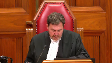
:::

**Speaker 1** (00:00:53): Chief Justices, the central issue on this appeal is whether the trial judge erred in his analysis under section 24-2 of the charter, admitting evidence pursuant to a lawfully obtained search warrant, evidence which strongly linked the respondent to two-arm robberies.

::: {.column-margin}
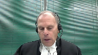
:::

The majority of the British Columbia Court of Appeal concluded that the trial judge erred in considering the totality of the police conduct as a mitigating factor with respect to determining the seriousness of the breach.

It is the appellant's position that the trial judge properly considered the totality of the police conduct because it was a response to arguments raised by the defense attacking the conduct of all the police who entered the premises.

The majority also found that the trial judge erred in his overall balancing under section 24-2 of the charter.

It is the appellant's position that the trial judge did find that the breach was both serious and intrusive on the respondent's privacy rights.

However, the judge's reasons as a whole clearly revealed his view based on his assessment of the evidence that the first two lines of the grant inquiry were too weak to support exclusion of the evidence.

I will later address the secondary and alternative issue that the majority of the British Columbia Court of Appeal erred in their fresh 24-2 analysis.

But first by way of overview and to put the issues in context, it is the appellant's position that the trial judge did not err in admitting the evidence based on the facts as he found them.

This includes the fact, and this is the elephant in the room which brings us here today, that on the day prior to the issues and execution of the warrant, the police unlawfully entered the respondent's residence to arrest him for the robberies.

That is not to say that the breach here was not serious and not intrusive on the respondent's privacy interests, but the trial judge's reasons as a whole reveal that he clearly understood the grant analysis and was of the view that in the context of this case, the breach was not so serious and not so intrusive to the extent that admitting the evidence sees pursuant to the lawfully obtained search warrant would bring the administration of justice into disrepute.

There are a number of factors which support the judge's findings, and I want to summarize these factors, and I'll point out what the police did not do which might otherwise have justified exclusions based on some of the more recent cases from this court, and I want to compare that to what the police actually did.

First, the police did not go to the respondent's residence with the intent of entering his residence or conduct a warrantless search relating to the robberies.

They went there to lawfully arrest him outside his residence.

Next, the unlawful entry of the residence was not planned.

Rather, it was precipitated by the sudden and unauthorized conduct of just one apparently unsophisticated officer, Constable Sinclair.

In fact, his actions were contrary to a plan authorized by his superiors to arrest the respondent outside his residence for the two-arm robberies.

This police officer entered what he genuinely but wrongfully believed was the common area of the premises after the respondent failed to respond to a knock and announce.

Next, the officers who followed Constable Sinclair into the residence for protection if things went awry did not search for evidence relating to the robberies, nor did they seize any items they saw relating to the robberies.

Rather, they conducted a 10-minute clearing search of the residence with, and I emphasize, the sole intention of seeing whether anyone else was there who might have access to firearms and which is justified based on the information they had.

And that information is set out in the officer's testimony in the condensed book at tab five.

Next, the police did not need to rely on their observations made when they were lawfully in the residence to get the warrant, unlike the situations in this court's decisions in Patterson and Cote.

All the items listed in the warrant obtained on the following day had been identified by the police during their investigation prior to the respondent's arrest.

In other words, there was a break in the chain between the breach and the obtaining of the evidence pursuant to the lawfully issued search warrant.

There was no causal connection between the breach and the issuance of the search warrant and the seizing of the evidence upon execution of the search warrant.

**Justice Moldaver** (00:06:27): sorry didn't the warrant just a little side question didn't didn't the information to obtain the warrant contain information that they saw during the original clearing search

::: {.column-margin}
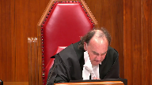
:::

but i thought if i look at paragraph thirty one of the majority reasons in the court of appeal uh... it says that the crown submitted that anything related to the arrest should be excised from the i t o including the evidence the police observed during the clearing search

so what is this that maybe i'm missing something

but so i understand that the police did put evidence from the clearing search into the i t o

but then at trial the crown took the position that that evidence should be excised if i'm getting this right

**Speaker 1** (00:07:20): That's correct Justice Paul Daver, but the affiant had no choice but to put that information into the ITO in support of the search warrant because he was required to do that for full fair and frank disclosure of the material facts.

::: {.column-margin}

:::

**Overlapping speakers** (00:07:40): Except that but it was there also a qualifier saying we're not relying on this.

No, there wasn't a qualifier. Thank you

**Speaker 1** (00:07:47): No, there was not a qualifier, but you have to put also put this in context the you can see that the ITO is 40 pages of length.

::: {.column-margin}

:::

There's a lot of work that the police had to do.

And as I say, for for for fair and frank disclosure, they had to put that in.

And of course the crown at trial took the view and the judge agreed that this information had to be excised from the ITO.

And as a result of that, there was still sufficient information in the ITO based on all the information that the police had gathered prior to the breach in order to support the the issuance of the warrant.

Next, this is not a case like Cote where a subsequently obtained search warrant was later found to be unlawful.

The trial judge found the police believe they had a lawfully issued warrant and they conducted which when when they conducted the search and indeed the warrant was found by the judge and the BC Court of Appeal agreed that the search warrant was lawfully issued.

Next, the police misconduct was not continual, long lasting or systemic as it was in Cote, where the police had violated virtually every charter right accorded to a suspect.

Rather, the police were in respondent's residence for 10 minutes for arresting the respondent and conducting the clearing officer safety search.

And that was the extent of the breach.

Next, this is not a case as it was in this court's decision in Lee, where the police entered onto property with no grounds to reasonably suspect any wrongdoing was being committed.

In this case, the police had the grounds to arrest the respondent for the robberies.

And finally, this is not a case like it was in Patterson where there was no urgency.

In that case, no urgency to preserve evidence.

In this case, the trial judge found in his reasons at paragraph 100 that there was urgency to arresting the respondent who the police believe possess firearms and who allegedly who allegedly brandished a firearm just one day before his arrest at the second robbery known as the Deer Lake robbery.

Now getting to the directly to the issues.

The, and the first issue on the peel and this is dealt with in the fact and beginning at paragraph 61 at page 17.

The first issue on the appeal raises the question, whether the child judge aired in law and assessing the seriousness of the breach by considering the totality of the police conduct, including the charter compliant conduct of the police officers who followed Sinclair into the residence.

The majority was of the view that the trial judge aired majority of the Court of Appeal, of course, was of the view that the trial judge aired because he considered the compliant conduct of the other officers who followed Sinclair into the residence to be mitigating the breach.

The judge submits the majority parse several passages of the judges regions to reach their conclusion.

The majority base their findings from these parts of the judges reasons.

Paragraph 92 of the judges reasons.

After the judge found that Sinclair's conduct was serious, the judge went on to say that he had to consider the totality of the police conduct.

The judge found that but for the actions of Sinclair, the police otherwise conducted themselves in a professional manner.

Paragraph 104.

The judge found that Constable Sinclair acted without the approval of senior officers and said that the judge said that had the senior officer approved Sinclair's actions and the overall state conduct would be at the serious end of the spectrum.

The second judge, Justice Wilcox, was of the view that it was necessary for the trial judge to consider the charter compliant conduct of the other officers because the trial judge had to address defense counsel submissions that the conduct of the other officers aggravated Constable Sinclair's serious charter breach.

Paragraph 95 of the judges reasons.

The judge found in the repellent submission that the totality of the police conduct was a relevant consideration because the defense made it so.

When the police entered the residence and lawfully arrested the respondent, they then, to quote the defense counsel, doubled down on their unconstitutional conduct and they searched the home incidental to the unlawful arrest.

They argued that there was no need to search the residence for officer safety and argued that the search was aggravated by the fact that the police did not carry out the search in a reasonable way, and that the police went beyond a clearing search for officer safety to search for evidence.

The trial judge made a number of findings, all of which are responsive to the defense arguments.

In paragraph 35, the judge noted that Constable as a judge who was the officer who followed Sinclair into the residence conducted the cursory search with the

and I emphasize and I said before, the sole intention of seeing whether there was anybody else in the residence, who may have had access to firearms, and they had information which justified that.

The constable Sinclair's unlawful entry into the residence and unlawful arrest of the respondent resulted in the necessity of the police to conduct a clearing search to ensure there is no one else in the residence.

And in paragraph 94, nothing was removed from the residence.

So, it was in this context that the judge could properly conclude as he did that but for the conduct of Constable Sinclair, the police officer, the police otherwise conducted themselves in a professional manner.

And this was a direct response to the

I guess I guess

**Justice Brown** (00:14:22): I guess the question is, what can they consider that for?

::: {.column-margin}
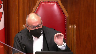
:::

Your submission, your overall submission, as I understand it, is that the majority misread the trial reasons as treating other police conduct as militating instead of as a response to a submission that it was aggravating. Yeah.

**Overlapping speakers** (00:14:46): Yes.

**Justice Brown** (00:14:46): So then my question is, is it open to a trial judge, whether this trial judge did it or not, to treat other police conduct as militating or simply to consider whether it is aggravating?

**Speaker 1** (00:15:02): He couldn't, in my respectful submission, he couldn't consider it as militating based on the jurisprudence from this court, but he could consider the conduct, as this court has said, on a range, and that's what he's, on a spectrum.

::: {.column-margin}
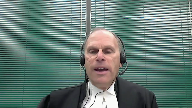
:::

And the courses and the cases from Grant onwards have said that when you assess, when a judge assesses the seriousness of the breach, of a breach, they need to do so on a spectrum.

And in my respectful submission, the judge can and did that.

So in other words, he not only responded to the defense arguments, but he also considered the police conduct on a spectrum of seriousness.

**Justice Moldaver** (00:15:46): It's still a third breach.

::: {.column-margin}
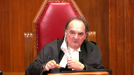
:::

You conceded that.

The clearing searches were a third breach and they were necessitated, I'll grant you this, because of what the first officer had done and the other officers didn't want to leave that officer to, you know, hang out to dry.

So in other words, their motivation may have been pure, but it nonetheless constituted another breach of the accused charter rights by a different group of police officers and surely that had to be taken into account.

How much weight you give it is, I guess, up to the trial judge, but you can't just sort of say, well, it was mitigating, we take it off the table and they were acting nicely.

The law is quite clear when you're looking at 24-2, you're asking not just if there was just one breach, but how many breaches were there here and you yourself, not you, but the Crown has taken the position, there were three breaches and yet the third breach, with respect, I think you got a bonus from the majority of the court of appeal on that by sort of not saying that the trial judge erred in failing to add that to the mix, but you see what I'm getting at?

You can't just sort of take it right out of the mix.

**Speaker 1** (00:17:13): No, I understand, Justice Moldaver, but there's no question that the judge recognized and, in my respectful submission, took into account the fact that there were three breaches.

::: {.column-margin}
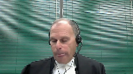
:::

He, in his reasons, said, in fact, there were three breaches.

But, as I say, what he's doing here, he's directly responding to the defense arguments which are criticizing the other officers and the way they conducted the Clearing Search.

So he, the judge, had to, didn't have to, but in fact did respond to those arguments.

So it's not, in my respectful submission, it's not that the trial judge ignored the fact that there was this other breach that was necessitated by Consul Sinclair's actions, but that they took into account, that he took into account, the fact that it didn't rise to the seriousness as it was argued by the defense.

And, to me, that was a legitimate call for the trial judge to make in this, in this, in this situation.

And, in fact, the defense not only attacked the conduct of the officers who came in to the residence with Sinclair, but she also attacked the conduct of Sinclair's superiors who authorized the knock and announce plan.

As Justice Wilcock points out, he said that the defense argued on the voir dire that those who planned the appellant's arrest at the earlier briefing implicitly approved the entry into search, into entry into the search and of the home.

Now, my friend says in this fact that there was no basis for this assertion as the defense did not make this argument at trial.

And, and she didn't explicitly make that argument, but there's indeed a basis for Justice Wilcock's assertion that the defense did so implicitly.

Defense counsel argued, again, this is seen in Condense Book tab two, that the breach was more serious as the directions came from the top and there was no plan B if the authorized plan did not work.

She said that the police had a constitutional route to proceed but chose the unconstitutional route and that these orders are coming from the top down that makes this very serious state conduct.

So, so she is implicitly attacking the superiors, the superiors and therefore the trial judge's findings at paragraph 103 that Constable Sinclair's conduct was not indicative of a pattern of systemic or institutional police regard of constitutional, of a constitutional right was a relevant consideration in response to these arguments.

So again, I mean the judge is not ignoring the, the other breaches.

The judge is taking those into account and is responding to the arguments that were made before him.

And as I said, finally, and finally on this issue, the judge was required to situate the police conduct on a scale of culpability.

That's clearly what he did in the context of the issues that were before him.

And, and with respect to the third breach, the judge took into account that the police, it was a breach, but the police, they weren't there for hours.

They were there for 10 minutes.

They didn't seize anything.

And they didn't go in there.

They didn't do the clearance search to look for evidence.

And he took that into account in my respectful submission on situating the police misconduct on a scale of culpability.

Now with respect to the next issue, and that begins in the factum at paragraph 85, page 23, Pellant submits that the majority second error was finding that the trial judge erred in his overall balancing under section 24-2.

The trial judge did find that the breach was both serious and intrusive on the respondent's privacy rights.

However, the judge's reasons as a whole clearly revealed his view based on his assessment of the evidence that the first two lines of the grant inquiry were too weak to support exclusion.

In other words, the judge was satisfied that the breach was not so serious and not so intrusive to bring the administration of justice into disrepute by admission of the evidence.

The trial judge's reasons as a whole indicate that he took the broad inquiry mandated by section 24-2.

And the majority ought to have deferred to the trial judge's finding.

Now there's no question that whether the admission of evidence would bring the administration of justice into disrepute is the ultimate question in a section 24-2 inquiry upon consideration of the three grant factors.

And the trial judge expressly acknowledges at paragraph 89.

And the Pellant submission, this is the Pellant submission, this is how he conducted his analysis.

He considered each of the three grant factors in turn.

And he considered the ultimate question, the extent to which the administration of justice may be brought into disrepute by admission of the evidence at each stage when considering sequentially the three grant factors.

So for example, when he was considering the seriousness of the breach, which is of course the first grant factor, he states at paragraph 104, and they should have said that the judge's reasons are in tab one of the condensed book.

The judge says that when assessing the totality of the police conduct, I am not prepared to find that the admission of evidence obtained from the search of the residents will likely have a negative impact on the public confidence in the rule of law and will thereby risk bringing the administration of justice into disrepute.

And what the judge is doing there, and as Justice Wilcox says, he's tracking the language of grant.

And that's the grant language at paragraph 72.

So his assessment of the seriousness of the breach, when you read his evidence as whole, yes, it's serious, he makes that point, but it's not so serious that it'll have a negative impact on the public confidence, et cetera.

And the judge makes a similar finding with respect to the grant factor number two, the impact on the respondent's privacy interests.

In paragraph 112, the judge says, having acknowledged that a residential entry is highly intrusive and acknowledging that the courts have recognized that it's one of the most intrusive impacts on a person's privacy.

The judge said at paragraph 112, he says, I find that the unwarranted police intrusion into the residence of the appellant was significant and unjustified.

But then he goes on to say, I do not find that it was profoundly intrusive to the extent of establishing that the state conduct would bring the administration of justice into disrepute.

And again, the judge is tracking the language in grant at paragraph, I believe it's paragraph 76 of grant.

And then the trial judge went on to consider grant factor three, and then he concluded the overall balancing requirement at paragraph 120.

And he said, in balancing the grand factors, I find the evidence obtained from the search of the appellant's residence is admissible.

Now, that's a terse balancing.

But as Justice Wilcox points out, what the trial judge said was sufficient to establish that he undertook the broad inquiry mandated by sector 24-2.

There was nothing else to be said because the judge had already considered the competing factors.

Now, the majority was critical for the trial judge's method for assessing the administration of justice at each stage of the grant analysis.

But it's the appellant's submission that the reasons should be read as a whole, and that the judge's reasons, basically beginning at paragraph 104, was part of the balancing exercises.

And beginning really at paragraph 91, he considers all the competing factors that he feels that is necessary to consider.

And it's his determination, which the majority of the Court of Appeal ought to have deferred, that the omission, excluding the, omitting the evidence, would not bring the administration of justice into disrepute.

Finally, with respect to the alternative issue that the majority aired in the fresh 24-2 analysis.

The majority predisposed to the majority predetermined their decision in the appellant's submission to exclude the evidence even before embarking on the section 24-2 analysis.

The majority thus gave no weight to what in my submission is a significant factor in the context of this case that ought to have favored omission of the evidence.

And that is that the police, that the evidence was seized pursuant to a lawfully issued search warrant, and that there was no causal connection between the earlier breach and the issuance of this of the search warrant.

As I said earlier, the police had grounds to get the warrant before Constable Sinclair unlawfully entered the respondent's residence.

He entered solely to arrest the respondent, and the clearing search, the other breach, was not conducted to look for evidence.

As I said, the majority-

**Justice Moldaver** (00:27:43): Excuse me You're saying that the police had the grounds to get a Feeney warrant If I understand you correctly, and I think if that if that is your position.

::: {.column-margin}
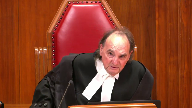
:::

I tend to agree

But I guess my overall question here is what was going on I mean, you know this ruse of going and seeing if the guy is there because you know the curfew

and so on I I just say this to you just

and it may not be absolutely necessary But

but so if the guy had come to the door Under this ruse to show that he's there I think you went might well have gotten met with the fact that really what you needed here and could have got as a Feeney warrant and This whole thing with the curfew is really nothing more than a ruse to Avoid having to get such a warrant.

I just make that as a comment to you because this whole operation to me Makes virtually no sense

**Speaker 1** (00:28:48): Justice Moldaver, let me respond in this way.

::: {.column-margin}
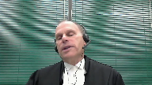
:::

First of all, the point I was making that the police already had grounds to get a warrant, I meant a search warrant.

But to answer your question about the so-called ruse, you have to recall the judge found that there was an urgency in this situation.

They just found out that very day.

They got the information that the respondent was allegedly the person involved in both robberies who was brandishing a firearm.

They just got that information that day.

And yes, by the time they got that information, I agree they would have had sufficient grounds to get a Feeney warrant.

But, and I know you can get a Feeney warrant by telephone, but to get a Feeney warrant, it's not something that would just take five minutes.

So, to get the search warrant.

**Justice Brown** (00:29:49): Which is why you don't need one if the situation is exigent, right, but we don't have exigency here There's no exigency here, there's no exigency here, there's no exigency here, there's no exigency here, there's no exigency here, there's no exigency here, there's no exigency here, there's no exigency here, there's no exigency here, there's no exigency here, there's no exigency here, there's no exigency here, there's no exigency here, there's no exigency here, there's no exigency here, there's no exigency here, there's no exigency here, there's no exigency here, there's no exigency here, there's no exigency here, there's no exigency here, there's no exigency here, there's no exigency here, there's no exigency here, there's no exigency here, there's no exigency here, there's no exigency here, there's no exigency here

**Speaker 1** (00:30:00): here, but the so-called ruse was a lawfully planned, it was lawfully planned, what the police wanted to do, arrest, a knock and announce, an arrest outside the restaurant, that's lawful.

::: {.column-margin}
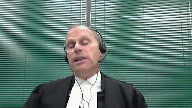
:::

You may not think, and the judge didn't think it was a perfect plan, but it was a lawful plan.

And to get a Feeney warrant is something which they could have gotten, but which would have taken time.

And as I was about to point out, to get the search warrant, the police needed at least they prepared a 40-page document.

Now not everything that was in that information obtained would necessarily have to go before justice to get the Feeney warrant, but the police would still have to establish that there was a robbery, and they would still have to establish that the respondent was part of the robbery, and they'd have to establish that the respondent would be in the room.

And that takes time.

So, talking about time, your time is up.

My time is up.

Thank you very much.

**Justice Wagner** (00:31:08): Thank you very much, Mr. Jessup.

**Speaker 2** (00:31:13): Yes, I'd just like to begin with a brief overview.

::: {.column-margin}
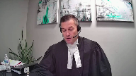
:::

It is the position of the respondent that the trial judge aired in principle in both the first factor of the grant analysis and in the overall analytical approach to the balancing of the grant factors.

The respondent says the majority was correct to embark on a fresh section 24-2 analysis as a result of those errors and that the majority properly acknowledged the absence of a causal connection, but had to view the absence of a causal connection in light of, contextually, in light of a serious breach and as an impact on an area where the respondent enjoys a high expectation of privacy.

And I should say by way of overview the respondent does maintain their position on jurisdiction as a position on jurisdiction as it's presented in the outline of argument in the condensed book of authorities.

But I'd like to begin by just addressing the respondent's position as to whether the trial judge did indeed commit the error found by the majority in the first factor.

And the position of the respondent is of course that when the trial judge, the trial judge aired when he considered the totality of the police conduct including lawful conduct as mitigating the overall seriousness of the breach.

And I'll begin by just outlining the respondent's position

and then I'll address the appellant's position that the trial judge was merely responding to defense counsel's submissions at trial.

So firstly with respect to the to the respondent's position, you know I appreciate the appellant has said the majority has parsed out certain paragraphs particularly paragraph 92 but paragraph 92 is of excuse me of substantial import because what it does is it really sets the road map for the trial judge's reasons and in the respondent's condensed book of authorities beginning at tab two I've reproduced the section 24-2 decision of the trial judge and we have to look at these reasons of course as a whole look at these reasons on their plain common sense interpretation and if we look at paragraph 92 the trial judge starts there's two propositions there the trial judge starts by saying there's no question that the conduct of Constable Sinclair resulted in a serious violation of the applicant's section 8 charter

right so he starts with the proposition that there's no question it's a serious breach but he qualifies that that proposition with a caveat with an exception and he uses the language you know that being said it's necessary to address the totality of the conduct at the time the breach occurred so he says you know in the respondent's position on a plain common sense interpretation of that paragraph he's saying this is a serious breach

but it's necessary for me to look at everything that occurred at the time of the breach you know

good bad indifferent I'm going to look at everything because it's necessary for me to do so well

**Justice Brown** (00:34:42): Well, in fairness, I mean, we said in Grant, Grant said as much that you look at the entire police conduct, but I'll make the same point as I made to your friend.

::: {.column-margin}
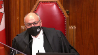
:::

It's for what purpose, right?

Are you looking for an aggravation of the conduct, or can you look at something that mitigates the seriousness?

I think that's the real question here.

**Speaker 2** (00:35:13): Indeed it is.

::: {.column-margin}
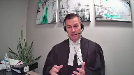
:::

And you know, what I say the problem with that is Grant tells us that we have to look at the charter infringing state conduct.

The respondents' respectful submission, the first factor in Grant is not an overarching analysis of the totality of the police conduct, it's looking at the charter infringing state conduct.

And to quote a lower court decision from in Ontario that was reproduced in the respondents' factum, the fact that police officers were acting properly before or after they were acting improperly does not mitigate the seriousness of the breach.

**Justice Rowe** (00:35:56): Okay, but let's say a big operation by a police force breaking into a biker gang's fortress.

::: {.column-margin}
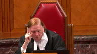
:::

30 officers go in, every door, every window.

It's just a big, big operation.

One police officer screws up, one, in one transaction.

Don't you have to put it against the context of 30 people going in through windows, in through doors, et cetera, et cetera, I mean, just to see it in isolation.

Well, no, not in my book, anyway.

**Justice Brown** (00:36:40): In this case, your friend says, well, the majority had to look at this other conduct because it was said to be aggravating.

::: {.column-margin}
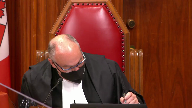
:::

And so the implication is that the trial judge was simply looking at it and saying it isn't aggravating.

And I'm wondering if it would be helpful for you to focus on paragraph 103 of the trial judge's reasons, where he says Constable Sinclair's conduct was negligent, cannot be equated to good faith.

And then 104, his charter infringing conduct was serious.

So the charter infringing conduct of Constable Sinclair was serious.

And then he says, had his conduct in entering the residence had the approval either implicitly or expressly, then the overall state conduct would fall at the serious end of the spectrum.

And I think what you're getting at is whether the overall state conduct is militating of the seriousness of Constable Sinclair's charter offending conduct.

I think that's what you're getting at, isn't it?

**Speaker 2** (00:37:51): That is, but the position of the respondent is that it's improper to look at the totality of the state conduct or the overall state conduct.

For the purpose of.

**Justice Brown** (00:38:04): determining whether it militates against a charter breach.

::: {.column-margin}
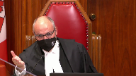
:::

You could look, you have to look at it to see if it aggravates it, but because in this case the trial judge in fairness was urged to find that it aggravated, but here it seems to, it seems to me that he treated it as militating.

**Justice Rowe** (00:38:23): I thank Justice Brown for his answer.

**Speaker 2** (00:38:28): Um, what I would say with respect to paragraph 103, paragraph 104 and paragraph 105, um, you know, essentially to answer the question, you know, if you have a multiplicity of officers, 30 officers entering a residence and one officer, uh, is there's misconduct on behalf of one officer, you know, can one bad apple spoil the whole bunch?

::: {.column-margin}
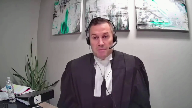
:::

Well, in my respectful submission, the first branch of the grant analysis addresses that question because you can place the conduct of the, of the one officer on the spectrum of seriousness.

And if it, if it, uh, one officer reaches, uh, you know, the seriousness, the end of the spectrum closer towards bad faith, um, then that is something that the court has to, has to consider in, on the spectrum.

But what the trial judge, first, I'd just like to address the question of whether defense counsel was properly citing those as aggravating factors and really whether the trial judge was responding to what defense counsel said were aggravating factors.

And I would really just, um, echo Justice Moldaver's points.

And it appears at tab three of the condensed book of authorities where I've reproduced defense counsel submissions on this particular point, whether, um, you know, we like it or not at trial, uh, Crown admitted that there were three separate distinct breaches.

Uh, there's a warrantless entry, uh, to the house is regarded by Crown as one breach.

The warrantless entry to the bedroom is regarded as one breach.

Uh, and the clearing search is regarded as a separate and distinct breach.

And at the first page on the tab three of the condensed book of authorities, it's page 136 submissions from the defense counsel.

And we see at lines 31 and 32, counsel says, so I'll deal with the breaches individually in terms of their seriousness.

Um, and moving on to page 140, which is, uh, you know, Justice Wilcox in dissent had cited page 141, uh, but 140, uh, trial counsel at lines nine and 10 says deal next with the warrantless search incidental to Mr. Riley's arrest.

So it's not just a situation where defense counsel is saying this conduct, uh, the clearing search conduct is aggravating on Constable Sinclair's conduct.

It's a separate and distinct breach altogether.

And what defense counsel was arguing on the basis of the admission that were, that, that there were three separate and distinct breaches is that there's now a pattern of breaches, which is again, conceptually a distinct argument from, from suggesting that there's a systemic breach.

Uh, so, you know, the appellant, uh, and, and justice, you know, first off Justice Wilcox, uh, uh, with the greatest of respect says that, uh, defense counsel was arguing a systemic breach.

And in my respectful submission, defense counsel was not the passage cited by the appellant, uh, uh, uh, here today, um, by reference to defense counsel submissions at trial, um, was dealt with by the majority.

And it was the submission by the appellant, uh, pardon me, by defense counsel at trial that essentially these orders, uh, in other words, the lawful orders to, to knock on the door and conduct a curfew check were ignored by Constable Sinclair.

And she's making the point that, that, that was essentially ignored, uh, that this officer's conduct was aggravating because he ignored these orders.

But, but Justice Wilcox, um, uh, cites, uh, or references page 141 of defense counsel submissions where, you know, granted defense counsel at trial was trying to push the point that the clearing search wasn't just a clearing search, that it was an evidentiary search.

And in it, you know, if officers use the pretext of a clearing search to search for evidence, that is, of course, more aggravating.

But the point is, it's a separate and distinct breach altogether.

And it cannot be that if you have a serious breach of Constable Sinclair and a not so serious breach of, uh, these, these other officers that if you, if you combine the two, it somehow overall ameliorates the overall seriousness of this, of the, of this state conduct in it, in its totality.

Um, and moreover, in my respectful submission, the judge doesn't directly deal, uh, with that aggravating conduct.

So if, if, if we take the position of Justice Wilcox and we say, well, um, you know, it was necessary for the trial judge to address, um, this, this aggravating, uh, evidentiary search, not a clearing search, but an evidentiary search, he doesn't really deal with that head on.

I mean, that's something that we're, we're, we're reading into his reasons.

He finds that the police were there for 10 minutes and they didn't seize or move any property, but then he also cites, um, the fact that, that the curfew check was not illegal, that it was lawful.

Um, the fact that, um, the other officers conduct them, conducted themselves professionally.

The fact that Constable Adzi judge conducted himself professionally.

The fact that a later point in time, they acted on a valid warrant.

Um, and so all of this, uh, lawful conduct, those are not direct responses to submissions of, of defense counsel.

Defense counsel did not impugn the conduct of Constable Adzi judge.

And in fact, uh, stated exactly what the trial judge said that he was acting, uh, professionally.

And so if we look at paragraph 104 and 105, they're essentially a reflection of exactly what the trial judge said in paragraph 92.

He never resiles in paragraph 104, that Constable Sinclair's conduct is serious.

He does not resile from that position.

And then in paragraph 105, he says, so he says in 104, the conduct is serious, but in 105, but when I look at the totality of the state conduct, it nevertheless favors inclusion.

And that reasoning in 104 and 105, is a direct reflection of the erroneous logic in the respondent's respectful submission from paragraph 92.

And so, uh, subject to any questions, uh, from the court with respect to that first error in principle, I can move on now.

**Justice Karakatsanis** (00:45:40): I guess I was just going to, I mean, I'm looking at justice Wilcox's reasons in particular at 165.

::: {.column-margin}
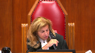
:::

There's no disagreement at the court of appeal about it would have been an error in principle to treat charter compliant conduct as attenuating the seriousness, as mitigating as opposed to aggravating.

The disagreement is how you read the trial judge's reasons.

That's what you're addressing.

**Overlapping speakers** (00:46:10): Precisely. Okay.

Yes. There's

**Justice Karakatsanis** (00:46:13): There's no issue.

You're not taking any issue at all with the laws set out by both the majority and the dissent in the court of appeal.

You're not taking any issue at all and they were unanimous on that point.

**Speaker 2** (00:46:24): If the trial judge had indeed mitigated the conduct of Constable Sinclair by reference to other police conduct, that's an error in principle.

::: {.column-margin}
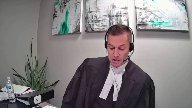
:::

And there are certain circumstances, of course, that it can attenuate the seriousness of charter infringing state conduct, and that comes at grant at paragraph 75.

The preservation of evidence, exigent circumstances.

If we look at those certain circumstances, they can attenuate the seriousness.

But the judge is simply not referring to those kinds of circumstances.

And I appreciate that's not a closed list, but other lawful police conduct are not circumstances which can attenuate the seriousness.

Now, with respect to the second error, as alleged by the respondent and found by the majority, I'll be somewhat brief in my submissions on this particular point.

And I do acknowledge that the trial judge, as Justice Wilcock has said, did track much of the language from Grant.

But the respondent's position is that the balancing inquiry that's directed towards the administration of justice, it occurs sequentially at the end of the analysis, having regard to all the circumstances.

And Grant tells us that all of the circumstances in that language of 24-2 are the three factors in Grant.

And the respondent really relies on paragraph 85 of Grant to support this assertion, where paragraph 85 of Grant says that having made these inquiries, the trial judge must then determine on balance, whether the administration of justice would be brought into disrepute.

And I appreciate that may be a somewhat of an overarching thread throughout the three factors, but there is indeed a balancing inquiry that must be made at the end of the analysis, having regard to the three factors.

And the trial judge made that inquiry effectively at each stage in the analysis.

And in doing so, he precluded the ability to conduct a proper balancing regarding the administration of justice at the end of the inquiry.

And as Justice Wilcox says, the trial judge's balancing was terse, indeed it was terse, but it was terse in the respondent's respectful submission because there was nothing left to say because he had already effectively made those decisions earlier on with respect to the first and second factors.

The trial judge found Constable Sinclair's conduct to be serious.

He found that the breach was significant and unjustified.

He was faced, Crown Counsel at trial conceded that the expectation of privacy was high as a common sense proposition.

Crown Counsel at trial in submission stated that that impact favored exclusion.

And so in a proper balancing of these factors at the end of the analysis, rather than an isolation, the trial judge would have had an opportunity to assess their cumulative impact on the administration of justice instead of their impact in isolation at each stage in the inquiry.

**Justice Rowe** (00:49:57): Is it an error in principle or an error of methodology to say after analyzing factor number one, this factor points in a certain direction and then after factor number two, this factor points in a certain direction.

::: {.column-margin}
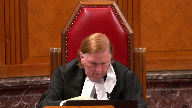
:::

Number three, this factor points in a certain direction.

Having regard to all of the foregoing and then you apply the test, is that a methodological problem or is the judge required to describe factor number one and not even say which direction it points in?

I'm not saying that the trial judge in this instance didn't get into trouble, but I'm just wondering what's the general proposition you're putting to us.

**Speaker 2** (00:50:55): I would agree.

::: {.column-margin}
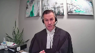
:::

I mean, a trial judge certainly is entitled and ought to, you know, at each stage in the inquiry, can say which direction a factor is pointing to.

That's a perfectly, in the respondent's respectful submission, a perfectly reasonable proposition for a trial judge to suggest that a factor is leaning one way or the other.

And in fact, that occurs frequently and regularly in 24-2 decisions.

The respondent's position is just with respect, in this particular instance, the trial judge appears to have essentially solidified the position at each stage in the analysis.

And so, in taking it that one step further, the respondent says that that precludes any balancing inquiry at the end of the analysis, and that's where the trial judge fell into error.

But the respondent is certainly not saying that when looking at certain factors, a trial judge can indicate that it leans one way or the other.

Inaudible.

**Speaker 2** (00:52:35): that is the problem and it's also the problem that he finds that the administration of justice would be brought, well he says would not be brought into disrepute at each stage because what the respondent is referring to is in fact the the overall assessment of the administration of justice that occurs at the end of the analysis.

::: {.column-margin}
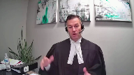
:::

So it is a problem that the trial judge again essentially comes to conclusions about the administration of justice in isolation at each stage.

**Justice Karakatsanis** (00:53:15): I guess just to follow up on justice Jamal's question, we're always assessing these factors in light of the impact on the administration of justice.

::: {.column-margin}

:::

But at the first factor, for example, when you're looking at, you know, the seriousness of the breach, the impact on the administration of justice may help you locate it on a scale of severity or is this going to be neutral or trifling.

But if there is a breach, can it on its own fact favour inclusion?

I think the point that's being made about conclusions is you can't come to a conclusion about the impact on the administration of justice until you look at everything.

But surely you can consider it when you're trying to locate the severity of the breach or the severity of the impact in terms of the scale, how strongly it pulls towards exclusion or inclusion.

**Speaker 2** (00:54:22): Indeed, I would, the respondent agrees wholeheartedly with that proposition and as I said, you know, the trial, Justice Wilcox was correct in that the trial judge tracked the language in Grant and Grant refers to the language in Grant and Grant refers to the language in Grant and Grant refers to the language in Grant.

**Justice Karakatsanis** (00:54:35): So the point, so the, so Justice Rose, the answer to Justice Rose's question is it's not wrong to refer to it, it's not in terms of methodology, there's no error in just considering it when considering the severity of it.

::: {.column-margin}
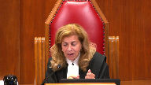
:::

What's wrong is to come to a conclusion before you consider all the circumstances.

**Speaker 2** (00:54:56): Yes, that's the position of the respondent.

::: {.column-margin}
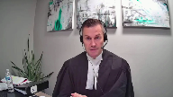
:::

Exactly, thank you, Madam Justice.

Now, with respect to the Section 24-2 analysis and the fresh Section 24-2 analysis, really, I'll just address what the appellant says is the error in the 24-2 analysis, and that is that the majority failed to give sufficient weight to the absence of a causal connection.

And I appreciate the appellant is not revisiting the obtained in a manner threshold or that analysis, but the respondent's impression of the appellant submissions is that while it may have passed the obtained in a manner threshold, you know, the temporally, contextually, causally, it did not do so causally, and it did so just barely contextually.

And of course, the Court of Appeal was unanimous on the decision that it did pass the obtained in a manner threshold.

And the respondent would say at the outset, once you're over that threshold, it's the three factors in grant that drive the day in the respondent's respectful submission.

A trial judge is not required to go back and revisit the absence of any causal connection or the strength of any contextual connection to ameliorate or to tip the scales in favor of admissibility or exclusion one way or the other.

You know what, and the appellant's, you know, argument is also, the appellant in their factum attacks the proposition and the findings of the majority that these breaches were part of a series of investigative tactics, an integral component of a series of investigative tactics to use the language of Cote, citing the 1993 grant.

But the respondent says that the evidentiary record does not support that proposition.

It was put to the officers indirect and in cross what was discussed at the briefing.

The closest we come is from Corporal Chen who says, I do recall the possibility of a search warrant if the respondent was arrested at the residence.

And the Constable Sinclair notably does not recall any discussion about a search warrant.

There's a briefing between officers where it's decided that they're going to arrest the respondent.

They show up at the respondent's home.

They unlawfully enter the respondent's home and arrest him.

They conduct a clearing search.

During the clearing search, there's observations made.

The officers then secure the residence and then go and get a search warrant.

The observations from the clearing search make their way into the search warrant.

Yes, the search warrant was not comprised solely of the unlawful observations, but to suggest that the search warrant would have been issued in any event simply because it survived excision of those unlawful observations is not necessarily supported by the evidentiary record.

And so while there may be no evidence to support a direct causal connection, it's certainly not a remote connection.

And in terms of what do we do with the absence of a causal connection?

Well, the absence of a causal connection is hardly determinative.

It's one factor to consider, and it can be considered contextually against some of the other factors, and the appellant relies on the Mian decision to support this.

But in this particular instance, the majority was faced with what they found to be serious breaches.

And that position is well-founded in law, and well-founded on the evidentiary record, and well-founded on the negligence of Constable Sinclair.

And the majority was faced with an impact on an area where the respondent enjoys a high expectation of privacy.

So contextually, if we view the absence of a causal connection against those other factors, it can hardly be determinative in those situations.

And to give it more weight than it deserves would be to sort of compartmentalize that factor.

And so in my respectful submission, Mr. Justice Cromwell's comments in Cote at paragraph 79 are a complete response to the appellant's position on this point.

And so subject to any questions, those are the respondent's submissions.

**Justice Wagner** (01:00:10): Thank you very much.

Any reply, Mr. Levitz?

**Speaker 1** (01:00:23): Thank you.

::: {.column-margin}
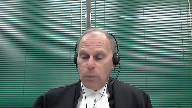
:::

Thank you, Chief Justice.

I just have a very brief reply.

First of all, with respect to the first issue, with respect to the issue of mitigation and the judge's finding Paragraph 103 that there was no pattern of systemic or institutional police regard, etc.

In my respectful submission, the Defence Council made that an issue in the way she attacked the overall police conduct, not just Constable St. Clair's, but the other officers who conducted the clearing search, which was a breach, and she attacked what they were doing, and she also attacked the superior officers and essentially blaming them for not having a Plan B and blaming them for thus then having caused or been a factor in causing what led to the serious breach in this particular case.

So in my respectful submission, it was fair game in response to that for the judge to find that there was not indication of a systemic pattern or institutional police disregard of the respondent's rights.

And secondly, on this point, at no time, the

**Overlapping speakers** (01:01:54): You

**Speaker 1** (01:01:55): where in the judge's reasons does he indicate that this or the overall police conduct is in any way attenuating the seriousness of the breach or mitigates the seriousness of the breach?

::: {.column-margin}

:::

It's just not said.

Second point has to do with the judge, which came up in questioning, having to do with what the judge said at each stage after grants one and two, that it favors inclusion.

And as it was pointed out, the issue is, is that a wrong way to come to a conclusion before you actually consider all the circumstances?

And in my respectful submission, if we probably wouldn't have a problem here, if what the judge said, for example, in paragraph 105 and what he said in paragraph 112 was cut and paste into paragraph 120, because essentially then he's considering all the circumstances and he's gonna say, I find the evidence obtained from the search of the applicant's presence is admissible.

Clearly that's the conclusion he's gonna draw whether or not those paragraphs are where they are or if they're put together in paragraph 120.

So in my respectful submission, that point is really just about form over substance.

And when it comes to substance, the judge properly considered all the considerations and is clear from his reasons as a whole that he did not find that emitting the evidence would bring the administration of justice into dispute.

That in my respectful submission is loud and clear.

He's considered all the competing interests and the court of appeal where the majority ought to have deferred.

And finally, on the last issue with respect to whether the majority eared in the fresh 24 to analysis, and my friends reliance on Cote, where Justice Cromwell did say that there ought not to be a compartmentalized between the breach and the fact that later on a warrant was obtained.

My respectful submission, the facts in Cote are apples and oranges to the facts in the present case.

And in Cote, as the trial judge found and as pointed out by Justice Cromwell, the facts were horrible.

It was a series of continuing systemic breaches right from the get go, right from the time when the police officers entered into Madam Cote's residence.

And it continued on even to when they prepared their information to obtain to get the search warrant where they misled the issuing justice.

And in those circumstances, quite rightly, you cannot compartmentalize the breach from later on the obtaining of the warrant.

But in my respect to submission, this is not the situation in this case.

It's a situation where, as I said, the police had already gathered the information prior to the breach.

They had enough information to get the search warrant.

And yes, of course, they did have to include information about the breach.

And that was a necessity based on the jurisprudence from this court, a rojo, and other cases which say that this type of information has to be included in an information to obtain or an affidavit for full fear and frank disclosure.

Thank you very much.

**Justice Wagner** (01:05:51): much.

Thank you.

I would ask the attorneys to remain at our disposal.

**Justice Rowe** (01:06:42): The court let cool.

**Justice Wagner** (01:07:05): Thank you.

::: {.column-margin}
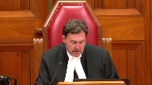
:::

Please be seated.

I would like to thank council for their submissions.

The court is now ready to release a unanimous decision.

And I will ask Justice Moldaver to read the reasons.

**Justice Moldaver** (01:07:29): We would dismiss this appeal substantially for the thorough reasons of Justice Griffin on behalf of the majority of the Court of Appeal.

::: {.column-margin}
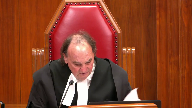
:::

We agree that the trial judge aired in his section 24-2 analysis by considering charter compliant police behaviour as mitigating.

We also agree that the trial judge aired by improperly conducting the overall balancing, whether including the evidence would bring the administration of justice into disrepute within the first two grant factors.

The language of grant is clear.

This overall balancing occurs at the end.

Judges must first consider whether each of the three factors weigh in favour of inclusion or exclusion of the evidence before asking whether, having regard to all factors, inclusion of the evidence would bring the administration of justice into disrepute.

Conducting overall balancing within the first two grant factors waters down any exclusionary power these factors may have.

This type of analysis undermines the purpose and application of section 24-2.

With respect, however, we are unable to agree with the majority of the Court of Appeal that the trial judge properly considered all relevant charter infringing state conduct under the first grant factor.

The trial judge considered the charter infringing state conduct related to only two of the three section 8 breaches.

Failing to consider state conduct that resulted in the third breach, the clearing search, was an error.

Regardless of whether the third breach was caused by the first two breaches and regardless of the fact that it was considered necessary in the wake of Constable Sinclair's unlawful entry, it was nonetheless a breach of Mr. Riley's section 8 charter protected rights and must be considered under the first grant factor.

Trial judges cannot choose which relevant charter infringing state conduct to consider.

The trial judge committed errors that required the majority of the Court of Appeal to conduct a fresh 24-2 analysis.

In our view, we do not lack jurisdiction to consider alleged errors in the majority's fresh analysis.

We see no reason to interfere with their fresh analysis.

Accordingly, we would dismiss the appeal, affirm the exclusion of evidence, and order a new trial.

**Justice Wagner** (01:10:39): Thank you.

Thank you very much.

The court is adjourned until tomorrow morning, 10.30.