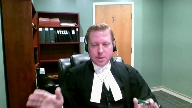

---
title: Tyler Gordon Strathdee v. Her Majesty the Queen
published-title: Heard
date: 2021-10-15
sidebar: false
---

This transcript was made with automated artificial intelligence models and its accuracy has not been verified. Review the original webcast [here](https://scc-csc.ca/case-dossier/info/webcast-webdiffusion-eng.aspx?cas=['39556']).
---

**Justice Wagner** (00:00:02): The court, the court.

::: {.column-margin}

:::

Good morning, please be seated.

In the case of Tyler Gordon Stradi, against Her Majesty the Queen, for the appellant, Tyler Gordon Stradi, Mr. Graham Johnson, Tanya Shapka, for the respondent, Her Majesty the Queen, Julie Morgan.

Mr. Johnson.

**Speaker 1** (00:00:52): Thank you.

::: {.column-margin}

:::

Good morning, Chief Justice, Justices.

I need to begin my submissions by apologizing and asking the court to disregard tab two of my condensed book.

While it contains a Alberta Court of Appeal judgment dealing with Mr. Straffti, it is not the Alberta Court of Appeal judgment being appealed from.

For what it's worth, the citation in my table of contents on the condensed book is to the correct case, but regrettably that is not what got printed in the materials, so my apologies and please disregard that tab.

While this is a case about party liability and when it may or may not apply, it's also a case about reasonable doubt and the presumption of innocence in the context of what this trial judge found was a great deal of extremely unreliable evidence.

An application of the law, and in this case we're talking about the law of party liability as joint principles, that application is always very fact specific, but to understand the trial judge's conclusions in this case, in my submission, it's particularly important to understand what sort of evidentiary foundation or lack thereof the trial judge was dealing with in the case before her.

And in this regard, I would draw the court's attention to a quotation cited with approval in this court's decision in Walker, which is at tab three of our condensed book on the last page, at page 260, as it seems particularly appropriate.

And the quotation is that a reasonable doubt need not rest upon the same sort of foundation of factual findings that is required to support conviction.

A reasonable doubt arises where an inadequate foundation has been laid.

And it is submitted that this is what happened with the manslaughter acquittal of Mr. Strathdee.

And while I intend to move obviously to a discussion of party liability, in my submission it's first important to look at in some detail just what the trial judge had in front of her.

And in my submission, simply to call the primary witnesses in this case, vetrovec witnesses or people who were drunk or high, which most were, or unsavory or unreliable witnesses really doesn't do justice to just how bad some of the evidence was.

And so while it's a little bit unusual, I have included some of the raw evidence in our condensed book.

So the court can see just what kind of evidence the trial judge did in fact have before her.

And it begins with, at tab four, the evidence of Mr. Kalick.

And transcript page 795, condensed book page 147.

It clearly begins when Mr. Kalick is sitting down when he's initially giving his evidence, and there's some difficulty hearing him.

Because Crown counsel says, I have difficulty hearing you when you were sitting.

Answer, you have difficulty hearing me sitting because you cannot see me when there is a mic and I'm sitting right beside you.

So right from the very beginning, Mr. Kalick is showing a certain amount of contempt for the process and for Crown counsel.

At the bottom of the same page, question, Mr. Kalick, you have a criminal record.

Answer, yes.

Okay, you do have one.

On the next page, answer, fuck man.

Question, and it began in 2007.

Is that correct to the best of your recollection?

Answer, yes.

And it began in 2007.

Is that correct to the best of your recollection?

Answer, I wish not to proceed anymore.

Mr. Kalick, why is that?

Answer, because I have nothing to say.

Jumping down a few lines, Crown counsel says, Mr. Kalick, this is going to be a very difficult afternoon if you don't at least show the court common courtesy.

So you need to stand.

Answer, oh, I'm showing common courtesy as much as I can.

Question a couple lines down.

I appreciate that, but you need to stand.

Answer, excuse me, lawyer.

Then the court intervenes and says, all right, sir, we will ask you the questions.

You will be asked.

You will give the answers in that matter.

We can receive your evidence.

You are required to provide your evidence by way of your subpoena.

Answer, whoa.

You know, next page, Mr. Kalick.

**Overlapping speakers** (00:05:37): You

**Speaker 1** (00:05:37): why do you not want to be here today answer because either way it's a setup after that still a setup after that a setup either way you're all just evil pieces of shits a few lines down mr kalick do you remember testifying in july of 2017 at the preliminary inquiry answer before i died numerous times mr kalick answer just hold on a second

::: {.column-margin}

:::

i'm not done talking i just said just before i died numerous times i'm not sure if i testify do you understand a few lines down you died numerous times what do you mean by that well fuck man idiot make it seem like just i'm just a fucking piece of shit which i am mr kalick we don't believe that answer shut up man next page you need to answer the question answer can you stop talking please it goes on for several lines in that vein then a few pages later um mr kalick's being shown a video and asked to identify the parties in the video outside the 711 the crown's theory being mr strathy and mr nelson who was also on trial is one of them and so question and that guy i want you to look around the courtroom do you see that guy from the video here answer i'm not too sure question i'd like you to look around the courtroom answer maybe just kidding okay

mr kalick answer yes i do see that guy question and where is he standing in front of me asking questions

so this is the sort of absolute contempt that some of the witnesses were showing moving to the next tab of the condensed book mr toker's evidence um it's a single page excerpt but about three quarters of the way down the page crown council says to mr toker do you need a break answer no

no

i just want to get this done because i don't like tyler he's a goof so we have the open hostility of mr toker moving to the next tab the evidence of mr phillips um council crown council asked if you wish to review a videotaped interview and this is at page 465 of the transcript question

so when i asked you if you wanted to review your videotaped interview you said no was that correct answer

yes and that's still your position answer yeah

you don't want to review it

no are you able to read a transcript

no is that because you cannot read or yes okay

i can't read and then crown council goes on to try to ask a question answer

but i you know what how many times you got to ask me the same questions i don't want to talk right now

and it continues on in that vein and ultimately there were several nine two applications there were applications to read in evidence under principled exceptions to the hearsay rule and so this is what the trial judge was dealing with and then there are the then there are the statements of mr straff

**Justice Martin** (00:08:39): But excuse me, in respect of those statements, does the trial judge place any weight on them at all, the evidence of Mr. Kalik or Mr. Toker?

::: {.column-margin}

:::

My recollection is that they're kind of put to aside and not relied upon as being credible.

**Speaker 1** (00:09:00): They're not, but in my submission it's important to understand just what the trial judge was dealing with in order to understand her findings of fact and the conclusions she drew from those findings of fact.

::: {.column-margin}

:::

And so the evidence of some of the witnesses before her, it's not just that it was unreliable evidence, she was dealing with people who were showing absolute contempt for the court process.

And so her ultimate findings of fact as it related to party liability and whether or not Mr. Strathdee was a joint principal on the manslaughter in my submission need to be read in the context of not just that she had unreliable evidence before her, she had people who were showing absolute contempt for the process and so there was just almost a vacuum in her mind in terms of evidence as to what actually happened.

And then there are the statements of Mr. Strathdee.

On October 20th he gave a statement saying he was an occupant of the suite when the intruders came in and Mr. Kalick stabbed Mr. Tong.

His second statement October 30th added very little.

Then when he was arrested in March of 2016 he admitted to fighting with quote like punching a couple of the other guys that were there.

He denied stabbing Mr. Tong.

In his October 15th or October 20th 2015 statement he said Mr. Kalick stabbed Mr. Tong.

In his March of 2016 statement he said it was Mr. Phillips.

So given all of this what findings of fact did the trial judge in fact make?

In terms of Mr. Strathdee's statements at least the parts that were not inculpatory she found he had clearly lied to police which he did.

She stated she was unable to believe or disbelieve and described it as not knowing whether his exculpatory evidence was true or false.

And she then went on to set out the evidence she did accept which is that Jonathan Piche, Mr. Nelson, Mr. Strathdee, Mr. Phillips, and Mr. Kalick were part of a group that attended the suite on that date.

Mr. Strathdee went to the apartment to confront and here she accepted this could have been a verbal confrontation one of the occupants of the suite about beating up one of his friends.

Prior to entering the suite there was no common intention amongst the group for an attack or to assault the occupants.

Once the group entered the suite the fire extinguisher was discharged and immediately after that a fight broke out between members of the group that entered the suite and several of its occupants.

She does not say all of the occupants.

There were many individuals fighting not all individuals but many.

She found a knife must have been involved given the injuries.

It was not proven beyond a reasonable doubt that either Mr. Strathdee or Mr. Nelson personally caused any of the injuries to any of the occupants.

Mr. Tong died of a single stab wound described in medical evidence was not in dispute.

She found that stabbing to be a discrete act carried out by one individual which was not proven to be Mr. Strathdee.

As the trial judge put it in her findings of fact this is not a classic scenario where multiple persons assaulted Mr. Tong at the same time.

Now the Court of Appeal emphasized the principle that in a group assault a blow of one is a blow to all regardless of the number of assailants in the group or the number of victims which in the abstract is correct as far as it goes but in my submission a dangerous statement when applied to the frankly lack of evidence as to what exactly happened in that suite in this case.

The Court of Appeal found that the trial judge was required to assess Strathdee's culpability as a joint principle to manslaughter under section 21 sub 1 sub a of the code on the basis of her own fact finding that this was a group assault.

In my respectful submission that statement by the Court of Appeal is an oversimplification.

The trial judge found there was a group assault

yes but did not find that Mr. Tong died as part of that group assault or certainly had a doubt about whether Mr. Tong died as part of that group assault.

And so when the Court of Appeal held at paragraph 67 for these reasons it is irrelevant who struck the fatal knife blow to Tong and that's citing Cabara at paragraph 80.

More specifically it matters not whether Strathdee himself laid a hand on Tong.

Again in the abstract that might be correct but problematic when applied to the facts of this case.

Accordingly the trial judge erred when as an explanation for acquitting Strathdee of the manslaughter she said there is no evidence of others applying force to Mr. Tong prior to his death.

Given her findings of a group assault on the occupants of the burn stick suite that evidence was not required to convict members of that group of the assaulting group of manslaughter.

In my respectful submission on the inferences available on the record that was before the trial judge and her findings of fact there is no evidence that there was a group assault on Mr. Tong.

Given her findings of fact that statement by the Court of Appeal is too sweeping and has the potential to expand party liability in a way that could capture people who are morally innocent of being a party.

And explain how that is so I would give the following hypothetical scenario.

Three people are occupants of a residence.

A group of three visitors comes to visit the residence because one of the visitors is acquainted with one of the occupants.

As the visitors enter the suite one visitor recognizes one of the occupants as someone with whom he has had a long-running dispute over a former girlfriend or something.

And those two individuals immediately engage in a confrontation.

One of the other occupants and one of the other visitors involve themselves in that confrontation which quickly turns physical.

In the course of that physical altercation involving four individuals a knife comes out and one person is seriously stabbed.

I will call that altercation number one.

While altercation number one is happening the one remaining occupant and one remaining visitor are initially standing off to the side when suddenly the one remaining visitor recognizes the one remaining occupant as someone who owes him a drug debt or something.

He immediately confronts the debtor and says something to the effect of I'll show you what happens when people disrespect me and don't pay the debt pulls out a knife and stabs him and he dies.

Altercation number two.

The person who does the stabbing over the drug debt is clearly guilty in my submission of a homicide for stabbing in altercation number two.

But in my submission that person is not a party as the law of party liability stood certainly before the Court of Appeal decision to the altercation involving the four individuals because that was a separate altercation over a separate issue.

It just happened to be going on essentially at the same time in the same suite.

And and it is possible in my submission given the findings of fact made by the trial judge and the record before her that she had a reasonable doubt that something akin to what I just described in that hypothetical could have happened.

There was such a vacuum in the terms of the evidence and the medical evidence as it related to Mr. Tong did not as she found bear the hallmarks of a group attack.

It was very different than what I would describe as the much more frenzied attack on at least two of the victims of the aggravated assault.

And if the trial judge had a reasonable doubt about whether all individuals were part of the group attack and she did in my submission it was open to her to acquit of the homicide because in discussing the evidence and this was in the context of acquitting Mr. Nelson the co-accused of everything at page paragraph 162 of the trial decision the trial judge stated Mr. Nelson's presence in the burn stick suite that night is insufficient to ground culpability meaning for the aggravated assault and the homicide without proof of something more.

An inference could potentially be drawn that Mr. Nelson was engaged in the fighting on the basis of Mr. Strathdee the evidence of Mr. Strathdee in his statements Mr. Kalick and Mr. Phillips that quote everybody was fighting as well Mr. Nelson's left hand appears to have been injured during the melee however this circumstantial evidence is insufficient for me to conclude beyond a reasonable doubt that Mr. Nelson was involved in the fight.

So the implication of that in my submission is she specifically rejects or at least finds that she can't be certain that everybody was involved in the fight that initially broke out that initial group attack.

**Justice Martin** (00:20:29): Except, may I, but she does accept the admission of Mr. Strathdee that they were going there to confront, okay, a word that can be ambiguous.

::: {.column-margin}

:::

And that he said that there would be some maybe some fighting and he admitted to punching.

So he stands in a very different place.

And I guess I wonder whether the problem isn't that when we're talking about group violence, it's group on group violence.

And why isn't why shouldn't the trial judge have asked the question about whether Mr. Strathdee was a significant contributing cause in the with the knowledge that he had of what was going to go on there.

Could you address that, please?

**Speaker 1** (00:21:20): because the trial judge specifically declined to find that there was a plan to go in there to launch an attack.

::: {.column-margin}

:::

That was the theory of the crown, that this was attack planned in advance, that they broke in and assaulted the members of the suite.

But the trial judge specifically acquitted of the break and enter.

So upon entering into the suite, she found there was no common intention.

She found the word that Mr. Strathdee used, that they were going to confront, did not necessarily mean a physical confrontation.

So it's in that context that they go into the suite.

Yes, then a fight breaks out between some of the occupants of the suite, several is the word that the trial judge used, but she specifically declined to find that everybody was fighting in the context of that group attack.

So while there was a group attack, she found that the injuries to Mr. Tong were not consistent with him being involved in a group attack.

If the evidence were clearer, and for example, the ball decision of the BC Court of Appeal, where it's clearly a two-on-two, I think in that case, fight in a bar where somebody pulls out a knife and someone stabbed in that two-on-two incident, that's sort of akin to what I described as altercation number one in the hypothetical I provided to the court.

And clearly party liability would flow there.

But on the evidence before her, given that so much of the evidence was from people who had absolute contempt for the court process, the trial judge was not prepared to find that the stabbing of Mr. Tong was part of that group attack.

And it is very different, because when we look at many of the cases involving party liability, many of them are defense appeals of a case where the argument is essentially, well, yes, there was a stabbing, but the accused didn't inflict the stabbing.

And there, the courts are very clear, trial judges are entitled to find that a person is a joint principal on the basis that a blow where there's common intention, a blow inflicted by one, is a blow inflicted by all.

But that is a very different thing in my submission from what the Court of Appeal is essentially saying here, which is that the trial judge was required as a matter of law to find that Mr. Strathdee was a joint principal in the homicide of Mr. Tong.

**Justice Karakatsanis** (00:24:29): Can I ask you, Mr. Johnson, sorry, you can finish your point.

**Overlapping speakers** (00:24:34): No, that was fine.

**Justice Karakatsanis** (00:24:35): Okay, you took us to paragraph 162, where she was not satisfied that Mr. Nielsen was actually involved in the fighting.

::: {.column-margin}

:::

In that paragraph, she talks about he wasn't involved in the fight.

I'm just, is there anything in her reasons that suggests that she thought there might be more than one fight happening?

Is there anything anywhere that suggests there was more than one altercation?

I mean, you've given us a scenario altercation one and altercation two, so I'm just asking you, is there something in her reasons that we could, to ground that submission in?

**Speaker 1** (00:25:15): that would be the line that where she finds that the stabbing of Mr. Tong was a discrete act.

::: {.column-margin}

:::

And the implication there in my submission is that in finding it was a discrete act, she found it at least had a doubt about whether it was an act separate and apart from the group assault.

**Overlapping speakers** (00:25:47): Because that's how she describes it.

Do you have the paragraph reference?

**Speaker 1** (00:25:52): I do, if I could just have a moment.

**Justice Karakatsanis** (00:26:15): That's all right.

**Speaker 1** (00:26:16): I'll find it, I do remember reading it, I just can't seem to find it.

I can't seem to find it at the moment, my apologies.

I will find it for the court, though.

**Justice Côté** (00:26:26): The court of appeal says that paragraph 43 seems to say that the trial judge found it was a discreet act not because of the timing but just because of her inability to determine the identity of the stabber.

::: {.column-margin}

:::

So the court of appeal says at the end of paragraph 43 the trial judge did not separate the death of Tong by timing.

She separated it by an inability to determine the identity of the stabber.

So it seems that the court of appeal said okay

she came to the conclusion it was a discreet act not because it was altercation two as opposed to altercation one but because she was not able to determine who was the stabber.

**Speaker 1** (00:27:12): And with all due respect to the Court of Appeal, in my submission, that is their interpretation of the evidence or the spin that they're putting on the trial judge's findings of fact.

::: {.column-margin}

:::

But if you look at the trial judge's findings of fact in totality, in the context of the record she had before her, although she didn't expressly say and her reasons could have been clearer, it is possible that Mr. Tong's stabbing was an entirely separate altercation, where she uses the words discreet act, she finds the injuries not…

**Justice Brown** (00:27:50): word search and I don't see that word there.

It does appear, the word distinct event appears in the appeal decision, but I don't think it's fair to say she describes anything as a discrete act.

**Justice Brown** (00:28:05): I'm sorry to interrupt, but I think that's an important point.

**Speaker 1** (00:28:10): said was, there is no evidence of others applying force to Mr. Tong prior to his death.

::: {.column-margin}

:::

The evidence of Mr. Kalik that he saw Mr. Strathy stab Mr. Tong seven times, including in the face, is unbelievable given that he stabbed, suffered only one stab wound to the chest.

She says, this is not a classic scenario where multiple persons assaulted Mr. Tong at the same time.

**Justice Brown** (00:28:38): So what's required to be shown here?

::: {.column-margin}

:::

Reasonable, I mean, do you say that he can be convicted for manslaughter only if he foresaw the likelihood of harm to Mr. Tong or just that he could have foreseen a risk of harm as a result of his participation in an assault, which at paragraph 157 he's recounted as having acknowledged?

**Speaker 1** (00:29:18): So it is a very different thing from it being an available inference for the trial judge to have convicted Mr. Strathdee of the manslaughter versus what the court of appeal is saying, which is that the trial judge was required as a matter of law to convict Mr. Strathdee of the manslaughter and the court of appeal went and substituted a conviction.

::: {.column-margin}

:::

This was such an unclear record.

The trial judge found she could not find that all occupants of the suite were involved in the group attack.

She could not find that the injuries to Mr. Tong were consistent with more than one person inflicting those injuries.

And so in my submission, it was open to her to have a reasonable doubt about whether the stabbing of Mr. Tong occurred as part and parcel of the group attack that Mr. Strathdee admitted to being involved in, which is where he admitted to throwing some punches.

And so that's the difference.

I'm not appealing a conviction the trial judge entered on manslaughter and saying that was not an available inference.

My submission is that the trial judge was entitled to have a reasonable doubt and she was not required as a matter of law to convict Mr. Strathdee in this case.

**Justice Kasirer** (00:30:57): helpful, thank you.

::: {.column-margin}

:::

Mr. Johnson, is there something other than the single knife wound that would take the so-called discrete act outside of the scope of the group assault?

What is it exactly that takes it outside of the scope of the group assault?

The other stabbings, for example, were they part of the group assault?

**Speaker 1** (00:31:30): So I think what the trial judge found in two out of the three victims of the aggravated assault, the injuries were consistent with a much more frenzied attack.

::: {.column-margin}

:::

There were multiple injuries to two of those people.

One of the victims of the aggravated assault did also suffer a single stab wound and whether the trial judge could have or maybe even should have had a reasonable doubt about whether that person was part of the group attack as well is not an issue before the court today.

But given the vacuum here and the quotation from Walker that I gave at the beginning about the lack of foundation, that it was open to the trial judge to essentially throw her hands up and say I have a reasonable doubt.

I know there was a group attack.

I know the injuries to Mr. Tong do not appear to be consistent with him being involved in a group attack and the sense of being assaulted by more than one person.

The evidence before me is so unreliable that I don't know what to believe.

Accordingly, I have a reasonable doubt about the manslaughter.

Thank you very much.

**Justice Wagner** (00:32:49): your time is up.

Thank you.

I'm sorry but could you indicate a paragraph to refer to by Justice Kirkatsanis when she asked you the question?

**Speaker 1** (00:33:00): It may have been actually that I, in using discrete act, that might have been my words paraphrasing paragraph 137 of the trial decision.

Thank you very much.

I will look, but that might have been my error.

**Justice Brown** (00:33:17): It may be in fairness, paragraph 43 of the appeal decision responds to a suggestion that the stabbing of Mr. Tong was a distinct event separate and apart from the group assault.

That may be as well in addition to what you've just directed us to, what you may be thinking about.

**Speaker 1** (00:33:36): Thank you.

So my apologies, I will look more, but I think it's paragraph 137 and that was just my paraphrasing of it.

**Justice Wagner** (00:33:43): Thank you very much.

Thank you.

This is Morgan.

**Speaker 2** (00:33:48): Good morning, Chief Justice and Justices.

::: {.column-margin}

:::

The Respondent's position is that the Alberta Court of Appeal was correct and they stayed true to the trial judge's findings of fact.

In this case, the trial judge was satisfied.

The appellate was a member of a group that entered the suite.

A fire extinguisher was set off.

Then the group assaulted the occupants of the suite.

My friend has emphasized the trial judge's wordings of several occupants.

But one has to remember that Mr. Burnstick, whose suite this, it was under his name, so we call it the Burnstick Suite and all the materials.

His evidence was that he was in his room the entire time.

He just heard yelling, so he did not participate or suffer any injuries during this invasion.

So when the trial judge talks about an assault against several occupants, Mr. Burnstick was an occupant who wasn't assaulted.

The appellant does not challenge the finding that he participated in a group assault.

He does not challenge the findings that he is liable for the three non-fatal multiple stabbings where one victim was stabbed once.

He does not challenge the findings that the evidence established the foreseeability of the requisite harm for aggravated assault.

And that was a probable consequence of this group attack.

What the appellant argued at the Court of Appeal and again before this court is that the fatal stabbing is somehow separate and apart from this group attack.

It's the appellant's position that a fair reading of the trial judge's decision is that there was one attack.

She also calls it a fight.

She calls it the fatal stabbings, stabbing, sorry.

At paragraph 94, the trial judge says, the events that transpired after the group of people entered the Burnstick suite were described by Mr. Strathdee as chaotic and crazy and happening quickly.

At the end of that paragraph in her decision, and this is in the respondent's condensed book at page 3, Teb 2B, she states, clearly a knife was involved given Mr. Tong's fatal injury and the stab wound injuries sustained by the other complainants, and she names them.

When you read through her decision, she's constantly referring to one event, one transaction, one event, one transaction.

At paragraph 97, she talks about six witnesses provide evidence as to what transpired in the suite during the attack, not multiple attacks, one attack.

She refers to a melee in paragraph 107.

In paragraphs 112, 113, 114, 121, she refers to the attack and the attackers.

In paragraph 121, she talks about a fight.

The evidence, such as it was, and there's no question this was a challenging trial with difficult witnesses, the complexity of the trial, the complainants were incapacitated and intoxicated, unable to defend themselves from this group that came in, particularly after being sprayed by a fire extinguisher.

To assist the court, the respondent provided some excerpts of the photos to give you an idea of how small this apartment was.

There's one hallway leading from the door to the kitchen.

And five or six young men come in, they would fill up that space really quickly.

You can see the white residue from the extinguishers everywhere.

The one complainant testified that when he, after being stabbed, and he can't say how he got stabbed, but he was stabbed multiple times, he wakes up in the living room, he's bloodied, he sees the victim, Mr. Tong, he says he's awake in the living room, and one of the other complainants is also bloodied in the living room.

It defies logic that somehow these six men come in to this small apartment to assault the occupants and stab three people non-fatally, and that somehow Mr. Tong's stabbing is not part of this, given the close proximity of the room, the furniture, the events, the extinguisher residues everywhere, as well as the timing.

The evidence is that it was quick, it was chaotic.

The trial judge erred by failing to assess this within her finding that Mr. Strathdee, the appellant, was acting as part of a group during the group assault.

She's almost requiring the Crown to prove who, which participant stabbed Mr. Tong, and at that precise moment in time, what exactly were the other participants doing?

And I submit that that is not the law.

Or, alternatively, that Mr. Tong had to sustain more than one injury for the appellant to be liable as part of the group.

I submit that is also not the law.

The British Columbia Court of Appeal in Ball, at paragraph 24, which is an excerpt in the Crown's condensed book at tab 3C, states at the end of that paragraph, with an attack by two or more on two or more victims, an attacker may only strike one victim while others strike the second, or they may all strike both.

The attackers are all actual committers.

And at paragraph 30, it matters little that each attacker did not lay a hand on each person assaulted.

What matters is that they all played a part in the attack, whether it was striking one brother or both of them in that case.

In such a case the blow of one is the blow of them all.

And it is the respondent's position and that is what happened in this case.

Based on the trial judge's findings in relation to the aggravated assault, the appellant is also guilty of manslaughter as a principle.

The Alberta Court of Appeal is correct, in my submission, that the trial judge separated the manslaughter by her inability to determine the precise identity of the stabber, and that she erred by doing so.

The trial judge's key findings, to which the Alberta Court of Appeal did not add, are that the appellant is guilty of manslaughter as a principle, and that she erred by doing so.

The trial judge's key findings, to which the Alberta Court of Appeal did not add, was that there was a group assault on the occupants of the Burnstick Suite, and those who joined in the assault, including the appellant, were responsible, and that bodily harm was objectively foreseeable as a probable consequence of that assault.

Subject to any questions the court may have, I don't want to keep emphasizing the same point, but it's the respondent's position that based on the factual findings by the trial judge, the appellant is properly convicted of manslaughter.

**Justice Wagner** (00:42:12): And the reply, Mr. Johnson?

**Speaker 1** (00:42:18): Just very briefly, we did a quick search looking for the word distinct or discrete act and as I suspected by the end of my initial submissions I think that was my paraphrasing of paragraph 137 of the trial judge's reasons combined with the word distinct used by the court of appeal and the actual finding of the trial judge is that what was it paragraph 137 where she said this is not a classic scenario where multiple persons assaulted Mr. Tong at the same time.

::: {.column-margin}

:::

The respondent has submitted that the trial judge was requiring the crown to prove the identity of who stabbed Mr. Tong and I would submit that that's not what the trial judge was doing.

Well the trial judge's reasons certainly could have been more clear and it's maybe a little bit unfortunate that she dealt with.

**Overlapping speakers** (00:43:16): Um.

**Speaker 1** (00:43:17): some of her discussion of the law under headings of aggravated assault and homicide.

::: {.column-margin}

:::

In my submission, reading her decision as a whole and the fact that she dealt with the homicide separately, it's because she considered the homicide to at least possibly be a separate act, which was not part of the initial group attack, and that's why she dealt with it separately in her reasons.

So it's not that she said, Crown, you have to prove who stabbed Mr. Tong.

In my submission, what she's essentially saying is, I can't be sure that Mr. Tong was stabbed as part of a group attack.

And accordingly, given my other findings of fact, I am not prepared to convict of the homicide.

And although it's not as clear as that, that's why I included the more recent case of GF in my materials.

This court's decision from May of this year, where paragraph 74, the quotation is that, you know, trial judges are presumed to know the law, and this stems from the presumption of correct application.

The presumption that the trial judge understands the basic principles of criminal law at issue in the trial.

Trial judges are presumed to know the law, which they work in day in, day out.

A functional and contextual reading must keep this presumption in mind.

And it's very clear from reading her decision because the trial judge says she correctly cites the law.

It doesn't matter who strikes the more serious blow.

A blow on one is a blow on all.

She's clearly alive to that legal principle.

But in my submission, the way she structured her reasons, the fact that she chose to deal with Mr. Tong separately in her reasons, the fact that she found Mr. Tong's injuries were not consistent with a group attack, means she had a reasonable doubt about whether Mr. Tong was involved in the group attack.

And on these facts and this record, in my submission, she was not required to find, as a matter of law, that Mr. Strathdee was a joint principal in the attack on Mr. Tong.

And so it's my respectful submission that the conviction entered by the Court of Appeal should be set aside and the acquittal restored.

Or at a minimum, if the Court feels the reasons are simply not clear enough, the appropriate remedy is a new trial.

Those would be my only further submissions.

Thank you.

Thank you very much.

**Justice Wagner** (00:46:15): I would ask the attorneys to remain at our disposal.

::: {.column-margin}

:::

The court is now adjourned.

Thank you.

Be seated.

So I would like to thank council for your excellent submissions given the nature of this case.

The court is unanimous and is ready to release its decision.

I would ask Justice Roe to read the reasons.

**Justice Rowe** (00:47:47): Thank you Chief Justice.

::: {.column-margin}

:::

Mr. Strathdee appeals as of right to this court under section 6912B of the Criminal Code on the basis that the Alberta Court of Appeal overturned his acquittal for unlawful act manslaughter and entered a conviction.

The trial judge sitting as judge alone had acquitted Mr. Strathdee after considering joint co-principal liability and abetting under section subsection 211A and 211C respectively of the Criminal Code.

The charges against Mr. Strathdee stemmed from a group assault in which several victims sustained multiple injuries and one victim Mr. Towne sustained a single stab wound which caused his death.

We agree with the Court of Appeal that there is no basis for the view that the stabbing of Mr. Towne was a distinct act outside the scope of the group attack.

Having regard to the findings of fact in paragraphs 137 and 156 through 159 of the trial decision and the statement of law set out by the Court of Appeal at paragraphs 61, 66 and 68 of its decision, this court affirms the result of the Alberta Court of Appeal that Mr. Strathdee is guilty of unlawful act manslaughter.

We also wish briefly to clarify the statement of law in the Queen and Cabrera, a decision of the Alberta Court of Appeal from 2019.

Any implication from Cabrera that joint co-principal liability is automatically eliminated if the evidence demonstrates application of force by only a single perpetrator is not accurate.

Joint co-principal liability flows whenever two or more individuals come together with an intention to commit an offense, are present during the commission of the offense and contribute to its commission.

In the context of manslaughter, triers of fact should focus on whether an accused actions were a significant contributing cause of death, rather than focusing on which perpetrator inflicted which wound or whether all of the wounds were caused by a single individual.

In the context of group assaults, absent a discreet or intervening event, the actions of all assailants can constitute a significant contributing cause to all injuries sustained.

Properly read, the discussion of party liability in the Queen and Picton, a decision of this court from 2010, is fully consistent with the foregoing.

Accordingly, we would dismiss the appeal.

**Justice Wagner** (00:51:30): la cour est à journée au 2 novembre prochain. Merci.