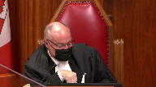

---
title: Matthew Stairs v. Her Majesty The Queen
published-title: Heard
date: 2021-11-02
sidebar: false
---

This transcript was made with automated artificial intelligence models and its accuracy has not been verified. Review the original webcast [here](https://scc-csc.ca/case-dossier/info/webcast-webdiffusion-eng.aspx?cas=['39416']).
---

**Justice Wagner** (00:00:02): The court is now called.

::: {.column-margin}

:::

Good morning.

Please be seated.

In the case of Matthew Stairs against Her Majesty the Queen, for the appellant Matthew Stairs, Erin Dann, Lisa Freeman.

For the intervener, Canadian Civil Liberties Association, Anil K. Kapoor, and Victoria M. Chichalovska.

For the respondent, Her Majesty the Queen, Mark J. Coven, and Diana Lumba.

For the intervener, Attorney General of Ontario, Mabel Lai, and Nicole Rivers.

Erin Dann.

**Speaker 1** (00:01:14): Good morning Chief Justice, Justices.

::: {.column-margin}

:::

This appeal raises the question of the permissible scope of a warrantless search of a home in the context of an arrest.

The appellant's position is that warrantless searches of a home whether in the context of an arrest or otherwise are only permitted in exceptional circumstances and we say that those circumstances will be satisfied where the police have reasonable grounds to believe or at very least suspect that their safety or the safety of the public is at imminent risk.

We argue that the unmodified doctrine of the search incident to arrest is insufficient to protect against the wholesale invasion of privacy interests at stake.

Second, the appellant argues that whatever the permissible scope of a search incident to arrest within a home, the police here exceeded it.

That the search that led to the discovery of drugs in a baggie within a sealed Tupperware container was not reasonably necessary and the police had neither a reasonable belief nor suspicion of any danger.

Ms. Freeman will argue why if you agree with us on the section 8 question the evidence ought to have been excluded in this case.

**Justice Moldaver** (00:02:34): Sorry, I have to interrupt you for one moment.

I apologize, but so early on, but first of all, did I hear you that your basic point is it should be reasonable grounds, but it might be enough to say reason to suspect.

Did I get that right?

**Speaker 1** (00:02:51): Yes, that's right.

So our primary position is reasonable grounds.

If the court disagrees with us on that, then alternatively we'd say reasonable suspicion.

Our primary argument is reasonable grounds.

So our primary position is reasonable grounds.

If the court disagrees

**Justice Moldaver** (00:03:06): No, your primary argument is reasonable grounds, I take it.

::: {.column-margin}

:::

But this is the search incident to arrest doctrine that we're talking about here.

We are not talking about the plain view doctrine, so I just want to get something clear.

If in fact the police meet the test for search incident to arrest, and as they're doing that search incident to arrest, they see a pile of drugs on the floor, and the drugs are not related to what they're looking for, why would the plain view doctrine not come into play at that point?

What they're doing is lawful, now suddenly something is in plain view that was not contemplated as part of the crime they're investigating.

What are they supposed to do?

**Speaker 1** (00:03:59): We say that if the police are properly exercising a search incident to arrest power, which we say in the context of a search of a home, has to be modified.

::: {.column-margin}

:::

But if they meet that test, and something is discovered in plain view, we aren't taking issue with the plain view doctrine and the power of the police to seize that item.

What we say is that the extent of the search permitted under the search incident to arrest doctrine in the context of a search of a home, where the location to be searched as a home, that the search incident to arrest doctrine has to be modified.

That it is not enough to constrain the search simply by the fact that there's a lawful arrest and that the search is incident to that arrest.

We argue that the search incident to arrest doctrine must be modified in the context of a home, in the same way that this court has modified that power, or has properly delineated that power in the context of cavity searches, in the context of strip searches, in the context of searches of a cell phone, that it cannot apply that the search incident to arrest doctrine in its traditional common law form cannot apply wholesale in the context of a search of a home.

**Justice Moldaver** (00:05:23): Sorry, I just got to be clear again.

::: {.column-margin}

:::

I thought I heard you say that if they were applying the right standard, if they were within the right standard, the enhanced standard you're talking about, and they come across something that drugs on the floor in plain view that really didn't have anything to do with the crime they were investigating but that what they were doing in terms of investigating the crime was lawful, are you saying the plain view doctrine doesn't apply and that they can't seize that what's on the floor?

**Overlapping speakers** (00:05:58): No.

**Justice Moldaver** (00:05:59): Okay, that's all I want.

**Justice Côté** (00:06:04): Should the test be different when we are dealing with a context of domestic violence as opposed to other types of crimes?

**Speaker 1** (00:06:18): We say no, the test remains the same.

::: {.column-margin}

:::

Certainly the nature of the offense that the person is being arrested for is a relevant consideration and may inform whether the police have reasonable grounds to believe or reasonable grounds to suspect some form of imminent risk to themselves or others.

So it's relevant certainly in that context, but an irrelevant consideration.

But the test we say doesn't differ depending on the nature of the offense.

For one reason, there is no, well, we all understand what's meant when we say an offense of domestic violence.

There's no particular way to define that necessarily at the outset or to know in advance.

We agree with the submission of the Attorney General of Ontario that uncertainty does not lead to sort of consistent, safe and charter compliant searches.

And so we would advocate one test regardless of the nature of the offense.

I would say that the context of domestic violence is also relevant, however, in another sense in that it highlights in this case, and I would say in many others, that the privacy interests at stake are not just those of the arrested person.

So where the police have entered a home as they did here in the context of a complaint about domestic violence in order to secure the safety of the potential victim, they are interfering not just with the privacy interests of the suspect or arrestee, but also of the complainant or victim.

**Justice Kasirer** (00:07:59): and the consequences of that are highlighted in this case.

::: {.column-margin}

:::

Sorry, I'm gonna have to, may I just, because I'm not sure I understand that point.

Surely the complainant's interest in the heightened protection of privacy is frankly to throw the door open to the police so that they can come in and help her.

To say that the heightened expectation of privacy, because it's in a home, needs to be raised to protect the victims of domestic violence seems to me to be putting the argument on its head, no?

**Speaker 1** (00:08:41): Certainly we accept as this court found in Godoy and in other cases that the safety and those interests of a complainant are very much engaged and help to justify the type of exceptional circumstances that permit warrantless searches of a home in terms of warrantless entry into the home and we don't intend to take away from that in any way.

::: {.column-margin}

:::

My submission is simply that when we're trying when the court is crafting a rule as to the scope of a permissible search of a home in the context of a warrantless entry that the privacy interest not just of the appellant but also of the complainant or victim is important and in this case what we saw was the search that was conducted led to the discovery of these of certain drugs and that Ms. M, the complainant here was charged with possession of those drugs.

We don't know what happened in that context

but certainly I say our position is that in crafting a rule we don't want to craft a rule in a way that would discourage a complainant from calling the police for help knowing that the search they were permitted to do without any additional grounds could reveal could very easily in my submission reveal drugs or other items that are in plain view.

**Justice Karakatsanis** (00:10:10): So, can I ask you this then?

::: {.column-margin}

:::

I mean, you've talked about the scope of permissible search and perhaps search parameters.

Coming back to the discussion about the plain view doctrine, would it be appropriate in your submission to impose any search parameters that somehow precluded the seizure of unrelated evidence or of evidence as opposed to search that's focused on safety and anything that might impact safety?

**Speaker 1** (00:10:52): Yes so in my submission there's there's what we propose is a higher standard for to justify the search so that there must be in our submission some reasonable basis to say there's imminent risk so that's one way we can control and delineate the proper scope of of the search.

::: {.column-margin}

:::

If that is not accepted and and if we are in a position as the the majority of the Court of Appeal said where as long as it's a search incident to arrest where you can reasonably say it was for some purpose related to the arrest and there's no further restriction on the search then I would ask the Court to consider how that affects the applicability of the Plainview Doctrine a question that was specifically left open by the Court in Godoy which is at paragraph 22 where the Court says we're not commenting on whether the entry in response to a 911 call affects the applicability of the Plainview Doctrine and I say if there's if there's no if the Court of Appeal decision is right and there is no constraints on the scope of the search beyond saying is it incidental to arrest then this Court may well wish to consider how that impacts the applicability of the Plainview Doctrine.

**Justice Rowe** (00:12:11): Reverting back to what is required for a safety search, is really the answer to this, it's a bit of a rhetorical question I fear, tinkering with the basis that the police must have in order to undertake a safety search, or is it really getting down to, are they in fact conducting a safety search or merely using that form of words, and just going on a search which is about seeking evidence, which ain't the same thing at all, it's a different objective.

::: {.column-margin}

:::

In other words, if you can really say this is about safety as opposed to gathering evidence, why do we need to tinker with, say, Kaslech or Cloutier?

**Speaker 1** (00:13:08): There was a couple of responses to that first, that that ability to review, a judicially review whether or not this really was about safety, I say is enhanced where you have some kind of objective standard of reasonable suspicion or reasonable grounds.

::: {.column-margin}

:::

So that we can say, was there actually in the minds of the officer a reasonable basis based on specific information and all of the circumstances specific to this case that raised a concern about safety?

And so having those standards assists in my submission Justice Rowan answering that question.

I'd also suggest that the, it is not tinkering in my submission to bring into compliance the sort of common law doctrine, the search incident to arrest power that developed through the common law, this court has recognized has nebulous sort of parameters and that in different contexts, and given the different privacy interests at play, that it will not always be sufficient to constrain a search simply by the constraints of the search incident to arrest power.

As this court said in Golden, the higher the privacy interests, the more intrusive the search, the more just the greater the need for justifiability.

And importantly, this court has said in, in contexts like a strip search, reasonable and probable grounds are what you need.

My submission here is that the safety search is not necessarily minimally sort of intrusive.

And we can see that in the case, in the case law, in a Golub, which both my friends and I refer to a safety search in that case was found to be justified incident to arrest on the basis of reasonable suspicion.

And in that case, the safety search was a thorough and lengthy search that training dictates that the police conduct such a thorough search because people often hide in strange places.

And the safety search in that case authorized and permitted the police to look methodically in every room, every crevice where a person might hide, closets, bathrooms, in between mattresses.

And there is, in my submission, there is nothing on the approach that the majority of the court of appeal took and that the respondents take.

There's no reason why the officers would be limited to a sort of visual sweep of the living room.

I understand that that was the evidence that was accepted by the trial judge in this case, but in crafting the rule moving forward, it seems to me that if officers are permitted to conduct so-called safety searches without articulating any case-specific reasonable basis for concerns about safety, that that authorizes a very extensive sort of search, which in my submission cannot be justified given what this court has said about the exceptional circumstances generally required to permit a warrantless search of a home.

We are not-

There's no reason why the officers would be limited to a sort of visual sweep of the living room.

I understand that that was the evidence that was accepted by the trial judge in this case, but in crafting the rule moving forward, it seems to me that if officers are permitted to conduct so-called safety searches without articulating any case-specific reasonable basis for concerns about safety, that that authorizes a very extensive sort of search,

**Justice Moldaver** (00:16:26): I understand in this case, if the police, instead of saying safety search, said, look, this was clearly a room where the assault in the basement, there's a reasonable likelihood that it was occurring in that room.

::: {.column-margin}

:::

The complainant comes out of that room, the accused doesn't come upstairs, he goes across the hall.

Now, if they had said, look, we wanted to do a cursory search of that room, to see if we could locate and preserve evidence of the crime related to violence, i.e., anything, brass knuckles, a baseball bat, and then chuck a stick, weapons, and possibly a gun, who knows, but just weapons, or, for example, Kleenex with blood on it, or clothing with blood on it.

If they had said that, we just want to take a cursory look and see if there is any of that kind of evidence that would relate directly to the concern about an assault.

Would that have been a breach of the scope in this particular case?

**Speaker 1** (00:17:42): We would argue yes because that would not, a search for evidence which is not at risk of disappearing or otherwise being destroyed would not satisfy the sort of exigent circumstances requirement.

::: {.column-margin}

:::

There would be no reasonably necessary reason for the police to conduct an evidentiary search and indeed.

Sorry, sorry to interrupt again.

**Justice Moldaver** (00:18:12): but you have a non-compliant complainant here.

::: {.column-margin}

:::

So what are we to do?

You know, I mean, what are they going to do?

Leave her in the house and then come back with a search warrant or what?

Are they going to tie off that room and prevent her from going into it and so on?

What are we doing?

**Speaker 1** (00:18:35): Yeah that certainly that they could and I don't want to go too far afield because that that was the evidence in this case was not that they were looking for evidence or that there was any evidence that they were at risk of that was at risk of being destroyed but in my submission yes what can be done in those circumstances is to go and get a warrant to quarantine to to seal the home as the police did in this case after they discovered after they discovered the drug.

::: {.column-margin}

:::

**Overlapping speakers** (00:19:06): But that related to drugs, which was not part of the crime they were investigating.

**Speaker 1** (00:19:10): Yes, and in this case they said they were not looking for it, specifically said they were not looking for evidence and had no reasonable basis to look for evidence.

::: {.column-margin}

:::

So if there were, if there are reasonable and probable grounds to believe that there was evidence of the offence that they were, that they hadn't conducted the arrest warrant.

**Justice Brown** (00:19:34): there'd been a report of a weapon, right, or if for example it appeared to them that the complainant had been struck by a weapon, then it might be a different story, but that's not this case, is it?

**Speaker 1** (00:19:49): That's not this case.

::: {.column-margin}

:::

And in my submission, it is important to look at the facts of this case, where the officers did not express a subjective view that they were at any risk.

Their answers for why they conducted the search after, the search that led to the finding of the drugs, was conducted by Officer Vanderveld.

And when asked why he conducted it, he said that he conducted it after Mr. Stairs had been arrested, was in handcuffs, after he had witnessed the search incident to arrest of Mr. Stairs.

No weapons had been found on Mr. Stairs, and he was compliant and sitting on the floor.

It was only, he said, when he felt it was safe to do so, did he conduct the subsequent search of the room.

And Associate Chief Justice Fairburn at the Court of Appeal suggested that search was reasonable, or found that search was reasonable, because the officers would have to go back up the stairs in order to bring the appellant out of the home.

That was not, however, the reason that Officer Vanderveld gave for conducting the search.

His answers, and they're excerpted in our condensed book and the condensed book of the respondent, was that you just never know what you're going to find.

Maybe he's looking for obvious hazards.

Maybe a loose and unsafely stored weapon.

Maybe someone else who could be in the basement.

But there was no grounds in this case.

And in fact, the officers both testified they had no reason to believe there was other people in the home.

They had no reason to believe there was weapons in the home or in the basement.

Indeed, the evidence was that the only time they expressed a concern about someone potentially jumping out at them was when they had to turn their back to the room in order to actually affect the arrest, which they did.

And before doing that, they gave a cursory sweeping view of the room in order to assess whether or not there was any threats.

And in my submission, the idea that there must be some reasonable basis to suspect safety is consistent with this court's findings in Feeney, that warrantless searches of a home, in that case entries, are only justified in exceptional circumstances, that the, excuse me, and indeed this court's finding in McDonald, both the majority and dissenting decisions found that there had to be some objective basis in which to find, and the difference was in terms of the standard of probability, whether it's suspect or believe, but there had to be some objectively defined and articulated circumstances in order to justify the search.

It is not enough in my submission to simply have these sort of vague safety concerns, which would be applicable in every case.

If a safety search is justified of a home because we never know what you're going to find in there, then that would, as Justice Nordheimer found in the Court of Appeal, that would justify the safety search in every single case.

And that in my submission is simply inconsistent with the long line of authority from this court and others, which describes the exceptional and extensive privacy interests engaged in one's home, and that those will only be set aside or intruded upon in a warrantless manner, where the law enforcement interests have to take precedence.

And in my submission, for the scales to tip in that regard, there must be some standard. May I?

**Justice Martin** (00:24:15): Can I ask this question, please?

::: {.column-margin}

:::

I understand that the thrust of your argument relates to what the threshold is to conduct a safety search in a home.

But when I'm thinking about the seizure aspect of what occurred, I'm drawn to section 489 of the code, which allows an officer who's in for a lawful purpose to seize on reasonable grounds of various things, whether it's evidence of this crime or of any other contravention of a federal statute, which would include the drugs here.

Can you explain to me what the relationship is there, that if Parliament has spoken about what the seizure power is and grants that, where should we be with plain view?

Has Parliament occupied that field?

Why would we, I just don't understand the relationship there.

So if you could help me, I'd be appreciative.

**Speaker 1** (00:25:15): I will help as much as I can.

::: {.column-margin}

:::

I think I can say in the context of this case, it perhaps doesn't squarely arise because the warrantless entry was justified here, not under the exigent circumstances doctrine of the Criminal Code, but rather as under the common law power, as set out in Godoy, that permitted them to respond to the 911 call and to ensure the safety of to ensure the safety of the female, the unknown female at that stage and the trial judge found that was the basis for their lawful entry into the home and something that we're not challenging on appeal.

And the question of what are the sort of associated seizure powers with that exercise of the common law power to enter into a home in order to investigate the safety of an occupant in answer to a 911 call, that has been left open in my submission.

Certainly I think it's fair to say that some parliament has spoken, and in the context of the exigent circumstances of arrest, what the police are entitled to do, and that would, I think I wouldn't get very far to say that the court can't consider that in deciding what the scope of the plain view doctrine is on the Godoy standard.

My submission is simply that.

**Justice Moldaver** (00:26:49): Just before you leave that topic, could you look at paragraph 62 of associate chief justice Fairburn's reasons.

::: {.column-margin}

:::

There she sets out and in fact her first line in that paragraph is of course the plain view doctrine is a seizure doctrine.

So not just a search doctrine like some may have mentioned here, it's a seizure doctrine and this is the common law test that has been, as I understand it, the test, the way it's set out there.

So that provision of the criminal code certainly doesn't overrule the common law as you've fairly put it, but my question really is do you disagree with this statement of the plain view doctrine from the common law?

No I do not.

**Speaker 1** (00:27:41): I say that if the court accepts our submission that a safety search is only permitted on reasonable grounds or reasonable suspicion, then I take no issue with the applicability of the Plainview Doctrine.

::: {.column-margin}

:::

I simply suggest that if there is no grounds necessary in order to conduct the safety search, I would invite this court to consider how does that impact the Plainview Doctrine.

I see, I only have three minutes remaining.

I want to allow Ms. Freeman to discuss the 24-2 issues.

**Justice Jamal** (00:28:15): Ms. Stan, may I ask a question just before you do

::: {.column-margin}

:::

and I apologize for encroaching on your time.

In this case, the police did do a record check of Mr. Stares and it revealed that there were police cautions registered for violence, family violence, and being a flight risk.

If the record check also revealed a record for family violence against children, in that circumstance would – and I can see the evidence of the officers here is – well, you never know, but had that been the case, would then not that context have allowed for a search perhaps of the whole house because there might have been children who were cowering or hiding behind a couch, behind a bed, somewhere else in the house.

So that's the first question.

And the second question is, well, if that's the case, then surely the context of the offense here that's an issue, family violence, which often involves children as well, surely despite the police evidence, that context could give some basis for some sort of reasonable search to determine that there were no others that would be affected.

**Speaker 1** (00:29:23): Certainly, had the evidence been different, that there was evidence of violence against children, if when they had entered the home, they saw a crib or heard a child crying or saw evidence of toys laying about, then they might well have articulated based on, look, we know that this person has a history of violence against children, we can see that there may well be children in the home currently, that might well provide them with reasonable grounds to believe or suspect that children could be at risk and could promote it and could justify a search.

::: {.column-margin}

:::

But in my submission, we don't have that here.

And in the simply, it's possible that children could be here when the police don't raise that, that can't be enough to justify the safety search because it would justify it in every single case.

In the remaining minute, we'll see if Ms. Freeman can tell you about 24-2.

**Speaker 2** (00:30:30): Thank you.

::: {.column-margin}

:::

Very briefly then it is our position that this court owes no deference to the trial judge's decision on the exclusion of evidence or her analysis I should say if the court agrees with our submission that the search was illegal.

With respect to the trial judge's factual findings we also argue you owe no deference to her finding that the officers acted in good faith and this is because the trial judge in our submission failed to take into account relevant evidence.

Very briefly the trial judge found as a fact that the officers removed the lid of the Tupperware container in the home that was contrary to the officer's evidence.

The trial judge failed to take the next step and ask herself whether that very significant in our view finding would impact on her assessment of these officers credibility for their stated reason for conducting the search.

I am out of time so that is all I can say on the exclusion of evidence.

**Justice Wagner** (00:31:32): Thank you very much.

**Speaker 3** (00:31:39): Good morning justices.

::: {.column-margin}

:::

There are two stressors that stock this case or the potential resolution of this case.

One is the potential harm or loss to law enforcement interests by having a test that's too stringent.

And I include in that officer safety concerns, evidence that may be lost where there's information that could be destroyed.

That's one stressor.

The other stressor is the imperative to protect the constitutional privacy interest in one's home.

One thing for sure, officer safety is always front of mind in any police endeavor.

We don't wish officers to be placed in unduly risky circumstances.

Similarly, respectfully, none of us can dispute the sanctity of one's home.

Next to one's body integrity, the home is the most private place known to our law.

It is a principle that has been endorsed by this court time and time again, that the state cannot without legal justification invade or intrude on someone's private home.

It is a bulwark of our democracy.

It was recognized in Silveria, paragraph 41 of that decision, and also in Feeney, which you're all familiar with.

And the interesting thing in Feeney is that justice Sapinka noted that the combination of Cloutier and the decision in Feeney itself, when you put them together, he noted in paragraph 45 that the proposition would seem to allow for a warrantless arrest in a dwelling house might be legal, could lead to the conclusion that a warrantless search of a dwelling house is legal so long as it is accompanied by a lawful arrest.

He went on to say that that conclusion is clearly at odds with Hunter.

In our case, or in this case, what's before us is lawful access by the police and then a warrantless search.

Should the search be regulated by something more than a common law search incident to arrest?

And in my respectful submission, the conclusion, sorry, the answer to that question lies in the nature of the privacy interest.

We regulate privacy interests all the time and limit what the police can do.

In Stillman, you cannot obtain bodily fluids without a warrant.

In Golden, you can't strip search without reasonable probable grounds.

In Said, you cannot obtain a penile swab without reasonable and probable grounds.

All three implicate bodily integrity.

On the other end of the spectrum, you've got Caslake, you've got Cloutier, and many other cases where there's a search of a vehicle.

You have in McKenzie, you have the use of sniffer dogs to determine if there is any narcotics in a vehicle.

In those cases-

Yes, but you're using-

**Justice Rowe** (00:35:00): You're using searches as a generic term.

It seems to me there are three purposes for a search, safety, securing evidence from destruction, and evidence gathering.

And for me, I differentiate among them.

**Speaker 3** (00:35:15): So, to answer that directly then, we're of the view that any one of those types of searches, or the first two anyway, in a home must be accompanied by reasonable grounds.

::: {.column-margin}

:::

Even if the person's arrested, or even if it's like McDonald's where it's an investigative detention, a home must be accompanied by reasonable grounds.

**Justice Moldaver** (00:35:36): higher than Fearon for a cell phone?

::: {.column-margin}

:::

I thought we said they're really, really, you know, could have the most intimate things in them.

They're so private.

We gotta be very careful.

And that's why the majority in Fearon added some factors to justify constitutionalize the search.

But why is it, are we getting into grades of, you know, oh, this is a little more than that, or this is a little more than that?

I mean, you know, the reasonable grounds has been really restricted, as I understand it, to body searches, body cavity searches, or the most intimate parts inside.

**Overlapping speakers** (00:36:14): to eat. Yeah.

**Justice Côté** (00:36:15): Thanks for watching!

**Speaker 3** (00:36:15): you

**Justice Moldaver** (00:36:15): in in trying to remember the name now but justice Corey's decision the main one on it so it should come to me but where there was body fluid taken and stuff

**Overlapping speakers** (00:36:30): Stillman.

Yeah, exactly, Stillman.

**Justice Moldaver** (00:36:32): like a long time ago.

**Overlapping speakers** (00:36:34): Yeah.

**Justice Moldaver** (00:36:34): He said never.

You can't do it.

It's not a question of reasonable ground.

You can't do it.

**Overlapping speakers** (00:36:42): So we have that one.

You need a warrant.

**Justice Moldaver** (00:36:44): We have that one.

Yeah, unless you get a warrant.

So we have that one.

Then we have body cavity searches that are reasonable grounds, very intimate, etc.

And then we have a cell phone where this court majority said no way do you need reasonable grounds.

**Speaker 3** (00:37:01): right so to deal with the cell phone question and the relationship of the privacy interest in a cell phone and the privacy interest in the home on the other hand the chief difference between the two is that you have no way to restrict the police access in your home you have the ability to restrict the police access to your cell phone you can lock it and not give them the password and they won't get into it that is the key difference so in the home when there's a locked door the police officer can bang it down and go in but you can't do that with a cell phone

::: {.column-margin}

:::

right sorry i see my time's up chief

yes thank you very much

**Overlapping speakers** (00:37:42): but your time is up.

Thank you.

**Justice Wagner** (00:37:44): Mr. Mark J. Covin.

**Speaker 4** (00:37:51): Thank you Chief Justices.

::: {.column-margin}

:::

The resolution of this appeal we would say follows a well-worn path that this court has followed in the past on numerous occasions and we pause to point out that this court has repeatedly noted that the search incident to arrest provisions provide robust protection for the rights of accused individuals while at the same time allowing police officers to advance their lawful investigations.

I also pause to note what this court said in our versus fear on at paragraph 13 it's at tab two of our condensed book.

This is a critical statement by our court and it talks about the variables that police officers encounter not only in arresting individuals but conducting their investigation and the court notes again at paragraph 13 as Chief Justice Lemayre explained in Castellate the permissible scope of a search incident to arrest turns on several different aspects of the search including the nature of the items seized the place and search sorry the search and time sorry the place of search and time of the search in relation to the arrest.

Each of these aspects may engage distinct considerations that cannot be addressed in very general terms.

Moreover arrests relate to many different crimes and are made in many different circumstances.

It follows that the permissible scope of searches incident to arrest will be affected by the particular circumstances of the particular arrest and here's the critical statement the courts will rarely be able to establish any categorical limit applicable to all arrests and for all purposes incidental to them.

So there's important context here that I don't think is receiving the attention that it deserves either from respect from the appellants or for the intervener and that is that this was an urgent entry into this residence.

This was an entry under the so-called Godoy principle or the 911 principle the ancillary doctrine principle that allows police officers to urgently enter this particular residence.

The court of appeal was unanimous that the police officers had grounds to enter this residence in the circumstances because they reasonably believed that the health or safety of the occupants were in danger.

That urgency to enter this residence did not cease when they walked in the door.

It continued and you've seen the facts in this particular case.

One of the things that this court has the benefits that this case provides to this court is an extensive record with detailed direct and cross-examination from the various parties.

**Overlapping speakers** (00:40:24): the police officers had a lawful presence in the area.

**Justice Brown** (00:40:25): Could you direct me, could you direct me to where in that record the continuing urgency of the matter informed the police officer's decision to search that room?

**Speaker 4** (00:40:25): Could you direct me to where in that record the continuing urgency of the matter informed the police officer's decision to search that room?

::: {.column-margin}

:::

Obviously.

Well, I would say, Justice, that the continuing urgency was reflected in a variety of different facts.

First of all, the police were ignored when they were on the outside of the residence, banging on the door, attempting to gain entry.

**Justice Brown** (00:40:53): Okay, but I asked you about the record.

Where does the police officer cite that urgency in explaining his decision to search the room?

**Speaker 4** (00:41:05): In explaining his, sorry, in explaining his decision to search the rule, I'll take you, for example, to tab 13 of Officer of our Condensed Book of Authorities.

::: {.column-margin}

:::

This is Officer Brown who testified that he was concerned about the fear of the unknown when they entered the basement of this particular residence.

**Overlapping speakers** (00:41:27): Okay, but he's not the one who did the search what what did the officer who did the search say?

He's not the one who did the search.

What did van der Velde say?

**Speaker 4** (00:41:34): Oh, Officer Vanderveld, similarly justice was concerned at tab 16 of his testimony, he states, or sorry, of the condensed book of authorities that the crown has placed before the court.

::: {.column-margin}

:::

Officer Vanderveld said that he was concerned because it was unknown what Mr. Stairs was doing in the basement.

Felt that he was still a threat, concerned that Mr. Stairs may be arming himself.

This is part of the context for their entry into the basement with their weapons drawn.

**Overlapping speakers** (00:42:05): Similarly.

**Speaker 4** (00:42:06): Officer Vanderveld spoke about the, this is at tab 24 of our condensed book, spoke about the very brief cursory search that they performed by glancing to their right as they went down the stairs, saw the general layout of the basement, which you've seen in the photographs.

::: {.column-margin}

:::

And there were areas of the basement that were not visible to the police officers as they went down.

Their attention, of course, was directed towards Mr. Stairs was in the small room to the left.

And he said in his testimony that you go towards the threat, but you also don't want to make sure that there's nothing behind you that's going to jump out at you.

Essentially, what I'm trying to say is, you try to do a quick scan of the room.

My attention was to the threat and the room to my left when I entered the basement.

So very clearly they are concerned that there may be other things, other individuals, perhaps somebody who requires assistance who may be behind the sofa that they couldn't see from their immediate entry.

And there's extensive examination on this particular point.

Yes, there is.

**Justice Brown** (00:43:05): In fact, you don't include kind of the central point where they ask, are you checking the basement area?

::: {.column-margin}

:::

Another thing you're looking for is potential evidence with respect to the assault, correct?

Answer, not so much looking for evidence of the assault, no.

No report of any weapons used, no.

Not necessarily connected to the assault, no.

I mean, that's kind of the crucial evidence and the best that it seems to me that Officer Vanderveld gives is,

well, you never know.

You never know what's there, which would apply anywhere, would it not?

**Speaker 4** (00:43:47): Well, I wouldn't say it would apply anywhere.

::: {.column-margin}

:::

It would apply certainly in the context of this case because we know that there's an assault that has taken place outside of the residence.

Mr. Burlingieri was very clear in his statement to the 911 operator, as well as to the police officers who spoke to him before they entered the residence.

Police officers gain entry to the residence.

Nobody's answering their knocks at the door.

The silence is disconcerting.

This is what the court of appeal found and the trial judge found.

They issue further demands to come up the stairs.

And as they do that, Ms. Manriquez comes up the stairs with obvious physical injuries.

She's emotional and she's distraught.

The issue further demands to Mr. Stairs to come up, which he ignores.

Instead, he goes from right to left and hides in the basement behind this particular door.

The police officers, I would suggest to you, Justice, have reasonable grounds to believe that, first of all, an assault has taken place, and they certainly have reasonable grounds to be concerned that the assault has continued inside of this residence in the area that these two individuals are seen to come from.

**Justice Brown** (00:44:43): if only they had said if only that they they had given that as their reason i'd like to distinguish between articulated reasons and articulable reasons but given the given in fact given the invitation in cross-examination to say i'm going in there to look for evidence of the assault police officer says no his reason for going in is well you never know and of course you never do you never do right

::: {.column-margin}

:::

**Speaker 4** (00:45:12): Well, again, I think the other factor that you have to consider, Justice, is they're acting in an information vacuum here.

::: {.column-margin}

:::

They've gone into this residence armed with just a handful of pieces of information about this assault.

Ms. Manriquez is not cooperative with the police officers, and in fact, she later denies the assault at all and says that the two individuals were play fighting, despite the fact that she displays obvious physical injuries.

Now, the police officers don't know who the occupants are in this residence.

They don't know whether there are other individuals who may be inside the residence.

They don't know if other individuals have been injured inside of this residence.

**Overlapping speakers** (00:45:46): Well, you know...

**Speaker 4** (00:45:46): function of the information vacuum and it's precisely the circumstances that this court saw in Godoy when the police officers went to the door in response to a 911 call and really had no idea what was going on inside that residence.

**Justice Rowe** (00:45:59): country that is somewhat innocent by comparison with the big city.

::: {.column-margin}

:::

And police officers are very often quite safe in the conduct of their duties.

But it seems to me that the time that the RCMP gets themselves assaulted very badly, or even the Newfoundland Constabulary in St. John's, is going into a house in a domestic matter.

Everybody is a bit crazy and they do things that don't make a lot of sense.

And that, it seems to me, is quite dangerous for officers.

And I would be astonished if officers didn't share this view.

**Speaker 4** (00:46:40): Well, certainly Justice Roe, these calls are incredibly dangerous for police officers for the reasons that you point out.

::: {.column-margin}

:::

There can be alcohol involved, there can be drugs involved, emotions are running high.

And back to the point that was made a moment ago, I think one of the reasons why the appellants argument falls as does the CCLA, there's a connection between the home and the crime in this particular case.

This isn't just a case where the accused was found, which is different.

There's a connection between the home and the crime.

The home is the crime scene.

Now, that's not to suggest that because the home is the crime scene, that Mr. Stairs has no reasonable expectation of privacy whatsoever.

But it changes the context that you have to consider in analyzing whether the police conduct was reasonable in this circumstance, and whether the analytical framework for search incident to arrest strikes the appropriate balance between the interests of the accused and the interests of society in terms of furthering their investigation.

As this court pointed out in Fearon, at this stage, particularly where you have a 911 entry into this particular residence, the police officers know very, very little about what's going on inside of this house.

They have an obligation to investigate the scope of this offense.

And may I ask you-

Except that's not-

**Justice Brown** (00:47:52): why they're there that's he's asked that is that why you went in and he said no what are we supposed to do with that I'm sorry

**Speaker 4** (00:48:02): I respectfully disagree.

He said he went into this residence in response to the 911 call because they believed that individuals inside of this residence were in danger.

I'm talking about the room in the basement.

Well, this is the area where these two individuals came from.

But that's not what he says.

That's not what he says.

**Justice Brown** (00:48:19): That's not why he went in there.

You are constructing reasons for this

**Speaker 4** (00:48:26): Oh, I respectfully disagree, Justice.

This police officer was very clear that he was concerned that there may be other individuals in this basement that are not accounted for, and he had an offer to do so.

**Overlapping speakers** (00:48:35): Where does he say that?

**Speaker 4** (00:48:36): This is at paragraph 38 of our factum. Question.

::: {.column-margin}

:::

Okay, then I understand that after the process was complete, and this is the arrest of the appellant, you continue to spend a bit more time in the basement.

Is that right? Answer.

So once he was in handcuffs and I felt it was safe, I proceeded through the basement to make sure there's no other obvious threats or any other people in that basement.

When you say there are no other obvious threats, I understand people, but what obvious threats specifically are you looking for specifically?

You never really know what you're looking for when you're entering a house in a situation like this.

You never know.

So whether they're, that's right, you never know because they haven't been told by anybody so you never know.

**Justice Brown** (00:49:34): you can search for what you don't know for no was there those are reasonable grounds those are that's incidental to a search you

well you don't think that opens things up

**Speaker 4** (00:49:46): basis for what you're doing.

That's what this court has said.

You need a reasonable basis for taking the action that you did.

In this particular case, the Crown is saying the reasonable basis is to check, to determine the scope of this offense, to determine whether there are other individuals who might be injured collaterally to this assault.

**Justice Brown** (00:50:00): except he is actually invited to affirm that he went in there looking for evidence and he says no.

That's not why he went in.

**Speaker 4** (00:50:08): That's right.

::: {.column-margin}

:::

I'm not suggesting he was looking for evidence.

I'm suggesting he was looking for other individuals who may require police assistance.

And that was the testimony of Officer Vanderbilt.

I'll give you that he wasn't as firm on that as Officer Brown.

Officer Brown was extensive in his testimony as to why he they felt the need to check this particular area.

He was the more senior officer, but Officer Vanderbilt reflected that view as well in his testimony.

And I just provided you an example of that.

**Justice Martin** (00:50:31): Mr. Coven may I ask you a question about the informational vacuum that you speak of this notion that you it's tautological you don't know what you don't know right

::: {.column-margin}

:::

and so when when the officers go down and they say or you say there's an informational vacuum are how do we approach that are we supposed to be looking for did they ask questions about whether or not there were other individuals there you know that kind of thing how do you feel the informational vacuum because an informational vacuum can rarely in and of itself provide either a reasonable suspicion or reasonable grounds so so what kind of limits what kind of questions um would be expected um in that situation

**Speaker 4** (00:51:19): Well, it's interesting that you asked that question, Justice, because the police officers were asked why they didn't question Ms. Manriquez, and their response to that was that they wanted to neutralize the threat that Mr. Stares presented, and so that's why they didn't take the time to question Ms. Manriquez about the assault before they went down into the basement.

::: {.column-margin}

:::

They were concerned about what Mr. Stares might be doing.

Was he arming himself?

Was he preparing to come out of the room?

Was he escaping through some other exit that they weren't aware of?

And so, in this particular circumstance, Justice, they didn't take the time to ask the individual questions.

In other circumstances, the victim may be cooperative, and the victim may provide the police with sufficient details to allow them to understand the nature of the scope of the offense that they're dealing with, but that wasn't the case here.

And so, in these circumstances, what this court has said...

**Justice Martin** (00:52:05): could have been asked to the male accused. Right?

When he's cuffed, is there anybody else there?

I mean, I just didn't read any questions that related to who might else be in the house.

**Speaker 4** (00:52:20): I don't think there was any questions of Mr. Stares as to who else might be in the house.

The police officers were aware that there was another individual who was associated with this resident.

**Overlapping speakers** (00:52:28): That was Mr. Stair's father.

**Speaker 4** (00:52:30): But I point out that this court has said repeatedly that the search incident to arrest power allows the police officers at the early stage of an investigation to gather further information so that they have a greater understanding as to the offense they're dealing with.

::: {.column-margin}

:::

That's what this search incident to arrest power is designed to deal with.

Now, my friends would say that in the context of a residential search that these police officers, this has somehow violated an expectation of privacy that Mr. Stares has, and there's no question that he has that.

But it's important to remember that the police officers are lawfully inside of this residence.

They have already gone over the significant hurdle that this court has set for a warranted entry into this residence.

And one of those circumstances going to be justified?

Well, the one, of course, that comes to mind most significantly are crimes of violence.

And as this court pointed out in Fearon, that search incident to arrest power is most often going to be utilized appropriately when you are investigating a crime of violence.

Should they just simply take Mr. Stares' word that there were no other victims in the residence?

Or what about Ms. Manriquez, who's not prepared to provide an answer to them when they questioned her about what the circumstances were regarding the obvious physical injuries that she had?

Let me ask you this.

This is the reality of domestic violence.

**Justice Moldaver** (00:53:45): Let me ask you this, in these circumstances where they see the two of them coming out of the room that was likely a crime scene, or they certainly have reason to suspect that it was a crime scene, if the officer had said, look, we wanted to go in there with a view to locating and possibly protecting evidence, i.e., blood on a Kleenex, blood on a cloth, some other type of weapon that may have been used, would that have cleaned this up?

::: {.column-margin}

:::

**Overlapping speakers** (00:54:23): Well, I don't think it I don't think it needs to be.

**Justice Moldaver** (00:54:25): No, no, but assuming, assuming as Justice Brown has said to you, it's just pure speculation that there's someone else in the house.

::: {.column-margin}

:::

Would that have been, in your view, a legitimate basis for going into that room?

I.e., we are looking to locate any evidence relating to this crime, because we know the two people came out of that room.

That's where they were.

The other guy, the accused runs into another room, but the crime scene is there.

So we're going in there with a view to preserving and protecting evidence of a crime.

And particularly in circumstances where you have a non-compliant complainant.

**Speaker 4** (00:55:07): Absolutely, Justice Moldaver.

This is precisely the circumstance that search incident arrest is designed to deal with.

What we're playing with, I just want to get, I just want to focus.

**Justice Moldaver** (00:55:16): I just want to focus.

Is this thing coming down to a police officer could have said that, he didn't say that, therefore the search was unlawful.

**Speaker 4** (00:55:26): Well, it better not come down to that, Justice Moldaver.

::: {.column-margin}

:::

Very clearly what we have here, as this court has pointed out, are police officers who just don't understand the parameters of the offense that they're dealing with.

And they're in a crime scene.

That's the reality.

This is not a place where they were simply found.

This is not like McCoo.

If you go back to Feeney and the circumstances in McCoo that this court spoke of, it's a previous decision of the Supreme Court in the early 1990s, where Mr. McCoo was chased into his residence after he was involved in a number of different motor vehicle accidents.

And he took refuge inside of his residence.

And the question became, could the police officers enter that residence in hot pursuit of Mr. McCoo?

And the court said, yes, he could, that the sanctity of the home is not designed to protect this individual from flight from the police.

Could they have searched that home incident to that arrest?

I don't think so.

Because, simply put, because there's no connection between the location that is being searched, the residence, and the crime for which he has been arrested.

The home is not a crime scene.

And as I said a moment ago, I'm not suggesting that because they're concerned that the crime took place in this house, that means that Mr. Stairs has no expectation of privacy.

But it's gotta tip the scales in favor of police officers having sufficient powers to go about their duties.

To check behind the sofa, to see if there's somebody there who might be injured.

Because, again, they just simply don't know in these circumstances who might be behind there.

And the police officers repeated this numerous times.

And I would suggest to the court that this is the case when we are dealing with crimes of violence.

**Justice Moldaver** (00:56:57): You would concede here that there would have been no reason to suspect that it would enable them to go up and search the bedrooms upstairs and so on.

At that point, I would like to ask you a question, Mr. Speaker.

I would like to ask you a question, Mr. Speaker.

**Speaker 4** (00:57:07): unless something else came to light.

::: {.column-margin}

:::

That goes to the issue of scope.

Again, Justice Moldava, and I would suggest to you that the police officers here had no basis to extend their search beyond the area where these two individuals were found.

As the court has pointed out in, for example, Nolley, the question is the relationship between the place that is being searched and the reason for the arrest.

The relatedness, I think, is the language that the courts use.

What is that connection between those two locations?

And in this particular case, there's nothing to connect the upstairs rooms to what Mr. Stairs has been involved in.

Now, as pointed out during the submissions of the appellant, if there was, for example, children's toys in the basement or some suggestion that they may require some assistance of some sort, that may take police officers beyond that particular area.

But that's not the circumstance here.

**Justice Brown** (00:57:57): Could they have searched the vehicle?

**Speaker 4** (00:58:03): I would say if they were looking for evidence in relation to the crime, for example, if they wanted to look and see if there was blood on the window.

**Overlapping speakers** (00:58:08): or to see if there was a child in the back seat or...

**Speaker 4** (00:58:11): Yes, yes, because they had they had grounds to suggest that the assault took place in the motor vehicle.

**Overlapping speakers** (00:58:17): But yet they didn't search they didn't search the motor vehicle

well they did they looked inside when they first arrived

**Speaker 4** (00:58:24): They did, they looked inside when they first arrived and they saw a person at cell phone and planed you on the seat and then they turned their attention to the residence, but they did look inside the motor vehicle.

::: {.column-margin}

:::

Sorry Justices, I just need to find my place.

I think it's important Justices to consider the nature of the infringement that took place in this particular case.

As this court has pointed out, some element of infringement is inevitable in law enforcement.

It has to take place.

There's going to be some intrusion on charter protected interests, regardless of if you're going to have effective law enforcement.

And as I pointed out from the outset, one of the important factors that this court has to consider is that searches, sorry, arrests inside of residences are already tightly controlled.

So in most circumstances, when police officers enter a residence to arrest somebody, they're going to be, if they have foresight and they have sufficient grounds to believe that this individual is inside of this residence, they're going to enter this residence with a search warrant or sorry, with an arrest warrant in hand.

If they believe there's evidence inside of that residence in relation to that offense, they'll most often be armed with a criminal code warrant, for example, or a CDSA warrant in the event that they're searching for drugs, for example.

In this particular case, these police officers are lawfully inside of the residence, as I pointed out a moment ago, pursuant to the 911, the so-called Godoy ancillary powers entry into this particular residence, where they have reasonable grounds to believe that the safety of somebody is already in danger.

So they've already entered the residence.

So they're lawfully in the upstairs area of the residence.

They're also lawfully in the downstairs area of the residence to affect the arrest.

Nobody's suggesting here that there weren't grounds to arrest Mr. Stairs, and they didn't have reasons to go down to the basement to affect that particular arrest.

So the question becomes then, what is the nature of the search that is conducted?

And I think that's an important consideration because as the court points out in Fearon, what is required is an assessment of the interests that are served by the infringement by the law enforcement authorities and the protected interests of the individual.

And in this particular case, you can't imagine a more cursory search of the basement area.

There's no suggestion that this was done as part of a pretext of some sort, that they were looking for drugs because they believe Mr. Stairs was associated to drug activity.

There's no suggestion of that whatsoever.

And the police officers were extensively cross-examined on this point.

**Justice Martin** (01:01:19): May I ask you about what role you think Section 489-2 of the criminal code plays here at all?

I don't see that you've invoked it in any respect and that's a little curious to me.

**Speaker 4** (01:01:34): Well, 49.2, I think, differs from the common law plain view doctrine in the sense that the common law plain view doctrine is one that speaks of inadvertent discovery.

::: {.column-margin}

:::

And that's what took place in this particular case.

You've got a police officer, and I'm referring in particular to a decision from the Manitoba Court of Appeal, R versus T, M, sorry, RMJ.

It's reported at 2014 Manitoba MBCA 36.

And it talks about the distinction between section 49.2, which allows police officers to seize without warrant in relation to a particular investigation, whereas the plain view doctrine deals with inadvertent discovery.

**Justice Côté** (01:02:15): So I would suggest you that that is the case.

**Justice Martin** (01:02:17): distinction without a difference here.

::: {.column-margin}

:::

I mean, whether it's parliament has spoken in broad terms, I understand that it's inadvertent as one of the criteria for the plain view doctrine.

But it just seems to me that 489 allows a police officer who is in who's lawfully present, which everyone concedes is the case here, to seize for even another crime, but has to do so on reasonable grounds.

So why isn't this provision in play?

**Speaker 4** (01:02:54): Well, I suppose, Justice, we've relied on the Plainview Doctrine and it was relied on the Plainview Doctrine in the courts below because, again, this was an inadvertent discovery and simply no consideration was given to 49 sub 2.

**Overlapping speakers** (01:03:07): Thank you.

**Speaker 4** (01:03:07): it.

**Justice Moldaver** (01:03:10): I suppose, I suppose, excuse me, I suppose unless it can be said that the provision clearly was meant and designed to overrule the common law, the common law still applies.

**Speaker 4** (01:03:24): That's right, I would suggest you're correct Justice Moldaver that if parliament had clearly signaled an intention to override the common law then 49 sub 2 would apply but that's not the case.

::: {.column-margin}

:::

So I think it's important to return to the nature of the infringement in this case because it's going to inform the court's analysis.

So the police officers are lawfully in the basement area, there's no issue with respect to that.

This isn't a case where they've wandered into areas that are unconnected to the offense in question.

Their search of the basement, and it certainly was a search, they refer to it as a clearing scan.

I don't know that that language assists us at all.

It was brief, it was focused, it was cursory.

It is the functional equivalent of a pat-down search.

They didn't lift anything, they didn't open any doors, although they certainly acknowledged that that was possible if they were looking for an individual who might be able to fit into for example a cupboard or a door and they had specific concerns about that.

Here they simply did a visual search and saw what they believed to be drugs in plain view and that was of course possible because the containers that the drugs were found in were transparent, at least partially transparent.

I think the Tupperware container was described as having a clear lid.

So if they're genuine in their statement that they're performing a safety search to search this area and if the court accepts that in determining the parameters of what has taken place, looking at this basement area as forming part of the crime scene, then it has to be said that there's no other reasonable means, no less intrusive means of obtaining this objective.

There's nothing that these police officers could have done that would be less intrusive than what they did in this particular case.

And to return to the point that was made by the appellant in their submissions about the privacy interests of other individuals within this residence, as this court pointed out in Godoy, the privacy interest of the person at the door has to give way to the privacy, to the interest of the other individuals that are present inside of this residence to ensure that the residence is made safe and the scope of the offense is determined by these police officers.

So in the few minutes that I have left, I want to address the issue of modification.

And the modification...

Can I ask...

**Justice Jamal** (01:05:37): Sorry, before you move on, just what you just said last, what do we make of the fact that there wasn't any specific information about anybody else being in the residence, any children or any others?

::: {.column-margin}

:::

I mean, the police spoke generally about concern for others, but there wasn't any specific evidence here, even to ground a reasonable suspicion of anybody else there.

So how does one deal with that?

I mean, it's not like anybody else was in the residence, so it's not like anybody else was in the residence.

It's not like anybody else was in the residence.

**Speaker 4** (01:06:04): Well, I agree with you, Justice, that really what they were dealing with here was at best generalized suspicion or generalized concern that there may be other individuals in this residence.

::: {.column-margin}

:::

And I would suggest to you that that's a function of the nature of the offense that they're dealing with.

And as this court has pointed out on numerous occasions, oftentimes victims are not cooperative, they don't provide information, and that certainly was the case here.

Number two, they often enter these residences in short order.

They don't have a great deal of time to prepare before they go into the residence.

They don't know a great deal about what's taking place.

They don't know the layout of the residence, they don't know the occupants of the residence, and they don't know what has been taking place, particularly when nobody comes to the door when the police officers have announced their presence.

So it's a function of the offense.

And this court has recognized that when you're dealing with an investigation in the early stages, that police officers have to be granted this latitude.

So I don't think this court should be stuck on the language as to what is, do they have reasonable grounds?

The question posed by this court in Cloutier and all of the cases that have followed is, do they have a reasonable basis for doing what they did?

And that's informed by an analysis of not only the context of the investigation, but also the crime that they're dealing with.

So in these circumstances, we say that these police officers were reasonable to be concerned, that sufficiently concerned that they should look to see what has taken place in this basement, this crime scene, to assess whether there are other individuals in that area that require their assistance.

And of course, they stumbled upon this quantity of drug in plain view.

I suggest to you, justices, before my time expires, that the standards that are suggested by the appellant and by the intervener are unworkable.

They would tie the hands of police, they would overshoot what the law requires to allow these officers to effectively investigate these offenses.

All right.

I see that my time is up.

Unless you have any questions, those would be my respectful comments.

Thank you very much.

**Justice Wagner** (01:08:00): Thank you very much.

Mabel Lai.

**Speaker 5** (01:08:08): So, thank you, Chief Justice.

::: {.column-margin}

:::

The Attorney General of Ontario submits that the Doctrine of Search, Incident to Arrest as it currently exists, permits the police to conduct a limited search for a valid purpose connected to a lawful residential arrest.

And my submission is three parts.

First, that the Doctrine applies.

Secondly, how the Doctrine applies.

And this is what I say, the truly incidental requirement that provides a limitation with which the parties, particularly the appellant and the intervener or CCLA are concerned about.

And thirdly, that the Doctrine does not require modification in order to be Section 8 compliant.

So, I move first to why I say that the Doctrine does apply to residential arrests.

First, we've discussed earlier in this hearing the sensible public policy roots of this common law power.

And those policy objectives continue to apply, sometimes greater force, in the context of a residential arrest.

We have the legal premise that an arrested person has a lower expectation of privacy.

And there's the practical observation, and my reference is to CASLIC at paragraph 20, that the police have quote, considerable leeway in the circumstances of an arrest, which they do not have in other contexts.

And it's this operational context that I say should be at the forefront of the court's mind in crafting the test applicable to search as incident to a residential arrest.

In terms of how that actually plays out, how it applies to a residential arrest, I want to address two concerns.

One, that if it applies to a residential arrest because residences can be particularly dangerous, then it will apply in all residential arrests.

The you never know, so it applies in all cases concern.

The second is whether there's a limit on the scope once it applies.

So to the slippery slope type argument, I say that the truly incidental requirement as it currently exists already imposes meaningful constraints on when, where, and how the police can conduct any search incident.

There is that reasonable basis requirement.

There has to be a connection between the search and a valid purpose.

So what do we know about the arrested person's level of safety risk to the public or to the police?

What do we know about the allegations and the risk implicated by those allegations?

What is the specific area of the residents in which the arrests take place?

And I say that, for example, a brightly lit open area on the main floor is a different kettle of fish than if we have a dark cramped attic, lots of corners.

This is a fact specific analysis and not amenable to bright line prescriptive rules.

And that limitation inherent in the in the truly incidental requirement also answers the concerns about whether there's any limit on the scope once the doctrine applies.

We there is a distinction I say between a search incident to a residential arrest that is an arrest that happens to take place lawfully in a residence and a residential search incident to an arrest.

The home does not become fair game automatically wholesale simply because an arrest happens in it.

Already baked into the doctrine of search incident to arrest is that limitation.

And I say that for that reason the concerns about limits are addressed by the doctrine as it currently stands.

In my remaining time, I do want to move to why I say the doctrine does not need to be modified to apply to a residential arrest.

First, I'd urge this court not to foreclose its potential application to certain types of offenses or certain valid purposes.

Second, I say do not change the reasonable basis standard it is something that flows from the very nature of search incident to arrest which is premised on there being reasonable grounds for the arrest in the first place.

Anything higher the exigency standard urged by the intervener or any probability-based standard urged by the appellant would in my submission.

Could I just ask you, sorry to interrupt.

**Justice Moldaver** (01:13:05): up to you.

::: {.column-margin}

:::

Could I just ask you this, can you define or set out as clearly as you can the difference between the test that you say applies which, you know, comes from Stillman or Cloutier, is there a basis for the police to be doing what they're doing in the circumstances and is it reasonable as opposed to saying reasonable suspicion will do in these circumstances that we're talking about here?

**Speaker 5** (01:13:36): They are sort of on a spectrum.

::: {.column-margin}

:::

We have reasonable grounds, which is credibly based probability, the suspicion standard, which is possibility.

And then the basis, which take the language from Caslake, just to be some reasonable basis for doing what the police officer did.

And the distinction I draw, Justice Moldaver, is that it is not a probability based analysis.

It is about the reason for which a particular piece of state conduct is undertaken.

And that, I say, is a properly calibrated standard that balances the competing interests at stake.

I see my time is up, so subject to any questions, those are my submissions.

Thank you.

**Justice Wagner** (01:14:13): Thank you very much.

**Speaker 1** (01:14:21): Yes, thank you.

::: {.column-margin}

:::

Just in answer to Justice Moldaver's last question, I would point to Justice Doherty's decision in the Ontario Court of Appeal in Golob, which is at tab 21 of our condensed book, paragraph 41, where the Court of Appeal found that after Feeney, the general principles governing the scope of searches as incident to arrest as set down in Coltier, do not control where the place to be searched is a residence.

And the Court of Appeal found in that case that there is a distinction between what is proposed by the Intervener Attorney General, what was found by the majority that search incident to arrest requires only some reasonable connection to that the purpose of the search is only will be permitted where it is reasonably related to the fact of the arrest.

And the Court of Appeal found in Golob that that was not sufficient in light of the enhanced privacy protection that this court found in Feeney applied to residences, that was not sufficient and so found that there needed to be some reasonable suspicion of some sense of harm.

And in my submission, that ought to, that this court, I would ask this court to adopt that.

It provides a way that the police can know in advance and reasonably delineate what the appropriate and permissible scope of a search is when they get into these exigent circumstances.

The only other point I'm making- Just a moment, just, just-

**Justice Moldaver** (01:16:03): Just a moment, please.

I'm sorry to interrupt, but isn't Golub a case where the offence is alleged to have occurred outside, or have I got that wrong?

And is this case not closer to Godoy?

**Speaker 1** (01:16:17): Um well it's it's somewhere perhaps in between the two it's unlike Godoy in the sense that in Godoy the call comes um the assault or the suspicion is alleged to have happened the suspected assault happens within the home in this case we have there's a distinguishing feature in that the assault that's suspected to have occurred happens outside the home it's reported by someone um in a car who sees the assault happening so the crime scene that we are for sure aware of is the um is the car that the police then tracked the car to the home and that's where the search is ultimately made.

::: {.column-margin}

:::

Golub I recognize the distinction in Golub is that the um I can't say where the crime is said to have been committed but when the police arrive at Mr. Golub's house he does eventually respond to their um request to exit so he's arrested outside and then they do a search incident uh to arrest on the basis that they have reasonable suspicion so the my friend from Ms. Lai suggests that's the difference there

yes you might well need reasonable suspicion in order to conduct the search incident to arrest that there's some imminent risk but where the arrest happens inside um uh where the arrest happens inside then you don't need that reasonable suspicion you simply need you simply revert back to the search incident to arrest power.

**Overlapping speakers** (01:17:49): Good night.

**Speaker 1** (01:17:49): I say that sort of distinction is not useful for the police acting in these difficult situations that we ought to have one standard that applies.

::: {.column-margin}

:::

There's no principled way to justify that distinction, nor would it be appropriate to do so.

**Justice Kasirer** (01:18:08): Ms. Dan, would you agree, though, with what the court said in Godoy, so in reading your proposal that we adopt paragraph 41 in Golub, that in Godoy it was said that familial abuse occurs within the supposed sanctity of the home, and that privacy cannot trump the safety of all members of the household.

::: {.column-margin}

:::

So how does that fit into your new reasonable suspicion standard?

**Speaker 1** (01:18:41): I in my submission nothing about Godoy changes or impacts the the finding that the search incident to arrest power has to be modified in the context of a residential search.

::: {.column-margin}

:::

I don't take and we don't question the authority into Godoy and the and the importance of police aid.

**Overlapping speakers** (01:19:05): being able to

**Speaker 1** (01:19:05): to enter into homes.

::: {.column-margin}

:::

We are not challenging that in this case.

The Supreme Court was very clear that the police authority to investigate the 911 call and in particular to locate the caller, determine the reasons for making the call, provide such reasons as may be required, that is their authority for being on the private property in response to the 911 call.

It ends there.

They do not, the court said, have further permission to search the premises or otherwise intrude on the resident's privacy or property.

In this case, the articulated reasons of the officers for going into the house were to ensure the safety of the victim and then once they saw Mr Stair to ensure that he wasn't arming himself for trying to escape.

Those two purposes, first they secured the victim and she was safely with an officer upstairs, then they safely arrested and secured Mr Stair and Mr Stair's purposes for that exigent entry had been exhausted.

If any further search to be conducted in my submission there must be some other basis for it.

The power doesn't extend to any further search beyond that.

The power to search ends when the reason for the exigent circumstance has been met.

**Justice Wagner** (01:20:30): Thank you very much.

Thank you.

Thank you all for your submissions.

The court will take the case under advisement.

Thank you.