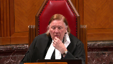

---
title: Ross McKenzie Kirkpatrick v. Her Majesty The Queen
published-title: Heard
date: 2021-11-03
sidebar: false
---

This transcript was made with automated artificial intelligence models and its accuracy has not been verified. Review the original webcast [here](https://scc-csc.ca/case-dossier/info/webcast-webdiffusion-eng.aspx?cas=['39287']).
---

**Justice Rowe** (00:00:00): The court, the court.

**Justice Wagner** (00:00:24): Good morning.

::: {.column-margin}

:::

Be seated.

The case of Ross McKenzie Kirkpatrick against Her Majesty the Queen for the appellant Ross McKenzie Kirkpatrick, Philip W. Cote, for the intervener Criminal Lawyer Association Ontario, Mark C. Alfiard and Kate Robertson, for the respondent Her Majesty the Queen, John R. W. Caldwell and Janet A. M. Dickey, for intervener Attorney General of Ontario, Dana Bonnet and Rebecca DeFilippis, for intervener Attorney General of Alberta, Christine Rideout, QC, for the intervener Barbara Schlieffer Commemorative Clinic, Johanna Birnbaum, for the intervener West Coast Legal Education and Action Fund Association, Jessica Litwick and Kate Feeney, for the intervener Women's Legal Education and Action Fund, Inc., Frances Mahon and Arkirat Kosa, for the intervener HIV and AIDS Legal Clinic Ontario and HIV Legal Network, Khalid Jann Mohamed, Robin Nobleman and Ryan Peck.

Please note that there is a publication ban in this file pursuant to section 46.41 of the Criminal Code, Mr. Cote.

**Speaker 1** (00:01:57): Good morning, Mr. And Madam Justices.

::: {.column-margin}

:::

There are effectively two appeals being advanced in this hearing.

The first is the appeal from the BC Court of Appeal decision, Kirkpatrick, by the appellant.

And the second appeal really is of the Hutchinson decision by both the respondent and arguably the majority in Kirkpatrick.

It appears to be conceded by the respondent in their materials that the reasoning of the majority in Kirkpatrick is flawed and that the respondent agrees with the majority decision really in this in this specific regard, which is the use of a condom should be included in the definition of the sexual activity in question under Section 273.1.

To achieve this, Hutchinson has to be overturned in part and the appellant will argue that there's no basis for this court to overturn Hutchinson, that it was well reasoned and is still and should be good law.

**Justice Wagner** (00:03:14): Don't you think?

Well-reasoned and recent as well.

So you can change precedent like that within six, five, six years.

**Overlapping speakers** (00:03:26): So the appellant says no.

**Justice Jamal** (00:03:28): Thank you very much.

**Justice Wagner** (00:03:28): I know that's changed.

**Speaker 1** (00:03:33): Mr. Chief Justice, the appellant says of course no that you can't change or you shouldn't change precedent that is both very recent and but also arguably very well thought out.

::: {.column-margin}

:::

The respondent in their materials list some general principles as to why a court, the Supreme Court can overturn precedent though the appellant submits that none of those factors listed in those cases apply to this to Kirkpatrick and I point to a few.

The first is Hutchinson reflects the charter values of autonomy, liberty and equality.

Those are very carefully considered by the court in Hutchinson and there's nothing in that analysis that is in error we say.

Also there have been no subsequent developments in the law that undermine the validity of Hutchinson except for in the BC Court of Appeal decision in Kirkpatrick the rest of the law as it relates to Hutchinson is in fact been quite clear.

The respondent lists many cases where they say the issue of Hutchinson is in some ways in dispute and I'll respectfully submit that's an error and I'll go to those cases but another reason why Hutchinson shouldn't be overturned is Hutchinson does not create uncertainty contrary to the underlying values of clarity and certainty that lie behind stare decisis.

It's in fact the opposite.

It's the clarity and certainty of Hutchinson that has attracted academic criticism and is the core of the respondent's position.

So it's that certainty and clarity that they it's the portions of Hutchinson that are certain and clear that they want overturned for a very specific legal effect.

Hutchinson makes it abundantly clear that contraceptives don't form part of the sexual act the sexual activity consented to and it's that very specific portion that the respondent is seeking to have overturned in Hutchinson.

And the respondent makes the argument that Hutchinson hasn't been applied consistently and I submit that's incorrect it has been applied consistently in our jurisprudence and really it is only Kirkpatrick the Kirkpatrick decision that is the outlier

and I note even in the Kirkpatrick decision it's the the Court of Appeal essentially distinguishes Hutchinson the principles stated in Hutchinson by arguing that the majority in Hutchinson didn't really mean to include condoms in the definition which I'll point to seems to use Justice Bennett's words quite an improbable assumption but also quite surprisingly also stating that the minority didn't understand in Hutchinson didn't understand the majority's position

and I submit that an argument that the the panel was essentially confused or misinformed isn't a basis in law to overturn a precedent.

It would be it'd be quite remarkable if that could be the basis for overturning a precedent there wouldn't be a Supreme Court or any precedent that could have any standing if you could just simply argue that the panel the panel was confused.

The law that is referred to by the respondent which argues that that the the respondent argues that the principles in Hutchinson have been implicitly rejected by these lower court and appellant court decisions.

None of these cases except with really with one exception have emphasized the definition of the sexual activity in question including the use of a condom.

Almost all the cases are clear sex assaults they're clear in the in the sense that there's there there is a lack of subjective consent on the part of the complainant and I won't go through these cases

but I'll just cite them you know Poirier, Potter, Perkins, So, IAD, Kraft, Maw, S.Y. All of those cases involve a lack of consent at the first stage first stage of analysis.

Condoms are a factor in these cases in that they form part of the factual matrix but the use of a condom isn't essential to any of these cases.

Now there are two cases which in fact the appellant pointed out in his leave materials Loopy and Rivera.

Now Loopy is a lower court decision that ultimately on on appeal the reasoning was rejected and Hutchinson was applied as the principles as we say as the appellant suggests and in the Rivera case the court does appear to misstate the law of sexual assault however the case itself there is clear lack of consent subjective consent at the first instance.

In Rivera the accused is essentially about to begin a vaginal intercourse and the complainant says you have to wear a condom and he essentially says you know don't worry about it it'll be fine.

It's a clear case where there's a lack of consent at the first instance doesn't assist in any way the fact that the court in to some regards misstated the law law as set out in Hutchinson.

Now the definition of the sexual activity in question in Hutchinson and the concept of subjective consent are at the heart of this appeal and the appellant is asking this court to apply the definition of sexual activity in question set out at paragraph 55 of Hutchinson which is that the sexual activity in question does not include conditions or qualities of the physical act such as birth control measures or the presence of sexually transmitted diseases.

If there is any doubt that the intention of the court in defining sexual activity in question the court this court can look to paragraph 64 of Hutchinson which makes the point even more explicitly more plainly the court states effective condom use is a method of contraception protection against sexually transmitted disease my emphasis it is not a sex act.

**Justice Karakatsanis** (00:10:42): Can I ask you this, though, Mr. Cote?

::: {.column-margin}

:::

What about the use of the word effective condom use?

Going back to paragraph 55, again, conditions or qualities going to birth control measures, presence of sexually transmitted diseases.

The majority at no point says this is about condom or non-condom use.

It says it's not about effective condom use.

It's not about consequences, such as risk of, concern about risk of pregnancy or sexually transmitted disease.

Is there not a distinction to be made between the consequences, the motivation on the one hand, and the actual, for whatever reason, a clear statement that I will not consent to sex without a condom?

Is there not a distinction between that?

And before you point me to the minority decisions, the minority, of course, is not binding precedent.

The majority is what's the precedent of this court.

So if you can help me with the distinction, it seems to me that there is a distinction between a condom and a sabotaged condom, and that is the language of the majority in Hutchison.

They talk about sabotaged condom.

They talk about protected versus unprotected from a birth control, or from a protection from transmittable diseases.

But that is a focus on motivation.

That's a focus on consequences, as opposed to isn't there just simply a different physical act when it's either, whether a condom is used or not.

**Speaker 1** (00:12:35): Madam Justice, respectfully, I think there the court in Hutchinson was actually quite clear that there isn't a distinction as you reference and I just want to point you to paragraph 41 of Hutchinson and it's quite interesting in that the court in Hutchinson actually is contemplating the actual particular circumstances of the of this particular case with Mr. Kirkpatrick and they direct, they address that at paragraph 41 where the court says that the distinction between the touch with an unsheathed penis and the touch with a sheathed penis that there isn't one that there is no distinction and the court states that the distinction between a faulty condom and the absence of a condom in the analysis of the sexual activity in question it's expressly rejected by the court in Hutchinson and the court concludes that a lie or deception that results in unprotected sex which obviously means either a sabotage or no condom or a lie or deception as to the condition of the condom that quote the law would be inconsistent because there is no reason in principle to analyze a case of a lie that obtains consent to unprotected sex and a lie as to the condition of the condom differently and so respectfully the court in Hutchinson actually addresses this exact issue is there a difference between the touch between a sheathed and an unsheathed penis and the court says no that a sabotage condom

::: {.column-margin}

:::

no condom it's one in the same and that flows from the reasoning that the use of a condom isn't part of the sex act but it's a form of contraceptive

and it's a form of disease prevention.

**Justice Brown** (00:14:35): It's kind of encapsulated, is it not, at the beginning of paragraph 55 of the majority?

::: {.column-margin}

:::

The sexual activity in question does not include conditions or qualities of the physical act.

True, goes on to say such as, but it begins with a categorical statement.

I wonder if, and if there was any doubt, I realize, I share my colleague's view that the descent does not form part of the reasons of the court, but dissents are sometimes useful for clarifying what the law is by stating what the law is not.

And in that regard, I wonder if paragraph 76, the first paragraph of the dissenting judgment, is informative in that regard.

**Speaker 1** (00:15:35): Thank you, Mr. Justice.

::: {.column-margin}

:::

I mean, it certainly is.

I would point first, though, the court to actually paragraph 97, where the minority states quite clearly that, and I quote, the heart of our disagreement with McLaughlin, Chief Justice and Justice Cromwell turns on whether the use of a condom is included in the manner in which the sexual activity is carried out.

According to our colleagues, the use of a condom during sexual intercourse does not change the specific physical sex act which occurs, but rather is merely a collateral condition to the sexual activity.

So the minority seems to clearly understand that the position of the majority is that it forms no part of the sex act.

So a damaged condom, no condom, a partial condom, none of that, that isn't a relevant consideration.

And of course, the court at paragraph 76 also states it's a different sexual activity than sexual intercourse without a condom.

So stating when a woman agrees to have sexual intercourse with a condom, she is consenting to a particular sexual activity.

It is a different sexual activity than sexual intercourse without a condom.

So again, the minority right from the get go, it's very focused on the core dispute with the majority.

And again, I wouldn't know how to make the argument that the minority was somehow confused as a reason to sort of disagree with their position.

Justice Bennett in the Kirkpatrick decision and her dissent states that, you know, states this point quite directly when she writes, I quote, accepting my colleagues proposed reading of Hutchinson thus depends on two improbable assumptions that the majority of the court did not consider condom use to be a method of contraceptive contraception or protection from infection, and that the dissenting judges fundamentally misunderstood the majority judgment.

And again, the majority right from the get go, it's very focused on the core dispute with the majority.

**Justice Moldaver** (00:17:51): out in terms of consent, why it matters what the motivation of the complainant is.

::: {.column-margin}

:::

One complainant may say, I'm worried about pregnancy.

Another one may say, I'm worried about sexually transmitted infections.

Another complainant may just say, I don't like sex, I like sex with a condom.

That's my preference.

That's what I want.

It's got nothing to do with pregnancy.

It's got nothing to do with sexually transmitted infections.

That is my choice, my autonomous choice.

I will only have sex with a condom.

And then we sort of take that with, you know, well, you're deemed to have consented, even though you've made it perfectly clear that you don't want, that you will not have sex with a condom.

Why are we getting into at that stage the whole question of motivation of the complainant?

Why is it even relevant?

**Speaker 1** (00:18:55): Thank you, Mr. Justice.

::: {.column-margin}

:::

I think the law as it stands now supports your proposition, which is it's not relevant.

And so the first question to be asked is, did the complainant subjectively consent?

And that concept maximizes the physical autonomy of the individual.

When you when you set aside all other kinds of circumstances and you really just go to the heart of the question, and that is, did this person in this moment in time, not 10 minutes ago, not five minutes ago, a week ago, right now in this moment, did they consent to the sexual activity?

It goes to the heart of the issue.

I agree with you.

**Justice Moldaver** (00:19:44): I agree with you. It does.

::: {.column-margin}

:::

And, I mean, one of the issues here is, you know, did the accused know that the complainant was not agreeing to sex without a condom?

And did he go ahead anyways, unbeknownst to her, until after the act is completed, and then she finds out about that and is very obviously disturbed about it?

But I couldn't agree with you more.

What does the complainant have to do?

Like, just before they start to have sex, she says, I want to reinforce what I said to you 20 times in the past.

I'm not agreeing to sex without a condom.

I mean, let's get realistic about this.

**Overlapping speakers** (00:20:32): Mm-hmm

**Justice Moldaver** (00:20:35): to do by the way as I say it's got nothing to do with birth control or anything else I just don't want to have sex with a part of your body I want to have sex where I'm being touched by some plastic thing

**Speaker 1** (00:20:55): So this particular appeal is not about all condom use, from Mr. Kirkpatrick's perspective, and I submit from the perspective of Hutchinson, this appeal is about a very specific narrow circumstance.

::: {.column-margin}

:::

And that narrow circumstance is this.

When a situation where the complainant, in fact, does subjectively consent to the sexual activity in question, as defined in Hutchinson, but does so because of a mistaken belief or understanding or assumption that her partner, or their partner, is wearing a condom.

That's very different from what I would submit would be all the great majority of other condom cases where it's quite clear, where if the complainant says you need to wear a condom and you proceed to have a sexual contact or intercourse without a condom, that there is no subjective consent.

That's sex assault.

And it always, arguably, always has been like that for a very long time.

**Justice Moldaver** (00:21:55): that this case, taken at its highest for the complainant, isn't that precisely this case?

::: {.column-margin}

:::

She made it clear that she didn't want to have sex without a condom.

I don't know how much clearer she could have made it.

And then in the middle of the night, you know, he, he penetrates her without a condom.

And she doesn't find out until the next day.

That's her version.

I'm not making no judgement on the outcome of this case.

I'm just saying how much clearer could it get?

**Speaker 1** (00:22:34): So Mr. Justice, actually, I respectfully would submit to you, it's actually quite unclear, and I point to these facts.

::: {.column-margin}

:::

The first is this couple only met twice.

And so the first time they met, they made an arrangement to meet to determine their compatibility.

And they, you know, the evidence is this, they discussed safe sex practices.

Now her evidence is that she told them she only has sex with a condom.

And his evidence, which was, of course, he didn't testify.

This was a directed verdict, but his statement to police was entered into evidence and in his statement to police, he indicated to the police that no, they never had a specific agreement, no sex, no condoms.

**Justice Moldaver** (00:23:21): You're going off the point here with respect.

::: {.column-margin}

:::

I just said to you I'm not judging this case.

You're the one that has conceded I think a few moments ago that we're talking about subjective consent and where the complainant makes it clear that he or she will not consent if the person doesn't wear a condom.

How does that get turned on its head to say you get my deemed consent even if you don't?

**Speaker 1** (00:23:52): Respectfully, it's not deemed consent and I think this is the power of when you look at consent, you look at the subjective consent of the complainant in that moment in time.

::: {.column-margin}

:::

I think the evidence is overwhelming that she consented to the sexual activity in question, but what the court or what the respondent wants this court to do is change the law so that even though she subjectively consented to vaginal intercourse, that we can go back and say no, no, no, because of what was said here on this day in this way, that in fact she didn't consent.

It's actually introducing an objective standard to the current test of subjective consent where even if, because you could have this scenario.

You could have a scenario where a complainant tells their partner, let's say a week or two before a sexual encounter that hasn't been planned, I always like to use a condom, always.

And then they go and they have a sexual encounter and that same complainant didn't turn their mind to the use of a condom that day.

They didn't explicitly.

**Justice Moldaver** (00:24:59): turn their mind to go ahead, don't use a condom.

::: {.column-margin}

:::

She didn't say in your example, I will not have sex unless you use a condom.

You just gave me another, please don't move off the facts, okay?

I'm just limiting this to a very narrow set of circumstances.

Not a question of, well, you know, I prefer sex with a condom.

She on her evidence here, and we're dealing with a directed verdict.

You must take it at its highest.

She made it clear, perfectly clear.

In fact, earlier that evening when they first had sex, and he did wear a condom, she made it perfectly clear that she would only have sex with a condom.

So let's stay without facts.

And then he goes ahead in the middle of the night and has sex with her without a condom.

**Justice Wagner** (00:25:47): That's what I call misrepresentation, no?

**Justice Moldaver** (00:25:55): That's what I call lack of subjective consent.

**Justice Brown** (00:25:58): And that's what three other judges called it in the dissent in Hutchison.

**Justice Wagner** (00:26:06): So we're back to 2014.

**Justice Kasirer** (00:26:10): I'd like, Mr. Cote, I'd like to ask you about the, go back to the question of Justice Karakatsanis at the start when she asked you about the distinction between condom use and sabotage condom.

::: {.column-margin}

:::

And I have in mind Justice Moldaver's question about motivation.

You answered, well, they're both species of unprotected sex, no condom and sabotage condom.

And sabotage condom, it's one of a piece.

And I'm wondering if we factor out motivation and focus just on she didn't want to have sex with a condom, without a condom, pardon me.

I'm wondering if the distinction has to be revisited, that we really should try and look at whether there is a distinction between condom use and sabotage condom and that they're not just two species of the same genus.

**Speaker 1** (00:27:23): respectfully the courts already made this analysis in Hutchinson and I say they've made it very well

::: {.column-margin}

:::

and it's very clear

and it's very logical.

The purpose of contraceptives is for disease prevention and it's for pregnancy.

You could make the same comment about instead of a condom you can make a comment about you know a sponge or a female condom or an IUD or you know an oral contraceptive.

**Justice Brown** (00:27:55): I don't know how helpful a line of argument this is for you, because I mean, how far I want to go down this road in making the point, but people might prefer sex with condoms for all kinds of reasons, right, including the sensation.

::: {.column-margin}

:::

So, I mean, I accept that sex with a condom and sex without a condom are two very different things, and I, but I think it seems to me more persuasive to say that that was nonetheless channeled as a matter of precedent by this court into the fraud analysis.

I'm not sure that, I'm not sure of the line that you were embarking on is really all that compelling.

**Justice Karakatsanis** (00:28:50): Well, before you leave that line, though, can I also ask you about paragraph 54, where the majority says one agreement to one form of penetration is not agreement to other forms of penetration?

::: {.column-margin}

:::

**Overlapping speakers** (00:29:16): I'm coming back to this idea that there's

**Justice Karakatsanis** (00:29:18): There's a distinction between what you say about the physical act and your motivation or consequences on the other hand, which clearly Hutchison was focused on, because in that case it was the distinction between a condom and a sabotaged condom that was the actual issue in that case.

::: {.column-margin}

:::

**Speaker 1** (00:29:47): So, again, I have to say that, you know, that distinction was addressed directly by the court when they indicated that there's, in principle, no reason to treat the absence of a condom or a damaged condom any differently.

::: {.column-margin}

:::

And I just wanted to say in regard to...

Sorry, they...

**Justice Karakatsanis** (00:30:09): didn't actually say that they said unprotected

I mean you look at the language they they always focused on protected versus unprotected and that's from a consequence or they looked at effective condom use they actually never did say it's the same thing whether you use a condom or not a condom.

**Speaker 1** (00:30:27): Well, I mean, respectfully saying unprotected sex, I don't know how you could make any reference to you could you could interpret unprotected sex as somehow including wearing a condom.

::: {.column-margin}

:::

So I think in just in terms of the ordinary usage of those words, the meaning the only meaning you can draw from it was, is without a condom.

Because again, you can't have unprotected sex with a condom.

In that context, in that in that sentence, because they, they addressed the damaged condom at the first part.

So I think it's quite clear that's exactly what the court is addressing.

And the issue of consent, of course, the complaining can always change their mind.

So to the and I'm going back about four questions at this point, but I just wanted to really make this point that one of the principles in our jurisprudence is to consent is that it's it's in the moment.

It's not five minutes ago.

So if a woman says I'm consenting to vaginal intercourse an hour, an hour ago, and then changes your mind or a minute ago or changes your mind or in the middle of vaginal intercourse and changes your mind.

That is a lack of subjective consent.

So we always go to the very moment in time to analyze subjective consent, we don't add any essential feature to the to the physical act in order to essentially have a quasi subjective objective standard of consent, it's always from the perspective of the of the complainant.

And so for her to have said, or for any complainant to say, I want my partner to use a condom a day ago or a week ago, that doesn't mean that flows to the moment in time that it's relevant to the analysis of consent, you have to look at the very moment in time.

Otherwise, the court is going to open up a can of worms of essentially contractual analysis as to well, what does a complainant have to say? Right?

If does a complainant and do you have to send it in writing?

And I don't mean that facetiously, but I mean making it very, very clear.

If you say it, you know, if you said it a month ago, a month ago, is your partner supposed to remember if you if you say it not in the context of a specific sexual encounter that you're anticipating, but more generally, is that something that a future sexual partner has to take account of?

And before they have sexual intercourse, they have to draw that to the attention of the complainant, which almost imposes arguably an obligation to disclose the absence of condom use in those particular circumstances.

I mean, it opens up a can of worms, and it does, it does this, and which the court addresses in Hutchinson is it, it attracts criminal sanctions for behavior that that otherwise shouldn't.

So it overbroadens the scope of criminal law.

And I think Patrick is actually an excellent example of that.

Because on the evidence, Mr. Kirkpatrick, about 40 to 60 seconds into the intercourse with the complainant asks her if it feels better.

She says yes.

Now she says, of course, she thought he meant position.

After the fact, she realized he meant the absence of a condom.

During the intercourse, his penis fell out of her vagina.

He asked her to grab on to him and help insert his penis back into her vagina.

She does, they continue to have intercourse.

This is an example where an individual is making no attempt to hide that the fact that he's not wearing a condom, short of him telling her, I'm not wearing a condom.

I don't think there's more physically he could have done in that in that situation.

And so it goes to his and this goes to his particular intent.

Under the the law proposed by the respondent, he would be there would be a lack of subjective consent at the first instance.

So that would be in this situation.

**Justice Moldaver** (00:34:36): with respect where it's been made clear.

::: {.column-margin}

:::

You keep giving us examples where it's not clear.

Here it was clear.

This man was told within a few hours of the second incident what her position was.

And in fact, she went and inspected the condom that he used in the first one.

So the simple truth is that he should've asked a question.

Are you okay if I insert my penis without a condom?

That's all he had to do.

That's all he had to do, but he doesn't.

And so you say there's no need to take any reasonable steps to go against everything that she said up to that point and done to ensure that she is consenting now to sex without a condom. I mean.

**Speaker 1** (00:35:33): Interestingly, and you've emphasized this point, Mr. Justice, several times is that it's clear that her own intent that she wanted a condom used.

::: {.column-margin}

:::

And what I'm pointing out is, if it was clear to her, it wasn't clear to the accused.

That his actions are the actions of someone that...

**Justice Moldaver** (00:35:52): a good defense.

We're not talking about that.

We are taking this is a non-suit decision.

We are taking her evidence at its highest.

So let's not try the case.

Let's look at the principles.

**Speaker 1** (00:36:08): and so she has the right to change her mind.

::: {.column-margin}

:::

She can tell him two days before that she prefers condom use.

She could ask for a condom in the first sexual encounter.

She has the right to change her mind.

She doesn't have to insist on the use of condom at the second encounter.

**Justice Moldaver** (00:36:27): without the condom before he does.

It's a little late after the event, wouldn't you say?

**Speaker 1** (00:36:36): Sorry, there was a bit of cut out at my end, Mr. Justice, I didn't quite hear the full comment.

**Justice Moldaver** (00:36:40): She has the right to change her mind.

::: {.column-margin}

:::

There's no question about that.

But you don't get the right to have, you don't get sort of out of the problem when you do it without her consent and then later on, part way through, are you consenting?

She says, okay, I'm consenting.

The first penetration is without consent.

**Speaker 1** (00:37:08): and again it arguably the first penetration as well consent if we're applying the essential features test and respectfully that's I say that's not the law in Canada and so there isn't a requirement for Mr. Kirkpatrick or for any complainant to give advance notice that they're not wearing a condom even if it's been discussed previously.

::: {.column-margin}

:::

She has the right to consent to the sexual activity that they're engaging in and of course if he's deliberately doing it without her

and she's not consenting to the sexual activity itself that of course is a different scenario

but this is the narrow scope of this case is the narrow range of she had the assumption that he was wearing a condom and because of that assumption she subjectively consented to the sexual intercourse and so respectfully the court's comment suggests that there is now a positive there should have been a positive obligation on on or there should be a positive obligation on a unaccused that if at some point in time in the future it's clear that one person wants a condom if they are to begin to have sex without it he's got to or he's got to essentially make inquiries as to the nature of consent and respectfully I state that's that's just not the law in Canada.

**Justice Moldaver** (00:38:29): He made the assumption, if anything, didn't it?

::: {.column-margin}

:::

Isn't it he that's got to get rid of the assumption?

The assumption going in is she will not have sex without a condom.

So if that assumption is going to be overturned, surely to goodness he's got to say to her, you know, is it okay now?

Why are you putting the assumption, why are you putting it on her after he's already started doing what she made clear she didn't want?

Let me know what you think in the comments below.

**Speaker 1** (00:39:02): Well, I'm not putting on her.

::: {.column-margin}

:::

That in fact is her assumption.

That's what she says.

That's her evidence, right?

She thought he was wearing a condom.

She wasn't concerned with it.

So that is an assumption that she made.

So it's not, I'm, I'm respectfully, I'm not putting that on her.

That, that is her assumption.

And, and to your point, and you know, to the earlier point where she's allowed to change her consent when he nuzzles up to her, and this is an excellent example of, he nuzzles up to her, she feels him poking at her behind.

She, she pushes back a little bit, readjusts herself.

It's a very short period of time.

And then they begin engaging in sexual intercourse.

And so, in that circumstance, and I understand you're, you're saying we shouldn't be arguing the case, but this, this case has got a very specific and narrow set of circumstances.

Again, she, she has the right to consent in that moment, regardless of what she said previously.

And it's, it's at that point in time, the.

**Justice Brown** (00:40:02): The problem is, is it already started, right?

The last word from her was she wanted a condom.

So it doesn't lie in his mouth to then, well, start it without a condom and see if she's okay with it.

It's as simple as that, isn't it?

**Speaker 1** (00:40:25): Well, and I think what we're doing, unfortunately, is we're not sort of looking at the dynamic situation which is a sexual encounter, right?

::: {.column-margin}

:::

And so I appreciate the comment, but, you know, they're essentially, you know, cuddling in bed.

They're quite close to each other.

He's clearly...

**Justice Brown** (00:40:44): He's penetrating her, and she's...

**Overlapping speakers** (00:40:48): condition.

**Justice Brown** (00:40:48): She's conditioned penetration on a condom.

::: {.column-margin}

:::

I don't want to sound like some kind of a puritan here.

I understand that these can be dynamic situations.

But let us not allow that to obscure the central point was that she had conditioned penetration on a condom.

And he second time around penetrated her without one.

And then tried to reassure that this felt better.

But before he did that, he penetrated her without a condom, contrary to the condition she had imposed on penetration.

**Overlapping speakers** (00:41:31): I honestly, I.

**Justice Brown** (00:41:33): I'm not sure if there's any other way to look at it

but you'll disabuse me of this I'm sure.

**Justice Martin** (00:41:42): You

**Overlapping speakers** (00:41:42): It's not, oh, no, please go ahead.

**Justice Martin** (00:41:51): I'd like to give you your opportunity to answer Justice Brown's questions before I pose my own.

**Speaker 1** (00:41:57): Oh, of course.

::: {.column-margin}

:::

Just in regards to the factual matrix of how this sexual activity occurred, and I don't think there's any debate about the factual matrix.

I think this case is quite clear on the factual matrix.

My points lie to the nature of subjective consent, in that it's always open to the complainant to consent to the sexual activity in question.

And so that's a separate analysis from what was in the accused mind.

And that's a distinction I'm trying to make clear, perhaps I'm not articulating as well as I imagine I am, but that it's ultimately, it's, and we go back to the autonomy of the complainant, it's her subjective consent that is the first question.

Well, communicating.

**Justice Brown** (00:42:53): communicated consent.

That's been the law since Barton.

**Speaker 1** (00:42:58): Yes, no, of course.

::: {.column-margin}

:::

But she can communicate not just with words, but with her actions.

And so as they're, you know, snuggling next to each other, he doesn't take any steps.

You know, she says she doesn't hear, you know, a condom unwrapping or him, you know, the motions of putting on a condom, and they're laying right next to each other, right?

This is not, you know, it's not like he's across the room or something of the sort.

In that moment, she can subjectively consent to sexual activity, regardless of what she said previously. She can.

**Justice Brown** (00:43:30): but she didn't.

::: {.column-margin}

:::

Her last word on condom use was has to happen, right?

Whether we categorize this as going to fraud vitiating consent under Hutchison or as consent as some of my colleagues would apparently like to channel it through.

The point is the last word on condom use was has to happen.

So until she communicates otherwise, he had to use a condom.

**Overlapping speakers** (00:44:15): So, whether that constitutes.

**Justice Brown** (00:44:17): It's fraud vitiating consent or condition of consent.

**Justice Wagner** (00:44:21): Bye.

**Speaker 1** (00:44:24): So this is I think this is where we might disagree and that is the the evidence is that they had a discussion about contraceptives and she said at that time that she always has sex with a condom.

::: {.column-margin}

:::

But that wasn't in contemplation of any particular sexual encounter that was going to occur between the two of them.

That was all arranged afterwards.

So they they have this initial meeting for compatibility.

They exchange some communications.

So I mean to to agree with your proposition that we would have the law would have to be this at any point in or at we did I imagine there'd be a limit but if in the past someone made a reference as to how they prefer sexual contact sexual activity that would essentially be like in the military standing orders.

Those orders would always be in place until they were verbally revoked.

And I don't think that's the law in Canada.

I don't think you can you can put a proposition and have it stand out there for essentially all eternity or for any you know for you know for for long periods of time.

I respectfully say that that's not the law in Canada and I appreciate the point that you know she did you know the evidence for her evidence that she communicated only sex with a condom.

But what we have to look at is in that particular day in that particular moment what was being consented to.

And it's not an overarching umbrella we're putting over her consent.

And again this goes to the point of her own physical autonomy.

Regardless of what she said yes or no to in the past she her consent has to be in the moment.

And in this particular case she had the misconception that he was wearing a condom and that was the basis of her consent.

**Justice Martin** (00:46:23): May I ask my question now please?

::: {.column-margin}

:::

It relates to, I understand that you're saying that the issues before should not be decided under subjective consent to the sexual activity in question, but that you say Hutchison requires an analysis under fraud and a viciation of consent by fraud.

Accepting that, I want to talk about the concept of fraud itself. Mm-hmm.

And to get your submissions, in respect of what fraud means in this context, it requires a dishonesty.

And you say, well, there's no general obligation to disclose condom use.

But isn't the dishonesty, my question, isn't the dishonesty measured in the context of what the conversation is between the parties?

And so when someone conditions a sexual activity on, let's say, a condom, wouldn't that go to dishonesty?

That's my first question.

And my second question is a bit more fundamental.

And it relates to the notion from other cases that were in the HIV context that talked about a significant risk of bodily harm being a requisite of fraud.

And I guess I'm going to ask you this question.

I understand why that may have been an issue because of the nature of the facts that were before the court.

But if we're talking about an issue where consent is central, we're talking about viciation of consent, why should there be any requirement of a significant risk of bodily harm when what we're talking about are the dignitary interests and the physical inviolability and the ability to condition consent in the fraud analysis?

Why should we be looking at that when, I mean, the other cases, yes, they were in an HIV context.

But why here? Why now?

**Speaker 1** (00:48:34): is I'll answer the second question first, in particular, and I just want to clarify that I understand, Madam Justice, you're essentially asking me in regards to the two-part test, why is it necessary for there to be a component for risk of harm in this particular context of condom use?

::: {.column-margin}

:::

Did I get that?

**Justice Martin** (00:49:04): In the others that factored in because that was in part what was being argued, but why would fraud as a concept that's just a bare statement in the criminal code, it's fraud, it's been interpreted in the past, but why in the context of this kind of case would we overlay significant risk of bodily harm?

::: {.column-margin}

:::

**Speaker 1** (00:49:28): And so that's actually it's that's addressed in in Hutchinson as well that concept

::: {.column-margin}

:::

and it's essentially that there's a a bright line between conduct that is that attracts criminal sanction and conduct that doesn't that we might find immoral

but it doesn't attract criminal criminal consequences and in this particular or in in Hutchinson

and I'm just I'm trying to quickly find my reference

but I'm I'll I'll try to find it in a bit

but essentially the court makes this quite clear that there is a type of conduct that we don't want to criminalize otherwise it'll be it'll cause the criminal law to be over broad and that's addressed in maybe or in courier and the two-part test of requiring both fraud and risk of harm is the bright line to that

so the bright line being if they're

**Justice Rowe** (00:50:35): But today I'm holding up my wedding ring, okay?

::: {.column-margin}

:::

And I'm a scoundrel

and I put this in my pocket and I say of course I'm a free man, I'm at liberty

and I present myself that way.

And on that basis, things proceed, shall we say.

No, I'm a scoundrel, but is this a sexual assault?

I mean, that's really the kind of thing that I think we're trying to avoid, isn't it?

**Speaker 1** (00:51:08): It is.

::: {.column-margin}

:::

And it's criminalizing conduct that, also, it's criminalizing conduct without intent.

And I say there's an example that Mr. Patrick's case that he arguably doesn't have the intent to essentially deceive the complainant.

Except may I ask you to repeat the question, Mr. Patrick,

**Justice Martin** (00:51:29): Can I interrupt you on that?

::: {.column-margin}

:::

We're talking here about the presence or absence of consent for the Actus Reus, whether or not, whichever way this is decided, whether it's sexual activity in question or eviction through fraud, we're still only at the Actus Reus, the crown would still have to prove that there's intent and the accused would still have all of the arguments in relation to a lack of intent that can be raised in the circumstances.

So let's not please mix up those two stages.

**Speaker 1** (00:52:10): No, of course, so to the point where we don't want to criminalize behavior, even though there is some fraud, the risk of harm essentially is the bright line to that conduct that shouldn't should and shouldn't be criminalized.

::: {.column-margin}

:::

To use the words of Mr. Justice, being a scoundrel or being, you know, immoral isn't necessarily, it shouldn't necessarily attract criminal sanction.

And of course, there's a, I mean, the, the nature of fraud is there, there could be an unlimited a number of circumstances where an individual deceitfully obtains consent, but without the risk of harm, it doesn't meet the threshold for criminalization.

While we're on the, just on the, on the topic of fraud, I did want to address the the majority decision by Justice Bennet.

And essentially her, the Court argued that the trial judge erred by applying, by misapplying the test of fraud by essentially demanding or requiring that there was an overt, there were overt actions by by the accused.

And I just note at paragraph 25 of the trial decision that the Court in setting out the the test for fraud points to number one dishonesty, which he specifically states quote, which can include the non disclosure of important facts.

And he goes on at paragraph 29 where he finds that the complainant consented, but he says, more particularly, where the actions of the accused in this case, not wearing a condom for the second incident of sexual intercourse, dishonest, and this could include non disclosure of important facts.

So he does in fact state the law correctly on on on both instances that there is both, there could be both an overt deception and there and there also could be deception from non disclosure.

And then he goes on at paragraph 31 to 33 to find that there's no evidence at all of any deceptive act.

And that no evidence includes both the non disclosure, as well as as well as any any overt acts.

As well as any any overt acts.

**Justice Karakatsanis** (00:54:44): Can I ask you about the discussion about the deprivation?

::: {.column-margin}

:::

I'm looking at Justice Bennett's reasons in the Court of Appeal, and I'm wondering whether allowing the side effects to HIV treatment to be considered a deprivation undermines maybe or and career standard of reasonable possibility of transmission.

I think that was part of the question Justice Martin was asking.

And secondly, does it matter because Hutchison paragraph 70 makes clear that risk of pregnancy is a deprivation in any event.

**Speaker 1** (00:55:38): So I agree I think Hutchison makes it quite clear that risk of pregnancy is a deprivation and so I'm not sure it matters and I only note that we never got that far at the trial of course that the evidence there were no submissions made on the risk of harm.

::: {.column-margin}

:::

Well that would have been the next motion that I made if the first motion had been denied and so there really were no submissions on that particular on that particular point.

I will say that the obtaining of medical treatment for as a result of the sexual encounter I would I would submit that it's it's quite remote it's not it's not a realistic risk of harm that comes directly from the sexual encounter and it's not something that would reasonably flow from a sexual encounter because you could argue if there was any anytime someone made that sort of a personal choice they would do it for a variety of reasons and those reasons don't necessarily flow from the flow from the sexual act itself.

It's interesting in this case the

and again I just want to be clear there's certain evidence that came out in this regard and it was quite limited to conversations that were had by health workers and Mr. Kirkpatrick

so when when the complainant initially went to seek treatment they they called Mr. Kirkpatrick and it was after those conversations that there was a

and I guess their conversations with the complainant which we weren't of course privy to in all their detail that a decision was made to engage in that HIV preventative treatment.

**Overlapping speakers** (00:57:30): Whoa, whoa, whoa, wait.

**Speaker 1** (00:57:31): which is quite remote from the actual sexual encounter.

But again, it was an issue that we just, we didn't go into in any great detail at the trial level.

**Justice Côté** (00:57:40): Mr. Coté, I have a question for you regarding what Justice Bennett said in paragraph 54 of her reasons.

::: {.column-margin}

:::

She says that the evidence in this case is critical to my conclusion that there was evidence of fraud sufficient to overcome a no-evidence motion.

So of course she's influenced by the fact that it is a no-evidence motion and that there was some evidence of dishonesty.

What do you have to say on that?

Are you saying that there was no evidence at all of dishonesty?

**Speaker 1** (00:58:17): So the the trial judge found that there is no evidence of dishonesty and that's looking at all the evidence in context.

I understand if you just isolate the issue of non-disclosure.

**Overlapping speakers** (00:58:27): Mm-hmm.

**Speaker 1** (00:58:27): and you ignore all the rest of the evidence, I think you could reach a conclusion that that was, there was some evidence.

::: {.column-margin}

:::

But that's, of course, that's not what the trial judge is doing.

The trial judge is looking at all the evidence.

And there's actually this improbable proposition that's before the court, and that's this.

Mr. Kirkpatrick is, of course, and you've already heard this, he asks her if it feels better.

He asks her to hold his penis to reinsert it into her.

He's overtly indicating that he's not wearing a condom, short of saying, I'm not wearing a condom.

It can't be true that Mr. Kirkpatrick is both trying to deceive by omission, which is by not stating that he's wearing a condom, and at the same time is advertising that he's not wearing a condom.

And both of those things can't, he can't do both of those things at the same time.

And so when the judge looked at all the evidence, although nondisclosure could be, can be done for a deceptive purpose, when you look at all the evidence, it's not possible, because it was uncontroverted what he did do, right?

Asked her the question, had her touch his unsheathed penis.

And so both of those propositions can't exist at the same time.

And since his actions were, again, uncontroverted, the court wasn't open to the court, and I respectfully submit it's not open to this court to conclude that there was some evidence of deception or fraud, because in the totality of the evidence, there was none. Okay.

Maybe I'll close on this point.

What the respondent is asking this court to do is essentially rewrite section 273.1.

The legislation as it's written and was interpreted by the court in Hutchinson reads both section 265 and 273, reads them together harmoniously, giving force to each, and giving force to the intention of parliament as much as it can be seen.

And what the respondent is asking this court to do is essentially to rewrite section 273.1, to include in it essentially a sub clause where the physical act is now redefined.

That I say is something that should be left to the legislature.

This decision was from 2014.

Section 273.1 was in fact already, it's been amended since Hutchinson came out.

There are dozens and dozens of course bills to amend the criminal code before parliament.

If it was something that parliament wanted to do, that's where it should start.

This change that's being proposed by the respondent would be a drastic change in the criminal law in Canada, will potentially impose an obligation of disclosure.

And it will create both an objective element to consent at the first stage, as well as the subjective element.

**Justice Wagner** (01:01:53): Thank you very much.

Thank you, Mr. Couty.

Mark Alfjord.

**Speaker 2** (01:02:04): Good morning, Mr. Chief Justice, Justices.

::: {.column-margin}

:::

The Criminal Lawyers Association Ontario will make two submissions.

One, that the approach adopted by the Hutchinson majority that the sexual act in question should be narrowly defined to include only the basic physical act agreed upon by the parties should be maintained.

It's the CLA's position that this is the only workable approach that provides for certainty and consistency at the first branch of the consent test and also acts as a bulwark of casting the net of criminality too wide.

The fraud vitiated consent provisions is really where Parliament and what this court has adopted in Hutchinson is in place to ensure that preconditions or essential features put on a consent that is given to the to the basic sexual act in question does not just simply devolve into a stark choice of personal preferences that that a complainant may put on their consent uncoupled with risk.

Now obviously recognizing that complainants are free to determine how they are touched the problem really kind of germinates and becomes apparent and it's the problem that the Hutchinson majority recognized is that when you accept that preconditions of consent beyond simply to the act in question are allowed it creates a very blurry line not just for matters that that that the law should treat as culpable but other personal preferences that may be very much extraneous to the act in question.

And the one of the issues in this case is specifically about condom use but in the CLA's position we can't just simply look at that one type of act despite the fact that Hutchinson already addressed this and it's obviously the CLA's position that we we join with the appellant that that as a matter of stare decisis this this issue has already been decided but the question really becomes where do you draw the line if extraneous or essential features are adopted for instance if if a complainant testifies that how they want to be touched in a sexual intercourse encounter is that the accused wear their shirt to bed or as Justice Roe pointed out only with someone who is not lawfully wed those factors potentially creep in and create the situation where there's no there's no ability for the court to simply say that that isn't conduct warranting criminalization regardless of the personal preference of the complainant and that's really in the CLA's position the weight to which the fraud vitiating consent provision or the function that that that that that serves it suggests that only where there's dishonesty and risk to to the complainant's health or safety physical safety that that that the the law will in fact criminalize that and I would submit just in terms of the dispute and the questions that were asked about stare decisis and Hutchinson that there the majority in the dissent in this particular in Hutchinson were quite clear about the idea that the dispute in issue was whether condom use falls within the rubric of those essential features or whether it is not tied to the basic act in question the majority decision at paragraphs 54 and 55 really should be read in conjunction with what the majority decision set up paragraph 64 which clearly in in the CLA's submission suggests that condom usage is a method of contraception and disease control disease and contraceptive control not a sect act and that was the exact issue that the majority recognized was the dispute in that case and I agree with I'm not sure who asked the question but the idea that the dissent is is orbiter and it's not law but the this was the impanelment and the the litigation that was before the court at the time and I think we can take that the the two positions in in writing lengthy dissenting and majority judgments that were completely at odds with one another understood that the dispute was before them what what the dispute was before them and this issue was decided it was decided in the correct manner to keep only culpable conduct uh criminal and not effectively cast the net too wide to encompass uh non-culpable conduct Mr. Huffnard in

**Justice Jamal** (01:07:08): In terms of casting the net too wide, why, and you referred to the descent or the minority reasons in Hodgson, why, and you referred to the descent or the minority reasons in Hodgson, why, and you referred to the descent or the minority reasons in Hodgson, why, and you referred to the descent or the minority reasons in Hodgson.

**Overlapping speakers** (01:07:16): Why are the-

**Justice Jamal** (01:07:16): the criteria that are renunciated in paragraph 92, why do they give rise to the concerns you've identified?

::: {.column-margin}

:::

And those criteria were the identity of the sexual partner, the sexual nature of the touching, and the manner in which the sexual touching was carried out.

That seems to me doesn't include wearing a shirt to bed or not wearing your wedding ring.

It seems to me quite a different type of set of circumstances that don't give rise to the uncertainty that you've posited.

**Speaker 2** (01:07:46): Okay Justice Jamal I'd answer that in two parts.

::: {.column-margin}

:::

I agree that the wedding ring example may be a you know a marginal thing that doesn't actually encapsulate the sexual issue at question but taking the example of a personal preference about wearing a certain item of clothes the whole idea behind the the the issue of condom versus non-condom on the respondent and intervener's position is that that creates a physical barrier that affects the underlying touching that's at issue and that should be something that the complainant has autonomy to be able to say I'm not okay with that therefore consent is not affected at the first branch under 273.1 but in my submission that would also go to examples like an article of clothing which I'm not trying to belittle condom use because obviously it prevents disease and other qualitative features but I'm simply saying on a more base level that affects the nature of how the complainant is touched and if we if the court adopts a test that simply says all factors that that affect the how of the touching are criminal that causes serious concerns about widening the net and these are the exactly some of the things that the majority in Hutchinson noted was concerning and it creates this blurry line between culpable and non-culpable conduct that you know we're not just talking about the one issue of the condom in this case we're talking about a broad test going forward that is certainly going to have to be fleshed out in other in other cases and the concern from the CLA's perspective is that it creates a blurry situation where the manner of how the touching may not always rise to the level of culpability or concern that was expressed by the complainant in this particular case.

**Justice Wagner** (01:09:40): Thank you very much.

I think that just to complete your answer, I think we could refer to paragraph 54 and 55 of the majority reasons that we wrote in 2014.

Thank you very much.

We'll take a break, morning break, 15 minutes.

**Justice Rowe** (01:10:33): The court is in the cool.

**Justice Wagner** (01:10:56): Thank you.

Be seated.

Mr. Caldwell.

**Speaker 3** (01:11:06): Thank you, Chief Justices, the Crown is asking this Court to clarify the law of consent and to confirm that a complainant's consent to sexual intercourse can depend, as a matter of law, on her requirement that her partner wear a condom, and to hold that Mr Justice Groberman's reasoning in the court below was correct, that sex with a condom and sex without a condom are physically different sexual activities in question.

::: {.column-margin}

:::

Thank you, Chief Justices, the Crown will.

**Justice Côté** (01:11:35): So you are asking us essentially to revisit Hutchinson when you say you are asking us to clarify the law of consent Does it mean?

In the simple terms that you are asking us to revisit Hutchinson

**Speaker 3** (01:11:52): We are we are asking this court to do that as as well it

It may be ultimately though

Perhaps if this court is reluctant to do that That the court can simply clarify What do you mean?

**Justice Wagner** (01:12:09): reluctant.

Don't you think the Supreme Court of Canada should be reluctant in changing or reversing a precedent of 2014?

**Speaker 3** (01:12:20): Chief Justice I bear in mind what was said at the outset about this being a precedent that is only seven years old and the Crown recognizes that revisiting a past decision of this Court is not a step to be taken lightly but with that said it is a step which must be taken here in the Crown's submission.

::: {.column-margin}

:::

The proper interpretation of sexual activity in question should include condom use.

This is consistent with the Court's landmark decision in Younchuk in particular as well.

**Justice Wagner** (01:12:49): All those arguments, sir, I'm sorry to interrupt, all those arguments were, you know, I was on the panel in 2014.

::: {.column-margin}

:::

I'm the only judge remaining in the majority on the panel.

My colleagues, Kerikatsanis and Maldiver, were in dissent.

And I remember all those arguments were made in 2014.

So why, tell me why we should change this precedent if only because judges, the names of the judges have changed on this court.

**Speaker 3** (01:13:18): Yes, Mr. Justice, Chief Justice.

**Speaker 3** (01:13:21): It's not simply a matter of a change of composition of this court, the in the Crown submission doctrinally there are problems with making the significant problems with making the fraud section of the code.

Viciating consent to the word doctrine.

**Justice Brown** (01:13:38): Final problems that you identify are drawn from you and chuck and j.a., yes? Yes.

So both of those decisions predated Hutchison so isn't that effectively a submission that Hutchison is per incurium?

In essence, that's what you're saying, isn't it?

**Justice Rowe** (01:14:05): not

**Speaker 3** (01:14:10): Certainly, it's the Crown's submission that clarification is required that certainly many, including Madam Justice Bennett, the appellant, my friend from the Criminal Lawyers Association, many commentators take the view that there is a doctrinal gap or an analytical gap between what this would mean.

::: {.column-margin}

:::

**Overlapping speakers** (01:14:32): But I don't care what the commentator said, what do you say?

**Speaker 3** (01:14:34): We say that there is a gap and that this court was that the reasoning of the majority was problematic in putting forward and what does problem at.

**Justice Brown** (01:14:48): I'm sorry. Come on.

::: {.column-margin}

:::

These are weasel words, a gap, problematic.

Isn't the substance of your submission of paragraphs 8 through 10 of your factum that this is wholly inconsistent with these prior cases, in fact, those are your words, wholly inconsistent

and I'm suggesting to you that that is in substance a submission that Hutchison is per incurion.

**Speaker 3** (01:15:32): That would be one way of characterizing it.

It certainly is what requires clarification.

Can I ask a question?

**Justice Kasirer** (01:15:41): Perhaps there's another way to say it.

::: {.column-margin}

:::

Certainly, pure incurium is kind of a rare bird.

Could one say that Hutcheson deals with unprotected sex and specifically sabotaged condoms?

And what's before the court in Kirkpatrick is condom use irrespective of the purpose for which condoms are required by the complainant.

**Justice Brown** (01:16:16): I mean, you clearly don't agree with that because why would you be urging us in your factum to overturn this aspect of Hutchison?

You're not saying it's distinguishable.

You're saying it has to be overturned.

**Speaker 3** (01:16:30): Well, we do say that at minimum it needs to be clarified that the restrictive approach to the meaning of sexual activity in question in Hutchinson, that is a part of the judgment that is most at odds with what this Court said, particularly in Younchuk, but also in J.A.

::: {.column-margin}

:::

To put restrictions on the word, the critical word, how, how a person is touched and critical and put those limiting distinctions, limiting significant limitations on how a person can control how their body is touched, those were important principles and they've been restricted if one looks at the definition, the restrictive definition in Hutchinson.

So it does set up a conflict in terms of significant conflict in this Court's jurisprudence between Younchuk and J.A. on one hand and particularly with respect to the meaning of the word sexual activity in question in Hutchinson.

That's where clarification, if not partial revisiting and partial overturning is required in our submission that the restrictive definition on, certainly on one interpretation doesn't permit that distinction that Mr., that Justice Kasir raised between sabotaged condoms and, and no condom at all.

We recognize that one obstacle to that argument is the restricted definition of sexual activity in question in the majority judgment in Hutchinson, which is to define sexual act, sexual acts in very basic terms.

Vaginal intercourse is vaginal, penile vaginal intercourse is penile vaginal intercourse

and it doesn't matter where, whether a condom is present or not.

That is, appears certainly to the Crown to be one of the difficulties, perhaps with, with distinguishing the, the two cases, finding perhaps that it's in, in, in, in Justice Brown's terms, per incurium.

The, it seems to me an extraordinary, an extraordinary,

**Justice Rowe** (01:18:58): Extraordinary criticism of the ratio that it is clear.

Ordinarily, a criticism is advanced that it is unclear.

But now we have your submission that the problem with the majority is that it is clear.

**Speaker 3** (01:19:18): The difficulties, certainly one, we see clarification, but two, one of the difficulties is that it has limited and arguably, according to the appellant and the criminal lawyers in this scenario, it's excluded the wishes of the complainant in the case at bar as well as in similar cases.

::: {.column-margin}

:::

And we know there've been a number of similar cases from any consideration or any relevance under the consent section.

And we do have the law deeming people like the complainant and in similar situations, not to have consented on the basis, on the doctrinal basis of this limited definition, this restricted definition of sexual activity in question.

So that's the doctrinal difficulty that appears in Hutchinson, the uncertainty that arises.

Well, first there's a problem with the doctrinal coherence.

The crown says that the whole purpose of the consent section is to deal with complainants who do not consent to their body being touched in a certain way.

And the importance of the word how in that critical passage in you and Chuck.

And that is what the Hutchinson restricted definition of sexual activity in question does, is strictly is as restrict and narrow that interpretation of how.

So the crown is not suggesting that the section has to be rewritten now by this court, as my friend suggested.

It has to be interpreted, it has to be interpreted in a manner consistent with this court's jurisprudence and you and Chuck and J.A.

Sorry, I'm sorry.

Sir, Mr. Caldwell.

**Justice Wagner** (01:21:13): Mr. Caldwell, we had the chance in Hutchinson to look at those previous cases and we decided as we, as you know, as we did.

::: {.column-margin}

:::

My question to you is now that you are asking the court to reverse what I call a recent precedent.

There are criteria why a court, the Supreme Court, could reverse a precedent.

We see that in Bedford and in Carter.

So tell me, give me the reasons why we should do it.

And that's simply a disagreement.

**Speaker 3** (01:21:46): Yes.

::: {.column-margin}

:::

The Crown says without being perhaps explicit, well, purporting to uphold you and Chuck, the majority in Hutchison restricted the scope of Section 273.1, the critical section of the code dealing with consent.

And in a scenario like this, it is essentially excluded as irrelevant the complainant's entire basis for refusing to subjectively, in this scenario, to engage in sexual intercourse.

It is simply out of, to apply, as Mr. Justice Proberman observed, this is seriously out of touch with reality and dysfunctional in terms of its protection of sexual autonomy.

Do you have any cases?

Do you have prior cases?

**Justice Wagner** (01:22:56): because in your factum, you refer to Vavlov and cases in which precedents were revisited and of course it follows a series of court decisions, lower court decisions, which explained that it was confusion and so on and so forth.

::: {.column-margin}

:::

That's why this court decided to look at it.

But those cases are very exceptional.

Carter, Bedford, Vavlov.

So why in this case we should revisit a decision which took into account all the arguments that so far we heard this morning.

**Speaker 3** (01:23:43): The, I appreciate that the academic sort of the judicial criticism because of the seven years and because of the litigation is not as extensive as in the other examples that perhaps that you have cited.

::: {.column-margin}

:::

We do, however, observe both before and after Hutchinson courts grappling with and essentially almost intuitively or self-evidently regarding matters outside of simply the basic sex act as Hutchinson narrowly defined sexual activity in question as relevant, particularly condom use.

And this is something that in the Crown submission the courts are struggling with.

This was not controversial in our submission, would not have been controversial before Hutchinson.

Since Hutchinson, we have decisions not just of Kirkpatrick but recently of the Ontario Court of Appeal with respect to MAW and IAD where without reference to this problematic reasoning in Hutchinson, the Ontario Court of Appeal has implicitly accepted that something outside this very basic generic definition of sexual activity in question, condom use in this instance.

Okay, so that's, that's, that's called...

**Justice Brown** (01:25:05): that's that's called not following Supreme Court precedent isn't it well if you're straining for an answer I think the answer is yes

**Speaker 3** (01:25:18): Yes, but that demonstrates the difficulties that courts have with this decision.

**Justice Brown** (01:25:25): disagree with it.

::: {.column-margin}

:::

And maybe I disagree with it.

But that's not the question.

The question is whether to take it back to the Chief Justice's question, whether you have demonstrated the conditions necessary for us to depart from a precedent of this court.

And I think if I mean, I keep I don't know why you're resisting this because the tenor of your submissions is that Hutchison was decided without regard to precedence of prior precedence of the court and is therefore per incurium.

That's the substance of your submission and you're resisting it maybe because that sounds like it's raising the stakes.

Maybe we don't like Latin words but that's effectively the substance of what you're saying that Hutchison is an illegitimate decision.

**Speaker 3** (01:26:25): No, I in my submission that that's that's not my submission with respect.

::: {.column-margin}

:::

It's that Hutchinson is subverts and erodes the the principle and is a retreat from the critical fundamental principle of personal autonomy that is supposed to be the very heart of the law of sexual assault and and the consent provision and what we have now is a restricted definition of sexual activity in question that is limited to basic generic sexual acts and ignores important uh can't ignore as is the example of the case at bar and cases similar to it important physical features that will be important to the so

so it's not an illegitimate

**Justice Brown** (01:27:08): It's an legitimate decision, it's just subversive of fundamental principle.

**Overlapping speakers** (01:27:13): I've got the distinction.

**Speaker 3** (01:27:15): I've got the distinction.

::: {.column-margin}

:::

It's very hard doctrinally to reconcile this narrow definition of sexual activity in question in Hutchinson with this court's other precedents and with what Parliament intended with the purpose of the section when it was enacted, which is to protect personal autonomy.

And as well, it has led. It's not.

**Justice Rowe** (01:27:42): But is not the remedy, is not the remedy for parliament if this court, before I was a member of this court, departed from parliament's intention, is not the proper remedy for parliament again to speak with sufficient clarity and to correct us.

::: {.column-margin}

:::

**Speaker 3** (01:28:04): And in this instance, first, the Crown would say that Parliament has spoken, and it did with the preamble and with the enactment of the section.

::: {.column-margin}

:::

And as well, this Court has spoken already, and you and Chuck and JA.

And we have, essentially, a doctrinal gap on the ambit of sexual activity in question.

And whether one calls it clarification or partial revisiting of that definition, the Crown says that this Court needs to reaffirm the principles in you and Chuck and JA, not hand it back to Parliament, and properly recognize that there are physical aspects of the sexual activity beyond the very generic sexual act, in this case, penile-vaginal intercourse, that can and properly will go to consent.

What we have, as Justice Brown observed in colloquy with my friend, is a situation where these issues are all being funneled through the fraud-vitiating consent provision.

And this is fundamentally at odds, as Justice Moldaver observed.

We have the law deeming people to like to complain and to have consented.

Certainly, that was the trial judge's view.

Even though it's quite clear, she absolutely, taking her evidence at its highest, did not consent to this particular sexual activity.

Is it not something that we need to be aware of in the future?

**Justice Côté** (01:29:39): And I think that's a very good point.

**Speaker 3** (01:29:55): Yes, Justice Cote, it pertains to fraud vitiating consent, but it's a vitiating provision.

::: {.column-margin}

:::

And the Crown says that the first step and the first question to ask, and I'm heartened by what my friend Mr. Cote had to say, that always the first question to ask was whether there was subjective consent.

And the Parliament enacted the consent section to respond to the unique nature of, unique character of the offence of sexual assault, and it is the first place to start.

And it is illogical to then go to instead skip over that and ignore the important physical aspects of the sexual activity to which a complainant doesn't consent in her or their subjective mind, to treat that as irrelevant if they're physically related to the nature of the touching.

The whole point of the section, as enacted and as interpreted by this Court, has been to protect the autonomy and the ability of a complainant to control how their person is, how their body is touched.

And we've had this how, this important aspect of what, of the section, restricted, and then we have the uncertainty, just to get back to Justice Roe's point, the uncertainty arises in terms of the uneven and unpredictable aspect of the fraud section, and is currently conceived, there has to be a risk of bodily harm, or a risk of deprivation, that deprivation requirement in the context of risk of pregnancy is going to end up creating very differing results depending on the reproductive health status of a female complainant, it will not protect male.

**Justice Rowe** (01:32:02): There's two general categories.

::: {.column-margin}

:::

I mean, if you're talking about a man and a woman having intercourse, I mean, there's pregnancy, but in all instances, whatever the genders, there's, of course, a risk of sexually transmitted disease.

And that, I mean, unless people are in a very long-term monogamous relationship, you almost, it's impossible to entirely eliminate that.

It's always gonna be there.

And so if the woman says, look, you know, I want to be protected, and the guy says,

oh yeah, that's great, and then he kind of lies, right, in effect, by saying, sure, I'll take care of that, and then he doesn't.

I mean, how complicated is that?

**Speaker 3** (01:32:54): So, Justice Roe, the Crown submission is that the first question has to be subjective consent and we should not be channeling, as Justice Brown says, the entire analysis away from the subjective requests, subjective state of mind of the complainant.

::: {.column-margin}

:::

As Justice Moldaver put it, it is first and foremost, the section is designed, the issue of consent is entirely subjective and it's up to the complainant and Section 273.1 is the principled proper section to employ because it does not inquire into the reason of the complainant.

It, as Justice Moldaver observed, it could be due to birth control, it could be due to a desire to protect from STIs or it could simply be that is that is how I want my body touched and I don't want it touched a different way and that is now.

**Justice Rowe** (01:34:08): Now we've gotten into what I think is a critical point.

::: {.column-margin}

:::

The consent, as you describe, may be made contingent on all kinds of factors.

That as a matter of criminal law, we arguably shouldn't say, it's a basis for criminal behavior.

And there's the ring again, right?

Or I thought that you were a representative of the Sierra Club, and I find out you're actually a roughneck up in the oil patch.

And so this is a terrible thing which has occurred.

I mean, where does it end?

And the answer is, there are no limits.

And it becomes a crapshoot.

And it becomes an object of enormous uncertainty which should not be injected into the criminal law.

That is the necessary implication of what you're putting to us.

**Speaker 3** (01:35:08): With respect, Justice Roe, that is not the case and we've, the limit, the doctrinal limit is that we are talking under consent under Section 273, decimal one with physical aspects of how the body is is touched it.

::: {.column-margin}

:::

I appreciate you've gone into questions of identity, and that's not the case here and that's that's not the question here we're talking about here about how the body is touched, and while it's non exhaustive the Crown has tried to set out some factors that go to specifically how the body is touched.

These are relevant to Section 273, decimal one and consent with respect to how the body is touched the part of the body being touched what is so.

**Justice Rowe** (01:35:59): Are we now to have an expanding body of jurisprudence, no pun intended, body, corpus of jurisprudence, which says, ah, I'm extending the factors which are relevant for this purpose here.

::: {.column-margin}

:::

I'm recognizing further factors that are relevant here.

And the thing just grows and grows and grows.

And is this how the criminal law is to be written?

Is the criminal law to be so indefinite and to be so open-ended that one would not know from day to day whether you're incurring criminal liability or not?

Does this not simply undermine the whole fundamental basis of a criminal law that it is possible for people to ascertain?

**Speaker 3** (01:36:47): Justice Roe, and I believe it was Justice Martin made this point that we're dealing with step one, just actus reus, and we're dealing with what's in the subjective mind of the complainant.

::: {.column-margin}

:::

It is not a question of overreach, it's the proper reach of section 273.1, which is to protect personal autonomy and how one's body is touched.

So the relevancy and the focus, and there should be flexibility, but what is relevant under section 273.1 would have to do with specifically how the body is touched, with what these are, in my respectful submission, it isn't as expanding as my friend from the criminal lawyers put it, or as you have put it, we've identified pretty clear factors beyond the simple basic sex act, and that's really as far as this court said it should go in Hutchinson, and that is too restrictive, and we've identified a number of physical aspects, this goes to the physical nature of the touching, and that is something that is relevant to a complainant's consent, and is something that the law should recognize, where a complainant says I don't want my body touched with in that invasive form, I don't want the, I want a barrier if I'm to be penetrated, I don't want that skin to skin contact.

**Overlapping speakers** (01:38:25): I don't

**Speaker 3** (01:38:26): want I don't want the complainants I don't want the accused ejaculate inside my vagina we don't get to consequences or risks at this point that is irrelevant consent is for

**Overlapping speakers** (01:38:38): Eddie.

**Speaker 3** (01:38:39): reason, but this goes to the nature of the touching, so it isn't this infinite expanding universe of possibilities.

There is a focus, it has to go to touching it.

**Overlapping speakers** (01:38:51): Yeah.

**Speaker 3** (01:38:51): outside of something that goes to the physical touching, that goes too far.

That isn't something that would be captured in terms of that aspect of the atlas rays.

**Justice Brown** (01:39:04): Can I ask you, you're asking us to overturn part of Hutchison in as much as a bars consideration of relevant physical aspects as you put it of sexual touching such as condom use from the analysis of consent.

::: {.column-margin}

:::

Can I ask you then, because we need to understand well what's left of Hutchison, can I ask you what the legal force were we to do that?

The legal force, the subsisting legal force would be of paragraphs 54 and 55 of the majority decision in Hutchison.

**Speaker 3** (01:39:39): Um, in my submission, it, um, what would remain would be, um, uh, that, uh, the, the, the, the, the ultimate consequences, the, um, uh, of, uh, certain aspects of the, um, uh, of, uh, the, uh, of the touching or, uh, uh, the, the, or not, um, uh, within the, uh, the scope of 273 decimal.

::: {.column-margin}

:::

And so that, that important concern in Hutchinson, we, we recognize that that's a concern that, uh, that could be far reaching.

That's the distinction.

One of the main distinctions we, we, uh, we would ask this court to draw is things that go to the physical, uh, consequence, sorry, to the physical nature of the touching as opposed to, uh, the consequences.

Uh, so in that way, uh, Hutchinson-

Okay, okay, but can I-

**Justice Brown** (01:40:38): direct you to paragraphs 54 and 55 what would still be left standing if anything from those paragraphs because we need to know if we're changing the law how are we changing it

**Justice Moldaver** (01:41:10): Let me help you a little bit.

Yeah, sorry, I just, sorry, Justice, I'll, or I'll...

Oh, you go ahead if you want, I just...

It took me a moment to flip to it.

**Speaker 3** (01:41:19): to my friend's condensed book.

::: {.column-margin}

:::

Certainly what's said about one form of penetration, not being in agreement to any and all forms of penetration in different body parts, certainly we agree with that to the degree to which in paragraph 54 of this court suggests that the generic, general sort of categories of kissing, petting, oral sex, intercourse, or the use of sex toys.

Certainly we don't disagree with those being different categories.

**Speaker 3** (01:41:56): being meaningful to consent, but that does seem to suggest that there's a specific sex act, and what's problematic is then paragraph 55 saying that conditions are qualities. I mean,

we

**Overlapping speakers** (01:42:12): So 54 is good, but 55 is gone?

**Speaker 3** (01:42:16): But not the presence of sexually transmitted diseases.

::: {.column-margin}

:::

And there's concern with the narrow wording of specific physical sex act that suggests that all forms of penile vaginal intercourse, for instance, would be equal and it's the crown's position that they definitely are or not.

**Overlapping speakers** (01:42:45): So on goes the

**Speaker 3** (01:42:46): The concern is that this broad term birth control measures and I'll address the criminal lawyer's brief here.

::: {.column-margin}

:::

It seems to me that from their brief, they say essentially the first question to ask is, is a condom a form of birth control?

And that's the wrong question to ask under 273.1 because certainly a condom, its purpose, it could be used for that purpose or it could be for other purposes, but it changes the nature of the physical touching.

So that's something that it doesn't have to be.

**Justice Brown** (01:43:27): The difficulty that you have with Hutchison is the line the sexual activity in question does not include conditions or qualities of the physical act.

::: {.column-margin}

:::

You're less concerned about some of the examples but the categorical nature of that statement and then read in light of that statement the later statement that at the first stage of the consent analysis the crown must prove a lack of subjective voluntary agreement to the specific physical sex act so understood as not.

That's what has to go right?

It's so categorical and it's so limited, exactly Justice Garland.

**Speaker 3** (01:44:04): It that's the that's the difficulty and the first question is just a moment.

**Justice Moldaver** (01:44:11): Just a moment.

::: {.column-margin}

:::

It seems to me that that paragraph with great respect misses the important point which is if the complainant says I will only have sex with you if you wear a shirt to bed, who are we to question that?

Most people in this room would say why?

What's going on?

You're very peculiar.

You're weird.

She is an autonomous or he is an autonomous individual and can make that subjective choice that has nothing to do with conditions or qualities.

It is a personal choice made by the ultimate complainant.

And to the extent we are going behind that and forgetting that, we are going against jurisprudence from this court since Hutchison that has stressed the autonomy, the dignity, the getting rid of myths and so on in the context of sexual assault.

**Justice Brown** (01:45:15): her and cure him.

**Justice Moldaver** (01:45:21): I'm not saying it's pure incurium.

::: {.column-margin}

:::

I'm saying that what my point was, Justice Brown, is the we are, we've advanced, we've looked at this subject, Parliament has looked at the subject, but we've looked at the subject, too, and we put a big premium on autonomy, dignity of the complainant.

We've stressed that in so many cases since Hutchison, and now we're saying complainant, forget about your autonomy.

If you insist on having someone wearing a shirt before you agree to having sex with them, well, you're just a weirdo.

So we're not going to, you know, the heck with what you believe in or what you want, that's irrelevant.

Your autonomy is irrelevant.

We're not going to even look at that.

Because if you have sex and someone were to somehow not wear a shirt and you weren't aware of it, that's a crazy example to begin with.

But suddenly you're deemed to have consented because you let this happen.

You agreed to sex.

I just find it so basic, so completely basic in terms of taking a different approach to the approach this court has taken, you know, consistently since Hutchison about autonomy, dignity and so on.

Bottom line point is if the complainant, he or she, wants to engage in the most peculiar form of sex that everybody would say is crazy, but that's what they are insisting on, who are we to say no, that's irrelevant.

And it's very different than justice rose examples where he's talking about deceit to get into bed with somebody.

**Speaker 3** (01:47:23): Justice Moldaver, the Crown agrees with the proposition that this court has spoken on this many times with respect to the importance, the central fundamental importance of the dignity and the autonomy of the complainant.

::: {.column-margin}

:::

That is a fundamental core principle.

It should not be something that where the analysis is entirely skipped over and we deal with these situations under the fraud vitiating consent.

And the important part and maybe just to go back to what's problematic about paragraph 55 Justice Brown is that asking the question, well, if it's for birth control is to completely sidestep the critical question, which is simply, what is the complainant consenting to?

What is she?

I might even agree with you on that point.

**Justice Brown** (01:48:24): with you.

::: {.column-margin}

:::

Don't assume I'm disagreeing with you on the merits of the argument.

The question is what do we have to change in the law and then how do we go about doing that if we can.

What I think about this distinction isn't the issue.

**Speaker 3** (01:48:45): Yes, certainly for one, it is to clarify and to reaffirm the principles that Justice Moldaver was just speaking of, to clarify that the first question we ask in a case like this, for instance, is the use of a condom, is it a birth control measure, is the entirely the wrong question to ask.

::: {.column-margin}

:::

The question to ask is does this go to the subjective consent of the complainant and particularly the Crown says that specific facts of this case it does with respect to her ability to control the her or their how their body is touched, it goes to their autonomy, it goes to their dignity.

One way of trying to respect the concerns expressed by Justice Rowe on one hand while at the same time doing what needs to be done to answer Justice Brown's question is to recognize, albeit as non-exhaustive, that there are a number of different aspects of physical touching that will certainly be relevant and again this has to be flexible, it cannot, it's definitely not meant as being exhaustive but we've cited five factors that go well beyond simply the basic sexual act and that's it.

Paragraph 26 of the Crown's Factum.

**Justice Karakatsanis** (01:50:37): Before you get too far afield from paragraph 55, I want to make sure that I've understood what you're saying.

::: {.column-margin}

:::

And I guess what I'm hearing is that you're not disagreeing with what's in paragraph 55.

To the extent we're talking about qualities or conditions such as birth control measures, I mean, that would cover IUDs and birth control pills and all those other examples that people give, or the presence of disease.

But it is more what's missing from there, which is that condom use, specific consent that goes to whether or not a condom must be used or not is part of the physical act.

If I've understood what you're saying, it's not that there's anything wrong with 55, it's just what's missing from 55.

**Overlapping speakers** (01:51:33): It was...

**Justice Karakatsanis** (01:51:34): Have I got that right?

::: {.column-margin}

:::

I'm just thinking of the examples that have been given.

If I'm thinking of teenagers who may say, okay, I'm prepared to engage in certain sexual activity provided you don't provided it's over my shirt.

Provided my clothes are on.

And then the shirt is taken off, you know, without the consent.

Is that consent to that sexual act?

**Speaker 3** (01:52:06): No, it's not, in fact, that is the exact analogy that Mr. Justice Groban used and again, this is the one physical difference, is there a barrier or not, in a much more intimate and invasive form of sexual activity, we have the question of whether a barrier is or isn't used and the Crown says that the difficulty with the mention of birth control is that that encompasses a condom and a condom has a significance to many complainants, including the one in the case of Barr, that impacts on her consent and that goes to the physical touching.

::: {.column-margin}

:::

**Justice Karakatsanis** (01:52:57): The only thing is, and I guess I've said it before and I'll stop after this, but I think there's a difference between a condom and a sabotage condom and condom and no condom.

::: {.column-margin}

:::

And so this case is in the context of a condom versus sabotage condom.

That's what the consent related to.

Sorry, this case, Hutchison.

Whereas this case it's a condom or no condom.

And I just wonder if there's a distinction that bears on the way in which these paragraphs are applied.

**Speaker 3** (01:53:33): Justice Karakasanis, that's one, certainly one interpretation, one way of, it would be one way of resolving this case is to distinguish Hutchinson on its facts from condom refusal and removal cases.

::: {.column-margin}

:::

The concern simply is with birth control measures without explicating that a birth control measure such as a condom would affect the touching and go directly to how the person is touching and that's problematic and that sort of, if it's a Venn diagram, there's that overlap between what is a birth control measure and what is also very much central to the nature of the section of touching and I think in large part that's why we're here.

In large part that's why we're here on a doctrinal level.

I will say that in addition there is, in terms of the nature of the sexual contact and we have a submission on in this regard at paragraph 27 that in addition to the unwanted skin-to-skin contact when a condom isn't used, there's also contact with the ejaculate that's another strictly speaking physical aspect of the touching that's unwanted that occurred on the complainant's evidence in the case at bar and it is certainly arguable that even in a deliberately sabotaged condom situation that is an unwanted touching that does arise, the ejaculate with the complainant's body that occurs contrary to her wishes.

So that is one way in which contrary to the suggestion that we would distinguish sabotage condoms from no condom at all that there is still that physical unwanted touching aspect that properly falls under how.

So certainly the Crown also makes that submission that in that regard a sabotage condom can be considered as having that aspect.

Aside from the properties of of the ejaculate whether it exposed whether it leads to things that are properly under the ambit of the fraud section regardless of whether there are properties of STIs and questions of risk of pregnancy the properties of that of that contact it's a substance that a complainant doesn't want to come into contact with and then against her wishes she comes into contact with.

So in that way one could say that it we shouldn't distinguish between sabotage condoms either.

So in revisiting what was said in clarifying what was said and in getting away from this idea that the first question we have to ask is well is this a form of birth controls that the criminal lawyers suggest that's not the first question is the first question properly should be under consent is simply did the complainant subjectively consent to the form of touching was it unwanted touching did she consent to how she was touched and in our submission it

it's it it would be open perhaps but but doctrinally and bearing in mind an aspect of the physical nature of the touching it certainly is as well if we look at just confining it to physical aspects there is a principal basis to say that that the the sabotage deliberately sabotage condoms um do lead to an unwanted physical touching in in that regard.

**Justice Jamal** (01:57:13): I'm not going to go into the details, but I'm going to ask you a couple of questions

::: {.column-margin}

:::

and then we'll get back to you.

Thank you.

Mr. Caldwell, could you, this is just a question for clarification, when was non-consensual condom removal sort of given a name and understood in the literature and the case law as a form of sexual violence, is that a recent phenomenon?

Is it, because it's not discussed specifically in Hutchison, but that's really what the case turns on, right?

**Speaker 3** (01:57:39): Justice Jamal, I am probably one of the last people to ask about sort of contemporary society and there's a difficulty of me providing that evidence.

::: {.column-margin}

:::

I can say though that we've cited an article by an American author, Ms. Brodsky, and that article from 2017 has both, I think, in the academic spheres but also in the media in terms of public interest, raised the profile, if you will, this phenomenon of stealthing.

We, of course, the Crown emphasizes that stealthing sort of as it's applied is generally, it applies to non-consensual condom removal and we have here, and that's where sexual intercourse starts with a condom on or just before it commences, the sexual dependent partner removes it surreptitiously.

Here we have just outright refusal and we have a number of cases as we see from the ones we've cited where that is the case.

Either way, the Crown would submit whether it's refusal removal, it falls under the proper ambit of the consent section of the code.

With limited time, I do want to briefly address the question of fraud.

This is very much an alternative submission in this case.

It's made in the event that this court does not accede to the proposition that the complainants, that essentially, Mr. Justice Groberman's basis for sending the matter back for trial and then finding that there was some evidence of lack of consent under 273 decimal one, if that cannot be acceded to.

In terms of the disposition of the appeal and with respect to the no evidence motion and Justice Cote emphasized and called with my friend, the importance that there be some evidence and Mr. Justice Moldaver emphasized that one is to take the case at its highest.

The principal focus of the trial judge was on the issue of dishonesty and it certainly is the position, the submission of the Crown that nondisclosure of important facts can amount to dishonesty.

That is some evidence.

My friend suggests one has to look at all the evidence together and that's what the trial judge, he says, did.

In my submission, that misses the point that the weighing of the evidence is not for a trial judge on a directed verdict application.

It also misses the point that the main factual aspects that my friend points to and I believe Mr. Justice Brown pointed to this, the acts that he points to that would sort of negative intent in some way occurred only after there had been penetration without a condom for 40 to 45 seconds.

So it really is a simple straight application of what this court said in Currier and as to this being a nondisclosure of important facts on this case, taking the case at its highest, there was abundant evidence as Mr. Justice Moldaver observed, abundant evidence from this complaint and as to her wishes that certainly a jury could conclude that her that her requirement for a condom was very, very important.

**Overlapping speakers** (02:01:32): important to her.

**Speaker 3** (02:01:33): We don't have to have, in my submission, something that compelling or abundant, and of course the weighing of the evidence is always for the truer of fact, but certainly this was very important to the complainant, and there was enough evidence where a jury could impute the knowledge of that importance to the accused in this case, so there certainly was some evidence of dishonesty, and with respect to, and that may be sufficient on that second and secondary issue in this appeal for this court to uphold the court of appeals order for a new trial on that basis, as the trial judge did not speak of deprivation, I'll have brief submissions on deprivation.

::: {.column-margin}

:::

We have, obviously, a one-

**Overlapping speakers** (02:02:34): Hey.

**Speaker 3** (02:02:35): I submit non-controversial submission and finding of, or at least holding that there was some evidence of deprivation and then one that's very, very controversial.

::: {.column-margin}

:::

The first with respect to the risk of pregnancy in my submission is a straight application of what the majority of Hutchinson said about 265 sub 3 sub C. And in the Crown submission, there was some evidence that there was a risk of pregnancy and that this was enough to meet the test for a directed verdict application to be dismissed.

There was some evidence of risk of pregnancy.

The second aspect that arises on the evidence is that it's appreciated very much by the Crown and recognized that it is arguably inconsistent with the HIV scenario.

The Crown's position is that it can be distinguished.

This is a difference.

We're outside the HIV non-disclosure context.

We're talking about non-disclosure of an important fact other than HIV status.

It's, you have the Crown's factum on this that we part company and disagree with the appellant that this did not flow from the appellant's actions in our submission, it did.

And this was something that the complainant had to do to regain control of her bodily integrity.

Currier makes it clear, one doesn't necessarily have to have a risk of harm.

There could be a concrete harm and it was a substantial concrete harm.

She literally and figuratively could not stand on her feet for about four weeks.

And before you go on, I want to thank you for joining us.

**Justice Moldaver** (02:04:39): Before you go on, I want to ask you something.

::: {.column-margin}

:::

It seems that members of the court, or a number of members of the court, are of the view that nondisclosure may be dishonesty if it goes to a material fact.

It's got to go to a material fact, as I understand it.

So the same material fact, however, would seem to become not material at all before the act is committed, if you see what I mean.

If you're going to look at this from the point of view of material acts, I don't know how something becomes a material fact, shall we say, after the event, and not a material fact before the event for purposes of subjective consent.

Maybe you can help me.

**Speaker 3** (02:05:47): Well, in the context of this case, it certainly is the Crown's submission that really it was material and it really is properly dealt with under subjective consent.

::: {.column-margin}

:::

**Overlapping speakers** (02:06:05): Not under thought.

Thank you.

**Speaker 3** (02:06:07): It's problematic in one sense it's somewhat illogical to move on to discuss whether someone has been tricked into something that into consenting to something that they didn't consent to in the first place if I could put it that way and that's why our position or submission is that very much what we have to say is in very much in the alternative on with respect to fraud.

::: {.column-margin}

:::

I did as well just want to attempt to respond to something that Mrs. Martin raised with my friend and that was with respect to the possibility of expanding the scope of deprivation in this context outside of the HIV context to include concerns with respect to dignity and autonomy those those harms and that is a.

**Speaker 3** (02:06:59): Again, it's not the manner of rewriting the law that the Crown would propose here.

::: {.column-margin}

:::

And I suppose one difficulty is that that continues the problematic course of dealing with matters that really go to consent and really are properly considered and protected under subjective consent under section 273, decimal one, and should not be dealt with under fraud, which is an invitiating consent.

**Justice Rowe** (02:07:32): But yes, and there is another methodological point that I'd hasten to make.

::: {.column-margin}

:::

That while I think we're all of the view that the Constitution is a living tree whose terms have to be interpreted in an ongoing way, my understanding is that the meaning of a statute is to be ascertained as of the time of its enactment.

And it doesn't change its character or its meaning over time.

Now, you may say the interpretation given to it may change, but it's almost sounding like we've got a living tree statutory provision, which is problematic, particularly in the criminal law context.

Next, we're going to look at a couple of other things.

**Speaker 3** (02:08:26): Well, Justice Roe, the Crown does submit that that is why this Court should take the opportunity to clarify the scope of sexual activity in question, to clarify which section should apply.

::: {.column-margin}

:::

We say it should be 273.1, should do the work with respect to physical aspects of touching that are unwanted and not channel it all to the fraud section and so that there is, in that sense, some certainty.

Just to go back to the issue of uncertainty, though, one difficulty with the present state of affairs is that with the channeling of all these cases under fraud, it depends on the reproductive health status or the SDI status of the parties involved.

So a woman who is pregnant, a man, they cannot be impregnated.

A woman who is incapable of getting pregnant cannot fall under that type of bodily harm.

There's a bit of a liability lottery effect right now as it stands if we channel it all under Section 265.3c.

And for that matter, if we have, say, an accused, hypothetically, who is clean of all STIs and has had a successful vasectomy, then that person, if it's all under 265.3c, can disregard autonomy, disregard a complainant's wishes in this context, in this fact pattern, with impunity.

And because there's no, even if there's deception as well, there's flagrant flouting of a complainant's wishes, let's say there's lots of deception as well along the way the two coexist, but there's no risk of bodily harm as recognized currently in the case law, then that person can act with impunity.

And that's another very problematic aspect of channeling it all under 265.3c.

**Overlapping speakers** (02:10:42): and that's

**Speaker 3** (02:10:42): That is really where there's a great deal of uncertainty here, and in my submission that justifies revisiting the

**Overlapping speakers** (02:10:51): and

**Speaker 3** (02:10:52): and clarifying what was said in Hutchinson and in the scope of sexual activity in question.

**Justice Wagner** (02:11:08): Your time is up.

::: {.column-margin}

:::

Thank you very much.

The court will take a break of ten minutes.

**Speaker 4** (02:11:51): Let's go.

**Justice Wagner** (02:12:12): thank you be seated miss ride out

no i'm sorry miss uh bonnet i'm sorry

**Speaker 5** (02:12:21): Yes, thank you.

::: {.column-margin}

:::

Ontario intends to address two points today.

First, I will differentiate between the fraud vitiating consent analysis that goes to the Actus Rea's question and the reasonable steps required under the men's rea analysis.

And second, I will discuss the specific definition of sexual activity in question that Ontario proposes.

Requiring that a condom be used during sexual intercourse is a condition of a person's subjective consent.

A complainant has got to be able to count on their stated limits and conditions having a legal effect.

At the Actus Rea's stage, the relevant question is whether the complainant was subjectively consenting in her own mind at the time the act was occurring.

Her reasons for that decision are not relevant to the analysis.

A definition of consent at the Actus Rea stage that decouples the complainant's fact-specific subjective consent from the legal definition would have negative ramifications for the foundational principles of sexual integrity, personal autonomy, and dignity.

And this problem can be highlighted by considering the alternative next steps in the analysis which change depending on how consent is defined.

If a complainant was deemed to have legally consented to the physical and sexual act based on a blunt categorical interpretation of the sexual activity in question, for example, if a requirement for a condom was not incorporated into the definition of the sexual act in question, the law would deem a complainant to have subjectively consented.

The men's rea analysis would be bypassed and the focus instead would be on the legal test for fraud vitiating consent.

The problem with having condom use be considered under section 265.3 is that fraud vitiating consent does not consider whether the accused took reasonable steps to confirm the complainant's communicated consent because it would be predicated on a deception about the condom use.

If there is no deception but instead a flagrant disregard for a complainant's request for a condom, then there there's no deception and an accused would never be asked whether he mistakenly believed the complainant had communicated consent to intercourse without a condom.

You also cannot deceive a complainant but also have an honest but mistaken belief that the complainant communicated her consent.

The controlling question in the fraud analysis then would be whether there was enough harm experienced by the complainant for it to be considered culpable conduct.

Respectfully, that is the wrong focus.

It is unprincipled and does not bring clarity to sexual assault law.

Instead, the proper approach is that most cases must be considered through the mens rea analysis.

If a complainant did not subjectively consent then an accused must have taken reasonable steps to confirm that there was an honest but mistaken belief in communicated consent.

This would be a mistake of fact.

This court has carefully delineated the mens rea criteria.

It is settled law that it is not a reasonable step to confirm communicated consent if an accused tries to test the waters,

if an accused recklessly or knowingly engages in non-consensual sexual touching, or if an accused ignores conditions assertions about a person's subjective consent.

These are meaningful protections put in place to ensure that propensity reasoning is not used and to ensure that we meaningfully recognize that only mess yes means yes.

A definition at the actus rea stage must be understood in line with this mens rea analysis.

Ontario takes the position that the definition of sexual activity in question as set out in section 273.11 must include subjective consent to all physical aspects of the specific activity plus any detail referable back to the sexual nature of the activity.

The criminal code in section 273.11 does not use the word physical in their definition of sexual activity.

So while we agree that all aspects of the physical touch are included in the definition and we would adopt British Columbia's five enumerated points in their factum, the definition is not restricted to the physical aspects of the act.

Subjective consent is required for anything that transforms the sexual quality or nature of the act.

In relation to condom refusal, removal, or sabotage, this means that a complainant can control whether a condom is used and withdraw her consent if a condom is not used.

Sex with and without a condom are different physical acts and different in their sexual quality.

Thank you.

**Justice Wagner** (02:17:34): Thank you.

Christine, right out.

**Speaker 6** (02:17:40): Thank you Chief Justices.

::: {.column-margin}

:::

It is the position of the Attorney General of Alberta that intercourse with a condom is a different sexual act than intercourse with a without a condom for the purposes of section 273.1.

The scope of the sexual activity in question in that section must be interpreted in a manner that is broad and flexible enough to encompass physical acts or aspects that are inextricably linked to the sexual act in question.

An approach to consent that unduly narrows the scope of the sexual activity in question by effect effectively barring from consideration any physical aspects that form part of the sexual act is contrary to the modern approach to consent that has developed in this court over decades and which in many ways is encapsulated by this court's decision in Uinchuk.

In Uinchuk this court confirmed that having control over who touches one's body and how lies at the core of human dignity and autonomy.

Having control over who touches one's body and how necessarily encompasses the right to determine whether one's body is penetrated by a bare penis versus a penis covered by a condom.

By way of illustration this court in Hutchinson confirmed that the use of a sextoy is a different sexual activity for the purposes of section 273.1.

In other words attaching a sextoy to one's penis would transform any vaginal intercourse into a different sexual activity for which consent is required.

How can the same analysis and conclusion not be applied to the use or non-use of a condom?

The short answer is that it cannot.

When a person restricts or limits their consent to the how that person is entitled to the protection of the law if their sexual partner disregards those limits and engages in a different sexual activity for which they have no consent.

That issue falls to be determined under section 273.1 not the fraud provision of section 265 sub 3 sub

c. A person's entitlement to the protection of the law in those circumstances should not be contingent on a demonstration of harm or a risk of harm.

Any finding to the contrary is not only inconsistent with the you and chuck principles but it will also have profound and disproportionate impact or implications for the autonomy, the dignity, the security and the equality of women given the highly gendered nature of this offense.

It will also have implications beyond non-condom or condom use and extended to other physical aspects that form an integral part of the sexual act.

**Justice Brown** (02:20:44): In Hutchison the majority held that deceptions will only vitiate consent if there's dishonesty which gives rise to a risk of physical harm beyond the injury inherent in being lied to in order to induce consent.

**Overlapping speakers** (02:20:56): is right

**Justice Brown** (02:20:56): Should that in your view then be overturned?

**Speaker 6** (02:21:01): Well I think what has to be recognized is that Hutchinson is dealing with sabotage condom use it's not dealing with the use or non-use of a condom which transforms the physical activity which brings the issue of consent under section 273.1 and perhaps a clearer way of looking at that.

::: {.column-margin}

:::

**Justice Brown** (02:21:20): dissenters and the majoritarians just ships passing in the night because the dissenters clearly saw the issue that separated them as whether use of a condom is included in the manner in which sexual activity is carried out.

::: {.column-margin}

:::

**Speaker 6** (02:21:40): that is certainly a case that the I would say that the minority in that case did recognize the implications but it doesn't change the fact that the issue before the court was the use of a sabotage condom, not the use or non-use of a condom.

**Justice Brown** (02:21:54): But they were much more categorical, were they not, than Paragraph 55, Paragraph 55.

**Justice Rowe** (02:21:58): I must say, I find that to be a very questionable point of distinction.

::: {.column-margin}

:::

It's a difference.

It's a factual difference.

In every single case, you can point to a factual difference.

Someone's eyes are blue rather than green, right?

But does it matter?

Are we not talking about things of a similar nature?

And it seems to me we are.

And so what you're asking us to do is not distinguish Hutchison, but to overturn it.

**Speaker 6** (02:22:27): Well, I would, my response would be I'm asking this court to clarify that Hutchinson does not apply in the context of the use or non-use of a condom, that it was in the context decided, in the context of a sabotage condom.

::: {.column-margin}

:::

And to bring it full circle, we talk about the color of eyes, we talk about whether an individual is married or not, but let's look at the other implications of carrying the fact-specific finding in Hutchinson to other areas.

And the area I refer to in my materials is the use and level of force, right?

And this is not, when I raise this, this is not to say that it is speculative, it is in the facts of Barton.

In that case, the Alberta Court of Appeal confirmed that that jury needed to clearly understand that the sexual activity in question included the amount of force used by an accused.

It confirmed that the jury should have been instructed to consider whether there was any evidence that the deceased voluntarily agreed to engage in sexual activity that involved the degree of force required to rip an 11 centimeter hole in her vaginal wall.

It confirmed that a description of the sexual activity in question limited to vaginal penetration, which is a generic act by the accused's hand, was incomplete.

Thank you.

Your time is up.

Thank you.

**Justice Wagner** (02:23:50): Thank you.

Ms. Berenbaum?

**Speaker 7** (02:23:58): The clinic will focus its submissions on the the question of condoms and not go beyond it.

::: {.column-margin}

:::

The clinic submits that it is only one aspect of Hutchinson that needs to be revisited.

If Justice Groberman's decision is to be followed then the only question is whether a sabotage condom is to be analyzed under fraud or subjective consent and if Justice Bennett's decision is to be followed then the question is whether or not a condom use is part of the sexual act in question such that the question is whether a woman or other person can say as a limit on subjective consent I won't have sex with you unless you wear a condom and that subjective consent matters in law.

The clinic submits that the law of sexual assault needs to accord with our social understandings of consent to sex and the reality is is that we're almost eight years to the day of Hutchinson being argued before this court November of 2013.

A lot has changed in those eight years.

The understanding social and understanding of non-consensual condom removal refusal resistance and sabotage as a serious and pervasive form of gender-based violence is recent.

**Overlapping speakers** (02:25:11): I'm sorry, I'm sorry, I'm sorry, where's the evidence in this file?

**Speaker 7** (02:25:15): The court can take account of the literature that is put before the court, and the clinic has submitted in its factum and has cited to the policies of colleges and universities across this country, we've provided examples that have taken it upon themselves to be expressed in their sexual violence policies that stealthing or other forms of condom violations.

::: {.column-margin}

:::

I appreciate what you've said.

**Justice Wagner** (02:25:44): You mentioned in your factum, and it was well done, but you are asking us to reverse a precedent of this court.

For instance, in Vavilov, it took two days, 27 interveners.

We had all the evidence.

The proof was there.

**Overlapping speakers** (02:26:01): Yeah.

**Justice Wagner** (02:26:01): where is the proof in this where's the evidence in this case?

**Speaker 7** (02:26:06): The court did not have the benefit of a myriad of condom violation cases from lower courts before it.

You do now.

Since Hutchinson disagreed with the submissions of the appellant, the law is not clear.

There are numerous cases where courts struggle.

**Justice Wagner** (02:26:23): Barton, in this case Justice Moldaver wrote Barton and he refers to Anshitson in agreement.

**Speaker 7** (02:26:30): Yes and my submission is that Hutchinson is good law but for this one aspect of Hutchinson which is whether or not condom use goes to the physical act, the sexual activity in question.

::: {.column-margin}

:::

It's a small revisiting that the clinic submits must be considered.

Considering too that post-Hutchinson cases like GF and Barton which continue to reaffirm a positive affirmative standard of consent make revisiting or reconsidering Hutchinson appropriate and while...

**Justice Wagner** (02:27:10): Paragraph 88 of Barton says otherwise.

**Speaker 7** (02:27:15): the clinic submission is that paragraph 88 of Barton doesn't specifically address the issue before this court, which is whether or not condom use does or doesn't go to the sexual activity in question.

Justice Roe, you asked the question of whether or not condom use does or doesn't go to the sexual activity in question.

Justice Roe

**Justice Moldaver** (02:27:30): Let me just interrupt for a second.

::: {.column-margin}

:::

I tend to agree with your last submission.

More importantly, the chief justice raised vavelov.

We've had criticism of the fact that we are in interpreting a statute that, you know, you look at it at the time, you don't reassess it as time goes on, and yet that's precisely what this court did in vavelov on the issue of what an appeal means in the context of administrative law.

We reversed a whole body of authority of this court and came out with a conclusion that I agree with, that appeal should mean appeal.

So this notion that we cannot change a statute because we're bound by it or whatever, it just doesn't seem to apply in that case, but it's being put to us by several people in this case.

**Speaker 7** (02:28:26): and the clinic submission is that the statute was correctly interpreted in you and chuck and approaching condom use as an appropriate limit on voluntary subjective consent is consistent with you and chuck barton ja gf and so on and the clinic submits that to hold otherwise

::: {.column-margin}

:::

**Overlapping speakers** (02:28:48): Ewen Shuck was rendered before Hutchison.

**Speaker 7** (02:28:50): Yes, the submission responds to the idea that the statute is now being reinterpreted in my submission.

::: {.column-margin}

:::

It's being interpreted in a manner, if the clinic submits, it's consistent with pre and post Hutchinson case law and to hold otherwise would give women more control over their bank accounts than their bodies.

Thank you.

**Justice Wagner** (02:29:16): Ms. Litwick.

**Speaker 8** (02:29:27): Yes um Chief Justice, Justices, West Coast Leaf makes two points in argument and the focus of West Coast Leaf's argument is first that the fraud analysis and more specifically the requirement to prove a significant risk of serious bodily harm is a deep invasion of a complainant's privacy and second that the harmful invasion of privacy is not a necessary evil in violative condom practice cases.

::: {.column-margin}

:::

On the first point we say that the fraud analysis by virtue of the Crown's burden to prove health-related harm turns the complainant's health history into an essential element of the Crown's case.

As we address at paragraph 11 of our factum after courier evidence that has been considered in the course of the deprivation analysis includes risk of unwanted pregnancy in Hutchinson, HIV transmission or the risk thereof in courier and Mabior, adverse reaction to post-exposure prophylactic medication in this case, transmission of genital herpes in JH and potentially severe emotional trauma in lupi.

For the Crown to bring a case to submission issues like that will have to be discussed with the police, with the Crown and in open court under cross-examination.

Both the jurisprudence and the criminal code reflect the fact that a sexual assault complainant has enduring and important privacy and dignity interests that the justice system has an interest in maintaining.

I note for instance section 276 3f of the criminal code which requires a trial judge to consider the privacy and dignity interests of a complainant before admitting sexual history evidence and I also note similar provisions in the new records regime that this court recently considered in JJ.

My submission is that there are many complainants who will not be willing to discuss this type of information on top of discussing a degrading sexual experience.

Others will be harmed by the requirement that they do so and the reasons for that extend beyond mere embarrassment.

The health-related analysis can bring out information that is stigmatized and which may be related to a complainant's lived experience of prejudice and disadvantage.

Such information could include gender identity when it addresses when it's relevant to fertility, HIV status and abortion.

The requirement to discuss such matters means that some complainants will be reasonably fearful upon learning that their sexual health will be a focal point at trial.

The Factum of the Criminal Lawyers Association illustrates just how invasive this fraud analysis can be.

An accused that they submit at paragraph 19 that the accused may be able to raise a reasonable doubt by proving that the complainant would have consented regardless of the deceit.

On this defense strategy the complainant is not only cross-examined about her sexual health but also on the additional issue of how much that mattered to her in the heat of the moment.

We submit that there is a public interest in not subjecting complainants to that type of cross-examination.

We also submit that the harm analysis is not a necessary evil of cases like the case at Barr and that is because the analysis under section 273.11 can't afford for consideration of condom use without opening the door to over criminalization of people who are HIV positive which West Coast Leaf agrees this court must be vigilant in guarding against.

Unlike the presence of HIV a condom is immediate, it is physical, it is visible, and it is easy to change.

We submit that a condom is an element of a sexual encounter that has implications not only for health but also for intimacy.

Recognizing the difference refocuses the law of consent on harm to autonomy and lets courts get out of the business of scrutinizing whether the complainant was fertile or whether the accused had an STI.

In Barton this court recently recognized that the criminal justice system must do more to eliminate myths, stereotypes, and sexual violence against women and West Coast Leaf submits that relegating all condom use cases to the fraud analysis would be a step in the opposite direction.

The impact of the deprivation analysis is the perpetuation of the already significant and well-noted disadvantage that sexual assault complainants face.

Disadvantage that sexual assault complainants experience in interacting with the criminal justice system.

It does not matter whether the complainant was concerned about pregnancy, whether they were concerned about not spreading their own STI, or whether they were simply not prepared to give the accused that level of access to their body.

The law must recognize a person's right to make a condom use a part of their consent without demanding health related justification.

Thank you very much.

**Justice Wagner** (02:34:34): Thank you very much.

**Speaker 9** (02:34:39): Thank you, Chief Justice, Justices.

::: {.column-margin}

:::

LEAF intervenes to argue that interpreting sexual activity in question in Section 273.1 of the Code to include the activity of sex with a condom recognizes and safeguards the autonomy, equality, and dignity of complainants, and it also promotes substantive equality and access to justice for marginalized individuals.

I'd first like to address what I might call the Hutchinson problem that the Court has been wrestling with this morning.

And I would say, first of all, that this case is not about a sabotage condom.

It's not about using ineffective birth control.

That was the situation in Hutchinson.

But today, this Court must decide whether the violation of a person's choice to use a condom during sex constitutes a lack of consent.

And LEAF argues that this interpretation does not offend the principle of restraint in criminal law.

And Justice Kirkatsanis, as you observed, the concern in Hutchinson was with fraudulently using ineffective birth control, and that some people might deliberately render birth control ineffective.

And the concern of the Court there was that other people might simply make a mistake and get caught up by the criminal law.

And we need to read paragraphs 54 and 55 of Hutchinson in that context, and the reference to birth control measures also specifically within the context of ineffectiveness and the deliberate choice to use those measures.

**Justice Brown** (02:36:21): So where the dissenters just ships passing in the night they they missed the point of the majority?

**Speaker 9** (02:36:27): No, I would not argue that we would also need to read the dissent in that same context of what was that issue in that case, which was a deliberately sabotaged condom on the fact that they say

**Justice Brown** (02:36:39): say the heart of their disagreement turns on whether the use of a condom is included in the manner in which sexual activity is carried out.

It's much more categorical.

Maybe they were ships passing at night, maybe they missed the point of the majority.

**Speaker 9** (02:36:53): I would not suggest that certainly.

::: {.column-margin}

:::

What I will say though is that decisions are not made in a vacuum.

They are made in the context of the facts of that case, which again was the sabotage condom.

And on the facts of this case, there's no possibility of mistake, which was the concern animating the court in Hutchinson.

You're either using a condom or you're not using a condom.

And to Justice Roe's point, this is possible to understand

and it's easy to ascertain.

It doesn't create vagueness or uncertainty in the criminal law.

Requiring the use of a condom sets a reasonable expectation and a limited scope of consensus.

**Justice Rowe** (02:37:33): My point is not that condom use itself gives rise to uncertainty.

::: {.column-margin}

:::

It is the principles you urge upon us and the doctrinal basis upon which we would make the specific determination with respect to condoms.

The court does not speak in a language entirely of particulars.

It speaks in a language of general principles, which when applied in this case, would have a certain effect in terms of condom use.

So I think it's disingenuous to say this court would decide only the issue of condom use, because the principles upon which you urge upon us have far greater implications.

And it's simply disingenuous.

But I suppose that's just my view.

**Speaker 9** (02:38:30): Justice Roe, how I would respond to that is to use an example that my friend Mr. Cote for the appellant gave at the beginning of his submissions when he referred to a lower court decision that involves the situation of a person saying I will only have sex with you with a condom and their sexual partner saying I don't care and proceeding to have sex with them.

::: {.column-margin}

:::

Mr. Cote made the observation that of course that was sexual assault but why is it sexual assault?

It's sexual assault specifically because the complainant's consent was not respected there.

There was no issue of fraud or deceit in that case.

It was abundantly clear what was going on.

The problem was that he didn't use a condom when she asked him to do it.

It is a component of consent when someone says I need you to use a condom when we have sex.

Our last point, and I'll make this very quickly, is that by interpreting the provision otherwise it could create a gap in the law specifically for those examples where there is no fraud or deceit.

I see my time is up.

Thank you very much.

**Justice Wagner** (02:39:42): Khalid Jannes-Mohamed.

**Speaker 4** (02:39:47): Chief Justice, Justices, the HIV interveners are here today to urge the court to ensure that its decision on this appeal does not expand the scope for prosecutions or convictions flowing from HIV nondisclosure.

::: {.column-margin}

:::

HIV nondisclosure is already over criminalized in Canada, as the federal government has acknowledged, flowing in part from the application of sexual assault laws and from the legal framework established in Currier and Mabior.

With that context in mind, before turning to two brief submissions, I'll note that regardless of where non-consensual condom removal is situated in the Criminal Code, the response is carceral, and the HIV interveners do not endorse expanding carceral legal responses as a general proposition.

The HIV interveners first submit that condom removal ought to be situated under Section 273.1 because that poses less risk of harm to people living with HIV.

The risk is lessened because the condom removal analysis would be conceptually distinct from the HIV nondisclosure analysis, avoiding the risk of condom removal jurisprudence, leading to the expansion of the criminalization of HIV nondisclosure.

In contrast, so long as condom removal remains within Section 265, HIV nondisclosure jurisprudence will likely continue to be considered in condom removal cases, leaving open the risk of expanding criminalization of HIV nondisclosure, which we elaborate upon in our second submission.

The risk is also apparent in the decision below and in this Court's decision in Hutchinson, because Currier and Mabior are considered throughout both as part of the fraud and deprivation analysis.

Our final point for this submission, set out in paragraphs 9 to 13 of our Factum, is that if the Court decides to situate condom removal under Section 273.1, it's crucial that it expressly confirms that HIV nondisclosure remains under the Section 265 analysis, because sexually transmitted infections, or STIs, do not form part of the physical sexual act, which would be consistent with this Court's previous jurisprudence and would ensure that there is no confusion about the legal framework that applies to HIV nondisclosure.

And to go back to Justice Brown's question, that's part of what's left of paragraph 55 of Hutchinson if the Court resituates condom removal to Section 273.1.

Moving to our second submission, alternatively, if the Court decides that condom removal should remain under the Section 265 fraud analysis, it must ensure that the threshold for deprivation in HIV nondisclosure cases is not lowered, starting with why we say that is.

At present, following Mabior, deprivation in HIV nondisclosure cases is determined solely based on whether there is a realistic possibility of transmission of HIV.

Absent that realistic possibility, there is no deprivation, irrespective of whether the complainant experienced stress or side effects from preventive medications.

And to go back to Justice Martin's question, sexual fraud always requires deprivation, as decided in Currier, and it must.

Otherwise, the HIV nondisclosure legal framework would be undermined, and there would be no need for a realistic possibility of transmission.

The realistic possibility constraint is necessary and crucial to ensure that criminalization of HIV nondisclosure is given as much certainty and restraint as possible within a legal framework that is already overrun.

As set out in paragraph 18 of our Factum, if stress related to potential HIV exposure or side effects related to preventive medications could amount to deprivation for HIV nondisclosure, these after-the-fact and unpredictable factors could result in convictions even where there is no realistic possibility of transmission, including where there is zero risk, and it would be impossible for people living with HIV to know whether particular conduct would constitute a crime at the time of the sexual activity.

And if the court decides that condom removal ought to remain under Section 265 and recognizes psychological harm or medication side effects as deprivation, there is a real risk that this could carry over to the HIV nondisclosure context and override the realistic possibility threshold.

That is what happened at trial in Thompson and was fortunately corrected on appeal as we set out at paragraph 15 of our Factum.

But it could well happen again if this court recognizes that kind of harm as deprivation in the condom removal context.

That addresses why it's important to maintain the realistic possibility threshold for HIV nondisclosure.

To conclude, I'll address how to do so if the court decides that condom removal ought to remain under Section 265.

The first approach would be to hold that neither the stress of potential STI exposure or testing nor side effects of preventive medications amount to serious bodily harm and to confirm that a realistic possibility is a sole deprivation for HIV nondisclosure.

We say that's the most certain approach and it minimizes the risk to people living with HIV.

Alternatively, if this court recognizes psychological harm or medication side effects as serious bodily harm, the court must then make clear that this recognition is limited to the condom removal context and does not carry over to HIV nondisclosure where a realistic possibility of transmission is the sole threshold for deprivation.

Thank you.

**Justice Wagner** (02:45:04): Thank you very much.

Any reply, Mr. Corte?

**Speaker 1** (02:45:11): Mr. Chief Justice, no reply.

**Justice Wagner** (02:45:13): Thank you very much.

Thank you.

Thank you to all counsel for their good submissions.

The court will take the case under advisement.

Thank you very much.

Have a good day.