---
title: Germaine Anderson on her own behalf and on behalf of all other Beaver Lake Cree Nation beneficiaries of Treaty No. 6 and Beaver Lake Cree Nation v. Her Majesty the Queen in Right of the Province of Alberta, et al.
published-title: Heard
date: 2021-11-04
sidebar: false
---

This transcript was made with automated artificial intelligence models and its accuracy has not been verified. Review the original webcast [here](https://scc-csc.ca/case-dossier/info/webcast-webdiffusion-eng.aspx?cas=['39323']).
---

**Justice Rowe** (00:00:02): The court is now called.

**Justice Wagner** (00:00:25): Good morning, please be seated.

::: {.column-margin}

:::

In the case of Germaine Anderson, on her own behalf and on behalf of all other Beaver Lake Cree Nation, beneficiaries of Treaty Number 6 and Beaver Lake Cree Nation, against Her Majesty the Queen in Right of the Province of Alberta et al.

For the Appellant, Germaine Anderson, Carrie Brooks and Robert James Cusey.

For the Intervener, Alberta Prison Justice Society, Avnish Nanda.

For the Intervener, Chiefs of Ontario, Senwung Luk and Julia Brown.

For the Intervener, Assembly of Manitoba Chiefs, Carly Fox.

For the Intervener, Indigenous Bar Association in Canada, Alyssa Lombard.

For the Intervener, Treaty 8 First Nations of Alberta, Kate Gunn and Bruce McIver.

For the Intervener, Eco-Justice Canada Society, Andra Azevedo, David Kahn and Margot Vinton.

For the Intervener, Advocate Society, Melanie Gaston and Kelly Toi.

For the Intervener, Anishinaabeg Nation, Aguirre-Jean Ball and Alyssa Flaherty-Spence.

For the Respondent, Her Majesty the Queen in Right of the Province of Alberta, Aldo Argento, Larry Mason and Sonny Mann.

For the Respondent, Attorney General of Canada, Francois Joyal, John Provart.

And for the Intervener, Attorney General of British Columbia, Heather Cochrane and Jacqueline Hughes QC.

Carrie Brooks.

**Speaker 1** (00:02:27): Thank you Chief Justice, Justices.

::: {.column-margin}

:::

This appeal involves an application for an advance cost order.

I'll start with a brief opening describing the key issue and dispute and how it was dealt with in the courts below.

I'll focus the rest of my submissions explaining why we say the case management judge properly understood and applied the test to Beaver Lake circumstances and how the Court of Appeal did not.

I'll address the Court of Appeal treatment of the settlement funds and the order itself.

Now in the underlying litigation Beaver Lake claims that the core promise in Treaty 6 that it would be able to continue its way of life has been seriously undermined by the cumulative effects of industrial development and settlement.

That issue is profoundly important not only to Beaver Lake but to the public at large as it addresses the legal limits on the Crown's ability to authorize land use that impacts treaty rights but it also requires very expensive litigation.

This appeal raises the narrow but important question of how should the courts determine if an impoverished First Nation genuinely cannot afford the costs of litigation as required by this court in Okanagan and Little Sisters.

Now there is no disagreement that an applicant who cannot meet its basic needs and finance the litigation is impecunious because in the language of Okanagan endorsed by Little Sisters the party cannot then genuinely afford the litigation.

The real dispute is on the approach to basic needs in the context of a First Nation government managing poverty and there's also a sub-issue of how exhaustive the evidence must be in detailing those basic needs.

Now we say that the court must realistically assess the obligations and burdens on First Nation governments as they relate to the specific First Nation including by looking at their obligations to their members, the Crown and third parties, the restrictions on the funding they receive, the limits they face to generate revenue and in the case of Beaver Lake, a very rural community, the persistent structural deficits that they face in basic needs like housing, health, employment, education, food security and basic infrastructure.

This is what is required by a realistic assessment in the context of a First Nation government.

**Justice Côté** (00:04:40): Ms. Brooks I'm sorry to interrupt you all those elements that you enumerate are you asking us to say that there should be a presumption when an advance forecast is asked by a First Nation that basic needs are not met?

::: {.column-margin}

:::

No, we are not asking for any presumption.

**Speaker 1** (00:05:01): assumption that basic needs are not met.

::: {.column-margin}

:::

The test obviously needs to be applied to the specific applicant in every circumstances.

What we are saying is that in terms of assessing whether or not basic needs are in fact met or whether any funds that may potentially be available to be used for the litigation, that the court take a contextual approach to understanding what those basic needs are and whether in fact they can be met and ultimately whether or not the First Nation can both finance the litigation and meet the basic needs of its community.

And we say that the Chief, that the Justice Brown who was the case management judge for seven years over this case, she undertook that realistic approach and she found that Beaver Lake has funds that in theory could be used for litigation but those funds had to be weighed against the community's pressing needs.

And she found further that without advance cost award, Beaver Lake would be forced to choose between litigation and the basic necessities of life that most citizens take for granted.

That's at paragraph 66 and she concluded that such a choice would be manifestly unjust.

And it's important to note that she made that finding on the basis of a record that to our knowledge was far more extensive than any other record on advance costs.

It was over 5,000 pages, it included 17 affidavits, nine cross-examinations, two expert reports, financial statements, trial balances that showed every time that a case was filed, that it was a case that was

**Justice Rowe** (00:06:35): However, however, the volume of documents, I mean, I've been down this road before, where governments have said, look, there's more information provided than has ever been available, and what it amounts to is a document dump.

::: {.column-margin}
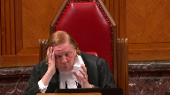
:::

It's the significance of the documents.

I mean, 100 pages carefully drawn is worth more than 10,000 pages of scattered and undirected information.

So saying there's a large volume of materials, maybe it'll impress some people, but what its content is and whether it addresses effectively the criteria, it meets the requirements, I think that's really what's important.

**Speaker 1** (00:07:21): Yes thank you Justice Roe and we we agree we say that that the the evidence here was demonstrated both qualitatively and quantitatively that although Beaver Lake had funds that in theory could be legally diverted to the litigation that the case management judge was on solid ground in finding that they were needed for the community to meet its basic needs and and there was extensive evidence and

::: {.column-margin}

:::

and we complied with the with the request from the respondents to produce to produce an extensive amount of records and evidence and every single expenditure that the that the ban made was carefully scrutinized and examined and

and but we say that just to know that the case management judge had before her because there is a question about whether or not the evidence was sufficient here that she did have before her ample qualitative and quantitative evidence demonstrating how the nation was an incredibly impoverished community and how it was using the funds to address that uh that poverty and we point out that of course in Little Sisters uh at paragraph 49 her analysis the trial judge's analysis on advanced costs doesn't involve inherently factual

and it is inherently a discretionary inquiry it's an exercise of the equitable jurisdiction of the court it's generally insulated from a pallet review and can only be set aside if it's based on an error in principle or is plainly wrong now the court of appeal overturned her order because it does

**Justice Rowe** (00:08:52): Is that accurate, because as I read Little Sisters and Okanagan, the test was formulated as a three-part test, only one component of which is at issue in this case.

::: {.column-margin}
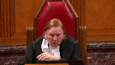
:::

And if, as a matter of law, the three components of the test are met, then that gives rise to a discretion.

But the discretion does not arise until the components of the test are met.

And therefore, I think it, I don't read it as saying, well, the whole decision is discretionary in its nature, and therefore, unless there's an error in principle, that's the relevant standard of review.

A legal test is Hausen and Nicolaiason.

The exercise of discretion, it's a different formulation, which I think you've accurately described.

But I guess what I'm saying is when I read the jurisprudence, I see two steps, each of which, oddly enough, but in this circumstance, gives rise to a different standard of review.

**Speaker 1** (00:10:03): Yes thank you Justice Roe and we agree that those conditions are absolute conditions.

::: {.column-margin}

:::

The court has been very clear that this is a very narrow jurisdiction that the court has and that there are onerous and demanding conditions that must be met before the court can exercise ultimately its ultimate discretion about whether this case is sufficiently special enough that it merits the award of advanced cost.

However within understanding and pecuniosity there is going to be an inherently factual analysis that the case management judge is going to have to undertake that involves balancing a number of different factors and the case management judge as directed by the court in Okanagan and Little Sisters is entitled to consider all relevant factors.

And so we say within that balancing that she's doing within the context of the pecuniosity test provided she meets the legal threshold of necessity that is still a mixed question of fact and law

and so it is um one that still requires deference to her

but we do agree that there is an absolute condition and that when she's undertaking that and I say she the case management judge here is undertaking that analysis that she has to be convinced that Beaver Lake meets that threshold of necessity which is defined by basic needs.

So that is are there is available funds that in her in

and when she talks about available funds it's also important to note that she's referring to funds that are unrestricted that is they could be legally diverted to the litigation but that has to be weighed against Beaver Lakes pressing needs um is is a word that's used by Okanagan pressing needs is a word that's used by um Keewayton and uh and in in um in the case management judges or basic needs pressing needs basic needs the threshold is necessity it's defined by basic needs and and the case management judge has to be satisfied that the available funds are required in order to satisfy those basic needs and really we say that that's what the court of appeal failed to do that the court of appeal said because Beaver Lake has some funds um beyond government funding that it cannot be impecunious and it really just looked at one side of the story here it then went on to characterize Beaver Lakes choices as it described them for the for the available funds which again are the legally the funds that could be legally diverted to the litigation as simply discretionary policy choices and as opposed to them being used for basic needs and it did this largely on an erroneous conclusion that there was no evidence demonstrating that government funding is or will be insufficient to meet Beaver Lakes needs and that's at paragraph 29 and as I'll show that's simply not correct the evidence amply demonstrated that Beaver Lake has substantial deficits in basic needs and that supported the case management judges finding that Beaver Lake cannot finance the litigation at the rate required without compromising its basic needs and not only we say that the court of appeal have no basis to interfere with the case management judge decision but the court of appeals application of the Okanagan test was fundamentally flawed in that it did not undertake the contextual analysis required by the test to properly determine if in fact Beaver Lake genuinely could not afford the litigation and I'd like to just move in my submission.

**Justice Côté** (00:13:31): I want to ask you, is there anything in the evidence, not 1,000 pages, but was there anything presented into the evidence to say here is our strategic plan for the basic needs we are planning to, the money we want to spend on our basic needs for the next three years, for instance, at the time of the hearing before the case management judge?

::: {.column-margin}
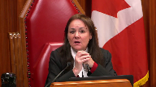
:::

**Speaker 1** (00:13:57): Right thank you Justice Cote.

::: {.column-margin}

:::

The strategy of the nation which was shown in the evidence and which the band manager and the chief and others spoke to is to pay for the cost to operate their programs and what we see here and I'm going to take you through the funds to really explain the sort of complicated analysis actually that the that the nation has to go through to find out how are they going to just fund their programs because the evidence showed that the federal funding is not enough that the that the nation must supplement or subsidize those programs with its own money in fact it draws down on its capital it takes money from its capital at Ottawa to cover the shortfalls and it does this in in on in an ongoing way because it's chronically underfunded in its programs now its strategy was that when it receives and this is a very recent recent uh financial revenue source for the nation but when it started to receive this money in the form of IBAs and I'm going to I'm going to explain how this works for the nation but when it started to receive it the strategy it had is that we are going to invest this so we can have secure revenue to get out of this chronic shortfall that we're in where we have to draw down our capital because our capital is being depleted it will soon be emptied and we will have no money to subsidize these programs that the community desperately needs so their plan is operational it's to make sure that they have the revenue source that they need to subsidize these programs.

**Speaker 2** (00:15:33): And I'd like to, in a lot of writing...

**Justice Côté** (00:15:35): I'm not sure if I can answer your question.

::: {.column-margin}
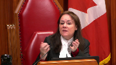
:::

I'm not sure if I can answer your question, Ms. Brooks.

I tried to find in the evidence because this is one of the requirement in coming from Okanagan and Little Sisters.

Somebody was going through a litigation like the one here asked to look at other options to finance the litigation.

So I tried to find something into the evidence regarding the Chinese doing third-party funding litigation.

Is there anything in the evidence regarding that?

**Speaker 1** (00:16:08): Yes thank you Justice Cote.

::: {.column-margin}

:::

The evidence actually there was a lot of evidence on the efforts that the band had made to secure other funding sources and initially when the band first first filed this action in 2008 it actually it sought pro bono council and there was actually pro bono council from England who offered to do this case on a pro bono basis that was opposed by the crown and ultimately an application was made and and that council didn't have a right of audience the nation then went out and sought the assistance of a of a organization called Raven and and Raven formed as a result of the efforts that it was making on behalf of Beaver Lake to search out every single potential third-party funding source it could.

Beaver Lake's case actually because because of Raven's effort it was able to secure some funding from a cooperative bank in England then the case itself then took had a had a sort of strong international interest and presence and Beaver Lake was able to secure through grants through private donors through a whole range of different platforms that it used to try to get third-party funding sources was able to secure 1.3 million dollars ultimately over the course of this litigation.

Now the evidence from the the folks that were responsible for helping Beaver Lake search out and identify and find potential money for this litigation gave evidence that those efforts are are waning because there is donor fatigue and folks just aren't prepared to continue to to contribute to the litigation.

**Justice Brown** (00:17:48): Can I ask you something about the raven funding because I couldn't kind of nail this down from my review of the record.

::: {.column-margin}

:::

I can't tell whether that 1.3 million was available at the time of justice brown making her order.

And of course the reason for that is it doesn't appear in the financial statements because it went to your firm directly.

So it would be helpful for me to know whether you're holding on to the funds for a later date in which case those funds are available to finance this litigation or whether it had already been spent in which case it's not available.

**Overlapping speakers** (00:18:27): But that's a...

**Justice Brown** (00:18:28): that's also by the way the kind of thing that it would have been good to have on the record before Justice Brown so she would know that as well.

**Speaker 1** (00:18:34): Thank you, Justice Brown.

It actually was on the record and it's also enclosed in our condensed brief at tab 15.

**Overlapping speakers** (00:18:41): Okay.

**Speaker 1** (00:18:41): where the funds that have been provided by Raven and the funds that Beaver Lake has put towards the litigation are accounted for year by year.

::: {.column-margin}

:::

They're not funds that it got as a lump sum and we're holding in trust.

The nation had to approve the expenditure.

**Overlapping speakers** (00:19:02): They have been spent by the time of the hearing?

Yes, they were spent.

So they were unavailable, there was nothing left?

There was nothing left.

**Speaker 1** (00:19:14): They're spent.

::: {.column-margin}

:::

Raven did, and this is in the evidence, did push when Beaver Lake realized that after 12 years or at that point 10 years of trying to push this litigation ahead with the limited resources that it did have, and it was very clear that it was just unable to keep pushing this litigation forward at the rate that is required.

This is a case about cumulative effects.

It is a case that's going to require elder evidence.

These are things that as time goes on, the evidence becomes is no longer available, and the cumulative effects and the erosion of its rights worsen.

So Beaver Lake in looking at the contribution that it was trying to make to push this ahead, recognizing it just couldn't sustain the litigation, and Raven then made one last push to help assist Beaver Lake in bringing this application forward.

But the short answer, and I'm sorry I didn't start with that, is no, the funds, there is no Raven funds that can be used to continue to finance this litigation right now.

**Justice Côté** (00:20:20): I think it's a good question.

::: {.column-margin}
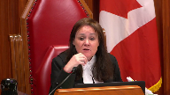
:::

judge in paragraph 58 of the reasons said that there could be there is a

she says I understand that low interest loans may be available through First Nation's finance authority.

I think it's a good question.

**Speaker 1** (00:20:41): So those loans are not for funding litigation.

::: {.column-margin}

:::

They have to be directed toward community, certain community development purposes.

And in terms of the, you know, she does note there, she says there may be collateral, but that has to be weighed against her other finding that in fact the collateral she's referring to is illiquid.

And my friends made an argument before her that Beaver Lake is a partner in a limited partnership with six other First Nations.

It's an oil field service company and they provide employment for the First Nations that are members.

And so there was some suggestion that that could be used as collateral for a loan, but she then actually found that that is illiquid.

They can't sell their interest in it because you can only sell it to another First Nation and there's no monetary value to the First Nations.

They just want to be part of it so their members can have jobs.

So the loan is not a realistic option for the nation.

There's also evidence from the nation about them being able to assume a loan of $5 million and how that level of debt would be unsustainable for the nation.

So I did want to focus on, because this case does raise the question about, or at least the case management or the Court of Appeal said that there was not any evidence that the government funding was not sufficient and assume that because there is government funding that any of the other funds that were identified could then be reallocated to the litigation.

What I would like to do just by way of roadmap and in terms of addressing that is talk about the key findings that she made that are supported by the record and that enabled her to find that the funds will theoretically are available, were being used or needed to support Beaver Lake's basic needs.

And so I'd like to address them if I can in this sequence because they do interrelate to each other.

But first her finding of undeniable poverty and the pressing need to reduce its devastating effects on the community.

Second, her findings of the sources of revenue for Beaver Lake to meet the basic needs of its community.

Third, the Ottawa Trust, it's also referred to as the IOGC and to show how although theoretically available, she properly determined they're needed for operational shortfalls.

And then I'll address the Heritage Trust and finally the IAIR account.

And then I will address the settlement money and the order itself.

And in walking you through or taking you through these key findings that are supported by the record, my hope is just to show you that her conclusion that Beaver Lake was impecunious was based on a deep appreciation of the reality of Beaver Lake's poverty and the real complexities that Beaver Lake faces in trying to meet the challenges that are posed by this poverty.

And ultimately I'll argue that there can't be any real serious argument that the so-called available funds are enough to address these desperate shortfalls that the nation has for its basic needs.

And when you see the depth of its needs, it's obvious that even if they emptied all of their accounts, which they cannot do, their basic needs still would not be met.

And in the end, this is really a complaint by the Crown about how the nation is using its funds to address its needs.

And that ultimately it's not using its funds faster to address the need.

And may I ask you-

But there are-

**Justice Martin** (00:24:25): Thank you.

::: {.column-margin}
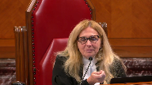
:::

When you're going through those findings, at some point, I don't know whether it's now, I'd like you to address what the Court of Appeal said when they took the position that the pressing social needs of the nation have never been identified or costed.

And I'd like your response to that.

**Speaker 1** (00:24:50): Thank you Justice Martin and I will address that now so she did make these two key findings that Beaver Lake in paragraphs 30 and 60 that Beaver Lake is undeniably impoverished with substantial deficits in housing infrastructure with high levels of unemployment and social assistance and said these are all pressing needs which demand solutions and then of course she also said at paragraph 60 which is the one line that the Court of Appeal selects that the band had many pressing infrastructural and social needs but it's important to note and Justice Martin this addresses your question that although dealt briefly in her reasons there is a very lived reality and a lot of pain behind these words and there's a very very real and human experience of the deep structural poverty that was heartbreakingly described in the affidavits by the members by elders by youth and members of the administration team and we do set these out in our pair the consequences of this of this grinding poverty for this nation is set out in our factum but because the funds that I want to take you to can only really be understood against the backdrop of these pressing demands I'll just very briefly before you get in

::: {.column-margin}

:::

**Justice Rowe** (00:26:07): to that.

::: {.column-margin}

:::

I mean you've painted a picture, it seems to me, of profound structural problems and what is being put forward is an ad hoc solution to deal with some of the consequences of that.

But when you take the proposed ad hoc solution and you apply it to the hundreds of indigenous communities across the country who might have various claims of a meritorious nature, you end up coming up with a systemic solution which is administered by the courts but in the guise of an ad hoc or exceptional arrangement.

And I just have this sense when I was reading Little Sisters that the court said we don't want to go there.

That's not our role.

If someone is to fulfill that role, that's a governmental role.

And yet we're being asked to embark upon the pathway that the court said should be avoided.

**Speaker 1** (00:27:23): Thank you Justice Roe and I and we don't I don't agree with that.

::: {.column-margin}

:::

I understand the court's concern about maintaining the very narrow jurisdiction that it has over these cases to award these exceptional orders and I think it's an Okanagan does set the parameters for how that jurisdiction needs to be exercised and those conditions are very onerous and impecuniosity is one of them and and there are others obviously the case has to be exceptional and special enough

and we saw Little Sisters did not succeed because it did not meet that exceptionality requirement and the requirement of of of special uh special enough cases and that's the legal answer to that question this is really about in assessing impecuniosity taking a realistic approach to what a basic needs means for First Nation government.

Now there may or may not be other First Nations that um that qualify for for advanced costs because they meet the impecuniosity test but we would caution the court to avoid um not taking a realistic approach because of a concern that there are First Nations who live in poverty um and and the reality is that that's a function of our history in this country and that the court still must apply this test in a way that's realistic to the applicant when the applicant uh and the applicant has to prove it this is not about some generalized poverty case this is about proving that the funds if there are funds that could potentially theoretically be diverted to the litigation they must be used to satisfy the the threshold of necessity to satisfy the basic needs and in this particular community and I do just want to spend a few a few minutes just if I could just describing a bit of the of the complexities and I appreciate the court may

**Justice Brown** (00:29:23): And I don't want to stop you from doing that, but I just want to pull you back to Justice Martin's question.

It's not one you have to answer now because it contemplated as you go through these sort of funds and and and and and and and and and and and and and and and and and and and and

**Overlapping speakers** (00:29:37): and through the.

**Justice Brown** (00:29:38): identification of the basic needs.

::: {.column-margin}
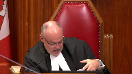
:::

She also asked you to address the court of appeals concern that these needs haven't been not just identified but costed.

I'll be straight with you.

The difficulty that I have is I think everyone agrees in fact I think Mr. Siebert agreed in questioning that the financial statements don't reflect those needs or future needs or the cost for them

and so it's I guess

**Overlapping speakers** (00:30:12): I want

**Justice Brown** (00:30:13): to signal to you that it's not just enough to say they have these needs.

We have to know that the funds that are available or the chambers judge had to know that the funds that are available weren't sufficient to meet those needs.

**Speaker 1** (00:30:31): Thank you Justice Brown and

::: {.column-margin}

:::

and yes I will get I will address that now I'm going to talk about the the record as it supported her findings in that respect and and while I do that I'll also refer to the cost of these things and also ask that the court keep in mind too that the level of of this isn't to avoid scrutiny of the cost but just the obligations that that might impose on a First Nation to cost out their poverty for an advanced cost order

but I'll address that as I move through this

but I want to just describe a little bit about what is on the record before her because the evidence we say is so overwhelming for this nation that they're if they were to spend every penny that was available that there they couldn't meet their basic needs and the and the and the conditions in describing the conditions that the community faces members described first and foremost the hardship on them of not being able to access the lands and resources that they need to sustain their culture and their livelihood as promised by the treaty and this is critical because this shows the sort of complexity that Beaver Lake faces here because the members are saying we can't go out and and and harvest and hunt and trap and fish in the way we could as promised by the treaty and as before and that's what gives rise to the litigation

but it's also what gives rise to this dependence that the members have on these ban programs because as one elder put it aside from being this being who we are people would starve here were it not for the country food members described how they have limited employment opportunities the band manager said that 70 percent of members don't have enough work training opportunities are extremely limited members described how families live off of 400 a month almost half the nation has to access an emergency loan program that's offered by the band and these personal deficits increase the obligations that the band that the Beaver Lake leadership have to provide for these basic necessities that are provided through the programs that it has to subsidize and members talked about for example living in overcrowded houses there's just simply not enough homes there's over 50 families wait-listed and the most of the existing houses are falling apart a majority of them require serious uh repairs to remedy deficiencies like mold cracking foundations exposed electrical systems the band said it's a year behind from members for housing maintenance 20 houses require immediate repairs and at the time of the application eight homes had failed the health and safety standards and need to be replaced now there's evidence that a home cost 200 000 on this reserve so that alone just replacing that eight those eight homes that are currently failing for health and safety is 1.6 million access to clean water is an issue the government gave Beaver Lakes water quality a failing grade for many people they get their water by truck because they don't have access to the pipe system and at the time of the hearing that truck broke unexpectedly and the nation had to get its capital money they had to request ministerial permission to get money to fix that to got that cost there was evidence about the sewage lagoon was overflowing canada only very recently agreed to provide the funds and that's costing up to eight million so it demonstrates the scope of the cost involved in fixing these types of deficits another important um and another i'm almost through this but another important need for the band is they want to provide high school for their students they want to provide advanced language program they'd love to have a cree immersion program and that's very stressful for the high school the students that have to leave the reserve to go off reserve to go to their high school they don't have the financial capacity to do that there's there the school itself is 38 years old it needs more repairs pairs and students for replacement and justice brown on your cost to estimate the cost of the school the government the canada said it'll cost a hundred thousand dollars to perform a feasibility study that's the type of cost then that the court of appeal would have the nation incur in order to bring forward um costing out its needs the health care center is over capacity it needs expanded it needs to be maintained there's a long list of services that the band can't find that are desperately needed including relating to fetal alcohol syndrome disorder elderly home care culturally appropriate preventive care almost all of the afians spoke of the mental health crisis faced by the nation and the devastation of this crisis is profoundly tragic in the two to three years before the application the community saw six of its people die five of them were youth no cost can be easily calculated to address that state of emergency and really this is just a high level summary of some of the deep deficits that are faced what we heard is from elder al layman who was the former chief for 34 years and he started this action he's now 78 he may not uh see its its conclusion he explained the connection and i think this is important to appreciate this the suffering that's experienced by their community and he described it in this way he said the biggest change happened with the loss of our freedom and sovereignty from the changes to the land we depend on the land if the land is sick we become ill too in my lifetime we went from being a place of being able to take care of ourselves and our families by relying on the land to having to rely on government programs which don't and can't meet our needs it was because of this hurt and loss that many of our people turn to alcohol which made things even worse for our families here the changes to our land are forcing our assimilation it's against our will and this has had a significant impact on our culture and the well-being of our community

so it's this type of evidence that was before the case management judge and it led her to find as she did in those two paragraphs that beaver lake was in undeniable poverty and this is a very tangled web of poverty that is difficult to to to escape it requires very complex um solutions this

but this and as justice roe has pointed out um but they are just in crisis management here this is a band that doesn't have the resources to address these complex solutions um and despite this record the court of appeals interfered with her assessed the case management judge assessment that beaver lake could not both finance the litigation and meet its basic needs in large measure because it presumed the adequacy of government funding and and so with respect i have to say that that is just not correct the actual evidence of beaver lake's basic needs is that they were not met even with the government's chosen level of funding uh and that was just overwhelmed overwhelming that this nation is facing day-to-day crisis management we did produce we did say in our factum that there that this should not be surprising we're not asking for a presumption at all from this court that government funding is inadequate we are just saying it wasn't an appropriate presumption for the court of appeal to make and in fact in making that type of presumption

um it really it has as another significant risk which is risking equating government funding choices as a proxy for indigenous needs and that's to say that the very then lived and real experiences of indigenous communities are simply what the government says they are as expressed through its budget decisions and we say that despite all of what we've learned about the history of governmental decisions about indigenous people needs that they've done to this community that that is just that is just inappropriate uh and but but more so is just the evidence in this case and that's really the key is that the evidence in this case showed that that funding was not adequate to meet the basic needs

**Justice Jamal** (00:38:44): I'm going to turn it back over to you, Mr. Brooks.

::: {.column-margin}

:::

Would it be fair to say that your position is that the approach to impuniosity in the first element of Okanagan is intrinsically normative?

It's not an accounting exercise.

It's a normative exercise, and that's already reflected in the words, genuinely cannot afford to pay for the litigation, no other realistic option.

So it is a normative exercise.

It's whether they should be required to spend the money on other priorities or not.

I think what the Court of Appeal did is, when it said an applicant that has funds but prefers to spend them on other priorities is not impunious, is really engaging in accounting rather than a normative way of summarizing your position.

**Speaker 1** (00:39:27): Yes, Justice Jamal, that is right and that the Court of Appeal in talking about Beaver Lakes needs as preferences or we see that language in the respondents affidavit too really doesn't appreciate that in fact Beaver Lakes choices were directed to its basic needs and the only reason why the Court of Appeal was able to find that they weren't is because of this presumption around federal funding and so this is does require looking at more than just bookkeeping entries it requires a contextual analysis that's what Okanagan contemplates and that's what we say the the case management here was doing now in just a detail.

::: {.column-margin}

:::

**Justice Kasirer** (00:40:14): Sorry to interrupt you, but just to follow up on Justice Jamal's question, and in fairness to the Court of Appeal, there was a disagreement as to what funds were available to meet the needs, what funds were restricted or unrestricted.

::: {.column-margin}
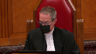
:::

I mean, the obvious example is some of the funds in trust, in particular the Heritage Trust, the Court of Appeal took the view that from an accounting point of view, and I suppose also from a normative point of view, a litigant can't voluntarily tie up assets in a trust and then claim in pecuniosity.

So there really is a debate that involves looking at what is available to meet those needs.

There's a debate as to what those needs are, but did the Court of Appeal get that wrong too?

**Speaker 1** (00:41:14): Yes, thank you, Justice.

::: {.column-margin}

:::

The answer to that is it depends, and in this case, the evidence before her was, and this goes also to Justice Cote's point about the strategy that the nation had, the evidence before her was that the monies that were being deposited into the Heritage Trust, which come from these IBA agreements, and I just want to pause on that because that is also important for how these funds are generated, because the IBA agreements are negotiated with companies after Beaver Lake has established that there's been adverse effects by the proposed development.

So then it enters into agreements, if the company is willing, and they really do have the power in this relationship unless Beaver Lake opposes the project, but they enter into these agreements.

The negotiations that support those agreements are with the IAIR department funds.

So this is why I'm saying there's a bit of a complex mix here of how these funds work together, and I'll just explain it for you.

I was going to move through it in sequence, so pardon me if I jump around for a moment here.

But let me just talk about the three funds.

So there's the Ottawa Trust, there's the Heritage Trust, and there's the IAIR.

And the case management judge identified the Ottawa and the IAIR as, we say, theoretically available because there was no legal restrictions for diverting those funds.

She found that the Heritage Trust was restricted.

**Justice Brown** (00:42:50): Just out of clarification when you're referring to the Ottawa Trust is that the Indian Oil and Gas Canada Trust?

Yes, okay.

Thank you.

We call it you're right. She

Yeah, just a terminology.

Thank you.

**Speaker 1** (00:43:03): Yes, thanks.

::: {.column-margin}

:::

So the IBAs that hold the money that comes from the IBAs that then gets deposited into the Heritage Trust, which is new, it was four years old, have restrictions on them because the companies for all sorts of reasons say that the money has to be used for specific purposes, it can't for example be paid to individuals or to staff or to chief and council, the companies would want to avoid any perception that they were potentially buying off folks.

But in any event, the monies have to be used for community development purposes.

So there is that restriction themselves.

Now it is the case that the Court of Appeal says, well can you move money around?

Can you move that money somewhere else and free up other money to then be used for litigation?

And fair enough.

But here the answer to that is no.

Beaver Lake can't because what Beaver Lake is doing is it's using the money from the IOGC, the Ottawa Trust, very heavily using money from that to subsidize the programs.

And we see that and it is in our chart, it is in our outline.

**Justice Rowe** (00:44:14): is that, as a matter of policy, the banned government has decided to commit these funds in a certain way, and that in furtherance of that policy, they have a self-imposed set of restrictions on its use.

::: {.column-margin}
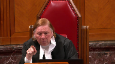
:::

Now, I think it's a little difficult for me to accept that you see, this is beyond their reach.

But it's beyond their reach because they put it beyond their reach.

And I'm not saying there's anything wrong with that.

I understand entirely the idea of, the concept of a heritage fund, I think is a very good idea.

But it is a choice by the banned to confine the use of the monies to certain purposes as opposed to being available for the purposes of litigation.

And it's sort of, I find it difficult, you seem to be saying, well, they don't really have any choice.

Yes, that may be so because they've already made the choice.

So it's not as if there were funds which were within the control, say, of the national government and they were only permitted to draw them down for a purpose established under the Indian Act, right?

Well, you could say, well, our hands are tied.

The federal government has done this to us.

So I'm not taking issue with your factual statement.

I'm just saying that personally I see it in a certain context, and that is, for legitimate reasons, the ban is directing funds to purpose A.

The consequence is they're not available for purpose B, which is the litigation.

**Speaker 1** (00:46:11): Right thank you Justice Roe and certainly that is uh squarely raised by by the Court of Appeal and that's the Court of Appeal's concern but what the Court of Appeal is missing we say with respect is that the it's not a policy choice for the purpose of this test if the choice is directed to a basic need because at the end everything is is technically a policy choice and even the government's decision about how much money they're going to give Beaver Lake or what needs they're going to address and at what level and the risk is assuming that that is somehow an objective measure and anything else that Beaver Lake's doing amounts to a policy choice so we say that the description of a policy choice here is not entirely helpful the the the the question that the that the chambers judge has to answer is are these funds directed to a basic need do they meet the necessary threshold of necessity and we say that they do and again it does require understanding how the Beaver Lakes funds interact with each other

::: {.column-margin}

:::

and so I'll so just again to elaborate that on the on the Ottawa Trust um account um this is capital and it's and

and so this is a capital it does have a revenue that's generated from the interest

but this is capital that the nation is taking out on a regular basis to subsidize programs and it needs ministerial approval so because it is such a serious thing to take from your capital to subsidize day-to-day operations they're not even spending it on capital expenditures they're spending it to operationalize their ban programs and there is a very rigorous statutory process that they have to do to access this capital it's all laid out in the Indian Act in section 64 they have to they have to have a community vote the community has to they have to put forward we need this capital for salaries for urgent infrastructure repairs our truck broke down we need to pay it the community has to vote on it the leadership has to has to then prepare BCR the BCR gets submitted and then the minister has to determine based on its own it has a manual about the guiding principles that it uses to assess whether or not that expenditure is in fact in the best interest of the band

and then it approves it so all of the withdrawals that Beaver Lake has been taking from its operational account or sorry from its Ottawa account to operationalize its band costs for these programs have been approved by the minister

and I just I just point that out because I think that that approval process also speaks to the legitimacy of these these expenditures and that capital count is declining they and it just demonstrates Beaver Lake doesn't want to use its capital to pay for its operations and that gives rise to the heritage trust and so what the case management judges faced with is the question of justice for what you're saying is are they arbitrarily tying this money up is it for some frivolous purpose are they saving it to buy to put in a swimming pool no no

**Justice Rowe** (00:49:15): I know I did not say that.

::: {.column-margin}
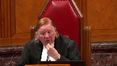
:::

Please do not say I suggested that they were using them for a frivolous purpose.

These are all serious purposes.

They're all legitimate concerns.

I'm just saying that there's a difference between saying, this money is fully beyond our reach because of some arrangement, perhaps under the Indian Act.

So some of the funds may be tied up and beyond their ability to access, and others where, as a matter of choice, it's a legitimate choice.

It's a choice that it's open to the man to make.

I'm not questioning that.

But the consequence is that it's therefore not available.

And I didn't say anything about swimming pools or anything else.

**Justice Côté** (00:49:56): Thank you very much for your time.

::: {.column-margin}
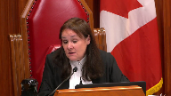
:::

I have a question for you because I see the time is going.

I have two questions for you regarding the terms of the award.

First of all, I would like to know how this amount, these amounts, 300,000 for Canada, 300,000 from Alberta, 300,000 for Australia, 300,000 for Canada, 300,000 for Australia, 300,000 for Canada, 300,000 for Australia, 300,000 for Australia, 300,000 for Canada, 300,000 for Australia, 300,000 for Australia, 300,000 for Canada, 300,000 for Australia, 300,000 for Canada, 300,000 for Canada, 300,000 for Australia, 300,000 for Canada, 300,000 for Canada, 300,000 for Canada, 300,000 for Canada, 300,000 for Canada, 300,000 for Canada, 300,000 for Canada, 300,000 for Canada, 300,000 for Canada, 300,000 for Canada, 300,000 for Canada, 300,000 for Canada, 300,000 for Canada, 300,000 for Canada, 300,000 for Canada, 300,000 for Canada, 300,000 for Canada, 300,000 for Canada, 300,000 for Canada, 300,000 for Canada, 300,000 for Canada, 300,000 for Canada, 300,000 for Canada, 300,000 for Canada, 300,000 for Canada, 300,000 for Canada, 300,000 for Canada, 300,000 for Canada, 300,000 for Canada, 300,000 for Canada, 300,000 for Canada, 300,000 for Canada, 300,000 for Canada, 300,000 for Canada, 300,000 for Canada, 300,000 for Canada, 300,000 for Canada, 300,000 for Canada, 300,000 for Canada, 300,000 for Canada, 300,000 for Canada, 300,000 for Canada, 300,000 for Canada, 300,000 for Canada, 300,000 for Canada, 300,000 for Canada, 300,000 for Canada, 300,000 for Canada, 300,000 for Canada, 300,000 for Canada, 300,000 for Canada, 300,000 for

**Speaker 1** (00:50:50): Thank you Justice Cote and there are a range of ways in which these orders get structured they obviously have to be sensitive to the particular case in mind.

::: {.column-margin}

:::

There's um you know the just to answer that quick the Chicolton case obviously with the Aboriginal title case where there the what we see there is it is open-ended recognizing the complexities uh that the case involves is going to have to be revisited and in fact the award was revisited on multiple times there's multiple cost decisions relating to that war because the case management judge retains ongoing strict supervision over how the how the litigation is progressing and so and that is all done through a cost administration order which here is we haven't got to that yet.

She ordered one be discussed between the parties and that has not yet happened so all of the structure and the oversight is going to be in that cost administration order so the structure complaints we say are premature because that's coming now the quantum she

she no one disputes this case is going to be at least five million and in fact Canada has submitted on on several occasions that it will far exceed that and that is the basis for their concern that there is not a cap on the award but really that makes we say a stronger case first of all for Beaver Lakes impecuniosity that the cost could far exceed that amount

but secondly we now have a trial date it's two and a half years away

and so if the if the if the case which we say five million dollars is a reasonable assessment of what this case is going to cost it that there is a trial date there is an end date in mind and Beaver Lake wants this case heard it does not want this case to drag on it's Canada that stood up at the leave application and told the court it was 12 years away from trial which puts this case 30 years out from the date it's filed Beaver Lake wants a trial it wants to get it heard if the complex case plan that that sets out the schedule for that if this case is properly resourced is manageable is doable so there is a timeline that's being sent it will cost and it's important to keep in mind in imposing a 300 000 cap that that is the bare minimum and it caps the public exposure whereas Beaver Lake is bears all the financial risk just just assuming that the case is five million to be heard over the next three or four years that's 3.5 million a year for this case to to be properly resourced it leaves all the exposure to Beaver Lake and the crowns is capped they never have to pay more than 300 000 a year over the next three to four years when this case resolves whereas Beaver Lake is potentially going to have to come up with 900 000 to create the shortfall so the financial risk is on Beaver Lake she capped the public exposure we say appropriately but ultimately if this court finds that there did need to be more controls then the remedy is not to vacate the order but to send it back with the appropriate direction to to provide the appropriate structure and I did I don't want to close without talking about the IAR fund if I could

**Justice Moldaver** (00:54:04): Just before you go there, I apologize.

::: {.column-margin}
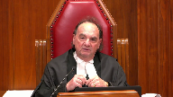
:::

I know your time is limited, but are you able to give us a definition, a proposed definition of impecuniosity or that is perhaps different than what has been suggested in the cases like little sisters and so on?

I mean, because the way I'm hearing you is right now, the bans are beginning, the ban in question has been given a choice.

It's kind of a Hobbesian choice.

Continue to live in a subsistent way and the most, you know, under terrible conditions or spend the money on the litigation.

Now, you know, do you have to get to the point where you say people are starving or what?

Can you give us your definition of what impecuniosity should mean in these circumstances, please?

**Speaker 1** (00:55:03): Yes thank you um Justice Moldaver and the the test we say does not require destitution and and and the Court of Appeal agrees with that

::: {.column-margin}

:::

but we say that what the Court of Appeal does is going to require destitution and she recognized that because the case management judge expressly said she is not prepared to force the nation to either bring the case forward or force it into destitution so the test though is as it says in Okanagan we do not think it needs to be changed and it's the genuine afford can the applicant cannot genuinely afford the litigation and no other realistic option exists for bringing the issue to trial

but then what the test requires the the Chamber's judge to do is to determine whether if there is funds that could be legally available to be put to the litigation whether the use of those funds meets the threshold of necessity and necessity is defined by basic needs and basic needs to and again we could drill down on more and more definitions but the case management judge defines actually gives us a sense of what basic needs are when she says um that the that it's anything uh that other citizens would would take for granted clean water adequate housing all of the things that we see Beaver Lake suffering from and deficient from and in the in the remaining six minutes of my time subject of course to questions I just wanted to say about the IAR fund it does she says it's 1.4 million it is important to know this isn't a savings account this is an account that is used daily by the nation to support consultation this the funds that go in here are support consultation activities this fund is depleted almost every year sometimes in a deficit as it was in 2018 it's the consultation activities that we say have a constitutional imperative to them and that by the court of appeal again without looking behind the funds and what they're used for has essentially forced the nation now to choose between consultation which this court has has very clearly said that has a legal and constitutional duty to it and that then the first nation must participate in order for the crown to discharge its honorable obligations but the but the court of appeal by failing to recognize that is forcing the nation into a further unjust choice of having to say use your consultation money now for um for uh for the litigation and the nation does use this book's location money yes

**Justice Karakatsanis** (00:57:31): I'm sorry, I understand that point.

::: {.column-margin}

:::

I just want to come back to the issue of basic needs, because you said it says anything that other citizens would take for granted.

Is that a sufficient definition?

I'm just thinking in the context of some of the evidence about cultural survival, for example.

I just want you to help give us some more assistance on how you think we should be thinking of basic needs in this context.

**Speaker 1** (00:58:01): Thank you and yes basic needs of course is it will vary depending on who the applicant is and here we do have a First Nation government providing for its members in a context which we know the history in which these communities have formed and the conditions in which they live under so yes basic needs has to be contextualized based on who the applicant is and for a First Nation that will include other things that are basic and core to their functioning as a First Nation government seeking to maintain its community as a distinct cultural community and here just you know just as your point was timely in that the consultation for example for an Indigenous government is a basic need

::: {.column-margin}

:::

and so you can't just say to the First Nation don't consult that's a basic need that's a fundamental basic need of any First Nation government and finally I do just want to comment on this nuance in the Court of Appeal and in the respondent submission on the cost and the rate required because they make a further change to the test by saying whether or not the Nation can continue to fund the litigation without any regard to the rate at which it's needed to actually get heard so in this case for example if the Nation continued to pay its $300,000 a year which formerly was supplemented by Raven as well it would take another 16 and a half years to get this to trial and so that has to be part of the Court's analysis too is that what is required in terms of getting this matter heard finally on the settlement money we fully acknowledge that these funds are relevant to the issue of advanced cost the question is by what process should they have been dealt with and

the fact that the Court of Appeal just added them to the funds again they're just looking at one side of the story and not the other side and those funds should have been revisited by the case management judge on a proper record that allowed the the expenses of the Nation and the needs and the costs that they have for those funds to be examined by her or the case management judge to determine whether or not those funds are being directed toward the toward the the test of basic needs.

**Justice Moldaver** (01:00:21): You were saying I think that the 2.97 was should have been balanced against the fact that the needs of the community were were far greater because of COVID and there were all kinds of problems relating to that and more expenditures and so on and this should have been dealt with in the context of evidence real live evidence before a trial judge I think that's your one of your concerns.

::: {.column-margin}
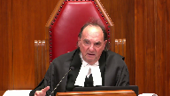
:::

**Speaker 1** (01:00:47): Yes that's exactly right the the Chief and the Band Manager filed and the Finance Manager filed evidence only because in the condensed time that that we had to manage the appeal that the um that the nation had further been in financial condition had worsened and that the IAR account was depleted as it always is for consultation and for other professional and legal fees as well um and that that that Ottawa Trust had been depleted to to under a million now so almost half of what it was.

::: {.column-margin}

:::

So finally um in but we do say the proper process was for that to be heard on a proper record before the case management judge and just in concluding then the treaty relationship is at the heart of reconciliation between Indigenous people and the Crown.

It is in the interest not only of Beaver Lake but also of the Crown and all Canadians to ensure that that relationship is upheld by reviewing whether the scale of industrial development and settlement in Beaver Lake's territory is constitutional.

The Respondent and the Court of Appeal talk a lot about choices but it's critical to remember that Beaver Lake did not make the choice to be in this situation.

Alberta and Canada have made the choice to permit extensive development of these lands which raises the profound legal issue at the heart of this case.

Beaver Lake would have preferred to have its lands left alone.

Beaver Lake did not choose to make this dispute expensive.

The courts have been clear that disputes like this must be resolved at trial on a full record.

The Respondents have argued unsuccessfully that the claim is so large, so unmanageable, so overwhelming, it raises too many complex issues to even be litigated to which the Court of Appeal replied that Beaver Lake is entitled to access to justice regardless of its scope.

I see my time is up.

Thank you very much.

Thank you.

Inaudible.

**Speaker 3** (01:02:40): Good morning, Chief Justice, Justices of the Supreme Court.

::: {.column-margin}

:::

Based on the factums filed by the parties, it appears that they are all in agreement that the question of advanced costs should be approached in a functional and contextual manner that takes into consideration the unique circumstances of a litigant.

The disagreement, however, stems around how to assess whether a party is impecunious under the test for advanced costs.

The Alberta Prison Justice Society intervenes in this appeal on that narrow question and proposes a detailed framework for the test to determine impecuniosity under the test for advanced costs.

It submits that the confusion between the parties and in the jurisprudence arises from Little Sisters, which introduced the absolute and categorical language of impossibility into the threshold of determining whether an applicant is impecunious.

This has led some courts to define impecuniosity to mean and be only satisfied when an applicant, quote, cannot meet the necessities of life and also fund the litigation, close quote.

This seems to imply a formalistic approach to determining impecuniosity that requires applicants to be completely destitute to access the mechanism.

That understanding seems to be at odds with policy objectives behind this cost mechanisms, which is to facilitate greater and more robust public interest litigation in Canada.

This narrow understanding of impecuniosity seems to undermine the express aims behind this mechanism.

And the Alberta Prison Justice Society proposes in its formulation of the approach to impecuniosity a principled framework to assess whether a party is impecunious or not.

And if the court can turn to tab A of our factum, we provide a concise overview of this framework, which I'll now review with the court for the balance of my submissions.

So the first step in determining impecuniosity is to determine the anticipated costs of the public interest ligand to prosecute this action to finality.

And at this stage of the framework, parties should tender a reasonable estimate for the legal fees and disbursements that will be incurred for a court to fairly decide the matter before it.

After this is determined, the court would then assess the financial means of an applicant to pay the estimated costs of litigation.

And this involves a normative determination of the financial capacity or the capacity of a litigant to fund the litigation.

And at the first stage of this analysis is a review of an applicant's expenditures, but also the prioritization of its spending and the rationale for that prioritization.

Then, based on the evidence of the applicant, situate the litigation among its spending priorities determined where exactly the litigation fits into the overall scheme of an applicant's spending priorities.

Afterwards, the court would determine if an applicant has any surplus financial resources after allocating funds to expenditures that are prioritized ahead of it.

Finally, at this stage, the court would establish if the applicant has other avenues to raise funds or can reallocate existing funds to the litigation.

And this can involve a determination if fundraising campaigns can be initiated, if parties can tap into the court challenges, funds, or other programs, or if funds can be reallocated from expenditures of lower priority to the litigation.

And the final step in the framework is determining whether an applicant can generally not afford to pay for litigation by balancing the budgeted item identified, or the balance of the budget identified at step one of the framework with the financial capacity of an applicant to pay for the litigation through the number determined at step two.

If there is no shortfall, then the applicant has not met the test for being impecunious and no advance cost order will issue.

But if there is insufficient funds to finance litigation in full or in part, then the applicant is determined impecunious to the extent of that deficiency and advance cost order will issue for that shortfall.

Those are my submissions today, pending any questions from the bench.

**Justice Wagner** (01:07:22): Thank you very much.

**Speaker 4** (01:07:29): Good morning, Chief Justice and Justices.

::: {.column-margin}

:::

On behalf of the Chiefs of Ontario, I wish to make only one key point today about how this court should consider the UN Declaration on the Rights of Indigenous Peoples in the development of the law of interim costs in order to further the promise of reconciliation contained in Section 35.

Reconciliation, as this court has reminded us time and time again, is the fundamental objective of the modern law of Aboriginal and treaty rights, a project in which this court has played a central role.

But what is it that requires reconciling?

This court has told us again.

It's the pre-existence of Aboriginal societies with the asserted sovereignty of the Crown.

What does the asserted sovereignty of the Crown mean in practical terms?

It means that among themselves, the federal and provincial Crowns have taken the exclusive constitutional jurisdiction to raise revenues through natural resource royalties and taxes.

As a result, the Crown has unmatched financial resources to spend on litigation.

The Crown takes all the revenue from all of its sources and decides how much it's going to spend on litigation and how much to give to First Nations.

But what of the other side of the reconciliation equation, the pre-existence of Aboriginal societies?

Often, the only way that Indigenous peoples can get recognition for their prior presence is through litigation.

By contrast to the Crown, Indigenous peoples do not have any constitutional authority to raise revenue, not even off the very lands where before the arrival of Europeans, they lived as their forebears had done for centuries.

This fundamental mismatch between the Crown and Indigenous peoples in the capacity to fund litigation is a systemic barrier to reconciliation.

It does not take abject poverty for a First Nation to be entirely outmatched by the overwhelming financial capacity of the Crown.

The fight is not set up to be fair.

And Justice Roe, as you were alluding to, the problem is systemic.

This brings us to the UN Declaration, which Parliament has recently affirmed as a universal human rights instrument with application in Canadian law.

Articles 8 and 39 taken together guarantee a robust system that provides effective mechanisms of redress to Indigenous peoples where their rights have been breached and for financial assistance from states in the seeking of that redress.

What they add up to is that Indigenous peoples have a right to financial assistance in an effective mechanism of redress.

What it supports in our submission is the establishment of a presumption in Section 35 litigation that the party seeking the interim cost order cannot afford to pay.

Now, I think I would expect you will hear from my friends that these UNDRIP obligations are only those of the legislature and not of the courts.

I have two points to make in response to that.

First is that Parliament has already spoken through the UNDRIP Act and has said that the declaration is a source for Canadian law.

And the second point is that Canadian law includes the common law, of which this court is the highest guardian and in which the advance cost order doctrine has sprung.

The common law has had a well-established tradition of using interim cost orders to address systemic barriers to access to justice.

The Okanagan test itself arose by analogy to the family law line of cases in which the courts recognized that matrimonial property and support rights often proved illusory for spouses without the means to enforce those rights by litigation.

The courts then imposed interim cost orders on the wealthier spouse so that the other spouse might be able to have their day in court.

Okanagan merely extended that principle to public law litigation, where parties seeking judicial recognition of their rights are opposed by extremely well-resourced governments.

What we propose is an extension of that principle to recognize that a relevant measure of impecuniousness is often the relative resources of opposing parties that they bring to litigation.

We should presume that the First Nation can't have as much money to pay for the litigation as the Crown because that's the way our Constitution is set up.

This change would also recognize this systemically uneven playing field between Indigenous peoples and governments and also recognizes that bringing an Okanagan application itself, as we've seen in this case, can be a barrier going through every single actual and potential funding source to prove that those funds are not available.

Thank you very much.

Thank you.

**Justice Wagner** (01:12:35): Thank you.

Cardi Fox.

**Speaker 5** (01:12:38): Good morning Chief Justice, Justices.

::: {.column-margin}

:::

The Assembly of Manitoba Chiefs proposes an approach to the impecuniosity branch of the advance cost test that interprets the First Nation applicant's evidence by considering the context and history of the Crown First Nations relationship in a manner that advances the principle of reconciliation.

As this court has confirmed in Calder, First Nations are the original inhabitants of what is now Canada.

First Nations lived within their own territories with their own governments and laws since time immemorial.

While the Assembly of Manitoba Chiefs rejects pan-Indigenous generalizations, this prior occupation has resulted in a nation-to-nation relationship between First Nations and the Crown that no other litigant possesses.

This relationship is solidified in many instances by treaties founded on agreement between nations for the advancement of a mutually beneficial and shared future.

Unfortunately, this nation-to-nation relationship has been dishonored to the advantage of the Crown and settler population and to the detriment of First Nations and their citizens.

For much of Canada's history, First Nations laws and culture were prohibited by the Crown's laws and policies and First Nations were excluded from seeking redress of their claims through the courts.

The legacy of colonization and unkept promises by the Crown provides critical context as to the unique access to justice challenges faced by First Nations and the actual ability of the First Nation to pay for litigation.

This context is important in determining whether a First Nation can genuinely afford litigation, including what constitutes discretionary spending versus what constitutes basic needs.

The purpose of the advanced cost test and the principle of reconciliation go hand in hand, as both are fundamentally concerned with addressing inequality.

As this Court has stated in Okanagan, the advanced cost test is concerned with access to justice and the desirability of mitigating severe inequality between the litigants.

The principle of reconciliation is similarly aimed at alleviating the tensions between sovereignties that have arisen out of the long-sorted history of colonization, a history that has resulted in the severe disparities that some First Nations face compared with other litigants.

Since this Court's decision in Okanagan, the principle of reconciliation has evolved and gained prominence in Canadian law.

It is not simply a guidepost of conduct but gives rise to substantive obligations.

It is now firmly established that the endeavor of reconciliation is a first principle of Aboriginal law and the grounding postulate of Canadian constitutional law.

A narrow interpretation of the advanced cost test, which considers the Crown-First Nation relationship only in the context of the public importance branch, does not advance the principle of reconciliation.

It does not assist with renewing, strengthening, or upholding the nation-to-nation or treaty relationship.

It does not mitigate the systemic equality suffered by First Nations.

The Assembly of Manitoba Chiefs submits that the Court should seek to uphold reconciliation where possible.

The Assembly of Manitoba Chiefs is not advocating for a preferential test for First Nations or diminishing the exceptional nature of the advanced cost test.

The same test for advanced cost would continue to apply.

First Nations would need to prove that they have a meritorious case, that it is in the public interest, and that they are impecunious.

However, the financial evidence of the applicant First Nation would be interpreted by considering the history and context of the Crown-First Nation's relationship.

This context ensures that the advanced cost test remains an evidence-based inquiry, but one that is not undertaken in a vacuum.

The principle that advanced cost applications are exceptional stems from the fact that advanced costs are sourced in public funds.

By narrowly interpreting the impecuniosity branch of the test due to concerns with exceptionality, the fact that these public funds have accumulated at the expense of First Nations is disregarded.

If this contextual approach results in more First Nations meeting the impecuniosity requirement, it would be a reflection of the disparity in circumstances between the First Nation and the Crown, as well as the First Nation citizens and the broader Canadian society.

Ensuring that the advanced cost test recognizes and addresses these disparities advances reconciliation.

And subject to any questions, those are my submissions.

**Justice Wagner** (01:17:10): Thank you very much.

Alyssa Lombard.

**Speaker 6** (01:17:17): Good morning Chief Justice, Justices and Friends.

::: {.column-margin}

:::

I'm here on behalf of the Indigenous Bar Association, which is a not-for-profit federal corporation and a national association comprised of Indigenous jurists whose mandate includes promoting the advancement of legal and social justice for Indigenous peoples in Canada.

The IBA respectfully submits that Indigenous perspectives must form a central part of the analysis and whether an Indigenous government genuinely cannot afford litigation.

An assessment of whether an Indigenous government's financial choices are reasonable must include the perspective of the impacted Indigenous collective based on reality and lived experience, on its distinctive needs both pressing and basic and often its lack of financial options to provide for those needs.

Any number of systemic issues as raised by Justice Roe plaguing First Nations governments are relevant to the inquiry of impecuniosity.

Intersectionalities between the live implications of intergenerational trauma, colonialism, land dispossession, disenfranchisement, unresolved land claims and the Crown's round failure to implement treaties according to their spirit and intent are factual realities that must situate at the center of a court's assessment of impecuniosity.

By making necessary space to consider realities this court can remind decision makers of their unconscious bias regarding governments whose positions differ from their own.

The fiscal realities of Indigenous governments require an open mind to bridge the gap between what Indigenous governments know to be reality and what Canada is slowly coming to learn is and has long since been reality for First Nations.

To the extent that the Okanagan test is met, advanced cost awards provide a necessary component to uphold the honour of the Crown.

Advanced cost awards, an exceptional remedy indeed, are driven by concerns about access to justice and the desirability of mitigating severe inequality between litigants such as those between the Crown and First Nations in the context of section 35 litigation.

In this court's decision in Manitoba Métis Federation Inc versus Canada paragraphs 15 and 16 the court said that the honour of the Crown and I quote is not a mere incantation but rather that it finds its application in concrete practices end quote.

However the honour of the Crown will remain a mere incantation until it makes a real difference in how disputes are resolved on the ground.

This court has recognized that when paired with certain circumstances the honour of the Crown can give rise to a series of specific duties including the duty to and I quote from Manitoba Métis Federation at paragraph 78 act diligently in pursuit of its solemn obligations and the honourable reconciliation of Crown and Aboriginal interests end quote.

Following this rationale the honour of the Crown should play a role in considering an Indigenous government's access to sufficient resources to pursue the fulfillment of those duties through the courts.

As such advanced interim costs are a necessary corollary function to the honour of the Crown in the context of section 35 litigation which itself requires expeditious dispute resolution.

Due to the potential far-reaching consequences of successful section 35 litigation on the Crown it is incentivized to prolong litigation and advance interim cost awards provide a measure of security that the honour of the Crown does not tarnish.

Considering the host of time-related impediments associated with advancing section 35 litigation in Alberta and their resulting impacts on the financial ability of First Nations to advance treaty-based claims some of which we set out at paragraph 23 of our factum procedural delay can foil the claim from a determination on the merits.

As this court said in Newfoundland and Labrador versus Aushetanat at paragraph 51

and I quote without effective remedies the law becomes an empty symbol full of sound and fury but signifying nothing end quote.

This stands in stark contrast to this court.

**Justice Rowe** (01:21:38): My source of good quotes.

::: {.column-margin}

:::

Just a very quick point.

I mean, if the crown is obstructive, and I'm not suggesting that that's disclosed on the facts here, it seems to me that there is another avenue using costs in addition to, perhaps, or

yes, in addition to advanced costs, which is to seek an order against the crown because they've abused the process of the court.

And I can conceive of a situation in which full indemnity might be given against someone bringing forward a claim if the court is persuaded, for example, that the crown is simply trying to grind down in a war of attrition the claimant.

But it's a different kind of a war of costs.

I didn't mean to interrupt you, but you pointed to that, and I thought it was worth mentioning because we're not talking about crown misconduct here, but it is a potential situation where the crown seeks to exhaust the resources of the claimant, which is improper.

But there is an alternative response if that problem arises, I think.

Thank you.

**Justice Wagner** (01:23:02): I'll let you answer that if you want, if not your time is up.

**Overlapping speakers** (01:23:06): Okay, thank you.

**Justice Wagner** (01:23:07): All right, thank you very much.

Kate Gunn?

**Speaker 2** (01:23:14): Good morning Chief Justice, Justices, here on behalf of the Treaty 8 First Nations of Alberta.

::: {.column-margin}

:::

Treaty 8 First Nations have two points to raise on this appeal.

Our first point is that First Nations in our submission should not be required to qualify for advanced costs to demonstrate an exceptional level of poverty to advance publicly important litigation.

This is because the Okanagan test exists not solely for the benefit of individual litigants, but for the public as a whole.

The test recognizes that in exceptional circumstances, an applicant's financial state should not preclude the court from determining issues which are of national importance.

And we submit this is particularly important in the context of Section 35 litigation where the public has a recognized, vested interest in advancing the process of reconciliation.

**Justice Brown** (01:24:08): So are you, are you, um, because I'm interested, I was interested in reading this in your factum, are you suggesting then a refined test to be applied in test cases?

**Speaker 2** (01:24:19): Thank you, Justice Brown.

No, we don't submit that the test needs to be refined specifically or broadened.

**Justice Brown** (01:24:26): Because it seems to me that you're speaking of I mean these important cases they're important beyond the beyond beyond the interests of the parties concerned because they Well because there's a public interest in in clarifying legal obligation and And

::: {.column-margin}

:::

but

but but if it's broader than I guess I need to understand what you mean by public importance

**Speaker 2** (01:24:52): Thank you, Justice.

::: {.column-margin}

:::

What we submit is that where a case is of broad public importance, particularly where it's a case that raises issues of Section 35 and reconciliation, that the Okanagan test, the financial means aspect of it, should not be applied in a way that it cannot proceed simply because the First Nation is unable to demonstrate a level of impecuniosity that it's unable to provide for the basic needs of its citizens.

And we further submit that the fact that there's widespread structural poverty for First Nation communities, similarly, should not be used as a basis for disqualifying applicants for seeking advanced costs and obtaining those costs.

Ultimately, we submit it as a contextual analysis that's based on the individual circumstances of each case, but where a First Nation cannot pay for litigation and also meet basic needs, including needs for its cultural survival, it should not be disqualified from proceeding with the advanced cost order and having that issue determined.

If that approach was adopted, the result would be that issues that go to the heart of Section 35 and the objective of reconciliation would not be heard.

And in our submission, this should not be the way the test is applied, rather, the fact that a First Nation has allocated limited funds to address those pressing needs should not prevent courts from determining issues of significant national importance.

Our second submission is that the proper approach to advanced costs should support the resolution of Section 35 claims through both negotiation and litigation.

Advanced cost orders play a critical role in the resolution of Section 35 by enabling First Nations to obtain guidance from courts prior into negotiations and to enforce those rights when and if negotiations fail.

And while this court has been clear that negotiation is the preferred means for resolving Section 35 claims, negotiated resolutions can only be achieved when both First Nations and the Crown have the opportunity to seek recourse to the courts to clarify and enforce their positions.

And as this court recently recognized in Desatel, it's the duty of courts to provide the authoritative interpretation of Section 35.

Ultimately, reconciliation is achieved through good faith negotiations that are guided and reinforced by decisions of the courts.

And so an application of the Okanagan Test, which requires a First Nation to exhaust all available funds, would impair the court's ability to provide input on the nature and scope of Indigenous Peoples' rights and the Crown's obligations under Section 35.

We submit instead that the financial means branch of the test should be applied in a way that preserves First Nations' ability to seek guidance from the courts on the interpretation of their rights, and which in turn supports the process of reconciliation through negotiated agreements.

In closing, we submit that the test should not be applied so as to require First Nations to demonstrate exceptional poverty to advance publicly important litigation, and instead should be applied in a way that fosters and supports reconciliation through both negotiation and litigative solutions.

Subject to any questions, those are my submissions.

Thank you very much.

**Justice Wagner** (01:28:13): And draw as a video.

**Speaker 7** (01:28:19): Chief Justices, justices, EcoJustice Canada Society intervenes in this appeal because public interest litigants bringing publicly important and meritorious environmental law and other cases should not be expected to sacrifice their ability to meet all other reasonable pressing needs when bringing cases that benefit the public at large.

::: {.column-margin}

:::

So in my time I'd like to speak to two points.

First, that a narrow financial means test that draws a line between short-term basic necessities and long-term other reasonable pressing financial needs will overly constrain judges to grant not only advanced cost orders but also the full spectrum of pre-hearing cost orders available to ensure that meritorious and publicly important cases continue.

Second, that the availability of these middle ground pre-hearing cost orders referring to both partial advanced cost orders where an applicant can afford some but not all litigation but also protective cost orders where a litigant may be able to afford costs up to a hearing but not the risk of adverse costs at the end.

That these middle ground pre-hearing cost orders should be integrated into and inform a financial means test which allows for a judge to balance the reasonable financial pressing choices of a public interest, a particular public interest litigant, with the reasonable burden between both the public interest litigant and the defendant.

Now moving to the consequences of a narrow financial means test.

It's important to keep in mind that as directed by this court in Little Sisters at paragraph 46, we only get to looking at the financial means of a litigant and whether there are any other orders available to allow for a case to continue once the court has already determined that a case is publicly important and has sufficient merit such that it would be counter to the interest of justice for the case to not continue based on a lack of financial resources.

And so it's in this context that courts assess the financial means and determine what type of order, if any, is needed for a case to continue.

And what we say is that this includes considering whether that requires some contribution from the applicant in terms of partial advance costs or whether it should include a protection from adverse costs and only a protection from adverse costs in the form of a protective cost order.

And this consideration of all appropriate orders is part of this financial means element of the test.

And this is why a normative exercise is needed rather than a mere accounting exercise.

And an example of this can be if a court is then asked to consider whether a protective costs order is an option for allowing a case to continue, which is a more moderate order than requiring the Crown to pay for full advance costs up front, then a short-term assessment of basic needs of what a litigant can afford now in terms of litigation costs cannot and does not take into account the danger that future financial risks, so several years down the line, the adverse costs, the risk of adverse costs, might reasonably prevent the litigant from moving forward and continuing to bring a case that has already been determined to have exceptional importance and merit.

And so drawing an arbitrary line in terms of the time scale and types of financial constraints and risk that courts can consider when assessing the financial burden on a litigant limits and will limit the ability of courts to grant orders that are needed to allow meritorious and important cases to continue.

And so to the second point about how the availability of these creative pre-hearing costs orders and how and the direction from this court in Little Sisters that these orders should be considered as part of determining whether there's a real other realistic options for a case to continue, eco justice submits that this court has an opportunity in this case to ensure the availability of all of these orders by clarifying that judges can take a broad look at the financial means of a litigant to determine what they genuinely can afford, one that can examine the nature of the litigant in terms of whether it's a government or an organization or an individual and the related reasonable financial choices of the public interest litigant looking at not only their current financial resources but their future constraints over the long term and the degree of financial burden fairly placed between defendant and the public interest litigant.

This broad approach will allow a court to determine whether any order is necessary to uphold the interests of justice by ensuring that cases of exceptional public importance and merit can continue if there are no further questions.

**Justice Wagner** (01:33:15): Thank you.

Mélanie Gaston.

**Speaker 8** (01:33:21): Good afternoon.

::: {.column-margin}

:::

You have heard many submissions today about the importance of a contextual approach in the assessment of the impecuniosity requirement for an order for advance costs.

The Advocate Society recognizes this court has already guided lower courts to consider the context and all relevant circumstances in advance cost applications, but is here today because lower court decisions have demonstrated that clarification is needed regarding how exactly to do that.

Questions from the bench today indicate an interest in a better measure of what amounts to impecuniosity in these circumstances.

This appeal presents that clarification opportunity.

We do not suggest a change to the test for advance costs.

Just to better articulate the approach to the impecuniosity assessment, which itself is in the interest of access to justice and ought to be considered contextually.

The focus of these submissions is to advocate the adoption of the unduly onerous standard of impecuniosity already used regularly in the consideration of solicitor client costs and security for costs.

**Overlapping speakers** (01:34:36): So you do want to change the test.

**Speaker 8** (01:34:37): Thank you sir.

No actually we just want a clarification of the test.

**Overlapping speakers** (01:34:43): We believe that this is what...

**Speaker 8** (01:34:45): was always meant in both Okanagan and in Little Sisters.

**Justice Brown** (01:34:49): So you don't want us to say impossible to proceed anymore or genuinely cannot afford, you want us to say unduly onerous.

**Speaker 8** (01:34:56): We want the consideration of whether, in the context of that specific applicant, it would be unduly onerous for them to proceed.

That's a different test.

**Justice Brown** (01:35:06): But anyways, you've got limited time, but I'm on to you.

**Speaker 8** (01:35:12): I appreciate that sir.

::: {.column-margin}

:::

The unduly onerous approach allows appropriate weight to be given to the individual applicant's financial circumstances when assessing whether that applicant can genuinely afford to bear the costs of public interest litigation even in the interim.

This additional guidance will prevent a court from limiting the analysis to an objective determination of whether an applicant has access to some funds and will direct them to consider the impact that funding that funding the litigation would have on that particular applicant.

Knowing they have to demonstrate that funding the litigation would be unduly onerous will also assist applicants in ensuring they provide the best evidence to permit the court's assessment of whether they can genuinely afford to fund the litigation.

As evidenced in our factum, requiring litigants to expend all resources short of basic necessities is simply not workable.

Assessing whether funding a public interest litigation would be unduly onerous permits the consideration of the economic position of individuals, not-for-profit entities, Indigenous governments and others who may find themselves in a position to pursue significant and meaningful public interest matters but who hold very different sorts of financial obligations.

Assessing an applicant's imprecuneosity...

**Justice Rowe** (01:36:39): And what this would amount to, coming back to what Justice Brown said, as you keep the heading and you change the content and under it, such that any public interest group that comes forward and says, we're doing good works, we're doing things that help people, we're doing meaningful things in the community, so you can't ask us to divert resources from that, is your submission any more complicated than that?

::: {.column-margin}

:::

**Speaker 8** (01:37:06): I don't think it is, sir.

I think what it does though, sir, is it allows for us to have a lens through which to view the impecuniosity and whether the applicant can genuinely afford the costs.

**Justice Moldaver** (01:37:21): Let's ask you this because it seems to me that what's going on here is almost a year to year.

::: {.column-margin}
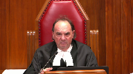
:::

You'd have to have a continuous following up on the financial status of the person, how they've been spending the money, what income they've been generating, have they been doing enough, have they been spending the money prudently or not prudently, et cetera, et cetera.

We just want to monitor, it seems to me, brought into these situations to ensure that the applicant is still entitled to funding from its opponent.

I don't know if I've explained that right, but I just don't know how you can sort of monitor this otherwise.

**Speaker 8** (01:38:12): I see I'm running out of time, sir.

::: {.column-margin}

:::

I'm wondering if I might have permission to just address your question.

Go ahead, please.

I still believe, sir, that the assessment of whether a party can genuinely afford to bear the costs is at the time of the application.

And what you're speaking to is how any of those advanced costs, should the other parts of the test be met by the applicant, how the order is structured.

So if the order is structured to be paid over time, then perhaps there would be a monitoring function that would benefit the assessment.

However, that's at the time of the application and whether the applicant is entitled to costs, that's a static point in time.

**Justice Wagner** (01:38:56): One last question from Justice Kyrgatsanis.

**Justice Karakatsanis** (01:38:59): I'm actually having the opposite problem of my colleagues.

I'm not understanding what the difference is between unduly onerous and genuinely cannot afford.

In practical terms, what is the difference?

**Speaker 8** (01:39:14): because what genuinely um whether someone can genuinely genuinely afford something is going to be different depending on the nature of the applicant in that public interest litigation and so unduly onerous offers a lens for a contextual approach to the response to you

::: {.column-margin}

:::

**Justice Brown** (01:39:35): textual in the same sentence, I hear mush.

I think what it really means is you're rephrasing the test in a way to make it easier to meet.

**Speaker 8** (01:39:45): I don't think that's not the intention, sir.

The rephrasing of the test is intended to make it clearer what the test is for both the judges that must apply it and the applicants that must meet it.

All right.

I thank you very much.

Thank you.

**Justice Wagner** (01:40:00): The court will take its morning break, 15 minutes, we'll be back at 12.30 Ottawa time.

::: {.column-margin}
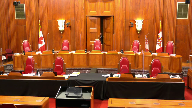
:::

The court that cool.

Thank you, be seated, please.

**Speaker 9** (01:41:16): Good afternoon Chief Justice, Justices.

::: {.column-margin}

:::

I will focus my submissions today on three issues.

First, the Court of Appeal did not change the impecuniosity requirement established by this court but relied on the undisputed findings and the new evidence to properly set aside the original order.

Second, the impecuniosity threshold sets a clear standard and the test continues to work as intended in Okanagan and Little Sisters.

It also remains sufficiently flexible to address the issues that have been raised.

Finally, the policy considerations previously identified by this court still apply today and continue to weigh in favour of granting advance costs only exceptionally and not lowering the threshold for impecuniosity.

Now before starting my submissions on the first issue I briefly wanted to highlight a preliminary point.

Ultimately this appeal addresses the careful balance to be struck between a litigant's financial decisions and the entitlement to extraordinary advanced costs requiring the use of public funds.

Alberta has acknowledged throughout that the appellants have a number of important community needs and face challenges and clearly the appellants have the right to make financial decisions in the best interests of their community.

However, where a litigant has funds that are available more than nominal and they're not currently being used for oppressing community needs and will have additional revenue going forward the test for advanced costs is not met.

The fact the appellants do not meet the test and the high financial threshold set by this court to qualify in no way minimizes the issues they face as an Indigenous community.

Instead it reflects the clearly defined limits that have been established by this court for such extraordinary orders.

Now turning to the first issue and that's really the application of the test by the courts below many of the arguments that have been put forward have been based on the court of appeal having changed this court's test applied it unjustly or imposed new requirements to unreasonably exhaust all available funds.

We submit that's not what happened instead the court of appeal reviewed the uncontested findings including those setting out what unrestricted and restricted funds were available to the appellants and applied the Okanagan and Little Sisters criteria and in doing so it did not simply apply an artificial only any available funds analysis.

The court of appeal also considered whether these funds were actually available by noting the test was not one of unqualified impecuniosity.

It also held that an Indigenous community that cannot meet the necessities of life and also fund the litigation is impecunious for the purposes of the test.

Now I want to jump into the the importance of the undisputed findings that the respondents say prevented a finding of impecuniosity at first instance.

Firstly the case management justice did not find that the unrestricted funds that were available could not be used for the litigation because they were being used for basic needs or because there were specific plans to use them for these basic needs.

The case management justice found that there were three and a half million dollars available in unrestricted money that could be used for the litigation and this came from two basic sources that you heard about already this morning.

The first was the IAIR account and importantly and this is set out at paragraph 44 of the case management justice's decision and that's in Alberta's condensed book at tab four.

That is a recurring source of oil and gas and industry income that has been used important to note how it's been used to pay legal and consultants fees for this litigation and also for four other legal firms retained on various matters and that's set out at paragraphs 44 and paragraphs 53 of the case manager's decision.

And the case manager also noted that the money in this account has no restrictions.

So that was one important source that was 1.4 million.

Now the other amount.

**Justice Karakatsanis** (01:45:42): Sorry, can I ask you to comment on the submission that was made this morning, that reconciliation – sorry, that consultation itself in this context is a pressing need.

**Overlapping speakers** (01:45:58): The consultation fund, is it not?

Yeah, okay.

I'm sorry, Justice, I just missed that last part.

**Justice Karakatsanis** (01:46:04): Yeah, the IRA account is the consultation fund, I believe.

Yeah, it is.

**Speaker 9** (01:46:11): It is, in part, monies received from industry for consultation.

::: {.column-margin}

:::

It also includes, as Justice Brown found, that it had other monies in there from various contracts that the appellants have with industry.

So it's not just limited to consultation, but that's certainly part of it.

Consultation is an important part of what this First Nation has to do.

They have funding from industry for that, they've had some funding on the record from government for that that they have used, but not all of the money in this account clearly has been used for consultation because of the finding that some of it was also used for litigation and paying lawyers in other matters.

**Justice Brown** (01:46:58): So is it fair to say that you don't dispute that where money is needed for consultation that is in fact a basic need of the community.

The issue here is really more the empirical question of whether it was actually needed for consultation in its entirety.

**Speaker 9** (01:47:15): I it's certainly an important need.

I think when we get into what basic needs are, I tend to think of them in perhaps in more personal terms, in terms of water, food.

**Overlapping speakers** (01:47:27): No.

**Speaker 9** (01:47:28): you know, housing and so on, but it is an important community need

and yes, as you indicated, Justice, there are multiple sources of funds in this account and some of them being devoted to consultation.

**Justice Rowe** (01:47:40): Just as a very simple point, the sense I get from reading about this fund is that it is not just a static amount.

::: {.column-margin}

:::

It's not that there was a one-time payment into it and that at a certain point it will simply be exhausted.

There are revenues flowing in and there are expenditures flowing out.

So it's, in a sense, a dynamic account.

It's something which, you know, money comes in, money goes out.

That's the nature of how this account operates.

**Speaker 9** (01:48:14): Yes it's there is recurring funding in there from various sources as the case management justice indicated from various contracts you referenced property tax assessment funding an atco contract and then the energy industry agreements.

**Justice Moldaver** (01:48:32): I'm just trying to understand something, though.

::: {.column-margin}
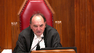
:::

The trial judge found 3 million or so available for the court matter.

And so it's not as if she found that they were so impecunious that they couldn't come up with anything.

And she uses that figure and says, okay, you've got to keep up the $300,000 a year that you have been paying.

And so the court of appeal, if I understand it correctly, says she was just wrong, dead wrong on that right away.

In fact, if all they had was 3 million available, that would have been enough to address the impecuniousity issue against the ban.

So now we move forward, though, and the court of appeal says, oh, we got much more than that.

We've got this settlement for 297.

Where in the court of appeals reasons do they take into account that the COVID situation had arisen in the meantime and give effect to or

at least say go back to the trial judge and sort of set out the extra costs that are involved here so that we can balance and see whether or not you really did get an extra 2.9 or whether or not you're going in the hole for 2.9.

Where is that?

They talk about the 2.9 because that's easy.

That's the money that's there.

They don't bother to, it seems to me, now, maybe it's not their task.

Maybe it was up to the indigenous ban to put forward what these costs are, but you've got to bear in mind, COVID going on, not so easy to do all these things.

Better to send it back to a trial judge where the evidence can be properly marshaled in a reasonable period of time.

I don't see any of that here.

**Speaker 9** (01:50:28): There there wasn't a specific analysis of the appellants evidence in the court of appeals decision in terms of the numbers It did admit all of that evidence and in our submission.

Sorry, what did it say about the appellant evidence in the court of appeals decision in terms of the numbers

**Justice Moldaver** (01:50:41): What did it say about that evidence?

It admits it just to be, what, fair?

Without saying, well, what's involved here?

**Speaker 9** (01:50:50): Well, I think it's important to look at that evidence, and essentially there were two pieces of new evidence from the appellants.

::: {.column-margin}

:::

One was from Mr. Kayabiab, the band's financial manager, where he indicated that the IOGC, the Ottawa Trust account, had been reduced from $2.1 million to just under a million dollars.

And he specifically noted, and that's in tab seven of Alberta's condensed book where all the new evidence is, in his affidavit.

And this is important just in terms of, and this is on the second page of paragraph five, in terms of how the money had been used to reduce the amount in that IOGC account.

He notes that paragraph five, that the reduction was a withdrawal of $600,000 for urgent infrastructure repairs and salary costs, and then also $800,000 to cover shortfalls in salaries and wages.

So, much of the reduction in the IOGC account was for salaries and wages, and that brought that down to two million.

And then in the chief's affidavit, which follows Mr. Kayabiab's affidavit, my apologies, it's under tab 7B of Alberta's condensed book.

It was just before it.

That was Chief Anderson's affidavit.

And I think the important issue from Chief Anderson's evidence was that there was an acknowledgement of the settlement.

The number was slightly different, 2.77 versus 2.97.

And then an indication in paragraph five that these funds were being held in trust, and the leadership was deciding how to use that money for various potential competing demands, including paying for this litigation as required by Justice Brown.

So, all of which is to say, there was clearly an acknowledgement of the settlement funds.

There was nothing specific in this new evidence as to how this money had to be used or was going to be used for pressing community needs.

And in our submission, based on all of the new evidence in its totality, and based on this court's decision in Stoller, the evidence was of a sufficiently decisive nature to say the 3.5 million that Justice Brown had found had now been increased by roughly $2 million, reflecting the reduction in the IOGC account, to now leave the First Nation with a little over $5 million in available funds.

So, in the circumstances, it's our position that the Court of Appeal properly dealt with the evidence.

And again, recollecting that this was not a new issue or, you know, one that came out of nowhere.

It was one that was specifically contemplated by the Case Management Justice.

In her order, she had specifically directed that any such settlement payments, like this top gas settlement, would require a revisitation of the order.

The Court of Appeal, in our respectful submission, was also mindful of the order granting permission to appeal to not delay this matter further and to have it resolved.

**Justice Martin** (01:54:30): Mr. Argento, can I ask you a question that may also be addressed to Canada as well, which is in terms of the identification or the costs of the pressing infrastructure and social needs, we have in the record certain cross examinations on affidavits and I guess I have two questions.

::: {.column-margin}
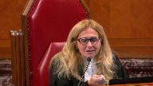
:::

One is are those the totality of the cross examinations that took place that are on the record and the second is in that cross examination, was there an attempt to get further information and discovery of the identification of those or the costs or was that something that was addressed?

**Speaker 9** (01:55:13): I believe that all of the cross-examinations that are in the record, that would be the totality of them.

::: {.column-margin}

:::

And I don't think that those specific issues came up in cross-examination or are noted in evidence anywhere in terms of the exact costing of those needs and the specific plans to address them.

**Justice Karakatsanis** (01:55:34): So what kind of evidence do you say is necessary in terms of identifying the needs and the costs and the plans to address them?

**Speaker 9** (01:55:46): it's you know again it's a very careful balance given what's being asked of the court here in terms of extraordinary advanced costs so there has to be we say some evidence some clear evidence it even the court of appeal recognized it doesn't have to be an overly granular exercise it doesn't have to be a forensic audit there was a lot of financial information here but given what's being asked and and given the the quantum of available funds uh there which was in excess to five million dollars including the new evidence there has to be some identification of here's how this money is being used right now or needs to be used in in the near future

::: {.column-margin}

:::

so there has to be something and something more than was provided we respectfully submit

**Justice Côté** (01:56:36): I'm not sure if I can answer that question.

::: {.column-margin}
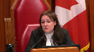
:::

Let's say that a First Nation applicant says we have basic needs to meet necessities of life.

What should be the evidence?

**Speaker 9** (01:57:01): I mean, I think, I guess it will depend on the context, certain needs that are identified can probably be costed more specifically than others, but there will have to be some reasonable evidence and objective criteria that an application justice can assess in order to understand are these funds available, are they actually available or are they only notionally available because they're needed for those basic needs.

::: {.column-margin}

:::

I have not.

**Justice Brown** (01:57:29): I realize it's difficult in the abstract to kind of, you know, formulate what kind of evidence, what degree of granularity.

::: {.column-margin}

:::

I'm wondering if it might be helpful to go the record here.

In Mr. Rankin's affidavit, he alludes to weekly meetings with department managers to review and ensure the immediate and long-term tasks are on schedule and to assisting departmental managers with their budgets and funding requests.

Which is suggestive, I think, that department managers are aware of their immediate and future needs and are reviewing and monitoring that.

And justice brown at the hearing also asked whether the nation operates according to a strategic plan and the answer from council for Beaver Lake was that each department submits budgets according to their priorities which suggests that, again, each department has identified pressing needs.

So is this the kind of information that should be included in the record to help the court understand what priorities have been set, being funded, and whether there's funding shortfalls?

**Speaker 9** (01:58:40): I think it would be and there is obviously in the case of and this will vary by different Indigenous communities there is a combination of government funding which the case management justice said was significant and there's also non-government unrestricted funding and there'd have to be an analysis of that in any given year to see what these particular shortfalls or pressing needs would be in these different departments.

::: {.column-margin}

:::

**Justice Karakatsanis** (01:59:05): Can I bring you back to the issue of the identifying the specific needs and the costs, quite apart from the issue of how they plan to use the money, just in terms of costing what the needs are.

::: {.column-margin}

:::

In the context of this case, was there any real dispute that the housing, the education, the health, the sewage, the various economic and social needs would be more than $3 million to address?

**Speaker 9** (01:59:41): Again, it's difficult again to answer that without having a full understanding of what those needs are and which of those needs are not covered by government program funding.

::: {.column-margin}

:::

And the reason I, and I'll provide one specific illustration which is important.

You heard Ms. Brooks this morning mention the sewage lagoon.

That's clearly a basic need.

There's no question about that.

That lagoon was in the process of being, funding approval from Canada was in the process of being finalized at the time of the application.

That is now, as I understand it, been completed at a cost of $8 million.

That's being funded by Canada.

So that's an example of an important basic infrastructural need, but not one that's requiring the First Nation to take out of this available funding to pay for it.

So I think we have to be just a little bit careful in terms of, you know, looking at the numbers in the abstract without knowing what the First Nation will be covering versus what is going to be paid ultimately by Canada.

**Justice Rowe** (02:00:44): I mean, I used to do, be quite involved in budgeting processes and you have to look at flows of revenues and patterns of expenditure

::: {.column-margin}

:::

and I guess it's the same with a company.

It's the difference in a balance sheet and a statement of income and expenses, which ain't the same.

And if you look at the situation of the community and you say, is three million dollars or five enough to solve all its problems?

I think you'd probably say no.

I mean, it's just, they're too, they're larger than that.

But if you say, what is the pattern of revenues, notably from the national government, and the pattern of expenditures, you can then get a picture of how problems are being addressed over time, which is, as a practical matter, how governments operate.

And so I get this sort of discontinuity when I look at these things and people say, well, this amount of money is just inadequate given the demands.

But yes, if there was, if three million dollars was the only cent that they were ever going to have for the rest of their existence, of course that would be so.

But this is a year over year situation where there's a flow of funds and I just, the money was there, but the First Nation says, it seems to me, that amount of money can't fix all our problems.

So we can't have regard to that for this litigation purpose, but it seems to me that ignores the fact that there's a flow of funds on an annual basis, and as you've said, the Government of Canada meets certain needs, they fund certain requirements, and to say that there are requirements which need to be met, the door to knock on for that may be Indian Affairs and Northern Development or whatever it's called these days, Indigenous Services, I think.

**Speaker 9** (02:02:58): There are certainly very large issues which as Alberta stated in its fact and certainly you know the sufficiency of government funding goes well beyond the issues on this appeal and again I think quite correctly noted Justice that this is a dynamic situation that will change from year to year both in terms of what funds are available what those needs are and how they're being met or not met.

::: {.column-margin}

:::

I just wanted to address in terms of the undisputed findings and this ties into this issue of basic needs because this was an important finding in relation to the Heritage Trust and this is as the court knows a savings fund that the appellants have put together have established based on funding accommodation payments from energy industry companies as part of consultation and that the case management justice found that that fund the heritage trust savings was valued at 2.2 million dollars anticipated to grow by another 1.5 up to just under 4 million 3.7 million by by now 2021 and what's important about that are a few things one is that is money that has been set aside for the community for its important needs it has not yet been used and I think it was obviously clearly relevant for the courts below to take that into consideration to say in terms of pressing community needs that is a relevant factor that this money is potentially available when the community decides that it's appropriate to use it

but it has not yet been used so again it's important to look at that in the context of all of this and and just to clarify that Alberta has never said that that money should be used to fund litigation

but it's again part of the overall picture as to how the community can in the future address its needs.

Now I just wanted to briefly touch on before I move to another topic a couple of other key findings that were important here so in addition to having

**Justice Kasirer** (02:05:00): Can I interrupt you just before you leave the Heritage Trust?

::: {.column-margin}
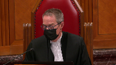
:::

But what's then your position on whether the, whether the Beaver Lake could tie up these assets and plan their expenditure as a government, as a First Nations government, and contrary to what the Court of Appeal said, that they couldn't be blamed in some measure for tying up assets and removing them from availability?

Is the Court of Appeal wrong on that point?

**Speaker 9** (02:05:35): In our position, that's completely up to the appellants as to how they deal with those funds, the heritage savings, and those funds again cannot be used for litigation.

::: {.column-margin}

:::

So it's up to the appellants to decide what the restrictions are, how they use them, and when they choose to use them in the future.

**Justice Kasirer** (02:05:54): Does the Heritage Fund then go into the mix?

::: {.column-margin}
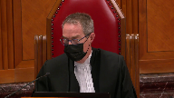
:::

I've lost you a little bit because I understood the Court of Appeal to take paragraph 18 to be rather more firm about saying that the strict restrictions placed on the Heritage Trust, because they were placed after the fact, are now voluntarily tied up, and that it was unfair that they could rely on that fact to argue in pecuniocity.

**Speaker 9** (02:06:31): We don't agree with the Court of Appeal on that point.

::: {.column-margin}

:::

They don't, and I apologize for, I'll clarify what my earlier submission was.

The Heritage Savings or the Heritage Trust does not factor into the mix in terms of funds that could be used for litigation.

They factor into the mix in terms of the overall evaluation of whether the appellants are impecunious, where they say we need available funds that could be used for litigation to use for pressing needs when they have not yet used their Heritage Trust funds, which are available to them in the future.

**Justice Kasirer** (02:07:03): Well, that's a pretty substantial amount and if that amount and the debate over the fresh evidence weren't just considered by the case management judge, is it perhaps best that this whole thing be reviewed from start to finish rather than simply dismissing the appeal?

::: {.column-margin}
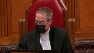
:::

**Speaker 9** (02:07:28): Well what what I would what I would say is that that was a significant amount

::: {.column-margin}

:::

but it didn't factor into uh I guess how how the math should be done here as to what funds were available for litigation the the funds that should be available went from 3.5 to about 5.4 or so not including the heritage funds so again ultimately obviously it's up to this court but in our view the court of appeal did correctly rely on the new evidence such that this matter could be dealt with here without having to be remitted back to the case management justice.

**Justice Brown** (02:08:03): Just I'm wondering whether was there an issue this was June of 2020 was there an issue of gaining access to the Queen's Bench to the to the Queen's Bench

I mean COVID has been kind of put out and I don't want to become too much of a distraction

but I seem to recall the Queen's Bench kind of shut itself up tight for a while.

**Speaker 9** (02:08:22): There, I believe we'd had a case management meeting just before the the court shut down.

::: {.column-margin}

:::

Essentially what had happened was the the permission to appeal and the appeal sort of overtook the process as a new case management justice had been appointed and we proceeded with the appeal before you know any opportunity to go back to the case management justice.

**Justice Karakatsanis** (02:08:44): Can I come back to the heritage trust and I think the answer we got from the appellants this morning was it depends on whether the object of the trust itself is ‑‑ can be considered an essential need or necessary.

::: {.column-margin}

:::

Can you finish your answer on the essential trust on the heritage trust funds?

**Speaker 9** (02:09:10): the again the the the funds in the trust uh are provided from oil and gas companies pursuant to impact benefit agreements typically these agreements have specific purposes as to how these funds can be used for community improvements and just generally for the benefit of the community so the the trust has as I recall certain restrictions on how much could be accessed at any given time it's 10% a year 10% a year that's yes

::: {.column-margin}

:::

**Justice Brown** (02:09:41): The terms are that funds should be allocated to community development activities which include environment, healthy living, safety, education, lifelong learning, training, employment, et cetera.

Arts, culture, spiritual, preservation of traditional knowledge, housing, community development.

**Speaker 9** (02:09:58): Right, so again at the discretion of the appellants at the time of their choosing as to when they wish to modify these restrictions when it's necessary for them to use them for basic needs.

**Justice Moldaver** (02:10:11): I'd like to ‑‑ sorry, is it not appropriate for reserve to have a reserve, an autonomous group that's running its own community that can't raise funds by taxing as I understand it?

::: {.column-margin}
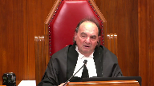
:::

I mean, is it ‑‑

I mean, the realities are why shouldn't they be able to have some sort of a fund available for emergencies and so on?

What's so terrible about that?

Does that mean, oh, you're not impecunious?

You know, for purposes of fighting a litigant that has theoretically all the funds in the world?

**Speaker 9** (02:10:49): Well, I guess two responses to that.

::: {.column-margin}

:::

First, they do have the opportunity, and the Heritage Trust is the example of that, of monies that are not being used for litigation that can continue to be built up, and they're doing that.

And then, again, come back to the balance that has to be achieved as directed by this court in Okanagan and Little Sisters as to, is it genuinely unaffordable?

Is it impossible to continue with the litigation?

I see that my time is up.

But I'm wondering if I...

**Justice Wagner** (02:11:27): I will give you five more minutes to conclude.

**Speaker 9** (02:11:35): Thank you, Chief Justice.

I appreciate that.

I just want to

**Overlapping speakers** (02:11:39): That's called a reserve.

**Speaker 9** (02:11:41): I just want to just touch on some policy issues and and this really goes back to first two things so firstly the the existing test the requirements in Alberta submission are clear and there's sufficient flexibility as this court set out in Little Sisters at paragraph 37 that a court assessing the requirements of the advanced cost test has the discretion to consider all relevant factors that arise on the facts and we would say that that continues to provide the necessary discretion to assess imprecune ausity whether it's an indigenous applicant or non-indigenous applicant next

::: {.column-margin}

:::

and I think importantly caution should be exercised before lowering the financial threshold for advanced costs without any legislative involvement a relaxation of the test would certainly lead to a large increase in the use of public funds for litigation well beyond the exceptional parameters of Okanagan Little Sisters and while access to justice is obviously fundamental and built into the underlying rationale for advanced costs this court has also noted the balance that must be maintained and that not all access to justice issues can be addressed through advanced costs and I'll just refer briefly to Okanagan the paragraph 36 this court stated the requirements might be modified if the legislature were to set out the conditions on which interim costs are to be granted and then in addressing this issue again in Little Sisters at paragraph 44 this court stated and expressly cautioned against an alternative and extensive legal aid system being put into place through the courts as this would amount to imprudent and inappropriate judicial overreach and Alberta submits that the rationale articulated by this court in those earlier decisions remains equally valid today in conclusion it's our submission that the Court of Appeals decision was rooted in the undisputed findings and the new evidence it followed the principle set out in Okanagan Little Sisters its decision does not represent a departure from the existing law or put advanced costs out of reach they remain exceptionally available as intended by this court and again such orders must remain exceptional and available only as a last resort to prevent an injustice given their use of public funds before the merits of an action have been determined and subject to any further questions those are all of my submissions

**Justice Wagner** (02:14:13): All right, thank you very much.

Thank you, sir.

**Speaker 10** (02:14:20): Good afternoon, Chief Justice, Justices, you should now have our outline which is at tab one of our condensed book.

::: {.column-margin}

:::

In some Canada agrees with Alberta that the Court of Appeal correctly intervened in this case.

Without repeating my friend's points, I'll have two main points today which I'll summarize now.

First of all, under point A in our outline, we agree that the Court of Appeal applied the correct legal test to assess impeach neocity in this case.

More particularly, the Court of Appeal could conclude on the facts as found by the case management judge that the appellants prima facie did not need the test.

I guess more importantly, we say that consistently with the high threshold which was set by this court in terms of granting advanced costs, the Court of Appeal could find in this case that the judge had applied too low a test and ultimately failed to show in a demonstrable way how the appellants in this case satisfied the applicable threshold and necessity.

That will be our point A. In terms of point B which is perhaps more the policy point as my friend has referred to, we also say that the court does not change the test for impeach neocity.

We say it remains good law whether generally or in the context of Indigenous claims and perhaps with the court's permission, I will probably spend a little bit more time on that since my friend hasn't had the time to deal or elaborate on the policy questions and the interveners have raised the points which go to this issue.

In a nutshell, on point B, we of course agree with Alberta that the current test is flexible enough to be applied consistently with reconciliation in a way that it permits a judge on a case-by-case basis to take into account all relevant contextual elements.

I think it's not fair to say that the Court of Appeal in this case did not apply such a standard.

It took into account all the relevant elements but ultimately there was a legal error in the judge's decision and it had to intervene.

Still on point B, a lot of the arguments which were raised today by the interveners especially go perhaps more to the application of the other branches of the test for advanced costs and are best appreciated under those other branches such as public importance and prima facie merits and have little impact in terms of how impeach curiosity should be assessed.

I'll elaborate on that.

Ultimately our point is that advanced costs can serve a useful purpose but they can become an alternative system for the public funding of public interest litigation.

That responsibility has been left and should remain left with the legislature and unless there are questions I won't deal with our third point about the reasonableness of the terms of the order, that is unless there are questions.

So to begin with our point A, the Court of Appeal applied the correct legal test.

Now we say that the Court of Appeal's annunciation of the test in this case flows from and is consistent with how this court has with the high standard that this court has articulated for advanced costs.

I won't go over the this court's decisions.

They're of course known to the court.

I'll just insist on perhaps one point and that is that in Okanagan which was the first decision to deal with this these issues in the context of an Indigenous claim, the court formulated a demanding standard for impeach curiosity by requiring that proof be made that the party seeking interim costs generally cannot afford litigation and that there's no other realistic options.

That is a demanding test.

Little Sisters only reinforced that by asking and requiring an applicant to show that they've explored all other funding options and just I think the court's case law justifiably shows that by nature the test for advanced costs must be a high one and because at the root advanced costs are exceptional it is not common for a defendant to pay a plaintiff's legal fees in advance and especially in any event of the cause but perhaps also where the Crown is the defendant of course advanced costs implicate the expenditure of public funds which as I said earlier is the responsibility of Parliament ultimately.

Those are perhaps the general considerations.

Now in this case to come back to this case we say it was open to the Court of Appeal to say that prima facie the appellants did not meet the test for impeach curiosity.

**Overlapping speakers** (02:19:25): Mr. J.

**Speaker 10** (02:19:25): on the available and significant funds that they had.

::: {.column-margin}

:::

And I won't deal too much in detail with that aspect of the case, my friend, Mr. Argento, as outlined for the court's benefit, some of the court of appeals, pardon, some of the judge's undisputed findings on the availability of funds.

So I perhaps I'll spend less time on that, but in terms of our point, which is under- Mr. Joyelle, over here.

Before you- Please.

**Justice Karakatsanis** (02:20:03): just leave the test that was applied by the Court of Appeal.

::: {.column-margin}

:::

I'm just looking at paragraph 27 and 28, and the idea, the juxtaposition of short-term necessities and distinguishing desirable infrastructure and standards of living from basic necessities.

Is there, I guess I'd like your submissions on whether in fact pressing needs are limited to short-term necessities and only basic necessities to be distinguished from infrastructure and standards of living.

**Speaker 10** (02:20:44): Madam Justice Karagatsanis, I think the point made here by the Court of Appeal is not to perhaps limit basic needs to just short-term needs.

::: {.column-margin}

:::

I think it could be envisaged that long-term needs could be basic needs.

I think what the Court is actually expressing here is that in this case, the problem was that or the issue comes down to what are more perhaps discretionary types of of spendings versus other spendings which are justified on a standard of necessity.

And I think and of course short-term spending on basic needs corresponds to spending that is on something that corresponds to a standard of necessity.

Longer-term spending may not, but this will always depend on the facts of each case.

**Overlapping speakers** (02:21:38): I

**Speaker 10** (02:21:38): I think that is the gist of what the Court of Appeal was saying.

**Justice Rowe** (02:21:44): When I've got a leak or a sort of a porch on my, back porch in my house that's getting a little old, I said, well, you know, one of these days I gotta fix that thing, right?

It's, it's, it's, it's, it's, it's, it's, it's, it's, it's,

**Overlapping speakers** (02:21:56): in the

**Justice Rowe** (02:21:56): sort of past its prime.

And so I've got to build it into the plan.

But if there's no food in the refrigerator, I've got to deal with that tomorrow, or today, actually.

So some things, by their nature, run a different time scale.

**Speaker 10** (02:22:11): And I think that goes, that ties in directly with what the Court of Appeal is saying in the sense that the assessment of whether something is a basic need will of course take into consideration the time horizon on which it's planned.

::: {.column-margin}

:::

In some cases, the time horizon will be determinative in the sense that they may not, the needs perhaps will not be as pressing in the sense that they should lead to a finding of impeccability.

But again, where I guess at this point it's a bit difficult to deal with specifics, I think that's the general proposition I would submit.

**Justice Kasirer** (02:22:58): Can I ask, Monsieur Joyal, a question on just the way in which the language of Okanagan and Little Sisters has been advanced, and you've heard other parties suggest that perhaps it should be reframed, that it could be more congenial, easier to understand.

::: {.column-margin}
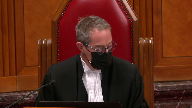
:::

I'm wondering what your sense is, whether undue hardship, unduly onerous, would be more helpful, would reduce the harshness that one sometimes sees in some of the judgments, as opposed to other judgments.

And one particular instance I have in mind is what might be the, possibly, dissonance between Okanagan saying at paragraph 40, no other realistic option exists for bringing the issues to trial, which is often quoted, and paragraph 71 of Little Sisters, where the court says the imprecuniosity requirement from Okanagan means that it must be proven to be impossible to proceed, otherwise before advanced costs will be ordered.

That idea of impossibility seems, at least to my ear, maybe slightly harsher than no other realistic option, and is it maybe an instance where the language could be massaged a bit without changing the rule.

**Speaker 10** (02:24:33): Um, well

**Overlapping speakers** (02:24:35): You

**Speaker 10** (02:24:35): Mr. Justice Kazir, you of course know what our position is on whether or not the test should be changed.

::: {.column-margin}

:::

It's in our factum and in our outline, you'll get the gist of what we're submitting.

Just very briefly, the test has been applied for over almost two decades now.

There's no without difficulty, we say, and there's no criticism that's emanated from any of the lower court judges as to whether or not the test doesn't work.

And I think that's a valid and relevant consideration for this court.

I won't go over the test that this court has adopted for whether or not to change the common law, but of course, as this court knows, the court has put a premium on the interests of certainty and predictability.

And the reason I say this is...

**Overlapping speakers** (02:25:27): and

**Speaker 10** (02:25:27): that some of these formulations that are being proposed by some of the interveners and I think this is a point that was made by perhaps some of the justices of this court is that the propositions don't necessarily are not that materially different from what the test already is and I don't think the court should change the test just for the sake of changing the test so I guess that's that's one thing and that applies particularly with with respect to the proposition by the Advocates Society that the standards should be changed to something like unduly onerous I think it's it's it's not materially different from the test in Okanagan as to whether or not a party can genuinely afford and whether there's no other realistic option Mr. Justice Gazeera asked about undue hardship I think I let me take this opportunity to respond to this point of course we haven't heard yet from British Columbia on this point but perhaps the court will find it useful to know what our position is on this since we haven't elaborated on it in our fact I mean reply to the interveners but again as with Alberta we don't believe that the test should be changed to reflect the standard of our own and that's why I think that's why the test should be changed to reflect the standard of undue hardship for two reasons first of all we don't believe that the contexts are the same hearing fees were the issues and the decision of this court and trial lawyers those are not the same as advanced costs so I don't think there's a need for to harmonize the tests given these these two different contexts in which hearing fees on the one hand and advanced costs on the other arise but more importantly again back to the point I was making earlier and let me use the expression in French in some of these cases it's in the sense that we're not there's no material difference in terms of what the test the very demanding test that the court has formulated and the proposition that undue hardship should be considered for instance I think the test at the end of the day is not materially different and there's no need for the court again to change the test just for the sake of changing the test uh sorry could I ask you a question please very quickly if you go

::: {.column-margin}
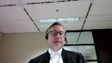
:::

**Overlapping speakers** (02:28:00): Sure.

**Justice Moldaver** (02:28:00): paragraph 28 of the Court of Appeals decision.

::: {.column-margin}
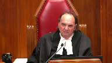
:::

I want to see how this works in practice.

I want to get your definition of what you say is a basic need as opposed to something else.

So in paragraph 28, five lines down, as noted, discretionary spending on desirable improvements to community infrastructure and standards of living can for this purpose be distinguished from spending on basic necessities.

Now, the record in this case apparently indicates that 50 homes are needed so people have a place to live.

That's $10 million at 200,000 each if I have that right.

Other houses are falling down in disrepair.

People are living with eight or nine people in a home that probably should not contain more than four people, maybe five.

How do you classify these things?

I mean, are those, I won't call them luxuries but just sort of what do they call it here?

Spending on desirable, is that a desirable or a basic necessity?

**Speaker 10** (02:29:26): And that's a fair point, Justice Moldaver.

::: {.column-margin}

:::

There's no denying that housing is a basic need.

I think in this case, again, the problem with the Court of Appeal felt in this case when reading paragraph 28, and in particular, I think what the Court of Appeal saw as a problem here in this case is that the judge didn't engage into a robust analysis of what were the needs.

We've talked about this earlier.

What was the cost of those needs?

If and to what extent the current available funding is insufficient to address those needs?

And also, why isn't the appellant not using its other available funds for those basic needs?

In a context where there's already significant government funding, that's from the judge's decision at paragraph 33.

In a context where an applicant is asking for advance costs to be paid out of public funds, I think the Court of Appeal was correct to insist on something on an objective test, first of all, which doesn't just rely on something as general as just saying that the funding for litigation should be offset by needs, but importantly, that there should be an assessment of the priority of these other expenditures based on a threshold of necessity.

We agree, and it seems that all the parties agree, or the principal parties agree, that that's the threshold to be met.

My friend for the appellant has said that the standard to be satisfied is a threshold of necessity.

So we agree on what the standard is.

The problem in this case is that the analysis has to correspond to that high standard.

And we respectfully submit that the Court of Appeal was right to insist on something more robust in this case.

To come back to your point, Justice Moldaver, in this instance, the Court of Appeal didn't say, and that's what it said in its reasons, didn't have to explain or to go into more detail as to what is exactly a basic need, although we agree that housing is such a basic need.

Because in this case, there were already significant available funds available, especially with the new evidence, such that it wasn't necessary to find to the distinctions between different types of expenditures.

And to answer a question that's been raised already by some of the justices of this court, the granularity of the examination will depend on the facts of each case.

In some cases, it will be quite evident that there are pressing basic needs and that the funds are just not available to address them, such that it's not necessary to require something specific or highly specific from an applicant.

But in a case such as this one, where there are significant available funds, where there is significant government funding already being given to address basic needs, there has to be something more.

**Justice Rowe** (02:32:53): I come back to my point, forgive me, but it's just basic accounting.

::: {.column-margin}

:::

It's the difference between a balance sheet, which is assets and liabilities, and a statement of income and expenses.

I mean, are you solvent?

You look at the balance sheet.

What is the pattern of your income and expenditures?

That's your income statement.

And every, I'm assuming that this ban, this First Nation, is under the Ordinary Arrangements under the Indian Act, which says that each year that allocations are made under designated headings by Indigenous services.

And, you know, sometimes the ask from the band is going to be less than the give by the government.

And maybe there's a problem there, but it's different from do they have assets.

**Speaker 10** (02:33:43): Well, if I if I understand correctly, I think eventually, as I said, the granularity of what is required from an applicant will depend on the facts of each case.

::: {.column-margin}

:::

I think, as you pointed out, Mr. Justice Roe, I think when an applicant or a First Nation asks for a certain amount of government funding, it does a certain amount of forecasting.

There's no reason why that forecasting can't be done where an applicant is asking the court to order, make the extraordinary order of making an advance cost order out of public funds.

And to perhaps answer a question, a point that was made earlier, there's no denying that there are challenges.

Canada doesn't deny that there are challenges, but the fact of the matter is, these are complex issues.

There already is significant government funding for those basic needs.

Is it going to be enough?

Of course not.

There are always going to be needs, but that is a consideration that needs to be taken to account.

Still on the issue of basic needs, a question was raised earlier as to what is the definition for that.

I think, of course, the particular context of First Nations claims will have to be taken into account.

The basic needs of First Nations will not be the same necessarily of other communities.

In our factum, we have included, and that's at footnote 79, certain cases including of this court which deal with the definition of what is a basic necessity, the case of Findlay, where there was a quote from the legislation applicable in this case, where basic necessities was defined as things, goods and services that are essential to a person's health and well-being.

I think we agree that that's the operating definition, but of course, based on the facts of each case, it will be up to judges to determine what are basic needs.

**Justice Moldaver** (02:35:57): Sorry, I have one more question and then I'll leave you alone.

::: {.column-margin}
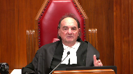
:::

I do not understand why in the face of an affidavit from Ms. Anderson, that's a tab 7b of Alberta, she sets out three paragraphs that deal specifically with COVID.

Now, Justice Roe has been commenting about, you know, sort of projecting and this and that.

I mean, if we could have projected COVID, you know, we'd all be the wiser and we'd all be the healthier.

None of us could.

And certainly this indigenous band could not.

Now, look at paragraph 6, 7 and 8 to see the disruption, the fear and the people overcrowding, the very kinds of things, you know, not having clean water, the very kinds of things that as he said, the people are terrified.

They're terrified.

They need extra funding to live.

They need this.

Where is that ever taken into account by the court of appeal or at least saying, you know what, this is fresh evidence.

We don't have the details of how much this is, but we think this should go back for further consideration in light of something that when the original order was made was not on the horizon, suddenly now we are facing a crisis of huge proportions which no one could have predicted and the court of appeal says, oh, I recognize, we recognize these affidavits.

I find it quite frankly astounding.

**Justice Brown** (02:37:42): I mean was this was this a central issue at the hearing at the Court of Appeal?

We were about two and a half months into COVID at that point.

I mean was this was this kind of front and center in submission?

**Speaker 10** (02:37:54): I'll, I don't believe that it was.

::: {.column-margin}
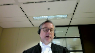
:::

I think, I think what's important here in this case is that the argument and this applies not just to the evidence that was presented on appeal it's the evidence generally that was presented before the judge is that when it talks about these these challenges these basic needs and they're not denied is that they're presented in the abstract without of course relating this to the important issue of whether if and to what extent current government funding is insufficient to address those things and of course the court can of course it's not into evidence but the funding that is provided by both governments is recurring and as continued through the period through all the the relevant period in this delegation of course the point is well taken Mr. Justice Moldaber

but it hasn't been but it hasn't been the central consideration or or raised at the hearing I don't believe I think it's important to keep in mind that there was opportunity to file additional evidence from from both sides and I think the record which the court has before it today is the record that was offered by the parties at the court of appeal level now if I may since there's only so little time if I may just deal with our point b about the our point that the test shouldn't be changed I've already talked a little bit about that in response to Mr. Justice Kazir I think if I can just pick out a few points perhaps to begin with on reconciliation as the court has seen in our fact and our position is that reconciliation is a certain and important consideration this court has said recently in Washington that it's the fundamental objective of aboriginal law our position as you've seen is that it doesn't necessarily lead or imperatively require a change to the test but it certainly is something that can be considered by a judge in applying the test and certainly consistent with reconciliation and this court's admonition that the aboriginal perspective needs to be taken into account of course that may mean that to the extent that there are relevant considerations or contextual elements that are being raised by an applicant reconciliation would require that those be considered uh perhaps another point on access to justice since this was raised

**Overlapping speakers** (02:40:43): Excuse me.

**Justice Kasirer** (02:40:44): in some of the inter-regions, especially the advocate society. Pardon?

::: {.column-margin}
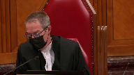
:::

Sorry to interrupt you, and as you say, you have so little time.

Can we, is it possible to connect Justice Muldaver's comment about the, the false binary in paragraph 28 between basic necessities and community infrastructure that you recognized was a little bit of crude geography there to, to make that distinction, to reconciliation?

I mean, there's a paradox in, in these kind of cases in that the, the merit of the claim, the claim itself is, is also the cause of the impecuniosity.

I mean, I'm, I'm wondering if, if, if we should recognize that and, and take up Justice Muldaver's point and say that that distinction should be reviewed in light of the, the ambitions of section 35.

Thank you.

**Speaker 10** (02:41:41): I think that's a fair point.

::: {.column-margin}

:::

I think, and the court will have seen what our position is on this, I think it's a fair point to raise that the bans are suing for certain issues which are connected to the lack of funds.

I think that's understood.

Whether that should lead to a change of the test, we say that that's not necessary.

These elements certainly, in a general sense, are valid and certainly they can be considered under the other branches of the test.

I think the way that you formulated it, Mr. Justiz-Guzira, very well could be an argument being raised under the public importance branch of the test.

But I must point out that in our respectful submission, although the importance of reconciliation can be doubted, it has to be balanced with other important principles that this court has relied on.

I think, of course, as you know, in terms of the test for advance costs, the courts should always keep in mind that ultimately, especially where the Crown is a defendant, that they implicate the expenditure of public funds and these things have to be put into balance.

Not to say that the point you're making should never be taken into account, but as we've said, it's perhaps better appreciated under the other branches of the test.

**Justice Moldaver** (02:43:04): I just say I tend to agree in a way except that they're all interrelated it seems to me.

::: {.column-margin}

:::

We're impecunious in part because of the way you treated this government and that's why we are bringing this action.

Then you combine that with a first before you even get to impecuniosity, what are the merits?

Does this thing, does this potential action have sufficient merit?

And so to me they're interrelated and if it has sufficient merit and the government was at least in part responsible for impecuniosity or their inability to be self-sufficient and you know make their own money and keep their own funds and so on, why isn't that a factor?

Why isn't it an important factor?

**Speaker 10** (02:44:06): Um, I think as a, as I said, I think generally speaking, it's better appreciated under the public importance branch.

::: {.column-margin}

:::

I think what the problem with, at least theoretically with this kind of an argument is that if you accept that, then eventually it will apply in each and every case.

And eventually it will have become a change to the test in the sense that it will uh, morph into a presumption of impikinocity.

And I think that should be avoided.

The cost decisions are discretionary.

It's always going to be a case by case assessment.

So, and to respond to, respond to a point made by Justice Jamal, it's, it's not an accounting exercise that the, that the court has engaged in, in this case.

It was indeed a normative exercise in the sense that it, the Court of Appeal was unsatisfied with the way that the test was applied and the Court of Appeal insisted on a more robust approach to how issues of needs, especially in a context such as this one, need to be considered.

But ultimately the assessment of impikinocity must be grounded on the facts of each case.

And yes, this will include financial statements and of course projections about identification of needs and projections about how these needs are supposed to be funded.

I see my time has run out.

Unless there's any questions, those will be my submissions today.

**Justice Wagner** (02:45:38): Thank you very much.

**Speaker 11** (02:45:45): Thank you, Chief Justice, Justices.

::: {.column-margin}

:::

The Attorney General of British Columbia intervenes in this appeal to make three points.

First, that the financial means branch of the advance cost test should be should ask not whether there are any funds available as the Alberta Court of Appeal did, but rather whether an applicant genuinely cannot without undue hardship afford to pay for the litigation.

Second, that the financial means branch of the advance cost test must remain an evidence based inquiry focused on the applicant.

And third, that the Crown-Indigenous relationship is a relevant consideration at the public importance branch of the test, not the financial means branch.

British Columbia first submits that the undue hardship standard that is developed in the court fees context following this court's decision and trial lawyers should also be applied at the financial means branch of the advance cost test.

As trial lawyers explains, the point of undue hardship is reached when a litigant must sacrifice reasonable expenses in order to bring a claim.

This provides a more liberal and flexible standard than asking whether an applicant has any funds available.

And we say it's an equally useful measure of financial means where an applicant seeks advance costs as where the applicant seeks a waiver of court fees, which is itself a form of partial advance costs award given that hearing fees are recoverable as disbursements as a component of a cost assessment.

Adopting the undue hardship standard in the context of advance costs would promote consistency in the law by harmonizing the financial means component of the advance costs and fee waiver tests.

This is logical given the interplay between fee waiver and advance costs.

And I know that my friend, Council for Canada, disagrees with me on this point, but I would point out that both advance costs and fee waivers support access to justice.

As I've just said, a fee waiver is in effect a form of partial advance costs award.

Both tests include a merits component, and both tests include a merits component, and both decisions include discretion.

And trial lawyers, this court struck down the prior version of BC's fee waiver rule, which required an applicant to be impoverished in order to obtain a waiver, holding that setting the bar so high created a barrier to access to justice for those who are not impoverished, but nonetheless could not afford to pay hearing fees without undue hardship.

Asking whether an applicant has any funds available, as the Court of Appeal did here, it set an equally high bar as the impoverished standard that was struck down in trial lawyers.

While care must be taken not to inadvertently create what this court described in Little Sisters as a court-managed funding program, and Mr. Justice Roe, you alluded to this point this morning as well, we know that trial lawyers makes clear that a more liberal standard is appropriate, where a financial means test may impact access to justice.

And as this court itself noted in Okanagan, one of the primary purposes of this court-managed funds costs award in public interest litigation is ensuring that ordinary citizens will have access to the courts to determine their constitutional rights and other issues of broad social significance.

The flexibility of the undue hardship standard flows from the fact that reasonableness lies at its heart.

As I noted a moment ago, it requires that fees not be set so high that a litigant must sacrifice reasonable expenses in order to bring a claim.

This is a more helpful standard than the distinction that the Court of Appeal here attempted to draw between basic necessities and discretionary spending on desirable improvements.

And members of the bench highlighted some of these issues in their questions of Council for Canada just a few moments ago in highlighting the issues with timescale in terms of short-term or basic necessities.

We say that we would disagree with the Court of Appeal's rejection of reasonableness as a component of this analysis as a reasonableness analysis would avoid those sorts of timescale issues and I would point you in particular to Paragraph 26.

**Justice Jamal** (02:49:40): I think that's a good point.

::: {.column-margin}
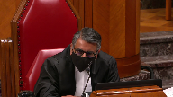
:::

Thank you.

Can I ask you a question that Justice Kazira posed a few minutes earlier and that is whether, in your view, Little Sisters raised the threshold from Okanagan and whether what you're proposing, would it be higher than or lower than the threshold of Okanagan and whether what you're proposing, would it be higher than the threshold of Okanagan and whether what you're proposing, would it be higher or lower than the threshold of Okanagan and whether what you're proposing, would it be higher or lower than the threshold of Okanagan and whether what you're proposing, would it be higher or lower than the threshold of Okanagan and whether what you're proposing, would it be

**Speaker 11** (02:50:09): It's an important question and I think that conceptualizing this as a spectrum might be a useful way of looking at it.

::: {.column-margin}

:::

I view what we're proposing in terms of applying an undue hardship with a reasonableness analysis lying at its core as being consistent with this court's judgment in in Okanagan and Little Sisters.

I think that Okanagan and Little Sisters could be read as being consistent although there's also a risk that some of the language that Justice Connolly pointed to in Little Sisters could be pointed to as raising the bar

and I think that that's what the Alberta Court of Appeal did

and I would submit that the Alberta Court of Appeal could be interpreted as having raised the bar even higher by citing any funds available as being the relevant measure for the for the financial means branch of the advanced cost test.

What we're suggesting in terms of adopting the undue hardship analysis that developed in the court fees context is we say not only consistent with the court fees jurisprudence or the waiver of court fees jurisprudence but we'd be consistent with this court's reasons in Okanagan and Little Sisters and would in that way harmonize the law and the financial means standards.

**Speaker 7** (02:51:24): May I follow up on that?

**Justice Martin** (02:51:26): On that, please, I'm sort of running ahead in terms of you say that the relationship between the crown and indigenous relationship needs to be taken into account but only at the public importance branch.

::: {.column-margin}
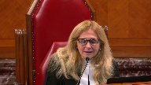
:::

I would ask you why it has to be a choice.

Why can't it be at the stage of assessing in pecuniosity and doesn't your argument about the special relationship of the crown actually support your suggestion that undue hardship should be the test?

**Speaker 11** (02:52:03): Well, to answer your first question, Madam Justice Martin, the courts I think in Okanagan and Little Sisters as well as in Caron more recently made clear that there are three distinct branches to the advance cost test and that each of those is necessary and that neither of them on their own is sufficient.

::: {.column-margin}
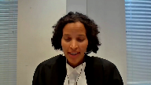
:::

I think the court also made clear and this has been made clear as well in the lower courts prudence following Okanagan or interpreting and applying Okanagan is that the financial means branch of the test should be focused on financial factors.

Things like balance sheets, things like looking at the applicant's own financial circumstances based on the evidence of their efforts to raise funds and what funds they have available as well as efforts to borrow funds.

Those are all financial factors.

We would submit that the Crown Indigenous relationship which British Columbia recognizes as being important and special is so special in fact that it shouldn't be put together with those financial factors but that it should be recognized within the public importance branch and courts have done that in numerous examples of cases that we've cited and I'd refer you here to paragraph 39 of our factum where courts have held that the Crown Indigenous relationship is appropriately considered under the public importance branch with respect for example to the duty to consult the application of provincial legislation to Aboriginal title land as an chill coding case as well as an treaty interpretation and reserve creation.

The other reason why we suggest and perhaps most importantly that the Crown Indigenous relationship should be considered at the public importance stage of the test is that it ensures that these important principles are considered in all cases and that's because this court explained in Little Sisters that the question of impecuniosity will not even arise where a case is not otherwise special enough to merit this exceptional award.

Considering the Crown Indigenous relationship within the public importance branch rather than the financial means branch therefore places these principles at the forefront of the analysis.

**Justice Karakatsanis** (02:54:06): Can I ask you, if undue hardship means that a judge needs to review the reasonableness of a priority or the reasonableness of a need, what kind of guidance is there on determining what's reasonable?

::: {.column-margin}

:::

That's not the, I mean, usually those kinds of decisions of spending priorities are taken by governments and what kind of standards or parameters or assistance would you suggest are appropriate for a judge to make the determination of whether it's a reasonable spending priority.

**Speaker 11** (02:54:46): Well, Justice Kerikatsanis, I think that's in part why this is a discretionary decision of trial judges and why there is discretion here.

::: {.column-margin}

:::

But I would point as well to the body of case law that's developed already in the court fees context, where in applying the reasonableness component of the Undue Hardship Standard, courts have done just that and successfully in applying this court's judgment in trial lawyers.

And I think that it's instructive to look at those cases.

I would also point out that I think that it's a more helpful and useful standard than the exercise that the Alberta Court of Appeal attempted to do here in terms of distinguishing between preferable spending and basic necessities.

And particularly where an applicant is an Indigenous government, I think that there's flexibility in that Undue Hardship Standard and the reasonableness which lies at its core that can be more readily applied to Indigenous Section 35 applicants in a way that treats them as governments rather than individuals.

**Justice Brown** (02:55:49): You disparage how the Alberta Court of Appeal dealt with this

::: {.column-margin}

:::

but I'm not sure that in substance you're doing much different, right?

Expenses needed to meet indigenous communities' basic needs of drinking water, housing are more likely under your model to be considered reasonable than those less directly connected to basic necessities, community centres, general community projects.

I'm taking that directly from your factum.

How in that, how is that substantively different as opposed to

**Overlapping speakers** (02:56:20): I- I-

**Justice Brown** (02:56:20): difference in tone or vibe, but how is it substantively different than what the Court of Appeals said?

**Speaker 11** (02:56:27): I see that I'm out of time but if I might have a moment to respond to that I agree that in the end result we might get to the same place in terms of outcome and we've acknowledged in our factum that things that are basic necessities or it can be classified as basic necessities may well or more likely to be considered to be reasonableness or to meet that measure

::: {.column-margin}

:::

but we say that reasonableness analysis is a more flexible standard and then applying any funds available which could be interpreted as not only setting a higher bar but requires a court or somebody hearing an advanced cost application to undertake the sort of classification exercise that members of the bench just struggled with in questioning Council for Canada as to the time horizon for an expense and in particular as to considering whether or not an applicant for advanced costs who's an organization or an Indigenous government undertaking section 35 litigation is faced with something that's a basic necessity when that standard might be more easy to apply to an individual applicant who's charged with looking out for their own personal interest as opposed to their community's public interest.

**Overlapping speakers** (02:57:41): Thank you very much.

**Speaker 11** (02:57:42): the case which we've included a tab two of our condensed book also provides a useful illustration of how concepts of undue hardship and reasonableness have already taken root in the existing advanced cost jurisprudence particularly in the context of indigenous applicants and I direct you in particular to paragraph 79 and 83 to 84 of that decision.

::: {.column-margin}

:::

**Justice Wagner** (02:58:02): Thank you very much Mr.. Brooks any reply

**Speaker 1** (02:58:09): Thank you Chief Justice and Justices.

::: {.column-margin}

:::

I thought maybe in my reply what I do is put a bit sharper clarity around the issue of costs and I just want to make clear that it's not our position that these costs of what the expenses and obligations that the nation has to meet the needs of its community are somehow broadly or abstractly identified.

In fact it is our position that they're very clearly identified in the record in particular reference to the two funds that the case management judge identified as being sort of theoretically available and we see that very specifically in the actual balance or the actual income statements for these funds.

So for example in the IAR fund we see at tab five of our condensed brief all the expenses that are being used.

So really it's important to keep in mind that when we talk about available funds it's a snapshot of sort of the gross revenue that the nation has and these funds have attached to them very concrete and specific expenses they are being used.

So I don't agree with my friend from Alberta who says that they're not currently being used that there's funds sitting there not currently being used.

These funds are you being used on a daily basis and that's in particular reference to the AIR fund which is a fund primarily for consultation and that consultation is very expensive for the First Nation to gauge and we see that in the evidence and the band manager talks about half that how they have to engage outside professionals because they don't have the internal capacity to do these impact assessments that they need to do which are very sophisticated to understand how are these projects impacting their rights and of course there's also the deep irony here of the Court of Appeal just assuming that these funds are available to fund litigation when these are the very funds that they need to use to identify the impacts that give rise to the underlying litigation.

So the funds are being used we can clearly see the expenses that are associated with them same with the Ottawa Trust what we see there in fact is the nation has to make requests to withdraw those funds year after year and that it does so to cover the shortfalls

and yes they are for salaries

and yes they are for urgent infrastructure repairs and what we see from the nation's expenses is that the salaries is the significant cost to run these programs they have to pay people so by making these funds divertible to the litigation or saying they must be used for the litigation the nation has to reduce its operations it can't pay people and we see that year after year it needs to use these monies that leads to the Heritage Trust because the nation recognizes that it's in this chronic shortfall vicious cycle where it needs to access capital to pay for the programs it got a bit of money from the IBAs as a result of participating in consultation it puts it in a Heritage Trust and it says we're going to use the revenue generated to address this chronic ongoing shortfall if you take away the if you take away the consultation fund you take away the ability of the nation to participate in consultation if they can't participate in consultation among other serious problems they can't raise the money they need to even put the money in the Heritage Trust and it's that level of sort of complexity that really was overlooked by the Court of Appeal when the Court of Appeal just lumps the money together and says this is all available for litigation

and it's not necessary to meet the other what we say are clearly basic needs of the community

and I just also wanted to just close on the point of reconciliation and how it informs impecuniosity because we do think that is it doesn't need to be something that is just dealt with although it should be in the public importance and the special nature of the case the way that reconciliation informs impecuniosity is by taking into account the real lived experience of Indigenous people and the burdens that First Nation governments have in discharging their duties to their members to the Crown to third parties

reconciliation means carefully looking at the record assessing the actual constraints and the socio-economic conditions it means actually not setting a standard for impecuniosity that is so stringent that impoverished First Nations have no money at all to bring litigation that are necessary for their treaty rights or to to provide for the basic needs of their community and that's that's all the points I wanted to make in reply.

Thank you.

**Justice Wagner** (03:02:28): Thank you very much.

Thank you to all the attorneys for your submissions.

The court will take the case under advisement.

Thank you.